## 1. Blood Testing {#item-1}

Tests PerformedA number of laboratory tests must be completed before blood or blood products can be transfused:Determination of the blood type with a crossmatch.Screening for antibodies that may produce adverse effects if transfused.Screening for possible infectious agents that could be transmitted with transfusion.The following tests are manadatory on all units of blood collected for transfusion:ABO group and Rh typeScreening for blood-group antibodiesSerologic tests for human retroviruses including:HIV-1HIV-2HTLV IHTLV IISerologic tests for viral hepatitis including:Hepatitis BHepatitis CSerologic tests for additional infectious agents which may include:Syphilis (Treponema pallidum)West Nile virusChagas disease (Trypanosoma cruzi)Zika virusBabesiaIf, and only if, all of the required markers are negative can blood be conveyed to the Blood Bank for storage until usage. A postive results for some of these tests may prevent further donation by that person. A person with such a test result will be notified by the donor center. Persons with a potential medical condition should see a physician and should not, under any circumstance, donate only to have blood tested. These measures are done to make the blood supply as safe as possible. The significant infectious diseases transmitted by transfusion and the risk of transmission (RT) in the U.S. are given below.Transfusion Transmitted DiseasesHepatitis BHepatitis B virus (HBV) is transmitted through parenteral and sexual exposure. The incubation time is a mean of 90 days with a range of 30 to 180 days.Donor blood is routinely tested for HBsAg and HBcAb. There is no routine testing for hepatitis A, because it is rarely transmitted by blood products.Recipients of blood products can also be infected with hepatitis delta, which is a defective RNA virus that needs a HBV superinfection to replicate.Persons who have received a hepatitis B vaccination (recommended for all health care workers with patient contact) will have hepatitis B surface antibody present, but not HBsAg or HBcAbRisk of transmission (RT) = 1 in 200,000 to 500,000Hepatitis CThe route of transmission is parenteral, with sexual transmission lower than previously throught. The mean incubation time is 6 to 8 weeks.Blood Bank testing for HCV started in 1990. At present, only testing for hepatitis C antibody is available.Risk of transmission (RT) = 1 in 1,000,000 to 2,000,000Human Immunodeficiency Virus (HIV)In 1982 the first cases of AIDS obtained from blood or blood components were reported, but the etiology of the infections was not known at that time.By 1983 changes occurred in the donor cirteria to exclude those at high risk for transmission of HIV.The first testing of blood products for HIV started in 1985 and is a test to detect the presence of antibody directed against HIV. Testing for HIV p24 antigen was mandated in 1996.Risk of transmission = 1 in 1,000,000 to to 2,000,000Human T-lymphocytotrophic Virus (HTLV-I/II).HTLV-1 is a retrovirus that is endemic in Japan and the Caribbean. Implicated as causing adult T-cell leukemia/lymphoma and a neurological disorder similar to multiple sclerosis.Blood is routinely screened for antibodies to HTLV-I.Risk of transmission = 1 in 2,000,000 t0 3,000,000 (but only 1-3% of seropositive individuals will develop disease).Cytomegalovirus (CMV)The prevalence of CMV antibody ranges from 50 to 80% of the population. Blood contaminated with CMV can cause problems in neonates or immunocompromised patients.Potential problems in selected patient populations can be prevented by transfusing CMV negative blood or frozen, deglycerolized RBC's.Donor blood is not routinely tested for CMV.MalariaMalaria is rarely transmitted by RBC products, although the number of transfusion associated cases of malaria is at an all-time high.Donors traveling to high risk malaria areas are excluded from donating blood for six months. In areas of high prevalence, an antibody test to detectPlasmodium falcipariumandPlasmodium vivaxcan be employed.Bacterial ContaminationBacterial contamination of blood can occur during collection. Bacteria can grow during storage at room temperature and during refrigeration (psychrophilic organisms). Platelet products carry the greatest risk (1 in 3000 units may have bacteria), because they are stored at room temperature. Transfusing a contaminated unit may uncommonly result in severe sepsis (1 in 100,000), septic shock and death.OthersAdditional diseases which are rarely transmitted by blood products may include lyme disease, dengue fever, babesiosis, and Creutzfeldt-Jakob disease. Potential donors may be screened by questionnaire regarding travel to endemic areas or contact with persons at risk or applied in regions of prevalence.Reference:https://www.aabb.org/regulatory-and-advocacy/regulatory-affairs/regulatory-for-blood/donor-safety-screening-and-testing
Tests Performed
A number of laboratory tests must be completed before blood or blood products can be transfused:
Determination of the blood type with a crossmatch.Screening for antibodies that may produce adverse effects if transfused.Screening for possible infectious agents that could be transmitted with transfusion.
Determination of the blood type with a crossmatch.
Screening for antibodies that may produce adverse effects if transfused.Screening for possible infectious agents that could be transmitted with transfusion.
Screening for antibodies that may produce adverse effects if transfused.
Screening for possible infectious agents that could be transmitted with transfusion.
The following tests are manadatory on all units of blood collected for transfusion:ABO group and Rh typeScreening for blood-group antibodiesSerologic tests for human retroviruses including:HIV-1HIV-2HTLV IHTLV IISerologic tests for viral hepatitis including:Hepatitis BHepatitis CSerologic tests for additional infectious agents which may include:Syphilis (Treponema pallidum)West Nile virusChagas disease (Trypanosoma cruzi)Zika virusBabesia
ABO group and Rh typeScreening for blood-group antibodiesSerologic tests for human retroviruses including:HIV-1HIV-2HTLV IHTLV IISerologic tests for viral hepatitis including:Hepatitis BHepatitis CSerologic tests for additional infectious agents which may include:Syphilis (Treponema pallidum)West Nile virusChagas disease (Trypanosoma cruzi)Zika virusBabesia
ABO group and Rh type
Screening for blood-group antibodiesSerologic tests for human retroviruses including:HIV-1HIV-2HTLV IHTLV IISerologic tests for viral hepatitis including:Hepatitis BHepatitis CSerologic tests for additional infectious agents which may include:Syphilis (Treponema pallidum)West Nile virusChagas disease (Trypanosoma cruzi)Zika virusBabesia
Screening for blood-group antibodies
Serologic tests for human retroviruses including:HIV-1HIV-2HTLV IHTLV IISerologic tests for viral hepatitis including:Hepatitis BHepatitis CSerologic tests for additional infectious agents which may include:Syphilis (Treponema pallidum)West Nile virusChagas disease (Trypanosoma cruzi)Zika virusBabesia
Serologic tests for human retroviruses including:
HIV-1HIV-2HTLV IHTLV II
HIV-2HTLV IHTLV II
Serologic tests for viral hepatitis including:Hepatitis BHepatitis CSerologic tests for additional infectious agents which may include:Syphilis (Treponema pallidum)West Nile virusChagas disease (Trypanosoma cruzi)Zika virusBabesia
Serologic tests for viral hepatitis including:
Hepatitis BHepatitis C
Serologic tests for additional infectious agents which may include:Syphilis (Treponema pallidum)West Nile virusChagas disease (Trypanosoma cruzi)Zika virusBabesia
Serologic tests for additional infectious agents which may include:
Syphilis (Treponema pallidum)West Nile virusChagas disease (Trypanosoma cruzi)Zika virusBabesia
Syphilis (Treponema pallidum)
West Nile virusChagas disease (Trypanosoma cruzi)Zika virusBabesia
West Nile virus
Chagas disease (Trypanosoma cruzi)Zika virusBabesia
Chagas disease (Trypanosoma cruzi)
Zika virusBabesia
If, and only if, all of the required markers are negative can blood be conveyed to the Blood Bank for storage until usage. A postive results for some of these tests may prevent further donation by that person. A person with such a test result will be notified by the donor center. Persons with a potential medical condition should see a physician and should not, under any circumstance, donate only to have blood tested. These measures are done to make the blood supply as safe as possible. The significant infectious diseases transmitted by transfusion and the risk of transmission (RT) in the U.S. are given below.
Hepatitis BHepatitis B virus (HBV) is transmitted through parenteral and sexual exposure. The incubation time is a mean of 90 days with a range of 30 to 180 days.Donor blood is routinely tested for HBsAg and HBcAb. There is no routine testing for hepatitis A, because it is rarely transmitted by blood products.Recipients of blood products can also be infected with hepatitis delta, which is a defective RNA virus that needs a HBV superinfection to replicate.Persons who have received a hepatitis B vaccination (recommended for all health care workers with patient contact) will have hepatitis B surface antibody present, but not HBsAg or HBcAbRisk of transmission (RT) = 1 in 200,000 to 500,000
Hepatitis B virus (HBV) is transmitted through parenteral and sexual exposure. The incubation time is a mean of 90 days with a range of 30 to 180 days.Donor blood is routinely tested for HBsAg and HBcAb. There is no routine testing for hepatitis A, because it is rarely transmitted by blood products.Recipients of blood products can also be infected with hepatitis delta, which is a defective RNA virus that needs a HBV superinfection to replicate.Persons who have received a hepatitis B vaccination (recommended for all health care workers with patient contact) will have hepatitis B surface antibody present, but not HBsAg or HBcAbRisk of transmission (RT) = 1 in 200,000 to 500,000
Hepatitis B virus (HBV) is transmitted through parenteral and sexual exposure. The incubation time is a mean of 90 days with a range of 30 to 180 days.
Donor blood is routinely tested for HBsAg and HBcAb. There is no routine testing for hepatitis A, because it is rarely transmitted by blood products.
Recipients of blood products can also be infected with hepatitis delta, which is a defective RNA virus that needs a HBV superinfection to replicate.Persons who have received a hepatitis B vaccination (recommended for all health care workers with patient contact) will have hepatitis B surface antibody present, but not HBsAg or HBcAbRisk of transmission (RT) = 1 in 200,000 to 500,000
Persons who have received a hepatitis B vaccination (recommended for all health care workers with patient contact) will have hepatitis B surface antibody present, but not HBsAg or HBcAbRisk of transmission (RT) = 1 in 200,000 to 500,000
Persons who have received a hepatitis B vaccination (recommended for all health care workers with patient contact) will have hepatitis B surface antibody present, but not HBsAg or HBcAb
Risk of transmission (RT) = 1 in 200,000 to 500,000
Hepatitis CThe route of transmission is parenteral, with sexual transmission lower than previously throught. The mean incubation time is 6 to 8 weeks.Blood Bank testing for HCV started in 1990. At present, only testing for hepatitis C antibody is available.Risk of transmission (RT) = 1 in 1,000,000 to 2,000,000
The route of transmission is parenteral, with sexual transmission lower than previously throught. The mean incubation time is 6 to 8 weeks.Blood Bank testing for HCV started in 1990. At present, only testing for hepatitis C antibody is available.Risk of transmission (RT) = 1 in 1,000,000 to 2,000,000
Blood Bank testing for HCV started in 1990. At present, only testing for hepatitis C antibody is available.Risk of transmission (RT) = 1 in 1,000,000 to 2,000,000
Blood Bank testing for HCV started in 1990. At present, only testing for hepatitis C antibody is available.
Risk of transmission (RT) = 1 in 1,000,000 to 2,000,000
Human Immunodeficiency Virus (HIV)In 1982 the first cases of AIDS obtained from blood or blood components were reported, but the etiology of the infections was not known at that time.By 1983 changes occurred in the donor cirteria to exclude those at high risk for transmission of HIV.The first testing of blood products for HIV started in 1985 and is a test to detect the presence of antibody directed against HIV. Testing for HIV p24 antigen was mandated in 1996.Risk of transmission = 1 in 1,000,000 to to 2,000,000
In 1982 the first cases of AIDS obtained from blood or blood components were reported, but the etiology of the infections was not known at that time.By 1983 changes occurred in the donor cirteria to exclude those at high risk for transmission of HIV.The first testing of blood products for HIV started in 1985 and is a test to detect the presence of antibody directed against HIV. Testing for HIV p24 antigen was mandated in 1996.Risk of transmission = 1 in 1,000,000 to to 2,000,000
In 1982 the first cases of AIDS obtained from blood or blood components were reported, but the etiology of the infections was not known at that time.
By 1983 changes occurred in the donor cirteria to exclude those at high risk for transmission of HIV.
The first testing of blood products for HIV started in 1985 and is a test to detect the presence of antibody directed against HIV. Testing for HIV p24 antigen was mandated in 1996.
Risk of transmission = 1 in 1,000,000 to to 2,000,000
Human T-lymphocytotrophic Virus (HTLV-I/II).
HTLV-1 is a retrovirus that is endemic in Japan and the Caribbean. Implicated as causing adult T-cell leukemia/lymphoma and a neurological disorder similar to multiple sclerosis.
Blood is routinely screened for antibodies to HTLV-I.
Risk of transmission = 1 in 2,000,000 t0 3,000,000 (but only 1-3% of seropositive individuals will develop disease).
Cytomegalovirus (CMV)
The prevalence of CMV antibody ranges from 50 to 80% of the population. Blood contaminated with CMV can cause problems in neonates or immunocompromised patients.
Potential problems in selected patient populations can be prevented by transfusing CMV negative blood or frozen, deglycerolized RBC's.
Donor blood is not routinely tested for CMV.
MalariaMalaria is rarely transmitted by RBC products, although the number of transfusion associated cases of malaria is at an all-time high.Donors traveling to high risk malaria areas are excluded from donating blood for six months. In areas of high prevalence, an antibody test to detectPlasmodium falcipariumandPlasmodium vivaxcan be employed.
Malaria is rarely transmitted by RBC products, although the number of transfusion associated cases of malaria is at an all-time high.Donors traveling to high risk malaria areas are excluded from donating blood for six months. In areas of high prevalence, an antibody test to detectPlasmodium falcipariumandPlasmodium vivaxcan be employed.
Malaria is rarely transmitted by RBC products, although the number of transfusion associated cases of malaria is at an all-time high.
Donors traveling to high risk malaria areas are excluded from donating blood for six months. In areas of high prevalence, an antibody test to detectPlasmodium falcipariumandPlasmodium vivaxcan be employed.
Bacterial Contamination
Bacterial contamination of blood can occur during collection. Bacteria can grow during storage at room temperature and during refrigeration (psychrophilic organisms). Platelet products carry the greatest risk (1 in 3000 units may have bacteria), because they are stored at room temperature. Transfusing a contaminated unit may uncommonly result in severe sepsis (1 in 100,000), septic shock and death.
OthersAdditional diseases which are rarely transmitted by blood products may include lyme disease, dengue fever, babesiosis, and Creutzfeldt-Jakob disease. Potential donors may be screened by questionnaire regarding travel to endemic areas or contact with persons at risk or applied in regions of prevalence.
Additional diseases which are rarely transmitted by blood products may include lyme disease, dengue fever, babesiosis, and Creutzfeldt-Jakob disease. Potential donors may be screened by questionnaire regarding travel to endemic areas or contact with persons at risk or applied in regions of prevalence.
https://www.aabb.org/regulatory-and-advocacy/regulatory-affairs/regulatory-for-blood/donor-safety-screening-and-testing
Go to the section on Blood Processing.
## 2. Crossmatch and Processing {#item-2}

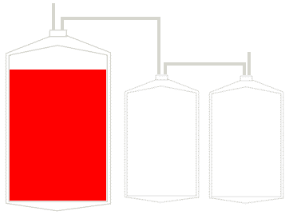
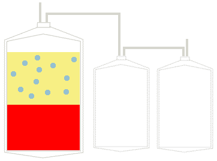
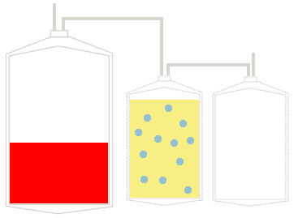
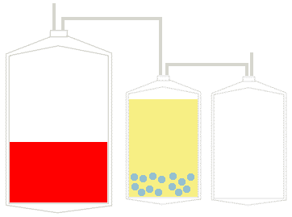
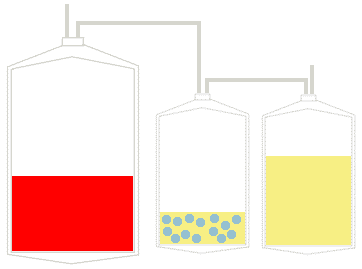

Blood Processing
Blood Compatibility Testing (Crossmatch)A "type" includes a "front type" and a "back type". The "front type" determines which antigens ("flags") in the ABO blood group system are on the patient's red blood cells as follows (click on the blood type):A antigen onlyType AB antigen onlyType BA and B antigensType ABNeither A or BType OThe "back type" identifies the isohemagglutinin (naturally occurring antibody) in the patient's serum and should correspond to the antigens found on the red blood cells as follows (click on the blood type):anti-BType Aanti-AType Banti-A and anti-BType Oneither anti-A or anti-BType ABIn addition, RBC's are Rh typed and identified as "D" positive or negative.Requesting Blood Products"Type and Screen" - This is requested when it is unlikely that blood will be needed emergently. There are no donor units specifically matched and reserved for the potential recipient patient. However, the patient's blood type is identified, and a screen will have identified potential antibodies that could complicate obtaining blood. A crossmatch to find compatible units can be done more easily following a "type and screen.""Type and Cross" - This is requested when it is likely that blood will be needed. Compatibility testing between patient and donor units is performed and.at least 2 units are crossmatched for the patient and resrved specifically for that patient. These units cannot be used for anyone else. If they are not used, then they can go back into the inventory for use by others.The "screen" looks for unexpected red cell alloantibodies which may form following pregnancy or prior transfusions. If the screen is positive, the antibody is identified. The physician is also notified. Antibody identification can be complicated and take more than a day to complete.A full crossmatch procedure takes about 45 minutes to complete and cannot be shortened.Units are refrigerated until used.A unit of blood must be properly labelled and the label MUST be checked before use.Every unit crossmatched is removed from the general inventory and reserved for the patient for 72 hours. Units which are crossmatched unnecessarily will deplete Blood Bank inventories and can result in blood shortages, such as those which occurred in California after the earthquake. Blood shortages can result in cancellation of elective surgical procedures.Blood will ordinarily not be released for transfusion until compatibility testing is completed.However, under emergency conditions, blood products may be released without a crossmatch if the patient is in danger of dying if transfusion is delayed. In such cases, if the patient's blood type is not known, then group O Rh negative (O neg) blood can be released without compatibility testing.In cases in which the patient's blood type is reliably known, then type-specific blood or RBC's of the same ABO and Rh group may be released.Blood Preservation and StorageBlood is collected as whole blood, as shown below:Blood can be stored as whole blood (with all of the plasma present) or, much more commonly, as packed red blood cells (PRBC's) in which about 70% of the plasma has been removed. This is done by light centrifugation, as shown below:The platelet rich plasma can then be expressed off, leaving packed red blood cells (PRBC's) as shown here:Both whole blood and PRBC's can be stored for up to 42 days at 1 - 6 degrees C.The plasma can be centrifuged heavily a second time to separate the platelet rich plasma, as shown below:The supernatant plasma can be expressed into a third bag and stored as fresh frozen plasma (FFP). The remaining platelet rich plasma is utilized as a platelet pack, as shown below:As can be seen in the above diagram, a single donation of whole blood has supplied three separate components (packed red blood cells, platelets, fresh frozen plasma) that can potentially benefit three different patients.After the expiration date, rare or valuable blood units can be "rejuvenated" with a biochemical solution that restores much of the original biochemical environment of the RBC's. The "rejuvenated" units are "washed" with isotonic saline in an automated device and then can be transfused as a saline-red blood cell suspension within 2 to 4 hours, or these units can be stored glycerolized and frozen for up to 10 years.Cryopreservation of RBC's is done to store special, rare RBC's for up to 10 years. The RBC's are first incubated in a 40% glycerol solution which acts as an "antifreeze" within the cells. The units are then placed in special sterile containers in a deep freezer at less than -60 degrees C.Cryopreserved units are thawed and washed free of glycerol prior to use as saline suspended RBC's. These units must be used in 2 - 4 hours to prevent possible bacterial contamination. The washed units are depleted of plasma and leukocytes.Cryopreserved blood can help to maintain stores of Rh negative blood, to provide units for persons with antibodies to high-incidence antigens or persons difficult to cross-match because of multiple alloantibodies and to provide plasma-free blood to persons with IgA deficiency.Thus, the types of RBC products available are:Packed red blood cells (PRBC's)Leukocyte depleted RBC's: cryopreserved blood that is thawed and degylcerolized is depleted of leukocytes, but much better depletion can be obtained by filtering the blood through leukocyte-specific filters.Frozen, deglycerolized RBC'sWhole blood
Blood Compatibility Testing (Crossmatch)
A "type" includes a "front type" and a "back type". The "front type" determines which antigens ("flags") in the ABO blood group system are on the patient's red blood cells as follows (click on the blood type):
A antigen onlyType AB antigen onlyType BA and B antigensType ABNeither A or BType O
Type AB antigen onlyType BA and B antigensType ABNeither A or BType O
B antigen onlyType BA and B antigensType ABNeither A or BType O
Type BA and B antigensType ABNeither A or BType O
A and B antigensType ABNeither A or BType O
Type ABNeither A or BType O
Neither A or BType O
The "back type" identifies the isohemagglutinin (naturally occurring antibody) in the patient's serum and should correspond to the antigens found on the red blood cells as follows (click on the blood type):
anti-BType Aanti-AType Banti-A and anti-BType Oneither anti-A or anti-BType AB
Type Aanti-AType Banti-A and anti-BType Oneither anti-A or anti-BType AB
anti-AType Banti-A and anti-BType Oneither anti-A or anti-BType AB
Type Banti-A and anti-BType Oneither anti-A or anti-BType AB
anti-A and anti-BType Oneither anti-A or anti-BType AB
Type Oneither anti-A or anti-BType AB
neither anti-A or anti-BType AB
In addition, RBC's are Rh typed and identified as "D" positive or negative.
Requesting Blood Products
"Type and Screen" - This is requested when it is unlikely that blood will be needed emergently. There are no donor units specifically matched and reserved for the potential recipient patient. However, the patient's blood type is identified, and a screen will have identified potential antibodies that could complicate obtaining blood. A crossmatch to find compatible units can be done more easily following a "type and screen."
"Type and Cross" - This is requested when it is likely that blood will be needed. Compatibility testing between patient and donor units is performed and.at least 2 units are crossmatched for the patient and resrved specifically for that patient. These units cannot be used for anyone else. If they are not used, then they can go back into the inventory for use by others.The "screen" looks for unexpected red cell alloantibodies which may form following pregnancy or prior transfusions. If the screen is positive, the antibody is identified. The physician is also notified. Antibody identification can be complicated and take more than a day to complete.A full crossmatch procedure takes about 45 minutes to complete and cannot be shortened.Units are refrigerated until used.A unit of blood must be properly labelled and the label MUST be checked before use.Every unit crossmatched is removed from the general inventory and reserved for the patient for 72 hours. Units which are crossmatched unnecessarily will deplete Blood Bank inventories and can result in blood shortages, such as those which occurred in California after the earthquake. Blood shortages can result in cancellation of elective surgical procedures.
The "screen" looks for unexpected red cell alloantibodies which may form following pregnancy or prior transfusions. If the screen is positive, the antibody is identified. The physician is also notified. Antibody identification can be complicated and take more than a day to complete.
A full crossmatch procedure takes about 45 minutes to complete and cannot be shortened.Units are refrigerated until used.A unit of blood must be properly labelled and the label MUST be checked before use.
A full crossmatch procedure takes about 45 minutes to complete and cannot be shortened.
Units are refrigerated until used.A unit of blood must be properly labelled and the label MUST be checked before use.
Units are refrigerated until used.
A unit of blood must be properly labelled and the label MUST be checked before use.
Blood will ordinarily not be released for transfusion until compatibility testing is completed.
However, under emergency conditions, blood products may be released without a crossmatch if the patient is in danger of dying if transfusion is delayed. In such cases, if the patient's blood type is not known, then group O Rh negative (O neg) blood can be released without compatibility testing.
Blood Preservation and Storage
Blood is collected as whole blood, as shown below:
Blood can be stored as whole blood (with all of the plasma present) or, much more commonly, as packed red blood cells (PRBC's) in which about 70% of the plasma has been removed. This is done by light centrifugation, as shown below:
The platelet rich plasma can then be expressed off, leaving packed red blood cells (PRBC's) as shown here:
Both whole blood and PRBC's can be stored for up to 42 days at 1 - 6 degrees C.
The plasma can be centrifuged heavily a second time to separate the platelet rich plasma, as shown below:
The supernatant plasma can be expressed into a third bag and stored as fresh frozen plasma (FFP). The remaining platelet rich plasma is utilized as a platelet pack, as shown below:
As can be seen in the above diagram, a single donation of whole blood has supplied three separate components (packed red blood cells, platelets, fresh frozen plasma) that can potentially benefit three different patients.
After the expiration date, rare or valuable blood units can be "rejuvenated" with a biochemical solution that restores much of the original biochemical environment of the RBC's. The "rejuvenated" units are "washed" with isotonic saline in an automated device and then can be transfused as a saline-red blood cell suspension within 2 to 4 hours, or these units can be stored glycerolized and frozen for up to 10 years.
Cryopreservation of RBC's is done to store special, rare RBC's for up to 10 years. The RBC's are first incubated in a 40% glycerol solution which acts as an "antifreeze" within the cells. The units are then placed in special sterile containers in a deep freezer at less than -60 degrees C.
Cryopreserved units are thawed and washed free of glycerol prior to use as saline suspended RBC's. These units must be used in 2 - 4 hours to prevent possible bacterial contamination. The washed units are depleted of plasma and leukocytes.
Cryopreserved blood can help to maintain stores of Rh negative blood, to provide units for persons with antibodies to high-incidence antigens or persons difficult to cross-match because of multiple alloantibodies and to provide plasma-free blood to persons with IgA deficiency.
Thus, the types of RBC products available are:
Packed red blood cells (PRBC's)Leukocyte depleted RBC's: cryopreserved blood that is thawed and degylcerolized is depleted of leukocytes, but much better depletion can be obtained by filtering the blood through leukocyte-specific filters.Frozen, deglycerolized RBC'sWhole blood
Packed red blood cells (PRBC's)
Leukocyte depleted RBC's: cryopreserved blood that is thawed and degylcerolized is depleted of leukocytes, but much better depletion can be obtained by filtering the blood through leukocyte-specific filters.Frozen, deglycerolized RBC'sWhole blood
Leukocyte depleted RBC's: cryopreserved blood that is thawed and degylcerolized is depleted of leukocytes, but much better depletion can be obtained by filtering the blood through leukocyte-specific filters.
Frozen, deglycerolized RBC'sWhole blood
Frozen, deglycerolized RBC's
Go to the section on Transfusion Reactions.
## 3. Transfusion Reactions {#item-3}

Adverse Reactions to Blood Products
Transfusion ReactionsHemolytic ReactionsHemolytic reactions occur when the recipient's serum contains antibodies directed against the corresponding antigen found on donor red blood cells. This can be an ABO incompatibility or an incompatibility related to a different blood group antigen.Disseminated intravascular coagulation (DIC), renal failure, and death are not uncommon following this type of reaction.The most common cause for a major hemolytic transfusion reaction is a clerical error, such as a mislabelled specimen sent to the blood bank, or not properly identifying the patient to whom you are giving the blood. DO NOT ASSUME IT IS SOMEONE ELSE'S RESPONSIBILITY TO CHECK!Allergic ReactionsAllergic reactions to plasma proteins can range from complaints of hives and itching to anaphylaxis. Such reactions may occur in up to 1 in 200 transfusions of RBCs and 1 in 30 transfusions of platelets.Febrile ReactionsWhite blood cell reactions (febrile reactions) are caused by patient antibodies directed against antigens present on transfused lymphocytes or granulocytes. The risk for febrile reaction is 1 in 1,000 to 10,000.Symptoms usually consist of chills and a temperature rise > 1 degree C.Transfusion related acute lung injury (TRALI)TRALI is now the leading cause for transfusion-related mortality. It is caused most often when donor plasma contains HLA or leukocyte (usually granulocyte) specific antibodies. Recipient leukocytes may be 'primed' by underlying illness to become more adherent to pulmonary alveolar epithelium. Introduction of the donor antibodies into the recipient causes granulocyte enzymes to be released, increasing capillary permeability and resulting in sudden respiratory distress from pulmonary edema, typically within 6 hours of tranfusion. Leukopenia may transiently occur. Most cases improve within 2 days.TRALI most often occurs with administration of blood products with plasma, such as FFP. Use of plasma from men reduces the incidence of TRALI, since women who have been pregnant are more likely to have higher titer HLA antibodies.Circulatory OverloadCirculatory overload can occur with administration of blood or any intravenous fluid, particularly in patients with diminished cardiac function.Massive TransfusionMassive Blood Lossmassive blood loss, which s defined as the loss of one blood volume within a 24 hour period, a 50% loss in less than 3 hours for acute scenarios, or a rate of loss of 150 ml/min.ComplicationsMassive transfusion is the lifesaving treatment of hemorrhagic shock that requires the transfusion of one blood volume. Major complications that may arise in patients who require massive transfusion include hypothermia, coagulopathy, and/or citrate toxicity with electrolyte abnormalities and metabolic derangements, such as acidosis and alkalosis.AlloimmunizationRBC'sRBC transfusions can expose the patient to RBC antigens not recognized as self. If an antibody is produced, future transfusions can be delayed because extended donor blood typing will be required to identify compatible units.O negative blood released uncrossmatched in emergencies could result in a hemolytic transfusion reaction if the patient has an alloantibody produced after a previous transfusion.Alloantibody production in a female can result in hemolytic disease of the newborn.Hemolytic Disease of the NewbornPrevious pregnancies expose the mother to novel (paternally derived) antigens. The most common alloimmunization associated with pregnancy is the exposure of maternal Rh D negative blood to fetal Rh D positive blood. This results in the production of maternal IgG against the "D" antigen that can cross the placenta and attack fetal red blood cells, resulting in hemolytic disease of the newborn, also called erythroblastosis fetalis.This can be prevented by the use of Rho(D) immune globulin, commonly known as RhoGAM. RhoGAM consists of IgG anti-D antibodies that will help neutralize the antigen and prevent the mother's immune system from sensitization to the antigen, and preventing the immune response that generates the alloantibodies. The use of RhoGAM and greatly reduced the incidence of Rh anti-D erythroblastosis fetalis, and so other blood group antigens, such as Kell, may be implicated.PlateletsPlatelets contain HLA and A & B antigens. Prior exposure to non-self HLA antigens (from WBC contamination of red cell products) can result in antibodies that will render future platelet transfusions useless.Obtaining Compatible Blood ProductsIf an alloantibody is detected, then RBC units may be crossmatched randomly, assuming that the alloantibody is against a "low incidence" antigen which most units will lack. Chances are, enough compatible units will be identified.If an alloantibody is directed at a "high incidence" antigen, then there will be few, if any, units available that match. In that case, "rare" blood units lacking the antigen may be requested from a facility that stores such blood. Cryopreservation of RBCs is done to store special, rare RBCs for up to 10 years in a glycerol solution. The thawed units are washed of the glycerol, and by doing so are also depleted of plasma and leukocytes.For platelets, HLA (MHC) typing may be necessary to identify compatible donors with the same HLA type. HLA unmatched platlets (random donor platelets) are likely to be destroyed readily.The process of identifying alloantibodies and finding compatible blood products is time consuming.Graft Versus Host Disease (GVHD)GVHD is a situation where transfused lymphocytes engraft and multiply in immunocompromised patients (e.g., bone marrow transplant patients). The newly engrafted lymphocytes attack the host. This is the opposite of a host rejecting a transplanted organ (e.g., a heart).Transfusion-associated graft versus host disease (TAGVHD) is a different disease from GVHD in allogeneic bone marrow transplant recipients. TAGVHD is uniformly fatal and untreatable. It occurs when the blood products contain T-lymphocytes and attack many host tissues. It occurs when the recipient is immunocompromisedTAGHVD is prevented by gamma-irradiating the blood products to be transfused.
Transfusion Reactions
Hemolytic Reactions
Hemolytic reactions occur when the recipient's serum contains antibodies directed against the corresponding antigen found on donor red blood cells. This can be an ABO incompatibility or an incompatibility related to a different blood group antigen.
Disseminated intravascular coagulation (DIC), renal failure, and death are not uncommon following this type of reaction.
The most common cause for a major hemolytic transfusion reaction is a clerical error, such as a mislabelled specimen sent to the blood bank, or not properly identifying the patient to whom you are giving the blood. DO NOT ASSUME IT IS SOMEONE ELSE'S RESPONSIBILITY TO CHECK!
Allergic Reactions
Allergic reactions to plasma proteins can range from complaints of hives and itching to anaphylaxis. Such reactions may occur in up to 1 in 200 transfusions of RBCs and 1 in 30 transfusions of platelets.
Febrile Reactions
White blood cell reactions (febrile reactions) are caused by patient antibodies directed against antigens present on transfused lymphocytes or granulocytes. The risk for febrile reaction is 1 in 1,000 to 10,000.
Symptoms usually consist of chills and a temperature rise > 1 degree C.
Transfusion related acute lung injury (TRALI)TRALI is now the leading cause for transfusion-related mortality. It is caused most often when donor plasma contains HLA or leukocyte (usually granulocyte) specific antibodies. Recipient leukocytes may be 'primed' by underlying illness to become more adherent to pulmonary alveolar epithelium. Introduction of the donor antibodies into the recipient causes granulocyte enzymes to be released, increasing capillary permeability and resulting in sudden respiratory distress from pulmonary edema, typically within 6 hours of tranfusion. Leukopenia may transiently occur. Most cases improve within 2 days.TRALI most often occurs with administration of blood products with plasma, such as FFP. Use of plasma from men reduces the incidence of TRALI, since women who have been pregnant are more likely to have higher titer HLA antibodies.Circulatory OverloadCirculatory overload can occur with administration of blood or any intravenous fluid, particularly in patients with diminished cardiac function.
TRALI is now the leading cause for transfusion-related mortality. It is caused most often when donor plasma contains HLA or leukocyte (usually granulocyte) specific antibodies. Recipient leukocytes may be 'primed' by underlying illness to become more adherent to pulmonary alveolar epithelium. Introduction of the donor antibodies into the recipient causes granulocyte enzymes to be released, increasing capillary permeability and resulting in sudden respiratory distress from pulmonary edema, typically within 6 hours of tranfusion. Leukopenia may transiently occur. Most cases improve within 2 days.TRALI most often occurs with administration of blood products with plasma, such as FFP. Use of plasma from men reduces the incidence of TRALI, since women who have been pregnant are more likely to have higher titer HLA antibodies.Circulatory OverloadCirculatory overload can occur with administration of blood or any intravenous fluid, particularly in patients with diminished cardiac function.
TRALI is now the leading cause for transfusion-related mortality. It is caused most often when donor plasma contains HLA or leukocyte (usually granulocyte) specific antibodies. Recipient leukocytes may be 'primed' by underlying illness to become more adherent to pulmonary alveolar epithelium. Introduction of the donor antibodies into the recipient causes granulocyte enzymes to be released, increasing capillary permeability and resulting in sudden respiratory distress from pulmonary edema, typically within 6 hours of tranfusion. Leukopenia may transiently occur. Most cases improve within 2 days.
TRALI most often occurs with administration of blood products with plasma, such as FFP. Use of plasma from men reduces the incidence of TRALI, since women who have been pregnant are more likely to have higher titer HLA antibodies.
Circulatory Overload
Circulatory overload can occur with administration of blood or any intravenous fluid, particularly in patients with diminished cardiac function.
Massive Transfusion
Massive Blood Loss
massive blood loss, which s defined as the loss of one blood volume within a 24 hour period, a 50% loss in less than 3 hours for acute scenarios, or a rate of loss of 150 ml/min.
Massive transfusion is the lifesaving treatment of hemorrhagic shock that requires the transfusion of one blood volume. Major complications that may arise in patients who require massive transfusion include hypothermia, coagulopathy, and/or citrate toxicity with electrolyte abnormalities and metabolic derangements, such as acidosis and alkalosis.
Alloimmunization
RBC transfusions can expose the patient to RBC antigens not recognized as self. If an antibody is produced, future transfusions can be delayed because extended donor blood typing will be required to identify compatible units.
O negative blood released uncrossmatched in emergencies could result in a hemolytic transfusion reaction if the patient has an alloantibody produced after a previous transfusion.
Alloantibody production in a female can result in hemolytic disease of the newborn.
Hemolytic Disease of the Newborn
Previous pregnancies expose the mother to novel (paternally derived) antigens. The most common alloimmunization associated with pregnancy is the exposure of maternal Rh D negative blood to fetal Rh D positive blood. This results in the production of maternal IgG against the "D" antigen that can cross the placenta and attack fetal red blood cells, resulting in hemolytic disease of the newborn, also called erythroblastosis fetalis.
This can be prevented by the use of Rho(D) immune globulin, commonly known as RhoGAM. RhoGAM consists of IgG anti-D antibodies that will help neutralize the antigen and prevent the mother's immune system from sensitization to the antigen, and preventing the immune response that generates the alloantibodies. The use of RhoGAM and greatly reduced the incidence of Rh anti-D erythroblastosis fetalis, and so other blood group antigens, such as Kell, may be implicated.
Platelets contain HLA and A & B antigens. Prior exposure to non-self HLA antigens (from WBC contamination of red cell products) can result in antibodies that will render future platelet transfusions useless.
Obtaining Compatible Blood Products
If an alloantibody is detected, then RBC units may be crossmatched randomly, assuming that the alloantibody is against a "low incidence" antigen which most units will lack. Chances are, enough compatible units will be identified.
If an alloantibody is directed at a "high incidence" antigen, then there will be few, if any, units available that match. In that case, "rare" blood units lacking the antigen may be requested from a facility that stores such blood. Cryopreservation of RBCs is done to store special, rare RBCs for up to 10 years in a glycerol solution. The thawed units are washed of the glycerol, and by doing so are also depleted of plasma and leukocytes.
For platelets, HLA (MHC) typing may be necessary to identify compatible donors with the same HLA type. HLA unmatched platlets (random donor platelets) are likely to be destroyed readily.
The process of identifying alloantibodies and finding compatible blood products is time consuming.
Graft Versus Host Disease (GVHD)
GVHD is a situation where transfused lymphocytes engraft and multiply in immunocompromised patients (e.g., bone marrow transplant patients). The newly engrafted lymphocytes attack the host. This is the opposite of a host rejecting a transplanted organ (e.g., a heart).
Transfusion-associated graft versus host disease (TAGVHD) is a different disease from GVHD in allogeneic bone marrow transplant recipients. TAGVHD is uniformly fatal and untreatable. It occurs when the blood products contain T-lymphocytes and attack many host tissues. It occurs when the recipient is immunocompromised
Go to the section on Apheresis.
## 4. Apheresis {#item-4}

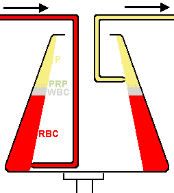

What is Apheresis?The process of apheresis involves removal of whole blood from a patient or donor. Within an instrument that is essentially designed as a centrifuge, the components of whole blood are separated. One of the separated portions is then withdrawn and the remaining components are retransfused into the patient or donor.The components which are separated and withdrawn include:Plasma (plasmapheresis)Platelets (plateletpheresis)Leukocytes (leukapheresis)In the diagram below, the process is illustrated. Whole blood is introduced into a chamber that is spinning, and the blood separates into components (P = plasma; PRP = platelet rich plasma; WBC = leukocytes; RBC = red blood cells) by gravity along the wall of the chamber. The component to be removed can be selected by moving the level of the aspiration device at the right. In this example, plasma is being removed.Therapeutic ApheresisThe purpose of therapeutic apheresis is to remove a component of the blood which contributes to a disease state. Examples include:Plasmapheresis: within the plasma are contained antibodies and antigen-antibody complexes that may contribute to the deleterious effects of autoimmune diseases. Removal of the plasma (and replacement with saline solution) will help to reduce circulating antibodies and immune complexes. In rare circumstances, excess blood proteins are present that may cause circulatory problems. Examples of these diseases include:Waldenstrom's macroglobulinemiaMyasthenia gravisGuillain-Barré syndromeHyperviscosity syndromesParaproteinemiaCryoglobulinemiaGoodpasture's syndromePlateletpheresis: rarely, in myeloproliferative disorders, the platelet count can be very high (thrombocytosis). Removal of platelets can help to avoid complications of thrombosis and bleeding.Leukapheresis: in some cases of leukemia with very high white blood cell counts, removal of the excess leukocytes may help to prevent complications of thrombosis.Stem Cell Harvesting: the small number of circulating bone marrow stem cells can be harvested to use in transplantation procedures.Donation by ApheresisThe process of apheresis has become essential in providing blood components for therapy. A volunteer donor will undergo apheresis to supply specific components. The process takes a couple of hours. Examples include:Plateletpheresis: this is the most common means for supplying HLA matched platelets to patients who have become HLA sensitized and require platelets from a single donor whose HLA type matches theirs.Plasmapheresis: the plasma can be removed to supply blood components such as clotting factors. Donors can give plasma via this mechanism more often than they can donate whole blood.Leukapheresis: the leukocytes (specifically the granulocytes) can be harvested from a donor to supply granulocytes to help fight infection in patients such as neonates.
What is Apheresis?
The process of apheresis involves removal of whole blood from a patient or donor. Within an instrument that is essentially designed as a centrifuge, the components of whole blood are separated. One of the separated portions is then withdrawn and the remaining components are retransfused into the patient or donor.
The components which are separated and withdrawn include:
Plasma (plasmapheresis)Platelets (plateletpheresis)Leukocytes (leukapheresis)
Plasma (plasmapheresis)
Platelets (plateletpheresis)Leukocytes (leukapheresis)
Platelets (plateletpheresis)
Leukocytes (leukapheresis)
In the diagram below, the process is illustrated. Whole blood is introduced into a chamber that is spinning, and the blood separates into components (P = plasma; PRP = platelet rich plasma; WBC = leukocytes; RBC = red blood cells) by gravity along the wall of the chamber. The component to be removed can be selected by moving the level of the aspiration device at the right. In this example, plasma is being removed.
Therapeutic Apheresis
The purpose of therapeutic apheresis is to remove a component of the blood which contributes to a disease state. Examples include:
Plasmapheresis: within the plasma are contained antibodies and antigen-antibody complexes that may contribute to the deleterious effects of autoimmune diseases. Removal of the plasma (and replacement with saline solution) will help to reduce circulating antibodies and immune complexes. In rare circumstances, excess blood proteins are present that may cause circulatory problems. Examples of these diseases include:Waldenstrom's macroglobulinemiaMyasthenia gravisGuillain-Barré syndromeHyperviscosity syndromesParaproteinemiaCryoglobulinemiaGoodpasture's syndromePlateletpheresis: rarely, in myeloproliferative disorders, the platelet count can be very high (thrombocytosis). Removal of platelets can help to avoid complications of thrombosis and bleeding.Leukapheresis: in some cases of leukemia with very high white blood cell counts, removal of the excess leukocytes may help to prevent complications of thrombosis.Stem Cell Harvesting: the small number of circulating bone marrow stem cells can be harvested to use in transplantation procedures.
Plasmapheresis: within the plasma are contained antibodies and antigen-antibody complexes that may contribute to the deleterious effects of autoimmune diseases. Removal of the plasma (and replacement with saline solution) will help to reduce circulating antibodies and immune complexes. In rare circumstances, excess blood proteins are present that may cause circulatory problems. Examples of these diseases include:
Waldenstrom's macroglobulinemiaMyasthenia gravisGuillain-Barré syndromeHyperviscosity syndromesParaproteinemiaCryoglobulinemiaGoodpasture's syndrome
Waldenstrom's macroglobulinemia
Myasthenia gravisGuillain-Barré syndromeHyperviscosity syndromesParaproteinemiaCryoglobulinemiaGoodpasture's syndrome
Myasthenia gravis
Guillain-Barré syndromeHyperviscosity syndromesParaproteinemiaCryoglobulinemiaGoodpasture's syndrome
Guillain-Barré syndrome
Hyperviscosity syndromesParaproteinemiaCryoglobulinemiaGoodpasture's syndrome
Hyperviscosity syndromes
ParaproteinemiaCryoglobulinemiaGoodpasture's syndrome
Paraproteinemia
CryoglobulinemiaGoodpasture's syndrome
Cryoglobulinemia
Goodpasture's syndrome
Plateletpheresis: rarely, in myeloproliferative disorders, the platelet count can be very high (thrombocytosis). Removal of platelets can help to avoid complications of thrombosis and bleeding.Leukapheresis: in some cases of leukemia with very high white blood cell counts, removal of the excess leukocytes may help to prevent complications of thrombosis.Stem Cell Harvesting: the small number of circulating bone marrow stem cells can be harvested to use in transplantation procedures.
Plateletpheresis: rarely, in myeloproliferative disorders, the platelet count can be very high (thrombocytosis). Removal of platelets can help to avoid complications of thrombosis and bleeding.
Leukapheresis: in some cases of leukemia with very high white blood cell counts, removal of the excess leukocytes may help to prevent complications of thrombosis.Stem Cell Harvesting: the small number of circulating bone marrow stem cells can be harvested to use in transplantation procedures.
Leukapheresis: in some cases of leukemia with very high white blood cell counts, removal of the excess leukocytes may help to prevent complications of thrombosis.
Stem Cell Harvesting: the small number of circulating bone marrow stem cells can be harvested to use in transplantation procedures.
Donation by Apheresis
The process of apheresis has become essential in providing blood components for therapy. A volunteer donor will undergo apheresis to supply specific components. The process takes a couple of hours. Examples include:
Plateletpheresis: this is the most common means for supplying HLA matched platelets to patients who have become HLA sensitized and require platelets from a single donor whose HLA type matches theirs.Plasmapheresis: the plasma can be removed to supply blood components such as clotting factors. Donors can give plasma via this mechanism more often than they can donate whole blood.Leukapheresis: the leukocytes (specifically the granulocytes) can be harvested from a donor to supply granulocytes to help fight infection in patients such as neonates.
Plateletpheresis: this is the most common means for supplying HLA matched platelets to patients who have become HLA sensitized and require platelets from a single donor whose HLA type matches theirs.
Plasmapheresis: the plasma can be removed to supply blood components such as clotting factors. Donors can give plasma via this mechanism more often than they can donate whole blood.Leukapheresis: the leukocytes (specifically the granulocytes) can be harvested from a donor to supply granulocytes to help fight infection in patients such as neonates.
Plasmapheresis: the plasma can be removed to supply blood components such as clotting factors. Donors can give plasma via this mechanism more often than they can donate whole blood.
Leukapheresis: the leukocytes (specifically the granulocytes) can be harvested from a donor to supply granulocytes to help fight infection in patients such as neonates.
Go to the section on Blood Products.
## 5. Blood Products {#item-5}

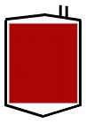

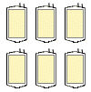

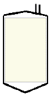
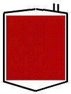

There are a variety of blood products, pharmacologic agents, and procedures that can be utilized to treat anemia, thrombocytopenia, and bleeding disorders. Here is a brief overview of the products and services available:ProductDescriptionPacked red blood cells (PRBCs) are made from a unit of whole blood by centrifugation and removal of most of the plasma, leaving a unit with a hematocrit of about 60%. One PRBC unit will raise the hematocrit of a standard adult patient by 3% (or about 1%/mL/kg in a child - 12%/25 kg with the standard 300 mL PRBC unit). PRBCs are used to replace red cell mass when tissue oxygenation is impaired by acute or chronic anemia.FFP contains all factors of the soluble coagulation system, including the labile factors V and VIII. FFP is indicated when a patient has MULTIPLE factor deficiencies and is BLEEDING. Note that FFP SHOULD NEVER be used as a plasma expander.Cryoprecipitate (cryo) contains a concentrated subset of FFP components including fibrinogen, factor VIII coagulant, vonWillebrand factor, and factor XIII. Cryoprecipitate is used for hypofibrinogenemia, vonWillebrand disease, and in situations calling for a "fibrin glue." Cryo IS NOT just a concentrate of FFP. In fact, a unit of cryo contains only 40-50% of the coag factors found in a unit of FFP, but those factors are more concentrated in the cryo (less volume).A single platelet unit is derived from one whole blood unit collected. Platelets are stored at room temperature and CANNOT be frozen. They must be used in 5 days. Pooled platelets from multiple donors from whole blood collections are cheaper to produce but the exposure to the recipient increases.A "six pack" of platelets can be obtained by apheresis from a single donor at one time. Thus, apheresis platelets give just "one donor" exposure to the recipient, but the cost is high. The recipient's HLA type can be "matched" to a platelet donor with a similar HLA type to deal with problems of HLA alloimmunization (in patients with prior transfusions or pregnancies). The expected incremental increase in platelet count for adults is 30 - 60 K for each "six pack" of plateletsNormal saline is used when providing vascular access and fluid volume when transfusing other products and pharmacologic agents. Normal saline is more readily accessible than albumin or FFP, it is relatively inexpensive, and it does not have the risk of viral transmission.Albumin is useful as a plasma expander. Albumin is not always readily accessible and it is expensive, but it does not have risk of viral transmission.Whole blood (WB) is preferred for resuscitation of severe traumatic hemorrhage. WB has RBCs for oxygen delivery, but also contains coagulation factors and platelets more concentrated than in separately transfused components. In emergent scenarios, group O blood ("universal donor") blood screened low titers of anti-A and -B antibodies can be selected for storage as "low titer O whole blood" (LTOWB).Apheresis involves removal of whole blood from either a patient undergoing treatment or a donor who is providing a blood component (typically platelets). Using an instrument designed as a centrifuge, the components of whole blood are separated. One of the separated portions is withdrawn and the remaining components are retransfused. The components which are separated off and withdrawn include: plasma (plasmapheresis), platelets (plateletpheresis), and leukocytes (leukapheresis).
There are a variety of blood products, pharmacologic agents, and procedures that can be utilized to treat anemia, thrombocytopenia, and bleeding disorders. Here is a brief overview of the products and services available:
Packed red blood cells (PRBCs) are made from a unit of whole blood by centrifugation and removal of most of the plasma, leaving a unit with a hematocrit of about 60%. One PRBC unit will raise the hematocrit of a standard adult patient by 3% (or about 1%/mL/kg in a child - 12%/25 kg with the standard 300 mL PRBC unit). PRBCs are used to replace red cell mass when tissue oxygenation is impaired by acute or chronic anemia.FFP contains all factors of the soluble coagulation system, including the labile factors V and VIII. FFP is indicated when a patient has MULTIPLE factor deficiencies and is BLEEDING. Note that FFP SHOULD NEVER be used as a plasma expander.Cryoprecipitate (cryo) contains a concentrated subset of FFP components including fibrinogen, factor VIII coagulant, vonWillebrand factor, and factor XIII. Cryoprecipitate is used for hypofibrinogenemia, vonWillebrand disease, and in situations calling for a "fibrin glue." Cryo IS NOT just a concentrate of FFP. In fact, a unit of cryo contains only 40-50% of the coag factors found in a unit of FFP, but those factors are more concentrated in the cryo (less volume).A single platelet unit is derived from one whole blood unit collected. Platelets are stored at room temperature and CANNOT be frozen. They must be used in 5 days. Pooled platelets from multiple donors from whole blood collections are cheaper to produce but the exposure to the recipient increases.A "six pack" of platelets can be obtained by apheresis from a single donor at one time. Thus, apheresis platelets give just "one donor" exposure to the recipient, but the cost is high. The recipient's HLA type can be "matched" to a platelet donor with a similar HLA type to deal with problems of HLA alloimmunization (in patients with prior transfusions or pregnancies). The expected incremental increase in platelet count for adults is 30 - 60 K for each "six pack" of plateletsNormal saline is used when providing vascular access and fluid volume when transfusing other products and pharmacologic agents. Normal saline is more readily accessible than albumin or FFP, it is relatively inexpensive, and it does not have the risk of viral transmission.Albumin is useful as a plasma expander. Albumin is not always readily accessible and it is expensive, but it does not have risk of viral transmission.Whole blood (WB) is preferred for resuscitation of severe traumatic hemorrhage. WB has RBCs for oxygen delivery, but also contains coagulation factors and platelets more concentrated than in separately transfused components. In emergent scenarios, group O blood ("universal donor") blood screened low titers of anti-A and -B antibodies can be selected for storage as "low titer O whole blood" (LTOWB).Apheresis involves removal of whole blood from either a patient undergoing treatment or a donor who is providing a blood component (typically platelets). Using an instrument designed as a centrifuge, the components of whole blood are separated. One of the separated portions is withdrawn and the remaining components are retransfused. The components which are separated off and withdrawn include: plasma (plasmapheresis), platelets (plateletpheresis), and leukocytes (leukapheresis).
FFP contains all factors of the soluble coagulation system, including the labile factors V and VIII. FFP is indicated when a patient has MULTIPLE factor deficiencies and is BLEEDING. Note that FFP SHOULD NEVER be used as a plasma expander.Cryoprecipitate (cryo) contains a concentrated subset of FFP components including fibrinogen, factor VIII coagulant, vonWillebrand factor, and factor XIII. Cryoprecipitate is used for hypofibrinogenemia, vonWillebrand disease, and in situations calling for a "fibrin glue." Cryo IS NOT just a concentrate of FFP. In fact, a unit of cryo contains only 40-50% of the coag factors found in a unit of FFP, but those factors are more concentrated in the cryo (less volume).A single platelet unit is derived from one whole blood unit collected. Platelets are stored at room temperature and CANNOT be frozen. They must be used in 5 days. Pooled platelets from multiple donors from whole blood collections are cheaper to produce but the exposure to the recipient increases.A "six pack" of platelets can be obtained by apheresis from a single donor at one time. Thus, apheresis platelets give just "one donor" exposure to the recipient, but the cost is high. The recipient's HLA type can be "matched" to a platelet donor with a similar HLA type to deal with problems of HLA alloimmunization (in patients with prior transfusions or pregnancies). The expected incremental increase in platelet count for adults is 30 - 60 K for each "six pack" of plateletsNormal saline is used when providing vascular access and fluid volume when transfusing other products and pharmacologic agents. Normal saline is more readily accessible than albumin or FFP, it is relatively inexpensive, and it does not have the risk of viral transmission.Albumin is useful as a plasma expander. Albumin is not always readily accessible and it is expensive, but it does not have risk of viral transmission.Whole blood (WB) is preferred for resuscitation of severe traumatic hemorrhage. WB has RBCs for oxygen delivery, but also contains coagulation factors and platelets more concentrated than in separately transfused components. In emergent scenarios, group O blood ("universal donor") blood screened low titers of anti-A and -B antibodies can be selected for storage as "low titer O whole blood" (LTOWB).Apheresis involves removal of whole blood from either a patient undergoing treatment or a donor who is providing a blood component (typically platelets). Using an instrument designed as a centrifuge, the components of whole blood are separated. One of the separated portions is withdrawn and the remaining components are retransfused. The components which are separated off and withdrawn include: plasma (plasmapheresis), platelets (plateletpheresis), and leukocytes (leukapheresis).
Cryoprecipitate (cryo) contains a concentrated subset of FFP components including fibrinogen, factor VIII coagulant, vonWillebrand factor, and factor XIII. Cryoprecipitate is used for hypofibrinogenemia, vonWillebrand disease, and in situations calling for a "fibrin glue." Cryo IS NOT just a concentrate of FFP. In fact, a unit of cryo contains only 40-50% of the coag factors found in a unit of FFP, but those factors are more concentrated in the cryo (less volume).A single platelet unit is derived from one whole blood unit collected. Platelets are stored at room temperature and CANNOT be frozen. They must be used in 5 days. Pooled platelets from multiple donors from whole blood collections are cheaper to produce but the exposure to the recipient increases.A "six pack" of platelets can be obtained by apheresis from a single donor at one time. Thus, apheresis platelets give just "one donor" exposure to the recipient, but the cost is high. The recipient's HLA type can be "matched" to a platelet donor with a similar HLA type to deal with problems of HLA alloimmunization (in patients with prior transfusions or pregnancies). The expected incremental increase in platelet count for adults is 30 - 60 K for each "six pack" of plateletsNormal saline is used when providing vascular access and fluid volume when transfusing other products and pharmacologic agents. Normal saline is more readily accessible than albumin or FFP, it is relatively inexpensive, and it does not have the risk of viral transmission.Albumin is useful as a plasma expander. Albumin is not always readily accessible and it is expensive, but it does not have risk of viral transmission.Whole blood (WB) is preferred for resuscitation of severe traumatic hemorrhage. WB has RBCs for oxygen delivery, but also contains coagulation factors and platelets more concentrated than in separately transfused components. In emergent scenarios, group O blood ("universal donor") blood screened low titers of anti-A and -B antibodies can be selected for storage as "low titer O whole blood" (LTOWB).Apheresis involves removal of whole blood from either a patient undergoing treatment or a donor who is providing a blood component (typically platelets). Using an instrument designed as a centrifuge, the components of whole blood are separated. One of the separated portions is withdrawn and the remaining components are retransfused. The components which are separated off and withdrawn include: plasma (plasmapheresis), platelets (plateletpheresis), and leukocytes (leukapheresis).
A single platelet unit is derived from one whole blood unit collected. Platelets are stored at room temperature and CANNOT be frozen. They must be used in 5 days. Pooled platelets from multiple donors from whole blood collections are cheaper to produce but the exposure to the recipient increases.A "six pack" of platelets can be obtained by apheresis from a single donor at one time. Thus, apheresis platelets give just "one donor" exposure to the recipient, but the cost is high. The recipient's HLA type can be "matched" to a platelet donor with a similar HLA type to deal with problems of HLA alloimmunization (in patients with prior transfusions or pregnancies). The expected incremental increase in platelet count for adults is 30 - 60 K for each "six pack" of plateletsNormal saline is used when providing vascular access and fluid volume when transfusing other products and pharmacologic agents. Normal saline is more readily accessible than albumin or FFP, it is relatively inexpensive, and it does not have the risk of viral transmission.Albumin is useful as a plasma expander. Albumin is not always readily accessible and it is expensive, but it does not have risk of viral transmission.Whole blood (WB) is preferred for resuscitation of severe traumatic hemorrhage. WB has RBCs for oxygen delivery, but also contains coagulation factors and platelets more concentrated than in separately transfused components. In emergent scenarios, group O blood ("universal donor") blood screened low titers of anti-A and -B antibodies can be selected for storage as "low titer O whole blood" (LTOWB).Apheresis involves removal of whole blood from either a patient undergoing treatment or a donor who is providing a blood component (typically platelets). Using an instrument designed as a centrifuge, the components of whole blood are separated. One of the separated portions is withdrawn and the remaining components are retransfused. The components which are separated off and withdrawn include: plasma (plasmapheresis), platelets (plateletpheresis), and leukocytes (leukapheresis).
A "six pack" of platelets can be obtained by apheresis from a single donor at one time. Thus, apheresis platelets give just "one donor" exposure to the recipient, but the cost is high. The recipient's HLA type can be "matched" to a platelet donor with a similar HLA type to deal with problems of HLA alloimmunization (in patients with prior transfusions or pregnancies). The expected incremental increase in platelet count for adults is 30 - 60 K for each "six pack" of plateletsNormal saline is used when providing vascular access and fluid volume when transfusing other products and pharmacologic agents. Normal saline is more readily accessible than albumin or FFP, it is relatively inexpensive, and it does not have the risk of viral transmission.Albumin is useful as a plasma expander. Albumin is not always readily accessible and it is expensive, but it does not have risk of viral transmission.Whole blood (WB) is preferred for resuscitation of severe traumatic hemorrhage. WB has RBCs for oxygen delivery, but also contains coagulation factors and platelets more concentrated than in separately transfused components. In emergent scenarios, group O blood ("universal donor") blood screened low titers of anti-A and -B antibodies can be selected for storage as "low titer O whole blood" (LTOWB).Apheresis involves removal of whole blood from either a patient undergoing treatment or a donor who is providing a blood component (typically platelets). Using an instrument designed as a centrifuge, the components of whole blood are separated. One of the separated portions is withdrawn and the remaining components are retransfused. The components which are separated off and withdrawn include: plasma (plasmapheresis), platelets (plateletpheresis), and leukocytes (leukapheresis).
Normal saline is used when providing vascular access and fluid volume when transfusing other products and pharmacologic agents. Normal saline is more readily accessible than albumin or FFP, it is relatively inexpensive, and it does not have the risk of viral transmission.Albumin is useful as a plasma expander. Albumin is not always readily accessible and it is expensive, but it does not have risk of viral transmission.Whole blood (WB) is preferred for resuscitation of severe traumatic hemorrhage. WB has RBCs for oxygen delivery, but also contains coagulation factors and platelets more concentrated than in separately transfused components. In emergent scenarios, group O blood ("universal donor") blood screened low titers of anti-A and -B antibodies can be selected for storage as "low titer O whole blood" (LTOWB).Apheresis involves removal of whole blood from either a patient undergoing treatment or a donor who is providing a blood component (typically platelets). Using an instrument designed as a centrifuge, the components of whole blood are separated. One of the separated portions is withdrawn and the remaining components are retransfused. The components which are separated off and withdrawn include: plasma (plasmapheresis), platelets (plateletpheresis), and leukocytes (leukapheresis).
Albumin is useful as a plasma expander. Albumin is not always readily accessible and it is expensive, but it does not have risk of viral transmission.Whole blood (WB) is preferred for resuscitation of severe traumatic hemorrhage. WB has RBCs for oxygen delivery, but also contains coagulation factors and platelets more concentrated than in separately transfused components. In emergent scenarios, group O blood ("universal donor") blood screened low titers of anti-A and -B antibodies can be selected for storage as "low titer O whole blood" (LTOWB).Apheresis involves removal of whole blood from either a patient undergoing treatment or a donor who is providing a blood component (typically platelets). Using an instrument designed as a centrifuge, the components of whole blood are separated. One of the separated portions is withdrawn and the remaining components are retransfused. The components which are separated off and withdrawn include: plasma (plasmapheresis), platelets (plateletpheresis), and leukocytes (leukapheresis).
Whole blood (WB) is preferred for resuscitation of severe traumatic hemorrhage. WB has RBCs for oxygen delivery, but also contains coagulation factors and platelets more concentrated than in separately transfused components. In emergent scenarios, group O blood ("universal donor") blood screened low titers of anti-A and -B antibodies can be selected for storage as "low titer O whole blood" (LTOWB).Apheresis involves removal of whole blood from either a patient undergoing treatment or a donor who is providing a blood component (typically platelets). Using an instrument designed as a centrifuge, the components of whole blood are separated. One of the separated portions is withdrawn and the remaining components are retransfused. The components which are separated off and withdrawn include: plasma (plasmapheresis), platelets (plateletpheresis), and leukocytes (leukapheresis).
Apheresis involves removal of whole blood from either a patient undergoing treatment or a donor who is providing a blood component (typically platelets). Using an instrument designed as a centrifuge, the components of whole blood are separated. One of the separated portions is withdrawn and the remaining components are retransfused. The components which are separated off and withdrawn include: plasma (plasmapheresis), platelets (plateletpheresis), and leukocytes (leukapheresis).
Indications for Blood Product UsageThere are situations identified in which blood products may be needed:Packed RBCs: generally indicated with a hemoglobin of 7 to 8 g/dL, a markedly decreased oxygen saturation and/or orthostatic hypotension. There is indication that the patient needs additional oxygen carrying capacity.Platelets: generally indicated for a platelet count of less than 50,000/microliter and there is active bleeding, or if a procedure such as surgery is to be performed. Spontaneous bleeding is unlikely until the platelet count drops below 10,000 to 20,000/microliter.FFP: generally indicated when a patient has multiple factor deficiencies and is bleeding, or for thrombotic thrombocytopenic purpura (TTP). The PT and PTT will be prolonged, and the INR generally should be greater than 1.6.Cryo: generally indicated for hypofibrinogenemia, vonWillebrand disease, and in situations calling for a "fibrin glue."
Indications for Blood Product Usage
There are situations identified in which blood products may be needed:
Packed RBCs: generally indicated with a hemoglobin of 7 to 8 g/dL, a markedly decreased oxygen saturation and/or orthostatic hypotension. There is indication that the patient needs additional oxygen carrying capacity.Platelets: generally indicated for a platelet count of less than 50,000/microliter and there is active bleeding, or if a procedure such as surgery is to be performed. Spontaneous bleeding is unlikely until the platelet count drops below 10,000 to 20,000/microliter.FFP: generally indicated when a patient has multiple factor deficiencies and is bleeding, or for thrombotic thrombocytopenic purpura (TTP). The PT and PTT will be prolonged, and the INR generally should be greater than 1.6.Cryo: generally indicated for hypofibrinogenemia, vonWillebrand disease, and in situations calling for a "fibrin glue."
Packed RBCs: generally indicated with a hemoglobin of 7 to 8 g/dL, a markedly decreased oxygen saturation and/or orthostatic hypotension. There is indication that the patient needs additional oxygen carrying capacity.
Platelets: generally indicated for a platelet count of less than 50,000/microliter and there is active bleeding, or if a procedure such as surgery is to be performed. Spontaneous bleeding is unlikely until the platelet count drops below 10,000 to 20,000/microliter.FFP: generally indicated when a patient has multiple factor deficiencies and is bleeding, or for thrombotic thrombocytopenic purpura (TTP). The PT and PTT will be prolonged, and the INR generally should be greater than 1.6.Cryo: generally indicated for hypofibrinogenemia, vonWillebrand disease, and in situations calling for a "fibrin glue."
Platelets: generally indicated for a platelet count of less than 50,000/microliter and there is active bleeding, or if a procedure such as surgery is to be performed. Spontaneous bleeding is unlikely until the platelet count drops below 10,000 to 20,000/microliter.
FFP: generally indicated when a patient has multiple factor deficiencies and is bleeding, or for thrombotic thrombocytopenic purpura (TTP). The PT and PTT will be prolonged, and the INR generally should be greater than 1.6.Cryo: generally indicated for hypofibrinogenemia, vonWillebrand disease, and in situations calling for a "fibrin glue."
FFP: generally indicated when a patient has multiple factor deficiencies and is bleeding, or for thrombotic thrombocytopenic purpura (TTP). The PT and PTT will be prolonged, and the INR generally should be greater than 1.6.
Cryo: generally indicated for hypofibrinogenemia, vonWillebrand disease, and in situations calling for a "fibrin glue."
There are specialized blood products for situations in which cells or substances in the unit need to be reduced or removed:ProductDescriptionWashed Red Blood CellsA unit of packed red blood cells (PRBCs) is washed to reduce plasma proteins. This reduces the risk for allergic transfusion reactions. Washing reduces immunoglobulins, such as anti-IgA that could cause anaphylactic transfusion reactions in persons with selective IgA deficiency.Leukocyte ReductionRed blood cell and platelet units may be filtered to remove most of the leukocytes (white blood cells). This may reduce the risk for febrile transfusion reactions, may help prevent alloimmunizaton to MHC (HLA) donor antigens, and help reduce the risk for cytomegalovirus (CMV) infection.Irradiated BloodIrradiation is needed to destroy all living leukocytes (white blood cells), particularly lymphocytes that could cause transfusion associated graft versus host disease (TAGVD).
There are specialized blood products for situations in which cells or substances in the unit need to be reduced or removed:
Washed Red Blood CellsA unit of packed red blood cells (PRBCs) is washed to reduce plasma proteins. This reduces the risk for allergic transfusion reactions. Washing reduces immunoglobulins, such as anti-IgA that could cause anaphylactic transfusion reactions in persons with selective IgA deficiency.Leukocyte ReductionRed blood cell and platelet units may be filtered to remove most of the leukocytes (white blood cells). This may reduce the risk for febrile transfusion reactions, may help prevent alloimmunizaton to MHC (HLA) donor antigens, and help reduce the risk for cytomegalovirus (CMV) infection.Irradiated BloodIrradiation is needed to destroy all living leukocytes (white blood cells), particularly lymphocytes that could cause transfusion associated graft versus host disease (TAGVD).
A unit of packed red blood cells (PRBCs) is washed to reduce plasma proteins. This reduces the risk for allergic transfusion reactions. Washing reduces immunoglobulins, such as anti-IgA that could cause anaphylactic transfusion reactions in persons with selective IgA deficiency.Leukocyte ReductionRed blood cell and platelet units may be filtered to remove most of the leukocytes (white blood cells). This may reduce the risk for febrile transfusion reactions, may help prevent alloimmunizaton to MHC (HLA) donor antigens, and help reduce the risk for cytomegalovirus (CMV) infection.Irradiated BloodIrradiation is needed to destroy all living leukocytes (white blood cells), particularly lymphocytes that could cause transfusion associated graft versus host disease (TAGVD).
Leukocyte ReductionRed blood cell and platelet units may be filtered to remove most of the leukocytes (white blood cells). This may reduce the risk for febrile transfusion reactions, may help prevent alloimmunizaton to MHC (HLA) donor antigens, and help reduce the risk for cytomegalovirus (CMV) infection.Irradiated BloodIrradiation is needed to destroy all living leukocytes (white blood cells), particularly lymphocytes that could cause transfusion associated graft versus host disease (TAGVD).
Red blood cell and platelet units may be filtered to remove most of the leukocytes (white blood cells). This may reduce the risk for febrile transfusion reactions, may help prevent alloimmunizaton to MHC (HLA) donor antigens, and help reduce the risk for cytomegalovirus (CMV) infection.Irradiated BloodIrradiation is needed to destroy all living leukocytes (white blood cells), particularly lymphocytes that could cause transfusion associated graft versus host disease (TAGVD).
Irradiated BloodIrradiation is needed to destroy all living leukocytes (white blood cells), particularly lymphocytes that could cause transfusion associated graft versus host disease (TAGVD).
Irradiation is needed to destroy all living leukocytes (white blood cells), particularly lymphocytes that could cause transfusion associated graft versus host disease (TAGVD).
## 6. In the interview process a questionnaire is filled out. The questions are designed to identify potential health problems for the donor or potential infections that may be present in the donor that could be transmitted through transfusion to another person. {#item-6}
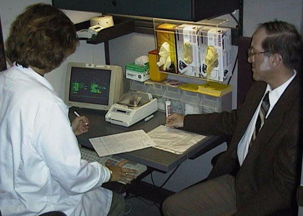

The donor is interviewed and aquestionnaireis filled out.
## 7. A fingerstick yields a drop of blood for testing to determine if the donor has a high enough hematocrit to safely donate blood. {#item-7}
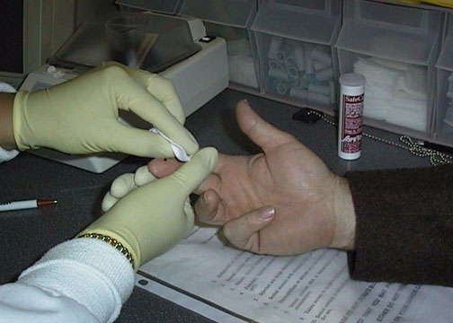

A fingerstick is made to obtain adrop of bloodto test the hematocrit.
## 8. The donor sits in a reclining chair. An inflatable cuff on the arm is used to check blood pressure and to maintain venous filling. {#item-8}
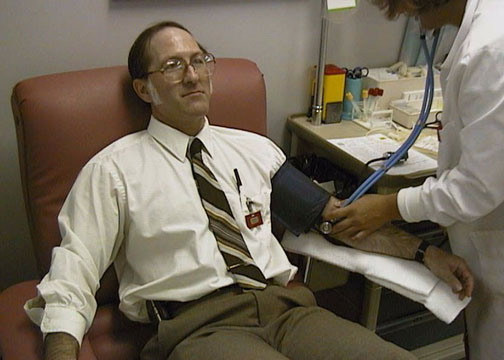

The donor sits in a reclining chair. Aninflatable cuffon the arm is used to check blood pressure and to maintain venous filling.
## 9. The site for drawing blood is selected and disinfected. A prominent vein is chosen for the venipuncture site. {#item-9}
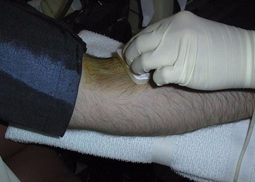

The site for drawing blood is selected and disinfected. Aprominent veinhas been chosen for the venipuncture site.
## 10. The disinfectant is applied to the area around the vein to be used. {#item-10}
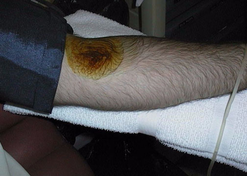

The disinfectant is applied to the area around the vein to be used.
## 11. The needle used to draw the blood from the vein is gently inserted. {#item-11}
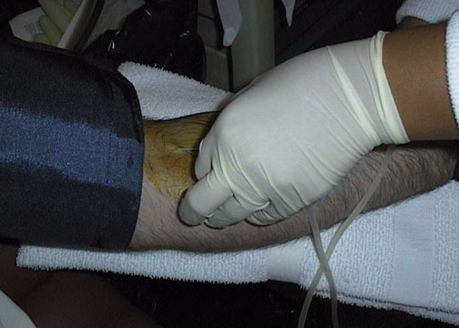

Theneedleused to draw the blood from the vein is gently inserted. The needle is attached toplastic tubingto conduct the blood to the collection bag.
## 12. Blood fills the collection bag by gravity in a few minutes. The sealed plastic collection bag contains a blood preservative. {#item-12}
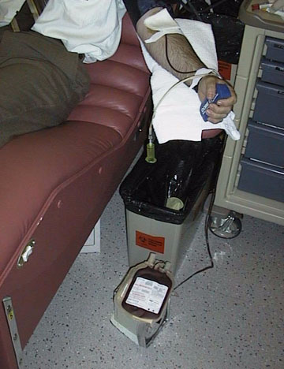

Blood fills thecollection bagby gravity in a few minutes.The sealed plastic collection bag contains a blood preservative.
Blood fills thecollection bagby gravity in a few minutes.
The sealed plastic collection bag contains a blood preservative.
## 13. Just after the bag has filled, blood from the line is taken to fill several collection tubes for further testing. {#item-13}
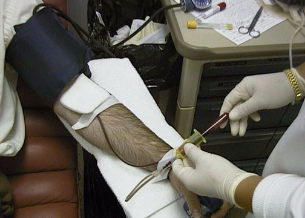

Just after the bag has filled, blood from the line is taken to fill several collection tubes for further testing.A red top collection tubeis being filled here.
## 14. The needle is removed and pressure is applied over the venipuncture site, then a bandage is placed for the next couple of hours. {#item-14}
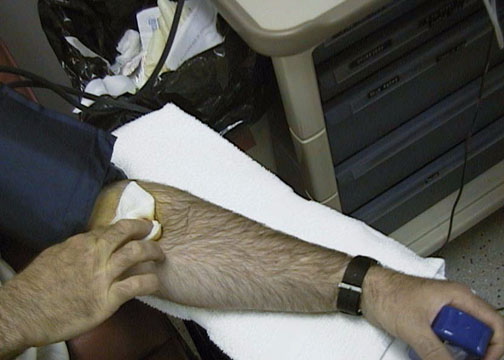

The needle is removed and pressure is applied over the venipuncture site, then a bandage is placed for the next couple of hours.
## 15. The donor drinks some liquid (here a tube of apple juice) to replace the lost blood volume, eats some cookies, and is on his way in about 10 minutes. {#item-15}
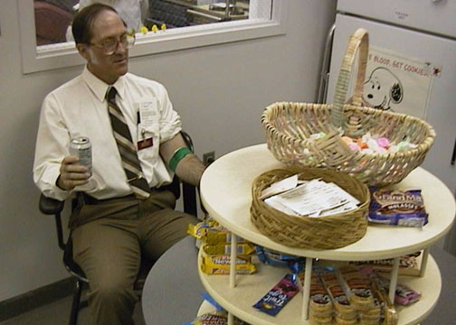

The donor drinks some liquid(here a tube of apple juice)to replace the lost volume, eats some cookies, and is on his way in about 10 minutes.A bandage is in place over the phlebotomy site.
The donor drinks some liquid(here a tube of apple juice)to replace the lost volume, eats some cookies, and is on his way in about 10 minutes.
A bandage is in place over the phlebotomy site.
