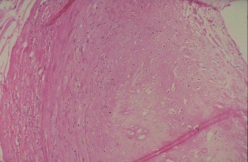
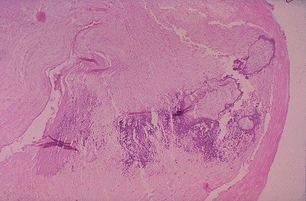
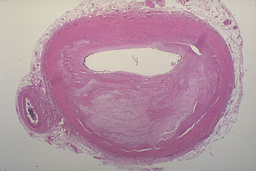
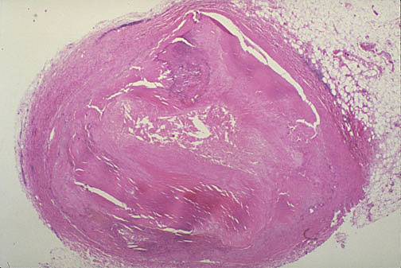
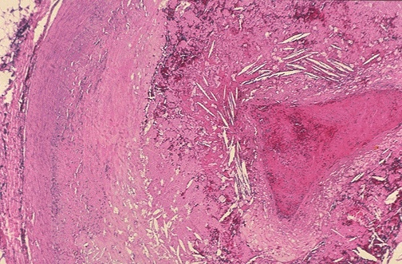
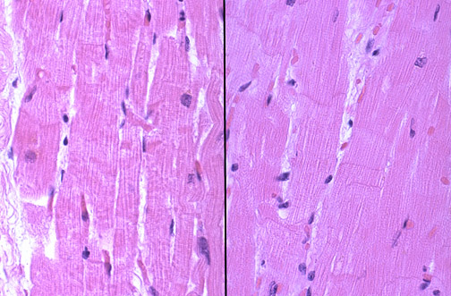

## 1. Normal coronary artery, microscopic. {#item-1}

This is a normal coronary artery with a nice, big, unobstructed lumen for supplying plenty of blood to the myocardium.
## 2. Coronary atherosclerosis, cross sections, gross. {#item-2}

These serial sections of a coronary artery demonstrate grossly the appearance of lumenal narrowing with atherosclerosis.
## 3. Coronary atherosclerosis, minimal, gross. {#item-3}

This coronary artery demonstrates yellowish atherosclerotic plaques grossly.
## 4. Coronary atherosclerosis, severe, gross. {#item-4}

This coronary artery opened longitudinally demonstrates severe atherosclerosis.
## 5. Coronary atherosclerosis, composite, microscopic. {#item-5}

This composite picture demonstrates cross sections of coronary artery with atherosclerosis. At the left the lumen is about 50% occluded. At the right, there has been thrombosis with organization and recanalization to leave three small remaining lumens.
## 6. Coronary atherosclerosis, intimal plaque, microscopic. {#item-6}

This cross section of coronary artery demonstrates the extent of the intimal plaque at the right above the internal elastic lamina.
## 7. Coronary atherosclerosis, complicated by calcification, microscopic. {#item-7}

This cross section of coronary artery demonstrates occlusive atherosclerosis complicated by calcification (the blue material in this section).
## 8. Coronary atherosclerosis, occlusive, microscopic. {#item-8}

This cross section of coronary artery demonstrates >75% narrowing, which would be associated with angina.
## 9. Coronary atherosclerosis, occlusive, microscopic. {#item-9}

This cross section of coronary artery demonstrates nearly complete lumenal occlusion. If this occurs slowly, there is time for collateral circulation to develop.
## 10. Coronary artery, hemorrhage into plaque, gross. {#item-10}

There is hemorrhage into a coronary artery plaque, one complication of atherosclerosis, seen here grossly.
## 11. Coronary artery, atheromatous plaque with disrupted fibrin cap, microscopic. {#item-11}

There is a fibrin cap at the right with disruption in this atheromatous plaque in a coronary artery. Note the many "foam" cells (pale because of lipid) and cholesterol clefts.
## 12. Thrombosis of coronary artery, gross. {#item-12}

This is thrombosis in the anterior interventricular (left anterior descending) coronary artery opened longitudinally here over the surface of the heart. This is another complication of atherosclerosis. The purpose of thrombolytic therapy (as with streptokinase or with tissue plasminogen activator, or TPA) is to dissolve recently formed thrombi and re-establish circulation before irreversible myocardial damage has been done, or at least to prevent additional myocardial injury.
## 13. Thrombosis of coronary artery, gross. {#item-13}

This is thrombosis in a coronary artery. Such a thrombus severely narrows or occludes the lumen and can produce a sudden ischemic event. "Sudden death" as well as infarction can occur.
## 14. Thrombosis of coronary artery, microscopic. {#item-14}

This severely narrowed coronary artery has the remaining lumen filled by thrombus.
## 15. Thrombosis of coronary artery, microscopic. {#item-15}

The atheromatous plaque around this thrombus in a coronary artery has many cholesterol clefts and foam cells as well as fibrin and hemorrhage.
## 16. Normal myocardium, microscopic. {#item-16}

This is normal myocardium. There are cross striations and central nuclei. Pale pink intercalated disks are also present.
## 17. Early acute myocardial infarction (<12 hours) with loss of cross striations, microscopic. {#item-17}

Here are two views of very early ischemic changes, with beginningloss of cross-striationswithin myocardial fibers, but the cardiac fiber nuclei are still present and there is not yet an inflammatory infiltrate. This represents an evolving infarction less than 12 hours old.
## 18. Early acute myocardial infarction (<1 day) with contraction band necrosis, microscopic. {#item-18}

This is an early acute myocardial infarction. Note the prominent pink contraction bands.
## 19. Acute myocardial infarction (1 - 2 days) with early neutrophilic infiltrate, microscopic. {#item-19}

This is an early acute myocardial infarction. There is increasing loss of cross striations, and some contraction bands are also seen, and the nuclei are undergoing karyolysis. Some neutrophils are beginning to infiltrate the myocardium.
## 20. Acute myocardial infarction (1 - 2 days), hyperemic border, microscopic. {#item-20}

This is an acute myocardial infarction. There is loss of cross striations, and the nuclei are not present. There is extensive hemorrhage here at the border of the infarction, which accounts for the grossly apparent hyperemic border.
## 21. Acute myocardial infarction (3 - 4 days), extensive neutrophilic infiltrate, microscopic. {#item-21}

This is an acute myocardial infarction of several days' duration. There is a more extensive neutrophilic infiltrate along with the prominent necrosis and hemorrhage.
## 22. Acute myocardial infarction, gross. {#item-22}

This is an acute myocardial infarction in the septum. After several days, there is a yellowish center with necrosis and inflammation surrounded by a hyperemic border.
## 23. Acute myocardial infarction, gross. {#item-23}

This is an acute myocardial infarction of the anterior left ventricular free wall and septum in cross section. Note that the infarction is nearly transmural. There is a yellowish center with necrosis and inflammation surrounded by a hyperemic border.
## 24. Acute myocardial infarction with rupture, gross. {#item-24}

When the infarction is 3 to 5 days old, the necrosis and inflammation are most extensive, and the myocardium is the softest, so that transmural infarctions may be complicated by rupture. A papillary muscle may rupture as well to produce sudden valvular insufficiency. Rupture through the septum results in a left-to-right shunt and right heart failure.
## 25. Acute myocardial infarction with rupture and tamponade, gross. {#item-25}

Rupture (at the arrow) into the pericardial sac can produce a life-threatening cardiac tamponade, as seen here. The septum may also rupture.
## 26. Intermediate (healing) myocardial infarction (1 - 2 weeks), microscopic. {#item-26}

Toward the end of the first week, healing of a myocardial infarction becomes more prominent. Seen here is ingrowth of capillaries along with fibroblasts and macrophages filled with hemosiderin. The granulation tissue seen here is found in abundance from 10 days to 3 weeks following onset of infarction, with a peak around 1 to 2 weeks. Cardiac troponin markers may still be present in the blood up to weeks following the initial ischemic event.
## 27. Remote myocardial infarction (3 to 4 weeks), microscopic. {#item-27}

Healing is well under way 3 weeks after the ischemic event, and there is more extensivecollagen depositionin the region of myocardium that was infarcted.
## 28. Remote myocardial infarction (>2 months), microscopic. {#item-28}

The remote myocardial infarction is evidenced by acollagenous scarwith some residual red surviving myocardial fibers. This stage is reached about 2 months following the initial ischemic event. This scar tissue is nonfunctional, and the reduction in ejection fraction is related to the extent of scarring.
## 29. Remote myocardial infarction (weeks to years), gross. {#item-29}

Grossly, a remote myocardial infarction is evidenced by white collagenous scar.
## 30. Left ventricular aneurysm, gross. {#item-30}

A complication of infarction is aneurysm formation, which is the bulge seen here in the left ventricular wall. Note the very thin white wall of the aneurysm toward the apex.
## 31. Left ventricular aneurysm containing mural thrombus, gross. {#item-31}

The wall of the aneurysm is thin, as seen here in cross section, but it is formed of dense collagenous tissue, so it does not rupture. However, the aneurysm is formed of non-functional tissue that does not contract, so the ejection fraction and stroke volume of the heart are reduced. In addition, mural thrombus can form in the aneurysm, and is seen here as the dark red layers extending inward from the thin aneurysmal wall. Portions of the mural thrombus could break off and embolize to the systemic circulation.
## 32. Ischemic cardiomyopathy, microscopic. {#item-32}

The myocytes here are hypertrophied, marked by the large, dark nuclei, and there is interstitial fibrosis. This is an example of cardiomyopathy. In this case, long-standing, severe occlusive atherosclerosis led to "ischemic" cardiomyopathy.
