## 1. Normal vertebral bone, gross. {#item-1}

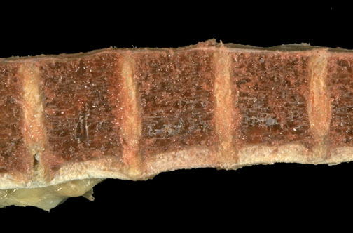

Normal vertebral bone is shown here.

---

## 2. Normal vertebral bone, gross. {#item-2}

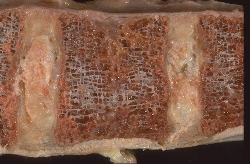

Normal vertebral bone is shown here.

---

## 3. Normal vertebral bone and marrow, low power microscopic. {#item-3}

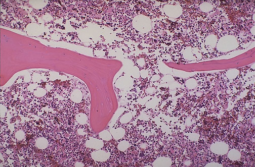

Normal vertebral bone and marrow is demonstrated at low power microscopically. Note the size and number of bone spicules.

---

## 4. Normal vertebral bone, polarized, medium power microscopic. {#item-4}

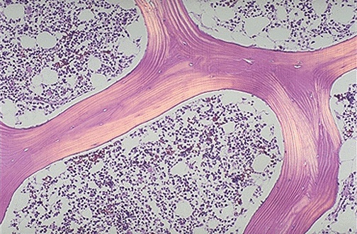

Normal vertebral bone is shown under polarized light microscopy. Note the normal lamellar sturcutre of the bone spicules.

---

## 5. Vertebral bone with osteoporosis, gross. {#item-5}

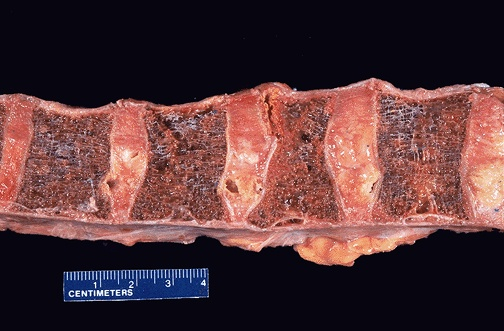

Vertebral bone with osteoporosis demonstrates decreased bone mass with fewer and narrower bony spicules.

---

## 6. Vertebral bone with osteoporosis and compressed fracture, gross. {#item-6}

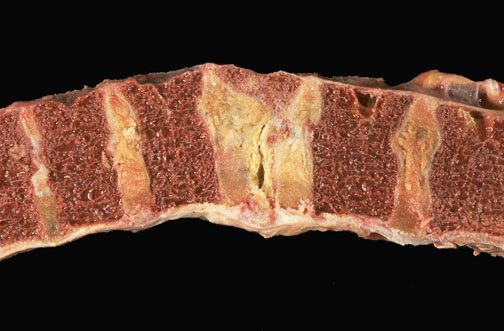

Vertebral bone with osteoporosis demonstrates a compressed fracture grossly. Note the narrowing of the compressed vertebral body compared to the other vertebral bodies.

---

## 7. Vertebral bone with osteoporosis, low power microscopic. {#item-7}

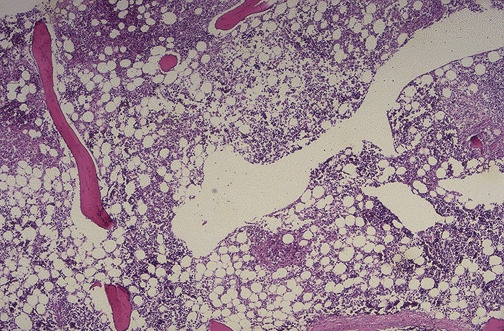

Vertebral bone with decreased bony spicules of decreased size from osteoporosis is shown here at low power microscopically.

---

## 8. Femur with osteoporosis, radiograph. {#item-8}

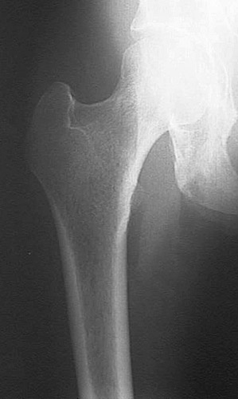

Seen here is the upper femur at the hip. There is severe osteoporosis with marked loss of bone density.

---

## 9. Femoral neck fracture, radiographs. {#item-9}

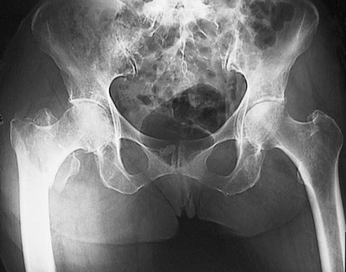

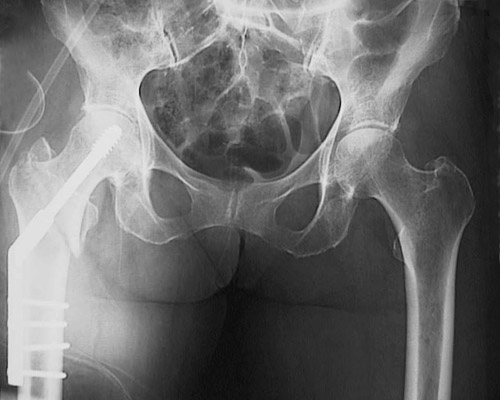

The radiograph of the pelvic region is shown above, with anintertrochanteric fracturelocated in the right femur of an elderly woman with osteoporosis. Below is the postoperative radiograph following surgical repair.

---

## 10. Hip prosthesis, radiograph. {#item-10}

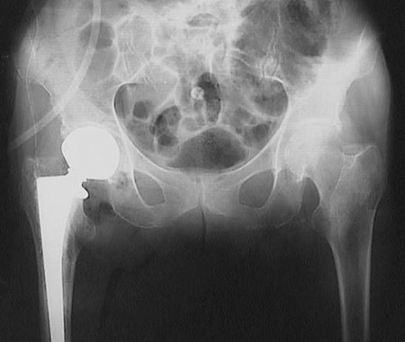

The radiograph of the pelvic region shown above reveals aprosthesisfor the hip joint necessitated by a femoral fracture in an older person with osteoporosis.

---
