## 1. Patient identification {#item-1}

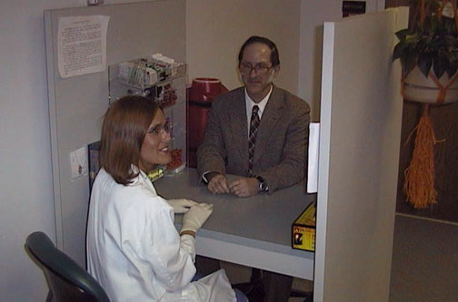

The first step is always to identify the patient. Outpatient phlebotomy, as shown here, should take place with the patient seated.

---

## 2. Filling out the requisition {#item-2}

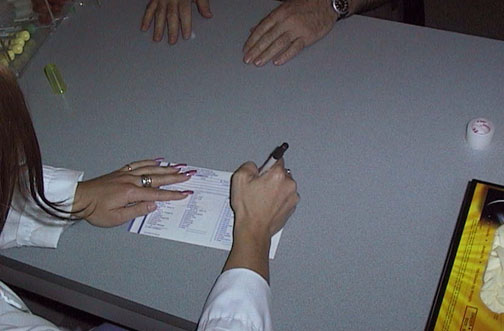

The requistion form should be completely filled out, and the requisition must indicate the tests ordered.

---

## 3. Equipment {#item-3}

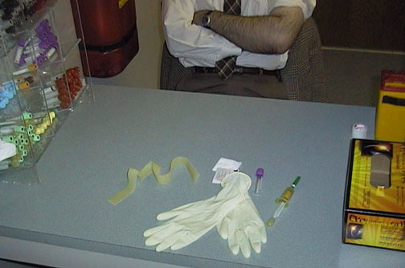

Here is the equipment for performing phlebotomy. Barrier protection for the phlebotomist consists of the latex gloves.

---

## 4. Apply tourniquet and palpate for vein {#item-4}

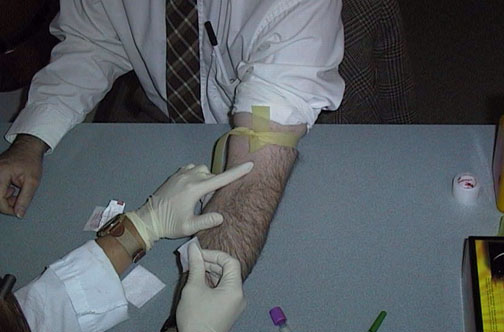

The tourniquet is applied and the phlebotomist palpates for a suitable vein for drawing blood.

---

## 5. Sterilize the site {#item-5}

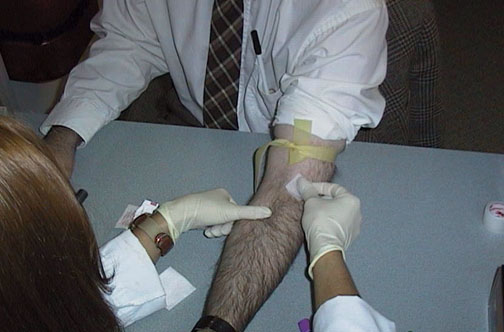

The area of skin is cleaned with a disinfectant, here an alcohol swab.

---

## 6. Insert needle {#item-6}

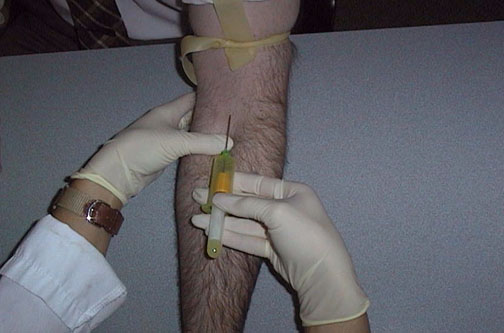

The vein is anchored and the needle is inserted.

---

## 7. Drawing the specimen {#item-7}

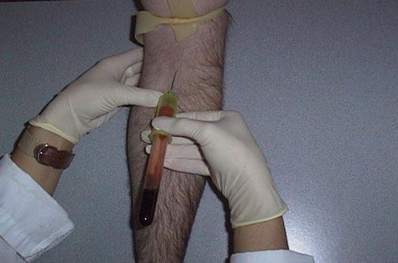

The collection tube is depressed into the needle to begin drawing blood.

---

## 8. Drawing the specimen {#item-8}

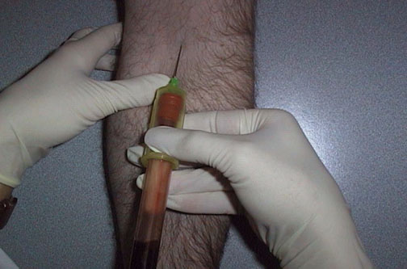

Additional collection tubes can be utilized. Determine what tests are ordered and what tubes will be necessary BEFORE you begin to draw blood, and determine the order of draw for the tubes.

---

## 9. Releasing the tourniquet {#item-9}

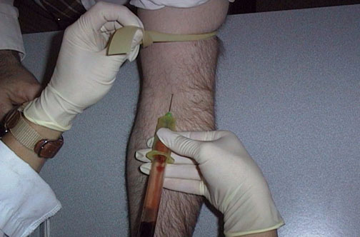

When the final tube is being drawn, release the tourniquet. Then remove the tube, and remove the needle.

---

## 10. Applying pressure over the vein {#item-10}

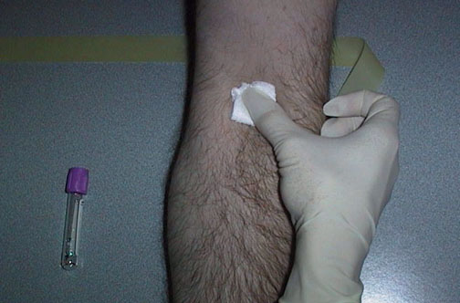

After the needle is removed from the vein, apply firm pressure over the site to achieve hemostasis.

---

## 11. Applying bandage {#item-11}

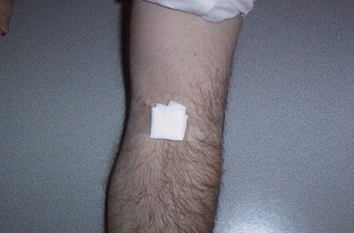

Apply a bandage to the area.

---

## 12. Disposing needle into sharps {#item-12}

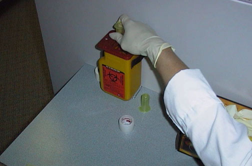

Dispose of the needle into a sharps container that is close by.

---

## 13. labeling the specimens {#item-13}

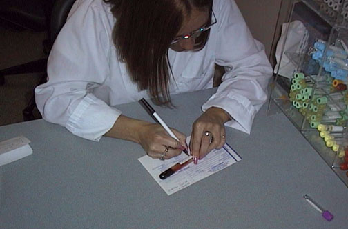

Label the tubes, checking the requisition for the proper identification.

---

## 14. Equipment {#item-14}

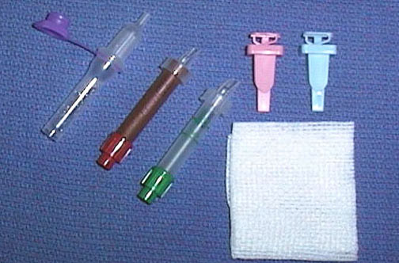

Here is the equipment for fingersticks (heelsticks). The lancets come in different lengths. There are several standard small collection tubes utilized to collect fingerstick (or baby heelstick) blood. The purple cap is for hematology specimens and the green cap is for chemistry specimens. The dark brown-red small collection tube protects a neonatal bilirubin sample from the light.

---

## 15. Proper location on finger {#item-15}

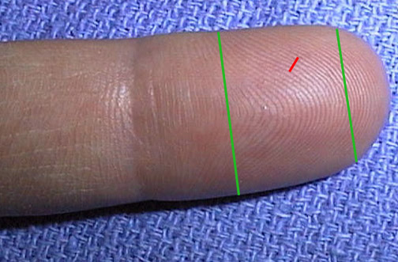

The proper location on the 3rd or 4th finger of the non-dominant hand for performing a fingerstick is outlined here between the green lines. The puncture should be made just off center and perpendicular to the fingerprint ridges. (A puncture parallel to the ridges tends to make the blood run down the ridges and hamper collection.)

---

## 16. Puncture with lancet {#item-16}

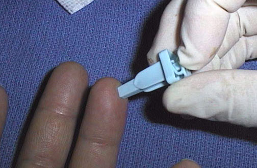

The lancet is placed over the proper location on the finger and the puncture is made quickly.

---

## 17. Drop of blood {#item-17}

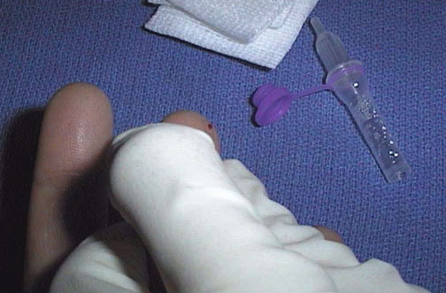

A drop of blood appears at the puncture site.

---

## 18. Wipe first drop {#item-18}

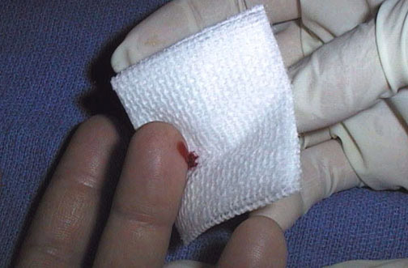

The first drop of blood that may contain tissue fluid is wiped away.

---

## 19. Collecting the specimen {#item-19}

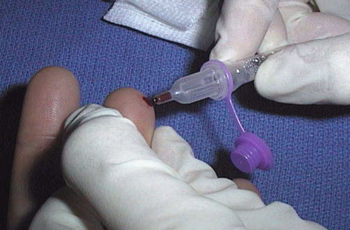

The finger is gently massaged from base to tip and the blood drops are collected into the proper collection device.

---

## 20. Specimen container {#item-20}

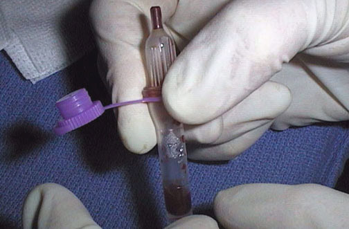

The blood is mixed in small collection tubes with an additive.

---

## 21. Hematoma formation is a problem in older patients. {#item-21}

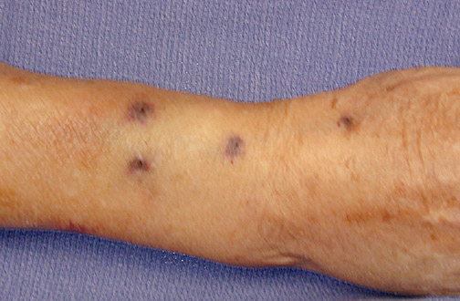

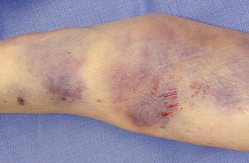

In older patients with thin, loose skin and less subcutaneous tissue, the minor trauma of venipuncture is more likely to produce local hemorrhage. Note thesmall hematomas in the view above. In the view below, there has been more extensive subcutaneous hemorrhage, and even tearing of the skin from adhesive tape applied with a bandage, in a patient on corticosteroid therapy.

---

## 22. Heelstick on baby {#item-22}

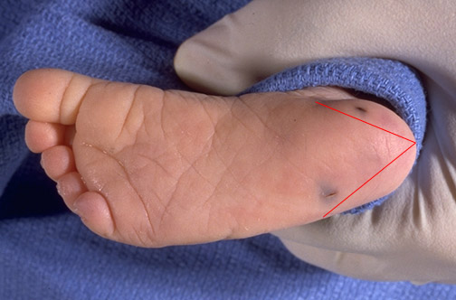

Two heelsticks have been performed on this baby. One of them has been performedcorrectly. One was performedimproperly.

---
