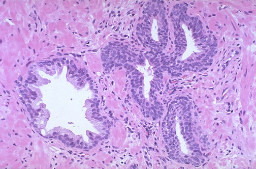
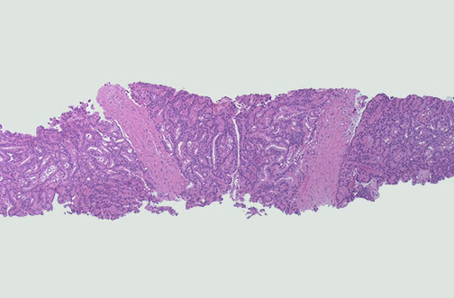
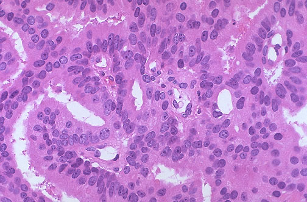
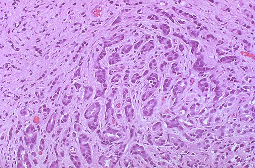
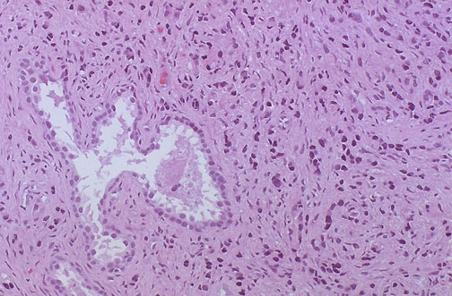
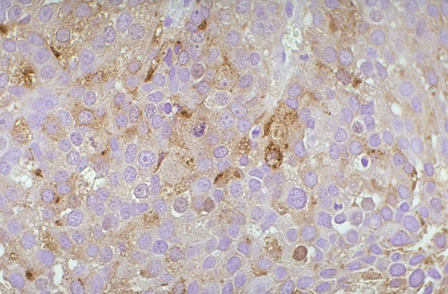

## 1. Normal prostate gland, high power microscopic. {#item-1}

The normal appearance of prostate is shown at high magnification. Note the small pink laminated concretion (these are corpora amylacea) in the gland lumen to the left of center. Note the infoldings of the columnar epithelium.
## 2. Prostate, chronic prostatitis, high power microscopic. {#item-2}

Chronic prostatitis is shown here.
## 3. Prostate, nodular hyperplasia, gross. {#item-3}

This is the gross appearance of nodular prostatic hyperplasia (benign prostatic hyperplasia, or BPH). The normal prostate is 3 to 4 cm in cross section, by comparison.
## 4. Prostate, nodular hyperplasia, gross. {#item-4}

This is the gross appearance of nodular prostatic hyperplasia.
## 5. Prostate, "chips" from transurethral resection, gross. {#item-5}

The prostate "chips" seen here are the firm, rubbery fragments obtained from transurethral resection of prostate (TURP) performed for symptomatic nodular hyperplasia.
## 6. Prostate, nodular hyperplasia, low power microscopic. {#item-6}

This is the microscopic appearance of nodular prostatic hyperplasia at low magnification. Note the nodule filled with enlarged glands. Though crowded, there is still stroma between the glands.
## 7. Prostate, nodular hyperplasia, medium power microscopic. {#item-7}

This is the microscopic appearance of nodular prostatic hyperplasia at medium power. Note that the columnar arrangement of cells near the gland lumina is preserved. Note several pink corpora amylacea in gland lumens.
## 8. Prostatic intraepithelial neoplasia (PIN), medium power microscopic. {#item-8}

Compare the normal prostatic gland at the left with the group of acini at the right with prostatic intraepithelial neoplasia (PIN), a precancerous cellular proliferation found in a single acinus or small group of acini.
## 9. Prostatic intraepithelial neoplasia (PIN), high power microscopic. {#item-9}

This is prostatic intraepithelial neoplasia (PIN), a precancerous cellular proliferation found in a single acinus or small group of acini. PIN can be low or high grade (as seen here). The finding of PIN suggests that prostatic adenocarcinoma may also be present (about half the time with high grade PIN).
## 10. Prostate, adenocarcinoma, gross. {#item-10}

The gross appearance of adenocarcinoma of the prostate is shown here in cross section. The entire prostate is involved. The yellowish nodules represent larger foci of carcinoma.
## 11. Prostate, needle biopsy with adenocarcinoma, low power microscopic. {#item-11}

At low magnification, a needle biopsy of prostate is seen. The biopsy is filled with back-to-back glands with nuclei demonstrating hyperchromatism and pleomorphism. This is adenocarcinoma of prostate.
## 12. Prostate, adenocarcinoma, low power microscopic. {#item-12}

Adenocarcinoma of the prostate is shown here at low power on the left, compared to benign prostate (in which glands contain corpora amylacea) at the right. Note how small and close-packed the neoplastic glands are.
## 13. Prostate, adenocarcinoma, medium power microscopic. {#item-13}

Adenocarcinoma of the prostate is shown here at medium power. Some of the neoplastic glands have lumens, but there is no stroma between.
## 14. Prostate, adenocarcinoma, high power microscopic. {#item-14}

This is a moderately well-differentiated adenocarcinoma of the prostate at high magnification.
## 15. Prostate, adenocarcinoma, with nucleoli, medium power microscopic. {#item-15}

A hallmark of prostatic adenocarcinoma is the presence of prominent large nucleoli, as seen here.
## 16. Prostate, adenocarcinoma, with nucleoli, high power microscopic. {#item-16}

Many large nucleoi are seen here in the nuclei of cells in this prostatic adenocarcinoma.
## 17. Prostate, adenocarcinoma, medium power microscopic. {#item-17}

This is a high grade adenocarcinoma of prostate. There are ill-defined glands, and at the top just single infiltrating cells.
## 18. Prostate, adenocarcinoma, medium power microscopic. {#item-18}

This is a high grade adenocarcinoma of prostate with single infiltrating cells. A residula normal prostatic gland is seen at the left of center.
## 19. Prostate, adenocarcinoma, high power microscopic. {#item-19}

This is a high grade, poorly differentiated adenocarcinoma of prostate. There is no gland formation, only single cells infiltrating through the stroma.
## 20. Prostate, adenocarcinoma, immunohistochemical stain with antibody to prostate specific antigen,high power microscopic. {#item-20}

This is an immunohistochemical stain with antibody against prostate specific antigen. The cells of this prostatic adenocarcinoma exhibit positive staining.
