## 1. Normal fetal kidneys, gross {#item-1}

These are grossly normal fetal kidneys. Note the reniform shape and the smooth surfaces on the fetal lobulations.
## 2. Normal fetal kidneys, low power microscopic {#item-2}
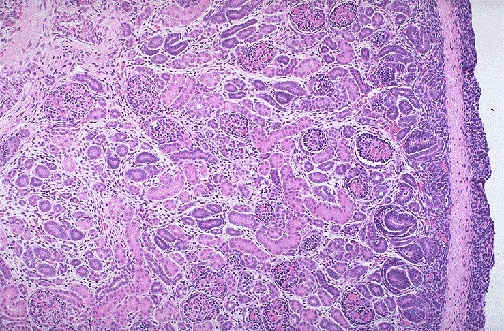

The normal microscopic appearance of fetal kidney is shown here. Note the nephrogenic zone underneath the renal capsule at the right.
## 3. ARPKD in situ, gross {#item-3}
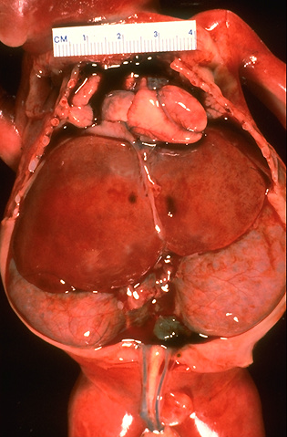

These symmetrically, bilaterally enlarged kidneys fill much of the abdomen beneath and below the liver (seen at the top of the gross image shown here) from autopsy, and are characteristic for recessive polycystic kidney disease (RPKD).
## 4. ARPKD, cut surface, gross {#item-4}
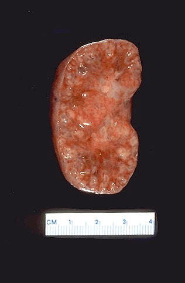

The cut surface of kidneys with recessive polycystic kidney disease (RPKD) is shown here. Note that the cysts are not very large grossly.
## 5. ARPKD in situ, gross {#item-5}
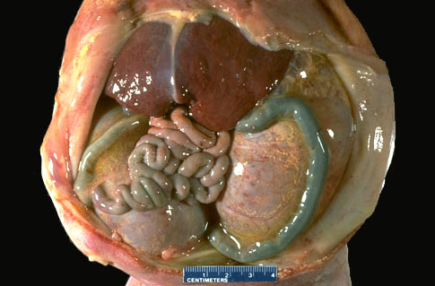

The gross appearance of kidneys with recessive polycystic kidney disease (RPKD) is shown here. The bilaterally and symmetrically enlarged kidneys displace the abdominal contents anteriorly and to the side. The descending colon runs over the surface of the left kidney.
## 6. ARPKD, cut surface, gross {#item-6}
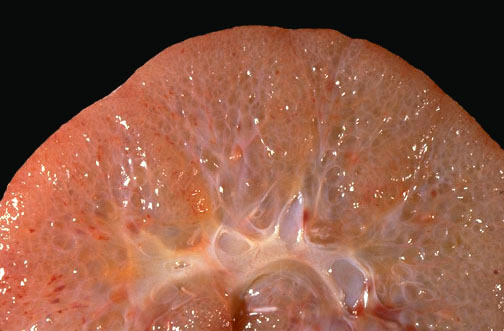

The cut surface of a kidney with recessive polycystic kidney disease (RPKD) is shown here grossly. The cysts are relatively small, but uniformly distributed throughout the parencyma, and there is no distinguishable cortex or medulla.
## 7. ARPKD, low power microscopic {#item-7}

At low power, the radially arranged cysts in RPKD are seen prominently.
## 8. Congential hepatic fibrosis in liver, high power microscopic {#item-8}

Characteristic for RPKD is the appearance of congenital hepatic fibrosis, seen as expanded portal regions with fibrosis and radially arranged bile ducts as shown here.
## 9. Multicystic renal dysplasia, gross {#item-9}
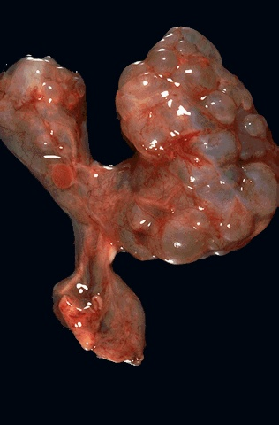

This is the gross appearance for multicystic renal dysplasia. Note the large but irregular cysts and the asymmetry of the kidneys. The small ureters lead to a hypoplastic bladder.
## 10. Multicystic renal dysplasia, gross {#item-10}
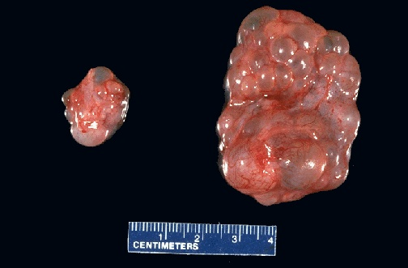

The kidneys are often asymmetric with multicystic renal dysplasia, and the cysts are variably sized.
## 11. Multicystic renal dysplasia, gross {#item-11}
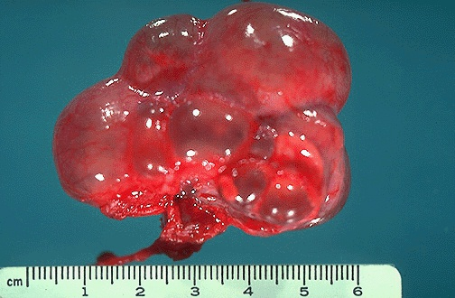

Multicystic renal dysplasia is shown here. No normal renal parenchyma is left.
## 12. Multicystic renal dysplasia, gross {#item-12}

Multicystic renal dysplasia.
## 13. Multicystic renal dysplasia, microscopic {#item-13}

Microscopically at low power, multicystic renal dysplasia demonstrates irregular cysts with intervening loose stroma with occasional glomeruli and tubules.
## 14. Multicystic renal dysplasia, microscopic {#item-14}
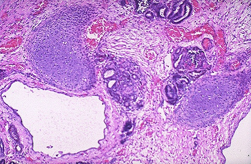

Microscopically at high power, multicystic renal dysplasia demonstrates occasional islands of cartilage in the stroma.
## 15. Pulmonary hypoplasia, gross {#item-15}

As a consequence of poor renal function from multicystic dysplasia (or any renal disease in utero) there is decreased amniotic fluid (which is mainly fetal urine), called oligohydramnios, which constricts fetal development, particularly the lungs. Thus, pulmonary hypoplasia ensues.
## 16. Pulmonary hypoplasia, microscopic {#item-16}

Microscopically, pulmonary hypoplasia can be seen as slowed development of the lungs, as well as decreased size of the lungs. The end result is inability to ventilate the baby at birth. Pulmonary hypoplasia is the rate-limiting step to survival with any condition that leads to oligohydramnios.
## 17. ADPKD, in situ, retroperitoneum, gross {#item-17}
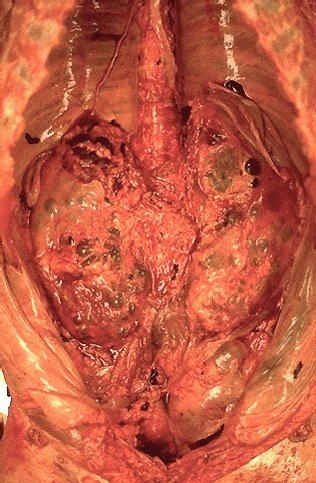

These markedly enlarged kidneys are seen in the retroperitoneum of an adult with dominant polycystic kidney disease (DPKD).
## 18. ADPKD, with transplant kidney, gross {#item-18}

These markedly enlarged kidneys from an adult with dominant polycystic kidney disease (DPKD) show very large cysts that fill the kidneys. A transplanted normal kidney is also present here.
## 19. ADPKD, gross {#item-19}
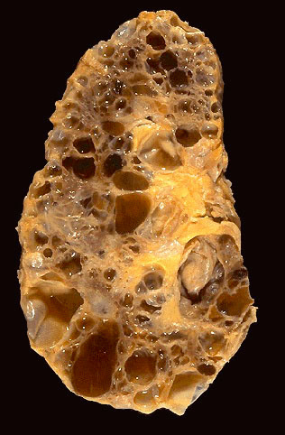

The cut surface of a markedly enlarged kidney from an adult with dominant polycystic kidney disease (DPKD) shows very large cysts that can be filled with clear fluid or filled with recent or organizing hemorrhage.
## 20. Polycystic liver with ADPKD disease, gross {#item-20}

With dominant polycystic kidney disease (DPKD), other organs may be involved in adults with polycystic change, including liver (and less commonly pancreas). Here is a liver with polycystic change seen grossly.
## 21. Berry aneurysm of cerebral artery, gross {#item-21}
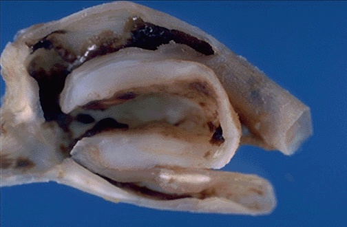

With dominant polycystic kidney disease (DPKD), intracranial berry aneurysms are more common, and rupture of such an aneurysm may preceed development of renal failure.
## 22. ADPKD in fetus with glomerular cysts (two views), high power microscopic {#item-22}
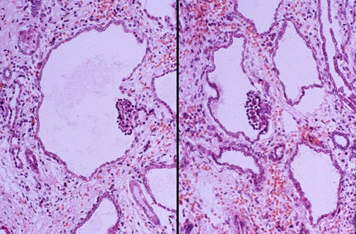

Very rarely, dominant polycystic kidney disease (DPKD) can manifest at birth, and microscopically the distinctive feature in the kidneys is a glomerular cyst in which a glomerulus is involved with the cystic change, as shown here.
## 23. Congenital urinary tract obstruction with hydronephrosis, gross {#item-23}
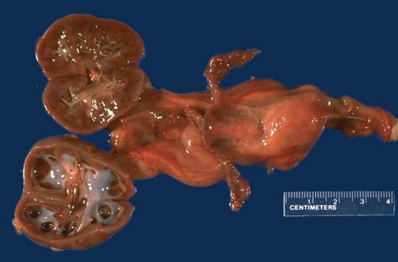

A right ureteral obstruction in this case led to right hydronephrosis. Though obstruction can lead to cortical microcyst formation, these microcysts are typically not grossly visible.
## 24. Obstruction with cortical microcysts, microscopic {#item-24}
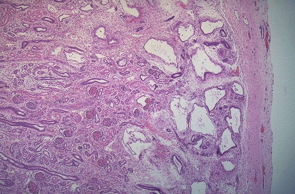

Urinary tract obstruction in utero can lead to renal cystic change in addition to hydronephrosis. The cysts appear near the nephrogenic zone, because the developing glomeruli are most sensitive to the increased pressure. Thus, cortical microcysts develop as shown here.
## 25. Pulmonary hypoplasia, gross {#item-25}
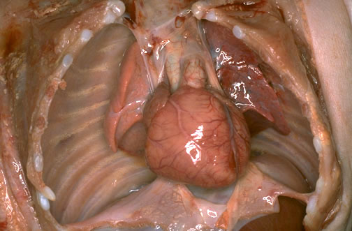

Pulmonary hypoplasia is the final consequence in association with any urinary tract disease in utero that leads to oligohydramnios.
## 26. Normal adult kidney with single small simple renal cyst, gross {#item-26}

Very common in adult kidneys seen at autopsy are one or several simple renal cysts. These cause no problems.
## 27. Normal adult kidney with one large simple renal cyst and several smaller cysts, gross {#item-27}

Occasionally, a simple renal cyst can reach a large size and mimic a tumor mass, though the difference is usually obvious with radiographic procedures. Such a large cyst can be complicated by hemorrhage or rupture.
## 28. Polycystic change with dialysis, gross {#item-28}
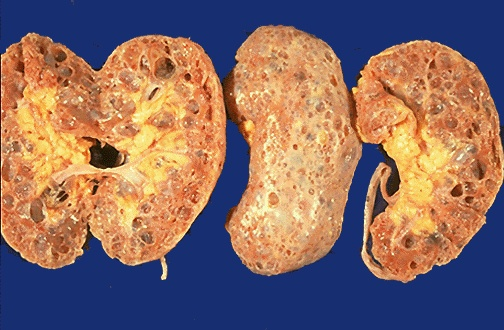

Patient with renal failure who undergo dialysis for years may develop multiple cysts in their kidneys. Such cysts are more numerous than the common simple renal cysts, but usually less numerous than cysts with DPKD, and the size of the kidneys is usually not markedly increased.
## 29. Medullary sponge kidney, gross {#item-29}
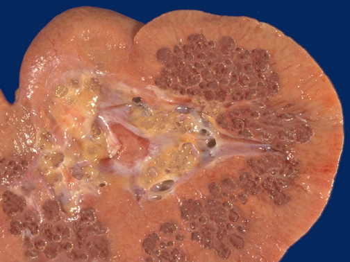

Note the0.1 to 0.5 cm cystsinvolving the inner medullary and papillary regions in this kidney. Note that the cortex appears normal. This is medullary sponge kidney (MSK), which is often detected incidentally with radiologic imaging studies. However, patients with MSK can develop calculi, typically in association with hypercalciuria.
