## 1. Examples of appearances of urine {#item-1}

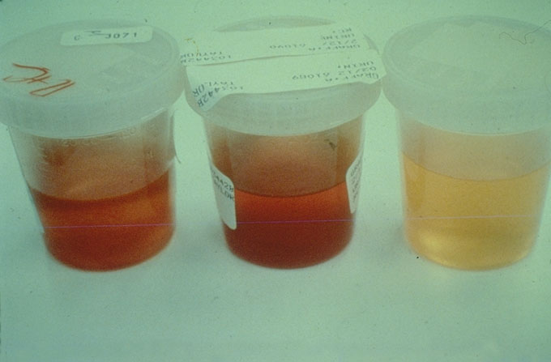

Three urine samples are shown. The one at the left shows a red, cloudy appearance. The one in the center is red but clear. The one on the right is yellow, but cloudy.

---

## 2. Red blood cells in urine {#item-2}

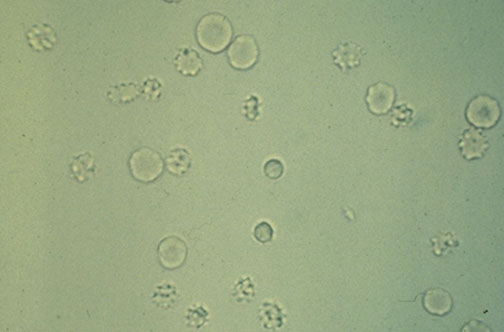

Red blood cells in urine appear as refractile disks. With hypertonicity of the urine, the RBC's begin to have a crenated appearance.

---

## 3. Dysmorphic red blood cells in urine {#item-3}

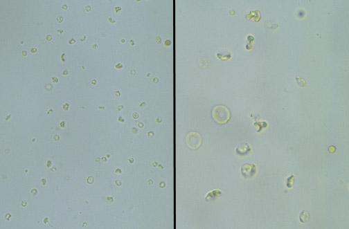

Note the irregular outlines of many of these RBC's, compared to two relatively normal RBC's at the center left of the right panel. These abnormal RBC's are dysmorphic RBC's.

---

## 4. White blood cells in urine {#item-4}

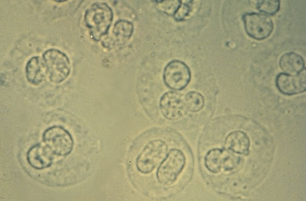

These white blood cells in urine have lobed nuclei and refractile cytoplasmic granules.

---

## 5. Oval fat bodies in urine {#item-5}

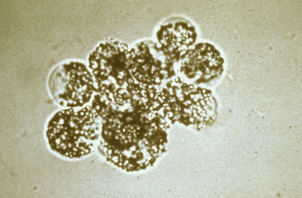

Oval fat bodies consist of degenerated tubular cells containing abundant lipid, which appears refractile.

---

## 6. Oval fat bodies in urine, with polarized light {#item-6}

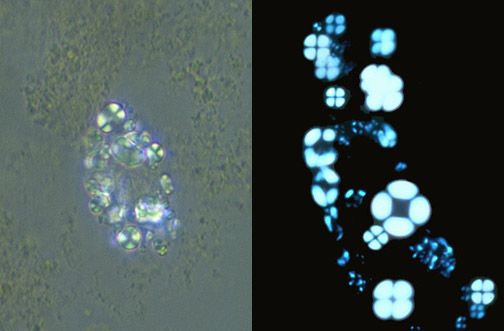

Under polarized light, oval fat bodies demonstrate the "Maltese cross" appearance.

---

## 7. Squamous epithelial cells in urine {#item-7}

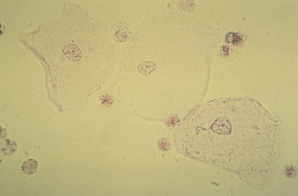

Large polygonal squamous epithelial cells with small nuclei are seen here.

---

## 8. Hyaline casts in urine {#item-8}

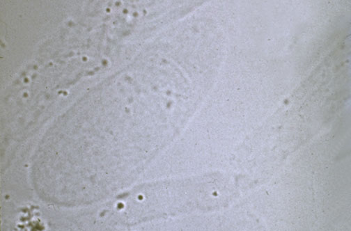

Hyaline casts, which appear very pale and slightly refractile, are common findings in urine.

---

## 9. Red blood cell casts forming in tubules {#item-9}

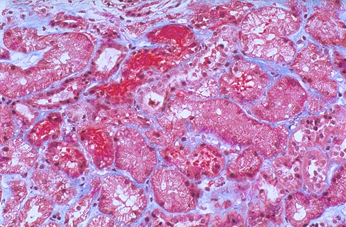

This histologic section at medium power with trichrome stain highlights red blood cells grouping together in tubules to form casts. The tubular epithelium is also damaged, with a foamy appearance, and is the basis for the appearance of oval fat bodies in urine in this case.

---

## 10. Red blood cell cast in urine {#item-10}

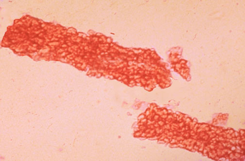

The presence of this red blood cell cast in on urine microscopic analysis suggests a glomerular or renal tubular injury.

---

## 11. White blood cell cast in urine {#item-11}

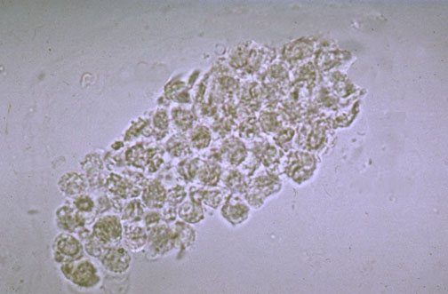

This white blood cell cast suggests an acute pyelonephritis.

---

## 12. Renal tubular cell cast in urine {#item-12}

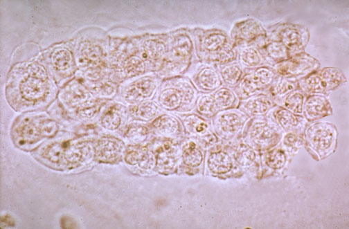

This renal tubular cell cast suggests injury to the tubular epithelium.

---

## 13. Granular casts in urine {#item-13}

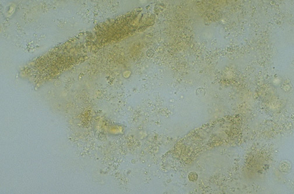

These are granular casts, with a roughly rectangular shape.

---

## 14. Granular cast in urine {#item-14}

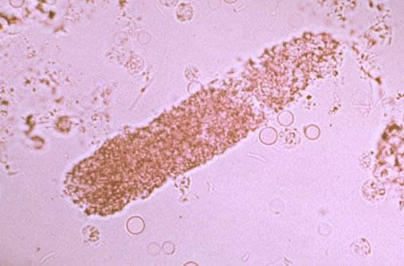

Casts which persist may break down, so that the cells forming it are degenerated into granular debris, as has occurred in this granular cast.

---

## 15. Waxy cast in urine {#item-15}

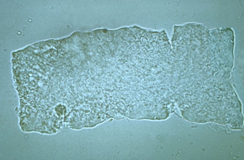

This is a broad, waxy cast. Note that the edges are sharp and there are "cracks" in this cast.

---

## 16. Bile stained hyaline casts in renal tubules {#item-16}

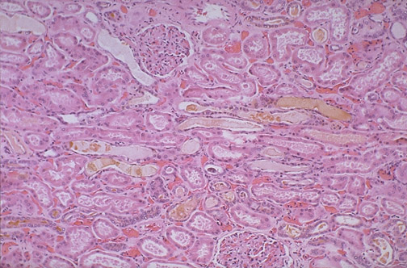

This section of renal cortex reveals tubules containing hyaline casts that are bile stained in a patient with hyperbilirubinemia.

---

## 17. Oxalate crystals in urine {#item-17}

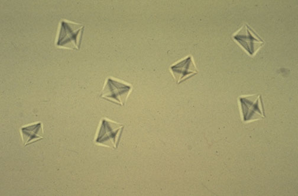

These are oxalate crystals, which look like little envelopes (or tetrahedrons, depending upon your point of view). Oxalate crystals are common.

---

## 18. Triple phosphate crystals in urine {#item-18}

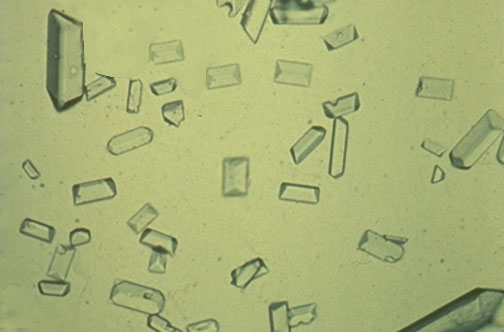

These "triple phosphate" crystals look like rectangles, or coffin lids if you are feeling depressed.

---

## 19. Cystine crystals in urine {#item-19}

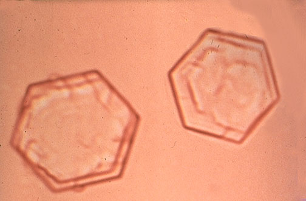

These cystine crystals are shaped like stop signs. Cystine crystals are quite rare.

---
