## 1. Normal esophagus, gross [ENDOSCOPY] {#item-1}
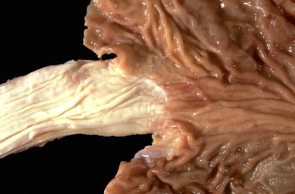

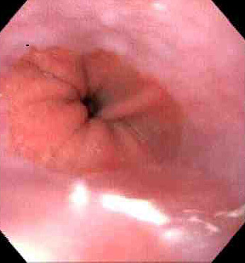
This is a normal esophagus with the usual white to tan smooth mucosa seen at the left. The(not an anatomic sphincter) is at the center, and the stomach is at the right.The upper GI endoscopic view of thetransitionfrom tan squamous mucosa to pink columnar mucosa is seen below.
This is a normal esophagus with the usual white to tan smooth mucosa seen at the left. The(not an anatomic sphincter) is at the center, and the stomach is at the right.
The upper GI endoscopic view of thetransitionfrom tan squamous mucosa to pink columnar mucosa is seen below.
## 2. Normal esophagus, low power microscopic {#item-2}
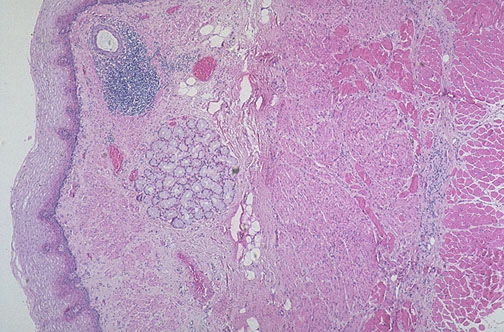

Normal non-keratinizing esophagealsquamous mucosais seen here at the left, and there is underlyingsubmucosacontainingmucus glands, with aductsurrounded by lymphoid tissue. At the right is the muscularis withsmooth muscleas well as outerskeletal muscle.
## 3. Candida esophagitis, gross {#item-3}
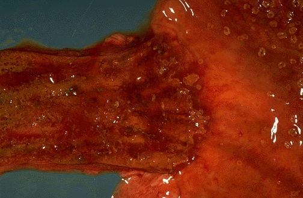

This isCandidaesophagitis.Tan-yellow plaquesare seen in the lower esophagus, along with mucosal hyperemia. The same lesions are also seen at the upper right in the stomach.
## 4. Acute esophagitis, microscopic {#item-4}
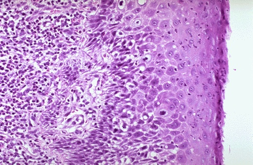

Acute esophagitis is manifested here by increased neutrophils in the submucosa as well asneutrophilsinfiltrating into the squamous mucosa at the right. The acute inflammation can be caused by infections, ingestion of irritative chemicals, drugs such as NSAIDS, chemotherapy, and radiation.
Question: What are clinical features of acute esophagitis?
AnswerThere can be difficulty swallowing, termeddysphagia. There can be pain with swallowing, termedodynophagia.
There can be difficulty swallowing, termeddysphagia. There can be pain with swallowing, termedodynophagia.
## 5. Herpes simplex esophagitis, gross {#item-5}
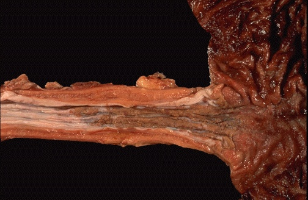

The lower esophagus here shows sharply demarcated ulcerations that have a brown-red base, contrasted with the normal pale white esophageal mucosa at the far left. Such "punched out" ulcers are suggestive of herpes simplex infection.
## 6. Herpes esophatitis, low power microscopic [ENDOSCOPY] {#item-6}

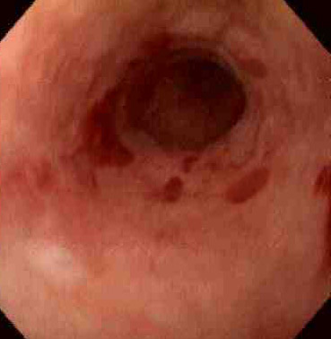
A herpetic ulcer is seen microscopically to have a sharp margin. The ulcer base at the left shows loss of overlying squamous epithelium with only necrotic debris remaining. In the upper GI endoscopic view below, there are rounded, erythematous ulcerations of the lower esophagus. Biopsies of these lesions reveals intranuclear inclusions in squamous epithelial cells indicative of herpes simplex virus esophagitis. This patient was immune compromised from chemotherapy.
## 7. Herpes esophatitis, high power microscopic {#item-7}

At high magnification, the squamous mucosa at the margin of the herpetic ulcer shows pale pink "ground glass" inclusions within squamous epithelial cells. Some of the inclusions are clustered together-- multinucleation is another common viral cytopathic effect.
## 8. Herpes simplex ulcers, gross {#item-8}
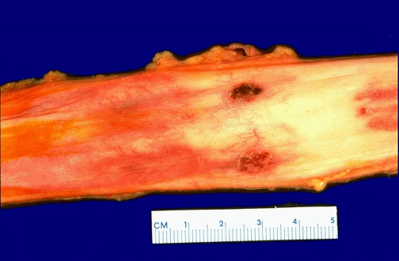

Here are two more sharply demarcated "punched out" ulcerations of the mid esophagus in an immunocompromised patient with herpes simplex infection.
## 9. Barrett esophagus, microscopic {#item-9}

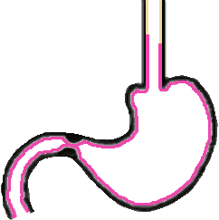

BarrettEsophagusA common cause for inflammation is a so-called "Barrett esophagus" with epithelial metaplasia to gastric-type mucosa above the gastroesophageal junction. The metaplasia results from chronic gastroesophageal reflux disease (GERD). Note thecolumnar epitheliumto the left and thesquamous epitheliumat the right. This is "typical" Barrett mucosa, because there is intestinal metaplasia as well (note the goblet cells in the columnar mucosa).
BarrettEsophagus
Question: What are some clinical features of GERD?
AnswerGERD can cause dysphagia and regurgitation, as well as substernal chest pain. Half of patients develop esophagitis with odynophagia. Extraesophageal manifestations incude coughing and wheezing.
GERD can cause dysphagia and regurgitation, as well as substernal chest pain. Half of patients develop esophagitis with odynophagia. Extraesophageal manifestations incude coughing and wheezing.
## 10. Barrett esophagus, endoscopy {#item-10}
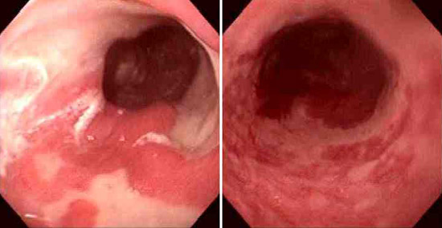

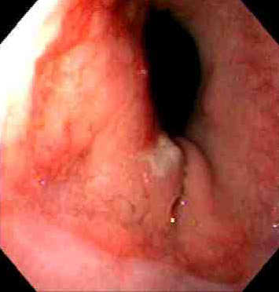
These two endoscopic views demonstrate Barrett esophagusareas of mucosal erythemaof the lower esophagus, withislands of normalpale esophageal squamous mucosa. If the area of Barrett mucosa extends less than 2 cm above the normal squamocolumnar junction, then the condition is called "short segment" Barrett esophagus, as shown below.
## 11. Barrett esophagus with adenocarcinoma, endoscopy {#item-11}
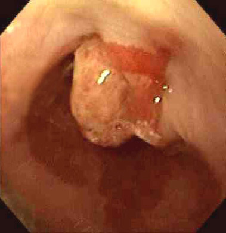

This is the view of the lower esophagus seen on endoscopy. Note the areas ofdark red friable mucosarepresenting Barrett esophagus. Note thepolypoid masswhich on biopsy proved to be a moderately differentiated adenocarcinoma. This patient had a 30 year history of poorly controlled gastroesophageal reflux disease.
## 12. Esophageal varices, gross {#item-12}

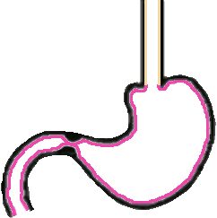

Seen here in the lower esophagus (which has been turned inside out at autopsy) are linear dark blue submucosaldilated veinsknown as varices. In patients with portal hypertension (usually from cirrhosis of the liver) the submucosal esophageal plexus of veins become dilated (to form varices). These superficial varices are prone tobleed.
## 13. Esophageal varices, gross [ENDOSCOPY] {#item-13}
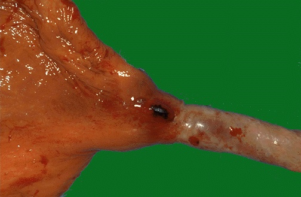

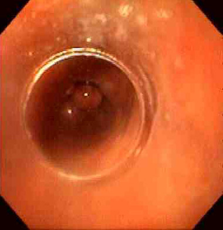
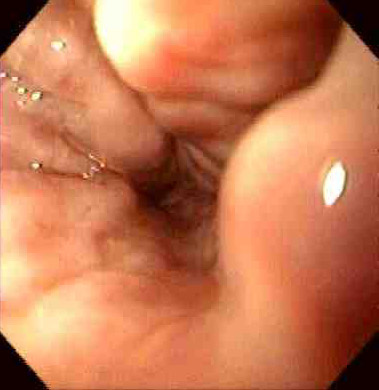
Here is anothervarixnear the gastroesophageal junction that is dark red black because it has been bleeding. (The esophagus has been turned inside out.) The plexus of veins also involves some of the upper stomach, but it is generically called the esophageal plexus of veins and, hence, bleeding here is termed esophageal variceal bleeding. Endoscopic views of esophageal varices are shown below, withdilated veinsbulging into the lower esophageal lumen.
## 14. Esophageal varices, low power microscopic {#item-14}
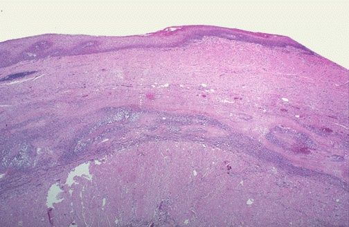

Below the squamous mucosa is an elongated, inflamedvarix. Hematemesis from variceal bleeding can be massive and difficult to control.
Question: How can variceal bleeding be treated?
AnswerEndoscopic variceal ligation along with the vasoconstrictor octreotide can be employed. Endoscopic injection sclerotherapy, or balloon-tube tamponade are also possible interventions.
Endoscopic variceal ligation along with the vasoconstrictor octreotide can be employed. Endoscopic injection sclerotherapy, or balloon-tube tamponade are also possible interventions.
## 15. Esophageal varices, high power microscopic {#item-15}
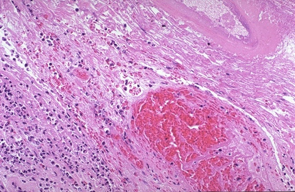

Inflammationcan occur that destroys mucosa and/or submucosa, weakening the tissues and leading to rupture withhemorrhageas seen here in the region of a ruptured varix of the esophagus.
## 16. Stomach, scleroderma with fibrosis, Trichrome stain, microscopic [XRAY] {#item-16}

Esophageal motility problems can occur in patients with progressive systemic sclerosis (scleroderma) because the submucosa becomes fibrotic. This occurs most often in the esophagus, but may also be seen elsewhere in the GI tract. Here in the stomach, a trichrome stain demonstrates a blue submucosa because of the extensive fibrosis.
## 17. Esophageal carcinoma, gross {#item-17}
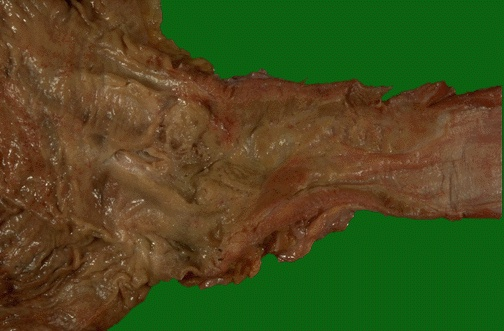

A history of smoking and/or alcoholism is often present in patients with esophageal squamous carcinoma, while a history of Barrett esophagus precedes development of esophageal adenocarcinoma in many cases. Here, an ill-defined mass at the gastroesophageal junction produces mucosal ulceration and irregularity, which led to the clinical symptoms of pain and difficulty swallowing.
## 18. Esophageal squamous cell carcinoma, gross [ENDOSCOPY] {#item-18}
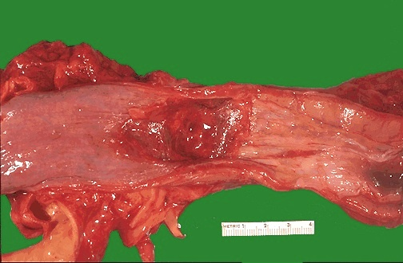

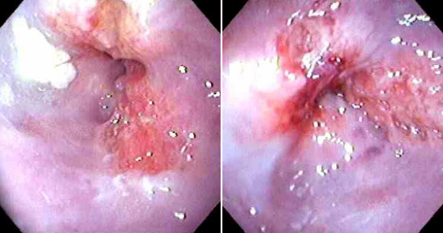
This irregular reddish, ulcerated exophyticmid-esophageal massas seen on the mucosal surface is a squamous cell carcinoma. Endoscopic views of an ulcerated mid-esophageal squamous cell carcinoma causing lumenal stenosis are seen below. Risk factors for esophageal squamous carcinoma include mainly smoking and alcoholism in the U.S. In other parts of the world dietary factors may play a role.
## 19. Esophageal squamous cell carcinoma, low power microscopic {#item-19}
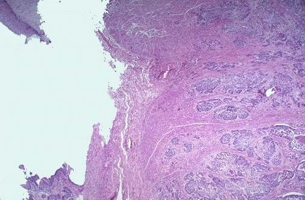

At the upper left is a remnant of squamous esophageal mucosa that has been undermined by an infiltrating squamous cell carcinoma of the mid-esophagus.Solid nestsof neoplastic cells are infiltrating down through the submucosa at the right. Esophageal cancers often spread to surrounding structures, making surgical removal difficult.
Question: What are risk factors for esophageal squamous carcinoma?
AnswerTobacco and alcohol use are risks. Nutritional factors (foods with nitrosamines and tannins, lack of vitamin A and zinc) may play a role in some parts of the world.
Tobacco and alcohol use are risks. Nutritional factors (foods with nitrosamines and tannins, lack of vitamin A and zinc) may play a role in some parts of the world.
## 20. Esophageal squamous cell carcinoma, high power microscopic {#item-20}
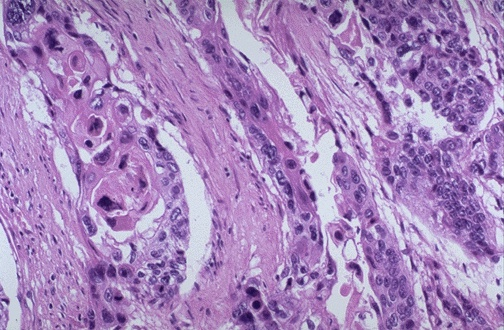

At high power, these infiltrating nests of neoplastic cells have abundant pink cytoplasm and distinct cell borders typical for squamous cell carcinoma. Esophageal carcinomas are not usually detected early and, therefore, have a very poor prognosis.
## 21. Stomach, normal, gross [ENDOSCOPY] {#item-21}
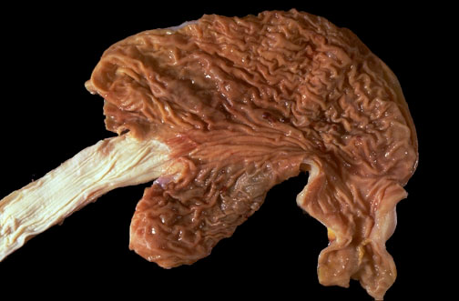

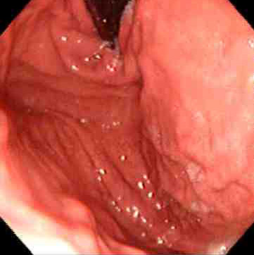
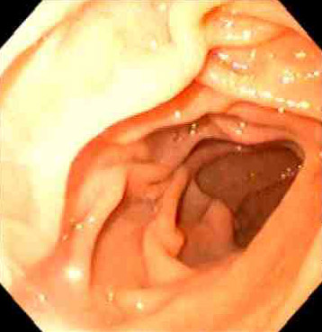
This is the normal appearance of the stomach, which has been opened along thegreater curvature. Theesophagusis at the left. In the fundus can be seen thelesser curvature. Just beyond theantrumis thepylorusemptying into the first portion ofduodenumis at the lower right. The normal appearance of the gastric fundus on upper GI endoscopy is shown below at the left, with the normal duodenal appearance at the right.
## 22. Stomach, pylorus, normal, gross [ENDOSCOPY] {#item-22}
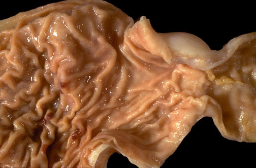

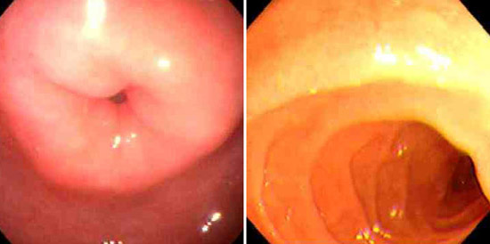
This is the normal appearance of thegastric antrumextending to thepylorusat the right of center. Thefirst portion of the duodenum(duodenal bulb) is at the far right. In the endoscopic views below, the normal appearance of the pylorus is seen at the left, with the first portion of the duodenum at the right.
## 23. Stomach, fundus, normal, medium power microscopic {#item-23}
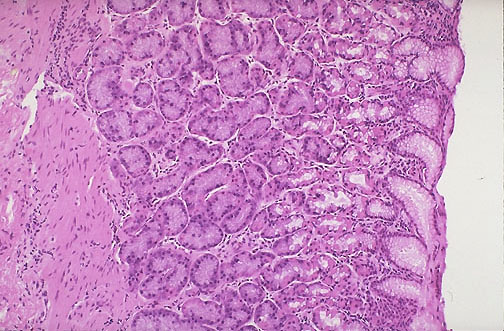

This is the normal appearance of the gastric fundal mucosa, with short pits lined by pale columnar mucus cells leading into long glands which contain bright pink parietal cells that secrete hydrochloric acid.
## 24. Acute gastritis, gross {#item-24}
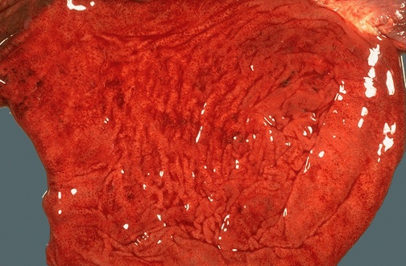

This is a more typical acute gastritis with a diffusely hyperemic gastric mucosa. There are many causes for acute gastritis: alcoholism, drugs, infections, etc.
## 25. Gastropathy with gastric erosions, gross {#item-25}
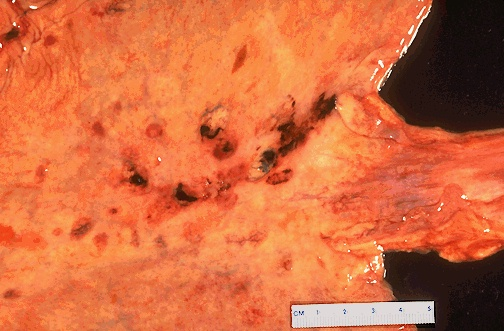

Here are some larger areas ofgastric hemorrhagethat could best be termed "erosions" because the superficial mucosa is eroded away. Such erosions are typical for the pathologic process termed gastropathy, which describes gastric mucosal injury without significant inflammation. The findings here fit with acute erosive gastropathy, but there are other patterns. Etiologies for the various gastropathies can include: alcohol, drugs such as NSAIDS, stress, uremia, bile reflux, portal hypertension, radiation, and chemotherapy.
## 26. Acute gastritis, microscopic {#item-26}
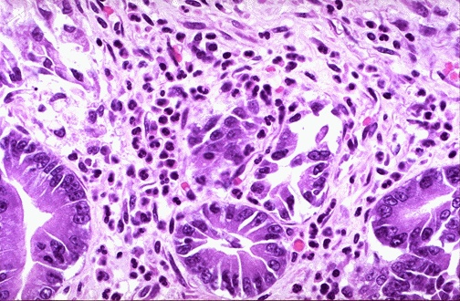

On microscopic examination at high power, this gastric mucosa shows infiltration byneutrophils. This is acute gastritis.
Question: What are causes for acute gastritis?
AnswerThe list is the same as for gastropathy: alcohol, drugs such as NSAIDS, stress, uremia, bile reflux, portal hypertension, radiation, and chemotherapy.
The list is the same as for gastropathy: alcohol, drugs such as NSAIDS, stress, uremia, bile reflux, portal hypertension, radiation, and chemotherapy.
## 27. Acute gastric ulcer, benign, gross [ENDOSCOPY] {#item-27}

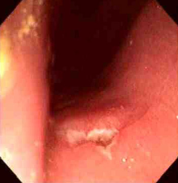
A 1 cm acute gastriculceris shown here in the upper fundus. The ulcer is shallow and sharply demarcated, with surrounding hyperemia and some smaller ulcers. It is probably benign. However, all gastric ulcers should be biopsied to rule out a malignancy. The endoscopic appearance of a similar acute peptic ulcer in the prepyloric region is seen below.
## 28. Gastric ulcers, endoscopy {#item-28}

Seen above are gastric ulcers ofsmall,medium, andlargesize on upper endoscopy. All gastric ulcers are biopsied, since gross inspection alone cannot determine whether a malignancy is present. Smaller, more sharply demarcated ulcers are more likely to be benign.Initial evaluation of upper gastrointestinal bleeding includes endoscopy. Greater potential morbidity and mortality is suggested by a systolic blood pressure 25 mg/dL, and hemoglobin <10 g/dL. At endoscopy several interventions can be attempted: injection with an agent such as epinephrine, thermal therapy, and mechanical placement of a clip. Two of these methods together work better than one. Medical therapy with a proton pump inhibitor to reduce acid and improve coagulation can be combined with endoscopy. Continued bleeding or rebleeding despite therapy may warrant surgical intervention.
Seen above are gastric ulcers ofsmall,medium, andlargesize on upper endoscopy. All gastric ulcers are biopsied, since gross inspection alone cannot determine whether a malignancy is present. Smaller, more sharply demarcated ulcers are more likely to be benign.
Initial evaluation of upper gastrointestinal bleeding includes endoscopy. Greater potential morbidity and mortality is suggested by a systolic blood pressure 25 mg/dL, and hemoglobin <10 g/dL. At endoscopy several interventions can be attempted: injection with an agent such as epinephrine, thermal therapy, and mechanical placement of a clip. Two of these methods together work better than one. Medical therapy with a proton pump inhibitor to reduce acid and improve coagulation can be combined with endoscopy. Continued bleeding or rebleeding despite therapy may warrant surgical intervention.
## 29. Gastric ulcer, malignant, gross {#item-29}
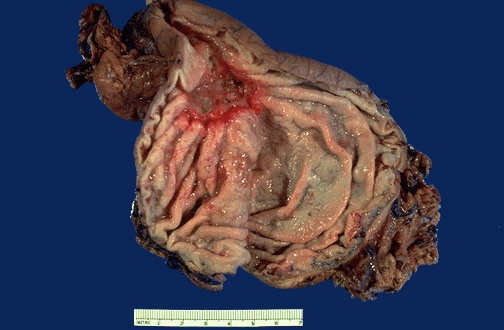

Here is a large 3 x 4 cmgastric ulcerthat led to the resection of the stomach shown here. This ulcer is quite deep with irregular margins. Complications of gastric ulcers (either benign or malignant) include pain, bleeding, perforation, and obstruction.
## 30. Acute gastric ulcer, low power microscopic {#item-30}
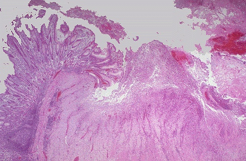

Microscopically, the ulcer here is sharply demarcated, with normal gastric mucosa on the left falling away into a deep ulcer whose base contains infamed, necrotic debris. Anarterial branchat the ulcer base is eroded and bleeding.
## 31. Acute gastric ulcer, high power microscopic {#item-31}
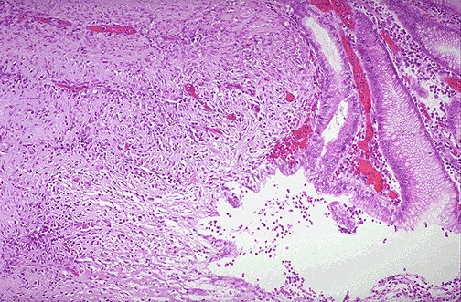

The mucosa at the upper right merges into the ulcer at the left which is eroding through the mucosa. Ulcers will penetrate over time if they do not heal. Penetration leads to pain. If the ulcer penetrates through the muscularis and through adventitia, then the ulcer is said to "perforate" and leads to an acute abdomen. An abdominal radiograph may demonstrate free air with a perforation.
## 32. Acute gastric ulcer penetrating to artery, low power microscopic {#item-32}
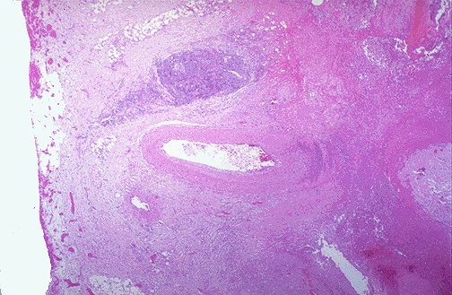

The ulcer at the right is penetrating through the muscularis and approaching anartery. Erosion of the ulcer into the artery will lead to another major complication of ulcers--hemorrhage. This hemorrhage can be life threatening. Chronic blood loss may lead to an iron deficiency anemia.
## 33. Helicobacter pylori in stomach, Methylene blue stain, microscopic {#item-33}
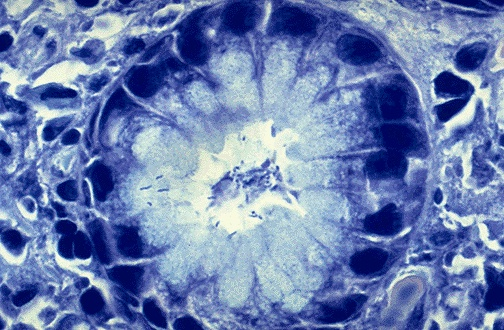

Chronic gastritis and peptic ulcer disease are often accompanied by infection withHelicobacter pylori. This small curved to spiral rod-shaped bacterium is found in the surface epithelial mucus of most patients with active gastritis. Therod-shaped bacteriaare seen here with a methylene blue stain.
Question: What are additional diagnostic methods forH. pylori?
AnswerIn addition to microscopy of biopsies, laboratory tests include serologic detection of antibody, urea breath test, and microbiologic culture.
In addition to microscopy of biopsies, laboratory tests include serologic detection of antibody, urea breath test, and microbiologic culture.
## 34. Acute duodenal ulcer, gross [ENDOSCOPY] {#item-34}
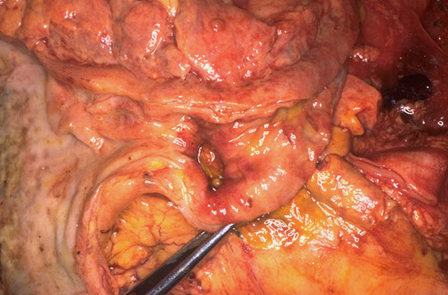

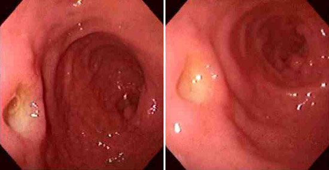
The strongest association with Helicobacter pylori is with duodenal peptic ulceration--over 85% of duodenal ulcers. Seen here is a penetratingacute ulcerationin the duodenum just beyond thepylorus. An acute duodenal ulcer is seen in two views on upper endoscopy in the panels below.
## 35. Anti-parietal cell autoantibody, immunofluorescence microscopy {#item-35}
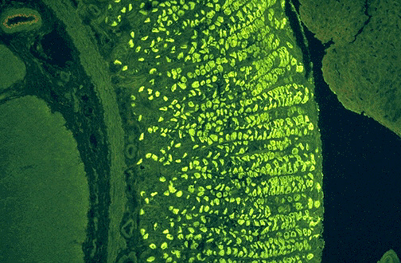

Another association with gastritis is pernicious anemia. Chronic atrophic gastritis is associated with autoantibodies that block or bind intrinsic factor. Another type of autoantibody demonstrated here is anti-parietal cell antibody. The bright green immunofluorescence is seen in the paritetal cells of the gastric mucosa.
## 36. Gastric adenocarcinoma, gross {#item-36}
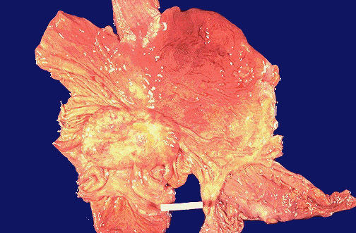

The stomach is opened here to reveal agastric adenocarcinomaIn the U.S., most gastric cancers are discovered at a late stage when the neoplasm has invaded and/or metastasized. In Japan, where the incidence of gastric cancer is high, endoscopic screening is conducted, and more cancers are detected at an early stage. ALL gastric ulcers and ALL gastric masses must be biopsied, because it is not possible to tell from gross appearance alone which are benign and which are malignant. In contrast, virtually all duodenal peptic ulcers are benign.
## 37. Gastric adenocarcinoma with ulceration, gross {#item-37}

Here is agastric ulcer. It is shallow and is about 2 to 4 cm in size. This ulcer on biopsy proved to be malignant, so the stomach was resected as shown here.
## 38. Gastric adenocarcinoma, linitis plastica type, gross {#item-38}
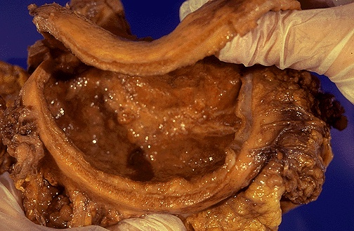

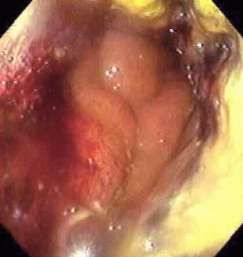
This is an example of linitis plastica, a diffuse infiltrative gastric adenocarcinoma which gives the stomach a shrunken "leather bottle" appearance withextensive mucosal erosionand amarkedly thickenedgastric wall. This type of carcinoma has a very poor prognosis. The endoscopic view of this lesion is shown below, with extensive mucosal erosion.
## 39. Gastric adenocarcinoma with metastases, gross {#item-39}
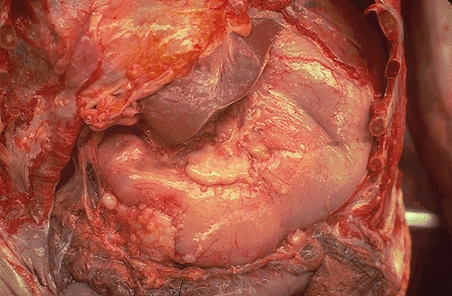

At autopsy, the thoracic cavity and abdominal cavity are both opened to reveal the stomach just to the right and below the edge of liver in this photograph. Gastric adenocarcinoma has infiltrated through the wall and appears on the surface asirregular tan masses. The extensive tumor in this case caused gastric outlet obstruction.
## 40. Gastric adenocarcinoma, low power microscopic {#item-40}
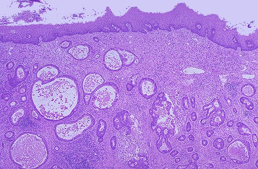

A moderately differentiated gastric adenocarcinoma is infiltrating up and into the submucosa below the squamous mucosa of the esophagus. The neoplastic glands are variably sized.
## 41. Gastric adenocarcinoma, medium power microscopic {#item-41}
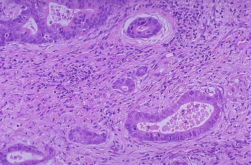

At higher magnification, the infiltrating neoplastic glands of gastric adenocarcinoma showmitoses, increased nuclear/cytoplasmic ratios, and hyperchromatism. There is a desmoplastic stromal reaction to the infiltrating glands.
## 42. Gastric adenocarcinoma, high power microscopic [IPX] {#item-42}
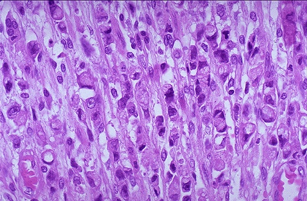

At high power, this gastric adenocarcinoma is so poorly differentiated that glands are not visible. Instead, rows of infiltrating neoplastic cells with marked pleomorphism are seen. Many of the neoplastic cells haveclear vacuoles of mucinpushing the cell nucleus to one side, giving them a 'signet ring' appearance.
## 43. Gastric adenocarcinoma, signet ring pattern, high power microscopic {#item-43}
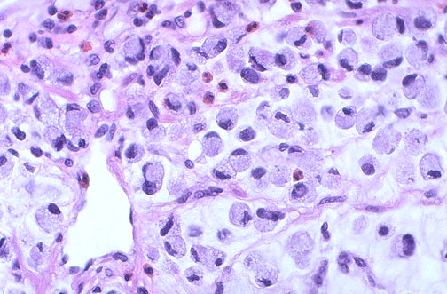

This is a signet ring cell pattern of adenocarcinoma in which the cells are filled with mucin vacuoles that push the nucleus to one side, as shown at the arrow.
## 44. Cytokeratin positive gastric adenocarcinoma, immunohistochemical stain, microscopic {#item-44}

This is an immunohistochemical stain with antibody to cytokeratin, which is positive in the poorly differentiated neoplastic cells seen here infiltrating through the gastric wall. Cytokeratin staining is typical for neoplasms of epithelial origin (carcinomas).
## 45. Normal mesentery, gross {#item-45}
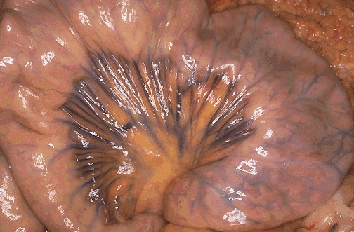

Seen here is a loop of bowel attached via the mesentery. Note the extent of theprominent blue mesenteric veins. Arteries run in the same location. Thus, there is an extensive anastomosing arterial blood supply to the bowel, making it more difficult to infarct. Also, the extensive venous drainage is incorporated into the portal venous system heading to the liver.
## 46. Normal terminal ileum, gross [ENDOSCOPY] {#item-46}

This is the normal appearance of terminal ileum. In the upper frame, note theileocecal valve, and several darker ovalPeyer's patchesare present on the mucosa. In the lower frame, aPeyer's patch, which is a concentration of submucosal lymphoid tissue, is present. Note the folds are not as prominent here as in the jejunum, as evidenced by the colonoscopic view below.
## 47. Normal small intestinal mucosa, medium power microscopic {#item-47}

This is the normal appearance of small intestinal mucosa with long villi that have occasional goblet cells. The villi provide a large area for digestion and absorption.
## 48. Adhesions, peritoneum, small intestine, gross {#item-48}

This is anadhesionbetween loops of small intestine. Such adhesions are typical following abdominal surgery. More diffuse adhesions may also form following peritonitis. Adhesions may predispose to bowel obstruction.
## 49. Small intestinal infarction, gross {#item-49}

The dark red infarcted small intestine contrasts with the light pink viable bowel. The forceps extend through an internal hernia in which a loop of bowel and mesentery has been caught. This is one complication of adhesions from previous surgery. The trapped bowel has lost its blood supply.
## 50. Cecum, volvulus, gross {#item-50}

This is an example of cecal volvulus. Volvulus is a twisting of the bowel. Volvulus is most common in adults, where it occurs with equal frequency in small intestine (around a twisted mesentery) and colon (in either sigmoid or cecum which are more mobile). In very young children, volvulus almost always happens in the small intestine.
## 51. Ischemic enteritis, gross {#item-51}

The small intestinal mucosa demonstrates marked hyperemia as a result of ischemic enteritis. Such ischemia most often results from hypotension (shock) from cardiac failure, from marked blood loss, or from loss of blood supply from mechanical obstruction (as with the bowel incarcerated in a hernia or with volvulus or intussusception). If the blood supply is not quickly restored, the bowel will infarct.
## 52. Ischemic enteritis, gross [ENDOSCOPY] {#item-52}

On closer inspection, early ischemic enteritis involves the tips of the villi. A colonoscopic view of ischemic colitis with minimal overlying exudate is shown below. In general, bowel is hard to infarct from atherosclerotic vascular narrowing or thromboembolization because of the widely anastomosing blood supply. Thus, most cases of bowel ischemia and infarction result from generalized hypotension and decreased cardiac output.
## 53. Ischemic enteritis, low power microscopic {#item-53}

The mucosal surface of the bowel seen here shows early necrosis with hyperemia extending all the way from mucosa to submucosal and muscular wall vessels. The submucosa and muscularis, however, are still intact.
## 54. Ischemic enteritis, medium power microscopic {#item-54}

At higher magnification with more advanced necrosis, the small intestinal mucosa shows hemorrhage with acute inflammation in this case of ischemic enteritis.
## 55. Peritonitis from bowel perforation, gross {#item-55}

Perforation of GI tract (from lower esophagus to colon) can result in a peritonitis as seen here at autopsy. A thick yellow purulent exudate covers peritoneal surfaces. An ovarian carcinoma caused sigmoid colonic obstruction (the sigmoid is the markedly dilated grey-black bowel in the pelvis seen here) with perforation.
## 56. Well-differentiated neuroendocrine tumor ("carcinoid" tumor) of small intestine, gross {#item-56}

Neoplasms of the small intestine are uncommon. Benign tumors can include leiomyomas, fibromas, neurofibromas, and lipomas. Seen here at the ileocecal valve is another tumor that has a faint yellowish color. This is awell-differentiated neuroendocrine tumor ("carcinoid" tumor). Most benign tumors are incidental submucosal lesions, though rarely they can be large enough to obstruct the lumen.
## 57. Well-differentiated neuroendocrine tumor ("carcinoid" tumor) of small intestine, low power microscopic {#item-57}

The well-differentiated neuroendocrine tumor ("carcinoid" tumor) is seen here to be a discreet, though not encapsulated, mass of multiple nests of small blue cells in the submucosa.
## 58. Well-differentiated neuroendocrine tumor ("carcinoid" tumor) of small intestine, high power microscopic {#item-58}

At high magnification, the nests of well-differentiated neuroendocrine tumor ("carcinoid" tumor) have a typical endocrine appearance with small round cells having small round nuclei and pink to pale blue cytoplasm. Rarely, a malignant neuroendocrine tumor can occur as a large bulky mass. Metastatic carcinoid to the liver can rarely result in the carcinoid syndrome.
## 59. Metastasis to small intestine, gross {#item-59}

The most common neoplasm in small bowel is a metastasis as seen here. This mass caused local obstruction. Primary sites are often from nearby colon, ovary, pancreas, and stomach.
## 60. Primary adenocarcinoma, ampulla, microscopic [ENDOSCOPY] {#item-60}

This adenocarcinoma arose in the ampulla of Vater. Primary small intestinal carcinomas are very rare, but the majority of those that do occur arise in the region of the ampulla, where they may become symptomatic through biliary or pancreatic duct obstruction. The appearance of such amasson esophagogastroduodenoscopy is seen below, and following placement of a stent for drainage.
## 61. Leiomyosarcoma of small intestine, gross {#item-61}

This is a leiomyosarcoma of the small bowel. As with sarcomas in general, this one is big and bad. Sarcomas are uncommon at this site, but must be distinguished from other types of neoplasms.
## 62. Non-Hodgkin's lymphoma of small intestine, medium power microscopic {#item-62}

The large blue non-Hodgkin's lymphoma cells can be seen infiltrating through the mucosa.
## 63. Non-Hodgkin's lymphoma of small intestine, high power microscopic {#item-63}

At high magnification, the non-Hodgkin lymphoma cells have prominent clumped chromatin and nucleoli with occasionalmitotic figures. Most gastrointestinal lymphomas are B-cell in origin.
## 64. Meckel's diverticulum, gross {#item-64}

Congenital anomalies of bowel consist mainly of diverticulae or atresias which are often in association with other congenital anomalies. Seen here is the most common congenital anomaly of the GI tract--a Meckel's diverticulum. Remember the number 2: about 2% of people have them; they are usually located 2 feet from the ileocecal valve.
## 65. Celiac sprue compared to normal small intestine, low power microscopic {#item-65}

Normal small intestinal mucosa is seen at the left. The mucosa involved by celiac disease (sprue) at the right has blunting and flattening of villi. Celiac disease most often becomes apparent either in infancy, or in young to middle age adults. It is diagnosed in about 1 in 3000 persons in the U.S., but the prevalence is probably much greater. It is more common in Caucasians and uncommon in Blacks and Asians. In some European populations, it may be as prevalent as 1%. About 95% of patients have the HLA-DQ2 allele, which suggests a genetic basis.
Ingestion of certain grains (wheat, rye, barley) that contain gluten with gliaden protein will cause celiac sprue. The enzyme tissue transglutamidase breaks down gliaden into peptides that, when displayed to antigen presenting cells, activate CD4 lymphocytes that produce mucosal inflammation. Autoantibodies are found in over 90% of cases, mainly of the IgA type, including: anti-tissue transglutaminase (best), anti-gliaden, anti-reticulin, and antiendomysial antibodies. Serologic tesing is helpful for diagnosis along with a trial of a gluten-free diet. Serology and biopsy findings may be negative in persons on a gluten-free diet.Complications include an increased risk for gastrointestinal lymphoma and adenocarcinoma. Some patients have additional immunologically mediated conditions, including type I diabetes mellitus. About 20% of patients have dermatitis herpetiformis, with onset often in young adulthood. This is a blistering skin disease caused by IgA autoantibodies directed at dermal keratinocytes. There is an intensely pruritic papulovesicular rash most often on extensor surfaces.
Ingestion of certain grains (wheat, rye, barley) that contain gluten with gliaden protein will cause celiac sprue. The enzyme tissue transglutamidase breaks down gliaden into peptides that, when displayed to antigen presenting cells, activate CD4 lymphocytes that produce mucosal inflammation. Autoantibodies are found in over 90% of cases, mainly of the IgA type, including: anti-tissue transglutaminase (best), anti-gliaden, anti-reticulin, and antiendomysial antibodies. Serologic tesing is helpful for diagnosis along with a trial of a gluten-free diet. Serology and biopsy findings may be negative in persons on a gluten-free diet.
Complications include an increased risk for gastrointestinal lymphoma and adenocarcinoma. Some patients have additional immunologically mediated conditions, including type I diabetes mellitus. About 20% of patients have dermatitis herpetiformis, with onset often in young adulthood. This is a blistering skin disease caused by IgA autoantibodies directed at dermal keratinocytes. There is an intensely pruritic papulovesicular rash most often on extensor surfaces.
## 66. Celiac sprue, small intestine, high power microscopic {#item-66}

The small intestinal mucosa at high magnification shows marked chronic inflammation in a case of celiac disease (sprue). The enteropathy shown here has loss of crypts, increased mitotic activity, loss of brush border, and infiltration with lymphocytes and plasma cells (B-cells sensitized to gliaden).The most common symptoms and signs include chronic diarrhea, often with foul smelling stools (steatorrhea), abdominal bloating and cramps, and flatulence. When asked about the nature of the diarrhea, a patient may recount having 8 to 12 stools a day, sometimes 2 to 5 times per week. The stools are watery but not bloody. The malnutrition can lead to weight loss. Poor absorption of nutrients such as iron, calcium, and fat soluble vitamins can predispose to anemia with fatigue (iron, vitamin E), osteopenia (calcium and vitamin D), bleeding (vitamin K), and increased infections (vitamin A). These findings may not be severe, and may develop over years to decades.Removing foods containing grains with gluten from the diet will cause this gluten-sensitive enteropathy to subside. Decreasing intake of fats and milk products can help as well.
The small intestinal mucosa at high magnification shows marked chronic inflammation in a case of celiac disease (sprue). The enteropathy shown here has loss of crypts, increased mitotic activity, loss of brush border, and infiltration with lymphocytes and plasma cells (B-cells sensitized to gliaden).
The most common symptoms and signs include chronic diarrhea, often with foul smelling stools (steatorrhea), abdominal bloating and cramps, and flatulence. When asked about the nature of the diarrhea, a patient may recount having 8 to 12 stools a day, sometimes 2 to 5 times per week. The stools are watery but not bloody. The malnutrition can lead to weight loss. Poor absorption of nutrients such as iron, calcium, and fat soluble vitamins can predispose to anemia with fatigue (iron, vitamin E), osteopenia (calcium and vitamin D), bleeding (vitamin K), and increased infections (vitamin A). These findings may not be severe, and may develop over years to decades.
Removing foods containing grains with gluten from the diet will cause this gluten-sensitive enteropathy to subside. Decreasing intake of fats and milk products can help as well.
## 67. Giardia duodenalis, small intestine, microscopic {#item-67}

This is an example of infectious diarrhea due toGiardia duodenalisinfection of the small intestine. The small pear-shaped trophozoites live in the duodenum and become infective cysts that are excreted. They produce a watery diarrhea. A useful test for diagnosis of infectious diarrheas is stool examination for ova and parasites.
## 68. Cryptosporidiosis, small intestine, microscopic {#item-68}

This is another infectious agent that is becoming more frequent in immunocompromised patients, particularly those with AIDS. The small round blueorganismsat the lumenal border areCryptosporidium parvum. Cryptosporidiosis produces a copious watery diarrhea.
## 69. Microbiology, GI Tract bacterial infection identification - Chart {#item-69}

Gastrointestinal Tract - Bacterial IdentificationLaboratory testing algorithm forSalmonella, Shigella, Vibrio, E. coli, Campylobacter jejuni, Yersinia enterocolitica, Enterococcus, andBacillus cereusHover over the animation to start / stop rotation
Gastrointestinal Tract - Bacterial Identification
Laboratory testing algorithm forSalmonella, Shigella, Vibrio, E. coli, Campylobacter jejuni, Yersinia enterocolitica, Enterococcus, andBacillus cereus
Hover over the animation to start / stop rotation
Gram Negative RodsMacConkey Agar - Lactose NegativeS/S Agar Positive - Citrate PositiveSalmonellaS. typhi- Dulcitol(-) -S. enterica- Dulcitol(+)Gram Negative RodsMacConkey Agar - Lactose NegativeS/S Agar Positive - H2S negativeShigella sppCurved Motile Gram Negative RodsMacConkey Agar - Negative LactoseOxidase Positive - - Glucose PositiveVibrio choleraeSucrose(+)Vibrio parahemolyticusSucrose(-)Large Gram Negative RodsMacConkey Agar - Positive LactosePositive Indole Test - - Green sheen on EMB AgarEscherichia coliGram Negative CoccobacilliGrowth in low O2High CO2Oxidase Positive - - Catalase PositiveCampylobacter jejuniGram Negative Pleomorphic CocciMacConkey Agar - Lactose NegativeOxidase NegativeGlucose - Urea - Catalase: PositiveYersinia enterocoliticaGram Positive Cocci in ChainsCatalase NegativeGamma (no) Hemolysis on Blood AgarBile Esculin Agar PositiveEnterococcusLarge Spore-forming Gram Positive RodsOxidase Positive - - Catalase PositiveBacillus cereus
Gram Negative RodsMacConkey Agar - Lactose NegativeS/S Agar Positive - Citrate PositiveSalmonellaS. typhi- Dulcitol(-) -S. enterica- Dulcitol(+)
Gram Negative RodsMacConkey Agar - Lactose NegativeS/S Agar Positive - H2S negativeShigella spp
Curved Motile Gram Negative RodsMacConkey Agar - Negative LactoseOxidase Positive - - Glucose PositiveVibrio choleraeSucrose(+)Vibrio parahemolyticusSucrose(-)
Large Gram Negative RodsMacConkey Agar - Positive LactosePositive Indole Test - - Green sheen on EMB AgarEscherichia coli
Gram Negative CoccobacilliGrowth in low O2High CO2Oxidase Positive - - Catalase PositiveCampylobacter jejuni
Gram Negative Pleomorphic CocciMacConkey Agar - Lactose NegativeOxidase NegativeGlucose - Urea - Catalase: PositiveYersinia enterocolitica
Gram Positive Cocci in ChainsCatalase NegativeGamma (no) Hemolysis on Blood AgarBile Esculin Agar PositiveEnterococcus
Large Spore-forming Gram Positive RodsOxidase Positive - - Catalase PositiveBacillus cereus
Stool culture must be performed to identify specific pathogens, because stool contains an abundance of commensal bacteria. A standard stool culture identifiesSalmonella, Shigella, Campylobacter, andYersinia enterocolitica. SinceE. coliconstitutes a substantial amount of gut flora, then specific serotypes known to cause illness must be identified, such as serotype O157:H7 producing a shiga-like toxin that can lead to hemolytic-uremic syndrome (HUS).Salmonella typhistarts as a gastrointestinal infection, but can become a systemic disease. The more commonSalmonella entericaproduces cramping abdominal pain and diarrhea; it is often found in contaminated poultry products.Shigellaorganisms are virulent and can produce a necrotizing colitis and cause dysentery (a bloody diarrhea).Campylobacter jejunican cause watery, and sometimes bloody, diarrhea and abdominal pain. Aninmals are often implicated as the source.Yersinia enterocoliticais a less common organisms in the familyEnterobacteriaceaethat can cause diarrhea (bloody if severe), abdominal pain, and vomiting. It often involves the terminal ileum, resulting in signs and symptoms resembling appendicitis. Mesenteric lymph node involvement may occur, from where sepsis may originate.Vibriospecies involving the GI tract include the highly virulentV. cholerathat elaborates a toxin causing a profuse watery diarrhea. The organism is not invasive, but the toxin is powerful, and treatment requires prompt fluid and electrolyte replacement.V. parahemolyticusproduces a less severe diarrhea, and contaminated shellfish are often implicated as the source.Enterococcal species within a genus ofStreptococcusare gut commensals that are not ordinarily a problem until there is perforation of a viscus. Many of them have become antibiotic resistant.Bacillus cereusis a cause for food poisoning, with prominent vomiting. These spore forming organisms can survive in harsh environments. Therefore, they may survive refrigerator temperatures or heating. Reheated fried rice is the classic source.
Stool culture must be performed to identify specific pathogens, because stool contains an abundance of commensal bacteria. A standard stool culture identifiesSalmonella, Shigella, Campylobacter, andYersinia enterocolitica. SinceE. coliconstitutes a substantial amount of gut flora, then specific serotypes known to cause illness must be identified, such as serotype O157:H7 producing a shiga-like toxin that can lead to hemolytic-uremic syndrome (HUS).
Salmonella typhistarts as a gastrointestinal infection, but can become a systemic disease. The more commonSalmonella entericaproduces cramping abdominal pain and diarrhea; it is often found in contaminated poultry products.Shigellaorganisms are virulent and can produce a necrotizing colitis and cause dysentery (a bloody diarrhea).Campylobacter jejunican cause watery, and sometimes bloody, diarrhea and abdominal pain. Aninmals are often implicated as the source.Yersinia enterocoliticais a less common organisms in the familyEnterobacteriaceaethat can cause diarrhea (bloody if severe), abdominal pain, and vomiting. It often involves the terminal ileum, resulting in signs and symptoms resembling appendicitis. Mesenteric lymph node involvement may occur, from where sepsis may originate.Vibriospecies involving the GI tract include the highly virulentV. cholerathat elaborates a toxin causing a profuse watery diarrhea. The organism is not invasive, but the toxin is powerful, and treatment requires prompt fluid and electrolyte replacement.V. parahemolyticusproduces a less severe diarrhea, and contaminated shellfish are often implicated as the source.Enterococcal species within a genus ofStreptococcusare gut commensals that are not ordinarily a problem until there is perforation of a viscus. Many of them have become antibiotic resistant.Bacillus cereusis a cause for food poisoning, with prominent vomiting. These spore forming organisms can survive in harsh environments. Therefore, they may survive refrigerator temperatures or heating. Reheated fried rice is the classic source.
Salmonella typhistarts as a gastrointestinal infection, but can become a systemic disease. The more commonSalmonella entericaproduces cramping abdominal pain and diarrhea; it is often found in contaminated poultry products.
Shigellaorganisms are virulent and can produce a necrotizing colitis and cause dysentery (a bloody diarrhea).Campylobacter jejunican cause watery, and sometimes bloody, diarrhea and abdominal pain. Aninmals are often implicated as the source.Yersinia enterocoliticais a less common organisms in the familyEnterobacteriaceaethat can cause diarrhea (bloody if severe), abdominal pain, and vomiting. It often involves the terminal ileum, resulting in signs and symptoms resembling appendicitis. Mesenteric lymph node involvement may occur, from where sepsis may originate.Vibriospecies involving the GI tract include the highly virulentV. cholerathat elaborates a toxin causing a profuse watery diarrhea. The organism is not invasive, but the toxin is powerful, and treatment requires prompt fluid and electrolyte replacement.V. parahemolyticusproduces a less severe diarrhea, and contaminated shellfish are often implicated as the source.Enterococcal species within a genus ofStreptococcusare gut commensals that are not ordinarily a problem until there is perforation of a viscus. Many of them have become antibiotic resistant.Bacillus cereusis a cause for food poisoning, with prominent vomiting. These spore forming organisms can survive in harsh environments. Therefore, they may survive refrigerator temperatures or heating. Reheated fried rice is the classic source.
Shigellaorganisms are virulent and can produce a necrotizing colitis and cause dysentery (a bloody diarrhea).
Campylobacter jejunican cause watery, and sometimes bloody, diarrhea and abdominal pain. Aninmals are often implicated as the source.Yersinia enterocoliticais a less common organisms in the familyEnterobacteriaceaethat can cause diarrhea (bloody if severe), abdominal pain, and vomiting. It often involves the terminal ileum, resulting in signs and symptoms resembling appendicitis. Mesenteric lymph node involvement may occur, from where sepsis may originate.Vibriospecies involving the GI tract include the highly virulentV. cholerathat elaborates a toxin causing a profuse watery diarrhea. The organism is not invasive, but the toxin is powerful, and treatment requires prompt fluid and electrolyte replacement.V. parahemolyticusproduces a less severe diarrhea, and contaminated shellfish are often implicated as the source.Enterococcal species within a genus ofStreptococcusare gut commensals that are not ordinarily a problem until there is perforation of a viscus. Many of them have become antibiotic resistant.Bacillus cereusis a cause for food poisoning, with prominent vomiting. These spore forming organisms can survive in harsh environments. Therefore, they may survive refrigerator temperatures or heating. Reheated fried rice is the classic source.
Campylobacter jejunican cause watery, and sometimes bloody, diarrhea and abdominal pain. Aninmals are often implicated as the source.
Yersinia enterocoliticais a less common organisms in the familyEnterobacteriaceaethat can cause diarrhea (bloody if severe), abdominal pain, and vomiting. It often involves the terminal ileum, resulting in signs and symptoms resembling appendicitis. Mesenteric lymph node involvement may occur, from where sepsis may originate.Vibriospecies involving the GI tract include the highly virulentV. cholerathat elaborates a toxin causing a profuse watery diarrhea. The organism is not invasive, but the toxin is powerful, and treatment requires prompt fluid and electrolyte replacement.V. parahemolyticusproduces a less severe diarrhea, and contaminated shellfish are often implicated as the source.Enterococcal species within a genus ofStreptococcusare gut commensals that are not ordinarily a problem until there is perforation of a viscus. Many of them have become antibiotic resistant.Bacillus cereusis a cause for food poisoning, with prominent vomiting. These spore forming organisms can survive in harsh environments. Therefore, they may survive refrigerator temperatures or heating. Reheated fried rice is the classic source.
Yersinia enterocoliticais a less common organisms in the familyEnterobacteriaceaethat can cause diarrhea (bloody if severe), abdominal pain, and vomiting. It often involves the terminal ileum, resulting in signs and symptoms resembling appendicitis. Mesenteric lymph node involvement may occur, from where sepsis may originate.
Vibriospecies involving the GI tract include the highly virulentV. cholerathat elaborates a toxin causing a profuse watery diarrhea. The organism is not invasive, but the toxin is powerful, and treatment requires prompt fluid and electrolyte replacement.V. parahemolyticusproduces a less severe diarrhea, and contaminated shellfish are often implicated as the source.Enterococcal species within a genus ofStreptococcusare gut commensals that are not ordinarily a problem until there is perforation of a viscus. Many of them have become antibiotic resistant.Bacillus cereusis a cause for food poisoning, with prominent vomiting. These spore forming organisms can survive in harsh environments. Therefore, they may survive refrigerator temperatures or heating. Reheated fried rice is the classic source.
Vibriospecies involving the GI tract include the highly virulentV. cholerathat elaborates a toxin causing a profuse watery diarrhea. The organism is not invasive, but the toxin is powerful, and treatment requires prompt fluid and electrolyte replacement.
V. parahemolyticusproduces a less severe diarrhea, and contaminated shellfish are often implicated as the source.
Enterococcal species within a genus ofStreptococcusare gut commensals that are not ordinarily a problem until there is perforation of a viscus. Many of them have become antibiotic resistant.Bacillus cereusis a cause for food poisoning, with prominent vomiting. These spore forming organisms can survive in harsh environments. Therefore, they may survive refrigerator temperatures or heating. Reheated fried rice is the classic source.
Enterococcal species within a genus ofStreptococcusare gut commensals that are not ordinarily a problem until there is perforation of a viscus. Many of them have become antibiotic resistant.
Bacillus cereusis a cause for food poisoning, with prominent vomiting. These spore forming organisms can survive in harsh environments. Therefore, they may survive refrigerator temperatures or heating. Reheated fried rice is the classic source.
## 70. Normal colonic views with colonoscopy [ENDOSCOPY] {#item-70}

Cecum and appendiceal orificeCecumAscending colonTransverse colonSplenic flexureSigmoid colonRectum
CecumAscending colonTransverse colonSplenic flexureSigmoid colonRectum
Ascending colonTransverse colonSplenic flexureSigmoid colonRectum
Transverse colonSplenic flexureSigmoid colonRectum
Splenic flexureSigmoid colonRectum
Sigmoid colonRectum
Click on the subheadings at the left to identify normal appearances of the colon with colonoscopy.
## 71. Normal colonic mucosa, medium power microscopic {#item-71}

This is normal colonic mucosa. Note the crypts that are lined by numerous goblet cells. In the submucosa is a lymphoid nodule. The gut-associated lymphoid tissue as a unit represents the largest lymphoid organ of the body.
## 72. Pseudomembranous colitis, gross [ENDOSCOPY] {#item-72}

This is an example of pseudomembranous enterocolitis. The mucosal surface of the colon seen here is hyperemic and is partially covered by a yellow-green exudate. The mucosa itself is not eroded. Broad spectrum antibiotic usage (such as clindamycin) and/or immunosuppression allows overgrowth of bacteria such as I>Clostridioides difficileorStaphylococcus aureusor fungi such asCandidato cause this appearance. The colonoscopic appearance is seen below. The majority of cases are due toC difficileinfection (CDI), and diagnosis is aided by a two-step laboratory stool testing strategy with immunoassays highly sensitive for glutamate dehydrogenase and for highly specific for CDI A/B toxins.
## 73. Pseudomembranous enteritis, gross {#item-73}

This is another example of pseudomembranous inflammation, this time in the ileum. A greenish-yellow exudate covers most of the mucosal surface.
## 74. Pseudomembranous colitis, low power microscopic {#item-74}

Microscopically, thepseudomembraneis seen to be composed of inflammatory cells, necrotic epithelium, and mucus in which the overgrowth of microorganisms takes place. The underlying mucosa shows congested vessels, but is still intact.
Treatment with additional antibiotics is useful in mild to moderate cases. The use of fecal transplantion has markedly reduced morbidity and mortality from multiple recurrent pseudomembranous colitis. The response rate is high, via administration by capsule or by colonoscopy, with no significant side effects.
## 75. Pseudomembranous colitis, medium power microscopic {#item-75}

At higher magnification, the overlying pseudomembrane at the left has numerous inflammatory cells, mainly neutrophils.
## 76. Appendix, normal, gross [ENDOSCOPY] {#item-76}

This is the normal appearance of theappendixagainst the background of the cecum. The colonoscopic view of theappendiceal orificebetween the fork of two haustral folds in the cecum is seen below.
## 77. Acute appendicitis, gross {#item-77}

This appendix was removed surgically. The patient presented with abdominal pain that initially was generalized, but then localized to the right lower quadrant, and physical examination disclosed 4+ rebound tenderness in the right lower quadrant. The WBC count was elevated at 11,500. Seen here is acute appendicitis with yellow to tan exudate and hyperemia, including the periappendiceal fat superiorly, rather than a smooth, glistening pale tan serosal surface.
## 78. Acute appendicitis, gross {#item-78}

This is the tip of the appendix from a patient with acute appendicitis. The appendix has been sectioned in half. The serosal surface at the left shows a tan-yellow exudate. The cut surface at the right demonstrates yellowish-tan mucosal exudation with a hyperemic border.
## 79. Acute appendicitis, low power microscopic {#item-79}

Microscopically, acute appendicitis is marked by mucosal inflammation and necrosis. Note theremnant of mucosaat the left, and theulcerationof the entire mucosa from the extensive necrosis.
## 80. Acute appendicitis, medium power microscopic {#item-80}

Here, the mucosa shows ulceration and undermining by an extensiveneutrophilic exudate.
## 81. Acute appendicitis, high power microscopic {#item-81}

Neutrophils extend into and through the wall of the appendix in a case of acute appendicitis. Clinically, the patient often presents with right lower quadrant abdominal pain. Rebound tenderness of the right lower quadrant is often noted on physical examination, as well as positive obturator or psoas sign. An elevated WBC count is usually present.
Question: What tests are useful for diagnosis of acute appendicitis?
AnswerA combination of elevated total WBC count with neutrophila and increased serum C-reactive protein (CRP) has a sensitivity over 90%, and their absence has a negative predictive value >80%. Abdominal CT imaging has a sensitivity and specificity >90%.
A combination of elevated total WBC count with neutrophila and increased serum C-reactive protein (CRP) has a sensitivity over 90%, and their absence has a negative predictive value >80%. Abdominal CT imaging has a sensitivity and specificity >90%.
## 82. Colon, adenomatous polyp (tubular adenoma), gross [ENDOSCOPY] {#item-82}

A small adenomatous polyp (tubular adenoma) is seen here. This lesion is called a "tubular adenoma" because of the rounded nature of the neoplastic glands that form it. It has smooth surfaces and is discrete. Such lesions are common in adults.Diminutive and small polyps are virtually always benign. Adenomas can be classified as diminutive (1 to 5 mm in diameter), small (6 to 9 mm), and large (≥10 mm). Advanced adenomas are either ≥10 mm or are 75% villous architecture. Those larger than 2 cm carry a much greater risk for development of a carcinoma, having randomly collected mutations in genes such asAPC,K-RAS,p53, and DNA mismatch repair over the years.The colonoscopic appearance of rectal polyps that proved to be tubular adenomas are seen below.
A small adenomatous polyp (tubular adenoma) is seen here. This lesion is called a "tubular adenoma" because of the rounded nature of the neoplastic glands that form it. It has smooth surfaces and is discrete. Such lesions are common in adults.
Diminutive and small polyps are virtually always benign. Adenomas can be classified as diminutive (1 to 5 mm in diameter), small (6 to 9 mm), and large (≥10 mm). Advanced adenomas are either ≥10 mm or are 75% villous architecture. Those larger than 2 cm carry a much greater risk for development of a carcinoma, having randomly collected mutations in genes such asAPC,K-RAS,p53, and DNA mismatch repair over the years.
The colonoscopic appearance of rectal polyps that proved to be tubular adenomas are seen below.
## 83. Colon, adenomatous polyp (tubular adenoma), low power microscopic [ENDOSCOPY] {#item-83}

This small adenomatous polyp (tubular adenoma) on a small stalk is seen microscopically to have more crowded, disorganized glands than the normal underlying colonic mucosa. Goblet cells are less numerous and the cells lining the glands of the polyp have hyperchromatic nuclei. However, it is still well-differentiated and circumscribed, without invasion of the stalk, and is benign. Two colonoscopic views of a small polyp that proved to be a tubular adenoma is seen below.
## 84. Colon, adenomatous polyp on long stalk, gross {#item-84}

The colonic polyps that could be precursors to carcinoma include conventional adenomas and sessile serrated polyps. Conventional adenomas have a microscopically smooth surface with regular round to elongated crypts. Sessile serrated polyps have a microscopically saw-tooth surface and irregular crypts. The possibility of carcinoma increases with size.This conventional adenomatous polyp has a hemorrhagic surface (which is why they may first be detected with stool occult blood screening) and a long narrow stalk. The size of this polyp--above 2 cm--makes the possibility of malignancy more likely, but this polyp proved to be benign.
The colonic polyps that could be precursors to carcinoma include conventional adenomas and sessile serrated polyps. Conventional adenomas have a microscopically smooth surface with regular round to elongated crypts. Sessile serrated polyps have a microscopically saw-tooth surface and irregular crypts. The possibility of carcinoma increases with size.
This conventional adenomatous polyp has a hemorrhagic surface (which is why they may first be detected with stool occult blood screening) and a long narrow stalk. The size of this polyp--above 2 cm--makes the possibility of malignancy more likely, but this polyp proved to be benign.
## 85. Colon, multiple adenomatous polyps, gross {#item-85}

Here are multiple tubular adenomas (adenomatous polyps) of the cecum. A small portion of terminal ileum appears at the right. This is a patient with hereditary non-polyposis colon carcinoma (HNPCC) syndrome. Compared to adenomatous polyposis coli (APC), in HNPCC there are fewer polyps and an older age for development of carcinoma. The defect in HNPCC is the inheritance, in an autosomal dominant fashion, of a faulty DNA mismatch repair gene, and most HNPCC tumors demonstrate microsatellite instability (variations in dinucleotide repeat sequences).
## 86. Colon, familial adenomatous polyposis, gross {#item-86}

This is familial polyposis in which the mucosal surface of the colon is essentially a carpet of small adenomatous polyps. Of course, even though they are small now, there is a 100% risk over time for development of adenocarcinoma, so a total colectomy is done, generally before age 20.
## 87. Colon, familial adenomatous polyposis, gross {#item-87}

Here is another example of polyposis with numerous small polyps covering the colonic mucosa. In this particular case, there were additional manifestations including osteomas of the skull, a periampullary adenocarcinoma, and epidermal inclusion cysts. Thus, this is a variation of familial adenomatous polyposis syndrome. The apparent inheritance pattern is autosomal dominant, with mutation of the adenomatous polyposis coli (APC) gene.
## 88. Colon, adenomatous polyp (tubular adenoma) compared to normal mucosa, medium power microscopic {#item-88}

A microscopic comparison of normal colonic mucosa on the left and that of an adenomatous polyp (tubular adenoma) on the right is seen here. The neoplastic glands are more irregular with darker (hyperchromatic) and more crowded nuclei. This neoplasm is benign and well-differentiated, as it still closely resembles the normal colonic structure.
## 89. Colon, villous adenoma, composite gross [ENDOSCOPY] {#item-89}

The gross appearance of a villous adenoma is shown above the surface at the left, and in cross section at the right. Note that this type of adenoma is sessile, rather than pedunculated, and larger than a tubular adenoma (adenomatous polyp). A villous adenoma averages several centimeters in diameter, and may be up to 10 cm. On colonoscopy, a sessile polyp is seen below.
## 90. Colon, villous adenoma, composite low power microscopic {#item-90}

Microscopically, a villous adenoma is shown at its edge on the left, and projecting above the basement membrane at the right. The cauliflower-like appearance is due to the elongated glandular structures covered by dysplastic epithelium. Though villous adenomas are less common than adenomatous polyps, they are much more likely to have invasive carcinoma in them (about 40% of villous adenomas).
## 91. Colon, adenocarcinoma, gross [XRAY][ENDOSCOPY] {#item-91}

An encirclingadenocarcinomaof the rectosigmoid region is seen here. There is a heaped up margin of tumor at each side with a central area of ulceration. This produces the bleeding that allows detection through a stool occult blood test. Normal mucosa appears at the right. The tumor encircles the colon and infiltrates into the wall. Staging is based upon the degree of invasion into and through the wall. The colonoscopic views of a smaller rectal adenocarcinoma, but still with an ulcerated surface, are shown below.
## 92. Colon, descending, adenocarcinoma, gross [MRI][ENDOSCOPY] {#item-92}

The distalencircling massof firm adenocarcinoma in this colon opened along its length is typical for adenocarcinomas arising in the descending colon. A change in stool or bowel habits can be created by the mass effect. By colonoscopy, a fungating, ulcerating mass is seen in the views below.
## 93. Colon, adenocarcinoma, gross [ENDOSCOPY] {#item-93}

Here is another example of anadenocarcinomaof colon. This cancer is more exophytic in its growth pattern. Thus, one of the complications of a carcinoma is obstruction (usually partial). Colonoscopic views of another ulcerating mass, a rectal adenocarcinoma, are seen below.
## 94. Colon, adenocarcinoma arising in villous adenoma, gross {#item-94}

Thisadenocarcinomais arising in a villous adenoma. The surface of the neoplasm is polypoid and reddish pink. Hemorrhage from the surface of the tumor provides for detection with a stool test for occult blood. This neoplasm was located in the sigmoid colon, just out of reach of digital examination, but easily visualized with sigmoidoscopy.
Screening for colon cancer may include a test to detect blood in the stool. The precursor to the fecal occult blood test used today was the "guiacum test" from the 19th century, based upon a color change in chemicals found in the occult blood resin extracted from the tropical Guajacum tree. The heme in hemoglobin provides catalase activity for a color change in the presence of hydrogen peroxide. Many plants have peroxidases.Currently used guaiac-based fecal occult blood test (FOBT) reagents involve addition of hydrogen peroxide to react with heme, detected by a color change to blue. However, colonic bacteria can enzymatically degrade heme and reduce peroxidase activity. Dietary heme from meat as well as plant peroxidases can interfere with FOBT specificity and sensitivity.The fecal immunochemical test (FIT) is based upon antibodies specific to the globin in hemoglobin, so a variety of immunoassay methods can detect antibody-globin complexes, even with low concentrations of hemoglobin, and without interference from diet, drugs, or microbial flora. The sensitivity of a single FIT may be as high as 79% for colorectal cancer and 40% for advanced polyps.Young GP, Symonds EL, Allison JE, et al. Advances in Fecal Occult Blood Tests: the FIT revolution. Dig Dis Sci. 2015;60(3):609-622. doi:10.1007/s10620-014-3445-3Forbes N, Hilsden RJ, Heitman SJ. The appropriate use of fecal immunochemical testing. CMAJ. 2020;192(3):E68. doi:10.1503/cmaj.190901
Screening for colon cancer may include a test to detect blood in the stool. The precursor to the fecal occult blood test used today was the "guiacum test" from the 19th century, based upon a color change in chemicals found in the occult blood resin extracted from the tropical Guajacum tree. The heme in hemoglobin provides catalase activity for a color change in the presence of hydrogen peroxide. Many plants have peroxidases.
Currently used guaiac-based fecal occult blood test (FOBT) reagents involve addition of hydrogen peroxide to react with heme, detected by a color change to blue. However, colonic bacteria can enzymatically degrade heme and reduce peroxidase activity. Dietary heme from meat as well as plant peroxidases can interfere with FOBT specificity and sensitivity.
The fecal immunochemical test (FIT) is based upon antibodies specific to the globin in hemoglobin, so a variety of immunoassay methods can detect antibody-globin complexes, even with low concentrations of hemoglobin, and without interference from diet, drugs, or microbial flora. The sensitivity of a single FIT may be as high as 79% for colorectal cancer and 40% for advanced polyps.
Young GP, Symonds EL, Allison JE, et al. Advances in Fecal Occult Blood Tests: the FIT revolution. Dig Dis Sci. 2015;60(3):609-622. doi:10.1007/s10620-014-3445-3
Forbes N, Hilsden RJ, Heitman SJ. The appropriate use of fecal immunochemical testing. CMAJ. 2020;192(3):E68. doi:10.1503/cmaj.190901
## 95. Colon, adenocarcinoma, low power microscopic {#item-95}

The edge of the carcinoma arising in the villous adenoma is seen here. Theneoplastic glandsare long and frond-like, similar to those seen in a villous adenoma. The growth is primarily exophytic (outward into the lumen) and invasion is not seen at this point. Grading and staging of the tumor is done by the surgical pathologist who will examine multiple histologic sections of the tumor.
## 96. Colon, adenocarcinoma, medium power microscopic {#item-96}

Microscopically, a moderately differentiated adenocarcinoma of colon is seen here. There is still a glandular configuration, but the glands are irregular and very crowded. Many of them have lumens containing bluish mucin.
## 97. Colon, adenocarcinoma, medium power microscopic {#item-97}

Here is an adenocarcinoma in which the glands are much larger and filled with necrotic debris.
## 98. Colon, adenocarcinoma, high power microscopic [IPX] {#item-98}

At high magnification, the neoplastic glands of adenocarcinoma have crowded nuclei with hyperchromatism and pleomorphism. No normal goblet cells are seen.
## 99. Sigmoid colon, diverticulosis, gross {#item-99}

The sigmoid colon at the right appears lighter in color than the adjacent small intestine and has a band oftaenia colimuscle running longitudinally. Protruding from the sigmoid colon are multiple rounded bluish-graydiverticula. Diverticula are much more common in the colon than in small intestine, and they are more common in the left colon, and they are more common in persons living in developed nations in which the usual diet has less fiber.
## 100. Colon, diverticulosis, gross {#item-100}

Severaldiverticulaare seen along the length of the descending colon. Focal weaknesses in the bowel wall and increased lumenal pressure contribute to the formation of diverticula.
Question: What are risk factors for diverticular disease?
AnswerDiets low in fiber increase the risk for diverticular disease. Other risks may include chronic constipation and obesity.
Diets low in fiber increase the risk for diverticular disease. Other risks may include chronic constipation and obesity.
## 101. Colon, cut surface, diverticulosis, gross [ENDOSCOPY] {#item-101}

The colon has been opened to reveal the presence of non-inflamed diverticula. Each has anopeningto the colonic lumen through a narrow neck. Colonoscopic views of diverticula are seen below.
## 102. Colon,, diverticulosis, low power microscopic {#item-102}

At low magnification, a colonic diverticulum has a central lumen with surrounding mucosa, while the wall (lacking a muscularis) is attenuated. The narrow neck of the diverticulum may become eroded.
## 103. Colon, diverticulitis, gross {#item-103}

The surface of the colon is hyperemic because of inflammation as a result of diverticulitis. The erosion of the mucosa by the stool in the diverticula can produce inflammation and hemorrhage.
## 104. Colon, diverticulitis with perforation, gross {#item-104}

This diverticulum has become inflamed and has ruptured outward, seen as thedark brown irregular tractextending down from the mucosal surface here. This condition is a surgical emergency.
## 105. Prolapsed true hemorrhoids, gross [ENDOSCOPY] {#item-105}

Seen here is the anus and perianal region with prominent prolapsed true (internal) hemorrhoids. Hemorrhoids consist of dilated submucosal veins which may thrombose and rupture with hematoma formation. External hemorrhoids form beyond the intersphincteric groove to produce an "acute pile" at the anal verge. Chronic constipation, chronic diarrhea, pregnancy, and portal hypertension enhance hemorrhoid formation. Hemorrhoids can itch and bleed (usually bright red blood, during defacation). Seen below is on colonoscopy are views of hemorrhoids at the anorectal junction.
## 106. Inflammatory bowel disease (IBD), overview {#item-106}

Inflammatory Bowel DiseaseInflammatory bowel disease (IBD) can involve either or both the small and large bowel. Crohn disease and ulcerative colitis are the best known forms of IBD, and both fall into the category of "idiopathic" inflammatory bowel disease because the etiology for them is unknown. The underlying mechanisms for their development may be based upon abnormal immune responses.The bowel normally contains a large number of bacteria, all producing a variety of antigenic substances that are normally tolerated and do not elicit an immune response. However, persons with IBD may have defects in mucosal immunity that trigger inappropriate inflammatory reactions to gut organisms.Pathologic findings are generally not specific, although they may suggest a particular form of IBD."Active" IBD is characterized by acute inflammation with epithelial injury characterized by mucosal erosion, ulceration, cryptitis and crypt abscess formation."Chronic" IBD is characterized by architectural changes:Crypt distortion or crypt branchingBasal lymphoplasmacytosis separating the base of the crypts from the mucosaPresence of Paneth cells in the mucosa distal to the colonic splenic flexurePresence of pyloric-type mucus glands / pyloric gland metaplasia in ileum or colonCrypt abscesses (active IBD consisting of neutrophils in crypt lumens) can occur in many forms of IBD, not just ulcerative colitis.In up to 1/6 of idiopathic IBD cases, it is not possible to distinguish ulcerative colitis and Crohn disease, and these are termed "indeterminate colitis."
Inflammatory Bowel Disease
Inflammatory bowel disease (IBD) can involve either or both the small and large bowel. Crohn disease and ulcerative colitis are the best known forms of IBD, and both fall into the category of "idiopathic" inflammatory bowel disease because the etiology for them is unknown. The underlying mechanisms for their development may be based upon abnormal immune responses.
The bowel normally contains a large number of bacteria, all producing a variety of antigenic substances that are normally tolerated and do not elicit an immune response. However, persons with IBD may have defects in mucosal immunity that trigger inappropriate inflammatory reactions to gut organisms.
Pathologic findings are generally not specific, although they may suggest a particular form of IBD."Active" IBD is characterized by acute inflammation with epithelial injury characterized by mucosal erosion, ulceration, cryptitis and crypt abscess formation."Chronic" IBD is characterized by architectural changes:Crypt distortion or crypt branchingBasal lymphoplasmacytosis separating the base of the crypts from the mucosaPresence of Paneth cells in the mucosa distal to the colonic splenic flexurePresence of pyloric-type mucus glands / pyloric gland metaplasia in ileum or colonCrypt abscesses (active IBD consisting of neutrophils in crypt lumens) can occur in many forms of IBD, not just ulcerative colitis.In up to 1/6 of idiopathic IBD cases, it is not possible to distinguish ulcerative colitis and Crohn disease, and these are termed "indeterminate colitis."
"Active" IBD is characterized by acute inflammation with epithelial injury characterized by mucosal erosion, ulceration, cryptitis and crypt abscess formation."Chronic" IBD is characterized by architectural changes:Crypt distortion or crypt branchingBasal lymphoplasmacytosis separating the base of the crypts from the mucosaPresence of Paneth cells in the mucosa distal to the colonic splenic flexurePresence of pyloric-type mucus glands / pyloric gland metaplasia in ileum or colonCrypt abscesses (active IBD consisting of neutrophils in crypt lumens) can occur in many forms of IBD, not just ulcerative colitis.In up to 1/6 of idiopathic IBD cases, it is not possible to distinguish ulcerative colitis and Crohn disease, and these are termed "indeterminate colitis."
"Active" IBD is characterized by acute inflammation with epithelial injury characterized by mucosal erosion, ulceration, cryptitis and crypt abscess formation."Chronic" IBD is characterized by architectural changes:Crypt distortion or crypt branchingBasal lymphoplasmacytosis separating the base of the crypts from the mucosaPresence of Paneth cells in the mucosa distal to the colonic splenic flexurePresence of pyloric-type mucus glands / pyloric gland metaplasia in ileum or colon
"Active" IBD is characterized by acute inflammation with epithelial injury characterized by mucosal erosion, ulceration, cryptitis and crypt abscess formation.
"Chronic" IBD is characterized by architectural changes:Crypt distortion or crypt branchingBasal lymphoplasmacytosis separating the base of the crypts from the mucosaPresence of Paneth cells in the mucosa distal to the colonic splenic flexurePresence of pyloric-type mucus glands / pyloric gland metaplasia in ileum or colon
"Chronic" IBD is characterized by architectural changes:
Crypt distortion or crypt branchingBasal lymphoplasmacytosis separating the base of the crypts from the mucosaPresence of Paneth cells in the mucosa distal to the colonic splenic flexurePresence of pyloric-type mucus glands / pyloric gland metaplasia in ileum or colon
Crypt distortion or crypt branching
Basal lymphoplasmacytosis separating the base of the crypts from the mucosaPresence of Paneth cells in the mucosa distal to the colonic splenic flexurePresence of pyloric-type mucus glands / pyloric gland metaplasia in ileum or colon
Basal lymphoplasmacytosis separating the base of the crypts from the mucosa
Presence of Paneth cells in the mucosa distal to the colonic splenic flexurePresence of pyloric-type mucus glands / pyloric gland metaplasia in ileum or colon
Presence of Paneth cells in the mucosa distal to the colonic splenic flexure
Presence of pyloric-type mucus glands / pyloric gland metaplasia in ileum or colon
Crypt abscesses (active IBD consisting of neutrophils in crypt lumens) can occur in many forms of IBD, not just ulcerative colitis.
In up to 1/6 of idiopathic IBD cases, it is not possible to distinguish ulcerative colitis and Crohn disease, and these are termed "indeterminate colitis."
## 107. Distinguishing IBD from irritable bowel syndrome (IBS), overview {#item-107}

Irritable Bowel Syndrome (IBS)A common but sometimes overlooked condition, benign, not life-threatening, but which can definitely reduce the quality of life, is irritable bowel syndrome (IBS). The diagnosis is based upon reported symptoms, as there are no findings on performing a physical examination, blood tests, or imaging studies.Diagnosis of IBS is made by confirming the patient has experienced abdominal pain at least once per week for the past 3 months, and the first episode of pain at least 6 months ago. IBS abdominal pain is associated with at least two of the following three symptoms:Pain related to defecation;Change in frequency of stool;Change in form (appearance) of stool.The patient should be <50 years of age at onset and not have any of the following to suggest a more severe underlying condition:No previous colon cancer screening, and presence of symptoms;Recent change in bowel habit;Evidence of overt GI bleeding, including positive fecal occult blood test;Evidence of iron-deficiency anemia on blood testing;Nocturnal pain or passage of stools;Unintentional weight loss;Family history of colorectal cancer or inflammatory bowel disease;Palpable abdominal mass or lymphadenopathy;Measurement of fecal calprotectin may aid in distinguishing IBS from an inflammatory bowel disease (IBD). Calprotectin is derived from neutrophils, so it serves as an acute phase reactant correlating with inflammation, as with IBD but not IBS.
Irritable Bowel Syndrome (IBS)
A common but sometimes overlooked condition, benign, not life-threatening, but which can definitely reduce the quality of life, is irritable bowel syndrome (IBS). The diagnosis is based upon reported symptoms, as there are no findings on performing a physical examination, blood tests, or imaging studies.
Diagnosis of IBS is made by confirming the patient has experienced abdominal pain at least once per week for the past 3 months, and the first episode of pain at least 6 months ago. IBS abdominal pain is associated with at least two of the following three symptoms:Pain related to defecation;Change in frequency of stool;Change in form (appearance) of stool.The patient should be <50 years of age at onset and not have any of the following to suggest a more severe underlying condition:No previous colon cancer screening, and presence of symptoms;Recent change in bowel habit;Evidence of overt GI bleeding, including positive fecal occult blood test;Evidence of iron-deficiency anemia on blood testing;Nocturnal pain or passage of stools;Unintentional weight loss;Family history of colorectal cancer or inflammatory bowel disease;Palpable abdominal mass or lymphadenopathy;Measurement of fecal calprotectin may aid in distinguishing IBS from an inflammatory bowel disease (IBD). Calprotectin is derived from neutrophils, so it serves as an acute phase reactant correlating with inflammation, as with IBD but not IBS.
Pain related to defecation;Change in frequency of stool;Change in form (appearance) of stool.The patient should be <50 years of age at onset and not have any of the following to suggest a more severe underlying condition:No previous colon cancer screening, and presence of symptoms;Recent change in bowel habit;Evidence of overt GI bleeding, including positive fecal occult blood test;Evidence of iron-deficiency anemia on blood testing;Nocturnal pain or passage of stools;Unintentional weight loss;Family history of colorectal cancer or inflammatory bowel disease;Palpable abdominal mass or lymphadenopathy;Measurement of fecal calprotectin may aid in distinguishing IBS from an inflammatory bowel disease (IBD). Calprotectin is derived from neutrophils, so it serves as an acute phase reactant correlating with inflammation, as with IBD but not IBS.
Pain related to defecation;Change in frequency of stool;Change in form (appearance) of stool.
Pain related to defecation;
Change in frequency of stool;Change in form (appearance) of stool.
Change in frequency of stool;
Change in form (appearance) of stool.
The patient should be <50 years of age at onset and not have any of the following to suggest a more severe underlying condition:
No previous colon cancer screening, and presence of symptoms;Recent change in bowel habit;Evidence of overt GI bleeding, including positive fecal occult blood test;Evidence of iron-deficiency anemia on blood testing;Nocturnal pain or passage of stools;Unintentional weight loss;Family history of colorectal cancer or inflammatory bowel disease;Palpable abdominal mass or lymphadenopathy;
No previous colon cancer screening, and presence of symptoms;
Recent change in bowel habit;Evidence of overt GI bleeding, including positive fecal occult blood test;Evidence of iron-deficiency anemia on blood testing;Nocturnal pain or passage of stools;Unintentional weight loss;Family history of colorectal cancer or inflammatory bowel disease;Palpable abdominal mass or lymphadenopathy;
Recent change in bowel habit;
Evidence of overt GI bleeding, including positive fecal occult blood test;Evidence of iron-deficiency anemia on blood testing;Nocturnal pain or passage of stools;Unintentional weight loss;Family history of colorectal cancer or inflammatory bowel disease;Palpable abdominal mass or lymphadenopathy;
Evidence of overt GI bleeding, including positive fecal occult blood test;
Evidence of iron-deficiency anemia on blood testing;Nocturnal pain or passage of stools;Unintentional weight loss;Family history of colorectal cancer or inflammatory bowel disease;Palpable abdominal mass or lymphadenopathy;
Evidence of iron-deficiency anemia on blood testing;
Nocturnal pain or passage of stools;Unintentional weight loss;Family history of colorectal cancer or inflammatory bowel disease;Palpable abdominal mass or lymphadenopathy;
Nocturnal pain or passage of stools;
Unintentional weight loss;Family history of colorectal cancer or inflammatory bowel disease;Palpable abdominal mass or lymphadenopathy;
Unintentional weight loss;
Family history of colorectal cancer or inflammatory bowel disease;Palpable abdominal mass or lymphadenopathy;
Family history of colorectal cancer or inflammatory bowel disease;
Palpable abdominal mass or lymphadenopathy;
Measurement of fecal calprotectin may aid in distinguishing IBS from an inflammatory bowel disease (IBD). Calprotectin is derived from neutrophils, so it serves as an acute phase reactant correlating with inflammation, as with IBD but not IBS.
## 108. Crohn's disease, terminal ileum, gross [ENDOSCOPY] {#item-108}

CrohnDiseaseThis portion of terminal ileum demonstrates the gross findings with Crohn's disease. Though any portion of the gastrointestinal tract may be involved with Crohn's disease, the small intestine--and the terminal ileum in particular--is most likely to be involved. The middle portion of bowel seen here has a thickened wall and the mucosa has lost the regular folds. The serosal surface demonstrates reddish indurated adipose tissue that creeps over the surface. Serosal inflammation leads to adhesions. The areas of inflammation tend to be discontinuous throughout the bowel. The endoscopic appearance with colonoscopy, demonstrating mucosal erythema and erosion, is seen below
## 109. Crohn's disease, terminal ileum, gross {#item-109}

This is another example of Crohn disease involving the small intestine. Here, the mucosal surface demonstrates an irregular nodular appearance with hyperemia andfocal ulceration. The distribution of bowel involvement with Crohn disease is irregular with more normal intervening "skip" areas.The etiology for Crohn disease is unknown, though infectious and immunologic mechanisms have been proposed. TheNOD2/CARD15gene produces a bacterial lipopolysaccharide receptor in mucosal Paneth cells, and mutations in this gene affect activation of nuclear factor kappa B that is part of an innate immune response. CD patients generally have a pANCA negative / ASCA positive serologic pattern. There is a bimodal incidence for CD and an increased incidence in women and persons of Caucasian race.
The etiology for Crohn disease is unknown, though infectious and immunologic mechanisms have been proposed. TheNOD2/CARD15gene produces a bacterial lipopolysaccharide receptor in mucosal Paneth cells, and mutations in this gene affect activation of nuclear factor kappa B that is part of an innate immune response. CD patients generally have a pANCA negative / ASCA positive serologic pattern. There is a bimodal incidence for CD and an increased incidence in women and persons of Caucasian race.
## 110. Crohn's disease, colon, low power microscopic {#item-110}

Microscopically, Crohn disease is characterized by transmural inflammation. Here, inflammatory cells (the bluish infiltrates) extend from mucosa through submucosa and muscularis and appear as nodular infiltrates on the serosal surface adjacent to fat. Note thegranulomatous inflammation.
## 111. Crohn's disease, colon, low power microscopic {#item-111}

On microscopic examination at high magnification the granulomatous nature of the inflammation of Crohn disease is demonstrated here with epithelioid cells,giant cells, and many lymphocytes. Special stains for organisms are negative.The clinical manifestations of CD are variable and can include diarrhea, fever, and pain, as well as extraintestinal manifestations of arthritis, uveitis, erythema nodosum, and ankylosing spondylitis.
On microscopic examination at high magnification the granulomatous nature of the inflammation of Crohn disease is demonstrated here with epithelioid cells,giant cells, and many lymphocytes. Special stains for organisms are negative.
The clinical manifestations of CD are variable and can include diarrhea, fever, and pain, as well as extraintestinal manifestations of arthritis, uveitis, erythema nodosum, and ankylosing spondylitis.
## 112. Crohn's disease, small intestine, medium power microscopic {#item-112}

One complication of transmural inflammation with Crohn disease is fistula formation. Seen here is afissureextending through mucosa into the submucosa toward the muscular wall, which eventually will form a fistulous tract. Fistulae can form between loops of bowel, bladder, and even skin. With colonic involvement, perirectal fistulae are common.
Use of biologic agents such as adalimumab and infliximab, which are monoclonal antibodies targeting tumor necrosis factor (TNF), has improved therapy for Crohn disease. A biologic agent plus the immunosuppressant azathioprine can be effective in diminishing the inflammation and tissue destruction, with reduction in complications.
## 113. Chronic ulcerative colitis, gross {#item-113}

UlcerativeColitisThis gross appearance is characteristic for ulcerative colitis. The most intense inflammation begins at the lower right in the sigmoid colon and extends upward and around to the ascending colon. At the lower left is theileocecal valvewith a portion of terminal ileum that is not involved. Inflammation with ulcerative colitis tends to be continuous along the mucosal surface and tends to begin in the rectum.
UlcerativeColitis
What are the lesions seen here on the mucosa called?AHamartomatous polypsBHyperplastic polypsCPseudopolypsDTubular adenomasEVillous adenomas
AHamartomatous polypsBHyperplastic polypsCPseudopolypsDTubular adenomasEVillous adenomas
BHyperplastic polypsCPseudopolypsDTubular adenomasEVillous adenomas
CPseudopolypsDTubular adenomasEVillous adenomas
DTubular adenomasEVillous adenomas
EVillous adenomas
## 114. Chronic ulcerative colitis, gross {#item-114}

At higher magnification, the pseudopolyps can be seen clearly as raised red islands of inflamed mucosa. Between the pseudopolyps is only remaining muscularis.
## 115. Chronic ulcerative colitis, gross [ENDOSCOPY] {#item-115}

Here is another example of extensive ulcerative colitis (UC). The ileocecal valve is seen at the lower left. Just above this valve in the cecum is the beginning of the mucosal inflammation with erythema and granularity. As the disease progresses, the mucosal erosions coalesce to linear ulcers that undermine remaining mucosa. Colonoscopic views of less severe UC are seen below, with friable, erythematous mucosa with reduced haustral folds.
## 116. Chronic ulcerative colitis, gross [ENDOSCOPY] {#item-116}

Pseudopolypsare seen here in a case of severe ulcerative colitis. The remaining mucosa has been ulcerated away and is hyperemic. A colonoscopic view of active ulcerative colitis, but not so eroded as to produce pseudopolyps, is seen below
## 117. Chronic ulcerative colitis, low power microscopic {#item-117}

Microscopically, the inflammation of ulcerative colitis is confined primarily to the mucosa. Here, the mucosa is eroded by an inflammatory process with ulceration that undermines surrounding mucosa. The resultingulcerationoften has a flask shape (Erlenmeyer flask...triggering flashbacks to organic chemistry).
Zinc is a key micronutrient for both microbial pathogens and human host cells, particularly immune cells. Zinc can be concentrated by phagocytic cells, particularly neutrophils containing a cytoplasmic protein call calprotectin. These phagocytes can then signal T lymphocytes for an adaptive immune response, and they can concentrate free zinc toxic to microbes. Measurement of calprotectin can provide a means for assessing the magnitude of an inflammatory reaction, such as stool calprotectin measurement to gauge inflammatory bowel disease.
## 118. Chronic ulcerative colitis, high power microscopic {#item-118}

On microscopic examination at higher magnification, the intense inflammation of the mucosa is seen. The colonic mucosal epithelium demonstrates loss of goblet cells. The shape of the crypts is distorted. Anexudateis present over the surface. Both acute and chronic inflammatory cells are present.
What else is characteristic for UC and seen here?ACrypt distortionBGranulomasCIntestinal metaplasiaDNon-Hodgkin lymphoma
ACrypt distortionBGranulomasCIntestinal metaplasiaDNon-Hodgkin lymphoma
BGranulomasCIntestinal metaplasiaDNon-Hodgkin lymphoma
CIntestinal metaplasiaDNon-Hodgkin lymphoma
DNon-Hodgkin lymphoma
## 119. Chronic ulcerative colitis with crypt abscesses, medium power microscopic {#item-119}

The colonic mucosa of active ulcerative colitis shows"crypt abscesses"in which a neutrophilic exudate is found in glandular lumens of crypts of Lieberkuhn. The submucosa shows intense inflammation. The glands demonstrate loss of goblet cells and hyperchromatic nuclei with inflammatory atypia.
## 120. Chronic ulcerative colitis with crypt abscesses, high power microscopic {#item-120}

Click on a crypt abscess in the section of colon below:
Crypt abscesses are a histologic finding more typical with ulcerative colitis. Unfortunately, not all cases of inflammatory bowel disease can be classified completely in all patients.
## 121. Chronic ulcerative colitis with dysplasia, medium power microscopic {#item-121}

Over time, there is a risk for adenocarcinoma with ulcerative colitis. Here, more normal glands with abundant goblet cells are seen at the left, but the glands at the right are more irregular in shape and demonstratedysplasiawith darker crowded nuclei. Dsyplasia is the first indication that there is a move towards neoplasia.Clinical findings can include diarrhea, but the amount of diarrheal stool is not great, and is often accompanied by tenesmus. Patients with prolonged UC are at increased risk for developing colon cancer. Colonic biopsy can be used to detect dysplasia, a neoplastic change in the mucosa which implies an increased probability of malignancy. Patients with UC are also at risk for development of liver diseases including sclerosing cholangitis and bile duct carcinoma.
Over time, there is a risk for adenocarcinoma with ulcerative colitis. Here, more normal glands with abundant goblet cells are seen at the left, but the glands at the right are more irregular in shape and demonstratedysplasiawith darker crowded nuclei. Dsyplasia is the first indication that there is a move towards neoplasia.
Clinical findings can include diarrhea, but the amount of diarrheal stool is not great, and is often accompanied by tenesmus. Patients with prolonged UC are at increased risk for developing colon cancer. Colonic biopsy can be used to detect dysplasia, a neoplastic change in the mucosa which implies an increased probability of malignancy. Patients with UC are also at risk for development of liver diseases including sclerosing cholangitis and bile duct carcinoma.
