# Appendix NET
Protocol for the Examination of Specimens from Patients with
Well-Differentiated Neuroendocrine Tumors (Carcinoid Tumors)
of the Appendix
Version: 5.0.0.0
Protocol Posting Date: December 2023
CAP Laboratory Accreditation Program Protocol Required Use Date: September 2024
The changes included in this current protocol version affect accreditation requirements. The new deadline
for implementing this protocol version is reflected in the above accreditation date.
For accreditation purposes, this protocol should be used for the following procedures AND tumor
types:
Procedure
Description
Excision
Includes specimens designated appendectomy, and right
hemicolectomy
Tumor Type
Description
Well-differentiated neuroendocrine tumor
This protocol is NOT required for accreditation purposes for the following:
Procedure
Biopsy
Primary resection specimen with no residual cancer (e.g., following neoadjuvant therapy)
Recurrent tumor
Cytologic specimens
The following tumor types should NOT be reported using this protocol:
Tumor Type
Poorly differentiated neuroendocrine carcinomas (including small cell and large cell neuroendocrine carcinomas)
(consider the Appendix Carcinoma protocol)
Goblet cell adenocarcinoma (consider the Appendix Carcinoma protocol)
Authors
Dhanpat Jain, MD*; William V. Chopp, MD*; Rondell P. Graham, MBBS*.
With guidance from the CAP Cancer and CAP Pathology Electronic Reporting Committees.
* Denotes primary author.

CAP
Approved
Appendix.NET_5.0.0.0.REL_CAPCP
2
This protocol can be utilized for a variety of procedures and tumor types for clinical care purposes. For
accreditation purposes, only the definitive primary cancer resection specimen is required to have the core
and conditional data elements reported in a synoptic format.
•
Core data elements are required in reports to adequately describe appropriate malignancies. For
accreditation purposes, essential data elements must be reported in all instances, even if the
response is “not applicable” or “cannot be determined.”
•
Conditional data elements are only required to be reported if applicable as delineated in the
protocol. For instance, the total number of lymph nodes examined must be reported, but only if
nodes are present in the specimen.
•
Optional data elements are identified with “+” and although not required for CAP accreditation
purposes, may be considered for reporting as determined by local practice standards.
The use of this protocol is not required for recurrent tumors or for metastatic tumors that are resected at a
different time than the primary tumor. Use of this protocol is also not required for pathology reviews
performed at a second institution (i.e., secondary consultation, second opinion, or review of outside case
at second institution).
Synoptic Reporting
All core and conditionally required data elements outlined on the surgical case summary from this cancer
protocol must be displayed in synoptic report format. Synoptic format is defined as:
•
Data element: followed by its answer (response), outline format without the paired Data element:
Response format is NOT considered synoptic.
•
The data element should be represented in the report as it is listed in the case summary. The
response for any data element may be modified from those listed in the case summary, including
“Cannot be determined” if appropriate.
•
Each diagnostic parameter pair (Data element: Response) is listed on a separate line or in a tabular
format to achieve visual separation. The following exceptions are allowed to be listed on one line:
o
Anatomic site or specimen, laterality, and procedure
o
Pathologic Stage Classification (pTNM) elements
o
Negative margins, as long as all negative margins are specifically enumerated where
applicable
•
The synoptic portion of the report can appear in the diagnosis section of the pathology report, at
the end of the report or in a separate section, but all Data element: Responses must be listed
together in one location
Organizations and pathologists may choose to list the required elements in any order, use additional
methods in order to enhance or achieve visual separation, or add optional items within the synoptic report.
The report may have required elements in a summary format elsewhere in the report IN ADDITION TO but
not as replacement for the synoptic report ie, all required elements must be in the synoptic portion of the
report in the format defined above.
CAP
Approved
Appendix.NET_5.0.0.0.REL_CAPCP
3
v 5.0.0.0
•
Update to AJCC Version 9 pTNM Staging Classifications
•
WHO 5th Edition update to content and explanatory notes
•
“Lymphovascular Invasion” question updated to “Lymphatic and/or Vascular Invasion"
CAP
Approved
Appendix.NET_5.0.0.0.REL_CAPCP
4
Reporting Template
Protocol Posting Date: December 2023
Select a single response unless otherwise indicated.
Standard(s): AJCC-UICC 9
SPECIMEN
Procedure
___ Appendectomy
___ Right hemicolectomy
___ Other (specify): _________________
TUMOR
Tumor Site (Note A)
___ Proximal half of appendix: _________________
___ Distal half of appendix: _________________
___ Diffusely involving appendix: _________________
___ Appendix, not otherwise specified: _________________
___ Other (specify): _________________
Histologic Type and Grade# (Notes B,C)
# For poorly differentiated (high-grade) neuroendocrine carcinomas, the College of American Pathologists (CAP) checklist for
carcinoma of the appendix should be used.
___ G1, well-differentiated neuroendocrine tumor
___ G2, well-differentiated neuroendocrine tumor
___ G3, well-differentiated neuroendocrine tumor
___ GX, grade cannot be assessed
___ Other (specify): _________________
___ Not applicable: _________________
+Histologic Type and Grade Comment: _________________
Histologic Grade Determination (Note C)
Mitotic rate and / or Ki-67 labeling index is required to determine histologic grade
Mitotic Rate (required only when Ki-67 labeling index is not reported)#
# Mitotic rate should be reported as number of mitoses per 2 mm2, by evaluating at least 10 mm2 in the most
mitotically active part of the tumor (e.g., if using a microscope with a field diameter of 0.55 mm, count 42 high
power fields (10 mm2) and divide the resulting number of mitoses by 5 to determine the number of mitoses per 2
mm2 needed to assign tumor grade).
___ Not applicable (Ki-67 labeling index is reported)
___ Specify number of mitoses per 2 mm2: _________________ mitoses per 2 mm2
___ Less than 2 mitoses per 2 mm2
___ 2 to 20 mitoses per 2 mm2
___ Greater than 20 mitoses per 2 mm2
___ Cannot be determined (explain): _________________
CAP
Approved
Appendix.NET_5.0.0.0.REL_CAPCP
5
Ki-67 Labeling Index (required only when mitotic rate is not reported)
___ Not applicable (mitotic rate is reported)
___ Specify Ki-67 percentage: _________________ %
___ Less than 3%
___ 3% to 20%
___ Greater than 20%
___ Cannot be determined (explain): _________________
Tumor Size (Note D)
___ Greatest dimension in Centimeters (cm): _________________ cm
+Additional Dimension in Centimeters (cm): ____ x ____ cm
___ Cannot be determined (explain): _________________
Tumor Extent
___ Invades lamina propria
___ Invades submucosa
___ Invades muscularis propria
___ Invades subserosa or mesoappendix without involvement of visceral peritoneum
___ Perforates visceral peritoneum (serosa)
___ Directly invades other adjacent organ(s) or structure(s) (e.g., abdominal wall, skeletal muscle)
excluding direct mural extension to adjacent subserosa of adjacent bowel (specify): _________________
___ Cannot be determined: _________________
___ No evidence of primary tumor
Lymphatic and / or Vascular Invasion
___ Not identified
___ Present
___ Cannot be determined: _________________
+Perineural Invasion
___ Not identified
___ Present
___ Cannot be determined: _________________
+Tumor Comment: _________________
MARGINS (Note E)
Margin Status
___ All margins negative for tumor
+Closest Margin(s) to Tumor (select all that apply)
___ Proximal: _________________
___ Distal: _________________
___ Radial: _________________
___ Mesenteric: _________________
___ Other (specify): _________________
CAP
Approved
Appendix.NET_5.0.0.0.REL_CAPCP
6
___ Cannot be determined: _________________
+Distance from Tumor to Closest Margin
Specify in Centimeters (cm)
___ Exact distance in cm: _________________ cm
___ Greater than 1 cm
Specify in Millimeters (mm)
___ Exact distance in mm: _________________ mm
___ Greater than 10 mm
Other
___ Other (specify): _________________
___ Cannot be determined: _________________
___ Tumor present at margin
Margin(s) Involved by Tumor (select all that apply)
___ Proximal: _________________
___ Distal: _________________
___ Radial: _________________
___ Mesenteric: _________________
___ Other (specify): _________________
___ Cannot be determined: _________________
___ Other (specify): _________________
___ Cannot be determined (explain): _________________
___ Not applicable
+Margin Comment: _________________
REGIONAL LYMPH NODES
Regional Lymph Node Status
___ Not applicable (no regional lymph nodes submitted or found)
___ Regional lymph nodes present
___ All regional lymph nodes negative for tumor
___ Tumor present in regional lymph node(s)
Number of Lymph Nodes with Tumor
___ Exact number (specify): _________________
___ At least (specify): _________________
___ Other (specify): _________________
___ Cannot be determined (explain): _________________
___ Other (specify): _________________
___ Cannot be determined (explain): _________________
Number of Lymph Nodes Examined
___ Exact number (specify): _________________
___ At least (specify): _________________
___ Other (specify): _________________
___ Cannot be determined (explain): _________________
CAP
Approved
Appendix.NET_5.0.0.0.REL_CAPCP
7
+Regional Lymph Node Comment: _________________
DISTANT METASTASIS
Distant Site(s) Involved, if applicable (select all that apply)
___ Not applicable
___ Liver: _________________
___ Lung: _________________
___ Ovary: _________________
___ Nonregional lymph node(s): _________________
___ Peritoneum: _________________
___ Bone: _________________
___ Other (specify): _________________
___ Cannot be determined: _________________
pTNM CLASSIFICATION (AJCC Version 9) (Note F)
Reporting of pT, pN, and (when applicable) pM categories is based on information available to the pathologist at the time the report
is issued. As per the AJCC (Chapter 1, 8th Ed.) it is the managing physician’s responsibility to establish the final pathologic stage
based upon all pertinent information, including but potentially not limited to this pathology report.
Modified Classification (required only if applicable) (select all that apply)
___ Not applicable
___ y (post-neoadjuvant therapy)
___ r (recurrence)
pT Category#
# Multiple tumors should be designated as such (the largest tumor should be used to assign T category). Use T(#); e.g., pT3(4) N0
M0, OR use the m suffix, T(m); e.g., pT3(m) N0 M0.
___ pT not assigned (cannot be determined based on available pathological information)
___ pT0: No evidence of primary tumor
___ pT1: Tumor less than or equal to 2 cm in greatest dimension
___ pT2: Tumor greater than 2 cm but less than or equal to 4 cm in greatest dimension
___ pT3: Tumor greater than 4 cm in greatest dimension, or with subserosal invasion, or involvement of
the mesoappendix
___ pT4: Tumor perforates the peritoneum, or directly invades other adjacent organs or structures
(excluding direct mural extension to adjacent subserosa of adjacent bowel), e.g., abdominal wall and
skeletal muscle
T Suffix (required only if applicable)
___ Not applicable
___ (m) multiple primary synchronous tumors in a single organ
pN Category
___ pN not assigned (no nodes submitted or found)
___ pN not assigned (cannot be determined based on available pathological information)
___ pN0: No tumor involvement of regional lymph node(s)
___ pN1:Tumor involvement of regional lymph node(s)
CAP
Approved
Appendix.NET_5.0.0.0.REL_CAPCP
8
pM Category (required only if confirmed pathologically)
___ Not applicable - pM cannot be determined from the submitted specimen(s)
pM1: Microscopic confirmation of distant metastasis
___ pM1a: Microscopic confirmation of metastasis confined to liver
___ pM1b:Microscopic confirmation of metastasis in at least one extrahepatic site (e.g., lung, ovary,
nonregional lymph node, peritoneum, bone)
___ pM1c: Microscopic confirmation of both hepatic and extrahepatic metastases
___ pM1 (subcategory cannot be determined)
ADDITIONAL FINDINGS (Note G)
+Additional Findings (select all that apply)
___ None identified
___ Tumor necrosis
___ Acute appendicitis
___ Other (specify): _________________
COMMENTS
Comment(s): _________________
CAP
Approved
Appendix.NET_5.0.0.0.REL_CAPCP
9
Explanatory Notes
A. Application and Tumor Location
This protocol applies to well-differentiated neuroendocrine tumors (carcinoid tumors) of the appendix of any
size. For poorly differentiated neuroendocrine carcinomas (including small cell carcinomas and large cell
neuroendocrine carcinomas) and goblet cell adenocarcinoma (previously goblet cell carcinoid tumor), use
the CAP cancer protocol for carcinoma of the appendix.1
The appendix is a common site of gastrointestinal neuroendocrine tumors, usually presenting as small
solitary lesions incidentally discovered after appendectomy. Appendiceal neuroendocrine tumors are
commonly diagnosed at a young age and arise in the deep mucosa or submucosa. Unlike other
gastrointestinal neuroendocrine tumors or appendiceal adenocarcinomas, tumor size is considered more
important than depth of invasion for appendiceal neuroendocrine tumor. Therefore, the staging system for
appendiceal neuroendocrine tumors is different from those for other neuroendocrine tumors of the gut.2
References
1. Kakar S, Shi C, Driman DK, et al. Protocol for the Examination of Specimens From Patients With
Carcinoma of the Appendix. 2017. Available at www.cap.org/cancerprotocols.
2. AJCC Version 9 Neuroendocrine Tumors of the Appendix Cancer Staging System. Copyright 2023
American College of Surgeons.
B. Histologic Type
Most appendiceal NETs are low grade, with none to few mitoses and no necrosis, and have traditionally
been classified as “carcinoids.” Although the term “carcinoid tumor” remains in widespread use, this term
may cause confusion for clinicians, who might view a carcinoid tumor as a serotonin-producing tumor
associated with functional manifestations of carcinoid syndrome. The use of the term “carcinoid” for
neuroendocrine tumor reporting is therefore discouraged for these reasons.
Immunohistochemistry and other ancillary techniques are generally not required to diagnose well-
differentiated neuroendocrine tumors. Specific markers that may be used to establish neuroendocrine
differentiation include chromogranin A, synaptophysin, INSM1 and CD56.1,2,3 Because of their relative
sensitivity and specificity, chromogranin A and synaptophysin are recommended.
Although specific histologic patterns in well-differentiated neuroendocrine tumors, such as trabecular,
insular, and glandular, roughly correlate with tumor location,4 these patterns have not been clearly shown
independently to predict response to therapy or risk of nodal metastasis and are rarely reported in clinical
practice. Most appendiceal neuroendocrine tumors are derived from enterochromaffin cells. Rarely, L-cell
neuroendocrine tumors of the appendix are encountered; because of their distinctive growth pattern of tear-
drop-shaped tubules embedded in a fibrous stroma,5 these lesions are sometimes called tubular
neuroendocrine tumors. It should be noted that these tumors are negative for chromogranin A but express
enteroglucagon, peptide YY, and pancreatic polypeptide. Tubular neuroendocrine tumors are usually small
lesions confined to the appendix and are found in female patients. These lesions exhibit benign behavior
and should not be confused with adenocarcinoma.
CAP
Approved
Appendix.NET_5.0.0.0.REL_CAPCP
10
References
1. Williams GT. Endocrine tumours of the gastrointestinal tract: selected topics. Histopathology.
2007;50(1):30-41.
2. Zhang Q, Huang J, He Y, Cao R, Shu J. Insulinoma-associated protein 1(INSM1) is a superior
marker for the diagnosis of gastroenteropancreatic neuroendoerine neoplasms: a meta-analysis.
Endocrine. 2021;74(1):61-71
3. McHugh KE, Mukhopadhyay S, Doxtader EE, Lanigan C, Allende DS. INSM1 Is a Highly Specific
Marker of Neuroendocrine Differentiation in Primary Neoplasms of the Gastrointestinal Tract,
Appendix, and Pancreas. Am J Clin Pathol. 2020;153(6):811-20.
4. Soga J. Carcinoids of the colon and ileocecal region: a statistical evaluation of 363 cases collected
from the literature. J Exp Clin Cancer Res. 1998;17(2):139-148.
5. Iwafuchi M, Watanabe H, Ajioka Y, Shimoda T, Iwashita A, Seiki I. Immunohistochemical and
ultrastructural studies of twelve argentaffin and six argyrophil carcinoids of the appendix
vermiformis. Hum Pathol. 1990;21(7):773-780.
C. Histologic Grade
Cytologic atypia in well differentiated neuroendocrine tumors has no impact on clinical behavior of these
tumors. The WHO classification1 and others2 use mitotic rate and/or Ki-67 index as one of the criteria for
potential for aggressive behavior. Mitotic rate should be reported as number of mitoses per 2 mm2, by
evaluating at least 10mm2 in the most mitotically active part of the tumor. Only clearly identifiable mitotic
figures should be counted; hyperchromatic, karyorrhectic, or apoptotic nuclei are excluded. Because of
variations in field size, the number of high-power fields (HPF) (at 40X magnification) for10 mm2 (thereby 2
mm2) must be determined for each microscope (Table 1). For example, if using a microscope with a field
diameter of 0.55 mm, count 42 HPF and divide the resulting number of mitoses by 5 to determine the
number of mitoses per 2 mm2  needed to assign tumor grade.
Table 1. Number of HPF Required for 10 mm2 Using Microscopes With Different Field Diameter
Field Diameter (mm)
Area (mm2)
Number of HPF for 10 mm2
0.40
0.125
80
0.41
0.132
75
0.42
0.139
70
0.43
0.145
69
0.44
0.152
65
0.45
0.159
63
0.46
0.166
60
0.47
0.173
58
0.48
0.181
55
0.49
0.189
53
0.50
0.196
50
0.51
0.204
49
0.52
0.212
47
0.53
0.221
45
0.54
0.229
44
0.55
0.238
42
0.56
0.246
41
0.57
0.255
39
0.58
0.264
38
CAP
Approved
Appendix.NET_5.0.0.0.REL_CAPCP
11
0.59
0.273
37
0.60
0.283
35
0.61
0.292
34
0.62
0.302
33
0.63
0.312
32
0.64
0.322
31
0.65
0.332
30
0.66
0.342
29
0.67
0.353
28
0.68
0.363
28
0.69
0.374
28
Ki-67 index is reported as percent positive tumor cells in area of highest nuclear labeling (“hot spot”),
although the precise method of assessment has not been standardized. A number of methods have used
to assess Ki-67 index, including automatic counting and “eyeballing”.3,4 Automated counting is not widely
available and requires careful modification of the software to circumvent the inaccuracies.3 Eye-balling can
be used for most tumors; however, for tumors with Ki-67 index close to grade cut-offs, it is recommended
to perform the manual count on the print of camera-captured image of the hot spot. It has been
recommended that a minimum of 500 tumor cells be counted to determine the Ki-67 index, and a notation
is made if less cells are available. Grade assigned based on Ki-67 index is typically higher than that based
on mitotic count, and the case is assigned to the higher of the 2 if both methods are performed.1
It is important to note that there are a small group of well-differentiated neuroendocrine tumors with a Ki-67
index >20% and a mitotic rate usually <20 per 10 HPF. In WHO-2010, these tumors were considered as
G3 poorly differentiated neuroendocrine carcinomas. However, they have typical morphology of well-
differentiated tumors.
Previous studies (most on pancreatic neuroendocrine tumors) have demonstrated that these tumors have
a worse prognosis than grade 2 (Ki-67=3-20 % and mitosis <20/10 HPF) neuroendocrine tumors, but they
are not as aggressive as poorly differentiated neuroendocrine carcinomas.5 In addition, these tumors do
not have the genetic abnormalities seen in poorly differentiated neuroendocrine carcinomas.6 Furthermore,
unlike poorly differentiated neuroendocrine carcinomas, they are less responsive to platinum-based
chemotherapy.7 In the WHO-2019 blue book of digestive system tumors and the AJCC Version 9, those
with typical morphology of well-differentiated tumors are classified as “well-differentiated neuroendocrine
tumor” but as grade 3 (Table 2).1,8
Table 2 Recommended Grading System for Well-Differentiated Gastroenteropancreatic
Neuroendocrine Tumors
Grade
Mitotic Rate (per 2mm2)
Ki-67 index (%)
Well-differentiated neuroendocrine tumor, G1
<2
<3
Well-differentiated neuroendocrine tumor, G2
2-20
3-20
Well-differentiated neuroendocrine tumor, G3
>20
>20
References
1. WHO Classification of Tumours Editorial Board. Digestive system tumours. Lyon (France):
International Agency for Research on Cancer; 2019. (WHO classification of tumours series, 5th
ed.; vol. 1).
CAP
Approved
Appendix.NET_5.0.0.0.REL_CAPCP
12
2. Rindi G, Kloppel G, Alhman H, et al; and all other Frascati Consensus Conference participants;
European Neuroendocrine Tumor Society (ENETS). TNM staging of foregut (neuro) endocrine
tumors: a consensus proposal including a grading system. Virchows Arch. 2006;449(4):395-401.
3. Tang LH, Gonen M, Hedvat C, Modlin I, Klimstra DS. Objective quantification of the Ki67
proliferative index in neuroendocrine tumors of gastroenteropancreatic system: a comparison of
digital image analysis with manual methods. Am J Surg Pathol. 2012;36(12):1761-1770.
4. Reid MD, Bagci P, Ohike N, et al. Calculation of the Ki67 index in pancreatic neuroendocrine
tumors: a comparative analysis of four counting methodologies. Mod Pathol. 2016;29(1):93.
5. Shi C, Klimstra DS. Pancreatic neuroendocrine tumors: pathologic and molecular characteristics.
Semin Diagn Pathol. 2014;31(6):498-511.
6. Yachida S, Vakiani E, White CM, Zhong Y, Saunders T, Morgan R et al. Small cell and large cell
neuroendocrine carcinomas of the pancreas are genetically similar and distinct from well-
differentiated pancreatic neuroendocrine tumors. Am J Surg Pathol. 2012;36(2):173-184.
7. Sorbye H, Strosberg J, Baudin E, Klimstra DS, Yao JC. Gastroenteropancreatic high-grade
neuroendocrine carcinoma. Cancer. 2014;120(18):2814-2823.
8. AJCC Version 9 Neuroendocrine Tumors of the Appendix Cancer Staging System. Copyright 2023
American College of Surgeons.
D. Tumor Size
Appendiceal neuroendocrine tumors smaller than 1.0 cm do not recur or metastasize, whereas those
between 1.0 and 2.0 cm rarely do.1 A recent multi-center retrospective study on a large cohort of
appendiceal NET between 1-2cm suggest that right hemicolectomy is not needed and further medical
imaging or assessment of histopathologic risk factors provides no added advantage.2Tumor size >2.0 cm
and mesoappendiceal invasion3,4 have been correlated with nodal metastasis, but not with poor
outcome.4 For these reasons, appendectomy is usually sufficient for tumors 1.0 cm or smaller, as well as
many tumors between 1.0 and 2.0 cm.  More extensive procedures (e.g., right hemicolectomy) are usually
reserved for patients with tumors larger than 2.0 cm or with invasion beyond the muscularis propria. Most
appendiceal neuroendocrine tumors are identified incidentally, usually for the first time on histology but
sometimes during gross examination. When initially identified on histology, the entire appendix including
the surgical resection margin should be submitted for histology. In this scenario, the size is estimated by
number of slides involved by tumor and approximate thickness of tissue slice in each block. While the
thickness of the tissue slices tends to vary between labs, prosectors and cases, these typically range
between 2-5mm and an average thickness of 3mm can be used to estimate the tumor size.5 Between gross
examination and histologic evaluation, the largest size estimated should be ascribed to a given case for
staging.6
References
1. Carr NJ, Sobin LH. Neuroendocrine tumors of the appendix. Semin Diagn Pathol. 2004;21(2):108-
119.
2. Nesti C, Brautigam K, Benavent M, et al. Hemicolectomy versus appendectomy for patients with
appendiceal neuroendocrine tumours 1-2 cm in size: a retrospective, Europe-wide, pooled cohort
study. Lancet Oncol. Feb 2023;24(2):187-194. doi:10.1016/S1470-2045(22)00750-1
3. Syracuse DC, Perzin KH, Price JB, Wiedel PD, Mesa-Tejada R. Carcinoid tumors of the appendix:
mesoappendiceal extension and nodal metastases. Ann Surg. 1979;190(1):58-63.
CAP
Approved
Appendix.NET_5.0.0.0.REL_CAPCP
13
4. Rossi G, Valli R, Bertolini F, et al. Does mesoappendix infiltration predict a worse prognosis in
incidental neuroendocrine tumors of the appendix?: a clinicopathologic and immunohistochemical
study of 15 cases. Am J Clin Pathol. 2003;120(5):706-711.
5. Sheehan DC, Hrapchak BB. Theory and practice of histotechnology. 2nd ed. Battelle
Press; Distributed by Lipshaw; 1987:xiii, 481 p., 2 p. of plates.
6. AJCC Version 9 Neuroendocrine Tumors of the Appendix Cancer Staging System. Copyright 2023
American College of Surgeons.
E. Margins
Margins in a simple appendectomy specimen include the proximal and circumferential (radial) margin. It is
recommended that the proximal margin on a simple appendectomy specimen should be taken en face in
order to evaluate the entire appendiceal mucosa and muscularis circumferentially. In the vast majority of
cases, the appendix is entirely peritonealized (Figure, A), and the closest distance between the tumor and
the mesoappendiceal resection margin represents the radial margin and should be measured. Even
retrocecal appendices are usually invested by peritoneum but have adhered to the posterior cecum, either
because of inflammation or tumor. Exceptionally, a retrocecal appendix may be retroperitoneal, in which
case the distance between the tumor and the nonperitonealized radial resection margin is the “surgical
clearance” and should be measured.
In general, the circumferential (radial) margin must be assessed for any segment of gastrointestinal tract
either incompletely encased or unencased by peritoneum (Figure, B and C). The posterior surface of the
ascending colon portion of a right hemicolectomy specimen lacks a peritoneal covering and thus constitutes
a circumferential margin, which in rare cases may be relevant in right hemicolectomy specimens resected
for treatment of appendiceal neuroendocrine tumors. The circumferential (radial) margin represents the
adventitial soft tissue margin closest to the deepest penetration of tumor and is created surgically by blunt
or sharp dissection of the retroperitoneal or subperitoneal aspect, respectively. The distance between the
tumor and circumferential (radial) margin should be reported, if applicable.  The circumferential (radial)
margin is considered positive if the tumor is present at the inked nonperitonealized surface. This
assessment includes tumor within a lymph node as well as direct tumor extension, but if circumferential
(radial) margin positivity is based solely on intranodal tumor, this should be so stated.
The mesenteric resection margin is the only relevant circumferential margin in segments completely
encased by peritoneum (e.g., cecum; mesoappendiceal resection margin for the appendix) (Figure, A).
Involvement of this margin should be reported even if tumor does not penetrate the serosal surface.

CAP
Approved
Appendix.NET_5.0.0.0.REL_CAPCP
14
A: Mesenteric margin in viscus completely encased by peritoneum (dotted line).  B: Circumferential (radial)
margin (dotted line) in viscus incompletely encased by peritoneum. C: Circumferential (radial) margin
(dotted line) in viscus completely unencased by peritoneum.
F. pTNM Classification
The TNM staging system for appendiceal NETs of the American Joint Committee on Cancer (AJCC) and
the International Union Against Cancer (UICC) is recommended.1
pTNM Pathologic Classification
The pT, pN, and pM categories correspond to the T, N, and M categories except that pM0 (no distant
metastasis) does not exist as a category.
By AJCC/UICC convention, the designation “T” refers to a primary tumor that has not been previously
treated. The symbol “p” refers to the pathologic classification of the TNM, as opposed to the clinical
classification, and is based on gross and microscopic examination. pT entails a resection of the primary
tumor or biopsy adequate to evaluate the highest pT category, pN entails removal of nodes adequate to
validate lymph node metastasis, and pM implies microscopic examination of distant lesions. Clinical
classification (cTNM) is usually carried out by the referring physician before treatment during initial
evaluation of the patient or when pathologic classification is not possible.
Pathologic staging is usually performed after surgical resection of the primary tumor. Pathologic staging
depends on pathologic documentation of the anatomic extent of disease, whether or not the primary tumor
has been completely removed. If a biopsied tumor is not resected for any reason (e.g., when technically
unfeasible) and if the highest T and N categories or the M1 category of the tumor can be confirmed
microscopically, the criteria for pathologic classification and staging have been satisfied without total
removal of the primary cancer.
TNM Descriptors
For identification of special cases of TNM or pTNM classifications, the “m” suffix and “y,” “r,” and “a” prefixes
are used. Although they do not affect the stage grouping, they indicate cases needing separate analysis.
The “m” suffix indicates the presence of multiple primary tumors in a single site and is recorded in
parentheses: pT(m)NM.
The “y” prefix indicates those cases in which classification is performed during or following initial
multimodality therapy (i.e., neoadjuvant chemotherapy, radiation therapy, or both chemotherapy and
radiation therapy). The cTNM or pTNM category is identified by a “y” prefix. The ycTNM or ypTNM
categorizes the extent of tumor actually present at the time of that examination. The “y” categorization is
not an estimate of tumor prior to multimodality therapy (i.e., before initiation of neoadjuvant therapy).
The “r” prefix indicates a recurrent tumor when staged after a documented disease-free interval, and is
identified by the “r” prefix: rTNM.
The “a” prefix designates the stage determined at autopsy: aTNM.
CAP
Approved
Appendix.NET_5.0.0.0.REL_CAPCP
15
T Category Considerations
Tumor that is adherent to other organs or structures, macroscopically, is classified cT4. However, if no
tumor is present in the adhesion and there is no serosal penetration microscopically, the classification
should be pT1 to pT3.
N Category Considerations
The regional lymph nodes for the appendix are the ileocolic lymph nodes. Histologic examination of a
regional lymphadenectomy specimen will ordinarily include 12 or more lymph nodes. If the lymph node results
are negative, but the number ordinarily examined is not met, classify as pN0.
References
1. AJCC Version 9 Neuroendocrine Tumors of the Appendix Cancer Staging System. Copyright 2023
American College of Surgeons.
G. Additional Findings
Coagulative tumor necrosis, usually punctate, may indicate more aggressive behavior1 and should be
reported. Appendiceal NETs are often an incidental finding in specimens removed for acute appendicitis.
References
1. Rindi G, Kloppel G, Couvelard A, et al. TNM staging of midgut and hindgut (neuro) endocrine
tumors: a consensus proposal including a grading system. Virchows Arch. 2007;451(4):757-762.
# Breast Biomarker Reporting
Template for Reporting Results of Biomarker Testing of
Specimens from Patients with Carcinoma of the Breast
Version: 1.6.1.0
Protocol Posting Date: June 2025
This biomarker template is not required for accreditation purposes but may be used to facilitate
compliance with CAP Accreditation Program Requirements.
Version Contributors
Cancer Committee Authors: Kimberly Allison, MD*, Uma Krishnamurti, MD, PhD*
* Denotes primary author.
For any questions or comments, contact: cancerprotocols@cap.org.
Glossary:
Author: Expert who is a current member of the Cancer Committee, or an expert designated by the chair
of the Cancer Committee.
Expert Contributors: Includes members of other CAP committees or external subject matter experts
who contribute to the current version of the protocol.
Completion of the template is the responsibility of the laboratory performing the biomarker testing and/or
providing the interpretation. When both testing and interpretation are performed elsewhere (e.g., a
reference laboratory), synoptic reporting of the results by the laboratory submitting the tissue for testing is
also encouraged to ensure that all information is included in the patient’s medical record and thus readily
available to the treating clinical team. This template is not required for accreditation purposes.

CAP
Approved
Breast.Bmk_1.6.1.0. REL_CAPCP
2
v 1.6.1.0
•
Updated ER, PgR, and HER2 IHC Testing Methodology to conditionally reported
CAP
Approved
Breast.Bmk_1.6.1.0. REL_CAPCP
3
Reporting Template
Protocol Posting Date: June 2025
Select a single response unless otherwise indicated.
Includes interpretative content from the ASCO / CAP HER2 Guidelines (2018)
Completion of the template is the responsibility of the laboratory performing the biomarker testing and / or providing the
interpretation. When both testing and interpretation are performed elsewhere (e.g., a reference laboratory), synoptic reporting of the
results by the laboratory submitting the tissue for testing is also encouraged to ensure that all information is included in the patient's
medical record and thus readily available to the treating clinical team.
Core data elements in this template comply with the CAP Accreditation requirements for HER2 and hormone receptor testing. Core
data elements should be reported only for tests performed. If some studies were performed on different specimen(s), the specimen
number(s) should be provided.
TEST(S) PERFORMED
Testing Performed on Specimen / Block Number(s) (specify, add lesion / site if applicable):
_________________
Test(s) Performed (Note A) (select all that apply)
___ Estrogen Receptor (ER) Status
Estrogen Receptor (ER) Status (Note B)
# Percentage of cells with nuclear positivity for ER may be reported as a specific number or a range if more than
10%.
___ Positive (greater than 10% of cells demonstrate nuclear positivity)#
Percentage of Cells with Nuclear Positivity
___ Specify percentage: _________________ %
--OR--
Select range below:
___ 11-20%
___ 21-30%
___ 31-40%
___ 41-50%
___ 51-60%
___ 61-70%
___ 71-80%
___ 81-90%
___ 91-100%
Average Intensity of Staining
___ Weak (1+)
___ Moderate (2+)
___ Strong (3+)
## Include standardized reporting comment for Low Positive results (see ER Comments section below)
___ Low Positive (1-10% of cells with nuclear positivity)##
+Specify Percentage of Cells with Nuclear Positivity: _________________ %
Average Intensity of Staining
___ Weak (1+)
___ Moderate (2+)
CAP
Approved
Breast.Bmk_1.6.1.0. REL_CAPCP
4
___ Strong (3+)
___ Negative (less than 1%)
___ Cannot be determined (explain): _________________
Status of Internal Controls (required only if low positive or negative)
___ Not applicable
___ Internal control present and stains as expected
___ Internal control absent; external controls stain as expected
___ Other (specify): _________________
+Alternative Scoring System Scores
___ Allred
+Proportion Score: _________________
+Intensity Score: _________________
+Total Allred Score: _________________
___ Other scoring system
+Specify System: _________________
+Specify Score Result: _________________
+Comment(s) on ER Result
___ See standardized ER comment(s) below
___ Other (specify): _________________
___ Progesterone Receptor (PgR) Status
Progesterone Receptor (PgR) Status (Note B)
# Percentage of cells with nuclear positivity may be reported as a specific number or a range if more than 10%.
___ Positive#
Percentage of Cells with Nuclear Positivity
___ Specify percentage: _________________ %
--OR--
Select range below:
___ 1-10% (specify): _________________ %
___ 11-20%
___ 21-30%
___ 31-40%
___ 41-50%
___ 51-60%
___ 61-70%
___ 71-80%
___ 81-90%
___ 91-100%
Average Intensity of Staining
___ Weak (1+)
___ Moderate (2+)
___ Strong (3+)
___ Negative (less than 1%)
___ Cannot be determined (explain): _________________
Status of Internal Controls (required only if negative)
___ Not applicable
CAP
Approved
Breast.Bmk_1.6.1.0. REL_CAPCP
5
___ Internal control present and stains as expected
___ Internal control absent; external controls stain as expected
___ Other (specify): _________________
+Alternative Scoring System Scores
___ Allred
+Proportion Score: _________________
+Intensity Score: _________________
+Total Allred Score: _________________
___ Other scoring system
+Specify System: _________________
+Specify Score Result: _________________
+Comment(s) on PgR Results: _________________
___ HER2 by Immunohistochemistry (IHC) Status
HER2 by Immunohistochemistry (IHC) Status (Note C)
# Breast cancers with HER2 IHC scores of 0+, 1+, or 2+ (ISH negative) may be eligible for treatment targeting
non-amplified levels of HER2 expression in the metastatic setting. Currently, patients with no membrane staining
by IHC (0) are ineligible / excluded. Consider using the optional standardized HER2 IHC report comment to
explain the clinical relevance of lower levels of HER2 IHC staining in the metastatic setting and definitions of
“ultralow and low” HER2 used in clinical trials. See Note C.
___ Negative (Score 0)#
___ No membrane staining detected (0 / absent membrane staining)
___ Membrane staining that is incomplete and is faint / barely perceptible and in less than or equal
to 10% of tumor cells (0+ / with membrane staining)
___ Other (specify): _________________
___ Negative (Score 1+)#
___ Incomplete membrane staining that is faint / barely perceptible and in greater than 10% of tumor
cells
___ Other (specify): _________________
## Most often, equivocal staining has the first staining pattern defined below, but other less common staining
patterns are also included as reporting options. If other artifacts preclude evaluation of membrane stain intensity
(crush, etc.), describe in the "Other (specify)" category.
___ Equivocal (Score 2+)#,##
___ Weak to moderate complete membrane staining observed in greater than 10% of tumor cells
# This pattern can be seen in some micropapillary cancers that are HER2 gene amplified
___ Moderate to intense but incomplete membrane staining (basolateral)#
## There should be a clearly clustered pattern of heterogeneity
___ Less than or equal to 10% of the cancer has circumferential staining that is complete and
intense (3+) (heterogeneous, but very limited in extent; consider results of additional
samples)##
___ Abundant cytoplasmic staining present, obscuring evaluation of membrane stain intensity
___ Other (specify): _________________
___ Positive (Score 3+)
# Readily appreciated using a low-power objective and observed within a homogeneous and contiguous
population
___ Circumferential membrane staining that is complete, intense, and in greater than 10% of tumor
CAP
Approved
Breast.Bmk_1.6.1.0. REL_CAPCP
6
cells#
___ Other (specify): _________________
Clustered Heterogeneity (required only if clustered heterogeneity is present as discrete,
separate populations, one of which has 3+ staining)
___ Not applicable
___ Not identified (3+ staining is homogeneous throughout sample)
___ Present (distinct 3+ as well as non-3+ staining populations)
Specify Percentage of Cancer with 3+ Staining (must be greater than 10%):
_________________ %
Staining Score in Non-3+ Areas
___ 0
___ 1+
___ 2+
___ Other (specify): _________________
___ Other (specify): _________________
___ Cannot be determined (explain): _________________
+Comment(s) on HER2 IHC
___ See standardized HER2 IHC comment(s) below
___ Other (specify): _________________
___ HER2 by In Situ Hybridization (ISH) Status
HER2 by In Situ Hybridization (ISH) Status (Note C)
# See Note C for more detailed definitions and recommendations for ISH Groups 1-5. Use standardized or free
text comments for Groups 2-4 which can be selected from the COMMENTS section below.
For quick reference:
Ratio greater than or equal to 2.0 and greater than or equal to 4.0 HER2 signals / cell = Group 1 (amplified)
Ratio greater than or equal to 2.0 and less than 4.0 HER2 signals / cell = Group 2
Ratio less than 2.0 and greater than or equal to 6.0 HER2 signals / cell = Group 3
Ratio less than 2.0 and greater than or equal to 4.0 and less than 6.0 HER2 signals / cell = Group 4
Ratio less than 2.0 and less than 4.0 HER2 signals / cell = Group 5 (not amplified)
___ Not performed
___ Pending
___ Negative (not amplified, Group 5 result)
___ Negative, based on IHC and ISH results#
___ Group 2 ISH result (with IHC 0-2+)
___ Group 3 ISH result (with IHC 0-1+)
___ Group 4 ISH result (with IHC 0-2+)
___ Positive (amplified, Group 1 result in greater than 10% of cell population)
___ Positive based on IHC and ISH results#
___ Group 2 ISH result (with IHC 3+)
___ Group 3 ISH result (with IHC 2-3+)
___ Group 4 ISH result (with IHC 3+)
___ Other (specify): _________________
___ Cannot be determined (explain): _________________
HER2 ISH Testing Signal Counts and Ratio
Average Number of HER2 Signals per Cell (required only if applicable): _________________
CAP
Approved
Breast.Bmk_1.6.1.0. REL_CAPCP
7
Average Number of CEP17 Signals per Cell (required only if applicable): _________________
HER2 / CEP17 Ratio (required only if applicable): _________________
Number of Observers (required only if applicable): _________________
Number of Invasive Tumor Cells Counted (required only if applicable): _________________ cells
+Heterogeneity (distinct clustered populations with different scores)
___ Not identified
___ Present
+Specify Percentage of Cell Population HER2 Amplified by ISH: _________________ %
+IHC Score in this Amplified Population
___ 0
___ 1+
___ 2+
___ 3+
___ Not known
+Description of Heterogeneity Present: _________________
___ Other (specify): _________________
+Comment(s) on HER2 ISH Result
___ See standardized HER2 ISH comment(s) below
___ Other (specify): _________________
___ Ki-67 Proliferative Index
Ki-67 Proliferative Index (Note D)
___ Specify percentage of positive nuclei: _________________ %
--OR--
Select range below:
___ 0-5%
___ 6-10%
___ 11-15%
___ 16-20%
___ 21-30%
___ 31-40%
___ 41-50%
___ 51-60%
___ 61-70%
___ 71-80%
___ 81-90%
___ 91-100%
+Comment(s) on Ki-67 Results: _________________
Test(s) Performed Standardized Comments
+Comment(s) on ER Results (select all that apply)
CAP
Approved
Breast.Bmk_1.6.1.0. REL_CAPCP
8
___ The cancer in this sample has a low level (1-10%) of ER expression by IHC. There are limited data
on the overall benefit of endocrine therapies for patients with low level (1-10%) ER expression, but
they currently suggest possible benefit, so patients are considered eligible for endocrine treatment.
There are data that suggest invasive cancers with these results are heterogeneous in both behavior
and biology and often have gene expression profiles more similar to ER negative cancers.
___ No internal controls are present, but external controls are appropriately positive. If needed, testing
another specimen that contains internal controls may be warranted for confirmation of ER status.
___ Other (specify): _________________
+Comment(s) on HER2 IHC Results# (select all that apply)
# Breast cancers with HER2 IHC scores of 0+, 1+, or 2+ (ISH negative) may be eligible for treatment targeting
non-amplified levels of HER2 expression in the metastatic setting. Currently, patients with no membrane staining
by IHC (0) are ineligible / excluded. Consider using the optional standardized HER2 IHC report comment to
explain the clinical relevance of lower levels of HER2 IHC staining in the metastatic setting and definitions of
“ultralow and low” HER2 used in clinical trials.
___ In the DESTINY-Breast 04 and 06 trials, “HER2 low” was considered IHC Score 1+ or 2+ / ISH
negative, and “HER2 ultralow” was HER2 IHC Score of 0 (pattern 0+) with membrane staining that is
incomplete and faint / barely perceptible in less than or equal to 10% of tumor cells. Breast cancers
with these staining patterns may be eligible for treatment with trastuzumab-deruxtecan in the
metastatic setting (but those with no staining, IHC 0, are currently excluded).
___ Other (specify): _________________
+Comment(s) on HER2 ISH Results# (Note C) (select all that apply)
# Use appropriate comment when reporting ISH Groups 2-4 (or similar free text comment). See Note C for details.
___ This sample has a Group 2 HER2 ISH result (ratio greater than or equal to 2.0; less than 4.0
HER2 signals / cell). Evidence is limited on the efficacy of HER2-targeted therapy in the small subset
of cases with HER2 / CEP17 ratio greater than or equal to 2.0 and an average HER2 copy number less
than 4.0 / cell. In the first generation of adjuvant trastuzumab trials, patients in this subgroup who were
randomized to the trastuzumab arm did not appear to derive an improvement in disease free or overall
survival, but there were too few such cases to draw definitive conclusions. IHC expression for HER2
should be used to complement ISH and define HER2 status. If IHC result is not 3+ positive, it is
recommended that the specimen be considered HER2 negative because of the low HER2 copy
number by ISH and lack of protein overexpression.
___ This sample has a Group 3 HER2 ISH result (ratio less than 2.0; greater than or equal to 6.0
HER2 signals / cell). There are insufficient data on the efficacy of HER2-targeted therapy in cases with
HER2 ratio less than 2.0 in the absence of protein overexpression because such patients were not
eligible for the first generation of adjuvant trastuzumab clinical trials. When concurrent IHC results are
negative (0 or 1+), it is recommended that the specimen be considered HER2 negative.
___ This sample has a Group 4 result (ratio less than 2.0; greater than or equal to 4.0 and less than
6.0 HER2 signals / cell). It is uncertain whether patients with greater than or equal to 4.0 and less than
6.0 average HER2 signals / cell and HER2 / CEP17 ratio less than 2.0 benefit from HER2 targeted
therapy in the absence of protein overexpression (IHC 3+). If the specimen test result is close to the
ISH ratio threshold for positive, there is a high likelihood that repeat testing will result in different results
by chance alone. Therefore, when IHC results are not 3+ positive, it is recommended that the sample
be considered HER2 negative without additional testing on the same specimen.
___ Other (specify): _________________
CAP
Approved
Breast.Bmk_1.6.1.0. REL_CAPCP
9
METHODS
Cold Ischemia and Fixation Times
___ Meet requirements specified in latest version of the ASCO / CAP Guidelines
___ Do not meet requirements specified in latest version of the ASCO / CAP Guidelines (explain):
_________________
___ Cannot be determined (explain): _________________
+Cold Ischemia Time (Minutes)
___ Less than 60 minutes
___ Specify: _________________ minutes
___ Other (specify): _________________
___ Not known
+Fixation Time (Hours): _________________ hours
+Fixative (select all that apply)
___ Formalin
___ Decalcification
___ Other (specify): _________________
+Comment(s) on Fixation (select all that apply)
___ This assay has not been validated on decalcified tissues. Results should be interpreted with caution
given the possibility of false negative results on decalcified specimens.
___ Other (specify): _________________
ER Testing Methodology
ER Test Type (required only if applicable)
___ Not applicable
___ Food and Drug Administration (FDA) cleared (specify test / vendor): _________________
___ Laboratory-developed test
+___ Non-U.S.-based health systems
+___ Health Canada Approved (specify test / vendor): _________________
+___ Other (specify): _________________
ER Primary Antibody (required only if applicable)
___ Not applicable
___ SP1
___ 6F11
___ 1D5
___ Other (specify): _________________
PgR Testing Methodology
PgR Test Type (required only if applicable)
CAP
Approved
Breast.Bmk_1.6.1.0. REL_CAPCP
10
___ Not applicable
___ Food and Drug Administration (FDA) cleared (specify test / vendor): _________________
___ Laboratory-developed test
+___ Non-U.S.-based health systems
+___ Health Canada Approved (specify test / vendor): _________________
+___ Other (specify): _________________
PgR Primary Antibody (required only if applicable)
___ Not applicable
___ 1E2
___ 636
___ 16
___ 1A6
___ 1294
___ 312
___ Other (specify): _________________
HER2 IHC Testing Methodology
HER2 IHC Test Type (required only if applicable)
___ Not applicable
___ Food and Drug Administration (FDA) cleared (specify test / vendor): _________________
___ Laboratory-developed test
+___ Non-U.S.-based health systems
+___ Health Canada Approved (specify test / vendor): _________________
+___ Other (specify): _________________
HER2 IHC Primary Antibody (required only if applicable)
___ Not applicable
___ 4B5
___ HercepTest
___ A0485
___ SP3
___ CB11
___ Other (specify): _________________
HER2 ISH Testing Methodology
HER2 ISH Test Type (required only if applicable)
___ Not applicable
___ Food and Drug Administration (FDA) cleared (specify test / vendor): _________________
___ Laboratory-developed test
+___ Non-U.S.-based health systems
+___ Health Canada Approved (specify test / vendor): _________________
+___ Other (specify): _________________
CAP
Approved
Breast.Bmk_1.6.1.0. REL_CAPCP
11
Ki-67 Primary Antibody (required only if applicable)
___ Not applicable (not performed)
___ MIB1
___ SP6
___ MM1
___ 30-9
___ IR / IS626
___ Other (specify): _________________
+Image Analysis
___ Not performed
___ Performed
+Specify Method: _________________
+Biomarkers Scored by Image Analysis (select all that apply)
___ ER
___ PgR
___ HER2 by IHC
___ HER2 by ISH
___ Ki-67
___ Other (specify): _________________
COMMENTS
Comment(s): _________________
CAP
Approved
Breast.Bmk_1.6.1.0. REL_CAPCP
12
Explanatory Notes
A. Biomarker Testing on Breast Cancer Samples: General Principles
It is recommended that standardized hormone receptor and HER2 testing be done on all primary invasive
breast carcinomas and on recurrent or metastatic tumors to determine overall treatment pathways and
specific therapy options (see notes B and C). Ki-67 testing of invasive carcinoma is optional but is
included in the reporting template (see note D).
For ductal carcinoma in situ (DCIS) samples (including encapsulated papillary carcinoma and solid
papillary carcinoma in situ) without invasion, ER testing is recommended to determine potential benefit of
endocrine therapies for local recurrence risk reduction. PgR testing of DCIS is considered optional and
HER2 testing is not currently recommended (other than when used for diagnostic purposes).
Core needle biopsy samples are preferred for breast cancer biomarker testing at primary diagnosis for
initial treatment planning. If hormone receptors and HER2 are negative on a core biopsy or initial results
need confirmation, repeat testing on a subsequent specimen can be considered, particularly when the
initial results are close to a threshold, unusual or discordant with the histopathologic findings (such as an
ER negative or HER2 positive result on a grade 1 invasive carcinoma; See Table 1 below). When
multiple invasive foci are present, the largest invasive focus should be tested. Testing smaller invasive
carcinomas is also recommended if they are of different histologic type or higher grade.
Biomarker testing can be performed on cytology specimens if there is certainty the sample represents
invasive breast cancer, such as a positive lymph node or other metastatic site, or rarely when a primary
core biopsy is clinically contraindicated. Cell blocks fixed in formalin are preferred. Biomarker results on
cytology samples may need confirmation on a subsequent histology sample if there are concerns about
the sample adequacy or quality of results.
Fresh tissue should not be used up on other special studies (e.g., RNA expression profiling or
investigational studies) unless the invasive carcinoma is of sufficient size that histologic evaluation and
ER, PgR, and HER2 assessment will not be compromised or will not be needed.
The specimen/block tested should be indicated when reporting results. If more than one cancer is
present, this section should also specify what lesion was tested (e.g., “Block D5, R1 invasive ductal
carcinoma”). Multiple breast cancer biomarker reporting templates may be used on one case to report
results on different lesions. When there is both invasive cancer and DCIS, the hormone receptor status of
the invasive cancer is priority to report but if negative, the clinical team may be interested in the ER status
of the DCIS. The specific lesion being reported (DCIS vs invasion, etc.) should be clear.
The College of American Pathologists (CAP) and American Society of Clinical Oncology (ASCO)
hormone receptor and HER2 testing in breast cancer guideline recommendations should be followed (see
references below). These guidelines note that specific pre-analytic and analytic variables can affect test
results and should be recorded so they are available to determine if they may have negatively affected
test results. Such variables include cold ischemia time (time between tissue removal and initiation of
fixation) and time of fixation. Alternatively, laboratories may record the time the specimen was removed
from the patient and the time the specimen was placed in formalin. Both the time the tissue is removed
from the patient and the time it is placed in fixative should be communicated to the processing laboratory.
CAP
Approved
Breast.Bmk_1.6.1.0. REL_CAPCP
13
These times are used to determine if the specimen meets requirements specified in latest version of the
ASCO/CAP guidelines for cold ischemia time and fixation time. Reporting these times in the pathology
report is optional.
If fixatives other than buffered formalin, decalcification, or any other treatment of the tissue that could
potentially alter immunoreactivity are used, this should also be reported with information on whether the
testing was validated in this setting. A standardized comment on decalcification is available in the fixative
section the methods in the reporting template as well a free text option to report on any validation that has
occurred.
Additional factors that may affect evaluation such as the specimen adequacy, status of controls (internal
and external) and methodology such as primary antibody clone and regulatory status (FDA cleared
versus laboratory-developed test) should also be included as relevant.
Information regarding assay validation or verification should be available in the laboratory. Any
deviation(s) from the laboratory’s validated methods should be recorded. Appropriate positive and
negative controls should be used and evaluated.
Table 1: Correlation of ER and HER2 status with specific histologic features:
Histology
Expected staining
Considered unusual/possibly discordant
Low-grade invasive ductal or lobular
carcinomas
Uniform ER staining
HER2 negative for over-
expression/amplification
Low or negative ER staining
HER2 positive results
Pure mucinous, tubular, or cribriform
carcinomas
Low-grade forms of DCIS including
encapsulated papillary carcinoma
and solid papillary carcinoma in situ
Adenoid cystic carcinomas and
other salivary gland-like carcinomas
of the breast
Negative (or low) ER staining
HER2 negative for over-
expression/amplification
High percentages of ER staining
HER2 positive results
Secretory carcinoma
Note: If a result is considered unusual and possibly discordant, additional steps should be taken to check
the accuracy of the histologic type or grade as well as pre-analytic and analytic testing factors.
Considering repeat testing and second reviews may be appropriate. If results appear valid, a report
comment should note the findings are unusual and that future samples may be informative for additional
testing to confirm results.
References for Note A are as follows:1,2,3,4,5,6,7,8,9
References
1. National Comprehensive Cancer Network (NCCN) Clinical Practice Guideline in Oncology,
Version 6.2024. https://www.nccn.org/professionals/physician_gls/pdf/breast.pdf Accessed Jan
22, 2025.
2. Allison KH, Hammond MEH, Dowsett M, et al. Estrogen and progesterone receptor testing in
breast cancer: ASCO/CAP guideline update. Arch Pathol Lab Med. 2020 May;144(5):545-563.
CAP
Approved
Breast.Bmk_1.6.1.0. REL_CAPCP
14
3. Wolff AC, Hammond MEH, Allison KH, et al. HER2 testing in breast cancer: American Society of
Clinical Oncology/College of American Pathologists clinical practice guideline focused update.
Arch Pathol Lab Med. 2018;142(11):1364-1382.
4. Wolff AC, Somerfield MR, Dowsett M, Hammond MEH, Hayes DF, McShane LM, Saphner TJ,
Spears PA, Allison KH. Human Epidermal Growth Factor Receptor 2 Testing in Breast Cancer.
Arch Pathol Lab Med. 2023 Sep 1;147(9):993-1000. doi: 10.5858/arpa.2023-0950-SA. PMID:
37303228.
5. Goldsmith JD, Troxell ML, Roy-Chowdhuri S, et al. Principles of analytic validation of
immunohistochemical assays: guideline update. Arch Pathol Lab Med. Published online.
6. Yildiz-Aktas IZ, Dabbs DJ, Bhargava R. The effect of cold ischemic time on the
immunohistochemical evaluation of estrogen receptor, progesterone receptor, and HER2
expression in invasive breast carcinoma. Mod Pathol. 2012;25(8):1098-1105.
7. Arber JM, Arber DA, Jenkins KA, Battifora H. Effect of decalcification and fixation in paraffin-
section immunohistochemistry. Appl Immunohistochem. 1996; 4:241-248.
8. Gorman BK, Kosarac O, Chakraborty S, et al. Comparison of breast carcinoma
prognostic/predictive biomarkers on cell blocks obtained by various methods: Cellient, formalin
and thrombin. Acta Cytol 2012;56(3):289-96.
9. Kumar SK, Gupta N, Rajwanshi A, Joshi K, Singh G. Immunochemistry for oestrogen receptor,
progesterone receptor and HER2 on cell blocks in primary breast carcinoma. Cytopathology 2012
Jun;23(3):181-6. PMID: 21375607.
B. Estrogen Receptor and Progesterone Receptor Testing
Scientific rationale: Normal breast epithelial cells have receptors for estrogen and progesterone and
proliferate under their influence. Luminal-type breast carcinomas have increased levels of these receptors
and may be stimulated to grow by these hormones. Removal of endogenous hormones by oophorectomy
or blocking hormonal action pharmaceutically (e.g., with tamoxifen or aromatase inhibitors) can slow or
prevent tumor growth and prolong survival in cancers with hormone receptor expression.
Clinical rationale: Estrogen receptor status is determined both to predict which invasive breast cancer
patients may benefit from hormonal therapy as well as to determine overall treatment pathways and risk
reduction strategies. About 75% to 80% of invasive breast cancers are positive for ER (depending on the
population tested), including almost all grade 1 cancers and most grade 2 cancers (see Table 1 expected
vs usual ER results based on histology). Studies have shown a substantial survival benefit using
endocrine therapies in patients with ER-positive cancers (and a lack of benefit in ER-negative cancers).
PgR expression is more variable than ER and may help stratify prognosis in ER positive invasive cancers
(most of which are uniformly ER positive). PgR expression may also serve as an informal control for
samples that test ER negative but PgR positive (raising consideration for false negative ER testing).
Although controversial as a result category, confirmed ER-negative/PgR-positive samples may be a rare
biologic phenotype that may be offered endocrine therapies, although due to the rarity of this result group,
there are limited data to support this.
For DCIS without invasion, ER testing is used to determine potential benefit from endocrine therapies for
local recurrence risk reduction. PgR testing of DCIS is considered optional.
CAP
Approved
Breast.Bmk_1.6.1.0. REL_CAPCP
15
Method: Hormone receptor status should be determined in formalin-fixed, paraffin-embedded tissue
sections by immunohistochemistry (IHC). Only nuclear staining is considered positive. Use of single-gene
expression assays are not recommended for the purpose of determining hormone receptor status.
Quality assurance: There are many tissue and technical variables that can affect test results, and the
assays must be validated to ensure their accuracy. External proficiency testing surveys for ER and PgR
are valuable tools to help ensure that assays perform as expected, and they are available from the CAP
and other organizations.
Confirmation of ER negative or Low Positive (1-10%) results: False negative or lower than expected
results may occur if specimen handling was inadequate, if artifacts (crush or edge artifacts) make
interpretation difficult, or if the analytic testing failed. When considering negative or Low Positive results,
guidelines recommend a standard operating procedure be established to confirm the result. This should
include evaluation of appropriate internal and external controls to ensure the assay is not “false negative”
or falsely low.
If the internal controls are also negative, the test should not be reported as negative but should be
considered indeterminate (“Cannot be determined”). The test should be repeated on another block or
specimen.
When a cancer is negative or Low Positive (1-10%) but no internal control cells are present in the test
section, the pathologist must exercise judgment as to whether the assay can be interpreted as a true
negative or Low Positive result. This should include consideration of histologic type and grade, cold
ischemia and fixation times, and the status of external controls. Second reviews by another pathologist
may be helpful to establish consensus.
Standardized reporting comments for ER can be used (as well as free text ones) to describe the specific
scenario and communicate the certainty of the results.
Potential reasons for false-negative results include the following:
•
Exposure of tumor cells to heat (e.g., carcinomas transected by using cautery during
surgery)
•
Prolonged cold ischemic time, which may result in antigenic degradation. One hour or
less is preferable.
•
Under or overfixation; fixation for at least 6 hours in buffered formalin is recommended,
and prolonged fixation can also diminish immunoreactivity.
•
Type of fixative: ER is degraded in acidic fixatives such as Bouin’s and B-5; formalin
should be buffered to ensure pH range between 7.0 and 7.4
•
Decalcification, which may result in loss of immunoreactivity
•
Nonoptimized antigen retrieval
•
Type of antibody
•
Dark hematoxylin counterstain obscuring faintly positive diaminobenzidine (DAB)
staining
CAP
Approved
Breast.Bmk_1.6.1.0. REL_CAPCP
16
False-positive results: False-positive results occur less frequently. Rare reasons would be the use of an
impure antibody that cross-reacts with another antigen or misinterpretation of entrapped normal cells or
an in situ component as invasive carcinoma. False-positive tests can also be generated by image
analysis devices that mistakenly count overstained nuclei. It has been suggested that highly sensitive
assays may detect very low levels of ER in cancers that will not respond to hormonal therapy, but that
has not been proven by a clinical trial. A false positive PgR assay is also a consideration in the setting of
confirmed ER negative results.
False-negative and false-positive results can be reduced by paying attention to the following:
•
Staining of normal breast epithelial cells. Normal epithelial cells serve as a positive
internal control and should always be assessed. If the normal cells are negative, repeat
studies on the same specimen or on a different specimen should be considered. If
normal cells are not present (e.g., core biopsy) and the test results are negative, testing
may be repeated on another block or subsequent specimen.
•
External controls (must stain as expected). These controls help ensure that the reagents
have been appropriately dispensed onto the slide with the clinical sample. Ideally,
external ER controls should include negative and positive samples as well as samples
with lower percentages of ER expression (such as tonsil). On-slide external controls are
recommended when feasible.
•
Correlation with histologic type and grade of the cancer. The study should be repeated if
the results are discordant (e.g., ER-negative low-grade carcinoma). See Table 1 above.
Reporting guidelines: CAP/ASCO have issued recommendations for reporting the results of
immunohistochemical assays for ER and PgR. Carcinomas with <1% positive cells are considered
negative for ER and PgR since there is no evidence of endocrine therapy benefit in this group. However,
ER expression as low as 1% positive staining has been associated with clinical response to endocrine
treatment. As a result, the guidelines recommend considering all cases with at least 1% ER positive cells
as eligible for endocrine treatment. However, cancers with only 1-10% ER expression may behave in
other ways more similar to ER negative cancers (e.g., high-grade, basal like gene expression profiles and
better response to neoadjuvant chemotherapy).
The ER reporting categories are detailed in Table 2 below. Cancers with > 10% ER nuclear staining are
reported as Positive and the percent and intensity of staining is included in the report. Cases with low ER
expression in the 1-10% range should be reported as ER Low Positive with a recommended report
comment about the limitations of the data in this group. This reporting comment is available in the
reporting template to add in standardized form in the “Comments on ER Results” section. The Low
Positive result reporting category applies only to invasive carcinoma and is not required for PgR or DCIS
reporting and should only represent a small minority of invasive breast cancers (< 5-10%). Cancers with <
1 % cells staining are reported as Negative.
The status of controls should also be reported for ER Low Positive and negative results. If internal
controls are not present but external controls are appropriate, a reporting comment about possible future
confirmatory testing is recommended. These reporting comments are available in the reporting template
to add in standardized form in the “Comments on ER Results” section.
CAP
Approved
Breast.Bmk_1.6.1.0. REL_CAPCP
17
Table 2. Reporting Results of Estrogen Receptor (ER) Testing
ER Result
Category
Criteria
Comments
Positive
≥10% of tumor cell nuclei
immunoreactive
Include in report the overall percent cancer cells staining as a range or
specific number.
Intensity of staining is reported semi-quantitatively as an average (1+,
2+ or 3+).
Low Positive
1-10% of tumor cell nuclei are
immunoreactive
The following report comment is recommended and is available to add
in standardized form in the “Comments on ER Results” section:
“The cancer in this sample has a low level (1-10%) of ER
expression by IHC. There are limited data on the overall
benefit of endocrine therapies for patients with low level (1-
10%) ER expression, but they currently suggest possible
benefit, so patients are considered eligible for endocrine
treatment. There are data that suggest invasive cancers with
these results are heterogeneous in both behavior and biology
and often have gene expression profiles more similar to ER
negative cancers.”
The Low Positive designation applies only to invasive carcinoma and is
not required for Progesterone receptor or DCIS.
Include the status of internal controls in report.
If internal controls are absent but external controls stain appropriately,
include recommended comment:
“No internal controls are present, but external controls are
appropriately positive. If needed, testing another specimen
that contains internal controls may be warranted for
confirmation of ER status. “
Negative
<1% of tumor cell nuclei
immunoreactive
Include the status of internal controls in report.
If internal controls are absent but external controls stain appropriately,
include recommended comment:
“No internal controls are present, but external controls are
appropriately positive. If needed, testing another specimen
that contains internal controls may be warranted for
confirmation of ER status. “
Quantification of ER and PgR: There is a wide range of receptor levels in cancers as shown by the
biochemical ligand binding assay and as observed with IHC. Patients whose carcinomas have higher
levels have improved survival when treated with hormonal therapy.
While there are different quantification systems such as Allred Scores and H-scores that may be included
in reports (under Alternative Scoring System Scores) these are optional, and all reports should include
the percentage of positive cells and semi-quantitative intensity score per CAP/ASCO guidelines.
•
Percentage of positive cells: The number of positive cells can be reported as a specific
percentage or within discrete percentage categories (Figure 1 below).
•
Intensity: Refers to degree of nuclear positivity (i.e., pale to dark) and is scored in a
semi-quantitative manner such that weak is 1+, moderate is 2+ and strong is 3+. The
average intensity is included in the report. The intensity can be affected by the amount of
CAP
Approved
Breast.Bmk_1.6.1.0. REL_CAPCP
18
protein present, as well as the antibody used and the antigen retrieval system, therefore,
only the overall percentage is used to determine the result category.
Figure 1. Quantification of Immunohistochemical Findings. The percentage of positive cells can be
visually estimated.
References for Note B are as follows:1,2,3,4,5
References
1. Allison KH, Hammond MEH, Dowsett M, et al. Estrogen and progesterone receptor testing in
breast cancer: ASCO/CAP guideline update. Arch Pathol Lab Med. 2020 May;144(5):545-563.
2. National Comprehensive Cancer Network (NCCN) Clinical Practice Guideline in Oncology,
Version 6.2024. https://www.nccn.org/professionals/physician_gls/pdf/breast.pdf Accessed Jan
22, 2025.
3. Davies C, Godwin J, Gray R, et al: Relevance of breast cancer hormone receptors and other
factors to the efficacy of adjuvant tamoxifen: Patient-level meta-analysis of randomized trials.
Lancet. 2011; 378:771-784.
4. Fitzgibbons PL, Murphy DA, Hammond EH, Allred DC, Valenstein PN. Recommendations for
validating estrogen and progesterone receptor Immunohistochemistry assays. Arch Pathol Lab
Med. 2010;134(6):930-935.
5. Harvey JM, Clark GM, Osborne CK, et al. Estrogen receptor status by immunohistochemistry is
superior to the ligand binding assay for predicting response to adjuvant endocrine therapy in
breast cancer. J Clin Oncol. 1999;17(5):1474-1481.
C. HER2 (ERBB2) Testing
Scientific rationale: A subset of breast carcinomas overexpress human epidermal growth factor receptor 2
(HER2; HUGO nomenclature ERBB2) due to gene amplification (ranging from 10-20% depending on the
population tested). This subset of breast cancers are considered a distinct subtype with aggressive
behavior and biology, and are oncologically driven by their HER2 over-expression/amplification. Rarely,
HER2 protein overexpression may occur by different mechanisms such as an activating gene mutation.
Clinical rationale: HER2 status is both a prognostic and predictive biomarker in breast cancer. Clinical
guidelines such as NCCN utilize HER2 status both to determine overall treatment pathways because of
its prognostic relevance and use it predictively to determine patient eligibility for approved anti-HER2
therapies.
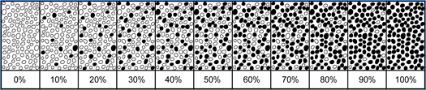
CAP
Approved
Breast.Bmk_1.6.1.0. REL_CAPCP
19
Most anti-HER2 therapies, such as monoclonal antibodies and antibody-drug-conjugates are approved
only in HER2 positive breast cancers, as defined by 3+ protein over-expression/gene amplification.
Therefore, accurate testing to discriminate HER2 positive verses negative breast cancers is essential for
primary and metastatic breast cancers and is the main focus of HER2 testing guidelines and proficiency
testing.
However, more recently one HER2 antibody-drug-conjugate (trastuzumab-deruxtecan) was approved for
treating metastatic breast cancers that have non-overexpressed levels of HER2 by IHC. Although not yet
considered a predictive test in this setting, in the DESTINY-Breast04 trial, HER2 IHC results of IHC 1+ or
IHC 2+/ISH negative (termed “HER2 Low” in the trial) were used for clinical trial eligibility and are now
approved to determine which metastatic patients may be eligible for this treatment.  DESTINTY-Breast06
has also been published with similar results that include metastatic breast cancers with IHC Score 0 but
with “membrane staining that is incomplete and is faint/barely perceptible and in less than or equal to
10% of tumor cells” (termed “HER2 ultralow” in the trial). In order to identify these results in CAP Breast
Cancer Biomarker reporting, the HER2 IHC Score 0 category is further detailed as either “no staining
(0/absent membrane staining)” or “membrane staining that is incomplete and faint/barely perceptible and
in less than or equal to 10% of tumor cells” (0+/with membrane staining). These are the same two
staining pattern definitions used for the IHC Score 0 in the CAP/ASCO HER2 testing in breast cancer
2018 and 2023 guidelines updates.
Methods: HER2 status can be determined in formalin-fixed paraffin-embedded tissue by assessing
protein expression on the membrane of cancer cells using IHC or by assessing the number of HER2 gene
copies using in situ hybridization (ISH). When both IHC and ISH are performed on the same tumor, the
results should be correlated. The most likely reason for a discrepancy is that one of the assays is
incorrect, but in a small number of cases there may be protein overexpression without amplification,
amplification without protein overexpression, or intratumoral heterogeneity. In addition, ISH results close
to a threshold for positive are more likely to be discrepant with IHC.
HER2 (ERBB2) Testing by Immunohistochemistry
Factors altering the detection of HER2 (ERBB2) by IHC have not been studied as well as for ER and
PgR. It is recommended that tissue be fixed in buffered 10% formalin for at least 6 hours unless another
fixative has been validated. External proficiency testing surveys for HER2 are available from the CAP and
other organizations. These surveys are invaluable tools to ensure that the laboratory assays are working
as expected.
False-positive IHC results for HER2 may be due to:
•
Edge artifact. This is usually seen in core biopsies, where cells near the edges of the
tissue stain stronger than in the center, possibly because antibody pools at the sides.
Specimens with stronger staining at the edge of the tissue should be interpreted with
caution.
•
Cytoplasmic positivity, which can obscure membrane staining and make interpretation
difficult.
•
Overstaining (strong membrane staining of normal cells). May be due to improper
antibody titration (concentration too high).
•
Misinterpretation of ductal carcinoma in situ (DCIS). High-grade DCIS is often HER2
positive. In cases with extensive DCIS relative to invasive carcinoma (particularly
CAP
Approved
Breast.Bmk_1.6.1.0. REL_CAPCP
20
microinvasive carcinoma), HER2 scoring may mistakenly be done on the DCIS
component. Care must be taken to score only the invasive component.
False-negative IHC results for HER2 may be due to:
1. Prolonged cold ischemia time.
2. Tumor heterogeneity. When a negative result is found, but only a small biopsy sample
was tested, repeat testing on a subsequent specimen with a larger area of carcinoma
should be considered, particularly if the tumor has characteristics associated with HER2
positivity (i.e., tumor grade 2 or 3, weak or negative PgR expression, increased
proliferation index).
3. Improper antibody titration (concentration too low)
False-negative and false-positive results can be reduced by paying attention to the following:
•
Tissue controls. External controls must stain as expected. There are no normal internal
controls for HER2 protein assessment by IHC.
•
Correlation with histologic and other biomarker results. See Table 1 above.
Reporting guidelines: CAP and ASCO have issued recommendations for reporting the results of HER2
testing by IHC (Table 4). The definitions of staining patterns in each score category are now included in
the reporting templates as well as some less common staining patterns that guidelines specify should be
classified as IHC equivocal (2+) or heterogeneous.
An optional standardized HER2 IHC reporting comment can be used to indicate to clinical teams the
specific HER2 IHC result categories that were defined as “HER2 Low“ and “HER2 ultralow” in the
DESTINY-Breast 04 and 06 trials (see Comment on HER2 IHC section of template).
Table 4. Reporting Results of HER2 Testing by Immunohistochemistry (IHC)
Result Category
Criteria
Negative (Score 0 or 0+)#
No staining observed (0/absent membrane staining)
or
Membrane stating that is incomplete and is faint/barely perceptible and within ≤10% of tumor cells
(0+/with membrane staining)
Negative (Score 1+)#
Incomplete membrane staining that is faint/barely perceptible and within >10% of tumor cells
Equivocal (Score 2+)#†
Weak to moderate complete membrane staining in >10% of tumor cells
or
Complete membrane staining that is intense but within ≤10% of tumor cells*
Positive (Score 3+)
Complete membrane staining that is intense and >10% of tumor cells*
* Readily appreciated using a low-power objective and observed within a homogeneous and contiguous
population of invasive tumor cells.
† Additional less common staining patterns such as moderate to intense but incomplete membrane
staining (basolateral) are also categorized as Score 2+. Equivocal 2+ results should reflex to testing to
determine final HER2 status (same specimen using ISH) or order a new test (new specimen if available,
using IHC or ISH).
CAP
Approved
Breast.Bmk_1.6.1.0. REL_CAPCP
21
# An optional standardized reporting comment for HER2 0, 0+, 1+ or 2+ IHC results can be included as
follows: “In the DESTINY-Breast 04 and 06 trials, “HER2 low” was considered IHC Score 1+ or 2+/ISH
negative, and “HER2 ultralow” was HER2 IHC Score of 0 (pattern 0+) with membrane staining that is
incomplete and faint/barely perceptible in less than or equal to 10% of tumor cells. Breast cancers with
these staining patterns may be eligible for treatment with trastuzumab-deruxtecan in the metastatic
setting (but those with no staining, IHC 0, are currently excluded).”
Heterogeneity for HER2 over-expression is rare in breast cancers. When 3+ over-expression is not
uniform but present as distinct clustered separate populations in a non-over-expressed background, the
case is reported as Positive (3+) if the population is > 10% and the Clustered Heterogeneity section of the
reporting template is used to clarify the percentage of the invasive cancer in the sample with over-
expression. The IHC Score of the Non-3+ areas is also reported. If ISH testing will be performed, it should
be scored in the area with 3+ IHC staining, with a separate count in the IHC negative or equivocal areas
rather than averaged over both. In the even more uncommon scenario of less than or equal to 10% 3+
staining in a clustered pattern, the result is interpreted as HER2 equivocal (2+) with indication of this
specific staining pattern and consideration for testing additional samples. Other uncommon staining
scenarios may exist, and the Other (specify) category and/or Comments section can be used to describe
these.
HER2 Testing by In Situ Hybridization
Fluorescence in situ hybridization (FISH), chromogenic in situ hybridization (CISH), and silver-enhanced
in situ hybridization (SISH) studies for HER2 determine the presence or absence of gene amplification.
The average of HER2 gene signals as well as the central chromosome enumeration probe (CEP17 or
other) and the ratio of HER2 signals to copies of chromosome 17 are used to determine result categories.
Single probe testing is no longer recommended.
Failure to obtain results with ISH may be due to the following:
•
Prolonged fixation in formalin (>1 week)
•
Fixation in non-formalin fixatives
•
Procedures or fixation involving acid (e.g., decalcification) may degrade DNA
•
Insufficient protease treatment of tissue
External proficiency testing surveys for HER2 by ISH are available from CAP and other organizations.
These surveys are invaluable tools to ensure that the laboratory assays are working as expected.
Reporting guidelines: ASCO and CAP have issued recommendations for reporting the results of HER2
testing by ISH (Table 5).
Dual Probe ISH Group Definitions:
Group 1 = HER2/CEP17 ratio ≥2.0; ≥4.0 HER2 signals/cell
Group 2 = HER2/CEP17 ratio ≥2.0; <4.0 HER2 signals/cell
Group 3 = HER2/CEP17 ratio <2.0; ≥6.0 HER2 signals/cell
Group 4 = HER2/CEP17 ratio <2.0; ≥4.0 and <6.0 HER2 signals/cell
CAP
Approved
Breast.Bmk_1.6.1.0. REL_CAPCP
22
Group 5 = HER2/CEP17 ratio <2.0; <4.0 HER2 signals/cell
Table 5. Reporting Results of HER2 Testing by In Situ Hybridization (dual-probe assay)
Result
Criteria (dual-probe assay)
Negative
·      Group 5
Negative based on
IHC and ISH
results*
(see comment)
·      Group 2 and concurrent IHC 0-1+ or 2+
·      Group 3 and concurrent IHC 0-1+
·      Group 4 and concurrent IHC 0-1+ or 2+
Positive based on
concurrent IHC
and ISH results*
(see comment)
·      Group 2 and concurrent IHC 3+
·      Group 3 and concurrent IHC 2+ or 3+
·      Group 4 and concurrent IHC 3+
Positive
·      Group 1
*For Groups 2-4 final ISH results are based on concurrent review of IHC, with recounting of the ISH test
by a second reviewer if IHC is 2+ (per 2018 CAP/ASCO Update recommendations).
Standardized guidelines comments for the Group 2-4 ISH results are available to add to reports in the
Comments on HER2 ISH Results section and are as follows:
Comment for Group 2 result: This sample has a Group 2 HER2 ISH result (ratio greater than or equal to
2.0; less than 4.0 HER2 signals / cell) Evidence is limited on the efficacy of HER2-targeted therapy in the
small subset of cases with HER2/CEP17 ratio ≥2.0 and an average HER2 copy number <4.0/cell. In the
first generation of adjuvant trastuzumab trials, patients in this subgroup who were randomized to the
trastuzumab arm did not appear to derive an improvement in disease free or overall survival, but there
were too few such cases to draw definitive conclusions. IHC expression for HER2 should be used to
complement ISH and define HER2 status. If IHC result is not 3+ positive, it is recommended that the
specimen be considered HER2 negative because of the low HER2 copy number by ISH and lack of
protein overexpression.
Comment for Group 3 result: This sample has a Group 3 HER2 ISH result (ratio less than 2.0; greater
than or equal to 6.0 HER2 signals / cell). There are insufficient data on the efficacy of HER2-targeted
therapy in cases with HER2 ratio <2.0 in the absence of protein overexpression because such patients
were not eligible for the first generation of adjuvant trastuzumab clinical trials. When concurrent IHC
results are negative (0-1+), it is recommended that the specimen be considered HER2 negative.
Comment for Group 4 result: This sample has a Group 4 result (ratio less than 2.0; greater than or equal
to 4.0 and less than 6.0 HER2 signals / cell). It is uncertain whether patients with ≥4.0 and <6.0 average
HER2 signals/cell and HER2/CEP17 ratio <2.0 benefit from HER2 targeted therapy in the absence of
protein overexpression (IHC 3+). If the specimen test result is close to the ISH ratio threshold for positive,
there is a high likelihood that repeat testing will result in different results by chance alone. Therefore,
when IHC results are not 3+ positive, it is recommended that the sample be considered HER2 negative
without additional testing on the same specimen.
CAP
Approved
Breast.Bmk_1.6.1.0. REL_CAPCP
23
Important issues in interpreting ISH are the following:
•
Identification of invasive carcinoma: A pathologist should identify on the hematoxylin and
eosin (H&E) or HER2 IHC slide the area of invasive carcinoma to be evaluated by ISH.
•
Identification of associated DCIS: In some cases, DCIS will show gene amplification,
whereas the associated invasive carcinoma will not. ISH analysis must be performed on
the invasive carcinoma.
•
Use of HER2 IHC to guide areas to score in heterogeneous cases.
Distinct clustered areas of HER2 amplification typically match areas of increased IHC expression and are
considered heterogenous. This is rare, but when identified can be reported as a percentage of the cell
population HER2 amplified by ISH with the concurrent IHC results. Complex cases can be described in
report sections for descriptions of the heterogeneity present.
References for Note C are as follows:1,2,3,4,5
References
1. National Comprehensive Cancer Network (NCCN) Clinical Practice Guideline in Oncology,
Version 6.2024. https://www.nccn.org/professionals/physician_gls/pdf/breast.pdf Accessed Jan
22, 2025.
2. Wolff AC, Hammond MEH, Allison KH, et al. HER2 testing in breast cancer: American Society of
Clinical Oncology/College of American Pathologists clinical practice guideline focused update.
Arch Pathol Lab Med. 2018;142(11):1364-1382.
3. Wolff AC, Somerfield MR, Dowsett M, Hammond MEH, Hayes DF, McShane LM, Saphner TJ,
Spears PA, Allison KH. Human Epidermal Growth Factor Receptor 2 Testing in Breast Cancer.
Arch Pathol Lab Med. 2023 Sep 1;147(9):993-1000.
4. Modi S, Jacot W, Yamashita T, et al. Trastuzumab Deruxtecan in Previously Treated HER2-Low
Advanced Breast Cancer. N Engl J Med 2022;387(1):9–20.
5. Bardia A, Hu X, Dent R, et al. Trastuzumab Deruxtecan after Endocrine Therapy in Metastatic
Breast Cancer. N Engl J Med. 2024 Dec 5;391(22):2110-2122.
D. Ki-67 Testing
Ki-67 is a nuclear protein found in all phases of the cell cycle and is a marker of cell proliferation. The
monoclonal antibody MIB-1 is the most commonly used antibody for assessing Ki-67 in formalin-fixed
paraffin-embedded tissue sections. The percentage of Ki-67 positive cancer cells determined by IHC is
used to provide additional data on the proliferation rate of the cancer and as a correlate with the overall
grade. It is incorporated into some prognostic scoring schemes and sometimes used in neoadjuvant
treatment trials to determine if proliferation decreases with treatment. However, Ki-67 proliferative rates
have not been validated as a predictive biomarker. Currently, routine testing of breast cancers for Ki-67
expression is not standard by either ASCO or the National Comprehensive Cancer Network (NCCN).
However, it may be reported as an additional data element in breast cancer characterization and
reporting. Using a standardized approach to scoring, such as that recommended by the International Ki-
67 in Breast Cancer Working Group, can be useful. The Ki-67 proliferation index can be reported either
as a discrete numerical percentage or as a range.
References for Note D are as follows:1,2
References
CAP
Approved
Breast.Bmk_1.6.1.0. REL_CAPCP
24
1. Dowsett M, Nielsen TO, A'Hern R, et al. Assessment of Ki67 in breast cancer: recommendations
from the International Ki67 in breast cancer working group. J Natl Cancer Inst.
2011;103(22):1656-1664.
2. Nielsen TO, Leung SCY, Rimm DL, et al. Assessment of Ki67 in Breast Cancer: Updated
Recommendations from the International Ki67 in Breast Cancer Working Group. J Natl Cancer
Inst. 2021 Jul 1;113(7):808-819. doi: 10.1093/jnci/djaa201. PMID: 33369635; PMCID:
PMC8487652.
# Breast DCIS, Biopsy
Protocol for the Examination of Biopsy Specimens from Patients
with Ductal Carcinoma In Situ (DCIS) of the Breast
Version: 1.0.1.0
Protocol Posting Date: June 2021
The use of this protocol is recommended for clinical care purposes but is not required for accreditation
purposes.
This protocol may be used for the following procedures AND tumor types:
Procedure
Description
Biopsy
Includes specimens designated needle biopsy, fine needle aspiration and others
(for excisional biopsy, see below)
Tumor Type
Description
Ductal carcinoma in situ without
invasive carcinoma or
microinvasion
Paget disease of the nipple not
associated with invasive breast
carcinoma
Encapsulated papillary carcinoma
without invasive carcinoma
Solid papillary carcinoma without
invasive carcinoma
The following should NOT be reported using this protocol:
Procedure
Resection (consider Breast DCIS Resection protocol)
Excisional biopsy (consider Breast DCIS Resection protocol)
Tumor Type
Any tumor with invasive carcinoma (consider the Breast Invasive Carcinoma Biopsy protocol)
Lymphoma (consider the Hodgkin or non-Hodgkin Lymphoma protocols)
Sarcoma (consider the Soft Tissue protocol)
Authors
Patrick L. Fitzgibbons, MD, FCAP*; James L. Connolly, MD*.
With guidance from the CAP Cancer and CAP Pathology Electronic Reporting Committees.
* Denotes primary author.

Breast.DCIS.Bx_1.0.1.0.REL_CAPCP
2
The use of this case summary is recommended for clinical care purposes but is not required for
accreditation purposes. The core and conditional data elements are routinely reported. Non-core data
elements are indicated with a plus sign (+) to allow for reporting information that may be of clinical value.
v 1.0.1.0

General Reformatting

Elements that are recommended for clinical care purposes are designated as Core and
Conditional (indicated by bolded text), while Non-core elements are now indicated with a plus (+)
sign.
Breast.DCIS.Bx_1.0.1.0.REL_CAPCP
3
Reporting Template
Protocol Posting Date: June 2021
Select a single response unless otherwise indicated.
This template is recommended for reporting biopsy specimens, but is not required for accreditation purposes.
SPECIMEN
Procedure
___ Needle biopsy
___ Fine needle aspiration
___ Other (specify): _________________
___ Not specified
Specimen Laterality
___ Right
___ Left
___ Not specified
TUMOR
+Tumor Site (select all that apply)
___ Upper outer quadrant
___ Lower outer quadrant
___ Upper inner quadrant
___ Lower inner quadrant
___ Central
___ Nipple
___ Clock position
Specify Clock Position (select all that apply)
___ 1 o'clock
___ 2 o'clock
___ 3 o'clock
___ 4 o'clock
___ 5 o'clock
___ 6 o'clock
___ 7 o'clock
___ 8 o'clock
___ 9 o'clock
___ 10 o'clock
___ 11 o'clock
___ 12 o'clock
___ Specify distance from nipple in Centimeters (cm): _________________ cm
___ Other (specify): _________________
___ Not specified
Histologic Type (Note A)
___ Ductal carcinoma in situ (DCIS)
Breast.DCIS.Bx_1.0.1.0.REL_CAPCP
4
___ Paget disease
___ Encapsulated papillary carcinoma without invasive carcinoma
___ Solid papillary carcinoma without invasive carcinoma
+Architectural Patterns (Note B) (select all that apply)
___ Comedo
___ Paget disease (DCIS involving nipple skin)
___ Cribriform
___ Micropapillary
___ Papillary
___ Solid
___ Other (specify): _________________
Nuclear Grade (Note C)
___ Grade I (low)
___ Grade II (intermediate)
___ Grade III (high)
___ Other (specify): _________________
___ Cannot be determined: _________________
Necrosis (Note D)
___ Not identified
___ Present, focal (small foci or single cell necrosis)
___ Present, central (expansive "comedo" necrosis)
___ Other (specify): _________________
___ Cannot be determined: _________________
+Microcalcifications (Note E) (select all that apply)
___ Not identified
___ Present in DCIS
___ Present in non-neoplastic tissue
___ Other (specify): _________________
ADDITIONAL FINDINGS (Note F)
+Additional Findings (specify): _________________
SPECIAL STUDIES
For hormone receptor and HER2 reporting, the CAP Breast Biomarker Template should be used. www.cap.org/cancerprotocols.
+Breast Biomarker Studies (specify pending studies): _________________
COMMENTS
Comment(s): _________________
Breast.DCIS.Bx_1.0.1.0.REL_CAPCP
5
Explanatory Notes
A. Histologic Type
This protocol applies only to cases of DCIS.  The protocol for invasive carcinoma of the breast applies if
invasion or microinvasion (less than or equal to 1 mm) is present. Pleomorphic lobular carcinoma in situ
(LCIS) has overlapping features with DCIS and may be treated similarly, but at present there is
insufficient evidence to establish definitive recommendations for treatment. Thus, pleomorphic LCIS is not
currently included in the pTis classification.
When DCIS involves nipple skin only, without underlying invasive carcinoma or DCIS, the classification is
DCIS (ie, pTis [Paget]). The majority of these cases are strongly positive for HER2.
B. Architectural Pattern
The architectural pattern has been reported traditionally for DCIS.1,2 However, nuclear grade and the
presence of necrosis are more predictive of clinical outcome.
References
1. Schwartz GF, Lagios MD, Carter D, et al. Consensus conference on the classification of ductal
carcinoma in situ. Cancer. 1997;80:1798-1802.
2. Silverstein MJ, Lagios MD, Recht A, et al. Image-detected breast cancer: state of the art
diagnosis and treatment. J Am Coll Surg. 2005;201:586-597.
C. Nuclear Grade
The nuclear grade of DCIS is determined using 6 morphologic features (Table 1).1,2
Table 1. Nuclear Grade of Ductal Carcinoma In Situ
Feature
Grade I
(Low)
Grade II
(Intermediate)
Grade III
(High)
Pleomorphism
Monotonous (monomorphic)
Intermediate
Markedly pleomorphic
Size
1.5 to 2 x the size of a normal RBC or a
normal duct epithelial cell nucleus
Intermediate
>2.5 x the size of a normal RBC or a
normal duct epithelial cell nucleus
Chromatin
Usually diffuse, finely dispersed chromatin
Intermediate
Usually vesicular with irregular
chromatin distribution
Nucleoli
Only occasional
Prominent, often multiple
Mitoses
Only occasional
Intermediate
May be frequent
Orientation
Polarized toward luminal spaces
Intermediate
Usually not polarized toward the
luminal space
Definition: RBC, red blood cell.
References
1. Schwartz GF, Lagios MD, Carter D, et al. Consensus conference on the classification of ductal
carcinoma in situ. Cancer. 1997;80:1798-1802.
2. Radiation Therapy Oncology Group (RTOG). Evaluation of Breast Specimens Removed by
Needle Localization Technique. Available at:
https://www.rtog.org/LinkClick.aspx?fileticket=G4Pamvh2mBg%3D&tabid=290. Accessed
September 18, 2018.
Breast.DCIS.Bx_1.0.1.0.REL_CAPCP
6
D. Necrosis
The presence of necrosis1 is correlated with the finding of mammographic calcifications (ie, most areas of
necrosis will calcify).  DCIS that presents as mammographic calcifications often recurs as
calcifications.  Necrosis can be classified as follows:

Central (“comedo”): The central portion of an involved ductal space is replaced by an area of
expansive necrosis that is easily detected at low magnification. Ghost cells and karyorrhectic
debris are generally present.  Although central necrosis is generally associated with high-grade
nuclei (ie, comedo DCIS), it can also occur with DCIS of low or intermediate nuclear grade. This
type of necrosis often correlates with a linear and/or branching pattern of calcifications on
mammography.

Focal (punctate): Small foci, indistinct at low magnification, or single cell necrosis.
Necrosis should be distinguished from secretory material, which can also be associated with
calcifications, cytoplasmic blebs, and histiocytes, but does not include nuclear debris.
References
1. Schwartz GF, Lagios MD, Carter D, et al. Consensus conference on the classification of ductal
carcinoma in situ. Cancer. 1997;80:1798-1802.
E. Microcalcifications
DCIS found in biopsies performed for microcalcifications will almost always be at the site of the
calcifications or in close proximity.1,2,3 The presence of the targeted calcifications in the specimen should
be confirmed by specimen radiography. The pathologist must be satisfied that the specimen has been
sampled in such a way that the lesion responsible for the calcifications has been examined
microscopically. The relationship of the radiologic calcifications to the DCIS should be indicated.
References
1. Owings DV, Hann L, Schnitt SJ, How thoroughly should needle localization breast biopsies be
sampled for microscopic examination?  A prospective mammographic/pathologic correlative
study. Am J Surg Pathol. 1990;14:578-583.
2. Association of Directors of Anatomic and Surgical Pathology. Recommendations for the
Reporting
of
Breast
Carcinoma.
Updated
September
2004,
Version
1.1.
www.adasp.org/Checklists/Checklists.htm. Accessed June 18, 2008.
3. Silverstein MJ, Lagios MD, Recht A, et al. Image-detected breast cancer: state of the art
diagnosis and treatment. J Am Coll Surg. 2005;201:586-597.
F. Additional Findings
If the biopsy was performed for a benign lesion and the DCIS is an incidental finding, this should be
documented. An example would be the finding of DCIS in an excision for a palpable fibroadenoma. In
some cases, other pathologic findings are important for the clinical management of patients.
# Breast DCIS, Resection
Protocol for the Examination of Resection Specimens from
Patients with Ductal Carcinoma In Situ (DCIS) of the Breast
Version: 4.4.0.0
Protocol Posting Date: June 2021
CAP Laboratory Accreditation Program Protocol Required Use Date: March 2022
The changes included in this current protocol version affect accreditation requirements. The new deadline
for implementing this protocol version is reflected in the above accreditation date.
For accreditation purposes, this protocol should be used for the following procedures AND tumor
types:
Procedure
Description
Excision less than total
mastectomy
Includes specimens designated excision, segmental resection, lumpectomy,
quadrantectomy and segmental or partial mastectomy, with or without axillary
contents
Total Mastectomy
Includes skin-sparing and nipple-sparing mastectomy, with or without axillary
contents
Tumor Type
Description
Ductal carcinoma in situ without
invasive carcinoma or
microinvasion
Paget disease of the nipple not
associated with invasive breast
carcinoma
Encapsulated papillary
carcinoma without invasive
carcinoma
Solid papillary carcinoma without
invasive carcinoma
This protocol is NOT required for accreditation purposes for the following:
Procedure
Needle or skin biopsies
Primary resection specimen with no residual cancer
Additional excision performed after the definitive resection (eg, re-excision of surgical margins)
Cytologic specimens
The following tumor types should NOT be reported using this protocol
Tumor Type
Any tumor with invasive carcinoma, including DCIS with microinvasion only (consider Breast Invasive Carcinoma
Resection protocol)
Authors
Patrick L. Fitzgibbons, MD, FCAP*; James L. Connolly, MD*.
With guidance from the CAP Cancer and CAP Pathology Electronic Reporting Committees.
* Denotes primary author.

CAP
Approved
Breast.DCIS_4.4.0.0.REL_CAPCP
2
This protocol can be utilized for a variety of procedures and tumor types for clinical care purposes. For
accreditation purposes, only the definitive primary cancer resection specimen is required to have the core
and conditional data elements reported in a synoptic format.

Core data elements are required in reports to adequately describe appropriate malignancies. For
accreditation purposes, essential data elements must be reported in all instances, even if the
response is “not applicable” or “cannot be determined.”

Conditional data elements are only required to be reported if applicable as delineated in the
protocol. For instance, the total number of lymph nodes examined must be reported, but only if
nodes are present in the specimen.

Optional data elements are identified with “+” and although not required for CAP accreditation
purposes, may be considered for reporting as determined by local practice standards.
The use of this protocol is not required for recurrent tumors or for metastatic tumors that are resected at a
different time than the primary tumor. Use of this protocol is also not required for pathology reviews
performed at a second institution (ie, secondary consultation, second opinion, or review of outside case at
second institution).
Synoptic Reporting
All core and conditionally required data elements outlined on the surgical case summary from this cancer
protocol must be displayed in synoptic report format. Synoptic format is defined as:

Data element: followed by its answer (response), outline format without the paired Data element:
Response format is NOT considered synoptic.

The data element should be represented in the report as it is listed in the case summary. The
response for any data element may be modified from those listed in the case summary, including
“Cannot be determined” if appropriate.

Each diagnostic parameter pair (Data element: Response) is listed on a separate line or in a
tabular format to achieve visual separation. The following exceptions are allowed to be listed on
one line:
o
Anatomic site or specimen, laterality, and procedure
o
Pathologic Stage Classification (pTNM) elements
o
Negative margins, as long as all negative margins are specifically enumerated where
applicable

The synoptic portion of the report can appear in the diagnosis section of the pathology report, at
the end of the report or in a separate section, but all Data element: Responses must be listed
together in one location
Organizations and pathologists may choose to list the required elements in any order, use additional
methods in order to enhance or achieve visual separation, or add optional items within the synoptic
report. The report may have required elements in a summary format elsewhere in the report IN
ADDITION TO but not as replacement for the synoptic report ie, all required elements must be in the
synoptic portion of the report in the format defined above.
v 4.4.0.0

General Reformatting

Revised Margins Section

Revised Lymph Node Section

Added Distant Metastasis Section

Removed pNX Staging Classification
CAP
Approved
Breast.DCIS_4.4.0.0.REL_CAPCP
3
Reporting Template
Protocol Posting Date: June 2021
Select a single response unless otherwise indicated.
Standard(s): AJCC-UICC 8
SPECIMEN
Procedure (Note A)
___ Excision (less than total mastectomy)
___ Total mastectomy (including nipple-sparing and skin-sparing mastectomy)
___ Other (specify): _________________
___ Not specified
Specimen Laterality
___ Right
___ Left
___ Not specified
TUMOR
+Tumor Site (Note B) (select all that apply)
___ Upper outer quadrant
___ Lower outer quadrant
___ Upper inner quadrant
___ Lower inner quadrant
___ Central
___ Nipple
___ Clock position
Specify Clock Position (select all that apply)
___ 1 o'clock
___ 2 o'clock
___ 3 o'clock
___ 4 o'clock
___ 5 o'clock
___ 6 o'clock
___ 7 o'clock
___ 8 o'clock
___ 9 o'clock
___ 10 o'clock
___ 11 o'clock
___ 12 o'clock
___ Specify distance from nipple in Centimeters (cm): _________________ cm
___ Other (specify): _________________
___ Not specified
CAP
Approved
Breast.DCIS_4.4.0.0.REL_CAPCP
4
Histologic Type (Note C)
___ Ductal carcinoma in situ
___ Paget disease
___ Encapsulated papillary carcinoma without invasive carcinoma
___ Solid papillary carcinoma without invasive carcinoma
Size (Extent) of DCIS (Note D)
The size (extent) of DCIS (greatest dimension using gross and microscopic evaluation) is an estimation of the volume of breast
tissue occupied by DCIS.
___ Estimated size (extent) of DCIS is at least in Millimeters (mm): _________________ mm
+Additional Dimension in Millimeters (mm): ____ x ____ mm
___ Cannot be determined: _________________
+Number of Blocks with DCIS: _________________
+Number of Blocks Examined: _________________
+Architectural Patterns (Note E) (select all that apply)
___ Comedo
___ Paget disease (DCIS involving nipple skin)
___ Cribriform
___ Micropapillary
___ Papillary
___ Solid
___ Other (specify): _________________
Nuclear Grade (Note F)
___ Grade I (low)
___ Grade II (intermediate)
___ Grade III (high)
Necrosis (Note G)
___ Not identified
___ Present, focal (small foci or single cell necrosis)
___ Present, central (expansive "comedo" necrosis)
+Microcalcifications (Note H) (select all that apply)
___ Not identified
___ Present in DCIS
___ Present in nonneoplastic tissue
___ Other (specify): _________________
MARGINS (Note I)
Margin Status
For specimens in which the margin is uninvolved (no ink on carcinoma), the closest margin(s) must be specified if the distance of
DCIS from the margin is less than 2 mm. Distances can be specific measurements or expressed as greater than or less than a
measurement.
___ All margins negative for DCIS
Distance from DCIS to Closest Margin
Specify in Millimeters (mm)
___ Exact distance: _________________ mm
CAP
Approved
Breast.DCIS_4.4.0.0.REL_CAPCP
5
___ Less than: _________________ mm
___ Greater than: _________________ mm
___ Other (specify): _________________
___ Cannot be determined (explain): _________________
Closest Margin(s) to DCIS (required only if less than 2mm) (select all that apply)
___ Not applicable
___ Anterior
___ Posterior
___ Superior
___ Inferior
___ Medial
___ Lateral
___ Other (specify): _________________
___ Cannot be determined (explain): _________________
___ DCIS present at margin
Margin status is listed as “positive” if there is ink on DCIS (ie, the distance is 0 mm). Extent of margin involvement may be specified
as unifocal, multifocal, or extensive.
Margin(s) Involved by DCIS (select all that apply)
___ Anterior (specify extent, if possible): _________________
___ Posterior (specify extent, if possible): _________________
___ Superior (specify extent, if possible): _________________
___ Inferior (specify extent, if possible): _________________
___ Medial (specify extent, if possible): _________________
___ Lateral (specify extent, if possible): _________________
___ Other (specify margin(s) and, if possible, extent): _________________
___ Cannot be determined (explain): _________________
___ Other (specify): _________________
___ Cannot be determined (explain): _________________
___ Not applicable (no DCIS in specimen)
+Distance from DCIS to Anterior Margin
Specify in Millimeters (mm)
___ Exact distance: _________________ mm
___ Less than: _________________ mm
___ Greater than: _________________ mm
___ Other (specify): _________________
___ Cannot be determined (explain): _________________
+Distance from DCIS to Posterior Margin
Specify in Millimeters (mm)
___ Exact distance: _________________ mm
___ Less than: _________________ mm
___ Greater than: _________________ mm
___ Other (specify): _________________
___ Cannot be determined (explain): _________________
+Distance from DCIS to Superior Margin
Specify in Millimeters (mm)
___ Exact distance: _________________ mm
___ Less than: _________________ mm
___ Greater than: _________________ mm
___ Other (specify): _________________
___ Cannot be determined (explain): _________________
CAP
Approved
Breast.DCIS_4.4.0.0.REL_CAPCP
6
+Distance from DCIS to Inferior Margin
Specify in Millimeters (mm)
___ Exact distance: _________________ mm
___ Less than: _________________ mm
___ Greater than: _________________ mm
___ Other (specify): _________________
___ Cannot be determined (explain): _________________
+Distance from DCIS to Medial Margin
Specify in Millimeters (mm)
___ Exact distance: _________________ mm
___ Less than: _________________ mm
___ Greater than: _________________ mm
___ Other (specify): _________________
___ Cannot be determined (explain): _________________
+Distance from DCIS to Lateral Margin
Specify in Millimeters (mm)
___ Exact distance: _________________ mm
___ Less than: _________________ mm
___ Greater than: _________________ mm
___ Other (specify): _________________
___ Cannot be determined (explain): _________________
+Distance from DCIS to Other Margin(s)
Specify in Millimeters (mm)
___ Other margin(s) and distance(s) (specify): _________________
___ Cannot be determined (explain): _________________
+Margin Comment: _________________
REGIONAL LYMPH NODES (Note J)
Regional Lymph Node Status
___ Not applicable (no regional lymph nodes submitted or found)
___ Regional lymph nodes present
___ All regional lymph nodes negative for tumor
___ Tumor present in regional lymph node(s)
Number of Lymph Nodes with Macrometastases (greater than 2 mm)
___ Exact number (specify): _________________
___ At least (specify): _________________
___ Other (specify): _________________
___ Cannot be determined (explain): _________________
Number of Lymph Nodes with Micrometastases (greater than 0.2 mm to 2 mm and / or greater
than 200 cells)
___ Exact number (specify): _________________
___ At least (specify): _________________
___ Other (specify): _________________
___ Cannot be determined (explain): _________________
Number of Lymph Nodes with Isolated Tumor Cells (0.2 mm or less OR 200 cells or less)#
# Reporting the number of lymph nodes with isolated tumor cells is required only in the absence of macrometastasis or
micrometastasis in other lymph nodes.
___ Not applicable
CAP
Approved
Breast.DCIS_4.4.0.0.REL_CAPCP
7
___ Exact number (specify): _________________
___ At least (specify): _________________
___ Other (specify): _________________
___ Cannot be determined (explain): _________________
Size of Largest Nodal Metastatic Deposit
Specify in Millimeters (mm)
___ Exact size: _________________ mm
___ Less than: _________________ mm
___ Greater than: _________________ mm
___ Other (specify): _________________
___ Cannot be determined (explain): _________________
Extranodal Extension
___ Not identified
___ Present, 2 mm or less
___ Present, greater than 2 mm
___ Present
___ Cannot be determined
___ Other (specify): _________________
___ Cannot be determined (explain): _________________
Total Number of Lymph Nodes Examined (sentinel and non-sentinel)
___ Exact number (specify): _________________
___ At least (specify): _________________
___ Other (specify): _________________
___ Cannot be determined (explain): _________________
Number of Sentinel Nodes Examined (if applicable)
___ Not applicable
___ Exact number (specify): _________________
___ At least (specify): _________________
___ Other (specify): _________________
___ Cannot be determined (explain): _________________
+Regional Lymph Node Comment: _________________
DISTANT METASTASIS
Distant Site(s) Involved, if applicable (select all that apply)
___ Not applicable
___ Non-regional lymph node(s) (specify, if possible): _________________
___ Lung: _________________
___ Liver: _________________
___ Bone: _________________
___ Brain: _________________
___ Other (specify): _________________
___ Cannot be determined: _________________
PATHOLOGIC STAGE CLASSIFICATION (pTNM, AJCC 8th Edition) (Note K)
Reporting of pT, pN, and (when applicable) pM categories is based on information available to the pathologist at the time the report
is issued. As per the AJCC (Chapter 1, 8th Ed.) it is the managing physician’s responsibility to establish the final pathologic stage
based upon all pertinent information, including but potentially not limited to this pathology report.
CAP
Approved
Breast.DCIS_4.4.0.0.REL_CAPCP
8
TNM Descriptors
___ Not applicable
___ r (recurrent)
pT Category
Paget disease with underlying DCIS is classified as Tis (DCIS). Encapsulated and solid papillary carcinomas without conventional
invasive carcinoma are classified as pTis (DCIS). If there has been a prior core needle biopsy, the pathologic findings from the core,
if available, should be considered when determining the T category. If invasive carcinoma or microinvasion were present on the
core, the protocol for invasive carcinomas of the breast should be used and should incorporate this information.
# Lobular carcinoma in situ (LCIS) is removed from TNM staging in the AJCC Cancer Staging Manual, 8th Edition.
___ pTis (DCIS): Ductal carcinoma in situ
___ pTis (Paget): Paget disease of the nipple NOT associated with invasive carcinoma and / or DCIS in
the underlying breast parenchyma#
Regional Lymph Nodes Modifier (select all that apply)
The (sn) modifier is added to the N category when a sentinel node biopsy is performed (using either dye or tracer) and fewer than
six lymph nodes are removed (sentinel and nonsentinel). The (f) modifier is added to the N category to denote confirmation of
metastasis by fine needle aspiration/core needle biopsy with NO further resection of nodes.
___ Not applicable
___ (sn): Sentinel node(s) evaluated. If 6 or more nodes (sentinel or nonsentinel) are removed, this
modifier should not be used.
___ (f): Nodal metastasis confirmed by fine needle aspiration or core needle biopsy.
pN Category
Choose a category if lymph nodes received with the specimen; immunohistochemistry and/or molecular studies are not required
___ pN not assigned (no nodes submitted or found)
___ pN not assigned (cannot be determined based on available pathological information)
# Isolated tumor cells (ITCs) are defined as small clusters of cells not larger than 0.2 mm or single tumor cells, or a cluster of fewer
than 200 cells in a single histologic cross-section. ITCs may be detected by routine histology or by immunohistochemical (IHC)
methods. Nodes containing only ITCs are excluded from the total positive node count when determining the N category but should
be included in the total number of nodes evaluated.
___ pN0: No regional lymph node metastasis identified or ITCs only#
___ pN0 (i+): ITCs only (malignant cell clusters no larger than 0.2 mm) in regional lymph node(s)
___ pN0 (mol+): Positive molecular findings by reverse transcriptase polymerase chain reaction (RT-
PCR); no ITCs detected
___ pN1mi: Micrometastases (approximately 200 cells, larger than 0.2 mm, but none larger than 2.0 mm)
## Approximately 1000 tumor cells are contained in a 3-dimensional 0.2-mm cluster. Thus, if more than 200 individual tumor cells
are identified as single dispersed tumor cells or as a nearly confluent elliptical or spherical focus in a single histologic section of a
lymph node, there is a high probability that more than 1000 cells are present in the lymph node. In these situations, the node should
be classified as containing a micrometastasis (pN1mi). Cells in different lymph node cross-sections or longitudinal sections or levels
of the block are not added together; the 200 cells must be in a single node profile even if the node has been thinly sectioned into
multiple slices. It is recognized that there is substantial overlap between the upper limit of the ITC and the lower limit of the
micrometastasis categories due to inherent limitations in pathologic nodal evaluation and detection of minimal tumor burden in
lymph nodes. Thus, the threshold of 200 cells in a single cross-section is a guideline to help pathologists distinguish between these
2 categories. The pathologist should use judgment regarding whether it is likely that the cluster of cells represents a true
micrometastasis or is simply a small group of isolated tumor cells.
___ pN1a: Metastases in 1-3 axillary lymph nodes, at least one metastasis larger than 2.0 mm##
___ pN1b: Metastases in ipsilateral internal mammary sentinel nodes, excluding ITCs
___ pN1c: pN1a and pN1b combined
___ pN2a: Metastases in 4-9 axillary lymph nodes, at least one tumor deposit larger than 2.0 mm##
___ pN2b: Metastases in clinically detected internal mammary lymph nodes with or without microscopic
confirmation; with pathologically negative axillary nodes
CAP
Approved
Breast.DCIS_4.4.0.0.REL_CAPCP
9
___ pN3a: Metastases in 10 or more axillary lymph nodes (at least one tumor deposit larger than 2.0
mm)##; or metastases to the infraclavicular (Level III axillary lymph) nodes
___ pN3b: pN1a or pN2a in the presence of cN2b (positive internal mammary nodes by imaging); or
pN2a in the presence of pN1b
___ pN3c: Metastases in ipsilateral supraclavicular lymph nodes
pM Category (required only if confirmed pathologically)
The presence of distant metastases in a case of DCIS would be very unusual. Additional sampling to identify invasive carcinoma in
the breast or additional history to document a prior or synchronous invasive carcinoma is advised in the evaluation of such cases.
___ Not applicable - pM cannot be determined from the submitted specimen(s)
___ pM1: Histologically proven metastases larger than 0.2 mm
+Specify Case Number (if from a previous procedure): _________________
ADDITIONAL FINDINGS (Note L)
+Additional Findings (specify): _________________
SPECIAL STUDIES
For hormone receptor reporting for this specimen, the CAP Breast Biomarker Template should be used. Pending biomarker studies
should be listed in the Comments section of this report.
The previously reported biopsy biomarker status may be included additionally in the resection report.
+Breast Biomarker Testing Performed on Previous Biopsy (select all that apply)
___ Estrogen Receptor (ER)
+Estrogen Receptor (ER) Status
___ Positive
+Percentage of Cells with Nuclear Positivity#
___ Specify %: _________________ %
___ 1-10% (specify)#: _________________ %
___ 11-20%
___ 21-30%
___ 31-40%
___ 41-50%
___ 51-60%
___ 61-70%
___ 71-80%
___ 81-90%
___ 91-100%
___ Negative
___ Cannot be determined (indeterminate)
___ Progesterone Receptor (PgR)
+Progesterone Receptor (PgR) Status
___ Positive
+Percentage of Cells with Nuclear Positivity#
___ Specify %: _________________ %
___ 1-10% (specify)#: _________________ %
___ 11-20%
___ 21-30%
___ 31-40%
___ 41-50%
CAP
Approved
Breast.DCIS_4.4.0.0.REL_CAPCP
10
___ 51-60%
___ 61-70%
___ 71-80%
___ 81-90%
___ 91-100%
___ Negative
___ Cannot be determined (indeterminate)
+Testing Performed on Case Number: _________________
COMMENTS
Comment(s): _________________
CAP
Approved
Breast.DCIS_4.4.0.0.REL_CAPCP
11
Explanatory Notes
A. Breast Specimens and Breast Procedures
Breast Specimens
The following types of breast specimens and procedures may be reported with the case summary:
Excisions. Removal of breast tissue without the intent of removing the entire breast. The nipple is only rarely
removed with excisions. Excisions include specimens designated biopsies, partial mastectomies,
lumpectomies, and quadrantectomies.
Total Mastectomy. Removal of all breast tissue, including the nipple and areola.

Simple mastectomy: This procedure consists of a total mastectomy without removal of axillary
lymph nodes.

Skin-sparing mastectomy: This is a total mastectomy with removal of the nipple and only a narrow
surrounding rim of skin.

Modified radical mastectomy: This procedure consists of a total mastectomy and an axillary
dissection. In the case summary, the breast and lymph node specimens are documented
separately.

Radical mastectomy: This procedure consists of a total mastectomy, axillary contents, and removal
of the pectoralis muscles and currently is performed only rarely. This type of specimen and
procedure can be indicated on the case summary as ‘‘Other.’’
The following types of specimens should not be reported using this protocol:

Very small incisional biopsies (including core needle biopsies).

Excisions containing only DCIS after a core needle biopsy or other specimen showing invasive
carcinoma or DCIS with microinvasion (invasion measuring ≤1 mm). This type of case should be
reported by using the protocol for invasive carcinoma of the breast,1 and the report should
incorporate information from the prior needle biopsy.
Specimen Sampling
Specimen sampling for specimens with DCIS has the following goals:2,3,4,5

The clinical or radiologic lesion for which the surgery was performed must be examined
microscopically.  If the lesion is a nonpalpable imaging finding, the specimen radiograph and/or
additional radiologic studies may be necessary to identify the lesion. When practical, the entire
specimen should be submitted in a sequential fashion for histologic examination.  If this is not
possible, at least the entire region of the targeted lesion should be examined microscopically. If
DCIS, lobular carcinoma in situ (LCIS), or atypical hyperplasia is identified, all fibrous tissue should
be examined.2

All other gross lesions noted in the specimen must be sampled.

The margins must be evaluated for involvement by DCIS.  If the specimen is received sectioned
or fragmented, this should be noted, as this will limit the ability to evaluate the size of the lesion
and the status of margins. If the specimen is an incisional biopsy, margins need not be evaluated.
CAP
Approved
Breast.DCIS_4.4.0.0.REL_CAPCP
12
For specimens with a known diagnosis of DCIS (eg, by prior core needle biopsy) it is recommended that
the entire specimen be examined, if practical, using serial sequential sampling to exclude the possibility of
invasion, to completely evaluate the margins, and to aid in determining extent.6,7,8 If an entire excisional
specimen or grossly evident lesion is not examined microscopically, it is helpful to note the approximate
percentage of the specimen or lesion that has been examined.
Carcinomas present in excisions removed for lesions seen best by MRI studies are generally not grossly
evident and not seen on specimen radiography.
Recording the specimen size is important, as the volume of tissue excised has been associated with the
likelihood of recurrence.9
Tissue may be taken for research studies or assays that do not involve the histologic examination of the
tissue (eg, reverse transcriptase polymerase chain reaction [RT-PCR]) only when taken in such a way to
be able to evaluate the tissue for small areas of invasion. For example, a thin slice of tissue taken for
research studies should be matched with an adjacent slice of tissue that will be examined microscopically.
References
1. Fitzgibbons PL, Bose S, Chen Y, et al. Protocol for the Examination of Specimens From Patients
with Invasive Carcinoma of the Breast. 2019; www.cap.org/cancerprotocols.
2. Owings DV, Hann L, Schnitt SJ, How thoroughly should needle localization breast biopsies be
sampled for microscopic examination?  A prospective mammographic/pathologic correlative
study. Am J Surg Pathol. 1990;14:578-583.
3. Schwartz GF, Lagios MD, Carter D, et al. Consensus conference on the classification of ductal
carcinoma in situ. Cancer. 1997;80:1798-1802.
4. Silverstein MJ, Lagios MD, Recht A, et al. Image-detected breast cancer: state of the art
diagnosis and treatment. J Am Coll Surg. 2005;201:586-597.
5. Lester SC. Manual of Surgical Pathology. 2nd ed. New York: Elsevier; 2006.
6. Silverstein MJ, Poller D, Craig P, et al.  A prognostic index for ductal carcinoma in situ of the
breast. Cancer. 1996;77:2267-2274.
7. Grin A, Horne G, Ennis M, O’Malley FP.  Measuring extent of DCIS in breast excision specimens:
a comparison of four methods. Arch Pathol Lab Med. 2009;133:31-37.
8. Dadmanesh F, Fan X, Dastane A, Amin MB, Bose S. Comparative analysis of size estimation by
mapping and counting number of blocks with DCIS in breast excision specimens.  Arch Pathol
Lab Med. 2009;133:26-30.
9. Vicini FA, Kestin LL, Goldstein NS, Baglan KL, Pettinga JE, Martinez AA. Relationship between
excision volume, margin status, and tumor size with the development of local recurrence in
patients with ductal carcinoma-in-situ treated with breast-conserving therapy. J Surg Oncol.
2001;76:245-254.
B. Tumor Site
The site of DCIS is helpful to document, when provided by the surgeon, breast imaging, or previous
pathology report, to correlate with prior studies (eg, a core needle biopsy) or with future biopsies or cancer
events. The site can be indicated by quadrant and/or by a clock position. The approximate tumor site can
be determined in a mastectomy. However, it is sometimes difficult to correlate exactly with the position as
determined in vivo because of differences in how the specimen would be positioned on the chest wall (ie,
the skin ellipse may be horizontal or point to the axilla). It is helpful to locate the carcinoma with respect to
the clinical site or imaging site, when possible.
CAP
Approved
Breast.DCIS_4.4.0.0.REL_CAPCP
13
C. Histologic Type
This protocol applies only to cases of DCIS.  The protocol for invasive carcinoma of the breast1 applies if
invasion or microinvasion (less than or equal to 1 mm) is present. Pleomorphic lobular carcinoma in situ
(LCIS) has overlapping features with DCIS and may be treated similarly, but at present there is insufficient
evidence to establish definitive recommendations for treatment. Thus, pleomorphic LCIS is not currently
included in the pTis classification.
When DCIS involves nipple skin only, without underlying invasive carcinoma or DCIS, the classification is
DCIS (ie, Tis [Paget]). The majority of these cases are strongly positive for HER2.
References
1. Fitzgibbons PL, Bose S, Chen Y, et al. Protocol for the Examination of Specimens From Patients
with Invasive Carcinoma of the Breast. 2017; www.cap.org/cancerprotocols.
D. Size (Extent) of DCIS
Although not required for pT classification or stage assignment, the size (extent) of DCIS is an important
factor in patient management.1,2 Extent (as determined by a number of different methods) is correlated with
the
likelihood
of
residual
disease
after
re-excision,3,4,5,6 close
or
positive
margins,3,6 local
recurrence,7,8,9 and the possibility of missed areas of invasion.10,11 Extent is not as important for predicting
local recurrence when wide margins are obtained.7,8,12 Extent is an estimation of the volume of breast tissue
involved by DCIS.  Mammographic assessment of DCIS, usually based on distribution of calcifications,
frequently underestimates, and sometimes overestimates, the extent of DCIS.  Precise measurement of
extent is generally difficult or impossible for the following reasons13:

DCIS involves the ductal system in a complex 3-dimensional branching pattern that is usually only
apparent by microscopic examination. When gross findings are present (eg, areas of tissue
thickening and/or punctate necrosis), they often do not correspond to the entire area of
involvement.

The ductal system and surrounding tissue is highly compressible. Specimens may be distorted
during surgery or specimen processing or compressed during specimen radiography.14,15

Diagnostic gaps in ductal involvement may be present (particularly for low-grade DCIS.

DCIS is often not removed in 1 excision and may be present in multiple specimens from 1 surgical
procedure or in multiple specimens from multiple procedures. This is more likely in cases of large
areas of involvement.
The mean or median extent of DCIS is 14 mm to 27 mm3,6,16,17 but ranges from 1 mm to extensive
involvement of all 4 quadrants of the breast. Although a precise measurement is often not possible, an
estimate of the extent of DCIS is clinically important (Table 1).
CAP
Approved
Breast.DCIS_4.4.0.0.REL_CAPCP
14
Table 1. Extent of Ductal Carcinoma In Situ (DCIS) and Clinical Significance
Size
Extent
Up to 20 mm
Breast conservation with wide negative margins can be achieved in most women.
Microscopic examination of the entire area involved by DCIS is recommended and should be
possible in most cases. This will require complete microscopic examination of smaller biopsies,
or
sampling of large excisions or mastectomies to include all areas likely to contain DCIS (eg, tissue
with radiologic calcifications or grossly abnormal tissue).
>20-40 mm
Wide negative margins may be difficult to achieve in some women with breast-conserving
surgery.
Microscopic examination of the entire area involved by DCIS is recommended but may be
difficult
to achieve in some cases. This will require complete microscopic examination of smaller biopsies
or
sampling of large excisions or mastectomies to include all areas likely to contain DCIS (eg, tissue
with radiologic calcifications or grossly abnormal tissue).
>40 mm
Breast conservation with wide negative margins may be impossible to achieve in some women.
Microscopic examination of the entire area involved by DCIS is recommended but may be
impractical in some cases. This will require complete microscopic examination of smaller
biopsies
or selective sampling of large excisions or mastectomies to include areas likely to contain DCIS
(eg,
tissue with radiologic calcifications or grossly abnormal tissue). There is a possibility of
undetected
areas of invasion if the area involved by DCIS is not completely examined. Lymph node sampling
may be recommended.
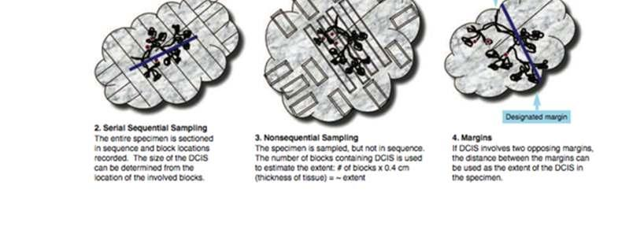
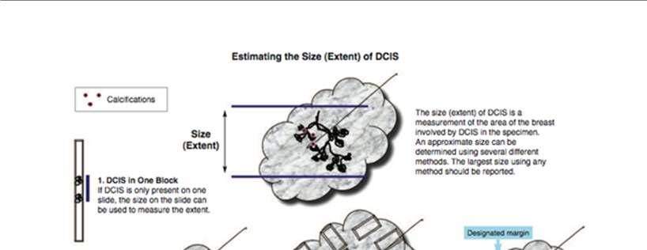
CAP
Approved
Breast.DCIS_4.4.0.0.REL_CAPCP
15
There are multiple methods for estimating the extent of DCIS (see Figure):

DCIS in 1 block: The area involved by DCIS can be measured from a single slide, if DCIS is
present in only 1 block. If separate foci are present, the largest distance between foci should be
reported. This method will underestimate the extent of DCIS when multiple blocks are involved and
should not be used in such cases.16

Serial sequential sampling: The entire specimen is blocked out in such a way that the location
of each block can be determined.  The extent of the DCIS can be calculated by using a diagram of
the specimen, the thickness of the slices, and the location of the involved blocks.16,17,18 This method
is recommended for all excisions likely to harbor DCIS or with previously diagnosed DCIS (eg, by
diagnosis on a prior core needle biopsy).

Nonsequential sampling: The number of blocks involved by DCIS is correlated with the extent of
DCIS up to 40 mm.16 Multiplying the number of blocks involved by DCIS by the approximate width
of a tissue section gives an estimate of the extent. In 2 studies, multiplying by 3 mm underestimated
the extent of DCIS, and multiplying by 5 mm may overestimate the extent.16,17 Therefore,
multiplying by 4 mm is recommended unless there is additional information that a different number
would yield a more accurate result. This method may underestimate extent if not all areas of DCIS
are sampled. Therefore, it is recommended that all tissue likely to be involved by DCIS be sampled
(eg, all grossly abnormal tissue and all tissue with radiologically suspicious calcifications). When
feasible, the entire specimen should be examined microscopically.
This method may result in a larger estimation of extent than the serial sequential sampling method
when DCIS is present in a large volume of tissue in 3 dimensions rather than in a predominantly
linear distribution. The best estimate for correlation with outcomes (eg, residual disease or
recurrence) will require further studies.
This method can be applied to any specimen and will give a better estimation of extent than
measuring extent on a single slide when multiple blocks contain DCIS.

Margins:  If DCIS involves or is close to 2 opposing margins, the distance between the margins
can be used as the extent of the DCIS within the specimen.

Gross lesions:  In some cases of high-grade DCIS, there may be a gross lesion that can be
measured.  Confirmation of the gross size must be confirmed by microscopic evaluation.
The largest estimate obtained using any of these methods should be used to report the estimated size
(extent) of the DCIS.
References
1. Silverstein MJ, Lagios MD, Recht A, et al. Image-detected breast cancer: state of the art
diagnosis and treatment. J Am Coll Surg. 2005;201:586-597.
2. O’Sullivan MJ, Morrow M.  Ductal carcinoma in situ: current management. Surg Clin North Am.
2007;87:333-351, viii.
3. Dillon MF, McDermott EW, O’Doherty A, et al.  Factors effecting successful breast conservation
for ductal carcinoma in situ. Ann Surg Oncol. 2007:14:1618-1628.
4. Sigal-Zafrani B, Lewis JS, Clough KB, et al; on behalf of the Institut Curie Breast Study Group.
Histologic margin assessment for breast ductal carcinoma in situ: precision and implications.
Mod Pathol. 2004;17:81-88.
5. Neuschatz AC, DiPetrillo T, Steinhoff M, et al. The value of breast lumpectomy margin
assessment as a predictor of residual tumor burden in ductal carcinoma in situ of the breast.
Cancer. 2002;94:1917-1924.
CAP
Approved
Breast.DCIS_4.4.0.0.REL_CAPCP
16
6. Cheng L, Al-Kaisi NK, Gordon NH, Liu AY, Gebrail F, Shenk RR. Relationship between the size
and margin status of ductal carcinoma in situ of the breast and residual disease. J Natl Cancer
Inst. 1997;89:1356-1360.
7. Di Saverio S, Catena F, Santini D, et al. 259 patients with DCIS of the breast applying USC/Van
Nuys prognostic index: a retrospective review with long term follow up. Breast Cancer Res Treat.
2008;109:404-416.
8. MacDonald HR, Silverstein MJ, Mabry H, et al. Local control in ductal carcinoma in situ treated
by excision alone: incremental benefit of larger margins. Am J Surg. 2005;190:521-525.
9. Asjoe FT, Altintas S, Huizing MT, et al. The value of the Van Nuys Prognostic Index in ductal
carcinoma in situ of the breast: a retrospective analysis. Breast J. 2007;13:359-367.
10. Maffuz A, Barroso-Bravo S, Najera I, Zarco G, Alvarado-Cabrero I, Rogriguez-Cuevas SI. Tumor
size as predictor of microinvasion, invasion, and axillary metastasis in ductal carcinoma in situ. J
Exp Clin Cancer Res. 2006;25:223-227.
11. Moore KH, Sweeney KJ, Wilson ME, et al. Outcomes for women with ductal carcinoma-in-situ
and a positive sentinel lymph node: a multi-institutional audit. Ann Surg Oncol. 2007;14:2911-
2917.
12. MacDonald HR, Silverstein MJ, Lee LA, et al. Margin width as the sole determinant of local
recurrence after breast conservation in patients with ductal carcinoma in situ of the breast. Am J
Surg. 2006;192:420-422.
13. Saqi A, Osborne MP, Rosenblatt R, Shin SJ, Hoda SA, Quantifying mammary duct carcinoma in
situ: a wild-goose chase? Am J Clin Pathol. 2000;113(suppl 1):S30-S37.
14. Clingan R, Griffen M, Phillips J, et al. Potential margin distortion in breast tissue by specimen
mammography. Arch Surg. 2003;138:1371-1374.
15. Graham RA, Homer MJ, Katz J, et al. The pancake phenomenon contributes to the inaccuracy of
margin assessment in patients with breast cancer. Am J Surg. 2002;184:89-93.
16. Grin A, Horne G, Ennis M, O’Malley FP.  Measuring extent of DCIS in breast excision specimens:
a comparison of four methods. Arch Pathol Lab Med. 2009;133:31-37.
17. Dadmanesh F, Fan X, Dastane A, Amin MB, Bose S. Comparative analysis of size estimation by
mapping and counting number of blocks with DCIS in breast excision specimens.  Arch Pathol
Lab Med. 2009;133:26-30.
18. Silverstein MJ, Poller D, Craig P, et al.  A prognostic index for ductal carcinoma in situ of the
breast. Cancer. 1996;77:2267-2274.
E. Architectural Pattern
The architectural pattern has been reported traditionally for DCIS.1,2 However, nuclear grade and the
presence of necrosis are more predictive of clinical outcome.
References
1. Schwartz GF, Lagios MD, Carter D, et al. Consensus conference on the classification of ductal
carcinoma in situ. Cancer. 1997;80:1798-1802.
2. Silverstein MJ, Lagios MD, Recht A, et al. Image-detected breast cancer: state of the art
diagnosis and treatment. J Am Coll Surg. 2005;201:586-597.
F. Nuclear Grade
The nuclear grade of DCIS is determined using 6 morphologic features (Table 2).1,2
CAP
Approved
Breast.DCIS_4.4.0.0.REL_CAPCP
17
Table 2. Nuclear Grade of Ductal Carcinoma In Situ
Feature
Grade I
(Low)
Grade II
(Intermediate)
Grade III
(High)
Pleomorphism
Monotonous (monomorphic)
Intermediate
Markedly pleomorphic
Size
1.5 to 2 x the size of a normal RBC or
a normal duct epithelial cell nucleus
Intermediate
>2.5 x the size of a normal RBC or
a normal duct epithelial cell
nucleus
Chromatin
Usually diffuse, finely dispersed
chromatin
Intermediate
Usually vesicular with irregular
chromatin distribution
Nucleoli
Only occasional
Prominent, often multiple
Mitoses
Only occasional
Intermediate
May be frequent
Orientation
Polarized toward luminal spaces
Intermediate
Usually not polarized toward the
luminal space
Definition: RBC, red blood cell.
References
1. Schwartz GF, Lagios MD, Carter D, et al. Consensus conference on the classification of ductal
carcinoma in situ. Cancer. 1997;80:1798-1802.
2. Radiation Therapy Oncology Group (RTOG). Evaluation of Breast Specimens Removed by
Needle Localization Technique. Available at: http://www.rtog.org/qa/98-
04/9804images/9804path1.html. Accessed 20 Feb 2019.
G. Necrosis
The presence of necrosis is correlated with the finding of mammographic calcifications (ie, most areas of
necrosis will calcify). DCIS that presents as mammographic calcifications often recurs as calcifications.
Necrosis can be classified as follows:1

Central (“comedo”): The central portion of an involved ductal space is replaced by an area of
expansive necrosis that is easily detected at low magnification. Ghost cells and karyorrhectic
debris are generally present.  Although central necrosis is generally associated with high-grade
nuclei (ie, comedo DCIS), it can also occur with DCIS of low or intermediate nuclear grade. This
type of necrosis often correlates with a linear and/or branching pattern of calcifications on
mammography.

Focal (punctate): Small foci, indistinct at low magnification, or single cell necrosis.
Necrosis should be distinguished from secretory material, which can also be associated with calcifications,
cytoplasmic blebs, and histiocytes, but does not include nuclear debris.
References
1. Schwartz GF, Lagios MD, Carter D, et al. Consensus conference on the classification of ductal
carcinoma in situ. Cancer. 1997;80:1798-1802.
H. Microcalcifications
DCIS found in biopsies performed for microcalcifications will almost always be at the site of the calcifications
or in close proximity.1,2  The presence of the targeted calcifications in the specimen should be confirmed by
specimen radiography. The pathologist must be satisfied that the specimen has been sampled in such a
CAP
Approved
Breast.DCIS_4.4.0.0.REL_CAPCP
18
way that the lesion responsible for the calcifications has been examined microscopically. The relationship
of the radiologic calcifications to the DCIS should be indicated.
References
1. Owings DV, Hann L, Schnitt SJ, How thoroughly should needle localization breast biopsies be
sampled for microscopic examination?  A prospective mammographic/pathologic correlative study.
Am J Surg Pathol. 1990;14:578-583.
2. Silverstein MJ, Lagios MD, Recht A, et al. Image-detected breast cancer: state of the art diagnosis
and treatment. J Am Coll Surg. 2005;201:586-597.
I. Margins
Whenever feasible, the specimen should be oriented in order to identify specific margins.
Margins may be identified by sutures or clips placed on the specimen surface or by other means of
communication between surgeon and pathologist and should be documented in the pathology report.
Margins can be identified microscopically in several ways, including the use of multiple colored inks, by
submitting the margins in specific cassettes, or by the surgeon submitting each margin as a separately
excised specimen. Inks should be applied to the surface of the specimen, taking care to avoid penetration
into the specimen.
If margins are sampled with perpendicular sections, the pathologist should report the distance from the
DCIS to the closest margin, when possible. Due to the growth pattern of DCIS in the ductal system, a
negative but close margin does not ensure the absence of DCIS in the adjacent tissue.1
A positive margin requires ink on DCIS. If the specimen is oriented, the specific site(s) of involvement (eg,
superior margin) should also be reported.
The deep margin may be at muscle fascia. If so, the likelihood of additional breast tissue beyond this margin
(and therefore possible involvement by DCIS) is extremely small. A deep muscle fascial margin (eg, on a
mastectomy specimen) is unlikely to have clinical significance.
A superficial (generally anterior) margin may be immediately below the skin, and there may not be additional
breast tissue beyond this margin. However, some breast tissue can be left in skin flaps, and the likelihood
of residual breast tissue is related to the thickness of the flap.2
Specimen radiography is important to assess the adequacy of excision. Compression of the specimen
should be minimized, as it can severely compromise the ability to assess the distance of the DCIS from the
surgical margin.3 Mechanical compression devices should be used with caution and preferably reserved for
nonpalpable lesions that require this technique for imaging (eg, microcalcifications).
If DCIS is present at the margin, the extent of margin involvement is associated with the likelihood of
residual disease4,5:

Focal: DCIS at the margin in a <1 mm area in 1 block

Minimal/moderate: between focal and extensive

Extensive: DCIS at the margin in an area ≥15 mm or in 5 or more low-power fields and/or in 8 or
more blocks)
References
1. Morrow M, Van Zee KJ, Solin LJ, et al. Society of Surgical Oncology-American Society for
Radiation Oncology-American Society of Clinical Oncology consensus guideline on margins for
CAP
Approved
Breast.DCIS_4.4.0.0.REL_CAPCP
19
breast-conserving surgery with whole-breast irradiation in ductal carcinoma in situ. Pract Radiat
Oncol. 2016;6(5):287-295.
2. Torresan RZ, dos Santos CC, Okamura H, Alvarenga M. Evaluation of glandular tissue after skin-
sparing mastectomies. Ann Surg Oncol. 2005;12:1037-1044.
3. Saqi A, Osborne MP, Rosenblatt R, Shin SJ, Hoda SA, Quantifying mammary duct carcinoma in
situ: a wild-goose chase? Am J Clin Pathol. 2000;113(suppl 1):S30-S37.
4. Dillon MF, McDermott EW, O’Doherty A, et al.  Factors effecting successful breast conservation
for ductal carcinoma in situ. Ann Surg Oncol. 2007:14:1618-1628.
5. Sigal-Zafrani B, Lewis JS, Clough KB, et al; on behalf of the Institut Curie Breast Study Group.
Histologic margin assessment for breast ductal carcinoma in situ: precision and implications.
Mod Pathol. 2004;17:81-88.
J. Lymph Nodes
Lymph Node Sampling
Patients with DCIS may have lymph nodes sampled in the following situations:

Extensive DCIS:  Patients with extensive DCIS are more likely to have areas of invasion and it may
be difficult or impractical to examine all involved areas of the breast microscopically.1,2,3 A lymph
node with a metastasis would indicate an occult area of invasion.

Pathologic findings on a prior needle biopsy or excision raising concern for invasion or
microinvasion (invasion measuring ≤1 mm in size):  If invasion has been documented, the protocol
for invasive carcinoma of the breast4 should be used.

Imaging findings (eg, an irregular mass) or clinical findings (eg, a large palpable mass) that
increase the likelihood that stromal invasion is present.2

Planned mastectomy: The additional sampling of low lymph nodes or a sentinel lymph node does
not result in increased morbidity. If the node or nodes are negative, and invasive cancer is found,
another surgical procedure for node sampling can be avoided.
Most tumor cells in lymph nodes of patients with DCIS would be classified as isolated tumor
cells.5,6 Artifactual displacement of epithelium to a lymph node(s) can occur following a core needle biopsy;
this finding should not be considered isolated tumor cells or a micrometastasis.7,8 If a larger nodal
metastasis is found and the breast tissue has not been entirely submitted for microscopic examination,
additional sampling should be considered to attempt to identify invasive carcinoma.1,3
Grossly uninvolved nodes should be submitted in their entirety for histologic examination, whereas a
representative section of a grossly positive node may be submitted. Small nodes (eg, 2 to 3 mm) may be
submitted intact, but larger nodes should be thinly sectioned. An accurate assessment of the number of
positive lymph nodes is a critical prognostic indicator.
Sentinel lymph nodes are identified as such by the surgeon, generally by uptake of radiotracer or dye.
Reporting Lymph Nodes
The pathology report should state the total number of lymph nodes examined (including the number of
sentinel nodes), the number of nodes with metastases, and the greatest dimension of the largest metastatic
focus. If a patient has at least 1 macrometastasis, only nodes with micro and macrometastases are included
for the total number of positive nodes for determining the N category.9 Nodes with isolated tumor cells are
not included in this count. At least 1 node with presence or absence of cancer documented by pathologic
examination is required for determining the pathologic N category.
CAP
Approved
Breast.DCIS_4.4.0.0.REL_CAPCP
20
The (sn) modifier indicates that nodal categorization is based on less than an axillary dissection. When the
combination of sentinel and nonsentinel nodes removed is less than a standard low axillary dissection
(fewer than six nodes), the (sn) modifier is used,” eg, pN0(i+)(sn). The (sn) modifier is not used if 6 or more
lymph nodes are examined (including sentinel and nonsentinel lymph nodes).
Isolated tumor cells (ITCs) are defined as single tumor cells or small cell clusters not greater than 0.2 mm
and numbering less than 200 cells.4,10,11,12 They may be detected by routine histologic examination or by
immunohistochemical (IHC) or molecular methods. ITCs do not usually show evidence of malignant activity
(eg, proliferation or stromal reaction), but micrometastases may show these changes.
Almost all tumor cells present in lymph nodes of patients with DCIS are isolated tumor cells or the cells may
be artifactually displaced from a previous procedure.7,8 Isolated tumor cells detected in cases of DCIS have
not been shown to have prognostic importance.5,6 If a larger metastasis is found, additional tissue sampling
and review of slides are helpful to determine if an area of invasion is present.3
References
1.
Lagios MD, Westdahl PR, Margolin FR, et al. Duct carcinoma in situ: relationship of extent of
noninvasive disease to the frequency of occult invasion, multicentricity, lymph node metastasis,
and short-term treatment failures. Cancer. 1982;50:1309-1314.
2.
Maffuz A, Barroso-Bravo S, Najera I, Zarco G, Alvarado-Cabrero I, Rogriguez-Cuevas SI. Tumor
size as predictor of microinvasion, invasion, and axillary metastasis in ductal carcinoma in situ. J
Exp Clin Cancer Res. 2006;25:223-227.
3.
Moore KH, Sweeney KJ, Wilson ME, et al. Outcomes for women with ductal carcinoma-in-situ
and a positive sentinel lymph node: a multi-institutional audit. Ann Surg Oncol. 2007;14:2911-
2917.
4.
Fitzgibbons PL, Bose S, Chen Y, et al. Protocol for the Examination of Specimens From Patients
with Invasive Carcinoma of the Breast. 2017; www.cap.org/cancerprotocols.
5.
Broekhuizen LN, Wijsman JH, Peterse JL, Rutgers EJT. The incidence and significance of
micrometastases in lymph nodes of patients with ductal carcinoma in situ and T1a carcinoma of
the breast. Eur J Surg Oncol. 2006; 32:502-506.
6.
Lara JF, Young SM, Velilla RE, Santoro EJ, Templeton SF. The relevance of occult axillary
micrometastasis in DCIS: a clinicopathologic study with long-term follow-up. Cancer.
2003;98:2105-2113.
7.
Carter BA, Jensen RA, Simpson JF, Page DL. Benign transport of breast epithelium into axillary
lymph nodes after biopsy. Am J Clin Pathol. 2000;113:259-265.
8.
Bleiweiss IJ, Nagi CS, Jaffer S. Axillary sentinal lymph nodes can be falsely positive due to
iatrogenic displacement and transport of benign epithelial cells in patients with breast carcinoma.
J Clin Oncol. 2006;24:2013-2018.
9.
Amin MB, Edge SB, Greene FL, et al, eds. AJCC Cancer Staging Manual. 8th ed. New York, NY:
Springer; 2017.
10.
Connolly JL. Changes and problematic areas in interpretation of the AJCC Cancer Staging
Manual, 6th Edition, for breast cancer. Arch Pathol Lab Med. 2006;130:287-291.
11.
Singletary SE, Connolly JL, Breast cancer staging: working with the sixth edition of the AJCC
Cancer Staging Manual. CA Cancer J Clin. 2006;56:37-47.
12.
Singletary SE, Greene FL, Sobin LH. Classification of isolated tumor cells: clarification of the 6th
edition of the American Joint Committee on Cancer Staging Manual. Cancer. 2003;90:2740-
2741.
CAP
Approved
Breast.DCIS_4.4.0.0.REL_CAPCP
21
K. Pathologic Stage Classification
The tumor-node-metastasis (TNM) staging system maintained collaboratively by the American Joint
Committee on Cancer (AJCC) and the International Union Against Cancer (UICC) is recommended.1,2,3,4,5
Pathologic Classification
The pathologic classification of a cancer is based on information acquired before treatment supplemented
and modified by the additional evidence acquired during and from surgery, particularly from pathologic
examination of resected tissues. The pathologic classification provides additional precise and objective
data. Reporting of T, N, and M categories by pathologic means is denoted by use of a lower case “p” prefix
(pT, pN, pM).
Pathologic T. DCIS is classified as pTis (DCIS) or pTis (Paget).
Pathologic N. At least one node with presence or absence of cancer documented by pathologic examination
is required for determining the pathologic N category. A tumor nodule in a regional node area is classified
as a positive node. The size of the metastasis, not the size of the node, is used for the criterion for the N
category.
Specialized pathologic techniques such as immunohistochemistry or molecular techniques may identify
limited metastases in lymph nodes that may not have been identified without the use of the special
diagnostic techniques.  Single tumor cells or small clusters of cells are classified as isolated tumor cells
(ITCs). The standard definition for ITC is a cluster of cells not more than 0.2 mm in greatest diameter. Cases
with ITC only in lymph nodes are classified as pN0. This rule also generally applies to cases with findings
of tumor cells or their components by nonmorphologic techniques such as flow cytometry or DNA analysis.
Pathologic M. The pathologic assignment of the presence of metastases (pM1) requires a biopsy positive
for cancer at the metastatic site. Pathologic M0 is an undefined concept and the category pM0 may not be
used.  Pathologic classification of the absence of distant metastases can only be made at autopsy. It would
be extremely rare to have distant metastasis in examples of DCIS and would surely indicate an unsampled
area of invasive carcinoma.
Posttherapy or Postneoadjuvant Therapy Classification (yTNM). Cases where systemic and/or radiation
therapy are given before surgery (neoadjuvant) or where no surgery is performed may have the extent of
disease assessed at the conclusion of the therapy by clinical or pathologic means (if resection performed).
This classification is useful to clinicians because the extent of response to therapy may provide important
prognostic information to patients and help direct the extent of surgery or subsequent systemic and/or
radiation therapy. T and N are classified by using the same categories as for clinical or pathologic staging
for the disease type, and the findings are recorded by using the prefix designator y (eg, ycT; ycN; ypT;
ypN). The yc prefix is used for the clinical stage after therapy, and the yp prefix is used for the pathologic
stage for those cases that have surgical resection after neoadjuvant therapy. The M component should be
classified by the M status defined clinically or pathologically prior to therapy.
Retreatment Classification. The retreatment classification (rTNM) is assigned when further treatment is
planned for a cancer that recurs after a disease-free interval. The original stage assigned at the time of
initial diagnosis and treatment does not change when the cancer recurs or progresses. The use of this
staging for retreatment or recurrence is denoted with the r prefix (rTNM). All information available at the
time of retreatment should be used in determining the rTNM stage. Biopsy confirmation of recurrent cancer
is important if clinically feasible. However, this may not be appropriate for each component, so clinical
evidence for the T, N, or M component by clinical, endoscopic, radiologic, or related methods may be used.
CAP
Approved
Breast.DCIS_4.4.0.0.REL_CAPCP
22
Multiple tumors. If there are multiple simultaneous areas of DICS in the breast, Tis remains the appropriate
choice. For simultaneous bilateral examples of DCIS, each DCIS is classified separately as independent
tumors in different organs.
Metachronous primaries. Second or subsequent primary examples of DCIS occurring in the same organ or
in different organs are staged as a new DCIS with the TNM system. Second DCIS examples are not staged
using the y prefix unless the treatment of the second cancer warrants this use.
References
1.
Amin MB, Edge SB, Greene FL, et al, eds. AJCC Cancer Staging Manual. 8th ed. New York, NY:
Springer; 2017.
2.
Connolly JL. Changes and problematic areas in interpretation of the AJCC Cancer Staging
Manual, 6th Edition, for breast cancer. Arch Pathol Lab Med. 2006;130:287-291.
3.
Singletary SE, Connolly JL, Breast cancer staging: working with the sixth edition of the AJCC
Cancer Staging Manual. CA Cancer J Clin. 2006;56:37-47.
4.
Singletary SE, Greene FL, Sobin LH. Classification of isolated tumor cells: clarification of the 6th
edition of the American Joint Committee on Cancer Staging Manual. Cancer. 2003;90:2740-2741
5.
Brierley JD, Gospodarowicz MK, Wittekind CH, et al, eds. TNM Classification of Malignant
Tumours. 8th ed. Oxford UK: Wiley; 2016.
L. Additional Findings
In some cases, other pathologic findings are important for the clinical management of patients.
If the biopsy was performed for a benign lesion and the DCIS is an incidental finding, this should be
documented. An example would be the finding of DCIS in an excision for a palpable fibroadenoma.
Peritumoral vascular invasion is a very rare finding in association with DCIS alone. Additional sampling
should be considered to attempt to identify an area of invasion. If there has been prior surgery or needle
biopsy, the possibility of artifactual displacement of epithelial cells into lymphatics should be considered.
Lymph node biopsy may be performed in patients with DCIS and lymphovascular invasion.
If there has been a prior core needle biopsy or incisional biopsy, the biopsy site should be sampled and
documented in the report. If the intention was to completely re-excise a prior surgical site, the report should
document biopsy changes at the margin that could indicate an incomplete excision. This protocol should
only be used for re-excisions that reveal the largest extent of DCIS.
# Breast Invasive, Resection
Protocol for the Examination of Resection Specimens from
Patients with Invasive Carcinoma of the Breast
Version: 4.10.0.0
Protocol Posting Date: June 2024
CAP Laboratory Accreditation Program Protocol Required Use Date: March 2025
The changes included in this current protocol version affect accreditation requirements. The new deadline
for implementing this protocol version is reflected in the above accreditation date.
For accreditation purposes, this protocol should be used for the following procedures AND tumor
types:
Procedure
Description
Excision less than total
mastectomy
Includes specimens designated excision, segmental resection, lumpectomy,
quadrantectomy, and segmental or partial mastectomy, with or without axillary
contents
Total Mastectomy
Includes skin-sparing and nipple-sparing mastectomy, with or without axillary
contents
Tumor Type
Description
Invasive breast carcinoma of any
type, with or without ductal
carcinoma in situ (DCIS)
Includes invasive and microinvasive carcinomas
This protocol is NOT required for accreditation purposes for the following:
Procedure
Needle or skin biopsies
Primary resection specimen with no residual cancer (e.g., following neoadjuvant therapy)
Additional excision performed after the definitive resection (e.g., re-excision of surgical margins)
Cytologic specimens
The following tumor types should NOT be reported using this protocol:
Tumor Type
Ductal carcinoma in situ without invasive carcinoma (consider the Breast DCIS Resection protocol)
Paget disease of the nipple without invasive carcinoma (consider the Breast DCIS Resection protocol)
Encapsulated or solid papillary carcinoma without invasion (consider the Breast DCIS Resection protocol)
Phyllodes tumor (consider the Phyllodes tumor protocol)
Lymphoma (consider the Precursor and Mature Lymphoid Malignancies protocol)
Sarcoma (consider the Soft Tissue protocol)
Authors
Uma G. Krishnamurti, MD, PhD*; Kimberly H. Allison, MD*; Patrick L. Fitzgibbons, MD, FCAP; James L.
Connolly, MD.
With guidance from the CAP Cancer and CAP Pathology Electronic Reporting Committees.
* Denotes primary author.

CAP
Approved
Breast.Invasive_4.10.0.0.REL_CAPCP
2
This protocol can be utilized for a variety of procedures and tumor types for clinical care purposes. For
accreditation purposes, only the definitive primary cancer resection specimen is required to have the core
and conditional data elements reported in a synoptic format.
•
Core data elements are required in reports to adequately describe appropriate malignancies. For
accreditation purposes, essential data elements must be reported in all instances, even if the
response is “not applicable” or “cannot be determined.”
•
Conditional data elements are only required to be reported if applicable as delineated in the
protocol. For instance, the total number of lymph nodes examined must be reported, but only if
nodes are present in the specimen.
•
Optional data elements are identified with “+” and although not required for CAP accreditation
purposes, may be considered for reporting as determined by local practice standards.
The use of this protocol is not required for recurrent tumors or for metastatic tumors that are resected at a
different time than the primary tumor. Use of this protocol is also not required for pathology reviews
performed at a second institution (i.e., secondary consultation, second opinion, or review of outside case
at second institution).
Synoptic Reporting
All core and conditionally required data elements outlined on the surgical case summary from this cancer
protocol must be displayed in synoptic report format. Synoptic format is defined as:
•
Data element: followed by its answer (response), outline format without the paired Data element:
Response format is NOT considered synoptic.
•
The data element should be represented in the report as it is listed in the case summary. The
response for any data element may be modified from those listed in the case summary, including
“Cannot be determined” if appropriate.
•
Each diagnostic parameter pair (Data element: Response) is listed on a separate line or in a
tabular format to achieve visual separation. The following exceptions are allowed to be listed on
one line:
o
Anatomic site or specimen, laterality, and procedure
o
Pathologic Stage Classification (pTNM) elements
o
Negative margins, as long as all negative margins are specifically enumerated where
applicable
•
The synoptic portion of the report can appear in the diagnosis section of the pathology report, at
the end of the report or in a separate section, but all Data element: Responses must be listed
together in one location
Organizations and pathologists may choose to list the required elements in any order, use additional
methods in order to enhance or achieve visual separation, or add optional items within the synoptic
report. The report may have required elements in a summary format elsewhere in the report IN
ADDITION TO but not as replacement for the synoptic report i.e., all required elements must be in the
synoptic portion of the report in the format defined above.
CAP
Approved
Breast.Invasive_4.10.0.0.REL_CAPCP
3
v 4.10.0.0
•
The individual reporting parameters of the Residual Cancer Burden (RCB) section can now be
reported independently of each other to accommodate for special scenarios (such as neoadjuvant
endocrine treatment) when the overall RCB calculation results may not apply and to add flexibility
in treatment effect reporting
•
Explanatory Note K updated to clarify use of “y” prefix and gross sampling for RCB Score
reporting
CAP
Approved
Breast.Invasive_4.10.0.0.REL_CAPCP
4
Reporting Template
Protocol Posting Date: June 2024
Select a single response unless otherwise indicated.
Standard(s): AJCC-UICC 8
If there are multiple invasive carcinomas, size, grade, histologic type, and the results of studies for estrogen receptor (ER),
progesterone receptor (PR), and HER2 should pertain to the largest invasive carcinoma. If smaller invasive carcinomas differ in any
of these features, this information may be included in the "Comments" section.
SPECIMEN
Procedure (Note A)
___ Excision (less than total mastectomy)
___ Total mastectomy (including nipple-sparing and skin-sparing mastectomy)
___ Other (specify): _________________
___ Not specified
Specimen Laterality
___ Right
___ Left
___ Not specified
TUMOR
+Tumor Site (Note B) (select all that apply)
___ Upper outer quadrant
___ Lower outer quadrant
___ Upper inner quadrant
___ Lower inner quadrant
___ Central
___ Nipple
___ Clock position
Specify Clock Position (select all that apply)
___ 1 o'clock
___ 2 o'clock
___ 3 o'clock
___ 4 o'clock
___ 5 o'clock
___ 6 o'clock
___ 7 o'clock
___ 8 o'clock
___ 9 o'clock
___ 10 o'clock
___ 11 o'clock
___ 12 o'clock
CAP
Approved
Breast.Invasive_4.10.0.0.REL_CAPCP
5
___ Specify distance from nipple in Centimeters (cm): _________________ cm
___ Other (specify): _________________
___ Not specified
Histologic Type (Note C)
Determination of histologic type is based on routine histologic examination; special stains such as e-cadherin are not required for
determining histologic type. The histologic type corresponds to the largest carcinoma. If there are smaller carcinomas of a different
type, this information should be included under “Additional Findings.”
Special type carcinomas should consist of at least 90% pure pattern.
___ No residual invasive carcinoma
___ Invasive carcinoma of no special type (ductal)
___ Micro-invasive carcinoma
___ Invasive lobular carcinoma
___ Invasive carcinoma with mixed ductal and lobular features
___ Invasive carcinoma with features of (specify): _________________
___ Tubular carcinoma
___ Invasive cribriform carcinoma
___ Mucinous carcinoma
___ Invasive micropapillary carcinoma
___ Apocrine adenocarcinoma
___ Metaplastic carcinoma
___ Encapsulated papillary carcinoma with invasion
___ Solid papillary carcinoma with invasion
___ Intraductal papillary adenocarcinoma with invasion
___ Adenoid cystic carcinoma
___ Neuroendocrine tumor
___ Neuroendocrine carcinoma
___ Invasive carcinoma, type cannot be determined: _________________
___ Other histologic type not listed (specify): _________________
+Histologic Type Comment: _________________
Histologic Grade (Nottingham Histologic Score) (required only if applicable) (Note D)
The grade corresponds to the largest area of invasion. If there are smaller foci of invasion of a different grade, this information
should be included under "Additional Findings."
___ Not applicable (no residual carcinoma or microinvasion only)
___ Nottingham Score
Glandular (Acinar) / Tubular Differentiation
___ Score 1 (greater than 75% of tumor area forming glandular / tubular structures)
___ Score 2 (10 to 75% of tumor area forming glandular / tubular structures)
___ Score 3 (less than 10% of tumor area forming glandular / tubular structures)
___ Only microinvasion present (not graded)
___ Score cannot be determined: _________________
Nuclear Pleomorphism
___ Score 1 (Nuclei small with little increase in size in comparison with normal breast epithelial cells,
regular outlines, uniform nuclear chromatin, little variation in size)
___ Score 2 (Cells larger than normal with open vesicular nuclei, visible nucleoli, and moderate
variability in both size and shape)
CAP
Approved
Breast.Invasive_4.10.0.0.REL_CAPCP
6
___ Score 3 (Vesicular nuclei, often with prominent nucleoli, exhibiting marked variation in size and
shape, occasionally with very large and bizarre forms)
___ Only microinvasion present (not graded)
___ Score cannot be determined: _________________
Mitotic Rate
See Table 1 in Note D
___ Score 1
___ Score 2
___ Score 3
___ Only microinvasion present (not graded)
___ Score cannot be determined: _________________
Overall Grade
___ Grade 1 (scores of 3, 4 or 5)
___ Grade 2 (scores of 6 or 7)
___ Grade 3 (scores of 8 or 9)
___ Only microinvasion present (not graded)
___ Score cannot be determined (explain): _________________
Tumor Size (Note E)
The size of the invasive carcinoma should take into consideration the gross findings correlated with the microscopic examination. If
multiple foci of invasion are present, the size listed is the size of the largest contiguous area of invasion. The size of multiple
invasive carcinomas should not be added together. The size does not include adjacent ductal carcinoma in situ (DCIS). For any
carcinoma larger than 1.0 mm but less than 1.5 mm, the size should not be rounded down to 1.0 mm, but rather rounded up to 2.0
mm, to ensure that the tumor is not miscategorized as pT1mi. Exception to the size rule-if two histologically similar carcinomas are
within 5.0 mm of each other, measure from outer edges of the two. For staging purposes radiologic findings can be used for pT
category.
If there has been a prior core needle biopsy or incisional biopsy showing a larger area of invasion than in the excisional specimen,
the largest dimension of the invasive carcinoma in the prior specimen, if known, should be used for determining the T category. This
also applies if the entire tumor has been removed by prior biopsy The size of the largest foci in the two specimens should not be
added together.
If there has been prior neoadjuvant treatment and no invasive carcinoma is present, the cancer is classified as ypTis if there is
residual DCIS and ypT0 if there is no remaining carcinoma. A checklist is not required if no cancer is present in the specimen.
___ No residual invasive carcinoma
___ Microinvasion only (less than or equal to 1 mm)
___ Greatest dimension of largest invasive focus greater than 1 mm (specify exact measurement in
Millimeters (mm)): _________________ mm
+Additional Dimension in Millimeters (mm): ____ x ____ mm
___ Size of largest invasive focus cannot be determined (explain): _________________
+Tumor Focality (Note F)
If there are multiple invasive carcinomas, size, grade, histologic type, and the results of studies for estrogen receptor (ER),
progesterone receptor (PgR), and HER2 should pertain to the largest invasive carcinoma. If smaller invasive carcinomas differ in
any of these features, this information may be included in the “Comments” section.
___ Single focus of invasive carcinoma
___ Multiple foci of invasive carcinoma
+Number of Foci
___ Specify number: _________________
___ At least: _________________
___ Cannot be determined
CAP
Approved
Breast.Invasive_4.10.0.0.REL_CAPCP
7
+Sizes of Individual Foci in Millimeters (mm) (values may be recorded on a single line using
units (mm) and semicolons (;) as separators): _________________
___ Cannot be determined: _________________
Ductal Carcinoma In Situ (DCIS) (Note G)
___ Not identified
___ Present
If there has been prior neoadjuvant treatment and only residual DCIS, the cancer is classified as ypTis.
___ Negative for extensive intraductal component (EIC)
___ Positive for extensive intraductal component (EIC)
___ Only DCIS is present after presurgical (neoadjuvant) therapy
+Size (Extent) of DCIS
The size (extent) of DCIS (greatest dimension using gross and microscopic evaluation) is an estimation of the volume of breast
tissue occupied by DCIS. This information may be helpful for cases with a predominant component of DCIS (e.g., DCIS with
microinvasion) but may not be necessary for cases of EIC negative invasive carcinomas.
___ Estimated size (extent) of DCIS is at least in Millimeters (mm): _________________ mm
+Additional Dimension in Millimeters (mm): ____ x ____ mm
___ Cannot be determined: _________________
+Architectural Patterns (if DCIS is present in specimen select all that apply) (select all that
apply)
___ Comedo
___ Paget disease (DCIS involving nipple skin)
___ Cribriform
___ Micropapillary
___ Papillary
___ Solid
___ Other (specify): _________________
+Nuclear Grade (if DCIS is present in specimen, see Table 2 in CAP Protocol)
___ Grade I (low)
___ Grade II (intermediate)
___ Grade III (high)
+Necrosis (If DCIS is present in specimen)
___ Not identified
___ Present, focal (small foci or single cell necrosis)
___ Present, central (expansive "comedo" necrosis)
+Number of Blocks with DCIS: _________________
+Number of Blocks Examined: _________________
___ Cannot be excluded: _________________
+Lobular Carcinoma In Situ (LCIS)
___ Not identified
___ Present
Tumor Extent (Note H)
Tumor Extent (required only if skin, nipple, or skeletal muscle are present and involved) (select
all that apply)
___ Not applicable (skin, nipple, and skeletal muscle are absent OR are uninvolved)
CAP
Approved
Breast.Invasive_4.10.0.0.REL_CAPCP
8
___ Skin is present and involved
Skin Invasion
___ Carcinoma directly invades into the dermis or epidermis without skin ulceration (this does not
change the T classification)
___ Carcinoma directly invades into the dermis or epidermis with skin ulceration (classified as T4b)
___ Carcinoma does not directly invade into the dermis or epidermis (this does not change the T
classification)
Skin Satellite Foci
Satellite skin nodules must be separate from the primary tumor and macroscopically identified to assign a
category as T4b. Skin nodules identified only on microscopic examination and in the absence of epidermal
ulceration or skin edema (clinical peau d'orange) do not qualify as T4b. Such tumors should be categorized
based on tumor size.
___ Satellite foci not identified
___ Satellite skin foci of invasive carcinoma are present (i.e., not contiguous with the invasive
carcinoma in the breast) (classified as T4b)
# This finding does not change the T classification of invasive carcinomas.
___ DCIS involves nipple epidermis (Paget disease of the nipple)#
___ Skeletal muscle is present and involved
Skeletal Muscle
Invasion into pectoralis muscle is not considered chest wall invasion, and cancers are not classified as T4a
unless there is invasion deeper than this muscle.
___ Carcinoma invades skeletal muscle
___ Carcinoma invades into skeletal muscle and into the chest wall (classified as T4a)
Lymphatic and / or Vascular Invasion (Note I)
___ Not identified
___ Present
+___ Focal (LVI in one block only)
+___ Extensive (LVI in two or more blocks)
___ Cannot be determined: _________________
+Dermal Lymphatic and / or Vascular Invasion
___ No skin present
___ Not identified
___ Present
___ Cannot be determined: _________________
+Microcalcifications (Note J) (select all that apply)
___ Not identified
___ Present in DCIS
___ Present in invasive carcinoma
___ Present in non-neoplastic tissue
___ Other (specify): _________________
Treatment Effect in the Breast (Note K)
The largest contiguous focus of residual tumor, if present, is used to determine ypT category. Treatment-related fibrosis in the tumor
bed adjacent to foci of residual invasive carcinoma is not included in determining ypT dimension.
___ No known presurgical therapy
CAP
Approved
Breast.Invasive_4.10.0.0.REL_CAPCP
9
___ No definite response to presurgical therapy in the invasive carcinoma
___ Probable or definite response to presurgical therapy in the invasive carcinoma
___ No residual invasive carcinoma is present in the breast after presurgical therapy
Treatment Effect in the Lymph Nodes (required if nodes are submitted and it is known that the
patient had presurgical therapy)
The largest contiguous focus of residual tumor in the lymph nodes, if present, is used to determine ypN category. Treatment-related
fibrosis adjacent to residual nodal deposits is not included in determining ypN dimension.
___ Not applicable
___ No definite response to presurgical therapy in metastatic carcinoma
___ Probable or definite response to presurgical therapy in metastatic carcinoma
___ No lymph node metastases. Fibrous scarring or histiocytic aggregates, possibly related to prior lymph
node metastases with pathologic complete response
___ No lymph node metastases and no fibrous scarring or histiocytic aggregates in the nodes
Residual Cancer Burden (RCB) Parameters (for institutions that wish to report treatment effects
using RCB parameters)# (Note K)
# The RCB calculator can be found at the MD Anderson website:
http://www3.mdanderson.org/app/medcalc/index.cfm?pagename=jsconvert3
Primary Tumor Bed
+Greatest Dimension of Primary Tumor Bed Area in Millimeters (mm) (involved by residual
viable carcinoma): _________________ mm
+Second Greatest Dimension of Primary Tumor Bed Area in Millimeters (mm):
_________________ mm
+Specify Percentage of Overall Cancer Cellularity (in the area measured above):
_________________ %
+Specify Percentage of Cancer that is In Situ Disease: _________________ %
Lymph Nodes
+Number of Positive Lymph Nodes: _________________
+Diameter of Largest Nodal Metastasis in Millimeters (mm): _________________ mm
RCB Calculations
+Residual Cancer Burden: _________________
+Residual Cancer Burden Class
___ RCB-0 (pCR)
___ RCB-I
___ RCB-II
___ RCB-III
MARGINS (Note L)
Margin Status for Invasive Carcinoma (required only if residual invasive carcinoma is present in
specimen)
___ Not applicable (residual invasive carcinoma in specimen is absent)
___ All margins negative for invasive carcinoma
Distance from Invasive Carcinoma to Closest Margin
Specify in Millimeters (mm)
___ Exact distance: _________________ mm
___ Less than: _________________ mm
CAP
Approved
Breast.Invasive_4.10.0.0.REL_CAPCP
10
___ Greater than: _________________ mm
___ Other (specify): _________________
___ Cannot be determined (explain): _________________
+Closest Margin(s) to Invasive Carcinoma (select all that apply)
___ Anterior
___ Posterior
___ Superior
___ Inferior
___ Medial
___ Lateral
___ Other (specify): _________________
___ Cannot be determined (explain): _________________
___ Invasive carcinoma present at margin
Margin status is listed as “positive” if there is ink on invasive carcinoma (i.e., the distance is 0 mm). Extent of margin involvement
may be specified as unifocal, multifocal, or extensive.
Margin(s) Involved by Invasive Carcinoma (select all that apply)
___ Anterior (specify extent): _________________
___ Posterior (specify extent): _________________
___ Superior (specify extent): _________________
___ Inferior (specify extent): _________________
___ Medial (specify extent): _________________
___ Lateral (specify extent): _________________
___ Other (specify margin(s) and extent): _________________
___ Cannot be determined (explain): _________________
___ Other (specify): _________________
___ Cannot be determined (explain): _________________
+Distance from Invasive Carcinoma to Anterior Margin
Specify in Millimeters (mm)
___ Exact distance: _________________ mm
___ Less than: _________________ mm
___ Greater than: _________________ mm
___ Other (specify): _________________
___ Cannot be determined (explain): _________________
+Distance from Invasive Carcinoma to Posterior Margin
Specify in Millimeters (mm)
___ Exact distance: _________________ mm
___ Less than: _________________ mm
___ Greater than: _________________ mm
___ Other (specify): _________________
___ Cannot be determined (explain): _________________
+Distance from Invasive Carcinoma to Superior Margin
Specify in Millimeters (mm)
___ Exact distance: _________________ mm
___ Less than: _________________ mm
___ Greater than: _________________ mm
___ Other (specify): _________________
___ Cannot be determined (explain): _________________
CAP
Approved
Breast.Invasive_4.10.0.0.REL_CAPCP
11
+Distance from Invasive Carcinoma to Inferior Margin
Specify in Millimeters (mm)
___ Exact distance: _________________ mm
___ Less than: _________________ mm
___ Greater than: _________________ mm
___ Other (specify): _________________
___ Cannot be determined (explain): _________________
+Distance from Invasive Carcinoma to Medial Margin
Specify in Millimeters (mm)
___ Exact distance: _________________ mm
___ Less than: _________________ mm
___ Greater than: _________________ mm
___ Other (specify): _________________
___ Cannot be determined (explain): _________________
+Distance from Invasive Carcinoma to Lateral Margin
Specify in Millimeters (mm)
___ Exact distance: _________________ mm
___ Less than: _________________ mm
___ Greater than: _________________ mm
___ Other (specify): _________________
___ Cannot be determined (explain): _________________
+Distance from Invasive Carcinoma to Other Margin(s)
Specify in Millimeters (mm)
___ Other margin(s) and distance(s) (specify): _________________
___ Cannot be determined (explain): _________________
Margin Status for DCIS (required only if DCIS is present in specimen)
For specimens in which the margin is uninvolved (no ink on carcinoma), the closest margin(s) must be specified if the distance of
DCIS from the margin is less than 2 mm. Distances can be specific measurements or expressed as greater than or less than a
measurement.
___ Not applicable (no DCIS in specimen)
___ All margins negative for DCIS
Distance from DCIS to Closest Margin
Specify in Millimeters (mm)
___ Exact distance: _________________ mm
___ Less than: _________________ mm
___ Greater than: _________________ mm
___ Other (specify): _________________
___ Cannot be determined (explain): _________________
Closest Margin(s) to DCIS (required only if less than 2mm)  (select all that apply)
___ Not applicable
___ Anterior
___ Posterior
___ Superior
___ Inferior
___ Medial
___ Lateral
___ Other (specify): _________________
CAP
Approved
Breast.Invasive_4.10.0.0.REL_CAPCP
12
___ Cannot be determined (explain): _________________
___ DCIS present at margin
Margin status is listed as “positive” if there is ink on DCIS (i.e., the distance is 0 mm). Extent of margin involvement may be specified
as unifocal, multifocal, or extensive.
Margin(s) Involved by DCIS (select all that apply)
___ Anterior (specify extent, if possible): _________________
___ Posterior (specify extent, if possible): _________________
___ Superior (specify extent, if possible): _________________
___ Inferior (specify extent, if possible): _________________
___ Medial (specify extent, if possible): _________________
___ Lateral (specify extent, if possible): _________________
___ Other (specify margin(s) and, if possible, extent): _________________
___ Cannot be determined (explain): _________________
___ Other (specify): _________________
___ Cannot be determined (explain): _________________
+Distance from DCIS to Anterior Margin
Specify in Millimeters (mm)
___ Exact distance: _________________ mm
___ Less than: _________________ mm
___ Greater than: _________________ mm
___ Other (specify): _________________
___ Cannot be determined (explain): _________________
+Distance from DCIS to Posterior Margin
Specify in Millimeters (mm)
___ Exact distance: _________________ mm
___ Less than: _________________ mm
___ Greater than: _________________ mm
___ Other (specify): _________________
___ Cannot be determined (explain): _________________
+Distance from DCIS to Superior Margin
Specify in Millimeters (mm)
___ Exact distance: _________________ mm
___ Less than: _________________ mm
___ Greater than: _________________ mm
___ Other (specify): _________________
___ Cannot be determined (explain): _________________
+Distance from DCIS to Inferior Margin
Specify in Millimeters (mm)
___ Exact distance: _________________ mm
___ Less than: _________________ mm
___ Greater than: _________________ mm
___ Other (specify): _________________
___ Cannot be determined (explain): _________________
+Distance from DCIS to Medial Margin
Specify in Millimeters (mm)
___ Exact distance: _________________ mm
___ Less than: _________________ mm
CAP
Approved
Breast.Invasive_4.10.0.0.REL_CAPCP
13
___ Greater than: _________________ mm
___ Other (specify): _________________
___ Cannot be determined (explain): _________________
+Distance from DCIS to Lateral Margin
Specify in Millimeters (mm)
___ Exact distance: _________________ mm
___ Less than: _________________ mm
___ Greater than: _________________ mm
___ Other (specify): _________________
___ Cannot be determined (explain): _________________
+Distance from DCIS to Other Margin(s)
Specify in Millimeters (mm)
___ Other margin(s) and distance(s) (specify): _________________
___ Cannot be determined (explain): _________________
+Margin Comment: _________________
REGIONAL LYMPH NODES (Note M)
Regional Lymph Node Status
___ Not applicable (no regional lymph nodes submitted or found)
___ Regional lymph nodes present
___ All regional lymph nodes negative for tumor
___ Tumor present in regional lymph node(s)
Number of Lymph Nodes with Macrometastases (greater than 2 mm)
___ Exact number (specify): _________________
___ At least (specify): _________________
___ Other (specify): _________________
___ Cannot be determined (explain): _________________
Number of Lymph Nodes with Micrometastases (greater than 0.2 mm to 2 mm and / or greater
than 200 cells)
___ Exact number (specify): _________________
___ At least (specify): _________________
___ Other (specify): _________________
___ Cannot be determined (explain): _________________
Number of Lymph Nodes with Isolated Tumor Cells (0.2 mm or less OR 200 cells or less)
(required only if applicable)#
# Reporting the number of lymph nodes with isolated tumor cells is required only in the absence of
macrometastasis or micrometastasis in other lymph nodes.
___ Not applicable
___ Exact number (specify): _________________
___ At least (specify): _________________
___ Other (specify): _________________
___ Cannot be determined (explain): _________________
CAP
Approved
Breast.Invasive_4.10.0.0.REL_CAPCP
14
Size of Largest Nodal Metastatic Deposit
Specify in Millimeters (mm)
___ Exact size: _________________ mm
___ Less than: _________________ mm
___ Greater than: _________________ mm
___ Other (specify): _________________
___ Cannot be determined (explain): _________________
Extranodal Extension
___ Not identified
___ Present, 2 mm or less
___ Present, greater than 2 mm
+Specify Amount: _________________
___ Present
___ Cannot be determined: _________________
___ Other (specify): _________________
___ Cannot be determined (explain): _________________
Total Number of Lymph Nodes Examined (sentinel and non-sentinel)
___ Exact number (specify): _________________
___ At least (specify): _________________
___ Other (specify): _________________
___ Cannot be determined (explain): _________________
Number of Sentinel Nodes Examined (if applicable)
___ Not applicable
___ Exact number (specify): _________________
___ At least (specify): _________________
___ Other (specify): _________________
___ Cannot be determined (explain): _________________
+Regional Lymph Node Comment: _________________
DISTANT METASTASIS
Distant Site(s) Involved, if applicable (select all that apply)
___ Not applicable
___ Non-regional lymph node(s) (specify, if possible): _________________
___ Lung: _________________
___ Liver: _________________
___ Bone: _________________
___ Brain: _________________
___ Other (specify): _________________
___ Cannot be determined: _________________
CAP
Approved
Breast.Invasive_4.10.0.0.REL_CAPCP
15
pTNM CLASSIFICATION (AJCC 8th Edition) (Note N)
Reporting of pT, pN, and (when applicable) pM categories is based on information available to the pathologist at the time the report
is issued. As per the AJCC (Chapter 1, 8th Ed.) it is the managing physician’s responsibility to establish the final pathologic stage
based upon all pertinent information, including but potentially not limited to this pathology report.
Modified Classification (required only if applicable) (select all that apply)
___ Not applicable
___ y (post-neoadjuvant therapy)
___ r (recurrence)
pT Category
# For the purposes of this checklist, these categories should only be used in the setting of preoperative (neoadjuvant) therapy for
which a previously diagnosed invasive carcinoma is no longer present after treatment. Patients with pathological complete response
(absence of residual invasive carcinoma in both the breast and lymph nodes) should be categorized as ypT0N0 or ypTisN0, not
ypTX.
___ pT not assigned (cannot be determined based on available pathological information)
___ pT0: No evidence of primary tumor#
___ pTis (DCIS): Ductal carcinoma in situ#
## Carcinomas in the breast parenchyma associated with Paget disease are categorized based on the size and characteristics of
the parenchymal disease, although the presence of Paget disease should still be noted.
___ pTis (Paget): Paget disease of the nipple NOT associated with invasive carcinoma and / or
carcinoma in situ (DCIS) in the underlying breast parenchyma##
pT1: Tumor less than or equal to 20 mm in greatest dimension
___ pT1mi: Tumor less than or equal to 1 mm in greatest dimension
### Round any measurement greater than 1.0-1.9 mm to 2 mm
___ pT1a: Tumor greater than 1 mm but less than or equal to 5 mm in greatest dimension###
___ pT1b: Tumor greater than 5 mm but less than or equal to 10 mm in greatest dimension
___ pT1c: Tumor greater than 10 mm but less than or equal to 20 mm in greatest dimension
___ pT1 (subcategory cannot be determined)
___ pT2: Tumor greater than 20 mm but less than or equal to 50 mm in greatest dimension
___ pT3: Tumor greater than 50 mm in greatest dimension
#### Invasion of the dermis alone does not qualify as pT4.
pT4: Tumor of any size with direct extension to the chest wall and / or to the skin (ulceration or skin nodules)####
___ pT4a: Extension to the chest wall; invasion or adherence to pectoralis muscle in the absence of
invasion of chest wall structures does not qualify as T4
___ pT4b: Ulceration and / or ipsilateral satellite nodules and / or edema (including peau d'orange) of the
skin which do not meet the criteria for inflammatory carcinoma
___ pT4c: Both T4a and T4b are present
##### Inflammatory carcinoma requires the presence of clinical findings of erythema and edema involving at least one-third or more
of the skin of the breast. (Note M)
___ pT4d: Inflammatory carcinoma#####
___ pT4 (subcategory cannot be determined)
T Suffix (required only if applicable)
___ Not applicable
___ (m) multiple primary synchronous tumors in a single organ
CAP
Approved
Breast.Invasive_4.10.0.0.REL_CAPCP
16
pN Category
Choose a category based on lymph nodes received with the specimen; immunohistochemistry and / or molecular studies are not
required.
If internal mammary lymph nodes, infraclavicular nodes, or supraclavicular lymph nodes are included in the specimen, consult the
AJCC Cancer Staging Manual for additional lymph node categories.
___ pN not assigned (no nodes submitted or found)
___ pN not assigned (cannot be determined based on available pathological information)
# Isolated tumor cells (ITCs) are defined as small clusters of cells not greater than 0.2 mm or single tumor cells, or a cluster of fewer
than 200 cells in a single histologic cross-section. ITCs may be detected by routine histology or by immunohistochemical (IHC)
methods. Nodes containing only ITCs are excluded from the total positive node count when determining the N category but should
be included in the total number of nodes evaluated.
___ pN0: No regional lymph node metastasis identified or ITCs only#
___ pN0 (i+): ITCs only (malignant cell clusters no larger than 0.2 mm) in regional lymph node(s)
___ pN0 (mol+): Positive molecular findings by reverse transcriptase polymerase chain reaction (RT-
PCR); no ITCs detected
___ pN1mi: Micrometastases (approximately 200 cells, larger than 0.2 mm, but none larger than 2.0 mm)
## Approximately 1000 tumor cells are contained in a 3-dimensional 0.2-mm cluster. Thus, if more than 200 individual tumor cells
are identified as single dispersed tumor cells or as a nearly confluent elliptical or spherical focus in a single histologic section of a
lymph node, there is a high probability that more than 1000 cells are present in the lymph node. In these situations, the node should
be classified as containing a micrometastasis (pN1mi). Cells in different lymph node cross-sections or longitudinal sections or levels
of the block are not added together; the 200 cells must be in a single node profile even if the node has been thinly sectioned into
multiple slices. It is recognized that there is substantial overlap between the upper limit of the ITC and the lower limit of the
micrometastasis categories due to inherent limitations in pathologic nodal evaluation and detection of minimal tumor burden in
lymph nodes. Thus, the threshold of 200 cells in a single cross-section is a guideline to help pathologists distinguish between these
2 categories. The pathologist should use judgment regarding whether it is likely that the cluster of cells represents a true
micrometastasis or is simply a small group of isolated tumor cells.
___ pN1a: Metastases in 1-3 axillary lymph nodes, at least one metastasis larger than 2.0 mm##
___ pN1b: Metastases in ipsilateral internal mammary sentinel nodes, excluding ITCs
___ pN1c: pN1a and pN1b combined
___ pN2a: Metastases in 4-9 axillary lymph nodes (at least one tumor deposit larger than 2.0 mm)##
___ pN2b: Metastases in clinically detected internal mammary lymph nodes with or without microscopic
confirmation; with pathologically negative axillary nodes
___ pN3a: Metastases in 10 or more axillary lymph nodes (at least one tumor deposit larger than 2.0
mm)##; or metastases to the infraclavicular (Level III axillary lymph) nodes
___ pN3b: pN1a or pN2a in the presence of cN2b (positive internal mammary nodes by imaging); or
pN2a in the presence of pN1b
___ pN3c: Metastases in ipsilateral supraclavicular lymph nodes
N Suffix (required only if applicable) (select all that apply)
The (sn) modifier is added to the N category when a sentinel node biopsy is performed (using either dye or tracer) and fewer than
six lymph nodes are removed (sentinel and nonsentinel). The (f) modifier is added to the N category to denote confirmation of
metastasis by fine needle aspiration / core needle biopsy with NO further resection of nodes.
___ Not applicable
___ (sn): Sentinel node(s) evaluated. If 6 or more nodes (sentinel or nonsentinel) are removed, this
modifier should not be used
___ (f): Nodal metastasis confirmed by fine needle aspiration or core needle biopsy
pM Category (required only if confirmed pathologically)
___ Not applicable - pM cannot be determined from the submitted specimen(s)
___ pM1: Histologically proven metastases larger than 0.2 mm
CAP
Approved
Breast.Invasive_4.10.0.0.REL_CAPCP
17
+Specify Case Number (if from a previous procedure): _________________
ADDITIONAL FINDINGS (Note O)
+Additional Findings (specify): _________________
SPECIAL STUDIES
The CAP Breast Biomarker Template should be used for reporting biomarkers requested for this resection specimen. Pending
biomarker studies should be listed in the Comments section of this report.
+Breast Biomarker Testing Performed on Previous Biopsy (select all that apply)
The previously reported biopsy biomarker status may be included additionally in the resection report.
___ Estrogen Receptor (ER)
Estrogen Receptor (ER) Status
___ Positive (greater than 10% of cells demonstrate nuclear positivity)
+Percentage of Cells with Nuclear Positivity
___ Specify %: _________________ %
--OR--
Select range below:
___ 11-20%
___ 21-30%
___ 31-40%
___ 41-50%
___ 51-60%
___ 61-70%
___ 71-80%
___ 81-90%
___ 91-100%
___ Low Positive (1-10% of cells with nuclear positivity)
___ Negative
___ Cannot be determined (indeterminate)
___ Progesterone Receptor (PgR)
Progesterone Receptor (PgR) Status
___ Positive
+Percentage of Cells with Nuclear Positivity#
___ Specify %: _________________ %
___ 1-10% (specify)#: _________________ %
___ 11-20%
___ 21-30%
___ 31-40%
___ 41-50%
___ 51-60%
___ 61-70%
___ 71-80%
___ 81-90%
___ 91-100%
___ Negative
CAP
Approved
Breast.Invasive_4.10.0.0.REL_CAPCP
18
___ Cannot be determined (indeterminate)
___ HER2 (by immunohistochemistry)
HER2 (by immunohistochemistry)
___ Negative (Score 0)
# Breast cancers with HER2 IHC score 1+ or HER2 IHC score 2+ and a negative ISH result are eligible for
clinically appropriate HER2-targeted therapy and may be reported as “HER2 Low”.
___ Negative (Score 1+)#
___ Equivocal (Score 2+)#
+Percentage of Cells with Uniform Intense Complete Membrane Staining
___ Specify percentage: _________________ %
___ Other (specify): _________________
___ Cannot be determined
___ Positive (Score 3+)
Percentage of Cells with Uniform Intense Complete Membrane Staining
___ Specify percentage: _________________ %
___ Other (specify): _________________
___ Cannot be determined
___ Cannot be determined (indeterminate)
___ HER2 (by in situ hybridization)
HER2 (by in situ hybridization)
___ Negative (not amplified)
___ Positive (amplified)
___ Cannot be determined (indeterminate)
___ Ki-67
Ki-67 Percentage of Positive Nuclei: _________________ %
+Testing Performed on Case Number: _________________
COMMENTS
Comment(s): _________________
CAP
Approved
Breast.Invasive_4.10.0.0.REL_CAPCP
19
Explanatory Notes
A. Procedures
The following types of breast specimens and procedures may be reported with the case summary:
Excisions: These procedures resect breast tissue without the intent of removing the entire breast. The
nipple is usually not included with excisions. Excisions include specimens designated “partial
mastectomies,” “lumpectomies,” and “quadrantectomies.”
Total Mastectomy: Removal of all breast tissue, generally including the nipple and areola.
•
Simple mastectomy: This procedure consists of a total mastectomy without removal of axillary
lymph nodes.
•
Skin sparing mastectomy: This is a total mastectomy with removal of the nipple and only a narrow
surrounding rim of skin.
•
Nipple sparing mastectomy: This is a total mastectomy without removal of skin or nipple. The
subareolar tissue is examined and the nipple later removed if involved by carcinoma.
•
Modified radical mastectomy: This procedure consists of a total mastectomy with an axillary
dissection. In the case summary, the breast and lymph node specimens are documented
separately. A small portion of pectoralis muscle is sometimes removed.
•
Radical mastectomy: This procedure consists of a total mastectomy with removal of the pectoralis
major and pectoralis minor muscles as well as axillary contents. This type of specimen and
procedure can be indicated on the case summary as “Other.”
The case summary is intended for reporting the patient’s specimen with the largest focus of invasive
carcinoma. If additional margin excisions are performed in the same procedure, the findings for these
specimens can be included in the margin evaluation. If additional smaller foci of invasive carcinoma are
present in the main excision or in margin excisions, the characteristics of these carcinomas (i.e., size,
histologic type, and grade) should be recorded under “Additional Pathologic Findings.” Additional ancillary
studies on smaller foci of carcinoma are recommended if the carcinomas are of different histologic type or
grade. If additional margin excisions are performed in a subsequent procedure (e.g., on another day), and
a larger area of invasive carcinoma is not present, the case summary need not be used.
If a patient has 2 ipsilateral invasive carcinomas removed in 2 separate excisions during the same
procedure, the case summary should be used for the larger invasive carcinoma. The pathologic findings
for the smaller cancer may be reported without using the case summary. If a patient has 2 ipsilateral
invasive carcinomas removed in 2 separate excisions in procedures on different days, the case summary
should be used for the larger carcinoma, and the American Joint Committee on Cancer (AJCC) T
category will pertain to this carcinoma. If a patient has bilateral breast carcinomas, the cancers are
reported in separate case summaries.
If information from other specimens is included in completing the case summary (e.g., the results of
hormone receptors from a prior core needle biopsy or the finding of lymph node metastases on a previous
lymph node biopsy), then this must be clearly stated in the “Comments” section, and the accession
numbers of the other cases should be provided.
CAP
Approved
Breast.Invasive_4.10.0.0.REL_CAPCP
20
The following types of specimens should not be reported by using this protocol:
•
Very small incisional biopsies (including core needle biopsies).
•
Re-excision of a biopsy site after removal of most of the carcinoma.
Specimen sampling for specimens with invasive carcinoma has the following goals1,2,3,4,5:
•
The clinical or radiologic lesion for which the surgery was performed must be examined
microscopically. If the lesion is a nonpalpable imaging finding, the specimen radiograph and/or
additional radiologic studies may be necessary to identify the lesion. When practical, the entire
lesion, or the entire area with the imaging finding, should be submitted in a sequential fashion for
histologic examination.
•
If the specimen consists predominantly of DCIS with microinvasion, complete submission of the
entire specimen, or at a minimum the entire grossly involved area, is recommended to identify
additional areas of invasion and/or lymphovascular invasion.
•
All other gross lesions in the specimen must be sampled.
•
Each designated margin must be evaluated for involvement by invasive carcinoma and DCIS. If
the specimen is received sectioned or fragmented, this should be noted, as this will limit the
ability to evaluate the status of margins.
Tissue may be taken for research studies or assays that do not involve the histologic examination of the
tissue (e.g., reverse transcriptase polymerase chain reaction [RT-PCR]) only when taken in such a way
as to not compromise the evaluation of the invasive carcinoma and lymph nodes for prognostic factors
and margin status.
It is preferable that the area of carcinoma be removed in a single intact specimen. If the specimen has
been incised or is fragmented, then it may not be possible to accurately assess margins. If invasive
carcinoma is present in more than 1 fragment, it may be difficult or impossible to determine the pathologic
size of the invasive carcinoma or the number of invasive carcinomas present. Breast imaging correlation
is recommended for these cases and may be used for determining the pT. When specimen fragmentation
limits the evaluation of tumor size and/or margins, this information should be included under “Additional
Pathologic Finding.”
The size of all specimens in 3 dimensions should be documented in the gross description. It is optional to
also include specimen sizes in the final diagnosis. The volume of tissue removed can be helpful in
estimating the extent of carcinoma present and determining the likely volume of tissue that would need to
be removed to achieve tumor-free margins.
If separate oriented margin specimens are excised, the results of the final margin status can be included
under “Margins” in the case summary. If not oriented, the findings can be reported under “Additional
Pathologic Findings.”
References
1. Association of Directors of Anatomic and Surgical Pathology. Immediate management of
mammographically detected breast lesions. Hum Pathol. 1993;24:689-690.
2. Connolly JL, Schnitt SJ. Evaluation of breast biopsy specimens in patients considered for
treatment by conservative surgery and radiation therapy for early breast cancer. Pathol Annu.
1988;23(pt 1):1-23.
CAP
Approved
Breast.Invasive_4.10.0.0.REL_CAPCP
21
3. Schnitt SJ, Wang HH. Histologic sampling of grossly benign breast biopsies: how much is
enough? Am J Surg Pathol. 1989;13:505-512.
4. Schnitt SJ, Connolly JL. Processing and evaluation of breast excision specimens: a clinically
oriented approach. Am J Clin Pathol. 1992;98:125-137.
5. Lester SC. Manual of Surgical Pathology. 3rd ed. New York, NY: Elsevier; 2010.
B. Tumor Site
The site of an invasive carcinoma is helpful to document, when provided by the surgeon, breast imaging,
or previous pathology report, to correlate with prior studies (e.g., a core needle biopsy) or with future
biopsies or cancer events. The site can be indicated by quadrant and/or by a clock position.
The approximate tumor site can be determined in a mastectomy. However, it is sometimes difficult to
correlate exactly with the position as determined in vivo because of differences in how the specimen
would be positioned on the chest wall (i.e., the skin ellipse may be horizontal or point to the axilla). It is
helpful to locate the carcinoma with respect to the clinical site or imaging site, when possible.
If the patient has undergone presurgical (neoadjuvant) therapy and there is no residual invasive
carcinoma, the tumor site refers to the location of the prior invasive carcinoma (ie, the tumor bed).
C. Histologic Type
This protocol applies to all invasive carcinomas of the breast. The World Health Organization
(WHO)1  classification of breast carcinoma is recommended, although the protocol does not preclude the
use of other classifications or histologic types. Carcinomas may be classified based on the H&E
appearance without the use of immunohistochemical studies.
A modified list is presented in the case summary based on the most frequent types of invasive
carcinomas and terminology that is in widespread usage. The modified list is intended to capture the
majority of tumors and reduce the frequency of tumors being reported as “other.” Choices are added for
tumors with mixed features and those with some but not all features of specific histologic types.
WHO Classification of Invasive Carcinoma of the Breast1
___ No residual invasive carcinoma
___ Invasive carcinoma of no special type (ductal)
___ Micro-invasive carcinoma
___ Invasive lobular carcinoma
___ Invasive carcinoma with mixed ductal and lobular features
___ Invasive carcinoma with mixed features (specify): ______________________
___ Tubular carcinoma
___ Invasive cribriform carcinoma
___ Mucinous carcinoma
___ Invasive micropapillary carcinoma
___ Apocrine adenocarcinoma
Metaplastic Carcinoma
___ Metaplastic carcinoma NOS
___ Low grade adenosquamous carcinoma
___ Fibromatosis-like metaplastic carcinoma
CAP
Approved
Breast.Invasive_4.10.0.0.REL_CAPCP
22
___ Spindle cell carcinoma
___ Squamous cell carcinoma
___ Metaplastic carcinoma with mesenchymal differentiation
Neuroendocrine Tumor
___ Neuroendocrine tumor NOS
___ Neuroendocrine tumor, grade 1
___ Neuroendocrine tumor, grade 2
Neuroendocrine Carcinoma
___ Neuroendocrine carcinoma NOS
___ Neuroendocrine carcinoma, small cell
___ Neuroendocrine carcinoma, large cell
___ Invasive carcinoma, type cannot be determined
___ Other histologic type (specify): ____________________________
___ Invasive papillary carcinoma
___ Encapsulated papillary carcinoma with invasion
___ Solid papillary carcinoma with invasion
___ Intraductal papillary adenocarcinoma with invasion
___ Oncocytic carcinoma
___ Lipid-rich carcinoma
___ Glycogen-rich carcinoma
___ Sebaceous carcinoma
___ Mucinous cystadenocarcinoma NOS
___ Acinar cell carcinoma
___ Classic adenoid cystic carcinoma
___ Solid-basaloid adenoid cystic carcinoma
___ Adenoid cystic carcinoma with high-grade transformation
___ Secretory carcinoma
___ Mucoepidermoid carcinoma
___ Polymorphous adenocarcinoma
___ Tall cell carcinoma with reversed polarity
___ Adenomyoepithelioma with carcinoma
___ Epithelial-myoepithelial carcinoma
___ Other type not listed (specify): ____________________________
References
1. WHO Classification of Tumours Editorial Board. Breast tumours. Lyon (France): International
Agency for Research on Cancer; 2019. (WHO classification of tumours series, 5th ed.; vol. 2).
D. Histologic Grade
All invasive breast carcinomas should be graded.1 The Nottingham combined histologic grade (Elston-
Ellis modification of Scarff-Bloom-Richardson grading system) should be used for reporting. Within each
stage grouping there is a relation between histologic grade and outcome.
CAP
Approved
Breast.Invasive_4.10.0.0.REL_CAPCP
23
The Nottingham combined histologic grade evaluates the amount of tubule formation, the extent of
nuclear pleomorphism, and the mitotic count (or mitotic rate). Each variable is given a score of 1, 2, or 3,
and the scores are added to produce a grade. The mitotic score is determined by the number of mitotic
figures found in 10 consecutive high-power fields (HPF) in the most mitotically active part of the tumor.
Only clearly identifiable mitotic figures should be counted; hyperchromatic, karyorrhectic, or apoptotic
nuclei are excluded. Because of variations in field size, the HPF size must be determined for each
microscope and the appropriate point score determined accordingly. It is recommended that the size be
measured by using a micrometer. However, the diameter of an HPF can also be calculated by using the
method below.
Measuring the Size of a High-Power Field (HPF) With a Ruler
Use a clear ruler to measure the diameter of a low-power field. This number can be used to calculate a
constant based on the following formula:
Eyepiece Magnification x Objective Magnification x Microscopic Field Diameter = A Constant
When the value of the constant is known, the diameter of an HPF can be calculated for other objectives
by using the following formula:
Unknown Field Diameter = Constant / (Eyepiece Magnification x Objective Magnification)
Half of the field diameter is the radius of the field (r), which can then be used to calculate the area of the
HPF:
3.1416 x r 2= Area of Microscopic Field
If the microscopic field diameter or the area of the field is known, Table 1 can be used to determine the
number of mitoses corresponding to different scores.
Table 1. Score Categories According to Field Diameter and Mitotic Count
Scoring Categories of Mitotic Counts
Field diameter (mm)
Area (mm2)
Number of mitoses per 10 fields corresponding to:
Score 1
Score 2
Score 3
0.40
0.125
≤4
5 to 9
≥10
0.41
0.132
≤4
5 to 9
≥10
0.42
0.139
≤5
6 to 10
≥11
0.43
0.145
≤5
6 to 10
≥11
0.44
0.152
≤5
6 to 11
≥12
0.45
0.159
≤5
6 to 11
≥12
0.46
0.166
≤6
7 to 12
≥13
0.47
0.173
≤6
7 to 12
≥13
0.48
0.181
≤6
7 to 13
≥14
0.49
0.189
≤6
7 to13
≥14
0.50
0.196
≤7
8 to 14
≥15
0.51
0.204
≤7
8 to 14
≥15
0.52
0.212
≤7
8 to 15
≥16
0.53
0.221
≤8
9 to 16
≥17
0.54
0.229
≤8
9 to 16
≥17
0.55
0.238
≤8
9 to 17
≥18
0.56
0.246
≤8
9 to 17
≥18
CAP
Approved
Breast.Invasive_4.10.0.0.REL_CAPCP
24
0.57
0.255
≤9
10 to 18
≥19
0.58
0.264
≤9
10 to 19
≥20
0.59
0.273
≤9
10 to 19
≥20
0.60
0.283
≤10
11 to 20
≥21
0.61
0.292
≤10
11 to 21
≥22
0.62
0.302
≤11
12 to 22
≥23
0.63
0.312
≤11
12 to22
≥23
0.64
0.322
≤11
12 to 23
≥24
0.65
0.332
≤12
13 to 24
≥25
0.66
0.342
≤12
13 to 24
≥25
0.67
0.353
≤12
13 to 25
≥26
0.68
0.363
≤13
14 to 26
≥27
0.69
0.374
≤13
14 to 27
≥ 28
From Pathology Reporting of Breast Disease.2 Copyright 2005 National Health Service Cancer Screening
Programme and The Royal College of Pathologists. Adapted with permission.
References
1. Ellis IO, Elston CW. Histologic grade. In: O’Malley FP, Pinder SE, eds. Breast Pathology.
Philadelphia, PA: Elsevier; 2006:225-233.
2. Royal College of Pathologists. Pathology reporting of breast disease in surgical excision
specimens incorporating the dataset for histological reporting of breast cancer. June 2016.
https://www.rcpath.org/profession/publications/cancer-datasets.html.  Accessed September 18,
2018.
E. Tumor Size (Size of Invasive Carcinoma)
The size of an invasive carcinoma is an important prognostic factor. The single greatest dimension of the
largest invasive carcinoma is used to determine T classification (Figure E1, A through F). The best size
for AJCC T classification should use information from imaging, gross examination, and microscopic
evaluation.1 Visual determination of size is often unreliable, as carcinomas often blend into adjacent
fibrous tissue. The size by palpation of a hard mass correlates better with invasion of tumor cells into
stroma with a desmoplastic response. Sizes should be measured to the nearest millimeter. In some
cases, the size may be difficult to determine.
CAP
Approved
Breast.Invasive_4.10.0.0.REL_CAPCP
25
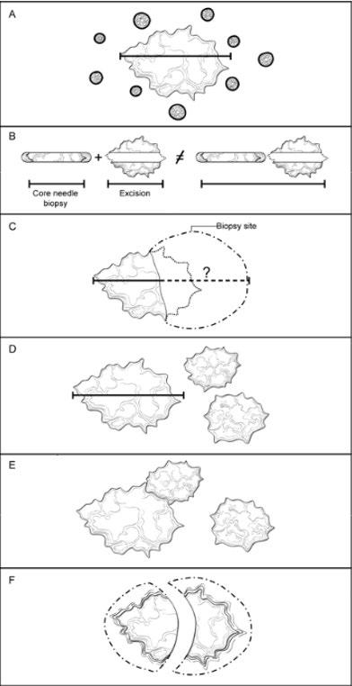
CAP
Approved
Breast.Invasive_4.10.0.0.REL_CAPCP
26
Figure E1. Determining the size of an invasive carcinoma. A. Invasive carcinoma with surrounding
ductal carcinoma in situ (DCIS). The size only includes the area of the invasive carcinoma and does not
include the adjacent DCIS. The size should be measured to the closest 1 mm. B. Small invasive
carcinoma with prior core needle biopsy. The size of the carcinoma in the core needle biopsy should not
be added to the size of the carcinoma in the excisional specimen, as this will generally overestimate the
true size. The best size for classification must take into consideration the largest dimension of the
carcinoma in both specimens as well as the size by imaging before the core needle biopsy. C. Small
invasive carcinomas with adjacent biopsy site changes. In some excisional specimens, a small carcinoma
will be present adjacent to a relatively large area of biopsy site changes. The actual size cannot be
determined with certainty. The size in the core needle biopsy, in the excisional specimen, and by imaging
should be considered to determine the best size for classification. D. Multiple invasive carcinomas. If
multiple carcinomas are present, the size of the largest invasive carcinoma is used for T classification.
The modifier “m” is used to indicate that multiple invasive carcinomas are present. E. Multiple invasive
carcinomas in close proximity. It may be difficult to distinguish multiple adjacent carcinomas from one
large invasive carcinoma. Careful examination of the specimen with submission of tissue between grossly
evident carcinomas is recommended. Correlation with imaging findings can be helpful. Generally,
microscopic size confirmation of the largest grossly identified invasive carcinoma is used for T
classification. Exception to the size rule – if two histologically similar carcinomas are within 5.0 mm of
each other, measure from outer edges of the two. F. Invasive carcinomas that have been transected. If an
invasive carcinoma has been transected and is present in more than 1 tissue fragment, the sizes in each
fragment should not be added together, as this may overestimate the true size. In many cases,
correlation with the size on breast imaging will be helpful to choose the best size for classification. In
other cases, the pathologist will need to use his or her judgment in assigning an AJCC T category.
DCIS with microinvasion: Microinvasion is defined by the AJCC as invasion measuring 1 mm or less in
size.1 If more than 1 focus of microinvasion is present, the number of foci present, an estimate of the
number, or a note that the number of foci is too numerous to quantify should be reported. In some cases,
immunoperoxidase studies for myoepithelial cells may be helpful to document areas of invasion and the
size of the invasive foci. Invasive tumors that are larger than 1.0 mm but less than 2.0 mm are rounded
up to 2.0 mm.
References
1. Amin MB, Edge SB, Greene FL, et al, eds. AJCC Cancer Staging Manual. 8th ed. New York, NY:
Springer; 2017.
F. Tumor Focality (Single or Multiple Foci of Invasive Carcinoma)
Focality need not be specifically stated if there is only a single area of invasive carcinoma. If multiple
invasive carcinomas are present, focality should be reported. Patients with multiple foci of invasion may
be divided into the following 6 groups:
•
Extensive carcinoma in situ (CIS) with multiple foci of invasion (Figure F1, A). Extensive
DCIS is sometimes associated with multiple areas of invasion. The invasive carcinomas are
usually similar in histologic appearance and immunophenotype, unless the DCIS shows marked
heterogeneity. This is the most common etiology of multiple invasive carcinomas.
•
Invasive carcinoma with smaller satellite foci of invasion (Figure F1, B). A large carcinoma
is sometimes surrounded by smaller adjacent foci of invasion. In such cases, the appearance of
multiple foci may be due to irregular extensions of the carcinoma into stroma, which in 2
CAP
Approved
Breast.Invasive_4.10.0.0.REL_CAPCP
27
dimensions give the appearance of multiple foci. In such cases, the smaller foci are usually
identical in histologic appearance and immunophenotype to the dominant carcinoma. Small
microscopic satellite foci of tumor around the primary tumor do not appreciably alter tumor
volume and are not added to or included in the maximum tumor size.
•
Invasive carcinoma with extensive lymphovascular invasion (LVI) (Figure F1, C). Additional
foci of invasion may arise from areas of LVI (i.e., an intramammary metastasis). The multiple
carcinomas are usually identical in histologic appearance and immunophenotype. The origin of
satellite skin nodules classified as T4b is generally due to invasion arising from foci of dermal
lymphovascular invasion.
•
Multiple biologically separate invasive carcinomas (Figure F1, D). Some patients have
multiple, synchronous, biologically independent carcinomas. Patients with germ-line mutations
are at increased risk for developing multiple carcinomas. The carcinomas may or may not be
similar in appearance and immunophenotype.
•
Invasive carcinomas after neoadjuvant therapy (Figure F1, E). Cancers with a significant
response to chemotherapy typically present as multiple residual foci within a fibrotic tumor bed
(see Note K). The foci of invasion are usually identical in appearance and immunophenotype.
•
Transection of a single carcinoma into multiple fragments (Figure F1, F). If invasive
carcinoma is present in multiple fragments of a fragmented specimen, transection of 1 carcinoma
should be considered. Correlation with clinical and imaging findings can sometimes be helpful to
determine the best size for T classification and to determine whether or not multiple foci were
present.
CAP
Approved
Breast.Invasive_4.10.0.0.REL_CAPCP
28
Figure F1. Multiple Invasive Carcinomas. A. Extensive carcinoma in situ with multiple foci of invasion.
The invasive carcinomas are usually similar in histologic appearance and immunoprofile unless the ductal
carcinoma in situ (DCIS) shows marked heterogeneity. B. Invasive carcinoma with smaller satellite foci.
The smaller foci are generally within 1 to 5 mm of the main carcinoma and are most likely due to
extensions of the main carcinoma that would be connected in another plane of section. The carcinomas
are usually identical in appearance and immunoprofile. Exception to the size rule – if two histologically
similar carcinomas are within 5.0 mm of each other, measure from outer edges of the two.  C. Invasive
carcinoma with extensive lymphovascular invasion. Areas of lymphovascular invasion can give rise to
additional foci of invasive carcinoma (ie, intramammary metastasis). The carcinomas are usually identical
in appearance and immunoprofile. D. Multiple biologically separate invasive carcinomas. These
carcinomas are usually widely separated and may be histologically and immunophenotypically distinct. E.
Invasive carcinomas after presurgical (neoadjuvant) therapy. If there is a marked response to treatment,
multiple foci of carcinoma may be scattered over a fibrotic tumor bed. The residual carcinoma is usually
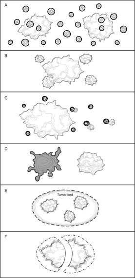
CAP
Approved
Breast.Invasive_4.10.0.0.REL_CAPCP
29
similar in appearance and immunoprofile to the pretreatment carcinoma, but in some cases alterations
due to treatment may be present. F. Transection of a single carcinoma into multiple fragments. If a
carcinoma is transected during excision, it may be difficult to determine if 1 or multiple carcinomas are
present. The carcinomas should be identical in appearance and immunoprofile.
Features pertaining to a specific cancer (i.e., histologic type, grade, size, and the results of ER, PgR, and
HER2 studies) should be provided for the largest invasive carcinoma in the case summary. If smaller
carcinomas differ in histologic type or grade, this information should be included under “Additional
Pathologic Findings,” and additional ancillary tests are recommended for these carcinomas. Features
pertaining to all carcinomas (e.g., margins, lymph node status) can be reported in the body of the case
summary.
Patients with multiple grossly evident invasive carcinomas have a higher risk of having lymph node
metastases.1 However, it has not been shown that multiple invasive carcinomas increase the risk of
distant metastases for patients with lymph node-negative disease.
For patients with multiple ipsilateral invasive carcinomas, the T category assignment is based on the
largest tumor. The “(m)” modifier is used to distinguish these cases from those with only a single invasive
focus. For patients with simultaneous bilateral invasive carcinomas, each carcinoma is staged as a
separate primary tumor, with independent determination of T and N categories and biomarker status.
References
1. Andea AA, Wallis T, Newman LA, Bouwman D, Dey J, Visscher DW. Pathologic analysis of tumor
size and lymph node status in multifocal/multicentric breast carcinoma. Cancer. 2002;94:1383-
1390.
G. Ductal Carcinoma in Situ
Ductal carcinoma in situ associated with invasive carcinoma increases the risk of local recurrence for
women undergoing breast-conserving surgery. It is more important to report the features of DCIS when in
situ disease is predominant (e.g., cases of DCIS with microinvasion or extensive DCIS associated with
T1a carcinoma). If DCIS is a minimal component of the invasive carcinoma, the features of the DCIS have
less clinical relevance. The extent of DCIS has no prognostic significance in mastectomy
specimens. Therefore, most of the reporting elements for DCIS are optional and should be used at the
discretion of the pathologist.
The pathology report should specify whether extensive DCIS is present. Extensive intraductal component
(EIC)-positive carcinomas are defined in 2 ways (Figure G1, A through D)1:
CAP
Approved
Breast.Invasive_4.10.0.0.REL_CAPCP
30
Figure G1. Extensive Intraductal Component (EIC). A. Extensive intraductal component (EIC)-positive
carcinomas are defined by the following criteria: (1) Prominent DCIS within the invasive carcinoma and
(2) DCIS is also present outside the area of invasive carcinoma. B. EIC-positive carcinomas also include
carcinomas that are primarily DCIS in association with a “small” (approximately 10 mm or less) invasive
carcinoma or carcinomas. C. EIC-negative carcinomas do not fulfill the criteria for being positive for EIC.
D. Some carcinomas do not strictly fulfill the criteria for EIC but are associated with extensive DCIS in the
surrounding tissue. In such cases it is helpful to provide some measure of the extent of DCIS in the
specimen.
1. Ductal carcinoma in situ is a major component within the area of invasive carcinoma and DCIS is
also present in the surrounding breast parenchyma.
2. There is extensive DCIS associated with an invasive carcinoma.
Extensive intraductal component-positive carcinomas are associated with an increased risk of local
recurrence when the surgical margins are not evaluated or focally involved. The finding of EIC positivity
has less significance when DCIS does not extend close to margins. The extent of DCIS has no local
recurrence risk in patients treated with mastectomy.
In some cases, extensive DCIS can be present outside the area of invasive carcinoma although the
carcinoma does not technically fulfill the criteria for EIC positivity. In such cases, quantification of the
amount of DCIS present is helpful for planning radiation therapy.
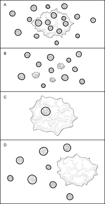
CAP
Approved
Breast.Invasive_4.10.0.0.REL_CAPCP
31
The extent of DCIS will be most relevant for cases of extensive DCIS with microinvasion and least
relevant for large EIC-negative invasive carcinomas. Methods for estimating the extent of DCIS include
directly measuring the lesion when confined to a single histologic slide, determining size by submitting the
entire specimen in sequence and in sections of uniform thickness, or counting the number of blocks with
DCIS. The College of American Pathologists (CAP) DCIS protocol2 provides additional information on
determining the extent of DCIS.
Architectural Pattern of DCIS
The architectural pattern has traditionally been reported for DCIS. However, nuclear grade and the
presence of necrosis are more predictive of clinical outcome.
Nuclear Grade of DCIS
The nuclear grade of DCIS is determined using 6 morphologic features (Table 2).3
Table 2. Nuclear Grade of Ductal Carcinoma in Situ
Feature
Grade I (Low)
Grade II (Intermediate)
Grade III (High)
Pleomorphism
Monotonous (monomorphic)
Intermediate
Markedly pleomorphic
Size
1.5 to 2 x the size of a normal
red blood cell or a normal duct
epithelial cell nucleus
Intermediate
>2.5 x the size of a normal red
blood cell or a normal duct
epithelial cell nucleus
Chromatin
Usually diffuse, finely dispersed
chromatin
Intermediate
Usually vesicular with irregular
chromatin distribution
Nucleoli
Only occasional
Intermediate
Prominent, often multiple
Mitoses
Only occasional
Intermediate
May be frequent
Orientation
Polarized toward luminal
spaces
Intermediate
Usually not polarized toward
the luminal space
Necrosis
The presence of necrosis is correlated with the finding of mammographic calcifications (i.e., most areas of
necrosis will calcify). Ductal carcinoma in situ that presents as mammographic calcifications often recurs
as calcifications. Necrosis can be classified as follows:
•
Central (“comedo”): The central portion of an involved ductal space is replaced by an area of
expansive necrosis that is easily detected at low magnification. Ghost cells and karyorrhectic
debris are generally present. Although central necrosis is generally associated with high-grade
nuclei (i.e., comedo DCIS), it can also occur with DCIS of low or intermediate nuclear grade.
•
Focal: Small foci, indistinct at low magnification, or single cell necrosis.
Necrosis should be distinguished from secretory material, which can also be associated with
calcifications, but does not include nuclear debris.
References
1. Morrow M, Harris JR. Local management of invasive breast cancer (chapter 33). In: Harris JR,
Lippman ME, Morrow M, Osborne KE, eds. Diseases of the Breast. 2nd ed. Philadelphia, PA:
Lippincott Williams & Wilkins; 2000:522-523.
2. Fitzgibbons PL, Bose S, Chen Y, et al. Protocol for the Examination of Specimens From Patients
with Ductal Carcinoma In Situ (DCIS) of the Breast. 2019; www.cap.org/cancerprotocols.
CAP
Approved
Breast.Invasive_4.10.0.0.REL_CAPCP
32
3. Schwartz GF, Lagios MD, Carter D, et al. Consensus conference on the classification of ductal
carcinoma in situ. Cancer. 1997;80:1798-1802.
H. Macroscopic and Microscopic Extent of Tumor
Breast cancers can invade into the overlying skin or into the chest wall, depending on their size and
location. Extension into skin and muscle is used for AJCC classification, and these findings may be used
for making decisions about local treatment. If skin or muscle are part of a specimen, their presence
should always be included in the gross description and the relationship of these structures to the
carcinoma reported in the final diagnosis. The extent of associated DCIS is important for determining the
type of surgery that will be necessary to obtain free margins.
Skin
There are multiple ways that breast carcinoma can involve the skin:
•
DCIS involving nipple epidermis (Paget disease of the nipple) (Figure H1, A): DCIS can extend
from the lactiferous sinuses into the contiguous skin without crossing the basement membrane.
This finding does not change the T classification of the invasive carcinoma.
•
Invasive carcinoma invading into dermis or epidermis, without ulceration (Figure H1, B): Skin
invasion correlates with the clinical finding of a carcinoma fixed to the skin and may be associated
with skin or nipple retraction. This finding does not change the T classification.
•
Invasive carcinoma invading into dermis and epidermis with skin ulceration (Figure H1, C): In the
past, skin ulceration was associated with very large, locally advanced carcinomas. However, skin
ulceration can also be associated with superficially located small carcinomas. It is unknown if skin
involvement confers a worse prognosis as compared to carcinomas of similar size without skin
invasion. Carcinomas with skin ulceration are classified as T4b.
•
Ipsilateral satellite skin nodules (Figure H1, D): An area of invasive carcinoma within the dermis,
separate from the main carcinoma, is usually associated with lymphovascular invasion. The
satellite nodules should be macroscopically evident and confirmed microscopically. This finding is
classified as T4b. The clinical significance of incidental microscopic satellite nodules in the dermis
has not been investigated.
•
Dermal lymphovascular invasion (Figure H1, E): Carcinoma present within lymphatic spaces in
the dermis is often correlated with the clinical features of inflammatory carcinoma (diffuse
erythema and edema involving one-third or more of the breast), and such cases would be
classified as T4d. In the absence of the clinical features of inflammatory carcinoma, this finding
remains a poor prognostic factor but is insufficient to classify a cancer as T4d. This finding is
separately documented under “Dermal Lymphovascular Invasion.”
CAP
Approved
Breast.Invasive_4.10.0.0.REL_CAPCP
33
Figure H1. Invasive Carcinoma: Skin Involvement. A. Ductal carcinoma in situ (DCIS) involving nipple
epidermis (Paget disease of the nipple) associated with an invasive carcinoma. DCIS can traverse the
lactiferous sinuses into the epidermis without crossing a basement membrane. This finding does not
change the T classification of an underlying invasive carcinoma. B. Invasive carcinoma invading into
dermis or epidermis, without ulceration. This finding does not change the T classification of the invasive
carcinoma. C. Invasive carcinoma invading into dermis and epidermis with skin ulceration. This carcinoma
would be classified as T4b, unless additional features warrant classification as T4c (chest wall invasion)
or T4d (inflammatory carcinoma). D. Ipsilateral satellite skin nodules. An area of invasive carcinoma in the
skin, separate from the main carcinoma, is usually associated with lymphovascular invasion. This finding
is classified as T4b, unless additional features warrant classification as T4c (chest wall invasion) or T4d
(inflammatory carcinoma). E. Dermal lymphovascular invasion. If carcinoma within lymphatic spaces in
the dermis is correlated with the clinical features of inflammatory carcinoma (diffuse erythema and edema
involving one-third or more of the breast), the carcinoma is classified as T4d. If clinical signs are not
present, this finding does not change the T classification, but is an indicator of a poor prognosis.
Muscle
Skeletal muscle may be present at the deep/posterior margin. The presence of muscle documents that
the excision has extended to the deep fascia. Invasion into skeletal muscle should be reported, as this
finding may be used as an indication for postmastectomy radiation therapy.
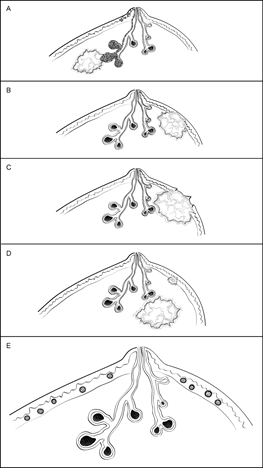
CAP
Approved
Breast.Invasive_4.10.0.0.REL_CAPCP
34
The skeletal muscle present is generally pectoralis muscle. Invasion into this muscle is not included as
T4a. Invasion must extend through this muscle into the chest wall (intercostal muscles or deeper) in order
to be classified as T4a. However, chest wall muscles are rarely removed in mastectomy specimens. The
T4a classification is generally established with imaging of locally advanced carcinomas.
I. Lymphatic and/or Vascular Invasion
Lymphatic and/or vascular invasion (LVI) is associated with local recurrence and reduced
survival.1,2,3 Distinguishing lymphatic channels from blood vessels is unnecessary. Documenting the
presence of dermal lymphatic and/or vascular invasion is particularly important because of its strong
association with the clinical findings of inflammatory breast carcinoma. Reporting the LVI status for stage
IIA and IIB patients who have an axillary lymph node dissection (ALND) may influence the use of
radiotherapy.4
Strict criteria have been proposed for the diagnosis of LVI5 (Table 3). Lymphatic and/or vascular invasion
may be seen in stroma between uninvolved lobules and can sometimes be mistaken for DCIS if the cells
completely fill the lymphatic space.
Guidelines
issued
by
the
St.
Gallen
International
Expert
Consensus
Conference6 include
recommendations based on the presence of “extensive” LVI but do not define the term “extensive”. There
are conflicting results on the significance of the number of foci of LVI.2,3  Pathologists may report the
number of foci or the number of blocks with LVI as a measure of extent.
Table 3. Criteria for Lymphatic and/or Vascular Invasion (LVI)
1.
LVI must be diagnosed outside the border of the invasive carcinoma. The most common area to find LVI is
within 1 mm of the edge of the carcinoma.
2.
The tumor emboli usually do not conform exactly to the contours of the space in which they are found. In
contrast, invasive carcinoma with retraction artifact mimicking LVI will have exactly the same shape.
3.
Endothelial cell nuclei should be seen in the cells lining the space.
4.
Lymphatics are often found adjacent to blood vessels and often partially encircle a blood vessel.
Data derived from Rosen.5
References
1. Gonzalez MA, Pinder SE. Invasive carcinoma: other histologic prognostic factors – size, vascular
invasion and prognostic index. In: O’Malley FP, Pinder SE, eds. Breast Pathology. Philadelphia,
PA: Elsevier; 2006: 235-240.
2. Colleoni M, Rotmensz N, Maisonneuve P, et al. Prognostic role of the extent of peritumoral
vascular invasion in operable breast cancer. Ann Oncol. 2007;18:1632-1640.
3. Mohammed RA, Martin SG, Mahmmod AM, et al. Objective assessment of lymphatic and blood
vessel invasion in lymph node-negative breast carcinoma: findings from a large case series with
long-term follow-up. J Pathol. 2011;223:358-365.
4. Recht A, Comen EA, Fine RE, et al. Postmastectomy Radiotherapy: An American Society of
Clinical Oncology, American Society for Radiation Oncology, and Society of Surgical Oncology
Focused Guideline Update. Journal of Clinical Oncology. 2016 34:36, 4437. DOI:
10.1200/JCO.2016.69.1188.
5. Rosen PP. Tumor emboli in intramammary lymphatics in breast carcinoma: pathologic criteria for
diagnosis and clinical significance. Pathol Annu. 1983;18 Pt 2:215-232.
CAP
Approved
Breast.Invasive_4.10.0.0.REL_CAPCP
35
6. Goldhirsch A, Wood WC, Coates AS, et al. Strategies for subtypes-dealing with the diversity of
breast cancer: highlights of the St. Gallen International Expert Consensus on the primary therapy
of early breast cancer 2011. Ann Oncol. 2011;22:1736-1747.
J. Microcalcifications
Cancer found in biopsies performed for microcalcifications will almost always be at the site of the
calcifications or in close proximity. The presence of the targeted calcifications in the specimen should be
confirmed by specimen radiography. The pathologist must be satisfied that the specimen has been
sampled in such a way that the lesion responsible for the calcifications has been examined
microscopically. The relationship of the radiologic calcifications to the invasive carcinoma and the DCIS
should be indicated.
If calcifications can be seen in the specimen radiograph but not in the initial histologic sections, deeper
levels should be examined. If needed, radiographs of the paraffin block(s) may be obtained to detect
calcifications remaining in the block(s). If microcalcifications cannot be confirmed by routine microscopic
evaluation, polarized light may be helpful, since calcium oxalate crystals are refractile and polarizable but
usually clear or tinged yellow in H&E sections. On rare occasions, calcifications do not survive tissue
processing or prolonged fixation in formalin. Foreign material can sometimes simulate calcifications (e.g.,
metallic fragments after surgery or trauma, ink from margin evaluation, and hemosiderin).
K. Treatment Effect
Patients may be treated with endocrine therapy or chemotherapy before surgical excision (neoadjuvant
therapy). A y prefix is added when assigning AJCC T and N categories after neoadjuvant treatment (ypT
and ypN). The y prefix does apply to neoadjuvant endocrine therapy if it was a formal, planned course of
neoadjuvant systemic treatment done for several months. The y prefix should not be reported if endocrine
treatment was just a short course (a few days or weeks). The response of the invasive carcinoma to
neoadjuvant therapy is a strong predictor of disease-free and overall survival. Special attention to finding
and evaluating the tumor bed is necessary for these specimens.1,2,3,4,5
Numerous classification systems have been developed to evaluate treatment response and institutions or
treatment protocols may require evaluation by one of these systems. For institutions that report the
Residual Cancer Burden (RCB), the RCB calculator can be found at the MD Anderson website:
http://www3.mdanderson.org/app/medcalc/index.cfm?pagename=jsconvert3. This site also includes
materials and guides that explain the system.
The RCB was not validated or designed for neoadjuvant endocrine treatment and an RCB Score should
not be reported. However, individual RCB parameters such as cellularity might be helpful in describing
residual disease burden; reporting these parameters may be of interest but is optional.
RCB Assessment of Primary Tumor Bed
The size (area) of the primary tumor bed with residual viable invasive carcinoma and the cellularity of
residual carcinoma in the tumor bed provide a reproducible estimate of the volume of residual invasive
carcinoma. The “tumor bed” size for RCB parameters of a treated cancer is measured as the span of
residual invasive carcinoma (contiguous or discontiguous foci) in two dimensions, which requires gross
tissue sampling methods that can provide this information (see RCB website for protocol). See figure
below for an example of the tumor bed parameter measurements.
CAP
Approved
Breast.Invasive_4.10.0.0.REL_CAPCP
36
The residual invasive carcinoma cellularity is estimated by determining the overall cancer cellularity
(invasive and in situ) and the percentage of residual in situ carcinoma. The RCB calculation subtracts the
amount of in situ disease to obtain the estimate of residual invasive carcinoma cellularity used to
determine the RCB. If only LVI remains after therapy, the area with LVI is used as the primary tumor bed
area and the cellularity of the LVI is used as the residual cancer cellularity.
Figure K1. Tumor bed measurements for RCB parameters
If reporting RCB parameters, the “tumor bed” dimensions should be the largest two-dimensional span of
residual invasive carcinoma confirmed on microscopic examination.  The gross fibrous tumor bed (shown
as grey area) is not always the same measurements as the span of residual invasion (shown as multiple
smaller solid circles in this example). The two-dimensional span of residual invasion may include foci that
are not contiguous and present across multiple slices/sections. Only the largest span of invasion (not
DCIS) is included in the overall tumor bed measurements.
RCB Assessment of Regional Lymph Nodes
According to the AJCC 8th edition staging system, the size of the largest contiguous focus of residual
metastatic carcinoma present in the lymph nodes is used to assign the pN category; intervening therapy-
related fibrosis is not included in this measurement. However, when measuring the diameter of the largest
lymph node metastasis for the RCB calculation, foci of residual metastatic carcinoma with intervening
therapy-related fibrosis and any extracapsular extension are included in the measurement.
Lymph nodes containing only isolated tumor cells (ITCs) are not included in the number of positive lymph
nodes when determining the AJCC pN category, but nodes containing only ITCs detected by routine
stains are included in the RCB calculation. A size smaller than 0.2 mm (e.g., 0.05 mm) can be entered in
the RCB calculator.
If there are separate metastases within the node with intervening normal nodal tissue, then these should
be considered as separate foci and the largest single focus is used as the size of the largest metastatic
deposit for both AJCC Staging and RCB calculation.
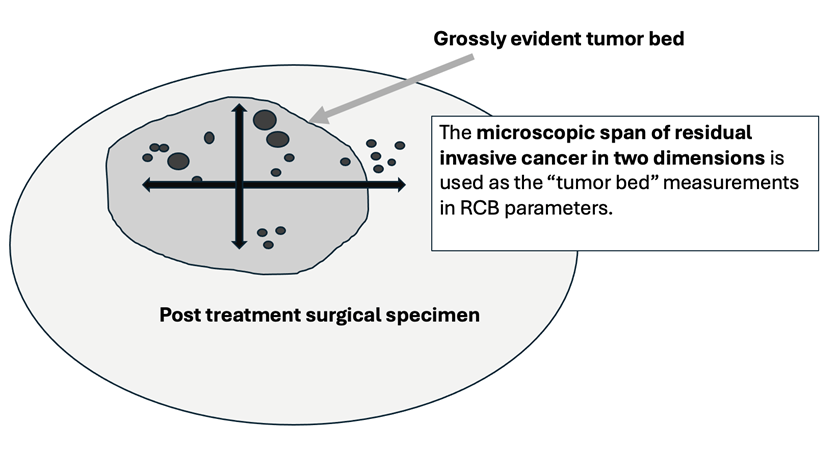
CAP
Approved
Breast.Invasive_4.10.0.0.REL_CAPCP
37
Post Neoadjuvant Treatment Staging, Grading and Biomarkers
Invasive carcinomas with a minor response may show little or no change in size. With greater degrees of
response, the carcinoma shows decreased cellularity and may be present as multiple foci of invasion
scattered over a larger tumor bed. The post-neoadjuvant therapy pathologic T-category (ypT) is based on
the largest single focus of residual tumor, if present. Treatment-related fibrosis adjacent to residual
invasive carcinoma is not included in the ypT maximum dimension. The “m” modifier is used to indicate
that multiple foci of invasive carcinoma are present. The inclusion of additional information, such as the
distance over which invasive carcinoma is present, the number of foci of invasive carcinoma, or the
number of slides or blocks with invasive carcinoma, may be helpful in estimating the extent of residual
disease. If no residual invasive carcinoma is present in the breast, the case summary can be used to
report residual DCIS and/or metastatic carcinoma in lymph nodes. If there is no residual carcinoma in the
breast or in the lymph nodes, then a CAP protocol case summary need not be used for reporting. Cases
with no residual invasive carcinoma after neoadjuvant therapy are categorized as ypTis if there is residual
DCIS or ypT0 if there is no residual cancer (not ypTX). Cases categorized as M1 before neoadjuvant
therapy stay that way (i.e., they remain Stage IV even if there is complete pathologic response).
Most carcinomas are of the same grade after treatment. In a few cases, the grade will be higher because
of marked nuclear pleomorphism. In very rare cases, the carcinoma will be of lower grade. The prognostic
significance of a change in grade after treatment has not been determined.
If negative prior to treatment, it is recommended that ER, PgR, and HER2 be repeated on invasive
carcinomas after treatment, as significant changes may occur in a subset of carcinomas, sometimes due
to tumor heterogeneity and limited sampling prior to treatment.
References
1. Sahoo S, Lester SC. Pathology of breast carcinomas after neoadjuvant chemotherapy: an
overview with recommendations on specimen processing and reporting. Arch Pathol Lab Med.
2009;133:633-642.
2. Provenzano E, Bossuyt V, Viale G, et al. Standardization of pathologic evaluation and reporting of
postneoadjuvant specimens in clinical trials of breast cancer: recommendations from an
international working group. Mod Pathol. 2015;28,1185–1201.
3. Peintinger F, Sinn B, Hatzis C. et al. Reproducibility of residual cancer burden for prognostic
assessment of breast cancer after neoadjuvant chemotherapy. Mod Pathol. 2015;28, 913–920.
4. Symmans WF, Wei C, Gould R, et al. Long-term prognostic risk after neoadjuvant chemotherapy
associated with residual cancer burden and breast cancer subtype. J Clin Oncol.
2017;35(10):1049-1060.
5. Symmans WF, Peintinger F, Hatzis C, et al. Measurement of residual breast cancer burden to
predict survival after neoadjuvant chemotherapy. J Clin Oncol. 2007;25(28):4414-4422.
L. Margins
Whenever feasible, the specimen should be oriented in order for the pathologist to identify specific
margins. This is particularly important for excisions less than total mastectomy, where it may be
necessary for the surgeon to excise residual tumor at a specific margin (e.g., superior, inferior, medial,
lateral, anterior, or deep). Identification of surgical margins also allows measurement of the distance
between the carcinoma and specific margins. All identifiable margins should be evaluated for involvement
by carcinoma both grossly and microscopically.1
CAP
Approved
Breast.Invasive_4.10.0.0.REL_CAPCP
38
Orientation may be done by sutures or clips placed on the specimen surface or by other means of
communication between surgeon and pathologist and should be documented in the pathology report.
Margins can be identified in several ways, including the use of multiple-colored inks, by submitting the
margins in specific cassettes, or by the surgeon submitting each margin as a separately excised
specimen. Inks should be applied carefully to avoid penetration deep into the specimen.
Macroscopic or microscopic involvement of surgical margins by invasive carcinoma or DCIS should be
noted in the report. If the specimen is oriented, the specific site(s) of involvement should also be reported.
When possible, the pathologist should report the distance from the tumor to the closest margin.1
If margins are sampled with perpendicular sections, the pathologist should report the distance of the
invasive carcinoma and DCIS to the closest margin, whenever possible. Because of the growth pattern of
DCIS in the ductal system, a negative but close margin does not ensure the absence of DCIS in the
adjacent tissue.
A positive margin requires ink on carcinoma. If the specimen is oriented, the specific site(s) of
involvement (e.g., superior margin) should also be reported.
The deep margin may be at muscle fascia. If so, the likelihood of additional breast tissue beyond this
margin (and therefore possible involvement by DCIS) is extremely small. A deep muscle fascial margin
(e.g., on a mastectomy specimen) positive for DCIS is unlikely to have clinical significance. However,
invasive carcinoma at the deep margin, especially if associated with muscle invasion, is often an
indication for postmastectomy radiation.
A superficial (generally anterior) margin may be immediately below the skin, and there may not be
additional breast tissue beyond this margin. However, some breast tissue can be left in skin flaps, and the
likelihood of residual breast tissue is related to the thickness of the flap.2
Specimen radiography is important to assess the adequacy of excision. Compression of the specimen
should be minimized, as it can severely compromise the ability to assess the distance of the DCIS from
the surgical margin. Mechanical compression devices should be used with caution and preferably
reserved for nonpalpable lesions that require this technique for imaging (e.g., microcalcifications).
It is helpful to report the approximate extent of margin involvement:
•
Unifocal: 1 focal area of carcinoma at the margin, <4 mm
•
Multifocal: 2 or more foci of carcinoma at the margin
•
Extensive: carcinoma present at the margin over a broad front (>5 mm)
References
1. Morrow M, Van Zee KJ, Solin LJ, et al. Society of Surgical Oncology-American Society for
Radiation Oncology-American Society of Clinical Oncology consensus guideline on margins for
breast-conserving surgery with whole-breast irradiation in ductal carcinoma in situ. Pract Radiat
Oncol. 2016;6(5):287-295.
2. Torresan RZ, dos Santos CC, Okamura H, Alvarenga M. Evaluation of residual glandular tissue
after skin-sparing mastectomies. Ann Surg Oncol. 2005;12(12):1037-1044.
CAP
Approved
Breast.Invasive_4.10.0.0.REL_CAPCP
39
M. Lymph Node Sampling and Reporting
Most patients with invasive carcinoma will have lymph nodes sampled.
Types of lymph nodes:
•
Sentinel lymph nodes are identified by the surgeon by uptake of radiotracer or dye or both.
They are considered sentinel lymph nodes if less than six nodes are removed. Adjacent palpable
nonsentinel nodes may also be removed.
•
Axillary lymph nodes are removed by en bloc resection of axillary tissue. The nodes are divided
into levels: I (low-axilla: lateral to the lateral border of the pectoralis minor muscle); II (mid-axilla:
between the medial and lateral borders of the pectoralis minor muscle and the interpectoral
[Rotter’s] lymph nodes); and III (apical axilla or infraclavicular nodes: medial to the medial margin
of the pectoralis minor muscle and inferior to the clavicle). A surgeon may choose to remove 1 or
more of these levels. Levels I and II are typically removed in the axillary dissection, with level III
nodes only removed if considered suspicious by the surgeon intraoperatively. Level III nodes
must be specifically identified, as there are additional AJCC N categories for these nodes.
•
Intramammary nodes are present within breast tissue and are most commonly found in the
upper outer quadrant. Intramammary nodes may rarely be sentinel lymph nodes. These nodes
are included with axillary nodes for AJCC N classification.
•
Internal mammary nodes, supraclavicular nodes, and infraclavicular nodes are rarely
removed for breast cancer staging. If metastases are present in these nodes, there are specific
AJCC N categories (see AJCC Cancer Staging Manual1).
Lymph node sampling:
•
Grossly positive nodes:  The size of grossly positive nodes should be recorded. One section to
include any areas suggestive of extranodal invasion is sufficient. Cancerous nodules in the
axillary fat adjacent to the breast, without histologic evidence of residual lymph node tissue, are
classified as regional lymph node metastasis.
•
Grossly negative nodes:  Sampling must be adequate to detect all macrometastases, as they
are known to have prognostic importance (i.e., all metastatic deposits >2 mm). Thus, each node
should be thinly sliced along the long axis of the node at 2 mm, and all slices should be submitted
for microscopic examination. At least 1 representative hematoxylin-and-eosin (H&E) level must
be examined. Additional methods of sampling, such as additional H&E levels or
immunohistochemical studies, may detect isolated tumor cells or micrometastases. However, the
clinical impact on outcome of these small metastases is minimal.2
The nodes must be submitted in such a way that every node can be evaluated and counted separately.
Reverse transcriptase polymerase chain reaction has been developed as an alternative method for
examining lymph nodes.3,4 The tissue used for this assay cannot be examined microscopically. All
macrometastases must be identified histologically. Therefore, nodal tissue can only be used for other
assays if all macrometastases can be identified by H&E examination. False-positive and false-negative
results can occur with RT-PCR. The significance of a positive RT-PCR result for a histologically negative
lymph node is unknown.
CAP
Approved
Breast.Invasive_4.10.0.0.REL_CAPCP
40
Reporting lymph nodes:
•
Number of nodes examined:  The total number of nodes includes sentinel nodes, nonsentinel
nodes, nodes from axillary dissections, and intramammary nodes. When the number of sentinel
and nonsentinel nodes removed is less than 6 nodes, the AJCC “sn” modifier is used.
•
Size of metastases:  Metastases are classified into 3 groups:
−
Isolated tumor cell clusters (ITCs) are defined as small clusters of cells not larger than
0.2 mm, or single cells, or fewer than 200 cells in a single cross-section. ITCs may be
detected by routine histology or by immunohistochemical (IHC) methods. Nodes
containing only ITCs are not included in the total number of positive nodes when
determining the N category.
−
Micrometastases measure more than 0.2 mm, but not more than 2 mm, and/or comprise
more than 200 cells in a single cross-section. If only micrometastases are present, the N
category is pN1mi. If at least 1 macrometastasis is present, nodes with micrometastases
are included in the total number of positive nodes when determining the N category.
−
Macrometastases measure more than 2 mm.
In most cases, if metastases are present, the sentinel node will be involved. In rare cases, only
nonsentinel nodes contain metastases. These cases can occur if the true sentinel node is completely
replaced by tumor (and therefore is not detected by radioactive tracer or dye), if there is unusual
lymphatic drainage, or if there is failure of the technique to identify the node. This finding should be
included in the report.
In some cases, the best N category can be difficult to determine (Figure M1).
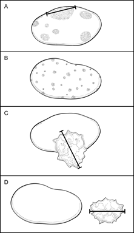
CAP
Approved
Breast.Invasive_4.10.0.0.REL_CAPCP
41
Figure M1. Classification of Lymph Node Metastases. A. Multiple clusters of tumor cells. Classification
is based on the size of the largest contiguous cluster of tumor cells. The distance between clusters should
not be included in the size measurement. However, if the overall volume of tumor is similar to the next
highest nodal category, it is recommended that the pathologist use his or her judgment to assign the best
N category and to include the reasoning in a note. B. Dispersed pattern of lymph node metastasis. Some
carcinomas, in particular lobular carcinomas, metastasize as single cells and do not form cohesive
clusters. In such cases, the “size” of the metastasis is difficult to determine. If more than 200 tumor cells
are present in 1 cross-section of the node, then the category of isolated tumor cells should not be used. If
there is difficulty in assigning the N category, it is recommended that the reason be provided in a note. C.
Extranodal invasion. The area of invasion outside the lymph node capsule is included in the overall size
of the lymph node metastasis. The size of the metastasis includes the tumor cells and the desmoplastic
response (i.e., the cells do not need to be contiguous, but the cells plus fibrosis should be contiguous).
The finding of extranodal invasion is also reported. D. Cancerous nodules in axillary fat. Areas of
carcinoma invading into the stroma in axillary adipose tissue, without residual nodal tissue, are
considered to be positive lymph nodes. However, if there is surrounding breast tissue or ductal carcinoma
in situ, then the invasive carcinoma should be classified as an invasive carcinoma and not as a lymph
node metastasis.
•
Nodes after neoadjuvant therapy: The response of metastatic carcinoma in lymph nodes after
treatment is an important prognostic factor. In addition to the information described above,
evidence of treatment response (e.g., small tumor deposits within an area of fibrosis) should also
be reported (see Note K). Only the largest contiguous focus of residual tumor in the node
evaluation is used for classification; any treatment-associated fibrosis is not included.
References
1. Amin MB, Edge SB, Greene FL, et al, eds. AJCC Cancer Staging Manual. 8th ed. New York, NY:
Springer; 2017.
2. Weaver DL, Ashikaga T, Krag DN, et al, Effect of occult metastases on survival in node-negative
breast cancer. N Engl J Med. 2011;364:412-421.
3. Viale G, Dell’Orto P, Biasi MO, et al, Comparative evaluation of an extensive histopathologic
examination and a real-time reverse-transcription-polymerase chain reaction assay for
mammaglobin and cytokeratin 19 on axillary sentinel lymph nodes of breast carcinoma patients.
Ann Surg. 2008;247:136-142.
4. Julian TB, Blumencranz P, Deck K, et al. Novel intraoperative molecular test for sentinel lymph
node metastases in patients with early-stage breast cancer. J Clin Oncol. 2008;26:3338-3345.
N. Pathologic Stage Classification
The tumor-node-metastasis (TNM) staging system maintained collaboratively by the American Joint
Committee
on
Cancer
(AJCC)
and
the
International
Union
Against
Cancer
(UICC)
is
recommended.1 Assignment of Pathologic Prognostic Stage Group is the responsibility of the managing
physician and not the pathologist.1
Pathologic Classification
The pathologic classification of a cancer is based on information acquired before treatment supplemented
and modified by the additional evidence acquired during and from surgery, particularly from pathologic
examination of resected tissues. The pathologic classification provides additional precise and objective
CAP
Approved
Breast.Invasive_4.10.0.0.REL_CAPCP
42
data. Classification of T, N, and M by pathologic means is denoted by use of a lower case “p” prefix (pT,
pN, pM).
Pathologic T (pT): The pathologic assessment of the primary tumor (pT) generally is based on resection
of the primary tumor generally from a single specimen. Resection of the tumor with several partial
removals at the same or separate operations necessitates an effort at reasonable estimates of the size
and extension of the tumor to assign the correct or highest pT category. In this situation, imaging findings
can be used for determination of the pathologic size (pT). On rare occasions, the tumor size is obtained
from a previous core needle biopsy specimen, as the tumor in the core may be larger than the tumor in
the excision specimen.
AJCC/UICC definition of inflammatory carcinoma (T4d): Inflammatory carcinoma is a clinical-pathologic
entity characterized by diffuse erythema and edema (peau d’orange) involving one-third or more of the
skin of the breast. The skin changes are due to lymphedema caused by tumor emboli within dermal
lymphatics, which may or may not be obvious in a small skin biopsy. However, a tissue diagnosis is still
necessary to demonstrate an invasive carcinoma in the underlying breast parenchyma or at least in the
dermal lymphatics, as well as to determine biological markers, such as ER, PgR, and HER2 status.
Tumor emboli in dermal lymphatics without the clinical skin changes described above do not qualify as
inflammatory carcinoma. Locally advanced breast cancers directly invading the dermis or ulcerating the
skin without the clinical skin changes also do not qualify as inflammatory carcinoma. Thus, the term
inflammatory carcinoma should not be applied to neglected locally advanced cancer of the breast
presenting late in the course of a patient’s disease. The rare case that exhibits all the features of
inflammatory carcinoma, but in which skin changes involve less than one-third of the skin, should be
classified by the size and extent of the underlying carcinoma.
Pathologic N (pN): The pathologic assessment of regional lymph nodes (pN) ideally requires resection of
a minimum number of lymph nodes to assure that there is sufficient sampling to identify positive nodes if
present. The recommended number generally does not apply in cases where sentinel node has been
accepted as accurate for defining regional node involvement and a sentinel node procedure has been
performed. At least 1 node with presence or absence of cancer documented by pathologic examination is
required for pathologic N classification.
Direct extension of primary tumor into a regional node is classified as node positive. A tumor nodule in a
regional node area is classified as a positive node. The size of the metastasis, not the size of the node, is
used for the criterion for the N category.
Specialized pathologic techniques such as immunohistochemistry or molecular techniques may identify
limited metastases in lymph nodes that may not have been identified without the use of the special
diagnostic techniques. Single tumor cells or small clusters of cells are classified as isolated tumor cells
(ITCs). The standard definition for ITCs is a cluster of cells not more than 0.2 mm in greatest diameter.
Cases with ITCs only in lymph nodes are classified as pN0. This rule also generally applies to cases with
findings of tumor cells or their components by nonmorphologic techniques such as flow cytometry or DNA
analysis.
AJCC/UICC definition of isolated tumor cells: Isolated tumor cell clusters (ITC) are defined as small
clusters of cells not greater than 0.2 mm or single tumor cells, or fewer than 200 cells in a single histologic
CAP
Approved
Breast.Invasive_4.10.0.0.REL_CAPCP
43
cross-section. ITCs may be detected by routine histology or by immunohistochemical (IHC) methods.
Nodes containing only ITCs are excluded from the total positive node count for purposes of N
classification but should be included in the total number of nodes evaluated.
Approximately 1000 tumor cells are contained in a 3-dimensional 0.2-mm cluster. Thus, if more than 200
individual tumor cells are identified as single dispersed tumor cells or as a nearly confluent elliptical or
spherical focus in a single histologic section of a lymph node, there is a high probability that more than
1000 cells are present in the lymph node. In these situations, the node should be classified as containing
a micrometastasis (pN1mi). Cells in different lymph node cross-sections or longitudinal sections or levels
of the block are not added together; the 200 cells must be in a single node profile even if the node has
been thinly sectioned into multiple slices. It is recognized that there is substantial overlap between the
upper limit of the ITC and the lower limit of the micrometastasis categories due to inherent limitations in
pathologic nodal evaluation and detection of minimal tumor burden in lymph nodes. Thus, the threshold of
200 cells in a single cross-section is a guideline to help pathologists distinguish between these 2
categories. The pathologist should use judgment regarding whether it is likely that the cluster of cells
represents a true micrometastasis or is simply a small group of isolated tumor cells.
Pathologic M (pM): The pathologic assignment of the presence of metastases (pM1) requires histologic
confirmation of cancer at the metastatic site. The designation MX has been eliminated from the
AJCC/UICC TNM system. Pathologic M0 is an undefined concept, and the category “pM0” may not be
used. Pathologic classification of the absence of distant metastases can only be made at autopsy. Cases
with a biopsy of a possible metastatic site that shows ITCs such as circulating tumor cells (CTCs) or
disseminated tumor cells (DTCs), or bone marrow micrometastases detected by IHC or molecular
techniques, are classified as M0(i+) to denote the uncertain prognostic significance of these findings, and
to classify the stage group according to the T and N and M0.
Posttherapy or post-neoadjuvant therapy classification (yTNM): Cases for which systemic and/or radiation
therapy are given before surgery (“neoadjuvant”) or for which no surgery is performed may have the
extent of disease assessed at the conclusion of the therapy by clinical or pathologic means (if resection
performed). This classification is useful to clinicians because the extent of response to therapy may
provide important prognostic information to patients and help direct the extent of surgery or subsequent
systemic and/or radiation therapy. T and N are classified by using the same categories as for clinical or
pathologic staging for the disease type, and the findings are recorded by using the prefix designator “y”
(e.g., ycT; ycN; ypT; ypN). The “yc” prefix is used for the clinical stage after therapy, and the “yp” prefix is
used for the pathologic stage for those cases that have surgical resection after neoadjuvant therapy. The
M component should be classified by the M status defined pathologically prior to therapy.
Retreatment classification (rTNM): This classification is assigned when further treatment is planned for a
cancer that recurs after a disease-free interval. Second or subsequent primary cancers detected outside
the staging window (generally 4 months) are known as metachronous primary tumors and are not staged
with the 'y' prefix. The original stage assigned at the time of initial diagnosis and treatment does not
change when the cancer recurs or progresses. The use of this staging for retreatment or recurrence is
denoted with the 'r' prefix (rTNM). All information available at the time of retreatment should be used in
determining the rTNM stage.
CAP
Approved
Breast.Invasive_4.10.0.0.REL_CAPCP
44
Multiple tumors: For patients with multiple ipsilateral invasive carcinomas, the T category assignment is
based on the largest tumor. The “(m)” modifier is used to distinguish these cases from those with only a
single invasive focus. For patients with simultaneous bilateral invasive carcinomas, each carcinoma is
staged as a separate primary tumor, with independent determination of T and N categories and biomarker
status.
Metachronous primaries: Second or subsequent primary cancers occurring in the same organ or in
different organs are staged as a new cancer with the TNM system. Second cancers are not staged using
the “y” prefix unless the treatment of the second cancer warrants this use.
References
1. Amin MB, Edge SB, Greene FL, et al, eds. AJCC Cancer Staging Manual. 8th ed. New York, NY:
Springer; 2017.
O. Additional Findings
In some cases, additional pathologic findings are important for the clinical management of patients.
If the biopsy was performed for a benign lesion and the invasive carcinoma is an incidental finding, this
should be documented. An example would be the finding of DCIS with microinvasion in an excision for a
large palpable fibroadenoma.
If there has been a prior core needle biopsy or excisional biopsy, the biopsy site should be sampled and
documented in the report. If the intention was to completely re-excise a prior surgical site, the report
should document biopsy changes at the margin that could indicate an incomplete excision. This protocol
should not be used if the main area of carcinoma has been previously removed and the current specimen
is a re-excision of the margins.
If multiple invasive carcinomas are present and differ in histologic type, grade, or the expression of ER,
PgR, or HER2, this information should be included as text in this section.
# Breast Phyllodes Tumor
Protocol for the Examination of Resection Specimens From
Patients with Phyllodes Tumor of the Breast
Version: 1.1.0.1
Protocol Posting Date: September 2022
The use of this protocol is recommended for clinical care purposes but is not required for accreditation
purposes.
This protocol may be used for the following procedures AND tumor types:
Procedure
Description
Resection
Includes excision, segmental resection, lumpectomy, quadrantectomy, and partial
or total mastectomy
Tumor Type
Description
Phyllodes tumor
The following should NOT be reported using this protocol:
Procedure
Biopsy
Cytologic specimens
Important Note
The American Joint Committee on Cancer (AJCC) eighth edition and the World Health Organization
(WHO) recommend staging malignant phyllodes tumors according to guidelines established for soft tissue
sarcomas – extremity and trunk. T category, N category and stage group assignments do not apply to
benign or borderline tumors. An abbreviated stage group table that only applies to malignant phyllodes
tumors is included in the Explanatory Notes.
Authors
Stuart J. Schnitt, MD*; Laura H. Rosenberger, MD; Puay Hoon Tan, MD; Patrick L. Fitzgibbons, MD,
FCAP; James L. Connolly, MD.
With guidance from the CAP Cancer and CAP Pathology Electronic Reporting Committees.
* Denotes primary author.
The use of this case summary is recommended for clinical care purposes but is not required for
accreditation purposes. The core and conditional data elements are routinely reported. Non-core data
elements are indicated with a plus sign (+) to allow for reporting information that may be of clinical value.

Breast.Phyllodes_1.1.0.1.REL_CAPCP
2
v 1.1.0.1
•
Added the answers 'Other (specify)' and 'Cannot be determined (explain)' to the Margin Status
question
Breast.Phyllodes_1.1.0.1.REL_CAPCP
3
Reporting Template
Protocol Posting Date: September 2022
Select a single response unless otherwise indicated.
Standard(s): AJCC-UICC 8
Note: Use of this reporting template is optional and is not required for accreditation purposes. The template can be used for benign
and borderline phyllodes tumors, but pathologic stage classification should only be done for those tumors classified as malignant.
SPECIMEN
Procedure
___ Excision (less than total mastectomy)
___ Total mastectomy (including nipple-sparing and skin-sparing mastectomy)
___ Other (specify): _________________
___ Not specified
Specimen Laterality
___ Right
___ Left
___ Not specified
TUMOR
+Tumor Site   (select all that apply)
___ Upper outer quadrant
___ Lower outer quadrant
___ Upper inner quadrant
___ Lower inner quadrant
___ Central
___ Nipple
___ Clock position
Specify Clock Position  (select all that apply)
___ 1 o'clock
___ 2 o'clock
___ 3 o'clock
___ 4 o'clock
___ 5 o'clock
___ 6 o'clock
___ 7 o'clock
___ 8 o'clock
___ 9 o'clock
___ 10 o'clock
___ 11 o'clock
___ 12 o'clock
___ Specify distance from nipple in Centimeters (cm): _________________ cm
___ Other (specify): _________________
Breast.Phyllodes_1.1.0.1.REL_CAPCP
4
___ Not specified
Tumor Size
___ Greatest dimension in Millimeters (mm): _________________ mm
+Additional Dimension in Millimeters (mm): ____ x ____ mm
___ Cannot be determined (explain): _________________
Histologic Type (Note A)
A diagnosis of malignant phyllodes tumor requires the presence of all five of the following features: marked stromal cellularity,
marked stromal atypia, stromal overgrowth, an infiltrative tumor border and greater than or equal to 10 mitoses per 10 high power
fields (HPFs). Tumors should be classified as borderline when some but not all of these changes are present. Malignant phyllodes
tumor is also diagnosed when malignant heterologous elements other than pure well differentiated liposarcoma are present, even if
not all of the other histologic features of malignancy are observed.
___ Phyllodes tumor, benign
___ Phyllodes tumor, borderline
___ Phyllodes tumor, malignant
Stromal Cellularity (Note B)
___ Mild (stromal nuclei are non-overlapping)
___ Moderate (some overlapping stromal nuclei)
___ Marked (many overlapping stromal nuclei)
Stromal Atypia (Note C)
___ None
___ Mild (minimal variation in nuclear size, even chromatin, and smooth nuclear contours)
___ Moderate (more variation in nuclear size and irregular nuclear membranes)
___ Marked (marked nuclear pleomorphism, hyperchromasia, and irregular nuclear contours)
Stromal Overgrowth (Note D)
Stromal overgrowth is present when there is at least one low-power microscopic field (4x objective and 10x eyepiece or 22.9 mm2)
that contains stroma only without epithelial elements.
___ Absent
___ Present
___ Cannot be determined
Mitotic Rate (Note E)
Malignant phyllodes tumors have greater than or equal to 10 mitoses per 10 high-power fields (40x objective and 10x eyepiece) or
greater than or equal to 5 mitoses / mm2. Benign phyllodes tumors have less than 5 mitoses per 10 HPFs (less than 2.5 mitoses /
mm2).
___ None identified: _________________
___ Specify number of mitoses per 10 high power fields: _________________ mitoses per 10 High
Power Fields (HPFs)
OR
___ Specify number of mitoses per square Millimeter (mm): _________________ mitoses per mm2
___ Cannot be determined
Breast.Phyllodes_1.1.0.1.REL_CAPCP
5
Histologic Tumor Border
A circumscribed border is smooth and well-defined or shows a minimally irregular tumor interface with adjacent
stroma. Infiltrative (permeative) tumor borders can be focally infiltrative (unequivocal invasion into adjacent stroma in
one low power field) or extensively infiltrative (unequivocal invasion in a wide area or in multiple foci along the tumor
periphery).
___ Circumscribed (well-defined; pushing)
___ Infiltrative (permeative)
+___ Focal
+___ Extensive
___ Cannot be determined
Malignant Heterologous Elements (Note F)
A phyllodes tumor is regarded as malignant when there are malignant heterologous elements, even when not all of the other
histological features of malignancy are present. This rule does not apply if the only heterologous element is well differentiated
liposarcoma. In the breast, those tumors usually lack MDM2 and CDK4 amplifications and have a low metastatic risk. A diagnosis of
malignant phyllodes tumor should therefore not be based solely on the presence of well-differentiated liposarcoma without all of the
other histologic features of malignancy.
___ Not identified
___ Liposarcoma (excluding well-differentiated liposarcoma)
___ Osteosarcoma
___ Chondrosarcoma
___ Other (specify): _________________
MARGINS
Margin Status for Phyllodes Tumor
Margin status is listed as positive if there is ink on phyllodes tumor (i.e., the distance is 0 mm)
___ All margins negative for phyllodes tumor
Closest Margin(s) to Phyllodes Tumor   (select all that apply)
___ Anterior
___ Posterior
___ Superior
___ Inferior
___ Medial
___ Lateral
___ Other (specify): _________________
___ Cannot be determined (explain): _________________
+Distance from Phyllodes Tumor to Closest Margin
Specify in Millimeters (mm)
___ Exact distance: _________________ mm
___ Less than: _________________ mm
___ Greater than: _________________ mm
___ Other (specify): _________________
___ Cannot be determined (explain): _________________
___ Phyllodes tumor present at margin
Margin(s) Involved by Phyllodes Tumor   (select all that apply)
___ Anterior
___ Posterior
Breast.Phyllodes_1.1.0.1.REL_CAPCP
6
___ Superior
___ Inferior
___ Medial
___ Lateral
___ Other (specify): _________________
___ Cannot be determined (explain): _________________
___ Other (specify): _________________
___ Cannot be determined (explain): _________________
+Margin Comment: _________________
REGIONAL LYMPH NODES
Regional Lymph Node Status
___ Not applicable (no regional lymph nodes submitted or found)
___ Regional lymph nodes present
___ All regional lymph nodes negative for tumor
___ Tumor present in regional lymph nodes
Number of Lymph Nodes with Tumor
___ Exact number (specify): _________________
___ At least (specify): _________________
___ Other (specify): _________________
___ Cannot be determined (explain): _________________
___ Other (specify): _________________
___ Cannot be determined (explain): _________________
Number of Lymph Nodes Examined
___ Exact number (specify): _________________
___ At least (specify): _________________
___ Other (specify): _________________
___ Cannot be determined (explain): _________________
+Regional Lymph Node Comment: _________________
DISTANT METASTASIS
Distant Site(s) Involved, if applicable
___ Not applicable
___ Other (specify): _________________
___ Cannot be determined
PATHOLOGIC STAGE CLASSIFICATION (pTNM, AJCC 8th Edition) (Note G)
Staging applies only to malignant phyllodes tumors. pT and pN categories should not be assigned for benign and borderline tumors.
Pathologic Stage Classification (pTNM, AJCC 8th Edition) (required only if the tumor is malignant)
Reporting of pT, pN, and (when applicable) pM categories is based on information available to the pathologist at the time the report
is issued. As per the AJCC (Chapter 1, 8th Ed.) it is the managing physician’s responsibility to establish the final pathologic stage
based upon all pertinent information, including but potentially not limited to this pathology report.
___ Not applicable (tumor is not graded as malignant)
Breast.Phyllodes_1.1.0.1.REL_CAPCP
7
___ Tumor is malignant
The following section applies only if the tumor is malignant. Do not assign pT and pN stage categories for benign or borderline
tumors.
TNM Descriptors  (select all that apply)
___ Not applicable
___ m (multiple)
___ r (recurrent)
___ y (post treatment)
pT Category
___ pT not assigned (cannot be determined based on available pathological information)
___ pT0: No evidence of primary tumor
___ pT1: Tumor 5 cm or less in greatest dimension
___ pT2: Tumor more than 5 cm but not more than 10 cm
___ pT3: Tumor more than 10 cm but not more than 15 cm
___ pT4: Tumor more than 15 cm in greatest dimension
pN Category
When no lymph nodes are present, the pathologic 'N' category is not assigned (pNX is not used and should not be reported)
___ pN not assigned (no nodes submitted or found)
___ pN not assigned (cannot be determined based on available pathological information)
___ pN0: No regional lymph node metastasis
___ pN1: Regional lymph node metastasis
pM Category (required only if confirmed pathologically)
___ Not applicable - pM cannot be determined from the submitted specimen(s)
___ pM1: Distant metastasis
ADDITIONAL FINDINGS
+Additional Findings   (select all that apply)
___ Fibroepithelial proliferation (coexisting fibroadenoma or fibroadenomatoid change in the tissue
surrounding the phyllodes tumor)
___ Atypical ductal hyperplasia
___ Atypical lobular hyperplasia
___ Other (specify): _________________
COMMENTS
Comment(s): _________________
Breast.Phyllodes_1.1.0.1.REL_CAPCP
8
Explanatory Notes
A. Histologic Type / Grade
Phyllodes tumors are classified as malignant when all five of the following histological features are
present: marked stromal hypercellularity; marked stromal atypia; stromal overgrowth; an infiltrative
(permeative) tumor border; and greater than or equal to 10 mitotic figures in 10 high power fields (see
Table 1). Tumors should be classified as borderline if some but not all of these changes are present.
There are rare phyllodes tumors that do not have all five histologic features but display malignant
behavior. When a tumor lacks one or two features but shows severe abnormalities in others, the
pathologist should consider adding a comment that such tumors may exhibit aggressive behavior.
Benign phyllodes tumors have mild stromal hypercellularity, minimal to no stromal atypia, no stromal
overgrowth, circumscribed (pushing) tumor borders and less than or equal to 4 mitoses per 10 high-power
fields (HPFs).1
The distinction between benign and borderline phyllodes tumors is not well-defined and there is no
universal agreement which histologic features should be given greater emphasis. When the distinction
between a benign and borderline tumor is unclear, it may be helpful to include a comment about this in
the pathology report.
A phyllodes tumor is also categorized as malignant if there is a malignant heterologous mesenchymal
component (e.g. liposarcoma, chondrosarcoma, osteosarcoma) even if the other histological parameters
are not present, or if only some are present. An exception to this rule is if the heterologous element is
atypical lipomatous tumor/well-differentiated liposarcoma. Well-differentiated liposarcomas in the breast
usually lack MDM2 and CDK4 amplifications and appear to have a low metastatic risk. Hence, a
diagnosis of malignant phyllodes tumor should not be based solely on the presence of well-differentiated
liposarcoma without the other histologic features that support malignancy.1
Table 1. Histologic features of phyllodes tumors (adapted from Tse G, et al2)
Histologic feature
Benign
Borderline
Malignant
Stromal cellularity
Mild
Moderate
Marked
Stromal atypia
Mild or none
Mild or moderate
Marked
Stromal overgrowth
Absent
Absent or very focal
Present
Mitotic rate
≤4 mitoses per 10 HPFs or
<2.5 mitoses per mm2
5 - 9 mitoses per 10 HPFs
or
2.5 - 5 mitoses/mm2
≥10 mitoses per 10 HPFs
or
≥5 mitoses/mm2
Tumor border
Circumscribed
Usually circumscribed but
may be focally infiltrative
Focally or extensively
infiltrative (permeative)
Malignant heterologous
stromal elements
Absent
Absent
Sometimes present
HPF: High power field (40x objective and 10x eyepiece)
References
1. Tan BY, Apple SK, Badve S, et al. Phyllodes tumours of the breast: a consensus review.
Histopathology. 2016;68:5-21.
2. Tse G, Koo JS, Thike AA. Phyllodes tumour. In: WHO Classification of Tumours Editorial Board.
Breast Tumours, 5th ed, vol 2. Lyon (France): International Agency for Research on Cancer;
2019:172-176.
Breast.Phyllodes_1.1.0.1.REL_CAPCP
9
B. Stromal Cellularity
Mild hypercellularity is characterized by a slight increase in stromal cells as compared with normal
perilobular stroma, with evenly spaced nuclei that are not touching or overlapping, while marked stromal
cellularity shows confluent areas of densely overlapping nuclei. Moderate stromal cellularity has findings
that are intermediate between the two, with some overlapping stromal nuclei.1,2
References
1. Tan BY, Apple SK, Badve S, et al. Phyllodes tumours of the breast: a consensus review.
Histopathology. 2016;68:5-21.
2. Jara-Lazaro AR, Akhilesh M, Thike AA, et al. Predictors of phyllodes tumours on core biopsy
specimens of fibroepithelial neoplasms. Histopathology. 2010; 57:220–232.
C. Stromal Atypia
Mild stromal atypia is reported when there is little variation in nuclear size and the nuclear contours are
smooth. Cases with moderate atypia show some variation in the size of stromal nuclei and some wrinkling
of nuclear membranes. Marked stromal atypia is identified when there is marked variation in nuclear size,
coarse chromatin and irregular nuclear membranes with discernible nucleoli.1,2
References
1. Tan BY, Apple SK, Badve S, et al. Phyllodes tumours of the breast: a consensus review.
Histopathology. 2016;68:5-21.
2. Jara-Lazaro AR, Akhilesh M, Thike AA, et al. Predictors of phyllodes tumours on core biopsy
specimens of fibroepithelial neoplasms. Histopathology. 2010; 57:220–232.
D. Stromal Overgrowth
Stromal overgrowth is defined by the absence of epithelial elements in at least one low-power
microscopic field containing only stroma. A low-power field can be defined either as a 4x objective and
10x eyepiece or as 22.9 mm2.1,2,3
References
1. Tan BY, Apple SK, Badve S, et al. Phyllodes tumours of the breast: a consensus
review. Histopathology. 2016;68:5-21.
2. Jara-Lazaro AR, Akhilesh M, Thike AA, et al. Predictors of phyllodes tumours on core biopsy
specimens of fibroepithelial neoplasms. Histopathology. 2010; 57:220–232.
3. Tan PH, Thike AA, Tan WJ, et al. Predicting clinical behaviour of breast phyllodes tumours: a
nomogram based on histological criteria and surgical margins. J Clin Pathol 2012;65:69-76.
E. Mitotic Rate
A diagnosis of malignant phyllodes tumor requires at least 10 mitoses per 10 high power fields (40x
objective and 10x eyepiece) or at least 5 mitoses/mm2. Mitotic activity in benign phyllodes tumor is usually
low (less than or equal to 4 mitoses per 10 HPFs or less than 2.5 mitoses per mm2). Borderline phyllodes
tumors usually have 5 to 9 mitoses per 10 HPF (2.5 to 5 mitoses/mm2).1
To report the number of mitoses per square millimeter, the area of the high power field must be known,
but microscopes vary in field size so the area must be determined for each microscope. The diameter of
an HPF can be determined using a micrometer or calculated by using the method below:
Breast.Phyllodes_1.1.0.1.REL_CAPCP
10
Using a clear ruler, measure the diameter of a low-power field. This number can be used to calculate a
constant based on the following formula:
Eyepiece Magnification x Objective Magnification x Microscopic Field Diameter = A Constant
Once the value of the constant is known, the diameter of the high power field can be calculated by using
the following formula:
High Power Field Diameter = Constant / (Eyepiece Magnification x Objective Magnification)
Half of the field diameter is the radius of the field (r), which can then be used to calculate the area of the
HPF:
Area of High Power Field = r2 x 3.1415
References
1. Tse G, Koo JS, Thike AA. Phyllodes tumour. In: WHO Classification of Tumours Editorial Board.
Breast Tumours, 5th ed, vol 2. Lyon (France): International Agency for Research on Cancer;
2019:172-176.
F. Malignant Heterologous Elements
Malignant heterologous elements include osteosarcoma, chondrosarcoma, rhabdomyosarcoma, and
rarely other types of sarcoma. The presence of well differentiated liposarcoma alone is not used to
categorize a phyllodes tumor as malignant.1,2
References
1. Tan BY, Apple SK, Badve S, et al. Phyllodes tumours of the breast: a consensus review.
Histopathology. 2016;68:5-21.
2. Jara-Lazaro AR, Akhilesh M, Thike AA, et al. Predictors of phyllodes tumours on core biopsy
specimens of fibroepithelial neoplasms. Histopathology. 2010; 57:220–232.
G. Pathologic Stage Classification
The American Joint Committee on Cancer (AJCC) eighth edition1 and the World Health Organization
(WHO)2 recommend staging malignant phyllodes tumors according to guidelines established for soft
tissue sarcomas – extremity and trunk. T category, N category and stage group assignments do not apply
to benign or borderline phyllodes tumors and should only be reported if the tumor is malignant.
AJCC Prognostic Stage Groups
T
N
M
Stage group
T1
N0
M0
II
T2
N0
M0
IIIA
T3, T4
N0
M0
IIIB
Any T
N1
M0
IV
Any T
Any N
M1
IV
Breast.Phyllodes_1.1.0.1.REL_CAPCP
11
TNM Descriptors
For identification of special cases of TNM or pTNM classifications, the “m” suffix and “y” and “r” prefixes
are used. Although they do not affect the stage grouping, they indicate cases needing separate analysis.
The “m” suffix indicates the presence of multiple primary tumors in a single site and is recorded in
parentheses: pT(m)NM.
The “y” prefix indicates those cases in which classification is performed during or after initial multimodality
therapy (ie, neoadjuvant chemotherapy, radiation therapy, or both chemotherapy and radiation therapy).
The cTNM or pTNM category is identified by a “y” prefix. The ycTNM or ypTNM categorizes the extent of
tumor actually present at the time of that examination. The “y” categorization is not an estimate of tumor
before multimodality therapy (ie, before initiation of neoadjuvant therapy).
The “r” prefix indicates a recurrent tumor when staged after a documented disease-free interval and is
identified by the “r” prefix: rTNM.
T Category Considerations
Only malignant phyllodes tumors are staged according to AJCC staging rules. The pathologic 'T' category
(pT) is not assigned for benign and borderline phyllodes tumors.
N Category Considerations
Regional nodal metastasis is uncommon in phyllodes tumor and lymph nodes may not be sampled. When
no lymph nodes are resected or present in the specimen, the pathologic ‘N’ category is not assigned; pNX
should not be used.
References
1. Maki RG, Folpe AL, Guadagnolo BA, et al. Chapter 45. Soft tissue sarcoma – Unusual histologies
and sites. In: Amin MB, ed. AJCC Cancer Staging Manual. 8th ed. New York: Springer; 2017:539-
544.
2. Tse G, Koo JS, Thike AA. Phyllodes tumour. In: WHO Classification of Tumours Editorial Board.
Breast Tumours, 5th ed, vol 2. Lyon (France): International Agency for Research on Cancer;
2019:172-176.
# Colon and Rectum, Resection
Protocol for the Examination of Resection Specimens from
Patients with Primary Carcinoma of the Colon and / or Rectum
Version: 4.4.0.1
Protocol Posting Date: September 2025
CAP Laboratory Accreditation Program Protocol Required Use Date: March 2026
The changes included in this current protocol version do not affect the prior accreditation date.
For accreditation purposes, this protocol should be used for the following procedures AND tumor
types:
Procedure
Description
Colectomy
Includes specimens designated total, partial, or segmental resection
Rectal Resection
Includes specimens designated low anterior resection or
abdominoperineal resection
Tumor Type
Description
Carcinoma
Invasive carcinomas including small cell and large cell (poorly
differentiated) neuroendocrine carcinoma
This protocol is NOT required for accreditation purposes for the following:
Procedure
Primary resection specimen with no residual cancer (e.g., following neoadjuvant therapy)
Cytologic specimens
The following should NOT be reported using this protocol:
Procedure
Excisional biopsy (polypectomy) (consider the Colon Excisional Biopsy protocol)
Endoscopic mucosal resection
Endoscopic mucosal dissection
Transanal disk excision
Tumor Type
Well-differentiated neuroendocrine tumors (consider the Colorectal NET protocol)
Lymphoma (consider the Precursor and Mature Lymphoid Malignancies protocol)
Sarcoma (consider the Soft Tissue protocol)
Version Contributors
Cancer Committee Authors: Dhanpat Jain, MD*, William V. Chopp, MD*, Rondell P. Graham, MBBS*,
Yue Xue, MD, PhD*
* Denotes primary author.
For any questions or comments, contact: cancerprotocols@cap.org.
Glossary:
Author: Expert who is a current member of the Cancer Committee, or an expert designated by the chair of the Cancer Committee.
Expert Contributors: Includes members of other CAP committees or external subject matter experts who contribute to the current
version of the protocol.

CAP
Approved
ColoRectal_4.4.0.1.REL_CAPCP
2
Synoptic reporting with core and conditional data elements for designated specimen types* is required for
accreditation.
•
Data elements designated as core must be reported.
•
Data elements designated as conditional only need to be reported if applicable.
•
Data elements designated as optional are identified with “+”. Although not required for
accreditation, they may be considered for reporting.
This protocol is not required for recurrent or metastatic tumors resected at a different time than the
primary tumor. This protocol is also not required for pathology reviews performed at a second institution
(i.e., second opinion and referrals to another institution).
Full accreditation requirements can be found on the CAP website under Accreditation Checklists.
A list of core and conditional data elements can be found in the Summary of Required Elements under
Resources on the CAP Cancer Protocols website.
*Includes definitive primary cancer resection and pediatric biopsy tumor types.
Synoptic Reporting
All core and conditionally required data elements outlined on the surgical case summary from this cancer
protocol must be displayed in synoptic report format. Synoptic format is defined as:
•
Data element: followed by its answer (response), outline format without the paired Data element:
Response format is NOT considered synoptic.
•
The data element should be represented in the report as it is listed in the case summary. The
response for any data element may be modified from those listed in the case summary, including
“Cannot be determined” if appropriate.
•
Each diagnostic parameter pair (Data element: Response) is listed on a separate line or in a
tabular format to achieve visual separation. The following exceptions are allowed to be listed on
one line:
o
Anatomic site or specimen, laterality, and procedure
o
Pathologic Stage Classification (pTNM) elements
o
Negative margins, as long as all negative margins are specifically enumerated where
applicable
•
The synoptic portion of the report can appear in the diagnosis section of the pathology report, at
the end of the report or in a separate section, but all Data element: Responses must be listed
together in one location
•
Organizations and pathologists may choose to list the required elements in any order, use
additional methods in order to enhance or achieve visual separation, or add optional items within
the synoptic report. The report may have required elements in a summary format elsewhere in
the report IN ADDITION TO but not as replacement for the synoptic report i.e., all required
elements must be in the synoptic portion of the report in the format defined above.
CAP
Approved
ColoRectal_4.4.0.1.REL_CAPCP
3
v 4.4.0.1
•
Typographical update to Multiple Primary Sites display item
CAP
Approved
ColoRectal_4.4.0.1.REL_CAPCP
4
Reporting Template
Protocol Posting Date: September 2025
Select a single response unless otherwise indicated.
Standard(s): AJCC 8
SPECIMEN
Procedure
___ Right hemicolectomy
___ Transverse colectomy
___ Left hemicolectomy
___ Sigmoidectomy
___ Low anterior resection
___ Total abdominal colectomy
___ Abdominoperineal resection
___ Other (specify): _________________
___ Not specified
Macroscopic Evaluation of Mesorectum (required only for rectal cancers) (Note A)
___ Not applicable
___ Complete
___ Near complete
___ Incomplete
___ Cannot be determined: _________________
TUMOR
Tumor Site (Note B) (select all that apply)
___ Cecum: _________________
___ Ileocecal valve: _________________
___ Ascending colon: _________________
___ Hepatic flexure: _________________
___ Transverse colon: _________________
___ Splenic flexure: _________________
___ Descending colon: _________________
___ Sigmoid colon: _________________
___ Rectosigmoid: _________________
___ Rectum: _________________
Rectal Tumor Location (required for only rectal primaries) (Note B)
___ Not applicable
___ Entirely above anterior peritoneal reflection
___ Entirely below anterior peritoneal reflection
___ Straddles anterior peritoneal reflection
___ Not specified
CAP
Approved
ColoRectal_4.4.0.1.REL_CAPCP
5
___ Colon, NOS: _________________
___ Cannot be determined (explain): _________________
Histologic Type (Note C)
___ Adenocarcinoma
___ Mucinous adenocarcinoma
___ Poorly cohesive carcinoma
___ Signet-ring cell carcinoma
___ Medullary carcinoma
___ Serrated adenocarcinoma
___ Micropapillary adenocarcinoma
___ Adenoma-like adenocarcinoma
___ Adenosquamous carcinoma
___ Undifferentiated carcinoma, NOS
___ Carcinoma with sarcomatoid component
___ Large cell neuroendocrine carcinoma
___ Small cell neuroendocrine carcinoma
___ Mixed neuroendocrine-non-neuroendocrine neoplasm (MiNEN) (specify components):
_________________
___ Other histologic type not listed (specify): _________________
___ Carcinoma, type cannot be determined: _________________
+Histologic Type Comment: _________________
Histologic Grade (Note D)
___ G1, well-differentiated
___ G2, moderately differentiated
___ G3, poorly differentiated
___ G4, undifferentiated
___ Other (specify): _________________
___ GX, cannot be assessed: _________________
___ Not applicable: _________________
Tumor Size
___ Greatest dimension in Centimeters (cm): _________________ cm
+Additional Dimension in Centimeters (cm): ____ x ____ cm
___ Cannot be determined (explain): _________________
Multiple Primary Sites (e.g., hepatic flexure and transverse colon) (required only if applicable)
___ Not applicable (no additional primary site(s) present)
___ Present: _________________
Please complete a separate checklist for each primary site
Presence of multiple tumors can be challenging from staging perspective. In case of multiple tumors the suffix "m" should be used
similar to other sites and the final stage is based on the highest stage tumor. One situation is where separate resections are
performed for each tumor, in which case each tumor is staged independently, and a synoptic summary is provided for each
specimen. The other situation is where 2 or more tumors are identified in the same resection specimen. In this setting most often the
regional lymph nodes for each tumor site cannot be separated and only one synoptic report is suggested where each tumor can be
identified separately (e.g., T1, T2, etc.) with features specific to each tumor, recorded under each tumor (T stage, histologic type and
CAP
Approved
ColoRectal_4.4.0.1.REL_CAPCP
6
grade, LVI, ancillary molecular tests when performed, etc.) and other common feature recorded in the synoptic summary as
combined findings (e.g., specimen length, margin status, nodal status, etc.). The final stage should be based on the worst tumor.
Tumor Extent
___ No invasion (high-grade dysplasia)
___ Invades lamina propria / muscularis mucosae (intramucosal carcinoma)
___ Invades submucosa
___ Invades into muscularis propria
___ Invades through muscularis propria into the pericolic or perirectal tissue
___ Invades visceral peritoneum (including tumor continuous with serosal surface through area of
inflammation)
___ Directly invades or adheres to adjacent structure(s) (specify): _________________
___ Cannot be determined: _________________
___ No evidence of primary tumor
Sub-mucosal Invasion (required only for pT1 tumors)
___ Not applicable (not a pT1 tumor)
___ Not identified
___ Present
Depth of Sub-mucosal Invasion (Note E)
___ Less than 1 mm
___ Greater than or equal to 1 mm and less than 2 mm
___ Greater than 2 mm
___ Exact depth in Millimeters (mm): _________________ mm
___ Cannot be determined (explain): _________________
Extent of Sub-mucosal Invasion (Note E)
___ Tumor invades into upper one third of submucosa
___ Tumor invades into middle one third of submucosa
___ Tumor invades into lower one third of submucosa
___ Cannot be determined (explain): _________________
Macroscopic Tumor Perforation (Note F)
___ Not identified
___ Present
___ Cannot be determined: _________________
Lymphatic and / or Vascular Invasion (Note G) (select all that apply)
___ Not identified
___ Small vessel: _________________
___ Large vessel (venous), intramural: _________________
___ Large vessel (venous), extramural: _________________
___ Present, NOS: _________________
___ Cannot be determined: _________________
Perineural Invasion (Note G)
___ Not identified
CAP
Approved
ColoRectal_4.4.0.1.REL_CAPCP
7
___ Present
___ Cannot be determined: _________________
Tumor Budding Score (required only when applicable) (Note H)
___ Not applicable
___ Low (0-4)
___ Intermediate (5-9)
___ High (10 or more)
___ Cannot be determined: _________________
+Number of Tumor Buds (per ‘hotspot’ field) (Note H)
___ Specify number in one ‘hotspot’ field (in an area = 0.785 mm2): _________________ per 'hotspot'
field
___ Other (specify): _________________
___ Cannot be determined: _________________
+Type of Polyp in which Invasive Carcinoma Arose (Note I)
___ None identified
___ Tubular adenoma
___ Villous adenoma
___ Tubulovillous adenoma
___ Traditional serrated adenoma
___ Sessile serrated adenoma / sessile serrated polyp
___ Hamartomatous polyp
___ Other (specify): _________________
Treatment Effect (Note J)
___ No known presurgical therapy
___ Present, with no viable cancer cells (complete response, score 0)
___ Present, with single cells or rare small groups of cancer cells (near complete response, score 1)
___ Present, with residual cancer showing evident tumor regression, but more than single cells or rare
small groups of cancer cells (partial response, score 2)
___ Present, NOS
___ Absent, with extensive residual cancer and no evident tumor regression (poor or no response, score
3)
___ Cannot be determined: _________________
+Tumor Comment: _________________
MARGINS (Note K)
Margin Status for Invasive Carcinoma
___ All margins negative for invasive carcinoma
+Closest Margin(s) to Invasive Carcinoma (select all that apply)
___ Proximal: _________________
CAP
Approved
ColoRectal_4.4.0.1.REL_CAPCP
8
___ Distal: _________________
___ Radial (circumferential): _________________
___ Mesenteric: _________________
___ Deep: _________________
___ Mucosal (specify location, if possible): _________________
___ Other (specify): _________________
___ Cannot be determined: _________________
+Distance from Invasive Carcinoma to Closest Margin
Specify in Centimeters (cm)
___ Exact distance in cm: _________________ cm
___ Greater than 1 cm
Specify in Millimeters (mm)
___ Exact distance in mm: _________________ mm
___ Greater than 10 mm
Other
___ Other (specify): _________________
___ Cannot be determined: _________________
Distance from Invasive Carcinoma to Radial (Circumferential) Margin (required only for rectal
tumors)
___ Not applicable (not a rectal tumor)
___ Distance already reported as closest margin: _________________
Specify in Centimeters (cm)
___ Exact distance in cm: _________________ cm
___ Greater than 1 cm
Specify in Millimeters (mm)
___ Exact distance in mm: _________________ mm
___ Greater than 10 mm
Other
___ Other (specify): _________________
___ Cannot be determined: _________________
Distance from Invasive Carcinoma to Distal Margin (required only for rectal tumors)
___ Not applicable (not a rectal tumor)
___ Distance already reported as closest margin: _________________
Specify in Centimeters (cm)
___ Exact distance in cm: _________________ cm
___ Greater than 1 cm
Specify in Millimeters (mm)
___ Exact distance in mm: _________________ mm
___ Greater than 10 mm
Other
___ Other (specify): _________________
___ Cannot be determined: _________________
___ Invasive carcinoma present at margin
Margin(s) Involved by Invasive Carcinoma (select all that apply)
___ Proximal: _________________
___ Distal: _________________
___ Radial (circumferential): _________________
___ Mesenteric: _________________
CAP
Approved
ColoRectal_4.4.0.1.REL_CAPCP
9
___ Deep: _________________
___ Mucosal (specify location, if possible): _________________
___ Other (specify): _________________
___ Cannot be determined: _________________
___ Other (specify): _________________
___ Cannot be determined (explain): _________________
___ Not applicable
Margin Status for Non-Invasive Tumor (select all that apply)
___ All margins negative for high-grade dysplasia / intramucosal carcinoma and low-grade dysplasia
___ High-grade dysplasia / intramucosal carcinoma present at margin
Margin(s) Involved by High-Grade Dysplasia / Intramucosal Carcinoma (select all that apply)
___ Proximal: _________________
___ Distal: _________________
___ Mucosal (specify location, if possible): _________________
___ Other (specify): _________________
___ Cannot be determined: _________________
___ Low-grade dysplasia present at margin
Margin(s) Involved by Low-Grade Dysplasia (select all that apply)
___ Proximal: _________________
___ Distal: _________________
___ Mucosal (specify location, if possible): _________________
___ Other (specify): _________________
___ Cannot be determined: _________________
___ Other (specify): _________________
___ Cannot be determined (explain): _________________
___ Not applicable
+Margin Comment: _________________
REGIONAL LYMPH NODES
Regional Lymph Node Status
___ Not applicable (no regional lymph nodes submitted or found)
___ Regional lymph nodes present
___ All regional lymph nodes negative for tumor
___ Tumor present in regional lymph node(s)
Number of Lymph Nodes with Tumor
___ Exact number (specify): _________________
___ At least (specify): _________________
___ Other (specify): _________________
___ Cannot be determined (explain): _________________
___ Other (specify): _________________
___ Cannot be determined (explain): _________________
Number of Lymph Nodes Examined
CAP
Approved
ColoRectal_4.4.0.1.REL_CAPCP
10
___ Exact number (specify): _________________
___ At least (specify): _________________
___ Other (specify): _________________
___ Cannot be determined (explain): _________________
Tumor Deposits (Note L)
___ Not identified
___ Present
Number of Tumor Deposits
___ Specify number: _________________
___ Other (specify): _________________
___ Cannot be determined (explain): _________________
___ Cannot be determined: _________________
+Regional Lymph Node Comment: _________________
DISTANT METASTASIS
Distant Site(s) Involved, if applicable (select all that apply)
___ Not applicable
___ Non-regional lymph node(s): _________________
___ Liver: _________________
___ Other (specify): _________________
___ Cannot be determined: _________________
pTNM CLASSIFICATION (AJCC 8th Edition) (Note E)
Reporting of pT, pN, and (when applicable) pM categories is based on information available to the pathologist at the time the report
is issued. As per the AJCC (Chapter 1, 8th Ed.) it is the managing physician’s responsibility to establish the final pathologic stage
based upon all pertinent information, including but potentially not limited to this pathology report.
Modified Classification (required only if applicable) (select all that apply)
___ Not applicable
___ y (post-neoadjuvant therapy)
___ r (recurrence)
pT Category
___ pT not assigned (cannot be determined based on available pathological information)
___ pT0: No evidence of primary tumor
___ pTis: Carcinoma in situ, intramucosal carcinoma (involvement of lamina propria with no extension
through muscularis mucosae)
___ pT1: Tumor invades the submucosa (through the muscularis mucosa but not into the muscularis
propria)
___ pT2: Tumor invades the muscularis propria
___ pT3: Tumor invades through the muscularis propria into pericolorectal tissues
pT4: Tumor invades the visceral peritoneum or invades or adheres to adjacent organ or structure
CAP
Approved
ColoRectal_4.4.0.1.REL_CAPCP
11
___ pT4a: Tumor invades# through the visceral peritoneum (including gross perforation of the bowel
through tumor and continuous invasion of tumor through areas of inflammation to the surface of the
visceral peritoneum)
___ pT4b: Tumor directly invades# or adheres## to adjacent organs or structures
___ pT4 (subcategory cannot be determined)#, ##
# Direct invasion in T4 includes invasion of other organs or other segments of the colorectum as a result of direct extension through
the serosa, as confirmed on microscopic examination (for example, invasion of the sigmoid colon by a carcinoma of the cecum) or,
for cancers in a retroperitoneal or subperitoneal location, direct invasion of other organs or structures by virtue of extension beyond
the muscularis propria (i.e., respectively, a tumor on the posterior wall of the descending colon invading the left kidney or lateral
abdominal wall; or a mid or distal rectal cancer with invasion of prostate, seminal vesicles, cervix, or vagina).
## Tumor that is adherent to other organs or structures, grossly, is classified cT4b. However, if no tumor is present in the adhesion,
microscopically, the classification should be pT1-4a depending on the anatomical depth of wall invasion. The V and L classification
should be used to identify the presence or absence of vascular or lymphatic invasion whereas the PN prognostic factor should be
used for perineural invasion.
T Suffix (required only if applicable)
___ Not applicable
___ (m) multiple primary synchronous tumors in a single organ
pN Category
___ pN not assigned (no nodes submitted or found)
___ pN not assigned (cannot be determined based on available pathological information)
___ pN0: No regional lymph node metastasis
pN1: One to three regional lymph nodes are positive (tumor in lymph nodes measuring greater than or equal to 0.2 mm), or any
number of tumor deposits are present and all identifiable lymph nodes are negative
___ pN1a: One regional lymph node is positive
___ pN1b: Two or three regional lymph nodes are positive
___ pN1c: No regional lymph nodes are positive, but there are tumor deposits in the subserosa,
mesentery, nonperitonealized pericolic or perirectal / mesorectal tissues
___ pN1 (subcategory cannot be determined)
pN2: Four or more regional nodes are positive
___ pN2a: Four to six regional lymph nodes are positive
___ pN2b: Seven or more regional lymph nodes are positive
___ pN2 (subcategory cannot be assessed)
pM Category (required only if confirmed pathologically)
___ Not applicable - pM cannot be determined from the submitted specimen(s)
pM1: Metastasis to one or more distant sites or organs or peritoneal metastasis is identified
___ pM1a: Metastasis to one site or organ is identified without peritoneal metastasis
___ pM1b: Metastasis to two or more sites or organs is identified without peritoneal metastasis
___ pM1c: Metastasis to the peritoneal surface is identified alone or with other site or organ metastases
___ pM1 (subcategory cannot be determined)
ADDITIONAL FINDINGS
+Additional Findings (select all that apply)
___ None identified
___ Adenoma(s)
CAP
Approved
ColoRectal_4.4.0.1.REL_CAPCP
12
___ Ulcerative colitis
___ Crohn disease
___ Diverticulosis
___ Dysplasia arising in inflammatory bowel disease
___ Other (specify): _________________
SPECIAL STUDIES (Note M)
For reporting molecular testing and immunohistochemistry for mismatch repair proteins, and for other cancer biomarker testing
results, the CAP Colorectal Biomarker Template should be used. Pending biomarker studies should be listed in the Comments
section of this report.
COMMENTS
Comment(s): _________________
CAP
Approved
ColoRectal_4.4.0.1.REL_CAPCP
13
Explanatory Notes
A. Mesorectal Envelope
The quality of the surgical technique is a key factor in the success of surgical treatment for rectal cancer,
both in the prevention of local recurrence and in long-term survival. The procedures in which mesorectal
evaluation is typically relevant include low anterior resection and abdominoperineal resection. Numerous
studies have demonstrated that total mesorectal excision (TME) improves local recurrence rates and the
corresponding survival by as much as 20%. This surgical technique entails precise sharp dissection
within the areolar plane outside (lateral to) the visceral mesorectal fascia to remove the rectum. This
plane encases the rectum, its mesentery, and all regional nodes and constitutes Waldeyer’s fascia. High-
quality TME surgery reduces local recurrence from 20% to 30%, to 8% to 10% or less, and increases 5-
year survival from 48% to 68%.1,2 Adjuvant therapy in the presence of a high-quality TME may further
reduce local recurrence (from 8% to 2.6%).3
Pathologic evaluation of the resection specimen has been shown to be a sensitive means of assessing
the quality of rectal surgery. It is superior to indirect measures of surgical quality assessment, such as
perioperative mortality, rates of complication, number of local recurrences, and 5-year survival.
Macroscopic pathologic assessment of the completeness of the mesorectum, scored as complete,
partially complete, or incomplete, accurately predicts both local recurrence and distant
metastasis.3 Microscopic parameters, such as the status of the circumferential resection margin, the
distance between the tumor and nearest circumferential margin (i.e., “surgical clearance”), and the
distance between the tumor and the closest distal margin, are all important predictors of local recurrence
and may be affected by surgical technique.
The nonperitonealized surface of the fresh specimen is examined circumferentially, and the completeness
of the mesorectum is scored as described below.3 The entire specimen is scored according to the worst
area.
Incomplete
•
Little bulk to the mesorectum
•
Defects in the mesorectum down to the muscularis propria
•
After transverse sectioning, the circumferential margin appears very irregular
Nearly Complete
•
Moderate bulk to the mesorectum
•
Irregularity of the mesorectal surface with defects greater than 5 mm, but none extending to the
muscularis propria
•
No areas of visibility of the muscularis propria except at the insertion site of the levator ani
muscles
Complete
•
Intact bulky mesorectum with a smooth surface
•
Only minor irregularities of the mesorectal surface
•
No surface defects greater than 5 mm in depth
•
No coning towards the distal margin of the specimen
•
After transverse sectioning, the circumferential margin appears smooth
CAP
Approved
ColoRectal_4.4.0.1.REL_CAPCP
14
References
1. Arbman G, Nilsson E, Hallbook O, Sjodahl R. Local recurrence following total mesorectal excision
for rectal cancer. Br J Surg. 1996; 83(3):375-379.
2. Kapiteijn E, Marijnen CA, Nagtegaal ID, et al. Preoperative radiotherapy combined with total
mesorectal excision for resectable rectal cancer. N Engl J Med. 2001;345(9):638-646. [summary
for patients in Med J Aust. 2002 Nov 18;177(10):563-564; PMID: 12429007].
3. Nagtegaal ID, Marijnen CA, Kranenbarg EK, van de Velde CJ, van Krieken JH. Pathology Review
Committee-Cooperative Clinical Investigators. Circumferential margin involvement is still an
important predictor of local recurrence in rectal carcinoma: not one millimeter but two millimeters
is the limit. Am J Surg Pathol. 2002; 26(3):350-357.
B. Anatomic Sites
The protocol applies to all carcinomas arising in the colon and rectum.1 It excludes carcinomas of the
vermiform appendix and low-grade neuroendocrine neoplasms (carcinoid tumors).
The colon is divided as shown in Figure 1. The right colon is subdivided into the cecum and the
ascending colon.2 The left colon is subdivided into the descending colon and sigmoid colon (see
Table 1).1
Figure 1. Anatomic subsites of the colon. Used with permission of the American Joint Committee on
Cancer (AJCC), Chicago, Ill. The original source for this material is the AJCC Cancer Staging Atlas
(2006), edited by Greene et al.2 and published by Springer Science and Business Media, LLC,
www.springerlink.com.
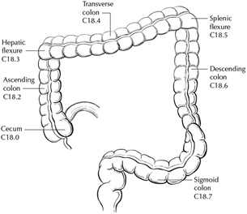
CAP
Approved
ColoRectal_4.4.0.1.REL_CAPCP
15
Table 1. Anatomic Subsites of the Colon and Rectum
Site
Relationship to Peritoneum (see Note J)
Dimensions (approximate)
Cecum
Entirely covered by peritoneum
6-9 cm
Ascending colon
Retroperitoneal; posterior surface lacks peritoneal
covering; lateral and anterior surfaces covered by
visceral peritoneum (serosa)
15-20 cm
Transverse colon
Intraperitoneal; has mesentery
Variable
Descending colon
Retroperitoneal; posterior surface lacks peritoneal
covering; lateral and anterior surfaces covered by
visceral peritoneum (serosa)
10-15 cm
Sigmoid colon
Intraperitoneal; has mesentery
Variable
Rectum
Upper third covered by peritoneum on anterior and
lateral surfaces; middle third covered by peritoneum
only on anterior surface; lower third has no
peritoneal covering
16-20 cm
The transition from sigmoid to rectum is marked by the fusion of the tenia coli of the sigmoid to form the
circumferential longitudinal muscle of the rectal wall approximately 16 to 20 cm from the dentate line. The
rectum is defined clinically as the distal large intestine commencing opposite the sacral promontory and
ending at the anorectal ring, which corresponds to the proximal border of the puborectalis muscle
palpable on digital rectal examination (Figure 2).1 When measuring below with a rigid sigmoidoscope, it
extends 16 cm from the anal verge.
Figure 2. Anatomic subsites of the rectum. Used with permission of the American Joint Committee on
Cancer (AJCC), Chicago, Ill. The original source for this material is the AJCC Cancer Staging Atlas
(2006), edited by Greene et al.2 and published by Springer Science and Business Media, LLC,
www.springerlink.com.
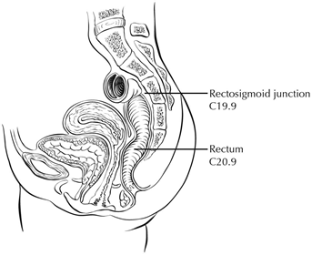
CAP
Approved
ColoRectal_4.4.0.1.REL_CAPCP
16
Tumors located at the border between two subsites of the colon (e.g., cecum and ascending colon) are
registered as tumors of the subsite that is more involved. If two subsites are involved to the same extent,
the tumor is classified as an 'overlapping' lesion.
A tumor is classified as rectal if its inferior margin lies less than 16 cm from the anal verge or if any part of
the tumor is located at least partly within the supply of the superior rectal artery.3 The rectum commences
at the sacral promontory, and the junction of sigmoid colon and rectum is anatomically marked by fusion
of tenia coli to form the circumferential longitudinal muscle of the rectal wall. Intraoperatively, the
rectosigmoid junction corresponds to the sacral promontory. A tumor is classified as rectosigmoid when
differentiation between rectum and sigmoid according to the previously mentioned guidelines is not
possible.4
Anteriorly, the peritoneal reflection is located at the junction of middle and lower third of the rectum, while
laterally, it is located at the junction of upper and middle third of the rectum. Posteriorly, the reflection is
located higher and most of the posterior rectum does not have a serosal covering.
(a) Whether an adenocarcinoma located in the rectum has a radial (circumferential) resection margin or a
peritoneal (serosal) surface depends on its location in relation to the peritoneal reflections. Tumors below
the anterior peritoneal reflection will have a 360-degree radial margin while those above it may have a
radial margin or a peritoneal (serosal) surface, or both, depending on the precise location.
(b) Neoadjuvant therapy and mesorectal excision are considered standard of care for rectal
adenocarcinomas “below the anterior peritoneal reflection”, while the opinions about use of these
modalities vary for rectal adenocarcinomas located above the anterior peritoneal reflection. Conservative
options like transanal disc excisions are often considered for location “below the anterior peritoneal
reflection”. In these contexts, the peritoneal reflection refers to the junction of upper and middle third of
the rectum; there is ongoing debate in the surgical literature about the concept of peritoneal reflection.5 If
information about tumor location with respect to the peritoneal reflection is included in the
report, the aspect of rectum in question (posterior, lateral, anterior) should also be noted.
References
1. Amin MB, Edge SB, Greene FL, et al., eds. AJCC Cancer Staging Manual. 8th ed. New York, NY:
Springer; 2017.
2. Greene FL, Compton CC, Fritz AG, Shah J, Winchester DP, eds. AJCC Cancer Staging Atlas.
New York, NY: Springer; 2006.
3. Fielding LP, Arsenault PA, Chapuis PH, et al. Clinicopathological staging for colorectal cancer: an
International Documentation System (IDS) and an International Comprehensive Anatomical
Terminology (ICAT). J Gastroenterol Hepatol. 1991; 6(4):325-344.
4. Wittekind C, Henson DE, Hutter RVP, Sobin LH, eds. TNM Supplement: A Commentary on
Uniform Use. 2nd ed. New York, NY: Wiley-Liss; 2001.
5. Kenig J, Richter P. Definition of the rectum and level of the peritoneal reflection - still a matter of
debate? Wideochir Inne Tech Maloinwazyjne. 2013; 8:183-186.
CAP
Approved
ColoRectal_4.4.0.1.REL_CAPCP
17
C. Histologic Types
For consistency in reporting, the histologic classification proposed by the World Health Organization
(WHO) is recommended.1
The histologic types of colorectal carcinoma that have been shown to have adverse prognostic
significance independent of stage are signet-ring cell carcinoma2 and poorly differentiated neuroendocrine
carcinomas (large cell and small cell subtypes).3
Medullary carcinoma is a distinctive histologic type strongly associated with high levels of microsatellite
instability (MSI-H), indicative of defects in DNA repair gene function. Medullary carcinoma may occur
either sporadically or in association with Lynch syndrome.4,5,6 This tumor type is characterized by solid
growth in nested, organoid, or trabecular patterns, with no immunohistochemical evidence of
neuroendocrine differentiation. Medullary carcinomas are also characterized by numerous tumor
infiltrating lymphocytes and a better prognosis.
Micropapillary carcinoma is characterized by small, tight clusters of tumor cells in cleft-like spaces and is
often present in association with conventional adenocarcinoma. This variant is strongly associated with
lymphovascular invasion and lymph node metastasis.7
Serrated adenocarcinomas are characterized by neoplastic glands showing prominent serrations, tumor
cells with basal nuclei and eosinophilic cytoplasm, and no or minimal luminal necrosis. These tumors are
thought to be related to traditional serrated adenomas and may have a more aggressive course than
conventional adenocarcinoma.8
References
1. Nagtegaal ID, Robert DO, Klimstra D, et al., eds. WHO Classification of Tumours Editorial Board.
World Health Organization (WHO) Classification of Tumours: Digestive System Tumours. 5th ed.
Lyon, France: IARC Press; 2019.
2. Kang H, O'Connell JB, Maggard MA, Sack J, Ko CY. A 10-year outcomes evaluation of mucinous
and signet-ring cell carcinoma of the colon and rectum. Dis Colon Rectum. 2005; 48(6):1161-
1168.
3. Bernick PE, Klimstra DS, Shia J, et al. Neuroendocrine carcinomas of the colon and rectum. Dis
Colon Rectum. 2004; 47(2):163-169.
4. Wick MR, Vitsky JL, Ritter JH, Swanson PE, Mills SE. Sporadic medullary carcinoma of the colon:
a clinicopathologic comparison with nonhereditary poorly differentiated enteric-type
adenocarcinoma and neuroendocrine colorectal carcinoma. Am J Clin Pathol. 2005; 123:56-65.
5. Pyo JS, Sohn JH, Kang G. Medullary carcinoma in the colorectum: a systematic review and
meta-analysis. Hum Pathol. 2016; 53:91-96.
6. Knox RD, Luey N, Sioson L, et al. Medullary colorectal carcinoma revisited: a clinical and
pathological study of 102 cases. Ann Surg Oncol. 2015; 22(9):2988-96.
7. Haupt B, Ro JY, Schwartz MR, et al. Colorectal adenocarcinoma with micropapillary pattern and
its association with lymph node metastasis. Mod Pathol. 2007; 20:729–733.
CAP
Approved
ColoRectal_4.4.0.1.REL_CAPCP
18
8. García-Solano J, Pérez-Guillermo M, Conesa-Zamora P, et al. Clinicopathologic study of 85
colorectal serrated adenocarcinomas: further insights into the full recognition of a new subset of
colorectal carcinoma. Hum Pathol. 2010; 41(10):1359-1368.
D. Histologic Grade
A number of grading systems for colorectal cancer have been suggested, but a single widely accepted
and uniformly used standard for grading is lacking. Most systems stratify tumors into 3 or 4 grades as
follows:
Grade 1
Well-differentiated (>95% gland formation)
Grade 2
Moderately differentiated (50-95% gland formation)
Grade 3
Poorly differentiated (<50% gland formation)
Grade 4
Undifferentiated (no gland formation or mucin; no squamous or neuroendocrine differentiation)
Despite a significant degree of interobserver variability,1 histologic grade has been shown to be an
important prognostic factor in many studies,2,3 with strong correlation between poor differentiation and
adverse outcome.4 While some studies have stratified grade into a two-tiered low- and high-grade
system, a three- or four-tier system is more commonly used for gastrointestinal carcinomas. The AJCC
has specified use of a four-tiered grading system for colorectal cancer for the 8th edition of the TNM
manual.5 Pathologists should use the four-tier histologic grading scheme as specified above to prevent
errors in data recording. As per WHO, the grading scheme applies to adenocarcinoma, not otherwise
specified, and not to histologic variants. For example, medullary carcinomas behave as low-grade tumors
even though they may appear poorly differentiated. This grading scheme is also not applicable to poorly
differentiated neuroendocrine carcinomas.
References
1. Chandler I, Houlston RS. Interobserver agreement in grading of colorectal cancers-findings from
a nationwide web-based survey of histopathologists. Histopathology. 2008; 52(4):494-499.
2. Cho YB, Chun HK, Yun HR, et al. Histological grade predicts survival time associated with
recurrence after resection for colorectal cancer. Hepatogastroenterology. 2009; 56(94-95):1335-
1340.
3. Derwinger K, Kodeda K, Bexe-Lindskog E, Taflin H. Tumour differentiation grade is associated
with TNM staging and the risk of node metastasis in colorectal cancer. Acta Oncol. 2010;
49(1):57-62.
4. Barresi V, Reggiani Bonetti L, Ieni A, Domati F, Tuccari G. Prognostic significance of grading
based on the counting of poorly differentiated clusters in colorectal mucinous adenocarcinoma.
Hum Pathol. 2015; 46(11):1722-1729.
5. Amin MB, Edge SB, Greene FL, et al., eds. AJCC Cancer Staging Manual. 8th ed. New York, NY:
Springer; 2017.
E. pTNM Classification
Surgical resection remains the most effective therapy for colorectal carcinoma, and the best estimation of
prognosis is derived from the pathologic findings on the resection specimen. The anatomic extent of
disease is by far the most important prognostic factor in colorectal cancer.
CAP
Approved
ColoRectal_4.4.0.1.REL_CAPCP
19
The protocol recommends the TNM staging system of the American Joint Committee on Cancer (AJCC)
and the International Union Against Cancer (UICC)1 but does not preclude the use of other staging
systems.
By AJCC/UICC convention, the designation “T” refers to a primary tumor that has not been previously
treated. The symbol “p” refers to the pathologic classification of the TNM, as opposed to the clinical
classification, and is based on gross and microscopic examination. pT entails a resection of the primary
tumor or biopsy adequate to evaluate the highest pT category, pN entails removal or biopsy of nodes
adequate to validate lymph node metastasis, and pM implies microscopic examination of distant lesions.
Clinical classification (cTNM) is usually carried out by the referring physician before treatment during
initial evaluation of the patient or when pathologic classification is not possible.
TNM Descriptors:
For identification of special cases of TNM or pTNM classifications, the “m” suffix and “y” and “r” prefixes
are used. Although they do not affect the stage grouping, they indicate cases needing separate analysis.
The “m” suffix indicates the presence of multiple primary tumors in a single site and is recorded in
parentheses: pT(m)NM.
The “y” prefix indicates those cases in which classification is performed during or following initial
multimodality therapy (i.e., neoadjuvant chemotherapy, radiation therapy, or both chemotherapy and
radiation therapy). The cTNM or pTNM category is identified by a “y” prefix. The ycTNM or ypTNM
categorizes the extent of tumor actually present at the time of that examination. The “y” categorization is
not an estimate of tumor prior to multimodality therapy (i.e., before initiation of neoadjuvant therapy).
The “r” prefix indicates a recurrent tumor when staged after a documented disease-free interval, and is
identified by the “r” prefix: rTNM.
T Category Considerations (Figures 4-6):
pTis: For colorectal carcinomas, carcinoma in situ (pTis) as a staging term refers to tumors involving the
lamina propria and/or muscularis mucosae, but not extending through it (intramucosal carcinoma). Tumor
extension through the muscularis mucosae into the submucosa is classified as T1 (Figure 5). A synoptic
report is required only for invasive tumors, but not Tis.
pT1: Assessment of the depth of submucosal invasion in early colon carcinoma has also been shown to
be important in predicting adverse outcomes, but the methodology has varied and evolved with
time.2,3,4,5,6 In pedunculated polyps the depth of invasion was evaluated as four levels (head, neck, stalk
and beyond stalk) called Haggitt levels. Submucosal involvement has been also been divided into
superficial, mid, and deep levels (Kikuchi levels sm1, sm2, and sm3), and the risk of nodal metastasis
increases with increasing depth of submucosal invasion.2,3,4,5,6 Other systems use actual measurement of
depth of invasion and show the risk of nodal metastasis is none to minimal when the depth of invasion is
<1mm and becomes significant with invasion of ≥2mm.5,6 However, it can be difficult to accurately assess
the depth or extent of submucosal involvement due to improper orientation and when the muscularis
CAP
Approved
ColoRectal_4.4.0.1.REL_CAPCP
20
mucosae is completely destroyed due tumor invasion and extensive desmoplasia. In such a setting, it has
been suggested to draw a line joining preserved muscularis mucosae at the edges of the tumor to
indicate the likely level of muscularis mucosae or when that is not possible measure the depth of invasion
from the surface of the tumor. Each method for evaluating submucosal involvement has certain
limitations, and while one is not clearly superior to the other, the Haggitt levels and Kikuchi levels can only
be applied to a subset of colorectal carcinoma specimens and hence measurement of the actual depth
appears most practical for the sake of consistency and the recommended method for malignant polyps.
pT4: Tumors that involve the serosal surface (visceral peritoneum) or directly invade adjacent organs or
structures are assigned to the T4 category (Figures 4 and 6).
Figure 4. T4a (left side) with involvement of serosa (visceral peritoneum) by tumor cells in a segment of
colorectum with a serosal covering. In contrast, the right side of the diagram shows T3 with
macroscopically positive circumferential margin (designated R2 in AJCC staging system), corresponding
to gross disease remaining after surgical excision. Used with permission of the American Joint Committee
on Cancer (AJCC), Chicago, Ill. The original source for this material is the AJCC Cancer Staging Atlas
(2006), edited by Greene et al.7 and published by Springer Science and Business Media, LLC,
www.springerlink.com.
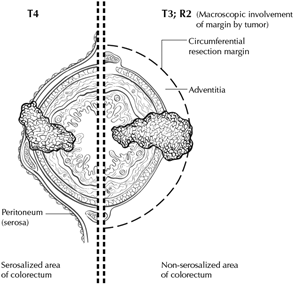
CAP
Approved
ColoRectal_4.4.0.1.REL_CAPCP
21
Figure 5. T1 tumor invades submucosa; T2 tumor invades muscularis propria; T3 tumor invades through
the muscularis propria into the subserosa or into nonperitonealized pericolic or perirectal tissues
(adventitia). Used with permission of the American Joint Committee on Cancer (AJCC), Chicago, Ill. The
original source for this material is the AJCC Cancer Staging Atlas (2006) edited by Greene et al.7 and
published by Springer Science and Business Media, LLC, www.springerlink.com.
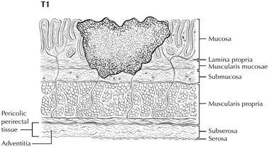
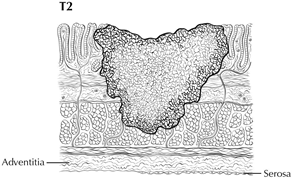
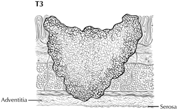
CAP
Approved
ColoRectal_4.4.0.1.REL_CAPCP
22
Figure 6. A, T4b tumor showing direct invasion of coccyx. B, T4b tumor directly invading adjacent loop of
small bowel. C, T4a tumor showing gross perforation of bowel through tumor (left). The right-hand panel
shows T4b tumor directly invading adjacent bowel. D, T4a tumor with involvement of serosa (visceral
peritoneum) by tumor cells. Used with permission of the American Joint Committee on Cancer (AJCC),
Chicago, Ill. The original source for this material is the AJCC Cancer Staging Atlas (2006), edited by
Greene et al.7 and published by Springer Science and Business Media, LLC, www.springerlink.com.
Tumor that is adherent to other organs or structures macroscopically is classified clinically as cT4.
However, if no tumor is found within the adhesion microscopically, the tumor should be assigned pT3.1
For rectal tumors, invasion of the external sphincter and/or levator ani muscle(s) is classified as T4b.
Tumor in veins or lymphatics does not affect the pT classification.
Subdivision of T4 into T4a and T4b: Serosal (visceral peritoneal) involvement by tumor cells (pT4a) has
been demonstrated by multivariate analysis to have a negative impact on prognosis,8,9as does direct
invasion of adjacent organs (pT4b). Visceral peritoneal involvement can be missed without thorough
sampling and/or sectioning, and malignant cells have been identified in serosal scrapings in as many as
26% of specimens categorized as pT3 by histologic examination alone.10,11 Although the absence of
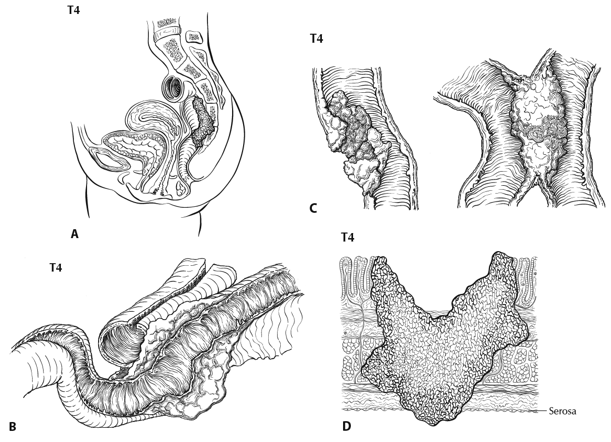
CAP
Approved
ColoRectal_4.4.0.1.REL_CAPCP
23
standard guidelines for assessing peritoneal involvement may contribute to underdiagnosis, the following
findings are considered to represent serosal involvement by tumor:
•
Tumor present at the serosal surface
•
Free tumor cells on the serosal surface (on the visceral peritoneum) with underlying
erosion/ulceration of mesothelial lining, mesothelial hyperplasia and/or inflammatory reaction9,10
•
Perforation in which the tumor cells are continuous with the serosal surface through inflammation
The significance of tumors that are <1 mm from the serosal surface and accompanied by serosal reaction
is unclear, with some10 but not all studies9 indicating a higher risk of peritoneal recurrence. Multiple level
sections and/or additional sections of the tumor should be examined in these cases. If the serosal
involvement is not present after additional evaluation, the tumor should be assigned to the pT3 category.
The use of elastic stains has been advocated for identification of T4a tumors by demonstrating tumor
involvement of the subperitoneal elastic lamina. The elastic stain can be difficult to interpret in this region
and the elastic lamina is not uniformly present even in normal colon. Hence routine use of this stain is not
considered standard practice. In portions of the colorectum that are not peritonealized (e.g., posterior
aspects of ascending and descending colon, lower portion of rectum), the T4a category is not applicable.
Direct invasion in T4 includes invasion of other organs or other segments of the colorectum as a result of
direct extension through the serosa, as confirmed on microscopic examination (for example, invasion of
the sigmoid colon by a carcinoma of the cecum) or, for cancers in a retroperitoneal or subperitoneal
location, direct invasion of other organs or structures by virtue of extension beyond the muscularis propria
(i.e., respectively, a tumor on the posterior wall of the descending colon invading the left kidney or lateral
abdominal wall; or a mid or distal rectal cancer with invasion of prostate, seminal vesicles, cervix, or
vagina).
Tumor that is adherent to other organs or structures, grossly, is classified cT4b. However, if no tumor is
present in the adhesion, microscopically, the classification should be pT1-4a depending on the
anatomical depth of wall invasion. The V and L classifications should be used to identify the presence or
absence of vascular or lymphatic invasion whereas the PN prognostic factor should be used for
perineural invasion.
Intramural extension of tumor from one subsite (segment) of the large intestine into an adjacent subsite or
into the ileum (e.g., for a cecal carcinoma) or anal canal (e.g., for a rectal carcinoma) does not affect the
pT classification. Transmural extension into another organ or site is necessary for T4b designation.
Both types of peritoneal involvement are associated with decreased survival. Although small studies
suggested that serosal involvement was associated with worse outcome than invasion of adjacent
organs, data from a large cohort of more than 100,000 colon cancer cases11 indicate that penetration of
the visceral peritoneum carries a 10% to 20% better 5-year survival than locally invasive carcinomas for
the same pN category.
CAP
Approved
ColoRectal_4.4.0.1.REL_CAPCP
24
N Category Considerations:
The regional lymph nodes for the anatomical subsites of the large intestine (Figure 7) are as follows:
Cecum:
Pericolic, ileocolic, right colic
Ascending colon:
Pericolic, ileocolic, right colic, right branch of middle colic
Hepatic flexure:
Pericolic, ileocolic, middle colic, right colic
Transverse colon:
Pericolic, middle colic
Splenic flexure:
Pericolic, middle colic, left colic
Descending colon:
Pericolic, left colic, inferior mesenteric, sigmoid
Sigmoid colon:
Pericolic, sigmoid, inferior mesenteric, superior rectal (hemorrhoidal)
Rectosigmoid: Pericolic, sigmoid, superior rectal (hemorrhoidal)
Rectum:
Mesorectal, superior rectal (hemorrhoidal), inferior mesenteric, internal iliac, inferior rectal
(hemorrhoidal)
CAP
Approved
ColoRectal_4.4.0.1.REL_CAPCP
25
Figure 7. The regional lymph nodes of the colon and rectum. Used with permission of the American Joint
Committee on Cancer (AJCC), Chicago, Ill. The original source for this material is the AJCC Cancer
Staging Atlas (2006), edited by Greene et al.7 and published by Springer Science and Business Media,
LLC, www.springerlink.com.
For rectal cancers, metastasis in the external iliac or common iliac nodes is classified as distant
metastasis.1
Submission of Lymph Nodes for Microscopic Examination. All grossly negative or equivocal lymph nodes
should be submitted entirely. Grossly positive lymph nodes may be partially submitted for microscopic
confirmation of metastasis.
The accuracy and predictive value of stage II assignment are directly proportional to the thoroughness of
the surgical technique in removing all regional nodes and the pathologic examination of the resection
specimen in identifying and harvesting all regional lymph nodes for microscopic assessment. The
National Quality Forum lists the presence of at least 12 lymph nodes in a surgical resection among the
key quality measures for colon cancer care in the United States (see
http://www.facs.org/cancer/qualitymeasures.html).
The likelihood of detecting metastasis increases with the number of lymph nodes examined; hence 12
lymph nodes should be considered the minimum target, but all possible lymph nodes should be retrieved
and examined.12,13
The clinical outcome is linked to lymph node harvest in stage II disease,14 indicating a positive effect of
optimal mesenteric resection by the surgeon, optimal lymph node harvest from the resection specimen by
the pathologist, or both.
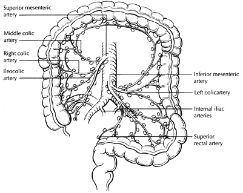
CAP
Approved
ColoRectal_4.4.0.1.REL_CAPCP
26
The number of lymph nodes recovered from a resection specimen is dependent on several factors.
Surgical technique, surgery volume, and patient factors (e.g., age and anatomic variation) alter the actual
number of nodes in a resection specimen, but the diligence and skill of the pathologist in identifying and
harvesting lymph nodes in the resection specimen also are major factors. Lymph nodes may be more
difficult to identify in specimens from patients who are obese15 or elderly, or after neoadjuvant
therapy.16 Because it has been shown that nodal metastasis in colorectal cancer is often found in small
lymph nodes (<5 mm in diameter), diligent search for lymph nodes is required on gross examination of
resection specimens. If fewer than 12 lymph nodes are found, re-examining the specimen for additional
lymph nodes, with or without visual enhancement techniques, should be considered. The pathology report
should clearly state the total number of lymph nodes examined and the total number involved by
metastases. Data are insufficient to recommend routine use of tissue levels or special/ancillary
techniques.
Nonregional Lymph Nodes. For microscopic examination of lymph nodes in large resection specimens,
lymph nodes must be designated as regional versus nonregional, according to the anatomic location of
the tumor. Metastasis to nonregional lymph nodes is classified as distant metastasis and designated as
M1.
Lymph Nodes Replaced by Tumor. A tumor nodule in the pericolic/perirectal fat without histologic
evidence of residual lymph node tissue is classified as a tumor deposit (peritumoral deposit or satellite
nodule) and is not considered a positive lymph node. In the absence of unequivocal lymph node
metastases, tumor deposits are recorded as N1c.1
Isolated Tumor Cells. Isolated tumor cells (ITCs) are defined as single tumor cells or small clusters of
tumor cells measuring less than 0.2 mm, usually found by special techniques such as
immunohistochemical staining, and are classified as N0.1 Because the biologic significance of ITCs
(either a single focus in a single node, multiple foci within a single or multiple nodes) remains unproven,
N0 is considered justified.17 The number of lymph nodes involved by ITCs should be clearly stated in a
comment section or elsewhere in the report. Metastatic deposits 0.2 mm-2.0 mm have been referred to as
micrometastasis. These nodes should be considered as involved by cancer.
Routine assessment of regional lymph nodes is limited to conventional pathologic techniques (gross
assessment and histologic examination), and data are currently insufficient to recommend special
measures to detect ITCs. Thus, neither multiple levels of paraffin blocks nor the use of special/ancillary
techniques such as immunohistochemistry are recommended for routine examination of regional lymph
nodes.
TNM Anatomic Stage/Prognostic Groupings
Pathologic staging is usually performed after surgical resection of the primary tumor. Pathologic staging
depends on pathologic documentation of the anatomic extent of disease, whether or not the primary
tumor has been completely removed. If a biopsied tumor is not resected for any reason (e.g., when
technically unfeasible), and if the highest T and N categories or the M1 category of the tumor can be
CAP
Approved
ColoRectal_4.4.0.1.REL_CAPCP
27
confirmed microscopically, the criteria for pathologic classification and staging have been satisfied without
total removal of the primary cancer.
References
1. Amin MB, Edge SB, Greene FL, et al., eds. AJCC Cancer Staging Manual. 8th ed. New York, NY:
Springer; 2017.
2. Haggitt, R. C., R. E. Glotzbach, E. E. Soffer, and L. D. Wruble. 'Prognostic Factors in Colorectal
Carcinomas Arising in Adenomas: Implications for Lesions Removed by Endoscopic
Polypectomy.' Gastroenterology 89, no. 2 (Aug 1985): 328-36.
3. Kitajima, K., T. Fujimori, S. Fujii, J. Takeda, Y. Ohkura, H. Kawamata, T. Kumamoto, et al.
Correlations between Lymph Node Metastasis and Depth of Submucosal Invasion in Submucosal
Invasive Colorectal Carcinoma: A Japanese Collaborative Study. [In eng]. Multicenter Study. J
Gastroenterol 39, no. 6 (Jun 2004): 534-43. https://doi.org/10.1007/s00535-004-1339-4.
http://www.ncbi.nlm.nih.gov/pubmed/15235870
4. Ueno, H., H. Mochizuki, Y. Hashiguchi, H. Shimazaki, S. Aida, K. Hase, S. Matsukuma, et al.
'Risk Factors for an Adverse Outcome in Early Invasive Colorectal Carcinoma.' [In eng].
Gastroenterology 127, no. 2 (Aug 2004): 385-94.
5. Nascimbeni, R., L. J. Burgart, S. Nivatvongs, and D. R. Larson. 'Risk of Lymph Node Metastasis
in T1 Carcinoma of the Colon and Rectum.' [In eng]. Review. Dis Colon Rectum 45, no. 2 (Feb
2002): 200-6.
6. Tominaga, K., Y. Nakanishi, S. Nimura, K. Yoshimura, Y. Sakai, and T. Shimoda. 'Predictive
Histopathologic Factors for Lymph Node Metastasis in Patients with Nonpedunculated
Submucosal Invasive Colorectal Carcinoma.' Dis Colon Rectum 48, no. 1 (Jan 2005): 92-100.
7. Greene FL, Compton CC, Fritz AG, Shah J, Winchester DP, eds. AJCC Cancer Staging Atlas.
New York, NY: Springer; 2006.
8. Puppa G, Maisonneuve P, Sonzogni A, et al. Pathological assessment of pericolonic tumor
deposits in advanced colonic carcinoma: relevance to prognosis and tumor staging. Mod Pathol.
2007;20(8):843-855.
9. Shepherd NA, Baxter KJ, Love SB. The prognostic importance of peritoneal involvement in
colonic cancer: a prospective evaluation. Gastroenterology. 1997;112(4):1096-1102.
10. Panarelli NC, Schreiner AM, Brandt SM, Shepherd NA, Yantiss RK. Histologic features and
cytologic techniques that aid pathologic stage assessment of colonic adenocarcinoma. Am J Surg
Pathol. 2013;37(8):1252-1258.
11. Gunderson LL, Jessup JM, Sargent DJ, Greene FL, Stewart A. TN categorization for rectal and
colon cancers based on national survival outcome data. J Clin Oncol. 2008;26(15S):4020.
12. Cserni G, Vinh-Hung V, Burzykowski T. Is there a minimum number of lymph nodes that should
be histologically assessed for a reliable nodal staging of T3N0M0 colorectal carcinomas? J Surg
Oncol. 2002;81(2):63-69.
13. Goldstein NS. Lymph node recoveries from 2427 pT3 colorectal resection specimens spanning
45 years. Am J Surg Pathol. 2002;26(2):179-189.
14. Chang GJ, Rodriguez-Bigas MA, Skibber JM, Moyer VA. Lymph node evaluation and survival
after curative resection of colon cancer: systematic review. J Natl Cancer Inst. 2007;99(6):433-
441.
15. Gorog D, Nagy P, Peter A, Perner F. Influence of obesity on lymph node recovery from rectal
resection specimens. Pathol Oncol Res. 2003;9(3):180-183.
CAP
Approved
ColoRectal_4.4.0.1.REL_CAPCP
28
16. Wijesuriya RE, Deen KI, Hewavisenthi J, Balawardana J, Perera M. Neoadjuvant therapy for
rectal cancer down-stages the tumor but reduces lymph node harvest significantly. Surg Today.
2005;35(6):442-445.
17. Sloothaak DA, Sahami S, van der Zaag-Loonen HJ, et al. The prognostic value of
micrometastases and isolated tumour cells in histologically negative lymph nodes of patients with
colorectal cancer: a systematic review and meta-analysis. Eur J Surg Oncol. 2014;40(3):263-269.
F. Perforation
Tumor perforation is an uncommon complication of colorectal cancer, but one that is associated with a
poor outcome, including high in-hospital mortality and morbidity.1 Perforation of the uninvolved colon
proximal to an obstructing tumor is also associated with high mortality because of generalized peritonitis
and sepsis. Reported perforation rates range from 2.6% to 9%. Perforation is more likely to occur in older
patients.
References
1. Anwar MA, D'Souza F, Coulter R, et al. Outcome of acutely perforated colorectal cancers:
experience of a single district general hospital. Surg Oncol. 2006;15(2):91-96.
G. Lymphatic and/or Vascular Invasion and Perineural Invasion
It is recommended that small vessel vascular invasion should be reported separately from venous (large
vessel) invasion. Small vessel invasion indicates tumor involvement of thin-walled structures lined by
endothelium, without an identifiable smooth muscle layer or elastic lamina. Small vessels include
lymphatics, capillaries, and postcapillary venules. Differentiation of lymphatics from other vascular
channels may require application of lymphatic specific endothelial markers like D2-40.1 Small vessel
invasion is associated with lymph node metastasis and has been shown to be independent indicator of
adverse outcome in several studies.2,3 The higher prognostic significance of extramural small vessel
invasion has been suggested,4 but the importance of anatomic location in small vessel invasion
(extramural or intramural) is not well defined.
Tumor involving endothelium-lined spaces with an identifiable smooth muscle layer or elastic lamina is
considered venous (large vessel) invasion. Circumscribed tumor nodules surrounded by an elastic lamina
on hematoxylin-eosin (H&E) or elastic stain are also considered venous invasion. Venous invasion can be
extramural (beyond muscularis propria) or intramural (submucosa or muscularis propria). Extramural
venous invasion has been demonstrated by multivariate analysis to be an independent adverse
prognostic factor in multiple studies and is a risk factor for liver metastasis.4 The significance of intramural
venous invasion is less clear. Histologic features like tumor deposits adjacent to arteries (“orphan artery”
sign) and elongated tumor nodules extending into pericolic fat from the muscularis propria (“protruding
tongue” sign) can raise the suspicion for venous invasion.5 Elastic stain can lead to 2- to 3-fold increase
in the detection of venous invasion and may be used to improve assessment of this feature.6
Perineural invasion has been shown to be independent indicator of poor prognosis.7,8,9 While some series
did not find perineural invasion to be a significant predictive factor in stage II disease,10,11 many studies
have confirmed its adverse effect on survival in stage II disease.3,12  Extramural perineural invasion may
CAP
Approved
ColoRectal_4.4.0.1.REL_CAPCP
29
have a greater adverse prognostic effect,8 but the distinction between intramural and extramural
perineural invasion has not been well studied.
References
1. Wada, H., M. Shiozawa, N. Sugano, S. Morinaga, Y. Rino, M. Masuda, M. Akaike, and Y. Miyagi.
Lymphatic Invasion Identified with D2-40 Immunostaining as a Risk Factor of Nodal Metastasis in
T1 Colorectal Cancer. [In Eng]. Int J Clin Oncol (Nov 1, 2012).
2. Lim SB, Yu CS, Jang SJ, et al. Prognostic significance of lymphovascular invasion in sporadic
colorectal cancer. Dis Colon Rectum. 2010; 53(4):377-384.
3. Santos C, López-Doriga A, Navarro M, et al. Clinicopathological risk factors of Stage II colon
cancer: results of a prospective study. Colorectal Dis. 2013; 15(4):414-422.
4. Betge J, Pollheimer MJ, Lindtner RA, et al. Intramural and extramural vascular invasion in
colorectal cancer: prognostic significance and quality of pathology reporting. Cancer. 2012;
118(3):628-638.
5. Messenger DE, Driman DK, Kirsch R. Developments in the assessment of venous invasion in
colorectal cancer: implications for future practice and patient outcome. Hum Pathol. 2012;
43(7):965-973.
6. Kirsch R, Messenger DE, Riddell RH, et al. Venous invasion in colorectal cancer: impact of an
elastin stain on detection and interobserver agreement among gastrointestinal and
nongastrointestinal pathologists. Am J Surg Pathol. 2013; 37(2):200-210.
7. Liebig C, Ayala G, Wilks J, et al. Perineural invasion is an independent predictor of outcome in
colorectal cancer. J Clin Oncol. 2009; 27(31):5131-5137.
8. Ueno H, Shirouzu K, Eishi Y, et al. Study Group for Perineural Invasion projected by the
Japanese Society for Cancer of the Colon and Rectum (JSCCR). Characterization of perineural
invasion as a component of colorectal cancer staging. Am J Surg Pathol. 2013; 37(10):1542-
1549.
9. Gomez D, Zaitoun AM, De Rosa A, et al. Critical review of the prognostic significance of
pathological variables in patients undergoing resection for colorectal liver metastases. HPB
(Oxford). 2014;16(9):836-844.
10. Peng SL, Thomas M, Ruszkiewicz A, et al. Conventional adverse features do not predict
response to adjuvant chemotherapy in stage II colon cancer. ANZ J Surg. 2014; 84(11):837-841.
11. Ozturk MA, Dane F, Karagoz S, et al. Is perineural invasion (PN) a determinant of disease free
survival in early stage colorectal cancer? Hepatogastroenterology. 2015; 62(137):59-64.
12. Huh JW, Kim HR, Kim YJ. Prognostic value of perineural invasion in patients with stage II
colorectal cancer. Ann Surg Oncol. 2010; 17(8):2066-2072.
H. Tumor Budding
The presence of single cells or small clusters of less than five cells at the advancing front of the tumor is
considered as peritumoral tumor budding. Numerous studies have shown that high tumor budding in
adenocarcinoma arising in a polyp is a significant risk factor for nodal involvement,1,2,3,4,5,6 with tumor
budding being the most significant factor in some studies.3 Similarly, the adverse prognosis of high tumor
budding has been shown in stage II patients and its inclusion as a high risk factor for making
chemotherapy decisions for stage II patients has been advocated.4,6 Different criteria for evaluating and
reporting tumor budding have been followed in the literature. An international tumor budding consensus
conference (ITBCC) in 2016 recommended the following criteria for evaluating tumor budding:7
CAP
Approved
ColoRectal_4.4.0.1.REL_CAPCP
30
1. Tumor budding counts should be done on H&E sections. In cases of obscuring factors like
inflammation, immunohistochemistry for keratin can be obtained to assess the advancing edge
for tumor buds, but the scoring should be done on H&E sections.
2. Tumor budding should be reported by selecting a “hotspot” chosen after review of all available
slides with invasive tumor. The total number of buds should be reported in an area measuring
0.785 mm2, which corresponds to 20x field in some microscopes (use appropriate conversion for
other microscopes, see table below).
3. Both total number of buds and a three-tier score (based on 0.785 mm2 field area) should be
reported: low (0-4 buds), intermediate (5-9 buds), and high (10 or more buds).
This is now a required element for conventional adenocarcinoma (well or moderately differentiated).
Tumor budding cannot be assessed or is not applicable for other specific variants of colorectal
adenocarcinoma (e.g., micropapillary carcinoma, signet ring carcinoma or mucinous carcinoma) or
poorly/undifferentiated carcinoma, unless there is also an associated component of well or moderately
differentiated conventional adenocarcinoma.
Objective Magnification:
20
Eyepiece FN
Diameter
Eyepiece FN
Radius
Specimen
FN Radius
Specimen
Area
Normalization
Factor
(mm)
(mm)
(mm)
(mm2)
18
9.0
0.450
0.636
0.810
19
9.5
0.475
0.709
0.903
20
10.0
0.500
0.785
1.000
21
10.5
0.525
0.866
1.103
22
11.0
0.550
0.950
1.210
23
11.5
0.575
1.039
1.323
24
12.0
0.600
1.131
1.440
25
12.5
0.625
1.227
1.563
26
13.0
0.650
1.327
1.690
Table. ITBCC Normalization Table for Reporting Tumor Budding According to Microscope.
To obtain tumor bud count for your field of view, divide by the normalization number.
References
1. Bosch SL, Teerenstra S, de Wilt JH, Cunningham C, Nagtegaal ID. Predicting lymph node
metastasis in pT1 colorectal cancer: a systematic review of risk factors providing rationale for
therapy decisions. Endoscopy. 2013; 45(10):827-834.
2. Ueno H, Mochizuki H, Hashiguchi Y, et al. Risk factors for an adverse outcome in early invasive
colorectal carcinoma. Gastroenterology. 2004; 127(2):385-394.
3. Choi DH, Sohn DK, Chang HJ, et al. Indications for subsequent surgery after endoscopic
resection of submucosally invasive colorectal carcinomas: a prospective cohort study. Dis Colon
Rectum. 2009; 52(3):438-445.
CAP
Approved
ColoRectal_4.4.0.1.REL_CAPCP
31
4. Petrelli F, Pezzica E, Cabiddu M, et al. Tumour budding and survival in stage II colorectal cancer:
a systematic review and pooled analysis. J Gastrointest Cancer. 2015; 46(3):212-218.
5. Graham RP, Vierkant RA, Tillmans LS, et al. Tumor budding in colorectal carcinoma: confirmation
of prognostic significance and histologic cutoff in a population-based cohort. Am J Surg Pathol.
2015; 39(10):1340-1346.
6. Koelzer VH, Zlobec I, Lugli A. Tumor budding in colorectal cancer-ready for diagnostic practice?
Hum Pathol. 2016; 47(1):4-19.
7. Lugli A, Kirsch R, Ajioka Y, et al. Recommendations for reporting tumor budding in colorectal
cancer based on the International Tumor Budding Consensus Conference (ITBCC) 2016. Mod
Pathol. 30, 1299–1311 (2017). https://doi.org/10.1038/modpathol.2017.46
I. Polyps
The adenocarcinoma can arise in adenomatous (tubular, tubulovillous, or villous) or serrated (sessile
serrated adenoma/polyp or traditional serrated adenoma) polyp. Sessile serrated adenoma often
develops cytologic dysplasia resembling tubular adenoma during neoplastic progression. These are
presumed to be the precursors of right-sided adenocarcinomas with high levels of microsatellite instability
(MSI-H).1
References
1. Rex DK, Ahnen DJ, Baron JA, et al. Serrated lesions of the colorectum: review and
recommendations from an expert panel. Am J Gastroenterol. 2012; 107(9):1315-1330.
J. Treatment Effect
Neoadjuvant chemoradiation therapy in rectal cancer is associated with significant tumor response and
downstaging.1 Because eradication of the tumor, as detected by pathologic examination of the resected
specimen, is associated with a significantly better prognosis,2 specimens from patients receiving
neoadjuvant chemoradiation should be thoroughly sectioned, with careful examination of the tumor site.
Minimal residual disease has been shown to have a better prognosis than gross residual disease.3 A
modified Ryan scheme is suggested for scoring of tumor response, and has been shown to provide good
interobserver reproducibility of prognostic significance.4 Several other systems have been studied and
can be chosen to report the tumor regression score.
Modified Ryan Scheme for Tumor Regression Score
Description
Tumor Regression
Score
No viable cancer cells (complete response)
0
Single cells or rare small groups of cancer cells (near complete response)
1
Residual cancer with evident tumor regression, but more than single cells or
rare small groups of cancer cells (partial response)
2
Extensive residual cancer with no evident tumor regression (poor or no
response)
3
Tumor regression should be assessed only in the primary tumor; lymph node metastases should not be
included in the assessment.
CAP
Approved
ColoRectal_4.4.0.1.REL_CAPCP
32
Acellular pools of mucin in specimens following neoadjuvant therapy are considered to represent
completely eradicated tumor and are not used to assign pT stage or counted as positive lymph nodes.
References
1. Ruo L, Tickoo S, Klimstra DS, et al. Long-term prognostic significance of extent of rectal cancer
response to preoperative radiation and chemotherapy. Ann Surg. 2002; 236(1):75-81.
2. Gavioli M, Luppi G, Losi L, et al. Incidence and clinical impact of sterilized disease and minimal
residual disease after preoperative radiochemotherapy for rectal cancer. Dis Colon Rectum.
2005; 48(10):1851-1857.
3. Ryan R, Gibbons D, Hyland JMP, et al. Pathological response following long-course neoadjuvant
chemoradiotherapy for locally advanced rectal cancer. Histopathology. 2005; 47(2):141-146.
4. Lo DS, Pollett A, Siu LL, et al. Prognostic significance of mesenteric tumor nodules in patients
with stage III colorectal cancer. Cancer. 2008; 112(1):50-54.
K. Margins
It may be helpful to mark the margin(s) closest to the tumor with ink following close examination of the
serosal surface for puckering and other signs of tumor involvement. Margins marked by ink should be
designated in the macroscopic description of the surgical pathology report. The serosal surface (visceral
peritoneum) does not constitute a surgical margin.
In addition to addressing the proximal and distal margins, the radial margin (Figure 3A-3C) must be
assessed for any segment either unencased (Figure 3C) or incompletely encased by peritoneum (Figure
3B) (see Note A). The radial margin represents the adventitial soft tissue margin closest to the deepest
penetration of tumor and is created surgically by blunt or sharp dissection of the retroperitoneal or
subperitoneal aspect, respectively. Since the lower rectum is entirely extraperitoneal, the radial margin
extends circumferentially and has been referred to as the circumferential radial margin. Multivariate
analysis has suggested that tumor involvement of the radial margin is the most critical factor in predicting
local recurrence in rectal cancer.1 A positive radial margin in rectal cancer increases the risk of
recurrence by 3.5-fold and doubles the risk of death from disease. For this reason, the radial margin
should be assessed in all rectal carcinomas as well as colonic segments with nonperitonealized surfaces.
The radial margin is considered negative if the tumor is more than 1 mm from the inked nonperitonealized
surface but should be recorded as positive if tumor is located 1 mm or less from the nonperitonealized
surface, because local recurrence rates are similar with clearances of 0 to 1 mm. There is limited
outcome data for cases with intranodal or intravascular tumor within 1 mm of radial resection margin, but
follow-up based on a small number of patients suggests that local recurrence in these tumors may be
similar to those with negative margin.1,2
CAP
Approved
ColoRectal_4.4.0.1.REL_CAPCP
33
Figure 3. A, Mesenteric margin in portion of colon completely encased by peritoneum (dotted line).  B,
Radial margin (dotted line) in portion of colon incompletely encased by peritoneum. C, radial margin
(dotted line) in rectum, completely unencased by peritoneum.
Sections to evaluate the proximal and distal resection margins can be obtained either by longitudinal
sections perpendicular to the margin or by en face sections parallel to the margin. The distance from the
tumor edge to the closest resection margin(s) may also be important, particularly for low anterior
resections. For these cases, a distal resection margin of 2 cm is considered adequate; for T1 and T2
tumors, 1 cm may be sufficient distal clearance. Anastomotic recurrences are rare when the distance to
the closest margin is 5 cm or greater.
In cases of carcinoma arising in a background of inflammatory bowel disease, proximal and distal
resection margins should be evaluated for dysplasia and active inflammation. Proximal, distal, and
radial/mesenteric resection margins should be reported in all resection specimens. Deep margin and
mucosal margins should be reported in all transanal disk excisions.
References
1. Birbeck KF, Macklin CP, Tiffin NJ, et al. Rates of circumferential resection margin involvement
vary between surgeons and predict outcomes in rectal cancer surgery. Ann Surg. 2002;
235(4):449-457.
2. Nagtegaal ID, Marijnen CA, Kranenbarg EK, van de Velde CJ, van Krieken JH. Pathology Review
Committee-Cooperative Clinical Investigators. Circumferential margin involvement is still an
important predictor of local recurrence in rectal carcinoma: not one millimeter but two millimeters
is the limit. Am J Surg Pathol. 2002; 26(3):350-357.
L. Tumor Deposits
A tumor focus in the pericolic/perirectal fat or in adjacent mesentery (mesocolic or rectal fat) within the
lymph drainage area of the primary tumor, but without identifiable lymph node tissue or vascular structure.
If the vessel wall or its remnant is identified (H&E, elastic, or any other stain), it should be classified as
vascular (venous) invasion, and not as tumor deposit. Similarly, a tumor focus is present in or around a
large nerve, should be classified as perineural invasion and not as tumor deposit. Size and shape of the
tumor focus are not relevant for classification as a tumor deposit.
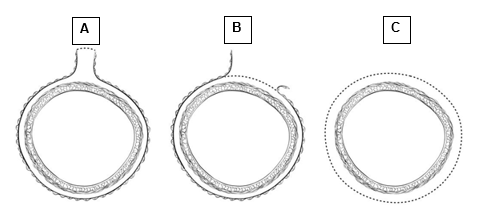
CAP
Approved
ColoRectal_4.4.0.1.REL_CAPCP
34
The presence of tumor deposits in the absence of any regional node involvement is categorized as N1c,
irrespective of T category. Tumor deposits are an adverse prognostic factor1,2 and adjuvant therapy is
generally warranted in cases that are categorized as N1c regardless of T classification. If there are
positive lymph nodes in addition to the tumor deposits, appropriate N1 (N1a or N1b) category should be
used and not N1c, although the presence and number of tumor deposits should be noted in the synoptic
summary (see note E).
In the setting of preoperative or neoadjuvant therapy, the designation of tumor deposit should be used
with caution as the tumor foci may represent residual primary tumor with incomplete response.
References
1. Lo DS, Pollett A, Siu LL, et al. Prognostic significance of mesenteric tumor nodules in patients
with stage III colorectal cancer. Cancer. 2008; 112(1):50-54.
2. Puppa G, Maisonneuve P, Sonzogni A, et al. Pathological assessment of pericolonic tumor
deposits in advanced colonic carcinoma: relevance to prognosis and tumor staging. Mod Pathol.
2007; 20(8):843-855.
M. Ancillary Studies
Universal testing for microsatellite instability and/or status of DNA mismatch repair enzymes by
immunohistochemistry is recommended by the EGAPP guidelines.1,2 MSI-high cancers are associated
with right-sided location, tumor infiltrating lymphocytes, Crohn-like infiltrate, pushing borders,
mucinous/signet ring/medullary subtypes, intratumoral heterogeneity (mixed conventional, mucinous, and
poorly differentiated carcinoma), high-grade histology, and lack of dirty necrosis.3,4 In view of
recommendations for universal testing, chance of missing cases of Lynch syndrome with testing based on
Bethesda guidelines and implications for treatment with immune check-point inhibitors,4 evaluation of
histologic features associated with MSI is redundant and is no longer included in the synoptic comment.
Further details about mismatch repair enzyme immunohistochemistry and PCR for MSI testing, as well as
other ancillary molecular testing in colorectal cancer (such as KRAS, BRAF, Her2, etc.) can be found in
the CAP Colon and Rectum Biomarkers protocol.
References
1. Evaluation of Genomic Applications in Practice and Prevention (EGAPP) Working Group.
Recommendations from the EGAPP Working Group: genetic testing strategies in newly
diagnosed individuals with colorectal cancer aimed at reducing morbidity and mortality from
Lynch syndrome in relatives. Genet Med. 2009; 11(1):35-41.
2. Ladabaum U, Wang G, et al. Strategies to identify the Lynch syndrome among patients with
colorectal cancer: a cost-effectiveness analysis. Ann Intern Med. 2011;155(2):69-79.
3. Greenson JK, Bonner JD, Ben-Yzhak O, et al. Phenotype of microsatellite unstable colorectal
carcinomas. Am J Surg Pathol. 2003; 27(5):563-570.
4. Umar A, Boland CR, Terdiman JP, et al. Revised Bethesda guidelines for hereditary nonpolyposis
colorectal cancer (Lynch syndrome) and microsatellite instability. J Natl Cancer Inst. 2004;
96(4):261-268.
# Diffuse Pleural Mesothelioma
Protocol for the Examination of Specimens from Patients with
Diffuse Pleural Mesothelioma
Version: 5.0.1.0
Protocol Posting Date: June 2025
CAP Laboratory Accreditation Program Protocol Required Use Date: March 2026
The changes included in this current protocol version affect accreditation requirements. The new deadline
for implementing this protocol version is reflected in the above accreditation date.
For accreditation purposes, this protocol should be used for the following procedures AND tumor
types:
Procedure
Description
Resection
Includes extrapleural pneumonectomy, pleurectomy, and decortication
procedures
Tumor Type
Description
Diffuse pleural mesothelioma#
# Localized pleural mesothelioma can be reported using this protocol although pTNM pathologic stage classification is not
applicable.
This protocol is NOT required for accreditation purposes for the following:
Procedure
Biopsy
Primary resection specimen with no residual cancer (e.g., following neoadjuvant therapy)
Cytologic specimens
The following tumor types should NOT be reported using this protocol:
Tumor Type
Solitary fibrous tumor
Peritoneal mesothelioma
Lymphoma (consider the Precursor and Mature Lymphoid Malignancies protocol)
Sarcoma (consider the Soft Tissue protocol)
Version Contributors
Cancer Committee Authors: Kirtee Raparia, MD, FCAP*, Frank Schneider, MD*
Other Expert Contributors: Anja Roden, MD, Sanja Dacic, MD, PhD, Thomas P. Baker, MD, FCAP
* Denotes primary author.
For any questions or comments, contact: cancerprotocols@cap.org.
Glossary:
Author: Expert who is a current member of the Cancer Committee, or an expert designated by the chair
of the Cancer Committee.
Expert Contributors: Includes members of other CAP committees or external subject matter experts
who contribute to the current version of the protocol.

CAP
Approved
PleuraPericard_5.0.1.0.REL_CAPCP
2
Synoptic reporting with core and conditional data elements for designated specimen types* is required for
accreditation.
•
Data elements designated as core must be reported.
•
Data elements designated as conditional only need to be reported if applicable.
•
Data elements designated as optional are identified with “+”. Although not required for
accreditation, they may be considered for reporting.
This protocol is not required for recurrent or metastatic tumors resected at a different time than the
primary tumor. This protocol is also not required for pathology reviews performed at a second institution
(i.e., second opinion and referrals to another institution).
Full accreditation requirements can be found on the CAP website under Accreditation Checklists.
A list of core and conditional data elements can be found in the Summary of Required Elements under
Resources on the CAP Cancer Protocols website.
*Includes definitive primary cancer resection and pediatric biopsy tumor types.
Synoptic Reporting
All core and conditionally required data elements outlined on the surgical case summary from this cancer
protocol must be displayed in synoptic report format. Synoptic format is defined as:
•
Data element: followed by its answer (response), outline format without the paired Data element:
Response format is NOT considered synoptic.
•
The data element should be represented in the report as it is listed in the case summary. The
response for any data element may be modified from those listed in the case summary, including
“Cannot be determined” if appropriate.
•
Each diagnostic parameter pair (Data element: Response) is listed on a separate line or in a
tabular format to achieve visual separation. The following exceptions are allowed to be listed on
one line:
o
Anatomic site or specimen, laterality, and procedure
o
Pathologic Stage Classification (pTNM) elements
o
Negative margins, as long as all negative margins are specifically enumerated where
applicable
•
The synoptic portion of the report can appear in the diagnosis section of the pathology report, at
the end of the report or in a separate section, but all Data element: Responses must be listed
together in one location
•
Organizations and pathologists may choose to list the required elements in any order, use
additional methods in order to enhance or achieve visual separation, or add optional items within
the synoptic report. The report may have required elements in a summary format elsewhere in
the report IN ADDITION TO but not as replacement for the synoptic report i.e., all required
elements must be in the synoptic portion of the report in the format defined above.
CAP
Approved
PleuraPericard_5.0.1.0.REL_CAPCP
3
v 5.0.1.0
•
Updated Histologic Grade question to conditionally reported
CAP
Approved
PleuraPericard_5.0.1.0.REL_CAPCP
4
Reporting Template
Protocol Posting Date: June 2025
Select a single response unless otherwise indicated.
Standard(s): AJCC 9
CLINICAL
+Clinical History (select all that apply)
___ Neoadjuvant therapy performed (specify type, if known): _________________
___ Other (specify): _________________
SPECIMEN (Note A)
Procedure (select all that apply)
___ Extrapleural pneumonectomy
___ Extended pleurectomy / decortication
___ Pleurectomy / decortication
___ Partial pleurectomy
___ Other (specify): _________________
___ Not specified
Specimen Laterality
___ Right
___ Left
___ Not specified
TUMOR
Tumor Focality (Note B)
___ Localized
___ Diffuse
___ Cannot be determined: _________________
Tumor Site (select all that apply)
___ Parietal pleura: _________________
___ Visceral pleura: _________________
___ Diaphragm: _________________
___ Other (specify): _________________
___ Not specified
+Tumor Size (for localized tumors only)
___ Greatest dimension in Centimeters (cm): _________________ cm
+Additional Dimension in Centimeters (cm): ____ x ____ cm
___ Cannot be determined (explain): _________________
CAP
Approved
PleuraPericard_5.0.1.0.REL_CAPCP
5
Histologic Type (Note C)
___ Epithelioid mesothelioma
+Architectural Pattern (percentages must total 100%) (select all that apply)
___ Tubulopapillary: _________________ %
___ Trabecular: _________________ %
___ Adenomatoid: _________________ %
___ Solid: _________________ %
___ Micropapillary: _________________ %
___ Other (specify): _________________
+Cytological Features (select all that apply)
___ Rhabdoid
___ Deciduoid
___ Small cell
___ Clear cell
___ Signet ring
___ Lymphohistiocytoid
___ Pleomorphic
___ Other (specify): _________________
+Stromal Features (select all that apply)
___ Myxoid predominant
___ Other (specify): _________________
___ Sarcomatoid mesothelioma
+Cytological Features (select all that apply)
___ Lymphohistiocytoid
___ Transitional
___ Pleomorphic
___ Other (specify): _________________
+Stromal Features (select all that apply)
___ Desmoplastic
___ With heterologous differentiation
___ Other (specify): _________________
___ Biphasic mesothelioma
Percentage of Sarcomatoid Pattern
___ Specify percentage: _________________ %
___ Other (specify): _________________
___ Cannot be determined
___ Other histologic type not listed (specify): _________________
___ Cannot be determined (explain): _________________
+Histologic Type Comment: _________________
+Nuclear Atypia Score#
# Used to determine histologic grade of epithelioid mesothelioma
___ 1 (mild)
___ 2 (moderate)
___ 3 (severe)
CAP
Approved
PleuraPericard_5.0.1.0.REL_CAPCP
6
___ Cannot be determined: _________________
+Mitotic Count Score#
# Used to determine histologic grade of epithelioid mesothelioma
___ 1 (low, up to 1 mitosis per 2 mm2)
___ 2 (intermediate, 2 to 4 mitoses per 2 mm2)
___ 3 (high, 5 or more mitoses per 2 mm2)
___ Cannot be determined: _________________
+Nuclear Grade# (sum of nuclear atypia and mitotic count scores)
# Used to determine histologic grade of epithelioid mesothelioma
___ 1 (sum score of 2 or 3)
___ 2 (sum score of 4 or 5)
___ 3 (sum score of 6)
___ Cannot be determined: _________________
+Necrosis
___ Not identified
___ Present
___ Cannot be determined: _________________
Histologic Grade (required only for epithelioid mesothelioma) (Note D)
___ Not applicable
___ Low grade (nuclear grades 1 and 2 without necrosis)
___ High grade (nuclear grade 2 with necrosis, or nuclear grade 3 with or without necrosis)
___ Cannot be determined: _________________
Tumor Extent (Note E) (select all that apply)
___ Limited to parietal pleura without involvement of ipsilateral visceral, mediastinal, or diaphragmatic
pleura
___ Limited to parietal pleura with focal involvement of ipsilateral visceral, mediastinal, or diaphragmatic
pleura
___ All ipsilateral pleural surfaces (including fissure)
___ Diaphragmatic muscle
___ Lung parenchyma
___ Endothoracic fascia
___ Mediastinal fat
___ Soft tissues of chest wall in a solitary focus
___ Soft tissues of chest wall diffusely or in multiple foci
___ Into but not through the pericardium
___ Rib(s)
___ Mediastinal organ(s) (specify): _________________
___ Other (specify): _________________
___ Cannot be determined: _________________
___ No evidence of primary tumor
CAP
Approved
PleuraPericard_5.0.1.0.REL_CAPCP
7
Treatment Effect (Note F)
___ No known presurgical therapy
___ Not identified
___ Present
Percentage of Residual Viable Tumor
___ Specify percentage: _________________ %
___ Other (specify): _________________
___ Cannot be determined
___ Cannot be determined: _________________
+Tumor Comment: _________________
MARGINS (Note G)
Margin Status
___ All margins negative for mesothelioma
___ Mesothelioma present at margin
Margin(s) Involved by Mesothelioma
___ Specify involved margin(s): _________________
___ Cannot be determined (explain): _________________
___ Other (specify): _________________
___ Cannot be determined (explain): _________________
___ Not applicable
+Margin Comment: _________________
REGIONAL LYMPH NODES
Regional Lymph Node Status
___ Not applicable (no regional lymph nodes submitted or found)
___ Regional lymph nodes present
___ All regional lymph nodes negative for tumor
___ Tumor present in regional lymph node(s)
Nodal Site(s) with Tumor (select all that apply)
___ Bronchopulmonary: _________________
___ Hilar: _________________
___ Ipsilateral mediastinal (including internal mammary, peridiaphragmatic, pericardial fat pad, or
intercostal nodes): _________________
___ Contralateral mediastinal (including internal mammary, peridiaphragmatic, pericardial fat pad, or
intercostal nodes): _________________
___ Supraclavicular: _________________
___ Other (specify): _________________
___ Cannot be determined: _________________
Number of Lymph Nodes with Tumor
___ Exact number (specify): _________________
___ At least (specify): _________________
CAP
Approved
PleuraPericard_5.0.1.0.REL_CAPCP
8
___ Other (specify): _________________
___ Cannot be determined (explain): _________________
___ Other (specify): _________________
___ Cannot be determined (explain): _________________
Number of Lymph Nodes Examined
___ Exact number (specify): _________________
___ At least (specify): _________________
___ Other (specify): _________________
___ Cannot be determined (explain): _________________
+Regional Lymph Node Comment: _________________
DISTANT METASTASIS
Distant Site(s) Involved, if applicable (select all that apply)
___ Not applicable
___ Non-regional lymph node(s): _________________
___ Other (specify): _________________
___ Cannot be determined: _________________
pTNM CLASSIFICATION (AJCC Version 9)# (Note H)
# TNM descriptors are applicable only to diffuse pleural mesothelioma.
Reporting of pT, pN, and (when applicable) pM categories is based on information available to the pathologist at the time the report
is issued. As per the AJCC (Chapter 1, 8th Ed.) it is the managing physician’s responsibility to establish the final pathologic stage
based upon all pertinent information, including but potentially not limited to this pathology report.
Modified Classification (required only if applicable) (select all that apply)
___ Not applicable
___ y (post-neoadjuvant therapy)
___ r (recurrence)
pT Category
___ pT not assigned (localized pleural mesothelioma)
___ pT not assigned (cannot be determined based on available pathological information)
___ pT0: No evidence of primary tumor
___ pT1: Tumor limited to the ipsilateral pleura with no involvement of the fissure
___ pT2: Tumor involving the ipsilateral pleura and with any of the following: Involvement of the fissure; or
Ipsilateral lung parenchyma invasion; or Diaphragm (non-transmural) invasion
___ pT3: Tumor limited to the ipsilateral pleura (with or without fissure involvement) and with invasion of
any of the following: Mediastinal fat; or Surface of pericardium; or Endothoracic fascia; or Solitary
area of chest wall soft tissue
___ pT4: Tumor with invasion of any of the following: Chest wall bony invasion (rib); or Mediastinal
organs (heart, spine, esophagus, trachea, great vessels); or Diffuse chest wall invasion; or
Transmural invasion of the diaphragm or pericardium; or Direct extension to the contralateral pleura;
or Presence of malignant pericardial effusion
CAP
Approved
PleuraPericard_5.0.1.0.REL_CAPCP
9
T Suffix (required only if applicable)
___ Not applicable
___ (m) multiple primary synchronous tumors in a single organ
pN Category
___ pN not assigned (localized pleural mesothelioma)
___ pN not assigned (no nodes submitted or found)
___ pN not assigned (cannot be determined based on available pathological information)
___ pN0: No tumor involvement of regional lymph node(s)
___ pN1: Tumor involvement of ipsilateral bronchopulmonary, hilar, or mediastinal (including the internal
mammary, peridiaphragmatic, pericardial fat pad, or intercostal lymph nodes) regional lymph nodes
___ pN2: Tumor involvement of contralateral mediastinal, ipsilateral or contralateral supraclavicular lymph
nodes
N Suffix (required only if applicable) (select all that apply)
___ Not applicable
___ (sn): Sentinel node procedure
___ (f): FNA or core needle biopsy
pM Category (required only if confirmed pathologically)
___ Not applicable - pM cannot be determined from the submitted specimen(s) or localized pleural
mesothelioma
___ pM1: Microscopic confirmation of distant metastasis
ADDITIONAL FINDINGS
+Additional Findings (select all that apply)
___ None identified
___ Asbestos bodies
___ Pleural plaque
___ Pulmonary interstitial fibrosis (specify pattern if discernable): _________________
___ Inflammation (specify type): _________________
___ Other (specify): _________________
SPECIAL STUDIES (Note I)
+Immunohistochemistry (specify stains and results): _________________
+Histochemistry (specify stains and results): _________________
+Electron Microscopy (specify results): _________________
+Other Ancillary Studies (specify types and results): _________________
COMMENTS
Comment(s): _________________
CAP
Approved
PleuraPericard_5.0.1.0.REL_CAPCP
10
Explanatory Notes
A. Specimen
The International Association for the Study of Lung Cancer (IASLC) has developed an international
malignant plural mesothelioma (MPM) staging database that was designed to address the limitations of
the mesothelioma staging. Data analyses revealed that survival was significantly influenced by whether a
curative or palliative surgical procedure was performed (median survival 18 versus 12 months, p
<0.0001).1 Early stage (stage I) MPM resected by extrapleural pneumonectomy (EPP) with curative intent
were associated with a median survival of 40 months, whereas those managed by
pleurectomy/decortication (P/D) with curative intent had a median survival of 23 months.1 Type of surgical
procedure did not impact survival in higher stage disease. It was also noted that significant variations
regarding surgical nomenclature for procedures for MPM exist among thoracic surgeons.2 The
International Staging Committee of the IASLC and the International Mesothelioma Interest Group (IMIG)
recommended that  P/D refer to removal of all macroscopic tumor involving the parietal and visceral
pleura and that the term extended P/D (or EPD) to be used to describe parietal and visceral pleurectomy
together with resection of the diaphragm and /or pericardium.2,3
References
1. Rusch VW, Giroux D, Kennedy C et al. Initial analysis of the International Association for the
Study of Lung Cancer mesothelioma database. J Thorac Oncol. 2012; 7:1631-1639.
2. Rice D, Rusch V, Pass H, et al. Recommendations for uniform definitions of surgical techniques
for malignant pleural mesothelioma: a consensus report of the International Association for the
Study of Lung Cancer International Staging Committee and the International Mesothelioma
Interest Group. J Thorac Oncol. 2011; 16:1304-1312.
3. Pass H, Giroux D, Kennedy C, et al. The IASLC Mesothelioma Staging Project: improving staging
of a rare disease through international participation. J Thorac Oncol. 2016;11(12):2082-2088.
B. Tumor Focality
The majority of malignant mesotheliomas exhibit diffuse growth and may take the form of multiple small
nodules, plaque-like masses, or confluent rind-like sheets. However, a small proportion of malignant
mesotheliomas are sharply circumscribed. These are designated by the term “localized malignant
mesothelioma”. Localized malignant mesotheliomas appear to have a far better prognosis than their
diffuse counterpart.1  Note that current AJCC guidelines do not have a pTNM staging classification for
localized pleural mesotheliomas.
References
1. Marchevsky AM, Khoor A, Walts AE, et al. Localized malignant mesothelioma, an unusual and
poorly characterized neoplasm of serosal origin: best current evidence from the literature and the
International Mesothelioma Panel. Mod Pathol. 2020 Feb;33(2):281-296.
C. Histologic Type
For consistency in reporting, the histologic classification published by the World Health Organization
(WHO) is recommended.1 Mesotheliomas are classified as epithelioid, sarcomatoid (including
desmoplastic), or biphasic. Recognition and reporting of various architectural patterns, cytological
features and stromal features is encouraged because of their prognostic value.2 Desmoplastic
mesothelioma is considered to represent a variant of sarcomatoid mesothelioma. Biphasic
CAP
Approved
PleuraPericard_5.0.1.0.REL_CAPCP
11
mesotheliomas, contain both epithelioid and sarcomatoid subtypes, and each component should
represent at least 10% of the tumor.1
The 2021 WHO classification recommends using well-differentiated papillary mesothelial tumor (WDPMT)
over well-differentiated papillary mesothelioma (WDPM).1 These are noninvasive papillary neoplasms
associated with slow growth and recurrences. Survival is better than that for diffuse mesotheliomas.
WDPMTs are not staged according to AJCC staging system and do not require a synoptic report.
The 2021 WHO classification introduced the concept of mesothelioma in-situ as a preinvasive single-layer
surface proliferation of neoplastic mesothelial cells.1,3 The diagnosis may be suspected in patients with
recurrent effusions. The WHO considers essential diagnostic criteria to be (a) non-resolving pleural
effusion, (b) no thoracoscopic or imaging evidence of tumor, and (c) a single layer of mesothelial cells
(with or without atypia) on the pleural surface with loss of BAP1 and/or MTAP by immunohistochemistry
and/or CDKN2A homozygous deletion by fluorescence in-situ hybridization. Multidisciplinary discussion of
these cases is encouraged. Mesothelioma in-situ is not staged according to AJCC staging system and
does not require a synoptic report.
References
1. WHO Classification of Tumours Editorial Board. Thoracic tumours. Lyon (France): International
Agency for Research on Cancer; 2021. (WHO classification of tumours series, 5th ed.; vol. 5).
https://publications.iarc.fr/595.
2. Nicholson AG, Sauter JL, Nowak AK, et al. EURACAN/IASLC Proposals for Updating the
Histologic Classification of Pleural Mesothelioma: Towards a More Multidisciplinary Approach. J
Thorac Oncol. 2020 Jan;15(1):29-49.
3. Churg A, Galateau-Salle F, Roden AC, et al. Malignant mesothelioma in situ: morphologic
features and clinical outcome. Mod Pathol. 2020 Feb;33(2):297-302.
D. Histologic Grade
The 2021 WHO classification recommends grading of diffuse epithelioid mesothelioma to identify tumors
that may behave aggressively.1 A nuclear grade is assigned based on nuclear atypia and mitotic count
and subsequently combined with the presence or absence of necrosis.2,3 Low grade tumors are those
exhibiting nuclear grade 1 (with or without necrosis) or nuclear grade 2 without necrosis. High grade
tumors are those exhibiting nuclear grade 2 with necrosis, or nuclear grade 3 with or without necrosis.
High grade tumors are those exhibiting nuclear grade 2 with necrosis, or nuclear grade 3 with or without
necrosis.
Grading should be performed based on the areas showing the highest-grade features.
References
1. WHO Classification of Tumours Editorial Board. Thoracic tumours. Lyon (France): International
Agency for Research on Cancer; 2021. (WHO classification of tumours series, 5th ed.; vol. 5).
https://publications.iarc.fr/595.
2. Rosen LE, Karrison T, Ananthanarayanan V, Gallan AJ, Adusumilli PS, Alchami FS, Attanoos R,
Brcic L, Butnor KJ, Galateau-Sallé F, Hiroshima K, Kadota K, Klampatsa A, Stang NL,
Lindenmann J, Litzky LA, Marchevsky A, Medeiros F, Montero MA, Moore DA, Nabeshima K,
Pavlisko EN, Roggli VL, Sauter JL, Sharma A, Sheaff M, Travis WD, Vigneswaran WT, Vrugt B,
CAP
Approved
PleuraPericard_5.0.1.0.REL_CAPCP
12
Walts AE, Tjota MY, Krausz T, Husain AN. Nuclear grade and necrosis predict prognosis in
malignant epithelioid pleural mesothelioma: a multi-institutional study. Mod Pathol. 2018
Apr;31(4):598-606.
3. Nicholson AG, Sauter JL, Nowak AK, et al. EURACAN/IASLC Proposals for Updating the
Histologic Classification of Pleural Mesothelioma: Towards a More Multidisciplinary Approach. J
Thorac Oncol. 2020 Jan;15(1):29-49.
E. Tumor Extent
Invasion of the endothoracic fascia is categorized as T3. The endothoracic fascia is located external to
the parietal pleura beneath the muscles and ribs of the chest wall. Determining the presence or absence
of endothoracic fascial invasion can be difficult on pathologic examination, because the endothoracic
fascia lacks distinctive gross and histologic features. Assessment of the intactness of the endothoracic
fascia is best made by the surgeon at the time of operation.
Although the American Joint Committee on Cancer (AJCC) designates a solitary focus of tumor invading
the soft tissues of the chest wall as T3, it does not specifically delineate the elements that constitute the
chest wall. According to the surgical literature, the constituents of the chest wall are the ribs, intercostal
muscles, and associated supporting connective tissues, the latter 2 of which can be inferred to represent
the chest wall soft tissues. Note that this definition does not include the layer of adipose tissue, which is
sometimes referred to as extrapleural fat, that lies between the chest wall and the parietal pleura. For
specimens that incorporate chest wall structures, it is recommended that the surgeon designate the
location(s) of such structures to ensure optimal pathologic assessment.
Although T4 describes locally advanced, technically unresectable tumor, radical extrapleural
pneumonectomy specimens may occasionally incorporate structures directly invaded by tumor that fall
under the T4 designation. These should be specified under “other” and include tumor extension to the
following:
- Peritoneum (through the diaphragm)
- Contralateral pleura
- Spine
- Internal surface of the pericardium
- Myocardium
- Brachial plexus
F. Treatment Effect
Induction chemotherapy or radiation before extrapleural pneumonectomy is being used in some centers
for locally advanced malignant pleural mesothelioma.1,2 Although a formal scheme for grading histologic
response to neoadjuvant treatment has not been established, in applicable specimens, the percentage of
residual viable tumor should be reported.
References
1. Flores RM, Krug LM, Rosenzweig KE, et al. Induction chemotherapy, extrapleural
pneumonectomy, and postoperative high-dose radiotherapy for locally advanced malignant
pleural mesothelioma: a phase II trial. J Thorac Oncol. 2006; 1:289-295.
2. Cho BC, Feld R, Leighl N, et al. A feasibility study evaluating Surgery for Mesothelioma After
Radiation Therapy: the 'SMART' approach for resectable malignant pleural mesothelioma. J
Thorac Oncol. 2014 Mar;9(3):397-402.
CAP
Approved
PleuraPericard_5.0.1.0.REL_CAPCP
13
G. Margins
Because extrapleural pneumonectomy specimens are obtained by dissection of tumor from the thorax
with en bloc resection of the lung, pleura, pericardium, and diaphragm, the entire surface of the
extrapleural pneumonectomy represents the surgical margin (unless otherwise specified by the operating
surgeon).
H. pTNM Classification
This protocol recommends the AJCC and the International Union Against Cancer (UICC) TNM staging
system shown below.1,2 The changes introduced in the AJCC Cancer Staging Manual 8th edition and
Version 9 are based on analyses of the IASLC retrospective and prospective databases.3,4,5,6,7,8
By AJCC/UICC convention, the designation “T” refers to a primary tumor that has not been previously
treated. The symbol “p” refers to the pathologic classification of the TNM, as opposed to the clinical
classification, and is based on gross and microscopic examination. pT entails a resection of the primary
tumor or biopsy adequate to evaluate the highest pT category, pN entails removal of nodes adequate to
validate lymph node metastasis, and pM implies microscopic examination of distant lesions. Clinical
classification (cTNM) is usually carried out by the referring physician before treatment during initial
evaluation of the patient or when pathologic classification is not possible.
Pathologic staging is usually performed after attempted surgical resection of the primary tumor.
Pathologic staging depends on pathologic documentation of the anatomic extent of disease, whether or
not the primary tumor has been completely removed. If a biopsied tumor is not resected for any reason
(e.g., when technically infeasible) and if the highest T and N categories or the M1 category of the tumor
can be confirmed microscopically, the criteria for pathologic classification and staging have been satisfied
without total removal of the primary cancer. Version 9 incorporates changes in the clinical (c)T component
but not the pathologic T component, to include size criteria of the tumor. No changes in the N categories
were recommended by IASLC mesothelioma project in this edition.
TNM Descriptors
For identification of special cases of TNM or pTNM classifications, the “m” suffix, and “y” and “r” prefixes
are used. Although they do not affect the stage grouping, they indicate cases needing separate analysis.
The “m” suffix indicates the presence of multiple synchronous primary tumors in a single site and is
recorded in parentheses: pT(m)NM. In actuality, this is not a descriptor that readily applies to diffuse
malignant pleural mesothelioma, which often exhibits a multinodular growth pattern but is best considered
a single tumor for staging purposes.  Because of this, the “m” descriptor is not listed as an option in this
protocol case summary.
The “y” prefix indicates those cases in which classification is performed during or after initial multimodality
therapy (i.e., neoadjuvant chemotherapy, radiation therapy, or both chemotherapy and radiation therapy).
The cTNM or pTNM category is identified by a “y” prefix. The ycTNM or ypTNM categorizes the extent of
tumor actually present at the time of that examination. The “y” categorization is not an estimate of tumor
before multimodality therapy (i.e., before initiation of neoadjuvant therapy).
The “r” prefix indicates a recurrent tumor when staged after a documented disease-free interval and is
identified by the “r” prefix: rTNM.
CAP
Approved
PleuraPericard_5.0.1.0.REL_CAPCP
14
Additional Descriptors
Residual Tumor (R)
Tumor remaining in a patient after therapy with curative intent (e.g., surgical resection for cure) is
categorized by a system known as R classification, shown below.
RX    Presence of residual tumor cannot be assessed
R0    No residual tumor
R1    Microscopic residual tumor
R2    Macroscopic residual tumor
For the surgeon, the R classification may be useful to indicate the known or assumed status of the
completeness of a surgical excision. For the pathologist, the R classification is relevant to the status of
the margins of a surgical resection specimen. That is, tumor involving the resection margin on pathologic
examination may be assumed to correspond to residual tumor in the patient and may be classified as
macroscopic or microscopic according to the findings at the specimen margin(s).
References
1. AJCC Version 9 Diffuse Pleural Mesothelioma Cancer Staging System. Copyright 2024 American
College of Surgeons.
2. Brierley JD, Gospodarowicz MK, Wittekind C, et al, eds. TNM Classification of Malignant
Tumours. 8th ed. Oxford, UK: Wiley; 2016.
3. Pass H, Giroux D, Kennedy C, et al. The IASLC Mesothelioma Staging Project: improving staging
of a rare disease through international participation. J Thorac Oncol. 2016;11(12):2082-2088.
4. Nowak AK, Chansky K, Rice DC, et al. The IASLC Mesothelioma Staging Project: proposals for
revisions of the T descriptors in the forthcoming eighth edition of the TNM classification for pleural
mesothelioma. J Thorac Oncol. 2016;11(12):2089-2099.
5. Rice D, Chansky K, Nowak AK, et al. The IASLC Mesothelioma Staging Project: proposals for
revisions of the N descriptors in the forthcoming eighth edition of the TNM classification for
pleural mesothelioma. J Thorac Oncol. 2016;11(12):2100-2111.
6. Rusch VW, Chansky K, Kindler HL, et al. The IASLC Mesothelioma Staging Project: proposals for
the M descriptors and for revision of the TNM stage groupings in the forthcoming (eighth) edition
of the TNM classification for mesothelioma. J Thorac Oncol. 2016 Dec;11(12):2112-2119.
7. Gill RR, Nowak AK, Giroux DJ, et al. The International Association for the Study of Lung Cancer
Mesothelioma Staging Project: Proposals for Revisions of the "T" Descriptors in the Forthcoming
Ninth Edition of the TNM Classification for Pleural Mesothelioma. J Thorac Oncol. 2024 Mar 21:
S1556-0864(24)00086-8.
8. Bille A, Ripley RT, Giroux DJ, et al. The International Association for the Study of Lung Cancer
Mesothelioma Staging Project: Proposals for the "N" Descriptors in the Forthcoming Ninth Edition
of the TNM Classification for Pleural Mesothelioma. J Thorac Oncol. 2024 May 9: S1556-
0864(24)00208-9.
I. Special Studies
Immunohistochemistry is required for a definitive diagnosis of malignant mesothelioma. The
immunohistochemical approach depends on the mesothelioma morphology (epithelioid, sarcomatoid) and
the type of tumors that are considered in the differential diagnosis. The 2021 WHO classification
CAP
Approved
PleuraPericard_5.0.1.0.REL_CAPCP
15
continues to recommend the combined use of a minimum of two mesothelial markers and two carcinoma
markers.1 Based on the specificity and sensitivity, the best positive mesothelial markers include calretinin,
cytokeratins 5/6, WT-1, and D2-40. BerEP4 or MOC31, B72.3, CEA, and BG8 are the most frequently
used to diagnose carcinoma.1 No specific panel is recommended, and the International Mesothelioma
Panel recommends that each laboratory should choose antibodies with a sensitivity and specificity of at
least 80%.2 The College of American Pathologists does not endorse a specific panel of markers for the
evaluation of malignant mesothelioma.  If sarcoma is considered in the differential diagnosis, appropriate
immunohistochemical, cytogenetic and molecular workup should be performed. Diagnostic role of
histochemistry and electron microscopy is very limited because immunohistochemistry is widely available
and frequently sufficient to establish the diagnosis of malignant mesothelioma.
References
1. WHO Classification of Tumours Editorial Board. Thoracic tumours. Lyon (France): International
Agency for Research on Cancer; 2021. (WHO classification of tumours series, 5th ed.; vol. 5).
https://publications.iarc.fr/595.
2. Husain AN, Colby TV, Ordonez N, et al. Guidelines for pathologic diagnosis of malignant
mesothelioma: 2017 update of the consensus statement from the International Mesothelioma
Interest Group. Arch Pathol Lab Med. 2018 Jan; 142(1):89-108.
# Endometrium Uterus
Protocol for the Examination of Specimens from Patients with
Carcinoma of the Endometrium
Version: 5.1.0.0
Protocol Posting Date: December 2024
CAP Laboratory Accreditation Program Protocol Required Use Date: September 2025
The changes included in this current protocol version affect accreditation requirements. The new deadline
for implementing this protocol version is reflected in the above accreditation date.
For accreditation purposes, this protocol should be used for the following procedures AND tumor
types:
Procedure
Description
Hysterectomy
Tumor Type
Description
Carcinoma
Applies to all endometrial carcinomas (including carcinosarcoma)
This protocol is NOT required for accreditation purposes for the following:
Procedure
This protocol is not required but recommended for primary resection specimen with no residual cancer (e.g.,
following neoadjuvant therapy and / or following cancer diagnosis on previous biopsy / curettage).
Endometrial biopsy / curettage
Cytologic specimens
The following tumor types should NOT be reported using this protocol:
Tumor Type
Carcinomas arising in the uterine cervix (consider the Uterine Cervix protocol)
Uterine sarcomas, including adenosarcoma (consider the Uterine Sarcoma protocol), and other non-epithelial
malignancies
Metastatic carcinomas to the endometrium
Lymphoma (consider the Precursor and Mature Lymphoid Malignancies protocol)
Version Contributors
Cancer Committee Authors: Gulisa Turashvili, MD, PhD*, Anthony N. Karnezis, MD, PhD*
Other Expert Contributors: Barbara Crothers, DO, Uma Krishnamurti, MD, PhD, Glenn McCluggage,
FRCPath, Joseph Rabban, MD, MPH, Robert Soslow, MD
* Denotes primary author.
For any questions or comments, contact: cancerprotocols@cap.org.
Glossary:
Author: Expert who is a current member of the Cancer Committee, or an expert designated by the chair of
the Cancer Committee.
Expert Contributors: Includes members of other CAP committees or external subject matter experts who
contribute to the current version of the protocol.

CAP
Approved
Uterus_5.1.0.0.REL_CAPCP
2
Synoptic reporting with core and conditional data elements for designated specimen types* is required for
accreditation.
•
Data elements designated as core must be reported.
•
Data elements designated as conditional only need to be reported if applicable.
•
Data elements designated as optional are identified with “+”. Although not required for
accreditation, they may be considered for reporting.
This protocol is not required for recurrent or metastatic tumors resected at a different time than the primary
tumor. This protocol is also not required for pathology reviews performed at a second institution (i.e., second
opinion and referrals to another institution).
Full accreditation requirements can be found on the CAP website under Accreditation Checklists.
A list of core and conditional data elements can be found in the Summary of Required Elements under
Resources on the CAP Cancer Protocols website.
*Includes definitive primary cancer resection and pediatric biopsy tumor types.
Synoptic Reporting
All core and conditionally required data elements outlined on the surgical case summary from this cancer
protocol must be displayed in synoptic report format. Synoptic format is defined as:
•
Data element: followed by its answer (response), outline format without the paired Data element:
Response format is NOT considered synoptic.
•
The data element should be represented in the report as it is listed in the case summary. The
response for any data element may be modified from those listed in the case summary, including
“Cannot be determined” if appropriate.
•
Each diagnostic parameter pair (Data element: Response) is listed on a separate line or in a tabular
format to achieve visual separation. The following exceptions are allowed to be listed on one line:
o
Anatomic site or specimen, laterality, and procedure
o
Pathologic Stage Classification (pTNM) elements
o
Negative margins, as long as all negative margins are specifically enumerated where
applicable
•
The synoptic portion of the report can appear in the diagnosis section of the pathology report, at
the end of the report or in a separate section, but all Data element: Responses must be listed
together in one location
•
Organizations and pathologists may choose to list the required elements in any order, use
additional methods in order to enhance or achieve visual separation, or add optional items within
the synoptic report. The report may have required elements in a summary format elsewhere in the
report IN ADDITION TO but not as replacement for the synoptic report i.e., all required elements
must be in the synoptic portion of the report in the format defined above.
CAP
Approved
Uterus_5.1.0.0.REL_CAPCP
3
v 5.1.0.0
•
Cover page updated to align with ANP.12350
•
Removed “Hysterectomy Type” and “Tumor Site” questions
•
Updates to “Procedure”, “Tumor Size”, “Histologic Type”, “Histologic Grade”, “Molecular Type”,
“Myometrial Invasion”, “Cervical Involvement”, “Lymphatic and / or Vascular Invasion”, “Margin
Status” and “pN Category”
•
Added back FIGO 2009 Staging while retaining FIGO 2023 Staging
•
Updated explanatory notes
CAP
Approved
Uterus_5.1.0.0.REL_CAPCP
4
Reporting Template
Protocol Posting Date: December 2024
Select a single response unless otherwise indicated.
Standard(s): AJCC 8, FIGO 2009 Staging (2018 Annual Report), FIGO 2023 Staging
CLINICAL
+Clinical History (Note A) (select all that apply)
___ Lynch syndrome
___ Other (specify): _________________
SPECIMEN (Note B)
Procedure (select all that apply)
For information about lymph node sampling, please refer to the Regional Lymph Node section.
___ Total hysterectomy
___ Supracervical hysterectomy
___ Radical hysterectomy
___ Hysterectomy
___ Bilateral salpingo-oophorectomy
___ Right salpingo-oophorectomy
___ Left salpingo-oophorectomy
___ Salpingo-oophorectomy, side not specified
___ Right oophorectomy
___ Left oophorectomy
___ Oophorectomy, side not specified
___ Bilateral salpingectomy
___ Right salpingectomy
___ Left salpingectomy
___ Salpingectomy, side not specified
___ Vaginal cuff resection
___ Omentectomy
___ Peritoneal biopsy(ies)
___ Peritoneal / pelvic washing
___ Other (specify): _________________
+Specimen Integrity
___ Intact
___ Opened
___ Morcellated
___ Other (specify): _________________
CAP
Approved
Uterus_5.1.0.0.REL_CAPCP
5
TUMOR
+Tumor Size
___ Greatest gross dimension (if mass) in Centimeters (cm): _________________ cm
+Additional Dimension in Centimeters (cm): ____ x ____ cm
___ Greatest microscopic dimension (if no mass) in Centimeters (cm): _________________ cm
+Additional Dimension in Centimeters (cm): ____ x ____ cm
___ Cannot be determined (explain): _________________
Histologic Type (Note C)
___ Endometrioid carcinoma
___ Serous carcinoma
___ Clear cell carcinoma
___ Dedifferentiated carcinoma
___ Undifferentiated carcinoma
___ Carcinosarcoma
___ Mesonephric-like adenocarcinoma
___ Squamous cell carcinoma
___ Gastric (gastrointestinal)-type carcinoma
___ Mixed carcinoma (specify types and percentages): _________________
___ Small cell neuroendocrine carcinoma
___ Large cell neuroendocrine carcinoma
___ Other histologic type not listed (specify): _________________
+Histologic Type Comment: _________________
Histologic Grade# (Note D)
# International Federation of Gynecology and Obstetrics (FIGO) Grading System applies to endometrioid carcinomas only. All other
subtypes are considered high-grade.
___ FIGO grade 1 (endometrioid carcinoma)
___ FIGO grade 2 (endometrioid carcinoma)
___ FIGO grade 3 (endometrioid carcinoma)
___ High-grade (non-endometrioid carcinoma)
___ Other (specify): _________________
___ Cannot be assessed (explain): _________________
+Molecular Type (Note E) (select all that apply)
___ Mismatch Repair (MMR) / Microsatellite Instability (MSI) Status
MMR Immunohistochemistry
___ Not performed
___ Intact nuclear expression of MLH1, PMS2, MSH2 and MSH6
___ Loss of nuclear MMR protein expression
Select all that apply
___ MLH1
___ PMS2
___ MSH2
___ MSH6
CAP
Approved
Uterus_5.1.0.0.REL_CAPCP
6
___ Subclonal loss of nuclear MMR protein expression
Select all that apply
___ MLH1
___ PMS2
___ MSH2
___ MSH6
___ MMR immunohistochemistry pending
Microsatellite Instability (MSI) Testing
___ Not performed
___ MSI-Stable (MSS)
___ MSI-Low (MSI-L)
___ MSI-High (MSI-H)
___ MSI testing pending
MSI Testing Method (required only if applicable)
___ Not applicable (not performed)
___ Polymerase chain reaction
___ Next generation sequencing
___ MSI testing pending
___ Cannot be determined (explain): _________________
___ p53 Status
p53 Immunohistochemistry
___ Not performed
___ Normal (wild-type) expression
___ Abnormal (mutated) expression
___ Overexpression (strong, diffuse nuclear expression)
___ Null (complete lack of nuclear and cytoplasmic expression; internal positive control present)
___ Cytoplasmic staining (with or without nuclear expression)
___ Subclonal abnormal (mutated) expression
___ Overexpression (strong, diffuse nuclear expression)
___ Null (complete lack of nuclear and cytoplasmic expression; internal positive control present)
___ Cytoplasmic staining (with or without nuclear expression)
___ p53 immunohistochemistry pending
TP53 Mutation Testing
___ Not performed
___ Wild-type
___ Mutated (specify): _________________
___ Cannot be determined (explain): _________________
___ TP53 mutation testing pending
___ POLE Status
POLE Status
___ Wild-type
CAP
Approved
Uterus_5.1.0.0.REL_CAPCP
7
___ Mutated (specify): _________________
___ POLE testing pending
___ POLE testing cannot be performed / not available
___ Cannot be determined (explain): _________________
+ProMisE Classification
___ POLE-mutated carcinoma
___ Mismatch repair-deficient carcinoma
___ p53-abnormal carcinoma
___ No specific molecular profile (NSMP)
___ Double classifier (explain): _________________
___ Testing pending (explain): _________________
___ Cannot be determined (explain): _________________
+TCGA Classification
___ POLE-mutated (ultramutated) carcinoma
___ Microsatellite instability high (hypermutated) carcinoma
___ Copy number low carcinoma
___ Copy number high carcinoma
___ Double classifier (explain): _________________
___ Testing pending
___ Cannot be determined (explain): _________________
Myometrial Invasion (required only if applicable) (Note F)
___ Not applicable
___ Not identified
___ Present, inner half (less than 50%)
+Specify Percentage: _________________ %
+Myometrial Invasion Comment: _________________
___ Present, outer half (greater than or equal to 50%)
+Specify Percentage: _________________ %
+Myometrial Invasion Comment: _________________
___ Cannot be determined (explain): _________________
+Adenomyosis
___ Not identified
___ Present, uninvolved by carcinoma
___ Present, involved by carcinoma
___ Cannot be determined: _________________
Uterine Serosal Involvement (Note G)
___ Not identified
___ Present
___ Cannot be determined (explain): _________________
CAP
Approved
Uterus_5.1.0.0.REL_CAPCP
8
+Lower Uterine Segment Involvement (Note G)
___ Not identified
___ Present, non-myoinvasive
___ Present, myoinvasive
___ Cannot be determined (explain): _________________
Cervical Involvement (Note H)
___ Cannot be assessed (supracervical hysterectomy)
___ Not identified
___ Cervical stromal invasion
Percentage of Cervical Wall Involved
___ Specify percentage: _________________ %
___ Cannot be determined (explain): _________________
___ Endocervical glandular involvement only
___ Cannot be determined (explain): _________________
Other Tissue / Organ Involvement# (Note H) (select all that apply)
# Any organ not selected is either not involved or was not submitted.
___ Not applicable (no other tissues / organs submitted)
___ Not identified (other tissues / organs submitted and not involved)
___ Right ovary
___ Left ovary
___ Ovary (side not specified)
___ Right fallopian tube
___ Left fallopian tube
___ Fallopian tube (side not specified)
___ Vagina
___ Right parametrium
___ Left parametrium
___ Parametrium (side not specified)
___ Pelvic wall
___ Bladder wall without mucosal involvement
___ Bladder wall with mucosal involvement
___ Bowel wall without mucosal involvement
___ Bowel wall with mucosal involvement
___ Other organs / tissue (specify): _________________
___ Cannot be determined (explain): _________________
+Peritoneal / Pelvic Washings / Ascitic Fluid (Note I)
___ Not submitted
___ Negative for malignant cells
___ Malignant cells present
___ Atypical (explain): _________________
___ Suspicious for malignancy (explain): _________________
___ Results pending
CAP
Approved
Uterus_5.1.0.0.REL_CAPCP
9
Lymphatic and / or Vascular Invasion# (Note J)
# Lymphatic and / or Vascular Invasion (LVI) is equivalent to the FIGO term Lymphovascular Space Invasion (LVSI). Report the
maximum number of LVI foci present on the single slide with the highest number of foci.
___ Not identified
___ Present
___ Less than or equal to 4 foci
Specify Number of Foci: _________________
___ Greater than or equal to 5 foci
___ Cannot be determined (explain): _________________
+Tumor Comment: _________________
MARGINS (Note K)
Margin Status (required only if cervix and / or parametrium / paracervix is involved by carcinoma)
___ Not applicable
___ All margins negative for carcinoma
+Closest Margin(s) to Carcinoma (select all that apply)
___ Ectocervical (specify location, if possible): _________________
___ Vaginal cuff (specify location, if possible): _________________
___ Parametrial (specify location, if possible): _________________
___ Paracervical (specify location, if possible): _________________
___ Other (specify): _________________
___ Cannot be determined: _________________
+Distance from Carcinoma to Closest Margin
Specify in Millimeters (mm)
___ Exact distance: _________________ mm
___ At least: _________________ mm
___ Less than: _________________ mm
___ Less than 1 mm
___ Cannot be determined: _________________
___ Carcinoma present at margin
Margin(s) Involved by Carcinoma (select all that apply)
___ Ectocervical (specify location, if possible): _________________
___ Vaginal cuff (specify location, if possible): _________________
___ Parametrial (specify location, if possible): _________________
___ Paracervical (specify location, if possible): _________________
___ Other (specify): _________________
___ Cannot be determined: _________________
___ Cannot be determined (explain): _________________
+Margin Comment: _________________
CAP
Approved
Uterus_5.1.0.0.REL_CAPCP
10
REGIONAL LYMPH NODES (Note L)
Regional Lymph Node Status#
# Lymph nodes designated as pelvic (parametrial, obturator, internal iliac (hypogastric), external iliac, common iliac, sacral,
presacral) and para-aortic are considered regional lymph nodes. Any other involved nodes should be categorized as metastases
(pM1) and reported in the distant metastasis section. If pelvic and / or para-aortic lymph nodes are positive for metastatic carcinoma,
reporting the number of nodes with or without macrometastases and micrometastases is required. Reporting isolated tumor cells
(ITCs) is required only in the absence of macro- or micrometastasis in other nodes. The presence of ITCs in regional lymph node(s)
is considered N0(i+).
___ Not applicable (no regional lymph nodes submitted or found)
___ Regional lymph nodes present
___ All regional lymph nodes negative for tumor cells
___ Tumor present in pelvic lymph node(s)
Pelvic Lymph Nodes
Total Number of Pelvic Nodes with Macrometastasis (greater than 2 mm) (sentinel and non-
sentinel)
___ Exact number: _________________
___ At least: _________________
___ Cannot be determined (explain): _________________
+Number of Pelvic Sentinel Nodes with Macrometastasis
___ Exact number: _________________
___ At least: _________________
___ Cannot be determined (explain): _________________
Total Number of Pelvic Nodes with Micrometastasis (greater than 0.2 mm up to 2 mm and / or
greater than 200 cells) (sentinel and non-sentinel)
___ Exact number: _________________
___ At least: _________________
___ Cannot be determined (explain): _________________
+Number of Pelvic Sentinel Nodes with Micrometastasis
___ Exact number: _________________
___ At least: _________________
___ Cannot be determined (explain): _________________
Total Number of Pelvic Nodes with Isolated Tumor Cells (less than or equal to 0.2 mm, or
clusters of cells less than or equal to 200 cells) (reported only if applicable)#
# Reporting the number of lymph nodes with isolated tumor cells is required only in the absence of
macrometastasis or micrometastasis in other lymph nodes.
___ Not applicable
___ Exact number: _________________
___ At least: _________________
___ Cannot be determined (explain): _________________
+Number of Pelvic Sentinel Nodes with Isolated Tumor Cells
___ Exact number: _________________
___ At least: _________________
___ Cannot be determined (explain): _________________
CAP
Approved
Uterus_5.1.0.0.REL_CAPCP
11
Laterality of Pelvic Node(s) with Tumor (select all that apply)
___ Right sentinel: _________________
___ Right non-sentinel: _________________
___ Left sentinel: _________________
___ Left non-sentinel: _________________
___ Cannot be determined: _________________
+Size of Largest Pelvic Nodal Metastatic Deposit
Specify in Millimeters (mm)
___ Specify exact size: _________________ mm
___ Less than: _________________ mm
___ Greater than: _________________ mm
___ Cannot be determined (explain): _________________
___ Tumor present in para-aortic lymph node(s)
Para-aortic Nodes
Total Number of Para-aortic Nodes with Macrometastasis (greater than 2 mm) (sentinel and
non-sentinel)
___ Exact number: _________________
___ At least: _________________
___ Cannot be determined (explain): _________________
+Number of Para-aortic Sentinel Nodes with Macrometastasis
___ Exact number: _________________
___ At least: _________________
___ Cannot be determined (explain): _________________
Total Number of Para-aortic Nodes with Micrometastasis (greater than 0.2 mm up to 2 mm
and / or greater than 200 cells) (sentinel and non-sentinel)
___ Exact number: _________________
___ At least: _________________
___ Cannot be determined (explain): _________________
+Number of Para-aortic Sentinel Nodes with Micrometastasis
___ Exact number: _________________
___ At least: _________________
___ Cannot be determined (explain): _________________
Total Number of Para-aortic Nodes with Isolated Tumor Cells (less than or equal to 0.2 mm,
or clusters of cells less than or equal to 200 cells) (required only if applicable)#
# Reporting the number of lymph nodes with isolated tumor cells is required only in the absence of
macrometastasis or micrometastasis in other lymph nodes.
___ Not applicable
___ Exact number: _________________
___ At least: _________________
___ Cannot be determined (explain): _________________
+Number of Para-aortic Sentinel Nodes with Isolated Tumor Cells
___ Exact number: _________________
___ At least: _________________
CAP
Approved
Uterus_5.1.0.0.REL_CAPCP
12
___ Cannot be determined (explain): _________________
Laterality of Para-aortic Node(s) with Tumor (select all that apply)
___ Right sentinel: _________________
___ Right non-sentinel: _________________
___ Left sentinel: _________________
___ Left non-sentinel: _________________
___ Cannot be determined: _________________
+Size of Largest Para-aortic Nodal Metastatic Deposit
Specify in Millimeters (mm)
___ Specify exact size: _________________ mm
___ Less than: _________________ mm
___ Greater than: _________________ mm
___ Cannot be determined (explain): _________________
___ Other (specify): _________________
___ Cannot be determined (explain): _________________
Lymph Nodes Examined
Total Number of Pelvic Nodes Examined (sentinel and non-sentinel)
___ Exact number: _________________
___ At least: _________________
___ Cannot be determined (explain): _________________
Number of Pelvic Sentinel Nodes Examined (required only if applicable)
___ Not applicable
___ Exact number: _________________
___ At least: _________________
___ Cannot be determined (explain): _________________
Total Number of Para-aortic Nodes Examined (sentinel and non-sentinel)
___ Exact number: _________________
___ At least: _________________
___ Cannot be determined (explain): _________________
Number of Para-aortic Sentinel Nodes Examined (required only if applicable)
___ Not applicable
___ Exact number: _________________
___ At least: _________________
___ Cannot be determined (explain): _________________
+Regional Lymph Node Comment: _________________
CAP
Approved
Uterus_5.1.0.0.REL_CAPCP
13
DISTANT METASTASIS
Distant Site(s) Involved, if applicable# (select all that apply)
# This excludes metastasis to pelvic or para-aortic lymph nodes, vagina, uterine serosa, or adnexa
___ Not applicable
___ Omentum: _________________
___ Extrapelvic peritoneum: _________________
___ Inguinal lymph node(s): _________________
___ Lung: _________________
___ Liver: _________________
___ Bone: _________________
___ Other (specify): _________________
___ Cannot be determined: _________________
pTNM CLASSIFICATION (AJCC 8th Edition) (Note M)
Reporting of pT, pN, and (when applicable) pM categories is based on information available to the pathologist at the time the report
is issued. As per the AJCC (Chapter 1, 8th Ed.) it is the managing physician’s responsibility to establish the final pathologic stage
based upon all pertinent information, including but potentially not limited to this pathology report.
Modified Classification (required only if applicable) (select all that apply)
___ Not applicable
___ y (post-neoadjuvant therapy)
___ r (recurrence)
pT Category
___ pT not assigned (cannot be determined based on available pathological information)
___ pT0: No evidence of primary tumor
pT1: Tumor confined to the corpus uteri, including endocervical glandular involvement
___ pT1a: Tumor limited to the endometrium or invading less than half the myometrium
___ pT1b: Tumor invading one half or more of the myometrium
___ pT1 (subcategory cannot be determined)
___ pT2: Tumor invading the stromal connective tissue of the cervix but not extending beyond the uterus.
Does NOT include endocervical glandular involvement.
pT3: Tumor involving serosa, adnexa, vagina, or parametrium
___ pT3a: Tumor involving the serosa and / or adnexa (direct extension or metastasis)
___ pT3b: Vaginal involvement (direct extension or metastasis) or parametrial involvement
___ pT3 (subcategory cannot be determined)
# Tumor must involve the mucosal surface of urinary bladder or bowel.
___ pT4: Tumor invading bladder mucosa and / or bowel mucosa (bullous edema is not sufficient to
classify a tumor as T4)#
T Suffix (required only if applicable)
___ Not applicable
___ (m) multiple primary synchronous tumors in a single organ
pN Category
___ pN not assigned (no nodes submitted or found)
CAP
Approved
Uterus_5.1.0.0.REL_CAPCP
14
___ pN not assigned (cannot be determined based on available pathological information)
___ pN0: No regional lymph node metastasis
# Isolated tumor cells (ITCs) are tumor cells less than or equal to 0.2 mm, or clusters of cells less than or equal to 200 cells. ITCs
should be identified either only on hematoxylin-eosin (H&E) slide(s) or both the H&E slide(s) and keratin immunostain(s).
___ pN0(i+): Isolated tumor cells in regional lymph node(s) no greater than 0.2 mm#
pN1: Regional lymph node metastasis to pelvic lymph nodes
## Even one metastasis greater than 2.0 mm would qualify as pN1a or pN2a.
___ pN1mi: Regional lymph node metastasis (greater than 0.2 mm but not greater than 2.0 mm in
diameter) to pelvic lymph nodes##
___ pN1a: Regional lymph node metastasis (greater than 2.0 mm in diameter) to pelvic lymph nodes
___ pN1 (subcategory cannot be determined)
pN2: Regional lymph node metastasis to para-aortic lymph nodes, with or without positive pelvic lymph nodes
___ pN2mi: Regional lymph node metastasis (greater than 0.2 mm but not greater than 2.0 mm in
diameter) to para-aortic lymph nodes, with or without positive pelvic lymph nodes##
___ pN2a: Regional lymph node metastasis (greater than 2.0 mm in diameter) to para-aortic lymph
nodes, with or without positive pelvic lymph nodes
___ pN2 (subcategory cannot be determined)
N Suffix (required only if applicable)
___ Not applicable
___ (sn) Sentinel node procedure
___ (f) FNA or core biopsy
pM Category (required only if confirmed pathologically)
___ Not applicable - pM cannot be determined from the submitted specimen(s)
# Involvement of pelvic serosal structures (cul-de-sac, urinary bladder, sigmoid serosa) is classified as stage pT3a, while
involvement of the omentum and abdominal peritoneum is considered pM1 disease.
___ pM1: Distant metastasis (includes metastasis to inguinal lymph nodes, intraperitoneal disease, lung,
liver, or bone). (It excludes metastasis to pelvic or para-aortic lymph nodes, vagina, uterine serosa, or
adnexa)#
FIGO STAGE
+FIGO Stage (FIGO 2009 Staging / 2018 FIGO Cancer Report) (Note N)
___ I: Tumor confined to the corpus uteri
___ IA: No or less than half myometrial invasion
___ IB: Invasion equal to or more than half of the myometrium
___ II: Tumor invades cervical stroma, but does not extend beyond the uterus
___ III: Local and / or regional spread of the tumor
___ IIIA: Tumor invades the serosa of the corpus uteri and / or adnexae
___ IIIB: Vaginal and / or parametrial involvement
___ IIIC: Metastases to pelvic and / or para-aortic lymph nodes
___ IIIC1: Positive pelvic nodes
___ IIIC2: Positive para-aortic nodes with or without positive pelvic lymph nodes
___ IV: Tumor invades bladder and / or bowel mucosa, and / or distant metastases
___ IVA: Tumor invasion of bladder and / or bowel mucosa
# Involvement of pelvic serosal structures (cul-de-sac, urinary bladder, sigmoid serosa) is classified as stage IIIA, while involvement
of the omentum and abdominal peritoneum is considered IVB disease.
CAP
Approved
Uterus_5.1.0.0.REL_CAPCP
15
___ IVB: Distant metastasis, including intra-abdominal metastases and / or inguinal nodes#
+FIGO Stage (2023 Staging for Cancer of the Endometrium) (Note N)
___ I: Confined to the uterine corpus and ovary
___ IA: Disease limited to the endometrium OR non-aggressive histological type, i.e., low-grade
endometrioid, with invasion of less than half of the myometrium with no or focal lymphovascular
space involvement (LVSI) OR good prognosis disease
___ IA1: Non-aggressive histological type limited to an endometrial polyp OR confined to the
endometrium
___ IA2: Non-aggressive histological types involving less than half of the myometrium with no or focal
LVSI
___ IA3: Low-grade endometrioid carcinomas limited to the uterus and ovary
+___ IAm (POLEmut): POLE mutated endometrial carcinoma, confined to the uterine corpus or with
cervical extension, regardless of the degree of LVSI or histological type
___ IB: Non-aggressive histological types with invasion of half or more of the myometrium, and with no or
focal LVSI
___ IC: Aggressive histological types limited to a polyp or confined to the endometrium
___ II: Invasion of cervical stroma without extrauterine extension OR with substantial LVSI OR aggressive
histological types with myometrial invasion
___ IIA: Invasion of the cervical stroma of non-aggressive histological types
___ IIB: Substantial LVSI of non-aggressive histological types
___ IIC: Aggressive histological types with any myometrial involvement
+___ IICm (p53abn): p53 abnormal endometrial carcinoma confined to the uterine corpus with any
myometrial invasion, with or without cervical invasion, and regardless of the degree of LVSI or
histological type
___ III: Local and / or regional spread of the tumor of any histological subtype
___ IIIA: Invasion of uterine serosa, adnexa, or both by direct extension or metastasis
___ IIIA1: Spread to ovary or fallopian tube (except when meeting stage IA3 criteria)
___ IIIA2: Involvement of uterine subserosa or spread through the uterine serosa
___ IIIB: Metastasis or direct spread to the vagina and / or to the parametria or pelvic peritoneum
___ IIIB1: Metastasis or direct spread to the vagina and / or the parametria
___ IIIB2: Metastasis to the pelvic peritoneum
___ IIIC: Metastasis to pelvic or para-aortic lymph nodes or both
___ IIIC1: Metastasis to the pelvic lymph nodes
___ IIIC1i: Micrometastasis (to pelvic nodes)
___ IIIC1ii: Macrometastasis (to pelvic nodes)
___ IIIC2: Metastasis to para-aortic lymph nodes up to the renal vessels, with or without metastasis to the
pelvic lymph nodes
___ IIIC2i: Micrometastasis (to para-aortic lymph nodes up to the renal vessels, with or without metastasis
to the pelvic nodes)
___ IIIC2ii: Macrometastasis (to para-aortic lymph nodes up to the renal vessels, with or without
metastasis to the pelvic nodes)
___ IV: Spread to the bladder mucosa and / or intestinal mucosa and / or distant metastasis
___ IVA: Invasion of the bladder mucosa and / or intestine / bowel mucosa
___ IVB: Abdominal peritoneal metastasis beyond the pelvis
___ IVC: Distant metastasis, including metastasis to any extra- or intra-abdominal lymph nodes above the
CAP
Approved
Uterus_5.1.0.0.REL_CAPCP
16
renal vessels, lungs, liver, brain or bone
ADDITIONAL FINDINGS (Note O)
+Additional Findings (select all that apply)
___ None identified
___ Atypical hyperplasia / endometrioid intraepithelial neoplasia (EIN)
___ Other (specify): _________________
SPECIAL STUDIES
For reporting molecular testing, immunohistochemistry, and other cancer biomarker testing results, the CAP gynecologic origin
biomarker template should be used. Pending biomarker studies should be listed in the Comments section of this report.
COMMENTS
Comment(s): _________________
CAP
Approved
Uterus_5.1.0.0.REL_CAPCP
17
Explanatory Notes
A. Clinical History
Approximately 3-5% of endometrial carcinomas can be attributed to Lynch syndrome (LS) / hereditary
nonpolyposis colorectal cancer (HNPCC), which is caused by germline mutations in DNA mismatch repair
(MMR) genes (MLH1, PMS2, MSH2, MSH6). Patients with LS have a 40-60% lifetime risk for endometrial
and colorectal cancer, and endometrial cancer develops before colorectal cancer in more than 50% of
cases.1,2 Women with Cowden syndrome (PTEN mutations) also have a 20-30% lifetime risk of developing
endometrial cancer. Such clinical history, if known, may be specified in the synoptic report. Results of MMR
immunohistochemistry and other prognostic or therapeutic markers should be reported using the CAP
Gynecologic Biomarker Protocol.3 Please refer to this protocol for further details. See also Explanatory Note
E.
References
1. Lu KH, Broaddus RR. Endometrial Cancer. N Engl J Med. 2020;383(21):2053-2064.
2. Mills AM, Liou S, Ford JM, et al. Lynch syndrome screening should be considered for all patients
with newly diagnosed endometrial cancer. Am J Surg Pathol. 2014;38:1501-1509.
3. Turashvili G, Karnezis AN, Crothers BA, et al. Template for Reporting Results of Biomarker Testing
of
Specimens
from
Patients
with
Carcinoma
of
Gynecologic
Origin.
https://documents.cap.org/documents/Gynecologic.Bmk_1.2.0.0.REL_CAPCP.pdf. Published Dec
2024.
B. Specimen Type and Sampling
The typical operative procedure for endometrial cancer is a hysterectomy. A total hysterectomy is defined
as the removal of the uterus, including the cervix. Radical hysterectomy comprises the parametria, upper
vagina and uterosacral ligaments, and should preferably be identified as such by the surgeon.
Hysterectomy
may
be
performed
through
a
laparoscopy,
robot-assisted
laparoscopy
or
laparotomy.1 Laparoscopic and robot-assisted laparoscopic hysterectomies may show intravascular and
intraluminal (fallopian tubes) tumor fragments and other artifacts, such as myometrial clefts.2,3
Institutional practices vary. However, according to the International Society of Gynecological Pathologists
(ISGyP) 2019 guidelines,4 sections submitted for microscopic examination should include the following:
a) One section per 1 cm of maximal tumor dimension should be submitted. Alternatively, at least 4
blocks of tumor should be taken, including sections to demonstrate the deepest point of myometrial
invasion. In cases of a preoperative diagnosis of atypical hyperplasia or carcinoma but no grossly
visible lesion in the hysterectomy specimen, the entire endometrium and underlying myometrium
should be submitted.
b) Ovaries should be sliced perpendicularly to the long axis at 2-3 mm intervals and submitted entirely
for non-endometrioid carcinomas (albeit there is no supporting evidence). At least 2 sections of
each ovary should be taken in endometrioid carcinomas.
c) Fallopian tubes should be submitted entirely for non-endometrioid carcinomas per the SEE-FIM
(Sectioning and Extensively Examining the FIMbriated End) protocol. At least the entire fimbriae
and representative cross-sections should be taken in endometrioid carcinomas.
d) The omentum should be grossly inspected and sectioned at 5 mm intervals. Gross lesions can be
sampled in 1-2 blocks. At least 4 sections or 1 section per 2-3 cm of maximal dimension should be
CAP
Approved
Uterus_5.1.0.0.REL_CAPCP
18
submitted from grossly normal omentum,5 although submitting at least 10 sections improves the
sensitivity for detection of microscopic disease to 95%.6
References
1. Matias-Guiu X, Anderson L, Buza N, et al. Endometrial Cancer Histopathology Reporting Guide.
5th edition. International Collaboration on Cancer Reporting; 2024. Sydney, Australia. ISBN: 978-
1-922324-54-2.
2. Logani S, Herdman AV, Little JV, Moller KA. Vascular 'pseudo invasion' in laparoscopic
hysterectomy specimens: a diagnostic pitfall. Am J Surg Pathol. 2008;32:560-565.
3. Delair D, Soslow RA, Gardner GJ, et al. Tumoral displacement into fallopian tubes in patients
undergoing robotically assisted hysterectomy for newly diagnosed endometrial cancer. Int J
Gynecol Pathol. 2013;32(2):188-92.
4. Malpica A, Euscher ED, Hecht JL, et al. Endometrial carcinoma, grossing and processing issues:
recommendations of the international society of gynecologic pathologists. Int J Gynecol Pathol.
2019;38 Suppl 1(Iss 1 Suppl 1):S9-S24.
5. Usubütün A, Ozseker HS, Himmetoglu C, et al. Omentectomy for gynecologic cancer: how much
sampling is adequate for microscopic examination? Arch Pathol Lab Med. 2007;131(10):1578-
1581.
6. Skala SL, Hagemann IS. Optimal sampling of grossly normal omentum in staging of gynecologic
malignancies. Int J Gynecol Pathol. 2015;34(3):281-287.
C. Histologic Type
Endometrioid
carcinoma
displays
varying
proportions
of
glandular,
papillary,
and
solid
architecture.1,2 Growth patterns such as villoglandular, small non-villous papillae, microglandular, sex cord-
like, corded and hyalinized, and sertoliform can be seen. In high-grade tumors, the presence of confirmatory
endometrioid features such as squamous, mucinous, secretory or ciliated (tubal) differentiation combined
with loss of expression of ARID1A, PTEN, or mismatch repair (MMR) protein(s) by immunohistochemistry
(IHC) favors endometrioid carcinoma over other histotypes.3 Abnormal/mutation-type p53 expression is
seen in 2-5% of low-grade and approximately 20% of high-grade endometrioid carcinomas.1
Serous carcinoma usually shows papillary, glandular and/or solid architecture with high-grade cytology
(marked nuclear pleomorphism, prominent nucleoli, brisk mitoses), associated with abnormal p53
expression and often block-like p16 expression.4 It can be differentiated from endometrioid carcinoma
based on slit-like glands with irregular luminal outlines, contrasting with round, smooth and regular luminal
outlines typical for endometrioid differentiation.
Clear cell carcinoma is characterized by an admixture of tubulocystic, papillary, and/or solid patterns with
clear to eosinophilic cuboidal, polygonal, hobnail, or flat cells. Helpful immunostains include expression of
napsin A, AMACR (P504S), and HNF-1Beta (although these may also be expressed in endometrioid
carcinoma), and lack of reactivity for estrogen and progesterone receptors (ER, PR).1
Undifferentiated carcinoma consists of sheets of uniform, small to intermediate-sized, non-cohesive cells.
Dedifferentiated carcinoma is composed of an undifferentiated carcinoma and a second differentiated
component, usually a FIGO grade 1 or 2 endometrioid carcinoma or, rarely, a high-grade carcinoma.5,6 The
typical immunoprofile includes absent or focal expression of PAX8, ER, e-cadherin, and epithelial markers.
EMA and CK8/18 expression may be present in rare cells, and a subset shows abnormal p53 expression.
CAP
Approved
Uterus_5.1.0.0.REL_CAPCP
19
Published criteria set an upper limit of 10% for the extent of allowable neuroendocrine marker expression,
but in practice more extensive staining can be encountered. Differentiation from a high- grade
neuroendocrine carcinoma in such a case rests on morphology, MMR-deficiency (more common in un-
/dedifferentiated carcinoma) and/or loss of expression of SWI/SNF complex proteins such as SMARCA4
(BRG1), SMARCB1 (INI-1), SMARCA2 (BRM), ARID1A or ARID1B (favoring un-/dedifferentiated
carcinoma).
Carcinosarcoma comprises high-grade carcinomatous and sarcomatous components. The carcinomatous
component often shows serous or endometrioid differentiation, but other non-endometrioid carcinomas or
high-grade carcinoma with ambiguous morphology may also be encountered. The sarcomatous component
usually consists of high-grade sarcoma NOS (homologous differentiation), but heterologous elements
(rhabdomyosarcoma, chondrosarcoma, and rarely osteosarcoma) may be seen.1 The presence of
rhabdomyosarcomatous elements has been shown to predict poor prognosis.7,8
Rare aggressive types of endometrial carcinoma include:1 a) Neuroendocrine carcinomas (NECs) show
high-grade hyperchromatic nuclei and scant cytoplasm (small cell NEC), or moderate amounts of cytoplasm
and large nuclei with coarse chromatin and prominent nucleoli (large cell NEC). b) Mesonephric-like
adenocarcinoma exhibits an admixture of growth patterns, including papillary, ductal, retiform, solid, or
spindled, with intraluminal eosinophilic colloid-like material, and moderately atypical vesicular nuclei with
angulation and overlapping. The typical immunoprofile is absent or focal ER and PR, wild-type p53
expression, and variable positivity for GATA3, TTF1, and CD10 (luminal). Most cases exhibit KRAS
mutations and an aggressive behavior.9,10 c) Squamous cell carcinoma is human papillomavirus
independent and may develop secondary to long-standing obstruction with squamous metaplasia
(ichthyosis uteri). d) Gastric (gastrointestinal)-type carcinoma is composed of glands lined by mucin-
secreting epithelium with or without goblet cells and should be differentiated from low-grade endometrioid
carcinoma with extensive mucinous differentiation (previously known as mucinous carcinoma). In all these
types, extension from a cervical primary must be excluded. e) Endometrial carcinomas with yolk sac-
like, choriocarcinoma-like, trophoblastic-like or neuroectodermal-like features are regarded as
somatic transdifferentiation of carcinoma and are not considered a mixed tumor of carcinoma and germ cell
tumor. They are characterized by a particularly aggressive clinical behavior and poor response to
therapy.11,12,13
Mixed carcinomas are composed of two distinct histologic types, in which at least one component is usually
either serous or clear cell carcinoma.1 These are graded as high-grade carcinoma irrespective of the
relative percentages of serous or clear cell carcinoma present. IHC support for two distinct types is desirable
for diagnosis.1 “Combined small cell and/or large cell NECs” (ICD-0 terms) with another tumor type (for
example, endometrioid) is also a mixed carcinoma and should be classified as “carcinoma admixed with
neuroendocrine carcinoma”.1 The percentages of each tumor type and associated myoinvasion should be
specified in mixed carcinomas.
References
1. Matias-Guiu X, Oliva E, McCluggage WG, et al. Tumours of the uterine corpus. In: WHO
Classification of Tumours Editorial Board. Female genital tumours [Internet]. Lyon (France):
International Agency for Research on Cancer; 2020 [cited 2020 Nov 20]. (WHO classification of
tumours
series,
5th
ed.;
vol.
4).
Available
from:
https://tumourclassification.iarc.who.int/chapters/34.
CAP
Approved
Uterus_5.1.0.0.REL_CAPCP
20
2. Rabban JT, Gilks CB, Malpica A, et al. Issues in the differential diagnosis of uterine low-grade
endometrioid carcinoma, including mixed endometrial carcinomas: recommendations from the
International Society of Gynecological Pathologists. Int J Gynecol Pathol. 2019;38(suppl 1):S25-
S39.
3. Murali R, Davidson B, Fadare O, et al. High-grade endometrial carcinomas: morphologic and
immunohistochemical features, diagnostic challenges and recommendations. Int J Gynecol Pathol.
2019;38(suppl 1):S40-S63.
4. Schultheis AM, Martelotto LG, De Filippo MR, et al. TP53 mutational spectrum in endometrioid and
serous endometrial cancers. Int J Gynecol Pathol. 2016;35:289-300.
5. Rosa-Rosa JM, Leskelä S, Cristóbal-Lana E, et al. Molecular genetic heterogeneity in
undifferentiated endometrial carcinomas. Mod Pathol. 2016;29:1390-1398.
6. Hoang LN, Lee Y-S, Karnezis AN, et al. Immunophenotypic features of dedifferentiated endometrial
carcinoma - insights from BRG1/INI1-deficient tumours. Histopathology. 2016;69:560-569.
7. Abdulfatah E, Lordello L, Khurram M, et al. Predictive histologic factors in carcinosarcomas of the
uterus: a multi-institutional study. Int J Gynecol Pathol. 2019;38(3):205-215.
8. Ferguson SE, Tornos C, Hummer A, et al. Prognostic features of surgical stage I uterine
carcinosarcoma. Am J Surg Pathol. 2007;31(11):1653-1661.
9. Kolin DL, Costigan DC, Dong F, et al. A combined morphologic and molecular approach to
retrospectively identify KRAS-mutated mesonephric-like adenocarcinomas of the endometrium.
Am J Surg Pathol. 2019;43:389-398.
10. Euscher ED, Bassett B, Duose DY, et al. Mesonephric-like carcinoma of the endometrium: a subset
of endometrial carcinoma with an aggressive behavior. Am J Surg Pathol. 2020;44:429-443.
11. Chiang S, Snuderl M, Kojiro-Sanada S, et al. Primitive neuroectodermal tumors of the female
genital tract: A morphologic, immunohistochemical, and molecular study of 19 cases. Am J Surg
Pathol. 2017;41(6):761-772.
12. Acosta AM, Sholl LM, Cin PD, et al. Malignant tumours of the uterus and ovaries with Mullerian and
germ cell or trophoblastic components have a somatic origin and are characterised by genomic
instability. Histopathology. 2020;77(5):788-797.
13. Skala SL, Liu CJ, Udager AM, Sciallis AP. Molecular characterization of uterine and ovarian tumors
with mixed epithelial and germ cell features confirms frequent somatic derivation. Mod Pathol.
2020;33(10):1989-2000.
D. Histologic Grading
All non-endometrioid histotypes are considered high-grade.1,2 Only endometrioid carcinoma (including
variants) is graded which has a prognostic impact.3 The International Federation of Gynecology and
Obstetrics (FIGO) grading system is based on the proportion of non-squamous solid growth as follows:
FIGO Grade 1      5% or less non-squamous solid growth pattern
FIGO Grade 2      6% to 50% non-squamous solid growth pattern
FIGO Grade 3      >50% non-squamous solid growth pattern
Severe cytologic atypia in >50% of tumor cells increases the tumor grade by 1. This should raise suspicion
for serous carcinoma, and TP53-mutated or POLE-mutated endometrioid carcinoma.
Binary grading (low-grade: FIGO grade 1-2; high-grade: FIGO grade 3) has been endorsed by the
International Society of Gynecological Pathologists (ISGyP), International Collaboration on Cancer
CAP
Approved
Uterus_5.1.0.0.REL_CAPCP
21
Reporting (ICCR), and the 2020 World Health Organization (WHO) Classification due to improved
reproducibility.1,2,4 However, it has not been widely adopted in practice.
References
1. Matias-Guiu X, Oliva E, McCluggage WG, et al. Tumours of the uterine corpus. In: WHO
Classification of Tumours Editorial Board. Female genital tumours [Internet]. Lyon (France):
International Agency for Research on Cancer; 2020 [cited 2020 Nov 20]. (WHO classification of
tumours series, 5th ed.; vol. 4). Available from: https://tumourclassification.iarc.who.int/chapters/34
2. Soslow RA, Tornos C, Park KJ, et al. Endometrial carcinoma diagnosis: use of FIGO grading and
genomic subcategories in clinical practice: recommendations of the International Society of
Gynecological Pathologists. Int J Gynecol Pathol. 2019;38(suppl 1):S64-S74.
3. Colombo N, Creutzberg C, Amant F, et al. ESMO-ESGO-ESTRO Consensus Conference on
Endometrial Cancer: diagnosis, treatment and follow-up. Ann Oncol. 2016;27(1):16-41.
4. Matias-Guiu X, Anderson L, Buza N, et al. Endometrial Cancer Histopathology Reporting Guide.
5th edition. International Collaboration on Cancer Reporting; 2024. Sydney, Australia. ISBN: 978-
1-922324-54-2.
E. Molecular Type
In 2013, The Cancer Genome Atlas (TCGA) identified 4 distinct molecular types of endometrial carcinoma
with significant differences in progression-free survival:1 1) POLE-mutated (ultramutated) carcinomas
account for ~7% of endometrial carcinomas and have inactivating hotspot mutations in the POLE
exonuclease domain with an extremely high tumor mutation burden (TMB); 2) Microsatellite instability high
(MSI-H; hypermutated) carcinomas account for ~28% of cases and often show MLH1 promoter methylation
and high TMB; 3) Copy number low (CNL) carcinomas account for ~39% of cases and show low copy
number alterations, and low TMB; and 4) Copy number high (CNH) carcinomas account for ~26% of cases
and show frequent (95%) TP53 mutations and low TMB. Most POLE-mutated tumors have an excellent
prognosis, CNH tumors have a poor prognosis, while MSI-H and CNL tumors are heterogeneous with
variable outcomes. FIGO grade 3 endometrioid carcinomas are highly represented in all 4 groups. POLE-
mutated tumors may resemble serous carcinomas. MSI-H and CNL groups predominantly include
endometrioid carcinomas, while most CNH tumors are serous carcinomas.
Although molecular type assignment has predictive implications, this approach has not been widely
validated clinically. Instead, there has been extensive validation of a surrogate marker approach such as
ProMisE (Proactive Molecular Risk Classifier for Endometrial Cancer),2,3,4 recommended by the World
Health Organization (WHO),5 and an independently validated TransPORTEC classifier.6 ProMisE
combines POLE mutation testing and immunohistochemistry (IHC) for p53 and mismatch repair proteins
(MMR) to identify POLE-mutated, MMR-deficient, p53-abnormal, and no specific molecular profile (NSMP)
groups. Adjuvant chemotherapy is associated with more favorable outcomes for patients with p53-abnormal
tumors (including stage I disease and non-serous morphology) but not for MMR-deficient
tumors.6,7 Molecular classification of all endometrial carcinomas is encouraged and can be performed on
biopsies/curettings or hysterectomy specimens, because having the results upfront (on biopsy material)
may influence surgical management.8 However, in contrast to MMR and p53 IHC, limited availability of
POLE mutational analysis hinders the universal adoption of this classifier as well as the FIGO 2023 staging
system (see Explanatory Note N). Selective ProMisE classifier may be used in routine practice, according
to which MMR and p53 IHC is performed in all cases, while POLE testing is restricted to patients in whom
POLE status would alter adjuvant therapy.9 Grade 1 or 2 tumors, endometrioid morphology, wild-type p53
CAP
Approved
Uterus_5.1.0.0.REL_CAPCP
22
expression, MMR-proficient status, stage IA and absence of substantial lymphovascular invasion (LVI) can
be regarded as “very low-risk” with no further testing. Postsurgically, tumors staged higher than IA, grade
3 and tumors with substantial LVI should also be molecularly characterized.9
MMR IHC is reported as intact expression, loss of expression, or subclonal loss of expression. Intact
(normal) expression of MMR proteins is nuclear staining with similar or stronger intensity compared with
the background (non-neoplastic) internal control cells. Loss of expression denotes absence of nuclear
expression in tumor cells and should only be reported if internal control cells are positive.10,11 Subclonal
loss of MMR protein expression occurs when there are discrete areas of tumor with complete loss of
nuclear expression adjacent to tumor cells with retained expression. Subclonal loss of expression should
be distinguished from patchy staining that can be seen in cases of intact expression. Subclonal loss of
MLH1/ PMS2 and MSH6 expression has been described in 7% of endometrial endometrioid carcinomas,
and may be due to epigenetic silencing such as MLH1 promoter methylation or POLE
mutations.10,12 Subclonal loss may rarely occur in Lynch syndrome associated endometrial
carcinomas;12 therefore, it is important not to regard any positive nuclear staining as intact expression.
Microsatellite instability is determined by polymerase chain reaction or next generation sequencing (refer
to the CAP Gynecologic Biomarker Protocol for further details).
The normal or “wild-type” pattern of p53 expression denotes nuclear staining of varying intensity, usually in
association with non-mutated TP53 gene. There are 3 abnormal/mutation-type patterns (Table
1)13,14,15,16 and rarely, loss of function mutations in the TP53 gene are associated with wild-type p53 pattern
by IHC.12 Subclonal abnormal p53 pattern has been described in up to 21% of endometrial carcinomas,
usually suggesting a secondary mutation in the setting of MMR-deficiency or POLE mutations.14,15,17 In
addition, subclonal abnormal p53 pattern may indicate a mixed (e.g., serous and endometrioid or clear cell)
carcinoma. Correlation between the p53 protein expression and morphologic features can help identify a
mixed carcinoma. Subclonal abnormal p53 expression should be reported along with the most likely
explanation (such as MMR-deficiency or POLE mutation). Endometrial carcinomas with combined p53-
abnormal/MMR-deficient, p53-abnormal/POLE mutated or POLE mutated/MMR-deficient profiles (“double
classifiers”) do not have the same prognosis as pure molecular types.18
Table 1. Reporting Results of p53 Status by Immunohistochemistry (IHC)
Result
Criteria
Wild-type expression
Nuclear staining of varying intensity admixed with negative nuclei
Abnormal (mutated) expression patterns
Abnormal expression
(overexpression)
Diffuse, strong nuclear positivity in at least 80% of tumor cells
Abnormal expression (null-type)
Complete absence of nuclear and cytoplasmic reactivity in tumor cells (with
satisfactory internal positive control)
Abnormal expression (cytoplasmic)
Cytoplasmic staining that may be accompanied by nuclear reactivity
Subclonal abnormal expression
Abnormal expression (any of the above) in a subset of tumor cells
References
1. Cancer Genome Atlas Research Network; Kandoth C, Schultz N, et al. Integrated genomic
characterization of endometrial carcinoma. Nature. 2013;497:67-73. Erratum in: Nature.
2013;500(7461):242.
CAP
Approved
Uterus_5.1.0.0.REL_CAPCP
23
2. Talhouk A, Hoang LN, McConechy MK, et al. Molecular classification of endometrial carcinoma on
diagnostic specimens is highly concordant with final hysterectomy: Earlier prognostic information
to guide treatment. Gynecol Oncol. 2016;143(1):46-53.
3. Talhouk A, McConechy MK, Leung S, et al. Confirmation of ProMisE: A simple, genomics-based
clinical classifier for endometrial cancer. Cancer. 2017;123(5):802-813.
4. Kommoss S, McConechy MK, Kommoss F, et al. Final validation of the ProMisE molecular
classifier for endometrial carcinoma in a large population-based case series. Ann Oncol.
2018;29(5):1180-1188.
5. Matias-Guiu X, Oliva E, McCluggage WG, et al. Tumours of the uterine corpus. In: WHO
Classification of Tumours Editorial Board. Female genital tumours [Internet]. Lyon (France):
International Agency for Research on Cancer; 2020 [cited 2020 Nov 20]. (WHO classification of
tumours series, 5th ed.; vol. 4). Available from: https://tumourclassification.iarc.who.int/chapters/34
6. León-Castillo A, de Boer SM, Powell ME, et al; TransPORTEC consortium. Molecular Classification
of the PORTEC-3 Trial for High-Risk Endometrial Cancer: Impact on Prognosis and Benefit from
Adjuvant Therapy. J Clin Oncol. 2020;38(29):3388-3397.
7. Jamieson A, Huvila J, Leung S, et al. Molecular subtype stratified outcomes according to adjuvant
therapy in endometrial cancer. Gynecol Oncol. 2023;170:282-289.
8. Berek JS, Matias-Gulu X, Creutzberg C, et al.; Endometrial Cancer Staging Subcommittee, FIGO
Women’s Cancer Committee. FIGO staging of endometrial cancer: 2023. Int J Gynecol Obstet.
2023;162:383-394.
9. Talhouk A, Jamieson A, Crosbie EJ, et al. Targeted Molecular Testing in Endometrial Carcinoma:
Validation of a Clinically Driven Selective ProMisE Testing Protocol. Int J Gynecol Pathol.
2023;42(4):353-363.
10. Watkins JC, Nucci MR, Ritterhouse LL, et al. Unusual mismatch repair immunohistochemical
patterns in endometrial carcinoma. Am J Surg Pathol. 2016;40(7):909-916.
11. Stelloo E, Jansen AML, Osse EM, et al. Practical guidance for mismatch repair-deficiency testing
in endometrial cancer. Ann Oncol. 2017;28:96-102.
12. Mendoza RP, Wang P, Schulte JJ, et al. Endometrial carcinomas with subclonal loss of mismatch
repair proteins: a clinicopathologic and genomic Study. Am J Surg Pathol. 2023; 47(5):589-598.
13. Köbel M, Kang EY. The many uses of p53 immunohistochemistry in gynecologic pathology:
proceedings of the ISGyP Companion Society session at the 2020 USCAP annual meeting. Int J
Gynecol Pathol. 2021;40(1):32-40.
14. Buza N. Immunohistochemistry in gynecologic carcinomas: Practical update with diagnostic and
clinical considerations based on the 2020 WHO classification of tumors. Semin Diagn Pathol.
2022;39(1):58-77.
15. Köbel M, Ronnett BM, Singh N, et al. Interpretation of p53 immunohistochemistry in endometrial
carcinomas: toward increased reproducibility. Int J Gynecol Pathol. 2019;38 Suppl 1(Iss 1 Suppl
1):S123-S131.
16. Rabban JT, Garg K, Ladwig NR, et al. Cytoplasmic pattern p53 immunoexpression in pelvic and
endometrial carcinomas with tp53 mutation involving nuclear localization domains: an uncommon
but potential diagnostic pitfall with clinical implications. Am J Surg Pathol. 2021;45(11):1441-1451.
17. Vermij L, Léon-Castillo A, Singh N, et al. p53 immunohistochemistry in endometrial cancer: clinical
and molecular correlates in the PORTEC-3 trial. Mod Pathol. 2022;35(10):1475-1483.
18. Leon-Castillo A, Horeweg N, Peters EEM, et al. Prognostic relevance of the molecular classification
in high-grade endometrial cancer for patients staged by lymphadenectomy and without adjuvant
treatment. Gynecol Oncol. 2022;164(3):577-586.
CAP
Approved
Uterus_5.1.0.0.REL_CAPCP
24
F. Myometrial Invasion
The depth of myometrial invasion is an important variable for pTNM and FIGO 2009 staging (inner half:
pT1a/IA, outer half: pT1b/IB) as it represents a risk factor for regional nodal metastasis and overall survival
in stage I endometrioid carcinomas.1 The conventional pattern of myometrial invasion shows infiltrating
glands associated with a stromal response.2 Additional patterns include:
a) The adenoma malignum-like pattern comprising round glands lined by bland epithelium, sometimes
with eosinophilic secretions, lacking an associated stromal response. When involving the lower
uterine segment (LUS) or cervix, these glands may be misdiagnosed as mesonephric
remnants/hyperplasia.
b) The adenomyosis-like pattern shows neoplastic glands forming irregular “islands” without
surrounding endometrial stromal cells.2
c) The microcystic, elongated and fragmented (MELF) pattern shows single cell clusters, cords, or
microcystic glands lined by variably flattened epithelium with eosinophilic cytoplasm, and
surrounded by reactive, inflamed (neutrophil-rich), sometimes fibromyxoid, stroma. The foci of
MELF invasion may be missed and/or mistaken for lymphovascular invasion (LVI). MELF pattern
is associated with LVI and lymph node metastasis, although it is not an independent predictor of
overall survival.3 Nodal metastases are often small and resemble histiocytes and identification may
be facilitated by keratin staining.4,5
d) Single cell infiltration is associated with an increased risk of extrauterine extension in one study.6
The depth of myometrial invasion should be estimated from the endomyometrial junction to the deepest
point of invasion in relation to the myometrial thickness. The following challenging scenarios may be
encountered:7,8
a) In cases of irregular endomyometrial junction, it is helpful to look for compressed, non-neoplastic
endometrial glands adjacent to or at the base of the tumor.
b) In exophytic tumors and endometrial polyps, the exophytic component should be excluded from
assessing the myometrial thickness. The endomyometrial junction may be inferred by comparing
the area in question and an adjacent area without myoinvasion.
c) Given the thin uterine wall at the cornu, the depth of invasion should not be assessed at this site,
unless the tumor entirely involves the cornu and/or serosa.
d) If the deepest invasion is seen in the LUS, the depth of myometrial invasion should be estimated
similarly to the uterine corpus.
e) For tumors infiltrating a leiomyoma and where this represents the deepest invasion, the depth of
invasion should include the portion of the tumor invading into the leiomyoma, and the myometrial
thickness should include the leiomyoma.
f)
If myometrial invasion appears to have arisen from adenomyosis, determining pT1a versus pT1b
stage is controversial. If the deepest point of invasion is in the outer half of the myometrium, the
International Collaboration on Cancer Reporting (ICCR)7 and International Society for
Gynecological Pathologists (ISGyP)8 guidelines recommend staging the tumor as pT1b with a
comment that the invasion arose from the focus of adenomyosis.
g) Foci of LVI should not be included in determining pT1a versus pT1b stage.
CAP
Approved
Uterus_5.1.0.0.REL_CAPCP
25
References
1. Ali A, Black D, Soslow RA. Difficulties in assessing the depth of myometrial invasion in endometrial
carcinoma. Int J Gynecol Pathol. 2007;26:115-123.
2. Quick CM, May T, Horowitz NS, Nucci MR. Low-grade, low-stage endometrioid endometrial
adenocarcinoma: a clinicopathologic analysis of 324 cases focusing on frequency and pattern of
myoinvasion. Int J Gynecol Pathol. 2012;31(4):337-343.
3. Malpica A. How to approach the many faces of endometrioid carcinoma. Mod Pathol. 2016;29
Suppl 1:S29-44.
4. Joehlin-Price AS, McHugh KE, Stephens JA, et al. The microcystic, elongated, and fragmented
(MELF) pattern of invasion: a single institution report of 464 consecutive FIGO grade 1 endometrial
endometrioid adenocarcinomas. Am J Surg Pathol. 2017;41(1):49-55.
5. Pelletier MP, Trinh VQ, Stephenson P, et al. Microcystic, elongated, and fragmented pattern
invasion is mainly associated with isolated tumor cell pattern metastases in International Federation
of Gynecology and Obstetrics grade I endometrioid endometrial cancer. Hum Pathol. 2017;62:33-
39.
6. Euscher E, Fox P, Bassett R, et al. The pattern of myometrial invasion as a predictor of lymph node
metastasis or extrauterine disease in low-grade endometrial carcinoma. Am J Surg Pathol.
2013;37(11):1728-1736.
7. Matias-Guiu X, Anderson L, Buza N, et al. Endometrial Cancer Histopathology Reporting Guide.
5th edition. International Collaboration on Cancer Reporting; 2024. Sydney, Australia. ISBN: 978-
1-922324-54-2.
8. Singh N, Hirschowitz L, Zaino R et al. Pathologic prognostic factors in endometrial carcinoma (other
than tumor type and grade). Int J Gynecol Pathol. 2019;38(suppl 1):S93-S113.
G. Uterine Serosal and Lower Uterine Segment (LUS) Involvement
Uterine serosa is involved when the tumor infiltrates the entire myometrium and reaches submesothelial
fibroconnective tissue or the mesothelial layer, irrespective of the presence of tumor cells or desmoplastic
response on the serosal surface.1 Desmoplastic reaction may make serosal assessment challenging. It
may be helpful to identify the serosal plane within the area of interest and desmoplastic area, whereby
disruption of the plane or extension of carcinoma beyond the plane would be considered positive for serosal
involvement. Although both constitute a stage IIIA disease (FIGO 2009 staging), uterine serosal
involvement is associated with a higher risk of locoregional recurrence than adnexal involvement.2
The prevalence of Lynch syndrome has been shown to be greater in patients with endometrial carcinoma
arising in the LUS compared with the general patient population.3 In addition, LUS involvement predicts
nodal metastasis, distant recurrence and death in some studies.4,5,6
References
1. Singh N, Hirschowitz L, Zaino R, et al. Pathologic prognostic factors in endometrial carcinoma
(other than tumor type and grade). Int J Gynecol Pathol. 2019;38 Suppl 1(Iss 1 Suppl 1):S93-S113.
2. Jobsen JJ, Naudin Ten Cate L, Lybeert ML, et al. Outcome of endometrial cancer Stage IIIA with
adnexa or serosal involvement only. Obstet Gynecol Int. 2011;962518.
3. Westin SN, Lacour RA, Urbauer DL, et al. Carcinoma of the lower uterine segment: a newly
described association with Lynch syndrome. J Clin Oncol. 2008;26:5965-5971.
4. Madom LM, Brown AK, Lui F, et al. Lower uterine segment involvement as a predictor for lymph
node spread in endometrial carcinoma. Gynecol Oncol. 2007;107(1):75-78.
CAP
Approved
Uterus_5.1.0.0.REL_CAPCP
26
5. Gemer O, Gdalevich M, Voldarsky M, et al. Lower uterine segment involvement is associated with
adverse outcome in patients with stage I endometroid endometrial cancer: results of a multicenter
study. Eur J Surg Oncol. 2009;35(8):865-869.
6. Kizer NT, Gao F, Guntupalli S, et al. Lower uterine segment involvement is associated with poor
outcomes in early-stage endometrioid endometrial carcinoma. Ann Surg Oncol. 2011;18(5):1419-
1424.
H. Cervical, Adnexal, and Other Organ Involvement
Cervical stromal invasion by endometrial carcinoma constitutes a pT2/FIGO stage II disease and increases
the risk of recurrence and regional nodal metastases.1 Cervical stromal invasion can be identified by the
presence of a desmoplastic stromal response and/or altered architecture relative to pre-existing normal
endocervical glands.2 The upper limit of the endocervix is defined by the most proximal endocervical
gland(s), and stromal invasion can be diagnosed when tumor is present either at the level of, or distal to,
non-neoplastic endocervical glands.3 Patients with low-grade endometrial carcinoma and cervical stromal
invasion within the inner half of the cervix treated with brachytherapy alone have favorable
outcomes.4 Therefore, the percentage of cervical wall involvement should be reported.
Endocervical glandular involvement should not be classified as stage pT2/II. However, adjuvant radiation
in these patients improves the risk of locoregional recurrence and overall survival, and some oncologists
administer brachytherapy.5,6 Therefore, endocervical glandular involvement should be reported.7
Adnexal involvement in endometrial cancer signifies stage pT3a/IIIA in FIGO 2009 and 2023 (some cases;
see below) staging. Most high-grade carcinomas simultaneously involving the endometrium and adnexa
are endometrial primaries with adnexal metastases rather than synchronous primaries. However,
classification of low-grade endometrioid carcinomas is controversial.2 These tumors are often associated
with favorable outcomes, although recent studies have revealed a clonal relationship between the
endometrial and ovarian carcinomas in most patients.8,9,10,11 Consequently, the World Health Organization
(WHO),12 European Society of Gynecologic Oncology (ESGO), European Society for Therapeutic
Radiology and Oncology (ESTRO), and European Society of Pathology (ESP)13 recommend conservative
management without adjuvant therapy when the following criteria are met: 1) low-grade endometrioid
morphology, 2) no more than superficial myometrial invasion, 3) absence of LVI, and 4) absence of
additional metastases.12,14 The FIGO 2023 staging system endorses this view and establishes the category
of stage IA3 for low-grade endometrial endometrioid carcinomas based on the above 4 criteria with the
additional requirement of a unilateral ovarian tumor without surface involvement (pT1a).15
Tumor invading into the fallopian tube (mucosa or wall) also constitutes stage pT3a/IIIA in both FIGO 2009
and 2023 staging systems, but intraluminal tumor fragments alone should be disregarded. However,
intraluminal fragments of serous carcinoma may be associated with peritoneal metastasis,16 and
peritoneal/pelvic washings (if performed) should be reviewed in such cases. The finding of tubal
intramucosal endometrioid carcinoma in association with an endometrial endometrioid carcinoma is
controversial. It could theoretically represent either direct spread/metastasis from the endometrium or a
synchronous carcinoma, with the former interpretation usually favored unless a precursor lesion (e.g.
endometriosis) is present. Tubal involvement by serous carcinoma may form a serous tubal intraepithelial
carcinoma (STIC)-like lesion and must be distinguished from true STIC.17 Immunohistochemistry for WT1
may be helpful, with expected negative to minimal staining in most endometrial serous carcinomas but
diffuse expression in most adnexal high-grade serous carcinomas.18
CAP
Approved
Uterus_5.1.0.0.REL_CAPCP
27
The presence of LVI in the ovary or fallopian tube without stromal invasion does not affect staging.
Stage IV disease includes mucosal involvement of the urinary bladder or bowel, and peritoneal or omental
involvement beyond the pelvic brim.
References
1. Mariani A, Webb MJ, Keeney GL, Podratz KC. Routes of lymphatic spread: a study of 112
consecutive patients with endometrial cancer. Gynecol Oncol. 2001;81(1):100-104.
2. Singh N, Hirschowitz L, Zaino R, et al. Pathologic prognostic factors in endometrial carcinoma
(other than tumor type and grade). Int J Gynecol Pathol. 2019;38 Suppl 1(Iss 1 Suppl 1):S93-S113.
3. McCluggage WG. Pathologic staging of endometrial carcinomas: selected areas of difficulty. Adv
Anat Pathol. 2018;25(2):71-84.
4. Barnes EA, Parra-Herran C, Martell K, et al. Vaginal brachytherapy alone for patients with Stage II
endometrial cancer with inner half cervical stromal invasion. Brachytherapy. 2019;18(5):606-611.
5. Wortman BG, Creutzberg CL, Putter H, et al. Ten-year results of the PORTEC-2 trial for high-
intermediate risk endometrial carcinoma: improving patient selection for adjuvant therapy. Br J
Cancer. 2018;119(9):1067-1074.
6. Cahan B, Kim JH, Schultheiss TE, et al. Stage I and II endometrial adenocarcinoma: analysis of
2009 FIGO staging revision and impact on survival by adjuvant therapy. Am J Clin Oncol.
2018;41(3):302-306.
7. Klopp A, Smith BD, Alektiar K, et al. The role of postoperative radiation therapy for endometrial
cancer: Executive summary of an American Society for Radiation Oncology evidence-based
guideline. Pract Radiat Oncol. 2014;4(3):137-144.
8. Reijnen C, Küsters-Vandevelde HVN, Ligtenberg MJL, et al. Molecular profiling identifies
synchronous endometrial and ovarian cancers as metastatic endometrial cancer with favorable
clinical outcome. Int J Cancer. 2020;147(2):478-489.
9. Chao A, Wu RC, Jung SM, et al. Implication of genomic characterization in synchronous
endometrial and ovarian cancers of endometrioid histology. Gynecol Oncol. 2016;143(1):60-67.
10. Anglesio MS, Wang YK, Maassen M, et al. Synchronous endometrial and ovarian carcinomas:
evidence of clonality. J Natl Cancer Inst. 2016:108(6):djv428.
11. Schultheis AM, Ng CK, De Filippo MR, et al. Massively parallel sequencing based clonality analysis
of synchronous endometrioid endometrial and ovarian carcinomas. J Natl Cancer Inst.
2016;108(6):djv427.
12. Matias-Guiu X, Oliva E, McCluggage WG, et al. Tumours of the uterine corpus. In: WHO
Classification of Tumours Editorial Board. Female genital tumours [Internet]. Lyon (France):
International Agency for Research on Cancer; 2020 [cited 2020 Nov 20]. (WHO classification of
tumours series, 5th ed.; vol. 4). Available from: https://tumourclassification.iarc.who.int/chapters/34
13. Concin N, Creutzberg CL, Vergote I, et al. ESGO/ESTRO/ESP guidelines for the management of
patients with endometrial carcinoma. Virchows Arch. 2021;478:153-190.
14. Turashvili G, Gómez-Hidalgo NR, Flynn J, et al. Risk-based stratification of carcinomas
concurrently involving the endometrium and ovary. Gynecol Oncol. 2019;152(1):38-45.
15. Berek JS, Matias-Gulu X, Creutzberg C, et al.; Endometrial Cancer Staging Subcommittee, FIGO
Women’s Cancer Committee. FIGO staging of endometrial cancer: 2023. Int J Gynecol Obstet.
2023;162:383-394.
CAP
Approved
Uterus_5.1.0.0.REL_CAPCP
28
16. Snyder MJ, Bentley R, Robboy SJ. Transtubal spread of serous adenocarcinoma of the
endometrium: an underrecognized mechanism of metastasis. Int J Gynecol Pathol.
2006;25(2):155-160.
17. Kommoss F, Faruqi A, Gilks CB, et al. Uterine serous carcinomas frequently metastasize to the
fallopian tube and can mimic serous tubal intraepithelial carcinoma. Am J Surg Pathol.
2017;41(2):161-170.
18. Angelico G, Santoro A, Straccia P, et al. Diagnostic and prognostic role of WT1
immunohistochemical expression in uterine carcinoma: a systematic review and meta-analysis
across all endometrial carcinoma histotypes. Diagnostics (Basel). 2020;10(9):637.
I. Peritoneal/Pelvic Washings or Ascites Fluid
The prognostic significance of positive cytology in endometrial cancer is controversial with contradictory
results in various studies. It is uncertain whether the type of operative procedure affects the probability of
positive cytology.1 Consequently, positive cytology no longer alters staging and many clinicians do not
routinely perform peritoneal/pelvic washings.
References
1. Singh N, Hirschowitz L, Zaino R, et al. Pathologic prognostic factors in endometrial carcinoma
(other than tumor type and grade). Int J Gynecol Pathol. 2019;38 Suppl 1(Iss 1 Suppl 1):S93-S113.
J. Lymphatic and / or Vascular Invasion
Lymphovascular invasion (LVI) or lymphovascular space invasion (LVSI) has prognostic significance in
endometrial carcinoma and should be reported. LVI is usually seen at the invasive front of a tumor and is
characterized by the presence of a tumor embolus within an endothelial-lined space, often taking the shape
of the vascular lumen and sometimes attached to the endothelium.1,2,3 LVI mimics include retraction,
artifactually displaced tumor cells, and MELF (microcystic, elongated, fragmented) pattern myoinvasion.
Retraction may show fine strands of cytoplasm between the tumor embolus and the vessel
wall.3 Artifactually displaced tumor fragments or normal tissue on the cut surfaces of tissue sections, in
tissue “cracks” and/or large, medium and small vessels at the invasive front and distant locations are usually
seen in the setting of grossing the uterus before adequate fixation following laparoscopic and/or robotic
surgery.2 MELF pattern myoinvasion is usually seen in low-grade endometrioid carcinomas.4,5 Both the foci
of LVI and MELF invasion can be seen in the same section.6 If there is uncertainty regarding true versus
artifactual LVI, this should be clearly explained in the report.
Substantial/extensive LVI (with variable definitions) has been shown to be a strong independent prognostic
factor for regional and distant recurrence, and overall survival.7,8,9,10,11,12 However, there have been
conflicting recommendations for the LVI extent (focal versus substantial). Substantial LVI is defined as 5 or
more involved vessels by the World Health Organization (WHO),13 the FIGO 2023 Staging System,14 and
the 2021 ESGO/ESTRO/ESP risk grouping guidelines,15 and 3 or more involved vessels by the 2022
International Collaboration on Cancer Reporting (ICCR) guidelines16 and the 2019 International Society of
Gynecological Pathologists guidelines.1 However, in these publications it is not always clear whether the
highest number of LVI foci is determined in a single section or across multiple sections. In the most recent
study based on PORTEC-1 and PORTEC-2 cohorts of 926 cases and the Danish Gynecological Cancer
Database cohort of 401 cases, 4 pathologists evaluated the extent of LVI and proposed a cut-off of at least
4 involved vessels in at least one slide for substantial LVI.7 Given that the only evidence-based numeric
threshold for defining clinically relevant LVI is 4 or more vessels in a single section,17,18 the CAP
CAP
Approved
Uterus_5.1.0.0.REL_CAPCP
29
recommends using this cut-off (estimated on the single slide with the highest number of vessels involved)
when the AJCC and FIGO 2009 staging systems are used. The cut-off of 5 or more vessels can be used
for the FIGO 2023 staging. Nevertheless, given the conflicting recommendations, specific number of LVI
foci (if less than 5) can be specified in the synoptic report.
The presence of LVI in the cervix, ovary, fallopian tube, or parametrium without stromal invasion does not
affect tumor stage.
References
1. Singh N, Hirschowitz L, Zaino R, et al. Pathologic prognostic factors in endometrial carcinoma
(other than tumor type and grade). Int J Gynecol Pathol;2019;38 Suppl 1(Iss 1 Suppl 1):S93-S113.
2. Soslow RA. Practical issues related to uterine pathology: staging, frozen section, artifacts, and
Lynch syndrome. Mod Pathol. 2016;29 Suppl 1(Suppl 1):S59-S77.
3. Peters EEM, Bartosch C, McCluggage WG, et al. Reproducibility of lymphovascular space invasion
(LVSI) assessment in endometrial cancer. Histopathology. 2019;75(1):128-136.
4. Murray SK, Young RH, Scully RE. Unusual epithelial and stromal changes in myoinvasive
endometrioid adenocarcinoma: a study of their frequency, associated diagnostic problems, and
prognostic significance. Int J Gynecol Pathol. 2003;22(4):324-33.
5. Stewart CJ, Brennan BA, Leung YC, Little L. MELF pattern invasion in endometrial carcinoma:
association with low grade, myoinvasive endometrioid tumours, focal mucinous differentiation and
vascular invasion. Pathology. 2009;41(5):454-459.
6. Prodromidou A, Vorgias G, Bakogiannis K, et al. MELF pattern of myometrial invasion and role in
possible endometrial cancer diagnostic pathway: A systematic review of the literature. Eur J Obstet
Gynecol Reprod Biol. 2018;230:147-152.
7. Peters EEM, León-Castillo A, Smit VTHBM, et al. Defining substantial lymphovascular space
invasion in endometrial cancer. Int J Gynecol Pathol. 2022;41(3):220-226.
8. Bosse T, Peters EE, Creutzberg CL, et al. Substantial lymph-vascular space invasion (LVSI) is a
significant risk factor for recurrence in endometrial cancer—a pooled analysis of PORTEC 1 and 2
trials. Eur J Cancer. 2015;51:1742-1750.
9. Pifer PM, Bhargava R, Patel AK, et al. Is the risk of substantial LVSI in stage I endometrial cancer
similar to PORTEC in the North American population? - A single-institution study. Gynecol Oncol.
2020;159(1):23-29.
10. Raffone A, Travaglino A, Reimondo D, et al. Lymphovascular space invasion in endometrial
carcinoma: a prognostic factor independent from molecular signature. Gynecol Oncol.
2022;165(1):192-197.
11. Barnes EA, Martell K, Parra-Herran C, et al. Substantial lymphovascular space invasion predicts
worse outcomes in early-stage endometrioid endometrial cancer. Brachytherapy. 2021;20(3):527-
535.
12. Stålberg K, Bjurberg M, Borgfeldt C, et al. Lymphovascular space invasion as a predictive factor
for lymph node metastases and survival in endometrioid endometrial cancer - a Swedish
Gynecologic Cancer Group (SweGCG) study. Acta Oncol. 2019;58(11):1628-1633.
13. Matias-Guiu X, Oliva E, McCluggage WG, et al. Tumours of the uterine corpus. In: WHO
Classification of Tumours Editorial Board. Female genital tumours [Internet]. Lyon (France):
International Agency for Research on Cancer; 2020 [cited 2020 Nov 20]. (WHO classification of
tumours series, 5th ed.; vol. 4). Available from: https://tumourclassification.iarc.who.int/chapters/34
CAP
Approved
Uterus_5.1.0.0.REL_CAPCP
30
14. Berek JS, Matias-Gulu X, Creutzberg C, et al.; Endometrial Cancer Staging Subcommittee, FIGO
Women’s Cancer Committee. FIGO staging of endometrial cancer: 2023. Int J Gynecol Obstet.
2023;162:383-394.
15. Concin N, Matias-Guiu X, Vergote I, et al. ESGO/ESTRO/ESP guidelines for the management of
patients with endometrial carcinoma. Int J Gynecol Cancer. 2021;31(1):12-39.
16. Matias-Guiu X, Anderson L, Buza N, et al. Endometrial Cancer Histopathology Reporting Guide.
5th edition. International Collaboration on Cancer Reporting; 2024. Sydney, Australia. ISBN: 978-
1-922324-54-2.
17. Turashvili G, Hanley K. Practical updates and diagnostic challenges in endometrial carcinoma. Arch
Pathol Lab Med. 2024;148(1):78-98.
18. Peters EEM, Nucci MR, Gilks CB, et al. Practical guidance for assessing and reporting
lymphovascular space invasion (LVSI) in endometrial carcinoma. Histopathology. 2024 Jun 27.
K. Margins
In total hysterectomy specimens, the parametrial/paracervical soft tissue and ectocervical/vaginal cuff
margins are the only true margins. It is required to report these margins if the cervical stroma and/or
parametrium/paracervix is involved by carcinoma. In supracervical hysterectomies, the status of the lower
uterine segment margin should be reported.
L. Lymph Node Status
Regional lymph nodes in endometrial cancer patients include the pelvic (parametrial, obturator, internal
iliac/hypogastric, external iliac, common iliac, sacral, presacral) and para-aortic nodes. Any other involved
nodes should be categorized as metastases (pM1) and reported in the distant metastasis section. In FIGO
2009 staging, positive pelvic nodes indicate stage IIIC and positive para-aortic nodes IIIC. Other positive
non-regional nodes constitute stage IVB.
The AJCC and FIGO definitions of micro- and macrometastasis are identical. Micrometastases (pN1(mi))
are deposits greater than 0.2 mm but no greater than 2 mm, and macrometastases are greater than 2 mm.
Both micro- and macrometastases result in tumor upstaging. The presence of isolated tumor cells (ITCs),
defined as no greater than 0.2 mm or clusters of no more than 200 cells in regional lymph node(s), is
considered stage pN0(i+). ITCs should only be reported in the absence of micro- or macrometastases. ITCs
can be seen only on hematoxylin-eosin (H&E) stained slides or both the H&E stain and keratin
immunostain(s). Caution should be exercised when diagnosing ITCs on a keratin immunostain alone
without morphologic correlation.
Patients at intermediate- or high-risk for recurrence benefit from lymph node assessment. Sentinel lymph
node sampling is widely used for staging low - or intermediate-risk patients, but is also an alternative to
systematic lymphadenectomy in presumed early-stage cancers for higher-risk patients.1 Sentinel lymph
nodes should be examined in accordance with a locally agreed upon and established protocol. The
pathology report should specify whether or not an ultrastaging procedure was performed and whether nodal
metastases were identified on routine histologic examination (without ultrastaging) or by
ultrastaging.2 There is no universally used ultrastaging protocol; however, protocols used at the 2 largest
cancer centers in USA are as follows:3,4,5
CAP
Approved
Uterus_5.1.0.0.REL_CAPCP
31
1. Memorial Sloan Kettering Cancer Center Protocol: If the initial H&E-stained slide is negative for
carcinoma, 2 additional levels at 50 μm apart are examined; at each level 2 slides are obtained,
one for H&E and the second for keratin cocktail immunohistochemistry.
2. The University of Texas MD Anderson Cancer Center Protocol: If the initial H&E-stained slide is
negative for carcinoma, 5 levels at 250 μm intervals are obtained (1 H&E and 2 unstained sections
per level to be used for keratin cocktail immunohistochemistry if the additional H&E-stained slides
are negative).
References
1. Marchocki Z, Cusimano MC, Clarfield L, et al. Sentinel lymph node biopsy in high-grade
endometrial cancer: a systematic review and meta-analysis of performance characteristics. Am J
Obstet Gynecol. 2021;225(4):367.e1-367.e39.
2. Euscher ED, Malpica A. Gynaecological malignancies and sentinel lymph node mapping: an
update. Histopathol. 2020;76(1):139-150.
3. Euscher E, Sui D, Soliman P, et al. Ultrastaging of sentinel lymph nodes in endometrial carcinoma
according to use of 2 different methods. Int J Gynecol Pathol. 2018;37(3):242-251.
4. Kim CH, Soslow RA, Park KJ, et al. Pathologic ultrastaging improves micrometastasis detection in
sentinel lymph nodes during endometrial cancer staging. Int J Gynecol Cancer. 2013;23(5):964-
970.
5. Grassi T, Dell'Orto F, Jaconi M, et al. Two ultrastaging protocols for the detection of lymph node
metastases in early-stage cervical and endometrial cancers. Int J Gynecol Cancer.
2020;30(9):1404-1410.
M. pTNM Classification
The TNM staging system for endometrial cancer endorsed by the AJCC and the UICC1 is recommended.
The parallel systems formulated by FIGO2,3 are optional for endometrial cancer patients.
According to AJCC/UICC convention, the designation “T” refers to a primary tumor that has not been
previously treated. The symbol “p” refers to the pathologic classification of the TNM, as opposed to the
clinical classification, and is based on gross and microscopic examination. pT necessitates a resection of
the primary tumor or biopsy adequate to evaluate the highest pT category, pN necessitates removal of
nodes adequate to validate lymph node metastasis, and pM implies microscopic examination of distant
lesions. The referring physician usually carries out clinical classification (cTNM) before treatment during
initial evaluation of the patient or when pathologic classification is not possible.
Pathologic staging is usually performed after surgical resection of the primary tumor. Pathologic staging
depends on pathologic documentation of the anatomic extent of disease, whether or not the primary tumor
has been completely removed. If a biopsied tumor is not resected for any reason (e.g., when technically
infeasible) and if the highest T and N categories or the M1 category of the tumor can be confirmed
microscopically, the criteria for pathologic classification and staging have been satisfied without total
removal of the primary cancer.
TNM Descriptors
For identification of special cases of TNM or pTNM classifications, the “m” suffix and “y” and “r” prefixes are
used. Although they do not affect the stage grouping, they indicate cases needing separate analysis.
CAP
Approved
Uterus_5.1.0.0.REL_CAPCP
32
The “y” prefix indicates those cases in which classification is performed during or after initial multimodality
therapy (i.e., neoadjuvant chemotherapy, radiation therapy, or both chemotherapy and radiation therapy).
The “y” may also be added in patients treated with progestin. The cTNM or pTNM category is identified by
a “y” prefix. The ycTNM or ypTNM categorizes the extent of tumor actually present at the time of that
examination. The “y” categorization is not an estimate of tumor before multimodality therapy (i.e., before
initiation of neoadjuvant therapy).
The “r” prefix indicates a recurrent tumor when staged after a documented disease-free interval and is
identified by the “r” prefix: rTNM.
T Category Considerations
It is important to note that in endometrial cancer, as in cancer of other organs, the validity of T stage
depends upon the adequacy and completeness of the surgical staging.
N Category Considerations
The size criteria for micrometastasis and macrometastasis are adopted from experience in breast
carcinoma. Micrometastasis is defined as a metastasis measuring greater than 0.2 mm but less than 2 mm.
Macrometastases measure more than 2 mm. Isolated tumor cells (ITCs) are single cells or small clusters
of cells no more than 0.2 mm in greatest dimension or no more than 200 cells. ITCs are identified by either
only histologic examination (hematoxylin-eosin (H&E) stained slides) or both the H&E stained slides and
cytokeratin immunohistochemistry. Until more data are available, they should be coded as “N0(i+)” with a
comment describing how the cells were identified.
M Category Considerations
Involvement of the intrapelvic peritoneum (cul-de-sac, urinary bladder, sigmoid serosa) without extension
beyond the pelvic brim is considered pT3 and not pM1 disease. Distant metastases are required to be
beyond the pelvic brim, i.e., involvement of the omentum and abdominal peritoneum is considered pM1
disease.1 In complex cases, it may be necessary to confer with the surgeon to determine the appropriate
stage.
References
1. Amin MB, Edge SB, Greene FL, et al, eds. AJCC Cancer Staging Manual. 8th ed. New York, NY:
Springer; 2017.
2. Berek JS, Matias-Gulu X, Creutzberg C, et al.; Endometrial Cancer Staging Subcommittee, FIGO
Women’s Cancer Committee. FIGO staging of endometrial cancer: 2023. Int J Gynecol Obstet.
2023;162:383-394.
3. Amant F, Mirza MR, Koskas M, Creutzberg CL. Cancer of the corpus uteri. Int J Gynecol Obstet.
2018;143(suppl 2):37-50.
N. FIGO Staging
In 2023, the International Federation of Gynaecology and Obstetrics (FIGO) released a new staging system
for endometrial carcinoma, which includes non-anatomic variables such as tumor histotype (aggressive
versus
non-aggressive),
tumor
grade,
lymphovascular
space
invasion,
and
molecular
classification.1,2 There has been considerable debate about and criticism of this system as the incorporation
of these “non-anatomical” parameters, some of which are controversial or poorly reproducible, poses
significant challenges in accurate reporting of endometrial cancer with the potential for major negative
CAP
Approved
Uterus_5.1.0.0.REL_CAPCP
33
impact on optimal patient management.3,4 In the absence of robust supporting evidence and wide
acceptance for the proposed changes, the CAP has elected to revert to the 2009 FIGO staging (FIGO 2018
Cancer Report)5 and make both the 2023 and 2009 FIGO staging systems optional reporting elements until
more data becomes available.
References
1. Berek JS, Matias-Gulu X, Creutzberg C, et al.; Endometrial Cancer Staging Subcommittee, FIGO
Women’s Cancer Committee. FIGO staging of endometrial cancer: 2023. Int J Gynecol Obstet.
2023;162:383-394.
2. Gaffney D, Matias-Guiu X, Mutch D, et al. 2023 FIGO staging system for endometrial cancer: The
evolution of the revolution. Gynecol Oncol. 2024;184:245-253.
3. McCluggage WG, Bosse T, Gilks CB, et al. FIGO 2023 endometrial cancer staging: too much, too
soon? Int J Gynecol Cancer. 2024;34:138-143.
4. Espinosa I, D'Angelo E, Prat J. Endometrial carcinoma: 10 years of TCGA (the cancer genome
atlas): A critical reappraisal with comments on FIGO 2023 staging. Gynecol Oncol. 2024;186:94-
103.
5. Amant F, Mirza MR, Koskas M, Creutzberg CL. Cancer of the corpus uteri. Int J Gynecol Obstet.
2018;143(suppl 2):37-50.
O. Additional Findings
Endometrioid carcinomas may be associated with atypical hyperplasia/endometrioid intraepithelial
neoplasia (AH/EIN). AH/EIN is diagnosed when there are crowded glands (increased gland-to-stroma ratio)
with altered cytology (nuclear enlargement, pleomorphism, rounding, loss of polarity, prominent nucleoli)
that are distinct from adjacent/entrapped benign glands. Confluent glandular (cribriform or maze-like
growth) or solid patterns and myoinvasion must be absent.1 Common mimics such as artifacts, metaplasia,
glands from stratum basalis, polyp, or dyssynchronous endometrium must be excluded.
References
1. Matias-Guiu X, Oliva E, McCluggage WG, et al. Tumours of the uterine corpus. In: WHO
Classification of Tumours Editorial Board. Female genital tumours [Internet]. Lyon (France):
International Agency for Research on Cancer; 2020 [cited 2020 Nov 20]. (WHO classification of
tumours series, 5th ed.; vol. 4). Available from: https://tumourclassification.iarc.who.int/chapters/34
# Esophagus
Protocol for the Examination of Specimens From Patients With
Carcinoma of the Esophagus
Version: 4.2.0.1
Protocol Posting Date: June 2022
CAP Laboratory Accreditation Program Protocol Required Use Date: March 2022
The changes included in this current protocol version do not affect the prior accreditation date.
For accreditation purposes, this protocol should be used for the following procedures and tumor
types:
Procedure
Description
Surgical Resection
Includes specimens designated esophagectomy and esophagogastrectomy
Tumor Type
Description
Epithelial tumors of the
esophagus
Includes all carcinomas and well-differentiated neuroendocrine tumors
Epithelial tumors of the
esophagogastric junction
Includes tumors involving the esophagogastric junction with center no more than
2 cm into the proximal stomach
This protocol is NOT required for accreditation purposes for the following:
Procedure
Biopsy
Excisional biopsy (includes endoscopic resection and polypectomy)
Primary resection specimen with no residual cancer (eg, following neoadjuvant therapy)
Recurrent tumor
Cytologic specimens
The following tumor types should NOT be reported using this protocol:
Tumor Type
Tumor involving the esophagogastric junction (EGJ) with the tumor midpoint more than 2 cm into the proximal
stomach (consider the Stomach Carcinoma protocol, see notes in relationship to EGJ)
Tumor midpoint is less than 2 cm into the proximal stomach, but the tumor does not involve the EGJ (consider the
Stomach Carcinoma protocol)
Lymphoma (consider the Hodgkin or non-Hodgkin Lymphoma protocol)
Gastrointestinal stromal tumor (GIST) (consider the GIST protocol)
Non-GIST sarcoma (consider the Soft Tissue protocol)
Authors
Lawrence J. Burgart, MD*; William V. Chopp, MD*; Dhanpat Jain, MD*.
With guidance from the CAP Cancer and CAP Pathology Electronic Reporting Committees.
* Denotes primary author.

Esophagus_4.2.0.1.REL_CAPCP
2
This protocol can be utilized for a variety of procedures and tumor types for clinical care purposes. For
accreditation purposes, only the definitive primary cancer resection specimen is required to have the core
and conditional data elements reported in a synoptic format.
•
Core data elements are required in reports to adequately describe appropriate malignancies. For
accreditation purposes, essential data elements must be reported in all instances, even if the
response is “not applicable” or “cannot be determined.”
•
Conditional data elements are only required to be reported if applicable as delineated in the
protocol. For instance, the total number of lymph nodes examined must be reported, but only if
nodes are present in the specimen.
•
Optional data elements are identified with “+” and although not required for CAP accreditation
purposes, may be considered for reporting as determined by local practice standards.
The use of this protocol is not required for recurrent tumors or for metastatic tumors that are resected at a
different time than the primary tumor. Use of this protocol is also not required for pathology reviews
performed at a second institution (ie, secondary consultation, second opinion, or review of outside case at
second institution).
Synoptic Reporting
All core and conditionally required data elements outlined on the surgical case summary from this cancer
protocol must be displayed in synoptic report format. Synoptic format is defined as:
•
Data element: followed by its answer (response), outline format without the paired Data element:
Response format is NOT considered synoptic.
•
The data element should be represented in the report as it is listed in the case summary. The
response for any data element may be modified from those listed in the case summary, including
“Cannot be determined” if appropriate.
•
Each diagnostic parameter pair (Data element: Response) is listed on a separate line or in a
tabular format to achieve visual separation. The following exceptions are allowed to be listed on
one line:
o
Anatomic site or specimen, laterality, and procedure
o
Pathologic Stage Classification (pTNM) elements
o
Negative margins, as long as all negative margins are specifically enumerated where
applicable
•
The synoptic portion of the report can appear in the diagnosis section of the pathology report, at
the end of the report or in a separate section, but all Data element: Responses must be listed
together in one location
Organizations and pathologists may choose to list the required elements in any order, use additional
methods in order to enhance or achieve visual separation, or add optional items within the synoptic
report. The report may have required elements in a summary format elsewhere in the report IN
ADDITION TO but not as replacement for the synoptic report ie, all required elements must be in the
synoptic portion of the report in the format defined above.
Esophagus_4.2.0.1.REL_CAPCP
3
v 4.2.0.1
•
Update to Explanatory Note B
Esophagus_4.2.0.1.REL_CAPCP
4
Reporting Template
Protocol Posting Date: June 2022
Select a single response unless otherwise indicated.
Standard(s): AJCC-UICC 8
SPECIMEN (Note A)
Procedure
___ Endoscopic resection
___ Esophagectomy
___ Esophagogastrectomy
___ Other (specify): _________________
___ Not specified
TUMOR
Tumor Site (Note B) (select all that apply)
___ Cervical (proximal) esophagus: _________________
___ Mid esophagus, upper thoracic esophagus: _________________
___ Mid esophagus, middle thoracic esophagus: _________________
___ Mid esophagus, not otherwise specified: _________________
___ Distal esophagus (low thoracic esophagus): _________________
___ Esophagogastric junction (EGJ): _________________
___ Proximal stomach / cardia: _________________
___ Other (specify): _________________
___ Esophagus, not otherwise specified: _________________
Relationship of Tumor to Esophagogastric Junction (Note B)
___ Tumor is entirely located within the tubular esophagus and does not involve the esophagogastric
junction
___ Tumor midpoint lies in the distal esophagus AND tumor involves the esophagogastric junction
___ Tumor midpoint is located at the esophagogastric junction
# Use the stomach checklist if either (1) the tumor involves the EGJ, but the midpoint is more than 2 cm into the proximal stomach
or (2) the midpoint is less than 2 cm into the proximal stomach, but the tumor does not involve the EGJ
___ Tumor midpoint is 2 cm or less into the proximal stomach or cardia and tumor involves the
esophagogastric junction#
___ Not specified
___ Cannot be determined: _________________
Distance of Tumor Center from Esophagogastric Junction
___ Specify in Centimeters (cm): _________________ cm
___ Other (specify): _________________
___ Cannot be determined: _________________
___ Not applicable
Esophagus_4.2.0.1.REL_CAPCP
5
Histologic Type (Note C)
___ Adenocarcinoma
___ Adenoid cystic carcinoma
___ Mucoepidermoid carcinoma
___ Adenosquamous carcinoma
___ Squamous cell carcinoma
___ Basaloid squamous cell carcinoma
___ Spindle cell squamous cell carcinoma
___ Verrucous squamous cell carcinoma
___ Undifferentiated carcinoma
___ Lymphoepithelioma-like carcinoma
___ Large cell neuroendocrine carcinoma
___ Small cell neuroendocrine carcinoma
# Select this option only if large cell or small cell cannot be determined.
___ Neuroendocrine carcinoma (poorly differentiated)#
___ Mixed squamous cell carcinoma-neuroendocrine carcinoma
___ Mixed adenocarcinoma-neuroendocrine carcinoma
___ Mixed adenocarcinoma-neuroendocrine tumor
___ G1, well-differentiated neuroendocrine tumor
___ G2, well-differentiated neuroendocrine tumor
___ G3, well-differentiated neuroendocrine tumor
___ Other histologic type not listed (specify): _________________
___ Carcinoma, type cannot be determined: _________________
+Histologic Type Comment: _________________
Histologic Grade# (Note D)
# This histologic grade is not applicable to adenoid cystic carcinoma, mucoepidermoid carcinoma, well-differentiated
neuroendocrine tumor and high-grade neuroendocrine carcinoma.
___ G1, well differentiated
___ G2, moderately differentiated
___ G3, poorly differentiated, undifferentiated
___ Other (specify): _________________
___ GX, cannot be assessed: _________________
___ Not applicable
Tumor Size
___ Greatest dimension in Centimeters (cm): _________________ cm
+Additional Dimension in Centimeters (cm): ____ x ____ cm
___ Cannot be determined (explain): _________________
Tumor Extent (Note E)
___ High-grade dysplasia / carcinoma in situ (defined as malignant cells confined to the epithelium by the
basement membrane)
___ Invades lamina propria
___ Invades muscularis mucosae
___ Invades submucosa
___ Invades muscularis propria
___ Invades adventitia
Esophagus_4.2.0.1.REL_CAPCP
6
___ Invades adjacent structure(s) or organ(s)
___ Pleura: _________________
___ Pericardium: _________________
___ Azygos vein: _________________
___ Diaphragm: _________________
___ Peritoneum: _________________
___ Aorta: _________________
___ Vertebral body: _________________
___ Airway: _________________
___ Other (specify): _________________
___ Cannot be determined: _________________
___ No evidence of primary tumor
Treatment Effect (Note F)
___ No known presurgical therapy
___ Present, with no viable cancer cells (complete response, score 0)
___ Present, with single cells or rare small groups of cancer cells (near complete response, score 1)
___ Present, with residual cancer showing evident tumor regression, but more than single cells or rare
small groups of cancer cells (partial response, score 2)
___ Present (not otherwise specified)
___ Absent, with extensive residual cancer and no evident tumor regression (poor or no response, score
3)
___ Cannot be determined: _________________
Lymphovascular Invasion
___ Not identified
___ Present
___ Cannot be determined: _________________
+Perineural Invasion
___ Not identified
___ Present
___ Cannot be determined: _________________
+Tumor Comment: _________________
MARGINS (Note G)
Margin Status for Invasive Carcinoma
___ All margins negative for invasive carcinoma
+Closest Margin(s) to Invasive Carcinoma (select all that apply)
___ Proximal: _________________
___ Distal: _________________
___ Radial: _________________
___ Mucosal: _________________
___ Deep: _________________
___ Other (specify): _________________
Esophagus_4.2.0.1.REL_CAPCP
7
___ Cannot be determined: _________________
Distance from Invasive Carcinoma to Closest Margin
Specify in Centimeters (cm)
___ Exact distance in cm: _________________ cm
___ Greater than 1 cm
Specify in Millimeters (mm)
___ Exact distance in mm: _________________ mm
___ Greater than 10 mm
Other
___ Other (specify): _________________
___ Cannot be determined: _________________
___ Invasive carcinoma present at margin
Margin(s) Involved by Invasive Carcinoma (select all that apply)
___ Proximal: _________________
___ Distal: _________________
___ Radial: _________________
___ Mucosal: _________________
___ Deep: _________________
___ Other (specify): _________________
___ Cannot be determined: _________________
___ Other (specify): _________________
___ Cannot be determined (explain): _________________
___ Not applicable
Margin Status for Dysplasia and Intestinal Metaplasia (select all that apply)
___ All margins negative for dysplasia
___ Low-grade squamous dysplasia present at margin
Margin(s) Involved by Low-Grade Squamous Dysplasia (select all that apply)
___ Proximal: _________________
___ Distal: _________________
___ Mucosal: _________________
___ Other (specify): _________________
___ Cannot be determined: _________________
___ High-grade squamous dysplasia present at margin
Margin(s) Involved by High-Grade Squamous Dysplasia (select all that apply)
___ Proximal: _________________
___ Distal: _________________
___ Mucosal: _________________
___ Other (specify): _________________
___ Cannot be determined: _________________
___ Low-grade glandular dysplasia present at margin
Margin(s) Involved by Low-Grade Glandular Dysplasia (select all that apply)
___ Proximal: _________________
___ Distal: _________________
___ Mucosal: _________________
___ Other (specify): _________________
___ Cannot be determined: _________________
___ High-grade glandular dysplasia present at margin
Esophagus_4.2.0.1.REL_CAPCP
8
Margin(s) Involved by High-Grade Glandular Dysplasia (select all that apply)
___ Proximal: _________________
___ Distal: _________________
___ Mucosal: _________________
___ Other (specify): _________________
___ Cannot be determined: _________________
___ Intestinal metaplasia (Barrett esophagus) without dysplasia present at margin
Margin(s) Involved by Intestinal Metaplasia (select all that apply)
___ Proximal: _________________
___ Distal: _________________
___ Mucosal: _________________
___ Other (specify): _________________
___ Cannot be determined: _________________
___ Other (specify): _________________
___ Cannot be determined (explain): _________________
___ Not applicable
+Margin Comment: _________________
REGIONAL LYMPH NODES
Regional Lymph Node Status
___ Not applicable (no regional lymph nodes submitted or found)
___ Regional lymph nodes present
___ All regional lymph nodes negative for tumor
___ Tumor present in regional lymph node(s)
Number of Lymph Nodes with Tumor
___ Exact number (specify): _________________
___ At least (specify): _________________
___ Other (specify): _________________
___ Cannot be determined (explain): _________________
___ Other (specify): _________________
___ Cannot be determined (explain): _________________
Number of Lymph Nodes Examined
___ Exact number (specify): _________________
___ At least (specify): _________________
___ Other (specify): _________________
___ Cannot be determined (explain): _________________
+Regional Lymph Node Comment: _________________
DISTANT METASTASIS
Distant Site(s) Involved, if applicable (select all that apply)
___ Not applicable
___ Non-regional lymph node(s): _________________
___ Liver: _________________
Esophagus_4.2.0.1.REL_CAPCP
9
___ Other (specify): _________________
___ Cannot be determined: _________________
PATHOLOGIC STAGE CLASSIFICATION (pTNM, AJCC 8th Edition) (Note H)
Reporting of pT, pN, and (when applicable) pM categories is based on information available to the pathologist at the time the report
is issued. As per the AJCC (Chapter 1, 8th Ed.) it is the managing physician’s responsibility to establish the final pathologic stage
based upon all pertinent information, including but potentially not limited to this pathology report.
TNM Descriptors (select all that apply)
___ Not applicable: _________________
___ m (multiple primary tumors)
___ r (recurrent)
___ y (post-treatment)
pT Category
___ pT not assigned (cannot be determined based on available pathological information)
___ pT0: No evidence of primary tumor
___ pTis: High-grade dysplasia, defined as malignant cells confined to the epithelium by the basement
membrane
pT1: Tumor invades the lamina propria, muscularis mucosae, or submucosa
___ pT1a: Tumor invades the lamina propria or muscularis mucosae
___ pT1b: Tumor invades the submucosa
___ pT1 (subcategory cannot be determined)
___ pT2: Tumor invades the muscularis propria
___ pT3: Tumor invades adventitia
pT4: Tumor invades adjacent structures
___ pT4a: Tumor invades the pleura, pericardium, azygos vein, diaphragm, or peritoneum
___ pT4b: Tumor invades other adjacent structures, such as the aorta, vertebral body, or airway
___ pT4 (subcategory cannot be determined)
pN Category (Note I)
___ pN not assigned (no nodes submitted or found)
___ pN not assigned (cannot be determined based on available pathological information)
___ pN0: No regional lymph node metastasis
___ pN1: Metastasis in one or two regional lymph nodes
___ pN2: Metastasis in three to six regional lymph nodes
___ pN3: Metastasis in seven or more regional lymph nodes
pM Category (required only if confirmed pathologically)
___ Not applicable - pM cannot be determined from the submitted specimen(s)
___ pM1: Distant metastasis
ADDITIONAL FINDINGS (Note J)
+Additional Findings (select all that apply)
___ None identified
___ Intestinal metaplasia (Barrett's esophagus)
___ Low-grade squamous dysplasia
Esophagus_4.2.0.1.REL_CAPCP
10
___ High-grade squamous dysplasia
___ Low-grade glandular dysplasia
___ High-grade glandular dysplasia
___ Esophagitis (specify type): _________________
___ Gastritis (specify type): _________________
___ Other (specify): _________________
SPECIAL STUDIES
For HER2 reporting, the CAP Gastric HER2 template should be used. Pending biomarker studies should be listed in the Comments
section of this report.
COMMENTS
Comment(s): _________________
Esophagus_4.2.0.1.REL_CAPCP
11
Explanatory Notes
A. Application
This protocol applies to1:
1) All carcinomas arising in the esophagus
2) Carcinomas involving the esophagogastric junction (EGJ), with tumor midpoint ≤2 cm into the
proximal stomach/cardia
3) Well-differentiated neuroendocrine tumors, WHO grade 1, 2 and grade 3 (stage grouping for
prognosis is not used)#
This protocol DOES NOT apply to:
1) Carcinomas involving the EGJ, with tumor midpoint >2 cm into the proximal stomach (use CAP
protocol for gastric cancer)
2) Carcinomas of the cardia/proximal stomach without involvement of the EGJ even if tumor
midpoint is ≤2 cm into the proximal stomach (use CAP protocol for gastric cancer)
3) Lymphomas, gastrointestinal stromal tumors, and sarcomas.
# Esophageal well-differentiated neuroendocrine tumors are so rare, a separate staging system is not warranted.
References
1.
Amin MB, Edge SB, Greene FL, et al, eds. AJCC Cancer Staging Manual. 8th ed. New York, NY:
Springer; 2017.
B. Location
The location of the tumor in the esophagus (cervical, upper thoracic, middle thoracic, lower thoracic,
abdominal) and with respect to the macroscopic EGJ (defined as where the tubular esophagus meets the
stomach, as measured from the top of the gastric folds) should be noted whenever possible (Figure 1).
Cancers located in the cervical esophagus are staged as upper thoracic esophageal cancer. The
abdominal esophagus is included in the lower thoracic esophagus. The macroscopic EGJ often does not
correspond to the junction of esophageal squamous mucosa and columnar mucosa because of the
common finding in esophageal resection specimens of glandular mucosa involving the distal esophagus.
Because anatomic divisions of the esophagus are defined by anatomic boundaries and relationships to
other structures,1 it may not be possible for the pathologist to determine exact tumor location from the
resection specimen.
Esophagus_4.2.0.1.REL_CAPCP
12
Figure 1.  Anatomic subdivisions of the esophagus. From Amin et al.1 Used with permission of the American Joint
Committee on Cancer (AJCC), Chicago, Illinois. The original source for this material is the AJCC Cancer Staging
Manual, 8th edition (2017) published by Springer Science and Business Media LLC, www.springerlink.com.
For tumors involving the EGJ, specific observations should be recorded in an attempt to establish the
exact site of origin of the tumor. The EGJ is defined as the junction of the tubular esophagus and the
stomach, irrespective of the type of epithelial lining of the esophagus. The pathologist should record the
maximum longitudinal dimension of the tumor mass (see Note E), the distance of the tumor midpoint from
the EGJ, and the relative proportions of the tumor mass located in the esophagus and in the stomach.
Siewart classification divides adenocarcinomas involving the EGJ into 3 categories, based upon location
of the midpoint of the tumor.2
Type I:
Carcinoma of the distal esophagus, with or without infiltration of the EGJ from above
Type II:
True carcinoma of the gastric cardia, arising from the cardiac epithelium or short
segments with intestinal metaplasia at the EGJ
Type III:
Subcardial gastric carcinoma, which infiltrates the EGJ and distal esophagus from below
In the AJCC 8th edition, tumors involving the EGJ that have a midpoint within the proximal 2 cm of the
cardia/proximal stomach are to be staged as esophageal cancers. Cancers whose midpoint is more than
2 cm distal from the EGJ, even if EGJ is involved, should be staged using the stomach cancer TNM and
stage groupings.1 Based on the AJCC 8th edition, all Siewart type I and some of Siewart type II tumors
use the esophageal cancer TNM and stage groupings.
References
1.
Amin MB, Edge SB, Greene FL, et al, eds. AJCC Cancer Staging Manual. 8th ed. New York, NY:
Springer; 2017.
2.
Feith M, Stein HJ, Siewert JR. Adenocarcinoma of the esophagogastric junction: surgical therapy
based on 1602 consecutive resected patients. Surg Oncol Clin North Am. 2006;15(4):751-764.
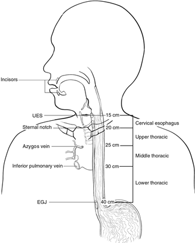
Esophagus_4.2.0.1.REL_CAPCP
13
C. Histologic Type
For
consistency
in
reporting,
the
histologic
classification
proposed
by
the
WHO
is
recommended.1 However, this protocol does not preclude the use of other systems of classification or
histologic types. This protocol includes esophageal well-differentiated neuroendocrine tumors due to the
fact that well-differentiated neuroendocrine tumors are extremely rare in the esophagus.
Worldwide, squamous cell carcinoma continues to be predominant as the most common histologic type,
but numerous population-based studies document the increasing incidence of adenocarcinoma of the
esophagus and EGJ in Western countries.2 More than 50% of esophageal carcinomas diagnosed in the
United States since 1900 are adenocarcinomas. Other subtypes, such as adenoid cystic carcinoma and
mucoepidermoid carcinoma, which resemble their counterparts arising in salivary gland, are rarely
encountered.
The TNM staging system for esophageal carcinomas incorporates tumor grade and histologic type in the
stage groupings (see Note H). Mixed histologic types, such as adenosquamous carcinomas, are staged
using the squamous cell carcinoma stage grouping.3
References
1.
WHO Classification of Tumours Editorial Board. Digestive system tumours. Lyon (France):
International Agency for Research on Cancer; 2019. (WHO classification of tumours series, 5th
ed.; vol. 1).
2.
Keeney S, Bauer TL. Epidemiology of adenocarcinoma of the esophagogastric junction. Surg
Oncol Clin North Am. 2006;15(4):687-696.
3.
Amin MB, Edge SB, Greene FL, et al, eds. AJCC Cancer Staging Manual. 8th ed. New York, NY:
Springer; 2017.
D. Histologic Grade
The histologic grades for esophageal squamous cell carcinomas are as follows:
Grade X
Grade cannot be assessed
Grade 1
Well differentiated
Grade 2
Moderately differentiated
Grade 3
Poorly differentiated, undifferentiated
If there are variations in the differentiation within the tumor, the highest (least favorable) grade is
recorded. Every effort should be avoid signing out a histologic grade as “undifferentiated.” If this cannot
be resolved, the cancer should be staged as a G3 squamous cell carcinoma.
For adenocarcinomas, a suggested grading system based on the proportion of the tumor that is
composed of glands is as follows:
Grade X
Grade cannot be assessed
Grade 1
Well-differentiated (greater than 95% of tumor composed of glands)
Grade 2
Moderately differentiated (50% to 95% of tumor composed of glands)
Grade 3
Poorly differentiated (49% or less of tumor composed of glands)
Esophagus_4.2.0.1.REL_CAPCP
14
For purposes of staging, all undifferentiated carcinomas are staged as grade 3 squamous cell.1 Small cell
and large cell neuroendocrine carcinomas are not typically graded but are high-grade tumors. In general,
mucoepidermoid carcinoma and adenoid cystic carcinoma of the esophagus are not amenable to grading.
Well-differentiated neuroendocrine tumors (NETs) of the esophagus are extremely rare. The WHO
classification of the digestive NETs can be used to grade the tumors.
References
1.
Amin MB, Edge SB, Greene FL, et al, eds. AJCC Cancer Staging Manual. 8th ed. New York, NY:
Springer; 2017.
E. Tumor Extension
For purposes of data reporting, Barrett’s esophagus with high-grade dysplasia in an esophageal resection
specimen is reported as carcinoma in situ. The term carcinoma in situ is not widely applied to glandular
neoplastic lesions in the gastrointestinal tract but is retained for tumor registry reporting purposes as
specified by law in many states. Invasion of the lamina propria may be difficult to assess for glandular
neoplasms in the esophagus.  The muscularis mucosae (Figure 2) is commonly duplicated and thickened
in Barrett’s esophagus; invasion of this layer should not be misinterpreted as invasion of the muscularis
propria.1  It should be noted that the muscularis mucosae varies in organization from relatively sparse
bundles of smooth muscle in the cervical esophagus to a thickened reticulated network in the distal
esophagus.2
Figure 2.  Microscopic anatomy of the esophagus. From Amin et al.3 Used with permission of the American Joint
Committee on Cancer (AJCC), Chicago, Illinois. The original source for this material is the AJCC Cancer Staging
Manual, 8th edition (2017) published by Springer Science and Business Media LLC, www.springerlink.com.
Lymphatic channels are present in the entire layer of the esophagus, including the lamina propria, but
they are most concentrated in the submucosa. The longitudinal nature of the submucosal lymphatic
plexus allows lymphatic spread orthogonal to depth of tumor invasion. Occasionally skip lesions are
present in the resection specimens, possibly caused by longitudinal lymphatic spread. If there are multiple
discrete lesions, the tumor length is measured from the top of the highest lesion to the bottom of the
lowest. 3The suffix “m” is required in this instance (see Note H). Tumor length may be a strong predictor
for the presence or absence of nodal disease in early to intermediate-stage esophageal cancer.
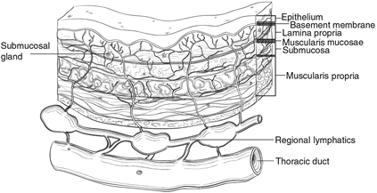
Esophagus_4.2.0.1.REL_CAPCP
15
References
1.
Abraham SC, Krasinskas AM, Correa AM, et al. Duplication of the muscularis mucosae in Barrett
esophagus: an underrecognized feature and its implication for staging of adenocarcinoma. Am J
Surg Pathol. 2007;31(11):1719-1725.
2.
Nagai K, Noguchi T, Hashimoto T, Uchida Y, Shimada T. The organization of the lamina
muscularis mucosae in the human esophagus. Arch Histol Cytol. 2003;66(3):281-288.
3.
Amin MB, Edge SB, Greene FL, et al, eds. AJCC Cancer Staging Manual. 8th ed. New York, NY:
Springer; 2017.
F. Treatment Effect
Response of tumor to previous chemotherapy or radiation therapy should be reported. Several systems
for tumor response have been advocated, and a modified Ryan scheme is suggested, which has been
shown to provide good interobserver reproducibility provide prognostic significance in rectal cancer.1
Modified Ryan Scheme for Tumor Regression Score1
Description
Tumor Regression Score
No viable cancer cells (complete response)
0
Single cells or rare small groups of cancer cells (near complete response)
1
Residual cancer with evident tumor regression, but more than single cells or rare
small groups of cancer cells (partial response)
2
Extensive residual cancer with no evident tumor regression (poor or no response)
3
Sizable pools of acellular mucin may be present after chemoradiation but should not be interpreted as
representing residual tumor.
This protocol does not preclude the use of other systems for assessment of tumor response.2,3,4
References
1.
Ryan R, Gibbons D, Hyland JM, et al. Pathological response following long-course neoadjuvant
chemoradiotherapy for locally advanced rectal cancer. Histopathology. 2005;47(2):141-146.
2.
Brucher BLDM, Becker K, Lordick F, et al. The clinical impact of histopathologic response
assessment by residual tumor cell quantification in esophageal squamous cell carcinomas.
Cancer. 2006;106(10):2119-2127.
3.
Hermann RM, Horstmann O, Haller F, et al. Histomorphological tumor regression grading of
esophageal carcinoma after neoadjuvant radiochemotherapy: which score to use? Dis Esoph.
2006;19(5):329-334.
4.
Wu T-T, Chirieac LR, Abraham SC, et al. Excellent interobserver agreement on grading the
extent of residual carcinoma after preoperative chemoradiation in esophageal and
esophagogastric junction carcinoma: a reliable predictor for patient outcome. Am J Surg Pathol.
2007;31(1):58-64.
G. Margins
Margins include the proximal, distal, and radial margins. The radial margin represents the adventitial soft
tissue margin closest to the deepest penetration of tumor. Sections to evaluate the proximal and distal
resections margins can be obtained in 2 orientations: (1) en face sections parallel to the margin or (2)
Esophagus_4.2.0.1.REL_CAPCP
16
longitudinal sections perpendicular to the margin. Depending on the closeness of the tumor to the margin,
select the orientation(s) that will most clearly demonstrate the status of the margin. The distance from the
tumor edge to the closest resection margin(s) should be measured if all margins are uninvolved by
invasive carcinoma. Proximal and distal resection margins should be evaluated for Barrett’s esophagus
and for squamous and glandular dysplasia if they are not involved by invasive carcinoma. It may be
helpful to mark the margin(s) closest to the tumor with ink. Margins marked by ink should be so
designated in the macroscopic description.
H. TNM and Anatomic Stage/Prognostic Groupings
The TNM staging system for esophageal carcinoma of the American Joint Committee on Cancer (AJCC)
and the International Union Against Cancer (UICC) is recommended (Figure 3).1
Figure 3.  T, N, and M classifications for esophageal carcinoma. From Amin et al.1 Used with permission of the
American Joint Committee on Cancer (AJCC), Chicago, Illinois. The original source for this material is the AJCC
Cancer Staging Manual, 8th edition (2017) published by Springer Science and Business Media LLC,
www.springerlink.com.
According to AJCC/UICC convention, the designation “T” refers to a primary tumor that has not been
previously treated. The symbol “p” refers to the pathologic classification of the TNM, as opposed to the
clinical classification, and is based on gross and microscopic examination. pT entails a resection of the
primary tumor or biopsy adequate to evaluate the highest pT category, pN entails removal of nodes
adequate to validate lymph node metastasis, and pM implies microscopic examination of distant lesions.
Clinical classification (cTNM) is usually carried out by the referring physician before treatment during
initial evaluation of the patient or when pathologic classification is not possible.
Pathologic staging is usually performed after surgical resection of the primary tumor. Pathologic staging
depends on pathologic documentation of the anatomic extent of disease, whether or not the primary
tumor has been completely removed. If a biopsied tumor is not resected for any reason (eg, when
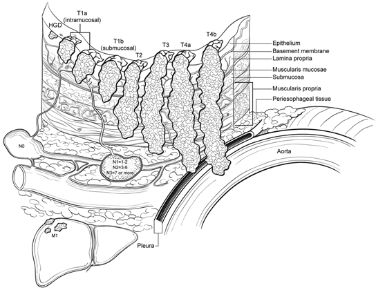
Esophagus_4.2.0.1.REL_CAPCP
17
technically infeasible) and if the highest T and N categories or the M1 category of the tumor can be
confirmed microscopically, the criteria for pathologic classification and staging have been satisfied without
total removal of the primary cancer.
TNM Descriptors
For identification of special cases of TNM or pTNM classifications, the “m” suffix and “y,” “r,” and “a”
prefixes are used. In the AJCC 8th edition, “y” affects the stage grouping.
The “m” suffix indicates the presence of multiple primary tumors in a single site and is recorded in
parentheses: pT(m)NM.
The “y” prefix indicates those cases in which classification is performed during or after initial multimodality
therapy (ie, neoadjuvant chemotherapy, radiation therapy, or both chemotherapy and radiation therapy).
The cTNM or pTNM category is identified by a “y” prefix. The ycTNM or ypTNM categorizes the extent of
tumor actually present at the time of that examination. The “y” categorization is not an estimate of tumor
before multimodality therapy (ie, before initiation of neoadjuvant therapy).
The “r” prefix indicates a recurrent tumor when staged after a documented disease-free interval and is
identified by the “r” prefix: rTNM.
The “a” prefix designates the stage determined at autopsy: aTNM.
N Category Considerations
A mediastinal lymphadenectomy specimen will ordinarily include 7 or more regional lymph nodes. The
minimum number of lymph nodes needed for adequate staging for esophageal cancers in
esophagectomy or gastroesophagectomy specimens has not been determined. The periesophageal soft
tissue should be dissected thoroughly to maximize the lymph node yields. In patients who receive
preoperative treatment, lymph nodes may become fibrotic/atrophic. Lymph nodes with acellular mucin
lakes are not considered as positive lymph nodes. Cytokeratin stains may aid identification of residual
cancer cells in lymph nodes; however, they should be interpreted in conjunction with morphologic
findings.
Prognostic/Stage Groupings
Different stage groupings are used for squamous cell carcinomas and adenocarcinomas. In addition, a
separate stage grouping is used to stage patients receiving neoadjuvant treatment due to the fact that
prognostic implication for ypTNM differs from those of equivalent pTNM.1
Location plays a role in the stage grouping of esophageal squamous cell carcinomas:
Esophagus_4.2.0.1.REL_CAPCP
18
Location Category
Location Criteria
X
Location Unknown
Upper
Cervical esophagus to lower border of azygos vein
Middle
Lower border of azygos vein to lower border of inferior pulmonary vein
Lower
Lower border of inferior pulmonary vein to stomach, including gastroesophageal junction
Note: Location is defined by the position of the midpoint of the tumor in the esophagus.
Additional Descriptors
Lymphovascular Invasion
Lymphovascular invasion (LVI) indicates whether microscopic lymphovascular invasion is identified in the
pathology report. LVI includes lymphatic invasion, vascular invasion, or lymph-vascular invasion. By
AJCC/UICC convention, LVI does not affect the T category indicating local extent of tumor unless
specifically included in the definition of a T category.
References
1.
Amin MB, Edge SB, Greene FL, et al, eds. AJCC Cancer Staging Manual. 8th ed. New York, NY:
Springer; 2017.
I. Regional Lymph Nodes
Regional lymph nodes (Figure 4) extend from periesophageal cervical nodes for the cervical esophagus
to celiac lymph nodes for the distal esophagus.1 Number of involved lymph nodes has consistently
emerged as a prognostic indicator on multivariate analysis.2,3  Extranodal extension may identify a subset
of node-positive patients with a particularly poor prognosis.4 Total number of lymph nodes containing
metastases (positive nodes) is demonstrated to be an important prognostic factor for esophageal cancer.
For that reason, lymph node involvement is coarsely grouped into N0 (no positive lymph node), N1 (1-2
positive lymph nodes), N2 (3-6 positive lymph nodes), and N3 (7 or more positive lymph nodes).
Figure 4.  Regional lymph nodes of the esophagus. From Amin et al.1 Used with permission of the American Joint
Committee on Cancer (AJCC), Chicago, Illinois. The original source for this material is the AJCC Cancer Staging
Manual, 8th edition (2017) published by Springer Science and Business Media LLC, www.springerlink.com.
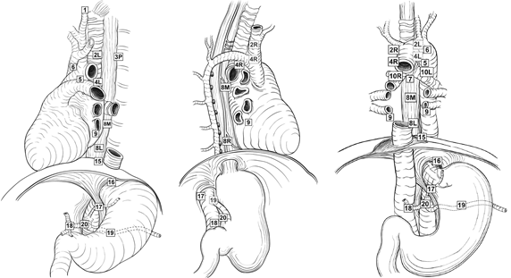
Esophagus_4.2.0.1.REL_CAPCP
19
References
1.
Amin MB, Edge SB, Greene FL, et al, eds. AJCC Cancer Staging Manual. 8th ed. New York, NY:
Springer; 2017.
2.
Christein JD, Hollinger EF, Millikan KW. Prognostic factors associated with resectable carcinoma
of the esophagus. Am Surg. 2002;68(3):258-262; discussion 262-263.
3.
Gu Y, Swisher SG, Ajani JA, et al. The number of lymph nodes with metastasis predicts survival
in patients with esophageal or esophagogastric junction adenocarcinoma who receive
preoperative chemoradiation. Cancer. 2006;106(5):1017-1025.
4.
Lagarde SM, ten Kate FJW, de Boer DJ, Busch ORC, Obertop H, van Lanschot JJB.
Extracapsular lymph node involvement in node-positive patients with adenocarcinoma of the
distal esophagus or gastroesophageal junction. Am J Surg Pathol. 2006;30(2):171-176.
J. Additional Findings
Most esophageal adenocarcinomas develop in the setting of Barrett’s esophagus, which is defined as
alteration of the mucosal lining of the esophagus from the normal squamous epithelium to metaplastic
columnar epithelium in response to esophagogastric reflux. Although in some cases the columnar
epithelium may resemble gastric oxyntic or cardiac mucosa, only the specialized columnar epithelium with
goblet cells is considered to carry significant risk of cancer and is designated as Barrett’s esophagus for
diagnostic purposes in the United States. However, controversy remains whether the definition should be
limited to columnar epithelium with goblet cells or should be expanded to include non-goblet cell columnar
epithelium.
# GIST Biomarker Reporting
Template for Reporting Results of Biomarker Testing of
Specimens From Patients With Gastrointestinal Stromal Tumors
Version: 1.1.0.0
Protocol Posting Date: December 2022
This biomarker template is not required for accreditation purposes but may be used to facilitate
compliance with CAP Accreditation Program Requirements
Authors
Julie C. Fanburg-Smith, MD, FCAP*; Julia A. Bridge, MD, FCAP*; Andrew M. Bellizzi, MD*; Paari
Murugan, MD, FCAP*; Javier A. Laurini, MD; Markku Miettinen, MD.
With guidance from the CAP Cancer and CAP Pathology Electronic Reporting Committees.
* Denotes primary author.
Completion of the template is the responsibility of the laboratory performing the biomarker testing and/or
providing the interpretation. When both testing and interpretation are performed elsewhere (eg, a
reference laboratory), synoptic reporting of the results by the laboratory submitting the tissue for testing is
also encouraged to ensure that all information is included in the patient’s medical record and thus readily
available to the treating clinical team.

Stomach.GIST.Bmk_1.1.0.0.REL_CAPCP
2
v 1.1.0.0
•
General format updates to harmonize with other biomarker reporting protocols
Stomach.GIST.Bmk_1.1.0.0.REL_CAPCP
3
Reporting Template
Protocol Posting Date: December 2022
Select a single response unless otherwise indicated.
Completion of the template is the responsibility of the laboratory performing the biomarker testing and / or providing the
interpretation. When both testing and interpretation are performed elsewhere (eg., a reference laboratory), synoptic reporting of the
results by the laboratory submitting the tissue for testing is also encouraged to ensure that all information is included in the patient’s
medical record and thus readily available to the treating clinical team.
Fixative type, time to fixation (cold ischemia time), and time of fixation should be reported if applicable in this template or in the
original pathology report.
Gene names should follow recommendations of The Human Genome Organization (HUGO) Nomenclature Committee
(www.genenames.org; accessed October 18, 2022). (Note A)
All reported gene sequence variations should be identified following the recommendations of the Human Genome Variation Society
(www.hgvs.org/mutnomen/; accessed October 18, 2022). (Note A)
GIST BIOMARKER TESTS
Immunohistochemical Studies (Note B)
+KIT (CD117)
___ Positive
___ Negative
+DOG1 (ANO1)
___ Positive
___ Negative
+SDHA
___ Intact
___ Deficient
+SDHB
___ Intact
___ Deficient
Other IHC Studies
+Test Name (repeat this question as needed): _________________
___ Positive
___ Negative
___ Other (specify): _________________
Molecular Genetic Studies (Note C)
+KIT Mutational Analysis (Note D)
___ No mutation detected
___ Mutation identified (specify): _________________
___ Cannot be determined (explain): _________________
+KIT Exons Assessed (Note D) (select all that apply)
___ Exon 9
___ Exon 11
___ Exon 13
___ Exon 14
___ Exon 17
___ Other (specify): _________________
Stomach.GIST.Bmk_1.1.0.0.REL_CAPCP
4
+PDGFRA Mutational Analysis (Note E)
___ No mutation detected
___ Mutation identified (specify): _________________
___ Cannot be determined (explain): _________________
+PDGFRA Exons Assessed (Note E) (select all that apply)
___ Exon 12
___ Exon 14
___ Exon 18
___ Other (specify): _________________
+SDH A / B / C / D Mutational Analysis (Note G)
___ No mutation detected
___ Mutation identified (specify): _________________
___ Cannot be determined (explain): _________________
+NF1 Mutational Analysis (Note H)
___ No mutation detected
___ Mutation identified (specify): _________________
___ Cannot be determined (explain): _________________
+BRAF Mutational Analysis (Note F) (select all that apply)
___ No BRAF mutation detected
___ BRAF V600E (c.1799T>A, exon 15) mutation
___ Other BRAF mutation (specify): _________________
___ Cannot be determined (explain): _________________
+BRAF Fusion Gene Analysis (Note I)
___ No fusion detected
___ Fusion identified (specify): _________________
___ Cannot be determined (explain): _________________
+FGFR1 Fusion Gene Analysis (Note I)
___ No fusion detected
___ Fusion identified (specify): _________________
___ Cannot be determined (explain): _________________
Other Gene Mutational Analysis
+Mutation Name (repeat this question as needed): _________________
___ No mutation detected
___ Mutation identified (specify): _________________
___ Cannot be determined (explain): _________________
Other Fusion Gene Event Analysis
+Fusion Name (repeat this question as needed): _________________
___ No fusion detected
___ Fusion identified (specify): _________________
___ Cannot be determined (explain): _________________
COMMENTS
Comment(s): _________________
Stomach.GIST.Bmk_1.1.0.0.REL_CAPCP
5
Explanatory Notes
A. Reporting Nomenclature
Consistent gene mutation nomenclature is essential for efficient and accurate reporting.1 The following
are examples as recommended by Human Genome Variation Society (HGVS) for description of variant
changes.2 It is also preferred that protein alterations are mentioned in the report in addition to genomic
coordinates.
Examples of DNA, RNA, and Protein Nomenclature
DNA: A, G, C, T (example: c.957A>T)
RNA: a, g, c, u (example: r.957 a>u)
Protein: 3-letter amino acid code, X= Stop codon (example: p. Glu78Gln)
Examples of Nomenclatures for Types of Sequence Variants
Types of Variation
Examples
Substitution
c.123A>G
Deletion
c.123delA, c.586_591delTGGTCA or c.586_591del6
Duplication
c.123dupA, c.586_591dupTGGTCA or c.586_591dup6
Insertion
c.123_124insC, c.1086_1087insGCGTGA
Frame shift
p. Arg83 fs or p. Arg83Ser fsX15
Deletion/insertions “indel”
c.112_117delAGGTCAinsTG
References
1. Ogino S, Gulley M, den Dunneb JT, et al. Standard mutation nomenclature in molecular
diagnostics: practical and educational challenges. J Mol Diagn. 2007;9(1):1-6.
2. den Dunnen, J.T. and Antonarakis, S.E. (2003), Mutation Nomenclature. Current Protocols in
Human Genetics, 37: 7.13.1-7.13.8. https://doi.org/10.1002/0471142905.hg0713s37. Accessed
November 11, 2022.
B. Immunohistochemical Analysis
Because small-molecule kinase inhibitor therapy is highly effective in the treatment of GIST, it has
become imperative to distinguish GIST from its histologic mimics, mainly leiomyoma, leiomyosarcoma,
schwannoma, and desmoid fibromatosis.1,2  Immunohistochemistry is instrumental in the workup of GIST.
For the initial workup of GIST, a basic immunohistochemical panel including CD117 (KIT), DOG1 (Ano1),
Desmin, S100 protein, and CD34 is recommended. GIST is immunoreactive for KIT (CD117)
(approximately 95%) and/or DOG1(>99%).3,4,5 KIT immunoreactivity is usually strong and diffuse but can
be more focal in unusual cases (Figure 1, A, and B). It is not unusual for GIST to exhibit dot-like
perinuclear staining (Figure 1, C), while less commonly, some cases exhibit membranous staining (Figure
1, D). These patterns do not clearly correlate with mutation type or response to therapy. Most KIT-
negative/DOG1 positive GIST is gastric or extra-visceral GIST and almost invariably harbor a platelet-
derived growth factor receptor A (PDGFRA) mutation.6 DOG1 expression is not related to mutational
status in GIST, and it may be a useful marker to identify a subset of patients with CD117-negative GIST,
who might benefit from targeted therapy.4,5 Approximately 70% of GIST are positive for CD34, 30% to
40% are positive for smooth muscle actin, 5% are positive for S100 protein (usually focal), 5% are
positive for desmin (usually focal), and 1% to 2% are positive for keratin (weak/focal).7
Stomach.GIST.Bmk_1.1.0.0.REL_CAPCP
6
Note: PanTrk immunohistochemistry may be positive in GIST, a tumor typically negative for NTRK fusion
and this immunostain is not recommended.
Since succinate dehydrogenase (SDH)-deficient GIST may be familial, have specific implications (see the
following), it is recommended that all gastric GIST be screened for loss of SDH by immunohistochemistry,
best accomplished by immunostaining for SDHB, which is lost in all independent of the SDH-subunit that
is inactivated.8,9,10,11 Mutations in SDHA are detected in 30% of SDH-deficient GIST and loss of
expression of SDHA specifically identifies tumors with SDHA mutations; other SDH-deficient GIST show
normal (intact) cytoplasmic staining for SDHA.12,13 Patients with SDH-deficient GIST should be referred to
a genetic counselor for appropriate workup.
Figure 1. Patterns of KIT staining in gastrointestinal stromal tumor (GIST). A, Diffuse and strong immunoreactivity in
a typical GIST. B, Focal and weak pattern in an epithelioid gastric GIST with a PDGFRA mutation. C, Dot-like
perinuclear staining. D, Membranous pattern. (Original magnification X400)
References
1. Hornick JL, Fletcher CD. Immunohistochemical staining for KIT (CD117) in soft tissue sarcomas
is very limited in distribution. Am J Clin Pathol. 2002;117(2):188-193.
2. Miettinen M, Sobin LH, Sarlomo-Rikala M. Immunohistochemical spectrum of GISTs at different
sites and their differential diagnosis with a reference to CD117 (KIT). Mod Pathol.
2000;13(10):1134-1142.
3. Sarlomo-Rikala M, Kovatich AJ, Barusevicius A, Miettinen M. CD117: a sensitive marker for
gastrointestinal stromal tumors that is more specific than CD34. Mod Pathol. 1998;11(8):728-734.
4. Espinosa I, Lee CH, Kim MK, et al. A novel monoclonal antibody against DOG1 is a sensitive and
specific marker for gastrointestinal stromal tumors. Am J Surg Path. 2008;32(2):210–218.
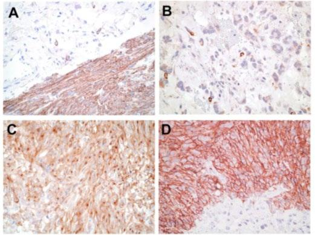
Stomach.GIST.Bmk_1.1.0.0.REL_CAPCP
7
5. Miettinen M, Wang ZF, Lasota J. DOG1 antibody in the differential diagnosis of gastrointestinal
stromal tumors: a study of 1840 cases. Am J Surg Pathol. 2009;33:1401–1408.
6. Medeiros F, Corless CL, Duensing A, et al. KIT-negative gastrointestinal stromal tumors: proof of
concept and therapeutic implications. Am J Surg Pathol. 2004;28(7):889-894.
7. Fletcher CD, Berman JJ, Corless C, et al. Diagnosis of gastrointestinal stromal tumors: a
consensus approach. Hum Pathol. 2002;33(5):459-465.
8. Mei L, Smith SC, Faber AC, et al. Gastrointestinal Stromal Tumors: The GIST of Precision
Medicine. Trends Cancer. 2018;4:74-91.
9. Gill AJ. Succinate dehydrogenase (SDH) and mitochondrial driven neoplasia. Pathology. 2012
Jun;44(4):285-92.
10. Gill AJ, Benn DE, Chou A, et al. Immunohistochemistry for SDHB triages genetic testing of
SDHB, SDHC, and SDHD in paraganglioma-pheochromocytoma syndromes. Hum Pathol. 2010
Jun;41(6):805-14.
11. Doyle LA, Nelson D, Heinrich MC, et al. Loss of succinate dehydrogenase subunit B (SDHB)
expression is limited to a distinctive subset of gastric wild-type gastrointestinal stromal tumours:
a comprehensive genotype-phenotype correlation study. Histopathology. 2012;61(5):801-809.
12. Wagner AJ, Remillard SP, Zhang YX, et al. Loss of expression of SDHA predicts SDHA
mutations in gastrointestinal stromal tumors. Mod Pathol. 2013;26(2):289-294.
13. Dwight T, Benn DE, Clarkson A, et al. Loss of SDHA expression identifies SDHA mutations in
succinate dehydrogenase-deficient gastrointestinal stromal tumors. Am J Surg Pathol.
2013;37(2):226-233.
C. Molecular Analysis
Approximately 75% of GIST possess activating mutations in the KIT gene, whereas another 10% have
activating mutations in the PDGFRA gene.1,2,3,4 These mutations result in virtually full-length KIT proteins
that exhibit ligand-independent activation. KIT and PDGFRA each contain 21 exons. However, mutations
cluster within “hotspots”: exons 9, 11, 13, and 17 in KIT and exons 12, 14, and 18 in PDGFRA (Figure 2).
About 5% to 10% of GIST appear to be negative for both KIT and PDGFRA mutations. The most recent
NCCN Task Force on GIST strongly encourages that KIT and PDGFRA mutational analysis be performed
if tyrosine kinase inhibitors (TKIs) are considered as part of the treatment plan for unresectable or
metastatic disease and that mutational analysis be considered for patients with primary disease,
particularly those with high-risk tumors. KIT and PDGFRA mutation status can be determined easily from
paraffin-embedded tissue. Secondary or acquired mutations can be associated with development of
tumor resistance in the setting of long-term imatinib mesylate treatment. These are usually point
mutations that occur most commonly in KIT exons 13, 14, and 17.5 The clinical utility of these mutations
is an evolving concept, but it is important not to confuse them with the primary or initial mutation in GIST.
Recent studies focusing on the molecular classification of GIST recognized two major subgroups:
succinate dehydrogenase (SHD)-competent and SDH-deficient GIST, both of which can arise in the
sporadic or familial setting.6,7 SDH-competent GIST include tumors with mutations of KIT and PDGFRA
as well of a subset of wild-type GIST with mutations mainly in NF1 and BRAF genes or rarely fusion gene
events involving FGFR1 or BRAF.8,9,10,11,12,13 On the other hand, SDH-deficient GIST includes tumors with
a genetic alteration in any of the SDH subunits leading to SDH dysfunction.
SDH-deficient GIST represents approximately 8% of GIST, although these may arise sporadically. The
majority of pediatric GIST arise in Carney triad and Carney-Stratakis syndrome and are SDH-deficient.
SDH is a mitochondrial enzyme comprising four subunits (SDHA, SDHB, SDHC, and SDHD) that are
Stomach.GIST.Bmk_1.1.0.0.REL_CAPCP
8
involved in the Krebs cycle. Genetic alteration of any of the four subunits results in SDH dysfunction and
subsequent loss of SDHB expression by immunohistochemistry. SDH-deficient GIST arises almost
exclusive in the stomach, affects predominantly female patients, and tends to manifest at a young age.
Pathologic features associated with SDH-deficient tumors include multinodular and/or plexiform growth
pattern, epithelioid morphology, lymphovascular invasion, nodal involvement, and frequent metastasis to
the liver and peritoneum. Importantly, germline mutations in the genes coding for any of the SDH
subunits can lead to paragangliomas/pheochromocytomas, SDH-deficient renal cell carcinoma, and
pituitary tumors in addition to GIST. It is recommended that all gastric GIST be screened for loss of
SDHB by immunohistochemistry. All patients with SDH-deficient GIST identified by loss of SDHB
immunostain should be referred to a genetic counselor.
* Refers to exons involved most frequently by secondary/acquired mutations.
Figure 2. Locations and frequency of activating KIT and PDGFRA mutations in GIST. They were adapted with
permission from Heinrich et al.1 Copyright 2003 by the American Society of Clinical Oncology. All rights reserved.
KIT and PDGFRA are excellent targets for small-molecule tyrosine kinase inhibitors, and compounds of
this class, imatinib mesylate (Gleevec, Novartis Pharmaceuticals, Basel, Switzerland), sunitinib malate
(Sutent, Pfizer Pharmaceuticals, New York, New York), avapritinib (Ayvakit, PDGFRA D842V (exon 18)
mutant, may be resistant to standard therapy), regorafenib (3rd line), and ripretinib (4th line, Qinlock) have
shown efficacy in clinical trials and have been approved by the US Food and Drug Administration for the
treatment of GIST.14,15,16,17 SDH-deficient GIST is usually resistant to imatinib but may have a higher
probability of response to sunitinib.6,18 Because different tyrosine kinase inhibitors (TKIs) may have
differential efficacy depending on the type of mutation present in GIST, oncologists may want to know the
mutation status of each GIST 19 because this may influence which drug the patient receives.1 Secondary
resistance mutations may also affect drug selection as their significance is further defined.
References
1. Heinrich MC, Corless CL, Demetri GD, et al. Kinase mutations and imatinib response in patients
with metastatic gastrointestinal stromal tumor. J Clin Oncol. 2003;21(23):4342-4349.
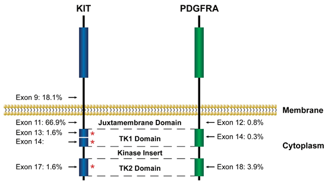
Stomach.GIST.Bmk_1.1.0.0.REL_CAPCP
9
2. Heinrich MC, Corless CL, Duensing A, et al. PDGFRA activating mutations in gastrointestinal
stromal tumors. Science. 2003;299(5607):708-710.
3. Hirota S, Isozaki K, Moriyama Y, et al. Gain-of-function mutations of c-kit in human
gastrointestinal stromal tumors. Science. 1998;279(5350):577-580.
4. Rubin BP, Singer S, Tsao C, et al. KIT activation is a ubiquitous feature of gastrointestinal stromal
tumors. Cancer Res. 2001;61(22):8118-8121.
5. Heinrich MC, Corless CL, Blanke CD, et al. Molecular correlates of imatinib resistance in
gastrointestinal stromal tumors. J Clin Oncol. 2006;24(29):4764-4774.
6. Mei L, Smith SC, Faber AC, et al. Gastrointestinal Stromal Tumors: The GIST of Precision
Medicine. Trends Cancer. 2018;4:74-91.
7. Gill AJ. Succinate dehydrogenase (SDH) and mitochondrial driven neoplasia. Pathology. 2012
Jun;44(4):285-92.
8. Dare AJ, Gupta AA, Thipphavong S, Miettinen M, Gladdy RA. Abdominal neoplastic
manifestations of neurofibromatosis type 1. Neurooncol Adv. 2020 Jun 25;2(Suppl 1):i124-i133.
doi: 10.1093/noajnl/vdaa032. PMID: 32642738.
9. Lasota J, Kowalik A, Felisiak-Golabek A, Zięba S, Wang ZF, Miettinen M. New Mechanisms of
mTOR Pathway Activation in KIT-mutant Malignant GISTs. Appl Immunohistochem Mol Morphol.
2019 Jan;27(1):54-58. PMID: 28777148.
10. Shi E, Chmielecki J, Tang CM, et al. FGFR1 and NTRK3 actionable alterations in“wild-
type”gastrointestinal stromal tumors. J TranslMed. 2016;14(1):339.
11. Pantaleo MA, Urbini M, Indio V, et al. Genome-wide analysis identifies MEN1 and MAX mutations
and a neuroendocrine-like molecularheterogeneity in quadruple WT GIST. Mol Cancer Res.
2017;15(5):553-562.
12. Charo LM, Burgoyne AM, Fanta PT, Patel H, Chmielecki J, Sicklick JK, McHale MT. A Novel
PRKAR1B-BRAF Fusion in Gastrointestinal Stromal Tumor Guides Adjuvant Treatment Decision-
Making During Pregnancy. J Natl Compr Canc Netw 2018;16:238-42.
13. Torrence D, Xie Z, Zhang L, Chi P, Antonescu CR. Gastrointestinal stromal tumors with BRAF
gene fusions. A report of two cases showing low or absent KIT expression resulting in diagnostic
pitfalls. Genes Chromosomes Cancer. 2021 Dec;60(12):789-795.
14. Demetri GD, Benjamin RS, Blanke CD, et al; NCCN Task Force. NCCN Task Force report:
management of patients with gastrointestinal stromal tumor (GIST)--update of the NCCN clinical
practice guidelines. J Natl Compr Canc Netw. 2007;5(Suppl 2):S1-S29.
15. Demetri GD. Targeting the molecular pathophysiology of gastrointestinal stromal tumors with
imatinib: mechanisms, successes, and challenges to rational drug development. Hematol Oncol
Clin North Am. 2002;16(5):1115-1124.
16. Demetri GD, van Oosterom AT, Garrett CR, et al. Efficacy and safety of sunitinib in patients with
advanced gastrointestinal stromal tumour after failure of imatinib: a randomised controlled trial.
Lancet. 2006;368(9544):1329-1338.
17. Kelly CM, Gutierrez Sainz L, Chi P. The management of metastatic GIST: current standard and
investigational therapeutics. J Hematol Oncol 14:2, 2021.
18. Glod J, Arnaldez FI, Wiener L, Spencer M, Killian JK, Meltzer P, Dombi E, Derse-Anthony C,
Derdak J, Srinivasan R, Linehan WM, Miettinen M, Steinberg SM, Helman L, Widemann BC. A
Phase II Trial of Vandetanib in Children and Adults with Succinate Dehydrogenase-Deficient
Gastrointestinal Stromal Tumor. Clin Cancer Res. 2019 Nov 1;25(21):6302-6308. Epub 2019 Aug
22. PMID: 31439578.
19. Corless CL, Schroeder A, Griffith D, et al. PDGFRA mutations in gastrointestinal stromal tumors:
frequency, spectrum and in vitro sensitivity to imatinib. J Clin Oncol. 2005;23(23):5357-5364.
Stomach.GIST.Bmk_1.1.0.0.REL_CAPCP
10
D. KIT Mutational Analysis
The most common mutations affect the juxta membrane domain encoded by exon 11 (two-thirds of GIST).
These mutations include in-frame deletions, substitutions, and insertions. Deletions (in particular codon
557 and/or 558) are associated with shorter progression-free and overall survival.1,2,3,4,5,6 The vast
majority of exon 11-mutated GIST is located in the stomach. About 7% to 10% of the tumors harbor
mutations in the extracellular domain encoded by exon 9 (most commonly insAY502-503).5,7 Exon 9-
mutant GIST arises predominantly in the small bowel and has reduced sensitivity to imatinib which could
be overcome by using higher doses.5 Primary mutations in the activation loop (exon 17) and ATP binding
region (exon 13) are uncommon (1%). The majority of these mutations are substitutions.8  KIT exon 8
mutations are extremely rare (0.15%).9 Secondary or resistance mutations occur commonly in tumors
harboring primary exon 11 mutations. These newly acquired secondary mutations are always located in
exons encoding tyrosine kinase domain (exons 13, 14, 17).10
References
1. Gastrointestinal Stromal Tumor Meta-Analysis Group (MetaGIST). Comparison of two doses of
imatinib for the treatment of unresectable or metastatic gastrointestinal stromal tumor: a meta-
analysis of 1640 patients. J Clin Oncol. 2010;28(7):1247-1253.
2. Heinrich MC, Corless CL, Blanke CD, et al. Molecular correlates of imatinib resistance in
gastrointestinal stromal tumors. J Clin Oncol.  2006;24(29):4764-4774.
3. Andersson J, Bumming P, Meis-Kindblom JM, et al. Gastrointestinal stromal tumors with KIT exon
11 deletions are associated with poor prognosis. Gastroenterology. 2006;130(6):1573-1581.
4. Liu XH, Bai CG, Xie Q, et al. Prognostic value of KIT mutation in gastrointestinal stromal tumors.
World J Gastroenterol. 2005;11(25):3948-3952.
5. Mei L, Smith SC, Faber AC, et al. Gastrointestinal Stromal Tumors: The GIST of Precision
Medicine. Trends Cancer. 2018;4:74-91.
6. Wozniak A, Rutkowski P, Schöffski P, et al. Tumor genotype is an independent prognostic factor
in primary gastrointestinal stromal tumors of gastric origin: a European multicenter analysis based
on ConticaGIST. Clin Cancer Res. 2014 Dec 1;20(23):6105-16.
7. Wardelmann E, Losen I, Hans V, et al. Deletion of Trp-557 and Lys-558 in the juxtamembrane
domain of the c-kit protooncogene is associated with metastatic behavior of gastrointestinal
stromal tumors. Int J Cancer. 2003;106(6):887-895.
8. Lux ML, Rubin BP, Biase TL, et al. KIT extracellular and kinase domain mutations in
gastrointestinal stromal tumors. Am J Pathol. 2000;156(3):791-795.
9. Huss S, Künstlinger H, Wardelmann E, et al.  A subset of gastrointestinal stromal tumors
previously regarded as wild-type tumors carries somatic activating mutations in KIT exon 8 (p.
D419del). Mod Pathol. 2013;26(7):1004-1012.
10. Lasota J, Corless CL, Heinrich MC, et al. Clinicopathologic profile of gastrointestinal stromal
tumors (GISTs) with primary KIT exon 13 or 17 mutations: a multicenter study of 54 cases. Mod
Pathol. 2008;21(4):476-484.
E. PDGFRA Mutational Analysis
More than 80% of KIT-negative GIST have PDGFRA mutations. The majority of PDGFRA-mutated GIST
arises in the stomach, usually with epithelioid or mixed epithelioid and spindle cell morphology and often
with
myxoid
stromal
changes.1,2 PDGFRA-mutated
GIST
tends
to
have
a
lower
risk
of
recurrence.1,3 Activation of PDGFRA is seen in GIST harboring mutations in juxta membranous domain
(exon 12), the ATP binding domain (exon 14), or the activation loop (exon 18).1,2 Mutations include
Stomach.GIST.Bmk_1.1.0.0.REL_CAPCP
11
substitutions and deletions. Primary resistance to imatinib is seen with the most common PDGFRA exon
18 D842V mutation.1
References
1. Mei L, Smith SC, Faber AC, et al. Gastrointestinal Stromal Tumors: The GIST of Precision
Medicine. Trends Cancer. 2018;4:74-91.
2. Lasota J, Miettinen M. Clinical significance of oncogenic KIT and PDGFRA mutations in
gastrointestinal stromal tumors. Histopathology. 2008;53(3):245-266.
3. Barnett CM, Corless CL, Heinrich MC. Gastrointestinal stromal tumors: molecular markers and
genetic subtypes. Hematol Oncol Clin North Am. 2013 Oct;27(5):871-88.
F. BRAF Mutational Analysis
Activating mutations of BRAF (V600E) have been identified in a small subset (7%) of KIT/PDGFRA wild-
type GIST. These tumors show a predilection for small bowel location, arise in middle-aged females,
exhibit a high mitotic rate, and are associated with early metastasis.1,2 BRAF-mutated GIST shows
primary resistance to imatinib but may respond to BRAF inhibitors.2
References
1. Agaram NP, Wong GC, Guo T, et al. Novel V600E BRAF mutations in imatinib-naive and
imatinib-resistant
gastrointestinal
stromal
tumors.
Genes
Chromosomes
Cancer.
2008;47(10):853–859.
2. Mei L, Smith SC, Faber AC, et al. Gastrointestinal Stromal Tumors: The GIST of Precision
Medicine. Trends Cancer. 2018;4:74-91.
G. SDH A/B/C/D Mutational Analysis
The succinate dehydrogenase (SDH) complex (mitochondrial complex II) participates in both the Krebs
cycle and the electron transport chain of oxidative phosphorylation. About 8% of GIST (all lacking
mutations in KIT and PDGFRA) is caused by dysfunction of the SDH complex ('SDH-deficient GIST').
Around 50% of patients affected by such tumors harbor germline mutations in one of the SDH subunit
genes (SDH A/B/C or D). SDHA-inactivating mutations are most common, detected in about 30% of SDH-
deficient GIST. Mutations involve exons 2, 3, 5, 6, 7, 8, 9, 10, 11, 13, 14 of SDHA; exons 1, 2, 3, 4, 6, 7 of
SDHB; exons 1, 4, 5 of SDHC; and exons 4 and 6 of SDHD. While the majority of the mutations are
substitutions; deletions, splice-site mutations, frameshift, and duplications have also been reported.1,2,3,4
References
1. Doyle LA, Hornick JL. Gastrointestinal stromal tumours: from KIT to succinate dehydrogenase.
Histopathology. 2014;64(1):53-67.
2. Wagner AJ, Remillard SP, Zhang YX, et al. Loss of expression of SDHA predicts SDHA mutations
in gastrointestinal stromal tumors. Mod Pathol. 2013;26(2):289-294.
3. Fletcher CD, Berman JJ, Corless C, et al. Diagnosis of gastrointestinal stromal tumors: a
consensus approach. Hum Pathol. 2002; 33(5):459-465.
4. Nannini, M, Biasco B, Astolfi A, et al. An overview on molecular biology of KIT/PDGFRA wild type
(WT) gastrointestinal stromal tumours (GIST). J Med Genet. 2013;50(10):653-661.
H. Neurofibromatosis Type 1 (NF1) Mutational Analysis
NF1 is an inherited, autosomal dominant disease characterized by multiple café au lait spots, Lisch
nodules, freckling, and development of neurofibromas. GIST in NF1 patients arises predominantly from
Stomach.GIST.Bmk_1.1.0.0.REL_CAPCP
12
the small intestine, including duodenum, can be multicentric, lack KIT and PDGFRA mutations and are
associated with Cajal cell hyperplasia.1,2 Only a minority (approximately 7%) of NF1 patients develop
NF1-mutated GIST, therefore, molecular testing for canonical mutations in KIT and PDGFRA is
recommended for GIST arising in the setting of neurofibromatosis.2,3,4,5
References
1. Nannini, M, Biasco B, Astolfi A, et al. An overview on molecular biology of KIT/PDGFRA wild type
(WT) gastrointestinal stromal tumours (GIST). J Med Genet. 2013;50(10):653-661.
2. Mei L, Smith SC, Faber AC, et al. Gastrointestinal Stromal Tumors: The GIST of Precision
Medicine. Trends Cancer. 2018;4:74-91.
3. Lee JH, Shin SJ, Choe EA, Kim J, Hyung WJ, Kim HS, Jung M, Beom SH, Kim TI, Ahn JB, Chung
HC, Shin SJ. Tropomyosin-Related Kinase Fusions in Gastrointestinal Stromal Tumors. Cancers
(Basel). 2022 27;14(11):2659. PMID: 35681640.
4. Castillon M, Kammerer-Jacquet SF, Cariou M, Costa S, Conq G, Samaison L, Douet-Guilbert N,
Marcorelles P, Doucet L, Uguen A. Fluorescent In Situ Hybridization Must be Preferred to pan-
TRK Immunohistochemistry to Diagnose NTRK3-rearranged Gastrointestinal Stromal Tumors
(GIST). Appl Immunohistochem Mol Morphol. 2021 Sep 1;29(8):626-634. PMID: 33758144.
5. Atiq MA, Davis JL, Hornick JL, Dickson BC, Fletcher CDM, Fletcher JA, Folpe AL, Mariño-
Enríquez A. Mesenchymal tumors of the gastrointestinal tract with NTRK rearrangements: a
clinicopathological, immunophenotypic, and molecular study of eight cases, emphasizing their
distinction from gastrointestinal stromal tumor (GIST). Mod Pathol. 2021 Jan;34(1):95-103. Epub
2020 Jul 15. PMID: 32669612.
I. FGFR1 or BRAF Fusion Gene Analysis
Rare cases of GIST lacking other driver events (e.g., KIT, PDGFRA, SDH, RAS, or NF1 mutations;
quadruple wild-type GIST) have recently been reported to harbor fusion genes involving FGFR1 or BRAF.
Identification of these alterations may impact therapeutic considerations.1,2,3,4
References
1. Shi, E.; Chmielecki, J.; Tang, C.M.; Wang, K.; Heinrich, M.C.; Kang, G.; Corless, C.L.; Hong, D.;
Fero, K.E.; Murphy, J.D.; et al. FGFR1 and NTRK3 actionable alterations in “Wild-Type”
gastrointestinal stromal tumors. J. Transl Med. 2016, 14, 339.
2. Pantaleo MA, Urbini M, Indio V, et al. Genome-wide analysis identifies MEN1 and MAX mutations
and a neuroendocrine-like molecularheterogeneity in quadruple WT GIST. Mol Cancer Res.
2017;15(5):553-562.
3. Charo LM, Burgoyne AM, Fanta PT, Patel H, Chmielecki J, Sicklick JK, McHale MT. A Novel
PRKAR1B-BRAF Fusion in Gastrointestinal Stromal Tumor Guides Adjuvant Treatment Decision-
Making During Pregnancy. J Natl Compr Canc Netw 2018;16:238-42.
4. Torrence D, Xie Z, Zhang L, Chi P, Antonescu CR. Gastrointestinal stromal tumors with BRAF
gene fusions. A report of two cases showing low or absent KIT expression resulting in diagnostic
pitfalls. Genes Chromosomes Cancer. 2021 Dec;60(12):789-795.
# GIST, Biopsy
Protocol for the Examination of Biopsy Specimens From Patients
With Gastrointestinal Stromal Tumor (GIST)
Version: 4.3.0.0
Protocol Posting Date: December 2022
The use of this protocol is recommended for clinical care purposes but is not required for accreditation
purposes.
This protocol may be used for the following procedures AND tumor types:
Procedure
Description
Biopsy
Tumor Type
Description
Gastrointestinal stromal tumor
The following should NOT be reported using this protocol:
Procedure
Resection
Cytologic specimens
Authors
Julie C. Fanburg-Smith, MD, FCAP*; Julia A. Bridge, MD, FCAP*; Andrew M. Bellizzi, MD*; Paari
Murugan, MD, FCAP*; Javier A. Laurini, MD; Markku Miettinen, MD.
With guidance from the CAP Cancer and CAP Pathology Electronic Reporting Committees.
* Denotes primary author.
The use of this case summary is recommended for clinical care purposes but is not required for
accreditation purposes. The core and conditional data elements are routinely reported. Non-core data
elements are indicated with a plus sign (+) to allow for reporting information that may be of clinical value.

Stomach.GIST.Bx_4.3.0.0.REL_CAPCP
2
v 4.3.0.0
•
Added Associated Syndrome under Clinical
•
Reformatted Tumor Site
•
Added BRAF to Special Studies
•
Updated Note D Table 1 correction of Gastric moderate rate changed from 10% to 12%
Stomach.GIST.Bx_4.3.0.0.REL_CAPCP
3
Reporting Template
Protocol Posting Date: December 2022
Select a single response unless otherwise indicated.
Standard(s): AJCC-UICC 8
This case summary is recommended for reporting biopsy specimens, but is not required for accreditation purposes.
CLINICAL
+Associated Syndrome
___ Carney triad
___ Carney-Stratakis syndrome
___ Neurofibromatosis type1
___ Familial GIST syndrome
___ Other (specify): _________________
___ Not specified
+Prebiopsy Treatment (select all that apply)
___ No known prebiopsy therapy
___ Systemic therapy performed (specify type): _________________
___ Therapy performed, type not specified
___ Not specified
SPECIMEN
Procedure
___ Core needle biopsy
___ Endoscopic biopsy
___ Fine needle aspiration biopsy
___ Other (specify): _________________
___ Not specified
TUMOR
Tumor Site (Note A)
___ Esophagus (specify location): _________________
___ Gastroesophageal junction: _________________
___ Stomach (specify location): _________________
___ Small intestine
___ Duodenum
___ Jejunum
___ Ileum (excluding ileocecal valve)
___ Meckel diverticulum (site of neoplasm)
___ Small intestine, NOS
___ Appendix: _________________
___ Ileocecal valve: _________________
Stomach.GIST.Bx_4.3.0.0.REL_CAPCP
4
___ Large intestine
___ Cecum
___ Ascending colon
___ Hepatic flexure of colon
___ Transverse colon
___ Splenic flexure of colon
___ Descending colon
___ Sigmoid colon
___ Rectosigmoid junction: _________________
___ Rectum: _________________
___ Large intestine, NOS
___ Retroperitoneum: _________________
___ Peritoneum / abdomen (specify site): _________________
___ Other (specify): _________________
___ Cannot be determined: _________________
___ Not specified
Histologic Type
___ Gastrointestinal stromal tumor, spindle cell type
___ Gastrointestinal stromal tumor, epithelioid type
___ Gastrointestinal stromal tumor, mixed
___ Gastrointestinal stromal tumor, other (specify): _________________
+Histologic Type Comment: _________________
Tumor Size (based on clinicoradiologic estimate)
___ Greatest dimension in Centimeters (cm): _________________ cm
+Additional Dimension in Centimeters (cm): ____ x ____ cm
___ Cannot be determined (explain): _________________
Mitotic Rate (Note B)
The mitotic rate should be determined in 5 mm2 of tumor. With the use of older model microscopes, 50 HPF is equivalent to 5 mm2.
Most modern microscopes with wider fields require approximately 20 to 25 HPF to encompass 5 mm2. If necessary, please
measure a field of view to accurately determine actual number of fields required to be counted on individual microscopes to
encompass 5 mm2.
___ Specify mitotic rate per 5 mm2: _________________ mitoses per 5 mm2
___ Other (specify): _________________
___ Cannot be determined (explain): _________________
Histologic Grade (Note B)
___ G1, low grade (mitotic rate less than or equal to 5 per 5 mm2)
___ G2, high grade (mitotic rate greater than 5 per 5 mm2)
___ Other (specify): _________________
___ GX, cannot be assessed: _________________
+Necrosis
___ Not identified
___ Present
Stomach.GIST.Bx_4.3.0.0.REL_CAPCP
5
+Extent of Necrosis
___ Specify percentage: _________________ %
___ Other (specify): _________________
___ Cannot be determined: _________________
___ Cannot be determined: _________________
Treatment Effect (Note C)
___ No known prebiopsy therapy
___ Not identified
___ Present
+Percentage of Viable Tumor
___ Specify percentage: _________________ %
___ Other (specify): _________________
___ Cannot be determined: _________________
___ Cannot be determined: _________________
Risk Assessment (Note D)
___ None
___ Very low risk
___ Low risk
___ Moderate risk
___ High risk
___ Overtly metastatic
___ Cannot be determined: _________________
+Tumor Comment: _________________
ADDITIONAL FINDINGS
+Additional Findings (specify): _________________
SPECIAL STUDIES (Note E)
The CAP GIST Biomarker Template can be used for reporting biomarkers.
+Immunohistochemical Studies (select all that apply)
___ Not performed
___ KIT (CD117)
KIT (CD117)
___ Positive
___ Negative
___ Pending
___ DOG1 (ANO1)
DOG1 (ANO1)
___ Positive
___ Negative
___ Pending
___ SDHA
Stomach.GIST.Bx_4.3.0.0.REL_CAPCP
6
SDHA
___ Intact
___ Deficient
___ Pending
___ SDHB
SDHB
___ Intact
___ Deficient
___ Pending
___ BRAF
BRAF
___ Positive
___ Negative
___ Pending
___ Other (specify): _________________
+Molecular Genetic Studies (eg., KIT, PDGFRA, SDHA / B / C / D, RAS or NF1 mutational analysis
or BRAF or FGFR1 fusion gene analysis)
___ Performed, see biomarker report: _________________
___ Performed (specify method(s) and result(s)): _________________
___ Pending
___ Not performed
COMMENTS
Comment(s): _________________
Stomach.GIST.Bx_4.3.0.0.REL_CAPCP
7
Explanatory Notes
A. Location
Gastrointestinal stromal tumors may occur anywhere along the entire length of the tubal gut, as well as in
extravisceral
locations,
which
include
the
omentum,
mesentery,
pelvis,
and
retroperitoneum.1,2,3,4,5,6 Typically, they arise from the wall of the gut and extend inward toward the
mucosa, outward toward the serosa, or in both directions. Lesions that involve the wall of the
gastrointestinal (GI) tract frequently cause ulceration of the overlying mucosa. Infrequently, lesions invade
through the muscularis mucosa to involve the mucosae. Mucosal invasion is an adverse prognostic factor
in numerous studies. Because the anatomic location along the GI tract affects prognosis, with location in
the stomach having a more favorable prognosis, it is very important to specify anatomic location as
precisely as possible.5,6
References
1. Fletcher CD, Berman JJ, Corless C, et al. Diagnosis of gastrointestinal stromal tumors: a
consensus approach. Hum Pathol. 2002;33(5):459-465.
2. Miettinen M, Lasota J. Gastrointestinal stromal tumors: definition, clinical, histological,
immunohistochemical, and molecular genetic features and differential diagnosis. Virchows Arch.
2001;438(1):1-12.
3. Reith JD, Goldblum JR, Lyles RH, Weiss SW. Extragastrointestinal (soft tissue) stromal tumors:
an analysis of 48 cases with emphasis on histologic predictors of outcome. Mod Pathol.
2000;13(5):577-585.
4. WHO Classification of Tumours Editorial Board. Digestive system tumours. Lyon (france):
International Agency for Research on Cancer; 2019. (WHO classification of tumours series, 5th
ed; vol. 1).
5. Miettinen M, Sobin LH, Lasota J. Gastrointestinal stromal tumors of the stomach: a
clinicopathologic, immunohistochemical, and molecular genetic study of 1765 cases with long-
term follow-up. Am J Surg Pathol. 2005;29(1):52-68.
6. Miettinen M, Felisiak-Golabek A, Wang Z, Inaguma S, Lasota J. GIST Manifesting as a
Retroperitoneal Tumor: Clinicopathologic Immunohistochemical, and Molecular Genetic Study of
112 Cases. Am J Surg Pathol. 2017 May;41(5):577-585. PMID: 28288036
B. Histologic Grade
Histologic grading in GIST, unlike in soft tissue sarcoma, only takes mitotic rate into account. GIST is
generally less proliferative than many other soft tissue tumors and the threshold for separating low from
high-grade tumors occurs at 5 mitotic figures per 5 mm2.1,2,3
GX: Grade cannot be assessed
G1: Low grade; mitotic rate ≤5/5 mm2
G2: High grade; mitotic rate >5/5 mm2
The mitotic count should be initiated in an area that on screening magnification reveals the highest level
of mitotic activity and be performed as consecutive high-power fields (HPF). Stringent criteria should be
applied when counting mitotic figures; pyknotic or apoptotic nuclei should not be regarded as mitosis.
Note: Mitoses should be counted in 5 mm2 of tumor.2,3 With the use of older model microscopes, 50 HPF
is equivalent to 5 mm2. Most modern microscopes with wider fields require approximately 20 to 25 HPF to
Stomach.GIST.Bx_4.3.0.0.REL_CAPCP
8
encompass 5 mm2. If necessary, please measure a field of view to accurately determine actual number of
fields required to be counted on individual microscopes to encompass 5 mm2.
References
1. Amin MB, Edge SB, Greene FL, et al, eds. AJCC Cancer Staging Manual. 8th ed. New York, NY:
Springer; 2017.
2. Miettinen M, Lasota J. Gastrointestinal stromal tumors: pathology and prognosis at different sites.
Semin Diagn Pathol. 2006;23(2):70-83.
3. WHO Classification of Tumours Editorial Board. Digestive system tumours. Lyon (france):
International Agency for Research on Cancer; 2019. (WHO classification of tumours series, 5th
ed; vol. 1).
C. Treatment Effect
Gastrointestinal stromal tumors respond well to the newer targeted systemic therapies, imatinib mesylate,
and sunitinib malate. The types of treatment effects that have been seen are hypocellularity, myxoid
stroma, fibrosis, and necrosis. Nests of viable tumor cells are virtually always observed. Because all of
these histologic features can be demonstrated in untreated GIST, it is not possible to know whether these
changes are due to treatment or not. As a practical compromise, it is best to report the percentage of
viable tumor after treatment.
D. Risk Assessment
Biopsies are suboptimally positioned for GIST risk stratification as these may not include sufficient tumor
(i.e., 5 mm2) for mitotic counting and may not sample mitotic “hot spots”. Furthermore, the risk for
metastasis or tumor related death presumes that the GIST has been removed. On biopsy, one may
attempt to risk stratify a GIST, using location, available material for mitotic count, and clinicoradiologic
size into account.
Biopsies are more predictive if overtly high mitotic count/high grade/high risk on biopsy, based on mitoses
and clinicoradiologic size yet low mitotic count/low grade on biopsy may underestimate actual mitoses on
resection and not be accurate due to sampling. Most GIST is now regarded as having at least some
potential for distant metastasis. This concept was originally the result of a National Cancer Institute-
sponsored consensus conference that was held in 2002.1 More specific data generated by large follow-up
studies refined the biologic potential assessment.2,3,4,5,6,7 Criteria obtained from those data were adopted
in a National Cancer Care Network (NCCN) Task Force report on GIST.8 We have adopted the criteria for
risk stratification, as indicated in Table 1.2,3,4,5,6,7 The scheme includes anatomic site as a factor because
small bowel GIST carries a higher risk of progression than gastric GIST of similar size and mitotic activity.
This prognostic assessment applies best to KIT/PDGFRA mutant GIST whereas SDH-deficient GIST is
more unpredictable.9 For anatomic sites not listed in this table, such as esophagus, mesentery, and
peritoneum, or in the case of “insufficient data,” it is best to use risk criteria for jejunum/ileum.
Stomach.GIST.Bx_4.3.0.0.REL_CAPCP
9
Table 1. Guidelines for Risk Assessment of Primary Gastrointestinal Stromal Tumor (GIST)
Tumor Parameters
Risk of Progressive Disease#(%)
Mitotic Rate
Size
Gastric
Duodenum
Jejunum/Ileum
Rectum
≤5 per 5 mm2
≤2 cm
None (0%)
None (0%)
None (0%)
None (0%)
>2 - ≤5 cm
Very low (1.9%)
Low (8.3%)
Low (4.3%)
Low (8.5%)
>5 - ≤10 cm
Low (3.6%)
(Insufficient data##)
Moderate (24%)
(Insufficient
data##)
>10 cm
Moderate (12%)
High (34%)
High (52%)
High (57%)
>5 per 5 mm2
≤2 cm
None
(Insufficient data##)
High
High (54%)
>2 - ≤5 cm
Moderate (16%)
High (50%)
High (73%)
High (52%)
>5 - ≤10 cm
High (55%)
(Insufficient data##)
High (85%)
(Insufficient
data##)
>10 cm
High (86%)
High (86%)
High (90%)
High (71%)
Adapted with permission from Miettinen and Lasota.5 Copyright 2006 by Elsevier.
# Defined as metastasis or tumor-related death.
## Denotes small number of cases.
Data based on long-term follow-up of 1055 gastric, 629 small intestinal, 144 duodenal, and 111 rectal GIST from the
pre-imatinib era.2,3,4,6
Note: See Note B, “Histologic Grade,” regarding the number of high-power fields to evaluate
References
1. Fletcher CD, Berman JJ, Corless C, et al. Diagnosis of gastrointestinal stromal tumors: a
consensus approach. Hum Pathol. 2002;33(5):459-465.
2. Miettinen M, Sobin LH, Lasota J. Gastrointestinal stromal tumors of the stomach: a
clinicopathologic, immunohistochemical, and molecular genetic study of 1765 cases with long-
term follow-up. Am J Surg Pathol. 2005;29(1):52-68.
3. Miettinen M, Furlong M, Sarlomo-Rikala M, Burke A, Sobin LH, Lasota J. Gastrointestinal stromal
tumors, intramural leiomyomas, and leiomyosarcomas in the rectum and anus: a
clinicopathologic, immunohistochemical, and molecular genetic study of 144 cases. Am J Surg
Pathol. 2001;25(9):1121-1133.
4. Miettinen M, Kopczynski J, Makhlouf HR, et al. Gastrointestinal stromal tumors, intramural
leiomyomas, and leiomyosarcomas in the duodenum: a clinicopathologic, immunohistochemical,
and molecular genetic study of 167 cases. Am J Surg Pathol. 2003;27(5):625-641.
5. Miettinen M, Lasota J. Gastrointestinal stromal tumors: pathology and prognosis at different sites.
Semin Diagn Pathol. 2006;23(2):70-83.
6. Miettinen M, Makhlouf H, Sobin LH, Lasota J. Gastrointestinal stromal tumors of the jejunum and
ileum: a clinicopathologic, immunohistochemical, and molecular genetic study of 906 cases
before imatinib with long-term follow-up. Am J Surg Pathol. 2006;30(4):477-489.
7. Miettinen M, Felisiak-Golabek A, Wang Z, Inaguma S, Lasota J. GIST Manifesting as a
Retroperitoneal Tumor: Clinicopathologic Immunohistochemical, and Molecular Genetic Study of
112 Cases. Am J Surg Pathol. 2017 May;41(5):577-585. PMID: 28288036.
8. Demetri GD, Benjamin RS, Blanke CD, et al; NCCN Task Force. NCCN Task Force report:
management of patients with gastrointestinal stromal tumor (GIST)--update of the NCCN clinical
practice guidelines. J Natl Compr Canc Netw. 2007;5(Suppl 2):S1-S29.
Stomach.GIST.Bx_4.3.0.0.REL_CAPCP
10
9. WHO Classification of Tumours Editorial Board. Digestive system tumours. Lyon (france):
International Agency for Research on Cancer; 2019. (WHO classification of tumours series, 5th
ed; vol. 1)
E. Ancillary Studies
Immunohistochemistry
Because small-molecule kinase inhibitor therapy is highly effective in the treatment of GIST, it has
become imperative to distinguish GIST from its histologic mimics, mainly leiomyoma, leiomyosarcoma,
schwannoma, and desmoid fibromatosis.1,2 Immunohistochemistry is instrumental in the workup of GIST.
For the initial work up of GIST, a basic immunohistochemical panel including CD117 (KIT), DOG1 (Ano1),
Desmin, S100 protein, and CD34 is recommended. GIST is immunoreactive for KIT (CD117)
(approximately 95%) and/or DOG1(>99%).3,4,5 KIT immunoreactivity is usually strong and diffuse but can
be more focal in unusual cases (Figure 1, A and B). It is not unusual for GIST to exhibit dot-like
perinuclear staining (Figure 1, C), while less commonly, some cases exhibit membranous staining (Figure
1, D). These patterns do not clearly correlate with mutation type or response to therapy. Most KIT-
negative/DOG1-positive GIST is gastric or extra-visceral GIST and almost invariably harbor a platelet-
derived growth factor receptor A (PDGFRA) mutation.6 DOG1 expression is not related to mutational
status in GIST, and it may be a useful marker to identify a subset of patients with CD117-negative GIST,
who might benefit from targeted therapy.4,5 Approximately 70% of GIST is positive for CD34, 30% to 40%
are positive for smooth muscle actin, 5% are positive for S100 protein (usually focal), 5% are positive for
desmin (usually focal), and 1% to 2% are positive for keratin (weak/focal).7
Note: PanTrk immunohistochemistry may be positive in GIST, a tumor typically negative for NTRK fusion
and this immunostain is not recommended.
Since succinate dehydrogenase (SDH)-deficient GIST may be familial, have specific implications (see the
following), it is recommended that all gastric GIST be screened for loss of SDH by immunohistochemistry,
best accomplished by immunostaining for SDHB, which is lost independent of the SDH-subunit that is
inactivated.8,9,10,11 Mutations in SDHA are detected in 30% of SDH-deficient GIST and loss of expression
of SDHA specifically identifies tumors with SDHA mutations; other SDH-deficient GIST show normal
(intact) cytoplasmic staining for SDHA.12,13 Patients with SDH-deficient GIST should be referred to a
genetic counselor for appropriate workup.
Stomach.GIST.Bx_4.3.0.0.REL_CAPCP
11
Figure 1. Patterns of KIT staining in gastrointestinal stromal tumor (GIST). A. Diffuse and strong immunoreactivity in
a typical GIST. B. Focal and weak pattern in an epithelioid gastric GIST with a PDGFRA mutation. C. Dot-like
perinuclear staining. D. Membranous pattern. (Original magnification X400)
Molecular Analysis
Approximately 75% of GIST possess activating mutations in the KIT gene, whereas another 10% have
activating mutations in the PDGFRA gene.14,15,16,17 These mutations result in virtually full-length KIT
proteins that exhibit ligand-independent activation. KIT and PDGFRA each contain 21 exons. However,
mutations cluster within “hotspots”: exons 9, 11, 13, and 17 in KIT, and exons 12, 14, and 18 in PDGFRA
(Figure 2). About 5% to 10% of GIST appear to be negative for both KIT and PDGFRA mutations. The
most recent NCCN Task Force on GIST strongly encourages that KIT and PDGFRA mutational analysis
be performed if tyrosine kinase inhibitors (TKIs) are considered as part of the treatment plan for
unresectable or metastatic disease and that mutational analysis be considered for patients with primary
disease, particularly those with high-risk tumors. KIT and PDGFRA mutation status can be determined
easily from paraffin-embedded tissue. Secondary or acquired mutations can be associated with
development of tumor resistance in the setting of long-term imatinib mesylate treatment. These are
usually point mutations that occur most commonly in KIT exons 13, 14, and 17.18 The clinical utility of
these mutations is an evolving concept, but it is important not to confuse them with the primary or initial
mutation in GIST.
Recent studies focusing on the molecular classification of GIST recognized two major subgroups:
succinate dehydrogenase (SHD)-competent and SDH-deficient GIST, both of which can arise in the
sporadic or familial setting.8,9 SDH-competent GIST include tumors with mutations of KIT and PDGFRA
as well of a subset of wild-type GIST with mutations mainly in NF1 and BRAF genes or rarely fusion gene
events involving FGFR1 or BRAF.19,20,21,22,23,24 On the other hand, SDH-deficient GIST includes tumors
with a genetic alteration in any of the SDH subunits leading to SDH dysfunction.

Stomach.GIST.Bx_4.3.0.0.REL_CAPCP
12
SDH-deficient GIST represent approximately 8% of GIST; although, these may arise sporadically.  The
majority of pediatric GIST, arise in Carney triad and Carney-Stratakis syndrome and are SDH-deficient.
SDH is a mitochondrial enzyme comprising four subunits (SDHA, SDHB, SDHC and SDHD) that is
involved in the Krebs cycle. Genetic alteration of any of the four subunits results in SDH dysfunction and
subsequent loss of SDHB expression by immunohistochemistry. SDH deficient GIST arise almost
exclusively in the stomach, affect predominantly female patients and tend to manifest at a young age.
Pathologic features associated with SDH-deficient tumors include multinodular and/or plexiform growth
pattern, epithelioid morphology, lymphovascular invasion, nodal involvement and frequent metastasis to
the liver and peritoneum. Importantly, germline mutations in the genes coding for any of the SDH subunits
can also lead to paraganglioma/pheochromocytoma, SDH-deficient renal cell carcinoma and pituitary
tumors in addition to GIST. It is recommended that all gastric GIST be screened for loss of SDHB by
immunohistochemistry. All patients with SDH-deficient GIST identified by loss of SDHB immunostain
should be referred to a genetic counselor.
Figure 2. Locations and frequency of activating KIT and PDGFRA mutations in GIST. Adapted with permission from
Heinrich et al.14  Copyright 2003 by the American Society of Clinical Oncology. All rights reserved.
KIT and PDGFRA are excellent targets for small-molecule tyrosine kinase inhibitors, and two compounds
of this class, imatinib mesylate (Gleevec, Novartis Pharmaceuticals, Basel, Switzerland) and sunitinib
malate (Sutent, Pfizer Pharmaceuticals, New York, New York), avapritinib (Ayvakit, PDGFRA D842V
(exon 18) mutant, may be resistant to standard therapy), regornfenib (3rd line), ripretinib (4th line,
Qinlock) have shown efficacy in clinical trials and have been approved by the US Food and Drug
Administration for the treatment of GIST.25,26,27,28 SDH-deficient GIST are usually resistant to imatinib but
may have a higher probability of response to sunitinib.8,29 Because different tyrosine kinase inhibitors
(TKIs) may have differential efficacy depending on the type of mutation present in GIST, oncologists may
want to know the mutation status of each GIST30, because this may influence which drug the patient
receives.14 Secondary resistance mutations may also affect drug selection as their significance is further
defined.
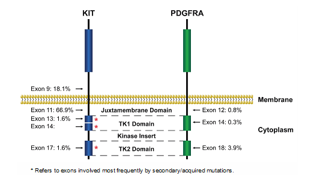
Stomach.GIST.Bx_4.3.0.0.REL_CAPCP
13
References
1. Hornick JL, Fletcher CD. Immunohistochemical staining for KIT (CD117) in soft tissue sarcomas
is very limited in distribution. Am J Clin Pathol. 2002;117(2):188-193.
2. Miettinen M, Sobin LH, Sarlomo-Rikala M. Immunohistochemical spectrum of GISTs at different
sites and their differential diagnosis with a reference to CD117 (KIT). Mod Pathol.
2000;13(10):1134-1142.
3. Sarlomo-Rikala M, Kovatich AJ, Barusevicius A, Miettinen M. CD117: a sensitive marker for
gastrointestinal stromal tumors that is more specific than CD34. Mod Pathol. 1998;11(8):728-734.
4. Espinosa I, Lee CH, Kim MK, et al. A novel monoclonal antibody against DOG1 is a sensitive and
specific marker for gastrointestinal stromal tumors. Am J Surg Path. 2008;32(2):210–218.
5. Miettinen M, Wang ZF, Lasota J. DOG1 antibody in the differential diagnosis of gastrointestinal
stromal tumors: a study of 1840 cases. Am J Surg Pathol. 2009;33:1401–1408.
6. Medeiros F, Corless CL, Duensing A, et al. KIT-negative gastrointestinal stromal tumors: proof of
concept and therapeutic implications. Am J Surg Pathol. 2004;28(7):889-894.
7. Fletcher CD, Berman JJ, Corless C, et al. Diagnosis of gastrointestinal stromal tumors: a
consensus approach. Hum Pathol. 2002;33(5):459-465.
8. Mei L, Smith SC, Faber AC, et al. Gastrointestinal Stromal Tumors: The GIST of Precision
Medicine. Trends Cancer. 2018;4:74-91.
9. Gill AJ. Succinate dehydrogenase (SDH) and mitochondrial driven neoplasia. Pathology. 2012
Jun;44(4):285-92.
10. Gill AJ, Benn DE, Chou A, et al. Immunohistochemistry for SDHB triages genetic testing of
SDHB, SDHC, and SDHD in paraganglioma-pheochromocytoma syndromes. Hum Pathol. 2010
Jun;41(6):805-14.
11. Doyle LA, Nelson D, Heinrich MC, et al. Loss of succinate dehydrogenase subunit B (SDHB)
expression is limited to a distinctive subset of gastric wild-type gastrointestinal stromal tumours: a
comprehensive genotype-phenotype correlation study. Histopathology. 2012;61(5):801-809.
12. Wagner AJ, Remillard SP, Zhang YX, et al. Loss of expression of SDHA predicts SDHA
mutations in gastrointestinal stromal tumors. Mod Pathol. 2013;26(2):289-294.
13. Dwight T, Benn DE, Clarkson A, et al. Loss of SDHA expression identifies SDHA mutations in
succinate dehydrogenase-deficient gastrointestinal stromal tumors. Am J Surg Pathol.
2013;37(2):226-233.
14. Heinrich MC, Corless CL, Demetri GD, et al. Kinase mutations and imatinib response in patients
with metastatic gastrointestinal stromal tumor. J Clin Oncol. 2003;21(23):4342-4349.
15. Heinrich MC, Corless CL, Duensing A, et al. PDGFRA activating mutations in gastrointestinal
stromal tumors. Science. 2003;299(5607):708-710.
16. Hirota S, Isozaki K, Moriyama Y, et al. Gain-of-function mutations of c-kit in human
gastrointestinal stromal tumors. Science. 1998;279(5350):577-580.
17. Rubin BP, Singer S, Tsao C, et al. KIT activation is a ubiquitous feature of gastrointestinal stromal
tumors. Cancer Res. 2001;61(22):8118-8121.
18. Heinrich MC, Corless CL, Blanke CD, et al. Molecular correlates of imatinib resistance in
gastrointestinal stromal tumors. J Clin Oncol. 2006;24(29):4764-4774.
19. Dare AJ, Gupta AA, Thipphavong S, Miettinen M, Gladdy RA. Abdominal neoplastic
manifestations of neurofibromatosis type 1. Neurooncol Adv. 2020 Jun 25;2(Suppl 1):i124-i133.
doi: 10.1093/noajnl/vdaa032. PMID: 32642738.
20. Lasota J, Kowalik A, Felisiak-Golabek A, Zięba S, Wang ZF, Miettinen M. New Mechanisms of
mTOR Pathway Activation in KIT-mutant Malignant GISTs. Appl Immunohistochem Mol Morphol.
2019 Jan;27(1):54-58. PMID: 28777148.
Stomach.GIST.Bx_4.3.0.0.REL_CAPCP
14
21. Shi E, Chmielecki J, Tang CM, et al. FGFR1 and NTRK3 actionable alterations in“wild-type”
gastrointestinal stromal tumors. J TranslMed. 2016;14(1):339.
22. Pantaleo MA, Urbini M, Indio V, et al. Genome-wide analysis identifies MEN1 and MAX mutations
and a neuroendocrine-like molecularheterogeneity in quadruple WT GIST. Mol Cancer Res.
2017;15(5):553-562.
23. Charo LM, Burgoyne AM, Fanta PT, Patel H, Chmielecki J, Sicklick JK, McHale MT. A Novel
PRKAR1B-BRAF Fusion in Gastrointestinal Stromal Tumor Guides Adjuvant Treatment Decision-
Making During Pregnancy. J Natl Compr Canc Netw 2018;16:238-42.
24. Torrence D, Xie Z, Zhang L, Chi P, Antonescu CR. Gastrointestinal stromal tumors with BRAF
gene fusions. A report of two cases showing low or absent KIT expression resulting in diagnostic
pitfalls. Genes Chromosomes Cancer. 2021 Dec;60(12):789-795.
25. Demetri GD, Benjamin RS, Blanke CD, et al; NCCN Task Force. NCCN Task Force report:
management of patients with gastrointestinal stromal tumor (GIST)--update of the NCCN clinical
practice guidelines. J Natl Compr Canc Netw. 2007;5(Suppl 2):S1-S29.
26. Demetri GD. Targeting the molecular pathophysiology of gastrointestinal stromal tumors with
imatinib: mechanisms, successes, and challenges to rational drug development. Hematol Oncol
Clin North Am. 2002;16(5):1115-1124.
27. Demetri GD, van Oosterom AT, Garrett CR, et al. Efficacy and safety of sunitinib in patients with
advanced gastrointestinal stromal tumour after failure of imatinib: a randomised controlled trial.
Lancet. 2006;368(9544):1329-1338.
28. Kelly CM, Gutierrez Sainz L, Chi P. The management of metastatic GIST: current standard and
investigational therapeutics. J Hematol Oncol 14:2, 2021.
29. Glod J, Arnaldez FI, Wiener L, Spencer M, Killian JK, Meltzer P, Dombi E, Derse-Anthony C,
Derdak J, Srinivasan R, Linehan WM, Miettinen M, Steinberg SM, Helman L, Widemann BC. A
Phase II Trial of Vandetanib in Children and Adults with Succinate Dehydrogenase-Deficient
Gastrointestinal Stromal Tumor. Clin Cancer Res. 2019 Nov 1;25(21):6302-6308. Epub 2019 Aug
22. PMID: 31439578.
30. Corless CL, Schroeder A, Griffith D, et al. PDGFRA mutations in gastrointestinal stromal tumors:
frequency, spectrum and in vitro sensitivity to imatinib. J Clin Oncol. 2005;23(23):5357-5364.
# GIST, Resection
Protocol for the Examination of Resection Specimens From
Patients With Gastrointestinal Stromal Tumor (GIST)
Version: 4.3.0.0
Protocol Posting Date: December 2022
CAP Laboratory Accreditation Program Protocol Required Use Date: September 2023
The changes included in this current protocol version affect accreditation requirements. The new deadline
for implementing this protocol version is reflected in the above accreditation date.
For accreditation purposes, this protocol should be used for the following procedures and tumor
types:
Procedure
Description
Resection
Tumor Type
Description
Gastrointestinal stromal tumor
This protocol is NOT required for accreditation purposes for the following:
Procedure
Biopsy
Local excision
Primary resection specimen with no residual tumor (eg, following neoadjuvant therapy)
Cytologic specimens
Authors
Julie C. Fanburg-Smith, MD, FCAP*; Andrew M. Bellizzi, MD*; Julia A. Bridge, MD, FCAP*; Paari
Murugan, MD, FCAP*; Javier A. Laurini, MD; Markku Miettinen, MD.
With guidance from the CAP Cancer and CAP Pathology Electronic Reporting Committees.
* Denotes primary author.

Stomach.GIST_4.3.0.0.REL_CAPCP
2
This protocol can be utilized for a variety of procedures and tumor types for clinical care purposes. For
accreditation purposes, only the definitive primary cancer resection specimen is required to have the core
and conditional data elements reported in a synoptic format.
•
Core data elements are required in reports to adequately describe appropriate malignancies. For
accreditation purposes, essential data elements must be reported in all instances, even if the
response is “not applicable” or “cannot be determined.”
•
Conditional data elements are only required to be reported if applicable as delineated in the
protocol. For instance, the total number of lymph nodes examined must be reported, but only if
nodes are present in the specimen.
•
Optional data elements are identified with “+” and although not required for CAP accreditation
purposes, may be considered for reporting as determined by local practice standards.
The use of this protocol is not required for recurrent tumors or for metastatic tumors that are resected at a
different time than the primary tumor. Use of this protocol is also not required for pathology reviews
performed at a second institution (ie, secondary consultation, second opinion, or review of outside case at
second institution).
Synoptic Reporting
All core and conditionally required data elements outlined on the surgical case summary from this cancer
protocol must be displayed in synoptic report format. Synoptic format is defined as:
•
Data element: followed by its answer (response), outline format without the paired Data element:
Response format is NOT considered synoptic.
•
The data element should be represented in the report as it is listed in the case summary. The
response for any data element may be modified from those listed in the case summary, including
“Cannot be determined” if appropriate.
•
Each diagnostic parameter pair (Data element: Response) is listed on a separate line or in a
tabular format to achieve visual separation. The following exceptions are allowed to be listed on
one line:
o
Anatomic site or specimen, laterality, and procedure
o
Pathologic Stage Classification (pTNM) elements
o
Negative margins, as long as all negative margins are specifically enumerated where
applicable
•
The synoptic portion of the report can appear in the diagnosis section of the pathology report, at
the end of the report or in a separate section, but all Data element: Responses must be listed
together in one location
Organizations and pathologists may choose to list the required elements in any order, use additional
methods in order to enhance or achieve visual separation, or add optional items within the synoptic
report. The report may have required elements in a summary format elsewhere in the report IN
ADDITION TO but not as replacement for the synoptic report ie, all required elements must be in the
synoptic portion of the report in the format defined above.
Stomach.GIST_4.3.0.0.REL_CAPCP
3
v 4.3.0.0
•
Added Associated Syndrome under Clinical
•
Reformatted Tumor Site
•
Added BRAF to Special Studies
•
Updated Note D Table 1 correction of Gastric moderate rate changed from 10% to 12%
•
Updated pTNM Classification
Stomach.GIST_4.3.0.0.REL_CAPCP
4
Reporting Template
Protocol Posting Date: December 2022
Select a single response unless otherwise indicated.
Standard(s): AJCC-UICC 8
CLINICAL
+Associated Syndrome
___ Carney triad
___ Carney-Stratakis syndrome
___ Neurofibromatosis type 1
___ Familial GIST syndrome
___ Other (specify): _________________
___ Not specified
+Preresection Treatment (select all that apply)
___ No known preresection therapy
___ Previous biopsy or surgery (specify): _________________
___ Systemic therapy performed (specify type): _________________
___ Therapy performed, type not specified
___ Not specified
SPECIMEN
Procedure
___ Local excision
___ Resection (specify type, eg., partial gastrectomy): _________________
___ Metastasectomy
___ Other (specify): _________________
___ Not specified
TUMOR
Tumor Focality
___ Unifocal
___ Multifocal
Number of Tumors
___ Specify number: _________________
___ Other (specify): _________________
___ Cannot be determined: _________________
Sizes of Tumors: _________________
___ Cannot be determined: _________________
Multiple Primary Sites (eg., stomach and small intestine)
___ Not applicable (no additional primary site(s) present)
Stomach.GIST_4.3.0.0.REL_CAPCP
5
___ Present: _________________
Please complete a separate checklist for each primary site
Tumor Site (Note A)
___ Esophagus (specify location): _________________
___ Gastroesophageal junction: _________________
___ Stomach (specify location): _________________
___ Small intestine
___ Duodenum
___ Jejunum
___ Ileum (excluding ileocecal valve)
___ Meckel diverticulum (site of neoplasm)
___ Small intestine, NOS
___ Appendix: _________________
___ Ileocecal valve: _________________
___ Large intestine
___ Cecum
___ Ascending colon
___ Hepatic flexure of colon
___ Transverse colon
___ Splenic flexure of colon
___ Descending colon
___ Sigmoid colon
___ Rectosigmoid junction: _________________
___ Rectum: _________________
___ Large intestine, NOS
___ Retroperitoneum: _________________
___ Peritoneum / abdomen (specify site): _________________
___ Other (specify): _________________
___ Cannot be determined: _________________
___ Not specified
Histologic Type
___ Gastrointestinal stromal tumor, spindle cell type
___ Gastrointestinal stromal tumor, epithelioid type
___ Gastrointestinal stromal tumor, mixed
___ Gastrointestinal stromal tumor, other (specify): _________________
+Histologic Type Comment: _________________
Tumor Size (based on clinicoradiologic estimate)
___ Greatest dimension in Centimeters (cm): _________________ cm
+Additional Dimension in Centimeters (cm): ____ x ____ cm
___ Cannot be determined (explain): _________________
Stomach.GIST_4.3.0.0.REL_CAPCP
6
Mitotic Rate (Note B)
The mitotic rate should be determined in 5 mm2 of tumor. With the use of older model microscopes, 50 HPF is equivalent to 5 mm2.
Most modern microscopes with wider fields require approximately 20 to 25 HPF to encompass 5 mm2. If necessary, please
measure a field of view to accurately determine actual number of fields required to be counted on individual microscopes to
encompass 5 mm2.
___ Specify mitotic rate per 5 mm2: _________________ mitoses per 5 mm2
___ Other (specify): _________________
___ Cannot be determined (explain): _________________
Histologic Grade (Note B)
___ G1, low grade (mitotic rate less than or equal to 5 per 5 mm2)
___ G2, high grade (mitotic rate greater than 5 per 5 mm2)
___ Other (specify): _________________
___ GX, cannot be assessed: _________________
+Necrosis
___ Not identified
___ Present
+Extent of Necrosis
___ Specify percentage: _________________ %
___ Other (specify): _________________
___ Cannot be determined: _________________
___ Cannot be determined: _________________
Treatment Effect (Note C)
___ No known presurgical therapy
___ Not identified
___ Present
+Percentage of Viable Tumor
___ Specify percentage: _________________ %
___ Other (specify): _________________
___ Cannot be determined: _________________
___ Cannot be determined: _________________
Risk Assessment (Note D)
___ None
___ Very low risk
___ Low risk
___ Moderate risk
___ High risk
___ Overtly malignant / metastatic
___ Cannot be determined: _________________
+Tumor Comment: _________________
Stomach.GIST_4.3.0.0.REL_CAPCP
7
MARGINS
Margin Status
___ All margins negative for GIST
Closest Margin(s) to GIST (select all that apply)
___ Proximal: _________________
___ Distal: _________________
___ Omental (radial): _________________
___ Mucosal: _________________
___ Deep: _________________
___ Other (specify): _________________
___ Cannot be determined: _________________
Distance from GIST to Closest Margin
Specify in Centimeters (cm)
___ Exact distance in cm: _________________ cm
___ Greater than 1 cm
Specify in Millimeters (mm)
___ Exact distance in mm: _________________ mm
___ Greater than 10 mm
Other
___ Other (specify): _________________
___ Cannot be determined: _________________
___ GIST present at margin
Margin(s) Involved by GIST (select all that apply)
___ Proximal: _________________
___ Distal: _________________
___ Omental (radial): _________________
___ Mucosal: _________________
___ Deep: _________________
___ Other (specify): _________________
___ Cannot be determined: _________________
___ Other (specify): _________________
___ Cannot be determined (explain): _________________
___ Not applicable
+Margin Comment: _________________
REGIONAL LYMPH NODES (Note E)
Regional Lymph Node Status
___ Not applicable (no regional lymph nodes submitted or found)
___ Regional lymph nodes present
___ All regional lymph nodes negative for tumor
___ Tumor present in regional lymph node(s)
Number of Lymph Nodes with Tumor
___ Exact number (specify): _________________
___ At least (specify): _________________
___ Other (specify): _________________
Stomach.GIST_4.3.0.0.REL_CAPCP
8
___ Cannot be determined (explain): _________________
___ Other (specify): _________________
___ Cannot be determined (explain): _________________
Number of Lymph Nodes Examined
___ Exact number (specify): _________________
___ At least (specify): _________________
___ Other (specify): _________________
___ Cannot be determined (explain): _________________
+Regional Lymph Node Comment: _________________
DISTANT METASTASIS
Distant Site(s) Involved, if applicable (select all that apply)
___ Not applicable
___ Liver: _________________
___ Other (specify): _________________
___ Cannot be determined
pTNM CLASSIFICATION (AJCC 8th Edition) (Note F)
Reporting of pT, pN, and (when applicable) pM categories is based on information available to the pathologist at the time the report
is issued. As per the AJCC (Chapter 1, 8th Ed.) it is the managing physician’s responsibility to establish the final pathologic stage
based upon all pertinent information, including but potentially not limited to this pathology report.
Modified Classification (required only if applicable) (select all that apply)
___ Not applicable
___ y (post-neoadjuvant therapy)
___ r (recurrence)
pT Category
___ pT not assigned (cannot be determined based on available pathological information)
___ pT0: No evidence of primary tumor
___ pT1: Tumor 2 cm or less
___ pT2: Tumor more than 2 cm but not more than 5 cm
___ pT3: Tumor more than 5 cm but not more than 10 cm
___ pT4: Tumor more than 10 cm in greatest dimension
T Suffix (required only if applicable)
___ Not applicable
___ (m) Multiple primary synchronous tumors in a single organ
pN Category (Notes E,F)
# When no lymph nodes are present (as is often the case with resection for GIST), the pathologic ‘N’ category is not assigned (pNX
is not used for GIST) and should not be reported.
___ pN not assigned (no nodes submitted or found)
___ pN not assigned (cannot be determined based on available pathological information)
___ pN0: No regional lymph node metastasis
___ pN1: Regional lymph node metastasis
Stomach.GIST_4.3.0.0.REL_CAPCP
9
pM Category (required only if confirmed pathologically) (Notes E,F)
___ Not applicable - pM cannot be determined from the submitted specimen(s)
___ pM1: Distant metastasis
ADDITIONAL FINDINGS
+Additional Findings (specify): _________________
SPECIAL STUDIES (Note G)
The CAP GIST Biomarker Template can be used for reporting biomarkers requested.
+Immunohistochemical Studies (select all that apply)
___ Not performed: _________________
___ KIT (CD117)
KIT (CD117)
___ Positive
___ Negative
___ Pending
___ DOG1 (ANO1)
DOG1 (ANO1)
___ Positive
___ Negative
___ Pending
___ SDHA
SDHA
___ Intact
___ Deficient
___ Pending
___ SDHB
SDHB
___ Intact
___ Deficient
___ Pending
___ BRAF
BRAF
___ Positive
___ Negative
___ Pending
___ Other (specify): _________________
+Molecular Genetic Studies (eg., KIT, PDGFRA, SDHA / B / C / D, RAS, or NF1 mutational analysis
or BRAF or FGFR1 fusion gene analysis)
___ Performed, see biomarker report: _________________
___ Performed (specify method(s) and result(s)): _________________
___ Pending
___ Not performed
Stomach.GIST_4.3.0.0.REL_CAPCP
10
COMMENTS
Comment(s): _________________
Stomach.GIST_4.3.0.0.REL_CAPCP
11
Explanatory Notes
A. Location
Gastrointestinal stromal tumors may occur anywhere along the entire length of the tubal gut, as well as in
extravisceral locations, which include the omentum, mesentery, pelvis, and
retroperitoneum.1,2,3,4,5,6  Typically, these tumors arise from the wall of the gut and extend inward toward
the mucosa, outward toward the serosa, or in both directions. Lesions that involve the wall of the
gastrointestinal (GI) tract frequently cause ulceration of the overlying mucosa. Infrequently, lesions invade
through the muscularis mucosa to involve the mucosa. Mucosal invasion is an adverse prognostic factor
in numerous studies. Because the anatomic location along the GI tract affects prognosis, with location in
the stomach having a more favorable prognosis, it is very important to specify anatomic location as
precisely as possible.5,6
References
1. Fletcher CD, Berman JJ, Corless C, et al. Diagnosis of gastrointestinal stromal tumors: a
consensus approach. Hum Pathol. 2002;33(5):459-465.
2. Miettinen M, Lasota J. Gastrointestinal stromal tumors: definition, clinical, histological,
immunohistochemical, and molecular genetic features and differential diagnosis. Virchows Arch.
2001;438(1):1-12.
3. Reith JD, Goldblum JR, Lyles RH, Weiss SW. Extragastrointestinal (soft tissue) stromal tumors:
an analysis of 48 cases with emphasis on histologic predictors of outcome. Mod Pathol.
2000;13(5):577-585.
4. WHO Classification of Tumours Editorial Board. Digestive system tumours. Lyon (france):
International Agency for Research on Cancer; 2019. (WHO classification of tumours series, 5th
ed; vol. 1).
5. Miettinen M, Sobin LH, Lasota J. Gastrointestinal stromal tumors of the stomach: a
clinicopathologic, immunohistochemical, and molecular genetic study of 1765 cases with long-
term follow-up. Am J Surg Pathol. 2005;29(1):52-68.
6. Miettinen M, Felisiak-Golabek A, Wang Z, Inaguma S, Lasota J. GIST Manifesting as a
Retroperitoneal Tumor: Clinicopathologic Immunohistochemical, and Molecular Genetic Study of
112 Cases. Am J Surg Pathol. 2017 May;41(5):577-585. PMID: 28288036
B. Histologic Grade
Histologic grading in GIST, unlike in soft tissue sarcoma, only takes mitotic rate into account. GIST is
generally less proliferative than many other soft tissue tumors and the threshold for separating low from
high-grade tumors occurs at 5 mitotic figures per 5 mm2.1,2,3
GX: Grade cannot be assessed
G1: Low grade; mitotic rate ≤5/5 mm2
G2: High grade; mitotic rate >5/5 mm2
The mitotic count should be initiated in an area that on screening magnification reveals the highest level
of mitotic activity and be performed as consecutive high-power fields (HPF). Stringent criteria should be
applied when counting mitotic figures; pyknotic or apoptotic nuclei should not be regarded as mitosis.
Note: Mitoses should be counted in 5 mm2 of tumor.2,3  With the use of older model microscopes, 50 HPF
is equivalent to 5 mm2. Most modern microscopes with wider fields require approximately 20 to 25 HPF to
Stomach.GIST_4.3.0.0.REL_CAPCP
12
encompass 5 mm2. If necessary, please measure a field of view to accurately determine an actual
number of fields required to be counted on individual microscopes to encompass 5 mm2.
References
1. Amin MB, Edge SB, Greene FL, et al, eds. AJCC Cancer Staging Manual. 8th ed. New York, NY:
Springer; 2017.
2. Miettinen M, Lasota J. Gastrointestinal stromal tumors: pathology and prognosis at different
sites. Semin Diagn Pathol. 2006;23(2):70-83.
3. WHO Classification of Tumours Editorial Board. Digestive system tumours. Lyon (france):
International Agency for Research on Cancer; 2019. (WHO classification of tumours series, 5th
ed; vol. 1).
C. Treatment Effect
Gastrointestinal stromal tumors respond well to the newer targeted systemic therapies, imatinib mesylate,
and sunitinib malate. The types of treatment effects that have been seen are hypocellularity, myxoid
stroma, fibrosis, and necrosis. Nests of viable tumor cells are virtually always seen. Because all of these
histologic features can be seen in untreated GIST, it is not possible to know whether they are due to
treatment or not. As a practical compromise, it is best to report the percentage of viable tumor after
treatment.
D. Risk Assessment
Biopsies are suboptimally positioned for GIST risk stratification as these may not include sufficient tumor
(i.e., 5 mm2) for mitotic counting and may not sample mitotic “hot spots”. Furthermore, the risk for
metastasis or tumor related death presumes that the GIST has been removed. On biopsy, one may
attempt to risk stratify a GIST, using location, available material for mitotic count, and clinicoradiologic
size into account.
Biopsies are more predictive if overtly high mitotic count/high grade/high risk on biopsy, based on mitoses
and clinicoradiologic size yet low mitotic count/low grade on biopsy may underestimate actual mitoses on
resection and not be accurate due to sampling. Because GIST can recur many years after initial excision,
most GIST is now regarded as having at least some potential for distant metastasis. This concept was
originally the result of a National Cancer Institute-sponsored consensus conference that was held in
2002.1 More specific data generated by large follow-up studies refined the biologic potential
assessment.2,3,4,5,6,7  Criteria obtained from those data were adopted in a National Cancer Care Network
(NCCN) Task Force report on GIST.8 We have adopted the criteria for risk stratification, as indicated in
Table 1.2,3,4,5,6,7 The scheme includes anatomic site as a factor because small bowel GIST carries a
higher risk of progression than gastric GIST of similar size and mitotic activity. This prognostic
assessment applies best to KIT/PDGFRA mutant GIST whereas SDH-deficient GIST are more
unpredictable.9 For anatomic sites not listed in this table, such as esophagus, mesentery, and
peritoneum, or in the case of “insufficient data,” it is best to use risk criteria for jejunum/ileum.
Stomach.GIST_4.3.0.0.REL_CAPCP
13
Table 1. Guidelines for Risk Assessment of Primary Gastrointestinal Stromal Tumor (GIST)
Tumor Parameters
Risk of Progressive Disease#(%)
Mitotic Rate
Size
Gastric
Duodenum
Jejunum/Ileum
Rectum
≤5 per 5 mm2
≤2 cm
None (0%)
None (0%)
None (0%)
None (0%)
>2 - ≤5 cm
Very low (1.9%)
Low (8.3%)
Low (4.3%)
Low (8.5%)
>5 - ≤10 cm
Low (3.6%)
(Insufficient
data##)
Moderate (24%)
(Insufficient
data##)
>10 cm
Moderate (12%)
High (34%)
High (52%)
High (57%)
>5 per 5 mm2
≤2 cm
None
(Insufficient
data##)
High
High (54%)
>2 - ≤5 cm
Moderate (16%)
High (50%)
High (73%)
High (52%)
>5 - ≤10 cm
High (55%)
(Insufficient
data##)
High (85%)
(Insufficient
data##)
>10 cm
High (86%)
High (86%)
High (90%)
High (71%)
Adapted with permission from Miettinen and Lasota.6 Copyright 2006 by Elsevier.
Data based on long-term follow-up of 1055 gastric, 629 small intestinal, 144 duodenal, and 111 rectal GIST from the
pre-imatinib era.2,3,4,6
# Defined as metastasis or tumor-related death
## Denotes small number of cases
Note: See Note B, “Histologic Grade,” regarding the number of high-power fields to evaluate.
References
1. Fletcher CD, Berman JJ, Corless C, et al. Diagnosis of gastrointestinal stromal tumors: a
consensus approach. Hum Pathol. 2002;33(5):459-465.
2. Miettinen M, Sobin LH, Lasota J. Gastrointestinal stromal tumors of the stomach: a
clinicopathologic, immunohistochemical, and molecular genetic study of 1765 cases with long-
term follow-up. Am J Surg Pathol. 2005;29(1):52-68.
3. Miettinen M, Furlong M, Sarlomo-Rikala M, Burke A, Sobin LH, Lasota J. Gastrointestinal stromal
tumors, intramural leiomyomas, and leiomyosarcomas in the rectum and anus: a
clinicopathologic, immunohistochemical, and molecular genetic study of 144 cases. Am J Surg
Pathol. 2001;25(9):1121-1133.
4. Miettinen M, Kopczynski J, Makhlouf HR, et al. Gastrointestinal stromal tumors, intramural
leiomyomas, and leiomyosarcomas in the duodenum: a clinicopathologic, immunohistochemical,
and molecular genetic study of 167 cases. Am J Surg Pathol. 2003;27(5):625-641.
5. Miettinen M, Lasota J. Gastrointestinal stromal tumors: pathology and prognosis at different sites.
Semin Diagn Pathol. 2006;23(2):70-83.
6. Miettinen M, Makhlouf H, Sobin LH, Lasota J. Gastrointestinal stromal tumors of the jejunum and
ileum: a clinicopathologic, immunohistochemical, and molecular genetic study of 906 cases
before imatinib with long-term follow-up. Am J Surg Pathol. 2006;30(4):477-489.
7. Miettinen M, Felisiak-Golabek A, Wang Z, Inaguma S, Lasota J. GIST Manifesting as a
Retroperitoneal Tumor: Clinicopathologic Immunohistochemical, and Molecular Genetic Study of
112 Cases. Am J Surg Pathol. 2017 May;41(5):577-585. PMID: 28288036.
8. Demetri GD, Benjamin RS, Blanke CD, et al; NCCN Task Force. NCCN Task Force report:
management of patients with gastrointestinal stromal tumor (GIST)--update of the NCCN clinical
practice guidelines. J Natl Compr Canc Netw. 2007;5(Suppl 2):S1-S29.
Stomach.GIST_4.3.0.0.REL_CAPCP
14
9. WHO Classification of Tumours Editorial Board. Digestive system tumours. Lyon (france):
International Agency for Research on Cancer; 2019. (WHO classification of tumours series, 5th
ed; vol. 1).
E. Regional Lymph Nodes, Metastasis
Gastrointestinal stromal tumors generally metastasize to a very limited subset of anatomic sites.1 These
tumors rarely metastasize to lymph nodes, which is important to note because lymphadenectomy is
unnecessary except in rare circumstances when an enlarged or otherwise suspicious lymph node is
encountered. Gastrointestinal stromal tumors metastasize predominantly to the liver or to the peritoneal
surfaces, where there can be disseminated intra-abdominal disease presenting as innumerable
metastatic nodules. Very rarely, GIST metastasize to the lungs. This situation is associated with rectal
location or very advanced disease.2 Metastasis to bone has also been documented, but it is very rare.
References
1. Fletcher CD, Berman JJ, Corless C, et al. Diagnosis of gastrointestinal stromal tumors: a
consensus approach. Hum Pathol. 2002;33(5):459-465.
2. Miettinen M, Furlong M, Sarlomo-Rikala M, Burke A, Sobin LH, Lasota J. Gastrointestinal stromal
tumors, intramural leiomyomas, and leiomyosarcomas in the rectum and anus: a
clinicopathologic, immunohistochemical, and molecular genetic study of 144 cases. Am J Surg
Pathol. 2001;25(9):1121-1133.
F. Pathologic Stage Classification
The American Joint Committee on Cancer (AJCC) and International Union Against Cancer (UICC) GIST
staging system is recommended.1 The staging system should not be applied to pediatric GIST, familial
GIST (germline mutant KIT or PDGFRA) or syndromic GIST (GIST arising in the setting of
neurofibromatosis type 1, Carney triad, or Carney dyad also known as Carney-Stratakis syndrome).
TNM Descriptors
For identification of special cases of TNM or pTNM classifications, the “m” suffix and “y” and “r” prefixes
are used. Although they do not affect the stage grouping, they indicate cases needing separate analysis.
The “m” suffix indicates the presence of multiple primary tumors in a single site and is recorded in
parentheses: pT(m)NM.
The “y” prefix indicates those cases in which classification is performed during or after initial multimodality
therapy (i.e., neoadjuvant chemotherapy, radiation therapy, or both chemotherapy and radiation therapy).
The cTNM or pTNM category is identified by a “y” prefix. The ycTNM or ypTNM categorizes the extent of
tumor actually present at the time of that examination. The “y” categorization is not an estimate of tumor
before multimodality therapy (i.e., before initiation of neoadjuvant therapy).
The “r” prefix indicates a recurrent tumor when staged after a documented disease-free interval and is
identified by the “r” prefix: rTNM.
T Category Considerations
In the case of ruptured tumors, estimates of tumor size can be obtained from radiologic data, if available.
Stomach.GIST_4.3.0.0.REL_CAPCP
15
N Category Considerations
Regional nodal metastasis is extremely rare in GIST, and there is no routine indication for lymph node
biopsy or lymph node dissection. When no lymph nodes are resected or present in the specimen (as is
often the case with resections for GIST), the pathologic ‘N’ category is not assigned; pNX should not be
used.
M Category Considerations
Most GIST metastasizes to intra-abdominal soft tissues, liver, or both. Intra-abdominal metastasis refers
to tumor involvement in the abdominal cavity away from the primary mass. Such metastasis is usually to
the serosal surfaces of the abdomen, pelvis, and retroperitoneum. Multiple primary tumors can be seen in
the setting of neurofibromatosis type 1 or familial GIST syndrome and should not be considered intra-
abdominal metastasis. Rare cases of multiple independent GIST at different GI locations have been
reported. In the absence of a primary gastrointestinal GIST, solitary omental, mesenteric, pelvic, or
retroperitoneal GIST should be considered primary tumors because extra-gastrointestinal GIST has been
described. Liver metastasis implies the presence of metastatic tumor inside the liver parenchyma as one
or more nodules.  Adherence to liver capsule, even if extensive, as sometimes seen in gastric GIST,
should not be considered liver metastasis.
Stage Groupings:
Although T, N, and M definitions are identical for all GIST, separate stage grouping schemes are provided
for gastric and small intestinal tumors. Primary omental GIST should follow the gastric GIST staging
group scheme. GIST arising in other locations (i.e., mesentery, esophagus, colon, and rectum) are to
follow the small intestinal group staging scheme.
References
1. Amin MB, Edge SB, Greene FL, et al, eds. AJCC Cancer Staging Manual. 8th ed. New York, NY:
Springer; 2017.
G. Ancillary Studies
Immunohistochemistry
Because small-molecule kinase inhibitor therapy is highly effective in the treatment of GIST, it has
become imperative to distinguish GIST from its histologic mimics, mainly leiomyoma, leiomyosarcoma,
schwannoma, and desmoid fibromatosis.1,2 Immunohistochemistry is instrumental in the work up of GIST.
For the initial workup of GIST, a basic immunohistochemical panel including CD117 (KIT), DOG1 (Ano1),
Desmin, S100 protein, and CD34 is recommended. GIST is immunoreactive for KIT (CD117)
(approximately 95%) and/or DOG1(>99%).3,4,5 KIT immunoreactivity is usually strong and diffuse but can
be more focal in unusual cases (Figure 1, A and B). It is not unusual for GIST to exhibit dot-like
perinuclear staining (Figure 1, C), while less commonly, some cases exhibit membranous staining (Figure
1, D). These patterns do not clearly correlate with mutation type or response to therapy. Most KIT-
negative/DOG1-positive GIST is gastric or extra-visceral GIST and almost invariably harbor a platelet-
derived growth factor receptor A (PDGFRA) mutation.6 DOG1 expression is not related to mutational
status in GIST, and it may be a useful marker to identify a subset of patients with CD117-negative GIST,
who might benefit from targeted therapy.4,5 Approximately 70% of GIST are positive for CD34, 30% to
40% are positive for smooth muscle actin, 5% are positive for S100 protein (usually focal), 5% are
positive for desmin (usually focal), and 1% to 2% are positive for keratin (weak/focal).7
Stomach.GIST_4.3.0.0.REL_CAPCP
16
Note: PanTrk immunohistochemistry may be positive in GIST, a tumor typically negative for NTRK fusion,
and this immunostain is not recommended.
Since succinate dehydrogenase (SDH)-deficient GIST may be familial, has specific implications (see the
following), it is recommended that all gastric GIST be screened for loss of SDH by immunohistochemistry,
best accomplished by immunostaining for SDHB, which is lost in all independent of the SDH-subunit that
is inactivated.8,9,10,11 Mutations in SDHA are detected in 30% of SDH-deficient GIST and loss of
expression of SDHA specifically identifies tumors with SDHA mutations; other SDH-deficient GIST show
normal (intact) cytoplasmic staining for SDHA.12,13 Patients with SDH-deficient GIST should be referred to
a genetic counselor for appropriate work up.
Figure 1. Patterns of KIT staining in gastrointestinal stromal tumor (GIST). A. Diffuse and strong immunoreactivity in
a typical GIST. B. Focal and weak pattern in an epithelioid gastric GIST with a PDGFRA mutation. C. Dot-like
perinuclear staining. D. Membranous pattern. (Original magnification X400)
Molecular Analysis
Approximately 75% of GIST possess activating mutations in the KIT gene, whereas another 10% have
activating mutations in the PDGFRA gene.14,15,16,17 These mutations result in virtually full-length KIT
proteins that exhibit ligand-independent activation. KIT and PDGFRA each contain 21 exons. However,
mutations cluster within “hotspots”: exons 9, 11, 13, and 17 in KIT, and exons 12, 14, and 18 in PDGFRA
(Figure 2). About 5% to 10% of GIST appear to be negative for both KIT and PDGFRA mutations. The
most recent NCCN Task Force on GIST strongly encourages that KIT and PDGFRA mutational analysis
be performed if tyrosine kinase inhibitors (TKIs) are considered as part of the treatment plan for
unresectable or metastatic disease and that mutational analysis be considered for patients with primary
disease, particularly those with high-risk tumors. KIT and PDGFRA mutation status can be determined
easily from paraffin-embedded tissue. Secondary or acquired mutations can be associated with
development of tumor resistance in the setting of long-term imatinib mesylate treatment. These are
usually point mutations that occur most commonly in KIT exons 13, 14, and 17.18 The clinical utility of
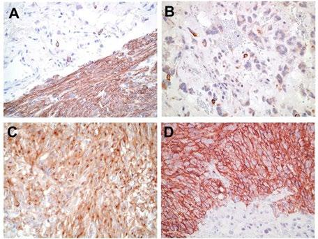
Stomach.GIST_4.3.0.0.REL_CAPCP
17
these mutations is an evolving concept, but it is important not to confuse them with the primary or initial
mutation in GIST.
Recent studies focusing on the molecular classification of GIST recognized two major subgroups:
succinate dehydrogenase (SHD)-competent and SDH-deficient GIST, both of which can arise in the
sporadic or familial setting.8,9 SDH-competent GIST include tumors with mutations of KIT and PDGFRA
as well as a subset of wild-type GIST with mutations mainly in NF1 and BRAF genes or rarely fusion gene
events involving FGFR1 or BRAF.19,20,21,22,23,24  On the other hand, SDH-deficient GIST includes tumors
with a genetic alteration in any of the SDH subunits leading to SDH dysfunction.
SDH-deficient GIST represents approximately 8% of GIST; although, these may arise sporadically. The
majority of pediatric GIST arise in Carney triad and Carney-Stratakis syndrome and are SDH-deficient.
SDH is a mitochondrial enzyme comprising four subunits (SDHA, SDHB, SDHC, and SDHD) that are
involved in the Krebs cycle. Genetic alteration of any of the four subunits results in SDH dysfunction and
subsequent loss of SDHB expression by immunohistochemistry. SDH-deficient GIST arises almost
exclusive in the stomach, affects predominantly female patients, and tends to manifest at a young age.
Pathologic features associated with SDH-deficient tumors include multinodular and/or plexiform growth
pattern, epithelioid morphology, lymphovascular invasion, nodal involvement, and frequent metastasis to
the liver and peritoneum. Importantly, germline mutations in the genes coding for any of the SDH subunits
can lead to paragangliomas/pheochromocytomas, SDH-deficient renal cell carcinoma, and pituitary
tumors in addition to GIST. It is recommended that all gastric GIST be screened for loss of SDHB by
immunohistochemistry. All patients with SDH-deficient GIST identified by loss of SDHB immunostain
should be referred to a genetic counselor.
Figure 2. Locations and frequency of activating KIT and PDGFRA mutations in GIST. Adapted with permission from
Heinrich et al.14 Copyright 2003 by the American Society of Clinical Oncology. All rights reserved.
KIT and PDGFRA are excellent targets for small-molecule tyrosine kinase inhibitors, and two compounds
of this class, imatinib mesylate (Gleevec, Novartis Pharmaceuticals, Basel, Switzerland) and sunitinib

Stomach.GIST_4.3.0.0.REL_CAPCP
18
malate (Sutent, Pfizer Pharmaceuticals, New York, New York), avapritinib (Ayvakit, PDGFRA D842V
(exon 18) mutant, may be resistant to standard therapy), regornfenib (3rd line), ripretinib (4th line,
Qinlock) have shown efficacy in clinical trials and have been approved by the US Food and Drug
Administration for the treatment of GIST.25,26,27,28 SDH-deficient GIST is usually resistant to imatinib but
may have a higher probability of response to sunitinib.8,29 Because different tyrosine kinase inhibitors
(TKIs) may have differential efficacy depending on the type of mutation present in GIST, oncologists may
want to know the mutation status of each GIST30, because this may influence which drug the patient
receives.14 Secondary resistance mutations may also affect drug selection as their significance is further
defined.
References
1. Hornick JL, Fletcher CD. Immunohistochemical staining for KIT (CD117) in soft tissue sarcomas
is very limited in distribution. Am J Clin Pathol. 2002;117(2):188-193.
2. Miettinen M, Sobin LH, Sarlomo-Rikala M. Immunohistochemical spectrum of GISTs at different
sites and their differential diagnosis with a reference to CD117 (KIT). Mod Pathol.
2000;13(10):1134-1142.
3. Sarlomo-Rikala M, Kovatich AJ, Barusevicius A, Miettinen M. CD117: a sensitive marker for
gastrointestinal stromal tumors that is more specific than CD34. Mod Pathol. 1998;11(8):728-734.
4. Espinosa I, Lee CH, Kim MK, et al. A novel monoclonal antibody against DOG1 is a sensitive and
specific marker for gastrointestinal stromal tumors. Am J Surg Path. 2008;32(2):210–218.
5. Miettinen M, Wang ZF, Lasota J. DOG1 antibody in the differential diagnosis of gastrointestinal
stromal tumors: a study of 1840 cases. Am J Surg Pathol. 2009;33:1401–1408.
6. Medeiros F, Corless CL, Duensing A, et al. KIT-negative gastrointestinal stromal tumors: proof of
concept and therapeutic implications. Am J Surg Pathol. 2004;28(7):889-894.
7. Fletcher CD, Berman JJ, Corless C, et al. Diagnosis of gastrointestinal stromal tumors: a
consensus approach. Hum Pathol. 2002;33(5):459-465.
8. Mei L, Smith SC, Faber AC, et al. Gastrointestinal Stromal Tumors: The GIST of Precision
Medicine. Trends Cancer. 2018;4:74-91.
9. Gill AJ. Succinate dehydrogenase (SDH) and mitochondrial driven neoplasia. Pathology. 2012
Jun;44(4):285-92.
10. Gill AJ, Benn DE, Chou A, et al. Immunohistochemistry for SDHB triages genetic testing of
SDHB, SDHC, and SDHD in paraganglioma-pheochromocytoma syndromes. Hum Pathol. 2010
Jun;41(6):805-14.
11. Doyle LA, Nelson D, Heinrich MC, et al. Loss of succinate dehydrogenase subunit B (SDHB)
expression is limited to a distinctive subset of gastric wild-type gastrointestinal stromal tumours: a
comprehensive genotype-phenotype correlation study. Histopathology. 2012;61(5):801-809.
12. Wagner AJ, Remillard SP, Zhang YX, et al. Loss of expression of SDHA predicts SDHA
mutations in gastrointestinal stromal tumors. Mod Pathol. 2013;26(2):289-294.
13. Dwight T, Benn DE, Clarkson A, et al. Loss of SDHA expression identifies SDHA mutations in
succinate dehydrogenase-deficient gastrointestinal stromal tumors. Am J Surg Pathol.
2013;37(2):226-233.
14. Heinrich MC, Corless CL, Demetri GD, et al. Kinase mutations and imatinib response in patients
with metastatic gastrointestinal stromal tumor. J Clin Oncol. 2003;21(23):4342-4349.
15. Heinrich MC, Corless CL, Duensing A, et al. PDGFRA activating mutations in gastrointestinal
stromal tumors. Science. 2003;299(5607):708-710.
16. Hirota S, Isozaki K, Moriyama Y, et al. Gain-of-function mutations of c-kit in human
gastrointestinal stromal tumors. Science. 1998;279(5350):577-580.
Stomach.GIST_4.3.0.0.REL_CAPCP
19
17. Rubin BP, Singer S, Tsao C, et al. KIT activation is a ubiquitous feature of gastrointestinal stromal
tumors. Cancer Res. 2001;61(22):8118-8121.
18. Heinrich MC, Corless CL, Blanke CD, et al. Molecular correlates of imatinib resistance in
gastrointestinal stromal tumors. J Clin Oncol. 2006;24(29):4764-4774.
19. Dare AJ, Gupta AA, Thipphavong S, Miettinen M, Gladdy RA. Abdominal neoplastic
manifestations of neurofibromatosis type 1. Neurooncol Adv. 2020 Jun 25;2(Suppl 1):i124-i133.
doi: 10.1093/noajnl/vdaa032. PMID: 32642738.
20. Lasota J, Kowalik A, Felisiak-Golabek A, Zięba S, Wang ZF, Miettinen M. New Mechanisms of
mTOR Pathway Activation in KIT-mutant Malignant GISTs. Appl Immunohistochem Mol Morphol.
2019 Jan;27(1):54-58. PMID: 28777148.
21. Shi E, Chmielecki J, Tang CM, et al. FGFR1 and NTRK3 actionable alterations in“wild-type”
gastrointestinal stromal tumors. J TranslMed. 2016;14(1):339.
22. Pantaleo MA, Urbini M, Indio V, et al. Genome-wide analysis identifies MEN1 and MAX mutations
and a neuroendocrine-like molecularheterogeneity in quadruple WT GIST. Mol Cancer Res.
2017;15(5):553-562.
23. Charo LM, Burgoyne AM, Fanta PT, Patel H, Chmielecki J, Sicklick JK, McHale MT. A Novel
PRKAR1B-BRAF Fusion in Gastrointestinal Stromal Tumor Guides Adjuvant Treatment Decision-
Making During Pregnancy. J Natl Compr Canc Netw 2018;16:238-42.
24. Torrence D, Xie Z, Zhang L, Chi P, Antonescu CR. Gastrointestinal stromal tumors with BRAF
gene fusions. A report of two cases showing low or absent KIT expression resulting in diagnostic
pitfalls. Genes Chromosomes Cancer. 2021 Dec;60(12):789-795.
25. Demetri GD, Benjamin RS, Blanke CD, et al; NCCN Task Force. NCCN Task Force report:
management of patients with gastrointestinal stromal tumor (GIST)--update of the NCCN clinical
practice guidelines. J Natl Compr Canc Netw. 2007;5(Suppl 2):S1-S29.
26. Demetri GD. Targeting the molecular pathophysiology of gastrointestinal stromal tumors with
imatinib: mechanisms, successes, and challenges to rational drug development. Hematol Oncol
Clin North Am. 2002;16(5):1115-1124.
27. Demetri GD, van Oosterom AT, Garrett CR, et al. Efficacy and safety of sunitinib in patients with
advanced gastrointestinal stromal tumour after failure of imatinib: a randomised controlled trial.
Lancet. 2006;368(9544):1329-1338.
28. Kelly CM, Gutierrez Sainz L, Chi P. The management of metastatic GIST: current standard and
investigational therapeutics. J Hematol Oncol 14:2, 2021.
29. Glod J, Arnaldez FI, Wiener L, Spencer M, Killian JK, Meltzer P, Dombi E, Derse-Anthony C,
Derdak J, Srinivasan R, Linehan WM, Miettinen M, Steinberg SM, Helman L, Widemann BC. A
Phase II Trial of Vandetanib in Children and Adults with Succinate Dehydrogenase-Deficient
Gastrointestinal Stromal Tumor. Clin Cancer Res. 2019 Nov 1;25(21):6302-6308. Epub 2019 Aug
22. PMID: 31439578.
30. Corless CL, Schroeder A, Griffith D, et al. PDGFRA mutations in gastrointestinal stromal tumors:
frequency, spectrum and in vitro sensitivity to imatinib. J Clin Oncol. 2005;23(23):5357-5364.
# Head and Neck Biomarker Reporting
Head and Neck Biomarker Reporting Template
Version: 2.2.0.0
Protocol Posting Date: September 2023
The use of this protocol is recommended for clinical care purposes but is not required for accreditation
purposes.
Authors
Raja R. Seethala, MD*; Frank Schneider, MD; Alexander Baras, MD, PhD; Brett W. Baskovich, MD;
Patrick L. Fitzgibbons, MD, FCAP; George G. Birdsong, MD; Joseph D. Khoury, MD.
With guidance from the CAP Cancer and CAP Pathology Electronic Reporting Committees.
* Denotes primary author.
Completion of the template is the responsibility of the laboratory performing the biomarker testing and/or
providing the interpretation. When both testing and interpretation are performed elsewhere (eg, a reference
laboratory), synoptic reporting of the results by the laboratory submitting the tissue for testing is also
encouraged to ensure that all information is included in the patient’s medical record and thus readily
available to the treating clinical team. This template is not required for accreditation purposes.

CAP
Approved
HN.Bmk_2.2.0.0.REL_CAPCP
2
v2.2.0.0
•
Updated "HPV-DNA PCR" and "HPV-E6/E7 mRNA RT-PCR" questions and answer sets
CAP
Approved
HN.Bmk_2.2.0.0.REL_CAPCP
3
Reporting Template
Protocol Posting Date: September 2023
Select a single response unless otherwise indicated.
MORPHOLOGIC DIAGNOSIS
+Diagnosis: _________________
RESULTS
Head and Neck Squamous Cell Carcinoma (HNSCC)
Human Papillomavirus (HPV) Testing
+p16 IHC as a Surrogate for Transcriptionally Active High-Risk HPV
___ Negative (less than 50% diffuse and moderate-to-strong nuclear and cytoplasmic staining)
___ Equivocal (less than 70% but greater than or equal to 50% diffuse and moderate-to-strong
nuclear and cytoplasmic staining)
___ Positive (greater than or equal to 70% diffuse and moderate-to-strong nuclear and cytoplasmic
staining)
___ Other results (including cytology specimens, specify): _________________
___ Cannot be determined (explain): _________________
+HPV E6 / E7 mRNA ISH
___ Negative (no signal)
___ Positive (cytoplasmic and / or nuclear signals)
+Specify Subtypes (if available): _________________
___ Cannot be determined (explain): _________________
+HPV-DNA ISH
___ Negative (no nuclear signal)
___ Positive (punctate and / or diffuse nuclear staining)
+Specify Subtypes (if available): _________________
___ Cannot be determined (explain): _________________
+HPV-DNA PCR
___ Negative
___ Positive
+Specify Subtypes (if available): _________________
___ Cannot be determined (explain): _________________
+HPV E6 / E7 mRNA RT-PCR
___ Negative
___ Positive
+Specify Subtypes (if available): _________________
___ Cannot be determined (explain): _________________
Epstein-Barr Virus (EBV) Testing
+EBV Early mRNA (EBER) ISH
___ Negative (no signal)
___ Positive (nuclear signal)
___ Cannot be determined (explain): _________________
CAP
Approved
HN.Bmk_2.2.0.0.REL_CAPCP
4
NUT Midline Carcinoma
+NUT IHC
___ Negative (no nuclear staining)
___ Positive (nuclear staining)
___ Cannot be determined (explain): _________________
+NUT Rearrangements (by Molecular Methods)
___ No NUT rearrangement detected
___ NUT rearrangement detected
+Specify Fusion Partner (if available): _________________
___ Cannot be determined (explain): _________________
Salivary Gland Carcinoma
Mucoepidermoid Carcinoma
+MAML2 Rearrangements (by Molecular Methods)
___ No MAML2 rearrangement detected
___ MAML2 rearrangement detected
+Specify Fusion Partner (if available): _________________
___ Cannot be determined (explain): _________________
Adenoid Cystic Carcinoma
+MYB IHC
___ Negative (no nuclear staining)
___ Positive (nuclear staining)
___ Cannot be determined (explain): _________________
+MYB Rearrangements (by Molecular Methods)
___ No MYB rearrangement detected
___ MYB rearrangement detected
+Specify Fusion Partner (if available): _________________
___ Cannot be determined (explain): _________________
+MYB-L1 IHC
___ Negative (no nuclear staining)
___ Positive (nuclear staining)
___ Cannot be determined (explain): _________________
+MYB-L1 Rearrangements (by Molecular Methods)
___ No MYB-L1 rearrangement detected
___ MYB-L1 rearrangement detected
+Specify Fusion Partner (if available): _________________
___ Cannot be determined (explain): _________________
Salivary Duct Carcinoma
+AR IHC
___ Negative (no nuclear staining)
___ Positive (nuclear staining)
___ Cannot be determined (explain): _________________
+HER2 Immunohistochemistry Interpretation
___ Negative
___ Equivocal
___ Positive
+HER2 Immunohistochemistry Scoring System
___ Breast
___ Gastric
___ Other (specify): _________________
CAP
Approved
HN.Bmk_2.2.0.0.REL_CAPCP
5
+HER2 Immunohistochemistry Score
___ 0
___ 1+
___ 2+
___ 3+
___ Other (specify): _________________
+Specify Percentage of Cells with Uniform Intense Complete Membrane Staining:
_________________ %
+HER2 Immunohistochemistry Antibody
___ HercepTest
___ 4B5
___ SP3
___ Other (specify): _________________
+HER2 Immunohistochemistry Assay Information
___ Food and Drug Administration (FDA) cleared test / vendor (specify): _________________
___ Laboratory-developed test
+HER2 by in situ Hybridization
___ Negative (not amplified)
___ Positive (amplified)
___ Cannot be determined (indeterminate) (explain): _________________
+Aneusomy (as defined by vendor kit used)
___ Not identified
___ Present (explain): _________________
+Heterogeneous Signals
___ Not identified
___ Present
+Specify Percentage of Cells with Amplified HER2 Signals: _________________ %
Carcinoma ex Pleomorphic Adenoma / Pleomorphic Adenoma
+PLAG1 IHC
___ Negative (no nuclear staining)
___ Positive (nuclear staining)
___ Cannot be determined (explain): _________________
+PLAG1 Rearrangements (by Molecular Methods)
___ No PLAG1 rearrangement detected
___ PLAG1 rearrangement detected
+Specify Fusion Partner (if available): _________________
___ Cannot be determined (explain): _________________
+HMGA2 IHC
___ Negative (no nuclear staining)
___ Positive (nuclear staining)
___ Cannot be determined (explain): _________________
+HMGA2 Rearrangements (by Molecular Methods)
___ No HMGA2 rearrangement detected
___ HMGA2 rearrangement detected
+Specify Fusion Partner (if available): _________________
___ Cannot be determined (explain): _________________
CAP
Approved
HN.Bmk_2.2.0.0.REL_CAPCP
6
(Mammary Analogue) Secretory Carcinoma
+ETV6 Rearrangements (by Molecular Methods)
___ No ETV6 rearrangement detected
___ ETV6 rearrangement detected
+Specify Fusion Partner (if available): _________________
___ Cannot be determined (explain): _________________
+NTRK Rearrangements (by Molecular Methods)
___ NTRK rearrangement detected
+NTRK Type
___ NTRK1
___ NTRK2
___ NTRK3
+Specify Fusion Partner (if available): _________________
___ No NTRK rearrangement detected
___ Cannot be determined (explain): _________________
(Hyalinizing) Clear Cell Carcinoma
+EWSR1 Rearrangements (by Molecular Methods)
___ No EWSR1 rearrangement detected
___ EWSR1 rearrangement detected
+Specify Fusion Partner (if available): _________________
___ Cannot be determined (explain): _________________
Sinonasal Malignancies
SMARCB1 (INI-1) and SMARCA4 (BRG-1) Deficient Sinonasal Carcinoma / Rhabdoid Tumor /
Teratocarcinosarcoma
+INI1 IHC
___ Intact nuclear staining (negative for deletion / alteration)
___ Loss of nuclear staining (positive for deletion / alteration)
___ Cannot be determined (explain): _________________
+BRG1 IHC
___ Intact nuclear staining (negative for deletion / alteration)
___ Loss of nuclear staining (positive for deletion / alteration)
___ Cannot be determined (explain): _________________
Biphenotypic Sinonasal Sarcoma
+PAX Rearrangements (by Molecular Methods)
___ PAX rearrangement detected
+PAX Type
___ PAX3
___ PAX7
+Specify Fusion Partner (if available): _________________
___ No PAX rearrangement detected
___ Cannot be determined (explain): _________________
Paraganglioma
+SDHB IHC
___ Intact cytoplasmic staining
___ Loss of cytoplasmic staining
___ Cannot be determined (explain): _________________
Other Markers (repeat up to 10X, as needed)
+Specify Other Marker and Results: _________________
CAP
Approved
HN.Bmk_2.2.0.0.REL_CAPCP
7
COMMENTS
Comment(s): _________________
# Hepatoblastoma, Biopsy
Protocol for the Examination of Biopsy Specimens from Patients
with Hepatoblastoma
Version: 5.0.0.1
Protocol Posting Date: June 2025
CAP Laboratory Accreditation Program Protocol Required Use Date: June 2024
The changes included in this current protocol version do not affect the prior accreditation date.
For accreditation purposes, this protocol should be used for the following procedures AND tumor
types:
Procedure
Description
Biopsy
Includes specimens designated core biopsy, incisional biopsy, or other
Tumor Type
Description
Hepatoblastoma
Includes pediatric hepatoblastoma
The following should NOT be reported using this protocol:
Procedure
Resection (consider Hepatoblastoma Resection protocol)
Tumor Type
Other primary malignant hepatic tumors
Version Contributors
Cancer Committee Authors: Jessica L. Davis, MD*, Soo-Jin Cho, MD, PhD*
Other Expert Contributors: Grace Kim, MD, Sarangarajan Ranganathan, MD, Delores Lopez-Terrada,
MD, PhD, Allison O’Neal, MD, Arun Rangaswami, MD
* Denotes primary author.
For any questions or comments, contact: cancerprotocols@cap.org.
Glossary:
Author: Expert who is a current member of the Cancer Committee, or an expert designated by the chair
of the Cancer Committee.
Expert Contributors: Includes members of other CAP committees or external subject matter experts
who contribute to the current version of the protocol.

CAP
Approved
Liver.Hepatoblastoma.Bx_5.0.0.1.REL_CAPCP
2
Synoptic reporting with core and conditional data elements for designated specimen types* is required for
accreditation.
•
Data elements designated as core must be reported.
•
Data elements designated as conditional only need to be reported if applicable.
•
Data elements designated as optional are identified with “+”. Although not required for
accreditation, they may be considered for reporting.
This protocol is not required for recurrent or metastatic tumors resected at a different time than the
primary tumor. This protocol is also not required for pathology reviews performed at a second institution
(i.e., second opinion and referrals to another institution).
Full accreditation requirements can be found on the CAP website under Accreditation Checklists.
A list of core and conditional data elements can be found in the Summary of Required Elements under
Resources on the CAP Cancer Protocols website.
*Includes definitive primary cancer resection and pediatric biopsy tumor types.
Synoptic Reporting
All core and conditionally required data elements outlined on the surgical case summary from this cancer
protocol must be displayed in synoptic report format. Synoptic format is defined as:
•
Data element: followed by its answer (response), outline format without the paired Data element:
Response format is NOT considered synoptic.
•
The data element should be represented in the report as it is listed in the case summary. The
response for any data element may be modified from those listed in the case summary, including
“Cannot be determined” if appropriate.
•
Each diagnostic parameter pair (Data element: Response) is listed on a separate line or in a
tabular format to achieve visual separation. The following exceptions are allowed to be listed on
one line:
o
Anatomic site or specimen, laterality, and procedure
o
Pathologic Stage Classification (pTNM) elements
o
Negative margins, as long as all negative margins are specifically enumerated where
applicable
•
The synoptic portion of the report can appear in the diagnosis section of the pathology report, at
the end of the report or in a separate section, but all Data element: Responses must be listed
together in one location
•
Organizations and pathologists may choose to list the required elements in any order, use
additional methods in order to enhance or achieve visual separation, or add optional items within
the synoptic report. The report may have required elements in a summary format elsewhere in
the report IN ADDITION TO but not as replacement for the synoptic report i.e., all required
elements must be in the synoptic portion of the report in the format defined above.
CAP
Approved
Liver.Hepatoblastoma.Bx_5.0.0.1.REL_CAPCP
3
v 5.0.0.1
•
Accreditation statement update
•
eCP explanatory note electronic link updates
CAP
Approved
Liver.Hepatoblastoma.Bx_5.0.0.1.REL_CAPCP
4
Reporting Template
Protocol Posting Date: June 2025
Select a single response unless otherwise indicated.
EXPERT CONSULTATION
+Expert Consultation (Note A)
___ Pending - Completion of this CAP Cancer Protocol is awaiting expert consultation
___ Completed - This CAP Cancer Protocol or some elements have been performed following expert
consultation
___ Not applicable
SPECIMEN
Procedure (Note B)
___ Core biopsy
___ Incisional biopsy
___ Other (specify): _________________
___ Not specified
TUMOR
Tumor Focality (within liver)
___ Unifocal
___ Multifocal
___ Cannot be determined (explain): _________________
Tumor Site
___ Right lobe
___ Left lobe
___ Right and left lobes
___ Other (specify): _________________
___ Not specified
Histologic Type (Note C) (select all that apply)
Ancillary studies (immunohistochemistry, molecular) may be performed to clarify histologic type.
___ Hepatoblastoma, epithelial type, fetal pattern (mitotically inactive / well differentiated)
___ Hepatoblastoma, epithelial type, fetal pattern (mitotically active / crowded)
___ Hepatoblastoma, epithelial type, embryonal pattern
___ Hepatoblastoma, epithelial type, pleomorphic pattern (poorly differentiated)
___ Hepatoblastoma, epithelial type, macrotrabecular pattern
___ Hepatoblastoma, epithelial type, small cell undifferentiated pattern
___ Hepatoblastoma, epithelial and mesenchymal type, without teratoid features
___ Hepatoblastoma, epithelial and mesenchymal type, with teratoid features
___ Hepatoblastoma, other (specify, i.e., blastemal, cholangioblastic, squamoid or glandular patterns):
CAP
Approved
Liver.Hepatoblastoma.Bx_5.0.0.1.REL_CAPCP
5
_________________
___ Hepatocellular neoplasm, NOS
+Histologic Type Comment: _________________
ADDITIONAL FINDINGS
+Additional Findings (Note D) (select all that apply)
___ No background liver available for evaluation (explain): _________________
___ Cirrhosis / fibrosis (specify stage of fibrosis): _________________
___ Iron overload
___ Hepatitis (specify type): _________________
___ Other (specify): _________________
___ None identified
SPECIAL STUDIES (Note E)
Serum Alpha-Fetoprotein (AFP) Level at Diagnosis (Note E)
Level at time of diagnosis may be prognostically important.
___ Less than 100 ng / mL
___ 100 ng / mL - 1.2 million ng / mL
___ Greater than 1.2 million ng / mL
___ Not known
Beta-catenin IHC
___ Not performed
___ Pending
___ Negative
___ Positive (specify pattern): _________________
___ Cannot be determined (explain): _________________
+Glypican-3 IHC
___ Not performed
___ Pending
___ Negative
___ Positive
+Pattern of Glypican-3 IHC Staining: _________________
___ Cannot be determined (explain): _________________
INI-1 IHC
___ Not performed
___ Pending
___ Expression retained
___ Expression lost
___ Cannot be determined (explain): _________________
+Other Ancillary Studies (specify): _________________
CAP
Approved
Liver.Hepatoblastoma.Bx_5.0.0.1.REL_CAPCP
6
COMMENTS
Comment(s): _________________
CAP
Approved
Liver.Hepatoblastoma.Bx_5.0.0.1.REL_CAPCP
7
Explanatory Notes
A. Expert Consultation
Expert consultation is not required. This question has been added to annotate, if so desired, that the case
has been sent out for consultation and thus items of the CAP protocol could not be completed pending
expert consultation.  Completion of the CAP protocol will then be performed following consultation.
B. Procedures
Primary diagnosis by cytology (fine-needle aspiration) is not recommended as it may be misleading
because of difficulties in distinguishing well-differentiated hepatocellular malignancy from regenerative
changes and benign proliferations, and because of the variability of histologic features in hepatoblastoma.
Hence, all attempts for fine-needle aspiration should be discouraged in favor of biopsy or resection.
The current recommendation for hepatoblastoma diagnosis is a tumor biopsy, except for rare cases for
which upfront resection may be performed. This is the recommendation made by the international
consensus classification1 and will be followed in future Children’s Oncology Group (COG) studies in
alignment with other international protocols. Hepatoblastomas are usually solitary lesions that occupy one
of the lobes of the liver but may transgress more than 1 liver segment (the basis for pretreatment extent
of disease [PRETEXT] staging). Multifocal lesions also occur, and multifocal tumors are the most likely
cases to be diagnosed by biopsy. Any tumor that is not radiologically PRETEXT I or II may be biopsied
upfront, as primary resection may not be an option. Even with lower stage disease, large vessel invasion
will be a contraindication to primary resection and will warrant preoperative chemotherapy.
The type of biopsy performed is up to the discretion of the treating physicians and surgeons. Biopsy types
include image guided needle biopsy (the more common scenario in the US) or open biopsy for cases that
are difficult to access, or in which there is potential for surgical resection. While it is much easier to get
adequate tissue for studies with open biopsies, a needle biopsy done in interventional radiology is
adequate for diagnosis as long as multiple (5-10) needle cores are obtained.2 It is also recommended that
the radiologist obtain needle cores from different portions of the tumor to maximize sampling of all areas
of interest in the tumor. Calcified, bony, or hard tissue need not be sampled, however, and focus should
be placed on obtaining adequate representation of the viable epithelial component. The region from which
the biopsy is obtained should be noted if possible. If tumor involves more than 1 lobe, more than 1 lesion
or area of the tumor should be sampled. These sites should be labeled separately, as different nodules in
the same patient may have different histologies and biology. As most needle biopsy procedures are
ultrasound guided, it may be easy to differentiate between tumor and uninvolved liver, and an attempt
should be made to acquire adjacent nontumor liver tissue to understand underlying disease processes.
Upfront biopsy necessitates proper triage of the specimen for all pathologic and biologic studies, as
required for COG trials of most pediatric tumors. The goal of the biopsy is tissue diagnosis to separate
hepatoblastomas (the most common pediatric tumors) from other benign (especially mesenchymal
hamartoma, adenomas, and focal nodular hyperplasia) or malignant (pediatric hepatocellular carcinoma
and embryonal sarcoma) liver tumors, which are treated differently. Regardless of the procedure type,
every attempt should be made to assess if tissue obtained is viable and can be triaged for other studies.
Imprint cytology may be used to assess tumor viability. No tissue diagnosis is needed at the time of
frozen section, for that is the purpose of doing the biopsy, and the surgeon should be so educated. Tissue
should instead be set aside for snap freezing (tumor and normal) as well as for cytogenetics (tumor only),
CAP
Approved
Liver.Hepatoblastoma.Bx_5.0.0.1.REL_CAPCP
8
following institutional practices and when feasible. While tissue may be set aside for electron microscopy,
it is left to individual Institutions to make that decision. For further details, pathologists are referred to the
consensus classification of hepatoblastoma published by Lopez-Terrada et al.1
References
1. Lopez-Terrada D, Alaggio R, de Davila MT, et al. Towards an international pediatric liver tumor
consensus classification: proceedings of the Los Angeles COG liver tumors symposium. Mod
Pathol. 2014;27(3):472-491.
2. Finegold MJ. Hepatic Tumors in Childhood. In: Russo P RE, Piccoli D, eds. Pathology of Pediatric
Gastrointestinal and Liver Disease. New York, NY: Springer-Verlag; 2004:300-346.
C. Histologic Type and Associated Immunohistochemistry
Not only are hepatoblastomas rare, but their diversity significantly limits the experience of any single
center or pathologist.1 A classification scheme for hepatoblastoma that divides the more frequently or
prognostically influential features from infrequent or inconsequential (minor) components is presented in
Table 1.2 The significance of a biopsy classification is that it reflects the true components of the tumor and
is not limited by chemotherapy effects that alter the morphology of these tumors. It should, however, be
noted that not all components may necessarily be sampled in a biopsy, and radiologic features, especially
the presence of bone, need to be considered for subtyping.
Table 1. Pediatric Liver Tumors Consensus Classification
Benign and tumor-like conditions
Hepatocellular adenoma (adenomatosis)
Focal nodular hyperplasia
Macroregenerative nodule
Premalignant lesions
Dysplastic nodule
Malignant
Hepatoblastoma
Epithelial
Fetal with low mitotic activity (well-differentiated fetal pattern)
Fetal, mitotically active (crowded fetal)
Embryonal
Pleomorphic (poorly differentiated)
Small-cell undifferentiated
Epithelial mixed (any/all above)
Cholangioblastic
Epithelial macrotrabecular pattern
Mixed epithelial and mesenchymal
Without teratoid features
With teratoid features
Malignant rhabdoid tumor of the liver (INI-1 expression lost)
Hepatocellular carcinoma (HCC)
Classic HCC
Fibrolamellar HCC
Hepatocellular neoplasm, not otherwise specified (HCN-NOS)
Modified from Lopez-Terrada et al.2
CAP
Approved
Liver.Hepatoblastoma.Bx_5.0.0.1.REL_CAPCP
9
Detailed descriptions of the various epithelial patterns and subtypes of hepatoblastoma can be found in
recent reviews.3,4 More concise descriptions are provided below to aid accurate classification.
Epithelial patterns: Fetal with low mitotic activity (well-differentiated/mitotically inactive fetal)
The designation of “pure fetal hepatoblastoma” is restricted to primary resection specimens where the
entire (100%) tumor consists of well-differentiated/mitotically inactive fetal pattern hepatoblastoma. By
definition, a diagnosis of “pure fetal hepatoblastoma” cannot be made on a biopsy specimen, although the
biopsy may demonstrate varying proportions of this epithelial pattern. “Pure fetal hepatoblastoma” is the
least common amongst the histologic subgroups of HB but its recognition is important as it may obviate
the need for chemotherapy. The current Children’s Oncology Group (COG) study is treating stage I “pure
fetal hepatoblastoma” as very low risk tumors treated with surgery alone.2,5,6,7
Well-differentiated/mitotically inactive fetal pattern is characterized by uniform-appearing round to
polygonal cells with small central nuclei and clear or pale eosinophilic cytoplasm that may give the tumor
a light cell-dark cell pattern at low-power. Nuclei are usually inconspicuous and, by definition, the mitotic
rate is low (2 or fewer mitoses per 10 high-power fields). Rare interspersed extramedullary hematopoiesis
(EMH) may be seen.
Immunohistochemistry may aid in differentiating this pattern from uninvolved background liver, which may
show overlapping histologic features particularly in very young patients. The well-differentiated fetal
(WDF) areas typically show a 1-2+ fine stippled pericanalicular (cytoplasmic) staining pattern with
glypican-3 (GPC3) and variable nuclear staining for beta-catenin. Glutamine synthetase (GS) is usually
diffusely positive in tumor cells whereas background liver shows a pericentral zonal distribution. SALL4 is
negative in WDF.
Epithelial patterns: Fetal with mitoses (crowded/mitotically active fetal)
This is the most common pattern seen in biopsy specimens and resections. By definition, >2 mitoses per
10 high-power fields are seen. Cells are of similar size as those seen in WDF pattern but show more
granular cytoplasm and larger nuclei. EMH is frequently seen. Beta-catenin shows more frequent nuclear
staining compared to WDF but is not diffuse, with variable cytoplasmic staining. GPC3 typically shows a
course diffuse cytoplasmic staining pattern that is 2-3+. GS shows diffuse strong staining and SALL4 is
negative.
Epithelial patterns: Embryonal
The embryonal pattern is composed of cells with high nuclear-to-cytoplasmic ratio with oval to angulated
nuclei that are hyperchromatic with prominent single nucleoli and scant cytoplasm. A transition from
crowded fetal to embryonal pattern can be seen and may be subtle or abrupt. Rosettes and tubular
structures may be seen in this pattern. Mitoses are frequent. Nuclear staining for beta-catenin is more
diffuse than fetal patterns. GPC3 is typically strongly positive (3+ staining), with the exception of some
primitive embryonal components that may be negative for GPC3. GS usually shows variable staining.
SALL4 is frequently strongly nuclear positive.
Epithelial patterns: Pleomorphic
When tumor cells of either fetal or embryonal type show prominent nucleoli and more atypical morphology
resembling hepatocellular carcinoma, the term pleomorphic epithelial is used. Most instances of these
pleomorphic (previously also called “anaplastic fetal”) epithelial components are seen in post-
CAP
Approved
Liver.Hepatoblastoma.Bx_5.0.0.1.REL_CAPCP
10
chemotherapy resection specimens, but this pattern can also be present in diagnostic biopsy specimens.
Tumor cells are usually positive for GPC3 and beta-catenin (nuclear).
Epithelial patterns: Macrotrabecular
Unlike the epithelial patterns noted above (i.e., fetal, embryonal, pleomorphic), the macrotrabecular
pattern is an architectural pattern, with arrangement of cells in trabeculae 5 cells thick and greater. The
original descriptions of 20-cell-thick plates were problematic, and most cases represented hepatocellular
carcinoma (HCC), not HB. Particularly in biopsy specimens, if tumor cells demonstrate pleomorphic
cytomorphology with macrotrabecular arrangement, then consideration should be given to hepatocellular
neoplasm (HCN), NOS (HCN-NOS) or HCC.
Other epithelial patterns
Squamoid and glandular tumor components may be seen in HB. Biliary-like profiles at the edges of tumor
nodules, designated cholangioblastic, can also be seen and is distinct from ductular reaction seen at the
junction with background liver.8 The biliary-like profiles of cholangioblastic pattern show nuclear beta-
catenin staining (versus membranous beta-catenin staining only in ductular reaction) and are typically
positive for CK19 and pankeratin, with less frequent CK7 expression.
Primitive cell patterns: Small cell undifferentiated (SCU) and blastemal
The SCU pattern has been the most controversial pattern in HB. Earlier studies included a category of
“pure small cell undifferentiated HB” with poor prognosis which are now known to represent malignant
rhabdoid tumor with SMARCB1 alterations and loss of INI-1 expression. If this category is excluded, small
foci of SCU in otherwise conventional HB no longer appears to be significant and the last COG trial
showed no prognostic value to this histologic pattern.9 Nests of SCU pattern, characterized by small blue
cells with scant mitoses and cytoplasm, are often identified within areas of embryonal pattern HB.
More frequently, nests of cells with similar morphology to SCU are seen in areas of CF and at the
periphery of nodules of HB and are designated blastemal. It is possible that the two patterns (SCU and
blastemal) are related and represent primitive cells in HB capable of multidirectional differentiation. The
full significance of these patterns is still to be determined but should be recognized as primitive
components of HB that are not seen in either HCN-NOS or HCC. SCU and blastemal cells show nuclear
expression of beta-catenin and co-expression of cytokeratins (pankeratin, CK19, CK7) and vimentin.
Mixed epithelial-mesenchymal HB
In the consensus classification, mesenchymal HB is noted as part of a mixed epithelial-mesenchymal HB
with or without teratoid elements. It is unusual to find a pure mesenchymal HB, except in rare cases post-
chemotherapy where epithelial elements have responded to therapy and only the mesenchymal elements
remain, mainly osteoid and bone. Other mesenchymal elements that can be seen include cartilage
(mature or immature), muscle or rhabdomyoblastic areas, and spindle cell mesenchyme. Of note,
nests/aggregates of blastemal HB can be seen in the vicinity of mesenchymal components, most often
osteoid. Nuclear beta-catenin may be seen in any of the mesenchymal components. GPC3 and SALL4
are usually negative but may highlight epithelial components in between.
Presence of neural elements such as primitive neuroepithelium, melanin, glial or ganglion cells may all
represent features of teratoid differentiation in HB.10 Still other unusual patterns of teratoid HB include
glandular elements admixed with primitive neuroepithelium, with cytoplasmic supranuclear and
CAP
Approved
Liver.Hepatoblastoma.Bx_5.0.0.1.REL_CAPCP
11
subnuclear vacuolation in the glandular epithelium resembling yolk sac tumor.11These glands are different
from the occasional intestinal-type glands that may be seen in epithelial HB and seem to occur in the
vicinity of immature neuroepithelium. These glands show nuclear staining for beta-catenin and are also
positive for GPC3 and SALL4, also similar to yolk sac tumor. The neuroepithelial elements show variable
nuclear beta-catenin and are negative for GPC3 and may show variable staining for SALL4. They usually
show multilayering when arranged in rosette form, helping to differentiate them from embryonal rosettes,
although this distinction may sometimes be difficult.
References
1. Finegold MJ. Hepatic Tumors in Childhood. In: Russo P RE, Piccoli D, eds. Pathology of Pediatric
Gastrointestinal and Liver Disease. New York, NY: Springer-Verlag; 2004:300-346.
2. Lopez-Terrada D, Alaggio R, de Davila MT, et al. Towards an international pediatric liver tumor
consensus classification: proceedings of the Los Angeles COG liver tumors symposium. Mod
Pathol. 2014;27(3):472-491.
3. Ranganathan S, Lopez-Terrada D, Alaggio R. Hepatoblastoma and Pediatric Hepatocellular
Carcinoma: An Update. Pediatr Dev Pathol. 2020 Mar-Apr;23(2):79-95.
4. Cho SJ. Pediatric Liver Tumors: Updates in Classification. Surg Pathol Clin. 2020 Dec;13(4):601-
623.
5. Czauderna P, Lopez-Terrada D, Hiyama E, Häberle B, Malogolowkin MH, Meyers RL.
Hepatoblastoma state of the art: pathology, genetics, risk stratification, and chemotherapy. Curr
Opin Pediatr. 2014;26(1):19-28.
6. Meyers RL, Tiao G, de Ville de Goyet J, Superina R, Aronson DC. Hepatoblastoma state of the
art: pre-treatment extent of disease, surgical resection guidelines and the role of liver
transplantation. Curr Opin Pediatr. 2014;26(1):29-36.
7. Malogolowkin MH, Katzenstein HM, Meyers RL, et al. Complete surgical resection is curative for
children with hepatoblastoma with pure fetal histology: a report from the Children's Oncology
Group. J Clin Oncol. 2011;29(24):3301-3306.
8. Zimmermann A. Hepatoblastoma with cholangioblastic features ('cholangioblastic
hepatoblastoma') and other liver tumors with bimodal differentiation in young patients. Med
Pediatr Oncol. 2002 Nov;39(5):487-91
9. Trobaugh-Lotrario AD, Tomlinson GE, Finegold MJ, Gore L, Feusner JH. Small cell
undifferentiated variant of hepatoblastoma: adverse clinical and molecular features similar to
rhabdoid tumors. Pediatr Blood Cancer. 2009;52(3):328-334.
10. Manivel C, Wick MR, Abenoza P, Dehner LP. Teratoid hepatoblastoma. The nosologic dilemma
of solid embryonic neoplasms of childhood. Cancer. 1986 Jun 1;57(11):2168-74.
11. Smith JA, Ranganathan S. Teratoid Hepatoblastoma with Yolk Sac-Like and Neuroendocrine
Elements. Pediatr Dev Pathol. 2020 Sep-Oct;23(5):387-391.
D. Associated Clinical, Environmental, and Genetic Factors
Clinical Features and Differential Diagnosis
The presenting symptom of virtually all liver tumors in children is abdominal swelling secondary to
hepatomegaly. When confronted with this symptom, it is useful to consider the age at which liver tumors
tend to occur (see Table 2).1 Exceptions are frequent, but age can serve as a guide when the presenting
symptoms lack specificity. In the Pediatric Oncology Group series from 1986-20022,3, 66% of
hepatoblastomas were manifest by the second year, and 11% before 6 months of age. Approximately
CAP
Approved
Liver.Hepatoblastoma.Bx_5.0.0.1.REL_CAPCP
12
50% of those in infants were congenital, given their size when discovered by 2-3 months of age; 6% of
hepatoblastomas occurred after 5 years of age. Hepatocellular carcinomas have been observed as early
as 6 months of age. Seven examples of mixed hepatoblastomas and hepatocellular carcinomas have
been observed at a mean age of 8.5 years; perinatally acquired hepatitis B virus was responsible in 3
instances. Yolk sac tumors are more common in early childhood, but they also occur rarely in older
adults; of note, a component of yolk sac tumor may be present in teratoid hepatoblastoma. Systemic
malignancies and metastatic disease must be considered at all ages because hepatomegaly due to
megakaryoblastic leukemia, Langerhans cell histiocytosis, and neuroblastoma are important sources of
confusion with hepatoblastoma in infancy, as are intraabdominal desmoplastic small round cell tumors
later in childhood.
Table 2. Tumors of the Liver in Children: Usual Age of Presentation
Age
Benign
Malignant
Infancy
(0-1 y)
Infantile hemangioma
Mesenchymal hamartoma
Teratoma
Hepatoblastoma, especially small cell undifferentiated
Rhabdoid tumor
Yolk sac tumor
Langerhans cell histiocytosis
Megakaryoblastic leukemia
Disseminated neuroblastoma
Early childhood
(1-3 y)
Infantile hemangioma
Mesenchymal hamartoma
Hepatoblastoma
Rhabdomyosarcoma
Inflammatory myofibroblastic (pseudo) tumor
Later childhood
(3-10 y)
Perivascular epithelioid cell tumors
(PE-Comas), including
angiomyolipoma in liver and clear
cell tumor of ligamentum teres /
falciform ligament
Hepatocellular carcinoma
Embryonal (undifferentiated) sarcoma
Angiosarcoma
Cholangiocarcinoma
Endocrine (gastrin) carcinoma
Adolescence
(10-16 y)
Hepatocellular adenoma
Focal nodular hyperplasia
Biliary cystadenoma
Fibrolamellar hepatocellular carcinoma
Hodgkin lymphoma
Leiomyosarcoma
Environmental Factors
Hepatoblastoma occurs in association with several well-described environmental factors and cancer
genetic syndromes (see Table 3); however, not all of these associations are necessarily of statistical
significance. Environmental factors and prenatal exposure to different agents have been implicated in
hepatoblastoma.4,5
Data from the US National Cancer Institute Surveillance, Epidemiology, and End Result (SEER) program
revealed an average annual increase of 2.2% in the incidence of hepatoblastoma from 2004-2015.6  This
increase may be in part explained by surviving premature infants. Hepatoblastomas in Japan accounted
for 58% of all malignancies in children who weighed less than 1000 g at birth. Further analysis of the
Japanese Children’s Cancer Registry data revealed that 15 of 303 (5%) hepatoblastomas between 1985-
1995 occurred in infants with a history of prematurity and weight less than 1500 g at birth.4 This rate was
greater than 10 times that for all live births. The histologic features of hepatoblastoma after prematurity
are indistinguishable from those of other hepatoblastomas.
CAP
Approved
Liver.Hepatoblastoma.Bx_5.0.0.1.REL_CAPCP
13
Table 3. Clinical Syndromes, Congenital Malformations,
and Other Conditions Associated with Hepatoblastoma
Congenital Malformations
Absence of left adrenal gland
Bilateral talipes
Duplicated ureters
Dysplasia of ear lobes
Cleft palate
Fetal hydrops
Hemihypertrophy
Heterotopic lung tissue
Horseshoe kidney
Inguinal hernia
Intrathoracic kidney
Macroglossia
Meckel diverticulum
Persistent ductus arteriosus
Renal dysplasia
Right-sided diaphragmatic hernia
Single coronary artery
Umbilical hernia
Syndromes
Beckwith-Wiedemann syndrome
Beckwith-Wiedemann syndrome with opsoclonus, myoclonus
Budd-Chiari syndrome
Familial adenomatous polyposis syndrome
Li-Fraumeni cancer syndrome
Polyposis coli families
Schinzel-Geidion syndrome
Simpson-Golabi-Behmel syndrome
Trisomy 18
Metabolic / Pathophysiologic Abnormalities
Cystathioninuria
Glycogen storage disease types Ia, III, and IV
Hypoglycemia
Heterozygous a1-antitrypsin deficiency
Isosexual precocity
Prematurity
Total parenteral nutrition
Very low birth weight
Environmental / Other
Alcohol embryopathy
Human immunodeficiency virus or hepatitis B virus infection
Maternal clomiphene citrate or Pergonal
Oral contraceptive, mother
Oral contraceptive, patient
Osteoporosis
Synchronous Wilms tumor
CAP
Approved
Liver.Hepatoblastoma.Bx_5.0.0.1.REL_CAPCP
14
Genetic Factors
Hepatoblastomas are genomically stable embryonal neoplasms generally carrying a very low rate of
somatic mutations.7,8,9,10 Karyotyping of hepatoblastomas initially demonstrated few recurrent
chromosomal abnormalities including trisomies of chromosomes 20, 2 and 8, and abnormalities involving
gains of chromosome 1q, sometimes associated with t(1;4)(q12;q34) or other unbalanced
translocations.11 However, aberrant activation of the Wnt/β-catenin pathway appears to be the main
hepatoblastoma driver, with close to 90% harboring CTNNB1 mutation.7,12 NFE2L2 has been reported to
represent the second most commonly mutated gene in small series of hepatoblastomas (5% to 10%) and
associated with poor prognosis. The presence of TERT promoter mutations is characteristic of the
hepatocellular neoplasm, not otherwise specified (HCN-NOS) provisional subtype. Several recent
hepatoblastoma genomic profiling studies have reported variants and copy number alterations in
additional genes7,9,10  involving pathways potentially implicated in hepatoblastoma development and
clinical behavior, including Notch, Sonic Hedgehog, PI3K/AKT, EGFR and Hippo pathway (YAP), among
others.7,8,13,14
Several hepatoblastoma genomic profiling studies have attempted to better understand the biological
factors associated with hepatoblastoma prognosis, response to therapy, and define biological groups to
develop a more precise risk stratification. Transcriptomic profiling initially demonstrated two distinct
genotype-phenotype hepatoblastoma subtypes, one with a more mature phenotype corresponding to fetal
histology, and a second one recapitulating early fetal life liver, and with embryonal histology.15 Later
genomic studies demonstrated additional molecular risk-associated subtypes, with high-risk tumors being
characterized by high NFE2L2 activity, high LIN28B, HMGA2, SALL4, and AFP expression, as well as
low let-7 expression and HNF1A activity.7 Recently, HB epigenomic profiling demonstrated genome-wide
dysregulation of RNA editing in HB and identified additional epigenomic clusters, including an aggressive
subgroup identified by characteristic methylation features, strong 14q32 locus expression, as well as
CTNNB1 and NFE2L2 mutations and a progenitor-like phenotype.16 Unfortunately, none of these
transcriptomic or epigenomic prognostic-associated clusters have yet been clinically validated in large
prospective studies and are currently not being used for risk stratification. Systematic banking of
hepatoblastoma tumor material remains of great importance to further investigate the clinical relevance of
these molecular abnormalities and biological groups, so they could be incorporated in more precise risk
stratification algorithms.
Table 4. Constitutional Genetic Disease Associated with Hepatoblastoma
Disease
Tumor Type
Chromosomal
Locus
Gene
Familial
adenomatous
polyposis
Hepatoblastoma, hepatocellular
carcinoma or adenoma, biliary
adenoma
5q21.22
APC
Beckwith-
Wiedemann
syndrome
Hepatoblastoma,
hemangioendothelioma
11p15.5
p57KIP2, others
Li-Fraumeni
syndrome
Hepatoblastoma, undifferentiated
sarcoma
17p13
TP53
Trisomy 18
Hepatoblastoma
18
—
Glycogen storage
disease types Ia, III,
IV
Hepatocellular adenoma or carcinoma,
hepatoblastoma
17
Glucose-6-phosphatase; debrancher
and brancher enzymes
CAP
Approved
Liver.Hepatoblastoma.Bx_5.0.0.1.REL_CAPCP
15
References
1. Malogolowkin MH, Katzenstein HM, Meyers RL, et al. Complete surgical resection is curative for
children with hepatoblastoma with pure fetal histology: a report from the Children's Oncology
Group. J Clin Oncol. 2011;29(24):3301-3306.
2. Ross JA, Gurney JG. Hepatoblastoma incidence in the United States from 1973 to 1992. Med
Pediatr Oncol.1998;30(3):141-142.
3. Ortega JA, Douglass EC, Feusner JH, et al. Randomized comparison of
cisplatin/vincristine/fluorouracil and cisplatin/continuous infusion doxorubicin for treatment of
pediatric hepatoblastoma: a report from the Children's Cancer Group and the Pediatric Oncology
Group. J Clin Oncol. 2000;18(14):2665-2675.
4. Ikeda H, Hachitanda Y, Tanimura M, Maruyama K, Koizumi T, Tsuchida Y. Development of
unfavorable hepatoblastoma in children of very low birth weight: results of a surgical and
pathologic review. Cancer. 1998;82(9):1789-1796.
5. Spector LG, Birch J. The epidemiology of hepatoblastoma. Pediatr Blood Cancer.
2012;59(5):776-779.
6. Feng J, He Y, Wei L, et al. Assessment of Survival of Pediatric Patients with Hepatoblastoma
Who Received Chemotherapy Following Liver Transplant or Liver Resection. JAMA Netw Open.
2019;2(10): e1912676
7. Sumazin P, Chen Y, Treviño LR, Sarabia SF, Hampton OA, Patel K, Mistretta TA, Zorman B,
Thompson P, Heczey A, Comerford S, Wheeler DA, Chintagumpala M, Meyers R, Rakheja D,
Finegold MJ, Tomlinson G, Parsons DW, López-Terrada D. Genomic analysis of hepatoblastoma
identifies distinct molecular and prognostic subgroups. Hepatology. 2017 Jan;65(1):104-121.
8. Eichenmüller M, Trippel F, Kreuder M, Beck A, Schwarzmayr T, Häberle B, Cairo S, Leuschner I,
von Schweinitz D, Strom TM, Kappler R. The genomic landscape of hepatoblastoma and their
progenies with HCC-like features. J Hepatol. 2014 Dec;61(6):1312-20.
9. Nagae G, Yamamoto S, Fujita M, Fujita T, Nonaka A, Umeda T, Fukuda S, Tatsuno K, Maejima
K, Hayashi A, Kurihara S, Kojima M, Hishiki T, Watanabe K, Ida K, Yano M, Hiyama Y, Tanaka Y,
Inoue T, Ueda H, Nakagawa H, Aburatani H, Hiyama E. Genetic and epigenetic basis of
hepatoblastoma diversity. Nat Commun. 2021 Sep 20;12(1):5423.
10. Hirsch TZ, Pilet J, Morcrette G, Roehrig A, Monteiro BJE, Molina L, Bayard Q, Trépo E, Meunier
L, Caruso S, Renault V, Deleuze JF, Fresneau B, Chardot C, Gonzales E, Jacquemin E, Guerin
F, Fabre M, Aerts I, Taque S, Laithier V, Branchereau S, Guettier C, Brugières L, Rebouissou S,
Letouzé E, Zucman-Rossi J. Integrated Genomic Analysis Identifies Driver Genes and Cisplatin-
Resistant Progenitor Phenotype in Pediatric Liver Cancer. Cancer Discov. 2021 Oct;11(10):2524-
2543.
11. Tomlinson GE, Douglass EC, Pollock BH, Finegold MJ, Schneider NR. Cytogenetic evaluation of
a large series of hepatoblastomas: numerical abnormalities with recurring aberrations involving
1q12-q21. Genes Chromosomes Cancer. 2005 Oct;44(2):177-84
12. Bell D, Ranganathan S, Tao J, Monga SP. Novel Advances in Understanding of Molecular
Pathogenesis of Hepatoblastoma: A Wnt/β-Catenin Perspective. Gene Expr. 2017 Feb
10;17(2):141-154.
13. Luo JH, Ren B, Keryanov S, Tseng GC, Rao UN, Monga SP, Strom S, Demetris AJ, Nalesnik M,
Yu YP, Ranganathan S, Michalopoulos GK. Transcriptomic and genomic analysis of human
hepatocellular carcinomas and hepatoblastomas. Hepatology. 2006 Oct;44(4):1012-24.
CAP
Approved
Liver.Hepatoblastoma.Bx_5.0.0.1.REL_CAPCP
16
14. Tao J, Calvisi DF, Ranganathan S, Cigliano A, Zhou L, Singh S, Jiang L, Fan B, Terracciano L,
Armeanu-Ebinger S, Ribback S, Dombrowski F, Evert M, Chen X, Monga SPS. Activation of β-
catenin and Yap1 in human hepatoblastoma and induction of hepatocarcinogenesis in
mice. Gastroenterology. 2014 Sep;147(3):690-701.
15. Cairo S, Armengol C, De Reyniès A, Wei Y, Thomas E, Renard CA, Goga A, Balakrishnan A,
Semeraro M, Gresh L, Pontoglio M, Strick-Marchand H, Levillayer F, Nouet Y, Rickman D,
Gauthier F, Branchereau S, Brugières L, Laithier V, Bouvier R, Boman F, Basso G, Michiels JF,
Hofman P, Arbez-Gindre F, Jouan H, Rousselet-Chapeau MC, Berrebi D, Marcellin L, Plenat F,
Zachar D, Joubert M, Selves J, Pasquier D, Bioulac-Sage P, Grotzer M, Childs M, Fabre M,
Buendia MA. Hepatic stem-like phenotype and interplay of Wnt/beta-catenin and Myc signaling in
aggressive childhood liver cancer. Cancer Cell. 2008 Dec 9;14(6):471-84.
16. Carrillo-Reixach J, Torrens L, Simon-Coma M, Royo L, Domingo-Sàbat M, Abril-Fornaguera J,
Akers N, Sala M, Ragull S, Arnal M, Villalmanzo N, Cairo S, Villanueva A, Kappler R, Garrido M,
Guerra L, Sábado C, Guillén G, Mallo M, Piñeyro D, Vázquez-Vitali M, Kuchuk O, Mateos ME,
Ramírez G, Santamaría ML, Mozo Y, Soriano A, Grotzer M, Branchereau S, de Andoin NG,
López-Ibor B, López-Almaraz R, Salinas JA, Torres B, Hernández F, Uriz JJ, Fabre M, Blanco J,
Paris C, Bajčiová V, Laureys G, Masnou H, Clos A, Belendez C, Guettier C, Sumoy L, Planas R,
Jordà M, Nonell L, Czauderna P, Morland B, Sia D, Losic B, Buendia MA, Sarrias MR, Llovet JM,
Armengol C. Epigenetic footprint enables molecular risk stratification of hepatoblastoma with
clinical implications. J Hepatol. 2020 Aug;73(2):328-341.
E. Tumor Markers
Alpha-fetoprotein (AFP) is a circulating tumor marker elevated in all cases of HB. Historically, it was
thought that tumors with an AFP level less than 100 ng/mL carried a poor prognosis, particularly given the
perceived link between low AFP with small cell undifferentiated (SCU) histologic pattern. This concern
has since been refuted in a publication from a recently concluded Children’s Oncology Group trial
demonstrating that the presence of SCU pattern is not associated with a poor prognosis.1 There is
consensus opinion from HB experts that low AFP (<100 ng/mL) values can be seen in association with
small tumors, incidentally diagnosed on imaging obtained for an unrelated reason or during surveillance
for a known cancer predisposition syndrome. Tumors associated with a normal AFP, previously perceived
to be HB, are now, in hindsight, known to be malignant rhabdoid tumors or tumors of a different histology
altogether.
Clinically, AFP is a useful diagnostic biomarker to monitor response to therapy and to evaluate for
disease progression. There are two important factors to keep in mind when interpreting the clinical utility
of AFP. First, there are tumors other than HB that secrete AFP, including pediatric hepatocellular
carcinomas, germ cell tumors, and rare pancreatic tumors. Second, AFP is markedly elevated in the
perinatal period and in the subsequent months of life which can impact the diagnostic relevance of this
lab value. The Children’s Hepatic tumors International Collaboration (CHIC) risk-stratification tool derived
from the retrospective analysis of 1200 patients with HB treated on clinical trials conducted within four
consortia demonstrates that gradations of AFP at diagnosis <100, 100-1000, or >1000 might be relevant
for prognosis.2 While work in the germ cell tumor literature links the kinetics of AFP decline during therapy
with long-term outcome, there is limited data in hepatoblastoma linking log-fold decline of AFP to outcome
and more work is being done to clarify this relationship.3,4,5
CAP
Approved
Liver.Hepatoblastoma.Bx_5.0.0.1.REL_CAPCP
17
References
1. Meyers RL, Rowland JR, Krailo M, Chen Z, Katzenstein HM, Malogolowkin MH. Predictive power
of pretreatment prognostic factors in children with hepatoblastoma: a report from the Children's
Oncology Group. Pediatr Blood Cancer. 2009;53(6):1016-1022.
2. Meyers RL, Maibach R, Hiyama E, Häberle B, Krailo M, Rangaswami A, Aronson DC,
Malogolowkin MH, Perilongo G, von Schweinitz D, Ansari M, Lopez-Terrada D, Tanaka Y,
Alaggio R, Leuschner I, Hishiki T, Schmid I, Watanabe K, Yoshimura K, Feng Y, Rinaldi E,
Saraceno D, Derosa M, Czauderna P. Risk-stratified staging in paediatric hepatoblastoma: a
unified analysis from the Children's Hepatic tumors International Collaboration. Lancet Oncol.
2017 Jan;18(1):122-131.
3. Van Tornout JM, Buckley JD, Quinn JJ, Feusner JH, Krailo MD, King DR, Hammond GD, Ortega
JA. Timing and magnitude of decline in alpha-fetoprotein levels in treated children with
unresectable or metastatic hepatoblastoma are predictors of outcome: a report from the
Children's Cancer Group. J Clin Oncol.1997 Mar;15(3):1190-7.
4. Koh KN, Park M, Kim BE, Bae KW, Kim KM, Im HJ, Seo JJ. Prognostic implications of serum
alpha-fetoprotein response during treatment of hepatoblastoma. Pediatr Blood Cancer. 2011
Oct;57(4):554-60.
5. Fuchs J, Rydzynski J, Von Schweinitz D, Bode U, Hecker H, Weinel P, Bürger D, Harms D,
Erttmann R, Oldhafer K, Mildenberger H; Study Committee of the Cooperative Pediatric Liver
Tumor Study Hb 94 for the German Society for Pediatric Oncology and Hematology.
Pretreatment prognostic factors and treatment results in children with hepatoblastoma: a report
from the German Cooperative Pediatric Liver Tumor Study HB 94. Cancer. 2002 Jul 1;95(1):172-
82.
F. Ancillary Studies
Immunohistochemistry may help differentiate hepatoblastoma from normal liver or other hepatocellular
tumors, or aid in accurate diagnosis of the various hepatoblastoma subtypes. Staining with glypican-3 has
a distinctive pattern with a fine pericanalicular staining seen in cells of the well-differentiated fetal
hepatoblastoma, while the mitotically active fetal subtype and embryonal areas show similar patterns of
coarse granular cytoplasmic staining. Small cell undifferentiated, cholangioblastic, and mesenchymal
components are negative for glypican-3. Most teratoid components are also negative, except for an
occasional glandular/yolk sac-like component that may show positive staining.
Beta-catenin staining is more variable. Rare pediatric hepatocellular carcinomas can show strong positive
staining, as can nested epithelial-stromal tumors. The tumor currently considered under the rubric of
hepatocellular neoplasms, NOS in the consensus classification also show nuclear beta-catenin staining
despite morphologic overlap with features of hepatocellular carcinomas. At present, there is no
immunostain to differentiate hepatocellular carcinoma from hepatoblastoma with confidence, though in
general most pediatric hepatocellular carcinomas do not show the same intense nuclear staining as
hepatoblastomas. Beta-catenin staining is usually associated with strong glutamine synthetase and cyclin
D1 staining in hepatoblastomas. Possible genetic markers (trisomies for chromosomes 2, 20, and 8;
abnormalities of chromosome 1p) are being investigated and may help differentiate these 2 entities, but
only approximately 35%-40% of hepatoblastomas carry the abnormalities.1
Immunohistochemistry with glypican-3, beta-catenin, and glutamine synthetase (GS) aids in
distinguishing hepatoblastoma from normal liver. Normal fetal liver is negative for glypican and shows
CAP
Approved
Liver.Hepatoblastoma.Bx_5.0.0.1.REL_CAPCP
18
only pericentral hepatocyte staining while staining diffusely in the tumor cells. Nuclear beta-catenin is only
seen in tumor. Immunohistochemistry may be useful for identifying the small cell component of
hepatoblastoma, as well. The small cells usually stain strongly and uniformly with beta-catenin in a
nuclear pattern and are negative for glypican-3. This is in contrast to embryonal and fetal cells, which are
cytoplasmic glypican-3 positive in most instances and show variable nuclear beta-catenin. The SCU
component may also stain for vimentin and cytokeratin.
Evaluation of the SCU component with an INI1 stain is critical, particularly if the SCU component forms a
significant portion of the biopsy. Any loss of INI1 in the SCU component may warrant reclassification on
review as a malignant rhabdoid tumor with a different Children’s Oncology Group treatment protocol.
While this loss of INI1 is unusual in the usual SCU components that form small foci in between other
epithelial components, it is prudent to do the stain and report the findings. Interestingly, stain for INI1 may
be stronger in the nuclei of SCU component than surrounding cells; the significance of this is still to be
determined.
It is also important to realize that fetal pattern hepatoblastoma may resemble the fetal hepatocytes
trapped in benign liver tumors, such as mesenchymal hamartoma (MH) and infantile hemangioma (IH),
and this needs to be recognized in a biopsy. Use of immunohistochemistry may be helpful in some
instances but usually needs more than 1 stain for confirmation. The fetal liver trapped in an MH or IH may
show fine glypican-3 staining but will usually lack beta-catenin nuclear staining. Also, the lesional cells of
IH will stain with CD31 and Glut1, while MH may show epithelial lined cysts or myxoid matrix with a
prominent biliary component. The biliary elements in hepatoblastoma (Cholangioblastic pattern) usually
show nuclear beta-catenin staining.
References
1. Lopez-Terrada D, Alaggio R, de Davila MT, et al. Towards an international pediatric liver tumor
consensus classification: proceedings of the Los Angeles COG liver tumors symposium. Mod
Pathol. 2014;27(3):472-491.
# Hepatocellular Carcinoma
Protocol for the Examination of Specimens From Patients With
Hepatocellular Carcinoma
Version: 4.3.0.0
Protocol Posting Date: June 2022
CAP Laboratory Accreditation Program Protocol Required Use Date: March 2023
The changes included in this current protocol version affect accreditation requirements. The new deadline
for implementing this protocol version is reflected in the above accreditation date.
For accreditation purposes, this protocol should be used for the following procedures AND tumor
types:
Procedure
Description
Resection
Includes specimens designated hepatic resection, partial or complete
Tumor Type
Description
Carcinoma
Hepatocellular carcinoma and fibrolamellar carcinoma
This protocol is NOT required for accreditation purposes for the following:
Procedure
Biopsy
Primary resection specimen with no residual cancer (eg, following presurgical therapy)
Cytologic specimens
The following tumor types should NOT be reported using this protocol:
Tumor Type
Small duct or large duct intrahepatic cholangiocarcinoma (consider the Intrahepatic Bile Ducts protocol)
Combined hepatocellular-cholangiocarcinoma (consider the Intrahepatic Bile Ducts protocol)
Poorly differentiated neuroendocrine carcinoma (consider the Intrahepatic Bile Ducts protocol)
Well-differentiated neuroendocrine tumor
Hepatoblastoma (consider the Hepatoblastoma protocol)
Lymphoma (consider the Hodgkin or non-Hodgkin Lymphoma protocols)
Sarcoma (consider the Soft Tissue protocol)
Authors
Lawrence J. Burgart, MD*; William V. Chopp, MD*; Dhanpat Jain, MD*.
With guidance from the CAP Cancer and CAP Pathology Electronic Reporting Committees.
* Denotes primary author.

Liver.HCC_4.3.0.0.REL_CAPCP
2
This protocol can be utilized for a variety of procedures and tumor types for clinical care purposes. For
accreditation purposes, only the definitive primary cancer resection specimen is required to have the core
and conditional data elements reported in a synoptic format.
•
Core data elements are required in reports to adequately describe appropriate malignancies. For
accreditation purposes, essential data elements must be reported in all instances, even if the
response is “not applicable” or “cannot be determined.”
•
Conditional data elements are only required to be reported if applicable as delineated in the
protocol. For instance, the total number of lymph nodes examined must be reported, but only if
nodes are present in the specimen.
•
Optional data elements are identified with “+” and although not required for CAP accreditation
purposes, may be considered for reporting as determined by local practice standards.
The use of this protocol is not required for recurrent tumors or for metastatic tumors that are resected at a
different time than the primary tumor. Use of this protocol is also not required for pathology reviews
performed at a second institution (ie, secondary consultation, second opinion, or review of outside case at
second institution).
Synoptic Reporting
All core and conditionally required data elements outlined on the surgical case summary from this cancer
protocol must be displayed in synoptic report format. Synoptic format is defined as:
•
Data element: followed by its answer (response), outline format without the paired Data element:
Response format is NOT considered synoptic.
•
The data element should be represented in the report as it is listed in the case summary. The
response for any data element may be modified from those listed in the case summary, including
“Cannot be determined” if appropriate.
•
Each diagnostic parameter pair (Data element: Response) is listed on a separate line or in a
tabular format to achieve visual separation. The following exceptions are allowed to be listed on
one line:
o
Anatomic site or specimen, laterality, and procedure
o
Pathologic Stage Classification (pTNM) elements
o
Negative margins, as long as all negative margins are specifically enumerated where
applicable
•
The synoptic portion of the report can appear in the diagnosis section of the pathology report, at
the end of the report or in a separate section, but all Data element: Responses must be listed
together in one location
Organizations and pathologists may choose to list the required elements in any order, use additional
methods in order to enhance or achieve visual separation, or add optional items within the synoptic
report. The report may have required elements in a summary format elsewhere in the report IN
ADDITION TO but not as replacement for the synoptic report ie, all required elements must be in the
synoptic portion of the report in the format defined above.
Liver.HCC_4.3.0.0.REL_CAPCP
3
v 4.3.0.0
•
Deprecated Hepatoblastoma from Histologic Type question
•
Corrected typo in Explanatory Note C
Liver.HCC_4.3.0.0.REL_CAPCP
4
Reporting Template
Protocol Posting Date: June 2022
Select a single response unless otherwise indicated.
Standard(s): AJCC-UICC 8
___ Liver
SPECIMEN (Note A)
Procedure (select all that apply)
___ Wedge resection
___ Partial hepatectomy, major (3 segments or more)
___ Partial hepatectomy, minor (less than 3 segments)
___ Partial hepatectomy (not otherwise specified)
___ Total hepatectomy
___ Other (specify): _________________
___ Not specified
TUMOR
Histologic Type (Note B)
___ Hepatocellular carcinoma
___ Hepatocellular carcinoma, fibrolamellar
___ Hepatocellular carcinoma, scirrhous
___ Hepatocellular carcinoma, clear cell type
___ Other histologic type not listed (specify): _________________
___ Carcinoma, type cannot be determined: _________________
+Histologic Type Comment: _________________
Histologic Grade (Note C)
For multiple tumors, select the worst grade.
___ G1, well differentiated
___ G2, moderately differentiated
___ G3, poorly differentiated
___ G4, undifferentiated
___ Other (specify): _________________
___ GX, cannot be assessed: _________________
___ Not applicable: _________________
Tumor Focality
___ Solitary
___ Multiple: _________________
___ Cannot be determined: _________________
TUMOR CHARACTERISTICS# (Note D)
# For multiple tumors, repeat this section for up to 5 largest tumor nodules.
Tumor Identification: _________________
Liver.HCC_4.3.0.0.REL_CAPCP
5
Tumor Site
___ Right lobe: _________________
___ Left lobe: _________________
___ Caudate lobe: _________________
___ Quadrate lobe: _________________
___ Segmental location (specify): _________________
___ Other (specify): _________________
Tumor Size
___ Greatest dimension of viable tumor in Centimeters (cm): _________________ cm
+Additional Dimension in Centimeters (cm): ____ x ____ cm
+Greatest Dimension of Tumor on Gross Exam in Centimeters (cm): _________________ cm
___ Cannot be determined (explain): _________________
Treatment Effect
___ No known presurgical therapy
___ Complete necrosis (no viable tumor)
___ Incomplete necrosis (viable tumor present)
+Extent of Tumor Necrosis (%)
___ Specify percentage: _________________ %
___ Other (specify): _________________
___ Cannot be determined: _________________
___ No necrosis
___ Cannot be determined (explain): _________________
+Satellitosis
___ Not identified
___ Present
___ Cannot be determined
Tumor Extent (select all that apply)
___ Confined to liver
___ Involves a major branch of the portal vein
___ Involves hepatic vein(s)
___ Perforates visceral peritoneum
___ Directly invades gallbladder
___ Directly invades diaphragm
___ Directly invades other adjacent organ(s) (specify): _________________
___ Cannot be determined: _________________
___ No evidence of primary tumor
Vascular Invasion (Note E) (select all that apply)
___ Not identified
___ Small vessel (specify tumor nodule(s), if applicable): _________________
___ Large vessel (major branch of hepatic vein or portal vein) (specify tumor nodule(s), if applicable):
_________________
___ Present (not otherwise specified) (specify tumor nodule(s), if applicable): _________________
___ Cannot be determined: _________________
Liver.HCC_4.3.0.0.REL_CAPCP
6
+Perineural Invasion
___ Not identified
___ Present (specify tumor nodule(s), if applicable): _________________
___ Cannot be determined: _________________
+Tumor Comment: _________________
MARGINS (Note F)
Margin Status
___ All margins negative for invasive carcinoma
Closest Margin(s) to Invasive Carcinoma (select all that apply)
___ Parenchymal: _________________
___ Other (specify): _________________
___ Cannot be determined: _________________
Distance from Invasive Carcinoma to Closest Margin
Specify in Centimeters (cm)
___ Exact distance in cm: _________________ cm
___ Greater than 1 cm
Specify in Millimeters (mm)
___ Exact distance in mm: _________________ mm
___ Greater than 10 mm
Other
___ Other (specify): _________________
___ Cannot be determined: _________________
___ Invasive carcinoma present at margin
Margin(s) Involved by Invasive Carcinoma (select all that apply)
___ Parenchymal: _________________
___ Other (specify): _________________
___ Cannot be determined: _________________
___ Other (specify): _________________
___ Cannot be determined (explain): _________________
___ Not applicable
+Margin Comment: _________________
REGIONAL LYMPH NODES
Regional Lymph Node Status
___ Not applicable (no regional lymph nodes submitted or found)
___ Regional lymph nodes present
___ All regional lymph nodes negative for tumor
___ Tumor present in regional lymph node(s)
Number of Lymph Nodes with Tumor
___ Exact number (specify): _________________
___ At least (specify): _________________
___ Other (specify): _________________
___ Cannot be determined (explain): _________________
Liver.HCC_4.3.0.0.REL_CAPCP
7
___ Other (specify): _________________
___ Cannot be determined (explain): _________________
Number of Lymph Nodes Examined
___ Exact number (specify): _________________
___ At least (specify): _________________
___ Other (specify): _________________
___ Cannot be determined (explain): _________________
+Regional Lymph Node Comment: _________________
DISTANT METASTASIS
Distant Site(s) Involved, if applicable (select all that apply)
___ Not applicable
___ Non-regional lymph node(s): _________________
___ Liver: _________________
___ Other (specify): _________________
___ Cannot be determined: _________________
PATHOLOGIC STAGE CLASSIFICATION (pTNM, AJCC 8th Edition) (Note G)
Reporting of pT, pN, and (when applicable) pM categories is based on information available to the pathologist at the time the report
is issued. As per the AJCC (Chapter 1, 8th Ed.) it is the managing physician’s responsibility to establish the final pathologic stage
based upon all pertinent information, including but potentially not limited to this pathology report.
TNM Descriptors (select all that apply)
___ Not applicable: _________________
___ m (multiple primary tumors)
___ r (recurrent)
___ y (post-treatment)
pT Category
___ pT not assigned (cannot be determined based on available pathological information)
___ pT0: No evidence of primary tumor
pT1: Solitary tumor less than or equal to 2 cm, or greater than 2 cm without vascular invasion
___ pT1a: Solitary tumor less than or equal to 2 cm
___ pT1b: Solitary tumor greater than 2 cm without vascular invasion
___ pT1 (subcategory cannot be determined)
___ pT2: Solitary tumor greater than 2 cm with vascular invasion, or multiple tumors, none greater than 5
cm
___ pT3: Multiple tumors, at least one of which is greater than 5 cm
___ pT4: Single tumor or multiple tumors of any size involving a major branch of the portal vein or hepatic
vein, or tumor(s) with direct invasion of adjacent organs other than the gallbladder or with perforation of
visceral peritoneum
pN Category
___ pN not assigned (no nodes submitted or found)
___ pN not assigned (cannot be determined based on available pathological information)
___ pN0: No regional lymph node metastasis
Liver.HCC_4.3.0.0.REL_CAPCP
8
___ pN1: Regional lymph node metastasis
pM Category (required only if confirmed pathologically)
___ Not applicable - pM cannot be determined from the submitted specimen(s)
___ pM1: Distant metastasis
ADDITIONAL FINDINGS (Note H)
+Additional Findings (select all that apply)
___ None identified
___ Fibrosis (specify extent, providing name of the scheme and assessment scale used):
_________________
___ Cirrhosis
___ Low-grade dysplastic nodule
___ High-grade dysplastic nodule
___ Steatosis
___ Steatohepatitis
___ Iron overload
___ Chronic hepatitis (specify etiology): _________________
___ Other (specify): _________________
SPECIAL STUDIES
+Ancillary Studies (specify): _________________
COMMENTS
Comment(s): _________________
Liver.HCC_4.3.0.0.REL_CAPCP
9
Explanatory Notes
A. Application
This protocol applies only to hepatic resection specimens containing hepatocellular carcinoma including
fibrolamellar carcinoma. Carcinomas of the intrahepatic bile ducts (cholangiocarcinomas) are staged
using a separate TNM system.1 This scheme is also not used for combined HCC-cholangiocarcinoma,
sarcomas, and metastatic tumors.
References
1. Amin MB, Edge SB, Greene FL, et al, eds. AJCC Cancer Staging Manual. 8th ed. New York, NY:
Springer; 2017.
B. Histologic Type
The protocol recommends the following modified classification of the World Health Organization
(WHO).1 In the United States, almost 70% of the primary malignant tumors of the liver are hepatocellular
carcinomas.
Fibrolamellar carcinoma has distinct morphologic features and occurs predominantly in young adults. CK7
and CD68 are positive in nearly all fibrolamellar carcinomas but are not specific as a subset of classical HCC
can be positive for these markers.2 Earlier studies reported a relatively favorable outcome of fibrolamellar
carcinoma compared to HCC,3 but several recent studies have shown that the outcome is similar to classical
HCC in noncirrhotic liver.4,5,6 Recently, a ~400 bp deletion on chromosome 19 has been described in
fibrolamellar carcinoma, which leads to fusion of DNAJB1 and PRKACA genes, and a novel DNAJB1-
PRKACA fusion transcript.7 This can be detected by reverse transcription polymerase chain reaction (RT-
PCR) or fluorescence in situ hybridization (FISH) break-apart probes.8 This alteration is seen in 80% to
100% of FLM cases and has not been reported in classical HCC. For cases showing borderline features
of fibrolamellar carcinoma, the diagnosis can be confirmed by 1 of these molecular techniques. Scirrhous
and sarcomatoid HCC are separately listed in the AJCC 8th edition but are considered histologic variants
of HCC and not as distinct entities in the WHO 2010 classification.
References
1. WHO Classification of Tumours Editorial Board. Digestive system tumours. Lyon (France):
International Agency for Research on Cancer; 2019. (WHO classification of tumours series, 5th
ed.; vol. 1).
2. Ross HM, Daniel HD, Vivekanandan P, et al. Fibrolamellar carcinomas are positive for CD68.
Mod Pathol. 2011;24(3):390-395.
3. Stipa F, Yoon SS, Liau KH, et al. Outcome of patients with fibrolamellar hepatocellular carcinoma.
Cancer.  2006;106(6):1331-1338.
4. Kakar S, Burgart LJ, Batts KP, Garcia J, Jain D, Ferrell LD. Clinicopathologic features and
survival in fibrolamellar carcinoma: comparison with conventional hepatocellular carcinoma with
and without cirrhosis. Mod Pathol. 2005;18(11):1417-1423.
5. Njei B, Konjeti VR, Ditah I. Prognosis of Patients With Fibrolamellar Hepatocellular Carcinoma
Versus Conventional Hepatocellular Carcinoma: A Systematic Review and Meta-analysis.
Gastrointest Cancer Res. 2014;7(2):49-54.
6. Mayo SC, Mavros MN, Nathan H, et al. Treatment and prognosis of patients with fibrolamellar
hepatocellular carcinoma: a national perspective. J Am Coll Surg. 2014;218(2):196-205.
Liver.HCC_4.3.0.0.REL_CAPCP
10
7. Honeyman JN, Simon EP, Robine N, et al. Detection of a recurrent DNAJB1-PRKACA chimeric
transcript in fibrolamellar hepatocellular carcinoma. Science. 2014;343(6174):1010-1014.
8. Graham RP, Jin L, Knutson DL, et al. DNAJB1-PRKACA is specific for fibrolamellar carcinoma.
Mod Pathol. 2015;28(6):822-9.
C. Histologic Grade
Grading of Hepatocellular Carcinoma
A variety of grading systems including Edmondson and Steiner1 and WHO 2010 scheme2 have been
advocated. The former is based on nuclear features, while the latter is based on differentiation. AJCC
Cancer Staging Manual, 8th edition3 advocates a 4-tier grading scheme:
G1: Well-differentiated
G2: Moderately differentiated
G3: Poorly differentiated
G4: Undifferentiated
Well-differentiated tumors closely resemble normal liver and have minimal to mild cytologic atypia, limited
reticulin loss and relatively thin cell plates. Moderately differentiated HCC show thick cell plates with mild
to moderate nuclear atypia and more prominent loss of reticulin. Poorly differentiated tumors show
marked nuclear atypia and/or high mitotic activity; the hepatocellular nature in some of these tumors may
not be clearly evident on morphology. Undifferentiated category is rarely used and is reserved for tumors
that do not show obvious hepatocellular or other differentiation on morphology or immunohistochemistry.
It is more appropriate to categorize these as undifferentiated carcinomas rather than a subgroup of HCC.
This protocol does not preclude the use of other grading systems. The grading system used should be
specified.
Histologic grade has been shown to have a relationship to tumor size, tumor presentation, and metastatic
rate.4 Grade has been shown to be an independent predictor of outcome in many studies.5,6
References
1. Edmonson HA, Steiner PE. Primary carcinoma of the liver. Cancer. 1954;7:462-503.
2. Bosman FT, Carneiro F, Hruban RH, Theise ND, eds. WHO Classification of Tumours of the
Digestive System. Geneva, Switzerland: WHO Press; 2010.
3. Amin MB, Edge SB, Greene FL, et al, eds. AJCC Cancer Staging Manual. 8th ed. New York, NY:
Springer; 2017.
4. Lauwers GY, Terris B, Balis UJ, et al. Prognostic histologic indicators of curatively resected
hepatocellular carcinomas: a multi-institutional analysis of 425 patients with definition of a
histologic prognostic index. Am J Surg Pathol. 2002;26:23-34.
5. Spolverato G, Kim Y, Alexandrescu S, et al. Is hepatic resection for large or multifocal
intrahepatic cholangiocarcinoma justified?: results from a multi-institutional collaboration. Ann
Surg Oncol. 2015;22(7):2218-2225.
6. Hyder O, Marques H, Pulitano C, et al. A nomogram to predict long-term survival after resection
for  intrahepatic cholangiocarcinoma: an Eastern and Western experience. JAMA Surg.
2014;149(5):432-438.
Liver.HCC_4.3.0.0.REL_CAPCP
11
D. Tumor Characteristics: Location, Focality, Histologic Sampling, Response to Therapy
The segmental anatomy of the liver is shown in Figure 1. Although these divisions are useful for anatomic
localization of tumors, it is often not possible to assign segmental location on resection specimens, and
such information is best provided by the surgeon. Tumor location can be recorded as right or left lobe,
and more specific information about the segmental location can be included if provided.
Figure 1.  Segmental anatomy of the liver. From Greene et al.1 Used with permission of the American Joint
Committee on Cancer (AJCC), Chicago, Illinois. The original source for this material is the AJCC Cancer Staging
Atlas (2006) published by Springer Science and Business Media LLC, www.springerlink.com.
Sections should be prepared from each major tumor nodule, with representative sampling of smaller
nodules. For multiple tumors, size and pathologic parameters can be provided for the five largest tumors,
while size range and location can be provided for the rest. If there are differences in tumor characteristics
such as differentiation, satellitosis, lymphovascular invasion, margin status, etc, in individual tumor
nodules, this can be recorded using optional features in the synoptic. Further details about any
differences in tumor nodules can be added as a separate comment, if necessary. Cirrhotic nodules
appreciably larger than the surrounding background liver should also be sampled, because such nodules
may harbor dysplastic changes.2 For purposes of staging, satellite nodules, multifocal primary
hepatocellular carcinomas, and intrahepatic metastases are considered to be multiple tumors.
For tumors treated with radiofrequency ablation or transarterial chemo-embolization, the extent of
necrosis on pathologic evaluation can provide valuable for correlation with down-staging observed on
imaging.3 The extent of necrosis that would correlate with outcome is not known.4 Hence there are no
definite guidelines for pathologic assessment of the specimen and how to assess the extent of necrosis.
The entire tumor should be examined microscopically, when possible, especially for tumors up to 2 cm.
For larger tumors, an additional section for each 1 cm is recommended, with additional sampling as
necessary from the periphery of the tumor or areas that appear viable. The overall extent of necrosis is
determined by a combination of gross and microscopic findings, and should be reported in up to 5 of the
largest tumour nodules.5 Both gross size and size of viable tumor for each focus (up to 5) can be
provided, and only size of viable tumor should be used for staging.
The United Network for Organ Sharing (UNOS) requires reporting of satellite HCC lesions in explanted
livers. There is no universally accepted definition for satellitosis, and different criteria have been used in
different studies. The definition suggested by International Collaboration on Cancer Reporting (ICCR) is
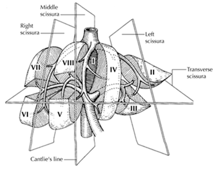
Liver.HCC_4.3.0.0.REL_CAPCP
12
recommended: HCC nodule smaller than the primary tumor, within 2 cm of the primary tumor, but
separated by nontumor tissue. Tumor within a vascular structure should be categorized as
lymphatic/vascular invasion and not as satellitosis.
References
1. Greene FL, Compton, CC, Fritz AG, et al, eds. AJCC Cancer Staging Atlas. New York: Springer;
2006
2. International Working Party. Terminology of nodular hepatocellular lesions. Hepatology.
1995;22:983-993.
3. Yao FY, Kerlan RK Jr, Hirose R, et al. Excellent outcome following down-staging of hepatocellular
carcinoma
prior
to
liver
transplantation:
an
intention-to-treat
analysis.
Hepatology.
2008;48(3):819-827.
4. Cotoi CG, Khorsandi SE, Plesea IE, Quaglia A. Histological aspects of post-TACE hepatocellular
carcinoma. Rom J Morphol Embryol. 2012;53(3 Suppl):677-682.
5. Pomfret EA, Washburn K, Wald C, et al. Report of a national conference on liver allocation in
patients with hepatocellular carcinoma in the United States. Liver Transpl. 2010;16(3):262-278.
E. Venous and Small Vessel Invasion
Vascular invasion includes gross as well as microscopic invasion of vessels. Macroscopic venous
invasion is generally accompanied by microscopic invasion.1 Both are associated with lower survival post
resection. Larger tumors (greater than 5 cm) or multiple tumors are more likely to exhibit vascular
invasion than single small lesions.2 The presence of a portal vein tumor thrombus should be included in
the report due to its adverse impact on outcome.3
Microscopic vascular invasion is defined by tumor within a vascular space lined by endothelium, identified
only on microscopy in the capsule or noncapsular fibrous septa, or liver tissue surrounding the
tumor.4 Attachment of the tumor to vessel wall or presence of smooth muscle/elastic lamina (for larger
vessels) helps in confirming vascular invasion. Elastic stain or immunohistochemistry for smooth muscle
can be helpful in challenging situations, but their routine use is not advocated. The outcome may be
worse with increasing number of foci with lymph-vascular invasion (LVI), but further subclassification
based on extent of LVI is not supported by current data.5
References
1. Tsai T-J, Chau G-Y, Lui W-Y, et al. Clinical significance of microscopic tumor venous invasion in
patients with resectable hepatocellular carcinoma. Surgery. 2000;127:603-608.
2. Pawlik TM, Delman KA, Vauthey J-N, et al. Tumor size predicts vascular invasion and histologic
grade: implications for expanding the criteria for hepatic transplantation. Liver Transpl.
2005;11(9):1086-1092.
3. Amin MB, Edge SB, Greene FL, et al, eds. AJCC Cancer Staging Manual. 8th ed. New York, NY:
Springer; 2017.
4. Fan L, Mac MT, Frishberg DP, et al. Interobserver and intraobserver variability in evaluating
vascular invasion in hepatocellular carcinoma. J Gastroenterol Hepatol. 2010;25(9):1556-1561.
5. Iguchi T, Shirabe K, Aishima S, et al. New pathologic stratification of microvascular invasion in
hepatocellular
carcinoma:
predicting
prognosis
after
living-donor
liver
transplantation.
Transplantation. 2015;99(6):1236-1242.
Liver.HCC_4.3.0.0.REL_CAPCP
13
F. Margins
The evaluation of margins for total or partial hepatectomy specimens depends on the method and extent
of resection. It is recommended that the surgeon be consulted to determine the critical foci within the
margins that require microscopic evaluation. The transection margin of a partial hepatectomy may be
large, rendering it impractical for complete examination. In this setting, grossly positive margins should be
microscopically confirmed and documented. If the margins are grossly free of tumor, judicious sampling of
the cut surface in the region closest to the nearest identified tumor nodule is indicated. In selected cases,
adequate random sampling of the cut surface may be sufficient. If the neoplasm is found near the surgical
margin, the distance from the margin should be reported. For multiple tumors, the distance from the
nearest tumor should be reported. Tumor within 1 mm of the resection margin may have increased risk of
recurrence,1,2 but several studies have reported that a minimal surgical margin in the liver is sufficient for
HCC.3
References
1. Gluer AM, Cocco N, Laurence JM, et al. Systematic review of actual 10-year survival following
resection for hepatocellular carcinoma. HPB (Oxford). 2012;14(5):285-290.
2. Kumar AM, Fredman ET, Coppa C, El-Gazzaz G, Aucejo FN, Abdel-Wahab M. Patterns of cancer
recurrence in localized resected hepatocellular carcinoma. Hepatobiliary Pancreat Dis Int.
2015;14(3):269-275.
3. Shindoh J, Hasegawa K, Inoue Y, et al. Risk factors of post-operative recurrence and adequate
surgical approach to improve long-term outcomes of hepatocellular carcinoma. HPB (Oxford).
2013;15(1):31-39.
G. Pathologic Stage Classification
The TNM staging system of the American Joint Committee on Cancer (AJCC) and the International Union
Against Cancer (UICC) applies to hepatocellular carcinomas.1 It does not apply to hepatic sarcomas or to
metastatic tumors of the liver. The T classification depends on the number of tumor nodules, the size of
the largest nodule, and the presence or absence of blood vessel invasion. The TNM classification does
not discriminate between multiple independent primary tumors or intrahepatic metastasis from a single
primary hepatic carcinoma. Vascular invasion includes either the gross or the histologic involvement of
vessels. Portal vein invasion is an important adverse prognostic factor and should be reported.
According to AJCC/UICC convention, the designation “T” refers to a primary tumor that has not been
previously treated. The symbol “p” refers to the pathologic classification of the TNM, as opposed to the
clinical classification, and is based on gross and microscopic examination. pT entails a resection of the
primary tumor or biopsy adequate to evaluate the highest pT category, pN entails removal of nodes
adequate to validate lymph node metastasis, and pM implies microscopic examination of distant lesions.
Clinical classification (cTNM) is usually carried out by the referring physician before treatment during
initial evaluation of the patient or when pathologic classification is not possible.
Pathologic staging is usually performed after surgical resection of the primary tumor. Pathologic staging
depends on pathologic documentation of the anatomic extent of disease, whether or not the primary
tumor has been completely removed. If a biopsied tumor is not resected for any reason (eg, when
technically infeasible) and if the highest T and N categories or the M1 category of the tumor can be
confirmed microscopically, the criteria for pathologic classification and staging have been satisfied without
total removal of the primary cancer.
Liver.HCC_4.3.0.0.REL_CAPCP
14
The T categories for HCC are based on tumor size, number and vascular invasion. Since some studies
showed lack of adverse prognostic impact of vascular invasion in tumors less than 2 cm, these tumors
have been classified under the T1 category.2 For treated tumors, the size of the viable tumor used for
assigning the T category. Tumors with major vascular invasion3 are now categorized as T4 as they have
a similar outcome compared to T4 tumors defined by extrahepatic or peritoneal involvement. Major
vascular invasion is defined by involvement of branches of main portal vein (right or left, excluding
sectoral and segmental branches), hepatic veins (right, middle or left) or main branches of hepatic artery
(right or left).1 Involvement of falciform or other ligaments is not considered T4, and should be categorized
as T1-T3 based on other parameters. Direct invasion into diaphragm is considered as T4.
TNM Descriptors
For identification of special cases of TNM or pTNM classifications, the “m” suffix and “y,” “r,” and “a”
prefixes are used. Although they do not affect the stage grouping, they indicate cases needing separate
analysis.
The “m” suffix indicates the presence of multiple primary tumors in a single site and is recorded in
parentheses: pT(m)NM.
The “y” prefix indicates those cases in which classification is performed during or after initial multimodality
therapy (ie, neoadjuvant chemotherapy, radiation therapy, or both chemotherapy and radiation therapy).
The cTNM or pTNM category is identified by a “y” prefix. The ycTNM or ypTNM categorizes the extent of
tumor actually present at the time of that examination. The “y” categorization is not an estimate of tumor
before multimodality therapy (ie, before initiation of neoadjuvant therapy).
The “r” prefix indicates a recurrent tumor when staged after a documented disease-free interval and is
identified by the “r” prefix: rTNM.
The “a” prefix designates the stage determined at autopsy: aTNM.
T Category Considerations
T categories are illustrated in Figures 2 through 5.
Figure 2.  T1 is defined as a solitary tumor ≤2 cm irrespective of vascular invasion or >2 cm without vascular
invasion. From Greene et al. Used with permission of the American Joint Committee on Cancer (AJCC), Chicago,
Illinois. The original source for this material is the AJCC Cancer Staging Atlas (2006) published by Springer Science
and Business Media LLC, www.springerlink.com.
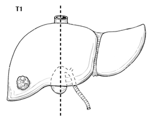
Liver.HCC_4.3.0.0.REL_CAPCP
15
Figure 3.  A. Solitary tumors >2 cm with vascular invasion are classified as T2.  B. Multiple tumors, none measuring 5
cm or greater in greatest dimension, are also classified as T2. From Greene et al.4 Used with permission of the
American Joint Committee on Cancer (AJCC), Chicago, Illinois. The original source for this material is the AJCC
Cancer Staging Atlas (2006) published by Springer Science and Business Media LLC, www.springerlink.com.
Figure 4.  A. Multiple tumors, any more than 5 cm, are classified as T3. B. Tumor involving a major branch of the
portal or hepatic vein(s) is classified as T4. From Greene et al.4 Used with permission of the American Joint
Committee on Cancer (AJCC), Chicago, Illinois. The original source for this material is the AJCC Cancer Staging
Atlas (2006) published by Springer Science and Business Media LLC, www.springerlink.com.
Figure 5.  Tumor with direct invasion of adjacent organs other than gallbladder or with perforation of the visceral
peritoneum is also classified as T4. From Greene et al.4 Used with permission of the American Joint Committee on
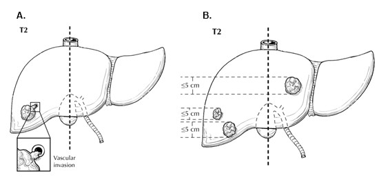
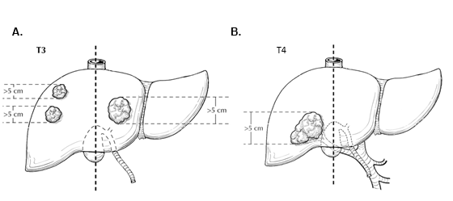
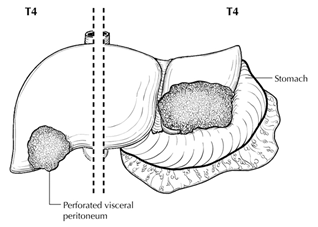
Liver.HCC_4.3.0.0.REL_CAPCP
16
Cancer (AJCC), Chicago, Illinois. The original source for this material is the AJCC Cancer Staging Atlas (2006)
published by Springer Science and Business Media LLC, www.springerlink.com.
Lymph Nodes
The regional lymph nodes for the liver include hilar, hepatoduodenal ligament, inferior phrenic, caval,
common hepatic artery and portal vein lymph nodes.
References
1. Amin MB, Edge SB, Greene FL, et al, eds. AJCC Cancer Staging Manual. 8th ed. New York, NY:
Springer; 2017.
2. Shindoh J, Andreou A, Aloia TA, et al. Microvascular invasion does not predict long-term survival
in hepatocellular carcinoma up to 2 cm: reappraisal of the staging system for solitary tumors. Ann
Surg Oncol. 2013;20(4):1223-1229.
3. Vauthey JN, Lauwers GY, Esnaola NF, et al. Simplified staging for hepatocellular carcinoma. J
Clin Oncol. 2002;20(6):1527-1536.
4. Greene FL, Compton, CC, Fritz AG, et al, eds. AJCC Cancer Staging Atlas. New York: Springer;
2006.
H. Additional Findings
Fibrosis
The extent of fibrosis should be reported because cirrhosis or advanced fibrosis have an adverse effect
on outcome.1  The scoring system described by Ishak2 is recommended by the AJCC Cancer Staging
Manual, 8 edition,3 but other commonly used schemes (Batts-Ludwig, Metavir) can be used. The name of
the staging scheme and its scale should be included.
Dysplastic Nodules
High-grade dysplastic nodules are considered to be the precursors of hepatocellular carcinoma. The
criteria outlined by the International Working Party are recommended,4 although difficulties in assessment
of these lesions and variation in interobserver agreement are recognized. Low-grade dysplastic nodules
are difficult or impossible to distinguish from large regenerative nodules, and their inclusion in the report is
not necessary.
Hepatocellular Adenomas
In noncirrhotic liver, hepatocellular carcinoma may arise in hepatocellular adenoma. In this setting, the
size of the hepatocellular adenoma and the hepatocellular carcinoma should both be conveyed in the
report. Only the hepatocellular carcinoma size is used for staging purposes. Subtyping of hepatocellular
adenoma can be considered but is not required.
Underlying Liver Disease
Specific types of underlying disease, such as viral hepatitis or hemochromatosis, should be evaluated
and assigned a grade and stage, if appropriate.
References
1. Bilmoria MM, Lauwers GY, Doherty DA, et al. Underlying liver disease, not tumor factors, predicts
long-term survival after resection of hepatocellular carcinoma. Arch Surg. 2001;136:528-535.
2. Ishak K, Baptista A, Bianchi L, et al. Histologic grading and staging of chronic hepatitis. J Hepatol.
1995;22:696-699.
Liver.HCC_4.3.0.0.REL_CAPCP
17
3. Amin MB, Edge SB, Greene FL, et al, eds. AJCC Cancer Staging Manual. 8th ed. New York, NY:
Springer; 2017.
4. International Working Party. Terminology of nodular hepatocellular lesions. Hepatology.
1995;22:983-993.
# Invasive Melanoma of the Skin Biopsy
Protocol for the Examination of Biopsy Specimens from Patients
with Invasive Melanoma of the Skin
Version: 1.1.0.0
Protocol Posting Date: March 2025
The use of this protocol is recommended for clinical care purposes but is not required for accreditation
purposes.
This protocol may be used for the following procedures AND tumor types:
Procedure
Description
Biopsy
Tumor Type
Description
Melanoma
Limited to melanoma of cutaneous surfaces only
The following should NOT be reported using this protocol:
Procedure
Excision (consider Skin Melanoma Excision protocol)
Cytologic specimens
Version Contributors
Cancer Committee Authors: Priyadharsini Nagarajan, MD, PhD*
Other Expert Contributors: Wonwoo Shon, DO, Klaus J. Busam, MD, David P. Frishberg, MD, Jeffrey E.
Gershenwald, MD, Jeffrey North, MD, Victor G. Prieto, MD, PhD, Richard A. Scolyer, BMedSci, MBBS, MD,
Thomas J. Flotte, MD, Timothy H. McCalmont, MD, Bruce Robert Smoller, MD
* Denotes primary author.
For any questions or comments, contact: cancerprotocols@cap.org.
Glossary:
Author: Expert who is a current member of the Cancer Committee, or an expert designated by the chair of
the Cancer Committee.
Expert Contributors: Includes members of other CAP committees or external subject matter experts who
contribute to the current version of the protocol.
The use of this case summary is recommended for clinical care purposes but is not required for
accreditation purposes. The core and conditional data elements are routinely reported. Non-core data
elements are indicated with a plus sign (+) to allow for reporting information that may be of clinical value.

CAP
Approved
Skin.Inv_Melanoma.Bx_1.1.0.0. REL_CAPCP
2
v 1.1.0.0
•
Content and explanatory note updates to include modifications to Tumor Site, Maximum Tumor
(Breslow) Thickness, Anatomic (Clark) level questions and MARGINS section
•
Histologic Type made conditionally reported
•
Added conditionally reported Macroscopic Satellite Lesion(s) question
•
Added optional Margin Involvement by Satellite(s) question
•
Added optional Method of Detection question to Lymphatic and / or Vascular Invasion question
•
Added Extent of Tumor Regression and optional Margin Involvement to Tumor Regression question
•
Removal of pT staging elements
CAP
Approved
Skin.Inv_Melanoma.Bx_1.1.0.0. REL_CAPCP
3
Reporting Template
Protocol Posting Date: March 2025
Select a single response unless otherwise indicated.
SPECIMEN
Procedure (Note A) (select all that apply)
___ Biopsy, shave
___ Biopsy, punch
___ Biopsy, incisional
___ Other (specify): _________________
___ Not specified
Specimen Laterality
___ Right
___ Left
___ Midline
___ Not specified
TUMOR
Tumor Site (Note B)
___ Skin, NOS: _________________
___ Skin of lip: _________________
___ External ear: _________________
___ Skin of other and unspecified parts of face: _________________
___ Skin of scalp and / or neck: _________________
___ Skin of trunk (specify site): _________________
___ Skin of upper limb and / or shoulder: _________________
___ Skin of lower limb and / or hip: _________________
___ Overlapping lesion of skin (specify sites): _________________
___ Penis: _________________
Select all that apply
+___ Prepuce
+___ Glans penis
+___ Body of penis
+___ Penis, NOS
___ Scrotum: _________________
___ Vulva: _________________
Select all that apply
+___ Labium majus
+___ Labium minus
+___ Clitoris
+___ Vulva, NOS
___ Not specified
Multiple Primary Sites (required only if applicable)
CAP
Approved
Skin.Inv_Melanoma.Bx_1.1.0.0. REL_CAPCP
4
___ Not applicable (no additional primary site(s) present)
___ Present: _________________
Please complete a separate checklist for each primary site
Histologic Type (required only if applicable) (Note C)
___ Not applicable
___ Low-cumulative sun damage (CSD) melanoma (including superficial spreading melanoma)
___ Lentigo maligna melanoma (high-CSD melanoma)
___ Desmoplastic melanoma, pure (greater than or equal to 90% desmoplastic melanoma)
___ Mixed desmoplastic / non-desmoplastic melanoma (less than 90% desmoplastic melanoma)
___ Spitz melanoma (malignant Spitz tumor)
___ Acral melanoma
___ Melanoma arising in a giant congenital nevus
___ Melanoma arising in a blue nevus
___ Nodular melanoma
___ Nevoid melanoma
___ Dermal melanoma
___ Melanoma, NOS
___ Other histologic type not listed (specify): _________________
+Histologic Type Comment: _________________
Maximum Tumor (Breslow) Thickness in Millimeters (mm) (Note D)
___ Specify in Millimeters (mm): _________________ mm
___ At least in Millimeters (mm): _________________ mm
Tumor (Breslow) Thickness (explain): _________________
___ Cannot be determined (explain): _________________
Ulceration (Notes D, E)
___ Not identified
___ Present
+Extent of Ulceration in Millimeters (mm): _________________ mm
___ Cannot be determined: _________________
+Anatomic (Clark) Level (Note D)
___ II (melanoma present in but does not fill and / or expand papillary dermis)
___ III (melanoma fills and expands papillary dermis)
___ IV (melanoma invades reticular dermis)
___ V (melanoma invades subcutis)
___ At least level II (explain): _________________
___ At least level III (explain): _________________
___ At least level IV (explain): _________________
___ Cannot be determined (explain): _________________
Mitotic Rate (Note F)
___ None identified: _________________
___ Specify number of mitoses per square Millimeter (mm): _________________ mitoses per mm2
___ Cannot be determined (explain): _________________
CAP
Approved
Skin.Inv_Melanoma.Bx_1.1.0.0. REL_CAPCP
5
Macroscopic Satellite Lesions (required only if applicable) (Note G)
___ Not applicable
___ Not identified
___ Present
___ Cannot be determined: _________________
+Microsatellite(s) (Note G)
___ Not identified
___ Present
___ Cannot be determined: _________________
Lymphatic and / or Vascular Invasion (required only if applicable) (Note H)
___ Not applicable
___ Not identified
___ Present
+Method of Detection (select all that apply)
___ Immunohistochemical study
___ H&E stain
___ Cannot be determined: _________________
Neurotropism (required only if applicable) (Note I)
___ Not applicable
___ Not identified
___ Present
___ Cannot be determined: _________________
+Tumor-Infiltrating Lymphocytes (Note J)
___ Not identified
___ Present, non-brisk
___ Present, brisk
___ Cannot be determined: _________________
+Tumor Regression (Note K)
___ Not identified
___ Present
Extent of Tumor Regression
___ Focal (less than or equal to 75%)
___ Extensive (greater than 75%)
___ Cannot be determined (explain): _________________
___ Cannot be determined: _________________
+Tumor Comment: _________________
CAP
Approved
Skin.Inv_Melanoma.Bx_1.1.0.0. REL_CAPCP
6
MARGINS (Note L)
Margin Status for Melanoma (select all that apply)
___ All margins negative for melanoma (e.g., in situ, invasive, or satellite)
Recommend measuring margin distance to melanoma if less than or equal to 1.0 mm.
+Specify Distance from Invasive Melanoma to Peripheral Margin in Millimeters (mm):
_________________ mm
+Specify Distance of Invasive Melanoma to Deep Margin in Millimeters (mm):
_________________ mm
+Specify Distance from Melanoma In Situ to Peripheral Margin in Millimeters (mm):
_________________ mm
___ Invasive melanoma present at margin
Margin(s) Involved by Invasive Melanoma (select all that apply)
___ Peripheral: _________________
___ Deep: _________________
___ Other (specify): _________________
___ Cannot be determined (explain): _________________
# Margin involvement by melanoma in situ should be recorded if in situ disease is present in the specimen, and if margins are
uninvolved by invasive melanoma.
___ Melanoma in situ present at margin#
Margin(s) Involved by Melanoma In Situ (select all that apply)
___ Peripheral: _________________
___ Deep: _________________
___ Other (specify): _________________
___ Cannot be determined (explain): _________________
___ Other (specify): _________________
___ Cannot be determined (explain): _________________
Margin Involvement by Satellite(s) (required only if satellite(s) present) (select all that apply)
___ Not applicable (satellite(s) absent)
___ Peripheral: _________________
___ Deep: _________________
___ Other (specify): _________________
___ Cannot be determined: _________________
Margin Involvement by Tumor Regression (required only if tumor regression is present) (select all
that apply)
___ Not applicable (tumor regression absent)
___ Peripheral: _________________
___ Deep: _________________
___ Other (specify): _________________
___ Cannot be determined: _________________
+Margin Comment: _________________
CAP
Approved
Skin.Inv_Melanoma.Bx_1.1.0.0. REL_CAPCP
7
pT CLASSIFICATION (AJCC 8th Edition) (Note M)
In general, CAP cancer protocol case summaries are intended to guide reporting on the specimen that the pathologist is evaluating
at that time. However, melanoma cases frequently include multiple procedures. Since only a portion of the tumor may be sampled in
biopsy, reporting pT category is deferred to the definitive resection; and relevant primary tumor parameters from the biopsy may be
incorporated in arriving at the pathological classification (pTNM). As per the AJCC (Chapter 1, 8th Ed.) it is the managing
physician’s responsibility to establish the final pathologic stage based upon all pertinent information, including but potentially not
limited to this pathology report.
ADDITIONAL FINDINGS
+Additional Findings (select all that apply)
___ Associated nevus (specify type): _________________
___ Other (specify): _________________
SPECIAL STUDIES
For molecular genetic reporting, the CAP Melanoma Biomarker Template should be used. Pending biomarker studies should be
listed in the Comments section of this report.
COMMENTS
Comment(s): _________________
CAP
Approved
Skin.Inv_Melanoma.Bx_1.1.0.0. REL_CAPCP
8
Explanatory Notes
A. Procedure
Optimal pathologic evaluation of melanocytic lesions requires complete excision that incorporates the full
thickness of the lesion removed intact.1 'Shave' procedures that do not include the intact base of the lesion
are suboptimal for pathologic evaluation and should be avoided unless clinically indicated. Similarly,
“punch” procedures may not include intact peripheral borders of the lesion thereby limiting assessment of
symmetry and peripheral circumscription, which can be essential for distinction of melanoma from
melanocytic nevus.2,3 Partial biopsies of melanocytic tumors are associated with an increased risk of
misdiagnosis with possible consequent adverse clinical outcomes.4 Nevertheless, clinical factors are also
important in determining the most appropriate biopsy technique for any lesion. For example, an excision
biopsy of a large lesion on a cosmetically or functionally sensitive site may cause cosmetic disfigurement
or alter reconstructive options.
The use of frozen sections for evaluation of biopsy or excision of melanocytic lesions is strongly
discouraged.5,6 Optimal histologic evaluation of cutaneous melanoma requires well-oriented, well-fixed,
well-cut, well-stained hematoxylin-and-eosin (H&E) sections prepared from formalin-fixed paraffin-
embedded tissue.
References
1. Sober AJ, Chuang TY, Duvic M, et al. Guidelines of care for primary cutaneous melanoma. J Am
Acad Dermatol. 2001;45(4):579-586.
2. Stell VH, Norton HJ, Smith KS, Salo JC, White RL, Jr. Method of biopsy and incidence of positive
margins in primary melanoma. Ann Surg Oncol. 2007;14(2):893-898.
3. Sober AJ, Balch CM. Method of biopsy and incidence of positive margins in primary melanoma.
Ann Surg Oncol. 2007;14(2):274-275.
4. Ng JC, Swain S, Dowling JP, Wolfe R, Simpson P, Kelly JW. The impact of partial biopsy on
histopathologic diagnosis of cutaneous melanoma: experience of an Australian tertiary referral
service. Arch Dermatol. 2010;146(3):234-239.
5. Smith-Zagone MJ, Schwartz MR. Frozen section of skin specimens. Arch Pathol Lab Med.
2005;129(12):1536-1543.
6. Prieto VG, Argenyi ZB, Barnhill RL, et al. Are en face frozen sections accurate for diagnosing
margin status in melanocytic lesions? Am J Clin Pathol. 2003;120(2):203-208.
B. Anatomic Tumor Site
For cutaneous melanoma, prognosis may be affected by primary anatomic site.1,2,3
References
1. Balch CM, Soong SJ, Gershenwald JE, et al. Prognostic factors analysis of 17,600 melanoma
patients: validation of the American Joint Committee on Cancer melanoma staging system. J Clin
Oncol. 2001;19(16):3622-3634.
2. Elder DE, Massi D, Scolyer RA, Willemze R. eds. WHO Classification of Skin Tumors. World Health
Organization of Tumors, 4th ed Volume 11. Lyon France; 2018, ISBN-13 978-92-832-2440-2.
3. Elder DE, Bastian BC, Duncan LM, et al. WHO Classification of Skin Tumors. World Health
Organization of Tumors, 5th ed (Beta version), 2023.
CAP
Approved
Skin.Inv_Melanoma.Bx_1.1.0.0. REL_CAPCP
9
C. Melanoma Histologic Subtypes
The recent WHO 2018 classification1 introduced multidimensional pathway classification of melanocytic
tumors based on the extent of ultraviolet (UV) radiation damage, the cell of origin, and characteristic
genomic findings, which was further refined in the WHO 2023 beta version2 (Table 1).
Table 1. Classification of melanoma
Ultraviolet (UV) exposure
Pathway
Subtypes
Melanomas arising in sun-exposed skin
I
Low-CSD melanoma (including superficial spreading
melanoma)
II
High-CSD melanoma/lentigo maligna melanoma
III
Desmoplastic melanoma
Melanomas arising at sun-shielded sites
or without known etiological
associations with UV radiation exposure
IV
Spitz melanoma (malignant Spitz tumor)
V
Acral melanoma
VI
Mucosal melanoma
VII
Melanoma arising in congenital nevus
VIII
Melanoma arising in blue nevus
IX
Uveal melanoma
Variable
Nodular, nevoid, and dermal melanomas
References
1. Elder DE, Massi D, Scolyer RA, Willemze R. eds. WHO Classification of Skin Tumors. World Health
Organization of Tumors, 4th ed Volume 11. Lyon France; 2018, ISBN-13 978-92-832-2440-2.
2. Elder DE, Bastian BC, Duncan LM, et al. WHO Classification of Skin Tumors. World Health
Organization of Tumors, 5th ed (Beta version), 2023.
D. Primary Tumor (Breslow) Thickness and Anatomic (Clark) Levels
Maximum tumor thickness is measured with a calibrated ocular micrometer at a right angle to the surface
of the lesion at the point of measurement. The upper point of reference is the upper edge of the granular
layer of the epidermis of the overlying skin (if intact) or, the base of the ulcer, if the lesion is ulcerated. The
lower reference point is the deepest point of tumor invasion (i.e., the leading edge of a single mass or an
isolated group of cells deep to the main mass). For primary melanomas lacking an intraepidermal
CAP
Approved
Skin.Inv_Melanoma.Bx_1.1.0.0. REL_CAPCP
10
component, the tumor thickness should be measured from the top of epidermal granular layer to the
deepest invasive cell.
If the tumor is transected at the deep margin of the specimen, the depth may be indicated as “at least __
mm” with a comment explaining the limitation of thickness assessment. For example, "The maximum tumor
thickness cannot be determined in this specimen because the deep plane of the biopsy transects the
tumor.”
Tumor thickness measurements should not be based on periadnexal extension (either periadnexal
adventitial or extra-adventitial extension), except when it is the only focus of invasion. In that circumstance,
Breslow thickness may be measured from the inner layer of the outer root sheath epithelium or inner luminal
surface of sweat glands/ducts, to the furthest extent of infiltration into the periadnexal dermis.
Satellites (macroscopic or microscopic) or foci of neurotropism or lymphovascular invasion should not be
included in tumor thickness measurements.
In the 8th edition of the AJCC melanoma staging system,1 it is recommended that tumor thickness
measurements be recorded to the nearest 0.1 mm, not the nearest 0.01 mm, because of the impracticality
and imprecision of measurements, particularly for tumors greater than 1 mm thick. Tumors less than or
equal to 1 mm thick may be measured to the nearest 0.01 mm if practical, but should be reported to the
nearest 0.1mm (e.g., melanomas measured to be in the range of 0.75 mm to 0.84 mm are reported as 0.8
mm in thickness and hence T1b, and tumors 1.01 to 1.04 mm in thickness are reported as 1.0 mm).
While the principal T category tumor thickness ranges have been maintained in the AJCC 8th edition, T1 is
now subcategorized by tumor thickness strata at a 0.8 mm threshold. Tumor mitotic rate as a dichotomous
variable is no longer used as a staging category criterion for T1 melanomas. T1a melanomas are now
defined as non-ulcerated and less than 0.8 mm in thickness. T1b melanomas are defined as 0.8-1.0mm in
thickness or ulcerated melanomas less than 0.8 mm in thickness.
Anatomic (Clark) levels are defined as follows:
I
Intraepidermal tumor only (i.e., melanoma in situ)
II
Tumor present in but does not fill and/or expand papillary dermis
III
Tumor fills and expands papillary dermis
IV
Tumor invades into reticular dermis
V
Tumor invades subcutis
Anatomic (Clark) level of invasion remains an independent predictor of outcome and is recommended by
the AJCC to be reported as a primary tumor characteristic.1 However, assessment of Clark levels is less
reproducible among pathologists than is tumor thickness, and Clark levels are not used in the AJCC staging
system for pT status. Accordingly, Clark levels are included in this checklist as an optional data item.
References
1. Gershenwald JE, Scolyer RA, Hess KR, et al. Melanoma of the skin, In: Amin MB, Edge SB, Greene
FL, et al. eds. AJCC Cancer Staging Manual. 8th ed. New York, NY: Springer; 2017.
CAP
Approved
Skin.Inv_Melanoma.Bx_1.1.0.0. REL_CAPCP
11
E. Ulceration
Primary tumor ulceration has been shown to be a dominant independent prognostic factor in invasive
cutaneous melanoma,1,2 and if present, changes the pT category from T1a to T1b, T2a to T2b, etc.,
depending on the thickness of the tumor. The presence or absence of ulceration must be confirmed on
microscopic examination.2 Melanoma ulceration is defined as the combination of the following features: full-
thickness epidermal defect (including absence of stratum corneum and basement membrane); evidence of
reactive changes (i.e., fibrin deposition, neutrophils); and thinning, effacement, or reactive hyperplasia of
the surrounding epidermis in the absence of trauma or a recent surgical procedure. Ulcerated melanomas
typically show invasion through the epidermis, whereas non-ulcerated melanomas tend to lift the overlying
epidermis.
Only non-traumatic (“tumorigenic”) ulceration should be recorded as ulceration. If ulceration is present
related to a prior biopsy, the tumor should not be recorded as ulcerated for staging purposes. If a lesion
has been recently biopsied or there is only focal loss of the epidermis, assessment of ulceration may be
difficult or impossible; in this instance it may be difficult to determine whether the epidermal deficiency is
due to true ulceration or to sectioning artifact.2 Absence of fibrin, neutrophils, or granulation tissue from
putative areas of ulceration would be clues that the apparent ulceration is actually due to sectioning of only
part of the epidermis and this should not be designated as ulceration. If non-traumatic (“tumorigenic”)
ulceration is present in either an initial partial biopsy or a re-excision specimen, then for staging purposes,
the tumor should be recorded as ulcerated.
Ulceration may be present in an in situ melanoma but does not affect the staging.
A number of studies have demonstrated that the extent of ulceration (measured either as a percentage of
the width of the dermal invasive component of the tumor or as a diameter/width) more accurately predicts
outcome than the presence or absence of ulceration alone.3,4
References
1. Gershenwald JE, Scolyer RA, Hess KR, Sondak VK, Long GV, Ross MI et al. Melanoma staging:
Evidence-based changes in the American Joint Committee on Cancer eighth edition cancer staging
manual. CA Cancer J Clin. 2017;67(6):472-92.
2. Gershenwald JE, Scolyer RA, Hess KR, et al. Melanoma of the skin, In: Amin MB, Edge SB, Greene
FL, et al. eds. AJCC Cancer Staging Manual. 8th ed. New York, NY: Springer; 2017.
3. Hout FE, Haydu LE, Murali R, Bonenkamp JJ, Thompson JF, Scolyer RA. Prognostic importance
of the extent of ulceration in patients with clinically localized cutaneous melanoma. Ann Surg.
2012;255(6):1165-1170.
4. Namikawa K, Aung PP, Gershenwald JE, Milton DR, Prieto VG. Clinical impact of ulceration width,
lymphovascular invasion, microscopic satellitosis, perineural invasion, and mitotic rate in patients
undergoing sentinel lymph node biopsy for cutaneous melanoma: a retrospective observational
study at a comprehensive cancer center. Cancer Med. 2018;7(3):583-593.
F. Mitotic Rate
Tumor mitotic rate (of the invasive component of a melanoma) is a strong independent predictor of outcome
across its dynamic range in all pT categories and should be assessed and recorded in all primary
melanomas including in both initial biopsies and excisions (the highest value in either specimen should be
used for prognostic purposes). Although tumor mitotic rate is no longer used as a T1-category criterion in
the 8th edition of the AJCC melanoma staging system (due to the more significant prognostic significance
CAP
Approved
Skin.Inv_Melanoma.Bx_1.1.0.0. REL_CAPCP
12
of the new tumor thickness strata within T1 melanoma), mitotic rate will likely be an important parameter in
prognostic models developed in the future that will provide personalized prediction of prognosis for
individual patients.1 The method recommended for enumerating the tumor mitotic rate in the 8th edition of
the AJCC staging system is provided below:
The recommended approach to enumerating mitoses is to first find the regions in the invasive melanoma
within dermis containing the most mitotic figures, the so-called 'hot spot' or 'dermal hot spot'. After counting
the mitoses in the initial high‐power field, the count is extended to immediately adjacent non-overlapping
fields until an area of tissue corresponding to 1 mm2 is assessed. If no hot spot is found and mitoses are
sparse and/or randomly scattered throughout the lesion, then a representative mitosis is chosen and,
beginning with that field, the count is then extended to immediately adjacent non-overlapping fields until an
area corresponding to 1 mm2 of tissue is assessed. The count then is expressed as the (whole) number of
mitoses/mm2. If the invasive component of the tumor involves an area less than 1 mm2, the number of
mitoses should be assessed and recorded as if they were found within square millimeter. For example, if
the entire dermal component of a tumor occupies 0.5 mm2 and only one mitosis is identified, the mitotic
rate should be recorded as 1/mm2 (not 2/mm2). Only mitotic figures in invasive melanoma cells should be
counted. The number of mitoses should be listed as a whole number per square millimeter. If no mitoses
are identified, the mitotic rate may be recorded as “none identified” or "0/mm2". This methodology for
determining the mitotic rate of an invasive melanoma has been shown to have excellent interobserver
reproducibility, including among pathologists with widely differing experience in the assessment of
melanocytic tumors.2
To obtain accurate measurement, calibration of individual microscopes is recommended using a stage
micrometer to determine the number of high-power fields that equates to a square millimeter.
The data that demonstrated the strong prognostic significance of mitotic rate were obtained from the
melanoma pathology reports of routinely assessed H&E stained sections. It therefore is recommended that
no additional sections be cut and examined in excess of those that would normally be used to report and
diagnose the melanoma to determine the mitotic count (i.e., no additional sections should be cut and
examined for the sole purpose of determining the mitotic rate, including in situations in which no mitoses
are identified on the initial, routinely examined sections). Immunohistochemical stains for identifying
mitoses are not used for determining mitotic rate for staging and/or reporting purposes. A possible exception
is the use to dual immunohistochemistry (e.g., MART1 and pHH3) to determine if a cell in mitosis is a
melanocyte or not (macrophage, endothelial cell, etc.).3
Although the AJCC recommends reporting “0” rather than “none identified” or “fewer than 1,” for the
purposes of cancer registry reporting all of these terms should be considered equivalent.
References
1. Gershenwald JE, Scolyer RA, Hess KR, et al. Melanoma of the skin, In: Amin MB, Edge SB, Greene
FL, et al. eds. AJCC Cancer Staging Manual. 8th ed. New York, NY: Springer; 2017.
2. Scolyer RA, Shaw HM, Thompson JF, et al. Interobserver reproducibility of histopathologic
prognostic variables in primary cutaneous melanomas. Am J Surg Pathol. 2003;27(12):1571-1576.
3. Tetzlaff MT, Curry JL, Ivan D, et al. Immunodetection of phosphohistone H3 as a surrogate of
mitotic figure count and clinical outcome in cutaneous melanoma. Mod Pathol. 2013;26(9):1153-
1160.
CAP
Approved
Skin.Inv_Melanoma.Bx_1.1.0.0. REL_CAPCP
13
G. Satellite(s)
Macroscopic satellite(s) is defined as the presence of a clinically or grossly detected metastatic focus of
melanoma separated from the primary tumor and surrounded by normal tissue. A microsatellite(s) is defined
as the presence of a microscopic discontinuous focus of melanoma adjacent or deep to a primary
melanoma on pathological examination of the primary tumor site.1 The metastatic tumor cells must be
discontinuous from the primary tumor and separated from the primary tumor by normal stroma. If the tissue
between the apparently separate nodule and the primary tumor is fibrotic and/or inflamed, this does not
indicate a microsatellite, because the aforementioned changes may represent regression of the intervening
tumor. There is no minimum size threshold or distance from the primary tumor to define a microsatellite.
Before diagnosing the presence of a microsatellite, it is generally recommended that multiple sections from
the same tissue block being examined to verify that the microsatellite is indeed discontinuous from the
primary tumor. For example, periadnexal extension of tumor or the irregular shape of the peripheral or deep
extent of the tumor may result in tumor that is contiguous with the primary tumor appear discontinuous on
single sections.
Detecting a melanoma satellite metastasis at the margins of an excision specimen often prompts
consideration of a re-excision. This is based on the potential of satellite metastases to serve as sources of
recurrence and to indicate the possible presence of additional melanoma beyond visible margins.
References
1. Gershenwald JE, Scolyer RA, Hess KR, et al. Melanoma of the skin, In: Amin MB, Edge SB, Greene
FL, et al. eds. AJCC Cancer Staging Manual. 8th ed. New York, NY: Springer; 2017.
H. Lymphatic and/or Vascular Invasion
Lymphovascular invasion (LVI) is identified by the demonstration of melanoma cells within the lumina of
blood vessels or lymphatics, or both.1 Immunohistochemistry for vascular endothelial cell markers CD31,
CD34, or ERG or the lymphatic marker D2-40 may assist in the identification of the presence of intravascular
or intralymphatic melanoma by highlighting vascular lumina. Vascular invasion by melanoma correlates
independently with worsened overall survival.2 The detection of LVI is increased in primary melanomas
when double labeling of tumor and (lymphatic) endothelial cells is applied (e.g.: MITF/D2-40, SOX10/D2-
40, or SOX10/CD31).3
By AJCC/UICC convention, LVI does not affect the T category indicating local extent of tumor, i.e., foci of
lymphovascular invasion should not be included in the measurement of tumor (Breslow) thickness.
References
1. Gershenwald JE, Scolyer RA, Hess KR, et al. Melanoma of the skin, In: Amin MB, Edge SB, Greene
FL, et al. eds. AJCC Cancer Staging Manual. 8th ed. New York, NY: Springer; 2017.
2. Petersson F, Diwan AH, Ivan D, Gershenwald JE, Johnson MM, Harrell R, Prieto VG.
Immunohistochemical detection of lymphovascular invasion with D2-40 in melanoma correlates
with sentinel lymph node status, metastasis and survival. J Cutan Pathol. 2009;36(11):1157-1163.
3. Feldmeyer L, Tetzlaff M, Fox P, et al. Prognostic Implication of Lymphovascular Invasion Detected
by Double Immunostaining for D2-40 and MITF1 in Primary Cutaneous Melanoma. Am J
Dermatopathol. 2016;38(7):484-491.
CAP
Approved
Skin.Inv_Melanoma.Bx_1.1.0.0. REL_CAPCP
14
I. Neurotropism
Neurotropism is defined as the presence of melanoma cells abutting nerve sheaths usually circumferentially
(perineural invasion) or within nerves (intraneural invasion).1 Occasionally, the tumor itself may form
neuroid structures (termed ‘neural transformation’ and this is also regarded as neurotropism). Neurotropism
is best identified at the periphery of the tumor; the presence of melanoma cells around nerves without
obvious encroachment within the main tumor mass caused by “entrapment” of nerves in the expanding
tumor does not represent neurotropism.
Neurotropism is most commonly identified in desmoplastic melanomas (sometimes termed desmoplastic
neurotropic melanoma) but may occur in any melanoma subtype.2 Neurotropism may correlate with an
increased risk for local recurrence. By AJCC/UICC recommendations, foci of neurotropism should not be
included in the measurement of Breslow thickness.
References
1. Gershenwald JE, Scolyer RA, Hess KR, et al. Melanoma of the skin, In: Amin MB, Edge SB, Greene
FL, et al. eds. AJCC Cancer Staging Manual. 8th ed. New York, NY: Springer; 2017.
2. Elder DE, Massi D, Scolyer RA, Willemze R. eds. WHO Classification of Skin Tumors. World Health
Organization of Tumors, 4th ed Volume 11. Lyon France; 2018, ISBN-13 978-92-832-2440-2.
J. Tumor-Infiltrating Lymphocytes
A paucity of tumor-infiltrating lymphocytes (TILs) is an adverse prognostic factor for cutaneous
melanoma.1 Tumor-infiltrating lymphocytes may be assessed in a semiquantitative way, as defined below.
To qualify as TILs, lymphocytes need to surround and disrupt tumor cells of the invasive component of the
tumor.
TILs Not Identified: No lymphocytes present, or lymphocytes present but do not infiltrate tumor at all.
TILs Non-brisk: Lymphocytes infiltrate melanoma only focally or not along the entire base of the invasive
tumor.
TILs Brisk: Lymphocytes diffusely infiltrate the entire base of the invasive tumor (Figure 1, A) or show diffuse
permeation of the invasive tumor (Figure 1, B).
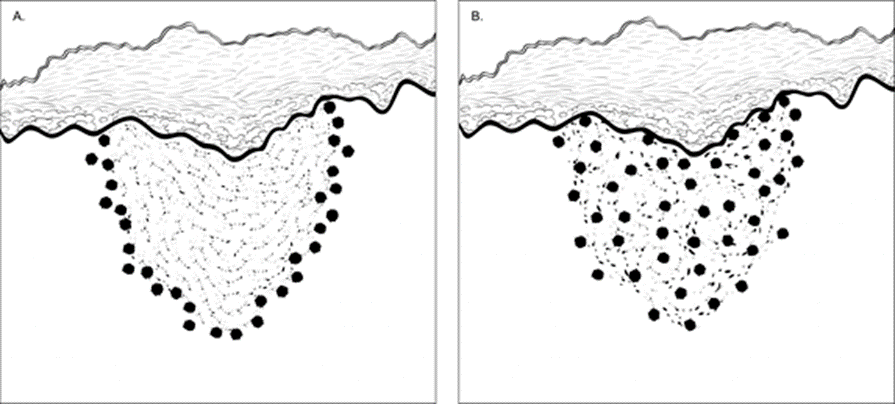
CAP
Approved
Skin.Inv_Melanoma.Bx_1.1.0.0. REL_CAPCP
15
Figure 1. Brisk tumor-infiltrating lymphocytes in primary cutaneous melanoma. A. Lymphocytes diffusely
infiltrate the entire base of the invasive tumor. B. Lymphocytes diffusely infiltrate the entire invasive
component of the melanoma.
References
1. Crowson AN, Magro CM, Mihm MC. Prognosticators of melanoma, the melanoma report, and the
sentinel lymph node. Mod Pathol. 2006;19(Suppl 2): S71-87.
K. Tumor Regression
Characteristic features of regression include replacement of tumor cells by lymphohistiocytic inflammation,
as well as attenuation of the epidermis and non-lamellated dermal fibrosis with inflammatory cells,
melanophagocytosis, and telangiectasia.1
Notably, when regression is observed at the peripheral excision margin, it prompts consideration for re-
excision, as it suggests the possibility of residual melanoma beyond visible margins, necessitating
comprehensive evaluation and, if warranted, therapeutic intervention.
References
1. Aung PP, Nagarajan P, Prieto VG. Regression in primary cutaneous melanoma: etiopathogenesis
and clinical significance. Lab Invest. 2017 Jun;97(6):657-668.
L. Margins
Microscopically measured distances between tumor and labeled peripheral (lateral) or deep margins are
appropriately recorded for melanoma excision specimens, whenever possible.  If a margin is involved by
tumor, it should be stated whether the tumor is in situ and/or invasive and/or satellite. Occasionally, in situ
melanoma can extend down an adnexal structure like a hair follicle and cause a deep positive margin.1
References
1. Pozdnyakova O, Grossman J, Barbagallo, B, Lyle S. The hair follicle barrier to involvement by
malignant melanoma. Cancer. 2009; 115:1267–1275.
M. pTNM CLASSIFICATION
As per the AJCC (Chapter 1, 8th Ed.), pathological stage classification is based on clinical stage information
supplemented/modified by operative findings and pathological evaluation of the resected specimens.
Therefore, the pT staging classification is deferred to the definitive resection specimen.
Changes in the 8th edition AJCC Cancer Staging Manual1 of importance to practicing pathologists include:
•
T1a melanomas are now defined as non-ulcerated melanomas less than 0.8mm thick.
•
T1b melanomas are now defined as melanomas between 0.8mm and 1.0mm in thickness OR
ulcerated melanomas less than 0.8mm thick.
•
Tumor mitotic rate is no longer used as a T category criterion but remains an important prognostic
factor and should be reported in all invasive primary melanomas.
•
Recommendation to record tumor thickness to the nearest 0.1mm (not the nearest 0.01mm).
Pathologic staging includes microstaging of the primary melanoma and pathologic information about the
regional lymph nodes after partial or complete lymphadenectomy.
CAP
Approved
Skin.Inv_Melanoma.Bx_1.1.0.0. REL_CAPCP
16
In virtually all studies of cutaneous melanoma, tumor thickness has been shown to be a dominant
prognostic factor, and it forms the basis for the stratification of pT category. Although anatomic (Clark)
levels, commonly used to indicate extent of invasion of the primary tumor, are less predictive of clinical
outcome than mitotic activity or ulceration.1,2,3
By AJCC convention, the designation “T” refers to a primary tumor that has not been previously treated.
Similarly, by convention, clinical staging is performed after biopsy of the primary melanoma (including
utilizing pathologic information on microstaging of the primary melanoma) with clinical or biopsy assessment
of regional lymph nodes and distant sites. Pathologic staging uses information gained from pathologic
evaluation of both the primary melanoma after biopsy and wide excision as well as pathological evaluation
of the regional node basin after SLN biopsy (required for N categorization of all greater than T1 melanomas)
and/or regional lymphadenectomy.1,2 In addition, for pathological staging, if information from any prior
biopsy is known and is relevant for staging, this should be documented in the pathology report (in the
staging section) and used for assigning T, N and M categories and staging purposes.
T Category Considerations
Pathologic (microscopic) assessment of the primary tumor is required for accurate staging. Therefore,
excision of the primary tumor, rather than incisional/partial biopsy, is advised. The T classification of
melanoma is based on the thickness of the primary tumor and presence or absence of ulceration (see also
Notes D, and E).
References
1. Gershenwald JE, Scolyer RA, Hess KR, et al. Melanoma of the skin, In: Amin MB, Edge SB, Greene
FL, et al. eds. AJCC Cancer Staging Manual. 8th ed. New York, NY: Springer; 2017.
2. Gershenwald JE, Scolyer RA, Hess KR, Sondak VK, Long GV, Ross MI et al. Melanoma staging:
Evidence-based changes in the American Joint Committee on Cancer eighth edition cancer staging
manual. CA Cancer J Clin. 2017;67(6):472-92.
3. Elder DE, Massi D, Scolyer RA, Willemze R. eds. WHO Classification of Skin Tumors. World Health
Organization of Tumors, 4th ed Volume 11. Lyon France; 2018, ISBN-13 978-92-832-2440-2.
# Jejunum and Ileum NET
Protocol for the Examination of Specimens from Patients with
Well-Differentiated Neuroendocrine Tumors (Carcinoid Tumors)
of the Jejunum and Ileum
Version: 2.0.0.0
Protocol Posting Date: December 2023
CAP Laboratory Accreditation Program Protocol Required Use Date: September 2024
The changes included in this current protocol version affect accreditation requirements. The new deadline
for implementing this protocol version is reflected in the above accreditation date.
For accreditation purposes, this protocol should be used for the following procedures AND tumor
types:
Procedure
Description
Resection
Includes specimens designated segmental resection – small
intestine and ileocolectomy
Tumor Type
Description
Well-differentiated tumor of the jejunum and
ileum
This protocol is NOT required for accreditation purposes for the following:
Procedure
Biopsy
Primary resection specimen with no residual cancer (e.g., following neoadjuvant therapy)
Recurrent tumor
Cytologic specimens
The following tumor types should NOT be reported using this protocol:
Tumor Type
Well-differentiated tumor of the duodenum and ampulla (consider the Duodenum and Ampulla Carcinoma protocol)
Poorly differentiated neuroendocrine carcinoma including small cell and large cell neuroendocrine carcinoma
(consider the Small Intestine protocol)
Other epithelial carcinomas including mixed neuroendocrine-non-neuroendocrine neoplasms (consider the Small
Intestine protocol
Lymphoma (consider the Hodgkin or non-Hodgkin Lymphoma protocols)
Gastrointestinal stromal tumor (GIST) (consider the GIST protocol)
Non-GIST sarcoma (consider the Soft Tissue protocol)
Authors
Dhanpat Jain, MD*; William V. Chopp, MD*; Rondell P. Graham, MBBS*.
With guidance from the CAP Cancer and CAP Pathology Electronic Reporting Committees.
* Denotes primary author.

Jejunum_Ileum.NET_2.0.0.0.REL_CAPCP
2
This protocol can be utilized for a variety of procedures and tumor types for clinical care purposes. For
accreditation purposes, only the definitive primary cancer resection specimen is required to have the core
and conditional data elements reported in a synoptic format.
•
Core data elements are required in reports to adequately describe appropriate malignancies. For
accreditation purposes, essential data elements must be reported in all instances, even if the
response is “not applicable” or “cannot be determined.”
•
Conditional data elements are only required to be reported if applicable as delineated in the
protocol. For instance, the total number of lymph nodes examined must be reported, but only if
nodes are present in the specimen.
•
Optional data elements are identified with “+” and although not required for CAP accreditation
purposes, may be considered for reporting as determined by local practice standards.
The use of this protocol is not required for recurrent tumors or for metastatic tumors that are resected at a
different time than the primary tumor. Use of this protocol is also not required for pathology reviews
performed at a second institution (i.e., secondary consultation, second opinion, or review of outside case
at second institution).
Synoptic Reporting
All core and conditionally required data elements outlined on the surgical case summary from this cancer
protocol must be displayed in synoptic report format. Synoptic format is defined as:
•
Data element: followed by its answer (response), outline format without the paired Data element:
Response format is NOT considered synoptic.
•
The data element should be represented in the report as it is listed in the case summary. The
response for any data element may be modified from those listed in the case summary, including
“Cannot be determined” if appropriate.
•
Each diagnostic parameter pair (Data element: Response) is listed on a separate line or in a
tabular format to achieve visual separation. The following exceptions are allowed to be listed on
one line:
o
Anatomic site or specimen, laterality, and procedure
o
Pathologic Stage Classification (pTNM) elements
o
Negative margins, as long as all negative margins are specifically enumerated where
applicable
•
The synoptic portion of the report can appear in the diagnosis section of the pathology report, at
the end of the report or in a separate section, but all Data element: Responses must be listed
together in one location
Organizations and pathologists may choose to list the required elements in any order, use additional
methods in order to enhance or achieve visual separation, or add optional items within the synoptic
report. The report may have required elements in a summary format elsewhere in the report IN
ADDITION TO but not as replacement for the synoptic report ie, all required elements must be in the
synoptic portion of the report in the format defined above.
Jejunum_Ileum.NET_2.0.0.0.REL_CAPCP
3
v 2.0.0.0
•
Update to AJCC Version 9 pTNM Staging Classifications
•
WHO 5th Edition update to content and explanatory notes
•
“Lymphovascular Invasion” question updated to “Lymphatic and / or Vascular Invasion"
Jejunum_Ileum.NET_2.0.0.0.REL_CAPCP
4
Reporting Template
Protocol Posting Date: December 2023
Select a single response unless otherwise indicated.
Standard(s): AJCC-UICC 9
SPECIMEN
Procedure
___ Segmental resection, small intestine
___ Ileocolic resection
___ Other (specify): _________________
___ Not specified
TUMOR
Tumor Site (Notes A,B)
___ Jejunum: _________________
___ Ileum: _________________
___ Small intestine, not otherwise specified: _________________
___ Other (specify): _________________
Histologic Type and Grade# (Notes C,D)
# For poorly differentiated (high-grade) neuroendocrine carcinomas arising in the small intestine or ampulla, the checklists for
carcinomas of those organ sites should be used.
___ G1, well-differentiated neuroendocrine tumor
___ G2, well-differentiated neuroendocrine tumor
___ G3, well-differentiated neuroendocrine tumor
___ GX, grade cannot be assessed
___ Other (specify): _________________
___ Not applicable: _________________
Histologic Grade Determination (Note D)
Mitotic rate and / or Ki-67 labeling index is required to determine histologic grade
Mitotic Rate (required only when Ki-67 labeling index is not reported)#
# Mitotic rate should be reported as number of mitoses per 2 mm2, by evaluating at least 10 mm2 in the most
mitotically active part of the tumor (e.g., if using a microscope with a field diameter of 0.55 mm, count 42 high
power fields (10 mm2) and divide the resulting number of mitoses by 5 to determine the number of mitoses per 2
mm2 needed to assign tumor grade).
___ Not applicable (Ki-67 labeling index is reported)
___ Specify number of mitoses per 2 mm2: _________________ mitoses per 2 mm2
___ Less than 2 mitoses per 2 mm2
___ 2 to 20 mitoses per 2 mm2
___ Greater than 20 mitoses per 2 mm2
___ Cannot be determined (explain): _________________
Ki-67 Labeling Index (required only when mitotic rate is not reported)
___ Not applicable (mitotic rate is reported)
___ Specify Ki-67 percentage: _________________ %
Jejunum_Ileum.NET_2.0.0.0.REL_CAPCP
5
___ Less than 3%
___ 3% to 20%
___ Greater than 20%
___ Cannot be determined (explain): _________________
Tumor Size (Note E)
Specify size of largest tumor if multiple tumors are present
___ Greatest dimension in Centimeters (cm): _________________ cm
+Additional Dimension in Centimeters (cm): ____ x ____ cm
___ Cannot be determined (explain): _________________
Tumor Focality
___ Unifocal
___ Multifocal
Number of Tumors
___ Specify number: _________________
___ Other (specify): _________________
___ Cannot be determined: _________________
___ Cannot be determined: _________________
Tumor Extent
___ Invades lamina propria
___ Invades submucosa
___ Invades muscularis propria
___ Invades through muscularis propria into subserosal tissue without penetration of overlying serosa
___ Invades visceral peritoneum (serosa)
___ Invades other organ(s) or adjacent structure(s) (specify): _________________
___ Cannot be determined: _________________
___ No evidence of primary tumor
Lymphatic and / or Vascular Invasion
___ Not identified
___ Present
___ Cannot be determined: _________________
+Perineural Invasion
___ Not identified
___ Present
___ Cannot be determined: _________________
Large Mesenteric Masses (greater than 2 cm) (Note G)
___ Not identified
___ Present
+Number of Large Mesenteric Masses
___ Specify number: _________________
___ Other (specify): _________________
___ Cannot be determined: _________________
Jejunum_Ileum.NET_2.0.0.0.REL_CAPCP
6
___ Cannot be determined: _________________
+Tumor Comment: _________________
MARGINS (Note F)
Margin Status
___ All margins negative for tumor
+Closest Margin(s) to Tumor (select all that apply)
___ Proximal: _________________
___ Distal: _________________
___ Radial: _________________
___ Mesenteric: _________________
___ Other (specify): _________________
___ Cannot be determined: _________________
+Distance from Tumor to Closest Margin
Specify in Centimeters (cm)
___ Exact distance in cm: _________________ cm
___ Greater than 1 cm
Specify in Millimeters (mm)
___ Exact distance in mm: _________________ mm
___ Greater than 10 mm
Other
___ Other (specify): _________________
___ Cannot be determined: _________________
___ Tumor present at margin
Margin(s) Involved by Tumor (select all that apply)
___ Proximal: _________________
___ Distal: _________________
___ Radial: _________________
___ Mesenteric: _________________
___ Other (specify): _________________
___ Cannot be determined: _________________
___ Other (specify): _________________
___ Cannot be determined (explain): _________________
___ Not applicable
+Margin Comment: _________________
REGIONAL LYMPH NODES
Regional Lymph Node Status
___ Not applicable (no regional lymph nodes submitted or found)
___ Regional lymph nodes present
___ All regional lymph nodes negative for tumor
___ Tumor present in regional lymph node(s)
Number of Lymph Nodes with Tumor
___ Exact number (specify): _________________
Jejunum_Ileum.NET_2.0.0.0.REL_CAPCP
7
___ At least (specify): _________________
___ Other (specify): _________________
___ Cannot be determined (explain): _________________
___ Other (specify): _________________
___ Cannot be determined (explain): _________________
Number of Lymph Nodes Examined
___ Exact number (specify): _________________
___ At least (specify): _________________
___ Other (specify): _________________
___ Number cannot be determined (explain): _________________
+Regional Lymph Node Comment: _________________
DISTANT METASTASIS
Distant Site(s) Involved, if applicable (select all that apply)
___ Not applicable
___ Liver: _________________
___ Lung: _________________
___ Ovary: _________________
___ Nonregional lymph node(s): _________________
___ Peritoneum: _________________
___ Bone: _________________
___ Other (specify): _________________
___ Cannot be determined: _________________
pTNM CLASSIFICATION (AJCC Version 9) (Note G)
Reporting of pT, pN, and (when applicable) pM categories is based on information available to the pathologist at the time the report
is issued. As per the AJCC (Chapter 1, 8th Ed.) it is the managing physician’s responsibility to establish the final pathologic stage
based upon all pertinent information, including but potentially not limited to this pathology report.
Modified Classification (required only if applicable) (select all that apply)
___ Not applicable
___ y (post-neoadjuvant therapy)
___ r (recurrence)
pT Category#
# Multiple tumors should be designated as such (the largest tumor should be used to assign T category). Use T(#); e.g., pT3(4) N0
M0, OR use the m suffix, T(m); e.g., pT3(m) N0 M0.
___ pT not assigned (cannot be determined based on available pathological information)
___ pT0: No evidence of primary tumor
___ pT1: Tumor invades mucosa or submucosa, and is less than or equal to 1 cm in greatest dimension
___ pT2: Tumor invades muscularis propria or greater than 1 cm in greatest dimension
___ pT3: Tumor invades through the muscularis propria into subserosal tissue without penetration of
overlying serosa
___ pT4: Tumor invades the visceral peritoneum (serosal) or other organs or adjacent structures
Jejunum_Ileum.NET_2.0.0.0.REL_CAPCP
8
T Suffix (required only if applicable)
___ Not applicable
___ (m) multiple primary synchronous tumors in a single organ
pN Category
___ pN not assigned (no nodes submitted or found)
___ pN not assigned (cannot be determined based on available pathological information)
___ pN0: No tumor involvement of regional lymph node(s)
___ pN1: Tumor involvement of less than 12 regional lymph nodes
# Mesenteric masses less than or equal to 2 cm should be stated in the pathology report as being present and collected by
registrars but do not affect the stage.
___ pN2: Tumor involvement of large mesenteric masses (greater than 2 cm) and / or extensive nodal
deposits (12 or greater), especially those that encase the superior mesenteric vessels#
pM Category (required only if confirmed pathologically)
___ Not applicable - pM cannot be determined from the submitted specimen(s)
pM1: Microscopic confirmation of distant metastasis
___ pM1a: Microscopic confirmation of metastasis confined to liver
___ pM1b: Microscopic confirmation of metastasis in at least one extrahepatic site (e.g., lung, ovary,
nonregional lymph node, peritoneum, bone)
___ pM1c: Microscopic confirmation of both hepatic and extrahepatic metastases
___ pM1 (subcategory cannot be determined)
ADDITIONAL FINDINGS (Note H)
+Additional Findings (select all that apply)
___ None identified
___ Tumor necrosis
___ Mesenteric tumor deposit(s) less than or equal to 2 cm
___ Intestinal ischemia / necrosis
___ Mesenteric vascular elastosis
___ Other (specify): _________________
COMMENTS
Comment(s): _________________
Jejunum_Ileum.NET_2.0.0.0.REL_CAPCP
9
Explanatory Notes
A. Application and Tumor Location
This protocol applies to well-differentiated neuroendocrine tumors (carcinoid tumors) of the jejunum and
ileum.
This protocol can be used for tumors involving overlapping sites in the small intestine or when the site is
unclear. For tumors of the duodenum and ampulla use separate protocol created for these sites.  Poorly
differentiated neuroendocrine carcinomas (small cell carcinomas and large cell neuroendocrine
carcinomas)
and
tumors
with
mixed
glandular/neuroendocrine
differentiation
are
not
included.1 Neuroendocrine tumors of the duodenum and ampulla of Vater use a separate CAP cancer
protocol2.
Because of site-specific similarities in histology, immunohistochemistry, and histochemistry,
neuroendocrine tumors of the digestive tract have traditionally been subdivided into those of foregut,
midgut, and hindgut origin (Table 1). In general, the distribution pattern along the gastrointestinal (GI)
tract parallels that of the progenitor cell type, and the anatomic site of origin of GI neuroendocrine tumors
is an important predictor of clinical behavior.3
Table 1. Site of Origin of Gastrointestinal Neuroendocrine Tumors
Foregut Tumors
Midgut Tumors
Hindgut Tumors
Site
Stomach, Proximal
Duodenum
Jejunum, Ileum,
Appendix, Proximal
Colon
Distal Colon, Rectum
Immunohistochemistry
Chromogranin A
Synaptophysin
Serotonin
86%-100% +
50% +
33% + 4
82%-92% +
95%-100% +
86% +4
40%-58% +
94%-100% +
45%-83% + 4,5,6,7,8
Other Immunohistochemical
Markers
Rarely, + for pancreatic
polypeptide, histamine,
gastrin, vasoactive intestinal
peptide (VIP), or
adrenocorticotropic hormone
(ACTH)
Prostatic acid
phosphatase + in 20%-
40%9,10
Prostatic acid
phosphatase + in 20%-
82%4,5,6,7,8,9 10
Carcinoid Syndrome
Rare
5%-39%11,12
Rare
References
1. Burghart L, Chopp WV, Jain D. Examination of Specimens From Patients With Carcinoma of
Small Intestine. 2021. Available at www.cap.org/cancerprotocols.
2. Jain D, Chopp WV, Graham RP. Protocol for the Examination of Specimens From Patients With
Neuroendocrine
Tumors
of
the
Duodenum
and
Ampulla.
2023.
Available
at www.cap.org/cancerprotocols.
3. Rorstad O. Prognostic indicators for carcinoid neuroendocrine tumors of the gastrointestinal tract.
J Surg Oncol. 2005;89(3):151-160.
4. Eckhauser FE, Argenta LC, Strodel WE, et al. Mesenteric angiopathy, intestinal gangrene, and
midgut carcinoids. Surgery. 1981;90(4):720-728.
5. Modlin IM, Lye KD, Kidd M. A 5-decade analysis of 13,715 carcinoid tumors. Cancer.
2003;97(4):934-959.
Jejunum_Ileum.NET_2.0.0.0.REL_CAPCP
10
6. Graeme-Cook F. Neuroendocrine tumors of the GI tract and appendix. In: Odze RD, Goldblum
JR, Crawford JM, eds. Surgical Pathology of the GI Tract, Liver, Biliary Tract, and Pancreas.
Philadelphia, PA: Saunders; 2004: 483-504.
7. Anlauf, M., N. Garbrecht, T. Henopp, A. Schmitt, R. Schlenger, A. Raffel, M. Krausch, et al.
'Sporadic Versus Hereditary Gastrinomas of the Duodenum and Pancreas: Distinct Clinico-
Pathological and Epidemiological Features.' World J Gastroenterol 12, no. 34 (Sep 14 2006):
5440-5446
8. Eckhauser FE, Argenta LC, Strodel WE, et al. Mesenteric angiopathy, intestinal gangrene, and
midgut carcinoids. Surgery. 1981;90(4):720-728.
9. Kimura N, Sasano N. Prostate-specific acid phosphatase in carcinoid tumors. Virchows Arch A
Pathol Anat Histopathol. 1986;410(3):247-251.
10. Nash SV, Said JW. Gastroenteropancreatic neuroendocrine tumors: a histochemical and
immunohistochemical study of epithelial (keratin proteins, carcinoembryonic antigen) and
neuroendocrine (neuron-specific enolase, bombesin and chromogranin) markers in foregut,
midgut, and hindgut tumors. Am J Clin Pathol. 1986;86(2):415-422.
11. Williams GT. Endocrine tumours of the gastrointestinal tract: selected topics. Histopathology.
2007;50(1):30-41.
12. Garbrecht N, Anlauf M, Schmitt A, et al. Somatostatin-producing neuroendocrine tumors of the
duodenum and pancreas: incidence, types, biological behavior, association with inherited
syndromes, and functional activity. Endocr Rel Cancer. 2008;15(1):229-241.
B. Site-Specific Features
The small intestine is the most common primary site for neuroendocrine tumors.1,2,3 Most small intestine
neuroendocrine tumors occur in the distal ileum. Multiple tumors are found in 25% to 40% of cases and
may be associated with a worse outcome.4 Primary jejunal and ileal tumors are often small and
asymptomatic. However, extensive fibrosis can form when they invade deep soft tissue (e.g., mesenteric
soft tissue), causing small bowel obstruction and small bowel ischemia due to encasement of the superior
mesenteric vessels. In addition, about 50% of patients with jejunoileal neuroendocrine tumor have liver
metastasis as the initial presentation, and patients with liver metastasis can have carcinoid syndrome
(e.g., flushing, diarrhea, and wheezing). Metastatic risk is increased by tumor size >2 cm, involvement of
the muscularis propria, and mitotic activity.5,6
References
1. Modlin IM, Lye KD, Kidd M. A 5-decade analysis of 13,715 carcinoid tumors. Cancer.
2003;97(4):934-959.
2. Graeme-Cook F. Neuroendocrine tumors of the GI tract and appendix. In: Odze RD, Goldblum
JR, Crawford JM, eds. Surgical Pathology of the GI Tract, Liver, Biliary Tract, and Pancreas.
Philadelphia, PA: Saunders; 2004: 483-504.
3. Williams GT. Endocrine tumours of the gastrointestinal tract: selected topics. Histopathology.
2007;50(1):30-41.
4. Yantiss RK, Odze RD, Farraye FA, Rosenberg AE. Solitary versus multiple carcinoid tumors of
the ileum: a clinical and pathologic review of 69 cases. Am J Surg Pathol. 2003;27(6):811-817.
5. Nash SV, Said JW. Gastroenteropancreatic neuroendocrine tumors: a histochemical and
immunohistochemical study of epithelial (keratin proteins, carcinoembryonic antigen) and
neuroendocrine (neuron-specific enolase, bombesin and chromogranin) markers in foregut,
midgut, and hindgut tumors. Am J Clin Pathol. 1986;86(2):415-422.
Jejunum_Ileum.NET_2.0.0.0.REL_CAPCP
11
6. Rorstad O. Prognostic indicators for carcinoid neuroendocrine tumors of the gastrointestinal tract.
J Surg Oncol. 2005;89(3):151-160.
C. Histologic Type
The World Health Organization (WHO) classifies neuroendocrine neoplasms as well-differentiated
neuroendocrine tumors (either the primary tumor or metastasis) and poorly differentiated neuroendocrine
carcinomas.1 Historically, well-differentiated neuroendocrine tumors have been referred to as “carcinoid
tumors,” a term which may cause confusion because clinically a carcinoid tumor is a serotonin-producing
tumor associated with functional manifestations of carcinoid syndrome. The use of the term “carcinoid” for
neuroendocrine tumor reporting is therefore discouraged for these reasons.
Classification of neuroendocrine tumors is based upon size, functionality, site, and invasion.  Functioning
tumors are those associated with clinical manifestations of hormone production or secretion of
measurable amounts of active hormone; immunohistochemical demonstration of hormone production is
not equivalent to clinically apparent functionality.
Immunohistochemistry and other ancillary techniques are generally not required to diagnose well-
differentiated neuroendocrine tumors.  Specific markers that may be used to establish neuroendocrine
differentiation include chromogranin A, synaptophysin, INSM1 and CD56.2 Because of their relative
sensitivity and specificity, chromogranin A and synaptophysin are recommended, although INSIM1 is also
emerging as a good marker for endocrine differentiation.3,4
References
1. WHO Classification of Tumours Editorial Board. Digestive system tumours. Lyon (France):
International Agency for Research on Cancer; 2019. (WHO classification of tumours series, 5th
ed.; vol. 1).
2. Williams GT. Endocrine tumours of the gastrointestinal tract: selected topics. Histopathology.
2007;50(1):30-41.
3. Zhang Q, Huang J, He Y, Cao R, Shu J. Insulinoma-associated protein 1(INSM1) is a superior
marker for the diagnosis of gastroenteropancreatic neuroendoerine neoplasms: a meta-analysis.
Endocrine. 2021;74(1):61-71.
4. McHugh KE, Mukhopadhyay S, Doxtader EE, Lanigan C, Allende DS. INSM1 Is a Highly Specific
Marker of Neuroendocrine Differentiation in Primary Neoplasms of the Gastrointestinal Tract,
Appendix, and Pancreas. Am J Clin Pathol. 2020;153(6):811-820.
D. Histologic Grade
Cytologic atypia in well-differentiated neuroendocrine tumors has no impact on clinical behavior of these
tumors.
The WHO classification1 and others2 use mitotic rate and/or Ki-67 index as one of the criteria for potential
for aggressive behavior.  Mitotic rate should be reported as number of mitoses per 2 mm2, by evaluating
at least 10 mm2 in the most mitotically active part of the tumor. Only clearly identifiable mitotic figures
should be counted; hyperchromatic, karyorrhectic, or apoptotic nuclei are excluded. Because of variations
in field size, the number of high-power field (HPF) (at 40X magnification) for 10 mm2 (thereby 2 mm2)
must be determined for each microscope (Table 2). For example, if using a microscope with a field
diameter of 0.55 mm, count 42 HPF and divide the resulting number of mitoses by 5 to determine the
number of mitoses per 2 mm2  needed to assign tumor grade.
Jejunum_Ileum.NET_2.0.0.0.REL_CAPCP
12
Table 2. Number of HPF Required for 10 mm2 Using Microscopes With Different Field Diameter
Field Diameter (mm)
Area (mm2)
Number of HPF for 10 mm2
0.40
0.125
80
0.41
0.132
75
0.42
0.139
70
0.43
0.145
69
0.44
0.152
65
0.45
0.159
63
0.46
0.166
60
0.47
0.173
58
0.48
0.181
55
0.49
0.189
53
0.50
0.196
50
0.51
0.204
49
0.52
0.212
47
0.53
0.221
45
0.54
0.229
44
0.55
0.238
42
0.56
0.246
41
0.57
0.255
39
0.58
0.264
38
0.59
0.273
37
0.60
0.283
35
0.61
0.292
34
0.62
0.302
33
0.63
0.312
32
0.64
0.322
31
0.65
0.332
30
0.66
0.342
29
0.67
0.353
28
0.68
0.363
28
0.69
0.374
28
Ki-67 index is reported as percent positive tumor cells in area of highest nuclear labeling (“hot spot”),
although the precise method of assessment has not been standardized. A number of methods have used
to assess Ki-67 index, including automatic counting and “eyeballing.”3,4 Automated counting is not widely
available and requires careful modification of the software to circumvent the inaccuracies.3 Eye-balling
can be used for most tumors; however, for tumors with Ki-67 index close to grade cut-offs, it is
recommended to perform the manual count on the print of camera-captured image of the hot spot. It has
been recommended that a minimum of 500 tumor cells be counted to determine the Ki-67 index, and a
notation is made if less cells are available. Grade assigned based on Ki-67 index is typically higher than
that based on mitotic count, and the case is assigned to the higher of the 2 if both methods are
performed.1
It is important to note that there are a small group of well-differentiated neuroendocrine tumors with a Ki-
67 index >20% and a mitotic rate usually <20 per 10 HPF. In WHO-2010, these tumors were considered
as G3 poorly differentiated neuroendocrine carcinomas. However, they have typical morphology of well-
differentiated tumors.
Jejunum_Ileum.NET_2.0.0.0.REL_CAPCP
13
Previous studies (most on pancreatic neuroendocrine tumors) have demonstrated that these tumors have
a worse prognosis than grade 2 (Ki-67=3-20% and mitosis <20/10 HPF) neuroendocrine tumors, but they
are not as aggressive as poorly differentiated neuroendocrine carcinomas.5 In addition, these tumors do
not
have
the
genetic
abnormalities
seen
in
poorly
differentiated
neuroendocrine
carcinomas.6 Furthermore, unlike poorly differentiated neuroendocrine carcinomas, they are less
responsive to platinum-based chemotherapy.7 In the WHO-2019 blue book of digestive system tumor and
AJCC Version 9, those with typical morphology of well-differentiated tumors are classified as “well
differentiated neuroendocrine tumor” but as grade 3 (Table 3) and increasingly recognized, even in small
intestine.5,6,7,8
Table 3. Recommended Grading System for Well-Differentiated Gastroenteropancreatic
Neuroendocrine Tumors
Grade
Mitotic Rate (per 2mm2)
Ki-67 Index (%)
Well-differentiated neuroendocrine tumor, G1
<2
<3
Well-differentiated neuroendocrine tumor, G2
2 to 20
3 to 20
Well-differentiated neuroendocrine tumor, G3
>20
>20
References
1. WHO Classification of Tumours Editorial Board. Digestive system tumours. Lyon (France):
International Agency for Research on Cancer; 2019. (WHO classification of tumours series, 5th
ed.; vol. 1).
2. Rindi G, Kloppel G, Alhman H, et al; and all other Frascati Consensus Conference participants;
European Neuroendocrine Tumor Society (ENETS). TNM staging of foregut (neuro)endocrine
tumors: a consensus proposal including a grading system. Virchows Arch. 2006;449(4):395-401.
3. Tang LH, Gonen M, Hedvat C, Modlin I, Klimstra DS. Objective quantification of the Ki-67
proliferative index in neuroendocrine tumors of gastroenteropancreatic system: a comparison of
digital image analysis with manual methods. Am J Surg Pathol. 2012;36(12):1761-1770.
4. Reid MD, Bagci P, Ohike N, et al. Calculation of the Ki67 index in pancreatic neuroendocrine
tumors: a comparative analysis of four counting methodologies. Mod Pathol. 2016;29(1):93.
5. Shi C, Klimstra DS. Pancreatic neuroendocrine tumors: pathologic and molecular characteristics.
Semin Diagn Pathol. 2014;31(6):498-511.
6. Yachida S, Vakiani E, White CM, et al. Small cell and large cell neuroendocrine carcinomas of the
pancreas are genetically similar and distinct from well-differentiated pancreatic neuroendocrine
tumors. Am J Surg Pathol. 2012;36(2):173-184.
7. Sorbye H, Strosberg J, Baudin E, Klimstra DS, Yao JC. Gastroenteropancreatic high-grade
neuroendocrine carcinoma. Cancer. 2014;120(18):2814-2823.
8. AJCC Version 9 Neuroendocrine Tumors of the Jejunum and Ileum Cancer Staging System.
Copyright 2023 American College of Surgeons.
E. Tumor Size
For neuroendocrine tumors in any part of the gastrointestinal tract, size greater than 2.0 cm is associated
with a higher risk of lymph node metastasis.  For jejunoileal tumors, nodal metastases occur in about 12%
of patients with tumors smaller than 1.0 cm and in most patients with tumors larger than 1.0 cm.1 Thus,
treatment for small intestine neuroendocrine tumor includes complete resection with regional
lymphadenectomy.
Jejunum_Ileum.NET_2.0.0.0.REL_CAPCP
14
References
1. Rorstad O. Prognostic indicators for carcinoid neuroendocrine tumors of the gastrointestinal tract.
J Surg Oncol. 2005;89(3):151-160.
F. Circumferential (Radial or Mesenteric) Margin
In addition to addressing the proximal and distal margins, assessment of the circumferential (radial)
margin is necessary for any segment of gastrointestinal tract either unencased (Figure, C) or incompletely
encased by peritoneum (Figure, B). The circumferential margin represents the adventitial soft tissue
margin closest to the deepest penetration of tumor and is created surgically by blunt or sharp dissection
of the retroperitoneal or subperitoneal aspect, respectively.  The distance between the tumor and
circumferential (radial) margin should be reported, if applicable. The circumferential (radial) margin is
considered positive if the tumor is present at the inked nonperitonealized surface. This assessment
includes tumor within a lymph node as well as direct tumor extension, but if circumferential (radial) margin
positivity is based solely on intranodal tumor, this should be so stated.
The mesenteric resection margin is the only relevant circumferential margin in segments completely
encased by peritoneum (e.g., jejunum and ileum) (Figure, A). Involvement of this margin should be
reported even if tumor does not penetrate the serosal surface.
A: Mesenteric margin in viscus completely encased by peritoneum (dotted line).  B: Circumferential
(radial) margin (dotted line) in viscus incompletely encased by peritoneum. C: Circumferential (radial)
margin (dotted line) in viscus completely unencased by peritoneum.
G. pTNM Classification
The TNM staging system for neuroendocrine tumors of the jejunum and ileum of the American Joint
Committee on Cancer (AJCC) and the International Union Against Cancer (UICC) is recommended.1
By AJCC/UICC convention, the designation “T” refers to a primary tumor that has not been previously
treated. The symbol “p” refers to the pathologic classification of the TNM, as opposed to the clinical
classification, and is based on gross and microscopic examination. pT entails a resection of the primary
tumor or biopsy adequate to evaluate the highest pT category, pN entails removal of nodes adequate to
validate lymph node metastasis, and pM implies microscopic examination of distant lesions. Clinical
classification (cTNM) is usually carried out by the referring physician before treatment during initial
evaluation of the patient or when pathologic classification is not possible.
Pathologic staging is usually performed after surgical resection of the primary tumor. Pathologic staging
depends on pathologic documentation of the anatomic extent of disease, whether or not the primary
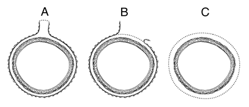
Jejunum_Ileum.NET_2.0.0.0.REL_CAPCP
15
tumor has been completely removed. If a biopsied tumor is not resected for any reason (e.g., when
technically unfeasible) and if the highest T and N categories or the M1 category of the tumor can be
confirmed microscopically, the criteria for pathologic classification and staging have been satisfied without
total removal of the primary cancer.
TNM Descriptors
For identification of special cases of TNM or pTNM classifications, the “m” suffix and “y,” “r,” and “a”
prefixes are used. Although they do not affect the stage grouping, they indicate cases needing separate
analysis.
The “m” suffix indicates the presence of multiple primary tumors in a single site and is recorded in
parentheses: pT(m)NM.
The “y” prefix indicates those cases in which classification is performed during or following initial
multimodality therapy (i.e., neoadjuvant chemotherapy, radiation therapy, or both chemotherapy and
radiation therapy). The cTNM or pTNM category is identified by a “y” prefix. The ycTNM or ypTNM
categorizes the extent of tumor actually present at the time of that examination. The “y” categorization is
not an estimate of tumor prior to multimodality therapy (i.e., before initiation of neoadjuvant therapy).
The “r” prefix indicates a recurrent tumor when staged after a documented disease-free interval, and is
identified by the “r” prefix: rTNM.
The “a” prefix designates the stage determined at autopsy: aTNM.
N Category Considerations
For ileal and jejunal tumors, the regional lymph nodes are the cecal (for tumors arising in the terminal
ileum), superior mesenteric, and mesenteric nodes.  Metastases to celiac nodes are considered distant
metastases.
Mesenteric masses are defined as discrete but irregular mesenteric tumor nodules frequently located
adjacent to neurovascular bundles and discontinuous from the primary neoplasm.2  Mesenteric masses
result from extranodal extension or vascular/ pernineural spread of the tumor and are often associated
with dense fibrosis, causing ecasement of large mesenteric vessels. The presence of mesenteric masses
and nodal deposits in 12 or more nodes has been associated with frequent liver metastasis and a poor
prognosis..2,3
M Category Considerations
The liver is the most common metastatic site. Metastases to extrahepatic sites, such as lung, ovary,
peritoneum, and bone, are rare. Involvement of the celiac, para-aortic, and other nonregional lymph
nodes is also considered M1 disease. In the AJCC Version 9, M is subcategorized into M1a (hepatic
only), M1b (extrahepatic only), and M1c (both hepatic and extrahepatic).
References
1. AJCC Version 9 Neuroendocrine Tumors of the Jejunum and Ileum Cancer Staging System.
Copyright 2023 American College of Surgeons.
Jejunum_Ileum.NET_2.0.0.0.REL_CAPCP
16
2. Gonzalez RS, Liu EH, Alvarez JR, Ayers GD, Washington MK, Shi C. Should mesenteric tumor
deposits be included in staging of well-differentiated small intestine neuroendocrine tumors? Mod
Pathol. 2014;27(9):1288-1295.
3. Fata CR, Gonzalez RS, Liu E, et al. Mesenteric tumor deposits in midgut small intestinal
neuroendocrine tumors are a stronger indicator than lymph node metastasis for liver metastasis
and poor prognosis. Am J Surg Pathol. 2017;41(1):128-133.
H. Additional Findings
Mesenteric fibrosis is seen in about 50% of small intestinal neuroendocrine tumors and leads to intestinal
obstruction, intestinal ischemia, malabsorption, and malnutrition. Mesenteric vascular changes (elastic
vascular sclerosis) associated with midgut carcinoids may produce arterial luminal narrowing due to
concentric accumulation of elastic tissue in the adventitia.  These vascular changes may lead to intestinal
ischemia and frank necrosis.1 While mesenteric fibrosis in stage IV tumors by itself does not significantly
impact the overall, presence of mesenteric fibrosis along with vascular changes is indicative of an
aggressive tumor biology and when leads to intestinal ischemia is associated with poor prognosis.2
References
1. Nash SV, Said JW. Gastroenteropancreatic neuroendocrine tumors: a histochemical and
immunohistochemical study of epithelial (keratin proteins, carcinoembryonic antigen) and
neuroendocrine (neuron-specific enolase, bombesin and chromogranin) markers in foregut,
midgut, and hindgut tumors. Am J Clin Pathol. 1986;86(2):415-422.
2. AJCC Version 9 Neuroendocrine Tumors of the Jejunum and Ileum Cancer Staging System.
Copyright 2023 American College of Surgeons.
# Kidney, Biopsy
Protocol for the Examination of Biopsy Specimens from Patients
with Renal Cell Carcinoma
Version: 4.2.0.0
Protocol Posting Date: June 2024
The use of this protocol is recommended for clinical care purposes but is not required for accreditation
purposes.
This protocol should be used for the following procedures AND tumor types:
Procedure
Description
Biopsy
Includes specimens designated core needle biopsy, endoscopic biopsy, and
others
Tumor Type
Description
Renal cell carcinomas
Includes all renal cell carcinoma subtypes
This protocol is NOT required for accreditation purposes for the following:
Procedure
Resection (use Kidney Resection protocol)
Tumor Type
Urothelial tumors (use Ureter, Renal Pelvis protocol)
Nephroblastic (Wilm’s) tumors (use Wilm’s Tumor Biopsy protocol)
Hematopoietic neoplasms (use the Precursor and Mature Lymphoid neoplasm, Myeloid and Mixed / Ambiguous
Lineage Neoplasms or Plasma Cell Malignancies and Immunoglobulin Deposition Related Disorders protocol)
Sarcoma (use the Soft Tissue protocol)
Authors
Paari Murugan, MD, FCAP*; Robert W. Allan, MD*; Lara R. Harik, MD, FCAP*; Gladell P. Paner, MD,
FCAP; John R. Srigley, MD; Mahul B. Amin, MD; Sean R. Williamson, MD; Ying-Bei Chen, MD, PhD; Kiril
Trpkov, MD; Michelle S. Hirsch, MD, PhD; Steven C. Smith, MD, PhD; Holger Moch, MD; Peter A.
Humphrey, MD, PhD; Maria Carlo, MD; Viraj A. Master, MD, PhD.
With guidance from the CAP Cancer and CAP Pathology Electronic Reporting Committees.
* Denotes primary author.
The use of this case summary is recommended for clinical care purposes but is not required for
accreditation purposes. The core and conditional data elements are routinely reported. Non-core data
elements are indicated with a plus sign (+) to allow for reporting information that may be of clinical value.

CAP
Approved
Kidney.Bx_4.2.0.0.REL_CAPCP
2
v 4.2.0.0
•
Title and cover page update
•
WHO 5th edition update to content and explanatory notes
•
Addition of required (core) question “Histologic Features”
•
LVI question update from optional to core element and terminology changed from
“Lymphovascular Invasion” to “Lymphatic and / or Vascular Invasion”
CAP
Approved
Kidney.Bx_4.2.0.0.REL_CAPCP
3
Reporting Template
Protocol Posting Date: June 2024
Select a single response unless otherwise indicated.
Standard(s): AJCC-UICC 8
This case summary is recommended for reporting biopsy specimens, but is not required for accreditation purposes.
SPECIMEN
Procedure
___ Needle biopsy
___ Incisional biopsy
___ Other (specify): _________________
___ Not specified
Specimen Laterality
___ Right
___ Left
___ Other (specify): _________________
___ Not specified
TUMOR
+Tumor Site (select all that apply)
___ Upper pole
___ Middle
___ Lower pole
___ Other (specify): _________________
___ Not known
Histologic Type (Note A)
Clear cell tumors
___ Clear cell renal cell carcinoma
___ Multilocular cystic renal neoplasm of low malignant potential
Papillary renal tumors
___ Papillary renal cell carcinoma
Oncocytic and chromophobe renal tumors
___ Chromophobe renal cell carcinoma
___ Other oncocytic tumors of the kidney (specify): _________________
Collecting duct tumors
___ Collecting duct carcinoma
Other renal tumors
___ Clear cell papillary renal cell tumor
___ Mucinous tubular and spindle renal cell carcinoma
___ Tubulocystic renal cell carcinoma
___ Acquired cystic disease-associated renal cell carcinoma
CAP
Approved
Kidney.Bx_4.2.0.0.REL_CAPCP
4
___ Eosinophilic solid and cystic renal cell carcinoma
___ Renal cell carcinoma, NOS (unclassified)
Molecularly defined renal carcinomas
___ TFE3-rearranged renal cell carcinoma
___ TFEB-altered renal cell carcinoma
___ ELOC (formerly TCEB1)-mutated renal cell carcinoma
___ Fumarate hydratase-deficient renal cell carcinoma
___ Succinate dehydrogenase-deficient (SDH) renal cell carcinoma
___ ALK-rearranged renal cell carcinoma
___ SMARCB1-deficient renal medullary carcinoma
Other
___ Renal cell carcinoma, subtype pending additional studies
___ Other histologic type not listed (specify): _________________
+Histologic Type Comment: _________________
Histologic Grade (WHO / ISUP) (Note B)
See table for renal carcinoma subtype grading requirements
___ G1, nucleoli absent or inconspicuous at 400x magnification
___ G2, nucleoli conspicuous and visible at 400x magnification, not prominent at 100x magnification
___ G3, nucleoli conspicuous at 100x magnification
___ G4, extreme nuclear pleomorphism and / or multinucleated giant cells and / or rhabdoid and / or
sarcomatoid differentiation (specify): _________________
___ GX, cannot be assessed
___ Not applicable: _________________
+Histologic Grade Comment: _________________
Histologic Features (Note C) (select all that apply)
___ Sarcomatoid or rhabdoid features not identified
___ Sarcomatoid features present
___ Rhabdoid features present
___ Cannot be determined: _________________
+Necrosis (Note D)
___ Not identified
___ Present
Lymphatic and / or Vascular Invasion
___ Not identified
___ Present
___ Cannot be determined: _________________
+Tumor Comment: _________________
ADDITIONAL FINDINGS
+Additional Findings
___ None identified
CAP
Approved
Kidney.Bx_4.2.0.0.REL_CAPCP
5
___ Other pathology present (specify): _________________
COMMENTS
Comment(s): _________________
CAP
Approved
Kidney.Bx_4.2.0.0.REL_CAPCP
6
Explanatory Notes
A. Histologic Type
This protocol was updated to incorporate the changes made in the 5th edition WHO Urinary and Male
Genital Tumors Classification.1
The updated entities that should be reported using the kidney cancer protocol are listed below:
Clear cell renal tumors
Clear cell renal cell carcinoma
Multilocular cystic renal neoplasm of low malignant potential
Papillary renal tumors
Papillary renal cell carcinoma
Oncocytic and chromophobe renal cell tumors
Chromophobe renal cell carcinoma
Other oncocytic tumors of the kidney
Collecting duct tumors
Collecting duct carcinoma
Other renal tumors
Clear cell papillary renal cell tumor
Mucinous tubular and spindle cell carcinoma
Tubulocystic renal cell carcinoma
Acquired cystic disease-associated renal cell carcinoma
Eosinophilic solid and cystic renal cell carcinoma
Renal cell carcinoma, NOS
Molecularly defined renal carcinoma
TFE3-rearranged renal cell carcinomas
TFEB-altered renal cell carcinomas
ELOC (formerly TCEB1)-mutated renal cell carcinoma
Fumarate hydratase-deficient renal cell carcinoma
Succinate dehydrogenase-deficient renal cell carcinoma
ALK-rearranged renal cell carcinomas
SMARCB1-deficient renal medullary carcinoma
The changes made in the 5th WHO edition are summarized below and the reader is encouraged to
reference the updated manuscript.
Papillary renal cell carcinoma: Subclassification into type 1 and type 2 is no longer recommended. This
reflects the recognition that many tumors characterized as type 2 papillary renal cell carcinoma now
represent other distinct entities (e.g., Fumarate hydratase-deficient renal cell carcinoma).
Other oncocytic tumors of the kidney: This is a heterogeneous group of renal tumors with eosinophilic/
oncocytic cells with oncocytoma-like and/or chromophobe renal cell carcinoma-like features. This includes
hybrid oncocytic tumors (HOCT) that may occur sporadically or associated with Birt-Hogg-Dube
syndrome; the emerging entities of eosinophilic vacuolated tumor (EVT), low-grade oncocytic tumor (LOT)
and other eosinophilic/oncocytic tumors with intermediate (borderline) features.
CAP
Approved
Kidney.Bx_4.2.0.0.REL_CAPCP
7
Clear cell papillary renal cell tumor (CCPRCT): Renamed from carcinoma to tumor to reflect its indolent
behavior.
Eosinophilic solid and cystic renal cell carcinoma: This was recognized as a separate entity characterized
by solid and cystic architecture with voluminous eosinophilic cytoplasm, frequent (but not required) keratin
20 reactivity and typically negative keratin 7 expression. The clinical behavior is indolent in the great
majority of cases and these tumors may occur in association with tuberous sclerosis complex or
sporadically. In both settings, there are alterations in the TSC1/2 genes.
Renal cell carcinoma, NOS: This category should be reserved for carcinomas that cannot be placed into
one of the morphologically and molecularly defined categories. These are usually high-grade. Low-grade
oncocytic tumors that are difficult to classify should be placed in the “Other oncocytic tumors of the
kidney” group.
Molecularly defined renal cell carcinoma
The category of molecularly defined renal carcinoma was added to the 5th edition WHO to include
carcinomas that demonstrate characteristic molecular alterations that define these tumor types.
TFE3-rearranged renal cell carcinomas: This was formerly called Xp11 translocation renal cell carcinoma.
These tumors morphologically often show mixed papillary and solid architecture, with mixed clear and
eosinophilic cytoplasm, sometimes with scattered psammoma bodies. These tumors are characterized
by TFE3 rearrangements, revealed by nuclear expression of TFE3 protein or preferably, demonstration
of TFE3 rearrangement by break-apart FISH or sequencing methods. Other immunohistochemical
markers that may be positive include variable melanocytic markers, cathepsin K, and GPNMB.
TFEB-altered renal cell carcinoma: This category encompasses renal carcinoma that possess either
a TFEB rearrangement or TFEB/6p21 amplification. TFEB rearranged carcinomas frequently display a
biphasic pattern with smaller cells clustering around basement membrane-like material surrounded by
larger epithelioid cells. However, other patterns can also be present that may overlap with clear cell renal
cell
carcinoma, TFE3 rearranged
renal
cell
carcinoma,
and
tumors
with
oncocytic
features. TFEB amplified carcinoma is less characteristic and may appear poorly differentiated and
infiltrative with papillary and oncocytic features. Useful markers for detection of TFEB rearranged
carcinomas include the melanocytic markers melan-A and HMB45, cathepsin K, or nuclear reactivity for
TFEB protein. TFEB amplified carcinomas may also have melanocytic marker and cathepsin K positivity,
and some are positive for keratin 20, overlapping with the immunohistochemical pattern of eosinophilic
solid and cystic renal cell carcinoma. If a break-apart FISH method is used, TFEB amplified carcinomas
show numerous copies of the TFEB region, usually without rearrangement. Other genes at 6p21, such
as VEGFA, are typically included in the amplicon. Whereas TFE3/TFEB rearranged carcinomas have a
tendency to occur in younger patients (although not always), TFEB amplified carcinomas appear to occur
in older patients and have a worse prognosis.2,3
ELOC mutated renal cell carcinoma: The ELOC gene was formerly known as TCEB1, therefore, this
tumor was formerly known as TCEB1 mutated renal cell carcinoma. These tumors tend to be small and of
low stage, with prominent fibromuscular bands, overlapping with renal cell carcinoma with leiomyomatous
or fibromyomatous stroma. Keratin 7 appears to be consistently expressed, and the tumor is
CAP
Approved
Kidney.Bx_4.2.0.0.REL_CAPCP
8
characterized by bi-allelic inactivation of ELOC. Data are limited; however, behavior appears mostly
favorable.
Fumarate hydratase (FH) deficient renal cell carcinoma: This entity was previously known as hereditary
leiomyomatosis and renal cell carcinoma syndrome-associated renal cell carcinoma. This is typically an
aggressive tumor with variable architecture patterns (papillary, solid, tubulocystic, cribriform) with high-
grade appearing cells with prominent bright red macronucleoli and perinucleolar clearing. The
morphological spectrum was recently expanded to include cases with low-grade oncocytic morphology.
These tumors have mutations in the fumarate hydratase (FH) gene which can be demonstrated by lack of
FH protein expression (“loss”) and 2-succinocysteine (2SC) reactivity by immunohistochemistry. Rarely,
mutated tumors may show focal or patchy FH staining, presumably due to a dysfunctional protein that
remains recognizable by the antibody. Most patients are thought to have germline FH alterations and thus
the hereditary leiomyomatosis and renal cell carcinoma syndrome, accompanied also by skin and uterine
leiomyomas (in females); however, a subset of tumors appear to occur due to somatic FH mutations in
the absence of the syndrome.
Succinate dehydrogenase-deficient renal cell carcinoma: This rare renal cell carcinoma typically has
bland, bubbly eosinophilic cells, overlapping with oncocytic tumors such as oncocytoma and
chromophobe renal cell carcinoma. The most diagnostic finding is immunohistochemistry for SDHB
showing abnormal absence of staining in the tumor cells (“loss”) serving as a surrogate marker for SDH
gene complex alterations. Contrasting to most other oncocytic tumors, these neoplasms are typically
negative for KIT and entirely negative for keratin 7. Most patients have germline SDHB alterations and
thus the hereditary SDH-deficient tumor syndrome.
ALK-rearranged renal cell carcinoma: ALK-rearranged renal cell carcinoma is newly included in the 5th
edition WHO Classification. These tumors show variable morphology, including solid, papillary, and
cribriform patterns. Mucin production is a common feature. Tumors are characterized by rearrangements
of ALK demonstrated by positive immunohistochemistry or abnormal FISH. Although very rare, this tumor
type may be particularly relevant for treatment, as ALK inhibitors appear to have benefit.
SMARCB1-deficient renal medullary carcinoma: SMARCB1-deficient renal medullary carcinoma was
previously designated renal medullary carcinoma but has been brought under the umbrella of molecularly
defined renal cell carcinoma. This tumor type retains the classical association with renal medullary
location and strong association with sickle cell trait or rarely other hemoglobinopathies.  The name was
updated to include the characteristic loss of SMARCB1 (also known as INI1, BAF47) demonstrable by
immunohistochemistry that serves as a surrogate for SMARCB1 inactivation on 22q11.23. An important
point to emphasize is that this category should be reserved for those tumors with medullary
location/phenotype that are very frequently, but not always associated with sickle cell trait. Other renal
cell carcinoma subtypes, for example clear cell with sarcomatoid transformation or FH deficient renal cell
carcinoma, may show secondary SMARCB1 loss and should be categorized according to the underlying
morphologic/genetic feature.
The category of “Other histologic type not listed (specify)” can be used to diagnose entities that are
emerging provisional entities such as, biphasic hyalinizing psammomatous renal cell carcinoma, or
thyroid-like follicular renal cell carcinoma.
CAP
Approved
Kidney.Bx_4.2.0.0.REL_CAPCP
9
In recognition of the increasing number of molecularly defined renal cell carcinomas, a category of “Renal
cell carcinoma, subtype pending additional studies” has been added to the protocol. Since many
pathologists will not have immediate access to the immunohistochemistry (IHC) and molecular studies
required to define these rare tumors, this category facilitates preliminary sign-out while awaiting reference
lab results. An addendum report should be issued on completion of the additional studies.
References
1. Raspollini MR, Moch H, Tan PH, et al. Tumours of the kidney. In: WHO Classification of Tumours
Editorial Board, eds. Urinary and Male Genital Tumours. WHO Classification of Tumours.
Geneva, Switzerland: WHO Press; 2022.
2. Kammerer-Jacquet SF, Gandon C, Dugay F, et al. Comprehensive study of nine novel cases of
TFEB-amplified renal cell carcinoma: an aggressive tumour with frequent PDL1 expression.
Histopathology. 2022 Aug;81(2):228-238.
3. Lobo J, Rechsteiner M, Helmchen BM, et al. Eosinophilic solid and cystic renal cell carcinoma
and renal cell carcinomas with TFEB alterations: a comparative study. Histopathology. 2022
Jul;81(1):32-43.
B. Histologic Grade
Accurate grading requires an adequate sample of tissue, which is not always available from needle
biopsy specimens. Tumor grade in a biopsy sample may underestimate the grade found in resection
specimens, as grade is determined by the worst area encountered. This is especially true for larger
tumors where heterogeneity is commonly present. However, due to the increased consideration of active
surveillance, RCC tumor grading on biopsy specimens is encouraged, with the understanding that low-
grade in a biopsy sample does not rule out the presence of higher-grade areas in the tumor.
The WHO/ISUP grading system has supplanted the Fuhrman system as the grading standard.1,2 Grade
should be assigned based on the highest grade cells present in a single high power field rather than the
most predominant pattern. Grade is based upon the degree of nucleolar predominance (grades 1-3) and
presence of nuclear pleomorphism including giant cells, sarcomatoid, or rhabdoid features (grade
4).  This grading system has been validated for both clear cell and papillary renal cell carcinoma;
however, it has not been validated for other RCC subtypes.3,4 Nevertheless, the WHO/ISUP grade should
be included for descriptive purposes. The following table 5,6 outlines the utility of grading in the different
subtypes of renal carcinoma.
Category and Tumor Type
Notes
RCC subtypes validated for WHO/ISUP grading
Clear cell RCC
Papillary RCC
RCC subtypes where WHO/ISUP grading is clearly not applicable
Chromophobe RCC
WHO/ISUP grading is not applicable; alternative
schemes have been proposed, such as chromophobe
tumor grade and grading by necrosis and sarcomatoid
change
TFE3-rearranged RCC
Studies show that WHO/ISUP grade may not be useful
RCC subtypes where WHO/ISUP grading is potentially useful
SDH-deficient RCC
Low and high-grade features using Fuhrman or
WHO/ISUP grading seem to be associated with
Mucinous tubular and spindle cell carcinoma
CAP
Approved
Kidney.Bx_4.2.0.0.REL_CAPCP
10
ELOC-mutated RCCa
outcome, suggesting the potential value of nuclear
grading
TFEB-altered RCC
WHO/ISUP grade may help separate aggressive TFEB-
amplified RCC from TFEB-rearranged RCC
RCC, NOS
Includes tumors with heterogeneous morphology;
providing information on nuclear gradeb would be helpful
to communicate potential prognosis to clinicians
FH-deficient RCC including HLRCC-RCC
The vast majority of tumors have high-gradeb nuclei, in
keeping with their aggressive behavior, but rare low-
grade potentially indolent tumors have been reported;
therefore, specifying the low-grade tumors (to distinguish
from the more common high-grade tumors) may be
helpful
Inherently aggressive RCC subtypes irrespective of WHO/ISUP grading
Collecting duct carcinoma
Inherent high-grade nuclei and almost uniform
aggressive clinical course in these tumor types obviates
use of nuclear grading
SMARCB1-deficient renal medullary carcinoma
RCC subtypes where WHO/ISUP grading is potentially misleading
Tubulocystic carcinoma
Nuclear gradingb may be problematic because of pure or
predominantly high-grade–appearing nuclei despite the
overall indolent behavior of tumor types
Acquired cystic disease-associated RCC
Eosinophilic solid and cystic RCC and eosinophilic
vacuolated tumor
Renal epithelial neoplasms where low WHO/ISUP grade features are essential for accurate histological
classification
Papillary adenoma
Multilocular cystic renal neoplasm of low malignant
potential
Clear cell papillary renal cell tumor
Renal epithelial neoplasm with no or limited data on grading or behavior
ALK-rearranged RCC
Other oncocytic tumors
Other oncocytic tumors
Other oncocytic tumors in the 5th edition WHO
classification are low or high-grade tumors even though
their histological features are not predictive of clinical
behavior
FH, fumarate hydratase; HLRCC-RCC, hereditary leiomyomatosis, and renal cell carcinoma syndrome–
associated renal cell carcinoma; RCC, renal cell carcinoma; SDH, succinate dehydrogenase.
aFormerly TCEB1-mutated RCC. bNuclear grade: used here when a grading system is not specified in the
literature, or when the data span the Fuhrman and WHO/ISUP grading systems or when they mention
nuclear grade without specific criteria. WHO/ISUP grading may be generally inferred from nuclear
features, with G1 and G2 tumors being low-grade and G3 and G4 tumors being high-grade.
References
1. Moch H, Humphrey PA, Ulbright TM, Reuter VE, eds. World Health Organization (WHO)
Classification of Tumours: Pathology and Genetics of the Urinary System and Male Genital
Organs. Geneva, Switzerland: WHO Press; 2016.
CAP
Approved
Kidney.Bx_4.2.0.0.REL_CAPCP
11
2. Delahunt B, Cheville JC, Martignoni G, et al. The International Society of Urological Pathology
(ISUP) grading system for renal cell carcinoma and other prognostic parameters. Am J Surg
Pathol. 2013;37:1490-1504.
3. Sika-Paotonu D, Bethwaite PB, McCredie MRE, Jordan TW, Delahunt B. Nucleolar grade but not
Fuhrman grade is applicable to papillary renal cell carcinoma. Am J Surg Pathol. 2006;30:1091-
1096.
4. Delahunt B, Sika-Paotonu D, Bethwaite PB, et al. Grading of clear cell renal cell carcinoma
should be based on nucleolar prominence. Am J Surg Pathol. 2011;135:1134-1139.
5. Raspollini MR, Moch H, Tan PH, et al. Tumours of the kidney. In: WHO Classification of
Tumours Editorial Board, eds. Urinary and Male Genital Tumours. WHO Classification of
Tumours. Geneva, Switzerland: WHO Press; 2022.
6. Paner GP, Chumbalkar V, Montironi R, et al. Updates in Grading of Renal Cell Carcinomas
Beyond Clear Cell Renal Cell Carcinoma and Papillary Renal Cell Carcinoma. Adv Anat Pathol.
2022 May 1;29(3):117-130.
C. Sarcomatoid and Rhabdoid Features
Sarcomatoid and Rhabdoid features may be observed on biopsy samples of renal masses. Sarcomatoid
carcinoma is not a specific morphologic or genetic subtype of renal cell carcinoma but is considered a
pattern of dedifferentiation of different renal carcinoma subtypes.1,2,3,4 Sarcomatoid change in a renal cell
carcinoma is associated with an adverse outcome. 1,4  Sarcomatoid morphology may be found in any
histologic subtypes of renal cell carcinomas, including clear cell, papillary, chromophobe, collecting duct,
and other rare and unclassified subtypes.1,2,3,4 When the background carcinoma subtype is recognized, it
should be specified under histologic type (see Note A). Pure sarcomatoid carcinoma or sarcomatoid
carcinoma associated with epithelial elements that do not conform to usual renal carcinoma cell types
should be considered as renal cell carcinoma, NOS. Sarcomatoid morphology is also incorporated into
the WHO/ISUP grading system as grade 4.
Rhabdoid features, like sarcomatoid features, are a characteristic of high-grade disease. Rhabdoid cells
have abundant eosinophilic cytoplasm with an eccentric nucleus and often a prominent nucleolus. These
cells mimic rhabdomyoblasts but do not show true skeletal muscle differentiation.4,5,6,7 Rhabdoid features
are
associated
with
adverse
outcomes,
and
about
25%
concurrently
show
sarcomatoid
features.1 Rhabdoid morphology is also by definition WHO/ISUP grade 4.4
References
1. Humphrey PA, Moch H, Reuter VE, Ulbright TM, eds. World Health Organization (WHO)
Classification of Tumours: Pathology and Genetics of the Urinary System and Male Genital
Organs. Geneva, Switzerland: WHO Press; 2016.
2. de Peralta-Venturina M, Moch H, Amin M, et al. Sarcomatoid differentiation in renal cell
carcinoma: a study of 101 cases. Am J Surg Pathol. 2001;25:275-278.
3. Cheville JC, Lohse CM, Zincke H, et al. Sarcomatoid renal cell carcinoma: an examination of
underlying histologic subtype and an analysis of associations with patient outcome. Am J Surg
Pathol. 2004;28:435-441.
4. Delahunt B, Cheville JC, Martignoni G, et al. The International Society of Urological Pathology
(ISUP) grading system for renal cell carcinoma and other prognostic parameters. Am J Surg
Pathol. 2013;37:1490-1504.
CAP
Approved
Kidney.Bx_4.2.0.0.REL_CAPCP
12
5. Kuroiwa K, Kinoshita Y, Shiratsuchi H, et al. Renal cell carcinoma with rhabdoid features: an
aggressive neoplasm. Histopathology. 2002;41:538-548.
6. Gokden N, Nappi O, Swanson PE, et al. Renal cell carcinoma with rhabdoid features. Am J Surg
Pathol. 2000;24:1329-1338.
7. Leroy X, Zini L, Buob D, et al. Renal cell carcinoma with rhabdoid features. Arch Pathol Lab Med.
2007;131:102-106.
D. Necrosis
Tumor necrosis is an important prognostic factor in renal cell carcinoma.1,2,3  Necrosis on biopsy may be
subject to significant sampling error; the reporting is an optional element. The prognostic significance of
necrosis independent of tumor stage has been identified in clear cell and chromophobe renal cell
carcinoma.2,4 In addition, tumor-associated necrosis has been shown to be an important prognostic factor
for clear cell RCC, independently of WHO/ISUP grade. The prognostic significance of necrosis in papillary
renal cell carcinoma is controversial. Large papillary carcinomas commonly display cystic necrosis and
yet do not exhibit extra renal spread.5 Tumor necrosis cannot be assessed as a prognostic factor when
patients have undergone presurgical arterial embolization, as tumor-type necrosis cannot be definitively
distinguished from treatment effect.
References
1. Delahunt B, Cheville JC, Martignoni G, et al. The International Society of Urological Pathology
(ISUP) grading system for renal cell carcinoma and other prognostic parameters. Am J Surg
Pathol. 2013;37:1490-1504.
2. Cheville JC, Lohse CM, Zincke H, Weaver AL, Blute ML. Comparison of outcome and prognostic
features among histologic suptypes of renal cell carcinoma. Am J Surg Pathol. 2003;27:612-624.
3. Klatte T, Said JW, de Martino M, et al. Presence of tumour necrosis is not a significant predictor
of survival in clear cell renal cell carcinoma: higher prognostic accuracy of extent based rather
than presence/absence classification. J Urol. 2009;181:1558-1564.
4. Dagher J, Delahunt B, Rioux-Leclercq N, Egevad L, Coughlin G, Dunglison N, Gianduzzo T, Kua
B, Malone G, Martin B, Preston J, Pokorny M, Wood S, Samaratunga H. Assessment of tumour-
associated
necrosis
provides
prognostic
information
additional
to
World
Health
Organization/International Society of Urological Pathology grading for clear cell renal cell
carcinoma. Histopathology. 2019 Jan;74(2):284-290.
5. Peckova K, Martinek P, Pivovarcikova K, Vanecek T, Alaghehbandan R, Prochazkova K, Montiel
DP, Hora M, Skenderi F, Ulamec M, Rotterova P, Daum O, Ferda J, Davidson W, Ondic O,
Dubova M, Michal M, Hes O. Cystic and necrotic papillary renal cell carcinoma: prognosis,
morphology, immunohistochemical, and molecular-genetic profile of 10 cases. Ann Diagn Pathol.
2017 Feb;26:23-30.
# Lung Biomarker Reporting
Template for Reporting Results of Biomarker Testing of
Specimens from Patients with Non-Small Cell Carcinoma of the
Lung
Version: 2.2.0.0
Protocol Posting Date: September 2025
This biomarker template is not required for accreditation purposes but may be used to facilitate
compliance with CAP Accreditation Program Requirements.
Version Contributors
Authors: Brett W. Baskovich, MD*, Kirtee Raparia, MD, FCAP*
Other Expert Contributors: Patrick L. Fitzgibbons, MD, FCAP, George G. Birdsong, MD, Joseph D.
Khoury, MD, Raja R. Seethala, MD, Frank Schneider, MD, Alexander Baras, MD, PhD
* Denotes primary author.
For any questions or comments, contact: cancerprotocols@cap.org.
Glossary:
Author: Expert who is a current member of the Cancer Committee, or an expert designated by the chair of the Cancer Committee.
Expert Contributors: Includes members of other CAP committees or external subject matter experts who contribute to the current
version of the protocol.
Completion of the template is the responsibility of the laboratory performing the biomarker testing and/or
providing the interpretation. When both testing and interpretation are performed elsewhere (eg, a
reference laboratory), synoptic reporting of the results by the laboratory submitting the tissue for testing is
also encouraged to ensure that all information is included in the patient’s medical record and thus readily
available to the treating clinical team. This template is not required for accreditation purposes.

CAP
Approved
Lung.Bmk_2.2.0.0.REL_CAPCP
2
v 2.2.0.0
•
Updates to EGFR, ALK, ROS1, RET, BRAF, NTRK, and PD-L1 sections
•
Addition of NRG1 section
•
Addition of optional Specify Fusion Partner question to ROS1, RET NTRK1, NTRK2, and NTRK3
Molecular Methods
•
Addition of BRAF:p.V600K, BRAF:p.V600R, and BRAF:p.V600D answers to BRAF Mutational
Analysis question
•
Addition of specific PD-L1 markers to include PD-L1 22c3, PD-L1 228-8, PD-L1 SP142, and PD-
L1 SP263
CAP
Approved
Lung.Bmk_2.2.0.0.REL_CAPCP
3
Reporting Template
Protocol Posting Date: September 2025
Select a single response unless otherwise indicated.
Completion of the template is the responsibility of the laboratory performing the biomarker testing and / or providing the
interpretation. When both testing and interpretation are performed elsewhere (e.g., a reference laboratory), synoptic reporting of the
results by the laboratory submitting the tissue for testing is also encouraged to ensure that all information is included in the patient’s
medical record and thus readily available to the treating clinical team.
Gene names should follow recommendations of The Human Genome Organisation (HUGO) Nomenclature Committee
(www.genenames.org; accessed September 2, 2025).
All reported gene sequence variations should be identified following the recommendations of the Human Genome Variation Society
(www.http://varnomen.hgvs.org;accessed September 2, 2025).
SPECIMEN
+Adequacy of Sample for Testing
___ Adequate
+Specify Estimated Percent of Tumor Cellularity (area used for testing): _________________ %
___ Suboptimal (explain): _________________
Please refer to original laboratory report for explanation.
+Specimen Type
___ Untreated diagnostic specimen
___ Relapse specimen (after treatment; specify)#: _________________
# When data is available, specify treatment type. This is most relevant to targeted inhibitors associated with specific genomic
changes conferring treatment resistance.
RESULTS
EGFR
+Mutational Analysis
___ No EGFR mutation detected
___ Mutation(s) identified
Select all that apply
___ EGFR:p.G719X
___ EGFR Exon 19 deletion (specify, if known): _________________
___ EGFR Exon 20 insertion (specify, if known): _________________
___ EGFR:p.S768I
___ EGFR:p.T790M
___ EGFR:p.L858R
___ EGFR:p.L861Q
___ Other (specify): _________________
___ Cannot be determined (explain): _________________
+EGFR L858R by Immunohistochemistry (clone 43B2)
___ Negative
CAP
Approved
Lung.Bmk_2.2.0.0.REL_CAPCP
4
___ Positive
___ Equivocal (explain): _________________
___ Cannot be determined (explain): _________________
+EGFR Exon 19 Deletion (E746_A750del) (clone 6B6)
___ Negative
___ Positive
___ Equivocal (explain): _________________
___ Cannot be determined (explain): _________________
+Interpretation (select all that apply)
___ An EGFR mutation is present that is associated with response to EGFR tyrosine kinase inhibitors
___ An EGFR mutation is present that is associated with resistance to EGFR tyrosine kinase inhibitors
___ Two EGFR mutations are present, one of which is associated with resistance to EGFR tyrosine
kinase inhibitors
___ EGFR L858R immunohistochemical staining is positive, which is associated with response to
EGFR tyrosine kinase inhibitors
___ EGFR E746_A750del immunohistochemical staining is positive, which is associated with response
to EGFR tyrosine kinase inhibitors
ALK
+Rearrangement by Molecular Methods
___ No ALK rearrangement detected
___ Rearrangement identified
___ EML4::ALK (specify variant type, if known): _________________
___ KIF5B::ALK
___ KLC1::ALK
___ Other ALK rearrangement (specify, if known): _________________
___ Cannot be determined (explain): _________________
+ALK Immunohistochemistry
___ Negative
___ Positive
___ Equivocal (explain): _________________
___ Cannot be determined (explain): _________________
+Interpretation (select all that apply)
___ An ALK fusion is identified that is associated with response to ALK tyrosine kinase inhibitors
___ ALK immunohistochemical staining is positive which is associated with response to ALK tyrosine
kinase inhibitors
ROS1
+Rearrangement by Molecular Methods
CAP
Approved
Lung.Bmk_2.2.0.0.REL_CAPCP
5
___ No ROS1 rearrangement detected
___ ROS1 rearrangement identified
+Specify Fusion Partner: _________________
___ Cannot be determined (explain): _________________
+ROS1 by Immunohistochemistry
___ Negative
___ Positive
___ Equivocal (explain): _________________
___ Cannot be determined (explain): _________________
+Interpretation (select all that apply)
___ A ROS1 fusion is present, which is associated with response to ROS tyrosine kinase inhibitors
___ ROS1 immunohistochemical staining is positive, which is associated with response to ROS1
tyrosine kinase inhibitors
RET
+Rearrangement by Molecular Methods
___ No RET rearrangement detected
___ RET rearrangement identified
+Specify Fusion Partner: _________________
___ Cannot be determined (explain): _________________
+Interpretation
___ A RET fusion is present which is associated with response to RET tyrosine kinase inhibitors
___ No RET fusions are detected
KRAS
+Mutational Analysis
___ No KRAS mutation detected
___ Mutation(s) identified
Select all that apply
___ KRAS:p.G12C
___ KRAS:p.G12D
___ KRAS:p.G12V
___ KRAS:p.G12S
___ KRAS:p.G12A
___ KRAS:p.G12R
___ KRAS:p.G13D
___ KRAS:p.G13C
___ KRAS:p.Q61L
___ Other (specify): _________________
___ Cannot be determined (explain): _________________
CAP
Approved
Lung.Bmk_2.2.0.0.REL_CAPCP
6
+Interpretation (select all that apply)
___ A KRAS mutation is identified which is associated with resistance to tyrosine kinase inhibitor
therapy
___ A KRAS mutation is identified which is associated with response to specific inhibitors
BRAF
+Mutational Analysis
___ No BRAF mutations detected
___ Mutation(s) identified
Select all that apply
___ BRAF:p.V600E
___ BRAF:p.V600K
___ BRAF:p.V600R
___ BRAF:p.V600D
___ Other (specify): _________________
___ Cannot be determined (explain): _________________
+Interpretation
___ A BRAF mutation is present which is associated with response to BRAF inhibitors
___ No BRAF mutations are detected
ERBB2
+Mutational Analysis
___ No ERBB2 mutations detected
___ Mutation(s) identified
Select all that apply
___ ERBB2:p.S310F
___ ERBB2:p.L755S
___ ERBB2:p.Y772_A775dup insertion
___ Other (specify): _________________
___ Cannot be determined (explain): _________________
+Copy Number Analysis
___ No ERBB2 (HER2) amplification detected
___ ERBB2 (HER2) amplification identified
Select all that apply
___ Specify Copy Number: _________________
___ Specify Ratio to Centromere 17: _________________
___ Cannot be determined (explain): _________________
+HER2 Immunohistochemistry
___ Negative (0-1)
CAP
Approved
Lung.Bmk_2.2.0.0.REL_CAPCP
7
___ Equivocal (2+)
___ Positive (3+)
___ Cannot be determined (explain): _________________
+Interpretation (select all that apply)
___ An ERBB2 (HER2) mutation is present which is associated with response to anti-HER2 therapy
___ ERBB2 (HER2) amplification is present which is associated with response to anti-HER2 therapy
___ HER2 is positive by immunohistochemistry (3+) which is associated with response to anti-HER2
therapy
MET
+Mutational Analysis
___ No MET mutation detected
___ Mutation(s) identified
Select all that apply
___ MET:p.D963_splice mutation
___ MET:p.D1010N
___ MET:p.D1010_splice mutation
___ MET exon 14 deletion
___ Other (specify): _________________
___ Cannot be determined (explain): _________________
+Copy Number Analysis
___ No MET amplification detected
___ MET amplification identified
Select all that apply
___ Specify Copy Number: _________________
___ Specify Ratio to Centromere 7: _________________
___ Cannot be determined (explain): _________________
+Interpretation (select all that apply)
___ A MET alteration is present which is associated with response to MET tyrosine kinase inhibitors
___ MET amplification is present which is associated with response to MET tyrosine kinase inhibitors
NTRK
+NTRK1 by Molecular Methods
___ No NTRK1 rearrangement detected
___ NTRK1 rearrangement identified
+Specify Fusion Partner: _________________
___ Cannot be determined (explain): _________________
+NTRK2 by Molecular Methods
___ No NTRK2 rearrangement detected
___ NTRK2 rearrangement identified
CAP
Approved
Lung.Bmk_2.2.0.0.REL_CAPCP
8
+Specify Fusion Partner: _________________
___ Cannot be determined (explain): _________________
+NTRK3 by Molecular Methods
___ No NTRK3 rearrangement detected
___ NTRK3 rearrangement identified
+Specify Fusion Partner: _________________
___ Cannot be determined (explain): _________________
+NTRK by immunohistochemistry
___ Negative
___ Positive
___ Equivocal
___ Cannot be determined (explain): _________________
+Interpretation (select all that apply)
___ An NTRK fusion is present which is associated with response to NTRK inhibitors
___ NTRK immunohistochemical staining is present. Fusion testing by NGS or FISH will be performed
___ NTRK immunohistochemical staining is present but fusion testing is negative. This is not
associated with response to NTRK inhibitors
___ Other (specify): _________________
NRG1
+Rearrangement by Molecular Methods
___ No NRG1 rearrangement detected
___ NRG1 rearrangement identified
+Specify Fusion Partner: _________________
___ Cannot be determined (explain): _________________
+Interpretation
___ An NRG1 fusion is present which is associated with response to NRG1 inhibitors
___ No NRG1 fusions are detected
Mismatch Repair
+Immunohistochemistry (IHC) Testing for Mismatch Repair (MMR) Proteins (select all that
apply)
___ MLH1
MLH1 Result
___ Intact nuclear expression
___ Loss of nuclear expression
___ Cannot be determined (explain): _________________
___ MSH2
CAP
Approved
Lung.Bmk_2.2.0.0.REL_CAPCP
9
MSH2 Result
___ Intact nuclear expression
___ Loss of nuclear expression
___ Cannot be determined (explain): _________________
___ MSH6
MSH6 Result
___ Intact nuclear expression
___ Loss of nuclear expression
___ Cannot be determined (explain): _________________
___ PMS2
PMS2 Result
___ Intact nuclear expression
___ Loss of nuclear expression
___ Cannot be determined (explain): _________________
___ Background non-neoplastic tissue / internal control with intact nuclear expression
+Microsatellite Instability (MSI)
___ MSI-Stable (MSS)
___ MSI-Low (MSI-L)
___ MSI-High (MSI-H)
___ Cannot be determined: _________________
+Interpretation (select all that apply)
___ The case is MSI-H which is associated with response to immune checkpoint inhibitors
___ The case is mismatch repair deficient which is associated with response to immune checkpoint
inhibitors
Tumor Mutational Burden
+Specify Tumor Mutational Burden: _________________
+Tumor Mutational Burden Level
___ Low
___ High
___ Equivocal
___ Cannot be determined (explain): _________________
+Interpretation
___ The case is TMB-high which is associated with response to immune checkpoint inhibitors
___ The case is TMB-low which is not associated with response to immune checkpoint inhibitors
PD-L1 IHC
+PD-L1 22c3 IHC Interpretation
___ Positive
___ Negative
CAP
Approved
Lung.Bmk_2.2.0.0.REL_CAPCP
10
___ Cannot be determined
+Specify Percentage of Tumor Cells with Staining (TPS): _________________ %
+Specify Combined Number of Tumor and Immune Cells with Staining per 100 Tumor Cells
(CPS): _________________ cells
+Specify Percentage of Tumor-associated Immune Cells with Staining: _________________
%
+Specify Percentage of Tumor Area Occupied by Tumor-associated Immune Cells:
_________________ %
PD-L1 22c3 IHC Methods
+Controls (select all that apply)
___ Internal control cells present; expected immunoreactivity
___ Internal control cells present; no immunoreactivity of either tumor cells or internal controls
___ External controls available; expected immunoreactivity
___ External controls available; no immunoreactivity in expected cells
+Assay Information
___ Food and Drug Administration (FDA) cleared test / vendor (specify): _________________
___ Laboratory-developed test
+Specify Quantitative Imaging Analytics Performed: _________________
+PD-L1 28-8 IHC Interpretation
___ Positive
___ Negative
___ Cannot be determined
+Specify Percentage of Tumor Cells with Staining (TPS): _________________ %
+Specify Combined Number of Tumor and Immune Cells with Staining per 100 Tumor Cells
(CPS): _________________ cells
+Specify Percentage of Tumor-associated Immune Cells with Staining: _________________
%
+Specify Percentage of Tumor Area Occupied by Tumor-associated Immune Cells:
_________________ %
PD-L1 28-8 IHC Methods
+Controls (select all that apply)
___ Internal control cells present; expected immunoreactivity
___ Internal control cells present; no immunoreactivity of either tumor cells or internal controls
___ External controls available; expected immunoreactivity
___ External controls available; no immunoreactivity in expected cells
+Assay Information
CAP
Approved
Lung.Bmk_2.2.0.0.REL_CAPCP
11
___ Food and Drug Administration (FDA) cleared test / vendor (specify): _________________
___ Laboratory-developed test
+Specify Quantitative Imaging Analytics Performed: _________________
+PD-L1 SP142 IHC Interpretation
___ Positive
___ Negative
___ Cannot be determined
+Specify Percentage of Tumor Cells with Staining (TPS): _________________ %
+Specify Combined Number of Tumor and Immune Cells with Staining per 100 Tumor Cells
(CPS): _________________ cells
+Specify Percentage of Tumor-associated Immune Cells with Staining: _________________
%
+Specify Percentage of Tumor Area Occupied by Tumor-associated Immune Cells:
_________________ %
PD-L1 SP142 IHC Methods
+Controls (select all that apply)
___ Internal control cells present; expected immunoreactivity
___ Internal control cells present; no immunoreactivity of either tumor cells or internal controls
___ External controls available; expected immunoreactivity
___ External controls available; no immunoreactivity in expected cells
+Assay Information
___ Food and Drug Administration (FDA) cleared test / vendor (specify): _________________
___ Laboratory-developed test
+Specify Quantitative Imaging Analytics Performed: _________________
+PD-L1 SP263 IHC Interpretation
___ Positive
___ Negative
___ Cannot be determined
+Specify Percentage of Tumor Cells with Staining (TPS): _________________ %
+Specify Combined Number of Tumor and Immune Cells with Staining per 100 Tumor Cells
(CPS): _________________ cells
+Specify Percentage of Tumor-associated Immune Cells with Staining: _________________
%
+Specify Percentage of Tumor Area Occupied by Tumor-associated Immune Cells:
_________________ %
PD-L1 SP263 IHC Methods
CAP
Approved
Lung.Bmk_2.2.0.0.REL_CAPCP
12
+Controls (select all that apply)
___ Internal control cells present; expected immunoreactivity
___ Internal control cells present; no immunoreactivity of either tumor cells or internal controls
___ External controls available; expected immunoreactivity
___ External controls available; no immunoreactivity in expected cells
+Assay Information
___ Food and Drug Administration (FDA) cleared test / vendor (specify): _________________
___ Laboratory-developed test
+Specify Quantitative Imaging Analytics Performed: _________________
Variants with Potential Pathologic Relevance
+Specify Marker and Results (repeat up to 20 times): _________________
Other Variants of Unknown Significance (VUS)
+Specify Marker and Results (repeat up to 20 times): _________________
COMMENTS
Comment(s): _________________
# Major Salivary Glands
Protocol for the Examination of Specimens From Patients With
Carcinomas of the Major Salivary Glands
Version: 4.3.0.0
Protocol Posting Date: June 2023
CAP Laboratory Accreditation Program Protocol Required Use Date: March 2024
The changes included in this current protocol version affect accreditation requirements. The new deadline
for implementing this protocol version is reflected in the above accreditation date.
For accreditation purposes, this protocol should be used for the following procedures AND tumor
types:
Procedure
Description
Resection
Includes specimens designated or containing parotid, submandibular,
sublingual glands
Tumor Type
Description
Carcinoma
Includes primary salivary gland carcinoma and neuroendocrine carcinoma
This protocol is NOT required for accreditation purposes for the following:
Procedure
Biopsy
Primary resection specimen with no residual cancer (e.g., following neoadjuvant therapy)
Cytologic specimens
The following tumor types should NOT be reported using this protocol:
Tumor Type
Minor salivary gland carcinoma (consider the Lip and Oral Cavity, Nasal Cavity and Paranasal Sinuses, Pharynx,
or Larynx protocols)
Sarcoma (consider the Soft Tissue protocol)
Lymphoma (consider the Hodgkin or non-Hodgkin Lymphoma protocols)
Authors
Raja R. Seethala, MD*; Justin A. Bishop, MD; William C. Faquin, MD, PhD; Shao Hui Huang, MD; Nora
Katabi, MD; William Lydiatt, MD; Brian O’Sullivan, MB BCh; Snehal Patel, MD; Jason Pettus, MD; Lindsay
Williams, MD.
With guidance from the CAP Cancer and CAP Pathology Electronic Reporting Committees.
* Denotes primary author.

CAP
Approved
HN.MajorSalivary_4.3.0.0.REL_CAPCP
2
This protocol can be utilized for a variety of procedures and tumor types for clinical care purposes. For
accreditation purposes, only the definitive primary cancer resection specimen is required to have the core
and conditional data elements reported in a synoptic format.
•
Core data elements are required in reports to adequately describe appropriate malignancies. For
accreditation purposes, essential data elements must be reported in all instances, even if the
response is “not applicable” or “cannot be determined.”
•
Conditional data elements are only required to be reported if applicable as delineated in the
protocol. For instance, the total number of lymph nodes examined must be reported, but only if
nodes are present in the specimen.
•
Optional data elements are identified with “+” and although not required for CAP accreditation
purposes, may be considered for reporting as determined by local practice standards.
The use of this protocol is not required for recurrent tumors or for metastatic tumors that are resected at a
different time than the primary tumor. Use of this protocol is also not required for pathology reviews
performed at a second institution (ie, secondary consultation, second opinion, or review of outside case at
second institution).
Synoptic Reporting
All core and conditionally required data elements outlined on the surgical case summary from this cancer
protocol must be displayed in synoptic report format. Synoptic format is defined as:
•
Data element: followed by its answer (response), outline format without the paired Data element:
Response format is NOT considered synoptic.
•
The data element should be represented in the report as it is listed in the case summary. The
response for any data element may be modified from those listed in the case summary, including
“Cannot be determined” if appropriate.
•
Each diagnostic parameter pair (Data element: Response) is listed on a separate line or in a tabular
format to achieve visual separation. The following exceptions are allowed to be listed on one line:
o
Anatomic site or specimen, laterality, and procedure
o
Pathologic Stage Classification (pTNM) elements
o
Negative margins, as long as all negative margins are specifically enumerated where
applicable
•
The synoptic portion of the report can appear in the diagnosis section of the pathology report, at
the end of the report or in a separate section, but all Data element: Responses must be listed
together in one location
Organizations and pathologists may choose to list the required elements in any order, use additional
methods in order to enhance or achieve visual separation, or add optional items within the synoptic report.
The report may have required elements in a summary format elsewhere in the report IN ADDITION TO but
not as replacement for the synoptic report ie, all required elements must be in the synoptic portion of the
report in the format defined above.
CAP
Approved
HN.MajorSalivary_4.3.0.0.REL_CAPCP
3
v 4.3.0.0
•
WHO 5th edition update to content and Explanatory Notes C and F
•
pTNM classification update to content and Explanatory Note G
•
LVI update from “Lymphovascular Invasion” to “Lymphatic and/or Vascular Invasion”
CAP
Approved
HN.MajorSalivary_4.3.0.0.REL_CAPCP
4
Reporting Template
Protocol Posting Date: June 2023
Select a single response unless otherwise indicated.
Standard(s): AJCC-UICC 8
SPECIMEN (Note A)
Procedure  (select all that apply)
___ Excision
___ Parotidectomy, superficial
___ Parotidectomy, deep
___ Parotidectomy, total
___ Parotidectomy, not specified
___ Resection, submandibular gland
___ Resection, sublingual gland
___ Neck (lymph node) dissection (specify type): _________________
___ Other (specify): _________________
___ Not specified
TUMOR
Tumor Focality
___ Unifocal
___ Multifocal: _________________
___ Cannot be determined: _________________
Tumor Site (Note B)
___ Parotid gland, superficial lobe: _________________
___ Parotid gland, deep lobe: _________________
___ Entire parotid gland: _________________
___ Submandibular gland: _________________
___ Sublingual gland: _________________
___ Other (specify): _________________
___ Not specified
Tumor Laterality
___ Right
___ Left
___ Bilateral
___ Not specified
Tumor Size
___ Greatest dimension in Centimeters (cm): _________________ cm
+Additional Dimension in Centimeters (cm): ____ x ____ cm
CAP
Approved
HN.MajorSalivary_4.3.0.0.REL_CAPCP
5
___ Cannot be determined (explain): _________________
Histologic Type (Note C)
Primary epithelial
___ Carcinoma ex pleomorphic adenoma
Architectural Type
Required in addition to carcinoma type
___ Carcinoma ex pleomorphic adenoma, minimally invasive
___ Carcinoma ex pleomorphic adenoma, invasive
___ Carcinoma ex pleomorphic adenoma, intracapsular (noninvasive)
___ Carcinoma ex pleomorphic adenoma, extent cannot be determined
Malignant Component Histologic Type(s)  (select all that apply)
___ Intraductal pattern
___ Salivary duct carcinoma
___ Epithelial-myoepithelial carcinoma
___ Myoepithelial carcinoma
___ Carcinosarcoma (sarcomatoid carcinoma)
___ Other (specify): _________________
___ Mucoepidermoid carcinoma
___ Adenoid cystic carcinoma tubular / cribriform
# If multiple patterns are present, select the predominant pattern unless the solid pattern is greater than 30%, in which case the user
should select the solid pattern.
___ Adenoid cystic carcinoma, solid#
+Percentage of Solid Component for Adenoid Cystic Carcinoma
___ Specify percentage: _________________ %
___ Other (specify): _________________
___ Cannot be determined
___ Acinic cell carcinoma
___ Secretory carcinoma
___ Polymorphous adenocarcinoma, conventional
___ Polymorphous adenocarcinoma, cribriform subtype
+Percentage of Papillary Component for Polymorphous Adenocarcinoma
___ Specify percentage: _________________ %
___ Other (specify): _________________
___ Cannot be determined
+Percentage of Cribriform Component for Polymorphous Adenocarcinoma
___ Specify percentage: _________________ %
___ Other (specify): _________________
___ Cannot be determined
___ Salivary duct carcinoma
___ Epithelial-myoepithelial carcinoma
___ Hyalinizing clear cell carcinoma
___ Microsecretory adenocarcinoma
___ Intraductal carcinoma (specify subtype): _________________
___ Basal cell adenocarcinoma
___ Carcinosarcoma
___ Mucinous adenocarcinoma, not otherwise specified
___ Mucinous adenocarcinoma, intraductal papillary mucinous neoplasia subtype
CAP
Approved
HN.MajorSalivary_4.3.0.0.REL_CAPCP
6
___ Mucinous adenocarcinoma, colloid / signet ring subtype
___ Sclerosing microcystic adenocarcinoma
___ Lymphoepithelial carcinoma
___ Myoepithelial carcinoma
___ Sebaceous adenocarcinoma
___ Sialoblastoma
Neuroendocrine
___ Neuroendocrine tumor, grade 1
___ Neuroendocrine tumor, grade 2
# This category is provisional and included solely based on the WHO intent to standardize terminology across organ sites. Evidence
indicates that there is currently no use case for it.
___ Neuroendocrine tumor, grade 3#
___ Neuroendocrine carcinoma, small cell type
___ Neuroendocrine carcinoma, large cell type
Other
___ Other histologic type not listed (specify): _________________
___ Carcinoma, type cannot be determined: _________________
+Histologic Type Comment: _________________
Grade / Intrinsic Biologic Potential (required only if applicable) (Note C)
___ Not applicable
___ Low
___ Intermediate
___ High / High-grade transformation
___ Cannot be assessed: _________________
+Macroscopic Tumor Extent  (select all that apply)
___ No evidence of extraparenchymal extension
pT3
___ Extraglandular soft tissue
pT4a
___ Facial nerve
___ Skin
___ Ear canal
___ Mandible
pT4b
___ Skull base
___ Pterygoid plates
___ Carotid artery encasement
Other
___ Other (specify): _________________
___ Cannot be determined
Lymphatic and / or Vascular Invasion
___ Not identified
___ Present
___ Cannot be determined: _________________
CAP
Approved
HN.MajorSalivary_4.3.0.0.REL_CAPCP
7
Perineural Invasion (Note D)
___ Not identified
___ Present
+Extent / Type of Perineural Invasion#
# Select the most aggressive type
___ Intratumoral
___ Extratumoral
___ Intraneural
+Specify Diameter of Involved Nerve in Millimeters (mm): _________________ mm
___ Cannot be determined: _________________
+Tumor Comment: _________________
MARGINS (Note E)
Margin Status
___ All margins negative for carcinoma
+Distance from Invasive Tumor to Closest Margin
Specify in Millimeters (mm)
___ Exact distance: _________________ mm
___ Greater than: _________________ mm
___ Less than 1 mm
___ Other (specify): _________________
___ Cannot be determined: _________________
+Closest Margin(s) to Carcinoma
___ Specify location(s) of closest margin(s): _________________
___ Cannot be determined: _________________
___ Carcinoma present at margin
Margin(s) Involved by Carcinoma
___ Specify involved margin(s): _________________
___ Cannot be determined: _________________
___ Other (specify): _________________
___ Cannot be determined: _________________
+Margin Comment: _________________
REGIONAL LYMPH NODES (Note F)
Regional Lymph Node Status
___ Not applicable (no regional lymph nodes submitted or found)
___ Regional lymph nodes present
___ All regional lymph nodes negative for tumor
___ Tumor present in regional lymph node(s)
Number of Lymph Nodes with Tumor
___ Exact number (specify): _________________
___ At least (specify): _________________
CAP
Approved
HN.MajorSalivary_4.3.0.0.REL_CAPCP
8
___ Other (specify): _________________
___ Cannot be determined (explain): _________________
Laterality of Lymph Node(s) with Tumor
___ Ipsilateral (including midline): _________________
___ Contralateral: _________________
___ Bilateral: _________________
___ Cannot be determined: _________________
+Nodal Site(s) with Tumor  (select all that apply)
___ Intra / periparotid
___ Level I
___ Level II
___ Level III
___ Level IV
___ Level V
___ Other (specify): _________________
___ Cannot be determined: _________________
Size of Largest Nodal Metastatic Deposit
Specify in Centimeters (cm)
___ Not applicable
___ Exact size: _________________ cm
___ At least: _________________ cm
___ Greater than: _________________ cm
___ Less than: _________________ cm
___ Other (specify): _________________
___ Cannot be determined: _________________
Extranodal Extension (ENE) (Note F)
___ Not identified
___ Present
+Distance of ENE from Lymph Node Capsule
Specify in Millimeters (mm)
___ Exact distance: _________________ mm
___ Greater than 2 mm (macroscopic ENE)
___ Less than or equal to 2 mm (microscopic ENE)
___ Less than 1 mm
___ Other (specify): _________________
___ Cannot be determined: _________________
___ Cannot be determined: _________________
___ Other (specify): _________________
___ Cannot be determined (explain): _________________
Number of Lymph Nodes Examined
___ Exact number (specify): _________________
___ At least (specify): _________________
___ Other (specify): _________________
___ Cannot be determined (explain): _________________
+Regional Lymph Node Comment: _________________
CAP
Approved
HN.MajorSalivary_4.3.0.0.REL_CAPCP
9
DISTANT METASTASIS
Distant Site(s) Involved, if applicable  (select all that apply)
___ Not applicable
___ Lung: _________________
___ Bone: _________________
___ Brain: _________________
___ Liver: _________________
___ Other (specify): _________________
___ Cannot be determined: _________________
pTNM CLASSIFICATION (AJCC 8th Edition) (Note G)
Reporting of pT, pN, and (when applicable) pM categories is based on information available to the pathologist at the time the report
is issued. As per the AJCC (Chapter 1, 8th Ed.) it is the managing physician’s responsibility to establish the final pathologic stage
based upon all pertinent information, including but potentially not limited to this pathology report.
The phrases in *asterisks* include clinical findings required for AJCC staging. This clinical information may not be available to the
pathologist. However, if known, these findings should be incorporated into the pathologic staging.
Modified Classification (required only if applicable)  (select all that apply)
___ Not applicable
___ y (post-neoadjuvant therapy)
___ r (recurrence)
pT Category
___ pT not assigned (cannot be determined based on available pathological information)
___ pT0: No evidence of primary tumor
___ pTis: Carcinoma *in situ*
# Extraparenchymal extension is clinical or macroscopic evidence of invasion of soft tissues. Microscopic evidence alone does not
constitute extraparenchymal extension for classification purposes.
___ pT1: Tumor 2 cm or smaller in greatest dimension *without extraparenchymal extension*#
___ pT2: Tumor larger than 2 cm but not larger than 4 cm in greatest dimension *without
extraparenchymal extension*#
___ pT3: Tumor larger than 4 cm and / or tumor *having extraparenchymal extension*#
pT4: Moderately advanced or very advanced disease
___ pT4a: Moderately advanced local disease. Tumor invades skin, mandible, ear canal, and / or facial
nerve.
___ pT4b: Very advanced local disease. Tumor invades skull base and / or pterygoid plates and / or
encases carotid artery
___ pT4 (subcategory cannot be determined)
T Suffix (required only if applicable)
___ Not applicable
___ (m) multiple primary synchronous tumors in a single organ
CAP
Approved
HN.MajorSalivary_4.3.0.0.REL_CAPCP
10
pN Category# (Note F)
# Midline nodes are considered ipsilateral nodes.
Pathological ENE should be recorded as ENE(−) or ENE(+).
Measurement of the metastatic focus in the lymph nodes is based on the largest metastatic deposit size, which may include matted
or fused lymph nodes.
___ pN not assigned (no nodes submitted or found)
___ pN not assigned (cannot be determined based on available pathological information)
___ pN0: No regional lymph node metastasis
___ pN1: Metastasis in a single ipsilateral lymph node, 3 cm or smaller in greatest dimension and ENE(-)
pN2: Metastasis in a single ipsilateral lymph node, 3 cm or smaller in greatest dimension and ENE(+); or larger than 3 cm but not
larger than 6 cm in greatest dimension and ENE(-); or metastasis in multiple ipsilateral lymph node(s), none larger than 6 cm in
greatest dimension and ENE(-); or in bilateral or contralateral lymph nodes, none larger than 6 cm in greatest dimension and ENE(-
)
___ pN2a: Metastasis in single ipsilateral node 3 cm or smaller in greatest dimension and ENE(+); or a
single ipsilateral node larger than 3 cm but not larger than 6 cm in greatest dimension and ENE(-)
___ pN2b: Metastases in multiple ipsilateral nodes, none larger than 6 cm in greatest dimension and
ENE(-)
___ pN2c: Metastases in bilateral or contralateral lymph node(s), none larger than 6 cm in greatest
dimension and ENE(-)
___ pN2 (subcategory cannot be determined)
pN3: Metastasis in a lymph node larger than 6 cm in greatest dimension and ENE(−); or in a single ipsilateral node larger than 3 cm
in greatest dimension and ENE(+); or multiple ipsilateral, contralateral, or bilateral nodes any with ENE(+); or a single contralateral
node of any size and ENE(+)
___ pN3a: Metastasis in a lymph node larger than 6 cm in greatest dimension and ENE(-)
___ pN3b: Metastasis in a single ipsilateral node larger than 3 cm in greatest dimension and ENE(+); or
multiple ipsilateral, contralateral or bilateral nodes any with ENE(+); or a single contralateral node of any
size and ENE(+)
___ pN3 (subcategory cannot be determined)
pM Category (required only if confirmed pathologically)
___ Not applicable - pM cannot be determined from the submitted specimen(s)
___ pM1: Distant metastasis
ADDITIONAL FINDINGS
+Additional Findings  (select all that apply)
___ None identified
___ Precursor lesions or tumors (aside from pleomorphic adenoma)
___ Other (specify): _________________
SPECIAL STUDIES
For reporting molecular testing and other cancer biomarker testing results, the CAP Head and Neck Biomarker Template should be
used. Pending biomarker studies should be listed in the Comments section of this report.
COMMENTS
Comment(s): _________________
CAP
Approved
HN.MajorSalivary_4.3.0.0.REL_CAPCP
11
Explanatory Notes
A. Scope of Guidelines
The reporting of major salivary gland cancer is facilitated by the provision of a case summary illustrating
the features required for comprehensive patient care. However, there are many cases in which the
individual practicalities of applying such a case summary may not be straightforward. Common examples
include finding the prescribed number of lymph nodes, trying to determine the levels of the radical neck
dissection, and determining if isolated tumor cells in a lymph node represent metastatic disease. Case
summaries have evolved to include clinical, radiographic, morphologic, immunohistochemical, and
molecular results in an effort to guide clinical management. Adjuvant and neoadjuvant therapy can
significantly alter histologic findings, making accurate classification an increasingly complex and demanding
task. This protocol tries to remain simple while still incorporating important pathologic features as proposed
by the American Joint Committee on Cancer (AJCC) cancer staging manual,1 the World Health
Organization (WHO) classification of tumors, the TNM classification, the American College of Surgeons
Commission on Cancer, and the International Union on Cancer (UICC). This protocol is to be used as a
guide and resource, an adjunct to diagnosing and managing cancers of the oral cavity in a standardized
manner. It should not be used as a substitute for dissection or grossing techniques and does not give
histologic parameters to reach the diagnosis. Subjectivity is always a factor, and elements listed are not
meant to be arbitrary but are meant to provide uniformity of reporting across all the disciplines that use the
information. It is a foundation of practical information that will help to meet the requirements of daily practice
to benefit both clinicians and patients alike.
References
1. Gress DM, Edge SB, Greene FL, et al. Principles of cancer staging. In: Amin MB, ed. AJCC Cancer
Staging Manual. 8th ed. New York, NY: Springer; 2017.
B. Primary Site
The classification applies only to carcinomas of the major salivary glands: parotid, submandibular
(submaxillary), and sublingual glands.1 Tumors arising in minor salivary glands (mucous-secreting glands
in the lining membrane of the upper aerodigestive tract) are staged according to the classification schemes
corresponding to the anatomic sites in which they reside, e.g., oral cavity, pharynx, sinonasal tract.
CAP
Approved
HN.MajorSalivary_4.3.0.0.REL_CAPCP
12
Figure 1. Anatomy of the major salivary glands. From: Gray’s Anatomy. 39th ed. Edinburgh: Elsevier
Churchill Livingstone; 2005. Reproduced with permission © Elsevier.
References
1. Lydiatt WM, Mukherji SK, O'Sullivan B, Patel SG, Shah JP. Major salivary glands. In: Amin MB, ed.
AJCC Cancer Staging Manual. 8th ed. New York, NY: Springer; 2017.
C. Histologic Type and Grade
The histologic classification recommended is the WHO classification of salivary gland tumors.1
•
Mucoepidermoid carcinoma
•
Adenoid cystic carcinoma
•
Acinic cell carcinoma
•
Secretory carcinoma
•
Polymorphous adenocarcinoma, conventional (classic) and cribriform subtypes
•
Salivary duct carcinoma
•
Epithelial-myoepithelial carcinoma
•
Hyalinizing clear cell carcinoma
•
Microsecretory adenocarcinoma
•
Intraductal carcinoma (with subtypes)
•
Basal cell adenocarcinoma
•
Carcinosarcoma
•
Mucinous adenocarcinoma (with subtypes)
•
Sclerosing microcystic adenocarcinoma
•
Lymphoepithelial carcinoma
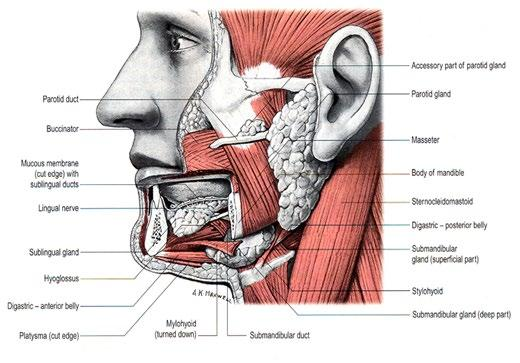
CAP
Approved
HN.MajorSalivary_4.3.0.0.REL_CAPCP
13
•
Myoepithelial carcinoma (malignant myoepithelioma)
•
Sebaceous adenocarcinoma
•
Squamous cell carcinoma
•
Sialoblastoma
•
Carcinoma, not otherwise specified
The recommended histologic classification for neuroendocrine neoplasms has been standardized across
all head and neck sites.1 The entities relevant to this protocol are listed below:
•
Neuroendocrine tumor, grade 1-3
•
Neuroendocrine carcinoma, small cell type
•
Neuroendocrine carcinoma, large cell type
•
Merkel cell carcinoma
Histologic Grade
The histologic (microscopic) grading of salivary gland carcinomas has been shown to be an independent
predictor of behavior and plays a role in optimizing therapy. Further, there is often a positive correlation
between histologic grade and clinical stage.2,3,4,5 However, most salivary gland carcinoma types have an
intrinsic biologic behavior, and attempted application of a universal grading scheme is suboptimal given
tumor specific nuances.4 Thus, a generic grading scheme is no longer recommended for salivary gland
carcinomas.6
However, within a given tumor type, grade remains an important prognostic parameter. Carcinoma types
for which grading systems exist and are relevant are incorporated into histologic type. The classic
categories that are still graded using three tier schemes include mucoepidermoid carcinoma, and
carcinoma, not otherwise specified. While adenoid cystic carcinoma was historically stratified into three
tiers, current classification no longer advocates for this.3,4,7 Additionally, several tumor types can at least be
stratified into low and high grade. High grade transformation (historically designated as dedifferentiation)
refers to the phenomenon of progression from a conventional, usually indolent phenotype, to a pleomorphic
aggressive morphology.
As such carcinomas can alternatively be stratified by their risk for structural recurrence by a combination of
category, subtype, and category specific grade8 as in Table 1.
Table 1: Risk Stratification of Salivary Gland Carcinomas
Low Aggression
High Aggression
Mucoepidermoid carcinoma – Low grade
Mucoepidermoid carcinoma – High grade
Mucoepidermoid carcinoma – Intermediate grade*
Acinic cell carcinoma – Conventional
Acinic cell carcinoma – High grade/HGT
Secretory carcinoma - Conventional
Secretory carcinoma – High grade/HGT
Microsecretory adenocarcinoma – Usual
Microsecretory adenocarcinoma – High grade/HGT
Polymorphous adenocarcinoma – Low grade,
conventional
Polymorphous adenocarcinoma – High grade/HGT
Polymorphous adenocarcinoma – Low & intermediate grade, cribriform**
Hyalinizing clear cell carcinoma – Conventional
Hyalinizing clear cell carcinoma – High grade/HGT
Basal cell adenocarcinoma – Conventional
Basal cell adenocarcinoma – High grade/HGT
CAP
Approved
HN.MajorSalivary_4.3.0.0.REL_CAPCP
14
Abbreviations: HGT-high grade transformation. NOS-not otherwise specified
*Behavior varies with grading system or criteria
**The cribriform subtype of polymorphous adenocarcinoma has a high propensity for regional recurrence
^Adenoid cystic carcinoma though highly aggressive locally with capacity for distant spread, has somewhat
lower risk for regional recurrence
#Carcinoma ex pleomorphic adenoma behavior is determined by carcinoma type and extent
@Salivary carcinoma, NOS behavior is determined by grade
Adenoid cystic carcinomas were historically stratified into three tiers based on tubular, cribriform, and solid
(>30%) patterns respectively.7 However currently, while solid pattern remains an integral prognosticator,
no standard grading scheme is endorsed. The histologic grading of mucoepidermoid carcinoma includes a
combination of growth pattern characteristics (e.g., cystic, solid, neurotropism) and cytomorphologic
findings (e.g., anaplasia, mitoses, necrosis).9,10,11 Carcinomas, not otherwise specified, do not have a
formalized grading scheme and are graded intuitively based on cytomorphologic features.4 Polymorphous
adenocarcinomas and intraductal carcinomas are to be graded as per current WHO recommendations.
Polymorphous adenocarcinomas should be subtyped into conventional and cribriform types (i.e., cribriform
adenocarcinoma of minor salivary gland). The latter is more frequently extrapalatal and locoregionally
aggressive. Along these lines, papillary components (>10%) and cribriform components (>30%) regardless
of subtype have been shown to be prognostically relevant and these can be recorded
optionally.12 Intraductal carcinomas can be subtyped and graded, as both influence biologic
behavior.13 Additionally, two-tier grading schema have shown prognostic relevance for other tumor types
such as myoepithelial carcinoma,14 and acinic cell carcinoma.15 Low grade and high grade are generally
separated by mitotic counts and/or necrosis.
The current protocol is thus structured to allow for provision of grade or biologic potential for almost every
epithelial tumor type in at least a two-tier fashion as per Table 1. For instance, epithelial-myoepithelial
carcinoma, basal cell adenocarcinoma, and hyalinizing clear cell carcinoma can be assigned a default low
grade/biologic potential category. Conversely, salivary duct carcinoma and lymphoepithelial carcinoma can
Myoepithelial carcinoma – Low grade
Myoepithelial carcinoma – High grade
Epithelial-myoepithelial carcinoma – Conventional and
subtypes
Epithelial-myoepithelial carcinoma – High grade/HGT
Sebaceous adenocarcinoma – Low grade
Sebaceous adenocarcinoma – High grade
Adenoid cystic carcinoma – Solid/HGT
Adenoid cystic carcinoma – Tubular/cribriform^
Carcinosarcoma (sarcomatoid carcinoma)
(Metastatic) Squamous cell carcinoma (usually
cutaneous)
Intraductal carcinoma, oncocytic and intercalated duct
Intraductal carcinoma, apocrine
Salivary duct carcinoma
Mucinous adenocarcinoma “intraductal papillary
mucinous neoplasm” type
Mucinous adenocarcinoma (not otherwise specified,
and with colloid/signet ring features
Lymphoepithelial carcinoma
Sclerosing microcystic adenocarcinoma
Sialoblastoma
Carcinoma ex pleomorphic adenoma#
Salivary carcinoma, NOS@
CAP
Approved
HN.MajorSalivary_4.3.0.0.REL_CAPCP
15
be considered high grade/biologic potential category as a default. One key point is that adenoid cystic
carcinoma should NEVER be assigned a low grade/biologic potential category. As this is one entity that
does not fit into a standard risk of structural recurrence (i.e., discordant prevalence of local and regional
aggression), this can be assigned N/A if non-solid and high grade if solid (>30%) or high grade transformed.
Carcinoma ex pleomorphic adenoma is subclassified by histologic type and/or grade and extent of invasion,
the latter including minimally invasive, invasive, and intracapsular (noninvasive) cancers. Previously the
cut-off for minimal invasion was designated as 1.5 mm; however, more recent studies have shown a
favorable prognosis even with cut-offs of 4 mm to 6 mm.16 Thus, there is no agreement on an optimal cut-
off. However, from a practical standpoint, the terms intracapsular and minimally invasive should only be
applied to uninodular tumors (as opposed to carcinomas arising in multinodular recurrent pleomorphic
adenomas) with a well-delineated interface for which the entire lesional border has been microscopically
evaluated. Prognosis has been linked to degree of invasion with noninvasive and minimally invasive
cancers apparently having a better prognosis than invasive cancers.4,16,17 Carcinosarcoma is a rare subtype
morphology that while currently separated, appears to almost invariably arise in the setting of a precursor
pleomorphic adenoma and should likely be regarded as a sarcomatoid carcinoma subtype ex pleomorphic
adenoma.18
Aside from pleomorphic adenoma, other precursor lesions, most notably intercalated duct
lesion/adenoma,1,19 exist. Though biologically and diagnostically relevant, documentation of these
precursors is currently optional (non-core) as there is limited literature18 on these.
The WHO 5th edition has standardized the terminology for head and neck neuroendocrine neoplasms
across all subsites.20 Tumors previously designated as carcinoid and well-differentiated neuroendocrine
carcinoma would now be considered grade 1 neuroendocrine tumors while atypical carcinoids/moderately-
differentiated neuroendocrine carcinomas are now considered grade 2 neuroendocrine tumors. Grade 3
neuroendocrine tumor is a provisional category with no historical analogue. It must be emphasized that this
category in head and neck sites is provisional with no current evidence to support its use in head and neck
sites. Practically speaking, tumors that exceed the mitotic rate for grade 2 neuroendocrine tumors are
usually more in keeping with neuroendocrine carcinomas (see below). Grading of neuroendocrine tumors
is summarized in Table 2. Ki-67 proliferation indices are recommended for neuroendocrine tumors of head
and neck, but are not required elements, and delineation of grade 1 and 2 at this site by proliferation index
is not yet established.
Table 2: WHO Classification of Head and Neck Neuroendocrine Tumors
Neuroendocrine Tumor Grade
Mitoses per two mm2
Necrosis
1
Less than 2
Absent
2
2-10
Present
3
Undefined
Neuroendocrine carcinoma, small cell types and large cell types on the other hand, have not changed much
in terms of their designation and reflect poorly differentiated neuroendocrine malignancies that were
previously labeled small cell and large cell neuroendocrine carcinomas respectively. These
characteristically show necrosis and have mitotic counts that exceed 10 per two mm2. While
neuroendocrine tumors and carcinomas are defined by neuroendocrine marker expression (synaptophysin,
chromogranin, and/or INSM-1), other tumor types at each head and neck subsite may express these.
CAP
Approved
HN.MajorSalivary_4.3.0.0.REL_CAPCP
16
Morphologic, other immunophenotypic, and molecular features would then supersede this neuroendocrine
marker expression for classification.
Merkel cell carcinoma is a cutaneous neuroendocrine carcinoma, often driven by Merkel cell polyomavirus.
Primary parotid Merkel cell carcinomas are described21 and their definition is further obfuscated by the
earlier description of a so called ‘Merkel cell’ subtype of primary parotid small cell neuroendocrine
carcinoma that like Merkel cell carcinoma, expresses CK20 but are Merkel cell polyomavirus negative and
do not show a UV molecular signature.22 However, like squamous cell carcinoma of parotid, the idea of a
primary parotid Merkel cell carcinoma should be viewed with heavy skepticism, and most are metastases
from unknown primaries. This can often be resolved by a combination of detailed clinical history, and
dermatologic examination.
References
1. WHO Classification of Tumours Editorial Board. Head and neck tumours [Internet; beta version
ahead of print]. Lyon (France): International Agency for Research on Cancer; 2022 [cited 2023, Jan
26].
(WHO
classification
of
tumours
series,
5th
ed.;
vol.
9).
Available
from:
https://tumourclassification.iarc.who.int/chapters/52.
2. Spiro RH, Thaler HT, Hicks WF, Kher UA, Huvos AH, Strong EW. The importance of clinical staging
of minor salivary gland carcinoma. Am J Surg. 1991;162(4):330-336.
3. Spiro RH, Huvos AG, Strong EW. Adenocarcinoma of salivary origin. Clinicopathologic study of
204 patients. Am J Surg. 1982;144(4):423-431.
4. Seethala RR. Histologic grading and prognostic biomarkers in salivary gland carcinomas. Adv Anat
Pathol. 2011;18(1):29-45.
5. Kane WJ, McCaffrey TV, Olsen KD, Lewis JE. Primary parotid malignancies. A clinical and
pathologic review. Arch Otolaryngol Head Neck Surg. 1991 Mar;117(3):307-15. doi:
10.1001/archotol.1991.01870150075010. PMID: 1998571.
6. Lydiatt WM, Mukherji SK, O'Sullivan B, Patel SG, Shah JP. Major salivary glands. In: Amin MB, ed.
AJCC Cancer Staging Manual. 8th ed. New York, NY: Springer; 2017.
7. Szanto PA, Luna MA, Tortoledo ME, White RA. Histologic grading of adenoid cystic carcinoma of
the salivary glands. Cancer. 1984;54(6):1062-1069.
8. Ramalingam N, Thiagarajan S, Chidambaranathan N, et al. Regression Derived Staging Model to
Predict Overall and Disease Specific Survival in Patients With Major Salivary Gland Carcinomas
With
Independent
External
Validation.
JCO
Glob
Oncol
2022;8:e2200150.
doi:10.1200/GO.22.00150 [published Online First: 2022/08/19].
9. Katabi N, Ghossein R, Ali S, Dogan S, Klimstra D, Ganly I. Prognostic features in mucoepidermoid
carcinoma of major salivary glands with emphasis on tumour histologic grading. Histopathology.
2014 Dec;65(6):793-804. doi: 10.1111/his.12488. Epub 2014 Aug 26.
10. Brandwein MS, Ivanov K, Wallace DI, et al. Mucoepidermoid carcinoma: a clinicopathologic study
of 80 patients with special reference to histological grading. Am J Surg Pathol. 2001;25(7):835-
845.
11. Auclair PL, Goode RK, Ellis GL. Mucoepidermoid carcinoma of intraoral salivary glands. Evaluation
and application of grading criteria in 143 cases. Cancer. 1992;69(8):2021-2030.
12. Xu B, Aneja A, Ghossein R, Katabi N.Predictors of Outcome in the Phenotypic Spectrum of
Polymorphous Low-grade Adenocarcinoma (PLGA) and Cribriform Adenocarcinoma of Salivary
Gland (CASG): A Retrospective Study of 69 Patients. Am J Surg Pathol. 2016 Nov;40(11):1526-
1537.
CAP
Approved
HN.MajorSalivary_4.3.0.0.REL_CAPCP
17
13. Thompson LDR, Bishop JA. Salivary Gland Intraductal Carcinoma: How Do 183 Reported Cases
Fit Into a Developing Classification. Adv Anat Pathol. 2023 Mar 1;30(2):112-129. doi:
10.1097/PAP.0000000000000362. Epub 2022 Aug 30. PMID: 36040027.
14. Kong M, Drill EN, Morris L, West L, Klimstra D, Gonen M, Ghossein R, Katabi N. Prognostic factors
in myoepithelial carcinoma of salivary glands: a clinicopathologic study of 48 cases. Am J Surg
Pathol. 2015 Jul;39(7):931-8. doi: 10.1097/PAS.0000000000000452. PMID: 25970687; PMCID:
PMC4939272.
15. Xu B, Saliba M, Ho A, Viswanathan K, Alzumaili B, Dogan S, Ghossein R, Katabi N. Head and
Neck Acinic Cell Carcinoma: A New Grading System Proposal and Diagnostic Utility of NR4A3
Immunohistochemistry.
Am
J
Surg
Pathol.
2022
Jul
1;46(7):933-941.
doi:
10.1097/PAS.0000000000001867. Epub 2022 Jan 17. PMID: 35034042.
16. Katabi N, Chiosea S, Fonseca I et al. Carcinoma ex Pleomorphic adenoma. In: WHO Classification
of Tumours Editorial Board. Head and neck tumours [Internet; beta version ahead of print]. Lyon
(France): International Agency for Research on Cancer; 2022 [cited 2023 Jan 26]. (WHO
classification
of
tumours
series,
5th
ed.;
vol.
9).
Available
from:
https://tumourclassification.iarc.who.int/chapters/52.
17. Brandwein M, Huvos AG, Dardick I, Thomas MJ, Theise ND. Noninvasive and minimally invasive
carcinoma ex mixed tumor: a clinicopathologic and ploidy study of 12 patients with major salivary
tumors of low (or no?) malignant potential. Oral Surg Oral Med Oral Pathol Oral Radiol Endod.
1996;81(6):655-664.
18. Ihrler S, Stiefel D, Jurmeister P, Sandison A, Chaston N, Laco J, Zidar N, Brcic L, Stoehr R, Agaimy
A.Salivary carcinosarcoma: insight into multistep pathogenesis indicates uniform origin as
sarcomatoid variant of carcinoma ex pleomorphic adenoma with frequent heterologous elements.
Histopathology. 2023 Mar;82(4):576-586.
19. McLean AC, Rooper LM, Gagan J, Thompson LDR, Bishop JA. A Subset of Salivary Intercalated
Duct Lesions Harbors Recurrent CTNNB1 and HRAS Mutations: A Molecular Link to Basal Cell
Adenoma and Epithelial-Myoepithelial Carcinoma? Head Neck Pathol. 2022 Dec 8. doi:
10.1007/s12105-022-01513-x. Epub ahead of print. PMID: 36480093.
20. Mete O, Gill A, and Nosé V.  Neuroendocrine neoplasms and paraganglioma: Introduction. In: WHO
Classification of Tumours Editorial Board. Head and neck tumours [Internet; beta version ahead of
print]. Lyon (France): International Agency for Research on Cancer; 2022 [cited 2023 Jan 26].
(WHO
classification
of
tumours
series,
5th
ed.;
vol.
9).
Available
from:
https://tumourclassification.iarc.who.int/chapters/52.
21. Giroulet F, et al. Primary parotid Merkel cell carcinoma: a first imagery and treatment response
assessment by 18F-FDG PET. BMJ Case Rep. 2019. Mar 9;12(3):e226511.
22. Chernock RD, Duncavage EJ. Proceedings of the NASHNP Companion Meeting, March 18th,
2018, Vancouver, BC, Canada: Salivary Neuroendocrine Carcinoma-An Overview of a Rare
Disease with an Emphasis on Determining Tumor Origin. Head Neck Pathol. 2018 Mar;12(1):13-
21.
D. Perineural Invasion
The presence of perineural invasion (neurotropism) is an important predictor of poor prognosis in head and
neck cancer of virtually all sites.1 The majority of studies evaluating the influence of perineural invasion on
therapy and prognosis are limited to head and neck squamous cell carcinoma. However, relative to salivary
gland carcinomas, facial nerve dysfunction, and perineural involvement are factors influencing the
indication for neck dissection, postoperative radiation therapy, and survival rate. Perineural invasion
CAP
Approved
HN.MajorSalivary_4.3.0.0.REL_CAPCP
18
(neurotropism) in the primary salivary gland carcinomas, especially the facial nerve, is associated with
recurrent tumor2 and decreased survival. Further, facial nerve involvement by carcinoma has been found
to be predictive of occult metastases.3 Among other prognostic indicators, perineural invasion in minor
salivary gland tumors has been shown to be statistically significant to the outcome.4 Given the significance
relative to prognosis and treatment, perineural invasion is a required data element in the reporting of
salivary gland carcinomas.
References
1. Smith BD, Haffty BG. Prognostic factoris in patients with head and neck cancer. In: Harrison LB,
Sessions RB, Hong WK, eds. Head and Neck Cancer: A Multidisciplinary Approach. Philadelphia:
Lippincott Williams and Wilkins; 2009:51-75.
2. Ali S, Palmer FL, Yu C, et al. A predictive nomogram for recurrence of carcinoma of the major
salivary glands. JAMA Otolaryngol Head Neck Surg. 2013;139(7):698-705.
3. Frankenthaler RA, Luna MA, Lee SS, et al. Prognostic variables in parotid gland cancer. Arch
Otolaryngol Head Neck Surg. 1991;117(11):1251-1256.
4. Copelli C, Bianchi B, Ferrari S, Ferri A, Sesenna E. Malignant tumors of intraoral minor salivary
glands. Oral Oncol. 2008;44(7):658-663.
E. Surgical Margins
Complete surgical excision to include cancer-free surgical margins is the primary mode of therapy for
salivary gland cancers, as retrospective studies have shown an increased risk for recurrence and
decreased survival with positive surgical margins.1,2,3 The need for additional surgery is determined on the
basis of histopathologic review; positive surgical margins are an indication for additional resection to ensure
total tumor removal.
Orientation of Specimen
Complex specimens should be examined and oriented with the assistance of attending surgeons. Direct
communication between the surgeon and pathologist is a critical component in specimen orientation and
proper sectioning. Whenever possible, the tissue examination request form should include a drawing of the
resected specimen showing the extent of the tumor and its relation to the anatomic structures of the region.
The lines and extent of the resection can be depicted on preprinted adhesive labels and attached to the
surgical pathology request forms.
References
1. Tran L, Sadeghi A, Hanson D, et al. Major salivary gland tumors: treatment results and prognostic
factors. Laryngoscope. 1986;96(10):1139-1144.
2. Vander Poorten VL, Balm AJ, Hilgers FJ, et al. The development of a prognostic score for patients
with parotid carcinoma. Cancer. 1999;85(9):2057-2067.
3. Amini A, Waxweiler TV, Brower JV, et al. Association of adjuvant chemoradiotherapy vs
radiotherapy alone with survival in patients with resected major salivary gland carcinoma: data from
the National Cancer Data Base. JAMA Otolaryngol Head Neck Surg. 2016;142(11):1100-1110.
F. Lymph Nodes
Direct Extension of Tumor to Lymph Node
While data are essentially nonexistent for defining N status for lymph nodes involved by tumor via direct
extension for head and neck cancers, the general convention based on other organ sites is to consider
CAP
Approved
HN.MajorSalivary_4.3.0.0.REL_CAPCP
19
these positive for N categorization and counting purposes. It is recommended however to denote in the
report the number of lymph nodes involved in this manner as it may influence more nuanced management
decisions.
Measurement of Tumor Metastasis
The cross-sectional diameter of the largest lymph node metastasis (not the lymph node itself) is measured
in the gross specimen at the time of macroscopic examination or, if necessary, on the histologic slide at the
time of microscopic examination.1,2
Special Procedures for Lymph Nodes
At the current time, no additional special techniques should be used other than routine histology for the
assessment of nodal metastases. Immunohistochemistry and polymerase chain reaction (PCR) to detect
isolated tumor cells are considered investigational techniques at this time.
Lymph Node Number
For assessment of pN, a selective neck dissection will ordinarily include 10 or more lymph nodes, and a
comprehensive neck dissection (radical or modified radical neck dissection) will ordinarily include 15 or
more lymph nodes. Examination of fewer tumor-free nodes still mandates a pN0 designation.
Regional Lymph Nodes (pN0): Isolated Tumor Cells
Isolated tumor cells (ITCs) are single cells or small clusters of cells not more than 0.2 mm in greatest
dimension. While the generic recommendation is that for lymph nodes with ITCs found by either histologic
examination, immunohistochemistry, or nonmorphologic techniques (e.g., flow cytometry, DNA analysis,
PCR amplification of a specific tumor marker), they should be classified as N0 or M0,
respectively.3,4 Evidence for the validity of this practice in head and neck squamous cell carcinoma and
other histologic subtypes is lacking. In fact, rare studies relevant to head and neck sites indicate that isolated
tumor cells may actually be a poor prognosticator in terms of local control.5
For purposes of pathologic evaluation, lymph nodes are organized by levels, as shown in Figure 2.
Classification of Neck Dissection
1. Radical neck dissection
2. Modified radical neck dissection, internal jugular vein and/or sternocleidomastoid muscle spared
3. Selective neck dissection (SND), as specified by the surgeon (Figure 2), defined by dissection of
less than the 5 traditional levels of a radical and modified radical neck dissection. The following
dissections are now under this category:2,6,7
a. Supraomohyoid neck dissection
b. Posterolateral neck dissection
c. Lateral neck dissection
d. Central compartment neck dissection
4. Superselective neck dissection (SSND), a relatively new term defined by dissection of the fibrofatty
elements of 2 or less levels.8,
5. Extended radical neck dissection, as specified by the surgeon
CAP
Approved
HN.MajorSalivary_4.3.0.0.REL_CAPCP
20
Figure 2. The six sublevels of the neck for describing the location of lymph nodes within levels I, II, and V.
Level IA, submental group; level IB, submandibular group; level IIA, upper jugular nodes along the carotid
sheath, including the subdigastric group; level IIB, upper jugular nodes in the submuscular recess; level
VA, spinal accessory nodes; and level VB, the supraclavicular and transverse cervical nodes. From: Flint
PW, et al, eds. Cummings Otolaryngology: Head and Neck Surgery. 5th ed. Philadelphia, PA; Saunders:
2010. Reproduced with permission © Elsevier.
In order for pathologists to properly identify these nodes, they must be familiar with the terminology of the
regional lymph node groups and with the relationships of those groups to the regional anatomy. Which
lymph node groups surgeons submit for histopathologic evaluation depends on the type of neck dissection
they perform. Therefore, surgeons must supply information on the types of neck dissections that they
perform and the details of the local anatomy in the specimens they submit for examination or, in other
manners, orient those specimens for pathologists.
If it is not possible to assess the levels of lymph nodes (for instance, when the anatomic landmarks in the
excised specimens are not specified), then the lymph node levels may be estimated as follows: level II,
upper third of internal jugular (IJ) vein or neck specimen; level III, middle third of IJ vein or neck specimen;
level IV, lower third of IJ vein or neck specimen, all anterior to the sternocleidomastoid muscle.
Level I. Submental Group (Sublevel IA)
Lymph nodes within the triangular boundary of the anterior belly of the digastric muscles and the hyoid
bone.
Level I. Submandibular Group (Sublevel IB)
Lymph nodes within the boundaries of the anterior and posterior bellies of the digastric muscle and the
body of the mandible. The submandibular gland is included in the specimen when the lymph nodes within
this triangle are removed.
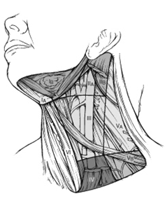
CAP
Approved
HN.MajorSalivary_4.3.0.0.REL_CAPCP
21
Level II. Upper Jugular Group (Sublevels IIA and IIB)
Lymph nodes located around the upper third of the internal jugular vein and adjacent spinal accessory
nerve extending from the level of the carotid bifurcation (surgical landmark) or hyoid bone (clinical landmark)
to the skull base. The posterior boundary is the posterior border of the sternocleidomastoid muscle, and
the anterior boundary is the lateral border of the sternohyoid muscle.
Level III. Middle Jugular Group
Lymph nodes located around the middle third of the internal jugular vein extending from the carotid
bifurcation superiorly to the omohyoid muscle (surgical landmark), or cricothyroid notch (clinical landmark)
inferiorly. The posterior boundary is the posterior border of the sternocleidomastoid muscle, and the anterior
boundary is the lateral border of the sternohyoid muscle.
Level IV. Lower Jugular Group
Lymph nodes located around the lower third of the internal jugular vein extending from the omohyoid muscle
superiorly to the clavicle inferiorly. The posterior boundary is the posterior border of the sternocleidomastoid
muscle, and the anterior boundary is the lateral border of the sternohyoid muscle.
Level V. Posterior Triangle Group (Sublevels VA and VB)
This group comprises predominantly the lymph nodes located along the lower half of the spinal accessory
nerve and the transverse cervical artery. The supraclavicular nodes are also included in this group. The
posterior boundary of the posterior triangle is the anterior border of the trapezius muscle, the anterior
boundary of the posterior triangle is the posterior border of the sternocleidomastoid muscle, and the inferior
boundary of the posterior triangle is the clavicle.
Level VI. Anterior (Central) Compartment
Lymph nodes in this compartment include the pre- and paratracheal nodes, precricoid (Delphian) node, and
the perithyroidal nodes, including the lymph nodes along the recurrent laryngeal nerve. The superior
boundary is the hyoid bone, the inferior boundary is the suprasternal notch, the lateral boundaries are the
common carotid arteries, and the posterior boundary by the prevertebral fascia.
Level VII. Superior Mediastinal Lymph Nodes
Metastases at level VII are considered regional lymph node metastases; all other mediastinal lymph node
metastases are considered distant metastases.
Lymph node groups removed from areas not included in the above levels, e.g., scalene, suboccipital, and
retropharyngeal, should be identified and reported from all levels separately. Midline nodes are considered
ipsilateral nodes.
Extranodal Extension
The status of cervical lymph nodes is the single most important prognostic factor in aerodigestive cancer.
For uniformity and based on existing evidence (albeit a much smaller scale),9 these principles are applied
to salivary gland carcinomas as well. All macroscopically negative or equivocal lymph nodes should be
submitted in toto. Grossly positive nodes may be partially submitted for microscopic documentation of
metastasis, particularly if there is gross extranodal extension. However generous sampling of the lymph
node periphery is recommended if there is no gross extranodal extension to adequately assess microscopic
extranodal extension. Reporting of lymph nodes containing metastasis should include whether there is
CAP
Approved
HN.MajorSalivary_4.3.0.0.REL_CAPCP
22
presence or absence of extranodal extension (ENE),10 which is now part of N staging. This finding consists
of extension of metastatic tumor, present within the confines of the lymph node, through the lymph node
capsule into the surrounding connective tissue, with or without associated stromal reaction. A distance of
extension from the native lymph node capsule is now suggested (but not yet required) with the proposed
stratification of ENE into ENEma (>2 mm) and ENEmi  (≤2 mm).11,12,13,14 However, pitfalls in the
measurement (i.e., in larger, matted lymph nodes, in nodes post fine-needle aspiration, and in nodes with
near total replacement of lymph node architecture) and the disposition of soft tissue deposits is still not
resolved. In general, absence of ENE in a large, non-cystic (>3 cm) lymph node, especially with traversing
fibrous bands, should be viewed with skepticism. Soft tissue deposits for lymph node metastases based on
limited studies appear to be the equivalent of a positive lymph node with ENE and should be recorded as
such.15,
Other Elements
Emerging evidence suggests that positive lymph node number16,17,18,19 and anatomic compartment/extent
of nodal disease20 may be better prognosticators than the current N classification. Positive lymph node
number is already captured under the protocol, and indicating anatomic compartment location of positive
lymph nodes is now a non-core element.
References
1. Smith BD, Haffty BG. Prognostic factoris in patients with head and neck cancer. In: Harrison LB,
Sessions RB, Hong WK, eds. Head and Neck Cancer: A Multidisciplinary Approach. Philadelphia:
Lippincott Williams and Wilkins; 2009:51-75.
2. Seethala RR. Current state of neck dissection in the United States. Head Neck Pathol.
2009;3(3):238-245.
3. Sobin LH, Gospodarowicz MK, Wittekind CH, eds. TNM Classification of Malignant Tumours. New
York: Wiley-Liss; 2009.
4. Singletary SE, Greene FL, Sobin LH. Classification of isolated tumor cells: clarification of the 6th
edition of the American Joint Committee on Cancer Staging Manual. Cancer. 2003;98(12):2740-
2741.
5. Broglie MA, Haerle SK, Huber GF, Haile SR, Stoeckli SJ. Occult metastases detected by sentinel
node biopsy in patients with early oral and oropharyngeal squamous cell carcinomas: Impact on
survival. Head Neck. 2013;35(5):660-666.
6. Ferlito A, Robbins KT, Shah JP, et al. Proposal for a rational classification of neck dissections.
Head Neck. 2011;33(3):445-450.
7. Robbins KT, Shaha AR, Medina JE, et al. Consensus statement on the classification and
terminology of neck dissection. Arch Otolaryngol Head Neck Surg. 2008;134(5):536-538.
8. Suarez C, Rodrigo JP, Robbins KT, et al. Superselective neck dissection: rationale, indications,
and results. Eur Arch Otorhinolaryngol. 2013.
9. Erovic BM, Shah MD, Bruch G, et al. Outcome analysis of 215 patients with parotid gland tumors:
a retrospective cohort analysis. J Otolaryngol Head Neck Surg. 2015;44:43.
10. Ebrahimi A, Gil Z, Amit M. International Consortium for Outcome Research (ICOR) in Head and
Neck Cancer. Primary tumor staging for oral cancer and a proposed modification incorporating
depth of invasion: an international multicenter retrospective study. JAMA Otolaryngol Head Neck
Surg. 2014;140(12):1138-1148.
11. Ridge JA, Lydiatt WM, Patel SG, et al. Lip and oral cavity. In: Amin MB, ed. AJCC Cancer Staging
Manual. 8th ed. New York, NY: Springer; 2017.
CAP
Approved
HN.MajorSalivary_4.3.0.0.REL_CAPCP
23
12. Ebrahimi A, Clark JR, Amit M, et al. Minimum nodal yield in oral squamous cell carcinoma: defining
the standard of care in a multicenter international pooled validation study. Ann Surg Oncol.
2014;21(9):3049-3055.
13. Prabhu RS, Hanasoge S, Magliocca KR, et al. Extent of pathologic extracapsular extension and
outcomes in patients with nonoropharyngeal head and neck cancer treated with initial surgical
resection. Cancer. 2014;120(10):1499-1506.
14. Dunne AA, Muller HH, Eisele DW, Kessel K, Moll R, Werner JA. Meta-analysis of the prognostic
significance of perinodal spread in head and neck squamous cell carcinomas (HNSCC) patients.
Eur J cancer. 2006;42(12):1863-1868.
15. Jose J, Moor JW, Coatesworth AP, Johnston C, MacLennan K. Soft tissue deposits in neck
dissections of patients with head and neck squamous cell carcinoma: prospective analysis of
prevalence, survival, and its implications. Arch Otolaryngol Head Neck Surg. 2004;130(2):157-160.
16. Aro K, Ho AS, Luu M, et al. Development of a novel salivary gland cancer lymph node staging
system. Cancer 2018;124(15):3171-80. doi: 10.1002/cncr.31535 [published Online First:
2018/05/10].
17. Qian K, Sun W, Guo K, et al. The number and ratio of positive lymph nodes are independent
prognostic factors for patients with major salivary gland cancer: Results from the surveillance,
epidemiology, and End Results dataset. Eur J Surg Oncol 2019;45(6):1025-32.
18. Lee H, Roh JL, Cho KJ, et al. Positive lymph node number and extranodal extension for predicting
recurrence and survival in patients with salivary gland cancer. Head Neck 2020;42(8):1994-2001.
doi:10.1002/hed.26135 [published Online First: 2020/03/03].
19. Lombardi D, Tomasoni M, Paderno A, et al. The impact of nodal status in major salivary gland
carcinoma: A multicenter experience and proposal of a novel N-classification. Oral Oncol
2021;112:105076. doi: 10.1016/j.oraloncology.2020.105076 [published Online First: 2020/11/03].
20. Shi X, Liu XK, An CM, et al. Anatomic extent of lymph node metastases as an independent
prognosticator in node-positive major salivary gland carcinoma: A study of the US SEER database
and
a
Chinese
multicenter
cohort.
Eur
J
Surg
Oncol
2019;45(11):2143-50.
doi:
10.1016/j.ejso.2019.06.029 [published Online First: 2019/06/30].
G. TNM and Stage Groupings
The protocol recommends the TNM staging system of the American Joint Committee on Cancer and the
International Union Against Cancer for salivary gland cancer.1
There are no significant changes to T stage in the AJCC 8th edition for major salivary gland. Carcinomas
for which the Tis designation may be applied include some intracapsular carcinomas ex pleomorphic
adenoma, and intraductal carcinomas. However, as with squamous cell carcinoma of the head and neck
sites (excluding nasopharynx and human papillomavirus (HPV)-related carcinomas), N stage now
incorporates extranodal extension.1
Tis
The concept of in-situ carcinoma of salivary gland is not well defined, and the categorization should be used
sparingly. Intracapsular carcinoma ex pleomorphic adenoma, and intraductal carcinomas are the categories
for which Tis can be considered. Even still, this should only be applied to intracapsular carcinoma ex
pleomorphic adenoma with a ductal phenotype (i.e., not myoepithelial carcinoma) that is completely
encapsulated/well demarcated and uninodular/unicystic for which the entire lesional border (preferably the
entire lesion) has been sampled for histologic evaluation.
CAP
Approved
HN.MajorSalivary_4.3.0.0.REL_CAPCP
24
Extraparenchymal Extension
Extraparenchymal extension is clinical or macroscopic evidence of invasion of soft tissues or nerve (T1,
T2, T3), except those listed under T4a and 4b. Microscopic evidence alone does not constitute
extraparenchymal extension for classification purposes.1
Intraparotid Lymph Nodes
By convention, a tumor arising from an intranodal parotid tissue should not be considered a metastasis
(N0). However, if the tumor has spread via lymphatics into an intraparotid lymph node this would be
considered positive with respect to determining N category.2
By AJCC/UICC convention, the designation “T” refers to a primary tumor that has not been previously
treated. The symbol “p” refers to the pathologic classification of the TNM, as opposed to the clinical
classification, and based on clinical stage information supplemented/modified by operative findings and
gross and microscopic evaluation of the resected specimens.3 pT entails a resection of the primary tumor
or biopsy adequate to evaluate the highest pT category, pN entails removal of nodes adequate to validate
lymph node metastasis, and pM implies microscopic examination of distant lesions. Clinical classification
(cTNM) is usually carried out by the referring physician before treatment during initial evaluation of the
patient or when pathologic classification is not possible.
Pathologic staging is usually performed after surgical resection of the primary tumor. Pathologic staging
depends on pathologic documentation of the anatomic extent of disease, whether or not the primary tumor
has been completely removed. If a biopsied tumor is not resected for any reason (e.g., when technically
unfeasible) and if the highest T and N categories or the M1 category of the tumor can be confirmed
microscopically, the criteria for pathologic classification and staging have been satisfied without total
removal of the primary cancer.
TNM Descriptors
For identification of special cases of TNM or pTNM classifications, the “m” suffix and “y,” “r,” and “a” prefixes
are used. Although they do not affect the stage grouping, they indicate cases needing separate analysis.
The “m” suffix indicates the presence of multiple primary tumors in a single site and is recorded in
parentheses: pT(m)NM.
The “y” prefix indicates those cases in which classification is performed during or following initial
multimodality therapy (i.e., neoadjuvant chemotherapy, radiation therapy, or both chemotherapy and
radiation therapy). The cTNM or pTNM category is identified by a “y” prefix. The ycTNM or ypTNM
categorizes the extent of tumor actually present at the time of that examination. The “y” categorization is
not an estimate of tumor prior to multimodality therapy (i.e., before initiation of neoadjuvant therapy).
The “r” prefix indicates a recurrent tumor when staged after a documented disease-free interval, and is
identified by the “r” prefix: rTNM.
The “a” prefix designates the stage determined at autopsy: aTNM.
CAP
Approved
HN.MajorSalivary_4.3.0.0.REL_CAPCP
25
References
1. Lydiatt WM, Mukherji SK, O'Sullivan B, Patel SG, Shah JP. Major salivary glands. In: Amin MB, ed.
AJCC Cancer Staging Manual. 8th ed. New York, NY: Springer; 2017.
2. Guntinas-Lichius O, Thielker J, Robbins KT, Olsen KD, Shaha AR, Mäkitie AA, de Bree R, Vander
Poorten V, Quer M, Rinaldo A, Kowalski LP, Rodrigo JP, Hamoir M, Ferlito A. Prognostic role of
intraparotid lymph node metastasis in primary parotid cancer: Systematic review. Head Neck. 2021
Mar;43(3):997-1008. doi: 10.1002/hed.26541. Epub 2020 Nov 9. PMID: 33169420.
3. Gress DM, Edge SB, Greene FL, et al. Principles of cancer staging. In: Amin MB, ed. AJCC Cancer
Staging Manual. 8th ed. New York, NY: Springer; 2017.
# Melanoma Biomarker Reporting
Template for Reporting Results of Biomarker Testing of
Specimens From Patients With Melanoma
Template posting date: July 2015
Authors
Lynette M. Sholl, MD, FCAP*
Department of Pathology, Brigham and Women's Hospital, Boston, Massachusetts
Aleodor Andea, MD, MBA, FCAP
Department of Pathology, University of Michigan Hospitals, Ann Arbor, Michigan
Julia Bridge, MD, FCAP
Department of Pathology, University of Nebraska Medical Center, Omaha, Nebraska
Liang Cheng, MD, FCAP
Department of Pathology, Indiana University, Indianapolis, Indiana
Michael A. Davis MD, PhD
Departments of Melanoma Medical Oncology and Systems Biology, The University of Texas MD
Anderson Cancer Center, Houston, Texas
Mani Ehteshami, MD, MS, FCAP
Newport Coast Pathology Inc, Newport Beach, California
Tara C. Gangadhar, MD
Department of Medicine and the Abramson Cancer Center, Hospital of the University of Pennsylvania,
Philadelphia, Pennsylvania
Suzanne Kamel-Reid, PhD, FACMG
Department of Pathology, The University Health Network/Princess Margaret Cancer Center, Toronto,
Ontario
Alexander Lazar, MD, PhD, FCAP
Departments of Pathology and Translational Molecular Pathology, The University of Texas MD Anderson
Cancer Center, Houston, Texas
Kirtee Raparia, MD, FCAP
Department of Pathology, Northwestern University, Chicago, Illinois
Alan Siroy, MD, MPH
Department of Pathology, The University of Texas MD Anderson Cancer Center, Houston, Texas
Kim Watson, CTR
Cancer Registry Consultant, Sioux Falls, South Dakota
For the Members of the Cancer Biomarker Reporting Committee, College of American Pathologists
* Denotes primary author.  All other contributing authors are listed alphabetically.

Melanoma • Biomarkers
MelanomaBiomarkers 1.0.0.2
2
The College does not permit reproduction of any substantial portion of these templates without its written
authorization. The College hereby authorizes use of these templates by physicians and other health care
providers in reporting results of biomarker testing on patient specimens, in teaching, and in carrying out medical
research for nonprofit purposes. This authorization does not extend to reproduction or other use of any substantial
portion of these templates for commercial purposes without the written consent of the College.
The CAP also authorizes physicians and other health care practitioners to make modified versions of the
templates solely for their individual use in reporting results of biomarker testing for individual patients, teaching,
and carrying out medical research for non-profit purposes.
The CAP further authorizes the following uses by physicians and other health care practitioners, in reporting on
surgical specimens for individual patients, in teaching, and in carrying out medical research for non-profit
purposes: (1) Dictation from the original or modified templates for the purposes of creating a text-based patient
record on paper, or in a word processing document; (2) Copying from the original or modified templates into a
text-based patient record on paper, or in a word processing document; (3) The use of a computerized system for
items (1) and (2), provided that the template data is stored intact as a single text-based document, and is not
stored as multiple discrete data fields.
Other than uses (1), (2), and (3) above, the CAP does not authorize any use of the templates in electronic medical
records systems, pathology informatics systems, cancer registry computer systems, computerized databases,
mappings between coding works, or any computerized system without a written license from the CAP.
Any public dissemination of the original or modified templates is prohibited without a written license from the CAP.
The College of American Pathologists offers these templates to assist pathologists in providing clinically useful
and relevant information when reporting results of biomarker testing. The College regards the reporting elements
in the templates as important elements of the biomarker test report, but the manner in which these elements are
reported is at the discretion of each specific pathologist, taking into account clinician preferences, institutional
policies, and individual practice.
The College developed these templates as educational tools to assist pathologists in the useful reporting of
relevant information. It did not issue them for use in litigation, reimbursement, or other contexts. Nevertheless, the
College recognizes that the templates might be used by hospitals, attorneys, payers, and others. The College
cautions that use of the templates other than for their intended educational purpose may involve additional
considerations that are beyond the scope of this document.
The inclusion of a product name or service in a CAP publication should not be construed as an endorsement of
such product or service, nor is failure to include the name of a product or service to be construed as disapproval.
Melanoma • Biomarkers
MelanomaBiomarkers 1.0.0.2
3
CAP Melanoma Biomarkers Template Revision History
Version Code
The definition of version control and an explanation of version codes can be found at www.cap.org (search:
cancer protocol terms).
Version: MelanomaBiomarkers 1.0.0.2
+ RESULTS
Corrected HGVS nomenclature
KIT Mutational Analysis
+ ___ KIT K642E (c.1924A>G) mutation
Melanoma • Biomarkers
MelanomaBiomarkers 1.0.0.2
+ Data elements preceded by this symbol are not required.
4
Melanoma Biomarker Reporting Template
Template web posting date: June 2015
Completion of the template is the responsibility of the laboratory performing the biomarker testing and/or
providing the interpretation. When both testing and interpretation are performed elsewhere (eg, a reference
laboratory), synoptic reporting of the results by the laboratory submitting the tissue for testing is also encouraged
to ensure that all information is included in the patient’s medical record and thus readily available to the treating
clinical team.
MELANOMA
Select a single response unless otherwise indicated.
Note: Use of this template is optional.
+ RESULTS
Note: If a marker is tested by more than one method (eg, polymerase chain reaction and immunohistochemistry),
please document the additional result(s) and method(s) in the Comments section of the report.
+ BRAF Mutational Analysis (Note A)
+ ___ No mutations detected
+ ___ BRAF V600E (c.1799T>A) mutation
+ ___ BRAF V600K (c.1798_1799GT>AA) mutation
+ ___ BRAF V600R (c.1798_1799GT>AG) mutation
+ ___ BRAF V600D (c.1799_1800TG>AT) mutation
+ ___ Other BRAF mutation (specify): __________________________
+ ___ Cannot be determined (explain): __________________________
+ NRAS Mutational Analysis (Note B)
+ ___ No mutations detected
+ ___ NRAS Q61R (c.182A>G) mutation
+ ___ NRAS Q61K (c.181C>A) mutation
+ ___ NRAS Q61L (c.182A>T) mutation
+ ___ NRAS Q61H (c.183A>T) mutation
+ ___ NRAS G12R (c.34G>C) mutation
+ ___ NRAS G12S (c.34G>A) mutation
+ ___ NRAS G12D (c.35G>A) mutation
+ ___ NRAS G12V (c.35G>T) mutation
+ ___ NRAS G13R (c.37G>C) mutation
+ ___ NRAS G13S (c.37G>A) mutation
+ ___ Other NRAS mutation (specify): __________________________
+ ___ Cannot be determined (explain): __________________________
+ KIT Mutational Analysis (Note C)
+ ___ No mutations detected
+ ___ KIT L576P (c.1727T>C) mutation
+ ___ KIT K642E (c.1924A>G) mutation
+ ___ KIT V559A (c.1676T>C) mutation
+ ___ KIT W557R (c.1669T>A) mutation
+ ___ Other KIT mutation (specify): __________________________
+ ___ Cannot be determined (explain): __________________________
Melanoma • Biomarkers
MelanomaBiomarkers 1.0.0.2
+ Data elements preceded by this symbol are not required.
5
+ Other Markers Tested
+ Specify marker: __________________________
+ Specify results: __________________________
+ METHODS
+ BRAF Mutational Analysis Testing Method
+ ___ Cobas 4800 BRAF V600 mutation test
+ ___ THxID BRAF assay
+ ___ Allele-specific/real time polymerase chain reaction
+ ___ Direct Sanger sequencing
+ ___ Pyrosequencing
+ ___ SnapShot
+ ___ Mass spectrophotometry genotyping (Sequenom)
+ ___ Next-generation sequencing
+ ___ Amplicon
+ ___ Hybrid capture
+ ___ Other (specify): ____________________
+ BRAF assay sensitivity (specify): __________________________
Note: Assay sensitivity should be defined as lowest acceptable tumor percentage in a sample according to the pathologist's
estimate.
+ NRAS Mutational Analysis Testing Method
+ ___ Direct Sanger sequencing
+ ___ Pyrosequencing
+ ___ SnapShot
+ ___ Mass spectrophotometry genotyping (Sequenom)
+ ___ Next-generation sequencing
+ ___ Amplicon
+ ___ Hybrid capture
+ ___ Other (specify): ____________________
+ NRAS assay sensitivity (specify): __________________________
Note: Assay sensitivity should be defined as lowest acceptable tumor percentage in a sample according to the pathologist's
estimate.
+ KIT Mutational Analysis Testing Method
+ ___ Direct Sanger sequencing
+ ___ SnapShot
+ ___ Mass spectrophotometry genotyping (Sequenom)
+ ___ Next-generation sequencing
+ ___ Amplicon
+ ___ Hybrid capture
+ ___ Other (specify): ____________________
+ KIT assay sensitivity (specify): __________________________
Note: Assay sensitivity should be defined as lowest acceptable tumor percentage in a sample according to the pathologist's
estimate.
+ Testing Method for Other Markers
+ Specify marker: __________________________
+ Specify method: __________________________
Melanoma • Biomarkers
MelanomaBiomarkers 1.0.0.2
+ Data elements preceded by this symbol are not required.
6
+ COMMENT(S)
____________________________________________________________________
____________________________________________________________________
Gene names should follow recommendations of The Human Genome Organisation (HUGO) Nomenclature
Committee (www.genenames.org; accessed February 10, 2015).
All reported gene sequence variations should be identified following the recommendations of the Human Genome
Variation Society (www.hgvs.org/mutnomen/; accessed February 10, 2015).
Background Documentation
Melanoma • Biomarkers
MelanomaBiomarkers 1.0.0.2
7
Explanatory Notes
The incidence of melanoma has increased 2% per year over the last decade, with a concomitant 1% increase per
year in mortality in the same period.1  Melanoma is unique among human tumors in its tendency to give rise to
metastatic disease even when only a few millimeters in size and at low primary stage.2  Historically, there were
few effective therapies for metastatic melanoma; however, recent breakthroughs in targeted therapies against
commonly activated oncogenes have led to improvements in response rates and survival.  In most melanomas,
oncogenic growth/proliferation signaling appears to be driven by alterations in the RAS/RAF/MAPK and PI3K
pathways, with 70% to 80% of cutaneous melanomas containing somatic oncogenic mutations in 1 of 3
oncogenes and 2 tumor suppressors—BRAF, NRAS, KIT, PTEN, NF1—highlighting the importance of the ERK
and AKT pathways in this disease.3 Only BRAF activating mutations are currently validated for use in clinical
practice as a predictive marker of response for approved therapies, but this field is rapidly evolving.
A. BRAF Mutational Analysis
BRAF mutations occur in up to 50% of melanomas.  Of these mutations, 95% occur at amino acid 600, most
commonly as Val600Glu (V600E) or sometimes Val600Lys (V600K), and lead to constitutive MAPK pathway
activation.4  A randomized phase III trial of a targeted inhibitor of V600E mutated BRAF, vemurafenib, was first
published in 2011.  This trial was limited to BRAF V600-mutated melanomas and demonstrated a significant
improvement in overall survival at 6 months in patients treated with vemurafenib as compared to dacarbazine, the
only chemotherapeutic agent approved for treatment of metastatic melanoma at the time.5 Approximately 50% of
patients in this trial demonstrated a rapid objective response to therapy (as compared to 5% in the dacarbazine
arm); however, subsequent trials with longer follow-up demonstrated a median duration of response of less than 7
months.6 Similar results have been reported for a randomized phase III trial of the BRAF inhibitor dabrafenib.7 In
the majority of cases, tissues taken at relapse show increased ERK activation via phosphorylation; genomic
profiling at relapse has demonstrated acquired mutations in MEK1 and NRAS in a subset of cases, though
additional biochemical adaptations in signaling have also been noted.8 MEK inhibition with trametinib has also
shown a significant benefit in BRAF-mutant melanoma as compared to chemotherapy in a randomized phase III
trial that included patients with either BRAF V600E or V600K-mutant melanoma.9 Trials combining BRAF
inhibitors with MEK and other pathway inhibitors are ongoing. Trials combining MEK and BRAF-inhibitors may
result in superior disease control compared with single use of either agent as measured by percentage response
and progression-free survival of the cohorts.10,11  The majority of patients enrolled in these trials had tumors
harboring the BRAF V600E mutation; however, a small number of patients had V600K-mutant tumors, which can
also respond to BRAF and MEK inhibitors. There are limited case reports of patients with V600R mutated tumors
showing objective responses to BRAF inhibitors.12 Several clinical trials of combination therapy with both targeted
and immune therapies are available for patients with BRAF-mutant melanoma. Much less commonly encountered
are non-BRAF V600 cases that include exon 15 mutations in codons surrounding V600 and additional mutations
in exon 11.  Many of these are weaker activators of the MEK/ERK pathway than are the V600 mutants.
Responses of these cases to BRAF and MEK inhibitors are an active area of investigation, and in many cases
their responses are less impressive than those in the V600-mutated cases.  There are now a large number of
publications demonstrating excellent correlation between BRAF V600E (VE1)-mutation specific
immunohistochemistry and molecular-based analysis.4  However, in the absence of established proficiency testing
or clear regulatory guidelines, laboratories utilizing this immunohistochemistry assay should perform rigorous
validation and have available confirmatory molecular testing.
B. NRAS Mutational Analysis
NRAS is mutated in approximately 20% of melanomas, with approximately 80% of mutations occurring in exon 3
at codons 60 and 61 and approximately 20% in exon 2 at codons 12 and 13.13  To date, direct inhibitors of NRAS
have not demonstrated significant clinical activity. In untreated tumors, NRAS and BRAF V600 mutations
generally occur in a mutually exclusive fashion. Clinical trials of single-agent targeted therapies and combinations
are an active area of clinical investigation for patients with NRAS-mutant melanoma.
C. KIT Mutational Analysis
KIT is a receptor tyrosine kinase expressed at the cell surface that binds stem cell factor (SCF) and triggers
downstream MAPK, PI3K, JNK, and JAK/STAT pathways leading to cell growth, proliferation, migration, and
differentiation.14 KIT is mutated in fewer than 5% of melanomas and most frequently occurs in melanomas arising
Background Documentation
Melanoma • Biomarkers
MelanomaBiomarkers 1.0.0.2
8
in mucosal, acral, and chronically sun-damaged skin. These mutations are scattered throughout the kinase
domain in a pattern similar to that described in gastrointestinal stromal tumors (GIST), except that missense
mutations are predominant and deletions and insertion/duplications are rare.  In addition, the mutations are more
commonly seen in KIT exons 13 and 17 than in GIST.  The most common alterations occur in exons 11 and 13,
with L576P and K642E accounting for close to 50% of melanoma-specific mutations in this gene.4  Small
insertions and deletions in exon 11 are rare in melanoma.  Targeted inhibitors of KIT and related tyrosine kinase
receptors have demonstrated some efficacy in KIT-mutated but not in KIT-wild type melanomas in case reports
and clinical trials, with best response documented most consistently in patients with tumors harboring mutations in
the L576 and K642 hotspots.  KIT copy number gain, including gene amplification alone, does not appear to
independently predict response to KIT inhibitors in clinical trials.15,16 No KIT inhibitors are currently approved for
melanoma; clinical trials are available for patients with KIT-mutant melanoma.
References
1. Jemal A, Simard EP, Dorell C, et al. Annual Report to the Nation on the Status of Cancer, 1975-2009,
featuring the burden and trends in human papillomavirus (HPV)-associated cancers and HPV vaccination
coverage levels. J Natl Cancer Inst. 2013;105(3):175-201.
2. Balch CM, Gershenwald JE, Soong SJ, et al. Final version of 2009 AJCC melanoma staging and
classification. J Clin Oncol. 2009;27(36):6199-6206.
3. The Cancer Genome Atlas Data Portal. Data Matrix. https://tcga-data.nci.nih.gov/tcga/dataAccessMatrix.htm.
Accessed February 10, 2015.
4. Bradish JR, Cheng L. Molecular pathology of malignant melanoma: changing the clinical practice paradigm
toward a personalized approach. Hum Pathol. 2014;45(7):1315-1326.
5. Chapman PB, Hauschild A, Robert C, et al. Improved survival with vemurafenib in melanoma with BRAF
V600E mutation. N Engl J Med. 2011;364(26):2507-2516.
6. Sosman JA, Kim KB, Schuchter L, et al. Survival in BRAF V600-mutant advanced melanoma treated with
vemurafenib. N Engl J Med. 2012;366(8):707-714.
7. Hauschild A, Grob JJ, Demidov LV, et al. Dabrafenib in BRAF-mutated metastatic melanoma: a multicentre,
open-label, phase 3 randomised controlled trial. Lancet. 2012;380(9839):358-365.
8. Trunzer K, Pavlick AC, Schuchter L, et al. Pharmacodynamic effects and mechanisms of resistance to
vemurafenib in patients with metastatic melanoma. J Clin Oncol. 2013;31(14):1767-1774.
9. Flaherty KT, Robert C, Hersey P, et al. Improved survival with MEK inhibition in BRAF-mutated melanoma.
N Engl J Med. 2012;367(2):107-114.
10. Flaherty KT, Infante JR, Daud A, et al.  Combined BRAF and MEK inhibiton in melanoma with BRAF V600
mutations.  N Engl J Med. 2012; 367(18):1694-1703.
11. Larkin J, Ascierto PA, Dréno B, et al. Combined vemurafenib and cobimetinib in BRAF-mutated melanoma.
N Engl J Med. 2014; 371(20):1867-1876.
12. Klein O, Clements A, Menzies AM, O'Toole S, Kefford RF, Long GV. BRAF inhibitor activity in V600R
metastatic melanoma.  Eur J Cancer. 2013;49(5):1073-1079.
13. Bucheit AD, Syklawer E, Jakob JA, et al. Clinical characteristics and outcomes with specific BRAF and NRAS
mutations in patients with metastatic melanoma. Cancer. 2013;119(21):3821-3829
14. Bastian BC, Esteve-Puig R. Targeting activated KIT signaling for melanoma therapy. J Clin Oncol.
2013;31(26):3288-3290.
15. Hodi FS, Corless CL, Giobbie-Hurder A. et al. Imatinib for melanomas harboring mutationally activated or
amplified KIT arising on mucosal, acral, and chronically sun-damaged skin. J Clin Oncol. 2013;31(26):3182-
3190
16. Carvajal RD, Antonescu CR, Wolchok JD, et al. KIT as a therapeutic target in metastatic melanoma. JAMA.
2011;305(22):2327-2334.
# Nasal Cavity and Paranasal Sinuses
Protocol for the Examination of Specimens From Patients With
Cancers of the Nasal Cavity and Paranasal Sinuses
Version: 4.2.0.0
Protocol Posting Date: June 2023
CAP Laboratory Accreditation Program Protocol Required Use Date: March 2024
The changes included in this current protocol version affect accreditation requirements. The new deadline
for implementing this protocol version is reflected in the above accreditation date.
For accreditation purposes, this protocol should be used for the following procedures AND tumor
types:
Procedure
Description
Resection
Includes specimens designated nasal cavity and paranasal sinuses
Tumor Type
Description
Carcinoma
Includes squamous cell carcinoma, sinonasal carcinomas including: sinonasal
adenocarcinoma, sinonasal neuroendocrine carcinoma, etc., and minor
salivary gland carcinoma
Mucosal Melanoma
This protocol is NOT required for accreditation purposes for the following:
Procedure
Biopsy
Primary resection specimen with no residual cancer (e.g., following neoadjuvant therapy)
Cytologic specimens
Squamous cell carcinoma in situ (Tis)
The following tumor types should NOT be reported using this protocol:
Tumor Type
Olfactory Neuroblastoma
Sarcoma (consider the Soft Tissue protocol)
Lymphoma (consider the Hodgkin or non-Hodgkin Lymphoma protocols)
Authors
Raja R. Seethala, MD*; Justin A. Bishop, MD; William C. Faquin, MD, PhD; Shao Hui Huang, MD; Nora
Katabi, MD; William Lydiatt, MD; Brian O’Sullivan, MB BCh; Snehal Patel, MD; Jason Pettus, MD; Lindsay
Williams, MD.
With guidance from the CAP Cancer and CAP Pathology Electronic Reporting Committees.
* Denotes primary author.

CAP
Approved
HN.Nasal_4.2.0.0.REL_CAPCP
2
This protocol can be utilized for a variety of procedures and tumor types for clinical care purposes. For
accreditation purposes, only the definitive primary cancer resection specimen is required to have the core
and conditional data elements reported in a synoptic format.
•
Core data elements are required in reports to adequately describe appropriate malignancies. For
accreditation purposes, essential data elements must be reported in all instances, even if the
response is “not applicable” or “cannot be determined.”
•
Conditional data elements are only required to be reported if applicable as delineated in the
protocol. For instance, the total number of lymph nodes examined must be reported, but only if
nodes are present in the specimen.
•
Optional data elements are identified with “+” and although not required for CAP accreditation
purposes, may be considered for reporting as determined by local practice standards.
The use of this protocol is not required for recurrent tumors or for metastatic tumors that are resected at a
different time than the primary tumor. Use of this protocol is also not required for pathology reviews
performed at a second institution (ie, secondary consultation, second opinion, or review of outside case at
second institution).
Synoptic Reporting
All core and conditionally required data elements outlined on the surgical case summary from this cancer
protocol must be displayed in synoptic report format. Synoptic format is defined as:
•
Data element: followed by its answer (response), outline format without the paired Data element:
Response format is NOT considered synoptic.
•
The data element should be represented in the report as it is listed in the case summary. The
response for any data element may be modified from those listed in the case summary, including
“Cannot be determined” if appropriate.
•
Each diagnostic parameter pair (Data element: Response) is listed on a separate line or in a tabular
format to achieve visual separation. The following exceptions are allowed to be listed on one line:
o
Anatomic site or specimen, laterality, and procedure
o
Pathologic Stage Classification (pTNM) elements
o
Negative margins, as long as all negative margins are specifically enumerated where
applicable
•
The synoptic portion of the report can appear in the diagnosis section of the pathology report, at
the end of the report or in a separate section, but all Data element: Responses must be listed
together in one location
Organizations and pathologists may choose to list the required elements in any order, use additional
methods in order to enhance or achieve visual separation, or add optional items within the synoptic report.
The report may have required elements in a summary format elsewhere in the report IN ADDITION TO but
not as replacement for the synoptic report ie, all required elements must be in the synoptic portion of the
report in the format defined above.
CAP
Approved
HN.Nasal_4.2.0.0.REL_CAPCP
3
v 4.2.0.0
•
WHO 5th edition update to content and Explanatory Notes B, C, and F
•
pTNM classification update to content and Explanatory Note G
•
LVI update from “Lymphovascular Invasion” to “Lymphatic and/or Vascular Invasion”
•
Cover page update to Tumor Type Description and Squamous cell carcinoma in-situ (Tis) is not
required for accreditation
CAP
Approved
HN.Nasal_4.2.0.0.REL_CAPCP
4
Reporting Template
Protocol Posting Date: June 2023
Select a single response unless otherwise indicated.
Standard(s): AJCC-UICC 8
SPECIMEN
Procedure  (select all that apply)
___ Excision
___ Partial maxillectomy
___ Radical maxillectomy
___ Neck (lymph node) dissection (specify type): _________________
___ Other (specify): _________________
___ Not specified
TUMOR
Tumor Focality
___ Unifocal
___ Multifocal: _________________
___ Cannot be determined: _________________
Multiple Primary Sites (e.g., nasal cavity and paranasal sinus, maxillary)
___ Not applicable (no additional primary site(s) present)
___ Present: _________________
Please complete a separate checklist for each primary site
Tumor Site (Note A) (select all that apply)
___ Nasal septum: _________________
___ Nasal floor: _________________
___ Nasal lateral wall: _________________
___ Nasal vestibule: _________________
___ Nasal cavity, not otherwise specified: _________________
___ Paranasal sinus(es), maxillary: _________________
___ Paranasal sinus(es), ethmoid: _________________
___ Paranasal sinus(es), frontal: _________________
___ Paranasal sinus(es), sphenoid: _________________
___ Other (specify): _________________
___ Not specified
Tumor Laterality  (select all that apply)
___ Right
___ Left
___ Midline
CAP
Approved
HN.Nasal_4.2.0.0.REL_CAPCP
5
___ Not specified
Tumor Size
___ Greatest dimension in Centimeters (cm): _________________ cm
+Additional Dimension in Centimeters (cm): ____ x ____ cm
___ Cannot be determined (explain): _________________
Histologic Type (Note B)
Non-salivary type carcinomas
___ Squamous cell carcinoma and subtypes
Select all that apply
___ Squamous cell carcinoma, keratinizing
___ Squamous cell carcinoma, nonkeratinizing
___ Squamous cell carcinoma, nonkeratinizing, transcriptionally active high-risk HPV-associated
___ Squamous cell carcinoma, nonkeratinizing, DEK::AFF2 translocated
___ Adenosquamous carcinoma
___ Basaloid squamous cell carcinoma
___ Papillary squamous cell carcinoma
___ Spindle cell squamous cell carcinoma
___ Verrucous carcinoma
___ Other subtype (specify): _________________
___ NUT carcinoma
___ SWI / SNF complex-deficient sinonasal carcinoma
___ Sinonasal lymphoepithelial carcinoma
___ Sinonasal undifferentiated carcinoma (SNUC), IDH mutated
___ Sinonasal undifferentiated carcinoma (SNUC), IDH wild type
___ Sinonasal undifferentiated carcinoma (SNUC), IDH status unknown
___ Teratocarcinosarcoma
___ HPV-associated multiphenotypic sinonasal carcinoma
___ Intestinal adenocarcinoma, papillary pattern
___ Intestinal adenocarcinoma, colonic pattern
___ Intestinal adenocarcinoma, solid pattern
___ Intestinal adenocarcinoma, mucinous pattern
___ Intestinal adenocarcinoma, mixed pattern
___ Non-intestinal (seromucinous) adenocarcinoma
Carcinomas of minor salivary glands
___ Carcinoma ex pleomorphic adenoma
Architectural Type
Required in addition to carcinoma type
___ Carcinoma ex pleomorphic adenoma, minimally invasive
___ Carcinoma ex pleomorphic adenoma, invasive
___ Carcinoma ex pleomorphic adenoma, intracapsular (noninvasive)
___ Carcinoma ex pleomorphic adenoma, extent cannot be determined
Malignant Component Histologic Type(s)  (select all that apply)
___ Intraductal pattern
___ Salivary duct carcinoma
___ Epithelial-myoepithelial carcinoma
___ Myoepithelial carcinoma
CAP
Approved
HN.Nasal_4.2.0.0.REL_CAPCP
6
___ Carcinosarcoma (sarcomatoid carcinoma)
___ Other (specify): _________________
___ Mucoepidermoid carcinoma
___ Adenoid cystic carcinoma tubular / cribriform
# If multiple patterns are present, select the predominant pattern unless the solid pattern is greater than 30%, in which case the user
should select the solid pattern.
___ Adenoid cystic carcinoma, solid#
+Percentage of Solid Component for Adenoid Cystic Carcinoma
___ Specify percentage: _________________ %
___ Other (specify): _________________
___ Cannot be determined
___ Acinic cell carcinoma
___ Secretory carcinoma
___ Polymorphous adenocarcinoma, conventional
___ Polymorphous adenocarcinoma, cribriform subtype
+Percentage of Papillary Component for Polymorphous Adenocarcinoma
___ Specify percentage: _________________ %
___ Other (specify): _________________
___ Cannot be determined
+Percentage of Cribriform Component for Polymorphous Adenocarcinoma
___ Specify percentage: _________________ %
___ Other (specify): _________________
___ Cannot be determined
___ Salivary duct carcinoma
___ Epithelial-myoepithelial carcinoma
___ Hyalinizing clear cell carcinoma
___ Microsecretory adenocarcinoma
___ Intraductal carcinoma (specify subtype): _________________
___ Basal cell adenocarcinoma
___ Carcinosarcoma
___ Mucinous adenocarcinoma, not otherwise specified
___ Mucinous adenocarcinoma, intraductal papillary mucinous neoplasia subtype
___ Mucinous adenocarcinoma, colloid / signet ring subtype
___ Sclerosing microcystic adenocarcinoma
___ Lymphoepithelial carcinoma
___ Myoepithelial carcinoma
___ Sebaceous adenocarcinoma
___ Sialoblastoma
Neuroendocrine
___ Neuroendocrine tumor, grade 1
___ Neuroendocrine tumor, grade 2
___ Neuroendocrine tumor, grade 3
___ Neuroendocrine carcinoma, small cell type
___ Neuroendocrine carcinoma, large cell type
___ Combined (or composite) small cell carcinoma, neuroendocrine type
CAP
Approved
HN.Nasal_4.2.0.0.REL_CAPCP
7
Type of Combined Histology#  (select all that apply)
# Please note that the user must select at least one neuroendocrine type and at least one carcinoma type from the list below.
___ Squamous cell carcinoma: _________________
___ Adenocarcinoma: _________________
___ Neuroendocrine carcinoma, small cell type
___ Neuroendocrine carcinoma, large cell type
___ Other (specify): _________________
Mucosal melanoma
___ Mucosal melanoma
Other
___ Other histologic type not listed (specify): _________________
___ Carcinoma, type cannot be determined: _________________
+Histologic Type Comment: _________________
Histologic Grade# (Note C)
# Required for non-salivary, non-neuroendocrine carcinomas
___ Not applicable
___ G1, well differentiated
___ G2, moderately differentiated
___ G3, poorly differentiated
___ Other (specify): _________________
___ GX, cannot be assessed: _________________
Grade / Intrinsic Biologic Potential#
# Required for salivary carcinomas
___ Not Applicable
___ Low
___ Intermediate
___ High / High-grade transformation
___ Cannot be assessed: _________________
+Tumor Extent (specify): _________________
Lymphatic and / or Vascular Invasion
___ Not Identified
___ Present
___ Cannot be determined: _________________
Perineural Invasion (Note D)
___ Not identified
___ Present
+Extent / Type of Perineural Invasion#
# Select the most aggressive type
___ Intratumoral
___ Extratumoral
___ Intraneural
+Specify Diameter of Involved Nerve in Millimeters (mm): _________________ mm
CAP
Approved
HN.Nasal_4.2.0.0.REL_CAPCP
8
___ Cannot be determined: _________________
+Tumor Comment: _________________
MARGINS (Note E)
Margin Status for Invasive Tumor
___ All margins negative for invasive tumor
Distance from Invasive Tumor to Closest Margin
Specify in Millimeters (mm)
___ Exact distance: _________________ mm
___ Greater than: _________________ mm
___ Less than 1 mm
___ Other (specify): _________________
___ Cannot be determined: _________________
Closest Margin(s) to Invasive Tumor (use orientation when provided)
___ Specify location(s) of closest margin(s): _________________
___ Cannot be determined
+Other Close Margin(s) to Invasive Tumor
___ Specify location(s) and distance(s) of other close margin(s): _________________
___ Cannot be determined
___ Invasive tumor present at margin
Margin(s) Involved by Invasive Tumor (use orientation when provided)
___ Specify involved margin(s): _________________
___ Cannot be determined
___ Other (specify): _________________
___ Cannot be determined (explain): _________________
Margin Status for Noninvasive Tumor (High-grade Dysplasia)
Applicable only to squamous cell carcinoma and histologic subtypes and required only if margins are uninvolved by invasive
carcinoma.
___ Not applicable
___ All margins negative for high-grade dysplasia / in situ disease
+Distance from Noninvasive Tumor to Closest Margin
Specify in Millimeters (mm)
___ Exact distance: _________________ mm
___ Greater than: _________________ mm
___ Less than 1 mm
___ Other (specify): _________________
___ Cannot be determined: _________________
+Closest Margin(s) to Noninvasive Tumor (use orientation when provided)
___ Specify location(s) of closest margin(s): _________________
___ Cannot be determined
___ High-grade dysplasia / in situ disease present at margin
Margin(s) Involved by Noninvasive Tumor (use orientation when provided)
___ Specify involved margin(s): _________________
___ Cannot be determined
CAP
Approved
HN.Nasal_4.2.0.0.REL_CAPCP
9
___ Other (specify): _________________
___ Cannot be determined (explain): _________________
+Margin Comment: _________________
REGIONAL LYMPH NODES (Note F)
Regional Lymph Node Status
___ Not applicable (no regional lymph nodes submitted or found)
___ Regional lymph nodes present
___ All regional lymph nodes negative for tumor
___ Tumor present in regional lymph node(s)
Number of Lymph Nodes with Tumor
___ Exact number (specify): _________________
___ At least (specify): _________________
___ Other (specify): _________________
___ Cannot be determined
Laterality of Lymph Node(s) with Tumor (not applicable for mucosal melanoma)
___ Not applicable
___ Ipsilateral (including midline): _________________
___ Contralateral: _________________
___ Bilateral: _________________
___ Cannot be determined: _________________
+Nodal Site(s) with Tumor  (select all that apply)
___ Intra / periparotid
___ Level I
___ Level II
___ Level III
___ Level IV
___ Level V
___ Other (specify): _________________
___ Cannot be determined: _________________
Size of Largest Nodal Metastatic Deposit (not applicable for mucosal melanoma)
Specify in Centimeters (cm)
___ Not applicable
___ Exact size: _________________ cm
___ At least: _________________ cm
___ Greater than: _________________ cm
___ Less than: _________________ cm
___ Other (specify): _________________
___ Cannot be determined: _________________
Extranodal Extension (ENE) (not applicable for mucosal melanoma)
___ Not applicable
___ Not identified
___ Present
CAP
Approved
HN.Nasal_4.2.0.0.REL_CAPCP
10
+Distance of ENE from Lymph Node Capsule
Specify in Millimeters (mm)
___ Exact distance: _________________ mm
___ Greater than 2 mm (macroscopic ENE)
___ Less than or equal to 2 mm (microscopic ENE)
___ Less than 1 mm
___ Other (specify): _________________
___ Cannot be determined
___ Cannot be determined: _________________
___ Other (specify): _________________
___ Cannot be determined (explain): _________________
Number of Lymph Nodes Examined
___ Exact number (specify): _________________
___ At least (specify): _________________
___ Other (specify): _________________
___ Cannot be determined
+Regional Lymph Node Comment: _________________
DISTANT METASTASIS
Distant Site(s) Involved, if applicable  (select all that apply)
___ Not applicable
___ Lung: _________________
___ Bone: _________________
___ Brain: _________________
___ Liver: _________________
___ Other (specify): _________________
___ Cannot be determined: _________________
pTNM CLASSIFICATION (AJCC 8th Edition) (Note G)
Reporting of pT, pN, and (when applicable) pM categories is based on information available to the pathologist at the time the report
is issued. As per the AJCC (Chapter 1, 8th Ed.) it is the managing physician’s responsibility to establish the final pathologic stage
based upon all pertinent information, including but potentially not limited to this pathology report.
Modified Classification (required only if applicable)  (select all that apply)
___ Not applicable
___ y (post-neoadjuvant therapy)
___ r (recurrence)
pTNM Classification
___ For all carcinomas
pT Category
___ pT not assigned (cannot be determined based on available pathological information)
For the Maxillary Sinus
___ pTis: Carcinoma *in situ*
___ pT1: Tumor limited to the maxillary sinus mucosa with no erosion or destruction of bone
CAP
Approved
HN.Nasal_4.2.0.0.REL_CAPCP
11
___ pT2: Tumor causing bone erosion or destruction including extension into the hard palate and / or
middle nasal meatus, except extension to posterior wall of maxillary sinus and pterygoid plates
___ pT3: Tumor invades any of the following: bone of the posterior wall of maxillary sinus,
subcutaneous tissues, floor or medial wall of orbit, pterygoid fossa, ethmoid sinuses
pT4: Moderately advanced or very advanced local disease
___ pT4a: Moderately advanced local disease. Tumor invades anterior orbital contents, skin of cheek,
pterygoid plates, infratemporal fossa, cribriform plate, sphenoid or frontal sinuses
___ pT4b: Very advanced local disease. Tumor invades any of the following: orbital apex, dura, brain,
middle cranial fossa, cranial nerves other than maxillary division of trigeminal nerve (V2), nasopharynx,
or clivus
___ pT4 (subcategory cannot be determined)
For the Nasal Cavity and Ethmoid Sinus
___ pTis: Carcinoma *in situ*
___ pT1: Tumor restricted to any one subsite, with or without bony invasion
___ pT2: Tumor invading two subsites in a single region or extending to involve an adjacent region
within the nasoethmoidal complex, with or without bony invasion
___ pT3: Tumor extends to invade the medial wall or floor of the orbit, maxillary sinus, palate, or
cribriform plate
pT4: Moderately advanced or very advanced local disease
___ pT4a: Moderately advanced local disease. Tumor invades any of the following: anterior orbital
contents, skin of nose or cheek, minimal extension to anterior cranial fossa, pterygoid plates, sphenoid
or frontal sinuses
___ pT4b: Very advanced local disease. Tumor invades any of the following: orbital apex, dura, brain,
middle cranial fossa, cranial nerves other than maxillary division of trigeminal nerve (V2), nasopharynx,
or clivus
___ pT4 (subcategory cannot be determined)
T Suffix (required only if applicable)
___ Not applicable
___ (m) multiple primary synchronous tumors in a single organ
pN Category# (Note F)
___ pN not assigned (no nodes submitted or found)
___ pN not assigned (cannot be determined based on available pathological information)
# Midline nodes are considered ipsilateral nodes.
Pathological ENE should be recorded as ENE(−) or ENE(+).
Measurement of the metastatic focus in the lymph nodes is based on the largest metastatic deposit size, which may include
matted or fused lymph nodes.
___ pN0: No regional lymph node metastasis
___ pN1: Metastasis in a single ipsilateral lymph node, 3 cm or smaller in greatest dimension and
ENE(-)
pN2: Metastasis in a single ipsilateral node larger than 3 cm but not larger than 6 cm in greatest dimension and ENE(-); or
metastases in multiple ipsilateral lymph nodes, none larger than 6 cm in greatest dimension and ENE(-); or in bilateral or
contralateral lymph node(s), none larger than 6 cm in greatest dimension and ENE(-)
___ pN2a: Metastasis in single ipsilateral node 3 cm or less in greatest dimension and ENE(+); or a
single ipsilateral node larger than 3 cm but not larger than 6 cm in greatest dimension and ENE(-)
___ pN2b: Metastases in multiple ipsilateral nodes, none larger than 6 cm in greatest dimension and
ENE(-)
___ pN2c: Metastases in bilateral or contralateral lymph node(s), none larger than 6 cm in greatest
dimension and ENE(-)
CAP
Approved
HN.Nasal_4.2.0.0.REL_CAPCP
12
___ pN2 (subcategory cannot be determined)
pN3: Metastases in a lymph node larger than 6 cm in greatest dimension and ENE(-); or in a single ipsilateral node larger than 3
cm in greatest dimension and ENE(+); or multiple ipsilateral, contralateral, or bilateral nodes, any with ENE(+); or a single
contralateral node of any size and ENE(+)
___ pN3a: Metastasis in a lymph node larger than 6 cm in greatest dimension and ENE(-)
___ pN3b: Metastasis in a single ipsilateral node larger than 3 cm in greatest dimension and ENE(+);
or multiple ipsilateral, contralateral or bilateral nodes any with ENE(+); or a single contralateral node of
any size and ENE(+)
___ pN3 (subcategory cannot be determined)
pM Category (required only if confirmed pathologically)
___ Not applicable - pM cannot be determined from the submitted specimen(s)
___ pM1: Distant metastasis
___ For mucosal melanoma
pT Category
___ pT3: Tumors limited to the mucosa and immediately underlying soft tissue, regardless of thickness
or greatest dimension; for example, polypoid nasal disease, pigmented or nonpigmented lesions of the
oral cavity, pharynx, or larynx
pT4: Moderately advanced or very advanced disease
___ pT4a: Moderately advanced disease. Tumor involving deep soft tissue, cartilage, bone, or
overlying skin
___ pT4b: Very advanced disease. Tumor involving brain, dura, skull base, lower cranial nerves (IX, X,
XI, XII), masticator space, carotid artery, prevertebral space, or mediastinal structures
___ pT4 (subcategory cannot be determined)
T Suffix (required only if applicable)
___ Not applicable
___ (m) multiple primary synchronous tumors in a single organ
pN Category
___ pN not assigned (no nodes submitted or found)
___ pN not assigned (cannot be determined based on available pathological information)
___ pN0: No regional lymph node metastasis
___ pN1: Regional lymph node metastases present
pM Category (required only if confirmed pathologically)
___ Not applicable - pM cannot be determined from the submitted specimen(s)
___ pM1: Distant metastasis present
ADDITIONAL FINDINGS (Note H)
+Additional Findings  (select all that apply)
___ None identified
___ Carcinoma in situ
___ Epithelial dysplasia (specify type): _________________
___ Sinonasal papilloma (specify type): _________________
___ Inflammation (specify type): _________________
___ Squamous metaplasia
___ Epithelial hyperplasia
___ Colonization, fungal
___ Colonization, bacterial
CAP
Approved
HN.Nasal_4.2.0.0.REL_CAPCP
13
___ Other (specify): _________________
SPECIAL STUDIES
For reporting molecular testing and other cancer biomarker testing results, the CAP Head and Neck Biomarker Template should be
used. Pending biomarker studies should be listed in the Comments section of this report.
COMMENTS
Comment(s): _________________
CAP
Approved
HN.Nasal_4.2.0.0.REL_CAPCP
14
Explanatory Notes
A. Anatomic Sites and Subsites for the Nasal Cavity and Paranasal Sinuses
The nasal cavity is divided in the midline to right and left halves by the septum; each half opens on the face
via the nares or nostrils and communicates behind with the nasopharynx through the posterior nasal
apertures or the choanae. The nasal cavity is divided into 4 subsites including the septum, floor, lateral wall,
and vestibule. The paranasal sinuses represent a grouping of 4 paired sinuses including the maxillary
sinuses, ethmoid sinuses, frontal sinuses, and sphenoid sinuses. The nasoethmoidal complex is divided
into 2 sites including the nasal cavity and the ethmoid sinuses.
Cancers of the maxillary sinuses are the most common sinonasal malignancies followed by cancers of the
ethmoid sinuses, which are much less common.1 Cancers of the frontal and sphenoid sinuses are rare.
When considering the nasal cavity and paranasal sinuses, 60% of malignant neoplasms originate from the
maxillary sinus, 20% to 30% from the nasal cavity, 10% to 15% from the ethmoid sinus, and 1% from the
sphenoid and frontal sinuses.2 When only considering the paranasal sinuses, 77% of malignant neoplasms
originate from the maxillary sinus, 22% from the ethmoid sinus, and 1% from the sphenoid and frontal
sinuses.2
The location as well as the extent of the mucosal lesion in the maxillary sinus has prognostic importance.
Ohngren's line, connecting the medial canthus of the eye to the angle of the mandible, divides the maxillary
sinus into an anterioinferior portion (infrastructure) and superioposterior portion (suprastructure) structures.
Carcinomas of the infrastructure are associated with a good prognosis; carcinomas of the suprastructure
are associated with a poor prognosis. The poorer prognosis with carcinomas of the suprastructure reflects
early access of these tumors to critical structures, including the eye, skull base, pterygoids, and
infratemporal fossa.1
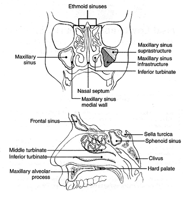
CAP
Approved
HN.Nasal_4.2.0.0.REL_CAPCP
15
Figure 1. Anatomic sites and subsites for the nasal cavity and paranasal sinuses. From AJCC Cancer
Staging Manual. 6th ed. New York: Springer; 2002. © American Joint Committee on Cancer. Reproduced
with permission.
References
1. Gress DM, Edge SB, Greene FL, et al. Principles of cancer staging. In: Amin MB, ed. AJCC Cancer
Staging Manual. 8th ed. New York, NY: Springer; 2017.
2. Kraus DH, Lydiatt WM, Patel SG, et al. Nasal cavity paranasal sinuses. In: Amin MB, ed. AJCC
Cancer Staging Manual. 8th ed. New York, NY: Springer; 2017.
B. Histologic Type
A modification of the WHO classification of carcinomas1 of the nasal cavity and paranasal sinuses is shown
below to include subtypes of squamous cell carcinoma seen at all head and neck sites and key molecular
subtypes.2,3 This protocol applies only to carcinomas and melanomas and does not apply to lymphomas,
sarcomas or neuroectodermal tumors (e.g., olfactory neuroblastoma, primitive neuroectodermal tumor
[PNET], others).
Nasal Cavity and Paranasal Sinuses
•
Keratinizing squamous cell carcinoma
•
Nonkeratinizing squamous cell carcinoma
•
High risk
o
HPV associated
o
DEK::AFF2 translocated
•
NUT carcinoma
•
SWI/SNF complex deficient carcinoma
•
Adenosquamous carcinoma
•
Basaloid squamous cell carcinoma
•
Papillary squamous cell carcinoma
•
Spindle cell squamous cell carcinoma
•
Verrucous carcinoma
•
Sinonasal lymphoepithelial carcinoma
•
Sinonasal undifferentiated carcinoma (substratified by IDH2 mutation status)
•
Teratocarcinosarcoma
•
HPV-associated multiphenotypic sinonasal carcinoma
Adenocarcinoma
•
Intestinal-type
•
Non-intestinal type
Carcinomas of Minor Salivary Glands
•
Mucoepidermoid carcinoma
•
Adenoid cystic carcinoma
•
Acinic cell carcinoma
•
Secretory carcinoma
•
Polymorphous adenocarcinoma, conventional (classic) and cribriform subtypes
CAP
Approved
HN.Nasal_4.2.0.0.REL_CAPCP
16
•
Salivary duct carcinoma
•
Epithelial-myoepithelial carcinoma
•
Hyalinizing clear cell carcinoma
•
Microsecretory adenocarcinoma
•
Intraductal carcinoma (with subtypes)
•
Basal cell adenocarcinoma
•
Carcinosarcoma
•
Mucinous adenocarcinoma (with subtypes)
•
Sclerosing microcystic adenocarcinoma
•
Lymphoepithelial carcinoma
•
Myoepithelial carcinoma (malignant myoepithelioma)
•
Sebaceous adenocarcinoma
•
Squamous cell carcinoma
•
Sialoblastoma
•
Carcinoma, not otherwise specified
Neuroendocrine Carcinomas
The recommended histologic classification for neuroendocrine neoplasms has been standardized across
all head and neck sites.1  The entities relevant to this protocol are listed below:
Neuroendocrine tumor, grade 1-3
Neuroendocrine carcinoma, small cell type
Neuroendocrine carcinoma, large cell type
Additionally, composite tumors with non-neuroendocrine CA components exist throughout the upper
aerodigestive tract.  The carcinoma component can then be captured in this protocol accordingly.
Mucosal Melanoma
Given the rarity of mucosal melanoma, grading, and subtyping are not required.
References
1. WHO Classification of Tumours Editorial Board. Head and neck tumours [Internet; beta version
ahead of print]. Lyon (France): International Agency for Research on Cancer; 2022 [cited 2023, Jan
26].
(WHO
classification
of
tumours
series,
5th
ed.;
vol.
9).
Available
from:
https://tumourclassification.iarc.who.int/chapters/52.
2. Oliver JR, Lieberman SM, Tam MM, Liu CZ, Li Z, Hu KS, Morris LGT, Givi B. Human papillomavirus
and survival of patients with sinonasal squamous cell carcinoma. Cancer. 2020 Apr 1;126(7):1413-
1423.
3. Ruangritchankul K, Sandison A. DEK::AFF2 Fusion Carcinomas of Head and Neck. Adv Anat
Pathol. 2023 Mar 1;30(2):86-94.
C. Histologic Grade
For histologic types of non-salivary carcinomas that are amenable to grading, three histologic grades are
suggested, as shown below. For conventional squamous cell carcinoma, histologic grading as a whole does
not perform well as a prognosticator.1 Nonetheless, it should be recorded when applicable, as it is a basic
tumor characteristic. For sinonasal intestinal type adenocarcinomas, pattern-based grading is commonly
CAP
Approved
HN.Nasal_4.2.0.0.REL_CAPCP
17
employed: papillary tumors can be considered grade I, colonic and mixed grade II, solid and mucinous
grade III.2 Non-intestinal type (seromucinous) adenocarcinomas are graded intuitively into low, intermediate
and high-grade tumors.
Selecting either the most prevalent grade or the highest grade for this synoptic protocol is acceptable. Some
subtypes of squamous cell carcinoma (i.e., verrucous, basaloid, etc.) have an intrinsic biologic potential.
Newer subtypes with distinctive molecular alterations3,4,5 do not currently require grading as data are still
emerging regarding biologic behavior.
Grade 1
Well differentiated
Grade 2
Moderately differentiated
Grade 3
Poorly differentiated
Grade X
Cannot be assessed
The histologic (microscopic) grading of salivary gland carcinomas has been shown to be an independent
predictor of behavior and plays a role in optimizing therapy. Further, there is often a positive correlation
between histologic grade and clinical stage.6,7,8,9 However, most salivary gland carcinoma types have an
intrinsic biologic behavior, and attempted application of a universal grading scheme is suboptimal given
tumor specific nuances.8 Thus, a generic grading scheme is no longer recommended for salivary gland
carcinomas.10
However, within a given tumor type, grade remains an important prognostic parameter. Carcinoma types
for which grading systems exist and are relevant are incorporated into histologic type. The classic
categories that are still graded using three tier schemes include mucoepidermoid carcinoma, and
carcinoma, not otherwise specified. While adenoid cystic carcinoma was historically stratified into three
tiers, current classification no longer advocates for this.7,8,11 Additionally, several tumor types can at least
be stratified into low and high grade. High grade transformation (historically designated as dedifferentiation)
refers to the phenomenon of progression from a conventional, usually indolent phenotype, to a pleomorphic
aggressive morphology.
As such carcinomas can alternatively be stratified by their risk for structural recurrence by a combination of
category, subtype, and category-specific grade12 as in Table 1.
Table 1:  Risk Stratification of Salivary Gland Carcinomas
Low Aggression
High Aggression
Mucoepidermoid carcinoma – Low grade
Mucoepidermoid carcinoma – High grade
Mucoepidermoid carcinoma – Intermediate grade*
Acinic cell carcinoma – Conventional
Acinic cell carcinoma – High grade/HGT
Secretory carcinoma - Conventional
Secretory carcinoma – High grade/HGT
Microsecretory adenocarcinoma – Usual
Microsecretory adenocarcinoma – High grade/HGT
Polymorphous adenocarcinoma – Low grade,
conventional
Polymorphous adenocarcinoma – High grade/HGT
Polymorphous adenocarcinoma – Low & intermediate grade, cribriform**
Hyalinizing clear cell carcinoma – Conventional
Hyalinizing clear cell carcinoma – High grade/HGT
Basal cell adenocarcinoma – Conventional
Basal cell adenocarcinoma – High grade/HGT
CAP
Approved
HN.Nasal_4.2.0.0.REL_CAPCP
18
Abbreviations: HGT-high grade transformation. NOS–not otherwise specified
*Behavior varies with grading system or criteria
**The cribriform subtype of polymorphous adenocarcinoma has a high propensity for regional recurrence
^Adenoid cystic carcinoma though highly aggressive locally with capacity for distant spread, has somewhat
lower risk for regional recurrence
#Carcinoma ex pleomorphic adenoma behavior is determined by carcinoma type and extent
@Salivary carcinoma, NOS behavior is determined by grade
Adenoid cystic carcinomas were historically stratified into three tiers based on tubular, cribriform, and solid
(>30%) patterns respectively.11 However currently, while solid pattern remains an integral prognosticator,
no standard grading scheme is endorsed. The histologic grading of mucoepidermoid carcinoma includes a
combination of growth pattern characteristics (e.g., cystic, solid, neurotropism) and cytomorphologic
findings (e.g., anaplasia, mitoses, necrosis).13,14,15 Carcinomas, not otherwise specified, do not have a
formalized grading scheme and are graded intuitively based on cytomorphologic features.8 Polymorphous
adenocarcinomas and intraductal carcinomas are to be graded as per current WHO recommendations.
Polymorphous adenocarcinomas should be subtyped into conventional and cribriform types (i.e., cribriform
adenocarcinoma of minor salivary gland). The latter is more frequently extrapalatal and locoregionally
aggressive. Along these lines, papillary components (>10%) and cribriform components (>30%) regardless
of subtype have been shown to be prognostically relevant and these can be recorded
optionally.16 Intraductal carcinomas can be subtyped and graded, as both influence biologic
behavior.17 Additionally, two-tier grading schema have shown prognostic relevance for other tumor types
such as myoepithelial carcinoma,18 and acinic cell carcinoma.19 Low grade and high grade are generally
separated by mitotic counts and/or necrosis.
The current protocol is thus structured to allow for provision of grade or biologic potential for almost every
epithelial tumor type in at least a two-tier fashion as per Table 1. For instance, epithelial-myoepithelial
carcinoma, basal cell adenocarcinoma, and hyalinizing clear cell carcinoma can be assigned a default low
grade/biologic potential category.  Conversely, salivary duct carcinoma and lymphoepithelial carcinoma can
Myoepithelial carcinoma – Low grade
Myoepithelial carcinoma – High grade
Epithelial-myoepithelial carcinoma – Conventional and
subtypes
Epithelial-myoepithelial carcinoma – High grade/HGT
Sebaceous adenocarcinoma – Low grade
Sebaceous adenocarcinoma – High grade
Adenoid cystic carcinoma – Solid/HGT
Adenoid cystic carcinoma – Tubular/cribriform^
Carcinosarcoma (sarcomatoid carcinoma)
(Metastatic) Squamous cell carcinoma (usually
cutaneous)
Intraductal carcinoma, oncocytic and intercalated duct
Intraductal carcinoma, apocrine
Salivary duct carcinoma
Mucinous adenocarcinoma “intraductal papillary
mucinous neoplasm” type
Mucinous adenocarcinoma (not otherwise specified,
and with colloid/signet ring features
Lymphoepithelial carcinoma
Sclerosing microcystic adenocarcinoma
Sialoblastoma
Carcinoma ex pleomorphic adenoma#
Salivary carcinoma, NOS@
CAP
Approved
HN.Nasal_4.2.0.0.REL_CAPCP
19
be considered high grade/biologic potential category as a default. One key point is that adenoid cystic
carcinoma should NEVER be assigned a low grade/biologic potential category. As this is one entity that
does not fit into a standard risk of structural recurrence (i.e., discordant prevalence of local and regional
aggression), this can be assigned N/A if non-solid and high grade if solid (>30%) or high grade transformed.
Carcinoma ex pleomorphic adenoma is subclassifed by histologic type and/or grade and extent of invasion,
the latter including minimally invasive, invasive, and intracapsular (noninvasive) cancers. Previously the
cut-off for minimal invasion was designated as 1.5 mm; however, more recent studies have shown a
favorable prognosis even with cut-offs of 4 mm to 6 mm.20 Thus, there is no agreement on an optimal cut-
off. However, from a practical standpoint, the terms intracapsular and minimally invasive should only be
applied to uninodular tumors (as opposed to carcinomas arising in multinodular recurrent pleomorphic
adenomas) with a well-delineated interface for which the entire lesional border has been microscopically
evaluated. Prognosis has been linked to degree of invasion with noninvasive and minimally invasive
cancers apparently having a better prognosis than invasive cancers.8,20,21 Carcinosarcoma is a rare subtype
morphology that while currently separated, appears to almost invariably arise in the setting of a precursor
pleomorphic adenoma and should likely be regarded as a sarcomatoid carcinoma subtype ex pleomorphic
adenoma.22
Aside from pleomorphic adenoma, other precursor lesions, most notably intercalated duct
lesion/adenoma,1,23 exist. Though biologically and diagnostically relevant, documentation of these
precursors is currently optional (non-core) as there is limited literature23 on these.
The WHO 5th edition has standardized the terminology for head and neck neuroendocrine neoplasms
across all subsites.24 Tumors previously designated as carcinoid and well-differentiated neuroendocrine
carcinoma would now be considered grade 1 neuroendocrine tumors while atypical carcinoids/moderately-
differentiated neuroendocrine carcinomas are now considered grade 2 neuroendocrine tumors. Grade 3
neuroendocrine tumor is a provisional category with no historical analogue. It must be emphasized that this
category in head and neck sites is provisional with no current evidence to support its use in head and neck
sites. Practically speaking, tumors that exceed the mitotic rate for grade 2 neuroendocrine tumors are
usually more in keeping with neuroendocrine carcinomas (see below). Grading of neuroendocrine tumors
is summarized in Table 2. Ki-67 proliferation indices are recommended for neuroendocrine tumors of head
and neck, but are not required elements, and delineation of grade 1 and 2 at this site by proliferation index
is not yet established.
Table 2:  WHO Classification of Head and Neck Neuroendocrine Tumors
Neuroendocrine Tumor Grade
Mitoses per two mm2
Necrosis
1
Less than 2
Absent
2
2-10
Present
3
Undefined
Neuroendocrine carcinoma, small cell types and large cell types on the other hand, have not changed much
in terms of their designation and reflect poorly differentiated neuroendocrine malignancies that were
previously labeled small cell and large cell neuroendocrine carcinomas respectively. These
characteristically show necrosis and have mitotic counts that exceed 10 per two mm2. While
neuroendocrine tumors and carcinomas are defined by neuroendocrine marker expression (synaptophysin,
chromogranin, and/or INSM-1), other tumor types at each head and neck subsite may express
CAP
Approved
HN.Nasal_4.2.0.0.REL_CAPCP
20
these.  Morphologic, other immunophenotypic, and molecular features would then supersede this
neuroendocrine marker expression for classification.
References
1. WHO Classification of Tumours Editorial Board. Head and neck tumours [Internet; beta version
ahead of print]. Lyon (France): International Agency for Research on Cancer; 2022 [cited 2023, Jan
26].
(WHO
classification
of
tumours
series,
5th
ed.;
vol.
9).
Available
from:
https://tumourclassification.iarc.who.int/chapters/52.
2. Barnes L. Intestinal-type adenocarcinoma of the nasal cavity and paranasal sinuses. Am J Surg
Pathol. 1986;10(3):192-202.
3. Oliver JR, Lieberman SM, Tam MM, Liu CZ, Li Z, Hu KS, Morris LGT, Givi B. Human papillomavirus
and survival of patients with sinonasal squamous cell carcinoma. Cancer. 2020 Apr 1;126(7):1413-
1423.
4. Ruangritchankul K, Sandison A. DEK::AFF2 Fusion Carcinomas of Head and Neck. Adv Anat
Pathol. 2023 Mar 1;30(2):86-94.
5. Dogan S, Frosina D, Geronimo JA, Hernandez E, Mohanty A, Bale T, Hechtman JF, Arcila ME,
Hameed MR, Jungbluth AA. Molecular epidemiology of IDH2 hotspot mutations in cancer and
immunohistochemical detection of R172K, R172G, and R172M variants.Hum Pathol. 2020
Dec;106:45-53.
6. Spiro RH, Thaler HT, Hicks WF, Kher UA, Huvos AH, Strong EW. The importance of clinical staging
of minor salivary gland carcinoma. Am J Surg. 1991;162(4):330-336.
7. Spiro RH, Huvos AG, Strong EW. Adenocarcinoma of salivary origin. Clinicopathologic study of
204 patients. Am J Surg. 1982;144(4):423-431.
8. Seethala RR. Histologic grading and prognostic biomarkers in salivary gland carcinomas. Adv Anat
Pathol. 2011;18(1):29-45.
9. Kane WJ, McCaffrey TV, Olsen KD, Lewis JE. Primary parotid malignancies. A clinical and
pathologic review. Arch Otolaryngol Head Neck Surg. 1991 Mar;117(3):307-15. doi:
10.1001/archotol.1991.01870150075010. PMID: 1998571.
10. Lydiatt WM, Mukherji SK, O'Sullivan B, Patel SG, Shah JP. Major salivary glands. In: Amin MB, ed.
AJCC Cancer Staging Manual. 8th ed. New York, NY: Springer; 2017.
11. Szanto PA, Luna MA, Tortoledo ME, White RA. Histologic grading of adenoid cystic carcinoma of
the salivary glands. Cancer. 1984;54(6):1062-1069.
12. Ramalingam N, Thiagarajan S, Chidambaranathan N, et al. Regression Derived Staging Model to
Predict Overall and Disease Specific Survival in Patients With Major Salivary Gland Carcinomas
With
Independent
External
Validation.
JCO
Glob
Oncol
2022;8:e2200150.
doi:
10.1200/GO.22.00150 [published Online First: 2022/08/19].
13. Katabi N, Ghossein R, Ali S, Dogan S, Klimstra D, Ganly I. Prognostic features in mucoepidermoid
carcinoma of major salivary glands with emphasis on tumour histologic grading. Histopathology.
2014 Dec;65(6):793-804. doi: 10.1111/his.12488. Epub 2014 Aug 26.
14. Brandwein MS, Ivanov K, Wallace DI, et al. Mucoepidermoid carcinoma: a clinicopathologic study
of 80 patients with special reference to histological grading. Am J Surg Pathol. 2001;25(7):835-
845.
15. Auclair PL, Goode RK, Ellis GL. Mucoepidermoid carcinoma of intraoral salivary glands. Evaluation
and application of grading criteria in 143 cases. Cancer. 1992;69(8):2021-2030.
16. Xu B, Aneja A, Ghossein R, Katabi N.Predictors of Outcome in the Phenotypic Spectrum of
Polymorphous Low-grade Adenocarcinoma (PLGA) and Cribriform Adenocarcinoma of Salivary
CAP
Approved
HN.Nasal_4.2.0.0.REL_CAPCP
21
Gland (CASG): A Retrospective Study of 69 Patients. Am J Surg Pathol. 2016 Nov;40(11):1526-
1537.
17. Thompson LDR, Bishop JA. Salivary Gland Intraductal Carcinoma: How Do 183 Reported Cases
Fit Into a Developing Classification. Adv Anat Pathol. 2023 Mar 1;30(2):112-129. doi:
10.1097/PAP.0000000000000362. Epub 2022 Aug 30. PMID: 36040027.
18. Kong M, Drill EN, Morris L, West L, Klimstra D, Gonen M, Ghossein R, Katabi N. Prognostic factors
in myoepithelial carcinoma of salivary glands: a clinicopathologic study of 48 cases. Am J Surg
Pathol. 2015 Jul;39(7):931-8. doi: 10.1097/PAS.0000000000000452. PMID: 25970687; PMCID:
PMC4939272.
19. Xu B, Saliba M, Ho A, Viswanathan K, Alzumaili B, Dogan S, Ghossein R, Katabi N. Head and
Neck Acinic Cell Carcinoma: A New Grading System Proposal and Diagnostic Utility of NR4A3
Immunohistochemistry.
Am
J
Surg
Pathol.
2022
Jul
1;46(7):933-941.
doi:
10.1097/PAS.0000000000001867. Epub 2022 Jan 17. PMID: 35034042.
20. Katabi N, Chiosea S, Fonseca I et al. Carcinoma ex Pleomorphic adenoma. In: WHO Classification
of Tumours Editorial Board. Head and neck tumours [Internet; beta version ahead of print]. Lyon
(France): International Agency for Research on Cancer; 2022 [cited 2023 Jan 26]. (WHO
classification
of
tumours
series,
5th
ed.;
vol.
9).
Available
from:
https://tumourclassification.iarc.who.int/chapters/52.
21. Brandwein M, Huvos AG, Dardick I, Thomas MJ, Theise ND. Noninvasive and minimally invasive
carcinoma ex mixed tumor: a clinicopathologic and ploidy study of 12 patients with major salivary
tumors of low (or no?) malignant potential. Oral Surg Oral Med Oral Pathol Oral Radiol Endod.
1996;81(6):655-664.
22. Ihrler S, Stiefel D, Jurmeister P, Sandison A, Chaston N, Laco J, Zidar N, Brcic L, Stoehr R, Agaimy
A.Salivary carcinosarcoma: insight into multistep pathogenesis indicates uniform origin as
sarcomatoid variant of carcinoma ex pleomorphic adenoma with frequent heterologous
elements.Histopathology. 2023 Mar;82(4):576-586.
23. McLean AC, Rooper LM, Gagan J, Thompson LDR, Bishop JA. A Subset of Salivary Intercalated
Duct Lesions Harbors Recurrent CTNNB1 and HRAS Mutations: A Molecular Link to Basal Cell
Adenoma and Epithelial-Myoepithelial Carcinoma? Head Neck Pathol. 2022 Dec 8. doi:
10.1007/s12105-022-01513-x. Epub ahead of print. PMID: 36480093.
24. Mete O, Gill A, and Nosé V.  Neuroendocrine neoplasms and paraganglioma: Introduction. In: WHO
Classification of Tumours Editorial Board. Head and neck tumours [Internet; beta version ahead of
print]. Lyon (France): International Agency for Research on Cancer; 2022 [cited 2023 Jan 26].
(WHO
classification
of
tumours
series,
5th
ed.;
vol.
9).
Available
from:
https://tumourclassification.iarc.who.int/chapters/52.
D. Perineural Invasion
Traditionally, the presence of perineural invasion (neurotropism) is an important predictor of poor prognosis
in head and neck cancer of virtually all sites.1 The presence of perineural invasion (neurotropism) in the
primary cancer is associated with poor local disease control and regional control, as well as being
associated with metastasis to regional lymph nodes.1 Further, perineural invasion is associated with
decrease in disease-specific survival and overall survival.1 There is conflicting data relative to an
association between the presence of perineural invasion and the development of distant metastasis, with
some studies showing an increased association with distant metastasis, while other studies showing no
correlation with distant metastasis.1 The relationship between perineural invasion and prognosis is
independent of nerve diameter.2 Additionally, emerging evidence suggests that extratumoral perineural
CAP
Approved
HN.Nasal_4.2.0.0.REL_CAPCP
22
invasion may be more prognostically relevant.3 Although perineural invasion of small unnamed nerves may
not produce clinical symptoms, the reporting of perineural invasion includes nerves of all sizes including
small peripheral nerves (i.e., less than 1 mm in diameter). Aside from the impact on prognosis, the presence
of perineural invasion also guides therapy. Concurrent adjuvant chemoradiation therapy has been shown
to improve outcomes in patients with perineural invasion (as well as in patients with extranodal extension
and bone invasion).4,5 Given the significance relative to prognosis and treatment, perineural invasion is a
required data element in the reporting of head and neck cancers.
References
1. Smith BD, Haffty BG. Prognostic factoris in patients with head and neck cancer. In: Harrison LB,
Sessions RB, Hong WK, eds. Head and Neck Cancer: A Multidisciplinary Approach. Philadelphia,
PA: Lippincott Williams and Wilkins; 2009:51-75.
2. Fagan JJ, Collins B, Barnes L, D'Amico F, Myers EN, Johnson JT. Perineural invasion in squamous
cell carcinoma of the head and neck. Arch Otolaryngol Head Neck Surg. 1998;124(6):637-640.
3. Miller ME, Palla B, Chen Q, et al. A novel classification system for perineural invasion in
noncutaneous head and neck squamous cell carcinoma: histologic subcategories and patient
outcomes. Am J Otolaryngol. 2012;33(2):212-215.
4. Cooper JS, Pajak TF, Forastiere AA, et al. Postoperative concurrent radiotherapy and
chemotherapy for high-risk squamous-cell carcinoma of the head and neck. N Engl J Med.
2004;350(19):1937-1944.
5. Bernier J, Domenge C, Ozsahin M, et al. Postoperative irradiation with or without concomitant
chemotherapy for locally advanced head and neck cancer. N Engl J Med. 2004;350(19):1945-1952.
E. Surgical Margins
The definition of a positive margin is somewhat controversial given the varied results from prior
studies.1,2 This is made even more challenging and nebulous for sinonasal tumors, which are often received
piecemeal with margins submitted separately. But for squamous cell carcinoma, data is essentially
extrapolated from other sites. Here, overall, several studies support the definition of a positive margin to be
invasive carcinoma or carcinoma in situ/high-grade dysplasia present at margins (microscopic cut-through
of tumor).2 Furthermore, reporting of surgical margins should also include information regarding the
distance of invasive carcinoma, carcinoma in situ, or high-grade dysplasia (moderate to severe) from the
surgical margin. Tumors with “close” margins also carry an increased risk for local recurrence.2,3 The
definition of a “close” margin is not standardized as the effective cut-off varies between studies and between
anatomic subsites. Commonly used cut points to define close margins are 5 mm in general and 2 mm with
respect to glottic larynx.2 However, values ranging from 3 mm to 7 mm have been used with success,2,4 and
for glottic tumors as low as 1 mm.5 Thus, distance of tumor from the nearest margin should be recorded.
Reporting of surgical margins for carcinomas of the minor salivary glands should follow those used for
squamous cell carcinoma of the oral cavity. While there is no standard recommendation for the other
histologic types of carcinoma encountered, adherence to the recommendations for squamous cell
carcinoma is acceptable.
Orientation of Specimen
Complex intact specimens should be examined and oriented with the assistance of attending surgeons.
Direct communication between the surgeon and pathologist is a critical component in specimen orientation
and proper sectioning. For multipart piecemeal endoscopic resections, specimens should be clearly and
CAP
Approved
HN.Nasal_4.2.0.0.REL_CAPCP
23
precisely labeled. Parts that are margins should be designated explicitly as such. Whenever possible, the
tissue examination request form should include a drawing of the resected specimen showing the extent of
the tumor and its relation to the anatomic structures of the region. The lines and extent of the resection can
be depicted on preprinted adhesive labels and attached to the surgical pathology request forms.
References
1. Brandwein-Gensler M, Teixeira MS, Lewis CM, et al. Oral squamous cell carcinoma: histologic risk
assessment, but not margin status, is strongly predictive of local disease-free and overall survival.
Am J Surg Pathol. 2005;29(2):167-178.
2. Hinni ML, Ferlito A, Brandwein-Gensler MS, et al. Surgical margins in head and neck cancer: a
contemporary review. Head Neck. 2012.
3. Alicandri-Ciufelli M, Bonali M, Piccinini A, et al. Surgical margins in head and neck squamous cell
carcinoma: what is 'close'? Eur Arch Otorhinolaryngol. 2012.
4. Liao CT, Chang JT, Wang HM, et al. Analysis of risk factors of predictive local tumor control in oral
cavity cancer. Ann Surg Oncol. 2008;15(3):915-922.
5. Ansarin M, Santoro L, Cattaneo A, et al. Laser surgery for early glottic cancer: impact of margin
status on local control and organ preservation. Arch Otolaryngol Head Neck Surg.
2009;135(4):385-390.
F. Lymph Nodes
Direct Extension of Tumor to Lymph Node
While data are essentially nonexistent for defining N status for lymph nodes involved by tumor via direct
extension for head and neck cancers, the general convention based on other organ sites is to consider
these positive for N categorization and counting purposes. It is recommended however to denote in the
report the number of lymph nodes involved in this manner as it may influence more nuanced management
decisions.
Measurement of Tumor Metastasis
The cross-sectional diameter of the largest lymph node metastasis (not the lymph node itself) is measured
in the gross specimen at the time of macroscopic examination or, if necessary, on the histologic slide at the
time of microscopic examination.1,2
Special Procedures for Lymph Nodes
At the current time, no additional special techniques should be used other than routine histology for the
assessment of nodal metastases. Immunohistochemistry and polymerase chain reaction (PCR) to detect
isolated tumor cells are considered investigational techniques at this time.
Lymph Node Number
For assessment of pN, a selective neck dissection will ordinarily include 10 or more lymph nodes, and a
comprehensive neck dissection (radical or modified radical neck dissection) will ordinarily include 15 or
more lymph nodes. Examination of fewer tumor-free nodes still mandates a pN0 designation.
Regional Lymph Nodes (pN0): Isolated Tumor Cells
Isolated tumor cells (ITCs) are single cells or small clusters of cells not more than 0.2 mm in greatest
dimension. While the generic recommendation is that for lymph nodes with ITCs found by either histologic
examination, immunohistochemistry, or nonmorphologic techniques (e.g., flow cytometry, DNA analysis,
CAP
Approved
HN.Nasal_4.2.0.0.REL_CAPCP
24
PCR amplification of a specific tumor marker), they should be classified as N0 or M0,
respectively.3,4 Evidence for the validity of this practice in head and neck squamous cell carcinoma and
other histologic subtypes is lacking. In fact, rare studies relevant to head and neck sites indicate that isolated
tumor cells may actually be a poor prognosticator in terms of local control.5
For purposes of pathologic evaluation, lymph nodes are organized by levels, as shown in Figure 2.
I.  Classification of Neck Dissection
1. Radical neck dissection
2. Modified radical neck dissection, internal jugular vein and/or sternocleidomastoid muscle spared
3. Selective neck dissection (SND), as specified by the surgeon (Figure 2), defined by dissection of
less than the 5 traditional levels of a radical and modified radical neck dissection. The following
dissections are now under this category2,6,7:
a. Supraomohyoid neck dissection
b. Posterolateral neck dissection
c. Lateral neck dissection
d. Central compartment neck dissection
4. Superselective neck dissection (SSND), a relatively new term defined by dissection of the fibrofatty
elements of 2 or less levels.8
5. Extended radical neck dissection, as specified by the surgeon
Figure 2. The six sublevels of the neck for describing the location of lymph nodes within levels I, II, and V.
Level IA, submental group; level IB, submandibular group; level IIA, upper jugular nodes along the carotid
sheath, including the subdigastric group; level IIB, upper jugular nodes in the submuscular recess; level
VA, spinal accessory nodes; and level VB, the supraclavicular and transverse cervical nodes. From: Flint
PW, et al, eds. Cummings Otolaryngology: Head and Neck Surgery. 5th ed. Philadelphia, PA; Saunders:
2010. Reproduced with permission © Elsevier.
In order for pathologists to properly identify these nodes, they must be familiar with the terminology of the
regional lymph node groups and with the relationships of those groups to the regional anatomy. Which

CAP
Approved
HN.Nasal_4.2.0.0.REL_CAPCP
25
lymph node groups surgeons submit for histopathologic evaluation depends on the type of neck dissection
they perform. Therefore, surgeons must supply information on the types of neck dissections that they
perform and the details of the local anatomy in the specimens they submit for examination or, in other
manners, orient those specimens for pathologists.
If it is not possible to assess the levels of lymph nodes (for instance, when the anatomic landmarks in the
excised specimens are not specified), then the lymph node levels may be estimated as follows: level II,
upper third of internal jugular (IJ) vein or neck specimen; level III, middle third of IJ vein or neck specimen;
level IV, lower third of IJ vein or neck specimen, all anterior to the sternocleidomastoid muscle.
Level I. Submental Group (Sublevel IA)
Lymph nodes within the triangular boundary of the anterior belly of the digastric muscles and the hyoid
bone.
Level I. Submandibular Group (Sublevel IB)
Lymph nodes within the boundaries of the anterior and posterior bellies of the digastric muscle and the
body of the mandible. The submandibular gland is included in the specimen when the lymph nodes within
this triangle are removed.
Level II. Upper Jugular Group (Sublevels IIA and IIB)
Lymph nodes located around the upper third of the internal jugular vein and adjacent spinal accessory
nerve extending from the level of the carotid bifurcation (surgical landmark) or hyoid bone (clinical landmark)
to the skull base. The posterior boundary is the posterior border of the sternocleidomastoid muscle, and
the anterior boundary is the lateral border of the stylohyoid muscle.
Level III. Middle Jugular Group
Lymph nodes located around the middle third of the internal jugular vein extending from the carotid
bifurcation superiorly to the omohyoid muscle (surgical landmark), or cricothyroid notch (clinical landmark)
inferiorly. The posterior boundary is the posterior border of the sternocleidomastoid muscle, and the anterior
boundary is the lateral border of the sternohyoid muscle.
Level IV. Lower Jugular Group
Lymph nodes located around the lower third of the internal jugular vein extending from the omohyoid muscle
superiorly to the clavicle inferiorly. The posterior boundary is the posterior border of the sternocleidomastoid
muscle, and the anterior boundary is the lateral border of the sternohyoid muscle.
Level V. Posterior Triangle Group (Sublevels VA and VB)
This group comprises predominantly the lymph nodes located along the lower half of the spinal accessory
nerve and the transverse cervical artery. The supraclavicular nodes are also included in this group. The
posterior boundary of the posterior triangle is the anterior border of the trapezius muscle, the anterior
boundary of the posterior triangle is the posterior border of the sternocleidomastoid muscle, and the inferior
boundary of the posterior triangle is the clavicle.
Level VI. Anterior (Central) Compartment
Lymph nodes in this compartment include the pre- and paratracheal nodes, precricoid (Delphian) node, and
the perithyroidal nodes, including the lymph nodes along the recurrent laryngeal nerve. The superior
CAP
Approved
HN.Nasal_4.2.0.0.REL_CAPCP
26
boundary is the hyoid bone, the inferior boundary is the suprasternal notch, the lateral boundaries are the
common carotid arteries and the posterior boundary by the prevertebral fascia.
Level VII. Superior Mediastinal Lymph Nodes
Metastases at level VII are considered regional lymph node metastases; all other mediastinal lymph node
metastases are considered distant metastases.
Lymph node groups removed from areas not included in the above levels, eg, scalene, suboccipital, and
retropharyngeal, should be identified and reported from all levels separately. Midline nodes are considered
ipsilateral nodes.
Extranodal Extension
The status of cervical lymph nodes is the single most important prognostic factor in aerodigestive cancer.
All macroscopically negative or equivocal lymph nodes should be submitted in toto. Grossly positive nodes
may be partially submitted for microscopic documentation of metastasis, particularly if there is gross
extranodal extension. However, generous sampling of the lymph node periphery is recommended if there
is no gross extranodal extension to adequately assess microscopic extranodal extension. Reporting of
lymph nodes containing metastasis should include whether there is presence or absence of extranodal
extension (ENE),9 which is now part of N staging. This finding consists of extension of metastatic tumor,
present within the confines of the lymph node, through the lymph node capsule into the surrounding
connective tissue, with or without associated stromal reaction. A distance of extension from the native lymph
node capsule is now suggested (but not yet required) with the proposed stratification of ENE into ENEma
(>2 mm) and ENEmi (≤2 mm).10,11,12,13 However, pitfalls in the measurement (i.e in larger, matted lymph
nodes, in nodes post fine-needle aspiration, and in nodes with near total replacement of lymph node
architecture), and the disposition of soft tissue deposits is still not resolved. In general, absence of ENE in
a large (>3 cm) lymph node, especially with traversing fibrous bands, should be viewed with skepticism.
Soft tissue deposits for lymph node metastases based on limited studies appear to be the equivalent of a
positive lymph node with ENE and should be recorded as such.14
Other Elements
Anatomic compartment location of positive lymph nodes is now a non-core element.
References
1. Smith BD, Haffty BG. Prognostic factoris in patients with head and neck cancer. In: Harrison LB,
Sessions RB, Hong WK, eds. Head and Neck Cancer: A Multidisciplinary Approach. Philadelphia,
PA: Lippincott Williams and Wilkins; 2009:51-75.
2. Seethala RR. Current state of neck dissection in the United States. Head Neck Pathol.
2009;3(3):238-245.
3. Sobin LH, Gospodarowicz MK, Wittekind CH, eds. TNM Classification of Malignant Tumours. New
York: Wiley-Liss; 2009.
4. Singletary SE, Greene FL, Sobin LH. Classification of isolated tumor cells: clarification of the 6th
edition of the American Joint Committee on Cancer Staging Manual. Cancer. 2003;98(12):2740-
2741.
5. Broglie MA, Haerle SK, Huber GF, Haile SR, Stoeckli SJ. Occult metastases detected by sentinel
node biopsy in patients with early oral and oropharyngeal squamous cell carcinomas: impact on
survival. Head Neck. 2013;35(5):660-666.
CAP
Approved
HN.Nasal_4.2.0.0.REL_CAPCP
27
6. Ferlito A, Robbins KT, Shah JP, et al. Proposal for a rational classification of neck dissections.
Head Neck. 2011;33(3):445-450.
7. Robbins KT, Shaha AR, Medina JE, et al. Consensus statement on the classification and
terminology of neck dissection. Arch Otolaryngol Head Neck Surg. 2008;134(5):536-538.
8. Suarez C, Rodrigo JP, Robbins KT, et al. Superselective neck dissection: rationale, indications,
and results. Eur Arch Otorhinolaryngol. 2013.
9. Ebrahimi A, Gil Z, Amit M. International Consortium for Outcome Research (ICOR) in Head and
Neck Cancer. Primary tumor staging for oral cancer and a proposed modification incorporating
depth of invasion: an international multicenter retrospective study. JAMA Otolaryngol Head Neck
Surg. 2014;140(12):1138-1148.
10. Ridge JA, Lydiatt WM, Patel SG, et al. Lip and oral cavity. In: Amin MB, ed. AJCC Cancer Staging
Manual. 8th ed. New York, NY: Springer; 2017.
11. Ebrahimi A, Clark JR, Amit M, et al. Minimum nodal yield in oral squamous cell carcinoma: defining
the standard of care in a multicenter international pooled validation study. Ann Surg Oncol.
2014;21(9):3049-3055.
12. Prabhu RS, Hanasoge S, Magliocca KR, et al. Extent of pathologic extracapsular extension and
outcomes in patients with nonoropharyngeal head and neck cancer treated with initial surgical
resection. Cancer. 2014;120(10):1499-1506.
13. Dunne AA, Muller HH, Eisele DW, Kessel K, Moll R, Werner JA. Meta-analysis of the prognostic
significance of perinodal spread in head and neck squamous cell carcinomas (HNSCC) patients.
Eur J Cancer. 2006;42(12):1863-1868.
14. Jose J, Moor JW, Coatesworth AP, Johnston C, MacLennan K. Soft tissue deposits in neck
dissections of patients with head and neck squamous cell carcinoma: prospective analysis of
prevalence, survival, and its implications. Arch Otolaryngol Head Neck Surg. 2004;130(2):157-160.
G. TNM and Stage Groupings
The protocol recommends the TNM staging system of the American Joint Committee on Cancer and the
International Union Against Cancer for nasal cavity and paranasal sinus cancer.1,2 Of note in the 7th edition
of the AJCC staging of head and neck cancers1 is the division of T4 lesions into T4a (moderately advanced
local disease) and T4b (very advanced local disease), leading to the stratification of stage IV into stage IVA
(moderately advanced local/regional disease), stage IVB (very advanced local/regional disease), and stage
IVC (distant metastatic disease).
The 8th edition of the AJCC staging of head and neck cancers includes mucosal melanomas; this does not
show significant changes from the 7th edition. Approximately two-thirds of mucosal melanomas arise in the
sinonasal tract, one quarter are found in the oral cavity and the remainder occur only sporadically in other
mucosal sites of the head and neck. Even small cancers behave aggressively with high rates of recurrence
and death. To reflect this aggressive behavior, primary cancers limited to the mucosa are considered T3
lesions. Advanced mucosal melanomas are classified as T4a and T4b. The anatomic extent criteria to
define moderately advanced (T4a) and very advanced (T4b) disease are given below. The AJCC staging
for mucosal melanomas does not provide for the histologic definition of a T3 lesion; as the majority of
mucosal melanomas are invasive at presentation, mucosal based melanomas (T3 lesions) include those
lesions that involve either the epithelium and/or lamina propria of the involved site. Rare examples of in situ
mucosal melanomas occur, but in situ mucosal melanomas are excluded from staging, as they are
extremely rare.3
CAP
Approved
HN.Nasal_4.2.0.0.REL_CAPCP
28
New to the 8th edition of the AJCC is the site-specific staging of head and neck soft tissue
sarcomas.4 Despite smaller size, they tend to have disproportionately greater risk of local recurrence
compared with extremities.5  While head and neck soft tissue sarcomas are not generally intrinsically
different from their extremity counterparts, their proximity to vital anatomic structures (ie, major nerves,
vessels, bone, and skull base).  Mortality and morbidity from soft tissue sarcomas is mainly from
uncontrolled local disease rather than distant metastatic spread. The traditional 5-cm size cut point
separating T1 and T2 extremity soft tissue sarcomas is not meaningful for head and neck sarcomas since
the majority are actually less than 5 cm in largest dimension.6,7,8  Staging of soft tissue sarcomas in head
and neck has thus been brought in line with size cut-offs for other head and neck cancers. Thus, T1 is used
for tumors with a maximum dimension ≤2 cm, T2 for those >2 cm to ≤4 cm, and T3 for those >4 cm. Also
in line with other head and neck cancers, T4a and T4b denote very extensive tumors using the same criteria.
This staging is not applicable to the following soft tissue sarcoma types/sites: orbital sarcoma, Kaposi
sarcoma, cutaneous angiosarcoma, embryonal and alveolar rhabdomyosarcoma, dermatofibrosarcoma
protuberans. Grade is still a vital prognosticator for head and neck soft tissue sarcomas, and the FNCLCC
system is used (see soft tissue protocols).
Carcinomas of minor salivary glands of the upper aerodigestive tract site, including the nasal cavity and
paranasal sinuses, are staged according to schemes corresponding to the anatomic site of occurrence.
There is no currently accepted staging for central (primary intraosseous) salivary gland tumors.
By AJCC/UICC convention, the designation “T” refers to a primary tumor that has not been previously
treated. The symbol “p” refers to the pathologic classification of the TNM, as opposed to the clinical
classification, and is based on gross and microscopic examination. pT entails a resection of the primary
tumor or biopsy adequate to evaluate the highest pT category, pN entails removal of nodes adequate to
validate lymph node metastasis, and pM implies microscopic examination of distant lesions. Clinical
classification (cTNM) is usually carried out by the referring physician before treatment during initial
evaluation of the patient or when pathologic classification is not possible.
Pathologic staging is usually performed after surgical resection of the primary tumor. Pathologic staging
depends on pathologic documentation of the anatomic extent of disease, whether or not the primary tumor
has been completely removed. If a biopsied tumor is not resected for any reason (eg, when technically
unfeasible) and if the highest T and N categories or the M1 category of the tumor can be confirmed
microscopically, the criteria for pathologic classification and staging have been satisfied without total
removal of the primary cancer.
Stage Groupings – For Soft Tissue Sarcomas
As this is a new TNM staging, there are currently no stage groupings.
TNM Descriptors
For identification of special cases of TNM or pTNM classifications, the “m” suffix and “y”, “r”, and “a” prefixes
are used. Although they do not affect the stage grouping, they indicate cases needing separate analysis.
Reporting of pT, pN, and (when applicable) pM categories is based on information available to the
pathologist at the time the report is issued. As per the AJCC (Chapter 1, 8th Ed.) it is the managing
physician’s responsibility to establish the final pathologic stage based upon all pertinent information,
including but potentially not limited to this pathology report.
CAP
Approved
HN.Nasal_4.2.0.0.REL_CAPCP
29
The “m” suffix indicates the presence of multiple primary tumors in a single site and is recorded in
parentheses: pT(m)NM.
The “y” prefix indicates those cases in which classification is performed during or following initial
multimodality therapy (i.e., neoadjuvant chemotherapy, radiation therapy, or both chemotherapy and
radiation therapy). The cTNM or pTNM category is identified by a “y” prefix. The ycTNM or ypTNM
categorizes the extent of tumor actually present at the time of that examination. The “y” categorization is
not an estimate of tumor prior to multimodality therapy (i.e., before initiation of neoadjuvant therapy).
The “r” prefix indicates a recurrent tumor when staged after a documented disease-free interval, and is
identified by the “r” prefix: rTNM.
The “a” prefix designates the stage determined at autopsy: aTNM.
References
1. Gress DM, Edge SB, Greene FL, et al. Principles of cancer staging. In: Amin MB, ed. AJCC Cancer
Staging Manual. 8th ed. New York, NY: Springer; 2017.
2. Jose J, Moor JW, Coatesworth AP, Johnston C, MacLennan K. Soft tissue deposits in neck
dissections of patients with head and neck squamous cell carcinoma: prospective analysis of
prevalence, survival, and its implications. Arch Otolaryngol Head Neck Surg. 2004;130(2):157-160.
3. Lydiatt WM, Brandwein-Gensler MS, Kraus DH, Mukherji SK, Ridge JA, Shah JP. Mucosal
melanoma of the head and neck. In: Amin MB, ed. AJCC Cancer Staging Manual. 8th ed. New
York, NY: Springer; 2017.
4. O'Sullivan B, Maki RG, Agulnik M, et al. Soft tissue sarcoma of the head and neck. In: Amin MB,
ed. AJCC Cancer Staging Manual. 8th ed. New York, NY: Springer; 2017.
5. Penel N, Mallet Y, Robin YM, et al. Prognostic factors for adult sarcomas of head and neck. Int J
Oral Maxillofac Surg. 2008;37(5):428-432.
6. Chang AE, Chai X, Pollack SM, et al. Analysis of clinical prognostic factors for adult patients with
head and neck sarcomas. Otolaryngol Head Neck Surg. 2014;151(6):976-983.
7. Mattavelli D, Miceli R, Radaelli S, et al. Head and neck soft tissue sarcomas: prognostic factors
and outcome in a series of patients treated at a single institution. Ann Oncol. 2013;24(8):2181-
2189.
8. Park JT, Roh J-L, Kim S-O, et al. Prognostic factors and oncological outcomes of 122 head and
neck soft tissue sarcoma patients treated at a single institution. Ann Surg Oncol. 2015;22(1):248-
255.
H. Dysplasia of the Upper Aerodigestive Tract (UADT)
Epithelial dysplasias of the nasal cavity and paranasal sinuses as a precursor lesion for sinonasal
carcinomas are less common and less well defined as compared to epithelial dysplasias of the oral cavity
and the larynx. Further, unlike dysplastic lesions of the oral cavity and/or the larynx, precursor lesions of
the nasal cavity and paranasal sinuses are generally asymptomatic and therefore are not biopsied. Instead,
they are identified more often in association with another lesion, such as an invasive carcinoma.
I. Scope of Guidelines
The reporting of nasal cavity and paranasal sinus cancer is facilitated by the provision of a case summary
illustrating the features required for comprehensive patient care. However, there are many cases in which
CAP
Approved
HN.Nasal_4.2.0.0.REL_CAPCP
30
the individual practicalities of applying such a case summary may not be straightforward. Common
examples include finding the prescribed number of lymph nodes, trying to determine the levels of the radical
neck dissection, and determining if isolated tumor cells in a lymph node represent metastatic disease. Case
summaries have evolved to include clinical, radiographic, morphologic, immunohistochemical, and
molecular results in an effort to guide clinical management. Adjuvant and neoadjuvant therapy can
significantly alter histologic findings, making accurate classification an increasingly complex and demanding
task. This protocol tries to remain simple while still incorporating important pathologic features as proposed
by the American Joint Committee on Cancer (AJCC) cancer staging manual, the World Health Organization
(WHO) classification of tumors, the TNM classification, the American College of Surgeons Commission on
Cancer, and the International Union on Cancer (UICC). This protocol is to be used as a guide and resource,
an adjunct to diagnosing and managing cancers of the nasal cavity and paranasal sinus in a standardized
manner. It should not be used as a substitute for dissection or grossing techniques and does not give
histologic parameters to reach the diagnosis. Subjectivity is always a factor, and elements listed are not
meant to be arbitrary but are meant to provide uniformity of reporting across all the disciplines that use the
information. It is a foundation of practical information that will help to meet the requirements of daily practice
to benefit both clinicians and patients alike.
# Neuroblastoma, Resection
Protocol for the Examination of Resection Specimens from
Patients with Neuroblastoma
Version: 5.0.0.1
Protocol Posting Date: June 2025
CAP Laboratory Accreditation Program Protocol Required Use Date: June 2024
The changes included in this current protocol version do not affect the prior accreditation date.
For accreditation purposes, this protocol should be used for the following procedures AND tumor
types:
Procedure
Description
Resection
Includes specimens designated resection, or other
Tumor Type
Description
Neuroblastoma
Includes pediatric patients with neuroblastoma and related neuroblastic tumors
The following should NOT be reported using this protocol:
Procedure
Biopsy (consider Neuroblastoma Biopsy protocol)
Version Contributors
Cancer Committee Authors: Jessica L. Davis, MD*, Jason Jarzembowski, MD, PhD*
Other Expert Contributors: Miguel Reyes-Mugica, MD, Hiroyuki Shimada, MD, PhD, Rochelle
Bagatell, MD
* Denotes primary author.
For any questions or comments, contact: cancerprotocols@cap.org.
Glossary:
Author: Expert who is a current member of the Cancer Committee, or an expert designated by the chair
of the Cancer Committee.
Expert Contributors: Includes members of other CAP committees or external subject matter experts
who contribute to the current version of the protocol.

CAP
Approved
Neuroblastoma_5.0.0.1.REL _CAPCP
2
Synoptic reporting with core and conditional data elements for designated specimen types* is required for
accreditation.
•
Data elements designated as core must be reported.
•
Data elements designated as conditional only need to be reported if applicable.
•
Data elements designated as optional are identified with “+”. Although not required for
accreditation, they may be considered for reporting.
This protocol is not required for recurrent or metastatic tumors resected at a different time than the
primary tumor. This protocol is also not required for pathology reviews performed at a second institution
(i.e., second opinion and referrals to another institution).
Full accreditation requirements can be found on the CAP website under Accreditation Checklists.
A list of core and conditional data elements can be found in the Summary of Required Elements under
Resources on the CAP Cancer Protocols website.
*Includes definitive primary cancer resection and pediatric biopsy tumor types.
Synoptic Reporting
All core and conditionally required data elements outlined on the surgical case summary from this cancer
protocol must be displayed in synoptic report format. Synoptic format is defined as:
•
Data element: followed by its answer (response), outline format without the paired Data element:
Response format is NOT considered synoptic.
•
The data element should be represented in the report as it is listed in the case summary. The
response for any data element may be modified from those listed in the case summary, including
“Cannot be determined” if appropriate.
•
Each diagnostic parameter pair (Data element: Response) is listed on a separate line or in a
tabular format to achieve visual separation. The following exceptions are allowed to be listed on
one line:
o
Anatomic site or specimen, laterality, and procedure
o
Pathologic Stage Classification (pTNM) elements
o
Negative margins, as long as all negative margins are specifically enumerated where
applicable
•
The synoptic portion of the report can appear in the diagnosis section of the pathology report, at
the end of the report or in a separate section, but all Data element: Responses must be listed
together in one location
•
Organizations and pathologists may choose to list the required elements in any order, use
additional methods in order to enhance or achieve visual separation, or add optional items within
the synoptic report. The report may have required elements in a summary format elsewhere in
the report IN ADDITION TO but not as replacement for the synoptic report i.e., all required
elements must be in the synoptic portion of the report in the format defined above.
CAP
Approved
Neuroblastoma_5.0.0.1.REL _CAPCP
3
v 5.0.0.1
•
Accreditation statement update
•
eCP explanatory note electronic link updates
CAP
Approved
Neuroblastoma_5.0.0.1.REL _CAPCP
4
Reporting Template
Protocol Posting Date: June 2025
Select a single response unless otherwise indicated.
EXPERT CONSULTATION
+Expert Consultation (Note A)
___ Pending - Completion of this CAP Cancer Protocol is awaiting expert consultation
___ Completed - This CAP Cancer Protocol or some elements have been performed following expert
consultation
___ Not applicable
CLINICAL
Treatment History (Note B)
___ No known preoperative therapy
___ Preoperative therapy given
___ Not specified
Patient Age
___ Less than 18 months
___ Greater than or equal to 18 months and less than 5 years
___ Greater than or equal to 5 years
+Tissue Allocation (Note B) (select all that apply)
___ Formalin fixed paraffin embedded (FFPE)
___ Snap frozen
___ Tissue culture media
___ Other (specify): _________________
SPECIMEN
Procedure
___ Resection
___ Other (specify): _________________
___ Not specified
TUMOR
Tumor Site (Note C)
___ Adrenal / periadrenal
___ Retroperitoneal, nonadrenal
___ Thoracic paraspinal
___ Cervical region
___ Other (specify): _________________
CAP
Approved
Neuroblastoma_5.0.0.1.REL _CAPCP
5
___ Not specified
Tumor Size
___ Greatest dimension in Centimeters (cm): _________________ cm
+Additional Dimension in Centimeters (cm): ____ x ____ cm
___ Cannot be determined (explain): _________________
Histologic Type (Notes D, E)
___ Neuroblastoma
# For nodular (composite) ganglioneuroblastomas with more than 1 nodule, degree of differentiation and mitotic-karyorrhectic index
(MKI) must be given for each nodule. Please indicate the differentiation and MKI for the least favorable nodule in the checklist
below. Classification of additional nodules can be described in the comment.
___ Ganglioneuroblastoma, nodular subtype#
Number of Nodules
___ Specify number: _________________
___ Other (specify): _________________
___ Cannot be determined (explain): _________________
Nodular Subtype(s) (repeat for each nodule): _________________
___ Ganglioneuroblastoma, intermixed subtype
___ Ganglioneuroma
___ Ganglioneuroma, maturing
___ Ganglioneuroma, mature
___ Neuroblastic tumor, unclassifiable
___ Treated neuroblastoma / neuroblastic tumor
___ Cannot be determined (explain): _________________
+Histologic Type Comment: _________________
Degree of Differentiation (Note F)
Report neuroblastic component if not previously treated
___ Not applicable
___ Undifferentiated
___ Poorly differentiated
___ Differentiating
___ Cannot be determined (explain): _________________
Mitotic-Karyorrhectic Index (MKI) (Note G)
Report neuroblastic component if not previously treated
___ Not applicable
___ Low (less than 100 per 5000 cells; less than 2%)
___ Intermediate (100-200 per 5000 cells; 2%-4%)
___ High (greater than 200 per 5000 cells; greater than 4%)
___ Cannot be determined (explain): _________________
+Treatment Effect# (Note D)
# Includes maturation / cytodifferentiation, necrosis, fibrosis / stromal overgrowth, among other treatment-related changes
___ Not applicable
___ Not identified
___ Present
CAP
Approved
Neuroblastoma_5.0.0.1.REL _CAPCP
6
+Percentage of Treatment Effect
___ Specify percentage: _________________ %
___ Other (specify): _________________
___ Cannot be determined
+Percentage of Therapy-Induced Maturation / Cytodifferentiation
___ Specify percentage: _________________ %
___ Other (specify): _________________
___ Cannot be determined
___ Cannot be determined: _________________
+Tumor Comment: _________________
REGIONAL LYMPH NODES
Regional Lymph Node Status
___ Not applicable (no regional lymph nodes submitted or found)
___ Regional lymph nodes present
___ All regional lymph nodes negative for tumor
___ Tumor present in regional lymph node(s)
Number of Lymph Nodes with Tumor
___ Exact number (specify): _________________
___ At least (specify): _________________
___ Other (specify): _________________
___ Cannot be determined (explain): _________________
Nodal Site(s) with Tumor, if known
___ Not known
___ Specify site(s): _________________
___ Cannot be determined: _________________
___ Other (specify): _________________
___ Cannot be determined (explain): _________________
Number of Lymph Nodes Examined
___ Exact number (specify): _________________
___ At least (specify): _________________
___ Other (specify): _________________
___ Cannot be determined (explain): _________________
+Regional Lymph Node Comment: _________________
DISTANT METASTASIS
Distant Site(s) Involved, if applicable
___ Not applicable
___ Specify site(s): _________________
___ Cannot be determined: _________________
CAP
Approved
Neuroblastoma_5.0.0.1.REL _CAPCP
7
PATHOLOGY CLASSIFICATION
International Neuroblastoma Pathology Classification (INPC) (report if not previously
treated) (Note H)
INPC applies to untreated primary tumors and tumors in metastatic sites provided that there is sufficient material to classify
histologically. Classification based on limited material (biopsy or incomplete resection) may be subject to sampling error and should
be noted, accordingly. Bone marrow biopsy is useful only for evaluation of degree of neuroblastic differentiation, but is not eligible
for MKI determination.
___ Not applicable (secondary to previous chemotherapy)
___ Favorable histopathology
___ Neuroblastoma, poorly differentiated subtype, low or intermediate MKI, less than 18 months old
___ Neuroblastoma, differentiating subtype, intermediate MKI, less than 18 months old
___ Neuroblastoma, differentiating subtype, low MKI, less than 5 years old
___ Ganglioneuroblastoma, nodular, poorly differentiated subtype, low or intermediate MKI, less than
18 months old
___ Ganglioneuroblastoma, nodular, differentiating subtype, intermediate MKI, less than 18 months
old
___ Ganglioneuroblastoma, nodular, differentiating subtype, low MKI, less than 5 years old
___ Ganglioneuroblastoma, intermixed, any age
___ Ganglioneuroma, any age
___ Unfavorable histopathology
___ Neuroblastoma, undifferentiated subtype, any MKI, any age
___ Neuroblastoma, poorly differentiated subtype, high MKI, any age
___ Neuroblastoma, poorly differentiated subtype, low or intermediate MKI, greater than 18 months
old
___ Neuroblastoma, differentiating subtype, high MKI, any age
___ Neuroblastoma, differentiating subtype, intermediate MKI, greater than or equal to 18 months
___ Neuroblastoma, differentiating subtype, low MKI, greater than 5 years old
___ Ganglioneuroblastoma, nodular, undifferentiated subtype, any MKI, any age
___ Ganglioneuroblastoma, nodular, poorly differentiated subtype, high MKI, any age
___ Ganglioneuroblastoma, nodular, poorly differentiated subtype, low or intermediate MKI, greater
than 18 months old
___ Ganglioneuroblastoma, nodular, differentiating subtype, intermediate MKI, greater than 18 months
old
___ Ganglioneuroblastoma, nodular, differentiating subtype, high MKI, any age
___ Ganglioneuroblastoma, nodular, differentiating subtype, low MKI, greater than 5 years old
___ Cannot be determined (explain): _________________
ADDITIONAL FINDINGS
+Additional Findings (specify) (Notes I, J): _________________
SPECIAL STUDIES (Notes K, L)
CAP
Approved
Neuroblastoma_5.0.0.1.REL _CAPCP
8
MYCN Amplification Status (for all tumors except ganglioneuroma or post-therapy resection
specimens) (Note L)
Results of MYCN amplification information may not be available to the pathologist at the time of the report.
___ Not applicable (secondary to previous chemotherapy)
___ Not amplified
___ Amplified: _________________
___ Gain: _________________
___ Cannot be determined: _________________
___ Pending
+Molecular Genetic Studies (Note L) (select all that apply)
___ Not performed
___ Pending
___ Segmental chromosomal aberration analysis (e.g., 1p deletion, 11q deletion, and / or 17q gain)
(specify results): _________________
___ ALK mutation / amplification (specify results): _________________
___ Other (specify): _________________
+Method for Molecular Genetic Studies (select all that apply)
___ Fluorescent in situ hybridization (FISH)
___ Sequencing (specify type, if known): _________________
___ Microarray
___ Other (specify): _________________
+Other Ancillary Studies (specify) (Notes K, L): _________________
COMMENTS
Comment(s): _________________
CAP
Approved
Neuroblastoma_5.0.0.1.REL _CAPCP
9
Explanatory Notes
A. Expert Consultation
Expert consultation is not required. This question has been added to annotate, if so desired, that the case
has been sent out for consultation and thus items of the CAP protocol could not be completed pending
expert consultation. Completion of the CAP protocol will then be performed following consultation.
B. Tissue Allocation
The majority of resection specimens are post-therapy and therefore the below submission
recommendations may not be applicable. The submission recommendations are for pre-treated
specimens.
Molecular testing is crucial for accurate risk stratification and clinical decision making. In addition to the
tissue taken for histologic examination, the International Neuroblastoma Pathology Committee
recommends sampling a neuroblastic surgical specimen for biologic studies as follows:1
When handling an excisional biopsy specimen, sections should be obtained from central and peripheral
areas of the tumor according to common guidelines (at least 1 tumor section per centimeter in the longest
dimension).1 All grossly visible nodules or hemorrhagic foci in the tumor should be individually sampled.
Submission of Tissue from These Samples
First priority should always be given to formalin-fixed tissue paraffin embedded (FFPE) for morphologic
evaluation. Special studies (e.g., fluorescence in situ hybridization for MYCN status, SNP array, next
generation sequencing, and/or ploidy analysis) are critical to the molecular workup of neuroblastoma and
second priority should be aliquoting at least 1 g of viable tumor tissue (1cm3 from an open biopsy or 10-50
needle cores, depending on gauge and length).
The International Neuroblastoma Pathology Committee recommends this additional material be allocated
as follows:1
1. MYCN analysis: tumor tissue in culture media, touch preps, or snap-frozen depending on the
methodology used.
2. Ploidy and additional molecular genetic studies (LOH for 1p and 11q, segmental chromosomal
aberrations): tumor tissue in culture media or snap-frozen depending on the methodology used.
3. Remainder snap-frozen in liquid nitrogen and stored at –80 C for other molecular testing (see Note I,
below). The above recommendations are applicable when the entire or a large proportion of the tumor is
resected, or when 1 or more large biopsy specimens are available. If the amount of tumor tissue is
restricted, morphologic diagnosis is the prime consideration. Imprints (for FISH study of MYCN) should
always be made from fresh tumor tissue.
References
1. Shimada H, Ambros IM, Dehner LP, Hata J, Joshi VV, Roald B. Terminology and morphologic
criteria of neuroblastic tumors: recommendations by the International Neuroblastoma Pathology
Committee. Cancer. 1999;86(2):349-363.
C. Tumor Site
The abdomen is the most common primary site of neuroblastoma, with more than 70% of tumors arising
in the adrenal glands or in the paravertebral sympathetic chains. Patients with abdominal primaries may
CAP
Approved
Neuroblastoma_5.0.0.1.REL _CAPCP
10
present with abdominal distension with or without abdominal pain. The posterior mediastinum is the
second most common primary site; respiratory symptoms may prompt evaluation or masses may be
noted incidentally. Cervical neuroblastoma typically presents as a mass with or without Horner syndrome
(oculosympathetic palsy). All neuroblastomas, regardless of biologic risk, can extend along radicular
nerves, through spinal foramina, and into the epidural space, forming a dumbbell-shaped mass. Similarly,
primary tumors in the pelvis may present with constipation or urinary symptoms, including dysuria,
infection, flank pain, or urinary retention.
D. Treated Tumors
Neuroblastic tumors treated with chemotherapy typically show 1 of 3 responses: (1) maturation of the
neuroblastic component, with increased Schwannian stromal content and a shift along the spectrum from
neuroblastoma towards ganglioneuroma; (2) necrosis of tumor cells with areas of hemorrhage (including
hemosiderin-laden macrophages), calcifications, and fibrosis/stromal overgrowth; or (3) no significant
effect. The International Neuroblastoma Pathology Classification (INPC) DOES NOT apply to treated
tumors and should not be used. Rather, a diagnosis of “neuroblastoma (or whatever the original
classification was) with treatment effect” should be rendered, and the histologic features enumerated. Any
residual foci of undifferentiated or poorly differentiated neuroblasts should be commented upon; the
percentage of viable tumor can be estimated, although the clinical significance of this value is dubious.
Important note: Once the International Neuroblastoma Pathology Classification (INPC) has been applied
to a tumor based on pretreatment pathologic evaluation, the favorable/unfavorable histology designation
never changes, regardless of posttreatment clinical or pathologic changes.
E. Histopathologic Type & Immunohistochemistry
It is recommended that the International Neuroblastoma Classification1,2,3 described below, be used when
reporting untreated tumor samples.
There are four specific categories in this group of tumors:
•
Neuroblastoma (Schwannian stroma-poor)
•
Ganglioneuroblastoma, intermixed (Schwannian stroma-rich)
•
Ganglioneuroma (Schwannian stroma-dominant)
•
Ganglioneuroblastoma, nodular (composite, Schwannian stroma-rich/stroma-dominant and
stroma-poor)
Neuroblastoma (Schwannian Stroma-Poor) Category
Microscopically, tumors in the neuroblastoma category are composed of neuroblastic cells that form
groups or nests separated by delicate, often incomplete stromal septa without or with limited Schwannian
proliferation (comprising less than 50% of the tumor).1,3 See Note F for more details on neuroblastic
differentiation.
Ganglioneuroblastoma, Intermixed (Schwannian Stroma-Rich) Category
Ganglioneuromatous component (please see below) of the tumor exceeds 50%. Neuroblastic component
is present in an intermixed or randomly distributed pattern of microscopic nests. In those microscopic
nests, tumor cells are in various stages of differentiation (often predominantly differentiating neuroblasts)
with clearly recognizable naked neuritic processes around their cytoplasm (neuropil). Histologically,
tumors in this category are one step behind the final stage of complete maturation toward
ganglioneuroma. Macroscopic hemorrhagic/necrotic nodules are absent.
CAP
Approved
Neuroblastoma_5.0.0.1.REL _CAPCP
11
Ganglioneuroma (Schwannian Stroma-Dominant) Category
In this category, Schwannian stroma is predominant and maturing and mature ganglion cells are
individually distributed or forming small clusters in the stroma.  Completely mature ganglion cells are
covered with satellite cells. Please note, in order to avoid confusion here, ganglion cells are distinguished
from differentiating neuroblasts based on the presence or absence of naked neuritic processes (neuropil)
detected by H&E-stained section around their cytoplasm. Neuritic processes of the differentiating
neuroblasts are still segmentally naked and not completely covered by Schwannian stromal cells.
Whereas no naked neuritic processes are identifiable around the ganglion cells, since they are
immediately and completely incorporated in the cytoplasm of Schwannian stromal cells. In summary, no
microscopic foci of neuroblastic cells with detectable naked neuritic processes are found in tumors of the
Ganglioneuroma category.
Ganglioneuroblastoma, Nodular (Composite, Schwannian Stroma-Rich/Stroma-Dominant and Stroma-
Poor) Category
Tumors in this category are composed of multiple clones: one or more Neuroblastoma (Schwannian
stroma-poor) nodules set within a background of Ganglioneuroblastoma, Intermixed (Schwannian stroma-
rich), or Ganglioneuroma (Schwannian stroma-dominant) tissue.3 Please note that Neuroblastoma
nodules are often hemorrhagic and/or necrotic, and Ganglioneuroblastoma, Intermixed/Ganglioneuroma
component is tan-yellow and solid.
Neuroblastic Tumor, Unclassifiable
Neuroblastic cells evident; sample insufficient for categorization into one of the four basic categories. A
small biopsy taken from a large tumor can result in this designation.
Post-Chemotherapy Specimens
Neuroblastomas may undergo extensive morphologic changes post-chemotherapy. For this reason,
biopsies or resections of treated tumors should be simply referred to as “neuroblastoma with treatment
effect” or “treated neuroblastoma”, with reference to the original diagnostic subtype, if known. Similarly,
recurrent disease should not be re-classified.
Immunohistochemistry
Recent advancements in immunohistochemistry have aided in the diagnosis of challenging cases,
particularly undifferentiated neuroblastoma. Phox2B protein, positive for neural crest tumors of neuronal
and neuroendocrine differentiation, is now recognized as the most sensitive and specific
immunohistochemical marker for neuroblastoma.4,5  Please note that Phox2B is positive for all peripheral
neuroblastic tumors as well as paraganglioma/pheochromocytoma. Thus, Phox2B is not entirely specific,
but immensely helpful adjunct for neuroblastoma diagnosis when dealing with pediatric small round cell
tumors (Ewing sarcoma, alveolar rhabdomyosarcoma, among others). Phox2B may also be employed to
aid in identification of metastatic neuroblastoma in bone marrow or other sites.5
Other less specific immunohistochemical markers may also be frequently positive in neuroblastoma, to
include PGP9.5, CD56 and NB84. Neuroblasts are also typically positive for synaptophysin and neuron-
specific enolase, although these are less specific. Schwann cells are positive for S100 protein.
Undifferentiated neuroblastoma cells may, on rare occasions, express vimentin.
References
CAP
Approved
Neuroblastoma_5.0.0.1.REL _CAPCP
12
1. Shimada H, Ambros IM, Dehner LP, Hata J, Joshi VV, Roald B. Terminology and morphologic
criteria of neuroblastic tumors: recommendations by the International Neuroblastoma Pathology
Committee. Cancer. 1999;86(2):349-363.
2. Shimada, H, Ambros IM, Dehner LP, et al. The International Neuroblastoma Pathology
Classification (the Shimada system). Cancer. 1999;86(2):364-372.
3. Peuchmaur M, d'Amore ES, Joshi VV, et al. Revision of the International Neuroblastoma
Pathology Classification: confirmation of favorable and unfavorable prognostic subsets in
ganglioneuroblastoma, nodular. Cancer. 2003;98(10):2274-2281.
4. Bielle F, Fréneaux P, Jeanne-Pasquier C, Maran-Gonzalez A, Rousseau A, Lamant L, Paris R,
Pierron G, Nicolas AV, Sastre-Garau X, Delattre O, Bourdeaut F, Peuchmaur M. PHOX2B
immunolabeling: a novel tool for the diagnosis of undifferentiated neuroblastomas among
childhood small round blue-cell tumors. Am J Surg Pathol. 2012 Aug;36(8):1141-9.
5. Hata JL, Correa H, Krishnan C, Esbenshade AJ, Black JO, Chung DH, Mobley BC. Diagnostic
utility of PHOX2B in primary and treated neuroblastoma and in neuroblastoma metastatic to the
bone marrow. Arch Pathol Lab Med. 2015 Apr;139(4):543-6.
F. Degree of Neuroblastic Differentiation
Degree of neuroblastic differentiation should be applied to the initial diagnostic material (e.g., pre-
chemotherapy). All tumors in the Neuroblastoma (Schwannian stroma-poor) category and neuroblastic
components of the Ganglioneuroblastoma, Nodular (Composite, Schwannian stroma-rich/stroma-
dominant and stroma-poor) category are further classified into 1 of 3 subtypes.1
Undifferentiated Subtype
No neuritic process formation by tumor cells. No tumor cell differentiation to include no formation of
rosettes or other secondary structures; diagnosis relies heavily on ancillary techniques, such as
immunohistochemistry and/or molecular/cytogenetic analysis. Some tumors in this subtype show a
“starry-sky” appearance.
Poorly Differentiated Subtype
Neuritic process formation by tumor cells evident in background; less than 5% of tumor cells show
features of differentiating neuroblasts with synchronous differentiation of the nucleus (enlarged, vesicular
with a single prominent nucleolus) and the cytoplasm (conspicuous, eosinophilic or amphophilic, and
twice the diameter of the nucleus).
Differentiating Subtype
Greater than 5% of tumor cells show the appearance of differentiating neuroblasts; active neuritic process
production by the tumor cells; some tumors can show substantial Schwannian stromal development,
frequently at their periphery, and a transition zone between neuroblastomatous and ganglioneuromatous
regions can develop (although this zone lacks well-defined borders and comprises less than 50% of the
tumor).
References
1. Shimada H, Ambros IM, Dehner LP, Hata J, Joshi VV, Roald B. Terminology and morphologic
criteria of neuroblastic tumors: recommendations by the International Neuroblastoma Pathology
Committee. Cancer. 1999;86(2):349-363.
CAP
Approved
Neuroblastoma_5.0.0.1.REL _CAPCP
13
G. Mitotic-Karyorrhectic Index
The mitotic-karyorrhectic index (MKI)1,2 is the number of mitotic figures and karyorrhectic nuclei per 5000
neuroblastic cells. At initial diagnosis, it is a useful prognostic indicator for tumors in the neuroblastoma
(Schwannian stroma-poor) category, and should be determined as an average of all tumor sections
available. The method described by Joshi et al.2 can be used to calculate MKI without the need to count
5000 cells. In summary, cellular density is usually estimated under low power, and the tumor is classified
as either a dense (1000-1500 cells per 400X high-power fields [HPFs])#, moderate (~800 tumor cells per
HPF)#, sparse (<500 cells per HPF)#, or mixed category (a mixed tumor has variable cellularity under
different HPFs). Once categorized, random HPFs## are chosen to count mitotic and karyorrhectic cells.
High-power fields on specimens in the mixed category are selected to be proportional to the cellular
density in the specimen; for example, in a sample with 70% dense cellularity and 30% sparse cellularity,
70% of the HPF should be in dense areas and 30% in sparse areas. In highly cellular tumors, the MKI
can be determined in 6 to 8 HPFs, whereas in tumors with low cellularity and prominent neuropil, 20 or
more HPFs may be necessary.
Specimens are assigned to 1 of 3 prognostic categories:
(1) Low MKI:
Less than 100 mitotic and karyorrhectic cells/5000 tumor cells, or less than 2% of tumor consisting of
mitotic and karyorrhectic cells
(2) Intermediate MKI:
100 to 200 mitotic and karyorrhectic cells/5000 tumor cells, or 2%-4% of tumor consisting of mitotic and
karyorrhectic cells
(3) High MKI:
Greater than 200 mitotic and karyorrhectic cells/5000 tumor cells, or greater than 4% of tumor consisting
of mitotic and karyorrhectic cells.
# Numbers of neuroblastic cells in each HPF (denominator for MKI determination) can vary, based on the
type of microscope used (some practice is required for assessing the number of neuroblastic cells per
HPF on a given microscope). The range of cells per HPF listed in parentheses in the above discussion
are for a standard microscope setup with regular oculars. With a super-wide-field type of ocular, there
may be an increased number of cells (1200 to 1500 cells per HPF in a dense category).
References
1. Shimada H, Ambros IM, Dehner LP, Hata J, Joshi VV, Roald B. Terminology and morphologic
criteria of neuroblastic tumors: recommendations by the International Neuroblastoma Pathology
Committee. Cancer. 1999;86(2):349-363.
2. Joshi VV, Chatten J, Sather HN, Shimada H. Evaluation of the Shimada classification in
advanced neuroblastoma with a special reference to the mitosis-karyorrhexis index: a report from
the Children’s Cancer Study Group. Mod Pathol. 1991;4(2):139-147.
CAP
Approved
Neuroblastoma_5.0.0.1.REL _CAPCP
14
H. Prognostic Groups
The International Neuroblastoma Pathology Classification (INPC)1 uses age, neuroblastic maturation,
Schwannian stromal content, and MKI as prognostic indicators. Unfavorable indicators include
undifferentiated neuroblastoma (especially in older patients) and high MKI. An important revision was
added in 2003.2 The original INPC classified all tumors in the category of ganglioneuroblastoma, nodular,
as unfavorable.1 The revised INPC distinguishes two prognostic subsets in this category, favorable and
unfavorable, by applying the same age-linked histopathology evaluation to the nodular (neuroblastoma)
components2 (Table 1).
Table 1. International Neuroblastoma Pathology Prognostic Classification (INPC)
Age
Favorable Histology Group
Unfavorable Histology Group
Any
Ganglioneuroma
(Schwannian stroma-dominant)
Ganglioneuroblastoma, intermixed
(Schwannian stroma-rich)
Neuroblastoma
(Schwannian stroma-poor)
•
undifferentiated and any mitotic-
karyorrhectic index (MKI)
Less than 1.5 y
Neuroblastoma
(Schwannian stroma-poor)
•
poorly differentiated and low or
intermediate MKI
•
differentiating and low or
intermediate MKI
Neuroblastoma
(Schwannian stroma-poor)
•
poorly differentiated and high MKI
•
differentiating and high MKI
1.5 y to less than
5 y
Neuroblastoma
(Schwannian stroma-poor)
•
differentiating and low MKI
Neuroblastoma
(Schwannian stroma-poor)
•
poorly differentiated and any MKI
•
differentiating and intermediate or high
MKI
Greater than or
equal to 5 y
Ganglioneuroblastoma, nodular (composite,
Schwannian stroma-rich/stroma-dominant
and stroma-poor), favorable subset#
Neuroblastoma
(Schwannian stroma-poor)
•
any subtype and any MKI
Ganglioneuroblastoma, nodular (composite,
Schwannian stroma-rich/stroma-dominant and
stroma-poor), unfavorable subset
#The neuroblastic nodule(s) of the ganglioneuroblastoma, nodular subtype are graded with the INPC age-linked histopathology
evaluation and based on that evaluation classified as favorable or unfavorable. For multinodular tumors, each nodule is graded
separately, and the least favorable nodule determines the classification.
References
1. Shimada H, Ambros IM, Dehner LP, Hata J, Joshi VV, Roald B. Terminology and morphologic
criteria of neuroblastic tumors: recommendations by the International Neuroblastoma Pathology
Committee. Cancer. 1999;86(2):349-363.
2. Peuchmaur M, d'Amore ES, Joshi VV, et al. Revision of the International Neuroblastoma
Pathology Classification: confirmation of favorable and unfavorable prognostic subsets in
ganglioneuroblastoma, nodular. Cancer. 2003;98(10):2274-2281.
CAP
Approved
Neuroblastoma_5.0.0.1.REL _CAPCP
15
I. Staging
Given the increasing importance of pretreatment imaging characteristics, the pathologist is not required to
report on staging for patients with neuroblastoma. The current INRG staging systems is described below
and can be included in the comment section if desired.
International Neuroblastoma Risk Group (INRG) Staging System (INRGSS)
Recently, a new clinical staging system, the INRGSS, has been proposed and increasingly
adopted.1 Unlike the INSS, which relies on postsurgical data, the INRGSS relies only on pretreatment
imaging, patient age, and clinical extent of disease. The INRGSS can be summarized as localized
disease (stage L1), regional disease (stage L2), metastatic disease (stage L3), and “special stage” (stage
MS, similar to the INSS stage 4S). However, this schema relies heavily on image-defined risk factors* and
may be difficult for pathologists to implement.
Stage L1
•
Localized tumor not involving vital structures as defined by the list of image-defined risk factors
and confined to one body compartment
Stage L2
•
Locoregional tumor with presence of 1 or more image-defined risk factors
Stage M
•
Distant metastatic disease (except stage MS)
Stage MS
•
Metastatic disease in children younger than 18 months with metastases confined to skin, liver,
and/or bone marrow with minimal marrow involvement as described in stage 4S, above.
*Image-Defined Risk Factors
Ipsilateral tumor extension within 2 body compartments
•
Neck-chest, chest-abdomen, abdomen-pelvis
Neck
•
Tumor encasing carotid and/or vertebral artery and/or internal jugular vein
•
Tumor extending to base of skull
•
Tumor compressing the trachea
Cervico-thoracic junction
•
Tumor encasing brachial plexus roots
•
Tumor encasing subclavian vessels and/or vertebral and/or carotid artery
•
Tumor compressing the trachea
Thorax
•
Tumor encasing the aorta and/or major branches
•
Tumor compressing the trachea and/or principal bronchi
•
Lower mediastinal tumor, infiltrating the costo-vertebral junction between T9 and T12
Thoraco-abdominal
•
Tumor encasing the aorta and/or vena cava
CAP
Approved
Neuroblastoma_5.0.0.1.REL _CAPCP
16
Abdomen/pelvis
•
Tumor infiltrating the porta hepatis and/or the hepatoduodenal ligament
•
Tumor encasing branches of the superior mesenteric artery at the mesenteric root
•
Tumor encasing the origin of the coeliac axis, and/or of the superior mesenteric artery
•
Tumor invading 1 or both renal pedicles
•
Tumor encasing the aorta and/or vena cava
•
Tumor encasing the iliac vessels
•
Pelvic tumor crossing the sciatic notch
•
Intraspinal tumor extension whatever the location provided that: More than one-third of the spinal
canal in the axial plane is invaded and/or the perimedullary leptomeningeal spaces are not visible
and/or the spinal cord signal is abnormal
Infiltration of adjacent organs/structures
•
Pericardium, diaphragm, kidney, liver, duodeno-pancreatic block, and mesentery
•
Conditions to be recorded, but not considered image-defined risk factors
Multifocal primary tumors
•
Pleural effusion, with or without malignant cells
•
Ascites, with or without malignant cells
Risk Groups
Risk group assessment can be defined by clinical and biological variables. The risk-grouping scheme for
clinical trials of the Children’s Oncology Group Neuroblastoma Studies was based on the combination of
INRGSS clinical stage, age at diagnosis, MYCN status, histopathology classification, loss of
heterozygosity at 1p or 11q and DNA index. (Table 2).
Table 2. Risk Grouping Scheme for the International Neuroblastoma Risk Group (INRG) System
INRG
Stage
Age
Histologic Category
Tumor Grade
MYCN
Unbalanced
11q
aberration
Ploidy
Pretreatment
Risk Group
L1
GN maturing
GNB intermixed
NA
A Very Low
Any, except GN maturing or
GNB intermixed
NA
B Very Low
Amp
I Intermediate
L2
GN maturing
GNB intermixed
NA
A Very Low
<18 mo
(<547 d)
Any, except GN maturing or
GNB intermixed
NA
No
D Low
Yes
J Intermediate
≥18 mo
(≥547 d)
GNB nodular, differentiating
NB, differentiating
NA
No
E Low
Yes
K Intermediate
GNB nodular, poorly
differentiated or
undifferentiated
NB, poorly differentiated
or undifferentiated
NA
(Any)
K Intermediate
(Any)
Amp
O High
CAP
Approved
Neuroblastoma_5.0.0.1.REL _CAPCP
17
M
<18 mo
(<547 d)
NA
Hyperdiploid
F Low
<12 mo
(<365 d)
Diploid
G Low
12-18 mo
(365-
<547 d)
Diploid
H Low
<18 mo
(<547 d)
Amp
P High
≥18 mo
(≥547 d)
Q High
MS
<18 mo
(<547 d)
NA
No
C Very Low
Yes
N Intermediate
Amp
R High
Abbreviations: GN, ganglioneuroma; GNB, ganglioneuroblastoma; NA, not applicable; Amp, amplified,
NB, neuroblastoma.
References
1. Monclair T, Brodeur GM, Ambros PF, et al.; INRG Task Force. The International Neuroblastoma
Risk Group (INRG) staging system: an INRG Task Force report. J Clin Oncol. 2009;27(2):298-
303.
J. Clinical Associations with Pathological Findings
The opsoclonus-myoclonus ataxia syndrome (OMAS) is the most common example of a paraneoplastic
manifestation of neuroblastoma. This is thought to occur due to cross-reactivity between
antineuroblastoma antibodies and the Purkinje cells of the cerebellum. In keeping with the proposed
immune mechanism, neuroblastic tumors in patients with OMAS near-always have diffuse and extensive
lymphoid infiltration with lymphoid follicles. About three-quarters of OMAS-associated tumors are
neuroblastoma, with ganglioneuroblastoma and ganglioneuroma less common; nonetheless, only about
50% of OMAS cases occur in patients with a known or discoverable tumor, and only 2-4% of neuroblastic
tumors are associated with OMAS.1,2 A note should be made in the “Additional Pathologic Findings”
section when a tumor has lymphocytes and lymphoid aggregates occupying more than half of any high-
powered field. Although patients with OMAS usually have an excellent prognosis with respect to their
neuroblastoma, many patients with OMAS may have persistent neurologic, developmental or behavioral
issues despite complete tumor resection.
Several rarer paraneoplastic syndromes can be associated with neuroblastoma. ROHHAD syndrome
(rapid-onset obesity with hypothalamic dysfunction, hypoventilation, autonomic dysregulation) is usually
associated with ganglioneuromas, and less frequently with other neuroblastic tumors.3 This syndrome
may be associated with lymphocytic infiltration of the hypothalamus. Intriguingly, there is significant
clinical overlap between ROHHAD and congenital central hypoventilation, the latter of which has
pathogenic PHOX2B mutations.4
Tumor secretion of excess vasoactive intestinal peptide (VIP) can cause profuse watery diarrhea with
resultant electrolyte abnormalities; this too may improve with tumor resection. Histologically, VIP-
CAP
Approved
Neuroblastoma_5.0.0.1.REL _CAPCP
18
excreting tumors tend to demonstrate a more well-differentiated phenotype (differentiating neuroblastoma
or ganglioneuroblastoma) and have a better prognosis.5,6
References
1. Cooper R, Khakoo Y, Matthay KK, Lukens JN, Seeger RC, Stram DO, Gerbing RB, Nakagawa A,
Shimada H. Opsoclonus-myoclonus-ataxia syndrome in neuroblastoma: histopathologic features-
a report from the Children's Cancer Group. Med Pediatr Oncol. 2001 Jun;36(6):623-9. doi:
10.1002/mpo.1139. PMID: 11344493.
2. Meena JP, Seth R, Chakrabarty B, Gulati S, Agrawala S, Naranje P. Neuroblastoma presenting
as opsoclonus-myoclonus: A series of six cases and review of literature. J Pediatr Neurosci. 2016
Oct-Dec;11(4):373-377. doi: 10.4103/1817-1745.199462. PMID: 28217170; PMCID:
PMC5314861.
3. Pranzatelli MR, Tate ED, McGee NR. Demographic, Clinical, and Immunologic Features of 389
Children with Opsoclonus-Myoclonus Syndrome: A Cross-sectional Study. Front Neurol. 2017
Sep 11;8:468. doi: 10.3389/fneur.2017.00468. PMID: 28959231; PMCID: PMC5604058.
4. Maloney MA, Kun SS, Keens TG, Perez IA. Congenital central hypoventilation syndrome:
diagnosis and management. Expert Rev Respir Med. 2018 Apr;12(4):283-292. doi:
10.1080/17476348.2018.1445970. Epub 2018 Feb 28. PMID: 29486608.
5. Qualman SJ, O'Dorisio MS, Fleshman DJ, Shimada H, O'Dorisio TM. Neuroblastoma. Correlation
of neuropeptide expression in tumor tissue with other prognostic factors. Cancer. 1992 Oct
1;70(7):2005-12. doi: 10.1002/1097-0142(19921001)70:7<2005::aid-cncr2820700733>3.0.co;2-h.
PMID: 1381992.
6. Bourdeaut F, de Carli E, Timsit S, Coze C, Chastagner P, Sarnacki S, Delattre O, Peuchmaur M,
Rubie H, Michon J; Neuroblastoma Committee of the Société Française des Cancers et
Leucémies de l'Enfant et de l'Adolescent. VIP hypersecretion as primary or secondary syndrome
in neuroblastoma: A retrospective study by the Société Française des Cancers de l'Enfant
(SFCE). Pediatr Blood Cancer. 2009 May;52(5):585-90. doi: 10.1002/pbc.21912. PMID:
19143025.
K. Special Studies
Imaging
Cross-sectional imaging (computed tomography or magnetic resonance imaging) provides important
information about the primary tumor, including location, vascular encasement status, and the status of
regional lymph nodes. Hepatic and bony metastases can be visualized, as can less common sites of
disease. MRI can be particularly helpful in delineating the relationship of tumor to structures near the
spine.
Nuclear medicine imaging is important for treatment planning and assessment of extent of disease.
Approximately 90% of neuroblastomas will take up meta-iodobenzylguanidine (MIBG), and therefore
MIBG whole body scans can be helpful in delineating sites of metastatic disease, particularly disease
involving bone and bone marrow. For patients with neuroblastoma whose disease is MIBG non-avid,
fluoro-deoxyglucose-positron emission tomography (FDG-PET) imaging is used for detection of
metastatic lesions.
CAP
Approved
Neuroblastoma_5.0.0.1.REL _CAPCP
19
Urinary catecholamines
Urinary catecholamine secretion is increased in neuroblastoma and is useful as a confirmatory diagnostic
marker. Vanillylmandelic acid (VMA) and homovanillic acid (HVA) are the 2 catecholamine metabolites
commonly measured via high-performance liquid chromatography.1 Due to concerns regarding the
sensitivity and specificity of urinary catecholamines for assessment of disease status, measurement of
HVA and VMA are no longer included as components of response assessment according to the
International Neuroblastoma Response Criteria.1
References
1. Park JR, Bagatell R, Cohn SL, Pearson AD, Villablanca JG, Berthold F, Burchill S, Boubaker A,
McHugh K, Nuchtern JG, London WB, Seibel NL, Lindwasser OW, Maris JM, Brock P,
Schleiermacher G, Ladenstein R, Matthay KK, Valteau-Couanet D. Revisions to the International
Neuroblastoma Response Criteria: A Consensus Statement From the National Cancer Institute
Clinical Trials Planning Meeting. Journal of Clinical Oncology. 2017; 35 (22): 2580-2587.
L. Molecular Classification/Genetics
MYCN Amplification
The most prognostically relevant genetic alteration in neuroblastoma is MYCN amplification. MYCN gene
amplification is associated with high-risk neuroblastic tumors and poor patient prognosis. MYCN is a
proto-oncogene located on the short arm of chromosome 2, the amplification of which leads to inhibiting
cellular differentiation and promoting cellular proliferation and apoptosis/karyorrhexis. Not surprisingly,
amplification is associated with undifferentiated and poorly differentiated neuroblastomas with a high
mitotic-karyorrhectic index.1
MYCN overexpression usually occurs by gene amplification in 1 or both of the following ways: (1) gene
duplication adjacent to the usual locus on 2p, forming homogeneously staining regions (HSRs) seen on
chromosomal banding patterns; and (2) formation of double minutes, small, circular extrachromosomal
fragments of DNA that harbor copies of the MYCN gene and are replicated during mitosis. These
mechanisms can occur individually or simultaneously in a given tumor cell.
The MYCN status of a given neuroblastic tumor can be determined by FISH within a relatively short
period of time after the surgery/biopsy using touch preparation slides or formalin-fixed, paraffin-embedded
sections (Note B). A double-staining procedure is required in order to compare the number of
chromosome 2 and MYCN signals in the same tumor nuclei. Additional MYCN signals associated with a
similar increase in the number of chromosome 2 signals does not represent MYCN amplification. MYCN
status is defined as “amplified” when MYCN signals exceed chromosome 2 signals by 3 times or more in
the given tumor cell nuclei. The prognostic significance of tumors showing increased MYCN signals, but
not more than 3 times that of chromosome 2 signals (MYCN gain), is yet to be determined.
Recent studies have identified a subset of neuroblastic tumors with “discordance” between the genotype
(MYCN amplification status) and the phenotype (differentiation, MKI, and histologic classification).2 In
cases with amplification of the MYCN gene but favorable histologic features (differentiating neuroblasts
and/or low-intermediate MKI), the cells do not produce active N-myc protein and lack the classic “bulls
eye” nucleoli.2 In cases that lack MYCN amplification but have unfavorable histologic features
(undifferentiated neuroblasts and/or high MKI), C-myc protein is often being expressed instead.3
CAP
Approved
Neuroblastoma_5.0.0.1.REL _CAPCP
20
MYCN amplification is also correlated with advanced-stage tumors often having chromosome 1p
deletions, especially del 1p36.3.4 The deletion of 14q has also been shown to be unfavorable, as have
loss of 11q and gain of 17q.5
ALK Mutation and Amplification
Studies have demonstrated mutations in the anaplastic lymphoma kinase (ALK) gene in a subset of
neuroblastic tumors, as well as in the germline of patients with a familial predisposition to this
disease.6,7,8 Single base missense mutations within the kinase domain of ALK occur in approximately 8%
to 10% of neuroblastoma, and another approximate 2% have ALK gene amplification. These ALK
aberrations are associated with higher risk and worse prognosis.9 While ALK immunohistochemistry is
commonly performed in pathology laboratories to demonstrate ALK protein expression which correlates
with ALK fusion status in tumors such as anaplastic large cell lymphoma (ALCL) or inflammatory
myofibroblastic tumor (IMT), ALK immunohistochemistry does NOT correlate with ALK mutational status
in neuroblastic tumors.  Therefore in the setting of treatment-refractory patients who might be candidates
for tyrosine kinase inhibitors, ALK gene sequencing (especially of the kinase regions and mutational
hotspots) is needed for mutational analysis; FISH may be employed to evaluate for gene amplification.
DNA Index
Determination of DNA index by flow cytometry is also important; however, a minimum of 100 mg and
preferably 1g of fresh tumor is typically required for this purpose (Note B). A DNA index near
diploid/tetraploid is unfavorable, while hyperdiploid (near triploid) tumors have a better prognosis.
However, the prognostic effects of DNA index are reported to be limited to those patients diagnosed at
younger than 1 year of age.5
Segmental Chromosomal Aberrations
Segmental chromosomal aberrations (SCA; especially 1p deletion, 11q deletion, and/or 17q gain) are
typically associated with high-risk tumors, whereas alterations in the numbers of whole chromosomes are
associated with lower risk tumors.10,11  Most labs assess the presence of SCA using next generation
sequencing assays or variations of microarray techniques (see Note B). Risk group assignment may be
affected by ploidy status.12
Other
Additional genetic abnormalities may have clinicopathologic significance in neuroblastic tumors but are
not yet routinely assessed. One important category are genes involved in the telomere maintenance or
alternate lengthening of telomeres (ALT) pathway, as abnormal lengthening of telomeres can prolong
tumor cell survival.13,14 Mutations in the alpha-thalassemia/mental retardation X-linked syndrome (ATRX)
gene, a member of the SWI/SNF family of chromatin remodeling proteins, are only found in 2%-3% of all
neuroblastic tumors overall but occur in the vast majority of high-stage tumors in older children and
adolescents (whereas congenital and infantile tumors only exceedingly rarely have them).9,15 The ATRX
gene product plays a role in telomere maintenance, and tumor cells with mutated ATRX have longer-
than-usual telomeres, prolonging their survival. Likewise, rearrangements in the telomere reverse
transcriptase gene, TERT, are associated with high-risk neuroblastic tumors, and occur exclusively of
MYCN amplification and ATRX mutations.16 In fact, aberrations of MYCN, ATRX, and TERT appear to
represent three separate genetic categories of neuroblastoma with minimal overlap but a shared poor
prognosis.17
CAP
Approved
Neuroblastoma_5.0.0.1.REL _CAPCP
21
Neuroblastic tumors are usually wild-type for TP53, although p53 activity may be altered through other
mechanisms.18 PHOX2B mutations are frequently seen in familial neuroblastomas, but only rarely in
sporadic tumors.19
References
1. Goto S, Umehara S, Gerbing RB, et al. Histopathology and MYCN status in peripheral
neuroblastic tumors: a report from the Children’s Cancer Group. Cancer. 2001;92(10):2699-2708.
2. Suganuma R, Wang LL, Sano H, et al. Peripheral neuroblastic tumors with genotype-phenotype
discordance: a report from the Children's Oncology Group and the International Neuroblastoma
Pathology Committee. Pediatr Blood Cancer. Mar;60(3):363-370.
3. Wang LL, Suganuma R, Ikegaki N, et al. Neuroblastoma of undifferentiated subtype, prognostic
significance of prominent nucleolar formation, and MYC/MYCN protein expression: a report from
the Children's Oncology Group. Cancer. 2013;119(20):3718-3726.
4. Attiyeh EF, London WB, Mossé YP, et al; Children's Oncology Group. Chromosome 1p and 11q
deletions and outcome in neuroblastoma. N Engl J Med. 2005;353(21):2243-2253.
5. Look AT, Hayes FA, Shuster JJ, et al. Clinical relevance of tumor cell ploidy and N-myc gene
amplification in childhood neuroblastoma: a Pediatric Oncology Group study. J Clin Oncol.
1991;9(4):581-591.
6. Mosse YP, Laudenslager M, Longo L, et al. Identification of ALK as a major familial
neuroblastoma predisposition gene. Nature. 2008;455(7215):930-936.
7. Janoueix-Lerosey I, Lequin D, Brugières L, et al. Somatic and germline activating mutations of
the ALK kinase receptor in neuroblastoma. Nature. 2008;455(7215):967-970.
8. Chen Y, Takita J, Choi YL, et al. Oncogenic mutations of ALK kinase in neuroblastoma. Nature.
2008;455(7215):971-974.
9. Pugh TJ, Morozova O, Attiyeh EF, et al. The genetic landscape of high-risk neuroblastoma. Nat
Genet. 2013;45(3):279-284.
10. Schleiermacher G, Mosseri V, London WB, et al. Segmental chromosomal alterations have
prognostic impact in neuroblastoma: a report from the INRG project. Br J Cancer.
2012;107(8):1418-1422.
11. Normand C, Michon J, Janoueix-Lerosey I, et al. Genetic alterations in neuroblastoma and their
usefulness for clinical management. Bull Cancer. 2011;98(5):477-488.
12. Cohn SL, Pearson AD, London WB, Monclair T, Ambros PF, Brodeur GM, Faldum A, Hero B,
Iehara T, Machin D, Mosseri V, Simon T, Garaventa A, Castel V, Matthay KK; INRG Task Force.
The International Neuroblastoma Risk Group (INRG) classification system: an INRG Task Force
report. J Clin Oncol. 2009 Jan 10;27(2):289-97. doi: 10.1200/JCO.2008.16.6785. Epub 2008 Dec
1. PMID: 19047291; PMCID: PMC2650388.
13. Duan XF, Zhao Q. TERT-mediated and ATRX-mediated Telomere Maintenance and
Neuroblastoma. J Pediatr Hematol Oncol. 2018 Jan;40(1):1-6. doi:
10.1097/MPH.0000000000000840. PMID: 28452859.
14. Koneru B, Lopez G, Farooqi A, Conkrite KL, Nguyen TH, Macha SJ, Modi A, Rokita JL, Urias E,
Hindle A, Davidson H, Mccoy K, Nance J, Yazdani V, Irwin MS, Yang S, Wheeler DA, Maris JM,
Diskin SJ, Reynolds CP. Telomere Maintenance Mechanisms Define Clinical Outcome in High-
Risk Neuroblastoma. Cancer Res. 2020 Jun 15;80(12):2663-2675. doi: 10.1158/0008-5472.CAN-
19-3068. Epub 2020 Apr 14. PMID: 32291317; PMCID: PMC7313726.
CAP
Approved
Neuroblastoma_5.0.0.1.REL _CAPCP
22
15. Cheung NK, Zhang J, Lu C, et al. Association of age at diagnosis and genetic mutations in
patients with neuroblastoma. JAMA. 2012;307(10):1062-1071.
16. Peifer M, Hertwig F, Roels F, Dreidax D, Gartlgruber M, Menon R, Krämer A, Roncaioli JL, Sand
F, Heuckmann JM, Ikram F, Schmidt R, Ackermann S, Engesser A, Kahlert Y, Vogel W, Altmüller
J, Nürnberg P, Thierry-Mieg J, Thierry-Mieg D, Mariappan A, Heynck S, Mariotti E, Henrich KO,
Gloeckner C, Bosco G, Leuschner I, Schweiger MR, Savelyeva L, Watkins SC, Shao C, Bell E,
Höfer T, Achter V, Lang U, Theissen J, Volland R, Saadati M, Eggert A, de Wilde B, Berthold F,
Peng Z, Zhao C, Shi L, Ortmann M, Büttner R, Perner S, Hero B, Schramm A, Schulte JH,
Herrmann C, O'Sullivan RJ, Westermann F, Thomas RK, Fischer M. Telomerase activation by
genomic rearrangements in high-risk neuroblastoma. Nature. 2015 Oct 29;526(7575):700-4. doi:
10.1038/nature14980. Epub 2015 Oct 14. PMID: 26466568; PMCID: PMC4881306.
17. Akter J, Kamijo T. How Do Telomere Abnormalities Regulate the Biology of Neuroblastoma?
Biomolecules. 2021 Jul 28;11(8):1112. doi: 10.3390/biom11081112. PMID: 34439779; PMCID:
PMC8392161.
18. Lerone M, Ognibene M, Pezzolo A, Martucciello G, Zara F, Morini M, Mazzocco K. Molecular
Genetics in Neuroblastoma Prognosis. Children (Basel). 2021 May 29;8(6):456. doi:
10.3390/children8060456. PMID: 34072462; PMCID: PMC8226597.
19. Raabe EH, Laudenslager M, Winter C, et al. Prevalence and functional consequence of PHOX2B
mutations in neuroblastoma. Oncogene. 2008;27(4):469-476.
# Pancreas (Endocrine)
Protocol for the Examination of Specimens from Patients with
Tumors of the Endocrine Pancreas
Version: 5.0.1.0
Protocol Posting Date: June 2024
CAP Laboratory Accreditation Program Protocol Required Use Date: March 2025
The changes included in this current protocol version affect accreditation requirements. The new deadline
for implementing this protocol version is reflected in the above accreditation date.
For accreditation purposes, this protocol should be used for the following procedures AND tumor
types:
Procedure
Description
Resection
Includes specimens designated pancreatectomy,
segmental or distal, or pancreaticoduodenectomy
(Whipple resection)
Tumor Type
Description
Well-differentiated neuroendocrine tumor
This protocol is NOT required for accreditation purposes for the following:
Procedure
Biopsy
Excisional biopsy (enucleation)
Primary resection specimen with no residual cancer (e.g., following neoadjuvant therapy)
Recurrent tumor
Cytologic specimens
The following tumor types should NOT be reported using this protocol:
Tumor Type
Carcinoma of the exocrine pancreas including mixed ductal-neuroendocrine carcinoma and mixed acinar-
neuroendocrine carcinoma (consider the Pancreas Carcinoma protocol)
Poorly differentiated neuroendocrine carcinoma including small cell and large cell neuroendocrine carcinoma
(consider the Pancreas Carcinoma protocol)
Authors
Dhanpat Jain, MD*; William V. Chopp, MD*; Rondell P. Graham, MBBS*.
With guidance from the CAP Cancer and CAP Pathology Electronic Reporting Committees.
* Denotes primary author.
_page1_img1.png)
CAP
Approved
Panc.Endo_5.0.1.0.REL_CAPCP
2
This protocol can be utilized for a variety of procedures and tumor types for clinical care purposes. For
accreditation purposes, only the definitive primary cancer resection specimen is required to have the core
and conditional data elements reported in a synoptic format.
•
Core data elements are required in reports to adequately describe appropriate malignancies. For
accreditation purposes, essential data elements must be reported in all instances, even if the
response is “not applicable” or “cannot be determined.”
•
Conditional data elements are only required to be reported if applicable as delineated in the
protocol. For instance, the total number of lymph nodes examined must be reported, but only if
nodes are present in the specimen.
•
Optional data elements are identified with “+” and although not required for CAP accreditation
purposes, may be considered for reporting as determined by local practice standards.
The use of this protocol is not required for recurrent tumors or for metastatic tumors that are resected at a
different time than the primary tumor. Use of this protocol is also not required for pathology reviews
performed at a second institution (i.e., secondary consultation, second opinion, or review of outside case
at second institution).
Synoptic Reporting
All core and conditionally required data elements outlined on the surgical case summary from this cancer
protocol must be displayed in synoptic report format. Synoptic format is defined as:
•
Data element: followed by its answer (response), outline format without the paired Data element:
Response format is NOT considered synoptic.
•
The data element should be represented in the report as it is listed in the case summary. The
response for any data element may be modified from those listed in the case summary, including
“Cannot be determined” if appropriate.
•
Each diagnostic parameter pair (Data element: Response) is listed on a separate line or in a
tabular format to achieve visual separation. The following exceptions are allowed to be listed on
one line:
o
Anatomic site or specimen, laterality, and procedure
o
Pathologic Stage Classification (pTNM) elements
o
Negative margins, as long as all negative margins are specifically enumerated where
applicable
•
The synoptic portion of the report can appear in the diagnosis section of the pathology report, at
the end of the report or in a separate section, but all Data element: Responses must be listed
together in one location
Organizations and pathologists may choose to list the required elements in any order, use additional
methods in order to enhance or achieve visual separation, or add optional items within the synoptic
report. The report may have required elements in a summary format elsewhere in the report IN
ADDITION TO but not as replacement for the synoptic report i.e., all required elements must be in the
synoptic portion of the report in the format defined above.
CAP
Approved
Panc.Endo_5.0.1.0.REL_CAPCP
3
v 5.0.1.0
•
Added additional sites to “Involved by Direct Tumor Extension” question
•
Corrected format error in “Histologic Type and Grade” answer
CAP
Approved
Panc.Endo_5.0.1.0.REL_CAPCP
4
Reporting Template
Protocol Posting Date: June 2024
Select a single response unless otherwise indicated.
Standard(s): AJCC-UICC 9
CLINICAL (Note A)
+Clinical History (select all that apply)
___ Von Hippel-Lindau disease
___ Multiple endocrine neoplasia type 1
___ Familial pancreatic cancer syndrome
___ Hypoglycemic syndrome
___ Necrolytic migratory erythema
___ Watery diarrhea
___ Hypergastrinemia
___ Zollinger-Ellison syndrome
___ Other (specify): _________________
___ Not specified
+Functional Type of Pancreatic Neuroendocrine Tumor (Note B) (select all that apply)
Requires correlation with clinical syndrome and elevated hormone serum levels.
___ Insulinoma
___ Gastrinoma
___ VIPoma
___ Glucagonoma
___ Somatostatinoma
___ ACTH-producing neuroendocrine tumor
___ Serotonin-producing neuroendocrine tumor
___ Other (specify): _________________
___ Not applicable (nonfunctional tumor)
___ Cannot be determined (functional status unknown)
SPECIMEN (Note C)
Procedure
___ Excisional biopsy (enucleation)
___ Pancreaticoduodenectomy (Whipple resection), partial pancreatectomy
___ Total pancreatectomy
___ Distal pancreatectomy (pancreatic body / tail)
___ Segmental pancreatectomy (pancreatic body)
___ Other (specify): _________________
___ Not specified
CAP
Approved
Panc.Endo_5.0.1.0.REL_CAPCP
5
TUMOR
Tumor Site (Note D) (select all that apply)
___ Pancreatic head: _________________
___ Uncinate process: _________________
___ Pancreatic body: _________________
___ Pancreatic tail: _________________
___ Other (specify): _________________
___ Cannot be determined: _________________
___ Not specified
Histologic Type and Grade# (Notes E,F)
# For poorly differentiated (high-grade) neuroendocrine carcinomas, the College of American Pathologists
(CAP) checklist for carcinoma of the pancreas should be used.
___ G1, well-differentiated neuroendocrine tumor
___ G2, well-differentiated neuroendocrine tumor
___ G3, well-differentiated neuroendocrine tumor
___ GX, grade cannot be assessed
___ Other (specify): _________________
___ Not applicable: _________________
+Histologic Type and Grade Comment: _________________
Histologic Grade Determination (Note F)
Mitotic rate and / or Ki-67 labeling index is required to determine histologic grade
Mitotic Rate (required only when Ki-67 labeling index is not reported)#
# Mitotic rate should be reported as number of mitoses per 2 mm2, by evaluating at least 10 mm2 in the most mitotically active
part of the tumor (e.g., if using a microscope with a field diameter of 0.55 mm, count 42 high power fields (10 mm2) and divide
the resulting number of mitoses by 5 to determine the number of mitoses per 2 mm2 needed to assign tumor grade).
___ Not applicable (Ki-67 labeling index is reported)
___ Specify number of mitoses per 2 mm2: _________________ mitoses per 2 mm2
___ Less than 2 mitoses per 2 mm2
___ 2 to 20 mitoses per 2 mm2
___ Greater than 20 mitoses per 2 mm2
___ Cannot be determined (explain): _________________
Ki-67 Labeling Index (required only when mitotic rate is not reported)
___ Not applicable (mitotic rate is reported)
___ Specify Ki-67 percentage: _________________ %
___ Less than 3%
___ 3% to 20%
___ Greater than 20%
___ Cannot be determined (explain): _________________
Tumor Size (Note G)
___ Greatest dimension in Centimeters (cm) (specify size of largest tumor if multiple tumors are present):
_________________ cm
+Additional Dimension in Centimeters (cm): ____ x ____ cm
CAP
Approved
Panc.Endo_5.0.1.0.REL_CAPCP
6
___ Cannot be determined (explain): _________________
Tumor Focality (Note H)
___ Unifocal
___ Multifocal
Number of Tumors
___ Specify number: _________________
___ Other (specify): _________________
___ Cannot be determined: _________________
___ Cannot be determined: _________________
Site(s) Involved by Direct Tumor Extension (select all that apply)
___ Limited to pancreas
___ Common bile duct
___ Ampulla of Vater
___ Duodenum
___ Stomach
___ Spleen
___ Colon
___ Adrenal gland
___ Celiac axis
___ Superior mesenteric artery
___ Superior mesenteric vein
___ Splenic artery
___ Splenic vein
___ Gastroduodenal artery
___ Gastroduodenal vein
___ Portal vein
___ Other organ(s) or site(s) (specify): _________________
___ Cannot be determined: _________________
___ No evidence of primary tumor
Lymphatic and / or Vascular Invasion (Note I)
___ Not identified
___ Present
___ Cannot be determined: _________________
Perineural Invasion (Note J)
___ Not identified
___ Present
___ Cannot be determined: _________________
+Tumor Necrosis (Note K)
___ Not identified
___ Present
___ Cannot be determined: _________________
CAP
Approved
Panc.Endo_5.0.1.0.REL_CAPCP
7
___ Not applicable: _________________
+Tumor Comment: _________________
MARGINS (Note L)
Margin Status
___ All margins negative for tumor
+Closest Margin(s) to Tumor (select all that apply)
___ Proximal pancreatic parenchymal: _________________
___ Distal pancreatic parenchymal: _________________
___ Pancreatic parenchymal: _________________
___ Pancreatic neck / parenchymal: _________________
___ Uncinate (retroperitoneal / superior mesenteric artery): _________________
___ Bile duct: _________________
___ Proximal (gastric or duodenal): _________________
___ Distal (distal duodenal or jejunal): _________________
___ Other (specify): _________________
___ Cannot be determined: _________________
+Distance from Tumor to Closest Margin
Specify in Centimeters (cm)
___ Exact distance in cm: _________________ cm
___ Greater than 1 cm
Specify in Millimeters (mm)
___ Exact distance in mm: _________________ mm
___ Greater than 10 mm
Other
___ Other (specify): _________________
___ Cannot be determined: _________________
___ Tumor present at margin
Margin(s) Involved by Tumor (select all that apply)
___ Proximal pancreatic parenchymal: _________________
___ Distal pancreatic parenchymal: _________________
___ Pancreatic parenchymal: _________________
___ Pancreatic neck / parenchymal: _________________
___ Uncinate (retroperitoneal / superior mesenteric artery): _________________
___ Bile duct: _________________
___ Proximal (gastric or duodenal): _________________
___ Distal (distal duodenal or jejunal): _________________
___ Other (specify): _________________
___ Cannot be determined: _________________
___ Other (specify): _________________
___ Cannot be determined (explain): _________________
___ Not applicable
+Margin Comment: _________________
CAP
Approved
Panc.Endo_5.0.1.0.REL_CAPCP
8
REGIONAL LYMPH NODES
Regional Lymph Node Status
___ Not applicable (no regional lymph nodes submitted or found)
___ Regional lymph nodes present
___ All regional lymph nodes negative for tumor
___ Tumor present in regional lymph node(s)
Number of Lymph Nodes with Tumor
___ Exact number (specify): _________________
___ At least (specify): _________________
___ Other (specify): _________________
___ Cannot be determined (explain): _________________
___ Other (specify): _________________
___ Cannot be determined (explain): _________________
Number of Lymph Nodes Examined
___ Exact number (specify): _________________
___ At least (specify): _________________
___ Other (specify): _________________
___ Cannot be determined (explain): _________________
+Regional Lymph Node Comment: _________________
DISTANT METASTASIS
Distant Site(s) Involved, if applicable (select all that apply)
___ Not applicable
___ Liver: _________________
___ Lung: _________________
___ Ovary: _________________
___ Nonregional lymph node(s): _________________
___ Peritoneum: _________________
___ Bone: _________________
___ Other (specify): _________________
___ Cannot be determined: _________________
pTNM CLASSIFICATION (AJCC Version 9) (Note M)
Reporting of pT, pN, and (when applicable) pM categories is based on information available to the pathologist at the time the report
is issued. As per the AJCC (Chapter 1, 8th Ed.) it is the managing physician’s responsibility to establish the final pathologic stage
based upon all pertinent information, including but potentially not limited to this pathology report.
Modified Classification (required only if applicable) (select all that apply)
___ Not applicable
___ y (post-neoadjuvant therapy)
___ r (recurrence)
CAP
Approved
Panc.Endo_5.0.1.0.REL_CAPCP
9
pT Category#
# Multiple tumors should be designated as such (the largest tumor should be used to assign T category). Use T(#); e.g., pT3(4) N0
M0, OR use the m suffix, T(m); e.g., pT3(m) N0 M0.
___ pT not assigned (cannot be determined based on available pathological information)
## Limited to the pancreas means there is no invasion of adjacent organs (stomach, spleen, colon, adrenal gland) or the wall of
large vessels (celiac axis or the superior mesenteric artery). Extension of tumor into peripancreatic adipose tissue is NOT a basis for
staging.
___ pT1: Tumor limited to the pancreas, less than or equal to 2 cm in greatest dimension##
___ pT2: Tumor limited to the pancreas, greater than 2 cm but less than or equal to 4 cm in greatest
dimension##
___ pT3: Tumor limited to the pancreas, greater than 4 cm in greatest dimension; or tumor invading the
duodenum, ampulla of Vater, or common bile duct##
___ pT4: Tumor invading adjacent organs (stomach, spleen, colon, adrenal gland) or the wall of large
vessels (celiac axis, superior mesenteric artery / vein, splenic artery / vein, gastroduodenal artery /
vein, portal vein)
T Suffix (required only if applicable)
___ Not applicable
___ (m) multiple primary synchronous tumors in a single organ
pN Category
___ pN not assigned (no nodes submitted or found)
___ pN not assigned (cannot be determined based on available pathological information)
___ pN0: No tumor involvement of regional lymph node(s)
___ pN1: Tumor involvement of regional lymph node(s)
pM Category (required only if confirmed pathologically)
___ Not applicable - pM cannot be determined from the submitted specimen(s)
pM1: Microscopic confirmation of distant metastasis
___ pM1a: Microscopic confirmation of metastasis confined to liver
___ pM1b: Microscopic confirmation of metastasis in at least one extrahepatic site (e.g., lung, ovary,
nonregional lymph node, peritoneum, bone)
___ pM1c: Microscopic confirmation of both hepatic and extrahepatic metastases
___ pM1 (subcategory cannot be determined)
ADDITIONAL FINDINGS
+Additional Findings (select all that apply)
___ None identified
___ Atrophy
___ Chronic inflammation
___ Acute pancreatitis
___ Adenomatosis (multiple neuroendocrine tumors, each less than 5 mm in greatest dimension)
___ Other (specify): _________________
CAP
Approved
Panc.Endo_5.0.1.0.REL_CAPCP
10
COMMENTS
Comment(s): _________________
CAP
Approved
Panc.Endo_5.0.1.0.REL_CAPCP
11
Explanatory Notes
A. Clinical History
The etiology of most sporadic neuroendocrine tumors of the pancreas is not known. However, MEN 1,
von Hippel-Lindau disease, and, more rarely, tuberous sclerosis complex and neurofibromatosis type 1
are associated with pancreatic neuroendocrine tumors.1 It is important to know whether the patient has a
history of a genetic syndrome because tumors from such patients are more likely to be multifocal.
Knowledge of the clinical history is important for determining whether a pancreatic neuroendocrine tumor
is associated with a functional syndrome, which is an important predictor of clinical course. In particular,
insulinomas behave indolently, probably because they are discovered early due to the production of a
hypoglycemic state. Other functioning tumors are generally aggressive.
References
1. WHO Classification of Tumours Editorial Board. Digestive system tumours. Lyon (France):
International Agency for Research on Cancer; 2019. (WHO classification of tumours series, 5th
ed.; vol. 1).
B. Functional Type
Pancreatic neuroendocrine tumors that secrete large amounts of hormonal product into the systemic
circulation are known as “functioning” tumors, and their classification is often based on the clinical
syndrome produced by the predominant secretory product.1 Pancreatic neuroendocrine tumors are
classified as “nonfunctioning” if they produce no hormonally related clinical syndrome. Some tumors
assigned to the nonfunctioning category may secrete hormones that produce no clinical sequelae (such
as pancreatic polypeptide) and are detectable only by specific serum analysis for the polypeptide. Most
nonfunctioning pancreatic neuroendocrine tumors actually produce 1 or more peptide hormones
(detectable by immunolocalization within the cells of the excised tumor tissue) but are clinically silent
because they do not export their cell products because of an impaired secretory pathway. Therefore,
immunohistochemical demonstration of hormone products for purposes of tumor classification is of limited
utility. Classification of pancreatic neuroendocrine tumors based on their functional status is shown below.
The clinical features that define the functioning tumors are shown in parentheses.
Classification of Pancreatic Neuroendocrine Neoplasms1
Pancreatic neuroendocrine microadenoma (<0.5 cm and nonfunctional)
Pancreatic neuroendocrine tumor (nonfunctional)
Pancreatic neuroendocrine tumor, functional
EC cell, serotonin-producing neuroendocrine tumor (carcinoid syndrome, flashing, diarrhea);
rarely encountered as primary in the pancreas
Gastrin-secreting (gastrinoma) (abdominal pain, ulcer disease, diarrhea, gastrointestinal
bleeding)
Glucagon-secreting (glucagonoma) (diabetes, skin rash [necrolytic migratory erythema], stomatitis)
Insulin-secreting (insulinoma) (hypoglycemia, neuropsychiatric disturbances)
Somatostatin-secreting
(somatostatinoma)
(diabetes,
steatorrhea,
achlorhydria);
rarely
encountered
Vasoactive intestinal polypeptide (VIP)-secreting (VIPoma#) (watery diarrhea, hypokalemia,
achlorhydria)
ACTH-producing neuroendocrine tumor (Cushing syndrome)
CAP
Approved
Panc.Endo_5.0.1.0.REL_CAPCP
12
Neuroendocrine carcinoma (NEC)
Large cell NEC
Small cell NEC
Mixed ductal-neuroendocrine carcinoma##
Mixed acinar-neuroendocrine carcinoma##
# Sometimes known as Verner-Morrison tumors.
## Biphasic tumors containing a significant proportion (greater than 30%) of tumor cells with differentiation
along ductal or acinar cell lines are classified separately as subtypes of pancreatic neuroendocrine
carcinoma. The neuroendocrine component in such tumors is often high grade. The CAP protocol for
carcinoma of the pancreas should be used for these tumors.
References
1. WHO Classification of Tumours Editorial Board. Digestive system tumours. Lyon (France):
International Agency for Research on Cancer; 2019. (WHO classification of tumours series, 5th
ed.; vol. 1).
C. Application
This protocol applies to well-differentiated neuroendocrine tumors of the pancreas. Carcinoma of the
exocrine pancreas, poorly-differentiated neuroendocrine carcinoma (including small cell and large cell
neuroendocrine carcinoma), and mixed neuroendocrine-non-neuroendocrine neoplasms use the CAP
cancer protocol for carcinoma of the pancreas1. Use of the protocol is not required for incidentally
identified pancreatic neuroendocrine tumors ≤5 mm (defined as neuroendocrine microadenoma) in
specimens removed for other indications. Pancreatic neuroendocrine tumors are also known as islet cell
tumors, but this terminology is considered to be outdated and misleading because these tumors may not
be derived from pancreatic islets. Rather, they are believed to arise from pluripotential cells in the
pancreatic ducts that have the capacity to differentiate along neuroendocrine lines.
Fewer than 5% to l0% of malignant tumors of the pancreas are neuroendocrine tumors. Surgical
resection remains the only potentially curative approach for these tumors. The prognosis of pancreatic
neuroendocrine tumors is primarily dependent on the functional subtype, the completeness of the surgical
resection, the anatomic extent of disease, and the tumor grade.2 In AJCC Version 9, different TNM
staging systems are used for staging pancreatic neuroendocrine tumor and carcinomas of the exocrine
pancreas.3
References
1. Burgart LJ, Chopp WV, Jain D. Protocol for the Examination of Specimens From Patients with
Carcinoma of the Exocrine Pancreas. 2021. Available at www.cap.org/cancerprotocols.
2. WHO Classification of Tumours Editorial Board. Digestive system tumours. Lyon (France):
International Agency for Research on Cancer; 2019. (WHO classification of tumours series, 5th
ed.; vol. 1).
3. AJCC Version 9 Neuroendocrine Tumors of the Pancreas Cancer Staging System. Copyright
2023 American College of Surgeons.
CAP
Approved
Panc.Endo_5.0.1.0.REL_CAPCP
13
D. Tumor Site: Definition of Location
The anatomic subdivisions defining location of tumors of the pancreas (Figures 1 and 2) are as follows1:
•
Tumors of the head of the pancreas are those arising to the right of the superior mesenteric-portal
vein confluent. The uncinate process is part of the head.
•
Tumors of the body of the pancreas are those arising between the left border of the superior
mesenteric vein and the left border of the aorta.
•
Tumors of the tail of the pancreas are those arising between the left border of the aorta and the
hilum of the spleen.
Figure 1. Anatomic subsites of the pancreas. From Greene et al.1 Used with permission of the American
Joint Committee on Cancer (AJCC), Chicago, Illinois. The original source for this material is the AJCC
Cancer Staging Atlas (2006) published by Springer Science and Business Media LLC,
www.springerlink.com.
References
1. Greene FL, Compton, CC, Fritz AG, et al, eds. AJCC Cancer Staging Atlas. New York, NY:
Springer; 2006.
E. Histologic Type
Pancreatic neuroendocrine neoplasms are classified as well-differentiated pancreatic neuroendocrine
tumors or as poorly differentiated (high-grade) neuroendocrine carcinomas. The 2017 World Health
Organization (WHO) classification of pancreatic neuroendocrine tumors is based upon mitotic rate and
tumor proliferative index as assessed by Ki-67 immunoreactivity.1 However, this protocol does not
preclude the use of other histologic types or systems of classification.
Pancreatic neuroendocrine tumors typically display a variety of growth patterns, including (1) gyriform
patterns that resemble the structure of normal islets, in which thin cords of tumor cells form loops
separated by a delicate stroma; (2) solid or medullary patterns, in which the tumor cells grow in sheets
and have little intervening stroma; and (3) glandular patterns, in which the tumor cells form acini or
pseudorosettes. Sarcomatoid or anaplastic growth may also occur. Cytologically, most tumors are
composed of monomorphic cells with clear to eosinophilic cytoplasm and variable mitotic rate. Many
_page13_img1.png)
CAP
Approved
Panc.Endo_5.0.1.0.REL_CAPCP
14
tumors show more than 1 growth pattern. There is no correlation between growth pattern and biologic
behavior or between growth pattern and functional type.2 Most pancreatic neuroendocrine tumors are
strongly positive for synaptophysin and chromogranin A.
References
1. WHO Classification of Tumours Editorial Board. Digestive system tumours. Lyon (France):
International Agency for Research on Cancer; 2019. (WHO classification of tumours series, 5th
ed.; vol. 1).
2. Heitz PU, Kasper M, Polak JM, Kloeppel G. Pancreatic endocrine tumors:  immunocytochemical
analysis of 125 tumors. Hum Pathol. 1982;13:263-271.
F. Histologic Grade
High mitotic rate, high Ki-67 proliferative index, and tumor necrosis have all been shown to correlate
strongly with an aggressive behavior.1 The WHO classification2 and others3 use mitotic rate and/or Ki-67
index as one of the criteria for potential for aggressive behavior. Mitotic rate should be reported as
number of mitoses per 2 mm2, at least 10 mm2 evaluated in the most mitotically active part of the tumor.
Only clearly identifiable mitotic figures should be counted; hyperchromatic, karyorrhectic, or apoptotic
nuclei are excluded. Because of variations in field size, the number of high-power fields (HPF) (at 40X
magnification) for 10 mm2 (thereby 2 mm2) must be determined for each microscope (Table 1).
Table 1. Number of HPF Required for 10 mm2 and 2 mm2 Using Microscopes With Different Field
Diameter
Field Diameter (mm)
Area (mm)
Number of HPF for 10 mm
Number of HPF for 2 mm
0.40
0.125
80
16
0.41
0.132
75
15
0.42
0.139
70
14
0.43
0.145
69
14
0.44
0.152
65
13
0.45
0.159
63
13
0.46
0.166
60
12
0.47
0.173
58
12
0.48
0.181
55
11
0.49
0.189
53
11
0.50
0.196
50
10
0.51
0.204
49
10
0.52
0.212
47
9
0.53
0.221
45
9
0.54
0.229
44
9
0.55
0.238
42
8
0.56
0.246
41
8
0.57
0.255
39
8
0.58
0.264
38
8
0.59
0.273
37
7
0.60
0.283
35
7
0.61
0.292
34
7
0.62
0.302
33
7
0.63
0.312
32
6
CAP
Approved
Panc.Endo_5.0.1.0.REL_CAPCP
15
0.64
0.322
31
6
0.65
0.332
30
6
0.66
0.342
29
6
0.67
0.353
28
6
0.68
0.363
28
6
0.69
0.374
28
5
Ki-67 index is reported as percent positive tumor cells in area of highest nuclear labeling (“hot spot”),
although the precise method of assessment has not been standardized. A number of methods have used
to assess Ki-67 index, including automatic counting and “eyeballing.” 4,5 Automated counting is not widely
available and requires careful modification of the software to circumvent the inaccuracies.4 Eye-balling
can be used for most tumors; however, for tumors with Ki-67 index close to grade cut-offs, it is
recommended to perform the manual count on the print of camera-captured image of the hot spot. It has
been recommended that a minimum of 500 tumor cells be counted to determine the Ki-67 index, and a
notation is made if less cells are available.2,6,7 Grade assigned based on Ki-67 index is typically higher
than that based on mitotic count, and the case is assigned to the higher of the 2 if both methods are
performed.2
It is important to note that there are a small group of well-differentiated neuroendocrine tumors with a Ki-
67 index >20% and a mitotic rate usually <20 per 10 HPF. In WHO-2010, these tumors were considered
as G3 poorly differentiated neuroendocrine carcinomas. However, they have typical morphology of well-
differentiated tumors.
Studies on pancreatic neuroendocrine tumors have demonstrated that these tumors have a worse
prognosis than grade 2 (Ki-67=3-20 % and mitosis <20/10 HPF) neuroendocrine tumors, but they are not
as aggressive as poorly differentiated neuroendocrine carcinomas.8 In addition, these tumors do not have
the genetic abnormalities seen in poorly differentiated neuroendocrine carcinomas.9 Furthermore, unlike
poorly differentiated neuroendocrine carcinomas, they are less responsive to platinum-based
chemotherapy.10 In the WHO-2022 blue book of endocrine tumors and AJCC 9th edition, those with
typical morphology of well-differentiated tumors are classified as “well-differentiated neuroendocrine
tumor” but as grade 3 (Table 2).2,11
Table 2. Recommended Grading System for Well-Differentiated Gastroenteropancreatic
Neuroendocrine Tumors.
Grade
Mitotic Rate (per 2mm)
Ki-67 index (%)
Well-differentiated neuroendocrine tumor, G1
<2
<3
Well-differentiated neuroendocrine tumor, G2
2 to 20
3 to 20
Well-differentiated neuroendocrine tumor, G3
>20
>20
References
1. Hruban RH, Pitman MB, Klimstra DS. Tumors of the Pancreas. Fourth series, Fascicle 6 ed.
Washington, DC: Armed Forces Institute of Pathology; 2007
2. WHO Classification of Tumours Editorial Board. Digestive system tumours. Lyon (France):
International Agency for Research on Cancer; 2019. (WHO classification of tumours series, 5th
ed.; vol. 1).
CAP
Approved
Panc.Endo_5.0.1.0.REL_CAPCP
16
3. Ferrone CR, Tang LH, Tomlinson J, et al. Determining prognosis in patients with pancreatic
endocrine neoplasms: can the WHO classification system be simplified? J Clin Oncol. Dec
2007;25(35):5609-5615.
4. Tang LH, Gonen M, Hedvat C, Modlin I, Klimstra DS. Objective quantification of the Ki67
proliferative index in neuroendocrine tumors of gastroenteropancreatic system: a comparison of
digital image analysis with manual methods. Am J Surg Pathol. 2012;36(12):1761-1770.
5. Reid MD, Bagci P, Ohike N, Saka B, Erbarut Seven I, Dursun N et al. Calculation of the Ki67
index in pancreatic neuroendocrine tumors: a comparative analysis of four counting
methodologies. Mod Pathol. 2016;29(1):93.
6. Heitz PU, Kasper M, Polak JM, Kloeppel G. Pancreatic endocrine tumors:  immunocytochemical
analysis of 125 tumors. Hum Pathol. 1982;13:263-271.
7. Tomassetti P, Campana D, Piscitelli L, et al. Endocrine pancreatic tumors: factors correlated with
survival. Ann Oncol. Nov 2005;16(11):1806-1810.
8. Shi C, Klimstra DS. Pancreatic neuroendocrine tumors: pathologic and molecular characteristics.
Semin Diagn Pathol. 2014;31(6):498-511.
9. Yachida S, Vakiani E, White CM, et al. Small cell and large cell neuroendocrine carcinomas of the
pancreas are genetically similar and distinct from well-differentiated pancreatic neuroendocrine
tumors. Am J Surg Pathol. 2012;36(2):173-184.
10. Sorbye H, Strosberg J, Baudin E, Klimstra DS, Yao JC. Gastroenteropancreatic high-grade
neuroendocrine carcinoma. Cancer. 2014;120(18):2814-2823.
11. AJCC Version 9 Neuroendocrine Tumors of the Pancreas Cancer Staging System. Copyright
2023 American College of Surgeons.
G. Tumor Dimensions
Tumors less than 0.5 cm are regarded as neuroendocrine microadenomas; these small nonfunctional
tumors rarely come to clinical attention. A case summary does not need to be completed for incidentally
identified neuroendocrine microadenomas. Large tumor size (diameter 3.0 cm or greater) has been
shown to correlate with aggressive biologic behavior,1 such as local invasion and vascular invasion, and
with
metastasis.
Large
size
also
correlates
with
cystic
radiographic
appearance
and
calcification.2 However, there is marked overlap in the size ranges of localized and metastatic tumors,
although tumors larger than 10 cm are highly likely to be metastatic.3
References
1. Panzuto F, Nasoni S, Falconi M, et al. Prognostic factors and survival in endocrine tumor
patients: comparison between gastrointestinal and pancreatic localization. Endocr Relat Cancer.
2005;12(4):1083-1092.
2. Buetow PC, Parrino TV, Buck JL, et al. Islet cell tumors of the pancreas: pathologic-imaging
correlation among size, necrosis and cysts, calcification, malignant behavior, and functional
status. AJR Am J Roentgenol. 1995;165(5):1175-1179.
3. Hruban RH, Pitman MB, Klimstra DS. Tumors of the Pancreas. Fourth series, Fascicle 6 ed.
Washington, DC: Armed Forces Institute of Pathology; 2007.
H. Tumor Focality
Pancreatic neuroendocrine tumors are multifocal in the majority of multiple endocrine neoplasia type 1
(MEN 1) cases and in up to 30% of gastrinomas and 13% of insulinomas.1 Careful gross examination of
CAP
Approved
Panc.Endo_5.0.1.0.REL_CAPCP
17
the resection specimen with systematic sectioning at 3- to 5-mm intervals is necessary to detect small
lesions within the pancreatic parenchyma.
References
1. Heitz PU, Kasper M, Polak JM, Kloeppel G. Pancreatic endocrine tumors:  immunocytochemical
analysis of 125 tumors. Hum Pathol. 1982;13:263-271.
I. Lymphatic and/or Vascular Invasion
Lymphovascular invasion (LVI) indicates whether microscopic lymphatic and/or vascular invasion is
identified in the pathology report. LVI includes lymphatic invasion, vascular invasion, or lymphovascular
invasion. By AJCC/UICC convention, LVI does not affect the T category indicating local extent of tumor
unless specifically included in the definition of a T category.
The presence of vascular invasion1 has been regarded by some authors as histopathologic criteria for
aggressiveness. Invasion of blood vessels (particularly veins within the tumor capsule) have been
observed in 90% of cases with distant metastases in some studies.2
References
1. Kazanjian KK, Reber HA, Hines OJ. Resection of pancreatic neuroendocrine tumors: results of 70
cases. Arch Surg. 2006;141(8):765-769; discussion 769-770.
2. La Rosa S, Sessa F, Capella C, et al. Prognostic criteria in nonfunctioning pancreatic endocrine
tumours. Virchows Arch. 1996;429(6):323-333
J. Perineural Invasion
Perineural invasion has been associated with aggressive behavior and with shortened survival in some
series1 of pancreatic neuroendocrine tumors.
References
1. La Rosa S, Rigoli E, Uccella S, Novario R, Capella C. Prognostic and biological significance of
cytokeratin 19 in pancreatic endocrine tumours. Histopathology. 2007;50(5):597-606.
K. Tumor Necrosis
Tumor necrosis is uncommon in well-differentiated pancreatic neuroendocrine tumors but is generally
regarded as an aggressive feature.  When possible, a distinction should be made between nonischemic
necrosis (usually punctate or geographic), which is associated with higher tumor grade, and ischemic
necrosis.
L. Margins
For enucleation procedures, the periphery of the resection specimen tissue may be inked, and radial
sections at the closest approach of tumor can be examined microscopically.
For partial pancreatectomy and pancreaticoduodenectomy specimens, sections through the closest
approach of the tumor to the pancreatic parenchymal resection margin(s) and to the retroperitoneal
(uncinate/superior mesentery artery) margin (Figure 2) are recommended. Sampling of the deep radial
surface (representing the posterior retroperitoneal surface of the specimen) is also indicated. In cases of
CAP
Approved
Panc.Endo_5.0.1.0.REL_CAPCP
18
MEN 1, tumors are frequently multiple, and microscopic tumors that are not seen on macroscopic
examination may be found at the margin(s).
Overall, for pancreatic neuroendocrine tumors, complete resection of tumor is a strong determinant of
long-term survival.1,2 However, in some cases, long-term survival is possible even when the tumor cannot
be completely excised. Surgical debulking procedures are of value in controlling tumor-related
endocrinopathies and may prolong survival in some patients.3
Figure 2. Posterior view of tumor arising in the pancreatic head, with dotted line indicating the location of
the confluence of the portal and superior mesenteric veins. The hatched area shows the retroperitoneal
(uncinate process/superior mesentery artery) margin. From Greene et al.4 Used with permission of the
American Joint Committee on Cancer (AJCC), Chicago, Illinois. The original source for this material is the
AJCC Cancer Staging Atlas (2006) published by Springer Science and Business Media LLC,
www.springerlink.com.
References
1. Tomassetti P, Campana D, Piscitelli L, et al. Endocrine pancreatic tumors: factors correlated with
survival. Ann Oncol. Nov 2005;16(11):1806-1810.
2. Chung JC, Choi DW, Jo SH, Heo JS, Choi SH, Kim YI. Malignant nonfunctioning endocrine
tumors of the pancreas: predictive factors for survival after surgical treatment. World J Surg.
2007;31(3):579-585.
3. AJCC Version 9 Neuroendocrine Tumors of the Pancreas Cancer Staging System. Copyright
2023 American College of Surgeons.
4. Greene FL, Compton, CC, Fritz AG, et al, eds. AJCC Cancer Staging Atlas. New York, NY:
Springer; 2006.
M. pTNM Classification
Different TNM staging systems of the American Joint Committee on Cancer (AJCC) are now
recommended for staging carcinoma of the exocrine pancreas and well-differentiated pancreatic
neuroendocrine tumors.1 The postresection prognosis of a patient with pancreatic neuroendocrine tumor
_page18_img1.png)
CAP
Approved
Panc.Endo_5.0.1.0.REL_CAPCP
19
is primarily determined by the tumor size and the anatomic extent of disease (including whether there is
lymph node or liver metastasis) as defined by the TNM stage groupings.
According to AJCC/UICC convention, the designation “T” refers to a primary tumor that has not been
previously treated. The symbol “p” refers to the pathologic classification of the TNM, as opposed to the
clinical classification, and is based on gross and microscopic examination. pT entails a resection of the
primary tumor or biopsy adequate to evaluate the highest pT category, pN entails removal of nodes
adequate to validate lymph node metastasis, and pM implies microscopic examination of distant lesions.
Clinical classification (cTNM) is usually carried out by the referring physician before treatment during
initial evaluation of the patient or when pathologic classification is not possible.
Pathologic staging is usually performed after surgical resection of the primary tumor. Pathologic staging
depends on pathologic documentation of the anatomic extent of disease, whether or not the primary
tumor has been completely removed. If a biopsied tumor is not resected for any reason (e.g., when
technically infeasible) and if the highest T and N categories or the M1 category of the tumor can be
confirmed microscopically, the criteria for pathologic classification and staging have been satisfied without
total removal of the primary cancer.
TNM Descriptors
For identification of special cases of TNM or pTNM classifications, the “m” suffix and “y,” “r,” and “a”
prefixes are used. Although they do not affect the stage grouping, they indicate cases needing separate
analysis.
The “m” suffix indicates the presence of multiple primary tumors in a single site and is recorded in
parentheses: pT(m)NM.
The “y” prefix indicates those cases in which classification is performed during or after initial multimodality
therapy (i.e., neoadjuvant chemotherapy, radiation therapy, or both chemotherapy and radiation therapy).
The cTNM or pTNM category is identified by a “y” prefix. The ycTNM or ypTNM categorizes the extent of
tumor actually present at the time of that examination. The “y” categorization is not an estimate of tumor
before multimodality therapy (i.e., before initiation of neoadjuvant therapy).
The “r” prefix indicates a recurrent tumor when staged after a documented disease-free interval and is
identified by the “r” prefix: rTNM.
The “a” prefix designates the stage determined at autopsy: aTNM.
T Category Considerations
The “m” designation applies only to grossly recognizable, synchronous primary carcinomas and not to a
single, grossly detected tumor with multiple separate microscopic foci.
If more than 1 tumor is present in the pancreas, the tumor with the highest T category should be classified
according to the pT definitions, and either the multiplicity (“m”) or the actual number of simultaneous
multiple tumors (e.g., “3”) should be indicated in parentheses after the T category of the primary tumor
(e.g., pT3[m] or pT3[2]).
CAP
Approved
Panc.Endo_5.0.1.0.REL_CAPCP
20
Tumor size has been shown to have independent prognostic significance.2,3  ”Limited to the pancreas” is
defined as no invasion of adjacent organs or the wall of large vessels. Extension of tumor into
peripancreatic adipose tissue is NOT a basis for staging for well-differentiated pancreatic neuroendocrine
tumor.
N Category Considerations (Figures 3 and 4)
The following lymph nodes are considered regional for tumors located in the head and neck of the
pancreas: lymph nodes along the common bile duct, common hepatic artery, portal vein, posterior and
anterior pancreatic duodenal arcades, the superior mesenteric vein, and right lateral wall of the superior
mesenteric artery.
The following lymph nodes are considered regional for tumors located in the body and tail of the
pancreas: lymph nodes along the common hepatic artery, celiac axis, splenic artery, and splenic hilum.
Involvement of peripancreatic lymph nodes is considered regional disease and classified as N1 for
pancreatic neuroendocrine tumors.
The presence of lymph node metastases has been shown to have independent prognostic significance as
an adverse factor.4 The minimum number of lymph nodes needed for adequate staging for pancreatic
neuroendocrine tumors in pancreaticoduodenectomy specimens has not been determined, although a
minimum of 12 lymph nodes has been suggested for pancreatic adenocarcinoma specimens.
Figure 3. Regional lymph nodes of the pancreas (anterior view). From Greene et al.5 Used with
permission of the American Joint Committee on Cancer (AJCC), Chicago, Illinois. The original source for
this material is the AJCC Cancer Staging Atlas (2006) published by Springer Science and Business
Media LLC, www.springerlink.com.
_page20_img1.jpeg)
CAP
Approved
Panc.Endo_5.0.1.0.REL_CAPCP
21
Figure 4. Regional lymph nodes of the pancreas (anterior view with pancreatic body removed to reveal
retroperitoneal vessels and lymph nodes). From Greene et al.5 Used with permission of the American
Joint Committee on Cancer (AJCC), Chicago, Illinois. The original source for this material is the AJCC
Cancer Staging Atlas (2006) published by Springer Science and Business Media LLC,
www.springerlink.com.
M Category Considerations
The most common site of distant metastasis is liver. In many cases, metastasis is found only in the liver,
without regional lymph node metastasis.3
References
1. AJCC Version 9 Neuroendocrine Tumors of the Pancreas Cancer Staging System. Copyright
2023 American College of Surgeons.
2. Panzuto F, Nasoni S, Falconi M, et al. Prognostic factors and survival in endocrine tumor
patients: comparison between gastrointestinal and pancreatic localization. Endocr Relat Cancer.
2005;12(4):1083-1092.
3. Hruban RH, Pitman MB, Klimstra DS. Tumors of the Pancreas. Fourth series, Fascicle 6 ed.
Washington, DC: Armed Forces Institute of Pathology; 2007
4. La Rosa S, Rigoli E, Uccella S, Novario R, Capella C. Prognostic and biological significance of
cytokeratin 19 in pancreatic endocrine tumours. Histopathology. 2007;50(5):597-606
5. Greene FL, Compton, CC, Fritz AG, et al, eds. AJCC Cancer Staging Atlas. New York, NY:
Springer; 2006.
_page21_img1.png)
# Penis
Protocol for the Examination of Specimens From Patients With
Carcinoma of the Penis
Version: 4.2.0.0
Protocol Posting Date: September 2023
CAP Laboratory Accreditation Program Protocol Required Use Date: June 2024
The changes included in this current protocol version affect accreditation requirements. The new deadline
for implementing this protocol version is reflected in the above accreditation date.
For accreditation purposes, this protocol should be used for the following procedures AND tumor
types:
Procedure
Description
Penectomy
Includes specimens designated partial penectomy and total penectomy.
Circumcision
Required if margins can be assessed.
Tumor Type
Description
Carcinoma
Includes carcinomas arising from foreskin, glans, or penile shaft.
This protocol is NOT required for accreditation purposes for the following:
Procedure
Biopsy (incisional or excisional)
Primary resection specimen with no residual cancer (e.g., following neoadjuvant therapy)
Cytologic specimens
The following tumor types should NOT be reported using this protocol:
Tumor Type
Urothelial carcinoma (consider Urethra protocol)
Lymphoma (consider the Hodgkin or non-Hodgkin Lymphoma protocols)
Sarcoma (consider the Soft Tissue protocol)
Authors
Lara R. Harik, MD, FCAP*; Antonio L. Cubilla, MD*; Gladell P. Paner, MD, FCAP*; Maurizio Colecchia,
MD; Andres Matoso, MD; Paari Murugan, MD, FCAP; Curtis A. Pettaway, MD; Susan Prendeville, MB;
Jason R. Pettus, MD; Pheroze Tamboli, MD.
With guidance from the CAP Cancer and CAP Pathology Electronic Reporting Committees.
* Denotes primary author.

Penis_4.2.0.0.REL_CAPCP
2
This protocol can be utilized for a variety of procedures and tumor types for clinical care purposes. For
accreditation purposes, only the definitive primary cancer resection specimen is required to have the core
and conditional data elements reported in a synoptic format.
•
Core data elements are required in reports to adequately describe appropriate malignancies. For
accreditation purposes, essential data elements must be reported in all instances, even if the
response is “not applicable” or “cannot be determined.”
•
Conditional data elements are only required to be reported if applicable as delineated in the
protocol. For instance, the total number of lymph nodes examined must be reported, but only if
nodes are present in the specimen.
•
Optional data elements are identified with “+” and although not required for CAP accreditation
purposes, may be considered for reporting as determined by local practice standards.
The use of this protocol is not required for recurrent tumors or for metastatic tumors that are resected at a
different time than the primary tumor. Use of this protocol is also not required for pathology reviews
performed at a second institution (i.e., secondary consultation, second opinion, or review of outside case
at second institution).
Synoptic Reporting
All core and conditionally required data elements outlined on the surgical case summary from this cancer
protocol must be displayed in synoptic report format. Synoptic format is defined as:
•
Data element: followed by its answer (response), outline format without the paired Data element:
Response format is NOT considered synoptic.
•
The data element should be represented in the report as it is listed in the case summary. The
response for any data element may be modified from those listed in the case summary, including
“Cannot be determined” if appropriate.
•
Each diagnostic parameter pair (Data element: Response) is listed on a separate line or in a
tabular format to achieve visual separation. The following exceptions are allowed to be listed on
one line:
o
Anatomic site or specimen, laterality, and procedure
o
Pathologic Stage Classification (pTNM) elements
o
Negative margins, as long as all negative margins are specifically enumerated where
applicable
•
The synoptic portion of the report can appear in the diagnosis section of the pathology report, at
the end of the report or in a separate section, but all Data element: Responses must be listed
together in one location
Organizations and pathologists may choose to list the required elements in any order, use additional
methods in order to enhance or achieve visual separation, or add optional items within the synoptic
report. The report may have required elements in a summary format elsewhere in the report IN
ADDITION TO but not as replacement for the synoptic report i.e., all required elements must be in the
synoptic portion of the report in the format defined above.
Penis_4.2.0.0.REL_CAPCP
3
v 4.2.0.0
•
WHO 5th Edition update to content and Explanatory Notes
•
pTNM Classification update
•
LVI question update from “Lymphovascular Invasion” to “Lymphatic and/or Vascular Invasion”
Penis_4.2.0.0.REL_CAPCP
4
Reporting Template
Protocol Posting Date: September 2023
Select a single response unless otherwise indicated.
Standard(s): AJCC-UICC 8
This case summary is recommended for reporting biopsy specimens, but is not required for accreditation purposes.
SPECIMEN
Procedure (Notes A, B)
___ Incisional biopsy
___ Excisional biopsy
___ Glansectomy
___ Glans resurfacing
___ Partial penectomy
___ Total penectomy
___ Circumcision
___ Other (specify): _________________
___ Not specified
Foreskin (presence and type) (Note C)
___ Not identified (circumcised)
___ Present (uncircumcised)
+___ Short
+___ Medium
+___ Long
+___ Phimotic
___ Cannot be determined: _________________
TUMOR
+Tumor Focality (Note D)
___ Unifocal
___ Multifocal: _________________
Tumor Site (Note E) (select all that apply)
___ Glans: _________________
___ Foreskin mucosal surface: _________________
___ Foreskin skin surface: _________________
___ Coronal sulcus (balanopreputial sulcus): _________________
___ Skin of the shaft: _________________
___ Shaft: _________________
___ Penile urethra: _________________
___ Penis, NOS: _________________
+Tumor Macroscopic Features (Note F) (select all that apply)
___ Flat
___ Ulcerated
___ Polypoid
Penis_4.2.0.0.REL_CAPCP
5
___ Verruciform
___ Necrosis
___ Hemorrhage
___ Other (specify): _________________
Tumor Size (Note G)
___ Greatest dimension in Centimeters (cm): _________________ cm
+Additional Dimension in Centimeters (cm): ____ x ____ cm
___ Cannot be determined (explain): _________________
Histologic Type (Notes H, I)
___ HPV-independent squamous cell carcinoma
___ Squamous cell carcinoma, usual type (includes pseudohyperplastic and pseudoglandular)
___ Verrucous carcinoma
___ Papillary squamous cell carcinoma
___ Sarcomatoid squamous cell carcinoma
___ Mixed (specify): _________________
___ Cannot be determined
___ HPV-associated squamous cell carcinoma
___ Basaloid squamous cell carcinoma
___ Warty carcinoma
___ Clear cell squamous cell carcinoma
___ Lymphoepithelial carcinoma
___ Medullary carcinoma
___ Mixed (specify): _________________
___ Cannot be determined
___ Mixed HPV-independent HPV-associated squamous cell carcinoma (specify histologic types):
_________________
Other Histologic Type
___ Squamous cell carcinoma, NOS (NOS and p16 stain is not available)
___ Adenosquamous carcinoma
___ Mucoepidermoid carcinoma
___ Paget disease
___ Adnexal carcinoma (specify type): _________________
___ Other histologic type not listed (specify): _________________
___ Carcinoma, type cannot be determined: _________________
+Histologic Type Comment: _________________
Histologic Grade (Note J)
___ G1, well-differentiated
___ G2, moderately differentiated
___ G3, poorly differentiated
___ GX, cannot be assessed: _________________
___ Other (specify): _________________
___ Not applicable: _________________
+Tumor Depth of Invasion / Thickness (Note K)
Specify in Millimeters (mm)
___ Depth of invasion (endophytic tumors): _________________ mm
___ Thickness (exophytic and verruciform tumors): _________________ mm
Penis_4.2.0.0.REL_CAPCP
6
+Tumor Deep Borders (Notes L, M) (select all that apply)
___ Non-invasive
___ Invasive, broadly-based, pushing, non-destructive
___ Invasive, destructive but well-delineated front en bloc
___ Invasive, destructive, irregular, jagged
___ Other (specify): _________________
Tumor Extent (Note N) (select all that apply)
___ Glans
Select all that apply
___ Penile Intraepithelial Neoplasia (PeIN) or carcinoma in situ
___ Invades lamina propria
___ Invades corpus spongiosum
___ Invades tunica albuginea
___ Invades corpus cavernosum
___ Invades penile (Buck's) fascia
___ Foreskin
Select all that apply
___ Penile Intraepithelial Neoplasia (PeIN) or carcinoma in situ
___ Invades lamina propria
___ Invades dartos
___ Invades dermis
___ Invades epidermis
___ Shaft or body
Select all that apply
___ Invades dermis
___ Invades dartos
___ Invades penile (Buck's) fascia
___ Invades tunica albuginea
___ Invades corpus cavernosum
___ Extension beyond penis
Select all that apply
___ Invades regional skin (pubis, inguinal)
___ Invades adjacent structure(s) (i.e., scrotum, prostate, pubic bone) (specify): _________________
___ Invades other structure(s) (specify): _________________
___ Cannot be determined (explain): _________________
___ No evidence of primary tumor
Lymphatic and / or Vascular Invasion (Note O)
___ Not identified
___ Present
___ Cannot be determined: _________________
Perineural Invasion (Note P)
___ Not identified
___ Present
___ Cannot be determined: _________________
+Tumor Comment: _________________
Penis_4.2.0.0.REL_CAPCP
7
MARGINS (Note Q)
Margin Status for Invasive Carcinoma
___ All margins negative for invasive carcinoma
+Closest Margin(s) to Invasive Carcinoma  (select all that apply)
___ Urethral: _________________
___ Periurethral tissues (subepithelial connective tissue [lamina propria], corpus spongiosum, Buck’s
fascia): _________________
___ Corpus cavernosum: _________________
___ Buck’s fascia at penile shaft: _________________
___ Skin: _________________
# For circumcision specimens only
___ Coronal sulcus mucosal#: _________________
___ Cutaneous#: _________________
___ Other (specify): _________________
___ Cannot be determined (explain): _________________
+Distance from Invasive Carcinoma to Closest Margin
Specify in Millimeters (mm)
___ Exact distance: _________________ mm
___ Greater than: _________________ mm
___ At least (specify): _________________ mm
___ Less than: _________________ mm
___ Less than 1 mm
___ Other (specify): _________________
___ Cannot be determined: _________________
___ Invasive carcinoma present at margin
Margin(s) Involved by Invasive Carcinoma  (select all that apply)
___ Urethral: _________________
___ Periurethral tissues (subepithelial connective tissue [lamina propria], corpus spongiosum, Buck’s
fascia): _________________
___ Corpus cavernosum: _________________
___ Buck’s fascia at penile shaft: _________________
___ Skin: _________________
# For circumcision specimens only
___ Coronal sulcus mucosal#: _________________
___ Cutaneous#: _________________
___ Other (specify): _________________
___ Cannot be determined (explain): _________________
___ Other (specify): _________________
___ Cannot be determined (explain): _________________
___ Not applicable
Margin Status for Noninvasive Carcinoma / Carcinoma in Situ
___ All margins negative for non-invasive carcinoma / carcinoma in situ
___ Noninvasive carcinoma / carcinoma in situ present at margin
Margin(s) Involved by Noninvasive Carcinoma / Carcinoma in Situ
___ Specify involved margin(s): _________________
___ Cannot be determined (explain): _________________
___ Other (specify): _________________
___ Cannot be determined (explain): _________________
___ Not applicable
Penis_4.2.0.0.REL_CAPCP
8
+Margin Comment: _________________
REGIONAL LYMPH NODES (Note R)
Regional Lymph Node Status
___ Not applicable (no regional lymph nodes submitted or found)
___ Regional lymph nodes present
___ All regional lymph nodes negative for tumor
___ Tumor present in regional lymph node(s)
Number of Lymph Nodes with Tumor
___ Exact number (specify): _________________
___ At least (specify): _________________
___ Other (specify): _________________
___ Cannot be determined (explain): _________________
Nodal Site(s) with Tumor  (select all that apply)
___ Sentinel: _________________
___ Inguinal: _________________
Number of Inguinal Lymph Nodes with Tumor
___ Exact number (specify): _________________
___ At least (specify): _________________
___ Other (specify): _________________
___ Cannot be determined (explain): _________________
Laterality of Inguinal Lymph Node(s) with Tumor
___ Unilateral
___ Bilateral
___ Cannot be determined (explain): _________________
___ Pelvic: _________________
___ Other (specify): _________________
___ Cannot be determined
+Size of Largest Nodal Metastatic Deposit
Specify in Centimeters (cm)
___ Exact size: _________________ cm
___ At least (specify): _________________ cm
___ Greater than: _________________ cm
___ Less than: _________________ cm
___ Other (specify): _________________
___ Cannot be determined (explain): _________________
+Nodal Site with Largest Metastatic Deposit (specify site): _________________
+Size of Largest Lymph Node with Tumor
Specify in Centimeters (cm)
___ Exact size: _________________ cm
___ At least (specify): _________________ cm
___ Greater than: _________________ cm
___ Less than: _________________ cm
___ Other (specify): _________________
___ Cannot be determined
+Largest Lymph Node with Tumor (specify site): _________________
Extranodal Extension
___ Not identified
Penis_4.2.0.0.REL_CAPCP
9
___ Present
___ Cannot be determined: _________________
___ Other (specify): _________________
___ Cannot be determined (explain): _________________
Number of Lymph Nodes Examined
___ Exact number (specify): _________________
___ At least (specify): _________________
___ Other (specify): _________________
___ Cannot be determined (explain): _________________
+Regional Lymph Node Comment: _________________
DISTANT METASTASIS (Note S)
Distant Site(s) Involved, if applicable  (select all that apply)
___ Not applicable
___ Site(s) outside the true pelvis: _________________
___ Lung: _________________
___ Heart: _________________
___ Liver: _________________
___ Cutaneous nodules distant from the primary site: _________________
___ Bone: _________________
___ Other (specify): _________________
___ Cannot be determined: _________________
pTNM CLASSIFICATION (AJCC 8th Edition) (Note T)
Reporting of pT, pN, and (when applicable) pM categories is based on information available to the pathologist at the time the report
is issued. As per the AJCC (Chapter 1, 8th Ed.) it is the managing physician’s responsibility to establish the final pathologic stage
based upon all pertinent information, including but potentially not limited to this pathology report.
Modified Classification (required only if applicable)  (select all that apply)
___ Not applicable
___ y (post-neoadjuvant therapy)
___ r (recurrence)
pT Category
___ pT not assigned (cannot be determined based on available pathological information)
___ pT0: No evidence of primary tumor
___ pTis: Carcinoma *in situ* (Penile intraepithelial neoplasia [PeIN])
___ pTa: Noninvasive localized squamous cell carcinoma
pT1: (Glans) Tumor invades lamina propria; (Foreskin) Tumor invades dermis, lamina propria, or dartos fascia; (Shaft) Tumor
invades connective tissue between epidermis and corpora regardless of location; All sites with or without lymphovascular invasion or
perineural invasion and is or is not high grade
___ pT1a: Tumor is without lymphovascular invasion or perineural invasion and is not high grade (i.e.,
grade 3 or sarcomatoid)
___ pT1b: Tumor exhibits lymphovascular invasion and / or perineural invasion or is high grade (i.e.,
grade 3 or sarcomatoid)
___ pT1 (subcategory cannot be determined)
___ pT2: Tumor invades into corpus spongiosum (either glans or ventral shaft) with or without urethral
invasion
___ pT3: Tumor invades into corpora cavernosum (including tunica albuginea) with or without urethral
Penis_4.2.0.0.REL_CAPCP
10
invasion
___ pT4: Tumor invades into adjacent structures (i.e., scrotum, prostate, pubic bone)
T Suffix (required only if applicable)
___ Not applicable
___ (m) multiple primary synchronous tumors in a single organ
pN Category
___ pN not assigned (no nodes submitted or found)
___ pN not assigned (cannot be determined based on available pathological information)
___ pN0: No lymph node metastasis
___ pN1: less than or equal to 2 unilateral inguinal metastases, no extranodal extension
___ pN2: greater than or equal to 3 unilateral inguinal metastases or bilateral metastases, no ENE
___ pN3: Extranodal extension of lymph node metastases or pelvic lymph node metastases
pM Category (required only if confirmed pathologically)
___ Not applicable - pM cannot be determined from the submitted specimen(s)
# Including lymph node metastasis outside the true pelvis, lung, liver, cutaneous nodules distant from the primary site, and bone.
___ pM1: Distant metastasis present#
ADDITIONAL FINDINGS (Note U)
+Additional Findings  (select all that apply)
___ None identified
___ HPV-associated penile intraepithelial neoplasia (PeIN)
Select all that apply
+___ Basaloid (undifferentiated)
+___ Warty (condylomatous, bowenoid)
+___ Pagetoid
+___ Clear cell
+___ Mixed (specify): _________________
___ HPV-independent differentiated penile intraepithelial neoplasia (PeIN)
___ Lichen sclerosus
___ Squamous hyperplasia
___ Condyloma acuminatum
___ Mixed HPV associated-HPV independent
___ Other (specify): _________________
SPECIAL STUDIES (Note V)
+p16 Immunohistochemistry
___ Positive
___ Negative
+HPV-ISH
___ Positive, high risk, NOS
___ Positive, low risk, NOS
___ Negative
Penis_4.2.0.0.REL_CAPCP
11
+Other Ancillary Studies
___ Specify: _________________
___ Not performed
COMMENTS
Comment(s): _________________
Penis_4.2.0.0.REL_CAPCP
12
Explanatory Notes
A. Procedure
Surgeons often perform small or superficial penile biopsies that are difficult to classify as benign or
malignant, and if malignant, cannot always be accurately subclassified. In a study, biopsy failed to identify
the correct histologic grade in 30% of the cases and a higher grade was usually identified in subsequent
penectomy specimens. Because biopsies were superficial, the deepest point of invasion could not be
determined in 91% of the cases. Vascular invasion was identified in biopsies in only 1 of 8 patients.
Biopsies were useful only for cancer diagnosis in 95% of the cases. Cancer diagnosis is difficult in grade
1 verruciform tumors. Important pathologic parameters related to prognosis are missed on biopsy
materials, and they are more accurately evaluated in penectomy specimens. Clinical and pathologic
staging of penile cancer cannot depend on biopsy information alone.1 Surgical penile preserving therapy
is resulting in not infrequent small specimens. The aim is to conserve as much penile tissue for functional
integrity without compromising oncological control. Low-grade superficial tumors invading up to lamina
propria can be treated by local excision. Glans resurfacing can be used for lichen sclerosus and
especially for the excision of glans Penile Intraepithelial Neoplasia. Glansectomy (partial or total) is used
for low-grade cancers exclusive of the glans and invading up to corpus spongiosum.2,3,4,5
References
1. Velazquez EF, Barreto JE, Rodriguez I, et al. Limitations in the interpretation of biopsies in
patients with penile squamous cell carcinoma. Int J Surg Pathol. 2004;12:139-146.
2. Tang DH, Yan S, Ottenhof SR, et al. Glansectomy as Primary Management of Penile Squamous
Cell Carcinoma: An International Study Collaboration. Urology. 2017;109:140-144.
3. Fang A, Ferguson J. Penile Sparing Techniques For Penile Cancer. Postgrad Med. 2020;132;42-
51.
4. Pang KH, Alnajjar HM, Muneer A. Advances in penile-sparing surgical approaches. Asian J Urol.
2022;9:359-373.
5. Peyraud F, Allenet C, Gross-Goupil M, et al. Current management and future perspectives of
penile cancer: An updated review. Cancer Treat Rev. 2020;90,102087.
B. Handling of the Specimen
Circumcision Specimen (Figure 1)
Take measurements, describe specimen, and identify and describe tumor. Identify and ink the mucosal
and cutaneous margins with different colors. Most SCCs arise from the mucosal surface of the foreskin,
therefore the coronal sulcus (mucosal) margin is especially important. Lightly stretch and pin the
specimen to cardboard. Fix for several hours in formalin. Cut vertically the whole specimen labeling from
1 to 12, clockwise.
Figure 1. Foreskin vertical sectioning method in a biphasic pseudohyperlastic (right) and verrucous (left)
carcinomas.
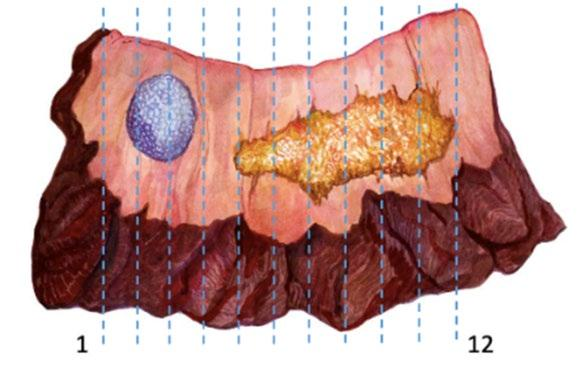
Penis_4.2.0.0.REL_CAPCP
13
Resurfacing and Glansectomies (Figures 2 and 3)
The glans surface is marked by the surgeon into four quadrants radiating out from the meatus to the
coronal sulcus. The glans mucosa is dissected out between the subepithelial tissues and corpus
spongiosum although often small areas of corporal tissue are found attached to the specimen which
measure 0.5-2mm in thickness (Corbishley Seminars). In glansectomies there are no special anatomical
indications and sections should be made perpendicular to the tumor in sequential slices inking the deep
resection margin which is usually at the level of corpus spongiosum, but a portion of the tunica albuginea
may be present.
Figure 2. Resurfacing specimen (lesion indicated in purple). Glans surface incisions in quadrants before
resection (A). After resection, margins are indicated in red (B). Submit tissue in sequence as indicated by
the vertical lines (Courtesy of Dr. C. Corbishley).
Figure 3. Glansectomy specimen. Exophytic tumor on glans surface (A). After sectioning, tumor is white
with sharply delineated front (B). Histology showed a verrucous carcinoma. Corpus spongiosum (CS) and
urethra (U) are not involved. Surgical margin is denoted in broken lines.
Penectomy Specimen (Figures 4 and 5)
Take measurements, describe specimen, and identify and describe tumor. Most SCCs of the penis arise
from the epithelium of the distal portion of the organ (glans, coronal sulcus, and mucosal surface of the
prepuce; the tumor may involve one or more of these anatomical compartments) If present, classify the
foreskin as short, medium, long, and/or phimotic. Cut the proximal margin of resection en face making
sure to include the entire circumference of the urethra (Figure 5). If the urethra has been retracted, it is
important to identify its resection margin and submit it entirely. The resection margin can be divided into
three important areas that need to be analyzed: the skin of the shaft with underlying dartos and penile
fascia; corpora cavernosa with albuginea; and urethra with periurethral cylinder that includes subepithelial
connective tissue (lamina propria), corpus spongiosum, albuginea, and penile fascia (Figure 5). The
urethra and periurethral cylinder can be placed in one cassette. The skin of the shaft with dartos and
fascia can be included together with the corpora cavernosa. Because this is a large specimen, it may
need to be included in several cassettes to include the entire resection margin. Fix the rest of the
specimen overnight. Then, in the fixed state and if the tumor is large and involves most of the glans, cut
longitudinally and centrally by using the meatus and the proximal urethra as reference points. Do not
probe the urethra. Separate the specimen into halves, left and right. Then cut two to six serial sections of
each half. If the tumor is small and asymmetrically located in the dorsal or ventral area, the central portion
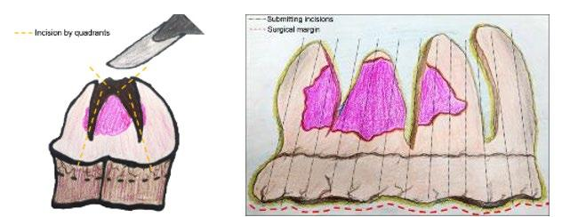
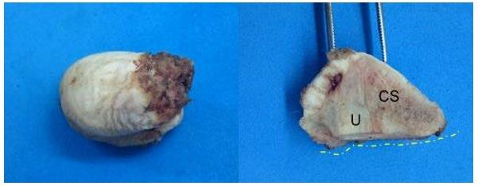
Penis_4.2.0.0.REL_CAPCP
14
of the tumor may be used as the axis of sectioning. If the tumor is large involving multiple sites (glans,
sulcus, and foreskin), it is important not to remove the foreskin leaving the entire specimen intact for
sectioning.
In cases of small carcinomas exclusively located in the glans with no foreskin involvement, one may
choose to remove the foreskin leaving a 3-mm redundant edge around the sulcus. Proceed cutting the
foreskin as indicated for circumcision specimens. If the primary tumor is located in the glans, one should
still submit the foreskin serially and in an orderly fashion labeled from 1 to 12 clockwise. The rest of the
penectomy specimen should be handled as described above.
Figure 4. Partial penectomy specimen. Vertical lines indicate anatomical sites. Horizontal lines indicate
sectioning method, central and sagittal. S, Shaft; F, foreskin; COS, coronal sulcus; G, glans; M, meatus;
FR, frenulum; GC, glans corona; CL, center line.
Figure 5. Cut surface of partial penectomy specimen. Above there is the sagittal cut. All anatomical layers
from glans, coronal sulcus, and foreskin are grossly evident. Below is the central cut with urethra
separating superior from inferior glans.
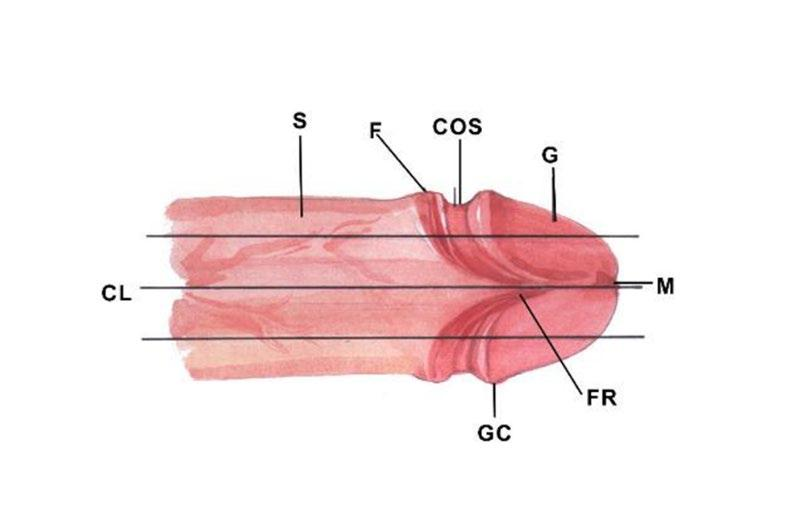
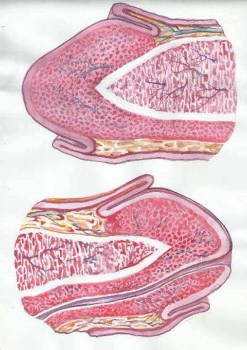
Penis_4.2.0.0.REL_CAPCP
15
C. Types of Foreskin
There are three foreskin types (Figure 6): in the short foreskin, the preputial orifice is located behind the
glans corona; in the medium foreskin, the orifice is between the corona and the meatal orifice; in the long
foreskin, the entire glans is covered and the meatus is not identified without retracting the foreskin.
Phimotic foreskins are unretractable and long.1 Phimosis is present in up to one-half of patients with
penile carcinoma1, and its presence is considered a risk factor for the development of this tumor.2,3,4
Figure 6. Types of foreskin, long (A), medium (B) and short (C). C, corona; M, meatus; COS, coronal
sulcus.
References
1. Velazquez EF, Bock A, Soskin A, Codas R, Arbo M, Cubilla AL. Preputial variability and
preferential association of long phimotic foreskins with penile cancer: an anatomic comparative
study of types of foreskin in a general population and cancer patients. Am J Surg Pathol.
2003;27(7):994-998.
2. Daling J, Madeleine MM, Johnson LG, et al. Penile cancer: importance of circumcision, human
papillomavirus and smoking in in situ and invasive disease. Int J Cancer. 2005;116(4):606-616.
3. Tsen HF, Morgenstern H, Mack T, Peters RK. Risk factors for penile cancer: results of a
population-based case-control study in Los Angeles County (United States). Cancer Causes
Control. 2002;12(3):267-277.
4. Madsen BS, van den Brule AJ, Jensen HL, Wholfahrt J, Frisch M. Risk factors for squamous cell
carcinoma of the penis: population-based case-control study in Denmark. Cancer Epidemiol
Biomarkers Prev. 2008;17(10):2683-2691.
D. Tumor Focality
Focality refers to one (unifocal) or more (multifocal) independent primary tumors in the same specimen or
anatomical site. Multifocal tumors are separated by non-neoplastic tissue. A whole organ section with
tridimensional reconstruction is required to qualify a tumor as multifocal. Multicentricity is a clinical or
gross concept and it refers to the non-tridimensional observation of more than one tumor in the same
specimen detected in routine sections. Most invasive penile carcinomas are unifocal, but about 8-10% of
the cases present as multifocal lesions.1 Primary preputial carcinomas tend to be multifocal, especially
those associated with extensive lichen sclerosus. A prototype is the Pseudo-hyperplastic variant of
squamous cell carcinoma (Figure 7).2 Compared with invasive carcinomas, PeIN lesions are more
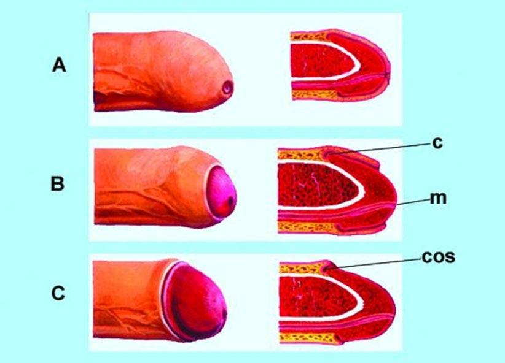
Penis_4.2.0.0.REL_CAPCP
16
frequently multifocal in various sites (glans, sulcus, foreskin, and/or skin of the shaft), especially those
associated with HPV.3,4
Figure 7. Multicentric tumors: pseudohyperplastic carcinoma of the foreskin (A) and verrucous carcinoma
(B) associated with lichen sclerosus. SK (skin), DT (dartos), LP (lamina propria), E (epithelium with
squamous hyperplasia), VC (verrucous carcinoma), CA (pseudohyperplastic carcinoma, COS (coronal
sulcus).
References
1. Cubilla AL, Barreto J, Caballero C, et al. Pathologic features of epidermoid carcinoma of the
penis. A prospective study of 66 cases. Am J Surg Pathol. 1993;17:753-763.
2. Cubilla AL, Velazquez EF, Young RH. Pseudohyperplastic squamous cell carcinoma of the penis
associated with lichen sclerosus. An extremely well-differentiated, nonverruciform neoplasm that
preferentially affects the foreskin and is frequently misdiagnosed: a report of 10 cases of a
distinctive clinicopathologic entity. Am J Surg Pathol. 2004;28:895-900.
3. Oertell J, Caballero C, Iglesias M, et al. Differentiated precursor lesions and low-grade variants of
squamous cell carcinomas are frequent findings in foreskins of patients from a region of high
penile cancer incidence. Histopathology. 2011;58:925-933.
4. Fernandez-Nestosa MJ, Guimera N, et al. Comparison of Human Papillomavirus Genotypes in
Penile Intraepithelial Neoplasia and Associated Lesions: LCM-PCR Study of 87 Lesions in 8
Patients. Int J Surg Pathol. 2020;28:265-272.
E. Tumor Site
Tumor sites are the glans, coronal sulcus, foreskin, the skin of the shaft, and penile (distal) urethra
(Figure 8). Unlike urothelial tumors arising in the proximal urethra, more than half of tumors arising in the
penile urethra are non-urothelial and morphologically indistinguisible from tumors originating in the
glans.1,2 The information on tumor location is scant, variable, or not very reliable. The reasons are the
lack of knowledge of penile anatomy, the lack of interest of clinicians and pathologists to precisely define
the site of the tumor, the confusion of location with sites of origin, and, especially, in regions endemic for
penile cancer, the large size of tumors affecting more than one site and effacing the normal boundaries of
the anatomical compartments. In one prospective study, 56% of all cancer cases involved multiple
compartments.3 Excluding these large neoplasms, where sites of involvement are not clear, the majority
of penile squamous cell carcinomas originate in the glans (80%), foreskin (15%), or coronal sulcus
(Figures 9 and 10).4,5,6Tumors arising in the skin of the shaft7 or outer surface of the foreskin are most
unusual). We have not seen tumors arising in the foreskin outer surface skin. Site of origin is not
synonymous with tumors involving anatomical sites. There are tumors with superficially spreading or
multicentric patterns that may affect or originate in more than one compartment.6 To evaluate prognosis
by anatomical site, only tumors compromising one epithelial compartment should be considered.
The main reason for establishing site of tumor as a required data for the pathology report is that
carcinomas exclusive of the foreskin are associated with a better prognosis than those limited to the
glans. Circumcision is the most common treatment modality for carcinomas of foreskin, and recurrences
were reported to be less frequent in foreskin carcinomas than in those of glans.8 Glans carcinomas are
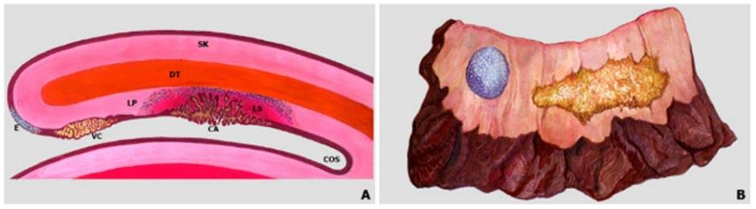
Penis_4.2.0.0.REL_CAPCP
17
comparatively of higher grade, associated with HPV and with infiltration of deeper anatomical layers.
Carcinomas of the foreskin are less likely to be associated with HPV than glans carcinomas, are more
likely to be associated with lichen sclerosus, and show a lower frequency of regional metastasis.9,10
Figure 8. Anatomical Sites and Levels. Compartments: G (glans), F (foreskin), COS (coronal sulcus), S
(shaft), U (urethra). Levels: E (epithelium), LP (Lamina propria), CS. (Corpus spongiosum), TA (Tunica
albuginea), CC (corpus cavernosum), Dt (dartos), d (dermis), ep (epidermis), PF (penile fascia). Note the
mucosal epithelium inner surface of the foreskin (in purple) in contrast with the epidermis (in brown).
Figure 9. Tumor involving one anatomical site at the coronal sulcus (CA). GL, Glans; F, Foreskin;
COS, Coronal Sulcus, PF, penile fascia.
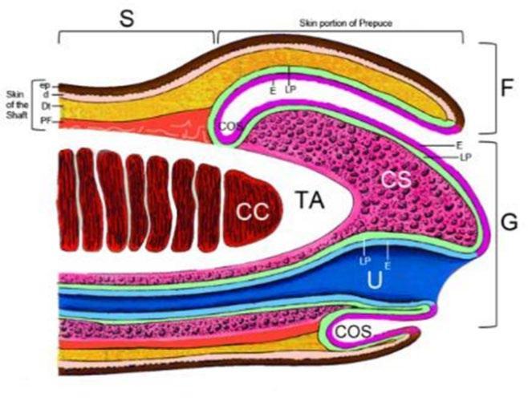
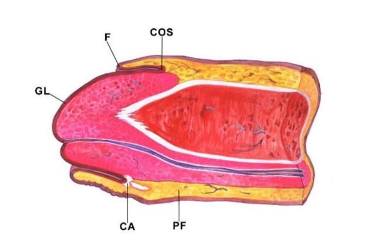
Penis_4.2.0.0.REL_CAPCP
18
Figure 10. Tumor affecting multiple compartments. Diagrammatic representation of an exo-endophytic
tumor (condylomatous-warty carcinoma) replacing the distal penis.EG, endophytic growth. Tumor
involves glans (GL), coronal sulcus (COS), and foreskin inner mucosal epithelium (F).
References
1. Cubilla AL, Barreto J, Caballero C, Ayala G, Riveros M. Pathologic features of epidermoid
carcinoma of the penis. A prospective study of 66 cases. Am J Surg Pathol. 1993;17:753-763.
2. Cubilla AL, Velazquez EF, Young RH. Pseudohyperplastic squamous cell carcinoma of the penis
associated with lichen sclerosus. An extremely well-differentiated, nonverruciform neoplasm that
preferentially affects the foreskin and is frequently misdiagnosed: a report of 10 cases of a
distinctive clinicopathologic entity. Am J Surg Pathol. 2004;28:895-900.
3. Oertell J, Caballero C, Iglesias M, et al. Differentiated precursor lesions and low-grade variants of
squamous cell carcinomas are frequent findings in foreskins of patients from a region of high
penile cancer incidence. Histopathology. 2011;58:925-933.
4. Fernandez-Nestosa MJ, Guimera N, Sanchez DF, et al. Comparison of Human Papillomavirus
Genotypes in Penile Intraepithelial Neoplasia and Associated Lesions: LCM-PCR Study of 87
Lesions in 8 Patients. Int J Surg Pathol. 2020;28;265-272.
5. Epstein JI, Magi-Galluzzi C, Zhou M, Cubilla AL. Tumors of the Prostate Gland, Seminal Vesicles,
Penis, and Scrotum. S.l.: American Registry of Pathology, 2020.
6. Moch H, Amin MB, Berney DM, et al. The 2022 World Health Organization Classification of
Tumours of the Urinary System and Male Genital Organs-Part A: Renal, Penile, and Testicular
Tumours. Eur Urol. 2022.
7. Moch H, Cubilla AL, Humphrey PA, et al. The 2016 WHO Classification of Tumours of the Urinary
System and Male Genital Organs-Part A: Renal, Penile, and Testicular Tumours. Eur Urol.
2016;70:93-105.
8. Bezerra SM, Chaux A, Ball MW, et al. Human papillomavirus infection and immunohistochemical
p16(INK4a) expression as predictors of outcome in penile squamous cell carcinomas. Hum
Pathol. 2015;46:532-540.
9. Chahoud J, Zacharias NM, Pham R, et al. Prognostic Significance of p16 and Its Relationship
with Human Papillomavirus Status in Patients with Penile Squamous Cell Carcinoma: Results of
5 Years Follow-Up. Cancers (Basel). 2022;14.
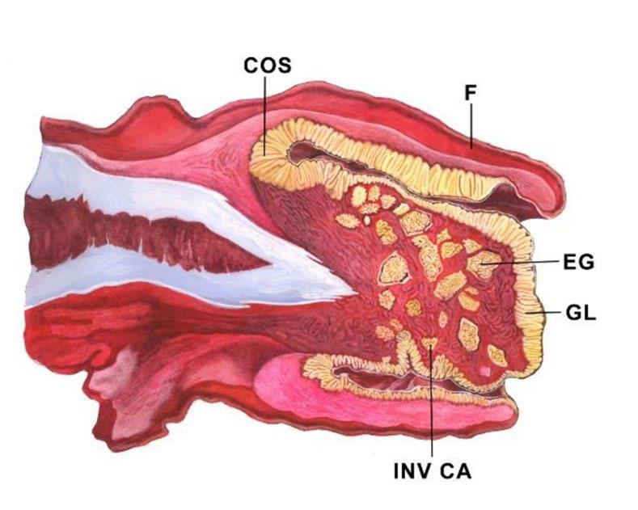
Penis_4.2.0.0.REL_CAPCP
19
10. Sand FL, Rasmussen CL, Frederiksen MH, et al. Prognostic Significance of HPV and p16 Status
in Men Diagnosed with Penile Cancer: A Systematic Review and Meta-analysis. Cancer
Epidemiol Biomarkers Prev. 2018;27:1123-1132.
F. Macroscopic Features
Gross features in invasive penile carcinoma are variable but, in many cases, distinctive permitting a gross
diagnosis. The most common is that of an ulcerative non-exophytic tumor mass, not infrequent is the
verruciform pattern observed in a third of all cases, or a superficial flat and rarely a polypoid mass. A
mixed combination of these features also occurs. The common subtype of SCC usually presents with a
non-exophytic ulcerated mass whereas there are various tumor subtypes presenting as verruciform,
typically the verrucous, condylomatous, and papillary NOS carcinomas. Warty carcinomas have a more
uniform and homogeneous micronodular appearance whereas verrucous carcinomas show an
asymmetrical larger coarser nodularity. Classical or Giant condylomas may be grossly similar to
condylomatous and verrucous carcinomas. Sarcomatoid carcinomas classically present as a polypoid
and or necrotic and hemorrhagic mass (Figure 11).
Cut surface on a penectomy specimen may identify special tumors. The papillomatous feature with a dark
central core is characteristic of warty carcinomas (Figure 12). The sharply delineated tumor front is
present in giant condylomas and verrucous carcinomas (Figure 13). The ulcerating and solid beige
features with minute yellow necrotic foci is seen in basaloid carcinomas. Carcinoma cuniculatum
diagnosis is made on the basis of a gross tumor burrowing pattern of growth.
Figure 11. Polypoid necrotic and hemorrhagic sarcomatoid carcinoma. In green there is viable tumor
invading corpus cavernosum after destruction of the tunica albuginea.
Figure 12. Cut surface of warty (condylomatous) carcinoma involving glans and foreskin.
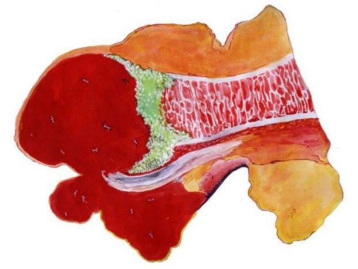
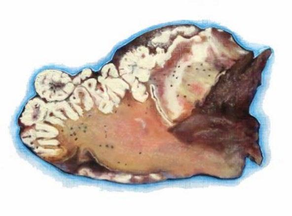
Penis_4.2.0.0.REL_CAPCP
20
Figure 13. Cut surface of verrucous carcinoma (VC) of glans. VH, verrucous hyperplasia; SH, squamous
hyperplasia; U, urethra; F, Foreskin.
G. Tumor Size
Gross tumor measurement in penile carcinomas may be done in three dimensions in cm but measuring
the maximum diameter should suffice. The TNM staging system does not consider the size of penile
tumors as an important criterion for classification. Metastasizing and non-metastasizing tumors are of
similar size in some studies but not in all.1,2 Tumors diagnosed in tropical developing countries tend to be
larger and more invasive than those from northern countries indicating a higher stage at diagnosis.
The apparent lack of correlation between tumor size and nodal spread or patients’ outcome may be due
to the inclusion of verruciform and non-verruciform tumors as one group in the studies evaluating
prognosis. Verruciform carcinomas (verrucous, papillary NOS, and warty [condylomatous]) are rarely
associated with metastasis, irrespective of their size. Cuniculatum carcinoma, among the largest penile
carcinomas, are not associated with regional or distant spread.3 These neoplasms comprise at least a
third of all penile tumors and are usually of large size, in fact significantly larger than other types of
squamous cell carcinomas of the penis except the sarcomatoid variant. Tumor size may be a significant
prognostic marker when verruciform neoplasms are excluded from the evaluation. We found no studies
specifically addressing this approach of size evaluation.
References
1. Guimaraes GC, Cunha IW, Soares FA, et al. Penile squamous cell carcinoma clinicopathological
features, nodal metastasis and outcome in 333 cases. J Urol. 2009;182:528-534.
2. Kawase M, Takagi K, Kawada K, et al. Clinical Lymph Node Involvement as a Predictor for
Cancer-Specific Survival in Patients with Penile Squamous Cell Cancer. Curr Oncol.
2022;29:5466-5474.
3. Barreto JE, Velazquez EF, Ayala E, et al. Carcinoma cuniculatum: a distinctive variant of penile
squamous cell carcinoma: report of 7 cases. Am J Surg Pathol. 2007;31:71-75.
H. Histologic Subtype of Squamous Cell Carcinoma
The World Health Organization (WHO) classification of tumors of the penis was recently published.1 Most
penile cancers are squamous cell carcinomas (SCC), and most arise from the epithelium of the distal
portion of the penis (including glans, coronal sulcus, and mucosal surface of the foreskin). Squamous cell
carcinoma of the usual type (keratinizing SCC) comprises about 50% to 60% of all cases.2,3,4 There are
other SCC subtypes showing distinctive morphological and outcome features.3,4,5 The different
histological subtypes correlate with different rates of regional/nodal and systemic dissemination.
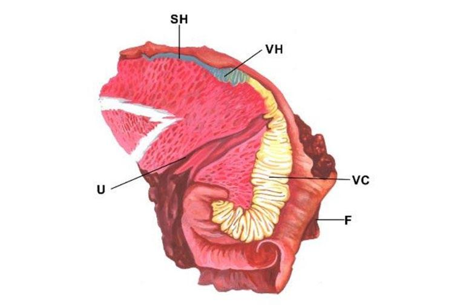
Penis_4.2.0.0.REL_CAPCP
21
Squamous cell carcinoma are broadly defined as HPV-associated and HPV-independent. If ancillary
studies to make that distinction are not available, “Squamous cell carcinoma NOS” can be used. The
latest WHO edition aimed at simplifying the squamous cell carcinoma subtypes by grouping distinct
morphologic subtypes which have similar behavior and pathogenesis, under one encompassing parent
subtype. For example, pseudohyperplastic and acantholytic/ pseudoglandular patterns are eclipsed under
HPV-independent squamous cell carcinoma of the usual type. Similarly, carcinoma cuniculatum is
included in verrucous carcinoma. When more than one histologic pattern is present, using “mixed”
subtype and specifying the different histologies is encouraged. Unusual HPV-positive poorly differentiated
carcinomas with tumor-associated inflammatory cells and medullary features have been reported.5
Penile cancer subtypes can be prognostically stratified into three groups. The low-risk group includes
verruciform tumors such as verrucous, papillary, and warty/condylomatous carcinomas.6,7 More recently
described histologic patterns, such as pseudohyperplastic and carcinoma cuniculatum of the penis, also
belong to this category of excellent prognosis.8,9The high-risk category is comprised of basaloid,
sarcomatoid, adenosquamous, and poorly differentiated SCC of the usual type.10,11,12There is an
intermediate category of metastatic risk that includes most SCCs of the usual type, some mixed
neoplasms (such as hybrid verrucous carcinomas), and high-grade variants of warty/condylomatous
carcinomas.7
References
1. Moch H, Amin MB, Berney DM, et al. The 2022 World Health Organization Classification of
Tumours of the Urinary System and Male Genital Organs-Part A: Renal, Penile, and Testicular
Tumours. Eur Urol. 2022.
2. Epstein JH, Humphrey PA, Cubilla AL. Tumors of the Prostate Gland, Seminal Vesicles, Male
Urethra, Penis and Scrotum. Washington, DC: Armed Forces Institute of Pathology; 2011 Atlas of
Tumor Pathology.
3. Cubilla AL, Dillner J, Schellhammer PF, Horenblas S. Malignant epithelial tumors. In: Eble JN,
Sauter G, Epstein J, Sesterhenn I, eds. Pathology and Genetics of Tumors of the Urinary System
and Male Genital Organs. Lyon, France: IARC Press; 2004. World Health Organization
Classification of Tumours.
4. Velazquez EF, Barreto JE, Ayala G, Cubilla AL. Penis. In: Mills SE, Carter D, Greenson JK, et al,
eds. Sternberg’s Diagnostic Surgical Pathology. 5th ed. Philadelphia, PA: Lippincot Williams &
Wilkins; 2009.
5. Canete-Portillo S, Clavero O, Sanchez DF, et al. Medullary Carcinoma of the Penis: A Distinctive
HPV-related Neoplasm: A Report of 12 Cases. Am J Surg Pathol. 2017;41:535-540.
6. Cubilla AL, Reuter V, Velazquez E, Piris A, Saito S, Young RH. Histologic classification of penile
carcinoma and its relation to outcome in 61 patients with primary resection. Int J Surg Pathol.
2001;9:111-120.
7. Cubilla AL, Velazques EF, Reuter VE, Oliva E, Mihm MC Jr, Young RH. Warty (condylomatous)
squamous cell carcinoma of the penis: a report of 11 cases and proposed classification of
verruciform tumors penile tumors. Am J Surg Pathol. 2000;24:505-512.
8. Cubilla AL, Velazquez EF, Young RH. Pseudohyperplastic squamous cell carcinoma of the penis
associated with lichen sclerosus — an extremely well-differentiated nonverruciform neoplasm that
preferentially affects the foreskin and is frequently misdiagnosed: a report of 10 cases of a
distinctive clinicopathologic entity. Am J Surg Pathol. 2004;28:895-900.
9. Barreto JE, Velazquez EF, Ayala E, Torres J, Cubilla AL. Carcinoma cuniculatum of the penis —
a distinctive variant of penile squamous cell carcinoma: report of 7 cases. Am J Surg
Pathol. 2007;31:71-75.
10. Cubilla AL, Reuter VE, Gregoire L, et al. Basaloid squamous cell carcinoma: a distinctive HPV
related penile neoplasm: a report of 20 cases. Am J Surg Pathol. 1998;22:751-761.
Penis_4.2.0.0.REL_CAPCP
22
11. Velazquez EF, Melamed J, Barreto JE, Aguero F, Cubilla AL. Sarcomatoid carcinoma of the
penis: a clinico-pathological study of 14 cases. Am J Surg Pathol. 2005;29:1152-1158.
12. Cubilla AL, Ayala MT, Barreto JE, Bellasai JG, Nöel JC. Surface adenosquamous carcinoma of
the penis: a report of three cases. Am J Surg Pathol. 1996;20:156-160.
I. Verruciform Tumors (special consideration)
Verruciform neoplasms of the penis are a heterogenous group of benign or low-grade malignant
exophytic tumors representing about a third of all penile malignant tumors and due to confusing older
literature, most problematic to diagnose. Some of them are non-HPV related and others are HPV related.
They are Verrucous carcinoma, warty (condylomatous) carcinoma, papillary carcinoma NOS and typical
and giant condylomas (Buschke-Lowenstein tumor) and their mixtures or variants. The differential
diagnosis may be challenging to the inexperienced pathologist but there are distinctive features to help
delineate in Figure 14.
Figure 14. Verruciform tumors: Diagrammatic representation and histology of common verruciform
tumors.
J. Histologic Grade
Histological grade has been consistently reported as an influential predictive factor of groin metastasis
and dissemination of penile cancer.1,2,3 We recommend a method to grade penile SCCs as follows:
•
Grade 1 is an extremely well-differentiated carcinoma, with a minimal deviation from the
morphology of normal/hyperplastic squamous epithelium.
•
Grade 2 tumors show a more disorganized growth as compared to grade 1 lesions, higher
nuclear-to-cytoplasmic ratio, evident mitoses, and, although present, less prominent
keratinization.
•
Grade 3 are tumors showing any proportion of anaplastic cells, identified as solid sheets or
irregular small aggregates, cords or nests of cells with little or no keratinization, high nuclear-to-
cytoplasmic ratio, thick nuclear membranes, nuclear pleomorphism, clumped chromatin,
prominent nucleoli, and numerous mitosis.3,4
A tumor should be graded according to the least differentiated component. Any proportion of grade 3
should be noted in the report.4
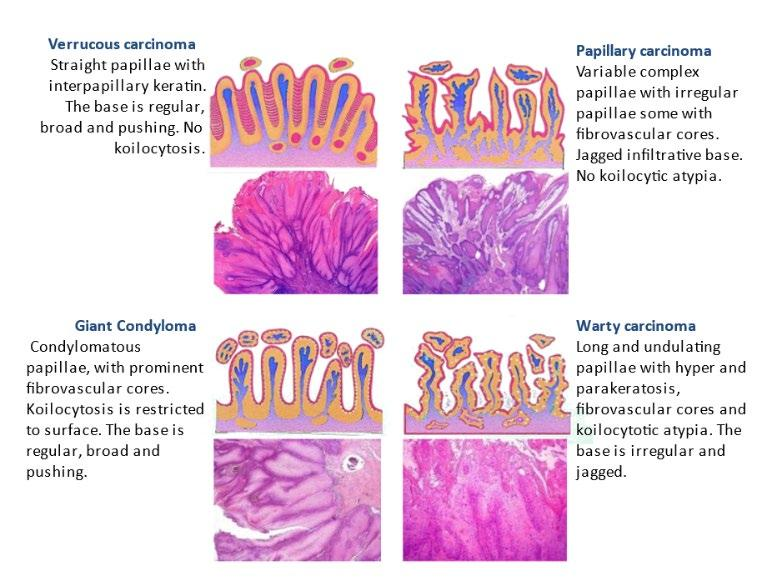
Penis_4.2.0.0.REL_CAPCP
23
References
1. Slaton JW, Morgenstern N, Levy DA, et al. Tumor stage, vascular invasion and the percentage of
poorly differentiated cancer: independent prognosticators for inguinal node metastasis in penile
squamous cancer. J Urol. 2001;165:1138-1142.
2. Cubilla AL, Velazquez EF, Ayala GE, et al. Identification of prognostic pathologic parameters in
squamous cell carcinoma of the penis: significance and difficulties. Pathol Case Rev. 2005;10:3-
13.
3. Velazquez EF, Ayala G, Liu H, et al. Histologic grade and perineural invasion are more important
than tumor thickness as predictor of nodal metastasis in penile squamous cell carcinoma invading
5 to 10 mm. Am J Surg Pathol. 2008;32:974-979.
4. Chaux A, Torres J, Pfannl R, et al. Histologic grade in penile squamous cell carcinoma: visual
estimation versus digital measurement of proportions of grades, adverse prognosis with any
proportion of grade 3 and correlation of a Gleason-like system with nodal metastasis. Am J Surg
Pathol. 2009;33:1042-1048.
K. Thickness/Depth of Invasion
The tumor depth in small lesions is best obtained by perpendicularly sectioning along the tumor's central
axis. For large glans tumors, it is preferred to section the specimen longitudinally in half, with additional
parallel sections of each half, using as an axis the central and ventral penile urethra. The depth of
invasion of SCC is defined as a measurement in millimeters from the epithelial-stromal junction of the
adjacent nonneoplastic epithelium to the deepest point of invasion. In larger tumors, especially
verruciform ones, the previously mentioned system is not applicable, and we measure the thickness from
the surface (excluding the keratin layer) to the deepest point of invasion (Figure 15). Depth of invasion
and tumor thickness are of equivalent significance.
There is a correlation between depth of invasion and outcome in penile cancers. Minimal risk for
metastasis was reported for tumors measuring less than 5 mm in thickness.1,2Tumors invading deeper
into penile anatomical levels are usually associated with a higher risk for nodal involvement. There is also
a correlation between deeper infiltration and higher histological grade, although some exceptions do
occur.3Tumors invading corpus cavernosum are at higher risk for nodal metastases than those invading
only corpus spongiosum,3,4 and the deepest erectile tissue invaded should be clearly stated in the final
pathology report. Per AJCC 8 edition, tumor invading into subepithelial connective tissue (lamina propria),
Dartos muscle, and Buck’s fascia is staged as T1; tumor invading into corpus spongiosum (either glans or
ventral shaft) with or without urethral invasion is staged as T2; tumor invading into corpora cavernosum
(including tunica albuginea) with or without urethral invasion is staged as T3; and tumor invading into
adjacent structures (i.e., scrotum, prostate, pubic bone) is staged as T4.
Penis_4.2.0.0.REL_CAPCP
24
Figure 15. Methods for measurement for non-verruciform and verruciform tumors. CA represents depth of
invasion in a usual squamous cell carcinoma invading corpus spongiosum (CS). VC represents thickness
of a verrucous carcinoma (VC) with a broadly based invasive front. CC, corpus cavernosum.
References
1. Velazquez EF, Ayala G, Liu H, et al. Histologic grade and perineural invasion are more important
than tumor thickness as predictor of nodal metastasis in penile squamous cell carcinoma invading
5 to 10 mm. Am J Surg Pathol. 2008;32:974-979.
2. Emerson RE, Ulbright TM, Eble JN, et al. Predicting cancer progression in patients with penile
squamous cell carcinoma: the importance of depth of invasion and vascular invasion. Mod Pathol.
2001;14:963-968.
3. Leijte J, Gallee M, Antonini N, et al. Evaluation of current TNM classification of penile carcinoma.
J Urol. 2008;180:933-938.
4. Chaux A, Caballero C, Soares F, et al. The prognostic index: a useful pathologic guide for
prediction of nodal metastases and survival in penile squamous cell carcinoma. Am J Surg
Pathol. 2009;33:1049-1057.
L. Tumor Base of Infiltration
Two patterns are recognized: infiltrating (invasion in blocks of small solid strands of cell tumors broadly
infiltrating the stroma) and pushing infiltration (tumor cells invading in large cell blocks with well-defined
tumor-stroma interface). The infiltrating pattern of invasion is associated with a higher risk for nodal
involvement.1
References
1. Guimarães G, Lopes A, Campos RS, et al. Front pattern of invasion in squamous cell carcinoma
of the penis: new prognostic factor for predicting risk of lymph node metastases. Urology.
2006;68:148-153.
M. Tumor Deep Borders
There has been some confusion in the reporting of the deep border of invasion or tumor front. Along the
staging models, terminologies were not always sufficiently clear to communicate pathological facts. This
resulted in a lack of precision and consensus in the definition of terms such as invasive vs. non-invasive
and localized vs. non-localized cancers. With the purpose of clarification, we are suggesting four features

Penis_4.2.0.0.REL_CAPCP
25
or patterns of tumor growth and invasion in relation to current staging1: 1. Non-invasive, 2. Invasive,
broadly-based non-destructive, 3. Invasive, destructive but well-delineated front en bloc, 4. Invasive,
destructive, irregular, finger-like front.
1. Non-invasive neoplasm: it is a tumor growing above the level of the squamous epithelium, sparing
lamina propria of glans, coronal sulcus, and foreskin or shaft dermis (Figure 16 A). A non-invasive
neoplasm is like an in situ lesion but is especially applied to exophytic or bulkier clinically evident tumor
growing above the level of the basal cell layer. All lesions growing at or above the level of the basal
epithelium are staged as pTa.
2. Invasive (localized) neoplasm with a broadly-based pushing tumor front: the tumor grows into
lamina propria or corpus spongiosum or deeper, it is solid without separated nests and the interface
between neoplasm and stroma is regular and broadly based. The growth may be in ample sheets or in
scalloped undulating borders (Figure 16 B). Whereas there was some disagreement in the nomenclature
of broadly-based tumors being invasive or non-invasive, most of our colleagues now consider broadly-
based invasion to any tumor growing beyond the limits of the basal layer squamous epithelia into lamina
propria. What is clinically important is the fact that differentiated tumors either non-invasive (in situ) or
invasive but with a sharply delineated broadly-based tumor front have no risk of regional metastasis.
Applying strictly current terminology these broadly-based but invasive tumors should be staged at least as
pT1 and/or according to their anatomical level of invasion, which in case of verrucous carcinomas may be
quite deep. However, analogically to bladder pTa tumors pushing into lamina propia with a broad-base,
these rare tumors may still be considered, albeit technically invasive, as localized. It is our opinion that
since they have no metastatic potential, independent of their level of invasion, they should be classified
as pTa.
3. Invasive neoplasm with a destructive irregular front but en bloc, well-delineated margins: Front
of invasion is not broadly-based but destructive, albeit there is a well-delineated border between tumor
and stroma (Figure 16 C). Lamina propria and deeper anatomical levels are compromised. This pattern of
invasion, described by Aita et al was found to be associated with better prognosis comparing with
irregular finger-like invasion.2 It is validated and it is part of a recently proposed predictive scoring index
for penile cancer.3,4 Tumors with these features are staged as at least pT1.
4. Invasive neoplasm with an irregular/destructive finger-like tumor front: the limits of tumor and the
stroma are irregular, destructive, finger-like. Lamina propria or deeper anatomical levels are compromised
by the tumors (Figure 16 D). Tumors in this stage of invasion are classified as at least pT1.
Penis_4.2.0.0.REL_CAPCP
26
Figure 16. Patterns of invasion. Non-invasive neoplasm (A). Invasive (localized) (B) neoplasm with a
broadly-based pushing tumor front. Invasive neoplasm with a destructive irregular front but en bloc, well-
delineated margins (C). Invasive neoplasm with an irregular/destructive finger-like tumor front (D).
References
1. Sanchez DF, Fernandez-Nestosa MJ, Canete-Portillo S, et al. What Is New in the Pathologic
Staging of Penile Carcinoma in the 8th Edition of AJCC TNM Model: Rationale for Changes With
Practical Stage-by-stage Category Diagnostic Considerations. Adv Anat Pathol. 2021;28:209-
227.
2. Guimaraes GC, Lopes A, Campos RS, et al. Front pattern of invasion in squamous cell
carcinoma of the penis: new prognostic factor for predicting risk of lymph node metastases.
Urology. 2006; 68;148-153.
3. Menon H, Patel RR, Ludmir EB, et al. Local management of preinvasive and clinical T1-3 penile
cancer: utilization of diverse treatment modalities. Future Oncol. 2020;16:955-960.
4. Sali AP, Menon S, Murthy V, et al. A Modified Histopathologic Staging in Penile Squamous Cell
Carcinoma Predicts Nodal Metastasis and Outcome Better Than the Current AJCC Staging. Am J
Surg Pathol. 2020;44;1112-1117.
N. Tumor Extent
The anatomy of the penis is complex and there are distinctive anatomical sites with variable tissue layers
composition.1 Tumors may in an exclusive manner originate in the glans, the foreskin, the coronal sulcus
or the shaft, in this order of frequency. Not uncommonly, especially in specimens from patients from
southern tropical countries, large tumors involve more than one site. Superficially spreading carcinomas
may horizontally grow affecting more than one site (Figure 17).2 Tumors of the foreskin tend to be better
differentiated and associated with lichen sclerosus, carrying a better prognosis than those exclusive of the
glans. For this reason, is recommended to evaluate tumor extension according to separate anatomical
sites.
In the glans, tissue layers for tumor invasion are lamina propria, corpus spongiosum, tunica albuginea
and corpus cavernosum. The tunica is part of the corpus cavernosum. In the foreskin the layers are
lamina propria, dartos and skin (dermis and epidermis) (Figure 18).1 In the shaft, a recent evaluation of
primary tumors exclusive of this site observed the following layers in relation to tumor invasion: skin,
dartos, penile (Buck) fascia, tunica albuginea and corpus cavernosum (Figure 19).3 Tumors primary at the
sulcus are very rare and we did not find a histological evaluation of tumor invasion of this site according to
anatomical layers.

Penis_4.2.0.0.REL_CAPCP
27
Figure 17. Tumor extension. Extension of tumor (in green) from glans to penile fascia (A). Lamina propria
spread (B): Tumor growths along the lamina propria in glans, coronal sulcus and foreskin.
Figure 18. Extent, anatomical levels of invasion. Carcinomas of Glans: Each spot represents one case
invading a specific anatomical level. Cases above the broken horizontal line (in blue) had negative
inguinal nodes. Cases below the line (in red) had positive nodes. Carcinomas exclusive of the Foreskin:
Tumor invasion is from inner mucosa to skin (arrow). Blue and red spots indicate tumor deepest invasion
point by anatomical level.
Figure 19. Cross section of penile shaft. Anatomical levels from Surface to Deep: epidermis, dermis,
dartos, penile (Buck) fascia, tunica albuginea and corpus cavernosum.
References
1. Velazquez EF, Barreto JE, Canhete-Portillo S, Cubilla AL. Penis and Distal Urethra. In: Mills SE,
ed. Histology for Pathologists. Wolters Kluwer, 2020;1009-1028.
2. Cubilla AL, Barreto J, Caballero C, et al. Pathologic features of epidermoid carcinoma of the
penis. A prospective study of 66 cases. Am J Surg Pathol. 1993;17:753-763.
3. Tekin B, Guo R, Cheville JC, Canete-Portillo S, et al. Penile squamous cell carcinoma exclusive
to the shaft, with a proposal for a novel staging system. Hum Pathol. 2023;134:92-101.
O. Lymphatic and/or Vascular Invasion
Vascular invasion, lymphatic or venous, adversely affects prognosis of penile cancer.1,2,3,4,5The TNM
staging classification in the 8th edition of the AJCC Cancer Staging Manual subdivides T1 tumors into

Penis_4.2.0.0.REL_CAPCP
28
T1a and T1b based on the absence or presence of lymphatic and/or vascular invasion or poorly
differentiated tumors.6 Embolic involvement of lymphatic vascular spaces occurs usually near the invasive
tumor front, but it may also be found at a certain distance from the primary tumor in anatomical areas
such as the lamina propria, penile fascia, and especially in the subepithelial connective tissues
surrounding penile urethra. Venous invasion indicates a more advanced stage of the disease and is
related to the compromise of the specialized erectile venous structures of corpora spongiosa and
cavernosa.
References
1. Lopes A, Hidalgo GS, Kowalski LP, et al.  Prognostic factors in carcinoma of the penis:
multivariate analysis of 145 patients treated with amputation and lymphadenectomy. J
Urol. 1996;156:1637-1642.
2. Ficarra V, Zattoni F, Cunisco SC, et al. Lymphatic and vascular embolizations are independent
predictive variables of inguinal node involvement in patients with squamous cell carcinoma of the
penis: Gruppo Uro-Oncologico del Nord Est (Northeast Uro-Oncological Group) Penile Cancer
data base data. Cancer. 2005;103:2507-2516.
3. Ficarra V, Zattoni F, Artibani W, et al; GUONE Penile Cancer Project Members. Nomogram
predictive of pathological inguinal lymph node involvement in patients with squamous cell
carcinoma of the penis. J Urol. 2006;175:1700-1705.
4. Kattan MW, Ficarra V, Artibani W, et al; GUONE Penile Cancer Project Members. Nomogram
predictive of cancer specific survival in patients undergoing partial or total amputation for
squamous cell carcinoma of the penis. J Urol. 2006;175:2103-2108.
5. Novara G, Galfano A, De Marco V, et al. Prognostic factors in squamous cell carcinoma of the
penis. Nat Clin Pract Urol. 2007;4:140-146.
6. Amin MB, Edge SB, Greene FL, et al, eds. AJCC Cancer Staging Manual. 8th ed. New York, NY:
Springer; 2017.
P. Nomograms, Risk Groups, and Perineural Invasion
An evaluation of clinical and pathological variables using a nomogram was recently developed.1 The
selected factors were clinical stage of lymph nodes, microscopic growth pattern, grade, vascular invasion,
and invasion of corpora spongiosa and cavernosa and urethra. The probability of nodal metastasis as
predicted by the nomogram was close to the real incidence of metastasis observed at follow-up. A second
nomogram to estimate predictions of survival at 5 years with the same clinical and pathological factors
gave similar results.2
More recently, perineural invasion and histological grade were found to be the strongest independent
predictors of mortality in penile tumors 5 to 10 mm thick. A nomogram considering the predictive value of
perineural invasion and histological grade was accordingly constructed.3 Risk groups stratification
systems are available to predict the likelihood of inguinal nodal involvement and for therapeutic planning
and are based on a combination of histological grade and pT stage.4,5,6,7 Strongest predictive power
results from the combination of histological grade, deepest anatomical level of infiltration, and presence of
perineural invasion. These factors are used for constructing the prognostic index.8
References
1. Ficarra V, Zattoni F, Artibani W, et al; GUONE Penile Cancer Project Members. Nomogram
predictive of pathological inguinal lymph node involvement in patients with squamous cell
carcinoma of the penis. J Urol. 2006;175:1700-1705.
2. Kattan MW, Ficarra V, Artibani W, et al; GUONE Penile Cancer Project Members. Nomogram
predictive of cancer specific survival in patients undergoing partial or total amputation for
squamous cell carcinoma of the penis. J Urol. 2006;175:2103-2108.
Penis_4.2.0.0.REL_CAPCP
29
3. Cubilla AL, Velazquez EF, Ayala GE, et al. Identification of prognostic pathologic parameters in
squamous cell carcinoma of the penis: significance and difficulties. Pathol Case Rev. 2005;10:3-
13.
4. Solsona E, Iborra I, Rubio J, et al. Prospective validation of the association of local tumor stage
and grade as a predictive factor for occult lymph node micrometastasis in patients with penile
carcinoma and clinically negative inguinal lymph nodes. J Urol. 2001;165:1506-1509.
5. Solsona E, Algaba F, Horenblas S, et al. EAU guidelines on penile cancer. Eur Urol. 2004;46:1-8.
6. Hungerhuber E, Schlenker B, et al. Risk stratification in penile carcinoma: 25-year experience
with surgical inguinal lymph node staging. Urology. 2006;68:621-625.
7. Ornellas AA, Nóbrega BL, Wei Kin Chin E, et al. Prognostic factors in invasive squamous cell
carcinoma of the penis: analysis of 196 patients treated at the Brazilian National Cancer Institute.
J Urol. 2008;180:1354-1359.
8. Chaux A, Caballero C, Soares F, et al. The prognostic index: a useful pathologic guide for
prediction of nodal metastases and survival in penile squamous cell carcinoma. Am J Surg
Pathol. 2009;33:1049-1057
Q. Resection Margins
Positive
margins
adversely
affect
prognosis
in
patients
with
penile
squamous
cell
carcinomas.1,2,3 Important margins to be examined in partial penectomy specimens include: (1) proximal
urethra and surrounding periurethral cylinder consisting of epithelium, subepithelial connective tissue
(lamina propria), corpus spongiosum, and penile fascia; (2) proximal shaft with corresponding corpora
cavernosa separated and surrounded by the tunica albuginea and Buck’s fascia; and (3) skin of shaft with
underlying corporal dartos4 (Figure 20 and 21). The coronal sulcus mucosal margin and cutaneous
margin should be entirely examined when evaluating circumcision specimens.
Figure 20. Partial penectomy specimen; anatomical structures of proximal resection margin. The ventral
urethra (U) is surrounded by the corpus spongiosum (CS) and a delicate white tunica albuginea (A). The
latter is also surrounding the corpora cavernosa (CC). The penile fascia (Buck’s fascia) (BF) is located
underneath skin (S) and dartos (D). The proximal margin of resection should be cut en face and all the
structures including the entire circumference of the urethra with periurethral cylinder should be
examined.The 3 important margins to be examined include (1) skin of the shaft with underlying dartos and
penile fascia, (2) the corpora cavernosa with surrounding tunica albuginea, and (3) the urethra and
periurethral cylinder that includes the lamina propria, corpus spongiosum, albuginea, and penile fascia.
Abbreviations: CCA, cavernous artery; DDV, deep dorsal vein; SDV, superficial dorsal vein.

Penis_4.2.0.0.REL_CAPCP
30
Figure 21. Urethral margin. Common sites of positive urethral margin of resection are indicated by the
blue dots: 1. Intraepithelial, 2. lamina propria, 3. lymphatic vessels-corpus spongiosum and 4. Penile
fascia. LU, lumen; E, epithelium; CS: corpus spongiosum; PF, penile fascia.
References
1. Epstein JH, Humphrey PA, Cubilla AL. Tumors of the Prostate Gland, Seminal Vesicles, Male
Urethra, Penis and Scrotum. Washington, DC: Armed Forces Institute of Pathology; 2011 Atlas of
Tumor Pathology.
2. Velazquez EF, Barreto JE, Ayala G, Cubilla AL. Penis. In: Mills SE, Carter D, Greenson JK, et al,
eds. Sternberg’s Diagnostic Surgical Pathology. 5th ed. Philadelphia, PA: Lippincot Williams &
Wilkins; 2009.
3. Velazquez EF, Soskin A, Bock A, et al. Positive resection margins in partial penectomies: sites of
involvement and proposal of local routes of spread of penile squamous cell carcinoma. Am J Surg
Pathol. 2004;28:384-389.
4. Chaux A, Caballero C, Soares F, et al. The prognostic index: a useful pathologic guide for
prediction of nodal metastases and survival in penile squamous cell carcinoma. Am J Surg
Pathol. 2009;33:1049-1057.
R. Number of Involved Lymph Nodes and Extension of the Lymphadenectomy
The presence of more than two positive lymph nodes in one inguinal basin increases the likelihood of
contralateral inguinal and ipsilateral pelvic nodal involvement.1 In such cases, prophylactic contralateral
inguinal and ipsilateral pelvic lymphadenectomy is advised. Any pelvic lymph node involvement or
extracapsular extension of any regional lymph node (inguinal or pelvic) is staged N3. The number and
percentage of positive nodes involved also has an impact on survival.2,3
References
1. Lont AP, Kroon BK, Gallee MP, et al. Pelvic lymph node dissection for penile carcinoma: extent of
inguinal lymph node involvement as an indicator for pelvic lymph node involvement and survival.
J Urol. 2007;177:947-952.
2. Svatek RS, Munsell M, Kincaid JM, et al. Association between lymph node density and disease
specific survival in patients with penile cancer. J Urol. In press.
3. Pandey D, Mahajan V, Kannan RR. Prognostic factors in node-positive carcinoma of the penis. J
Surg Oncol. 2006;93:133-138.
S. Distant Metastasis
Penile carcinoma is a potentially lethal disease. It is considered a loco-regional disease in early stages
but wide dissemination may occur. Liver, heart, lungs, and non-regional lymph nodes are the most
common sites of involvement at autopsy.1 Notoriously, the heart is a common site of penile cancer
metastasis (Figure 22).2,3

Penis_4.2.0.0.REL_CAPCP
31
Figure 22. Sites of metastasis in an autopsy study of 14 patients. Liver, heart, and lungs are the most
common sites.
References
1. Chaux A, Reuter V, Lezcano C, et al. Autopsy findings in 14 patients with penile squamous cell
carcinoma. Int J Surg Pathol. 2011;19:164-169.
2. Nishino A, Nagai Y, Hanai T, et al. [A Case of Autopsy of Sarcomatoid Carcinoma of the Penis
with Metastasis to the Right Ventricle of the Heart]. Hinyokika Kiyo. 2018;64:455-458.
3. Siqueira SAC, Tomikawa CS. Intracardiac metastasis of squamous cell carcinoma of the penis.
Autops Case Rep. 2013;3:23-28.
T. TNM Staging Classification
The protocol recommends the use of the TNM staging system of the American Joint Committee on
Cancer (AJCC) for carcinoma of the penis.1 By AJCC convention, the designation T refers to a primary
tumor that has not been previously treated. The symbol p refers to the pathologic classification of the
TNM, as opposed to the clinical classification, and is based on gross and microscopic examination. pT
entails a resection of the primary tumor or a biopsy adequate to evaluate the highest pT category, pN
entails removal of nodes adequate to validate lymph node metastasis, and pM implies microscopic
examination of distant lesion. Pathologic staging is usually performed after surgical resection of the
primary tumor. The summary of changes in the TNM staging classification in the 8th edition of the AJCC
Cancer Staging Manual is as follows:
Change
Details of Change
Histologic Grade (G)
The 3-tiered World Health Organization (WHO)/International Society of Urological
Pathology (ISUP) grading system has been adopted. Any proportion of anaplastic
cells is sufficient to categorize a tumor as grade 3.
Definition of Primary Tumor (T)
Ta definition is now broadened to include noninvasive localized squamous
carcinoma.
Definition of Primary Tumor (T)
T1a and T1b have been separated by an additional prognostic indicator-the
presence or absence or perineural invasion.

Penis_4.2.0.0.REL_CAPCP
32
Change
Details of Change
Definition of Primary Tumor (T)
T1a or T1b are described by the site where they occur on the penis and are
designated glans, foreskin, or shaft. Anatomic layers invaded are described for
the three locations.
Definition of Primary Tumor (T)
T2 definition includes corpus spongiosum invasion.
Definition of Primary Tumor (T)
T3 definition now involves corpora cavernosum invasion.
Definition of Regional Lymph
Nodes (N)
pN1 is defined as ≤2 unilateral inguinal metastases, no extranodal extension.
Definition of Regional Lymph
Nodes (N)
pN2 is defined as ≥3 unilateral inguinal metastases or bilateral metastases.
Additional Descriptor
The m suffix indicates the presence of multiple primary tumors and is recorded in parentheses, e.g.,
pTa(m)N0M0.
Anatomic Stage/Prognostic Groups
Group             T                    N                      M
Stage 0is         Tis                  N0                    M0
Stage 0a         Ta                   N0                    M0
Stage I            T1a                 N0                    M0
Stage IIA         T1b                 N0                    M0
Stage IIA         T2                   N0                    M0
Stage IIB         T3                   N0                    M0
Stage IIIA        T1-3                N1                    M0
Stage IIIB        T1-3                N2                    M0
Stage IV          T4                   Any N               M0
Stage IV          Any T              N3                    M0
Stage IV          Any T              Any N               M1
Prognostic Factors (Site-Specific Factors)
Factors required for staging: None
Clinically significant factors:
•
Involvement of corpus spongiosum
•
Involvement of corpus cavernosum
•
Percentage of tumor that is poorly differentiated
•
Verrucous carcinoma depth of invasion
•
Size of largest lymph node metastasis
•
Extranodal/extracapsular extension
•
Human papillomavirus (HPV) status
References
1. Amin MB, Edge SB, Greene FL, et al, eds. AJCC Cancer Staging Manual. 8th ed. New York, NY:
Springer; 2017.
U. Penile Intraepithelial Neoplasia
Penile Intraepithelial Neoplasia (PeIN), is more common than invasive cancers in countries of low
incidence for penile cancer.1 It is classified as HPV-associated and HPV-independent.2 Various HPV-
related patterns were described, most typically basaloid, warty, and mixed warty basaloid. HPV-
independent PeIN is represented by the Differentiated type. Most patterns can be recognized with routine
Penis_4.2.0.0.REL_CAPCP
33
H&E stains except in some cases where immunohistochemistry is helpful (see below). HPV 16 is the
most common genotype but others may be present, especially in warty PeIN. HPV-associated lesions are
not uncommonly multicentric3 and they affect preferentially the glans but foreskin and skin of the shaft
may also be involved. More than one pattern may be present in the same lesion or in the same specimen
(hybrid HPV-associated PeIN) and occasionally HPV-associated and HPV-independent PeIN may be
found in the same specimen.4 HPV16 is more prevalent in basaloid than in warty PeIN.5
References
1. Epstein JI, Magi-Galluzzi C, Zhou M, Cubilla AL. Tumors of the Prostate Gland, Seminal Vesicles,
Penis, and Scrotum. S.l.: American Registry of Pathology, 2020.
2. Moch H, Amin MB, Berney DM, et al. The 2022 World Health Organization Classification of
Tumours of the Urinary System and Male Genital Organs-Part A: Renal, Penile, and Testicular
Tumours. Eur Urol. 2022.
3. Fernandez-Nestosa MJ, Guimera N, Sanchez DF, et al. Human Papillomavirus (HPV) Genotypes
in Condylomas, Intraepithelial Neoplasia, and Invasive Carcinoma of the Penis Using Laser
Capture Microdissection (LCM)-PCR: A Study of 191 Lesions in 43 Patients. Am J Surg Pathol.
2017;41:820-832.
4. Straub Hogan MM, Spieker AJ, Orejudos M, et al. Pathological characterization and clinical
outcome of penile intraepithelial neoplasia variants: a North American series. Mod Pathol. 2022.
5. Fernandez-Nestosa MJ, Clavero O, Sanchez DF, et al. Penile intraepithelial neoplasia:
Distribution of subtypes, HPV genotypes and p16(INK4a) in 84 international cases. Hum
Pathol. 2023;131:1-8.
V. Special Studies/Ancillary Tests
Immunohistochemical stains and molecular studies are non-required elements for all cases. In clinical
practice a panel of p16 and Ki67 may be useful to determine the profile of penile intraepithelial neoplasia
variants and as an aid in the differential diagnosis of squamous hyperplasia versus differentiated PeIN,
and non-HVP versus HPV subtypes of PeIN.1 Ki67 positive cells remain at the basal layer in squamous
hyperplasia and are above this level in differentiated PeIN. P16 stain is negative in keratinizing
pleomorphic variants of PeIN which may simulate HPV-related PeIN, which are p16 positive. P16 is also
used as a surrogate for HPV to distinguish HPV from non-HPV invasive neoplasms.2 The 2016 and 2022
WHO and the 2020 AFIP classifications of invasive penile squamous carcinoma separates non-HPV from
HPV-related tumors. The majority of these neoplasms can be recognized using routine pathology
staining, but pathologists should be familiar with the heterogeneous albeit distinctive morphological
patterns of HPV-related tumors. P16 immunostaining can be used in difficult cases.
Molecular techniques such as in situ hybridization or, ideally, PCR are used for HPV detection mostly in
research studies. There are few reports on the practical value to establish molecular practices as
mandatory and some of them are not available in many laboratories, especially those in developing
countries.3,4
HPV genotyping may be necessary for the differential diagnosis of giant or atypical condylomas and warty
(condylomatous) carcinomas. In such controversial cases, histologically similar tumors may be classified
as condyloma or carcinoma according to the respective presence of low or high-risk HPV genotypes.
There is a considerable recent molecular pathology literature, some based on possible targeted
therapies, but most are at an experimental level.5,6,7,8,9,10 For the time being these data are in the research
area.
Penis_4.2.0.0.REL_CAPCP
34
References
1. Chaux A, Han JS, Lee S, et al. Immunohistochemical profile of the penile urethra and differential
expression of GATA3 in urothelial versus squamous cell carcinomas of the penile urethra. Hum
Pathol 2013;44:2760-2767.
2. Cubilla AL, Lloveras B, Alejo M, et al. The basaloid cell is the best tissue marker for human
papillomavirus in invasive penile squamous cell carcinoma: a study of 202 cases from Paraguay.
Am J Surg Pathol. 2010;34:104-114.
3. Canete-Portillo S, Velazquez EF, Kristiansen G, et al. Report From the International Society of
Urological Pathology (ISUP) Consultation Conference on Molecular Pathology of Urogenital
Cancers V: Recommendations on the Use of Immunohistochemical and Molecular Biomarkers in
Penile Cancer. Am J Surg Pathol. 2020;4:e80-e86.
4. Cubilla AL, Lloveras B, Alejo M, et al. Value of p16(INK)(4)(a) in the pathology of invasive penile
squamous cell carcinomas: A report of 202 cases. Am J Surg Pathol. 2011;35:253-261.
5. Brown A, Ma Y, Danenberg K,et al. Epidermal growth factor receptor-targeted therapy in
squamous cell carcinoma of the penis: a report of 3 cases. Urology. 2014;83:159-165.
6. Gu W, Zhu Y, Ye D. Beyond chemotherapy for advanced disease-the role of EGFR and PD-1
inhibitors. Translational Andrology and Urology. 2017;6:848-854.
7. Chaux A, Munari E, Katz B, et al. The epidermal growth factor receptor is frequently
overexpressed in penile squamous cell carcinomas: a tissue microarray and digital image
analysis study of 112 cases. Hum Pathol. 2013;44:2690-2695.
8. Gou HF, Li X, Qiu M, et al. Epidermal growth factor receptor (EGFR)-RAS signaling pathway in
penile squamous cell carcinoma. PloS One. 2013;8:e62175.
9. Ali SM, Pal SK, Wang K, et al. Comprehensive Genomic Profiling of Advanced Penile Carcinoma
Suggests a High Frequency of Clinically Relevant Genomic Alterations. The Oncologist.
2016;21:33-39.
10. Cubilla AL, Velazquez EF, Amin MB, et al. The World Health Organisation 2016 classification of
penile carcinomas: a review and update from the International Society of Urological Pathology
expert-driven recommendations. Histopathology. 2018;72:893-904.
# Perihilar Bile Ducts
Protocol for the Examination of Specimens from Patients with
Carcinoma of the Perihilar Bile Ducts
Version: 4.3.0.0
Protocol Posting Date: June 2025
CAP Laboratory Accreditation Program Protocol Required Use Date: March 2026
The changes included in this current protocol version affect accreditation requirements. The new deadline
for implementing this protocol version is reflected in the above accreditation date.
For accreditation purposes, this protocol should be used for the following procedures AND tumor
types:
Procedure
Description
Resection
Includes specimens designated bile duct resection, local or segmental, hilar resection
with or without hepatic resection
Tumor Type
Description
Carcinoma
Invasive carcinomas including small cell and large cell (poorly differentiated)
neuroendocrine carcinoma
This protocol is NOT required for accreditation purposes for the following:
Procedure
Biopsy
Intraductal papillary neoplasm of bile duct without associated invasive carcinoma
Intraductal tubulopapillary neoplasm of bile duct without associated invasive carcinoma
Mucinous cystic neoplasm without associated invasive carcinoma
Primary resection specimen with no residual cancer (e.g., following neoadjuvant therapy)
Cytologic specimens
The following tumor types should NOT be reported using this protocol:
Tumor Type
Well-differentiated neuroendocrine tumors of perihilar bile ducts
Lymphoma (consider the Precursor and Mature Lymphoid Malignancies protocol)
Sarcoma (consider the Soft Tissue protocol)
Version Contributors
Cancer Committee Authors: Dhanpat Jain, MD*, Yue Xue, MD, PhD*, Rondell P. Graham, MBBS*,
William V. Chopp, MD*
* Denotes primary author.
For any questions or comments, contact: cancerprotocols@cap.org.
Glossary:
Author: Expert who is a current member of the Cancer Committee, or an expert designated by the chair
of the Cancer Committee.
Expert Contributors: Includes members of other CAP committees or external subject matter experts
who contribute to the current version of the protocol.

CAP
Approved
BileDuctPH_4.3.0.0. REL_CAPCP
2
Synoptic reporting with core and conditional data elements for designated specimen types* is required for
accreditation.
•
Data elements designated as core must be reported.
•
Data elements designated as conditional only need to be reported if applicable.
•
Data elements designated as optional are identified with “+”. Although not required for
accreditation, they may be considered for reporting.
This protocol is not required for recurrent or metastatic tumors resected at a different time than the
primary tumor. This protocol is also not required for pathology reviews performed at a second institution
(i.e., second opinion and referrals to another institution).
Full accreditation requirements can be found on the CAP website under Accreditation Checklists.
A list of core and conditional data elements can be found in the Summary of Required Elements under
Resources on the CAP Cancer Protocols website.
*Includes definitive primary cancer resection and pediatric biopsy tumor types.
Synoptic Reporting
All core and conditionally required data elements outlined on the surgical case summary from this cancer
protocol must be displayed in synoptic report format. Synoptic format is defined as:
•
Data element: followed by its answer (response), outline format without the paired Data element:
Response format is NOT considered synoptic.
•
The data element should be represented in the report as it is listed in the case summary. The
response for any data element may be modified from those listed in the case summary, including
“Cannot be determined” if appropriate.
•
Each diagnostic parameter pair (Data element: Response) is listed on a separate line or in a
tabular format to achieve visual separation. The following exceptions are allowed to be listed on
one line:
o
Anatomic site or specimen, laterality, and procedure
o
Pathologic Stage Classification (pTNM) elements
o
Negative margins, as long as all negative margins are specifically enumerated where
applicable
•
The synoptic portion of the report can appear in the diagnosis section of the pathology report, at
the end of the report or in a separate section, but all Data element: Responses must be listed
together in one location
•
Organizations and pathologists may choose to list the required elements in any order, use
additional methods in order to enhance or achieve visual separation, or add optional items within
the synoptic report. The report may have required elements in a summary format elsewhere in
the report IN ADDITION TO but not as replacement for the synoptic report i.e., all required
elements must be in the synoptic portion of the report in the format defined above.
CAP
Approved
BileDuctPH_4.3.0.0. REL_CAPCP
3
v 4.3.0.0
•
Updates to cover page
•
Updates to content and explanatory notes to include modifications to Histologic Type, Tumor
Size, Tumor Extent, and Margin Status for High-Grade Intraepithelial Neoplasia and / or High-
Grade Dysplasia questions, and SPECIAL STUDIES section
•
Lymphovascular Invasion question updated to Lymphatic and / or Vascular Invasion
•
Addition of required Treatment Effect question
•
Updates to pTNM Classification
CAP
Approved
BileDuctPH_4.3.0.0. REL_CAPCP
4
Reporting Template
Protocol Posting Date: June 2025
Select a single response unless otherwise indicated.
Standard(s): AJCC 8
SPECIMEN (Notes A, B)
Procedure
___ Hilar and hepatic resection
___ Segmental resection of bile ducts(s)
___ Choledochal cyst resection
___ Total hepatectomy
___ Other (specify): _________________
___ Not specified
TUMOR
Tumor Site (select all that apply)
___ Right hepatic duct: _________________
___ Left hepatic duct: _________________
___ Junction of right and left hepatic ducts: _________________
___ Cystic duct: _________________
___ Common hepatic duct: _________________
___ Common bile duct: _________________
___ Not specified
Histologic Type (Note C)
___ Adenocarcinoma, biliary type (extrahepatic cholangiocarcinoma)
___ Adenocarcinoma, intestinal type
___ Mucinous adenocarcinoma
___ Clear cell adenocarcinoma
___ Poorly cohesive carcinoma
___ Signet-ring cell carcinoma
___ Adenosquamous carcinoma
___ Mucinous cystic neoplasm with associated invasive carcinoma
___ Intraductal papillary neoplasm of bile duct with associated invasive carcinoma
___ Intraductal tubulopapillary neoplasm of bile duct with associated invasive carcinoma
___ Squamous cell carcinoma
___ Undifferentiated carcinoma, NOS
___ Large cell neuroendocrine carcinoma
___ Small cell neuroendocrine carcinoma
___ High-grade neuroendocrine carcinoma
___ Mixed neuroendocrine-non-neuroendocrine neoplasm (MiNEN) (specify components):
_________________
___ Other histologic type not listed (specify): _________________
CAP
Approved
BileDuctPH_4.3.0.0. REL_CAPCP
5
___ Carcinoma, type cannot be determined: _________________
+Histologic Type Comment: _________________
Histologic Grade (Note D)
___ G1, well-differentiated
___ G2, moderately differentiated
___ G3, poorly differentiated
___ Other (specify): _________________
___ GX, cannot be assessed: _________________
___ Not applicable: _________________
Tumor Size (Note E)
___ Unifocal invasive carcinoma
___ Greatest dimension in Centimeters (cm): _________________ cm
+Additional Dimension in Centimeters (cm): ____ x ____ cm
___ Cannot be determined (explain): _________________
___ Multifocal invasive carcinoma in association with intraductal neoplasms (intraductal papillary
mucinous neoplasm and intraductal tubulopapillary neoplasm) and mucinous cystic neoplasm
___ Size of the largest focus of invasive carcinoma in Centimeters (cm): _________________ cm
Aggregate Size that Combines Sizes of all Foci of Invasive Carcinoma in Centimeters (cm)
(specify, if known): _________________ cm
Invasive Component as a Percentage of Entire Tumor (specify, if known):
_________________ %
___ Cannot be determined (explain): _________________
Tumor Extent (select all that apply)
___ No invasion (carcinoma in situ / high-grade dysplasia including intraductal papillary neoplasm of bile
duct with high-grade dysplasia, intraductal tubulopapillary neoplasm of bile duct with high-grade
dysplasia)
___ Confined to bile duct
___ Invades connective tissue surrounding wall of bile duct
___ Invades adjacent liver parenchyma
___ Invades gallbladder
___ Invades unilateral branches of portal vein (right or left)
___ Invades unilateral branches of hepatic artery (right or left)
___ Invades main portal vein or its branches bilaterally
___ Invades common hepatic artery
___ Invades second-order biliary radicals unilaterally
___ Invades second-order biliary radicals bilaterally
___ Other (specify): _________________
___ Cannot be determined (explain): _________________
___ No evidence of primary tumor
Lymphatic and / or Vascular Invasion (Note F)
___ Not identified
___ Present
___ Cannot be determined: _________________
CAP
Approved
BileDuctPH_4.3.0.0. REL_CAPCP
6
Perineural Invasion (Note F)
___ Not identified
___ Present
___ Cannot be determined: _________________
Treatment Effect (Note G)
___ No known presurgical therapy
___ Present, with no viable cancer cells (complete response, score 0)
___ Present, with single cells or rare small groups of cancer cells (near complete response, score 1)
___ Present, with residual cancer showing evident tumor regression, but more than single cells or rare
small groups of cancer cells (partial response, score 2)
___ Present, NOS
___ Absent, with extensive residual cancer and no evident tumor regression (poor or no response, score
3)
___ Cannot be determined: _________________
+Tumor Comment: _________________
MARGINS (Note H)
Margin Status for Invasive Carcinoma
___ All margins negative for invasive carcinoma
+Closest Margin(s) to Invasive Carcinoma (select all that apply)
___ Proximal: _________________
___ Distal: _________________
___ Radial: _________________
___ Hepatic parenchymal: ________________
___ Bile duct: _________________
___ Other (specify): _________________
___ Cannot be determined: _________________
+Distance from Invasive Carcinoma to Closest Margin
Specify in Centimeters (cm)
___ Exact distance in cm: _________________ cm
___ Greater than 1 cm
Specify in Millimeters (mm)
___ Exact distance in mm: _________________ mm
___ Greater than 10 mm
Other
___ Other (specify): _________________
___ Cannot be determined: _________________
___ Not applicable: _________________
___ Invasive carcinoma present at margin
Margin(s) Involved by Invasive Carcinoma (select all that apply)
___ Proximal: _________________
___ Distal: _________________
___ Radial: _________________
CAP
Approved
BileDuctPH_4.3.0.0. REL_CAPCP
7
___ Hepatic parenchymal: ________________
___ Bile duct: _________________
___ Other (specify): _________________
___ Cannot be determined (explain): _________________
___ Other (specify): _________________
___ Cannot be determined (explain): _________________
___ Not applicable
Margin Status for High-Grade Intraepithelial Neoplasia and / or High-Grade Dysplasia
___ All margins negative for high-grade intraepithelial neoplasia and / or high-grade dysplasia
___ High-grade intraepithelial neoplasia and / or high-grade dysplasia present at margin
Margin(s) Involved by High-Grade Intraepithelial Neoplasia (select all that apply)
___ Proximal: _________________
___ Distal: _________________
___ Bile duct: _________________
___ Other (specify): _________________
___ Cannot be determined (explain): _________________
___ Other (specify): _________________
___ Cannot be determined (explain): _________________
___ Not applicable
+Margin Comment: _________________
REGIONAL LYMPH NODES
Regional Lymph Node Status
___ Not applicable (no regional lymph nodes submitted or found)
___ Regional lymph nodes present
___ All regional lymph nodes negative for tumor
___ Tumor present in regional lymph node(s)
Number of Lymph Nodes with Tumor
___ Exact number (specify): _________________
___ At least (specify): _________________
___ Other (specify): _________________
___ Cannot be determined (explain): _________________
___ Other (specify): _________________
___ Cannot be determined (explain): _________________
Number of Lymph Nodes Examined
___ Exact number (specify): _________________
___ At least (specify): _________________
___ Other (specify): _________________
___ Cannot be determined (explain): _________________
+Regional Lymph Node Comment: _________________
CAP
Approved
BileDuctPH_4.3.0.0. REL_CAPCP
8
DISTANT METASTASIS
Distant Site(s) Involved, if applicable (select all that apply)
___ Not applicable
___ Non-regional lymph node(s): _________________
___ Liver (discontinuous or distant involvement only, not direct extension into adjacent liver parenchyma):
_________________
___ Other (specify): _________________
___ Cannot be determined: _________________
pTNM CLASSIFICATION (AJCC 8th Edition) (Note I)
Reporting of pT, pN, and (when applicable) pM categories is based on information available to the pathologist at the time the report
is issued. As per the AJCC (Chapter 1, 8th Ed.) it is the managing physician’s responsibility to establish the final pathologic stage
based upon all pertinent information, including but potentially not limited to this pathology report.
Modified Classification (required only if applicable) (select all that apply)
___ Not applicable
___ y (post-neoadjuvant therapy)
___ r (recurrence)
pT Category
___ pT not assigned (cannot be determined based on available pathological information)
___ pT0: No evidence of primary tumor
___ pTis: Carcinoma in situ / high-grade dysplasia
___ pT1: Tumor confined to the bile duct, with extension up to the muscle layer or fibrous tissue
pT2: Tumor invades beyond the wall of the bile duct to surrounding adipose tissue, or tumor invades adjacent hepatic
parenchyma
___ pT2a: Tumor invades beyond the wall of the bile duct to surrounding adipose tissue
___ pT2b: Tumor invades adjacent hepatic parenchyma
___ pT2 (subcategory cannot be determined)
___ pT3: Tumor invades unilateral branches of the portal vein or hepatic artery
___ pT4: Tumor invades the main portal vein or its branches bilaterally, or the common hepatic artery; or
unilateral second-order biliary radicals with contralateral portal vein or hepatic artery involvement
T Suffix (required only if applicable)
___ Not applicable
___ (m) multiple primary synchronous tumors in a single organ
pN Category
___ pN not assigned (no nodes submitted or found)
___ pN not assigned (cannot be determined based on available pathological information)
___ pN0: No regional lymph node metastasis
___ pN1: One to three positive lymph nodes typically involving the hilar, cystic duct, common bile duct,
hepatic artery, posterior pancreatoduodenal, and portal vein lymph nodes
___ pN2: Four or more positive lymph nodes from the sites described for N1
CAP
Approved
BileDuctPH_4.3.0.0. REL_CAPCP
9
pM Category (required only if confirmed pathologically)
___ Not applicable - pM cannot be determined from the submitted specimen(s)
___ pM1: Distant metastasis
ADDITIONAL FINDINGS (Note J)
+Additional Findings (select all that apply)
___ None identified
___ Choledochal cyst
___ Dysplasia
___ Primary sclerosing cholangitis (PSC)
___ Biliary stones
___ Other (specify): _________________
SPECIAL STUDIES
+Ancillary Studies (Note K)
___ Specify: _________________
___ Not performed
COMMENTS
Comment(s): _________________
CAP
Approved
BileDuctPH_4.3.0.0. REL_CAPCP
10
Explanatory Notes
A. Specimen Application
Tumors arising in the biliary tree are classified into three groups: intrahepatic, perihilar, and distal (Figure
1). Perihilar tumors are defined as those involving the hepatic duct bifurcation or extrahepatic biliary tree
proximal to the origin of the cystic duct.1 Tumors located between the junction of the cystic duct-common
hepatic duct and the ampulla of Vater are considered as distal bile duct tumors.1,2 This protocol applies
only to perihilar carcinomas. It does not include tumors of the intrahepatic bile ducts, extrahepatic bile
ducts that arise distal to the cystic duct, well-differentiated neuroendocrine tumors, or tumors arising in
the ampulla of Vater. Carcinomas arising in the cystic duct are grouped for staging purposes with
carcinomas of the gallbladder. The Bismuth-Corlette classification has been used to describe the location
and extent of tumor, with type IV tumors having the worst outcome.3
Bismuth-Corlette Classification:
Type
Definition
I
Tumor limited to common hepatic duct, below confluence of right and left hepatic ducts
II
Tumor involves confluence of right and left hepatic ducts
IIIa
Tumor with type II involvement plus extension into right second-order ducts
IIIb
Tumor with type II involvement plus extension into left second-order ducts
IV
Tumor extends into both right and left second-order ducts
Figure 1.  Anatomy of the biliary system.
References
1. DeOliveira ML, Cunningham SC, Cameron JL, et al. Cholangiocarcinoma: thirty-one-year
experience with 564 patients at a single institution. Ann Surg. 2007;245(5):755-762.
2. Amin MB, Edge SB, Greene FL, et al, eds. AJCC Cancer Staging Manual. 8th ed. New York, NY:
Springer; 2017.
3. Ebata T, Kosuge T, Hirano S, et al. Proposal to modify the International Union Against Cancer
staging system for perihilar cholangiocarcinomas. Br J Surg. 2014;101(2):79-88.

CAP
Approved
BileDuctPH_4.3.0.0. REL_CAPCP
11
B. Choledochal Cyst
Carcinomas may arise in choledochal cysts (congenital cystic dilatation or duplications) of the bile duct.
Histologically, they are classified in the same way as those arising in the gallbladder or bile ducts. Stones
may be found in these cysts. If dysplasia or carcinoma in situ is found on initial microscopic sections, then
multiple additional sections should be examined to exclude invasive cancer in other areas of the cyst.
C. Histologic Type
For consistency in reporting, the histologic classification published by the World Health Organization
(WHO), shown below, is recommended.1 However, this protocol does not preclude the use of other
systems of classification or histologic types. According to WHO convention, the term
“cholangiocarcinoma” is reserved for carcinomas arising in the intrahepatic bile ducts (see CAP protocol
for intrahepatic bile ducts).
Intraductal neoplasms have a relatively favorable prognosis,2,3,4 while signet-ring cell carcinoma, poorly
differentiated neuroendocrine carcinomas, and undifferentiated carcinomas are associated with a poorer
prognosis.
References
1. WHO Classification of Tumours Editorial Board. Digestive system tumours. Lyon (France):
International Agency for Research on Cancer; 2019. (WHO classification of tumours series, 5th
ed.; vol. 1).
2. Albores-Saavedra J, Murakata L, Krueger JE, Henson DE. Noninvasive and minimally invasive
papillary carcinomas of the extrahepatic bile ducts. Cancer. 2000;89(3):508-515.
3. Jarnagin WR, Bowne W, Klimstra DS, et al. Papillary phenotype confers improved survival after
resection of hilar cholangiocarcinoma. Ann Surg. 2005;241(5):703-712.
4. Matsuo K, Rocha FG, Ito K, et al. The Blumgart preoperative staging system for hilar
cholangiocarcinoma: analysis of resectability and outcomes in 380 patients. J Am Coll Surg.
2012;215(3):343-355.
D. Histologic Grade
For adenocarcinomas, a quantitative grading system based on the proportion of gland formation within
the tumor is suggested1 and shown below.
Grade X      Grade cannot be assessed
Grade 1      Well-differentiated (greater than 95% of tumor composed of glands)
Grade 2      Moderately differentiated (50% to 95% of tumor composed of glands)
Grade 3      Poorly differentiated (less than 50% of tumor composed of glands)
Definitions corresponding to the above histologic grades are as follows:
Grade 1      Composed entirely of glands or has less than 5% solid or cordlike growth patterns
Grade 2      Has more than 5% but less than 50% solid or cordlike growth patterns
Grade 3      Has 50% to 100% solid or cordlike growth patterns
CAP
Approved
BileDuctPH_4.3.0.0. REL_CAPCP
12
For squamous cell carcinomas, a rare tumor type in the extrahepatic bile ducts, a suggested grading
system is shown below. If there are variations in the differentiation within the tumor, the highest (least
favorable) grade is recorded.
Grade X      Grade cannot be assessed
Grade 1      Well-differentiated
Grade 2      Moderately differentiated
Grade 3      Poorly differentiated
By convention, signet-ring cell carcinomas are assigned grade 3. Undifferentiated carcinomas lack
morphologic or immunohistochemical evidence of glandular, squamous, or neuroendocrine differentiation.
This category is not included in the AJCC grading scheme. This grading scheme is not applicable to
poorly differentiated neuroendocrine carcinomas.
References
1. Ebata T, Kosuge T, Hirano S, et al. Proposal to modify the International Union Against Cancer
staging system for perihilar cholangiocarcinomas. Br J Surg. 2014;101(2):79-88.
E. Tumor Size Evaluation of Invasive Carcinoma Associated with Intraductal Neoplasms and
Mucinous Cystic Neoplasm
The invasive component in intraductal neoplasms (intraductal papillary neoplasm and intraductal
tubulopapillary neoplasm) and mucinous cystic neoplasm may be unifocal or multifocal. In multifocal
invasive carcinoma, it is recommended to include the size of the largest focus, the combined size of all
invasive foci, and/or the percentage of invasive tumor relative to the gross tumor size (see also note I).
F. Lymphatic and/or Vascular and Perineural Invasion
Perineural and lymphatic invasion are common in extrahepatic bile duct carcinomas, although they are
found less often in early-stage cancers (11%).1 They should be specifically evaluated because they are
associated with adverse outcome on univariate analysis.2 Although perineural invasion is sometimes
useful for distinguishing carcinoma from nonneoplastic glands, caution should be used in interpretation of
this finding in ducts affected by primary sclerosing cholangitis, as benign hyperplastic intramural glands
adjacent to nerves has been reported in this setting.3
References
1. Cha JM, Kim MH, Lee SK, et al. Clinicopathological review of 61 patients with early bile duct
cancer. Clin Oncol. 2006;18(9):669-677.
2. Murakami Y, Uemura K, Hayashidani Y, Sudo T, Ohge H, Sueda T. Pancreatoduodenectomy for
distal cholangiocarcinoma: prognostic impact of lymph node metastasis. World J Surg.
2007;31(2):337-342; discussion 343-344.
3. Katabi N, Albores-Saavedra J. The extrahepatic bile duct lesions in end-stage primary sclerosing
cholangitis. Am J Surg Pathol. 2003;27(3):349-355.
G. Treatment Effect
Response of tumor to previous chemotherapy or radiation therapy should be reported. Several scoring
systems have been described, and a modified Ryan scheme1 is recommended, as below:
CAP
Approved
BileDuctPH_4.3.0.0. REL_CAPCP
13
Modified Ryan Scheme for Tumor Regression Score1
Description
Tumor Regression Score
No viable cancer cells (complete response)
0
Single cells or rare small groups of cancer cells (near complete response)
1
Residual cancer with evident tumor regression, but more than single cells or rare small
groups of cancer cells (partial response)
2
Extensive residual cancer with no evident tumor regression (poor or no response)
3
Sizable pools of acellular mucin may be present after chemoradiation but should not be interpreted as
representing residual tumor. It is suggested that to estimate the approximate size of the tumor by adding
the size of all the viable tumor foci within the tumor mass based in the histologic evaluation. Only the
extent of the viable tumor should be used to assign the ypT category as site appropriate, and this requires
a combined assessment of both gross and microscopic findings.
This protocol does not preclude the use of other systems for assessment of tumor response.2,3 A
modification of the above scoring scheme into a 3-tier scheme has been shown to correlate better with
outcome: no residual carcinoma (grade 0), minimal residual carcinoma defined as single cells or small
groups of cancer cells, <5% residual carcinoma (grade 1), 5% or more residual carcinoma (grade 2).4,5
References
1. Ryan R, Gibbons D, Hyland JMP, et al. Pathological response following long-course neoadjuvant
chemoradiotherapy for locally advanced rectal cancer. Histopathology. 2005; 47:141-146.
2. Evans DB, Rich TA, Byrd DR, et al. Preoperative chemoradiation and pancreaticoduodenectomy
for adenocarcinoma of the pancreas. Arch Surg. 1992; 127:1335-1339.
3. Breslin TM, Hess KR, Harbison DB, et al. Neoadjuvant chemoradiotherapy for adenocarcinoma of
the pancreas: treatment variables and survival duration. Ann Surg Oncol. 2001;8(2):123-132.
4. Chatterjee D, Katz MH, Rashid A, et al. Histologic grading of the extent of residual carcinoma
following neoadjuvant chemoradiation in pancreatic ductal adenocarcinoma: a predictor for
patient outcome. Cancer. 2012;118(12):3182-3190.
5. Lee SM, Katz MH, Liu L, et al. Validation of a proposed tumor regression grading scheme for
pancreatic ductal adenocarcinoma after neoadjuvant therapy as a prognostic indicator for
survival. Am J Surg Pathol. 2016;40(12):1653-1660.
H. Margins
Locoregional recurrence, as opposed to distant metastases, is usually the first site of disease recurrence
and occurs in up to 59% of patients with perihilar bile duct carcinomas.1 Tumor recurrence is often related
to residual tumor located in the proximal or distal surgical margins of the bile duct or from tumor located
along the dissected soft tissue margin in the portal area. Local recurrence (usually at the surgical
margins) can be attributed in many cases to tumor spread longitudinally along the duct wall and to
perineural and lymphovascular invasion.2
Complete surgical resection with microscopically negative surgical margins is an important predictor of
outcome in multivariate analysis for both perihilar and distal bile duct carcinomas, with overall 5-year
CAP
Approved
BileDuctPH_4.3.0.0. REL_CAPCP
14
survival for perihilar tumor improved from 10% for all patients to 30% for those with negative resection
margins.3
Malignant tumors of the extrahepatic bile ducts are often multifocal. Therefore, microscopic foci of
carcinoma or intraepithelial neoplasia may be found at the margin(s) even though the main tumor mass
has been resected. In some cases, it may be difficult to evaluate margins on frozen section preparations
because of inflammation and reactive change of the surface epithelium or within the intramural mucous
glands. If surgical margins are free of carcinoma, the distance between the closest margin and the tumor
edge should be measured.
The gallbladder specimen should be examined as bile duct carcinoma can be associated with
synchronous carcinomas of the gallbladder.
References
1. Jarnagin WR, Ruo L, Little SA, et al. Patterns of initial disease recurrence after resection of
gallbladder carcinoma and hilar cholangiocarcinoma: implications for adjuvant therapeutic
strategies. Cancer. 2003;98(8):1689-1700.
2. Jarnagin WR. Cholangiocarcinoma of the extrahepatic bile ducts. Semin Surg Oncol.
2000;19(2):156-176.
3. DeOliveira ML, Cunningham SC, Cameron JL, et al. Cholangiocarcinoma: thirty-one-year
experience with 564 patients at a single institution. Ann Surg. 2007;245(5):755-762.
I. pTNM Classification
Surgical resection is the most effective therapy for extrahepatic biliary tract carcinomas, and the best
estimation of prognosis is related to the anatomic extent (stage) of disease at the time of resection. In
particular, lymph node metastases are predictors of poorer outcome.1,2
For malignant tumors of the perihilar bile ducts, the TNM staging system of the American Joint Committee
on Cancer (AJCC) and the International Union Against Cancer (UICC) is recommended.3 The staging
system also applies to tumors arising in choledochal cysts.
According to AJCC/UICC convention, the designation “T” refers to a primary tumor that has not been
previously treated. The symbol “p” refers to the pathologic classification of the TNM, as opposed to the
clinical classification, and is based on gross and microscopic examination. pT entails a resection of the
primary tumor or biopsy adequate to evaluate the highest pT category, pN entails removal of nodes
adequate to validate lymph node metastasis, and pM implies microscopic examination of distant lesions.
Clinical classification (cTNM) is usually carried out by the referring physician before treatment during
initial evaluation of the patient or when pathologic classification is not possible.
Pathologic staging is usually performed after surgical resection of the primary tumor. Pathologic staging
depends on pathologic documentation of the anatomic extent of disease, whether or not the primary
tumor has been completely removed. If a biopsied tumor is not resected for any reason (e.g., when
technically infeasible) and if the highest T and N categories or the M1 category of the tumor can be
confirmed microscopically, the criteria for pathologic classification and staging have been satisfied without
total removal of the primary cancer.
CAP
Approved
BileDuctPH_4.3.0.0. REL_CAPCP
15
TNM Descriptors
For identification of special cases of TNM or pTNM classifications, the “m” suffix and “y,” “r,” and “a”
prefixes are used. Although they do not affect the stage grouping, they indicate cases needing separate
analysis.
The “m” suffix indicates the presence of multiple primary tumors in a single site and is recorded in
parentheses: pT(m)NM.
The “y” prefix indicates those cases in which classification is performed during or after initial multimodality
therapy (ie, neoadjuvant chemotherapy, radiation therapy, or both chemotherapy and radiation therapy).
The cTNM or pTNM category is identified by a “y” prefix. The ycTNM or ypTNM categorizes the extent of
tumor actually present at the time of that examination. The “y” categorization is not an estimate of tumor
before multimodality therapy (i.e., before initiation of neoadjuvant therapy).
The “r” prefix indicates a recurrent tumor when staged after a documented disease-free interval and is
identified by the “r” prefix: rTNM.
The “a” prefix designates the stage determined at autopsy: aTNM.
T Category Considerations (Figures 2 and 3)
Tis includes high-grade biliary intraepithelial neoplasia (BilIn-3), intraductal papillary neoplasm of bile duct
with high-grade dysplasia, and mucinous cystic neoplasm with high-grade dysplasia. For intraepithelial
lesions, a 3-tier biliary intraepithelial neoplasia classification has been proposed.4 The term carcinoma in
situ is not widely applied to glandular neoplastic lesions but is retained for tumor registry reporting
purposes as specified by law in many states. A synoptic report is not required for intraductal papillary,
tubulopapillary neoplasms of bile duct, or mucinous cystic neoplasm in the absence of an invasive
component for accreditation purposes. The invasive portion in such cases can be multifocal and the
deepest focus of the invasive component should be used for assigning the T-category. It is also
suggested that in addition to the size of the largest focus, also include the combined/cumulative size of all
invasive carcinoma foci and/or their percentage relative to the gross tumor size (see also note E).
The histology of the extrahepatic biliary tree varies along its length, with little smooth muscle in the wall of
the proximal ducts compared with the distal bile duct. This can make it difficult to assess the depth of
tumor invasion.  In addition to the problem caused by lack of discrete tissue boundaries, inflammatory
changes in the bile ducts and desmoplastic stromal response to tumor may cause distortion. To
overcome these difficulties, it has been proposed that the pathologist should measure the depth of
invasion of tumor from the basal lamina of normal epithelium to the point of deepest tumor
invasion.5 However, this system has not yet been adopted for staging purposes for perihilar location.
Direct extension into the adjacent liver parenchyma is staged in the T-category as the tumor extent
(pT2b), while discontinuous or distant involvement of the liver should be considered as hepatic
metastasis. T3 is defined by tumor involvement of unilateral branches of portal vein or hepatic artery,
while T4 is defined by tumor involvement of main portal vein or its branches bilaterally or common hepatic
artery. In most instances, this determination is based on imaging except in rare instances (e.g., portion of
portal vein or its branch is resected and identified by the surgeon). Involvement of second order biliary
CAP
Approved
BileDuctPH_4.3.0.0. REL_CAPCP
16
radicles is also one of the features in the definition of T4 tumors; this determination is generally based on
imaging. Invasion of lymphatics or smaller venous channels does not affect the T category.
Figure 2. T1 tumors are confined to the bile duct histologically. From Greene et al.6 Used with permission
of the American Joint Committee on Cancer (AJCC), Chicago, Illinois. The original source for this material
is the AJCC Cancer Staging Atlas (2006) published by Springer Science and Business Media LLC,
www.springerlink.com.
Figure 3. T2 tumors invade beyond the wall of the bile duct. From Greene et al.6 Used with permission of
the American Joint Committee on Cancer (AJCC), Chicago, Illinois. The original source for this material is
the AJCC Cancer Staging Atlas (2006) published by Springer Science and Business Media LLC,
www.springerlink.com.
N Category Considerations
The regional nodes for perihilar bile duct carcinomas are hilar, nodes along the cystic duct, common bile
duct, hepatic artery, and portal vein and posterior pancreaticoduodenal lymph nodes. N1 and N2
categories are now defined by number of involved lymph nodes and not by location of involved lymph
nodes.
Tumor involvement of other nodal groups distal to hepatoduodenal ligament is considered distant
metastasis. Anatomic division of regional lymph nodes is not necessary, but separately submitted lymph
nodes should be individually reported as received.

CAP
Approved
BileDuctPH_4.3.0.0. REL_CAPCP
17
Routine assessment of regional lymph nodes is limited to conventional pathologic techniques (gross
assessment and histologic examination), and data are currently insufficient to recommend special
measures to detect micrometastasis or isolated tumor cells. Thus, neither multiple levels of paraffin blocks
nor the use of special/ancillary techniques, such as immunohistochemistry, are recommended for routine
examination of regional lymph nodes.
References
1. DeOliveira ML, Cunningham SC, Cameron JL, et al. Cholangiocarcinoma: thirty-one-year
experience with 564 patients at a single institution. Ann Surg. 2007;245(5):755-762.
2. Hong SM, Cho H, Lee OJ, Ro JY. The number of metastatic lymph nodes in extrahepatic bile
duct carcinoma as a prognostic factor. Am J Surg Pathol. 2005;29(9):1177-1183. [Erratum in Am
J Surg Pathol. 2005;29(11):1548].
3. Amin MB, Edge SB, Greene FL, et al, eds. AJCC Cancer Staging Manual. 8th ed. New York, NY:
Springer; 2017.
4. Zen Y, Adsay NV, Bardadin K, et al. Biliary intraepithelial neoplasia: an international interobserver
agreement study and proposal for diagnostic criteria. Mod Pathol. 2007;20(6):701-709.
5. Hong SM, Cho H, Moskaluk CA, Yu E. Measurement of the invasion depth of extrahepatic bile
duct carcinoma: an alternative method overcoming the current T classification problems of the
AJCC staging system. Am J Surg Pathol. 2007;31(2):199-206.
6. Greene FL, Compton, CC, Fritz AG, et al, eds. AJCC Cancer Staging Atlas. New York, NY:
Springer; 2006.
J. Additional Findings
Chronic inflammatory conditions affecting the bile ducts are associated with higher risk for biliary tract
carcinomas. The most common risk factor for adenocarcinoma of the extrahepatic bile ducts in Western
countries is primary sclerosing cholangitis, characterized by multifocal strictures and inflammation of the
extrahepatic and intrahepatic biliary tree. Patients with PSC are at risk for multifocal biliary carcinomas. In
Japan and Southeast Asia, hepatolithiasis due to recurrent pyogenic cholangitis with biliary stones is a
more common risk factor for biliary malignancy. Biliary parasites such as Clonorchis sinensis and
Opisthorchis viverrini, prevalent in parts of Asia, are also associated with carcinomas of the extrahepatic
bile ducts.
K. Ancillary Studies
Immunohistochemistry (MMR IHC) and/or microsatellite instability (MSI) testing are now essential not only
for identifying Lynch syndrome but also for detecting mismatch repair deficient (dMMR) tumors because
FDA approved immune checkpoint inhibitors are now available for any malignancy irrespective of
histologic type or location.1,2 Now NCCN also suggests considering testing it for adenocarcinomas of the
small intestine, stomach, pancreas, and biliary tract.3 Similarly, targeted therapies for HER2 have
expanded beyond non-breast and non-gastric gastrointestinal cancers.4,5 HER2 testing for advanced
gastrointestinal cancers (stage IV, recurrent, or unresectable) is becoming more common, although
standardized reporting guidelines for non-gastric gastrointestinal cancers are still lacking. While criteria
applicable for colorectal cancer have been developed,6,7 the ASCO/College of American Pathology
guidelines for gastric cancer HER2 scoring have been applied in recent clinical trials for other
gastrointestinal cancers.8 It is suggested that while reporting HER2 it is a good practice to indicate the
criteria used. Further details about mismatch repair enzyme immunohistochemistry and PCR for MSI
testing, as well as other ancillary molecular testing can be found in the CAP Biomarkers protocol.
CAP
Approved
BileDuctPH_4.3.0.0. REL_CAPCP
18
References
1. Bartley AN, Mills AM, Konnick E, et al. Mismatch Repair and Microsatellite Instability Testing for
Immune Checkpoint Inhibitor Therapy: Guideline from the College of American Pathologists in
Collaboration with the Association for Molecular Pathology and Fight Colorectal Cancer. Arch
Pathol Lab Med. 2022, 146(10):1194-1210.
2. Abrha A, Shukla ND, Hodan R, et al. Universal Screening of Gastrointestinal Malignancies for
Mismatch Repair Deficiency at Stanford. JNCI Cancer Spectr. 2020, 19;4(5): pkaa054.
3. Weiss JM, Gupta S, Burke CA, et al. NCCN Guidelines® Insights: Genetic/Familial High-Risk
Assessment: Colorectal, Version 1.2021. J Natl Compr Canc Netw. 2021, 15;19(10):1122-1132.
4. Yoon J and Do-Youn Oh DY. HER2-targeted therapies beyond breast cancer - an update. Nat
Rev Clin Oncol. 2024, 21(9):675-700.
5. https://www.fda.gov/drugs/resources-information-approved-drugs/fda-grants-accelerated-
approval-fam-trastuzumab-deruxtecan-nxki-unresectable-or-metastatic-her2.
6. Valtorta E, Martino C, Sartore-Bianchi A, et al. Assessment of a HER2 scoring system for
colorectal cancer: results from a validation study. Mod Pathol. 2015, 28(11):1481-91.
7. Meric-Bernstam F, Hurwitz H, Raghav KPS, et al. Pertuzumab plus trastuzumab for HER2-
amplified metastatic colorectal cancer (MyPathway): an updated report from a multicentre, open-
label, phase 2a, multiple basket study. Lancet Oncol. 2019, 20 (4): 518-530.
8. Meric-Bernstam F, Makker V, Oaknin A, et al. Efficacy and Safety of Trastuzumab Deruxtecan in
Patients with HER2-Expressing Solid Tumors: Primary Results from the DESTINY-PanTumor02
Phase II Trial. J Clin Oncol. 2024, 42(1):47-58.
# Pharynx
Protocol for the Examination of Specimens from Patients with
Cancers of the Pharynx
Version: 5.0.0.0
Protocol Posting Date: December 2024
CAP Laboratory Accreditation Program Protocol Required Use Date: September 2025
The changes included in this current protocol version affect accreditation requirements. The new deadline
for implementing this protocol version is reflected in the above accreditation date.
For accreditation purposes, this protocol should be used for the following procedures AND tumor
types:
Procedure
Description
Resection
Includes specimens designated pharynx (oropharynx, nasopharynx,
hypopharynx) including the base of the tongue, tonsils, soft palate, and uvula
Tumor Type
Description
Carcinoma
Includes squamous cell carcinoma, neuroendocrine carcinoma, and minor
salivary gland carcinoma
Mucosal Melanoma
This protocol is NOT required for accreditation purposes for the following:
Procedure
Biopsy
Primary resection specimen with no residual cancer (e.g., following neoadjuvant therapy)
Cytologic specimens
Squamous cell carcinoma in situ (Tis)
*For nasopharyngeal salivary gland cancers, continue to use the AJCC 8th edition salivary gland chapter which will still be utilized
until the upcoming AJCC Version 9 chapter is available.
The following tumor types should NOT be reported using this protocol:
Tumor Type
Sarcoma (consider the Soft Tissue protocol)
Lymphoma (consider the Precursor and Mature Lymphoid Malignancies protocol)
Version Contributors
Cancer Committee Authors: Raja R. Seethala, MD*
Other Expert Contributors: Justin A. Bishop, MD, William C. Faquin, MD, PhD, Shao Hui Huang, MD,
Nora Katabi, MD, William Lydiatt, MD, Brian O’Sullivan, MB BCh, Snehal Patel, MD, Jason R. Pettus, MD,
Lindsay Williams, MD
* Denotes primary author.
For any questions or comments, contact: cancerprotocols@cap.org.
Glossary:
Author: Expert who is a current member of the Cancer Committee, or an expert designated by the chair of
the Cancer Committee.
Expert Contributors: Includes members of other CAP committees or external subject matter experts who
contribute to the current version of the protocol.

CAP
Approved
HN.Pharynx_5.0.0.0.REL_CAPCP
2
Synoptic reporting with core and conditional data elements for designated specimen types* is required for
accreditation.
•
Data elements designated as core must be reported.
•
Data elements designated as conditional only need to be reported if applicable.
•
Data elements designated as optional are identified with “+”. Although not required for
accreditation, they may be considered for reporting.
This protocol is not required for recurrent or metastatic tumors resected at a different time than the primary
tumor. This protocol is also not required for pathology reviews performed at a second institution (i.e., second
opinion and referrals to another institution).
Full accreditation requirements can be found on the CAP website under Accreditation Checklists.
A list of core and conditional data elements can be found in the Summary of Required Elements under
Resources on the CAP Cancer Protocols website.
*Includes definitive primary cancer resection and pediatric biopsy tumor types.
Synoptic Reporting
All core and conditionally required data elements outlined on the surgical case summary from this cancer
protocol must be displayed in synoptic report format. Synoptic format is defined as:
•
Data element: followed by its answer (response), outline format without the paired Data element:
Response format is NOT considered synoptic.
•
The data element should be represented in the report as it is listed in the case summary. The
response for any data element may be modified from those listed in the case summary, including
“Cannot be determined” if appropriate.
•
Each diagnostic parameter pair (Data element: Response) is listed on a separate line or in a tabular
format to achieve visual separation. The following exceptions are allowed to be listed on one line:
o
Anatomic site or specimen, laterality, and procedure
o
Pathologic Stage Classification (pTNM) elements
o
Negative margins, as long as all negative margins are specifically enumerated where
applicable
•
The synoptic portion of the report can appear in the diagnosis section of the pathology report, at
the end of the report or in a separate section, but all Data element: Responses must be listed
together in one location
•
Organizations and pathologists may choose to list the required elements in any order, use
additional methods in order to enhance or achieve visual separation, or add optional items within
the synoptic report. The report may have required elements in a summary format elsewhere in the
report IN ADDITION TO but not as replacement for the synoptic report i.e., all required elements
must be in the synoptic portion of the report in the format defined above.
CAP
Approved
HN.Pharynx_5.0.0.0.REL_CAPCP
3
v 5.0.0.0
•
Cover page update
•
Updates to content and explanatory notes, to incorporate pTN updates to AJCC Version 9 for
Nasopharynx
CAP
Approved
HN.Pharynx_5.0.0.0.REL_CAPCP
4
Reporting Template
Protocol Posting Date: December 2024
Select a single response unless otherwise indicated.
Standard(s): AJCC 8, AJCC 9
SPECIMEN
Procedure (select all that apply)
___ Excision
___ Tonsillectomy
___ Laryngopharyngectomy
___ Neck (lymph node) dissection (specify): _________________
___ Other (specify): _________________
___ Not specified
TUMOR
Tumor Focality
___ Unifocal
___ Multifocal: _________________
___ Cannot be determined: _________________
Multiple Primary Sites (e.g., oropharynx and nasopharynx)
___ Not applicable (no additional primary site(s) present)
___ Present: _________________
Please complete a separate checklist for each primary site
Tumor Site (Note A)
___ Oropharynx: _________________
+Tumor Subsite (select all that apply)
___ Palatine tonsil
___ Tonsillar pillar or fossa
___ Base of tongue, including lingual tonsil
___ Soft palate
___ Uvula
___ Pharyngeal wall, posterior
___ Vallecula
___ Hypopharynx: _________________
+Tumor Subsite (select all that apply)
___ Piriform sinus
___ Postcricoid
___ Pharyngeal wall, posterior
___ Pharyngeal wall, lateral
___ Nasopharynx: _________________
CAP
Approved
HN.Pharynx_5.0.0.0.REL_CAPCP
5
+Tumor Subsite (select all that apply)
___ Superior
___ Posterior
___ Lateral (including Rosenmüller fossa)
___ Nasopharyngeal tonsils (adenoids)
___ Other (specify): _________________
___ Not specified
Tumor Laterality (select all that apply)
___ Left
___ Right
___ Midline
___ Not specified
Tumor Size
___ Greatest dimension in Centimeters (cm): _________________ cm
+Additional Dimension in Centimeters (cm): ____ x ____ cm
___ Cannot be determined (explain): _________________
Histologic Type (Note B)
Squamous Cell Carcinomas of the Oropharynx
___ Human papillomavirus (HPV)-associated squamous cell carcinoma
___ HPV-independent squamous cell carcinoma
Squamous Cell Carcinoma Subtypes of the Oropharynx and Hypopharynx
___ Squamous cell carcinoma, conventional (keratinizing)
___ Squamous cell carcinoma, non-keratinizing, NOS
___ Adenosquamous carcinoma
___ Basaloid squamous cell carcinoma
___ Papillary squamous cell carcinoma
___ Spindle cell squamous carcinoma
___ Verrucous carcinoma
___ Carcinoma cuniculatum
___ Lymphoepithelial carcinoma (non-nasopharyngeal)
Carcinomas of the Nasopharynx
___ Squamous cell carcinoma, keratinizing, NOS
___ Squamous cell carcinoma, non-keratinizing, NOS
___ Basaloid squamous cell carcinoma
___ Low-grade nasopharyngeal papillary adenocarcinoma
Carcinomas of Minor Salivary Glands. (For nasopharyngeal salivary gland cancers, continue to use the AJCC 8th edition salivary
gland chapter which will still be utilized until the upcoming AJCC Version 9 chapter is available.)
___ Carcinoma ex pleomorphic adenoma
Architectural Type
Required in addition to carcinoma type
___ Carcinoma ex pleomorphic adenoma, minimally invasive
___ Carcinoma ex pleomorphic adenoma, invasive
___ Carcinoma ex pleomorphic adenoma, intracapsular (non-invasive)
___ Carcinoma ex pleomorphic adenoma, extent cannot be determined
CAP
Approved
HN.Pharynx_5.0.0.0.REL_CAPCP
6
Malignant Component Histologic Type(s) (select all that apply)
___ Intraductal pattern
___ Salivary duct carcinoma
___ Epithelial-myoepithelial carcinoma
___ Myoepithelial carcinoma
___ Carcinosarcoma (sarcomatoid carcinoma)
___ Other (specify): _________________
___ Mucoepidermoid carcinoma
___ Adenoid cystic carcinoma, tubular / cribriform pattern
# If multiple patterns are present, select the predominant pattern unless the solid pattern is greater than 30%, in which case the user
should select the solid pattern.
___ Adenoid cystic carcinoma, solid#
+Percentage of Solid Component for Adenoid Cystic Carcinoma
___ Specify percentage: _________________ %
___ Other (specify): _________________
___ Cannot be determined
___ Acinic cell carcinoma
___ Secretory carcinoma
___ Polymorphous adenocarcinoma, conventional
___ Polymorphous adenocarcinoma, cribriform subtype
+Percentage of Papillary Component for Polymorphous Adenocarcinoma
___ Specify percentage: _________________ %
___ Other (specify): _________________
___ Cannot be determined
+Percentage of Cribriform Component for Polymorphous Adenocarcinoma
___ Specify percentage: _________________ %
___ Other (specify): _________________
___ Cannot be determined
___ Salivary duct carcinoma
___ Epithelial-myoepithelial carcinoma
___ Hyalinizing clear cell carcinoma
___ Microsecretory adenocarcinoma
___ Intraductal carcinoma (specify subtype): _________________
___ Basal cell adenocarcinoma
___ Carcinosarcoma
___ Mucinous adenocarcinoma, NOS
___ Mucinous adenocarcinoma, intraductal papillary mucinous neoplasia subtype
___ Mucinous adenocarcinoma, colloid / signet ring subtype
___ Sclerosing microcystic adenocarcinoma
___ Lymphoepithelial carcinoma
___ Myoepithelial carcinoma
___ Sebaceous adenocarcinoma
___ Sialoblastoma
Neuroendocrine
___ Neuroendocrine tumor, grade 1
___ Neuroendocrine tumor, grade 2
___ Neuroendocrine tumor, grade 3
CAP
Approved
HN.Pharynx_5.0.0.0.REL_CAPCP
7
___ Neuroendocrine carcinoma, small cell type, NOS
___ Neuroendocrine carcinoma, small cell type, HPV associated (oropharynx)
___ Neuroendocrine carcinoma, small cell type, HPV independent (oropharynx)
___ Neuroendocrine carcinoma, large cell type
___ Combined (or composite) neuroendocrine carcinoma
Type of Combined Histology# (select all that apply)
# Please note that the user must select at least one neuroendocrine type and at least one carcinoma type from the
list below.
___ Squamous cell carcinoma: _________________
___ Adenocarcinoma: _________________
___ Neuroendocrine carcinoma, small cell type
___ Neuroendocrine carcinoma, large cell type
___ Other (specify): _________________
Mucosal Melanoma
___ Mucosal melanoma
Other
___ Other histologic type not listed (specify): _________________
___ Carcinoma, type cannot be determined: _________________
+Histologic Type Comment: _________________
Histologic Grade (required only for non-salivary (HPV-independent / negative) non-
neuroendocrine carcinomas) (Note C)
___ Not applicable
___ G1, well differentiated
___ G2, moderately differentiated
___ G3, poorly differentiated
___ Other (specify): _________________
___ GX, cannot be assessed: _________________
Grade / Intrinsic Biologic Potential (required for salivary carcinomas)
___ Not applicable
___ Low
___ Intermediate
___ High / High-grade transformation
___ Cannot be assessed: _________________
+Tumor Extent (specify): _________________
Lymphatic and / or Vascular Invasion
___ Not identified
___ Present
___ Cannot be determined: _________________
Perineural Invasion (Note D)
___ Not identified
___ Present
CAP
Approved
HN.Pharynx_5.0.0.0.REL_CAPCP
8
+Extent / Type of Perineural Invasion#
# Select the most aggressive type
___ Intratumoral
___ Extratumoral
___ Intraneural
+Specify Diameter of Involved Nerve in Millimeters (mm): _________________ mm
___ Cannot be determined: _________________
+Tumor Comment: _________________
MARGINS (Notes E, F)
Margin Status for Invasive Tumor
___ All margins negative for invasive tumor
Distance from Invasive Tumor to Closest Margin
Specify in Millimeters (mm)
___ Exact distance: _________________ mm
___ Greater than: _________________ mm
___ Less than 1 mm
___ Other (specify): _________________
___ Cannot be determined: _________________
Closest Margin(s) to Invasive Tumor (use orientation when provided)
___ Specify location(s) of closest margin(s): _________________
___ Cannot be determined
+Other Close Margin(s) to Invasive Tumor
___ Specify location(s) and distance(s) of other close margin(s): _________________
___ Cannot be determined
___ Invasive tumor present at margin
Margin(s) Involved by Invasive Tumor (use orientation when provided)
___ Specify involved margin(s): _________________
___ Cannot be determined
___ Other (specify): _________________
___ Cannot be determined: _________________
Margin Status for Noninvasive Tumor (High-grade Dysplasia) (applicable only to non-
oropharyngeal and HPV-independent oropharyngeal squamous cell carcinoma and histologic
subtypes and required only when closer than invasive tumor)
___ Not applicable
___ All margins negative for high grade dysplasia / in situ disease
+Distance from Noninvasive Tumor to Closest Margin
Specify in Millimeters (mm)
___ Exact distance: _________________ mm
___ Greater than: _________________ mm
___ Less than 1 mm
___ Other (specify): _________________
___ Cannot be determined: _________________
CAP
Approved
HN.Pharynx_5.0.0.0.REL_CAPCP
9
+Closest Margin(s) to Noninvasive Tumor (use orientation when provided)
___ Specify location(s) of closest margin(s): _________________
___ Cannot be determined
___ High-grade dysplasia / in situ disease present at margin
Margin(s) Involved by Noninvasive Tumor (use orientation when provided)
___ Specify involved margin(s): _________________
___ Cannot be determined
___ Other (specify): _________________
___ Cannot be determined (explain): _________________
+Margin Comment: _________________
REGIONAL LYMPH NODES (Note G)
Regional Lymph Node Status
___ Not applicable (no regional lymph nodes submitted or found)
___ Regional lymph nodes present
___ All regional lymph nodes negative for tumor
___ Tumor present in regional lymph node(s)
Number of Lymph Nodes with Tumor
___ Exact number (specify): _________________
___ At least (specify): _________________
___ Other (specify): _________________
___ Cannot be determined
Laterality of Lymph Node(s) with Tumor (not applicable for mucosal melanoma)
___ Not applicable
___ Ipsilateral (including midline): _________________
___ Contralateral: _________________
___ Bilateral: _________________
___ Cannot be determined: _________________
+Nodal Site(s) with Tumor (select all that apply)
___ Intra / periparotid
___ Level I
___ Level II
___ Level III
___ Level IV
___ Level V
___ Other (specify): _________________
___ Cannot be determined: _________________
Size of Largest Nodal Metastatic Deposit (not applicable for mucosal melanoma)
Specify in Centimeters (cm)
___ Not applicable
___ Exact size: _________________ cm
___ At least: _________________ cm
___ Greater than: _________________ cm
___ Less than: _________________ cm
CAP
Approved
HN.Pharynx_5.0.0.0.REL_CAPCP
10
___ Other (specify): _________________
___ Cannot be determined: _________________
Extranodal Extension (ENE) (required only for hypopharyngeal carcinomas, nasopharyngeal
carcinomas, and HPV-independent oropharyngeal squamous cell carcinomas)
___ Not applicable
___ Not identified
___ Present
+Distance of ENE from Lymph Node Capsule
Specify in Millimeters (mm)
___ Exact distance: _________________ mm
___ Greater than 2 mm (macroscopic ENE)
___ Less than or equal to 2 mm (microscopic ENE)
___ Less than 1 mm
___ Other (specify): _________________
___ Cannot be determined: _________________
___ Cannot be determined: _________________
___ Other (specify): _________________
___ Cannot be determined (explain): _________________
Number of Lymph Nodes Examined
___ Exact number (specify): _________________
___ At least (specify): _________________
___ Other (specify): _________________
___ Cannot be determined
+Regional Lymph Node Comment: _________________
DISTANT METASTASIS
Number of Metastatic Lesions (required only if applicable)
___ Not applicable
___ Exact number (specify): _________________
___ At least (specify): _________________
___ Other (specify): _________________
___ Cannot be determined: _________________
Distant Site(s) Involved, if applicable (select all that apply)
___ Not applicable
___ Lung: _________________
___ Bone: _________________
___ Brain: _________________
___ Liver: _________________
___ Other (specify): _________________
___ Cannot be determined: _________________
CAP
Approved
HN.Pharynx_5.0.0.0.REL_CAPCP
11
pTNM CLASSIFICATION (AJCC 8th Edition and Version 9)# (Note H)
# Note that Nasopharynx pTNM classifications have been updated to AJCC Version 9. All other staging classifications are currently
AJCC 8th Edition.
Reporting of pT, pN, and (when applicable) pM categories is based on information available to the pathologist at the time the report
is issued. As per the AJCC (Chapter 1, 8th Ed.) it is the managing physician’s responsibility to establish the final pathologic stage
based upon all pertinent information, including but potentially not limited to this pathology report.
Modified Classification (required only if applicable) (select all that apply)
___ Not applicable
___ y (post-neoadjuvant therapy)
___ r (recurrence)
pTNM Classification (Note H)
___ Oropharynx and hypopharynx (AJCC 8th edition)
pT and pN Category (AJCC 8th edition)
___ HPV-associated squamous cell carcinoma of the oropharynx or unknown primary (AJCC 8th
edition)
pT Category (AJCC 8th Edition)
___ pT0: No primary identified
___ pT1: Tumor 2 cm or smaller in greatest dimension
___ pT2: Tumor larger than 2 cm but not larger than 4 cm in greatest dimension
___ pT3: Tumor larger than 4 cm in greatest dimension or extension to lingual surface of epiglottis
# Mucosal extension to lingual surface of epiglottis from primary tumors of the base of the tongue and vallecula
does not constitute invasion of larynx.
___ pT4: Moderately advanced local disease. Tumor invades the larynx, extrinsic muscle of tongue,
medial pterygoid, hard palate, or mandible or beyond#
T Suffix (required only if applicable)
___ Not applicable
___ (m) multiple primary synchronous tumors in a single organ
pN Category (AJCC 8th Edition)
___ pN not assigned (no nodes submitted or found)
___ pN not assigned (cannot be determined based on available pathological information)
___ pN0: No regional lymph node metastasis
___ pN1: Metastasis in 4 or fewer lymph nodes
___ pN2: Metastasis in more than 4 lymph nodes
___ HPV-independent squamous cell carcinomas of the oropharynx (AJCC 8th edition)
pT Category (AJCC 8th Edition)
___ pT not assigned (cannot be determined based on available pathological information)
___ pTis: Carcinoma in situ
___ pT1: Tumor 2 cm or smaller in greatest dimension
___ pT2: Tumor larger than 2 cm but not larger than 4 cm in greatest dimension
___ pT3: Tumor larger than 4 cm in greatest dimension or extension to lingual surface of epiglottis
pT4: Moderately advanced or very advanced local disease
# Mucosal extension to lingual surface of epiglottis from primary tumors of the base of the tongue and vallecula
CAP
Approved
HN.Pharynx_5.0.0.0.REL_CAPCP
12
does not constitute invasion of larynx
___ pT4a: Moderately advanced local disease. Tumor invades larynx, extrinsic muscle of tongue,
medial pterygoid, hard palate, or mandible#
___ pT4b: Very advanced local disease. Tumor invades lateral pterygoid muscle, pterygoid plates,
lateral nasopharynx, or skull base, or encases carotid artery
___ pT4 (subcategory cannot be determined)
T Suffix (required only if applicable)
___ Not applicable
___ (m) multiple primary synchronous tumors in a single organ
pN Category# (AJCC 8th Edition)
# Measurement of the metastatic focus in the lymph nodes is based on the largest metastatic deposit size,
which may include matted or fused lymph nodes. Midline nodes are considered ipsilateral nodes. Pathological
ENE should be recorded as ENE(−) or ENE(+).
___ pN not assigned (no nodes submitted or found)
___ pN not assigned (cannot be determined based on available pathological information)
___ pN0: No regional lymph node metastasis
___ pN1: Metastasis in a single ipsilateral lymph node, 3 cm or smaller in greatest dimension and
ENE(-)
pN2: Metastasis in a single ipsilateral lymph node, 3 cm or smaller in greatest dimension and ENE(+); OR
larger than 3 cm but not larger than 6 cm in greatest dimension and ENE(-); OR metastases in multiple
ipsilateral lymph nodes, none larger than 6 cm in greatest dimension and ENE(-); OR in bilateral or
contralateral lymph node(s), none larger than 6 cm in greatest dimension and ENE(-)
___ pN2a: Metastasis in single ipsilateral node 3 cm or smaller in greatest dimension and ENE(+);
OR a single ipsilateral node larger than 3 cm but not larger than 6 cm in greatest dimension and
ENE(-)
___ pN2b: Metastases in multiple ipsilateral nodes, none larger than 6 cm in greatest dimension and
ENE(-)
___ pN2c: Metastases in bilateral or contralateral lymph node(s), none larger than 6 cm in greatest
dimension and ENE(-)
___ pN2 (subcategory cannot be determined)
pN3: Metastasis in a lymph node larger than 6 cm in greatest dimension and ENE(-); OR in a single ipsilateral
node larger than 3 cm in greatest dimension and ENE(+); OR multiple ipsilateral, contralateral or bilateral
nodes, any with ENE(+); OR a single contralateral node of any size and ENE(+)
___ pN3a: Metastasis in a lymph node larger than 6 cm in greatest dimension and ENE(-)
___ pN3b: Metastasis in a single ipsilateral node larger than 3 cm in greatest dimension and
ENE(+); OR multiple ipsilateral, contralateral or bilateral nodes any with ENE(+); OR a single
contralateral node of any size and ENE(+)
___ pN3 (subcategory cannot be determined)
___ Hypopharyngeal squamous cell carcinomas (AJCC 8th edition)
pT Category (AJCC 8th Edition)
___ pT not assigned (cannot be determined based on available pathological information)
___ pTis: Carcinoma in situ
___ pT1: Tumor limited to one subsite of hypopharynx and / or 2 cm or smaller in greatest
dimension
___ pT2: Tumor invades more than one subsite of hypopharynx or an adjacent site, or measures
CAP
Approved
HN.Pharynx_5.0.0.0.REL_CAPCP
13
larger than 2 cm but not larger than 4 cm in greatest dimension without fixation of hemilarynx
___ pT3: Tumor larger than 4 cm in greatest dimension or with fixation of hemilarynx or extension to
esophageal mucosa
pT4: Moderately advanced and very advanced local disease
# Central compartment soft tissue includes prelaryngeal strap muscles and subcutaneous fat
___ pT4a: Moderately advanced local disease. Tumor invades thyroid / cricoid cartilage, hyoid bone,
thyroid gland, esophageal muscle or central compartment soft tissue#
___ pT4b: Very advanced local disease. Tumor invades prevertebral fascia, encases carotid artery,
or involves mediastinal structures
___ pT4 (subcategory cannot be determined)
T Suffix (required only if applicable)
___ Not applicable
___ (m) multiple primary synchronous tumors in a single organ
pN Category# (AJCC 8th Edition)
# Midline nodes are considered ipsilateral nodes. Pathological ENE should be recorded as ENE(−) or ENE(+).
Measurement of the metastatic focus in the lymph nodes is based on the largest metastatic deposit size, which
may include matted or fused lymph nodes.
___ pN not assigned (no nodes submitted or found)
___ pN not assigned (cannot be determined based on available pathological information)
___ pN0: No regional lymph node metastasis
___ pN1: Metastasis in a single ipsilateral lymph node, 3 cm or smaller in greatest dimension and
ENE(-)
pN2: Metastasis in a single ipsilateral lymph node, 3 cm or smaller in greatest dimension and ENE(+); OR
larger than 3 cm but not larger than 6 cm in greatest dimension and ENE(-); OR metastases in multiple
ipsilateral lymph nodes, none larger than 6 cm in greatest dimension and ENE(-); OR in bilateral or
contralateral lymph node(s), none larger than 6 cm in greatest dimension and ENE(-)
___ pN2a: Metastasis in single ipsilateral node 3 cm or smaller in greatest dimension and ENE(+);
OR a single ipsilateral node larger than 3 cm but not larger than 6 cm in greatest dimension and
ENE(-)
___ pN2b: Metastasis in multiple ipsilateral nodes, none larger than 6 cm in greatest dimension and
ENE(-)
___ pN2c: Metastasis in bilateral or contralateral lymph node(s), none larger than 6 cm in greatest
dimension and ENE(-)
___ pN2 (subcategory cannot be determined)
pN3: Metastasis in a lymph node larger than 6 cm in greatest dimension and ENE(−); or in a single ipsilateral
node larger than 3 cm in greatest dimension and ENE(+); or multiple ipsilateral, contralateral or bilateral nodes,
any with ENE(+); or a single contralateral node of any size and ENE(+)
___ pN3a: Metastasis in a lymph node larger than 6 cm in greatest dimension and ENE(-)
___ pN3b: Metastasis in a single ipsilateral node larger than 3 cm in greatest dimension and
ENE(+); or multiple ipsilateral, contralateral or bilateral nodes any with ENE(+); or a single
contralateral node of any size and ENE(+)
___ pN3 (subcategory cannot be determined)
pM Category (AJCC 8th Edition, HPV-independent Squamous Cell Carcinoma of Oropharynx
and Hypopharynx) (required only if confirmed pathologically)
___ Not applicable - pM cannot be determined from the submitted specimen(s)
CAP
Approved
HN.Pharynx_5.0.0.0.REL_CAPCP
14
___ pM1: Distant metastasis
___ Nasopharyngeal carcinomas (AJCC Version 9)
pT Category (AJCC Version 9)
___ pT not assigned (cannot be determined based on available pathological information)
___ pT0: No evidence of primary tumor, but EBV-positive cervical node(s) involvement
___ pTis: Carcinoma in situ
___ pT1: Tumor confined to nasopharynx; OR tumor with extension to any of the following without
parapharyngeal involvement: oropharynx or nasal cavity
___ pT2: Tumor with extension to any of the following: Parapharyngeal space; or Adjacent soft tissue
involvement of medial pterygoid, lateral pterygoid, prevertebral muscles
___ pT3: Tumor with unequivocal infiltration into any of the following bony structures: Skull base
(including pterygoid structures); or Paranasal sinuses; or Cervical vertebrae
___ pT4: Tumor with any of the following: intracranial extension; or Unequivocal radiological and / or
clinical involvement of cranial nerves; or Involvement of hypopharynx; or Involvement of orbit
(including inferior orbital fissure); or Involvement of parotid gland; or Extensive soft tissue
infiltration beyond the anterolateral surface of the lateral pterygoid muscle
T Suffix (required only if applicable)
___ Not applicable
___ (m) multiple primary synchronous tumors in a single organ
pN Category (AJCC Version 9)
___ pN not assigned (no nodes submitted or found)
___ pN not assigned (cannot be determined based on available pathological information)
___ pN0: No tumor involvement of regional lymph node(s)
___ pN1: Tumor involvement of any of the following: Unilateral cervical lymph node(s) or Unilateral /
bilateral retropharyngeal lymph node(s); AND all of the following: Less than or equal to 6 cm in
greatest dimension; and above the caudal border of cricoid cartilage; and without advanced
extranodal extension
___ pN2: Tumor involvement of bilateral cervical lymph nodes AND all of the following: Less than or
equal to 6 cm in greatest dimension; and above the caudal border of cricoid cartilage; and without
advanced extranodal extension
___ pN3: Tumor involvement of unilateral or bilateral cervical lymph node(s); AND any of the following:
Greater than 6 cm in greatest dimension; or Extension below the caudal border of cricoid cartilage;
or Advanced radiologic or clinical extranodal extension with involvement of adjacent muscles, skin,
and / or neurovascular bundle
N Suffix (required only if applicable) (select all that apply)
___ Not applicable
___ (sn) Sentinel node procedure
___ (f) FNA or core needle biopsy
pM Category (AJCC Version 9) (required only if confirmed pathologically)
___ Not applicable - pM cannot be determined from the submitted specimen(s)
pM1: Microscopic confirmation of distant metastasis
CAP
Approved
HN.Pharynx_5.0.0.0.REL_CAPCP
15
___ pM1a: Microscopic confirmation of less than or equal to 3 metastatic lesions in one or more organs
/ sites
___ pM1b: Microscopic confirmation of greater than 3 metastatic lesions in one or more organs / sites
___ pM1 (subgroup cannot be determined)
___ Mucosal melanoma (AJCC 8th Edition)
pT Category (AJCC 8th Edition)
___ pT3: Tumors limited to the mucosa and immediately underlying soft tissue, regardless of thickness
or greatest dimension; for example, polypoid nasal disease, pigmented or nonpigmented lesions of
the oral cavity, pharynx, or larynx
pT4: Moderately advanced or very advanced disease
___ pT4a: Moderately advanced disease. Tumor involving deep soft tissue, cartilage, bone, or
overlying skin.
___ pT4b: Very advanced disease. Tumor involving brain, dura, skull base, lower cranial nerves (IX, X,
XI, XII), masticator space, carotid artery, prevertebral space, or mediastinal structures.
___ pT4 (subcategory cannot be determined)
T Suffix (required only if applicable)
___ Not applicable
___ (m) multiple primary synchronous tumors in a single organ
pN Category (AJCC 8th Edition)
___ pN not assigned (no nodes submitted or found)
___ pN not assigned (cannot be determined based on available pathological information)
___ pN0: No regional lymph node metastasis
___ pN1: Regional lymph node metastases present
pM Category (AJCC 8th Edition) (required only if confirmed pathologically)
___ Not applicable - pM cannot be determined from the submitted specimen(s)
___ pM1: Distant metastasis
ADDITIONAL FINDINGS (Note I)
+Additional Findings (select all that apply)
# Applicable only to non-oropharyngeal and HPV-independent oropharyngeal squamous cell carcinoma and histologic subtypes.
___ None identified
___ Keratinizing dysplasia, mild#
___ Keratinizing dysplasia, moderate#
___ Keratinizing dysplasia, severe (carcinoma in situ)#
___ Nonkeratinizing dysplasia, mild#
___ Nonkeratinizing dysplasia, moderate#
___ Nonkeratinizing dysplasia, severe (carcinoma in situ)#
___ Inflammation (specify type): _________________
___ Squamous metaplasia
___ Epithelial hyperplasia
___ Colonization, fungal
CAP
Approved
HN.Pharynx_5.0.0.0.REL_CAPCP
16
___ Colonization, bacterial
___ Other (specify): _________________
SPECIAL STUDIES
For reporting molecular testing and other cancer biomarker testing results, the CAP Head and Neck Biomarker Template should be
used. Pending biomarker studies should be listed in the Comments section of this report. Note that some form of high-risk HPV
testing is required for staging of oropharyngeal squamous cell carcinoma.
It is highly recommended to perform p16 or other form of HPV testing prior to submitting the pT and pN sections of the synoptic
checklist rather than listing the status as pending. Using the “Oropharyngeal squamous cell carcinoma, HPV status unknown” option
simply because of a lack of access to these tests is highly discouraged. A consultation to another testing center prior to sign out is
highly advised in order to use the correct staging system. In the event of an equivocal p16 or HPV test, or insufficient remaining
tissue, the use of “Oropharyngeal squamous cell carcinoma, HPV status unknown” is appropriate. The recommendation in these
instances is to test a separate sample, if available, and otherwise the staging system defaults to the HPV negative pT and pN
criteria (although the tumor should NOT be labeled HPV negative).
Ancillary Studies Performed# (select all that apply)
# Please note that some method of HPV testing is required for oropharyngeal squamous cell carcinoma.
___ Not applicable
___ p16 IHC
p16 IHC as a Surrogate for Transcriptionally Active High-Risk HPV
___ Negative (less than 50% diffuse and moderate-to-strong nuclear and cytoplasmic staining)
___ Equivocal (less than 70% but greater than 50% diffuse and moderate-to-strong nuclear and
cytoplasmic staining)
___ Positive (greater than or equal to 70% diffuse and moderate-to-strong nuclear and cytoplasmic
staining)
___ Other results, including cytology specimen(s) (specify): _________________
___ Cannot be determined (explain): _________________
___ HPV E6 / E7 mRNA ISH
HPV E6 / E7 mRNA ISH
___ Negative (no signal)
___ Positive (cytoplasmic and / or nuclear signals)
+Specify Subtypes (if available): _________________
___ Cannot be determined (explain): _________________
___ HPV-DNA ISH
HPV-DNA ISH
___ Negative (no nuclear signal)
___ Positive (punctate and / or diffuse nuclear staining)
+Specify Subtypes (if available): _________________
___ Cannot be determined (explain): _________________
___ HPV-DNA PCR
HPV-DNA PCR
___ Negative
___ Positive
+Specify Subtypes (if available): _________________
___ Cannot be determined (explain): _________________
___ HPV E6 / E7 mRNA RT-PCR
HPV E6 / E7 mRNA RT-PCR
___ Negative
CAP
Approved
HN.Pharynx_5.0.0.0.REL_CAPCP
17
___ Positive
+Specify Subtypes (if available): _________________
___ Cannot be determined (explain): _________________
___ Epstein-Barr virus (EBV) testing
EBV Encoded mRNA (EBER) ISH
___ Negative (no nuclear signal)
___ Positive (nuclear signal)
___ Cannot be determined (explain): _________________
___ Other studies (specify): _________________
___ Pending studies (specify): _________________
___ Not specified
___ Not performed: _________________
COMMENTS
Comment(s): _________________
CAP
Approved
HN.Pharynx_5.0.0.0.REL_CAPCP
18
Explanatory Notes
A. Anatomical Sites and Subsites for Pharynx
The pharynx is divided into 3 parts including the nasopharynx, oropharynx, and hypopharynx (Figure 1).
Figure 1. Anatomic subdivisions and “contents” of the pharynx. From Hollinshead WH. Anatomy for
Surgeons: The Head and Neck. 3rd ed. Philadelphia, PA: Lippincott, Williams & Wilkins; 1982. Reproduced
with permission (http://lww.com).
Oropharynx (Figure 1)
The oropharynx is the portion of the continuity of the pharynx extending from the plane of the superior
surface of the soft palate to the superior surface of the hyoid bone or floor of the vallecula.1,2 The contents
of the oropharynx include:
•
soft palate
•
palatine tonsils
•
anterior and posterior tonsillar pillars
•
tonsillar fossa and tonsillar (faucial) pillars
•
uvula
•
base of tongue, including the lingual tonsils
•
vallecula
•
posterior oropharyngeal wall

CAP
Approved
HN.Pharynx_5.0.0.0.REL_CAPCP
19
Nasopharynx (Figure 1)
The nasopharynx is situated behind the nasal cavity and above the soft palate; it begins anteriorly at the
posterior choana and extends along the plane of the airway to the level of the free border of the soft
palate.3 The contents of the nasopharynx include:
•
nasopharyngeal tonsils (adenoids) lie along the posterior and lateral of the nasopharynx
•
orifice of Eustachian tube lies along the lateral aspects of the nasopharyngeal wall
•
pharyngeal recesses (fossa of Rosenmüller)
Hypopharynx (Figure 1)
The hypopharynx is the portion of the pharynx extending from the plane of the superior border of the hyoid
bone (or floor of the vallecula) to the plane corresponding to the lower border of the cricoid cartilage.1 The
contents of the hypopharynx include:
•
piriform sinus (right and left) - represents part of the hypopharynx which expands bilaterally and
forward around the sides of the larynx and lies between the larynx and the thyroid cartilage
•
lateral and posterior hypopharyngeal walls
•
postcricoid region extending from the level of the arytenoid cartilage and connecting folds to the
inferior border of the cricoid cartilage; it connects the 2 piriform sinuses, thereby forming the anterior
wall of the hypopharynx
Waldeyer ring is formed by a ring or group of extranodal lymphoid tissues about the upper end of the
pharynx (Figure 2) which consists of the:
•
palatine tonsils
•
pharyngeal tonsils (adenoids)
•
base of tongue/lingual tonsils
•
adjacent submucosal lymphatics

CAP
Approved
HN.Pharynx_5.0.0.0.REL_CAPCP
20
Figure 2. Waldeyer tonsillar tissues. From Hollinshead WH. Anatomy for Surgeons: The Head and Neck.
3rd ed. Philadelphia, PA: Lippincott, Williams & Wilkins; 1982. Reproduced with permission
(http://lww.com).
References
1. Lydiatt WM, Ridge JA, Patel SG, et al. Oropharynx (p16 -) and hypopharynx. In: Amin MB, ed.
AJCC Cancer Staging Manual. 8th ed. New York, NY: Springer; 2017.
2. O'Sullivan B, Lydiatt WM, Haughey BH, Brandwein-Gensler MS, Glastonbury CM, Shah JP. HPV
mediated (p16+) oropharyngeal cancer. In: Amin MB, ed. AJCC Cancer Staging Manual. 8th ed.
New York, NY: Springer; 2017.
3. AJCC Version 9 Nasopharynx Cancer Staging System. Copyright 2024 American College of
Surgeons.
B. Histologic Type
A modification of the WHO classification of carcinomas of the oropharynx, the nasopharynx, and the
hypopharynx is shown below.1 This list may not be complete. It is recognized that the AJCC 8th edition
terminology2 diverges slightly from the WHO 5th edition terminology1 for oropharyngeal squamous cell
carcinomas. In the oropharynx, p16 status is considered an acceptable surrogate for HPV status, assuming
prototypical non-keratinizing morphology and a high HPV attributable fraction in the patient population, and
p16 positive can be considered synonymous. This protocol applies only to carcinomas and melanomas and
does not apply to lymphomas or sarcomas.
Carcinomas of the Oropharynx and Hypopharynx
Squamous cell carcinoma
•
Human papillomavirus (HPV)-associated squamous cell carcinoma (oropharynx only)
•
HPV-independent squamous cell carcinoma (oropharynx and hypopharynx)
Subtypes of Squamous Cell Carcinoma
•
Squamous cell carcinoma, conventional (keratinizing)
•
Squamous cell carcinoma, nonkeratinizing
•
Adenosquamous carcinoma
•
Basaloid squamous cell carcinoma
•
Papillary squamous cell carcinoma
•
Spindle cell squamous carcinoma
•
Verrucous carcinoma
•
Carcinoma cuniculatum
•
Lymphoepithelial carcinoma (non-nasopharyngeal)
Carcinomas of the Nasopharynx
•
Squamous cell carcinoma, Keratinizing, NOS
•
Squamous cell carcinoma, Non-keratinizing, NOS
•
Basaloid squamous cell carcinoma
•
Low-grade nasopharyngeal papillary adenocarcinoma
CAP
Approved
HN.Pharynx_5.0.0.0.REL_CAPCP
21
Carcinomas of the Minor Salivary Gland
The histologic classification recommended is the WHO classification of salivary gland tumors.1
•
Carcinoma ex pleomorphic adenoma
•
Mucoepidermoid carcinoma
•
Adenoid cystic carcinoma
•
Acinic cell carcinoma
•
Secretory carcinoma
•
Polymorphous adenocarcinoma, conventional (classic), and cribriform subtypes
•
Salivary duct carcinoma
•
Epithelial-myoepithelial carcinoma
•
Hyalinizing clear cell carcinoma
•
Microsecretory adenocarcinoma
•
Intraductal carcinoma (with subtypes)
•
Basal cell adenocarcinoma
•
Carcinosarcoma
•
Mucinous adenocarcinoma (with subtypes)
•
Sclerosing microcystic adenocarcinoma
•
Lymphoepithelial carcinoma
•
Myoepithelial carcinoma (malignant myoepithelioma)
•
Sebaceous adenocarcinoma
•
Squamous cell carcinoma
•
Sialoblastoma
•
Carcinoma, not otherwise specified
*Note: Despite the exclusion of minor salivary gland tumors from the nasopharyngeal TNM classification
for AJCC Version 9, this protocol will apply to minor salivary tumors of ALL pharynx sites until the new
AJCC Version 9 salivary TNM classification (which will include major AND minor salivary gland) is available.
Neuroendocrine Carcinoma
The recommended histologic classification for neuroendocrine neoplasms has been standardized across
all head and neck sites. The entities relevant to this protocol are listed below:
•
Neuroendocrine tumor, grade 1-3
•
Neuroendocrine carcinoma, small cell type
•
Neuroendocrine carcinoma, large cell type
Additionally, composite tumors with non-neuroendocrine CA components exist throughout the upper
aerodigestive tract. The carcinoma component can then be captured in this protocol accordingly.
Furthermore, a subset of neuroendocrine carcinomas, small cell type are HPV associated and can be
captured accordingly.
Mucosal Melanoma
Given the rarity of mucosal melanoma, grading, and subtyping are not required.
CAP
Approved
HN.Pharynx_5.0.0.0.REL_CAPCP
22
References
1. WHO Classification of Tumours Editorial Board. Head and neck tumours [Internet; beta version
ahead of print]. Lyon (France): International Agency for Research on Cancer; 2022 [cited 2023, Jan
26].
(WHO
classification
of
tumours
series,
5th
ed.;
vol.
9).
Available
from:
https://tumourclassification.iarc.who.int/chapters/52
2. O'Sullivan B, Lydiatt WM, Haughey BH, Brandwein-Gensler MS, Glastonbury CM, Shah JP. HPV
mediated (p16+) oropharyngeal cancer. In: Amin MB, ed. AJCC Cancer Staging Manual. 8th ed.
New York, NY: Springer; 2017.
C. Histologic Grade
For histologic types of carcinomas that are amenable to grading, 3 histologic grades are suggested, as
shown below. For conventional squamous cell carcinoma, histologic grading as a whole does not perform
well as a prognosticator.1 Nonetheless, it should be recorded when applicable, as it is a basic tumor
characteristic. Specifically, it is only applicable for HPV-independent oropharyngeal carcinomas and
hypopharyngeal carcinomas. HPV-associated squamous cell carcinoma is not graded, and nasopharyngeal
carcinoma is typed as above but does not otherwise require grading.2,3 Selecting either the most prevalent
grade or the highest grade for this synoptic protocol is acceptable. Subtypes of squamous cell carcinoma
(i.e., verrucous, basaloid, etc.) have an intrinsic biologic potential.
Grade 1 - Well-differentiated
Grade 2 - Moderately differentiated
Grade 3 - Poorly differentiated
Grade X - Cannot be assessed
The histologic (microscopic) grading of salivary gland carcinomas has been shown to be an independent
predictor of behavior and plays a role in optimizing therapy. Further, there is often a positive correlation
between histologic grade and clinical stage4,5,6,7. However, most salivary gland carcinoma types have an
intrinsic biologic behavior, and attempted application of a universal grading scheme is suboptimal given
tumor specific nuances.6 Thus, a generic grading scheme is no longer recommended for salivary gland
carcinomas.8
However, within a given tumor type, grade remains an important prognostic parameter. Carcinoma types
for which grading systems exist and are relevant are incorporated into histologic type. The classic
categories that are still graded using three tier schemes include mucoepidermoid carcinoma, and
carcinoma, not otherwise specified. While adenoid cystic carcinoma was historically stratified into three
tiers, current classification no longer advocates for this.5,6,9 Additionally, several tumor types can at least be
stratified into low and high grade. High-grade transformation (historically designated as dedifferentiation)
refers to the phenomenon of progression from a conventional, usually indolent phenotype, to a pleomorphic
aggressive morphology.
As such carcinomas can alternatively be stratified by their risk for structural recurrence by a combination of
category, subtype, and category specific grade10 as in Table 1.
Table 1:  Risk Stratification of Salivary Gland Carcinomas
Low Aggression
High Aggression
Mucoepidermoid carcinoma - Low-grade
Mucoepidermoid carcinoma - High-grade
CAP
Approved
HN.Pharynx_5.0.0.0.REL_CAPCP
23
Mucoepidermoid carcinoma - Intermediate grade*
Acinic cell carcinoma - Conventional
Acinic cell carcinoma - High-grade/HGT
Secretory carcinoma - Conventional
Secretory carcinoma - High-grade/HGT
Microsecretory adenocarcinoma - Usual
Microsecretory adenocarcinoma - High-grade/HGT
Polymorphous adenocarcinoma - Low-grade,
conventional
Polymorphous adenocarcinoma - High-grade/HGT
Polymorphous adenocarcinoma - Low & intermediate grade, cribriform**
Hyalinizing clear cell carcinoma - Conventional
Hyalinizing clear cell carcinoma – High-grade/HGT
Basal cell adenocarcinoma - Conventional
Basal cell adenocarcinoma - High-grade/HGT
Myoepithelial carcinoma - Low-grade
Myoepithelial carcinoma - High-grade
Epithelial-myoepithelial carcinoma - Conventional and
subtypes
Epithelial-myoepithelial carcinoma - High-grade/HGT
Sebaceous adenocarcinoma - Low-grade
Sebaceous adenocarcinoma - High-grade
Adenoid cystic carcinoma - Solid/HGT
Adenoid cystic carcinoma - Tubular/cribriform^
Carcinosarcoma (sarcomatoid carcinoma)
(Metastatic) Squamous cell carcinoma (usually
cutaneous)
Intraductal carcinoma, oncocytic and intercalated
duct
Intraductal carcinoma, apocrine
Salivary duct carcinoma
Mucinous adenocarcinoma “intraductal papillary
mucinous neoplasm” type
Mucinous adenocarcinoma (not otherwise specified, and
with colloid/signet ring features
Lymphoepithelial carcinoma
Sclerosing microcystic adenocarcinoma
Sialoblastoma
Carcinoma ex pleomorphic adenoma#
Salivary carcinoma, NOS@
Abbreviations: HGT-high grade transformation. NOS–not otherwise specified
*Behavior varies with grading system or criteria
**The cribriform subtype of polymorphous adenocarcinoma has a high propensity for regional recurrence
^Adenoid cystic carcinoma though highly aggressive locally with capacity for distant spread, has somewhat
lower risk for regional recurrence
#Carcinoma ex pleomorphic adenoma behavior is determined by carcinoma type and extent
@Salivary carcinoma, NOS behavior is determined by grade
Adenoid cystic carcinomas were historically stratified into three tiers based on tubular, cribriform, and solid
(>30%) patterns respectively.9 However currently, while solid pattern remains an integral prognosticator,
no standard grading scheme is endorsed. The histologic grading of mucoepidermoid carcinoma includes a
combination of growth pattern characteristics (e.g., cystic, solid, neurotropism) and cytomorphologic
findings (e.g., anaplasia, mitoses, necrosis).11,12,13 Carcinomas, not otherwise specified, do not have a
formalized grading scheme and are graded intuitively based on cytomorphologic features.6 Polymorphous
adenocarcinomas and intraductal carcinomas are to be graded as per current WHO recommendations.
Polymorphous adenocarcinomas should be subtyped into conventional and cribriform types (i.e., cribriform
adenocarcinoma of minor salivary gland). The latter is more frequently extrapalatal and locoregionally
aggressive. Along these lines, papillary components (>10%) and cribriform components (>30%) regardless
of subtype have been shown to be prognostically relevant and these can be recorded optionally.14
Intraductal carcinomas can be subtyped and graded, as both influence biologic behavior.15 Additionally,
CAP
Approved
HN.Pharynx_5.0.0.0.REL_CAPCP
24
two-tier grading schema have shown prognostic relevance for other tumor types such as myoepithelial
carcinoma,16 and acinic cell carcinoma.17 Low-grade and high-grade are generally separated by mitotic
counts and/or necrosis.
The current protocol is thus structured to allow for provision of grade or biologic potential for almost every
epithelial tumor type in at least a two-tier fashion as per Table 1. For instance, epithelial-myoepithelial
carcinoma, basal cell adenocarcinoma, and hyalinizing clear cell carcinoma can be assigned a default low
grade/biologic potential category. Conversely, salivary duct carcinoma and lymphoepithelial carcinoma can
be considered high grade/biologic potential category as a default. One key point is that adenoid cystic
carcinoma should NEVER be assigned a low grade/biologic potential category. As this is one entity that
does not fit into a standard risk of structural recurrence (i.e., discordant prevalence of local and regional
aggression), this can be assigned N/A if non-solid and high-grade if solid (>30%) or high-grade transformed.
Carcinoma ex pleomorphic adenoma is subclassifed by histologic type and/or grade and extent of invasion,
the latter including minimally invasive, invasive, and intracapsular (noninvasive) cancers. Previously the
cut-off for minimal invasion was designated as 1.5 mm; however, more recent studies have shown a
favorable prognosis even with cut-offs of 4 mm to 6 mm.18 Thus, there is no agreement on an optimal cut-
off. However, from a practical standpoint, the terms intracapsular and minimally invasive should only be
applied to uninodular tumors (as opposed to carcinomas arising in multinodular recurrent pleomorphic
adenomas) with a well-delineated interface for which the entire lesional border has been microscopically
evaluated. Prognosis has been linked to degree of invasion with noninvasive and minimally invasive
cancers apparently having a better prognosis than invasive cancers.6,18,19 Carcinosarcoma is a rare subtype
morphology that while currently separated, appears to almost invariably arise in the setting of a precursor
pleomorphic adenoma and should likely be regarded as a sarcomatoid carcinoma subtype ex pleomorphic
adenoma.20
Aside from pleomorphic adenoma, other precursor lesions, most notably intercalated duct lesion/adenoma,
exist.1,21 Though biologically and diagnostically relevant, documentation of these precursors is currently
optional (non-core) as there is limited literature21 on these.
The WHO 5th edition has standardized the terminology for head and neck neuroendocrine neoplasms
across all subsites.22 Tumors previously designated as carcinoid and well-differentiated neuroendocrine
carcinoma would now be considered grade 1 neuroendocrine tumors while atypical carcinoids/moderately-
differentiated neuroendocrine carcinomas are now considered grade 2 neuroendocrine tumors. Grade 3
neuroendocrine tumor is a provisional category with no historical analogue. It must be emphasized that this
category in head and neck sites is provisional with no current evidence to support its use in head and neck
sites. Practically speaking, tumors that exceed the mitotic rate for grade 2 neuroendocrine tumors are
usually more in keeping with neuroendocrine carcinomas (see below). Grading of neuroendocrine tumors
is summarized in Table 2. Ki-67 proliferation indices are recommended for neuroendocrine tumors of head
and neck, but are not required elements, and delineation of grade 1 and 2 at this site by proliferation index
is not yet established.
Table 2:  WHO Classification of Head and Neck Neuroendocrine Tumors
Neuroendocrine Tumor Grade
Mitoses per two mm2
Necrosis
1
Less than 2
Absent
2
2-10
Present
CAP
Approved
HN.Pharynx_5.0.0.0.REL_CAPCP
25
3
Undefined
Neuroendocrine carcinoma, small cell types and large cell types on the other hand, have not changed much
in terms of their designation and reflect poorly differentiated neuroendocrine malignancies that were
previously labeled small cell and large cell neuroendocrine carcinomas respectively. These
characteristically show necrosis and have mitotic counts that exceed 10 per two mm2. While
neuroendocrine tumors and carcinomas are defined by neuroendocrine marker expression (synaptophysin,
chromogranin, and/or INSM-1), other tumor types at each head and neck subsite may express these.
Morphologic, other immunophenotypic and molecular features would then supersede this neuroendocrine
marker expression for classification
References
1. WHO Classification of Tumours Editorial Board. Head and neck tumours [Internet; beta version
ahead of print]. Lyon (France): International Agency for Research on Cancer; 2022 [cited 2023, Jan
26].
(WHO
classification
of
tumours
series,
5th
ed.;
vol.
9).
Available
from:
https://tumourclassification.iarc.who.int/chapters/52
2. O'Sullivan B, Lydiatt WM, Haughey BH, Brandwein-Gensler MS, Glastonbury CM, Shah JP. HPV
mediated (p16+) oropharyngeal cancer. In: Amin MB, ed. AJCC Cancer Staging Manual. 8th ed.
New York, NY: Springer; 2017.
3. AJCC Version 9 Nasopharynx Cancer Staging System. Copyright 2024 American College of
Surgeons.
4. Spiro RH, Thaler HT, Hicks WF, Kher UA, Huvos AH, Strong EW. The importance of clinical staging
of minor salivary gland carcinoma. Am J Surg. 1991;162(4):330-336.
5. Spiro RH, Huvos AG, Strong EW. Adenocarcinoma of salivary origin. Clinicopathologic study of
204 patients. Am J Surg. 1982;144(4):423-431.
6. Seethala RR. Histologic grading and prognostic biomarkers in salivary gland carcinomas. Adv Anat
Pathol. 2011;18(1):29-45.
7. Kane WJ, McCaffrey TV, Olsen KD, Lewis JE. Primary parotid malignancies. A clinical and
pathologic review. Arch Otolaryngol Head Neck Surg. 1991 Mar;117(3):307-15. doi:
10.1001/archotol.1991.01870150075010. PMID: 1998571.
8. Lydiatt WM, Mukherji SK, O'Sullivan B, Patel SG, Shah JP. Major salivary glands. In: Amin MB, ed.
AJCC Cancer Staging Manual. 8th ed. New York, NY: Springer; 2017.
9. Szanto PA, Luna MA, Tortoledo ME, White RA. Histologic grading of adenoid cystic carcinoma of
the salivary glands. Cancer. 1984;54(6):1062-1069.
10. Ramalingam N, Thiagarajan S, Chidambaranathan N, et al. Regression Derived Staging Model to
Predict Overall and Disease Specific Survival in Patients With Major Salivary Gland Carcinomas
With
Independent
External
Validation.
JCO
Glob
Oncol
2022;8:e2200150.
doi:
10.1200/GO.22.00150 [published Online First: 2022/08/19].
11. Katabi N, Ghossein R, Ali S, Dogan S, Klimstra D, Ganly I. Prognostic features in mucoepidermoid
carcinoma of major salivary glands with emphasis on tumour histologic grading. Histopathology.
2014 Dec;65(6):793-804. doi: 10.1111/his.12488. Epub 2014 Aug 26.
12. Brandwein MS, Ivanov K, Wallace DI, et al. Mucoepidermoid carcinoma: a clinicopathologic study
of 80 patients with special reference to histological grading. Am J Surg Pathol. 2001;25(7):835-
845.
13. Auclair PL, Goode RK, Ellis GL. Mucoepidermoid carcinoma of intraoral salivary glands. Evaluation
and application of grading criteria in 143 cases. Cancer. 1992;69(8):2021-2030.
CAP
Approved
HN.Pharynx_5.0.0.0.REL_CAPCP
26
14. Xu B, Aneja A, Ghossein R, Katabi N.Predictors of Outcome in the Phenotypic Spectrum of
Polymorphous Low-grade Adenocarcinoma (PLGA) and Cribriform Adenocarcinoma of Salivary
Gland (CASG): A Retrospective Study of 69 Patients. Am J Surg Pathol. 2016 Nov;40(11):1526-
1537.
15. Thompson LDR, Bishop JA. Salivary Gland Intraductal Carcinoma: How Do 183 Reported Cases
Fit Into a Developing Classification. Adv Anat Pathol. 2023 Mar 1;30(2):112-129. doi:
10.1097/PAP.0000000000000362. Epub 2022 Aug 30. PMID: 36040027.
16. Kong M, Drill EN, Morris L, West L, Klimstra D, Gonen M, Ghossein R, Katabi N. Prognostic factors
in myoepithelial carcinoma of salivary glands: a clinicopathologic study of 48 cases. Am J Surg
Pathol. 2015 Jul;39(7):931-8. doi: 10.1097/PAS.0000000000000452. PMID: 25970687; PMCID:
PMC4939272.
17. Xu B, Saliba M, Ho A, Viswanathan K, Alzumaili B, Dogan S, Ghossein R, Katabi N. Head and
Neck Acinic Cell Carcinoma: A New Grading System Proposal and Diagnostic Utility of NR4A3
Immunohistochemistry.
Am
J
Surg
Pathol.
2022
Jul
1;46(7):933-941.
doi:
10.1097/PAS.0000000000001867. Epub 2022 Jan 17. PMID: 35034042.
18. Katabi N, Chiosea S, Fonseca I et al. Carcinoma ex Pleomorphic adenoma. In: WHO Classification
of Tumours Editorial Board. Head and neck tumours [Internet; beta version ahead of print]. Lyon
(France): International Agency for Research on Cancer; 2022 [cited 2023 Jan 26]. (WHO
classification
of
tumours
series,
5th
ed.;
vol.
9).
Available
from:
https://tumourclassification.iarc.who.int/chapters/52
19. Brandwein M, Huvos AG, Dardick I, Thomas MJ, Theise ND. Noninvasive and minimally invasive
carcinoma ex mixed tumor: a clinicopathologic and ploidy study of 12 patients with major salivary
tumors of low (or no?) malignant potential. Oral Surg Oral Med Oral Pathol Oral Radiol Endod.
1996;81(6):655-664.
20. Ihrler S, Stiefel D, Jurmeister P, Sandison A, Chaston N, Laco J, Zidar N, Brcic L, Stoehr R, Agaimy
A.Salivary carcinosarcoma: insight into multistep pathogenesis indicates uniform origin as
sarcomatoid variant of carcinoma ex pleomorphic adenoma with frequent heterologous elements.
Histopathology. 2023 Mar;82(4):576-586.
21. McLean AC, Rooper LM, Gagan J, Thompson LDR, Bishop JA. A Subset of Salivary Intercalated
Duct Lesions Harbors Recurrent CTNNB1 and HRAS Mutations: A Molecular Link to Basal Cell
Adenoma and Epithelial-Myoepithelial Carcinoma? Head Neck Pathol. 2022 Dec 8. doi:
10.1007/s12105-022-01513-x. Epub ahead of print. PMID: 36480093.
22. Mete O, Gill A, and Nosé V. Neuroendocrine neoplasms and paraganglioma: Introduction. In: WHO
Classification of Tumours Editorial Board. Head and neck tumours [Internet; beta version ahead of
print]. Lyon (France): International Agency for Research on Cancer; 2022 [cited 2023 Jan 26].
(WHO
classification
of
tumours
series,
5th
ed.;
vol.
9).
Available
from:
https://tumourclassification.iarc.who.int/chapters/52
D. Perineural Invasion
Traditionally, the presence of perineural invasion (neurotropism) is an important predictor of poor prognosis
in head and neck cancer of virtually all sites.1 The presence of perineural invasion (neurotropism) in the
primary cancer is associated with poor local disease control and regional control, as well as being
associated with metastasis to regional lymph nodes.1 Further, perineural invasion is associated with
decrease in disease-specific survival and overall survival.1 There is conflicting data relative to an
association between the presence of perineural invasion and the development of distant metastasis, with
some studies showing an increased association with distant metastasis, while other studies showing no
CAP
Approved
HN.Pharynx_5.0.0.0.REL_CAPCP
27
correlation with distant metastasis. The relationship between perineural invasion and prognosis is
independent of nerve diameter.2 Additionally, emerging evidence suggests that extratumoral perineural
invasion may be more prognostically relevant.3 Although perineural invasion of small unnamed nerves may
not produce clinical symptoms, the reporting of perineural invasion includes nerves of all sizes including
small peripheral nerves (i.e., less than 1 mm in diameter). Aside from the impact on prognosis, the presence
of perineural invasion also guides therapy. Concurrent adjuvant chemoradiation therapy has been shown
to improve outcomes in patients with perineural invasion (as well as in patients with extranodal extension
and bone invasion).4,5 While oropharyngeal, hypopharyngeal, and nasopharyngeal site specific data are
limited, given the significance relative to prognosis and treatment for head and neck cancers in general,
perineural invasion is a required data element in the reporting at these sites as well.
References
1. Smith BD, Haffty BG. Prognostic factoris in patients with head and neck cancer. In: Harrison LB,
Sessions RB, Hong WK, eds. Head and Neck Cancer: A Multidisciplinary Approach. Philadelphia,
PA: Lippincott Williams and Wilkins; 2009:51-75.
2. Fagan JJ, Collins B, Barnes L, D'Amico F, Myers EN, Johnson JT. Perineural invasion in squamous
cell carcinoma of the head and neck. Arch Otolaryngol Head Neck Surg. 1998;124(6):637-640.
3. Miller ME, Palla B, Chen Q, et al. A novel classification system for perineural invasion in
noncutaneous head and neck squamous cell carcinoma: histologic subcategories and patient
outcomes. Am J Otolaryngol. 2012;33(2):212-215.
4. Cooper JS, Pajak TF, Forastiere AA, et al. Postoperative concurrent radiotherapy and
chemotherapy for high-risk squamous-cell carcinoma of the head and neck. N Engl J Med.
2004;350(19):1937-1944.
5. Bernier J, Domenge C, Ozsahin M, et al. Postoperative irradiation with or without concomitant
chemotherapy for locally advanced head and neck cancer. N Engl J Med. 2004;350(19):1945-1952.
E. Surgical Margins
Historically, documentation of margin status for many oropharyngeal and hypopharyngeal tumors was not
possible, and they were not oncologically resected but rather treated with chemotherapy and radiation. With
the advent of transoral robotic and laser surgery, however, intact resections have become increasingly
common.  Limited evidence suggests that at the very minimum, a positive margin is represented by invasive
carcinoma present at margin (microscopic cut-through of tumor).1,2,3 Akin to other sites, there is no standard
definition of a “close” margin, and definitions have ranged from 2 mm to 5 mm.2 Despite the paucity of data,
in keeping with other sites, the distance from the nearest margin should be recorded.
For hypopharyngeal and HPV-negative oropharyngeal tumors, in situ disease and high-grade dysplasia is
plausible, and if present at a margin, the margin is considered positive in line with other sites. When such
lesions are identified in pharyngeal sites, it usually occurs in association with an invasive carcinoma. In this
setting, the same criteria detailed in the oral cavity and laryngeal protocols apply (see Protocol for the
Examination of Specimens from Patients with Carcinomas of the Lip and Oral Cavity and Protocol for the
Examination of Specimens from Patients with Carcinomas of the Larynx).
For HPV-positive oropharyngeal carcinoma, in situ disease for practical purposes nonexistent, likely given
their derivation from the specialized “lymphoepithelium” of tonsillar crypt.4
Nasopharyngeal tumors are still generally not resected and margin status is usually not able to be
documented.
CAP
Approved
HN.Pharynx_5.0.0.0.REL_CAPCP
28
References
1. Weinstein GS, O'Malley BW, Jr., Snyder W, Sherman E, Quon H. Transoral robotic surgery: radical
tonsillectomy. Arch Otolaryngol Head Neck Surg. 2007;133(12):1220-1226.
2. Rubek N, Channir HI, Charabi BW, et al. Primary transoral robotic surgery with concurrent neck
dissection for early stage oropharyngeal squamous cell carcinoma implemented at a Danish head
and neck cancer center: a phase II trial on feasibility and tumour margin status. Eur Arch
Otorhinolaryngol. 2017;274(5):2229-2237.
3. Weiss BG, Ihler F, Wolff HA, et al. Transoral laser microsurgery for treatment for hypopharyngeal
cancer in 211 patients. Head Neck. 2017.
4. Marur S, D'Souza G, Westra WH, Forastiere AA. HPV-associated head and neck cancer: a virus-
related cancer epidemic. Lancet Oncol. 2010;11(8):781-789.
F. Orientation of Specimen
Complex specimens should be examined and oriented with the assistance of the operating surgeon(s).
Direct communication between the surgeon and pathologist is a critical component in specimen orientation
and proper sectioning. Whenever possible, the tissue examination request form should include a drawing
or photograph of the resected specimen showing the extent of the tumor and its relation to the anatomic
structures of the region. The lines and extent of the resection can be depicted on preprinted adhesive labels
and attached to the surgical pathology request forms.
G. Lymph Nodes
Direct Extension of Tumor to Lymph Node
While data are essentially nonexistent for defining N status for lymph nodes involved by tumor via direct
extension for head and neck cancers, the general convention based on other organ sites is to consider
these positive for N categorization and counting purposes. It is recommended however to denote in the
report the number of lymph nodes involved in this manner as it may influence more nuanced management
decisions.
Measurement of Tumor Metastasis
The cross-sectional diameter of the largest lymph node metastasis (not the lymph node itself) is measured
in the gross specimen at the time of macroscopic examination or, if necessary, on the histologic slide at the
time of microscopic examination.1,2
Special Procedures for Lymph Nodes
The risk of regional (cervical neck) nodal spread from cancers of the pharynx is high. The majority of
metastatic carcinomas to the cervical lymph nodes take origin from a head and neck primary carcinoma.
The most common histologic type of carcinoma to metastasize to cervical neck lymph nodes is squamous
cell carcinoma. Cervical nodal metastases may occur in the setting of an unknown primary carcinoma
referred to as metastatic cervical carcinoma with an unknown primary (CUP).
As per AJCC 8th edition and Version 9 guidelines,3,4 separate approaches are employed to stage patients
who present with an occult primary tumor. The primary T category is described as T0 and the N category
is designated according to the respective anatomic site based on Epstein-Barr virus (EBV) and HPV status:
1. Patients with EBV-related cervical adenopathy are staged according to N staging in nasopharynx.
2. Patients with HPV-mediated (positive) cervical adenopathy are staged according to N staging in
HPV-mediated/p16 positive oropharyngeal cancer.
CAP
Approved
HN.Pharynx_5.0.0.0.REL_CAPCP
29
3. All other patients with EBV-unrelated and HPV-unrelated cervical adenopathy are staged according
to the generic N stage category used for the other head and neck sites, and for unknown primary.
This takes into account the site-specific differences in prognostic impact for metastatic nodal disease. Both
HPV- and EBV-driven nodal metastases are typically nonkeratinizing, with the former often being cystic.
When encountering this morphology, HPV and EBV testing as suggested in the CAP Head and Neck
Biomarker template is critical.
Aside from these, no additional special techniques are required other than routine histology for the
assessment of nodal metastases. Immunohistochemistry and polymerase chain reaction (PCR) to detect
isolated tumor cells are considered investigational techniques at this time.
Regional Lymph Nodes (pN0): Isolated Tumor Cells
Isolated tumor cells (ITCs) are single cells or small clusters of cells not more than 0.2 mm in greatest
dimension. While the generic recommendation is that for lymph nodes with ITCs found by either histologic
examination, immunohistochemistry, or nonmorphologic techniques (e.g., flow cytometry, DNA analysis,
PCR amplification of a specific tumor marker), they should be classified as N0 or M0, respectively.5,6
Evidence for the validity of this practice in head and neck squamous cell carcinoma and other histologic
subtypes is lacking. In fact, rare studies relevant to head and neck sites indicate that isolated tumor cells
may actually be a poor prognosticator in terms of local control.7
Lymph Node Number
For assessment of pN, a selective neck dissection will ordinarily include 10 or more lymph nodes, and a
comprehensive neck dissection (radical or modified radical neck dissection) will ordinarily include 15 or
more lymph nodes. Examination of fewer tumor-free nodes still mandates a pN0 designation.
Classification of Neck Dissection
1. Radical neck dissection
2. Modified radical neck dissection, internal jugular vein and/or sternocleidomastoid muscle spared
3. Selective neck dissection (SND), as specified by the surgeon (Figure 3), defined by dissection of
less than the 5 traditional levels of a radical and modified radical neck dissection. The following
dissections are now under this category:8,9,10
•
Supraomohyoid neck dissection
•
Posterolateral neck dissection
•
Lateral neck dissection
•
Central compartment neck dissection
4. Superselective neck dissection (SSND), a relatively new term defined by dissection of the fibrofatty
elements of 2 or less levels11
5. Extended radical neck dissection, as specified by the surgeon
For purposes of pathologic evaluation, lymph nodes are organized by levels as shown in Figure 3.
CAP
Approved
HN.Pharynx_5.0.0.0.REL_CAPCP
30
Figure 3. The six sublevels of the neck for describing the location of lymph nodes within levels I, II, and V.
Level IA, submental group; level IB, submandibular group; level IIA, upper jugular nodes along the carotid
sheath, including the subdigastric group; level IIB, upper jugular nodes in the submuscular recess; level
VA, spinal accessory nodes; and level VB, the supraclavicular and transverse cervical nodes. From Flint
PW et al, eds. Cummings Otolaryngology: Head and Neck Surgery. 5th ed. Philadelphia, PA; Saunders:
2010. Reproduced with permission © Elsevier.
In order for pathologists to properly identify these nodes, they must be familiar with the terminology of the
regional lymph node groups and with the relationships of those groups to the regional anatomy. Which
lymph node groups surgeons submit for histopathologic evaluation depends on the type of neck dissection
they perform. Therefore, surgeons must supply information on the types of neck dissections that they
perform and on the details of the local anatomy in the specimens they submit for examination or, in other
manners, orient those specimens for pathologists.
If it is not possible to assess the levels of lymph nodes (for instance, when the anatomic landmarks in the
excised specimens are not specified), then the lymph node levels may be estimated as follows: level II,
upper third of internal jugular (IJ) vein or neck specimen; level III, middle third of IJ vein or neck specimen;
level IV, lower third of IJ vein or neck specimen, all anterior to the sternocleidomastoid muscle.
Level I. Submental Group (Sublevel IA)
Lymph nodes within the triangular boundary of the anterior belly of the digastric muscles and the hyoid
bone.
Level I. Submandibular Group (Sublevel IB)
Lymph nodes within the boundaries of the anterior and posterior bellies of the digastric muscle and the
body of the mandible. The submandibular gland is included in the specimen when the lymph nodes within
this triangle are removed.

CAP
Approved
HN.Pharynx_5.0.0.0.REL_CAPCP
31
Level II. Upper Jugular Group (Sublevels IIA and IIB)
Lymph nodes located around the upper third of the internal jugular vein and adjacent spinal accessory
nerve extending from the level of the carotid bifurcation (surgical landmark) or hyoid bone (clinical landmark)
to the skull base. The posterior boundary is the posterior border of the sternocleidomastoid muscle, and
the anterior boundary is the lateral border of the stylohyoid muscle.
Level III. Middle Jugular Group
Lymph nodes located around the middle third of the internal jugular vein extending from the carotid
bifurcation superiorly to the omohyoid muscle (surgical landmark), or cricothyroid notch (clinical landmark)
inferiorly. The posterior boundary is the posterior border of the sternocleidomastoid muscle, and the anterior
boundary is the lateral border of the sternohyoid muscle.
Level IV. Lower Jugular Group
Lymph nodes located around the lower third of the internal jugular vein extending from the omohyoid muscle
superiorly to the clavicle inferiorly. The posterior boundary is the posterior border of the sternocleidomastoid
muscle, and the anterior boundary is the lateral border of the sternohyoid muscle.
Level V. Posterior Triangle Group (Sublevels VA and VB)
This group comprises predominantly the lymph nodes located along the lower half of the spinal accessory
nerve and the transverse cervical artery. The supraclavicular nodes are also included in this group. The
posterior boundary of the posterior triangle is the anterior border of the trapezius muscle, the anterior
boundary of the posterior triangle is the posterior border of the sternocleidomastoid muscle, and the inferior
boundary of the posterior triangle is the clavicle.
Level VI. Anterior (Central) Compartment
Lymph nodes in this compartment include the pre- and paratracheal nodes, precricoid (Delphian) node, and
the perithyroidal nodes, including the lymph nodes along the recurrent laryngeal nerve. The superior
boundary is the hyoid bone, the inferior boundary is the suprasternal notch, the lateral boundaries are the
common carotid arteries, and the posterior boundary by the prevertebral fascia.
Level VII. Superior Mediastinal Lymph Nodes
Metastases at level VII are considered regional lymph node metastases; all other mediastinal lymph node
metastases are considered distant metastases.
Lymph node groups removed from areas not included in the above levels, e.g., scalene, suboccipital, and
retropharyngeal, should be identified and reported from all levels separately. When staging lymph node
involvement by metastases from nasopharyngeal carcinoma, the supraclavicular fossa refers to a triangular
region, the base of which is the superior margin of the clavicle between its sternal and lateral ends, and the
apex of which is the point where the neck meets the shoulder. This includes caudal portions of Levels IV
and V (see above). All cancers metastatic to the posterior nodes in the supraclavicular fossa are designated
as N3b. Midline nodes are considered ipsilateral nodes.
Extranodal Extension
The status of cervical lymph nodes is the single most important prognostic factor in aerodigestive cancer.
All macroscopically negative or equivocal lymph nodes should be submitted in toto. Grossly positive nodes
may be partially submitted for microscopic documentation of metastasis, particularly if there is gross
CAP
Approved
HN.Pharynx_5.0.0.0.REL_CAPCP
32
extranodal extension. However generous sampling of the lymph node periphery is recommended if there is
no gross extranodal extension to adequately assess microscopic extranodal extension. For HPV-
unrelated/p16-negative oropharyngeal cancers and hypopharyngeal cancers, reporting of lymph nodes
containing metastasis should include whether there is presence or absence of extranodal extension
(ENE),12 which is now part of N staging for these tumor types. This finding consists of extension of
metastatic tumor, present within the confines of the lymph node, through the lymph node capsule into the
surrounding connective tissue, with or without associated stromal reaction. A distance of extension from
the native lymph node capsule is now suggested (but not yet required) with the proposed stratification of
ENE into ENEma (greater than 2 mm) and ENEmi (less than or equal to 2 mm).13,14,15,16 However, pitfalls in
the measurement (i.e., in larger, matted lymph nodes, in nodes post fine-needle aspiration, and in nodes
with near total replacement of lymph node architecture) and the disposition of soft tissue deposits are still
not resolved. In general, absence of ENE in a large (greater than 3 cm) lymph node, especially with
traversing fibrous bands, should be viewed with skepticism. Soft tissue deposits for lymph node metastases
based on limited studies appear to be the equivalent of a positive lymph node with ENE and should be
recorded as such.17
However, ENE as of AJCC 8th edition, was not considered sufficiently prognostically relevant for HPV-
mediated/p16-positive and nasopharyngeal cancers. While it may be recorded, it is currently not required
under AJCC guidelines.4,18
ENE for nasopharynx as of AJCC Version 9 is critical for defining N category,4 however this is only if
advanced as defined by structural involvement (adjacent muscles, skin and/or neurovascular bundle) and
clinically or radiologically documented.
Other Elements
Anatomic compartment location of positive lymph nodes is now a non-core element.
References
1. Cooper JS, Pajak TF, Forastiere AA, et al. Postoperative concurrent radiotherapy and
chemotherapy for high-risk squamous-cell carcinoma of the head and neck. N Engl J Med.
2004;350(19):1937-1944.
2. Bernier J, Domenge C, Ozsahin M, et al. Postoperative irradiation with or without concomitant
chemotherapy for locally advanced head and neck cancer. N Engl J Med. 2004;350(19):1945-1952.
3. Patel SG, Lydiatt WM, Ridge JA, et al. Cervical lymph nodes and unknown primary tumors of the
head and neck. In: Amin MB, ed. AJCC Cancer Staging Manual. 8th ed. New York, NY: Springer;
2017.
4. AJCC Version 9 Nasopharynx Cancer Staging System. Copyright 2024 American College of
Surgeons.
5. Sobin LH, Gospodarowicz MK, Wittekind CH, eds. TNM Classification of Malignant Tumours. New
York: Wiley-Liss; 2009.
6. Singletary SE, Greene FL, Sobin LH. Classification of isolated tumor cells: clarification of the 6th
edition of the American Joint Committee on Cancer Staging Manual. Cancer. 2003;98(12):2740-
2741.
7. Broglie MA, Haerle SK, Huber GF, Haile SR, Stoeckli SJ. Occult metastases detected by sentinel
node biopsy in patients with early oral and oropharyngeal squamous cell carcinomas: Impact on
survival. Head Neck. 2013;35(5):660-666.
CAP
Approved
HN.Pharynx_5.0.0.0.REL_CAPCP
33
8. Ferlito A, Robbins KT, Shah JP, et al. Proposal for a rational classification of neck dissections.
Head Neck. 2011;33(3):445-450.
9. Robbins KT, Shaha AR, Medina JE, et al. Consensus statement on the classification and
terminology of neck dissection. Arch Otolaryngol Head Neck Surg. 2008;134(5):536-538.
10. Seethala RR. Current state of neck dissection in the United States. Head Neck Pathol.
2009;3(3):238-245.
11. Suarez C, Rodrigo JP, Robbins KT, et al. Superselective neck dissection: rationale, indications,
and results. Eur Arch Otorhinolaryngol. 2013.
12. Ebrahimi A, Gil Z, Amit M. International Consortium for Outcome Research (ICOR) in Head and
Neck Cancer. Primary tumor staging for oral cancer and a proposed modification incorporating
depth of invasion: an international multicenter retrospective study. JAMA Otolaryngol Head Neck
Surg. 2014;140(12):1138-1148.
13. Ridge JA, Lydiatt WM, Patel SG, et al. Lip and oral cavity. In: Amin MB, ed. AJCC Cancer Staging
Manual. 8th ed. New York, NY: Springer; 2017.
14. Ebrahimi A, Clark JR, Amit M, et al. Minimum nodal yield in oral squamous cell carcinoma: defining
the standard of care in a multicenter international pooled validation study. Ann Surg Oncol.
2014;21(9):3049-3055.
15. Prabhu RS, Hanasoge S, Magliocca KR, et al. Extent of pathologic extracapsular extension and
outcomes in patients with nonoropharyngeal head and neck cancer treated with initial surgical
resection. Cancer. 2014;120(10):1499-1506.
16. Dunne AA, Muller HH, Eisele DW, Kessel K, Moll R, Werner JA. Meta-analysis of the prognostic
significance of perinodal spread in head and neck squamous cell carcinomas (HNSCC) patients.
Eur J Cancer. 2006;42(12):1863-1868.
17. Jose J, Moor JW, Coatesworth AP, Johnston C, MacLennan K. Soft tissue deposits in neck
dissections of patients with head and neck squamous cell carcinoma: prospective analysis of
prevalence, survival, and its implications. Arch Otolaryngol Head Neck Surg. 2004;130(2):157-160.
18. O'Sullivan B, Lydiatt WM, Haughey BH, Brandwein-Gensler MS, Glastonbury CM, Shah JP. HPV
mediated (p16+) oropharyngeal cancer. In: Amin MB, ed. AJCC Cancer Staging Manual. 8th ed.
New York, NY: Springer; 2017.
H. pTNM Classifications
The protocol recommends the TNM staging system of the American Joint Committee on Cancer and the
International Union Against Cancer for the oropharynx, nasopharynx, and hypopharynx.1,2,3 AJCC 8th edition
staging has introduced several changes. Notably HPV-mediated (p16-positive) squamous cell carcinomas
of the oropharynx have their own staging system, with respect to both T and N category. ENE is not currently
incorporated into the N category. However, ENE is still required for N categorization of HPV-unrelated (p16-
negative) squamous cell carcinoma and hypopharyngeal carcinomas.
For nasopharyngeal carcinomas, the extent of structural involvement for T2 and T4 in particular had been
redefined for 8th edition but remains unchanged for Version 9. T2 denotes tumors with extension to
parapharyngeal space and/or adjacent soft tissue involvement (medial pterygoid, lateral pterygoid,
prevertebral muscles). There is some suggestion that up-classifying tumors with medial +/- lateral pterygoid
involvement from T2 to T3 may be warranted constituting a more logical anatomic transition from T2 to T4,
but this could not be validated for Version 9. Similarly, down-classification of T3 to T2 for 'early skull base
invasion' will be monitored but could not be confirmed.3 T4 indicates tumor with intracranial extension,
involvement of cranial nerves (based on clinical evidence and/or unequivocal radiological evidence),
CAP
Approved
HN.Pharynx_5.0.0.0.REL_CAPCP
34
hypopharynx, orbit, parotid gland, and/or extensive soft tissue infiltration beyond the lateral surface of the
lateral pterygoid muscle. For Version 9, N3 category now includes advanced clinical or radiologic extranodal
extension as defined previously. T definitions and anatomic boundaries defining N3 are summarized in
Figure 4.
Figure 4. Differences in defining criteria between the 7th edition and the 8th edition for staging of NPC: (A)
changing the extent of soft tissue involvement as T2 and T4 criteria. Abbreviations: CS = carotid space, LP
= lateral pterygoid muscle, M = masseter muscle, MP = medial pterygoid muscle, PG = parotid gland, PPS
= parapharyngeal space, PV = prevertebral muscle, T = temporalis muscle; (B) replacing supraclavicular
fossa (blue) by lower neck, i.e., below caudal border of cricoid cartilage (red) as N3 criteria.4 From AJCC
Cancer Staging Manual. 8th ed. New York: Springer; 2017.5 © American Joint Committee on Cancer.
Reproduced with permission.
M category for NPC is now stratified into M1a and M1b based on number of metastatic lesions.  Specific
site of involvement, particularly liver is of interest to further sub stratify M category.  However, there is
currently insufficient evidence for this given the small size of the subset (~16%) with less than or equal to
3 metastatic lesions and liver involvement.
The 8th edition of the AJCC staging of head and neck cancers includes mucosal melanomas; this does not
show significant changes from the 7th edition. Approximately two-thirds of mucosal melanomas arise in the
sinonasal tract, one-quarter are found in the oral cavity, and the remainder occur only sporadically in other
mucosal sites of the head and neck. Even small cancers behave aggressively with high rates of recurrence
and death. To reflect this aggressive behavior, primary cancers limited to the mucosa are considered T3
lesions. Advanced mucosal melanomas are classified as T4a and T4b. The anatomic extent criteria to
define moderately advanced (T4a) and very advanced (T4b) disease are given below. The AJCC staging
for mucosal melanomas does not provide for the histologic definition of a T3 lesion; as the majority of

CAP
Approved
HN.Pharynx_5.0.0.0.REL_CAPCP
35
mucosal melanomas are invasive at presentation, mucosal-based melanomas (T3 lesions) include those
lesions that involve either the epithelium and/or lamina propria of the involved site. Rare examples of in situ
mucosal melanomas occur, but in situ mucosal melanomas are excluded from staging, as they are
extremely rare.6
Carcinomas of minor salivary glands of the nasopharynx will be classified in the salivary duct chapter of the
AJCC 8th edition. Those of the remaining sites of the upper aerodigestive tract site, including the oral cavity,
are staged according to schemes corresponding to the anatomic site of occurrence. It is likely that in the
AJCC 9th version all minor salivary gland cancers, not just nasopharyngeal, will be staged according to the
salivary gland protocol, and not according to their site of mucosal origin. There is no currently accepted
staging for central (primary intraosseous) salivary gland tumors.
By AJCC/UICC convention, the designation “T” refers to a primary tumor that has not been previously
treated. The symbol “p” refers to the pathologic classification of the TNM, as opposed to the clinical
classification, and is based on clinical stage information supplemented/modified by operative findings and
gross and microscopic evaluation of the resected specimens.1 pT entails a resection of the primary tumor
or biopsy adequate to evaluate the highest pT category, pN entails removal of nodes adequate to validate
lymph node metastasis, and pM implies microscopic examination of distant lesions. Clinical classification
(cTNM) is usually carried out by the referring physician before treatment during initial evaluation of the
patient or when pathologic classification is not possible.
Pathologic staging is usually performed after surgical resection of the primary tumor. Pathologic staging
depends on pathologic documentation of the anatomic extent of disease, whether or not the primary tumor
has been completely removed. If a biopsied tumor is not resected for any reason (e.g., when technically
unfeasible) and if the highest T and N categories or the M1 category of the tumor can be confirmed
microscopically, the criteria for pathologic classification and staging have been satisfied without total
removal of the primary cancer.
TNM Descriptors
For identification of special cases of TNM or pTNM classifications, the “m” suffix and “y”, “r”, and “a” prefixes
are used. Although they do not affect the stage grouping, they indicate cases needing separate analysis.
Reporting of pT, pN, and (when applicable) pM categories is based on information available to the
pathologist at the time the report is issued. As per the AJCC (Chapter 1, 8th Ed.) it is the managing
physician’s responsibility to establish the final pathologic stage based upon all pertinent information,
including but potentially not limited to this pathology report.
The “m” suffix indicates the presence of multiple primary tumors in a single site and is recorded in
parentheses: pT(m)NM.
The “y” prefix indicates those cases in which classification is performed during or following initial
multimodality therapy (i.e., neoadjuvant chemotherapy, radiation therapy, or both chemotherapy and
radiation therapy). The cTNM or pTNM category is identified by a “y” prefix. The ycTNM or ypTNM
categorizes the extent of tumor actually present at the time of that examination. The “y” categorization is
not an estimate of tumor prior to multimodality therapy (i.e., before initiation of neoadjuvant therapy).
CAP
Approved
HN.Pharynx_5.0.0.0.REL_CAPCP
36
The “r” prefix indicates a recurrent tumor when staged after a documented disease-free interval, and is
identified by the “r” prefix: rTNM
The “a” prefix designates the stage determined at autopsy: aTNM.
References
1. Lydiatt WM, Ridge JA, Patel SG, et al. Oropharynx (p16 -) and hypopharynx. In: Amin MB, ed.
AJCC Cancer Staging Manual. 8th ed. New York, NY: Springer; 2017.
2. O'Sullivan B, Lydiatt WM, Haughey BH, Brandwein-Gensler MS, Glastonbury CM, Shah JP. HPV
mediated (p16+) oropharyngeal cancer. In: Amin MB, ed. AJCC Cancer Staging Manual. 8th ed.
New York, NY: Springer; 2017.
3. AJCC Version 9 Nasopharynx Cancer Staging System. Copyright 2024 American College of
Surgeons.
4. Pan JJ, Ng WT, Zong JF, et al. Proposal for the 8th edition of the AJCC/UICC staging system for
nasopharyngeal cancer in the era of intensity-modulated radiotherapy. Cancer. 2015;122(4):546-
558.
5. Lee AWM, Lydiatt WM, Colevas AD, et al. Nasopharynx. In: Amin MB, ed. AJCC Cancer Staging
Manual. 8th ed. New York, NY: Springer; 2017.
6. Lydiatt WM, Brandwein-Gensler MS, Kraus DH, Mukherji SK, Ridge JA, Shah JP. Mucosal
melanoma of the head and neck. In: Amin MB, ed. AJCC Cancer Staging Manual. 8th ed. New
York, NY: Springer; 2017.
I. Dysplasia of the Upper Aerodigestive Tract (UADT)
The concept of epithelial precursor lesions, including dysplasia and carcinoma in situ of the oropharyngeal
(base of tongue and tonsils) and nasopharyngeal mucosa, are not well defined. In biopsies of
nasopharyngeal carcinoma, only a minority of cases (less than 10%) will have an in situ
component.1 Further, carcinoma in situ of the oropharynx and nasopharynx as confirmed by biopsy to rule
out an invasive carcinoma component is very rare. Histologically, carcinoma in situ of the oropharynx and
nasopharynx may be confined to the surface or crypt epithelium without invasive carcinoma and, when
present, are most often of the nonkeratinizing type. Hypopharyngeal precursor lesions are rarely identified
as hypopharyngeal cancers by virtue of their anatomic site and often remain clinically quiescent commonly
presenting as invasive carcinomas.
References
1. Chan JKC, Pilch BZ, Bray F, et al. Nasopharyngeal carcinoma. In: Barnes L, Eveson JW, Reichart
P, Sidransky D, eds. World Health Organization Classification of Tumours: Pathology and Genetics
of Head and Neck Tumours. Lyon, France: IARC; 2005:85-97.
J. Scope of Guidelines
The reporting of pharynx cancer including the lip is facilitated by the provision of a case summary illustrating
the features required for comprehensive patient care. However, there are many cases in which the
individual practicalities of applying such a case summary may not be straightforward. Common examples
include finding the prescribed number of lymph nodes, trying to determine the levels of the radical neck
dissection, and determining if isolated tumor cells in a lymph node represent metastatic disease. Case
summaries have evolved to include clinical, radiographic, morphologic, immunohistochemical, and
molecular results in an effort to guide clinical management. Adjuvant and neoadjuvant therapy can
CAP
Approved
HN.Pharynx_5.0.0.0.REL_CAPCP
37
significantly alter histologic findings, making accurate classification an increasingly complex and demanding
task. This protocol tries to remain simple while still incorporating important pathologic features as proposed
by the American Joint Committee on Cancer (AJCC) cancer staging manual, the World Health Organization
(WHO) classification of tumors, the TNM classification, the American College of Surgeons Commission on
Cancer, and the International Union on Cancer (UICC). This protocol is to be used as a guide and resource,
an adjunct to diagnosing and managing cancers of the pharynx in a standardized manner. It should not be
used as a substitute for dissection or grossing techniques and does not give histologic parameters to reach
the diagnosis. Subjectivity is always a factor, and elements listed are not meant to be arbitrary but are
meant to provide uniformity of reporting across all the disciplines that use the information. It is a foundation
of practical information that will help to meet the requirements of daily practice to benefit both clinicians and
patients alike.
# Pituitary Neuroendocrine (PitNET) NEW
Protocol for the Examination of Specimens from Patients with
Pituitary Neuroendocrine Tumor (PitNET)
Version: 1.0.0.0
Protocol Posting Date: March 2025
The use of this protocol is recommended for clinical care purposes but is not required for accreditation
purposes.
This protocol should be used for the following procedures AND tumor types:
Procedure
Description
Resection
Pituitary tumor resection (eutopic, ectopic / invasive or arising in a teratoma)
Tumor Type
Description
Pituitary
neuroendocrine
tumor (PitNET)
Corticotroph tumors, Somatotroph tumors, Lactotroph tumors, Mammosomatotroph tumor,
Thyrotroph tumor, Immature PIT1-lineage tumor, Mature plurihormonal PIT1 lineage tumor,
Mixed somatotroph and lactotroph tumor, Acidophil stem cell tumor, Gonadotroph tumor, Null
cell tumor, Multilineage pituitary tumors (Plurihormonal pituitary neuroendocrine tumors with
no distinct cell lineages), pituitary neuroendocrine tumor, NOS
The following tumor types should NOT be reported using this protocol:
Tumor Type
Pituicytoma family tumors
Craniopharyngiomas
Rathke’s cleft cyst
Version Contributors
Cancer Committee Authors: Ozgur Mete, MD*
Other Expert Contributors: Sylvia L. Asa, MD, PhD, Shereen Ezzat, MD, Ian E. McCutcheon, MD, CM,
FRCS(C), FACS, William McDonald, MD, Arie Perry, MD
* Denotes primary author.
For any questions or comments, contact: cancerprotocols@cap.org.
Glossary:
Author: Expert who is a current member of the Cancer Committee, or an expert designated by the chair of
the Cancer Committee.
Expert Contributors: Includes members of other CAP committees or external subject matter experts who
contribute to the current version of the protocol.
The use of this case summary is recommended for clinical care purposes but is not required for
accreditation purposes. The core and conditional data elements are routinely reported. Non-core data
elements are indicated with a plus sign (+) to allow for reporting information that may be of clinical value.
 NEW_page1_img1.png)
CAP
Approved
Pituitary.NET_1.0.0.0. REL_CAPCP
2
v 1.0.0.0
•
New protocol
CAP
Approved
Pituitary.NET_1.0.0.0. REL_CAPCP
3
Reporting Template
Protocol Posting Date: March 2025
Select a single response unless otherwise indicated.
CLINICAL (Note A)
+Clinical History (specify): _________________
+Functional Status
___ Functional (specify hormone excess and / or endocrine syndrome): _________________
___ Non-functional
___ Other (specify): _________________
___ Not specified
+Tumor Size from Imaging Studies
___ Greatest dimension of tumor size from imaging studies in Centimeters (cm): _________________ cm
+Additional Dimension of Tumor Size from Imaging Studies in Centimeters (cm): ____ x ____
cm
___ Other (specify): _________________
___ Not specified
+Tumor Extent or Invasive Growth from Imaging Studies
___ Specify extent or invasive growth: _________________
___ Not specified
SPECIMEN (Note B)
Procedure
___ Transsphenoidal pituitary tumor resection specimen
___ Transcranial pituitary tumor resection specimen
___ Other (specify): _________________
___ Not specified
+Specimen Received
___ Fresh
___ Formalin fixed
___ Other (specify): _________________
+Specimen Integrity
___ Intact
___ Fragmented
___ Other (specify): _________________
+Specimen Size
___ Greatest dimension in Centimeters (cm): _________________ cm
+Additional Dimension in Centimeters (cm): ____ x ____ cm
CAP
Approved
Pituitary.NET_1.0.0.0. REL_CAPCP
4
___ Other (specify): _________________
___ Not specified
TUMOR
Tumor Number (Note C)
___ Single pituitary neuroendocrine tumor
___ Multiple pituitary neuroendocrine tumors
___ Other (specify): _________________
Tumor Characteristics
For multiple pituitary neuroendocrine tumors, repeat the following 5 elements for each distinct pituitary
neuroendocrine tumor (Tumor Types and Subtypes, Tumor Proliferative Activity, Histologically Confirmed
Invasion, Histochemical Features, and Immunohistochemical Features). This section can be repeated up to 10
times.
Histologic Tumor Type(s) and Subtype(s) (Note D)
___ TPIT-lineage pituitary neuroendocrine tumor (corticotroph tumor)
___ Densely granulated corticotroph tumor
___ Sparsely granulated corticotroph tumor
___ Crooke cell tumor
___ Other (specify): _________________
___ PIT1-lineage pituitary neuroendocrine tumor
___ Somatotroph tumor, densely granulated
___ Somatotroph tumor, sparsely granulated
___ Lactotroph tumor, densely granulated
___ Lactotroph tumor, sparsely granulated
___ Thyrotroph tumor
___ Mammosomatotroph tumor
___ Mature PIT1-lineage plurihormonal tumor
___ Immature PIT1-lineage tumor
___ Acidophil stem cell tumor
# For each tumor component specify tumor subtype as listed above for somatotroph and lactotroph tumors
(e.g., mixed sparsely granulated somatotroph tumor and sparsely granulated lactotroph tumor).
___ Mixed somatotroph and lactotroph tumor# (specify subtype): _________________
___ Other (specify): _________________
___ SF1-lineage pituitary neuroendocrine tumor
___ Gonadotroph tumor
___ Other (specify): _________________
___ Pituitary neuroendocrine tumor of no distinct cell lineage
___ Null cell tumor
___ Unusual plurihormonal (multilineage) pituitary neuroendocrine tumors (specify):
_________________
___ Pituitary neuroendocrine tumor, NOS
___ Other (specify): _________________
+Histologic Type Comment: _________________
CAP
Approved
Pituitary.NET_1.0.0.0. REL_CAPCP
5
Tumor Proliferative Activity (Note E)
Ki-67 Labeling Index#
# The Ki-67 proliferation assessment should follow the IARC / WHO guidelines. Visual estimation based on
routine microscopic examination (also known as eyeballing) is not allowed.
___ Specify Ki-67 percentage: _________________ %
Ki-67 Methodology
___ Manual count
___ Automated image analysis
___ Other (specify): _________________
___ Pending (specify): _________________
___ Cannot be determined (explain): _________________
+Mitotic Count
___ Specify number of mitoses per 2 mm2: _________________ mitoses per 2 mm2
___ Other (specify): _________________
Histologically Confirmed Invasion (Note F)
___ Not identified
___ Present (specify): _________________
___ Cannot be determined: _________________
+Reticulin Histochemistry (Note G)
___ Not performed
___ Disrupted
___ Expanded acini
___ Other (specify): _________________
+PAS Histochemistry (Note G)
___ Not performed
___ Positive
___ Negative
___ Other (specify): _________________
Immunohistochemical Features (Note G)
TPIT
___ Positive, diffuse
___ Positive, focal
___ Negative
___ Other (specify): _________________
PIT1
___ Positive, diffuse
___ Positive, focal
___ Negative
___ Other (specify): _________________
CAP
Approved
Pituitary.NET_1.0.0.0. REL_CAPCP
6
SF1
___ Positive, diffuse
___ Positive, focal
___ Negative
___ Other (specify): _________________
+GATA3
___ Positive, diffuse
___ Positive, focal
___ Negative
___ Other (specify): _________________
+ER-alpha
___ Positive, diffuse
___ Positive, focal
___ Negative
___ Other (specify): _________________
+Alpha-subunit
___ Positive, diffuse
___ Positive, focal
___ Negative
___ Other (specify): _________________
ACTH (required only for TPIT lineage tumors)
___ Not applicable
___ Positive, diffuse
___ Positive, focal
___ Negative
___ Other (specify): _________________
GH (required only for PIT1 lineage tumors)
___ Not applicable
___ Positive, diffuse
___ Positive, focal
___ Negative
___ Other (specify): _________________
PRL (required only for PIT1 lineage tumors)
___ Not applicable
___ Positive, diffuse
___ Positive, focal
___ Negative
___ Other (specify): _________________
CAP
Approved
Pituitary.NET_1.0.0.0. REL_CAPCP
7
Beta-TSH (required only for PIT1 lineage tumors)
___ Not applicable
___ Positive, diffuse
___ Positive, focal
___ Negative
___ Other (specify): _________________
+Beta-FSH
___ Positive, diffuse
___ Positive, focal
___ Negative
___ Other (specify): _________________
+Beta-LH
___ Positive, diffuse
___ Positive, focal
___ Negative
___ Other (specify): _________________
+p27
___ Intact
___ Lost
___ Other (specify): _________________
+ATRX
___ Intact
___ Lost
___ Other (specify): _________________
+p53
___ Abnormal
___ Wild-type
___ Other (specify): _________________
Low Molecular Weight Keratins (required for PIT1 and TPIT lineage tumors, and those with no
distinct cell lineages (e.g., null cell tumor))
___ Not applicable
___ Positive (specify, e.g., CAM5.2, CK8/18): _________________
Extent of Reactivity
___ Diffuse
___ Focal (non-diffuse)
___ Other (specify): _________________
Pattern of Reactivity (select all that apply)
___ Fibrous bodies (accounting for greater than 70% of the tumor)
___ Fibrous bodies (variable / scattered, accounting for less than 70% of the tumor)
___ Perinuclear cytoplasmic
___ Diffuse dense cytoplasmic
CAP
Approved
Pituitary.NET_1.0.0.0. REL_CAPCP
8
___ Ring-like cytoplasmic
___ Membranous
___ Other (specify): _________________
___ Negative
___ Other (specify): _________________
Other Markers (repeat this section for up to 10 markers)
+Other Marker (specify): _________________
Specify Results: _________________
Metastatic Site(s) (required only if applicable) (Note H) (select all that apply)
___ Not applicable
___ Cerebrospinal (specify site(s)): _________________
___ Liver
___ Bone
___ Other (specify): _________________
Non-tumorous Pituitary Site(s) (Note I) (select all that apply)
___ None identified
___ Adenohypophysis identified
Crooke’s Hyaline Change of the Non-tumorous Corticotrophs (required for all corticotroph
tumors)
___ Not applicable
___ Present
___ Not identified
___ Other (specify): _________________
+Pituitary Hyperplasia
___ Present
___ Not identified
___ Neurohypophysis identified
___ Cannot be determined (explain): _________________
ADDITIONAL FINDINGS
+Additional Findings (select all that apply)
___ None identified
___ Hypophysitis (specify): _________________
___ Craniopharyngioma (specify type): _________________
___ Rathke’s cleft cyst (specify): _________________
___ Acute hemorrhagic necrosis (apoplexy)
___ Other (specify): _________________
COMMENTS
Comment(s): _________________
CAP
Approved
Pituitary.NET_1.0.0.0. REL_CAPCP
9
Explanatory Notes
A. Scope of Guidelines
The reporting of pituitary neuroendocrine tumors is improved by the provision of a case summary that
consolidates the clinical, biochemical, radiologic, morphologic and immunohistochemical features. The use
of a structured report ensures completeness of the data required to achieve clinico-pathological correlations
for a correct diagnosis and an appropriate treatment plan. This case summary attempts to remain simple
while ensuring the collection of all relevant data in accordance with the World Health Organization (WHO)
Classification of Tumors.1,2 Patients with pituitary tumors may have hormone excess syndromes and these
should be specified.2,3,4 Unlike most other cancers, there is no TNM staging method approved as yet for
sellar tumors; this remains a work in progress and will likely follow systems that have shown clinical utility
for prognosis but have been misclassified as “grade” and are based on tumor size from imaging and extent
of invasion. This protocol is to be used as a guide and resource, an adjunct to diagnosing and managing
pituitary neuroendocrine tumors (PitNETs) in a standardized manner as per the 5th edition of the WHO
classification of Endocrine and Neuroendocrine Tumors.1,2 It should not be used as a substitute for
dissection or grossing techniques and does not give histologic parameters to reach the diagnosis.
Subjectivity is always a factor, and elements listed are not meant to be arbitrary but are meant to provide
uniformity of reporting across all the disciplines that use the information. It is a foundation of practical
information that will help to meet the requirements of daily practice to benefit both clinicians and patients
alike.
References
1. WHO Classification of Tumours Editorial Board. Endocrine and neuroendocrine tumours. Lyon
(France): International Agency for Research on Cancer; forthcoming. (WHO classification of
tumours series, 5th ed.; vol. 10). https://publications.iarc.fr.
2. Asa SL, Mete O, Perry A, Osamura RY. Overview of the 2022 WHO Classification of Pituitary
Tumors. Endocr Pathol. 2022 Mar;33(1):6-26.
3. Mete O, Asa SL. Clinicopathological correlations in pituitary adenomas. Brain Pathol. 2012
Jul;22(4):443-53.
4. Asa SL, Perry A. Tumors of the Pituitary Gland. Atlas of Tumor and Nontumor Pathology, Series 5,
Fascicle 1. Arlington VA: ARP Press, 2020.
B. Specimen
Most pituitary tumors arise in the sella turcica and the surgical procedures include transsphenoidal
approaches or transcranial resections. The approach is an indication of the clinical extent of disease and
also plays a role in determining the type of specimen that will be obtained, since transsphenoidal surgeries
usually result in fragmented small pieces of tissue. Rarely tumors can occur in ectopic locations1,2,3 or can
be diagnosed from their invasive fronts (e.g., sinonasal mucosa involvement),3 or can be encountered in a
teratoma,4 and these should be noted. It is encouraged to document the size of the specimen to highlight
the discordance with the tumor size since some specimens may be composed largely of non-tumorous
parenchyma or may consist of a very limited amount of tumor; this may help to correlate with the tumor size
on imaging. Because of the importance of immunohistochemistry in tumor classification, it is encouraged
to document if the tissue was received fresh or in formalin for immunohistochemical biomarkers and also
ultrastructure examination (rare tumors).
CAP
Approved
Pituitary.NET_1.0.0.0. REL_CAPCP
10
References
1. Mete O, Wenig BM. Update from the 5th Edition of the World Health Organization Classification of
Head and Neck Tumors: Overview of the 2022 WHO Classification of Head and Neck
Neuroendocrine Neoplasms. Head Neck Pathol. 2022 Mar;16(1):123-142.
2. Asa SL, Mete O, Perry A, Osamura RY. Overview of the 2022 WHO Classification of Pituitary
Tumors. Endocr Pathol. 2022 Mar;33(1):6-26.
3. Hyrcza MD, Ezzat S, Mete O, Asa SL. Pituitary Adenomas Presenting as Sinonasal or
Nasopharyngeal Masses: A Case Series Illustrating Potential Diagnostic Pitfalls. Am J Surg Pathol.
2017 Apr;41(4):525-534.
4. Hodgson A, Pakbaz S, Shenouda C, Francis JA, Mete O. Mixed Sparsely Granulated Lactotroph
and Densely Granulated Somatotroph Pituitary Neuroendocrine Tumor Expands the Spectrum of
Neuroendocrine Neoplasms in Ovarian Teratomas: The Role of Pituitary Neuroendocrine Cell
Lineage Biomarkers. Endocr Pathol. 2020 Sep;31(3):315-319.
C. Tumor Number
Most pituitary tumors are solitary neoplasms but in about 1% of cases there may be multiple synchronous
tumors in a single patient and usually in a single specimen.1 It is important to consider this possibility when
the immunohistochemical profile is unusual; the findings may represent two discrete lesions with different
patterns of immunoreactivity.1,2
References
1. Mete O, Alshaikh OM, Cintosun A, Ezzat S, Asa SL. Synchronous Multiple Pituitary
Neuroendocrine Tumors of Different Cell Lineages. Endocr Pathol. 2018 Dec;29(4):332-338.
2. Mete O, Asa SL. Structure, Function, and Morphology in the Classification of Pituitary
Neuroendocrine Tumors: The Importance of Routine Analysis of Pituitary Transcription Factors.
Endocr Pathol. 2020 Dec;31(4):330-336.
D. Histologic Tumor Types and Subtypes
The classification of PitNETs is based almost exclusively on the expression of transcription factors and
hormones.1,2,3,4 The WHO has endorsed a cytogenetic classification based on cell lineage.1,5 Staining for
PIT1, TPIT and SF1 is required to identify the appropriate lineage.1,2,3,4,5,6 The addition of GATA3 and ERα
stains allows a more accurate classification (Table 1). Staining for all of the known hormones is not required
for TPIT and SF1 lineage tumors; however, within the PIT1-lineage tumors, the use of PIT1-lineage
hormones (Growth hormone, Prolactin and Thyroid stimulating hormone) does enhance the ability to
accurately classify individual PIT1-lineage tumors and facilitates the identification of tumor subtypes as well
as uncommon tumors.1,2 From such a perspective, the distribution of hormone positivity is important; some
tumors (such as the immature PIT1-lineage tumor and acidophil stem cell tumor) are specifically recognized
by focal positivity that contrasts with the more diffuse patterns seen in most mature adenohypophyseal
neuroendocrine cells. Components of mixed somatotroph and lactotroph tumors should be subtyped using
the WHO tumor subtyping (e.g., mixed sparsely granulated somatotroph tumor and sparsely granulated
lactotroph tumor). Similarly, for multiple PitNETs of distinct cell lineages, one should subtype each tumor
component (e.g., multiple PitNETs consisting of densely granulated corticotroph tumor and sparsely
granulated lactotroph tumor).
Keratin staining is critical for most PitNETs. Although the use of keratin is strongly encouraged in all
PitNETs, it is required in all PIT1 and TPIT lineage tumors6 as well as in the setting of PitNETs with no
distinct cell lineages (e.g., null cell tumors). The most widely used stain is CAM5.2 that is mimicked by
CAP
Approved
Pituitary.NET_1.0.0.0. REL_CAPCP
11
CK18, but some labs use AE1/AE3.4,7 Some tumor types, such as sparsely granulated somatotroph tumors,
are defined by their keratin pattern.1,2 Classification of a null cell tumor is a diagnosis of exclusion from other
neuroendocrine neoplasms (e.g., sellar paragangliomas [keratin-negative/non-epithelial neuroendocrine
neoplasm of paraganglia] and metastatic neuroendocrine neoplasms) and requires lack of reactivity for the
various transcription factors and hormones.1,2,8,9 Thus, this section requires completion of Section G on
Immunohistochemical Features.10
Table 1. Classification of Pituitary Neuroendocrine Tumors (PitNETs)
Transcription factor
Family
Tumor type
Biomarkers
TPIT
Densely granulated corticotroph tumor†
TPIT, PAS (diffuse/strong), ACTH
(diffuse/strong), keratins (diffuse
cytoplasmic)
Sparsely granulated corticotroph tumor†
TPIT, PAS (weak and can be focal),
ACTH (weak and can be focal), keratins
(diffuse cytoplasmic)
Crooke cell tumor
TPIT, PAS (cell periphery and
perinuclear), ACTH (cell periphery and
perinuclear), keratins (ring-like)
PIT1
Densely granulated somatotroph tumor
PIT1, GH (diffuse/strong), alpha-subunit,
keratins (perinuclear)
Sparsely granulated somatotroph tumor
PIT1, GH (weak), keratins (fibrous bodies
>70%)
Densely granulated lactotroph tumor
PIT1, ER, PRL
Sparsely granulated lactotroph tumor
PIT1, ER, PRL
Mammosomatotroph tumor
PIT1, ER, GH (diffuse/strong), PRL
(extent is often less than that of GH
positivity), alpha-subunit, keratins
(perinuclear)
Thyrotroph tumor
PIT1, GATA3, TSH, alpha-subunit
Mature plurihormonal PIT1-lineage tumor
PIT1, ER, GATA3, GH (diffuse/strong),
PRL (variable), TSH (variable), alpha-
subunit (variable), keratins (perinuclear)
Immature PIT1-lineage tumor
PIT1 (diffuse) ± ER* ± GATA3** ± GH* ±
PRL* ± TSH* ± alpha-subunit*, keratins
Acidophil stem cell tumor
PIT1, ER, PRL, GH (weak), keratins (rare
fibrous bodies***), alpha subunit
(variable/focal)
SF1
Gonadotroph tumor
SF1, GATA3****, ER, FSH, LH, alpha-
subunit
None
Null cell tumor
None (a diagnosis of exclusion from other
neuroendocrine neoplasms)
Multiple
Multilineage PitNET (also known as
plurihormonal tumor in the 2022 WHO
classification)
Multiple variable
Multiple synchronous PitNETs
Multiple variable but in distinct cell
populations
CAP
Approved
Pituitary.NET_1.0.0.0. REL_CAPCP
12
TPIT: T-box transcription factor; PIT1: Pituitary transcription factor 1; SF1: Steroidogenic factor 1; ER:
Estrogen receptor; PAS: Periodic Acid Shiff; ACTH: Adrenocorticotropic hormone; GH: Growth hormone;
PRL: Prolactin; TSH: Thyroid stimulating hormone; FSH: Follicle-stimulating hormone; LH: Luteinizing
hormone; *non-diffuse variable (e.g., focal or patchy) reactivity; ** can be diffuse or focal; ***not a specific
finding since rare fibrous bodies can occur in other PitNETs particularly in PIT1 lineage tumors; ****Alone
GATA3 is not a diagnostic feature of gonadotroph tumor; † biochemically non-functional densely granulated
corticotroph and sparsely granulated corticotroph tumors are known as silent corticotroph tumors type I and
type II, respectively; however, silent corticotroph tumors are not histologic subtypes of TPIT-lineage
PitNETs.
References
1. Asa SL, Mete O, Perry A, Osamura RY. Overview of the 2022 WHO Classification of Pituitary
Tumors. Endocr Pathol. 2022 Mar;33(1):6-26.
2. Mete O, Asa SL. Structure, Function, and Morphology in the Classification of Pituitary
Neuroendocrine Tumors: The Importance of Routine Analysis of Pituitary Transcription Factors.
Endocr Pathol. 2020 Dec;31(4):330-336.
3. Asa SL, Mete O, Cusimano MD, McCutcheon IE, Perry A, Yamada S, Nishioka H, Casar-Borota
O, Uccella S, La Rosa S, Grossman AB, Ezzat S; Attendees of the 15th Meeting of the International
Pituitary Pathology Club, Istanbul October 2019. Pituitary neuroendocrine tumors: a model for
neuroendocrine tumor classification. Mod Pathol. 2021 Sep;34(9):1634-1650.
4. Mete O, Cintosun A, Pressman I, Asa SL. Epidemiology and biomarker profile of pituitary
adenohypophysial tumors. Mod Pathol. 2018 Jun;31(6):900-909.
5. WHO Classification of Tumours Editorial Board. Endocrine and neuroendocrine tumours. Lyon
(France): International Agency for Research on Cancer; forthcoming. (WHO classification of
tumours series, 5th ed.; vol. 10). https://publications.iarc.fr.
6. McDonald WC. Pituitary adenoma classification: Tools to improve the current system. Free
Neuropathol. 2024 Jan 10; 5:5-2.
7. Asa SL, Mete O. Cytokeratin profiles in pituitary neuroendocrine tumors. Hum Pathol. 2021 Jan;
107:87-95.
8. Mete O, Wenig BM. Update from the 5th Edition of the World Health Organization Classification of
Head and Neck Tumors: Overview of the 2022 WHO Classification of Head and Neck
Neuroendocrine Neoplasms. Head Neck Pathol. 2022 Mar;16(1):123-142.
9. Mete O, Lopes MB. Overview of the 2017 WHO Classification of Pituitary Tumors. Endocr Pathol.
2017 Sep;28(3):228-243.
10. Asa SL, Mete O. Immunohistochemical Biomarkers in Pituitary Pathology. Endocr Pathol. 2018
Jun;29(2):130-136.
E. Tumor Proliferative Activity
Like other neuroendocrine neoplasms, clinical behavior and prognosis are determined in part by growth
rate that is reflected in mitotic activity and Ki-67 labeling. Most of the published data are based on Ki-67
labeling, but documenting the mitotic count is also desirable. Similar to other neuroendocrine neoplasms,
the mitotic count is reported as number of mitoses per 2mm2, at least 10mm2 evaluated in the most
mitotically active part(s) of the tumor. The hot spot mitotic counting may apply contiguous round fields or
random counting that uses a randomization method to avoid bias.1 As specified by the WHO and based on
accuracy studies, the Ki-67 assessment should be based on printout of a photo or an automated image
analysis algorithm; eyeball estimates are not accurate or acceptable.2 In general, selecting multiple small
hot spots (at least 500 tumor cells) from different hot spot regions of the tumor rather than a single larger
CAP
Approved
Pituitary.NET_1.0.0.0. REL_CAPCP
13
area of the same tumor are recommended.3 Unlike other epithelial well differentiated neuroendocrine
neoplasms (neuroendocrine tumors), PitNETs are not graded based on Ki67 or mitoses since classification
by cell type typically provides more useful information.4
References
1. Cree IA, Tan PH, Travis WD, Wesseling P, Yagi Y, White VA, Lokuhetty D, Scolyer RA. Counting
mitoses: SI(ze) matters! Mod Pathol. 2021 Sep;34(9):1651-1657.
2. Cree IA. From Counting Mitoses to Ki67 Assessment: Technical Pitfalls in the New WHO
Classification of Endocrine and Neuroendocrine Tumors. Endocr Pathol. 2022 Mar;33(1):3-5.
3. Volynskaya Z, Mete O, Pakbaz S, Al-Ghamdi D, Asa SL. Ki67 Quantitative Interpretation: Insights
using Image Analysis. J Pathol Inform. 2019 Mar 8; 10:8.
4. Asa SL, Mete O, Perry A, Osamura RY. Overview of the 2022 WHO Classification of Pituitary
Tumors. Endocr Pathol. 2022 Mar;33(1):6-26.
F. Histologically Confirmed Invasion
Although there is no accepted TNM staging of PitNETs, local invasion is a well-documented variable of
prognostic significance.1,2,3  It is important to include this information in the report when it is available.
Invasion of dura (less clinically relevant), bone, respiratory (sinus) mucosa or brain tissue are the common
sites of invasion identified in pathology specimens.
References
1. Knosp E, Steiner E, Kitz K, Matula C. Pituitary adenomas with invasion of the cavernous sinus
space: a magnetic resonance imaging classification compared with surgical findings.
Neurosurgery. 1993 Oct;33(4):610-7; discussion 617-8.
2. Raverot G, Ilie MD, Lasolle H, Amodru V, Trouillas J, Castinetti F, Brue T. Aggressive pituitary
tumours and pituitary carcinomas. Nat Rev Endocrinol. 2021 Nov;17(11):671-684.
3. Trouillas J, Roy P, Sturm N, et al. A new prognostic clinicopathological classification of pituitary
adenomas: a multicentric case-control study of 410 patients with 8 years post-operative follow-up.
Acta Neuropathol. 2013 Jul;126(1):123-35.
G. Histochemical and Immunohistochemical Features
As indicated above in D, the classification of PitNETs is based on their immunoprofile.1,2,3,4 The distinction
of neoplasia from hyperplasia relies on reticulin staining that allows the identification of complete breakdown
of acinar architecture in neoplasms, as opposed to the expanded but intact acini of hyperplasia.3,5 The use
of PAS in addition to ACTH is encouraged since it is often cleaner and easier to interpret. Staining for
transcription factors and hormones is discussed above in D.
Additional stains that are helpful for PitNETs include p27 and ATRX1,2,3,4,6. Loss of p27 is reflective of clinical
function by corticotroph tumors, since glucocorticoid excess suppresses p27 whereas clinically silent
corticotroph tumors are usually associated with retained nuclear p27 staining.4  ATRX loss and p53
alterations have been reported in aggressive PitNETs.6,7
References
1. Asa SL, Mete O, Perry A, Osamura RY. Overview of the 2022 WHO Classification of Pituitary
Tumors. Endocr Pathol. 2022 Mar;33(1):6-26.
CAP
Approved
Pituitary.NET_1.0.0.0. REL_CAPCP
14
2. Mete O, Asa SL. Structure, Function, and Morphology in the Classification of Pituitary
Neuroendocrine Tumors: The Importance of Routine Analysis of Pituitary Transcription Factors.
Endocr Pathol. 2020 Dec;31(4):330-336.
3. Asa SL, Perry A. Tumors of the Pituitary Gland. Atlas of Tumor and Nontumor Pathology, Series 5,
Fascicle 1. Arlington VA: ARP Press, 2020.
4. Mete O, Cintosun A, Pressman I, Asa SL. Epidemiology and biomarker profile of pituitary
adenohypophysial tumors. Mod Pathol. 2018 Jun;31(6):900-909.
5. Mete O, Asa SL. Clinicopathological correlations in pituitary adenomas. Brain Pathol. 2012
Jul;22(4):443-53.
6. Casar-Borota O, Boldt HB, Engström BE, Andersen MS, Baussart B, Bengtsson D, Berinder K,
Ekman B, Feldt-Rasmussen U, Höybye C, Jørgensen JOL, Kolnes AJ, Korbonits M, Rasmussen
ÅK, Lindsay JR, Loughrey PB, Maiter D, Manojlovic-Gacic E, Pahnke J, Poliani PL, Popovic V,
Ragnarsson O, Schalin-Jäntti C, Scheie D, Tóth M, Villa C, Wirenfeldt M, Kunicki J, Burman P.
Corticotroph Aggressive Pituitary Tumors and Carcinomas Frequently Harbor ATRX Mutations. J
Clin Endocrinol Metab. 2021 Mar 25;106(4):1183-1194.
7. Burman P, Casar-Borota O, Perez-Rivas LG, Dekkers OM. Aggressive Pituitary Tumors and
Pituitary Carcinomas: From Pathology to Treatment. J Clin Endocrinol Metab. 2023 Jun
16;108(7):1585-1601. doi: 10.1210/clinem/dgad098. Erratum in: J Clin Endocrinol Metab. 2023 Sep
18;108(10):e1163.
H. Metastatic Site
Rarely aggressive PitNETs can metastasize.1,2 The commonest sites are liver, bone and brain.1 Spread
through the CNS is discontinuous and this must be distinguished from local infiltration into the hypothalamus
that does not count as metastasis.
References
1. Alshaikh OM, Asa SL, Mete O, Ezzat S. An Institutional Experience of Tumor Progression to
Pituitary Carcinoma in a 15-Year Cohort of 1055 Consecutive Pituitary Neuroendocrine Tumors.
Endocr Pathol. 2019 Jun;30(2):118-127.
2. Asa SL, Ezzat S. Pituitary carcinoma: reclassification and implications in the NET schema. Endocr
Oncol. 2022 Mar 30;2(1): R14-R23.
I. Non-tumorous Pituitary
The presence of non-tumorous pituitary is an important feature to note for several reasons. Firstly, it
confirms the location of the tumor and may indicate local invasion. Secondly, it provides internal positive
controls for the various immunohistochemical biomarkers. Thirdly, it can provide useful information about
the functional status of the patient. The identification of Crooke’s hyaline change is a critical feature to
document in patients with Cushing disease.1,2,3,4  Other findings that may be associated with PitNETs
include hypophysitis, craniopharyngioma, Rathke’s cleft cyst or acute hemorrhagic necrosis (apoplexy).
References
1. Akirov A, Larouche V, Shimon I, Asa SL, Mete O, Sawka AM, Gentili F, Ezzat S. Significance of
Crooke's Hyaline Change in Nontumorous Corticotrophs of Patients with Cushing Disease. Front
Endocrinol (Lausanne). 2021 Mar 18; 12:620005.
2. Asa SL, Perry A. Tumors of the Pituitary Gland. Atlas of Tumor and Nontumor Pathology, Series 5,
Fascicle 1. Arlington VA: ARP Press, 2020.
CAP
Approved
Pituitary.NET_1.0.0.0. REL_CAPCP
15
3. Mete O, Asa SL. Clinicopathological correlations in pituitary adenomas. Brain Pathol. 2012
Jul;22(4):443-53.
4. Gomez-Hernandez K, Ezzat S, Asa SL, Mete Ö. Clinical Implications of Accurate Subtyping of
Pituitary Adenomas: Perspectives from the Treating Physician. Turk Patoloji Derg. 2015;31 Suppl
1:4-17.
# Prostate Needle BiopsyCase Level
Protocol for the Examination of Prostate Needle Biopsies From
Patients With Carcinoma of the Prostate Gland: Case Level
Reporting
Version: 1.1.0.0
Protocol Posting Date: September 2023
The use of this protocol is recommended for clinical care purposes but is not required for accreditation
purposes.
This protocol may be used for the following procedures AND tumor types:
Procedure
Description
Biopsy
Includes specimens designated needle biopsy
Tumor Type
Description
Carcinoma
Includes all adenocarcinomas and histologic patterns and subtypes,
neuroendocrine carcinomas, and others
The following should NOT be reported using this protocol:
Procedure
Transurethral resection of the prostate (TURP) and enucleation specimens (simple or subtotal prostatectomy)
(consider Prostate TURP protocol)
Radical Prostatectomy (consider Prostate Radical Prostatectomy protocol)
Cytologic specimens
Tumor Type
Lymphoma (consider the Hodgkin or non-Hodgkin Lymphoma protocols)
Sarcoma (consider the Soft Tissue protocol)
Authors
Gladell P. Paner, MD, FCAP*; John R. Srigley, MD*; Lara R. Harik, MD, FCAP*; Mahul B. Amin, MD;
Scott E. Eggener, MD; Jiaoti Huang, MD, PhD; Rodolfo Montironi, MD; Jason R. Pettus, MD; Giovanna A.
Giannico, MD; S. Joseph Sirintrapun, MD; Thomas M. Wheeler, MD; Ming Zhou, MD, PhD.
With guidance from the CAP Cancer and CAP Pathology Electronic Reporting Committees.
* Denotes primary author.
The use of this case summary is recommended for clinical care purposes but is not required for
accreditation purposes. The core and conditional data elements are routinely reported. Non-core data
elements are indicated with a plus sign (+) to allow for reporting information that may be of clinical value.

Prostate.Needle.Case.Bx_1.1.0.0.REL_CAPCP
2
v 1.1.0.0
•
WHO 5th Edition update to content and Explanatory Notes
•
LVI question update from “Lymphovascular Invasion” to “Lymphatic and/or Vascular Invasion"
Prostate.Needle.Case.Bx_1.1.0.0.REL_CAPCP
3
Reporting Template
Protocol Posting Date: September 2023
Select a single response unless otherwise indicated.
This case summary is recommended for reporting biopsy specimens, but is not required for accreditation purposes
Procedure (Note A) (select all that apply)
___ Systematic biopsy
___ Targeted biopsy
___ Other (specify): _________________
POSITIVE SPECIMEN(S) OR ZONE(S)
Specimen ID may be entered with the selected location
+Positive Specimen Location(s)  (select all that apply)
___ Right: _________________
___ Right Base (RB): _________________
___ Right Base Lateral (RBL): _________________
___ Right Base Medial (RBM): _________________
___ Right Mid (RM): _________________
___ Right Mid Lateral (RML): _________________
___ Right Mid Medial (RMM): _________________
___ Right Apex (RA): _________________
___ Right Apex Lateral (RAL): _________________
___ Right Apex Medial (RAM): _________________
___ Right Transition Zone (RTZ): _________________
___ Left: _________________
___ Left Base (LB): _________________
___ Left Base Lateral (LBL): _________________
___ Left Base Medial (LBM): _________________
___ Left Mid (LM): _________________
___ Left Mid Lateral (LML): _________________
___ Left Mid Medial (LMM): _________________
___ Left Apex (LA): _________________
___ Left Apex Lateral (LAL): _________________
___ Left Apex Medial (LAM): _________________
___ Left Transition Zone (LTZ): _________________
___ Other Transrectal Ultrasound (TRUS) lesion: _________________
___ MRI-guided Biopsy: _________________
___ Other (specify): _________________
Histologic Type (Note B) (select all that apply)
Glandular
___ Acinar adenocarcinoma, conventional (usual)
___ Acinar adenocarcinoma, signet-ring-like cell
___ Acinar adenocarcinoma, pleomorphic giant cell
___ Acinar adenocarcinoma, sarcomatoid
___ Acinar adenocarcinoma, prostatic intraepithelial neoplasia-like
___ Isolated intraductal carcinoma
___ Ductal adenocarcinoma
Prostate.Needle.Case.Bx_1.1.0.0.REL_CAPCP
4
Squamous
___ Adenosquamous carcinoma
___ Squamous cell carcinoma
___ Basal cell (adenoid cystic) carcinoma
Neuroendocrine
___ Adenocarcinoma with neuroendocrine differentiation
___ Well-differentiated neuroendocrine tumor
___ Small cell neuroendocrine carcinoma
___ Large cell neuroendocrine carcinoma
___ Other histologic type not listed (specify): _________________
___ Carcinoma, type cannot be determined: _________________
+Histologic Type Comment: _________________
Histologic Grade (Note C)
Highest Gleason Score
This applies in cases where there are 2 or more sites (containers) that contain cancer with different Gleason Scores.
Highest Grade
___ Grade group 1 (Gleason Score 3 + 3 = 6)
___ Grade group 2 (Gleason Score 3 + 4 = 7)
___ Grade group 3 (Gleason Score 4 + 3 = 7)
___ Grade group 4 (Gleason Score 4 + 4 = 8)
___ Grade group 4 (Gleason Score 3 + 5 = 8)
___ Grade group 4 (Gleason Score 5 + 3 = 8)
___ Grade group 5 (Gleason Score 4 + 5 = 9)
___ Grade group 5 (Gleason Score 5 + 4 = 9)
___ Grade group 5 (Gleason Score 5 + 5 = 10)
___ Cannot be assessed: _________________
___ Not applicable: _________________
+Site(s) with Highest Gleason Score  (select all that apply)
___ Right: _________________
___ Right Base (RB): _________________
___ Right Base Lateral (RBL): _________________
___ Right Base Medial (RBM): _________________
___ Right Mid (RM): _________________
___ Right Mid Lateral (RML): _________________
___ Right Mid Medial (RMM): _________________
___ Right Apex (RA): _________________
___ Right Apex Lateral (RAL): _________________
___ Right Apex Medial (RAM): _________________
___ Right Transition Zone (RTZ): _________________
___ Left: _________________
___ Left Base (LB): _________________
___ Left Base Lateral (LBL): _________________
___ Left Base Medial (LBM): _________________
___ Left Mid (LM): _________________
___ Left Mid Lateral (LML): _________________
___ Left Mid Medial (LMM): _________________
___ Left Apex (LA): _________________
___ Left Apex Lateral (LAL): _________________
___ Left Apex Medial (LAM): _________________
___ Left Transition Zone (LTZ): _________________
___ Other Transrectal Ultrasound (TRUS) lesion: _________________
Prostate.Needle.Case.Bx_1.1.0.0.REL_CAPCP
5
___ MRI-guided Biopsy: _________________
___ Other (specify): _________________
Overall Grade
Systematic Biopsy Overall Grade (required only if there are 2 or more sites [containers]
that contain cancer with different Gleason Scores)
___ Not applicable
___ Cannot be assessed: _________________
___ Grade group 1 (Gleason Score 3 + 3 = 6)
___ Grade group 2 (Gleason Score 3 + 4 = 7)
Percentage of Pattern 4
___ Less than or equal to 5%
___ 6 - 10%
___ 11 - 20%
___ 21 - 30%
___ 31 - 40%
___ Greater than 40%
___ Grade group 3 (Gleason Score 4 + 3 = 7)
Percentage of Pattern 4
___ Less than 61%
___ 61 - 70%
___ 71 - 80%
___ 81 - 90%
___ Greater than 90%
___ Grade group 4 (Gleason Score 4 + 4 = 8)
___ Grade group 4 (Gleason Score 3 + 5 = 8)
___ Grade group 4 (Gleason Score 5 + 3 = 8)
___ Grade group 5 (Gleason Score 4 + 5 = 9)
___ Grade group 5 (Gleason Score 5 + 4 = 9)
___ Grade group 5 (Gleason Score 5 + 5 = 10)
+Percentage of Pattern 4 (applicable for Overall Systematic Biopsy Gleason Score 8 and
above): _________________ %
+Percentage of Pattern 5 (applicable for Overall Systematic Biopsy Gleason Score 8 and
above): _________________ %
+Systematic Overall Grade Technique#
# The Global Gleason score takes into account the different Gleason patterns in all positive cores
regardless of the topographic distribution. The Composite grade takes into account the contiguous
topographic location of positive sites, morphology of the tumor, and the extent of positive sites.
___ Global
___ Composite
Targeted Biopsy Grade (may be repeated according to the number of targeted biopsy
sites)
___ Not applicable
___ Cannot be assessed: _________________
___ Grade group 1 (Gleason Score 3 + 3 = 6)
___ Grade group 2 (Gleason Score 3 + 4 = 7)
Percentage of Pattern 4
___ Less than or equal to 5%
___ 6 - 10%
___ 11 - 20%
___ 21 - 30%
___ 31 - 40%
Prostate.Needle.Case.Bx_1.1.0.0.REL_CAPCP
6
___ Greater than 40%
___ Grade group 3 (Gleason Score 4 + 3 = 7)
Percentage of Pattern 4
___ Less than 61%
___ 61 - 70%
___ 71 - 80%
___ 81 - 90%
___ Greater than 90%
___ Grade group 4 (Gleason Score 4 + 4 = 8)
___ Grade group 4 (Gleason Score 3 + 5 = 8)
___ Grade group 4 (Gleason Score 5 + 3 = 8)
___ Grade group 5 (Gleason Score 4 + 5 = 9)
___ Grade group 5 (Gleason Score 5 + 4 = 9)
___ Grade group 5 (Gleason Score 5 + 5 = 10)
+Percentage of Pattern 4 (applicable for Targeted Biopsy Gleason Score 8 and above):
_________________ %
+Percentage of Pattern 5 (applicable for Targeted Biopsy Gleason Score 8 and above):
_________________ %
+Targeted Biopsy Identifier: _________________
+Combined Systematic and Targeted Biopsy Grade
___ Cannot be assessed: _________________
___ Grade group 1 (Gleason Score 3 + 3 = 6)
___ Grade group 2 (Gleason Score 3 + 4 = 7)
Percentage of Pattern 4
___ Less than or equal to 5%
___ 6 - 10%
___ 11 - 20%
___ 21 - 30%
___ 31 - 40%
___ Greater than 40%
___ Grade group 3 (Gleason Score 4 + 3 = 7)
Percentage of Pattern 4
___ Less than 61%
___ 61 - 70%
___ 71 - 80%
___ 81 - 90%
___ Greater than 90%
___ Grade group 4 (Gleason Score 4 + 4 = 8)
___ Grade group 4 (Gleason Score 3 + 5 = 8)
___ Grade group 4 (Gleason Score 5 + 3 = 8)
___ Grade group 5 (Gleason Score 4 + 5 = 9)
___ Grade group 5 (Gleason Score 5 + 4 = 9)
___ Grade group 5 (Gleason Score 5 + 5 = 10)
+Percentage of Pattern 4 (applicable for Combined Systematic and Targeted Biopsy
Gleason Score 8 and above): _________________ %
+Percentage of Pattern 5 (applicable for Combined Systematic and Targeted Biopsy
Gleason Score 8 and above): _________________ %
Intraductal Carcinoma (IDC) (Note D)
___ Not identified
___ Present
Prostate.Needle.Case.Bx_1.1.0.0.REL_CAPCP
7
IDC Incorporated into Grade
___ Yes
___ No
___ Cannot be determined (explain): _________________
Cribriform Glands (applicable to Gleason Score 7 or 8 cancer only)
___ Not applicable
___ Not identified
___ Present: _________________
___ Equivocal (explain): _________________
___ Cannot be determined (explain): _________________
Treatment Effect (required only if applicable)  (select all that apply)
___ No known presurgical therapy
___ Not identified
___ Treatment effect present and de novo cancer present: _________________
___ Radiation therapy effect present: _________________
___ Hormonal therapy effect present: _________________
___ Other therapy effect(s) present (specify): _________________
___ Cannot be determined: _________________
TUMOR QUANTITATION (Note E)
Total Number of Cores
___ Specify number: _________________
___ Cannot be determined
Number of Positive Cores
___ Specify number: _________________
___ Cannot be determined
+Tumor Measurement Technique  (select all that apply)
___ Single continuous focus
___ Consider multiple foci as continuous tumor
___ Consider multiple foci as discontinuous tumor
Greatest Percentage of Core Involvement by Cancer in Any Core
___ Less than 1%
___ 1 - 5%
___ 6 - 10%
___ 11 - 20%
___ 21 - 30%
___ 31 - 40%
___ 41 - 50%
___ 51 - 60%
___ 61 - 70%
___ 71 - 80%
___ 81 - 90%
___ Greater than 90%
___ Cannot be determined (explain): _________________
+Specify Site(s)  (select all that apply)
___ Right: _________________
___ Right Base (RB): _________________
___ Right Base Lateral (RBL): _________________
___ Right Base Medial (RBM): _________________
___ Right Mid (RM): _________________
___ Right Mid Lateral (RML): _________________
Prostate.Needle.Case.Bx_1.1.0.0.REL_CAPCP
8
___ Right Mid Medial (RMM): _________________
___ Right Apex (RA): _________________
___ Right Apex Lateral (RAL): _________________
___ Right Apex Medial (RAM): _________________
___ Right Transition Zone (RTZ): _________________
___ Left: _________________
___ Left Base (LB): _________________
___ Left Base Lateral (LBL): _________________
___ Left Base Medial (LBM): _________________
___ Left Mid (LM): _________________
___ Left Mid Lateral (LML): _________________
___ Left Mid Medial (LMM): _________________
___ Left Apex (LA): _________________
___ Left Apex Lateral (LAL): _________________
___ Left Apex Medial (LAM): _________________
___ Left Transition Zone (LTZ): _________________
___ Other Transrectal Ultrasound (TRUS) lesion: _________________
___ MRI-guided Biopsy: _________________
___ Other (specify): _________________
+Greatest Length of Core Involvement by Cancer in Any Core in Millimeters (mm):
_________________ mm
+Specify Site(s)  (select all that apply)
___ Right: _________________
___ Right Base (RB): _________________
___ Right Base Lateral (RBL): _________________
___ Right Base Medial (RBM): _________________
___ Right Mid (RM): _________________
___ Right Mid Lateral (RML): _________________
___ Right Mid Medial (RMM): _________________
___ Right Apex (RA): _________________
___ Right Apex Lateral (RAL): _________________
___ Right Apex Medial (RAM): _________________
___ Right Transition Zone (RTZ): _________________
___ Left: _________________
___ Left Base (LB): _________________
___ Left Base Lateral (LBL): _________________
___ Left Base Medial (LBM): _________________
___ Left Mid (LM): _________________
___ Left Mid Lateral (LML): _________________
___ Left Mid Medial (LMM): _________________
___ Left Apex (LA): _________________
___ Left Apex Lateral (LAL): _________________
___ Left Apex Medial (LAM): _________________
___ Left Transition Zone (LTZ): _________________
___ Other Transrectal Ultrasound (TRUS) lesion: _________________
___ MRI-guided Biopsy: _________________
___ Other (specify): _________________
+Percentage of Total Prostatic Tissue Involved by Tumor: _________________ %
+Total Linear Millimeters (mm) of Carcinoma: _________________ mm
+Total Linear Millimeters (mm) of Needle Core Tissue: _________________ mm
Prostate.Needle.Case.Bx_1.1.0.0.REL_CAPCP
9
Periprostatic Fat Invasion (report if identified in specimen) (Note F)
___ Not identified
___ Present: _________________
___ Equivocal (explain): _________________
___ Cannot be determined (explain): _________________
Seminal Vesicle Invasion (report if seminal vesicle is submitted) (Note F)
___ Not identified
___ Present: _________________
___ Equivocal (explain): _________________
___ Cannot be determined: _________________
+Lymphatic and / or Vascular Invasion
___ Not identified
___ Present
___ Equivocal (explain): _________________
___ Cannot be determined: _________________
+Perineural Invasion (Note G)
___ Not identified
___ Present
+Additional Findings  (select all that apply)
___ None identified: _________________
___ Atypical intraductal proliferation (AIP) (Note H)
___ High-grade prostatic intraepithelial neoplasia (PIN)  (Note I): _________________
___ Atypical small acinar proliferation / small focus of atypical glands (ASAP / ATYP):
_________________
___ Inflammation (specify type): _________________
___ Other (specify): _________________
COMMENTS
Comment(s): _________________
Prostate.Needle.Case.Bx_1.1.0.0.REL_CAPCP
10
Explanatory Notes
A. Level of Biopsy Reporting (Specimen or Case)
In a prostate biopsy case, 12 to 14 cores are generally received; however in some cases, 15 or more
cores may be provided depending on the protocols used.1,2,3,4,5 Submission will include systematic
mapping biopsies (transrectal or transperineal) with or without MRI-targeted biopsy(ies) (also see Figure
1).3,4,6,7,8 In a situation where there is a high clinical suspicion of a high-grade or high-stage disease that is
suboptimal for active surveillance, a conservative biopsy sampling of the prostate is performed with fewer
number of cores (<12 cores).
Figure 1. Schematic overview of reporting systematic and targeted biopsies.9
In the situation, for example, where 12 cores from systematic sampling are submitted, ideally these
should be received in 12 separate site-specific labeled containers (1 core per container from each specific
site). However, occasionally these 12 cores may also be received in 6 containers each with 2 cores with
typical sextant designations or 6 cores in each of 2 containers labeled left and right (more than 1 core per
container from combined sites). It is also not uncommon for one specific site to have more than 1 core
sampled (more than 1 core per container from one specific site). In addition to systematic biopsies, MRI-
guided biopsies of suspicious abnormalities are commonly being performed. With respect to technical
quality, single-core site-specific labeled submission is ideal, but 2 core submission is also acceptable.
When more than 2 cores are submitted in a single container, there is an increased likelihood of
fragmentation.
The reporting of prostate biopsies may be done at specimen and case level.10 It is recommended that
Gleason grading should be assigned to each individual biopsy site.9,11,12,13,14 For single cores in individual
containers representing different sites, this recommendation is not a problem. When there is more than 1
core received in one container, individual core reporting is recommended if the cores are separately
labeled as to their specific location with colored inks.
In the situation of systematic biopsy where there are multiple unidentified intact cores submitted in 1
specimen container and each shows cancer, individual core reporting maybe attempted but this is
optional. In MRI-targeted biopsy, grade should be assigned for each individual suspicious lesion.
Two optional case summaries are provided for prostate biopsies with cancer. One is a specimen-level
summary, which would be used for each positive specimen. In a case where 6 of 12 specimens show

Prostate.Needle.Case.Bx_1.1.0.0.REL_CAPCP
11
prostate cancer, 6 specimen summaries would be used. A case-level summary is also provided, which
can be used in conjunction with the specimen level summaries or on its own. In the latter situation, a
simple line diagnosis documenting the Gleason grades, score, extent measurements, and other relevant
observations should be provided for each positive specimen.
The minimum required reporting is at the specimen level, and more granular reporting would be
considered optional. This approach is important as it takes into account workload considerations. In
workload measurement systems (at least those based on the CPT system), the units of work are the
specimens and not the individual pieces or fragments that constitute a single specimen.
References
1. Bjurlin MA, Carter HB, Schellhammer P, et al. Optimization of initial prostate biopsy in clinical
practice: sampling, labeling and specimen processing. J Urol. 2013;189:6:2039-2046.
2. Srigley JR, Delahunt B, Egevad L, Samaratunga H, Evans AJ. Optimising pre-analytical factors
affecting quality of prostate biopsies: the case for site specific labelling and single core
submission. Pathology. 2014;46(7):579-580.
3. Moore CM, Giganti F, Albertsen P, et al. Reporting magnetic resonance imaging in men on active
surveillance for prostate cancer: the PRECISE recommendations – A report of a European
School of Oncology Task Force. Eur Urol. 2017;71:648-655.
4. Kenigsberg AP, Renson A, Rosenkrantz AB, et al. Optimizing the number of cores taken during
prostate magnetic resonance imaging fusion target biopsy. Eur Urol Oncol. 2018;5:418-425.
5. Amin MB, Lin DW, Gore JL, et al. The critical role of the pathologist in determining eligibility for
active surveillance as a management option in patients with prostate cancer: consensus
statement with recommendations supported by the College of American Pathologists,
International Society of Urological Pathology, Association of Directors of Anatomic and Surgical
Pathology, the New Zealand Society of Pathologists, and the Prostate Cancer Foundation. Arch
Pathol Lab Med. 2014;138:1387-405.
6. Meyer AR, Mamawala M, Winoker JS, et al. Transperineal prostate biopsy improves the detection
of clinically significant prostate cancer among men on active surveillance. J Urol. 2021;205:1069-
1074.
7. Drost FH, Ossess D, Neiboer D, et al. Prostate magnetic resonance imaging, with or without
magnetic resonance imaging-targeted biopsy, and systematic biopsy for detecting prostate
cancer: a Cochrane systematic review and meta-analysis. Eur Urol. 2020;77:78-94.
8. Rosenkrantz AB, Verma S, Choyke P, et al. Prostate magnetic resonance imaging and magnetic
resonance imaging targeted biopsy in patients with prior negative biopsy: a consensus statement
by AUA and SAR. J Urol. 2016;196:1613-1618.
9. van Leenders GJLH, van der Kwast TH, Grignon DJ, et al. The 2019 International Society of
Urological Pathology (ISUP) Consensus Conference on Grading of Prostatic Carcinoma. Am J
Surg Pathol 2020;44:e87-e99.
10. Srigley JR, Delahunt B, Samaratunga H, et al. Controversial issues in Gleason and International
Society of Urological Pathology (ISUP) prostate cancer grading: proposed recommendations for
international implementation. Pathology 2019;51:463-473.
11. Epstein JI, Allsbrook Jr WC, Amin MB, Egevad L, ISUP Grading Committee. The 2005
International Society of Urological Pathology (ISUP) Consensus Conference on Gleason Grading
of Prostatic Carcinoma. Am J Surg Pathol. 2005;29:1228-1242.
12. Humphrey P, Amin MB, Berney D, Billis A, et al. Acinar adenocarcinoma. In: Moch H, Humphrey
PA, Ulbright T, Reuter VE, eds. Pathology and Genetics: Tumors of the Urinary System and Male
Genital Organs. 4th edition. WHO Classification of Tumors. Zurich, Switzerland: WHO Press;
2015:3-28.
Prostate.Needle.Case.Bx_1.1.0.0.REL_CAPCP
12
13. Epstein JI, Egevad L, Amin MB, Delahunt B, Srigley JR, Humphrey PA; and the Grading
Committee The 2014 International Society of Urological Pathology (ISUP) Consensus
Conference on Gleason Grading of Prostatic Carcinoma: definition of grading patterns and
proposal for a new grading system. Am J Surg Pathol. 2016; 40: 244-252.
14. Epstein JI, Amin MB, Fine SW, et al. The 2019 Genitourinary Pathology Society (GUPS) White
Paper on Contemporary Grading of Prostate Cancer. Arch Path Lab Med 2021;145:461-493.
B. Histologic Type
This protocol applies to invasive adenocarcinomas and other carcinomas of the prostate
gland.1  Carcinomas other than adenocarcinoma are exceptionally uncommon, accounting for less than
1% of prostatic tumors. Tumors such as neuroendocrine and squamous cell carcinomas may occur in
pure form or are admixed with adenocarcinoma. This protocol does not apply to urothelial carcinoma.
Some adenocarcinoma subtypes and unusual patterns have percentage cut-offs to render their diagnosis.
Since examination of the entire tumor is not amenable in biopsy, a descriptive approach in their diagnosis
should also be considered (e.g., adenocarcinoma with mucinous features, adenocarcinoma with signet
ring-like cell features).
References
1. Amin MB, Kench JG, Rubin MA, et al. Tumours of the prostate. In: WHO Classification of
Tumours Editorial Board, eds. Urinary and Male Genital Tumours. WHO Classification of
Tumours. Geneva, Switzerland: WHO Press; 2022:193-234.
C. Histologic Grade
Gleason Score
The Gleason grading system is recommended for use in all prostatic specimens containing
adenocarcinoma, with the exception of those showing treatment effects, usually in the setting of hormonal
ablation and radiation therapy.1,2,3 Readers are referred to the recommendations of three ISUP
consensus conferences and the GUPS position paper dealing with the contemporary usage of the
Gleason system in biopsy specimens (also see Figure 2).4,5,6,7 The Gleason score in biopsy is an
important parameter used in active surveillance criteria and nomograms, such as the Kattan nomograms,
and the Partin tables, which guide individual treatment decisions.8,9,10,11
In needle biopsy specimens, Gleason score is the sum of the primary (most predominant) Gleason grade
and worst (of the non-predominant) Gleason grade. Where no secondary Gleason grade exists, the
primary Gleason grade is doubled to arrive at a Gleason score. The primary and secondary grades
should be reported in addition to the Gleason score, that is, Gleason score 7(3+4) or 7(4+3).
Prostate.Needle.Case.Bx_1.1.0.0.REL_CAPCP
13
Figure 2. 2015 modified ISUP Gleason schematic diagram.5
It is recommended that Gleason scores be assigned for each separately identified needle biopsy site,
including for each MRI-targeted lesion.6,7,12,13 If multiple cores in a specimen container are not separately
designated, a Gleason score can be assigned for that specimen.
In needle biopsy specimens where there is a minor secondary component (less than 5% of tumor) and
where the secondary component is of higher grade, the latter should be reported. For instance, a case
showing more than 95% Gleason pattern 3 and less than 5% Gleason pattern 4 should be reported as
Gleason score 7(3+4). Conversely, if a minor secondary pattern is of lower grade, it need not be reported.
For instance, where there is greater than 95% Gleason pattern 4 and less than 5% Gleason pattern 3, the
score should be reported as Gleason score 8(4+4).
In needle biopsy specimens where more than 2 patterns are present, and the worst grade is neither the
predominant nor the secondary grade, the predominant and highest grade should be chosen to arrive at a
score (e.g., 75% pattern 3, 20-25% pattern 4, <5% pattern 5 is scored as 3+5=8). The above rules apply
to both specimen-level and case-level reporting.
Another recommendation is that the percentage of pattern 4 should be reported in all Gleason score
7(3+4, 4+3) cases.6,7,14,15 This measurement further stratifies Gleason score 7 and allows identification of
cases with limited pattern 4 (e.g., <10%) or extensive pattern 4 (e.g., >80%). This has practical

Prostate.Needle.Case.Bx_1.1.0.0.REL_CAPCP
14
importance since selected patients with Gleason score 7(3+4) but small amounts of pattern 4 (≤ 10%)
may be eligible for active surveillance. A method recommended for reporting of Gleason pattern 4 is
either 5% or less or 10% or less and 10% increments thereafter.
In limited cancer focus (<10% involvement of a core), grading and reporting of percentage Gleason
pattern 4 should be made with caution and a comment should be made stating that the focus is too small
to accurately assign a percent of Gleason pattern 4.16
It is now recognized that Gleason pattern 4 has four basic architectures in cribriform, fused, poorly-formed
and glomeruloid glands.17,18,19 Among these architectures, cribriform has been shown to be an
independent predictor of poorer outcome particularly in Gleason score 7 tumors. It is now recommended
to report the presence of cribriform gland in biopsies with Gleason pattern 4 cancer. There are recent
attempts to standardize the definition of cribriform pattern.20 ISUP defines cribriform patterns as a
confluent sheet of contiguous malignant epithelial cells with multiple glandular lumina that are easily
visible at low power (objective magnification x10) and with no intervening stroma or mucin separating
individua or fused glandular structures.
The presence treatment effects to cancer should be reported and is important especially if Gleason
grading is rendered not applicable.3,4 It should be recognized that in post-treatment settings, grading may
still be applied for prostate cancers lacking treatment effects particularly on the new onset (de novo)
cancers.
Grade Group
It is recognized that contemporary Gleason scores can be grouped into 5 prognostic categories, Grade
groups 1-5.21 This grade grouping has also been subsequently validated by other independent studies in
surgical cohorts showing significant correlation with outcome.22,23 The new grade grouping has been
endorsed by ISUP, GUPS and in the 2016 WHO classification.1,5,6,7 The grade group is also referred to as
ISUP grade or WHO grade in other publications. The grade group should be reported in parallel with the
Gleason score.
Table: Grade Groups
Grade
Group
Gleason Score
Definition
1
Less than or
equal to 6
Only individual discrete well-formed glands
2
3+4=7
Predominantly well-formed glands with lesser component of poorly
formed/fused/cribriform glands
3
4+3=7
Predominantly poorly formed/fused/cribriform glands with lesser
component (#) of well-formed glands
4
4+4=8
Only poorly formed/fused/cribriform glands
3+5=8
Predominantly well-formed glands and lesser component (##) lacking
glands (or with necrosis)
5+3=8
Predominantly lacking glands (or with necrosis) and lesser
component (##) of well-formed glands
Prostate.Needle.Case.Bx_1.1.0.0.REL_CAPCP
15
5
9-10
Lack gland formation (or with necrosis) with or without poorly
formed/fused/cribriform glands (#)
#For cases with greater than 95% poorly formed/fused/cribriform glands on a core or at radical
prostatectomy, the component of less than 5% well-formed glands is not factored into the grade; should
therefore be graded as grade group 4.
##Poorly formed/fused/cribriform glands can be a more minor component.
Highest, Composite and Global Gleason Scores
In case level reporting for systematic biopsy, grade can be recorded as highest grade, composite grade,
and global grade.6,7,24,25,26 Both composite and global grades are aggregate grading of multiple positive
sites. Composite grade takes into consideration the contiguous topographic location of positive sites
representing the presumed dominant nodule whereas global grade considers all positive sites regardless
of topography (also see Figure 3). Composite grade also considers the similarity of tumor morphology in
the adjacent positive cores and extent of involvement of each positive core. Use of composite grade
avoids dilution of the dominant nodule by separate lower grade cancers in other cores. Composite grade
has been shown to correlate better with the grade in radical prostatectomy.
In targeted biopsies, the grade of the sampled lesion is already equivalent to the composite grade and
thus, global grade is not applicable in this setting.
In cases when different scores are found in the systematic and targeted biopsies, there is an option to
report a global grade or composite grade factoring in both systematic and targeted biopsies.
Figure 3. Example of a case wherein global, composite, and highest grades are not similar.
References
1. Humphrey P, Amin MB, Berney D, Billis A, et al. Acinar adenocarcinoma. In: Moch H, Humphrey
PA, Ulbright T, Reuter VE, eds. Pathology and Genetics: Tumors of the Urinary System and Male
Genital Organs. 4th edition. WHO Classification of Tumors. Zurich, Switzerland: WHO Press;
2015:3-28.

Prostate.Needle.Case.Bx_1.1.0.0.REL_CAPCP
16
2. Gleason DR, Mellinger GT, the Veterans Administration Cooperative Urological Research Group.
Prediction of prognosis for prostate adenocarcinoma by combined histological grading and clinical
staging. J Urol. 1974;111:58-64.
3. Paner GP, Magi-Galluzzi C, Amin MB, Srigley JR: Adenocarcinoma of the prostate. In: Amin MB,
Grignon DJ, Srigley JR, Eble JN, eds. Urological Pathology. Philadelphia, PA: Lippincott William
& Wilkins; 2014:559-673.
4. Epstein JI, Allsbrook Jr WC, Amin MB, Egevad L, ISUP Grading Committee. The 2005
International Society of Urological Pathology (ISUP) Consensus Conference on Gleason Grading
of Prostatic Carcinoma. Am J Surg Pathol. 2005;29:1228-1242.
5. Epstein JI, Egevad L, Amin MB, Delahunt B, Srigley JR, Humphrey PA; and the Grading
Committee The 2014 International Society of Urological Pathology (ISUP) Consensus
Conference on Gleason Grading of Prostatic Carcinoma: definition of grading patterns and
proposal for a new grading system. Am J Surg Pathol. 2016; 40: 244-252.
6. Epstein JI, Amin MB, Fine SW, et al. The 2019 Genitourinary Pathology Society (GUPS) White
Paper on Contemporary Grading of Prostate Cancer. Arch Path Lab Med 2021;145:461-493.
7. van Leenders GJLH, van der Kwast TH, Grignon DJ, et al. The 2019 International Society of
Urological Pathology (ISUP) Consensus Conference on Grading of Prostatic Carcinoma. Am J
Surg Pathol 2020;44:e87-e99.
8. Amin MB, Lin DW, Gore JL, et al. The critical role of the pathologist in determining eligibility for
active surveillance as a management option in patients with prostate cancer: consensus
statement with recommendations supported by the College of American Pathologists,
International Society of Urological Pathology, Association of Directors of Anatomic and Surgical
Pathology, the New Zealand Society of Pathologists, and the Prostate Cancer Foundation. Arch
Pathol Lab Med 2014;138:1387-405.
9. Bekelman JE, Rumble RB, Chen RC, et al. Clinically localized prostate cancer: ASCO Clinical
practice guideline endorsement of an American Urological Association/American Society for
Radiation Oncology/Society of Urologic Oncology Guideline. J Clin Oncol 2018;36:3251-3258.
10. Partin AW, Kattab MW, Subong EN, et al. Combination of prostate-specific antigen, clinical stage,
and Gleason score to predict pathological stage of localized prostate cancer. A multi-institutional
update. JAMA 1997;177:1445-1451.
11. Kattan MW, Vickers AJ, Yu C, et al. Preoperative and postoperative nomograms incorporating
surgeon experience for clinically localized prostate cancer. Cancer 2009;115:1005-1010.
12. Epstein JI, Amin MB, Reuter VE, et al. Contemporary Gleason grading of prostate carcinoma. An
update with discussion on practical issues to implement the International Society of Urological
Pathology (ISUP) consensus conference on Gleason grading of prostatic carcinoma. Am J Surg
Pathol. 2017;41:e1-e7.
13. Paner GP, Gandhi J, Choy B, et al. Essential updates in grading, morphotyping, reporting and
staging of prostate carcinoma for general surgical pathologists. Arch Pathol Lab Med.
2019;140:55-564.
14. Sauter G, Steurer S, Clauditz TS, et al. Clinical Utility of Quantitative Gleason Grading in Prostate
Biopsies and Prostatectomy Specimens. Eur Urol. 2016;69:592-598.
15. Cole AI, Morgan TM, Spratt DE, et al. Prognostic value of percent Gleason grade 4 at prostate
biopsy in predicting prostatectomy pathology and recurrence. J Urol 2016;196:405-411.
16. Sadimin ET, Khani F, Diolombi M, Meltit A, Epstein JI. Interobserver reproducibility of percent
Gleason pattern 4 in prostatic adenocarcinoma on prostate biopsies. Am J Surg Pathol
2016;40:1686-1692.
17. Iczkowski KA, Torkko KC, Kotnis GR, et al. Digital quantification of five high-grade prostate
cancer patterns, including the cribriform pattern, and their association with adverse outcome. Am
J Clin Pathol 2011;136:98-107.
Prostate.Needle.Case.Bx_1.1.0.0.REL_CAPCP
17
18. Choy B, Pearce SM, Anderson BB, et al. Prognostic significance of percentages and architectural
types of contemporary Gleason pattern 4 prostate cancer in radical prostatectomy. Am J Surg
Pathol. 2016;40:1400-1406.
19. Kweldam CF, Wildhagen MF, Steyerberg EW, et al. Cribriform growth is highly predictive for
postoperative metastasis and disease-specific death in Gleason score 7 prostate cancer. Mod
Pathol 2015;28:457-464.
20. van der Kwast TH, van Leenders GJ, Berney DM, et al. ISUP consensus definition of cribriform
prostate cancer. Am J Surg Pathol 2021;45:1118-1126.
21. Pierorazio PM, Walsh PC, Partin AW, Epstein JI. Prognostic Gleason grade grouping: data based
on the modified Gleason scoring system. BJU Int. 2013;111:753-760.
22. Epstein JI, Zelefsky MJ, Sjoberg DD, et al. A contemporary prostate cancer grading system: a
validated alternative to the Gleason score. Eur Urol. 2016;69:428-435.
23. Berney DM, Beltran L, Fisher G, et al. Validation of a contemporary prostate cancer grading
system using prostate cancer death as outcome. Br J Cancer. 2016;114(10):1078-1083.
24. Arias-Stella JA 3rd, Shah AB, Montoya-Cerrillo D, Williamson SR, Gupta NS. Prostate biopsy and
radical prostatectomy Gleason score correlation in heterogenous tumors: proposal for a
composite Gleason score. Am J Surg Pathol. 2015;39(9):1213-1218.
25. Trpkov K, Sangkhamanon S, Yilmaz A, et al. Largest volume cancer grade group on needle
biopsy versus grade group on radical prostatectomy. Am J Surg Pathol 2018;42:1522-1529.
26. Srigley JR, Delahunt B, Samaratunga H, et al. Controversial issues in Gleason and International
Society of Urological Pathology (ISUP) prostate cancer grading: proposed recommendations for
international implementation. Pathology 2019;51:463-473.
D. Intraductal Carcinoma (IDC)
The presence of intraductal carcinoma (IDC) is important to record in biopsy since it has independent
prognostic significance.1,2,3,4,5 IDC is uncommon in needle biopsies and when present is usually found
within invasive tumor. Pure IDC is rare in needle biopsies. It is important to distinguish IDC from high-
grade prostatic intraepithelial neoplasia (PIN) and atypical intraductal proliferation (AIP). IDC is strongly
associated with high Gleason score and high-volume tumor in radical prostatectomies and with metastatic
disease.
Both ISUP and GUPS recommend that Gleason scores or grade groups should not be assigned to pure
IDC.6,7,8 However, there is controversy when grading invasive cancer with concomitant IDC. ISUP
recommends incorporating IDC in determining the grade while GUPS recommends not to include IDC in
determining the grade. It is recommended to specify which of these two grading approaches is applied
when grading invasive cancer with concomitant IDC.
Distinction between IDC and invasive cribriform or comedonecrosis patterns should be based on
morphological examination. In the grading approach where IDC is not incorporated in grading,
immunohistochemistry for basal cells can be used if the results will change the grade.7
References
1. Guo CC and Epstein JI. Intraductal carcinoma of the prostate on needle biopsy: Histologic
features and clinical significance. Mod Pathol. 2006;19(12):1528-1535.
2. Cohen RJ, Wheeler TM, Bonkhoff H and Rubin MA. A proposal on the identification, histologic
reporting, and implications of intraductal prostatic carcinoma. Arch Pathol Lab Med.
2007;131(7):1103-1109.
3. Zhou M. Intraductal carcinoma of the prostate: the whole story. Pathology. 2013;45(6):533-539.
4. Montironi R, Zhou M, Magi-Galluzzi C, Epstein JI. Features and prognostic significance of
intraductal carcinoma of the prostate. Eur Urol Oncol. 2018;1:21-28.
Prostate.Needle.Case.Bx_1.1.0.0.REL_CAPCP
18
5. Varma M. Intraductal Carcinoma of the Prostate: A Guide for the Practicing Pathologist. Adv Anat
Pathol. 2021 Jul 1;28(4):276-287.
6. Epstein JI, Egevad L, Amin MB, Delahunt B, Srigley JR, Humphrey PA; and the Grading
Committee The 2014 International Society of Urological Pathology (ISUP) Consensus
Conference on Gleason Grading of Prostatic Carcinoma: definition of grading patterns and
proposal for a new grading system. Am J Surg Pathol. 2016; 40: 244-252.
7. Epstein JI, Amin MB, Fine SW, et al. The 2019 Genitourinary Pathology Society (GUPS) White
Paper on Contemporary Grading of Prostate Cancer. Arch Path Lab Med 2021;145:461-493.
8. van Leenders GJLH, van der Kwast TH, Girgnon DJ, et al. The 2019 International Society of
Urological Pathology (ISUP) Consensus Conference on Grading of Prostatic Carcinoma. Am J
Surg Pathol 2020;44:e87-e99.
E. Quantitation of Tumor
Studies have shown prostate cancer volume is a prognostic factor, although data are conflicting as to its
independent prognostic significance.1,2,3,4,5 For needle core biopsy specimens, the number of positive
cores out of the total number of cores should always be reported, except in situations where
fragmentation precludes accurate counting. The estimated percentage of prostatic tissue involved by
tumor and/or the linear millimeters of the tumor should also be reported.  Reporting of the positive core
with the greatest percentage of tumor is an option since in some active surveillance (AS) protocols, the
presence of any cores with >50% involvement is an exclusion criterion.6
It is not uncommon that a core is discontinuously involved by cancer foci.7,8,9 One practical consideration
is how to record discontinuous areas of tumor involvement. For instance, in a 20-mm core with 5%
involvement at each end, the amount may be recorded as 5% + 5% = 10% involvement or 100%
involvement in a discontinuous fashion even though there is only 2 mm of actual tumor length. The
pattern of reporting may actually exclude a patient from an AS protocol. In such situations, it may be
worthwhile reporting discontinuous involvement by both including (considering multiple foci as
discontinuous tumor) and subtracting (considering multiple foci as continuous tumor); for example, in the
20-mm core, there are discontinuous foci of adenocarcinoma spanning a distance of 20 mm (100% linear
extent) and measuring 1+1=2 mm (10% linear extent). Most studies have also shown that recording the
cancer length from one end to the other correlates better with radical prostatectomy findings and
prognostic outcomes than subtracting the intervening benign prostate tissue. These findings are
supported by studies that showed that 75% to 80% of discontinuous cancer foci in prostate biopsy cores
might represent the same tumor focus.7
References
1. Bismar TA, Lewis JS, JR, Vollmer RT, Humphrey PA. Multiple measures of carcinoma extent
versus perineural invasion in prostate needle biopsy tissue in prediction of pathologic stage in a
screening population. Am J Surg Pathol. 2003;27:432-440.
2. Brimo F, Vollmer R, Corcos J, et al. Prognostic values of various morphometric measurements of
tumour extent in prostate needle core tissues. Histopathology 2008;53:177-183.
3. Epstein JI. Prognostic significance of tumor volume in radical prostatectomy and needle biopsy. J
Urol. 2011;187:790-7.
4. Paner GP, Magi-Galluzzi C, Amin MB, Srigley JR: Adenocarcinoma of the prostate. In: Amin MB,
Grignon DJ, Srigley JR, Eble JN,eds. Urological Pathology. Philadelphia, PA: Lippincott William &
Wilkins; 2014:559-673.
5. Grignon DJ. Prostate cancer reporting and staging: needle biopsy and radical prostatectomy
specimens. Mod Pathol 2018;31:S96-S109.
6. Amin MB, Lin DW, Gore JL, et al. The critical role of the pathologist in determining eligibility for
active surveillance as a management option in patients with prostate cancer: consensus
Prostate.Needle.Case.Bx_1.1.0.0.REL_CAPCP
19
statement with recommendations supported by The College of American Pathologists,
International Society of Urological Pathology, Association of Directors of Anatomical and Surgical
Pathology, The New Zealand Society of Pathologists and the Prostate Cancer Foundation. Arch
Pathol Lab Med. 2014;138:1387-1405.
7. Arias-Stella JA 3rd, Varma KR, Montoya-Cerrillo D, Gupta NS, Williamson SR. Does
discontinuous involvement of a prostatic needle biopsy core by adenocarcinoma correlate with a
large tumor focus at radical prostatectomy? Am J Surg Pathol. 2015;39(2):281-286.
8. Karram S, Trock BJ, Netto GJ, Epstein JI. Should intervening benign tissue be included in the
measurement of discontinuous foci of cancer on prostate needle biopsy? Correlation with radical
prostatectomy findings. Am J Surg Pathol. 2011;35(9):1351-1355.
9. Schultz L, Maluf C, da Silva R, et al. Discontinuous foci of cancer in a single core of prostate
biopsy: when it occurs and performance of quantification methods in a private-practice setting.
Am J Surg Pathol 2013;37:8131-1836.
F. Local Invasion in Needle Biopsies
Occasionally in needle biopsies, periprostatic fat is present that is involved by tumor.1 Fat is rare within
the prostate parenchyma and its presence in biopsy is generally considered sampling of extraprostatic
tissue.2,3,4 This observation should be noted since it indicates that the tumor is at least pT3a in the TNM
system. EPE detected on biopsy correlates well with EPE on radical prostatectomy and is usually
associated with high grade and high stage disease.5,6
For purposes of staging, seminal vesicle involvement is defined as tumor in the muscular wall of the
extraprostatic portion of seminal vesicle.7,8 In a biopsy directed at the extraprostatic seminal vesicle,
involvement by carcinoma indicates at least category pT3b disease. However, when seminal vesicle-type
tissue is unintentionally sampled in a prostate biopsy set, it is important to be aware of some nuances.
Firstly, it may be difficult to distinguish seminal vesicle from ejaculatory duct. Furthermore, the seminal
vesicle tissue is likely from the intra-prostatic portion of the seminal vesicle and its involvement by tumor
does not equate to pT3b disease. It is important to clarify this point in a comment so clinicians reading the
report do not over stage the carcinoma.
References
1. Amin MB, Edge SB, Greene FL, et al. eds. AJCC Cancer Staging Manual. 8th ed. New York, NY:
Springer; 2017.
2. Billis A. Intraprostatic fat: does it exist? Hum Pathol 2004;35:525.
3. Sung M, Eble J, Cheng L. Invasion of fat justifies assignment of stage pT3a in prostatic
adenocarcinoma. Pathology 2006;38:309–311.
4. Nazeer T, Kee K, Ro J, et al. Intraprostatic adipose tissue: a study of 427 whole mounted radical
prostatectomy specimens. Hum Pathol 2009;40:538–541.
5. Ravery V, Boccon-Gibod L, Dauge-Geffroy M, et al. Systematic biopsies accurately predict
extracapsular extension of prostate cancer and persistent/recurrent detectable PSA after radical
prostatectomy. Urology 1994;44:371–376.
6. Miller J, Chen Y-b YeH, Robinson B, et al. Extraprostatic extension of prostatic adenocarcinoma
on needle core biopsy: report of 72 cases with clinical follow-up. BJU Int 2010;106:330–333.
7. Berney D, Wheeler T, Grignon D, et al. International Society of Urological Pathology (ISUP)
consensus conference on handling and staging of radical prostatectomy specimens. Working
group 4: seminal vesicles and lymph nodes. Mod Pathol 2011;24:39–47.
8. Ohori M, Scardino PT, Lapin SL, Seale-Hawkins C, Link J, Wheeler TM. The mechanisms and
prognostic significance of seminal vesicle involvement by prostate cancer. Am J Surg Pathol.
1993;17:1252-1261.
Prostate.Needle.Case.Bx_1.1.0.0.REL_CAPCP
20
G. Perineural Invasion
Perieural invasion (PNI) in needle core biopsies has been associated with EPE in some correlative radical
prostatectomy studies, however, its significance as a predictor of stage and outcome is questionable in
multivariate analysis.1,2,3,4,5 A recent study in targeted biopsy found PNI to independently predict
extraprostatic extension.6 Studies on AS cohort showed conflicting result on the ability of PNI to predict
adverse pathological findings and outcome.7,8
References
1. O’Malley KJ, Pound CR, Walsh PC, Epstein JI, Partin AW.  Influence of biopsy perineural
invasion on long-term biochemical disease-free survival after radical prostatectomy. Urology.
2002;59:85-90.
2. Bismar TA, Lewis JS, JR, Vollmer RT, Humphrey PA. Multiple measures of carcinoma extent
versus perineural invasion in prostate needle biopsy tissue in prediction of pathologic stage in a
screening population. Am J Surg Pathol. 2003;27:432-440.
3. Harnden P, Shelley MD, Clements H, et al. The prognostic significance of perineural invasion in
prostatic carcinoma biopsies: a systematic review.  Cancer. 2007;109:13-24.
4. Loeb S, Epstein J, Humphreys E, et al. Does perineural invasion on prostate biopsy predict
adverse prostatectomy outcomes? BJU Int 2010;105:1510–1513.
5. Paner GP, Magi-Galluzzi C, Amin MB, Srigley JR: Adenocarcinoma of the prostate. In: Amin MB,
Grignon DJ, Srigley JR, Eble JN,eds. Urological Pathology. Philadelphia, PA: Lippincott William &
Wilkins; 2014:559-673.
6. Truong M, Rais-Bahrami S, Nix J, et al. Perineural invasion by prostate cancer on MR/US fusion
targeted biopsy is associated with extraprostatic extension and early biochemical recurrence after
radical prostatectomy. Hum Pathol 2017;66:206–211.
7. Trpkov C, Yilmaz A, Trpkov K. Perineural invasion in prostate cancer patients who are potential
candidates for active surveillance: validation study. Urology 2014;84:149–152.
8. Moreira D, Fleshner N, Freedland S. Baseline perineural invasion is associated with shorter time
to progression in men with prostate cancer undergoing active surveillance: results from the
REDEEM study. J Urol 2015;194:1258–1263.
H. Atypical Intraductal Proliferation (AIP)
Atypical intraductal proliferation (AIP) is characterized by loose cribriform intraductal growth of neoplastic
cells lacking significant nuclear atypia or intraluminal necrosis required for the diagnosis of
IDC.1,2,3 Cribriform high grade prostatic intraepithelial neoplasia is now regarded as AIP. Uncommonly, it
may also have other architectures, but the nuclear atypia is beyond that for high grade prostatic
intraepithelial neoplasia. Presence of AIP in needle core biopsy may represent an unsampled intraductal
carcinoma and has been shown to be associated with adverse pathological features in radical
prostatectomy.4
References
1. Shah RB, Zhou M. Atypical cribriform lesions of the prostate: clinical significance, differential
diagnosis and current concept of intraductal carcinoma of the prostate. Adv Anat Pathol.
2012;19(4):270–278.
2. Morais CL, Han JS, Gordetsky J, et al. Utility of PTEN and ERG immunostaining for
distinguishing high-grade PIN from intraductal carcinoma of the prostate on needle biopsy. Am J
Surg Pathol. 2015;39(2):169–178.
3. Hickman RA, Yu H, Li J, et al. Atypical intraductal cribriform proliferations of the prostate exhibit
similar molecular and clinicopathologic characteristics as intraductal carcinoma of the prostate.
Am J Surg Pathol. 2017;41(4):550–556.
Prostate.Needle.Case.Bx_1.1.0.0.REL_CAPCP
21
4. Shah RB, Nguyen JK, Przybycin CG, et al. Atypical intraductal proliferation detected in prostate
needle biopsy is a marker of unsampled intraductal carcinoma and other adverse pathological
features: a prospective clinicopathological study of 62 cases with emphasis on pathological
outcomes. Histopathology. 2019;75(3):346–353.
I. Prostatic Intraepithelial Neoplasia (PIN)
The term prostatic intraepithelial neoplasia (PIN), unless qualified, refers to high-grade PIN. Low-grade
PIN is not reported. The presence of an isolated PIN (PIN in the absence of carcinoma) should be
reported in biopsy specimens, especially if more than 1 site is involved. The reporting of PIN in biopsies
with carcinoma is considered optional. High-grade PIN in a biopsy without evidence of carcinoma has in
the past been a risk factor for the presence of carcinoma on subsequent biopsies, but the magnitude of
the risk has diminished, and, in some studies, high-grade PIN was not a risk factor at all.1,2 Some studies
suggest that if high-grade PIN is present in 2 or more sites, there is an increased risk of detecting
carcinoma in subsequent biopsies.3,4
References
1. Gokden N, Roehl KA, Catalona WJ, Humphrey PA. High-grade prostatic intraepithelial neoplasia
in needle biopsy as risk factor for detection of adenocarcinoma: current level of risk in screening
population. Urology. 2005;65:538-542.
2. Epstein JI, Herawi M. Prostate needle biopsies containing prostatic intraepithelial neoplasia or
atypical foci suspicious for carcinoma: implications for patient care. J Urol. 2006;175:820-834.
3. Merrimen JL, Jones G, Walker D, Leung CS, Kapusta LR, Srigley JR. Multifocal high grade
prostatic intraepithelial neoplasia is a significant risk factor for prostatic adenocarcinoma. J Urol.
2009;182:485-490.
4. Merrimen JL, Jones G, Srigley JR. Is high grade prostatic intraepithelial neoplasia still a risk
factor for adenocarcinoma in the era of extended biopsy sampling? Pathology. 2010;42(4):325-
329.
# Prostate TURP
Protocol for the Examination of TURP and Enucleation
Specimens From Patients With Carcinoma of the Prostate Gland
Version: 4.2.0.0
Protocol Posting Date: September 2023
The use of this protocol is recommended for clinical care purposes but is not required for accreditation
purposes.
This protocol may be used for the following procedures AND tumor types:
Procedure
Description
TURP and enucleation
specimens
Includes specimens designated transurethral resection of the prostate (TURP),
and enucleation specimens (simple or subtotal prostatectomy)
Tumor Type
Description
Carcinoma
Includes all adenocarcinomas and histologic patterns and subtypes,
neuroendocrine carcinomas, and others
The following should NOT be reported using this protocol:
Procedure
Biopsy (consider Prostate Biopsy protocol)
Radical Prostatectomy (consider Prostate Radical Prostatectomy protocol)
Tumor Type
Lymphoma (consider the Hodgkin or non-Hodgkin Lymphoma protocols)
Sarcoma (consider the Soft Tissue protocol)
Authors
Gladell P. Paner, MD, FCAP*; John R. Srigley, MD*; Lara R. Harik, MD, FCAP*; Mahul B. Amin, MD;
Scott E. Eggener, MD; Jiaoti Huang, MD, PhD; Rodolfo Montironi, MD; Jason R. Pettus, MD; Giovanna A.
Giannico, MD; S. Joseph Sirintrapun, MD; Thomas M. Wheeler, MD; Ming Zhou, MD, PhD.
With guidance from the CAP Cancer and CAP Pathology Electronic Reporting Committees.
* Denotes primary author.
The use of this case summary is recommended for clinical care purposes but is not required for
accreditation purposes. The core and conditional data elements are routinely reported. Non-core data
elements are indicated with a plus sign (+) to allow for reporting information that may be of clinical value.

Prostate.TURP_4.2.0.0.REL_CAPCP
2
v 4.2.0.0
•
WHO 5th Edition update to content and Explanatory Notes
•
LVI question update from “Lymphovascular Invasion” to “Lymphatic and/or Vascular Invasion"
Prostate.TURP_4.2.0.0.REL_CAPCP
3
Reporting Template
Protocol Posting Date: September 2023
Select a single response unless otherwise indicated.
Specimen (Simple or Subtotal Prostatectomy))
This template is recommended for reporting TURP specimens, but is not required for accreditation purposes.
SPECIMEN
Procedure (Note A)
___ Transurethral resection of the prostate (TURP)
___ Enucleation (simple or subtotal prostatectomy)
___ Other (specify): _________________
___ Not specified
TUMOR
Histologic Type (Note B) (select all that apply)
Glandular
___ Acinar adenocarcinoma, conventional (usual)
___ Acinar adenocarcinoma, signet-ring-like cell
___ Acinar adenocarcinoma, pleomorphic giant cell
___ Acinar adenocarcinoma, sarcomatoid
___ Acinar adenocarcinoma, prostatic intraepithelial neoplasia-like
___ Isolated intraductal carcinoma
___ Ductal adenocarcinoma
Squamous
___ Adenosquamous carcinoma
___ Squamous cell carcinoma
___ Basal cell (adenoid cystic) carcinoma
Neuroendocrine
___ Adenocarcinoma with neuroendocrine differentiation
___ Well-differentiated neuroendocrine tumor
___ Small cell neuroendocrine carcinoma
___ Large cell neuroendocrine carcinoma
___ Other histologic type not listed (specify): _________________
___ Carcinoma, type cannot be determined: _________________
+Histologic Type Comment: _________________
Histologic Grade (Note C)
Grade
___ Not applicable: _________________
___ Cannot be assessed: _________________
___ Grade group 1 (Gleason Score 3 + 3 = 6)
___ Grade group 2 (Gleason Score 3 + 4 = 7)
Percentage of Pattern 4
___ Less than or equal to 5%
___ 6 - 10%
___ 11 - 20%
___ 21 - 30%
___ 31 - 40%
Prostate.TURP_4.2.0.0.REL_CAPCP
4
___ Greater than 40%
___ Grade group 3 (Gleason Score 4 + 3 = 7)
Percentage of Pattern 4
___ Less than 61%
___ 61 - 70%
___ 71 - 80%
___ 81 - 90%
___ Greater than 90%
___ Grade group 4 (Gleason Score 4 + 4 = 8)
___ Grade group 4 (Gleason Score 3 + 5 = 8)
___ Grade group 4 (Gleason Score 5 + 3 = 8)
___ Grade group 5 (Gleason Score 4 + 5 = 9)
___ Grade group 5 (Gleason Score 5 + 4 = 9)
___ Grade group 5 (Gleason Score 5 + 5 = 10)
+If Gleason Score is Greater Than 7 Specify Percentage of Pattern 4: _________________ %
+If Gleason Score is Greater Than 7 Specify Percentage of Pattern 5: _________________ %
Intraductal Carcinoma (IDC) (Note D)
___ Not identified
___ Present
IDC Incorporated into Grade
___ Yes
___ No
___ Cannot be determined (explain): _________________
Cribriform Glands (applicable to Gleason score 7 or 8 cancer only)
___ Not applicable
___ Not identified
___ Present
___ Cannot be determined (explain): _________________
Treatment Effect  (select all that apply)
___ No known presurgical therapy
___ Not identified
___ Radiation therapy effect present: _________________
___ Hormonal therapy effect present: _________________
___ Other therapy effect(s) present (specify): _________________
___ Cannot be determined: _________________
TUMOR QUANTITATION (Note E)
Tumor Quantitation
___ For TURP Specimens
Estimated Percentage of Prostate Involved by Tumor
___ Less than 1%
___ 1 - 5%
___ 6 - 10%
___ 11 - 20%
___ 21 - 30%
___ 31 - 40%
Prostate.TURP_4.2.0.0.REL_CAPCP
5
___ 41 - 50%
___ 51 - 60%
___ 61 - 70%
___ 71 - 80%
___ 81 - 90%
___ Greater than 90%
___ Cannot be determined (explain): _________________
+Number of Positive Chips: _________________
+Total Number of Chips: _________________
___ For Enucleation and Other Specimens
Greatest Dimension of Dominant Nodule in Millimeters (mm) (if present): _________________
mm
+Additional Dimension of Dominant Nodule in Millimeters (mm): ____ x ____ mm
Specify Estimated Percentage of Prostatic Tissue Involved by Tumor: _________________ %
Periprostatic Fat Invasion (report if identified in specimen)
___ Not identified
___ Present
___ Equivocal (explain): _________________
___ Cannot be determined (explain): _________________
Seminal Vesicle Invasion (report if identified in specimen)
___ Not identified
___ Present
___ Equivocal (explain): _________________
___ Cannot be determined (explain): _________________
+Lymphatic and / or Vascular Invasion
___ Not identified
___ Present
___ Cannot be determined: _________________
+Perineural Invasion (Note F)
___ Not identified
___ Present
ADDITIONAL FINDINGS
+Additional Findings  (select all that apply)
___ None identified
___ Atypical intraductal proliferation (AIP)
___ High-grade prostatic intraepithelial neoplasia (PIN)
___ Atypical adenomatous hyperplasia (adenosis)
___ Nodular prostatic hyperplasia
___ Inflammation (specify type): _________________
___ Other (specify): _________________
COMMENTS
Comment(s): _________________
Prostate.TURP_4.2.0.0.REL_CAPCP
6
Explanatory Notes
A. Submission of Tissue for Microscopic Evaluation in Transurethral Resection
Transurethral resection specimens that weigh 12 grams or less should be submitted in their entirety.1 For
specimens that weigh more than 12g, the initial 12g are submitted, and 1 cassette may be submitted for
every additional 5 g of remaining tissue.2
In general, random chips are submitted; however, if some chips are firmer or have a yellow or orange-
yellow appearance, they should be submitted preferentially.
If an unsuspected carcinoma is found in tissue submitted, and it involves 5% or less of the tissue
examined, the remaining tissue may be submitted for microscopic examination, especially in younger
patients.3 Involvement in 5% or less of the tissue is considered as T1a, whereas involvement in greater
than 5% is considered as T1b.4
References
1. Humphrey PA, Walther PJ. Adenocarcinoma of the prostate, I: sampling considerations. Am J
Clin Pathol. 1993;99:746-759.
2. Trpkov K, Thompson J, Kulaga A, Yilmaz A. How much tissue sampling is required when minimal
prostate
carcinoma
is
identified
on
transurethral
resection?
Arch
Path
Lab
Med.
2008;132(8):1313-1316.
3. Paner GP, Magi-Galluzzi C, Amin MB, Srigley JR: Adenocarcinoma of the prostate. In: Amin MB,
Grignon DJ, Srigley JR, Eble JN,eds. Urological Pathology. Philadelphia, PA: Lippincott William &
Wilkins; 2014:559-673.
4. Amin MB, Edge SB, Greene FL, et al, eds. AJCC Cancer Staging Manual. 8th ed. New York, NY:
Springer; 2017.
B. Histologic Type
This protocol applies to invasive adenocarcinomas and other carcinomas of the prostate
gland.1 Carcinomas other than adenocarcinoma are exceptionally uncommon, accounting for less than
1% of prostatic tumors. Tumors such as neuroendocrine and squamous cell carcinomas may occur in
pure form or are admixed with adenocarcinoma. This protocol does not apply to urothelial carcinoma.
Some adenocarcinoma subtypes and unusual patterns have percentage cut-offs to render their diagnosis.
Since examination of the entire tumor may not be amenable in TURP, a descriptive approach in their
diagnosis should also be considered (e.g., adenocarcinoma with mucinous features, adenocarcinoma
with signet ring-like cell features).
References
1. Amin MB, Kench JG, Rubin MA, et al. Tumours of the prostate. In: WHO Classification of
Tumours Editorial Board, eds. Urinary and Male Genital Tumours. WHO Classification of
Tumours. Geneva, Switzerland: WHO Press; 2022:193-234.
C. Histologic Grade
Gleason Score
The Gleason grading system is recommended for use in all prostatic specimens containing
adenocarcinoma, with the exception of those showing treatment effects, usually in the setting of androgen
deprivation and radiation therapy.1,2,3,4,5,6,7,8,9 Readers are referred to the recommendations of three ISUP
consensus conferences and the GUPS position paper dealing with the contemporary usage of the
Gleason system (also see Figure 1).4,5,6,7
Prostate.TURP_4.2.0.0.REL_CAPCP
7
The Gleason score is the sum of the primary (most predominant in terms of surface area of involvement)
Gleason grade and the secondary (second most predominant) Gleason grade. Where no secondary
Gleason grade exists, the primary Gleason grade is doubled to determine a Gleason score. The primary
and secondary grades should be reported in addition to the Gleason score, that is, Gleason score 7(3+4)
or 7(3+4). In TURP or enucleation specimens, Gleason score is the sum of the primary (most
predominant) Gleason grade and highest Gleason grade.
Figure 1. 2015 modified ISUP Gleason schematic diagram.5
In TURP specimens, with a minor secondary component (less than 5% of tumor) and where the
secondary component is of higher grade, the latter should be reported. For instance, a case showing
more than 95% Gleason pattern 3 and less than 5% Gleason pattern 4 should be reported as Gleason
score 7(3+4). Conversely, if a minor secondary pattern is of lower grade, it need not be reported. For
instance, where there is greater than 95% Gleason pattern 4 and less than 5% Gleason pattern 3, the
score should be reported as Gleason score 8(4+4).
In TURP specimens where more than 2 patterns are present, and the worst grade is neither the
predominant nor the secondary grade, the predominant and highest grade should be chosen to arrive at a
score (e.g., 75% pattern 3, 20-25% pattern 4, less than 5% pattern 5 is scored as 3+5=8).
Another recommendation is that the percentage of pattern 4 should be reported in all Gleason score
7(3+4, 4+3) cases.6,7,10,11,12 This measurement further stratifies Gleason score 7 and allows identification
of cases with limited pattern 4 (e.g., <10%) or extensive pattern 4 (e.g., >80%).
It is now recognized that Gleason pattern 4 has four basic architectures in cribriform, fused, poorly-formed
and glomeruloid glands.12,13,14 Among these architectures, cribriform has been shown to be an
independent predictor of poorer outcome particularly in Gleason score 7 tumors and its presence is now
recommended to be reported in Gleason pattern 4 cancer. There are recent attempts to standardize the

Prostate.TURP_4.2.0.0.REL_CAPCP
8
definition of cribriform pattern.15 ISUP defines cribriform patterns as a confluent sheet of contiguous
malignant epithelial cells with multiple glandular lumina that are easily visible at low power (objective
magnification x10) and with no intervening stroma or mucin separating individual or fused glandular
structures.
The presence treatment effects to cancer should be reported and is important especially if Gleason
grading is rendered not applicable.3,4 It should be recognized that in post-treatment settings, grading may
still be applied for prostate cancers lacking treatment effects particularly in new onset (de novo) cancers.
Grade Group
It is recognized that contemporary Gleason scores can be grouped into five prognostic categories, Grade
groups 1-5.16 This grade grouping has also been subsequently validated by other independent studies in
surgical cohorts showing significant correlation with outcome.17,18 The new grade grouping has been
endorsed by ISUP, GUPS and in the 2016 WHO classification. The grade group is also referred to as
ISUP grade or WHO grade in other publications.1,5,6,7 The grade group should be reported in parallel with
the Gleason score.
Table: Grade Groups
Grade Group
Gleason Score
Definition
1
Less than or equal to
6
Only individual discrete well-formed glands
2
3+4=7
Predominantly well-formed glands with lesser component of poorly
formed/fused/cribriform glands
3
4+3=7
Predominantly poorly formed/fused/cribriform glands with lesser
component (#) of well-formed glands
4
4+4=8
Only poorly formed/fused/cribriform glands
3+5=8
Predominantly well-formed glands and lesser component (##)
lacking glands (or with necrosis)
5+3=8
Predominantly lacking glands (or with necrosis) and lesser
component (##) of well-formed glands
5
9-10
Lack gland formation (or with necrosis) with or without poorly
formed/fused/cribriform glands (#)
#For cases with greater than 95% poorly formed/fused/cribriform glands on a core or at radical
prostatectomy, the component of less than 5% well-formed glands is not factored into the grade; should
therefore be graded as grade group 4.
##Poorly formed/fused/cribriform glands can be a more minor component.
References
1. Humphrey P, Amin MB, Berney D, Billis A, et al. Acinar adenocarcinoma. In: Moch H, Humphrey
PA, Ulbright T, Reuter VE, eds. Pathology and Genetics: Tumors of the Urinary System and Male
Genital Organs. 4th edition. WHO Classification of Tumors. Zurich, Switzerland: WHO Press;
2015:3-28.
Prostate.TURP_4.2.0.0.REL_CAPCP
9
2. Gleason DR, Mellinger GT, the Veterans Administration Cooperative Urological Research Group.
Prediction of prognosis for prostate adenocarcinoma by combined histological grading and clinical
staging. J Urol. 1974;111:58-64.
3. Paner GP, Magi-Galluzzi C, Amin MB, Srigley JR: Adenocarcinoma of the prostate. In: Amin MB,
Grignon DJ, Srigley JR, Eble JN, eds. Urological Pathology. Philadelphia, PA: Lippincott William
& Wilkins; 2014:559-673.
4. Epstein JI, Allsbrook Jr WC, Amin MB, Egevad L, ISUP Grading Committee. The 2005
International Society of Urological Pathology (ISUP) Consensus Conference on Gleason Grading
of Prostatic Carcinoma. Am J Surg Pathol. 2005;29:1228-1242.
5. Epstein JI, Egevad L, Amin MB, Delahunt B, Srigley JR, Humphrey PA; and the Grading
Committee The 2014 International Society of Urological Pathology (ISUP) Consensus
Conference on Gleason Grading of Prostatic Carcinoma: definition of grading patterns and
proposal for a new grading system. Am J Surg Pathol. 2016; 40: 244-252.
6. Epstein JI, Amin MB, Fine SW, et al. The 2019 Genitourinary Pathology Society (GUPS) White
Paper on Contemporary Grading of Prostate Cancer. Arch Path Lab Med. 2021;145:461-493.
7. van Leenders GJLH, van der Kwast TH, Grignon DJ, et al. The 2019 International Society of
Urological Pathology (ISUP) Consensus Conference on Grading of Prostatic Carcinoma. Am J
Surg Pathol. 2020;44:e87-e99.
8. Epstein JI, Amin MB, Reuter VE, et al. Contemporary Gleason grading of prostate carcinoma. An
update with discussion on practical issues to implement the International Society of Urological
Pathology (ISUP) consensus conference on Gleason grading of prostatic carcinoma. Am J Surg
Pathol. 2017;41:e1-e7.
9. Paner GP, Gandhi J, Choy B, et al. Essential updates in grading, morphotyping, reporting and
staging of prostate carcinoma for general surgical pathologists. Arch Pathol Lab Med.
2019;140:55-564.
10. Sauter G, Steurer S, Clauditz TS, et al. Clinical Utility of Quantitative Gleason Grading in Prostate
Biopsies and Prostatectomy Specimens. Eur Urol. 2016;69:592-598.
11. Cole AI, Morgan TM, Spratt DE, et al. Prognostic value of percent Gleason grade 4 at prostate
biopsy in predicting prostatectomy pathology and recurrence. J Urol. 2016;196:405-411.
12. Choy B, Pearce SM, Anderson BB, et al. Prognostic significance of percentages and architectural
types of contemporary Gleason pattern 4 prostate cancer in radical prostatectomy. Am J Surg
Pathol. 2016;40:1400-6.
13. Iczkowski KA, Torkko KC, Kotnis GR, et al. Digital quantification of five high-grade prostate
cancer patterns, including the cribriform pattern, and their association with adverse outcome. Am
J Clin Pathol. 2011;136:98-107.
14. Kweldam CF, Wildhagen MF, Steyerberg EW, et al. Cribriform growth is highly predictive for
postoperative metastasis and disease-specific death in Gleason score 7 prostate cancer. Mod
Pathol. 2015;28:457-464.
15. van der Kwast TH, van Leenders GJ, Berney DM, et al. ISUP consensus definition of cribriform
prostate cancer. Am J Surg Pathol. 2021;45:1118-1126.
16. Pierorazio PM, Walsh PC, Partin AW, Epstein JI. Prognostic Gleason grade grouping: data based
on the modified Gleason scoring system. BJU Int. 2013;111:753-760.
17. Epstein JI, Zelefsky MJ, Sjoberg DD, et al. A contemporary prostate cancer grading system: a
validated alternative to the Gleason score. Eur Urol. 2016;69:428-435.
18. Berney DM, Beltran L, Fisher G, et al. Validation of a contemporary prostate cancer grading
system using prostate cancer death as outcome. Br J Cancer. 2016;114(10):1078-1083.
D. Intraductal Carcinoma (IDC)
Intraductal carcinoma
(IDC)
has
independent
prognostic
significance
and
its
reporting is
recommended.1,2,3,4,5 Intraductal carcinoma is uncommon in TURP specimens and when present it is
Prostate.TURP_4.2.0.0.REL_CAPCP
10
usually found within an invasive tumor. It is important to distinguish IDC from high-grade prostatic
intraepithelial neoplasia (PIN) and atypical intraductal proliferation (AIP).
Both ISUP and GUPS recommend that Gleason scores or grade groups should not be assigned to pure
IDC.6,7,8 However, grading invasive cancer with concomitant IDC is controversial. ISUP recommends
incorporating IDC in determining the grade while GUPS recommends not to include IDC in determining
the grade. It is recommended to specify which of these two approaches is applied when grading invasive
cancer with concomitant IDC.
Distinction between IDC and invasive cribriform or comedonecrosis patterns should be based on
morphological
examination.
In
the
approach
where
IDC
is
not
incorporated
in
grading,
immunohistochemistry for basal cells can be used if the results will change the grade.7
References
1. Guo CC and Epstein JI. Intraductal carcinoma of the prostate on needle biopsy: Histologic
features and clinical significance. Mod Pathol. 2006;19(12):1528-1535.
2. Cohen RJ, Wheeler TM, Bonkhoff H and Rubin MA. A proposal on the identification, histologic
reporting, and implications of intraductal prostatic carcinoma. Arch Pathol Lab Med.
2007;131(7):1103-1109.
3. Zhou M. Intraductal carcinoma of the prostate: the whole story. Pathology. 2013;45(6):533-539.
4. Montironi R, Zhou M, Magi-Galluzzi C, Epstein JI. Features and prognostic significance of
intraductal carcinoma of the prostate. Eur Urol Oncol. 2018;1:21-28.
5. Varma M. Intraductal carcinoma of the prostate: A guide for practicing pathologist. Adv Anat
Pathol. 2021. Online ahead of print.
6. Epstein JI, Egevad L, Amin MB, Delahunt B, Srigley JR, Humphrey PA; and the Grading
Committee The 2014 International Society of Urological Pathology (ISUP) Consensus
Conference on Gleason Grading of Prostatic Carcinoma: definition of grading patterns and
proposal for a new grading system. Am J Surg Pathol. 2016; 40: 244-252.
7. Epstein JI, Amin MB, Fine SW, et al. The 2019 Genitourinary Pathology Society (GUPS) White
Paper on Contemporary Grading of Prostate Cancer. Arch Path Lab Med. 2021;145:461-493.
8. van Leenders GJLH, van der Kwast TH, Girgnon DJ, et al. The 2019 International Society of
Urological Pathology (ISUP) Consensus Conference on Grading of Prostatic Carcinoma. Am J
Surg Pathol. 2020;44:e87-e99.
E. Quantitation of Tumor
Studies have shown that prostate cancer volume is a prognostic factor, although the data on its
independent prognostic significance is conflicting.1,2,3,4,5The designation of the percentage of cancer
tissue in transurethral samples is important. When prostate cancer is discovered incidentally (i.e.,
discovered in specimens submitted for clinically benign disease, usually benign prostatic hyperplasia
[BPH]), the percentage involvement is used to determine the clinical T1 substage, with less than or equal
to 5% involvement being T1a and greater than 5% being T1b.6 In TURP and enucleations specimens, the
percentage of tissue involved by tumor can also be quantified by simple visual inspection.
References
1. Stamey T, McNeal J, Yemoto C, et al. Biological determinants of cancer progression in men with
prostate cancer. JAMA. 1999;281:1395-1400.
2. Salomon L, Levrel O, Anastasiadis A, et al. Prognostic significance of tumor volume after radical
prostatectomy: a multivariate analysis of pathological prognostic factors. Eur Urol. 2003;43:39-44.
3. Epstein JI. Prognostic significance of tumor volume in radical prostatectomy and needle biopsy. J
Urol. 2011;187:790-7.
Prostate.TURP_4.2.0.0.REL_CAPCP
11
4. Paner GP, Magi-Galluzzi C, Amin MB, Srigley JR: Adenocarcinoma of the prostate. In: Amin MB,
Grignon DJ, Srigley JR, Eble JN,eds. Urological Pathology. Philadelphia, PA: Lippincott William &
Wilkins; 2014:559-673.
5. Ito Y, Vertosick EA, Sjoberg DD, et al. In organ-confined prostate cancer, tumor quantitation not
found to aid in prediction of biochemical recurrence. Am J Surg Pathol. 2019;43:1061-1065.
6. Amin MB, Edge SB, Greene FL, et al. eds. AJCC Cancer Staging Manual. 8th ed. New York, NY:
Springer; 2017.
F. Perineural Invasion
Perineural invasion (PNI) in needle core biopsies has been associated with extraprostatic extension in
some correlative radical prostatectomy studies. However, the significance of this finding as a predictor of
stage and outcome is questionable in multivariate analysis.1,2,3,4,5 Presence of perineural invasion may
also be reported in TURP specimens.
References
1. O’Malley KJ, Pound CR, Walsh PC, Epstein JI, Partin AW.  Influence of biopsy perineural
invasion on long-term biochemical disease-free survival after radical prostatectomy. Urology.
2002;59:85-90.
2. Bismar TA, Lewis JS, JR, Vollmer RT, Humphrey PA. Multiple measures of carcinoma extent
versus perineural invasion in prostate needle biopsy tissue in prediction of pathologic stage in a
screening population. Am J Surg Pathol. 2003;27:432-440.
3. Harnden P, Shelley MD, Clements H, et al. The prognostic significance of perineural invasion in
prostatic carcinoma biopsies: a systematic review.Cancer. 2007;109:13-24.
4. Loeb S, Epstein J, Humphreys E, et al. Does perineural invasion on prostate biopsy predict
adverse prostatectomy outcomes?BJU Int. 2010;105:1510–1513.
5. Paner GP, Magi-Galluzzi C, Amin MB, Srigley JR: Adenocarcinoma of the prostate. In: Amin MB,
Grignon DJ, Srigley JR, Eble JN,eds. Urological Pathology. Philadelphia, PA: Lippincott William &
Wilkins; 2014:559-673.
# Retinoblastoma
Protocol for the Examination of Specimens from Patients with
Retinoblastoma
Version: 4.2.0.0
Protocol Posting Date: September 2025
CAP Laboratory Accreditation Program Protocol Required Use Date: June 2026
The changes included in this current protocol version affect accreditation requirements. The new deadline
for implementing this protocol version is reflected in the above accreditation date.
For accreditation purposes, this protocol should be used for the following procedures AND tumor
types:
Procedure
Description
Resection
Includes local resection, enucleation, and partial or complete
exenteration
Tumor Type
Description
Retinoblastoma
Malignant neoplasm of neurosensory retina almost exclusively affecting
young children
Version Contributors
Authors: Tatyana Milman, MD*, Patricia Chevez-Barrios, MD*, Hans Grossniklaus, MD, MBA*, Ralph
Eagle, Jr., MD*, Dan Gombos, MD, FACS*
* Denotes primary author.
For any questions or comments, contact: cancerprotocols@cap.org.
Glossary:
Author: Expert who is a current member of the Cancer Committee, or an expert designated by the chair of the Cancer Committee.
Expert Contributors: Includes members of other CAP committees or external subject matter experts who contribute to the current
version of the protocol.

CAP
Approved
Retinoblastoma_4.2.0.0.REL_CAPCP
2
This protocol can be utilized for a variety of procedures and tumor types for clinical care purposes. For
accreditation purposes, only the definitive primary cancer resection specimen is required to have the core
and conditional data elements reported in a synoptic format.
•
Core data elements are required in reports to adequately describe appropriate malignancies. For
accreditation purposes, essential data elements must be reported in all instances, even if the
response is “not applicable” or “cannot be determined.”
•
Conditional data elements are only required to be reported if applicable as delineated in the
protocol. For instance, the total number of lymph nodes examined must be reported, but only if
nodes are present in the specimen.
•
Optional data elements are identified with “+” and although not required for CAP accreditation
purposes, may be considered for reporting as determined by local practice standards.
The use of this protocol is not required for recurrent tumors or for metastatic tumors that are resected at a
different time than the primary tumor. Use of this protocol is also not required for pathology reviews
performed at a second institution (i.e., secondary consultation, second opinion, or review of outside case
at second institution).
Synoptic Reporting
All core and conditionally required data elements outlined on the surgical case summary from this cancer
protocol must be displayed in synoptic report format. Synoptic format is defined as:
•
Data element: followed by its answer (response), outline format without the paired Data element:
Response format is NOT considered synoptic.
•
The data element should be represented in the report as it is listed in the case summary. The
response for any data element may be modified from those listed in the case summary, including
“Cannot be determined” if appropriate.
•
Each diagnostic parameter pair (Data element: Response) is listed on a separate line or in a
tabular format to achieve visual separation. The following exceptions are allowed to be listed on
one line:
o
Anatomic site or specimen, laterality, and procedure
o
Pathologic Stage Classification (pTNM) elements
o
Negative margins, as long as all negative margins are specifically enumerated where
applicable
•
The synoptic portion of the report can appear in the diagnosis section of the pathology report, at
the end of the report or in a separate section, but all Data element: Responses must be listed
together in one location
Organizations and pathologists may choose to list the required elements in any order, use additional
methods in order to enhance or achieve visual separation, or add optional items within the synoptic
report. The report may have required elements in a summary format elsewhere in the report IN
ADDITION TO but not as replacement for the synoptic report i.e., all required elements must be in the
synoptic portion of the report in the format defined above.
CAP
Approved
Retinoblastoma_4.2.0.0.REL_CAPCP
3
v 4.1.0.1
•
pTNM Classification update
•
Removal of "Distance from Anterior Edge of Tumor to Limbus at Cut Edge" and "Distance from
Posterior Margin of Tumor Base to Edge of Optic Disc" optional questions
•
Addition of optional SPECIAL STUDIES section
•
eCP only metadata and eCP only explanatory note electronic link updates
CAP
Approved
Retinoblastoma_4.2.0.0.REL_CAPCP
4
Reporting Template
Protocol Posting Date: September 2025
Select a single response unless otherwise indicated.
Standard(s): AJCC 8
___ Retinoblastoma
CLINICAL
+Treatment History
___ No known preoperative therapy
___ Preoperative therapy given (specify, if known): _________________
___ Not specified
SPECIMEN (Notes A, B, C, D)
Procedure (select all that apply)
___ Enucleation
___ Partial exenteration
___ Complete exenteration
___ Other (specify): _________________
___ Not specified
Total Length of Optic Nerve
Measurement should include optic nerve attached to globe and any additionally submitted optic nerve segments
Specify in Millimeters (mm)
___ Exact measurement: _________________ mm
___ At least: _________________ mm
___ Less than 1 mm
___ Other (specify): _________________
___ Cannot be determined (explain): _________________
Tumor Sampling for Molecular Studies
___ Yes
___ No
___ Not known
Specimen Laterality (Note D)
___ Right
___ Left
___ Not specified
CAP
Approved
Retinoblastoma_4.2.0.0.REL_CAPCP
5
TUMOR
Tumor Site (macroscopic examination / transillumination) (Notes D, E) (select all that apply)
___ Superotemporal quadrant of globe
___ Superonasal quadrant of globe
___ Inferotemporal quadrant of globe
___ Inferonasal quadrant of globe
___ Superior quadrant of globe
___ Inferior quadrant of globe
___ Nasal quadrant of globe
___ Temporal quadrant of globe
___ Anterior chamber
___ Other (specify): _________________
___ Cannot be determined: _________________
Tumor Site after Sectioning (Notes E, F, G) (select all that apply)
___ Superonasal
___ Inferonasal
___ Superotemporal
___ Inferotemporal
___ Superior quadrant of globe
___ Inferior quadrant of globe
___ Nasal quadrant of globe
___ Temporal quadrant of globe
___ Anterior chamber
___ Other (specify): _________________
___ Cannot be determined: _________________
Tumor Size after Sectioning (Notes E, F, G)
___ Cannot be determined: _________________
___ Size can be determined
Greatest Basal Diameter of Tumor
Specify in Millimeters (mm)
___ Exact measurement: _________________ mm
___ At least: _________________ mm
___ Less than 1 mm
___ Other (specify): _________________
___ Cannot be determined: _________________
+Basal Diameter at Cut Edge of Tumor
Specify in Millimeters (mm)
___ Exact measurement: _________________ mm
___ At least: _________________ mm
___ Less than 1 mm
___ Other (specify): _________________
___ Cannot be determined: _________________
Greatest Thickness of Tumor
CAP
Approved
Retinoblastoma_4.2.0.0.REL_CAPCP
6
Specify in Millimeters (mm)
___ Exact measurement: _________________ mm
___ At least: _________________ mm
___ Less than 1 mm
___ Other (specify): _________________
___ Cannot be determined: _________________
+Thickness at Cut Edge of Tumor
Specify in Millimeters (mm)
___ Exact measurement: _________________ mm
___ At least: _________________ mm
___ Less than 1 mm
___ Other (specify): _________________
___ Cannot be determined: _________________
+Percentage of Vitreous Cavity Occupied by Tumor
___ Specify percentage: _________________ %
___ Other (specify): _________________
___ Cannot be determined: _________________
Tumor Growth Pattern (Note H)
___ Endophytic
___ Exophytic
___ Combined endophytic / exophytic
___ Diffuse
___ Anterior diffuse
___ Other (specify): _________________
___ Cannot be determined: _________________
Histologic Grade
___ G1 (tumor with areas of retinocytoma [fleurettes or neuronal differentiation accounting for more than
half of tumor])
___ G2 (tumor with many rosettes [Flexner–Wintersteiner or Homer Wright rosettes accounting for more
than half of tumor])
___ G3 (tumor with occasional rosettes [Flexner–Wintersteiner or Homer Wright rosettes accounting for
less than half of tumor])
___ G4 (tumor with poorly differentiated cells without rosettes and/or with extensive areas [more than half
of tumor] of anaplasia)
___ GX (grade cannot be assessed)
+Histologic Grade Comment: _________________
+Anaplasia Grade
Grade based on the highest level of anaplasia in the tumor, with at least 30% of the tumor being able to be graded.
___ Mild
___ Moderate
___ Severe
CAP
Approved
Retinoblastoma_4.2.0.0.REL_CAPCP
7
___ Cannot be determined: _________________
+Histopathologic Features Suggesting MYCN Amplification (Note I)
Unilateral retinoblastoma with more rounded, undifferentiated cells, with prominent nucleoli, and absence of nuclear molding,
differentiated rosettes, and extensive calcification. The histology of MYCN retinoblastoma is more similar to neuroblastoma than it is
to RB1− / − retinoblastoma.
___ Not identified
___ Present
Other Ocular Structures Involved by Tumor (Note J) (select all that apply)
___ Cornea
___ Anterior chamber
___ Iris
___ Angle
___ Lens
___ Ciliary body
___ Vitreous
___ Retina
___ Sub-retinal space
___ Sub-retinal pigment epithelial space
___ Optic nerve head
___ Choroid, minimal (solid tumor nest less than 3 mm in maximum diameter [width or thickness])
___ Choroid, massive (solid tumor nest 3 mm or more in maximum diameter [width or thickness])
___ Sclera (direct invasion into inner half)
___ Sclera (direct invasion into outer half without episcleral invasion)
___ Sclera (direct invasion into outer half with episcleral invasion)
___ Sclera (within intrascleral emissarial canals)
___ Vortex vein
___ Orbit
___ Other (specify): _________________
___ Cannot be determined: _________________
Extent of Optic Nerve Invasion
___ None identified
___ Anterior to lamina cribrosa
___ Within lamina cribrosa
___ Posterior to lamina cribrosa but not to end of nerve
___ To cut end of optic nerve
___ Other (specify): _________________
___ Cannot be determined: _________________
+Tumor Comment: _________________
CAP
Approved
Retinoblastoma_4.2.0.0.REL_CAPCP
8
MARGINS
Margin Status (select all that apply)
___ All margins negative for tumor
___ Tumor present at surgical margin of optic nerve
___ Extrascleral extension present (for enucleation specimens)
___ Other (specify): _________________
___ Cannot be determined: _________________
+Margin Comment: _________________
REGIONAL LYMPH NODES
Regional Lymph Node Status
___ Not applicable (no regional lymph nodes submitted or found)
___ Regional lymph nodes present
___ All regional lymph nodes negative for tumor
___ Tumor present in regional lymph node(s)
Number of Lymph Nodes with Tumor
___ Exact number (specify): _________________
___ At least (specify): _________________
___ Other (specify): _________________
___ Cannot be determined (explain): _________________
___ Other (specify): _________________
___ Cannot be determined (explain): _________________
Number of Lymph Nodes Examined
___ Exact number (specify): _________________
___ At least (specify): _________________
___ Other (specify): _________________
___ Cannot be determined (explain): _________________
+Regional Lymph Node Comment: _________________
DISTANT METASTASIS
Distant Site(s) Involved, if applicable (select all that apply)
___ Not applicable
___ Bone marrow: _________________
___ Liver: _________________
___ Cerebrospinal fluid: _________________
___ CNS parenchyma: _________________
___ Other (specify): _________________
___ Cannot be determined: _________________
CAP
Approved
Retinoblastoma_4.2.0.0.REL_CAPCP
9
pTNM CLASSIFICATION (AJCC 8th Edition) (Note K)
Reporting of pT, pN, and (when applicable) pM categories is based on information available to the pathologist at the time the report
is issued. As per the AJCC (Chapter 1, 8th Ed.) it is the managing physician’s responsibility to establish the final pathologic stage
based upon all pertinent information, including but potentially not limited to this pathology report.
Modified Classification (required only if applicable) (select all that apply)
___ Not applicable
___ y (post-neoadjuvant therapy)
___ r (recurrence)
pT Category
___ pT not assigned (cannot be determined based on available pathological information)
___ pT0: No evidence of intraocular tumor
# Tumors with focal choroidal invasion ONLY (not meeting criteria for pT3a) without concomitant optic nerve invasion and tumors
with pre-or intralaminar involvement of the optic nerve head ONLY without concomitant choroidal invasion are included in pT1
category.
___ pT1: Intraocular tumor(s) without any local invasion, focal choroidal invasion, or pre- or intralaminar
involvement of the optic nerve head#
pT2: Intraocular tumor(s) with local invasion
___ pT2a: Concomitant focal choroidal invasion and pre- or intralaminar involvement of the optic nerve
head
___ pT2b: Tumor invasion of stroma of iris and / or trabecular meshwork and / or Schlemm’s canal
___ pT2 (subcategory cannot be determined)
pT3: Intraocular tumor(s) with significant local invasion
___ pT3a: Massive choroidal invasion (greater than 3 mm in largest diameter, or multiple foci of focal
choroidal involvement totaling greater than 3 mm, or any full-thickness choroidal involvement)
___ pT3b: Retrolaminar invasion of the optic nerve head, not involving the transected end of the optic
nerve
___ pT3c: Any partial-thickness involvement of the sclera within the inner two thirds
___ pT3d: Full-thickness invasion into the outer third of the sclera and / or invasion into or around
emissary channels
___ pT3 (subcategory cannot be determined)
___ pT4: Evidence of extraocular tumor: tumor at the transected end of the optic nerve, tumor in the
meningeal spaces around the optic nerve, full-thickness invasion of the sclera with invasion of the
episclera, adjacent adipose tissue, extraocular muscle, bone, conjunctiva, or eyelids
T Suffix (required only if applicable)
___ Not applicable
___ (m) multiple primary synchronous tumors in a single organ
pN Category
___ pN not assigned (no nodes submitted or found)
___ pN not assigned (cannot be determined based on available pathological information)
___ pN0: No regional lymph node involvement
___ pN1: Regional lymph node involvement
CAP
Approved
Retinoblastoma_4.2.0.0.REL_CAPCP
10
pM Category (required only if confirmed pathologically)
___ Not applicable - pM cannot be determined from the submitted specimen(s)
pM1: Distant metastasis with histopathologic confirmation
___ pM1a: Histopathologic confirmation of tumor at any distant site (e.g., bone marrow, liver, or other)
___ pM1b: Histopathologic confirmation of tumor in the cerebrospinal fluid or CNS parenchyma
___ pM1 (subcategory cannot be determined)
Heritable Trait (H) Status
___ HX:Unknown or insufficient evidence of a constitutional RB1 gene mutation
___ H0: Normal RB1 alleles in blood tested with demonstrated high-sensitivity assays
___ H1: Bilateral retinoblastoma, any retinoblastoma with an intracranial primitive neuroectodermal tumor
(i.e., trilateral retinoblastoma), patient with family history of retinoblastoma, or molecular definition of
a constitutional RB1 gene mutation
ADDITIONAL FINDINGS (Note L)
+Additional Findings (select all that apply)
___ None identified
___ Calcifications
___ Mitotic rate (specify number of mitoses per mm2): _________________ mitoses per mm2
___ Apoptosis
___ Necrosis
___ Basophilic deposits
___ Inflammatory cells
___ Hemorrhage (specify site): _________________
___ Retinal detachment
___ Neovascularization (specify site): _________________
___ Treatment effect (specify): _________________
___ Other (specify): _________________
SPECIAL STUDIES
+RB1 Gene Testing (select all that apply)
___ Method (specify): _________________
___ Result (specify): _________________
+Other Studies (specify): _________________
COMMENTS
Comment(s): _________________
CAP
Approved
Retinoblastoma_4.2.0.0.REL_CAPCP
11
Explanatory Notes
A. Cytology/Biopsy
Cytologic and biopsy specimens are rarely obtained from eyes with suspected retinoblastoma owing to
the potential risk of tumor seeding. An anterior chamber paracentesis may be performed, if indicated by
clinical findings, and is not associated with risk of tumor seeding.1,2
References
1. Karcioglu ZA, Gordon RA, Karcioglu GL. Tumor seeding in ocular fine needle aspiration biopsy.
Ophthalmology. 1985; 92:1763-1767.
2. Stevenson KE, Hungerford J, Garner A. Local extraocular extension of retinoblastoma following
intraocular surgery. Br J Ophthalmol. 1989; 73:739-742.
B. Fixation
The minimum recommended fixation time for whole globes with intraocular tumors is 48 hours. The globe
should be fixed in an adequate volume of fixative with a 10:1 ratio of fixative volume to specimen volume
recommended. Incisions or windows in the globe are not necessary for adequate penetration of fixative
and are not recommended. Injection of fixative into the globe is also not recommended. These
procedures induce artifacts for final interpretation.
C. Additional Studies
Genetic studies may be requested on neoplastic tissue and should be harvested prior to
fixation.1 Identification of RB1 mutations and other genetic studies in tumor tissue are difficult with
formalin-fixed tissue.
The surgical margin of the optic nerve should be obtained prior to opening the globe (Note F). Once
tissue is harvested for genetic studies, the globe can be fixed prior to completing macroscopic
examination. The appropriate materials/medium required by the laboratory performing genetic testing
should be obtained prior to the procedure.1,2
References
1. Shields JA, Shields CL, De Potter P. Enucleation technique for children with retinoblastoma. J
Ped Ophthalmol Strabismus. 1992; 29:213-215.
2. Sastre, X; Chantada, GL; Doz, F; Wilson, MW; de Davila, MTG; Rodrıguez-Galindo,C;
Chintagumpala, M; Chévez-Barrios P.; for the International Retinoblastoma Staging Working
Group: Consensus Pathology Processing Guidelines for the Examination of Enucleated Eyes with
Retinoblastoma. A Report from the International Retinoblastoma Staging Working Group. Arch
Pathol Lab Med. 2009 Aug;133(8):1199-202.
D. Orientation of Globe
The orientation of a globe may be determined by identifying extraocular muscle insertions, optic nerve
and other landmarks as illustrated in Figure 1. The terms temporal and nasal are generally used in place
of lateral and medial with reference to ocular anatomy.
CAP
Approved
Retinoblastoma_4.2.0.0.REL_CAPCP
12
Figure 1. Anatomic landmarks of the posterior aspect of the globe (right eye). The position of the inferior
oblique muscle relative to the optic nerve is most helpful in orienting the globe. The inferior oblique
muscle insertion is located temporal (lateral) to the optic nerve on the sclera, and its fibers travel
inferonasally from its insertion. The long posterior ciliary artery is often seen as a blue-gray line in the
sclera on either side of the optic nerve and marks the horizontal meridian of the globe. Reprinted with
permission from WB Saunders Company.
E. Sectioning the Globe
The globe is generally sectioned in the meridian that includes the largest (or the most informative) portion
of the tumor with care to include the pupil and optic nerve in the cassette to be submitted for microscopic
examination (Figure 2). The surgical margin of the optic nerve should be sectioned and submitted prior to
sectioning the globe to ensure that intraocular malignant cells do not contaminate this important surgical
margin.1,2   Retinoblastoma is an extremely friable tumor. Each calotte should also be sampled. The
calottes should be breadloafed in anterior-posterior direction and submitted on edge in a separate
cassette for each calotte for processing as shown in Figure 3.3,4
In total, 4 cassettes are submitted: the optic nerve stump, the P-O section, and the 2 calottes.  Multiple
sections should be examined, with special attention to sections containing optic nerve and tumor. The
pupil optic nerve (P-O) segment should be histologically sectioned from the periphery to the center of the
optic nerve along the various levels to determine tumor extension to evaluate if tumor passes the lamina
cribrosa and if it reaches the meninges. Generally, the P-O segment is sectioned every 100 to 150
microns (each section being about 5 microns thick), for a total of about 10 to 20 sections. Three levels
from calottes and optic nerve stump are usually sufficient for examination.2

CAP
Approved
Retinoblastoma_4.2.0.0.REL_CAPCP
13
Figure 2. The most common methods of sectioning a globe. After transillumination, the tumor base is
marked, if possible, and included in the pupil-optic (p-o) nerve section and submitted for processing. The
meridian in which the globe was sectioned should be included in the gross description of the pathology
report. It is not uncommon to induce an artifactitious retinal detachment while sectioning the globe. This
can be minimized by gentle handling and by avoiding a sawing motion with the blade. Reprinted with
permission from WB Saunders Company.
Figure 3. Calotte sampling. From Grossniklaus HE.  Reproduced with kind permission of Springer
Science+Business Media.
References
1. Shields JA, Shields CL, De Potter P. Enucleation technique for children with retinoblastoma. J
Ped Ophthalmol Strabismus. 1992; 29:213-215.
2. Brown HH, Wells JR, Grossniklaus HE. Chapter 11. Tissue preparation for pathologic
examination. In: Grossniklaus HE, ed. Pocket Guide to Ocular Oncology and Pathology.
Heidelberg, Germany: Springer; 2013.
3. Sastre, X; Chantada, GL; Doz, F; Wilson, MW; de Davila, MTG; Rodrıguez-Galindo,C;
Chintagumpala, M; Chévez-Barrios P.; for the International Retinoblastoma Staging Working
Group: Consensus Pathology Processing Guidelines for the Examination of Enucleated Eyes with

CAP
Approved
Retinoblastoma_4.2.0.0.REL_CAPCP
14
Retinoblastoma. A Report from the International Retinoblastoma Staging Working Group. Arch
Pathol Lab Med. 2009 Aug;133(8):1199-202.
4. Chévez-Barrios P, Eagle RC Jr, Krailo M, Piao J, Albert DM, Gao Y, Vemuganti G, Ali MJ, Khetan
V, Honavar SG, O'Brien J, Leahey AM, Matthay K, Meadows A, Chintagumpala M. Study of
Unilateral Retinoblastoma with and without Histopathologic High-Risk Features and the Role of
Adjuvant Chemotherapy: A Children's Oncology Group Study. J Clin Oncol. 2019 Sep 20:
JCO1801808. doi: 10.1200/JCO.18.01808. [Epub ahead of print] PubMed PMID: 31539297
F. Processing with Tumor Sampling
To collect the tumor specimen, the optic nerve margin (about 2 mm thick cross-section of the margin)
should be removed before opening the globe to prevent the optic nerve from accidentally becoming
contaminated with artifactual clumps of tumor cells (so-called “floaters”). Harvesting may be performed by
the surgeon or pathologist. The surgeon should first ink the surgical margin of the optic nerve, then cut
the optic nerve stump off from the sclera with a sharp razor about 2-5 mm behind the globe (depending
on the length of the optic nerve to leave about 2/3 of the nerve attached and submit the 1/3 separately).
The optic nerve stump, which should be kept separate from the globe, should be placed into a jar of 10%
buffered formaldehyde. Then, a sample of tumor should be obtained by opening a small sclero-choroidal
window adjacent to the tumor near the equator with a 6- to 8-mm corneal trephine. Once the opening into
the vitreous chamber is established, tumor tissue should be gently removed with forceps and scissors. It
is best to leave a hinge on 1 side of the scleral flap so that it can be closed with 1 or 2 suture(s) following
the removal of tumor sample. This is done in an attempt to maintain the overall spherical architecture of
the specimen during fixation. Some surgeons prefer to perform needle biopsies of the tumor and in this
instance the optic nerve margin should also be taken in advance of the biopsy to avoid contamination.
Unless performed carefully, this approach may induce distortion of the intraocular structures and possible
artifacts that may preclude adequate evaluation of high-risk features. For the pathologist, it is preferably
to gross the eye under a stereoscopic microscope for identification of least necrotic tumor for
harvesting. First, the eye should be transilluminated to identify the tumor and mark the edge of the tumor
with a marker. The incision of the sclera to open the sclero-choroidal window should be done at least 2
mm from the optic nerve, in the equator and at the edge of the shadow (see Figure 4). The incision
should be performed parallel to the final section to obtain a pupil-optic nerve (P-O) segment (see Note
E). The globe should be placed in a second jar of formalin (separate from the optic nerve stump) and be
allowed to fix for at least 24 to 48 hours.1,2
Figure 4. (a) Transillumination of the globe to identify the tumor shadow, which is circled with the ink.
Note the incision site (arrow) made at the edge of the tumor shadow for tumor harvesting (b,c), in parallel

CAP
Approved
Retinoblastoma_4.2.0.0.REL_CAPCP
15
with the two incisions (c) to create a central pupil-optic nerve (P-O) segment (blue shadow). Courtesy of
Dr. P. Chévez-Barrios.
References
1. Sastre, X; Chantada, GL; Doz, F; Wilson, MW; de Davila, MTG; Rodrıguez-Galindo,C;
Chintagumpala, M; Chévez-Barrios P.; for the International Retinoblastoma Staging Working
Group: Consensus Pathology Processing Guidelines for the Examination of Enucleated Eyes with
Retinoblastoma. A Report from the International Retinoblastoma Staging Working Group. Arch
Pathol Lab Med. 2009 Aug;133(8):1199-202.
2. Folberg R, Chévez-Barrios P, Lin AY, Milman T. Tumors of the eye. In: AFIP Atlas of Tumor
Pathology. 5th Ser. Arlington, VA: American Registry of Pathology; 2020 (in press).
G. Processing Without Tumor Sampling
If there is no need for fresh tissue sampling, the enucleated globe should simply be fixed in 10% buffered
formaldehyde for at least 24 and preferably 48 hours. When the fixed globe is examined by the
pathologist, if the optic nerve was not previously amputated in the operative room, that should be
performed first as described above. The surgical margin of the nerve stump should be embedded face
down in paraffin for sectioning (ie, thereby obtaining cross-sections of the nerve, starting at the surgical
margin). Then, the eye itself is sectioned (See Note E).  First, a section should be made that extends from
pupil through the optic nerve (the “P-O” section), which contains the center of the optic nerve with all the
optic nerve structures (optic nerve head, lamina cribrosa, and postlaminar optic nerve). Preferably this
plane should bisect the largest dimension of the tumor, previously identified by transillumination and
during clinical examination. This section is critical for evaluation of the optic nerve for tumor invasion. The
P-O section and minor calottes, each sectioned in a breadloaf fashion in anterior-posterior direction (See
Note E) are then embedded in paraffin.1
References
1. Folberg R, Chévez-Barrios P, Lin A Y, Millman T. Tumor of the neurosensory retina and retinal
pigment epithelium. In: Tumors of the Eye and Ocular Adnexa, Fifth Series of the AFIP Atlases of
Tumor and Non-tumor Pathology. Arlington, Virginia: American Registry of Pathology; 2020. p.
191-232.
H. Growth Pattern
Endophytic growth pattern indicates growth from the inner retinal surface into the vitreous cavity.
Exophytic tumors grow primarily from the outer surface of the retina into the subretinal space toward the
choroid. Mixed growth pattern exhibits features of both endophytic and exophytic growth. Diffuse
infiltrating tumors grow laterally within the retina without significant thickening.1
References
1. Eagle R.C. Jr, Chévez-Barrios P, Li B, Al Hussaini M, Wilson M. Tumours of the neurosensory
retina. In: Grossniklaus HE, Eberhart CG, Kivelä TT, eds. WHO Classification of Tumours of the
Eye, 4th edition. Lyon: International Agency for Research on Cancer; 2018;111-117.
CAP
Approved
Retinoblastoma_4.2.0.0.REL_CAPCP
16
I. Histologic Features
Histopathologic features of retinoblastoma include small round cells staining blue on hematoxylin-eosin.
Flexner-Wintersteiner rosettes (typical for retinoblastoma) and Homer-Wright rosettes (characteristic of
neuroectodermal tumors) both occur. Tumors with many Flexner-Wintersteiner rosettes (accounting for
more than half of the tumor) are graded as moderately differentiated. Some tumors show photoreceptor-
like differentiation (fleurettes) or neuronal differentiation without mitoses or apoptosis, which is evidence
of an underlying premalignant lesion: retinocytoma.1,2,3,4 It is not uncommon to find a retinocytomatous
area at the base of the tumor.5 Retinocytomatous areas are more resistant to chemotherapy and,
occasionally, only the retinocytomatous part may remain viable, surrounded by calcifications, gliosis, and
debris from the regressed retinoblastoma that it spawned (tumor regression scar). Tumors with
retinocytomatous areas accounting for more than half of the tumor are graded as well-differentiated.
Tumors that show no fleurettes or rosettes are graded as poorly differentiated. The nuclei of poorly
differentiated tumors may show anaplasia.6 Rarely, unilateral retinoblastoma tumors show a loose cellular
pattern with round nuclei and prominent multiple nucleoli indicative of MYCN amplification and normal
RB1 alleles.7 Retinoblastoma undergoes pathognomonic dystrophic calcification. Small tumors initially are
limited by the retinal boundaries (Bruch’s membrane and the inner limiting membrane). As the tumor
grows, it spreads into the adjacent vitreous, subretinal space, underlying choroid, optic nerve, or anterior
segment (iris, trabecular meshwork, or Schlemm’s canal).
References
1. Gallie BL, Ellsworth RM, Abramson DH, Phillips RA. Retinoma: spontaneous regression of
retinoblastoma or benign manifestation of the mutation? Br J Cancer. 1982;45(4):513-521.
2. Dimaras H, Khetan V, Halliday W, et al. Loss of RB1 induces non-proliferative retinoma:
increasing genomic instability correlates with progression to retinoblastoma. Hum Mol Genet.
2008;17(10):1363-1372.
3. Eagle R.C. Jr, Chévez-Barrios P, Li B, Al Hussaini M, Wilson M. Tumours of the neurosensory
retina. In: Grossniklaus HE, Eberhart CG, Kivelä TT, eds. WHO Classification of Tumours of the
Eye, 4th edition. Lyon: International Agency for Research on Cancer; 2018;111-117.
4. Folberg R, Chévez-Barrios P, Lin A Y, Millman T. Tumor of the neurosensory retina and retinal
pigment epithelium. In: Tumors of the Eye and Ocular Adnexa, Fifth Series of the AFIP Atlases of
Tumor and Non-tumor Pathology. Arlington, Virginia: American Registry of Pathology; 2020. p.
191-232.
5. Eagle RC Jr. High-risk features and tumor differentiation in retinoblastoma: a retrospective
histopathologic study. Arch Pathol Lab Med. 2009;133(8):1203-1209.
6. Mendoza PR, Specht CS, Hubbard GB, et al. Histopathologic grading of anaplasia in
retinoblastoma. Am J Ophthalmol. 2015;159(4):764-776.
7. Rushlow DE, Mol BM, Kennett JY, et al. Characterisation of retinoblastomas without
RB1mutations: genomic, gene expression, and clinical studies. Lancet Oncol. 2013;14(4):327-
334.
CAP
Approved
Retinoblastoma_4.2.0.0.REL_CAPCP
17
J. Rules for Classification
Choroidal invasion: The presence and the extent (focal versus -see below for definition) of choroidal
invasion by tumor should be stated. Differentiation should be made between true choroidal invasion and
artifactual invasion due to seeding of fresh tumor cells during post-enucleation retrieval of tumor tissue
and/or gross sectioning.1,2,3
Artifactual invasion is identified when there are groups of tumor cells present in the open spaces between
intraocular structures, extraocular tissues and/or subarachnoid space.1,2,3,4
True invasion is defined as 1 or more solid nests of tumor cells that fills or replaces the choroid and has
pushing borders. Note: Invasion of the sub-retinal pigment epithelium (RPE) space, where tumor cells are
present under the RPE (but not beyond Bruch’s membrane into the choroid) is not choroidal
invasion.1,2,3,4
Focal choroidal invasion is defined as a solid nest of tumor that measures less than 3 mm in maximum
diameter (width or thickness).1,2,3,4
Massive choroidal invasion is defined as a solid tumor nest 3 mm or more in maximum diameter (width or
thickness) in contact with the underlying sclera.1,2,3,4
Optic nerve invasion is defined by tumor infiltrating the optic nerve in any of its portions (pre-laminar,
laminar or post-laminar and optic nerve margin and meninges). To evaluate optic nerve invasion
complete sections of the nerve that pass through the center (central vessels present at lamina cribrosa)
should be reviewed. The exact length of the optic nerve invasion is measured vertically from the level of
Bruchs membrane.1,2,3,4
References
1. Folberg R, Chévez-Barrios P, Lin A Y, Millman T. Tumor of the neurosensory retina and retinal
pigment epithelium. In: Tumors of the Eye and Ocular Adnexa, Fifth Series of the AFIP Atlases of
Tumor and Non-tumor Pathology. Arlington, Virginia: American Registry of Pathology; 2020. p.
191-232.
2. Sastre, X; Chantada, GL; Doz, F; Wilson, MW; de Davila, MTG; Rodrıguez-Galindo,C;
Chintagumpala, M; Chévez-Barrios P.; for the International Retinoblastoma Staging Working
Group: Consensus Pathology Processing Guidelines for the Examination of Enucleated Eyes with
Retinoblastoma. A Report from the International Retinoblastoma Staging Working Group. Arch
Pathol Lab Med. 2009 Aug;133(8):1199-202.
3. Chévez-Barrios P, Eagle RC Jr, Krailo M, Piao J, Albert DM, Gao Y, Vemuganti G, Ali MJ, Khetan
V, Honavar SG, O'Brien J, Leahey AM, Matthay K, Meadows A, Chintagumpala M. Study of
Unilateral Retinoblastoma with and without Histopathologic High-Risk Features and the Role of
Adjuvant Chemotherapy: A Children's Oncology Group Study. J Clin Oncol. 2019 Sep 20:
JCO1801808. doi: 10.1200/JCO.18.01808. [Epub ahead of print] PubMed PMID: 31539297
CAP
Approved
Retinoblastoma_4.2.0.0.REL_CAPCP
18
4. Eagle R.C. Jr, Chévez-Barrios P, Li B, Al Hussaini M, Wilson M. Tumours of the neurosensory
retina. In: Grossniklaus HE, Eberhart CG, Kivelä TT, eds. WHO Classification of Tumours of the
Eye, 4th edition. Lyon: International Agency for Research on Cancer; 2018;111-117.
K. pTNM Classification
The American Joint Committee on Cancer (AJCC) and the International Union Against Cancer (UICC)
TNM staging system for retinoblastoma is shown below.1
By AJCC/UICC convention, the designation “T” refers to a primary tumor that has not been previously
treated. The symbol “p” refers to the pathologic classification of the TNM, as opposed to the clinical
classification, and is based on gross and microscopic examination. pT entails a resection of the primary
tumor or biopsy adequate to evaluate the highest pT category, pN entails removal of nodes adequate to
validate lymph node metastasis, and pM implies microscopic examination of distant lesions. It is not
uncommon to receive an eye of histopathologic examination that has been enucleated after failed
conservative treatment such as chemoreduction or intra-arterial chemosurgery combined with focal
treatments and radiotherapy. In such cases, the symbol “y” referring to a treated tumor and/or the symbol
“r” referring to a recurrent tumor may be added. Clinical classification (cTNM) is usually carried out by the
referring physician before treatment during initial evaluation of the patient or when pathologic
classification is not possible.
Pathologic staging is usually performed after surgical resection of the primary tumor. Pathologic staging
depends on pathologic documentation of the anatomic extent of disease, whether or not the primary
tumor has been completely removed. If a biopsied tumor is not resected for any reason (eg, when
technically unfeasible) and if the highest T and N categories or the M1 category of the tumor can be
confirmed microscopically, the criteria for pathologic classification and staging have been satisfied without
total removal of the primary cancer.
TNM Descriptors
For identification of special cases of TNM or pTNM classifications, the “m” suffix and “y,” “r,” and “a”
prefixes are used. Although they do not affect the stage grouping, they indicate cases needing separate
analysis.
The “m” suffix indicates the presence of multiple primary tumors in a single site and is recorded in
parentheses: pT(m)NM.
The “y” prefix indicates those cases in which classification is performed during or following initial
multimodality therapy (ie, neoadjuvant chemotherapy, radiation therapy, or both chemotherapy and
radiation therapy). The cTNM or pTNM category is identified by a “y” prefix. The ycTNM or ypTNM
categorizes the extent of tumor actually present at the time of that examination. The “y” categorization is
not an estimate of tumor prior to multimodality therapy (ie, before initiation of neoadjuvant therapy).
The “r” prefix indicates a recurrent tumor when staged after a documented disease-free interval, and is
identified by the “r” prefix: rTNM.
CAP
Approved
Retinoblastoma_4.2.0.0.REL_CAPCP
19
The “a” prefix designates the stage determined at autopsy: aTNM.
Additional Descriptors
Residual Tumor (R)
Tumor remaining in a patient after therapy with curative intent (eg, surgical resection for cure) is
categorized by a system known as R classification, shown below.
Rx
Presence of residual tumor cannot be assessed
R0
No residual tumor
R1
Microscopic residual tumor
R2
Macroscopic residual tumor
For the surgeon, the R classification may be useful to indicate the known or assumed status of the
completeness of a surgical excision. For the pathologist, the R classification is relevant to the status of
the margins of a surgical resection specimen. That is, tumor involving the resection margin on pathologic
examination may be assumed to correspond to residual tumor in the patient and may be classified as
macroscopic or microscopic according to the findings at the specimen margin(s).
T Category Considerations
Lymph-Vascular Invasion (LVI)
LVI indicates whether microscopic lymph-vascular invasion is identified in the pathology report. LVI
includes lymphatic invasion, vascular invasion, or lymph-vascular invasion. By AJCC/UICC convention,
LVI does not affect the T category indicating local extent of tumor unless specifically included in the
definition of a T category.
Clinical TNM Classifications:
Primary Tumor (T)
TX
Primary tumor cannot be assessed
T0
No evidence of primary tumor
cT1
Intraretinal tumor(s) with subretinal fluid ≤5 mm from the base of any tumor
cT1a
Tumors ≤3 mm and further than 1.5 mm from disc and fovea
cT1b
Tumors >3 mm or closer than 1.5 mm from disc or fovea
cT2
Intraocular tumor(s) with retinal detachment, vitreous seeding, or subretinal
seeding
cT2a
Subretinal fluid >5 mm from the base of any tumor
cT2b
Vitreous seeding and/or subretinal seeding
cT3
Advanced intraocular tumor(s)
cT3a
Phthisis or pre-phthisis bulbi
cT3b
Tumor invasion of choroid, pars plana, ciliary body, lens, zonules, iris, or
anterior chamber
cT3c
Raised intraocular pressure with neovascularization and/or buphthalmos
cT3d
Hyphema and/or massive vitreous hemorrhage
cT3e
Aseptic orbital cellulitis
CAP
Approved
Retinoblastoma_4.2.0.0.REL_CAPCP
20
cT4
Extraocular tumor(s) involving orbit, including optic nerve
cT4a
Radiologic evidence of retrobulbar optic nerve involvement or thickening of
optic nerve or involvement of orbital tissues
cT4b
Extraocular tumor clinically evident with proptosis and/or an orbital mass
Regional Lymph Nodes (N)
cNX
Regional lymph nodes cannot be assessed
cN0
No regional lymph node involvement
cN1
Regional lymph node involvement (preauricular, cervical, submandibular)
Metastasis (M)
cM0
No metastasis
cM1
Distant metastasis without microscopic confirmation
cM1a
Tumor(s) involving any distant site (e.g., bone marrow, liver) on clinical or
radiologic tests
cM1b
Tumor involving the CNS on radiologic imaging (not including trilateral
retinoblastoma)
Definition of Heritable Trait (H)
HX
Unknown or insufficient evidence of a constitutional RB1 gene mutation
H0
Normal RB1 alleles in blood tested with demonstrated high-sensitivity assays
H1
Bilateral retinoblastoma, any retinoblastoma with an intracranial primitive
neuroectodermal tumor (ie, trilateral retinoblastoma), patient with family
history of retinoblastoma, or molecular definition of a constitutional RB1 gene
mutation
TNM Prognostic Stage Groupings
Clinical Stage (cTNM)
When cT is..
And N is…
And M is…
And H is…
Then the clinical
stage group is…
cT1, cT2, cT3
cN0
cM0
Any
I
cT4a
cN0
cM0
Any
II
cT4b
cN0
cM0
Any
III
Any
cN1
cM0
Any
III
Any
Any
cM1 or pM1
Any
IV
Pathologic Stage (pTNM)
When pT is..
And N is…
And M is…
And H is…
Then the
pathologic stage
group is…
pT1, pT2, pT3
pN0
cM0
Any
I
pT4
pN0
cM0
Any
II
Any
pN1
cM0
Any
III
Any
Any
cM1 or pM1
Any
IV
CAP
Approved
Retinoblastoma_4.2.0.0.REL_CAPCP
21
WHO Classification of Tumors
International Agency for Research on Cancer, World Health Organization. International Classification of
Diseases for Oncology. ICD-O-3-Online. http://codes.iarc.fr/home. Accessed May 15, 2016.
Code
Description
9510
Retinoblastoma, NOS
9511
Retinoblastoma, differentiated
9512
Retinoblastoma, undifferentiated
9513
Retinoblastoma, diffuse
References
1. Brown HH, Wells JR, Grossniklaus HE. Chapter 11. Tissue preparation for pathologic
examination. In: Grossniklaus HE, ed. Pocket Guide to Ocular Oncology and Pathology.
Heidelberg, Germany: Springer; 2013.
L. Histologic Features of Additional Prognostic Significance
Histologic features with prognostic significance for survival include the following: invasion of optic nerve,
particularly if tumor is present at the surgical margin (most important feature); invasion of sclera; invasion
of choroid; tumor size; basophilic staining of tumor vessels; seeding of vitreous; degree of differentiation;
involvement of anterior segment; and growth pattern.1,2,3,4,5,6,7,8 This list should not be confused with the
Reese-Ellsworth classification, which is intended as a predictor for visual outcome, not survival.9
References
1. Redler LD, Ellsworth RM. Prognostic importance of choroidal invasion in retinoblastoma. Arch
Ophthalmol. 1973; 90:294-296.
2. Kopelman JE, McLean IW. Multivariate analysis of clinical and histological risk factors for
metastasis in retinoblastoma [abstract]. Invest Ophthalmol Vis Sci. 1983;24(ARVO suppl):50.
3. Kopelman JE, McLean IW. Multivariate analysis of risk factors for metastasis in retinoblastoma
treated by enucleation. Ophthalmology. 1987; 94:371-377.
4. Haik BG, Dunleavy SA, Cooke C, et al. Retinoblastoma with anterior chamber extension.
Ophthalmology. 1987; 94:367-370.
5. Magramm I, Abramson DH, Ellsworth RM. Optic nerve involvement in retinoblastoma.
Ophthalmology. 1989; 96:217-222.
6. Shields CL, Shields JA, Baez KA, Cater J, De Potter PV. Choroidal invasion of retinoblastoma:
metastatic potential and clinical risk factors. Br J Ophthalmol. 1993; 77:544-548.
7. Shields CL, Shields JA, Baez K, Cater JR, De Potter P. Optic nerve invasion of retinoblastoma:
metastatic potential and clinical risk factors. Cancer. 1994; 73:692-698.
8. Folberg R, Chévez-Barrios P, Lin A Y, Millman T. Tumor of the neurosensory retina and retinal
pigment epithelium. In: Tumors of the Eye and Ocular Adnexa, Fifth Series of the AFIP Atlases of
Tumor and Non-tumor Pathology. Arlington, Virginia: American Registry of Pathology; 2020. p.
191-232
9. Reese AB, Ellsworth RM. The evaluation and current concept of retinoblastoma therapy. Trans
Am Acad Ophthalmol Otolaryngol. 1963; 67:164-172.
# Rhabdomyosarcoma, Resection
Protocol for the Examination of Resection Specimens from
Pediatric Patients with Rhabdomyosarcoma
Version: 5.0.0.1
Protocol Posting Date: June 2025
CAP Laboratory Accreditation Program Protocol Required Use Date: June 2024
The changes included in this current protocol version do not affect the prior accreditation date.
For accreditation purposes, this protocol should be used for the following procedures AND tumor
types:
Procedure
Description
Resection
Includes specimens designated marginal resection, wide local resection, radical
resection, amputation, or other
Tumor Type
Description
Rhabdomyosarcoma
Includes pediatric patients with all rhabdomyosarcoma variants and
ectomesenchymoma
The following should NOT be reported using this protocol:
Procedure
Biopsy (consider Rhabdomyosarcoma Biopsy protocol)
Tumor Type
Adult Rhabdomyosarcoma# (consider using soft tissue protocol)
#Rhabdomyosarcoma in adults may be treated differently than pediatric rhabdomyosarcoma and use of the AJCC TNM staging
system remains appropriate for adult patients.
Version Contributors
Cancer Committee Authors: Jessica L. Davis, MD*
Other Expert Contributors: Erin Rudzinski, MD, Michael Arnold, MD, PhD, Archana Shenoy, MD, Lea
Surrey, MD, Aaron Weiss, DO
* Denotes primary author.
For any questions or comments, contact: cancerprotocols@cap.org.
Glossary:
Author: Expert who is a current member of the Cancer Committee, or an expert designated by the chair
of the Cancer Committee.
Expert Contributors: Includes members of other CAP committees or external subject matter experts
who contribute to the current version of the protocol.

CAP
Approved
Rhabdomyosarcoma_5.0.0.1.REL_CAPCP
2
Synoptic reporting with core and conditional data elements for designated specimen types* is required for
accreditation.
•
Data elements designated as core must be reported.
•
Data elements designated as conditional only need to be reported if applicable.
•
Data elements designated as optional are identified with “+”. Although not required for
accreditation, they may be considered for reporting.
This protocol is not required for recurrent or metastatic tumors resected at a different time than the
primary tumor. This protocol is also not required for pathology reviews performed at a second institution
(i.e., second opinion and referrals to another institution).
Full accreditation requirements can be found on the CAP website under Accreditation Checklists.
A list of core and conditional data elements can be found in the Summary of Required Elements under
Resources on the CAP Cancer Protocols website.
*Includes definitive primary cancer resection and pediatric biopsy tumor types.
Synoptic Reporting
All core and conditionally required data elements outlined on the surgical case summary from this cancer
protocol must be displayed in synoptic report format. Synoptic format is defined as:
•
Data element: followed by its answer (response), outline format without the paired Data element:
Response format is NOT considered synoptic.
•
The data element should be represented in the report as it is listed in the case summary. The
response for any data element may be modified from those listed in the case summary, including
“Cannot be determined” if appropriate.
•
Each diagnostic parameter pair (Data element: Response) is listed on a separate line or in a
tabular format to achieve visual separation. The following exceptions are allowed to be listed on
one line:
o
Anatomic site or specimen, laterality, and procedure
o
Pathologic Stage Classification (pTNM) elements
o
Negative margins, as long as all negative margins are specifically enumerated where
applicable
•
The synoptic portion of the report can appear in the diagnosis section of the pathology report, at
the end of the report or in a separate section, but all Data element: Responses must be listed
together in one location
•
Organizations and pathologists may choose to list the required elements in any order, use
additional methods in order to enhance or achieve visual separation, or add optional items within
the synoptic report. The report may have required elements in a summary format elsewhere in
the report IN ADDITION TO but not as replacement for the synoptic report i.e., all required
elements must be in the synoptic portion of the report in the format defined above.
CAP
Approved
Rhabdomyosarcoma_5.0.0.1.REL_CAPCP
3
v 5.0.0.1
•
Accreditation statement update
•
eCP explanatory note electronic link updates
CAP
Approved
Rhabdomyosarcoma_5.0.0.1.REL_CAPCP
4
Reporting Template
Protocol Posting Date: June 2025
Select a single response unless otherwise indicated.
EXPERT CONSULTATION
+Expert Consultation (Note A)
___ Pending - Completion of this CAP Cancer Protocol is awaiting expert consultation
___ Completed - This CAP Cancer Protocol or some elements have been performed following expert
consultation
___ Not applicable
CLINICAL
Preoperative Treatment (select all that apply)
___ No known preoperative therapy
___ Chemotherapy given
___ Radiation therapy given
___ Preoperative therapy given, type not specified
___ Not specified
SPECIMEN (Note B)
Procedure (Note C)
___ Marginal resection
___ Wide local resection
___ Radical resection
___ Amputation (specify type): _________________
___ Other (specify): _________________
___ Not specified
TUMOR
Tumor Site
___ Bile duct
___ Bladder / prostate
___ Cranial / parameningeal
___ Extremity
___ Genitourinary (excluding bladder / prostate)
___ Head and neck (excluding parameningeal)
___ Orbit
___ Other(s) (includes trunk, retroperitoneum, etc.) (specify): _________________
___ Not specified
CAP
Approved
Rhabdomyosarcoma_5.0.0.1.REL_CAPCP
5
Tumor Size
___ Greatest dimension in Centimeters (cm): _________________ cm
+Additional Dimension in Centimeters (cm): ____ x ____ cm
+Additional Dimension in Centimeters (cm): ____ x ____ cm
___ Cannot be determined (explain): _________________
Histologic Type (Note D)
___ Embryonal
___ Alveolar
___ Spindle cell / sclerosing
___ Ectomesenchymoma
___ Rhabdomyosarcoma, not otherwise specified (NOS): _________________
___ Other (specify): _________________
+Histologic Type Comment: _________________
Anaplasia (Note E)
___ Not identified
___ Focal (single or few scattered anaplastic cells)
___ Diffuse (clusters or sheets of anaplastic cells)
___ Cannot be determined: _________________
+Treatment Effect (Note F)
___ Not identified
___ Present
+Percentage of Treatment Effect
___ Specify percentage: _________________ %
___ Other (specify): _________________
___ Cannot be determined: _________________
+Percentage of Therapy-Induced Cytodifferentiation
___ Specify percentage: _________________ %
___ Other (specify): _________________
___ Cannot be determined: _________________
___ Cannot be determined: _________________
___ Not applicable
+Tumor Comment: _________________
MARGINS
Margin Status (Note G)
___ All margins negative for tumor
Distance from Tumor to Closest Margin
Specify in Centimeters (cm)
___ Exact distance: _________________ cm
___ Greater than: _________________ cm
CAP
Approved
Rhabdomyosarcoma_5.0.0.1.REL_CAPCP
6
___ At least: _________________ cm
___ Less than: _________________ cm
___ Less than 1 cm
___ Other (specify): _________________
___ Cannot be determined: _________________
Closest Margin(s) to Tumor
___ Specify closest margin(s): _________________
___ Cannot be determined (explain): _________________
___ Tumor present at margin
Margin(s) Involved by Tumor
___ Specify involved margin(s): _________________
___ Cannot be determined (explain): _________________
___ Other (specify): _________________
___ Cannot be determined (explain): _________________
___ Not applicable
+Margin Comment: _________________
REGIONAL LYMPH NODES
Regional Lymph Node Status
___ Not applicable (no regional lymph nodes submitted or found)
___ Regional lymph nodes present
___ All regional lymph nodes negative for tumor
___ Tumor present in regional lymph node(s)
Number of Lymph Nodes with Tumor
___ Exact number (specify): _________________
___ At least (specify): _________________
___ Other (specify): _________________
___ Cannot be determined (explain): _________________
___ Other (specify): _________________
___ Cannot be determined (explain): _________________
Number of Lymph Nodes Examined
___ Exact number (specify): _________________
___ At least (specify): _________________
___ Other (specify): _________________
___ Cannot be determined (explain): _________________
+Regional Lymph Node Comment: _________________
DISTANT METASTASIS
Distant Site(s) Involved, if applicable
___ Not applicable
___ Specify site(s): _________________
___ Cannot be determined: _________________
CAP
Approved
Rhabdomyosarcoma_5.0.0.1.REL_CAPCP
7
PATHOLOGIC STAGE (Note H)
The Intergroup Rhabdomyosarcoma Study Postsurgical Clinical Grouping System (Note H)
Grouping is based on pretreatment tumor characteristics. Clinical information required to definitively assign stage group (e.g., gross
residual disease or distant metastatic disease) may not be available to the pathologist. Alternatively, this checklist may not be
applicable to some situations (e.g., group IIIA). If applicable, the appropriate stage group may be assigned by the pathologist.
___ Not applicable: _________________
___ Cannot be assessed (explain): _________________
Group I
___ Group IA Localized tumor, confined to site of origin, completely resected
___ Group IB Localized tumor, infiltrating beyond site of origin, completely resected
Group II
___ Group IIA Localized tumor, gross total resection, but with microscopic residual disease
___ Group IIB Locally extensive tumor (spread to regional lymph nodes), completely resected
___ Group IIC Locally extensive tumor (spread to regional lymph nodes), gross total resection, but
microscopic residual disease
Group III
___ Group IIIA Localized or locally extensive tumor, gross residual disease after biopsy only
___ Group IIIB Localized or locally extensive tumor, gross residual disease after major resection (greater
than 50% debulking)
Group IV
___ Group IV Any size primary tumor, with or without regional lymph node involvement, with distant
metastases, without respect to surgical approach to primary tumor.
Modified Site, Size, Metastasis Staging for Rhabdomyosarcoma (for relevant stage) (Note H)
Staging is based on pretreatment tumor characteristics. Clinical information required to definitively assign stage (e.g., nodal status
or distant metastatic disease) may not be available to the pathologist.
___ Not applicable: _________________
___ Cannot be assessed (explain): _________________
___ Stage I (requires all of the following to be true: Tumor involves favorable site (i.e., biliary tract / liver,
orbit, head and neck [excluding parameningeal] or genitourinary site [excluding bladder / prostate]),
and; Tumor metastatic to distant site not identified)
___ Stage II (requires all of the following to be true: Tumor involves unfavorable site (i.e., bladder /
prostate, extremity, parameningeal or other site not mentioned in stage I), and; Tumor size less than
or equal to 5 cm, and; Tumor involvement of lymph nodes not identified, and; Tumor metastatic to
distant site not identified)
___ Stage III (requires that one of the following be true: Tumor involves unfavorable site, is less than or
equal to 5 cm, and involves regional lymph nodes, but distant metastases are not identified, or;
Tumor involves unfavorable site and is greater than 5 cm, with or without regional lymph node
involvement, but distant metastases are not identified)
Stage III Findings
___ Tumor involves unfavorable site, is less than or equal to 5 cm, and involves regional lymph nodes,
but distant metastases are not identified
___ Tumor involves unfavorable site and is greater than 5 cm, with or without regional lymph node
involvement, but distant metastases are not identified
___ Stage IV (requires that distant metastases be present)
CAP
Approved
Rhabdomyosarcoma_5.0.0.1.REL_CAPCP
8
ADDITIONAL FINDINGS
+Additional Findings (specify) (Note I): _________________
SPECIAL STUDIES
Gene Fusion Studies (Note J)
___ Not performed
___ Results pending
___ No FOXO1 rearrangement
___ FOXO1 rearrangement present
___ Fusion partner not known
___ FOXO1-PAX3 gene rearrangement
___ FOXO1-PAX7 gene rearrangement
___ Other (e.g., PAX3-NCOA1 or other variant translocation) (specify): _________________
Method for Gene Fusion Studies
___ Not applicable (Gene Fusion Studies not performed)
___ Conventional karyotyping
___ Fluorescent in situ hybridization (FISH)
___ Reverse transcriptase polymerase chain reaction (RT-PCR)
___ Sequencing (specify type, if known): _________________
___ Other (specify): _________________
___ Not known
+Molecular Genetic Studies (Note K) (select all that apply)
___ Not performed
___ Pending
___ DICER1 mutation
___ MyoD1 L122R point mutation
___ VGLL2 / NCOA2 gene fusions (specify): _________________
___ EWSR1 / FUS-TFCP2 gene fusion (specify): _________________
___ Other (specify): _________________
+Method for Molecular Genetic Studies (select all that apply)
___ Fluorescent in situ hybridization (FISH)
___ Reverse transcriptase polymerase chain reaction (RT-PCR)
___ Sequencing (specify type, if known): _________________
___ Other (specify): _________________
COMMENTS
Comment(s): _________________
CAP
Approved
Rhabdomyosarcoma_5.0.0.1.REL_CAPCP
9
Explanatory Notes
A. Expert Consultation
Expert consultation is not required. This question has been added to annotate, if so desired, that the case
has been sent out for consultation and thus items of the CAP protocol could not be completed pending
expert consultation. Completion of the CAP protocol will then be performed following consultation.
B. Submission of Tissue
If feasible, a minimum of 100 mg of viable tumor should be snap-frozen for potential molecular studies.1 If
tissue is limited, the pathologist can keep the frozen tissue aliquot used for frozen section (usually done to
determine sample adequacy and viability) in a frozen state (-80°C or lower), with the proviso that routine
examination of this tissue may be required if the tissue is otherwise inadequate. Molecular studies to
evaluate fusion status, FISH or RT-PCR, may be performed on paraffin sections or frozen tissue. When
material is scant, FISH can also be performed on touch preparations made from fresh material obtained
at the time of biopsy.
References
1. Qualman SJ, Morotti RA. Risk assignment in pediatric soft-tissue sarcoma: an evolving molecular
classification. Curr Oncol Rep. 2002; 4:123-130.
C. Procedures
Core needle biopsies can obtain sufficient material for special studies and morphologic diagnosis, but
sampling problems may limit tumor subtyping. Inadequate sampling with needle biopsies may be related
to specimen size, necrosis, hemorrhage, crush artifact, and specimen adequacy.1  Open incisional biopsy
consistently provides a larger sample of tissue and maximizes the opportunity for a specific pathologic
diagnosis.2  Excisional biopsy may not include an adequate margin of normal tissue, even with an
operative impression of total gross removal.2 For all types of resections, marking (inking followed by use
of a mordant) and orientation of the specimen (prior to cutting) are mandatory for accurate pathologic
evaluation.2
References
1. Willman JH, White K, and Coffin CM. Pediatric core needle biopsy: strengths and limitations in
evaluation of masses. Pediatr Dev Pathol. 2001;4(1):46-52.
2. Coffin CM, Dehner LP. Pathologic evaluation of pediatric soft tissue tumors. Am J Clin Pathol.
1998;109(suppl 1):S38-S52.
D. Histologic Type
The International Classification of Rhabdomyosarcoma classified childhood rhabdomyosarcoma (RMS)
into prognostically useful histologic categories.1 However, studies show that FOXO1 fusion status drives
unfavorable outcome for children with rhabdomyosarcoma, and histologic classification is no longer the
primary tool for determining prognosis and risk stratification.2,3 That notwithstanding, a consistent and
appropriate designation of histologic subtype remains important due to its universal applications. The 5th
edition of WHO Classification of Tumours of Soft Tissue and Bone defines the histologic classification of
rhabdomyosarcoma in 4 categories: embryonal (including botryoid), alveolar, spindle cell/sclerosing, and
pleomorphic subtypes.4  Pleomorphic RMS is exceedingly rare and not well characterized in the pediatric
population; many of these cases can be considered RMS with diffuse anaplasia. In addition to these
CAP
Approved
Rhabdomyosarcoma_5.0.0.1.REL_CAPCP
10
subtypes, recent studies have further characterized the clinicopathologic and molecular subtypes of
spindle cell rhabdomyosarcoma; however, to date, all biologic subtypes still fall within in the histologic
category of spindle cell RMS in the WHO Classification.4 This pattern, as well as ectomesenchymoma
(RMS with ganglion cell or neuroblastic differentiation) and other histologic patterns are discussed in
more detail below. Finally, RMS, not otherwise specified (NOS), is reserved for cases where there is
insufficient material for confident histologic classification.
Embryonal Rhabdomyosarcoma
Embryonal RMS (ERMS) includes the typical, dense and botryoid patterns of RMS.  These patterns
account for over one-half of all RMS. Embryonal RMS is composed of mesenchymal cells that show
variable degrees of cytoplasmic skeletal muscle differentiation. They are moderately cellular, but in the
typical pattern often contain both hypo- and hypercellular areas with a loose, myxoid stroma. Either of
these components may predominate, particularly in limited biopsies. Sampling of uniformly hypercellular
regions produces a dense pattern of embryonal RMS that may resemble solid alveolar RMS. The typical
immunohistochemical staining pattern of ERMS, with myogenin (myf4) staining most often seen in less
than half of embryonal RMS nuclei, absent AP2 beta staining and strong diffuse expression of HMGA2
support this diagnosis.5 Testing for PAX-FOXO1 translocations may also assist in making this distinction.6
In embryonal RMS, tumor cells may be rounded, stellate, or spindle-shaped. Nuclei are generally small
with a light chromatin pattern and inconspicuous nucleoli, although occasionally large central nucleoli may
be seen. They typically have more irregular or spindled outlines than those of alveolar RMS. Many tumor
cells contain generous amounts of eosinophilic cytoplasm, a feature of rhabdomyoblastic differentiation.
Cells with elongated tails of cytoplasm (“tadpole cells”) and cells with cytoplasm in the shape of a ribbon
or “strap” are helpful in the light-microscopic diagnosis. Cross-striations can be seen in less than one-half
of the cases and are not a prerequisite for diagnosis. The dense pattern of embryonal RMS shows similar
cytologic features, although rhabdomyoblastic differentiation is minimal.6 Adjacent to an epithelial surface,
embryonal RMS shows a botryoid pattern, particularly in the bladder, vagina, nasal cavity and sinuses,
and biliary tract. These botryoid variants demonstrate a cambium layer (condensed layer of
rhabdomyoblasts) underlying an intact epithelium. A subset of embryonal RMS are associated with either
sporadic or germline DICER1 mutations.7 These DICER1 mutated embryonal RMS are most commonly
located in the uterine corpus or uterine cervix,7,8 although they are also described less frequently in other
locations including the ovary, fallopian tube, or intracranial sites.9,10 Histologically, DICER1 mutated
embryonal RMS often contain heterologous elements to include nodules of cartilage, osteoid, or other
non-rhabdomyomatous components; these tumors are often histologically similar to that seen in
pleuropulmonary blastoma (PPB).7,8,9,10 Rarely, embryonal RMS may be predominantly epithelioid (or
rhabdoid-like).11
The differential diagnosis of embryonal RMS includes the sclerosing and spindle cell variants of RMS, as
well as the solid pattern of alveolar RMS. Embryonal RMS is often quite heterogeneous, and small foci of
a spindled or sclerosing pattern are commonly seen, particularly in primary resections of large
paratesticular or retroperitoneal masses. A dominant (at least 80%) spindled or sclerosing pattern is
required for diagnosis of this RMS subtype. Ectomesenchymoma (discussed below) typically has
embryonal RMS along with a neuroblastic or ganglion cell component. Undifferentiated embryonal
sarcoma of the liver has some morphologic and phenotypic overlap, but it generally does not express
MYOD1 (myf3) or myogenin by immunohistochemistry and contains characteristic cytoplasmic hyaline
globules. Embryonal RMS-like differentiation is a common component of the multipatterned pediatric lung
CAP
Approved
Rhabdomyosarcoma_5.0.0.1.REL_CAPCP
11
tumor pleuropulmonary blastoma. Occasional Wilms tumors show marked skeletal muscle differentiation,
particularly after chemotherapy, and may even have a cambium layer in tumors abutting the renal pelvis.
Well-differentiated embryonal RMS can also have some morphologic overlap with fetal rhabdomyoma.
The finding of increased mitoses (>15 per 50 high-power fields), marked hypercellularity, a “cambium
layer,” and atypical nuclear features are more characteristic of RMS. Giant cell tumors of tendon sheath
may lack giant cells, contain cells with eosinophilic cytoplasm, and show desmin positivity; however, they
are strongly CD68 positive and myogenin negative. Pseudosarcomatous fibroepithelial polyps of the
lower female genital tract are particularly treacherous and should be considered in botryoid lesions
occurring in adolescents and adults, particularly during pregnancy. These hypercellular lesions contain
pleomorphic cells with a variable mitotic rate and frequently express desmin; however, they lack a
cambium layer or striated cells and do not express myogenin.
Alveolar Rhabdomyosarcoma
Alveolar RMS is histologic pattern composed of malignant small rounded cells that are typically
discohesive with a tendency to attach to and line up along thin fibrous septa. The tumor cells have some
variation in size. Tumor cell nuclei are round and lymphocyte-like with coarse chromatin and one or more
indistinct nucleoli. Tumor cells may show a thin rim of eosinophilic cytoplasm. Morphologic evidence of
rhabdomyoblastic differentiation including strap cells or cells with cross-striations is often lacking,
although multinucleate myoblasts may be seen. It is important to recognize the “solid variant,” in which
the tumor cells grow in solid masses of closely aggregated cells. Classification as alveolar RMS is based
on histologic features, as approximately 15 to 20% of all alveolar RMS will lack FOXO1 fusion genes.
The differential diagnosis of alveolar RMS includes the panoply of malignant small round cell neoplasms,
particularly Ewing sarcoma, poorly differentiated or undifferentiated neuroblastoma, desmoplastic small
round cell tumor, poorly differentiated monophasic synovial sarcoma, and lymphoma. A panel of
immunohistochemical stains including myogenin, desmin, MYOD1, cytokeratin, CD99, WT1,
synaptophysin, chromogranin, and leukocyte common antigen (CD45) will distinguish alveolar RMS from
these other entities, but unexpected staining with antigens such as cytokeratin may occur. In contrast to
dense ERMS, ARMS shows strong diffuse staining with myogenin (typically >80%) and AP2beta, with
weak to absent HMGA2. Molecular studies show PAX3- and PAX7-FOXO1 fusion gene products occur in
approximately 80-85% of alveolar RMS cases. Molecular testing is required for risk stratification in all
alveolar RMS cases.
Spindle Cell/Sclerosing Rhabdomyosarcoma
In the 5th edition of WHO Classification of Tumours of Soft Tissue and Bone, spindle cell and sclerosing
RMS are considered in the same diagnostic category.4 Spindle cell / sclerosing RMS is uncommon,
accounting for 3% to 10% of all cases of RMS. Spindle cell/sclerosing rhabdomyosarcoma includes three
distinct genetic subtypes.  First, in infants, spindle cell RMS is often associated with recurrent non-FOXO1
gene fusions involving VGLL2 or NCOA2; these are of unclear prognosis.12,13  Initial studies demonstrated
these tumors to have a favorable prognosis. However, a recent study showed a subset of tumors with a
more aggressive biology including recurrence, metastasis and death from disease, to include late
events.13 This remains an evolving area with, to-date, an uncertain overall prognosis. Second, MYOD1
mutated spindle cell/sclerosing RMS occurs more frequently in adolescents and adults.5 These tumors are
more common in the head and neck region (particularly parameningeal) and are associated with a poor
prognosis, including a recurrence and metastasis rate of 40%-50%.14  One study of patients with MYOD1
mutated RMS showed 68% died of disease.15 Third, recent series describe an intraosseous spindle cell
CAP
Approved
Rhabdomyosarcoma_5.0.0.1.REL_CAPCP
12
RMS involving fusions of the TFCP2 gene to either EWSR1 or FUS genes, which also demonstrate
immunoreactivity to keratins and ALK.16,17 These tumors are also associated with a poor outcome,
although there are few cases published to date.16,17
Of note, in children, a subset of spindle cell RMS located in the paratesticular region, do not have known
recurrent genetic aberrations. Spindle cell RMS account for 26.7% of RMS in the paratesticular site, the
remainder mostly being typical embryonal RMS; these spindle cell RMS may also represent a spindled
variant of embryonal RMS.18,19 The 5-year survival for patients with spindle cell RMS in the paratesticular
location is excellent.18,19
Histologically, spindle cell/sclerosing RMS is somewhat variable.  The spindle cell morphologic pattern is
that of ovoid to fusiform spindle cells, arranged in fascicles or bundles, sometimes with a herringbone like
growth pattern. Spindle cell RMS of infancy can have a more myoid appearance which can resemble a
smooth muscle tumor. Some cases may contain rhabdomyoblastic differentiation; however, this tends to
not be as pronounced as typically observed in embyronal RMS. Infantile spindle cell RMS and the
spindled pattern of ERMS are exclusively spindled, without regions of sclerosis. In contrast, spindle or
sclerosing patterns may be seen in MYOD1 mutated tumors. Sclerosing RMS is characterized by a dense
hyalinizing collagenous matrix with rounded or spindle-shaped tumor cells arranged in small nests, single-
file rows, and pseudovascular, microalveolar profiles.12,14,20  Spindle cell/sclerosing RMS may have only
focal positivity for desmin and myogenin (myf4) but typically strongly expresses MYOD1 (myf3).
The primary differential diagnosis of spindle cell RMS includes embryonal RMS NOS, leiomyosarcoma,
fibrosarcoma, undifferentiated spindle cell sarcoma, and the more bland entities, rhabdomyoma,
leiomyoma, and nodular fasciitis. In general, smooth muscle neoplasms are uncommon in childhood and
adolescence. The presence of specific skeletal muscle antigens (e.g., myoglobin, MYOD1, myogenin)
and the ultrastructural presence of skeletal myofilaments or sarcomeric structures help in distinguishing
spindle cell RMS from leiomyosarcoma, fibrosarcoma, and undifferentiated spindle cell sarcoma. The
histologic differential for the sclerosing pattern RMS includes sclerosing epithelioid fibrosarcoma,
infiltrating carcinoma, osteosarcoma, and angiosarcoma.
Ectomesenchymoma
Ectomesenchymoma is a rare malignant tumor that generally consists of an RMS component (embryonal
greater than alveolar) and a ganglionic and/or neuroblastic component. The name originates from the
belief that these tumors arise from pluripotent migrating neural crest cells or “ectomesenchyme.” They
have a similar age, sex, and site distribution and outcome to embryonal RMS and are treated with RMS-
based therapy. Ectomesenchymomas may be further subclassified based on the subtype of RMS seen.
Other
In very rare occasions, an alveolar RMS pattern can be seen in a tumor that would otherwise be classified
as embryonal RMS. These mixed alveolar and embryonal tumors resemble “collision” tumors, with
differential myogenin expression between alveolar and embryonal components.5 These tumors may be
fusion positive (most frequently PAX7-FOXO1) or fusion negative, although when tested separately each
component shows the same genetic profile.
Posttreatment RMS may show extensive cytodifferentiation mimicking a highly differentiated embryonal
RMS (see Note G).
CAP
Approved
Rhabdomyosarcoma_5.0.0.1.REL_CAPCP
13
RMS, Not Otherwise Specified
RMS, NOS, is reserved for cases in which a diagnosis of RMS can be made based on
immunohistochemistry, but the case cannot be confidently further classified due to extensive necrosis,
crush, or other aspect of the specimen that limits histologic interpretation.
Immunohistochemistry
In cases where histological diagnosis of rhabdomyosarcoma is difficult, immunostaining with monoclonal
antibodies against the intranuclear myogenic transcription factors MYOD1 and myogenin, and the
cytoplasmic intermediate filament desmin is suggested. Nearly all RMS tumors are positive for desmin,
myogenin (nuclear), and MyoD1 (nuclear).21,22 On occasion, anti-myogenin reacts with other spindle cell
neoplasms,23 and rare RMS cases may be myogenin negative and desmin positive.24  Of note, desmin
expression is frequent in certain round cell tumors, such as blastemal Wilms tumor, tenosynovial giant cell
tumor, and desmoplastic small round cell tumor. Myogenin is more specific but may occur in rare lesions
such as melanotic neuroectodermal tumor of infancy, as well as, any lesion capable of skeletal
myogenesis such as Wilms tumor, teratoma, pleuropulmonary blastoma, or malignant Triton tumor
(malignant peripheral nerve sheath tumor with rhabdomyoblastic differentiation). Caution should also be
taken when interpreting myogenin reactivity in tumors that interface with normal skeletal muscle, as
injured muscle fibers can express myogenin.
References
1. Coffin CM. The new International Rhabdomyosarcoma Classification, its progenitors, and
consideration beyond morphology. Adv Anat Pathol. 1997; 4:1-16.
2. Missiaglia E, Williamson D, Chisholm J, et al. PAX3/FOXO1 fusion gene status is the key
prognostic molecular marker in rhabdomyosarcoma and significantly improves risk stratification. J
Clin Oncol. 2012; 30:1670-77.
3. Skapek SX, Anderson JR, Barr FG, et al. PAX/FOXO1 fusion status drives unfavorable outcome
for children with rhabdomyosarcoma. Pediatr Blood Cancer. 2013;60(9):1411-1417.
4. WHO Classification of Tumours Editorial Board, editors. WHO Classification of Tumours of Soft
tissue and Bone. 5th ed. Lyon: IARC, 2020.
5. Rudzinski ER, Anderson JR, Lyden ER, Bridge JA, Barr FG, Gastier-Foster JM, Bachmeyer K,
Skapek SX, Hawkins DS, Teot LA, Parham DM. Myogenin, AP2B, NOS-1 and HMGA2 are
surrogate markers of fusion status in rhabdomyosarcoma: a reprot from the soft tissue sarcoma
committee of the children’s oncology group. Am J Surg Pathol. 2014;38(5):654-659.
6. Rudzinski ER, Teot LA, Anderson JR, et al. Dense pattern of embryonal rhabdomyosarcoma, a
lesion easily confused with alveolar rhabdomyosarcoma: a report from the Soft Tissue Sarcoma
Committee of the Children’s Oncology Group. Am J Clin Pathol. 2013; 140:82-90.
7. Doros L, Yang J, Dehner L, Rossi CT, Skiver K, Jarzembowski JA, Messinger Y, Schultz KA,
Williams G, André N, Hill DA. DICER1 mutations in embryonal rhabdomyosarcomas from children
with and without familial PPB-tumor predisposition syndrome. Pediatr Blood Cancer. 2012
Sep;59(3):558-60.
8. Apellaniz-Ruiz M, McCluggage WG, Foulkes WD. DICER1-associated embryonal
rhabdomyosarcoma and adenosarcoma of the gynecologic tract: Pathology, molecular genetics,
and indications for molecular testing. Genes Chromosomes Cancer. 2021 Mar;60(3):217-233.
9. Koelsche C, Mynarek M, Schrimpf D, Bertero L, Serrano J, Sahm F, Reuss DE, Hou Y,
Baumhoer D, Vokuhl C, Flucke U, Petersen I, Brück W, Rutkowski S, Zambrano SC, Garcia Leon
CAP
Approved
Rhabdomyosarcoma_5.0.0.1.REL_CAPCP
14
JL, Diaz Coronado RY, Gessler M, Tirado OM, Mora J, Alonso J, Garcia Del Muro X, Esteller M,
Sturm D, Ecker J, Milde T, Pfister SM, Korshunov A, Snuderl M, Mechtersheimer G, Schüller U,
Jones DTW, von Deimling A. Primary intracranial spindle cell sarcoma with rhabdomyosarcoma-
like features share a highly distinct methylation profile and DICER1 mutations. Acta Neuropathol.
2018 Aug;136(2):327-337.
10. McCluggage WG, Apellaniz-Ruiz M, Chong AL, Hanley KZ, Velázquez Vega JE, McVeigh TP,
Foulkes WD. Embryonal Rhabdomyosarcoma of the Ovary and Fallopian Tube: Rare Neoplasms
Associated with Germline and Somatic DICER1 Mutations. Am J Surg Pathol. 2020
Jun;44(6):738-747.
11. Zin A, Bertorelle R, Dall’Igna P, Manzitt C, Gambini C, Bisogno G, Rosolen A, Alaggio R.
Epithelioid rhabdomyosarcoma: a clinicopathologic and molecular study. Am J Surg Pathol. 2014;
38(2):273-278.
12. Cavazzana AO, Schmidt D, Ninfo V, et al. Spindle cell rhabdomyosarcoma: a prognostically
favorable variant of rhabdomyosarcoma. Am J Surg Pathol. 1992; 16:229-235.
13. Cyrta J, Gauthier A; Karanian M, Vieira AF, Cardoen L, Jehanno N et al. Infantile
Rhabdomyosarcomas with VGLL2 Rearrangement Are Not Always an Indolent Disease. Am J
Surg Pathol. 2021. Epub.
14. Mentzel T, Katenkamp D. Sclerosing, pseudovascular rhabdomyosarcoma in adults:
clinicaopathological and immunohistochemical analysis of three cases. Virchows Arch. 2000;
436:305-311.
15. Agaram NP, LaQuaglia MP, Alaggio R, Zhang L, Fujisawa Y, Ladanyi M, Wexler LH, Antonescu
CR. MYOD1-mutant spindle cell and sclerosing rhabdomyosarcoma: an aggressive subtype
irrespective of age. A reappraisal for molecular classification and risk stratification. Mod Pathol.
2019 Jan;32(1):27-36.
16. Watson S, Perrin V, Guillemot D, et al. Transcriptomic definition of molecular subgroups of small
round cell sarcomas. J Pathol. 2018 May;245(1):29-40.
17. Dashti NK, Wehrs RN, Thomas BC, et al. Spindle cell rhabdomyosarcoma of bone with FUS-
TFCP2 fusion: confirmation of a very recently described rhabdomyosarcoma subtype.
Histopathology. 2018 Sep;73(3):514-520.
18. Leuschner I, Newton WA Jr, Schmidt D, et al. Spindle cell variants of embryonal
rhabdomyosarcoma in the paratesticular region: a report of the Intergroup Rhabdomyosarcoma
Study. Am J Surg Pathol. 1993; 17:221-230.
19. Rudzinski ER, Anderson JR, Hawkins DS, Skapek SX, Parham DM, Teot LA. The World Health
Organization Classification of skeletal muscle tumors in pediatric rhabdomyosarcoma: a report
from the Children’s Oncology Group. Arch Pathol Lab Med. 2015:139(10):1281-1287.
20. Folpe AL, McKenney JK, Bridge JA, Weiss SW. Sclerosing rhabdomyosarcoma in adults: report
of four cases of a hyalinizing, matrix-rich variant of rhabdomyosarcoma that may be confused
with osteosarcoma, chondrosarcoma, or angiosarcoma. Am J Surg Pathol. 2002;26(9):1175-
1183.
21. Qualman SJ, Coffin CM, Newton WA, et al. Intergroup Rhabdomyosarcoma Study: update for
pathologists. Pediatr Dev Pathol. 1998; 1:550-561.
22. Parham DM. Pathologic classification of rhabdomyosarcomas and correlations with molecular
studies. Mod Pathol. 2001; 14:506-514.
23. Cessna MH, Zhou H, Perkins SL, et al. Are myogenin and myoD1 expression specific for
rhabdomyosarcoma? A study of 150 cases, with emphasis on spindle cell mimics. Am J Surg
Pathol. 2001;25(9):1150-1157.
CAP
Approved
Rhabdomyosarcoma_5.0.0.1.REL_CAPCP
15
24. Morotti RA, Nicol KK, Parham DM, et al. An immunohistochemical algorithm to facilitate diagnosis
and subtyping of rhabdomyosarcoma: the Children's Oncology Group experience. Am J Surg
Pathol. 2006;30(8):962-968.
E. Anaplasia
Anaplasia is found in up to 16% of RMS and may be found in any histologic subtype.1,2,3 Anaplastic
tumors are defined as having large, lobate, hyperchromatic nuclei (at least 3 times the size of neighboring
nuclei) or atypical (obvious, multipolar) mitotic figures.
Anaplasia is further described based on distribution of the anaplastic cells: focal (group I) anaplasia,
which consists of a single or a few cells, scattered amongst nonanaplastic cells; or diffuse (group II), in
which clusters or sheets of anaplastic cells are evident. These features should be visible at low power
(10X objective) to avoid confusing it with “nuclear unrest,” characterized by mild degrees of
hyperchromatism and nuclear atypia that do not qualify as 3X enlargement, do not contain atypical
mitoses.4  Care must also be taken to distinguish anaplasia from the changes of myogenic differentiation,
ie, multinucleation, overlapping nuclei, and nuclear atypia. However, this can be avoided by identifying
atypical, multipolar mitoses and using caution in cells with abundant cytoplasm.5  Anaplasia is more
common in tumors arising at favorable sites, and in stage 1 and clinical group I and II tumors.2 A recent
large study showed no difference in failure-free or overall survival in patients with RMS having no
anaplasia, focal anaplasia or diffuse anaplasia, and anaplasia was not an independent adverse
prognostic factor.3 Anaplasia is associated with TP53 mutations, and 69% of tumors with TP53 mutations
showed histologic anaplasia in this same series.3  Because of the correlation between anaplastic
embryonal RMS and TP53 mutations (both tumor and germline), screening for germline TP53 mutations
may be indicated in these patients.6
References
1. Kodet R, Newton WA Jr, Hamoudi A, Asmar L, Jacobs DL, Maurer H. Childhood
rhabdomyosarcoma with anaplastic (pleomorphic) features: a report of the Intergroup
Rhabdomyosarcoma Study. Am J Surg Pathol. 1993; 17:443-453.
2. Qualman S, Lynch J, Bridge J, Parham D, Teot L, Meyer W, Pappo A. Prevalence and clinical
impact of anaplasia in childhood rhabdomyosarcoma: a report from the Soft Tissue Sarcoma
Committee of the Children's Oncology Group. Cancer. 2008;113(11):3242-3247.
3. Shenoy A, Alvarez E, Chi YY, Li M, Shern JF, Khan J, Hiniker SM, Granberg CF, Hawkins DS,
Parham DM, Teot LA, Rudzinski ER. The prognostic significance of anaplasia in childhood
rhabdomyosarcoma: a report from the Children’s Oncology Group. Eur J Cancer. 2021; 143:127-
133.
4. Faria P, Beckwith JB, Mishra K et al. Focal versus diffuse anaplasia in Wilms tumor: A report from
the National Wilms Tumor Study Group. Am J Surg Pathol. 1996; 20:909-920.
5. Zuppan CW, Beckwith JB, Luckey DW. Anaplasia in unilateral Wilms tumor: a report from the
National Wilms Tumor Study Pathology Center. Hum Pathol. 1998;19(10):1199-1209.
6. Hettmer S, Archer NM, Somers GR et al. Anaplastic rhabdomyosarcoma in TP53 germline
mutation carriers. Cancer. 2014;120(7):1068-1075.
CAP
Approved
Rhabdomyosarcoma_5.0.0.1.REL_CAPCP
16
F. Treatment Effect
Posttreatment (chemotherapy or radiation), RMS may undergo extensive cytodifferentiation.1 This
appears to be more common in embryonal RMS than alveolar RMS. Studies suggest that tumor cells that
have undergone maturation have little, if any, malignant potential. The significance of cytodifferentiation
on outcome in RMS is not clear but may be a predictor of improved survival.2
References
1. Smith LM, Anderson JR, Coffin CM. Cytodifferentiation and clinical outcome after chemotherapy
and radiation for rhabdomyosarcoma. Med Pediatr Oncol. 2002; 38:398-404.
2. Coffin CM, Rulon J, Smith L, Bruggers C, White FV. Pathologic features of rhabdomyosarcoma
before and after treatment: a clinicopathologic and immunohistochemical analysis. Mod Pathol.
1997 Dec;10(12):1175-87.
G. Margins
The extent of resection (i.e., gross residual disease versus complete resection) has the strongest
influence on local control of malignancy.1,2 The definition of what constitutes a sufficiently “wide” margin of
normal tissue in the management of RMS has evolved over time from resection of the whole muscle to
resection with a 2-3 cm margin.
References
1. Marcus KC, Grier HE, Shamberger RC, et al. Childhood soft tissue sarcoma: a 20-year
experience. J Pediatr. 1997; 131:603-607.
2. Fletcher C, Kempson RL, Weiss S. Recommendations for reporting soft tissue sarcomas. Am J
Clin Pathol. 1999; 111:594-598.
H. Clinical Grouping and Modified “TNM” Staging
The American Joint Committee on Cancer (AJCC) and the International Union Against Cancer (UICC)
TNM staging systems currently do not apply to pediatric RMS. The Intergroup Rhabdomyosarcoma Study
Postsurgical Clinical Grouping System is recommended by this protocol. The Clinical Grouping System is
a surgical-pathological grouping system. It categorizes patients into groups I-IV based on the extent of
disease after initial surgical procedure(s) and prior to initiation of radiation therapy and/or systemic
therapy. This includes consideration of the extent of the disease at the primary site as well as regional
lymph node and distant metastatic involvement.1
Also provided in this protocol is the “TNM” staging system modified for use with rhabdomyosarcoma. This
system is a clinical staging system. The TNM staging system categorizes patients into stages 1-4 based
on physical exam and imaging findings prior to any therapeutic intervention (i.e., prior to surgery,
radiation, or systemic therapy). It considers primary site, tumor size, and regional lymph nodes and
distant metastatic involvement. This modified staging system is predictive of outcome in
rhabdomyosarcoma.1,2,3
Clinical classification usually is carried out by the referring physician before treatment, during initial
evaluation of the patient or when pathologic classification is not possible.
CAP
Approved
Rhabdomyosarcoma_5.0.0.1.REL_CAPCP
17
References
1. Raney RB, Anderson JR, Barr FG, et al. Rhabdomyosarcoma and undifferentiated sarcoma in the
first two decades of life: a selective review of Intergroup Rhabdomyosarcoma Study Group
experience and rationale for Intergroup Rhabdomyosarcoma Study V. Am J Pediatr Hematol
Oncol. 2001;23(4):215-220.
2. Willman JH, White K, and Coffin CM. Pediatric core needle biopsy: strengths and limitations in
evaluation of masses. Pediatr Dev Pathol. 2001;4(1):46-52.
3. Coffin CM. The new International Rhabdomyosarcoma Classification, its progenitors, and
consideration beyond morphology. Adv Anat Pathol. 1997; 4:1-16.
I. Relevant History
Relevant historical factors include any previous therapy, family history of malignancy, and the presence of
congenital anomalies. If preoperative therapy has been given, assessment may be limited to the estimate
of viable and necrotic RMS.1 The tumor may also show extreme cytodifferentiation and nuclear
pleomorphism. These factors may preclude accurate subtyping of the RMS.
There is a specific concern for increased risk of a familial cancer when the specific diagnosis of
embryonal RMS or other soft tissue sarcoma is made within the first 2 years of life, especially in a male
child.2 Such syndromes include Li-Fraumeni syndrome, basal cell nevus syndrome, neurofibromatosis,
and pleuropulmonary blastoma syndrome (pleuropulmonary blastoma plus malignancies associated with
germline DICER1 mutations).1,3  Agenetic predisposition to cancer is thought to be present in 7%-33% of
children with soft tissue sarcomas.4,5
Rhabdomyosarcoma is specifically associated with a variety of congenital anomalies.6 These include
congenital anomalies of the central nervous system, genitourinary tract, gastrointestinal tract, and
cardiovascular system.
References
1. Willman JH, White K, and Coffin CM. Pediatric core needle biopsy: strengths and limitations in
evaluation of masses. Pediatr Dev Pathol. 2001;4(1):46-52.
2. Birch JM, Hartley AL, Blair V, et al. Cancer in the families of children with soft tissue sarcoma.
Cancer. 1990; 66:2239-2248.
3. Dehner LP, Jarzembowski JA, Hill DA. Embryonal rhabdomyosarcoma of the uterine cervix: a
report of 14 cases and a discussion of its unusual clinicopathological associations. Mod Pathol.
2012; 25:602-614.
4. Hartley AL, Birch JM, Blair V, et al. Patterns of cancer in the families of children with soft tissue
sarcoma. Cancer. 1993; 72:923-930.
5. Li H, Sisoudiya SD, Martin-Giacalone BA, Khayat MM, Dugan-Perez S, Marquez-Do DA,
Scheurer ME, Muzny D, Boerwinkle E, Gibbs RA, Chi YY, Barkauskas DA, Lo T, Hall D, Stewart
DR, Schiffman JD, Skapek SX, Hawkins DS, Plon SE, Sabo A, Lupo PJ. Germline cancer-
predisposition variants in pediatric rhabdomyosarcoma: a report from the Children’s Oncology
Group. J Natl Cancer Inst. 2020; doi:10:1093/jcni/djaa204
6. Ruymann FB, Maddux HR, Ragab A, et al. Congenital anomalies associated with
rhabdomyosarcoma. Med Pediatr Oncol. 1988; 16:33-39.
CAP
Approved
Rhabdomyosarcoma_5.0.0.1.REL_CAPCP
18
J. Fusion Status
The presence of a t(1;13) (resulting in a PAX7-FOXO1 (FKHR) gene fusion) or a t(2;13) (PAX3-FOXO1
gene fusion) is strongly correlated with the alveolar subtype of rhabdomyosarcoma. These translocations
may be found in as many as 85% of alveolar RMS cases, while embryonal RMS cases lack evidence of
these gene fusions (with rare exceptions).1 Some tumors with alveolar histology lack a demonstrable PAX
fusion. By gene expression profiling, they do not cluster with PAX fusion-positive tumors and have a
genetic signature that more closely resembles embryonal RMS.2,3  Recent studies have confirmed that
the presence of a PAX-FOXO1 fusion transcript drives outcome in children with
rhabdomyosarcoma.4,5 Accordingly, future cooperative group studies conducted by both the Children’s
Oncology Group and European Pediatric Soft Tissue Sarcoma Group will use FOXO1 fusion status rather
than alveolar histology to assign risk stratification and treatment for patients with RMS. Fusion status is
therefore a required element for all patients with alveolar rhabdomyosarcoma. In contrast, embryonal and
non-alveolar patterns of rhabdomyosarcoma are nearly always FOXO1 fusion negative and testing is not
required. However, fusion studies can be extremely useful in cases with limited or questionable material,
those in which histologic classification is difficult or those with unusual clinical characteristics (e.g.,
embryonal subtype arising in an extremity).6 PAX-FOXO1 gene fusions have also been described in
mixed alveolar and embryonal rhabdomyosarcoma and ectomesenchymoma with an alveolar RMS
component.
Of fusion-positive RMS cases, approximately 30% are positive for PAX7-FOXO1, and the remaining 70%
are positive for PAX3-FOXO1. If RT-PCR using PAX3- or PAX7-specific probes is not used to determine
fusion status, amplification of FOXO1 on break-apart FISH studies can act as a surrogate marker of
PAX7-FOXO1 fusion status.7 Studies suggest that patients with alveolar RMS expressing the PAX3-
FOXO1 gene product have a lower event-free survival than PAX7-FOXO1-positive alveolar RMS,8 but the
significance of the translocations must still be elucidated. Some data indicate that when gene fusion
status is compared in patients with metastatic disease at diagnosis, a striking difference in outcome is
seen between PAX7-FOXO1 and PAX3-FOXO1 (estimated 4-year overall survival of 75% for PAX7-
FOXO1 and 8% for PAX3-FOXO1; P=.002).9
Although rare, several variant fusion transcripts have been described in alveolar RMS. Most include
fusion of PAX3 with an alternate partner, such as NCOA1, NCOA2, or FOXO4. Less often FOXO1 is
preserved and fused with another partner, such as FGFR1. Due to the low incidence of these variant
fusion transcripts, the prognostic significance is unknown. Some evidence suggests different fusion
transcripts may confer different prognostic effects,10 but until more is known these tumors are treated
under fusion-positive RMS protocols.
References
1. Coffin CM, Dehner LP. Pathologic evaluation of pediatric soft tissue tumors. Am J Clin Pathol.
1998;109(suppl 1): S38-S52.
2. Davicioni E, Anderson MJ, Finckenstein FG, et al. Molecular classification of rhabdomyosarcoma-
-genotypic and phenotypic determinants of diagnosis: a report from the Children's Oncology
Group. Am J Pathol. 2009;174(2):550-564.
3. Williamson D, Missiaglia E, de Reynies A, et al. Fusion gene negative alveolar
rhabdomyosarcoma is clinically and molecularly indistinguishable from embryonal
rhabdomyosarcoma. J Clin Oncol. 2010; 28:2151-2158.
CAP
Approved
Rhabdomyosarcoma_5.0.0.1.REL_CAPCP
19
4. Missiaglia E, Williamson D, Chisholm J, et al. PAX3/FOXO1 fusion gene status is the key
prognostic molecular marker in rhabdomyosarcoma and significantly improves risk stratification. J
Clin Oncol. 2012; 30:1670-77.
5. Skapek SX, Anderson JR, Barr FG, et al. PAX/FOXO1 fusion status drives unfavorable outcome
for children with rhabdomyosarcoma. Pediatr Blood Cancer. 2013;60(9):1411-1417.
6. Rudzinski ER, Teot LA, Anderson JR, et al. Dense pattern of embryonal rhabdomyosarcoma, a
lesion easily confused with alveolar rhabdomyosarcoma: a report from the Soft Tissue Sarcoma
Committee of the Children’s Oncology Group. Am J Clin Pathol. 2013; 140:82-90.
7. Duan F, Smith LM, Gustafson DM, et al. Genomic and clinical analysis of fusion gene
amplification in rhabdomyosarcoma: a report from the Children’s Oncology Group. Genes
Chromosomes Cancer. 2012; 51:662-674.
8. Kodet R, Newton WA Jr, Hamoudi A, Asmar L, Jacobs DL, Maurer H. Childhood
rhabdomyosarcoma with anaplastic (pleomorphic) features: a report of the Intergroup
Rhabdomyosarcoma Study. Am J Surg Pathol. 1993; 17:443-453.
9. Kelly KM, Womer RB, Sorensen PH, Xiong QB, Barr FG. Common and variant gene fusions
predict distinct clinical phenotypes in rhabdomyosarcoma. J Clin Oncol. 1997;15(5):1831-1836.
10. Wilson RA, Teng L, Bachmeyer KM, et al. A novel algorithm for simplification of complex gene
classifiers in cancer. Cancer Res. 2013; 73:5625-5632.
K. Molecular Genetic Studies
As noted in the histologic types section (Note D), some molecular alterations may be associated with
particular RMS subtypes. Additionally, some alterations may have prognostic or germline
implications.  DICER1 mutations are associated with a subset of embryonal RMS and may be somatic or
germline; identification of a DICER1 mutation in an embryonal RMS tumor warrants additional exploration
for the possibility of DICER1 syndrome/PPB-tumor predisposition syndrome (germline mutations
associated with PPB, ERMS, cystic nephroma, sex cord stromal tumors, pineal blastoma, among other
tumors).1 In spindle cell / sclerosing RMS, MYOD1 L122R point mutations are of prognostic significance,
with those tumors containing these alterations demonstrating a more aggressive biology.2  Both DICER1
and MYOD1 alterations are point mutations and the sensitivity for detecting these mutations in next-
generation sequencing panels designed to detect RNA fusions may be variable; detection of these
mutations using targeted DNA sequencing may be considered as an alternative. In spindle cell RMS in
infants, detection of a VGLL2 or NCOA2 gene fusion may be helpful in diagnosis as well as predictive of a
favorable prognosis. Intraosseous spindle cell RMS is an evolving diagnostic area; identification of either
a EWSR1-TFCP2 or FUS-TFCP2 fusion may aid in the diagnosis of this rare subtype.3,4,5
References
1. Doros L, Yang J, Dehner L, Rossi CT, Skiver K, Jarzembowski JA, Messinger Y, Schultz KA,
Williams G, André N, Hill DA. DICER1 mutations in embryonal rhabdomyosarcomas from children
with and without familial PPB-tumor predisposition syndrome. Pediatr Blood Cancer. 2012
Sep;59(3):558-60.
2. Agaram NP, LaQuaglia MP, Alaggio R, Zhang L, Fujisawa Y, Ladanyi M, Wexler LH, Antonescu
CR. MYOD1-mutant spindle cell and sclerosing rhabdomyosarcoma: an aggressive subtype
irrespective of age. A reappraisal for molecular classification and risk stratification. Mod Pathol.
2019 Jan;32(1):27-36.
3. Whittle SB, Hicks MJ, Roy A, Vasudevan SA, Reddy K, Venkatramani R. Congenital spindle cell
rhabdomyosarcoma. Pediatr Blood Cancer. 2019 Nov;66(11):e27935.
CAP
Approved
Rhabdomyosarcoma_5.0.0.1.REL_CAPCP
20
4. Watson S, Perrin V, Guillemot D, et al. Transcriptomic definition of molecular subgroups of small
round cell sarcomas. J Pathol. 2018 May;245(1):29-40.
5. Dashti NK, Wehrs RN, Thomas BC, et al. Spindle cell rhabdomyosarcoma of bone with FUS-
TFCP2 fusion: confirmation of a very recently described rhabdomyosarcoma subtype.
Histopathology. 2018 Sep;73(3):514-520.
# Stomach NET
Protocol for the Examination of Specimens from Patients with
Well-Differentiated Neuroendocrine Tumors (Carcinoid Tumors)
of the Stomach
Version: 5.0.0.0
Protocol Posting Date: December 2023
CAP Laboratory Accreditation Program Protocol Required Use Date: September 2024
The changes included in this current protocol version affect accreditation requirements. The new deadline
for implementing this protocol version is reflected in the above accreditation date.
For accreditation purposes, this protocol should be used for the following procedures AND tumor
types:
Procedure
Description
Gastrectomy (Partial or Complete)
Tumor Type
Description
Well-differentiated neuroendocrine tumors of
the stomach
This protocol is NOT required for accreditation purposes for the following:
Procedure
Biopsy
Excisional biopsy (includes endoscopic resection and polypectomy)
Primary resection specimen with no residual cancer (e.g., following neoadjuvant therapy)
Recurrent tumor
Cytologic specimens
The following tumor types should NOT be reported using this protocol:
Tumor Type
Poorly differentiated neuroendocrine carcinoma including small cell and large cell neuroendocrine carcinoma
(consider Stomach protocol)
Other epithelial carcinomas including mixed neuroendocrine-non-neuroendocrine neoplasms (consider Stomach
protocol)
Lymphoma (consider Hodgkin or non-Hodgkin Lymphoma protocols)
Gastrointestinal stromal tumor (GIST) (consider GIST protocol)
Non-GIST sarcoma (consider Soft Tissue protocol)
Authors
Dhanpat Jain, MD*; William V. Chopp, MD*; Rondell P. Graham, MBBS*.
With guidance from the CAP Cancer and CAP Pathology Electronic Reporting Committees.
* Denotes primary author.

Stomach.NET_5.0.0.0.REL_CAPCP
2
This protocol can be utilized for a variety of procedures and tumor types for clinical care purposes. For
accreditation purposes, only the definitive primary cancer resection specimen is required to have the core
and conditional data elements reported in a synoptic format.
•
Core data elements are required in reports to adequately describe appropriate malignancies. For
accreditation purposes, essential data elements must be reported in all instances, even if the
response is “not applicable” or “cannot be determined.”
•
Conditional data elements are only required to be reported if applicable as delineated in the
protocol. For instance, the total number of lymph nodes examined must be reported, but only if
nodes are present in the specimen.
•
Optional data elements are identified with “+” and although not required for CAP accreditation
purposes, may be considered for reporting as determined by local practice standards.
The use of this protocol is not required for recurrent tumors or for metastatic tumors that are resected at a
different time than the primary tumor. Use of this protocol is also not required for pathology reviews
performed at a second institution (i.e., secondary consultation, second opinion, or review of outside case
at second institution).
Synoptic Reporting
All core and conditionally required data elements outlined on the surgical case summary from this cancer
protocol must be displayed in synoptic report format. Synoptic format is defined as:
•
Data element: followed by its answer (response), outline format without the paired Data element:
Response format is NOT considered synoptic.
•
The data element should be represented in the report as it is listed in the case summary. The
response for any data element may be modified from those listed in the case summary, including
“Cannot be determined” if appropriate.
•
Each diagnostic parameter pair (Data element: Response) is listed on a separate line or in a
tabular format to achieve visual separation. The following exceptions are allowed to be listed on
one line:
o
Anatomic site or specimen, laterality, and procedure
o
Pathologic Stage Classification (pTNM) elements
o
Negative margins, as long as all negative margins are specifically enumerated where
applicable
•
The synoptic portion of the report can appear in the diagnosis section of the pathology report, at
the end of the report or in a separate section, but all Data element: Responses must be listed
together in one location
Organizations and pathologists may choose to list the required elements in any order, use additional
methods in order to enhance or achieve visual separation, or add optional items within the synoptic
report. The report may have required elements in a summary format elsewhere in the report IN
ADDITION TO but not as replacement for the synoptic report ie, all required elements must be in the
synoptic portion of the report in the format defined above.
Stomach.NET_5.0.0.0.REL_CAPCP
3
v 5.0.0.0
•
Update to AJCC Version 9 pTNM Staging Classifications
•
WHO 5th Edition update to content and explanatory notes
•
“Lymphovascular Invasion” question updated to “Lymphatic and / or Vascular Invasion"
Stomach.NET_5.0.0.0.REL_CAPCP
4
Reporting Template
Protocol Posting Date: December 2023
Select a single response unless otherwise indicated.
Standard(s): AJCC-UICC 9
SPECIMEN (Note A)
Author's Note: A major determinant of natural history, including outcomes, of well differentiated gastric neuroendocrine tumors is the
milieu in which the tumor arises. This is likely more influential than tumor stage in most cases and is well described in Explanatory
Note E. Tumor stage and underlying gastric milieu are complementary, and both should be reported in support of proper
management of these tumors.
Procedure
___ Endoscopic resection
___ Partial gastrectomy, proximal
___ Partial gastrectomy, distal
___ Partial gastrectomy, other (specify): _________________
___ Total gastrectomy
___ Other (specify): _________________
___ Not specified
TUMOR
Tumor Site (Note B) (select all that apply)
___ Gastric cardia / fundus: _________________
___ Gastric body: _________________
___ Gastric antrum: _________________
___ Gastric pylorus: _________________
___ Lesser curvature: _________________
___ Greater curvature: _________________
___ Other (specify): _________________
___ Stomach, not otherwise specified: _________________
Histologic Type and Grade# (Notes C,D)
# For poorly differentiated (high-grade) neuroendocrine carcinomas, the College of American Pathologists (CAP) checklist for
carcinoma of the stomach should be used.
___ G1, well-differentiated neuroendocrine tumor
___ G2, well-differentiated neuroendocrine tumor
___ G3, well-differentiated neuroendocrine tumor
___ GX, grade cannot be assessed
___ Other (specify): _________________
___ Not applicable: _________________
+Histologic Type and Grade Comment: _________________
Histologic Grade Determination (Note D)
Mitotic rate and / or Ki-67 labeling index is required to determine histologic grade
Mitotic Rate (required only when Ki-67 labeling index is not reported)#
# Mitotic rate should be reported as number of mitoses per 2 mm2, by evaluating at least 10 mm2 in the most
mitotically active part of the tumor (e.g., if using a microscope with a field diameter of 0.55 mm, count 42 high
Stomach.NET_5.0.0.0.REL_CAPCP
5
power fields (10 mm2) and divide the resulting number of mitoses by 5 to determine the number of mitoses per 2
mm2 needed to assign tumor grade).
___ Not applicable (Ki-67 labeling index is reported)
___ Specify number of mitoses per 2 mm2: _________________ mitoses per 2 mm2
___ Less than 2 mitoses per 2 mm2
___ 2 to 20 mitoses per 2 mm2
___ Greater than 20 mitoses per 2 mm2
___ Cannot be determined (explain): _________________
Ki-67 Labeling Index (required only when mitotic rate is not reported)
___ Not applicable (mitotic rate is reported)
___ Specify Ki-67 percentage: _________________ %
___ Less than 3%
___ 3% to 20%
___ Greater than 20%
___ Cannot be determined (explain): _________________
Tumor Size (Note E)
___ Greatest dimension in Centimeters (cm) (specify size of largest tumor if multiple tumors are present):
_________________ cm
+Additional Dimension in Centimeters (cm): ____ x ____ cm
___ Cannot be determined (explain): _________________
Tumor Focality
___ Unifocal
___ Multifocal
Number of Tumors
___ Specify number: _________________
___ Other (specify): _________________
___ Cannot be determined: _________________
___ Cannot be determined: _________________
Tumor Extent
___ Invades lamina propria
___ Invades submucosa
___ Invades muscularis propria
___ Invades through muscularis propria into subserosal tissue without penetration of overlying serosa
___ Penetrates visceral peritoneum (serosa)
___ Invades other organ(s) or adjacent structure(s) (specify): _________________
___ Cannot be determined: _________________
___ No evidence of primary tumor
Lymphatic and / or Vascular Invasion
___ Not identified
___ Present
___ Cannot be determined: _________________
Stomach.NET_5.0.0.0.REL_CAPCP
6
+Perineural Invasion
___ Not identified
___ Present
___ Cannot be determined: _________________
+Tumor Comment: _________________
MARGINS (Note F)
Margin Status
___ All margins negative for tumor
+Closest Margin(s) to Tumor (select all that apply)
___ Proximal: _________________
___ Distal: _________________
___ Omental (radial): _________________
___ Mucosal: _________________
___ Deep: _________________
___ Other (specify): _________________
___ Cannot be determined: _________________
+Distance from Tumor to Closest Margin
Specify in Centimeters (cm)
___ Exact distance in cm: _________________ cm
___ Greater than 1 cm
Specify in Millimeters (mm)
___ Exact distance in mm: _________________ mm
___ Greater than 10 mm
Other
___ Other (specify): _________________
___ Cannot be determined: _________________
___ Tumor present at margin
Margin(s) Involved by Tumor (select all that apply)
___ Proximal: _________________
___ Distal: _________________
___ Omental (radial): _________________
___ Mucosal: _________________
___ Deep: _________________
___ Other (specify): _________________
___ Cannot be determined: _________________
___ Other (specify): _________________
___ Cannot be determined (explain): _________________
___ Not applicable
+Margin Comment: _________________
Stomach.NET_5.0.0.0.REL_CAPCP
7
REGIONAL LYMPH NODES
Regional Lymph Node Status
___ Not applicable (no regional lymph nodes submitted or found)
___ Regional lymph nodes present
___ All regional lymph nodes negative for tumor
___ Tumor present in regional lymph node(s)
Number of Lymph Nodes with Tumor
___ Exact number (specify): _________________
___ At least (specify): _________________
___ Other (specify): _________________
___ Cannot be determined (explain): _________________
___ Other (specify): _________________
___ Cannot be determined (explain): _________________
Number of Lymph Nodes Examined
___ Exact number (specify): _________________
___ At least (specify): _________________
___ Other (specify): _________________
___ Cannot be determined (explain): _________________
+Regional Lymph Node Comment: _________________
DISTANT METASTASIS
Distant Site(s) Involved, if applicable (select all that apply)
___ Not applicable
___ Liver: _________________
___ Lung: _________________
___ Ovary: _________________
___ Nonregional lymph node(s): _________________
___ Peritoneum: _________________
___ Bone: _________________
___ Other (specify): _________________
___ Cannot be determined: _________________
pTNM CLASSIFICATION (AJCC Version 9) (Note G)
Reporting of pT, pN, and (when applicable) pM categories is based on information available to the pathologist at the time the report
is issued. As per the AJCC (Chapter 1, 8th Ed.) it is the managing physician’s responsibility to establish the final pathologic stage
based upon all pertinent information, including but potentially not limited to this pathology report.
Modified Classification (required only if applicable) (select all that apply)
___ Not applicable
___ y (post-neoadjuvant therapy)
___ r (recurrence)
pT Category#
# Multiple tumors should be designated as such (the largest tumor should be used to assign T category). Use T(#); e.g., pT3(4) N0
M0, OR use the m suffix, T(m); e.g., pT3(m) N0 M0.
Stomach.NET_5.0.0.0.REL_CAPCP
8
___ pT not assigned (cannot be determined based on available pathological information)
___ pT0: No evidence of primary tumor
___ pT1: Tumor invades the mucosa or submucosa, and is less than or equal to 1 cm in greatest
dimension
___ pT2: Tumor invades the muscularis propria or is greater than 1 cm in greatest dimension
___ pT3: Tumor invades through the muscularis propria into subserosal tissue without penetration of
overlying serosa
___ pT4: Tumor invades visceral peritoneum (serosal) or other organs or adjacent structures
T Suffix (required only if applicable)
___ Not applicable
___ (m) multiple primary synchronous tumors in a single organ
pN Category
___ pN not assigned (no nodes submitted or found)
___ pN not assigned (cannot be determined based on available pathological information)
___ pN0: No tumor involvement of regional lymph node(s)
___ pN1: Tumor involvement of regional lymph node(s)
pM Category (required only if confirmed pathologically)
___ Not applicable - pM cannot be determined from the submitted specimen(s)
pM1: Microscopic confirmation of distant metastasis
___ pM1a: Microscopic confirmation of metastasis confined to liver
___ pM1b: Microscopic confirmation of metastasis in at least one extrahepatic site (e.g., lung, ovary,
nonregional lymph node, peritoneum, bone), but not liver
___ pM1c: Microscopic confirmation of both hepatic and extrahepatic metastases
___ pM1 (subcategory cannot be determined)
ADDITIONAL FINDINGS (Note H)
+Additional Findings (select all that apply)
___ None identified
___ Gastric atrophy
+___ Multifocal gastric atrophy
+___ Diffuse gastric atrophy
___ Autoimmune gastritis
___ Intestinal metaplasia of gastric mucosa
___ Glandular dysplasia of gastric mucosa
___ Endocrine cell hyperplasia
___ Absence of parietal cells
___ Tumor necrosis
___ Other (specify): _________________
COMMENTS
Comment(s): _________________
Stomach.NET_5.0.0.0.REL_CAPCP
9
Explanatory Notes
A. Application and Tumor Location
This protocol applies to well-differentiated neuroendocrine tumors (carcinoid tumors) of the stomach.
Poorly differentiated neuroendocrine carcinomas (small cell and large cell neuroendocrine carcinoma)
and tumors with mixed glandular/neuroendocrine differentiation are not included.1
Because of site-specific similarities in histology, immunohistochemistry, and histochemistry,
neuroendocrine tumors of the digestive tract have traditionally been subdivided into those of foregut,
midgut, and hindgut origin (Table 1). In general, the distribution pattern along the gastrointestinal (GI)
tract parallels that of the progenitor cell type, and the anatomic site of origin of GI neuroendocrine tumors
is an important predictor of clinical behavior.2
Table 1. Site of Origin of Gastrointestinal Neuroendocrine Tumors
Foregut Tumors
Midgut Tumors
Hindgut Tumors
Site
Stomach, Proximal Duodenum
Jejunum, Ileum,
Appendix, Proximal
Colon
Distal Colon, Rectum
Immunohistochemistry
Chromogranin A
Synaptophysin
Serotonin
86%-100% +
50% +
33% + 3
82%-92% +
95%-100% +
86% + 3
40%-58% +
94%-100% +
45%-83% +3,4,5,6
Other
Immunohistochemical
Markers
Rarely, + for pancreatic
polypeptide, histamine, gastrin,
somatostatin, vasoactive intestinal
peptide (VIP), or
adrenocorticotropic hormone
(ACTH)
Prostatic acid
phosphatase + in 20%-
40%7,8
Prostatic acid
phosphatase + in
20%-82%3,4,5,2,6,7,8
Carcinoid Syndrome
Rare
5%-39%9,10
Rare
References
1. Burghart LJ, Chopp WV, Jain D. Protocol for the Examination of Specimens From Patients with
Carcinoma of the Stomach. 2021. Available at www.cap.org/cancerprotocols.
2. Rorstad O. Prognostic indicators for carcinoid neuroendocrine tumors of the gastrointestinal tract.
J Surg Oncol. 2005;89(3):151-160.
3. Eckhauser FE, Argenta LC, Strodel WE, et al. Mesenteric angiopathy, intestinal gangrene, and
midgut carcinoids. Surgery. 1981;90(4):720-728.
4. Modlin IM, Lye KD, Kidd M. A 5-decade analysis of 13,715 carcinoid tumors. Cancer.
2003;97(4):934-959.
5. Graeme-Cook F. Neuroendocrine tumors of the GI tract and appendix. In: Odze RD, Goldblum
JR, Crawford JM, eds. Surgical Pathology of the GI Tract, Liver, Biliary Tract, and Pancreas.
Philadelphia, PA: Saunders; 2004: 483-504.
6. Anlauf, M., N. Garbrecht, T. Henopp, A. Schmitt, R. Schlenger, A. Raffel, M. Krausch, et al.
'Sporadic Versus Hereditary Gastrinomas of the Duodenum and Pancreas: Distinct Clinico-
Pathological and Epidemiological Features.' World J Gastroenterol 12, no. 34 (Sep 14 2006):
5440-5446.
7. Kimura N, Sasano N. Prostate-specific acid phosphatese in carcinoid tumors. Virchows Arch A
Stomach.NET_5.0.0.0.REL_CAPCP
10
Pathol Anat Histopathol. 1986;410(3):247-251.
8. Nash SV, Said JW. Gastroenteropancreatic neuroendocrine tumors: a histochemical and
immunohistochemical study of epithelial (keratin proteins, carcinoembryonic antigen) and
neuroendocrine (neuron-specific enolase, bombesin and chromogranin) markers in foregut,
midgut, and hindgut tumors. Am J Clin Pathol. 1986;86(2):415-422.
9. Williams GT. Endocrine tumours of the gastrointestinal tract: selected topics. Histopathology.
2007;50(1):30-41.
10. Garbrecht N, Anlauf M, Schmitt A, et al. Somatostatin-producing neuroendocrine tumors of the
duodenum and pancreas: incidence, types, biological behavior, association with inherited
syndromes, and functional activity. Endocr Rel Cancer. 2008;15(1):229-241.
B. Site-Specific Features
Well-differentiated gastric neuroendocrine tumors are divided into 3 types (Table 2).1  Type 1
enterochromaffin like (ECL)-cell tumors arising in the setting of chronic atrophic gastritis (often
autoimmune) with associated hypergastrinemia are the most common.  These lesions are composed of
enterochromaffin-like (ECL) cells and are usually found as multiple small nodules/polyps in the body of
the stomach and limited to the mucosa and submucosa. Type 1 lesions are generally indolent and may
regress; lymph node metastases are very rare and occur only when the tumors are large (greater than 2
cm) and infiltrate the muscularis propria.
Type 2 ECL-cell gastric neuroendocrine tumors are rare. These multifocal small tumors, which are
associated with multiple endocrine neoplasia (MEN) type 1 with Zollinger-Ellison syndrome, develop in
the body of the stomach, are usually smaller than 1.5 cm, and are confined to the mucosa or submucosa.
However, in contrast to type 1 tumors, 10% to 30% metastasize. Tumors greater than 2 cm and invading
the muscularis propria and exhibiting vascular invasion are more likely to metastasize.
Type 3 gastric neuroendocrine tumors, the second most common neuroendocrine tumor in the stomach,
are sporadic solitary tumors that are unassociated with atrophic gastritis, hypergastrinemia, or endocrine
cell hyperplasia. These tumors may occur anywhere in the stomach.  Metastasis is common and is
associated with larger mean size, angioinvasion, and invasion of muscularis propria. Surgical resection is
usually advised for solitary gastric neuroendocrine tumors, particularly those larger than 2.0 cm, but
tumors smaller than 1.0 cm have been rarely reported to metastasize.2  Recently amongst type 3 gastric
NETs a subset has been recognized that is associated with long-term proton pump inhibitors (PPI) use.
Long term PPI use has been defined as >1 year in most studies and the background gastric mucosa in
such cases typically shows parietal cell hyperplasia and endocrine cell hyperplasia in the gastric body as
well as the antrum. Such tumors are typically G1 or G2, rarely metastasize and have much better
prognosis compared to those that are not associated with PPI.3,4
In addition to the above 4 types that represent mostly ECL-cell tumors, based on the cell of origin other
rare variants include: 1) Serotonin-producing enterochromaffin (EC)-cell neuroendocrine tumors, which
have morphologic features similar to those of ileal EC-cell neuroendocrine tumors; 2) Gastrin-producing
G-cell neuroendocrine tumor and gastrinoma; and 3) Somatostatin-producing D-cell neuroendocrine
tumors.1
References
1. WHO Classification of Tumours Editorial Board. Digestive system tumours. Lyon (France):
International Agency for Research on Cancer; 2019. (WHO classification of tumours series, 5th
Stomach.NET_5.0.0.0.REL_CAPCP
11
ed.; vol. 1).
2. Xie SD, Wang LB, Song XY, Pan T. Minute gastric carcinoid with regional lymph node
metastasis: a case report and review of the literature. World J Gastroenterol. 2004;10(16):2461-
2463
3. Rais, R., N. A. Trikalinos, J. Liu, and D. Chatterjee. 'Enterochromaffin-Like Cell Hyperplasia-
Associated Gastric Neuroendocrine Tumors May Arise in the Setting of Proton Pump Inhibitor
Use.' Arch Pathol Lab Med 146, no. 3 (Mar 1 2022): 366-371.
4. Trinh, V. Q., C. Shi, and C. Ma. 'Gastric Neuroendocrine Tumours from Long-Term Proton Pump
Inhibitor Users Are Indolent Tumours with Good Prognosis.' Histopathology 77, no. 6 (Dec 2020):
865-867.
C. Histologic Type
The World Health Organization (WHO) classifies neuroendocrine neoplasms as well-differentiated
neuroendocrine tumors (either the primary tumor or metastasis) and poorly differentiated neuroendocrine
carcinomas.1,2,3,4  Historically, well-differentiated neuroendocrine tumors have been referred to as
“carcinoid” tumors, a term which may cause confusion because clinically a carcinoid tumor is a serotonin-
producing tumor associated with functional manifestations of carcinoid syndrome. The use of the term
“carcinoid” for neuroendocrine tumor reporting is therefore discouraged for these reasons.
Classification of neuroendocrine tumors (NETs) is based upon size, functionality, site, and invasion.
Functioning tumors are those associated with clinical manifestations of hormone production or secretion
of measurable amounts of active hormone; immunohistochemical demonstration of hormone production is
not equivalent to clinically apparent functionality.
Although specific histologic patterns in well-differentiated neuroendocrine tumors, such as trabecular,
insular, and glandular, roughly correlate with tumor location, these patterns have not been clearly shown
independently to predict response to therapy or risk of nodal metastasis and are rarely reported in clinical
practice.
Immunohistochemistry and other ancillary techniques are generally not required to diagnose well-
differentiated neuroendocrine tumors. Specific markers that may be used to establish neuroendocrine
differentiation include chromogranin A, synaptophysin, and CD56.2 Because of their relative sensitivity
and specificity, chromogranin A and synaptophysin are recommended, although INSM1 is also emerging
as a good marker for endocrine differentiation.5,6 Immunohistochemistry for specific hormone products,
such as gastrin, may be of interest in some cases.  However, immunohistochemical demonstration of
hormone production does not equate with clinical functionality of the tumor.
References
1. Graeme-Cook F. Neuroendocrine tumors of the GI tract and appendix. In: Odze RD, Goldblum
JR, Crawford JM, eds. Surgical Pathology of the GI Tract, Liver, Biliary Tract, and Pancreas.
Philadelphia, PA: WB Saunders; 2004:483-504.
2. Williams GT. Endocrine tumours of the gastrointestinal tract: selected topics. Histopathology.
2007;50(1):30-41
3. Kloppel G, Perren A, Heitz PU. The gastroenteropancreatic neuroendocrine cell system and its
tumors: the WHO classification. Ann N Y Acad Sci. 2004;1014:13-27.
4. WHO Classification of Tumours Editorial Board. Digestive system tumours. Lyon (France):
International Agency for Research on Cancer; 2019. (WHO classification of tumours series, 5th
Stomach.NET_5.0.0.0.REL_CAPCP
12
ed.; vol. 1).
5. Zhang Q, Huang J, He Y, Cao R, Shu J. Insulinoma-associated protein 1(INSM1) is a superior
marker for the diagnosis of gastroenteropancreatic neuroendoerine neoplasms: a meta-analysis.
Endocrine. 2021;74(1):61-71.
6. McHugh KE, Mukhopadhyay S, Doxtader EE, Lanigan C, Allende DS. INSM1 Is a Highly Specific
Marker of Neuroendocrine Differentiation in Primary Neoplasms of the Gastrointestinal Tract,
Appendix, and Pancreas. Am J Clin Pathol. 2020;153(6):811-820.
D. Histologic Grade
Cytologic atypia in well-differentiated neuroendocrine tumors has no impact on clinical behavior of these
tumors.  The WHO classification1  and others2  use mitotic rate and/or Ki-67 index as one of the criteria for
potential for aggressive behavior.  Mitotic rate should be reported as number of mitoses per 2 mm2, by
evaluating at least 10 mm2 in the most mitotically active part of the tumor. Only clearly identifiable mitotic
figures should be counted; hyperchromatic, karyorrhectic, or apoptotic nuclei are excluded. Because of
variations in field size, the number of high-power fields (HPF) (at 40X magnification) for 10 mm2 (thereby
2 mm2) must be determined for each microscope (Table 3). For example, if using a microscope with a
field diameter of 0.55 mm, count 42 HPF and divide the resulting number of mitoses by 5 to determine the
number of mitoses per 2 mm2  needed to assign tumor grade.
Table 3. Number of HPF Required for 10 mm2 Using Microscopes With Different Field Diameter
Field Diameter (mm)
Area (mm2)
Number of HPF for 10mm2
0.40
0.125
80
0.41
0.132
75
0.42
0.139
70
0.43
0.145
69
0.44
0.152
65
0.45
0.159
63
0.46
0.166
60
0.47
0.173
58
0.48
0.181
55
0.49
0.189
53
0.50
0.196
50
0.51
0.204
49
0.52
0.212
47
0.53
0.221
45
0.54
0.229
44
0.55
0.238
42
0.56
0.246
41
0.57
0.255
39
0.58
0.264
38
0.59
0.273
37
0.60
0.283
35
0.61
0.292
34
0.62
0.302
33
0.63
0.312
32
0.64
0.322
31
0.65
0.332
30
0.66
0.342
29
Stomach.NET_5.0.0.0.REL_CAPCP
13
0.67
0.353
28
0.68
0.363
28
0.69
0.374
28
Ki-67 index is reported as percent positive tumor cells in area of highest nuclear labeling (“hot spot”),
although the precise method of assessment has not been standardized. A number of methods have been
used to assess Ki-67 index, including automatic counting and “eyeballing.” 3,4  Automated counting is not
widely available and requires careful modification of the software to circumvent the inaccuracies.3  Eye-
balling can be used for most tumors; however, for tumors with Ki-67 index close to grade cut-offs, it is
recommended to perform the manual count on the print of camera-captured image of the hot spot. It has
been recommended that a minimum of 500 tumor cells be counted to determine the Ki-67 index, and a
notation is made if less cells are available. Grade assigned based on Ki-67 index is typically higher than
that based on mitotic count, and the case is assigned to the higher of the 2 if both methods are
performed.1
It is important to note that there are a small group of well-differentiated neuroendocrine tumors with a Ki-
67 index >20% and a mitotic rate usually <20 per 10 HPF. In WHO-2010, these tumors were considered
as G3 poorly differentiated neuroendocrine carcinomas. However, they have typical morphology of well-
differentiated tumors.
Previous studies (most on pancreatic neuroendocrine tumors) have demonstrated that these tumors have
a worse prognosis than grade 2 (Ki-67=3-20 % and mitosis <20/10 HPF) neuroendocrine tumors, but they
are not as aggressive as poorly differentiated neuroendocrine carcinomas.5  In addition, these tumors do
not
have
the
genetic
abnormalities
seen
in
poorly
differentiated
neuroendocrine
carcinomas.6   Furthermore, unlike poorly differentiated neuroendocrine carcinomas, they are less
responsive to platinum-based chemotherapy.7  In the WHO-2019 blue book of digestive system
tumors,1  and AJCC Version 9,8  those with typical morphology of well-differentiated tumors are classified
as “well differentiated neuroendocrine tumor” but as grade 3 (Table 4).
Table 4. Recommended Grading System for Well-Differentiated Gastroenteropancreatic
Neuroendocrine Tumors
Grade
Mitotic Rate (per 2mm2)
Ki-67 index (%)
Well-differentiated neuroendocrine tumor, G1
<2
<3
Well-differentiated neuroendocrine tumor, G2
2-20
3-20
Well-differentiated neuroendocrine tumor, G3
>20
>20
References
1. WHO Classification of Tumours Editorial Board. Digestive system tumours. Lyon (France):
International Agency for Research on Cancer; 2019. (WHO classification of tumours series, 5th
ed.; vol. 1).
2. Rindi G, Kloppel G, Alhman H, et al; and all other Frascati Consensus Conference participants;
European Neuroendocrine Tumor Society (ENETS). TNM staging of foregut (neuro)endocrine
tumors: a consensus proposal including a grading system. Virchows Arch. 2006;449(4):395-401.
3. Tang LH, Gonen M, Hedvat C, Modlin I, Klimstra DS. Objective quantification of the Ki67
proliferative index in neuroendocrine tumors of gastroenteropancreatic system: a comparison of
digital image analysis with manual methods. Am J Surg Pathol. 2012;36(12):1761-1770.
Stomach.NET_5.0.0.0.REL_CAPCP
14
4. Reid MD, Bagci P, Ohike N, Saka B, Erbarut Seven I, Dursun N et al. Calculation of the Ki67
index in pancreatic neuroendocrine tumors: a comparative analysis of four counting
methodologies. Mod Pathol. 2015;28(5):686-9411.
5. Shi C, Klimstra DS. Pancreatic neuroendocrine tumors: pathologic and molecular characteristics.
Semin Diagn Pathol. 2014;31(6):498-511.
6. Yachida S, Vakiani E, White CM, Zhong Y, Saunders T, Morgan R et al. Small cell and large cell
neuroendocrine carcinomas of the pancreas are genetically similar and distinct from well-
differentiated pancreatic neuroendocrine tumors. Am J Surg Pathol. 2012;36(2):173-184.
7. Sorbye H, Strosberg J, Baudin E, Klimstra DS, Yao JC. Gastroenteropancreatic high-grade
neuroendocrine carcinoma. Cancer. 2014;120(18):2814-2823.
8. AJCC Version 9 Neuroendocrine Tumors of the Stomach Cancer Staging System. Copyright
2023 American College of Surgeons.
E. Tumor Size
For well-differentiated neuroendocrine tumors in any part of the gastrointestinal tract, size greater than
2.0 cm is associated with a higher risk of lymph node metastasis.  In the stomach, types 3
neuroendocrine tumors are significantly larger than type 1 tumors,1  which usually measure 1 cm or
less2,3   (Table 2). Tumor size correlates with depth of invasion for gastric neuroendocrine tumors, with
larger tumors more likely to be deeply infiltrative and thus at higher risk for metastases. Regardless of
size, any nodules with invasion are defined as neuroendocrine tumors; lesions without invasion can be
regarded as neuroendocrine cell dysplasia or hyperplasia.4
Table 2. Types of Well-Differentiated Gastric Neuroendocrine Tumors
Type 1
Type 2
Type 3
PPI-associated
Frequency
65% of cases
2%
13% of cases
20%
Multiplicity
Multifocal
Multifocal
Solitary
Single or multifocal
Size
0.5-1.0 cm
~1.5 cm or less
Variable; one-third are
larger than 2 cm
Generally small in
size
Location
Corpus
Corpus
Anywhere in stomach
Corpus
Hypergastrinemia
Present
Present
Absent
Present
Acid secretion
Low or absent
High
Normal
Unknown
Association
Chronic atrophic
gastritis
Multiple endocrine
type 1 (MEN-1)
Sporadic
Long-term PPI use
Background gastric
mucosa
Enterochromaffin-like
(ECL) cell
hyperplasia, partial
or complete loss of
parietal cells,
intestinal metaplasia
Parietal cell
hyperplasia; ECL
cell hyperplasia
Usually normal
Parietal cell
hyperplasia; ECL cell
hyperplasia, antral
neuroendocrine cell
hyperplasia
Clinical Behavior
Usually indolent:
~100% 5-year
survival
10-30% metastasize
71% of tumors >2 cm
with muscularis
propria and vascular
invasion have lymph
node metastases
Rarely metastasize,
~100% 5-year survival
Demographic
Profile
70-80% are females
in their 50s and 60s
Equally in males
and females, mean
age 50 y
More common in
males, mean age 55 y
Equally in males and
females, in their 50s
and 60s
Stomach.NET_5.0.0.0.REL_CAPCP
15
References
1. Borch K, Ahren B, Ahlman H, Falkmer S, Granerus G, Grimelius L. Gastric carcinoids: biologic
behavior and prognosis after differentiated treatment in relation to type. Ann Surg.
2005;242(1):64-73.
2. Graeme-Cook F. Neuroendocrine tumors of the GI tract and appendix. In: Odze RD, Goldblum
JR, Crawford JM, eds. Surgical Pathology of the GI Tract, Liver, Biliary Tract, and Pancreas.
Philadelphia, PA: WB Saunders; 2004:483-504.
3. Williams GT. Endocrine tumours of the gastrointestinal tract: selected topics. Histopathology.
2007;50(1):30-41.
4. WHO Classification of Tumours Editorial Board. Digestive system tumours. Lyon (France):
International Agency for Research on Cancer; 2019. (WHO classification of tumours series, 5th
ed.; vol. 1).
F. Circumferential (Radial) Margin
For surgical resection specimens, margins include the proximal, distal, and radial margins. The radial
margins represent the nonperitonealized soft tissue margins closest to the deepest penetration of tumor.
In the stomach, the lesser omental (hepatoduodenal and hepatogastric ligaments) and greater omental
resection margins are the only radial margins. For endoscopic resection specimens, margins include
mucosal margins and the deep margin of resection. It may be helpful to mark the margin(s) closest to the
tumor with ink. Margins marked by ink should be designated in the macroscopic description.
G. pTNM Classification
The TNM staging system for gastric neuroendocrine tumors of the American Joint Committee on Cancer
(AJCC) and the International Union Against Cancer (UICC) is recommended.1
By AJCC/UICC convention, the designation “T” refers to a primary tumor that has not been previously
treated. The symbol “p” refers to the pathologic classification of the TNM, as opposed to the clinical
classification, and is based on gross and microscopic examination. pT entails a resection of the primary
tumor or biopsy adequate to evaluate the highest pT category, pN entails removal of nodes adequate to
validate lymph node metastasis, and pM implies microscopic examination of distant lesions. Clinical
classification (cTNM) is usually carried out by the referring physician before treatment during initial
evaluation of the patient or when pathologic classification is not possible.
Pathologic staging is usually performed after surgical resection of the primary tumor. Pathologic staging
depends on pathologic documentation of the anatomic extent of disease, whether or not the primary
tumor has been completely removed. If a biopsied tumor is not resected for any reason (e.g., when
technically unfeasible) and if the highest T and N categories or the M1 category of the tumor can be
confirmed microscopically, the criteria for pathologic classification and staging have been satisfied without
total removal of the primary cancer.
TNM Descriptors
For identification of special cases of TNM or pTNM classifications, the “m” suffix and “y,” “r,” and “a”
prefixes are used. Although they do not affect the stage grouping, they indicate cases needing separate
analysis.
The “m” suffix indicates the presence of multiple primary tumors in a single site and is recorded in
parentheses: pT(m)NM.
Stomach.NET_5.0.0.0.REL_CAPCP
16
The “y” prefix indicates those cases in which classification is performed during or following initial
multimodality therapy (i.e., neoadjuvant chemotherapy, radiation therapy, or both chemotherapy and
radiation therapy). The cTNM or pTNM category is identified by a “y” prefix. The ycTNM or ypTNM
categorizes the extent of tumor actually present at the time of that examination. The “y” categorization is
not an estimate of tumor prior to multimodality therapy (i.e., before initiation of neoadjuvant therapy).
The “r” prefix indicates a recurrent tumor when staged after a documented disease-free interval, and is
identified by the “r” prefix: rTNM.
The “a” prefix designates the stage determined at autopsy: aTNM.
N Category Considerations
The specific nodal areas of the stomach are listed below.2
Greater curvature of stomach:
Greater curvature, greater omental, gastroduodenal, gastroepiploic, pyloric, and pancreaticoduodenal
Pancreatic and splenic areas:
Pancreaticolienal, peripancreatic, splenic
Lesser curvature of stomach:
Lesser curvature, lesser omental, left gastric, cardioesophageal, common hepatic, celiac, and
hepatoduodenal
Involvement of other intra-abdominal lymph nodes, such as retropancreatic, mesenteric, and para-aortic,
is classified as distant metastasis.2
M Category Considerations
The liver is the most common metastatic site. Metastases to extrahepatic sites, such as lung, ovary,
peritoneum and bone, are rare. Involvement of the celiac, para-aortic, and other nonregional lymph nodes
is also considered M1 disease. In the AJCC Version 9, M is subcategorized into M1a (hepatic only), M1b
(extrahepatic only), and M1c (both hepatic and extrahepatic).
References
1. AJCC Version 9 Neuroendocrine Tumors of the Stomach Cancer Staging System. Copyright
2023 American College of Surgeons.
2. Yachida S, Vakiani E, White CM, Zhong Y, Saunders T, Morgan R et al. Small cell and large cell
neuroendocrine carcinomas of the pancreas are genetically similar and distinct from well-
differentiated pancreatic neuroendocrine tumors. Am J Surg Pathol. 2012;36(2):173-184.
H. Additional Findings
Most gastric neuroendocrine tumors (type-I) arise in the setting of hypergastrinemia secondary to atrophic
gastritis such as autoimmune gastritis (see Note B). Autoimmune gastritis may be also associated with
glandular dysplasia and, in rare cases, gastric adenocarcinoma. Coagulative tumor necrosis, usually
punctate, may indicate more aggressive behavior,1 which is more commonly seen in type-III gastric
neuroendocrine tumors, and should be reported.
Stomach.NET_5.0.0.0.REL_CAPCP
17
References
1. Rindi G, Kloppel G, Alhman H, et al; and all other Frascati Consensus Conference participants;
European Neuroendocrine Tumor Society (ENETS). TNM staging of foregut (neuro)endocrine
tumors: a consensus proposal including a grading system. Virchows Arch. 2006;449(4):395-401.
# Stomach
Protocol for the Examination of Specimens From Patients With
Carcinoma of the Stomach
Version: 4.4.0.0
Protocol Posting Date: March 2023
CAP Laboratory Accreditation Program Protocol Required Use Date: December 2023
The changes included in this current protocol version affect accreditation requirements. The new deadline
for implementing this protocol version is reflected in the above accreditation date.
For accreditation purposes, this protocol should be used for the following procedures AND tumor
types:
Procedure
Description
Resection
Includes partial or complete gastrectomy
Tumor Type
Description
Carcinomas
Includes carcinomas involving the esophagogastric junction (EGJ) with tumor
midpoint >2 cm into the proximal stomach and carcinomas of the cardia/proximal
stomach without involvement of the EGJ even if tumor midpoint is ≤2 cm into the
proximal stomach
This protocol is NOT required for accreditation purposes for the following:
Procedure
Excisional biopsy (includes endoscopic resection and polypectomy)
Primary resection specimen with no residual cancer (eg, following neoadjuvant therapy)
Recurrent tumor
Cytologic specimens
The following tumor types should NOT be reported using this protocol:
Tumor Type
Carcinoma involving the EGJ with center ≤2 cm into the proximal stomach (consider the Esophagus protocol)
Well-differentiated neuroendocrine tumor (consider the Stomach NET protocol)
Lymphoma (consider the Hodgkin or non-Hodgkin Lymphoma protocols)
Gastrointestinal stromal tumor (GIST) (consider the GIST protocol)
Non-GIST sarcoma (consider the Soft Tissue protocol)
Authors
Lawrence J. Burgart, MD*; William V. Chopp, MD*; Dhanpat Jain, MD*.
With guidance from the CAP Cancer and CAP Pathology Electronic Reporting Committees.
* Denotes primary author.

Stomach_4.4.0.0.REL_CAPCP
2
This protocol can be utilized for a variety of procedures and tumor types for clinical care purposes. For
accreditation purposes, only the definitive primary cancer resection specimen is required to have the core
and conditional data elements reported in a synoptic format.
•
Core data elements are required in reports to adequately describe appropriate malignancies. For
accreditation purposes, essential data elements must be reported in all instances, even if the
response is “not applicable” or “cannot be determined.”
•
Conditional data elements are only required to be reported if applicable as delineated in the
protocol. For instance, the total number of lymph nodes examined must be reported, but only if
nodes are present in the specimen.
•
Optional data elements are identified with “+” and although not required for CAP accreditation
purposes, may be considered for reporting as determined by local practice standards.
The use of this protocol is not required for recurrent tumors or for metastatic tumors that are resected at a
different time than the primary tumor. Use of this protocol is also not required for pathology reviews
performed at a second institution (ie, secondary consultation, second opinion, or review of outside case at
second institution).
Synoptic Reporting
All core and conditionally required data elements outlined on the surgical case summary from this cancer
protocol must be displayed in synoptic report format. Synoptic format is defined as:
•
Data element: followed by its answer (response), outline format without the paired Data element:
Response format is NOT considered synoptic.
•
The data element should be represented in the report as it is listed in the case summary. The
response for any data element may be modified from those listed in the case summary, including
“Cannot be determined” if appropriate.
•
Each diagnostic parameter pair (Data element: Response) is listed on a separate line or in a
tabular format to achieve visual separation. The following exceptions are allowed to be listed on
one line:
o
Anatomic site or specimen, laterality, and procedure
o
Pathologic Stage Classification (pTNM) elements
o
Negative margins, as long as all negative margins are specifically enumerated where
applicable
•
The synoptic portion of the report can appear in the diagnosis section of the pathology report, at
the end of the report or in a separate section, but all Data element: Responses must be listed
together in one location
Organizations and pathologists may choose to list the required elements in any order, use additional
methods in order to enhance or achieve visual separation, or add optional items within the synoptic
report. The report may have required elements in a summary format elsewhere in the report IN
ADDITION TO but not as replacement for the synoptic report ie, all required elements must be in the
synoptic portion of the report in the format defined above.
Stomach_4.4.0.0.REL_CAPCP
3
v 4.4.0.0
•
Changed reporting requirements for WHO and Lauren Classifications of Adenocarcinoma
Stomach_4.4.0.0.REL_CAPCP
4
Reporting Template
Protocol Posting Date: March 2023
Select a single response unless otherwise indicated.
Standard(s): AJCC-UICC 8
SPECIMEN (Note A)
Procedure
___ Endoscopic resection
___ Partial gastrectomy, proximal
___ Partial gastrectomy, distal
___ Partial gastrectomy, other (specify): _________________
___ Total gastrectomy
___ Other (specify): _________________
___ Not specified
TUMOR
Tumor Site (Note B) (select all that apply)
Use the esophageal checklist if the tumor involves the EGJ and the tumor midpoint is 2 cm or less into the proximal stomach.
___ Cardia: _________________
___ Fundus: _________________
___ Anterior wall
___ Posterior wall
___ Body: _________________
___ Anterior wall
___ Posterior wall
___ Lesser curvature
___ Greater curvature
___ Antrum: _________________
___ Anterior wall
___ Posterior wall
___ Lesser curvature
___ Greater curvature
___ Pylorus: _________________
___ Other (specify): _________________
___ Not specified
Histologic Type (Note C)
___ Adenocarcinoma
Adenocarcinoma Classification (based on WHO)
___ Tubular adenocarcinoma
___ Poorly cohesive carcinoma (includes signet-ring cell carcinoma and other variants)
___ Mucinous adenocarcinoma (greater than 50% mucinous)
___ Papillary adenocarcinoma
Stomach_4.4.0.0.REL_CAPCP
5
___ Mixed carcinoma (mixture of discrete glandular (tubular / papillary) and signet-ring / poorly
cohesive cellular histological components): _________________
+Lauren Classification of Adenocarcinoma
___ Intestinal type
___ Diffuse type (includes signet-ring carcinoma, classified as greater than 50% signet-ring cells)
___ Mixed (approximately equal amounts of intestinal and diffuse)
___ Other (specify): _________________
___ Cannot be determined
___ Hepatoid adenocarcinoma
___ (Adeno)carcinoma with lymphoid stroma
___ Micropapillary adenocarcinoma
___ Adenocarcinoma of fundic-gland type
___ Squamous cell carcinoma
___ Adenosquamous carcinoma
___ Undifferentiated (anaplastic) carcinoma
___ Gastroblastoma
___ Large cell neuroendocrine carcinoma
___ Small cell neuroendocrine carcinoma
# Select this option only if large cell or small cell cannot be determined.
___ Neuroendocrine carcinoma (poorly differentiated)#
___ Mixed adenocarcinoma-neuroendocrine carcinoma (small cell or large cell neuroendocrine
carcinoma)
___ Mixed adenocarcinoma-neuroendocrine tumor
___ Other histologic type not listed (specify): _________________
+Histologic Type Comment: _________________
Histologic Grade (Note D)
___ G1, well differentiated
___ G2, moderately differentiated
___ G3, poorly differentiated, undifferentiated
___ Other (specify): _________________
___ GX, cannot be assessed: _________________
___ Not applicable: _________________
Tumor Size
___ Greatest dimension in Centimeters (cm): _________________ cm
+Additional Dimension in Centimeters (cm): ____ x ____ cm
___ Cannot be determined (explain): _________________
Tumor Extent
___ Carcinoma in situ (intraepithelial tumor without invasion of the lamina propria, high-grade dysplasia)
___ Invades lamina propria
___ Invades muscularis mucosae
___ Invades submucosa
___ Invades muscularis propria
___ Penetrates subserosal connective tissue without invasion of visceral peritoneum or adjacent
structures
Stomach_4.4.0.0.REL_CAPCP
6
___ Invades serosa (visceral peritoneum)
# Intramural extension to the duodenum or esophagus is not considered invasion of an adjacent structure, but is classified using the
depth of the greatest invasion in any of these sites.
___ Directly invades adjacent structure(s) or organ(s)#
___ Spleen
___ Transverse colon
___ Liver
___ Diaphragm
___ Pancreas
___ Abdominal wall
___ Adrenal gland
___ Kidney
___ Small Intestine
___ Retroperitoneum
___ Other (specify): _________________
___ Cannot be determined: _________________
___ Cannot be determined: _________________
___ No evidence of primary tumor
Treatment Effect (Note E)
___ No known presurgical therapy
___ Present, with no viable cancer cells (complete response, score 0)
___ Present, with single cells or rare small groups of cancer cells (near complete response, score 1)
___ Present, with residual cancer showing evident tumor regression, but more than single cells or rare
small groups of cancer cells (partial response, score 2)
___ Present (not otherwise specified)
___ Absent, with extensive residual cancer and no evident tumor regression (poor or no response, score
3)
___ Cannot be determined
Lymphatic and / or Vascular Invasion (Note F)
___ Not identified
___ Present
___ Cannot be determined: _________________
+Perineural Invasion (Note G)
___ Not identified
___ Present
___ Cannot be determined: _________________
+Tumor Comment: _________________
MARGINS (Note H)
Margin Status for Invasive Carcinoma
___ All margins negative for invasive carcinoma
Stomach_4.4.0.0.REL_CAPCP
7
+Closest Margin(s) to Invasive Carcinoma  (select all that apply)
___ Proximal: _________________
___ Distal: _________________
___ Omental (radial): _________________
___ Mucosal: _________________
___ Deep: _________________
___ Other (specify): _________________
___ Cannot be determined: _________________
+Distance from Invasive Carcinoma to Closest Margin
Specify in Centimeters (cm)
___ Exact distance in cm: _________________ cm
___ Greater than 1 cm
Specify in Millimeters (mm)
___ Exact distance in mm: _________________ mm
___ Greater than 10 mm
Other
___ Other (specify): _________________
___ Cannot be determined: _________________
___ Invasive carcinoma present at margin
Margin(s) Involved by Invasive Carcinoma (select all that apply)
___ Proximal: _________________
___ Distal: _________________
___ Greater omental: _________________
___ Lesser omental: _________________
___ Omental (radial): _________________
___ Mucosal: _________________
___ Deep: _________________
___ Other (specify): _________________
___ Cannot be determined: _________________
___ Other (specify): _________________
___ Cannot be determined (explain): _________________
___ Not applicable
Margin Status for Dysplasia (select all that apply)
___ All margins negative for dysplasia
___ Carcinoma in situ (high-grade dysplasia) present at margin
Margin(s) Involved by Carcinoma in Situ (select all that apply)
___ Proximal: _________________
___ Distal: _________________
___ Mucosal: _________________
___ Other (specify): _________________
___ Cannot be determined: _________________
___ Low-grade dysplasia present at margin
Margin(s) Involved by Low-Grade Dysplasia  (select all that apply)
___ Proximal: _________________
___ Distal: _________________
___ Mucosal: _________________
Stomach_4.4.0.0.REL_CAPCP
8
___ Other (specify): _________________
___ Cannot be determined: _________________
___ Other (specify): _________________
___ Cannot be determined (explain): _________________
___ Not applicable
+Margin Comment: _________________
REGIONAL LYMPH NODES (Note I)
Regional Lymph Node Status
___ Not applicable (no regional lymph nodes submitted or found)
___ Regional lymph nodes present
___ All regional lymph nodes negative for tumor
___ Tumor present in regional lymph node(s)
Number of Lymph Nodes with Tumor
___ Exact number (specify): _________________
___ At least (specify): _________________
___ Other (specify): _________________
___ Cannot be determined (explain): _________________
___ Other (specify): _________________
___ Cannot be determined (explain): _________________
Number of Lymph Nodes Examined
___ Exact number (specify): _________________
___ At least (specify): _________________
___ Other (specify): _________________
___ Cannot be determined (explain): _________________
+Regional Lymph Node Comment: _________________
DISTANT METASTASIS
Distant Site(s) Involved, if applicable (select all that apply)
___ Not applicable
___ Non-regional lymph node(s): _________________
___ Liver: _________________
___ Other (specify): _________________
___ Cannot be determined: _________________
pTNM CLASSIFICATION (AJCC 8th Edition) (Note J)
Reporting of pT, pN, and (when applicable) pM categories is based on information available to the pathologist at the time the report
is issued. As per the AJCC (Chapter 1, 8th Ed.) it is the managing physician’s responsibility to establish the final pathologic stage
based upon all pertinent information, including but potentially not limited to this pathology report.
Modified Classification (required only if applicable) (select all that apply)
___ Not applicable
___ y (post-neoadjuvant therapy)
___ r (recurrence)
Stomach_4.4.0.0.REL_CAPCP
9
pT Category
___ pT not assigned (cannot be determined based on available pathological information)
___ pT0: No evidence of primary tumor
___ pTis: Carcinoma in situ: intraepithelial tumor without invasion of the lamina propria, high-grade
dysplasia
pT1: Tumor invades the lamina propria, muscularis mucosae, or submucosa
___ pT1a: Tumor invades the lamina propria or muscularis mucosae
___ pT1b: Tumor invades the submucosa
___ pT1 (subcategory cannot be determined)
# A tumor may penetrate the muscularis propria with extension into the gastrocolic or gastrohepatic ligaments, or into the greater or
lesser omentum, without perforation of the visceral peritoneum covering these structures. In this case, the tumor is classified as T3.
If there is perforation of the visceral peritoneum covering the gastric ligaments or the omentum, the tumor should be classified as
T4.
___ pT2: Tumor invades the muscularis propria#
## The adjacent structures of the stomach include the spleen, transverse colon, liver, diaphragm, pancreas, abdominal wall, adrenal
gland, kidney, small intestine, and retroperitoneum.
### Intramural extension to the duodenum or esophagus is not considered invasion of an adjacent structure, but is classified using
the depth of the greatest invasion in any of these sites.
___ pT3: Tumor penetrates the subserosal connective tissue without invasion of the visceral peritoneum
or adjacent structures##, ###
pT4: Tumor invades the serosa (visceral peritoneum) or adjacent structures##, ###
___ pT4a: Tumor invades the serosa (visceral peritoneum)
___ pT4b: Tumor invades adjacent structures / organs
___ pT4 (subcategory cannot be determined)
T Suffix (required only if applicable)
___ Not applicable
___ (m) multiple primary synchronous tumors in a single organ
pN Category#
# Metastatic tumor deposits in the subserosal fat adjacent to a gastric carcinoma, without evidence of residual lymph node tissue,
are considered regional lymph node metastases for purposes of gastric cancer staging.
___ pN not assigned (no nodes submitted or found)
___ pN not assigned (cannot be determined based on available pathological information)
___ pN0: No regional lymph node metastasis
___ pN1: Metastasis in one or two regional lymph nodes
___ pN2: Metastasis in three to six regional lymph nodes
pN3: Metastasis in seven or more regional lymph nodes
___ pN3a: Metastasis in seven to 15 regional lymph nodes
___ pN3b: Metastasis in 16 or more regional lymph nodes
___ pN3 (subcategory cannot be determined)
pM Category (required only if confirmed pathologically)
___ Not applicable - pM cannot be determined from the submitted specimen(s)
___ pM1: Distant metastasis
ADDITIONAL FINDINGS (Note K)
+Additional Findings (select all that apply)
___ None identified
Stomach_4.4.0.0.REL_CAPCP
10
___ Intestinal metaplasia
___ Low-grade dysplasia
___ High-grade dysplasia
___ Chronic gastritis
___ Helicobacter pylori present
___ Polyp(s) (type[s]): _________________
___ Autoimmune atrophic chronic gastritis
___ Other (specify): _________________
SPECIAL STUDIES
For HER2 reporting, the CAP Gastric HER2 Template should be used. Pending biomarker studies should be listed in the Comments section of this
report.
COMMENTS
Comment(s): _________________
Stomach_4.4.0.0.REL_CAPCP
11
Explanatory Notes
A. Application
This protocol applies to all carcinomas that arise in the stomach, including:
1) Carcinomas involving the esophagogastric junction (EGJ) with tumor midpoint >2 cm into the
proximal stomach
2) Carcinomas of the cardia/proximal stomach without involvement of the EGJ even if tumor
midpoint is ≤2 cm into the proximal stomach
This protocol DOES NOT apply to:
1) Carcinomas involves the EGJ with tumor midpoint ≤2 cm into the proximal stomach (use CAP
protocol for esophageal cancer)
2) Well-differentiated neuroendocrine tumors (use CAP protocol for neuroendocrine tumors of the
stomach)
3) Lymphomas, gastrointestinal stromal tumors, and sarcomas.
B. Tumor Site
Tumor location should be described in relation to the following landmarks (Figure 1):
•
gastric region: cardia, fundus, body, antrum, pylorus
•
greater curvature, lesser curvature
•
anterior wall, posterior wall
Figure 1.  Anatomical subsites of the stomach. Used with permission of the American Joint Committee on
Cancer (AJCC), Chicago, Illinois. The original and primary source for this information is the AJCC Cancer
Staging Manual, Eighth Edition (2017) published by Springer Science+Business Media.

Stomach_4.4.0.0.REL_CAPCP
12
Tumors involving the EGJ with a midpoint ≤ 2cm into the proximal stomach are classified for purposes of
staging as esophageal carcinomas,1 and the CAP protocol for the esophagus should be used for such
tumors. Tumors involving the EGJ with a midpoint >2 cm into the proximal stomach and any tumors in the
stomach, including cardia cancers, without involvement of the EGJ should use the CAP protocol for the
stomach.
The proximal stomach located immediately below the diaphragm is cardia. The remaining portions are the
fundus and the body. The distal portion of the stomach is the antrum. The pylorus is composed of
muscular ring and a connection between the antrum and the first portion of the duodenum. The medial
curvature of the stomach is the lesser curvature, whereas the lateral curvature is the greater curvature.
The EGJ is defined as the junction of the tubular esophagus and the stomach irrespective of the type of
epithelial lining of the esophagus.
References
1. Amin MB, Edge SB, Greene FL, et al, eds. AJCC Cancer Staging Manual. 8th ed. New York, NY:
Springer; 2017.
C. Histologic Type
For consistency in reporting, the recently revised histologic classification proposed by the WHO is
recommended1 (Table 1) but not required for clinical use. However, this classification scheme does not
distinguish between intestinal and diffuse types of gastric carcinoma but includes signet-ring cell
carcinoma in the poorly cohesive carcinoma category. Thus, the Laurén classification2 may be used in
conjunction with the WHO system.
With the exception of the rare small cell carcinoma of the stomach, which has an unfavorable prognosis,
most multivariate analyses show no effect of tumor type, independent of stage, on prognosis.3
Table 1. WHO Classification of Carcinoma of the Stomach2
Tumor Type
Histologic Features
Adenocarcinoma
Papillary adenocarcinoma
Tubular adenocarcinoma
Mucinous adenocarcinoma
Poorly cohesive carcinomas,
including signet-ring cell
carcinoma and other variants
Mixed carcinoma
Exophytic with elongated frond-like tumor extensions with fibrovascular cores;
usually low grade.
Dilated or slit-like branching tubules; usually low grade, although poorly
differentiated variants are described.
Contains more than 50% extracellular mucin pools. May contain scattered
signet-ring cells.
Tumor cells infiltrate as isolated single cells or small aggregates. Signet ring
cell carcinoma is predominantly composed of signet-ring cells containing a
clear droplet of cytoplasmic mucin displacing the nucleus. Other variants of
poorly cohesive carcinoma may resemble mononuclear inflammatory cells.
Mixture of morphologically identifiable components such as tubular, papillary,
and poorly cohesive patterns.
Adenocarcinoma, other histologic
subtypes
(Adeno)carcinoma with lymphoid
stroma
Irregular sheets, trabeculae, ill-defined tubules or syncytia of polygonal cells
embedded with a prominent lymphoid infiltrate in the stroma, with
intraepithelial lymphocytes. Associated with Epstein-Barr virus infection and
Stomach_4.4.0.0.REL_CAPCP
13
Tumor Type
Histologic Features
may have a more favorable prognosis. Less commonly associated with
microsatellite instability and/or mismatch repair deficiency
Hepatoid adenocarcinoma
Large polygonal eosinophilic tumor cells resembling hepatocytes; may
express alpha-fetoprotein.
Micropapillary adenocarcinoma
Micropapillary component in 10-90% of the tumor area
Adenocarcinoma of fundic-gland
type
Include chief-cell predominant (most common), parietal cell-predominant, and
mixed phenotype
Adenosquamous carcinoma
Mixture of glandular and squamous neoplastic components; the squamous
component should comprise at least 25% of tumor volume
Squamous cell carcinoma
Keratinizing and nonkeratinizing forms are encountered.
Undifferentiated (anaplastic)
carcinoma
diffuse sheets of anaplastic, large to medium size polygonal cells with
frequent pleomorphic tumor giant cells; other morphologies include rhabdoid
cell, sarcomatoid pleomorphic pattern, undifferentiated carcinoma with
osteoclast-like giant cells, carcinoma with lymphoepithelioma-like feature, and
glandular.
Gastroblastoma
Uniform spindle cells and uniform epithelial cells arranged in nests
Neuroendocrine carcinoma
Large cell neuroendocrine
carcinoma
Small cell neuroendocrine
carcinoma
Poorly differentiated high-grade carcinoma often with diffuse synaptophysin
expression and faint or focal positivity for chromogranin A. These tumors
exhibit a high mitotic rate (>20 per 10 high power fields, or Ki-67 index >20%),
marked nuclear atypia, and may have focal necrosis
Tumor cells are large, with moderate amount of cytoplasm, and may contain
prominent nucleoli.
Tumor cells are small, with finely granular chromatin and indistinct nucleoli.
Mixed neuroendocrine non-
neuroendocrine neoplasm
Mixed adenocarcinoma-
neuroendocrine carcinoma
Composed of both gland-forming and neuroendocrine malignant elements,
with at least 30% of each component. Identification of scattered
neuroendocrine cells in adenocarcinomas by immunohistochemistry does not
qualify as mixed carcinoma.
Mixed adenocarcinoma-
neuroendocrine tumor
Composed of both adenocarcinoma and neuroendocrine tumor with each
component ≥30%
For well-differentiated neuroendocrine tumors, the CAP protocol for neuroendocrine tumors of the
stomach applies.
The Laurén classification, namely intestinal, diffuse, or mixed type, and/or the Ming classification, namely
expanding or infiltrating type, may also be included. In general, significant correlation is seen between the
various classification systems.4
The WHO classifies premalignant lesions of the gastrointestinal tract as intraepithelial neoplasia. For
purposes of data reporting, high-grade dysplasia in a gastric resection specimen is reported as
“carcinoma in situ.” The term “carcinoma in situ” is not widely applied to glandular neoplastic lesions in the
gastrointestinal tract but is retained for tumor registry reporting purposes as specified by law in many
states.
Stomach_4.4.0.0.REL_CAPCP
14
References
1. WHO Classification of Tumours Editorial Board. Digestive system tumours. Lyon (France):
International Agency for Research on Cancer; 2019. (WHO classification of tumours series, 5th
ed.; vol. 1).
2. Lauren P. The two histological main types of gastric carcinoma. Acta Pathol Microbiol
Scand. 1965;64:31-49.
3. Talamonti MS, Kim SP, Yao KA, et al. Surgical outcomes of patients with gastric carcinoma:
the importance
of
primary
tumor
location
and
microvessel
invasion.
Surgery.
Oct
2003;134(4):720 727; discussion 727-729.
4. Luebke T, Baldus SE, Grass G, et al. Histological grading in gastric cancer by Ming
classification: correlation with histopathological subtypes, metastasis, and prognosis. World J
Surg. 2005;29(11):1422-1427; discussion 1428.
D. Histologic Grade
G
G Definition
GX
Grade cannot be assessed
G1
Well differentiated
G2
Moderately differentiated
G3
Poorly differentiated, undifferentiated
For adenocarcinomas, a histologic grading system that is based on the extent of glandular differentiation
is suggested, as shown below.
Grade X            Cannot be assessed
Grade 1
Well differentiated (greater than 95% of tumor composed of glands)
Grade 2
Moderately differentiated (50% to 95% of tumor composed of glands)
Grade 3
Poorly differentiated (49% or less of tumor composed of glands)
Signet-ring cell carcinomas are high grade and are classified as grade 3.
In the AJCC 8the edition, undifferentiated carcinoma is grouped together with poorly differentiated
carcinoma as grade 3. Small cell neuroendocrine carcinomas, which were classified as grade 4, are now
considered as grade 3.
Although grade has been shown to have little impact on survival for patients undergoing complete tumor
resection,1 it has a significant impact on margin-negative resectability, with higher grade tumors less likely
to be resectable.
References
1. Inoue K, Nakane Y, Michiura T, et al. Histopathological grading does not affect survival after R0
surgery for gastric cancer. Eur J Surg Oncol. 2002;28(6):633-636.
E. Treatment Effect
Response of tumor to previous chemotherapy or radiation therapy should be reported. Although grading
systems for tumor response have not been established, in general, 3-category systems provide good
interobserver reproducibility.1 The following system is suggested:
Stomach_4.4.0.0.REL_CAPCP
15
Description
Tumor Regression Score
No viable cancer cells (complete response)
0
Single cells or rare small groups of cancer cells (near complete response)
1
Residual cancer with evident tumor regression, but more than single cells or rare
small groups of cancer cells (partial response)
2
Extensive residual cancer with no evident tumor regression (poor or no response)
3
Sizable pools of acellular mucin may be present after chemoradiation but should not be interpreted as
representing residual tumor.
This protocol does not preclude the use of other systems for assessment of tumor response, such as the
schemes reported by Memorial Sloan-Kettering Cancer Center investigators and others.2,3
References
1. Ryan R, Gibbons D, Hyland JMP, et al. Pathological response following long-course neoadjuvant
chemoradiotherapy for locally advanced rectal cancer. Histopathology. 2005;47:141-146.
2. Mansour JC, Tang L, Shah M, et al. Does graded histologic response after neoadjuvant
chemotherapy predict survival for completely resected gastric cancer? Ann Surg Oncol.
2007;14(12):3412-3418
3. Rohatgi PR, Mansfield PF, Crane CH, et al. Surgical pathology stage by American Joint
Commission on Cancer criteria predicts patient survival after preoperative chemoradiation for
localized gastric carcinoma. Cancer. 2006;107(7):1475-1482.
F. Lymphovascular invasion
Both venous1 and lymphatic vessel2 invasion have been shown to be adverse prognostic factors3 and are
predictive of lymph node metastases in early gastric cancers.4 However, the microscopic presence of
tumor in lymphatic vessels or veins does not qualify as local extension of tumor as defined by the T
classification (also see Note I).5
References
1. Fotia G, Marrelli D, De Stefano A, Pinto E, Roviello F. Factors influencing outcome in
gastric cancer involving muscularis and subserosal layer. Eur J Surg Oncol. 2004;30(9):930-934.
2. Talamonti MS, Kim SP, Yao KA, et al. Surgical outcomes of patients with gastric carcinoma:
the importance
of
primary
tumor
location
and
microvessel
invasion.
Surgery.
Oct
2003;134(4):720 727; discussion 727-729.
3. Mansour JC, Tang L, Shah M, et al. Does graded histologic response after neoadjuvant
chemotherapy
predict
survival
for
completely
resected
gastric
cancer?
Ann
Surg
Oncol. 2007;14(12):3412-3418
4. An JY, Baik YH, Choi MG, Noh JH, Sohn TS, Kim S. Predictive factors for lymph node
metastasis in early gastric cancer with submucosal invasion: analysis of a single institutional
experience. Ann Surg. 2007;246(5):749-753.
5. Amin MB, Edge SB, Greene FL, et al, eds. AJCC Cancer Staging Manual. 8th ed. New York,
NY: Springer; 2017
Stomach_4.4.0.0.REL_CAPCP
16
G. Perineural Invasion
Perineural invasion has been shown to be an adverse prognostic factor1 and has been associated with
lymph node metastases in early gastric cancer in univariate but not multivariate analyses.2
References
1. Mansour JC, Tang L, Shah M, et al. Does graded histologic response after neoadjuvant
chemotherapy predict survival for completely resected gastric cancer? Ann Surg Oncol.
2007;14(12):3412-3418.
2. An JY, Baik YH, Choi MG, Noh JH, Sohn TS, Kim S. Predictive factors for lymph node metastasis
in early gastric cancer with submucosal invasion: analysis of a single institutional experience. Ann
Surg. 2007;246(5):749-753.
H. Margins
For surgical resection specimens, margins include the proximal, distal, and radial margins. The radial
margins represent the nonperitonealized soft tissue margins closest to the deepest penetration of tumor.
In the stomach, the lesser omental (hepatoduodenal and hepatogastric ligaments) and greater omental
resection margins are the only radial margins. For endoscopic resection specimens, margins include
peripheral mucosal margins and the deep margin of resection. It may be helpful to mark the margin(s)
closest to the tumor with ink. Margins marked by ink should be designated in the macroscopic description.
I. Regional Lymph Nodes
The specific regional nodal areas of the stomach (Figure 2) are listed below.1
Figure 2.  Regional lymph nodes of the stomach. Used with permission of the American Joint Committee
on Cancer (AJCC), Chicago, IL. The original source for this material is the AJCC Cancer Staging Atlas
(2006) edited by Greene et al2 and published by Springer Science and Business Media, LLC,
www.springerlink.com.
• Perigastric along the greater curvature (including greater curvature, greater omental)
• Perigastric along the lesser curvature (including lesser curvature, lesser omental)
• Right and left paracardial (cardioesophageal)
• Suprapyloric (including gastroduodenal)
• Infrapyloric (including gastroepiploic)

Stomach_4.4.0.0.REL_CAPCP
17
• Left gastric artery
• Celiac artery
• Common hepatic artery
• Hepatoduodenal (along the proper hepatic artery, including portal)
• Splenic artery
• Splenic hilum
For gastrectomy specimens, at least 16 regional lymph nodes should be removed and assessed
pathologically.
Involvement of other intra-abdominal lymph nodes, such as retropancreatic, pancreaticoduodenal,
peripancreatic, superior mesenteric, middle colic, para-aortic, or retroperitoneal nodes, is classified as
distant metastasis.1
References
1. Amin MB, Edge SB, Greene FL, et al, eds. AJCC Cancer Staging Manual. 8th ed. New York, NY:
Springer; 2017.
2. Greene FL, Compton, CC, Fritz AG, et al, eds. AJCC Cancer Staging Atlas. New York: Springer;
2006.
J. Pathologic Stage Classification
The TNM staging system for gastric carcinoma of the American Joint Committee on Cancer (AJCC) and
the International Union Against Cancer (UICC) is recommended and shown below.1
According to AJCC/UICC convention, the designation “T” refers to a primary tumor that has not been
previously treated. The symbol “p” refers to the pathologic classification of the TNM, as opposed to the
clinical classification, and is based on gross and microscopic examination. pT entails a resection of the
primary tumor or biopsy adequate to evaluate the highest pT category, pN entails removal of nodes
adequate to validate lymph node metastasis, and pM implies microscopic examination of distant lesions.
Clinical classification (cTNM) is usually carried out by the referring physician before treatment during
initial evaluation of the patient or when pathologic classification is not possible.
Pathologic staging is usually performed after surgical resection of the primary tumor. Pathologic staging
depends on pathologic documentation of the anatomic extent of disease, whether or not the primary
tumor has been completely removed. If a biopsied tumor is not resected for any reason (eg, when
technically infeasible) and if the highest T and N categories or the M1 category of the tumor can be
confirmed microscopically, the criteria for pathologic classification and staging have been satisfied without
total removal of the primary cancer.
TNM Descriptors
For identification of special cases of TNM or pTNM classifications, the “m” suffix and “y,” “r,” and “a”
prefixes are used. In the AJCC 8th edition, “y” affects the stage grouping.
The “m” suffix indicates the presence of multiple primary tumors in a single site and is recorded in
parentheses: pT(m)NM.
Stomach_4.4.0.0.REL_CAPCP
18
The “y” prefix indicates those cases in which classification is performed during or after initial multimodality
therapy (ie, neoadjuvant chemotherapy, radiation therapy, or both chemotherapy and radiation therapy).
The cTNM or pTNM category is identified by a “y” prefix. The ycTNM or ypTNM categorizes the extent of
tumor actually present at the time of that examination. The “y” categorization is not an estimate of tumor
before multimodality therapy (ie, before initiation of neoadjuvant therapy).
The “r” prefix indicates a recurrent tumor when staged after a documented disease-free interval and is
identified by the “r” prefix: rTNM.
The “a” prefix designates the stage determined at autopsy: aTNM.
Lymphovascular Invasion
Lymphovascular invasion (LVI) indicates whether microscopic lymphatic and/or vascular invasion is
identified in the pathology report. LVI includes lymphatic invasion, vascular invasion, or lymph-vascular
invasion. By AJCC/UICC convention, LVI does not affect the T category indicating local extent of tumor
unless specifically included in the definition of a T category (also see Note G).
T Category Considerations (Figures 3-5)
Figure 3.  Definitions of T1, T2, and T3. Tumor invading the lamina propria is classified as T1a (left side
in T1 illustration), whereas tumor invading the submucosa is classified as T1b (right side). T2 tumor
invades the muscularis propria. T3 tumor invades the subserosal adipose tissue. Used with permission of
the American Joint Committee on Cancer (AJCC), Chicago, IL. The original source for this material is the
AJCC Cancer Staging Atlas (2006) edited by Greene et al2 and published by Springer Science and
Business Media, LLC, www.springerlink.com.

Stomach_4.4.0.0.REL_CAPCP
19
Figure 4. T3 is defined as tumor that invades the subserosa.  A T3 tumor may penetrate the muscularis
propria with extension into the gastrocolic or gastrohepatic ligaments, or into the greater or lesser
omentum (upper panel), without perforation of the visceral peritoneum covering these structures. Distal
extension to duodenum (lower panel) does not affect T category. Used with permission of the American
Joint Committee on Cancer (AJCC), Chicago, IL. The original source for this material is the AJCC Cancer
Staging Atlas (2006) edited by Greene et al2 and published by Springer Science and Business Media,
LLC, www.springerlink.com
Figure 5.  T4a tumor penetrates the serosa (visceral peritoneum) without invasion of adjacent structures,
whereas T4b tumor invades adjacent structures, such as the pancreas (shown). Used with permission of
the American Joint Committee on Cancer (AJCC), Chicago, IL. The original source for this material is the
AJCC Cancer Staging Atlas (2006) edited by Greene et al2 and published by Springer Science and
Business Media, LLC, www.springerlink.com.

Stomach_4.4.0.0.REL_CAPCP
20
N Category Considerations
A designation of N0 should be used if all examined lymph nodes are negative, regardless of the total
number removed and examined.1 Lymph nodes containing isolated tumor cells, defined as single tumor
cells or small clusters of cells not more than 0.2 mm in diameter, are classified as pN0. However, in
treated gastric cancers, positive lymph nodes are defined as having at least one focus of residual tumor
cells in the lymph nodes regardless of size.
Metastatic tumor deposits in the subserosal fat adjacent to a gastric carcinoma, without evidence of
residual lymph node tissue, are considered regional lymph node metastases for purposes of gastric
cancer staging.1 Tumor deposits are defined as discrete tumor nodules within the lymph drainage area of
the primary carcinoma without identifiable lymph node tissue or identifiable vascular or neural structure.
Shape, contour, and size of the deposit are not considered in these designations. Nodules implanted on
the peritoneal surface are considered distant metastases (M1).
References
1. Amin MB, Edge SB, Greene FL, et al, eds. AJCC Cancer Staging Manual. 8th ed. New York, NY:
Springer; 2017.
2. Greene FL, Compton, CC, Fritz AG, et al, eds. AJCC Cancer Staging Atlas. New York: Springer;
2006.
K. Additional Findings
One of the most important risk factors for development of gastric carcinoma is long-standing infection with
Helicobacter pylori, which leads to chronic gastritis and mucosal atrophy with intestinal metaplasia;
autoimmune atrophic chronic gastritis, also a chronic inflammatory condition, is also associated with
increased risk.1 Occasionally, gastric carcinoma arises in a preexisting gastric polyp, most commonly
large hyperplastic polyps in the setting of atrophic gastritis. Previous gastric surgery, such as Bilroth I or
Bilroth II procedures for both benign and malignant indications, predisposes to the development of
carcinoma in the remnant stomach; such tumors typically arise approximately 25 years after surgery for
benign diseases.2
References
1. Kelley JR, Duggan JM. Gastric cancer epidemiology and risk factors. J Clin Epidemiol.
2003;56(1):1-9.
2. An JY, Choi MG, Noh JH, Sohn TS, Kim S. The outcome of patients with remnant primary
gastric cancer compared with those having upper one-third gastric cancer. Am J Surg.
2007;194(2):143 147.
# Thyroid
Protocol for the Examination of Specimens From Patients With
Carcinomas of the Thyroid Gland
Version: 4.4.0.0
Protocol Posting Date: March 2023
CAP Laboratory Accreditation Program Protocol Required Use Date: December 2023
The changes included in this current protocol version affect accreditation requirements. The new deadline
for implementing this protocol version is reflected in the above accreditation date.
For accreditation purposes, this protocol should be used for the following procedures AND tumor
types:
Procedure
Description
Resection
Includes specimens designated thyroidectomy, lobectomy and partial excision
Tumor Type
Description
Malignant
thyroid
neoplasms
Includes follicular cell-derived thyroid neoplasms (papillary thyroid carcinoma, invasive
encapsulated follicular variant papillary thyroid carcinoma, follicular thyroid carcinoma, high-grade
differentiated thyroid carcinoma, poorly differentiated thyroid carcinoma, and anaplastic follicular
cell-derived thyroid carcinoma); C cell-derived thyroid carcinoma (medullary thyroid carcinoma);
Mixed medullary and follicular cell-derived thyroid carcinomas; Salivary gland-type thyroid
carcinomas (mucoepidermoid carcinoma of the thyroid gland, secretory carcinoma of salivary
gland type); Thymic tumors within the thyroid (thymic carcinoma family, thymoma family and
Spindle epithelial tumor with thymus-like elements); Embryonal thyroid neoplasm (thyroblastoma);
Thyroid tumors of uncertain cytogenesis (cribriform-morular thyroid carcinoma, sclerosing
mucoepidermoid carcinoma with eosinophilia).
This protocol is NOT required for accreditation purposes for the following:
Procedure
Biopsy
Primary resection specimen with no residual cancer (e.g., following neoadjuvant therapy)
Cytologic specimens
Tumor Type
Thyroid tumors of uncertain malignant potential (e.g., Follicular tumor of uncertain malignant potential [FT-UMP];
Well differentiated tumor of uncertain malignant potential [WDT-UMP])
Hyalinizing trabecular tumor (HTT)
Noninvasive follicular thyroid neoplasm with papillary like nuclear features (NIFTP)
Thyroid carcinomas arising in thyroglossal duct cysts
The following tumor types should NOT be reported using this protocol:
Tumor Type
Lymphoma (consider the Hodgkin or non-Hodgkin Lymphoma protocols)
Sarcoma (consider the Soft Tissue protocol)
Thyroid carcinomas arising from struma ovarii (consider the Ovarian Carcinoma protocol)
Authors
Ozgur Mete, MD*; Sylvia L. Asa, MD, PhD; Zubair W. Baloch, MD; Lori Erickson, MD; Shereen Ezzat,
MD; Lorne Rotstein, MD; Anna M. Sawka, MD, PhD; Raja R. Seethala, MD; Mark Zafereo, MD.
With guidance from the CAP Cancer and CAP Pathology Electronic Reporting Committees.
* Denotes primary author.

CAP
Approved
Thyroid_4.4.0.0.REL_CAPCP
2
This protocol can be utilized for a variety of procedures and tumor types for clinical care purposes. For
accreditation purposes, only the definitive primary cancer resection specimen is required to have the core
and conditional data elements reported in a synoptic format.
•
Core data elements are required in reports to adequately describe appropriate malignancies. For
accreditation purposes, essential data elements must be reported in all instances, even if the
response is “not applicable” or “cannot be determined.”
•
Conditional data elements are only required to be reported if applicable as delineated in the
protocol. For instance, the total number of lymph nodes examined must be reported, but only if
nodes are present in the specimen.
•
Optional data elements are identified with “+” and although not required for CAP accreditation
purposes, may be considered for reporting as determined by local practice standards.
The use of this protocol is not required for recurrent tumors or for metastatic tumors that are resected at a
different time than the primary tumor. Use of this protocol is also not required for pathology reviews
performed at a second institution (ie, secondary consultation, second opinion, or review of outside case at
second institution).
Synoptic Reporting
All core and conditionally required data elements outlined on the surgical case summary from this cancer
protocol must be displayed in synoptic report format. Synoptic format is defined as:
•
Data element: followed by its answer (response), outline format without the paired Data element:
Response format is NOT considered synoptic.
•
The data element should be represented in the report as it is listed in the case summary. The
response for any data element may be modified from those listed in the case summary, including
“Cannot be determined” if appropriate.
•
Each diagnostic parameter pair (Data element: Response) is listed on a separate line or in a tabular
format to achieve visual separation. The following exceptions are allowed to be listed on one line:
o
Anatomic site or specimen, laterality, and procedure
o
Pathologic Stage Classification (pTNM) elements
o
Negative margins, as long as all negative margins are specifically enumerated where
applicable
•
The synoptic portion of the report can appear in the diagnosis section of the pathology report, at
the end of the report or in a separate section, but all Data element: Responses must be listed
together in one location
Organizations and pathologists may choose to list the required elements in any order, use additional
methods in order to enhance or achieve visual separation, or add optional items within the synoptic report.
The report may have required elements in a summary format elsewhere in the report IN ADDITION TO but
not as replacement for the synoptic report ie, all required elements must be in the synoptic portion of the
report in the format defined above.
CAP
Approved
Thyroid_4.4.0.0.REL_CAPCP
3
v 4.4.0.0
•
WHO 5th edition updates to content and Explanatory Notes
•
Updated pTNM Classification
CAP
Approved
Thyroid_4.4.0.0.REL_CAPCP
4
Reporting Template
Protocol Posting Date: March 2023
Select a single response unless otherwise indicated.
Standard(s): AJCC-UICC 8
CLINICAL (Note A)
+Predisposing Condition(s) (select all that apply)
___ Radiation exposure (specify type): _________________
___ Family history of thyroid cancer: _________________
___ Other (specify): _________________
+Preoperative Biopsy Diagnosis (specify type[s] and result[s]): _________________
+Preoperative Serum Marker Findings (specify type[s] and result[s]): _________________
+Postoperative Serum Marker Findings (specify type[s] and result[s]): _________________
+Clinical History (specify): _________________
SPECIMEN (Note B)
Procedure
# Anything less than a lobectomy, including substernal excision
___ Right partial excision#
___ Left partial excision#
___ Partial excision (specify type, if possible)#: _________________
___ Right lobectomy
___ Left lobectomy
___ Right lobectomy with isthmusectomy (hemithyroidectomy)
___ Left lobectomy with isthmusectomy (hemithyroidectomy)
___ Right hemithyroidectomy with partial left lobectomy (subtotal or near total thyroidectomy)
___ Left hemithyroidectomy with partial right lobectomy (subtotal or near total thyroidectomy)
___ Total thyroidectomy
___ Completion thyroidectomy (reoperative)
___ Other (specify): _________________
___ Not specified
TUMOR
Tumor Focality (Note C)
___ Unifocal
___ Multifocal
___ Cannot be determined (explain): _________________
CAP
Approved
Thyroid_4.4.0.0.REL_CAPCP
5
Tumor Characteristics
For multiple tumors of the same cellular lineage (e.g., multifocal papillary carcinoma, follicular carcinoma, etc.), one may choose to
repeat the following 10 elements (Tumor Site, Histologic Tumor Types and Subtypes, Tumor Size, Tumor Proliferative Activity,
Tumor Necrosis, Angioinvasion, Lymphatic Invasion, Perineural Invasion, Extrathyroidal Extension, and Margin Status) for clinically
relevant tumors. For medullary thyroid carcinoma, please use a separate synoptic report.
Tumor Identifier (required only for cases with multiple tumors): _________________
Tumor Site (Note C) (select all that apply)
___ Right lobe
___ Left lobe
___ Isthmus
___ Pyramidal lobe
___ Other (specify): _________________
___ Cannot be determined: _________________
Tumor Size (Note I)
___ Greatest dimension in Centimeters (cm): _________________ cm
+Additional Dimension in Centimeters (cm): ____ x ____ cm
___ Cannot be determined (explain): _________________
Histologic Tumor Types and Subtypes (Notes D,E,F,G,H)
___ Low-risk follicular cell-derived thyroid neoplasms
___ Thyroid follicular tumor of uncertain malignant potential
___ Thyroid well-differentiated tumor of uncertain malignant potential
___ Hyalinizing trabecular tumor
___ Non-invasive follicular thyroid neoplasm with papillary like nuclear features (NIFTP)
___ Other low-risk follicular cell-derived thyroid neoplasm (specify): _________________
___ Malignant follicular cell-derived thyroid neoplasms
___ Follicular thyroid carcinoma
___ Minimally invasive follicular carcinoma
___ Encapsulated angioinvasive follicular carcinoma
___ Widely invasive follicular carcinoma
___ Other follicular thyroid carcinoma (specify): _________________
___ Invasive encapsulated follicular variant papillary thyroid carcinoma
___ Minimally invasive follicular variant papillary carcinoma
___ Minimally invasive oncocytic follicular variant papillary carcinoma
___ Encapsulated angioinvasive follicular variant papillary carcinoma
___ Encapsulated angioinvasive oncocytic follicular variant papillary carcinoma
___ Widely invasive follicular variant papillary carcinoma
___ Widely invasive oncocytic follicular variant papillary carcinoma
___ Other invasive encapsulated follicular variant papillary thyroid carcinoma (specify): ________
___ Papillary thyroid carcinomas
All papillary microcarcinomas (less than or equal to 1 cm) should be subtyped based on the 5th edition of the WHO
classification of thyroid tumors. Papillary microcarcinoma does not stand alone as a subtype and should not be used alone
without a subtype designation.
___ Papillary carcinoma, classic subtype
___ Papillary carcinoma, encapsulated classic subtype
___ Papillary carcinoma, oncocytic classic subtype
___ Papillary carcinoma, infiltrative follicular subtype
CAP
Approved
Thyroid_4.4.0.0.REL_CAPCP
6
___ Papillary carcinoma, tall cell subtype
___ Papillary carcinoma, hobnail subtype
___ Papillary carcinoma, columnar cell subtype
___ Papillary carcinoma, clear cell subtype
___ Papillary carcinoma, spindle cell subtype
___ Papillary carcinoma, solid subtype
___ Papillary carcinoma, diffuse sclerosing subtype
___ Papillary carcinoma with fibromatosis / fasciitis-like / desmoid type stroma
___ Papillary carcinoma, Warthin-like subtype
___ Papillary carcinoma, other subtype (specify): _________________
___ Oncocytic carcinoma of the thyroid
___ Minimally invasive oncocytic carcinoma
___ Encapsulated angioinvasive oncocytic carcinoma
___ Widely invasive oncocytic carcinoma
___ Oncocytic carcinoma, other (specify): _________________
___ High-grade follicular cell-derived differentiated thyroid carcinoma
___ High-grade follicular thyroid carcinoma (specify subtype): _________________
___ High-grade invasive encapsulated follicular variant papillary thyroid carcinoma (specify
subtype): _________________
___ High-grade papillary thyroid carcinoma (specify subtype): _________________
___ High-grade oncocytic carcinoma of the thyroid (specify subtype): _________________
___ High-grade differentiated thyroid carcinoma, NOS
___ Poorly differentiated thyroid carcinoma
___ Poorly differentiated thyroid carcinoma, NOS
___ Oncocytic poorly differentiated thyroid carcinoma
___ Poorly differentiated thyroid carcinoma, other (specify): _________________
___ Anaplastic follicular cell-derived thyroid carcinoma
Formerly known as squamous cell carcinoma of the thyroid is now considered a morphologic pattern of anaplastic thyroid
carcinoma in the 5th edition of the WHO classification of thyroid tumors.
___ Anaplastic thyroid carcinoma, NOS
___ Anaplastic thyroid carcinoma, focal or minor component without extrathyroidal extension
___ Anaplastic thyroid carcinoma, major component
___ Other anaplastic follicular cell-derived thyroid carcinoma (specify): _________________
___ Other malignant follicular cell-derived thyroid neoplasm (specify): _________________
___ C cell-derived thyroid carcinoma
___ Medullary thyroid carcinoma
___ Other medullary thyroid carcinoma (specify): _________________
___ Mixed medullary and follicular cell-derived thyroid carcinomas
___ Mixed medullary carcinoma and follicular thyroid carcinoma (specify): _________________
___ Mixed medullary carcinoma and follicular variant papillary carcinoma (specify): _____________
___ Mixed medullary carcinoma and papillary thyroid carcinoma (specify): _________________
___ Other mixed medullary and follicular cell-derived thyroid carcinoma (specify): ______________
___ Salivary gland-type carcinomas of the thyroid
___ Mucoepidermoid carcinoma of the thyroid gland
___ Secretory carcinoma of salivary gland type
___ Other salivary gland-type carcinoma of the thyroid (specify): _________________
CAP
Approved
Thyroid_4.4.0.0.REL_CAPCP
7
___ Thymic neoplasms within the thyroid
___ Thymoma family (specify, if possible): _________________
___ Thymic carcinoma family (specify, if possible): _________________
___ Spindle epithelial tumor with thymus-like elements (SETTLE)
___ Other thymic neoplasm within the thyroid (specify): _________________
___ Thyroid neoplasms of uncertain cytogenesis
___ Cribriform-morular thyroid carcinoma
___ Sclerosing mucoepidermoid carcinoma with eosinophilia (SMECE)
___ Other thyroid neoplasm of uncertain cytogenesis (specify): _________________
___ Embryonal thyroid neoplasm, thyroblastoma
___ Other histologic type not listed (specify): _________________
___ Malignant thyroid neoplasm, type cannot be determined: _________________
+Histology Comment: _________________
Tumor Proliferative Activity (Notes E,H)
Mitotic Rate
___ Less than 3 mitoses per 2mm2
+Specify Mitoses per 2 mm2: _________________ mitoses per 2 mm2
___ Greater than or equal to 3 but less than 5 mitoses per 2 mm2
+Specify Mitoses per 2 mm2: _________________ mitoses per 2 mm2
___ Greater than or equal to 5 mitoses per 2 mm2
+Specify Mitoses per 2 mm2: _________________ mitoses per 2 mm2
___ Other (specify): _________________
___ Cannot be determined
Ki-67 Labeling Index (required only if applicable)
The Ki-67 proliferation index reporting is required in all medullary thyroid carcinomas as well as in the medullary thyroid
carcinoma component of mixed medullary and follicular cell-derived thyroid carcinomas. The Ki-67 proliferation assessment
should follow the IARC / WHO guidelines. Visual estimation based on routine microscopic examination (also known as
eyeballing) is not allowed.
___ Not applicable
___ Specify percent (%): _________________ %
Methodology
___ Manual count
___ Automated image analysis
___ Other (specify): _________________
___ Pending (specify): _________________
Tumor Necrosis
___ Not identified
___ Present
___ Other (specify): _________________
___ Cannot be determined: _________________
Angioinvasion (vascular invasion) (Note K)
___ Not identified
CAP
Approved
Thyroid_4.4.0.0.REL_CAPCP
8
# Historically, less than 4 vessels have been considered as focal and involvement of 4 or more vessels has been referred to
extensive angioinvasion in follicular cell-derived thyroid carciniomas. However, the 5th edition of the WHO classification
questioned the validity of the cut-off point applied for this distinction. For this reason, pathologists are encouraged to document
the extent of angioinvasion based on the number of vessels involved.
___ Present (specify extent)#: _________________
___ Present, extent not specified
___ Present, extent cannot be specified (explain): _________________
___ Cannot be determined: _________________
Lymphatic Invasion (Note K)
___ Not identified
___ Present
___ Cannot be determined: _________________
+Perineural Invasion
___ Not identified
___ Present
___ Cannot be determined: _________________
Extrathyroidal Extension (Note J)
___ Not identified
___ Present, microscopic strap muscle invasion only, with no clinical / macroscopic evidence of
invasion
___ Present, clinical / macroscopic AND histologically confirmed
___ Invading only strap muscles (i.e., pT3b)
___ Invading subcutaneous soft tissues, larynx, trachea, esophagus or recurrent laryngeal nerve
(i.e., pT4a)
___ Invading prevertebral fascia or encasing the carotid artery or mediastinal vessels (i.e., pT4b)
___ Margins involved by the tumor, no microscopic extrathyroidal extension (strap muscle invasion) is
noted in the sections examined, and no clinical (intraoperative and / or radiologic) or macroscopic
evidence of extrathyroidal extension
___ Margins involved by the tumor, no macroscopic / microscopic extrathyroidal extension (strap
muscle) is noted in the sections examined, and clinical (intraoperative and / or radiologic) evidence of
extrathyroidal extension (specify): _________________
___ Margins involved by the tumor, no macroscopic / microscopic extrathyroidal extension (strap
muscle invasion) is noted in the sections examined, and no documented data available for
intraoperative and / or radiologic evidence of extrathyroidal extension
___ Other (specify): _________________
___ Cannot be determined (explain): _________________
+Tumor Comment: _________________
Margin Status (Note L)
___ All margins negative for carcinoma
+Distance from Invasive Carcinoma to Closest Margin
Specify in Millimeters (mm)
___ Exact distance: _________________ mm
___ At least: _________________ mm
CAP
Approved
Thyroid_4.4.0.0.REL_CAPCP
9
___ Less than 1 mm
___ Other (specify): _________________
___ Cannot be determined (explain): _________________
___ Carcinoma present at margin
Margin(s) Involved by Carcinoma
___ Specify involved margin(s): _________________
___ Cannot be determined (explain): _________________
___ Other (specify): _________________
___ Cannot be determined (explain): _________________
+Margin Comment: _________________
REGIONAL LYMPH NODES (Note M)
Regional Lymph Node Status
___ Not applicable (no regional lymph nodes submitted or found)
___ Regional lymph nodes present
___ All regional lymph nodes negative for tumor
___ Tumor present in regional lymph node(s)
Number of Lymph Nodes with Tumor
___ Exact number (specify): _________________
___ At least (specify): _________________
___ Other (specify): _________________
___ Cannot be determined (explain): _________________
Nodal Level(s) Involved (select all that apply)
___ Level VI - pretracheal, paratracheal and prelaryngeal / Delphian, perithyroidal (central
compartment dissection)
___ Level VII (superior mediastinal lymph nodes)
___ Right Lateral Level I
___ Right Lateral Level II
___ Right Lateral Level III
___ Right Lateral Level IV
___ Right Lateral Level V
___ Left Lateral Level I
___ Left Lateral Level II
___ Left Lateral Level III
___ Left Lateral Level IV
___ Left Lateral Level V
___ Other (specify): _________________
___ Cannot be determined (explain): _________________
Size of Largest Metastatic Deposit
Specify in Centimeters (cm)
___ Exact size: _________________ cm
___ At least: _________________ cm
___ Other (specify): _________________
___ Cannot be determined (explain): _________________
CAP
Approved
Thyroid_4.4.0.0.REL_CAPCP
10
Extranodal Extension (ENE)
___ Not identified
___ Present
___ Cannot be determined: _________________
___ Other (specify): _________________
___ Cannot be determined (explain): _________________
Number of Lymph Nodes Examined
___ Exact number (specify): _________________
___ At least (specify): _________________
___ Other (specify): _________________
___ Cannot be determined (explain): _________________
Nodal Level(s) Examined (select all that apply)
___ Level VI - pretracheal, paratracheal and prelaryngeal / Delphian, perithyroidal (central
compartment dissection)
___ Level VII (superior mediastinal lymph nodes)
___ Right Lateral Level I
___ Right Lateral Level II
___ Right Lateral Level III
___ Right Lateral Level IV
___ Right Lateral Level V
___ Left Lateral Level I
___ Left Lateral Level II
___ Left Lateral Level III
___ Left Lateral Level IV
___ Left Lateral Level V
___ Other (specify): _________________
___ Cannot be determined (explain): _________________
+Regional Lymph Node Comment: _________________
DISTANT METASTASIS
Distant Site(s) Involved, if applicable (select all that apply)
___ Not applicable
___ Lung: _________________
___ Bone: _________________
___ Other (specify): _________________
___ Cannot be determined: _________________
pTNM CLASSIFICATION (AJCC 8th Edition) (Note N)
Reporting of pT, pN, and (when applicable) pM categories is based on information available to the pathologist at the time the report
is issued. As per the AJCC (Chapter 1, 8th Ed.) it is the managing physician’s responsibility to establish the final pathologic stage
based upon all pertinent information, including but potentially not limited to this pathology report.
Modified Classification (required only if applicable) (select all that apply)
___ Not applicable
CAP
Approved
Thyroid_4.4.0.0.REL_CAPCP
11
___ y (post-neoadjuvant therapy)
___ r (recurrence)
pT Category
# Salivary gland-type carcinomas, thymic tumors within the thyroid and thyroid carcinomas of uncertain cytogenesis may be staged
using this scheme, recognizing lack of validation for such neoplasms. Low-risk follicular cell-derived thyroid neoplasms are not
required to be staged.
___ For malignant follicular cell-derived thyroid neoplasms including follicular thyroid carcinoma, invasive
follicular variant papillary thyroid carcinoma, papillary thyroid carcinoma, oncocytic carcinoma of the
thyroid, high-grade differentiated thyroid carcinomas, poorly differentiated thyroid carcinoma and
anaplastic follicular cell-derived thyroid carcinoma#
pT Category
There is no category of carcinoma in situ (pTis) relative to carcinomas of thyroid gland.
___ pT not assigned (cannot be determined based on available pathological information)
___ pT0: No evidence of primary tumor
pT1: Tumor size less than or equal to 2 cm in greatest dimension, limited to thyroid
___ pT1a: Tumor less than or equal to 1 cm in greatest dimension, limited to the thyroid.
___ pT1b: Tumor greater than 1 cm but less than or equal to 2 cm in greatest dimension, limited to the
thyroid
___ pT1 (subcategory cannot be determined)
___ pT2: Tumor greater than 2 cm but less than or equal to 4 cm in greatest dimension, limited to
thyroid
pT3: Tumor greater than 4 cm limited to the thyroid, or gross extrathyroidal extension invading only strap muscles
___ pT3a: Tumor greater than 4 cm limited to the thyroid
___ pT3b: Gross extrathyroidal extension invading only strap muscles (sternohyoid, sternothyroid,
thyrohyoid, or omohyoid muscles) from a tumor of any size
___ pT3 (subcategory cannot be determined)
pT4: Includes gross extrathyroidal extension beyond the strap muscles
___ pT4a: Gross extrathyroidal extension invading subcutaneous soft tissues, larynx, trachea,
esophagus, or recurrent laryngeal nerve from a tumor of any size
___ pT4b: Gross extrathyroidal extension invading prevertebral fascia or encasing the carotid artery or
mediastinal vessels from a tumor of any size
___ pT4 (subcategory cannot be determined)
T Suffix (required only if applicable)
___ Not applicable
___ (m) multiple primary synchronous tumors in a single organ
___ For medullary thyroid carcinoma
pT Category
___ pT not assigned (cannot be determined based on available pathological information)
___ pT0: No evidence of primary tumor
pT1: Tumor size less than or equal to 2 cm in greatest dimension, limited to thyroid
___ pT1a: Tumor less than or equal to 1 cm in greatest dimension, limited to the thyroid.
___ pT1b: Tumor greater than 1 cm but less than or equal to 2 cm in greatest dimension, limited to the
thyroid
___ pT1 (subcategory cannot be determined)
___ pT2: Tumor greater than 2 cm but less than or equal to 4 cm in greatest dimension, limited to
CAP
Approved
Thyroid_4.4.0.0.REL_CAPCP
12
thyroid
pT3: Tumor greater than 4 cm or with extrathyroidal extension
___ pT3a: Tumor greater than 4 cm in greatest dimension limited to the thyroid
___ pT3b: Tumor of any size with gross extrathyroidal extension invading only strap muscles
(sternohyoid, sternothyroid, thyrohyoid or omohyoid muscles)
___ pT3 (subcategory cannot be determined)
pT4: Advanced disease
___ pT4a: Moderately advanced disease; tumor of any size with gross extrathyroidal extension into the
nearby tissues of the neck, including subcutaneous soft tissue, larynx, trachea, esophagus, or
recurrent laryngeal nerve
___ pT4b: Very advanced disease; tumor of any size with extension toward the spine or into nearby
large blood vessels, gross extrathyroidal extension invading the prevertebral fascia, or encasing the
carotid artery or mediastinal vessels
___ pT4 (subcategory cannot be determined)
T Suffix (required only if applicable)
___ Not applicable
___ (m) multiple primary synchronous tumors in a single organ
pN Category#
# N0b is defined as no radiologic or clinical evidence of locoregional lymph node metastasis
___ pN not assigned (no nodes submitted or found)
___ pN not assigned (cannot be determined based on available pathological information)
pN0: No evidence of locoregional lymph node metastasis
___ pN0a: One or more cytologically or histologically confirmed benign lymph nodes
___ pN0 (subcategory cannot be determined)#
pN1: Metastasis to regional nodes
___ pN1a: Metastasis to level VI or VII (pretracheal, paratracheal, or prelaryngeal / Delphian, or upper
mediastinal) lymph nodes. This can be unilateral or bilateral disease.
___ pN1b: Metastasis to unilateral, bilateral, or contralateral lateral neck lymph nodes (levels I, II, III, IV,
or V) or retropharyngeal lymph nodes
___ pN1 (subcategory cannot be determined)
pM Category (required only if confirmed pathologically)
___ Not applicable - pM cannot be determined from the submitted specimen(s)
___ pM1: Distant metastasis
ADDITIONAL FINDINGS
+Additional Findings (select all that apply)
___ None identified
___ Follicular adenoma
___ Follicular adenoma with papillary architecture
___ Oncocytic adenoma
___ Follicular nodular disease (Thyroid follicular nodular disease)
___ Diffuse hyperplasia (Graves' disease)
___ Thyroiditis (specify type): _________________
CAP
Approved
Thyroid_4.4.0.0.REL_CAPCP
13
___ Parathyroid gland(s) present
+Number of Parathyroid Glands
___ 1
___ 2
___ 3
___ 4
___ Greater than 4 (specify): _________________
+Location of Parathyroid Gland(s) (select all that apply)
___ Left superior
___ Left inferior
___ Right superior
___ Right inferior
___ Other (specify): _________________
+Parathyroid Gland Findings (select all that apply)
___ Within normal limits
___ Hypercellular
___ Other (specify): _________________
___ C-cell hyperplasia (specify type and focality): _________________
___ Other (specify): _________________
SPECIAL STUDIES
For reporting molecular testing and other cancer biomarker testing results, the CAP Thyroid Biomarker Template should be used.
Pending biomarker studies should be listed in the Comments section of this report.
COMMENTS
Comment(s): _________________
CAP
Approved
Thyroid_4.4.0.0.REL_CAPCP
14
Explanatory Notes
A. Scope of Guidelines
The reporting of thyroid cancer is facilitated by the provision of a case summary illustrating the features
required for comprehensive patient care. However, there are many cases in which the individual
practicalities of applying such a case summary may not be straightforward. Common examples include
finding the prescribed number of lymph nodes, trying to determine the compartments of the radical neck
dissection, and determining if isolated tumor cells in a lymph node represent metastatic disease. Case
summaries have evolved to include clinical, radiographic, morphologic, immunohistochemical, and
molecular results in an effort to guide clinical management. This case summary tries to remain simple while
still incorporating important pathologic features as proposed by the American Joint Committee on Cancer
(AJCC) Cancer Staging Manual1,2 and the World Health Organization Classification of Tumours.3,4 This
protocol is to be used as a guide and resource, an adjunct to diagnosing and managing cancers of the
thyroid gland in a standardized manner. It should not be used as a substitute for dissection or grossing
techniques and does not give histologic parameters to reach the diagnosis. Subjectivity is always a factor,
and the elements listed are not meant to be arbitrary but are meant to provide uniformity of reporting across
all the disciplines that use the information. It is a foundation of practical information that will help to meet
the requirements of daily practice to benefit both clinicians and patients alike.
References
1. Tuttle RM, Morris LF, Haugen BR, et al. Thyroid- differentiated and anaplastic carcinoma. In: Amin
MB, ed. AJCC Cancer Staging Manual. 8th ed. New York, NY: Springer; 2017.
2. Rosen JE, Lloyd RV, Brierley JD, et al. Thyroid-medullary. In: Amin MB, Edge SB, Greene FL, et
al, eds. AJCC Cancer Staging Manual. 8th ed. New York, NY: Springer; 2017.
3. WHO Classification of Tumours Editorial Board. Endocrine and neuroendocrine tumours [Internet].
Lyon (France): International Agency for Research on Cancer; 2022 [cited 2023 Jan 17]. (WHO
classification of tumour series, 5th ed.; vol.10). Available from:
https://tumourclassification.iarc.who.int/chapters/53.
4. Baloch ZW, Asa SL, Barletta JA, Ghossein RA, Juhlin CC, Jung CK, LiVolsi VA, Papotti MG,
Sobrinho-Simões M, Tallini G, Mete O. Overview of the 2022 WHO Classification of Thyroid
Neoplasms. Endocr Pathol. 2022;33(1):27-63.
B. Anatomical Sites of the Thyroid Gland
The thyroid gland (Figure 1) ordinarily is composed of a right and a left lobe lying adjacent and lateral to
the upper trachea and esophagus. An isthmus connects the 2 lobes, and in some cases a pyramidal lobe
is present extending cephalad anterior to the thyroid cartilage. Typically, surgical management of thyroid
tumors consists of either a lobe with isthmusectomy (also called hemithyroidectomy) or total thyroidectomy.
Cases with lobectomy followed by completion thyroidectomy in the same operative procedure should be
classified as total thyroidectomies. Other procedures include subtotal thyroidectomy and level VI central
node dissection.
CAP
Approved
Thyroid_4.4.0.0.REL_CAPCP
15
Figure 1. Anatomy of the thyroid gland and adjacent structures. From Kini SR. Thyroid Cytopathology: An
Atlas and Text. Philadelphia, PA: Lippincott Williams & Wilkins; 2008. Modified with permission.
C. Tumor Site
The thyroid may give rise to multiple foci of carcinoma in the same gland, designated as per AJCC
guidelines with the descriptor “(m)”. This protocol is applicable to the dominant excised tumor as well as
clinically relevant multifocal tumors. The clinically relevant tumors can be defined as tumors that can impart
the tumor stage or dictate patient management during the dynamic risk stratification. For multiple tumors of
the same cellular lineage (i.e., multifocal papillary thyroid carcinoma or medullary thyroid carcinoma),
characteristics of clinically relevant multifocal tumors can be reported in one synoptic report. In multifocal
tumors, the pT stage in the synoptic report is based on the worst findings (collectively) of all the tumors of
the same cellular lineage. The features of additional foci that do not necessarily alter management can be
detailed under the section on Additional Pathologic Findings. For tumors of different cellular lineage (i.e.,
tumor 1 is papillary thyroid carcinoma and tumor 2 is medullary thyroid carcinoma), a second synoptic report
should be generated. This approach is also recommended for mixed medullary and follicular cell-derived
thyroid carcinoma since features of each carcinoma component should be clearly documented.
D. Histologic Type and Subtypes
The histologic classification recommended below in notes F through H is modified to enable user friendly
selection of multiple tumor subtypes; however, the content follows primarily the 5th edition of the World
Health Organization (WHO) published recommendations in 2022 (Table 1).1,2
This protocol applies to malignant follicular cell-derived thyroid neoplasms (papillary thyroid carcinoma,
invasive encapsulated follicular variant papillary thyroid carcinoma, follicular thyroid carcinoma, high-grade
differentiated thyroid carcinoma, poorly differentiated thyroid carcinoma, and anaplastic thyroid carcinoma),
C cell-derived thyroid carcinoma (medullary thyroid carcinoma), mixed medullary and follicular cell-derived
thyroid carcinomas, salivary gland-type thyroid carcinomas (mucoepidermoid carcinoma of the thyroid
gland, secretory carcinoma of salivary gland type), thymic tumors within the thyroid (thymic carcinoma
family, thymoma family, spindle epithelial tumor with thymus-like elements), embryonal thyroid neoplasm

CAP
Approved
Thyroid_4.4.0.0.REL_CAPCP
16
(thyroblastoma), and thyroid tumors of uncertain cytogenesis (cribriform-morular thyroid carcinoma,
sclerosing mucoepidermoid carcinoma with eosinophilia).
This protocol does not apply to lymphomas, sarcomas, thyroid carcinomas arising from struma ovarii, or
metastatic tumors to the thyroid gland.
Thyroid carcinomas arising from struma ovarii should be staged using the FIGO staging; however,
pathologists are required to document histologic tumor types and subtypes based on the 5th edition of the
WHO classification of thyroid tumor.1,2 In addition, tumor proliferative activity, tumor necrosis,
angioinvasion, lymphatic invasion, and perineural invasion should clearly be documented in all thyroid
carcinomas arising from struma ovarii.
Table 1. 5th Edition of the WHO Classification of Thyroid Tumors1,2
A. Follicular cell-derived neoplasms
Benign tumors
Thyroid follicular nodular disease
Follicular adenoma
Follicular adenoma with papillary architecture
Oncocytic adenoma of the thyroid
Low-risk follicular cell-derived tumors
Thyroid tumors of uncertain malignant potential
Hyalinizing trabecular tumor of thyroid
Noninvasive follicular thyroid neoplasm with papillary-like nuclear features
(NIFTP)
Malignant follicular cell-derived thyroid tumors
Follicular thyroid carcinoma
Subtypes:
Minimally invasive follicular thyroid carcinoma
Encapsulated angioinvasive follicular thyroid carcinoma
Widely invasive follicular thyroid carcinoma
Invasive encapsulated follicular variant papillary thyroid carcinoma
Subtypes:
Minimally invasive follicular variant papillary thyroid carcinoma
Encapsulated angioinvasive follicular variant papillary thyroid
carcinoma
Widely invasive follicular variant papillary thyroid carcinoma
Papillary thyroid carcinomas
Subtypes:
Papillary carcinoma, classic subtype
Papillary carcinoma, encapsulated classic subtype
Papillary carcinoma, oncocytic classic subtype
Papillary carcinoma, infiltrative follicular subtype
Papillary carcinoma, tall cell subtype
Papillary carcinoma, hobnail subtype
Papillary carcinoma, columnar cell subtype
CAP
Approved
Thyroid_4.4.0.0.REL_CAPCP
17
Papillary carcinoma, clear cell subtype
Papillary carcinoma, spindle cell subtype
Papillary carcinoma, solid (solid/trabecular) subtype
Papillary carcinoma, diffuse sclerosing subtype
Papillary carcinoma with fibromatosis/fasciitis-like/desmoid type
stroma
Papillary carcinoma, Warthin-like subtype
Oncocytic carcinoma of the thyroid
Subtypes:
Minimally invasive oncocytic carcinoma
Encapsulated angioinvasive oncocytic carcinoma
Widely invasive oncocytic carcinoma
High-grade follicular cell-derived non-anaplastic thyroid carcinoma
High-grade differentiated thyroid carcinoma
High-grade follicular thyroid carcinoma
High-grade invasive encapsulated follicular variant papillary thyroid carcinoma
High-grade papillary thyroid carcinoma
High-grade oncocytic carcinoma of the thyroid
Poorly differentiated thyroid carcinoma
Poorly differentiated thyroid carcinoma
Oncocytic poorly differentiated thyroid carcinoma
Anaplastic follicular cell-derived thyroid carcinoma
Anaplastic thyroid carcinoma
B. C-cell derived thyroid carcinoma
Medullary thyroid carcinoma
C. Mixed medullary and follicular cell-derived thyroid carcinomas
D. Salivary gland-type carcinomas of the thyroid
Mucoepidermoid carcinoma of the thyroid gland
Secretory carcinoma of salivary gland type
E. Thymic neoplasms within the thyroid
Thymoma family
Thymic carcinoma family
Spindle epithelial tumor with thymus-like elements
F. Thyroid neoplasms of uncertain cytogenesis
Cribriform-morular thyroid carcinoma
Sclerosing mucoepidermoid carcinoma with eosinophilia
G. Embryonal thyroid neoplasm
Thyroblastoma
CAP
Approved
Thyroid_4.4.0.0.REL_CAPCP
18
References
1. WHO Classification of Tumours Editorial Board. Endocrine and neuroendocirne tumours [Internet].
Lyon (France): International Agency for Research on Cancer; 2022 [cited 2023 Jan 17]. (WHO
classification of tumour series, 5th ed.; vol.10). Available from:
https://tumourclassification.iarc.who.int/chapters/53.
2. Baloch ZW, Asa SL, Barletta JA, Ghossein RA, Juhlin CC, Jung CK, LiVolsi VA, Papotti MG,
Sobrinho-Simões M, Tallini G, Mete O. Overview of the 2022 WHO Classification of Thyroid
Neoplasms. Endocr Pathol. 2022;33(1):27-63.
E. Histologic Grade and Tumor Proliferative Activity
While the AJCC includes a generic 4-tiered scheme for thyroid cancers as with other cancers, application
of this to the current classification of thyroid cancers is not endorsed. However, the 5th edition of the WHO
classification endorses the proliferation (mitotic activity and Ki-67 labeling index) and necrosis-based
International Medullary Thyroid Carcinoma Grading System (IMTCGS) as a prognostic variable for
medullary thyroid carcinomas.1,2,3,4 While IMTCGS is not a WHO-grading scheme, a high-grade medullary
thyroid carcinoma is defined when at least one of the following features is identified: tumor necrosis, ≥5
mitoses per 2mm2 or ≥5% Ki-67 labeling index.4 A low-grade medullary thyroid carcinoma lacks tumor
necrosis and has <5% Ki-67 and <5 mitoses per 2mm2.4 Accurate assessment of Ki-67 labeling index is of
clinical significance.4 As per the WHO/IARC requirements, Ki-67 labeling index should be performed
manually or via image analysis; if the latter, specifying methodology, software, or technique is suggested.5
Follicular cell-derived differentiated thyroid carcinomas (e.g., papillary thyroid carcinoma, follicular thyroid
carcinoma, invasive encapsulated follicular variant papillary thyroid carcinoma and oncocytic carcinoma of
the thyroid) may also have high-grade features (e.g., tumor necrosis and/or ≥5 mitoses per 2mm2) in the
absence of morphologic dedifferentiation.1,2 Given their aggressive/adverse pathologic features and clinical
behavior, differentiated thyroid carcinomas with high-grade features are now recognized as a distinct
morphologic spectrum in the 5th edition of the WHO classification of thyroid tumors.1,2
The role of routine Ki-67 immunohistochemistry requires further validation in differentiated thyroid
carcinomas; however, evidence suggests that a Ki-67 labeling index exceeding 5% may be a risk factor for
follicular thyroid carcinoma.6 The Ki-67 labeling index ranges from 10-30% in most poorly differentiated
thyroid carcinomas,2 and anaplastic thyroid carcinomas tend to have higher labeling indices.
References
1. WHO Classification of Tumours Editorial Board. Endocrine and neuroendocrine tumours [Internet].
Lyon (France): International Agency for Research on Cancer; 2022 [cited 2023 Jan 17]. (WHO
classification of tumour series, 5th ed.; vol.10). Available from:
https://tumourclassification.iarc.who.int/chapters/53.
2. Baloch ZW, Asa SL, Barletta JA, Ghossein RA, Juhlin CC, Jung CK, LiVolsi VA, Papotti MG,
Sobrinho-Simões M, Tallini G, Mete O. Overview of the 2022 WHO Classification of Thyroid
Neoplasms. Endocr Pathol. 2022;33(1):27-63.
3. Asa SL, Mete O. Medullary Thyroid Carcinoma in the IARC/WHO Neuroendocrine Schema. Endocr
Pathol. 2022;33(3):346-347.
4. Xu B, Fuchs TL, Ahmadi S, et al. International Medullary Thyroid Carcinoma Grading System: A
Validated Grading System for Medullary Thyroid Carcinoma. J Clin Oncol. 2022;40(1):96-104.
CAP
Approved
Thyroid_4.4.0.0.REL_CAPCP
19
5. Cree IA. From Counting Mitoses to Ki67 Assessment: Technical Pitfalls in the New WHO
Classification of Endocrine and Neuroendocrine Tumors. Endocr Pathol. 2022;33(1):3-5.
6. Hellgren LS, Stenman A, Paulsson JO, Höög A, Larsson C, Zedenius J, Juhlin CC. Prognostic
Utility of the Ki-67 Labeling Index in Follicular Thyroid Tumors: a 20-Year Experience from a Tertiary
Thyroid Center. Endocr Pathol. 2022;33(2):231-242.
F. Papillary Thyroid Carcinoma
Progress made by molecular studies underscored the importance of tumor architecture in classifying clinical
and biological differences of follicular cell-derived thyroid carcinomas. In addition, this served the evidence
to revolutionize the classification of follicular cell-derived thyroid neoplasms. Accordingly, the 2022 WHO
classification refined the spectrum of papillary thyroid carcinoma by aligning invasive encapsulated follicular
variant papillary thyroid carcinomas with follicular thyroid carcinomas since these tumors represent the
morphological spectrum of RAS-like differentiated thyroid carcinomas with exclusive follicular growth.1,2 The
distinction between the two entities relies on the demonstration of subtle nuclear alterations (also known as
RAS-like nuclei) which are known to be subject to interobserver variability. In the 2022 WHO classification,
both invasive encapsulated follicular variant papillary thyroid carcinomas and follicular thyroid carcinomas
are further risk-stratified based on the type and extent of invasive growth to define minimally invasive
(irrespective of the number of foci, minimal tumor capsular invasion only), encapsulated angioinvasive
(irrespective of the number of involved vessel foci, angioinvasive carcinoma with no widely-invasive growth)
and widely invasive carcinomas.1,2 The assessment of these neoplasms requires complete submission of
the tumor periphery as well as careful morphological assessment which combines the assessment of tumor
invasion and tumor architecture. All tumors should be examined for high-grade features (e.g., tumor
necrosis and/or ≥5 mitoses per 2mm2) and morphologic dedifferentiation.
In light of the advancements made in the field, the 2022 WHO classification restricted papillary thyroid
carcinomas primarily to malignant follicular cell-derived thyroid neoplasms that show characteristic well-
established (florid) nuclear features (also known as BRAF-like or BRAF p.V600E-like nuclei) in association
with either papillary (fibrovascular core-containing papillae) or solid/trabecular architecture.1,2 Given the
historical nomenclature, the term ‘variant’ is retained for encapsulated follicular tumors; however, all other
papillary thyroid carcinomas are now assigned to subtypes (e.g., classic papillary thyroid carcinoma or
classic subtype of papillary thyroid carcinoma). Infiltrative follicular variant papillary thyroid carcinoma is left
within the spectrum of papillary thyroid carcinoma given the high frequency of BRAF p.V600E-mutations in
these neoplasms. Some experts consider infiltrative follicular variants to be within the spectrum of infiltrative
classic papillary thyroid carcinoma with predominant follicular growth.2,3
The tumor formerly known as cribriform-morular variant of papillary thyroid carcinoma is no longer a subtype
of papillary thyroid carcinoma since recent immunohistochemical evidence suggested that these tumors
are not of follicular cell origin.4 Therefore, these neoplasms are now classified as cribriform-morular thyroid
carcinomas and they belong to the category of thyroid carcinomas of uncertain cytogenesis.1,2,4 The
cribriform morular thyroid carcinomas should be distinguished from other thyroid neoplasms since they
harbor APC or CTNNB1 mutations and show an association with familial adenomatous polyposis coli, in
some cases preceding recognition of colon polyps or other extracolonic manifestations.4,5,6 High-grade
features may occur in cribriform-morular thyroid carcinomas and should not be classified as poorly
differentiated thyroid carcinomas.4
CAP
Approved
Thyroid_4.4.0.0.REL_CAPCP
20
Papillary microcarcinomas (also historically referred to as papillary microtumor, occult, latent, or small
papillary carcinoma) have never been technically a specific subtype but refer to papillary thyroid carcinomas
that measure 1 cm or less. In the 2022 WHO classification, papillary microcarcinoma is not considered to
be a subtype. Moreover, subcentimeter papillary thyroid carcinomas are required to be subtyped based on
the 5th edition of the WHO classification of thyroid tumors.1,2 In spite of their rather common identification
in thyroid gland resections7,8,9 and apparent indolent biologic behavior in most patients, these
subcentimeter papillary thyroid carcinomas should be reported and documented in tumor registries, thereby
providing for long-term follow-up and better determination of their biologic nature. More importantly, certain
histologic features have been shown to correlate with nodal metastasis in subcentimeter papillary thyroid
carcinomas. A combined histologic-molecular scoring scheme has been proposed for these subcentimeter
papillary thyroid carcinomas based on BRAF mutation status, subcapsular location, peri- and intratumoral
fibrosis, and multifocality. Documentations of the aforementioned morphologic parameters (with or without
mutational status) may be useful in management.10
The readers are referred to the WHO bluebook for specific details of papillary thyroid carcinomas
subtypes.1,2  Papillary thyroid carcinomas that have been more frequently associated with aggressive
biology include tall cell, hobnail, and infiltrative columnar cell subtypes.1,2 It is important to emphasize that
tall cell papillary thyroid carcinomas are now classified using the rigid criteria (based on extent of tall cell
change ≥30% and tall cells as having a height-to-width ratio ≥3) in the 2022 WHO classification.1,2 Tall cell
papillary thyroid carcinomas are well-recognized for their aggressive behavior and documentation of even
focal tall cell changes (e.g., ≥10% tall cell features)11,12,13 is recommended in dynamic risk stratification.
Hobnail papillary thyroid carcinoma (extent of hobnail cell change: ≥30%) is an aggressive subtype that is
characterized by increased frequency of nodal and distant metastatic disease as well as local
recurrence.14,15,16,17 Hobnail papillary thyroid carcinomas have been frequently associated with high-grade
features (e.g., tumor necrosis and/or ≥5 mitoses per 2mm2); therefore, the careful documentation of such
features is important to understand their biologic spectrum.1,2 Columnar cell subtypes are of biological
significance when they are infiltrative.17,18 Less favorable clinicopathological variables have been identified
in solid/trabecular subtypes of papillary thyroid carcinomas (defined when a papillary thyroid carcinoma
shows ≥50% solid/trabecular growth).1,2,17 The prognosis of solid subtypes appears to be less favorable in
adults17,19,20,21 when compared to classic subtypes. However, recent evidence suggested that solid subtype
papillary thyroid carcinomas that lack high-grade features or morphological dedifferentiation, and those
lacking infiltrative growth22 or angioinvasion do not seem to be associated with increased risk. Therefore, a
thorough assessment is usually helpful to distinguish biologically relevant solid subtypes of papillary thyroid
carcinomas. Diffuse sclerosing subtypes are often associated with a high rate of nodal metastasis and
locoregional recurrence, but the overall mortality rate is similar to most classic papillary thyroid
carcinomas23,24,25 when corrected for other high-risk parameters. Nonetheless, this subtype appears to
necessitate more aggressive initial surgical management including extent of nodal dissection.25
References
1. WHO Classification of Tumours Editorial Board. Endocrine and neuroendocrine tumours [Internet].
Lyon (France): International Agency for Research on Cancer; 2022 [cited 2023 Jan 17]. (WHO
classification of tumour series, 5th ed.; vol.10). Available from:
https://tumourclassification.iarc.who.int/chapters/53.
2. Baloch ZW, Asa SL, Barletta JA, Ghossein RA, Juhlin CC, Jung CK, LiVolsi VA, Papotti MG,
Sobrinho-Simões M, Tallini G, Mete O. Overview of the 2022 WHO Classification of Thyroid
Neoplasms. Endocr Pathol. 2022;33(1):27-63.
CAP
Approved
Thyroid_4.4.0.0.REL_CAPCP
21
3. Christofer Juhlin C, Mete O, Baloch ZW. The 2022 WHO classification of thyroid tumors: novel
concepts in nomenclature and grading. Endocr Relat Cancer. 2022;30(2):e220293.
4. Boyraz B, Sadow PM, Asa SL, Dias-Santagata D, Nosé V, Mete O. Cribriform-Morular Thyroid
Carcinoma Is a Distinct Thyroid Malignancy of Uncertain Cytogenesis. Endocr Pathol.
2021;32(3):327-335.
5. Cameselle-Teijeiro JM, Peteiro-González D, Caneiro-Gómez J, Sánchez-Ares M, Abdulkader I,
Eloy C, Melo M, Amendoeira I, Soares P, Sobrinho-Simões M. Cribriform-morular variant of thyroid
carcinoma: a neoplasm with distinctive phenotype associated with the activation of the WNT/β-
catenin pathway. Mod Pathol. 2018;31(8):1168-1179.
6. Cameselle-Teijeiro JM, Eloy C, Sobrinho-Simões M. Pitfalls in Challenging Thyroid Tumors:
Emphasis on Differential Diagnosis and Ancillary Biomarkers. Endocr Pathol. 2020;31(3):197-217.
7. Semerci O, Gucer H. The Significance of Unsampled Microscopic Thyroid Carcinomas in
Multinodular Goiter. Endocr Pathol. 2022 Dec 17. doi: 10.1007/s12022-022-09743-z.
8. Komorowski RA, Hanson GA. Occult thyroid pathology in the young adult: an autopsy study of 138
patients without clinical thyroid disease. Hum Pathol. 1988;19(6):689-696.
9. Fink A, Tomlinson G, Freeman JL, Rosen IB, Asa SL. Occult micropapillary carcinoma associated
with benign follicular thyroid disease and unrelated thyroid neoplasms. Mod Pathol. 1996;9(8):816-
820.
10. Niemeier LA, Kuffner Akatsu H, Song C, et al. A combined molecular-pathologic score improves
risk stratification of thyroid papillary microcarcinoma. Cancer. 2012;118(8):2069-2077.
11. Bongers PJ, Kluijfhout WP, Verzijl R, Lustgarten M, Vermeer M, Goldstein DP, Devon K, Rotstein
LE, Asa SL, Brierley JD, Tsang RW, Ezzat S, Vriens MR, Mete O, Pasternak JD. Papillary Thyroid
Cancers with Focal Tall Cell Change are as Aggressive as Tall Cell Variants and Should Not be
Considered as Low-Risk Disease. Ann Surg Oncol. 2019;26(8):2533-2539.
12. Vuong HG, Long NP, Anh NH, Nghi TD, Hieu MV, Hung LP, Nakazawa T, Katoh R, Kondo T.
Papillary thyroid carcinoma with tall cell features is as aggressive as tall cell variant: a meta-
analysis. Endocr Connect. 2018;7(12):R286-R293.
13. Oh WJ, Lee YS, Cho U, Bae JS, Lee S, Kim MH, Lim DJ, Park GS, Lee YS, Jung CK. Classic
papillary thyroid carcinoma with tall cell features and tall cell variant have similar clinicopathologic
features. Korean J Pathol. 2014;48(3):201-8.
14. Asioli S, Erickson LA, Sebo TJ, Zhang J, Jin L, Thompson GB, Lloyd RV. Papillary thyroid
carcinoma with prominent hobnail features: a new aggressive variant of moderately differentiated
papillary carcinoma. A clinicopathologic, immunohistochemical, and molecular study of eight cases.
Am J Surg Pathol. 2010;34(1):44-52.
15. Asioli S, Erickson LA, Righi A, Lloyd RV. Papillary thyroid carcinoma with hobnail features:
histopathologic criteria to predict aggressive behavior. Hum Pathol. 2013;44(3):320-8.
16. Ambrosi F, Righi A, Ricci C, Erickson LA, Lloyd RV, Asioli S. Hobnail Variant of Papillary Thyroid
Carcinoma: a Literature Review. Endocr Pathol. 2017;28(4):293-301.
17. Nath MC, Erickson LA. Aggressive Variants of Papillary Thyroid Carcinoma: Hobnail, Tall Cell,
Columnar, and Solid. Adv Anat Pathol. 2018;25(3):172-179.
18. Chen JH, Faquin WC, Lloyd RV, Nosé V. Clinicopathological and molecular characterization of
nine cases of columnar cell variant of papillary thyroid carcinoma. Mod Pathol. 2011;24(5):739-49.
19. Vuong HG, Odate T, Duong UNP, Mochizuki K, Nakazawa T, Katoh R, Kondo T. Prognostic
importance of solid variant papillary thyroid carcinoma: A systematic review and meta-analysis.
Head Neck. 2018;40(7):1588-1597.
CAP
Approved
Thyroid_4.4.0.0.REL_CAPCP
22
20. Nikiforov YE, Erickson LA, Nikiforova MN, Caudill CM, Lloyd RV. Solid variant of papillary thyroid
carcinoma: incidence, clinical-pathologic characteristics, molecular analysis, and biologic behavior.
Am J Surg Pathol. 2001;25(12):1478-84.
21. Ohashi R, Kawahara K, Namimatsu S, Igarashi T, Sakatani T, Sugitani I, Naito Z.
Clinicopathological significance of a solid component in papillary thyroid carcinoma.
Histopathology. 2017;70(5):775-781.
22. Xu B, Viswanathan K, Zhang L, Edmund LN, Ganly O, Tuttle RM, Lubin D, Ghossein RA. The solid
variant of papillary thyroid carcinoma: a multi-institutional retrospective study. Histopathology.
2022;81(2):171-182.
23. Spinelli C, Strambi S, Bakkar S, Nosiglia A, Elia G, Bertocchini A, Calani C, Leoni M, Morganti R,
Materazzi G. Surgical Management of Diffuse Sclerosing Variant of Papillary Thyroid Carcinoma.
Experience in 25 Patients. World J Surg. 2020 ;44(1):155-162.
24. Vuong HG, Kondo T, Pham TQ, Oishi N, Mochizuki K, Nakazawa T, Hassell L, Katoh R. Prognostic
significance of diffuse sclerosing variant papillary thyroid carcinoma: a systematic review and meta-
analysis. Eur J Endocrinol. 2017;176(4):433-441.
25. Regalbuto C, Malandrino P, Tumminia A, Le Moli R, Vigneri R, Pezzino V. A diffuse sclerosing
variant of papillary thyroid carcinoma: clinical and pathologic features and outcomes of 34
consecutive cases. Thyroid. 2011;21(4):383-389.
G. Encapsulated Follicular Variant Papillary Thyroid Carcinoma and Follicular Type Carcinoma
A subset of noninvasive encapsulated/well-demarcated follicular variants of papillary thyroid carcinoma is
classified under the designation of noninvasive follicular thyroid neoplasm with papillary-like nuclear
features (NIFTP).1,2 Unlike the original description, the incidence of NIFTP is significantly lower in clinical
practices where the tumor is entirely submitted and assessed with slides at multiple levels of all individual
blocks, and also accompanied by biomarker studies (e.g., use of the BRAF p.V600E-mutation specific
monoclonal VE1 antibody). For instance, the incidence of NIFTP in the SEER-22 data was 2.2% and 2.6%
of cases in 2018 and 2019, respectively.3 These figures are in line with the rates reported in some
retrospective series that have applied rigid criteria.4,5
Table 2. Essential and desirable diagnostic criteria for NIFTP (5 edition of the WHO classification)
Essential:
1.
Encapsulation or clear demarcation
2.
Follicular growth pattern with all of the following:<1% true papillae; No psammoma bodies; <30%
solid/trabecular/insular growth pattern
3.
Nuclear features of papillary carcinoma (nuclear score of 2-3)
4.
No vascular or capsular invasion
5.
No tumour necrosis
6.
Low mitotic count (<3 mitosis per 2mm)
7.
Lack of cytoarchitectural features of papillary thyroid carcinoma subtypes other than follicular variant
(e.g., tall cell features, solid subtype, etc.)
Desirable:
Immunohistochemistry or molecular testing for BRAF and NRAS mutation
The 5th edition of the WHO classification defined NIFTP as non-invasive encapsulated/well-demarcated
follicular cell-derived tumor with a follicular growth pattern and nuclei resembling papillary thyroid carcinoma
that has an extremely low malignant potential (Table 2).6,7 The new classification also recognized two
CAP
Approved
Thyroid_4.4.0.0.REL_CAPCP
23
distinct subtypes including subcentimeter NIFTP (tumor <10 mm) and oncocytic NIFTP (tumor composed
of at least 75% oncocytic cells).6,7
NIFTP is still an evolving diagnosis, and certain problematic areas have already been noted. For instance,
it is challenging to evaluate for invasion in well-circumscribed unencapsulated tumors. The
recommendation for qualification as NIFTP in this scenario is to demonstrate a complete rim of compressed
thyroid parenchyma with absolutely no mingling of normal and neoplastic follicles. Another problematic area
is recognition of exclusionary papillae. A papilla in this context is well formed, demonstrates a fibrovascular
core (unlike the follicles seen in Sanderson’s polster), and shows overt nuclear features of papillary
carcinoma. The initial criterion of less than 1% papillary architecture is noted to be subjective and difficult
to apply. While most experts agree that well-formed fibrovascular core-containing papillae would be
considered exclusionary, the original threshold of <1% remains valid in the 5th edition of the WHO
classification as long as the tumor shows no BRAF p.V600E-mutation.6,7 The distinction of NIFTP from a
classic papillary carcinoma with predominant follicular architecture may be difficult, especially in small
tumors measuring less than 3-5 mm, therefore, the application of BRAF p.V600E-mutation specific
monoclonal VE1 immunohistochemistry or RAS mutation specific antibodies is recommended in the workup
of subcentimeter NIFTPs.7
The distinction of invasive encapsulated follicular variant papillary thyroid carcinoma from NIFTP and the
distinction of follicular thyroid carcinoma from follicular adenoma primarily depends on the identification of
invasion of the tumor capsule and/or vascular spaces.
Follicular thyroid carcinomas and invasive encapsulated follicular variant papillary thyroid carcinomas
represent
the
morphologic
spectrum
of
RAS-like
follicular
patterned
differentiated
thyroid
carcinomas.6,7 The distinction is based on the presence of nuclear atypia, which is subtle in RAS-like tumors
and therefore subject to significant interobserver variability. The 5th edition of the WHO classification
subtyped these tumors based on the type of invasion and the extent of tumor invasive growth to define
minimally invasive (irrespective of the number of foci, minimal tumor capsular invasion only), encapsulated
angioinvasive (irrespective of the number of involved vessel foci, angioinvasive carcinoma with no widely-
invasive growth) and widely invasive subtypes.6,7
The 4th and 5th editions of the WHO classification made a clear distinction of encapsulated angioinvasive
tumors into a distinct more aggressive category than minimally invasive carcinomas.6,7,8 Even a single focus
of angioinvasion places a tumor into the category of encapsulated angioinvasive subtype.6,7,8 Widely
invasive carcinomas have similarly nebulous definition and consist of those tumors with grossly apparent
invasion of thyroid and/or soft tissue. The term is usually assigned to tumors with loss of encapsulation and
multiple fronts of satellite tumor invasion radiating from the epicenter of the tumor.6,7,8 These tumors are
typically accompanied by other markers of aggressiveness such as extrathyroidal extension and extensive
vascular invasion.6,7,8
Historically oncocytic carcinoma (formerly known Hürthle cell carcinoma) was considered a distinct entity.
Even now the debate continues among experts as to whether this tumor is sufficiently biologically distinct
as to warrant categorization as a separate entity.9 This subtype is often linked to more aggressive and
radioactive iodine resistant manifestations; however, when controlled for stage, extent of invasion and other
risk
factors
(high-grade
features
or
focal
dedifferentiation),
this
difference
seems
to
be
diminished.9,10 Nevertheless, oncocytic carcinomas are also subtyped (e.g., minimally invasive,
CAP
Approved
Thyroid_4.4.0.0.REL_CAPCP
24
encapsulated angioinvasive, and widely invasive subtypes) similar to follicular thyroid carcinomas and
invasive encapsulated follicular variant papillary thyroid carcinomas in the 5th edition of the WHO
classification of thyroid tumors.6,7
Criteria for Tumor Capsular Invasion
While conceptually simple, there is no consensus as to the definition of tumor capsular invasion.11,12 Some
authorities require complete transgression of the capsule, while other authorities do not require complete
transgression of the capsule. The complete submission of the tumor periphery including the tumor capsule
and the surrounding parenchyma is required in all encapsulated/well-demarcated nodules. The use of
multiple levels of slides from individual blocks can assist in the diagnosis of the tumor capsular invasion.
The impact of the previous biopsy may confound the interpretation of capsular invasion and must be
considered.
References
1. Nikiforov YE, Seethala RR, Tallini G, et al. Nomenclature revision for encapsulated follicular variant
of papillary thyroid carcinoma: a paradigm shift to reduce overtreatment of indolent tumors. JAMA
Oncology. 2016;2(8):1023-1029.
2. Seethala RR, Baloch ZW, Barletta JA, Khanafshar E, Mete O, Sadow PM, LiVolsi VA, Nikiforov YE,
Tallini G, Thompson LD. Noninvasive follicular thyroid neoplasm with papillary-like nuclear features:
a review for pathologists. Mod Pathol. 2018;31(1):39-55.
3. Chen DW, Rob FI, Mukherjee R, Giordano TJ, Haymart MR, Banerjee M. Variation in the Diagnosis
of Noninvasive Follicular Thyroid Neoplasm with Papillary-like Nuclear Features. J Clin Endocrinol
Metab. 2022; 107(10):e4072-e4077.
4. Parente DN, Kluijfhout WP, Bongers PJ, Verzijl R, Devon KM, Rotstein LE, Goldstein DP, Asa SL,
Mete O, Pasternak JD. Clinical Safety of Renaming Encapsulated Follicular Variant of Papillary
Thyroid Carcinoma: Is NIFTP Truly Benign? World J Surg. 2018;42(2):321-326.
5. Bychkov A, Jung CK, Liu Z, Kakudo K. Noninvasive Follicular Thyroid Neoplasm with Papillary-Like
Nuclear Features in Asian Practice: Perspectives for Surgical Pathology and Cytopathology.
Endocr Pathol. 2018;29(3):276-288.
6. WHO Classification of Tumours Editorial Board. Endocrine and neuroendocrine tumours [Internet].
Lyon (France): International Agency for Research on Cancer; 2022 [cited 2023 Jan 17]. (WHO
classification
of
tumour
series,
5th
ed.;
vol.10).
Available
from:
https://tumourclassification.iarc.who.int/chapters/53
7. Baloch ZW, Asa SL, Barletta JA, Ghossein RA, Juhlin CC, Jung CK, LiVolsi VA, Papotti MG,
Sobrinho-Simões M, Tallini G, Mete O. Overview of the 2022 WHO Classification of Thyroid
Neoplasms. Endocr Pathol. 2022;33(1):27-63.
8. DeLellis RA, Lloyd RV, Osamura RY, Klöppel G, Rosai JHeitz PU, Eng C, eds. Pathology and
Genetics of Tumours of the Endocrine Organs. Lyons: IARC Press; 2017. World Health
Organization Classification of Tumours.
9. Asa SL, Mete O. Oncocytic Change in Thyroid Pathology. Front Endocrinol (Lausanne). 2021 May
3;12:678119.
10. Lukovic J, Petrovic I, Liu Z, Armstrong SM, Brierley JD, Tsang R, Pasternak JD, Gomez-Hernandez
K, Liu A, Asa SL, Mete O. Oncocytic Papillary Thyroid Carcinoma and Oncocytic Poorly
Differentiated Thyroid Carcinoma: Clinical Features, Uptake, and Response to Radioactive Iodine
Therapy, and Outcome. Front Endocrinol (Lausanne). 2021 Dec 16;12:795184.
CAP
Approved
Thyroid_4.4.0.0.REL_CAPCP
25
11. Zhu Y, Li Y, Jung CK, Song DE, Hang JF, Liu Z, Jain D, Lai CR, Hirokawa M, Kakudo K, Bychkov
A. Histopathologic Assessment of Capsular Invasion in Follicular Thyroid Neoplasms-an Observer
Variation Study. Endocr Pathol. 2020;31(2):132-140.
12. Mete O, Asa SL. Thyroid Tumor Capsular Invasion: the Bottom Line or Much Ado About Nothing?
Endocr Pathol. 2020;31(2):141-142.
H. High-grade Differentiated Thyroid Carcinoma, Poorly Differentiated Thyroid Carcinoma, and
Anaplastic Follicular Cell-derived Thyroid Carcinoma
While the majority of follicular cell-derived thyroid cancers are differentiated thyroid carcinomas (e.g.,
papillary thyroid carcinoma, invasive encapsulated follicular variant papillary thyroid carcinoma, follicular
thyroid carcinoma, and oncocytic carcinoma of the thyroid), a subset are poorly differentiated (historically
known as insular, or trabecular, carcinoma) or anaplastic thyroid carcinomas. In addition, a subset of
follicular cell-derived differentiated thyroid carcinomas may be associated with high-grade features (e.g.,
tumor necrosis and/or ≥5 mitoses per 2mm2) in the absence of morphologic dedifferentiation (Table
3).1,2 Given their aggressive/adverse features, differentiated thyroid carcinomas with high-grade features
are now recognized within the spectrum of more aggressive tumors in the 5th edition of the WHO
classification of thyroid tumors.1,2 Poorly differentiated thyroid carcinoma and anaplastic thyroid carcinomas
represent progression to a more aggressive phenotype and are often seen with co-existent or antecedent
differentiated carcinomas which may display high-grade features (e.g., tumor necrosis and/or ≥5 mitoses
per 2mm2). While detailed histomorphologic review is beyond the scope of this protocol, salient features of
both tumor types are listed below.
Table 3. High-grade differentiated thyroid carcinomas
A. High-grade follicular thyroid carcinomas
High-grade minimally invasive follicular carcinoma
High-grade encapsulated angioinvasive follicular carcinoma
High-grade widely invasive follicular carcinoma
B. High-grade invasive encapsulated follicular variant papillary thyroid carcinoma
High-grade minimally invasive follicular variant papillary carcinoma
High-grade minimally invasive oncocytic follicular variant papillary carcinoma
High-grade encapsulated angioinvasive follicular variant papillary carcinoma
High-grade encapsulated oncocytic follicular variant papillary carcinoma
High-grade widely invasive follicular variant papillary carcinoma
High-grade widely invasive oncocytic follicular variant papillary carcinoma
C. High-grade papillary thyroid carcinoma
High-grade papillary carcinoma, classic subtype
High-grade papillary carcinoma, encapsulated classic subtype
High-grade papillary carcinoma, oncocytic classic subtype
High-grade papillary carcinoma, infiltrative follicular subtype
High-grade papillary carcinoma, tall cell subtype
High-grade papillary carcinoma, hobnail subtype
CAP
Approved
Thyroid_4.4.0.0.REL_CAPCP
26
High-grade papillary carcinoma, columnar cell subtype
High-grade papillary carcinoma, clear cell subtype
High-grade papillary carcinoma, spindle cell subtype
High-grade papillary carcinoma, solid/trabecular subtype
High-grade papillary carcinoma, diffuse sclerosing subtype
High-grade papillary carcinoma with fibromatosis/fasciitis-like/desmoid type stroma subtype
High-grade papillary carcinoma, Warthin-like subtype
D. High-grade oncocytic carcinoma of the thyroid
High-grade minimally invasive oncocytic carcinoma
High-grade encapsulated angioinvasive oncocytic carcinoma
High-grade widely invasive oncocytic carcinoma
Briefly, poorly differentiated thyroid carcinomas are invasive follicular cell-derived neoplasms that display a
solid, trabecular, and/or insular growth pattern, and show 1 or more of the following: ≥3 mitoses per 2mm2,
tumor necrosis, and nuclear convolution (without other features seen in papillary thyroid carcinoma).1,2,3 As
noted above, poorly differentiated thyroid carcinoma may be seen as a component of differentiated
carcinoma, and as little as 10% of a poorly differentiated component is sufficient to confer an aggressive
biologic behavior.4 On the other hand, encapsulated tumors appear to have a more favorable prognosis
than unencapsulated tumors, particularly if they show no capsular or vascular invasion with adequate
sampling.5,6
Anaplastic thyroid carcinoma represents the most extreme form of tumor progression and consists of a
high-grade malignancy with spindled, pleomorphic, squamoid, or even rhabdoid morphology.7 Tumors with
the morphology of squamous cell carcinoma are now recognized as a morphological pattern of the
anaplastic thyroid carcinoma in the 5th edition of the WHO classification.1,2 Anaplastic follicular cell-derived
thyroid carcinomas are the most aggressive and fast-growing thyroid malignancies and are often lethal.
Initial thoughts on favorable prognosis in differentiated thyroid carcinoma with only focal anaplastic
transformation have been challenged in a recent series that reported no difference in 1- and 2-year survival
or overall survival by Kaplan-Meier analysis for patients with tumors with a minor anaplastic thyroid
carcinoma component and those with conventional anaplastic thyroid carcinomas.8 However, tumors with
only focal anaplastic areas and no extrathyroidal extension are still recommended to be delineated from
the more common and overtly conventional anaplastic thyroid carcinomas. The maximum percentage of
tumor that is allowable with the term “focal” in this context is still unclear at this point.
From a diagnostic perspective, anaplastic thyroid carcinomas that show no expression of TTF1 and PAX8
should be considered as a diagnosis of exclusion from other high-grade malignancies. Therefore, the
application of immunohistochemical biomarkers is required in the diagnostic workup.9 Of note, reflex BRAF
p.V600E-mutation specific monoclonal VE1 immunohistochemistry and/or BRAF mutation analysis is
required in all anaplastic thyroid carcinomas, since this enables BRAF and MEK inhibitor therapies which
are active against BRAF p.V600E-driven anaplastic thyroid carcinomas.1,2,10
CAP
Approved
Thyroid_4.4.0.0.REL_CAPCP
27
References
1. WHO Classification of Tumours Editorial Board. Endocrine and neuroendocrine tumours [Internet].
Lyon (France): International Agency for Research on Cancer; 2022 [cited 2023 Jan 17]. (WHO
classification of tumour series, 5th ed.; vol.10). Available from:
https://tumourclassification.iarc.who.int/chapters/53.
2. Baloch ZW, Asa SL, Barletta JA, Ghossein RA, Juhlin CC, Jung CK, LiVolsi VA, Papotti MG,
Sobrinho-Simões M, Tallini G, Mete O. Overview of the 2022 WHO Classification of Thyroid
Neoplasms. Endocr Pathol. 2022;33(1):27-63.
3. Volante M, Collini P, Nikiforov YE, et al. Poorly differentiated thyroid carcinoma: the Turin proposal
for the use of uniform diagnostic criteria and an algorithmic diagnostic approach. Am J Surg Pathol.
2007;31(8):1256-1264.
4. Dettmer M, Schmitt A, Steinert H, et al. Poorly differentiated thyroid carcinomas: how much poorly
differentiated is needed? Am J Surg Pathol. 2011;35(12):1866-1872.
5. Hiltzik D, Carlson DL, Tuttle RM, et al. Poorly differentiated thyroid carcinomas defined on the basis
of mitosis and necrosis: a clinicopathologic study of 58 patients. Cancer. 2006;106(6):1286-1295.
6. Rivera M, Ricarte-Filho J, Patel S, et al. Encapsulated thyroid tumors of follicular cell origin with
high grade features (high mitotic rate/tumor necrosis): a clinicopathologic and molecular study.
Hum Pathol. 2010;41(2):172-180.
7. Sugitani I, Kasai N, Fujimoto Y, Yanagisawa A. Prognostic factors and therapeutic strategy for
anaplastic carcinoma of the thyroid. World J Surg. 2001;25(5):617-622.
8. Wong KS, Lorch JH, Alexander EK, Marqusee E, Cho NL, Nehs MA, Doherty GM, Barletta JA.
Histopathologic Features and Clinical Outcome of Anaplastic Thyroid Carcinoma with a Minor
Anaplastic Component. Endocr Pathol. 2020;31(3):283-290.
9. Baloch Z, Mete O, Asa SL. Immunohistochemical Biomarkers in Thyroid Pathology. Endocr Pathol.
2018;29(2):91-112.
10. De Leo S, Trevisan M, Fugazzola L. Recent advances in the management of anaplastic thyroid
cancer. Thyroid Res 2020; 13:17.
I. Tumor Size
Tumor size has a significant impact on prognosis and is a component of TNM staging. Papillary thyroid
carcinomas measuring less than 1 cm are associated with an excellent prognosis, while tumors measuring
over 4 cm are associated with a worse prognosis. For follicular thyroid carcinomas, tumor size over 3.5 cm
is associated with a worse prognosis.1 For medullary thyroid carcinomas, size is a staging component,
though a recent epidemiologic survey shows that even small tumors (microcarcinomas less than 1.0 cm)
have a 20% rate of regional spread and a 5% distant metastatic rate.2
References
1. Chan JK. The thyroid gland. In: Fletcher CDM, ed. Diagnostic Histopathology of Tumours.
Edinburgh: Churchill Livingstone Elsevier; 2007:1018.
2. Kazaure HS, Roman SA, Sosa JA. Medullary thyroid microcarcinoma: a population-level analysis
of 310 patients. Cancer. 2012;118(3):620-627.
J. Extrathyroidal Extension
Extrathyroidal extension refers to involvement of the perithyroidal tissues by a primary thyroid cancer. Since
the thyroid gland does not have a well-defined capsule,1 the definition of extrathyroidal extension has been
problematic and subjective. On gross examination, the thyroid pseudocapsule may appear complete, but
CAP
Approved
Thyroid_4.4.0.0.REL_CAPCP
28
evidence has shown that microscopically the capsule is focally incomplete or absent in a majority of thyroid
glands evaluated at autopsy.2 The perithyroidal tissues include sizable blood vessels as well as small
peripheral nerves and are continuous with the pretracheal fascia.3 Extension into adipose tissue is a
problematic criterion if used alone, given the fact that adipose tissue can be found within the thyroid gland
proper under normal conditions and also may be a component of a variety of thyroid lesions including
carcinomas.4,5 Given this state of variability, microscopic extrathyroidal extension that is not grossly evident
is no longer a criterion for upstaging. The pT3b stage is now defined by gross extrathyroidal extension into
skeletal muscle, which necessitates review of macroscopic, intraoperative, and radiologic findings. As such,
a thorough gross examination and review of the operative and radiologic findings are now required to
document “gross” extrathyroidal extension required to upstage a tumor. Recent evidence also suggests
that the identification of microscopic extra-thyroidal extension is associated with reduced disease-free
survival irrespective of tumor size.6,7 While other studies are needed to confirm this finding, documentation
of microscopic strap muscle invasion may help to assist the dynamic risk stratification of patients with
differentiated thyroid carcinoma that have otherwise low risk disease.8 However, the identification of
microscopic strap muscle invasion should not be used to upstage the tumor as pT3b in the absence of
gross or intraoperative evidence of strap muscle invasion. Microscopic tumor extension into a parathyroid
gland does not warrant an extra-thyroidal extension since most parathyroid glands are located within the
thyroid pseudocapsule. However, such findings should be documented in pathology reports.
References
1. Mete O, Rotstein L, Asa SL. Controversies in thyroid pathology: thyroid capsule invasion and
extrathyroidal extension. Ann Surg Oncol. 2010;17(2):386-391.
2. Komorowski RA, Hanson GA. Occult thyroid pathology in the young adult: an autopsy study of 138
patients without clinical thyroid disease. Hum Pathol. 1988;19(6):689-696.
3. Standring S. Thyroid gland. In: Standring S, ed. Gray's Anatomy: The Anatomical Basis of Clinical
Practice. Edinburgh: Elsevieer Churchill Livingstone; 2005:560-564.
4. Rosai J, Carcangiu ML, DeLellis RA. Atlas of Tumor Pathology. Tumors of the Thyroid Gland. Vol
5. 3rd ed. Washington DC: Armed Forces Institute of Pathology; 1992.
5. Gnepp DR, Ogorzalek JM, Heffess CS. Fat-containing lesions of the thyroid gland. Am J Surg
Pathol. 1989;13(7):605-612
6. Tran B, Roshan D, Abraham E, et al. An Analysis of The American Joint Committee on Cancer 8th
Edition T Staging System for Papillary Thyroid Carcinoma. J Clin Endocrinol Metab.
2018;103(6):2199-2206.
7. Wijewardene A, Gill AJ, Gild M, Learoyd DL, Glover AR, Sywak M, Sidhu S, Roach P, Schembri
G, Hoang J, Robinson B, Tacon L, Clifton-Bligh R. A Retrospective Cohort Study with Validation of
Predictors of Differentiated Thyroid Cancer Outcomes. Thyroid. 2022;32(10):1201-1210.
8. Mete O, Asa SL. Oncological Outcome Prediction in Differentiated Thyroid Carcinoma: Assumption
or Improved Accuracy? Thyroid. 2022;32(10):1142-1143.
K. Angioinvasion (Vascular Invasion) versus Lymphatic Invasion
Lymphatic invasion and more importantly angioinvasion (vascular invasion) are important parameters for
both differentiated thyroid carcinomas. Given the preferential spread of papillary thyroid carcinoma via
lymphatics and follicular thyroid carcinoma via hematogenous routes, the vessels invaded by papillary
thyroid carcinoma are usually lymphatic spaces and those in follicular thyroid carcinoma are usually blood
vessels. However, papillary thyroid carcinomas can involve vascular spaces, as indicated by occasional
hematogenous spread. Thus, the distinction between vascular and lymphatic invasion is required in that
CAP
Approved
Thyroid_4.4.0.0.REL_CAPCP
29
the former is a predictor of a more aggressive pattern of spread.1 The 2022 WHO classification also made
it clear that the term lymphovascular invasion is not encouraged in any endocrine neoplasms including
thyroid carcinomas; therefore, diagnosticians are required to make all efforts to distinguish lymphatic
invasion from angioinvasion (vascular invasion).2,3
Criteria for Lymphatic Invasion and Angioinvasion
As noted above, papillary thyroid carcinomas tend to spread via lymphatics. In addition to tumor deposits
within lymphatic spaces, this form of spread may manifest as psammoma bodies alone within these spaces,
which are the equivalent of lymphatic invasion for reporting purposes.
For vascular invasion, the blood vessels should be located outside the tumor, within the capsule, or outside
the capsule.4,5 The involved spaces should include capsular or extracapsular vessels. While angioinvasion
of a venous caliber space is fairly easily recognized, occasionally separating capillary sized vascular spaces
from lymphatics may be difficult. Morphologically smaller vascular spaces will still have red blood cells
within. In challenging cases, markers selective for vascular and lymphatic endothelium, such as CD31 and
podoplanin (D2-40), respectively, may be useful.1,5 Figure 2 depicts the various histologic appearances of
vascular invasion.6 The minimal requirements for clinically meaningful vascular invasion are currently a
point of controversy. Historically, the presence of endothelialized tumor alone has been the minimal criterion
to identify vascular space invasion.4 More recently, however, one group has raised the caveat that tumor
cells within vascular lumina unassociated with thrombus, and tumor cells underlying intact endothelium
could represent “pseudoinvasion” given the fenestrated endothelial network of endocrine organs.5 Using
more rigorous criteria, namely invasion of tumor cells through a vessel wall as well as thrombus formation
in association with tumor, this group demonstrated that over one-third of tumors that fulfilled these criteria
had distant metastases.5 These rigid criteria are also highly predictive of aggressive disease in medullary
thyroid carcinoma, parathyroid carcinoma, and adrenal cortical carcinoma.7,8,9
While the 5th edition of the WHO classification endorsed the rigid criteria of vascular invasion
(angioinvasion) in parathyroid carcinomas and adrenal cortical carcinomas,2 validation of these criteria in
follicular cell-derived thyroid carcinomas from additional studies is still recommended. The rigid criteria set
the framework for the minimal criteria for unequivocal and meaningful vascular invasion, to reiterate:
invasion of tumor through a vessel wall accompanied by fibrin thrombus.5 The use of CD61
immunohistochemistry can also be used to highlight intravascular platelets admixed with tumor cells at sites
of angioinvasion. It is acknowledged that the risk of metastasis when these criteria are not fulfilled by a
focus in vessels is not entirely absent.10
Additionally, some investigators have suggested that the number of foci of vascular invasion has prognostic
impact as well.11,12,13 In some studies, encapsulated follicular carcinoma, oncocytic subtype with 4 or more
foci of vascular invasion, has a significant recurrence rate (47%) even if the foci of angioinvasion are
microscopic.12 On the other hand, another study showed that follicular oncocytic carcinomas with a total of
2 foci of capsular/vascular invasion did not recur after a long follow-up.13 A recent series from Japan
identified ≥2 foci of vascular invasion as an independent prognostic factor of disease free survival in
follicular thyroid carcinomas.14 Moreover, in a series of 4000 thyroid carcinomas of follicular epithelial origin,
angioinvasive differentiated thyroid carcinomas that developed distant metastases revealed predominantly
a single focus of angioinvasion, and there were no more than 2 foci of vascular invasion.5 Thus, the use of
appropriate criteria seems to be more critical than the number of involved vessels.5 In light of these findings,
the 5th edition of the WHO classification of thyroid tumors questioned the validity of the cut-off point applied
CAP
Approved
Thyroid_4.4.0.0.REL_CAPCP
30
for the distinction between focal and extensive angioinvasion in all follicular cell-derived thyroid carcinomas.
The current synoptic also endorses this approach and pathologists are encouraged to document the extent
of angioinvasion based on the number of vessels involved.
Figure 2.  Vascular invasion (VI): Schematic drawing for the interpretation of the presence or absence of
significant VI. The diagram depicts a follicular neoplasm (green) surrounded by a fibrous capsule (tan). The
driving concepts behind significant VI are penetration through the vessel wall and a reaction to the vascular
deposit, namely thrombus formation, which may range from subtle and fibrinoid in nature to large and
heavily organized.
A through C represent scenarios where tumor in vessels are not counted as VI. A. Free-floating irregular
tumor fragments often result from artifactual displacement. B. Tumor bulging and indenting the vessel wall
does not count as VI. C. Endothelialized tumor floating in an intracapsular vessel may result from tangential
sectioning of tumor bulging into a vessel, often at a branch or bifurcation. These findings can however
prompt deeper levels (at least by 3) to exclude definitive VI (see E through G).
D represents a common but contentious scenario among experts, in light of these new proposed criteria for
significant VI. This endothelialized tumor deposit is juxtaposed to the vessel wall. As this is somewhat
similar to C, and there is no obvious thrombus, technically this would not count as significant VI. One
counterargument is that the endothelialized appearance represents “organization” of a tumor thrombus and
is thus still significant. While deeper levels may help, this scenario may still be considered a “judgment call”
based on current level of evidence.
E through G represent unequivocal VI. E. Tumor is juxtaposed to vessel wall and is associated with a
thrombus. F. Tumor penetrating vessel wall also demonstrating thrombus formation at its neck. G. Tumor
fragments in intermingled with an organized thrombus and adherent to vessel wall.
Note: While there is no standard definition of “deeper levels,” generally, each level is at a certain interval
(i.e., 3 serial sections deeper or 15-micron intervals) below the original H&E rather than an immediate serial
section.

CAP
Approved
Thyroid_4.4.0.0.REL_CAPCP
31
Figure 2 was modified from the original illustration concept for schematic from Fletcher CDM, ed. Diagnostic
Histopathology of Tumours. 3rd ed. Edinburgh; Churchill Livingstone Elsevier; 2007. Modified with
permission. © Elsevier
References
1. Mete O, Asa SL. Oncological Outcome Prediction in Differentiated Thyroid Carcinoma: Assumption
or Improved Accuracy? Thyroid. 2022;32(10):1142-1143.
2. WHO Classification of Tumours Editorial Board. Endocrine and neuroendocrine tumours [Internet].
Lyon (France): International Agency for Research on Cancer; 2022 [cited 2023 Jan 17]. (WHO
classification
of
tumour
series,
5th
ed.;
vol.10).
Available
from:
https://tumourclassification.iarc.who.int/chapters/53.
3. Baloch ZW, Asa SL, Barletta JA, Ghossein RA, Juhlin CC, Jung CK, LiVolsi VA, Papotti MG,
Sobrinho-Simões M, Tallini G, Mete O. Overview of the 2022 WHO Classification of Thyroid
Neoplasms. Endocr Pathol. 2022;33(1):27-63.
4. Rosai J, Carcangiu ML, DeLellis RA. Atlas of Tumor Pathology. Tumors of the Thyroid Gland. Vol
5. 3rd ed. Washington DC: Armed Forces Institute of Pathology; 1992.
5. Mete O, Asa SL. Pathological definition and clinical significance of vascular invasion in thyroid
carcinomas of follicular epithelial derivation. Mod Pathol. 2011;24(12):1545-1552.
6. Chan JK. The thyroid gland. In: Fletcher CDM, ed. Diagnostic Histopathology of Tumours.
Edinburgh: Churchill Livingstone Elsevier; 2007:1018.
7. Erovic BM, Kim D, Cassol C, et al. Prognostic and predictive markers in medullary thyroid
carcinoma. Endocr Pathol. 2012;23(4):232-242.
8. Erovic BM, Goldstein DP, Kim D, Mete O, Brierley J, Tsang R, Freeman JL, Asa SL, Rotstein L,
Irish JC. Parathyroid cancer: outcome analysis of 16 patients treated at the Princess Margaret
Hospital. Head Neck. 2013;35(1):35-9
9. Mete O, Gucer H, Kefeli M, Asa SL. Diagnostic and Prognostic Biomarkers of Adrenal Cortical
Carcinoma. Am J Surg Pathol. 2018;42(2):201-213.
10. Thompson LD, Wieneke JA, Paal E, Frommelt RA, Adair CF, Heffess CS. A clinicopathologic study
of minimally invasive follicular carcinoma of the thyroid gland with a review of the English literature.
Cancer. 2001;91(3):505-524.
11. Collini P, Sampietro G, Pilotti S. Extensive vascular invasion is a marker of risk of relapse in
encapsulated non- Hürthle cell follicular carcinoma of the thyroid gland: a clinicopathological study
of 18 consecutive cases from a single institution with a 11-year median follow-up. Histopathology.
2004;44(1):35-39.
12. Ghossein RA, Hiltzik DH, Carlson DL, et al. Prognostic factors of recurrence in encapsulated
Hurthle cell carcinoma of the thyroid gland: a clinicopathologic study of 50 cases. Cancer.
2006;106(8):1669-1676.
13. Stojadinovic A, Ghossein RA, Hoos A, et al. Hurthle cell carcinoma: a critical histopathologic
appraisal. J Clin Oncol. 2001;19(10):2616-2625.
14. Yamazaki H, Katoh R, Sugino K, Matsuzu K, Masaki C, Akaishi J, Hames KY, Tomoda C, Suzuki
A, Ohkuwa K, Kitagawa W, Nagahama M, Rino Y, Ito K. Encapsulated Angioinvasive Follicular
Thyroid Carcinoma: Prognostic Impact of the Extent of Vascular Invasion. Ann Surg Oncol. 2022
Feb 15. doi: 10.1245/s10434-022-11401-x. Epub ahead of print. Erratum in: Ann Surg Oncol.
2022;29(13):8213.
CAP
Approved
Thyroid_4.4.0.0.REL_CAPCP
32
L. Margins
By convention, margin status is a required data element in association with thyroid cancers. The “margin”
is defined as the surface of the thyroid specimen, usually the outer aspect of the thyroid gland and/or inked
edge of the specimen. The evaluation of the relationship of tumor to the inked edge of the tissue represents
determination of margin status. It should be noted that the thyroid “capsule” is not an anatomically defined
structure. Evidence has shown that microscopically the capsule is focally incomplete or absent in a majority
of thyroid glands evaluated at autopsy.1 Further, unlike hollow organs such as the gastrointestinal tract
where there is continuity of the entire viscera such that a real surgical and pathologic margin exists, the
same does not hold true for the thyroid gland such that tumor at the margin (i.e., capsule and/or ink) does
not correlate with incomplete excision. Few published studies have addressed the influence of margin
status and patient outcome. Most surgeons, endocrinologists, and nuclear medicine specialists request
information on margin status. While this makes intuitive sense, and it is recommended that a positive margin
be mentioned in the final pathology report, meticulous studies on the effect of positive margins and outcome
in a large series of patients with long-term follow-up are lacking. Indeed, there are no data to date on the
prognostic value of close margins as an independent or co-variable.
References
1. Komorowski RA, Hanson GA. Occult thyroid pathology in the young adult: an autopsy study of 138
patients without clinical thyroid disease. Hum Pathol. 1988;19(6):689-696.
M. Lymph Nodes
Regional Lymph Nodes
Regional lymph node spread from thyroid cancer is common but of less prognostic significance in patients
with well-differentiated tumors (papillary) than in medullary cancers. The adverse prognostic influence of
lymph node metastasis in patients with differentiated carcinomas is observed only in the older age group.1 In
comparison to macrometastatic disease, micrometastases in thyroid cancer of follicular cell differentiation
are of even less clinical value. Based on a few studies to date, micrometastasis does not appear to confer
an increased risk of locoregional recurrence as compared to node-negative patients and does not likely
warrant more aggressive intervention.2,3 The same holds true for isolated tumor cells and psammomatous
calcifications (psammoma bodies) only in lymph nodes. Reporting of “psammoma bodies only” in lymph
nodes is not well defined. While indolent, they do indicate capacity for lymphatic spread and are considered
pN1a. On the other end of the spectrum, larger size of lymph node metastases can confer a higher risk of
locoregional recurrence, and the American Thyroid Association thus advocates reporting of the size of the
largest metastatic focus.4 Currently, there are no validated differentiated thyroid carcinoma specific cut-offs
for size of macro- or micrometastases.1,5 However, several experts and the American Thyroid Association
adopted the cut-off of 2 mm to define micrometastasis.6
In comparison to metastatic head and neck squamous cell carcinoma, the risk for increased locoregional
disease and distant metastasis in the presence of extranodal extension of thyroid cancer is not as widely
validated, although several studies have shown an increased risk for distant metastases and death in the
presence of extranodal extension.4,7,8 Therefore, as a recommendation, the pathologist should comment
on the presence or absence of extranodal extension. Nodal metastases from medullary thyroid cancer carry
a much more ominous prognosis, although they follow a similar pattern of spread.
Classification of Neck Dissection
1. Radical neck dissection
CAP
Approved
Thyroid_4.4.0.0.REL_CAPCP
33
2. Modified radical neck dissection, internal jugular vein, spinal accessory nerve and/or
sternocleidomastoid muscle spared
3. Selective neck dissection (SND), as specified by the surgeon, with levels and sublevels designated
(see Figure 3)9,10, such as:
a. Supraomohyoid neck dissection
b. Posterolateral neck dissection
c. Lateral neck dissection
d. Central compartment neck dissection
4. Super selective neck dissection, as specified by the surgeon
5. Extended radical neck dissection, as specified by the surgeon
The first echelon of nodal metastasis consists of the paralaryngeal, paratracheal, and prelaryngeal
(Delphian) nodes adjacent to the thyroid gland in the central compartment of the neck, generally described
as level VI.1 Metastases secondarily involve the mid- and lower jugular, the supraclavicular, and (much less
commonly) the upper deep jugular and spinal accessory lymph nodes.1 Lymph node metastasis to
submandibular and submental lymph nodes is very rare. Upper mediastinal (level VII) nodal spread occurs
frequently both anteriorly and posteriorly. Retropharyngeal nodal metastasis may be seen, usually in the
presence of extensive lateral cervical metastasis.1 Bilateral nodal spread is common. The components of
the N category are described as follows: first echelon (perithyroidal/central compartment/level VI and/or
superior mediastinal/level VII), or N1a; and lateral cervical/level I-V, or N1b. Commonly utilized surgical
techniques for compartmental dissection often result in varying portions of the central compartment being
resected en bloc with the thyroidectomy specimen, thus “perithyroidal” lymph nodes seen here are counted
towards the N status of the patient (in addition to other parts formally labeled as central compartment or
level VI).11 The lymph node metastasis should also be described according to the level of the neck that is
involved.
For purposes of pathologic evaluation, lymph nodes are organized by levels as shown in Figure 3.12
Figure 3. The 6 sublevels of the neck for describing the location of lymph nodes within levels I, II, and V.
Level IA, submental group; level IB, submandibular group; level IIA, upper jugular nodes along the carotid
sheath, including the subdigastric group; level IIB, upper jugular nodes in the submuscular recess; level
VA, spinal accessory nodes; and level VB, the supraclavicular and transverse cervical nodes.

CAP
Approved
Thyroid_4.4.0.0.REL_CAPCP
34
From Flint PW, et al, eds. Cummings Otolaryngology: Head and Neck Surgery. 5th ed. Philadelphia, PA;
Saunders: 2010. Reproduced with permission. © Elsevier.
In order for pathologists to properly identify these nodes, they must be familiar with the terminology of the
regional lymph node groups and with the relationships of those groups to the regional anatomy. Which
lymph node groups surgeons submit for histopathologic evaluation depends on the type of neck dissection
they perform. Therefore, surgeons must supply information on the types of neck dissections that they
perform and on the details of the local anatomy in the specimens they submit for examination, or in other
ways orient those specimens for pathologists.7,8
If it is not possible to assess the levels of lymph nodes (for instance, when the anatomic landmarks in the
excised specimens are not specified), then the lymph node levels may be estimated as follows: level II,
upper third of internal jugular (IJ) vein or neck specimen; level III, middle third of IJ vein or neck specimen;
level IV, lower third of IJ vein or neck specimen, all anterior to the sternocleidomastoid muscle.
Level I. Submental Group (Sublevel IA)
Lymph nodes within the triangular boundary of the anterior belly of the digastric muscles and the hyoid
bone.
Submandibular Group (Sublevel IB)
Lymph nodes within the boundaries of the anterior and posterior bellies of the digastric muscle and the
body of the mandible. The submandibular gland is included in the specimen when the lymph nodes within
this triangle are removed.
Level II. Upper Jugular Group (Sublevels IIA and IIB)
Lymph nodes located around the upper third of the internal jugular vein and adjacent spinal accessory
nerve extending from the level of the carotid bifurcation (surgical landmark) or hyoid bone (clinical landmark)
to the skull base. The posterior boundary is the posterior border of the sternocleidomastoid muscle, and
the anterior boundary is the lateral border of the sternohyoid muscle.
Level III. Middle Jugular Group
Lymph nodes located around the middle third of the internal jugular vein extending from the carotid
bifurcation superiorly to the omohyoid muscle (surgical landmark), or cricothyroid notch (clinical landmark)
inferiorly. The posterior boundary is the posterior border of the sternocleidomastoid muscle, and the anterior
boundary is the lateral border of the sternohyoid muscle.
Level IV. Lower Jugular Group
Lymph nodes located around the lower third of the internal jugular vein extending from the omohyoid muscle
superiorly to the clavicle inferiorly. The posterior boundary is the posterior border of the sternocleidomastoid
muscle, and the anterior boundary is the lateral border of the sternohyoid muscle.
Level V. Posterior Triangle Group (Sublevels VA and VB)
This group comprises predominantly the lymph nodes located along the lower half of the spinal accessory
nerve and the transverse cervical artery. The supraclavicular nodes are also included in this group. The
posterior boundary of the posterior triangle is the anterior border of the trapezius muscle, the anterior
CAP
Approved
Thyroid_4.4.0.0.REL_CAPCP
35
boundary of the posterior triangle is the posterior border of the sternocleidomastoid muscle, and the inferior
boundary of the posterior triangle is the clavicle.
Level VI. Anterior (Central) Compartment
Lymph nodes in this compartment include the pre- and paratracheal nodes, precricoid (Delphian) node, and
the perithyroidal nodes, including the lymph nodes along the recurrent laryngeal nerve. The superior
boundary is the hyoid bone, the inferior boundary is the suprasternal notch, the lateral boundaries are the
common carotid arteries, and the posterior boundary by the prevertebral fascia.
Level VII. Superior Mediastinal Lymph Nodes
Metastases at level VII are considered regional lymph node metastases; all other mediastinal lymph node
metastases are considered distant metastases.
Lymph node groups removed from areas not included in the above levels, e.g., scalene, suboccipital, and
retropharyngeal, should be identified and reported from all levels separately. Midline nodes are considered
ipsilateral nodes.
Lymph Node Number
Histologic examination of a selective neck dissection specimen will ordinarily include 6 or more lymph
nodes. Histologic examination of a radical or modified radical neck dissection specimen will ordinarily
include 10 or more lymph nodes in the untreated neck.1
Special Procedures for Lymph Nodes
At the current time, no additional special techniques should be used other than routine histology for the
assessment of nodal metastases (i.e., sentinel lymph node-type protocols are not advocated). However,
confirmation by immunohistochemical staining, including TTF-1, PAX8, and thyroglobulin for follicular cell-
derived thyroid carcinomas (e.g., papillary thyroid carcinoma), calcitonin and monoclonal CEA along with
neuroendocrine markers (e.g., INSM1, chromogranins, synaptophysin) for medullary thyroid carcinoma,
may be required.13
It is important to remember that PAX8 reactivity may occur in C-cell derived neoplasms if C-terminus
specific monoclonal antibodies (e.g., clones PAX8R1, BC12) are not used. Recent evidence also shows
that some N-terminus specific monoclonal PAX8 antibodies (clone MRQ50) are also negative in medullary
thyroid carcinoma. It is therefore important that the diagnosticians recognize the clone-dependent PAX8
reactivity in medullary thyroid carcinoma.14
References
1. Tuttle RM, Morris LF, Haugen BR, et al. Thyroid- differentiated and anaplastic carcinoma. In: Amin
MB, ed. AJCC Cancer Staging Manual. 8th ed. New York, NY: Springer; 2017.
2. Cranshaw IM, Carnaille B. Micrometastases in thyroid cancer: an important finding? Surg Oncol.
2008;17(3):253-258.
3. Urken ML, Mechanick JI, Sarlin J, Scherl S, Wenig BM. Pathologic reporting of lymph node
metastases in differentiated thyroid cancer: a call to action for the College of American Pathologists.
Endocr Pathol. 2014;25(3):214-218.
CAP
Approved
Thyroid_4.4.0.0.REL_CAPCP
36
4. Randolph GW, Duh QY, Heller KS, et al. The prognostic significance of nodal metastases from
papillary thyroid carcinoma can be stratified based on the size and number of metastatic lymph
nodes, as well as the presence of extranodal extension. Thyroid. 2012;22(11):1144-1152.
5. Rosen JE, Lloyd RV, Brierley JD, et al. Thyroid-medullary. In: Amin MB, Edge SB, Greene FL, et
al, eds. AJCC Cancer Staging Manual. 8th ed. New York, NY: Springer; 2017
6. Haugen BR, Alexander EK, Bible KC, et al. 2015 American Thyroid Association Management
Guidelines for Adult Patients with Thyroid Nodules and Differentiated Thyroid Cancer: The
American Thyroid Association Guidelines Task Force on Thyroid Nodules and Differentiated
Thyroid Cancer. Thyroid. 2016;26(1):1-133.
7. Yamashita H, Noguchi S, Murakami N, et al. Extracapsular invasion of lymph node metastasis: a
good indicator of disease recurrence and poor prognosis in patients with thyroid microcarcinoma.
Cancer. 1999;86(5):842-849.
8. Lango M, Flieder D, Arrangoiz R, et al. Extranodal extension of metastatic papillary thyroid
carcinoma: correlation with biochemical endpoints, nodal persistence, and systemic disease
progression. Thyroid. 2013;23(9):1099-1105.
9. Robbins KT, Medina JE, Wolfe GT, Levine PA, Sessions RB, Pruet CW. Standardizing neck
dissection terminology. Official report of the Academy's Committee for Head and Neck Surgery and
Oncology. Arch Otolaryngol Head Neck Surg. 1991;117(6):601-605.
10. Robbins KT, Shaha AR, Medina JE, et al. Consensus statement on the classification and
terminology of neck dissection. Arch Otolaryngol Head Neck Surg. 2008;134(5):536-538.
11. Carty SE, Cooper DS, Doherty GM, et al. Consensus statement on the terminology and
classification of central neck dissection for thyroid cancer. Thyroid. 2009;19(11):1153-1158.
12. Robbins KT, Samant S, Ronen O. Neck Dissection. In: Flint PW, Haughey BH, Lund VJ, et al, eds.
Cummings Otolaryngology: Head and Neck Surgery. 5th ed. Philadelphia, PA: Saunders;
2005:1702-1725.
13. Baloch Z, Mete O, Asa SL. Immunohistochemical Biomarkers in Thyroid Pathology. Endocr Pathol.
2018;29(2):91-112.
14. Gucer H, Caliskan S, Kefeli M, Mete O. Do You Know the Details of Your PAX8 Antibody?
Monoclonal PAX8 (MRQ-50) Is Not Expressed in a Series of 45 Medullary Thyroid Carcinomas.
Endocr Pathol. 2020; 31(1):33-38.
N. TNM and Stage Groupings
The TNM staging should be applied to all medullary thyroid carcinomas, mixed medullary and follicular cell-
derived thyroid carcinomas and malignant follicular cell-derived thyroid carcinomas including follicular
thyroid carcinoma, invasive follicular variant papillary thyroid carcinoma, papillary thyroid carcinoma,
oncocytic carcinoma of the thyroid, high-grade (non-anaplastic) differentiated thyroid carcinoma, poorly
differentiated thyroid carcinoma and anaplastic thyroid carcinoma. Salivary gland-type carcinomas, thymic
tumors within the thyroid and thyroid carcinomas of uncertain cytogenesis may be staged using this scheme
by recognizing lack of validation of for such neoplasms. Low-risk follicular cell-derived thyroid neoplasms
are not required to be staged.
According to the American Joint Committee on Cancer (AJCC)1 the TNM stage groupings for papillary and
follicular carcinomas and variants thereof are stratified by age, including patients under 55 years of age and
patients 55 years and older, as well as the individual TNM parameters. Age is not used to stratify medullary
thyroid carcinoma into stage groups.2
CAP
Approved
Thyroid_4.4.0.0.REL_CAPCP
37
Anaplastic thyroid carcinoma is always assigned stage IV and subgrouped into IVA, IVB, IVC by TNM
parameters.1
All categories may be subdivided: (a) solitary tumor, (b) multifocal tumor. With multifocal tumors, the most
aggressive (typically the largest) one is used for classification. The multifocal designation may be used for
tumors of different histologies (i.e., a follicular and papillary carcinoma, not just multiple papillary
carcinomas). The lymph nodes must be specifically identified to classify regional node involvement.
TNM Descriptors
For identification of special cases of TNM or pTNM classifications, the “m” suffix and “y”, “r”, and “a” prefixes
are used. Although they do not affect the stage grouping, they indicate cases needing separate analysis.
The “m” suffix indicates the presence of multiple primary tumors in a single site and is recorded in
parentheses: pT(m)NM.
The “y” prefix indicates those cases in which classification is performed during or following initial
multimodality therapy (i.e., neoadjuvant chemotherapy, radiation therapy, or both chemotherapy and
radiation therapy). The cTNM or pTNM category is identified by a “y” prefix. The ycTNM or ypTNM
categorizes the extent of tumor actually present at the time of that examination. The “y” categorization is
not an estimate of tumor prior to multimodality therapy (i.e., before initiation of neoadjuvant therapy).
The “r” prefix indicates a recurrent tumor when staged after a documented disease-free interval, and is
identified by the “r” prefix: rTNM
The “a” prefix designates the stage determined at autopsy: aTNM.
References
1. Tuttle RM, Morris LF, Haugen BR, et al. Thyroid- differentiated and anaplastic carcinoma. In: Amin
MB, ed. AJCC Cancer Staging Manual. 8th ed. New York, NY: Springer; 2017.
2. Rosen JE, Lloyd RV, Brierley JD, et al. Thyroid-medullary. In: Amin MB, Edge SB, Greene FL, et
al, eds. AJCC Cancer Staging Manual. 8th ed. New York, NY: Springer; 2017.
# Ureter, Renal Pelvis, Biopsy
Protocol for the Examination of Biopsy Specimens from patients
with Carcinoma of the Ureter and Renal Pelvis
Version: 2.4.0.0
Protocol Posting Date: March 2025
The use of this protocol is recommended for clinical care purposes but is not required for accreditation
purposes.
This protocol may be used for the following procedures AND tumor types:
Procedure
Description
Biopsy
Includes specimens designated biopsy or endoscopic transurethral resection
Tumor Type
Description
Carcinomas
Includes invasive carcinomas of the urinary tract, including urothelial
carcinoma, its morphological subtypes, and other carcinoma (such as
squamous cell carcinoma, adenocarcinoma, Mϋllerian carcinoma,
neuroendocrine carcinoma)
The following should NOT be reported using this protocol:
Procedure
Resection (consider the Ureter and Renal Pelvis Resection protocol)
Cytologic specimens
The following tumor types should NOT be reported using this protocol:
Tumor Type
Lymphoma (consider the Precursor and Mature Lymphoid Malignancies protocol)
Sarcoma (consider the Soft Tissue protocol)
Renal cortical and medullary tumors (consider the separate Kidney protocol)
Version Contributors
Cancer Committee Authors: Lara R. Harik, MD, FCAP*, Gladell P. Paner, MD, FCAP*, Robert W. Allan,
MD, FCAP*, Paari Murugan, MD, FCAP*
Other Expert Contributors: Hikmat A. Al-Ahmadie, MD, Peter A. Humphrey, MD, PhD, Jesse K.
McKenney, MD, James M. McKiernan, MD, Semra Olgac, MD, Priya Rao, MD, Maria Rosaria Raspollini,
MD, PhD, John R. Srigley, MD
* Denotes primary author.
For any questions or comments, contact: cancerprotocols@cap.org.
Glossary:
Author: Expert who is a current member of the Cancer Committee, or an expert designated by the chair of
the Cancer Committee.
Expert Contributors: Includes members of other CAP committees or external subject matter experts who
contribute to the current version of the protocol.

CAP
Approved
UreterRenalPelvis.Bx_2.4.0.0. REL_CAPCP
2
The use of this case summary is recommended for clinical care purposes but is not required for
accreditation purposes. The core and conditional data elements are routinely reported. Non-core data
elements are indicated with a plus sign (+) to allow for reporting information that may be of clinical value.
CAP
Approved
UreterRenalPelvis.Bx_2.4.0.0. REL_CAPCP
3
v 2.4.0.0
•
Content update including the addition of “Well-differentiated neuroendocrine tumor” to Histologic
Type and updates to explanatory notes
•
Lymphatic and / or Vascular Invasion changed from optional to core
CAP
Approved
UreterRenalPelvis.Bx_2.4.0.0. REL_CAPCP
4
Reporting Template
Protocol Posting Date: March 2025
Select a single response unless otherwise indicated.
This case summary is recommended for reporting biopsy specimens, but is not required for accreditation purposes.
SPECIMEN
Specimen (Note A)
___ Renal pelvis
___ Ureter
___ Other (specify): _________________
___ Not specified
Specimen Laterality
___ Right
___ Left
___ Not specified
TUMOR
Histologic Type (Note B) (select all that apply)
Urothelial
___ Papillary urothelial carcinoma, non-invasive
___ Urothelial carcinoma in situ
___ Urothelial carcinoma, invasive (conventional)
___ Urothelial carcinoma, micropapillary
___ Urothelial carcinoma, nested
___ Urothelial carcinoma, tubular and microcystic
___ Urothelial carcinoma, lymphoepithelioma-like
___ Urothelial carcinoma, plasmacytoid
___ Urothelial carcinoma, sarcomatoid
___ Urothelial carcinoma, giant cell
___ Urothelial carcinoma, poorly differentiated
___ Urothelial carcinoma, lipid-rich
___ Urothelial carcinoma, clear cell (glycogen-rich)
___ Urothelial carcinoma with squamous differentiation
___ Urothelial carcinoma with glandular differentiation
___ Urothelial carcinoma with trophoblastic differentiation
___ Urothelial carcinoma with Müllerian differentiation
Squamous
___ Squamous cell carcinoma
___ Verrucous carcinoma
___ Squamous cell carcinoma in situ (no invasive carcinoma identified)
CAP
Approved
UreterRenalPelvis.Bx_2.4.0.0. REL_CAPCP
5
Glandular
___ Adenocarcinoma, NOS
___ Adenocarcinoma, enteric
___ Adenocarcinoma, mucinous
___ Adenocarcinoma, mixed
___ Adenocarcinoma, signet-ring cell
___ Adenocarcinoma in situ (no invasive carcinoma identified)
Müllerian
___ Clear cell adenocarcinoma
___ Endometrioid carcinoma
Neuroendocrine
___ Small cell neuroendocrine carcinoma
___ Large cell neuroendocrine carcinoma
___ Well-differentiated neuroendocrine tumor
Other
___ Other histologic type not listed (specify): _________________
___ Carcinoma, type cannot be determined: _________________
+Specify Percentages of Histologic Subtypes and Divergent Differentiations Present (totaling
100%)#  (select all that apply)
# Applicable for mixed subtypes, divergent differentiations, and other carcinomas
___ Urothelial carcinoma, invasive (conventional): _________________ %
___ Urothelial carcinoma, micropapillary: _________________ %
___ Urothelial carcinoma, nested: _________________ %
___ Urothelial carcinoma, large nested: _________________ %
___ Urothelial carcinoma, tubular and microcystic: _________________ %
___ Urothelial carcinoma, lymphoepithelioma-like: _________________ %
___ Urothelial carcinoma, plasmacytoid: _________________ %
___ Urothelial carcinoma, sarcomatoid: _________________ %
___ Urothelial carcinoma, giant cell: _________________ %
___ Urothelial carcinoma, poorly differentiated: _________________ %
___ Urothelial carcinoma, lipid-rich: _________________ %
___ Clear cell (glycogen-rich): _________________ %
___ Squamous differentiation: _________________ %
___ Glandular (adenocarcinoma) differentiation: _________________ %
___ Trophoblastic differentiation: _________________ %
___ Müllerian differentiation: _________________ %
___ Small cell neuroendocrine carcinoma: _________________ %
___ Large cell neuroendocrine carcinoma: _________________ %
___ Other (specify): _________________
+Histologic Type Comment: _________________
Histologic Grade (Note C)
For urothelial carcinoma, other variants, or divergent differentiation
___ Low-grade
___ High-grade
For squamous cell carcinoma or adenocarcinoma
___ G1, well-differentiated
CAP
Approved
UreterRenalPelvis.Bx_2.4.0.0. REL_CAPCP
6
___ G2, moderately differentiated
___ G3, poorly differentiated
___ GX, cannot be assessed: _________________
Other
___ Other (specify): _________________
___ Cannot be assessed: _________________
___ Not applicable: _________________
Tumor Extent (Note D)
___ Non-invasive papillary carcinoma
___ Carcinoma in situ
___ Invades subepithelial connective tissue
___ Invades muscularis
___ Invades beyond muscularis into peripelvic fat or renal parenchyma (for renal pelvis only)
___ Invades beyond muscularis into periureteric fat (for ureter only)
___ Invades adjacent organs or through the kidney into perinephric fat: _________________
___ Cannot be determined: _________________
Lymphatic and / or Vascular Invasion
___ Not identified
___ Present
___ Cannot be determined: _________________
+Tumor Configuration (select all that apply)
___ Papillary
___ Solid / nodule
___ Flat
___ Ulcerated
___ Other (specify): _________________
___ Cannot be determined: _________________
Muscularis (Note D)
___ Not identified
___ Present in specimen
___ Cannot be determined: _________________
+Tumor Comment: _________________
ADDITIONAL FINDINGS
+Associated Epithelial Lesions (select all that apply)
___ None identified
___ Urothelial papilloma
___ Urothelial papilloma, inverted type
___ Papillary urothelial neoplasm, low malignant potential (PUNLMP)
___ Urothelial dysplasia
CAP
Approved
UreterRenalPelvis.Bx_2.4.0.0. REL_CAPCP
7
___ Other (specify): _________________
___ Cannot be determined: _________________
+Additional Findings (select all that apply)
___ Inflammation / regenerative changes
___ Therapy-related changes
___ Cautery artifact
___ Ureteritis cystica et glandularis
___ Non-keratinizing squamous metaplasia
___ Keratinizing squamous metaplasia
___ Intestinal metaplasia
___ Other (specify): _________________
COMMENTS
Comment(s): _________________
CAP
Approved
UreterRenalPelvis.Bx_2.4.0.0. REL_CAPCP
8
Explanatory Notes
A. History
A relevant history is important for interpretation of all upper urinary tract (renal pelvis and ureter)
specimens.  A history of renal stones, recent urinary tract procedures, infections, or obstruction can
influence the interpretation of random biopsies obtained from patients with hematuria. Any neoplasms
previously diagnosed should be specified, including the histologic type, primary site, and histologic grade.
Primary tumors may be associated with hereditary nonpolyposis colon cancer (HNPCC) syndrome (Lynch
syndrome II). Renal pelvic tumors are more often seen in analgesic abusers, who often have analgesic
nephropathy, including papillary necrosis. If prior therapy has been given, it should be described (systemic
or intravesical chemotherapy, immunotherapy, radiation, etc.). The method of collection and date also
should be specified in urine cytology specimens. Cytologic specimens from the ureter or renal pelvis may
be over-interpreted if their site of sampling is not stated.
B. Histologic Type
Like the urinary bladder, the vast majority (more than 95%) of carcinomas of the renal pelvis and ureter are
urothelial in origin.1,2,3,4,5 The most recent 2022 World Health Organization (WHO) classification of tumors
of the urinary tract, including for ureter and renal pelvis, is provided in this note. Benign tumors are included
in this classification because, within the same patient, a spectrum of differentiation from benign to malignant
tumors may be seen, either at the same time or over the clinical course of the disease. The full spectrum
of invasive urothelial carcinoma and its subtypes (variants) as found in the urinary bladder may also be
found in the upper tract. In cases of mixed urothelial subtypes and/or divergent differentiations, each
component should be reported, including admixed neuroendocrine carcinoma if present. The distinction
between a urothelial carcinoma with divergent squamous, glandular, or Müllerian differentiation, and a pure
squamous cell carcinoma, adenocarcinoma or Müllerian is important. The 2022 WHO classification,
requires a pure histology of squamous cell carcinoma, adenocarcinoma or Müllerian to designate a tumor
as such, all others with recognizable papillary, invasive, or flat carcinoma in situ (CIS) urothelial component
being considered as urothelial carcinoma with divergent differentiation.
Lynch syndrome, also known as hereditary nonpolyposis colorectal cancer, predisposes patients to
urological cancer, particularly upper tract urothelial carcinoma.6,7,8 Upper tract urothelial carcinoma
develops in up to 28% of patients with known Lynch syndrome. Therefore, pathologists should be aware of
Lynch syndrome and their important role in identifying Lynch syndrome patients by considering appropriate
tissue tests. Recently several guidelines have been published regarding when and what tissue testing is
appropriate for screening patients with upper tract urothelial carcinoma.
2022 WHO Classification of Epithelial Tumors of the Urothelial Tract
Urothelial tumors
Invasive urothelial carcinoma
Conventional urothelial carcinoma
Urothelial carcinoma with squamous differentiation
Urothelial carcinoma with glandular differentiation
Urothelial carcinoma with trophoblastic differentiation
Nested urothelial carcinoma
Tubular and microcystic urothelial carcinomas
CAP
Approved
UreterRenalPelvis.Bx_2.4.0.0. REL_CAPCP
9
Micropapillary urothelial carcinoma
Lymphoepithelioma-like urothelial carcinoma
Plasmacytoid urothelial carcinoma
Giant cell urothelial carcinoma
Lipid-rich urothelial carcinoma
Clear cell (glycogen-rich) urothelial carcinoma
Urothelial carcinoma, poorly differentiated
Noninvasive urothelial lesions
Urothelial carcinoma in situ
Noninvasive papillary urothelial carcinoma, high grade
Noninvasive papillary urothelial carcinoma, low grade
Papillary urothelial neoplasm of low malignant potential
Urothelial papilloma
Inverted urothelial papilloma
Squamous cell neoplasms
Squamous cell carcinoma
Verrucous carcinoma
Squamous papilloma
Glandular neoplasms
Adenocarcinoma, NOS
Enteric
Mucinous
Mixed
Signet-ring cell
Adenocarcinoma in situ
Villous adenoma
Urachal and diverticular neoplasms
Urachal carcinoma
Diverticular carcinoma
Tumors of Mullerian type
Clear cell adenocarcinoma
Endometrioid carcinoma
Neuroendocrine neoplasms
Small cell neuroendocrine carcinoma
Large cell neuroendocrine carcinoma
Mixed neuroendocrine neoplasm
Well-differentiated neuroendocrine tumor
Paraganglioma
CAP
Approved
UreterRenalPelvis.Bx_2.4.0.0. REL_CAPCP
10
References
1. WHO Classification of Tumours Editorial Board. Tumours of the urinary tract. In: WHO
Classification of Tumours. Urinary and male genital tumours. 5th edition. Geneva, Switzerland:
WHO Press; 2022.
2. Moch H, Humphrey PA, Ulbright TM, Reuter VE. WHO Classification of Tumours of the Urinary
System and Male Genital Organs. Geneva, Switzerland: WHO Press; 2016.
3. Murphy WM, Grignon DJ, Perlman EJ. Tumors of the ureters and renal pelves. In: Tumors of the
Kidney, Bladder, and Related Urinary Structures. AFIP Atlas of Tumor Pathology. Series 4.
Washington, DC: American Registry of Pathology; 2004:375-379.
4. Delahunt B, Amin MB, Hofstader F, Hartmann A, Tyczynski JE. Tumours of the renal pelvis and
ureter. In: Eble JN, Sauter G, Epstein JI, Sesterhenn IA, eds. World Health Organization
Classification of Tumours: Pathology and Genetics of Tumours of the Urinary System and Male
Genital Organs. Lyon, France: IARC Press; 2004:150-153.
5. Epstein JI, Amin MB, Reuter VR, Mostofi FK, the Bladder Consensus Conference Committee. The
World Health Organization/International Society of Urological Pathology Consensus classification
of urothelial (transitional cell) neoplasms of the urinary bladder. Am J Surg Pathol. 1998; 22:1435-
1448.
6. Roupret M, Seisen T, Birtle AJ, et al. European Association of Urology Guidelines on Upper Tract
Urothelial Carcinoma: 2023 Update. Eur Urol. 2023; 84:49-64.
7. Mork M, Hubosky SG, Rouprêt M, et al. Lynch syndrome: a primer for urologists and panel
recommendations. J Urol. 2015;194(1):21-29.
8. Lonati C, Necchi A, Rivas JG, et al. Upper tract urothelial carcinoma in the Lynch Syndrome tumour
spectrum: a comprehensive overview from the European Association of Urology – Young Academic
Urologists and the Global Society of Rare Genitourinary Tumors. Eur Urol Oncol. 2022; 5:30-41.
C. Histologic Grade
Flat intraepithelial lesions and papillary and invasive lesions are graded separately.1,2,3,4,5,6 In the 1973
WHO classification, papillary lesions were classified as papillomas and transitional cell carcinomas, grades
1, 2, and 3. Due to the need for a universally acceptable system, the World Health
Organization/International Society of Urological Pathology (WHO/ISUP) consensus classification was
proposed in 1998. This system is adopted in the 2004 WHO classification and has been validated by many
studies to be prognostically significant. The 2016 WHO and 2022 WHO systems used essentially the same
classification with minor modifications. Other systems may still be used according to institutional preference.
Tumor grade according to both the 2004 WHO system and the 1973 WHO system may be concurrently
used.
The vast majority of invasive urothelial carcinoma are high-grade with uncommon cases of invasive low-
grade tumors reported. Invasive urothelial carcinoma subtypes are graded as high-grade tumors, although
these tumors should not be considered as a homogenous group in terms of behavior. Pure squamous
carcinomas and adenocarcinomas are graded based on tumor differentiation as well-differentiated,
moderately differentiated, and poorly differentiated.
References
CAP
Approved
UreterRenalPelvis.Bx_2.4.0.0. REL_CAPCP
11
1. WHO Classification of Tumours Editorial Board. Tumours of the urinary tract. In: WHO
Classification of Tumours. Urinary and male genital tumours. 5th edition. Geneva, Switzerland:
WHO Press; 2022.
2. Moch H, Humphrey PA, Ulbright TM, Reuter VE. WHO Classification of Tumours of the Urinary
System and Male Genital Organs. Geneva, Switzerland: WHO Press; 2016.
3. Delahunt B, Amin MB, Hofstader F, Hartmann A, Tyczynski JE. Tumours of the renal pelvis and
ureter. In: Eble JN, Sauter G, Epstein JI, Sesterhenn IA, eds. World Health Organization
Classification of Tumours: Pathology and Genetics of Tumours of the Urinary System and Male
Genital Organs. Lyon, France: IARC Press; 2004:150-153.
4. Murphy WM, Grignon DJ, Perlman EJ. Tumors of the ureters and renal pelves. In: Tumors of the
Kidney, Bladder, and Related Urinary Structures. AFIP Atlas of Tumor Pathology. Series 4.
Washington, DC: American Registry of Pathology; 2004:375-379.
5. Epstein JI, Amin MB, Reuter VR, Mostofi FK, the Bladder Consensus Conference Committee. The
World Health Organization/International Society of Urological Pathology Consensus classification
of urothelial (transitional cell) neoplasms of the urinary bladder. Am J Surg Pathol. 1998; 22:1435-
1448.
6. Mostofi FK. Histological typing of urinary bladder tumours. In: WHO Histological Classification of
Tumours. No. 10. Geneva, Switzerland: World Health Organization; 1973.
D. Extent of Invasion
Depth of invasion and pathologic stage are the most important prognostic indicators for patients with
neoplasms of the upper urinary tract.1,2,3 A critical role of the surgical pathologist is to diagnose the depth
and extent of invasion into the subepithelial connective tissue/lamina propria (T1), muscularis propria (T2).
The patterns of invasion are similar to the urinary bladder, except that for renal pelvis carcinoma, the type
of tumor involvement of the kidney, when present, impacts stage. Also, it is important to note that, 1) the
lamina propria is absent beneath the urothelium lining the renal papillae in the pelvis and is thin along the
minor calyces and 2) the muscularis mucosae is essentially absent in the ureter/renal pelvis and any muscle
invasion is considered pT2.
As in the urinary bladder, in papillary tumors, invasion occurs most often at the base of the tumor and very
infrequently in the stalk. Tumor infiltrating the lamina propria is T1, and like the urinary bladder, there is no
accepted approach for assessing depth of lamina propria invasion. Designation of a tumor if muscularis
propria muscle-invasive or not is important. Upper tract papillary urothelial carcinoma may also have
inverted non-invasive growth pushing into subepithelial structures (Ta) that must be distinguished from true
invasion of subepithelial structures. For renal pelvic tumors, in-situ extension of carcinoma into renal
collecting ducts and renal tubules does not affect stage, while carcinoma invading into the renal
parenchyma is T3.
References
1. Amin MB, Edge SB, Greene FL, et al., eds. AJCC Cancer Staging Manual. 8th ed. New York:
Springer; 2017.
2. Roupret M, Seisen T, Birtle AJ, et al. European Association of Urology Guidelines on Upper Tract
Urothelial Carcinoma: 2023 Update. Eur Urol. 2023; 84:49-64.
3. Gupta R, Paner GP, Amin MB. Neoplasms of the upper urinary tract: a review with focus on
urothelial carcinoma of the pelvicalyceal system and aspects related to its diagnosis and reporting.
Adv Anat Pathol. 2008;15(3):127-139.
# Urethra, Resection
Protocol for the Examination of Resection Specimens from
Patients with Carcinoma of the Urethra and Periurethral Glands
Version: 4.3.0.0
Protocol Posting Date: December 2024
CAP Laboratory Accreditation Program Protocol Required Use Date: September 2025
The changes included in this current protocol version affect accreditation requirements. The new deadline
for implementing this protocol version is reflected in the above accreditation date.
For accreditation purposes, this protocol should be used for the following procedures AND tumor
types:
Procedure
Description
Resection
Includes specimens designated urethrectomy, radical cystectomy, radical
cystoprostatectomy, penectomy, and pelvic exenteration
Tumor Type
Description
Carcinomas
Includes invasive carcinomas of the urinary tract, including urothelial
carcinoma, its morphological subtypes, and other carcinomas such as
squamous cell carcinoma, adenocarcinoma, Mϋllerian carcinoma,
neuroendocrine carcinoma#
# This protocol is recommended for reporting noninvasive urothelial tumors (papillary and flat), but it is not required for accreditation
purposes.
This protocol is NOT required for accreditation purposes for the following:
Procedure
Biopsy and Transurethral resection* (consider the Urethra Biopsy and TURBT protocol)
Primary resection specimen with no residual cancer (e.g., following neoadjuvant therapy)
Cytologic specimens
Penile mucosa / skin carcinoma (consider the Penile protocol)
*Transurethral resection of a urethral tumor is NOT considered to be the definitive resection specimen, even though the entire
cancer may be removed. A protocol is recommended for reporting such specimens for clinical care purposes, but this is not required
for accreditation purposes.
The following tumor types should NOT be reported using this protocol:
Tumor Type
Lymphoma (consider the Precursor and Mature Lymphoid Malignancies protocol)
Sarcoma (consider the Soft Tissue protocol)
Melanoma
Version Contributors
Cancer Committee Authors: Lara Harik, MD, FCAP*, Paari Murugan, MD, FCAP*, Gladell Paner, MD,
FCAP*
Other Expert Contributors: H ikmat Al-Ahmadie, MD, Robert Allan, MD, FCAP*, Donna Hansel, MD,
PhD, Giovanna Giannico, MD, Jesse McKenney, MD, Philippe Spiess, MD, Pheroze Tamboli, MD, Toyonori
Tsuzuki, MD, Matthew Wasco, MD
* Denotes primary author.
For any questions or comments, contact: cancerprotocols@cap.org.

CAP
Approved
Urethra_4.3.0.0.REL_CAPCP
2
Glossary:
Author: Expert who is a current member of the Cancer Committee, or an expert designated by the chair of
the Cancer Committee.
Expert Contributors: Includes members of other CAP committees or external subject matter experts who
contribute to the current version of the protocol.
CAP
Approved
Urethra_4.3.0.0.REL_CAPCP
3
Synoptic reporting with core and conditional data elements for designated specimen types* is required for
accreditation.
•
Data elements designated as core must be reported.
•
Data elements designated as conditional only need to be reported if applicable.
•
Data elements designated as optional are identified with “+”. Although not required for
accreditation, they may be considered for reporting.
This protocol is not required for recurrent or metastatic tumors resected at a different time than the primary
tumor. This protocol is also not required for pathology reviews performed at a second institution (i.e., second
opinion and referrals to another institution).
Full accreditation requirements can be found on the CAP website under Accreditation Checklists.
A list of core and conditional data elements can be found in the Summary of Required Elements under
Resources on the CAP Cancer Protocols website.
*Includes definitive primary cancer resection and pediatric biopsy tumor types.
Synoptic Reporting
All core and conditionally required data elements outlined on the surgical case summary from this cancer
protocol must be displayed in synoptic report format. Synoptic format is defined as:
•
Data element: followed by its answer (response), outline format without the paired Data element:
Response format is NOT considered synoptic.
•
The data element should be represented in the report as it is listed in the case summary. The
response for any data element may be modified from those listed in the case summary, including
“Cannot be determined” if appropriate.
•
Each diagnostic parameter pair (Data element: Response) is listed on a separate line or in a tabular
format to achieve visual separation. The following exceptions are allowed to be listed on one line:
o
Anatomic site or specimen, laterality, and procedure
o
Pathologic Stage Classification (pTNM) elements
o
Negative margins, as long as all negative margins are specifically enumerated where
applicable
•
The synoptic portion of the report can appear in the diagnosis section of the pathology report, at
the end of the report or in a separate section, but all Data element: Responses must be listed
together in one location
•
Organizations and pathologists may choose to list the required elements in any order, use
additional methods in order to enhance or achieve visual separation, or add optional items within
the synoptic report. The report may have required elements in a summary format elsewhere in the
report IN ADDITION TO but not as replacement for the synoptic report i.e., all required elements
must be in the synoptic portion of the report in the format defined above.
CAP
Approved
Urethra_4.3.0.0.REL_CAPCP
4
v 4.3.0.0
•
Updated Tumor Extent question
•
Minor update to pT staging
CAP
Approved
Urethra_4.3.0.0.REL_CAPCP
5
Reporting Template
Protocol Posting Date: December 2024
Select a single response unless otherwise indicated.
Standard(s): AJCC 8
___ Urethra
SPECIMEN
Procedure
___ Partial urethrectomy
___ Total urethrectomy
___ Urethrectomy with cystectomy
___ Urethrectomy with cystoprostatectomy
___ Urethrectomy with penectomy
___ Anterior exenteration
___ Other (specify): _________________
___ Not specified
TUMOR
+Tumor Site (select all that apply)
Male Genital Organs
___ Penile urethra
___ Bulbomembranous urethra
___ Prostatic urethra
Female Genital Organs
___ Anterior urethra
___ Posterior urethra
Other
___ Urethra, NOS: _________________
Histologic Type (Note A) (select all that apply)
Urothelial
___ Papillary urothelial carcinoma, noninvasive
___ Papillary urothelial carcinoma, invasive
___ Urothelial carcinoma in situ
___ Urothelial carcinoma, invasive (conventional)
___ Urothelial carcinoma, micropapillary
___ Urothelial carcinoma, nested
___ Urothelial carcinoma, tubular and microcystic
___ Urothelial carcinoma, lymphoepithelioma-like
___ Urothelial carcinoma, plasmacytoid
___ Urothelial carcinoma, sarcomatoid
___ Urothelial carcinoma, giant cell
___ Urothelial carcinoma, poorly differentiated
___ Urothelial carcinoma, lipid-rich
CAP
Approved
Urethra_4.3.0.0.REL_CAPCP
6
___ Urothelial carcinoma, clear cell (glycogen-rich)
___ Urothelial carcinoma with squamous differentiation
___ Urothelial carcinoma with glandular differentiation
___ Urothelial carcinoma with trophoblastic differentiation
___ Urothelial carcinoma with Müllerian differentiation
Squamous
___ Squamous cell carcinoma
___ Verrucous carcinoma
___ Squamous cell carcinoma in situ (no invasive carcinoma identified)
___ HPV-associated squamous cell carcinoma
Glandular
___ Adenocarcinoma, NOS
___ Adenocarcinoma, enteric
___ Adenocarcinoma, mixed
___ Adenocarcinoma, mucinous
___ Adenocarcinoma, signet-ring cell
___ Adenocarcinoma in situ (no invasive carcinoma identified)
Müllerian
___ Clear cell adenocarcinoma
___ Endometrioid carcinoma
Neuroendocrine
___ Small cell neuroendocrine carcinoma
___ Large cell neuroendocrine carcinoma
___ Well-differentiated neuroendocrine tumor
Other
___ Littre gland adenocarcinoma
___ Skene gland adenocarcinoma
___ Cowper gland adenocarcinoma
___ Other histologic type not listed (specify): _________________
___ Carcinoma, type cannot be determined: _________________
+Specify Percentages of Histologic Subtypes and Divergent Differentiations Present (totaling
100%)#  (select all that apply)
# Applicable for mixed subtypes, divergent differentiations, and other carcinomas
___ Urothelial carcinoma, invasive (conventional): _________________ %
___ Urothelial carcinoma, micropapillary: _________________ %
___ Urothelial carcinoma, nested: _________________ %
___ Urothelial carcinoma, large nested: _________________ %
___ Urothelial carcinoma, tubular and microcystic: _________________ %
___ Urothelial carcinoma, lymphoepithelioma-like: _________________ %
___ Urothelial carcinoma, plasmacytoid: _________________ %
___ Urothelial carcinoma, sarcomatoid: _________________ %
___ Urothelial carcinoma, giant cell: _________________ %
___ Urothelial carcinoma, poorly differentiated: _________________ %
___ Urothelial carcinoma, lipid-rich: _________________ %
___ Clear cell (glycogen-rich): _________________ %
___ Squamous differentiation: _________________ %
___ Glandular (adenocarcinoma) differentiation: _________________ %
CAP
Approved
Urethra_4.3.0.0.REL_CAPCP
7
___ Trophoblastic differentiation: _________________ %
___ Müllerian differentiation: _________________ %
___ Small cell neuroendocrine carcinoma: _________________ %
___ Large cell neuroendocrine carcinoma: _________________ %
___ Other (specify): _________________
+Histologic Type Comment: _________________
Histologic Grade (Note B)
For urothelial carcinoma, other subtypes, or divergent differentiation
___ Low-grade
___ High-grade
For squamous cell carcinoma or adenocarcinoma
___ G1, well-differentiated
___ G2, moderately differentiated
___ G3, poorly differentiated
___ GX, cannot be assessed: _________________
Other
___ Other (specify): _________________
___ Cannot be assessed: _________________
___ Not applicable: _________________
+Tumor Size
___ Greatest dimension in Centimeters (cm): _________________ cm
+Additional Dimension in Centimeters (cm): ____ x ____ cm
+Additional Dimension in Centimeters (cm): ____ x ____ cm
___ Cannot be determined (explain): _________________
Tumor Extent (Note C)
Male
___ Carcinoma of penile and bulbomembranous urethra
___ Noninvasive papillary urothelial carcinoma
___ Carcinoma in situ
___ Invades subepithelial connective tissue
___ Invades adjacent structure(s)
___ Corpus spongiosum
___ Periurethral muscle
___ Tunica albuginea
___ Corpus cavernosum
___ Scrotum
___ Urinary bladder wall
___ Rectum
___ Other (specify): _________________
___ Carcinoma of prostatic urethra
___ Noninvasive papillary urothelial carcinoma
___ Carcinoma in situ, involving prostatic urethra
___ Carcinoma in situ, involving prostatic ducts
___ Invades urethral subepithelial connective tissue immediately underlying the urothelium
CAP
Approved
Urethra_4.3.0.0.REL_CAPCP
8
___ Invades prostatic stroma surrounding ducts either by direct extension from the urothelial surface or
by invasion from prostatic ducts
___ Invades periprostatic fat
___ Invades adjacent structure(s)
___ Extraprostatic invasion of the bladder wall
___ Extraprostatic invasion of seminal vesicle
___ Rectum
___ Other (specify): _________________
Female
___ Noninvasive urothelial papillary carcinoma
___ Carcinoma in situ
___ Invades subepithelial connective tissue
___ Invades adjacent structure(s)
___ Periurethral muscle (fibromuscular and adipose tissue)
___ Anterior vagina
___ Urinary bladder wall
___ Rectum
___ Other (specify): _________________
Other
___ Cannot be determined: _________________
___ No evidence of primary tumor
+Lymphatic and / or Vascular Invasion (Note D)
___ Not identified
___ Present
___ Cannot be determined: _________________
+Tumor Configuration (select all that apply)
___ Papillary
___ Solid / nodule
___ Flat
___ Ulcerated
___ Other (specify): _________________
___ Cannot be determined: _________________
+Tumor Comment: _________________
MARGINS (Notes E, F)
Margin Status for Invasive Carcinoma
___ All margins negative for invasive carcinoma
+Closest Margin(s) to Invasive Carcinoma (select all that apply)
___ Proximal: _________________
___ Distal: _________________
___ Deep soft tissue: _________________
# If the specimen is received unoriented, precluding identification of margins as distal or proximal, it should be
denoted here.
CAP
Approved
Urethra_4.3.0.0.REL_CAPCP
9
___ Other (specify)#: _________________
___ Cannot be determined (explain): _________________
+Distance from Invasive Carcinoma to Closest Margin
Specify in Millimeters (mm)
___ Exact distance: _________________ mm
___ Greater than: _________________ mm
___ At least (specify): _________________ mm
___ Less than: _________________ mm
___ Less than 1 mm
___ Other (specify): _________________
___ Cannot be determined: _________________
___ Invasive carcinoma present at margin
Margin(s) Involved by Invasive Carcinoma (select all that apply)
___ Proximal: _________________
___ Distal: _________________
___ Deep soft tissue: _________________
# If the specimen is received unoriented, precluding identification of margins as distal or proximal, it should be denoted here.
___ Other (specify)#: _________________
___ Cannot be determined (explain): _________________
___ Other (specify): _________________
___ Cannot be determined (explain): _________________
___ Not applicable
Margin Status for Carcinoma in Situ / Noninvasive Urothelial Carcinoma
___ All margins negative for carcinoma in situ / noninvasive urothelial carcinoma
+Closest Margin(s) to Carcinoma in Situ / Noninvasive Urothelial Carcinoma (select all that
apply)
___ Proximal: _________________
___ Distal: _________________
# If the specimen is received unoriented, precluding identification of margins as distal or proximal, it should be
denoted here.
___ Other (specify)#: _________________
___ Cannot be determined (explain): _________________
+Distance from Carcinoma in Situ / Noninvasive Urothelial Carcinoma to Closest Margin
Specify in Millimeters (mm)
___ Exact distance: _________________ mm
___ Greater than: _________________ mm
___ At least (specify): _________________ mm
___ Less than: _________________ mm
___ Less than 1 mm
___ Other (specify): _________________
___ Cannot be determined: _________________
___ Carcinoma in situ / noninvasive urothelial carcinoma present at margin
Margin(s) Involved by Carcinoma in Situ / Noninvasive Urothelial Carcinoma (select all that
apply)
___ Proximal: _________________
___ Distal: _________________
CAP
Approved
Urethra_4.3.0.0.REL_CAPCP
10
# If the specimen is received unoriented, precluding identification of margins as distal or proximal, it should be
denoted here.
___ Other (specify)#: _________________
___ Cannot be determined (explain): _________________
___ Other (specify): _________________
___ Cannot be determined (explain): _________________
___ Not applicable
+Margin Comment: _________________
REGIONAL LYMPH NODES
Regional Lymph Node Status
___ Not applicable (no regional lymph nodes submitted or found)
___ Regional lymph nodes present
___ All regional lymph nodes negative for tumor
___ Tumor present in regional lymph node(s)
Number of Lymph Nodes with Tumor
___ Exact number (specify): _________________
___ At least (specify): _________________
___ Other (specify): _________________
___ Cannot be determined (explain): _________________
+Size of Largest Nodal Metastatic Deposit
Specify in Centimeters (cm)
___ Exact size: _________________ cm
___ At least (specify): _________________ cm
___ Greater than: _________________ cm
___ Less than: _________________ cm
___ Other (specify): _________________
___ Cannot be determined (explain): _________________
+Nodal Site with Largest Metastatic Deposit (specify site): _________________
+Size of Largest Lymph Node with Tumor
Specify in Centimeters (cm)
___ Exact size: _________________ cm
___ At least (specify): _________________ cm
___ Greater than: _________________ cm
___ Less than: _________________ cm
___ Other (specify): _________________
___ Cannot be determined (explain): _________________
+Largest Lymph Node with Tumor (specify site): _________________
+Extranodal Extension (ENE)
___ Not identified
___ Present
___ Cannot be determined: _________________
___ Other (specify): _________________
___ Cannot be determined (explain): _________________
CAP
Approved
Urethra_4.3.0.0.REL_CAPCP
11
Number of Lymph Nodes Examined
___ Exact number (specify): _________________
___ At least (specify): _________________
___ Other (specify): _________________
___ Cannot be determined (explain): _________________
+Regional Lymph Node Comment: _________________
DISTANT METASTASIS
Distant Site(s) Involved, if applicable
___ Not applicable
___ Specify site(s): _________________
___ Cannot be determined: _________________
pTNM CLASSIFICATION (AJCC 8th Edition) (Note G)
Reporting of pT, pN, and (when applicable) pM categories is based on information available to the pathologist at the time the report
is issued. As per the AJCC (Chapter 1, 8th Ed.) it is the managing physician’s responsibility to establish the final pathologic stage
based upon all pertinent information, including but potentially not limited to this pathology report.
Modified Classification (required only if applicable) (select all that apply)
___ Not applicable
___ y (post-neoadjuvant therapy)
___ r (recurrence)
pT Category
___ For the Male Penile Urethra and Female Urethra
pT Category
___ pT not assigned (cannot be determined based on available pathological information)
___ pT0: No evidence of primary tumor
___ pTa: Non-invasive papillary carcinoma
___ pTis: Carcinoma in situ
___ pT1: Tumor invades subepithelial connective tissue
___ pT2: Tumor invades any of the following: corpus spongiosum, periurethral muscle
___ pT3: Tumor invades any of the following: corpus cavernosum, anterior vagina
___ pT4: Tumor invades other adjacent organs (e.g., invasion of the bladder wall)
___ For the Prostatic Urethra
pT Category
___ pT not assigned (cannot be determined based on available pathological information)
___ pT0: No evidence of primary tumor
___ pTa: Non-invasive papillary carcinoma
___ pTis: Carcinoma in situ involving the prostatic urethra or periurethral or prostatic ducts without
stromal invasion
___ pT1: Tumor invades urethral subepithelial connective tissue immediately underlying the
urothelium
___ pT2: Tumor invades the prostatic stroma surrounding ducts either by direct extension from the
urothelial surface or by invasion from prostatic ducts
CAP
Approved
Urethra_4.3.0.0.REL_CAPCP
12
___ pT3: Tumor invades the periprostatic fat
___ pT4: Tumor invades other adjacent organs (e.g., extraprostatic invasion of the bladder wall, rectal
wall)
T Suffix (required only if applicable)
___ Not applicable
___ (m) multiple primary synchronous tumors in a single organ
pN Category
___ pN not assigned (no nodes submitted or found)
___ pN not assigned (cannot be determined based on available pathological information)
___ pN0: No regional lymph node metastasis
___ pN1: Single regional lymph node metastasis in the inguinal region or true pelvis [perivesical,
obturator, internal (hypogastric) and external iliac], or presacral lymph node
___ pN2: Multiple regional lymph node metastasis in the inguinal region or true pelvis [perivesical,
obturator, internal (hypogastric) and external iliac], or presacral lymph node
pM Category (required only if confirmed pathologically)
___ Not applicable - pM cannot be determined from the submitted specimen(s)
___ pM1: Distant metastasis
ADDITIONAL FINDINGS
+Associated Epithelial Lesions (select all that apply)
___ None identified
___ Condyloma acuminata
___ Squamous dysplasia (low, intermediate, high grade)
___ Urothelial papilloma
___ Urothelial papilloma, inverted type
___ Papillary urothelial neoplasm, low malignant potential (PUNLMP)
___ Urothelial dysplasia
___ Other (specify): _________________
___ Cannot be determined: _________________
+Additional Findings (select all that apply)
___ Keratinizing squamous metaplasia
___ Inflammation / regenerative changes
___ Therapy-related changes (specify): _________________
___ Cautery artifact
___ Urethritis cystica et glandularis
___ Intestinal metaplasia
___ Other (specify): _________________
COMMENTS
Comment(s): _________________
CAP
Approved
Urethra_4.3.0.0.REL_CAPCP
13
Explanatory Notes
A. Histologic Type
Carcinomas of the urethra vary in histologic type, depending on the type of epithelium lining the urethra in
a given anatomic location.1,2,3,4 In women, squamous cell carcinoma is the most common histologic subtype
(approximately 75%) and is most common in the anterior urethra (distal third). Urothelial carcinoma is next
in frequency, followed by adenocarcinoma (approximately 10% to 15% each). Clear cell adenocarcinomas
comprise a significant proportion of adenocarcinomas in women but are quite rare in men. In the male, most
tumors involve the bulbomembranous urethra, followed by penile urethra and prostatic urethra. Most
carcinomas of the male urethra (80%) are squamous cell carcinoma, followed by urothelial origin. As in
women, urothelial carcinomas are typically more proximal. Primary urethral adenocarcinomas are rare in
men.  Adenocarcinomas may rarely arise from the periurethral Skene’s (female) or Littre’s (male) glands.
The distinction between a urothelial carcinoma with divergent squamous, glandular, or Müllerian
differentiation and a pure squamous cell carcinoma, adenocarcinoma or Müllerian should be made. The
2022 World Health Organization (WHO) classification, require a pure histology of squamous cell carcinoma,
adenocarcinoma, or Müllerian to designate a tumor as such, all others with recognizable papillary, invasive,
or flat carcinoma in situ (CIS) urothelial component being considered as urothelial carcinoma with divergent
differentiation.
2022 WHO Classification of Epithelial Tumors of the Urothelial Tract
Urothelial tumors
Invasive urothelial carcinoma
Conventional urothelial carcinoma
Urothelial carcinoma with squamous differentiation
Urothelial carcinoma with glandular differentiation
Urothelial carcinoma with trophoblastic differentiation
Nested urothelial carcinoma
Tubular and microcystic urothelial carcinomas
Micropapillary urothelial carcinoma
Lymphoepithelioma-like urothelial carcinoma
Plasmacytoid urothelial carcinoma
Giant cell urothelial carcinoma
Lipid-rich urothelial carcinoma
Clear cell (glycogen-rich) urothelial carcinoma
Urothelial carcinoma, poorly differentiated
Noninvasive urothelial lesions
Urothelial carcinoma in situ
Noninvasive papillary urothelial carcinoma, high grade
Noninvasive papillary urothelial carcinoma, low grade
Papillary urothelial neoplasm of low malignant potential
Urothelial papilloma
Inverted urothelial papilloma
Squamous cell neoplasms
Squamous cell carcinoma
CAP
Approved
Urethra_4.3.0.0.REL_CAPCP
14
Verrucous carcinoma
Squamous papilloma
Glandular neoplasms
Adenocarcinoma, NOS
Enteric
Mucinous
Mixed
Signet-ring cell
Adenocarcinoma in situ
Villous adenoma
Urachal and diverticular neoplasms
Urachal carcinoma
Diverticular carcinoma
Tumors of Mullerian type
Clear cell adenocarcinoma
Endometrioid carcinoma
Neuroendocrine neoplasms
Small cell neuroendocrine carcinoma
Large cell neuroendocrine carcinoma
Mixed neuroendocrine neoplasm
Well-differentiated neuroendocrine tumor
Paraganglioma
Urethral accessory glands
Carcinoma of Littre glands
Carcinoma of Skene glands
Carcinoma of Cowper glands
References
1. WHO Classification of Tumours Editorial Board. Tumours of the urinary tract. In: WHO
Classification of Tumours. Urinary and male genital tumours. 5th edition. Geneva, Switzerland:
WHO Press; 2022.
2. Moch H, Humphrey PA, Ulbright TM, Reuter VE. WHO Classification of Tumours of the Urinary
System and Male Genital Organs. Geneva, Switzerland: WHO Press; 2016.
3. Lopez-Beltran A, Sauter G, Gasser T, et al. Infiltrating urothelial carcinoma. In: Eble JN, Sauter G,
Epstein JI, Sesterhenn IA, eds. World Health Organization Classification of Tumours: Pathology
and Genetics of Tumours of the Urinary System and Male Genital Organs. Lyon, France: IARC
Press; 2004:97.
4. Murphy WM, Grignon DJ, Perlman EJ. Tumors of the kidney, bladder, and related urinary
structures. In: Atlas of Tumor Pathology. 4th series. Fascicle 1. Washington, DC: American Registry
of Pathology; 2004.
CAP
Approved
Urethra_4.3.0.0.REL_CAPCP
15
B. Histologic Grade
Squamous cell carcinoma and adenocarcinoma are graded on a 3-tiered system that is based on tumor
differentiation as well-differentiated (grade 1), moderately differentiated (grade 2), or poorly differentiated
(grade 3).1,2
For urothelial neoplasia, flat intraepithelial lesions and papillary and invasive lesions are graded
separately.1,2,3,4,5,6 A more universally acceptable system, the World Health Organization/International
Society of Urological Pathology (WHO/ISUP) consensus classification was proposed in 1998 by ISUP and
has been adopted in the 2004 WHO classification system and has been validated by many studies to be
prognostically significant. This grading system has also been upheld in the 2016 and 2022 WHO
classifications with slight modifications. Other systems (that were being used previously) may still be used
according to institutional preferences. Tumor grade according to both the 2004 WHO/ISUP system and the
older 1973 WHO system may be concurrently used.
References
1. WHO Classification of Tumours Editorial Board. Tumours of the urinary tract. In: WHO
Classification of Tumours. Urinary and male genital tumours. 5th edition. Geneva, Switzerland:
WHO Press; 2022.
2. Paner GP, Kamat, Netto GJ, et al. International Society of Urological Pathology (ISUP) Consensus
Conference on Current Issues in Bladder Cancer. Working Group 2: grading of mixed grade,
invasive urothelial carcinoma including histologic subtypes and divergent differentiations, and non-
urothelial carcinomas. Am J Surg Pathol. 2023; online ahead of print.
3. Moch H, Humphrey PA, Ulbright TM, Reuter VE. WHO Classification of Tumours of the Urinary
System and Male Genital Organs. Geneva, Switzerland: WHO Press; 2016.
4. Sauter G, Algaba F, Amin MB, et al. Non-invasive urothelial tumours. In: Eble JN, Sauter G, Epstein
JI, Sesterhenn IA, eds. World Health Organization Classification of Tumours: Pathology and
Genetics of Tumours of the Urinary System and Male Genital Organs. Lyon, France: IARC Press;
2004:110.
5. Epstein JI, Amin MB, Reuter VR, Mostofi FK, the Bladder Consensus Conference Committee. The
World Health Organization/ International Society of Urological Pathology Consensus classification
of urothelial (transitional cell) neoplasms of the urinary bladder. Am J Surg Pathol.
1998;22(12):1435-1448.
6. Mostofi FK. Histological typing of urinary bladder tumours. In: WHO Histological Classification of
Tumours. No. 10. Geneva, Switzerland: World Health Organization; 1973.
C. Extent of Invasion
A critical role of the surgical pathologist is to diagnose the depth/extent of invasion into the tissues
surrounding the urethra.1 The surrounding anatomic structures vary by gender and location within the
urethra but include the subepithelial connective tissue, corpus spongiosum, corpus cavernosum, prostate,
periurethral muscle, extraprostatic soft tissue, anterior vagina, bladder neck, or other adjacent
organs.  Identification of these anatomic landmarks and documentation of their tumor involvement is
important for accurate tumor staging. In the prostatic urethra, invasion may arise from a tumor lining the
urethral lumen or from carcinoma in situ colonizing prostatic ducts. The pT1 designation should only be
applied to superficial invasion arising from the urethral lining; invasion arising from the prostatic ducts into
the prostatic stroma is designated as at least pT2. A urethral urothelial carcinoma may occur concurrently
CAP
Approved
Urethra_4.3.0.0.REL_CAPCP
16
with a urinary bladder urothelial carcinoma and extent of invasion from the urethral carcinoma should be
documented.
References
1. Amin MB, Edge SB, Greene FL, et al., eds. AJCC Cancer Staging Manual. 8th ed. New York, NY:
Springer; 2017.
D. Lymphatic and/or Vascular Invasion
Urethral carcinomas may invade blood vessels or lymphatic channels.1,2 In suspicious cases, surrounding
endothelial cells can be highlighted by immunohistochemical staining for CD31 or CD34 and lymphatic
vessel invasion by D2-40. Retraction artifact is prominent in invasive urothelial carcinoma, particularly the
micropapillary variant, and should be distinguished from vascular space invasion.
References
1. Werntz RP, Smith ZL, Packiam VT, et al. The impact of lymphovascular invasion on risk of
upstaging and lymph node metastasis at the time of radical cystectomy. Eur Urol Focus
2020;15:292-297.
2. Mari A, Kimura S, Foerster B, et al. A systematic review and meta-analysis of lymphovascular
invasion in patients treated with radical cystectomy for bladder cancer. Urol Oncol 2018;36:293-
305.
E. Sections for Microscopic Evaluation
Urethra
In urethrectomy specimens, submit 1 section per centimeter of tumor, including the macroscopically
deepest penetration. Documentation of tumor in relation to surrounding anatomic structures (such as corpus
spongiosum, corpus cavernosum, prostate, periurethral muscle, vagina, and bladder) is critical to proper
staging. The distal and proximal urethral margins should be submitted (or distal urethra and bilateral ureteral
margins if bladder is included), if not evaluated intraoperatively by frozen section. These margins are
typically submitted en face in order to see the entire urothelial lining; however, if the tumor is grossly in
close proximity to the margin, a perpendicular section showing relationship to ink may be more appropriate.
The surrounding radial soft tissue margins should also be submitted, guided by the closest approximation
of the tumor to ink by gross evaluation.
Lymph Nodes
Submit 1 section from each grossly positive lymph node. The size of grossly positive lymph nodes should
be carefully recorded, especially if only representative sections are submitted that do not account for the
largest dimension.  All other lymph nodes should be entirely submitted, as presence of nodal disease may
be used as an indication for adjuvant therapy.
Other Tissues
Submit 1 or more sections of other organs included in the resection. If the tumor grossly appears to invade
the prostate, uterus, bladder, or vagina, sections should be targeted, such that the relationship of the
infiltrating tumor in the urethra and the adjacent viscus is clearly demonstrable. Submit several sections of
the urinary bladder mucosa remote from the carcinoma, especially if abnormal, including the lateral wall(s),
dome, and trigone, because urothelial neoplasia is frequently multifocal. One section from each ureteral
margin should be submitted if not evaluated by frozen section. Representative sections of the peripheral
CAP
Approved
Urethra_4.3.0.0.REL_CAPCP
17
zone, central zone, and seminal vesicles should be included because concomitant prostatic
adenocarcinoma is not uncommon. The gross examination may help target sampling of selective abnormal-
appearing areas.
F. Margins
Resection margins, including those mentioned in Note E, should be carefully specified.  Whether the margin
is submitted en face or perpendicular to the inked surface should be clearly stated in the block summary.
G. Pathologic Stage Classification
The TNM Staging System for carcinomas of the urethra of the American Joint Committee on Cancer (AJCC)
and the International Union Against Cancer (UICC) is recommended.1
Staging of primary tumor is based on the extent of invasion into male and female urethral and surrounding
structures (Figures 1 and 2).
Figure 1.  Definition of primary tumor (T) in penile urethra. From: Amin MB, Edge SB, Greene FL, et al,
eds. AJCC Cancer Staging Manual. 8th ed. New York, NY: Springer; 2017. Reproduced with permission.

CAP
Approved
Urethra_4.3.0.0.REL_CAPCP
18
Figure 2.  Definition of primary tumor (T) in female urethra. From: Amin MB, Edge SB, Greene FL, et al,
eds. AJCC Cancer Staging Manual. 8th ed. New York, NY: Springer; 2017. Reproduced with permission.
By AJCC/UICC convention, the designation “T” refers to a primary tumor that has not been previously
treated. The symbol “p” refers to the pathologic classification of the TNM, as opposed to the clinical
classification, and is based on gross and microscopic examination. pT entails a resection of the primary
tumor or biopsy adequate to evaluate the highest pT category, pN entails removal of nodes adequate to
validate lymph node metastasis, and pM implies microscopic examination of distant lesions. Clinical
classification (cTNM) is usually carried out by the referring physician before treatment during initial
evaluation of the patient or when pathologic classification is not possible.
Pathologic staging is usually performed after surgical resection of the primary tumor. Pathologic staging
depends on pathologic documentation of the anatomic extent of disease, whether or not the primary tumor
has been completely removed. If a biopsied tumor is not resected for any reason (e.g., when technically
unfeasible) and if the highest T and N categories or the M1 category of the tumor can be confirmed
microscopically, the criteria for pathologic classification and staging have been satisfied without total
removal of the primary cancer.
Primary Tumor (T)
The suffix “m” should be added to the appropriate T category to indicate multiple tumors. The suffix “is” may
be added to any T to indicate the presence of associated carcinoma in situ.
Involvement of non-regional lymph nodes (beyond inguinal and true pelvis) constitutes metastatic disease.

CAP
Approved
Urethra_4.3.0.0.REL_CAPCP
19
TNM Descriptors
TNM Stage Classifications
The “y” prefix indicates those cases in which classification is performed during or following initial
multimodality therapy (i.e., neoadjuvant chemotherapy, radiation therapy, or both chemotherapy and
radiation therapy). The cTNM or pTNM category is identified by a “y” prefix. The ycTNM or ypTNM
categorizes the extent of tumor actually present at the time of that examination. The “y” categorization is
not an estimate of tumor prior to multimodality therapy (i.e., before initiation of neoadjuvant therapy).
The “r” prefix indicates a recurrent tumor when staged after a documented disease-free interval, and is
identified by the “r” prefix: rTNM.
TNM Suffixes
For identification of special cases of TNM or pTNM classifications, the “(m)” T suffix and “(sn)” and “(f)” N
suffixes are used. Although they do not affect the stage grouping, they indicate cases needing special
analysis.
The “(m)” T suffix indicates the presence of multiple primary synchronous tumors in a single site and is
recorded in parentheses: e.g., pT1(m).
References
1. Amin MB, Edge SB, Greene FL, et al., eds. AJCC Cancer Staging Manual. 8th ed. New York:
Springer; 2017.
# Urinary Bladder, Resection
Protocol for the Examination of Cystectomy Specimens From
Patients With Carcinoma of the Urinary Bladder
Version: 4.2.0.0
Protocol Posting Date: September 2023
CAP Laboratory Accreditation Program Protocol Required Use Date: June 2024
The changes included in this current protocol version affect accreditation requirements. The new deadline
for implementing this protocol version is reflected in the above accreditation date.
For accreditation purposes, this protocol should be used for the following procedures AND tumor
types:
Procedure
Description
Cystectomy
Includes specimens designated partial, total, or radical cystectomy, radical
cystoprostatectomy (for bladder cancer), and anterior pelvic exenterations
Tumor Type
Description
Carcinomas
Includes invasive carcinomas of the urinary bladder, including urothelial
carcinoma, its morphological subtypes, and other carcinoma such as squamous
cell carcinoma, adenocarcinoma, Mϋllerian carcinoma, neuroendocrine
carcinoma#
# This protocol is recommended for reporting noninvasive urothelial tumors (papillary and flat), but it is not required for accreditation
purposes.
This protocol is NOT required for accreditation purposes for the following:
Procedure
Biopsy, transurethral resection of the bladder tumor# (TURBT), or enucleations (consider Urinary Bladder
Biopsy/TURBT protocol)
Primary resection specimen with no residual cancer (e.g., following neoadjuvant therapy)
Cytologic specimens
# Transurethral resection of a bladder tumor is NOT considered to be the definitive resection specimen, even though the entire
cancer may be removed.
The following tumor types should NOT be reported using this protocol:
Tumor Type
Urachal Carcinoma
Lymphoma (consider the Lymphoid Neoplasm protocols)
Sarcoma (consider the Soft Tissue protocol)
Authors
Lara R. Harik, MD, FCAP*; Gladell P. Paner, MD, FCAP*; Hikmat A. Al-Ahmadie, MD; Robert W. Allan,
MD; Mahul B. Amin, MD; Mehmet Asim Bilen, MD; Bernard H. Bochner, MD; Charles C. Guo, MD;
Antonio Lopez-Beltran, MD, PhD; Jesse K. McKenney, MD; Ankur R. Sangoi, MD; S. Joseph Sirintrapun,
MD; Roxanne Wadia, MD; Sara E. Wobker, MD; Ming Zhou, MD, PhD.
With guidance from the CAP Cancer and CAP Pathology Electronic Reporting Committees.
* Denotes primary author.

Bladder_4.2.0.0.REL_CAPCP
2
This protocol can be utilized for a variety of procedures and tumor types for clinical care purposes. For
accreditation purposes, only the definitive primary cancer resection specimen is required to have the core
and conditional data elements reported in a synoptic format.
•
Core data elements are required in reports to adequately describe appropriate malignancies. For
accreditation purposes, essential data elements must be reported in all instances, even if the
response is “not applicable” or “cannot be determined.”
•
Conditional data elements are only required to be reported if applicable as delineated in the
protocol. For instance, the total number of lymph nodes examined must be reported, but only if
nodes are present in the specimen.
•
Optional data elements are identified with “+” and although not required for CAP accreditation
purposes, may be considered for reporting as determined by local practice standards.
The use of this protocol is not required for recurrent tumors or for metastatic tumors that are resected at a
different time than the primary tumor. Use of this protocol is also not required for pathology reviews
performed at a second institution (ie, secondary consultation, second opinion, or review of outside case at
second institution).
Synoptic Reporting
All core and conditionally required data elements outlined on the surgical case summary from this cancer
protocol must be displayed in synoptic report format. Synoptic format is defined as:
•
Data element: followed by its answer (response), outline format without the paired Data element:
Response format is NOT considered synoptic.
•
The data element should be represented in the report as it is listed in the case summary. The
response for any data element may be modified from those listed in the case summary, including
“Cannot be determined” if appropriate.
•
Each diagnostic parameter pair (Data element: Response) is listed on a separate line or in a
tabular format to achieve visual separation. The following exceptions are allowed to be listed on
one line:
o
Anatomic site or specimen, laterality, and procedure
o
Pathologic Stage Classification (pTNM) elements
o
Negative margins, as long as all negative margins are specifically enumerated where
applicable
•
The synoptic portion of the report can appear in the diagnosis section of the pathology report, at
the end of the report or in a separate section, but all Data element: Responses must be listed
together in one location
Organizations and pathologists may choose to list the required elements in any order, use additional
methods in order to enhance or achieve visual separation, or add optional items within the synoptic
report. The report may have required elements in a summary format elsewhere in the report IN
ADDITION TO but not as replacement for the synoptic report ie, all required elements must be in the
synoptic portion of the report in the format defined above.
Bladder_4.2.0.0.REL_CAPCP
3
v 4.2.0.0
•
WHO 5th Edition update to content and Explanatory Notes
•
pTNM Classification update to content and Explanatory Note
•
LVI question update from “Lymphovascular Invasion” to “Lymphatic and/or Vascular Invasion"
Bladder_4.2.0.0.REL_CAPCP
4
Reporting Template
Protocol Posting Date: September 2023
Select a single response unless otherwise indicated.
Standard(s): AJCC-UICC 8
This protocol is recommended for reporting noninvasive urothelial tumors (papillary and flat), but it is not required for accreditation
purposes.
SPECIMEN (Note A)
Procedure
___ Partial cystectomy
___ Radical cystectomy (total cystectomy)
___ Radical cystoprostatectomy
___ Anterior pelvic exenteration
___ Other (specify): _________________
___ Not specified
TUMOR
Tumor Site (select all that apply)
___ Trigone
___ Right lateral wall
___ Left lateral wall
___ Anterior wall
___ Posterior wall
___ Dome
___ Other (specify): _________________
___ Cannot be determined: _________________
Histologic Type (Note B) (select all that apply)
Urothelial
___ Papillary urothelial carcinoma, noninvasive
___ Urothelial carcinoma in situ
___ Urothelial carcinoma, invasive (conventional)
___ Urothelial carcinoma, micropapillary
___ Urothelial carcinoma, nested
___ Urothelial carcinoma, tubular and microcystic
___ Urothelial carcinoma, lymphoepithelioma-like
___ Urothelial carcinoma, plasmacytoid
___ Urothelial carcinoma, sarcomatoid
___ Urothelial carcinoma, giant cell
___ Urothelial carcinoma, poorly differentiated
___ Urothelial carcinoma, lipid-rich
___ Urothelial carcinoma, clear cell (glycogen-rich)
___ Urothelial carcinoma with squamous differentiation
___ Urothelial carcinoma with glandular differentiation
___ Urothelial carcinoma with trophoblastic differentiation
___ Urothelial carcinoma with Müllerian differentiation
Bladder_4.2.0.0.REL_CAPCP
5
Squamous
___ Squamous cell carcinoma
___ Verrucous carcinoma
___ Squamous cell carcinoma in situ (no invasive carcinoma identified)
Glandular
___ Adenocarcinoma, NOS
___ Adenocarcinoma, enteric
___ Adenocarcinoma, mucinous
___ Adenocarcinoma, mixed
___ Adenocarcinoma, signet-ring cell
___ Adenocarcinoma in situ (no invasive carcinoma identified)
Müllerian
___ Clear cell adenocarcinoma
___ Endometrioid carcinoma
Neuroendocrine
___ Small cell neuroendocrine carcinoma
___ Large cell neuroendocrine carcinoma
___ Well-differentiated neuroendocrine tumor
___ Other histologic type not listed (specify): _________________
___ Carcinoma, type cannot be determined: _________________
+Specify Percentages of Histologic Subtypes and Divergent Differentiations Present (totaling
100%)#  (select all that apply)
# Applicable for mixed subtypes, divergent differentiations, and other carcinomas
___ Urothelial carcinoma, invasive (conventional): _________________ %
___ Urothelial carcinoma, micropapillary: _________________ %
___ Urothelial carcinoma, nested: _________________ %
___ Urothelial carcinoma, large nested: _________________ %
___ Urothelial carcinoma, tubular and microcystic: _________________ %
___ Urothelial carcinoma, lymphoepithelioma-like: _________________ %
___ Urothelial carcinoma, plasmacytoid: _________________ %
___ Urothelial carcinoma, sarcomatoid: _________________ %
___ Urothelial carcinoma, giant cell: _________________ %
___ Urothelial carcinoma, poorly differentiated: _________________ %
___ Urothelial carcinoma, lipid-rich: _________________ %
___ Clear cell (glycogen-rich): _________________ %
___ Squamous differentiation: _________________ %
___ Glandular (adenocarcinoma) differentiation: _________________ %
___ Trophoblastic differentiation: _________________ %
___ Müllerian differentiation: _________________ %
___ Small cell neuroendocrine carcinoma: _________________ %
___ Large cell neuroendocrine carcinoma: _________________ %
___ Other (specify): _________________
+Histologic Type Comment: _________________
Histologic Grade (Note C)
For urothelial carcinoma, other variants, or divergent differentiation
___ Low-grade
___ High-grade
For squamous cell carcinoma or adenocarcinoma
___ G1, well-differentiated
___ G2, moderately differentiated
Bladder_4.2.0.0.REL_CAPCP
6
___ G3, poorly differentiated
___ GX, cannot be assessed: _________________
Other
___ Other (specify): _________________
___ Cannot be assessed: _________________
___ Not applicable: _________________
Tumor Size
___ Greatest dimension in Centimeters (cm): _________________ cm
+Additional Dimension in Centimeters (cm): ____ x ____ cm
___ Cannot be determined (explain): _________________
Tumor Extent (Note D) (select all that apply)
___ Noninvasive papillary carcinoma
___ Urothelial carcinoma in situ
___ Invades lamina propria (subepithelial connective tissue)
___ Invades superficial muscularis propria (inner half)
___ Invades deep muscularis propria (outer half)
___ Invades perivesical soft tissue microscopically
___ Invades perivesical soft tissue macroscopically (extravesical mass)
# Use the Urethral checklist for tumors that involve the urethral mucosa without invasion, tumors that involve the urethral mucosa
with invasion of subepithelial connective tissue / prostate stroma, or tumors that involve prostatic ducts and acini with or without
stromal invasion.
___ Invades adjacent structure(s)#
___ Prostatic stroma (transmural invasion from the bladder tumor) (Note D)
___ Seminal vesicles
___ Uterus
___ Vagina
___ Adnexa
___ Pelvic wall
___ Abdominal wall
___ Rectum
___ Other (specify): _________________
___ Cannot be determined: _________________
___ No evidence of primary tumor
Lymphatic and / or Vascular Invasion (Note E)
___ Not identified
___ Present
___ Cannot be determined: _________________
+Tumor Configuration (select all that apply)
___ Papillary
___ Solid / nodule
___ Flat
___ Ulcerated
___ Other (specify): _________________
___ Cannot be determined: _________________
+Treatment Effect Post Neoadjuvant Chemotherapy (BCG not included)
___ No known presurgical neoadjuvant therapy
Bladder_4.2.0.0.REL_CAPCP
7
___ Complete response: the absence of histologically identifiable residual cancer cells and extensive
fibrosis of the tumor bed after presurgical neoadjuvant therapy (TRG1)
___ Strong response: predominant fibrosis of the tumor bed with residual cancer cells occupying less
than 50% of this area (TRG2)
___ Weak and no response: residual cancer cells occupying greater than or equal to 50% of the tumor
bed or absence of regressive changes (TRG3)
___ Other (specify): _________________
+Tumor Comment: _________________
MARGINS (Note F)
Margin Status for Invasive Tumor
___ All margins negative for invasive tumor
+Closest Margin(s) to Invasive tumor (select all that apply)
___ Right ureteral: _________________
___ Left ureteral: _________________
___ Urethral: _________________
___ Soft tissue: _________________
# For partial cystectomies, if the specimen is received unoriented precluding identification of specific margins, it
should be denoted here.
___ Other margin(s) (specify)#: _________________
+Distance from Invasive Tumor to Closest Margin
Specify in Millimeters (mm)
___ Exact distance: _________________ mm
___ Other (specify): _________________
___ Cannot be determined: _________________
___ Invasive tumor present at margin
+Margin(s) Involved by Invasive Tumor (select all that apply)
___ Right ureteral: _________________
___ Left ureteral: _________________
___ Urethral: _________________
___ Soft tissue: _________________
# For partial cystectomies, if the specimen is received unoriented precluding identification of specific margins, it
should be denoted here.
___ Other margin(s) (specify)#: _________________
___ Other (specify): _________________
___ Cannot be determined (explain): _________________
___ Not applicable
Margin Status for Carcinoma in Situ / Noninvasive Papillary Urothelial Carcinoma
Non-invasive tumors include flat urothelial carcinoma in situ and non-invasive papillary urothelial carcinoma
___ All margins negative for carcinoma in situ / noninvasive papillary urothelial carcinoma
___ Carcinoma in situ / noninvasive papillary urothelial carcinoma present at margin
+Margin(s) Involved by Carcinoma in Situ / Noninvasive Papillary Urothelial Carcinoma (select
all that apply)
___ Right ureteral: _________________
___ Left ureteral: _________________
___ Urethral: _________________
___ Other (specify): _________________
___ Cannot be determined (explain): _________________
Bladder_4.2.0.0.REL_CAPCP
8
___ Other (specify): _________________
___ Cannot be determined (explain): _________________
___ Not applicable
+Margin Comment: _________________
REGIONAL LYMPH NODES
Regional Lymph Node Status
___ Not applicable (no regional lymph nodes submitted or found)
___ Regional lymph nodes present
___ All regional lymph nodes negative for tumor
___ Tumor present in regional lymph node(s)
Number of Lymph Nodes with Tumor
___ Exact number (specify): _________________
___ At least (specify): _________________
___ Other (specify): _________________
___ Cannot be determined (explain): _________________
+Size of Largest Nodal Metastatic Deposit
Specify in Centimeters (cm)
___ Exact size: _________________ cm
___ At least (specify): _________________ cm
___ Greater than: _________________ cm
___ Less than: _________________ cm
___ Other (specify): _________________
___ Cannot be determined (explain): _________________
+Nodal Site with Largest Metastatic Deposit (specify site): _________________
+Size of Largest Lymph Node with Tumor
Specify in Centimeters (cm)
___ Exact size: _________________ cm
___ At least (specify): _________________ cm
___ Greater than: _________________ cm
___ Less than: _________________ cm
___ Other (specify): _________________
___ Cannot be determined (explain): _________________
+Largest Lymph Node with Tumor (specify site): _________________
+Extranodal Extension (ENE)
___ Not identified
___ Present
___ Cannot be determined: _________________
+Specify Location of Involved Lymph Nodes: _________________
___ Other (specify): _________________
___ Cannot be determined (explain): _________________
Number of Lymph Nodes Examined
___ Exact number (specify): _________________
___ At least (specify): _________________
___ Other (specify): _________________
___ Cannot be determined (explain): _________________
+Regional Lymph Node Comment: _________________
Bladder_4.2.0.0.REL_CAPCP
9
DISTANT METASTASIS
Distant Site(s) Involved, if applicable#  (select all that apply)
___ Not applicable
___ Non-regional lymph node(s): _________________
___ Other site(s), excluding non-regional lymph nodes (specify): _________________
___ Cannot be determined: _________________
pTNM CLASSIFICATION (AJCC 8th Edition) (Note G)
Reporting of pT, pN, and (when applicable) pM categories is based on information available to the pathologist at the time the report
is issued. As per the AJCC (Chapter 1, 8th Ed.) it is the managing physician’s responsibility to establish the final pathologic stage
based upon all pertinent information, including but potentially not limited to this pathology report.
Modified Classification (required only if applicable)  (select all that apply)
___ Not applicable
___ y (post-neoadjuvant therapy)
___ r (recurrence)
pT Category
___ pT not assigned (cannot be determined based on available pathological information)
___ pT0: No evidence of primary tumor
___ pTa: Non-invasive papillary carcinoma
___ pTis: Urothelial carcinoma *in situ*: “flat tumor”
___ pT1: Tumor invades lamina propria (subepithelial connective tissue)
pT2: Tumor invades muscularis propria
___ pT2a: Tumor invades superficial muscularis propria (inner half)
___ pT2b: Tumor invades deep muscularis propria (outer half)
___ pT2 (subcategory cannot be determined)
pT3: Tumor invades perivesical soft tissue
___ pT3a: Tumor invades perivesical soft tissue microscopically
___ pT3b: Tumor invades perivesical soft tissue macroscopically (extravesicular mass)
___ pT3 (subcategory cannot be determined)
pT4: Extravesical tumor directly invades any of the following: prostatic stroma, seminal vesicles, uterus, vagina, pelvic wall,
abdominal wall
___ pT4a: Extravesical tumor invades directly into prostatic stroma, uterus, or vagina
___ pT4b: Extravesical tumor invades pelvic wall, abdominal wall
___ pT4 (subcategory cannot be determined)
T Suffix (required only if applicable)
___ Not applicable
___ (m) multiple primary synchronous tumors in a single organ
pN Category
___ pN not assigned (no nodes submitted or found)
___ pN not assigned (cannot be determined based on available pathological information)
___ pN0: No lymph node metastasis
___ pN1: Single regional lymph node metastasis in the true pelvis (perivesical, obturator, internal and
external iliac, or sacral lymph node)
___ pN2: Multiple regional lymph node metastasis in the true pelvis (perivesical, obturator, internal and
external iliac, or sacral lymph node)
___ pN3: Lymph node metastasis to the common iliac lymph nodes
Bladder_4.2.0.0.REL_CAPCP
10
pM Category (required only if confirmed pathologically)
___ Not applicable - pM cannot be determined from the submitted specimen(s)
pM1: Distant metastasis
___ pM1a: Distant metastasis limited to lymph nodes beyond the common iliacs
___ pM1b: Non-lymph-node distant metastases
___ pM1 (subcategory cannot be determined)
ADDITIONAL FINDINGS
+Associated Epithelial Lesions (Note C) (select all that apply)
___ None identified
___ Urothelial papilloma
___ Urothelial papilloma, inverted type
___ Papillary urothelial neoplasm, low malignant potential (PUNLMP)
___ Urothelial dysplasia
___ Other (specify): _________________
___ Cannot be determined: _________________
+Additional Findings (select all that apply)
___ Adenocarcinoma of prostate (use separate synoptic report for carcinoma of prostate)
___ Inflammation / regenerative changes
___ Therapy-related changes (specify): _________________
___ Cystitis cystica et glandularis
___ Keratinizing squamous metaplasia
___ Intestinal metaplasia
___ Other (specify): _________________
COMMENTS
Comment(s): _________________
Bladder_4.2.0.0.REL_CAPCP
11
Explanatory Notes
A. Sections for Microscopic Evaluation
Bladder
Sections of bladder for microscopic evaluation for cystectomy specimens, several representative sections
of the tumor, including the macroscopically deepest penetration, should be sampled. Submit several
sections of the mucosa remote from the carcinoma, especially if abnormal, including the lateral wall(s),
dome, and trigone. Submit one section of ureteral margin, unless submitted separately as frozen section
specimens, and 1 section of urethral margin. If a long segment of the ureter(s) is present, then additional
sections from the mid-portion may be necessary, as urothelial cancer often is multifocal. If no tumor is
identified in the initial histologic sections, additional sampling should be done or submit the entire bladder
lesion if feasible. In the post-neoadjuvant chemotherapy setting with no grossly identifiable lesion, all
bladder sites should be sampled and correlation with the prior transurethral resection site(s) for sampling
is encouraged.
Prostate and Prostatic Urethra
Prostatic urethral involvement should be carefully investigated in cystectomy specimens. Sections should
include the prostatic urethra, including at the margin and with the surrounding prostatic parenchyma.
Representative sections of the peripheral zone, central zone, and seminal vesicles should be included.
Close gross examination may help target sampling of selective abnormal-appearing areas.
Lymph Nodes
Submit one section from each grossly positive lymph node. All other lymph nodes should be entirely
submitted, as presence of nodal disease may be used as an indication for adjuvant therapy. Lymph
nodes may be grossly or microscopically detected in the perivesical fat.
Other Tissues
Submit one or more sections of uterus (as indicated) and one or more sections of vagina, seminal
vesicles, and other organs (as indicated). If the tumor grossly appears to invade the prostate, uterus, or
vagina, sections should be targeted, such that the relationship of the infiltrating tumor in the bladder wall
and the adjacent viscus is clearly demonstrable.
B. Histologic Type
The vast majority (more than 95%) of carcinomas of the urinary bladder are urothelial cell in
origin.1,2,3,4,5,6,7,8 The most recent 2022 World Health Organization (WHO) classification of epithelial
tumors of the urothelial tract is provided in this note. Benign epithelial tumors are included in this
classification because, within the same patient, a spectrum of differentiation from benign to malignant
tumors may be seen in the bladder, either at the same time or over the clinical course of the disease.
Several subtypes (formerly variants) and divergent differentiations of invasive urothelial carcinoma are
now recognized, and their presence should be documented. Invasive urothelial carcinoma subtypes such
as sarcomatoid, micropapillary and plasmacytoid are recognized to be more aggressive. In cases of
mixed urothelial subtypes and/or divergent differentiations, each component should be reported, including
admixed neuroendocrine carcinoma if present. The distinction between a urothelial carcinoma with
divergent squamous, glandular, or Müllerian differentiation and a pure squamous cell carcinoma,
adenocarcinoma or Müllerian carcinoma is important. The 2022 WHO classification, require a pure
histology of squamous cell carcinoma, adenocarcinoma or Müllerian to designate a tumor as such, all
others with concomitant recognizable papillary, invasive, or flat carcinoma in situ (CIS) urothelial
component being considered as urothelial carcinoma with divergent differentiation.
Bladder_4.2.0.0.REL_CAPCP
12
2022 WHO Classification of Epithelial Tumors of the Urothelial Tract
Urothelial tumors
Invasive urothelial carcinoma
Conventional urothelial carcinoma
Urothelial carcinoma with squamous differentiation
Urothelial carcinoma with glandular differentiation
Urothelial carcinoma with trophoblastic differentiation
Nested urothelial carcinoma
Tubular and microcystic urothelial carcinomas
Micropapillary urothelial carcinoma
Lymphoepithelioma-like urothelial carcinoma
Plasmacytoid urothelial carcinoma
Giant cell urothelial carcinoma
Lipid-rich urothelial carcinoma
Clear cell (glycogen-rich) urothelial carcinoma
Urothelial carcinoma, poorly differentiated
Noninvasive urothelial lesions
Urothelial carcinoma in situ
Noninvasive papillary urothelial carcinoma, high grade
Noninvasive papillary urothelial carcinoma, low grade
Papillary urothelial neoplasm of low malignant potential
Urothelial papilloma
Inverted urothelial papilloma
Squamous cell neoplasms
Squamous cell carcinoma
Verrucous carcinoma
Squamous papilloma
Glandular neoplasms
Adenocarcinoma, NOS
Enteric
Mucinous
Mixed
Signet-ring cell
Adenocarcinoma in situ
Villous adenoma
Urachal and diverticular neoplasms
Urachal carcinoma
Diverticular carcinoma
Tumors of Mullerian type
Clear cell adenocarcinoma
Endometrioid carcinoma
Neuroendocrine neoplasms
Small cell neuroendocrine carcinoma
Large cell neuroendocrine carcinoma
Mixed neuroendocrine neoplasm
Bladder_4.2.0.0.REL_CAPCP
13
Well-differentiated neuroendocrine tumor
Paraganglioma
References
1. WHO Classification of Tumours Editorial Board. Tumours of the urinary tract. In: WHO
Classification of Tumours. Urinary and male genital tumours. 5th edition. Geneva, Switzerland:
WHO Press; 2022.
2. Paner GP, Kamat, Netto GJ, et al. International Society of Urological Pathology (ISUP)
Consensus Conference on Current Issues in Bladder Cancer. Working Group 2: grading of mixed
grade, invasive urothelial carcinoma including histologic subtypes and divergent differentiations,
and non-urothelial carcinomas. Am J Surg Pathol. 2023; online ahead of print.
3. Comperat E, Amin MB, Epstein JI, et al. The Genitourinary Pathology Society Update on
classification of variant histologies, T1 substaging, molecular taxonomy, and immunotherapy and
PD-L1 testing. Adv Anat Pathol. 2021;28:196-208.
4. Moch H, Humphrey PA, Ulbright TM, Reuter VE. WHO Classification of Tumours of the Urinary
System and Male Genital Organs. Geneva, Switzerland: WHO Press; 2016.
5. Murphy WM, Grignon DJ, Perlman EJ. Tumors of the urinary bladder. In: Tumors of the Kidney,
Bladder, and Related Urinary Structures. AFIP Atlas of Tumor Pathology. Series 4. Washington,
DC: American Registry of Pathology; 2004.
6. Eble JN, Sauter G, Epstein JI, Sesterhenn IA. Tumors of the urinary system. In: World Health
Organization Classification of Tumours: Pathology and Genetics of Tumours of the Urinary
System and Male Genital Organs. Lyon, France: IARC Press; 2004.
7. Mostofi FK, Davis CJ, Sesterhenn IA. Histologic typing of urinary bladder tumors. In: World Health
Organization International Histologic Classification of Tumours. 2nd ed. Heidelberg, Germany:
Springer-Verlag, Berlin; 1999.
8. Epstein JI, Amin MB, Reuter VR, Mostofi FK, the Bladder Consensus Conference Committee.
The World Health Organization/International Society of Urological Pathology Consensus
classification of urothelial (transitional cell) neoplasms of the urinary bladder. Am J Surg Pathol.
1998;22:1435-1448.
C. Histologic Grade
Flat intraepithelial lesions and papillary and invasive lesions are graded separately.1,2,3,4,5,6,7,8,9 In the 1973
WHO classification, papillary lesions were classified as papillomas and transitional cell carcinomas,
grades 1, 2 and 3. Due to the need for a universally acceptable system, the World Health
Organization/International Society of Urological Pathology (WHO/ISUP) consensus classification was
proposed in 1998. This system is adopted in the 2004 WHO classification and has been validated by
many studies to be prognostically significant. The 2016 WHO and 2022 WHO systems used essentially
the same classification with minor modifications. Other systems may still be used according to institutional
preference. Tumor grade according to both the 2004 WHO system and the 1973 WHO system may be
concurrently used. The 2022 WHO system includes descriptive reporting of papillary urothelial carcinoma
with mixed grades (low-grade with <5% high-grade component).
2004 WHO/1998 ISUP Consensus Classification for Urothelial Lesions
Normal
Normal
Hyperplasia
Flat hyperplasia
Papillary hyperplasia
Bladder_4.2.0.0.REL_CAPCP
14
Flat Lesions with Atypia
Reactive (inflammatory) atypia
Atypia of unknown significance
Dysplasia (low-grade intraurothelial neoplasia)#
Carcinoma in situ (high-grade intraurothelial neoplasia)##
Papillary Neoplasms
Papilloma
Inverted papilloma
Papillary neoplasm of low malignant potential
Papillary carcinoma, low-grade###
Papillary carcinoma, high-grade###
Invasive Neoplasms
Lamina propria invasion
Muscularis propria (detrusor muscle) invasion
#May include cases formerly diagnosed as “mild dysplasia.”
##Includes cases with “severe dysplasia.”
###Option exists to provide descriptive diagnosis on low grade papillary urothelial carcinoma with focal
high-grade component.
The vast majority of invasive urothelial carcinoma are high-grade with uncommon cases of invasive low-
grade tumors are reported, that usually have limited involvement of the lamina propria. Invasive urothelial
carcinoma subtypes are graded as high-grade tumors, although these tumors should not be considered
as a homogenous group in terms of behavior. Pure squamous carcinomas and adenocarcinomas are
graded based on tumor differentiation as well-differentiated, moderately differentiated, and poorly
differentiated.
References
1. WHO Classification of Tumours Editorial Board. Tumours of the urinary tract. In: WHO
Classification of Tumours. Urinary and male genital tumours. 5th edition. Geneva, Switzerland:
WHO Press; 2022.
2. Downes MR, Hartmann A, Shen A, et al. International Society of Urological Pathology (ISUP)
Consensus Conference on Current Issues in Bladder Cancer. Working Group 1: comparison of
bladder grading system performance. Am J Surg Pathol. 2023; online ahead of print
3. Paner GP, Kamat, Netto GJ, et al. International Society of Urological Pathology (ISUP)
Consensus Conference on Current Issues in Bladder Cancer. Working Group 2: grading of mixed
grade, invasive urothelial carcinoma including histologic subtypes and divergent differentiations,
and non-urothelial carcinomas. Am J Surg Pathol. 2023; online ahead of print.
4. Amin MB, Comperat E, Epstein JI, et al. The Genitourinary Pathology Society update on
classification and grading of flat and papillary urothelial neoplasia with new reporting
recommendations and approach to lesions with mixed and early patterns of neoplasia. Adv Anat
Pathol. 2021;28:179-195.
5. Moch H, Humphrey PA, Ulbright TM, Reuter VE. WHO Classification of Tumours of the Urinary
System and Male Genital Organs. Geneva, Switzerland: WHO Press; 2016.
6. Eble JN, Sauter G, Epstein JI, Sesterhenn IA. Tumors of the urinary system. In: World Health
Organization Classification of Tumours: Pathology and Genetics of Tumours of the Urinary
System and Male Genital Organs. Lyon, France: IARC Press; 2004.
7. Murphy WM, Grignon DJ, Perlman EJ. Tumors of the urinary bladder. In: Tumors of the Kidney,
Bladder, and Related Urinary Structures. AFIP Atlas of Tumor Pathology. Series 4. Washington,
DC: American Registry of Pathology; 2004.
Bladder_4.2.0.0.REL_CAPCP
15
8. Epstein JI, Amin MB, Reuter VR, Mostofi FK, the Bladder Consensus Conference Committee.
The World Health Organization/ International Society of Urological Pathology Consensus
classification of urothelial (transitional cell) neoplasms of the urinary bladder. Am J Surg Pathol.
1998;22:1435-1448.
9. Mostofi FK. Histological typing of urinary bladder tumours. In: WHO Histological Classification of
Tumours. No. 10. Geneva, Switzerland: World Health Organization; 1973.
D. Extent of Invasion
A critical role of the surgical pathologist is to diagnose the depth and extent of invasion into the
subepithelial connective tissue/lamina propria/submucosa (pT1), muscularis propria (pT2), or beyond
(pT3 or pT4).1,2,3 Depth of invasion is a critical prognostic determinant in invasive urothelial carcinoma. In
cystectomy specimen, invasion into the muscularis propria should be subcategorized as pT2a and pT2b
based on the depth of involvement. Note that pT2 is not applicable for cancers arising in diverticulum
because of the lack of muscularis propria. Likewise, tumor extension into the perivesical tissue (pT3)
should be subcategorized into pT3a and pT3b, the latter best assessed on gross examination by the
identification of macroscopic involvement of the perivesical tissue.
Involvement of the prostate gland may occur in several different patterns. Tumors (carcinoma in situ,
papillary or invasive carcinoma) can first spread along the prostatic urethral mucosa and prostate glands
and subsequently invade prostatic stroma (transurethral mucosal route) (Figure 1). Tumors may also
invade through the bladder wall and the base of the prostate directly into the prostate gland. Tumors can
also invade into extravesical fat and then extend back into the prostate gland. The latter two routes are
considered direct transmural invasion. The AJCC 8th edition staging manual defines direct extension of
urinary bladder cancer into the prostate gland as pT4 disease and excludes transurethral mucosal
prostatic stroma invasion from the pT4a staging status. However, there is limited data on the best
methodology to stage urothelial carcinoma that concurrently involves the urinary bladder and the prostatic
urethra. In patients who have a large urinary bladder carcinoma that has invaded through the full
thickness of the bladder wall and thereby secondarily involves the prostatic stroma, a pT4 stage should
be assigned per urinary bladder staging. In other circumstances in which involvement by urothelial
carcinoma is seen in both sites, separate urinary bladder and prostatic urethral staging should be
assigned. Transmucosal route into prostatic stroma from a bladder cancer without transmural prostatic
stromal invasion is now categorized as pT2 per urethral cancer staging, and the concomitant bladder
proper cancer is given a separate stage category according to the bladder cancer staging.
Bladder_4.2.0.0.REL_CAPCP
16
Figure 1. Prostatic invasion from urinary bladder cancer via direct transmural and extravesical route (pT4
bladder staging) and transurethral invasion (pT2 urethral staging). From: Amin MB, Edge SB, Greene FL,
et al, eds. AJCC Cancer Staging Manual. 8th ed. New York, NY: Springer; 2017. Reproduced with
permission.
References
1. Amin MB, Edge SB, Greene FL, et al., eds. AJCC Cancer Staging Manual. 8th ed. New York:
Springer; 2017.
2. Comperat E, Amin MB, Epstein JI, et al. The Genitourinary Pathology Society Update on
classification of variant histologies, T1 substaging, molecular taxonomy, and immunotherapy and
PD-L1 testing. Adv Anat Pathol. 2021;28:196-208.
3. Paner GP, Montironi R, Amin MB. Challenges in pathologic staging of bladder cancer: proposals
for fresh approaches of assessing pathologic stage in light of recent studies and observations
pertaining to bladder histoanatomic variances. Adv Anat Pathol. 2017;3:113-127.
E. Lymphatic and/or Vascular Invasion
Urothelial carcinoma may invade blood vessels or lymphatic channels. Lymphatic and/or vascular
invasion has been shown to be an independent predictor of recurrence and decreased overall
survival.1,2,3 Presence of lymph-vascular invasion in TURBT specimens is associated with higher nodal
metastasis. In suspicious cases, blood vessels can be highlighted by immunohistochemical staining for
factor VIII-related antigen, CD31 or CD34. Staining will not resolve the problem of differentiating
lymphatic versus artifactual space entrapment by tumor cells, and as mentioned, this is frequently seen in
urothelial tumors invading the lamina propria. Retraction artifact is also prominent in micropapillary
urothelial carcinoma.
References
1. Werntz RP, Smith ZL, Packiam VT, et al. The impact of lymphovascular invasion on risk of
upstaging and lymph node metastasis at the time of radical cystectomy. Eur Urol Focus.
2020;15:292-297.

Bladder_4.2.0.0.REL_CAPCP
17
2. Mari A, Kimura S, Foerster B, et al. A systematic review and meta-analysis of lymphovascular
invasion in patients treated with radical cystectomy for bladder cancer. Urol Oncol. 2018;36:293-
305.
3. Lotan Y, Gupta  A, Shariat SF, et al. Lymphovascular invasion is independently associated with
overall survival, cause-specific survival, and local and distant recurrence in  patients with negative
lymph nodes at radical cystectomy. J Clin Oncol. 2005;23:6533-6539.
F. Margins
Resection margins, including those mentioned in Note A, should be carefully specified. Statements about
deep soft tissue margins should specify whether peritoneal surfaces are involved by tumor. Soft tissue
margin location if identifiable should be documented. In cases of partial cystectomy, the bladder wall cut
margin should be assessed. It is not an uncommon practice for surgeons to submit the distal ureters as
separate margins.
G. TNM and Stage Groupings
The TNM Staging System for carcinomas of the urinary bladder of the AJCC is recommended.1 A
cystoprostatectomy specimen may contain three separate primaries: carcinoma of the urinary bladder,
carcinoma of the prostate and carcinoma of the urethra. Depending on the pathology in a given case, the
number of protocols to be used in a cystoprostatectomy specimen will vary.
By AJCC convention, the designation “T” refers to a primary tumor that has not been previously treated.
The symbol “p” refers to the pathologic classification of the TNM, as opposed to the clinical classification,
and is based on gross and microscopic examination. pT entails a resection of the primary tumor or biopsy
adequate to evaluate the highest pT category, pN entails removal of nodes adequate to validate lymph
node metastasis, and pM implies microscopic examination of distant lesions. Clinical classification
(cTNM) is usually carried out by the referring physician before treatment during initial evaluation of the
patient or when pathologic classification is not possible. Pathologic staging is usually performed after
surgical resection of the primary tumor. Pathologic staging depends on pathologic documentation of the
anatomic extent of disease, whether or not the primary tumor has been completely removed. If a biopsied
tumor is not resected for any reason (e.g., when technically unfeasible) and if the highest T and N
categories or the M1 category of the tumor can be confirmed microscopically, the criteria for pathologic
classification and staging have been satisfied without total removal of the primary cancer.
Primary Tumor (T)  (Figure 2)
The suffix “m” should be added to the appropriate T category to indicate multiple tumors. The suffix “is”
may be added to any T to indicate the presence of associated carcinoma in situ.
Bladder_4.2.0.0.REL_CAPCP
18
Figure 2.  Extent of Tis, Ta, T1, and T3. From: Amin MB, Edge SB, Greene FL, et al, eds. AJCC Cancer
Staging Manual. 8th ed. New York, NY: Springer; 2017. Reproduced with permission.
TNM Descriptors
For identification of special cases of TNM or pTNM classifications, the “m” suffix and “y” and “r” prefixes
are used. Although they do not affect the stage grouping, they indicate cases needing separate analysis.
The “m” suffix indicates the presence of multiple primary tumors in a single site and is recorded in
parentheses: pT(m)NM.
The “y” prefix indicates those cases in which classification is performed during or following initial
multimodality therapy (ie, neoadjuvant chemotherapy, radiation therapy, or both chemotherapy and
radiation therapy). The cTNM or pTNM category is identified by a “y” prefix. The ycTNM or ypTNM
categorizes the extent of tumor actually present at the time of that examination. The “y” categorization is
not an estimate of tumor prior to multimodality therapy (i.e., before initiation of neoadjuvant therapy).
The “r” prefix indicates a recurrent tumor when staged after a documented disease-free interval, and is
identified by the “r” prefix: rTNM.
References
1. Amin MB, Edge SB, Greene FL, et al., eds. AJCC Cancer Staging Manual. 8th ed. New York:
Springer; 2017.

# Uterine Cervix, Excision
Protocol for the Examination of Excision Specimens From
Patients With Primary Carcinoma of the Uterine Cervix
Version: 4.4.2.0
Protocol Posting Date: March 2023
The use of this protocol is recommended for clinical care purposes but is not required for accreditation
purposes.
This protocol may be used for the following procedures AND tumor types:
Procedure
Description
Excision
Includes cold knife cone/ Loop Electrocautery Excision Procedure (LEEP)/
Large Loop Excision of the Transformation Zone (LLETZ)
Tumor Type
Description
Carcinoma
Carcinosarcoma
The following should NOT be reported using this protocol:
Procedure
Resection (consider Uterine Cervix Resection protocol)
Cytologic specimens
The following tumor types should NOT be reported using this protocol:
Tumor Type
Lymphoma (consider the Hodgkin or non-Hodgkin Lymphoma protocols)
Sarcoma (consider Uterine Sarcoma protocol)
Authors
Barbara A. Crothers, DO*; Uma G. Krishnamurti, MD, PhD*; George G. Birdsong, MD; Veronica Klepeis,
MD, PhD; Saeid Movahedi-Lankarani, MD; Christopher N. Otis, MD.
With guidance from the CAP Cancer and CAP Pathology Electronic Reporting Committees.
* Denotes primary author.
The use of this case summary is recommended for clinical care purposes but is not required for
accreditation purposes. The core and conditional data elements are routinely reported. Non-core data
elements are indicated with a plus sign (+) to allow for reporting information that may be of clinical value.

Cervix.Bx_4.4.2.0.REL_CAPCP
2
v 4.4.2.0
•
Updated "Lymphovascular Invasion" to "Lymphatic and / or Vascular Invasion"
•
Updated Explanatory Notes B, C, and D
Cervix.Bx_4.4.2.0.REL_CAPCP
3
Reporting Template
Protocol Posting Date: March 2023
Select a single response unless otherwise indicated.
This case summary is recommended for reporting excision specimens, but is not required for accreditation purposes.
SPECIMEN
Procedure (Note A)
___ Cold knife cone excision
___ Loop electrical excision procedure (LEEP) / large loop excision of the transformation zone (LLETZ)
___ Other (specify): _________________
___ Not specified
TUMOR
+Tumor Site (select all that apply)
___ Left superior (anterior) quadrant (12 to 3 o’clock)
___ Left inferior (posterior) quadrant (3 to 6 o’clock)
___ Right inferior (posterior) quadrant (6 to 9 o’clock)
___ Right superior (anterior) quadrant (9 to 12 o’clock)
___ Other (specify): _________________
___ Cannot be determined (explain): _________________
Tumor Size (Note B)
___ Greatest dimension in Centimeters (cm): _________________ cm
+Additional Dimension in Centimeters (cm): ____ x ____ cm
___ Cannot be determined (explain): _________________
Per AJCC Staging Manual, Tumor Size is reported in Centimeters.
Histologic Type (Note C)
___ Squamous cell carcinoma, HPV-associated
___ Squamous cell carcinoma, HPV-independent
___ Squamous cell carcinoma, NOS (acceptable when p16 or HPV testing is not available)
___ Adenocarcinoma, NOS
___ Adenocarcinoma, HPV-associated
___ Adenocarcinoma, HPV-independent, NOS
___ Adenocarcinoma, HPV-independent, gastric type
___ Adenocarcinoma, HPV-independent, clear cell type
___ Adenocarcinoma, HPV-independent, mesonephric type
___ Endometrioid adenocarcinoma, NOS
___ Carcinosarcoma
___ Adenosquamous carcinoma
___ Adenoid basal carcinoma
___ Mucoepidermoid carcinoma
___ Carcinoma, unclassifiable (undifferentiated carcinoma)
Cervix.Bx_4.4.2.0.REL_CAPCP
4
___ Neuroendocrine tumor, NOS
___ Neuroendocrine tumor, grade 1
___ Neuroendocrine tumor, grade 2
___ Small cell neuroendocrine carcinoma, high grade
___ Large cell neuroendocrine carcinoma, high grade
___ Neuroendocrine carcinoma, NOS
___ Mixed neuroendocrine non-neuroendocrine carcinoma
___ Other histologic type not listed (specify): _________________
___ Carcinoma, type cannot be determined: _________________
+Histologic Type Comment: _________________
Histologic Grade (Note D)
___ G1, well differentiated
___ G2, moderately differentiated
___ G3, poorly differentiated
___ GX, cannot be assessed: _________________
___ Not applicable: _________________
Stromal Invasion (Note B)
Depth of Stromal Invasion
___ Specify in Millimeters (mm): _________________ mm
___ Not more than 3 mm
___ Greater than 3 mm but not more than 5 mm
___ Greater than 5 mm
___ Cannot be determined (explain): _________________
+Horizontal Extent of Stromal Invasion
___ Not applicable (in larger tumors that can be measured grossly)
___ Specify in Millimeters (mm): _________________ mm
___ Estimated to be less than or equal to 7 Millimeters (mm)
Number of Blocks Involved: _________________
___ Estimated to be greater than 7 Millimeters (mm)
Number of Blocks Involved: _________________
___ Cannot be determined
+Silva System for Invasion#
#Silva System (applicable only to invasive endocervical adenocarcinomas)
___ Not applicable
___ Pattern A
___ Pattern B
___ Pattern C
Lymphatic and / or Vascular Invasion (Note E)
___ Not identified
___ Present
___ Equivocal (explain): _________________
___ Cannot be determined: _________________
+Tumor Comment: _________________
Cervix.Bx_4.4.2.0.REL_CAPCP
5
MARGINS (Note F)
Margin Status for Invasive Carcinoma
___ All margins negative for invasive carcinoma
+Closest Margin(s) to Invasive Carcinoma (select all that apply)
___ Ectocervical (specify location, if possible): _________________
___ Endocervical (specify location, if possible): _________________
___ Deep margin
___ Other (specify): _________________
___ Cannot be determined: _________________
+Distance from Invasive Carcinoma to Closest Margin
Specify in Millimeters (mm)
___ Exact distance: _________________ mm
___ Greater than: _________________ mm
___ At least: _________________ mm
___ Less than: _________________ mm
___ Less than 1 mm
___ Other (specify): _________________
___ Cannot be determined: _________________
___ Invasive carcinoma present at margin
Margin(s) Involved by Invasive Carcinoma (select all that apply)
___ Ectocervical (specify location, if possible): _________________
___ Endocervical (specify location, if possible): _________________
___ Deep margin
___ Other (specify): _________________
___ Cannot be determined: _________________
___ Other (specify): _________________
___ Cannot be determined (explain): _________________
___ Not applicable
Margin Status for HSIL or AIS# (select all that apply)
#Reporting high-grade squamous intraepithelial lesion (CIN 2-3) and / or AIS is not required if margin is involved by invasive
carcinoma.
___ All margins negative for high-grade squamous intraepithelial lesion (HSIL) and / or adenocarcinoma
in situ (AIS)
___ High-grade squamous intraepithelial lesion (HSIL) present at margin
Margin(s) Involved by HSIL (select all that apply)
___ Ectocervical (specify location, if possible): _________________
___ Endocervical (specify location, if possible): _________________
___ Other (specify): _________________
___ Cannot be determined: _________________
___ Adenocarcinoma in situ (AIS) present at margin
Margin(s) Involved by AIS (select all that apply)
___ Ectocervical (specify location, if possible): _________________
___ Endocervical (specify location, if possible): _________________
___ Other (specify): _________________
___ Cannot be determined: _________________
___ Other (specify): _________________
Cervix.Bx_4.4.2.0.REL_CAPCP
6
___ Cannot be determined (explain, if possible): _________________
___ Not applicable
+Margin Comment: _________________
ADDITIONAL FINDINGS
+Additional Findings (select all that apply)
___ None identified
___ Low-grade squamous intraepithelial lesion (CIN 1)
___ High-grade squamous intraepithelial lesion (CIN 2 or 3)
___ Endocervical adenocarcinoma in situ
___ Inflammation
___ Other (specify): _________________
+p16 Immunohistochemistry
___ Positive
___ Negative
COMMENTS
Comment(s): _________________
Cervix.Bx_4.4.2.0.REL_CAPCP
7
Explanatory Notes
A. Procedure
Specimen Orientation
If the specimen is the product of a cone biopsy or an excisional biopsy, it is desirable for the surgeon to
orient the specimen to facilitate assessment of the resection margins (e.g., stitch at 12 o’clock). The
laterality of the specimen is in reference to the patient’s perspective. Clock values refer to the cervix from
the viewer’s perspective (face on). However, specimens frequently are received without orientation. In
these cases, the clock face orientation is designated by the pathologist and is arbitrary.
Examination of Bladder and Rectum
Currently, pelvic exenterations are rarely seen, but typically when performed indicate advanced tumor
stage. In these cases, the extent of tumor involvement of the urinary bladder and rectum and the relation
of that tumor to the cervical carcinoma should be described. To evaluate these features, sections of the
rectum and bladder should be taken perpendicular to the mucosa directly overlying the tumor in the
cervix. A method that provides excellent orientation of the tumor to adjacent structures consists of
inflation of the urinary bladder and rectum with formalin and fixation of the specimen for several hours.
The entire specimen can then be hemisected through the neoplasm, and appropriate sections can be
obtained.
B. Tumor Size
Tumor Size Measurement
Larger tumors are more accurately measured grossly, while smaller tumors and some larger tumors with
a diffusely infiltrative pattern or with marked fibrosis are best measured microscopically. It is best to report
only one set of tumor measurements based on a correlation of the gross and microscopic features to
avoid confusion. According to the 2018 FIGO staging system for all stages the size of the primary tumor
can be assessed by clinical evaluation (pre- or intraoperative), imaging, and/or pathological
measurement.1 However, in surgically treated cases, the pathologist’s findings should take priority over
clinical or image-based staging and should be used for the pathological staging.
The depth of invasion is required for the sub-staging of Stage 1 carcinomas in the latest FIGO staging
system (2018)1 and in the latest AJCC system (2020).2 The depth of invasion is measured from its HSIL
origin, that is, from the base of the epithelium, whether epithelial surface or an endocervical gland that is
involved by HSIL to the deepest point of invasion. If the invasive focus or foci are not in continuity with the
dysplastic epithelium, the depth of invasion should be measured from the deepest focus of tumor invasion
to the base of the nearest dysplastic crypt or surface epithelium. If there is no obvious epithelial origin, the
depth is measured from the deepest focus of tumor invasion to the base of the nearest surface
epithelium, regardless of whether it is dysplastic or not. In situations where carcinomas are exclusively or
predominantly exophytic, there may be little or no invasion of the underlying stroma. These should not be
regarded as in situ lesions and the tumor thickness (from the surface of the tumor to the deepest point of
invasion) should be measured. The depth of invasion below the level of the epithelial origin should not be
provided in these cases, as this may not truly reflect the biological potential of these tumors. If it is
impossible to measure the depth of invasion, e.g., in ulcerated tumors or in some adenocarcinomas, the
tumor thickness may be measured instead, and this should be clearly stated on the pathology report
along with an explanation for providing the thickness rather than the depth of invasion.
Cervix.Bx_4.4.2.0.REL_CAPCP
8
The depth of stromal invasion in fractional thirds in resections is a data point in the NCCN guidelines that
guides clinical management.3,4
FIGURE 1. Measurement of Cervical Tumors in 3 Dimensions5
FIG. 1. CIN3 with involvement of endocervical gland crypts is represented by the dark blue-colored areas,
nondysplastic squamous epithelium is pink, and gray areas indicate foci of stromal invasion. The depth of
invasion (a), and horizontal tumor dimension/width (b) are measured in unifocal disease. Third dimension:
when stromal invasion is present in 3 or more consecutive blocks of a loop or cone biopsy the third tumor
dimension (c), may exceed 7mm, that is the carcinoma may be more than International Federation of
Obstetricians and Gynaecologists stage IA2. This dimension is determined by calculating the block
thickness (usually 2.5–3.0 mm) from the macroscopic specimen dimensions and multiplying this by the
number of sequential blocks through which the invasion extends.
Horizontal Extent
This is now an optional element in the synoptic template. It is no longer included in the AJCC staging
update and is no longer used for sub-staging of Stage I carcinomas in the 2018 FIGO staging
system.1 However, some still feel that horizontal spread may have prognostic significance in early stage
cervical cancer. The collection of horizontal spread data is encouraged to create an opportunity for future
analysis and individual clinicians may request a horizontal extent for their practice.
The horizontal extent may be the longitudinal extent (length) measured in the superior-inferior plane (i.e.,
from the endocervical to ectocervical aspects of the section), or it may be the circumferential extent
(width) that is measured or calculated perpendicular to the longitudinal axis of the cervix. When a gross
lesion is not identified, the measurement accuracy of horizontal extent may be limited. If the extent is
measured on a single glass slide, this may underestimate the true horizontal extent, because the tumor
may involve multiple blocks and may have a greater “width” than “length”. The thickness of sections of the
cervix, which are often taken as “wedges” of a cone may be variable and may range from less than 1.0
mm to greater than 3.0 mm. In addition, adding thicknesses of adjacent sections where the sections are

Cervix.Bx_4.4.2.0.REL_CAPCP
9
taken as a cone are measuring the circumference rather than a linear “width”. Estimates using a
thickness of 2.5 mm to 3.0 mm may overestimate the true tumor extent.5,6 The pathologist should report
the maximum horizontal extent (when it is on a single block) and where multiple blocks are involved, they
should report the number of blocks involved and if it is estimated as less than or equal to 7.0 mm or
greater than 7.0 mm.
To summarize, horizontal extent data is an optional element and has been excluded from the staging
update. However, the collection of horizontal spread data is encouraged.
The Lower Anogenital Squamous Terminology (LAST)7 definition of superficial invasive squamous cell
carcinoma (SISSCA) conforms to T1a1/ FIGO IA1 and defines what would have been previously reported
as “microinvasive” squamous cell carcinoma. The LAST consensus recommends that SISCCA include
multifocal disease and that reporting include the presence, number, and size of independent multifocal
carcinoma. However, LAST makes no recommendation on the methodology to measure multifocal
disease.  Multifocal tumors should be defined as invasive foci separated by a tissue block within which
there is no evidence of invasion, as invasive foci in the same tissue block that are more than 2.0 mm
apart, or as invasive foci on different cervical lips. They recommend that multifocal tumors should be
staged based on the largest focus.7
Silva Pattern of Invasion
Silva patterns of invasion are applicable only to HPV-associated invasive endocervical adenocarcinomas.
Accurately measuring the depth of stromal invasion can be challenging in some endocervical
adenocarcinomas. The Silva system of classification8 stratifies cases of invasive endocervical
adenocarcinomas into three groups on the basis of the morphologic pattern of invasion and is predictive
of the risk for LN metastasis. Briefly, Pattern A shows well-demarcated glands with rounded contours,
frequently forming groups with no destructive stromal invasion, no single cells or cell detachment and no
LVI. Complex intraglandular growth such as cribriform or papillary architecture is acceptable but there is
no solid growth. Pattern B shows localized (limited, early) destructive stromal invasion. There are
individual or small groups of tumor cells, separated from the rounded gland, in a focally desmoplastic or
inflamed stroma. There is no solid growth and LVI may or may not be present. Pattern C shows diffuse
destructive stromal invasion. There are diffusely infiltrative glands with associated extensive desmoplastic
response. Growth pattern is confluent or solid and LVI may or may not be present. Pattern A cases were
all stage I with negative lymph nodes and no recurrences. Pattern B tumors rarely had metastatic lymph
nodes and only 23.8% of cases with pattern C had lymph node metastases.
Silva Pattern8
Histologic Appearance
A
Demarcated, complete, rounded glands, frequently forming groups on low power
Cribriform and papillary growth is possible, but solid (nonglandular) growth is not
No desmoplastic stroma
Lacks single or detached cells
No lymphovascular invasion
Relationship of tumor to large cervical vessels and depth of tumor are not relevant to pattern
B
Localized or limited destructive (desmoplastic) stromal invasion arising in Pattern A
Buds of small glands or individual cells from rounded glands (often in an inflamed or focally
desmoplastic stroma), often with increased cytoplasm or maturation
Single, multiple or linear (base of tumor) foci are acceptable
No solid growth pattern
Lymphovascular invasion may or may not be present
Cervix.Bx_4.4.2.0.REL_CAPCP
10
C
Diffuse growth pattern with destructive (often extensive desmoplastic) stromal invasion
Confluent growth of glands, papillae, or mucin lakes filling 4X field (5 mm)
Angulated, often incomplete or discontinuous glands (breaks opening into the stroma)
Canalicular (labyrinthine, interconnected glandular) pattern with occasional open glands
Solid or poorly differentiated component (high grade); nuclear grade is disregarded
Lymphovascular invasion may or may not be present
References
1. Bhatla N, Berek JS, Cuello Fredes M, et al. Revised FIGO staging for carcinoma of the cervix
uteri. Int J Gynaecol Obstet. 2019;145(1):129-135.
2. Olawaiye AB, Hagemann I, Otis C et al. Cervix Uteri. Used with permission of the American
College of Surgeons, Chicago, Illinois. The original source for this information is the AJCC
Cancer Staging System (2020).
3. Delgado G, Bundy B, Zaino R, Sevin B, Creasman WT, Major F: Prospective surgical-
pathological study of disease-free interval in patients with stage IB squamous cell carcinoma of
the cervix: A Gynecologic Oncology Group study. Gynecol Oncol. 1990; 38: 352-35.
4. Sedlis A, Bundy BN, Rotman MZ, Lentz SS, Muderspach LI, Zaino RJ. A randomized trial of
pelvic radiation therapy versus no further therapy in selected patients with stage IB carcinoma of
the cervix after radical hysterectomy and pelvic lymphadenectomy: a Gynecologic Oncology
Group Study. Gynecol Oncol. 1999;73:177-83.
5. International Collaboration on Cancer Reporting. Carcinoma of the Cervix Histopathology
Reporting Guide. Version 4.0. Published August 2021. ISBN: 978-1-922324-24-5.
6. Day E, Duffy S, Bryson G, et al. Multifocal FIGO Stage IA1 squamous carcinoma of the cervix:
criteria for identification, staging, and its good clinical outcome. Int J Gynecol Pathol.
2016;35:467-474.
7. Darragh TM, Colgan TJ, Cox JT, et al. The Lower Anogenital Squamous Terminology
Standardization
Project
for
HPV-Associated
Lesions:
background
and
consensus
recommendations from the College of American Pathologists and the American Society for
Colposcopy and Cervical Pathology. Arch Pathol Lab Med. 2012; 136(10):1266-1297.
8. Roma AA, Diaz De Vivar A, Silva EG et al. Invasive endocervical adenocarcinoma: a new
pattern-based classification system with important clinical significance. Am J Surg Pathol. 2015;
39(5):667-672.
C. Histologic Type
For consistency in reporting, the histologic classification proposed by the World Health Organization
(WHO) is recommended;1 other classification systems may be used, however. A majority of cervical
squamous cell carcinomas are HPV-associated. p16 testing and/or molecular HPV typing is
recommended before making the diagnosis of HPV-associated cervical SCC. If these results are not
available, the NOS category should be used. 75% of HPV-associated adenocarcinomas are of the usual
type. Villoglandular, mucinous NOS, intestinal, signet ring cell, and SMILE (stratified mucin-producing)
carcinoma are all patterns of HPV-associated adenocarcinomas. There is now a general consensus that
most or all serous carcinomas detected in the cervix represent metastasis or direct extension from
adnexal or endometrial serous carcinomas, although conclusive studies to support this have yet to be
published.
Cervix.Bx_4.4.2.0.REL_CAPCP
11
References
1. Herrington, CS, Ordi, J, Bray, F. Tumours of the uterine cervix In: WHO Classification of
Tumours, Editorial Board. Female genital tumours [Internet]. Lyon (France): International Agency
for Research on Cancer; 2020 [cited 2020 Sep 22]. (WHO classification of tumours series, 5th
ed.; vol. 4). Available from: https://tumourclassification.iarc.who.int/chapters/34.
D. Histologic Grade
A wide variety of grading systems, including some that evaluate only the extent of cellular differentiation
and others that assess additional features such as the appearance of the tumor margin, the extent of
inflammatory cell infiltration, and vascular invasion, have been used for squamous cell carcinoma of the
cervix. However, there is no consensus emerging from the literature that any of these systems are
reproducible or that they provide useful prognostic information, so no particular system is recommended.
For the grading of invasive squamous tumors, it is suggested that three grades be used:
GX
Cannot be assessed
G1
Well differentiated
G2
Moderately differentiated
G3
Poorly differentiated
It is uncertain whether grading has independent prognostic value in cervical ACA. Whilst a correlation
between higher grade and adverse outcomes has been reported, at least for poorly differentiated tumors,
this has not been a universal finding. Most grading systems are based on the tumor architecture
(glandular and papillary versus solid areas) and its nuclear features. In contrast to squamous cell
carcinoma, most authors who grade cervical adenocarcinoma have found the grade to have prognostic
value.1,2,3,4
G1
Small component of solid growth and mild to moderate nuclear atypia
G2
Intermediate between grades 1 and 3
G3
Solid pattern with severe nuclear atypia
Tumors with no differentiation or minimal differentiation that is discernible only in rare, tiny foci
(undifferentiated carcinomas by WHO classification) are categorized as Grade 4.
Neuroendocrine tumors of the cervix have a separate grading system mirroring neuroendocrine tumors of
other body sites. The 2020 WHO classifies uterine cervix neuroendocrine tumors into two categories: low-
grade neuroendocrine tumor (including grades 1 and 2) and high-grade neuroendocrine carcinoma
(including small cell neuroendocrine carcinoma and large cell neuroendocrine carcinoma), along with a
“mixed” category with other carcinoma. By definition, the high-grade tumors are Grade 3.3,4,5  High-grade
neuroendocrine tumors of the cervix are typically HPV-associated, most frequently HPV subtypes 16 or
18.
References
1. Kosary CL. FIGO stage, histology, histologic grade, age and race as prognostic factors in
determining survival for cancers of the female gynecological system: an analysis of 1973-87
SEER cases of cancers of the endometrium, cervix, ovary, vulva, and vagina. Semin Surg Oncol.
1994;10:31-46.
2. Baalbergen A, Ewing-Graham PC, Hop WC, Struijk P, Helmerhorst TJ. Prognostic factors in
adenocarcinoma of the uterine cervix. Gynecol Oncol. 2004;92:262-267.
Cervix.Bx_4.4.2.0.REL_CAPCP
12
3. Takeda N, Sakuragi N, Takeda M, et al. Multivariate analysis of histopathologic prognostic factors
for invasive cervical cancer treated with radical hysterectomy and systematic retroperitoneal
lymphadenectomy. Acta Obstet Gynecol Scand. 2002;8:1144-1151.
4. Lea JS, Sheets EE, Wenham RM, Duska LR, Coleman RL, Miller DS and Schorge JO (2002).
Stage IIB-IVB cervical adenocarcinoma: prognostic factors and survival. Gynecol Oncol 2002;
84:115-119.
5. Howitt BE, Kelly P, McCluggage WG. Pathology of neuroendocrine tumors of the female genital
tract. Curr Oncol Rep. 2017; 19:59. doi 10.1007/s11912-017-0617-2.
E. Lymphatic and/or Vascular Invasion
Many gynecologists feel that the presence of lymphatic and/or vascular invasion is important because it
may change the extent of their surgical treatment and may be an independent risk factor for
recurrence.1,2,3,4  At times, it may be difficult to evaluate a specimen for lymphatic and/or vascular
invasion, as in cases with crush artifact or suboptimal fixation. In these cases, it can be categorized as
“cannot be determined”. At other times, it may be difficult to be definitive whether lymphatic and/or
vascular invasion is present. This can include cases where retraction artifact or artifactual transfer of
tumor cells is a consideration. In other cases, foci may be suspicious but not definitive for invasion. All of
these situations can be categorized as “equivocal for invasion”. In cases where one cannot be definitive,
a qualifying note explaining the interpretive difficulty and the extent of possible involvement is
recommended, since it may help to direct medical management.2,5,6,7
References
1. Casarin J, Buda A, Bogani G, et al. Predictors of recurrence following laparoscopic radical
hysterectomy for early-stage cervical cancer: a multi-institutional study. Gynecol Oncol.
2020;    159(1):164-170. Jul 11. doi: 10.1016/j.ygyno.2020.06.508.
2. Margolis B, Cagle-Colon K, Chen L, Tergas AI, Boyd L, Wright JD. Prognostic significance of
lymphovascular space invasion for stage IA2 and IA3 cervical cancer. Int J Gynecol Cancer.
2020;30(6):735-743.
3. Qian Q, Yang J, Cao D, You Y, Chen J, Shen K. Analysis of treatment modalities and prognosis
on microinvasive cervical cancer: a 10-year cohort study in China. J Gynecol Oncol.
2014;254):293-300.
4. Kodama J, Mizutani Y, Hongo A, Yoshinouchi M, Kudo T, Okuda H. Optimal surgery and
diagnostic approach of stage IA2 squamous cell carcinoma of the cervix. Eur J Gynecol Reprod
Biol. 2002;101(2):192-195.
5. Yan W, Qui S, Ding Y, Zhang Q, Si L, Lv S, Lui L. Prognostic value of lymphovascular space
invasion in patients with early stage cervical cancer in Jilin, China: a retrospective study.
Medicine. 2019;98(40):e17302.
6. Weyl A, Illac C, Lusque A, et al. Prognostic value of lymphovascular space invasion in early-stage
cervical cancer. Int J Gynecol Cancer. 2020; Jun 21; doi: 10.1136/ijgc-2020-001274.30(10):1493-
1499.
7. Pol FJ, Zusterzeel PL, vanHam MA, Kuijpers DA, Bulten J, Massuger LF. Satellite
lymphovascular space invasion: an independent risk factor in early stage cervical cancer.
Gynecol Oncol. 2015; 138(3):579-582.
F. Resection Margins
Margins can be involved, negative, or indeterminate for carcinoma. If a margin is involved, whether
endocervical, ectocervical, deep, or other, it should be specified. If indeterminate, the reason should be
Cervix.Bx_4.4.2.0.REL_CAPCP
13
specified (e.g., cautery artifact in electroexcision specimens may preclude evaluation of the status of the
margin). The severity and extent of a precursor lesion (e.g., focal or diffuse) involving a resection margin
of a cone should be specified.
If an invasive tumor approximates but does not directly involve a resection margin, the distance between
the tumor and the margin should be measured in millimeters. If the tumor involves the uterine corpus, a
determination of whether the cervix or corpus is the primary site should be made.
# Uterine Cervix, Resection
Protocol for the Examination of Resection Specimens From
Patients With Primary Carcinoma of the Uterine Cervix
Version: 5.1.1.0
Protocol Posting Date: April 2023
CAP Laboratory Accreditation Program Protocol Required Use Date: December 2023
The changes included in this current protocol version do not affect the prior accreditation date.
For accreditation purposes, this protocol should be used for the following procedures AND tumor
types:
Procedure
Description
Resection
Includes radical trachelectomy, radical hysterectomy, or pelvic exenteration
Tumor Type
Description
Carcinoma
Carcinosarcoma
This protocol is NOT required for accreditation purposes for the following:
Procedure
Biopsy, includes Excision (Cone/LEEP) (consider Uterine Cervix Excision protocol)
Primary resection specimen with no residual cancer (eg, following neoadjuvant therapy)
Cytologic specimens
The following tumor types should NOT be reported using this protocol:
Tumor Type
Lymphoma (consider the Hodgkin or non-Hodgkin Lymphoma protocols)
Sarcoma (consider Uterine Sarcoma protocol)
Authors
Uma G. Krishnamurti, MD, PhD*; Barbara A. Crothers, DO*; George G. Birdsong, MD; Veronica Klepeis,
MD, PhD; Saeid Movahedi-Lankarani, MD; Christopher N. Otis, MD.
With guidance from the CAP Cancer and CAP Pathology Electronic Reporting Committees.
* Denotes primary author.

Cervix_5.1.1.0.REL_CAPCP
2
This protocol can be utilized for a variety of procedures and tumor types for clinical care purposes. For
accreditation purposes, only the definitive primary cancer resection specimen is required to have the core
and conditional data elements reported in a synoptic format.
•
Core data elements are required in reports to adequately describe appropriate malignancies. For
accreditation purposes, essential data elements must be reported in all instances, even if the
response is “not applicable” or “cannot be determined.”
•
Conditional data elements are only required to be reported if applicable as delineated in the
protocol. For instance, the total number of lymph nodes examined must be reported, but only if
nodes are present in the specimen.
•
Optional data elements are identified with “+” and although not required for CAP accreditation
purposes, may be considered for reporting as determined by local practice standards.
The use of this protocol is not required for recurrent tumors or for metastatic tumors that are resected at a
different time than the primary tumor. Use of this protocol is also not required for pathology reviews
performed at a second institution (ie, secondary consultation, second opinion, or review of outside case at
second institution).
Synoptic Reporting
All core and conditionally required data elements outlined on the surgical case summary from this cancer
protocol must be displayed in synoptic report format. Synoptic format is defined as:
•
Data element: followed by its answer (response), outline format without the paired Data element:
Response format is NOT considered synoptic.
•
The data element should be represented in the report as it is listed in the case summary. The
response for any data element may be modified from those listed in the case summary, including
“Cannot be determined” if appropriate.
•
Each diagnostic parameter pair (Data element: Response) is listed on a separate line or in a
tabular format to achieve visual separation. The following exceptions are allowed to be listed on
one line:
o
Anatomic site or specimen, laterality, and procedure
o
Pathologic Stage Classification (pTNM) elements
o
Negative margins, as long as all negative margins are specifically enumerated where
applicable
•
The synoptic portion of the report can appear in the diagnosis section of the pathology report, at
the end of the report or in a separate section, but all Data element: Responses must be listed
together in one location
Organizations and pathologists may choose to list the required elements in any order, use additional
methods in order to enhance or achieve visual separation, or add optional items within the synoptic
report. The report may have required elements in a summary format elsewhere in the report IN
ADDITION TO but not as replacement for the synoptic report ie, all required elements must be in the
synoptic portion of the report in the format defined above.
Cervix_5.1.1.0.REL_CAPCP
3
v 5.1.0.0
•
Updated "Lymphovascular Invasion" to "Lymphatic and / or Vascular Invasion"
•
Updated pTNM Classification
•
Updated display items associated with FIGO
•
Updated Explanatory Notes B, C, D, E, and G
v 5.1.1.0
•
Accelerated errata to update incorrect section text for pTNM Classification to AJCC 9th Version
•
Please note staging classifications were not affected as they were already updated to the AJCC
9th Version in October 2020
Cervix_5.1.1.0.REL_CAPCP
4
Reporting Template
Protocol Posting Date: March 2023
Select a single response unless otherwise indicated.
Standard(s): FIGO Cancer Report 2018, AJCC-UICC 9
SPECIMEN (Note A)
Procedure (select all that apply)
For information about lymph node sampling, please refer to the Regional Lymph Node section.
___ Trachelectomy
___ Total hysterectomy and bilateral salpingo-oophorectomy
___ Radical hysterectomy
___ Simple hysterectomy
___ Pelvic exenteration (specify included organs): _________________
___ Bilateral salpingo-oophorectomy
___ Right salpingo-oophorectomy
___ Left salpingo-oophorectomy
___ Salpingo-oophorectomy, side not specified
___ Right oophorectomy
___ Left oophorectomy
___ Oophorectomy, side not specified
___ Bilateral salpingectomy
___ Right salpingectomy
___ Left salpingectomy
___ Salpingectomy, side not specified
___ Vaginal cuff resection
___ Omentectomy
___ Other (specify): _________________
+Hysterectomy Type
___ Abdominal
___ Vaginal
___ Vaginal, laparoscopic-assisted
___ Laparoscopic
___ Laparoscopic, robotic-assisted
___ Other (specify): _________________
___ Not specified
TUMOR
+Tumor Site (select all that apply)
___ Left superior (anterior) quadrant (12 to 3 o’clock)
___ Left inferior (posterior) quadrant (3 to 6 o’clock)
___ Right inferior (posterior) quadrant (6 to 9 o’clock)
___ Right superior (anterior) quadrant (9 to 12 o’clock)
Cervix_5.1.1.0.REL_CAPCP
5
___ Other (specify): _________________
___ Not specified
Tumor Size (Note B)
___ Greatest Dimension in Centimeters (cm): _________________ cm
+Additional Dimension in Centimeters (cm): ____ x ____ cm
___ Cannot be determined (explain): _________________
Per AJCC Staging Manual, Tumor Size is reported in Centimeters.
All dimensions are important; see definition for “superficially invasive squamous cell carcinoma” under T1a1 / IA1
Histologic Type (Note C)
___ Squamous cell carcinoma, HPV-associated
___ Squamous cell carcinoma, HPV-independent
___ Squamous cell carcinoma, NOS (acceptable when p16 or HPV testing is not available)
___ Adenocarcinoma, NOS
___ Adenocarcinoma, HPV-associated
___ Adenocarcinoma, HPV-independent, NOS
___ Adenocarcinoma, HPV-independent, gastric type
___ Adenocarcinoma, HPV-independent, clear cell type
___ Adenocarcinoma, HPV-independent, mesonephric type
___ Endometrioid adenocarcinoma, NOS
___ Carcinosarcoma
___ Adenosquamous carcinoma
___ Adenoid basal carcinoma
___ Mucoepidermoid carcinoma
___ Carcinoma, unclassifiable (undifferentiated carcinoma)
___ Neuroendocrine tumor, NOS
___ Neuroendocrine tumor, grade 1
___ Neuroendocrine tumor, grade 2
___ Small cell neuroendocrine carcinoma, high grade
___ Large cell neuroendocrine carcinoma, high grade
___ Neuroendocrine carcinoma, NOS
___ Mixed neuroendocrine non-neuroendocrine carcinoma
___ Other histologic type not listed (specify): _________________
___ Carcinoma, type cannot be determined: _________________
+Histologic Type Comment: _________________
Histologic Grade (Note D)
___ G1, well differentiated
___ G2, moderately differentiated
___ G3, poorly differentiated
___ GX, cannot be assessed: _________________
___ Not applicable
Stromal Invasion (Note B)
Depth of Stromal Invasion
___ Specify in Millimeters (mm): _________________ mm
___ Not more than 3 mm
Cervix_5.1.1.0.REL_CAPCP
6
___ Greater than 3 mm but not more than 5 mm
___ Greater than 5 mm
___ Cannot be determined (explain): _________________
+Extent of Depth of Stromal Invasion
___ Superficial one-third
___ Middle one-third
___ Deep one-third
___ Cannot be determined: _________________
+Horizontal Extent of Stromal Invasion
___ Not applicable (in larger tumors that can be measured grossly)
___ Specify in Millimeters (mm): _________________ mm
___ Estimated to be less than or equal to 7 Millimeters (mm)
Number of Blocks Involved: _________________
___ Estimated to be greater than 7 Millimeters (mm)
Number of Blocks Involved: _________________
___ Cannot be determined (explain): _________________
+Silva System for Invasion#
#Silva System (applicable only to HPV associated invasive endocervical adenocarcinomas)
___ Not applicable
___ Pattern A
___ Pattern B
___ Pattern C
Other Tissue / Organ Involvement# (select all that apply)
# Any organ not selected is either not involved or was not submitted.
___ Not applicable
___ Not identified
___ Parametrium
___ Vagina, upper two-thirds
___ Vagina, lower one-third
___ Vagina (location not specified)
___ Pelvic wall
___ Bladder wall
## Tumor should involve the mucosal surface
___ Bladder mucosa##
___ Rectal wall
___ Bowel mucosa##
___ Other organs / tissue (specify): _________________
___ Cannot be determined (explain): _________________
Lymphatic and / or Vascular Invasion (Note E)
___ Not identified
___ Present
___ Equivocal (explain): _________________
___ Cannot be determined: _________________
+Tumor Comment: _________________
Cervix_5.1.1.0.REL_CAPCP
7
MARGINS (Note F)
Margin Status for Invasive Carcinoma
___ All margins negative for invasive carcinoma
+Closest Margin(s) to Invasive Carcinoma  (select all that apply)
___ Ectocervical (specify location, if possible): _________________
___ Radial / circumferential (specify location, if possible): _________________
___ Endocervical / lower uterine segment (specify location, if possible): _________________
___ Vaginal cuff: _________________
___ Other (specify): _________________
___ Cannot be determined: _________________
+Distance from Invasive Carcinoma to Closest Margin
Specify in Millimeters (mm)
___ Exact distance: _________________ mm
___ Greater than: _________________ mm
___ At least: _________________ mm
___ Less than: _________________ mm
___ Less than 1 mm
___ Other (specify): _________________
___ Cannot be determined: _________________
___ Invasive carcinoma present at margin
Margin(s) Involved by Invasive Carcinoma  (select all that apply)
___ Ectocervical (specify location, if possible): _________________
___ Radial / circumferential (specify location, if possible): _________________
___ Endocervical / lower uterine segment (specify location, if possible): _________________
___ Vaginal cuff: _________________
___ Other (specify): _________________
___ Cannot be determined: _________________
___ Other (specify): _________________
___ Cannot be determined (explain): _________________
___ Not applicable
Margin Status for HSIL or AIS#  (select all that apply)
# Reporting high-grade squamous intraepithelial lesion (CIN 2-3 or VAIN 2-3) and / or AIS is not required if margin is involved by
invasive carcinoma.
___ All margins negative for high-grade squamous intraepithelial lesion (HSIL) and / or adenocarcinoma
in situ (AIS)
___ High-grade squamous intraepithelial lesion (HSIL) present at margin
Margin(s) Involved by HSIL  (select all that apply)
___ Ectocervical (specify location, if possible): _________________
___ Endocervical / lower uterine segment (specify location, if possible): _________________
___ Vaginal cuff: _________________
___ Other (specify): _________________
___ Cannot be determined: _________________
___ Adenocarcinoma in situ (AIS) present at margin
Margin(s) Involved by AIS  (select all that apply)
___ Ectocervical (specify location, if possible): _________________
Cervix_5.1.1.0.REL_CAPCP
8
___ Endocervical / lower uterine segment (specify location, if possible): _________________
___ Other (specify): _________________
___ Cannot be determined: _________________
___ Other (specify): _________________
___ Cannot be determined (explain if possible): _________________
___ Not applicable
+Margin Comment: _________________
REGIONAL LYMPH NODES (Note E)
Regional Lymph Node Status#
# Lymph nodes designated as pelvic (parametrial, obturator, internal iliac (hypogastric), external iliac, common iliac, sacral,
presacral) and para-aortic are considered regional lymph nodes. Any other involved nodes should be categorized as metastases
(pM1) and reported in the distant metastasis section. Presence of isolated tumor cells no greater than 0.2 mm in regional lymph
node(s) is considered N0 (i+).
___ Not applicable (no regional lymph nodes submitted or found)
___ Regional lymph nodes present
___ All regional lymph nodes negative for tumor cells
## Macrometastases (greater than 2 mm), Micrometastases (greater than 0.2 mm to 2 mm), Isolated Tumor Cells (ITC: less than
or equal to 0.2 mm or single cells or clusters of cells less than or equal to 200 cells in a single lymph node cross section). If
pelvic and / or para-aortic lymph nodes are submitted and positive for tumor cells, reporting the number of nodes with or without
macrometastases and micrometastases is required. Reporting isolated tumor cells is required only in the absence of
macrometastasis or micrometastasis.
___ Tumor present in pelvic lymph node(s)##
Pelvic Lymph Nodes (required only if present)
Total Number of Pelvic Nodes with Macrometastasis (greater than 2 mm) (sentinel and non-
sentinel)
___ Exact number: _________________
___ At least: _________________
___ Other (specify): _________________
___ Cannot be determined (explain): _________________
+Number of Pelvic Sentinel Nodes with Macrometastasis
___ Exact number: _________________
___ At least: _________________
___ Other (specify): _________________
___ Cannot be determined (explain): _________________
Total Number of Pelvic Nodes with Micrometastasis (greater than 0.2 mm up to 2 mm and / or
greater than 200 cells) (sentinel and non-sentinel)
___ Exact number: _________________
___ At least: _________________
___ Other (specify): _________________
___ Cannot be determined (explain): _________________
+Number of Pelvic Sentinel Nodes with Micrometastasis
___ Exact number: _________________
___ At least: _________________
___ Other (specify): _________________
___ Cannot be determined (explain): _________________
Cervix_5.1.1.0.REL_CAPCP
9
Total Number of Pelvic Nodes with Isolated Tumor Cells (0.2 mm or less and not more than
200 cells) (required only if present)###
### Reporting the number of lymph nodes with isolated tumor cells is required only in the absence of macrometastasis or
micrometastasis in other lymph nodes.
___ Not applicable
___ Exact number: _________________
___ At least: _________________
___ Other (specify): _________________
___ Cannot be determined (explain): _________________
+Number of Pelvic Sentinel Nodes with ITCs
___ Exact number: _________________
___ At least: _________________
___ Other (specify): _________________
___ Cannot be determined (explain): _________________
Laterality of Pelvic Node(s) with Tumor (required only if present) (select all that apply)
___ Not applicable
___ Right sentinel: _________________
___ Right non-sentinel: _________________
___ Left sentinel: _________________
___ Left non-sentinel: _________________
___ Cannot be determined: _________________
+Size of Largest Pelvic Nodal Metastatic Deposit
Specify in Millimeters (mm)
___ Exact size: _________________ mm
___ Less than: _________________ mm
___ Greater than: _________________ mm
___ Other (specify): _________________
___ Cannot be determined (explain): _________________
___ Tumor present in para-aortic lymph node(s)
Para-aortic Nodes (required only if present)
Total Number of Para-aortic Nodes with Macrometastasis (greater than 2 mm) (sentinel and
non-sentinel) (required only if present)
___ Not applicable
___ Exact number: _________________
___ At least: _________________
___ Other (specify): _________________
___ Cannot be determined (explain): _________________
+Number of Para-aortic Sentinel Nodes with Macrometastasis
___ Exact number: _________________
___ At least: _________________
___ Other (specify): _________________
___ Cannot be determined (explain): _________________
Total Number of Para-aortic Nodes with Micrometastasis (greater than 0.2 mm up to 2 mm
and/or greater than 200 cells) (sentinel and non-sentinel) (required only if present)
___ Not applicable
___ Exact number: _________________
___ At least: _________________
___ Other (specify): _________________
Cervix_5.1.1.0.REL_CAPCP
10
___ Cannot be determined (explain): _________________
+Number of Para-aortic Sentinel Nodes with Micrometastasis
___ Exact number: _________________
___ At least: _________________
___ Other (specify): _________________
___ Cannot be determined (explain): _________________
Total Number of Para-aortic Nodes with Isolated Tumor Cells (0.2 mm or less and not more
than 200 cells) (required only if present)####
#### Reporting the number of lymph nodes with isolated tumor cells is required only in the absence of macrometastasis or
micrometastasis in other lymph nodes.
___ Not applicable
___ Exact number: _________________
___ At least: _________________
___ Other (specify): _________________
___ Cannot be determined (explain): _________________
+Number of Para-aortic Sentinel Nodes with ITCs
___ Exact number: _________________
___ At least: _________________
___ Other (specify): _________________
___ Cannot be determined (explain): _________________
Laterality of Para-aortic Node(s) with Tumor (required only if present)  (select all that apply)
___ Not applicable
___ Right sentinel: _________________
___ Right non-sentinel: _________________
___ Left sentinel: _________________
___ Left non-sentinel: _________________
___ Cannot be determined: _________________
+Size of Largest Para-aortic Nodal Metastatic Deposit
Specify in Millimeters (mm)
___ Exact size: _________________ mm
___ Less than: _________________ mm
___ Greater than: _________________ mm
___ Other (specify): _________________
___ Cannot be determined (explain): _________________
___ Other (specify): _________________
___ Cannot be determined (explain): _________________
Lymph Nodes Examined
Total Number of Pelvic Nodes Examined (sentinel and non-sentinel)
___ Exact number: _________________
___ At least: _________________
___ Other (specify): _________________
___ Cannot be determined (explain): _________________
Number of Pelvic Sentinel Nodes Examined (required only if present)
___ Not applicable
___ Exact number: _________________
___ At least: _________________
Cervix_5.1.1.0.REL_CAPCP
11
___ Other (specify): _________________
___ Cannot be determined (explain): _________________
Total Number of Para-aortic Nodes Examined (sentinel and non-sentinel)
___ Exact number: _________________
___ At least: _________________
___ Other (specify): _________________
___ Cannot be determined (explain): _________________
Number of Para-aortic Sentinel Nodes Examined (required only if present)
___ Not applicable
___ Exact number: _________________
___ At least: _________________
___ Other (specify): _________________
___ Cannot be determined (explain): _________________
+Regional Lymph Node Comment: _________________
DISTANT METASTASIS
Distant Site(s) Involved, if applicable# (select all that apply)
# This excludes metastasis to pelvic or para-aortic lymph nodes, or vagina.
___ Not applicable
___ Uterine serosa: _________________
___ Adnexa: _________________
___ Inguinal lymph node(s): _________________
___ Omentum: _________________
___ Extrapelvic peritoneum: _________________
___ Lung: _________________
___ Liver: _________________
___ Bone: _________________
___ Other (specify): _________________
___ Cannot be determined: _________________
pTNM CLASSIFICATION (AJCC 9th Version) (Note G)
Reporting of pT, pN, and (when applicable) pM categories is based on information available to the pathologist at the time the report
is issued. As per the AJCC (Chapter 1, 8th Ed.) it is the managing physician’s responsibility to establish the final pathologic stage
based upon all pertinent information, including but potentially not limited to this pathology report.
Modified Classification (required only if applicable) (select all that apply)
___ Not applicable
___ y (post-neoadjuvant therapy)
___ r (recurrence)
pT Category
___ pT not assigned (cannot be determined based on available pathological information)
___ pT0: No evidence of primary tumor
pT1: Carcinoma is strictly confined to the cervix (extension to the corpus should be disregarded).
pT1a: Invasive carcinoma that can be diagnosed only by microscopy with maximum depth of invasion less than or equal to 5 mm.
# The LAST definition of superficial invasive squamous cell carcinoma (SISCCA) conforms to T1a1.
Cervix_5.1.1.0.REL_CAPCP
12
___ pT1a1: Measured stromal invasion less than or equal to 3 mm in depth#
___ pT1a2: Measured stromal invasion greater than 3 mm and less than or equal to 5 mm in depth
___ pT1a (subcategory cannot be determined)
pT1b: Invasive carcinoma with measured deepest invasion greater than 5 mm (greater than stage IA); lesion limited to the cervix
uteri with size measured by maximum tumor diameter. Note: The involvement of lymphatic and / or vascular spaces should not
change the staging. The lateral extent of the lesion is no longer considered.
___ pT1b1: Invasive carcinoma greater than 5 mm depth of stromal invasion and less than or equal to 2
cm in greatest dimension
___ pT1b2: Invasive carcinoma greater than 2 cm and less than or equal to 4 cm in greatest dimension
___ pT1b3: Invasive carcinoma greater than 4 cm in greatest dimension
___ pT1b (subcategory cannot be determined)
___ pT1 (subcategory cannot be determined)
pT2: Carcinoma invades beyond the uterus, but has not extended onto the lower third of the vagina or to the pelvic wall.
pT2a: Involvement limited to the upper two-thirds of the vagina without parametrial invasion.
___ pT2a1: Invasive carcinoma less than or equal to 4 cm in greatest dimension
___ pT2a2: Invasive carcinoma greater than 4 cm in greatest dimension
___ pT2a (subcategory cannot be determined)
___ pT2b: With parametrial invasion but not up to the pelvic wall
___ pT2 (subcategory cannot be determined)
pT3: Carcinoma involves the lower third of the vagina and/or extends to the pelvic wall and/or causes hydronephrosis or
nonfunctioning kidney. Note: The pelvic wall is defined as the muscle, fascia, neurovascular structures, and skeletal portions of the
bony pelvis. Cases with no cancer-free space between the tumor and pelvic wall by rectal examination are FIGO III.
___ pT3a: Carcinoma involves lower third of the vagina, with no extension to the pelvic wall
___ pT3b: Extension to the pelvic wall and/or hydronephrosis or nonfunctioning kidney (unless known to
be due to another cause)
___ pT3 (subcategory cannot be determined)
## Tumor should involve the mucosal surface.
___ pT4: Carcinoma has involved (biopsy-proven) the mucosa of the bladder or rectum, or has spread to
adjacent organs. (Bullous edema, as such, does not permit a case to be assigned to stage 4.)##
T Suffix (required only if applicable)
___ Not applicable
___ (m) multiple primary synchronous tumors in cervix
pN Category
___ pN not assigned (no nodes submitted or found)
___ pN not assigned (cannot be determined based on available pathological information)
___ pN0: No regional lymph node metastasis
___ pN0(i+): Isolated tumor cells in regional lymph node(s) less than or equal to 0.2 mm, or single cells or
clusters of cells less than or equal to 200 cells in a single lymph node cross section
pN1: Regional lymph node metastasis to pelvic lymph nodes only.
___ pN1mi: Regional lymph node metastasis (greater than 0.2 mm but less than or equal to 2.0 mm) to
pelvic lymph nodes
___ pN1a: Regional lymph node metastasis (greater than 2.0 mm diameter) to pelvic lymph nodes
___ pN1 (subcategory cannot be determined)
pN2: Regional lymph node metastasis to para-aortic lymph nodes, with or without positive pelvic lymph nodes.
___ pN2mi: Regional lymph node metastasis to para-aortic lymph nodes (greater than 0.2 mm but less
than or equal to 2.0 mm), with or without positive pelvic lymph nodes
Cervix_5.1.1.0.REL_CAPCP
13
___ pN2a: Regional lymph node metastasis to para-aortic lymph nodes (greater than 2.0 mm in
diameter), with or without positive pelvic lymph nodes
___ pN2 (subcategory cannot be determined)
N Suffix (required only if applicable)
___ Not applicable
___ (sn) metastasis is identified only by sentinel lymph node biopsy
___ (sn)(i-)
___ (sn)(i+)
___ (f) metastasis is identified only by FNA or core biopsy
pM Category (required only if confirmed pathologically)
___ Not applicable - pM cannot be determined from the submitted specimen(s)
# Uterine serosa and adnexa involvement are considered M1 disease. (Note G)
___ pM1: Distant metastasis (includes metastasis to inguinal lymph nodes, intraperitoneal disease, lung,
liver, or bone) (excludes metastasis to pelvic or para-aortic lymph nodes, or vagina).#
FIGO STAGE (Note G)
+FIGO Stage (2018 FIGO Cancer Report)#
# Please note that this section includes the Corrigendum to Revised FIGO staging for carcinoma of the cervix uteri. See the
appropriate reference in Note G.
___ I: Carcinoma is strictly confined to the cervix (extension to the uterine corpus should be disregarded)
# For FIGO IA cancers, the depth of invasion should not be more than 5.0 mm taken from the base of the epithelium, either surface
or glandular, from which it originates. Vascular space invasion does not alter the staging.
___ IA: Invasive cancer identified only microscopically (All gross lesions even with superficial invasion are
stage IB cancers) Invasion is limited to measured stromal invasion with a maximum depth of 5.0 mm#
## The LAST definition of superficial invasive squamous cell carcinoma (SISCCA) conforms to FIGO IA1.
___ IA1: Measured stromal invasion of 3.0 mm or less in depth##
___ IA2: Measured stromal invasion of more than 3.0 mm and not more than 5.0 mm
### Lymphatic and / or vascular space invasion does not alter the staging.
___ IB: Invasive carcinoma with measured stromal invasion greater than 5.0 mm (greater than stage IA)
and limited to the uterus###
___ IB1: Invasive carcinoma with measured stromal invasion greater than 5.0 mm and 2 cm or less in
greatest dimension
___ IB2: Invasive carcinoma greater than 2 cm but 4 cm or less in greatest dimension
___ IB3: Invasive carcinoma greater than 4 cm in greatest dimension
___ II: Carcinoma extends beyond the uterus but has not extended onto the pelvic sidewall or to the lower
third of vagina
___ IIA: Carcinoma involves the upper two-thirds of the vagina without parametrial invasion
___ IIA1: Invasive carcinoma 4 cm or less in greatest dimension
___ IIA2: Invasive carcinoma greater than 4 cm in greatest dimension
___ IIB: Parametrial involvement but not involving the pelvic sidewall
___ III: Carcinoma involves the lower third of the vagina and / or extends to the pelvic sidewall and / or
causes hydronephrosis or nonfunctioning kidney and / or involves pelvic and / or para-aortic lymph nodes
___ IIIA: Involvement of the lower third of the vagina but no extension onto pelvic sidewall
___ IIIB: Extension onto the pelvic sidewall, and / or causing hydronephrosis / nonfunctioning kidney
(unless known to be due to another cause)
Cervix_5.1.1.0.REL_CAPCP
14
#### Isolated tumor cells do not change the stage, but their presence should be recorded. Notations r refers to imaging and p refers
to pathology.
___ IIIC: Involvement of pelvic and / or para-aortic lymph nodes (including micrometastases), irrespective
of tumor size and extent (with r and p notations)####
___ IIIC1: Pelvic lymph node metastasis only
___ IIIC2: Para- aortic lymph node metastasis
##### Involvement of the uterine or pelvic serosa and / or fallopian tubes alone does not constitute FIGO Stage IV disease, but is
considered M1 disease in the AJCC / UICC system. (Note G)
___ IV: Carcinoma extends beyond the true pelvis or involves (biopsy proven) the mucosa of the bladder
and / or rectum (bullous edema is not sufficient) or spread to distant organs#####
___ IVA: Spread to adjacent organs, i.e., tumor invading the mucosa of the bladder and / or rectum
(biopsy proven) and / or extending beyond the true pelvis (bullous edema is not sufficient)
___ IVB: Spread to distant organs
ADDITIONAL FINDINGS
+Additional Findings (select all that apply)
___ None identified
___ Low-grade squamous intraepithelial lesion (CIN 1)
___ High-grade squamous intraepithelial lesion (CIN 2 or 3)
___ Endocervical adenocarcinoma in situ
___ Inflammation
___ Other (specify): _________________
SPECIAL STUDIES
+Ancillary Studies (specify) (Note H): _________________
+p16 Immunohistochemistry
___ Positive
___ Negative
COMMENTS
Comment(s): _________________
Cervix_5.1.1.0.REL_CAPCP
15
Explanatory Notes
A. Procedure
Specimen Orientation
If the specimen is the product of a cone biopsy or an excisional biopsy, it is desirable for the surgeon to
orient the specimen to facilitate assessment of the resection margins (e.g., stitch at 12 o’clock). The
laterality of the specimen is in reference to the patient’s perspective. Clock values refer to the cervix from
the viewer’s perspective (face on). However, specimens frequently are received without orientation. In
these cases, the clock face orientation is designated by the pathologist and is arbitrary.
Examination of Bladder and Rectum
Currently, pelvic exenterations are rarely seen, but typically when performed indicate advanced tumor
stage.  In these cases, the extent of tumor involvement of the urinary bladder and rectum and the relation
of that tumor to the cervical carcinoma should be described. To evaluate these features, sections of the
rectum and bladder should be taken perpendicular to the mucosa directly overlying the tumor in the
cervix. A method that provides excellent orientation of the tumor to adjacent structures consists of
inflation of the urinary bladder and rectum with formalin and fixation of the specimen for several hours.
The entire specimen can then be hemisected through the neoplasm, and appropriate sections can be
obtained.
B. Tumor Size
Tumor Size Measurement
Larger tumors are more accurately measured grossly, while smaller tumors and some larger tumors with
a diffusely infiltrative pattern or with marked fibrosis are best measured microscopically. It is best to report
only one set of tumor measurements based on a correlation of the gross and microscopic features to
avoid confusion. According to the 2018 FIGO staging system for all stages the size of the primary tumor
can be assessed by clinical evaluation (pre- or intraoperative), imaging, and/or pathological
measurement.1 However, in surgically treated cases, the pathologist’s findings should take priority over
clinical or image-based staging and should be used for the pathological staging.
The depth of invasion is required for the sub-staging of Stage 1 carcinomas in the latest FIGO staging
system (2018)1 and in the latest AJCC system (2020)2. The depth of invasion is measured from its HSIL
origin, that is, from the base of the epithelium, whether epithelial surface or an endocervical gland that is
involved by HSIL to the deepest point of invasion. If the invasive focus or foci are not in continuity with the
dysplastic epithelium, the depth of invasion should be measured from the deepest focus of tumor invasion
to the base of the nearest dysplastic crypt or surface epithelium. If there is no obvious epithelial origin, the
depth is measured from the deepest focus of tumor invasion to the base of the nearest surface
epithelium, regardless of whether it is dysplastic or not. In situations where carcinomas are exclusively or
predominantly exophytic, there may be little or no invasion of the underlying stroma. These should not be
regarded as in situ lesions and the tumor thickness (from the surface of the tumor to the deepest point of
invasion) should be measured. The depth of invasion below the level of the epithelial origin should not be
provided in these cases, as this may not truly reflect the biological potential of these tumors. If it is
impossible to measure the depth of invasion, e.g., in ulcerated tumors or in some adenocarcinomas, the
tumor thickness may be measured instead, and this should be clearly stated on the pathology report
along with an explanation for providing the thickness rather than the depth of invasion.
Cervix_5.1.1.0.REL_CAPCP
16
The depth of stromal invasion in fractional thirds in resections is a data point in the NCCN guidelines that
guides clinical management.3,4
FIGURE 1. Measurement of Cervical Tumors in 3 Dimensions5
FIG. 1.CIN3 with involvement of endocervical gland crypts is represented by the dark blue-colored areas,
nondysplastic squamous epithelium is pink, and gray areas indicate foci of stromal invasion. The depth of
invasion (a), and horizontal tumor dimension/width (b) are measured in unifocal disease. Third dimension:
when stromal invasion is present in 3 or more consecutive blocks of a loop or cone biopsy the third tumor
dimension (c), may exceed 7mm, that is the carcinoma may be more than International Federation of
Obstetricians and Gynaecologists stage IA2. This dimension is determined by calculating the block
thickness (usually 2.5–3.0 mm) from the macroscopic specimen dimensions and multiplying this by the
number of sequential blocks through which the invasion extends.
Horizontal Extent
This is now an optional element in the synoptic template. It is no longer included in the AJCC staging
update and is no longer used for sub-staging of Stage I carcinomas in the 2018 FIGO staging
system.1 However, some still feel that horizontal spread may have prognostic significance in early stage
cervical cancer. The collection of horizontal spread data is encouraged to create an opportunity for future
analysis and individual clinicians may request a horizontal extent for their practice.
The horizontal extent may be the longitudinal extent (length) measured in the superior-inferior plane (i.e.,
from the endocervical to ectocervical aspects of the section), or it may be the circumferential extent
(width) that is measured or calculated perpendicular to the longitudinal axis of the cervix. When a gross
lesion is not identified, the measurement accuracy of horizontal extent may be limited. If the extent is
measured on a single glass slide, this may underestimate the true horizontal extent, because the tumor
may involve multiple blocks and may have a greater “width” than “length”. The thickness of sections of the
cervix, which are often taken as “wedges” of a cone may be variable and may range from less than 1.0
mm to greater than 3.0 mm.  In addition, adding thicknesses of adjacent sections where the sections are

Cervix_5.1.1.0.REL_CAPCP
17
taken as a cone are measuring the circumference rather than a linear “width”. Estimates using a
thickness of 2.5 mm to 3.0 mm may overestimate the true tumor extent.5,6 The pathologist should report
the maximum horizontal extent (when it is on a single block) and where multiple blocks are involved, they
should report the number of blocks involved and if it is estimated as less than or equal to 7.0 mm or
greater than 7.0 mm.
To summarize, horizontal extent data is an optional element and has been excluded from the staging
update. However, the collection of horizontal spread data is encouraged.
The Lower Anogenital Squamous Terminology (LAST)7 definition of superficial invasive squamous cell
carcinoma (SISSCA) conforms to T1a1/ FIGO IA1 and defines what would have been previously reported
as “microinvasive” squamous cell carcinoma. The LAST consensus recommends that SISCCA include
multifocal disease and that reporting include the presence, number, and size of independent multifocal
carcinoma. However, LAST makes no recommendation on the methodology to measure multifocal
disease. Multifocal tumors should be defined as invasive foci separated by a tissue block within which
there is no evidence of invasion, as invasive foci in the same tissue block that are more than 2.0 mm
apart, or as invasive foci on different cervical lips. They recommend that multifocal tumors should be
staged based on the largest focus.7
Silva Pattern of Invasion
Silva
patterns
of
invasion
are
applicable
only
to
HPV-associated
invasive
endocervical
adenocarcinomas. Accurately measuring the depth of stromal invasion can be challenging in some
endocervical adenocarcinomas. The Silva system of classification8 stratifies cases of invasive
endocervical adenocarcinomas into three groups on the basis of the morphologic pattern of invasion and
is predictive of the risk for LN metastasis. Briefly, Pattern A shows well-demarcated glands with rounded
contours, frequently forming groups with no destructive stromal invasion, no single cells or cell
detachment and no LVI. Complex intraglandular growth such as cribriform or papillary architecture is
acceptable but there is no solid growth. Pattern B shows localized (limited, early) destructive stromal
invasion.  There are individual or small groups of tumor cells, separated from the rounded gland, in a
focally desmoplastic or inflamed stroma. There is no solid growth and LVI may or may not be present.
Pattern C shows diffuse destructive stromal invasion. There are diffusely infiltrative glands with
associated extensive desmoplastic response. Growth pattern is confluent or solid and LVI may or may not
be present. Pattern A cases were all stage I with negative lymph nodes and no recurrences. Pattern B
tumors rarely had metastatic lymph nodes and only 23.8% of cases with pattern C had lymph node
metastases.
Silva Pattern8
Histologic Appearance
A
Demarcated, complete, rounded glands, frequently forming groups on low power
Cribriform and papillary growth is possible, but solid (nonglandular) growth is not
No desmoplastic stroma
Lacks single or detached cells
No lymphovascular invasion
Relationship of tumor to large cervical vessels and depth of tumor are not relevant to pattern
B
Localized or limited destructive (desmoplastic) stromal invasion arising in Pattern A
Buds of small glands or individual cells from rounded glands (often in an inflamed or focally
desmoplastic stroma), often with increased cytoplasm or maturation
Single, multiple or linear (base of tumor) foci are acceptable
No solid growth pattern
Cervix_5.1.1.0.REL_CAPCP
18
Lymphovascular invasion may or may not be present
C
Diffuse growth pattern with destructive (often extensive desmoplastic) stromal invasion
Confluent growth of glands, papillae, or mucin lakes filling 4X field (5 mm)
Angulated, often incomplete or discontinuous glands (breaks opening into the stroma)
Canalicular (labyrinthine, interconnected glandular) pattern with occasional open glands
Solid or poorly differentiated component (high grade); nuclear grade is disregarded
Lymphovascular invasion may or may not be present
References
1. Bhatla N, Berek JS, Cuello Fredes M, et al. Revised FIGO staging for carcinoma of the cervix
uteri. Int J Gynaecol Obstet. 2019;145(1):129-135.
2. Olawaiye AB, Hagemann I, Otis C et al. Cervix Uteri. Used with permission of the American
College of Surgeons, Chicago, Illinois. The original source for this information is the AJCC
Cancer Staging System (2020).
3. Delgado G, Bundy B, Zaino R, Sevin B, Creasman WT, Major F: Prospective surgical-
pathological study of disease-free interval in patients with stage IB squamous cell carcinoma of
the cervix: A Gynecologic Oncology Group study. Gynecol Oncol. 1990; 38: 352-35.
4. Sedlis A, Bundy BN, Rotman MZ, Lentz SS, Muderspach LI, Zaino RJ. A randomized trial of
pelvic radiation therapy versus no further therapy in selected patients with stage IB carcinoma of
the cervix after radical hysterectomy and pelvic lymphadenectomy: a Gynecologic Oncology
Group Study. Gynecol Oncol. 1999;73:177-83.
5. International Collaboration on Cancer Reporting. Carcinoma of the Cervix Histopathology
Reporting Guide. Version 4.0. Published August 2021. ISBN: 978-1-922324-24-5.
6. Day E, Duffy S, Bryson G, et al. Multifocal FIGO Stage IA1 squamous carcinoma of the cervix:
criteria for identification, staging, and its good clinical outcome. Int J Gynecol Pathol.
2016;35:467-474.
7. Darragh TM, Colgan TJ, Cox JT, et al. The Lower Anogenital Squamous Terminology
Standardization
Project
for
HPV-Associated
Lesions:
background
and
consensus
recommendations from the College of American Pathologists and the American Society for
Colposcopy and Cervical Pathology. Arch Pathol Lab Med. 2012; 136(10):1266-1297.
8. Roma AA, Diaz De Vivar A, Silva EG et al. Invasive endocervical adenocarcinoma: a new
pattern-based classification system with important clinical significance. Am J Surg Pathol. 2015;
39(5):667-672.
C. Histologic Type
For consistency in reporting, the histologic classification proposed by the World Health Organization
(WHO) is recommended;1 other classification systems may be used, however. A majority of cervical
squamous cell carcinomas are HPV-associated. p16 testing and/or molecular HPV typing is
recommended before making the diagnosis of HPV-associated cervical SCC. If these results are not
available, the NOS category should be used. 75% of HPV-associated adenocarcinomas are of the usual
type. Villoglandular, mucinous NOS, intestinal, signet ring cell, and SMILE (stratified mucin-producing)
carcinoma are all patterns of HPV-associated adenocarcinomas. There is now a general consensus that
most or all serous carcinomas detected in the cervix represent metastasis or direct extension from
adnexal or endometrial serous carcinomas, although conclusive studies to support this have yet to be
published.
Cervix_5.1.1.0.REL_CAPCP
19
References
1. Herrington, CS, Ordi, J, Bray, F. Tumours of the uterine cervix In: WHO Classification of
Tumours, Editorial Board. Female genital tumours [Internet]. Lyon (France): International Agency
for Research on Cancer; 2020 [cited 2020 Sep 22]. (WHO classification of tumours series, 5th
ed.; vol. 4). Available from: https://tumourclassification.iarc.who.int/chapters/34.
D. Histologic Grade
A wide variety of grading systems, including some that evaluate only the extent of cellular differentiation
and others that assess additional features such as the appearance of the tumor margin, the extent of
inflammatory cell infiltration, and vascular invasion, have been used for squamous cell carcinoma of the
cervix. However, there is no consensus emerging from the literature that any of these systems are
reproducible or that they provide useful prognostic information, so no particular system is recommended.
For the grading of invasive squamous tumors, it is suggested that three grades be used:
GX
Cannot be assessed
G1
Well differentiated
G2
Moderately differentiated
G3
Poorly differentiated
It is uncertain whether grading has independent prognostic value in cervical ACA. Whilst a correlation
between higher grade and adverse outcomes has been reported, at least for poorly differentiated tumors,
this has not been a universal finding. Most grading systems are based on the tumor architecture
(glandular and papillary versus solid areas) and its nuclear features. In contrast to squamous cell
carcinoma, most authors who grade cervical adenocarcinoma have found the grade to have prognostic
value.1,2,3,4
G1
Small component of solid growth and mild to moderate nuclear atypia
G2
Intermediate between grades 1 and 3
G3
Solid pattern with severe nuclear atypia
Tumors with no differentiation or minimal differentiation that is discernible only in rare, tiny foci
(undifferentiated carcinomas by WHO classification) are categorized as Grade 4.
Neuroendocrine tumors of the cervix have a separate grading system mirroring neuroendocrine tumors of
other body sites. The 2020 WHO classifies uterine cervix neuroendocrine tumors into two categories: low-
grade neuroendocrine tumor (including grades 1 and 2) and high-grade neuroendocrine carcinoma
(including small cell neuroendocrine carcinoma and large cell neuroendocrine carcinoma), along with a
“mixed” category with other carcinoma. By definition, the high-grade tumors are grade 3.3,4,5  High-grade
neuroendocrine tumors of the cervix are typically HPV-associated, most frequently HPV subtypes 16 or
18.
References
1. Kosary CL. FIGO stage, histology, histologic grade, age and race as prognostic factors in
determining survival for cancers of the female gynecological system: an analysis of 1973-87
SEER cases of cancers of the endometrium, cervix, ovary, vulva, and vagina. Semin Surg Oncol.
1994;10:31-46.
2. Baalbergen A, Ewing-Graham PC, Hop WC, Struijk P, Helmerhorst TJ. Prognostic factors in
adenocarcinoma of the uterine cervix. Gynecol Oncol. 2004;92:262-267.
Cervix_5.1.1.0.REL_CAPCP
20
3. Takeda N, Sakuragi N, Takeda M, et al. Multivariate analysis of histopathologic prognostic factors
for invasive cervical cancer treated with radical hysterectomy and systematic retroperitoneal
lymphadenectomy. Acta Obstet Gynecol Scand. 2002;8:1144-1151.
4. Lea JS, Sheets EE, Wenham RM, Duska LR, Coleman RL, Miller DS and Schorge JO (2002).
Stage IIB-IVB cervical adenocarcinoma: prognostic factors and survival. Gynecol Oncol 2002;
84:115-119.
5. Howitt BE, Kelly P, McCluggage WG. Pathology of neuroendocrine tumors of the female genital
tract. Curr Oncol Rep. 2017; 19:59. doi 10.1007/s11912-017-0617-2.
E. Lymphatic and/or Vascular Invasion
Many gynecologists feel that the presence of lymphatic and/or vascular invasion is important because it
may change the extent of their surgical treatment and may be an independent risk factor for
recurrence.1,2,3,4 At times, it may be difficult to evaluate a specimen for lymphatic and/or vascular invasion,
as in cases with crush artifact or suboptimal fixation. In these cases, it can be categorized as “cannot be
determined”. At other times, it may be difficult to be definitive whether lymphatic and/or vascular invasion
is present. This can include cases where retraction artifact or artifactual transfer of tumor cells is a
consideration. In other cases, foci may be suspicious but not definitive for invasion. All of these situations
can be categorized as “equivocal for invasion”. In cases where one cannot be definitive, a qualifying note
explaining the interpretive difficulty and the extent of possible involvement is recommended, since it may
help to direct medical management.2,5,6,7
References
1. Casarin J, Buda A, Bogani G, et al. Predictors of recurrence following laparoscopic radical
hysterectomy for early-stage cervical cancer: a multi-institutional study. Gynecol Oncol.
2020;   159(1):164-170.
2. Margolis B, Cagle-Colon K, Chen L, Tergas AI, Boyd L, Wright JD. Prognostic significance of
lymphovascular space invasion for stage IA2 and IA3 cervical cancer. Int J Gynecol Cancer.
2020; 30(6):735-743.
3. Qian Q, Yang J, Cao D, You Y, Chen J, Shen K. Analysis of treatment modalities and prognosis
on microinvasive cervical cancer: a 10-year cohort study in China. J Gynecol Oncol. 2014;
254):293-300.
4. Kodama J, Mizutani Y, Hongo A, Yoshinouchi M, Kudo T, Okuda H. Optimal surgery and
diagnostic approach of stage IA2 squamous cell carcinoma of the cervix. Eur J Gynecol Reprod
Biol. 2002; 101(2):192-195.
5. Yan W, Qui S, Ding Y, Zhang Q, Si L, Lv S, Lui L. Prognostic value of lymphovascular space
invasion in patients with early stage cervical cancer in Jilin, China: a retrospective study.
Medicine. 2019; 98(40):e17302.
6. Weyl A, Illac C, Lusque A, et al. Prognostic value of lymphovascular space invasion in early-stage
cervical cancer. Int J Gynecol Cancer. 2020; 30(10):1493-1499.
7. Pol FJ, Zusterzeel PL, vanHam MA, Kuijpers DA, Bulten J, Massuger LF. Satellite
lymphovascular space invasion: an independent risk factor in early stage cervical cancer.
Gynecol Oncol. 2015; 138(3):579-582.
F. Resection Margins
Margins can be involved, negative, or indeterminate for carcinoma. If a margin is involved, whether
endocervical, ectocervical, deep, or other, it should be specified. If indeterminate, the reason should be
specified (e.g., cautery artifact in electroexcision specimens may preclude evaluation of the status of the
Cervix_5.1.1.0.REL_CAPCP
21
margin). The severity and extent of a precursor lesion (e.g., focal or diffuse) involving a resection margin
of a cone should be specified.
If an invasive tumor approximates but does not directly involve a resection margin, the distance between
the tumor and the margin should be measured in millimeters. If the tumor involves the uterine corpus, a
determination of whether the cervix or corpus is the primary site should be made.
In hysterectomy or trachelectomy specimens, the lateral radial margin may consist of parametrial soft
tissue, which should be measured if present.1 If a parametrectomy has been performed, a measurement
from the side of the uterus to the lateral edge of each unstretched parametrium (lateral extent) should be
recorded and calculated into the margin evaluation. If parametrectomy has been performed, careful
microscopic examination of the parametria is important for evaluation of the lateral margins and/or soft
tissue extension. Fragments of paracervical/ parametrial soft tissue that may be present in sections of
cervix from a simple hysterectomy do not represent a formal parametrectomy. Anterior and posterior
radial/deep stromal margins in a hysterectomy specimen will consist of cervical stromal tissue.
References
1. McCluggage WG, Judge MJ, Alvarado-Cabrero I, et al. Data set for the reporting of carcinomas of
the cervix: recommendations from the International Collaboration on Cancer Reporting (ICCR).
Intl J Gynecol Pathol. 2018;37(3):205–228.
G. Pathological Classification
The TNM categories for cervical cancer endorsed by the American Joint Committee on Cancer (AJCC)
and the International Union Against Cancer (UICC), and the parallel system formulated by the
International Federation of Gynecology and Obstetrics (FIGO), are recommended.1,2,3,4,5,6 This does not
preclude the use of other staging systems.
By AJCC/UICC convention, the designation “cT” refers to a primary tumor that has not been previously
treated. The symbol “p” refers to the pathologic classification of the TNM, as opposed to the clinical
classification, and the pathologist’s contribution is based on gross and microscopic examination after
primary surgical treatment. pT entails a surgical treatment resection of the primary tumor or biopsy
adequate to evaluate the highest pT category and highest pN categories, pN entails removal or biopsy of
nodes adequate to validate lymph node metastasis, and pM implies microscopic examination of distant
lesions. Clinical classification (cTNM) is usually carried out by the referring physician before treatment
during initial evaluation of the patient. Pathological classification (pTNM) must be assigned by the
managing physician based on the clinical stage information, the operative findings, and the gross and
microscopic examination of the surgical resection specimen. The pathologist provides vital information,
but it is not the patient’s final pT, pN, and/or pM categories.
TNM Stage Classifications
The “y” prefix indicates those cases in which classification is performed during or following initial
multimodality therapy (i.e., neoadjuvant chemotherapy, radiation therapy, or both chemotherapy and
radiation therapy). The cTNM or pTNM category is identified by a “y” prefix. The ycTNM or ypTNM
categorizes the extent of tumor actually present at the time of that examination. The “y” categorization is
not an estimate of tumor prior to multimodality therapy (i.e., before initiation of neoadjuvant therapy).
Cervix_5.1.1.0.REL_CAPCP
22
The “r” prefix indicates a recurrent tumor when staged after a documented disease-free interval, and is
identified by the “r” prefix: rTNM.
TNM Suffixes
For identification of special cases of TNM or pTNM classifications, the “(m)” T suffix and “(sn)” and “(f)” N
suffixes are used. Although they do not affect the stage grouping, they indicate cases needing special
analysis.
The “(m)” T suffix indicates the presence of multiple primary synchronous tumors in a single site and is
recorded in parentheses: e.g., pT1(m).
The “(sn)” N suffix indicates a sentinel node procedure only, without resection of the nodal basin, was
performed and is recorded in parentheses: e.g., pN1(sn).
The “(f)” N suffix indicates a fine needle aspiration (FNA) or core needle biopsy, without a sentinel node
procedure or resection of nodal basin, was performed and is recorded in parentheses: e.g., pN1(f)
Of note, tumor size has been shown to have prognostic utility for stage I to stage II lesions, and the 2018
FIGO staging classification uses tumor size for the subclassification of stage I and stage IIa tumors.
The CAP protocols follow the AJCC/UICC staging guidance and vocabulary, which may predate staging
guidance from editions of the WHO Classification of Tumours and/or conflict with FIGO staging guidance.
Although the ultimate goal is harmonization of these 3 guidelines, discrepancies in the CAP protocol may
occur due to release date variability of these manuscripts. The AJCC Cancer Staging System, 9th
Version (2020), cervical cancer staging chapter includes guidance for pM1 that contains the statement,
“Uterine serosa and adnexal involvement are considered M1 disease” (Table 1) and this conflicts with
the definition of M - Distant Metastasis in the WHO Classification of Tumours, 5th edition, Female Genital
Tumours, which states for cervix: “M1 – Distant metastasis (includes inguinal lymph nodes and
intraperitoneal disease). It excludes metastasis to the vagina, pelvic serosa, and adnexa.” The
AJCC/UICC, WHO and FIGO criteria for stage IV disease differ due to limited evidence for consensus.
Involvement of the ovary and/or fallopian tube for tumors limited to the cervix constitutes M1 disease in
AJCC (involves the fallopian tube and/or ovary), but is stage I in FIGO, (organs are within the true pelvis).
Table 1: AJCC Cancer Staging System, 9th Version, Cervix Uteri Cancer Staging1
pNX
Not for use by pathologist; assigned only
by managing physician
·       May assign if unable to
determine pN category
·        No regional node(s)
sampled or resected
pN0
Fine Needle Aspiration
(FNA), core needle biopsy,
sentinel node biopsy, lymph
node dissection (including
procedures performed prior
to definitive surgical
resection) Note: These
procedures in the absence
of a surgical resection are
cN
Requires:
-
At least one lymph node
sampled
-
May require information from a
previous node biopsy procedure
to assign pN category
-
For FNA or core biopsy: use (f)
modifier
-
For sentinel node biopsy: use
(sn) modifier
Requires:
-
Same information
as the pathologist
-
Supplement with
clinically positive
nodes from
examination or
imaging
pN0(i+)
pN1
pN1mi
pN1a
pN2
pN2mi
pN2a
Cervix_5.1.1.0.REL_CAPCP
23
-
Primary site surgical resection is
required to assign pN
cM0
Not assigned by pathologist
When no clinical or
pathologic evidence of
metastatic disease, assign
cM0
cM1
Not assigned by pathologist
Signs/symptoms of distant
metastasis, and/or imaging
findings, assign cM1
pM1
Pathologic confirmation of
metastatic disease by any
method
-
Do not use pMX or pM0
-
Pathologic confirmation includes
procedures performed prior to
definitive resection
-
Uterine serosa or adnexal
involvement is considered M1
disease
-
Do not use pMX or
pM0
-
pM1 includes all
clinically combined
metastasis if at
least one
metastatic site is
confirmed
microscopically
-
Uterine serosa or
adnexal
involvement is
considered M1
disease
T Category Considerations
Lymphatic and/or Vascular Invasion (LVI)
LVI indicates whether microscopic lymphatic and/or vascular invasion is identified. By AJCC/UICC
convention, LVI does not affect the T category indicating local extent of tumor unless specifically included
in the definition of a T category.
N Category Considerations
Sentinel lymph node sampling in cervical carcinoma has been recently implemented.7 Sentinel nodes
should be sliced at 2.0 mm intervals. The sentinel nodes should undergo ultrastaging. Currently, there is
no universal ultrastaging protocol. However, all institutions undertaking sentinel lymph node examination
should have a standard procedure in place for sentinel lymph nodes. One protocol is as follows: For any
section that is negative on initial H&E section, 2 sections are taken from each of two levels that are 50 µm
apart, with one for H&E and the second for pankeratin immunohistochemistry.8,9,10
There is little data to assign risk for nonsentinel lymph node metastasis based on the size of the
metastasis in the sentinel lymph node. However, the size criteria for micrometastasis and
macrometastasis is adopted from the experience in breast carcinoma. Micrometastasis is defined as a
metastasis measuring greater than 0.2 mm but less than or equal to 2.0 mm.
Isolated tumor cells (ITCs) are single cells or small clusters of cells not more than 0.2 mm in greatest
dimension, or single cells or clusters of cells less than or equal to 200 cells in a single lymph node cross
section. Lymph nodes or distant sites with ITCs found by either histologic examination (e.g.,
immunohistochemical evaluation for cytokeratin) or nonmorphological techniques (e.g., flow cytometry,
DNA analysis, polymerase chain reaction [PCR] amplification of a specific tumor marker) should be so
identified. There is currently no guidance in the literature as to how these patients should be coded; until
Cervix_5.1.1.0.REL_CAPCP
24
more data are available, they should be coded as “N0(i+)” with a comment noting how the cells were
identified.
Examination of Parametria
The parametria may be measured grossly, but their width varies according to the elasticity of the tissue.
The parametria should not be stretched during measurement. Careful microscopic examination of the
parametria is important for evaluation of the lateral margins and/or soft tissue extension.
References
1. Used with permission of the American College of Surgeons, Chicago, Illinois. The original source
for this information is the AJCC Cancer Staging System (2020).
2. Brierley JD, Gospodarowicz M, Wittekind CH, eds. TNM Classification of Malignant Tumors. 8th
ed. Oxford, UK: Wiley; 2016.
3. Bhatla N, Berek JS, Cuello Fredes M, et al. Revised FIGO staging for carcinoma of the cervix
uteri. Int J Gynaecol Obstet. 2019;145:129-135.
4. Bhatla N, Berek JS, Cuello Fredes M, et al: Corrigendum to “Revised FIGO staging for carcinoma
of the cervix uteri” [Int J Gynecol Obstet 145(2019) 129–135]: Int J Gynecol Obstet. 2019; 147:
279–280.
5. Bhatla N, Denny L FIGO Cancer Report 2018. Int J Gynecol Obstet. 2018; 142 (Suppl 2): i-iv, 1-
158.
6. Bhatla N, Aoki D, Sharma DN, Sankaranarayanan R. Cancer of the cervix uteri. Int J Gynecol
Obstet. 2018; 143 (Suppl 2):22-36.
7. Cibula D, McCluggage WG. Sentinel lymph node (SLN) concept in cervical cancer: current
limitations and unanswered questions. Gynecol Oncol. 2019;152(1):202-207.
8. Diaz JP, Gemignani ML, Pandit-Taskar N, et al. Sentinel lymph node biopsy in the management
of early-stage cervical carcinoma. Gynecol Oncol. 2011;120(3):347-352.
9. Euscher ED, Malpica A, Atkinson EN, Levenback CF, Frumovitz, M, Deavers MT. Ultrastaging
improves detection of metastases in sentinel lymph nodes of uterine cervix squamous cell
carcinoma. Am J Surg Pathol. 2008;32(9):1336-1343.
10. Dunch P, Cibula D, Nĕmejcová K, Tichá I, Bártů M, Jakša R. Pathologic protocols for sentinel
lymph nodes ultrastaging in cervical cancer. Arch Pathol Lab Med. 2020; 144(8):1011-1020.
H. Special Studies
p16 Immunohistochemistry
Immunohistochemistry (IHC) serves as an important adjunct to the histologic diagnosis of high grade
squamous intraepithelial lesion (HSIL) in difficult cases, with p16 immunoreactivity serving as a surrogate
marker for high-risk human papillomavirus (HPV) infection.1,2  Squamous epithelial p16 immunostaining
should be diffuse and strong in both nuclei and cytoplasm to support HPV etiology. Focally strong nuclear
and cytoplasmic p16 staining may be identified not only in dysplastic squamous epithelium, but also in
benign squamous epithelium. p16 immunostaining is also considered a better candidate (rather than HPV
in situ hybridization) for the initial assessment of cervical biopsies that are histologically indeterminate for
HSIL, given its wide availability, easy interpretation, and high sensitivity and specificity.3 However, due to
the heterogeneous staining patterns seen in low-grade squamous intraepithelial lesions (LSIL), p16
immunohistochemistry is generally reserved for lesions that are morphologically suspicious or
indeterminate for HSIL. The LAST project proposed that p16 be used in 3 specific situations.4 First, to
distinguish inflammatory lesions from HSIL; second, to distinguish LSIL from HSIL; and third, to evaluate
specimens such as endocervical curettage in patients who have previously had a recent HSIL diagnosis.
Cervix_5.1.1.0.REL_CAPCP
25
It should not be used if the biopsy shows identifiable LSIL or HSIL. ProEx C, an immunohistochemical
assay targeting both topoisomerase II-alpha and minichromosome maintenance protein-2 (MMP-2), has
been shown to have high sensitivity and specificity for HPV-associated lesions of the cervix, with similar
staining patterns as those seen for p16 and MIB-1 (Ki-67).5
Immunohistochemistry: Endocervical versus Endometrial Adenocarcinoma
Immunohistochemistry can also be helpful in the differential diagnosis between endocervical and
endometrial carcinoma, especially in curettage specimens, since endometrial carcinomas may show
mucinous differentiation. A panel of antibodies, rather than a single antibody, is most useful; in most
instances this includes vimentin, ER, p16, and monoclonal CEA.6,7 Typically, endometrioid
adenocarcinoma is positive for vimentin and ER, whereas endocervical adenocarcinoma is positive for
p16 and mCEA, but exceptions occur.
References
1. Kalof AN, Evans MF, Simmons-Arnold L, Beatty BG, Cooper K. p16INK4A immunoexpression
and HPV in situ hybridization signal patterns: potential markers of high-grade cervical
intraepithelial neoplasia. Am J Surg Pathol. 2005;29:674-679.
2. Kalof AN, Cooper K. p16INK4a immunoexpression: surrogate marker of high-risk HPV and high-
grade cervical intraepithelial neoplasia. Adv Anat Pathol. 2006;13:190-194.
3. Kong CS, Balzer BL, Troxell ML, Patterson BK, Longacre TA. p16INK4A immunohistochemistry is
superior to HPV in situ hybridization for the detection of high-risk HPV in atypical squamous
metaplasia. Am J Surg Pathol. 2007;31:33-43.
4. Darragh TM, Colgan TJ, Cox JT, et al. The Lower Anogenital Squamous Terminology
Standardization
Project
for
HPV-Associated
Lesions:
background
and
consensus
recommendations from the College of American Pathologists and the American Society for
Colposcopy and Cervical Pathology. Arch Pathol Lab Med. 2012;136(10):1266-1297.
5. Badr RE, Walts AE, Chung F, Bose S. BD ProEx C: a sensitive and specific marker of HPV-
associated squamous lesions of the cervix. Am J Surg Pathol. 2008;32:899-906.
6. Castrillon DH, Lee KR, Nucci MR. Distinction between endometrial and endocervical
adenocarcinoma: an immunohistochemical study. Int J Gynecol Pathol. 2002;21:4-10.
7. Kamoi S, AlJuboury MI, Akin MR, Silverberg SG. Immunohistochemical staining in the distinction
between primary endometrial and endocervical adenocarcinomas: another viewpoint. Int J
Gynecol Pathol. 2002;21:217-223.
# Uterine Sarcoma
Protocol for the Examination of Specimens From Patients With
Primary Sarcoma of the Uterus
Version: 4.4.0.0
Protocol Posting Date: March 2022
CAP Laboratory Accreditation Program Protocol Required Use Date: December 2022
The changes included in this current protocol version affect accreditation requirements. The new deadline
for implementing this protocol version is reflected in the above accreditation date.
For accreditation purposes, this protocol should be used for the following procedures AND tumor
types:
Procedure
Description
Resection
Includes total hysterectomy and supracervical hysterectomy
Tumor Type
Description
Sarcoma
Includes leiomyosarcoma, adenosarcoma, endometrial stromal sarcoma, and
undifferentiated uterine/endometrial sarcoma
This protocol is NOT required for accreditation purposes for the following:
Procedure
Biopsy, myomectomy, or removal of tumor in fragments
Primary resection specimen with no residual cancer (eg, prior myomectomy)
Cytologic specimens
The following tumor types should NOT be reported using this protocol:
Tumor Type
Carcinoma (consider the Endometrium or Cervix protocols)
Lymphoma (consider the Hodgkin or non-Hodgkin Lymphoma protocols)
Authors
Uma G. Krishnamurti, MD, PhD*; Barbara A. Crothers, DO*.
With guidance from the CAP Cancer and CAP Pathology Electronic Reporting Committees.
* Denotes primary author.

Uterus.Sarc_4.4.0.0.REL_CAPCP
2
This protocol can be utilized for a variety of procedures and tumor types for clinical care purposes. For
accreditation purposes, only the definitive primary cancer resection specimen is required to have the core
and conditional data elements reported in a synoptic format.
•
Core data elements are required in reports to adequately describe appropriate malignancies. For
accreditation purposes, essential data elements must be reported in all instances, even if the
response is “not applicable” or “cannot be determined.”
•
Conditional data elements are only required to be reported if applicable as delineated in the
protocol. For instance, the total number of lymph nodes examined must be reported, but only if
nodes are present in the specimen.
•
Optional data elements are identified with “+” and although not required for CAP accreditation
purposes, may be considered for reporting as determined by local practice standards.
The use of this protocol is not required for recurrent tumors or for metastatic tumors that are resected at a
different time than the primary tumor. Use of this protocol is also not required for pathology reviews
performed at a second institution (ie, secondary consultation, second opinion, or review of outside case at
second institution).
Synoptic Reporting
All core and conditionally required data elements outlined on the surgical case summary from this cancer
protocol must be displayed in synoptic report format. Synoptic format is defined as:
•
Data element: followed by its answer (response), outline format without the paired Data element:
Response format is NOT considered synoptic.
•
The data element should be represented in the report as it is listed in the case summary. The
response for any data element may be modified from those listed in the case summary, including
“Cannot be determined” if appropriate.
•
Each diagnostic parameter pair (Data element: Response) is listed on a separate line or in a
tabular format to achieve visual separation. The following exceptions are allowed to be listed on
one line:
o
Anatomic site or specimen, laterality, and procedure
o
Pathologic Stage Classification (pTNM) elements
o
Negative margins, as long as all negative margins are specifically enumerated where
applicable
•
The synoptic portion of the report can appear in the diagnosis section of the pathology report, at
the end of the report or in a separate section, but all Data element: Responses must be listed
together in one location
Organizations and pathologists may choose to list the required elements in any order, use additional
methods in order to enhance or achieve visual separation, or add optional items within the synoptic
report. The report may have required elements in a summary format elsewhere in the report IN
ADDITION TO but not as replacement for the synoptic report ie, all required elements must be in the
synoptic portion of the report in the format defined above.
Uterus.Sarc_4.4.0.0.REL_CAPCP
3
v 4.4.0.0
•
Removed “Total” from Number of Lymph Nodes with Isolated Tumor Cells question
•
Adjusted text in the Peritoneal Ascitic Fluid answers
•
Updated mitotic count for PEComa in Explanatory Note A
Uterus.Sarc_4.4.0.0.REL_CAPCP
4
Reporting Template
Protocol Posting Date: March 2022
Select a single response unless otherwise indicated.
Standard(s): AJCC-UICC 8, FIGO Cancer Report 2018
SPECIMEN
Procedure  (select all that apply)
For information about lymph node sampling, please refer to the Regional Lymph Node section.
___ Total hysterectomy and bilateral salpingo-oophorectomy
___ Radical hysterectomy
___ Simple hysterectomy
___ Supracervical hysterectomy
___ Bilateral salpingo-oophorectomy
___ Right salpingo-oophorectomy
___ Left salpingo-oophorectomy
___ Salpingo-oophorectomy, side not specified
___ Right oophorectomy
___ Left oophorectomy
___ Oophorectomy, side not specified
___ Bilateral salpingectomy
___ Right salpingectomy
___ Left salpingectomy
___ Salpingectomy, side not specified
___ Omentectomy
___ Peritoneal biopsy(ies)
___ Peritoneal washing
___ Other (specify): _________________
+Hysterectomy Type
___ Abdominal
___ Vaginal
___ Vaginal, laparoscopic-assisted
___ Laparoscopic
___ Laparoscopic, robotic-assisted
___ Other (specify): _________________
___ Not specified
Specimen Integrity
___ Intact
___ Opened
___ Morcellated
___ Other (specify): _________________
Uterus.Sarc_4.4.0.0.REL_CAPCP
5
TUMOR
Tumor Site
___ Uterine corpus: _________________
___ Uterine cervix: _________________
___ Uterus, not otherwise specified: _________________
Tumor Size
___ Greatest dimension in Centimeters (cm): _________________ cm
+Additional Dimension in Centimeters (cm): ____ x ____ cm
___ Cannot be determined (explain): _________________
Histologic Type (Note A)
___ Leiomyosarcoma NOS
___ Spindle (conventional) leiomyosarcoma
___ Epithelioid leiomyosarcoma
___ Myxoid leiomyosarcoma
# Low-grade endometrial stromal sarcoma is distinguished from benign endometrial stromal nodule by depth of myometrial invasion
greater than or equal to 3 mm, lymphovascular invasion, or greater than or equal to 3 foci of myometrial invasion of any depth. Minor
marginal irregularity in the form of tongues less than 3 mm is allowable for an endometrial stromal nodule. This checklist does not
apply to endometrial stromal nodules.
___ Endometrial stromal sarcoma, low-grade#
___ Endometrial stromal sarcoma, high-grade
___ Undifferentiated sarcoma
___ Adenosarcoma
___ Adenosarcoma, NOS
___ Adenosarcoma with sarcomatous overgrowth
___ Rhabdomyosarcoma
___ Malignant perivascular epithelioid cell tumor
___ Other histologic type not listed (specify): _________________
+Histologic Type Comment: _________________
Histologic Grade (Note A)
Required only for adenosarcoma. Adenosarcoma with sarcomatous overgrowth is usually high grade and should be considered high
grade because of a poorer prognosis.
___ Not applicable
___ Low grade
___ High grade
___ Cannot be assessed: _________________
Myometrial Invasion (Note A)
Required only for adenosarcoma
___ Not applicable
___ Not identified
___ Present
Depth of Myometrial Invasion
___ Specify in Millimeters (mm): _________________ mm
___ Other (specify): _________________
Uterus.Sarc_4.4.0.0.REL_CAPCP
6
___ Cannot be determined (explain): _________________
Myometrial Thickness
___ Specify in Millimeters (mm): _________________ mm
___ Other (specify): _________________
___ Cannot be determined (explain): _________________
Percentage of Myometrial Invasion
___ Specify Percentage: _________________ %
___ Estimated to be less than 50%
___ Estimated to be 50% or greater
___ Cannot be determined (explain): _________________
___ Cannot be determined (explain): _________________
Other Tissue / Organ Involvement#  (select all that apply)
# Any organ not selected is either not involved or was not submitted.
___ Not identified
___ Adnexa: _________________
___ Other pelvic tissue (specify): _________________
___ Abdominal tissue in one site (specify): _________________
___ Abdominal tissue in multiple sites (specify): _________________
___ Bladder mucosa
___ Rectal mucosa
___ Other organs / tissue (specify): _________________
___ Cannot be determined (explain): _________________
___ Not applicable
Lymphovascular Invasion (Note B)
___ Not identified
___ Present
___ Equivocal (explain): _________________
___ Cannot be determined: _________________
+Peritoneal / Ascitic Fluid Involvement
___ Not submitted / unknown
___ Malignant cells not identified
___ Atypical (explain): _________________
___ Suspicious (explain): _________________
___ Malignant cells present
___ Cannot be determined: _________________
___ Results pending
+Tumor Comment: _________________
Uterus.Sarc_4.4.0.0.REL_CAPCP
7
MARGINS
Margins Status
___ All margins negative for sarcoma
+Distance from Sarcoma to Closest Margin
Specify in Millimeters (mm)
___ Exact distance: _________________ mm
___ Greater than: _________________ mm
___ At least: _________________ mm
___ Less than: _________________ mm
___ Less than 1 mm
___ Other (specify): _________________
___ Cannot be determined: _________________
+Closest Margin(s) to Sarcoma
___ Specify closest margin(s): _________________
___ Cannot be determined: _________________
___ Sarcoma present at margin
Margin(s) Involved by Sarcoma
___ Specify involved margin(s): _________________
___ Cannot be determined: _________________
___ Other (specify): _________________
___ Cannot be determined (explain): _________________
___ Not applicable
+Margin Comment: _________________
REGIONAL LYMPH NODES
Regional Lymph Node Status#
# Lymph nodes designated as pelvic, parametrial, obturator, internal iliac (hypogastric), external iliac, common iliac, sacral,
presacral, and para-aortic are considered regional lymph nodes. Any other involved nodes should be categorized as metastases
(pM1) and commented on in the distant metastasis section. Presence of isolated tumor cells no greater than 0.2 mm in regional
lymph node(s) is considered N0 (i+).
___ Not applicable (no regional lymph nodes submitted or found)
___ Regional lymph nodes present
___ All regional lymph nodes negative for tumor
___ Tumor present in regional lymph node(s)
Number of Lymph Nodes with Tumor
___ Exact number (specify): _________________
___ At least (specify): _________________
___ Other (specify): _________________
___ Cannot be determined (explain): _________________
Number of Lymph Nodes with Isolated Tumor Cells# (0.2 mm or less)
# Reporting the number of lymph nodes with isolated tumor cells is required only in the absence of macrometastasis or
micrometastasis in other lymph nodes.
___ Not applicable
___ Exact number: _________________
___ At least: _________________
Uterus.Sarc_4.4.0.0.REL_CAPCP
8
___ Other (specify): _________________
___ Cannot be determined (explain): _________________
+Nodal Site(s) with Tumor  (select all that apply)
___ Right pelvic: _________________
___ Left pelvic: _________________
___ Pelvic, NOS: _________________
___ Right para-aortic: _________________
___ Left para-aortic: _________________
___ Para-aortic, NOS: _________________
___ Other (specify): _________________
___ Cannot be determined: _________________
___ Other (specify): _________________
___ Cannot be determined (explain): _________________
Number of Lymph Nodes Examined
___ Exact number (specify): _________________
___ At least (specify): _________________
___ Other (specify): _________________
___ Cannot be determined (explain): _________________
+Nodal Site(s) Examined  (select all that apply)
___ Right pelvic: _________________
___ Left pelvic: _________________
___ Pelvic, NOS: _________________
___ Right para-aortic: _________________
___ Left para-aortic: _________________
___ Para-aortic, NOS: _________________
___ Other (specify): _________________
___ Cannot be determined: _________________
+Regional Lymph Node Comment: _________________
DISTANT METASTASIS
Distant Site(s) Involved, if applicable  (select all that apply)
___ Not applicable
___ Lung: _________________
___ Liver: _________________
___ Bone: _________________
___ Other (specify): _________________
___ Cannot be determined
PATHOLOGIC STAGE CLASSIFICATION (pTNM, AJCC 8th ed.) (Note C)
Reporting of pT, pN, and (when applicable) pM categories is based on information available to the pathologist at the time the report
is issued. As per the AJCC (Chapter 1, 8th Ed.) it is the managing physician’s responsibility to establish the final pathologic stage
based upon all pertinent information, including but potentially not limited to this pathology report.
TNM Descriptors  (select all that apply)
___ Not applicable: _________________
___ r (recurrent)
Uterus.Sarc_4.4.0.0.REL_CAPCP
9
___ y (post-treatment)
pT Category
___ For All Sarcomas Excluding Adenosarcoma (including Leiomyosarcoma, Endometrial Stromal
Sarcoma, and Undifferentiated Endometrial Sarcoma / Uterine Sarcoma).
pT Category
___ pT not assigned (cannot be determined based on available pathological information)
___ pT0: No evidence of primary tumor
pT1: Tumor limited to the uterus
___ pT1a: Tumor 5 cm or less in greatest dimension
___ pT1b: Tumor more than 5 cm
___ pT1 (subcategory cannot be determined)
pT2: Tumor extends beyond the uterus, within the pelvis
___ pT2a: Tumor involves adnexa
___ pT2b: Tumor involves other pelvic tissues
___ pT2 (subcategory cannot be determined)
pT3: Tumor infiltrates abdominal tissues
___ pT3a: Tumor infiltrates abdominal tissues in one site
___ pT3b: Tumor infiltrates abdominal tissues in more than one site
___ pT3 (subcategory cannot be determined)
___ pT4: Tumor invades bladder or rectum
___ For Adenosarcoma
pT Category
___ pT not assigned (cannot be determined based on available pathological information)
___ pT0: No evidence of primary tumor
pT1: Tumor limited to the uterus
___ pT1a: Tumor limited to the endometrium / endocervix
___ pT1b: Tumor invades to less than half of the myometrium
___ pT1c: Tumor invades one half or more of the myometrium
___ pT1 (subcategory cannot be determined)
pT2: Tumor extends beyond the uterus, within the pelvis
___ pT2a: Tumor involves adnexa
___ pT2b: Tumor involves other pelvic tissues
___ pT2 (subcategory cannot be determined)
pT3: Tumor infiltrates abdominal tissues
___ pT3a: Tumor infiltrates abdominal tissues in one site
___ pT3b: Tumor infiltrates abdominal tissues in more than one site
___ pT3 (subcategory cannot be determined)
___ pT4: Tumor invades bladder or rectum
pN Category
___ pN not assigned (no nodes submitted or found)
___ pN not assigned (cannot be determined based on available pathological information)
___ pN0: No regional lymph node metastasis
___ pN0(i+): Isolated tumor cells in regional lymph node(s) no greater than 0.2 mm
___ pN1: Regional lymph node metastasis
Uterus.Sarc_4.4.0.0.REL_CAPCP
10
pM Category (required only if confirmed pathologically)
___ Not applicable - pM cannot be determined from the submitted specimen(s)
___ pM1: Distant metastasis (excluding adnexa, pelvic, abdominal tissues, and regional lymph nodes)
FIGO STAGE
+FIGO Stage (2018 FIGO Cancer Report) for All Sarcomas Except Adenosarcoma#
# Including leiomyosarcoma, endometrial stromal sarcoma, and undifferentiated endometrial sarcoma / uterine sarcoma
___ I: Tumor limited to uterus
___ IA: Less than or equal to 5 cm
___ IB: More than 5 cm
___ II: Tumor extends beyond the uterus, within the pelvis
___ IIA: Adnexal involvement
___ IIB: Involvement of other pelvic tissues
___ III: Tumor invades abdominal tissues (not just protruding into the abdomen)
___ IIIA: One site
___ IIIB: More than one site
___ IIIC: Metastasis to pelvic and / or para-aortic lymph nodes
___ IV: Tumor invades bladder and / or rectum and / or distant metastasis
___ IVA: Tumor invades bladder and / or rectal mucosa
___ IVB: Distant metastasis
+FIGO Stage (2018 FIGO Cancer Report) for Adenosarcoma
___ I: Tumor limited to uterus
___ IA: Tumor limited to endometrium / endocervix with no myometrial invasion
___ IB: Less than or equal to half myometrial invasion
___ IC: More than half myometrial invasion
___ II: Tumor extends beyond the uterus, within the pelvis
___ IIA: Adnexal involvement
___ IIB: Tumor extends to extrauterine pelvic tissue
___ III: Tumor invades abdominal tissues (not just protruding into the abdomen)
___ IIIA: One site
___ IIIB: More than one site
___ IIIC: Metastasis to pelvic and / or para-aortic lymph nodes
___ IV: Tumor invades bladder and / or rectum and / or distant metastasis
___ IVA: Tumor invades bladder and / or rectal mucosa
___ IVB: Distant metastasis
SPECIAL STUDIES
+Ancillary Studies
___ Specify: _________________
___ Not performed
COMMENTS
Comment(s): _________________
Uterus.Sarc_4.4.0.0.REL_CAPCP
11
Explanatory Notes
A. Histologic Type
Carcinosarcoma
Carcinosarcoma (malignant mixed Müllerian tumor) is excluded from the uterine sarcoma diagnostic
category as it is considered in tumors of the endometrial epithelium.
Adenosarcoma1,2,3,4,5,6
Adenosarcoma is a biphasic neoplasm composed of a benign epithelial component and a malignant
stromal component. Classically, the tumor has phyllodes (leaf like) architecture, cleft-like or dilated glands
that are lined by benign endometrial or ciliated epithelium and surrounded by a proliferative stroma, which
is typically hypercellular relative to nearby benign tissue. Stromal proliferation and atypia are present but
may be minimal. Stromal mitotic activity can be minimal or even absent. The epithelial component may
show some cytological atypia and often displays metaplastic changes. The sarcomatous component is
often of the homologous type, but rhabdomyosarcomatous differentiation is possible and rarely there is
sex cord differentiation. There may be transformation to high-grade sarcoma. There may be sarcomatous
overgrowth, defined as the presence of pure sarcoma, usually high grade and without an epithelial
component, occupying at least 25% of the tumor. Immunohistochemically, the tumors are often positive
for CD10, ER, and PR, although these are often negative in sarcomatous overgrowth. The stroma in
conventional adenosarcoma is p53 “wild-type” and exhibits a low MIB1 proliferation index. Thus, the
immunophenotype resembles that of low-grade endometrial stromal sarcoma. Smooth muscle actin and
desmin may also be positive. In areas of high-grade sarcoma and of sarcomatous overgrowth, the
mesenchymal component exhibits a higher MIB1 proliferation index and may be p53 positive/aberrant.
Endometrial Stromal Sarcoma
Low-grade endometrial stromal sarcoma (LG-ESS)7,8,9,10 shows proliferative-phase endometrial stromal-
type tumor cells infiltrating the myometrium with or without lymphovascular invasion. About 60% of LG-
ESS have genetic fusions with JAZF1-SUZ12 being most common, followed by JAZF1-PHF1, EPC1-
PHF1, and MEAF6-PHF1. Tumors usually show diffuse strong expression of CD10, IFITM1, ER, and PR,
with focal cyclin D1 positivity.
High-grade ESS (HG-ESS)8,9,10 is malignant endometrial stromal tumor with uniform high-grade round
and/or spindle morphology. A low-grade component may be present. They usually show lymphovascular
invasion, brisk mitotic activity, and necrosis. Invasion may be expansile, permeative, or infiltrative in
pattern. Tumors harbor YWHAE-NUTM2A/B fusions, ZC3H7B-BCOR fusions, or BCOR ITD (internal
tandem duplications). For a diagnosis of HG-ESS it is essential to see a tumor with monomorphic high-
grade round and/or spindle cells, brisk mitotic activity, cyclin D1 and BCOR immunohistochemical
positivity if associated withYWHAE-NUTM2A/B, ZC3H7B-BCOR fusion, BCOR ITD or a low-grade
endometrial stromal component (if HG-ESS is NOS). The ZC3H7B-BCOR variant often mimics myxoid
leiomyosarcoma but usually has more uniform nuclei and contains more collagen bands; BCOR
molecular analysis will usually identify this variant.
Leiomyosarcoma11,12,13,14,15,16
Leiomyosarcoma is the most common uterine sarcoma (~40–50%) and patients are generally > 50 years
of age. Conventional uterine LMS is a cellular tumor composed of fascicles of spindle-shaped cells
exhibiting smooth muscle differentiation with moderate to severe pleomorphism. Two of the following
Uterus.Sarc_4.4.0.0.REL_CAPCP
12
three features: tumor cell necrosis, marked cytological atypia, and ≥ 4 mitoses/mm2 (equal to or greater
than 10 mitoses/10 HPF of 0.55 mm in diameter and 0.24 mm2 in area) are required to make a diagnosis
of spindle leiomyosarcoma. Tumor cell necrosis is characterized by an abrupt transition from viable to
non-viable tumor cells. Epithelioid leiomyosarcoma (E-LMS) is composed predominantly (> 50%) of round
or polygonal cells with eosinophilic to clear cytoplasm exhibiting nested, plexiform, corded, nodular, or
diffuse growth patterns. Focally, cells with rhabdoid morphology or cells mimicking signet-ring cells may
be present. Pseudo-glandular spaces may be seen. Tumors may occasionally be extensively hyalinized.
Diagnostic criteria include moderate to severe cytological atypia and/or tumor cell necrosis or ≥ 1.6
mitoses/mm2 (equal to or greater than 4 mitoses/10 HPF of 0.55 mm in diameter and 0.24 mm2 in area).
Myxoid tumors contain abundant myxoid stroma and are often paucicellular with fewer mitoses. They may
display vague fascicular or nodular growth. Extensive sampling may be required to identify regions
diagnostic of malignancy. The presence of any degree of cytological atypia, tumor cell necrosis, or > 0.4
mitoses/mm2 (equating to > 1 mitosis/10 HPF of 0.55 mm in diameter and 0.24 mm2 in area) is
considered sufficient for a diagnosis of myxoid leiomyosarcoma. In LMS, tumor cells express h-
caldesmon (more specific), desmin, and SMA, but expression may be weak and/or patchy if the tumor is
poorly differentiated or myxoid. It is common for tumors to be positive for CD10, EMA, and cytokeratin.
EMA and cytokeratin positivity is more frequent in epithelioid tumors. Spindle cell leiomyosarcomas often
express ER and PR; p16 and/or p53 overexpression is also common.
Undifferentiated Uterine/Endometrial Sarcoma17
Undifferentiated uterine/endometrial sarcoma is a high-grade sarcoma that lacks specific differentiation
and due to molecular analysis, is a shrinking category. Adequate sampling is important to exclude poorly
differentiated carcinoma, carcinosarcoma, HGESS, and sarcomatous overgrowth in adenosarcoma
before rendering this diagnosis.  Histopathologically, these tumors show marked cellular pleomorphism
and abundant mitotic activity with atypical forms. They lack the typical infiltrative growth pattern and
vascularity of low-grade ESS and displace the myometrium. They often resemble the sarcomatous
component of a carcinosarcoma. These sarcomas are most often aneuploid and are negative for ER and
PgR.  Immunohistochemistry for diagnosis of ZC3H7B-BCOR, YWHAE-NUTM2 (FAM22), and BCOR ITD
high-grade endometrial stromal sarcomas and NTRK sarcomas is required and employment of molecular
tests to exclude fusion genes associated with other sarcoma types are desirable before making a
diagnosis of undifferentiated sarcoma.17
Other Histologic Types
Other differential diagnostic considerations included in spindle/sarcomatous lesions primary to the uterus
include perivascular epithelioid cell tumor (PEComa) and rhabdomyosarcoma. PEComa belongs to a
group of tumors characterized by both melanocytic and smooth muscle differentiation, and should be
recognized separately from smooth muscle tumors. Conventional PEComas are composed of epithelioid
and/or spindled cells with clear to eosinophilic granular cytoplasm. Conventional PEComas variably
express HMB45, melan-A, and smooth muscle markers (SMA, desmin, and h-caldesmon). HMB45 is
most sensitive, being positive in nearly all tumors, whereas melan-A is more specific, being positive
(sometimes only focally) in at least half of the tumors. Cathepsin K is positive in essentially all tumors.
TFE3 translocation–associated PEComas are diffusely positive for TFE3. It has been proposed that the
benign category of PEComa be eliminated and that the tumor be classified as malignant PEComa if there
are three or more of the following features: ≥ 5 cm, high nuclear grade, mitotic count of > 1 mitosis/50 hpf
(>1 mitosis/12 mm2), necrosis, vascular invasion. If there are less than 3 features it is considered to be of
uncertain malignant potential18,19,20 Rhabdomyosarcoma is rare but is the most common uterine
heterologous sarcoma. Pleomorphic and embryonal subtypes are most frequent, while the alveolar and
Uterus.Sarc_4.4.0.0.REL_CAPCP
13
spindled variants are extremely rare. Rhabdomyosarcomas are usually positive for desmin, muscle-
specific actin, myogenin, Myo D1, and myoglobin, and negative for smooth muscle actin. Pleomorphic
and alveolar subtypes have a worse prognosis than the embryonal subtype.21,22
Uterine inflammatory myofibroblastic tumors (IMT) are rare and while the majority are benign, a minority
may have an aggressive course. Necrosis, tumour size > 7 cm, moderate to severe atypia, high mitotic
activity, and lymphovascular invasion have been associated with aggressive course. ~95% of IMTs are
positive for ALK by immunohistochemistry typically correlating with alterations of the ALK gene
rearrangements with IGFBP5, THBS1, and TIMP3 being common fusion partners.23
SMARCA4 deficient uterine sarcoma (SDUS) is a recently described entity that may mimic adenosarcoma
by protruding from the cervix, forming leaf-like architecture and entrapping benign glands in an expanded,
malignant stroma that may exhibit hyalinization.24 These occur in a younger age group (median 42 years),
present at advanced stage, are aggressive and uniformly fatal. The tumor cells have a monotonous
uniformity without marked size or shape variation and are loosely cohesive with frequent rhabdoid
morphology. They are negative for pankeratin, CAM5.2, PAX8, S100, EMA (rare cells may be positive),
CD10, ER, PR, claudin-4, SOX10, S100, SMA and desmin. They are positive for cyclin D1 (though often
patchy), show intact mismatch repair proteins, are microsatellite stable, and have a loss of SMARCA4.
These tumors have inactivated SWI/SNF genes (SMARCA4 or SMARCB1) and rare patients may harbor
germline mutations for loss of function mutations of SMARCA4.
NTRK-rearranged spindle cell neoplasm is a low-grade spindle cell sarcoma with NTRK gene
rearrangements. These are predominantly located in the cervix or lower uterine segment. The spindle
cells express S100, CD34, TRK, and cyclin D1, and are negative for CD10, SMA, desmin, BCOR, ER, or
PR. NTRK rearrangement is diagnostic. Some are associated with metastasis and an aggressive clinical
course.25
Uterine tumor resembling ovarian sex cord tumor should be staged as a uterine sarcoma. Other
malignant sarcomas that may also occur in the uterine corpus include angiosarcoma, liposarcoma, and
alveolar soft part sarcoma.26
References
1. Clement PB, Scully RE. Mullerian adenosarcoma of the uterus: a clinicopathologic analysis of
100 cases with a review of the literature. Hum Pathol. 1990; 21:363-381.
2. Gallardo A, Prat J. Mullerian adenosarcoma: a clinicopathologic and immunohistochemical study
of 55 cases challenging the existence of adenofibroma. Am J Surg Pathol. 2009; 33:278-288.
3. McCluggage WG. Mullerian adenosarcoma of the female genital tract. Adv Anat Pathol. 2010;
17:122-129.
4. Soslow RA, Ali A, Oliva E. Mullerian adenosarcomas: an immunophenotypic analysis of 35 cases.
Am J Surg Pathol. 2008; 32:1013-1021.
5. Clement PB. Mullerian adenosarcomas of the uterus with sarcomatous overgrowth: a
clinicopathological analysis of 10 cases. Am J Surg Pathol. 1989;13:28-38.
6. Howitt BE, Quade BJ, Carlson JW. Adenosarcoma of the uterine corpus.
https://tumourclassification.iarc.who.int/chaptercontent/34/259
7. Koontz JI, Soreng AL, Nucci M, et al. Frequent fusion of the JAZF1 and JJAZ1 genes in
endometrial stromal tumors. Proc Natl Acad Sci USA. 2001; 98(11):6348-6353.
Uterus.Sarc_4.4.0.0.REL_CAPCP
14
8. Chiang S, Ali R, Melnyk N, et al. Frequency of known gene rearrangements in endometrial
stromal tumors. Am J Surg Pathol. 2011; 35(9):1364-1372.
9. Lee Ch, Nucci MR: Endometrial stromal sarcoma-the new genetic paradigm. Histopathology.
2015; 67:1-19
10. Lee CH, Chiang S: https://tumourclassification.iarc.who.int/chaptercontent/34/245-46
11. Longacre TA, Parra-Herran C, Lim D: Uterine Leiomyosarcoma.
https://tumourclassification.iarc.who.int/chaptercontent/34/242
12. Bell SW, Kempson RL, Hendrickson MR. Problematic uterine smooth muscle neoplasms: a
clinicopathologic study of 213 cases. Am J Surg Pathol. 1994; 18:535-558.
13. D'Angelo E, Spagnoli LG, Prat J. Comparative clinicopathologic and immunohistochemical
analysis of uterine sarcomas diagnosed using the World Health Organization classification
system. Hum Pathol. 2009; 40:1571-1585.
14. Oliva E, Young RH, Amin MB, Clement PB. An immunohistochemical analysis of endometrial
stromal and smooth muscle tumors of the uterus: a study of 54 cases emphasizing the
importance of using a panel because of overlap in immunoreactivity for individual antibodies. Am
J Surg Pathol. 2002; 26:403-412.
15. Oliva E: Practical issues in uterine pathology from banal to bewildering: the remarkable spectrum
of smooth muscle neoplasia. Mod Pathol. 2016; 29(Suppl 1):S104-20
16. Chen L, Yang B. Immunohistochemical analysis of p16, p53, and Ki-67 expression in uterine
smooth muscle tumors. Int J Gynecol Pathol. 2008; 27:326-332.
17. Chiang S, Carlson JW, Kurihara S: Undifferentiated uterine sarcoma.
https://tumourclassification.iarc.who.int/chaptercontent/34/247
18. Folpe AL, Mentzel T, Lehr HA, et al. Perivascular epithelioid cell neoplasms of soft tissue and
gynecologic origin: a clinicopathologic study of 26 cases and review of the literature. Am J Surg
Pathol. 2005; 29:1558-1575.
19. Hornick JL, Fletcher CD. PEComa: what do we know so far? Histopathology. 2006; 48:75-82.
20. Bennett JA, Schoolmeester JK: Perivascular epithelioid cell tumor (PEComa).
https://tumourclassification.iarc.who.int/chaptercontent/34/251
21. Ferguson SE, Gerald W, Barakat RR, Chi DS, Soslow RA. Clinicopathologic features of
rhabdomyosarcoma of gynecologic origin in adults. Am J Surg Pathol. 2007; 31:382-389.
22. Fadare O. Heterologous and rare homologous sarcomas of the of the uterine corpus: a
clinicopathologic review. Adv Anat Pathol. 2011; 18:60-74.
23. Parra-Herran C, Lee C, Rabban JT, Bennett JA. Inflammatory myofibroblastic tumor.
https://tumourclassification.iarc.who.int/chaptercontent/34/252
24. Kolin DL, Quick CM, Dong F, et al. SMARCA4-deficient uterine sarcoma and undifferentiated
endometrial carcinoma are distinct clinicopathologic entities, Am J Surg Pathol. 2020; 44(2):263-
270.
25. Longacre T, Chiang S: NTRK rearranged spindle cell neoplasm.
https://tumourclassification.iarc.who.int/chaptercontent/34/425
26. Oliva E: Other mesenchymal tumors of the uterus.
https://tumourclassification.iarc.who.int/paragraphcontent/34/253
B. Lymphovascular Invasion
LVI is of prognostic value in uterine sarcomas.1,2 At times, it may be difficult to evaluate a specimen for
vascular/lymphatic vessel invasion, as in cases with crush artifact or suboptimal fixation. In these cases, it
can be categorized as “cannot be determined'. At other times, it may be difficult to be definitive whether
vascular/lymphatic vessel invasion is present. This can include cases where retraction artifact or
Uterus.Sarc_4.4.0.0.REL_CAPCP
15
artifactual transfer of tumor cells is a consideration. In other cases, foci may be suspicious but not
definitive for invasion. All of these situations can be categorized as “equivocal for invasion”. A study
shows that LVI in LGESS are fundamentally different from LVI seen in HG sarcomas. LGESS had
cohesive intravascular tumor foci with direct communication from the main tumor and attached to the
vessel wall. In contrast, intravascular tumor foci in HGS were composed of discohesive cells clusters,
lacking the features seen in LGESS. They propose that in most LGESSs, LVI represents vascular
intrusion, and does not have an adverse outcome as is seen in typical LVI as seen in HG sarcomas. In
cases where one cannot be definitive, a qualifying note explaining the interpretive difficulty and the extent
of possible involvement is recommended, since it may help to direct medical management.
References
1. Nathenson MJ,  Conley  AP,  Lin H,  Fleming N, Lazar A, Wang W, Ravi V:  The Importance of
Lymphovascular Invasion in Uterine Adenosarcomas: Analysis of Clinical, Prognostic, and
Treatment Outcomes. Int J Gynecol Cancer. 2018; 28(7):1297-1310.
2. Roma AA,  Barbuto DA, Samimi SA, Stolnicu S, Alvarado-Cabrero I, Chanona-Vilchis J, Aguilera-
Barrantes I et al. Hum Pathol. 2015; 46(11):1712-21.
C. Pathologic Stage Classification
The TNM staging system for uterine sarcoma endorsed by the American Joint Committee on Cancer
(AJCC) and the parallel system formulated by the International Federation of Gynecology and Obstetrics
(FIGO) are recommended, as shown below.1,2
According to AJCC/International Union Against Cancer (UICC) convention, the designation “T” refers to a
primary tumor that has not been previously treated. The symbol “p” refers to the pathologic classification
of the TNM, as opposed to the clinical classification, and is based on gross and microscopic examination.
pT entails a resection of the primary tumor or biopsy adequate to evaluate the highest pT category, pN
entails removal of nodes adequate to validate lymph node metastasis. Single tumor cells or small clusters
of cells not more than 0.2 mm in greatest diameter are classified as isolated tumor cells. These may be
detected by routine histology or by immunohistochemical methods and are designated N0(i+). pM implies
microscopic examination of distant lesions. Clinical classification (cTNM) is usually carried out by the
referring physician before treatment during initial evaluation of the patient or when pathologic
classification is not possible.
Pathologic staging is usually performed after surgical resection of the primary tumor. Pathologic staging
depends on pathologic documentation of the anatomic extent of disease, whether or not the primary
tumor has been completely removed. If a biopsied tumor is not resected for any reason (eg, when
technically infeasible) and if the highest T and N categories or the M1 category of the tumor can be
confirmed microscopically, the criteria for pathologic classification and staging have been satisfied without
total removal of the primary cancer.
TNM Descriptors
For identification of special cases of TNM or pTNM classifications, “y,” “r,” and “a” prefixes are used.
Although they do not affect the stage grouping, they indicate cases needing separate analysis.
The “y” prefix indicates those cases in which classification is performed during or after initial multimodality
therapy (ie, neoadjuvant chemotherapy, radiation therapy, or both chemotherapy and radiation therapy).
The cTNM or pTNM category is identified by a “y” prefix. The ycTNM or ypTNM categorizes the extent of
Uterus.Sarc_4.4.0.0.REL_CAPCP
16
tumor actually present at the time of that examination. The “y” categorization is not an estimate of tumor
before multimodality therapy (ie, before initiation of neoadjuvant therapy).
The “r” prefix indicates a recurrent tumor when staged after a documented disease-free interval and is
identified by the “r” prefix: rTNM.
The “a” prefix designates the stage determined at autopsy: aTNM.
Additional Descriptors
Residual Tumor (R)
Tumor remaining in a patient after therapy with curative intent (eg, surgical resection for cure) is
categorized by a system known as R classification, shown below.
RX
Presence of residual tumor cannot be assessed
R0
No residual tumor
R1
Microscopic residual tumor
R2
Macroscopic residual tumor
For the surgeon, the R classification may be useful to indicate the known or assumed status of the
completeness of a surgical excision. For the pathologist, the R classification is relevant to the status of
the margins of a surgical resection specimen. That is, tumor involving the resection margin on pathologic
examination may be assumed to correspond to residual tumor in the patient and may be classified as
macroscopic or microscopic according to the findings at the specimen margin(s).
T Category Considerations
It is important to note that in uterine sarcoma, as in cancer of other organs, the validity of T stage
depends upon the adequacy and completeness of the surgical staging.
TNM Classification and FIGO Staging System for Leiomyosarcoma, Endometrial Stromal Sarcoma,
and Undifferentiated Uterine Sarcoma
TNM
FIGO
Category
Stage
Definition
Primary Tumor
pTX
[--]:
Primary tumor cannot be assessed
pT0
[--]:
No evidence of primary tumor
pT1
[I]:
Tumor is limited to the uterus
pT1a
[IA]:
Tumor is 5 cm or less (≤5 cm) in
greatest dimension
pT1b
[IB]:
Tumor is greater than 5 cm (>5 cm)
in greatest dimension
pT2
[II]:
Tumor extends beyond the uterus,
but is within the pelvis (tumor
extends to extrauterine pelvic tissue)
pT2a
[IIA]:
Tumor involves the adnexa
pT2b
[IIB]:
Tumor involves other pelvic tissue
pT3
[III]:
Tumor invades abdominal tissues
(not just protruding into the
abdomen)
pT3a
[IIIA]:
Tumor invades abdominal tissues at
Uterus.Sarc_4.4.0.0.REL_CAPCP
17
1site
pT3b
[IIIB]:
Tumor invades abdominal tissues at
more than 1 site
pT4
[IVA]:
Tumor invades bladder mucosa
and/or rectum
Regional Lymph Nodes (pN)#
pNX:
Cannot be assessed
pN0:
No regional lymph node metastasis
pN0(i+):
Isolated tumor cells in regional lymph
node(s) no greater than 0.2 mm
pN1
[IIIC]:
Regional lymph node metastasis to
pelvic lymph nodes
#Regional lymph nodes include the pelvic, obturator, internal iliac (hypogastric), external iliac, common iliac, para-
aortic, presacral, and parametrial lymph nodes.
Distant Metastasis (pM)
pM0
No distant metastasis (no pathologic
M0; use clinical M to complete stage
group)
pM1
[IVB]:
Distant metastasis (excluding
adnexa, pelvic and abdominal
tissues)
Adenosarcoma
TNM
FIGO
Category
Stage
Definition
Primary Tumor
pTX
[--]:
Primary tumor cannot be assessed
pT0
[--]:
No evidence of primary tumor
pT1
[I]:
Tumor is limited to the uterus
pT1a
[IA]:
Tumor is limited to the
endometrium/endocervix without
myometrial invasion
pT1b
[IB]:
Tumor invades less than or equal to
50% (≤50%) total myometrial
thickness
pT1c
[IC]:
Tumor invades greater than 50%
(>50%) total myometrial thickness
pT2
[II]:
Tumor extends beyond the uterus,
but is within the pelvis (tumor
extends to extrauterine pelvic tissue)
pT2a
[IIA]:
Tumor involves the adnexa
pT2b
[IIB]:
Tumor involves other pelvic tissue
pT3
[III]:
Tumor invades abdominal tissues
(not just protruding into the
abdomen)
pT3a
[IIIA]:
Tumor invades abdominal tissues at
one site
pT3b
[IIIB]:
Tumor invades abdominal tissues at
more than one site
pT4
[IVA]:
Tumor invades bladder mucosa
Uterus.Sarc_4.4.0.0.REL_CAPCP
18
and/or rectum
Regional Lymph Nodes (pN)#
pNX:
Cannot be assessed
pN0:
No regional lymph node metastasis
pN1
[IIIC]:
Regional lymph node metastasis to
pelvic lymph nodes
#Regional lymph nodes include the pelvic, obturator, internal iliac (hypogastric), external iliac, common iliac, para-
aortic, presacral, and parametrial lymph nodes.
Distant Metastasis (pM)
pM0:
No distant metastasis (no pathologic
M0; use clinical M to complete stage
group)
pM1
[IVB]:
Distant metastasis (excluding
adnexa, pelvic and abdominal
tissues)
References
1. Amin MB, Edge SB, Greene FL, et al., eds. AJCC Cancer Staging Manual. 8th ed. New York, NY:
Springer; 2017.
2. Mbatani N, Olawaiye AB, Prat J: Uterine sarcomas FIGO cancer report 2018. Int J Gynecol
Obstet 2018; 143 (Suppl. 2): 51–58
# Uveal Melanoma
Protocol for the Examination of Specimens from Patients with
Uveal Melanoma
Version: 4.2.0.0
Protocol Posting Date: September 2025
CAP Laboratory Accreditation Program Protocol Required Use Date: June 2026
The changes included in this current protocol version affect accreditation requirements. The new deadline
for implementing this protocol version is reflected in the above accreditation date.
For accreditation purposes, this protocol should be used for the following procedures AND tumor
types:
Procedure
Description
Resection
Includes local resection, enucleation, and partial or complete
exenteration
Tumor Type
Description
Uveal melanoma
Limited to melanoma of the iris, ciliary body, and choroid
The following tumor types should NOT be reported using this protocol:
Tumor Type
Cutaneous melanoma (consider Skin Melanoma protocol)
Version Contributors
Authors: Tatyana Milman, MD*, Patricia Chevez-Barrios, MD*, Hans Grossniklaus, MD, MBA*, Ralph
Eagle, Jr., MD*, Dan Gombos, MD, FACS*
* Denotes primary author.
For any questions or comments, contact: cancerprotocols@cap.org.
Glossary:
Author: Expert who is a current member of the Cancer Committee, or an expert designated by the chair of the Cancer Committee.
Expert Contributors: Includes members of other CAP committees or external subject matter experts who contribute to the current
version of the protocol.

CAP
Approved
Uvea.Mel_4.2.0.0.REL_CAPCP
2
This protocol can be utilized for a variety of procedures and tumor types for clinical care purposes. For
accreditation purposes, only the definitive primary cancer resection specimen is required to have the core
and conditional data elements reported in a synoptic format.
•
Core data elements are required in reports to adequately describe appropriate malignancies. For
accreditation purposes, essential data elements must be reported in all instances, even if the
response is “not applicable” or “cannot be determined.”
•
Conditional data elements are only required to be reported if applicable as delineated in the
protocol. For instance, the total number of lymph nodes examined must be reported, but only if
nodes are present in the specimen.
•
Optional data elements are identified with “+” and although not required for CAP accreditation
purposes, may be considered for reporting as determined by local practice standards.
The use of this protocol is not required for recurrent tumors or for metastatic tumors that are resected at a
different time than the primary tumor. Use of this protocol is also not required for pathology reviews
performed at a second institution (i.e., secondary consultation, second opinion, or review of outside case
at second institution).
Synoptic Reporting
All core and conditionally required data elements outlined on the surgical case summary from this cancer
protocol must be displayed in synoptic report format. Synoptic format is defined as:
•
Data element: followed by its answer (response), outline format without the paired Data element:
Response format is NOT considered synoptic.
•
The data element should be represented in the report as it is listed in the case summary. The
response for any data element may be modified from those listed in the case summary, including
“Cannot be determined” if appropriate.
•
Each diagnostic parameter pair (Data element: Response) is listed on a separate line or in a
tabular format to achieve visual separation. The following exceptions are allowed to be listed on
one line:
o
Anatomic site or specimen, laterality, and procedure
o
Pathologic Stage Classification (pTNM) elements
o
Negative margins, as long as all negative margins are specifically enumerated where
applicable
•
The synoptic portion of the report can appear in the diagnosis section of the pathology report, at
the end of the report or in a separate section, but all Data element: Responses must be listed
together in one location
Organizations and pathologists may choose to list the required elements in any order, use additional
methods in order to enhance or achieve visual separation, or add optional items within the synoptic
report. The report may have required elements in a summary format elsewhere in the report IN
ADDITION TO but not as replacement for the synoptic report i.e., all required elements must be in the
synoptic portion of the report in the format defined above.
CAP
Approved
Uvea.Mel_4.2.0.0.REL_CAPCP
3
v 4.1.0.1
•
pTNM Classification update
•
“Gene Expression Profile (GEP)” question update and addition of optional “Other Special Studies
(specify)” question response in SPECIAL STUDIES section
•
eCP only metadata and eCP only explanatory note electronic link updates
CAP
Approved
Uvea.Mel_4.2.0.0.REL_CAPCP
4
Reporting Template
Protocol Posting Date: September 2025
Select a single response unless otherwise indicated.
Standard(s): AJCC 8
CLINICAL
+Treatment History
___ No known preoperative therapy
___ Preoperative therapy given (specify, if known): _________________
___ Not specified
SPECIMEN (Note A)
Procedure (select all that apply)
___ Local resection
___ Enucleation
___ Limited exenteration
___ Complete exenteration
___ Other (specify): _________________
___ Not specified
Tumor Sampling for Molecular Studies
___ Yes
___ No
___ Not known
Specimen Laterality
___ Right
___ Left
___ Not specified
TUMOR
Tumor Site (macroscopic examination / transillumination) (Note B) (select all that apply)
___ Superotemporal quadrant of globe
___ Superonasal quadrant of globe
___ Inferotemporal quadrant of globe
___ Inferonasal quadrant of globe
___ Superior quadrant of globe
___ Inferior quadrant of globe
___ Nasal quadrant of globe
___ Temporal quadrant of globe
CAP
Approved
Uvea.Mel_4.2.0.0.REL_CAPCP
5
___ Anterior chamber
___ Other (specify): _________________
___ Cannot be determined: _________________
Tumor Site after Sectioning (Note C) (select all that apply)
___ Superonasal
___ Inferonasal
___ Superotemporal
___ Inferotemporal
___ Superior quadrant of globe
___ Inferior quadrant of globe
___ Nasal quadrant of globe
___ Temporal quadrant of globe
___ Anterior chamber
___ Other (specify): _________________
___ Cannot be determined: _________________
+Distance from Anterior Edge of Tumor to Limbus at Cut Edge
Specify in Millimeters (mm)
___ Exact distance: _________________ mm
___ At least: _________________ mm
___ Less than 1 mm
___ Other (specify): _________________
___ Cannot be determined: _________________
+Distance from Posterior Margin of Tumor Base to Edge of Optic Disc
Specify in Millimeters (mm)
___ Exact distance: _________________ mm
___ At least: _________________ mm
___ Less than 1 mm
___ Other (specify): _________________
___ Cannot be determined: _________________
Tumor Size after Sectioning (Note D)
___ Cannot be determined: _________________
___ Size can be determined
Greatest Basal Diameter of Tumor
Specify in Millimeters (mm)
___ Exact measurement: _________________ mm
___ At least: _________________ mm
___ Less than 1 mm
___ Other (specify): _________________
___ Cannot be determined: _________________
+Basal Diameter at Cut Edge of Tumor
Specify in Millimeters (mm)
___ Exact measurement: _________________ mm
___ At least: _________________ mm
CAP
Approved
Uvea.Mel_4.2.0.0.REL_CAPCP
6
___ Less than 1 mm
___ Other (specify): _________________
___ Cannot be determined: _________________
Greatest Thickness of Tumor
Specify in Millimeters (mm)
___ Exact measurement: _________________ mm
___ At least: _________________ mm
___ Less than 1 mm
___ Other (specify): _________________
___ Cannot be determined: _________________
+Thickness at Cut Edge of Tumor
Specify in Millimeters (mm)
___ Exact measurement: _________________ mm
___ At least: _________________ mm
___ Less than 1 mm
___ Other (specify): _________________
___ Cannot be determined: _________________
Tumor Growth Pattern (select all that apply)
___ Solid mass
___ Cavitary
___ Dome shape
___ Mushroom shape
___ Diffuse (ciliary body ring)
___ Diffuse (flat)
___ Other (specify): _________________
___ Cannot be determined: _________________
Tumor Size in Microscopic Sections (Note D)
___ Cannot be determined: _________________
___ Size can be determined
Greatest Basal Diameter of Tumor (microscopic)
Specify in Millimeters (mm)
___ Exact measurement: _________________ mm
___ At least: _________________ mm
___ Less than 1 mm
___ Other (specify): _________________
___ Cannot be determined: _________________
Greatest Thickness of Tumor (microscopic)
Specify in Millimeters (mm)
___ Exact measurement: _________________ mm
___ At least: _________________ mm
___ Less than 1 mm
___ Other (specify): _________________
___ Cannot be determined: _________________
CAP
Approved
Uvea.Mel_4.2.0.0.REL_CAPCP
7
Histologic Type (Note E)
___ Spindle cell melanoma (greater than 90% spindle cells)
___ Mixed cell melanoma (greater than 10% epithelioid cells and less than 90% spindle cells)
___ Epithelioid cell melanoma (greater than 90% epithelioid cells)
___ Other histologic type not listed (specify): _________________
___ Cannot be determined: _________________
+Histologic Type Comment: _________________
Other Ocular Structures Involved by Tumor (select all that apply)
___ Sclera (direct invasion)
___ Sclera (within intrascleral emissarial canals)
___ Vortex vein(s)
___ Optic nerve head
___ Vitreous
___ Choroid
___ Ciliary body
___ Iris
___ Lens
___ Anterior chamber
___ Extrascleral extension (anterior)
___ Extrascleral extension (posterior)
___ Angle / Schlemm's canal
___ Optic nerve
___ Retina
___ Other (specify): _________________
___ Cannot be determined: _________________
+Tumor Location (select all that apply)
___ Anterior margin between ciliary body and iris (sulcus)
___ Anterior margin between equator and ciliary body
___ Anterior margin between disc and equator
___ Posterior margin between ciliary body and iris (sulcus)
___ Posterior margin between equator and ciliary body
___ Posterior margin between disc and equator
___ Other (specify): _________________
___ Cannot be determined: _________________
Scleral Involvement
___ Not identified
___ Intrascleral, within intrascleral emissarial canals
___ Intrascleral, direct invasion
___ Extrascleral, less than or equal to 5mm in largest diameter
___ Extrascleral, greater than 5mm in largest diameter
___ Cannot be determined: _________________
CAP
Approved
Uvea.Mel_4.2.0.0.REL_CAPCP
8
+Tumor Comment: _________________
MARGINS
Margin Status
___ All margins negative for melanoma
___ Extrascleral extension of melanoma present (for enucleation specimens)
___ Other (specify): _________________
___ Cannot be determined: _________________
+Margin Comment: _________________
REGIONAL LYMPH NODES
Regional Lymph Node Status
___ Not applicable (no regional lymph nodes submitted or found)
___ Regional lymph nodes present
___ All regional lymph nodes negative for tumor
Discrete Tumor Deposits in Orbit
___ Not identified
___ Present
___ Cannot be determined: _________________
___ Tumor present in regional lymph node(s)
Number of Lymph Nodes with Tumor
___ Exact number (specify): _________________
___ At least (specify): _________________
___ Other (specify): _________________
___ Cannot be determined (explain): _________________
___ Other (specify): _________________
___ Cannot be determined (explain): _________________
Number of Lymph Nodes Examined
___ Exact number (specify): _________________
___ At least (specify): _________________
___ Other (specify): _________________
___ Cannot be determined (explain): _________________
+Regional Lymph Node Comment: _________________
DISTANT METASTASIS
Distant Site(s) Involved, if applicable
___ Not applicable
___ Specify site(s): _________________
Largest Diameter of Largest Distant Metastasis in Centimeters (cm)
CAP
Approved
Uvea.Mel_4.2.0.0.REL_CAPCP
9
___ Specify in Centimeters (cm): _________________ cm
___ Less than or equal to 3 cm
___ 3.1 to 8.0 cm
___ Greater than or equal to 8.1 cm
___ Cannot be determined: _________________
___ Cannot be determined: _________________
pTNM CLASSIFICATION (AJCC 8th Edition) (Note F)
Reporting of pT, pN, and (when applicable) pM categories is based on information available to the pathologist at the time the report
is issued. As per the AJCC (Chapter 1, 8th Ed.) it is the managing physician’s responsibility to establish the final pathologic stage
based upon all pertinent information, including but potentially not limited to this pathology report.
Modified Classification (required only if applicable) (select all that apply)
___ Not applicable
___ y (post-neoadjuvant therapy)
___ r (recurrence)
pT Category
___ pT not assigned (cannot be determined based on available pathological information)
___ pT0: No evidence of primary tumor
Iris
pT1: Tumor limited to the iris
___ pT1a: Tumor limited to the iris, not more than 3 clock hours in size
___ pT1b: Tumor limited to the iris, more than 3 clock hours in size
___ pT1c: Tumor limited to the iris with secondary glaucoma
___ pT1 (subcategory cannot be determined)
pT2: Tumor confluent with or extending into the ciliary body, choroid, or both
___ pT2a: Tumor confluent with or extending into the ciliary body, without secondary glaucoma
___ pT2b: Tumor confluent with or extending into the ciliary body and choroid, without secondary
glaucoma
___ pT2c: Tumor confluent with or extending into the ciliary body, choroid, or both, with secondary
glaucoma
___ pT2 (subcategory cannot be determined)
___ pT3: Tumor confluent with or extending into the ciliary body, choroid, or both, with scleral extension
pT4: Tumor with extrascleral extension
___ pT4a: Tumor with extrascleral extension less than or equal to 5 mm in largest diameter
___ pT4b: Tumor with extrascleral extension greater than 5 mm in largest diameter
___ pT4 (subcategory cannot be determined)
Iris melanomas originate from, and are predominantly located in, this region of the uvea. If less than half the tumor volume is located
within the iris, the tumor may have originated in the ciliary body, and consideration should be given to classifying it accordingly.
Ciliary Body and Choroid
pT1: Tumor size category 1
___ pT1a: Tumor size category 1 without ciliary body involvement and extraocular extension
___ pT1b: Tumor size category 1 with ciliary body involvement
___ pT1c: Tumor size category 1 without ciliary body involvement but with extraocular extension less than
or equal to 5 mm in largest diameter
___ pT1d: Tumor size category 1 with ciliary body involvement and extraocular extension less than or
equal to 5 mm in largest diameter
CAP
Approved
Uvea.Mel_4.2.0.0.REL_CAPCP
10
___ pT1 (subcategory cannot be determined)
pT2: Tumor size category 2
___ pT2a: Tumor size category 2 without ciliary body involvement and extraocular extension
___ pT2b: Tumor size category 2 with ciliary body involvement
___ pT2c: Tumor size category 2 without ciliary body involvement but with extraocular extension less than
or equal to 5 mm in largest diameter
___ pT2d: Tumor size category 2 with ciliary body involvement and extraocular extension less than or
equal to 5 mm in largest diameter
___ pT2 (subcategory cannot be determined)
pT3: Tumor size category 3
___ pT3a: Tumor size category 3 without ciliary body involvement and extraocular extension
___ pT3b: Tumor size category 3 with ciliary body involvement
___ pT3c: Tumor size category 3 without ciliary body involvement but with extraocular extension less than
or equal to 5 mm in largest diameter
___ pT3d: Tumor size category 3 with ciliary body involvement and extraocular extension less than or
equal to 5 mm in largest diameter
___ pT3 (subcategory cannot be determined)
pT4: Tumor size category 4
___ pT4a: Tumor size category 4 without ciliary body involvement and extraocular extension
___ pT4b: Tumor size category 4 with ciliary body involvement
___ pT4c: Tumor size category 4 without ciliary body involvement but with extraocular extension less than
or equal to 5 mm in largest diameter
___ pT4d: Tumor size category 4 with ciliary body involvement and extraocular extension less than or
equal to 5 mm in largest diameter
___ pT4e: Any tumor size category with extraocular extension greater than 5 mm in largest diameter
___ pT4 (subcategory cannot be determined)
Primary ciliary body and choroidal melanomas are classified according to the four tumor size categories defined in Figure 3 (CAP
Cancer Protocol Explanatory Notes).
In clinical practice, the largest tumor basal diameter may be estimated in optic disc diameters (DD; average: 1 DD = 1.5 mm), and
tumor thickness may be estimated in diopters (average: 2.5 diopters = 1 mm). Ultrasonography and fundus photography are used to
provide more accurate measurements.
When histopathologic measurements are recorded after fixation, tumor diameter and thickness may be underestimated because of
tissue shrinkage.
T Suffix (required only if applicable)
___ Not applicable
___ (m) multiple primary synchronous tumors in a single organ
pN Category
___ pN not assigned (no nodes submitted or found)
___ pN not assigned (cannot be determined based on available pathological information)
___ pN0: No regional lymph node metastasis
pN1: Regional lymph node metastasis or discrete tumor deposits in the orbit
___ pN1a: Metastasis in one or more regional lymph node(s)
___ pN1b: No regional lymph nodes are positive, but there are discrete tumor deposits in the orbit that
are not contiguous to the eye (choroidal and ciliary body)
___ pN1 (subcategory cannot be determined)
CAP
Approved
Uvea.Mel_4.2.0.0.REL_CAPCP
11
pM Category (required only if confirmed pathologically)
___ Not applicable - pM cannot be determined from the submitted specimen(s)
pM1: Distant metastasis
___ pM1a: Largest diameter of the largest metastasis less than or equal to 3 cm
___ pM1b: Largest diameter of the largest metastasis 3.1-8.0 cm
___ pM1c: Largest diameter of the largest metastasis greater than or equal to 8.1 cm
___ pM1 (subcategory cannot be determined)
ADDITIONAL FINDINGS (Note G)
+Additional Findings (select all that apply)
___ None identified
___ Mitotic rate (number of mitoses per 40 fields determined by using a 40X objective with a field area of
0.152 mm2) (specify): _________________ mitoses per 40 high-power fields (HPF)
___ Vasculogenic mimicry patterns (extracellular closed loops and networks, the latter defined as at least
3 back-to-back closed loops, is associated with death from metastatic disease)
___ Vascular invasion (tumor vessels or other vessels)
___ Degree of pigmentation (specify): _________________
___ Tumor infiltrating lymphocytes
___ Tumor infiltrating macrophages
___ Drusen
___ Retinal detachment
___ Rupture of Bruch's membrane
___ Nevus
___ Hemorrhage (specify site): _________________
___ Neovascularization
___ Other (specify): _________________
SPECIAL STUDIES
+Gene Expression Profile (GEP)
___ Class 1
___ Class 2
___ Other (specify): _________________
+TCGA Classification
___ Group A
___ Group B
___ Group C
___ Group D
+BAP1 Result by Immunohistochemistry
___ Intact nuclear expression
___ Loss of nuclear expression
___ Cannot be determined (explain): _________________
CAP
Approved
Uvea.Mel_4.2.0.0.REL_CAPCP
12
+BAP1 Mutational Analysis
___ No mutation detected
___ Mutation(s) identified: _________________
+PRAME Expression Status
___ Positive
___ Negative
+Other Special Studies (specify): _________________
COMMENTS
Comment(s): _________________
CAP
Approved
Uvea.Mel_4.2.0.0.REL_CAPCP
13
Explanatory Notes
A. Fixative
The minimum recommended fixation time for whole globes with intraocular tumors is 24 to 48 hours. The
globe should be fixed in an adequate volume of fixative, with a 10:1 ratio of fixative volume to specimen
volume recommended. Incisions or windows in the globe are not necessary for adequate penetration of
fixative and are not recommended. Injection of fixative into the globe is also not recommended.
B. Orientation
The orientation of a globe may be determined by identification of extraocular muscle insertions, the optic
nerve, and other landmarks, as illustrated in Figure 1. The terms temporal and nasal are generally used in
place of lateral and medial with reference to ocular anatomy.
Figure 1. Anatomic landmarks of the posterior aspect of the globe (right eye). The position of the inferior
oblique muscle relative to the optic nerve is most helpful in orienting the globe. The inferior oblique
muscle insertion is located temporal (lateral) to the optic nerve on the sclera, and its fibers travel
inferonasally from its insertion. The long posterior ciliary artery is often seen as a blue-gray line in the
sclera on either side of the optic nerve and marks the horizontal meridian of the globe. Reprinted with
permission from WB Saunders Company.
C. Sectioning the Globe
The globe is generally sectioned in the meridian to include the largest (or the most informative) portion of
the tumor, with care to include the pupil and optic nerve in the section to be submitted for microscopic
examination, as illustrated in Figure 2. Alternative methods of sectioning have been described.1,2,3

CAP
Approved
Uvea.Mel_4.2.0.0.REL_CAPCP
14
Figure 2. The most common methods of sectioning a globe. After transillumination, the tumor base is
marked, if possible, and included in the pupil-optic (p-o) nerve section and submitted for processing. If
tumor is found in either of the calottes, these may also be submitted for sectioning. The meridian in which
the globe was sectioned should be included in the gross description of the pathology report. It is not
uncommon to induce an artifactitious retinal detachment while sectioning the globe. This can be
minimized by gentle handling and by avoiding a sawing motion with the blade. When a scleral window
has been created to retrieve fresh tumor, this window should be included in one of the calottes to allow for
an intact PO section. Reprinted with permission from WB Saunders Company.
References
1. Kujala E, Damato B, Coupland SE, et al. Staging of ciliary body and choroidal melanomas based
on anatomic extent. J Clin Oncol. 2013; 31:2825-2831.
2. Folberg R, Chévez-Barrios P, Lin A Y, Millman T. Pathological examination of ocular specimens.
In: Tumors of the Eye and Ocular Adnexa, Fifth Series of the AFIP Atlases of Tumor and Non-
tumor Pathology. Arlington, Virginia: American Registry of Pathology; 2020. p. 1-9.

CAP
Approved
Uvea.Mel_4.2.0.0.REL_CAPCP
15
3. Folberg R, Chévez-Barrios P, Lin A Y, Millman T. Tumors of the Uvea. In: Tumors of the Eye and
Ocular Adnexa, Fifth Series of the AFIP Atlases of Tumor and Non-tumor Pathology. Arlington,
Virginia: American Registry of Pathology; 2020. p. 167-178.
D. Tumor Size
Tumor greatest basal diameter is measured as the greatest arc of contact of the tumor base with the
sclera. The tumor height is measured perpendicular to the sclera from the base of the tumor to its apex.
See Figure 3. Tumor size can be also measured on a microscopic slide in accordance with the same
guidelines. In general, the largest dimensions (either gross or microscopic) are recorded for T category.1
Figure 3. The dotted red line designates the measurement of largest basal diameter. The dotted black
line designates the measurement of apical height. Courtesy of Ralph C. Eagle, Jr. M.D.
Tumor size has prognostic significance. Many studies of choroidal and ciliary body melanoma have
defined small tumors as being less than 10 mm in greatest diameter.2 More recently, an ongoing study
started in 1986, the Collaborative Ocular Melanoma Study,3,4 defined the following size classification
based on clinical measurements.
Small tumors#
Smaller than medium or large tumors defined below
Medium tumors:
Greater than or equal to 2.5 mm, less than or equal to 10 mm in height, and less than
or equal to 16 mm in basal diameter
Large tumors:
Greater than 10 mm in height or
Greater than 2 mm in height and greater than16 mm in basal diameter or
Greater than 8 mm in height with optic nerve involvement

CAP
Approved
Uvea.Mel_4.2.0.0.REL_CAPCP
16
#Small tumors have a more favorable prognosis.5,6
Since then, the AJCC TNM system defined empirically 4 tumor sizes (Figure 3) – small (T1), medium
(T2), large (T3), and very large (T4) – that differ significantly in survival prognosis.7,8 This size
classification was externally validated and is now recommended.
References
1. Folberg R, Chévez-Barrios P, Lin A Y, Millman T. Tumors of the Uvea. In: Tumors of the Eye and
Ocular Adnexa, Fifth Series of the AFIP Atlases of Tumor and Non-tumor Pathology. Arlington,
Virginia: American Registry of Pathology; 2020:167-178.
2. Zimmerman LE. Malignant melanoma of the uveal tract. In: Spencer WH, ed. Ophthalmic
Pathology: An Atlas and Textbook. 3rd ed. Philadelphia, PA: WB Saunders Co; 1986:2072-2139.
3. Diener-West M, Hawkins BS, Fine SL, et al. The Collaborative Ocular Melanoma Study Group.
Design and methods of a clinical trial for a rare condition: COMS report no. 3. Control Clin Trials.
1993; 14:362-391.
4. Diener-West M, Earle JD, Fine SL, et al. The Collaborative Ocular Melanoma Study Group.
COMS Manual of Procedures. Springfield, VA: National Technical Information Service; 1989.
NTIS Accession No. PB90-115536.
5. McLean IW, Foster WD, Zimmerman LE. Prognostic factors in small malignant melanomas of
choroid and ciliary body. Arch Ophthalmol. 1977; 95:48-58.
6. Affeldt JC, Minckler DS, Azen SP, Yeh L. Prognosis in uveal melanoma with extraocular
extension. Arch Ophthalmol. 1980; 98:1975-1979.
7. Kujala E, Damato B, Coupland SE, et al. Staging of ciliary body and choroidal melanomas based
on anatomic extent. J Clin Oncol. 2013; 31:2825-2831.
8. Simpson ER, Gallie BL, Saakyan S, et al. AJCC Ophthalmic Oncology Task Force. International
validation of the American Joint Committee on Cancer's 7th edition classification of uveal
melanoma. JAMA Ophthalmol. 2015; 133:376-383.
E. Histologic Type
The modified Callender classification shown below is used for determining cell type but has prognostic
significance only for tumors of the choroid and ciliary body, not those of the iris, which generally have a
benign course unless they invade the chamber angle.1,2,3,4,5,6 The American Joint Committee on Cancer
(AJCC) defined the histopathologic types# as follows:4
Spindle cell
melanoma
(>90% spindle cells)
Mixed cell
melanoma
(>10% epithelioid cells and <90% spindle cells)
Epithelioid cell
melanoma
(>90% epithelioid cells)
#Spindle cell melanomas have the most favorable prognosis, and epithelioid cell melanomas the least
favorable in terms of survival.
CAP
Approved
Uvea.Mel_4.2.0.0.REL_CAPCP
17
Histologic Grade (G)
G
G Definition
GX
Grade cannot be assessed
G1
Spindle cell melanoma (>90% spindle cells)
G2
Mixed cell melanoma (>10% epithelioid cells and <90% spindle cells)
G3
Epithelioid cell melanoma (>90% epithelioid cells)
Note: Because of the lack of universal agreement regarding which proportion of epithelioid cells classifies
a tumor as mixed or epithelioid, some ophthalmic pathologists currently combine grades 2 and 3
(nonspindle, i.e., epithelioid cells detected) and contrast them with grade 1 (spindle, i.e., no epithelioid
cells detected) or even tumors that have no epithelioid cells with those that have any epithelioid cells.
References
1. Zimmerman LE. Malignant melanoma of the uveal tract. In: Spencer WH, ed. Ophthalmic
Pathology: An Atlas and Textbook. 3rd ed. Philadelphia, PA: WB Saunders Co; 1986:2072-2139.
2. Folberg R, Verdick R, Weingeist TA, Montague PR. The gross examination of eyes removed for
choroidal and ciliary body melanomas. Ophthalmology. 1986; 93:1643-1647.
3. Callender GR. Malignant melanotic tumors of the eye: a study of histologic types in 111 cases.
Trans Am Acad Ophthalmol Otolaryngol. 1931; 36:131-142.
4. McLean IW, Zimmerman LE, Evans RM. Reappraisal of Callender’s spindle a type of malignant
melanoma of choroid and ciliary body. Am J Ophthalmol. 1978; 86:557-564.
5. McLean IW, Foster WD, Zimmerman LE. Modifications of Callender’s classification of uveal
melanoma at the Armed Forces Institute of Pathology. Am J Ophthalmol. 1983; 96:502-509.
6. Folberg R, Chévez-Barrios P, Lin A Y, Millman T. Tumors of the Uvea. In: Tumors of the Eye and
Ocular Adnexa, Fifth Series of the AFIP Atlases of Tumor and Non-tumor Pathology. Arlington,
Virginia: American Registry of Pathology; 2020. p. 167-178.
F. pTNM Classification
The American Joint Committee on Cancer (AJCC) and the International Union Against Cancer (UICC)
TNM staging systems for uveal melanoma of the iris, ciliary body, and choroid are shown below.1
By AJCC/UICC convention, the designation “T” refers to a primary tumor that has not been previously
treated. The symbol “p” refers to the pathologic classification of the TNM, as opposed to the clinical
classification, and is based on gross and microscopic examination. pT entails a resection of the primary
tumor or biopsy adequate to evaluate the highest pT category, pN entails removal of nodes adequate to
validate lymph node metastasis, and pM implies microscopic examination of distant lesions. Clinical
classification (cTNM) is usually carried out by the referring physician before treatment during initial
evaluation of the patient or when pathologic classification is not possible.
Pathologic staging is usually performed after surgical resection of the primary tumor. Pathologic staging
depends on pathologic documentation of the anatomic extent of disease, whether or not the primary
tumor has been completely removed. If a biopsied tumor is not resected for any reason (eg, when
technically unfeasible) and if the highest T and N categories or the M1 category of the tumor can be
confirmed microscopically, the criteria for pathologic classification and staging have been satisfied without
total removal of the primary cancer.
CAP
Approved
Uvea.Mel_4.2.0.0.REL_CAPCP
18
TNM Descriptors
For identification of special cases of TNM or pTNM classifications, the “m” suffix and “y,” “r,” and “a”
prefixes are used. Although they do not affect the stage grouping, they indicate cases needing separate
analysis.
The “m” suffix indicates the presence of multiple primary tumors in a single site and is recorded in
parentheses: pT(m)NM.
The “y” prefix indicates those cases in which classification is performed during or following initial
multimodality therapy (i,e., neoadjuvant chemotherapy, radiation therapy, or both chemotherapy and
radiation therapy). The cTNM or pTNM category is identified by a “y” prefix. The ycTNM or ypTNM
categorizes the extent of tumor actually present at the time of that examination. The “y” categorization is
not an estimate of tumor prior to multimodality therapy (i.e., before initiation of neoadjuvant therapy).
The “r” prefix indicates a recurrent tumor when staged after a documented disease-free interval, and is
identified by the “r” prefix: rTNM.
The “a” prefix designates the stage determined at autopsy: aTNM.
Additional Descriptors
Residual Tumor (R)
Tumor remaining in a patient after therapy with curative intent (e.g., surgical resection for cure) is
categorized by a system known as R classification, shown below:
RX
Presence of residual tumor cannot be assessed
R0
No residual tumor
R1
Microscopic residual tumor
R2
Macroscopic residual tumor
For the surgeon, the R classification may be useful to indicate the known or assumed status of the
completeness of a surgical excision. For the pathologist, the R classification is relevant to the status of
the margins of a surgical resection specimen. That is, tumor involving the resection margin on pathologic
examination may be assumed to correspond to residual tumor in the patient and may be classified as
macroscopic or microscopic according to the findings at the specimen margin(s).
T Category Considerations
Iris melanomas originate from, and are predominantly located in, this region of the uvea. If less than half
of the tumor volume is located within the iris, the tumor may have originated in the ciliary body, and
consideration should be given to classifying it accordingly.
Ciliary Body and Choroid
Primary ciliary body and choroidal melanomas are classified according to the 4 tumor size categories
below1:
CAP
Approved
Uvea.Mel_4.2.0.0.REL_CAPCP
19
Figure 3.  In clinical practice, the largest tumor basal diameter may be estimated in optic disc diameters
(dd, average: 1 dd = 1.5 mm). Tumor thickness may be estimated in diopters (average: 2.5 diopters = 1
mm). However, techniques such as ultrasonography and fundus photography are used to provide more
accurate measurements. Ciliary body involvement can be evaluated by the slit-lamp, ophthalmoscopy,
gonioscopy, and transillumination. However, high-frequency ultrasonography (ultrasound biomicroscopy)
is used for more accurate assessment. Extension through the sclera is evaluated visually before and
during surgery, and with ultrasonography, computed tomography, or magnetic resonance imaging.
When histopathologic measurements are recorded after fixation, tumor diameter and thickness may be
underestimated because of tissue shrinkage.
Lymph-Vascular Invasion (LVI)
LVI indicates whether microscopic lymph-vascular invasion is identified in the pathology report. LVI
includes lymphatic invasion, vascular invasion, or lymph-vascular invasion. By AJCC/UICC convention,
LVI does not affect the T category indicating local extent of tumor unless specifically included in the
definition of a T category. It should be noted that regional lymph node involvement is rare in uveal
melanoma, but metastasis to the liver and direct extension into the orbit are more common.1
Stage Grouping
Stage I
T1a
N0
M0
Stage IIA
T1b-d
N0
M0
T2a
N0
M0
Stage IIB
T2b
N0
M0
T3a
N0
M0
Stage IIIA
T2c-d
N0
M0
T3b-c
N0
M0
T4a
N0
M0
Stage IIIB
T3d
N0
M0
T4b-c
N0
M0
Stage IIIC
T4d-e
N0
M0
Stage IV
Any T
N1
M0
Any T
Any N
M1a-c
References

CAP
Approved
Uvea.Mel_4.2.0.0.REL_CAPCP
20
1. Amin MB, Edge SB, Greene FL, et al., eds. AJCC Cancer Staging Manual. 8th ed. New York, NY:
Springer; 2017.
G. Other Pathologic Features of Prognostic Significance
Other histologic features with prognostic significance in choroidal and ciliary body melanoma include the
number of mitoses in 40 high-powered fields, pigmentation, tumor infiltrating lymphocytes, tumor
infiltrating macrophages, growth pattern (diffuse choroidal melanomas and ring melanomas of the ciliary
body have a much less favorable prognosis), location of anterior margin of tumor, degree and patterns of
vascularity, blood vessel invasion (both tumor vessels and normal vessels), tumor necrosis, extraocular
extension, optic nerve involvement, and lack of nuclear BAP1
immunostaining.1,2,3,4,5,6,7,8,9,10,11,12,13,14,15,16,17,18,19
References
1. Zimmerman LE. Malignant melanoma of the uveal tract. In: Spencer WH, ed. Ophthalmic
Pathology: An Atlas and Textbook. 3rd ed. Philadelphia, PA: WB Saunders Co; 1986:2072-2139.
2. Font RL, Spaulding AG, Zimmerman LE. Diffuse malignant melanoma of the uveal tract: a
clinicopathologic report of 54 cases. Trans Am Acad Ophthalmol Otolaryngol. 1968; 72:877-894.
3. McLean IW, Foster WD, Zimmerman LE. Uveal melanoma: location, size, cell type, and
enucleation as risk factors in metastasis. Hum Pathol. 1982; 13:123-132.
4. Weinhaus RS, Seddon JM, Albert DM, Gragoudas ES, Robinson N. Prognostic factor study of
survival after enucleation for juxtapapillary melanomas. Arch Ophthalmol. 1985; 103:1673-1677.
5. Gamel JW, McCurdy JB, McLean IW. A comparison of prognostic covariates for uveal melanoma.
Invest Ophthalmol Vis Sci. 1992; 33:1919-1922.
6. Folberg R, Peer J, Gruman LM, et al. The morphologic characteristics of tumor blood vessels as
a marker of tumor progression in primary human uveal melanoma: a matched case-control study.
Hum Pathol. 1992; 23:1298-1305.
7. Coleman K, Baak JP, Van Diest P, et al. Prognostic factors following enucleation of 111 uveal
melanomas. Br J Ophthalmol. 1993; 77:688-692.
8. Folberg R, Rummelt V, Parys-Van Ginderdeuren R, et al. The prognostic value of tumor blood
vessel morphology in primary uveal melanoma. Ophthalmology. 1993; 100:1389-1398.
9. Folberg R, Rummelt V, Gruman LM, et al. Microcirculation architecture of melanocytic nevi and
malignant melanomas of the ciliary body and choroid: a comparative histopathologic and
ultrastructural study. Ophthalmology. 1994; 101:718-727.
10. Rummelt V, Folberg R, Woolson RF, Hwang T, Peíer J. Relation between the microcirculation
architecture and the aggressive behavior of ciliary body melanomas. Ophthalmology. 1995;
102:844-851.
11. Finger PT. Intraocular melanoma. In: DeVita Jr. VT, Lawrence TS, Rosenberg SA, eds. DeVita,
Hellman, and Rosenberg’s Cancer: Principles & Practice of Oncology. 10th ed. Riverwoods, IL:
Wolters Kluwer Health; 2015.
12. de la Cruz PO Jr, Specht CS, McLean IW. Lymphocytic infiltration in uveal malignant melanoma.
Cancer. 1990; 65:112–115.
13. Mäkitie T, Summanen P, Tarkkanen A, Kivelä T. Tumor-infiltrating macrophages (CD68(+) cells)
and prognosis in malignant uveal melanoma. Invest Ophthalmol Vis Sci. 2001; 42:1414-1421.
14. Bronkhorst IH, Ly LV, Jordanova ES, et al. Detection of M2-macrophages in uveal melanoma and
relation with survival. Invest Ophthalmol Vis Sci. 2011; 52:643-650.
CAP
Approved
Uvea.Mel_4.2.0.0.REL_CAPCP
21
15. Koopmans AE, Verdijk RM, Brouwer RW, et al. Clinical significance of immunohistochemistry for
detection of BAP1 mutations in uveal melanoma. Mod Pathol. 2014; 27:1321-1330.
16. Kalirai H, Dodson A, Faqir S, Damato BE, Coupland SE. Lack of BAP1 protein expression in
uveal melanoma is associated with increased metastatic risk and has utility in routine prognostic
testing. Br J Cancer. 2014; 111:1373-1380.
17. Van de Nes JA, Nelles J, Kreis S, et al. Comparing the prognostic value of BAP1 mutation
pattern, chromosome 3 status, and BAP1 immunohistochemistry in uveal melanoma. Am J Surg
Pathol. 2016; 40:796-805.
18. Folberg R, Chévez-Barrios P, Lin A Y, Millman T. Tumors of the Uvea. In: Tumors of the Eye and
Ocular Adnexa, Fifth Series of the AFIP Atlases of Tumor and Non-tumor Pathology. Arlington,
Virginia: American Registry of Pathology; 2020. p. 167-178.
19. Grossniklaus HE, Eagle RC, Albert D, et al. Choroidal and ciliary body melanomas. In:
Grossniklaus HE, Eberhart CG, Kivelä TT, eds. WHO Classification of Tumours of the Eye, 4th
edition. Lyon: International Agency for Research on Cancer; 2018;87-92.
# Vagina, Biopsy
Protocol for the Examination of Biopsy Specimens From Patients
With Primary Carcinoma of the Vagina
Version: 4.3.0.0
Protocol Posting Date: June 2021
The use of this protocol is recommended for clinical care purposes but is not required for accreditation
purposes.
This protocol may be used for the following procedures AND tumor types:
Procedure
Description
Biopsy
Tumor Type
Description
Carcinoma
Includes squamous cell carcinoma, adenocarcinoma and variants,
carcinosarcoma, adenosarcoma, neuroendocrine carcinoma, mixed epithelial –
neuroendocrine tumors, and germ cell tumors
The following should NOT be reported using this protocol:
Procedure
Resection (consider the Vagina Resection protocol)
Cytologic specimens
The following tumor types should NOT be reported using this protocol:
Tumor Type
Lymphoma (consider the Hodgkin or non-Hodgkin Lymphoma protocols)
Sarcoma other than adenosarcoma (consider the Soft Tissue protocol)
Melanoma (consider using the cutaneous melanoma protocol)
Authors
Uma G. Krishnamurti, MD, PhD*; Barbara A. Crothers, DO*; Lara R. Harik, MD*; Christopher N. Otis, MD;
George G. Birdsong, MD; Saeid Movahedi-Lankarani, MD; Veronica Klepeis, MD, PhD.
With guidance from the CAP Cancer and CAP Pathology Electronic Reporting Committees.
* Denotes primary author.

Vagina.Bx_4.3.0.0.REL_CAPCP
2
The use of this case summary is recommended for clinical care purposes but is not required for
accreditation purposes. The core and conditional data elements are routinely reported. Non-core data
elements are indicated with a plus sign (+) to allow for reporting information that may be of clinical value.
v 4.3.0.0

General Reformatting

Updated Histologic Grade

New WHO 5th Edition Histological Updates

Revised Margins Section

Additional Findings Section Updated

Added p53 and p16 Immunohistochemistry plus HPV-ISH to Special Studies Section

Elements that are recommended for clinical care purposes are designated as Core and
Conditional (indicated by bolded text), while Non-core elements are now indicated with a plus (+)
sign
Vagina.Bx_4.3.0.0.REL_CAPCP
3
Reporting Template
Protocol Posting Date: June 2021
Select a single response unless otherwise indicated.
This case summary is recommended for reporting biopsy specimens, but is not required for accreditation purposes.
SPECIMEN
Procedure (Note A)
___ Incisional biopsy
___ Other (specify): _________________
___ Not specified
TUMOR
Tumor Site
___ Vagina, upper third
___ Vagina, middle third
___ Vagina, lower third
___ Vagina, not otherwise specified
Histologic Type (Note B)
___ Squamous cell carcinoma, HPV-associated
___ Squamous cell carcinoma, HPV-independent
___ Squamous cell carcinoma, NOS
___ Adenocarcinoma, NOS
___ Adenocarcinoma, HPV-associated
___ Adenocarcinoma, Skene, Cowper and Littre gland origin
___ Mucinous carcinoma, NOS
___ Mucinous carcinoma, gastric type
___ Mucinous carcinoma, intestinal type
___ Endometrioid carcinoma
___ Clear cell carcinoma
___ Mesonephric adenocarcinoma
___ Adenosquamous carcinoma
___ Adenoid basal carcinoma
___ Small cell neuroendocrine carcinoma
___ Large cell neuroendocrine carcinoma
___ Combined small cell neuroendocrine carcinoma
___ Combined large cell neuroendocrine carcinoma
___ Neuroendocrine tumor, NOS
___ Undifferentiated carcinoma
___ Mixed tumor NOS
___ Carcinosarcoma
___ Adenosarcoma
___ Germ cell tumor (specify): _________________
___ Other histologic type not listed (specify): _________________
___ Carcinoma, type cannot be determined
Vagina.Bx_4.3.0.0.REL_CAPCP
4
+Histologic Type Comment: _________________
Histologic Grade (Note C)
___ G1, well differentiated
___ G2, moderately differentiated
___ G3, poorly differentiated
___ Other (specify): _________________
___ GX, cannot be assessed: _________________
___ Not applicable: _________________
+Tumor Extent
___ Subepithelial stromal invasion
___ Muscle invasion
___ Other (specify): _________________
___ Cannot be determined: _________________
+Tumor Comment: _________________
MARGINS
+Margin Status
___ All margins negative for tumor
___ Tumor present at margin
+Margin(s) Involved by Tumor
___ Specify involved margin(s): _________________
___ Cannot be determined: _________________
___ Cannot be determined: _________________
___ Not applicable: _________________
+Margin Comment: _________________
ADDITIONAL FINDINGS
Additional Findings (Note D) (select all that apply)
___ None identified
___ High grade squamous intraepithelial lesion / vaginal intraepithelial neoplasia, grade 3 (VaIN3)
___ High grade squamous intraepithelial lesion / vaginal intraepithelial neoplasia, grade 2 (VaIN2)
___ Low grade squamous intraepithelial lesion / vaginal intraepithelial neoplasia, grade 1 (VaIN1)
___ Condyloma acuminatum
___ Adenocarcinoma in situ (AIS)
___ Atypical adenosis
___ Adenoma: _________________
___ Other (specify): _________________
Vagina.Bx_4.3.0.0.REL_CAPCP
5
SPECIAL STUDIES
+Ancillary Studies (specify): _________________
+p16 Immunohistochemistry
___ Positive
___ Negative
___ Other (specify): _________________
COMMENTS
Comment(s): _________________
Vagina.Bx_4.3.0.0.REL_CAPCP
6
Explanatory Notes
A. Procedure
Local excision (wide local excision) is employed primarily for smaller lesions and should have margins
surgically oriented. A partial vaginectomy leaves a portion of the vagina intact as a conduit to drain
menses (if the uterus is retained). Radical (complete) vaginectomy removes the entire vagina and may be
part of infralevatoric exenteration, radical hysterectomy and/or bilateral lymphadenectomy. Trachelectomy
(removal of the lower portion of the cervix along with the upper vagina) may be employed when the cervix
is involved for fertility-sparing. The peripheral margin is the tumor resection margin with mucosa and may
be designated as proximal and distal (upper vaginal / lower vaginal). The deep margin is the tumor
resection margin with soft tissue and may be designated as anterior, posterior, right or left lateral vaginal
wall.
Squamous cell carcinoma, the most frequent tumor, typically involves the posterior vagina, while
adenocarcinoma almost exclusively involves the anterior vaginal wall. Both are most common in the
upper 1/3rd of the vagina.1
Prenatal DES Exposure
Prenatal exposure to diethylstilbestrol (DES) or related synthetic drugs was relatively common in the
United States and other countries until 1971, when its relation to clear cell adenocarcinomas of the vagina
and cervix led to proscription of these drugs by the Food and Drug Administration. From the 1970s to the
turn of the 21st century, most patients with clear cell adenocarcinoma of the vagina had a history of DES
exposure.2 As this cohort ages, the diagnosis has been less common, and most women with this
diagnosis currently have no DES exposure history. Furthermore, it has been reported that these patients
have significantly worse outcomes than do patients with a history of DES exposure and patients with
squamous cell carcinoma.3 A bimodal age peak for DES-related carcinoma has, however, been reported,
and therefore a history of this type of prenatal drug exposure should alert the pathologist to the possible
presence of those tumors and associated lesions.4,5
Ectropion (erosion, eversion) of the cervix, which is characterized by the appearance of glandular
(columnar) epithelium outside the external os of the cervix, is seen in approximately 90% of women
exposed to DES in utero (but is often seen in unexposed women as well). Approximately one-third of
patients exposed to DES have 1 or more gross structural abnormalities of the cervix.2,5 The fallopian
tubes are abnormal in some women exposed to DES in the form of hypoplasia or defects demonstrated
on hysterosalpingographic examination.5
Third-generation exposure to DES is associated with decreased fertility, irregular menses, continued risk
for clear cell adenocarcinoma, pregnancy mishaps such as preterm delivery, and psychosomatic
disorders, indicating that DES adverse effects are genetically transmissible, possibly through epigenetics
and transformation of protein 63 (TRP63.p63) that drives differentiation of Mullerian duct epithelium to
squamous differentiation.6,7,8
Prior Tumors and Operations
A history of dysplasia, carcinoma in situ, or invasive carcinoma of the cervix, as well as knowledge of the
tumor’s microscopic features, may be essential to determine whether a subsequent vaginal tumor is a
recurrent or new tumor. Also, a history of a carcinoma higher in the female genital tract may influence the
interpretation of a neoplasm that is detected in a specimen from the vagina. Prior pathology slides and
reports should be obtained and reviewed if a review is deemed essential by the clinician or pathologist for
optimal pathologic evaluation of the present specimen.
Vagina.Bx_4.3.0.0.REL_CAPCP
7
Clinical Findings and DES Exposure
Naked-eye examination, colposcopy, and iodine staining of the cervix and vagina may disclose a variety
of changes highly suspicious of prenatal DES exposure, such as cervical hypoplasia, pseudopolyp, or
coxcomb deformity, and vaginal adenosis or ridge, any of which should alert the pathologist to look
carefully for DES changes.5
References
1. Lima M, Rio G, Horta M, Cunha TM. Primary vaginal malignancies: a single oncology centre
experience. J Obstet Gynecol. 2019;39(6):827-832.
2. Herbst AL, Ulfelder H, Poskanzer DC. Adenocarcinoma of the vagina: association of maternal
stilbestrol therapy with tumor appearance in young women. N Engl J Med. 1971;284:878-881.
3. Frank SJ, Deavers MT, Jhingran A, et al. Primary adenocarcinoma of the vagina not associated
with diethylstilbestrol (DES) exposure. Gynecol Oncol. 2007;105:470-474.
4. Hanselaar A, van Loosbroek M, Schuurbiers O, et al. Clear cell adenocarcinoma of the vagina
and cervix: an update of the central Netherlands registry showing twin age incidence peaks.
Cancer. 1997;79:2229-2236.
5. Kaufman RH, Noller K, Adam E, et al. Upper genital tract abnormalities and pregnancy outcome
in diethylstilbestrol-exposed progeny. Am J Obstet Gynecol. 1984;148:973-984.
6. Clement R, Guilbaud E, Barrios L, Rouge-Maillart C, Jousset N, Rodat O. DES daughters in
France: experts’ points of view on the various genital, uterine and obstetric pathologies, and in
utero DES exposure. Med Sci Law. 2014; 54(4):219-29.
7. Titus L, Hatch EE, Drake KM, et al. Reproductive and hormone-related outcomes in women
whose mothers were exposed to in utero diethylstilbestrol (DES): a report from the UN National
Cancer Institute DES Third Generation Study. Reprod Toxicol. 2019;84:32-38.
8. Laronda MM, Unno K, Butler LM, Kurita T. The development of cervical and vaginal adenosis as
a result of diethylstilbestrol exposure in utero. Differentiation. 2012;84(3):252-60.
B. Histologic Type
The protocol adheres to the standardized terminology proposed by the World Health Organization (WHO)
classification of malignant and premalignant vaginal epithelial tumors.1 This protocol is also used for
adenosarcoma. The most common tumor subtype is squamous cell carcinoma. However, when such
tumor simultaneously involves the cervix or the vulva and the vagina, the tumor is considered to originate
from the cervix or vulva, with secondary extension to the vagina. Categorization of squamous cell
carcinoma has been simplified into HPV-associated and HPV-independent types based upon their
pathogenesis. If this association is unknown or unable to be determined, “not otherwise specified (NOS)”
is appropriate. Former descriptive terms such as “warty”, “basaloid”, “verrucous” and “papillary” are no
longer necessary components of the histologic type. Adjacent squamous intraepithelial lesions, the
putative precursors, are a helpful clue to subtype. For HPV-associated precursors, low grade or high
grade squamous intraepithelial lesion (SIL) is the preferred terminology but vaginal intraepithelial lesion
(VaIN) may also be used, with appropriate grades 1, 2 or 3 (eg. VaIN2).  Microinvasive / superficially
invasive carcinoma is not a recognized entity in the vagina, and thus the term is not used.
If adenocarcinoma is present in the vagina, it is important to remember that many of those tumors
represent secondary involvement either by direct extension or metastases, most commonly from the
endometrium, colorectum, ovary, vulva, urethra, or urinary bladder. Although rare, pprimary intestinal-type
mucinous (adeno)carcinoma has been described in the vagina.2,3 These tumors usually arise in a
background of a benign adenomatous lesion or polyp. Awareness of this subtype is necessary to avoid
misdiagnosis of a metastatic colorectal adenocarcinoma.3,4,5 Primary gastric-type adenocarcinoma is also
rare and usually associated with non-DES vaginal adenosis. The most differentiated form was previously
known as “adenoma malignum” or “minimal deviation adenocarcinoma” but these tumors are now
recognized as part of a spectrum of malignancy with gastric-type epithelium under the rubric of mucinous
carcinoma, gastric-type. It has features identical to this entity in the cervix.6,7 The tall columnar cells are
Vagina.Bx_4.3.0.0.REL_CAPCP
8
characterized by abundant pale pink cytoplasm, distinct cell borders, basal nuclei and often minimal
nuclear atypia, with immunoreactivity for MUC6 (more specific) and HIK1083, and mutation-type p53
patterns.8 It is not associated with HPV or DES. p16 is block-like; ER and PR are generally nonreactive.
Goblet and neuroendocrine cells may be present. Glandular patterns of invasion are subtle, typically lack
stromal reaction, and are characterized by haphazardly arranged “claw-like” glands deep in the stroma,
with focal or extensive glandular dilatation.8
The very rare adenocarcinoma of Skene gland origin mimics prostatic adenocarcinoma and is reactive
with prostatic markers.9 Equally rare is mesonephric adenocarcinoma, which is typically para-urethral and
characterized by a diversity of architectural patterns within the tumor. They are presumed to arise from
vaginal mesonephric remnants and thus are most often located in the lateral vaginal wall.9,10
Neuroendocrine tumor are extremely rare in the gynecologic tract other than ovary or cervix. The
“combined” category must include the presence of a non-neuroendocrine carcinoma along with a
neuroendocrine tumor.
References
1. Herrington CS, Kim K-R, Kong CS, McCluggage WG, Ordi J. Tumours of the vagina. In: WHO
Classification of Tumours Editorial Board. Female genital tumours [Internet]. Lyon (France):
International Agency for Research on Cancer; 2020 [cited 2021 Jan 05]. (WHO classification of
tumours series, 5th ed; vol 4). Available from https://tumoursclassification.iarc.who.int/chpters/1.
2. Tjalma WA, Colpaert CG. Primary vaginal adenocarcinoma of intestinal type arising from a
tubulovillous adenoma. Int J Gynecol Cancer. 2006;16:1461-1465.
3. Ditto A, Martinelli F, Carcangiu ML, et al. Incidental diagnosis of primary vaginal adenocarcinoma
of intestinal type: a case report and review of the literature. Int J Gynecol Pathol. 2007;26(4):490-
493.
4. Mudhar HS, Smith JH, Tidy J. Primary vaginal adenocarcinoma of intestinal type arising from an
adenoma: case report and review of the literature. Int J Gynecol Pathol. 2001;20:204-209.
5. Ditto A, Martinelli F, Carcangiu ML, et al. Incidental diagnosis of primary vaginal adenocarcinoma
of intestinal type: a case report and review of the literature. Int J Gynecol Pathol. 2007;26:490-
493.
6. Wong RW, Moore M, Talia KL, Ganesan R, McCluggage WG. Primary vaginal gastric-type
adenocarcinoma and vaginal adenosis exhibiting gastric differentiation: report of a series with
detailed immunehistochemical analysis. Am J Surg Pathol. 2018;42(7):958-970.
7. Carleton C, Hoang L, Sah S, et al. A detailed immunohistochemical analysis of a large series of
cervical and vaginal gastric-type adenocarcinomas. Am J Surg Pathol. 2016;40(5):636-44.
8. Talia KL, McCluggage WG. The developing spectrum of gastric-type cervical glandular lesions.
Pathol. 2018;50(2):122-133.
9. Mueller I, Kametriser G, Jacobs VR, et al. Mesonephric adenocarcinoma of the vagina: diagnosis
and multimodal treatment of a rare tumor and analysis of worldwide experience. Review.
Strahlnther Onkol. 2016;192(9):668-671.
10. Mahasmej T, Alhamss S, Almusa Z, et al. Periurethral adenocarcinoma of mesonephric origin: a
case report and review of the literature. Urol Case Rep. 2018;20:25-27.
C. Histologic Grade
A wide variety of grading systems, including some that evaluate only the extent of cellular differentiation
and others that assess additional features such as the appearance of the tumor margin, the extent of
inflammatory cell infiltration, and vascular invasion, have been used for squamous cell carcinoma of the
cervix. However, there is no consensus emerging from the literature that any of these systems are
reproducible or that they provide useful prognostic information. Similar problems arise with grading
adenocarcinoma. Therefore, no specific grading system for vaginal cancers is recommended.
Vagina.Bx_4.3.0.0.REL_CAPCP
9
For the sake of uniformity, 3 grades may be used, as shown below, with the understanding that these
have not been clinically validated. Grades 1 to 3 are assigned to carcinoma showing squamous or
glandular differentiation; undifferentiated carcinoma is not graded (not applicable).
Grade X
Cannot be assessed
Grade 1
Well differentiated
Grade 2
Moderately differentiated
Grade 3
Poorly differentiated
D. Other Lesions
Squamous dysplasia or carcinoma in situ, adenocarcinoma in situ, adenomatous lesions or atypical
adenosis, particularly if such changes are at the resection margin, may increase the frequency of
recurrent tumor. A few cases of primary invasive carcinoma of vagina have been reported to occur in
association with severe vaginal prolapse.1,2,3
References
1. Lavazzo C, Vorgias G, Vecchini G, et al. Vaginal carcinoma in a completely prolapsed uterus: a
case report. Arch Gynecol Obstet. 2007;275:503-505.
2. Batista TP, Morais JA, Reis TJ, et aI. A rare case of invasive vaginal carcinoma associated with
vaginal prolapse. Arch Gynecol Obstet. 2009;280(5):845-848.
3. Gupta N, Mittal S, Dalmia S, et al. A rare case of primary invasive carcinoma of vagina
associated with irreducible third degree uterovaginal prolapse. Arch Gynecol Obstet. 2007;
276:563-564.
# Vagina, Resection
Protocol for the Examination of Resection Specimens From
Patients With Primary Carcinoma of the Vagina
Version: 4.3.0.1
Protocol Posting Date: November 2021
CAP Laboratory Accreditation Program Protocol Required Use Date: March 2022
The changes included in this current protocol version affect accreditation requirements. The new deadline
for implementing this protocol version is reflected in the above accreditation date.
For accreditation purposes, this protocol should be used for the following procedures AND tumor
types:
Procedure
Description
Resection
Includes vaginectomy
Tumor Type
Description
Carcinoma
Includes squamous cell carcinoma, adenocarcinoma and variants,
carcinosarcoma, adenosarcoma, neuroendocrine carcinoma, mixed epithelial –
neuroendocrine tumors, and germ cell tumors
This protocol is NOT required for accreditation purposes for the following:
Procedure
Biopsy (consider Vagina Biopsy protocol)
Primary resection specimen with no residual cancer (eg, following neoadjuvant therapy)
Cytologic specimens
The following tumor types should NOT be reported using this protocol:
Tumor Type
Lymphoma (consider the Hodgkin or non-Hodgkin Lymphoma protocols)
Sarcoma other than adenosarcoma (consider the Soft Tissue protocol)
Melanoma (consider using the cutaneous Melanoma protocol)
Authors
Uma G. Krishnamurti, MD, PhD*; Barbara A. Crothers, DO*; Lara R. Harik, MD*; Christopher N. Otis, MD;
George G. Birdsong, MD; Saeid Movahedi-Lankarani, MD; Veronica Klepeis, MD, PhD.
With guidance from the CAP Cancer and CAP Pathology Electronic Reporting Committees.
* Denotes primary author.

CAP
Approved
Vagina_4.3.0.1.REL_CAPCP
2
This protocol can be utilized for a variety of procedures and tumor types for clinical care purposes. For
accreditation purposes, only the definitive primary cancer resection specimen is required to have the core
and conditional data elements reported in a synoptic format.
•
Core data elements are required in reports to adequately describe appropriate malignancies. For
accreditation purposes, essential data elements must be reported in all instances, even if the
response is “not applicable” or “cannot be determined.”
•
Conditional data elements are only required to be reported if applicable as delineated in the
protocol. For instance, the total number of lymph nodes examined must be reported, but only if
nodes are present in the specimen.
•
Optional data elements are identified with “+” and although not required for CAP accreditation
purposes, may be considered for reporting as determined by local practice standards.
The use of this protocol is not required for recurrent tumors or for metastatic tumors that are resected at a
different time than the primary tumor. Use of this protocol is also not required for pathology reviews
performed at a second institution (ie, secondary consultation, second opinion, or review of outside case at
second institution).
Synoptic Reporting
All core and conditionally required data elements outlined on the surgical case summary from this cancer
protocol must be displayed in synoptic report format. Synoptic format is defined as:
•
Data element: followed by its answer (response), outline format without the paired Data element:
Response format is NOT considered synoptic.
•
The data element should be represented in the report as it is listed in the case summary. The
response for any data element may be modified from those listed in the case summary, including
“Cannot be determined” if appropriate.
•
Each diagnostic parameter pair (Data element: Response) is listed on a separate line or in a tabular
format to achieve visual separation. The following exceptions are allowed to be listed on one line:
o
Anatomic site or specimen, laterality, and procedure
o
Pathologic Stage Classification (pTNM) elements
o
Negative margins, as long as all negative margins are specifically enumerated where
applicable
•
The synoptic portion of the report can appear in the diagnosis section of the pathology report, at
the end of the report or in a separate section, but all Data element: Responses must be listed
together in one location
Organizations and pathologists may choose to list the required elements in any order, use additional
methods in order to enhance or achieve visual separation, or add optional items within the synoptic report.
The report may have required elements in a summary format elsewhere in the report IN ADDITION TO but
not as replacement for the synoptic report ie, all required elements must be in the synoptic portion of the
report in the format defined above.
CAP
Approved
Vagina_4.3.0.1.REL_CAPCP
3
v 4.3.0.1
•
The CAP made no changes to Cancer Protocol content. We updated metadata only for the
electronic Cancer Checklists (eCC), requiring a version number change for the Word and PDF
Cancer Protocols.
CAP
Approved
Vagina_4.3.0.1.REL_CAPCP
4
Reporting Template
Protocol Posting Date: November 2021
Select a single response unless otherwise indicated.
Standard(s): AJCC-UICC 8, FIGO Cancer Report 2018
SPECIMEN (Note A)
Procedure
___ Local excision
___ Partial vaginectomy
___ Radical vaginectomy
___ Trachelectomy
___ Other (specify): _________________
___ Not specified
TUMOR
Tumor Site (select all that apply)
___ Vagina, upper third: _________________
___ Vagina, middle third: _________________
___ Vagina, lower third: _________________
___ Vagina, not otherwise specified: _________________
Tumor Size
___ Greatest dimension in Centimeters (cm): _________________ cm
+Additional Dimension in Centimeters (cm): ____ x ____ cm
___ Cannot be determined (explain): _________________
Histologic Type (Note B)
___ Squamous cell carcinoma, HPV-associated
___ Squamous cell carcinoma, HPV-independent
___ Squamous cell carcinoma, NOS
___ Adenocarcinoma, NOS
___ Adenocarcinoma, HPV-associated
___ Adenocarcinoma, Skene, Cowper and Littre gland origin
___ Mucinous carcinoma, NOS
___ Mucinous carcinoma, gastric type
___ Mucinous carcinoma, intestinal type
___ Endometrioid carcinoma
___ Clear cell carcinoma
___ Mesonephric adenocarcinoma
___ Adenosquamous carcinoma
___ Adenoid basal carcinoma
___ Small cell neuroendocrine carcinoma
___ Large cell neuroendocrine carcinoma
___ Combined small cell neuroendocrine carcinoma
CAP
Approved
Vagina_4.3.0.1.REL_CAPCP
5
___ Combined large cell neuroendocrine carcinoma
___ Neuroendocrine tumor, NOS
___ Undifferentiated carcinoma
___ Mixed tumor NOS
___ Carcinosarcoma
___ Adenosarcoma
___ Germ cell tumor (specify): _________________
___ Other histologic type not listed (specify): _________________
___ Carcinoma, type cannot be determined
+Histologic Type Comment: _________________
Histologic Grade (Note C)
___ G1, well differentiated
___ G2, moderately differentiated
___ G3, poorly differentiated
___ Other (specify): _________________
___ GX, cannot be assessed: _________________
___ Not applicable: _________________
Site(s) Involved by Direct Tumor Extension (select all that apply)
Any organ not selected is either not involved or was not submitted.
___ Confined to vaginal wall
___ Involves subepithelial soft tissue
___ Involves the muscular wall
___ Paravaginal tissues
___ Pelvic sidewall
___ Vagina, lower third
___ Bladder mucosa#
___ Rectal mucosa#
___ Site(s) beyond true pelvis (specify): _________________
___ Other organs / tissue (specify): _________________
___ Cannot be determined (explain): _________________
___ Not applicable
# Mucosal surface of bladder or rectum must be involved
Lymphovascular Invasion
___ Not identified
___ Present
___ Cannot be determined (explain): _________________
+Tumor Comment: _________________
MARGINS
Margin Status for Invasive Carcinoma
# High-grade squamous intraepithelial lesion (VaIN 2-3) or adenocarcinoma in situ (AIS) should be reported if present, even if
margin is involved by invasive carcinoma.
___ All margins negative for invasive carcinoma#
+Closest Margin(s) to Invasive Carcinoma (select all that apply)
___ Peripheral (specify location, if possible): _________________
CAP
Approved
Vagina_4.3.0.1.REL_CAPCP
6
___ Deep (specify location, if possible): _________________
___ Other (specify): _________________
___ Cannot be determined (explain): _________________
+Distance from Invasive Carcinoma to Closest Margin
Specify in Millimeters (mm)
___ Exact distance: _________________ mm
___ Greater than: _________________ mm
___ At least: _________________ mm
___ Less than: _________________ mm
___ Less than 1 mm
___ Other (specify): _________________
___ Cannot be determined: _________________
___ Invasive carcinoma present at margin
Margin(s) Involved by Invasive Carcinoma (select all that apply)
___ Peripheral (specify location, if possible): _________________
___ Deep (specify location, if possible): _________________
___ Other (specify): _________________
___ Cannot be determined (explain): _________________
___ Other (specify): _________________
___ Cannot be determined (explain): _________________
___ Not applicable
Margin Status for HSIL (VaIN 2-3) or AIS (select all that apply)
___ All margins negative for high-grade squamous intraepithelial lesion (HSIL) and / or adenocarcinoma
in situ (AIS)
___ High-grade squamous intraepithelial lesion (HSIL) present at margin
+Margin(s) Involved by HSIL (select all that apply)
___ Peripheral (specify location, if possible): _________________
___ Other (specify): _________________
___ Cannot be determined (explain): _________________
___ Adenocarcinoma in situ (AIS) present at margin
+Margin(s) Involved by AIS (select all that apply)
___ Peripheral (specify location, if possible): _________________
___ Other (specify): _________________
___ Cannot be determined (explain): _________________
___ Other (specify): _________________
___ Cannot be determined (explain): _________________
___ Not applicable
+Margin Comment: _________________
CAP
Approved
Vagina_4.3.0.1.REL_CAPCP
7
REGIONAL LYMPH NODES
Regional Lymph Node Status
# For the upper two-thirds of the vagina, the following are considered regional lymph nodes: pelvic NOS, parametrial, obturator,
internal iliac (hypogastric), external iliac, common iliac, sacral, presacral, and para-aortic lymph nodes. For the lower third of the
vagina, the following are considered regional lymph nodes: inguinal and femoral lymph nodes. Any involved non-regional nodes
should be categorized as metastases (pM1) with a comment in the distant metastasis section. Presence of isolated tumor cells no
greater than 0.2 mm in regional lymph node(s) is considered N0(i+).
___ Not applicable (no regional lymph nodes submitted or found)
___ Regional lymph nodes present
___ All regional lymph nodes negative for tumor cells
___ Tumor present in regional lymph node(s)
Number of Nodes with Tumor (excluding isolated tumor cells)
___ Exact number (specify): _________________
___ At least (specify): _________________
___ Other (specify): _________________
___ Cannot be determined (explain): _________________
Number of Nodes with Isolated Tumor Cells (0.2 mm or less)#
# Reporting the number of lymph nodes with isolated tumor cells is required only in the absence of metastasis greater than
0.2 mm in other lymph nodes.
___ Not applicable
___ Exact number (specify): _________________
___ At least (specify): _________________
___ Cannot be determined (explain): _________________
+Nodal Site(s) with Tumor (select all that apply)
Right lymph nodes
___ Right inguinal: _________________
___ Right femoral: _________________
___ Right pelvic: _________________
___ Right parametrial: _________________
___ Right obturator: _________________
___ Right internal iliac: _________________
___ Right external iliac: _________________
___ Right presacral: _________________
___ Right sacral: _________________
___ Right para-aortic: _________________
___ Other right lymph nodes (specify): _________________
Left lymph nodes
___ Left inguinal: _________________
___ Left femoral: _________________
___ Left pelvic: _________________
___ Left parametrial: _________________
___ Left obturator: _________________
___ Left internal iliac: _________________
___ Left external iliac: _________________
___ Left presacral: _________________
___ Left sacral: _________________
___ Left para-aortic: _________________
___ Other left lymph nodes (specify): _________________
CAP
Approved
Vagina_4.3.0.1.REL_CAPCP
8
Lymph nodes, laterality not specified
___ Inguinal, NOS: _________________
___ Femoral, NOS: _________________
___ Pelvic, NOS: _________________
___ Parametrial, NOS: _________________
___ Obturator, NOS: _________________
___ Internal iliac, NOS: _________________
___ External iliac, NOS: _________________
___ Presacral, NOS: _________________
___ Sacral, NOS: _________________
___ Para-aortic, NOS: _________________
___ Other (specify): _________________
___ Cannot be determined: _________________
Additional Lymph Node Findings (select all that apply)
___ None identified
___ Extranodal extension
___ Fixed / ulcerated nodes
___ Other (specify): _________________
___ Cannot be determined: _________________
___ Not applicable
___ Other (specify): _________________
___ Cannot be determined (explain): _________________
Number of Lymph Nodes Examined
___ Exact number (specify): _________________
___ At least (specify): _________________
___ Other (specify): _________________
___ Cannot be determined (explain): _________________
+Nodal Site(s) Examined (select all that apply)
Right lymph nodes
___ Right inguinal: _________________
___ Right femoral: _________________
___ Right pelvic: _________________
___ Right parametrial: _________________
___ Right obturator: _________________
___ Right internal iliac: _________________
___ Right external iliac: _________________
___ Right presacral: _________________
___ Right sacral: _________________
___ Right para-aortic: _________________
___ Other right lymph nodes (specify): _________________
Left lymph nodes
___ Left inguinal: _________________
___ Left femoral: _________________
___ Left pelvic: _________________
___ Left parametrial: _________________
___ Left obturator: _________________
CAP
Approved
Vagina_4.3.0.1.REL_CAPCP
9
___ Left internal iliac: _________________
___ Left external iliac: _________________
___ Left presacral: _________________
___ Left sacral: _________________
___ Left para-aortic: _________________
___ Other left lymph nodes (specify): _________________
Lymph nodes, laterality not specified
___ Inguinal, NOS: _________________
___ Femoral, NOS: _________________
___ Pelvic, NOS: _________________
___ Parametrial, NOS: _________________
___ Obturator, NOS: _________________
___ Internal iliac, NOS: _________________
___ External iliac, NOS: _________________
___ Presacral, NOS: _________________
___ Sacral, NOS: _________________
___ Para-aortic, NOS: _________________
___ Other (specify): _________________
___ Cannot be determined: _________________
+Regional Lymph Node Comment: _________________
DISTANT METASTASIS
Distant Site(s) Involved, if applicable
___ Not applicable
___ Specify site(s): _________________
___ Cannot be determined: _________________
PATHOLOGIC STAGE CLASSIFICATION (pTNM, AJCC 8th ed.) (Note D)
Reporting of pT, pN, and (when applicable) pM categories is based on information available to the pathologist at the time the report
is issued. As per the AJCC (Chapter 1, 8th Ed.) it is the managing physician’s responsibility to establish the final pathologic stage
based upon all pertinent information, including but potentially not limited to this pathology report.
TNM Descriptors (select all that apply)
___ Not applicable: _________________
___ m (multiple primary tumors)
___ r (recurrent)
___ y (post-treatment)
pT Category
___ pT not assigned (cannot be determined based on available pathological information)
___ pT0: No evidence of primary tumor
pT1: Tumor confined to the vagina
___ pT1a: Tumor confined to the vagina, measuring less than or equal to 2.0 cm
___ pT1b: Tumor confined to the vagina, measuring greater than 2.0 cm
___ pT1 (subcategory cannot be determined)
pT2: Tumor invading paravaginal tissues but not to pelvic sidewall
___ pT2a: Tumor invading paravaginal tissues but not to pelvic wall, measuring less than or equal to 2.0
cm
CAP
Approved
Vagina_4.3.0.1.REL_CAPCP
10
___ pT2b: Tumor invading paravaginal tissues but not to pelvic wall, measuring greater than 2.0 cm
___ pT2 (subcategory cannot be determined)
# Pelvic sidewall is defined as the muscle, fascia, neurovascular structures, or skeletal portions of the bony pelvis. On rectal
examination, there is no cancer-free space between the tumor and pelvic sidewall. Tumor causing hydronephrosis or nonfunctioning
kidney is an indirect indication of pelvic sidewall involvement
___ pT3: Tumor extending to the pelvic sidewall# and / or causing hydronephrosis or nonfunctioning
kidney
## Mucosal surface of bladder or rectum must be involved
___ pT4: Tumor invading the mucosa of the bladder or rectum## and / or extending beyond the true pelvis
(bullous edema is not sufficient evidence to classify a tumor as T4)
pN Category
___ pN not assigned (no nodes submitted or found)
___ pN not assigned (cannot be determined based on available pathological information)
___ pN0: No regional lymph node metastasis
___ pN0(i+): Isolated tumor cells in regional lymph node(s) no greater than 0.2 mm
___ pN1: Pelvic or inguinal lymph node metastasis
pM Category (required only if confirmed pathologically)
___ Not applicable - pM cannot be determined from the submitted specimen(s)
___ pM1: Distant metastasis
FIGO STAGE
+FIGO Stage (2018 FIGO Cancer Report)
___ I: Tumor of any size confined to the vagina
___ II: Tumor of any size that invades paravaginal tissue but not the pelvic sidewall
___ III: Tumor extends to the pelvic sidewall and / or involves the lower third of the vagina and / or causes
hydronephrosis or nonfunctioning kidney or T1-T3 tumor involving pelvic or inguinal lymph nodes (N1) but
not distant sites
___ IV: Tumor extends beyond the true pelvis or involves the bladder and / rectal mucosa (bullous edema
alone does not constitute stage IV)
___ IVA: Tumor invades bladder and / or rectal mucosa and / or extends beyond the true pelvis,
regardless of lymph node involvement (any N)
___ IVB: Tumor of any size with spread to distant sites (M1), with or without involvement of adjacent
structures (any T) or lymph nodes (any N)
ADDITIONAL FINDINGS (Note E)
Additional Findings (select all that apply)
___ None identified
___ High grade squamous intraepithelial lesion / vaginal intraepithelial neoplasia, grade 3 (VaIN3)
___ High grade squamous intraepithelial lesion / vaginal intraepithelial neoplasia, grade 2 (VaIN2)
___ Low grade squamous intraepithelial lesion / vaginal intraepithelial neoplasia, grade 1 (VaIN1)
___ Condyloma acuminatum
___ Adenocarcinoma in situ (AIS)
___ Atypical adenosis
___ Adenoma: _________________
___ Other (specify): _________________
CAP
Approved
Vagina_4.3.0.1.REL_CAPCP
11
SPECIAL STUDIES
+Ancillary Studies (specify) : _________________
+p16 Immunohistochemistry
___ Positive
___ Negative
___ Other (specify): _________________
COMMENTS
Comment(s): _________________
CAP
Approved
Vagina_4.3.0.1.REL_CAPCP
12
Explanatory Notes
A. Procedure
Local excision (wide local excision) is employed primarily for smaller lesions and should have margins
surgically oriented. A partial vaginectomy leaves a portion of the vagina intact as a conduit to drain menses
(if the uterus is retained). Radical (complete) vaginectomy removes the entire vagina and may be part of
infralevatoric exenteration, radical hysterectomy and/or bilateral lymphadenectomy. Trachelectomy
(removal of the lower portion of the cervix along with the upper vagina) may be employed when the cervix
is involved for fertility-sparing. The peripheral margin is the tumor resection margin with mucosa and may
be designated as proximal and distal (upper vaginal / lower vaginal). The deep margin is the tumor resection
margin with soft tissue and may be designated as anterior, posterior, right or left lateral vaginal wall.
Squamous cell carcinoma, the most frequent tumor, typically involves the posterior vagina, while
adenocarcinoma almost exclusively involves the anterior vaginal wall. Both are most common in the upper
1/3 of the vagina.1
Prenatal DES Exposure
Prenatal exposure to diethylstilbestrol (DES) or related synthetic drugs was relatively common in the United
States and other countries until 1971, when its relation to clear cell adenocarcinomas of the vagina and
cervix led to proscription of these drugs by the Food and Drug Administration. From the 1970s to the turn
of the 21 century, most patients with clear cell adenocarcinoma of the vagina had a history of DES
exposure.2 As this cohort ages, the diagnosis has been less common, and most women with this diagnosis
currently have no DES exposure history. Furthermore, it has been reported that these patients have
significantly worse outcomes than do patients with a history of DES exposure and patients with squamous
cell carcinoma.3 A bimodal age peak for DES-related carcinoma has, however, been reported, and
therefore a history of this type of prenatal drug exposure should alert the pathologist to the possible
presence of those tumors and associated lesions.4,5
Ectropion (erosion, eversion) of the cervix, which is characterized by the appearance of glandular
(columnar) epithelium outside the external os of the cervix, is seen in approximately 90% of women exposed
to DES in utero (but is often seen in unexposed women as well). Approximately one-third of patients
exposed to DES have 1 or more gross structural abnormalities of the cervix.2,5 The fallopian tubes are
abnormal in some women exposed to DES in the form of hypoplasia or defects demonstrated on
hysterosalpingographic examination.5
Third-generation exposure to DES is associated with decreased fertility, irregular menses, continued risk
for clear cell adenocarcinoma, pregnancy mishaps such as preterm delivery, and psychosomatic disorders,
indicating that DES adverse effects are genetically transmissible, possibly through epigenetics and
transformation of protein 63 (TRP63.p63) that drives differentiation of Mullerian duct epithelium to
squamous differentiation.6,7,8
Prior Tumors and Operations
A history of dysplasia, carcinoma in situ, or invasive carcinoma of the cervix, as well as knowledge of the
tumor’s microscopic features, may be essential to determine whether a subsequent vaginal tumor is a
recurrent or new tumor. Also, a history of a carcinoma higher in the female genital tract may influence the
interpretation of a neoplasm that is detected in a specimen from the vagina. Prior pathology slides and
reports should be obtained and reviewed if a review is deemed essential by the clinician or pathologist for
optimal pathologic evaluation of the present specimen.
CAP
Approved
Vagina_4.3.0.1.REL_CAPCP
13
Clinical Findings and DES Exposure
Naked-eye examination, colposcopy, and iodine staining of the cervix and vagina may disclose a variety of
changes highly suspicious of prenatal DES exposure, such as cervical hypoplasia, pseudopolyp, or
coxcomb deformity, and vaginal adenosis or ridge, any of which should alert the pathologist to look carefully
for DES changes.5
References
1. Lima M, Rio G, Horta M, Cunha TM. Primary vaginal malignancies: a single oncology centre
experience. J Obstet Gynecol. 2019;39(6):827-832.
2. Herbst AL, Ulfelder H, Poskanzer DC. Adenocarcinoma of the vagina: association of maternal
stilbestrol therapy with tumor appearance in young women. N Engl J Med. 1971;284:878-881.
3. Frank SJ, Deavers MT, Jhingran A, et al. Primary adenocarcinoma of the vagina not associated
with diethylstilbestrol (DES) exposure. Gynecol Oncol. 2007;105:470-474.
4. Hanselaar A, van Loosbroek M, Schuurbiers O, et al. Clear cell adenocarcinoma of the vagina
and cervix: an update of the central Netherlands registry showing twin age incidence peaks.
Cancer. 1997;79:2229-2236.
5. Kaufman RH, Noller K, Adam E, et al. Upper genital tract abnormalities and pregnancy outcome
in diethylstilbestrol-exposed progeny. Am J Obstet Gynecol. 1984;148:973-984.
6. Clement R, Guilbaud E, Barrios L, Rouge-Maillart C, Jousset N, Rodat O. DES daughters in
France: experts’ points of view on the various genital, uterine and obstetric pathologies, and in
utero DES exposure. Med Sci Law. 2014;54(4):219-29.
7. Titus L, Hatch EE, Drake KM, et al. Reproductive and hormone-related outcomes in women
whose mothers were exposed to in utero diethylstilbestrol (DES): a report from the UN National
Cancer Institute DES Third Generation Study. Reprod Toxicol. 2019;84:32-38.
8. Laronda MM, Unno K, Butler LM, Kurita T. The development of cervical and vaginal adenosis as
a result of diethylstilbestrol exposure in utero. Differentiation. 2012;84(3):252-60.
B. Histologic Type
The protocol adheres to the standardized terminology proposed by the World Health Organization (WHO)
classification of malignant and premalignant vaginal epithelial tumors.1 This protocol is also used for
adenosarcoma. The most common tumor subtype is squamous cell carcinoma. However, when such tumor
simultaneously involves the cervix or the vulva and the vagina, the tumor is considered to originate from
the cervix or vulva, with secondary extension to the vagina. Categorization of squamous cell carcinoma has
been simplified into HPV-associated and HPV-independent types based upon their pathogenesis. If this
association is unknown or unable to be determined, “not otherwise specified (NOS)” is appropriate. Former
descriptive terms such as “warty”, “basaloid”, “verrucous” and “papillary” are no longer necessary
components of the histologic type. Adjacent squamous intraepithelial lesions, the putative precursors, are
a helpful clue to subtype. For HPV-associated precursors, low grade or high grade squamous intraepithelial
lesion (SIL) is the preferred terminology but vaginal intraepithelial lesion (VaIN) may also be used, with
appropriate grades 1, 2 or 3 (eg. VaIN2).  Microinvasive / superficially invasive carcinoma is not a
recognized entity in the vagina, and thus the term is not used.
If adenocarcinoma is present in the vagina, it is important to remember that many of those tumors represent
secondary involvement either by direct extension or metastases, most commonly from the endometrium,
colorectum, ovary, vulva, urethra, or urinary bladder. Although rare, primary intestinal-type mucinous
(adeno)carcinoma has been described in the vagina.2,3 These tumors usually arise in a background of a
benign adenomatous lesion or polyp. Awareness of this subtype is necessary to avoid misdiagnosis of a
metastatic colorectal adenocarcinoma.3,4,5 Primary gastric-type adenocarcinoma is also rare and usually
associated with non-DES vaginal adenosis. The most differentiated form was previously known as
“adenoma malignum” or “minimal deviation adenocarcinoma” but these tumors are now recognized as part
CAP
Approved
Vagina_4.3.0.1.REL_CAPCP
14
of a spectrum of malignancy with gastric-type epithelium under the rubric of mucinous carcinoma, gastric-
type. It has features identical to this entity in the cervix.6,7 The tall columnar cells are characterized by
abundant pale pink cytoplasm, distinct cell borders, basal nuclei and often minimal nuclear atypia, with
immunoreactivity for MUC6 (more specific) and HIK1083, and mutation-type p53 patterns.8 It is not
associated with HPV or DES. p16 is block-like; ER and PR are generally nonreactive. Goblet and
neuroendocrine cells may be present. Glandular patterns of invasion are subtle, typically lack stromal
reaction, and are characterized by haphazardly arranged “claw-like” glands deep in the stroma, with focal
or extensive glandular dilatation.8
The very rare adenocarcinoma of Skene gland origin mimics prostatic adenocarcinoma and is reactive with
prostatic markers.9 Equally rare is mesonephric adenocarcinoma, which is typically para-urethral and
characterized by a diversity of architectural patterns within the tumor. They are presumed to arise from
vaginal mesonephric remnants and thus are most often located in the lateral vaginal wall.9,10
Neuroendocrine tumor are extremely rare in the gynecologic tract other than ovary or cervix. The
“combined” category must include the presence of a non-neuroendocrine carcinoma along with a
neuroendocrine tumor.
References
1. Herrington CS, Kim K-R, Kong CS, McCluggage WG, Ordi J. Tumours of the vagina. In: WHO
Classification of Tumours Editorial Board. Female genital tumours [Internet]. Lyon (France):
International Agency for Research on Cancer; 2020 [cited 2021 Jan 05]. (WHO classification of
tumours series, 5th ed; vol 4). Available from https://tumoursclassification.iarc.who.int/chpters/1.
2. Tjalma WA, Colpaert CG. Primary vaginal adenocarcinoma of intestinal type arising from a
tubulovillous adenoma. Int J Gynecol Cancer. 2006;16:1461-1465.
3. Ditto A, Martinelli F, Carcangiu ML, et al. Incidental diagnosis of primary vaginal adenocarcinoma
of intestinal type: a case report and review of the literature. Int J Gynecol Pathol. 2007;26(4):490-
493.
4. Mudhar HS, Smith JH, Tidy J. Primary vaginal adenocarcinoma of intestinal type arising from an
adenoma: case report and review of the literature. Int J Gynecol Pathol. 2001;20:204-209.
5. Ditto A, Martinelli F, Carcangiu ML, et al. Incidental diagnosis of primary vaginal adenocarcinoma
of intestinal type: a case report and review of the literature. Int J Gynecol Pathol. 2007;26:490-
493.
6. Wong RW, Moore M, Talia KL, Ganesan R, McCluggage WG. Primary vaginal gastric-type
adenocarcinoma and vaginal adenosis exhibiting gastric differentiation: report of a series with
detailed immunohistochemical analysis. Am J Surg Pathol. 2018;42(7):958-970.
7. Carleton C, Hoang L, Sah S, et al. A detailed immunohistochemical analysis of a large series of
cervical and vaginal gastric-type adenocarcinomas. Am J Surg Pathol. 2016;40(5):636-44.
8. Talia KL, McCluggage WG. The developing spectrum of gastric-type cervical glandular lesions.
Pathol. 2018;50(2):122-133.
9. Mueller I, Kametriser G, Jacobs VR, et al. Mesonephric adenocarcinoma of the vagina: diagnosis
and multimodal treatment of a rare tumor and analysis of worldwide experience. Review.
Strahlnther Onkol. 2016;192(9):668-671.
10. Mahasmej T, Alhamss S, Almusa Z, et al. Periurethral adenocarcinoma of mesonephric origin: a
case report and review of the literature. Urol Case Rep. 2018;20:25-27.
C. Histologic Grade
A wide variety of grading systems, including some that evaluate only the extent of cellular differentiation
and others that assess additional features such as the appearance of the tumor margin, the extent of
inflammatory cell infiltration, and vascular invasion, have been used for squamous cell carcinoma of the
cervix. However, there is no consensus emerging from the literature that any of these systems are
CAP
Approved
Vagina_4.3.0.1.REL_CAPCP
15
reproducible or that they provide useful prognostic information. Similar problems arise with grading
adenocarcinoma. Therefore, no specific grading system for vaginal cancers is recommended.
For the sake of uniformity, 3 grades may be used, as shown below, with the understanding that these have
not been clinically validated. Grades 1 to 3 are assigned to carcinoma showing squamous or glandular
differentiation; undifferentiated carcinoma is not graded (not applicable).
Grade X
Cannot be assessed
Grade 1
Well differentiated
Grade 2
Moderately differentiated
Grade 3
Poorly differentiated
D. Pathologic Stage Classification
The TNM staging system of the American Joint Committee on Cancer (AJCC) for carcinoma of the vulva is
recommended.1,2 FIGO staging is desirable but optional.3
By AJCC convention, the designation “T” refers to a primary tumor that has not been previously treated.
The symbol “p” refers to the pathologic classification of the TNM, as opposed to the clinical classification,
and is based on gross and microscopic examination. pT entails a resection of the primary tumor or biopsy
adequate to evaluate the highest pT category, pN entails removal of nodes adequate to validate lymph
node metastasis, and pM implies microscopic examination of distant lesions. Clinical classification (cTNM)
is usually carried out by the referring physician before treatment during initial evaluation of the patient or
when pathologic classification is not possible.
Pathologic staging is usually performed after surgical resection of the primary tumor. Pathologic staging
depends on pathologic documentation of the anatomic extent of disease, whether or not the primary tumor
has been completely removed. If a biopsied tumor is not resected for any reason (eg, when technically
unfeasible) and if the highest T and N categories or the M1 category of the tumor can be confirmed
microscopically, the criteria for pathologic classification and staging have been satisfied without total
removal of the primary cancer.
TNM Descriptors
For identification of special cases of TNM or pTNM classifications, the “m” suffix and “y,” “r,” and “a” prefixes
are used. Although they do not affect the stage grouping, they indicate cases needing separate analysis.
The “m” suffix indicates the presence of multiple primary tumors in a single site and is recorded in
parentheses: pT(m)NM.
The “y” prefix indicates those cases in which classification is performed during or following initial
multimodality therapy (ie, neoadjuvant chemotherapy, radiation therapy, or both chemotherapy and
radiation therapy). The cTNM or pTNM category is identified by a “y” prefix. The ycTNM or ypTNM
categorizes the extent of tumor actually present at the time of that examination. The “y” categorization is
not an estimate of tumor prior to multimodality therapy (ie, before initiation of neoadjuvant therapy).
The “r” prefix indicates a recurrent tumor when staged after a documented disease-free interval, and is
identified by the “r” prefix: rTNM.
The “a” prefix designates the stage determined at autopsy: aTNM.
CAP
Approved
Vagina_4.3.0.1.REL_CAPCP
16
Additional Descriptors
T Category Considerations
Lymphovascular Invasion (LVI) indicates whether microscopic lymphovascular invasion is identified.  LVI
includes lymphatic invasion, vascular invasion, or lymphovascular invasion. By AJCC convention, LVI does
not affect the T category indicating local extent of tumor unless specifically included in the definition of a T
category.
N Category Considerations
Regional lymph nodes in vaginal resections are based on vaginal lymphatic drainage. For the upper two-
thirds of the vagina, the following are considered regional lymph nodes: pelvic, parametrial, obturator,
internal iliac (hypogastric), external iliac, common iliac, sacral, presacral, and para-aortic. For the lower
third of the vagina, the following are considered regional lymph nodes: inguinal and femoral. Any involved
nonregional nodes should be categorized as metastases (pM1) with a comment on their location in the
distant metastasis section.
Isolated tumor cells (ITCs) are single cells or small clusters of cells not more than 0.2 mm in greatest
dimension. Reporting the number of lymph nodes with isolated tumor cells is required only in the absence
of metastasis greater than 0.2 mm in other lymph nodes. Lymph nodes or distant sites with ITCs found by
either histologic examination (eg, immunohistochemical evaluation for cytokeratin) or nonmorphological
techniques (eg, flow cytometry, DNA analysis, polymerase chain reaction [PCR] amplification of a specific
tumor marker) should be so identified. There is currently no guidance in the literature as to how these
patients should be coded; until more data are available, they should be coded as “N0(i+)” with a comment
noting how the cells were identified.
Sentinel lymph node evaluation is undergoing investigation in early stage vaginal carcinoma but is not
widely employed.4,5,6 Sentinel nodes may be reported under “other, specify” with the site.
References
1. Amin MB, Edge SB, Greene FL, et al, eds. AJCC Cancer Staging Manual. 8th ed. New York, NY:
Springer; 2017.
2. Brierley JD, Gospodarowicz M, Wittekind Ch, eds. TNM Classification of Malignant Tumors. 8th
ed. Oxford, UK: Wiley; 2016.
3. Bhatla N, Denny L. FIGO Cancer Report 2018. Int J Gynecol Obstet. 2018;142(Suppl 2):i-iv,1-
158.
4. Skanjeti S, Dhomps A, Paschetta C, Tordo J, Giammarile F. Sentinel node mapping in
gynecologic cancers: a comprehensive review. Semin Nucl Med. 2018;49(6):531-533.
5. Franklin ZCR, Tanner EJ. Where are we going with sentinel lymph node mapping in gynecologic
cancers? Curr Oncol Rep. 2018;20(12):96.
6. Frumovitz M, Gayed IW, Jhingran A, et al. Lymphatic mapping and sentinel lymph node detection
in women with vaginal cancer. Gynecol Oncol. 2008;108(3):478-481.
E. Other Lesions
Squamous dysplasia or carcinoma in situ, adenocarcinoma in situ, or atypical adenosis, particularly if such
changes are at the resection margin, may increase the frequency of recurrent tumor. A few cases of primary
invasive carcinoma of vagina have been reported to occur in association with severe vaginal prolapse.1,2,3
References
1. Iavazzo C, Vorgias G, Vecchini G, et al. Vaginal carcinoma in a completely prolapsed uterus: a
case report. Arch Gynecol Obstet. 2007;275:503-505.
CAP
Approved
Vagina_4.3.0.1.REL_CAPCP
17
2. Batista TP, Morais JA, Reis TJ, et aI. A rare case of invasive vaginal carcinoma associated with
vaginal prolapse. Arch Gynecol Obstet. 2009;280(5):845-848.
3. Gupta N, Mittal S, Dalmia S, et al. A rare case of primary invasive carcinoma of vagina
associated with irreducible third degree uterovaginal prolapse. Arch Gynecol Obstet. 2007;
276:563-564.
# Vulva
Protocol for the Examination of Specimens From Patients With
Primary Carcinoma of the Vulva
Version: 5.1.0.0
Protocol Posting Date: June 2024
CAP Laboratory Accreditation Program Protocol Required Use Date: March 2025
The changes included in this current protocol version affect accreditation requirements. The new deadline
for implementing this protocol version is reflected in the above accreditation date.
For accreditation purposes, this protocol should be used for the following procedures AND tumor
types:
Procedure
Description
Resection
Includes vulvectomy (with or without removal of other organs and tissues)
Tumor Type
Description
Carcinoma
Includes squamous cell carcinoma, adenocarcinoma and variants,
carcinosarcoma, neuroendocrine carcinoma, and mixed epithelial–
neuroendocrine tumors
This protocol is NOT required for accreditation purposes for the following:
Procedure
Biopsy
Primary resection specimen with no residual cancer (e.g., following neoadjuvant therapy)
Cytologic specimens
The following tumor types should NOT be reported using this protocol:
Tumor Type
Melanoma (consider the Skin Melanoma protocol)
Lymphoma (consider the Precursor and Mature Lymphoid Malignancies protocol)
Sarcoma (consider the Soft Tissue protocol)
Phyllodes Tumor (consider the Breast Phyllodes Tumor protocol)
Authors
Gulisa Turashvili, MD, PhD*; Uma G. Krishnamurti, MD, PhD*; Barbara A. Crothers, DO; Veronica
Klepeis, MD, PhD; Stephanie Skala, MD; Oluwole Fadare, MD.
With guidance from the CAP Cancer and CAP Pathology Electronic Reporting Committees.
* Denotes primary author.

CAP
Approved
Vulva_5.1.0.0.REL_CAPCP
2
This protocol can be utilized for a variety of procedures and tumor types for clinical care purposes. For
accreditation purposes, only the definitive primary cancer resection specimen is required to have the core
and conditional data elements reported in a synoptic format.
•
Core data elements are required in reports to adequately describe appropriate malignancies. For
accreditation purposes, essential data elements must be reported in all instances, even if the
response is “not applicable” or “cannot be determined.”
•
Conditional data elements are only required to be reported if applicable as delineated in the
protocol. For instance, the total number of lymph nodes examined must be reported, but only if
nodes are present in the specimen.
•
Optional data elements are identified with “+” and although not required for CAP accreditation
purposes, may be considered for reporting as determined by local practice standards.
The use of this protocol is not required for recurrent tumors or for metastatic tumors that are resected at a
different time than the primary tumor. Use of this protocol is also not required for pathology reviews
performed at a second institution (i.e., secondary consultation, second opinion, or review of outside case
at second institution).
Synoptic Reporting
All core and conditionally required data elements outlined on the surgical case summary from this cancer
protocol must be displayed in synoptic report format. Synoptic format is defined as:
•
Data element: followed by its answer (response), outline format without the paired Data element:
Response format is NOT considered synoptic.
•
The data element should be represented in the report as it is listed in the case summary. The
response for any data element may be modified from those listed in the case summary, including
“Cannot be determined” if appropriate.
•
Each diagnostic parameter pair (Data element: Response) is listed on a separate line or in a
tabular format to achieve visual separation. The following exceptions are allowed to be listed on
one line:
o
Anatomic site or specimen, laterality, and procedure
o
Pathologic Stage Classification (pTNM) elements
o
Negative margins, as long as all negative margins are specifically enumerated where
applicable
•
The synoptic portion of the report can appear in the diagnosis section of the pathology report, at
the end of the report or in a separate section, but all Data element: Responses must be listed
together in one location
Organizations and pathologists may choose to list the required elements in any order, use additional
methods in order to enhance or achieve visual separation, or add optional items within the synoptic
report. The report may have required elements in a summary format elsewhere in the report IN
ADDITION TO but not as replacement for the synoptic report i.e., all required elements must be in the
synoptic portion of the report in the format defined above.
CAP
Approved
Vulva_5.1.0.0.REL_CAPCP
3
v 5.1.0.0
•
Separated “Margin Status for Paget Disease” elements from the “Margin Status for Precursor
Lesions of Squamous Cell Carcinoma” question
•
REGIONAL LYMPH NODE section typographical updates and the “Size of Largest Nodal
Metastatic Deposit” question outdented
•
Semantic change to pT3 and pN0(i+) staging terminology
•
Typographical updates to SPECIAL STUDIES section
•
Update to Explanatory Note A (resection margins)
CAP
Approved
Vulva_5.1.0.0.REL_CAPCP
4
Reporting Template
Protocol Posting Date: June 2024
Select a single response unless otherwise indicated.
Standard(s): AJCC-UICC 9, FIGO Cancer Report 2021
SPECIMEN (Note A)
Procedure
___ Local excision
___ Wide excision
___ Partial vulvectomy
___ Total vulvectomy
___ Radical vulvectomy
___ Other (specify): _________________
___ Not specified
TUMOR
Tumor Focality
___ Unifocal
___ Multifocal
___ Cannot be determined (explain): _________________
___ Not specified
Tumor Site (select all that apply)
___ Right vulva: _________________
___ Labium majus
___ Labium minus
___ Bartholin gland
___ Left vulva: _________________
___ Labium majus
___ Labium minus
___ Bartholin gland
___ Clitoris: _________________
___ Other (specify): _________________
___ Not specified
Tumor Size (Note B)
___ Greatest Dimension in Centimeters (cm): _________________ cm
+Additional Dimension in Centimeters (cm): ____ x ____ cm
___ Cannot be determined (explain): _________________
Histologic Type (Notes C,D)
___ Squamous cell carcinoma, HPV-associated
CAP
Approved
Vulva_5.1.0.0.REL_CAPCP
5
___ Squamous cell carcinoma, HPV-independent
___ Squamous cell carcinoma, NOS
___ Basal cell carcinoma, NOS
___ Adenocarcinoma, NOS
___ Adenocarcinoma of mammary gland type
___ Adenocarcinoma, intestinal type
___ Paget disease, extramammary
___ Sweat gland adenocarcinoma (specify subtype)
___ Apocrine adenocarcinoma
___ Eccrine adenocarcinoma
___ Porocarcinoma, NOS
___ Adenoid cystic carcinoma
___ Bartholin gland carcinoma (specify subtype)
___ Squamous cell carcinoma, NOS
___ Squamous cell carcinoma, HPV-positive
___ Adenocarcinoma
___ Adenosquamous carcinoma
___ Carcinoma, poorly differentiated, NOS
___ Adenoid cystic carcinoma
___ Neuroendocrine tumor, NOS
___ Myoepithelial carcinoma
___ Epithelial-myoepithelial carcinoma
___ Neuroendocrine tumor, NOS
___ Neuroendocrine tumor, grade 1
___ Neuroendocrine tumor, grade 2
___ Small cell neuroendocrine carcinoma
___ Large cell neuroendocrine carcinoma
___ Combined small cell neuroendocrine carcinoma
___ Combined large cell neuroendocrine carcinoma
___ Germ cell tumor, NOS
___ Yolk sac tumor, NOS
___ Other histologic type not listed (specify): _________________
___ Carcinoma, type cannot be determined
+Histologic Type Comment: _________________
Histologic Grade (Note E)
___ G1, well-differentiated
___ G2, moderately differentiated
___ G3, poorly differentiated
___ GX, cannot be assessed: _________________
___ Other (specify): _________________
___ Not applicable: _________________
Depth of Invasion in Millimeters (mm) (FIGO 2021 method) (Note F)
___ Specify in Millimeters (mm): _________________ mm
___ Other (specify): _________________
CAP
Approved
Vulva_5.1.0.0.REL_CAPCP
6
___ Cannot be determined (explain): _________________
+Depth of Invasion in Millimeters (mm) (conventional method) (Note F)
___ Specify in Millimeters (mm): _________________ mm
___ Other (specify): _________________
___ Cannot be determined (explain): _________________
+Tumor Growth Pattern (Note G)
___ Pushing
___ Infiltrating
___ Other (specify): _________________
Other Tissue / Organ Involvement# (select all that apply)
# Any organ not selected is either not involved or was not submitted.
___ Not applicable
___ Not identified
___ Vagina, lower one-third
___ Vagina, upper two-thirds
___ Urethra, lower one-third
___ Urethra, upper two-thirds
___ Anus
# Mucosal surface of bladder or rectum should be involved by tumor
___ Bladder mucosa#
___ Rectal mucosa#
___ Pelvic bone
___ Other organs / tissue (specify): _________________
___ Cannot be determined (explain): _________________
Lymphatic and / or Vascular Invasion (Note H)
___ Not identified
___ Present
___ Equivocal (explain): _________________
___ Cannot be determined (explain): _________________
+Tumor Comment: _________________
MARGINS
Margin Status for Invasive Carcinoma
# Margin status for precursor lesions of squamous cell carcinoma and / or Paget disease should be reported if present, even if
margin is involved by invasive carcinoma.
___ All margins negative for invasive carcinoma#
+Closest Margin(s) to Invasive Carcinoma (select all that apply)
___ Peripheral (specify location, if possible): _________________
___ Deep (specify location, if possible): _________________
___ Other (specify): _________________
___ Cannot be determined (explain): _________________
CAP
Approved
Vulva_5.1.0.0.REL_CAPCP
7
+Distance from Invasive Carcinoma to Closest Margin
Specify in Millimeters (mm)
___ Exact distance: _________________ mm
___ Greater than: _________________ mm
___ At least: _________________ mm
___ Less than: _________________ mm
___ Less than 1 mm
___ Other (specify): _________________
___ Cannot be determined (explain): _________________
___ Invasive carcinoma present at margin
Margin(s) Involved by Invasive Carcinoma (select all that apply)
___ Peripheral (specify location, if possible): _________________
___ Deep (specify location, if possible): _________________
___ Other (specify): _________________
___ Cannot be determined (explain): _________________
___ Other (specify): _________________
___ Cannot be determined (explain): _________________
___ Not applicable
Margin Status for Precursor Lesions of Squamous Cell Carcinoma (select all that apply)
# Includes high-grade squamous intraepithelial lesion (HSIL), differentiated vulvar intraepithelial neoplasia (dVIN) and / or vulvar
aberrant maturation / HPV-independent, p53-wild-type verruciform acanthotic vulvar intraepithelial neoplasia (VAM / HPVi (p53wt)
vaVIN).
___ All margins negative for squamous precursor lesions#
___ Squamous precursor lesion present at margin
+Margin(s) Involved by Squamous Precursor Lesion(s) (select all that apply)
___ Peripheral (specify location, if possible): _________________
___ Deep (specify location, if possible): _________________
___ Other (specify): _________________
___ Cannot be determined (explain): _________________
___ High-grade squamous intraepithelial lesion (HSIL) present at margin
+Margin(s) Involved by HSIL (select all that apply)
___ Peripheral (specify location, if possible): _________________
___ Deep (specify location, if possible): _________________
___ Other (specify): _________________
___ Cannot be determined (explain): _________________
___ Differentiated vulvar intraepithelial neoplasia (dVIN) present at margin
+Margin(s) Involved by dVIN (select all that apply)
___ Peripheral (specify location, if possible): _________________
___ Deep (specify location, if possible): _________________
___ Other (specify): _________________
___ Cannot be determined (explain): _________________
___ Vulvar aberrant maturation (VAM) / HPV-independent, p53-wild-type verruciform acanthotic vulvar
intraepithelial neoplasia (HPVi (p53wt) vaVIN) present at margin
+Margin(s) Involved by VAM / HPVi (p53wt) vaVIN (select all that apply)
___ Peripheral (specify location, if possible): _________________
___ Deep (specify location, if possible): _________________
CAP
Approved
Vulva_5.1.0.0.REL_CAPCP
8
___ Other (specify): _________________
___ Cannot be determined (explain): _________________
___ Other (specify): _________________
___ Cannot be determined (explain): _________________
___ Not applicable
Margin Status for Paget Disease (required only if applicable)
___ Not applicable
___ All margins negative for Paget disease
___ Paget disease present at margin
+Margin(s) Involved by Paget Disease (select all that apply)
___ Peripheral (specify location, if possible): _________________
___ Deep (specify location, if possible): _________________
___ Other (specify): _________________
___ Cannot be determined (explain): _________________
___ Other (specify): _________________
___ Cannot be determined (explain): _________________
+Margin Comment: _________________
REGIONAL LYMPH NODES
Regional Lymph Node Status#
# Only inguinal and femoral nodes are considered regional lymph nodes. Any other involved nodes are categorized as metastases
(pM1) and should be described in a comment in the distant metastasis section. Presence of isolated tumor cells no greater than 0.2
mm, or single cells or cell clusters no more than 200 cells in regional lymph node(s) is considered N0(i+).
___ Not applicable (no regional lymph nodes submitted or found)
___ Regional lymph nodes present
___ All regional lymph nodes negative for tumor cells
___ Tumor present in regional lymph node(s)
Number of Nodes with Metastasis Greater than 5 mm
___ Exact number (specify): _________________
___ At least (specify): _________________
___ Other (specify): _________________
___ Cannot be determined (explain): _________________
Number of Nodes with Metastasis 5 mm or Less but Greater than 2 mm
___ Exact number (specify): _________________
___ At least (specify): _________________
___ Other (specify): _________________
___ Cannot be determined (explain): _________________
Number of Nodes with Micrometastasis 2 mm or Less but Greater than 0.2 mm (excludes
isolated tumor cells)
___ Exact number (specify): _________________
___ At least (specify): _________________
___ Other (specify): _________________
___ Cannot be determined (explain): _________________
CAP
Approved
Vulva_5.1.0.0.REL_CAPCP
9
Number of Nodes with Isolated Tumor Cells (0.2 mm or Less, or Single Cells, or Cell Clusters
not more than 200 Cells in a Single Node Cross-section) (required only if applicable)#
# Reporting the number of lymph nodes with isolated tumor cells is required only in the absence of metastasis
greater than 0.2 mm in other lymph nodes.
___ Not applicable
___ Exact number (specify): _________________
___ At least (specify): _________________
___ Other (specify): _________________
___ Cannot be determined (explain): _________________
+Size of Largest Nodal Metastatic Deposit
Specify in Millimeters (mm)
___ Exact size (specify): _________________ mm
___ Less than: _________________ mm
___ Greater than: _________________ mm
___ Other (specify): _________________
___ Cannot be determined (explain): _________________
+Nodal Site(s) with Tumor (select all that apply)
___ Right inguinal: _________________
___ Left inguinal: _________________
___ Inguinal, NOS: _________________
___ Right femoral: _________________
___ Left femoral: _________________
___ Femoral, NOS: _________________
___ Other (specify): _________________
___ Cannot be determined: _________________
Additional Lymph Node Findings (required only if applicable) (select all that apply)
___ Not applicable
___ None identified
___ Extranodal extension / extracapsular spread
___ Fixed and / or ulcerated nodes
___ Other (specify): _________________
___ Cannot be determined (explain): _________________
___ Other (specify): _________________
___ Cannot be determined (explain): _________________
Total Number of Lymph Nodes Examined
___ Exact number (specify): _________________
___ At least (specify): _________________
___ Other (specify): _________________
___ Cannot be determined (explain): _________________
+Nodal Site(s) Examined (select all that apply)
___ Right inguinal: _________________
___ Left inguinal: _________________
___ Inguinal, NOS: _________________
___ Right femoral: _________________
___ Left femoral: _________________
___ Femoral, NOS: _________________
___ Other (specify): _________________
CAP
Approved
Vulva_5.1.0.0.REL_CAPCP
10
___ Cannot be determined: _________________
Number of Sentinel Nodes Examined (required only if applicable)
___ Not applicable
___ Exact number (specify): _________________
___ At least (specify): _________________
___ Other (specify): _________________
___ Cannot be determined (explain): _________________
+Regional Lymph Node Comment: _________________
DISTANT METASTASIS
Distant Site(s) Involved, if applicable (select all that apply)
___ Not applicable
___ Pelvic lymph node(s): _________________
___ Internal iliac / hypogastric lymph node(s): _________________
___ External iliac lymph node(s): _________________
___ Common iliac lymph node(s): _________________
___ Presacral lymph node(s): _________________
___ Lung: _________________
___ Liver: _________________
___ Bone: _________________
___ Other (specify): _________________
___ Cannot be determined
pTNM CLASSIFICATION (AJCC Version 9) (Note I)
Reporting of pT, pN, and (when applicable) pM categories is based on information available to the pathologist at the time the report
is issued. As per the AJCC (Chapter 1, 8th Ed.) it is the managing physician’s responsibility to establish the final pathologic stage
based upon all pertinent information, including but potentially not limited to this pathology report.
Modified Classification (required only if applicable) (select all that apply)
___ Not applicable
___ y (post-neoadjuvant therapy)
___ r (recurrence)
pT Category
___ pT not assigned (cannot be determined based on available pathological information)
___ pT0: No evidence of primary tumor
pT1: Tumor confined to the vulva
# Depth of invasion is measured from the basement membrane of the deepest adjacent tumor-free rete ridge to the deepest point of
invasion.
___ pT1a: Tumor size less than or equal to 2 cm in greatest dimension and stromal invasion less than or
equal to 1 mm#
___ pT1b: Tumor size greater than 2 cm in greatest dimension or stromal invasion greater than 1 mm#
___ pT1 (subcategory cannot be determined)
___ pT2: Tumor of any size with extension to lower one-third of urethra, lower one-third of vagina, or
anus
CAP
Approved
Vulva_5.1.0.0.REL_CAPCP
11
___ pT3: Tumor of any size with disease extension to upper two-thirds of urethra, upper two-thirds of
vagina, bladder mucosa, rectal mucosa
___ pT4: Tumor fixed to pelvic bone
T Suffix (required only if applicable)
___ Not applicable
___ (m) multiple primary synchronous tumors in a single organ
pN Category
Regional lymph nodes include inguinal and femoral nodes. Involvement of internal iliac / hypogastric, external iliac, and common
iliac lymph nodes is considered distant metastases. The site, size, and laterality of lymph node metastases should be recorded.
___ pN not assigned (no nodes submitted or found)
# Histologic examination of an inguinofemoral lymphadenectomy specimen will ordinarily include 6 or more lymph nodes. If the
lymph nodes are negative, but the number ordinarily examined is not met, classify as pN not assigned (cannot be determined based
on available pathological information).
___ pN not assigned (cannot be determined based on available pathological information)#
___ pN0: No regional lymph node metastasis
___ pN0(i+): Isolated tumor cells in regional lymph node(s) less than or equal to 0.2 mm, or single cells or
clusters of cells less than or equal to 200 cells in a single lymph node cross-section
pN1: Tumor involvement of non-fixed, non-ulcerated regional lymph nodes
___ pN1mi: Tumor involvement greater than 0.2 mm but less than or equal to 2.0 mm in diameter of
regional lymph nodes
___ pN1a: Tumor involvement greater than 2.0 mm but less than or equal to 5 mm of regional lymph
nodes
___ pN1b: Tumor involvement greater than 5 mm of regional lymph nodes
___ pN1c: Tumor involvement of regional lymph nodes with extranodal extension (ENE)
___ pN1 (subcategory cannot be determined)
___ pN2: Tumor involvement of fixed or ulcerated regional lymph nodes
N Suffix (required only if applicable)
___ Not applicable
___ (sn) Sentinel node procedure
___ (f) FNA or core needle biopsy
pM Category (required only if confirmed pathologically)
___ Not applicable - pM cannot be determined from the submitted specimen(s)
___ pM1: Microscopic confirmation of distant metastasis
FIGO STAGE
+FIGO Stage (2021 FIGO staging for carcinoma of the vulva)
___ I: Tumor confined to the vulva
# Depth of invasion is measured from the basement membrane of the deepest, adjacent (or nearest) dysplastic, tumor-free rete
ridge to the deepest point of invasion.
___ IA: Tumor size less than or equal to 2 cm and stromal invasion less than or equal to 1 mm#
___ IB: Tumor size greater than 2 cm or stromal invasion greater than 1 mm#
___ II: Tumor of any size with extension to lower one-third of the urethra, lower one-third of the vagina, or
lower one-third of the anus with negative nodes
CAP
Approved
Vulva_5.1.0.0.REL_CAPCP
12
___ III: Tumor of any size with extension to upper part of adjacent perineal structures, or with any number
of non-fixed, non-ulcerated lymph node(s)
## Regional lymph nodes include inguinal and femoral nodes.
___ IIIA: Tumor of any size with disease extension to upper two-thirds of the urethra, upper two-thirds of
the vagina, bladder mucosa, rectal mucosa, or regional lymph node metastases less than or equal to
5 mm##
___ IIIB: Regional lymph node metastases greater than 5 mm##
___ IIIC: Regional lymph node metastases with extracapsular spread##
___ IV: Tumor of any size fixed to bone, or fixed, ulcerated lymph node metastases, or distant
metastases
___ IVA: Disease fixed to pelvic bone, or fixed or ulcerated regional lymph node metastases##
___ IVB: Distant metastases
ADDITIONAL FINDINGS (Note J)
+Additional Findings (select all that apply)
___ None identified
___ Condyloma acuminatum
___ Low-grade squamous intraepithelial lesion / Vulvar intraepithelial neoplasia, grade 1
___ High-grade squamous intraepithelial lesion / Vulvar intraepithelial neoplasia, grade 2
___ High-grade squamous intraepithelial lesion / Vulvar intraepithelial neoplasia, grade 3
___ Differentiated vulvar intraepithelial neoplasia (dVIN)
___ Vulvar aberrant maturation / HPV-independent, p53-wild-type verruciform acanthotic vulvar
intraepithelial neoplasia
___ Lichen sclerosus
___ Other (specify): _________________
SPECIAL STUDIES (Note K)
+Ancillary Studies (specify): _________________
+p16 Immunohistochemistry
___ Positive (diffuse, block-like expression)
___ Negative (no staining, or focal or patchy expression)
+p53 Immunohistochemistry
___ Normal (wild-type)
___ Abnormal (mutated)
___ Basal overexpression (uniform strong, diffuse nuclear expression in basal cells)
___ Parabasal / diffuse overexpression
___ Absent / null (lack of nuclear or cytoplasmic expression)
___ Cytoplasmic expression (with or without nuclear expression)
+HPV-ISH
___ Positive, high-risk, not otherwise specified
___ Positive, low-risk, not otherwise specified
CAP
Approved
Vulva_5.1.0.0.REL_CAPCP
13
___ Negative
COMMENTS
Comment(s): _________________
CAP
Approved
Vulva_5.1.0.0.REL_CAPCP
14
Explanatory Notes
A. Suggestions for Sampling of Tissue Removed for Diagnosis or Treatment of Vulvar Carcinoma
Tumor
Sections taken will vary with procedure, as designated by the surgeon. Sections to include the following
should be taken (if appropriate):
•
Tumor, representative sections, including site of deepest invasion and interface of tumor with
adjacent epithelium
•
Resection margins (perpendicular sections to margins may be particularly helpful, especially for
human papillomavirus independent lesions, as they allow to more accurately assess margin
clearance as well as the spectrum of morphologic and/or immunohistochemical changes leading
up to the margin)
•
Sections of abnormal epithelium or other tissue away from tumor
•
Sections of area(s) marked by surgeon
•
Sections of prior biopsy or resection site of tumor if no tumor is present grossly
Lymph Nodes
The femoral and inguinal lymph nodes are the sites of regional spread.1,2 Involvement of pelvic or other
lymph nodes is considered stage IV disease. Although inguinal-femoral lymphadenectomy is still
performed in some patients, increasing evidence suggests that sentinel lymph node assessment is an
alternative standard of care approach in select cases.1,2,3,4,5
Sections of grossly positive lymph nodes should demonstrate the maximum diameter of nodal metastasis
and document the presence or absence of extranodal/extracapsular extension. Sentinel lymph nodes
should be assessed in accordance with a locally agreed upon and established protocol. The pathology
report should specify whether or not an ultrastaging procedure was performed and whether nodal
metastases
were
identified
on
routine
histologic
examination
(without
ultrastaging)
or
by
ultrastaging.6 Reportedly, ultrastaging can improve the detection of nodal metastases from 8.6% to
41.7%. There is no universally accepted ultrastaging protocol; however, protocols used at the 2 largest
cancer centers in USA are as follows:
1. Memorial Sloan Kettering Cancer Center Protocol: If the initial H&E-stained slide is negative for
carcinoma, 2 additional levels at 50 μm apart are examined; at each level 2 slides are obtained,
one for H&E and the second for keratin cocktail immunohistochemistry.
2. The University of Texas MD Anderson Cancer Center Protocol: If the initial H&E-stained slide is
negative for carcinoma, 5 levels at 250 μm intervals are obtained (1 H&E and 2 unstained
sections per level to be used for keratin cocktail immunohistochemistry if the additional H&E-
stained slides are negative).7
Other Organs and Tissues
Other organs and tissues may be submitted with the vulva specimen. Sections to include the following
should be taken (if appropriate):
•
Sections to demonstrate presence or absence of tumor
•
Sections to demonstrate its relation, if present, to vulvar tumor (contiguous or metastatic)
•
Sections of other lesions, if present
•
Resection margins
CAP
Approved
Vulva_5.1.0.0.REL_CAPCP
15
If frozen section analysis was performed, post-frozen tissue fragment(s) should be submitted.
References
1. Van der Zee AG, Oonk MH, De Hullu JA, et al. Sentinel lymph node dissection is safe in the
treatment of early-stage vulvar carcinoma. J Clin Oncol. 2008;26:884-889.
2. Levenback CF, Ali S, Coleman R, et al. Lymphatic mapping and sentinel lymph node biopsy in
women with squamous cell carcinoma of the vulva: a gynecologic oncology group study. J Clin
Oncol. 2012;30:3786-3791.
3. Abu-Rustum NR, Yashar C, et al. NCCN guidelines. Version 4.2024 Vulvar Cancer: National
Comprehensive Cancer Network (NCCN), 2024.
4. Covens A, Vella ET, Kennedy EB, et al. Sentinel lymph node biopsy in vulvar cancer: Systematic
review, meta-analysis and guideline recommendations. Gynecol Oncol. 2015;137:351-361.
5. Te Grootenhuis NC, van der Zee AG, van Doorn HC, et al. Sentinel nodes in vulvar cancer: Long-
term follow-up of the GROningen INternational Study on Sentinel nodes in Vulvar cancer
(GROINSS-V) I. Gynecol Oncol. 2016;140:8-14.
6. Hoang L, Webster F, Bosse T, et al. Data Set for the Reporting of Carcinomas of the Vulva:
Recommendations From the International Collaboration on Cancer Reporting (ICCR). Int J
Gynecol Pathol. 2022;41(Suppl 1):S8-S22.
7. Euscher ED, Malpica A. Gynaecological malignancies and sentinel lymph node mapping: an
update. Histopathol. 2020;76(1):139-150.
B. Size of Tumor
Assessment of gross size of the tumor is important for staging. The tumor should be accurately measured
to determine if its maximum dimension is less than or equal to 2 cm or greater than 2 cm. If there is a
significant discrepancy between gross and microscopic measurements of the invasive tumor, careful
microscopic assessment should be performed.
C. Etiology/Pathogenesis
Vulvar squamous cell carcinoma can be classified into three clinicopathologically distinct subgroups
based on their human papillomavirus (HPV) and p53 status1,2: HPV-independent/p53-mutant, HPV-
independent/p53-wild-type, and HPV-associated (see Table 1). The HPV-associated pathway involves
high-grade squamous intraepithelial lesion (HSIL), which is associated with high-risk HPV subtypes
(mostly HPV 16) and is histologically similar to cervical HSIL. It affects younger women and tends to be
multifocal, with a relatively low risk of progression to squamous cell carcinoma. Both HSIL and HPV-
associated squamous cell carcinoma usually show diffuse, block-like expression of p16 by
immunohistochemistry (reflecting HPV association). HSIL is characterized by loss of maturation, nuclear
hyperchromasia, increased nuclear-cytoplasmic ratio, and increased mitoses in the upper epidermal
layers. The invasive component may display basaloid or warty morphology, but a significant subset are
keratinizing.3,4
HPV-independent carcinomas can be p53-mutant or p53-wild-type. Differentiated VIN (dVIN) is usually
seen in the setting of chronic inflammatory dermatoses, most commonly lichen sclerosus, in older
women.4 The morphologic features of dVIN are varied and may be subtle, but should include basal
atypia.4 dVIN should be distinguished from lichen simplex chronicus, hypertrophic lichen sclerosus, vulvar
aberrant maturation (VAM), and lichen planus.4 dVIN typically shows aberrant p53 expression and non-
CAP
Approved
Vulva_5.1.0.0.REL_CAPCP
16
block or negative staining pattern for p16. It remains unsettled whether a p53-wild-type immunophenotype
is within the allowable spectrum for dVIN.4,5,6 The invasive component that is associated with dVIN is
frequently keratinizing and also often shows aberrant p53 expression.3,7 Of note, the HPV-associated and
HPV-independent
squamous
lesions
may
show
overlapping
morphologic
features,3 and
immunohistochemistry for p53 and p16 is therefore recommended to classify a case into one of the
aforementioned subgroups.
Precursors
of
HPV-independent,
p53-wild-type
squamous
cell
carcinoma
are
still
poorly
understood.4,8 However, vulvar lesions with altered squamous maturation and verruciform acanthosis
have previously been described using various terms such as vulvar acanthosis with altered differentiation
(VAAD), differentiated exophytic vulvar intraepithelial lesion (DEVIL), vulvar aberrant maturation (VAM)
and verruciform lichen simplex chronicus (vLSC), among others.4,8 Although the available data are
limited, a subset of these lesions may harbor recurrent alterations in oncogenes such as PIK3CA, HRAS,
and NOTCH19 and they have been shown to be associated with significant rates of recurrence and/or
progression to carcinoma.10 The term VAM was proposed by the International Society of the Study of
Vulvovaginal Diseases (ISSVD) Difficult Pathologic Diagnoses Committee and defined as “an umbrella
term for HPV-independent lesions combining aberrant maturation with minimal nuclear atypia”.4 In part to
harmonize the nomenclature with the current World Health Organization (WHO) classification, an
alternative term - HPV-independent, p53-wild-type verruciform acanthotic VIN (HPVi(p53wt) vaVIN) - has
been proposed.8
Table 1. Clinicopathologic features of three subtypes of vulvar squamous cell carcinoma (SCC)
HPV-associated SCC
HPV-independent SCC,
p53-mutant
HPV-independent SCC,
p53-wild-type
Prevalence1,2
17.4-18%
66-72%
10.5-15%
Median age1
59 years
75 years
73 years
Frequency of
multifocality2
18.2%
20.4%
30%
Morphology
Varied and overlaps with
the other subtypes; relative
over-representation of
warty or basaloid
morphology
Varied and overlaps with
the other subtypes;  relative
over-representation of
keratinizing morphology
Varied and overlaps with
the other subtypes;
overrepresentation of
verrucous morphology
Precursor
HSIL
dVIN
Unknown; may include
VAM/HPVi(p53wt)
vaVIN, VAAD, DEVIL
Association with HPV
Yes, HPV 16 > HPV 18
No
No
Immunohistochemistry
p53: Wild-type expression
(often with basal sparing)
p16: Block-like expression
p53: Aberrant
p16: Negative or non-block
expression
p53: Wild-type
p16: Negative or non-
block expression
HPV in situ hybridization
Positive
Negative
Negative
Prognosis1,2
Best of the three subtypes
Worst of the three subtypes
Intermediate between
HPV-associated and
HPV-independent p53-
mutant subtypes
CAP
Approved
Vulva_5.1.0.0.REL_CAPCP
17
References
1. Kortekaas KE, Bastiaannet E, van Doorn HC, et al. Vulvar cancer subclassification by HPV and
p53 status results in three clinically distinct subtypes. Gynecol Oncol. 2020;159(3):649-656.
2. Carreras-Dieguez N, Saco A, Del Pino M, et al. Human papillomavirus and p53 status define
three types of vulvar squamous cell carcinomas with distinct clinical, pathological, and prognostic
features. Histopathol. 2023;83(1):17-30.
3. Rakislova N, Clavero O, Alemany L, et al. Histological characteristics of HPV-associated and -
independent squamous cell carcinomas of the vulva: A study of 1,594 cases. Int J Cancer.
2017;141(12):2517-2527.
4. Heller DS, Day T, Allbritton JI, et al; ISSVD Difficult Pathologic Diagnoses Committee. Diagnostic
criteria for differentiated vulvar intraepithelial neoplasia and vulvar aberrant maturation. J Low
Genit Tract Dis. 2021;25(1):57-70.
5. Day T, Marzol A, Pagano R, et al. Clinicopathologic diagnosis of differentiated vulvar
intraepithelial neoplasia and vulvar aberrant maturation. J Low Genit Tract Dis. 2020;24(4):392-
398.
6. Tessier-Cloutier B, Kortekaas KE, Thompson E, et al. Major p53 immunohistochemical patterns in
in-situ and invasive squamous cell carcinomas of the vulva and correlation with TP53 mutation
status. Mod Pathol. 2020;33(8):1565-1605.
7. Rakislova N, Alemany L, Clavero O, et al; VVAP Study Group. P53 immunohistochemical
patterns in HPV-independent squamous cell carcinoma of the vulva and associated skin lesions:
a study of 779 cases. Int J Mol Sci. 2020;21(21):8091.
8. Parra-Herran C, Nucci MR, Singh N, et al. HPV-independent, p53-wild-type vulvar intraepithelial
neoplasia: a review of nomenclature and the journey to characterize verruciform and acanthotic
precursor lesions of the vulva. Mod Pathol. 2022;35(10):1317-1326.
9. Nooij LS, Ter Haar NT, Ruano D, et al. Genomic characterization of vulvar (pre)cancers identifies
distinct molecular subtypes with prognostic significance. Clin Cancer Res. 2017;23(22):6781-
6789.
10. Roy SF, Wong J, Le Page C, et al. DEVIL, VAAD and vLSC constitute a spectrum of HPV-
independent,
p53-independent
intra-epithelial
neoplasia
of
the
vulva.
Histopathol.
2021;79(6):975-988.
D. Histologic Type
The protocol adheres to the standardized terminology proposed by the World Health Organization (WHO)
classification of malignant and premalignant vulvar epithelial tumors.1 The most common invasive tumor
of the vulva is squamous cell carcinoma. Although the treatment of HPV-associated and HPV-
independent squamous carcinoma is currently the same, their pathogenesis differs (see Note C).1 In
some instances, it may not be possible to distinguish between the two, and “squamous cell carcinoma,
NOS” is appropriate. Former descriptive terms such as “warty”, “basaloid”, “verrucous” and “papillary” are
no longer necessary components of the histologic type. Adjacent squamous intraepithelial lesions, the
putative precursors, are a helpful clue to determining whether a given tumor is HPV-associated or HPV-
independent, but ancillary techniques are necessary for definitive classification. For HPV-associated
precursors, low-grade or high-grade squamous intraepithelial lesion (SIL) is the preferred terminology but
vulvar intraepithelial neoplasia (VIN) may also be used, with appropriate grades 1, 2, or 3 (e.g., VIN2).
For the HPV-independent squamous cell carcinoma, a common precursor is differentiated VIN (dVIN),
which is not graded.
CAP
Approved
Vulva_5.1.0.0.REL_CAPCP
18
The vulva may harbor malignancies arising from mammary-like anogenital glands, such as
adenocarcinoma of mammary gland type and malignant phyllodes tumors.1 Carcinomas of sweat gland
origin are rare and include apocrine adenocarcinoma, eccrine adenocarcinoma, porocarcinoma and
adenoid cystic carcinoma; these usually arise in the labia majora of older patients.1 Paget disease of the
vulva may be associated with an invasive component, which may be a non-specific adenocarcinoma, an
adenocarcinoma of mammary gland type, or a carcinoma of sweat gland type.1 Basal cell carcinomas and
sebaceous carcinomas occur but are uncommon. Bartholin glands may be the site of malignant
transformation; these neoplasms have been categorized based upon similarities to their histologic
counterparts in other organs.1,2,3 Ideally, to designate a tumor as arising from a Bartholin gland, it should
involve the region housing Bartholin glands, be histologically compatible with that origin, demonstrate a
transition from a benign gland or cyst, and have no alternative primary site.3 Squamous cell carcinoma
predominates, followed by adenocarcinoma.1 Numerous other subtypes have been described in the
Bartholin glands, including adenosquamous carcinoma, mucinous adenocarcinoma, salivary gland-type
carcinomas and neuroendocrine carcinoma. Exceptionally rare adenocarcinomas that may be seen in the
vulva include endometriosis-related adenocarcinomas (clear cell and endometrioid carcinomas),
adenocarcinomas of the intestinal type, and HPV-related adenocarcinoma.4 Notably, a significant subset
of glandular malignancies that involve the vulva are secondary to this site.5
References
1. Herrington CS, Kim K-R, McCluggage WG, Ordi J. Tumours of the vulva. In: WHO Classification
of Tumours Editorial Board. Female genital tumours [Internet]. Lyon (France): International
Agency for Research on Cancer; 2020 [cited 2020 Dec 30]. (WHO classification of tumours
series, 5th ed; vol 4). Available from https://tumoursclassification.iarc.who.int/chpters/1.
2. Ouldamer L, Chraibi Z, Arbion F, et al. Bartholin’s gland carcinoma: epidemiology and therapeutic
management. Review. Surg Oncol. 2013;22:117-122.
3. Nazeran T, Cheng AS, Karnezis AN, et al. Bartholin gland carcinoma: clinicopathologic features,
including p16 expression and clinical outcome. Int J Gynecol Pathol. 2018;38:189-195.
4. Desouki MM, Fadare O. Primary adenocarcinomas of the vulva and related structures: An
enigmatic and diverse group of tumors. Semin Diagn Pathol. 2021;38:71-84.
5. van der Linden M, Schuurman M, Bulten J, et al. Incidence and survival of glandular vulvar
malignancies in the Netherlands. Gynecol Oncol. 2017;144(3):553-557.
E. Histologic Grade
Current evidence suggests that histologic grading is not consistently associated with prognosis of vulvar
squamous cell carcinoma.1,2 Although HPV-independent tumors are often keratinizing and well-
differentiated, their prognosis is paradoxically worse than HPV-associated tumors which are usually non-
keratinizing, basaloid and poorly differentiated. Furthermore, there is no validated grading system.
Therefore, grading of vulvar squamous cell carcinoma is not recommended,2 and grade may be included
as an optional element.
References
1. Hoang L, Webster F, Bosse T, et al. Data set for the reporting of carcinomas of the vulva:
recommendations from the International Collaboration on Cancer Reporting (ICCR). Int J Gynecol
Pathol. 2022;41(Suppl 1):S8-S22.
2. Chen JJ, Hoang LN. A review of prognostic factors in squamous cell carcinoma of the vulva:
evidence from the last decade. Semin Diagn Pathol. 2021;38(1):37-49.
CAP
Approved
Vulva_5.1.0.0.REL_CAPCP
19
F. Depth of Invasion
Tumor thickness and depth of invasion are separate measurements. Tumor thickness of a squamous cell
carcinoma is measured in millimeters from the surface of the tumor or, if there is surface keratinization,
from the bottom of the granular layer, to the deepest point of invasion.1 Tumor thickness is not a
parameter used in staging and should not be used for depth of invasion, because vulvar carcinoma can
have a significant exophytic component.
Assessment of the maximum depth of tumor invasion is important because invasion >1 mm requires
regional lymph node evaluation. The depth of invasion has traditionally been measured from the most
superficial dermal papilla adjacent to the tumor to the deepest point of invasion (conventional
measurement),2 and there is significant interobserver variability in assessment of superficial invasion,
including invasion vs VIN and invasion ≤1 vs >1 mm (i.e., stage IA vs IB).3 An alternative method has
been adopted by FIGO and AJCC for all vulvar carcinomas, irrespective of type or HPV status, which
measures the depth of invasion from the basement membrane of the deepest adjacent (or nearest)
dysplastic tumor-free rete ridge or the nearest dysplastic rete peg to the deepest point of invasion.4,5 This
alternative method “down-stages” some conventional stage IB tumors to IA. Down-staged patients have
been shown to develop fewer inguinal recurrences4,5 with higher disease-specific survival4 and a lower
risk of inguinal node involvement at diagnosis5 compared with conventional stage 1B patients, raising the
possibility that they may be spared a lymphadenectomy. Some investigators suggest that in cases where
the deepest rete ridge is deeper than the tumor, the most adjacent basement membrane of the rete ridge
may be used to measure the depth of invasion, regardless of whether it is dysplastic or not.4 When depth
of invasion is ambiguous or difficult to determine, this should be clearly stated in the pathology report. The
AJCC recommends using the conventional method of measurement as an ancillary data point.
In early stage disease, there are insufficient data on other features to identify patients at higher risk for
recurrence, such as distance from margins, inguinal lymph node metastases, tumor size or focality, and
depth of invasion.6,7 Tumor stage and lymph node status are the strongest predictors of overall
progression-free survival. Measuring the distance of tumor from the nearest surgical margin may be
challenging, but one study showed that most pathologists measure in a straight line from the tumor to the
nearest inked edge, rather than measuring along the epithelial surface.8
References
1. Olawaiye AB, Cuello MA, Rogers LJ. Cancer of the vulva: 2021. Int J Gynaecol Obstet. 2021;155
Suppl 1(Suppl 1):7-18.
2. Hoang L, Webster F, Bosse T, et al. Data set for the reporting of carcinomas of the vulva:
recommendations from the International Collaboration on Cancer Reporting (ICCR). Int J Gynecol
Pathol. 2022;41(Suppl 1):S8-S22.
3. Pouwer AW, Bult P, Otte I, et al. Measuring the depth of invasion in vulvar squamous cell
carcinoma: interobserver agreement and pitfalls. Histopathol. 2019;75(3):413-420.
4. van den Eindin LC, Massuger LF, Jonkman JK, et al. An alternative way to measure the depth of
invasion of vulvar squamous cell carcinoma in relation to prognosis. Mod Pathol. 2015:28(2):295-
302.
5. Skala SL, Ebott JA, Zhao L, Lieberman RW. Predictive value of an alternative strategy for
measuring depth and size of stage 1 vulvar squamous cell carcinoma. J Low Genit Tract Dis.
2020;24(3):265-271.
CAP
Approved
Vulva_5.1.0.0.REL_CAPCP
20
6. Te Grootenhuis NC, Pouwer AFW, de Bock GH et al. Prognostic factors for local recurrence of
squamous cell carcinoma of the vulva: a systematic review. Gynecol Oncol. 2018;148(3):622-
631.
7. Julia CJ, Hoang LN. A review of prognostic factors in squamous cell carcinoma of the vulva:
evidence from the last decade. Semin Diagn Pathol. 2021;38(1):37-49.
8. Kortekaas KE, Van de Vijver KK, van Poelgeest MIE, et al. Practical guidance for measuring and
reporting surgical margins in vulvar cancer. Int J Gynecol Pathol. 2020;39(5):420-427.
G. Tumor Growth Pattern
Vulvar squamous cell carcinomas can generally be separated into those tumors that have a
predominately infiltrating pattern and those that invade with a broad, pushing front.1 Related parameters
include high tumor budding,2 a distinctive spray-like infiltration pattern,1,3 and a prominent fibromyxoid
response.4 Some studies have associated these features with worsened patient outcomes, but as a
group, they are understudied.1,2
References
1. Drew PA, Al-Abbadi MA, Orlando CA, Hendricks JB, Kubilis PS, Wilkinson EJ. Prognostic factors
in carcinoma of the vulva: a clinicopathologic and DNA flow cytometric study. Int J Gynecol
Pathol. 1996;15:235-241.
2. Zare SY, Ciscato A, Fadare O. Tumor budding activity is an independent prognostic factor in
squamous cell carcinoma of the vulva. Hum Pathol. 2022;126:77-86.
3. Jeffus SK, Gehlot A, Holthoff E, et al. A fibromyxoid stromal response is associated with an
infiltrative tumor morphology, perineural invasion, and lymph node metastasis in squamous cell
carcinoma of the vulva. Am J Surg Pathol. 2015;39(9):1226-33.
4. Ambros RA, Malfetano JH, Mihm MC Jr. Clinicopathologic features of vulvar squamous cell
carcinomas exhibiting prominent fibromyxoid stromal response. Int J Gynecol Pathol.
1996;15(2):137-45.
H. Lymphatic and/or Vascular Invasion
Lymphatic and/or vascular space invasion by squamous cell carcinoma has been associated with a
poorer prognosis and increased risk for regional lymph node metastasis.1,2,3
References
1. Chan JK, Sugiyama V, Pham H, et al. Margin distance and other clinico-pathologic prognostic
factors in vulvar carcinoma: a multivariate analysis. Gynecol Oncol. 2007;104:636-641.
2. Raspagliesi F, Hanozet F, Ditto A, et al. Clinical and pathologic prognostic factors in squamous
cell carcinoma of the vulva. Gynecol Oncol. 2006;102:333-337.
3. Hauspy J, Beiner M, Harley I, et al. Sentinel lymph node in vulvar cancer. Cancer.
2007;110:1015-1022.
I. pTNM Classification
The TNM staging system of the American Joint Committee on Cancer (AJCC) for carcinoma of the vulva
is recommended.1 FIGO staging is desirable but optional.2
By AJCC/UICC convention, the designation “cT” refers to a primary tumor that has not been previously
treated. The symbol “p” refers to the pathologic classification of the TNM, as opposed to the clinical
CAP
Approved
Vulva_5.1.0.0.REL_CAPCP
21
classification, and the pathologist’s contribution is based on gross and microscopic examination after
primary surgical treatment. pT entails a surgical treatment resection of the primary tumor or biopsy
adequate to evaluate the highest pT category and highest pN categories, pN entails removal or biopsy of
nodes adequate to validate lymph node metastasis, and pM implies microscopic examination of distant
lesions. Clinical classification (cTNM) is usually carried out by the referring physician before treatment
during the initial evaluation of the patient. Pathological classification (pTNM) must be assigned by the
managing physician based on the clinical stage information, the operative findings, and the gross and
microscopic examination of the surgical resection specimen. The pathologist provides vital information,
but it is not the patient’s final pT, pN, and/or pM categories.
TNM Stage Classifications
The “y” prefix indicates those cases in which classification is performed during or following initial
multimodality therapy (i.e., neoadjuvant chemotherapy, radiation therapy, or both chemotherapy and
radiation therapy). The cTNM or pTNM category is identified by a “y” prefix. The ycTNM or ypTNM
categorizes the extent of tumor actually present at the time of that examination. The “y” categorization is
not an estimate of tumor prior to multimodality therapy (i.e., before initiation of neoadjuvant therapy).
The “r” prefix indicates a recurrent tumor when staged after a documented disease-free interval and is
identified by the “r” prefix: rTNM.
TNM Suffixes
For identification of special cases of TNM or pTNM classifications, the “(m)” T suffix and “(sn)” and “(f)” N
suffixes are used. Although they do not affect the stage grouping, they indicate cases needing special
analysis.
The “(m)” T suffix indicates the presence of multiple primary synchronous tumors in a single site and is
recorded in parentheses: e.g., pT1(m).
The “(sn)” N suffix indicates a sentinel node procedure only, without resection of the nodal basin, was
performed and is recorded in parentheses: e.g., pN1(sn).
The “(f)” N suffix indicates a fine needle aspiration (FNA) or core needle biopsy, without a sentinel node
procedure or resection of nodal basin, was performed and is recorded in parentheses: e.g., pN1(f).
Isolated tumor cells (ITCs) are single cells or small cell clusters not more than 0.2 mm in greatest
dimension or more than 200 cells. Lymph nodes or distant sites with ITCs found by either histologic
examination (e.g., immunohistochemical evaluation for cytokeratin) or nonmorphologic techniques (e.g.,
flow cytometry, DNA analysis, polymerase chain reaction [PCR] amplification of a specific tumor marker)
should be so identified. There is currently no guidance in the literature as to how these patients should be
coded; until more data are available, they should be coded as “N0(i+)” with a comment noting how the
cells were identified.
Sentinel Lymph Nodes
The sentinel lymph node is the first node to receive drainage from a primary tumor. There may be more
than 1 sentinel node for some tumors. If a sentinel node contains metastatic tumor, it indicates that other
more distant nodes may also contain metastatic disease. If sentinel nodes are negative, other regional
CAP
Approved
Vulva_5.1.0.0.REL_CAPCP
22
nodes are less likely to contain metastasis.3,4 Patients with metastases <2 mm in sentinel nodes may be
candidates to forego groin dissection.4
Extranodal Extension/Extracapsular spread
Both extranodal extension and the size of lymph node metastasis have been shown to reflect prognosis
and should be noted in the report.5,6
References
1. AJCC Version 9 Tumors of the Vulva Cancer Staging System. Copyright 2023 American College
of Surgeons.
2. Olawaiye AB, Cotler J, Cuello MA, et al. FIGO staging for carcinoma of the vulva: 2021 revision.
Int J Gynaecol Obstet. 2021;155(1):43-47.
3. Brincat MR, Baron YM. Sentinel lymph node biopsy in the management of vulvar carcinoma: an
evidence-based insight. Int J Gynecol Cancer. 2017;27(8):1769-1773.
4. Abu-Rustum NR, Yashar C et al. NCCN guidelines. Version 4.2024 Vulvar Cancer: National
Comprehensive Cancer Network (NCCN), 2024.
5. van der Velden J, van Lindert AC, Lammes FB, et al. Extracapsular growth of lymph node
metastases in squamous cell carcinoma of the vulva: the impact on recurrence and survival.
Cancer. 1995;75:2885-2890.
6. Raspagliesi F, Hanozet F, Ditto A, et al. Clinical and pathologic prognostic factors in squamous
cell carcinoma of the vulva. Gynecol Oncol. 2006;102:333-337.
J. Additional Findings
The presence of adjacent lesions such as lichen sclerosus may increase the risk of recurrence and
development
of
new
primary
tumors
in
patients
with
HPV-independent
squamous
cell
carcinoma.1 Therefore, reporting the presence of this finding should be considered.
References
1. Yap JK, Fox R, Leonard S, et al. Adjacent lichen sclerosus predicts local recurrence and second
field tumour in women with vulvar squamous cell carcinoma. Gynecol Oncol. 2016;142(3):420-
426.
K. Ancillary Tests
Reporting ancillary tests in synoptic format is optional. However, distinguishing between HPV-associated
and HPV-independent squamous cell lesions of the vulva has diagnostic and prognostic significance.
Given that HPV-associated and HPV-independent vulvar lesions often show significant morphologic
overlap, their differential diagnosis often requires immunohistochemical studies for p16 and p53. Accurate
classification is important because the prognosis for HPV-associated squamous cell carcinoma is superior
to that of HPV-independent types.1
Diffuse, block-like expression of p16 indicates association with HPV. Focal or patchy expression, or
absence of staining is seen in HPV-independent lesions.2
There are two normal (wild-type) and 4 abnormal (aberrant, mutated) patterns of p53 expression. Wild-
type expression is usually patchy with scattered basal/parabasal cells showing heterogeneous staining of
variable intensity.3 HPV-associated squamous lesions often show strong mid-epithelial expression of p53
CAP
Approved
Vulva_5.1.0.0.REL_CAPCP
23
that spares the basal layer (negative to weak basal cell staining) and is associated with block-like p16
expression. 3
The 4 abnormal patterns of p53 are as follows: 1) Basal overexpression with strong, diffuse nuclear
expression in basal cells; 2) Parabasal/diffuse overexpression; 3) Absent “null” phenotype, lacking
nuclear or cytoplasmic expression; 4) Cytoplasmic expression with moderate to strong cytoplasmic
staining and with or without nuclear staining.3
Of note, although the basal expression pattern has been associated with the presence of an underlying
TP53 mutation,3 this pattern is considered non-specific, since it may also be observed in non-neoplastic
lesions such as lichen sclerosus, lichen planus, and spongiotic dermatitis.4
References
1. Nooij LS, Ter Haar NT, Ruano D, et al. Genomic characterization of vulvar (pre)cancers identifies
distinct molecular subtypes with prognostic significance. Clin Cancer Res. 2017; 23:6781-6789.
2. Rakislova N, Clavero O, Alemany L, et al. 'Histological characteristics of HPV-associated and -
independent squamous cell carcinomas of the vulva: A study of 1,594 cases'. Int J Cancer.
2017;141(12):2517-2527.
3. Tessier-Cloutier B, Kortekaas KE, Thompson E, et al. Major p53 immunohistochemical patterns in
in situ and invasive squamous cell carcinomas of the vulva and correlation with TP53 mutation
status. Mod Pathol. 2020;33:1595-1605.
4. Liu YA, Ji JX, Almadani N, et al. Comparison of p53 immunohistochemical staining in
differentiated vulvar intraepithelial neoplasia (dVIN) with that in inflammatory dermatoses and
benign squamous lesions in the vulva. Histopathol. 2021;78(3):424-433.
# Wilms, Biopsy
Protocol for the Examination of Biopsy Specimens from Patients
with Wilms and Other Pediatric Renal Tumors
Version: 5.0.0.1
Protocol Posting Date: June 2025
CAP Laboratory Accreditation Program Protocol Required Use Date: June 2024
The changes included in this current protocol version do not affect the prior accreditation date.
For accreditation purposes, this protocol should be used for the following procedures AND tumor
types:
Procedure
Description
Biopsy
Includes specimens designated core biopsy, incisional biopsy, or other
Tumor Type
Description
Wilms tumors
Includes pediatric patients with Wilms and other renal tumors
The following should NOT be reported using this protocol:
Procedure
Resection (consider Wilms Tumor Resection protocol)
Tumor Type
Renal cell carcinoma (consider the Kidney protocol)
Lymphoma (consider the Precursor and Mature Lymphoid Malignancies protocol)
Version Contributors
Cancer Committee Authors: Jessica L. Davis, MD*, Amy Treece, MD*
Other Expert Contributors: Elizabeth Perlman, MD, Jeffrey S. Dome, MD, PhD, Lauren Parsons, MD
* Denotes primary author.
For any questions or comments, contact: cancerprotocols@cap.org.
Glossary:
Author: Expert who is a current member of the Cancer Committee, or an expert designated by the chair
of the Cancer Committee.
Expert Contributors: Includes members of other CAP committees or external subject matter experts
who contribute to the current version of the protocol.

CAP
Approved
Kidney.Wilms.Bx_5.0.0.1.REL_CAPCP
2
Synoptic reporting with core and conditional data elements for designated specimen types* is required for
accreditation.
•
Data elements designated as core must be reported.
•
Data elements designated as conditional only need to be reported if applicable.
•
Data elements designated as optional are identified with “+”. Although not required for
accreditation, they may be considered for reporting.
This protocol is not required for recurrent or metastatic tumors resected at a different time than the
primary tumor. This protocol is also not required for pathology reviews performed at a second institution
(i.e., second opinion and referrals to another institution).
Full accreditation requirements can be found on the CAP website under Accreditation Checklists.
A list of core and conditional data elements can be found in the Summary of Required Elements under
Resources on the CAP Cancer Protocols website.
*Includes definitive primary cancer resection and pediatric biopsy tumor types.
Synoptic Reporting
All core and conditionally required data elements outlined on the surgical case summary from this cancer
protocol must be displayed in synoptic report format. Synoptic format is defined as:
•
Data element: followed by its answer (response), outline format without the paired Data element:
Response format is NOT considered synoptic.
•
The data element should be represented in the report as it is listed in the case summary. The
response for any data element may be modified from those listed in the case summary, including
“Cannot be determined” if appropriate.
•
Each diagnostic parameter pair (Data element: Response) is listed on a separate line or in a
tabular format to achieve visual separation. The following exceptions are allowed to be listed on
one line:
o
Anatomic site or specimen, laterality, and procedure
o
Pathologic Stage Classification (pTNM) elements
o
Negative margins, as long as all negative margins are specifically enumerated where
applicable
•
The synoptic portion of the report can appear in the diagnosis section of the pathology report, at
the end of the report or in a separate section, but all Data element: Responses must be listed
together in one location
•
Organizations and pathologists may choose to list the required elements in any order, use
additional methods in order to enhance or achieve visual separation, or add optional items within
the synoptic report. The report may have required elements in a summary format elsewhere in
the report IN ADDITION TO but not as replacement for the synoptic report i.e., all required
elements must be in the synoptic portion of the report in the format defined above.
CAP
Approved
Kidney.Wilms.Bx_5.0.0.1.REL_CAPCP
3
v 5.0.0.1
•
Accreditation statement update
•
eCP explanatory note electronic link updates
CAP
Approved
Kidney.Wilms.Bx_5.0.0.1.REL_CAPCP
4
Reporting Template
Protocol Posting Date: June 2025
Select a single response unless otherwise indicated.
For bilateral tumors, complete a separate checklist for each kidney.
EXPERT CONSULTATION
+Expert Consultation (Note A)
___ Pending - Completion of this CAP Cancer Protocol is awaiting expert consultation
___ Completed - This CAP Cancer Protocol or some elements have been performed following expert
consultation
___ Not applicable
SPECIMEN
Procedure (Note B)
___ Core biopsy
___ Incisional biopsy
___ Other (specify): _________________
___ Not specified
Specimen Laterality (select all that apply)
___ Right
___ Left
___ Not specified
TUMOR
Histologic Type (Note C)
___ Wilms tumor, favorable histology
___ Wilms tumor, diffuse anaplasia
___ Congenital mesoblastic nephroma (cellular, classic, or mixed)
___ Clear cell sarcoma of kidney
___ Rhabdoid tumor
___ Other (specify): _________________
___ Malignant neoplasm, type cannot be determined (explain): _________________
+Histologic Type Comment: _________________
+Relevant Immunohistochemistry (Note C)
___ Not performed
___ Specify findings: _________________
___ Pending
CAP
Approved
Kidney.Wilms.Bx_5.0.0.1.REL_CAPCP
5
+Ancillary Studies (Note D) (select all that apply)
___ Microarray
___ Specify findings: _________________
___ Pending
___ FISH
___ Specify probe and findings: _________________
___ Pending
___ Next generation sequencing (NGS)
___ Specify findings: _________________
___ Pending
___ Other (specify): _________________
ADDITIONAL FINDINGS
+Additional Findings (specify) (Notes D, E): _________________
COMMENTS
Comment(s): _________________
CAP
Approved
Kidney.Wilms.Bx_5.0.0.1.REL_CAPCP
6
Explanatory Notes
A. Expert Consultation
Expert consultation is not required. This question has been added to annotate, if so desired, that the case
has been sent out for consultation and thus items of the CAP protocol could not be completed pending
expert consultation. Completion of the CAP protocol will then be performed following consultation.
B. Frozen Section and Biopsy Handling
With pediatric renal tumors, there are many issues that can interfere with making accurate diagnostic and
staging decisions. The following guidelines are recommended to ensure that the necessary diagnostic
features are preserved and properly examined.1
Because of the high number of false-positives, intraoperative frozen sections should be avoided unless
the operative procedure will be altered by the result. Biopsies of pediatric renal tumors present significant
potential for diagnostic error, even on permanent section. However, frozen sections from the bivalved
nephrectomy specimen—to ensure tumor viability or to prompt other differential diagnostic studies—may
be of value. See resection template notes for more detail.
For future potential molecular studies, viable tumor (1 gram or more) should be snap-frozen (liquid
nitrogen or cold isopentane) in 2 or more vials, along with a separate portion of nonneoplastic kidney (at
least 1 vial).1 The latter serves as a useful control in molecular genetic studies and helps determine
whether any detected genomic abnormalities are germline or intratumoral mutations. Nephrogenic rests
may also be sampled and frozen for the same reasons.
References
1. Knezevich SR, Garnett MJ, Pysher TJ, et al. ETV6-NTRK3 gene fusion and trisomy 11 establish
a histogenetic link between mesoblastic nephroma and congenital fibrosarcoma. Cancer Res.
1998;58(22):5046-5048.
C. Microscopic Examination: Histology and Immunohistochemistry
Favorable Histology Wilms Tumor
Classic Wilms tumors present with a mixture of blastemal, stromal, and epithelial cell types. A common
difficulty faced by pathologists interpreting a pediatric renal mass is the distinction between a hyperplastic
perilobar nephrogenic rest and a Wilms tumor because these may be cytologically identical. The most
helpful histologic feature is the absence of a peritumoral fibrous capsule in perilobar nephrogenic rests.
Many other neoplasms may have a histologic appearance similar to blastemal-predominant Wilms
tumors. The most common tumors misdiagnosed as Wilms tumors are undifferentiated neuroblastoma,
Ewing sarcoma, and synovial sarcoma. The most helpful feature that favors the diagnosis of Wilms tumor
is the presence of overlapping nuclei with finely dispersed chromatin. Similarly, epithelial-prominent Wilms
tumors show considerable histologic overlap with papillary renal cell carcinoma and metanephric
adenoma. A more detailed diagnosis of pediatric renal tumors is provided elsewhere.1,2,3
CAP
Approved
Kidney.Wilms.Bx_5.0.0.1.REL_CAPCP
7
Immunohistochemistry
For diagnosis of Wilms tumor, no single or panel markers can with 100% confidence either prove or
exclude the diagnosis of Wilms tumor. WT1 is commonly positive in blastemal and epithelial elements but
may be negative in up to 20% of Wilms tumors. PAX8/PAX2 are expressed in Wilms tumor and this
expression may exclude small blue cell tumors of the soft tissue that happen to present in the
kidney.3 Almost any other immunohistochemical marker may be found in Wilms tumors in the correct
pathologic context.
Although some studies suggest that p53 immunostaining may be a more sensitive predictor of poor
outcomes than histologic assessment of anaplasia1, such studies are fraught with difficulties in
interpreting the outside limits of “positivity” as well as with interinstitutional variability in immunostaining
techniques. Furthermore, some p53 mutations by their nature do not result in abnormal protein
accumulation. However, strong, unequivocal p53 protein accumulation identified in a tumor that is
suspicious for anaplasia may contribute to the diagnosis.2
Anaplastic Wilms Tumor
Once a tumor has been diagnosed as Wilms tumor, it is necessary to determine if it is of favorable
histology or if anaplasia is present. Although anaplasia is present in only 5% of all cases4,5, it is the major
prognostic indicator and will place a tumor in an unfavorable histologic category.
The presence of anaplasia is a significant prognostic factor in Wilms tumor and places the tumor in an
unfavorable category. Although the mechanism for unfavorable prognosis is unclear, anaplasia may be a
marker of chemotherapy resistance. A diagnosis of anaplasia requires both (1) gigantic polypoid nuclei
with increased chromatin content and major diameters at least 3 times those of adjacent cells and (2) the
presence of multipolar or otherwise recognizable polypoid mitotic figures. On a small biopsy, a single
multipolar mitotic figure or an unequivocally gigantic tumor cell nucleus may be sufficient criteria for
diagnosis. Severe nuclear unrest is defined as nuclear pleomorphism or atypia approaching the criteria of
anaplasia. Care should be taken in the assessment of anaplasia cells exhibiting rhabdomyoblastic
differentiation, as these cells may show nuclear enlargement, pleomorphism, and hyperchromasia akin to
regenerating skeletal muscle. Such areas of “pseudoanaplasia” will have increased cytoplasmic volume
and will lack atypical mitoses, as described above.
Criteria for focal versus diffuse anaplasia have been defined topographically and are rigorous.5 This
topographic definition of focal anaplasia makes it mandatory that pathologists carefully document the
exact site from which every section is obtained (e.g., on a diagram, specimen photocopy, and/or
photograph of the gross specimen).
Focal Anaplasia
Diagnosis of focal anaplasia is warranted if all of the following are true:
•
No anaplasia should be present in tumors within renal vessels or outside the kidney.
•
Anaplasia must be confined to 1 or 2 sharply localized regions, each less than 15 mm in
diameter, within the primary intrarenal tumor site.6
•
Each focus of anaplasia must be surrounded on all sides by nonanaplastic tissue. This may
require mapping of the tumor during submission.
•
The remaining nonanaplastic tumor must not show severe nuclear unrest.
CAP
Approved
Kidney.Wilms.Bx_5.0.0.1.REL_CAPCP
8
(The same criteria apply to posttreatment nephrectomies. There is no evidence to suggest that either
chemotherapy or radiation therapy results in anaplasia.)
Diffuse Anaplasia
Diagnosis of diffuse anaplasia is warranted if any of the following are true:
•
Anaplasia is present in tumors in any extrarenal site, including vessels of the renal sinus,
extracapsular infiltrates, or nodal or distant metastases. Also, anaplasia is present in intrarenal
vascular involvement by tumor.
•
Anaplasia is present in a random biopsy.
•
Anaplasia is unequivocally identified, but the tumor fails any of the above criteria for focal
anaplasia.
Posttherapy Classification of Wilms Tumor:
The response of a Wilms tumor to prior therapy may help guide the subsequent therapeutic strategy. For
this reason, the Children’s Oncology Group is using the overall categories (low, medium, high risk) utilized
by the International Society of Paediatric Oncology (SIOP) when categorizing posttherapy tumors.7 As
outlined above, these categories are based on the proportion of the tumor that is viable and blastemal,
and in COG only apply in favorable histology Wilms tumor. It is acknowledged that such quantitative
analysis is quite difficult to reproduce and is highly dependent on how representative of the entire tumor
the sections submitted are. The overall concept is that tumor that remains highly undifferentiated and
proliferative following therapy will require more aggressive therapy going forward. Pathologists should, as
always, use their best judgment. Staging of posttherapy nephrectomy specimens should be based on the
resection specimen only. A prior pretherapy biopsy is not a criterion for assigning stage III to a post-
therapy specimen.
Impact of Necrotic Tumor on Wilms Tumor Staging:
Necrosis outside of the kidney may be present in pretherapy resection specimens or posttherapy
specimens. The presence of necrotic tumor or chemotherapy-induced change (in the absence of viable
tumor) in the renal sinus and/or within the perirenal fat is not regarded as a reason for upstaging,
providing the tumor (either viable or necrotic) is completely excised and does not reach the resection
margins. In contrast, the presence of necrotic tumor or chemotherapy-induced changes in a lymph node
or at the resection margins is regarded as proof of previous tumor with potential microscopic residual
disease, and therefore the tumor is assigned stage III.
Congenital Mesoblastic Nephroma
Congenital Mesoblastic Nephroma (CMN), a tumor of infancy, represents 2 morphologically/genetically
distinct tumors: classic and cellular forms. The classic subtype is characterized by a whirled gross
appearance and is composed of bland spindle cells with a low mitotic rate that are arranged in long,
sweeping fascicles.8,9 The cellular subtype has a fleshy and hemorrhagic gross appearance and is
characterized by more densely cellular plump spindle cells with shorter to haphazard fascicles and a
higher mitotic rate. Cases may also show a “mixed” histologic appearance with features of both classic
and cellular CMN.10,11 Cellular CMN may be positive for PAX8 and desmin and negative for CD34 and
cytokeratins, but immunohistochemical markers are overall nonspecific.11,12
Approximately 10% of CMNs recur. Virtually all CMNs that recur are of the cellular
subtype.8,9,13 Recurrences occur very rapidly, often within the first month of diagnosis. Virtually all
CAP
Approved
Kidney.Wilms.Bx_5.0.0.1.REL_CAPCP
9
recurrences occur by the first year of age.14 More than half are local recurrences; however, pulmonary
metastases have been identified in 20% of patients who relapse. However, the primary determinant of
outcome is the completeness of the excision. Surgeons should be educated and encouraged to secure
wide margins, particularly medial margins, when resecting renal tumors in infants. Nonetheless, one can
rarely be sure that the medial margin is clear; therefore, all patients should be followed closely. Monthly
abdominal ultrasounds should be performed for 1 year, with the hope of catching recurrences early
enough to surgically excise them. Adjuvant chemotherapy is required when there is gross residual
tumor.13,14 Radiation has no demonstrable effect.
Clear Cell Sarcoma of the Kidney
Clear cell sarcoma of the kidney (CCSK) is capable of mimicking, or being mimicked by, every other
major neoplastic entity in the pediatric kidney. Immunohistochemical stains for CCSK are non-specific but
may be helpful to aid the diagnosis. CCSK may show variable but consistent expression for BCOR cyclin
D1, and NGFR; other IHC may be useful to exclude other diagnoses.15,16,17 Molecular features are
described in Note G.
The histologic spectrum and clinical outcome of patients with CCSK have been reported by the National
Wilms Tumor Study Group.18 Nearly all patients with stage I CCSK survive. Conversely, patients with
more advanced disease have a propensity for local recurrence and metastasis. Recurrences can occur
from years to decades after the initial presentation, sometimes demonstrating bland histology that differs
from the primary tumor. The metastatic pattern tends to be more widespread than that of Wilms tumor
and includes bone, brain, and soft tissue. There is a high recurrence rate and death rate even when
treated by combination chemotherapy, but survival can be greatly improved after treatment with
doxorubicin, 11 which underscores the importance of identifying this neoplasm to facilitate early
administration of more effective chemotherapy regimes.
There are several variants of CCSK, among which the following are most important:
Classic Pattern
The classic pattern of CCSK presents an evenly dispersed network of fine, arborizing vessels
accompanied by a variable amount of spindle-cell stroma, subdividing the tumor into nests or cords of
regular size, usually about 8 to 12 cells in width. The tumor cells are of regular size, usually with stellate
cytoplasm, which often surrounds clear vacuoles. The nuclei are notably regular in size, with finely
dispersed chromatin, and usually inconspicuous nucleoli. Mitotic activity may be sparse. Scattered
preexisting tubules or glomeruli often are dispersed through the peripheral regions of the tumor. This
pattern of growth, which isolates and separates individual nephronic units or collecting tubules, is an
important clue that one is not dealing with Wilms tumor. The latter almost always has a sharply defined,
“pushing” border.
Hyalinizing Pattern
The hyalinizing pattern of CCSK often has an osteoid-like, nonbirefringent matrix that separates tumor
cells, giving an appearance reminiscent of osteosarcoma. A similar change may be seen in rhabdoid
tumor of the kidney (RTK).
CAP
Approved
Kidney.Wilms.Bx_5.0.0.1.REL_CAPCP
10
Epithelioid Pattern
The epithelioid pattern is the most deceptive of the patterns of CCSK, in which the tumor cells align
themselves along vessels in a manner mimicking the tubules of Wilms tumor. Often these cells form
filigree-like strands.
Rhabdoid Tumor of the Kidney
This distinctive renal neoplasm most commonly is encountered in infants younger than 1 year of age and
is uncommon in patients older than 5 years.19,20,21 It is extremely aggressive and is the prognostically
unfavorable neoplasm of the kidney in early life. Rhabdoid tumors continue to present significant
diagnostic challenges, particularly when they do not show overt rhabdoid features. However, the growing
appreciation that this tumor arises in sites other than the kidney and the central nervous system, and the
increased appreciation of the wide histologic spectrum of rhabdoid tumors, have contributed to a marked
increase in their correct diagnosis. Rhabdoid tumors of the kidney should not be confused with the true
myogenic cells, which are often found in Wilms tumors.
The most distinctive features of rhabdoid tumor of the kidney (RTK) are rather large cells with large
vesicular nuclei, a prominent single nucleolus, and the presence in at least some cells of globular
eosinophilic cytoplasmic inclusions composed of whorled masses of intermediate filaments. Another
distinctive feature is the extremely aggressive, invasive pattern of this lesion. RTK has a diverse
immunohistochemical profile. Tumors may be positive for many supposedly incompatible epitopes for
epithelial (keratins), myogenous, neural, and mesenchymal cell types. Epithelial membrane antigen
(EMA) should be included in the routine panel applied to small blue cell tumors, largely because of the
typical focal strong positivity for EMA (as well as a multiple of other markers) that rhabdoid tumors
demonstrate.2 RTKS consistently show loss of expression of INI-1/BAF47 (see Note G).2
References
1. Knezevich SR, Garnett MJ, Pysher TJ, et al. ETV6-NTRK3 gene fusion and trisomy 11 establish
a histogenetic link between mesoblastic nephroma and congenital fibrosarcoma. Cancer Res.
1998;58(22):5046-5048.
2. Hoot AC, Russo P, Judkins AR, Perlman EJ, Biegel JA. Immunochemical analysis of hSNF5/INI1
distinguishes renal and extra-renal malignant rhabdoid tumors from other pediatric soft tissue
tumors. Am J Surg Pathol. 2004;28(11):1485-1491.
3. Murphy WM, Perlman EJ, Grignon D. Tumors of the kidney, bladder, and related urinary
structures. Atlas of Tumor Pathology. 4th Series. Washington DC: Armed Forces Institute of
Pathology, 2004.
4. Zuppan CW. Handling and evaluation of pediatric renal tumors. Am J Clin Pathol. 1998;109(4
suppl 1): S31-S37.
5. Faria P, Beckwith JB, Mirshra K, et al. Focal versus diffuse anaplasia in Wilms tumor-new
definitions with prognostic significance: a report from the National Wilms Tumor Study Group. Am
J Surg Pathol. 1996;20(8):909-920.
6. Vujanic GM, Gessler M, Ooms AHAG, Collini P, Coulomb-l’Hermine A, D’Hooghe E, de Krijger
RR, Perotti D, Pritchard-Jones K, Vokuhl C, van den Heuvel-Eibrink MM, Graf N; International
Society of Paediatric Oncology-Renal Tumour Study Group (SIOP-RTSG). The UMBRELLA
SIOP-RTSG 2016 Wilms tumor pathology and molecular biology protocol. Nat Rev Urol. 2018
Nov;15(11):693-701. doi: 10.1038/s41585-081-0100-3. Erratum in: Nat Rev Urol. 2019
Sep;16(9):563. PMID:30310143.
CAP
Approved
Kidney.Wilms.Bx_5.0.0.1.REL_CAPCP
11
7. Vujanic GM, Sandstedt B. The pathology of Wilms’ tumor (nephroblastoma): the International
Society of Paediatric Oncology Approach. J Clin Pathol. 2010;63:102-109.
8. Gooskens SL, Houwing ME, Vujanic GM. Congenital mesoblastic nephroma 50 years after its
recognition: a narrative review. Pediatr Blood Cancer. 2017;64(7).
9. Vokuhl C, Nourkami-Tutdibi N, Furtwangler R, et al. ETV6-NTRK3 in congenital mesoblastic
nephroma: A report of the SIOP/GPOH nephroblastoma study. Pediatr Blood Cancer. 2018;65(4).
10. Bolande RP. Congenital mesoblastic nephroma of infancy. Perspect Pediatr Pathol. 1973;1:227-
50
11. Pettinato G., Manivel JC, Wick MR, et al. Classical and cellular (atypical) congenital mesoblastic
nephroma: a clinicopathologic, ultrastructural, immunohistochemical, and flow cytometric study.
Hum Pathol. 1989;20(7):682-90.
12. Demellawy DE, Cundiff CA, Nasr A, et al. Congenital mesoblastic nephroma: a study of 19 cases
using immunohistochemistry and ETV6-NTRK3 fusion gene rearrangement. Pathology.
2016;48(1)47-50.
13. Furtwaengler R, Reinhard H, Leuscher I, et al. Mesobalstic nephroma – a report from the
Gesellschaft fur Padiatrische Onkologie und Hamatologie (GPOH). Cancer. 2006;106(10):2275-
83.
14. Jehangir S, Kurian JJ, Selvarajah D. Recurrent and metastatic congenital mesoblastic nephroma:
where does the evidence stand? Pediatr Surg Int. 2017;33:1183-1188.
15. Mirkovic J, Calicchio M, Fletcher CD, Perez-Atayde AR. Diffuse and strong cyclin D1
immunoreactivity in clear cell sarcoma of the kidney. Histopathology. 2015;67:306-12.
16. Roy A, Kumar V, Zorman B, et al. Recurrent internal tandem duplications of BCOR in clear cell
sarcoma of the kidney. Nat Commun. 2015:6:8891.
17. Arva NC, Bonadio J, Perlman EJ, Cajaiba MM. Diagnostic utility of Pax8, Pax2, and NGFR
immunohistochemical expression in pediatric renal tumors. Appl Immunohistochem Mol Morphol.
2017. doi: 10.1097 PMID: 28426529.
18. Argani P, Perlman EJ, Breslow NE, et al. Clear cell sarcoma of the kidney: a review of 351 cases
from the National Wilms Tumor Study Group Pathology Center. Am J Surg Pathol. 2000;24(1):4-
18.
19. Weeks DA, Beckwith JB, Mierau GW, wt al. Rhabdoid tumor of kidney. A report of 111 cases
from the National Wilms’ Tumor Study Pathology Center. Am J Surg Pathol. 1989;13(6):439-58.
20. Thomlinson GE, Breslow NE, Dome J, et al. Rhabdoid tumor of the kidney in National Wilms’
Tumor Study: age at diagnosis as a prognostic factor. J Clin Oncol. 2005-;23:7641-7645.
21. van den Heuvel-Eibrink MM, Grundy P, Graf N, et al. Characteristics and survival of 750 children
diagnosed with a renal tumor in the first seven months of life: A collaborative study by the
SIOP/GPOH/SFOP, NWTSG, and UKCCSG Wilms tumor study groups. Pediatr Blood Cancer.
2008;50(6):1130-4.
D. Ancillary Studies
The diagnosis of primary renal tumors in children remains largely based on examination of hematoxylin-
eosin (H&E)-stained sections. However, a few ancillary studies may be employed for diagnostic or
prognostic importance.
Wilms tumor molecular testing:
Molecular tests such as loss of heterozygosity (LOH) at chromosomes 1p and 16q, 1q gain, and 11p15
loss have prognostic significance in certain patient populations. Augmentation of therapy has been shown
CAP
Approved
Kidney.Wilms.Bx_5.0.0.1.REL_CAPCP
12
to be effective for WT with combined LOH at 1p and 16q, therefore analysis of these loci, most commonly
by targeted or genome-wide SNP array, has become routine practice in North America.1,2,3 While 1q gain
is associated with adverse prognosis, the benefit of increased therapy is an area of active investigation.
LOH and loss of imprinting of 11p15 have been associated with increased risk of relapse in young
patients with stage I favorable histology WT that is treated with nephrectomy alone without adjuvant
therapy.4,5,6
The molecular etiology of Wilms tumor is heterogeneous and more than a dozen genes have been found
to be recurrently mutated in Wilms tumor tissue including genes involved in transcriptional regulation
(WT1, MYCN, SIX1, SIX2, MLLT1), microRNA processing (DGCR8, DROSHA, DICER1, and XPO5), and
the WNT signaling pathway (AMER1 and CTNNB1).  TP53 mutations have been detected in 50-75% of
anaplastic histology Wilms tumors. Additionally, approximately 70% of Wilms tumors have evidence of
IGF2 overexpression, which may arise via genetic or epigenetic changes at chromosome locus
11p15.7 Some of these genes may also have germline mutations, which has implications for Wilms tumor
predisposition and genetic counseling.
Other tumor molecular testing:
Congenital Mesoblastic Nephroma
CMN represents 2 genetically distinct tumors that correspond to the histologic subtypes. “Classic” CMN
(24% of cases), which histologically resembles a type of fibromatosis has recently been recognized to
harbor a EGFR activating mutations (most often internal tandem duplications).8,9 These alterations may
be detected by next generation sequencing (NGS). “Cellular” CMN (66% of cases), which is analogous to
the soft tissue tumor, infantile fibrosarcoma, most commonly contains an ETV6-NTRK3 gene fusion.
However, a variety of other variant MAP kinase pathway activating translocations or mutations may also
be present.10 ETV6-NTRK3 fusions may be detected by FISH or NGS, while the less common alternative
alterations may be detected by comprehensive NGS for mutations and fusions. Genetically, “mixed” CMN
have most frequently demonstrated EGFR alterations similar to the classic subtype, with rare cases with
genetic overlap to cellular CMN.9
Clear Cell Sarcoma of the Kidney
CCSK is characterized molecularly by BCOR internal tandem duplications or YWHAE-NUTM2B fusions.11
The YWHAE-NUTM2B fusion was the first reported recurrent alteration in CCSK, but only accounts for
approximately 15% of cases.12 With increased use of NGS, the presence of the BCOR internal tandem
duplication was confirmed in the majority of tumors that are negative for the fusion.11,13 Rare renal tumors
with a CCSK morphology have also been detected with BCOR gene fusions.13,14,15 Fusions may be
detected by FISH or by NGS-based RNA sequencing. The BCOR internal tandem duplication may be
detected by NGS or by targeted PCR assays.
Rhabdoid Tumor of the Kidney
Both renal and extrarenal rhabdoid tumors carry homozygous deletions and/or mutations of the
SMARCB1 gene located at 22q11.2, which is a member of the SWI/SNF chromatin remodeling
complex.16 Furthermore, germline mutations have been identified in individuals with both renal and central
nervous system rhabdoid tumors. The SMARCB1 (INI1) gene causes conformational changes in the
nucleosome, thereby altering histone-DNA binding and facilitating transcription factor access. Mutations
in SMARCB1 correspond to the loss of expression by immunohistochemistry using the INI-1/BAF47
CAP
Approved
Kidney.Wilms.Bx_5.0.0.1.REL_CAPCP
13
antibody.17 This antibody shows strong nuclear expression in normal tissues; however, nuclear
expression is lost (aberrant expression) in rhabdoid tumor nuclei. Additionally, a variety of other tumors
may also show loss of INI-1 by immunohistochemistry to include renal medullary carcinoma, epithelioid
sarcoma, among several others. Molecular testing for SMARCB1 mutations is not necessary for the
diagnosis of RTK, but may be utilized in the workup, particularly to identify germline mutations.
References
1. Grundy PE, Breslow NE, Perlman E, et al. The National Wilms Tumor Study Group. Loss of
heterozygosity for chromosomes 1p and 16q is an adverse prognostic factor in favorable-
histology Wilms tumor: a report from the National Wilms Tumor Study Group. J Clin Oncol.
2005;23:7312-7321.
2. Dome JS, Mullen EA, Dix DB, Gratias EJ, Ehrlich PF, Daw NC, Geller JI, Chintagumpala M,
Khanna G, Kalapurakal JA, Renfro LA, Perlman EJ, Grundy PE, Fernandez CV. Impact of the
First Generation of Children's Oncology Group Clinical Trials on Clinical Practice for Wilms
Tumor. J Natl Compr Canc Netw. 2021 Aug 1;19(8):978-985.
3. Dix DB, Fernandez CV, Chi YY, Mullen EA, Geller JI, Gratias EJ, Khanna G, Kalapurakal JA,
Perlman EJ, Seibel NL, Ehrlich PF, Malogolowkin M, Anderson J, Gastier-Foster J, Shamberger
RC, Kim Y, Grundy PE, Dome JS; AREN0532 and AREN0533 study committees. Augmentation
of Therapy for Combined Loss of Heterozygosity 1p and 16q in Favorable Histology Wilms
Tumor: A Children's Oncology Group AREN0532 and AREN0533 Study Report. J Clin Oncol.
2019 Oct 20;37(30):2769-2777.
4. Gratias EJ, Dome JS, Jennings LJ, et al. Association of chromosome 1q gain with inferior survival
in favorable histology Wilms tumor. J Clin Oncol. 2016;34(26):3189-3194.
5. Perlman EJ, Grundy P, Anderson JR, et al. WT1 mutation and 11p loss of heterozygosity predict
relapse in very low risk Wilms tumors treated by surgery alone. J Clin Oncol. 2011;29:698-703.
6. Fernandez CV, Perlman EJ, Mullen EA, Chi YY, Hamilton TE, Gow KW, Ferrer FA, Barnhart DC,
Ehrlich PF, Khanna G, Kalapurakal JA, Bocking T, Huff V, Tian J, Geller JI, Grundy PE, Anderson
JR, Dome JS, Shamberger RC. Clinical Outcome and Biological Predictors of Relapse After
Nephrectomy Only for Very Low-risk Wilms Tumor: A Report From Children's Oncology Group
AREN0532. Ann Surg. 2017 Apr;265(4):835-840.
7. Gadd S, Huff V, Walz AL, Ooms AHAG, Armstrong AE, Gerhard DS, Smith MA, Auvil JMG,
Meerzaman D, Chen QR, Hsu CH, Yan C, Nguyen C, Hu Y, Hermida LC, Davidsen T, Gesuwan
P, Ma Y, Zong Z, Mungall AJ, Moore RA, Marra MA, Dome JS, Mullighan CG, Ma J, Wheeler DA,
Hampton OA, Ross N, Gastier-Foster JM, Arold ST, Perlman EJ. A Children's Oncology Group
and TARGET initiative exploring the genetic landscape of Wilms tumor. Nat Genet. 2017
Oct;49(10):1487-1494.
8. Lei L, Stohr BA, Berry S, Lockwood CM, Davis JL, Rudzinski ER, Kunder CA. Recurrent EGFR
alterations in NTRK3 fusion negative congenital mesoblastic nephroma. Pract Lab Med. 2020
May 16;21:e00164.
9. Wegert J, Vokuhl C, Collord G, et al. Recurrent intragenic rearrangements of EGFR and BRAF in
soft tissue tumors of infants. Nat Commun. 2018;9(1):2378.
10. Knezevich SR, Garnett MJ, Pysher TJ, et al. ETV6-NTRK3 gene fusion and trisomy 11 establish
a histogenetic link between mesoblastic nephroma and congenital fibrosarcoma. Cancer Res.
1998;58(22):5046-5048.
11. Ueno-Yokohata H, Okita H, Nakasato K, et al. Consistent in-frame internal tandem duplications of
BCOR characterize clear cell sarcoma of the kidney. Nat Genet. 2015;47(8):861-863.
CAP
Approved
Kidney.Wilms.Bx_5.0.0.1.REL_CAPCP
14
12. O’Meara E, Stack D, Lee CH, et al. Characterization of the chromosomal translocation
t(10;17)(q22;p13) in clear cell sarcoma of kidney. J Pathol. 2012;227:72-80.
13. Roy A, Kumar V, Zorman B, et al. Recurrent internal tandem duplications of BCOR in clear cell
sarcoma of the kidney. Nat Commun. 2015;6:8891.
14. Wong MK, NgCCY, Kuick CH. Clear cell sarcomas of the kidney are characterized by BCOR
gene abnormalities, including exon 15 internal tandem duplications and BCOR-CCNB3 gene
fusion. Histopathology. 2018;72(2):320-329.
15. Han H, Betrannd KC, Patel KR, et al. BCOR-CCNB3 fusion-positive clear cell sarcoma of the
kidney. Pediatr Blood Cancer. 2019;26:e28151.
16. Biegel JA, Zhou J-Y, Rorke LB, et al. Germline and acquired mutations of INI1 in atypical teratoid
and rhabdoid tumors. Cancer Res.1999;59(1):74-79.
17. Hoot AC, Russo P, Judkins AR, Perlman EJ, Biegel JA. Immunohistochemical analysis of
hSNF5/INI1 distinguishes renal and extra-renal malignant rhabdoid tumors from other pediatric
soft tissue tumors. Am J Surg Pathol. 2004;28(11):1485-1491.
E. Syndromes Associated with Wilms Tumor
The following syndromes are associated with Wilms tumor: 1,2,3
•
REST-related Wilms tumor
•
TRIM28-related Wilms tumor
•
WT1 disorder
•
1p15-related Wilms tumor (Beckwith-Wiedemann syndrome, hemi-hyperplasia)
•
WAGR syndrome
•
Perlman familial nephroblastomatosis syndrome
•
Denys-Drash syndrome
•
Trisomy 18
•
Neurofibromatosis
•
Bloom syndrome
•
etc.
References
1. Beckwith JB. Nephrogenic rests and the pathogenesis of Wilms tumor: developmental and clinical
considerations. Am J Med Genet. 1998;79(4):268-273.
2. Charles AK, Brown KW, Berry PJ. Microdissecting the genetic events in nephrogenic rests and
Wilms tumor development. Am J Pathol. 1998;153(3):991-1000.
3. Turner JT, Brzezinski J, Dome JS. Wilms Tumor Predisposition. 2003 Dec 19.
# Wilms, Resection
Protocol for the Examination of Resection Specimens from
Patients with Wilms or Other Pediatric Renal Tumors
Version: 4.4.0.0
Protocol Posting Date: March 2025
CAP Laboratory Accreditation Program Protocol Required Use Date: December 2025
The changes included in this current protocol version affect accreditation requirements. The new deadline
for implementing this protocol version is reflected in the above accreditation date.
For accreditation purposes, this protocol should be used for the following procedures AND tumor
types:
Procedure
Description
Resection
Includes specimens labeled partial nephrectomy and radical nephrectomy
Tumor Type
Description
Wilms tumor
Includes pediatric patients with Wilms and other renal tumors
This protocol is NOT required for accreditation purposes for the following:
Procedure
Additional excision performed after the definitive resection (e.g., re-excision of surgical margins)
Cytologic specimens
The following should NOT be reported using this protocol:
Procedure
Biopsy (consider Wilms Tumor Biopsy protocol)
Tumor Type
Renal cell carcinoma (consider the Kidney protocol)
Lymphoma (consider the Precursor and Mature Lymphoid Malignancies Protocol)
Version Contributors
Cancer Committee Authors: Suzanne M. Tucker, MD*, Jessica L. Davis, MD*
Other Expert Contributors: Amy Treece, MD, Elizabeth Perlman, MD, Jeffrey S. Dome, MD, PhD, Lauren
Parsons, MD
* Denotes primary author.
For any questions or comments, contact: cancerprotocols@cap.org.
Glossary:
Author: Expert who is a current member of the Cancer Committee, or an expert designated by the chair of
the Cancer Committee.
Expert Contributors: Includes members of other CAP committees or external subject matter experts who
contribute to the current version of the protocol.

CAP
Approved
Kidney.Wilms_4.4.0.0. REL_CAPCP
2
Synoptic reporting with core and conditional data elements for designated specimen types* is required for
accreditation.
•
Data elements designated as core must be reported.
•
Data elements designated as conditional only need to be reported if applicable.
•
Data elements designated as optional are identified with “+”. Although not required for
accreditation, they may be considered for reporting.
This protocol is not required for recurrent or metastatic tumors resected at a different time than the primary
tumor. This protocol is also not required for pathology reviews performed at a second institution (i.e., second
opinion and referrals to another institution).
Full accreditation requirements can be found on the CAP website under Accreditation Checklists.
A list of core and conditional data elements can be found in the Summary of Required Elements under
Resources on the CAP Cancer Protocols website.
*Includes definitive primary cancer resection and pediatric biopsy tumor types.
Synoptic Reporting
All core and conditionally required data elements outlined on the surgical case summary from this cancer
protocol must be displayed in synoptic report format. Synoptic format is defined as:
•
Data element: followed by its answer (response), outline format without the paired Data element:
Response format is NOT considered synoptic.
•
The data element should be represented in the report as it is listed in the case summary. The
response for any data element may be modified from those listed in the case summary, including
“Cannot be determined” if appropriate.
•
Each diagnostic parameter pair (Data element: Response) is listed on a separate line or in a tabular
format to achieve visual separation. The following exceptions are allowed to be listed on one line:
o
Anatomic site or specimen, laterality, and procedure
o
Pathologic Stage Classification (pTNM) elements
o
Negative margins, as long as all negative margins are specifically enumerated where
applicable
•
The synoptic portion of the report can appear in the diagnosis section of the pathology report, at
the end of the report or in a separate section, but all Data element: Responses must be listed
together in one location
•
Organizations and pathologists may choose to list the required elements in any order, use
additional methods in order to enhance or achieve visual separation, or add optional items within
the synoptic report. The report may have required elements in a summary format elsewhere in the
report IN ADDITION TO but not as replacement for the synoptic report i.e., all required elements
must be in the synoptic portion of the report in the format defined above.
CAP
Approved
Kidney.Wilms_4.4.0.0. REL_CAPCP
3
v 4.4.0.1
•
Added International Society of Pediatric Oncology (SIOP) staging elements in addition to minor
modifications of Children’s Oncology Group (COG) staging elements
•
Content and explanatory note update to include modifications to Histologic Type, Tumor Focality,
Tumor Extent section, and MARGINS sections
CAP
Approved
Kidney.Wilms_4.4.0.0. REL_CAPCP
4
Reporting Template
Protocol Posting Date: March 2025
Select a single response unless otherwise indicated.
For bilateral tumors, complete a separate checklist for each kidney.
EXPERT CONSULTATION
+Expert Consultation (Note A)
___ Pending - Completion of this CAP Cancer Protocol is awaiting expert consultation
___ Completed - This CAP Cancer Protocol or some elements have been performed following expert
consultation
___ Not applicable
SPECIMEN
Procedure (Note B)
___ Partial nephrectomy
___ Radical nephrectomy
___ Other (specify): _________________
___ Not specified
Other Tissue Received (required only if applicable) (select all that apply)
___ Not applicable
___ Adrenal
___ Liver
___ Lung
___ Other (specify): _________________
___ Not specified
Nephrectomy Weight (Note B)
___ Specify in Grams (g): _________________ g
___ Cannot be determined (explain): _________________
Specimen Laterality (select all that apply)
___ Right
___ Left
___ Not specified
TUMOR
Histologic Type (Note C)
___ Wilms tumor, favorable / non-anaplastic histology
___ Wilms tumor, focal anaplasia
___ Wilms tumor, diffuse anaplasia
___ Congenital mesoblastic nephroma (cellular, classic, or mixed)
___ Clear cell sarcoma of kidney
CAP
Approved
Kidney.Wilms_4.4.0.0. REL_CAPCP
5
___ Rhabdoid tumor
___ Other (specify): _________________
___ Malignant neoplasm, type cannot be determined (explain): _________________
+Histologic Type Comment: _________________
Tumor Size
___ Greatest dimension in Centimeters (cm): _________________ cm
+Additional Dimension in Centimeters (cm): ____ x ____ cm
___ Cannot be determined (explain): _________________
Greatest Dimension of Additional Tumors (for specimens with multiple tumors, repeat this section
as needed)
Tumor Identifier: _________________
Greatest Dimension of Additional Tumor in Centimeters (cm): _________________ cm
Tumor Focality
___ Unifocal
___ Multifocal
Number of Tumors in Specimen or Submitted from One Kidney
___ Specify exact number: _________________
___ Other (specify): _________________
___ Cannot be determined
___ Cannot be determined (explain): _________________
+Nephrogenic Rests (Note D)
___ Not identified
___ Intralobar
___ Perilobar, diffuse and hyperplastic
___ Perilobar, multifocal
___ Perilobar, focal
___ Perilobar
___ Present, unclassified
___ Cannot be determined: _________________
Tumor Extent (Note E)
Gross or Microscopic Evidence of Tumor Disruption (pre-operative rupture or intra-operative
spillage) (Note E)
___ Identified
___ Not identified
___ Cannot be determined: _________________
Renal Sinus Involvement by Viable Tumor
___ Not identified
___ Minimal extension into renal sinus soft tissue (a single focus less than 5 mm in greatest dimension
located greater than 5 mm from the nearest margin)
___ More than minimal extension into renal sinus soft tissue
CAP
Approved
Kidney.Wilms_4.4.0.0. REL_CAPCP
6
___ Cannot be determined (explain): _________________
Extra-renal Vascular Involvement (renal vein, renal sinus, perinephric soft tissue, other)
___ Not identified
___ Present
___ Cannot be determined (explain): _________________
Extension Beyond Renal Capsule by Viable Tumor
___ Not identified
___ Present
___ Present but contained within pseudocapsule (SIOP only)
___ Cannot be determined (explain): _________________
Direct Extension into Adjacent Organs by Viable Tumor
___ Not identified
___ Present in adrenal gland only AND with pseudocapsule (SIOP only)
___ Present (specify sites): _________________
___ Cannot be determined (explain): _________________
Posttherapy Histologic Classification of Wilms Tumor (complete either the COG or SIOP
classification based on treatment protocols used at your institution)
The histologic evidence of response to therapy may be used to guide further therapy for Wilms tumors. Therefore, tumors that have
previously undergone therapy should be given a posttherapy classification.
___ COG
Children’s Oncology Group Classification of Favorable Histology Wilms Tumor
___ Not applicable (no known preoperative therapy)
___ Low risk (no viable Wilms tumor present other than scattered nephroblastic tubules that may
represent residual nephrogenic rest)
___ Intermediate risk, with viable tumor present comprising less than 33% of mass, regardless of
histology
___ Intermediate risk, with viable tumor present comprising greater than 33% of mass and blastemal
histology present in less than 66% of viable tumor
___ Intermediate risk, NOS
___ High risk (viable tumor greater than 33% of mass with blastemal histology present in greater than
66% of viable tumor)
___ Cannot be determined: _________________
___ SIOP
International Society of Pediatric Oncology Classification of Wilms Tumor
___ Not applicable (no known preoperative therapy)
___ Low risk (no viable Wilms tumor present other than scattered nephroblastic tubules that may
represent residual nephrogenic rest)
___ Intermediate risk, with viable tumor present comprising less than 33% of mass, regardless of
histology
___ Intermediate risk epithelial, with viable tumor present comprising greater than 33% of mass and
epithelial histology present in greater than 66% of viable tumor
___ Intermediate risk stromal, with viable tumor present comprising greater than 33% of mass and
stromal histology present in greater than 66% of viable tumor
CAP
Approved
Kidney.Wilms_4.4.0.0. REL_CAPCP
7
___ Intermediate risk mixed, with viable tumor present comprising greater than 33% of mass and no
component greater than 66% of viable tumor unless epithelial histology or stromal histology, which
is greater than 66% of viable tumor, is associated with greater than 10% blastemal histology
___ Intermediate risk, NOS
___ High risk (viable tumor greater than 33% of mass with blastemal histology present in greater than
66% of viable tumor)
___ Intermediate risk with focal anaplasia (not blastemal predominant)
___ High risk with diffuse anaplasia
___ Cannot be determined: _________________
+Tumor Comment: _________________
MARGINS
Margin Status
___ All margins negative for viable and non-viable tumor
Closest Margin(s) to Tumor (select all that apply)
___ Vascular: _________________
___ Ureteral: _________________
___ Perinephric soft tissue: _________________
___ Other (specify): _________________
___ Cannot be determined (explain): _________________
Distance from Tumor to Closest Margin
Specify in Centimeters (cm)
___ Exact distance: _________________ cm
___ Greater than: _________________ cm
___ At least: _________________ cm
___ Less than: _________________ cm
___ Less than 0.1 cm
___ Other (specify): _________________
___ Cannot be determined: _________________
___ Tumor (viable or non-viable) present at margin
Margin(s) Involved by Viable or Non-Viable Tumor (select all that apply)
___ Vascular: _________________
___ Viable
___ Non-viable only
___ Ureteral: _________________
___ Viable
___ Non-viable only
___ Perinephric soft tissue: _________________
___ Viable
___ Non-viable only
___ Other (specify): _________________
___ Viable
___ Non-viable only
___ Cannot be determined (explain): _________________
___ Other (specify): _________________
CAP
Approved
Kidney.Wilms_4.4.0.0. REL_CAPCP
8
___ Cannot be determined (explain): _________________
___ Not applicable
+Margin Comment: _________________
REGIONAL LYMPH NODES (Note F)
Regional (abdominopelvic) Lymph Node Status
___ Not applicable (no regional lymph nodes submitted or found)
___ Regional lymph nodes present
___ All regional lymph nodes negative for viable and non-viable tumor
___ Tumor (viable or non-viable) present in regional lymph node(s)
Number of Lymph Nodes with Tumor
___ Exact number (specify): _________________
___ At least (specify): _________________
___ Other (specify): _________________
___ Cannot be determined (explain): _________________
Nodal Site(s) with Tumor, if known
___ Specify nodal site(s): _________________
___ Cannot be determined
___ Not known
___ Other (specify): _________________
___ Cannot be determined (explain): _________________
Number of Lymph Nodes Examined
___ Exact number (specify): _________________
___ At least (specify): _________________
___ Other (specify): _________________
___ Cannot be determined (explain): _________________
+Regional Lymph Node Comment: _________________
DISTANT METASTASIS
Distant Site(s) Involved by Viable or Non-Viable Tumor, if applicable (select all that apply)
Distant metastasis includes both hematogenous metastasis to any location or lymph node metastasis outside the abdomen-pelvic
region (beyond the renal drainage system).
___ Not applicable
___ Lymph node(s) outside of the abdomino-pelvic region: _________________
___ Lung: _________________
___ Liver: _________________
___ Cannot be determined: _________________
___ Other (specify): _________________
CAP
Approved
Kidney.Wilms_4.4.0.0. REL_CAPCP
9
PATHOLOGIC STAGE (Note F)
Staging System#
# Complete either the COG or SIOP staging based on the treatment protocols used at your institution
___ COG
Children’s Oncology Group Staging System for Pediatric Renal Tumors other than Renal Cell
Carcinoma
Local stage must be assigned by the pathologist with the caveat that he or she may not be aware of clinical or
radiographic information important in assigning the clinical or overall stage (i.e., presence of metastatic disease).
___ Not applicable (nephrogenic rests only)
# Local Stage I requires all of the following to be true: No penetration of renal capsule by tumor identified, and; No
tumor involvement of extrarenal or renal sinus lymph-vascular spaces identified, and; No tumor metastasis to
lymph nodes identified.
___ Local Stage I: Tumor limited to kidney and completely resected#
___ Local Stage II: Tumor extends beyond kidney but is completely resected, with negative surgical
margins and negative regional lymph nodes
Select all that apply
___ Tumor (viable) extends through the renal capsule or involves the perirenal fat or adrenal gland
___ Tumor (viable) involvement of extrarenal or renal sinus lymph-vascular spaces present
___ Tumor (viable) involves renal vein but has not been transected and is not attached to vein wall
at resection margin
___ Tumor (viable) infiltrates the wall of the renal pelvis or the ureter
___ Tumor (viable) more than minimally involves the renal sinus soft tissue
___ Local Stage III: Residual tumor is suspected
Select all that apply
___ Tumor (viable or non-viable) present at margin(s) of resection
___ Tumor (viable or non-viable) rupture identified
___ Tumor spill (viable or non-viable) before or during surgery identified
___ Piecemeal excision of viable or non-viable tumor (removal of tumor in more than 1 piece)
___ Metastatic tumor (viable or non-viable) in regional (abdominopelvic) lymph node(s) identified
___ History of renal tumor biopsy before definitive surgery (pretherapy specimens only)
___ Peritoneal tumor implants (viable or non-viable) present anywhere in the abdomen or pelvis
## Stage IV requires hematogenous metastases to any location or lymph node metastases outside the abdomino-
pelvic region (beyond renal drainage system, e.g., lung, liver)
___ Stage IV: Metastatic disease##
___ Stage V: Bilateral renal involvement at diagnosis
Each side should be staged separately in separate case summaries, according to above criteria, as stage I
through IV.
Specify (both):
Right Kidney Stage
___ I
___ II
___ III
___ IV
Left Kidney Stage
___ I
___ II
___ III
___ IV
CAP
Approved
Kidney.Wilms_4.4.0.0. REL_CAPCP
10
___ SIOP
International Society of Pediatric Oncology Staging for Wilms Tumor Treated with Preoperative
Chemotherapy
# Local Stage I requires all of the following to be true: No penetration of renal capsule by tumor identified, and; No
tumor involvement of extrarenal or renal sinus lymph-vascular spaces identified, and; No tumor metastasis to
lymph nodes identified. In SIOP staging, the finding of viable tumor in the perirenal fat is allowed in stage I if
surrounded by a fibrous pseudocapsule and does not reach the outer surface.
___ Stage I: Tumor is limited to the kidney and is completely resected#
___ Stage II: Tumor infiltrates locally but is completely excised with negative surgical margins and
negative regional lymph nodes
Select all that apply
___ Viable tumor infiltrates the renal sinus or blood and / or lymphatic vessels outside the renal
parenchyma
___ Viable tumor infiltrates the vena cava or adjacent organs (except for encapsulated adrenal
gland invasion, which is stage I if the tumor is encapsulated)
___ Viable tumor within perirenal fat (not surrounded by a pseudocapsule and is completely
excised)
___ Viable tumor infiltrates the wall of the renal pelvis or the ureter
___ Stage III: Tumor shows residual disease intraabdominally
Select all that apply
___ Viable tumor is present at a perinephric resection margin (non-viable tumor or chemotherapy-
induced change present at perinephric resection margins is not regarded as stage III)
___ Abdominal lymph nodes contain viable or non-viable tumor
___ Preoperative or intraoperative tumor rupture, if confirmed by microscopic examination (viable
tumor at the surface of the specimen in the area of the rupture)
___ Viable or non-viable tumor thrombus is present at resection margins of the ureter, renal vein, or
inferior vena cava
___ Viable or non-viable tumor thrombus that is attached to the inferior vena cava wall is removed
piecemeal by the surgeon
___ Wedge / open tumor biopsy prior to preoperative chemotherapy or surgery (needle core biopsy
does not upstage to SIOP stage III)
___ Tumor implants (viable or non-viable) are found anywhere in the abdomen
___ Tumor (viable or non-viable) has penetrated through the peritoneal surface
___ Stage IV: Tumor shows distant metastases
Select all that apply
___ Hematogenous metastases (lung, liver, bone, brain, or other)
___ Lymph node metastases outside the abdominopelvic region
___ Stage V: Bilateral renal involvement at diagnosis
Each side should be staged separately in separate case summaries, according to above criteria, as stage I
through IV)
Specify (both):
Right Kidney Stage
___ I
___ II
___ III
___ IV
CAP
Approved
Kidney.Wilms_4.4.0.0. REL_CAPCP
11
Left Kidney Stage
___ I
___ II
___ III
___ IV
SPECIAL STUDIES
+Relevant Immunohistochemistry (Note C)
___ Not performed
___ Specify findings: _________________
___ Pending
+Ancillary Studies (Note G) (select all that apply)
___ Microarray
___ Specify findings: _________________
___ Pending
___ FISH
___ Specify probe and findings: _________________
___ Pending
___ Next generation sequencing (NGS)
___ Specify findings: _________________
___ Pending
___ Other (specify): _________________
ADDITIONAL FINDINGS
+Additional Findings (specify) (Notes G, H): _________________
COMMENTS
Comment(s): _________________
CAP
Approved
Kidney.Wilms_4.4.0.0. REL_CAPCP
12
Explanatory Notes
A. Expert Consultation
Expert consultation is not required. This question has been added to annotate, if so desired, that the case
has been sent out for consultation and thus items of the CAP protocol could not be completed pending
expert consultation. Completion of the CAP protocol will then be performed following consultation.
B. Handling of Renal Specimens to Include Frozen Section Management
With pediatric renal tumors, there are many issues that can interfere with making accurate diagnostic and
staging decisions. The following guidelines are recommended to ensure that the necessary diagnostic
features are preserved and properly examined:1
Frozen Section
Because of the high number of false-positives, intraoperative frozen sections should be avoided unless the
operative procedure will be altered by the result. Frozens of pediatric renal tumors present significant
potential for diagnostic error, even on permanent section. However, frozen sections from the bivalved
nephrectomy specimen—to ensure tumor viability or to prompt other differential diagnostic studies—may
be of value.
For future potential molecular studies, viable tumor (1 gram or more) should be snap-frozen (liquid nitrogen
or cold isopentane) in 2 or more vials, along with a separate portion of nonneoplastic kidney (at least 1
vial).2 The latter serves as a useful control in molecular genetic studies and helps determine whether any
detected genomic abnormalities are germline or intratumoral mutations. Nephrogenic rests may also be
sampled and frozen for the same reasons.
Nephrectomy
•
Nephrectomy specimens should be submitted intact by the surgeon. The surface of the specimen
should be photographed and inked before bivalving to facilitate the recognition of displacement
artifacts from the smearing of tumor cells over the specimen surface during sectioning, as well as
to evaluate margins. Bivalving will cause the capsule in a fresh kidney to retract, possibly altering
the relationship between the tumor and the capsule or surgical margin.
•
The capsule from nephrectomy specimens must never be stripped. Invasion of the tumor into the
capsule is a criterion in staging. In addition, nephrogenic rests are often subcapsular in location.
The medial sinus margin is defined as the medial end of soft tissues surrounding the renal artery
and vein.
•
Inspect the renal vein for tumor thrombus because this is a common route by which Wilms tumor
exits the kidney (see Microscopic Examination Note). Care should be taken to not over-interpret
the renal vein margin (see Extent of Tumor Note).
•
The exact site from which each section or paraffin block is obtained may be documented by
photograph, photocopy, or drawing. Often, this documentation is critical for recognizing staging
problems and for the evaluation of focal versus diffuse anaplasia.
•
Take at least 1 microscopic section per centimeter of maximal tumor diameter, with additional
sampling of any suspicious lesions. The majority of random tumor sections should be taken from
the periphery of the tumor, because this is where the invasive pattern of the tumor can be identified
and its interface with the capsule and native kidney can be evaluated. Peripheral sections also
demonstrate invasion of vessels within the intrarenal extension of the renal sinus. The renal sinus
CAP
Approved
Kidney.Wilms_4.4.0.0. REL_CAPCP
13
is composed of fat containing hilar vessels; the renal sinus is largely located within the hilum of the
kidney but may extend deep into the kidney. Involvement of the intrarenal renal sinus remains a
criterion for local stage 2 disease. The renal cortex at the sinus lacks a capsule. The most important
sections are those taken from regions of the sinus adjacent to the tumor to demonstrate
involvement (or lack of involvement) of sinus vessels (see Microscopic Examination Note).
•
For Wilms tumors that are multicentric, sample each nodule. More than 30% of Wilms nephrectomy
specimens contain nephrogenic rests. Nephrogenic rests often appear paler than the typical
nonneoplastic kidney parenchyma. These areas should be sampled. Nephrogenic rests have
important implications concerning the risk of contralateral Wilms tumor development and may have
other syndromic implications. At least 1 random section of normal kidney and possibly more may
be taken to detect nephrogenic rests microscopically (see Nephrogenic Rests Note).
•
Nephrectomy weight may be an eligibility factor for some clinical trial protocols. Hence, this
measurement is critical.
•
In addition to the capsular, vascular, and sinus sampling already described, routine sections taken
for margins should include sampling of the distal ureter.
•
Evaluation of lymph nodes may be required for certain therapeutic protocols. In addition to
separately submitted lymph nodes, the hilar adipose tissue should be examined for possible lymph
nodes. If no lymph nodes are submitted separately and none are identified in the hilum, the hilar
adipose tissue should be entirely submitted for microscopic examination.
References
1. Zuppan CW. Handling and evaluation of pediatric renal tumors. Am J Clin Pathol. 1998;109(4 suppl
1): S31-S37.
2. Knezevich SR, Garnett MJ, Pysher TJ, et al. ETV6-NTRK3 gene fusion and trisomy 11 establish a
histogenetic link between mesoblastic nephroma and congenital fibrosarcoma. Cancer Res.
1998;58(22):5046-5048.
C. Microscopic Examination: Histology and Immunohistochemistry
Favorable Histology Wilms Tumor
Classic Wilms tumors present with a mixture of blastemal, stromal, and epithelial cell types. A common
difficulty faced by pathologists interpreting a pediatric renal mass is the distinction between a hyperplastic
perilobar nephrogenic rest and a Wilms tumor because these may be cytologically identical. The most
helpful histologic feature is the absence of a peritumoral fibrous capsule in perilobar nephrogenic rests.
Many other neoplasms may have a histologic appearance similar to blastemal-predominant Wilms tumors.
The most common tumors misdiagnosed as Wilms tumors are undifferentiated neuroblastoma, Ewing
sarcoma, and synovial sarcoma. The most helpful feature that favors the diagnosis of Wilms tumor is the
presence of overlapping nuclei with finely dispersed chromatin. Similarly, epithelial-prominent Wilms tumors
show considerable histologic overlap with papillary renal cell carcinoma and metanephric adenoma. A more
detailed diagnosis of pediatric renal tumors is provided elsewhere.1,2,3
Immunohistochemistry
For diagnosis of Wilms tumor, no single or panel markers can with 100% confidence either prove or exclude
the diagnosis of Wilms tumor. WT1 is commonly positive in blastemal and epithelial elements but may be
negative in up to 20% of Wilms tumors. PAX8/PAX2 are expressed in Wilms tumor and this expression
CAP
Approved
Kidney.Wilms_4.4.0.0. REL_CAPCP
14
may exclude small blue cell tumors of the soft tissue that happen to present in the kidney.3 Almost any other
immunohistochemical marker may be found in Wilms tumors in the correct pathologic context.
Although some studies suggest that p53 immunostaining may be a more sensitive predictor of poor
outcomes than histologic assessment of anaplasia,1 such studies are fraught with difficulties in interpreting
the outside limits of “positivity” as well as with interinstitutional variability in immunostaining techniques.
Furthermore, some p53 mutations by their nature do not result in abnormal protein accumulation. However,
strong, unequivocal p53 protein accumulation identified in a tumor that is suspicious for anaplasia may
contribute to the diagnosis.2
Anaplastic Wilms Tumor
Once a tumor has been diagnosed as Wilms tumor, it is necessary to determine if it is of favorable histology
or if anaplasia is present. Although anaplasia is present in only 5% of all cases,4,5 it is the major prognostic
indicator and will place a tumor in an unfavorable histologic category.
The presence of anaplasia is a significant prognostic factor in Wilms tumor and places the tumor in an
unfavorable category. Although the mechanism for unfavorable prognosis is unclear, anaplasia may be a
marker of chemotherapy resistance. A diagnosis of anaplasia requires both (1) gigantic polyploid nuclei
with increased chromatin content and major diameters at least 3 times those of adjacent cells and (2) the
presence of multipolar or otherwise recognizable polyploid mitotic figures. On a small biopsy, a single
multipolar mitotic figure or an unequivocally gigantic tumor cell nucleus may be sufficient criteria for
diagnosis. Severe nuclear unrest is defined as nuclear pleomorphism or atypia approaching the criteria of
anaplasia. Care should be taken in the assessment of anaplasia cells exhibiting rhabdomyoblastic
differentiation, as these cells may show nuclear enlargement, pleomorphism, and hyperchromasia akin to
regenerating skeletal muscle. Such areas of “pseudoanaplasia” will have increased cytoplasmic volume
and will lack atypical mitoses, as described above.
Criteria for focal versus diffuse anaplasia have been defined topographically and are rigorous.5 This
topographic definition of focal anaplasia makes it mandatory that pathologists carefully document the exact
site from which every section is obtained (e.g., on a diagram, specimen photocopy, and/or photograph of
the gross specimen).
Focal Anaplasia
Diagnosis of focal anaplasia is warranted if all of the following are true:
•
No anaplasia should be present in tumors within renal vessels or outside the kidney.
•
Anaplasia must be confined to 1 or 2 sharply localized regions, each less than 15 mm in diameter,
within the primary intrarenal tumor site.6
•
Each focus of anaplasia must be surrounded on all sides by nonanaplastic tissue. This may require
mapping of the tumor during submission.
•
The remaining nonanaplastic tumor must not show severe nuclear unrest.
(The same criteria apply to posttreatment nephrectomies. There is no evidence to suggest that either
chemotherapy or radiation therapy results in anaplasia.)
Diffuse Anaplasia
•
Diagnosis of diffuse anaplasia is warranted if any of the following are true:
CAP
Approved
Kidney.Wilms_4.4.0.0. REL_CAPCP
15
•
Anaplasia is present in tumors in any extrarenal site, including vessels of the renal sinus,
extracapsular infiltrates, or nodal or distant metastases. Also, anaplasia is present in intrarenal
vascular involvement by tumor.
•
Anaplasia is present in a random biopsy.
•
Anaplasia is unequivocally identified, but the tumor fails any of the above criteria for focal anaplasia.
Posttherapy Classification of Wilms Tumor:
The response of a Wilms tumor to prior therapy may help guide the subsequent therapeutic strategy. For
this reason, the Children’s Oncology Group is using the overall categories (low, medium, high risk) utilized
by the International Society of Paediatric Oncology (SIOP) when categorizing posttherapy tumors.7 As
outlined above, these categories are based on the proportion of the tumor that is viable and blastemal, and
in COG only apply in favorable histology Wilms tumor. It is acknowledged that such quantitative analysis is
quite difficult to reproduce and is highly dependent on how representative of the entire tumor the sections
submitted are. The overall concept is that tumor that remains highly undifferentiated and proliferative
following therapy will require more aggressive therapy going forward. Pathologists should, as always, use
their best judgment. Staging of posttherapy nephrectomy specimens should be based on the resection
specimen only. For COG, the specimen receives an updated local stage after therapy. Thus, a prior
pretherapy biopsy is not a criterion for assigning a local stage III to a post-therapy specimen.
Impact of Necrotic Tumor on Wilms Tumor Staging:
Necrosis outside of the kidney may be present in pretherapy resection specimens or posttherapy
specimens. The presence of necrotic tumor or chemotherapy-induced change (in the absence of viable
tumor) in the renal sinus and/or within the perirenal fat is not regarded as a reason for upstaging, providing
the tumor (either viable or necrotic) is completely excised and does not reach the resection margins. In
contrast, the presence of necrotic tumor or chemotherapy-induced changes in a lymph node or at the
resection margins (with the exception of the perinephric resection margins for SIOP) is regarded as proof
of previous tumor with potential microscopic residual disease, and therefore the tumor is assigned stage
III.
Congenital Mesoblastic Nephroma
Congenital Mesoblastic Nephroma (CMN), a tumor of infancy, represents 2 morphologically/genetically
distinct tumors: classic and cellular forms. The classic subtype is characterized by a whirled gross
appearance and is composed of bland spindle cells with a low mitotic rate that are arranged in long,
sweeping fascicles.8,9 The cellular subtype has a fleshy and hemorrhagic gross appearance and is
characterized by more densely cellular plump spindle cells with shorter to haphazard fascicles and a higher
mitotic rate. Cases may also show a “mixed” histologic appearance with features of both classic and cellular
CMN.10,11 Cellular CMN may be positive for PAX8 and desmin and negative for CD34 and cytokeratins, but
immunohistochemical markers are overall nonspecific.11,12
Approximately
10%
of
CMNs
recur.
Virtually
all
CMNs
that
recur are
of
the
cellular
subtype.8,9,13 Recurrences occur very rapidly, often within the first month of diagnosis. Virtually all
recurrences occur by the first year of age.14 More than half are local recurrences; however, pulmonary
metastases have been identified in 20% of patients who relapse. However, the primary determinant of
outcome is the completeness of the excision. Surgeons should be educated and encouraged to secure
wide margins, particularly medial margins, when resecting renal tumors in infants. Nonetheless, one can
rarely be sure that the medial margin is clear; therefore, all patients should be followed closely. Monthly
CAP
Approved
Kidney.Wilms_4.4.0.0. REL_CAPCP
16
abdominal ultrasounds should be performed for 1 year, with the hope of catching recurrences early enough
to surgically excise them. Adjuvant chemotherapy is required when there is gross residual
tumor.13,14 Radiation has no demonstrable effect.
Clear Cell Sarcoma of the Kidney
Clear cell sarcoma of the kidney (CCSK) is capable of mimicking, or being mimicked by, every other major
neoplastic entity in the pediatric kidney. Immunohistochemical stains for CCSK are non-specific but may
be helpful to aid the diagnosis. CCSK may show variable but consistent expression for BCOR cyclin D1,
and NGFR; other IHC may be useful to exclude other diagnoses.15,16,17 Molecular features are described in
Note G.
The histologic spectrum and clinical outcome of patients with CCSK have been reported by the National
Wilms Tumor Study Group.18 Nearly all patients with stage I CCSK survive. Conversely, patients with more
advanced disease have a propensity for local recurrence and metastasis. Recurrences can occur from
years to decades after the initial presentation, sometimes demonstrating bland histology that differs from
the primary tumor. The metastatic pattern tends to be more widespread than that of Wilms tumor and
includes bone, brain, and soft tissue. There is a high recurrence rate and death rate even when treated by
combination chemotherapy, but survival can be greatly improved after treatment with doxorubicin,11 which
underscores the importance of identifying this neoplasm to facilitate early administration of more effective
chemotherapy regimes.
There are several variants of CCSK, among which the following are most important:
Classic Pattern
The classic pattern of CCSK presents an evenly dispersed network of fine, arborizing vessels accompanied
by a variable amount of spindle-cell stroma, subdividing the tumor into nests or cords of regular size, usually
about 8 to 12 cells in width. The tumor cells are of regular size, usually with stellate cytoplasm, which often
surrounds clear vacuoles. The nuclei are notably regular in size, with finely dispersed chromatin, and
usually inconspicuous nucleoli. Mitotic activity may be sparse. Scattered preexisting tubules or glomeruli
often are dispersed through the peripheral regions of the tumor. This pattern of growth, which isolates and
separates individual nephronic units or collecting tubules, is an important clue that one is not dealing with
Wilms tumor. The latter almost always has a sharply defined, “pushing” border.
Hyalinizing Pattern
The hyalinizing pattern of CCSK often has an osteoid-like, nonbirefringent matrix that separates tumor cells,
giving an appearance reminiscent of osteosarcoma. A similar change may be seen in rhabdoid tumor of
the kidney (RTK).
Epithelioid Pattern
The epithelioid pattern is the most deceptive of the patterns of CCSK, in which the tumor cells align
themselves along vessels in a manner mimicking the tubules of Wilms tumor. Often these cells form filigree-
like strands.
Rhabdoid Tumor of the Kidney
This distinctive renal neoplasm most commonly is encountered in infants younger than 1 year of age and
is uncommon in patients older than 5 years.19,20,21 It is extremely aggressive and is the prognostically
unfavorable neoplasm of the kidney in early life. Rhabdoid tumors continue to present significant diagnostic
CAP
Approved
Kidney.Wilms_4.4.0.0. REL_CAPCP
17
challenges, particularly when they do not show overt rhabdoid features. However, the growing appreciation
that this tumor arises in sites other than the kidney and the central nervous system, and the increased
appreciation of the wide histologic spectrum of rhabdoid tumors, have contributed to a marked increase in
their correct diagnosis. Rhabdoid tumors of the kidney should not be confused with the true myogenic cells,
which are often found in Wilms tumors.
The most distinctive features of rhabdoid tumor of the kidney (RTK) are rather large cells with large vesicular
nuclei, a prominent single nucleolus, and the presence in at least some cells of globular eosinophilic
cytoplasmic inclusions composed of whorled masses of intermediate filaments. Another distinctive feature
is the extremely aggressive, invasive pattern of this lesion. RTK has a diverse immunohistochemical profile.
Tumors may be positive for many supposedly incompatible epitopes for epithelial (keratins), myogenous,
neural, and mesenchymal cell types. Epithelial membrane antigen (EMA) should be included in the routine
panel applied to small blue cell tumors, largely because of the typical focal strong positivity for EMA (as
well as a multiple of other markers) that rhabdoid tumors demonstrate.2 RTKS consistently show loss of
expression of INI-1/BAF47 (see Note G).2
References
1. Knezevich SR, Garnett MJ, Pysher TJ, et al. ETV6-NTRK3 gene fusion and trisomy 11 establish a
histogenetic link between mesoblastic nephroma and congenital fibrosarcoma. Cancer Res.
1998;58(22):5046-5048.
2. Hoot AC, Russo P, Judkins AR, Perlman EJ, Biegel JA. Immunochemical analysis of hSNF5/INI1
distinguishes renal and extra-renal malignant rhabdoid tumors from other pediatric soft tissue
tumors. Am J Surg Pathol. 2004;28(11):1485-1491.
3. Murphy WM, Perlman EJ, Grignon D. Tumors of the kidney, bladder, and related urinary structures.
Atlas of Tumor Pathology. 4th Series. Washington DC: Armed Forces Institute of Pathology, 2004.
4. Zuppan CW. Handling and evaluation of pediatric renal tumors. Am J Clin Pathol. 1998;109(4 suppl
1): S31-S37.
5. Faria P, Beckwith JB, Mirshra K, et al. Focal versus diffuse anaplasia in Wilms tumor-new
definitions with prognostic significance: a report from the National Wilms Tumor Study Group. Am
J Surg Pathol. 1996;20(8):909-920.
6. Vujanic GM, Gessler M, Ooms AHAG, Collini P, Coulomb-l’Hermine A, D’Hooghe E, de Krijger RR,
Perotti D, Pritchard-Jones K, Vokuhl C, van den Heuvel-Eibrink MM, Graf N; International Society
of Paediatric Oncology-Renal Tumour Study Group (SIOP-RTSG). The UMBRELLA SIOP-RTSG
2016 Wilms tumor pathology and molecular biology protocol. Nat Rev Urol. 2018 Nov;15(11):693-
701. doi: 10.1038/s41585-081-0100-3. Erratum in: Nat Rev Urol. 2019 Sep;16(9):563.
PMID:30310143.
7. Vujanic GM, Sandstedt B. The pathology of Wilms’ tumor (nephroblastoma): the International
Society of Paediatric Oncology Approach. J Clin Pathol. 2010; 63:102-109.
8. Gooskens SL, Houwing ME, Vujanic GM. Congenital mesoblastic nephroma 50 years after its
recognition: a narrative review. Pediatr Blood Cancer. 2017;64(7).
9. Vokuhl C, Nourkami-Tutdibi N, Furtwangler R, et al. ETV6-NTRK3 in congenital mesoblastic
nephroma: A report of the SIOP/GPOH nephroblastoma study. Pediatr Blood Cancer. 2018;65(4).
10. Bolande RP. Congenital mesoblastic nephroma of infancy. Perspect Pediatr Pathol. 1973; 1:227-
50.
11. Pettinato G., Manivel JC, Wick MR, et al. Classical and cellular (atypical) congenital mesoblastic
nephroma: a clinicopathologic, ultrastructural, immunohistochemical, and flow cytometric study.
Hum Pathol. 1989;20(7):682-90.
CAP
Approved
Kidney.Wilms_4.4.0.0. REL_CAPCP
18
12. Demellawy DE, Cundiff CA, Nasr A, et al. Congenital mesoblastic nephroma: a study of 19 cases
using immunohistochemistry and ETV6-NTRK3 fusion gene rearrangement. Pathology.
2016;48(1)47-50.
13. Furtwaengler R, Reinhard H, Leuscher I, et al. Mesobalstic nephroma – a report from the
Gesellschaft fur Padiatrische Onkologie und Hamatologie (GPOH). Cancer. 2006;106(10):2275-
83.
14. Jehangir S, Kurian JJ, Selvarajah D. Recurrent and metastatic congenital mesoblastic nephroma:
where does the evidence stand? Pediatr Surg Int. 2017;33: 1183-1188.
15. Mirkovic J, Calicchio M, Fletcher CD, Perez-Atayde AR. Diffuse and strong cyclin D1
immunoreactivity in clear cell sarcoma of the kidney. Histopathology 2015; 67:306-12.
16. Roy A, Kumar V, Zorman B, et al. Recurrent internal tandem duplications of BCOR in clear cell
sarcoma of the kidney. Nat Commun. 2015:6:8891.
17. Arva NC, Bonadio J, Perlman EJ, Cajaiba MM. Diagnostic utility of Pax8, Pax2, and NGFR
immunohistochemical expression in pediatric renal tumors. Appl Immunohistochem Mol Morphol.
2017. doi: 10.1097 PMID: 28426529.
18. Argani P, Perlman EJ, Breslow NE, et al. Clear cell sarcoma of the kidney: a review of 351 cases
from the National Wilms Tumor Study Group Pathology Center. Am J Surg Pathol. 2000;24(1):4-
18.
19. Weeks DA, Beckwith JB, Mierau GW, wt al. Rhabdoid tumor of kidney. A report of 111 cases from
the National Wilms’ Tumor Study Pathology Center. Am J Surg Pathol. 1989;13(6):439-58.
20. Thomlinson GE, Breslow NE, Dome J, et al. Rhabdoid tumor of the kidney in National Wilms’ Tumor
Study: age at diagnosis as a prognostic factor. J Clin Oncol. 2005; 23:7641-7645.
21. van den Heuvel-Eibrink MM, Grundy P, Graf N, et al. Characteristics and survival of 750 children
diagnosed with a renal tumor in the first seven months of life: A collaborative study by the
SIOP/GPOH/SFOP, NWTSG, and UKCCSG Wilms tumor study groups. Pediatr Blood Cancer.
2008;50(6):1130-4.
D. Nephrogenic Rests
Nephrogenic rests1 are regions of persistent embryonal tissue in the renal parenchyma and can be found
in 30%-44% of kidneys removed for Wilms tumor, 4% of kidneys removed for dysplasia or urinary tract
malformations, and 0.21%-0.87% of kidneys in pediatric autopsy series (higher incidence in infants less
than 3 months of age). The two fundamental categories of nephrogenic rests are based on the topography
of the lesion. Perilobar nephrogenic rests (PLNRs) are located at the periphery of the lobule and are usually
subcapsular. They are often multiple and rarely can be diffuse, expanding the cortex in a rind-like
pattern.2  Microscopically, perilobar rests are well-demarcated, but not encapsulated. They are typically
composed of blastema and tubules with little intervening stroma. Similarly, tumors arising in association
with PLNR are more likely to be blastemal or epithelial predominant. PLNRs are associated with higher
birth weights and overgrowth syndromes, including Beckwith-Wiedemann syndrome. PLNRs serve as a
marker of loss of imprinting or loss of heterozygosity for IGF-2. Intralobar nephrogenic rests (ILNRs) are
located deep within the lobule and are usually solitary. They have indistinct margins with respect to the
normal kidney. ILNRs contain blastemal, tubular, and prominent stromal elements interspersed among
normal glomerular and tubular elements. ILNRs are also more often associated with early-onset, stromal-
predominant Wilms tumor or Wilms tumor showing divergent (teratomatous) differentiation. ILNRs are
strongly associated with WAGR (Wilms tumor, aniridia, genitourinary anomalies, and range of
developmental delays) and Denys-Drash syndromes. It is thought that ILNRs result from an error earlier in
nephrogenesis as compared with PLNRs, explaining the typical ILNR location deep within the lobule.
CAP
Approved
Kidney.Wilms_4.4.0.0. REL_CAPCP
19
Staging is not required for the resection of a nephrogenic rest only.  The presence of a nephrogenic rest at
a margin of resection is not considered a positive margin and should not be used as a criterion for stage III.
The presence of nephrogenic rests has clinical implications for their association with genetic syndromes as
well as the risk for development of contralateral Wilms tumor, particularly in patients whose tumors are
diagnosed in the first year of life.3
References
1. Beckwith JB. Nephrogenic rests and the pathogenesis of Wilms tumor: developmental and clinical
considerations. Am J Med Genet. 1998;79(4):268-273.
2. Perlman EJ, Faria P, Hoffer F, et al. Hyperplastic Perilobar Nephroblastomatosis: long-term survival
of 52 patients. Pediatr Blood Cancer. 2006; 46:203-221.
3. Coppes MJ, Arnold M, Beckwith JB, et al. Factors affecting the risk of contralateral Wilms tumor
development: a report from the National Wilms Tumor Study Group. Cancer. 1999;85(7):1616-
1625.
E. Extent of Tumor
Gross Evidence of Tumor Disruption
Pre-operative tumor rupture and intra-operative tumor spillage are criteria for local stage III (COG and
SIOP). Patients with pre-operative rupture generally receive whole abdominal irradiation while those with
intra-operative spill receive flank irradiation. Grossly, rupture/spill may appear as a disruption of the
specimen surface, with or without extruding tumor. The pathologic appearance of rupture/spill changes with
time. Intraoperative spillage may result in limited pathologic evidence. Preoperative rupture results in
varying degrees of tumor disruption, devitalization, resolving hemorrhage, and a fibrinoinflammatory
response. With time, these changes may resolve and heal and become less apparent pathologically. These
nuances make the designations of rupture and spill difficult and require correlation with surgical and
radiographic observations. Disruption of the specimen in the absence of documentation of rupture or spill
should be discussed with the surgeon and may represent post-surgical disruption. It is important to note
that there are several anatomic references that mark tumor extent. Most Wilms tumors develop a
peritumoral fibrous pseudocapsule separating the tumor from the surrounding kidney. As the tumor grows,
it approaches and may merge with the renal capsule. The tumor may then invade the perirenal fat and
involve the fascia that surrounds the kidney, adrenal gland, and associated soft tissue, which is often called
Gerota’s fascia, which represents the shiny surface of a nephrectomy specimen. Rupture and spillage
disrupt this fascia. In some cases, the renal capsule may be disrupted, but all tumor and hemorrhage
contained within Gerota’s fascia. In the absence of surgical evidence of rupture or spill, this finding would
not be sufficient to upstage the patient to stage III.
Evaluation of Renal Sinus Invasion
The renal sinus can be identified by the presence of fat and mesenchymal tissue surrounding vascular
structures. While most of the renal sinus is found within the hilum, the renal sinus also extends deeply into
the kidney. When evaluating the renal sinus, it is important to note that the renal parenchyma interfacing
with the renal sinus lacks a fibrous capsule separating it from the sinus. Therefore, as a tumor grows it may
push into the renal sinus without invading the renal sinus. Furthermore, nephrogenic rests may extend into
the renal sinus, which should not be considered to represent tumor involvement. The most common cause
of upstaging upon central review is failure to appreciate involvement of renal sinus soft tissue and/or
lymphovascular spaces. Renal sinus vascular involvement is easy to confirm when the tumor fills the lumen
or invades the vascular wall. Displacement artifact is also readily identified when it is present in arterial
CAP
Approved
Kidney.Wilms_4.4.0.0. REL_CAPCP
20
lumina, when it is accompanied by abundant displacement artifact elsewhere, or when ink is present within
the aggregates. More difficult are foci of unattached tumor intermingling with fibrin and red cells, or free-
floating rounded tumor fragments that are not associated with other displacement artifact; these are
considered to represent vascular involvement. In particular, the presence of these foci in children with small,
otherwise stage I tumors that would not be treated with adjuvant chemotherapy are biologically significant
and should upstage the patient. The other difficulty with the evaluation of the renal sinus is the fact that it
extends well into the kidney and is not limited to the hilum. COG has allowed for minimal renal sinus soft
tissue invasion without vascular involvement to be classified as local stage I. In practice this is applied to a
single focus <5 mm in greatest dimension located greater than 5 mm from nearest margin and includes loci
in both the hilum and intrarenal sinus. However, in SIOP staging any, even minimal, involvement of the
sinus tissue is regarded as stage II. Vascular invasion within the kidney that is not part of the intrarenal
sinus or that is within the tumor does not upstage a renal tumor.
Evaluation of Extracapsular Extension
Tumor may invade directly through the renal capsule or may be present in the perirenal fat or adrenal gland
with or without histologic evidence of direct invasion. Any of these is a criterion for COG local stage II.
Invasion into, but not through the renal capsule only would be classified as COG local stage I. Whereas, in
SIOP if viable tumor is present within the perirenal fat or the adrenal gland (extracapsular extension) but
surrounded by a fibrous pseudocapsule and resected en bloc, this remains SIOP local stage I; if there is
no pseudocapsule this would be SIOP local stage II.
Evaluation of Renal Vein Invasion
Caution should be used in the evaluation of the margin of the renal vein that contains a thrombus. The vein
often retracts after the surgeon sections it, leaving a protruding tumor thrombus, which may erroneously be
considered a positive margin. If the thrombus itself is not transected, and if the margin of the vascular wall
itself does not contain tumor, this surgical margin is interpreted as being negative.
F. Staging
The American Joint Committee on Cancer (AJCC) and International Union Against Cancer (UICC) TNM
staging systems currently do not apply to Wilms tumor or other pediatric kidney tumors (with the exception
of renal cell carcinomas). The Children’s Oncology Group (COG) treatment strategy for Wilms tumors is
the primary and recommended treatment and staging system in North America.1 Whereas the International
Society of Pediatric Oncology (SIOP) treatment strategy for Wilms tumor is followed in Europe and many
other countries around the world.2,3 The COG recommends upfront surgery followed, if necessary, by
postoperative chemotherapy and radiotherapy. In contrast in the SIOP system, patients are first treated
with preoperative chemotherapy, this is followed by surgery and, if necessary, postoperative chemotherapy
and radiotherapy. Both approaches have staging systems with similarities and differences in the staging of
tumors; however, the largest and most notable difference between the COG and SIOP staging systems is
that COG staging determines the initial local (tumor/lymph nodes) stage prior to chemotherapy whereas
the SIOP stage determines the stage after neoadjuvant chemotherapy. Though the patient’s overall stage
is carried through the duration of their treatment in the COG approach, post-therapy specimens will receive
an updated local stage.
CAP
Approved
Kidney.Wilms_4.4.0.0. REL_CAPCP
21
The Children’s Oncology Group staging system for Wilms tumors is shown below:1
Stage I
•
Tumor limited to kidney and completely resected
•
Renal capsule intact and no tumor present in perirenal fat or adrenal gland
•
Tumor not ruptured
•
Tumor not biopsied before removal (applies to pretreatment specimens only)
•
No residual tumor apparent beyond margins of resection
•
Renal vein and renal sinus vessels contain no viable tumor
•
No infiltration of the renal pelvis or ureteral walls
•
No lymph node involvement by viable or non-viable tumor or distant metastases
Stage II
•
Viable tumor extends beyond the kidney but is completely resected with negative margins
•
Regional extension of tumor (vascular invasion outside the renal parenchyma or within the renal
sinus, extensive renal sinus soft tissue invasion, invasion of the renal pelvis or ureteral walls, and/or
capsular penetration or extracapsular tumor with negative excision margin)
Stage III
•
Nonhematogenous metastases confined to the abdomen or pelvis (e.g., tumor in regional lymph
nodes)
•
Abdominopelvic tumor implants on or penetrating the peritoneum
•
Gross or microscopic tumor remains postoperatively (viable or non-viable tumor at margins of
resection)
•
Tumor rupture/spill before or during surgery
•
Piecemeal excision of the tumor (removal in more than 1 piece)
•
Tumor biopsy before surgery and therapy (does not apply when staging post-therapy specimens)
Stage IV
•
Lymph node metastases outside the abdominopelvic region (beyond renal drainage system) or
hematogenous metastases (e.g., lung, liver)
Stage V
•
Bilateral renal involvement at diagnosis (each side should also be staged separately, according to
the above criteria, as I through IV)
CAP
Approved
Kidney.Wilms_4.4.0.0. REL_CAPCP
22
Additional Staging Considerations
Tumor biopsy prior to resection
A biopsy performed prior to resection should only be used as a criterion for COG stage III if the patient is
pretherapy.  Posttherapy resections are staged based on the features of the resection specimen only and
may be assigned a lower local stage than the pretherapy biopsy. For COG, the type of biopsy does not
matter; however, for SIOP, only open/wedge biopsies are designated stage III. For SIOP, this staging is
maintained following chemotherapy, but a biopsy is only a criterion for stage III if it is an open/wedge biopsy.
Piecemeal Excision of Tumor
Tumor (viable or non-viable) that is removed in more than one piece does not have to be contiguous to
meet the criteria for stage III. This may represent transection of tumor with complete resection in more than
one piece, tumor identified in a separately excised adrenal gland, tumor thrombus within the renal vein that
is removed separately from the nephrectomy specimen, or tumor nodules within the perirenal fat
(resembling lymph nodes) that are separately excised.
Extrarenal Primary Tumors
Wilms tumors and other pediatric kidney tumors may rarely present as extrarenal primary tumors. These
tumors are automatically staged as at least stage II.  Criteria for upstaging these tumors to stage III are the
same as for tumors located in the kidney.
The SIOP staging system for Wilms tumors is shown below:2
Stage I
•
Tumour is limited to the kidney and is completely resected
•
Tumour is present in the perirenal fat but is surrounded by a fibrous (pseudo)capsule. The
(pseudo)capsule might be infiltrated by viable tumour, which does not reach the outer surface

CAP
Approved
Kidney.Wilms_4.4.0.0. REL_CAPCP
23
•
Tumour might show protruding (botryoid) growth into the renal pelvis or ureter but does not infiltrate
their walls
•
The vessels or the soft tissues of the renal sinus are not involved by tumour (intrarenal vessel
involvement might be present)
•
The adrenal gland may be infiltrated by tumour, but encapsulated
Stage II
•
Viable tumour infiltrates the renal sinus and/or blood and lymphatic vessels outside the renal
parenchyma, but is completely resected
•
Viable tumour is present in the perirenal fat and is not covered by a pseudocapsule, but is
completely resected (resection margins are clear)
•
Viable tumour infiltrates the vena cava or adjacent organs (except for the adrenal gland), but is
completely resected
•
Viable tumour infiltrates the wall of the renal pelvis or the ureter
Stage III
•
Viable tumour is present at a resection margin. (Non-viable tumour or chemotherapy-induced
change present at resection margins is not regarded as stage III)
•
Abdominal lymph nodes contain viable or non-viable tumour
•
Preoperative or intraoperative tumour rupture, if confirmed by microscopic examination (= viable
tumour at the surface of the specimen in the area of the rupture)
•
Viable or non-viable tumour thrombus is present at resection margins of the ureter, renal vein or
inferior vena cava (always discuss resection margins with the surgeon)
•
Viable or non-viable tumour thrombus that is attached to the inferior vena cava wall is removed
piecemeal by the surgeon
•
Wedge/open tumour biopsy prior to preoperative chemotherapy or surgery
•
Tumour implants (viable or non-viable) are found anywhere in the abdomen
•
Tumour (viable or non-viable) has penetrated through the peritoneal surface
Stage IV
•
Haematogeneous metastases (lung, liver, bone, and brain) or lymph node metastases outside the
abdominopelvic region
•
Tumour (viable or non-viable) has penetrated through the peritoneal surface
Stage V
•
Bilateral renal involvement at diagnosis (each side should also be staged separately, according to
the above criteria, as I through IV)
References
1. Perlman EJ. Pediatric renal tumors: practical updates for the pathologist. Pediatr Dev Pathol.
2005;8(3):320-338.
2. Vujanić GM, Parsons LN, D'Hooghe E, Treece AL, Collini P, Perlman EJ. Pathology of Wilms'
tumour in International Society of Paediatric Oncology (SIOP) and Children's oncology group
(COG) renal tumour studies: Similarities and differences. Histopathology. 2022 Jun;80(7):1026-
1037.
3. Jinhu Wang, Minju Li, Daxing Tang, Weizhong Gu, Junqing Mao, Qiang Shu - Current treatment
for Wilms tumor: COG and SIOP standards: World Journal of Pediatric Surgery. 2019;2: e000038.
CAP
Approved
Kidney.Wilms_4.4.0.0. REL_CAPCP
24
G. Ancillary Studies
The diagnosis of primary renal tumors in children remains largely based on examination of hematoxylin-
eosin (H&E)-stained sections. However, a few ancillary studies may be employed for diagnostic or
prognostic importance.
Wilms tumor molecular testing:
Molecular tests such as loss of heterozygosity (LOH) at chromosomes 1p and 16q, 1q gain, and 11p15 loss
have prognostic significance in certain patient populations. Augmentation of therapy has been shown to be
effective for WT with combined LOH at 1p and 16q, therefore analysis of these loci, most commonly by
targeted or genome-wide SNP array, has become routine practice in North America.1,2,3While 1q gain is
associated with adverse prognosis, the benefit of increased therapy is an area of active investigation.4 LOH
and loss of imprinting of 11p15 have been associated with increased risk of relapse in young patients with
stage I favorable histology WT that is treated with nephrectomy alone without adjuvant therapy.4,5,6 The
molecular etiology of Wilms tumor is heterogeneous and more than a dozen genes have been found to be
recurrently mutated in Wilms tumor tissue including genes involved in transcriptional regulation (WT1,
MYCN, SIX1, SIX2, MLLT1), microRNA processing (DGCR8, DROSHA, DICER1, and XPO5), and the
WNT signaling pathway (AMER1 and CTNNB1). TP53 mutations have been detected in 50-75% of
anaplastic histology Wilms tumors. Additionally, approximately 70% of Wilms tumors have evidence of IGF2
overexpression, which may arise via genetic or epigenetic changes at chromosome locus 11p15.7 Some of
these genes may also have germline mutations, which has implications for Wilms tumor predisposition and
genetic counseling.
Other tumor molecular testing:
Congenital Mesoblastic Nephroma
CMN represents 2 genetically distinct tumors that correspond to the histologic subtypes. “Classic” CMN
(24% of cases), which histologically resembles a type of fibromatosis has recently been recognized to
harbor a EGFR activating mutations (most often internal tandem duplications).8,9 These alterations may be
detected by next generation sequencing (NGS). “Cellular” CMN (66% of cases), which is analogous to the
soft tissue tumor, infantile fibrosarcoma, most commonly contains an ETV6-NTRK3 gene fusion. However,
a variety of other variant MAP kinase pathway activating translocations or mutations may also be
present.10 ETV6-NTRK3 fusions may be detected by FISH or NGS, while the less common alternative
alterations may be detected by comprehensive NGS for mutations and fusions. Genetically, “mixed” CMN
have most frequently demonstrated EGFR alterations similar to the classic subtype, with rare cases with
genetic overlap to cellular CMN.9
Clear Cell Sarcoma of the Kidney
CCSK is characterized molecularly by BCOR internal tandem duplications or YWHAE-NUTM2B fusions.
The YWHAE-NUTM2B fusion11 was the first reported recurrent alteration in CCSK, but only accounts for
approximately 15% of cases.12 With increased use of NGS, the presence of the BCOR internal tandem
duplication was confirmed in the majority of tumors that are negative for the fusion.11,13 Rare renal tumors
with a CCSK morphology have also been detected with BCOR gene fusions.13,14,15 Fusions may be
detected by FISH or by NGS-based RNA sequencing. The BCOR internal tandem duplication may be
detected by NGS or by targeted PCR assays.
CAP
Approved
Kidney.Wilms_4.4.0.0. REL_CAPCP
25
Rhabdoid Tumor of the Kidney
Both renal and extrarenal rhabdoid tumors carry homozygous deletions and/or mutations of the SMARCB1
gene
located
at 22q11.2,
which
is a member of
the SWI/SNF
chromatin
remodeling
complex.16 Furthermore, germline mutations have been identified in individuals with both renal and central
nervous system rhabdoid tumors. The SMARCB1 (INI1) gene causes conformational changes in the
nucleosome, thereby altering histone-DNA binding and facilitating transcription factor access. Mutations in
SMARCB1 correspond to the loss of expression by immunohistochemistry using the INI-1/BAF47
antibody.17  This antibody shows strong nuclear expression in normal tissues; however, nuclear expression
is lost (aberrant expression) in rhabdoid tumor nuclei. Additionally, a variety of other tumors may also show
loss of INI-1 by immunohistochemistry to include renal medullary carcinoma, epithelioid sarcoma, among
several others.  Molecular testing for SMARCB1 mutations is not necessary for the diagnosis of RTK, but
may be utilized in the workup, particularly to identify germline mutations.
References
1. Grundy PE, Breslow NE, Perlman E, et al. The National Wilms Tumor Study Group. Loss of
heterozygosity for chromosomes 1p and 16q is an adverse prognostic factor in favorable-histology
Wilms tumor: a report from the National Wilms Tumor Study Group. J Clin Oncol. 2005; 23:7312-
7321.
2. Dome JS, Mullen EA, Dix DB, Gratias EJ, Ehrlich PF, Daw NC, Geller JI, Chintagumpala M, Khanna
G, Kalapurakal JA, Renfro LA, Perlman EJ, Grundy PE, Fernandez CV. Impact of the First
Generation of Children's Oncology Group Clinical Trials on Clinical Practice for Wilms Tumor. J
Natl Compr Canc Netw. 2021 Aug 1;19(8):978-985.
3. Dix DB, Fernandez CV, Chi YY, Mullen EA, Geller JI, Gratias EJ, Khanna G, Kalapurakal JA,
Perlman EJ, Seibel NL, Ehrlich PF, Malogolowkin M, Anderson J, Gastier-Foster J, Shamberger
RC, Kim Y, Grundy PE, Dome JS; AREN0532 and AREN0533 study committees. Augmentation of
Therapy for Combined Loss of Heterozygosity 1p and 16q in Favorable Histology Wilms Tumor: A
Children's Oncology Group AREN0532 and AREN0533 Study Report. J Clin Oncol. 2019 Oct
20;37(30):2769-2777.
4. Gratias EJ, Dome JS, Jennings LJ, et al. Association of chromosome 1q gain with inferior survival
in favorable histology Wilms tumor. J Clin Oncol. 2016;34(26):3189-3194.
5. Perlman EJ, Grundy P, Anderson JR, et al. WT1 mutation and 11p loss of heterozygosity predict
relapse in very low risk Wilms tumors treated by surgery alone. J Clin Oncol. 2011; 29:698-703.
6. Fernandez CV, Perlman EJ, Mullen EA, Chi YY, Hamilton TE, Gow KW, Ferrer FA, Barnhart DC,
Ehrlich PF, Khanna G, Kalapurakal JA, Bocking T, Huff V, Tian J, Geller JI, Grundy PE, Anderson
JR, Dome JS, Shamberger RC. Clinical Outcome and Biological Predictors of Relapse After
Nephrectomy Only for Very Low-risk Wilms Tumor: A Report from Children's Oncology Group
AREN0532. Ann Surg. 2017 Apr;265(4):835-840.
7. Gadd S, Huff V, Walz AL, Ooms AHAG, Armstrong AE, Gerhard DS, Smith MA, Auvil JMG,
Meerzaman D, Chen QR, Hsu CH, Yan C, Nguyen C, Hu Y, Hermida LC, Davidsen T, Gesuwan
P, Ma Y, Zong Z, Mungall AJ, Moore RA, Marra MA, Dome JS, Mullighan CG, Ma J, Wheeler DA,
Hampton OA, Ross N, Gastier-Foster JM, Arold ST, Perlman EJ. A Children's Oncology Group and
TARGET initiative exploring the genetic landscape of Wilms tumor. Nat Genet. 2017
Oct;49(10):1487-1494.
8. Lei L, Stohr BA, Berry S, Lockwood CM, Davis JL, Rudzinski ER, Kunder CA. Recurrent EGFR
alterations in NTRK3 fusion negative congenital mesoblastic nephroma. Pract Lab Med. 2020 May
16;21: e00164.
CAP
Approved
Kidney.Wilms_4.4.0.0. REL_CAPCP
26
9. Wegert J, Vokuhl C, Collord G, et al. Recurrent intragenic rearrangements of EGFR and BRAF in
soft tissue tumors of infants. Nat Commun. 2018;9(1):2378.
10. Knezevich SR, Garnett MJ, Pysher TJ, et al. ETV6-NTRK3 gene fusion and trisomy 11 establish a
histogenetic link between mesoblastic nephroma and congenital fibrosarcoma. Cancer Res.
1998;58(22):5046-5048.
11. Ueno-Yokohata H, Okita H, Nakasato K, et al. Consistent in-frame internal tandem duplications of
BCOR characterize clear cell sarcoma of the kidney. Nat Genet. 2015;47(8):861-863.
12. O’Meara E, Stack D, Lee CH, et al. Characterization of the chromosomal translocation t(10;17)
(q22;p13) in clear cell sarcoma of kidney. J Pathol. 2012; 227:72-80.
13. Roy A, Kumar V, Zorman B, et al. Recurrent internal tandem duplications of BCOR in clear cell
sarcoma of the kidney. Nat Commun. 2015; 6:8891.
14. Wong MK, NgCCY, Kuick CH. Clear cell sarcomas of the kidney are characterized by BCOR gene
abnormalities, including exon 15 internal tandem duplications and BCOR-CCNB3 gene fusion.
Histopathology. 2018;72(2):320-329.
15. Han H, Betrannd KC, Patel KR, et al. BCOR-CCNB3 fusion-positive clear cell sarcoma of the
kidney. Pediatr Blood Cancer. 2019;26: e28151.
16. Biegel JA, Zhou J-Y, Rorke LB, et al. Germline and acquired mutations of INI1 in atypical teratoid
and rhabdoid tumors. Cancer Res. 1999;59(1):74-79.
17. Hoot AC, Russo P, Judkins AR, Perlman EJ, Biegel JA. Immunohistochemical analysis of
hSNF5/INI1 distinguishes renal and extra-renal malignant rhabdoid tumors from other pediatric soft
tissue tumors. Am J Surg Pathol. 2004;28(11):1485-1491.
H. Syndromes Associated with Wilms Tumor
The following syndromes are associated with Wilms tumor:1,2,3
•
REST-related Wilms tumor
•
TRIM28-related Wilms tumor
•
WT1 disorder
•
1p15-related Wilms tumor (Beckwith-Wiedemann syndrome, hemi-hyperplasia)
•
WAGR syndrome
•
Perlman familial nephroblastomatosis syndrome
•
Denys-Drash syndrome
•
Trisomy 18
•
Neurofibromatosis
•
Bloom syndrome
•
Etc.
References
1. Beckwith JB. Nephrogenic rests and the pathogenesis of Wilms tumor: developmental and clinical
considerations. Am J Med Genet. 1998;79(4):268-273.
2. Charles AK, Brown KW, Berry PJ. Microdissecting the genetic events in nephrogenic rests and
Wilms tumor development. Am J Pathol. 1998;153(3):991-1000.
3. Turner JT, Brzezinski J, Dome JS. Wilms Tumor Predisposition. 2003 Dec 19 [updated 2022 Mar
24]. In: Adam MP, Feldman J, Mirzaa GM, Pagon RA, Wallace SE, Amemiya A, editors.
GeneReviews® [Internet]. Seattle (WA): University of Washington, Seattle; 1993–2024. PMID:
20301471.
