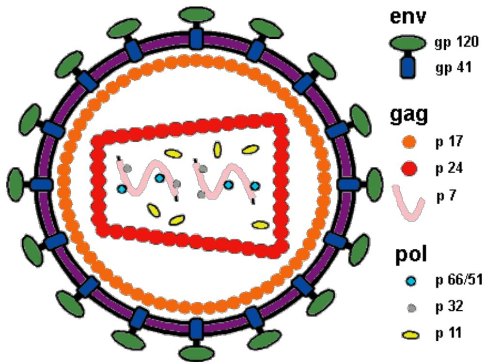
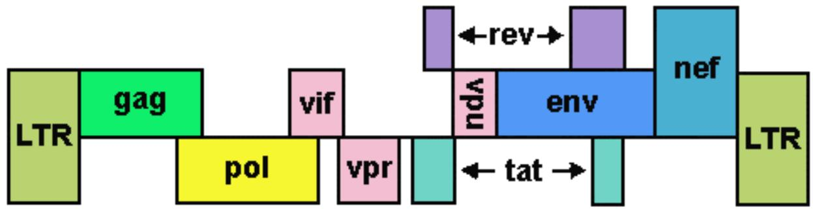
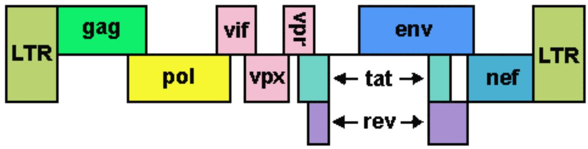
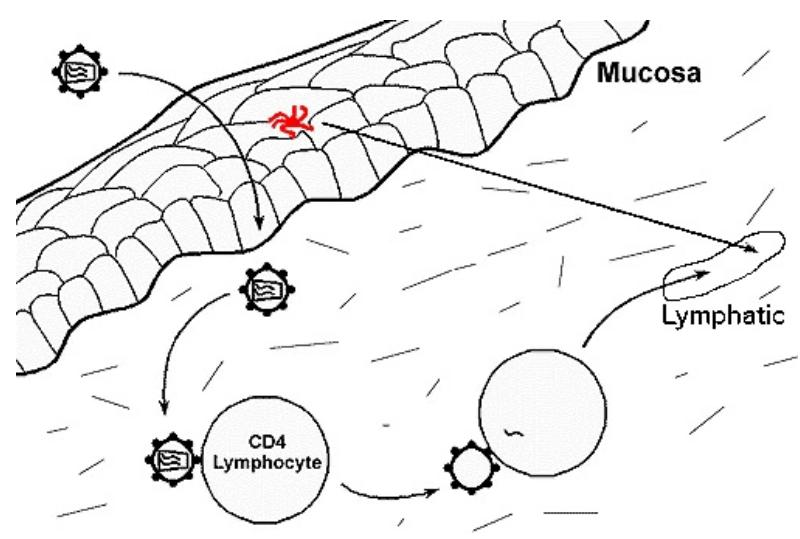
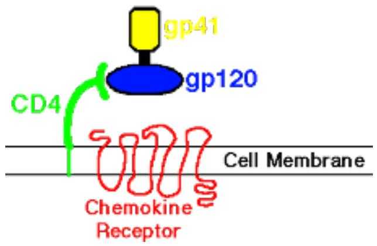
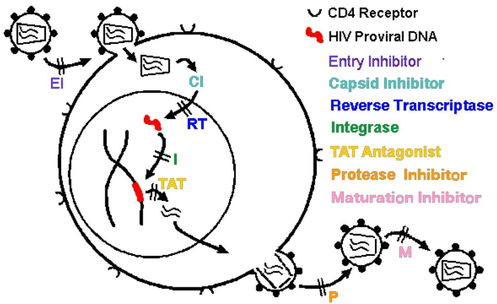
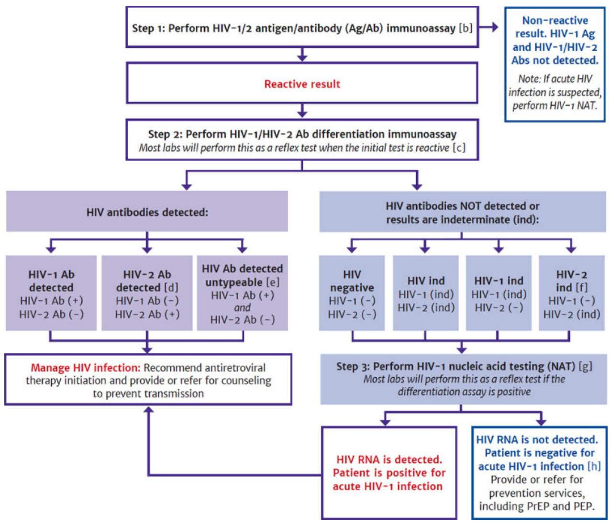
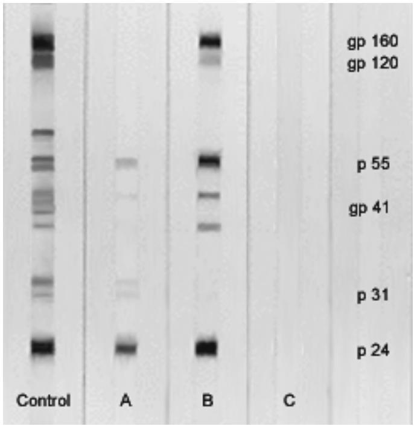

# CHAPTER 1 - BIOLOGY AND PATHOGENESIS OF HIV INFECTION....5
INTRODUCTION. 5 
BIOLOGY OF HUMAN IMMUNODEFICIENCY VIRUS. 11 
HUMAN IMMUNODEFICIENCY VIRUS SUBTYPES. 35 
OTHER HUMAN RETROVIRUSES 37 
EPIDEMIOLOGY OF HIV/AIDS 43 
RISK GROUPS FOR HUMAN IMMUNODEFICIENCY VIRUS INFECTION.56 
NATURAL HISTORY OF HIV INFECTION 58 
PROGRESSION OF HIV INFECTION 65 
IDIOPATHIC CD4+ T-LYMPHOCYTOPENIA. 72 
PREVENTION OF HIV TRANSMISSION 74 
TREATMENT FOR HIV/AIDS. 77
# CHAPTER 2 - DIAGNOSIS OF HIV/AIDS. 100
DIAGNOSTIC TESTS FOR HUMAN IMMUNODEFICIENCY VIRUS. 100 
PEDIATRIC HIV INFECTION AND AIDS CRITERIA 131 
CRITERIA FOR AIDS-RELATED COMPLEX. 135 
OTHER CAUSES OF IMMUNOSUPPRESSION. 136
# CHAPTER 3 - OPPORTUNISTIC INFECTIONS IN HIV/AIDS............137
PNEUMOCYSTIS JIROVECI INFECTIONS 137 
CYTOMEGALOVIRUS INFECTIONS. 142 
MYCOBACTERIAL INFECTIONS. 145 
CRYPTOCOCCUS INFECTIONS. 156 
HERPESVIRUS INFECTIONS 159 
TOXOPLASMA GONDII INFECTIONS. 169
HISTOPLASMA CAPSULATUM INFECTIONS. 172 
COCCIDIOIDES IMMITIS INFECTIONS 175 
GASTROINTESTINAL PROTOZOAL INFECTIONS. 177 
BACTERIAL INFECTIONS 181
# CHAPTER 4 - NEOPLASMS ASSOCIATED WITH HIV/AIDS............198
KAPOSI SARCOMA 198 
MALIGNANT LYMPHOMAS. 202 
OTHER NEOPLASMS. 211
# CHAPTER 5 - ORGAN SYSTEM PATHOLOGY IN HIV/AIDS. 216
RESPIRATORY TRACT PATHOLOGY IN HIV/AIDS 216 
GASTROINTESTINAL TRACT PATHOLOGY IN HIV/AIDS. 242 
CENTRAL NERVOUS SYSTEM PATHOLOGY IN HIV/AIDS. 268 
PERIPHERAL NERVE AND MUSCLE PATHOLOGY IN HIV/AIDS. 294 
OPHTHALMIC PATHOLOGY IN HIV/AIDS 303 
LYMPH NODE PATHOLOGY IN HIV/AIDS 308 
SPLEEN IN HIV/AIDS 317 
BONE MARROW AND PERIPHERAL BLOOD IN HIV/AIDS. 319 
THYMUS IN HIV/AIDS 325 
ENDOCRINE ORGAN PATHOLOGY IN HIV/AIDS. 327 
HEPATOBILIARY SYSTEM PATHOLOGY IN HIV/AIDS 331 
CARDIOVASCULAR PATHOLOGY IN HIV/AIDS 343 
RENAL PATHOLOGY IN HIV/AIDS 352 
GENITOURINARY PATHOLOGY IN HIV/AIDS 358 
DERMATOPATHOLOGY IN HIV/AIDS 363 
PANCREAS IN HIV/AIDS 383
PREGNANCY AND THE PLACENTA IN HIV/AIDS. 385 
HEAD AND NECK PATHOLOGY IN HIV/AIDS. 387 
BONE, JOINT, AND SOFT TISSUE PATHOLOGY IN HIV/AIDS. 391 
CYTOPATHOLOGY IN HIV/AIDS 396 
PEDIATRIC HIV/AIDS 397
# CHAPTER 6 - SAFETY PROCEDURES WITH HIV/AIDS. 408
EDUCATIONAL GOALS. 408 
UNIVERSAL PRECAUTIONS. 410 
OSHA REGULATIONS 413 
OCCUPATIONAL AND NON-OCCUPATIONAL HIV EXPOSURES. 419 
INVASIVE AND SURGICAL PROCEDURES 423 
THE SURGICAL PATHOLOGY LABORATORY 425 
THE HIV/AIDS AUTOPSY 426 
ATHLETICS AND HIV INFECTION 430
# CHAPTER 7 - MEDICOLEGAL ISSUES AND HIV/AIDS. 432
DEATH INVESTIGATION AND CERTIFICATION IN HIV/AIDS. 432 
CAUSE AND MODE OF DEATH WITH HIV INFECTION 433 
ETHICAL ISSUES ARISING FROM THE HIV/AIDS PANDEMIC. 436 
HIV TESTING AND COUNSELING 440
# TABLES 1 - 10. 448
# CHAPTER 1 - BIOLOGY AND PATHOGENESIS OF HIV INFECTION
# INTRODUCTION
The human immunodeficiency virus (HIV) was unknown until the early 1980's when increasing numbers of cases of unusual opportunistic infections and Kaposi sarcoma in persons with lymphadenopathy in the setting of impaired cell-mediated immunity were reported.[1,2] Since then HIV has infected millions of persons in a worldwide pandemic. The result of HIV infection is relentless destruction of the immune system leading to onset of the acquired immunodeficiency syndrome (AIDS). The AIDS pandemic has already resulted in the deaths of over half its victims. All HIV-infected persons are at risk for illness and death from opportunistic infectious, neoplastic complications, and comorbidities because of the inevitable manifestations of AIDS as well as long-term treatment of HIV.[3,4]
Once HIV infection became established in humans, the spread of HIV has been driven by multiple factors. The advent of quick air travel in the $20^{\text{th}}$ century provided a means for spread not present in past human pandemics. Urbanization has led to increased numbers of persons at risk in close proximity. Human sexual practices with promiscuity have included a larger number of persons in populations around the world. A practical and easily available means for delivery of drugs of abuse through injection became more widespread in the $20^{\text{th}}$ century.[3]
The AIDS pandemic has evolved over time, with four main phases of evolution. In the initial phase, HIV emerged from endemic rural areas to spread among urban populations at an accelerating rate. In the second phase, dissemination occurred and involved definable risk groups. Behaviors in these risk groups, including sexual promiscuity and injection drug use, led to the third phase of escalation, which occurred through the 1980's. A fourth phase of stabilization has occurred in some regions such as western Europe, North America, and Australia, where control measures appear to be having a positive effect. However, some regions such as central Africa and Asia continued to experience escalation of the pandemic through the 1990's and into the $21^{\mathrm{st}}$ century.[5,6]
Although the HIV infection rate in the United States increased rapidly in the 1980's, it peaked in the 1990's, and has declined since. The reservoir of HIV-infected persons developing AIDS and requiring therapy continued to increase through the 1990's and into the $21^{\mathrm{st}}$ century. In the year 2022, there were 38,043 new HIV infection diagnoses and 1.1 million persons were living with HIV in the U.S.[7,8]
Globally, the incidence of new HIV infections peaked in 1997 at 3.2 million but fell to 1.3 million by 2022. Deaths from HIV peaked in 2004 at nearly 2 million but fee to 630,000 by 2022. In addition, a major comorbid infection of tuberculosis has fallen by $68\%$ since 2004. Still, countries in southern Africa still account for a disproportionate number of HIV-infected persons.[9]
At the start of the $21^{\mathrm{st}}$ century, the worldwide prevalence of HIV infection stabilized at about $0.8\%$ . The age group most affected, young persons from 15 to 24 years of age, accounted for $45\%$ of new HIV infections. Worldwide, over half the victims of AIDS are women, and a consequence of this is potential perinatal infection and children born with HIV infection. The scope of the HIV/AIDS pandemic has already led to serious consequences, not only for health care systems of countries unable to cope with many HIV/AIDS victims, but also for the national
economies of those countries because of the loss of young to middle aged persons who are economically most productive.[10]
Three advances helped to address the burden of HIV infection. The first was development and deployment of effective multi-drug antiretroviral therapy (ART) at the end of the $20^{\text{th}}$ century. The second was recognition that suppression of viremia through ART could prevent HIV transmission. The third was instigation of ART early in the course of HIV infection, regardless of the stage of illness, to reduce subsequent immunologic damage and prolong lifespan of infected persons. This is the test and treat strategy. Thus, universal testing to detect persons infected with HIV is key to this strategy. However, the stigma of HIV infection and possible punitive measures taken against infected persons remain as barriers to universal testing.[11]
Worldwide in 2023 there were an estimated 1 300 000 [1 000 000 – 1 700 000] new HIV infections, and 630 000 [500 000 – 880 000] deaths from AIDS-related causes that occurred in 2023, reduced by $51\%$ from 2010. There were 39 900 000 [36 100 000 – 44 600 000] people living with HIV in 2023, including 30 700 000 (an estimated $77\%$ of those infected) who were on HIV treatment. Of persons living with HIV, $86\%$ knew their status, and $93\%$ were virally suppressed. Women and girls accounted $53\%$ of persons living with HIV and for $44\%$ of new infections in 2023. Specific populations at risk, representing $5\%$ of the global population but accounting for $70\%$ of new infections, include people who sell sex and their clients, people who inject drugs, sexual minority men, prisoners and their sex partners, transgender and gender diverse people, remain at elevated risk of acquiring HIV infection from discrimination and social exclusion. In sub-Saharan Africa, adolescent girls and young women account for 4 out of 5 new HIV infections.[9,12]
Worldwide in 2023 there were an estimated 2 380 000 [1 830 000 - 2 970 000] children 0 to 19 years of age living with HIV, of which 1 370 000 [1 110 000 - 1 730 000] were 0-14 years of age. An estimated 120,000 [83,000-170,000] children aged 0-14 became newly infected with HIV in 2023 and nearly 87 per cent of these children lived in sub-Saharan Africa. An estimated 4.1 million [11.2 - 17.7 million] children under the age of 18 had lost one or both parents to AIDS-related causes.[13]
Costs for detection, diagnosis, and treatment are considerable when effective therapies for persons with complications of HIV infection are instituted to prolong survival. In the 1990's in the U.S., the average cost for medical care of an HIV-infected patient was double the average income for half of all such patients.[14] Though the pharmacologic therapies exist for prolonging the lives of persons infected with HIV, such therapies are expensive and out-of-reach for many persons worldwide. The years of useful life lost by the predominantly younger population infected by HIV has a serious economic impact.[15] In the era of antiretroviral therapy in the U.S. the average life expectancy for persons diagnosed with HIV infection increased from 10.5 years in 1996 to 22.5 years in 2005 to 28.9 in 2011.[16]
Organized responses to the HIV pandemic have had a checkered history. In Eastern Europe, Asia, and Africa initial governmental responses to the spread of HIV were often delayed and haphazard. One notable exception was Thailand, which mounted a countrywide campaign to educate and screen its population. When less than $5\%$ of adult men visit commercial sex workers, or barrier precaution use is high, and rates of injection drug use remain low, then spread of HIV remained low.[17]
Targeting high risk groups with educational campaigns, increasing condom use, male circumcision, reducing sexually transmitted diseases, increasing the availability of antiretroviral
drugs, and needle-exchange programs for injection drug users have shown success in reducing or stabilizing rates of HIV infection. Treatment programs for those with AIDS are expensive and difficult to administer. There has been success in reducing health care costs of HIV infection with use of more widely available antiretroviral drugs, but economic challenges persist. Some pharmaceutical manufacturers have agreed to subsidize the costs, or allowed generic production of antiretroviral agents, lessening therapy to about $1\mathrm{S}$ U.S. per day, but the numbers of infected persons make treatment an expensive option for many countries. Lack of resources for health care has limited budgets to deal with HIV when other health problems loomed large.[9,10,18]
Considerable effort has been placed into education of persons potentially at risk for acquiring HIV.[19] A proper understanding of AIDS issues, including the nature of HIV and its means of spread, should precede decisions regarding allocation of health care resources and control measures.[20] A combination of widespread HIV testing, early ART for all infected persons, and pre-exposure prophylaxis for persons with risk factors are associated with reduction in spread of HIV.[21] Additionally, increased male circumcision and the prevention of mother-to-child transmission have shown benefit.[22] Prevention strategies for HIV will require ongoing education, despite a general public perception, particularly among young persons, that AIDS is a peripheral threat that does not call for changes in lifestyle.[23]
The battle against AIDS will require political alliances that allow prevention strategies to be implemented across national borders. A single strategy does not apply to all venues. The reservoir of infected persons is so large, global human interaction so broad, and costs of AIDS so high that everyone on earth is affected in some way by the hiv/AIDS pandemic.[24] HIV testing strategies include the following:[25]
- Diagnose all people with HIV as soon as possible. 
- Treat people with HIV rapidly and effectively to reach sustained viral suppression. 
- Prevent new HIV transmissions by using proven interventions, including pre-exposure prophylaxis (PrEP) and syringe services programs (SSPs). 
- Respond quickly to potential HIV outbreaks to get needed prevention and treatment services to people who need them.
HIV prevention strategies include the following:[25]
- Strategy 1: expand or implement routine opt-out HIV screening in health care or other settings 
Strategy 2: develop locally tailored HIV testing programs to reach people in nonhealthcare settings, such as: HIV self-testing; HIV testing in retail pharmacies; and mobile/outreach testing strategies. 
Strategy 3: increase at least yearly rescreening of people at elevated risk for HIV per Centers for Disease Control and Prevention testing guidelines in healthcare and nonhealthcare settings
Treatment as prevention remains a core strategy. Immediate treatment from prompt diagnosis of HIV infection can reduce transmission by $96\%$ . Pre-exposure prophylaxis among sexually active persons will also reduce HIV transmission.[9]
In December 2013, the Joint United Nations Program on HIV/AIDS (UNAIDS) Program Coordinating Board called on UNAIDS to support country and region led efforts to establish new targets for HIV treatment scale-up beyond the year 2015. In response, at the global level, stakeholders assembled in a variety of thematic consultations focused on civil society, laboratory medicine, pediatric HIV treatment, adolescents and other key issues.[26]
The currently adopted plan is a 95-95-95 target for the year 2030, building upon the 90-90-90 goals as follows.:[27]
- By 2030, $95\%$ of all people living with HIV will know their HIV status. 
- By 2030, $95\%$ of all people with diagnosed HIV infection will receive sustained antiretroviral therapy. 
- By 2030, $95\%$ of all people receiving antiretroviral therapy will have viral suppression.
Additionally, there is adoption of 10-10-10 targets for removal of societal and legal impediments limiting access or utilization of HIV services:[27]
Less than $10\%$ of countries have punitive legal and policy environments that deny or limit access to services. 
Less than $10\%$ of people living with HIV and key populations experience stigma and discrimination. 
Less than $10\%$ of women, girls, people living with HIV and key populations experience gender inequality and violence.
By 2016, among HIV-positive persons living in Uganda, the percentage of participants who had viral-load suppression was $75\%$ , which met one of the 2020 goals of the joint United Nations Program on HIV and AIDS (UNAIDS) 90-90-90 initiative. In addition, the incidence of HIV infection declined significantly with the scale-up of a combination strategy for HIV prevention, providing empirical evidence that interventions for HIV prevention can have a population-level effect.[28]
Progress is ongoing. As of 2016 in the U.S. approximately $80\%$ of new HIV transmissions were from persons who did not know they had HIV infection or were not receiving regular health care. Overall, the rate of HIV transmission was 3.5 per 100 person-years, but 16.1 among persons acutely infected and unaware of their HIV infection.[29]
Globally, by 2022, among all persons living with HIV, it was estimated that $86\%$ knew their HIV status, and of these, $76\%$ were accessing treatment and $68\%$ had suppressed viral loads.[9] At the end of 2020, at least eight countries had achieved the 90-90-90 testing and treatment targets. However, children are much less likely to be diagnosed than adults, and even when on treatment, their viral load suppression is considerably lower than adults, and in most countries, men also show less progress in achieving the testing and treatment targets.[30] The five countries of Botswana, Eswatini, Rwanda, Tanzania, and Zimbabwe had achieved the 95-95-95 targets by 2022.[12]
Four major innovations proposed to accelerate progress towards 90-90-90 include: (1) reliable, easy-to-use, rapid HIV self-tests that will democratize access to HIV testing; (2) safer and more effective integrase inhibitors-based antiretroviral treatment, together with same-day offer of treatment and reduction of follow-up clinic visits, will increase efficiency of
antiretroviral treatment programmes; over time long-acting injectable antiretroviral treatment might be able to further accelerate this trend; (3) comprehensive integrated community HIV service delivery models for HIV and other health services will help reach the 90-90-90 target and beyond with the potential added value of destigmatizing both HIV and HIV services; and (4) the information technology revolution, mobile computing, crowd-sourcing, and cloud-based monitoring and evaluation software are already changing the way we do public health by providing near real-time information on program progress, and more open data and transparency for improved community engagement.[31]
Strategies that have shown promise for increasing HIV testing uptake:[32]
- Opt-out testing: HIV testing recommended for all individuals attending a health facility, with individuals having to decline an HIV test if they do not want to be tested after receiving pretest information 
Active choice: When opt-out testing is not feasible, this is a subtle distinction from opt-in testing (i.e., when individuals are informed testing is available but must request a test), in which individuals are specifically asked to choose or decline an HIV test. 
- Integration with non-HIV services: Providing non-HIV health services (such as multi-disease screening) along with HIV testing 
Financial incentives: Provision of cash or non-cash rewards for completing an HIV test 
- Lottery-based incentives: Using a lottery system to allocate rewards to people who complete an HIV test 
Social and sexual network approaches: Encouraging index people to refer others in their social or sexual networks for HIV testing (or to provide self-tests to other people) 
Information provision: Providing information about the availability of HIV treatment and prevention services as well as the benefits of those services 
- Planning prompts: Encouraging individuals to make plans for when and where they will get tested for HIV
The WHO advocates for the adoption and scale-up of digital health innovations to support its One Health Agenda. HIV self-testing strategies are being deployed in many countries around the world, with both oral fluid or blood-based options, allowing users to receive their results within minutes. Digital supports include web-based interventions such as websites, chatbots, and online video counseling, social media and app-based innovations, short message service (SMS) based innovations, and digital vending machines. Digital innovations enhance HIV self-testing. Digital technologies can be implemented within any step of the self-testing process including pre- and posttest counseling, evidence-based knowledge sharing, test ordering, test result interpretation, linkages to care, referrals, and retention in care. Digital interventions enhance acceptability of self-testing and preference due to their convenience, privacy, and autonomy. They eliminate the need for physical visits to testing centers or clinics, especially benefitting individuals with time constraints, limited mobility, or those residing in remote areas. [33]
Given the availability of effective antiretroviral therapy (ART), the key factors driving continued transmission of HIV involve human behaviors promoting transmission and effective health care systems providing diagnosis and treatment to reduce transmission. When the latter is effective, then HIV-infected persons with low-level viremia contribute minimally to ongoing
HIV transmission. Persons with HIV who are undiagnosed, who are diagnosed but untreated, or who are on ART but without effective viremic suppression do contribute to an ongoing HIV pandemic. Moreover, those undiagnosed and men diagnosed but untreated self-reported high-risk sexual behaviors, while persons with low-level viremia did not. It is difficult to modify human behaviors, but viremia can be suppressed with ART to negate the risky behaviors. Making diagnosis of HIV and ART available to as many people as possible is a priority to end the HIV pandemic. In populations where risk behavior reduction and ART therapy is widespread, then fine-tuning ART therapy to address treatment failure for continued suppression of viremia becomes important.[34]
In December of 2019, a genetic shift in coronavirus in China became a worldwide pandemic, with the strain of virus identified as SARS-CoV2, or COVID-19. In less than 20 years after the beginning of the $21^{\text{st}}$ century there have been 3 deadly coronavirus shifts: Severe Acute Respiratory Syndrome Coronavirus (SARS-CoV), Middle East Respiratory Syndrome Coronavirus (MERS-CoV), and the current SARS-CoV2 (COVID-19). SARS emerged in 2003 and killed nearly $10\%$ of the 8,096 people who fell ill in 29 countries. Since 2012, MERS has caused 2,494 confirmed cases in 27 countries and killed 858 people. By February 2023 COVID-19 had infected over 750 million persons globally, with over 6.8 million deaths, but the death rate has been declining from measures such as vaccination taken to mitigate spread and illness. The overall number of persons living with HIV (PLWH) who became infected with COVID-19 has been estimated at $2\%$ , with regional differences reflecting the numbers of PLWH, but co-infected persons more likely to be hospitalized, have severe disease, and die than persons not infected with HIV. Vaccination and prior COVID-19 infection afforded some protection, but viremia and $\mathrm{CD4 + }$ T-lymphocyte count $< 200 / \mu \mathrm{L}$ worsened risks. There appeared to be no differences in the clinical presentations between individuals who have SARS-CoV-2 with or without HIV infection. PLWH on antiretroviral therapy who became infected with SARS-CoV-2 have had outcomes based upon standard of care. COVID-19 severity in HIV-infected persons is not homogeneous but outcomes may relate to presence of comorbidities, as in the general population. Importantly, the COVID-19 pandemic has challenged health care systems to provide resources for ongoing programs to combat HIV infections and HIV-related illnesses.[35]
As of 2024, findings after 4 years of pandemic suggest that infection with COVID-19 in persons on ART with viral suppression has no greater risk than that for HIV-uninfected individuals. However, HIV-positive persons with advanced HIV disease appear to be more vulnerable to poor COVID-19 outcomes. Nevertheless, the COVID-19 vaccines appear to be effective and well tolerated in most HIV-infected persons. In persons with diminished immune responses, vaccine effectiveness is also diminished. Persons with HIV infection with more prolonged COVID-19 infection can benefit from ART.[36]
Both the HIV and COVID-19 pandemics have highlighted the impact of social determinants of health driving differential impact of these pandemics on marginalized communities with health inequities as a core contributor to disease vulnerability and adverse outcomes.[37]
# BIOLOGY OF HUMAN IMMUNODEFICIENCY VIRUS
Human immunodeficiency virus (HIV) and its subtypes are retroviruses and the etiologic agents of AIDS. Human retroviruses were unknown until the 1980's, though animal retroviruses such as feline leukemia virus had been detected previously. HIV belongs to a large family of ribonucleic acid (RNA) lentiviruses.[38] These viruses are characterized by association with diseases of immunosuppression or central nervous system involvement and with long incubation periods following infection before manifestations of illness become apparent.[39,40]
THE ORIGIN OF HIV.-- Lentiviruses similar to HIV have been found in a variety of primate species, and some of these are associated with a disease process called simian AIDS. Unlike other retroviruses, the primate lentiviruses are not transmitted through the germ line, and no endogenous copies of the virus exist in the genome of susceptible species.[41] Molecular epidemiologic data suggest that HIV type 1 (HIV-1), the most common subtype of HIV that infects humans, has been derived from the simian immunodeficiency virus, called SIVcpz, of the Pan troglodytes troglodytes subspecies of chimpanzee. The lentivirus strain SIVcpz is highly homologous with HIV-1.[42]
There are four subtypes of HIV-1 called groups M, N, O, and P, and each of these groups appears to have arisen from an independent cross-species transmission event. Group M is the pandemic form of HIV-1 that has spread widely to infect millions of persons worldwide. There is molecular epidemiologic evidence for multiple cross-species transmissions of SIVcpz to humans occurring in the first half of the $20^{\text{th}}$ century to establish group M, likely between the years 1910 and 1930. Based on the biology of these retroviruses, transmission to humans likely occurred through cutaneous or mucous membrane exposure to infected primate blood and/or body fluids. Such exposures occur most commonly in the context of hunting. Group O was discovered in 1990, represents less than $1\%$ of global HIV-1 infections, and is mainly found in Cameroon. Group N identified in 1998 has only 13 documented cases, all in persons living in Cameroon. Group P was discovered in 2009 in two persons from Cameroon.[43]
Zoonotic infection of humans with retroviruses is possible, as documented by infection of primate handlers with simian foamy retroviruses.[44] Experimental evidence confirms that humanized bone marrow, thymus, and liver (hu-BLT) mice are susceptible to all studied strains of SIVcpz, including the inferred ancestral viruses of HIV-1 groups M (SIVcpzMB897) and N (SIVcpzEK505) as well as strains that have not been found in humans.[45] There is evidence for ongoing cross-species transmission, supporting the concept of prior transmissions of SIV to humans.[46] Retrospective studies performed on frozen sera have confirmed evidence for HIV-1 in persons in Africa prior to 1960.[47]
Molecular testing with phylogenetic analyses of archival serum specimens suggests human travel brought HIV-1 to the Caribbean in a period between 1963 and 1970, then to the U.S., starting in New York around 1970.[48] The latent period of HIV-1 infection until emergence of immunodeficiency accounts for the time frame until reports in the early 1980's referred to the agent causing AIDS as either human T-lymphocytotropic virus, type III (HTLVIII) or as lymphadenopathy associated virus (LAV). This originally discovered virus is known as HIV-1.[49,50]
Zoonotic infection of humans may have occurred long in the past, but only in the late $20^{\text{th}}$ century did population growth along with demographic and social conditions change
significantly to permit HIV to spread more rapidly. European colonization of Africa led to growth in the population of cities, many of which had a disparate demography with more men than women, favoring greater sexual interactions with more partners. In addition, colonial health programs included measures to try to control tropical diseases, doing so via intravenous injections of medications, often without adequate cleansing of injection equipment such as needles. Additional viral diseases transmitted via contaminated injections included hepatitis B virus, hepatitis C virus, and human lymphocytotropic virus type I. Parenteral transmission may have expanded the range and number of HIV infections during the 1950's, followed by expansion through heterosexual transmission in the 1960's, followed by spread to other countries with expanded availability of travel opportunities from the 1970's onward.[51,52]
An additional major human retrovirus, called HIV-2, has more similarity to simian immunodeficiency virus (SIV) than to HIV-1 and is mostly found in West Africa, with highest prevalence rates recorded in Guinea-Bissau and Senegal. It appears to be derived from a SIV found in sooty mangabeys (SIVsmm). The two major HIV-2 subgroups A and B arose from independent transmission events in Ivory Coast, likely in the 1940's.[53]
STRUCTURE OF HIV.-- The mature virus consists of a bar-shaped electron dense core containing the viral genome with two short strands of ribonucleic acid (RNA) each 9200 nucleotide bases long, encased with the enzymes reverse transcriptase, protease, ribonuclease, and integrase within an outer lipid envelope derived from a host cell. This envelope has 72 surface projections, or spikes, containing the antigen gp120 that aids in binding of virus to target cells with CD4 receptors. A second gp41 glycoprotein binds gp120 to the lipid envelope. [40,54,55] A diagrammatic representation of HIV is shown below:

By electron microscopy, the plasma membrane of an infected $\mathrm{CD4 + }$ lymphocyte exhibits budding virus particles approximately 100 nanometers in diameter. The virion has an
asymmetric core consisting of a conical capsid (a geometric "fullerine cone") with a broad electron dense base and hollow tapered end. Virions bud from plasma membranes or from cytoplasmic vacuoles of infected host cells. Spikes are inserted onto the membrane of the developing virion, which buds to a complete sphere. Aberrant virion formation is common, including double buds, giant virions, empty nucleoids, and misplaced electron dense material. Simplistic organisms such as lentiviruses just do not have the error checking genetic equipment for quality assurance, but make up for it with sheer numbers of particles released.[55,56]
The genome of HIV, similar to retroviruses in general, contains three major genes: gag, pol, and env. These genes code for the major structural and functional components of HIV, including envelope proteins and reverse transcriptase. The structural components encoded by env include the envelope glycoproteins: outer envelope glycoprotein gp120 and transmembrane glycoprotein gp41 derived from glycoprotein precursor gp160. Components encoded by the gag gene include core nucleocapsid proteins p55 (a precursor protein), p40, p24 (capsid, or "core" antigen), p17 (matrix), and p7 (nucleocapsid); the important proteins encoded by pol are the enzyme proteins p66 and p51 (reverse transcriptase), p11 (protease), p31 (endonuclease), and p32 (integrase).[40,54,55]
Although most of the major HIV viral proteins, which include p24 (core antigen) and gp41 (envelope antigen), are highly immunogenic, the antibody responses vary according to the virus load and the immune competence of the host. The antigenicity of these various components provides a means for detection of antibody, the basis for most HIV testing.[57]
The viral genome for HIV-1 is shown below:
 
The viral genome for HIV-2 is shown below:

Accessory genes carried by HIV include tat, rev, nef, vif, vpr, and vpu (for HIV-1) or vpx (for HIV-2). The rev gene encodes for a regulatory protein which switches the processing of viral RNA transcripts to a pattern that predominates with established infection, leading to production of viral structural and enzymatic proteins. The long terminal repeat (LTR) serves as a promoter of transcription.[40,50,54,55]
The tat (trans-activator of transcription) gene plays multiple roles in HIV pathogenesis. It produces a regulatory protein (p14) that speeds up transcription of the HIV provirus to full-length viral mRNAs. It functions in transactivation of viral genes, with nuclear localization signal, nucleolar localization signal, and protein transduction domain. These genes are highly conserved among different tat variants though tat itself is prone to mutations. The multifunctionality of the tat basic domain can lead to interactions with glycoproteins, proteins or protein/RNA complexes, and both viral and cellular chromatin, allowing tat to accomplish various tasks. Tat basic domain can undergo post-translational modifications, which may expand and modify its functionality. The effects of such modulation may include enhanced immune suppression, apoptosis, and oxidative stress.[58]
The nef(negative regulating factor) gene produces a regulatory protein (p27) that modifies the infected cell to make it more suitable for producing infective HIV virions, by accelerating endocytosis of CD4 from the surface of infected cells.[59]
The $vif$ , $vpr$ , and $vpu$ genes encode proteins that appear to play a role in generating infectivity and pathologic effects. $Vif$ encodes a viral infectivity protein (p23) that antagonizes the antiviral effect of apolipoprotein B mRNA-editing enzyme catalytic polypeptide-like 3G, or the protein product of the gene $APOBEC3G$ ( $A3G$ ). $Vpr$ encodes a protein (p15) that interacts with p6 to facilitate infectivity, More specifically, $Vpr$ (viral protein r) has the ability to delay or arrest infected host cells in the G2 / M replicative phases of the cell cycle and facilitates the infection of macrophages, and it promotes nuclear transport of the viral preintegration complex. $Vpu$ encodes a viral particle release protein (p16) enhances efficient release of virions from infected cells. $Vif$ , $vpr$ , and $vpu$ gene encoded protein products link to members of a superfamily of modular ubiquitin ligases to induce the polyubiquitylation and proteasomal degradation of their cellular targets.[59]
PATHOGENESIS OF HIV INFECTION: ENTRY.-- Retroviruses are unable to replicate outside of living host cells and do not contain deoxyribonucleic acid (DNA). The pathogenesis of HIV infection is a function of the virus life cycle, host cellular environment, and quantity of viruses in the infected individual. After entering the body, the viral particle is attracted to a cell with the appropriate CD4 receptor molecules where it attaches by fusion to a susceptible cell membrane or by endocytosis and then enters the cell. The probability of infection is a function of both the number of infective HIV virions in the body fluid which contacts the host as well as the number of cells available at the site of contact that have appropriate CD4 receptors.[55]
HIV infection can potentially occur through oropharyngeal, cervical, vaginal, and gastrointestinal mucosal surfaces, even in the absence of mucosal disruption. Cell-free or cell associated HIV can penetrate mucosal epithelium through micro-lacerations that occur during sexual intercourse, via paracellular passage after HIV-triggered epithelial disruption, or by transcytosis across epithelial cells. HIV can cross a tight epithelial barrier by transcytosis during contact between HIV-infected cells and the apical surface of an epithelial cell. The presence of mucus on epithelial surfaces further retards viral entry, particularly in the endocervix where there is just a single columnar epithelial cell layer. HIV entry may be modulated by expression of
viral receptor and co-receptors on immune cells, local pro-inflammatory environment, mucosal antiviral factors, HIV-cell interactions, hormonal levels, the composition of the commensal microbiota, and pathogenic co-infections such as sexually transmitted infections. Past the epithelial barrier, dendritic cells (including skin Langerhans cells), gut microfold cells, and even fibroblasts at the submucosal space may transfer viral particles to $\mathrm{CD4 + }$ T cells, mainly in the trans-infection manner. Dendritic cells can bind to gp120 through a C type lectin, suggesting that dendritic cells that squeeze between "tight" epithelium may capture HIV and deliver it to underlying T cells, resulting in dissemination to lymphoid organs.[60].[61]
In the illustration below, HIV and cells are large and not to scale. Virions crossing the epithelium can be captured by an epithelial dendritic cell (also called a Langerhans cell), the red cell pictured with long processes, or contact and infect a $\mathrm{CD4 + }$ lymphocyte. Cells with HIV can enter lymphatics to be carried into regional lymph nodes and to systemic lymphoid tissues where additional cells become infected and productive HIV replication occurs.[62]

HIV can transmigrate across fetal oral mucosal squamous epithelium that has few layers, 5 or less. HIV-infected macrophages, but not lymphocytes, are able to transmigrate across fetal oral epithelia. HIV-infected macrophages and, to a lesser extent, lymphocytes can transmigrate across fetal intestinal epithelia.[63]
However, efficient viral transmission through adult mucosal epithelia is difficult because of the mechanical barrier afforded by intact epithelia. The endocervix and anal mucosa are a monolayer of columnar epithelium, but elsewhere including oropharyngeal, anal, and genital mucosal regions the epithelium consists of stratified squamous epithelium presenting a major physical barrier to viral entry. As a consequence the columnar portion of anorectal epithelium has the highest probability of HIV-transmission at $0.3 - 5\%$ . The female genital mucosal probability is $0.05 - 0.5\%$ and male genital epithelium $0.04 - 0.14\%$ . The oral mucosa is the least susceptible at $0.01\%$ .[61]
HIV can penetrate the epithelium through micro-lacerations that may occur during sexual intercourse, via paracellular passage after HIV-triggered epithelial disruption, or by transcytosis
across epithelial cells. A variety of host defense mechanisms play a role in efficiency of viral transmission and establishment of infection. Chemical factors reducing transmission may include lack of expression of the viral co-receptor CCR5, increased production of chemokines MIP-1 $\alpha/\beta$ , RANTES or SDF-1, and high expression of factors such as SLPI, defensins, cathelicidin, TRIM5 $\alpha$ , APOBEC-3G, SAMHD-1, serpina1, and elafin. Intracellular epithelial inactivation of virus may occur via beta-defensins 2 (HBD2) and 3 (HBD3), and SLPI which are more highly expressed in oral epithelial cells than cervical epithelial cells. Cellular defense factors include variations in activity of natural killer cells, dendritic cells, $\mathrm{CD4+}$ cells, and $\mathrm{CD8+}$ cells. Mucosal neutralizing IgA antibodies may play a role. Some persons, despite repeated exposures to HIV, do not become infected. These persons, known as HIV-exposed seronegative individuals (HESNs), likely have more expression of these molecular barriers at their mucosal cellular interface preventing productive HIV infection.[61]
Epithelial paracellular passage through mucosa results from a loss or disruption of tight junctions, causing the formation of gaps at the epithelial monolayers through which virus may reach the submucosa. Binding of HIV gp120 to either CCR5 or CXCR4 co-receptors, or to galactosylceramide expressed on epithelial cells can reduce expression of occludin, claudins, and ZO-1.[61]
Epithelial transcytosis involves intracellular vesicular/endosomal transport. This process has been observed in oral, intestinal, vaginal and endometrial epithelial cells. During this process, viral particles bind to epithelial cell surface molecules like heparan sulfate proteoglycans and are then transported into the intracellular compartment. Viral particles remain infectious following translocation into the intracellular space and release to the external basal space where they can infect intraepithelial lymphocytes or be picked up and transferred by antigen-presenting cells. However, the efficiency of transcytosis is as low as $0.01\%$ of the initial viral inoculum, so it is highly inefficient. Thus, intact epithelium is a significant barrier to HIV infection, but the presence of antigen processing cells and inflammatory cells increases HIV transmission.[61]
Virions can become trapped in surface mucus and then expelled. An acidic mucus pH of cervicovaginal mucus favors this effective trapping. Semen can increase vaginal pH. The vaginal microbiome plays a role, because normal microbiota are Lactobacillus dominant and promote low pH. Conversely, the Gardnerella, Prevotella, and Mobiluncus spp. of bacterial vaginosis promote higher pH and pro-inflammatory cytokines.[61]
Exposure to HIV-1 can upregulate pro-inflammatory cytokine production by genital epithelial cells, including the cytokine tumor necrosis factor TNF- $\alpha$ that impairs the cellular tight junction barrier, allowing HIV-1 and luminal bacteria to translocate across the epithelium. [64]
Endothelium may also harbor HIV virions following parenteral transmission as well as during HIV viremia following infection. Endothelial cells express surface syndecans that mediate adsorption of HIV by binding of viral gp120 to heparan sulfate chains of syndecan. Although the syndecan does not substitute for HIV entry receptors, it enhances infectivity and preserves virus infectivity for a week, whereas unbound virus loses its infectivity in less than a day. In addition, selectin binding can enhance virion attachment to endothelial cells and accelerate transfer of HIV to CD4 cells.[65]
MECHANISM OF HIV CELL ENTRY.-- HIV is an enveloped virus that gains entry into a host cell via viral membrane fusion. The fusion protein of HIV is the envelope
glycoprotein. The Env gene encodes a polypeptide gp160 cleaved during passage through host cell Golgi apparatus, to a binding fragment gp120 and a fusion fragment gp41. Three copies of each fragment form a viral surface spike. Entry begins with gp120 binding to host T-lymphocyte CD4 receptor, which induces a conformational change in gp120, exposing co-receptor binding sites. The major function of CD4 is interaction with MHC II molecules on the surface of antigen presenting cells to facilitate activation of these T lymphocyte helper cells. HIV uses this CD4 receptor for entry.[66]
In addition to the CD4 receptor, a co-receptor known as a chemokine receptor enables HIV entry into cells. Chemokine receptors are cell surface membrane-bound fusion-mediated molecules found on cells. Chemokines are a family of about 50 small proteins that are secreted in tissues as part of the immediate response to tissue damage. Chemokine receptors are a complementary family of about $20\mathrm{G}$ protein-coupled receptors (GPCRs) located in the plasma membranes of leukocytes. When chemokines are secreted into the vasculature they activate their receptors, stimulating leukocyte adhesion to the vascular endothelium, reorganization of the actin cytoskeleton, and migration into the tissues.[67] A diagrammatic representation of the relationship of the chemokine receptor to the CD4 receptor is shown below:

Chemokines are small $< 10$ kDa soluble proteins that contain four conserved cysteine residues forming two disulfide bonds. They are classified according to the spacing and presence of the first two Cys residues. Chemokine receptors are named CCR1-10, CXCR1-8, CX3CR1, and XCR1) according to the class of chemokines to which they predominantly respond. Their presence on cells can aid binding of the HIV envelope glycoproteins. Three gp120-gp41 heterodimers form a functional trimer spike, and a fully infectious virion displays approximately 10-14 spikes per particle. HIV-1 entry into target cells involves binding of the virus to host receptors CD4 and CCR5/CXCR4 which triggers serial conformational changes in the envelope glycoprotein trimer that result in the fusion of the viral and cell membrane gp120, promoting infection.[67] Initial binding of HIV to the CD4 receptor is mediated by conformational changes in the gp120 subunit, but such conformational changes are not sufficient for fusion. The chemokine receptors produce structural rearrangements and trigger the fusogenic potential of gp41 to induce membrane fusion, which enables entry of HIV.
Chemokines induce immune cell trafficking by binding to a cell surface receptor and can act as pro-inflammatory factors. The important G protein-coupled chemokine receptors for HIV transmission are CXCR4 and CCR5. Of the two, CCR5 is the predominant receptor for initial
HIV entry. CCR5 is expressed on lymphocytes, monocyte/macrophages, granulocytes, natural killer (NK) cells and regulatory T (Treg) cells, located in lymphoid organs as well as in epithelium, endothelium, vascular smooth muscles, fibroblasts, and in microglia. Increased CCR5 expression on mononuclear cells in chronically inflamed tissues suggests that these cells are recruited to sites of inflammation. CCR5 stabilizes the CD4-induced conformation of Env protein and anchors the virus near the cell surface.[68]
The CCR5- $\Delta 32$ variant has a 32-bp deletion ( $\Delta 32$ ) with a nonfunctional HIV entry coreceptor preventing fusion between HIV and the target-cell membrane. The CCR5- $\Delta 32$ allele is most often found European populations, with an average frequency is $\sim 10\%$ , with homozygosity at $1\%$ . This allele is uncommon in Sub-Saharan Africans, Asians and Native Americans. Persons homozygous for this allele have near total protection from HIV-1 infection. [68]
Cells such as CD4+ lymphocytes have cytoskeletal actin providing a barrier to pathogen entry, but HIV gp120 binding CCR5 or CXCR4 activates signaling to rearrange the actin for viral entry. As HIV infection progresses, CXCR4 becomes more extant. CXCR4 may be important for entry of HIV into resting memory CD4 cells that establish latency with continued infection.[69]
HIV entry into host cells is mediated by conformational changes in the envelope (Env) glycoprotein triggered by Env binding to cellular CD4 and chemokine receptors. The V3 loop region of gp120 determines whether the host cell CCR5 or CXCR4 chemokine co-receptor will be engaged. This variable region triggers host cell membrane fusion for viral entry. The crown of the V3 loop has a close structural homology to the beta2-beta3 loop in the CXC and CC chemokines, the natural ligands of CXCR4 and CCR5.[70]
The gp41 transmembrane co-receptor consists of HR1 and HR2 helical regions along with a fusion peptide. After the chemokine co-receptor is engaged, the gp41 on the HIV surface undergoes a conformational change involving the opening of the gp120 surface subunit, exposure of the fusion peptide in the gp41 transmembrane subunit, and refolding of the gp41 heptad repeat regions HR1 and HR2. This conformational change in gp41 through HR1 and HR2 interaction leads to formation of a stable structure that allows fusion of HIV and host cell membranes, with a fusion pore through which the viral core enters the host cell.[71]
The majority of HIV isolates sampled during acute and chronic infections are CCR5- using T cell-tropic (R5 T-tropic) viruses, which are adapted to and replicate in $\mathrm{CD4 + }$ memory T cells, but they require high densities of the CD4 receptor found on $\mathrm{CD4 + }$ T cells for efficient entry and use the CCR5 coreceptor, which is most abundant on the memory subset of $\mathrm{CD4 + }$ T cells. In approximately one-half of late-stage HIV-1 infections, a viral population evolves the ability to use CXCR4 as a coreceptor. These CXCR4-using T cell-tropic (X4 T-tropic) viruses use CXCR4 to target $\mathrm{CD4 + }$ naive T cells which express lower densities of CCR5 and higher densities of CXCR4 than do $\mathrm{CD4 + }$ memory T cells.[72] Macrophages express lower levels of CD4 than $\mathrm{CD4 + }$ T cells. Most macrophage-tropic (M-tropic) HIV variants use the CCR5 coreceptor (R5 M-tropic), but X4 M-tropic viruses have been reported. Dual tropic HIV strains have been identified that can use more than one chemokine co-receptor.[73]
Over time, mutations in HIV may increase the ability of the virus to infect host cells via these routes, beginning with dominance of CCR5 tropic strains of virus, then CCR5/CXCR4 dual tropic virus, and finally the more cytopathic CXCR4 tropic strain predominance. CCR5 tropic virus predominates early in HIV infection because it more readily infects dendritic cells and macrophages, has a high rate of replication, and is less visible to cytotoxic lymphocytes.[50]
The gastrointestinal tract is a preferential site for HIV infection because most CD4 cells at that location are expressing CCR5,[74]
HIV primarily infects cells that have CD4 cell-surface receptor molecules, using these receptors to gain entry. Many cell types share common receptor epitopes, though $\mathrm{CD4 + }$ lymphocytes play a crucial role. Cells with CD4 receptors susceptible to HIV infection may include cells of the mononuclear phagocyte system, principally blood monocytes and tissue macrophages, as well as $\mathrm{CD4 + }$ T lymphocytes, natural killer (NK) lymphocytes, dendritic cells (both epithelial Langerhans cells and follicular dendritic cells in lymph nodes), hematopoietic stromal cells, and microglial cells in brain. Galactosylceramide expressed by human monocyte derived immature dendritic cells as well as dendritic cells isolated from blood and mucosal tissue and in situ on mucosal tissue can act as a mucosal epithelial receptor for gp41 on HIV.[40,75,76]
HIV entry into cells can occur independently of CD4 receptor interaction. Such entry is less efficient and less extensive. Such entry has been described for renal tubules, gut enterocytes, vascular endothelium, cardiac myocytes, and astrocytes. Infection of these cells may play a role in the pathogenesis of HIV-related diseases occurring at tissue sites with those cells.[77]
HIV GENETIC DIVERSITY AND TRANSMISSION.-- HIV genetic diversity may explain a "bottleneck" in transmission to explain the relative inefficiency of HIV transmission. The mutation rate in HIV leads to "quasispecies" with genetic diversity within an infected host. A quasispecies is a well-defined distribution of mutants generated during the mutation and selection process. Selection does not target a single mutant but the multiple mutants of the quasispecies. However, few of these closely related mutant viruses are fit for productive infection of a new host, given HIV is a vulnerable enveloped virus that must traverse a mucosa, encountering a variety of structural and immunologic barriers, to reach relatively few target host cells. Most new HIV infections involve transmission from one human host to another of just a single virus variant, and the remainder by just 2 to 5 genetically distinct HIV quasispecies. Those mutants less fit for traversing the recipient host mucosa, attaching to a host cell receptor, and subsequently replicating are negatively selected. Factors of viral load, robustness of host mucosa, and host inflammation may affect the numbers of viral variants available for transmission. The estimated mutation rate for a single "founder" virus with one genome establishing infection is $80\%$ for heterosexual risk, $68\%$ mother-to-child, $60\%$ men having sex with men, and $40\%$ for infection drug use transmission, reflecting relative numbers of potential infecting virions.[62]
Quasispecies of HIV encoding envelope proteins shorter and less glycosylated in the V1-V4 regions are more likely to be transmitted to a new host. These more compact envelope glycoproteins may interact more efficiently with host target cells. Minimal alterations in HIV envelope protein structure and function may impart a selective advantage during the eclipse phase when infection is established.[62]
The presence of host chemokine co-receptor mutations may explain the phenomenon of resistance to acquiring HIV infection in some persons. Four mutational chemokine variants, including CCR5-Δ32, CCR2-64I, CCR5-P1, and a primary ligand of CXCR4 known as SDF-1-3'A, have been discovered. These variants may impart resistance to HIV-1 infection and explain differences in infectivity within and among populations.[78]
Cellular localization of chemokine receptors may help explain how HIV infection can occur. Macrophages and monocytes, as well as subpopulations of lymphocytes, can express the
CCR5 receptor. Astrocytes and microglia in the central nervous system also express this chemokine receptor. In other tissues, CCR5 is expressed on epithelium, endothelium, vascular smooth muscle, and fibroblasts. Areas of inflammation contain increased numbers of mononuclear cells with CCR5, and this may facilitate transmission of HIV at those sites.[79]
Many virions are nonspecifically endocytosed on host cells and never enter the cytoplasm. The interplay of CD4 and CCR5 receptors with viral proteins for entry is enhanced by localization of cell surface receptors within cell membrane cholesterol rich lipid rafts that provide lateral mobility and mediate fusion. Fusion requires formation of membrane pores. After gaining entry to the host cell, virions can use microtubules for movement to a perinuclear location. Once within the nucleus HIV integrase localizes to areas of euchromatin.[80]
PATHOGENESIS OF HIV INFECTION: ENTRY AND REPLICATION.-- Once within the cell, the viral particle uncoats from its spherical envelope to release the capsid, with an inner shell composed of monomeric proteins arranged in 12 pentamers of the capsid (CA/p24) protein. After entry into host cell cytoplasm, the cone-shaped capsid continues to surround the HIV genome and replication enzymes. The capsid encases both viral and host factors along with the viral genome consisting of two copies of single stranded RNA, along with copies of reverse transcriptase and integrase enzymes. The HIV-1 genome encodes 15 viral proteins that perform structural, enzymatic, regulatory, and accessory functions to coordinate interactions with host factors to promote HIV infection.[81]
Host cell proteins play a key role after HIV entry. The host kinesin adapter protein FEZ1 binds to the viral capsid and mediates trafficking of the core on microtubules to the host nuclear pore complex. The host cell capsid-binding protein cyclophilin A (CypA) facilitates reverse transcription and nuclear import of the viral genome. The capsid also binds to host nucleoporins, transportins, and cleavage and polyadenylation specificity factors.[81]
Reverse transcription of the HIV-1 RNA genome into complementary DNA is initiated within the protected environment of the capsid shell, protected from degradation by cytosolic enzymes that could trigger an immune reaction and cellular apoptosis. The capsid travels along a cytoplasmic microtubular network to the nuclear envelope, and docks to a nuclear pore complex (NPC). The capsid lattice interaction with the NPC and nuclear cleavage and polyadenylation specificity factor 6 (CPSF6) facilitates the translocation of the capsid through the NPC. The "plus sense" viral RNA requires reverse transcription of the two RNA strands into one double-stranded complementary proviral DNA copy, which occurs as a reverse transcription complex within the capsid after nuclear entry. Rupture of the capsid within the nucleus follows completion of reverse transcription, releasing the complementary DNA so it can become integrated into the host cell genome.[82,83]
The enzyme product of the viral pol gene, a reverse transcriptase that is bound to the HIV RNA, synthesizes linear double-stranded cDNA that is the template for HIV integrase. It is this HIV proviral DNA which is then inserted into the host cell genomic DNA by the integrase enzyme of the HIV. The integrase catalyzes an initial $3^{\prime}$ processing of the nascent cDNA ends, followed in the cell nucleus by their covalent attachment to the $5^{\prime}$ phosphates of a double-stranded staggered cut in chromosomal DNA. Proviral DNA is activated and transcribed under direction of HIV tat and rev genes. Viral components such as Gag proteins are assembled at the inner part of the host cell membrane, and virions then begin to bud off. During the budding process, HIV protease cleaves viral proteins into their functional forms.[57,84,85,86]
Following infection, a copy of proviral DNA is integrated into the host cell genome. During productive viral replication without ART, HIV-1 DNA is present at a level ranging between 2.5 to 3.5 log copies per million peripheral blood mononuclear cells (PBMCs). Elite controllers average 1.5 log copies per million PBMCs. However, there is also nonintegrated HIV DNA existing in both linear and episomal forms. These nonintegrated form have half lives of days to weeks, so their impact upon the cell is of questionable significance. When viral suppression is achieved with ART, these forms constitute a minimal fraction of HIV-1 DNA. Performance of complete proviral DNA genomic sequencing for resistance testing shows up to $95\%$ of integrated HIV-1 genomes have major sequence abnormalities incompatible with viral replication, often as a result of mutations leading to replication errors in reverse transcriptase. [87]
Though HIV proviral replication is inefficient, the magnitude of viral replication is great, and proviral DNA is constantly evolving, leading to ongoing infection in the absence of therapy, and difficulty eliminating infection with therapy. Highly effective ART reduces PBMC DNA levels by approximately 0.5 to 1.0 log10 copies per million PBMCs within weeks to months, with continuing decline to plateau in 1 to 2 years. Infection is maintained within a proviral DNA reservoir, even in virologically suppressed persons, from clonal proliferation of latently infected cells.[87]
The principal constituent of HIV-1 is Gag, accounting for half the entire virion mass. Viral membrane lipids account for about a third of the mass, and other viral and cellular proteins together contribute an additional $20\%$ . The HIV-1 genomic RNA and other small RNAs comprise only $2.5\%$ of virion mass. The Gag, Gag-Pro-Pol, Env, the two copies of genomic RNA, the tRNA primer, and the lipid envelope are all necessary for viral replication. HIV gene products are encoded on the genomic RNA, which also serves as mRNA for Gag and Gag-Pro-Pol, whereas singly or multiply spliced RNAs are translated to produce Env and accessory proteins, respectively. The HIV Gag and Gag-Pro-Pol proteins move from cytoplasmic sites of synthesis in endoplasmic reticulum, through the Golgi apparatus, to the infected cell plasma membrane. These proteins then sort into detergent-resistant membrane microdomains. Virion production is cholesterol and sphingolipid dependent, and the virus is enriched in "raft"-associated proteins and lipids from the host cell membrane. The viral Env glycoproteins reach the plasma membrane independently of Gag.[55,88]
Ubiquitination and SUMOylation play a role in HIV infection. The attachment of ubiquitin to proteins serves as a regulatory signal that cells interpret differently depending on the type of linkage of the ubiquitin chains. SUMO (Small Ubiquitin-like Modifier) proteins are involved in SUMOylation, a post-translational modification that closely resembles ubiquitination except that addition of SUMO to proteins does not tag them for degradation. Instead, SUMOylation alters the pattern of protein-protein associations, protein-DNA interactions, the subcellular localization of the SUMOylated targets as well as the activation status of their enzymatic activities. SUMOylation is a common mechanism for the inactivation of transcription factors. SUMOylation has a role in regulating proteasomal degradation. HIV takes advantage of ubiquitination and SUMOylation to modify its viral proteins and achieve a productive infection through different mechanisms.[89,90]
Proteasomal degradation pathways are involved the steps of the HIV life cycle. HIV expresses regulatory proteins, including viral infectivity factor (Vif), Vpr, Vpu, transactivator of transcription (Tat), negative regulator factor (Nef), and antisense protein, Rev. The HIV genome also encodes structural group specific antigen (Gag), polymerase (Pol), and envelope (Env).
These viral regulatory proteins control expression of viral genes, genome replication, and virion production. Throughout the infection cycle, these viral proteins and specific cellular counterpart proteins induce ubiquitination and post-translational modifications that regulate their intracellular localization, protein interactions function and abundance. In addition to using cellular ubiquitination and SUMOylation machinery to modify its proteins, HIV redirects the host ubiquitin pathway to accomplish HIV-specific outcomes. HIV accessory protein Vpr seems to decrease the overall cellular ubiquitination to favor HIV-mediated ubiquitination of host anti-HIV factors, and target them for degradation.[89,90]
PATHOGENESIS OF HIV INFECTION: RELEASE.-- Release of HIV from the host cell occurs in several steps. The p55 protein of HIV directs formation of a capsid (CA) protein that surrounds the RNA of HIV, a nucleocapsid (NC) protein that interacts with the RNA within the capsid, and matrix (MA) protein that surrounds the capsid and lies just beneath the viral envelope of lymphocytes. A protease enzyme encoded by the pol gene of HIV cleaves the large precursor proteins to produce the MA, CA, and NC proteins. Budding virions utilize host cell membrane to help form the outer virion envelope of the budding virion necessary for production of infectious particles. The process of viral budding from the infected host cell surface relies upon cellular endosomal sorting complexes required for transport (ESCRT) that sort proteins and form multivesicular bodies (MVBs) that are intermediates in the formation of secretory lysosomes.[82,88]
Within HIV-infected macrophages, newly formed virions accumulate in the intracellular plasma membrane-connected compartment (IPMC). Fewer than $5\%$ of budding events seen at the cell surface. Morphometric analysis of the relative membrane areas at the cell surface and IPMCs confirmed a large enrichment of virus assembly events in IPMCs. Thus, the virions within the IMPCs may persist and become a source of direct cell-to-cell transmission to target cells in the body.[91]
Viral maturation is essential for virion infectivity. Maturation requires the packaging of two single-stranded copies of the viral RNA genome along with reverse transcriptase and integrase enzymes into the capsid. Viral maturation begins along with, or immediately following, virion budding, and is driven by viral protease cleavage of the Gag and Gag-Pro-Pol polyproteins at multiple sites. Assembly of HIV requires the viral Gag protein, a multi-domain polyprotein with three folded domains: matrix (MA), capsid (CA) and nucleocapsid (NC). There are three shorter peptides SP1, SP2 and p6. The virus is initially formed as a noninfectious, immature virion, containing largely uncleaved Gag polyproteins. Formation of an infectious virion requires processing of Gag by HIV protease at five specific sites, leading to separation of functional domains and a dramatic rearrangement of the interior virion organization.[55,82,88]
Maturation produces the fully processed components MA, CA, NC, p6, protease, reverse transcriptase, and integrase proteins, which rearrange to create a mature infectious virion. With viral assembly two copies of the capped and polyadenylated full-length RNA genome are incorporated into the virion. The outer capsid shell of the core particle is typically conical and consists of roughly 250 hexameric subunits with a 9.6-nm hexamer-hexamer spacing and exactly 12 pentamers, 5 at the narrow and 7 at the broad end. The capsid approaches the matrix closely at both ends. The capsid surrounds the nucleocapsid, which typically resides at the wide end of the capsid.[55,88]
PATHOGENESIS OF HIV INFECTION: CELLULAR TARGETS.-- Infective virions can enter susceptible host cells. Most often, cells with CD4 receptors at the site of HIV entry become infected and viral replication begins within them. The infected cells can then release virions by surface budding, or infected cells can undergo lysis with release of new HIV virions, which can then infect additional cells. Some of the HIV virions are carried via the lymphatics to regional lymph nodes. The virus can become established in CD4 memory lymphocytes within lymphoid tissues including lymph nodes and gut-associated lymphoid tissue (GALT), where HIV can remain latent.[57,84,92]
Though most macrophages become infected via HIV binding to gp120 and chemokine co-receptor with cell membrane fusion, macropinocytosis without cell surface binding can introduce HIV into macrophages. Most of the HIV is taken up into cytoplasmic macropinosomes and destroyed, but some HIV becomes localized to intracellular vesicles, escaping destruction and causing infection.[93]
In addition, peripheral blood monocytes and derivative tissue macrophages express surface integrins, which are cell adhesion receptors, consisting of noncovalently linked alpha and beta subunits. Viruses use integrins to enter and exit cells. The alpha-V integrin of macrophages, when activated, upregulates nuclear factor kappa B (NF-kB) and facilitates production of HIV within the cell.[94]
Monocytes are categorized as classical expressing CD14+ CD16-, intermediate expressing CD14+ CD16+, and non-classical expressing CD14lo/- CD16+. Classical monocytes are derived from granulocyte-macrophage progenitors in the bone marrow. The maturation to classical monocyte in bone marrow occurs over a 36 hour period, followed by one day of circulation in blood. The majority of classical monocytes exit the blood or undergo apoptosis. A small percentage transition to intermediate monocytes that circulate for an average of 4.3 days before transitioning to non-classical monocytes which circulate for an average of 7.4 days before leaving the blood or undergoing cell death. The apolipoprotein B editing complex (APOBEC) includes a family of cytidine deaminases that lead to the degradation of the HIV genome. The difference in APOBEC3A levels between monocytes and macrophages correlates with susceptibility to HIV infection, with monocytes being more resistant to infection than macrophages.[95]
Monocytes/macrophages play a role in all stages of HIV infection. The so-called mononuclear phagocyte system consists of long-lived cells with the propensity for self-renewal at fixed tissue locations independent of blood monocyte-derived macrophages. These include not only macrophages in lymphoid tissues but also microglia, brain macrophages (perivascular, meningeal, circumventricular, and choroid plexus macrophages), splenic macrophages, alveolar and interstitial macrophages in the lung, Kupffer cells in the liver, and macrophages within the reproductive sites. With infection and inflammation, monocyte-derived macrophages supplement these tissue-associated macrophages, and can also migrate to many different tissues, especially when there is ongoing inflammation.[96,97]
Macrophages can become HIV-infected through phagocytosis of infected $\mathrm{CD4 + }$ lymphocytes, direct infection with cell-free virions, and cell-to-cell transmission. Macrophages can express CD4 and chemokine CCR5/CXCR4, but at lower levels than $\mathrm{CD4 + }$ cells. Macrophages can assemble viral particles in intracellular vesicles, unlike viral assembly at the cell membrane in $\mathrm{CD4 + }$ cells, for escape of HIV proliferation from the host immune response and from ART. As evidence, the mean half-life of HIV-1 DNA in monocytes is 41.3 months while in resting and activated $\mathrm{CD4 + }$ cells is 23.6 months and 19.8 months, respectively.
Sufficient macrophages become infected to contribute to establishment of HIV infection, and long-lived macrophages harbor HIV during the latent phase of infection. Macrophages acting as antigen presenting cells enable them to interact with both $\mathrm{CD4 + }$ and $\mathrm{CD8 + }$ lymphocytes.[96,97]
Initially produced unpolarized monocyte-derived macrophages undergo activation with inflammation, influenced by the cytokine environment. With initial acute HIV infection, macrophages preferentially become the pro-inflammatory MI type triggered by Toll-like receptor (TLR) mediated recognition of viral RNA via pathogen-associated molecular patterns (PAMPs) released from infected cells, driving a $\mathrm{T_H}1$ response characterized by interferon- $\gamma$ , IL-2, and IL-12. Macrophages can elaborate the chemokine IP-10 (CXCL10) which suppresses immune function and facilitates HIV replication. Later in the course of HIV infection the anti-inflammatory M2 type predominates when cytokines shift to IL-4 and IL-13. Both M1 and M2 macrophages are more resistant to HIV infection by cell-free virus than unpolarized macrophages. With evolution of HIV infection, viral strains arise that may be better suited to infect macrophages. During HIV infection, the presence of interferons upregulates macrophage restriction factors such as SAM and HD containing protein 1 (SAMHD1) to limit viral replication within macrophages. The APOBEC3 proteins also restrict HIV replication.[97]
Dendritic cells (DCs) play a key role in HIV infection. They are derived from hematopoietic stem cells near the origin of myeloid-lymphoid lineages; they have a life span of days to weeks in peripheral blood and tissues, so they must be continually regenerated. DCs can be classified as plasmacytoid (pDC) based upon their eccentric nucleus and prominent Golgi apparatus similar to plasma cells, and CD123 expression. They are best identified in peripheral blood. These pDCs produce type 1 interferon specialized for response to viral pathogens. The classical DCs (cDCs) retain myeloid antigenic markers and therefore often called myeloid DCs (mDCs); they are divided into subsets cDC1 more closely related to myeloid markers and cDC2 with markers akin to monocytes. These subsets are widely distributed in blood, lymphoid tissues, and epithelia, with the cDC2 subset in higher numbers. The cDC1 subset functions via MHC class 1 antigen presentation to activated $\mathrm{CD8+}$ lymphocytes to promote TH1 and NK cell responses via IL-12 and type 3 interferon production. The cDC2 subset specializes in the recognition of different pathogen associated molecular patterns (PAMPs) due to the unique distribution of pattern recognition receptors (PRRs) such as Toll-like receptors, lectins, and NOD-like receptors for innate immune activation, with high IL-12 production. Langerhans cells are DCs specialized to reside in stratified squamous epithelium, expressing the C-type lectin langerin and identified by the marker CD1a. Local inflammation upregulates TNF- $\alpha$ and IL- $1\beta$ that induces Langerhans cell migration to regional lymph nodes. A subset of DCs close to monocytes in derivation is termed monocyte-derived DC (mo-DC) and restricted to sites of local inflammation in skin, lung, and intestine.[98]
A population of DCs similar to skin reside in the female genital tract, including ectocervix, endocervix, and endometrium. These cells have HIV capture potential. They can secrete CCR5 ligands. They have the ability to migrate to regional lymph nodes and present HIV to CD4+ lymphocytes.[99]
DCs can be infected by HIV, and following infection blood populations of both pDCs and cDCs diminish; greater depletion of cDCs is observed with rapid progression of infection. Higher activation of DCs appears to correlate with HIV viremia. This activation paradoxically makes pDCs more refractory to antigenic stimulation by reducing their ability to secrete appropriate levels of IFN- $\alpha$ upon PRR stimulation. In contrast, pDCs from controllers of HIV infection maintain IFN- $\alpha$ secretion levels that are comparable to those of healthy individuals.
Both cDCs (mDCs) and pDCs can participate in $\mathrm{CD4 + }$ and $\mathrm{CD8 + }$ T cell responses against different types of pathogens. Both mDCs and pDCs are also capable of interacting with natural killer (NK) cells, which are particularly relevant during viral infections. The contribution of different DC subtypes to immune responses against infections is complex and influenced by context- and pathogen-dependent factors.[100]
HIV can be trapped onto DCs by immune complexes. Complement C3d-opsonized virus can bind to CD21 surface receptor. This is followed by incorporation of virus into a periodically cycling non-degradative endosomal compartment that co-localizes with the transferrin receptor. These endosomes retain the virus within the DCs. Thus, the B cell follicle is a reservoir of infectious virus, even when ART has suppressed viremia to undetectable levels in the blood.[101]
DCs have the ability to transfer HIV virions to target $\mathrm{CD4 + }$ T lymphocytes and facilitate their infection, in a process known as trans-infection, starting with the transference of virions to pockets in the membrane of DCs, where they accumulate and are subsequently actively transferred to lymphocytes through virological synapses. The stability of such transmission events depends on the expression of adhesion molecules, such as intercellular adhesion molecule (ICAM) and the actin assembly machinery. In order to transfer viruses to $\mathrm{CD4 + }$ cells, DCs require the capture of HIV through the lectin dendritic cell intercellular adhesion molecule-3-grabbing non-integrin (DC-SIGN), and the sialic acid-binding immunoglobulin-type lectin 1 (SIGLEC-1) receptor.[100]
Dendritic cells express high amounts of the HIV entry receptors CCR5 and CXCR4 but relatively low amounts of CD4 which allow gp120 binding and attachment of HIV virions. When dendritic cells mature they upregulate CXCR4 but downregulate CCR5. Though HIV poorly infects DC, the virions carried by dendritic cells can infect nearby $\mathrm{CD4 + }$ T cells. Dendritic cells may promote initial HIV infection and dissemination through chemokine secretion.[102]
NK cells can provide an innate immune response. NK cells may participate in cytotoxic elimination of HIV-infected target cells. NK cells activated by the recognition of HIV-1-infected cells may lead to secretion of IFN- $\gamma$ and MIP-1 $\beta$ to modulate an antiviral response and limit viral spread. NK cells can also modulate adaptive response by interacting with DCs. Conversely, DCs induce activation of NK cells by producing IL-12, IL-18, and type I interferons. The NK cells produce IFN- $\gamma$ inducing maturation of DCs. NK cells can eliminate CD4+ T cells and follicular helper T cells to reduce the HIV reservoir.[103] However, the HIV nef gene encodes a protein that downregulates HLA-A and B, but not C, expression of infected cells to evade cytotoxic lymphocyte responses and killing by NK cells that recognize mainly HLA-C. Also, HIV accessory protein Vpu antagonizes the viral factor tetherin, which alters the release of virus aggregates and disables an antibody-dependent cell mediated cytotoxicity (ADCC) response by NK cells.[104]
NK cells may be affected by HIV infection. There is an inverse correlation between NK cell-mediated suppression of HIV-1 replication and viremia. Peripheral NK cells have decreased intracellular stores of perforin and granzyme A, which may account for decreased cytotoxic capacity of NK cells in HIV-infected persons. Persistent HIV-1 viremia can result in aberrant expression of several inhibitory and activating NK cell surface receptors. About 15 to $25\%$ of NK cells in the peripheral circulation express some but not other markers of activated NK cells., suggesting incomplete activation of NK cells with HIV infection, which may be due to chronic stimulation resulting in NK cell exhaustion and anergy. Additionally, infected persons have fewer CD3 negative and CD56 positive NK cells and show expansion of functionally anergic
CD3 and CD56 negative NK cells.[105] Conversely, there can be increased numbers of CXCR5+ NK cells within the B-cell follicles of secondary lymphoid organs. The CXCR5+ NK cells display enhanced functional characteristics, including elevated expression of activation markers and increased cytokine production, which may enhance viral control.[106]
The role of neutrophils as one of the first lines of innate immune defense in HIV infection is less clear. Persons with congenital neutropenia have a greater risk for acquisition of HIV. Higher neutrophil counts in mother and infant lower the risk for perinatal HIV infection. Neutrophils produce $\alpha$ -defensins, also known as human neutrophil peptides, that have antiviral properties through direct inactivation of virus or by blocking viral replication.[107] Neutrophils can also extrude DNA fragments along with proteins from their granules to form neutrophil extracellular traps (NETs) that can capture and inactivate micro-organisms. There is evidence that NETs can capture HIV in peripheral blood, the genital tract, and placenta to potentially reduce risk for acquiring or developing HIV infection.[108]
Within the lymph nodes, HIV virions are trapped in the processes of follicular dendritic cells, where they reside in endosomal compartments formed from invaginations of cell surface membrane. These compartmentalized virions in dendritic cells may infect $\mathrm{CD4 + }$ lymphocytes that are percolating through the node. Langerhans cells in the epithelia function similarly. The dendritic cells themselves may become infected, but are not destroyed.[80] Stromal dendritic cells can become infected via the chemokine receptor pathway, but also have a surface protein called dendritic cell-specific ICAM3-grabbing non-integrin (DC-SIGN) that can capture HIV by binding to the HIV envelope. DC-SIGN-bound HIV is more infectious and has a longer half-life than free HIV.[93] Dendritic cells can migrate in lymph and blood to carry HIV throughout the body.[109] The presence of gp120 of HIV appears to reduce the capacity of dendritic cells to produce interleukin-12, suppressing cell-mediated immune responses.[110]
Within the cytoplasm of an infected cell, HIV reverse transcription begins in a reverse transcription complex (RTC). The RTC complex migrates to the cell nucleus. Proviral DNA is then transcribed. Proviral DNA is detectable within hours in infected $\mathrm{CD4 + }$ lymphocytes, but may require 36 to 48 hours to appear within macrophages. Integration of HIV into host cellular DNA can occur without mitosis.[93]
Most HIV infections likely begin from a single virus—a "founder" virus, or just a few viral genetic variants, from which subsequent clones develop. The initial infectious process is inefficient because the virus persists poorly in the environment and must find a host cell quickly, so most virions perish. Host cells elaborate an antiviral apolipoprotein B mRNA-editing enzyme catalytic polypeptide-like-3G (APOBEC3G) with cytidine deaminase activity that leads to defective viral replication. In addition, the HIV gene for encoding reverse transcriptase has a high mutation rate and a high rate of error for reverse transcription. Thus, most initial HIV interactions with host cells do not result in established infections.[111]
After initial entry of HIV into host cells and establishment of infection, HIV virions are released from infected cells, may then enter the systemic circulation, and are carried to widespread sites within the body. Cells of the mononuclear phagocyte system, including those in lymph nodes, spleen, liver, and bone marrow can then become infected with HIV. Besides lymph nodes, the gut associated lymphoid tissue in gastrointestinal submucosa provides a substantial reservoir for HIV. Primary HIV infection is followed by a burst of viremia in which virus is easily detected in peripheral blood in mononuclear cells and plasma. In the period of clinical latency of HIV infection, there is little detectable virus in peripheral blood, but viral replication actively continues in lymphoid tissues.[92]
Though neutralizing antibodies are present in significant amounts 12 weeks following infection, these antibodies do not control the infection. By then, there are enough viral variants to resist neutralization, particularly virions with increased glycosylation of their envelopes. Viral variants with epitope variation to resist cytotoxic CD8 lymphocyte responses also evolve. Thus, neither early humoral or cell mediated immune responses are able to eliminate HIV infection. [57]
Infection of the central nervous system by HIV requires that HIV-infected peripheral blood mononuclear cells cross the blood-brain barrier. Then infection of macrophages and microglial cells can occur. The immune activation leads to release of neurotoxic factors that further stimulate microglial activation along with neuronal apoptosis.[93]
HOST RESPONSE TO HIV.-- Once the HIV proviral DNA is within the infected cell's genome, it cannot be eliminated or destroyed except by destroying the cell itself. The HIV proviral DNA then directs its replication by infected host cells. This replication may first occur within inflammatory cells at the site of infection or within peripheral blood mononuclear cells $(\mathrm{CD4+})$ lymphocytes and monocytes) but then the major site of replication quickly shifts to lymphoid tissues of the body (lymph nodes and gastrointestinal tract). The initial burst of viral replication that follows infection is followed by replication at a lower level, which accounts for the clinically apparent latency of infection. However, viral replication is stimulated by a variety of cytokines such as interleukins and tumor necrosis factor, which activate $\mathrm{CD4+}$ lymphocytes and make them more susceptible to HIV infection. Activation of viral synthesis leads to release of new infective particles from the host cell surface by budding. Replication may also cause cell lysis with release of additional infective viral particles.[57,84]
The main targets of HIV infection are T-lymphocytes, principally CD4+ lymphocytes of the $\mathrm{T_H1}$ type and to a lesser extent the $\mathrm{T_H17}$ type and Treg type. A subset of CD4+ cells known as T follicular helper (Tfh) cells are mainly found in lymph nodal and splenic follicles; these Tfh cells are slightly depleted in acute HIV infection, may expand to drive B cell dysregulation with hypergammaglobulinemia during chronic HIV infection, then become depleted with AIDS. The loss of $\mathrm{CD4 + }$ cells with HIV infection can occur through multiple mechanisms: direct viral cytopathic effects via viral budding or syncytia formation with cytolysis; cytotoxic T-lymphocyte targeting; and triggering of apoptosis or pyroptosis in both infected and uninfected cells. Other potential pathways for $\mathrm{CD4 + }$ cell depletion include antibody-dependent cell-mediated cytotoxicity (ADCC), opsonization with antibody-dependent phagocytosis, and complement-mediated phagocytosis or lysis.[112]
Apoptosis is involved in both host defense and viral pathogenesis. Apoptosis involves cell fragmentation into membrane-bound apoptotic bodies cleared by macrophages. HIV infection results in immune activation with apoptosis of infected lymphocytes, which serves to limit available targets for infection. HIV Tat protein enhances p53 protein-mediated apoptosis contributing to $\mathrm{CD4 + }$ cell loss. Thus, apoptosis plays a key role in the decline in $\mathrm{CD4 + }$ cell numbers during HIV, as the continuing net loss of $\mathrm{CD4 + }$ cells leads to eventual immunodeficiency.[113]
Expression of tumor necrosis factor (TNF) related apoptosis-inducing ligand (TRAIL) and FAS ligand increase and have a paracrine effect to promote further apoptosis of bystander cells.[111] Cross-linking of $\mathrm{CD4 + }$ lymphocytes by gp120 induces enhanced susceptibility to Fas-mediated killing, and gp120 can also induce apoptosis in uninfected $\mathrm{CD4 + }$ cells. HIV gp120 can activate the Bax-dependent apoptotic mitochondrial pathway. HIV-encoded Vpr also has the
ability to induce apoptosis. HIV protease may also play a role in the death of HIV-infected T lymphocytes. Though macrophages are not depleted during HIV infection, they can become a reservoir for the virus. Autophagy can result in macrophage loss early in HIV infection, but then macrophage autophagy is blocked to avoid the elimination of the virus. HIV Tat causes impairment of autophagy in macrophages.[114]
Autophagy mechanisms are affected by HIV proteins in multiple ways. Viral Vpr induced autophagy in HIV-infected cells promotes immune evasion that contributes to viral persistence. Tat can inhibit viral degradation to enhance release of virions. Env inhibits autophagosome formation to reduce viral degradation. Vif and Vpu interfere with autophagic mechanisms via the ubiquitin-proteasome pathway that would target virus for degradation. Nef inhibits autophagy that is involved in antigen presentation. The selective autophagic degradation of ferritin known as ferritinophagy is enhanced by viral Vpr and Tat to promote production of reactive oxygen species in mitochondria, promoting lipid peroxidation and cell death. In contrast, the peripheral blood mononuclear cells of persons who are HIV-1 long-term nonprogressors and elite controllers have higher amounts of useful autophagic vesicles to limit viral replication.[113]
In addition to their direct infection, $\mathrm{CD4 + }$ lymphocytes can be destroyed via pyroptosis. Pyroptosis involves cell lysis. Pyroptosis serves a useful host response to rapidly limit and clear infection by removing intracellular replication niches, such as intracellular bacteria, and enhance defensive immunologic responses through the release of pro-inflammatory cytokines and endogenous danger signals. However, in HIV infection pyroptosis not only fails to eliminate the viral stimulus but also creates a vicious cycle whereby dying $\mathrm{CD4 + }$ lymphocytes release inflammatory signals that trigger "bystander pyroptosis" and attract more cells into the infected lymph nodes to die and produce more inflammation. Inflammasomes are multiprotein cytosolic complexes that can form in response to stimulation of cell surface receptors. HIV infection can upregulate production of cytokines, including caspase-3 and caspase-1. Caspase-3 primarily plays a role in apoptosis of virally infected CD4 cells. Caspase-1 triggers inflammasome formation and pyroptotic cell death. Thus, lymphoid tissues can be depleted by both apoptosis and pyroptosis following HIV infection. Inhibition of caspase-1 could reduce CD4 cell loss. [115,116]
Subsets of the $\mathrm{CD4 + }$ lymphocyte population are important in determining the host response to infection. The subset known as $\mathrm{T_H1}$ (T helper 1) is responsible for directing a cytotoxic $\mathrm{CD8 + }$ T-lymphocyte response, but the $\mathrm{T_H2}$ (T helper 2) subset of $\mathrm{CD4 + }$ and $\mathrm{CD8 + }$ T-lymphocytes diminishes the cytotoxic lymphocyte response while increasing antibody production. Persons infected with HIV who have a dominant $\mathrm{T_H1}$ response tend to survive longer. $\mathrm{CD8 + }$ lymphocytes can inhibit HIV infection though both HLA-restricted cytolysis as well as suppressive activity mediated through release of multiple suppressive factors collectively termed CD8 antiviral factor (CAF).[93]
The subset of helper T cells known at $\mathrm{T_H}17$ cells may become infected with HIV. All $\mathrm{T_H}17$ cells express the chemokine receptor CCR6, and a subset of those are also CCR5 positive and preferentially infected with HIV. Though many $\mathrm{T_H}17$ cells are not directly infected by HIV, they tend to diminish during the course of HIV infection. $\mathrm{T_H}17$ cells are less terminally differentiated cells capable of undergoing lineage reprogramming and transdifferentiate into Th1, $\mathrm{T_H}2$ , Tfh, or Treg lymphocyte subsets. $\mathrm{T_H}17$ cells are beneficial in maintaining mucosal barrier integrity and homeostasis in epithelia, but $\mathrm{T_H}17$ cells are also inducers of inflammation by recruiting neutrophils, inducing chemokine expression, and releasing inflammatory cytokines.
$\mathrm{T_H17}$ depletion induces enhanced mucosal permeability and bacterial translocation leading to chronic immune activation with progression of disease. Depletion of $\mathrm{T_H17}$ cells may predispose to opportunistic infections involving the gastrointestinal tract, Long-term antiretroviral therapy can restore $\mathrm{T_H17}$ cells in the gastrointestinal tract, which may be associated with better prognosis.[117,118]
Measurement of $\mathrm{T_H1 / T_H2 / T_H17}$ cytokines may provide markers of HIV infection and disease progression. Both IL-6 and IL-10 cytokines are considered to be discriminatory for HIV infection. IL-17A may be associated with a clinically stable state of the majority of HIV-infected patients. Following the inclusion of patients progressing to AIDS, IL-17A is marginally lowered in the $\mathrm{HIV + }$ group.[119]
T regulatory (Treg) cells may be involved in the immune responses following HIV infection. Persistent immune activation following HIV infection leads to Treg expansion. The population of Tregs may either suppress generalized T cell activation to reduce inflammatory responses, or weaken specific immune responses to HIV. The former is beneficial, but the latter is detrimental. Transforming growth factor-beta (TGF- $\beta$ ) is one such marker of chronic immune activation that is associated with HIV disease progression. The balance between Treg responses may modulate the course of HIV infection.[120,121]
Chronic immune activation can be driven by HIV replication. Persons who can control viral replication tend to have less immune activation and inflammation. However, some immune activation continues with HIV infection. Activated T-cells are present regardless of the number of $\mathrm{CD4 + }$ lymphocytes. When immune activation markers are rising, they predict CD4 cell decline. Even in patients receiving antiretroviral therapy have some degree of immune activation, despite undetectable viral loads.[121]
T-follicular helper (Tfh) cells are a subset of $\mathrm{CD4 + }$ lymphocytes that interact with antigen-specific B cells, promoting memory B-cell and plasma cell development, as well as inducing antibody affinity maturation. The Tfh cells can be induced by CXCR5, along with loss of T-cell zone homing chemokine receptor CCR7, leads to Tfh cell relocation to germinal centers. The Tfh cells secrete cytokines that drive B-cell expansion and plasma cell proliferation. Thus, the Tfh cells contribute to immune activation, and contribute to the continued replication of HIV.[121]
The $\mathrm{CD8 + }$ lymphocyte response to early HIV infection is not sufficient to contain continued viral replication. Though the "founder" clone of HIV may be reduced or eliminated by a $\mathrm{CD8 + }$ cytotoxic response, HIV mutations introduce clones, so-called "escape mutants", that continue the infection. In acute HIV infection, a limited number of specific $\mathrm{CD8 + }$ T cell responses occur to suppress viremia. The efficacy of this early CD8 cell response determines the set point of plasma viremia that predicts the subsequent course of HIV infection. Higher numbers of virus-specific $\mathrm{CD8 + }$ T cells are inversely correlated with viral load and set point. Over time, more varied and robust $\mathrm{CD8 + }$ T cell responses may occur, but without a change in the control of viral replication or further reduction in the viral set point. Thus, $\mathrm{CD8 + }$ cell responses in acute HIV infection appear able to suppress viral replication, but responses generated in the chronic phase of HIV infection can become impaired. HIV-infected persons who are elite controllers of infection have much stronger viral inhibitory activity than persons who are chronic progressors.[122]
Tissue mast cells may form a reservoir for HIV infection. Progenitor mast cells (prMC) are derived from pleuripotential CD34+ stem cells. The prMC express CD4, CXCR4, and CCR5 surface receptors and are thus susceptible to HIV infection, mainly via CCR5. Once prMCs
reach their target tissue destination, maturation to mast cells results in loss of these surface chemokine co-receptors and loss of susceptibility to HIV infection.[123]
B-lymphocyte function may be altered by HIV following infection. There are populations of naive B cell clones, germinal center B cells responding to antigens, B cells transforming to antibody-producing plasma cells, and memory B cells persisting in response to prior antigenic exposure. In early HIV infection, there may be lymphoid hyperplasia, but in the absence of quality T-cell (CD4+ T lymphocyte) helper function, the antibody response is less functional. There may be fewer functional memory B cells formed, leading to decreased ongoing response to HIV proliferation (and to immunization). As lymph node and bone marrow architecture is disrupted, and increased apoptosis, there may be a diminished pool of naive B cells to respond to HIV infection. Such abnormalities may be initiated in part by HIV binding to B cells which express the complement receptor CR2 (CD21) and interfering with B cell responses while paradoxically increasing polyclonal activation that is not HIV-specific.[124]
Macrophages and dendritic (Langerhans) cells in epithelial tissues of the body, such as the genital tract, are also important as both reservoirs and vectors for spread of HIV in the body. Macrophages originate from blood monocytes and give rise to the body's mononuclear phagocyte system. Persons on antiretroviral therapy who are otherwise healthy may have demonstrable HIV-1 within their alveolar macrophages.[125]
Langerhans cells (a subset of blood dendritic cells) originate in bone marrow and migrate to peripheral epithelial locations in skin and mucus membranes, acting as antigen presenting cells for lymphocytes. Dendritic cells can cross endothelium and circulate freely into both lymphoid and mucosal tissues. HIV can be replicated within dendritic cells for up to 45 days.[126]
The two pathways of HIV-1 spread are: (1) fluid-phase diffusion of cell-free virions, and (2) cell-to-cell spread of virus. Both macrophages and dendritic cells can be HIV-infected but are not destroyed, and they can participate in cell-to-cell transmission. Dendritic cells can capture HIV in their processes, providing a focus for infection of other cells. Host cell-to-cell transmission of HIV can occur via multiple mechanisms, including formation of nanotubes or filopodia between cells, cellular synapse, phagocytosis, and cell-cell fusion. The HIV nef protein may aid formation of nanotubes. Dendritic cells after engagement of the lectin DC-SIGN may remodel the actin cytoskeleton to promote filopodia extension for transmission of HIV to neighboring $\mathrm{CD4 + }$ lymphocytes. The virological synapse is driven by interaction of HIV envelope protein gp120 and CD4 receptor, recruiting co-receptors CCR5 and CXCR4. Cell-to-cell transmission diminishes effectiveness of neutralizing antibodies to HIV.[127]
Cell-to-cell HIV transmission is efficient and does not require chemokine receptors, only the CD4 binding site. Resting $\mathrm{CD4 + }$ T-lymphocytes, including memory cells, are quite susceptible to cell-to-cell transmission, accounting for a reservoir of infection. Cell-to-cell transmission may be diminished by both neutralizing antibodies for the CD4 binding site and by protease inhibitors binding viral protease active site with high affinity to inhibit cleavage of viral polypeptides and subsequent maturation of virions from infected cells.[128]
Cell-to-cell transfer of HIV can involve a virologic synapse formed when HIV is captured by a cell without itself becoming infected and the virus-carrying cell subsequently directs the intact particles to a target cell during cell-cell contact, called trans-infection, which is typically associated with viral transmission from myeloid macrophages and dendritic cells as antigen-presenting cells to $\mathrm{CD4 + }$ T cells. These cell-to-cell contacts initiate signaling cascades in both the HIV-infected cells and the uninfected target cells. In uninfected target cells, this interaction leads to the recruitment of LFA-1 to the site of cell-cell contact and it interacts with
ICAM-1 on the HIV-infected cell, strengthening the cell-to-cell junction. Synapse independent cell-to-cell transmission may involve phagocytosis, syncytia formation, nanotubes, and transcytosis. Viral synapse transmission of HIV can play a role in establishing and maintaining latent reservoirs of infection, such as lymphoid tissues and central nervous system. Transfer of multiple copies of HIV via the synapse can introduce mutated variants which provide selection of adaptive mutants for survival. Cell-to-cell transfer of HIV enables escape from antiretroviral drugs. HIV transferred directly to target cells is not subject to neutralizing antibodies and complement activation.[129,130]
HIV is carried to multiple tissue sites in the body, particularly to regional lymph nodes and to gut-associated lymphoid tissue (GALT) where it can persist as a latent viral reservoir. Even if antiretroviral therapy (ART) were $100\%$ effective, and initiated during the acute or early phases of HIV infection, the reservoir half-life would be 4 to 6 months, requiring 7 to 8 years of continuous therapy for eradication, assuming latent virus could not escape therapy. However, in the chronic phase of established HIV infection, the latent reservoir would have a half-life of 43 to 44 months after initiation of ART, and even 60 to 73 years of ART might not eradicate all HIV. This persistence of the reservoir means HIV-infected persons need to take life-long ART. [131,132]
The monocyte/macrophage lineage includes monocytes, macrophages and brain resident macrophages. These cells are relatively more resistant to apoptosis induced by HIV and can serve as a latent reservoir for HIV. Bone marrow monocyte progenitors can become infected with HIV and then differentiate into monocytes and enter the circulation. Monocytes can differentiate into intermediate monocytes and migrate into tissues such as the spleen, where they may become infected with HIV and re-enter the circulation. These peripheral blood derived HIV-infected monocytes can enter sanctuary sites such as the brain, differentiate into macrophages, and become HIV macrophage reservoirs in tissues that can be maintained by recruitment and infection of additional monocytes and macrophages.[133] Cutaneous dendritic cells can become infected with HIV, even at sites distant from initial infection and during primary infection.[134]
In the host, HIV continues to replicate, mainly within lymphoid tissues. Germinal centers of lymph nodes and GALT contain many follicular dendritic cells (FDCs). GALT becomes a persistent reservoir for HIV infection. Germinal centers also contain T follicular helper (Tfh) cells that can serve as a reservoir for HIV infection.[57,135]
Lymphoid tissue FDCs not only have CD4 receptors on their surface membranes, but also express a surface protein, CD-SIGN, to which HIV envelope protein can bind. The FDCs can accumulate high numbers of HIV virions, acting as virion "warehouses".[136] Any CD4+ lymphocytes percolating through the germinal centers of lymphoid tissues may become infected through contact with FDCs harboring HIV virions on their surfaces. Budding of viral particles from their surfaces indicates that productive infection of FDCs also occurs.[137] The virions can become trapped in the interdendritic spaces of FDCs, or they may even undergo receptor-mediated endocytosis to become localized within the FDCs, and may escape to reside freely within the FDC cytoplasm, providing a significant reservoir of HIV infection. Thus, DCs may contribute to viral dissemination and possible persistence of HIV reservoirs through either direct or indirect mechanisms. The FDCs proliferate in response to early HIV infection, leading to lymphadenopathy.[84,92,109,138]
Memory T lymphocytes play a role in maintenance of HIV infection. Resting memory cells are long-lived. Memory CD4 cells that become infected with HIV constitute a significant
reservoir for transcriptionally silent provirus. They remain unaffected by antiretroviral treatment and provide a source for continuing infection.[139] In addition, CD4+ CCR5+ memory T cells in GALT become infected in high numbers, while induction with activation of remaining uninfected CD4+ cells leads to their apoptosis, quickly depleting CD4+ lymphocyte numbers. [111]
The magnitude of HIV-1 production in infected persons is enormous. The numbers of "productively infected cells" (those cells with 20 or more copies of HIV-1 RNA) are initially quite high. Within 3 to 4 weeks following initial HIV infection, a peak viremia occurs. The HIV-1 RNA level at this peak is often in the range of 1,000,000 copies/mL. CD4 cell numbers, in contrast, are falling at peak viremia.[111]
When primary HIV-1 infection occurs, most of the productively infected cells are $\mathrm{CD4 + }$ lymphocytes, accounting for about $80\%$ of all infected cells at the site(s) of mucosal inoculation and $90\%$ of infected cells in lymphoid tissues. However, follicular dendritic cells (FDCs) within the lymphoid tissues provide a significant reservoir in well-established HIV-1 infections, particularly throughout the clinically latent period before the onset of AIDS, harboring an estimated $10^{11}$ copies of HIV-1 RNA. The pool of $10^{7}$ to $10^{8}$ productively infected CD4 cells within the body, averaging 50 to 100 copies per cell, diminishes over time, eventually leading to immune failure and the onset of AIDS. The total virion production per day in an infected person averages greater than $10^{9}$ to $10^{10}$ copies. Additional reservoirs of HIV-infected cells may be present in the central nervous system, lung, and liver.[140,141]
Since the HIV provirus becomes part of the infected host's cellular DNA, the host's cells may be infectious even in the absence of a demonstrable HIV serum viremia or detectable HIV antibodies.[84] However, antibodies formed against HIV are not protective, and a viremic state can persist despite the presence of even high antibody titers. HIV has the additional ability to mutate easily, in large part due to the error rate in production of the reverse transcriptase enzyme, which introduces a mutation as often as once per 1000 base pairs per replication cycle. Such a mutation rate is a million times faster than of mammalian DNA. This high mutation rate leads to the emergence of HIV variants within the infected person's cells that can then resist immune attack, exhibit greater cytotoxicity, generate syncytia more readily, or can impart drug resistance. Over time, various tissues of the infected host's body may harbor differing HIV variants.[39,40,54,142]
Moreover, the primary target of HIV is the immune system itself, which is gradually destroyed. Viral replication actively continues following initial HIV infection, and the rate of $\mathrm{CD4 + }$ lymphocyte destruction is progressive. Clinically, HIV infection may appear "latent" for years during this period of ongoing immune system destruction. During this time, enough of the immune system remains intact to provide immune surveillance and prevent most infections. Eventually, when a significant number of $\mathrm{CD4 + }$ lymphocytes have been destroyed and when production of new CD4 cells cannot match destruction, then failure of the immune system leads to the appearance of clinical AIDS.[40,54] The sooner antiretroviral therapy (ART) is initiated after HIV infection is diagnosed, the better the preservation of $\mathrm{CD4 + }$ cell numbers.[112]
HIV infection is sustained through continuous viral replication with reinfection of additional host cells. Both HIV in host plasma and HIV-infected host cells appears to have a short lifespan, and late in the course of AIDS, the half-life of plasma HIV without treatment is only about 2 days, but $< 1$ day following initiation of ART. Thus, the persistent viremia involves ongoing reinfection of new $\mathrm{CD4 + }$ lymphocytes followed by viral replication and further cell turnover. This rapid turnover of HIV and $\mathrm{CD4 + }$ lymphocytes promotes the origin of new strains
of HIV because of the continuing mutation of the HIV genome. Presence or emergence of different HIV subtypes may also account for the appearance of antiretroviral drug resistance as well as the variability in pathologic lesions as different cell types are targeted or different cytopathic effects are elicited during the course of infection.[40,131,143,144]
Active replication of HIV occurs at all stages of the infection. However, a month after initial infection and peak viremia occur, equilibrium begins to be established between HIV replication and control of HIV by the host immune system. In general, clearance rates of HIV are similar among persons, but the rate of HIV production determines the viral load in the steady state. This marks the clinically latent phase of HIV infection. The presence of viremia, as detected by serum HIV-1 RNA, suggests that the immune system is not able to contain the virus. Increasing levels of serum HIV-1 RNA suggest a loss of the equilibrium and emergence from latency to a more rapid progression to AIDS. The absence of a detectable serum HIV-1 RNA suggests a slower progression to clinical AIDS. Greater HIV-1 RNA levels in patients with symptomatic acute HIV infection suggest that such persons may progress more rapidly to AIDS. [145] As the number of $\mathrm{CD4 + }$ cells diminishes in the late stages of AIDS, macrophages still serve as key sites for continuing viral replication.[93]
Even after years of viral suppression with antiretroviral drugs, there is typically a rebound of detectable peripheral blood viremia within 2 weeks of cessation of therapy, suggesting that reservoirs for persistent HIV infection remain.[57] The lymphoid tissues of the mononuclear phagocyte system including spleen, thymus, lymph nodes, and gut-associated lymphoid tissue appear to be the sites with the highest level of viral replication during active infection, and HIV DNA can be recovered from lymphoid tissues after years of treatment. HIV-infected cells have also been found in the CNS, lungs, kidneys, liver, adipose tissue, genitourinary tract, and bone marrow. Blood and lymphoid tissues are the major reservoirs for HIV during antiretroviral therapy and can act as sources for dissemination of HIV. The HIV in blood plasma is the source of viral replenishment in tissue reservoirs.[146]
Cytokine activation of $\mathrm{CD4 + }$ lymphocytes can increase the production of HIV by infected cells. Activated T cells increase intracellular nuclear factor kappa B (NF-kB) levels, which enhances proviral transcription to generate new virions. Proinflammatory cytokines that stimulate virion production include tumor necrosis factor-alpha (TNF- $\cdot \alpha$ ), interleukin 1 (IL-2), and interleukin 6 (IL-6).[147] The ongoing destruction of gut-associated lymphoid tissue (GALT) may allow bacterial products, such as lipopolysaccharides, that stimulate immune activation, to increase.[57]
Innate immune responses may play a role in HIV replication. A population of T lymphocytes in the gut mucosa, known as gamma delta T cells, is a first line of defense against intestinal pathogens. They have been shown to produce $\mathrm{T_H1}$ and $\mathrm{T_H2}$ types of cytokines, as well as viral suppressive factors including RANTES. Alpha and beta interferons produced in response to viral infection can promote a $\mathrm{T_H1}$ response and help prevent T lymphocyte apoptosis. The CC cytokines produced by activation of macrophages, dendritic cells, T cells, NK cells, and gamma delta lymphocytes can block CCR5 co-receptors of HIV. Apolipoprotein B mRNA-editing, enzyme-catalytic polypeptide-like-3G, or APOBEC3G, is an intracellular anti-viral factor that can inhibit HIV. However, HIV can produce compounds that counter these innate immune mechanisms.[59,148]
Virally infected cells can produce proteins that interfere with HIV proteins or DNA. Cells can produce interferons that may diminish HIV replication via protein products upregulated by interferons. One such protein is tetherin, a transmembrane cell protein. Tetherin forms a
membrane anchor to entrap enveloped virions and prevent their release from the cell. Reduction in release of virions will diminish viremia.[149] Infected cells produce rhTrim5α, an innate ubiquitin ligase restriction factor which interferes with the HIV capsid. However, the high mutation rate of HIV may allow adaptation of the virus to the presence of rhTrim5α.[150] HIV integrase is targeted to the body of active transcription units through interaction with lens epithelium-derived growth factor (LEDGF/p75), and interference with this mechanism can diminish viral integration into the host cell genome.[515] SAMHD1 is a triphosphohydrolase controlling the intracellular level of deoxynucleoside triphosphates (dNTPs) in cell-cycle progression and cell proliferation. SAMHD1 regulation of dNTPs makes it a potential regulator of virus replication of retroviruses requiring dNTPs for the polymerization of the viral genomic DNA. HIV produces viral protein x (Vpx) that can induce SAMHD1 degradation through the proteasome.[151]
Genetic variability in HIV also leads to differences in biological phenotypic characteristics of viral pathogenic effects. HIV can be divided into three groups: (1) non-syncytium-inducing (NSI) variants that have a low replicative capacity; (2) non-syncytium-inducing variants with a high replicative capacity; and (3) syncytium-inducing (SI) variants. From 30 to $60\%$ of HIV-infected persons may eventually develop such variants. The SI variants appear to evolve from NSI variants, with a change in surface gp120, during the course of HIV infection, usually at a time marked by a peripheral blood $\mathrm{CD4 + }$ lymphocyte count between 400 and $500 / \mu \mathrm{L}$ . SI variants use the CCR5 chemokine receptor for cell entry, while NSI strains use CXCR4 receptors. The appearance of SI variants is associated with $\mathrm{CD4 + }$ cell tropism, rapid $\mathrm{CD4 + }$ cell decline, higher HIV-1 RNA plasma levels, symptomatic HIV disease, male sex, and rapid progression of HIV infection. However, only about half of patients with AIDS have the SI variants, and NSI variants can also be seen with disease progression.[145,152]
Phylogenetic studies can identify genetic clusters of HIV-1 genes, which are known as subtypes, or clades, that have arisen along with progression of the AIDS pandemic worldwide. The amino acid sequences of these genetic variants influence HIV phenotype and immune response. Within a subtype, variation at the amino acid level is in the order of $8 - 17\%$ but can be as high as $30\%$ , whereas variation between subtypes is usually between $17\%$ and $35\%$ can be up to $42\%$ , depending on the subtypes and genome regions examined [26].
Intra-subtype diversity continues to increase over time and evolution rates may differ according to subtype. Dual infection is detected in $10 - 20\%$ of HIV-infected individuals in regions in Africa where different variants are found. Dual infection can be due to simultaneous infection with two different strains or due to sequential infection, in which a second infection with a different strain occurs after seroconversion to the initial infection has taken place (superinfection). Superinfection with a virus from the same group M subtype (intra-subtype) as well as different subtype (inter-subtype) can occur throughout the course of HIV infection.[153] The biologic properties of HIV can vary with the subtype. This is possible even within a single HIV-infected person, where variants of HIV may arise over time that are "neurotropic" or "lymphocytotropic" for example.[40,142] Variability in transmission may occur from different receptors expressed by dendritic cells that can be found in mucosal epithelium.[138]
HIV-1 group P, the rarest of all, serves as an example of a pathogen and host adaptation. Group P has genetic sequences that make it poorly adapted for replication within human host CD4+ lymphocytes. Thus, group P infections progress minimally, if at all, and respond quickly to antiretroviral treatment.[154]
# HUMAN IMMUNODEFICIENCY VIRUS SUBTYPES
There are four major groups of HIV-1, based upon phylogenetic analysis, which likely arose from different transmission events in history among chimpanzee and gorilla primates and humans. These groups are defined as M (major), N (nonmajor and non-outlier), O (outlier), and P. These groups are very similar to simian immunodeficiency viruses SIVcpz (M and N) and SIVgor (O and P).[155]
Within these HIV-1 groups are subtypes that developed in the latter half of the $20^{\mathrm{th}}$ century. The predominant group M has recognized subtypes A, B, C, D, F, G, H, J, and K. The subtypes A, B, and C account for two-thirds of global infections. Group A is most prevalent in Eastern Europe, Central Asia, and East Africa. Group B predominates in the Americas, Western Europe, Central Europe, and Oceania. Group C accounts for nearly all HIV infections in Southern Africa, Ethiopia, and India.[156]
Groups M and N appear to be derivatives of simian immunodeficiency virus (SIV) found in the chimpanzee Pan troglodytes troglodytes. Groups O and P are more closely related to the SIV found in lowland gorillas (Gorilla gorilla). The vast majority of HIV-1 infections have been with group M. Groups N, O, and P have been reported rarely and have their highest prevalence (less than $2\%$ of all HIV infections) in West and Central Africa, with Cameroon as the epicenter. Only about 100,000 infections with group O have occurred, and group N and P infections remain rare.[50,157]
Even within HIV-1 subtypes, genetic diversity can average 8 to $17\%$ but reach $30\%$ ; between subtypes, it is 17 to $35\%$ but up to $42\%$ . Different subtypes of HIV-1 that have arisen and will continue to arise in the course of the AIDS pandemic have been identified with certain geographic distributions, though movement of individuals among populations creates more variability over time. Variability of HIV subtypes may also confound testing strategies, because diagnostic sensitivity and specificity of laboratory tests may not be the same across all subtypes. [153]
There is increasing diversity of HIV-1 in the form of recombination of subtypes. Recombinants between subtypes are termed circulating recombinant forms (CRFs) with nearly 100 documented. The term unique recombinant form (URF) is used to designate strains of HIV-1 not meeting these criteria. The most common CRFs are A-G (CRF02_AG), most prominent in West Africa, and A-E (CRF01_AE), seen mainly in East Asia and Southeast Asia. There has been a global increase in the proportion of CRFs and an overall increase in recombinants. The greatest diversity in subtypes and recombinants is in Africa.[156]
The migration pathways of some subtypes and CRFs have been traced. Subtypes A and D appear to have originated in central Africa, but eventually established epidemics in eastern Africa. Subtype C is predominant in southern Africa from where it spread to India and other Asian countries. Subtype B that accounts for most HIV-1 infections in Europe and the Americas appears to have arisen from a single African strain first spread to Haiti in the 1960s and then onward to the US and other western countries.[43,153]
The detection of mosaic HIV-1 sequences suggests that persons can become co-infected with differing HIV-1 subtypes that can then undergo recombination to new strains that may have different biologic characteristics from the original strains. Variability within a single subtype in a single infected person may reach $10\%$ . Mutations and recombination's can confer antiretroviral drug resistance. The major groups and subtypes of HIV-1 as listed above, with
epidemiologic correlates for locations of greatest prevalence. Recombinant forms are appearing more frequently as the pandemic progresses, and account for at least $20\%$ of all new HIV-1 infections.[153]
At the beginning of the $21^{\text{st}}$ century, over $90\%$ of new HIV infections emerged in Asia, Africa, and Eastern Europe. Subtypes A, C, and D predominated in East Africa and associated with lower mean survival times than subtype B which has been historically more common to developed nations of Europe, the Americas, and Oceania. Though any subtype can be transmitted by any of the usual routes, subtype B has more consistently been transmitted by men having sex with men and by injection drug usage in all locations. Subtype C has a predilection for female genital tract mucosa, accounting for the predominance of heterosexual transmission with this subtype, while subtype D has reduced heterosexual transmission. The evolutionary changes in HIV accounting for differences in subtype transmission have included env gene mediated receptor affinity and LTR and tat gene mediated transcriptional activation.[153,156]
HIV-1 continues to evolve. Envelope protein variation of $17\%$ exists within a subtype and $25\%$ between subtypes. Recombination has yield over 150 circulating recombinant forms (CRFs). There are also unique recombinant forms (URFs) without transmission. By 2021 subtype C accounted for half of all worldwide infections, largely due to its predominance in Africa and India. Subtype A accounted for for $12\%$ and subtype C for $11\%$ of global infections, while recombinants constituted $19\%$ of infections.[158]
# Subtypes of HIV-1
# Group M
Subtype A East Africa; Central Asia; Eastern Europe
Subtype AE East Asia and Southeast Asia
Subtype AG West Africa
Subtype B Americas; Western Europe; Central Europe; Oceania
Subtype C Southern Africa; East Africa; Ethiopia, India
Subtype D East Africa
Subtype G West Africa
Subtype H West and Central Africa
Subtype J Central Africa
Subtypes F, K Variable
Recombinant CRFs Southeast Asia; West Africa
Group N Cameroon
Group O West Africa
Group P Cameroon
# OTHER HUMAN RETROVIRUSES
HIV-2:-- The numerous strains of HIV-1 isolated from various geographic regions of the world are all immunologically similar and differ only slightly in their DNA sequences. The first report of a possible variant of HIV-1 was from Senegal in 1985.[159] This second retrovirus designated HIV-2 was first isolated from Portuguese patients in 1986, but it is most common in West African countries and to a lesser extent in locations in Western Europe and elsewhere that migration from West Africa occurred.[160,161]
HIV-2 is believed to have been present in Africa as early as the 1940's. HIV-2, which has greater homology to simian immunodeficiency virus (SIV) than to HIV-1, appears to have become established in human populations as a zoonotic infection from the primate reservoir of sooty mangabeys (Cercocebus atys atys), originating from SIVsmm.[53] Serologic studies suggest HIV-2 was circulating in West Africa since 1966. Zoonotic transmission is likely to have accounted for HIV-2 subtypes A to I, but only subtypes A and B became epidemic. [160,161]
HIV-2 infection is mainly found in West African nations, with the highest prevalence for subtype A including Guinea-Bissau, Guinea, The Gambia, Cote d'Ivoire, Senegal, Sierra Leone, Cape Verde, Mali, Nigeria, Cameroon, Ghana, Togo, and Mauritania. Subtype B may be most prevalent in Cote d'Ivoire, Guinea, Ghana, Togo, Burkina Faso, Cameroon, and Mali. The prevalence elsewhere is in part a function of links to former colonies, so that Portugal and France are the non-African countries with up to $5\%$ of all HIV infections as HIV-2. Up to 2 million people worldwide are infected, some with HIV-1 co-infection. HIV-2 is spread in a manner similar to HIV-1. The peak age of persons infected with HIV-2 appears to be higher than that of HIV-1, but there appears to be no sex difference in rates of infection.[53,161,162]
Persons infected with HIV-2 infection have a longer asymptomatic phase, higher CD4+ lymphocyte counts, lower plasma viral RNA levels, slower progression to AIDS, and lower mortality than HIV-1 infection. The risk factors for transmission are the same as for HIV-1, but heterosexual transmission and maternal-to-child transmission is less efficient. Even in persons not receiving antiretroviral therapy, plasma viral RNA may be undetectable. Though HIV-2 has a higher mutation rate, this does not provide a selective advantage over HIV-1. Rather, the immunologic response with broadly neutralizing antibodies, rare in HIV-1 infection, are present with HIV-2 infection and their presence is equivalent to a vaccine response to reduce viral replication.[161,162]
The diminished virulence of HIV-2, compared with HIV-1, explains the slower progression to AIDS and progression at higher CD4 counts. The cellular immune responses to HIV-2 tend to be more polyfunctional. Greater IL-2 production maintains higher lymphocyte counts. Innate immune responses are greater. HIV-2 appears to utilize the same cellular mechanisms for infection as HIV-1, including the use of CD4 receptors and chemokine coreceptors CCR5 and CXCR4, but HIV-2 utilizes a wider array of chemokine receptors, including CCR1, CCR2, CCR3, and CXCR6. The CXCR3 isolates of HIV-2 tend to resist neutralizing antibodies and are more likely to be found in patients with advanced stages of infection, while persons with the CCR5-tropic isolates are more likely to have asymptomatic infection.[160,161]
When HIV-1 and HIV-2 coexist in the same populations, as in West and Central Africa where up to 1 to $2\%$ of HIV infections have been HIV-2 in the late $20^{\mathrm{th}}$ and early $21^{\mathrm{st}}$ centuries, there has been no major increase in seroprevalence of HIV-2 over time, and reported new
infections in France and Portugal have declined. Thus, the overall prevalence of HIV-2 in endemic areas appears to have remained low. This may be due to a low rate of vertical transmission (about $4\%$ ) and to low infectivity from few viral particles shed into genital secretions, given that viral loads in both plasma and genital secretions are lower than for HIV-1. The lower infectivity of HIV-2 is likely related to lower viral RNA levels.[160,161]
Once persons with HIV-2 infection have progressed to clinical AIDS, the manifestations are similar to those of persons with AIDS from HIV-1 infection. In endemic regions for HIV-2, tuberculosis is a frequent complication of AIDS. Clinical findings more common with HIV-2 include severe multi-organ cytomegalovirus infection, encephalitis, cholangitis, chronic bacterial diarrhea illness, and wasting syndrome. Findings less common with HIV-2 include Kaposi sarcoma and oral candidiasis. Viral load testing is available for HIV-2.[163]
All HIV-2 subtypes can be detected by enzyme immunoassay (EIA) and confirmatory assays for HIV-2 similar to those for HIV-1. However, there is considerable cross-reactivity with standard EIAs. Assays for HIV-1 RNA do not detect HIV-2, but RNA viral load testing for HIV-2 is not widely available. The reverse transcriptase enzyme is similar in structure and function in both HIV-1 and HIV-2. Infection with HIV-2 eventually leads to AIDS, albeit in 10 to 20 years on average.[53,161,162]
The genetic sequences of HIV-1 and HIV-2 are only partially homologous. HIV-1 has a vpu gene, similar to simian immunodeficiency virus, while HIV-2 has the vpx gene like sooty mangabey retrovirus. These differences affect treatment strategies using antiretroviral agents. Resistance mutations in HIV-2 are found to nucleoside reverse transcriptase inhibitors (NRTIs) and protease inhibitors (PIs), but determination of virologic failure to treatment is more difficult to assess because HIV-2 viral loads are naturally lower. Just as with HIV-1 infection, there is an increase in drug resistance mutations in antiretroviral-naïve chronically HIV-2-infected persons. [53]
The potential problem of genetic variation with HIV was illustrated in 1994 with the detection of a strain of HIV-1 (designated MVP-5180, or subtype O), a new HIV variant originating in the region of West-Central Africa, which showed only slightly more homology with other HIV-1 strains than with HIV-2. This variant is detectable with many testing methods for HIV-1, but false negative results may occur. This subtype O of HIV-1 demonstrates higher heterogeneity in env sequences than the more prevalent HIV-1 subtypes such as B.[157]
The appearance of additional HIV subtypes requires more complex testing schemes in locations where HIV-2, or other possible HIV virus subtypes, are prevalent. The natural history of HIV-2 infection is characterized by a longer latent period before the appearance of AIDS, a less aggressive course of AIDS, and a lower viral load with higher $\mathrm{CD4 + }$ lymphocyte counts and lower CD4 cell turnover than HIV-1 infection until late in the course of the disease, when clinical AIDS is apparent. Thus, the pathogenicity of HIV-2 appears to be lower than that of HIV-1. This may explain the more limited spread of HIV-2, compared to HIV-1, both in West African countries and elsewhere, due to less efficient transmission, particularly via heterosexual and perinatal modes.[161,162]
HIV testing algorithms since 2014 have recommended including a supplemental HIV-1/HIV-2 differentiation test to confirm infection type on the basis of the presence of type-specific antibodies. Correctly identifying HIV-1 and HIV-2 infections is important because their epidemiology and clinical management differ. In the U.S. from 2010 to 2017, 327,700 HIV infections were diagnosed, of which $99.94\%$ were HIV-1 and the remaining $0.06\%$ diagnosed as HIV-2, including 102 monoinfections, 11 dual HIV-1 and HIV-2 infection, and 85 probable but
unconfirmed HIV-2 infections. Following introduction of the HIV-1/HIV-2 differentiation test, the numbers of HIV-2 diagnoses increased only slightly and remained stable thereafter.[164]
HTLV:- Another group of human retroviruses different from HIV are the human T-lymphotrophic viruses, types 1 and 2 (HTLV-1 and HTLV-2) which are oncogenic retroviruses of the genus Deltaretrovirus. The virus may also be termed human T-cell leukemia virus-1 based upon its significant oncogenic potential. Along with simian T-cell lymphoma virus type 1, these viruses constitute a group of retroviruses known as the primate T-cell leukemia/lymphoma viruses. HTLV-1 appears to have first infected humans thousands of years ago. The genomic organization is similar to HIV, with the basic gag, pol, and env genes along with LTR regions. However, HTLV-1 has a pro-proliferative tax gene and a regulatory gene rex. The viral proliferation rate is low, with minimal detectable cell-free virus.[161,165]
HTLV's can be transmitted in the same manner as HIV. HTLV-1 and HTLV-2 require cell-to-cell tight contact for efficient transmission with envelope glycoprotein-mediated cell binding and entry. However, the low infectivity of HTLV-1 cell-free viral particles may be associated with the instability of its envelope protein, as well as intrinsic properties of the core particle itself and/or to post-entry events. Whereas HTLV-1 infects $\mathrm{CD4 + }$ lymphocytes, HTLV-2 is found in $\mathrm{CD8 + }$ lymphocytes. HTLV-1 infected cells do not die, but are immortalized by the expression of HTLV-1 oncoprotein Tax. HTLV-1-infected cells can be found in organs poorly targeted by antivirals, including lymph nodes, thymus, or bone marrow so that persistent replication occurs even with active retroviral treatment.[165,166]
HTLV transmission can be vertical at the time of delivery or with breast-feeding, parenteral via transfusion of contaminated blood products, transplantation of infected organs, or injection drug use, and via sexual intercourse. Breastfeeding is the most common route of vertical transmission with maternal high breast milk proviral load, high HTLV-1 serum antibody titers, and breast feeding for a duration greater than 6 months. Seroconversion rates after transfusion with HTLV-1 positive cellular blood products range from 12 to $74\%$ under varying conditions. HTLV-2 can be transmitted by breastfeeding and by sexual contact, but is most commonly transmitted via injection drug usage.[166]
Persons can be co-infected with HIV and HTLV. There is faster clinical progression and a shorter survival time with HTLV-1 and HIV-1 co-infection, even if the CD4 cell count is higher than with HIV infection alone. However, HTLV-2 co-infection, or HTLV-1 and -2 coinfection, appears to exert a protective effect, with more persons progressing slowly to AIDS and lower mortality rate. The $\mathrm{CD4 + }$ lymphocytes are the cells primarily infected by HTLV, but there is also tropism for $\mathrm{CD8 + }$ cells, B cells, monocytes, and dendritic cells. Laboratory testing methodology for HTLV's is similar to that for HIV. The enzyme immunoassay test for HTLV-1 will also detect HTLV-2. Confirmatory testing in combination with testing for the presence of envelope peptide p21env-r helps to distinguish HTLV-1 from HTLV-2.[161,165,167]
HTLV-1 infection is widespread in tropical and subtropical regions, with the main endemic foci including Southwest Japan, sub-Saharan Africa, South America, the Caribbean, and regions of the Middle East and Australo-Melanesia. Smaller infection foci are located in the Middle East, in Romania and in Australo-Melanesia. Seroprevalence in endemic regions is estimated at $1 - 2\%$ , and as high as $20 - 40\%$ in persons older than 50 years of age. Up to 10 million people may be infected worldwide.[166] In Europe and North America, HTLV-1 infection has been primarily associated with injection drug users and with immigrants from endemic areas. In the U.S. and Europe, the rate of positivity in blood donors is up to 5 per
100,000. The seroprevalence varies widely, even in communities located close together, and ranges from $0.1\%$ in non-endemic areas to $6\%$ in some Caribbean endemic regions and southern Japan.[161]
HTLV-1 is associated with adult T-cell leukemia/lymphoma (ATLL) and with a form of chronic progressive neurologic disease known as HTLV-associated myelopathy/tropical spastic paraparesis (HAM/TSP). HTLV-1 is also associated with inflammatory conditions including arthropathy, Sjögren syndrome, thyroiditis, pneumonopathy, crusted scabies, infective dermatitis, and leprosy. The time from exposure to onset of HTLV-1 related disease is long, averaging from 2 to 3 decades. However, the lifetime risk for ATLL in infected persons is only about $2 - 6\%$ for persons infected before the age of 20. There is a lower risk for the less serious complications of infectious dermatitis, uveitis, polymyositis, and arthropathy. The lifetime risk for HAM/TSP is about $0.25\%$ in Japan and $3\%$ elsewhere. ATLL is uniformly fatal, while HAM/TSP is not.[168]
ATLL is a highly aggressive malignancy involving infected $\mathrm{CD4 + }$ T-cells after long-term chronic infection. There are four clinical subtypes: smoldering, chronic, acute (60% of cases), and lymphoma (20% of cases) subtypes. Abdominal pain, diarrhea, ascites, jaundice, pleural effusion, cough, sputum, fever, unconsciousness states and/or opportunistic infections are common features associated with ATLL. Diagnostic criteria include lymphadenopathy, splenomegaly, hepatomegaly, hypercalcemia, skin and pulmonary lesions or organ infiltration. Acute and lymphoma subtypes are more aggressive than smoldering and chronic subtypes, with a median survival time of approximately 9.5 months versus 43 months, respectively. Leukemic cells have an unusual morphology, with flower-like shaped nuclei.[165]
The oncogenicity of HTLV-1 is mediated via the Tax-1 transcriptional transactivator protein that promotes DNA replication, cell cycle progression, and DNA damage while inhibiting DNA repair. Clones of infected immortalized $\mathrm{CD4 + }$ lymphocytes are generated, and eventually there is origin of a monoclonal population that proliferates as ATLL. However, the process is so slow that most infected persons remain asymptomatic, while 5 to $10\%$ may manifest ATLL or HAM/TSP. The forms of ATLL include acute, lymphoma, chronic, and smoldering, but the acute form develops in 55 to $75\%$ of cases. Co-infection with Strongyloides stercoralis may promote development of HTLV-1 associated diseases. Organ involvement with ATLL includes lymph nodes, spleen, and skin most often, followed by gastrointestinal tract and central nervous system.[161]
HTLV-1-infected $\mathrm{CD4 + }$ cells produce IFN- $\gamma$ and can accumulate in persons manifesting with TSP/HAM. IFN- $\gamma$ stimulates CXCL10 (C-X-C motif chemokine ligand 10) production by astrocytes, an inflammatory chemokine that favors leukocyte homing to inflamed tissues. Thus, CXCL10 secretion by astrocytes may enhance the infiltration of HTLV-1 infected $\mathrm{CD4 + }$ T-cells and HTLV-1 specific CTLs in the CSF, triggering an inflammatory positive feedback loop.[165]
HAM/TSP typically manifests as a slowly progressive spastic paraparesis with neurogenic bladder disturbance. Lower limb weakness usually progresses without remission, beginning after the age of 30, with wheelchair dependence occurring after another 20 years. Bladder problems commonly occur and include urinary frequency, urgency, incontinence and/or retention. Additional problems include back pain, constipation, sexual dysfunction, and lower extremity sensory symptoms. The microscopic pathologic findings include chronic meningomyelitis of white and grey matter with subsequent axonal degeneration that preferentially affects the lower thoracic cord. There is perivascular and parenchymal infiltration of T lymphocytes. Lesions become less cellular and more atrophic later in the course of the disease.[168]
Laboratory findings with HTLV-1 include atypical lymphocytes seen on peripheral blood films, hypergammaglobulinemia, and a false positive VDRL. Examination of CSF may reveal a mild lymphocyte pleocytosis, a mild to moderately increased protein, and oligoclonal bands. These findings usually are present in the first few years of disease, but they can persist as long as 10 years after symptom onset. HTLV-1 antibodies are found in the CSF, with higher titers in symptomatic persons. The HTLV-1 provirus can be demonstrated in the CSF of HAM/TSP patients by PCR. Men are more likely to develop ATLL, while HAM/TSP is more common in women.[168]
Detection of HTLV-1 is most often performed with EIA, with high sensitivity, but possible low specificity from cross reactivity with additional antigens, including similar structural proteins of HTLV-2. False positive reactions may occur with HLA antibodies. Confirmation can be performed with Western blot analysis via detection of antibodies to gag (p24) and env (gp46 and/or gp68) proteins of HTLV. The WB assay contains type-specific antigens, so it can be used to distinguish between infection with HTLV-1 and HTLV-2. Indeterminate results may occur in the window period between the onset of infection and testing. Test results may be affected in persons who are immunosuppressed or immunodeficient, or in neonates.[169]
HTLV-2 was initially identified as an endemic infection in two distinct populations: native peoples of the New World and pygmy tribes of Central Africa. It is now estimated to have infected less than a million persons worldwide, with half of them in the U.S. and a fourth in Brazil, mainly in injection drug users. There are four subtypes. HTLV-2a and HTLV-2b are commonly found in the Americas and Europe; HTLV-2c and HTLV-2d are found predominantly in Brazil and Central Africa. There is no clear association between HTLV-2 and ATLL because HTLV-2 is not fully oncogenic. Instead, HTLV-2 is associated with lymphocytosis and thrombocytosis and has been linked to risk for urinary tract and respiratory infections.[161,166]
The human T lymphotropic viruses identified as HTLV-1, HTLV-2, and HTLV-3 have simian counterparts known as STLV-1, STLV-2, and STLV-3. These 6 viruses belong to the primate T-cell lymphotropic virus (PTLV) deltaretrovirus group and have similar molecular characteristics. HTLV-3 was discovered in 2005 in a small number of persons living in Cameroon. HTLV-4 was also discovered in 2005 in a person living in the Cameroon, but as yet has no identified simian counterpart. There is some genetic homology with HTLV-1, with the same gag, pol, env, tax, and rex genes. HTLV 3 and 4 viruses are capable of infecting activated $\mathrm{CD4+}$ and $\mathrm{CD8+}$ T cells, and HTLV-3 surface envelope glycoprotein gp46 also binds to naive $\mathrm{CD4+}$ T cells. HTLV-1/2 commercial tests may detect HTLV-3 and 4, but serologic testing reveals HTLV indeterminate results with commercial Western-blot assays, though identification is possible with PCR. Few cases have been discovered. The long latency of HTLV will mean that decades can pass before the modes of transmission and pathologic effects become characterized fully.[161,170,171]
PEGIVIRUS:-- Although not a retrovirus, the genus pegivirus in the Flaviviridae contains the human pegivirus HPgV-1, an enveloped positive sense single-stranded RNA virus. HPgV-1 is lymphotropic and may infect $\mathrm{CD4 + }$ , $\mathrm{CD8 + }$ , and B lymphocytes. It has a worldwide distribution and may be present in 4 to $18\%$ of persons. There are multiple genotypes with varying distributions on earth, and recombination between genotypes and infection with multiple genotypes may occur. Risk factors for infection include parenteral blood exposure, sexual
intercourse, and congenital vertical transmission. This virus has a probable incubation period of 14 to 20 days. Most immunocompetent persons clear the virus within 2 years. However, a low level viremia that may persist for years. When the virus is cleared, antibodies develop to the viral envelope E2 protein, detected by enzyme immunoassay. Detection of HPgV-1 RNA in serum is indicative of active infection.[172]
Though HPgV-1 is not known to be associated with detectable disease, it has been observed to modify the course of a co-existing HIV infection. An extended HPgV-1 viremia is associated with higher CD4+ lymphocyte counts, lower HIV-1 RNA levels, decreased risk for congenital vertical transmission, and greater response to antiretroviral therapy, and therefore prolonged survival and decreased mortality with HIV. The HPgV-1 protein NS5A reduces expression of CD4, CXCR4, and CCR5. A $\mathrm{T_H}1$ cell mediate immune response is enhanced. The HPgV-1 proteins E1 and E2 interfere with HIV envelope proteins gp41 and gp120 to interfere with HIV entry. Other HPgV-1 effects upon HIV have been observed and contribute to slowed progression to immunodeficiency and AIDS.[172]
# EPIDEMIOLOGY OF HIV/AIDS
Considerable epidemiologic and clinical work has been performed to understand the transmission of HIV from one person to another. As in past epidemics, the spread of AIDS is facilitated by human travel. Syphilis in the 16th century, bubonic plague in the 17th century, and influenza early in the 20th century also arose from endemic foci to become widespread. Modern means of travel by jet aircraft readily available to many people provide an easy route for the spread of AIDS from one location or population to another.[173]
However, unlike most infections in past epidemics, AIDS is distinguished by a very long latent period before the development of any visible signs of infection in affected persons. The average HIV-infected person may have an initial acute self-limited illness, may take up to several weeks to become seropositive, and then may live up to 8 or 10 years, on average without treatment, before development of the clinical signs and symptoms of AIDS. In virtually all past infectious disease epidemics, infected persons were soon easily recognized so that measures could be taken to prevent the spread of disease. But persons infected with HIV cannot be recognized by appearance alone, are not prompted to seek medical attention, and are often unaware that they may be spreading the infection.[54,84,174]
The transmission of HIV is a function of both where the virus appears in the body and how it is shed. HIV can be present in a variety of body fluids and secretions, as shown in Table 1. The presence of HIV in genital secretions and in blood, and to a lesser extent breast milk, is significant for spread of HIV. However, the appearance of HIV in saliva, urine, tears, and sweat is of no major clinical or social importance, as transmission of HIV through these fluids does not routinely occur, primarily because of the low concentration of HIV in these fluids.[175] Risk for HIV transmission by oral-genital sexual practices is substantially lower than that carried by genital-genital or genital-anal practices because exposure to saliva carries lower risk compared with exposure to blood because of inhibitory factors in saliva to HIV. Oral inflammation, ulceration, and bleeding may increase the risk of HIV transmission.[176] Though infectious particles of HIV are frequent in cerebrospinal fluid, contact with this fluid in daily life is extremely rare.[177] Cerumen (ear wax) does not carry identifiable HIV.[178]
An important feature of HIV is the means of spread (Table 2). Unlike most epidemics of infectious diseases wherein much of a population is at risk, HIV infects definable population subgroups ("risk groups"). This happens because HIV is primarily a sexually transmissible disease. Men having sex with men and heterosexual transmission all can occur. Although sexual intercourse between males has remained significant for transmission in developed nations of Western Europe and the United States, heterosexual transmission has increased over time. HIV screening of donated blood and antiretroviral treatment of pregnant women have been highly effective in preventing transfusion-associated and perinatally acquired HIV, respectively. Access to sterile injection devices has been a successful intervention for prevention in injection drug users. Prevention of sexual transmission has been more difficult to achieve.[9]
Transmission of HIV can occur from male to male, male to female, and female to male. Female to female transmission remains extremely rare, though women with same-sex contact are also often bisexual and have additional risk factors for HIV infection.[179,180] Same gender sexual practices may include additional including injection drug usage, as well as sex with men which has the potential for transfer of genital, anal, and oral secretions.[181] Even a partial modification of sexual behavior practices may help retard the rate and extent of HIV
transmission. Amongst males having sex with males in the U.S. in the 1990's, prevalence of HIV infection remained high at $7.2\%$ , and prevalence of unprotected anal intercourse over a prior 6 month period was $41\%$ .[182] In a study from 2008, the prevalence of HIV was $19\%$ among men having sex with men, and $44\%$ of them were unaware of their infection.[183]
By 2018, the U.S. HIV infections were marked by geographical concentration in the U.S. South and profound disparities between regions and by race or ethnicity. HIV diagnoses overall declined in 2009-18, but HIV diagnoses among individuals aged 25-34 years increased during the same period. HIV diagnoses decreased for all risk groups in 2009-18; among men who have sex with men (MSM), new diagnoses decreased overall and for White MSM, remained stable for Black MSM, and increased for Hispanic or Latinx MSM.[184]
By 2020 in Africa, the population groups most affected with HIV infections were women and men selling or trading sex, men having sex with men, people injecting drugs, transgender women having sex with men, and persons detained or in prison. Despite forming a small proportion of the total population, these groups accounted for a majority of new HIV infection in West and Central Africa and $25\%$ of new infections in East and Southern Africa.[185]
Educational efforts for prevention must be ongoing and must specifically target not only persons belonging to identifiable risk groups for HIV infection but also teenagers beginning sexual intercourse (and who often lack a sense of their own mortality), as well as young adults. The Centers for Disease Control in the U.S. has a strategic plan to reduce HIV infection through: (1) intensifying efforts to help all infected persons learn their HIV status; (2) establishing new prevention programs to help HIV-infected persons establish and maintain safer behaviors, combined with improved linkages to treatment and care; and (3) expanding highly targeted prevention programs to reach all HIV-negative persons at greatest risk.[186]
Worldwide, heterosexual transmission accounts for the majority of cases of HIV infection. The important factors that promote heterosexual transmission include:[187]
More sexual partners 
Frequent change of sexual partners 
Unprotected sexual intercourse (lack of barrier precautions) 
Presence of additional sexually transmitted diseases 
- Lack of male circumcision 
Social vulnerability of women and young persons 
Economic and political instability of the community 
- Limited access to diagnosis and treatment
The lack of economic and political stability makes it difficult to institute programs to change behavior, to promote condom use, to treat sexually transmitted diseases, to test for HIV infection, and to treat HIV infection with antiretroviral therapies that reduce viral load and the risk of transmission.[187] If HIV-infected persons have access to HIV testing, counseling, and treatment, then the prevalence of HIV in the population will drop.[183]
Pre-exposure prophylaxis (PrEP) with antiretroviral drugs has proven highly effective in preventing HIV transmission.[21] Making these drugs available, providing drugs with a long period of protection, such as long-acting injectable agents, and promoting adherence to usage are challenges. A concomitant increase in sexually transmitted infections of gonorrhea and chlamydia has been observed with PrEP, and such concurrent infections increase the risk for HIV transmission.[188] The prevalence of "chemsex" or "party 'n' play" involving the use of
psychoactive drugs such as methamphetamine and gamma-hydroxybutyrate (GHB) has been reported higher in persons using PrEP, which diminishes efforts to promote safer sex.[189]
Practicing "safe" sex will diminish the prevalence of HIV infection in populations where HIV has become well established. Though transmission of HIV can be reduced, transmission cannot completely be eliminated once it is established in a population.[19,20] Modification of risky behaviors is most efficacious for persons recently infected with HIV. High levels of viremia may persist on average for 3 months, and the level of virions in genital secretions and blood is high during this time. Therefore, early diagnosis and monitoring of HIV infection can support behavior modification to reduce HIV transmission.[190]
Risk reduction interventions, including education on abstinence and safer sex, are beneficial. Abstinence intervention has a short-term effect over months, while safer sex interventions have a longer lasting effect, particularly amongst adolescents who have previously had sexual intercourse. These interventions appear to reduce the frequency of sexual intercourse. Promotion of the use of condoms as a barrier precaution has also been shown to reduce the rate of HIV infection, and is a mainstay of prevention efforts.[191] The availability of condoms has a significant effect upon condom use and does not appear to increase rates of sexual activity.[192]
A meta-analysis of educational intervention methods in sub-Saharan Africa showed peer-based educational interventions to be effective in improving knowledge about HIV transmission routes. Peer-education, community-level education, video-based educational interventions, and standard HIV educational interventions were associated with significant improvements in knowledge of condom use as a measure of HIV risk reduction as well as increased actual condom use included. Intervention participants had significantly higher odds of knowledge of condom use as a means of HIV risk reduction, and fewer unprotected sex acts were found to occur post-intervention in the intervention groups compared to the control groups. [193]
There is a higher prevalence of HIV in prisoners than in the general population across all regions of the globe, and particularly in prisoners who inject drugs. There were an estimated 10.2 million people incarcerated worldwide on any given day in 2013, with the prevalence of HIV infection among them estimated to be $3 - 8\%$ . Overall, the prevalence was substantially higher in prison populations than in surrounding communities, especially in high prevalence regions such as in sub-Saharan Africa, and a high prevalence of injection drug use, such as in Eastern Europe and Central Asia. Female inmates had a slightly higher prevalence of HIV than male prisoners in African regions, Asia Pacific, European regions, and North America) and lower than male inmates in Latin America and the Middle East. Decreasing the incarceration rate in people who inject drugs and providing opioid agonist therapy could reduce the burden of HIV in the prison population.[194] Additional risk behaviors to address include unprotected sexual intercourse (often non-consensual) and unsafe tattooing.[195]
Three major variables explain the risk for sexual transmission of HIV: (1) transmission efficiency, (2) number of sexual partners, and (3) seroprevalence (numbers of infected individuals in a population). HIV transmission through sexual exchange of semen or vaginal fluids is less efficient than transmission of either gonorrhea or hepatitis B virus. Multiple sexual exposures are necessary to increase the likelihood for HIV transmission. In contrast, gonorrhea may be transmitted in 22 to $25\%$ of sexual encounters, hepatitis B virus in 20 to $30\%$ of encounters, and hepatitis C in $2\%$ of sexual encounters. HIV transmission is greatest soon after seroconversion when viremia is highest. However, some persons have become HIV-infected
after a single sexual contact, while other persons have remained uninfected after hundreds of contacts.[196]
The relative risk for HIV transmission per sexual exposure is increased in the circumstances outlined in the table below. The viral load is higher in acute HIV infection and in persons who have a greater degree of immunosuppression defining AIDS, both increasing the risk for spread of HIV in early and late stages of infection. The viral load can be a function of adequate antiretroviral therapy. Persons at risk for sexual transmission of HIV are more likely to have other sexually transmitted diseases, including women with genital ulcers that increase HIV transmission efficiency.[197]
<table><tr><td>Risk</td><td>Relative Risk per Event</td></tr><tr><td>High plasma viral load</td><td>2.89</td></tr><tr><td>Genital ulcer disease</td><td>2.65</td></tr><tr><td>Acute versus asymptomatic stage of disease</td><td>7.25</td></tr><tr><td>Late versus asymptomatic stage of disease</td><td>5.81</td></tr></table>
Estimates of HIV infectivity will vary depending upon the nature of the sexual practice, prevalence of serodiscordance (one partner HIV positive, one negative), viral load, and presence of other sexually transmitted diseases. Transmission risk is low for oral intercourse.[62,198]
<table><tr><td>Transmission Route</td><td colspan="2">Risk per Exposure Event</td></tr><tr><td>Women, penile receptive vaginal intercourse</td><td>1 in 200</td><td>to 1 in 2000</td></tr><tr><td>Men, penile insertive vaginal intercourse / penile insertive anal intercourse</td><td>1 in 700</td><td>to 1 in 3000</td></tr><tr><td>Men, anal receptive intercourse</td><td>1 in 20</td><td>to 1 in 300</td></tr><tr><td>Mother / infant, intrauterine transplacental</td><td>1 in 10</td><td>to 1 in 20</td></tr><tr><td>Mother / infant, intrapartum or breast milk</td><td>1 in 5</td><td>to 1 in 10</td></tr><tr><td>Blood exposure</td><td>95 in 100</td><td>to 1 in 150</td></tr></table>
HIV SEXUAL TRANSMISSION.-- The rate of sexual transmission of HIV may depend upon the number of viral particles in genital secretions. The number of CD4 cells per $\mu$ L of seminal fluid ranges from $10^{2}$ to $10^{3}$ , while the number of virions can range from undetectable to over $10^{6}$ . About $0.2\%$ of macrophages and $\mathrm{CD4 + }$ T cells are infected in human semen of HIV-1 antiretroviral therapy (ART) naive infected patients. The numbers of virions in the female genital tract is generally lower. Transmission can occur both cell-to-cell as well as from cell-free fluid.[199,200]
The viral load in genital secretions is mainly a function of viral load in plasma. Though there is not a direct correlation, in general a 10-fold increase in plasma viral load increases
transmission risk 2.5 fold. When the plasma viral load is $10,000$ copies/mL, but detectable HIV-1 RNA can occur even with suppression of HIV-1 viremia below 50 copies/mL.[201] Antiretroviral therapy that suppresses HIV-1 in the plasma of women also prevents genital tract HIV-1 shedding, even in the presence of genital tract inflammation.[202]
The location of HIV in cells of the genital tract of infected persons varies between men and women. In men, both the cells within seminal fluid, as well as the seminal fluid, harbor virions of HIV, but spermatozoa are not a major source for HIV. Since most of the cell-free HIV in the semen of men arises distal to the vas deferens, a vasectomy may have minimal impact on the infectivity of seropositive males to sexual partners.[200] Seminal vesicles harbor macrophages containing HIV.[203] In women, the greatest number of virions is present at the squamocolumnar junction of the cervix, with far less HIV in vaginal epithelium. Langerhans cells and macrophages in the lamina propria capable of harboring HIV can be found in a variety of epithelia.[204]
The type of epithelium comprising a mucosal surface affects transmission of HIV. HIV can be sequestered within squamous epithelium of the genital tract and can traverse epithelium via transcytosis, endocytosis-exocytosis, and productive infection with release of virions, or via penetration of gaps between epithelial cells. Though the thinnest epithelium (single columnar cell layer) is in endocervix, the surface area of stratified squamous epithelia of vagina and ectocervix is much larger. HIV transmission can occur in the absence of cervix and uterus. In males, the minimally keratinized inner penile foreskin is the most vulnerable to HIV infection, and though circumcision may reduce the risk for transmission, HIV infection can occur in the absence of foreskin, most likely through penile urethra. Transmission of HIV through gastrointestinal tract mucosa is a function or oral and anal sexual practices. Rectum has columnar epithelium; oral cavity has nonkeratinized stratified squamous epithelium. Gut-associated lymphoid tissue plays a role in this process. Additional cells that can become infected or harbor HIV within the epithelium or submucosa include $\mathrm{CD4 + }$ lymphocytes as well as Langerhans cells and macrophages.[198]
The presence of specific chemokine receptors plays a role in HIV transmission. Chemokine receptors provide a pathway, separate from CD4 receptors, for entry of HIV into cells. Mutations in the chemokine receptor genes appear to afford increased resistance to HIV infection or progression of disease for hosts homozygous for this genetic trait. Approximately $11\%$ of Caucasians and $2\%$ of Blacks are homozygous for the CCR5- $\Delta 32$ mutation.[204]
The presence of cervical ectopia, oral contraceptive use, or pregnancy or menstruation in women, intact foreskin in men, and genital ulcer disease in either sex increases the risk for HIV infection. Cervical ectopy, with replacement of squamous by columnar epithelium, may increase the risk of HIV infection for women 5-fold.[196,204] The greatest determinant of HIV in cervical and vaginal secretions is the plasma level of HIV-1 RNA.[200] The World Health Organization and the Centers for Disease Control have determined that insufficient evidence exists to support a restriction on the use of hormonal contraceptives by women at risk of, or living with, HIV infection. However, the data regarding progestogen-only injectable contraception who are at high risk of HIV remains inconclusive.[205]
Male circumcision reduces transmission of HIV. The squamous epithelium of the inner foreskin is thinner and has both an increased density of $\mathrm{CD4 + }$ lymphocytes as well as dendritic cells, along with increased levels of pro-inflammatory cytokines. Dendritic cells of the inner
foreskin demonstrate increased environmental sampling and are better able to transfer HIV to underlying lymphocytes. Circumcision affords some degree of protection.[206,207]
However, non-clinical traditional male circumcision may be practiced in places where attention to hygienic techniques is not to the level of clinical quality practices. Newly traditionally circumcised males may have minimal protection if they have sexual intercourse before the wound heals completely. Transmission of HIV infection may occur by sharing of a surgical knife or blade on multiple men without disinfection. Traditional practices may be accompanied by the belief that condom use is not necessary.[208]
Removing the male foreskin may alter the microbiome of what was a mainly anaerobic environment of the coronal sulcus, particularly reduction in Prevotella bivia most strongly associated with inner foreskin inflammation. Circumcision increases the number of aerobic organisms, reducing immune cell activation in a reduced amount of susceptible epithelium. Circumcision also has the effect of reducing risk for human papillomavirus and herpes simplex virus infection in men, and it benefits women via reduction in human papillomavirus, bacterial vaginosis, and Trichomonas vaginalis infections. The vaginal microbiome, when dominated by Lactobacillus spp., maintains a low pH which inhibits growth of organisms such as Gardnerella and Prevotella associated with bacterial vaginosis, and greater susceptibility to sexually transmitted organisms Neisseria gonorrheae and Chlamydia trachomatis, driving inflammation and risk for HIV acquisition.[209]
Transmission of HIV through anal receptive intercourse remains a significant factor driving prevalence of HIV infection, particularly in men having sex with men. A single layer of columnar epithelium lines the rectum, and the underlying lamina propria contains abundant lymphoid cells. Rates of transmission average $1.4\%$ .[62,197]
There are multiple mechanisms by which the coexistence of other sexually transmissible diseases (STDs) may increase the infectivity of HIV. In women cervicovaginal fluids contain more HIV-1, as well as CD4 cells when additional STDs are present.[204] Chlamydia trachomatis, Neisseria gonorrhoeae, and Trichomonas, or diseases producing genital ulcers such as herpes simplex virus, chancroid (Haemophilus ducreyi) or syphilis (Treponema pallidum), all enhance infectivity by HIV via inflammation and ulceration. The greatest prevalence of HIV and sexually transmitted disease co-infections occur among individuals newly diagnosed with HIV. Up to 1 in 5 persons test HIV positive at the time of testing for a sexually transmitted disease.[210,211] Men with gonococcal or chlamydial urethritis but not on ART have 5-fold higher HIV-1 RNA levels in semen.[212] Men with Trichomonas vaginalis infection have higher ulcer viral loads. A higher plasma HIV-1 viral load, larger genital lesions, presence of purulent ulcers or multiple ulcers, and herpes seropositivity are associated with increased odds of HIV-1 lesional shedding.[213]
$T$ pallidum organisms have lipoproteins that can induce the expression of CCR5 chemokine on macrophages in the lesions of syphilis. The greatest risk for increased likelihood for HIV transmission occurs in the first 6 months following the exposure to syphilis. Co-infection with syphilis can increase HIV-1 viral load and decrease $\mathrm{CD4 + }$ lymphocyte counts. [214]
Both infectious and noninfectious HSV-2 particles induce Langerhans cell activation and decrease langerin expression as well as function. Continuous HSV-2 shedding from mucosal tissues maintains the presence of HSV-2 that blocks langerin function and induces the activation of Langerhans cells that aid in capture of HIV.[215]
Chancroid ulcer size is increased with presence of HIV, and there is increased viral shedding via ulcer exudation or bleeding. The pyogenic lymphadenitis (bubo) of chancroid often ulcerates as well. The $H$ ducreyi infection increases CCR5 chemokine co-receptor expression by macrophages. HIV infection increases the incubation period for $H$ ducreyi and increases the number of genital ulcers. There is slower healing with therapy for chancroid when HIV is present.[216]
Though treatment of these STDs may help to reduce the number of new HIV-1 cases, this is not always possible, since it has been shown that treatment with acyclovir to suppress herpes simplex virus does not reduce the incidence of infection with HIV-1.[217] The cofactor effect of genital ulcer disease is approximately five times higher for female-to-male than for male-to-female transmission. A higher prevalence of STD's in the population will equalize HIV transmission between the sexes.[233]
T cell activation is significantly associated with genital tract shedding. Activated T cells are necessary for HIV replication and are more likely to have HIV reservoirs and replication competent virus than resting T cells. Activation promotes virus entry, provirus integration into host cell DNA, and viral RNA transcription and predicts adverse prognosis for HIV-infected patients. Systemic immune activation levels may reflect local activation levels that may promote genital tract HIV replication. Cervical inflammation is more common in women shedding HIV in the genital tract. HSV-1 seropositivity and HPV infection are associated with CD4 activation, but not CD8 activation. Subclinical or asymptomatic herpes infection and co-infection with HPV are associated with increased plasma and genital HIV viral loads in addition to systemic and/or local immune activation. Women with higher percentages of non-activated, resting CD4 and CD8 lymphocytes are significantly less likely to have genital tract shedding. Therefore, as a result of maximal viral suppression with treatment, local genital activation, HIV shedding, and transmission may decrease.[218]
Intravaginal practices that include insertion of products to dry or tighten the vagina and intravaginal cleaning with soap, but not bacterial vaginosis, can be associated with HIV acquisition in women.[219] The presence of bacterial vaginosis in HIV-infected women along with douching may increase the risk for transmission of HIV to male sexual partners.[220]
The use of crack cocaine can increase the transmission rate for HIV. This increase in infectivity can be due either to the greater numbers of oral sores with inflammatory cells containing HIV in the infected person or to the increased numbers of inflammatory cells with CD4 receptors in the contact person waiting to become infected, from the loss of an intact epithelial barrier.[221]
The use of methamphetamine may enhance transmission of HIV infection. Methamphetamine upregulates the expression of CCR5 receptors on macrophages and also suppresses intracellular IFN-/STAT1 expression to promote HIV infection of macrophages.[222] The use of methamphetamine in chemsex practice contributes to transmission risk.[189]
Genital ulcers with inflammation also provide a more direct route to lymphatics draining to lymph nodes containing many $\mathrm{CD4 + }$ lymphocytes, macrophages, and follicular dendritic cells. [216] Tissue trauma during intercourse does not appear to play a role in HIV transmission.[196] HIV-1 can be demonstrated in semen even in the first few weeks following acute infection, with a peak viral load at 30 days, then declining to reach a nadir at 10 weeks.[223] The transmission of HIV can occur with the act of sexual intercourse in any style or position, though a greater relative risk exists with anal receptive intercourse.[196]
For persons who have regular intercourse with a single HIV infected (index) partner, risk of transmission of HIV-1 depends upon the stage of HIV-1 infection. The risk is highest, 0.0082/coital act, within 2.5 months of seroconversion of the index partner. The risk drops to 0.0015/coital act within 6 to 15 months after index partner seroconversion and remains low throughout the stage of clinical latency of HIV-1 infection. The risk rises again in the late stage of clinical AIDS, at a rate of 0.0028 per coital act, within 6 to 25 months of death of the index partner.[224]
The rate of HIV sexual transmission may also be due to the low infectivity of an individual strain of virus, propensity for only selected individuals to transmit infective virus in secretions, or presence of individual susceptibility factors. Some HIV-1 subtypes may be more easily transmitted heterosexually, particularly subtype AE which is more prevalent in Asia. There is a greater tropism of the E subtype for Langerhans cells than subtype B, which is more prevalent in the U.S. and Europe.[156,204]
The risk for HIV transmission from an HIV-infected person increases as that person's immune status diminishes, as measured by a decrease in $\mathrm{CD4 + }$ lymphocytes or an increase in HIV-1 RNA in plasma, so that infectivity is greater in the later stages of AIDS; likewise, a greater risk for transmission exists with the pronounced HIV viremia during primary HIV infection. Transmission of HIV is unlikely to occur when the HIV-1 RNA level in serum is less than 400 copies/mL.[225] In one model of heterosexual HIV transmission, the likelihood increased by $20\%$ and that the annual risk of progression to an AIDS-defining illness or related death increased by $25\%$ with every 0.3 log10 increment in HIV-1 RNA. A 0.5 log10 increment in HIV-1 RNA was associated with $40\%$ greater risk of heterosexual transmission and $44\%$ increased risk of progression to AIDS or death. A 1.0 log10 increment in HIV-1 RNA was associated with $100\%$ greater risk of heterosexual transmission and $113\%$ increased risk of progression to AIDS or death.[226]
Variation in HIV-1 that occurs via viral mutation over time can lead to multiple variants co-existing within an infected person, and these variants may explain differences in progression of HIV infection and in complications that develop. However, the nature of the HIV-1 transmitted via sexual intercourse appears to be closer to variants present earlier in the course of infection of the host. Thus, intrahost diversity of HIV is greater than interhost diversity. This may slow development of HIV diversity within populations.[227]
Viral load plays a key role in HIV transmission. Sexual contact with persons whose HIV viral load is greater increases the transmission risk. Persons with HIV infection undergoing antiretroviral therapy (ART) that measurably lowers the viral burden in blood will have a reduction in viral particles in genital fluids of men and women that will render them less infective to others. However, even with reduction in plasma viral load, a separate HIV-1 reservoir may exist in genital tissues with viral shedding.[201,228] With adherence to effective ART reducing plasma viral load to undetectable levels, the transmission rate from HIV-infected persons to HIV-negative persons is essentially nil.[229]
Once HIV is introduced into a promiscuous population, seroprevalence increases with time. Increasing the number of sexual partners increases the likelihood of contacting a seropositive individual.[230,231] If the number of infected individuals in a population is high, then even one sexual encounter carries a significant probability of contacting an infected individual. This was demonstrated in one high risk group over a three year period (1978-1981) early in the AIDS pandemic in which the HIV infection rate was $44\%$ .[232] Overall, the most important factor for both the spread and the risk of infection from HIV is the degree of sexual
activity with multiple sexual partners.[198] A meta-analysis studying HIV infection from 1982 to 2018 showed that risky sexual practices including unprotected vaginal/anal sex, injection drug use, sharing needles, presence of sexually transmitted infections, child sexual abuse, and vertical transmission increased risk the most.[233]
HIV INFECTION VIA BLOOD.-- HIV has another important secondary means of spread through blood or blood products (Table 2). Parenteral exposure to blood and blood products via transfusion is the most highly efficient method of HIV transmission—from $67\%$ to over $90\%$ .[197,234] There are many more peripheral blood mononuclear cells capable of either harboring or becoming infected by HIV in blood than are present in other body fluids or secretions. The number of infectious HIV particles free in peripheral blood can range from undetectable to well over a million per mL.[226]
The primary risk group for HIV transmission via blood exposure is injection drug users sharing infected needles. The estimates of infectivity per intravenous drug injection averages $0.63\%$ .[197] If needles are not shared, then this form of transmission will not occur. Less common practices of blood co-mingling, or use of instruments such as tattoo needles not properly disinfected, also carries a potential risk for HIV infection (Table 2).[234,235]
Studies performed before widespread safety precautions documented health care workers with percutaneous exposures to HIV-containing blood had an average rate of infection of $< 0.3\%$ . [236] More recent studies show the rate to be nil.[237,238]
Before laboratory tests were developed to detect HIV, persons who received blood or blood products by transfusion were also at risk. Now when rigorous testing of donor blood is routinely done, this form of infection is extremely rare, with a risk for occurrence of less than 1 case for 2000000 single donor units of screened blood for persons receiving transfusions of blood products in the U.S.[239] In a German study encompassing years 2007 to 2010, including nucleic acid amplification testing, the risk was estimated at 1 occurrence in 9640000 donations. [240] In the United Kingdom in 2017 it was estimated that 1 HIV positive donation in 2000000 would not be detected in the window period of testing every 9 years.[241] However, in developing nations where economic and political problems interfere with institution of effective screening programs for blood products, HIV infections may occur from exposure to infected blood products.[242] Improper handling and usage of substances derived from blood products carries a risk, and HIV transmitted through cosmetic injection services via contaminated blood has not been documented.[243]
UNLIKELY SCENARIOS FOR HIV TRANSMISSION.-- Even though HIV has been found in a variety of body fluids such as saliva, urine, feces, and tears, non-sexual transmission of HIV by these body fluids is improbable.[235,244,245] There is no evidence for HIV transmission by the aerosol route.[236] HIV transmission by human bite is difficult to confirm as reliable exclusion of other risk factors depends on truthful statements of the persons involved. The low HIV transmission risk by human bite appears to be hypotonicity of saliva. Circumstantial evidence includes seroconversion of the bite victim shortly after the incident, as well as the HIV viral load of the aggressor on the presumed date of the bite, bleeding oral lesions in the aggressor, and history of a deep bleeding wound of the victim as the primary risk factor. Comparative nucleic acid sequencing of the viruses from the aggressor and bite victim should indicate close relatedness but are less reliable after longer time periods between incident and examination.[246]
The lack of solely oral HIV transmission is related in part to the paucity of HIV-infected cells in such secretions. Oral transmission of HIV by seminal fluid, milk, and colostrum may be due to their isotonicity, which overcomes hypotonic salivary inactivation. Innate oral defenses include lactoferrin binding gp120, lysozyme disrupting virus, and mucin binding and clumping virus. Even though the amount of virus is small in body secretions and presents a very small risk with routine household contact, prolonged contact or contact in sexually intimate situations with such fluids should be avoided.[247]
Oral transmission of HIV via oral-genital or oral-anal sexual practices is uncommon.[62] Though there is a non-keratinized stratified squamous epithelium lining oropharynx, reduced rates of transmission are likely the result of fewer $\mathrm{CD4 + }$ lymphocytes in oral mucosa, presence of IgA antibodies in saliva, and endogenous salivary antiviral factors including lysozyme, defensins, thrombospondin and secretory leukocyte protease inhibitor (SLPI). However, the presence of erosions, ulcers or inflammation with bleeding (gingivitis or periodontitis) within the oral cavity may increase the risk of HIV transmission.[176]
Routine transmission of HIV occurs only through semen, vaginal fluid, blood or blood components, and breast milk via both infected cell and cell-free virus.[248] In a liquid environment at room temperature, the virus can survive for at least 15 days, but despite HIV presence and survival in such an environment, infection through casual household and institutional contacts is improbable, even when hepatitis is transmitted in the same setting. [244,249,250,251] In a study involving children, sharing household facilities, and interactions with the infected child including kissing, bathing, sleeping with, and helping to bathe, dress, and eat, did not result in transmission, including interactions that could theoretically result in person-to-person transmission in these households such as caring for nose bleeds, biting, and home health care procedures.[252] The number of cases of HIV infection with no identifiable risk factor has not increased significantly over time, confirming the observation that HIV infection is not acquired through casual contact.[174,250]
Significantly, HIV transmission by insect vectors such as mosquitoes is improbable. From an evolutionary standpoint, HIV is not vector-borne because either the necessary genetic variation for such transmission has never arisen, or the necessary selective factors that would make such variants increase in frequency over the relevant timescale have not occurred. Existing data is largely consistent with the hypothesis that biological vector transmission has not evolved in HIV because of genetic constraints. HIV cannot replicate within arthropod cells. The viremia necessary to sustain mechanical transmission is higher than that which occurs in humans.
Effective mechanical vector transmission is possible through the evolution of higher levels of viremia, but this would result in a more rapid onset of AIDS, and this would reduce the duration over which such strains could be transmitted from an infected human, more than is made up for by the occurrence of vector transmission.[253]
CONGENITAL AND INFANT HIV INFECTION.-- HIV infection can also be acquired as a congenital infection perinatally or in infancy (Table 2). Mothers with HIV infection can pass the virus to their babies transplacentally, at the time of delivery through the birth canal, or through breast milk in infancy and childhood. Of all perinatal transmissions, intrauterine transmission may account for 20 to $25\%$ , while 35 to $50\%$ may occur during labor and delivery, and postpartum, 25 to $45\%$ of HIV transmissions mother-to-child may occur via breast-feeding. Maternal behavioral factors increasing transmission risk include illicit drug use, cigarette smoking, and alcohol use, which may relate to failure to control viral load with lack of adherence
to antiretroviral therapy. Infants with a single nucleotide polymorphism (SNP) in the CD4 gene at position C868T have a modified tertiary structure of the CD4 receptor and more likely to acquire HIV. Maternal and infant comorbidities may play a role in risk for transmission.[254]
In contrast, perinatal transmission of HIV-2 in the absence of preventive measures occurs far less frequently, with a rate of only 0.07 to $2.2\%$ .[255]
HIV-1 transmission to the fetus in utero may occur as early as 8 weeks but more likely in the third trimester is likely occur through the placenta; amniotic fluid has inhibitory properties toward HIV. The passage of cell-free virus across placental trophoblasts is restricted, so transmission of HIV may rely on breaches of the placental barrier or on direct infection of placental cells or transcytosis of cell-associated virus. HIV can be detected in syncytiotrophoblasts, Hofbauer cells, and placental macrophages in the placenta during both early and late stage of pregnancy.[254]
Intrapartum HIV transmission can occur from exposure of neonatal mucosal surfaces to maternal secretions and blood during birth. Fetal intestinal epithelium can have high levels $\mathrm{CD4 + }$ and $\mathrm{CCR5 + }$ lymphocytes. Higher maternal viral loads with maternal viral secretion into the birth canal correlate with increased transmission rates. Maternal genital ulcers may increase intrapartum transmission rates.[254]
The probability of breast-milk transmission of HIV-1 is calculated to be 0.00064 per liter ingested and 0.00028 per day of breast-feeding. Breast-milk infectivity is significantly higher for mothers with more advanced disease with higher prenatal HIV-1 RNA plasma levels and CD4 cell counts. The probability of HIV-1 infection per liter of breast milk ingested by an infant is similar in magnitude to the probability of heterosexual transmission of HIV-1 per unprotected sex act in adults.[256]
Molecular methods can detect cell or cell-free HIV-1 DNA or RNA in $20\%$ to $60\%$ of breast milk samples. Infant factors promoting transmission include relative immaturity of the immune system along with a large population of susceptible intestinal $\mathrm{CD4 + }$ lymphocytes that are CCR5 positive. The risk for HIV-1 transmission from an infected mother to an infant through breast-feeding is increased with the duration of breast-feeding and with increased maternal viral load. The risk for transmission of HIV-1 is also increased with presence of mastitis or other inflammatory condition. In high-income countries, avoidance of breast-feeding has been employed as a preventive measure, but the potential benefits of breast-feeding must be balanced against transmission risk.[257].
Mammary epithelial cells can uptake HIV into endosomes, may serve as a viral reservoir for HIV, and may facilitate virus infection and replication in $\mathrm{CD4 + }$ lymphocytes.[258] HIV and HIV-infected macrophages can transmigrate across fetal oral mucosal squamous epithelium. HIV-infected macrophages and, to a lesser extent, lymphocytes can transmigrate across fetal intestinal epithelia.[63]
Maternal antiretroviral therapy (ART) can substantially reduce postnatal HIV transmission risk via breast milk, but therapy must be continued to maintain low risk.[259] Though ART can reduce potential HIV transmission via breast milk to $< 1\%$ , it cannot eliminate the risk because HIV-infected $\mathrm{CD4 + }$ lymphocytes can be found in the breast milk of those mothers on ART, even when the plasma viral load is undetectable. There is potential toxicity of ART drugs, since both nucleoside reverse transcriptase inhibitors and non-nucleoside reverse transcriptase inhibitors, but not protease inhibitors, can be found in breast milk. There is the potential for increased ART resistance in infants exposed to maternal ART and who do acquire HIV.[257]
Perinatal transmission leading to congenital AIDS, early in the pandemic, occurred on average, in at least one fourth of babies born to untreated HIV-1 infected mothers who appeared well, and in two thirds of mothers with HIV-related disease or prior vertical transmission. Maternal factors cited for congenital HIV-1 transmission include: a low $\mathrm{CD4 + }$ lymphocyte count, p24 antigenemia, prematurity, and placental chorioamnionitis or funisitis. Parity, race, mode of HIV acquisition, and sex of the baby do not appear to be significant factors in the vertical transmission of HIV.[260,261]
The most significant maternal risk factor for perinatal transmission is the HIV-1 viral load, but there is no safe threshold. Early and sustained control of viral load is associated with a decreasing residual risk of congenital HIV infection. Mother-to-child transmission may be as low as $0.5\%$ in term deliveries in which the maternal viral load is $10,000$ copies/mL.[263]
Programs to reduce mother-to-child transmission of HIV incorporate multiple strategies. Engaging couples, both pregnant woman and her partner(s), can be useful to guide HIV prevention during pregnancy and breastfeeding. When pregnant women know their HIV status and that of their partners, they can better understand their individual risks for HIV acquisition/transmission and access appropriate HIV prevention, care and treatment services. Timely access to HIV testing and timely initiation of ART are essential. The WHO currently recommends repeat HIV testing for pregnant women with initial HIV negative test results, beginning in the third trimester and continuing postpartum during breastfeeding. Women initially testing HIV negative during antenatal care should receive HIV prevention services following post-test counseling. Pre-exposure prophylaxis (PrEP) is highly effective when adherence is maintained. The UNAIDS Spectrum model estimates a $0.3\%$ risk of peripartum HIV transmission if a woman with HIV initiated ART prior to conception, a $1.4\%$ risk when initiated at 14 weeks gestation, and an $8.2\%$ risk when initiated less than four weeks from delivery.[264]
A reduced duration of breast feeding for uninfected children born to HIV-infected mothers living in low resource settings has been associated with significant increases in mortality, even extending into the second year of life. Intensive maternal nutritional and counseling interventions reduce but do not appear to eliminate this excess mortality.[265]
Features of HIV-1 that appear to correlate with perinatal transmission include: rapid or high-titer replication in maternal human peripheral blood mononuclear cells, T-cell tropism, and resistance to neutralization or a sensitivity to enhancement of infection by maternal serum.[261] Measurement of maternal HIV-1 RNA can predict perinatal transmission risk. High levels of HIV-1 RNA late in gestation and/or during labor and delivery increase the risk for perinatal transmission. The frequency of perinatal HIV-1 transmission in the first and second trimesters is low. The risk for intrapartum transmission of HIV-1 increases with presence of virions within the genital tract, genital ulcer disease, cervical or vaginal lacerations, maternal-fetal microtransfusions from breaks in the placental barrier, and prolonged rupture of membranes. [266]
Though HIV-1 transmission from mother to fetus may still occur over a wide range of plasma HIV-1 RNA levels and of $\mathrm{CD4 + }$ lymphocyte counts, antiretroviral therapy that reduces the HIV-1 RNA level to below 500 copies/mL appears to minimize the risk of perinatal transmission as well as improve the health of the mother. Thus, the maternal HIV-1 RNA level can predict the risk, but not the timing, of HIV transmission to their infants. Lack of early and
sustained control of maternal HIV-1 load appears strongly associated with residual transmission of HIV-1 to infants born to mothers with low viral load near delivery, independent of the timing of ART initiation and the $\mathrm{CD4 + }$ cell count. To avoid the risk of residual maternal-to-child transmission, the maternal viral load should be controlled well before delivery.[262,267]
Earlier in the pandemic, most reported perinatal HIV-1 cases in the United States were a consequence of injection drug use by mothers, but an increasing proportion of cases has come from heterosexually acquired HIV by mothers.[260] Congenital AIDS is most common in populations where heterosexual HIV transmission and the frequency of women infected with HIV is higher. Increasing use of ART led to a $50\%$ decline worldwide in new perinatal infections, from 320,000 cases in 2010 to 160,000 cases in 2021.[268]
While use of antiretroviral therapy (ART) is successful in preventing perinatal infections, HIV-1-exposed uninfected children born to infected mothers have substantially increased morbidity and mortality compared with children born to uninfected mothers, predominantly from infectious causes. Immunologically, these uninfected children have expanded memory T cell subsets and increased immune activation with increased apoptosis, reduced thymic function and fewer naive T cells, accompanied by functional differences consistent with $\mathrm{T_H}1 / \mathrm{T_H}17$ polarization and impaired antigen presenting cell function, in a setting of reduced transfer of maternal antibodies. These abnormalities may have a negative effect on the response to infection and to T cell-dependent antigens during routine vaccination in early life. Immune abnormalities could potentially be a consequence of HIV exposure in utero and early life, but could also be due to intrauterine and postnatal exposure to anti-retroviral drugs, as well as early transmission of persistent viral infections such as CMV. In resource-poor settings with low socioeconomic status, there may be a synergistic effect that undermines the developing immune system of young infants.[269]
# PATTERNS FOR HUMAN IMMUNODEFICIENCY VIRUS INFECTION
Worldwide, three patterns of spread of HIV infection have been identified. In pattern 1, which affected primarily urban areas of the Americas and Western Europe early in the pandemic, the majority of HIV infections occurred in males having sexual intercourse with other males (homosexual and bisexual males), followed by infections in injection drug users. Fewer cases were initially observed among heterosexuals. Pattern 2 occurred in those areas in which HIV had been present longer and the number of HIV-infected persons in the population was greater. Men and women were affected equally, and heterosexual intercourse was the major means of transmission for HIV. These areas included sub-Saharan Africa and parts of the Caribbean where HIV infection occurred throughout the heterosexual population, and congenital AIDS was a significant problem. Pattern 3 occurred in areas of the world in which HIV has been introduced only recently, defined risk groups have not emerged, and only sporadic cases are reported. In the $21^{\text{st}}$ century, education, prevention, and treatment campaigns have modified and reduced the spread of HIV.[270]
# RISK GROUPS FOR HUMAN IMMUNODEFICIENCY VIRUS INFECTION
Risk groups for HIV infection based upon behavior patterns that put persons at risk are detailed in Table 2. In countries such as the United States, through the first decade of the AIDS pandemic, about half of AIDS cases were reported in men having sex with men (homosexual or bisexual). The second largest risk group was comprised of injection drug users, accounting for $20\%$ to $25\%$ of reported AIDS cases in the United States. The percentage of HIV infections seen in heterosexual adults (marital sex, casual sex, commercial sex workers) has increased over time in developed nations. Pediatric AIDS has largely become a function of social determinants of health driving maternal risk factors, maternal screening for HIV, and access to antiretroviral therapy.[5,174,271]
By 2019 in the U.S., the incidence of new HIV infections had diminished. Male-to-male transmission accounted for two-thirds of new infections. Heterosexual transmission led to $22\%$ of new infections, while injection drug use accounted for $7\%$ , with the remainder having multiple risk factors.[8]
In 2019, worldwide $23\%$ of new adult HIV infections were among men who have sex with men, and this group accounted for more than $40\%$ of new infections in Asia and the Pacific and Latin America, and nearly two thirds $(64\%)$ of new infections in western and central Europe and North America. Approximately $10\%$ of new adult HIV infections worldwide were among people who inject drugs, making up $48\%$ of new infections in Eastern Europe and Central Asia, $43\%$ in the Middle East and North Africa, $17\%$ in Asia and the Pacific, and $15\%$ in western and central Europe and North America. An estimated $8\%$ of new adult infections globally were among sex workers of all genders, while transgender women accounted for a small share of new HIV infections worldwide but disproportionately large shares of new infections in Asia and the Pacific $(7\%)$ , Latin America $(6\%)$ and the Caribbean $(5\%)$ .[12]
The demography of the spread of HIV depends upon the population subgroups into which HIV has been introduced and the contact that other segments of the population have with them. Thus, commercial sex workers and injection drug use may both be important means for spread of HIV through the heterosexual population. This represents a significant risk to the promiscuous
or injection drug using heterosexual person. Screening of blood products for HIV has virtually eliminated the risk from transfusion or blood product therapy in locations where such screening is routinely performed.[242]
# NATURAL HISTORY OF HIV INFECTION
In the first two decades of the HIV pandemic, before widespread use of antiretroviral therapy, on average, there was a latent period of 7 to 10 years from initial infection to clinical AIDS in adults, though AIDS could be manifested in less than two years or be delayed in onset beyond 10 years. About $10\%$ of untreated persons rapidly progressed to AIDS in 5 years following HIV infection, while up to $5\%$ had not progressed to AIDS even after 10 years. [272,273] It is clear that the longer an individual is infected, the more likely the development of illness and subsequent death will be. Thus, HIV infection does not follow the pattern of more traditional viral diseases in which the risk of serious illness or death decreases with time. There has been no study to date that shows a failure of HIV-infected persons to evolve to clinical AIDS over time, though the speed at which this evolution occurs may vary, and a small number of HIV-infected persons will not progress to AIDS for many years.[174]
The development of disease states with AIDS from ongoing HIV infection can result from multiple mechanisms. Reduction in $\mathrm{CD4 + }$ lymphocytes through ongoing viral destruction, leads to loss of cell mediated immunity. This lack of immune surveillance increases the risk for opportunistic infections and development of neoplasms. Activation of mononuclear cells such as macrophages with release of cytokines promotes inflammation with cellular damage. Chronic immune activation can lead to endothelial cell dysfunction that promotes collateral tissue damage.[77]
Primary HIV infection can manifest with acute retroviral syndrome, which is typically a mild, self-limited, and not life-threatening disease. However, severe multisystem dysfunction is possible, and an immunologic cytokine storm or cytokine release syndrome can occur, characterized by fever, splenomegaly and cytopenias, or even hemophagocytic lymphohistiocytosis, but responsive to antiretroviral syndrome. Symptoms are subjective and reporting is variable, but likely at least 40 to $90\%$ of recently infected persons may manifest one or more signs or symptoms. It can occur, regardless of the mode of transmission, in as few as 5 days, but typically 2 to 4 weeks following transmission in correlation with peak viremia, though onset as late as several months has been reported. Primary HIV infection can also occur with HIV-2 and in children.[274,275,276]
Clinical findings of primary HIV infection are nonspecific and similar to other viral infections such as mononucleosis, influenza, and hepatitis. Manifestations include fever, lymphadenopathy, skin rash, pharyngitis, fatigue, myalgias/arthralgias, headache, night sweats, anorexia, diarrhea, and weight loss. Possible neurologic findings may suggest meningitis, encephalitis, or peripheral nerve radiculopathy. Hepatitis, and gastrointestinal symptoms may occur. Oral or genital ulcers are less common. These manifestations are most likely to appear 3 to 4 days prior to peak viremia. The $\mathrm{CD4 + }$ T-lymphocyte count can decrease abruptly, even below $200~\mathrm{cell} / \mu \mathrm{L}$ , with risk for opportunistic infection.[274,276]
Symptomatic primary HIV infection may last from a few days to as long as 10 weeks, although typically no more than 2 weeks. Severity does not appear to be related to age, sex or risk factors for transmission of HIV. The transient skin rash appears as a red maculopapular rash that predominates on the thorax and face but often includes the palms and soles. The mucocutaneous ulcers are shallow and sharply demarcated and found at sites of sexual contact, including mouth, esophagus, anus and genital areas. The finding of the rash or ulcers in a
sexually active patient presenting with fever, lymphadenopathy or manifestations of a viral illness are highly suggestive of acute HIV infection.[277]
Recent HIV infection in children is usually accompanied by one or more of the following: mononucleosis-like syndrome, dermatitis, or generalized lymphadenopathy.[278]
Some acute HIV infections have greater severity, with lower $\mathrm{CD4 + }$ lymphocyte count and higher viral load. They may have opportunistic infections or neurological involvement, including bacterial pneumonia, oropharyngeal or esophageal candidiasis, esophageal herpes, herpes hepatitis (with elevated AST / ALT), cytomegalovirus gastritis or colitis, meningoencephalitis, multidermatome varicella zoster, prolonged fever, or prolonged diarrhea.[276,279]
In acute HIV infection, the peripheral blood may demonstrate lymphopenia and/or thrombocytopenia. However, atypical lymphocytes are absent. Although the $\mathrm{CD4 + }$ cells are decreasing in number, simultaneously, there can be an increase in cytotoxic CD8 lymphocytes that continues as symptoms subside and viremia decreases. Early biomarkers reflect chemokine and cytokine release. Upregulation of interferon- $\gamma$ (IFN- $\gamma$ )-induced protein 10 (IP-10 or CXCL-10), a chemokine involved in trafficking immune cells to inflammatory sites, is associated with appearance of acute retroviral symptoms. Elevations in IFN- $\gamma$ , granulocyte-macrophage colony stimulating factor (GM-CSF), IL-6, IL-10, IL-13, IL-15, flt-1, and eotaxin-3 also occur.[274,276]
The accompanying viremia of acute retroviral syndrome with high HIV1-RNA count indicates high infectivity with risk to others, so recognition of the findings with prompt testing and institution of antiretroviral therapy is of paramount importance to prevent transmission. In addition, early antiretroviral therapy with suppression of viral load reduces risk for transmission, reduces HIV reservoir formation, minimizes immune system activation and damage, maintains $\mathrm{CD4 + }$ lymphocyte counts, and improves long-term outcomes.[275,276]
During this acute phase of HIV infection, there is active viral replication, particularly in $\mathrm{CD4 + }$ lymphocytes, and a marked HIV viremia. This peripheral blood viremia is at least as high as 50,000 copies/mL and often in the range of 1,000,000 to 10,000,000 copies/mL of HIV-1 RNA. High titers of cytopathic HIV are detectable in the blood so that the p24 antigen test is usually (but not always) positive, while HIV antibody tests (such as enzyme immunoassay) are often negative in the first three weeks. The viremia is greater in persons whose primary HIV infection is symptomatic.[39,145,274,275]
During this viremic phase, HIV disseminates throughout the body to lymphoid tissues and other organs such as brain. The doubling time for HIV virions may be just 20 hours. There are alterations in peripheral blood mononuclear cells marked by a decline in $\mathrm{CD4 + }$ lymphocytes. Persons acutely infected with HIV are highly infectious because of the high levels of HIV, both in blood as well as in genital secretions.[275] During primary HIV infection, infected persons are highly infectious to others, while they are likely unaware of the infection. The risk of sexual transmission per sexual act during this period is 10 to 26 fold higher. Up to half of all HIV infections may be transmitted during this period.[280]
There is increasing usage of pre-exposure prophylaxis (PrEP) to prevent HIV infection. PrEP is highly effective with adherence, with rare failures leading to primary HIV infection and seroconversion. Primary HIV infection in PrEP users may be characterized by a lower viral load with a lower viral set point, with fewer symptomatic presentations. The seroconversion period and time to reach each subsequent Fiebig stage (see below) are extended to potentially delay diagnosis. PrEP rarely leads to the emergence of drug-resistant HIV strains, mainly when PrEP
is prescribed inadvertently to patients with undiagnosed primary HIV infection.[281] Use of PrEP in HIV-negative persons but subsequent HIV infection is unlikely to increase the risk for ART resistance.[282]
Generally, within 3 weeks to 3 months following initial infection with HIV, the immune response is accompanied by a simultaneous decline in HIV viremia. Both humoral and cell mediated immune responses play a role. The $\mathrm{CD4 + }$ lymphocyte count rebounds in number after primary HIV infection, but not to pre-infection levels. Seroconversion with detectable HIV antibody by laboratory testing such as enzyme immunoassay accompanies this immune response, sometimes in as little as a week, but more often in two to four weeks.[39,40,92]
Prolonged HIV-1 infection without evidence for seroconversion as measured by HIV-1 antibodies, however, is an extremely rare event. When such events occur, these “seronegative” persons are shown to have virologic evidence for HIV-1 infection by plasma HIV-1 RNA, p24 antigen assays, positive DNA PCR, or recovery of virus from culture. Some reported cases had an acute retroviral syndrome response, which is typified by high viremia and lowering CD4 count. Some of these patients went on to have opportunistic infections with AIDS. The absence of an HIV-1-specific humoral response in persistently seronegative patients may represent a downstream effect that begins with ineffective cellular immunity, leading to unimpeded viral replication and rapid $\mathrm{CD4 + }$ lymphocyte loss. Seronegative HIV-1 infection has been associated with high viral loads, rapid disease progression, and significant mortality. Since B lymphocytes require $\mathrm{CD4 + }$ helper cell signaling to become activated and produce antibodies in the setting of acute infection, a profound and sudden $\mathrm{CD4 + }$ lymphopenia may lead to a lack of detectable antibody production. In some seronegative persons, antibody production to HIV-1 antigens develops with immune reconstitution from restoration of CD4 count after initiation of ART. The presence of normal immunoglobulin levels and detectable serum antibodies to common pathogens suggests that the defective humoral immune response may be unique to HIV-1 due to rapid depletion of HIV-1-specific $\mathrm{CD4 + }$ lymphocytes during primary HIV-1 infection. Acquisition of HIV infection while using pre-exposure prophylactic antiretroviral agents might delay an antibody response.[283,284]
Persons infected with HIV who develop an acute retroviral illness and who have a shorter time to seroconversion, if undiagnosed and untreated, tend to progress to AIDS faster than persons with longer seroconversion times.[276]
The laboratory staging of acute HIV infection is based upon the appearance of measurable laboratory markers. There is an initial eclipse period of a week in which no laboratory test may be positive. From 7 to 10 days post-infection there can be possible detection of HIV-1 RNA in blood. Over the next 5 to 7 days there is detectable p24 antigenemia. As early as 10 days and in most cases by 3 weeks following infections there is the appearance of a positive $4^{\text{th}}$ generation enzyme immunoassay (EIA) on blood.[285]
The HIV infection then becomes clinically "latent." During this phase, there is little or no viral replication detectable in peripheral blood mononuclear cells and little or no culturable virus in peripheral blood. The $\mathrm{CD4 + }$ lymphocyte count remains moderately decreased. However, the immune response to HIV is insufficient to prevent continued viral replication within lymphoid tissues. Though lymph nodes may not become enlarged and their architecture is maintained, active viral replication continues.[75,286] Tests for HIV antibody will remain positive during this time but p24 antigen tests are usually negative.
Historically, appearance of laboratory markers for diagnosis of HIV infection was organized into six stages, also known as Fiebig stages, based upon the time period of initial
detection, with laboratory tests available in 2003. This historical staging scheme has been useful for developing diagnostic strategies and algorithms for HIV infection. The stages are defined as follows:[287]
- Eclipse Time of exposure to 7-10 days; no reliable test positivity 
- Stage I Beginning at 10 days, HIV1-RNA detection threshold of 50 copies/mL 
- Stage II Beginning at 17 days, p24 antigenemia detected 
- Stage III Beginning at 22 days, HIV1 antibody detected by EIA 
- Stage IV Beginning at 25 days, Western blot is indeterminate 
- Stage V Beginning at 30 days. Western blot is positive, without p31 antibody 
- Stage VI Beginning at 70 days, Western blot is fully reactive with p31
Non-reactivity, or seroreversion with loss of antigen and/or antibody in HIV-infected persons, can occur and be modified by the timing of initial ART, duration of effective ART, and the sensitivity of the laboratory tests employed. Starting ART soon after diagnosis of HIV infection can limit the size of the viral reservoir and improve the prognosis. Use of ART in acute HIV infection reduce or eliminate viral proliferation below the threshold required for emergence of an anti-HIV immune response and may block or delay the detection of HIV-specific antigens and/or antibodies. Western blot assays may be negative or indeterminate. Use of more sensitive, newer $4^{\text{th}}$ generation EIAs may reduce the likelihood of non-reactivity. The use of assays for HIV total RNA and DNA may be needed to exclude the possibility of HIV-1 infection with routine HIV diagnostic tests, while helping to confirm true infections.[288,289]
Women have up to $40\%$ lower HIV loads and higher $\mathrm{CD4 + }$ lymphocyte counts than men. However, at the same level of viremia, progression to AIDS is faster in women. After adjustment for viral load, HIV-positive women also display increased levels of generalized immune activation and experience the consequences of elevated inflammatory activity more frequently than men.[290]
In many viral infections other than HIV, an immune response consisting of virus-specific $\mathrm{CD4 + }$ lymphocytes helps to contain the infection. However, such a response is typically lacking in HIV-infected persons. A minority of HIV infected persons, known as elite controllers, do mount a persistent polyclonal $\mathrm{CD4 + }$ lymphocyte proliferation directed against HIV, specifically $\mathrm{CD4 + }$ T follicular helper (Tfh) cells which control viremia. The elite controllers have a unique HIV-specific antibody profile in terms of isotype and glycosylation pattern, resulting in polyfunctional antibody effector functions that may promote HIV-infected cell lysis and prime multiple effectors of an antiviral immune response. A vigorous CD8 cytotoxic lymphocyte response may also aid in a cytokine response with elaboration of interferon- $\gamma$ and helps control viremia.[291]
As FDC's are diminished over time with HIV infection, the capacity for stimulation of $\mathrm{CD4 + }$ lymphocytes is also diminished, and CD4 memory cells decline as well. However, remaining FDCs continue to promote ongoing production of antibody to HIV. CD4 memory cells may also be lost by formation of syncytia with infected FDCs. Finally, when the stage of AIDS is reached, development of FDCs from stem cells is diminished.[138]
Mononuclear phagocytic cells of the innate immune system including plasmacytoid dendritic cells, monocyte-derived dendritic cells, and monocyte-derived macrophages can be infected by HIV. The plasmacytoid dendritic cells produce large amounts of interferon-alpha when exposed to HIV virions or HIV-infected cells via Toll-like receptor 7 (TLR7) sensing viral
RNA. Monocyte-derived macrophages are relatively long-lived cells that become a reservoir for infection.[292] HIV viremia is associated with increased Toll-like receptor (TLR) expression and responsiveness that plays a role in innate immune dysfunction. TLR4 expression is increased in peripheral blood mononuclear cells exposed to HIV-1, driving activation of NF- $\kappa$ B, an important inducer of HIV-1 replication.[293]
Though no clinical signs and symptoms are apparent, the immune system, primarily through depletion of $\mathrm{CD4 + }$ lymphocytes, deteriorates. Not only CD4 cells are lost, but also cytotoxic CD8 cells, and the most avid ones in particular, leading to exhaustion of controlling T cell responses. Levels of cytokines driving lymphoid proliferation, such as IL-2, decrease.[147] The virus continues to replicate in lymphoid organs, despite a low level or lack of viremia.[92] HIV can be found trapped extracellularly in the follicular dendritic cell network of germinal centers in lymphoid tissues or intracellularly as either latent or replicating virus in mononuclear cells. The period of clinical latency with untreated HIV infection, when infected persons appear in good health, can be variable, from as short as 18 months to over 15 years. This latent period lasts, on average without treatment, from 8 to 10 years.[39,92]
Even though just $1\%$ of circulating $\mathrm{CD4 + }$ lymphocytes are infected with HIV, and even though there is natural ongoing turnover of these cells, accelerated depletion of $\mathrm{CD4 + }$ cells is a hallmark of HIV infection. Dysregulation of the CARD8 inflammasome following viral entry into $\mathrm{CD4 + }$ cells may play a role in $\mathrm{CD4 + }$ cell depletion. HIV protease within infecting viral particles is required and sufficient to trigger CARD8-mediated pyroptosis immediately after viral entry. Sensing of HIV protease activity by CARD8 leads to rapid pyroptosis of $\mathrm{CD4 + }$ cells not productively infected. In contrast, simian immunodeficiency virus (SIV) infection in some primate species such as sooty mangabeys is noted to lack significant immunodeficiency. Genetic alterations having evolved long ago and involving the CARD8 inflammasome may be present in these species serving as natural reservoirs of SIV.[294]
There is evidence that the thymus may retain some capacity to produce new T lymphocytes, even into adulthood, and that HIV could affect the dynamics of thymic function. A surrogate marker for thymic activity is the T-cell receptor excision circle (TREC) that is the result of the splicing of the variable (V), diversity (D) and joining (J) regions of the T-cell receptor (TCR) gene. TRECs are almost exclusively of thymic origin, are stable and do not degrade easily over time, and do not divide when a cell divides. TREC's can be detected in peripheral blood mononuclear cells using the polymerase chain reaction (PCR). Quantitative PCR is the preferred method. TREC frequencies are highest in healthy children, but diminish with increasing age, though still detectable in individuals over 60 years of age. All thymocyte maturation states are found in elderly individuals, along with TCR rearrangements indicative of ongoing thymopoiesis.[295]
HIV-infection is characterized by $\mathrm{CD4 + }$ cell depletion, and the degree of $\mathrm{CD4 + }$ cell recovery upon treatment with ART may in part be due to differences in the supply of naive $\mathrm{CD4 + }$ cells from the thymus. The thymus atrophies with increasing age, but larger thymic size can be associated with higher CD4 counts and higher thymic output. More abundant thymic tissue can increase immunological repertoires. Thus, even the adult thymus can contribute to immune reconstitution in HIV-infection.[295]
In untreated HIV-infected persons TREC, frequencies are reduced compared to age-matched healthy controls. In both children and adults who are long-term nonprogressors, TREC levels are higher than in fast-progressors. Initiation of antiretroviral therapy leads to increased TREC levels in both children and adults, but other factors may determine the TREC frequency,
such as peripheral cell division and cell death. T regulatory lymphocytes (Tregs) play a critical role in peripheral tolerance and suppress inappropriate immune activation, including that induced by HIV infection. Increased levels of Tregs persist in HIV-infected patients despite long-term ART, suppressed viral loads, and normalized CD4 counts. This suggests that Tregs expand irreversibly in HIV-infection independently of viral load, CD4 depletion or level of immune activation. These findings suggest the thymus is functional in adults, and it contributes to immunological recovery in HIV-infected patients, primarily during the first two years of ART. [295]
Emergence of HIV infection from clinical latency is marked by a decline in the $\mathrm{CD4 + }$ lymphocyte count and an increase in viremia. Replication of HIV increases as the infection progresses. There is loss of normal lymph node architecture as the immune system fails. Before serologic and immunologic markers for HIV infection became available, clinical criteria established emergence from latency by development of generalized lymphadenopathy. This condition, described by the term persistent generalized lymphadenopathy (PGL), is not life-threatening.[40]
Another phase of HIV infection described clinically but no longer commonly diagnosed in practice, is the condition known as AIDS-related complex (ARC), which is not necessarily preceded by PGL. ARC lacks only the opportunistic infections and neoplasms, which define AIDS. ARC patients usually show symptoms of fatigue, weight loss, and night sweats, along with superficial fungal infections of the mouth (oral thrush) and fingernails and toenails (onychomycosis). It is uncommon for HIV-infected persons to die at the stage of ARC. The staging of HIV disease progression with $\mathrm{CD4 + }$ lymphocyte counts and plasma HIV-1 RNA levels has made use of the terms PGL and ARC obsolete.[40]
The stage of clinical AIDS that is reached years after initial infection is marked by the appearance of one or more of the typical opportunistic infections or neoplasms diagnostic of AIDS by definitional criteria. The progression to clinical AIDS is also marked by the appearance of syncytia-forming (SI) variants of HIV in about half of HIV-infected patients. These SI viral variants, derived from non-syncytia-forming (NSI) variants, have greater $\mathrm{CD4 + }$ cell tropism and are associated with more rapid $\mathrm{CD4 + }$ cell decline. The SI variants typically arise in association with a peripheral blood $\mathrm{CD4 + }$ lymphocyte count between 400 and $500 / \mu \mathrm{L}$ , prior to the onset of clinical AIDS. However, appearance of the SI phenotype of HIV is a marker for progression to AIDS that is independent of $\mathrm{CD4 + }$ cell counts.[147]
HIV superinfection can and does occur by subtypes of HIV different from the original infecting strain. This is not the same as co-infection, when a person is infected with two different HIV strains at the same time. Superinfection is difficult to diagnose, but it is estimated that the incidence rate may be up to $7.7\%$ per year. Superinfection can have implications for disease progression, treatment, and viral evolution. The adaptive immune response following infection with HIV may prevent a superinfection from becoming productive. Conversely, a lack of heterologous neutralizing antibodies may predispose to superinfection. Superinfection may be suspected with any of the following: sudden increase in viral load, sudden drop in CD4 cell count, or recurrence of acute HIV symptoms. The most optimal period for a second infection appears to be restricted to a window period of less than 3 years after the initial infection, with the first few months after primary infection the most favorable for superinfection. Superinfections have been reported to occur during treatment interruptions. The incidence of HIV superinfections is mainly controlled by risk exposure, which consists of two aspects: risk behavior and HIV prevalence. Superinfections increase when HIV-1 prevalence goes up. In most, but not all
superinfected patients, the second infection leads to faster disease progression. HIV superinfection can contribute to viral diversity by the generation of recombinant viruses. Recombination between HIV-1 genomes is an important viral evolutionary strategy. More than $20\%$ of the current HIV-1 infections in Africa are estimated to represent recombinant strains. [296,297]
# PROGRESSION OF HIV INFECTION
The development of signs and symptoms of AIDS typically parallels laboratory testing for $\mathrm{CD4 + }$ lymphocytes. A decrease in the total $\mathrm{CD4 + }$ lymphocyte count below $500 / \mu \mathrm{L}$ presages the development of clinical AIDS, and a drop below $200 / \mu \mathrm{L}$ not only defines AIDS, but also indicates a high probability for the development of AIDS-related opportunistic infections and/or neoplasms. The risk for death from HIV infection increases with high viral load and/or a $\mathrm{CD4 + }$ lymphocyte count below $200 / \mu \mathrm{L}$ . [298,299]
Serum beta $_2$ -microglobulin (B2-M) is a polypeptide that forms the light chain of the class I major histocompatibility complex found on the surface membrane of most cells, including lymphocytes. It is increased with lymphocyte activation or destruction associated with HIV disease progression, but B2-M can also be elevated with viral infections such as cytomegalovirus and with malignant lymphomas. An increase in B2-M suggests progression of HIV infection. B2-M can be a surrogate marker for laboratory testing, compared with more expensive tests of lymphocyte subsets (CD4, CD8) and HIV-1 viral load.[300]
The best laboratory measure for determination of the progression of AIDS for therapeutic purposes is the level of HIV-1 RNA in peripheral blood. The predictive value of HIV-1 RNA levels is independent of the $\mathrm{CD4 + }$ lymphocyte count and of age in adults. During the acute phase of HIV infection prior to any immune response, plasma levels of HIV-1 RNA typically exceed 10,000 copies/μL. The initial viral load following HIV infection is 50,766 copies/mL in men and 15,103 copies/mL in women.[290]
Following acute HIV infection, antibody detection by enzyme immunoassay occurs 2 weeks later, followed by peak viremia in another 2 weeks, followed by a drop in viremia. The nadir of viremia is about a month after acute infection, and is nearly equivalent to the "set point" of viral load that defines the persistent steady state which remains for years as a latent phase of HIV infection. Factors influencing this set point include the strain of HIV-1, host anti-HIV response, and the number of cells, including CD4+ lymphocytes and macrophages, available for infection.[301] Genital inflammation during early HIV-1 infection is associated with higher viral load set point and CD4 depletion that predict more rapid disease progression.[302]
For perinatal and infant HIV-1 infection, the maternal viral load predicts infant viral load. Congenital and neonatal infections are more likely to have higher viral loads than infections acquired after 1 month of age. The set point of viral load predicts increased mortality. For HIV-1 infected infants, the $\mathrm{CD4 + }$ lymphocyte count is most predictive of survival outcome.[303]
The set point levels of HIV-1 RNA correlate with the time to development of AIDS. The set point can range from $100,000$ copies/mL are 10 times more likely to progress to AIDS in 5 years. For persons in the top quartile ( $>36,270$ copies/mL) the median time to development of AIDS is 3.5 years.[145] In spite of the initial viral load difference between men and women, the rates of progression to AIDS are similar.[290]
The presence of opportunistic infections and neoplasms increases the risk for progression to death from HIV infection. This risk has remained even in the era of antiretroviral therapy (ART). Survival after the first opportunistic infection or neoplasm is poorest for persons with AIDS-defining cancers or AIDS-defining opportunistic infections associated with very low CD4 counts, such as progressive multifocal leukoencephalopathy, and diagnosis of multiple opportunistic infections. Survival remains poor after diagnosis of lymphomas, especially brain lymphoma.[304]
Persons with HIV infection can be categorized as typical progressors, rapid progressors, and long-term nonprogressors. The typical progressors average 7 to 10 years of "latent" HIV infection following a fall in HIV viremia after acute infection and before the appearance of clinical AIDS, without ART. They maintain nonsyncytium-inducing HIV variants that replicate slowly over time, until more rapidly replicating variants develop during progression to AIDS. About $10\%$ of HIV-infected persons not receiving ART rapidly progress to AIDS in less than 5 years following initial infection. These persons have a high viral load during acute HIV infection that does not fall to the levels seen with typical progressors. They may have become infected with more virulent strains of HIV.[273,305]
Long-term nonprogressors (LTNPs) maintain a high CD4 count for years without ART, and up to 5 to $10\%$ of HIV-infected persons may follow this course. Elite controllers represent a subset of LTNPs, up to $0.5\%$ of HIV-infected persons, who suppress HIV-1 RNA to undetectable levels $(< 50$ copies/mL), while maintaining elevated CD4 cell counts (200 to $1000 / \mu L)$ in the absence of ART. Elite controllers achieve lower early baseline and set point viral RNA levels. Another subset of LTNPs termed viremic controllers (VCs) achieves a lesser degree of virologic control $(200 < \mathrm{VL} < 2000$ copies/mL), while also maintaining elevated CD4 cell counts (typically $\leq 500 / \mu L$ ), in the absence of ART. Regardless of the variations in the course of HIV infection, all viremic controllers and some elite controllers will eventually progress to AIDS if left untreated. Moreover, there is continuing immune dysregulation with ongoing chronic inflammatory processes in LTNPs, and non-AIDS-defining infections are the most common reason for hospitalization in elite controllers (ECs), with the same rates of hospitalization due to CV disease in progressors on ART.[306]
Genetic factors play a role in progression of HIV infection. Persons with HLA-B*57:01 have a significantly reduced viral load. Additional class I HLA alleles associated with reduced viral load include B*57:01, B*27:05, B*13:02, B*14:02, C*06:02, C*08:02, and C*12:02. Conversely HLA alleles identified in persons with increased viral load include B*07:02, B*08:01, C*07:01, C*07:02, and C*04:01. HLA expression can be related to variability across a small number of amino acid positions in HLA molecules, in the peptide-binding groove of the respective HLA protein, suggesting that epitope presentation is key for the natural suppression of HIV replication. The quantity and quality of HIV epitopes presented by combinations of HLA isoforms may relate to HIV-1 viral load.[307]
The course of progression of HIV infection in children is often faster than that for adults. Genetic factors known to accelerate HIV disease progression in children include the presence of CCR5 59029A, CXCL12 3'A, CX3CR1 2491, MBL-2, and APOBEC3G.[308]
Recombination of HIV subtypes may produce more evolutionarily fit viral strains. HIV subtype recombination may give rise to a more pathogenic strain of virus if genomic fragments from different subtypes join together in a better replicating virus. CRF19 is a recombinant of HIV subtypes D, A, and G. Subtype D has been associated with faster and A with slower disease
progression. CRF19 appears evolutionary very fit and has been reported to cause rapid progression to AIDS in many newly infected patients in Cuba.[309]
Though most HIV infections follow a standard progression, the course can be variable, and previously asymptomatic persons may suddenly die from an overwhelming opportunistic infection, while persons with clinically defined AIDS may survive for years. Progression to AIDS in persons with HIV infection does not appear to be modified by sex.[310] Adults 50 years or older may have slower and blunted CD4 immune recovery but better virologic suppression in response to antiretroviral therapy (ART). Higher rates of mortality and faster disease progression have been observed in adults 50 years and older, particularly during the first year after ART initiation. HIV-infected patients aged 50 years and older appear to be at greater risk for certain ART-associated toxicities.[311] There is no evidence that cigarette smoking increases risk for HIV acquisition. Most studies have not demonstrated progression to clinical AIDS to be higher among smokers.[312]
FACTORS INFLUENCING HIV PROGRESSION.-- Socioeconomic factors explain a substantial proportion of the differences in late access to HIV testing, HIV care, and HIV-related outcomes following ART. Worldwide, HIV/AIDS is associated with inequality in health in all age groups. Even in a context of universal healthcare, the health outcomes of populations are heavily influenced by social, cultural, environment, and economic factors known as 'social determinants' of health. In high-income countries, differences in mortality rates between HIV-infected people living in Europe and in North America are substantial with higher mortality in socially disadvantaged racial groups than in native white populations, and in women than in men in North America but not in Europe. Such results are explained by differences in socioeconomic status and access to care.[313]
A small number of HIV-infected persons become post-treatment controllers. These persons typically began antiretroviral therapy (ART) within 3 to 6 months of infection, were maintained on ART more than 3 to 4 years, and then stopped ART but maintained some degree of control of viremia. One possible explanation is reduction of the reservoir of HIV. They may have fewer infected long-term memory $\mathrm{CD4 + }$ lymphocytes. These findings suggest that total eradication of HIV may not be necessary for long-term survival following HIV infection.[314]
Women can have different immune responses to HIV infection than men. Following HIV-1 infection with seroconversion, women may have up to $40\%$ lower HIV-1 RNA and higher $\mathrm{CD4 + }$ T-lymphocyte counts. However, with a similar viral load, progression to AIDS is faster in women. There is greater innate immune activation in women, with higher amounts of interferon-alpha.[290]
Older age at seroconversion with HIV infection is associated with faster progression to AIDS. Elderly persons may be at greater risk of HIV disease progression and poorer response to treatment because: (1) they have greater thymic involution and fewer T cells, which may impair recovery of $\mathrm{CD4 + }$ cell numbers with treatment; (2) they have increased T cell chemokine coreceptor expression, which may facilitate viral entry into certain immune cells; and (3) older adults have reduced production of IL-2 and IL-2 receptors that affects T cell function and promotes a shift from naïve to more terminally differentiated T cells, leading to immunosenescence. Hence, $\mathrm{CD4 + }$ cell reconstitution with antiretroviral therapy is significantly slower than in younger patients, even despite a better virologic response. Side effects and toxicities of antiretroviral drugs occur more frequently in older patients, who also have more co
morbidities and a higher chance of pharmacological interactions with other medications they may be taking.[315]
GB virus C (GBV-C) is a lymphotropic flavivirus virus, also known as hepatitis G virus, has a low level or non-existent replication in the liver. The prevalence of HIV-1/GBV-C coinfection in one study was $17\%$ , with no significant differences in the distribution according to age, sex or ethnicity between the groups. GBV-C coinfection appears to reduce the progression of HIV-1 infection to AIDS and improves the quality of life of HIV-1 infected persons. The presence of GBV-C may inhibit HIV replication, as shown in vitro with inhibition of HIV with co-infection of peripheral blood mononuclear cells by GBV-C. The prevalence of GBV-C is $1.8\%$ in blood donors, though its presence does not preclude blood donation. Coinfection results in lower viral loads and higher $\mathrm{CD4 + }$ lymphocyte counts.[316]
Dietary supplementation with micronutrients in various studies have not revealed consistent clinically important benefits in people living with HIV.[317]
About 5 to $10\%$ of persons infected with HIV-1 are long-term nonprogressors, or "long survivors," who do not demonstrate a significant and progressive decline in immune function over more than 10 years. They do not appear to progress to AIDS in a manner similar to the majority of HIV-infected persons. Findings in these "long survivors" include: a stable $\mathrm{CD4 + }$ lymphocyte count, negative plasma cultures for HIV-1, fewer HIV-infected cells, and a strong virus-inhibitory $\mathrm{CD8 + }$ T-lymphocyte response. Differences in viral load do not appear to be associated with viral subtype, viral growth kinetics, or with the presence of neutralizing antibodies.[273,305]
In addition, by microscopic examination the lymph node architecture of "long survivors" with HIV infection is maintained without either the hyperplasia or the lymphocyte depletion that is common to progression to AIDS. Though peripheral blood mononuclear cells contain detectable HIV-1 and viral replication continues in long survivors, their viral burden remains low.[318] A strong host virus-specific $\mathrm{CD4 + }$ lymphocyte response in these persons may also aid in controlling HIV viremia.[291]
The "elite controllers" of HIV infection typically suppress viremia below the limit of detection in peripheral blood, $< 50$ copies/mL, even in the absence of antiretroviral therapy. Though they have an initial viremia following primary infection with HIV, their immune systems quickly gain control. They have a minimal $\mathrm{CD4 + }$ lymphocyte decline, and their $\mathrm{CD4 + }$ response is polyfunctional, without loss of specific $\mathrm{CD4 + }$ lymphocyte clones. Their cytolytic NK cells are preserved. They have a more polyfunctional $\mathrm{CD8 + }$ cytotoxic lymphocytic response, with strong granzyme-B-mediated cytolysis.[291] Less than $1\%$ of HIV-infected persons achieve such control, and they are demographically heterogeneous, with diverse racial backgrounds and modes of HIV transmission.[319] Loss of this elite control occurs at a rate of about $1\%$ per year, associated with variations in viremia, and suggests that control of HIV occurs over a continuum. [320]
There is evidence that genetic polymorphisms in the chemokine receptors present on cells susceptible to HIV infection may play a role in progression of AIDS. At least in some persons infected with HIV, the presence of chemokine receptor variants, including homozygosity for the CCR5-Δ32 mutation, are protected from R5 strains of HIV-1. This mutation may be nonexistent to low (<2%) in African and Asian populations, but as high as 15% in Caucasians. The CCR2B-64I mutation, found in 10 to 25% of various populations, has a favorable effect in slowing the progression of disease. SDF-1 (CXC chemokine ligand 12, or CXCL12) is a natural ligand for the CXCR4 co-receptor and inhibits infection by T-tropic syncytium-inducing viruses
found in later stages of HIV infection, so mutations in the $SDF-1$ gene may slow progression to AIDS. Persons with the CCR5-59029 GG polymorphism expressed a lower density of CCR5 molecules with slower progression to AIDS. CXCR6 chemokine expression on vulnerable cells may enhance HIV infectivity.[74]
Genetic variations in HIV nef may play a role in disease progression. The HIV-1 nef gene product activates production of T-cell attracting chemokines and contributes to the development HIV infection associated brain damage. Nef-mediated CD4 down-regulation occurs by the interaction of Nef complexes with adapter protein 2 and the cytoplasmic tail of CD4. Nef also downregulates MHC class I by interacting with adapter protein 1 and the cytoplasmic tail of MHC class I. HIV-1 Nef triggers down-regulation of cell-surface MHC class I by initiating its binding with sorting protein PACS-2, which facilitates the assembly of the Src family kinase (SFK)-ZAP-70/Syk-PI3K cascade. Nef also binds to PAK2 and other cellular proteins including a GTPase Ras, CDC42 and a guanine nucleotide exchange factor that may be required for upregulation of HIV transcription, remodeling of the actin cytoskeleton, prevention of apoptosis and enhancement of virion infectivity. Nef also downregulates CD28, T-cell activation, and CD8 $\alpha\beta$ , contributing to disease progression.[321]
Genetic variations in major histocompatibility (HLA) genes may determine HIV disease progression.[322] HLA alleles may impart reduced risk for HIV infection through the potential to bind NK cell inhibitory killer immunoglobulin-like receptor (KIR). The combined expression of specific KIRs in conjunction with their HLA class I ligands is protective in HIV-1 disease. The HIV-1 Nef protein triggers the accelerated endocytosis or retention of HLA class I molecules. Nef downregulates HLA class I molecules differentially to protect infected cells from NK cell mediated lysis. Nef mostly downregulates HLA-A to reduce recognition by specific cytotoxic CD8 cells. Nef partially downregulates HLA-B, but spares HLA-C, both of which are the primary ligands for inhibitory NK cell receptors.[104]
For cases of perinatally acquired HIV infection prior to availability of antiretroviral therapy, the observed time period from birth or neonatal life to the development of clinical AIDS was variable and often shorter than in adults. In the era of antiretroviral therapy, with over $90\%$ of infants receiving such therapy, 6 to 10 year survival probabilities are in the 94 to $98\%$ range. [323,324]
The level of HIV-1 RNA rises rapidly in the first one to two months of life but remains high, and declines only slowly during the first two years of life. This suggests that the neonatal and infant immune system is not able to effectively contain HIV replication. Those babies whose HIV-1 RNA levels are very high, not only in the first few months of life, but also in the first two years, tend to progress to AIDS more rapidly than those with lower levels.[325] Greater HIV-1 heterogeneity and genotypes of HIV-1 with macrophage-tropic and nonsyncytium-inducing phenotypes in infected mothers may be transmitted to their infants more readily.[326] Skin test anergy as demonstrated by the loss of delayed-type hypersensitivity to standard antigens such as Candida and Trichophyton also correlates with HIV disease progression.[327]
Adolescents with HIV infection may have variable clinical courses. Adolescents acquiring HIV infection via sexual intercourse or injection drug use tend to have progression of their infection similar to adults. Those with congenital AIDS or who acquired their infection from blood products as young children will have a course different from long-term surviving adults.[301]
In summary, multiple factors influence the time course for progression to AIDS. In general the prognosis is worse from probable accelerated progression when:
Less favorable chemokine receptor variants are present 
Syncytia-forming (SI) variants of HIV are present 
- Acute HIV infection is symptomatic 
HIV infection occurs with a drug-resistant strain 
A higher "set point" of HIV-1 RNA follows initial viremia after infection 
There is an older age at seroconversion 
The infected person is a smoker 
An opportunistic infection or neoplasm is present 
In congenital cases there are signs of infection at $< 3$ months of age
In addition, progression to AIDS from the period of clinical latency in persons with HIV infection is suggested by:
CD4+ lymphocyte counts <500/μL 
- Failure to maintain normal lymph node function 
p24 antigenemia appears in peripheral blood 
Increasing HIV-1 RNA levels
IMMUNE DYSREGULATION WITH HIV INFECTION.-- The effects of HIV infection with ongoing changes in the number and function of immune cells, along with inflammation may underlie co-morbidities with HIV infection, even in persons treated with antiretroviral therapy (ART). As HIV infection continues there is persistence of higher levels of immune activation and inflammation, and infected persons have chronic, low-grade inflammation. Reservoirs of HIV-infected cells with viral replication in locations such as lymph nodes, gastrointestinal lymphoid tissues, and brain drive ongoing activation of both T and B lymphocytes as well as monocyte/macrophages leading to increased amounts of pro-inflammatory cytokines such as tumor necrosis factor-alpha (TNF- $\alpha$ ), interleukin-6 (IL-6), and C-reactive protein (CRP). HIV envelope protein gp120 may activate the NF- $\kappa$ B pathway driving production of proinflammatory cytokines. Type I interferons (IFN-Is) contribute to innate immune responses, are rapidly induced by viral infection, and chronic IFN-I signaling may promote immune activation and HIV disease progression. Translocation of microbial products including lipopolysaccharide (LPS) from the gastrointestinal tract lumen to bloodstream can drive immune activation and systemic inflammation. Metabolic dysregulation involving lipid metabolism may lower HDL cholesterol, while increasing LDL and total cholesterol and triglycerides, leading to dyslipidemia driving atherosclerotic vascular disease. Eventual T lymphocyte exhaustion occurs with diminished ability to eliminate infected cells.[328]
A disorder characteristic of immune dysregulation seen with HIV infection and opportunistic infection is the hemophagocytic syndrome know as hemophagocytic lymphohistiocytosis, or HLH. It is caused by unregulated proliferation of macrophages (histiocytes) driven by increased T-lymphocyte activity leading to increased phagocytosis of marrow hematopoietic precursors along with marked release of inflammatory cytokines. HLH may be primary and driven by genetic mutation or be secondary and acquired from immune dysregulation from a variety of infectious, autoimmune, or neoplastic conditions. The result is markedly elevated levels of pro-inflammatory cytokines. In particular, high levels of interferon-gamma (IFN $\gamma$ ) increase macrophage activation.[329]
Such dysregulation with HIV infection may be driven by the virus alone or in combination with other disorders that impair T-lymphocyte function. Acquired HLH is diagnosed with at least five of eight criteria including: fever $>38.5^{\circ}\mathrm{C}$ , splenomegaly, and peripheral blood cytopenia, along with at least two of the following: hemoglobin $265\mathrm{mg/dL}$ , or fibrinogen levels $500\mathrm{ng/mL}$ , elevated soluble IL-2 (CD25) levels. In some cases a malignancy such as lymphoma or Kaposi sarcoma may be present. Associated infections may include Epstein-Barr virus, cytomegalovirus, HHV8, mycobacterial infection, Mycobacterium tuberculosis, Cryptococcus neoformans, Pneumocystis jiroveci, Toxoplasma gondii, Histoplasma capsulatum, or Candida albicans, as well as others. Death ensues in over half of cases, even with immunomodulatory treatments.[330]
# IDIOPATHIC CD4+ T-LYMPHOCYTOPENIA
Increased laboratory testing in patients with immunodeficiency states has led to the recognition that $\mathrm{CD4 + }$ lymphocyte counts in some cases can be markedly decreased in the absence of laboratory evidence for HIV infection. These uncommon, sporadically reported cases are characterized by recurrent infections with opportunistic agents. Criteria for diagnosis of idiopathic $\mathrm{CD4 + }$ T-lymphocytopenia (ICL) include:
- The absolute $\mathrm{CD4 + }$ lymphocyte count is $2$ years ( $< 1000 / \mu \mathrm{L}$ in children $< 2$ years) on more than one determination, or in children a T-lymphocyte count that is $< 20\%$ of total lymphocytes; and 
There is no serologic evidence for HIV infection (even if in a child and the mother is HIV seropositive); and 
There is no defined immunodeficiency or therapy associated with T-cell depletion
Though some patients with ICL may have a risk factor for HIV infection, the $\mathrm{CD4 + }$ lymphocyte count does not progressively decrease over time as with AIDS. Almost all patients with ICL have normal serum immunoglobulin levels. The initial CD4/CD8 ratio is $< 1$ in $85\%$ of cases. The stable $\mathrm{CD4 + }$ lymphocyte counts may be accompanied by reductions in the levels of other lymphocyte subsets, including $\mathrm{CD8 + }$ T-lymphocytes, natural killer cells, and B-lymphocytes. This disorder appears to be rare and is generally associated with transient illness. The presence of ICL does not constitute evidence for a new transmissible infectious agent. [331,332]
Molecular studies have suggested abnormalities of cytokine receptor signaling and expression. There is reduced CD4 cell expression of interleukin-7 receptor, decreased IL-2 responsiveness, and low IL-2R expression. Serum IL-7 levels are increased from expansion of immature B lymphocyte populations. There is reduced chemotactic mobility of CD4 cells. Antibodies to CD4 cells may occur, and a third of circulating $\mathrm{CD4 + }$ lymphocytes may have attached antibodies. Administration of IL-2 may benefit patients with ICL who have opportunistic infections. A defect in hematopoietic stem cells may be involved in ICL progression, since bone marrow transplantation may lead to persistent remissions in ICL patients. [332]
The functional result of molecular abnormalities in ICL is reduction in naïve T Cells along with chronic T-cell receptor (TCR) stimulation but reduced TCR repertoire. Proposed mechanisms for reduced $\mathrm{CD4 + }$ cell numbers include: increased apoptosis, genetic defects, cytokine dysregulation, sequestration of $\mathrm{CD4 + }$ cells, and immune senescence.[333]
Most ICL patients will present with an infection, autoimmune manifestation, or malignancy. A wide range of bacterial, mycobacterial (both tubercular and non-tubercular), fungal, and viral infections may occur, both opportunistic as well as those found in immunocompetent persons. Half of cases have skin involvement, typically infections. The most common neurological disorder was cryptococcosis, followed by progressive multifocal leukoencephalopathy. Autoimmune manifestations include systemic lupus erythematosus, antiphospholipid antibody syndrome, psoriasis, vitiligo, autoimmune thyroiditis, ulcerative colitis, immune thrombocytopenia, autoimmune hemolytic anemia, Sjögren syndrome, and sarcoidosis.
The wide range of reported malignancies include those involving the skin, lymphoreticular system, lung, stomach, liver, central nervous system, orbit and nasal cavity, testes, prostate and bladder, vulva, and cervix. Most are non-Hodgkin lymphomas and carcinomas. About a fifth of patients have resolution of lymphocytopenia after three years.[332,333]
# PREVENTION OF HIV TRANSMISSION
If everyone with a risk factor for HIV infection underwent prompt HIV testing, and if everyone identified as positive for HIV received ongoing effective antiretroviral therapy (ART), then viremia could be suppressed to undetectable levels so that infectivity to others would be negligible.[334] Decreasing infectivity to near zero by this strategy would markedly reduce the number of new infections. Infected persons could live a near normal lifespan on antiretroviral therapy. In the early $21^{\mathrm{st}}$ century in the U.S. it is estimated that two thirds of new HIV infections are transmitted from persons diagnosed with HIV infection but not on ART, and a third are transmitted from HIV-infected persons not yet diagnosed.[335] Multiple scientific studies have shown that there have been no reported sexual transmissions of HIV from persons with HIV viral load of less than 200 copies/mL. This low viral load is achieved with adherence to ART.[336]
The transmission of HIV in definable risk groups allows control measures to be taken that prevent the spread of AIDS. Since HIV is primarily spread as a sexually transmissible disease, then educational efforts must be aimed at sexually active persons and must be explicit regarding the behaviors that lead to the spread of HIV. A significant number of both boys and girls become sexually active as teenagers and must be included in prevention strategies. All sexually active persons with more than one sexual partner, or whose partner is a member of a risk group for AIDS, should use condoms. Persons who know that they are infected with HIV should inform their sexual partners. HIV prevention interventions have positive effects on HIV-related knowledge, subjective norms, abstinence, delaying sexual intercourse, decreasing the number of partners, and condom use.[337,338] Sexual activity does not appear to increase with condom use.[192]
Given that the level of promiscuity will often be difficult to modify within a population, then educational campaigns are best focused upon the use of barrier precautions, particularly condom use. Interventions focused on abstinence have no effect. Comprehensive education programs aiming to improve skills in preventive measures and promote safe sexual practices, and interventions teaching condom use skills or communication and negotiation skills in particular, reduce risk. Interventions decreasing frequency of intercourse or number of sexual partners are effective.[339]
Pre-exposure prophylaxis (PrEP) is increasing available for use in anticipation of sexual exposure to someone who is potentially infected with HIV. Both oral and injectable ART regiments are available. Effectiveness is hampered by adherence to usage in a timely and consistent manner. Injectable agents have the advantage of less frequent (1 to 2 month interval) dosing.[336]
Post-exposure prophylaxis (PEP) is available to persons who have had contact with body fluids or blood of an HIV-infected person. PEP consists of a short course of virally suppressive ART. The ART regimen can potentially be tailored to the source HIV genotype. Effectiveness is likely over $90\%$ with adherence to the prescribed regimen.[336] The goal is starting therapy as soon as possible, ideally within 24 hours, but no later than 72 hours. Challenges of access to the medication and adherence with completion of the treatment plan.[340]
Health care providers need to offer HIV testing when the situation warrants it, in order to identify infected persons. Persons who do not know they are infected are more likely to infect others. In a study involving persons in an urban setting, over $90\%$ of whom were seen by a physician who was a general practitioner, over half with an identifiable risk factor for HIV
infection did not have HIV testing proposed to them. Over $80\%$ of patients who had an identifiable AIDS-related illness did not have HIV testing proposed.[341] In one study from an urban health department less than half (35.2% with and 44.8% without recent sexually transmitted infection history) received concurrent HIV screening even after diagnosis of gonorrhea.[342]
Socioeconomically disadvantaged persons, and women in particular, are at increased risk for HIV infection. They have more limited educational opportunities. They may not have access to treatment for sexually transmitted infections and for HIV testing. They may lack access to antiretroviral therapy following diagnosis of infection. There may be inequalities in the distribution of public health efforts and resources.[343,344,345]
The spread of HIV by injection drug use creates a major reservoir for HIV infection that can then be transmitted to other segments of the population, particularly heterosexual adults, including the sexual partners of injection drug users. Drug users must be educated about the risks of needle sharing. Cleaning of needles with undiluted bleach appears effective in preventing HIV transmission.[346] They can be provided with clean needles to prevent the spread of HIV, and can be advised to use condoms.[347]
Medical mistrust contributes to spread of HIV. Medical mistrust stems from beliefs that health care providers act against the best interest of patients from underrepresented and socially marginalized groups. Medical mistrust among marginalized and oppressed persons has been augmented by conspiracy theories and prior patterns of abuse in health care systems, along with stigma attributed to HIV status, race/ethnicity, and sexual orientation. The result is reduced opportunities for diagnosis and treatment, with worsened health outcomes. Such mistrust can be mitigated by positive experiences between health care providers and patients, with patient-centered communication. Health care is a service industry, and both the industry and all potential clients benefit from providing a greater amount of optimal service.[348]
Congenital AIDS can be prevented by efforts to educate women of childbearing age about the hazards to the fetus if they are HIV-infected. Preventive measures include pre-exposure antiretroviral prophylaxis (PrEP), partner HIV testing and treatment, contraception to prevent unplanned pregnancies, and use of ART in pregnancy and during breast-feeding.[349] Confidential HIV testing should be made available along with counseling services to persons in all risk groups to encourage voluntary testing and prevent unknowing transmission of HIV. Preconception counseling for HIV-infected women is important for discussion and provision of appropriate methods of contraception until conditions for pregnancy are optimized. All pregnant women should be offered antiretroviral therapy during pregnancy regardless of HIV disease status to maximize maternal health and decrease perinatal transmission. Women with viral loads greater than or equal to 1000 copies/mL should be offered cesarean delivery at 38 weeks to decrease the risk of perinatal transmission. Invasive monitoring techniques should be avoided because they can increase risk of perinatal transmission.[350]
Thailand became the first country to meet World Health Organization targets for prevention of mother-to-child transmission (PMTCT) of HIV. There has been evolution of an effective national PMTCT policy under a strong national health care service. In 2015 in Thailand, $98.3\%$ of pregnant women attended an antenatal care clinic at least once (WHO elimination target $>95\%$ ). The percentage of pregnant women tested for HIV increased from $61.9\%$ in the pilot PMTCT projects in 1998 to $99.6\%$ under the national PMTCT policy in 2015 (WHO elimination target $>95\%$ ). HIV prevalence in pregnant women decreased from $2\%$ in the mid-1990s to $0.6\%$ in 2015, and MTCT fell from $20 - 40\%$ to $1.9\%$ (WHO elimination target
90%).[351]
Transmission of HIV through blood product therapy has become vanishingly rare when screening and testing of donors is applied. Such screening is costly. Since HIV infection is not spread by casual contact in public places, households, or in the workplace, no modifications of routine activities of daily living or work practices is necessary. Insect vectors do not spread HIV, and insect control programs will have no effect upon HIV transmission in a population.
HIV/AIDS prevention programs have successfully produced long-term behavior change with reduction in incidence of HIV infection.[352] In order for such programs to be effective, several principles must be applied: sustained interventions are more likely to lead to sustained behavior change; more intense interventions are more likely to result in greater risk reduction; accessibility to devices (such as clean needles and condoms) that are necessary to safer practices reduces the risk for HIV infection; modification of community norms appears to enhance behavior change; and explicit HIV prevention programs must be provided prior to the time that adolescents become sexually active.[19]
Research has been aimed at use of antiretroviral agents for the prevention of HIV transmission during sexual intercourse. The use of a pre-exposure prophylaxis (PrEP) approach is of benefit to HIV discordant couples. Once-daily oral tenofovir disoproxil fumarate (TDF) combined with emtricitabine (FTC) is effective in reducing HIV transmission in heterosexual men and women.[353] This combination of ART agents is recommended for women in pregnancy and for those breastfeeding an infant.[349]
A summary of HIV transmission prevention strategies is given below:[354,355]
- Treat HIV infection as an illness, not as a social stigma 
- Reduce levels of poverty in society that lead to increased risks through substance use, promiscuity, and lack of health care access 
- Provide HIV testing and counseling to identify infected persons who can reduce their risk to others 
- Consider pre-exposure prophylaxis with antiretroviral drugs for at risk persons 
- Provide antiretroviral therapy suppressing viral load to undetectable levels 
- Provide educational programs for children and adults which describe how to avoid sexually transmitted diseases 
- Promote sexual barrier precautions among high risk commercial sex workers and clients 
- Provide clean needles for injection drug users 
Offer male circumcision 
- Create health care programs with ongoing support to provide antiretroviral therapy for all persons living with HIV to extend life and reduce HIV transmission rates 
- Give HIV-infected pregnant women antiretroviral therapy to reduce perinatal HIV transmission 
- Reduce medical mistrust with patient-centered communication 
- Avoid chemsex (party 'n' play) practices
# TREATMENT FOR HIV/AIDS
A variety of therapies have been developed since 1984 for persons infected with HIV. Bone marrow transplantation, lymphocyte transfusions, thymic transplantation, and therapeutic apheresis to remove virus-bearing cells were tried without significant success against HIV infection and are no longer employed.[356] Antiretroviral therapies are aimed at diminishing HIV replication and subsequent destruction of the immune system with progression to AIDS. A variety of pharmacologic agents has been developed to treat HIV infection.[357] None of these agents can completely eliminate HIV from infected persons. Moreover, experimental in vitro anti-viral effects do not always occur in vivo.[301] Table 3 lists drugs available to treat HIV infection. The following diagram shows potential target points in the HIV life cycle for drugs. The diagram below illustrates potential points of drug action in the HIV life-cycle.[358,359]

The use of nucleoside reverse transcriptase inhibitors (NRTIs), non-nucleoside reverse transcriptase inhibitors (NNRTIs), and protease inhibitors (PIs) formed the mainstay of antiretroviral therapy through the early $21^{\mathrm{st}}$ century. New classes of antiretroviral drugs include integrase inhibitors, fusion inhibitors, maturation inhibitors, entry blockers, nucleoside reverse transcriptase translocation inhibitors, and capsid inhibitors. The rate at which new antiretroviral drugs are being produced suggests that multi-agent, synergistic treatment regimens may keep viremia suppressed for decades in infected persons.
REVERSE TRANSCRIPTASE INHIBITORS.-- The HIV reverse transcriptase (RT) enzyme must convert viral RNA into proviral DNA. The components of the DNA strand include a pentose sugar (deoxyribose) with a nitrogenous base, together forming a nucleoside, with attached phosphate group, forming a nucleotide. The RT inhibitors include nucleoside reverse
transcriptase inhibitors (NRTIs) and nucleotide reverse transcriptase inhibitors (NtRTIs) which act directly with the RT active site. The non-nucleoside reverse transcriptase inhibitors (NNRTIs) are non-competitive and bind to the allosteric hydrophobic pocket. The high rate of HIV mutation leads to RT inhibitor resistance. Antiretroviral drugs are used in combination to overcome resistance.[360]
The first effective antiretroviral agent was zidovudine (ZDV), a nucleoside analog initially called azidothymidine (3'-azido-3'-deoxythymidine), or AZT. ZDV, a thymidine analogue, is phosphorylated by cellular enzymes to an active triphosphate form that, as a nucleoside analog, interferes with viral reverse transcriptase. ZDV is structurally similar to building blocks of nucleic acids, but with replacement of the hydroxy group in the 3' position by another group unable to form the 5' to 3' phosphodiester linkage required for DNA elongation, thus competing with natural substrates and incorporating into viral DNA to act as a chain terminator in synthesis of HIV proviral DNA.[357] ZDV proved useful in prolonging the lives of treated patients by decreasing the frequency and severity of opportunistic infections, by partially suppressing HIV replication, and by transiently increasing $\mathrm{CD4 + }$ lymphocyte counts. [361]
In the 1990's, additional nucleoside analog drugs with clinically useful antiretroviral effect against HIV were developed, including didanosine (ddI) now discontinued, zalcitabine (ddC), stavudine (d4T), lamivudine (3TC), and abacavir. These drugs are known as nucleoside reverse transcriptase inhibitors (NTRIs). All of the NRTI's require phosphorylation to an active triphosphate metabolite. Zalcitabine is metabolized within cells to dideoxycytidine (ddC) in an active triphosphate form. Stavudine is also phosphorylated intracellularly to the active form of the drug stavudine-5'-triphosphate. Lamivudine undergoes intracellular phosphorylation to lamivudine triphosphate. Abacavir, unlike the other NRTI's, is a guanine analogue that, when converted to the active form carbovir triphosphate, competes with the natural substrate dGTP. [275]
The acyclic nucleotide phosphonates (NtRTIs) include adefovir, emtricitabine, tenofovir, and cidofovir and have antiretroviral activity but do not require phosphorylation. This feature helps to avoid the potential rate-limiting phosphorylation step that may limit activity in some infected cells. These drugs also have limited cross-resistance to the nucleoside NRTI drugs. Toxicity is similar to the NRTI's, but may also include nephrotoxicity from toxic acute tubular necrosis.[362] Another nucleotide reverse transcriptase inhibitor (NtRTI) is tenofovir (tenofovir disoproxil fumarate) that is an acyclic phosphonate analogue and which may be useful for treatment in cases where HIV mutations have rendered nucleoside analogue drugs ineffective.[363]
Drug intolerance and drug toxicity are significant problems for all drugs used to treat HIV infection. Many of these adverse effects appear to be mediated via mitochondrial toxicity. Such toxicity is manifested primarily in older NRTIs including zidovudine, zalcitabine, and stavudine. Liver toxicity is associated with steatosis and lactic acidosis manifested by abdominal pain, nausea, or vomiting. Major toxicities associated with now discontinued didanosine therapy that limited its use included hepatotoxicity, pancreatitis, peripheral neuropathy, and gastrointestinal problems such as diarrhea. Zalcitabine therapy is most often complicated by peripheral neuropathy (which led to its removal from use), pancreatitis, maculovesicular cutaneous eruptions, and aphthous oral ulcers (stomatitis). Stavudine's major side effect is peripheral neuropathy, though anemia and pancreatitis may also occur. Patients must be monitored carefully for signs and symptoms of these complications. Zidovudine can cause
gastrointestinal symptoms of nausea and vomiting, like other NRTIs, as well as headache, but more importantly, it can occasionally lead to severe bone marrow suppression with anemia, usually in the first few months of administration. Myopathy may also occur with long-term zidovudine therapy.[364]
Specific adverse drug reactions with NRTIs include cutaneous photoallergy with commonly used tenofovir. Abacavir therapy can be complicated by a hypersensitivity reaction with flu-like symptoms, abdominal cramping, diarrhea, and skin rash in up to $70\%$ of cases. Hypersensitivity to abacavir is determined by the presence of HLA B*5701, which can be tested prior to starting therapy.[365] There are infrequent major adverse reactions with lamivudine therapy, the most common being gastrointestinal upset.[357,366] Cutaneous reactions range from mild morbilliform eruptions to severe, life-threatening manifestations including Stevens-Johnson syndrome/toxic epidermal necrolysis. Histologic features vary from vacuolar interface changes to full-thickness epidermal necrosis with subepidermal blister formation.[367] that has a dual mechanism of action to inhibit translocation and produce chain termination.
Non-nucleoside reverse transcriptase inhibitors (NNRTIs) have achieved lasting success in treating HIV infection. Drug direct and non-competitive binding to a hydrophobic pocket close to the active site of the reverse transcriptase enzyme causes a conformational change and disrupts the catalytic site of reverse transcriptase.[357] Mutations render HIV-1 group O and HIV-2 strains either resistant or less effective at non-toxic dosages to all drugs within the entire NNRTI class, due to a single amino acid, Leu-188.[162] The first generation drugs include nevirapine and efavirenz. Second generation drugs with less cross-resistance include the diarylpyrimidines: etravirine, rilpivirine, elsulfavirapine, and doravirine. They are most useful when either is used in combination with other antiretroviral agents. Doravirine is a longer-acting NNRTI that is effective against common mutations while having fewer side effects, limitations on dosing and drug interactions than other ART agents. Likewise, elsulfavirine has a longer half-life and may have fewer side effects than other NNRTIs. The major complication after starting NNRTIs is skin rash, usually within six weeks.[360,366]
The NNRTIs nevirapine and efavirenz are inducers of hepatic cytochrome CYP3A4. Hepatotoxicity with hepatic enzyme elevation has been reported with NNRTIs. The use of PIs in combination with either efavirenz or nevirapine was associated with an increased risk of hepatotoxicity compared to efavirenz or nevirapine alone. In addition, nevirapine and efavirenz are associated with hypersensitivity reactions, including skin rash, up to a third of persons taking nevirapine. The HLA-DRB1*01 allele is significantly associated with isolated rash alone in patients exposed to nevirapine or efavirenz. Nevirapine has a high rate of treatment discontinuations from gastrointestinal intolerance. Nevirapine has with pancreatic toxicities, but not efavirenz.[364,365]
PROTEASE INHIBITORS.-- Protease inhibitors are an important class of anti-HIV drugs. The processing of large HIV precursor proteins, such as p55 and p40 encoded by the gag and gag-pol genes of HIV into smaller structural proteins p17, p24, and p7 of the viral core is performed via proteolytic cleavage by an HIV-encoded aspartic protease. This late step in virus production is necessary for maturation of immature viral particles into infectious virions. These drugs are synthetic analogues of the HIV protein and block the action of HIV-protease to interfere with viral replication.[368]
All protease inhibitors are substrates for cytochrome P450, mainly CYP3A4, and most are inhibitors of this metabolic pathway. Ritonavir is the most potent inhibitor. both lopinavir
and tipranavir are inducers of CYP3A4. Thus, protease inhibitors have extensive interactions with each other. Most antiretroviral regimens with protease inhibitors include ritonavir with another agent in order to boost effective drug concentrations.[357]
Problems in the development of PIs have included finding an effective, specific inhibitor of HIV protease that does not also interfere with normal cellular proteases, as well as HIV viral resistance. The therapeutic efficacy of first generation PIs was limited because many of these inhibitors are highly peptidic in nature, resulting in high metabolic clearance, low half-life and poor oral bioavailability, requiring more frequent dosing. Adverse effects of gastrointestinal distress including nausea, diarrhea, and abdominal pain, were common side effects for first-generation PIs. Emergence of drug-resistant strains of HIV has been a major problem for first-generation PIs. Use of ritonavir as a booster lengthened dosing regimens. Use of PIs in combination with other ARTs improved efficacy.[368]
Protease inhibitors use has been linked to the phenomenon of adipose tissue redistribution initially described as protease inhibitor-associated lipodystrophy (PIAL), though this phenomenon occurs in persons with AIDS not taking protease inhibitors. Associated findings include loss of facial fat, dorsocervical tissue accumulation, increased internal abdominal fat accumulation, hyperlipidemia (often exceeding $1000\mathrm{mg / dL}$ ), peripheral insulin resistance and impaired glucose tolerance, but there is a wide variation in the severity and clinical presentation of these metabolic side effects. This PI associated dyslipidemia was most pronounced with ritonavir.[369] The agent atazanavir appears to affect glucose metabolism less than other protease inhibitors.[370] The use of combination ART makes it harder to implicate a single drug with metabolic effects.
All PIs have interaction with rifampicin used to treat tuberculosis, and this limits their usage.[359] All PIs, particularly ritonavir, can be associated with hepatic transaminase elevations as well as unconjugated hyperbilirubinemia, particularly with indinavir.[364] PI therapy can be a risk factor for development of HIV-associated sensory neuropathy.[371] Nephrolithiasis may complicate indinavir therapy when patients do no receive adequate hydration. In addition, hyperbilirubinemia may occur with indinavir therapy. Paresthesias may complicate ritonavir therapy. Amprenavir is associated with skin rashes and with hypersensitivity reactions. Dosing regimens for these and other medications can be complex and difficult to follow for patients, but must be followed carefully in order to have maximum effectiveness and prevent development of HIV resistance.[364,368] Cutaneous reactions are most common with fosamprenavir.[365] Since PIs are metabolized by the cytochrome CYP450 enzymes in the liver and small intestine, there is a potential for drug interactions via this metabolic pathway.[372]
HIV ENTRY BLOCKERS.-- Blocking HIV entry into host cells is another pharmacologic strategy because HIV infection is typically established by just one or a few "founder" viruses. The initial step of HIV attachment via the CD4 receptor can be blocked by soluble preparations of CD4 to bind viral gp120 and prevent attachment to cellular CD4, or by blocking of the CCR5/CXCR4 co-receptors. The V3 loop amino acid sequence of the HIV-1 gp120 surface protein determines whether HIV utilizes chemokines CCR5 or CXCR4 for host cell entry. HIV-1 can utilize CCR5, CXCR4, or both. Entry via CCR5 is more common, about $80\%$ of initial HIV infections, and CXCR4 becomes more frequent with chronic infections. Thus, entry inhibition can potentially work best in the period immediately following HIV exposure. The entry inhibitors include vicriviroc and maraviroc, both selective CCR5
antagonists that prevent membrane fusion by blocking binding of the viral envelope protein gp120 to $\mathrm{CD4 + }$ T cell co-receptors. Cenicriviroc is an antagonist of both CCR5 and CCR2. It is important to note that this drug binds to a human target and not an HIV target.[373,374,375]
Fusion inhibitor therapy is based upon blocking gp41 mediated membrane fusion. A synthetic peptide has been produced that corresponds to 36 amino acids within the C-terminal heptad repeat region (HR1) of HIV gp41 subunit of the viral envelope (Env) protein. This prevents conformational changes to form a stable complex required for viral membrane fusion to target cells. This drug, enfuvirtide, must be delivered by subcutaneous injection. It has a low genetic barrier to resistance and must be used in combination.[373,376]
HIV entry depends upon a $\mathrm{CD4 + }$ -gp120 complex undergoing conformational changes to facilitate viral fusion. Ibalizumab (IBA) is a recombinant humanized monoclonal antibody, a CD4-directed post-attachment inhibitor. It has a long dosing interval. It has potential use for the treatment of multiple drug resistant HIV-1 infection in combination with other ART for patients who have failed antiretroviral regimens.[377,378]
Another attachment inhibitor, fostemsavir, is a prodrug developed specifically for use in patients with HIV-1 infection who have undergone multiple therapies. Temsavir, the active metabolite of fostemsavir, is an attachment inhibitor that binds directly to the viral envelope glycoprotein gp120, close to the $\mathrm{CD4 + }$ binding site, which locks gp120 into a closed state that prohibits the conformational change necessary for initial interaction between HIV and the surface receptors on $\mathrm{CD4 + }$ T cells, thereby preventing attachment and subsequent entry into host T cells and other immune cells.[379]
INTEGRASE INHIBITORS.-- The integrase strand transfer inhibitors (INSTIs) interfere with strand transfer of viral DNA and prevent incorporation of the completed HIV proviral DNA copy into the host cell DNA. The HIV enzyme integrase catalyzes incorporation of viral DNA into the host's genomic material and has been considered an attractive drug target for some time. Raltegravir and elvitegravir as first generation integrase strand transfer inhibitors (InSTI), and the second generation agents dolutegravir, bictegravir, and cabotegravir, specifically target the final step of the three steps by which viral DNA is inserted in to the cellular genome. The integrase inhibitors raltegravir and elvitegravir are first generation integrase inhibitors that are active against HIV strains that demonstrate resistance to other classes of antiretroviral drugs, but they may require use of the booster cobicistat, a CYP3A4 inhibitor that prevents rapid drug metabolism, but may interfere with other drugs. Integrase inhibitors display synergism with other antiretroviral drugs, but must be used in combination because cross-resistance can quickly arise. Dolutegravir has shown a higher genetic barrier to resistance compared with raltegravir and elvitegravir.[380,381]
Cabotegravir and rilpivirine are long-acting injectable antiretroviral agents for use in HIV-1 treatment and pre-exposure prophylaxis.[382] Raltegravir is associated with myopathy from skeletal muscle toxicity affecting 1 in 5 patients, marked by creatine kinase elevation, but only $3\%$ of patients reported myalgia or muscle weakness.[383] Dolutegravir therapy can initiate dermatologic hypersensitivity reactions.[365]
MATURATION INHIBITORS.-- Maturation inhibition of HIV involves blocking the assembly of virions so that they are not released or they are non-infectious. HIV-1 maturation involves conversion of an immature, noninfectious to a mature infectious virion via proteolytic processing of the Gag polyprotein by the viral protease (PR), structural rearrangement of the
capsid (CA) protein, and assembly of individual CA monomers into hexamers and pentamers that ultimately form the capsid. Bevirimat is a maturation inhibitor with a mechanism of action that involves inhibition of the final rate-limiting step in HIV gag gene function. This requires release of a mature capsid protein, which is under the influence of the HIV gag gene. Inhibition of gag directed processing prevents release of mature capsid protein from its precursor (CA-SP1), resulting in the production of immature, non-infectious virus particles. The antiretroviral agent bevirimat prevents this release and inhibits HIV replication.[82]
NUCLEOSIDE REVERSE TRANSCRIPTASE TRANSLOCATION INHIBITORS.-- Islatravir (4'-ethyl-2-fluoro-2'-deoxyadenosine) is a novel nucleoside reverse transcriptase inhibitor (NRTTI) that can be administered as a long-acting oral drug and as a long-acting subcutaneous polymer implant. After conversion to islatravir-triphosphate, this nucleotide analogue is incorporated into the DNA chain. The 4'-ethyl group inhibits translocation and when combined with a 3'-hydroxyl group causing chain termination, results in a dual mechanism of action. This agent administered subdermally has a long duration of action, thereby reducing dosing intervals. The long half-life indicates potential for usage for pre-exposure prophylaxis. [384]
CAPSID INHIBITORS.-- Surrounding the HIV genome and preformed enzymes is a protein capsid core. The mature virion has a viral envelope surrounding a fullerene cone-shaped capsid shell. The capsid core is composed of p24 capsid proteins forming pentameric and hexameric subunits, which assemble into the mature viral capsid that encapsulates two RNA genomic copies along with viral proteins. Following HIV fusion with the host CD4+ lymphocyte, the capsid core is released and transported to the cell nucleus where it uncoats, releasing the reverse transcriptase. Following reverse transcription to proviral DNA and integration there is production of new virion components, including the proteins forming new capsid cores. Hence, inhibition of capsid functions, with binding to neighboring subunits of the HIV capsid protein, can interfere with HIV replication at multiple steps, including nuclear transport, capsid assembly, and virus assembly. Capsid inhibitors such as lenacapavir show a high barrier to development of HIV resistance and no cross-resistance to other ART agents. Thus, they are useful in treating patients who are heavily ART experienced and have had multidrug resistance with virologic failure using other agents. Given the low rate of hepatic clearance, they have long-acting potential. Therefore, a long half-life and volume of distribution in water indicates infrequent subcutaneous or oral administration. Lenacapavir (LEN) is a long-acting injectable capsid inhibitor.[385,386]
HIV DRUG RESISTANCE.-- The high mutation rate during reverse transcription of HIV RNA to proviral DNA within host cells (approximately once per 2000 incorporated nucleotides) enhances development of antiretroviral drug resistance. The high mutation rate of HIV-1 is due to the absence of $3' \rightarrow 5'$ exonucleolytic proofreading activity of HIV-1 reverse transcriptase (RT). Mutations introduce many "quasispecies" of HIV in addition to acquired "wild type" virus, particularly during the period following initial infection. Mutants least inhibited by drugs may become predominant. RT is a heterodimer consisting of p66 and p51 polypeptide subunits. Most mutations affect the N-terminal polymerase domain of p66. Given that 50 copies of RT are introduced into a host cell after fusion of HIV-1, there are multiple opportunities for evasion of reverse transcriptase inhibition. However, use of antiretroviral drugs
in combination helps reduce development of resistance and yields synergistic effects because of different inhibition mechanisms. Also, mutations imparting resistance to one agent may increase sensitivity to another. Earlier diagnosis and instigation of multidrug ART reduce multiple drug resistance.[387,388]
Development of resistant HIV variants is a function of incomplete viral suppression with antiretroviral therapy (ART), modified by the ease of acquisition of a drug resistance mutation (DRM) and the effect of DRMs on drug susceptibility and viral replication. In the absence of ART, selective evolutionary pressure to increase HIV variants with DRMs is low. Every antiretroviral drug has a genetic barrier to resistance, based upon the number of DRMs required and the ultimate fitness of the virus with the DRMs. DRMs can be primary and directly reduce drug susceptibility or secondary and enhance fitness of HIV variants containing primary DRMs. DRMs become permanent in the HIV biome of each infected person because HIV integrates into the host cell genome.[374,389]
The potency of an antiretroviral drug is defined by its ability to suppress HIV-1 RNA as measured in plasma. Potency combined with genetic barrier to resistance defines efficacy to prevent virologic failure and a rise in HIV-1 RNA levels. Common ART regimens show sufficient potency and genetic barrier to maintain long-term viral suppression. There is essentially no cross-resistance among antiretroviral drug classes, so multi-drug regimens work well. However, there is significant drug resistance within a drug class. Virologic failure from DRMs is most likely a consequence of incomplete patient adherence to ART. Resistance increases with the length of therapy, as multiple amino acid changes accumulate over time to yield virus variants.[374,389]
Antiretroviral drug resistance testing can be performed on PCR products amplified from cDNA reverse-transcribed from plasma HIV-1 RNA. Sanger sequencing of protease, reverse transcriptase, and integrase is then performed. Additional methods include deep sequencing and allele-specific discrimination assays. The level of technology required makes genotype testing feasible in high-income countries, but out-of-reach in low income countries. However, not all resistance variants may be detected, and in vitro results may not always equate to in vivo situations.[374]
DRMs have variable effects upon similar drugs or multiple drug regimens. A DRM might produce varying levels of resistance to different drugs within the same class. DRMs in response to a particular drug may also make an individuals' HIV biome less susceptible to other drugs within the same class. DRMs that cause resistance to one drug may cause the HIV biome to be more susceptible to a different drug within the same class. However, mutations that confer relatively high-level drug resistance can alter the HIV biome to be less virulent.[389]
The type of drug resistance mechanism (DRM) varies by antiretroviral drug class. Nucleoside reverse transcriptase inhibitors (NRTIs) typically have either discriminatory mutations enabling RT to distinguish between dideoxy-NRTI chain terminators and the host cell's own dNTPs to reduce efficiency of NRTI binding to the RT active site and therefore from being incorporated into proviral DNA, or primer unblocking mutations (also known as thymidine analog mutations) that facilitate the phosphoryltytic excision of an NRTI-triphosphate from proviral DNA.[389]
Non-nucleoside reverse transcriptase inhibitors (NNRTIs) often have a relatively low genetic barrier to resistance and high level of cross resistance within this antiretroviral drug class. DRMs inhibit the interaction or reduce access of an NNRTI to the NNRTI binding pocket
in RT Etravirine has the highest genetic barrier of the NNRTIs and is therefore often used when resistance arises.[389]
Protease inhibitor (PI) resistance occurs via mutations in the HIV protease active site but can be partly modulated by HIV gag polyprotein cleavage site mutations. PIs are unlikely to have DRMs when they are boosted.[389]
Integrase strand transfer inhibitor (INSTI) DRMs most often induce conformational changes at the catalytic pocket of HIV integrase. Other DRMs occur in the C-terminal domain of integrase. Mutations in genes other than integrase in the viral 3 polypurine tract, or through accumulation of multiple mutations in the Env gene. Thus, rare cases of INSTI failure can occur in patients receiving second-generation INSTIs with no known DRMs in the integrase gene. Integrase strand transfer inhibitors (INSTIs) raltegravir and elvitegravir have considerable cross-resistance, but dolutegravir has less.[389]
Entry inhibitor DRMs occur in the ENV genes of HIV, and mutation sites vary depending on the subclass of drug. DRMs in the gp120 envelope protein may follow treatment with pre-attachment inhibitors, post-attachment inhibitors, and CCR5 antagonists, but these occur at different sites, so DRMs for one subclass may not produce resistance to other entry inhibitor subclasses. DRMs conferring resistance to fusion inhibitors occur in HIV gp41. The cell fusion inhibitor enfuvirtide may be an option when other drugs have failed from DRMs, but requires intramuscular injection.[389]
Capsid inhibitor DRMs cause conformational changes in the HIV capsid hexamers, resulting in steric hindrance that impedes the binding of the capsid inhibitor. This prevents capsid inhibitor-mediated stabilization of the viral core and sub-sequent blocking of viral integration.[389,390]
Reservoir sites for HIV replication in lymphoid tissues may affect development of viral resistance. Within lymphoid reservoirs, drug concentrations are lower and evolutionary pressure to develop resistance is diminished. Antiretroviral treatment intensification may not suppress viral replication in these reservoirs, so that infection continues, even without drug resistance. As drug concentration increases, there is a selective advantage for resistant viral strains, until not even drug resistant virus can grow at high drug levels.[391]
The monitoring of patients with HIV-1 RNA, and sometimes CD4+ lymphocyte counts, is the primary means for determination of potential resistance. Use of HIV-1 genotypic susceptibility testing may direct subsequent changes in antiretroviral therapy. Such testing may improve patient survival.[392] When antiretroviral resistance testing is routinely available, it is recommended when the viral load exceeds 1000 copies/mL and may be considered when the viral load is $>50$ copies/mL.[374] Loss of clones of CD4+ lymphocytes through HIV-mediated destruction may be slowed by antiretroviral therapy, but such clones will not be replaced, leaving patients at continued risk for opportunistic infections.[72]
A study of patients receiving antiretroviral therapy from the late 1990's showed that $76\%$ with $>500$ HIV-1 RNA copies/mL were resistant to one or more antiretroviral drugs, of whom $13\%$ had triple class resistance and $48\%$ double-class resistance. Resistance was more likely with a history of drug use, advanced disease, higher viral load and lower CD4 cell count. A study of antiretroviral naive patients from 2003 to 2004 in the U.S. found that $14.5\%$ of them had documented resistance to one or more antiretroviral drugs, with resistance rates to NRTIs, NNRTIs, and PIs of $7.1\%$ , $8.4\%$ , and $2.8\%$ , respectively. Data from the longitudinal observational EuroSIDA study showed that among 3,496 individuals (2,230 treatment-experienced and 266 treatment-naive), all of whom started ART in 1997/1998, the incidence of
triple class failure was negligible shortly after initiation of ART, but $21.4\%$ of treatmentexperienced patients and $11.2\%$ of treatment-naive patients had triple class failure 6 years after starting treatment, reinforcing importance of selecting first-line treatment regimens as potent and tolerable as possible.[393] By 2023 the prevalence of three and four-class resistance was estimated to range from 5 to $10\%$ in Europe and less than $3\%$ in North America.[358]
The genetically divergent HIV-1 strains N, O, and P pose potential challenges for ART. Although far less common than the predominant M strain studied extensively in ART, they represent a potential reservoir of resistance mutations. Knowledge of their drug susceptibilities has led to better management for viral suppression.[394]
There are both high and low prevalence DRMs. Standard polymerase chain reaction (PCR) assays have detected high prevalence drug resistance mutations in $8\%$ of HIV-1 infected persons in North America and $16\%$ in Europe in the $21^{\mathrm{st}}$ century. More sensitive assays may detect low prevalence mutations in an additional $14\%$ of HIV-infected persons. There is an increased risk for antiretroviral treatment failure with these mutations as well as with high prevalence mutations.[395] Transmitted drug resistance may occur in about 12 to $24\%$ of HIV-infected persons in the U.S., $10\%$ in Europe, and $< 5\%$ in sub-Saharan Africa. Acquired drug resistance is typically seen in 70 to $80\%$ of patients with virologic failure to ART.[374]
The incidence of new resistance mutations in patients remaining on stable ART despite continued viremia was approximately 1.6/person-year (95% CI: 1.36 - 1.90) early in the $21^{\text{st}}$ century.[393] The development of resistance to multiple classes of drugs leads to limited range of subsequent treatment options, higher rates of disease progression, poorer clinical outcomes and increased risk of transmission of resistant virus to others. This is mitigated by development of drugs for ART with novel mechanisms, as well as improved medication adherence through combination therapies and treatment simplification with less frequent dosing.[358]
Persons who have never received ART may be found to have drug resistance at the time of diagnosis of HIV infection. The frequency of such transmitted drug-resistance mutations can vary by the subtype of HIV-1 and by dynamics of spread within a population.[396] Failure to adhere to prescribed therapies threatens the emergence of resistance. Lack of adherence to ART, even in a small subset of persons on ART, can contribute to increasing drug resistance.[397]
TREATMENT GUIDELINES.-- The use of combination drug antiretroviral therapy (ART) forms the basis for therapy of HIV infection, and such therapy has similarities to cancer chemotherapy. Initial laboratory testing for HIV1-positive persons to establish the extent of immunosuppression and progression and potential drug resistance, as well as comorbid conditions, may include:[275,398]
CD4+ T-lymphocyte count 
HIV1-RNA viral load 
HIV drug resistance
Additional laboratory testing may include:
HIV drug resistance, repeat with failure to suppress viral load $< 200$ copies/mL) 
HLA-B*5701 if considering abacavir containing antiretroviral regimen 
Blood glucose (fasting) or hemoglobin A1c 
Serum lipids
Complete blood count with WBC differential count 
Serum chemistries, including electrolytes, hepatic and renal function 
Serum transaminases 
Serologic testing for viral hepatitis A, B, and C 
Screening for tuberculosis 
Screening for sexually transmitted diseases 
Anogenital human papillomavirus screening 
Pap smear screening for women 
Urinalysis
The Guidelines were developed by the Department of Health and Human Services (HHS) Panel on Antiretroviral Guidelines for Adults and Adolescents (a Working Group of the Office of AIDS Research Advisory Council).[399]
Antiretroviral therapy (ART) is recommended for all individuals with HIV, regardless of $\mathrm{CD4 + }$ lymphocyte cell count, to reduce the morbidity and mortality associated with HIV infection. 
ART is also recommended for individuals with HIV to prevent HIV transmission.
The recommendation from the WHO, with strong worldwide acceptance:[400]
Treat all persons living with HIV.
A significant potential benefit of ART is reducing the risk for HIV transmission. The risk reduction is $96\%$ on ART, and close to $100\%$ when suppressing viral load to undetectable levels. [355]
The ART regimens may include combinations of one or more of an integrase strand transfer inhibitor (INSTI), nucleoside reverse transcriptase inhibitor (NRTI), nucleotide reverse transcriptase inhibitor (NtRTI) non-nucleoside reverse transcriptase inhibitor (NNRTI), and protease inhibitor (PI). Various combinations are possible, based upon clinical trials that determine efficacy, adverse effects, interactions, and ease of use. The standard recommended regimens for HIV-1 include: [400,401]
# Treatment for Nonpregnant Adults (initial):
Bictegravir (BTG) + Tenofovir alafenamide / Emtricitabine (TAF/FTC) 
Dolutegravir (DTG) + Tenofovir alafenamide / Emtricitabine (TAF/FTC) or Tenofovir disoproxil fumarate / Emtricitabine (TDF/FTC) or Tenofovir disoproxil fumarate / Lamivudine (TDF/3TC) 
Dolutegravir (DTG) + Lamivudine (3TC)
# Treatment for Pregnant Women:
Atazanavir/Ritonavir boosting (r) 
Darunavir (DRV)/Ritonavir boosting (r) 
Dolutegravir (DTG)
Modifications of treatment regimens are based upon continued care of each individual patient with observation of health status, development of opportunistic infections, comorbid conditions, and evidence for treatment failure. Adherence to the treatment regimen needs to be monitored.
With instigation of ART, the HIV-1 viral load typically decreases and the $\mathrm{CD4 + }$ lymphocyte count increases. The goal for successful therapy is suppression of viral replication to the point of undetectable levels in blood, and with initial ART this should be accomplished in the first 4 to 24 weeks of treatment. However, 20 to $60\%$ of patients experience a transient increase in viremia measured as 50 to 100 copies/mL, and re-suppression can be accomplished without adverse consequences. Virologic failure is defined as repeated measures of viral load above 200 copies/mL, and this may signify drug resistance.[275]
The use of ART can reduce the complications of HIV infection, reducing total health care cost for persons with AIDS.[402] Despite ART, the reconstitution of the immune system may be partial or incomplete, with considerable variability in the magnitude of the response. CD4 counts may remain below normal. Persons with higher baseline HIV-1 RNA levels and more acute, pre-therapy CD4 cell decreases have greater CD4 cell increases following institution of ART. However, some patients continue to have good suppression of HIV replication in spite of no or only a modest increase in the CD4 cell count. Persons older than 50 years of age have more adverse reactions, but better virological responses, to ART compared with younger patients. Though their initial immunological responses are blunted, after 3 years they have similar CD4 T-cell counts as younger persons.[403]
IMMUNE RECONSTITUTION INFLAMMATORY SYNDROME (IRIS).-- Increasing usage of antiretroviral therapy (ART) has led to the observed appearance of exaggerated local and systemic inflammatory reactions occurring weeks to months after initiation of therapy and as $\mathrm{CD4 + }$ lymphocyte counts increased signifying at least partial recovery of the immune system of HIV infected persons. In some persons with significant immune reconstitution developing in response to ART, there may be one of two temporal patterns of disease:[404]
- Paradoxical worsening of a pre-existing partially treated condition (tuberculosis, Mycobacterium-avium complex, cryptococcosis, and Kaposi sarcoma being the most frequent). 
- Unmasking of previously undiagnosed/latent infection such as leprosy, hepatitis B and C, tuberculosis, and a few autoimmune diseases
Thus, in paradoxical IRIS, symptoms and signs associated with a known opportunistic infection, for which treatment is under way, recur or become acutely worse, despite an earlier favorable response to therapy prior to ART. In unmasking IRIS, a new opportunistic infection presents with a pronounced inflammatory component following ART initiation. The accelerated, clinically apparent presentation to latent, smoldering, or subclinical infections or to relapse of ongoing treated infections is due to an increased inflammatory response. Immune reconstitution may be defined as a $\mathrm{CD4 + }$ lymphocyte count $>200 / \mu \mathrm{L}$ or an increase of $\geq 100 / \mu \mathrm{L}$ over baseline any time since starting antiretroviral therapy. The lower the nadir of CD4 count, the greater the risk, particularly with counts $< 100$ cells/μL. IRIS can also be characterized by an atypical
presentation of a current or past opportunistic infection or tumor in an HIV-infected persons responding to ART, along with a decrease in plasma HIV-1 RNA. Clinical findings must suffice in resource limited settings without available laboratory testing. Prevention of IRIS consists of (1) starting ART early before CD4 counts drop to low levels; and (2) treating specific opportunistic infections to reduce pathogen load. Criteria for diagnosis of IRIS are based upon clinical and laboratory findings.[404,405]
# Major Criteria
- Atypical presentation of OI or tumor after antiretroviral therapy (example, atypical inflammatory response in affected tissues, localized disease including exaggerated inflammatory reaction, progressive organ dysfunction or enlargement of pre-existing lesions after definite clinical improvement) after improvement with pathogen specific therapy before the initiation of ART and exclusion of treatment toxicity, drug resistance and/or new alternative diagnoses 
Decrease in plasma HIV RNA $>1$ log copies/mL
# Minor Criteria
- Increase in blood CD4 T cell count after ART 
- Increase in immune response specific to relevant pathogen (example, delayed-type hypersensitivity skin response to mycobacterial antigens) 
- Spontaneous resolution of disease without specific antimicrobial therapy or tumor chemotherapy with continuation of ART
Additional inflammatory features of IRIS include a polyclonal hypergammaglobulinemia and autoimmune phenomena. Features can include high levels of CD8 lymphocytes, high levels of IL-6 and soluble IL-6 receptor, high levels of CD30 and CD26 activity, increased interferon- $\gamma$ producing inflammatory cells such as macrophages with delayed type hypersensitivity reactions, increased chemokine expression on inflammatory cells, and features of a $\mathrm{T_H}17$ or $\mathrm{T_H}1$ cell mediated immune response. There may be "compartmentalization" of the inflammatory response, with immune cells in greatest number at the tissue site of inflammation and not in peripheral blood.[404,405]
The most common IRIS-defining diagnoses are a function of the epidemiology of opportunistic infections within a population. These may include candidiasis, virus infection, disseminated Mycobacterium avium complex, cryptococcal infection, Pneumocystis pneumonia, varicella zoster, Kaposi sarcoma and non-Hodgkin lymphoma. Mycobacterium tuberculosis occurs frequently in regions where the prevalence of this infection is high. Additional diseases falling outside of AIDS definitional criteria may occur with IRIS and include autoimmune hepatitis, ulcerative colitis, sarcoidosis, Graves disease, and reactive arthritis. Skin manifestations associated with IRIS may include molluscum contagiosum, cutaneous warts, herpes zoster, and genital herpes simplex virus.[404,406]
Microscopic findings with IRIS to those seen in non-IRIS cases, but with IRIS there are often few organisms. The degree of inflammation is out of proportion to the number of
organisms identified. Microbiologic cultures may be negative. Mycobacterial granulomatous inflammation may be necrotizing, or even have an acute inflammatory component.[404]
ANTIRETROVIRAL THERAPY (ART) REGIMENS FOR HIV-1.-- ART is recommended for all persons with HIV infection. Problems associated with therapy at a late stage of AIDS include drug interactions with agents used to treat opportunistic infections, as well as problems with toxicity less tolerated by very ill persons. Such persons may not respond as well to initial therapy or may require more frequent changes in therapy.[301]
Persons diagnosed with acute HIV infection derive benefit from antiretroviral therapy to suppress the initial burst of viremia, potentially lower the "set point" of viremia that determines the rate of disease progression, and reduce the rate of viral mutation. Conversely, antiretroviral drug resistance may occur earlier in the course of infection, limiting future options. In addition, early antiretroviral therapy does not appear to alter abnormalities in gut-associated lymphoid tissue, one of the major reservoirs for ongoing viral proliferation.[407]
Therapy for acute retroviral infection may include a combination of two NRTI's and one protease inhibitor. However, if the patient is infected with a drug resistant HIV strain, or if viremia is not suppressed significantly, then there is the risk for increasing drug resistance that limits the effectiveness of future therapy. After a year of therapy, assessment of HIV-1 RNA levels and $\mathrm{CD4 + }$ lymphocyte counts will determine whether continued therapy during asymptomatic HIV infection is warranted.[301] A dramatic reduction in the numbers of infected $\mathrm{CD4 + }$ lymphocytes is demonstrated following potent antiretroviral therapy.[286]
Infants and children with HIV-1 infection also benefit from antiretroviral therapy (ART) begun early. Adverse drug reactions are not significant in most cases. Adolescents with HIV-1 infection who acquired their infection during adolescence will typically have a clinical course of infection similar to adults. The use of ART has been shown to markedly reduce mortality in both children and adolescents who are infected with HIV-1.[408] Early ART treatment for infected infants limits HIV reservoirs, favors immune recovery, and improves the survival, growth, and development of infected infants.[409]
ART in the HIV-infected pregnant women is a necessity. Combined antepartum, intrapartum, and infant ART for prophylaxis to prevent perinatal HIV transmission is recommended because ART reduces perinatal transmission by lowering maternal HIV-1 RNA viral load as well as providing infant pre- and post-exposure prophylaxis. In the past, without ART, more than one-half of perinatally HIV-infected neonates were likely to die by 2 years of age. Guidelines recommend treatment initiation with triple ART. High risk neonates are those: born to mothers with no antepartum or intrapartum ART; in whom viral control near delivery has not been achieved; whose mothers received only intrapartum ART; whose mothers had acute HIV infection during pregnancy; infants who have been breastfed. In these high risk scenarios, presumptive HIV therapy with triple ART should be started to complete 6 weeks of therapy. For low risk neonates born to mothers who received ART during pregnancy with a viral load near delivery of $<50$ copies/mL and no concerns about ART adherence, ART prophylaxis with 4 weeks should be provided.[409]
ART is recommended for all HIV-infected women during pregnancy. Adherence to the ART regimen is needed because missed medications may lead to an increased risk for transmission, virological failure, and potential drug resistance with transmission of resistant strains. In pregnant women not on ART, prompt initiation of ART is critical because probability of HIV transmission diminishes with duration of ART. There appears to be no increased risk for
birth defects from standard ART. When untreated during pregnancy, HIV infection may lead to pre-term birth, low birth weight, small for gestational age, and stillbirth. However, some ART regimens can be associated with pre-term birth, excess weight gain or insufficient weight gain, and low birth weight.[268]
The benefits of perinatal and childhood ART outweigh risks. Social determinants of health, regardless of HIV status, contribute to potential outcomes. Perinatal NRTI exposure can lead to hyperglycemia with risk for motor and cognitive delays, seizures, weight loss, fatigue, abdominal pain, tachycardia, tachypnea, and liver failure. Symptomatic hyperlactatemia requires discontinuation of an offending ART agent and supportive measures to reverse metabolic acidosis.[409]
The rate of HIV transmission to the fetus is $< 1\%$ in women with non detectable plasma HIV-1 RNA.[254] The U.S. Public Health Service have promulgated guidelines for prevention of mother-to-child transmission of HIV:[410]
RESPONSE TO ANTIRETROVIRAL THERAPY (ART).-- Response to ART must be monitored by HIV-1 RNA. Sometimes the $\mathrm{CD4 + }$ lymphocyte count may provide additional information. The HIV-1 RNA level provides a better indicator of clinical benefit than does the CD4 count. ART can be started irrespective of CD4 cell count and CD4 cell count monitoring is not needed in patients who are stable on ART, so ART efficacy can be monitored with viral load. CD4 cell count testing may still be useful to assess clinical status of a patient at first initiation of treatment as well as management of advanced HIV disease (AIDS) defined as $< 200 / \mu \mathrm{L}$ . The CD4 count may help in determining risk for opportunistic infections and for their prophylaxis. [411]
Before initiation of therapy, baseline values must be established by obtaining at least two measurements of these parameters. Following institution of therapy, response may be monitored aggressively with HIV-1 RNA every 1 to 3 months. More conservative monitoring may occur at 6-month intervals. The goal of aggressive therapy is a complete suppression to a measurable level $< 50$ copies/mL of HIV-1 RNA in plasma.[399]
In general, within two weeks of the start of aggressive antiretroviral therapy, plasma HIV-1 RNA will fall to about $1\%$ of their initial value. A minimum 1.5 to 2.0-log decline should occur by 4 weeks, and an early response by 4 to 8 weeks suggests continued HIV suppression. Persons starting therapy with high plasma levels of HIV ( $>100,000$ copies/mL) may take longer to suppress, but failure to suppress viremia $<50$ copies/mL by 16 to 24 weeks of therapy suggests poor adherence, inadequate drug absorption, or drug resistance.[399]
Suppression of viremia will reduce the level of HIV in genital secretions and reduce transmissibility of HIV from infected persons.[199,202] In general suppression of viremia in serum to a level below 1000 copies/mL is associated with a low rate of transmission of HIV.[62] Despite suppression of viremia, even to undetectable levels, persons with HIV infection must still be considered infectious and should continue to avoid behaviors that could transmit infection to others. Even persons with undetectable levels of HIV-1 RNA in plasma may still have virus detectable in genital secretions.[225]
Failure of treatment may not necessarily relate to the appearance of drug resistance. The problems of patient adherence to the drug regimen and the drug potency contribute to treatment failure. Patients who have a lower educational level have an increased risk for progression to AIDS and death, even if ART is available.[412] Though regimens for antiretroviral therapy (ART) are effective, adherence to the regimen for adequate and continued suppression of viremia
is recommended, and interruptions in therapy need to be carefully considered in regard to virologic and immunologic parameters.[413] Complications increased, as shown by a study in which ART was not instituted until the CD4 count decreased below $250 / \mu \mathrm{L}$ and then discontinued when the count exceeded $350 / \mu \mathrm{L}$ , with a significantly increased risk of opportunistic disease or death from any cause, as compared with continuous antiretroviral therapy.[414]
An important goal of aggressive antiretroviral therapy is suppression of HIV replication to reduce the emergence of antiretroviral drug-resistance strains, which are the rate-limiting factor to continued drug effectiveness and survival. At the end of the $20^{\text{th}}$ century, ART therapy was unable to suppress HIV-1 RNA to less than 400 copies/mL in 10 to $40\%$ of patients starting their first treatment regimen, and 20 to $60\%$ of patients on a second or third antiretroviral regimen demonstrated treatment failure.[363,364,415,416] Suppression of viremia is best accomplished with simultaneous initiation of combination antiretroviral therapy, using drugs not previously given and drugs not known to be subject to cross-resistance.[301] If suppression of viremia is not adequate, then drug resistant HIV-1 variants arise that are capable of being transmitted to others and may impact the spread of HIV-1 through inability to suppress HIV-1 in infected persons.[417] In one study of newly infected persons, $16\%$ had been infected with HIV-1 variants with known resistance to antiretroviral agents.[418]
A change in the treatment regimen for HIV infection may be instituted for a variety of reasons. Such a change may be prompted by increasing drug resistance, as indicated by detectable HIV-1 RNA reappearing in plasma after complete suppression, or increasing HIV-1 RNA levels in plasma. The HIV-1 RNA in plasma gives a good indication of the level of a therapeutic response.[504] The toxic effects of the medications and intolerance may require that an alternative regimen be considered. In addition, failure of patient compliance may force a change. If the patient were on a suboptimal regimen, such as a single antiretroviral agent, then a change would be indicated. A minimum of two CD4 cell counts and two HIV-1 RNA assays are recommended prior to initiating or changing antiretroviral therapy.[399]
Changes in ART may be guided by HIV-1 genomic resistance testing (GRT). GRT performed on peripheral blood mononuclear cells is most useful for modifying ART for persons virally suppressed on a stable ART regimen. GRT may also aid in modifying therapy in persons with persistent low-level viremia, for detecting resistance mutations when there is failure of viral suppression after a recently discontinued ART regimen, or for detecting resistance mutations in persons suspected of having become infected with a drug-resistant virus.[87]
The use of ART combinations mitigates onset of HIV resistance. Every HIV-infected person has multiple genetically related viral variants because of the high replication rate of HIV coupled with its error-prone replication process that has frequent recombination events leading to new HIV variants. Combinations of antiretroviral drugs are advantageous for treatment because it is unlikely that pre-existing viral variants will be resistant to more than three drugs in treatment naive subjects. Suppression of viremia will slow the rate of HIV viral evolution. Newer antiretroviral drugs may be more efficacious against mutants. In addition, increased drug levels can be obtained by use of pharmacokinetic enhancement with boosters such as ritonavir or other compounds. Virologic failure not adequately addressed can lead to greater evolution of viral resistance that can include cross-resistance that requires more complex at toxic antiretroviral regimens that are less tolerable, making patient adherence more difficult, with a downward spiral to shorter duration of HIV suppression and re-emergence of virologic failure. Drug potency coupled with viral suppression is inversely proportional to evolution of viral resistance.
Prevention and management of ART resistance can be summarized as follows, for resource rich setting:[419]
- Resistance testing in drug-naive individuals is recommended at the time of diagnosis to detect potential transmitted drug resistance (TDR; evidence rating AIIa). 
- TDR and pretreatment drug resistance should be monitored on a country level, accounting for different transmission groups (evidence rating AIIa). 
- Resistance testing is recommended for perinatally-infected children, particularly those whose mothers received prevention of mother-to-child transmission treatment (evidence rating AIIa).
Despite antiretroviral therapy, proliferating CD4 cells and follicular dendritic cells within lymphoid tissues, and macrophages throughout the body, particularly in central nervous system and gastrointestinal tract, remain as reservoirs of infection. There are two kinds of macrophages. Tissue resident macrophages are formed and distributed prior to birth; they perform homeostatic functions in their respective tissues in a steady state and can persist for decades. Infiltrating macrophages are derived from circulating monocytes that infiltrate tissue and differentiate into cells that respond to inflammatory stimulate; they can survive for weeks to months. HIV-infected macrophages have evolved mechanisms to prevent cell death and prolong cell lifespans, thereby allowing macrophages to provide immune sanctuary to HIV-1 in the latent stage. [391,420] The HIV tat protein can activate the expression of a substance termed triggering receptor expressed on myeloid cells 1 (TREM1) which can increase both macrophage and brain microglial cell resistance to HIV-mediated cytopathogenesis, including apoptosis, prolonging their survival to serve as reservoirs of HIV infection.[421]
Though the turnover of peripheral CD4 cells is rapid, the half-life of FDCs averages two weeks to one month, while some long-lived CD4 memory cells have a half-life of 7 months. Thus, clearance of HIV requires months of antiretroviral therapy.[145] Regeneration of the immune system can occur to some degree even in late stages of HIV infection, but will be slow, variable, and partial.[140]
Another potential complication of ART that includes tenofovir is accelerated loss of bone mineral density. The incidence of osteopenia and osteoporosis is increased in HIV infected persons on such therapy. This complication may occur in association with lipodystrophy.[422]
Prophylaxis for Pneumocystis jiroveci pneumonia (PJP) in adults is indicated with CD4+ lymphocyte counts below $200 / \mu \mathrm{L}$ and for patients with a history or oropharyngeal candidiasis[299] Prophylaxis to prevent PJP is recommended in all children older than 6 years with CD4 counts $< 200$ cells/μL or CD4 percentage $< 15\%$ ; in children 1 to 6 years old with CD4 counts $< 500$ cells/μL or CD4 percentage $< 15\%$ ; and in infants younger than 12 months regardless of CD4 counts or CD4 percentage. Prophylaxis may be discontinued when CD4 counts are above these values for more than 3 months while on ART for more than 6 months. [423]
The use of zidovudine and other antiretroviral agents, as well as increased effectiveness of treatments for opportunistic infections, and the use of prophylactic trimethoprim-sulfamethoxazole, dapsone, or aerosolized pentamidine (pentamidine isethionate) against Pneumocystis jiroveci (carinii) pneumonia in particular, has significantly prolonged survival in
persons with AIDS. Access to prompt medical care for ongoing care, prophylactic therapies, and life-threatening complications of AIDS is also important for survival, as is maintenance of good nutrition and also psychosocial support.[299,313]
By the end of the $20^{\text{th}}$ century use of combination therapies, particularly with inclusion of protease inhibitors, was quite effective in reducing both the morbidity and the mortality from HIV infection. The use of prophylactic therapies for prevention of Pneumocystis jiroveci (carinii) pneumonia, cytomegalovirus, and Mycobacterium avium complex (MAC) infections proved effective in reducing the prevalence of these infections when aggressive antiretroviral therapy was applied. The observed declines in morbidity and mortality occurred for all risk groups, ages, races, and sexes.[424]
Minocycline was investigated as an immunomodulator in HIV infection. Minocycline modifies T cell activation through decreased cytokine production, altered surface marker expression, suppression of proliferation, and cell cycle arrest. Minocycline could potentially diminish IL-2 signaling through decreased CD25 expression and decreased IL-2 production and thereby diminish the reactivation of latent HIV infection. Minocycline downregulates inflammatory mediators of NF- $\kappa$ B expression, including TNF- $\alpha$ and IL-1 $\beta$ . This could stabilize and enhance antiretroviral therapy.[425] However, although IL-2 therapy has been shown to increase the $\mathrm{CD4+}$ lymphocyte count in HIV-infected persons, there does not appear to be a long-term clinical benefit.[426]
There has been considerable pressure to expedite investigational drug testing and approval, given the uniformly fatal outcome of AIDS. One problem for clinical research trials has been the propensity of AIDS patients to obtain drugs not on experimental protocols, thus confounding results of those trials. Patients who are understandably desperate to try anything that offers potential hope have also employed many homeopathic, natturistic medicinal compounds, or other substances such as dinitrochlorobenzene or ozone.
As in other chronic diseases, the use of complementary and alternative medicine (CAM) therapies to standard antiretroviral and antimicrobial therapies is widespread in persons with AIDS, with over half using such alternative therapies. However, only $15\%$ of physicians recommend CAM use to their patients. The most commonly reported alternative therapies include: vitamins, herbs, supplements, prayer, meditation and spiritual approaches, massage, and acupuncture. CAM users typically continue to use conventional medicine.[427]
CAM as a self-management approach provides HIV-infected persons with an active role in their healthcare and sense of control. A study of a complementary medical practice of mindfulness, as measured by usage of mindful movement, showed that such practices could enhance monitoring of personal health with primary preventive practices, such as seeking HIV diagnostic testing, as well as improve the quality of life for persons living with HIV and AIDS. [428]
There can be potentially serious side effects or interactions of various substances with use of ART. Multiple mechanisms are involved, but many act via inhibition of CYP3A4 and P-g. Over-the-counter agents contraindicated include St. John's wort and red rice yeast. Substances to be taken with caution include some forms of garlic, grapefruit, ascorbic acid (vitamin C), quercetin, bitter orange, sweet orange, borage, and ginkgo biloba. Ingestion of calcium, magnesium, and iron salts may reduce the absorption of integrase inhibitors.[429]
ANTIRETROVIRAL THERAPY AND COMORBIDITIES.-- As persons with HIV are living longer, and given the wide age range of infected persons, the likelihood for presence of or
development of diseases unrelated to HIV infection has become greater. Moreover, as persons with HIV infection become older, there are organ related changes from both disease and diminished physiologic reserve. Hepatic and renal reserve can decline with age and illness, with both reduced drug metabolism and clearance. Diseases of the cardiovascular, respiratory, renal, and gastrointestinal systems may affect drug effectiveness and interactions. Modifications to both antiretroviral therapy and to organ and disease specific therapies may be necessary.[430]
Persons living with HIV infection are more likely to have substance use disorders with risk for worse health outcomes. Substance use may reduce adherence to treatment programs. The drugs used may impact efficacy of ART via modulation of efflux transporters and metabolic enzymes such as forms of cytochrome P450.[431] Stimulants such as methamphetamine may contribute to immune dysregulation, particularly in the gastrointestinal tract where there is a reservoir of HIV-infected cells, with reduced $\mathrm{CD4 + }$ lymphocyte count and elevated viral load. The translocation of microbial products such as lipopolysaccharides (LPS) can amplify systemic immune activation and inflammation, despite sustained retroviral control. Soluble makers of gut-immune dysfunction can remain elevated despite ART. The gut microbiota may be altered so that metabolites produce systemic effects, including the central nervous system.[432]
ANTIRETROVIRAL THERAPY FOR HIV-2.-- Persons with HIV-2 can progress to AIDS and need antiretroviral therapy. Antiretroviral drugs for HIV-1 do not always have the same efficacy against HIV-2 because of the genetic and structural differences in the two viruses. Few clinical trials have concentrated on ART regimens specific for HIV-2. Viral load assays on peripheral blood are not as useful for monitoring HIV-2 infection as for HIV-1. HIV-2 has shown resistance to non-nucleoside reverse transcriptase inhibitors (NNRTIs), enfurvitide fusion inhibitor, fostemsavir attachment inhibitors, and some protease inhibitors. Agents in clinical usage include nucleoside reverse transcriptase inhibitors (NRTIs), protease inhibitors, integrase strand transfer inhibitors (INSTIs), a CCR5 antagonist, and a capsid inhibitor. As with HIV-1, mutations leading to drug resistance can arise during ART.[433]
QUALITY OF LIFE ON ANTIRETROVIRAL THERAPY (ART).-- It is possible with adherence to ART for HIV-infected persons to live for many years, and even to a normal lifespan. The goal of ART is making a once fatal illness into a manageable chronic illness. Adverse drug reactions with ART and polypharmacy, as well as inexorable organ system damage from comorbidities, detract from the quality of life during ART.
Health care providers can support patients on ART with monitoring of problems that arise. Showing empathy can increase the likelihood of successful treatment planning. One study of HIV infected patients concluded that clinician empathy may be expressed through addressing patient engagement in care, by fostering cognitive, rather than primarily emotional, processing. It was noted that higher empathy clinicians used a more positive and activating communication style, that patients of higher empathy clinicians disclosed more information to their clinicians, and patients of higher empathy clinicians had higher medication self-efficacy.[434]
Patients on ART over the age of 50 may begin to manifest problems that afflict geriatric populations. Such problems include frailty, difficulties with instrumental activities of daily living and activities of daily living, cognitive impairment, depression, visual impairment, falls, urinary incontinence, mobility impairment, and hearing impairment. Over half of persons will have one or more of these problems.[435]
Premature aging may be potentiated by ART. Nucleoside reverse transcriptase inhibitors (NRTIs), protease inhibitors (Pis), and integrase strand transfer inhibitors (INSTIs) enhance mitochondrial oxidative stress, mitochondrial dysfunction, and mitochondrial DNA defects. NRTIs also cause telomerase reverse transcriptase inhibition that leads to triphosphate-induced inhibition of telomerase to enhance cellular senescence. Additional adverse long-term effects of ART regimens with aging may include weight gain and blood lipid abnormalities along with insulin resistance predisposing to diabetes mellitus, loss of bone mineral density, diminished renal function, and depression. However, such findings are present with aging in HIV-negative persons.[436,437]
PRE- AND POST-EXPOSURE PROPHYLAXIS.-- Given the success of mother-to-child prevention of HIV transmission, studies have been aimed at prevention of HIV infection through other routes of transmission. Transmission of HIV through sexual intercourse could be prevented if the host immune response in mucosal tissues could limit the size of the founder population of infected cells below the level required for establishment of infection. If concentrations of antiretroviral drugs were present that inhibited viral replication, then infection might not occur. This strategy employs pre-exposure prophylaxis (PrEP) using oral antiretroviral drugs that reach a high concentration in vaginal and rectal tissues. The most common ART regimens used are a TDF/FTC combination or TDF alone. The two NRTIs recommended are tenofovir (TDF) and emtricitabine (FTC); alternatives include zidovudine / lamivudine or tenofovir / lamivudine. Possible third drug options include integrase inhibitors raltegravir or dolutegravir, or protease inhibitor darunavir with ritonavir booster. An alternative once daily combination includes elvitegravir / cobicistat coformulated with tenofovir / emtricitabine.[438]
The efficacy of PrEP including TDF or the TDF/FTC combination is more than $90\%$ with daily adherence.[439] PrEP regimens with TDF/FTC or TDF alone appear to be safe and well-tolerated, but adherence is required.[440] Only $2\%$ of people discontinue PrEP because of adverse effects. However, use of PrEP does not protect against other sexually transmitted diseases.[353] Also, there may be no significant reduction in HIV transmission when adherence to the pre-exposure regimen is low.[441] Drug testing for assessment of adherence to PrEP can be performed.[442] Resistance to TDF/FTC when used for PrEP is a concern, particularly with undiagnosed primary HIV infection, so detection of HIV-RNA may be used to detect HIV infection prior to beginning PrEP.[281]
The ongoing use with adherence to PrEP by adolescents and young adults is a particularly challenging scenario. A meta-analysis from 29 studies with 8,679 participants using TDF/FTC or TDF had $64\%$ adherence to PrEP during the study-defined follow-up period and similar to adherence to antiretroviral therapy in HIV-positive adolescents, and higher than a systematic review on continuation of oral contraceptives (39% to $65\%$ ). Reported adherence was lower (46%) in young cisgender women than young men having sex with men (65%) and serodiscordant heterosexual couples (98%). The analysis revealed no differences based on participant age, country, or strategies to promote adherence.[443]
Another PrEP strategy, given challenges of low uptake, poor adherence to a daily pill regimen, and high discontinuation rates within 6 months, is use of a long-acting injectable (LAI) antiretroviral agent, with cabotegravir (CAB-LA) as a depot-controlled nanosuspension. In order to reach a steady state drug level, a 4 week loading dose is followed by an intramuscular
injection every 8 weeks for optimal results. A non-injectable option is use of a dapivirine (DPV) ring inserted intravaginally and replaced monthly,[444]
An uncommon but significant complication of a long-acting injectable PEP with breakthrough HIV infection while on this agent is long-acting early viral inhibition (LEVI). Persons with LEVI are unlikely to develop an acute retroviral syndrome and may not have development of positive laboratory serologic testing for antibodies/antigen for months. LEVI many also presage development of resistance to integrase strand transfer inhibitors (INSTIs). HIV RNA testing in addition to serologic antigen/antibody testing before the initiation of CABLA, as recommended by Centers for Disease Control (CDC), affords detection of HIV infection at baseline to reduce the potential risk of CAB-LA induced resistance to INSTIs. Once on a CAB-LA regimen, HIV RNA testing along with antigen/antibody testing is recommended for follow-up monitoring to detect possible breakthrough HIV infection.[445]
Post-exposure prophylaxis (PEP) typically employs a 3-drug strategy which can include NRTIs, NNRTIs, an integrase inhibitor, or a protease inhibitor, administered over a 28-day course. Such regimens have been shown to be highly effective when administration is started soon after exposure. Newer regimens such as elvitegravir/cobicistat/emtricitabine/tenofovir alafenemide (EVGc/FTC/TAF) compared with doravirine, lamivudine, tenofovir (DOR/3TC/TDF) proved similarly effective. Use of long-acting injectable agents such as cabotegravir or lenacapavir are becoming available but studies to replace existing regimens are difficult to conduct, given potential efficacy concerns in a high stakes situation and given proven efficacy of existing regimens. Adherence is greater in occupational settings among health care workers. In non-occupational settings, adherence is lower.[438,446]
# NOVEL STRATEGIES FOR HIV/AIDS PREVENTION AND TREATMENT
NEUTRALIZING ANTIBODIES.-- Neutralizing antibodies serve a protective function for many different infectious agents. The development of such antibodies to HIV has served as a serologic marker for diagnosis of infection. However, such antibodies have not proved to prevent or to eradicate HIV infection. One strategy is use of such antibodies as an adjunct to antiretroviral therapy, given the observation that some HIV-infected persons develop highly potent after years of infection with HIV-1, some people develop highly potent antibodies against HIV envelope glycoproteins that can neutralize a wide variety of HIV strains. Development of biotherapies using monoclonal antibodies is designed to target HIV components.[447]
Two such monoclonals are teropavimab (3BNC117) targeting the CD4-binding site and zinlirvimab (10-1074) targeting the V3 glycan loop on the HIV envelope protein gp120. Use of a single agent is limited by incomplete neutralization activity, but combining agents targeting non-overlapping epitopes on the HIV envelope can improve efficacy as well as duration of viral suppression, even in persons not on ART. Monoclonals can be modified to extend their half-life so that infusions may be given every 6 months.[447]
The use of long-acting, broadly neutralizing, monoclonal antibodies to mitigate vertical transmission of HIV-1 in newborns may aid in prevention of establishment of infection.[448]
VACCINES.-- A large component of AIDS research has been aimed at development of an effective vaccine. Though a universally efficacious vaccine would help stop the spread of AIDS, such a vaccine would be of little help to the millions of currently HIV-infected persons worldwide. Vaccine development has encountered multiple obstacles: latent reservoirs of various HIV-infected cells in multiple tissue sites, HIV epitope variability, HIV avoidance of immune response through cell to cell transmission, lack of an effective neutralizing antibody response, and induction of adverse immune reactions with organ damage through HIV homology to endogenous human proteins. Several vaccine strategies have been proposed, including induction of cell mediated and/or humoral immunity.[449]
Vaccine research initially centered on the use of the HIV gp120 envelope protein to induce a humoral response. Most neutralizing antibodies formed in persons infected with HIV are aimed at gp160. However, most research studies have focused on use of gp120.[450] However, HIV-1 proteins Nef and Vpu downregulate CD4 expression on infected cells and Vpu antagonism of tetherin, both leading to evasion of antibody-dependent cell-mediated cytotoxicity (ADCC). Many antibodies elicited during HIV-1 infection, or vaccination strategies that mediate ADCC are directed against CD4i epitopes that may be down-regulated and not expressed on infected cells.[451]
A significant challenge for producing a cytotoxic $\mathrm{CD8 + }$ lymphocytic immune response against HIV-1 is the enormous viral sequence diversity, even within each infected individual, and the rapid evolution of the virus during active replication, allowing the virus to permanently escape the immune response. As a consequence, viral escape mutations accumulate early on and are archived in the latent reservoir. While ART can restore some of the immune dysfunction, the immune system never fully recovers. Some experimental HIV vaccines resulted in an improvement of autologous HIV-specific T-cell responses but were limited upon cessation of ART. Problems with eliciting a robust CD8 response include: a narrow HIV-specific T-cell response directed against HIV epitopes that are already escaped, reduction in HIV-specific T
lymphocytes in the absence of viral antigen during ART, poor quality T-cell responses, tissue reservoirs for HIV lacking CTL penetration, and lack of sustained T-cell responses.[452]
Alternative approaches include the use of poxviruses such as vaccinia as recombinant vectors for vaccination with HIV envelope proteins, and this has the advantage of inducing mucosal immunity that could block infection through the portal of entry in mucosal surfaces. Development of an attenuated virus vaccine has the potential for induction of the most effective and long-lasting immunity, but the long latency of HIV infection makes assessment of non-pathogenicity of such a vaccine difficult to ascertain. In addition, the vaccine must be effective against the various subtypes of HIV that have arisen or will arise. Through the early $21^{\mathrm{st}}$ century, no effective HIV vaccine was produced.[61,449,453]
Another approach to control of HIV infection is the use of gene therapy. One approach is immunization by direct injection of plasmid DNA encoding genes for specific HIV protein antigens.[449] An approach based upon introduction into susceptible cells, such as CD4+ lymphocytes, of a gene that induces apoptosis in infected cells, has been employed with minimal therapeutic benefit. Gene therapy could be based upon the expression of antiviral genes in the target cells for HIV, termed intracellular immunization, but is hampered by the large size of the target CD4 cell population.[454]
In the early $21^{\mathrm{st}}$ century, just three candidate HIV vaccines completed clinical efficacy trials: a recombinant protein of the HIV-1 envelope (AIDSVAX), a non-replicating adenovirus serotype 5 vector expressing an internal HIV-1 protein (gag), and a combination of a canarypox vector expressing HIV-1 immunogens (ALVAC) and the previously studied recombinant HIV-1 envelope protein (AIDSVAX). This third candidate vaccine had modest efficacy $(31.2\%)$ and short-lived, but there was an efficacy signal.[455]
Genetic modulation of HIV has been pursued as a possible treatment. There are mechanisms by which HIV becomes latent in host cells via multiple restrictions on proviral expression. Several transcription factors are known to recruit histone deacetylases and other complexes to the HIV-1 long terminal repeat (LTR) promoter, which results in histone modifications within chromatin at the HIV promoter that limit the ability of RNA polymerase to initiate transcription. Cellular miRNAs that bind HIV mRNAs may also restrict translation of early expressed HIV mRNAs and so reduce Tat production by HIV.[456]
Strategies involving the clearing of latent HIV from the host have been explored. HIV-1 latency is tied to resting memory T-cells that harbor quiescent but inducible HIV-1. During latency, there is minimal or no HIV replication within the pool of infected cells, so that such cells are neither targeted by antiretroviral drugs nor attacked and destroyed by a host immune response. These long-lived memory $\mathrm{CD4 + }$ T cells persist in persons even on ART, and one study showed that the half-life of their memory T-cells was 3.7 years. At this rate, a population of 1 million latently infected cells would take 73.4 years to naturally decay to zero. The subset of infected persons known as elite controllers have a lower latent reservoir. Numerous small molecule latency-reversing agents (LRAs) have been identified for addressing HIV-1 latency, including protein kinase C (PKC) agonists, but there is potential toxicity, and studies showed no reduction in the latent reservoir. Another approach is targeting the reservoir through the use of broadly neutralizing antibodies (bNAb) against determinants expressed on infected cells following latency-reversal. These antibodies may promote lysis of latently infected cells through conjugation to toxins, but this process is hampered by effective delivery and subsequent development of resistance.[457]
Vector-based DNA immunization is a potential approach to prevent infectious diseases for which classical vaccines consisting of attenuated, inactivated, or recombinant protein vaccines do not have positive effects. Live attenuated vaccines have been developed for some infections diseases but could be injurious to individuals with compromised immune systems. There is a danger that a live attenuated virus could revert back into virulence. Use of a HIV integrase-defective lentiviral vector (IDLV) may solve this safety issue, but transgene retention is a potential problem since episomes containing the vector can be rapidly diluted out. Research efforts are directed toward establishing mitotically stable episomes with the capacity for long-term transgene expression. Since ART cannot eliminate HIV reservoirs, another potential use of IDLVs, in addition to prophylaxis, is therapeutic usage to improve an antiviral host immune response enabling long-term viremic control in already HIV-infected persons.[458]
Clearance of HIV from the host has the possibility of cure. Novel methods for clearance include allogeneic hematopoietic stem cell transplantation from a donor with the $\Delta 32/\Delta 32$ CCR5 mutation (a 32-base pair deletion). Peripheral blood mononuclear cells with this chemokine are resistant to HIV infection. There have been cases reported with long-term reduction in the HIV reservoir. The source for stem cells (antigen match), the conditioning regimen for transplantation, and the effect of graft-versus-host disease (GVHD) aimed at the recipient HIV reservoir may play roles in success of this approach. The most success has been shown when GVHD occurs, but is amenable to therapy.[459] Autopsy studies of two patients with HIV who had received a CCR5 $\Delta 32/\Delta 32$ , allogeneic hematopoietic stem cell transplant showed that HIV-1-DNA became undetectable in PBMCs, but HIV-1-DNA variants identical to those present in these persons prior to transplantation were detected in postmortem tissues serving as viral reservoirs.[460]
Both bacteria and archaea have evolved clustered regularly interspaced short palindromic repeats (CRISPR) and associated proteins (Can) to provide them with adaptive immunity against exogenous DNA elements of other organisms, silencing foreign nucleic acids, including those of invading bacterial plasmids and viruses. This CRISP-Cas system has been adapted to perform editing of eukaryotic cellular DNA genomes. This genome editing could be applied to human host cells by modifying their DNA so that they are no longer susceptible to HIV infection. One such option for gene editing is reproducing the rare but naturally occurring deletion in the CCR5 gene (CCR5Δ32) that prevents expression of CCR5 on cell surfaces. Persons homozygous for this deletion are very resistant to HIV infection. However, HIV strains escape from this process by using CXCR4 and could still infect host cells. Another option is targeting HIV proviral DNA in infected cells, such as the LTR domain of HIV. Viral DNA could be targeted directly by introduction of the Cas9 protein and anti-viral genomic RNA (gRNA) in HIV-infected cells. The challenge is delivering the CRISP-Cas reagents to all potential target cells.[461,462]
# CHAPTER 2 - DIAGNOSIS OF HIV/AIDS
# DIAGNOSTIC TESTS FOR HUMAN IMMUNODEFICIENCY VIRUS
Multiple HIV laboratory testing methods are available. Though HIV can be present in a variety of body fluids, blood and blood components have the greatest concentration of viral components. Oral secretions and urine have also been employed for patient testing based upon ease of collection and processing. Laboratory personnel must employ universal precautions when performing tests using body fluids. An alternative to whole blood, serum, or plasma are dried blood spots that can be utilized because they are simpler to prepare, store, and transport for initial HIV testing, confirmation, and HIV drug resistance testing.[463,464]
An acute HIV infection detectable by laboratory diagnosis may be defined by the eclipse period, the time from viral acquisition until evidence of infection can be detected by laboratory methods. However, detection depends upon the host response and the sensitivity and specificity of laboratory methodologies employed, for detection of HIV antibodies, HIV antigen, and/or HIV RNA or DNA. An eclipse period for antibodies may be as little as 10 days. When HIV-1 RNA is found at a concentration of 1 to 5 copies/mL in plasma, then it is potentially detectable by nucleic acid amplification within 7 to 10 days of initial infection. At a concentrations of 50 copies/mL, HIV-1 RNA is routinely detectable using quantitative assays used to monitor viral load, starting after the eclipse period.[284,285] The p24 antigen/antibody assay may be positive with as few as 10,000 virions/mL in plasma, about a week after initial nucleic acid detection.[62]
The use of nucleic acid amplification testing has the potential for detecting acute HIV infection in 7 days from exposure. As a point-of-care test, this would greatly enhance prompt detection of HIV infection in many settings and aid in starting antiretroviral therapy as soon as possible to improve long-term outcomes while reducing risk of transmission of infection.[465] Also possible is detection of both hepatitis B virus (HBV) and hepatitis C virus (HCV) infections along with HIV using nucleic acid testing of dried blood spots, which can be stable at room temperature for up to 9 months. Since all three are treatable, diagnostic strategies to detect more infections has public health significance.[466]
When HIV enters lymphoid tissues, replication increases rapidly along with viremia, and HIV-1 RNA becomes detectable in blood, but antibodies may not yet be detectable. HIV core antigen p24 may be useful for detection of perinatal infection because of passively acquired maternal HIV antibody. An acute retroviral syndrome may be present at this point. HIV antibodies detectable by enzyme immunoassay typically appear 2 to 5 days after p24 antigen, and usually within 3 weeks of initial infection. The HIV antibodies typically remain throughout the life of the infected person, though the titer may vary.[285]
Various recommendations have been made based upon potential risk factors and sexual behaviors. Screening for sexual activity and risk behaviors, regardless of age, is needed. An "opt out" testing strategy includes HIV testing in the general informed consent for medical care unless, after being notified of this fact, the patient explicitly declines. HIV testing should be specifically targeted for the following: those who have sex with a person of unknown HIV status; those diagnosed with and initiating treatment for tuberculosis, hepatitis B, or hepatitis C; those seeking treatment for STDs; victims of sexual assault; all pregnant women as part of routine prenatal care on an opt-out basis; all women of unknown HIV aerostats who present in labor; infants exposed to HIV in utero; persons initiating and taking HIV pre- or post-exposure
prophylaxis; and anyone who requests testing. Persons whose blood or body fluid is the source of an occupational or a nonoccupational exposure should be informed of the incident, and a request to be tested for HIV should be made at the time of exposure.[275]
Three potential diagnostic testing approaches may be used in health care settings for detection of undiagnosed HIV infections: (1) diagnostic testing in the contexts of clinical signs or symptoms consistent with HIV-related disease including primary HIV infection and AIDS-defining conditions; (2) targeted or risk-based screening based upon behavioral or demographic risk factors; or (3) non-targeted, or universal, screening regardless of clinical features or risk factors. The non-targeted approach may be chosen in places with higher undiagnosed HIV prevalence. The non-targeted strategy works best when an "opt out" testing policy is employed in which the patient is informed that an HIV test will be performed unless specifically declined. [467]
Patients with potentially undiagnosed HIV infection may interface with the health care system in an acute care setting. An analysis of approaches for non-targeted screening identified protocols that offered HIV testing at registration or triage as having the highest rates of offering testing, but a wide range of acceptance, though an "opt out" strategy yielded testing rates of nearly $100\%$ . Acceptance of testing was greater when offered by dedicated HIV testers. The use of rapid HIV testing can yield results available during the health care visit, but some cases of acute HIV infection and potentially high viral loads could be missed that would have been diagnosed with more sensitive $4^{\text{th}}$ generation serologic testing. Longer time to obtain results for more sensitive tests risks losing the patient to follow up reporting of results.[467]
Frequency of HIV testing is a matter of risk assessment. As per Centers for Disease Control recommendations, all potentially high-risk persons should be retested at least annually. In sexually active men having sex with men, routine testing every 3 to 6 months should be considered. Retesting at-risk pregnant women in the third trimester will identify those who may have seroconverted during pregnancy. All persons and their prospective sex partners be tested before entering into a new sexual relationship.[275]
HIV DIAGNOSTIC STRATEGIES.—The most common initial laboratory testing methods for the detection of HIV infection are serologic and include the enzyme immunoassay (EIA) to detect HIV-1, HIV-2, and potentially other HIV subtypes. These serologic tests for HIV antibody make use of the human immunologic response to HIV infection in which antibodies, primarily directed against HIV proteins and glycoproteins such as gp120 and gp160, appear in blood, and potentially other body fluids, after acute HIV infection. The EIA is a simple test to perform for clinical laboratories with trained technicians and, therefore, is the "gold standard" for testing used extensively in blood banking and patient screening in most places. The sensitivity and specificity of EIA testing by standard methods using serum exceeds $99\%$ .[463]
Point-of-care tests (POCTs) may use rapid serum EIA methods, defined as any test that yields results in less than 30 minutes, and provide accuracy nearly as good as routine EIAs. POCTs are typically based upon immunofiltration or immunochromatography, and they usually detect HIV antibodies using synthetic antigens, and less often are engineered to detect p24 antigen. For persons with established infection, these POCTs have a sensitivity of $\geq 98\%$ and specificity $99\%$ . In acute infections, sensitivity may be $< 90\%$ since fewer antibodies are present with a primary immune response, and the samples used have dilutional effects. Additionally, in persons receiving pre-exposure prophylaxis with ART drugs, the sensitivity may be lower. However, rapid assays are simpler to perform by persons without technical expertise, require no
instrumentation, and can provide testing that is cost-effective. Rapid EIAs provide results to patients without a waiting period, which loses some patients to follow up and counseling. [280,463]
A rapid EIA can allow post-exposure prophylaxis to begin within 2 hours for persons with occupational exposure to HIV. However, errors in performance and interpretation are more likely to occur with rapid assays than with routine laboratory EIAs. Rapid assays may use fewer HIV antigens and require presence of reaction to a single antigen for interpretation as positive. Though the sensitivity approaches that of serum tests, the specificity may be slightly lower, typical for a screening test which is aimed at finding as many true positives as possible. However, false positives may represent cross-reacting antibodies, typically to other infections from early B-lymphocyte response/poly specific cross-reactivity. In high prevalence HIV infection settings, more test positives will be true positives, but without subsequent confirmatory testing, the distinction cannot be made. Some rapid tests combine both HIV and syphilis detection.[468,469,470]
A diagnosis and testing strategy recommended by the World Health Organization (WHO) provides the following guidelines:[471]
- All HIV testing algorithms should achieve at least $99\%$ positive predictive value and use a combination of tests with $\geq 99\%$ sensitivity and $\geq 98\%$ specificity. 
- The first test in an HIV testing strategy and algorithm should have the highest sensitivity, followed by a second and third test of the highest specificity. 
- Countries should consider moving to a three test strategy as HIV positivity within national HIV Testing Services (HTS) programmes falls below $5\%$ – meaning all people presenting for HTS should have three consecutive reactive test results in order to receive an HIV-positive diagnosis. 
- Use a testing strategy for HIV diagnosis that is suitable for HIV diagnosis during surveillance and routinely returning HIV test results to participants.
A diagnostic algorithm for rapid testing employs EIA tests with at least $99\%$ sensitivity and $98\%$ specificity:[472]
If the initial screening EIA is negative, then the result is reported as negative. 
- If the initial test is positive, then a second rapid test with greater specificity is performed 
- If the second test is positive, and prevalence of HIV infection is high ( $>5\%$ ) then the result is reported as positive. 
- If the second test is positive, and prevalence of HIV infection is low (<5%) then a third rapid test is performed and if positive then the result is reported as positive. 
- If the second test is negative, then rapid tests 1 and 2 are repeated, and if both repeated tests are negative, then the result is reported as negative. 
- If the second test on repeat remains negative, or the third test is negative, and prevalence of HIV infection is low (<5%), then the result is inconclusive. 
- If the second and third tests are negative, and prevalence of HIV infection is high ( $>5\%$ ) then the result is reported as negative. 
- If the third test is positive but a repeated second test negative, and prevalence of HIV infection is high ( $>5\%$ ) then the result is reported as inconclusive. 
An inconclusive result should be repeated in 2 weeks.
EIA laboratory testing has improved over time. The first generation tests widely used in the 1990's could detect only IgG antibodies, and the window period from infection to seropositivity was up to 50 days. Fourth generation EIA tests combine both HIV antibody and p24 antigen detection, which reduces the "window" period for detection following infection to less than 20 days ( $99^{\text{th}}$ percentile 44 days). These sensitive $4^{\text{th}}$ generation assays can detect HIV-1 and HIV-2 with both IgG and IgM antibodies and p24 antigen. The HIV virion has 2000 to 3000 copies of p24, compared with just 2 RNA copies, so p24 antigen can be detected by immunoassay early with acute HIV infection. However, anti-p24 soon develops, complexes with p24, and blocks its detection. By comparison HIV-1 RNA may be detectable in less than 10 days from infection ( $99^{\text{th}}$ percentile 33 days).[469]
Use of EIA testing can also be applied to body fluid samples other than blood. Oral mucosal transudate (OMT) is a fluid derived from serum that enters the saliva from the gingival crevice and across oral mucosal surfaces. The OMT contains immunoglobulins that can be concentrated via collection devices such as pads held next to gums and oral mucosa. Testing via EIA of OMT yields results that may be comparable to serum EIAs. However, multiple factors introduce the possibility of false-negative results, including test kit expiration, test operator error, antiretroviral drug exposure, test done before EIA conversion, test performed within 90 days of estimated time of infection, and viral load $<30000$ copies/mL. The use of preexposure prophylaxis (PrEP) and early infections may impact results and lead to failure to detect infection when relying on rapid oral fluid tests.[473] Saliva utilized for rapid EIA testing has the advantage of simplified collection and processing in low resource, high prevalence settings. A study from sub-Saharan Africa showed $100\%$ sensitivity in a pediatric age range.[474]
The emergence of subtypes of HIV, including HIV-1 with subtypes M and O, along with HIV-2, complicates testing because not all of them are detected by all routine methods for HIV-1 testing. Group O and M HIV-1 infections have been diagnosed by EIA followed by viral RNA quantification and genotypic resistance assays.[475] In addition, the EIA methodology can distinguish HTLV types I and II.[476]
The standard protocol for HIV testing is initial screening with immunoassays, and reactive results may be retested with the same screening test or a subsequent test with equivalent sensitivity, depending upon the recommendations of the manufacturer. Repeatedly positive results are further tested with an assay to detect and differentiate HIV-1 and HIV-2 antibodies. If this second assay is negative, then a nucleic acid test (NAT) for HIV-1/HIV-2 can be performed and if positive reported as positive, likely representing an acute HIV-1 infection. Thus, reporting a true positive requires that at least two different assays are positive.[477]
Algorithms for HIV laboratory testing have been proposed, based upon the observation that nearly all initial positive HIV antibody/antigen combination tests represent true HIV-1 infection. One proposed alternative employs the usage of a HIV-1/HIV-2 qualitative NAT as the differentiation assay following initial screening with the $4^{\text{th}}$ generation immunoassay.[477,478] Another alternative employs a three-step alternative algorithm consisting of the initial Ag/Ab test followed by an HIV-1 RNA viral load assay and an Ab differentiation test performed only when HIV-1 viral load is not detected. This algorithm has the potential to decrease the total number of tests performed and reduce turnaround time for indeterminant serologic reactivity.[479]
A sample diagnostic algorithm for diagnosis of HIV infection incorporates a screening $4^{\text{th}}$ generation EIA, approaching $100\%$ sensitivity and specificity, followed by a differentiation immunoassay, and supplemented by nucleic acid amplification (NAT) testing.[480,481]
A testing strategy can be diagrammed as follows:[482]

When the prevalence of HIV infection is low, then even highly sensitive tests will yield more false positives than true positives on initial screening, so further assays are required for confirmation, and this requires additional time. Delays in reporting affect initiation of antiretroviral therapy, decisions involving management of pregnancy, and anxiety of persons tested. When initial immunoassay testing can be consolidated at a single site, then the average turnaround time may be less than a day for a confirmed positive. Discordant or indeterminate results requiring nucleic acid amplification testing (NAAT) by another laboratory may be resolved in 2 to 3 days. In one study, $0.4\%$ of all initial samples required NAAT. When the clinical scenario involves risk factors for HIV infection, then subsequent testing is advised regardless of initial results, because seroconversion may not have yet occurred, or further exposures may have occurred.[483]
An HIV-2 positive result with HIV-1 cross reactivity may be only HIV-2 positive. Specimens with HIV-2 indeterminate results require additional testing.[482] Assays that amplify cell-associated HIV-2 DNA or total HIV-2 nucleic acid (DNA and RNA) are not widely available.[162] Alternative less often utilized tests for confirmation of a reactive EIA include Western blot (WB), line immunoassay (LIA), indirect immunofluorescence assay (IFA), HIV-1 RNA assay, or additional EIA testing. When rapid and simple testing is desired, then algorithms for use of EIAs may include: (1) a standard EIA followed by a rapid EIA, (2) two standard EIAs, or (3) two rapid EIAs. EIA tests can be utilized which have reactivity to different HIV antigens from different sources or using different methodologies.[468,469]
In a population with few risk factors and a low prevalence for HIV-1, the positive predictive value of a positive initial screening test can be low, and some positive EIA test results will be false positives. False positive EIA results have become less frequent with advances in EIA testing, particularly toward $4^{\text{th}}$ generation assays. In low prevalence and resource poor settings, the strategy of employing a high sensitivity EIA followed by one or more high specificity EIA's can reduce false positives.[484] False positive $4^{\text{th}}$ generation assay results have been reported in patients infected with SARS-CoV-2 (COVID-19). Similarly, false positive (reactive) $4^{\text{th}}$ generation immunoassay results have been found in cancer patients. One study shows a false-reactive rate of $29\%$ with risks of age $>60$ years, female gender, and treatment with plant alkaloids.[485]
Preanalytical errors in testing can include mislabeling of specimens. Analytical errors can include cross-contamination of specimens and misinterpretation or over-interpretation of weak reactivity. Postanalytical errors can include problems with reporting of results. Biologic abnormalities contributing to potential false positive EIAs include heightened $\mathrm{CD5 + }$ B-lymphocyte activation and polyclonal activation. Other factors include individual genetic variations of HLA polymorphisms directing immune responses to infectious agents, pregnancy, and parasitic infections such as trypanosomiasis, schistosomiasis, and malaria. True positive EIA specimens should be repeatedly positive, with confirmation by an additional laboratory testing as needed.[468] Serum specimens with lipemia or hemolysis may be acceptable for HIV antibody testing.[486]
False negative EIA results can occur. EIA will also miss recently infected persons in the "window" of time prior to seroconversion, which can be as little as a week, but up to 3 weeks, on average. EIA is of no value to detect infected infants of HIV-1 positive mothers since transplacently acquired maternal antibody may persist up to 15 months postpartum. Though a very rare occurrence, not all HIV-1 infected persons have detectable antibody during all or part of their course because of delayed seroconversion. Explanations for seronegativity include: marked hypogammaglobulinemia, B cell functional defects, chemotherapy, a non-detectable subgroup of HIV, or a laboratory error. In those patients with persistently decreased CD4 counts, the possibility of idiopathic $\mathrm{CD4 + }$ T-lymphocytopenia (ICL) may be considered. When there is evidence suggesting HIV infection and a negative EIA, then tests for p24 antigen, HIV-1 RNA, and/or HIV-1 DNA can be considered.[283]
Non-reactivity, or seroreversion with loss of antigen and/or antibody in HIV-infected persons, can occur and be modified by the timing of initial ART, duration of effective ART, and the sensitivity of the laboratory tests employed. Use of ART in acute HIV infection reduce or eliminate viral proliferation below the threshold required for emergence of an anti-HIV immune response and may block or delay the detection of HIV-specific antigens and/or antibodies. Use of more sensitive, newer $4^{\text{th}}$ generation EIAs may reduce the likelihood of non-reactivity. The
use of assays for HIV total RNA and DNA may be needed to exclude the possibility of HIV-1 infection with routine HIV diagnostic tests, while helping to confirm true infections.[288,289]
Dried blood or plasma spots on paper can be utilized to collect, store, and ship patient samples for HIV-1 RNA viral load testing or genotyping, particularly in places where resources are limited. One limitation is the small amount of blood in a dried spot, which may results in reduced sensitivity in detecting HIV-1 RNA when the viral burden is below 1000 to 4000 copies/mL. The spots have been stored for up to a year at room temperature without significant loss of HIV-1 RNA.[487]
Self-testing kits utilizing EIA methodology have been marketed. Specimens utilized may be either blood collected via fingerstick or oral fluid. When properly collected, the accuracy is similar to that of standard serum EIA testing collected by health care workers. However, specimens may not be properly collected. Counseling regarding test results may not be sought. [488] When combined with counseling, the use of home testing for HIV, particularly in places where the prevalence of infection is high and resources are limited, can be an effective alternative to standard testing offered in the health care setting.[489] Digital technologies enhance self-testing.[33]
HIV-1 P24 ASSAY.-- The $4^{\text{th}}$ generation HIV combination tests include detection for both HIV antibodies and p24 antigen, so a separate p24 antigen assay is infrequently performed. The HIV-1 p24 assay detects the core antigen p24 which is produced by the HIV-1 gag gene. This test is essentially the reverse of the enzyme immunoassay for HIV-1 antibody, because the methodology makes use of an antibody to HIV p24 coated on a solid phase that "captures" the p24 in a patient specimen. An enzyme conjugated second antibody to p24 is then added and a standard enzyme immunoassay method used for detection. The p24 assay can be utilized on non-lipemic or non-hemolyzed serum, on plasma, or on cerebrospinal fluid.[469,490]
The p24 antigen can be detected less than 10 days after initial HIV-1 infection, but in some persons it is transient, based upon formation of anti-p24 that complexes with p24. False positives may occur because of interfering substances in serum such as immune complexes. In order for a separate p24 test to be interpreted as positive, it must be repeatedly reactive and have a positive neutralization test. A p24 test is "indeterminate" if it is repeatedly reactive but the neutralization test is negative or invalid. Since HIV antibody is typically detectable within a week of p24 antigen positivity, indeterminate results can be followed up by repeat antigen and EIA testing in a week.[469]
The p24 assay has been occasionally employed for detecting HIV-1 infection in children born to HIV-1 infected mothers, since such infants will have maternally-derived HIV-1 antibodies. The sensitivity and specificity of the p24 assay at birth may be variable. This method has applicability to point-of-care testing.[491,492]
NUCLEIC ACID AMPLIFICATION TESTING (NAAT).-- The term nucleic acid test (NAT) may be used, but generally refers to NAAT, which is based upon the amplification of HIV-1 RNA or DNA in plasma or other body fluids. Amplification aids in detection of minute amounts of DNA or RNA. Amplification can be done either by reverse transcription polymerase chain reaction (RT-PCR) or by isothermal amplification. Results can be reported as qualitative, when screening for HIV is most important, or quantitative for following viral load in infected patients. It is possible for the qualitative NAAT to detect the presence of HIV-1 RNA prior to ELISA detection of antibodies and before the p24 antigen is detected. Thus, NAAT has been
utilized as a means for reducing the "window" period from acute HIV infection to detection for screening blood product donations.[493,494]
NAAT is useful for multiple diagnostic strategies, including point-of-care-testing (POCT). Infant diagnosis of HIV infection is possible for use, because maternal HIV antibodies potentially interfere with laboratory detection of antibodies to HIV. NAAT applied in POCT for diagnosis can improve detection and earlier treatment of HIV-infected persons.[495]. POCT may be useful in resolving detection and interpretation issues related to HIV antibody rapid diagnostic tests.[496] Other sexually transmitted infections can be identified with NAAT, and improve detection of additional pathogens requiring treatment. Agents potentially identifiable include Treponema pallidum, Neisseria gonorrheae, and Chlamydia trachomatis.[497]
HIV-1 RNA AND DNA ASSAYS.-- Viral load assays typically rely upon quantitation of HIV-1 RNA in plasma or peripheral blood mononuclear cells, performed by reverse transcriptase-polymerase chain reaction (RT-PCR). The RNA is reverse transcribed and the resultant cDNA is amplified by PCR using HIV-specific primer pairs derived from conserved long terminal repeat (LTR), gag, int, and pol regions of the HIV genome. Alternatively, RNA polymerase can be amplified for detection. A branched DNA (bDNA) method in which HIV RNA is hybridized to a series of DNA oligonucleotide probes complementary to the HIV-1 RNA pol region can also be employed. The bDNA assay only amplifies the signal, not RNA target, and is therefore not susceptible to contamination.[463,469]
The usage of viral load testing has increased with the need to monitor effectiveness of antiretroviral therapy (ART). The World Health Organization (WHO) has recommended that viral load testing be carried out 6 and 12 months after ART initiation and once every 12 months thereafter, with $>1000$ copies/mL being the threshold for treatment failure.[463]
The peripheral blood methods for HIV-1 RNA may have a lower limit of sensitivity of detection of virus for quantitation that can be 20 to 50 copies/mL for routine assays. A qualitative HIV-1 RNA test on blood may be performed in the initial diagnosis of HIV infection. Detectable HIV-1 RNA may appear less than 12 days following infection.[469] Sensitive qualitative assays with detection limits lower than 100 copies/mL of HIV-1 RNA been developed for blood screening and for the detection of low-level HIV RNA at early HIV infection. Qualitative HIV-1 RNA assays for point-of-care testing (POCT) employ less resource intensive technology but still have limits of detection at 1000 copies/mL.[495]
Assays for HIV-1 RNA or DNA have been employed for perinatal testing, but both sensitivity and specificity may be modified by indeterminate results, infant age, and use of maternal or infant ART.[498,499] In a testing strategy promulgated in 2007, if the mother's HIV-1 serostatus is unknown, rapid HIV-1 antibody testing of the newborn infant to identify HIV-1 exposure is essential so that antiretroviral prophylaxis can be initiated within the first 12 hours of life if test results are positive. For HIV-1 exposed infants (identified by positive maternal test results or positive antibody results for the infant shortly after birth), it has been recommended that diagnostic testing with HIV-1 DNA or RNA assays be performed within the first 14 days of life, at 1 to 2 months of age, and at 3 to 6 months of age. If any of these test results are positive, repeat testing is recommended to confirm the diagnosis of HIV-1 infection. A diagnosis of HIV-1 infection can be made on the basis of 2 positive HIV-1 DNA or RNA assay results. In non-breast feeding children younger than 18 months with no positive HIV-1 virologic test results, presumptive exclusion of HIV-1 infection can be based on 2 negative virologic test results (1 obtained at $\geq 2$ weeks and 1 obtained at $\geq 4$ weeks of age); 1 negative
virologic test result obtained at $\geq 8$ weeks of age; or 1 negative HIV-1 antibody test result obtained at $\geq 6$ months of age. Alternatively, presumptive exclusion of HIV-1 infection can be based on 1 positive HIV-1 virologic test with at least 2 subsequent negative virologic test results (at least 1 of which is performed at $\geq 8$ weeks of age) or negative HIV-1 antibody test results (at least 1 of which is performed at $\geq 6$ months of age). For both presumptive and definitive exclusion of infection, the child should have no other laboratory (e.g., no positive virologic test results) or clinical (e.g., no AIDS-defining conditions) evidence of HIV-1 infection.[500]
Point-of-care nucleic acid-based testing can detect or exclude HIV-1/HIV-2 infection in infants and children $\leq 18$ months and with results comparable to laboratory-based viral assays. Nucleic acid-based tests (NAT) to detect HIV-1/HIV-2 infection include PCR tests detecting integrated proviral DNA, and also RT-PCR tests detecting viral RNA. Point-of-care testing (POCT) using RT-PCR can detect HIV infection in infants and children aged 18 months or less. Results may be reported as qualitative (positive or negative) or quantitative (amount of viral RNA).[501]
With more widespread use of maternal prenatal HIV diagnosis and antiretroviral therapy, the incidence of HIV infection in infants declines, and therefore the positive predictive value of even highly sensitive HIV nucleic acid assays decreases, even with improvements in the sensitivity of these assays. This leads to more indeterminate results. As a consequence, the World Health Organization has recommended a strategy to retest on the same blood sample with an indeterminate result and, if still indeterminate, obtain a second blood sample within 4 weeks for retesting.[502]
Viral load assays provide a reliable means for monitoring progression of HIV infection independently of $\mathrm{CD4 + }$ lymphocyte counts. Levels of HIV-1 are reported in viral copies per milliliter on patient plasma, and results may vary among these assays, so one assay should be utilized consistently for a given patient.[503] There can be variability in assays of HIV-1 RNA. Though there is no diurnal variation, the HIV-1 RNA level may have up to a $+ / - 0.5\log_{10}$ variance. Genetic subtypes of HIV-1 may provide differences.[463] The level of HIV-1 RNA may vary up to three-fold in a single patient. The HIV-1 RNA level tends to increase as the $\mathrm{CD4 + }$ lymphocyte count declines and untreated HIV infection progresses.[504] The plasma levels of HIV-1 RNA have been shown to increase transiently during opportunistic infections, [505] However, viral load assays vary in their ability to quantify different HIV-1 subtypes.[506]
Levels of plasma HIV-1 RNA detected with testing correlate with the progressive stages of HIV infection: a viremic "spike" following initial infection, then suppressed levels of HIV during a "latent" phase of infection, and finally increased viremia with progression to clinical AIDS. The HIV-1 RNA correlates with plasma viremia and the level of p24 antigen, but is more sensitive, and can predict HIV disease progression independently of $\mathrm{CD4 + }$ lymphocyte counts. This assay also has usefulness for closely monitoring patient response to antiretroviral therapy. An early response to therapy is marked by a decrease in viremia, while increasing drug resistance is indicated by increasing viremia.[507,508] A single copy assay is designed to detect as few as one copy of HIV-1 RNA in $7.5~\mathrm{mL}$ of plasma. Such assays aid in identifying HIV-1 reservoirs, the extent of HIV-1 RNA expression, and the sources of persistent residual viremia.[509]
HIV-1 RNA levels during acute HIV infection are usually quite high and can exceed 1,000,000 copies/mL), fall to low or undetectable levels during the latent phase or on ART, and increase above 100,000 copies/mL as the stage of clinical AIDS is reached.[510] Viral load monitoring may be affected by overestimation or underestimation when using different assays, and by the genetic variability of HIV, and could have important clinical consequences when
assessing ART virologic failure. Also, dried blood samples for testing carry viral RNA and both proviral and unintegrated DNA, in contrast to plasma samples which contain only viral RNA. [511]
The polymerase chain reaction (PCR) method can be applied to both tissues and plasma for detection of HIV. In tissues, a DNA probe is used to detect HIV-1 proviral DNA, but is much more sensitive than in situ hybridization because the target DNA is amplified many times to enhance sensitivity tremendously. Quantitation of the amount of HIV present is also possible. PCR can detect as few as one copy of viral nucleic acid in one infected cell out of 100 000 to 1 000 000 cells present. The disadvantage of PCR is that the tissue analyzed, either fresh or formalin-fixed paraffin-embedded, must be digested so that the exact localization of the HIV-1 within tissues cannot be determined.[512]
IMMUNOLOGIC SURROGATE BIOMARKERS - CD4.-- The initiation of antiretroviral therapy (ART) in HIV-positive persons regardless of $\mathrm{CD4 + }$ lymphocyte count has diminished use of the CD4 count. Moreover, the use of viral load testing to monitor response to antiretroviral therapy (ART) has largely supplanted CD4 counts. However, CD4 counts may still be useful in resource limited settings when viral load assays are not routinely available. CD4 counts are still useful in monitoring advanced HIV disease as the count decreases below 200 cells/μL.[463]
T-cell lymphocyte subsets change during the course of HIV infection. HIV-1 infection produces quantitative abnormalities in cell populations of the immune system. The helper (inducer) lymphocytes designated as CD4 cells (T4 cells) decrease over time, for they are the prime targets of HIV. The lymphocytes that have a suppressor (cytotoxic) function, designated as CD8 cells (T8 cells), are not decreased and may initially be increased. Abnormalities in numbers of CD4 and CD8 T-cell subsets and the helper/suppressor ratio (CD4/CD8) were used very early in the AIDS pandemic to help define persons affected with AIDS before a screening test for HIV-1 was available. A low number of $\mathrm{CD4 + }$ lymphocytes alone or in combination with a decreased CD4:CD8 ratio and total lymphocyte count can be useful as a predictor of HIV-1 seropositivity and progression of disease. The $\mathrm{CD4 + }$ lymphocyte count is typically measured by flow cytometry. Monoclonal antibodies to the various lymphocyte subpopulations (CD3, CD4, CD8, CD45, etc.) with fluorochrome marker are utilized. Guidelines for performance of this assay have been published by the Centers for Disease Control.[513]
In persons with HIV infection 6 years of age or older, a CD4:CD8 ratio of less than 1.0, a total $\mathrm{CD4 + }$ lymphocyte count of less than $500 / \mu \mathrm{L}$ , and a total lymphocyte count of less than $1500 / \mu \mathrm{L}$ indicate a poor prognosis that follows for immunologic parameters in persons $< 6$ years of age).[298] The $\mathrm{CD4\%}$ and the CD4 count both correlate with disease progression, and overall discrepancies between them are small.[514]
The $\mathrm{CD4 + }$ lymphocyte count can demonstrate variability. Up to a 1.5-fold decline in the CD4 count can be observed in serial measurements for a healthy HIV uninfected person, but unlikely to exceed a decline of 1.76-fold, within 2 standard deviations from the mean.[515] There can be diurnal variations based upon circadian rhythms for both $\mathrm{CD4 + }$ and $\mathrm{CD8 + }$ lymphocyte subsets based upon their primary regulation via glucocorticoid and catecholamine signaling, respectively. Naive $\mathrm{CD4 + }$ and $\mathrm{CD8 + }$ lymphocytes display circadian rhythms that peak during nighttime and related to cortisol and CXCR4 signaling, while effector $\mathrm{CD8 + }$ cells peak during daytime and are modulated via catecholamine and fractalkine receptor (CX3CR1) signaling.[516] Additional laboratory testing factors play a role in measurement of $\mathrm{CD4 + }$
lymphocytes and include variations in total white blood cell count, lymphocyte percentage, and CD4 percentage. Physiologic factors may include exercise as well as consumption of tobacco, alcohol, and caffeine.[517]
The CD4+ T-lymphocyte count is no longer needed for a decision to initiate ART. Monitoring of the CD4 count provides minimal additional information to viral load monitoring once patients are stable on ART with viral suppression. For patients being monitored with viral loads, once viral load is suppressed (i.e., undetectable, $< 50$ copies/mL), there is no need for CD4 counts when viral load testing is available. CD4 testing may be considered if virological or clinical failure occurs. CD4 counts can contribute to initial decisions regarding ART initiation and clinical management, particularly for those patients presenting late to care, and will remain useful to monitor treatment in settings where viral load monitoring is not readily available.[411]
HIV GENOTYPING AND PHENOTYPING.-- The potential subtypes of HIV causing infection can affect the treatment and course. When the resources are available, HIV genotyping of newly diagnosed patients is recommended to inform the choice of antiretroviral drugs available. Classical Sanger-based methodology may used for genotypic resistance assays, but next generation sequencing (NGS) has high sensitivity for detection of known archived resistance and/or minority variants.[518] Standard genotype resistance testing is recommended when viral suppression evolves to $>200$ copies/mL of HIV-1, indicating emergence of drug resistance. Genotypic resistance assays are based on amplification and sequencing of specific HIV genomic regions, which are target of the antiviral drugs as RT, protease (PR), integrase (IN), and gp41 (envelope) genes. The knowledge of the mutations selected by different antiretroviral drugs and with the potential cross resistance to other drugs is necessary for a correct and useful interpretation of the test.[392,495]
Phenotypic assays are most useful to directly demonstrate the effect on HIV infection of reverse transcriptase inhibitors and protease inhibitors in vitro and to assess emergence of drug resistance of virus strains ex vivo during therapy. Phenotypic assays directly measure the cumulative effect of gene mutations on drug susceptibility, by assaying the ability of virus to replicate in the presence of antiretroviral drugs.[392,495]
HOST Genome ANALYSES.-- Both the risk for acquiring HIV infection and the potential progression to AIDS may be influenced by host genetics. Polymorphisms of CXCR4 a and CCR5 may influence initial viral entry for establishment of infection. Polymorphisms of CCR5-Δ32, CCR2-64I, stromal cell-derived factor-1 3'A (SDF-1 3'A), and HLA-B*35 alleles may predict progression to AIDS. The HLA B*5701 allele predicts potential hypersensitivity to the antiretroviral drug abacavir.[275,495]
WESTERN BLOT.-- The Western blot (WB) test was used, prior to availability of more sensitive and specific EIAs and nucleic acid tests, to confirm screening EIA positives for HIV, because of its high specificity. The method utilizes a substrate made by fractionating purified HIV-1 antigenic component proteins by molecular weight, using polyacrylamide gel electrophoresis, into discrete bands that are then transferred by electrophoretic blotting to a nitrocellulose membrane that is then cut into strips. A patient serum, urine, or saliva specimen is placed on the strip and any HIV-1 antibodies present will bind to the viral antigens. The bands are visualized by immunohistochemical methods.[519] The Western blot technique can be utilized to distinguish HIV-1, HIV-2, HTLV-I, and HTLV-II infections.[463,476]
WB testing requires high-quality reagents, careful interpretation of the band patterns, and rigorous quality control. Thus, WB testing should be done by or referred to qualified laboratories according to established criteria. Test strips showing no bands are negative. Positive findings are interpreted by a number of "standard" criteria that require the presence of two or more bands that represent specific denatured HIV-1 proteins including core (p17, p24, and p55), polymerase (p31, p51, p66), and envelope (gp41, gp120, gp160) proteins depending on the particular kit or method. A Western blot is positive if reactivity is detected with either gp41 and gp120/160 bands or either the gp41 or gp120/160 bands AND the p24 band. The presence of any bands that do not meet the criteria for a positive result is considered an indeterminate result, as shown in lane A above. Errors in interpretation occur with sample misidentification, cross-contamination of negative samples by adjacent positive samples, HLA antibodies in the viral lysate used in the preparation, or misinterpretation of band patterns. A WB should not be used as an initial HIV screening test because it has a much higher false positive rate than EIA. Likewise, plasma HIV-1 RNA testing should not be used for screening because of the false positive rate up to $3\%$ (suggested by an assay yielding a low plasma viral load).[519]
In the pictured WB example below, the patient sample in lane B is positive while the result for patient C is negative. Lane A is an indeterminate result.

The WB typically becomes positive 25 to 30 days following initial infection. The "indeterminate" WB assays may result from repeatedly reactive true positive EIA assays on sera that are negative to WB in individuals at the early stage of HIV infection when a weak titer of HIV antibodies may be present. It may occur late in the course of AIDS with loss of core antibodies with loss of immunologic competence. Up to 10 to $20\%$ of repeatedly reactive EIA assays can have an indeterminate WB assay.[469] Indeterminate WB assays may also result from cross-reaction from infection with HIV-2, HTLV, or a rare subtype of HIV. Indeterminate results may occur from nonspecific antibody reactions with autoimmune diseases, vaccination
against influenza, viral infections such as hepatitis, or rabies, multiple pregnancies, recipients of multiple blood transfusions, and malignancies.[520] Indeterminate WB assays in persons who are truly HIV negative may occur from contaminating proteins in the viral lysate, from reactivity due to prior exposure to similar proteins or other viruses, and hyperbilirubinemia.[521]
In the past, when WB assays were more commonly performed, approximately $3\%$ of persons with indeterminate WB tests subsequently had laboratory evidence for HIV infection, and most of these persons had identifiable risk factors for infection. Indeterminate results can usually be resolved by retesting the patient. About one-third of persons with an indeterminate WB will not be repeatedly reactive by EIA assay after retesting in one month. After six or more months, most truly HIV-1 infected persons will be positive. However, an indeterminate WB can persist for years in some persons.[522,523] Additional testing to resolve indeterminate results can include detection in plasma of HIV-1 p24 antigen, nucleic acid testing (NAT), or HIV-1 RNA, which can identify virtually all early infections.[520,524]
Indeterminate WB results may also arise from nonspecific reactivity of true negative sera for both EIA and WB assays. Some persons have stable indeterminate patterns and are not HIV infected. Specific risk factors identified among women for presence of an indeterminate WB test include parity and also presence of autoantibodies, while in men the risks include a tetanus booster injection in the past two years or sexual contact with a commercial sex worker.[522] Correlation of test results with clinical status is necessary.[525,526] Fourth generation enzyme immunoassays, and specific immunoassays can be performed for HIV-2 to confirm EIA positive tests. Long-term follow-up of persons donating blood and who have no risk factors for HIV infection reveals no evidence for HIV infection.[523]
WB testing may aid in identifying infected persons in the early post-seroconversion period. The WB has very high specificity for identifying persons within 30 days of seroconversion with the criterion of having 3 or fewer bands, and for persons within 90 days of seroconversion with the criterion of having 6 or fewer bands.[527]
A variation of WB is the immunoblot (IB) using recombinant or synthetic antigens for HIV antibody detection. The IB is faster to perform than WB and requires assessment of fewer antibodies, but with higher sensitivity, than WB. IB has higher ability to detect anti-env antibodies (gp120, gp41) than WB. Anti-gag (p24) and anti-pol (p31) can be detected, the latter useful for identifying chronic infection. Discrepancies between WB or IB and EIA can be addressed via HIV1-RNA testing.[287,528]
HIV-1 AVIDITY ASSAY.-- Though standard EIA and WB testing are available for testing any HIV-positive person, avidity can be useful to differentiate recent and remote infections for epidemiologic purposes. The avidity assay measures strength of antibody binding to target antigens. As the humoral immune response proceeds, production of antibodies evolves from low avidity to high avidity. Such avidity assays have been developed for HIV-1 as tests for recent infections, also referred to as "recency assays" useful for monitoring HIV incidence and transmission trends.[529]
HIV-1 REVERSE TRANSCRIPTASE ASSAY.-- An alternative to measuring HIV-1 RNA viral load is the measurement of viral reverse transcriptase (RT). Viral load assay could either underestimate or overestimate the replication capacity of a circulating or latent virus. Thus, the reverse transcriptase assay could be a predictive functional assay to evaluate the actual replicative potential of the viral load of HIV-1-infected patients.[530]
LINE IMMUNOASSAY.-- The line immunoassay (LIA) methodology is similar to that of Western blot, but incorporates HIV-1 antigens onto nitrocellulose strips so that each reaction is visualized separately, making interpretation simpler because of the absence of additional bands and contaminating proteins. The antigens on the LIA strip are recombinant antigens or synthetic peptides, rather than lymphocyte-derived viral lysates. For interpretation of a line immunoassay as confirmation of true HIV-1 infection, the CDC requires at least two of three bands must be present: p24, gp41, or gp160/120. The World Health Organization (WHO) guidelines require the presence of two bands, gp41 and gp160/120, for confirmation of HIV-1 infection. The LIA can be used to confirm HIV-2 infection by addition of an HIV-2 specific antigen such as p36. [468,531,532]
IMMUNOHISTOCHEMISTRY.-- Immunohistochemical staining methods for diagnosis of HIV-1 in tissues make use of a monoclonal antibody raised against HIV-1 antigen. This is used to detect cells containing HIV-1 provirus in $10\%$ (v/v) neutral buffered formalin-fixed, paraffin-embedded tissues. The method is similar to other immunohistochemical staining methods and can be employed by many laboratories that already use this technique. However, it is not as sensitive as methods that employ DNA probes. Immunohistochemical reagents with antibody to the p24 can identify HIV infection involving follicular dendritic cells in lymphoid tissues. Additional cells that may be positive with p24 antigen include intrafollicular lymphocytes, small mantle zone lymphocytes, paracortical small and large lymphocytes, macrophages and multinucleated giant cells. Peripheral blood mononuclear cells and multinucleated giant cells may also be positive. Immunohistochemical identification may be limited because it requires visual interpretation, often made difficult by background staining, because cells staining for HIV-1 can be few in number.[533]
IN SITU HYBRIDIZATION.-- In situ hybridization (ISH) makes use of molecular hybridization techniques to create a DNA probe to detect target HIV-1 RNA or DNA in formalin-fixed paraffin-embedded tissues. This labeling allows the specific cell type to which the probe has hybridized to be identified by light microscopy, which is useful when the exact localization of HIV-1 within tissues is desired.[534]
HIV-1 CULTURE.-- Viral culture is a research method and detection requires cultivation of HIV-1 in vitro. This can be accomplished by co-cultivating peripheral blood mononuclear cells (PBMC's) include $\mathrm{CD4 + }$ lymphocytes from the patient along with normal uninfected PBMC's.[535] As an alternative, plasma may be cultured to detect cell-free viremia.[536] Dendritic cells may also be infected with HIV-1 for investigational culture methods.[537] HIV-1 culture can detect approximately half of perinatal HIV-1 infections at birth and about three-fourths up to 3 months of age, with a specificity of $100\%$ . Almost all infants and children beyond 3 months of age have detectable virus.[498,491]
The drawbacks to HIV culture include cost, prolonged time for results to be reported (up to a month), considerable laboratory expertise in performing culture, considerable biohazard to those performing this assay with need for stringent precautions to prevent accidental exposure of laboratory workers, and the possibility of not detecting early infections. Assay of viral reverse transcriptase and use of electron microscopy are additional tools used to assess the growth or cytopathic effects of HIV-1 in cell culture.[490,498]
A humanized mouse model for study of HIV in vivo has been developed. It is a self-contained biologic culture system that can aid research to examine interactions between HIV-1 and the human immune system. The potential exists for evaluating immune responses with co-infections like HIV, understanding interactions between immune responses and microbiota, and evaluating pharmacologic responses.[538]
HIV RESERVOIR ANALYSIS.-- For research into development and analysis of treatment modalities for HIV infection, it is useful to assess the long-lived reservoir of host cells containing provirus capable of ongoing replication and persistence of infection. These host cells can persist in a variety of tissues, but the surrogate for them that is accessible for measurement is resting $\mathrm{CD4 + }$ T-lymphocytes, or for some methods peripheral blood mononuclear cells (PBMCs). The most sensitive methods involve cell culture with live virus, but such methods are costly and time consuming. Few laboratories are equipped with safety measures for handling live virus. One such method involves serial collection and measurements of human cells, while another involves humanized mouse cells. Alternative methods involve usage of polymerase chain reaction (PCR), but are more prone to problems in estimation of replication-competent provirus when there are defective proviruses that cannot replicate. For persons receiving ART, most provirus is mutated and non-replicative, and PCR methods overestimate the replicative reservoir.[539]
IMMUNOLOGIC SURROGATE BIOMARKERS - SERUM.-- An inflammatory biomarker of acute HIV infection is the acute phase protein serum amyloid A (A-SAA), that appears soon after infection, 5 days before the first measurable HIV-1 RNA, and may have antiviral properties; a high level may reflect hyperinfection. A "cytokine storm" ensues during acute HIV infection, with release of numerous compounds, including interferons and interleukins. Interferon- $\gamma$ -induced protein 10 may be a biomarker for HIV disease progression, with higher levels predicting lower $\mathrm{CD4+}$ lymphocyte counts. As HIV infection becomes chronic, higher levels of soluble CD14 predict higher mortality, and sCD14 is associated with subclinical atherosclerosis progression and neurocognitive impairment. Inflammatory biomarkers that may accompany ongoing HIV infection and response to treatment include high sensitivity C-reactive protein (hsCRP), D-dimer, and interleukin-6 (IL-6). Both hsCRP and IL-6 appear to increase with progression of HIV infection. The hsCRP, IL-6, and D-dimer predict increased risk for cardiovascular disease. IL-6 increases with immune reconstitution inflammatory syndrome (IRIS). An elevated fibrinogen level is associated with higher CD4 count, higher viral load, and increased risk for death. The D-dimer decreases in response to antiretroviral therapy. Lower levels of macrophage inflammatory protein-1β in breast milk predict decreased risk for perinatal HIV infection.[540,541]
Antiretroviral therapy (ART) may aid in restoring immune function. In persons on ART with immune restoration approaching HIV-negative status, 7 biomarkers have levels indistinguishable with HIV-negative levels: IL-2, IL-10, IFN- $\gamma$ , sIL-2R $\alpha$ , sIL-6R, CCL2, and CXCL13. Even with suppression of HIV replication, some immune markers remain high: CXCL10, sCD27, sTNF-R2, TNF- $\alpha$ , BAFF, and CRP, suggesting that systemic inflammation may be related to ongoing monocyte/macrophage activation. Most of the changes occur during the first year of ART.[542]
Even though antiretroviral therapy may ameliorate immune decline as measured by $\mathrm{CD4 + }$ lymphocyte counts, and the course of HIV infection is prolonged, there are non-AIDS-
defining events including cardiovascular disease and non-AIDS-defining malignancies that may develop. The chronic immune activation and inflammation that accompany ongoing HIV infection may drive these non-AIDS events. Such immune activation may be driven by ongoing viral replication in latently infected host cells in gastrointestinal tract, lymph nodes, and central nervous system. These cells can reactivate and produce new virions. In addition, gut microbial translocation, and other infections contribute to immune activation. Continuous activation of the immune system and production of inflammatory mediators can occur even with effective ART. The HIV protein gp120 can activate the NF- $\kappa \mathrm{B}$ pathway, and viral tat and nef proteins can promote production of proinflammatory cytokines. Persistent inflammation with HIV infection involves continuous activation of various immune cells, including T cells, B cells, and monocyte-macrophages, along with elevated levels of pro-inflammatory cytokines including tumor necrosis factor-alpha (TNF- $\alpha$ ), interleukin-6 (IL-6), and C-reactive protein (CRP), which contribute to increased morbidity and mortality. [543]
STRATEGIES FOR HIV TESTING.-- The primary approach to detection of HIV infection remains use of serologic tests for HIV. Tests for HIV must be repeatedly positive. Strategies that employ two or more separate methodologies can be utilized to provide high sensitivity and specificity. False negative results are uncommon and can represent acute HIV infection with testing within the "window" period before seropositivity. For persons with risk factors for infection, repeat testing can alleviate the problem of the "window" of possible seronegativity following initial HIV infection. Perinatal infections can be confirmed by nucleic acid assays; HIV-1-RNA assay is most often the practical choice.[399,544]
Disease progression and response to antiretroviral therapies can be monitored with measurement of plasma viremia, with additional information supplied by following the CD4+ lymphocyte count until it is $>300 / \mu \mathrm{L}$ . Newly diagnosed patients can receive HIV genotype testing, and drug resistance testing as needed for HLA B*5701 and/or integrase gene and/or tropism testing, to inform antiretroviral therapy. Additional testing of value for assessment of possible comorbidities include microbiologic assays for hepatitis A, B, and C, tuberculosis, gonorrhea, Chlamydia, and Toxoplasma. Risk from sexual practices may be assessed with cervical and anal cytologic screening. Hemoglobin A1C and lipid panel are useful for assessing metabolic risks.[399,544]
# DIAGNOSTIC CRITERIA FOR AIDS IN CHILDREN, ADOLESCENTS AND ADULTS
The Centers for Disease Control (CDC) have promulgated criteria for diagnosis, reporting, and clinical staging of AIDS in the United States based upon knowledge about HIV, available laboratory testing, and clinical course.[545,546,547,548,549,550]
The 2014 CDC revised surveillance case definition for HIV infection applies to any HIV (including HIV-1 and HIV-2) infection and incorporates the reporting criteria for HIV infection and AIDS into a single case definition and excludes confirmation of HIV infection through diagnosis of AIDS-defining conditions alone. The criteria are as follows:[551]
# Section 1: Criteria for a Confirmed Case
Criteria for a confirmed case can be met by either laboratory evidence or clinical evidence, as described below. Laboratory evidence is preferred over clinical evidence.
# 1.1: Persons Aged $\geq 18$ Months and Children Aged $< 18$ Months whose Mothers were Not Infected
# 1.1.1: Laboratory Evidence
Laboratory criteria require reporting of the date of the specimen collection for positive test results in multitest algorithms or stand-alone virologic tests and enough information about the tests to determine that they meet any of the following criteria:
A multitest algorithm consisting of:
A positive (reactive) result from an initial HIV antibody or combination antigen/antibody test, 
An accompanying or subsequent positive result from a supplemental HIV test different from the initial test
The initial HIV antibody or antigen/antibody test and the supplemental HIV test that is used to verify the result from the initial test can be of any type used as an aid to diagnose HIV infection. For surveillance purposes, supplemental tests can include some not approved by the Food and Drug Administration (FDA) for diagnosis (e.g., HIV-1 viral load test, HIV-2 Western blot/immunoblot antibody test, and HIV-2 NAT). However, the initial and supplemental tests must be "orthogonal" (i.e., have different antigenic constituents or use different principles) to minimize the possibility of concurrent nonspecific reactivity. Because the antigenic constituents and test principles are proprietary information that might not be publicly available for some tests, tests will be assumed to be orthogonal if they are of different types. For example:
One test is a combination antigen/antibody test and the other an antibody-only test. 
One test is an antibody test and the other a NAT.
One test is a rapid immunoassay (a single-use analytical device that produces results in $< 30$ minutes) and the other a conventional immunoassay. 
One test is able to differentiate between HIV-1 and HIV-2 antibodies and the other is not.
Tests also will be assumed to be orthogonal if they are of the same type (e.g., two conventional immunoassays) but made by different manufacturers. The type of HIV antibody test that verifies the initial test might be one formerly used only as an initial test (e.g., conventional or rapid immunoassay, HIV-1/2 type-differentiating immunoassay), or it might be one traditionally used as a supplemental test for confirmation (e.g., Western blot, immunofluorescence assay).
A positive result of a multitest HIV antibody algorithm from which only the final result was reported, including a single positive result on a test used only as a supplemental test (e.g., HIV Western blot, immunofluorescence assay) or on a test that might be used as either an initial test or a supplemental test (e.g., HIV-1/2 type-differentiating rapid antibody immunoassay) when it might reasonably be assumed to have been used as a supplemental test (e.g., because the algorithm customarily used by the reporting laboratory is known). 
A positive result or report of a detectable quantity (i.e., within the established limits of the laboratory test) from any of the following HIV virologic (i.e., nonantibody) tests:
Qualitative HIV NAT (DNA or RNA) 
Quantitative HIV NAT (viral load assay) 
HIV-1 p24 antigen test 
HIV isolation (viral culture)
HIV nucleotide sequence (genotype).
# 1.1.2: Clinical (Nonlaboratory) Evidence
Clinical criteria for a confirmed case (i.e., a "physician-documented" diagnosis for which the surveillance staff have not found sufficient laboratory evidence described above) are met by the combination of:
- A note in a medical record by a physician or other qualified medical-care provider that states that the patient has HIV infection,
One or both of the following:
The laboratory criteria for a case were met based on tests done after the physician's note was written (validating the note retrospectively). 
— Presumptive evidence of HIV infection (e.g., receipt of HIV antiretroviral therapy or prophylaxis for an opportunistic infection), an otherwise unexplained low $\mathrm{CD4 + }$ T-lymphocyte count, or an otherwise unexplained diagnosis of an opportunistic illness (Appendix).
# 1.2: Children Aged $< 18$ Months Born to Mothers Who Have an Unknown Infection Status or Were Known to be Infected
# 1.2.1: Laboratory Evidence
A child aged $< 18$ months is categorized for surveillance purposes as HIV infected if all of the following criteria are met:
Positive results on at least one specimen (not including cord blood) from any of following HIV virologic tests:
HIV-1 NAT (DNA or RNA) 
HIV-1 p24 antigen test, including neutralization assay for a child aged $>1$ month 
— HIV isolation (viral culture)
HIV nucleotide sequence (genotype).
The test date (at least the month and year) is known. 
One or both of the following:
Confirmation of the first positive result by another positive result on one of the above virologic tests from a specimen obtained on a different date
No subsequent negative result on an HIV antibody test, and no subsequent negative result on an HIV NAT before age 18 months.
# 1.2.2: Clinical Evidence
The same criteria as in section 1.1.2 or 
All three of the following alternative criteria:
Evidence of perinatal exposure to HIV infection before age 18 months
A mother with documented HIV infection or A confirmed positive test for HIV antibody (e.g., a positive initial antibody test or antigen/antibody test, confirmed by a supplemental antibody test) and a mother whose infection status is unknown or undocumented.
Diagnosis of an opportunistic illness indicative of stage 3 (see below). 
No subsequent negative result on an HIV antibody test.
# 1.3: Definition for Date of Diagnosis of a Confirmed Case for all Ages
# 1.3.1: Laboratory Criteria
If the diagnosis is based on laboratory evidence, the diagnosis date is defined as the earliest date on which the specimen was obtained for a positive HIV test result.
# 1.3.2: Clinical Criteria
If the diagnosis was based on clinical evidence ("physician-documented") rather than laboratory evidence, the diagnosis date is defined as the date (at least the year) of diagnosis reported in the content of the medical record. If the diagnosis date was not reported in the note, the date when the note was written can be used as a proxy.
# Section 2: Criteria for Classifying the HIV Type as HIV-2
All HIV infections in the United States should be assumed to be type 1 (HIV-1) unless laboratory test results are sufficient to classify the infection as type 2 (HIV-2), dual HIV-1 and HIV-2 infections, or undifferentiated HIV infection, as described below. Clinical or epidemiologic evidence might lead to laboratory testing for HIV-2 but is insufficient for classifying the HIV type as HIV-2.
# 2.1: Persons Aged $\geq 18$ Months and Children Aged $< 18$ Months Not Perinatally Exposed
# HIV-2 infection
For HIV-2 infection, one or more of the following laboratory criteria are necessary and sufficient:
FDA-approved HIV1/2 type-differentiating antibody test result positive for HIV-2 and negative for HIV-1. 
Positive HIV-2 Western blot (WB) (or immunoblot or line assay) result and negative or indeterminate HIV-1 WB result. 
Positive qualitative HIV-2 NAT result. 
Detectable quantitative HIV-2 NAT (viral load). 
Laboratory results interpreted as consistent with HIV-2 infection by a laboratory expert experienced in differentiating HIV-2 from HIV-1 if laboratory evidence for HIV-2 is ambiguous.
# Dual infection with HIV-1 and HIV-2
The HIV type is classified as "dual" infection (both HIV-1 and HIV-2) if both an HIV-1 NAT and an HIV-2 NAT are positive.
# Undifferentiated HIV type
The HIV type is classified as "undifferentiated" if there is no positive or detectable result from an HIV-1 NAT and a laboratory expert cannot resolve ambiguous evidence for HIV-2, such as:
HIV-2 WB is positive and HIV-1 WB is HIV positive
- HIV-1/HIV-2 type-differentiating antibody test result interpretation is "undifferentiated" (positive for both HIV-1 and HIV-2).
# 2.2: Difficulty of Diagnosing HIV-2 Infection in Children Aged $< 18$ Months Born to Mothers Known to be HIV-infected or whose HIV Infection Status is Unknown
In perinatally exposed children aged $< 18$ months, antibody tests are not used to diagnose HIV infection because of the expectation that they might be false indicators of infection in the child due to passive transfer of maternal antibody. The HIV-1 NAT routinely used to diagnose HIV-1 infection in children of this age is likely to be negative in an HIV-2-infected child because it is insensitive to HIV-2. A positive HIV-2 NAT result would satisfy the criteria for a case. Otherwise, the diagnosis of HIV-2 infection in a child will need to wait until the child is aged 18 months, when it can be based on antibody test results.
# Section 3: Criteria for Uninfected and Indeterminate HIV Infection Status of Perinatally Exposed Children Aged <18 Months
# 3.1: Uninfected
A child aged $< 18$ months who was born to an HIV-infected mother or had a positive HIV antibody test result is classified for surveillance purposes as not infected with HIV if all three of the following criteria are met:
Laboratory criteria for HIV infection are not met (see section 1.2.1) 
No diagnosis of a stage-3-defining opportunistic illness (Appendix) attributed to HIV infection
Either laboratory or clinical evidence of absence of HIV infection as described below.
# 3.1.1: Laboratory Evidence
# Definitively Uninfected
No positive HIV NAT (RNA or DNA)
At least one of the following criteria:
At least two negative HIV NATs from specimens obtained on different dates, both of which were at age $\geq 1$ month and one of which was at age $\geq 4$ months. 
At least two negative HIV antibody tests from specimens obtained on different dates at age $\geq 6$ months.
# Presumptively Uninfected
Criteria for definitively uninfected with HIV are not met 
At least one of the following four laboratory criteria are met:
At least two negative NATs from specimens obtained on different dates, both of which were at age $\geq 2$ weeks and one of which was at age $\geq 4$ weeks. 
One negative NAT (RNA or DNA) from a specimen obtained at age $\geq 8$ weeks. 
One negative HIV antibody test from a specimen obtained at age $\geq 6$ months.
If criteria for HIV infection had initially been met by one positive HIV NAT test then it must have been followed by at least two negative test results from specimens obtained on different dates, one of which is:
A NAT test from a specimen obtained at age $\geq 8$ weeks, or An HIV antibody test from a specimen obtained at age $\geq 6$ months. and
No subsequent positive NAT.
# 3.1.2: Clinical Evidence
A note in a medical record by a physician or other qualified medical-care provider states that the patient is not infected with HIV.
# 3.2: Indeterminate HIV infection status
A child aged $< 18$ months born to an HIV-infected mother is categorized as having perinatal exposure with an indeterminate HIV infection status if neither the criteria for being HIV-infected nor the criteria for being uninfected are met.
# Section 4: Criteria for Classifying the Stage of HIV Infection
The stages of HIV infection defined in this document are for surveillance staging of disease and might not be appropriate for patient care, clinical research, or other purposes. A confirmed case that meets the criteria for diagnosis of HIV infection can be classified in one of five HIV infection stages (0, 1, 2, 3, or unknown). Stage 0 indicates early HIV infection, inferred from a negative or indeterminate HIV test result within 6 months of a confirmed positive result, and these criteria supersede and are independent of the criteria used for later stages. Stages 1, 2, and 3 are based on the $\mathrm{CD4 + }$ T-lymphocyte count. If the $\mathrm{CD4 + }$ count is missing or unknown, the $\mathrm{CD4 + }$ T-lymphocyte percentage of total lymphocytes can be used to assign the stage. Cases with no information on $\mathrm{CD4 + }$ T-lymphocyte count or percentage are classified as stage unknown. If a stage-3-defining opportunistic illness has been diagnosed, then the stage is 3 regardless of CD4 T-lymphocyte test results, unless the criteria described below for stage 0 are met. $\mathrm{CD4 + }$ T-lymphocyte counts or percentages at the time of diagnosis allow classification of cases by stage at diagnosis. Subsequent $\mathrm{CD4 + }$ T-lymphocyte counts or percentages help monitor disease progression and whether the person is receiving on-going care.
The stage characterizes the status of HIV disease at a particular point in time. Of primary interest to surveillance is the stage at initial diagnosis, but the stage can change in either direction after diagnosis and might be defined with reference to dates of interest such as the most advanced stage recorded through a particular date. The stages are defined as follows:
# Stage 0
The criteria for stage 0 consist of a sequence of discordant test results indicative of early HIV infection in which a negative or indeterminate result was within 180 days of a positive result. The criteria for stage 0 supersede and are independent of the criteria used for other stages.
Stage 0 can be established either:
- Based on testing history (previous negative/indeterminate test results): a negative or indeterminate HIV test (antibody, combination antigen/antibody, or nucleic acid test) result within 180 days before the first confirmed positive HIV test result of any type. The first positive test result could be any time before the positive supplemental test result that confirms it
- Based on a testing algorithm: a sequence of tests performed as part of a laboratory testing algorithm that demonstrate the presence of HIV-specific viral markers such as p24 antigen or nucleic acid (RNA or DNA) 0–180 days before or after an antibody test that had a negative or indeterminate result. Examples of algorithms that would fulfill this requirement include:
A positive initial HIV immunoassay result (e.g., antigen/antibody or antibody only) followed by a negative or indeterminate supplemental antibody test result (e.g., HIV-1/HIV-2 antibody differentiation assay or Western blot) and a positive NAT result. All three tests are usually performed as part of the same testing algorithm but time might elapse between tests if additional specimens must be obtained for definitive supplemental testing. 
A negative initial HIV immunoassay result followed by a positive NAT result that might have been done to evaluate the presence of acute HIV infection (19,20).
# Exception
A confirmed case of HIV infection is not in stage 0 if the negative or indeterminate HIV test used as the criterion for it being a recent infection was preceded $>60$ days by evidence of HIV infection, such as a confirmed positive HIV test result, a clinical (physician-documented) diagnosis of HIV infection for which the surveillance staff have not found sufficient laboratory evidence, a $\mathrm{CD4 + }$ T-lymphocyte test result indicative of stage 3 (see table below), or an opportunistic illness indicative of stage 3 (see below).
Classifying a case as stage 0 depends on documenting negative HIV antibody test results in the specific situations described above. Negative test results from testing algorithms that have concluded that the person is not infected need not be reported to HIV surveillance programs.
# Progression of Stage After Initial Diagnosis in Stage 0
Although the stage at diagnosis does not change, if $>180$ days have elapsed after the stage was 0 at diagnosis, the stage at the later date is classified as 1, 2, 3, or unknown, depending on $\mathrm{CD4 + }$ T-lymphocyte test results (Table) or whether an opportunistic illness had been diagnosed $>180$ days after HIV infection diagnosis.
# Stages 1, 2, 3, and unknown
If the criteria for stage 0 are not met, the stage is classified as 1, 2, 3, or unknown, depending on $\mathrm{CD4 + }$ T-lymphocyte test results or whether an opportunistic illness was diagnosed (in the table below). Infection among children aged 6–12 years is staged with the same criteria as infection among adults and adolescents, including opportunistic illnesses indicative of stage 3 (see below) that formerly applied only to adults and adolescents (i.e., pulmonary tuberculosis, recurrent pneumonia, and cervical cancer). Multiple or recurrent bacterial infections (other than recurrent salmonella septicemia), which formerly applied only to children aged $< 13$ years, now apply only to children aged $< 6$ years. Lymphoid interstitial pneumonia is no longer classified as indicative of stage 3 in children because it is associated with moderate rather than severe immunodeficiency. The diagnosis of any of the opportunistic illnesses, irrespective of diagnostic method used, will meet the criteria for staging, thereby eliminating the requirement in the 2008 case definition for some of them to be "definitely" diagnosed.
HIV infection stage* based on age-specific CD4+ T-lymphocyte count or CD4+ T-lymphocyte percentage of total lymphocytes
Stage Age on date of CD4+ T-lymphocyte test 
<table><tr><td></td><td>&lt;1 yrCells/μL</td><td>%</td><td>1-5 yrsCells/μL</td><td>%</td><td>≥6 yrsCells/μL</td><td>%</td></tr><tr><td>1</td><td>≥1,500</td><td>≥34</td><td>≥1,000</td><td>≥30</td><td>≥500</td><td>≥26</td></tr><tr><td>2</td><td>750-1,499</td><td>26-33</td><td>500-999</td><td>22-29</td><td>200-499</td><td>14-25</td></tr><tr><td>3</td><td>&lt;750</td><td>&lt;2</td><td>&lt;500</td><td>&lt;22</td><td>&lt;200</td><td>&lt;14</td></tr></table>
* The stage is based primarily on the CD4+ T-lymphocyte count; the CD4+ T-lymphocyte count takes precedence over the CD4 T-lymphocyte percentage, and the percentage is considered only if the count is missing. There are three situations in which the stage is not based on this table: 1) if the criteria for stage 0 are met, the stage is 0 regardless of criteria for other stages (CD4 T-lymphocyte test results and opportunistic illness diagnoses); 2) if the criteria for stage 0 are not met and a stage-3-defining opportunistic illness has been diagnosed (Appendix), then the stage is 3 regardless of CD4 T-lymphocyte test results; or 3) if the criteria for stage 0 are not met and information on the above criteria for other stages is missing, then the stage is classified as unknown.
# Stage 3 Defining Opportunistic Illnesses in HIV Infection
- Bacterial infections, multiple or recurrent (Only among children aged $< 6$ years) 
Candidiasis of bronchi, trachea, or lungs 
Candidiasis of esophagus 
Cervical cancer, invasive (Only among adults, adolescents, and children aged $\geq 6$ years) 
Coccidioidomycosis, disseminated or extrapulmonary 
- Cryptococcosis, extrapulmonary 
- Cryptosporidiosis, chronic intestinal (>1 month's duration) 
Cytomegalovirus disease (other than liver, spleen, or nodes), onset at age $>1$ month 
Cytomegalovirus retinitis (with loss of vision) 
- Encephalopathy attributed to HIV 
- Herpes simplex: chronic ulcers (>1 month's duration) or bronchitis, pneumonitis, or esophagitis (onset at age >1 month) 
- Histoplasmosis, disseminated or extrapulmonary 
- Cytoisosporiasis, chronic intestinal (>1 month's duration) 
Lymphoma, Burkitt (or equivalent term) 
Lymphoma, immunoblastic (or equivalent term) 
Lymphoma, primary, of brain 
- Mycobacterium avium complex or Mycobacterium kansasii, disseminated or extrapulmonary 
- Mycobacterium tuberculosis of any site, pulmonary (Only among adults, adolescents, and children aged $\geq 6$ years), disseminated, or extrapulmonary 
- Mycobacterium, other species or unidentified species, disseminated or extrapulmonary 
- Pneumocystis jiroveci (previously known as 'Pneumocystis carinii') pneumonia 
Pneumonia, recurrent† 
- Progressive multifocal leukoencephalopathy 
- Salmonella septicemia, recurrent 
- Toxoplasmosis of brain, onset at age $>1$ month 
- Wasting syndrome attributed to HIV
# Clinical Categories for Staging of HIV Infection in the 1993 Revised Definition [548]
CATEGORY A: Conditions listed in Categories B and C must not have occurred. A person is classified in Category A with one or more of the following conditions listed below with documented HIV infection:
- Asymptomatic HIV infection; 
Persistent generalized lymphadenopathy; 
- Acute (primary) HIV infection with accompanying illness or a history of acute HIV infection.
CATEGORY B: For classification purposes, Category B conditions take precedence over those in Category A. Persons are included in Category B with symptomatic conditions not included among conditions listed in clinical Category C and that meet at least one of the following criteria: (a) the conditions are attributed to HIV infection or are indicative of a defect in cell-mediated immunity; or (b) the conditions are considered by physicians to have a clinical course or to require management that is complicated by HIV infection. Many Category B diseases are not life threatening. Examples of conditions in clinical Category B include, but are not limited to:
Anorectal squamous epithelial dysplasia or carcinoma; 
Bacillary angiomatosis; 
Candidiasis, oropharyngeal (oral thrush); 
Candidiasis, vulvovaginal; persistent, frequent, or poorly responsive to therapy; 
- Constitutional symptoms, such as fever $(38.5^{\circ}\mathrm{C})$ or diarrhea lasting $>1$ month; 
Hairy leukoplakia, oral; 
Varicella (herpes) zoster virus (shingles), involving at least two distinct episodes or more than one dermatome; 
Idiopathic thrombocytopenic purpura; 
- Listeriosis; 
Nephropathy, HIV-related; 
Onychomycosis; 
Pelvic inflammatory disease, particularly if complicated by tubo-ovarian abscess; 
Peripheral neuropathy
CATEGORY C: For classification purposes, once a Category C condition has occurred, the person so classified will remain in Category C. Many Category C diseases are life threatening. Clinical conditions for inclusion of a person in Category C are:
Candidiasis of bronchi, trachea, or lungs; 
Candidiasis, esophageal; 
Cervical cancer, invasive; 
Coccidioidomycosis, disseminated or extrapulmonary; 
- Cryptococcosis, extrapulmonary; 
- Cryptosporidiosis, chronic intestinal ( $>1$ month's duration); 
Cytomegalovirus disease (other than liver, spleen, or lymph nodes);
Cytomegalovirus retinitis (with loss of vision); 
Encephalopathy, HIV-related; 
Herpes simplex: chronic ulcer(s) (>1 month's duration); or bronchitis, pneumonitis, or esophagitis; 
- Histoplasmosis, disseminated or extrapulmonary; 
- Cytoisosporiasis, chronic intestinal (>1 month's duration) 
Kaposi sarcoma; 
Lymphoma, Burkitt (or equivalent term); 
Lymphoma, immunoblastic (or equivalent term); 
Lymphoma, primary, of brain; 
Mycobacterium avium complex or M. kansasii, disseminated or extrapulmonary; 
Mycobacterium tuberculosis, any site (pulmonary or extrapulmonary 
Talaromyces (Penicillium) marneffei infection, disseminated 
Pneumocystis jiroveci (carinii) pneumonia; 
Pneumonia, recurrent; 
Progressive multifocal leukoencephalopathy; 
Salmonella septicemia, recurrent; 
- Toxoplasmosis of brain; 
Wasting syndrome due to HIV
The subdivisions of the above categories are made according to the CD4 counts as follows:
Categories A1, B1, C1: CD4 ≥500 cells/μL
Categories A2, B2, C2: CD4 200 to 499 cells/μL
Categories A3, B3, C3: CD4 <200 cells/μL, or <14% CD4 cells
DIAGNOSIS OF AIDS: All persons within Category C as well as all persons in subset 3 with a CD4+ lymphocyte count $< 200 / \mu L$ (or $< 14\%$ CD4 cells) meet surveillance criteria for a definition of AIDS.
# Clinical Staging of HIV Infection (Historic WHO Criteria)
The World Health Organization (WHO) developed criteria in 2010 for clinical staging of adolescents and adults $>15$ years of age with established HIV infection, but without additional laboratory testing for $\mathrm{CD4 + }$ lymphocyte counts, HIV-1 RNA levels, or other laboratory measures of ongoing immunologic status. At least one clinical condition must be present for assignment to 1 of 4 clinical stages. The clinical stages are of historic interest and no longer used to direct ART, which is indicated for all HIV-positive persons. The stages highlight signs of progression of HIV disease, and were defined as follows.[552]
# Primary HIV Infection
- Asymptomatic 
- Acute retroviral syndrome
# Clinical Stage 1 (CD4 ≤350/μL):
- Asymptomatic 
- Persistent generalized lymphadenopathy (lymphadenopathy of at least two sites, not including inguinal, for longer than 6 months)
# Clinical Stage 2 (CD4 ≤350/μL):
- Moderate unexplained weight loss (<10% of presumed or measured body weight) 
- Recurrent respiratory tract infections (sinusitis, bronchitis, otitis media, pharyngitis) 
Herpes zoster 
Angular cheilitis 
- Recurrent oral ulcerations 
- Papular pruritic eruptions 
Seborrheic dermatitis 
- Fungal nail infections of fingers (onychomycosis)
# Clinical Stage 3:
- Severe weight loss ( $>10\%$ of presumed or measured body weight) 
- Unexplained chronic diarrhea for longer than one month 
- Unexplained persistent fever (intermittent or constant for longer than one month) 
Oral candidiasis 
- Oral hairy leukoplakia 
- Pulmonary tuberculosis (TB) diagnosed in last two years 
- Severe presumed bacterial infections (e.g. pneumonia, empyema, pyomyositis, bone or joint infection, meningitis, bacteremia) 
- Acute necrotizing ulcerative stomatitis, gingivitis or periodontitis 
- Unexplained anemia $(< 8\mathrm{g / dl})$ , and or neutropenia $(< 500 / \mu \mathrm{L})$ and or thrombocytopenia $(< 50,000 / \mu \mathrm{L})$ for more than one month
# Clinical Stage 4 (All AIDS-defining Illnesses):
- HIV wasting syndrome 
- Pneumocystis jiroveci pneumonia 
- Recurrent severe bacterial pneumonia 
- Chronic herpes simplex infection (orolabial, genital or anorectal of $>1$ month's duration or visceral at any site) 
- Esophageal candidiasis (or candidiasis of trachea, bronchi or lungs) 
- Extrapulmonary tuberculosis 
- Cytomegalovirus disease (retinitis or infection of other organs, excluding liver, spleen and lymph nodes) 
Central nervous system toxoplasmosis 
HIV encephalopathy 
- Extrapulmonary cryptococcosis including meningitis 
Disseminated nontuberculous mycobacterial infection 
- Progressive multifocal leukoencephalopathy 
- Chronic cryptosporidiosis 
- Chronic cytoisosporiasis 
Disseminated mycosis (histoplasmosis, coccidioidomycosis) 
- Recurrent septicemia (including nontyphoidal Salmonella) 
Lymphoma (cerebral or B cell non-Hodgkin) 
Invasive cervical carcinoma 
- Atypical disseminated leishmaniasis 
- Symptomatic HIV-associated nephropathy or HIV-associated cardiomyopathy
# DEFINITIVE DIAGNOSTIC METHODS FOR DISEASES INDICATIVE OF AIDS
The conditions listed above under Category C may be diagnosed by a variety of methods, depending upon the nature of the disease and the diagnostic methods available. These conditions and the definitive methods are delineated below and in Table 4.
The following diseases are definitively diagnosed by microscopy (histology or cytology): cryptosporidiosis, cytoisosporiasis, Kaposi sarcoma, lymphoma, lymphoid pneumonia (lymphocytic interstitial pneumonitis) or hyperplasia, Pneumocystis jirovecii pneumonia, progressive multifocal leukoencephalopathy, toxoplasmosis, cervical cancer.
Candidiasis is definitively diagnosed by: Gross inspection by endoscopy or autopsy, or by microscopy (histology or cytology) on a specimen obtained directly from the tissues affected (including scrapings from the mucosal surface), not from a culture.
The following diseases are definitively diagnosed by microscopy (histology or cytology), culture, or detection of antigen in a specimen obtained directly from the tissues affected or a fluid from those areas: coccidioidomycosis, cryptococcosis, cytomegalovirus, herpes simplex virus, histoplasmosis.
The following diseases are diagnosed definitively by culture: tuberculosis, other mycobacteriosis, salmonellosis, and other bacterial infection.
HIV encephalopathy (AIDS dementia) is diagnosed by clinical findings of a disabling cognitive and/or motor dysfunction interfering with occupation or activities of daily living, or loss of behavioral developmental milestones affecting a child, progressing over weeks to months, in the absence of a concurrent illness or condition other than HIV infection that could explain the findings. Methods to rule out such concurrent illnesses and conditions must include cerebrospinal fluid examination, and either brain imaging (computerized tomography or magnetic resonance imaging) or autopsy.
HIV wasting syndrome ("slim disease") is diagnosed by findings of profound involuntary weight loss greater than $10\%$ of baseline body weight plus either chronic diarrhea (2 or more loose stools per day for 30 or more days) or chronic weakness and documented fever (for 30 or more days, intermittent or constant) in the absence of a concurrent illness or condition other than HIV infection that could explain the findings (such as cancer, tuberculosis, cryptosporidiosis, or other specific enteritis).
Recurrent pneumonia is diagnosed definitively by the finding of recurrence (more than one episode of pneumonia in a 1 year period), acute onset (new radiographic evidence not present earlier) of pneumonia diagnosed by both a) culture (or other organism-specific diagnostic method) obtained from a clinically reliable specimen of a pathogen that typically causes pneumonia (other than Pneumocystis jiroveci (carinii) or Mycobacterium tuberculosis), and b) radiologic evidence of pneumonia; cases that do not have laboratory confirmation of a causative organism for one of the episodes of pneumonia will be considered to be presumptively diagnosed.
# PEDIATRIC HIV INFECTION AND AIDS CRITERIA
Most pediatric HIV infections are the result of perinatal transmission. There are two major patterns of pediatric HIV disease:[77]
- Acute infantile disease: rapid progression to AIDS with death by age 2 from opportunistic infection if untreated by antiretroviral therapy. 
- Chronic infection: onset of AIDS-defining illness a decade or more later. Children may have neurodevelopmental delay along with cerebral atrophy and microcephaly because ongoing HIV infection damaged the developing brain. Outcomes may include corticospinal tract damage and a persistent vegetative state.
The diagnosis of HIV infection and of AIDS in children under 13 years of age varies slightly from that in an adult. Significantly, children may retain passively acquired maternal HIV antibody, so standard immunologic tests alone for HIV infection (EIA and confirmatory testing) cannot be used to define HIV infection in this setting. In one study, almost two thirds of HIV-uninfected infants of HIV-infected mothers at 1 year of age still had antibodies to HIV. [553] HIV polymerase chain reaction (PCR) assays for HIV RNA or proviral DNA, however, can be used to detect HIV infection in infants born to HIV-infected mothers with nearly $100\%$ sensitivity by 3 to 6 months of age.[547] Nucleic acid amplification (NAT) testing for detection of HIV-1 RNA can be applied for infant diagnosis.[495] More sensitive EIAs can extend the period of detection of maternal antibodies, so that $4^{\text{th}}$ generation assays may still detect HIV antibodies in $20\%$ of exposed infants at 18 months of age, but by 24 months seroreversion is expected.[554]
In children with perinatally acquired HIV, the earlier the initiation of ART and the better the viral suppression, the more likely seronegativity to HIV EIAs will occur. If ART were initiated $< 3$ months of age, seronegativity was achieved half the time, and a fourth of the time with ART initiation at 3 to 6 months of age.[555]
In 2016, WHO recommended HIV virological nucleic acid testing for diagnosis of HIV infection among infants and children younger than 18 months and that ART be started without delay while a second specimen is collected to confirm the initial positive virological test result. When an indeterminate result is obtained, then retesting on the same blood sample will typically resolve $>95\%$ of such indeterminate results. If still indeterminate, a second blood sample should be obtained within 4 weeks for retesting. The WHO recommends that the indeterminate range, repeat testing of indeterminate test results, and confirmatory testing of all positive test results should be implemented for all nucleic acid-based HIV testing conducted throughout the early infant diagnosis cascade. However, given the increasing use of prenatal diagnosis with maternal ART, the dynamics of mother-to-child transmission have now shifted towards potential increased transmission of HIV during the postnatal period, with about half the children acquiring HIV during breastfeeding. WHO guidelines recommend that the final diagnosis of HIV-exposed infants be conducted three months after breastfeeding ends or at 18 months of age, whichever is later.[502]
The criteria for diagnosis of human immunodeficiency virus (HIV) infection in children was redefined by the Centers for Disease Control (CDC) in 1994 (establishing new criteria
beyond the 1987 AIDS surveillance case definition[546] and superseded by the 1997 definition). [549] Classification into mutually exclusive categories is made through assessment of: a) infection status, b) clinical status, and c) immunologic status. Using these criteria, an HIV-infected child cannot be reclassified from a more severe to a less severe category. The clinical categories outlined for children with HIV infection are made by the 1994 CDC definition as follows:[547]
Category N: Not symptomatic. Children who have no signs or symptoms considered to be the result of HIV infection or who have only one of the conditions listed in Category A.
Category A: Mildly symptomatic. Children with two or more of the conditions listed below but none of the conditions listed in Category B and C.
Lymphadenopathy ( $0.5\mathrm{cm}$ at more than two sites; bilateral $=$ one site) 
- Hepatomegaly 
Splenomegaly 
Dermatitis 
Parotitis 
- Recurrent or persistent upper respiratory infection, sinusitis, or otitis media
Category B: Moderately symptomatic. Children who have symptomatic conditions other than those listed for Category A or C that are attributed to HIV infection.
Examples of conditions in clinical Category B include but are not limited to:
Anemia $(< 8\mathrm{~gm/dL})$ , neutropenia $(< 1000/\mathrm{mm}^3)$ , or thrombocytopenia $(< 100,000/\mathrm{mm}^3)$ persisting $\geq 30$ days 
Bacterial meningitis, pneumonia, or sepsis (single episode) 
Candidiasis, oropharyngeal (thrush), persisting (>2 months) in children $>6$ months of age 
Cardiomyopathy 
Cytomegalovirus infection, with onset before one month of age 
Diarrhea, recurrent or chronic 
Hepatitis 
Herpes simplex virus (HSV) stomatitis, recurrent (more than 2 episodes within 1 year) 
Varicella (herpes) zoster virus (shingles) involving at least two distinct episodes of more than one dermatome 
Leiomyosarcoma 
Lymphoid interstitial pneumonitis (LIP) or pulmonary lymphoid hyperplasia complex 
Nephropathy 
Nocardiosis 
Persistent fever (lasting 1 month) 
- Toxoplasmosis with onset before 1 month of age 
Varicella, disseminated (complicated chicken pox)
Category C: Severely symptomatic. Children who have any condition listed in the 1987 surveillance case definition for acquired immunodeficiency syndrome with the exception of LIP. Conditions included in clinical Category C for children infected with human immunodeficiency virus (HIV) include:
- Serious bacterial infections, multiple or recurrent (i.e., any combination of at least two culture-confirmed infections within a 2-year period), of the following types: septicemia, pneumonia, meningitis, bone or joint infection, or abscess of an internal organ or body cavity (excluding otitis media, superficial skin or mucosal abscesses, and indwelling catheter-related infections) 
Candidiasis, esophageal or pulmonary (bronchi, trachea, lungs) 
Coccidioidomycosis, disseminated (at a site other than or in addition to lungs or cervical or hilar lymph nodes) 
- Cryptococcosis, extrapulmonary 
- Cryptosporidiosis or cytoisosporiasis with diarrhea persisting $>1$ month 
Cytomegalovirus disease with onset of symptoms at age $>1$ month (at a site other than liver, spleen, or lymph nodes) 
Encephalopathy (for criteria, see section in Central Nervous System Pathology in AIDS) 
Herpes simplex virus infection causing a mucocutaneous ulcer that persists for $>1$ month; or bronchitis, pneumonitis, or esophagitis for any duration affecting a child $>1$ month of age 
- Histoplasmosis, disseminated (at a site other than or in addition to lungs or cervical or hilar lymph nodes) 
Lymphoma, primary, in brain 
Lymphoma, small, noncleaved (Burkitt), or immunoblastic or large cell lymphoma of B-cell or unknown immunologic phenotype 
Mycobacterium tuberculosis, disseminated or extrapulmonary 
- Mycobacterium, other species or unidentified species, disseminated (at a site other than or in addition to lungs, skin, or cervical or hilar lymph nodes) 
- Mycobacterium avium complex or Mycobacterium kansasii, disseminated (at a site other than or in addition to lungs, skin, or cervical or hilar lymph nodes) 
Pneumocystis jiroveci (carinii) pneumonia 
Progressive multifocal leukoencephalopathy 
Salmonella (non typhoid) septicemia, recurrent 
- Toxoplasmosis of the brain with onset at $>1$ month of age 
- Wasting syndrome in the absence of concurrent illness other than HIV infection that could explain the following findings:
a) persistent weight loss $>10\%$ of baseline
or:
b) downward crossing of at least two of the following percentile lines on the weight-for-age chart (e.g., 95th, 75th, 50th, 25th, 5th) in a child 1 year of age
or:
c) <5th percentile on weight-for-height chart on two consecutive measurements, 30 days apart PLUS a) chronic diarrhea (i.e., at least two loose stools per day for 30 days) OR b) documented fever (for 30 days, intermittent or constant)
The immunologic categories for clinical classification of HIV infection in children is based on age-specific $\mathrm{CD4 + }$ lymphocyte counts and the percent of total lymphocytes as follows:
Immunologic category 1: No evidence of suppression
Immunologic category 2: Evidence of moderate suppression
Immunologic category 3: Severe suppression
Age of child 
<table><tr><td rowspan="2">Immunologic category</td><td colspan="2">&lt;12 months</td><td colspan="2">1-5 years</td><td colspan="2">6-12 years</td></tr><tr><td>CD4 /μL</td><td>%</td><td>CD4 /μL</td><td>%</td><td>CD4 /μL</td><td>%</td></tr><tr><td>1:</td><td>≥1500</td><td>(25)</td><td>≥1000</td><td>(25)</td><td>500</td><td>(≥25)</td></tr><tr><td>2:</td><td>750-1499</td><td>(15-24)500-999</td><td>(15-24)200-499</td><td>(15-24)</td><td>(15-24)</td><td></td></tr><tr><td>3:</td><td>&lt;750</td><td>(&lt;15)</td><td>&lt;500</td><td>(&lt;15)</td><td>&lt;200</td><td>(&lt;15)</td></tr></table>
Thus, the 1994 CDC classification system for HIV infection can be summarized as follows:
$\mathbf{N} = \mathbf{N}$ signs or symptoms
A = Mild signs or symptoms
$\mathbf{B} =$ Moderate signs or symptoms
C = Severe signs or symptoms
<table><tr><td></td><td colspan="4">Clinical Categories</td></tr><tr><td>Immunologic Categories</td><td>N</td><td>A</td><td>B</td><td>C</td></tr><tr><td>1. No evidence of suppression</td><td>N1</td><td>A1</td><td>B1</td><td>C1</td></tr><tr><td>2. Evidence of moderate suppression</td><td>N2</td><td>A2</td><td>B2</td><td>C2</td></tr><tr><td>3. Severe suppression</td><td>N3</td><td>A3</td><td>B3</td><td>C3</td></tr></table>
# CRITERIA FOR PERSISTENT GENERALIZED LYMPHADENOPATHY
The original criteria for inclusion of patients into the condition of persistent generalized lymphadenopathy (PGL) are given below:
- Persistent generalized lymphadenopathy involving two or more extra inguinal sites lasting 3 months or more 
- Absence of an intercurrent disease or illness causing the lymphadenopathy 
- Reactive pattern on tissue biopsy
# CRITERIA FOR AIDS-RELATED COMPLEX
AIDS-related complex (ARC) was a category of HIV infection used early in the AIDS pandemic before more specific staging criteria were formulated. The term ARC is no longer widely used. The definition is given here for historical purposes and to allow correlation with earlier studies. AIDS-related complex was defined as a syndrome in which a person has laboratory evidence for HIV infection along with PGL, without other causes for immunodeficiency, and has at least two of the clinical and two of the laboratory findings listed below. Additional clinical disorders commonly found in patients with ARC include cutaneous and oral fungal infections, chronic diarrhea, idiopathic thrombocytopenic purpura, nephrotic syndrome, and in children failure to thrive with chronic and persistent infections. Often, further testing of the immune system is necessary before other causes of these disorders can be ruled out.
Clinical findings may include:
- Intermittent or continuous fever (greater than $38.5^{0} \mathrm{C}$ ) not associated with infection 
- Unexplained weight loss of $>10\%$ of body weight 
- Intermittent or continuous diarrhea (more than 3 stools per day) without an identifiable pathogen 
- Unexplained excessive fatigue producing decreased physical or mental ability 
- Intermittent or continuous night sweats without an infection.
Laboratory findings may include:
Neutropenia, lymphopenia, thrombocytopenia, or anemia 
Decreased absolute T-helper cells 
Decreased T-helper/suppressor ratio 
Decreased blastogenesis 
Increased serum immunoglobulin 
- Anergy to skin tests.
# OTHER CAUSES OF IMMUNOSUPPRESSION
Disease processes may occur in a population at risk for HIV infection that are neither caused by HIV, nor are potentiating factors, but which can lead to immunosuppression. These conditions may account for acquired immunodeficiency states. Lymphoreticular malignancies can occur in age groups in which HIV infection is prevalent, but such diseases have not been linked with AIDS by definition, except for the high grade lymphomas in persons within whom an HIV infection can be demonstrated. Among these are non-Hodgkin lymphomas, leukemias, and Hodgkin lymphoma. Persons undergoing cancer chemotherapy may also have immune system dysfunction and clinical findings similar to patients with AIDS. Patients undergoing organ transplantation and persons with collagen vascular diseases may also be treated with immunosuppressive regimens placing them at risk for opportunistic infections. Long-term corticosteroid therapy can produce lymphopenia and immune dysfunction. The extreme debilitation accompanying malnutrition, drug abuse, and dementia can also reduce immune function, though the infections in these persons are usually bacterial.
Primary immunodeficiency states must be considered in the differential diagnosis of AIDS, particularly in infants and children. Such conditions may include severe combined immunodeficiency (SCID), partial or complete DiGeorge syndrome, Wiskott-Aldrich syndrome, ataxia-telangiectasia, chronic granulomatous disease, and agammaglobulinemia or hypogammaglobulinemia with raised IgM. Common variable immunodeficiency (CVID) may occur at a variety of ages, including young to middle aged adults.
Appropriate laboratory testing, including tests for HIV when indicated, must be employed to distinguish immunodeficiency states. A thorough history and physical examination aids in this process. Immunodeficiency states can be multifactorial in origin. As always, to use the CDC definition for diagnosis of AIDS, it is necessary to determine HIV status with certainty. Without evidence for HIV infection, a search for other causes of immunosuppression should always be done, regardless of the age of the patient. Both inherited as well as acquired immunodeficiency states may occur.
# CHAPTER 3 - OPPORTUNISTIC INFECTIONS IN HIV/AIDS
The various infectious agents that are defined by the Centers for Disease Control (CDC) as diagnostic of AIDS when present in persons infected with HIV can produce a host of clinical and pathologic conditions. There may be regional, racial, age, or gender-associated variations in the incidences of opportunistic infections seen with AIDS. Table 5 depicts organ or organ system distribution of AIDS-defining diseases in a large metropolitan public hospital autopsy series. Table 6 indicates the extent of dissemination for those diseases. Table 7 outlines the various treatment modalities.
# PNEUMOCYSTIS JIROVECI INFECTIONS
Prior to the HIV/AIDS pandemic, Pneumocystis jiroveci, formerly called $P_{\mathrm{carinii}}$ , was known primarily as an opportunistic pathogen of severely debilitated or immunocompromised persons, including patients on chemotherapy, renal transplant recipients, patients with congenital immune deficiencies, and nutritionally deprived infants. $P_{jiroveci}$ is seen in association with AIDS. Infection with $P_{jiroveci}$ is acquired via the respiratory tract and is primarily manifested as a severe pneumonia, called Pneumocystis jiroveci pneumonia (PJP). $P_{jiroveci}$ was originally classified as a protozoan, but now grouped with fungi based on genetic analysis.[556,557]
Pneumocystis proliferates via a biphasic life cycle. Haploid trophozoites are found in the asexual phase of the lifecycle in which there is ongoing proliferation with active infection. There are cysts in the reproductive, sexual stage that are the means for propagation via an airborne route from person to person. Even persons with functioning immune systems can become colonized, but they typically remain asymptomatic and do not manifest pneumonia. Such persons are a reservoir for infection of susceptible hosts. There is genetic diversity of $P$ jiroveci that can lead to drug resistance.[558]
This organism is widely distributed, with variants in many mammalian hosts, but Pneumocystis historically has complicated the course of AIDS more often in North America and Europe than in Africa and Asia. However, the numbers of cases of PJP in developed nations are dropping due to prophylaxis and antiretroviral therapy, while cases in developing nations are increasing, particularly in conjunction with concomitant Mycobacterium tuberculosis infection. When chemoprophylaxis for Pneumocystis is available along with antiretroviral therapy, then the number of cases of Pneumocystis pneumonia is low. When HIV-infected persons fail to receive such therapies, or are lost to follow up, then it is more likely that they will die from Pneumocystis pneumonia, as the mortality rate for persons hospitalized with this illness has not appreciably diminished. Moreover, a third of PJP cases occur in persons unaware of HIV infection.[557,559]
Pneumocystis infection is likely to occur in the general population during the first months of life, with the highest incidence between 3 to 6 months, and by 2 to 4 years of age more than $80\%$ of children have anti-Pneumocystis antibodies. Approximately a third of infected immunocompetent children will be asymptomatic or have mild respiratory symptoms. PJP occurs almost exclusively in an immunocompromised child. The mode of transmission is most likely airborne from human to human.[423]
Molecular typing has identified over 50 different variants of $P$ jiroveci (carinii). Most of the variations occur in the internal transcribed spacer (ITS) regions 1 and 2 of the nuclear rRNA operon. Analysis of these genotypes reveals that patients may become reinfected with new genotypes, or that a different genotype of the organism may be detected during a single episode of pneumonia.[560] Immunocompromised persons who develop PJP may have reinfection rather than reactivation of prior infection. A high proportion of patients are simultaneously infected with multiple genotypes of $P$ neumocystis, so that a recurrent episode may represent a change in the predominant strain.[557]
Multiple coding and noncoding DNA regions of the $P$ . jiroveci genome have been explored for their allelic polymorphisms, including the mitochondrial rRNA gene, internal transcribed spacer (ITS) 1 and 2, $\beta$ -tubulin, mitochondrial small subunit rRNA, superoxide dismutase cytochrome b, superoxide dismutase, dihydrofolate reductase (DHFR), and dihydropteroate synthase (DHPS). Molecular analysis of these markers may have usefulness for investigation of nosocomial outbreaks of $P$ . jirovecii and epidemiologic studies.[561] The haplotype DHFR312T/SOD110C/SOD215T has shown an association with severe AIDS-related PJP and high $P$ . jirovecii burdens.[562]
$P$ jiroveci is a one-celled organism with a life cycle similar to that of protozoa such as Toxoplasma gondii. The trophic form can either undergo binary fission or sexual conjugation leading to the development of a cyst, which then ruptures and releases new trophic forms. Pneumocystis lacks ergosterol in its cell membrane and is not affected by antifungal agents such as amphotericin or azoles which target ergosterol. The major surface glycoprotein (Msg) may play a role in the organism's attachment to host cells. Msg is encoded by a multi-copy gene family that gives Pneumocystis the potential for antigenic variation. The cell wall of the cyst form is composed of (1-3) $\beta$ -D-glucan, which can activate innate immune responses through interactions with lectin-1, and which has been shown to cause a pulmonary inflammatory response through the release of tumor necrosis factor- $\alpha$ and other immunomodulatory molecules from alveolar macrophages.[557]
In immunocompetent persons, CD4+ lymphocytes provide the immune response to keep Pneumocystis in check. Without this CD4 cell immunity, inflammatory responses with CD8 cells contribute to lung injury. The release of inflammatory cytokines causes recruitment of additional inflammatory cells into the alveoli to promote lung injury and impair gas exchange. Corticosteroid therapy can reduce this injurious inflammatory response. In the absence of an inflammatory immune response, Pneumocystis has little direct effect on host lung function until the later stages of the disease.[563]
Ultrastructurally, $P$ jiroveci organisms lack a complex organelle system but contain intracyclic bodies, which is typical of protozoa. However, both argyrophilia of the $P$ jiroveci cyst walls as well as ribosomal RNA sequence studies indicate that $P$ jiroveci is a fungal organism most closely related to Saccharomyces. There is not as yet a routine culture method available for this organism outside of research laboratories. Serologic testing is not often useful, for most people have some detectable antibodies. Diagnosis is routinely made histopathologically or through molecular analysis by obtaining tissue or cytologic specimens from the lung.[564,565]
Mature cyst forms of $P$ jiroveci contain up to eight sporozoites. When the cysts rupture, the released sporozoites mature into trophozoites and repeat the cycle. In tissue sections, the cysts are identified by cell wall stains such as Gomori methenamine silver (GMS), cresyl violet, or toluidine blue. Gomori methenamine silver staining gives the best contrast for screening of a
tissue section or cytologic smear because the red cell-sized $P$ jiroveci organisms have a dark brown-black color. The 5 to $7\mu \mathrm{m}$ cysts usually occur in cohesive clusters. They are round to elliptical in shape with sharp but sometimes slightly folded edges resembling crushed ping-pong balls. Folding or rupture produces crescentic (parenthesis-shaped) or cup-shaped forms. The lightly stained folds of the $P$ jiroveci cell membranes may appear as a central dark dot. Endothelial cell nuclei, in contrast, have a granular to stippled appearance. Red blood cells may be concave, folded, or crescentic, but they are smaller, do not typically appear clustered in alveoli, and have no central dot. Precipitated stains yield artifacts that are variably sized, have angular borders and are distributed haphazardly throughout the slide with no regard for tissue structures.[564]
The $P$ jiroveci organisms are typically found within a foamy to granular pink exudate within alveoli. This foamy exudate is seen by electron microscopy to be composed of cysts and trophozoites with little or no fibrin. The organisms appear to be held together by slender membranotubular extensions growing from their surfaces. The uneven contours of the organisms lead to the formation of voids that contribute to the characteristic light microscopic appearance of the foamy exudate. $P$ jiroveci cysts have a characteristic folded or crescentic appearance.[564]
For routine light microscopic diagnosis of $P$ jiroveci, the GMS stain is most frequently used. There are a variety of methods published for the performance of this stain, and some of them employ a microwave oven or pre-treatment with oxidizers to reduce the time needed for completion to under 20 minutes and improve recognition of organisms.[566,567] Regardless of which method is chosen, it is crucial that this stain be performed as consistently as possible to avoid both false positive and false negative diagnoses.
False negative methenamine silver stains result from under stained preparations in which the $P$ jiroveci cysts are too faint to be recognized. Over-staining results in false negative results if there is so much black staining precipitate on the slide that it obscures the organisms. False positive preparations come from over staining so that red blood cells, endothelial cell nuclei, or precipitated stain that appear the same overall size and shape as Pneumocystis organisms are misinterpreted.[568]
Several methods are available in addition to GMS staining for identification of $P$ jiroveci in smears. Giemsa or Diff-Quik staining identifies the small, delicate intracyclic bodies, or sporozoites (up to 8), under oil immersion (1000X) arranged in a clock face to haphazard distribution within the cyst and appearing as 1 to 2 micron dark blue dots. Giemsa or Diff-Quik stains cannot demonstrate the organism's cell wall, so contrast is poor, limiting this technique primarily to cytologic material obtained from bronchoalveolar lavage or sputum specimens. This method is preferred by some pathologists because the appearance is quite characteristic, giving a high specificity, and the method is simple and quick.[569]
The calcofluor white stain can also be utilized to detect cysts of $P$ jiroveci in pulmonary specimens. With calcofluor white, a chemofluorescent stain, cysts of $P$ jiroveci will appear under fluorescence microscopy with light peripheral staining along with a double-parenthesis-like structure near the center of the cysts. The sensitivity of this stain is reported as 57 to $78\%$ , compared with GMS from 31 to $97\%$ , depending upon staining quality, and positive / negative predictive values for both $>90\%$ . Immunofluorescent staining can detect trophozoites as well as cysts, with sensitivity from 48 to $100\%$ and specificity from 82 to $100\%$ .[570]
Molecular methods identifying organism components and not whole organisms under light microscopy are available and may enhance both sensitivity and specificity of detection for
diagnosis. Such methods may employ antibodies Both the direct fluorescence antibody (DFA) and immunohistochemical stains are available for diagnosis of Pneumocystis. The direct fluorescent antibody (DFA) stains available for diagnosis of Pneumocystis in cytologic specimens are usually obtained from induced sputum or bronchoalveolar lavage. Sensitivity and specificity with the DFA technique requires skill in interpretation. Induced sputum cytological staining has a sensitivity of $50\%$ and specificity of $100\%$ . Induced sputum immunofluorescence has a sensitivity of $74\%$ and specificity of $100\%$ .[571]
Molecular methods identifying organism genetic components, including nucleic acids, are available and include variation of the PCR method, including quantitative PCR (qPCR), nested PCR (nPCR), and digital PCR (ddPCR). All have high sensitivity and specificity. The qPCR is subject to inhibiting substances. The nPCR is subject to minute contaminants. The dPCR is more difficult to perform. Metagenomic next-generation sequencing (mGNS) of DNA can also be performed. It has the advantage of detecting a broad range of organisms, including rare pathogens and samples with mixed organisms. However, detection is difficult when organisms are not abundant. In addition, interpretation is not standardized.[572]
Loop-mediated isothermal amplification (LAMP) is a nucleic acid amplification method under isothermal conditions, which lends itself to point-of-care testing (POCT) analysis. LAMP can be employed for rapid diagnosis of PJP with sensitivity of $95.4\%$ and positive predictive value of $91.3\%$ reported in one study.[573]
Polymerase chain reaction (PCR) methods are more sensitive for detection of PJP than histologic staining methods on tissues and cytologic preparations. The sensitivity in most studies is $97\%$ or more, with specificity above $90\%$ . PCR is typically employed with specimens obtained via bronchoalveolar lavage (BAL). Induced sputum PCR has a sensitivity of $99\%$ and specificity of $96\%$ , similar to bronchoalveolar lavage PCR. Nasopharyngeal aspirate and oral wash PCR sensitivities are lower than induced sputum PCR, at $89\%$ and $77\%$ respectively but similar specificities. False negatives are uncommon, so the predictive value of a negative test is high.[570] An alternative to PJP diagnosis via invasive respiratory tract sampling (as with bronchoscopy) is the use of plasma cell-free DNA (cfDNA) PCR. For proven PJP cases, sensitivity of cfDNA PCR was $100\%$ in one study, but lower in probable cases. Specificity was $>90\%$ .[574]
Serum markers have been sought for diagnosis of PJP. Glucans are found in fungal cell walls. Beta-D-glucan (BDG) is a major fungal cell wall component of Pneumocystis and has a diagnostic sensitivity $90\%$ , but slightly lower specificity, for PJP in HIV infection. BDG cross-reacts with glucans of other fungi. Lactate dehydrogenase (LDH) enzyme is found in many tissues, but a very high level in a patient known to be HIV positive has a sensitivity of 66 to $91\%$ , with specificity 36 to $52\%$ . Low oxygen saturation points to significant lung disease, and PJP is known to cause severe pneumonia.[570]
The possibility of colonization rather than infection of the lower respiratory tract with PJP can confound diagnostic methods, particularly more sensitive molecular methods. Such colonization is not likely to be accompanied by either clinical or radiologic imaging findings. Colonizing organisms are typically cleared quickly by immunocompetent hosts. With diminished immune status the organisms may persist at low levels or go on to establish infection. The qPCR method is best at differentiating colonization from infection.[572]
The clinical, gross, and microscopic appearances of $P$ jiroveci pneumonia (PJP) are described fully in the section on respiratory tract pathology. Dissemination of $P$ neumocystis outside of the lungs is uncommon (less than $5\%$ of cases). The use of aerosolized pentamidine
isethionate, without systemic therapy, as a prophylaxis against Pneumocystis pneumonia has been suggested as a possible etiologic factor for this phenomenon. Only hilar lymph nodes, or another single organ, may be involved, while in rare cases multiple organs are affected (Table 5). [575]
The extrapulmonary microscopic appearance of Pneumocystis is often similar to that of the alveoli, with a foamy to granular pink exudate on hematoxylin-eosin stain. However, in widely disseminated cases, $P_{jiroveci}$ can produce numerous small 0.1 to $0.3\mathrm{cm}$ calcified granulomas that give cut surfaces of parenchymal organs the gross appearance of rough sandpaper. These calcifications can demonstrate a stippled appearance on x-ray, as in the pointillist style of painting. In the spleen, multiple non-enhancing, low-density masses with necrosis, hemorrhage, or peripheral to punctate calcification may be seen with computed tomographic scans. Ultrasound may reveal small echogenic foci in liver parenchyma. Microscopically, foamy to granular pink exudate may be present with extensive calcium deposition. $P_{jiroveci}$ may coexist with other infectious agents, particularly mycobacteria, at disseminated sites. A Gomori methenamine silver stain reveals the organisms, even in densely calcified areas, but immunohistochemical staining with monoclonal antibody to $P_{jiroveci}$ can be helpful when cysts are not readily identified.[575,576]
Survival in persons with AIDS has been markedly increased through prophylaxis for PJP, primarily through use of trimethoprim-sulfamethoxazole (TMP-SMX), dapsone, or aerosolized pentamidine. Antipneumocystis medication is recommended for AIDS patients with CD4+ lymphocyte counts $< 200 / \mu L$ .[299] Patients who receive antiretroviral therapy and who have a CD4 count that remains above $200 / \mu L$ for more than 3 months can safely discontinue PJP prophylaxis.[423] Pyrimethamine-sulfadoxine has also been used for PJP prophylaxis. Adverse drug reactions (skin rash, fever, leukopenia, hepatitis) occur in half of patients taking TMP-SMX, and may necessitate an alternative therapy, but the other agents are also associated with adverse reactions.[299] Patients with access to routine medical care may have multiple episodes of PJP diagnosed and treated successfully over months to years. However, patients with AIDS may still succumb to PJP in their terminal course.[577]
There is evidence that some $P$ jiroveci strains are developing resistance to sulfa drugs. This is mediated via mutations in the dihydropteroate synthase (DHPS) gene. DHPS mutations have been shown to occur more frequently in patients previously treated with sulfa drugs or receiving sulfa prophylaxis with each month of prophylaxis exposure increasing the risk of having mutations. In the early $21^{\text{st}}$ century, drug regimens still remain effective.[557]
# CYTOMEGALOVIRUS INFECTIONS
Cytomegalovirus (CMV) can be a frequent infection complicating AIDS. The seroprevalence of CMV in the U.S. population as a whole is $50\%$ , but is much higher in patients infected with HIV. Venereal transmission appears to be the most common route of infection in adults, though CMV can also be spread through genital secretions, oropharyngeal sections, urine, breast milk, and blood. Asymptomatic persons who have primary infection or reactivation of latent infection can shed virus. Most patients with AIDS who develop clinical signs and symptoms of CMV infection probably have reactivation of previous infection rather than primary infection.[578]
CMV is the most widely distributed opportunistic agent seen with AIDS and, unlike Pneumocystis jiroveci (carinii), which nearly always involves only the lung, CMV can and does involve many organs. The most clinically significant sites of involvement are lung, gastrointestinal tract, brain, and eye. In a large autopsy series, CMV occurred most frequently in adrenal and respiratory tract, followed by the gastrointestinal tract, central nervous system, and eye, infrequently in spleen and genitourinary tract, and rarely in lymph node, skin, liver, bone marrow, or heart (Table 5).
Cytomegalovirus is a DNA virus of the herpesvirus group (HHV-5), and the beta-herpesvirus subfamily. It has the following structural components: lipid envelope, tegument, nucleocapsid, and nucleoprotein core containing the double-stranded DNA genome. The viral envelope facilitates attachment and entry into host cells. The tegument structural protein is the location of the pp65 antigen identified by testing.[578]
The portal of entry for CMV is epithelial cells of the gastrointestinal and respiratory tract. Productive initial infection at the site of entry releases virions that infect peripheral blood monocytes that can migrate into a variety of tissues of the body. CMV induces monocyte transformation to macrophages. Monocytes are derived from $\mathrm{CD34+}$ cells in bone marrow and released into circulation but can be transformed into tissue macrophages can persist for months to years and serve as a reservoir of ongoing infection. There is an ongoing cycle of latency and reactivation of CMV infected hematopoietic cells.[579]
CMV infection produces an enlargement of the infected host cell, and microscopically with hematoxylin-eosin staining, a large 5 to $15\mu \mathrm{m}$ sized violaceous to dark red intranuclear inclusion surrounded by a thin clear halo can be seen. The nucleus of the infected cell is usually eccentrically positioned. More than one inclusion body may be present. Additionally, the cytoplasm of infected cells may contain coarse dark basophilic bodies 2 to $3\mu \mathrm{m}$ in size representing replication of virions in the cytoplasm. The cell border is not prominent. In tissue sections the cytomegalic cells are large and distinctive (30 to 100 microns) with rounded to oblong shapes. The plane of sectioning may not always reveal the intranuclear inclusion completely, so the finding of large cells alone should prompt a careful search for diagnostic inclusions elsewhere. Vascular endothelium, epithelial surfaces, adrenal medulla, and cortex near ependymal or meningeal surfaces of the brain are particularly good places to look for inclusions.[578]
CMV infection with viremia leads to potential involvement of multiple organs. Retinitis, pneumonia, and colitis are the most commonly reported CMV manifestations in HIV-infected persons. In studies from Africa, patients with pulmonary symptoms, the prevalence of CMV pneumonitis varied from $20\%$ to over $60\%$ . CMV was found in $0\%$ to $14\%$ of patients with
gastrointestinal manifestations. Cytomegalovirus retinitis was found in $0\%$ to $2.6\%$ of those examined. Cytomegalovirus viremia was correlated with significantly lower CD4 cell count and increase in activated and apoptosis vulnerable T-lymphocytes. CMV coinfection was found to be associated with increased transmission and progression of HIV infection. Moreover, detectable CMV DNA was an independent predictor of HIV transmission and mortality among HIV-infected individuals. CMV coinfection is associated with increased mortality in HIV-infected individuals despite antiretroviral treatment.[580]
Cytomegalovirus can be detected through culture of blood, fluids, or tissues containing the virus, but culture methods are expensive and time consuming, the sensitivity is only about $50\%$ , and the presence of CMV does not always correlate with infection causing disease. Serologic titers may be more useful with detection of IgM antibodies for recent, active infection, but a week or more may occur before detection, IgM can persist in some persons, and the titer can be low in persons who are immunocompromised. Antigen testing may be more specific for active infection, but the pp65 antigen is largely present in peripheral blood neutrophils that survive for just a short time. Molecular methods, most often PCR, mainly rely upon detection of viral DNA, but latent infection can yield DNA from nonreplicating virus. Both qualitative and quantitative results may be reported. A higher quantitative result may be more indicative of active CMV infection.[578]
Examination of tissue biopsies obtained from pulmonary or gastrointestinal endoscopy by routine light microscopy to identify characteristic microscopic morphology of CMV is often the simplest means for the diagnosis, but sensitivity is decreased by sampling error, for diagnostic inclusions can be widely scattered or infrequent. Immunohistochemical staining of tissues may aid diagnostic screening. Techniques to detect cytomegaloviral DNA by in situ hybridization or polymerase chain reaction are more sensitive than light microscopy.[581] The presence of CMV in bronchoalveolar lavage or sputum specimens does not necessarily indicate a clinically important infection. At autopsy, diagnosis is most often made histologically by finding characteristic CMV inclusions in the adrenal gland or lung (Table 5).[582]
The tissue responses to CMV are quite varied. Often when there are infrequent and/or widely scattered inclusions, there is little appreciable inflammatory reaction accompanying the inclusions. In these cases, the presence of CMV may not be associated with clinical disease. In other cases, the cytomegalic cells are accompanied by the presence of small focal areas of inflammation, hemorrhage, or necrosis. In a few cases, there are large numbers of inclusions and the surrounding tissues are markedly inflamed, hemorrhagic, or necrotic. The inflammation can range from clusters of small lymphocytes to mixed infiltrates with lymphocytes and neutrophils to diffuse neutrophilic infiltrates. A granulomatous response is not seen and calcification does not occur.[582] In persons starting antiretroviral therapy (ART) there can be an immune restoration syndrome (IRD) marked by more florid inflammation, including an immune recovery uveitis with CMV infection.[404]
Cytomegalovirus-infected cells must be distinguished from macrophages and ganglion cells, which may also be large, have prominent nucleoli, and have basophilic stippling of the cytoplasm. Nucleoli of such cells are smaller and basophilic stippling is finer than in cytomegalic cells. Toxoplasma gondii pseudocysts have bradyzoites that resemble the basophilic inclusions of CMV, but the pseudocyst wall is thicker than the CMV cell membrane and the basophilic inclusions of CMV are coarser and more variable than bradyzoites. Both in situ hybridization and immunohistochemical methods are useful for detection of cytomegalovirus, particularly when classic intranuclear inclusions are not present.[583]
Cytomegalovirus infection in the pre-ART era was the immediate cause of death in only $10\%$ of AIDS cases. Usually, CMV is an indolent infection. Deaths from CMV infection result from pulmonary involvement in two thirds of cases, central nervous system involvement in one fourth, and gastrointestinal tract involvement in one eighth. Despite the high number of cases with adrenal involvement, death from adrenal failure is rare.[582]
Antiviral therapy for CMV includes ganciclovir, valganciclovir, cidofovir, and foscarnet used to treat HIV-infected persons. The drug brincidofovir is a lipid-conjugated analogue ofCIDOFOVIR with a high oral bioavailability and a long half-life, so it can be administered just twice a week. Maribavir and letermovir are newer agents targeting CMV replicative proteins. [578,584]
In spite of having a highly conserved genome, it is large, and CMV has evolved to encompass multiple genotypes, and these can lead to differences in infectivity and drug resistance. Most of these differences relate to variations in the envelope glycoproteins, including UL55 (gB gene), UL73 (gN), and UL75 (gH). CMV has been shown to be highly genetically diverse with polymorphisms scattered across the virus genome. There are multiple CMV virus strains in a variety of population groups, including immunocompetent adults, children attending day care, human immunodeficiency virus-infected individuals, allograft recipients, and infants with congenital CMV infection, infection with multiple virus strains has been demonstrated in infants with congenital infections, suggesting that multiple virus strains can be transmitted from the mother to the infant. Although the biologic significance of CMV genetic diversity remains unclear, it has been suggested that increased diversity plays a role in CMV pathogenesis. HIV-infected persons may become co-infected with more than one strain of CMV.[585]
Antiviral therapy may provide symptomatic relief in AIDS patients with CMV, and the infection is often slowed or tissue destruction diminished and survival is increased. Prophylaxis with ganciclovir or cidofovir may be used in selected patients. In treated patients who later die, residual CMV infection can usually be found at autopsy in one or more organ sites.[578]
# MYCOBACTERIAL INFECTIONS
MYCOBACTERIUM TUBERCULOSIS (MTB).—MTB occurs commonly in many persons without AIDS, but the risk for MTB is substantially higher in persons infected with HIV. The risk for tuberculosis in persons with HIV infection is more than 25-fold when the $\mathrm{CD4 + }$ lymphocyte count is $< 200 / \mu \mathrm{L}$ . The impact of MTB in HIV infection is worsened by more rapid progression of infection, and from greater difficulty in detection and diagnosis.[586] Definitional criteria for AIDS require laboratory evidence for HIV infection for inclusion of MTB as a disease diagnostic of AIDS.[548] There has been a reduction in HIV-related incidence and deaths from MTB in the era of antiretroviral therapy, but MTB infection still remains the leading cause for hospitalization and death in persons infected with HIV, particularly in southern Africa. In 2022, over $6\%$ of infections and $13\%$ of deaths from MTB occurred in HIV-infected persons.[587]
Genomic studies of MTB have revealed multiple strains with variation in virulence and immunogenicity that affect potential disease progression. These strains can be categorized as modern, intermediate, and ancient. The modern lineages have the TbD1 genomic region that likely evolved as human population expanded, imparting more rapid disease progression and increased transmission. Multiple clinical responses are possible following infection: (1) clearance of the infection, (2) latent infection without progression to disease, (3) incipient infection likely to progress, (4) subclinical infection without symptoms but with radiologic, laboratory, and/or microbiologic (culture) evidence for disease, and (5) active disease with symptoms.[588]
Worldwide among all MTB infections, rapid appearance of active disease likely occurs in $5\%$ of persons. Clearance of infection likely occurs in a small number of persons. Latency is common, but progression through incipient to subclinical to active infection is likely a function of host immune responses. A feature common to appearance of incipient and subclinical infections is upregulation of interferon- $\gamma$ signaling. Both humoral and cell-mediated immunity play a role in responses to infection. Persons with HIV infection are at high risk for progression of disease. However, persons with subclinical MTB may be missed by screening measures (without microbiologic culture) for diagnosis and treatment. Screening with tuberculin skin testing and interferon gamma release assays (IGRAs) can identify persons with any stage of MTB infection but do not predict risk for progression, and may be negative with advanced infection.[586,588]
The incidence of MTB as well as the number of deaths from MTB began increasing in the United States in the mid-1980's, in part due to the HIV/AIDS pandemic, but the incidence leveled off and then decreased in the 1990's. Accompanying this increase in MTB was the emergence in the 1990's of MTB strains exhibiting multiple drug resistance (MDR). Emergence of multidrug-resistant TB (MDR-TB) may be a function of inadequate control from poor epidemiologic surveillance, delayed diagnosis of infection, inappropriate drug taking by patients, or inappropriate drug prescribing by physicians.[589]
There is increased risk for MDR-TB in HIV-infected persons, particularly those with primary MTB infection.[590] In the $21^{\mathrm{st}}$ century, there has been a further increase in MTB resistance. The extent of this resistance may encompass rifampin and isoniazid, as well as any fluoroquinolone, pyrazinamide, ethambutol, streptomycin, amikacin, kanamycin, capreomycin,
and others. It is estimated that $20\%$ of tuberculosis isolates globally are estimated to be resistant to at least one major drug.[591]
The World Health Organization classifies drug-resistant TB into 5 categories:[592]
- Isoniazid-resistant TB 
Rifampicin resistant (RR)-TB 
MDR-TB, (TB resistant to isoniazid and rifampicin) 
- Pre-extensively drug-resistant TB (pre-XDR-TB): MDR-TB with resistance to a fluoroquinolone 
- XDR-TB resistant to rifampicin, plus any fluoroquinolone, plus at least one further priority A drug (bedaquiline or linezolid).
The clinical presentation of drug resistant MTB is similar to non-resistant strains, though the chest x-ray appearance is more often an alveolar infiltrate, and cavitation is more frequent than with non-resistant MTB. These resistant strains are also likely to result in pathologic lesions with poor granuloma formation, extensive necrosis, neutrophilic inflammation, and numerous acid-fast bacilli.[593] The development and spread of drug resistant strains of MTB may be hastened by persons infected with HIV who are not effectively diagnosed and treated for HIV and for MTB, therefore more likely to have active disease, and can spread the disease as effectively as HIV-negative persons.[594]
Active MTB infection in patients with AIDS probably results from reactivation of previous infection rather than primary infection. The incidence of clinically apparent MTB infection is highest in HIV-infected persons in the first months after beginning antiretroviral therapy, probably from immune restoration that unmasks a subclinical inflammatory response (immune reconstitution inflammatory syndrome, or IRIS). Despite immunosuppression, pulmonary involvement by MTB in AIDS is still far more common than extrapulmonary spread. Not all AIDS patients have reactivation of prior MTB infection, because isolated fibrotic or calcified granulomas without evidence for active granulomatous disease can be found in some AIDS cases at autopsy.[595] Persons with HIV can have latent MTB infection. HIV is also associated with higher rates of extrapulmonary and disseminated MTB.[586]
MTB infection may be more likely to produce disease in association with HIV infection, not only from reduction in total $\mathrm{CD4 + }$ count, but also from loss of CCR5+ memory lymphocytes. [586] Macrophages may be simultaneously infected by MTB and HIV. MTB proliferates mainly within phagosomes of macrophages, and HIV inhibition of phagosome maturation to phagolysosomes by HIV nef protein, diminishing apoptosis and reducing mycobacterial killing. Lung levels of IL-10 can be increased, leading to upregulation of the apoptosis inhibitor BCL3, reducing clearance of infected cells. The T lymphocytes most functional in producing pro-inflammatory responses with cytokines such as interferon- $\gamma$ , tumor necrosis factor, and IL-2 are depleted by HIV. This immune dysregulation is not completely restored following initiation of ART, so that HIV-infected persons on ART continue to have increased risk for MTB disease. Conversely, the presence of MTB in tissues may increase HIV replication, leading to increased viral loads. The HIV long terminal repeat (LTR) has binding sites for transcription factors that can be activated by host innate immune and cytokine signaling pathways upregulated with the inflammation accompanying MTB infection. Failure to contain MTB with granulomatous inflammation leads to permissive bacterial replication and an increased bacillary load in respiratory specimens that facilitates MTB transmission.[596,597]
Patients with multiple drug resistant MTB have extrapulmonary dissemination in a third of cases, and their survival from the time of diagnosis is two months or less. Despite therapy with multiple agents, most patients will continue to have intermittently or persistently positive sputum cultures, indicating that such resistant MTB pose a considerable risk to other patients and to health care workers.[593]
Screening for MTB can be symptom-based, with evaluation for cough, fever, weight loss, or night sweats to exclude active infection. When active MTB is suspected, chest x-ray is useful, particular because of its negative predictive value.[598] Though chest x-ray has a specificity of 54 to $60\%$ , it can identify presence of pulmonary disease.[587]
When available, the initial test when pulmonary tuberculosis is suspected is a rapid molecular assay amplifying MTB nucleic acid. The sensitivity of such testing is better than microscopy of acid fast stained sputum smears, and approaches culture, but provides results far faster.[587] Nucleic acid amplification tests (NAAT) include loop-mediated isothermal amplification (LAMP), simultaneous amplification testing (SAT), and Xpert MTB/RIF for the diagnosis of pulmonary tuberculosis. The diagnostic sensitivity and specificity of these methods is similar.[599] The Xpert MTB/RIF assay is a rapid PCR-based method for detection of both MTB and rifampicin resistance-conferring mutations.[586]
Blood tests have been developed that employ an ELISA or enzyme-linked immunosorbent spot assay to measure the interferon- $\gamma$ (IFN- $\gamma$ ) release from sensitized T lymphocytes in response to previously encountered mycobacterial antigens when peripheral blood mononuclear cells are stimulated by tuberculosis-specific antigens. The IGRA has high sensitivity and high specificity for MTB but not to Mycobacterium avium complex or to bacille Calmette-Guérin (BCG).[600] IGRA has shown better performance than the tuberculin skin test and better association with the risk for $M$ tuberculosis infection HIV-infected persons.[601] IFN- $\gamma$ release assays do not help to distinguish latent from active TB.[602]
Skin testing for MTB is complicated by the necessity of good technique in performing and interpreting this test. Persons who have previously received BCG vaccine have diminished specificity for MTB with skin testing. The tuberculosis antigen-based skin test (TBST) is based on antigens, ESAT-6 and CFP-10 more specific for MTB.[587] A comparison of IGRA and TBST showed that the TBST had the highest specificity, at $98.5\%$ (95% CI, 0.96-1.00), with a sensitivity of $78.7\%$ (95% CI, 0.68-0.88), The IGRA had a sensitivity of $82.1\%$ (95% CI, 0.78-0.86) and specificity of $81.1\%$ (95% CI, 0.75-0.86).[603]
Traditional skin test screening with 5 TU of purified protein derivative (PPD) is recommended in previously PPD-negative persons. Only $10\%$ of persons with a $\mathrm{CD4 + }$ lymphocyte count $>500 / \mu \mathrm{L}$ are likely to exhibit anergy, though a positive test in HIV-infected persons should be defined as any area of induration $>0.5\mathrm{cm}$ (or $>0.2\mathrm{cm}$ for injection drug users). Anergy may be detected by companion testing with Candida, mumps, or tetanus toxoid skin tests. Patients suspected of having tuberculosis should be evaluated further with a chest roentgenogram and have at least three sputum specimens collected to detect acid-fast bacilli. [299]
Urine detection of the mycobacterial cell wall component lipoarabinomannan (LAM) can be an adjunct to MTB diagnosis, particularly when the $\mathrm{CD4 + }$ T-lymphocyte count is low. Use of urine LAM can improve detection in sputum smear-negative HIV-infected patients and when patients cannot produce a sputum sample. Methods for urine detection, compared with a composite reference standard of either sputum, blood or treatment response positivity, yielded a sensitivity of 20 to $30\%$ and specificity of over $95\%$ .[604]
Blood culture can be performed for diagnosis of MTB, but may not be readily available in low resource settings. Liquid culture is more sensitive and rapid than MTB culture on solid media. Culture requires a greater incubation time compared with that for non-HIV-infected patients, consistent with lower bacillary load of sputum specimens. The presence of MTB in blood in critically ill patients correlates with increased risk for death in a month.[605]
Measurement of C-reactive protein (CRP) can have utility in HIV-infected persons not on ART. Rapid detection of CRP is possible using a fingerstick sample of blood. However, specificity is poor when there are comorbid conditions accompanied by inflammation.[598]
Mycobacterial infections can also be detected with tissues or cytologic material obtained via bronchoalveolar lavage, transbronchial biopsy, and fine needle aspiration. Acid-fast bacilli (AFB) staining along with culture remains the standard procedure for detection of MTB. The AFB stains commonly employed include the Ziehl-Neelsen and Kinyoun carbol-fuchsin methods. Accuracy of detection depends upon the bacterial load and experience with microscopic interpretation. However, AFB stains are inexpensive and rapid. Acid-fast stains work better on air-dried smears to avoid alcohol disruption of mycobacterial cell walls. False positive results can occur when the carbol-fuchsin stain precipitates on short segments of cellular debris. Mycobacteria can be identified with Papanicolaou stained smears viewed under ultraviolet light (450 nm excitation) with a fluorescent microscope, Mycobacteria exhibit autofluorescence and are visible as brilliant yellow bacilli, thin, slightly curved, and beaded with polar enhancement, 2.0–2.7 nm in length. Auramine O and auramine-rhodamine fluorochrome stains are as sensitive as acid fast stains but can be easier to screen. Interpret as acid-fast bacilli only those structures that are uniformly and evenly stained throughout their length. Some morphologic variability exists among different species of mycobacteria. False negative results can be avoided by searching the slide carefully for many minutes. Using a positive control that does not have numerous organisms will help to avoid under staining and give an indication of how difficult the search can be.[606]
Acid-fast smear microscopy is less frequently positive in patients infected with HIV and MTB. In people infected with HIV, a third sputum smear does not improve the diagnostic yield for MTB. Broth-based culture of three sputum specimens diagnoses most pulmonary MTB cases. Broth-based culture of sputum identified substantially more cases than microscopy or solid media culture. A single sputum cultured on broth yields as many positive results as three sputum samples cultured on solid media. Lymph node aspiration provides the highest incremental yield of any non-pulmonary specimen test for MTB.[607]
Microscopic detection of MTB is aided by fluorescence microscopy. The use of an auramine fluorescent stain for mycobacteria requires a microscope with fluorescence attachment. Newer epifluorescent microscopes are easier to set up and use. Most new fluorescence units employ filters that pass fluorescent light that only provides visualization for the auramine component of the stain, in contrast to the wide band filters of older units. The fluorescent stain is more sensitive than acid fast stains by light microscopy. False positive results can be avoided by careful interpretation.[608]
Tuberculosis may occur at any point in the course of HIV infection, regardless of $\mathrm{CD4 + }$ lymphocyte count or HIV-1 RNA level. In persons converting to a positive skin test, a course of antitubercular therapy which may include isoniazid or rifamycins (rifampin, rifapentine, and rifabutin). HIV-infected persons who are close contacts of persons infected with tuberculosis may begin to receive TB preventive treatment, and a decision to continue therapy can be made after skin testing and follow up. For patients with newly diagnosed tuberculosis, a four-drug
regimen consisting of isoniazid, rifampin, pyrazinamide, and ethambutol may be needed, with therapy lasting at least 9 months (at least 6 months after sputum cultures are negative). The use of bacille Calmette-Guérin (BCG) vaccine in patients with HIV infection may not recommend because of the risk for disseminated disease, unless they are immunologically stable.[299,598]
The organ distribution of MTB in AIDS is widespread. Extrapulmonary MTB is found in $70\%$ of patients with a $\mathrm{CD4 + }$ lymphocyte count less than $100 / \mu \mathrm{L}$ and in $28\%$ of those with a $\mathrm{CD4 + }$ lymphocyte count greater than $300 / \mu \mathrm{L}$ . At autopsy, the respiratory tract is involved most frequently, followed by spleen, lymph node, liver and genitourinary tract. Bone marrow, gastrointestinal tract, and adrenal are less common sites of involvement. Mycobacterium tuberculosis is uncommonly identified in central nervous system, heart, and skin (Table 5).[577]
The clinical presentation of MTB in AIDS can resemble that of non-AIDS patients, and MTB can often be the first AIDS-defining illness, particularly in regions where the incidence of MTB is high in the general population. Tuberculosis should be suspected in patients with fever, cough, night sweats, and weight loss, regardless of chest roentgenogram findings. In patients with residual immune function, with a CD4 count $>350 / \mu L$ , MTB resembles reactivation tuberculosis in HIV-negative persons, with cavitation and upper lobe fibronodular infiltrates on chest roentgenography, and tuberculin skin tests are often positive. With severe immunosuppression and CD4 counts below $200 / \mu L$ , hilar adenopathy, focal lower or middle lobe infiltrates, and diffuse miliary or nodular infiltrates appear.[586,609]
Tuberculin skin tests may be falsely negative. Pulmonary symptoms can also include hemoptysis, chest pain, and dyspnea. Differentiation from $P_{jiroveci}$ or fungal infection can be difficult, but both sputum and blood cultures are useful for diagnosis. Extrapulmonary MTB often produces fever, weight loss, and lymphadenopathy, and the yield from lymph node aspiration biopsy is high.[586] Clinical features that help to distinguish disseminated MTB infections from disseminated Mycobacterium avium complex (MAC) infections include night sweats, extra-inguinal lymphadenopathy, acid fast bacilli in sputum smears, hilar enlargement on chest radiograph, miliary lesions, and pleural effusions. Hepatosplenomegaly, elevated serum alkaline phosphatase (twice normal), and leukopenia are more likely to suggest disseminated MAC.[618]
Grossly, MTB produces recognizable discrete tan to white, firm granulomas in most involved organs. Unlike MAC, the lesions will not show bright yellow coloration. Most of the granulomas are 0.1 to $0.5\mathrm{cm}$ , but larger granulomas can occur and demonstrate central caseation. Large cavitary lesions with AIDS are not common. A classic miliary pattern is not seen frequently because the granulomas of MTB in AIDS tend to be more variably sized and more widely scattered in distribution. A pneumonic pattern may occasionally be seen.
The microscopic appearance of MTB with AIDS can be typical of that seen in MTB infecting non-AIDS patients. Persons with HIV infection are as likely to have granulomas present in biopsy specimens as non-infected persons. A lower $\mathrm{CD4 + }$ lymphocyte count is associated with greater numbers of tubercle bacilli, increased inflammatory cytokine production by macrophages, and poorer granuloma formation. Caseation is still a microscopic feature. Thus, progression of HIV infection with failure of the cell mediated immune system impairs but does not eliminate granuloma formation.[610] The granulomas can contain epithelioid cells, Langhans giant cells, lymphocytes, and fibroblasts with central caseation. Likewise, when the immune response is robust, the classic morphological appearance of TB on cytology smears is that of a background of lymphocytes with scattered epithelioid granulomas, occasional Langhans giant cells and a variable amount of necrosis. When the immune response wanes, cytologic
smears show granulomas less well-formed, inflammation more polymorphous with neutrophils and macrophages, in addition to lymphocytes, and caseous or a more watery granular ("dirty") necrosis in the background. With poor immune response, granulomas become infrequent and disappear, necrosis is more amorphous and granular and neutrophils and macrophages become more prominent. Severe immune suppression shows either necrosis with very occasional poorly formed granulomas or the complete absence of granulomas, or acute suppurative necrosis consisting of neutrophils and macrophages in a watery, necrotic background.[606]
Acid-fast stains show variable numbers of mycobacteria, but usually there are more mycobacteria than are seen in non-AIDS patients. Declining $\mathrm{CD4 + }$ lymphocytes counts are associated with increased bacillary load, greater inflammatory cytokine production by macrophages, and poorer granuloma formation, so as HIV-1 disease progresses, the ability to maintain normal granuloma function becomes impaired.[610]
In some cases with few or small granulomas, mycobacteria are not numerous; in other cases with many larger caseating granulomas, they may be abundant. With large numbers of mycobacteria, negative images of curved or beaded bacilli can appear even with the Giemsa or Diff-Quik stains, where they appear in the background serum or as cross-hatched bacilli in the cytoplasm of macrophages. Though this phenomenon may be more characteristic of MAC, it reflects mycobacterial load and is not specific to the mycobacterial species.[606]
Disseminated MTB infection is more likely to occur in HIV-infected persons with prior mycobacterial infection, ineffective cell-mediated immune response, and low $\mathrm{CD4 + }$ lymphocyte counts, typically $< 75 / \mu \mathrm{L}$ . There may be concurrence of both reactivation and reinfection. Pulmonary disease may not be prominent and sputum smears may be negative for acid-fast bacilli. However, 20 to $25\%$ of patients may have mycobacteremia.[611]
Persons with MTB starting antiretroviral therapy (ART) can develop immune restoration inflammatory syndrome (IRIS) in two forms following initiation of ART: (1) paradoxical IRIS occurs when a previously diagnosed MTB infection initially responds to therapy, but becomes less effective with ART-induced immune reconstitution. (2) conversely, a subclinical MTB infection might manifest with an excessively inflammatory presentation upon ART initiation. MTB-IRIS is estimated to occur in $20\%$ of patients starting ART.[612] Since both MTB and HIV can infect pulmonary macrophages, this dual infection can enhance production of inflammatory cytokines such as interferon- $\gamma$ and tumor necrosis factor. This can result in a $\mathrm{T_H}2$ immune response with neutrophilic inflammation, not the usual $\mathrm{T_H}1$ response with well formed granulomas in immunocompetent persons.[597] There may be thoracic lymphadenitis in addition to active pulmonary disease. Extrathoracic disease, however, is unlikely to occur with IRIS.[404]
Persons with HIV infection and MTB are more likely to develop adverse antitubercular drug reactions and antitubercular drug resistance. Death from MTB is more common than with MAC from both an increase in the numbers of infections and death rate from infection. The rise in multiple drug resistant (MDR) strains of MTB has played a role in this increasing death rate. [586,593,612]
Treatment of mycobacterial illness in conjunction with HIV infection may require special consideration for use of drugs. Drug interactions between antiretroviral and antitubercular agents are common because of induction or inhibition of hepatic enzymes cytochrome P450 (CYP450). The isoform CYP3A4 is primarily responsible for the metabolism of protease inhibitors (PI) and non-nucleoside reverse transcriptase inhibitor (NNRTI). Rifampicin is a potent inducer of CYP3A4.[612]
In general, for untreated patients, MTB therapy is initiated first. If both HIV and MTB illnesses are treated simultaneously, then recommended regimens include use of antiretroviral therapy plus 4 MTB drugs isoniazid, rifampin, ethambutol, pyrazinamide or in cases of rifampin-resistant MBT 4 drugs bedaquiline, pretomanid, linezolid, and moxifloxacin. For atypical mycobacterial infection with HIV, the antimycobacterial agents employed along with antiretroviral agents are rifabutin, clarithromycin, and ethambutol.[586,612]
In areas of high MTB prevalence, or in persons with evidence of latent tuberculosis, then a potential strategy is treatment of HIV-infected persons to prevent MTB. A study involving a 1 month regimen of rifapentine plus isoniazid was shown to be noninferior to 9 months of isoniazid alone for preventing tuberculosis in HIV-infected patients. This 1 month regimen addresses potential issues of adherence and drug toxicity with a longer drug regimen.[613]
At autopsy, about one third of AIDS patients with MTB were found to have succumbed to this infection, usually from extensive pulmonary involvement.[577] Prophylaxis against MTB infection can be considered for patients with a positive tuberculin skin test (induration $>5\mathrm{mm}$ ) who have never been treated for tuberculosis, and for patients with recent exposure to someone with active tuberculosis. Isoniazid plus pyridoxine, rifampin, pyrazinamide, and ethambutol, is the regimen of choice.[299]
MYCOBACTERIUM AVIUM COMPLEX.-- Mycobacterium avium complex (MAC) encompasses a number of closely related organisms. M avium subsp hominissuis causes disease in humans and pigs. It is the primary cause of disseminated disease in patients with AIDS. M intracellulare can cause pulmonary disease in both immunocompetent and immunosuppressed patients. M avium subsp avium is the etiology for avian tuberculosis and is distinct from the subspecies that causes disease in humans. The pathologic findings are similar in AIDS, so that it remains useful to refer to these organisms collectively as MAC. These organisms are ubiquitous in the environment, present in soil, water, biofilms, and aerosols. MAC can be isolated from standard public water supplies. It is not transmitted from person to person. Isolated pulmonary disease may occur in immunocompetent persons, in whom MAC is considered a low virulence pathogen, but disseminated disease occurs almost exclusively in immunocompromised persons. [614]
Diagnosis of non-tuberculous mycobacterial (NTM) pulmonary disease, of which MAC is the most common, include clinical criteria: pulmonary symptoms, or nodular or cavitary opacities on chest radiograph, or HRCT with multifocal bronchiectasis with multiple small nodules, and appropriate exclusion of other diagnoses. Microbiologic criteria include: positive culture results from at least two separate expectorated sputum samples, or positive culture results from at least one bronchial wash or lavage, or lung biopsy with mycobacterial histopathologic features and a positive culture for NTM from the biopsy, or lung biopsy with mycobacterial histopathologic features and one or more sputum or bronchial washings that are culture positive for NTM. The characteristic microscopic finding is necrotizing or non-necrotizing granulomatous inflammation with the presence of an NTM organism, and a single tissue sample with these features is sufficient to establish NTM disease. Granulomatous inflammation alone is not specific for NTM. Lung biopsy may be culture negative with a small tissue sample, but NTM diagnosis can still be made with evidence of granulomatous inflammation and one or more cultures with NTM growth.[615]
Patients probably become colonized with MAC via the gastrointestinal or respiratory tract. The MAC organisms can penetrate the gastrointestinal mucosa and are taken up into
submucosal macrophages. These macrophages are then transported to abdominal lymph nodes and from there to the bloodstream. Cases of MAC in immunocompromised persons probably represent reinfection rather than reactivation of prior infection.[616]
The risk for disseminated disease with MAC is increased with $\mathrm{CD4 + }$ lymphocyte counts below $50 / \mu \mathrm{L}$ . [299] Infections with MAC are most likely to occur in persons with AIDS not receiving antiretroviral therapy and not on prophylaxis. The organ distribution of MAC is widespread, with lymph nodes, spleen and liver most frequent organs involved. Involvement of the gastrointestinal tract, bone marrow, respiratory tract, adrenal, or genitourinary tract is less frequent. Mycobacterium avium complex is rarely seen in the central nervous system, skin, and heart (Table 5).[617,618] Skin, soft tissue, and musculoskeletal manifestations include cutaneous lesions, abscesses, arthritis, tenosynovitis, and osteomyelitis. Lymphadenitis and abscesses may follow initiation of antiretroviral therapy as a consequence of immune reconstitution inflammatory syndrome. Risk factors include recent surgery, corticosteroid therapy, or injury to skin. In children, cervical lymphadenitis is frequently found.[614]
Clinical manifestations are primarily the result of cytokine elaboration. The diagnosis of disseminated MAC more than MTB is suggested by hepatosplenomegaly, elevated serum alkaline phosphatase (more than twice the upper limit of normal), elevated serum $\gamma$ -glutamyl transpeptidase (more than three times the upper limit of normal), and leukopenia. Additional findings may include weight loss, abdominal pain, fatigue, and diarrhea, lymphadenopathy, and anemia. Features that suggest disseminated tuberculosis more than MAC include the presence of night sweats, peripheral lymphadenopathy, acid-fast bacilli in sputum smears, chest radiographic findings of hilar enlargement, and an absence of previous AIDS-defining illnesses.[618]
Blood culture is the best laboratory means of diagnosis of MAC, particularly when disseminated MAC infection is suspected, but histopathologic evaluation of a bone marrow biopsy may provide additional diagnostic yield over marrow culture or blood culture.[619,620] Bone marrow or lymph node tissues may be cultured. The best tissue biopsy sites for histologic diagnosis of MAC are lymph node and liver. The diffuse organ involvement of MAC helps to minimize the sampling error with biopsy.[617]
Mycobacterium avium complex does not often produce typical grossly visible granulomas except in the spleen. A classic miliary pattern of granulomas is present in spleen in about half of AIDS cases with MAC. Another distinctive gross pathologic finding with MAC is a tan-yellow to lemon-yellow cut surface of involved lymph nodes in one fourth of cases. MAC involvement of the gastrointestinal mucosa may produce diffuse or slightly raised plaque-like areas of yellowish discoloration. Visceral organomegaly, especially of liver and spleen, may result from MAC infection even though there are often no grossly visible lesions.[617]
Microscopically, MAC most often demonstrates a proliferation of small nests to extensive sheets of large round to elliptical striated pale blue macrophages (histiocytes) on hematoxylin-eosin stain. These macrophages can be up to $50~\mu \mathrm{m}$ in size. The small, round to oval nuclei of these cells are often obscured by the sheer numbers of mycobacteria. The cell borders can also be indistinct because of many mycobacteria scattered in and around the cells. The cytoplasm of these cells is teeming with mycobacteria that can not only be identified by acid fast stain, but also by methenamine silver, PAS, Giemsa, or Brown-Hopps tissue gram stain. The large numbers of closely packed mycobacteria produce the striated appearance with hematoxylin-eosin staining.[617] The acid fast bacilli of MAC tend to be longer, thicker, more coarsely beaded and bent than of MTB bacilli. MAC can be differentiated from other mycobacteria by cultures and DNA probes.[621]
The large macrophages are usually not accompanied by a typical granulomatous cellular reaction. There may be occasional lymphocytes and epithelioid cells, but Langhans giant cells, fibrosis, calcification, and caseous necrosis are quite uncommon. Rarely, the macrophages may take on a spindle shape and form a mass lesion, typically in lymph nodes, known as a mycobacterial "pseudotumor".[622] In many organs, the poorly formed MAC "granulomas" consist only of single or small groups of macrophages that cannot be seen grossly and may not be noticed until special stains are performed. Significant necrosis of surrounding tissues is uncommon.[616]
Acid-fast bacilli (AFB) staining along with culture remains the standard procedure for detection of MAC. The AFB stains commonly employed include the Ziehl-Neelsen and Kinyoun carbol-fuchsin methods. On acid fast staining, MAC organisms are not completely distinctive from other mycobacteria, though they tend to be shorter than $M$ tuberculosis and they tend to be numerous. Culture is necessary for definitive identification. Diagnosis at autopsy is aided by sampling several lymph node sites and by culture of enlarged nodes.[615,617]
Prophylaxis with a macrolide such as azithromycin along with ethambutol with or without rifabutin is recommended for patients with CD4 counts $< 50$ cells/ $\mu \mathrm{L}$ [299] Both prophylaxis and treatment of disseminated MAC can be discontinued in patients who have responded to ART. Persons with active tuberculosis may be excluded because of development of resistance to rifampin from treatment with rifabutin.[618]
In persons receiving antiretroviral therapy (ART) immune restoration disease (IRD) with atypical features of MAC infection can occur. IRD with vigorous delayed-type hypersensitivity, rather than anergy, results in more localized, rather than disseminated, disease. Lesions can include lymphadenitis, pulmonary infiltrates or masses, pyomyositis, and subcutaneous abscessing inflammation. Granulomatous to suppurative inflammatory responses are present. Lesions may produce pain.[404]
Drug therapy for MAC infection may include rifampin, clarithromycin, azithromycin, rifabutin, ethambutol, streptomycin, kanamycin, amikacin, ethionamide, and levofloxacin. Different strains of MAC organisms have genetic variations determining resistance patterns. [618,623]
MYCOBACTERIUM KANSASII.-- Mycobacterium kansasii is the second most common nontubercular mycobacterial organism after MAC with HIV infection. The granulomatous response tends to be poor. Histopathologic features may include abscess formation, granular eosinophilic necrosis with neutrophilic debris, poorly formed granulomas, mixed inflammatory infiltrates, and spindle cell proliferations. Though pulmonary involvement is most common, regional chest and abdominal lymph node dissemination, and sometimes additional organ involvement, can occur. Histopathologic features of these mycobacteria with acid fast staining include long length, beaded appearance, and hooked ends.[600]
MYCOBACTERIUM FORTUITUM.-- Mycobacterium fortuitum occurs less commonly than either MTB or MAC in AIDS. This organism is widely found in the environment but is an infrequent human pathogen. In culture, $M$ fortuitum is a rapid grower. In persons who are immunocompetent, infections of surgical sites, soft tissues, skin, and lung can occur but are typically not life threatening. In immunocompromised persons, $M$ fortuitum infections are more disseminated and severe, with multiple skin lesions and deep organ involvement. In persons with HIV infection, $M$ fortuitum occurs late in the course, with CD4 counts typically below
$100 / \mu \mathrm{L}$ . Cervical lymphadenitis is the most common initial sign. Microscopically, a mixture of granulomatous and acute suppurative inflammation characterizes the lesions. The long, filamentous acid-fast bacilli may not be numerous and may stain poorly with standard special stains such as Ziehl-Neelsen, Kinyoun, or auramine. They may be confused with Nocardia species, though $M$ fortuitum organisms tend to have shorter, blunter branches that extend at right angles from their origin, compared to Nocardia. A response to antibiotic therapy with agents such as amikacin and ciprofloxacin is generally seen.[624]
MYCOBACTERIUM XENOPI.-- Mycobacterium xenopi is most likely to be a colonizing agent in regions where this organism is endemic and considered to be a commensal or environmental contaminant where it can be recovered from water sources. In most cases, it does not require specific antimicrobial therapy. In persons with HIV infection, $M$ xenopi is more likely to be a causative agent for disease when there are long-standing symptoms, anemia, low $\mathrm{CD4 + }$ count, several positive sputum cultures, and when AFB can be identified on sputum microscopy.[625] $M$ xenopi infection may be accompanied by cough, chronic fever, and wasting syndrome. Disseminated infections are rare. $M$ xenopi demonstrates reduced susceptibility to anti-tuberculous drugs, and the response to treatment is variable.[626]
MYCOBACTERIUM HAEMOPHILUM.-- Mycobacterium haemophilum infection produces disseminated lesions, most often as cutaneous lesions, bone and joint infections, or as pulmonary infiltrates or nodules. HIV-infected persons are at greatest risk when CD4 counts are below 100 cells/μL and prior to antiretroviral therapy. Persons with lung involvement have a high mortality. The skin lesions begin as erythematous papules or nodules that become suppurative, with painful draining ulcers. Cysts, scaly plaques, or focal panniculitis occur less commonly. M haemophilum cutaneous lesions typically occur on the extremities overlying the joints because of enhanced growth of the organisms at lower temperatures, typically 30 to $32^{\circ}\mathrm{C}$ . The radiologic changes of M haemophilum bone infection include well-marginated bony resorption with cortical destruction and no periosteal reaction on plain film radiographs. MR imaging shows well circumscribed medullary lesions with cortical destruction and surrounding soft tissue inflammation.[600,627,628]
M haemophilum is very fastidious and slow growing in culture media and requires iron supplementation. Microscopic examination of tissues can show mixed suppurative and granulomatous inflammation. Few organisms tend to be present with acid fast staining. Other patterns include epithelioid granulomas, ulcerative necrosis, lichenoid dermatitis with granulomas, interface dermatitis, and necrotizing small-vessel vasculitis. Persons with AIDS may have impaired inflammatory responses so that granulomas and acid fast bacilli may not be detectable. Infected patients may respond to antibiotic therapy that may include macrolides and antitubercular agents.[627,628]
MYCOBACTERIUM ULCERANS.-- Mycobacterium ulcerans is an environmental, non-communicable agent that causes an indolent, necrotizing skin lesion known as Buruli ulcer (BU). The virulence of $M$ ulcerans is due to elaboration of the mycolactone toxin. It is the third most common extrapulmonary mycobacterial disease worldwide, but is most frequently seen in children with limited health care access living in Subsaharan Africa. HIV co-infection and greater immunosuppression (lower $\mathrm{CD4 + }$ lymphocyte count) leads to more aggressive disease with multiple, larger and more ulcerated BU lesions. $M$ ulcerans involving skin may spread to
underlying bone producing reactive osteitis or osteomyelitis or spread via lymphatics or hematogenously to bone. Diagnosis can be made by identifying acid-fast bacilli (AFB) on direct examination with Ziehl-Neelsen staining (ZN) in tissue samples or by polymerase chain reaction (PCR). Culture of the organism can take weeks. Rifampicin, streptomycin, and clarithromycin have been employed as treatment.[629,630]
OTHER MYCOBACTERIA.-- As in tuberculosis, nontubercular infections require a $\mathrm{T_H1}$ immune response for effective control and clearance. Key cytokines involved in the immune response include interleukin-12, interferon- $\gamma$ , and tumor necrosis factor- $\alpha$ . Nontuberculous mycobacteria more likely to produce mainly pulmonary infection include $M$ xenopi and $M$ malmoense. Disseminated infections of multiple organ sites are more likely to occur with $M$ haemophilum, $M$ marinum, $M$ abscessus, $M$ chelonae, $M$ fortuitum, and $M$ genavense. Skin and soft tissue infections are likely to occur with $M$ marinum, $M$ abscessus, $M$ chelonae, $M$ fortuitum, $M$ mucogenicum, and $M$ haemophilum.[631]
Infections with Mycobacterium africanum, Mycobacterium kansasii, Mycobacterium scrofulaceum, or Mycobacterium gordonae are more likely to clinically and pathologically resemble MTB infection than MAC infection.[608,632] Infections with M genevense are likely to resemble infections caused by MAC; this organism is very fastidious and difficult to culture, requiring up to 3 months for demonstration of growth on liquid media.[600] *M. kansasii* organisms have a long, curved or folded, and beaded appearance (barber pole), often with ben or folded ends, on acid fast stain. Bacilli are often arranged in a haphazard, intersecting orientation when seen in large nonepithelioid macrophages, rather than the parallel stacking associated with *M. avium* complex (MAC) bacilli, which are short, thick, and beaded. *M. tuberculosis* organisms are not as thick or beaded as those of MAC. *Mycobacterium scrofulaceum* organisms are very short and delicate.[633] The specific diagnosis depends upon culture of tissues or body fluids.
Prior to the HIV pandemic, reported complications of vaccination with bacille Calmette-Guérin (BCG) vaccine were rare. BCG is derived from an attenuated strain of Mycobacterium bovis. There have been reported cases of localized and systemic reactions to BCG, not exclusively, but almost entirely, from South Africa (with high prevalence for tuberculosis), primarily in infants with perinatal HIV exposure or perinatally acquired HIV infection. Complications include: local disease with an abscess $>10$ mm diameter or severe scar ulceration at the site of vaccination; regional disease with involvement of an ipsilateral lymph node (typically axillary, supraclavicular, or cervical) with enlargement, suppuration, or fistula formation; distant disease with involvement of any site beyond an ipsilateral node; disseminated disease with demonstration of BCG at a distant site (and/or demonstration of BCG in blood or bone marrow by culture/PCR) combined with a systemic syndrome compatible with mycobacterial disease (fever, weight loss, anemia, death). Use of antiretroviral therapy may ameliorate these complications.[609]
# CRYPTOCOCCUS INFECTIONS
Cryptococcosis is a leading cause for fungal disease in persons infected with HIV. Cryptococcal organisms are distributed in nature in soils and decaying wood. There are multiple serotypes based on the capsular polysaccharide, glucuronoxylomannan (GXM): C. neoformans var. grubii, and C. neoformans var. neoformans. C. gattii has been classified as a separate species. There are additional hybrid species combining serotypes of the above three. The organism C neoformans var. neoformans and var. grubii are cosmopolitan, and bird droppings tend to play a major role in its distribution to urban settings. In contrast, C gattii tends to occur mostly in tropical and subtropical locations and is found in decaying vegetation, particularly from eucalyptus trees.[634,635]
Non-neoformans species of Cryptococcus are rarely reported as causes for infection, but can cause disease in immunocompromised hosts, and most cases are due to Cryptococcus laurentii and Cryptococcus albidus. Other occasional pathogens include Cryptococcus curvatus, Cryptococcus humicolus, and Cryptococcus uniguttulatus. Clinical manifestations resemble those of C neoformans infections. The most common sites of infection are the bloodstream and CNS, followed by pulmonary sites and the skin, eyes, and gastrointestinal tract.[636]
Cryptococcus is a basidiomycetous yeast that exists in the environment as spores or yeast cells, but also in the sexual form and produces hyphae with terminal basidiospores (chains of unbudded yeast). When the $3\mu \mathrm{m}$ basidiospores break off they become aerosolized and may be inhaled into the alveoli where they are phagocytized by alveolar macrophages. Less commonly, the portal of entry is the gastrointestinal tract or the skin. An infection is asymptomatic in most persons where local granuloma formation and clearance of organisms occurs. However, in persons with severe cell-mediated immunodeficiency, the organism may continue to proliferate, and may enter the circulation and survive in vivo in a haploid, asexual state, leading to disseminated disease.[634,635]
Cryptococcus may survive within humans because of a polysaccharide capsule and other virulence factors. Capsular polysaccharides include galactoxylomannan as well as glucuronoxylomannan, and they impart resistance to phagocytosis and aid in downregulation of pro-inflammatory cytokine production. C neoformans organisms can survive inside phagolysosomes by resisting the stress conditions and induction of capsule growth. The capsule covers the antigenic components of the fungal cell surface to evade the immune system, resist phagocytosis, and protect a phagocytized fungal cell by neutralizing cytotoxic free radicals present in lysosomes. In addition, a phenol oxidase enzyme uses catecholamines as substrate to produce melanin, which accumulates in the cell wall, and synthesis of catecholamines for neurotransmitters may predispose to involvement of the central nervous system. After pulmonary infection organisms may disseminate to the brain and can cross the blood-brain barrier by paracytosis, transcytosis and the Trojan horse strategy. In paracytosis, organisms get between tight junctions of endothelial cells, facilitated by a protease. Organisms migrate into brain via further enzyme release of urease. Transcytosis involves uptake of the yeast cells into and through endothelial cell cytoplasm. Cryptococcal organisms surviving within macrophages migrating through the blood brain barrier evade detection via the Trojan horse mechanism.[637]
About 6 to $10\%$ of HIV-infected persons not on prophylactic therapy or antiretroviral therapy have been shown to develop cryptococcal meningitis in developed nations. More than three-fourths of cases occur when the CD4 count is less than $50 / \mu \mathrm{L}$ . Most infections are
acquired via the respiratory tract, where the major host defense mechanism is complement-mediated phagocytosis by macrophages, with help from both CD4 and CD8 cells to inhibit proliferation of cryptococcal organisms. Cryptococcosis may represent either primary infection or reactivation of prior infection.[638] Though cryptococcosis is a major complication in adults with advanced HIV infection, cryptococcal infections in children are relatively uncommon, with a frequency of less than $1\%$ .[639]
At autopsy, involvement of the lung in nearly all cases and the central nervous system in two-thirds of cases by Cryptococcus neoformans in AIDS is similar to non-AIDS cases. In cases with dissemination, C neoformans has a wide distribution, appearing in decreasing frequency in: lymph node, spleen, genitourinary tract, liver, adrenal, and bone marrow tissue. Cutaneous dissemination may be seen in about $10\%$ of cases, appearing as molluscum-appearing skin lesions, mainly on the trunk and face. Osseous involvement occurs in approximately $5\%$ of cases. Cryptococcus neoformans is infrequently identified in gastrointestinal tract (Table 5).[635]
The most common clinical presentation of cryptococcosis is meningitis, seen in two-thirds of infections. Bloodstream involvement is common. The onset and course of cryptococcal meningitis can be rapid and severe, though symptoms may be more insidious and develop over days to weeks. Sometimes only headache and altered mental status are present. One of the best morphologic means of diagnosis is examination of cerebrospinal fluid (CSF) obtained from lumbar puncture with an India ink preparation that will highlight the budding nuclei. The CSF cell counts and chemistries can be abnormal, and cryptococcal antigen is positive in over $90\%$ of cases when the CSF culture is positive for C neoformans. Other sources of diagnostic samples include blood and lung.[640,641]
Pulmonary involvement is usually seen along with dissemination, though isolated pulmonary disease may be present. Fever, cough, and dyspnea are nonspecific manifestations of pulmonary cryptococcosis. Persistent prostatic infection, which is difficult to detect, may serve as a reservoir that is difficult to eradicate.[640]
If large numbers of cryptococci with capsules are present, a grossly apparent mucoid exudate may be seen in the cerebral ventricles or on the meningeal surfaces of the central nervous system. Sometimes variably sized pale soft granulomas are grossly visible in the lungs or elsewhere. In a few cases, the granulomas have surrounding hemorrhage. The lungs may show patchy areas of consolidation. In some cases, the only grossly identifiable pathologic change is organomegaly.
Microscopically, $C$ neoformans organisms are pale narrow-based budding yeasts that average 2 to $7\mu \mathrm{m}$ in size, with a prominent surrounding capsule. With the capsule, the organisms are 5 to $20\mu \mathrm{m}$ in size. The yeast cells appear pale blue and ovoid while the capsule is round and clear with routine hematoxylin-eosin-stained tissue sections or on Papanicolaou-stained cytologic material. Pale or clear areas at low power magnification in examined tissues may be found at high power to contain large numbers of cryptococci. The accompanying scanty inflammation contains a few small, scattered lymphocytes or macrophages with phagocytized organisms.
The capsule, when present, can be stained in tissue sections or cytologic smears with most mucin stains. Gomori methenamine silver (GMS) and PAS stains readily demonstrate the nuclei of the organisms. In many cryptococcal infections with AIDS, there are present only very poorly or non-encapsulated cryptococci. The presence of these poorly encapsulated forms may explain the paucity of gross pathologic findings. This appearance is similar to subcultures of cryptococci on growth media in the laboratory. Such capsule-deficient forms may be difficult to
distinguish from Candida and Histoplasma capsulatum. The cellular pleomorphism of Cryptococcus, larger cell size, and lack of pseudohyphae help to distinguish it from Candida. The football-shaped $C$ neoformans yeasts are much larger than the small round cells of $H$ capsulatum organisms.[642]
Cryptococcal organisms can also be distinguished by the presence of a melanin-like pigment that is identified with the Fontana-Masson stain. The Alcian blue stain will help to distinguish the capsule of $C$ neoformans (if present) as well as the wall of Blastomyces dermatitidis. The PAS stain will highlight the cell walls of each of these latter two organisms. [643] This pigment production is a feature of growth on Niger agar. On standard Sabouraud agar the organisms grow at $25^{\circ}$ to $37^{\circ}$ C and identified by carbohydrate utilization test.[634]
Laboratory diagnosis with cerebrospinal fluid can be made with serologic cryptococcal antigen test. A major component of the cryptococcal capsule is glucuronoxylomannan, which aids in serologic detection in blood and CSF. Testing for this antigen can be performed with latex agglutination, enzyme-linked immunosorbent assay (ELISA), and lateral flow assay (LFA) methods. The LFA does not require special equipment or storage, so it can be a point-of-care test (POCT). It does not distinguish serotypes of Cryptococcus and has sensitivity approaching $100\%$ . The presence of cryptococcal antigen can precede the clinical manifestation of infection, such as cryptococcal meningitis. Higher antigen titers suggest a worse prognosis. However, antigenemia may persist even after treatment.[635,644]
The India ink test can also be performed on body fluids and is very specific, but sensitivity is around $50\%$ due to difficulties in finding and identifying the organisms. Tissues and body fluids, including blood, can be cultured, and C neoformans grows best from 25 to $37^{\circ}\mathrm{C}$ . [620, 634]
When antiretroviral therapy (ART) is begun, within 2 months there may be immune restoration disease (IRD), loss of anergy, and development of more florid inflammatory responses from delayed-type hypersensitivity restoration. With cryptococcal infections, IRD is most often manifested by lymphadenitis, particularly within the mediastinum.[404]
Antifungal therapies with amphotericin B, flucytosine, and triazoles (fluconazole, itraconazole), are successful in many cases. Fluconazole or itraconazole are the drugs most often used for secondary prophylaxis, since many patients with treated $C$ neoformans infections will have a recurrence without continued suppressive therapy. About half of AIDS patients infected with Cryptococcus are found to have died of their cryptococcal disease, most often from CNS involvement.[299,577]
# HERPESVIRUS INFECTIONS
The human herpesvirus (HHV) family (Herpesviridae) includes the following:
<table><tr><td>Species</td><td>HHV designation</td></tr><tr><td>Herpes simplex virus type 1 (HSV-1)</td><td>HHV-1</td></tr><tr><td>Herpes simplex virus type 2 (HSV-2)</td><td>HHV-2</td></tr><tr><td>Varicella zoster virus (VZV)</td><td>HHV-3</td></tr><tr><td>Epstein-Barr virus (EBV)</td><td>HHV-4</td></tr><tr><td>Cytomegalovirus (CMV)</td><td>HHV-5</td></tr><tr><td>Human herpesvirus 6</td><td>HHV-6</td></tr><tr><td>Human herpesvirus 7</td><td>HHV-7</td></tr><tr><td>Kaposi sarcoma-associated herpesvirus (KSHV)</td><td>HHV-8</td></tr></table>
These agents may appear in the course of HIV infection and produce a variety of clinically significant manifestations either as self-limited or non-resolving opportunistic infections.[645] Cytomegalovirus produces the greatest morbidity as well as resultant mortality and has been discussed separately above. HHV-8 is implicated in the pathogenesis of Kaposi sarcoma. Epstein-Barr virus infection plays a role in development of both oral hairy leukoplakia and malignant lymphomas in AIDS.[646]
HERPES SIMPLEX AND ZOSTER VIRUSES.-- Herpes simplex types 1 and 2 are sexually transmissible agents of importance in patients both with and without HIV infection. Recurrent mucocutaneous herpes simplex virus infections of more than one month's duration satisfy definitional criteria for diagnosis of AIDS in patients proven to have HIV infection.[548] Clinically, the recurrent herpetic lesions of AIDS patients are more of a chronic nuisance than a life-threatening condition. Ulcerated or excoriated lesions may subsequently become secondarily infected. However, co-infection with HSV-2 has been associated with an increased HIV viral load and more rapid disease progression.[647]
Both HSV types 1 (HSV-1) and 2 (HSV-2) primarily infect skin and mucus membranes to produce inflammation, often vesicular, progressing to sharply demarcated ulcerations. Herpes simplex type 1 involves predominantly the oral cavity while HSV-2 more often involves the genital region. However, either body region may be infected by either subtype to produce clinically and histologically indistinguishable disease.[648]
Varicella zoster virus (VZV) infections typically begin as childhood chickenpox, and the virus becomes latent in dorsal root ganglia. VZV may reactivate years later in adults who are immunocompromised, including those with AIDS. However, children with HIV infection are also at risk for VZV infection. The classic presentation in reactivation is "shingles" with painful skin vesicles appearing in a dermatomal distribution, most commonly thoracic, lumbar, or cervical. The vesicles may develop into blisters within 2 weeks to a month. VZV is not a disseminated disease involving multiple organ systems and does not cause death, but is a debilitating nuisance for persons who have it. Skin dissemination can occur in the form of multiple dermatomal distributions. Persons who have VZV involvement of the ophthalmic division of the trigeminal nerve may also have ocular involvement in the form of acute retinal
necrosis, progressive outer retinal necrosis, or progressive herpetic retinal necrosis. About 8 to $15\%$ of patients, particularly elderly persons, may develop post-herpetic neuralgia. Central nervous system involvement by VZV can lead to encephalitis, ventriculitis, periventriculitis, vasculopathy, and myelitis.[649]
All herpesviruses exhibit latency following initial infection. Either HSV or VZV infection initially occurs through mucosal surfaces or through abraded skin via contact with a person who is excreting virus through active, usually ulcerative, lesions. Viral replication begins within epithelium and underlying dermis or within submucosa. From these initial sites, HSV or VZV spreads to nerve endings and is transported intra-axonally to neurons in ganglia, from which spread is then via peripheral sensory nerves back to other, usually adjacent, skin and mucosal sites.[648]
Thus, vesicular HSV or VZV lesions may later appear or recur away from the initial site of involvement. After an initial host response in which both cell-mediated and humoral mechanisms take part, the infection usually becomes latent, with HSV or VZV present but not actively replicating within ganglia. It is unclear just how reactivation of HSV, or VZV as VZV, occurs but lack of cell-mediated immunity in immunocompromised patients may be implicated. [648]
The typical patient with HSV or VZV has a grouped vesicular skin eruption that ruptures, crusts, and heals in seven to ten days. Infection may be associated with a history of severe pain, often persisting for months after the skin lesions resolve. Scarring also occurs. Reactivation of VSV as shingles may often occur as an early manifestation of immune impairment with HIV infection as the CD4 cell count diminishes below $500 / \mu \mathrm{L}$ , though development of VZV does not appear to be associated with duration of HIV infection. VZV is less likely to occur with antiretroviral therapy, but male sex and CD4 count $< 200$ cells/μL are significant risk factors for HZ in HIV-infected patients.[650] The incidence of VZV may increase as a consequence of immune restoration disease (IRD) in the months following the start of successful antiretroviral therapy (ART).[404]
In persons with HIV infection, as with immunocompetent individuals, recurrent lesions of HSV predominantly involve skin and mucus membranes, while the lesions of VZV are typically limited to skin. Internal organ involvement has been reported less frequently, and disseminated infections are uncommon, but the clinical course of recurrence is similar to that seen in other immunocompromised patients or even immunocompetent persons. The upper gastrointestinal tract including tongue, oropharynx, and esophagus may occasionally have herpetic lesions, and the central nervous system is less commonly involved (Table 5). Herpetic mucocutaneous lesions of immunocompromised patients, including those with AIDS, have been reported to be more extensive, more severe, and longer-lasting, with more ulceration, necrosis, and pain than in immunocompetent patients.[645,648,651]
HIV-1 infection may predispose to HSV infection and reactivation. HSV infection with reactivation can disrupt the genital mucosal barrier, can recruit inflammatory cells, and can elaborate proteins that transactivate HIV replication. Treatment to suppress HSV reduces HIV-1 genital and systemic excretion.[652]
In addition to typical VZV findings, the patient with HIV infection can have chronic VZV, particularly when $\mathrm{CD4 + }$ lymphocyte counts are low. The clinical appearance of the chronic, verrucous VZV lesions is that of single or multiple pox-like or wart-like hyperkeratotic and well-demarcated lesions, which vary from $4\mathrm{mm}$ to $10\mathrm{cm}$ in diameter at any skin site. Lesions often persist from weeks to months, including extension or regression without healing.
Healing may occur within 2 to 3 weeks following therapy, often with residual scarring. Chronic VZV may follow initial varicella infection, often in children, or it may develop directly from shingles, or may arise without apparent classic lesions from direct hematogenous dissemination from reactivated virus in dorsal root ganglia. Treatment with acyclovir may be effective at first, but thymidine kinase-dependent drug resistance can develop. Then a DNA polymerase inhibitor such as foscarnet may be employed. Cidofovir has been used when resistance occurs.[653]
A tumoral variant of HSV infection can occur with immunosuppression, including HIV infection. Lesions may appear with a broad range of $\mathrm{CD4 + }$ T-lymphocyte counts. It most commonly presents as one or more painful plaque or mass-like lesions, sometimes ulcerated, in men in the anogenital region, intergluteal groove/and buttocks. The diameter may be as small as 0.2 but in most cases greater than $3\mathrm{cm}$ . HIV infection of dermal dendritic cells stimulates interferon- $\gamma$ and interleukin-6 to stimulate proliferation of keratinocytes. Microscopically, HSV tumoral lesions show hyperplastic epidermis, often with pseudoepitheliomatous patterns, areas of ulceration, and inflammatory infiltrates containing neutrophils, plasma cells, eosinophils, and increased dendritic cells. Inflammatory infiltrates may extend to the hypodermis with granulation tissue, necrosis and fibrosis. Viral cytopathic changes may include ballooning, dyskeratosis, acantholysis, and multinucleated cells.[654]
Pathologic findings with chronic VZV include hyperkeratosis and parakeratosis of the verrucous lesions with papillomatous to pseudoepitheliomatous epidermal hyperplasia. Cowdry type A inclusions and keratinocyte necrosis can be present, as well as swollen keratinocytes without cytolysis. Though there can be an underlying dermal inflammatory infiltrates of lymphocytes and/or neutrophils, it is usually minimal or absent.[653]
The sensitivity of light microscopy for HSV diagnosis is heavily reliant on proper sampling, with scrapings obtained from the base of the lesion and enough tissue obtained for adequate lesion sampling. Sensitivity is also affected by the stage of the lesion, with the highest positivity rate being observed in early vesicular lesions. Although cytologic or histologic diagnosis is simple and cost-effective, other methods may be more sensitive. ELISAs utilize purified recombinant or native gG-1 and gG-2 for increased specificity. HSV-1 and -2 testing requires separate assays, which adds to workload but also provides versatility. The sensitivity and specificity for HSV-1 (69 to $98.8\%$ and 93.8 to $99\%$ , respectively) and HSV-2 (82.6 to $100\%$ and 93.0 to $100\%$ , respectively) can approach $100\%$ when convalescent-phase serum is used. Culture sensitivity is higher when the herpetic vesicular lesions first appear and before they ulcerate. Later ulcerative lesions may have no detectable virus. Culture is dependent on the collection of a high-quality specimen, such as a swab or needle aspiration, as well as on proper transport and handling to maintain infectivity. Since the virus is enveloped and extremely labile, specimens collected using a swab must be transferred to suitable viral transport media. Molecular diagnosis of acute HSV by PCR can be accomplished via amplification and detection of specific viral genome targets of highly conserved regions of the herpesvirus DNA polymerase, but though sensitive and specific, this method may not differentiate HSV-1 from HSV-2.[655]
Microscopic, lesions of HSV and VZV in tissue biopsies and cytologic preparations (Tzanck or Pap smears) demonstrate characteristic acantholytic epithelial or discohesive parenchymal cells, often multinucleated or in clusters, with mauve to pink to steel-gray ground glass intranuclear (Cowdry type A) inclusions and nuclear chromatin margination. The cytoplasm of infected cells is not prominent and, unlike CMV, does not contain inclusion bodies of any kind. With ulceration, such cells may be infrequent or autolyzed. Epithelial cells of the skin adnexa (sweat ducts and hair follicles with sebaceous apparatus) may also be involved.[656]
On average, cells infected with herpes simplex and varicella zoster virus groups do not reach the size of those with cytomegalovirus, but the larger cells with herpes simplex or varicella zoster and the smaller cells with cytomegalovirus may be of similar size. The intranuclear inclusions of cytomegalovirus tend to be darker and larger. Also, in squamous epithelium with herpetic lesions, ballooning degeneration is common, and CMV is unlikely to be associated with vesicle formation in mucosal tissues.
For VZV, typical cytologic features most often occur in cells between papillae and dermal adnexa. Cells infected with HSV or VZV do not often reach the size of cells infected with CMV, and the intranuclear inclusions of CMV tend to be darker and larger, and intracytoplasmic inclusions may accompany CMV. Immunohistochemical staining with primary antibody against HSV-1, HSV-2, and VZV will help to exclude other viral etiologies such as CMV, EBV, and HPV.
Acyclovir has been found to be effective therapy for treating most mucocutaneous and visceral herpes infections and may be useful prophylactically in persons with frequent recurrences.[299, 648] However, both HSV and VZV infections that are resistant to acyclovir are found in increasing numbers in immunocompromised patients.[657] The cyclical nature of herpes infections means that they may at times regress without therapy, or in spite of it.[645] Death from either herpes simplex or varicella-zoster viruses is quite rare, and usually results from central nervous system involvement.[577]
HHV-4.-- This member of the herpesvirus family is best known as Epstein-Barr virus (EBV). The seroprevalence of EBV is more than $95\%$ in healthy adults. Acquisition of infection is more likely to occur in young children in low resource developing nations, while in higher resource areas infection is typically acquired in adolescence and young adulthood. EBV has a life cycle encompassing both latent and lytic phases. The latent phase allows this virus to persist through minimal gene expression, becoming a long term infection. The viral genome becomes a circular episome tethered to host cell chromatin and maintained by Epstein-Barr virus nuclear antigen 1 (EBNA-1). EBV encodes latency-associated membrane proteins LMP1 and LMP2A that are expressed to maximize proliferative expansion of infected cells. There are two strains, EBV-1 and EBV-2. The former primarily infects B lymphocytes while the latter is more efficient at infecting T lymphocytes.[658]
Genes expressed by EBV can dysregulate cell growth control while also blunting host cell immune response, thus promoting uncontrolled neoplastic cell growth. Latent gene expression programs can account for the kinds of neoplastic proliferations that occur. The EBV genome can encode microRNAs and circular RNAs that can evade host immune processes which are designed to target peptides via display by cell MHCs. The spectrum of HHV-4 associated lymphoproliferative neoplasms associated with HIV infection includes [658]:
Diffuse large B cell lymphoma (DLBCL)
- Activated B-cell type (ABC-DLBCL) 
- Germinal center B-cell like (GBS-DLBCL)
Burkitt lymphoma (BL) 
Primary CNS lymphoma 
- Plasmablastic lymphoma (PBL) 
Hodgkin lymphoma, classic type
The degree of immunosuppression plays a role in the type of EBV associated neoplasm arising in HIV-infected persons. High immunosuppression with low $\mathrm{CD4 + }$ lymphocyte count is associated with development of activated B-cell like DLBCL and less frequent in persons receiving ART. The others may occur with lesser degrees of immunosuppression and still occur despite ART.[658]
HHV-5.- Cytomegalovirus (CMV) is discussed previously.
HHV-6 AND HHV-7.-- HHV-6A, HHV-6B, and HHV-7 all belong to the Roseolovirus genus and have the herpesvirus genome composed of double-stranded linear DNA. They are primarily transmitted via saliva. In utero transmission of HHV-6 occurs in $1\%$ of pregnancies, similar to CMV. HHV-6A and -6B infect numerous cell types, including $\mathrm{CD4+}$ and $\mathrm{CD8+}$ lymphocytes, monocyte/macrophages, endothelial and epithelial cells, and CNS microglial and glial cells. HHV-7 has selective tropism for $\mathrm{CD4+}$ cells but can be observed in multiple organs. Following infection viral DNA migrates to the host cell nucleus and can direct a lytic cycle leading to cell death and spread of virions in primary infection or reactivation. However, most primary infections are asymptomatic and the usual result of infection is often latency, particularly in monocyte/macrophages. Unique to HHV-6 is viral DNA integration into the subtelomeric region of host chromosomes, seen in $1\%$ of the general population.[659]
HHV-6B may cause roseola infantum, also called exanthema subitum, typically from age 6 months to 3 years. It begins with fever, often with seizures, and then a rubella-like skin rash. Rarely, a meningoencephalitis can occur. Features of productive HHV-6A and HHV-7 infection are not well documented.[659]
Reactivation of HHV-6A and -6B can occur with immunosuppression, including HIV infection. Disease features can include fever, skin rash, myelosuppression with cytopenias, mononuclear cells detected in peripheral blood, encephalitis, retinitis, pneumonitis, hepatitis, gastroenteritis, colitis, and drug-induced hypersensitivity syndrome. Though HHV-6 can coexist with HIV infection, its role in progression of HIV infection is not clear. It is also not clear how HHV-7 contributes to opportunistic infection. Both HHV-6 and HHV-7 can be diagnosed with PCR.[659]
HHV8.-- Human herpesvirus 8 (HHV8) is also known as Kaposi sarcoma-associated herpes virus (KSHV) is associated with a variety of neoplastic and proliferative lesions seen with AIDS. It can infect endothelial cells, monocytes, and B lymphocytes. HHV8 is a member of the subgroup of herpesviruses known as gamma herpesvirus, and this subgroup can be divided into gamma-1-lymphocryptoviruses and gamma-2/rhadinoviruses. HHV8 is the only member of the human rhadinoviruses. The gamma herpesviruses establish persistent viral infections, and evade viral clearance by actively suppressing cellular apoptosis and by escaping immune detection. Horizontal transmission by saliva appears to be the most common route in endemic regions and in high-risk groups. In patients with immunodeficiency, the virus is present in virtually all tissues, and the variety of the target cells is relatively broad, consisting of endothelial cells (and progenitors), B- or T-lymphocytes, and subsets of monocyte/macrophages present in peripheral blood and in diseased tissues.[660]
The seroprevalence of KSHV varies by geographic locations, with prevalence ranging from $1\%$ to $95\%$ in healthy adults. The lowest prevalence is in Northern Europe and the highest in sub-Saharan Africa. The HHV8 genome is mostly highly conserved but the genome shows
significant variability that serves as the basis for viral genetic subtyping. There are subtype of KSHV based upon the hypervariable $K1$ gene and the $K15$ locus. There are six subtypes A - F based upon K1 sequences and three P, M, and N based upon K15 alleles. Subtypes A and C are common in Europe, Asia, and the U.S. while A5 and B are common in sub-Saharan Africa.[658]
Though vertical, sexual, blood, and transplant related transmission is possible, the principle means of spread is through saliva. Transmission of KSHV in endemic regions usually occurs during childhood, from parent to child or between children. The KSHV viral load is low in semen, so it is not often a sexually transmitted agent. Oral sexual practices probably contribute to transmission, and the rate of transmission appears not to be reduced by "safe sex" practices such as condom usage. Thus, the seroprevalence is high in men having sex with men. An additional risk factor for transmission of HHV8 is injection drug use, but the transmission of HHV8 by needle sharing is less efficient than for HIV. The rate of transmission in blood products is $< 3\%$ , and washing of red blood cells likely reduces the transmission risk. KSHV can be transmitted in solid organ transplants.[661]
HHV8 (KSHV) has a large genome of double-stranded DNA with genes encoding for proteins mimicking those of human origin that have immunologic or angiogenic properties. By their persistence, these viral infections drive host cell transformation and neoplasia, most often in the setting of immunodeficiency. HHV8 is present in all cases of AIDS-associated Kaposi sarcoma, and is invariably present in primary effusion lymphoma (PEL) of body cavities. It has been detected in multicentric Castleman disease (MCD) and in plasmablastic lymphomas. KSHV can infect endothelial cells, B lymphocytes, epithelial cells, dendritic cells, monocytes, and fibroblasts. Thus, in KS lesions endothelial cells are the likely infected target; in PEL and MCD it is likely that B lymphocytes are productively infected; viral latency can be established in both endothelial cells and B cells.[661,662]
The HHV8 genome contains 87 open reading frames (ORFs) that encode homologues to cellular proteins involved in signal transduction, cell cycle regulation, and/or inhibition of apoptosis. ORF-K1 encodes a transmembrane glycoprotein (K1) expressed by infected cells which transduces extracellular signals to elicit cellular activation and appears to be involved in endothelial cell immortalization so that its expression in epithelial and endothelial cells results in production of vascular endothelial growth factor (VEGF) and matrix metalloproteinase that can favor tumor angiogenesis and tumor cell growth in vivo.[663]
KSHV infection involves both latent and lytic cycles in replication. During latency few KSHV genes are expressed, and in immunocompetent persons there are few triggers to switch to greater gene expression. In lytic replication there is extensive gene expression, production, and release of virions, along with the demise of infected cells. The KSHV genome is not incorporated into host cell DNA, but is present as a circular episome tethered to host chromatin. The episomal maintenance protein of KSHV is latency-associated nuclear antigen (LANA). Multiple KSHV genes contribute to latency and lytic phases as well as host cell neoplastic transformation.[658]
Active viral replication may be accompanied by KSHV inflammatory cytokine syndrome (KICS) that can develop in the absence of other KSHV-related lesions. However, most patients also have KS. KICS is characterized by severe inflammatory symptoms, high-KSHV (HHV8) viral load, and high serum levels of cytokines, but without prominent lymphadenopathy and no pathological evidence of associated multicentric Castleman disease (MCD) or primary effusion lymphoma (PEL). Laboratory findings include high serum levels of C-reactive protein, vIL-6
and hIL-6, IL-10; hypoalbuminemia; anemia, and thrombocytopenia. The prognosis of KICS is poor, with an overall survival rate of $< 60\%$ .[658,664]
# KICS is defined as:[661]
1. Clinical, laboratory, and radiographic abnormalities:
a. Symptoms: fever, edema, weight loss, respiratory symptoms, altered mental state, arthralgia and myalgia, fatigue, gastrointestinal symptoms, neuropathy (associated with pain or not) 
b. Laboratory findings: thrombocytopenia, anemia, hypoalbuminemia, hyponatremia 
c. Radiographic findings: enlarged spleen, body cavity effusions, enlarged liver, lymphadenopathy
2. Laboratory evidence of systemic inflammation: high C-reactive protein 
3. Laboratory evidence of KSHV lytic activity: high KSHV viral load in PBMIC (>100 copies/10 $^{6}$ cells) 
4. KSHV-associated multicentric Castleman disease (similar to KCIS) requires biopsy of lymph nodes, spleen, or bone marrow
Further discussion of the KSHV-associated neoplastic proliferations is covered in subsequent sections of this book. In addition to neoplastic proliferations with non-Hodgkin lymphomas, the classification of HHV8-associated lymphoproliferations includes:[664]
- HHV8-positive reactive lymphoid hyperplasia 
- Plasmablastic proliferation of the splenic red pulp 
Post-transplant HHV8 infection, aplastic marrow with plasmacytosis
# CANDIDA INFECTIONS
Candida as a commensal organism is so ubiquitous in both healthy and ill persons that it is often difficult to determine just how important it really is when identified in patient specimens. Candida organisms found on the skin or within the oral cavity are not always presumed to be pathogens at these sites. Likewise, in AIDS, finding Candida in the absence of other findings does not always mean that a pathologic condition is present. Multiple species of Candida may be implicated, and there is increasing prevalence of resistance to antifungal drugs.[665]
HIV-infected patients often receive a clinical diagnosis of "oral candidiasis" or "oral candidosis" or "oral thrush" as a result of finding white creamy patches or plaques on oral mucosal surfaces. Such mucous membrane involvement is seen in most HIV-infected persons at some point in their course.[640] Oropharyngeal candidiasis is most likely to occur when the $\mathrm{CD4 + }$ lymphocyte count is $500 / \mu \mathrm{L}$ . [666] Severe infection with CD4 count $< 200 / \mu \mathrm{L}$ is most likely to present as candidemia.[641]
Most Candida infections are due to Candida albicans, but non-albicans infections are extant, including Candida glabrata, C tropicalis, C parapsilosis, C krusei, and C dubliniesis. Much less common species include C guilliermondii, C pelliculosa, C kefyr, C rugosa, C dubliniensis, C krusei, C lusitaniae, and Candida famata.[636,641,665]
The progressive depletion and dysregulation of mucosal Langerhans cells from HIV infection reduces normal processing of Candida antigens, and this, coupled with progressive loss of $\mathrm{CD4 + }$ lymphocytes, reduces adaptive immunity to Candida. Depletion of CD4 cells and a shift in expression from $\mathrm{T_H1}$ to $\mathrm{T_H2}$ cytokines may reduce anti-candidal activity of phagocytic cells including macrophages and neutrophils. MHC expression of class I antigens on Langerhans cells may be partially preserved to allow recruitment of a compensatory protective $\mathrm{CD8 + }$ T-cell response. Innate immune defenses, including intact keratinocytes, intraepithelial T cells, neutrophils, and calprotectin, remain so that dissemination of Candida is uncommon, but may appear with bone marrow suppression.[667] There are no specific clinical findings with disseminated candidiasis, and this manifestation is unlikely to be diagnosed pre mortem.[548]
The most common species isolated in microbiologic cultures include Candida albicans, $C$ tropicalis, and $C$ parapsilosis. Candida (formerly Torulopsis) glabrata may appear clinically and histologically similar to Candida, though they are often of very small 1 to 2 microns size. Except for epidemiologic purposes or antifungal resistance, most of these fungal species with budding cells are clinically or histologically grouped as "Candida" or "yeast." Patients are usually colonized with a single strain, and recurrences are usually due to the same strain.[665] Diagnosis of Candida fungemia may be aided by detection of $\beta$ -D-glucan (BG), a unique cell-wall component of many fungi, including Aspergillus, Fusarium, Trichosporon, Saccharomyces, and Acremonium, but not Cryptococcus or Zygomycetes.[636]
In order to fulfill the definitional criteria for diagnosis of AIDS, Candida must be found to satisfy specific requirements: there must be invasive esophageal or respiratory tract (trachea, bronchi, or lungs) candidiasis.[548] Merely finding budding yeasts upon a mucosal surface without any tissue reaction is not sufficient for diagnosis of AIDS. Candida is seen in the upper gastrointestinal tract, primarily the esophagus, in many cases in which it is present. The lung is often involved at autopsy. In a few cases, Candida may be disseminated beyond the respiratory or gastrointestinal tracts. Other organs are infrequently involved, and in bone marrow, Candida is rarely identified in AIDS (Table 5). Drug therapies that lead to bone marrow suppression,
corticosteroid therapy, or other immunosuppressive agents may enhance dissemination of Candida.
There are characteristic gross findings on mucosal surfaces as seen in the oral cavity, pharynx, trachea, bronchi, esophagus, or vagina. These findings include four appearances: pseudomembranous candidosis, erythematous candidosis, angular cheilitis, and hyperplastic candidosis. The most common pseudomembranous form has white, elevated mucosal plaques that often have a cottage cheese like appearance. Other gross findings include the erythematous (atrophic) form with flat red patches, the hyperplastic form with partially removable white plaques, and angular cheilitis with erythema and fissuring at the corners of the mouth. Other superficial forms of Candida involvement can be seen as paronychia or onychomycosis. [640,665]
If dissemination occurs to visceral organs, Candida is most likely to produce a pattern similar to bacterial microabscesses, with small pinpoint to $0.3\mathrm{cm}$ diameter soft yellow foci, sometimes surrounded by a small hemorrhagic zone. Organomegaly is infrequent with such lesions.
Microscopically, Candida microabscesses contain more polymorphonuclear leukocytes than lymphocytes or macrophages. If the degree of immunosuppression is marked, there may be little inflammatory reaction, and the pseudohyphae will grow haphazardly throughout the tissues. In fact, a typical hyphal or pseudohyphal growth pattern exhibits extension across mesothelial-lined surfaces or into blood vessel walls. Vascular invasion may lead to hemorrhage, thrombosis, or infarction.
Candida organisms are identified histologically by their 3 to $5\mu \mathrm{m}$ size, budding, and pseudohyphae. The pseudohyphae can be distinguished from Aspergillus hyphae by the lack of branching, the smaller size, and the frequent absence of true septations in the former. Sometimes Candida species may also have septate hyphae that can be long, but often of uneven caliber, with bulbous or pinched portions along their length. Budding cells of Candida are larger than Histoplasma capsulatum and lack a defined "capsule" with inner nucleus. Candida is smaller than Cryptococcus neoformans and generally not as pleomorphic. A mucin stain will be negative with Candida, since there is no surrounding capsule as in C neoformans. Methenamine silver and PAS stains are most helpful to identify Candida.
For diagnosis, lesions can be scraped and the material obtained examined directly by microscopy. Yeasts may be more easily visualized in wet mounts by clarification with potassium hydroxide (KOH). Microbiologic culture may be useful when non-albicans Candida is suspected, because $C$ krusei and $C$ glabrata are more likely to have natural resistance to fluconazole. Blood culture can help confirm uncommon systemic cases with dissemination.
Even though Candida occurs in about 40 to $90\%$ of patients with AIDS, death from Candida infection occurs in less than $5\%$ of cases even when it is present, most often when the disease is widely disseminated, and usually from pulmonary involvement. In a small number of AIDS cases, Candida can produce a fatal septicemia. Though disseminated candidiasis and candidemia are rare in adults with HIV infection, children are more prone to develop these complications during prolonged hospitalization. Candidemia is more likely to develop as a community acquired complication in children who are receiving total parenteral nutrition and intravenous therapy via indwelling central venous lines. The prolonged presence of a central venous catheter is the most important risk factor for fungemia. Diagnosis of fungemia can be aided by use of PCR-based assays.[639]
Primary prophylaxis for candidiasis, most often involving oropharynx, esophagus, or vagina, is usually not indicated, unless recurrences are severe or frequent, since most of these infections respond well to administered topical or oral antifungal agents, including fluconazole, ketoconazole or clotrimazole. Fluconazole is more effective for curing oral candidiasis. Resistance to fluconazole therapy is more frequent when the $\mathrm{CD4 + }$ lymphocyte count is low. Though antiretroviral protease inhibitors have theoretical activity against secreted aspartyl proteinases (SAPs) of Candida, the anti-candidal effect of PIs in vivo has not been uniformly observed.[665]
In some patients, recurrences of yeast infections are common and secondary prophylaxis with topical clotrimazole troches or nystatin is used for oral candidiasis. Systemic fluconazole therapy is recommended for recurrent esophageal candidiasis, with ketoconazole therapy also available; rarely, amphotericin B therapy is required (Table 7).[299,747]
# TOXOPLASMA GONDII INFECTIONS
Toxoplasmosis before the AIDS pandemic was infrequent in adults. In immunocompetent hosts toxoplasmosis is typically an asymptomatic infection or causes only mild clinical symptoms such as fever, malaise, or lymphadenitis. It is more common in warm humid climates where cats, the definitive host, excrete oocysts survive more readily in the environment, and this distribution may influence its appearance in AIDS. Toxoplasmosis can occur perinatally as a congenital infection in the absence of HIV infection.[668,669]
Toxoplasma gondii is an obligate intracellular parasite infecting a broad range of animals, but a third of persons on earth may have been infected, ranging from $10\%$ in temperature regions to $80\%$ in tropical regions. The life cycle has a sexual stage involving organisms infecting the intestinal epithelium of cats and an asexual stage involving any warm-blooded animal. There are three morphologic forms: tachyzoites causing acute toxoplasmosis with tissue damage, bradyzoites present with chronic toxoplasmosis in brain and skeletal muscle, and infective sporozoites in oocysts in cat feces. Infection occurs from oral ingestion of sporulated oocysts in food or water contaminated with cat feces, or from ingestion of tissue cysts in contaminated raw or undercooked meat. Vertical transmission occurs from transplacental spread of tachyzoites from an infected pregnant mother, with risk increasing as gestation continues.[670]
$T_{\text{gondii}}$ organisms have both dihydrofolate reductase and dihydropteroate synthetase enzymes necessary for folate synthesis, but may lack alternative mechanisms for folate acquisition. Hence, antimetabolite drugs involving folate form a basis for treatment of toxoplasmosis.[669]
Acute toxoplasmosis may develop following an incubation period of only a few days. Immunocompetent persons remain asymptomatic in more than $80\%$ of infections. Signs and symptoms can include fever and mononucleosis-like symptoms, with cervical posterior adenopathy, myalgia, and asthenia. Chorioretinitis may occur. The severity of infection can be related to the genotype of the T gondii strain. Acute infection in immunocompromised persons can follow primary infection or reactivation of latent infection, with increasing risk as the CD4 count decreases, particularly below $200 / \mu L$ .[670]
$T$ gondii cysts following ingestion release bradyzoites that infect intestinal epithelial cells and proliferate. Bradyzoites can transform to active tachyzoites that can invade virtually all tissues of the body. Within tissues cysts are formed containing bradyzoites, and cysts can remain dormant for years but reactivate when the host is immunosuppressed. In AIDS patients, the initial organ system distribution of $T$ gondii infection is generally not widespread. The central nervous system is involved in most cases. Extracerebral toxoplasmosis is more likely to occur later in the course of AIDS with a greater degree of immunosuppression when the $\mathrm{CD4 + }$ lymphocyte count is low. Extracerebral sites for $T$ gondii in AIDS are most often eye and lung, with heart and gastrointestinal tract involved much less often. Other organs are infrequently involved, with reticuloendothelial tissues occasionally affected (Table 5).[671]
$T_{\text{gondii}}$ infection of the brain can occur from arrival of blood-borne antigen-presenting cells including macrophages and dendritic cells to spread into neural tissues. Once established, extracellular tachyzoites can transmigrate paracellularly through tight junctions between endothelial cells. Endothelial cells become infected during transcellular dissemination. The chronic neuroinflammation and microcirculatory dysfunction lead to invasion of parasites into the brain parenchyma. $T_{\text{gondii}}$ infection stimulates production of substances that suppress host
immune response and facilitate rapid parasite transfer between cells in the brain parenchyma. Reactivation of bradyzoites in cerebral cysts may be induced by a decrease in $\mathrm{CD4 + }$ lymphocytes.[669]
The clinical appearance of toxoplasmosis is typically that of altered mental status from central nervous system involvement. The most common manifestations include fever, lymphadenopathy, splenomegaly, hepatomegaly, and mucocutaneous symptoms. Pulmonary symptoms in half of cases include cough, dyspnea, chest pain, and hemoptysis. CNS involvement in 5 to $10\%$ of cases may manifest as headaches and focal neurologic deficits. Laboratory findings can include pancytopenia, elevated alkaline phosphatase, increased lactate dehydrogenase, and hypoalbuminemia. Diagnosis may be suggested by elevated serologic titers, but many persons have pre-existing antibodies to $T_{\text{gondii}}$ because of past subclinical infection. Serologic titers give no indication of dissemination. Extracerebral toxoplasmosis may sometimes be diagnosed by bronchoalveolar lavage or endoscopic biopsy.[671]
The presentation of cerebral toxoplasmosis may appear quite similar to that for non-Hodgkin lymphoma. Stereotactic brain biopsy may be useful for diagnosis, even when toxoplasmosis may not be suspected clinically. The diagnostic yield for stereotactic brain biopsy in the era of antiretroviral therapy is $92\%$ . The most common diagnoses made include: non-Hodgkin lymphoma, progressive multifocal leukoencephalopathy, Toxoplasma encephalitis, abscess, other encephalitis, and other neoplasm. However, median survival in patients with a definitive diagnosis is less than a year, indicating the serious nature of a CNS lesion in HIV-infected persons.[672]
The gross appearance of toxoplasmosis is not distinctive. In the brain, the diagnosis is suggested by finding multiple small areas of necrosis or cystic change, while in the heart, a patchy parenchymal myocarditis with tan to white irregular infiltrates may occur in severe cases. In other organs, there are no specific features and grossly visible lesions may not be apparent.
In biopsy material, diagnosis is best made by finding characteristic cysts filled with the organisms, called bradyzoites in this location. The cysts may be "true" cysts formed only by the $T$ gondii, or they may be "pseudocysts" that form within an existing cell and use the cell wall as a cyst wall. Cysts average $50~\mu \mathrm{m}$ in size. Free $T$ gondii organisms, called tachyzoites, are 2 to 3 microns wide and are often difficult to distinguish, with hematoxylin-eosin staining, from background cellular debris.[564] The sexual cycle of $T$ gondii occurs in the definitive host, the cat, where oocysts form in the intestine and are excreted into the environment to be ingested by other animals or man.[670]
Encysted $T$ gondii usually produce no or minimal inflammatory reaction, but serologic titers may increase. However, rupture of the cysts with release of $T$ gondii as free tachyzoites does produce a host response. The tachyzoites are too small to be morphologically distinctive by hematoxylin-eosin staining in most tissue sections. Immunohistochemical staining may aid in finding not only the cysts, but also in identifying free tachyzoites.[668]
The inflammation that accompanies the cysts and free tachyzoites is usually mixed, with neutrophils, lymphocytes, macrophages, and plasma cells in varying proportions. These mixed inflammatory cell infiltrates occur in a patchy pattern within involved organs. Even though inflammation may be extensive, finding cysts is still difficult, though the greater the degree of inflammation, the greater the likelihood of finding cysts. Larger areas of inflammation are usually accompanied by some cellular necrosis.[668]
Sometimes, cysts may be difficult to distinguish from cytomegalic cells that have intracytoplasmic basophilic inclusions in which the plane of sectioning has missed the nucleus.
Cytomegalovirus basophilic bodies tend to be more pleomorphic than bradyzoites, and $T$ gondii cyst walls are thicker than cytomegalic cell borders. Macrophages containing Histoplasma capsulatum tend to be more irregular in outline with fewer yeasts than the rounded pseudocysts of toxoplasmosis with many small bradyzoites.
Patients with HIV infection who lack antibody to Toxoplasma may avoid infection by not eating raw or undercooked meat, by hand washing after contact with raw meat or soil, by washing raw fruits and vegetables before eating them, and by reducing or avoiding contact with cat litter boxes. In the advanced stages of AIDS when the $\mathrm{CD4 + }$ lymphocyte count is $< 100 / \mu \mathrm{L}$ and when there is serologic evidence for Toxoplasma infection, patients may receive prophylaxis. Trimethoprim-sulfamethoxazole (TMP-SMZ) used for prophylaxis against Pneumocystis jiroveci pneumonia (PJP) is also effective for prevention of toxoplasmosis and should be considered for patients with anti-toxoplasma antibodies who have a CD4 count $< 100 / \mu \mathrm{L}$ . The alternative prophylactic regimen consists of sulfadiazine plus pyrimethamine and leucovorin.[299]
Pyrimethamine-sulfadiazine with folinic acid therapy for cerebral toxoplasmosis is often successful for treating diagnosed infections. A response to therapy occurs in about two thirds of cases.[671] Death from toxoplasmosis occurs in slightly less than half of AIDS patients infected with $T$ gondii at autopsy. Of these, central nervous system involvement is responsible for death in virtually all instances. Toxoplasma myocarditis causing patient demise occurs sporadically. [747,670]
# HISTOPLASMA CAPSULATUM INFECTIONS
Most cases of histoplasmosis are caused by Histoplasma capsulatum var. capsulatum and are traditionally seen in areas in which this particular fungus is highly endemic, mainly the Mississippi and Ohio River valleys of the United States, but also parts of Latin America. Infections may also occur over a wider geographic area encompassing the St. Lawrence River valley to the north, Florida, Central and South America, Southeast Asia, India, and Africa. In the western and central regions of sub-Saharan Africa and Madagascar, $H$ capsulatum var. capsulatum coexists with another species, $H$ capsulatum var. duboisii, which can also cause histoplasmosis (so-called "African histoplasmosis"). Up to $80 - 90\%$ of persons living in endemic areas may have skin test positivity. Infections reported in non-endemic areas are probably the result of reactivation of infections acquired earlier in endemic areas.[673,674]
HIV-infected persons who have lived or traveled in endemic areas may have reactivation of long latent $H$ capsulatum infection with the onset of clinical AIDS. The range of $H$ capsulatum is broad and, coupled with mobility of populations on earth, a diagnosis of disseminated histoplasmosis must be considered in patients with immune suppression, regardless of their location.[675]
$H$ capsulatum is a dimorphic ascomycete that grows in a mycelial form in soils and a budding yeast in a mammalian host. The saprophytic mold grows best in soils with a high nitrogen content associated with the presence of bird and bat guano. Demolition, construction, farming, raising chickens, archaeological digging and spelunking have been associated with an increased risk of infection. Persons infected with HIV should avoid bird roosting sites (particularly chicken coops) and caves in regions where $H$ capsulatum is endemic. Inhalation of sporulating mycelial fragments (microconidia) into lung is followed by phagocytosis into macrophages and rapid intracellular conversion to the yeast form. Neutrophils are unable to destroy the yeasts, and though macrophages can phagocytize, they cannot destroy the yeasts, so that during initial infection the organism can disseminate throughout the body. If an adequate cell mediated immune response including granuloma formation occurs, the infection can be controlled. These organisms can evade the usual $\mathrm{T_H}1$ immune response by expressing $\alpha$ -1,3-glucan in their outer cell walls. Histoplasmosis tends to be a widely disseminated infection when the immune system is compromised, with predominant $\mathrm{T_H}2$ response, and can involve multiple organs, particularly reticuloendothelial tissues, as progressive disseminated histoplasmosis (Table 5).[640,674,675]
Widespread organ involvement often occurs in patients with AIDS infected with $H$ capsulatum, and it results in protean manifestations. Reactivation of latent infection may be the means for disease in HIV-infected persons. Fever, fatigue, hepatosplenomegaly, lymphadenopathy, weight loss, skin lesions, sepsis, and respiratory complaints including shortness of breath and cough are common. Skin and mucosal manifestations such as maculopapular lesions and ulcerations can occur in patients with disseminated histoplasmosis. Up to $10\%$ of disseminated cases have CNS involvement with meningitis and/or encephalitis. Adrenal insufficiency may affect patients with disseminated disease.[674,676]
The variant $H$ capsulatum var. duboisii has been reported only in Africa, and predominantly in Central and Western Africa. The most common manifestations are cutaneous/sub-cutaneous lesions, bone infection, and lymphadenopathy. Cutaneous and subcutaneous lesions can appear as plaques, nodular plaques, papules, papulo-pustules, and
umbilicated papules. Microscopic dermal changes include predominant macrophage infiltration, neutrophilic infiltration, and non-necrotizing granulomatous inflammation. Multiple umbilicated papular nodules can simulate Molluscum contagiosum. Bone involvement may lead to cytopenias. HIV-infected persons lack bone involvement but do have fever. Disseminated disease occurs in $60\%$ and the mortality rate $23\%$ , regardless of HIV status. Survival correlates with prompt diagnosis and initiation of antifungal therapy with itraconazole or amphotericin B. Diagnosis can be made by microscopic examination of body fluids, skin scrapings, or biopsy specimens. Microbiologic fungal culture and PCR may aid in confirmation.[673,677]
For Histoplasma capsulatum var. capsulatum there are several methods for diagnosis. Skin testing with histoplasmin is not predictive of histoplasmosis, because of widespread positivity in endemic areas coupled with anergy in the majority of patients with HIV infection. Testing for Histoplasma antigen is available as well as $\beta$ -D-glucan, but cross reactions with other fungal agents can occur. Cross-reacting antigenicity with Blastomyces dermatitidis, Talaromyces marneffei, and Paracoccidioides brasiliensis is common, but less frequent with Coccidioides and Aspergillus species, because these organisms have the same class of cell wall galactomannan, and there is no cross reactivity with Cryptococcus.[674]
The use of serologic methods including enzyme immunoassay, PCR, and complement fixation for Histoplasma antigen may be useful in identifying persons with histoplasmosis; false negatives can occur with immunosuppression. Antigen testing is available for blood, urine, cerebrospinal fluid, and bronchoalveolar lavage (BAL) specimens. Antigen testing performs well for disseminated disease and acute pulmonary disease, especially with advanced HIV infection, but is less sensitive in chronic pulmonary histoplasmosis. Lateral flow assays (LFAs) for antigen detection can be performed at lower cost without significant infrastructure and yield rapid results, and have become the method of choice for diagnosis in many settings. Antibody testing has higher sensitivity for subacute pulmonary histoplasmosis and chronic pulmonary histoplasmosis but not for acute pulmonary histoplasmosis and early disseminated disease. Antibody tests can yield false positives related to infection with other fungal pathogens.[675]
Culture of sputum, blood, bone marrow, and occasionally other tissues can be done. Culture is definitive but not always positive, and sensitivity may approach $75\%$ under ideal conditions using blood and marrow specimens, but sensitivity for CSF is lower. Cultures must be held for up to 4 weeks for possible growth.[675]
Pathologic findings with $H$ capsulatum in AIDS are typically found in multiple organs in a diffuse pattern. There are no specific gross pathologic findings. Sometimes histoplasmosis will produce visible granulomas that are variably sized, discrete, white to tan, firm, and indistinguishable from those of other dimorphic fungi or Mycobacterium tuberculosis. On microscopic examination $H$ capsulatum var. capsulatum organisms are small 2 to $4\mu \mathrm{m}$ yeasts that may show budding. The yeasts are usually found within the cytoplasm of macrophages that tend to have irregular outlines with indistinct cell membranes on hematoxylin-eosin staining. These macrophages may cluster to form small granulomas that rarely have an accompanying pronounced or distinctive inflammatory response.[328]
Yeasts of $H$ capsulatum var. duboisii are variably sized from 2 to $15\mu \mathrm{m}$ , with shapes ranging from globose to round to ovoid, thick-walled, and typically lemon-shaped with a narrow budding, but also appearing in short chains, figure-of-eight, and dumbbell-like shapes. Organisms can be identified on H&E-stained sections in either intracellular or extracellular locations. These fungi have a single nucleus in a central or peripheral location. Gomori methenamine silver and periodic acid-Schiff stains further aid in identification; organisms are not
acid-fast. *Blastomyces dermatitidis* organisms may have similar microscopic sizes and have thick walls, but has broad-based budding and multinucleation, while *H. duboisii* is uninucleated and shows narrow-neck budding. *Cryptococcus organism shape and size overlaps with H. duboisii*, but *Cryptococcus* has a mucoid capsule.[673,677]
The yeasts of $H$ capsulatum var. capsulatum are difficult to see with routine hematoxylin-eosin staining, appearing only as small faint bluish dots or circles, so special stains should be used to identify the presence of $H$ capsulatum in tissue biopsies or cytologic material. Methenamine silver staining provides the best contrast and is the easiest to screen, Mucicarmine staining assists differentiation from Cryptococcus, a slightly larger 3 to $8\mu \mathrm{m}$ yeast, by staining its capsule and highlighting the capsule. In unencapsulated strains of Cryptococcus, Fontana-Masson stain can stain cryptococcal melanin. Most Blastomyces dermatitis yeast cells are significantly larger (up to $15\mu \mathrm{m}$ ) than those of $H$ capsulatum, but their broad-based budding and thicker walls can distinguish smaller forms. Because of its small size and lack of pseudohyphal production, $C$ glabrata shows overlap with $H$ capsulatum. Characteristics that help distinguish these yeasts include predominant cellular location (intracellular for $H$ capsulatum, extracellular for $C$ glabrata), shape and size variation (uniform versus heterogenous), and histopathologic response (granulomatous versus suppurative). Pneumocystis jirovecii cysts, like $H$ capsulatum, stain with PAS and GMS but are not encapsulated and do not take up mucicarmine. However, the cysts are larger (5 to $8\mu \mathrm{m}$ ) than $H$ capsulatum yeast, do not exhibit budding, and are predominantly extra- cellular. Endospores of Coccidioides organisms are about the size and shape of $H$ capsulatum but should be accompanied by intact or ruptured spherules. Talaromyces marneffei yeasts have a transverse septum that is absent in other yeasts and does not bud. In regions with prevalent Leishmania infections, there may be difficulty in distinguishing $H$ capsulatum by hematoxylin-eosin staining alone. Giemsa staining is helpful in bone marrow samples and in material obtained from the respiratory tract.[634,328]
A PAS stain helps to define the thin cell membrane or "capsule" of $H$ capsulatum var. capsulatum and the central dot-like cell contents that form with artifactual shrinkage during fixation. Clusters of such organisms are quite characteristic of $H$ capsulatum var. capsulatum. However, immunoglobulin inclusions (Russell bodies) within plasma cells (Mott cells) must be distinguished from yeasts on PAS staining by the homogeneity of staining, greater pleomorphism, and lack of a capsule in the former. Immunohistochemical staining for $H$ capsulatum will aid in diagnosing difficult cases. Microbiologic culture will provide a definitive, though delayed answer.[676]
Treatment resulting in prolonged survival with severe disease may include induction with amphotericin B followed by long-term maintenance on itraconazole. Liposomal amphotericin B is recommended for hospitalized patients. With non-life threatening disease, itraconazole can control the infection. Posaconazole is the preferred treatment if itraconazole cannot be administered.
Histoplasmosis responds well to therapy, but relapses in the absence of chronic suppressive antifungal therapy. Prophylaxis for $H$ capsulatum with itraconazole can be effective with $\mathrm{CD4 + }$ lymphocyte counts below $150 / \mu \mathrm{L}$ . When death occurs from histoplasmosis, organ involvement is frequently so widespread that it is difficult to determine a specific organ failure as a cause of death.[674]
# COCCIDIOIDES IMMITIS INFECTIONS
Coccidioidomycosis is included in the definitional criteria for AIDS because it may appear in HIV-infected persons who have lived in endemic areas such as the arid regions of the Western United States, as well as Mexico, and Central and South America.[548] Molecular analysis reveals two similar species, and even hybrid strains, of Coccidioides: $C$ immitis and $C$ posadasii. The former has gained more popularity in the literature. The range of the former is farther north and west, but ranges overlap and appear to be expanding with climate change bringing drier conditions. Mycelia in soils can remain viable for years. Moreover, there are more people inhabiting endemic regions and engaged in activities stirring up soils, and more people at an older age and with comorbid conditions affecting immune status, so more cases are being reported.[678]
Coccidioides spp. are dimorphic with both a mycelial and a spherule form. The mycelial form (septated alternating arthrospores) is present in soils and are released into the air as arthroconidia that are inhaled. The infective dose can be just one arthroconidium. Infection may also occur via inoculation into the skin. The incubation period is 1 to 3 weeks. Once in the body, the arthroconidia transform at body temperature to the spherule form. The organisms are taken up into macrophages and can be lysed with a $\mathrm{T_H}1$ immune response, aided by $\mathrm{T_H}17$ and IL-12 and interferon- $\gamma$ production. Once infection is established, C immitis grows as a yeast (spherule) form in tissues, with multiplication of nuclei and cytoplasm, yielding daughters cells called endospores, released with rupture of the spherule. Coccidioidomycosis in AIDS may represent either a reactivation of a previous infection or recent infection.[678,679]
Coccidioidomycosis in association with AIDS tends to be a widely disseminated infection involving numerous organs (Table 5). The lung serves as the portal of entry for Coccidioides immitis. There are several clinical patterns of involvement, including focal pulmonary disease, diffuse pulmonary disease with reticulonodular pneumonia, focal primary pneumonia, pulmonary cavitation, and disease disseminated beyond the thoracic cavity with cutaneous involvement, meningitis, and wide dissemination. Grossly visible granulomas similar to other dimorphic fungi and to Mycobacterium tuberculosis may be present in lung, but often are not seen in other organs. Serologic tests for antibody to $C$ immitis are positive in about two thirds of cases. Widespread use of antiretroviral therapy decreases the incidence and the severity of coccidioidomycosis.[640,679,680]
The most frequent clinical symptoms are fever with chills, weight loss, and night sweats. The clinical presentation is most often as pulmonary disease, but complicated by meningitis in some cases. The skin may be involved with erythema nodosum. Skin plaques and ulcerations may occur with severe disseminated disease. Dissemination to joint and bone is possible. A chest radiograph will demonstrate a diffuse reticulonodular infiltrate, a focal infiltrate, hilar lymphadenopathy, and/or pleural effusion.[678,679]
Diagnosis can be made by several methods. Serologic testing for screening of serum or cerebrospinal fluid for antibodies or antigen may be performed by enzyme immunoassay, with confirmation by an additional immunologic test. The serum $\beta$ -d-glucan is more likely to be elevated with disseminated disease. Though nonspecific indicators of infection such as C-reactive protein and erythrocyte sedimentation rate are likely to be elevated, the procalcitonin is not.[678] Skin testing with spherulin or coccidioidin may not be reliable due to anergy in HIV-infected persons. Serologic testing with PCR may be positive in up to three-fourths of cases;
most of the false negative serologic tests are found when diffuse pulmonary disease is present. Blood cultures will be positive in about $12\%$ of cases. Cultures of cerebrospinal fluid are positive in half of cases of C immitis meningitis.[634,640]
Microscopic diagnosis is made by finding large 10 to 80 micron thick spherules with doubly refractile walls and containing endospores in tissue biopsies. Spherules may also be identified in sputum and bronchoalveolar lavage fluid. Ruptured spherules may be partially collapsed with small 2 to 5 micron endospores close by. Once the endospores are released, they begin to grow into spherules with endospores, completing the life cycle. Thus, variably sized spherules are often present and only the larger ones will have well-defined endospores. Both Gomori methenamine silver (GMS) and periodic acid-Schiff (PAS) stains are helpful in identifying the organisms. An inflammatory reaction accompanying $C$ immitis spherules tends to be quite sparse, consisting of only scattered lymphocytes, neutrophils, and macrophages producing a poor granulomatous reaction.[634]
Treatment with amphotericin B may be useful for acute and/or chronic infections. Secondary prophylaxis with azoles may be employed. Response to interferon- $\gamma$ has been reported. Death occurs from coccidioidomycosis in two thirds of patients who have $C$ immitis infection at autopsy. The mortality rate is highest when diffuse pulmonary disease is present and/or the $\mathrm{CD4 + }$ lymphocyte count is $< 50 / \mu \mathrm{L}$ , but an appropriate immune response is likely when the count is above $250 / \mu \mathrm{L}$ . One important etiologic differential diagnosis in disseminated coccidioidomycosis should be made: a disseminated form of this infection can also occur in anabolic steroid abusers or corticosteroid users, who may also be young males. Thus, testing to confirm or exclude HIV status is essential.[747,679]
# GASTROINTESTINAL PROTOZOAL INFECTIONS
Gastrointestinal infections seen with HIV infection may occur from such parasitic organisms as Entamoeba histolytica, Entamoeba coli, Giardia duodenalis (lamblia), Cryptosporidium spp, Microsporidium spp, and Cytoisospora (formerly Isospora) bellii. Only Cryptosporidium and Cytoisospora are part of definitional criteria for AIDS, though one or more of these agents may be identified in the GI tract by stool examination at some point in the course of AIDS.[548] Cryptosporidium is far more frequently identified than Microsporidium or Cytoisospora, and may be related to seasonality, with higher rates of prevalence in regions with greater precipitation and temperature as well as unsafe drinking water, while antiretroviral therapy reduces the risk for infection.[681] Appearance of these protozoa may explain clinically significant diarrheas, though patients with such organisms diagnosed may be asymptomatic. These protozoal infections are more common in places where antiretroviral therapy is not as widely available.[564,682]
Diagnosis of gastrointestinal protozoal organisms by laboratory methods includes use of direct saline wet mounts, concentration techniques, modified Ziehl-Neelsen (ZN) acid-fast staining, auto-fluorescence $(450 - 490\mathrm{nm}$ blue wavelength) detection applied to saline wet mounts, and auramine fluorescence staining. Antigen detection techniques may be applied.
[683] Molecular methods with PCR analysis can improve sensitivity and specificity of detection of multiple protozoa (Cryptosporidium, Giardia, Entamoeba, Dientamoeba, and Blastocystis). [684]
CRYPTOSPORIDIOSIS.-- In immunocompromised hosts cryptosporidiosis can be the cause for diarrhea that is refractory to therapy. There is an increased risk for infection when the $\mathrm{CD4 + }$ lymphocyte count is less than $200 / \mu \mathrm{L}$ . The species that most often infect humans include Cryptosporidium hominis and C parvum, followed by C meleagridis, C felis, and C canis. [681,685] There are no specific gross pathologic features of cryptosporidiosis, and infection is usually unaccompanied by inflammation, hemorrhage, or ulceration. Diagnosis is usually made from stool specimen examination, either by microscopy or aided by PCR analysis. Immunofluorescence microscopy aids detection.[683,686]
After ingesting infective oocysts, the incubation period is 2 to 14 days. There is formation of sporozoites that attach to intestinal epithelium to trigger elongation of microvilli that enclose the sporozoite within a vacuole. There is asexual (sporogony and schizogeny) multiplication of the organisms in host intestinal epithelial cells within a vacuole so that the organisms are intracellular but extra cytoplasmic located on the brush border. These sporozoites become merozoites that invade adjacent cells. Gametogeny follows next, leading to production of oocysts that are either thin-walled and auto infective or thick-walled and passed in feces to become infective to others. More thin-walled oocysts are present in immunocompromised hosts, leading to the persistence with greater severity of the disease. The organisms trigger release of inflammatory mediators that increase secretion of chloride ion and water while diminishing sodium absorption, causing a high volume watery osmotic diarrhea.[685]
Cryptosporidia may rarely be found outside of the GI tract in the biliary tree, pancreatic ducts, and respiratory tract. Extraintestinal involvement is more likely to occur when the $\mathrm{CD4 + }$ lymphocyte count is $< 100 / \mu \mathrm{L}$ . [577,685]
The cryptosporidia appear histologically as quite small $2\mu \mathrm{m}$ uniform rounded shapes; they develop outside of human cells but within a vacuole derived from the host cell. Thus, in tissue sections stained with hematoxylin-eosin, these organisms are small pale blue dots found lined along the mucosal brush border of the intestine. They can be highlighted with acid fast staining. Unfortunately, they may also resemble tissue fragments or karyorrhectic nuclei in tissue biopsies, so care must be taken in diagnosis. They are recognizable as 4 to $6\mu \mathrm{m}$ oocysts that are most distinctive from background in stool specimens with an acid-fast stain. Cryptosporidia are more easily recovered from diarrheal stools than from formed stools.[683]
Since the major route for infection with Cryptosporidium is through fecal-oral contamination and through contaminated water, HIV-infected persons should avoid drinking untreated water, avoid contact with either human or animal feces, and wash hands after contact with pets, soils, and fecal material.[299] Death from cryptosporidiosis may occur rarely in AIDS patients because of intractable diarrhea with fluid loss and electrolyte imbalance. The cachectic state and concomitant infection with other opportunistic agents in many AIDS patients potentiates the effects of the severe diarrhea. Supportive management includes rehydration and electrolyte replacement.
CYTOISOSPOPIASIS.-- Cytoisospora (formerly Isospora) belli infections occur less frequently than cryptosporidial infections in AIDS, but produce an indistinguishable clinical appearance. Immunocompetent persons have mild symptoms lasting only days to weeks, but AIDS patients have a chronic intermittent diarrhea lasting for months. After ingestion, infective oocysts release sporozoites that invade intestinal epithelium where they develop into trophozoites, then schizonts. The schizonts may then release merozoites, which invade other epithelial cells and become either schizonts or gametocytes, which form zygotes and transform into infective oocysts passed with feces. By light microscopy, the small intestinal mucosa (and less frequently the colon in severe infections) shows shortening and flattening of villi, along with acute and chronic inflammation. Cytoisospora organisms develop within vacuoles 3 to $15\mu \mathrm{m}$ in size on histologic section in the intestinal epithelial cells, and sometimes merozoites are visible. [564,682]
Cystoisospora are unsporulated or contain a contracted sporont when passed. These oocysts are hyaline in appearance and can be poorly visualized by direct light microscopy. The infective oocysts of Cytoisospora average 10 to $20~\mu \mathrm{m}$ by 20 to $30~\mu \mathrm{m}$ , and can be seen in concentrated stool specimens with acid-fast staining. Identification may be aided by PCR analysis.[683]
MICROSPORIDIOSIS.-- There are multiple species of spore-forming obligate intracellular organisms which phylogenetic studies place with Cryptomycota as a basal branch of the fungal kingdom. Their pathogenicity is akin to protozoa. They are found in contaminated food or fresh water, particularly when animal reservoirs are nearby. Spores may persist in the environment. The microsporidia infecting humans have ovoid spores from 1 to $3\mu \mathrm{m}$ in size. Attached to the inside of the spore is a polar tube that with germination in the gastrointestinal tract everts to act as a conduit for sporoplasm to enter a host cell. The injected sporoplasm develops into meronts that multiply by fission. At the end of merogony, sporogony produces mature spores. A host cell distended with mature spores ruptures to release mature spores into the environment and complete the life cycle.[687]
Organisms that are most significant for immunocompromised persons, particularly AIDS when the CD4 count is below $100 / \mu \mathrm{L}$ , are identified in two genomes: Enterocytozoon and Encephalitozoon. In the genus Enterocytozoon several species have been identified in persons with AIDS: E bieneusi, E cuniculi, and E hellum. Encephalitozoon intestinalis has also been identified. The clinical features of GI infection with microsporidiosis mimic cryptosporidiosis, with chronic diarrhea which can persist for years, anorexia, malabsorption, weight loss, and bloating without associated fever. There can be 3 to 10 loose to watery bowel movements without blood or fecal leukocytes. Microsporidia may also be found outside of the intestine in biliary tract, urinary tract, and eye, while uncommon locations for involvement include nasal sinuses, respiratory tract, and central nervous system.[687,688]
Additional organisms, often associated with corneal involvement, include Annacalia spp., Microsporidium spp., Nosema ocularum, Trachipleistophora spp, and Vittaiforma cornea. The environmental reservoirs for these are mostly unknown.[688]
Diagnosis can be made by small intestinal biopsy with characteristic transmission electron microscopic appearance in villous epithelial cells of clusters of supranuclear intracytoplasmic 4 to $5\mu \mathrm{m}$ sized meronts and sporonts or 1 to $3\mu \mathrm{m}$ sized acid fast spores. A spore with a polar tubule is characteristic. Microsporidiosis can also be diagnosed by light microscopy in tissue sections with Giemsa stain, modified trichrome, or calcofluor fluorescence staining of direct smears of unconcentrated stool or duodenal aspirate specimens fixed with formalin. Fluorochrome stains can be applied to stool specimens, enteric fluids, and tissue biopsies to highlight the chitinous endospore of the organisms. Modified trichrome staining can be utilized to aid microscopic detection. It is easier to identify spores in body fluids because of the absence of bacteria and debris. Use of PCR can also aid in identification of microsporidial organisms. Electron microscopy is required for definitive identification, with features including spores within vacuoles containing a fibrillar matrix and demonstrating the characteristic finding of two rows of three cross sections of the polar tube, but it is less sensitive than routine microscopy or molecular methods.[687,688]
CYCLOSPORIASIS.-- Cyclospora cayetanensis is a small coccidian protozoa, originally described as a blue-green algae or cyanobacterium. Infection of the intestine occurs when ingested sporozoites attach to and penetrate enterocytes, replicate asexually and spread to surrounding enterocytes in villi and crypts. Replication of endogenous stages of Cyclospora during merogony (schizogony) and, to a lesser extent during gametogeny, destroys the brush border and leads to altered mucosal architecture with a shortening and widening of the intestinal villi, atrophy, villous edema, crypt hyperplasia, and vascular dilation and congestion of villous capillaries. There is loss of membrane-bound digestive enzymes and diminished surface area with decreased uptake of electrolytes, water, and nutrients, leading to high-volume diarrhea. Mucosal inflammation consists of lymphocytes, plasma cells, and some eosinophils. Besides children and elderly people, disease can be particularly severe in immunosuppressed or immunocompromised with risk for extraintestinal cyclosporiasis, including acalculus cholecystitis, Guillain-Barré syndrome; reactive arthritis, inflammatory oligoarthritis, ocular conjunctivitis, iritis, or episcleritis, and sterile urethritis. The diarrhea can last fro days to weeks to months leading to fatigue and weight loss similar clinically to cryptosporidial diarrhea.[689]
Organisms can be detected in stool by acid fast staining, but some organisms remain unstained. The acid fast stained organisms demonstrate orange autofluorescence with blue (450 to $490\mathrm{nm}$ ) fluorescent light microscopy. The organisms resemble a large cryptosporidium; they
are 4 to $10~\mu \mathrm{m}$ in size, with a double cyst wall and a central morula. Oocysts are spherical, smooth, thin-walled, and refractile. Use of PCR techniques provides greater sensitivity and specificity of stool analysis for detection.[689]
GIARDIASIS.-- Giardia duodenalis (syn. G. lamblia) is a common intestinal protozoan infection in many parts of the world. It can produce bloating, diarrhea, and malabsorption leading to dehydration and weight loss. HIV-infected persons not on antiretroviral therapy and those with a $\mathrm{CD4 + }$ lymphocyte count $< 200 / \mu \mathrm{L}$ are more likely to be infected.[690] The organisms are found tightly adherent to the duodenal mucosa and appear either as $10~\mu \mathrm{m}$ round to oval, pale-staining trophozoites or as cysts that are slightly larger and darker staining with long axonemes and curved median bodies. These organisms may be difficult to recover in stool and require duodenal aspirate and biopsy for diagnosis.[564,682] Immunoassays are available for antigen detection for diagnosis of giardiasis. PCR techniques have been utilized as well.[683]
OTHER PROTOZOAL AGENTS.-- Additional infectious protozoal agents include Entamoeba spp. Amebiasis has been reported with increased frequency in persons infected with HIV who live in endemic regions and among men who have sex with men (MSM) and those who are engaged in oral-anal sex. The seroprevalence appears to be greatest in men having sex with men. Invasive amebiasis was independently associated with a greater age, men who have sex with men, rapid plasma reagin titer $\geq 1:4$ , and concurrent shigellosis and giardiasis.[682,691]
Sarcocystis spp, involving humans are rare. Tropical regions of Southeast Asia and Africa are endemic areas. Humans are the definitive host for Sarcocystis hominis, acquired from undercooked beef, and Sarcocystis suihominis, acquired from uncooked pork, leading to intestinal sarcocystosis, a self-limited disease characterized by nausea, abdominal pain, and diarrhea. Humans are the intermediate host when infected by Sarcocystis nesbitti, leading to muscular sarcocystosis with fever and myalgias. Eosinophilia and rhabdomyolysis may occur. [692]
Blastocystis hominis has worldwide distribution, colonizes the human intestinal tract, and through fecal-oral transmission infects an estimated 1 billion people. It has a complex life cycle not fully elucidated and is polymorphic with cyst, granular, vacuolar and ameboid appearances. This organism can produce clinical findings more severe in patients with immunodeficiency. [693]
# BACTERIAL INFECTIONS
Bacterial infections can be frequent and clinically significant in persons with HIV infection because of the defects in both humoral as well as cell-mediated immunity late in the course of AIDS. Recurrent bacterial infections in children and recurrent pneumonia in adults may be used to define AIDS by CDC criteria.[545,546,547,548] The chronically debilitating course of AIDS along with multiple drug therapies, including the use of indwelling catheters, and the potential for superinfection of existing lesions all enhance susceptibility to bacterial infection. In fact, during the course of infection with HIV, bacterial infections can be more common than parasitic, viral, or fungal infections. Bacterial bronchopneumonia is second only to Pneumocystis jiroveci (carinii) pneumonia in frequency as a cause of death from pulmonary infections in persons with AIDS.[577]
Since the era of antiretroviral therapy, the incidence of severe bacterial infection has declined, particularly for community-acquired pneumonia. A significant risk for bacterial infections is heavy alcohol use, particularly if $>80\mathrm{g/day}$ . Neutropenia is a risk, as well as conditions altering neutrophil function such as diabetes mellitus, chronic kidney disease, end-stage liver disease, and malignant neoplasms.[694]
Risk factors for bacterial pneumonias include detectable HIV1-RNA, smoking, injection drug usage, older age, alcohol abuse, malnutrition, and comorbidities of pulmonary, cardiac, renal, or liver disease, as well as diabetes mellitus.[695] The bacterial species most often responsible for pulmonary infections are Streptococcus pneumoniae, Haemophilus influenzae, Staphylococcus aureus, Pseudomonas aeruginosa, Legionella pneumophila, and gram negative bacilli. Community acquired pneumonias may be caused by Haemophilus influenzae and Pseudomonas aeruginosa as well as Streptococcus pneumoniae. Prophylactic vaccination for S pneumoniae and $H$ influenzae may reduce the incidence of these infections. The host response to infection with these agents is mainly neutrophilic, but is blunted late in the course of AIDS by the generalized failure of the immune system. Diagnosis is made by gram stain and culture of body fluids and tissues.[696,697]
Bacterial organisms in persons with AIDS most often produce respiratory disease, particularly bronchopneumonia that can be life-threatening, but such infections can become disseminated as well, and recurrence is common. The bronchopneumonias seen with AIDS can be extensive and bilateral. Critically ill HIV/AIDS patients with sepsis have an increased risk for mortality. However, Short-term outcomes of critically ill HIV-infected patients trend to equal those of seronegative subjects with similar demographics, chronic health status and underlying diseases (e.g., HCV or malignancy), reason for admission, and extent of organ dysfunction. CD4 cell count, HIV viral load, prior cART use and an admission for an AIDS-related event.[698]
Nosocomial infections are more common in patients with AIDS from immunosuppression, prior antibiotic treatment, and greater exposure to invasive devices such as indwelling catheters. The incidence of nosocomial infection seen with AIDS ranges from 7.9 to 15 per 100 admissions, with bloodstream infections the most frequent, mainly due to intravascular catheters, followed by urinary and respiratory tract infections.[699]
A bacterial agent found in soils that can infect patients with HIV infection is *Listeria monocytogenes*, which appears as a short gram-positive bacillus. It can occur occasionally in HIV-infected patients, usually as meningitis, septicemia, or gastrointestinal infection. *Listeriosis* may not be frequent because *Listeria* is inhibited in vivo by tumor necrosis factor (TNF), and
patients with AIDS typically have increased levels of TNF. However, the incidence of listeriosis in persons with HIV infection and with AIDS is about 10 and 100 times respectively that of the population as a whole.[697,700,701]
Rhodococcus equi is a weakly acid-fast pleomorphic gram-positive coccobacillary agent. It has been recognized as an animal pathogen in a variety of land and water animals. Human infection may be a zoonosis. The persistence of Rhodococcus in macrophages makes its eradication in patients with a poor cellular immune response difficult and leads to chronic relapsing infections, typically pneumonias and septicemias. HIV-infected persons with $R$ equi infection typically have a very low CD4+ lymphocyte count. Clinical presentation includes fever, fatigue, cough, and pleuritic chest pain, similar to other infectious agents. Identification of $R$ equi may be performed by culturing sputum, BAL fluid, or any other body fluid or tissue when applicable, or by PCR. Pneumonia is the usual clinical manifestation.[702]
Vaccination against Pneumococcus in adults and $H$ influenzae type b in children and adults is a useful prevention strategy against these bacterial infections in persons with HIV infection.[703] Trimethoprim-sulfamethoxazole used for Pneumocystis jiroveci (carinii) pneumonia prophylaxis has been shown to also reduce the risk for bacterial infections. In children, the use of intravenous IgG can help to prevent recurrent bacterial infections.[299]
Gastrointestinal bacterial infections can include Salmonella, Campylobacter, and enteropathogenic $E.$ coli involving the small intestine or Shigella, Campylobacter, Clostridioides (Clostridium) difficile, Vibrio parahaemolyticus, Yersinia, and Aeromonas hydrophila involving the colon. Small intestinal infections are generally associated with large volumes of watery stool, malabsorption, and wasting syndrome but no fever, occult blood, or fecal leukocytosis. Colonic infections are characterized by frequent but small volume stools that may contain blood, have abundant leukocytes, and be associated with painful bowel movements. Diagnosis is made via microbiologic culture of stool or blood.[704]
Whipple disease is caused by infection with *Tropheryma whipplei*, a bacterium that resides within the macrophages and has a cytoplasmic membrane enclosed by a thin cell wall, which is enclosed by a periplasmic membrane. The enlarged, numerous macrophages are found in the intestinal submucosa. Periodic acid-Schiff (PAS) staining of duodenal biopsies may reveal the infection, but PCR molecular methods detect more *T. whipplei* infections. *T. whipplei* in fecal samples from asymptomatic individuals varies between 1.5 to $4\%$ in the general population of Europe but that it can be up to 12 to $25\%$ in specific populations including HIV-infected persons. Nevertheless, symptomatic infection is rare, estimated to be from 1 to 6 new cases per 10,000,000 persons per year worldwide. Symptomatic infections may become disseminated, and may be fatal. Genetic predisposition to *T. whipplei* infection may play a role.[705]
# OTHER INFECTIONS
BARTONELLOSIS.-- Bacillary angiomatosis (epithelioid angiomatosis), peliosis of liver and spleen, osteolytic bone lesions, and persistent fever with bacteremia in HIV-infected persons are caused by fastidious, facultative intracellular gram negative organisms known as Bartonella henselae (formerly Rochalinaea henselae) or as Bartonella quintana. The natural reservoir for $B$ henselae is the cat. Reservoirs for $B$ quintana include lice and fleas.[706]
Bartonella organisms evade the innate immune system because their surface molecules are not recognized by Toll-like receptor 4 on dendritic cells and macrophages. Once phagocytized, the organisms can avoid lysosomal fusion and acidification. When the organisms persist within periendothelial extracellular matrix there is sustained, localized bacterial replication within collagen that facilitates an anti-apoptotic state in endothelial cells by secreting effector proteins that bind to the endothelial membrane receptor. The ensuing transmembrane signal transduction results in high cytoplasmic cAMP levels that upregulate cAMP responsive genes and induce an anti-apoptotic state in the endothelial cells, resulting in their proliferation, driving the appearance of vascular lesions.[706]
The lesions appear as cutaneous nodular vascular lesions but may also be found as vascular proliferations in a variety of organs including the GI-tract where they may cause hematemesis. This agent appears to be Rickettsia-like, and it can be identified in tissue sections with Warthin-Starry staining, by immunocytochemical methods, or by culture with confirmation via polymerase chain reaction. Bartonella serology has a reported 16 to $41\%$ sensitivity, but enzyme immunoassays for IgM and IgG have better sensitivity and specificity. Tissue cultures are not always positive and take a long time given the fastidious nature of the bacterium. Molecular analysis for detection of Bartonella DNA by PCR assays is more practical and sensitive than serology.[706,707,708]
LYMPHOGRANULOMA VENEREUM (LGV).-- A sexually transmitted disease most commonly seen in tropical and subtropical regions, LGV with HIV infection is caused by serovar L2 of Chlamydia trachomatis. This infection develops in three stages. There is a primary stage with a transient and often insignificant genital ulcer. The secondary stage is characterized by inguinal adenitis, and bubo formation. Proctitis with purulent anorectal discharge, pain and bleeding also occurs, with microscopic pathologic findings of mucosal ulceration, heavy lymphocytic infiltrates in the lamina propria, cryptitis, crypt abscesses and granuloma formation. The third stage produces chronic granulomatous inflammation, lymphedema, elephantiasis, and often-irreversible rectal stricture. It is most likely to occur in the setting of HIV infection among men having sex with men. Most cases respond to doxycycline therapy.[709]
LEISHMANIA INFECTIONS.-- The World Health Organization estimates that 900,000 to 1.3 million new cases of leishmaniasis are reported per year; 0.2-0.4 million visceral leishmaniasis (VL) and 0.7-1.2 million tegumentary leishmaniasis (TL). Leishmaniasis is endemic in over 98 countries and territories. It primarily affects some of the poorest people on earth, and is associated with malnutrition, population displacement, poor housing, a weak immune system, and lack of financial resources. The spread of the disease is linked to environmental changes such as deforestation, building of dams, irrigation schemes, and urbanization. The co-infection with CL and HIV in India increased from $0.88\%$ in 2000 to
2.18% in 2006. In Brazil, this co-infection increased from 0.7% in 2001 to 8.5% in 2012. In Spain, 70% of Leishmania-HIV co-infection occurs in injection drug users.[710]
Leishmaniasis occurs as cutaneous and mucocutaneous (segumentary, or TL) and visceral (VL, also known as "kala-azar") forms. Cutaneous and mucocutaneous forms are more prevalent in Latin America than Asia and Africa. VL is uncommon in Latin America (except for Brazil) and very common in Asia and Africa. Clinical presentations range from mild cutaneous ulcers that may not require treatment to disseminated disease. The forms and severity of leishmaniasis are a function of the species of Leishmania as well as host immune response. In some countries with endemic disease up to $20\%$ of persons with VL are co-infected with HIV. [711]
Multiple species of Leishmania can cause VL and TL. The genus Leishmania is divided into the subgenera Leishmania and Viannia. Worldwide, 21 species of Leishmania can cause TL or VL. Leishmania from the subgenus Viannia causes mainly tegumentary lesions and is autochthonous in the Americas. Some species of the subgenus Leishmania cause TL in Europe, Africa, and Asia, whereas some other species (Leishmania (Leishmania) infantum or Leishmania (Leishmania) infantum chagasi) cause VL in America and Europe and Leishmania (Leishmania) donovani causes VL in India and other Asian and African countries.[710]
Leishmania is a protozoan parasite transmitted via sand fly bite. The bite introduces promastigotes into the skin, where they are then engulfed by macrophages. The organisms become amastigotes and, after proliferating, peripheral blood mononuclear cells can become infected and spread the infection through tissues of the mononuclear phagocyte system and elsewhere. Overt disease is likely to occur when a $\mathrm{T_H}2$ immune response occurs instead of the more effective $\mathrm{T_H}1$ response. In addition to immune response, nutritional status and organism virulence contribute to disease severity. Clinical manifestations include fever and hepatosplenomegaly. In addition to pancytopenia, laboratory findings can include elevated C-reactive protein, hypergammaglobulinemia, and antinuclear antibodies.[712]
The mononuclear phagocyte system, including liver, spleen, lymph nodes, and bone marrow, are most often involved, but the gastrointestinal tract and respiratory tract may also be affected in immunocompromised hosts, and unusual sites of involvement such as the heart, skin, and adrenal may occur, particularly when the CD4 count is less than $50 / \mu \mathrm{L}$ . In the small bowel, biopsies will demonstrate mucosal infiltration by macrophages that lead to shortening and widening of villi. Liver biopsies will reveal the amastigotes in Kupffer cells, macrophages, or vessels accompanied by a portal chronic inflammatory cell infiltrate. Bone marrow biopsies show organisms within macrophages or in vessels. Skin biopsies show the amastigotes in dermal macrophages, connective tissue, or vessels.[713]
Visceral leishmaniasis initially manifests with intermittent fever followed by a continuous pattern. Nontender hepatosplenomegaly develops due to involvement of the reticuloendothelial system. Pancytopenia is due to parasites directly invading the bone marrow, causing signs and symptoms related to each cytopenia and leading to anemia, hemorrhages, and concurrent infections. Weight loss and anorexia may occur.[710] Visceral leishmaniasis in Brazil, with infection by $L$ chagasi, occurs at a rate 10 to 100 times greater in HIV-infected persons. The most common findings include splenomegaly, weight loss, cough, fever, asthenia, and diarrhea. The viral load was usually $>50,000$ copies/mL. Most patients recovered with therapy.[714]
Tegumentary leishmaniasis (TL) typically develops after an incubation period from 2 weeks to 3 months with appearance of a small erythematous, itchy papule or nodule, sometimes
preceded or followed by draining lymph node enlargement. This initial lesion may cure spontaneously or evolve into clinical disease after months. Localized cutaneous leishmaniasis (LCL) is the most frequent form commonly caused by dermotropic species. Lesions appear on an exposed area of the body surface. The typical lesion is a round, well-delimited, painless ulcer with a central crust, which may be sometimes hemorrhagic. It may cure spontaneously, leading to a hypopigmented, smooth, thin scar. Leishmaniasis recidiva cutis is more common in the Old World and may produce papule and vesicular lesions after clinical cure in or around the scar of the already healed lesion, with a time frame that may vary from months to years.[710]
Less common forms of TL include disseminated leishmaniasis, due to $L$ braziliensis, and cause multiple pleomorphic lesions (10-300), often acneiform and papular, in two or more noncontiguous areas of the body surface. Diffuse cutaneous leishmaniasis is a rare condition with nodular lesions that do not evolve into ulcerations, and thus act as an anergic pattern. The lesions are rich in parasites. Mucocutaneous leishmaniasis occurs years after the onset of TL and is characterized by the destruction of oral-nasal and pharyngeal cavities that may evolve into disfiguring lesions. The clinical manifestations may start as mild nasal inflammation and stuffiness, followed by ulcerations and perforations of the septum, extending to soft palate, pharynx, or larynx. It is caused mainly by $L$ braziliensis and $L$ guyanensis.[710]
Diagnosis of VL is made primarily through bone marrow biopsy with culture or by identification of typical amastigotes in smears. Disseminated disease increases the likelihood of finding the organisms on a peripheral blood smear. Histologically, the amastigotes appear as round to oval 2 to $5\mu \mathrm{m}$ basophilic structures in the cytoplasm of macrophages with H&E stain. The organisms are positive with Giemsa stain. In some cases, the organisms can appear extracellularly in connective tissues or in vascular lumens. The macrophages may demonstrate organisms with a "double dot" appearance due to staining of both amastigote nucleus and kinetoplast with hematoxylin-eosin and Giemsa stains. Accompanying inflammation is typically minimal. By electron microscopy, the amastigotes are characterized by the presence within a cell membrane of a kinetoplast, large vacuole, microtubules, flagellar root, and eccentric nucleus with clumped chromatin.[715] Though limited by cost considerations, use of PCR testing on whole blood has a sensitivity near $100\%$ .[711]
For VL, the sensitivity of direct examination can be low, especially in the Americas with chronic and mucosal cases, which could also compromise the diagnosis of HIV-infected patients. Culture using Novy-MacNeal-Nicolle medium of samples obtained through biopsy and aspirate samples can complement the diagnosis. The leishmanin skin test (Montenegro test) can be used, but it cannot distinguish past or present infections. Predominance of cellular immune response is related to positivity of the leishmanin skin test, so immunosuppression due to HIV infection could lead to a negative Montenegro test.[710]
Serologic diagnosis of leishmaniasis involves antibody demonstration with indirect immunofluorescence, direct agglutination test (DAT), enzyme immunoassay, and immunoblotting. There can be limited sensitivity of serological tests; DAT and immunoblotting have a better performance compared to enzyme-linked immunosorbent assay and IFA. Antigen detection with latex agglutination may show satisfactory sensitivity and specificity in immunocompetent VL patients, but poorer sensitivity in HIV co-infected persons.[710]
Antimonal therapy may show an initial response followed by a chronic course with relapses, but a complete response is more likely when the $\mathrm{CD4 + }$ lymphocyte count is above $200 / \mu \mathrm{L}$ . The presence of additional opportunistic infections during active leishmanial infections complicates diagnosis.[711]
BRUCELLOSIS.-- Contact with animals or animal products such as unpasteurized milk may transmit Brucella organisms, which are small non-motile coccobacillary gram negative bacteria. Brucella mainly infects tissues of the mononuclear phagocyte system. Most infected persons are seropositive but asymptomatic. Symptomatic disease may become more aggressive in immunocompromised persons. Bone marrow involvement can lead to cytopenias, mainly anemia and leukopenia. Persons with HIV infection in endemic areas for brucellosis are more likely to be seropositive. Though they are no more likely to be anemic than HIV positive persons seronegative for brucellosis, they are more likely to have leukopenia.[716] The serologic evidence for Brucella infection along with HIV is more likely to occur in endemic areas for brucellosis, but symptomatic infection $(0.1\%)$ is still infrequent.[717]
CHAGAS DISEASE.-- In endemic locations from Mexico to South America, Chagas disease is caused by the protozoan parasite Trypanosoma cruzi spread via the reduviid bug, the primary insect vector Triatoma infestans. Reported rates of $T$ cruzi with HIV co-infection range from 1.3 to $5\%$ in Brazil and 1.2 to $4.2\%$ in Argentina. Reactivation disease may occur in 15 to $35\%$ when not receiving antiretroviral therapy (ART). HIV-infected pregnant women coinfected with $T$ cruzi are more likely to give birth to an infant with congenital Chagas disease than immunocompetent women.[718]
T cruzi infection is characterized by a short acute phase with high parasitemia followed by an asymptomatic chronic phase with low parasitemia. Decades after initial infection or reinfection more than a third of chronically infected persons develop either cardiomyopathy or gastrointestinal manifestations including megacolon and mega-esophagus. Most chronic infections are asymptomatic until sequelae develop, but with immunosuppression, reactivation with high levels of parasitemia can occur and lead to severe acute disease including meningoencephalitis and myocarditis. Congenital transmission of T cruzi is possible.[711]
Diagnosis of chronic Chagas disease requires positive results by serologic testing based on different antigens or techniques in HIV-infected persons, but even if asymptomatic they can have significantly higher levels of $T$ cruzi parasitemia than HIV-negative people with chronic $T$ cruzi infection, and the extent of parasitemia in chronic Chagas disease is inversely related to CD4+ lymphocyte counts. Microscopic diagnosis has a relatively low sensitivity. Other body fluids and/or tissues can be examined by microscopy and PCR. A high peripheral parasite load determined by molecular methods may suggest reactivation in patients with a typical CNS or cardiac picture of reactivation.[718]
Transmission of $T$ cruzi can occur with injection drug use. Reactivation occurs with more pronounced immunosuppression with CD4+ cell count $< 200 / \mu \mathrm{L}$ and has a high mortality. Severely immunosuppressed patients may have a false negative serology for $T$ cruzi.[719]
CNS involvement from reactivation can present with neurologic symptoms prompting radiologic imaging. MRI is the preferred imaging study. Radiologic imaging in reactivation disease most frequently shows space-occupying cerebral lesions and/or meningoencephalitis, and ring-enhancing lesions are often seen with CNS reactivation. Such lesions are seen in other condition, including Toxoplasma encephalitis, though $T$ cruzi tends to cause white matter or subcortical lesions. With CT imaging lesions are usually hypodense, single or multiple, with or without ring reinforcement when using contrast, most often in hemispheric white matter. Neuroimaging studies may show space-occupying lesions similar to those described for
Toxoplasma encephalitis, which is more likely to cause cortical or basal ganglia lesions, while chagasic encephalitis more often leads to white matter or subcortical lesions. However, lesions with CT imaging may be absent.[718,720]
Examination of CSF microscopically can reveal trypomastigotes of $T$ cruzi. CSF cell counts may reveal leukocytosis of $< 100 / \mathrm{mL}$ , mainly lymphocytes, with elevated protein and diminished glucose. Testing with PCR analysis is available. Thick smears can be made from concentration of CSF to provide direct visualization of the flagellated and elongated trypomastigote stage of the parasite. Identification of the trypomastigotes in CSF is sufficient criteria for a definitive diagnosis of chagasic encephalitis. The diagnosis can be confirmed by lumbar puncture or intracranial biopsy. Pathologic findings with reactivation include nodular lesions called chagomas with macrophages, neutrophils, microglia, astrocytes, and perivascular lymphocytes. Microscopic examination may show multifocal, extensive, hemorrhagic necrotic encephalitis, with prominent obliterative angiitis. The amastigote forms of $T$ cruzi can be present within glial cells, macrophages, and endothelial cells. Myocardial involvement with acute and/or chronic myocarditis may also be present, but focal. Treatment may include use of benznidazole or nifurtimox.[718,720,721]
PARACOCCIDIOIDOMYCOSIS.-- The dimorphic fungus Paracoccidioides brasiliensis / Paracoccidioides lutzii is reported from Mexico to Argentina, but mainly endemic to South America, with an epicenter of Brazil, where it is found in the mycelial form in soil. It is acquired as an infection by inhalation of mycelial conidia. In tissues there is granulomatous inflammation in which the yeast cells have a double membrane and multiple budding forming a "ship's wheel" shape. Estrogen in women past puberty has a protective effect in preventing transformation to the invasive yeast form of this fungus. Most cases involve males with a mean age in the $4^{\text{th}}$ decade, and for half of them, paracoccidioidomycosis was the first opportunistic infection. The $\mathrm{CD4+}$ lymphocyte count is typically below $200 / \mu \mathrm{L}$ . [722,723]
HIV infected persons are likely to develop the juvenile form of paracoccidioidomycosis, with fever, weight loss, malaise, lymphadenopathy with suppuration and sinus tract formation, and hepatosplenomegaly. They are more likely to have multiple skin lesions, particularly ulcerated papular lesions that may have a necrotic center. HIV-infected persons have greater mucosal and pulmonary involvement. Oral lesions may be ulcerated and pulmonary involvement can display a miliary pattern. Diagnosis is best made from cutaneous or mucosal scrapings. Tissue involvement is characterized by poorly formed granulomas with prominent necrosis and numerous yeasts. Serologic testing may be useful for diagnosis. Blood culture is unlikely to be positive.[723]
Treatment of mild and moderate cases employs itraconazole alone or the combination of sulfamethoxazole-trimethoprim. Severe and disseminated infections may require the use of amphotericin B followed by consolidation therapy with itraconazole or sulfamethoxazole-trimethoprim. Patients are usually treated for 12-24 months, depending on clinical presentation. [724]
NEMATODES.-- The parasite Strongyloides stercoralis has a worldwide distribution, though endemic to tropical and subtropical regions, and is transmitted when infective larvae in contaminated soil penetrate the skin, enter the circulation, proceed to the lungs as filariform larvae, penetrate alveoli, ascend the tracheobronchial tree, and are swallowed. However, fecal-oral and sexual transmission are also possible. In immunocompromised hosts, it is possible for
an uncontrolled autoinfection cycle to occur in which rhabditiform larvae in the intestine molt into filariform larvae that invade the intestinal wall and disseminate, producing a hyperinfection syndrome with large numbers of organisms, which has high morbidity and mortality.[725] However, severe forms of strongyloidiasis are infrequent with HIV infection, possibly due to a Th1 to Th2 cytokine shift with elevated levels of IL-4, IL-5, and consequently IgE and eosinophils in HIV infection leading to conserved anti-helminthic immunity. Also, there may be an impaired direct development of autoinfective filariform larvae.[726]
The most frequent sites of involvement with strongyloidiasis are the gastrointestinal tract, respiratory tract, skin, and central nervous system. Clinical findings include fever, cachexia, diarrhea, melena, weight loss, abdominal pain, cough, and dyspnea. A complication is sepsis with enteric organisms. Mesenteric lymph node involvement may produce intestinal pseudoobstruction. Chest radiographs often reveal bilateral interstitial infiltrates. Diagnosis is best made by identifying the larvae on stool examination, or by finding larvae in sputum or bronchoalveolar lavage specimens, though duodenal biopsy may be performed. Serologic testing by enzyme immunoassay can also be performed, and can be useful in patients with unexplained peripheral blood eosinophilia, though eosinophilia is often absent in AIDS patients. A prolonged course of thiabendazole may be useful therapy, but treatment failures are common. Hyperinfection may respond to ivermectin therapy.[686,725,727,728]
Lymphatic filariasis with Wuchereria bancrofti or Brugia malayi is found with increased frequency in HIV-infected persons. Systemic immune activation with filariasis may facilitate of early viral dissemination. Lymphedema with lymphatic filariasis enhances a pro-inflammatory Th17 profile. The altered cytokine profile of peripheral blood mononuclear cells in patients with lymphatic filariasis are associated with an increased risk for HIV infection.[726]
Echinococcosis from a species such as Echinococcus granulosus has not been found to have an association with low $\mathrm{CD4 + }$ lymphocyte count. Echinococcosis usually leads to a $\mathrm{T_H2}$ immune response with suppression of $\mathrm{CD4 + }$ cells, like HIV infection, and since $\mathrm{CD4 + }$ cells may limit cyst growth, more extensive echinococcosis may occur more often in HIV-infected persons. [726]
Neurocysticercosis from Taenia solium infection in the context of HIV infection has been reported most often in South Africa. The most frequent presentation with HIV co-infection appears to be a multi-cystic disease. There is a risk for reactivation of latent disease from immune reconstitution inflammatory syndrome (IRIS) upon initiation of ART.[726]
Onchocerciasis from the filarial nematode Oncocerca volvulus is transmitted via the bite of the black fly (Simulium species). Most infections occur in West Africa, but some cases are reported in parts of Brazil, Venezuela, and Yemen. The migration of $O$ volvulus microfilariae to various host tissues can produce severe itching and skin disfiguration, but the worst manifestations are visual impairment and permanent blindness. HIV infection in countries where $O$ volvulus is endemic does not appear to increase prevalence of onchocerciasis. HIV-infected persons may have more severe skin disease. Diagnosis can be made via microscopy of skin snips in conjunction with examination of a timed peripheral blood smear.[711]
Loiasis, known as African eye worm disease, is caused by the nematode $L_{o}a$ loa transmitted to humans through the repeated bites of deer flies of the genus Chrysops. It is endemic to rain forests of Central and West Africa. Infected persons may be asymptomatic or have nodular skin lesions or eye disease, but less commonly pulmonary manifestations. HIV infection may increase the severity of loiasis. Treatment with both ART and sulfamethoxazole-trimethoprim may decrease the risk of $L$ loa infection in one study.[711]
SCHISTOSOMIASIS.-- The parasites of the genus Schistosoma, particularly S. mansoni and S. japonicum, may co-infect persons with HIV. Schistosomiasis affects more than 230 million people worldwide, $90\%$ of whom are in Africa. Humans become infected through contact with fresh-water containing Schistosoma cercariae released from snails; the cercariae penetrate the skin and travel to the pelvic or gastrointestinal organs. Adult worms release eggs that can be found in the urine, genital specimens and stool because eggs travel to the bladder, genital tract, or intestine; eggs retained in the body elicit a prolonged inflammatory response. Schistosome infection usually occurs in childhood, with recurrent infections possible throughout life whenever an individual encounters contaminated water. In sub-Saharan Africa, areas endemic for HIV are also burdened with schistosomiasis, and communities with the highest burden of schistosomiasis often have high HIV prevalence.[729]
Chronic granulomatous inflammation occurs in the urinary bladder and genitalia with $S$ hematobium infection. Inflammatory infiltrates include plasma cells, lymphocytes, granulocytes, and macrophages. Inflammatory cells express CD4+ T-cell receptors. Schistosomiasis may exacerbate HIV infection via activation of a $\mathrm{T_H}2$ immune response. Parasites traversing the gut may reactivate viral replication in latently infected mast cells through multiple Toll-like receptor (TLR) signaling pathways. $S$ mansoni-infected persons have higher densities of the HIV chemokine receptors CCR5 and CXCR4 on their CD4+ lymphocytes so that $S$ mansoni infection producing chronic inflammation from the gut may be a risk factor for acquiring HIV. $S$ hematobium involving the urinary tract may spread to the genital tract where mucosal inflammation with ulceration of vulva, vagina, and cervix increase the risk for sexual transmission of HIV. Therefore, women with schistosomiasis may be at higher risk of HIV infection compared with those without schistosomiasis, due to cervical mucosal friability and lesions that could increase the vulnerability of women to HIV infection.[726,729,730]
MYCOPLASMA INFECTIONS.-- In vitro, several Mycoplasma species have been observed to act synergistically with HIV to increase single-cell lysis of HIV-infected cells. It is not clear what role Mycoplasma infections play in vivo to produce pathogenic effects. Mycoplasma hominis, M. genitalium, M. fermentans, M. pirum, M. penetrans and Ureaplasma urealyticum have been detected in the urine of HIV-infected patients, correlated with lower $\mathrm{CD4 + }$ lymphocyte counts. Urogenital Mycoplasma infections may contribute to the mucosal disruption that facilitates sexual transmission of HIV. Both M fermentans and M pirium have been found in the peripheral blood of HIV-infected persons. Both M fermentans and M penetrans have been found in the urine of patients with AIDS, and M fermentans has been found in association with HIV nephropathy. The strain of M fermentans associated with HIV infection was initially labeled the incognitus strain. In addition, M fermentans has been detected in tissues of the mononuclear phagocyte system (thymus, liver, spleen, lymph node) and in brain. Some cases of respiratory failure have been linked to M. fermentans.[731,732]
Mycoplasma genitalium infection has been found in $1\%$ to $6.4\%$ of men and women in the general population, but more frequently when associated with Chlamydia and Trichomonas co-infection, and can cause non-gonococcal urethritis. Men having sex with men may have rectal infection. This organism expresses an adhesin for epithelial cell attachment. Persistent infection is aided by variable antigenic expression aids to avoid a host immune response, further optimize cellular adhesion, and adapt to the host microenvironment. In women M. genitalium may cause mucopurulent cervicitis, vaginal discharge, dysuria, and salpingitis leading to pelvic
inflammatory disease (PID). One study of HIV-positive pregnant women showed $21.4\%$ had $M.$ genitalium detected by PCR. Culture methods are difficult, and serologic testing insensitive, so PCR is recommended for diagnosis. There has been increasing antibiotic resistance.[733]
ZYGOMYCOSIS (MUCORMYCOSIS).-- Infections with the fungal class Zygomycetes are infrequent in association with AIDS, though they can be the initial opportunistic infection. These fungi can be further subdivided into the order Mucorales and family Mucoraceae with genus Absidia, Mucor, Rhizopus, and Rhizomucor, while the family Cunninghamhamellaceae has the genus Cunninghamhamella. The order Entomophthorales has family Ancylistaceae and genus Conidiobolus. Since they can all produce similar clinical and pathologic findings, the term mucormycosis is employed. This infection is usually acquired through inhalation of spores, though direct inoculation via injection drug use is possible, particularly in cases of dissemination. Risk factors include injection drug use, neutropenia, corticosteroid therapy, diabetes mellitus, and trauma. Patterns of involvement include disseminated disease, renal, rhinocerebral, cutaneous, isolated cerebral, and pulmonary. The CD4 count is usually low and other opportunistic infections can be present.[734]
Cutaneous involvement is often superficial and the result of local trauma. It may be manifested by painful ulceration, eschar formation, and cellulitis. Dissemination with high mortality rate is possible.[707]
Diagnosis is best made by biopsy to identify the broad, short, branching non-septate hyphae that stain poorly with special stains such as Periodic acid-Schiff (PAS) and Gomori methenamine silver (GMS). The hyphae average 5 to $20~\mu \mathrm{m}$ in width, and their very low cellular protein content gives hyphae an empty or hollow appearance on routine hematoxylin and eosin stain. The hyphae have rare septations and few branchings at random non-acute angles. Culture can be performed, but the yield is not great, and speciation does not influence therapy. the most common genus isolated in persons with HIV is Rhizopus. Treatment includes surgical debridement of involved areas where accessible and administration of amphotericin B, but mortality is over $90\%$ with disseminated disease and still $36\%$ with cutaneous disease.[734]
ASPERGILLOSIS.-- Infections with Aspergillus spp. occur most often with CD4 cell count is below $50 / \mu \mathrm{L}$ . The most common species isolated include $A$ fumigatus and $A$ flavus. The most common sites of involvement include lung and CNS. Diagnosis is by culture, histologic or cytologic findings, and galactomannan antigen positivity.[641]
TALAROMYCOSIS.-- Infections with Talaromyces (formerly Penicillium) marneffei are seen in HIV-infected persons living in Southeast Asia, the southern part of China, the Philippines, and Indonesia. Travel-related cases are increasingly reported. The natural reservoir is the bamboo rat, but there is no animal to human transmission. Instead, exposure to rat feces contaminated soils, particularly in the rainy season, appears to be a risk factor, with inhalation of infective conidia. Most infected persons will have a $\mathrm{CD4 + }$ lymphocyte count below $100 / \mu \mathrm{L}$ . Infections tend to be disseminated in persons with HIV infection. Reactivation may occur years later with decline of immune status.[563,639,735]
After an incubation period of 1-3 weeks, about two-thirds of patients will have skin lesions that may be the first sign of infection. The lesions are most frequent on the face, upper trunk, and extremities. The lesions may occur as papules, a generalized papular rash, necrotic papules, or nodules. Papules with central necrotic umbilication may resemble lesions of
molluscum contagiosum. The skin lesions may resemble those of disseminated mycobacterial or fungal diseases. Systemic clinical findings may include intermittent fever with or without chills, malaise, chronic productive cough, pulmonary infiltrates, anemia, hepatosplenomegaly, generalized lymphadenopathy, diarrhea, and weight loss. Central nervous system findings include alteration of mental status and depressed consciousness.[735]
Radiologic imaging studies on chest and abdominal CT scans may reveal mediastinal, hilar, mesenteric, and/or retroperitoneal lymphadenopathy. Imaging may reveal necrosis with blurred boundaries, homogenous, mixed, or low enhancement, and occasional rim enhancement, without extension into surrounding tissues. Imaging may detect lesions in lungs, liver, spleen, and intestine. Lung lesions may appear as multiple patches, massive consolidation, patchy ground-glass opacities, solitary or multiple nodules and masses, small nodules and multiple cavities, and thickening of the interlobular septa and bronchial walls. Liver and spleen may show diffuse enlargement with homogeneous enhancement of lesions. Small intestinal lesions were marked by multiple regions of symmetrical thickening with homogeneous enhancement. Pleural, pericardial, and/or peritoneal effusions may be observed.[736]
Diagnosis can be made via microscopy and by culture of blood.[620] The best yield for microscopic examination of smears comes from bone marrow aspirates, skin, and lymph nodes. About half of patients will have a septicemia. Culture of tissues may require 3 to 14 days for growth. Affected sites with the best yield from bone marrow, blood, skin scraping, or lymph node biopsy. At autopsy, the most common sites of involvement are lymph nodes, liver, lung, kidney, and bone marrow. Laboratory screening tests include $\beta$ -D-glucan and galactomannan assays, as well as enzyme immunoassay for recombinant fusion Mpl protein.[735,737]
T. marneffei is a dimorphic fungus found in the mycelial form as septate hyphae in the environment, but it grows as a small spherical to oval 3 to $8\mu \mathrm{m}$ yeast form in tissues and appears very similar to, but slightly larger than, $H.$ capsulatum, and slightly smaller than $P.$ jiroveci in size with the Gomori methenamine silver (GMS) and periodic acid-Schiff (PAS) stains. Organisms are often abundant both intracellularly and extracellularly. The yeast form of the organism may be found both intracellularly within macrophages, and also in the extracellular environment. However, the small size of the organisms may cause confusion with cellular debris. The yeast cells resemble the spores of $H.$ capsulatum but the distinctive central transverse septum is unique to T. marneffei. In addition, $H.$ capsulatum undergoes division by budding, while T. marneffei uses a process of "fission" to generate a septum and produce daughter cells. In contrast, Toxoplasma tachyzoites do not bud or produce septae.[735,738]
Microscopically in immunocompetent hosts, there is typically a granulomatous reaction or a localized abscess. However, in immunocompromised hosts the tissue reaction includes necrosis without granuloma formation, and the predominant cell present is a macrophage engorged with the yeasts. Treatment may consist of itraconazole, ketoconazole, flucytosine, or amphotericin B. Most patients respond to initial therapy, but the relapse rate approaches $50\%$ . [640,735,737]
SPOROTRICHOSIS.-- Infection with the dimorphic fungus Sporothrix has a worldwide distribution and can involve humans and animals. There are multiple species: S schenckii, S globosa, S brasiliensis, and S luriei, plus occasional infections reported with $S$ pallida, S Mexicana, and $S$ chilensis. Mechanisms of transmission include traumatic inoculation of fungal elements from contaminated soil, plants and organic matter. Zoonotic transmission is common in hyperendemic areas and in persons infected with HIV most often associated with scratches or
bites from animals, particularly cats. The species $S$ brasiliensis that has arisen in Brazil is typically transmitted by cats. Infection can also occur from inhalation of conidia. The disease mainly occurs in tropical and subtropical regions, and it is the most prevalent subcutaneous mycosis in South America. Sporotrichosis may present as a subacute or chronic infection with cutaneous and lymphocutaneous forms, but more likely disseminated cutaneous or disseminated disease in immunocompromised hosts. Skin lesions appear most often on the head and neck region, followed by extremities. Inhalation of spores may lead to pulmonary disease from which dissemination can occur.[739,740]
Cases of sporotrichosis complicating HIV infection have largely been reported from Brazil, followed by the U.S., Peru, and Mexico, with fewer cases from Africa and Europe. The disease can present in multiple ways. Extensive and severe disease is more likely to be accompanied by lower $\mathrm{CD4 + }$ lymphocyte counts. The most common presentation is disseminated systemic disease in over two thirds of reported cases, with bone and joint, central nervous system, mucosal, pulmonary, ocular, and hematopoietic (blood, nodal, marrow) sites most often involved. Disseminated cutaneous and cutaneous lymphatic disease accounts for over a fourth of cases.[741]
The disseminated cutaneous form is characterized by multiple skin lesions at noncontiguous sites without extracutaneous involvement. It may represent spread from an initial lesion or multiple inoculations. The extracutaneous or disseminated forms have involvement of skin, eyes, lungs, liver, kidney, heart, central nervous system (CNS) and genitalia. The osteoarticular form may occur by contiguity of the primary lesion or hematogenous spread dissemination from lungs.[739]
The lymphocutaneous form of the disease is characterized by the emergence of a 2 to 4 cm indurated papule that develops about 7 to 30 days after inoculation of the fungus into the skin. Progressive induration leads to nodule formation with subsequent ulceration and crusting. Additional nodules appear in the lymphatic drainage from the site of inoculation. The lesions may soften and produce cutaneous fistulae.[739]
Diagnosis is best made with microbiologic culture, including thermoconversion test.[741] The most common samples yielding a positive culture: skin, CSF, sputum, synovial fluid, or blood. Molecular methods with PCR improve diagnostic accuracy[739,740] On microscopic examination, the lesions show granulomatous inflammation with epithelial hyperplasia and a round cell infiltrate of macrophages and plasma cells. Asteroid corpuscles with the yeasts are surrounded by eosinophilic proteinaceous material. The organisms form shell or cigar-shaped unicellular yeasts. Gomori methenamine silver staining can demonstrate the yeasts, which may be multiply present in macrophages, a pattern mimicking histoplasmosis.[739,742,743]
Specimens cultured at $37^{\circ}\mathrm{C}$ may show growth of yeast-like colonies after 5 to 10 days, but sometimes up to 30 days. For phenotypic identification, the micromorphology of mycelial forms must be seen after incubation at 30 days at room temperature, although individual species cannot be distinguished. Species determination requires incubation at room temperature, although it cannot distinguish individual species. Species molecular methods for definitive identification. The mycelia phase occurs in the environment and in microbiologic cultures at $28^{\circ}\mathrm{C}$ . In culture there are rapidly growing gray-colored colonies with short aerial hyphae. Microscopic examination shows thin, branched, hyaline, septated mycelia with formation of asexual spores (conidia) that are located on both sides of the hyphae forming rosettes at the end of unbranched sporophores. Dimorphism can be demonstrated by conversion of organisms to the yeast-like form on brain heart infusion (BHI) agar medium.[739,742,743]
UNUSUAL YEAST PATHOGENS.-- Adult patients with HIV infection may present with a variety of uncommon yeast infections including Hansenula anomala, and Malassezia furfur. M furfur can produce tinea versicolor, infectious folliculitis, and catheter-associated fungemia. A fungemia most often develops in children receiving total parenteral nutrition via indwelling central venous catheters.[639]
Saccharomyces cerevisiae is a common environmental fungus that has been employed in brewing alcoholic beverages and in baking bread for millexia, but it is a rare opportunistic infection. Risk factors for invasive S. cerevisiae infection may include presence of a central line, enteral or parenteral nutrition, use of broad-spectrum antibiotics, a history of digestive tract disease, and probiotic administration. Oral and esophageal ulcerations may be present. Diagnosis of fungemia is by blood culture.[744]
Trichosporon spp., most often $T$ beigelii and $T$ asahii, can cause invasive infection in persons with AIDS. Infections may start on the skin of the head and neck. They may start in the gastrointestinal tract or at sites of vascular catheters and may cause fatal disseminated infections in immunocompromised patients, with findings of septicemia, renal failure, pulmonary infiltrates, multiple cutaneous lesions, and chorioretinitis. The organisms appear as small yeasts in tissues with Gomori methenamine silver stain. $T$ beigelii is typically resistant to amphotericin B but not to fluconazole. A mortality rate of $33\%$ has been reported despite therapy.[745]
Rhodotorula organisms are non-candidal yeasts that can be found in soil, fresh water, fruit juice, and milk, or on shower curtains and toothbrushes. Rhodotorula is a basidiomycetous yeast with yellow to red pigments, multilateral budding cells, rudimentary pseudohyphae, and an occasional faint capsule. In culture the individual colonies are usually pink or coral in color, yeast-like, smooth, and sometimes mucoid in appearance. These organisms may cause fungemia in immunocompromised hosts. Most cases of Rhodotorula fungemia are associated with catheters, endocarditis, and meningitis. Rhodotorula mucilaginosa (also known as Rhodotorula rubra) is the most common cause of Rhodotorula species fungemia, followed by Rhodotorula glutinis and Rhodotorula minuta. Overall mortality from Rhodotorula fungemia is $15\%$ . Amphotericin is used for treatment of Rhodotorula infections.[636]
Invasive infections caused by Nannizziopsis spp. molds have been reported in HIV-infected persons. Brain abscess can occur as well as pulmonary involvement. Microscopic features can include poor granuloma formation with macrophages, some epithelioid cells, giant cells, and neutrophils. The organisms appear as short, bulbous mycelia in tissues. In culture they appear as large septate fungal hyphae and arthroconidia. These organisms are difficult to grow in culture, and PCR may aid in identification.[746]
EMERGOMYCOSIS.-- The dimorphic fungal genus Emergomyces includes multiple species and is related to other pathogens including Blastomyces, Paracoccidioides, and Histoplasma. Infection occurs via inhalation of conidia from mycelia in soils. Following inhalation, there is transformation to the yeast phase in macrophages and can disseminate hematogenously when the immune response is inadequate, including persons infected with HIV, particularly to tissues of the mononuclear phagocyte system as well as gastrointestinal tract and skin. Most reported cases have come from South Africa, and nearly all had disseminated disease in the setting of markedly low $\mathrm{CD4 + }$ lymphocyte counts. The causative agent for these cases has been named Emergomyces africanus.[747,748]
The presentation can be similar to infection with other dimorphic fungi, and to histoplasmosis in particular. Pulmonary involvement is manifested by a variety of radiographic findings including diffuse and focal reticulonodular infiltrates, consolidation, lobar atelectasis, pleural effusions, and hilar lymphadenopathy, which mimics tuberculosis. Nearly all infected persons present with skin lesions having numerous appearances including umbilicated papules, nodules, ulcers, verrucous lesions, crusted plaques, and erythema. Persons with disseminated disease were more likely to have plaques, scale crusts, and rims of erythema.[747,748]
When grown on Sabouraud agar and incubated at $24^{\circ}$ to $30^{\circ}\mathrm{C}$ in the dark, colonies appear glabrous in some early cultures or show densely white growth, taking on a folded, wrinkled, or cerebriform appearance, becoming light brown with powdery segments over time. Conversion from mold to the yeast phase involves subculture on malt extract agar or brain heart infusion agar containing $5\%$ sheep blood and incubated at $35^{\circ}\mathrm{C}$ . Yellowish-white to tan, pasty, cerebriform colonies appear as early as 1 week, and after 2-3 weeks of incubation colonies may become light brown and powdery with age.[747]
On microscopic examination of fungal cultures, morphology of the mold phase in lactophenol cotton blue preparation exhibits slender conidiophores arising at right angles from thin-walled hyaline hyphae, slightly swollen at the tip, sometimes with short secondary conidiophores bearing "florets" of solitary single-celled subspherical conidia. This mycelial form morphologically resembles Sporothrix schenckii. The small, 2 to $7\mu \mathrm{m}$ , thin-walled, globose-to oval yeast cells appear mostly as single, but occasionally as multiple, polar budding yeasts formed from a narrow based attachment. Gram stained smear prepared from culture reveals small, oval yeast cells with narrow based budding. Serologic testing is hampered by cross-reactivity with other fungal genera. Molecular methods such as PCR may aid in diagnosis, if available.[747,748]
Histopathologic appearances from tissue samples may be indistinguishable from histoplasmosis. The budding yeasts can be intracellular (often within macrophages) or extracellular, and exhibit single narrow-based budding in tissues. Periodic acid-Schiff and Gomori methenamine silver stains aid in recognition. A granulomatous and/or suppurative dermal inflammatory infiltrate can be present, but may be absent with pronounced immunocompromise. Pronounced pseudoepitheliomatous hyperplasia can be seen, usually accompanied by transepidermal and/or transfollicular elimination of the fungal organisms. Invasion of dermal nerves may also occur.[748]
In some patients, cutaneous lesions appear soon after initiation of antiretroviral therapy, suggesting possible immune reconstitution inflammatory syndrome (IRIS). Accompanying laboratory findings include anemia in nearly all and thrombocytopenia in a third of patients. Skin biopsy has the highest yield for tissue diagnosis, and culture of skin and bone marrow most useful for identification of organisms. Treatment can include amphotericin B and/or itraconazole.[748]
ACANTHAMEBIASIS.-- Disseminated infections with free-living ameba found in water have been rarely seen in association with AIDS. Acanthamoeba has a two-stage lifecycle: a vegetative trophozoite stage and a dormant cyst stage. The trophozoite is the infectious form that appears and replicates under favorable environmental conditions. Invasion of the CNS may occur via hematogenous spread following inoculation of the respiratory tract, through broken skin, or via the olfactory neuroepithelium following inoculation of the sinonasal epithelium.
Hematogenous spread can also lead to disseminated disease. Infection of the eye can manifest as keratitis, reported with use of contact lenses.[749]
Acanthamoeba encephalitis can manifest with headache, altered mental status, seizures, and focal neurological deficits. The CD4 count is typically at AIDS-defining levels. Examination of cerebrospinal fluid may show lymphocyte-predominant pleocytosis with increased protein and decreased glucose. Pathologic microscopic findings include necrotic brain tissue with a mixed inflammatory infiltrate consisting of degenerating neutrophils and mononuclear cells, with encysted forms of amoebae within necrotic brain tissue.[749]
Outside the CNS, the most striking finding of acanthamebiasis is skin involvement with pustules, indurated papules and plaques, cellulitis, and ulcers, most often on extremities and less frequently on the face (nose) or torso. Involvement of the nose and nasal sinuses in many cases suggests that these sites may be portals of entry. Histologically, granulomatous, suppurative, or vasculitis-like inflammation may be present, but the similarity of ameba to macrophages makes diagnosis difficult. The organisms show vacuolated cytoplasm, an eccentric nucleus, and karyosome. Other organs may be involved, though less frequently. Skin involvement in patients with AIDS may be the only manifestation of acanthamebiasis, or it may precede additional organ involvement by weeks or months.[750]
MALARIA.-- Malaria is endemic to regions, including parts of Africa and Asia, where the prevalence of HIV infection is $1\%$ or more of the population. There are many millions of malaria infections per year on earth, making Plasmodium infection the most lethal parasitic infection. HIV infection can increase the risk for and severity of malaria infection. The estimated prevalence of malaria in persons infected with HIV in sub-Saharan Africa is $22.7\%$ . Infection and death occur most often in children.[751]
Definitive diagnosis is dependent upon microscopic detection of the organisms in blood smears, but technical expertise is required for optimal results. Rapid diagnostic tests include detection of histidine-rich protein-2 (HRP2) specific for $P$ falciparum, lactate dehydrogenase (LDH), and aldolase, or a combination of them. Though PCR testing is available, it requires technical resources not often available in high prevalence regions.[752]
Plasmodium organisms can cause immune activation and cytokine release that can stimulate HIV replication to promote higher viral loads with greater HIV transmission and disease progression. HIV can lead to CD4 cell depletion to impair $\mathrm{T_H1}$ and $\mathrm{T_H2}$ immune responses that aid in control of malarial infections.[711]
The presence of HIV infection appears to increase the parasitemia with *Plasmodium* infection, which can lead to more clinically evident malaria and severe malaria. Advanced immunosuppression marked by low $\mathrm{CD4+}$ lymphocyte count may increase the risk of malaria treatment failure by weakening the efficacy of anti-malarial treatment, increasing adverse events, and selecting for parasites with drug-resistant mutations. Malaria infection is more frequent and often more severe in HIV-positive pregnant women. Co-infected mothers are more likely to transmit HIV via the placenta, and co-infection during pregnancy increases the risk of adverse birth outcomes including intrauterine growth retardation, preterm delivery, and low birth weight. [711]
Even asymptomatic HIV-infected persons can have a higher risk of being gametocyte positive, with higher gametocyte density in blood, and gametocytes are the transmissible form of the malaria parasite. Co-infection with HIV may lead to $P$ falciparum dhfr and dhps haplotype mutations conferring drug resistance. Co-infected persons are more likely to have antimalarial
treatment failure. Hence, co-infection may increase the risk for spread of malaria in endemic regions.[753]
HIV-positive persons receiving prophylaxis for opportunistic infections with trimethoprim- sulfamethoxazole (TMP-SMX) have been found to at least partially control malaria parasitemia, even in regions where malaria parasites have developed resistance to TMP-SMX. For the prevention and treatment of malaria in HIV-infected populations, the current standard of care is recommended to include the wide availability of insecticide-treated bed nets and the use of intermittent preventive treatment with artemisinin, sulfadoxine-pyrimethamine, and/or mefloquine combinations.[711]
PARVOVIRUS 4.-- Parvovirus 4 (PARV4) is a Parvoviridae DNA virus that is likely transmitted parenterally. It is associated with HIV, as well as infection with hepatitis C and B viruses, mostly in the setting of persons with risk factor of injection drug use and those with a history of multiple transfusions. Clinical features may include an influenza-like syndrome, encephalitis, or acceleration of HIV infection. There are no specific pathologic findings associated with PARV4, but it may modify co-infections.[754]
MPOX.-- The emergence of mpox (previously termed monkeypox) in 2022 was largely driven by the risk factor of sexual contact among men having sex with men, which is also a risk factor for HIV. Persons infected with HIV accounted for up to $50\%$ of reported mpox cases. In one study, half of mpox cases in HIV-infected persons occurred even with viral suppression on ART. The median $\mathrm{CD4 + }$ lymphocyte count was $221 / \mu \mathrm{L}$ . A fourth of these co-infected persons died, all of whom had AIDS (CD4+ lymphocyte count $< 200 / \mu \mathrm{L}$ ). Immune reconstitution inflammatory syndrome (IRIS) to mpox was suspected in a fourth of those initiated or reinitiated on ART, of whom 12 $(57\%)$ died.[755]
A large case series revealed that a severe, disseminated form of mpx infection had a $15\%$ mortality in HIV-infected persons with $\mathrm{CD4 + }$ T-lymphocyte counts $< 200~\mathrm{cells} / \mu \mathrm{L}$ . They had a more fulminant form of mpx with massive necrotising skin, genital and non-genital cutaneous and mucosal lesions. Appearances included necrotic ulcers with tissue destruction, umbilicated vesiculopustular-like lesions, ulcers with raised edges and edema and erythema, and verrucous excrescences. Some lesions progressed to confluent, target shaped ulcers with a vesiculopustular halo. Some cases had lung involvement with multifocal nodular opacities. Severe cutaneous and bloodstream secondary bacterial infections were more likely to occur. HIV-infected persons at high risk of mpx infection should receive a preventive vaccine.[755]
Histopathologic features of more severe infection may include a partially necrotic epithelium with scale, crust, and mounds of parakeratosis, marked acanthosis, vacuolated keratinocytes with bluish-gray cytoplasm, multinucleated giant cells, and a lymphoplasmacytic inflammatory infiltrate in the superficial dermis. Such severe cases may have dissemination to other organs, as demonstrated by skin, urine, serum, and cerebrospinal fluid samples positive by PCR for Mpox. The disease may worsen from immune reconstitution inflammatory syndrome (IRIS).[756]
Findings at autopsy suggest that mpx vasculitis plays a role in pathogenesis of systemic spread, skin necrosis, and development of visceral lesions. Necrotic ulceration involving the respiratory tract was observed. Body cavity involvement with mesothelium can occur, with effusions, in addition to widespread edema. With dissemination, numerous organs can be involved. Microscopic findings in necrotic lesions included lymphocytes, macrophages,
neutrophils, and eosinophils. Cells showed pyknotic nuclei and karyorrhexis from extensive apoptosis. The virus can be identified by immunohistochemistry with anti-vaccinia (pan-pox virus) antibody. This viral pathogen appears to induce macrophage dysfunction with haemophagocytosis.[757]
ZOONOTIC DISEASE.-- There are a number of infections that occur in patients with HIV that can potentially be transmitted from animal sources. Campylobacter, Brucella, Rickettsia, Borrelia, and Echinococcus infections are likely no more severe in the setting of HIV infection. However, invasive infections by non-typhi Salmonella may be more severe and at risk of developing bloodstream infection. Recurrent Salmonella septicemia can be an AIDS-defining illness. Bartonella appears to be acquired in patients with HIV infection mainly from an animal source (cat). Even so, the risk for zoonotic transmission of any infection to an HIV-infected person is small. The benefits of animal companionship outweigh the risks to patients and prohibition of pet ownership by HIV-infected persons is not warranted.[706,758]
# CHAPTER 4 - NEOPLASMS ASSOCIATED WITH HIV/AIDS
# KAPOSI SARCOMA
Several forms of Kaposi sarcoma (KS) exist: classic, endemic, iatrogenic, and epidemic. The classic form of KS most often appears in persons of Eastern European or Mediterranean ancestry, has a male: female ratio of 15:1, and has a median age of 64 years. Classic KS typically appears on skin of hands and feet and progresses up arms and legs. Lymphedema occurs in some cases. Visceral or mucosal involvement appears in $10\%$ of cases. Lesions typically appear first on the skin of limbs in adults. An aggressive lymphadenopathic form of KS can be seen in children. Endemic KS is most often found in sub-Saharan Africa where the prevalence of KSHV is high; women are affected more than men, and it may even occur in children in whom lymphadenopathy may be more characteristic than skin lesions. The iatrogenic form of KS can occur in persons on immunosuppressive therapy or those who have received a transplantation, and most likely to be seen in persons with ancestry from areas in which classic KS occurs. It appears on average 2.5 years after transplantation. The male: female ratio is 2 to 4:1. In half of cases there is mucosal, nodal, or visceral involvement. The epidemic form of KS is associated with HIV infection. A final category includes persons infected with KSHV who do not have other risk factors.[658,759]
Kaposi sarcoma (KS) was uncommon prior to the AIDS pandemic but became one of the most common diagnostic diseases seen with AIDS (Table 5). The incidence of KS is about 1 in 100,000 in the general population. Prior to antiretroviral therapy, the incidence of KS with AIDS was about 1 in 20, and up to 1 in 3 for men having sex with men.[760] Kaposi sarcoma occurs most frequently in men having sex with men. Kaposi sarcoma is infrequently seen in children and in persons whose risk for AIDS is parenteral exposure to HIV. Kaposi sarcoma remains less common in women than men.[661] The endemic form of KS is seen most commonly in sub-Saharan southern and eastern Africa.[761]
The incidence of KS declined by $10\%$ per year in the U.S. in the decade of the 1990's from increasing use of antiretroviral therapy regimens. In places where antiretroviral therapy became widely available, the reduction in the incidence of KS has ranged from 33 to $95\%$ .[661]
A gamma human herpesvirus called human herpesvirus 8, (HHV8) has been identified in skin and visceral lesions of all forms of KS, including classical, iatrogenic, endemic, and AIDS-associated forms. Thus, it has also been called Kaposi sarcoma-associated herpes virus (KSHV). HHV8 is one of the gamma herpesviruses, the only member of the human gamma-2/rhadinoviruses.[660] The amount of HHV8 DNA can be measured in the plasma, and viremia with the presence of HHV8 DNA predicts progressive disease, while its absence is associated with less aggressive KS.[762]
HHV8 (KSHV) infection has a latent and lytic phase. KSHV first attaches to receptors on circulating endothelial cells. Viral particles are then released into endothelial cell cytoplasm, where they are transported to the cell nucleus. It remains there as a circular episomal DNA copies that can segregate during mitosis similar to host cell chromosomes. KSHV can remain latent, expressing few genes, and without release of virions. KSHV encodes a constitutively active transmembrane, viral G-protein-coupled receptor (vGPCR), particularly under conditions of hypoxia. This protein is a homologue of the IL-8receptor, CXCR1, which is expressed during
lytic replication and which promotes tumorigenic properties. this vGPCR expression leads to angioproliferative neoplasms, via activation of MAP kinases, PI3K/AKT, and NF-kappaB antiapoptotic pathways. vGPCR activates elaboration of VEGF.[661,662,692]
Deterioration of the host antiviral response can trigger a lytic phase with release of virions to infect multiple target cells. KSHV also downregulates $\mathrm{T_H1}$ immune responses while hyper-activating $\mathrm{T_H2}$ responses. The inflammatory $\mathrm{T_H2}$ response releases cytokines that promote growth of spindle cells. Inflammatory cells release VEGF and IL-6 that promote angiogenesis. [662,692]
KS can have distinct stages based upon tissue involvement, $\mathrm{CD4 + }$ lymphocyte count, and presence of systemic symptoms or opportunistic infections:[658]
- T0 - Limited to skin or lymph nodes 
- T1 – With edema, ulceration, and extensive oral disease or visceral KS, with involvement of the gastrointestinal or pulmonary systems 
S0 - Absence of systemic symptoms 
S1 - Presence of systemic symptoms, with opportunistic infections, B symptoms
Stage T1S1 has a poor prognosis while stages T0S0, T0S1, and T1S0 have a better prognosis.
KSHV (HHV8) is phylogenetically similar to human herpesviruses 6 and 7.[763] KSHV can be identified in the progressive stages of KS as well, but it can also be found in about a third of tissues of AIDS patients without KS, suggesting that it is disseminated and plays a permissive role in development of KS.[764]
KS is therefore an angioproliferative disorder resulting from immune dysregulation. The early lesions of KS are thought to be reactive and, theoretically, reversible. Most KS lesions are polyclonal. However, the continued immune system activation with KSHV infection drives the cellular proliferative process to true neoplasia, with evolution from polyclonal proliferation to monoclonal neoplasm. Cellular oncogenic alterations including mutations in $TP53$ or $KRAS$ , or $BCL-2$ overexpression, or gene amplification, occur only in late-stage advanced disease.[760] The HIV Tat protein also appears to play a role by stimulating growth and angiogenesis.[765] Though multifocal, KS appears to be monoclonal in origin, typical of a true neoplasm.[766]
In non-endemic areas the HHV8 agent (KSHV) is seen as an orally, and less likely sexually, transmissible disease that can occur independently of HIV infection, and it accounts for the increased incidence of KS in homosexual males. The prevalence of HHV8 is greater in men having sex with men and correlates with the number of sexual partners. In Africa, KSHV is also spread as a congenital infection and in childhood. Primary infection with KSHV is asymptomatic.[661,759] KSHV can be transmitted in blood produce, and KSHV is present in circulating peripheral blood mononuclear cells. KSHV transmission via blood, either by transfusion or in persons sharing needles for injection drug use, remains rare. Though the incidence of KS has diminished by $80\%$ with widespread antiretroviral therapy (ART), KSHV-related diseases have not disappeared, and may still emerge in spite of years of ART and preserved $\mathrm{CD4 + }$ lymphocyte counts.[661,662]
Neither cytomegalovirus (CMV) nor human herpesvirus-6 (HHV-6) infection appears to be associated with development of KS.[767] The increased prevalence of KS in men, typical
those whose risk factor for HIV infection is sexual intercourse with other males, over women is explained by the lower prevalence of HHV8 seropositivity in HIV-infected women.[768]
In the pandemic before widespread ART, the skin was involved in over three fourths of cases and was often the site of initial clinical presentation, though skin was usually not the sole site of involvement. Visceral KS (involving one or more internal organs sites) was also present in three fourths of cases, but not diagnosed prior to autopsy. Visceral involvement frequently included the lung, lymph nodes, and gastrointestinal tract. In fewer cases, KS appeared in the liver or genitourinary system. Kaposi sarcoma was infrequent in adrenal, heart, and spleen; KS is rare elsewhere (Table 5).
Bronchoscopic and gastrointestinal endoscopic biopsy may yield a diagnosis of KS, but these methods are hampered by sampling error from the focal nature of KS lesions. Though it is common for KS to become widely disseminated, some patients may have only one site or focus of involvement, not necessarily skin. The natural history of KS, however, is progression over time to involve multiple sites in multiple organs.
A complete description of gross and microscopic appearances of KS is given in the section of organ system pathology on skin. To summarize, KS lesions grossly are red to red-purple. The lesions range from a flat patch to slightly raised plaques to nodules. Lesions larger than $0.5\mathrm{cm}$ are usually nodular. Microscopically, KS is characterized by atypical large spindle to fusiform cells that line slit-like vascular spaces. Red blood cell extravasation, hemosiderin pigmentation, and hyaline globules usually accompany the spindle cell proliferation. The lesions have irregular, infiltrating margins. Sometimes the vascular spaces are dilated and sometimes sheets of KS spindle cells have inapparent vascularity. Kaposi sarcoma has a propensity to infiltrate around large vascular structures, near epithelial or mesothelial surfaces, or near the capsules of organs.[759]
Small, early KS lesions or KS that is ulcerated or inflamed can be difficult to diagnose. Granulation tissue can have a strikingly similar appearance. Hemangiomas may grossly, and sometimes microscopically, resemble KS. When uncertain of the diagnosis, it is best to be conservative. If the lesions really are KS, they will progress over time.
For patients in whom ART does not control KS lesions, a variety of chemotherapeutic regimens have been employed. It is a systemic disease that can be partly controlled, but not cured. Local resection of limited lesions may be undertaken for cosmetic reasons but has minimal effectiveness for controlling the disease. First or second line therapy to induce remission can include liposomal doxorubicin, paclitaxel, and pomalidomide. Antiherpetic agents such as ganciclovir appear to be ineffective. An $85\%$ 5-year survival is possible even with advanced disease. A poor outcome is largely the result of lack of access to treatment.[769]
Treated KS lesions may show absence of atypical spindle cells with only a focus of collagenous connective tissue remaining. More often, treatment leads to only partial regression, with decreased numbers of atypical spindle or epithelioid cells, along with fibrosis, round cell infiltrates, hemosiderin, and irregular vascular spaces. Diagnosis of such lesions is difficult and is suggested at low power by the presence of a localized nodule or infiltrate.[770]
The presence of KS appears to accelerate the clinical course of HIV infection. AIDS-associated KS increases risk for death, especially in the first year after starting antiretroviral therapy, compared with HIV-infected patients without KS, regardless of CD4 count. HIV-infected persons who start antiretroviral therapy may have onset or progression of KS, suggesting immune reconstitution inflammatory syndrome (IRIS).[662]
In the era of ART, HIV-infected persons with KS are living longer. Prognostic factors indicating worse prognosis include age $\geq 50$ years, the occurrence of Kaposi's sarcoma at or after AIDS onset, the presence of co-morbid conditions, and lower immune status as measured by CD4 cell count. Visceral KS including pulmonary or gastric involvement do not have a significant effect upon survival.[771] Death directly related to lesions of KS occurs in a minority of persons with AIDS carrying a diagnosis of KS, usually as a result of massive pulmonary involvement (Table 5).[577]. In persons with limited cutaneous KS receiving ART, The HIV-1 viral load and CD4 count are similar in HIV-infected persons with progression or nonprogression of KS. Larger nodular lesions benefit from chemotherapy.[772]
# MALIGNANT LYMPHOMAS
Early in the pandemic, before antiretroviral therapy (ART) was widely available, the relative risk of non-Hodgkin lymphoma among people with HIV compared with that in the general population was elevated 100-500 times in high-income countries from the early 1980s to the mid-1990s. In the U.S. from 1996 to 2010, the overall risk of non-Hodgkin lymphoma was 11 times higher for people with HIV than for the general population. This risk was much greater for high-grade non-Hodgkin lymphoma subtypes, Burkitt lymphoma, and primary CNS lymphoma. The incidence of other types of B-cell non-Hodgkin lymphoma was either the same or only slightly increased compared with that in the general population. T-cell non-Hodgkin lymphoma, anaplastic large-cell lymphoma, extranodal natural killer T-cell lymphoma, and peripheral T-cell lymphoma, though not common, occur with increased frequency in persons infected with HIV. In Europe, increases in overall risk of non-Hodgkin lymphoma have been noted at 10 to 20 times that in the general population in the era of ART. Overall from 2007 to 2017 the global incidence of non-Hodgkin lymphoma increased by $39\%$ , attributed to aging and growth of the global population rather than changes in age-specific incidence.[773]
Unlike the decreasing incidence of non-Hodgkin lymphoma with HIV infection that has decreased with the use of ART worldwide, the risk of Hodgkin lymphoma has slightly increased following the introduction of ART, and has subsequently remained stable or slightly decreased, from 2004-20. The risk of leukemia or multiple myeloma does not appear to be increased among people with HIV.[773]
Organ system involvement of AIDS-associated malignant lymphomas occurs in two major patterns: (1) systemic lymphomas comprising a heterogeneous group of cell types and organ involvement and (2) primary central nervous system lymphomas. In the former group, more than one organ may be involved at a time, and extranodal involvement is common (Table 5). The typical lymphomatous neoplasm seen with AIDS is an intermediate to high grade NHL of B-cell origin. A smaller set of HIV-associated lymphomas arise in a variety of other situations and may not be of B-cell origin.[548,774,775]
Non-Hodgkin Lymphomas
Primary central nervous system lymphoma (PCNSL) 
- Diffuse large B-cell lymphoma (DLBCL) 
- Germinal center B-cell (GCB) like, or Activated B-cell (ABC) like 
Burkitt lymphoma (BL) 
Plasmablastic lymphoma (PB) 
Anaplastic large cell lymphoma (ALCL)
Hodgkin lymphoma (HL)
A number of lymphoproliferative disorders have been associated with infection from Kaposi sarcoma herpesvirus (KSHV) also known as human herpesvirus-8 (HHV8):[664]
- Primary effusion lymphoma (PEL), classic and solid variants 
- HHV8-positive multicentric Castleman disease (MCD) 
- HHV8-positive diffuse large B-cell lymphoma, NOS 
- HHV8-positive germinotropic lymphoproliferative disorder (GLPD)
NON-HODGKIN LYMPHOMAS.-- Persons infected with HIV develop non-Hodgkin lymphoma (NHL) more frequently than the general population. The use of antiretroviral therapy (ART) has resulted in a reduction in the incidence of NHL in HIV infected persons, though the risk still remains elevated compared to the general population, likely due to chronic immune activation and dysfunction that persists in spite of treatment.[776]
AIDS-related lymphomas are thought to arise when a variety of predisposing factors promote polyclonal B-cell proliferation. These factors include: diminished immunosurveillance with decreasing $\mathrm{CD4 + }$ lymphocyte counts, destruction of follicular leading to interference with apoptosis and allowing B-cell clonal proliferation, chronic antigen stimulation marked by polyclonal hypergammaglobulinemia, and cytokine deregulation. Chronic T-cell activation in response to HIV antigenemia eventually leads to T-cell exhaustion with greater expression of inhibitory immune checkpoint proteins such as programmed death-1 (PD-1) as well as increased expression of immune inhibitory receptors such as cytotoxic T-lymphocyte antigen-4 (CTLA-4). An initial B-cell proliferation is best characterized clinically as persistent generalized lymphadenopathy (PGL). Over time, B-cell oligoclonal expansions arise within this PGL pattern. A monoclonal proliferation eventually arises from a single clone that has accumulated sufficient genetic abnormalities.[774,775,777]
A key aspect for pathogenesis in many HIV-related lymphomas is Epstein-Barr virus (EBV) infection. About $95\%$ of all persons have latent EBV infection, mainly residing in a reservoir of memory B lymphocytes. Primary infection occurs in oropharyngeal epithelium, but dissemination to lymphoid tissues occurs. The initial manifestation is infectious mononucleosis in some persons. Cytotoxic CD8 cells contain and suppress active EBV infection.[778] EBV can elaborate a variety of antigens, and the EBV-encoded LMP-1 protein drives B cell transformation by constitutively activating a TNF family receptor, increasing expression of antiapoptotic proteins such as BCL2, and activating NF- $\kappa$ B and JAK/STAT signaling pathways promoting B cell growth and survival. LMP-1 is most important as a driver of ABC-DLBCL. [775]
HIV also contributes to lymphoid proliferations. HIV drives abnormal IL-6 production that promotes chronic B lymphocyte activation. Even after containment of HIV and reduction of viremia with antiretroviral therapy (ART) there can be continued persistent HIV replication within lymphoid tissues that promotes immune dysregulation. HIV protein p17 appears to active the PI3K/Akt signaling pathway for B cell proliferation. Moreover, the $\mathrm{CD4 + }$ lymphocyte population is not reconstituted with ART.[778]
Viral infection with Kaposi sarcoma-associated herpesvirus (KSHV) contributes to pathogenesis of some HIV-associated lymphomas. During latent infection, KSHV (HHV8) can express proteins and non-coding RNAs that alter the cell cycle, promote cell proliferation, and inhibit apoptosis. KSHV-infected cells express LANA which tethers KSHV episomes to cellular chromosomes during cell division, and it also acts as a transcriptional repressor for latency maintenance. LANA may contribute to lymphoid proliferation by dysregulating cell growth and survival. Also, vCYC is a virally encoded cyclin D homolog that binds and activates cyclin-dependent kinase 6 (CDK6), inducing RB1 protein phosphorylation. vFLIP prevents apoptosis by upregulating NF-kB, which then induces expression of downstream anti-apoptotic proteins and cytokines. Kaposin B is expressed in primary effusion lymphoma cell lines during latency and can bind and activate mitogen-activated protein kinase-associated protein kinase 2 (MK2, MAPKAPK2) that regulates the stability of cytoplasmic messenger RNAs.[779]
The effects of KSHV infection aid in viral survival in host cells, and in persons with an intact immune system, the proliferative viral effects are curtailed, but with immunodeficiency viral-induced cell proliferation promotes development of malignancies, including diffuse large B-cell lymphomas and most Burkitt lymphomas, primary effusion lymphomas, extracavitary solid primary effusion lymphomas, plasmablastic lymphomas of the oral cavity type, and most Hodgkin lymphomas are associated with EBV infection. All primary effusion lymphomas and extracavitary solid primary effusion lymphomas occur with KSHV. All large B-cell lymphomas associated with multicentric Castleman disease occur with KSHV.[779]
EBV and KSHV remain the only identifiable oncogenic viruses in AIDS-related lymphomas, and the majority of these lymphomas do not have an identifiable associated oncogenic virus.[780]
The clinical characteristics of non-Hodgkin lymphomas vary somewhat. About $80\%$ of NHL's in AIDS arise systemically, either nodally or extranodally, while $20\%$ arise in the central nervous system. AIDS patients with systemic lymphomas are likely to have had previous opportunistic infections and be severely immunosuppressed with low $\mathrm{CD4+}$ lymphocyte counts at the time of presentation. For persons with CNS lymphomas, presenting symptoms are often non-localizing and include confusion, lethargy, and memory loss. Less frequent findings include hemiparesis, aphasia, seizures, cranial nerve palsies, and headache. Radiographic findings with either magnetic resonance imaging (MRI) or computed tomographic (CT) scans include single or multiple discrete ring-enhancing lesions very similar to those seen with toxoplasmosis. In contrast, patients presenting with systemic lymphomas are generally not as immunosuppressed, but typically have widespread extranodal disease.[774,777]
Grossly, non-Hodgkin lymphomas with AIDS may appear as small infiltrates, focal nodular lesions, or larger tumor masses. Multicentric lesions may appear in the same organ. Smaller lymphomatous lesions appear white to tan with irregular borders, while larger masses with definable margins are accompanied by necrosis and hemorrhage leading to appearance of a variegated (red to brown-black to white) cut surface resembling a strawberry or chocolate sundae.
Microscopically, systemic non-Hodgkin lymphomas with AIDS fall into two broad categories, both of B-cell origin. The first is classified as high-grade B-cell (small non-cleaved) Burkitt-like lymphomas (in the REAL classification), called intermediate grade and classified as small noncleaved cell lymphomas (Burkitt or Burkitt-like lymphomas) in working formulation classification, and called Burkitt lymphoma with or without plasmablastic differentiation (in Kiel classification). They may also be called AIDS-related Burkitt lymphomas. The second broad category of non-Hodgkin lymphoma includes virtually all of primary CNS lymphomas seen with AIDS and most systemic lymphomas in AIDS. This category is composed of large cells that are best described as diffuse large B cell lymphoma, DLBCL (in the REAL classification), which can be either large cell immunoblastic (IB) lymphomas in working formulation classification (immunoblastic with or without plasmacytic differentiation in Kiel classification) or large noncleaved-cell lymphomas in working formulation classification (centroblastic, CB, diffuse in Kiel classification).[774,781]
The diagnosis of AIDS associated lymphomas can be difficult because routinely employed biopsy procedures that may yield a small amount of tissue. Whether the tissue is obtained by stereotactic brain biopsy, bronchoscopic lung biopsy, or endoscopic gastrointestinal biopsy, small tissue samples are usually obtained. Immunohistochemical staining may aid in defining a monoclonal cell population consistent with a neoplastic proliferation. Staining with
lymphoid markers may be useful in identifying the nature of lymphomatous infiltrates when necrosis is extensive. The pathogenesis of B-cell lymphomas involves multiple molecular pathways. Molecular analyses provide specific genetic marker information.[782]
Malignant non-Hodgkin lymphomas lead to the death of adult AIDS patients in over half of cases when this neoplasm is present at autopsy. Organ involvement leading to death is divided almost evenly among the central nervous system, gastrointestinal tract, and respiratory system. Chemotherapy protocols usually do not significantly alter the course of malignant lymphomas in patients with AIDS. There may be a short initial response, but virtually all lymphomas relapse, with an average time from diagnosis to death of less than a year.[577,781]
BURKITT LYMPHOMA (BL).-- The BLs consist of cells having round nuclei with one or more prominent nucleoli and scant cytoplasm. The medium-sized cells comprise diffuse sheets that form a discrete mass or irregularly intersect and infiltrate normal tissues without significant necrosis. Within the sheets of lymphomatous cells with centroblastic morphology are uniformly distributed tingible body macrophages containing phagocytized debris, giving a "starry sky" pattern. Occasional mitoses are seen. Plasmablastic features including eccentric nuclei and well-defined Golgi zone may occur. Strong MYC protein expression is often demonstrated by immunohistochemical staining. Cytologic features of BL include monotonous, intermediate-sized lymphocytes that lie singly. Their nuclei are similar or smaller than those of macrophages, round-to-oval with well-defined nuclear borders, with coarse chromatin, and 2-5 small but conspicuous nucleoli per nucleus. The BL cells contain scant to moderate amounts of blue, vacuolated cytoplasm. The cytoplasmic vacuoles contain a neutral lipid best seen with Romanowsky stain. Tingible body macrophages, mitotic figures, and apoptosis are often seen. Aspirates of BL are usually cellular. [778,781,786]
The AIDS-related BLs can occur when the $\mathrm{CD4 + }$ lymphocyte count is low but sustained and can even be the initial manifestation of AIDS. Many $(80\%)$ have a t(8;14) bringing the MYC locus in approximation with the immunoglobulin heavy chain (IgH) locus. Translocations of MYC to the light immunoglobulin gene loci, including t(2;8)(p12;q24) and t(8;22)(q24;q11), also occur. TP53 tumor suppressor gene loss also can occur, while some of these lymphomas demonstrate Epstein-Barr virus (EBV). Though none demonstrate BCL-6 gene rearrangements, small mutations in of the BCL-6 gene can be found. BL cells express B-cell antigens including CD20, paired box protein Pax-5, CD10, and BCL6, but do not express apoptosis regulator BCL2. More than $95\%$ of Burkitt lymphoma cells are positive for proliferation marker protein Ki-67, which reflects the high proliferation index. These intermediate grade lymphomas tend to occur at a younger age than the DLBCLs.[774.783]
DIFFUSE LARGE B-CELL LYMPHOMA (DLBCL).-- The DLBCLs in AIDS are mainly of the activated B-cell (ABC) like, correlating most closely with the morphologic appearance of the immunoblastic (IB) type, consisting of cells having moderate to large amounts of cytoplasm with or without plasmacytic features of basophilic cytoplasm, large round to oval nuclei that may be multiple and eccentric, and prominent single nucleoli. Necrosis can be a prominent feature, and mitoses are frequent. Most ABC-DLBCL's have EBV infection along with $LMP-1$ expression. The ABC-DLBCL phenotype is typically $\mathrm{CD20+}$ , CD10-, CD45-, CD138+, BCL6-, MUM1/IRF4+, and PAX5-. The less common germinal center B-cell (GCB) like DLBCL variant, corresponding to the morphologic appearance of the centroblastic (CB)
type, has the phenotype CD20+, CD10+, CD138-, BCL6+, and MUM1/IRF4-. Fewer GCB-DLBCL's have EBV infection.[774,775,778,781,782]
The AIDS-related DLBCLs typically occur later in the course of AIDS, and the risk increases markedly as the immune system fails and the CD4 count is low and declining. Infection with EBV can be demonstrated in 70 to $80\%$ of cases. Many have molecular alterations of the BCL-6 gene, including mutations of the $5^{\prime}$ regulatory sequences. Rearrangements of the c-myc proto-oncogene may be seen in about $20\%$ of AIDS-related DLBCLs, when mutations of the TP53 tumor suppressor gene are rarely seen.[774,777]
The $20\%$ of NHLs seen in the central nervous system resemble the DLBCL variety. They typically occur late in the course of AIDS when the CD4 count is low and declining. Virtually all of them arise in the setting of EBV infection and they are essentially an expansion of EBV-infected B-lymphocytes. Mutations in BCL-6 regulatory regions may also be present. [774,777]
HODGKIN LYMPHOMA.-- Hodgkin lymphoma (HL) of the classic type (cHL) may be seen with increased frequency in persons infected with HIV, but HL is not part of definitional criteria for diagnosis of AIDS. There is a 10-fold risk for HL with HIV. Most occur in males, with a median age of 34 years. HL tends to have a more aggressive course in patients infected with HIV. Injection drug users constitute the risk group most frequently affected. Hodgkin lymphoma with HIV infection is more likely to be stage III or IV at presentation (74 to $92\%$ ), to have a mixed cellularity subtype, to have bone marrow involvement, to have noncontiguous spread of tumor, to have numerous Reed-Sternberg cells, and to show an association with Epstein-Barr virus (EBV) infection. There is often a prominent fibrohistiocytoid stromal cell proliferation in the involved lymph nodes. Patients with HIV-associated HL are more likely (70 to $96\%$ ) to have "B" symptoms including fever, night sweats, and/or weight loss $>10\%$ of normal body weight. HL in HIV infected persons is more likely to be accompanied by anemia, leukopenia, or thrombocytopenia. Extranodal involvement, including bone marrow, liver and spleen, is more likely to occur.[784]
The pathogenesis of HL with HIV infection may begin with chronic activation of B lymphocytes by persistent antigenic stimulation from HIV proteins and inflammatory cytokines. The presence of concomitant Epstein-Barr virus (EBV) infection may allow survival of preapoptotic B cells as well as upregulate the chemokine CXCR2 which is a receptor for HIV p17. The triggering of CXCR2 by p17 may enhance B cell clonogenicity and growth to promote neoplastic mutagenesis. In addition, p17 may upregulate latent membrane protein1 (LMP-1), an EBV oncoprotein, driving Reed-Sternberg cell precursors.[785]
The three most common subtypes of HL with HIV infection are: nodular sclerosis, mixed cellularity, and lymphocyte depletion. Cytologic features of classic HL include the presence of a minority of Reed-Sternberg cells and their variants, which are the true neoplastic cells. The majority of the lesion consists of an inflammatory background of varying numbers of small lymphocytes, plasma cells, neutrophils, eosinophils and macrophages. In EBV-associated cases, the macrophages may exhibit prominent epithelioid features and may form granulomas, but necrosis is rare. The classic Reed-Sternberg cell is binucleate (mirror images) and the enlarged nuclei have pale, finely granular chromatin, prominent red macronucleoli and a moderate amount of cytoplasm. Mononuclear variants of Reed-Sternberg cells have a large, irregular or polylobated nucleus with a very prominent, single red macronucleolus. The lymphocytic and histiocytic (L&H) variants, called 'popcorn cells', have vesicular, polylobulated
nuclei and distinct, small, usually peripheral nucleoli without perinucleolar halos. Aspirates may be hypo- or hypercellular based upon the amount of associated sclerosis. Immunohistochemical markers include: $\mathrm{CD30 + }$ , $\mathrm{CD15 + }$ , $\mathrm{CD40 + }$ , and $\mathrm{IRF4 + }$ . [774,786]
HL in HIV infected persons is more likely to present earlier in the course of infection, when the $\mathrm{CD4 + }$ lymphocyte count is higher, than in persons with non-Hodgkin lymphomas. Generalized lymphadenopathy is likely to be present, and the clinical picture may resemble persistent generalized lymphadenopathy (PGL). However, mediastinal lymphadenopathy is less frequent in HIV infected patients with HL.[784] Worse survival statistics for HIV-associated Hodgkin lymphoma are driven by lower rates of chemotherapy administration. Survival is lower for HIV-positive than for HIV-negative $(80\%)$ persons. However, among patients who receive chemotherapy, HIV-positive status is not significantly associated with higher mortality in classical histologic subtypes, including nodular sclerosis. Advanced age, male sex, nonwhite race, poor socioeconomic status, and undetermined histologic subtype were associated with higher risk of nontreatment.[787]
PRIMARY BODY CAVITY-BASED LYMPHOMAS.-- A small number of AIDS-associated NHL's may appear only as malignant cells within body cavity effusions without evidence for a mass lesion, organomegaly, or lymphadenopathy. The cells of PEL originate from post-germinal center B cells infected with HHV8 and frequently coinfected by EBV. These lesions are more likely to present in middle-aged men at an advanced stage with poor prognosis despite treatment. One-third of patients have Kaposi sarcoma. Laboratory findings include markedly elevated serum interleukin (IL)-10 and HHV8 viral loads. It can occur in patients with a broad range of CD4+ T-cell counts and even in the setting of effective HIV suppression.[788]
Primary effusion lymphoma (PEL), in its effusion-based (classic) form, is defined as a large B-cell lymphoma associated with HHV8 presenting as lymphomatous growth in pleural, peritoneal and/or pericardial effusions. It can be unilateral or bilateral, involving pleural, peritoneal, or pericardial cavities, but usually one cavity is involved. Lymphadenopathy or splenomegaly may also be present. This malignant effusion is usually not associated with a tumor mass, but biopsy specimens of cavity lining tissue also may show small numbers of tumor cells adherent to mesothelial cells or sometimes form a mass (contiguous/direct invasion). [664,788]
PEL is diagnosed on the basis of the cytologic examination of effusion fluid. These lymphomas are of a large cell variety, often with some features of immunoblastic/plasmablastic cells, with perinuclear "hof" or halo of plasmacytoid differentiation; other cells may appear more anaplastic. Multinucleated cells may resemble Reed-Sternberg cells like those found in Hodgkin lymphoma. PEL cells appear less pleomorphic in histologic sections than in cytospin preparations. The proliferation rate is high as indicated by the presence of numerous mitotic figures. There may be a "starry-sky" pattern. The extracavitary form of PEL is not associated with an effusion, but classified as a PEL variant because of its morphologic and immunophenotypic characteristics and association with HHV8 infection. The cells of extracavitary PELs may have a more uniform appearance than those found in body fluids, and their involvement of lymph node sinuses or other lymphatic or vascular channels may mimic anaplastic large-cell lymphoma or intravascular lymphoma.[788,789]
Immunohistochemical features of PEL cells include a “null” lymphocyte phenotype: CD45 is expressed, but not BCL6 or the typical B or T lymphocyte markers. Lymphocyte activation markers CD30, CD38, CD71, epithelial membrane antigen, and plasma cell
differentiation (CD138) are often present. Definitive diagnosis requires demonstration of HHV8 in the neoplastic cells, which can be by immunohistochemical staining for HHV8 encoded LANA1. EBV-encoded small RNA (EBER) is present in many cases, while EBV LMP1 is absent.[778,788,789,790]
Some high grade B cell non-Hodgkin lymphomas that are HHV8 (KSHV) positive occur as solid masses, and their morphologic and immunophenotypic characteristics and prognosis are similar to PEL. They may be termed extracavitary PELs. These extracavitary tumors show similar morphology, immunophenotype, and HHV8 viral status to classic PEL. Solid PEL most often presents with extranodal tumors, involving gastrointestinal tract, lung, CNS or skin, and rarely lymph nodes. Solid PEL can precede or follow a typical case of cavity (classic) PEL, or be the only site of involvement. Most patients are HIV positive. The tumor cells can resemble immunoblasts, plasmablasts, or have anaplastic morphology, resembling anaplastic large-cell lymphoma. The tumor cells are by definition LANA-1-positive and have an immunophenotype similar to classic primary effusion lymphoma with some subtle differences. In solid PEL, CD45/LCA is less frequently positive, and pan B-cell markers and Igs are more frequently expressed. CD30 can be strongly expressed. Aberrant expression of T-cell markers is relatively frequent (CD3 and CD4). In cases with lymph node involvement, an intra- sinusoidal distribution of the tumor can be prominent.[662,664,788]
PLASMABLASTIC LYMPHOMA (PBL).-- This distinctive type of non-Hodgkin lymphoma is typically found in younger males infected with HIV at sites including oral cavity, liver/spleen, lymph nodes, gastrointestinal tract, nose or paranasal sinuses, skin, anal canal, lungs, bone and bone marrow, gonads, CNS, and mediastinum. Half of cases are found in the oral cavity and the lesions typically involve the mucosa or gingiva and may spread to underlying structures. About $2\%$ of all HIV-related lymphomas are PBL. They are associated with Epstein-Barr virus (EBV) infection, which prevents apoptosis that in lymphoid germinal centers leads to immune dysregulation with MYC gene activation and plasmablast proliferation. PBL is an aggressive, diffuse, B-cell derived lesion that often leads to death within a year of diagnosis despite aggressive therapy.[791,792] PBL has two subgroups: monomorphous plasmablasts with little or no plasmacytic differentiation, and plasmablasts with plasmacytic differentiation.[774]
PBL is a high-grade neoplasm with large immunoblasts or large plasma cells expressing plasma cell markers and lacking B-cell markers. Cytologically there are large monomorphic cells resembling plasmablasts or immunoblasts with fairly abundant basophilic cytoplasm, central oval vesicular nuclei with single or multiple nucleoli, and a perinuclear Hof. Lesions are usually cellular with prominent apoptosis, tingible body macrophages, and increased mitotic figures. Tingible body macrophages impart a "starry-sky" appearance. The malignant lymphocytes are usually larger and more pleomorphic than plasma cells of myeloma. Immunohistochemical staining shows minimal or absent expression of the leukocyte common antigen, CD19, and CD20, the B-cell antigen, while there is diffuse and strong positivity with the plasma cell markers CD79a and IRF4/MUM1, CD56 membranous expression, aberrant T cell CD3 and CD4 expression, as well as monotypic cytoplasmic immunoglobulin. EBV RNA can often be identified in the tumor cells. MYC gene rearrangements can be found in nearly half of cases, and are associated with worse outcome. Most cases present as stage I or stage IV lesions. Complete response to chemotherapy is observed in over half of cases.[778,783,786]
MALT LESIONS.-- Mucosa-associated lymphoid tissue (MALT) lesions are lymphoid proliferations that typically occur at extranodal sites such as the stomach, lungs, salivary glands, Waldeyer ring, and ocular adnexa. The typical immunohistochemical features of MALT lymphoma cells include CD20 and BCL2 positive, but CD3, CD5, CD10, and CD23 negative. Such MALT lesions have been described in association with both adult and pediatric AIDS. In HIV-infected children, MALT lymphoma is frequently associated with lymphocytic interstitial pneumonitis or lymphoepithelial sialadenitis. These lesions appear to follow an indolent course. In patients with $H$ pylori associated gastric MALT lymphoma, $H$ pylori eradication therapy associated with antiretroviral therapy is beneficial.[793,794]
ANAPLASTIC LARGE CELL LYMPHOMAS.-- Several peripheral T-cell lymphoma (PTCL) subtypes have been described in association with HIV infection, most often PTCL-not otherwise specified, and anaplastic large cell lymphoma (ALCL). Such HIV-associated ALCLs tend to occur in young to middle age men, arise at extranodal sites, and have an aggressive course, particularly with lack of anaplastic lymphoma kinase (ALK) expression and with low CD4 cell count. The most common tissue sites of involvement are lung, soft tissue, liver, spleen, skin, and bone marrow. Positive immunohistochemical markers in cells of ALCL include CD30 in all cases and frequently for CD2, CD3, CD4, CD43, and EMA. There can be T-cell receptor gene rearrangement. EBV positivity is infrequent. B-cell markers are absent. Though there is often an initial good response to chemotherapy, the prognosis is poor, with median survival of 5 months.[795,796]
CUTANEOUS LYMPHOMAS.-- Cutaneous non-Hodgkin lymphomas may be seen in patients with AIDS. Though mycosis fungoides is the most common primary cutaneous lymphoma in immunocompetent persons, such lesions are rarely seen in association with AIDS. Two types of cutaneous lymphoma are seen with AIDS: high grade B-cell lymphomas and $\mathrm{CD30 + }$ T-cell lymphomas. The diffuse large B-cell cutaneous lymphomas with AIDS may remain localized for months without extra cutaneous spread, but do not regress. The cutaneous T-cell lymphomas with AIDS are similar to those in non-HIV-infected persons, with $TCR$ gene rearrangements, and frequently present as localized nodules. They are not related to EBV infection. However, they tend to occur at a younger age and have a more aggressive course. Lesions may regress with immune restoration during ART. Microscopically, they are anaplastic large cell lymphomas that mark with CD30 (Ki-1); they may infiltrate into soft tissues and visceral sites as well. AIDS patients present with either T- or B-cell cutaneous lymphomas at an advanced stage and typically die from opportunistic infections.[797,798]
DIFFUSE INFILTRATIVE LYMPHOCYTOSIS SYNDROME (DILS).-- Although not a lymphoma, DILS affects about $3\%$ of HIV positive patients with visceral organ lymphocytic infiltrates that may mimic lymphoma. It appears prior to starting antiretroviral therapy (ART) DILS is characterized by a persistent CD8 lymphocytosis and multivisceral CD8 lymphocyte infiltration that persists for 6 months or more. The CD4/CD8 ratio can approach 0.2. Polyclonal gammopathy is often present. Sites most often affected are parotid glands, lymph nodes, nervous system, liver, kidneys, and digestive tract. Bilateral parotid gland involvement can lead to facial swelling and the appearance of a sicca syndrome resembling Sjögren syndrome is suggestive of DILS. Microscopic findings in salivary or lacrimal glands include lymphocytic infiltration without granulomatosis or neoplastic transformation. Neurologic findings may include facial
nerve palsy, aseptic meningitis, and polyneuropathy. The lungs may be involved with lymphocytic interstitial pneumonitis. The prevalence of DILS decreases with use of ART.[799]
GAMMOPATHIES.-- Polyclonal hypergammaglobulinemia is a common finding in persons with untreated HIV infection, involving over half of these patients, and more likely to be present with declining $\mathrm{CD4 + }$ lymphocyte counts, representing generalized B lymphocyte stimulation. However, monoclonal gammopathy is not common. Just $4\%$ of untreated HIV patients have a monoclonal band on serum protein electrophoresis.[800] Both transient and persistent paraproteinemias have been observed in HIV-infected patients. The paraproteins have high-titer anti-HIV activity. The same molecular mechanisms that give rise to non-Hodgkin lymphomas of B-cell lineage can also give rise to myelomas, though the reduced T-cell function with HIV infection may diminish the stimulus to plasma cell differentiation.[801] There is a 5-fold risk for myeloma with AIDS (relative risk of 5).[773]
Monoclonal gammopathy of unknown significance (MGUS) occurs in 1 to $3\%$ of people over the age of 50 years and may progress to malignancies including multiple myeloma, non-Hodgkin lymphoma, and AL amyloidosis at the rate of about $1\%$ per year. In HIV positive patients the prevalence of MGUS ranges from $2.5\%$ in some retrospective series to as high as $61\%$ in one prospective report. Improvement of paraproteinemia with anti-retroviral therapy suggests a role for HIV. Coexistent Epstein-Barr virus (EBV), Hepatitis B virus (HBV) and Hepatitis C virus (HCV) infections may also be involved in the pathogenesis. Paraproteinemia may also develop independent of HIV-1 viral load and $\mathrm{CD4 + }$ cell count. An increase in activated B cells with HIV infection may lead to abnormal immune activation and abnormal antibody production that may result in oligoclonal and monoclonal paraproteins. The risk for malignancy is unclear, but response to ART with preservation of the $\mathrm{CD4 + }$ lymphocyte count may suggest a favorable course.[802]
# OTHER NEOPLASMS
In adults, the only neoplasms that are part of definitional criteria for AIDS are Kaposi sarcoma, non-Hodgkin lymphomas, and cervical squamous cell carcinomas.[548] The risk for other neoplasms is greater than in HIV-negative persons. In the era of antiretroviral therapy, about a third of HIV-infected patients die from malignancies, and of these a third are AIDS-defining and two-thirds non-AIDS defining. The majority of malignancies linked to HIV are associated with co-infection by oncogenic viruses, including Epstein-Barr virus (EBV), human herpesvirus 8 (HHV8), human papillomavirus (HPV). hepatitis C virus (HCV) and hepatitis B virus (HBV).[803] Prior to widespread use of antiretroviral therapy (ART), HIV-infected persons had a 2800-fold risk for Kaposi sarcoma (KS), 10-fold risk for non-Hodgkin lymphoma (NHL), and 3-fold risk for cervical cancer. In the era of ART, rates have declined the most for KS and less so for NHL and cervical carcinoma.[804]
Non-AIDS malignancies seen in association with HIV infection may be coincidental, and longer survival of HIV-infected patients receiving ART increases the likelihood for appearance of neoplasms. Benign neoplasms are not seen with increased frequency in persons with AIDS. [805] Non-AIDS-defining cancer risk with HIV infection can be attributable to a combination of traditional risk factors such as advancing age and smoking, oncogenic co-infections such as human papillomavirus, hepatitis B and hepatitis C, and HIV disease management. The list of cancers includes lung, breast, prostate, colorectal, liver, anal, and oropharyngeal. Though HIV viral suppression on ART may be associated with decreased non-AIDS-defining cancer risk, the presence of an AIDS-defining diagnosis, a $\mathrm{CD4 + }$ count below $200 / \mu \mathrm{L}$ after 6 months on ART, low nadir $\mathrm{CD4 + }$ cell count, and long periods of low CD4 cell counts have been associated with increased risk for some non-AIDS-defining cancers.[806]
Increasing survival of HIV-infected persons on ART to older ages will drive cancer incidence. In the U.S., it is estimated that age-specific cancer rates are projected to decrease through 2030 across age groups for Kaposi sarcoma, non-Hodgkin lymphoma, cervical cancer, lung cancer, Hodgkin lymphoma and other cancer types combined, and among those aged 65 years or older for colon cancer. Liver cancer rate will remain similar. Prostate cancers are projected to increase.[807]
Prevention strategies for malignancies with HIV infection can include not smoking and protection against sun exposure. Vaccinations against HPV and HBV are available. Antiretroviral therapy promotes maintenance of the immune system that suppresses chronic inflammatory responses. Screening can be performed for genital cancers: cervical and anal. Use of low-dose aspirin may reduce the overall risk for cancer in HIV-infected persons.[803]
MYOID TUMORS.-- Smooth muscle tumors, known as AIDS-associated myoid tumors (AIDS-MTs), or Epstein-Barr virus associated smooth muscle tumors (EBV-SMTs) may be seen in children and adults. They are most often seen in children with HIV infection, where they are a frequent type of neoplasm. The most common locations for childhood smooth muscle neoplasms include central nervous system, soft tissues, liver, lung, and adrenal. In adults, the most common locations for EBV associated smooth muscle tumors are brain, spinal cord, vertebral column, bronchopulmonary tree, soft tissues of extremities, and gastrointestinal tract. There is often multifocality and slow disease progression.[808,809] In children, leiomyosarcomas are part of
definitional criteria for AIDS.[547] The relative risk for leiomyosarcoma in children with AIDS is 10,000.[773]
AIDS-MTs are variably aggressive but not often directly a cause of death. Though EBV-SMTs are associated with low $\mathrm{CD4 + }$ lymphocyte counts, more than two thirds are diagnosed within 4 years of establishment of HIV infection, and patients may be receiving antiretroviral therapy. Many of these lesions are associated with Epstein-Barr virus (EBV) infection, as demonstrated by the appearance of EBV-encoded RNA (EBER) within the neoplastic cells. EBV is a linear, double-stranded DNA virus in gamma subfamily of herpesviruses. Subtype EBV-1 is more common, while EBV-2 may be found in malaria-endemic areas. Weak CD21 expression by smooth muscle cells may play a role in EBV entry. Smooth muscle cells and myopericytes can become infected. The presence of EBER positive cells within and around blood vessels suggests that this vascular dysplasia represents vascular smooth muscle cell infection by EBV. There is overactivated and dysregulated mammalian target of rapamycin (mTOR) signaling in EBV-SMTs. These myoid tumors are characterized by multifocal visceral disease and likely represent multiple primary tumors, not metastases.[809]
Histologic types associated with EBV positivity include leiomyoma, smooth muscle tumor of uncertain malignant potential (STUMP), leiomyosarcomas, and myopericytoma (MPCT). The EBV-negative types include leiomyosarcoma, angioleiomyoma, leiomyoma, and STUMP. Leiomyosarcomas that are EBV-positive show a fascicular architecture, while EBV-negative leiomyosarcomas show marked pleomorphism. All AIDS-MTs are desmin, muscle-specific actin, smooth muscle actin, and H-caldesmon positive by immunohistochemical staining, though EBV-positive MPCTs and some EBV-positive leiomyosarcomas have aggregates of desmin-negative round and oval cells.[808,810]
Gross pathologic characteristics of EBV-SMTs include firmness with white, grey, to tan color. They are solid, nodular to lobulated, circumscribed but unencapsulated masses. Microscopically, two cell types dominate: a spindle or cigar-shaped cell with blunted ends and abundant eosinophilic cytoplasm, arranged in short, interlacing fascicles; and a round or oval cell with a primitive appearance arranged in a nodular pattern. These cell types can be present in either benign leiomyoma or malignant leiomyosarcoma smooth muscle tumors. Intratumoral T lymphocytes can be present. Features suggesting malignancy include hypercellularity, pleomorphism, hemorrhage, variable desmin immunostaining, increased proliferative index, and increased mitoses.[809]
Pathologic characteristics of EBV myopericytoma (EBV-MPCT) include grossly unencapsulated nodular or polypoid grey-white appearance with firm consistency. Microscopically they are composed of sheets of round or oval cells, and spindle-shaped cells with eosinophilic cytoplasm arranged in fascicles similar to smooth muscle cells. Nuclei are variably prominent and hyperchromatic. Nucleoli may be vesicular. Slit-like, staghorn, and dilated vascular channels are found within the sheets of tumor cells. There is a prominent concentric multilayered perivascular proliferation of spindle cells. A variable background component of CD4 and CD8 lymphocytes as well as CD68 macrophages can be present. Malignancy in MPCTs is suggested by hypercellularity, pleomorphism, foci of necrosis, and increased proliferative and mitotic indices.[809]
SQUAMOUS DYSPLASIAS AND CARCINOMAS.-- Squamous epithelial lesions including dysplasias and carcinomas can be observed in persons with HIV infection. The relative risk for cervical cancer and for anal cancer is increased with HIV infection and with
AIDS.[804] In the past before widespread ART it was observed that one in five HIV-infected women co-infected with HPV, without evidence for cervical lesions, may develop a squamous intraepithelial lesion within three years, which emphasizes the importance of Pap smear screening in this population. Cervical dysplasias in women with HIV infection are more common than in non-HIV-infected women.[811]
Human papillomavirus (HPV) infection plays a key role in development of many squamous epithelial lesions. HPV is the most common sexually acquired infection on earth. Rates of infection may decrease with widespread vaccination against subtypes of HPV more prone to produce clinically significant lesions. All papillomaviruses have a circular double-stranded DNA genome of $8\mathrm{kb}$ . There are 5 genera $(\alpha, \beta, \gamma, \mu, \nu)$ of which $\alpha$ HPV is the most significant for squamous dysplasias and carcinomas, while $\mu$ and $\nu$ are most associated with cutaneous warts. Viral genes encode for a variety of proteins, but the E6 and E7 proteins interact with host cell p53 and RB tumor suppressor proteins, leading to a prolongation of the host epithelial cell cycle, thus promoting cellular proliferation.[812]
HPV infection occurs within intact squamous epithelium and leads to exophytic proliferations commonly called warts or papillomas. The L1 capsid protein binds to human squamous basal stem cells. Infection is often latent or asymptomatic. The infection is confined to the epithelium where viral replication proceeds in differentiated squamous cells and is non-lytic. Virus is shed in desquamating cells.[812,813]
The host immune response to HPV is normally blunted, since the virus is confined to epithelial cells. However, HPV infections caused by most subtypes are cleared within a few years. Subtypes with oncogenic potential, such as 16 and 18, may not be readily cleared. Persistence of the virus drives neoplastic changes, starting with low-grade squamous intraepithelial lesions (LSILs) progressing to high-grade squamous epithelial lesions (HSILs) and to carcinoma. Even most HSILs do not progress to carcinoma. This evolutionary transformation takes years, affording opportunity for screening with detection and treatment. Widespread use of HPV vaccines can decrease risk for neoplasia, and such vaccines appear to be effective in HIV-infected persons. The immune suppression accompanying HIV infection may impair HPV clearance. HIV tat protein promotes cell cycle progression, interacting with HPV proteins to enhance HPV transcription and cell proliferation. The presence of pre-existing cervical HPV in women and anal HPV in men may increase the risk for spread of HIV.[812,813]
For HIV-infected persons the calculated standardized incidence ratio of various cancers, compared with the general population, is 28.75 for anus, 6.45 for vulva/vagina, 5.82 for cervix, and 2.32 for oropharynx and larynx. Particularly among males having anal intercourse, there is an increased incidence of anorectal epithelial dysplasias and anorectal squamous carcinomas. Human papillomavirus (HPV) infection plays a major role in development of these lesions in both males and females.[813,814]
The risk for development of skin cancers appears to be increased in HIV-infected individuals. Persons with AIDS tend to have a higher risk for development of the non-melanoma skin cancers squamous cell and basal cell carcinoma than the general population, with relative risk of 2.1 to 3.5 compared with HIV-uninfected persons. These cancers may be more aggressive. The degree of immunosuppression does not appear to play a role in the appearance of these neoplasms.[814]
Malignant melanoma has been reported in HIV-infected patients. The incidence has been estimated to be 2.6 times higher than in HIV-uninfected persons and may be due to diminished host immune response as a risk but also to increased survival of from ART. Melanoma in HIV-
infected persons may have be more aggressive behavior with lower survival. Dysplastic nevi can be a risk for development of melanoma.[815]
Merkel cell carcinoma (MCC), is a rare aggressive neuroendocrine skin cancer. MCC is most often associated with infection by Merkel cell polyomavirus infection, while $20\%$ of cases result from chronic ultraviolet light exposure, but in both situations elderly or immunocompromised persons are most at risk. Antibody to this virus can be found in a majority of adults, increasing with age. Transmission is via respiratory tract or gastrointestinal tract portals. This virus can integrate into host cell genome to drive clonal expansion and carcinogenesis. The risk for (MCC) with HIV co-infection is over 13 times greater than that in the general population. Surgical excision with wide margin and lymph node sampling is considered primary therapy. However, metastases beyond lymph nodes to multiple organs is common, with poor prognosis.[816]
LUNG CARCINOMAS.-- Lung cancers have occurred with increased frequency in association with HIV infection, accounting for $5\%$ of all deaths, and $15\%$ of cancer-related deaths. The relative risk is up to 4.7 compared with HIV-negative persons. HIV-infected persons get lung cancers at a younger median age, and they are most likely to have an adenocarcinoma, and overall non-small cell carcinomas account for 67 to $86\%$ of cases, while small cell anaplastic carcinomas in this population are much less common than in the general population. Molecular characteristics are similar to HIV-negative persons with lung cancer. The most important risk factor is smoking, but lung cancer risk does not appear to be associated with a reduction in $\mathrm{CD4 + }$ lymphocyte count or antiretroviral therapy. Over $80\%$ of HIV-infected patients with lung cancer present with advanced stage III or IV lesions that are inoperable. [814,817,818]
Lung infections have been proposed as an acute inflammatory insult potentially contributing to the development of lung cancer in HIV-infected persons, and a preceding pneumonia may be an independent predictor of lung cancer. Chronic inflammation within the lung related to HIV may also play a role in lung cancer development via pulmonary chronic inflammation in HIV as well as $\mathrm{CD8 + }$ cell infiltration and immune dysregulation.[819]
GASTROINTESTINAL CARCINOMAS.-- The rate of colorectal carcinoma in HIV-infected persons may be lower than that of the general population.[806] However, colonic adenocarcinoma in HIV-infected persons tends to be more aggressive. The average age at diagnosis is 43 years (range 25-67). Most of these cancers arose in males and most involved the right colon. Half were TNM stage 4. Half of affected persons died within 1-26 months.[820]
As expected, there is a 2.6 to 5.6 relative risk for hepatocellular carcinoma in HIV-infected persons, since both hepatitis B and hepatitis C virus infections are more frequent in such persons. Vaccination against hepatitis B, and treatment of chronic hepatitis, can reduce the risk. [814]
MALE GENITAL CARCINOMAS.-- The relative preponderance of young males infected with HIV increases the likelihood for appearance of testicular neoplasms, since this is the most common solid malignant neoplasm in young males. There is a relative risk of 2 in HIV-infected males compared with matched controls.[760] Most cases of testicular cancer occur before the stage of clinical AIDS has been reached. The histologic findings in a study of 89 patients included seminoma in $70\%$ and nonseminomatous germ cell tumor in $30\%$ . The median
age was 36 years and median $\mathrm{CD4 + }$ lymphocyte count at diagnosis $420 / \mu \mathrm{L}$ . Overall survival at 10 years was $85\%$ , less than the $95\%$ cure rate in men not infected with HIV.[814,821].
# CHAPTER 5 - ORGAN SYSTEM PATHOLOGY IN HIV/AIDS
# RESPIRATORY TRACT PATHOLOGY IN HIV/AIDS
Patients with HIV infection frequently present with a wide spectrum of pulmonary complications from opportunistic infections and neoplasms that may be associated with a high mortality rate. Diseases of the respiratory tract account for many deaths from AIDS.[577] The response to therapy in AIDS can be slower and complicated by a greater number of adverse reactions to therapeutic agents than with other immunocompromised states. Cigarette smoking increases the risk for colonization by infectious agents, and smoke decreases alveolar macrophage function, leading to increased numbers of infections or more severe infections.[822] HIV-infected persons are disproportionately affected by chronic diseases exacerbated by smoking tobacco because they are more likely to be smokers than people without HIV.[823] The clinical features of many pulmonary diseases in AIDS are similar, necessitating serologic, culture, tissue, or cytologic diagnosis. Table 5 indicates the distribution of AIDS-diagnostic diseases in the respiratory tract seen at autopsy. Table 8 details the typical patterns of involvement.
PNEUMOCYSTIS JIROVECI (CARINII) PNEUMONIA (PJP).-- PJP is one of the most frequent and severe opportunistic infections in patients with AIDS.[565] Prior to widespread antiretroviral therapy, many AIDS patients had at least one episode of PJP at some point during their clinical course, with mortality from a single episode ranging from 10 to $30\%$ . However, use of antipneumocystis therapy and prophylaxis, either with trimethoprim-sulfamethoxazole, dapsone, or aerosolized pentamidine, has greatly diminish the incidence of PJP and increased survival.[299] Smoking increases the risk for PJP.[695] Features with PJP that predict a poorer prognosis include older age, microscopy-positive result from bronchoalveolar lavage (BAL), and absence of a BAL fluid alveolitis profile.[824]
Clinical features of PJP typically include the classic triad of fever, non-productive cough, and dyspnea, each of which may be present in 3/4 to 2/3 of cases, but together in less than half of cases. These findings may be subtle and may persist for weeks. The $\mathrm{PaO}_2$ is $< 80\mathrm{mmHg}$ in over $80\%$ of cases, and desaturation with exercise is common. Findings in children with severe PJP include cyanosis, nasal flaring, and intercostal retractions. A pleuritic type of chest pain may also be present. A pleural effusion may accompany PJP. Spontaneous pneumothorax can recur and be difficult to treat. Hemoptysis is unlikely to occur. Purulent sputum suggests bacterial infection. When PJP findings are present when the $\mathrm{CD4 + }$ lymphocyte count is high, then immune reconstitution inflammatory syndrome (IRIS) associated with initiation of antiretroviral therapy should be considered.[559,825]
The indolent presentation of PJP in patients with HIV/AIDS is rarely seen in patients who develop PJP due to immunosuppression related to high-dose steroids, cancer chemotherapy, or after organ transplantation. PJP in these other populations is almost always acute, progressing to respiratory failure in 3 to 7 days, whereas the average duration of symptoms prior to diagnosis is 21 to 30 days for HIV-infected patients. Elevation of the serum lactate dehydrogenase (LDH) is highly sensitive for the diagnosis of PJP, but not specific because other pulmonary diseases such as tuberculosis and bacterial pneumonia may also have an elevated LDH, as well as
extrapulmonary disorders. An elevated beta-D-glucan level in the serum suggests the diagnosis of PJP.[557,822]
Pneumocystis jiroveci typically produces a pneumonia that is widespread throughout the lungs. $P$ jiroveci pneumonia is a chronic disease that may initially have subtle findings and then progress over several weeks to a florid pneumonia. The initial physical examination may be normal, but inspiratory crackles are usually the first manifestation. Though it often responds well to drug treatment, there can also be rapid progression leading to adult respiratory distress syndrome (ARDS). $P$ jiroveci pneumonia can be a presumptive clinical diagnosis to define AIDS using the following suggested guidelines:[548,557]
A history of dyspnea on exertion or non-productive cough with onset in the previous three months; AND 
- Chest roentgenogram evidence of diffuse bilateral interstitial infiltrates or gallium scan evidence of diffuse bilateral pulmonary disease; AND 
- Arterial blood gas analysis showing an arterial pO2 of less than $70 \mathrm{~mmHg}$ or a low respiratory diffusing capacity (less than $80\%$ of predicted values or an increase in the alveolar-arterial oxygen tension gradient; AND 
No evidence of a bacterial pneumonia
The chest radiograph with PJP can appear normal in up to $10\%$ of cases. Typical findings including bilateral, symmetric, reticular (interstitial), or granular opacities extending from perihilar regions. Reticulation of opacities is common. Either solitary or multiple nodules are infrequent. Although uncommon, a pneumothorax or bilateral pneumothoraces may occur when cysts are present.[557,826,827,828] Characteristic thoracic ultrasound findings include B-lines, subpleural consolidations, and cystic changes.[829]
Chest high resolution CT imaging of PJP often shows patchy or diffuse areas of ground glass opacity. There may also be a central distribution of ground-glass opacity with relative peripheral sparing, or a mosaic pattern. These opacities represent accumulation of intraalveolar fibrin, debris, and organisms. Though these opacities are nonspecific for PJP, their absence has a high negative predictive value. As the inflammatory infiltrates begin to organize, there can be foci of consolidation and septal thickening. Reticulations may be seen. Nodules of any kind may be present. Variably sized multiple and bilateral cysts can be found and may remain up to 3 years following resolution of the infection. Cysts may resolve after treatment and clearing of infection.[826,827,828]
Radiological findings of PJP can include cysts, pneumatoceles and spontaneous pneumothoraces. Cysts can be associated with an increased frequency of spontaneous pneumothorax, but this complication can occur in the absence of definable lung cysts.[830] Aerosolized pentamidine prophylaxis for PJP may predispose to development of pneumothorax.
Atypical findings of PJP on chest radiograph in up to $10\%$ of cases can include isolated focal or asymmetrical dense consolidation and hilar or mediastinal lymphadenopathy. Rare findings include pleural effusions. Granulomatous inflammation may occur in $5\%$ of patients, usually early in the course of HIV infection while immunodeficiency is more limited, and may appear as a solitary nodule or mass mimicking lung carcinoma or as multiple nodules ranging from a few millimeters to more than $1\mathrm{cm}$ . Small nodules and tree-in-bud opacities are uncommon and usually indicate the presence of infectious bronchiolitis from other organisms. [826,827]
When Pneumocystis pneumonia becomes chronic, septal lines with or without intralobular lines superimposed on ground-glass opacity (crazy paving) and consolidation may develop. There may be residual interstitial fibrosis.[827] Use of aerosolized pentamidine for prophylaxis against PJP may complicate diagnosis when PJP infection does occur, with fewer organisms present, and atypical x-ray findings of upper lobe predominant infiltrates, pneumothoraces, and cystic changes.[831] In children, PJP may manifest radiographically as a rapidly progressive increase in air space opacity with air bronchograms.[832]
Ultrasonography of lung with PJP can show B-lines at the margins of involved lung. As the disease progresses there can be a high number of hyperechoic areas within consolidated lung, not explained by air bronchograms alone, and without shadows, so they most likely represent cystic changes. A pattern of hyperechoic foci in consolidated lung may suggest PJP.[833]
Risk for more severe PJP with mortality is associated with multiple factors. Increased age, prior PJP episode, concomitant pulmonary Kaposi sarcoma, presence of a comorbidity, lower hemoglobin value, and lower arterial oxygen saturation. The greater the number of risk factors, the more likely mortality will occur.[834]
Therapies can include trimethoprim-sulfamethoxazole (oral or parenteral), pentamidine isethionate (parenteral or in aerosolized form), prednisone, trimethoprim-dapsone, dapsone, trimetrexate, pyrimethamine-sulfadoxine, or clindamycin-primaquine. Prednisone may be added as an adjunctive agent to lessen hypoxemia. Trimethoprim-sulfamethoxazole (TMP-SMZ), if tolerated, is the first choice for either prophylaxis or therapy in both adults and children. If TMP-SMZ cannot be tolerated, then alternative therapy for prophylaxis may consist of dapsone with or without pyrimethamine and leucovorin, atovaquone suspension, and aerosolized pentamidine. Regimens containing dapsone and pyrimethamine are also effective prophylaxis against toxoplasmosis. Prophylactic therapy to prevent PJP is also recommended in pregnancy. PJP prophylaxis is recommended for life, though discontinuation may be considered in adolescents and adults who are receiving antiretroviral therapy and have a CD4 cell count above 200 cells/μL.[299,557]
Resistance to TMP-SMZ and dapsone may result from mutations in the dihydrofolate reductase (DHFR) and dihydropteroate synthase (DHPS) genes, the enzymatic targets of trimethoprim and sulfa (sulfamethoxazole and dapsone) medications. However, there is no strong evidence that therapeutic options should be modified because of potential mutations. [556,557]
Pneumocystis is more likely to have a diffuse involvement of lung than other opportunistic infectious agents or neoplasms with AIDS. Pneumocystis typically involves alveolar spaces, giving the gross appearance of pneumonic consolidation. $P$ jiroveci pneumonia tends to be more confluent throughout the lungs than bacterial pneumonias. Cut surfaces of lung with early PJP show a prominent "poached salmon" or pale pink appearance when in the fresh state, and the markedly consolidated lung is firm to friable with a definable lobular pattern. There may be scattered areas of hemorrhage or congestion. The weight of each lung can exceed 1 kg.[835]
An uncommon gross appearance of PJP is a "granulomatous" pattern resembling Mycobacterium tuberculosis infection. This pattern is more likely to be present when a chest radiograph shows parenchymal nodules, but diffuse infiltrates or a solitary nodule may also occur. The granulomas range from 0.1 to $2.5\mathrm{cm}$ , averaging $0.5\mathrm{cm}$ in size. Microscopically they all contain epithelioid macrophages and lymphocytes, but slightly more than half have giant cells. Foamy eosinophilic exudate typical for PJP may be present within a granuloma in a fourth
of cases, but associated intra-alveolar foamy exudates in only $5\%$ of cases. Non-necrotizing granulomas are found in $20\%$ of cases.[836] A "pneumocystoma" pattern with one or more ill-defined pale pink to tan masses is also uncommonly seen.[837] Another pattern is the appearance of multiple thin-walled bi-apical cystic spaces with a subtle ground-glass pattern surrounding the cysts.[838]
As PJP progresses, the lung texture becomes rubbery and the cut surfaces are often slimy, typical of diffuse alveolar damage (clinically defined as adult respiratory distress syndrome or "shock" lung). Severe infections poorly responsive to therapy may go on to produce diffuse alveolar damage that can organize to "honeycomb" lung with type II cell hyperplasia and interstitial fibrosis. Lymphocytic or plasma cell interstitial infiltrates can be prominent, though this is more common with PJP in children than in adults. A pattern of bronchiolitis obliterans may be apparent. The greater the degree of organization, the fewer and smaller the alveolar exudates become, and the harder the organisms are to identify within the tissue histologically. Concomitant therapy of PJP with intubation and ventilation utilizing high oxygen tensions may lead to oxygen toxicity that also promotes diffuse alveolar damage.[835]
The inflammatory reaction to $P_{jiroveci}$ is primarily mediated by macrophages, and impairment of macrophage function in immunocompromised hosts leads to risk for establishment of infection. The diminished $\mathrm{CD4 + }$ lymphocyte count contributes to development of PJP, because tumor necrosis factor and interleukin-1 released by macrophages aid in activation of CD4 cells, and activated CD4 cells release interferon- $\gamma$ that stimulates macrophage function to clear the organisms.[556]
An immune reconstitution inflammatory syndrome (IRIS) can develop in persons starting antiretroviral therapy, with development of mild to severe PJP. In addition to antimicrobial therapy, use of corticosteroids may be considered to reduce inflammation, particularly in more severe cases.[839]
In hematoxylin-eosin-stained transbronchial biopsy specimens, PJP is suggested by the presence of a characteristic intra-alveolar exudate consisting of refractile, foamy to granular to honeycomb eosinophilic material composed mainly of the Pneumocystis organisms (both trophozoites and cysts) held together by intertwined slender membranotubular extensions. The exudate contains little fibrin, and scanty admixed cellular elements or debris may consist of lymphocytes, macrophages, pneumonocytes.[564] Early infections may lack the foamy exudate, though $P\ jiroveci$ cysts and trophozoites can be demonstrated on alveolar septae. An inflammatory component is not a striking feature in most cases, though in some cases macrophages, polymorphonuclear leukocytes, or lymphocytes may be seen. Diagnosis is made by finding the 5 to $7\mu \mathrm{m}$ cysts with special stains in biopsy or cytologic specimens.[835]
Most PJP cases are "typical" in that pink foam to granular alveolar exudate is present and interstitial or inflammatory changes are minimal to absent. This exudate is found in most alveoli throughout the lung, though it may be more pronounced in some. A patchy pattern of alveolar involvement is seen in a few cases. However, one or more "atypical" features may be found in over half of PJP cases and can include: a plasma cell interstitial pneumonitis with round cells--including many plasma cells; a necrotizing granulomatous pattern of inflammation with giant cells, epithelioid macrophages, and caseation; prominent microcalcifications; absence of foamy exudate; interstitial or intraluminal fibrosis; bronchiolitis obliterans; or desquamation of type II pneumonocytes. A "pneumocystoma" may develop and consist of a localized mass lesion containing sheets of foam to granular pink exudate without an intervening alveolar framework.[824,903,837]
Cavitary change is uncommon. A cavitary lung lesion may be defined as any parenchymal lesion, with air content, visible in a plain X-ray or CT scan of the chest and $>1$ cm in diameter.[840] Pulmonary cavitation may occur in association with PJP in less than $5\%$ of cases, either alone or within an area of pulmonary consolidation, mass, or nodule. Patients with cavitation may present with hemoptysis. Cavitation may be promoted by vascular invasion by $P$ jiroveci and subsequent vasculitis and necrosis or by alveolar septal invasion and necrosis.[835,841]
Pneumomediastinum is an uncommon complication of PJP, and rarely other infectious agents seen with AIDS. Subsequent pneumothorax may occur. Treatment consists of antimicrobial agents.[842]
Extrapulmonary spread of $P$ jiroveci occurs in less than $5\%$ of cases of AIDS in which $P$ jiroveci infection is diagnosed. The most common site is hilar lymph nodes, followed by spleen and liver.[577] The microscopic appearance is often similar to that of the alveoli, but in widely disseminated cases, $P$ jiroveci can produce numerous small 0.1 to $0.3\mathrm{cm}$ calcified granulomas that give cut surfaces of parenchymal organs the gross appearance of rough sandpaper. A GMS stain reveals the organisms, even in densely calcified areas. Immunohistochemical staining for $P$ jiroveci in extrapulmonary sites is very useful.[575] PJP accompanied by pleural effusion; pleural fluid cytologic examination helps to reveal the organisms.[843]
CYTOMEGALOVIRUS.-- Cytomegalovirus (CMV) involvement of lung varies from an insignificant and incidental microscopic finding without extensive gross or microscopic changes to a florid pneumonitis with numerous inclusion bodies. Cytomegalovirus may not always be diagnosed pre mortem either because a long latent incubation period is present without characteristic morphologic changes, infection develops agonally, or there is sampling error with tissue biopsy or cytologic methods caused by the patchy distribution of cells with characteristic CMV inclusions.[844]
The finding of CMV in bronchoalveolar lavage or sputum specimens or by culture may not necessarily indicate that a pneumonitis is present. CMV can frequently be detected in bronchoalveolar lavage fluid from HIV-infected patients and does not necessarily correlate with pulmonary symptoms nor predict outcome; inclusions are more likely to be seen when the $\mathrm{CD4 + }$ lymphocyte count is $< 50 / \mu \mathrm{L}$ . Finding inclusions has low specificity for true CMV pneumonitis, but still suggests a worse prognosis. CMV inclusions in tissue biopsy specimens, along with the absence of other pathogens, may represent pneumonitis that can be treated. Though CMV is the most common viral infection of lung in AIDS, it occurs frequently in conjunction with other opportunistic infections, so CMV is rarely the sole cause for a symptomatic pneumonitis.[845]
In cases of CMV pneumonia, the most frequent clinical findings are fever, hypoxemia, dyspnea, and non-productive cough. Concomitant extrapulmonary evidence for CMV accompanies half of cases. Radiographic features of CMV pneumonia overlap those of other opportunistic infections with AIDS such as PJP and include interstitial infiltrate, alveolar infiltrate, nodular disease, and bronchial wall thickening.[826,845] Ultrasonographic findings with CMV in lung include interstitial alteration represented by B-lines, but the lines may be less pronounced than those with PJP, and without the air inclusions or consolidations of PJP.[833]
There are no specific gross pathologic changes attributable to CMV. The findings may resemble PJP, though extrapulmonary disease more strongly suggests CMV. The distribution of CMV in the lung may be alveolar, interstitial, or tracheobronchial. Characteristic inclusion bodies are more often seen within epithelial cells of the lung. Occasionally, inclusions are seen
in vascular endothelium, more often in the tracheobronchial tree. The patterns of involvement include focal interstitial pneumonitis and acute necrotizing tracheobronchitis, though vasculitis may also be seen. More florid cases of CMV pneumonitis may present with areas of patchy to confluent red or tan consolidation. This can progress to diffuse alveolar damage. Areas of hemorrhage may be present.[844]
Microscopic presence of cytomegalic cells with intranuclear inclusions is necessary for light microscopic diagnosis with hematoxylin-eosin staining. Inclusions may be scant to numerous. Cytomegalic cells may line alveolar spaces, appear within the lumens of air spaces, or involve endothelium. When CMV infection is florid, two or more inclusions may be seen within a cytomegalic cell. Since inclusions may be difficult to find in tissue biopsy or cytologic material, direct fluorescence antibody staining, culture, and use of immunohistochemistry or in situ hybridization may be very helpful ancillary techniques. Accompanying inflammation may not always be present, but in florid cases consists of many polymorphonuclear leukocytes and/or lymphocytes. Inflammatory infiltrates are primarily within interstitium, but can be alveolar in florid cases. A search should be made for additional opportunistic infectious agents, particularly P jiroveci (carinii).[844]
MYCOBACTERIOSIS.-- Mycobacterial pulmonary infections in AIDS are most commonly caused by Mycobacterium tuberculosis, followed by Mycobacterium avium complex (MAC). Other mycobacteria, including Mycobacterium kansasii and Mycobacterium fortuitum, are seen infrequently. A presumptive diagnosis of pulmonary tuberculosis to satisfy definitional criteria for AIDS can be made as follows:[548]
When bacteriologic confirmation is not available, other reports may verify cases of pulmonary tuberculosis if the criteria of the Division of Tuberculosis Elimination, National Center for Prevention Services, CDC, are used. A clinical case is defined when the following criteria are met:
A positive tuberculin skin test 
- Other signs and symptoms compatible with tuberculosis, such as an abnormal, unstable (worsening or improving) chest roentgenogram, or clinical evidence of current disease 
Treatment with two or more antituberculous medications 
Completed diagnostic criteria
Laboratory criteria for diagnosis include:
- Isolation of $M$ tuberculosis from a clinical specimen, or 
- Demonstration of $M$ tuberculosis from a clinical specimen by DNA probe or mycolic acid pattern on high-pressure liquid chromatography, or 
- Demonstration of acid-fast bacilli in a clinical specimen when a culture has not been or cannot be obtained
Laboratory diagnosis of pulmonary tuberculosis in HIV-infected persons can be most easily made with serum obtained for interferon- $\gamma$ release assay (IGRA). Sputum samples can be obtained for detection of acid-fast bacilli under fluorescence microscopy with the auramine stain.
Specificity is high but sensitivity is not. Radiographic findings can aid in diagnosis.[597] Other specimens may include bronchoalveolar lavage fluid, bronchial brushings, and biopsies. The auramine stain can also be applied to tissue sections and viewed with fluorescence microscopy and is more sensitive than the standard Ziehl-Neelsen acid-fast stain viewed by light microscopy. Fine needle aspiration cytology can be employed and can detect MTB in half of cases.[846]
Radiographically, the findings of tuberculosis in AIDS patients with $\mathrm{CD4 + }$ lymphocyte counts above $200 / \mu \mathrm{L}$ are often similar to those of non-immunocompromised patients, with a reactivation pattern that includes predominantly pulmonary involvement with nodular densities and cavitation of larger nodules, but often in lower lobes, along with adenopathy and effusions. In patients with $\mathrm{CD4 + }$ lymphocyte counts below $200 / \mu \mathrm{L}$ there is likely to be a pattern of primary tuberculosis with focal unilateral, often lower lobe, consolidation along with adenopathy, but without cavitation. However, the chest radiograph may be normal in up to $15\%$ of cases. The lower the CD4 count, the more likely a miliary pattern may be present. An asymmetric reticulonodular pattern on chest radiograph correlates with high resolution CT imaging that shows adenopathy and a "tree-in-bud" pattern similar to bacterial bronchiolitis. When antitubercular therapy is begun along with antiretroviral therapy, there is often a worsening of findings in the first month from increased inflammatory response with improved host immune function. However, as immune status declines, the radiographic findings can also worsen.[826]
Ultrasonographic findings with MTB can include mediastinal lymphadenopathy as well as pleural effusions. Effusions are exudative and can show complex patterns with septation, fibrin strands, or echogenic material.[833] When cavitation is present, MTB infection can be a cause for pneumothorax.[830]
Mycobacterium tuberculosis will usually produce grossly recognizable tan to white firm granulomas, often with caseation. Sometimes, the granulomas involve the pleura and are associated with a hemorrhagic exudate or effusion. Microscopically, the classical features of caseation with Langhans giant cells, fibrosis, and lymphocytic infiltration are present but not pronounced. On acid-fast stains, mycobacteria can be scattered singly or in small clusters. [608,853]
Diagnosis of mycobacterial infection of the respiratory tract is better made with fine needle aspiration cytology compared with exfoliative collections. Cytopathology of sputum, bronchial and bronchoalveolar lavage specimens typically shows nonspecific inflammation such as macrophages, neutrophils and lymphocytes and occasionally, necrosis, multinucleated giant cells and macrophages along with the neutrophils and lymphocytes. Microbiologic diagnosis with MTB culture, and molecular methods usually yields better results than cytology on exfoliative respiratory tract specimens.[599]
In children, the diagnosis of pulmonary tuberculosis can be challenging due to nonspecific clinical symptoms and signs, limited use of the tuberculin skin test and the difficulty in obtaining microbiological confirmation. On chest x-rays, mediastinal and hilar lymphadenopathy are the radiologic hallmarks of pulmonary tuberculosis. The typical features of lymphadenopathy on the frontal chest radiograph include oval masses in the region of the hilum and the doughnut sign, represented on the lateral radiograph superanteriorly by the posterior aspect of the aortic arch and the right and left main pulmonary arteries and inferiorly by hilar and subcarinal nodes. The central lucency of the doughnut sign is formed by the bronchus intermedius. Additional chest x-ray findings include small, $< 2$ mm miliary nodules and pulmonary cavitation. Air space consolidation is a very nonspecific finding in primary pulmonary tuberculosis, but in combination with hilar or mediastinal lymphadenopathy is
associated with pulmonary tuberculosis. Pleural effusions are uncommon in infants and young children and more common in children $>5$ years of age. Pleural effusions are usually isolated, though $20\%$ to $40\%$ of children may present with associated parenchymal infiltrate or hilar or mediastinal lymphadenopathy. In resource limited venues, ultrasonography may be employed to detect lymphadenopathy. Abdominal MTB is uncommon in children, compared with adults, and best diagnosed with CT or ultrasound with appearance of lymphadenopathy.[847]
Nontuberculous mycobacteria may produce variable findings. MAC is more likely to have significant extrapulmonary disease and produces pronounced chest radiographic findings in about $5\%$ of cases. If findings are present with imaging, they are most likely to resemble those of MTB with areas of airspace consolidation and diffuse patchy infiltrates with predominantly upper lobe involvement, along with mediastinal lymphadenopathy. In immune restoration following antiretroviral therapy, mediastinal lymphadenopathy may become prominent.[826]
Grossly visible granulomas are uncommon with MAC. The organisms are often found in an interstitial distribution. Microscopically, granulomas are ill defined and consist primarily of a single macrophage or small macrophage clusters. Both necrotizing and non-necrotizing granulomatous inflammation can occur. The macrophages have cytoplasm with a striated pale blue appearance with hematoxylin-eosin staining. Acid-fast stains demonstrate abundant mycobacteria within these macrophages.[617] Another pattern of lung involvement is bronchiectasis. The inflammation may obliterate bronchi. Cavitary change may be present. Miliary and pneumonic patterns may also occur.[848] The diagnostic yield for bronchial washings is higher than transbronchial biopsy for diagnosis of pulmonary MAC infection.[849]
Mycobacterium fortuitum produces gross and microscopic patterns of pulmonary involvement similar to $M$ tuberculosis. Mycobacterium xenopi infections are not common but may produce significant pulmonary disease late in the course of HIV infection.[626]
Infections with $M$ kansasii tend to occur late in the course of AIDS, with CD4 counts averaging $24 / \mu \mathrm{L}$ . Most patients present with fever, cough, chills, chest pain, weight loss, and dyspnea. Radiographic findings include interstitial and/or lobar infiltrates, with cavitation present in some cases. Besides pulmonary disease, thoracic lymph node involvement is common, and abdominal lymph node involvement less frequent. Liver, spleen, bone marrow, and brain involvement have been reported less commonly. Grossly there are variably sized granulomas consisting of a large central area of noncaseating necrosis. Microscopically, the inflammatory reactions overlap those of MAC and MTB with appearance of abscesses, granulomas without giant cells but with large areas of central necrosis with numerous neutrophils, well-organized granulomas without giant cells or necrosis, but with a mononuclear cell infiltrate, areas of necrosis with scattered clusters of epithelioid macrophages; and spindle-cell proliferations with scattered clusters of neutrophils. Acid-fast bacilli (AFB) are numerous, both within necrotic regions and within macrophages. The long, folded, beaded rod-shaped organisms are easily seen with Ziehl-Neelsen stain, but may stain in greater numbers with the Fite stain.[633,850]
CRYPTOCOCCOSIS.-- Infection with Cryptococcus neoformans probably occurs after inhalation of an aerosol containing the unencapsulated yeast, but there is no known environmental factor that consistently increases the risk for infection. C neoformans can be found throughout the world, and nearly $70\%$ of children older than 5 years in some urban areas have detectable antibodies to C neoformans. Colonization of the tracheobronchial tree, followed by pulmonary infection, whether silent or symptomatic, probably precedes dissemination to other
organs such as the CNS. There are no specific clinical signs or symptoms of cryptococcal pneumonia; patients may have nonspecific findings of fever, night sweats, fatigue, and headache for days to months. About a third of patients with cryptococcosis have respiratory symptoms including cough and dyspnea. Diagnosis of disseminated cryptococcal infection can initially be made by the sensitive and specific cryptococcal antigen test that can be run on serum, cerebrospinal fluid, or pleural fluid. Serum cryptococcal antigen may be elevated first. However, this antigen test may be negative with isolated pulmonary disease. Testing of sputum or bronchoalveolar lavage fluid is less sensitive and specific.[822,838,845] Though the respiratory tract is the portal of entry, lung disease with cryptococcosis is uncommon in children.[851]
Radiographic findings with cryptococcal infection with CT imaging include nodular lesions in over $90\%$ of patient, and a solitary nodule in two-thirds. Nodular lesions are usually cavitated over three-fourths of cases. Pleural effusions occur in one-eighth, but over $70\%$ of these also had nodular lesions. Pneumonic infiltrates occur in almost a third, and over two-thirds of these are diffuse pneumonic infiltrates while a fifth are focal pneumonic infiltrates. In patients with pneumonic infiltrates, almost $90\%$ have co-existing nodular lesions.[852]
Pulmonary involvement by $C$ neoformans is second only to central nervous system involvement in frequency in AIDS (Table 5). Cryptococcosis tends to be a disseminated disease, though death with $C$ neoformans often results from pulmonary involvement. The gross patterns of $C$ neoformans involvement within the pulmonary parenchyma include a bronchopneumonia-like pattern with either diffuse or patchy consolidation, interstitial infiltrates, or a mixture of these two patterns. Solitary or multiple nodules, which are granulomas, may appear similar to those seen with mycobacterial infection or other fungi, and they typically have a soft, mucoid appearance. When well-defined masses or nodules are seen, they are often gelatinous because numerous organisms with minimal inflammatory infiltrates are present.[639,640]
Microscopically, the 4 to $7\mu \mathrm{m}$ pale cryptococci are found filling the alveoli or infiltrating the alveolar septae. Often, poorly encapsulated or non-encapsulated cryptococci are present that are only 2 to $5\mu \mathrm{m}$ in size that may be difficult to distinguish from Candida and Histoplasma capsulatum.[635] Granulomas, if present, tend to be small and poorly formed. The interstitium or alveoli may show only a minimal inflammatory response consisting mainly of scattered macrophages with few lymphocytes or neutrophils. The more common pattern of involvement consists of focal small lesions. A pneumonic pattern of numerous cryptococci in alveolar spaces along with mixed inflammatory infiltrates is seen less frequently.[640]
Both cellular pleomorphism of $C$ neoformans and its lack of hyphae help to distinguish this organism from Candida. Gomori methenamine silver (GMS) and PAS stains readily demonstrate the organisms. Cryptococci can also be distinguished from other fungi from the presence in $C$ neoformans of a melanin-like pigment seen with Fontana-Masson staining.[642]
HISTOPLASMOSIS.-- Histoplasma capsulatum infection with AIDS often produces a disseminated infection, and pulmonary involvement is frequent. Clinically the onset of disease is insidious, with weight loss and fever the most common symptoms. Patients may present with cough and dyspnea. The Histoplasma polysaccharide antigen (HPA) test can be performed on serum, urine, cerebrospinal fluid, or bronchoalveolar lavage fluid for initial diagnosis of disseminated histoplasmosis. Although the urine and serum HPA test is sensitive in disseminated histoplasmosis, it is often negative in isolated pulmonary disease. False positives may occur
from *Blastomyces* infection. Blood culture or tissue biopsy with culture are the main means for confirming the diagnosis.[676,822,845]
Radiologic imaging findings may aid in diagnosis. Chest x-ray findings may be present in about half of cases and include nodular opacities with sizes predominantly $\leq 3\mathrm{mm}$ and diffuse distribution in most cases. Calcified granulomas suggest prior disease. Less frequent findings include linear or irregular opacities are often diffusely distributed across lung zones. Air-space opacities may be segmental to diffuse. Small pleural effusions and mild lymphadenopathy may be present in a few cases. CT imaging findings include small miliary nodules, ground-glass attenuation areas, cavitated nodules, large nodules, mediastinal lymph node enlargement, and pleural effusions.[853]
The initial inflammatory response to infection is neutrophilic, but soon shifts to mononuclear phagocytes. Grossly visible small tan to white granulomas may be present in lung tissue, but often they are not. The organisms consist of small, oval 2 to $4\mu \mathrm{m}$ budding yeasts that are most often identified within macrophages in the interstitium, but they may also be free in the alveolar spaces. Intracellular organisms may be seen in routine hematoxylin-eosin-stained sections due to a small artifactual clear zone surrounding them, though they are best seen by either Gomori methenamine silver (GMS) or periodic acid-Schiff (PAS) stains. In older fibrotic or calcified granulomas, $H$ capsulatum may be visible only with methenamine silver stain.
Histological confirmation of $H$ capsulatum infection can sometimes be difficult, since the yeasts are small and can sometimes resemble Candida, Pneumocystis jiroveci, Leishmania, or poorly encapsulated Cryptococcus neoformans organisms. Immunohistochemical staining of smears and tissue sections with anti-histoplasma antibody can be utilized to specifically diagnose pulmonary histoplasmosis. Microbiologic culture can aid in confirming the diagnosis of Histoplasma pneumoniae.
COCCIDIOIDOMYCOSIS.-- Coccidioides immitis infection of the lungs is due to inhalation of infective arthrospores with the subsequent development of proliferating thick-walled spherules containing endospores. In AIDS, coccidioidomycosis is a rare cause of pulmonary disease, even in endemic areas of the Southwestern United States. Pulmonary infection in these patients probably results from reactivation of a previous, latent infection rather than a de novo opportunistic infection. Clinical features are nonspecific and include fever and weight loss. An abnormal chest radiograph with diffuse infiltrates, single or multiple nodules, cavitation, or hilar lymphadenopathy can be seen in about three-fourths of cases.[852]
Diagnosis is aided by serologic testing for immunoglobulin G (IgG) and IgM, which is highly specific but usually not positive early in the course, and some patients with advanced HIV infection will not produce detectable antibodies. Antigen testing of urine has been reported to have moderate sensitivity for diagnosis. Polymerase chain reaction (PCR) testing has a high sensitivity and specificity for diagnosis of coccidioidomycosis. Definitive diagnosis requires histologic examination of bronchoalveolar lavage or lung biopsy specimens, or culture.[845]
Grossly, small granulomas or patchy pneumonic consolidation may be seen. Microscopically, the organisms are found in focal areas of interstitium. Large, thick-walled, variably sized spherules measuring 50 to $100\mu \mathrm{m}$ in size contain numerous refractile endospores from 2 to $5\mu \mathrm{m}$ in size. The inflammatory response is poor. Occasionally, persons taking anabolic steroids or corticosteroids can develop disseminated coccidioidomycosis almost identical to that seen in AIDS.[679]
TOXOPLASMOSIS.-- In AIDS, toxoplasmosis is usually associated with disseminated infection and secondary pulmonary involvement. The presentation resembles Pneumocystis pneumonia, and the most common clinical finding is a cough, either productive or nonproductive, along with fever and dyspnea. An abnormal chest roentgenogram marked by diffuse bilateral interstitial infiltrates may appear in only half of cases. Serologic testing is not reliable due to false negatives. Diagnosis can be made by identifying organisms microscopically in bronchoalveolar lavage in most cases.[671,845]
Histologically, there may be focal necrosis with vague granuloma formation and/or diffuse interstitial mixed inflammatory cell infiltrates with alveolar lining cell hyperplasia. Diagnosis depends upon finding Toxoplasma gondii pseudocysts filled with bradyzoites, but these are infrequent, even in severe infections. Free tachyzoites are small and difficult to distinguish from debris or cell fragments with hematoxylin-eosin staining. T gondii pseudocysts must be distinguished from cytomegalovirus cells lacking a visible nucleus but containing intracytoplasmic virions. Cytomegalovirus tends to have a thinner wall, and the cytoplasmic basophilic bodies of CMV are coarser than bradyzoites.[668]
ASPERGILLOSIS.-- Pulmonary aspergillosis does not occur commonly with AIDS, but may appear late in the course when the $\mathrm{CD4 + }$ lymphocyte count is $< 100 / \mu \mathrm{L}$ . There is often a history of pulmonary tuberculosis. Patients on corticosteroid therapy or receiving broad-spectrum antibiotic therapy are at risk. When chronic, the mortality rate is high.[854]
Aspergillosis may occur in association with other infections such as cytomegalovirus and $P_{jiroveci}$ (in over half of cases), bacterial, or fungal pneumonias. Over $80\%$ of cases are accompanied by neutropenia (which can complicate antiretroviral therapy). In $15\%$ of cases there is a history of corticosteroid therapy or broad-spectrum antibiotic therapy.[855,856] Marijuana smoking may also be a risk because marijuana is an excellent fungal growth medium.
The major Aspergillus pulmonary syndromes can appear in patients with HIV infection, including invasive pulmonary aspergillosis (IPA), chronic necrotizing ("semi-invasive") aspergillosis, tracheobronchitis, allergic bronchopulmonary aspergillosis (ABPA), and aspergilloma ("fungus ball"). Of these, IPA accounts for $80\%$ of Aspergillus pulmonary disease cases with HIV infection.[845] For aspergilloma, structural lung disease such as bullae in chronic obstructive pulmonary disease is a predisposing condition. IPA is the most severe form of Aspergillus infection and affects immunocompromised hosts, particularly those with absent or abnormal phagocyte function, such as neutropenia, or corticosteroid therapy. However, Aspergillus infection remains uncommon in HIV-infected persons.[857]
The major clinical findings with pulmonary aspergillosis in AIDS are fever, cough, and dyspnea in over half of cases. Other findings may include pleuritic chest pain, malaise, and weight loss. The two clinical patterns of pulmonary aspergillosis in AIDS are: (1) acute invasive pulmonary aspergillosis with prolonged cough and fever, and (2) obstructing-bronchial aspergillosis with dyspnea, cough (sometimes productive of bronchial casts containing the fungal hyphae), and chest pain. Dissemination of infection occurs in a few cases, with the central nervous system, kidney, and heart most likely to be affected. Bronchoalveolar lavage may yield a diagnosis in $67\%$ of cases, though finding Aspergillus in BAL specimens does not always indicate a true infection, but rather upper respiratory tract colonization. A transbronchial biopsy is diagnostic in $27\%$ of cases.[855,856] Beta-D-glucan is a cell wall polysaccharide found in many fungal organisms; it is not specific for Aspergillus, but provides good negative predictive value for invasive infection when absent.[845]
Galactomannan assays can be helpful in diagnosing invasive aspergillosis, but there is cross-reactivity with other fungi. Specimens may include serum, plasma, bronchoalveolar lavage fluid, and cerebrospinal fluid. Galactomannan is not specific for Aspergillus spp because cross-reactivity with polysaccharides from closely related fungi can occur, including Histoplasma, Fusarium, Cryptococcus, Talaromyces, Penicillium, Acremonium, Alternaria, or Geotrichum. [750]
Chest radiographic findings can be variable and may include focal alveolar opacity, nodular disease, and bilateral alveolar or interstitial infiltrates. Upper lobe cavitary disease is commonly seen in patients with the chronic necrotizing form of aspergillosis. The characteristic air crescent sign described in non-HIV-infected patients with aspergillosis is uncommon in HIV-infected patients. Infiltrates with angioinvasion and thick-walled, cavitary, upper lobe disease may be complicated by hemorrhage. On computed tomographic scans, parenchymal nodules with surrounding peripheral halo of ground glass attenuation and variable cavitation from focal infarction may be seen but is not frequent. An uncommon variant known as obstructing bronchial aspergillosis may produce bilateral diffuse lower lobe consolidation on chest radiograph because of post-obstructive atelectasis. Airway impaction produces a "finger-in-glove" pattern.[826,845]
Histologically, the hyphae of Aspergillus are best identified in bronchoalveolar lavage specimens, but they can also be readily identified in biopsied tissues. The lungs grossly may show either focal or diffuse involvement, with geographic areas of firm orange to yellow-tan necrosis, hemorrhage, and edema. Aspergillus is readily demonstrated in Gomori methenamine silver (GMS) and periodic acid-Schiff (PAS) stains by the appearance of 3 to $5\mu \mathrm{m}$ diameter branching Y-shaped septate hyphae of nearly uniform caliber which commonly invade bronchial walls and blood vessels. Vascular invasion can produce thrombosis and infarction. A poorly formed granulomatous response at the periphery of the lesions is uncommon.
Aspergillus fungal hyphae can be readily distinguished from Candida by the absence of budding cells and pseudohyphae in the latter. Aspergillus can be distinguished from Zygomycetes such as Mucor by the smaller diameter of hyphae and presence of septation in the former. Hyphae of Mucor are non-septate, short, broad, and have irregular shapes, while pseudohyphae of Candida are smaller than the branching, finger-like hyphae of Aspergillus. The various species of Aspergillus can be distinguished by culture, but they all have similar morphologic appearances in tissue sections as well as similar clinical courses. Amphotericin B and/or itraconazole are variably effective treatments.[852,856]
NOCARDIOSIS.-- Nocardia, a genus of aerobic actinomycetes normally found in soils, can produce both localized and disseminated disease, usually late in the course of AIDS. The lung is the most common site for infection and $N$ asteroides is the most frequent species isolated. Additional clinical presentations include subacute sinusitis, chronic localized abdominal abscess, and acute disseminated nocardiosis. There are no specific clinical findings, though fever, productive cough, and weight loss are the most frequent findings. On chest radiograph, an alveolar pattern of pulmonary infiltrates is the most common feature, with reticulonodular patterns seen in fewer patients. The nodules may be spiculated and cavitated on chest CT, with an associated pleural reaction. Gross pathologic features may include pneumonic consolidation, abscess formation, cavitation, and pleural effusions. The disease may remain localized or become disseminated to involve such sites as subcutaneous tissues, central nervous system, and kidney, with resultant high mortality rate. Early diagnosis from culture and treatment leads to
better response and outcome. Isolation of Nocardia from blood is extremely uncommon in patients infected with HIV.[858,859,860]
Microscopically, Nocardia produces an inflammatory response in which the gram-positive filamentous organisms can be identified. Acute and chronic inflammatory infiltrates with necrosis can be present. Though scattered epithelioid cells may be found, granulomas are uncommon. Occasional foreign body-type giant cells may be present. With Gomori methenamine silver and Ziehl-Neelsen acid fast stains, the thin filamentous beaded bacteria show a delicate branching, arborizing pattern. The organisms are 0.1 to $1\mu \mathrm{m}$ in diameter and 10 to 20 $\mu \mathrm{m}$ in length.[861]
BLASTOMYCOSIS.-- Blastomyces dermatitidis is an uncommon opportunistic infectious agent, even in endemic areas of the Midwestern and south-central United States and southern Canada. It is a dimorphic organism and in the environment it grows in a mycelial form at $25^{\circ}\mathrm{C}$ ; it grows as yeast in tissues at $37^{\circ}\mathrm{C}$ , and infection occurs from inhalation of infective conidia derived from the mycelial form of the organism that grows in soils with high organic content in humid climates, often in autumn and winter. Conidia can be aerosolized during activities that involve disruption of soil or decaying wood. In the laboratory when grown at $25^{\circ}\mathrm{C}$ as a mold on Sabouraud agar it appears as white colonies that slowly turn a light brown color. The colonies consist of branching septate hyphae that produce conidia. Microscopic examination of infected tissues shows yeast cells from 8 to $20\mu \mathrm{m}$ in diameter with a doubly thick, refractile cell wall and broad-based budding, with the daughter cell often as large as the mother cell before detachment. Organisms may be better visualized with periodic acid-Schiff and Gomori methenamine silver stains.[862]
The portal of entry is typically the lung. Upon inhalation into alveoli, conidia are vulnerable to phagocytosis by macrophages and neutrophils. Conidia that escape innate immune defenses convert to the yeast form. This conversion is accompanied by induction of specific virulence factors that are critical for pathogenicity, immune evasion, and proliferation. There is a reduction in beta (1,3)-D-glucan, impeding recognition of yeast by dectin-1 receptors on innate immune cells, and explaining why beta (1,3)-D-glucan testing is not useful for the diagnosis of blastomycosis and may relate to the poor activity of echinocandins. Since the initial inflammatory response is phagocytic, and primarily neutrophilic, blastomycosis is less frequently seen than other dimorphic fungi in immunocompromised patients with poor cell mediated immunity and an impaired granulomatous response.[862]
Blastomycosis with HIV infection can manifest as pulmonary, disseminated, and cutaneous disease. It may cause localized pulmonary disease, but disseminated infection occurs just as frequently and most often involves the central nervous system, though a wide variety of tissue sites can be affected. Cutaneous involvement with deep ulcers is less frequent in association with HIV infection than in non-immunocompromised hosts. Oral lesions are rare, but may occur in disseminated disease as single or multiple ulcerations, as well as sessile projections, and verrucous or granulomatous lesions. The inflammatory reaction can be either neutrophilic or lymphocytic, and with microabscesses and noncaseating granulomas.[640,743]
HIV-infected persons have usually developed a prior AIDS-defining illness, and blastomycosis occurs as a late or terminal event. Patients with AIDS are at risk for reactivation blastomycosis, which can occur years after initial infection. Patients with AIDS with blastomycosis are more likely to manifest CNS involvement and severe pulmonary infection. Typical presenting symptoms include fever, cough, pleuritic chest pain, dyspnea, and weight
loss.[862] The relative preservation of $\mathrm{CD8 + }$ T-cell function with HIV infection may provide some protection against $B$ dermatitidis infection, suggested by the rarity of blastomycosis associated with $\mathrm{CD4 + }$ lymphocytopenia.[863]
Radiographic findings may include diffuse interstitial opacities, a military nodular pattern, focal or diffuse airspace consolidation, solitary of multiple pulmonary nodules, mass lesions, or cavitary lesions.[857]
Diagnosis can be made by finding yeasts in cytologic specimens or tissue biopsies and by confirmatory culture. Serologic testing includes enzyme immune assay using serum, CSF, or urine, with good sensitivity in the context of severe or widespread illness, though cross-reactions with other endemic fungal infections can occur. Cultures of bronchopulmonary lavage material, skin, cerebrospinal fluid, and blood are positive in $90\%$ of cases, but growth may take up to 4 weeks. Initial therapy with amphotericin B can be curative or can prolong survival, with ketoconazole or itraconazole administered for the remainder of life, but half of infected AIDS patients die.[640,743,862]
PARACOCCIDIOIDOMYCOSIS.-- Paracoccidioides brasiliensis is endemic to much of South and Central America, but it is most common in parts of Brazil, Colombia, and Venezuela. The great majority of infections are asymptomatic in immunocompetent persons, but in HIV-infected persons this infection tends to be disseminated, more severe, and more rapidly progressive. Chest radiograph findings may include diffuse bilateral reticular opacities, nodular opacities, airspace consolidation, cavitation, mediastinal adenopathy, and pleural effusion. Definitive diagnosis can be made by identification of Paracoccidioides yeast forms on microscopy of clinical specimens, including sputum, BAL fluid, pleural effusion, lymph node aspirate, or tissue biopsy.[857]
CANDIDIASIS.-- Candida infections in the respiratory tract with AIDS primarily involve the trachea and bronchi.[852] Infection can be either mucocutaneous or invasive. Only the invasive form is included in the definitional criteria for diagnosis of AIDS.[548] In bronchoalveolar lavage and sputum specimens, the recovery of Candida in the absence of tissue invasion is frequent and supports the diagnosis of mucocutaneous infection, but oropharyngeal contamination must be excluded.
Many budding yeasts with pseudohyphae can often be found growing on mucous membranes of the oral cavity, pharynx, larynx, and tracheobronchial tree, but in histologic sections of these sites, the organism is also often identified on the mucosal surfaces without invasion into deeper tissues. With invasion, there can be acute ulceration with underlying submucosal chronic inflammation. The clinical appearance of oral candidiasis in patients with declining $\mathrm{CD4 + }$ lymphocyte counts may herald the progression of HIV infection to AIDS.[852]
Invasive pulmonary parenchymal Candida infections may be recognized only at autopsy. Both $C$ albicans and non-albicans infections may occur. Unlike most other Candida species, $C$ auris more often demonstrates resistance to the three most commonly used classes of antifungals, the azoles, echinocandins, and polyenes.[864]
The lungs involved with invasive Candida infection may grossly may show small microabscesses to focal consolidation, sometimes with hemorrhage and necrosis. Granuloma formation is uncommon. Microscopically, 3 to $4\mu \mathrm{m}$ sized budding yeasts are seen along with pseudohyphae that invade bronchial walls, blood vessels, and pulmonary parenchyma. These yeasts typically produce necrotizing microabscesses with prominent neutrophilic infiltrates. The
pseudohyphae can produce aggregates which must be differentiated from the mycelial forms of Aspergillus species that have branching, septated hyphae. Aspergillus hyphae are septate and usually broader than Candida pseudohyphae.
BACTERIAL PNEUMONITIS.-- Bacterial pneumonias in AIDS can lead to significant morbidity and mortality and in some settings may be second only to Pneumocystis jiroveci (carinii) pneumonia as an immediate cause of death.[577] Overall, bacterial organisms account for more pulmonary infections than other infectious agents in persons with AIDS. The defects in B-cell as well as T-cell mediated immunity in with HIV infection result in pneumonia caused by any of a large group of bacterial organisms, both gram positive and gram negative. Bacterial pneumonias are more frequent in persons infected with HIV than in seronegative persons. The risk for HIV-infected persons is highest when the $\mathrm{CD4 + }$ lymphocyte count is $< 200 / \mu \mathrm{L}$ and viral loads are higher. Among risk groups, injection-drug users are most likely to develop bacterial pneumonias.[865]
Community-acquired pneumonias are less frequent in HIV-infected persons on antiretroviral therapy with better preserved immune systems, and mortality is no worse than for HIV-negative persons. Additional risk factors include smoking, alcohol abuse, injection drug use, older age, malnutrition, and comorbidities of pulmonary, cardiac, renal, and/or liver disease, as well as diabetes mellitus. Polymicrobial infections are more likely with reduced immune status. The lung is not a completely sterile environment, and there is a lung microbiome that in HIV-infected persons may include Sphingomonadaceae, Campylobacteraceae, and Helicobacteracea that may contribute to recurrent pneumonia.[695]
Acute bronchopneumonia may be suggested by bronchoalveolar lavage or transbronchial biopsies in which neutrophilic exudate is present and gram stain reveals bacteria. The clinical signs and symptoms may be subtle, and a peripheral blood neutrophilia may not be present or prominent. Tissues or fluids should be sent for routine microbiologic culture. When microbiologic cultures are performed, the most common etiologic agent for bacterial pneumonias is Streptococcus pneumoniae, followed by Haemophilus influenzae, and Staphylococcus aureus. Gram-negative organisms are less commonly implicated and can include Pseudomonas aeruginosa and Klebsiella pneumoniae. Bacterial bronchopneumonias may also be present along with other opportunistic infections. Patients are more likely to be female, younger, and present with respiratory symptoms than patients who are not infected with HIV.[696]
Recurrent pneumonia as a criterion for AIDS may be diagnosed presumptively as follows:[548]
Recurrent (more than one episode in a 1-year period), acute (new symptoms, signs, or roentgenographic evidence not present earlier) pneumonia diagnosed on clinical or radiologic grounds by the patient's physician.
Grossly and radiographically bacterial pneumonias in patients with AIDS resemble those seen in other patients. Focal or multifocal areas of consolidation appear on chest x-ray, in either a lobar or a segmental pattern, which helps in distinguishing bacterial pneumonia from PJP. Infections with H influenzae may sometimes resemble PJP. Cavitation may be a feature of infection with $P_{\mathrm{aeruginosa}}$ , $S_{\mathrm{aureus}}$ , and $R_{\mathrm{equi}}$ . Complications of parapneumonic effusion, empyema, and abscess formation are frequent. Sepsis, particularly with septic emboli and with gram-negative organisms, can lead to cavitation. The most common pattern, particularly in
hospitalized and terminally ill patients, is that of bronchopneumonia with patchy bilateral infiltrates. Accompanying the areas of patchy consolidation can be seen changes in small airways, with centrilobular micronodularity and branching structures or a "tree-in-bud" pattern from mucus impaction within bronchioles. Best observed with computed tomographic scans, small airway disease may consist of dilation and thickening of bronchial walls or bronchiolitis marked by small densities.[696,826]
Ultrasonographic findings include hyperechoic air bronchograms in hypoechoic areas of consolidation. Pneumonic consolidation on ultrasound appears solid, similar to the hepatization on gross pathologic examination. Consolidation may be accompanied by a surrounding anechoic pleural effusion.[833]
Bacterial infections as causes of spontaneous pneumothorax in HIV-seropositives has been reported necrotizing pneumonias caused by Pseudomonas aeruginosa, Salmonella spp., Staphylococcus aureus, and Streptococcus pneumonia. Bacterial pneumonia can be a cause for pneumothorax in non-treated HIV-infected patients, in injection drug users, when there is unilateral spontaneous pneumothorax.[830]
Microscopically, alveolar neutrophilic exudates with accompanying parenchymal congestion and edema are seen in varying amounts. These bronchopneumonias can be bilateral and extensive. Staphylococcal pneumonias can be abscessing and/or hemorrhagic.
Pneumococcal pneumonia may present with a lobar pattern that produces a disease clinically indistinguishable from that in HIV negative patients, including complications of abscess, empyema, and pleural effusions.
Laboratory testing can include sputum gram stain and culture for bacterial organisms. Pneumococcal organisms can be detected by PCR for DNA in fluids and by immunochromatographic analysis for C-polysaccharide antigen in urine.[696]
Since persons with HIV are at increased risk for Streptococcus pneumoniae and Haemophilus influenzae pulmonary infections, it is recommended that vaccination against pneumococcus be given in patients newly diagnosed with HIV infection.[822] In children, and possibly adults, the vaccine for $H$ influenzae type b can help reduce Haemophilus infections, though the variety of serotypes may mitigate somewhat against effectiveness of $H$ influenzae type b vaccination.[299,696]
Bacterial pneumonias and acute bronchitis can lead to bronchiectasis from impaired mucociliary clearance with inflammation, destruction, and dilation of conducting airways. Bronchiectasis occurs with pediatric HIV infection, marked by increased levels of interleukin-8 and IgE in sputum samples, as well as association with Haemophilus influenzae or parainfluenza virus infections.[866]
Recurrent infections with these and other bacterial agents, principally Pseudomonas and Staphylococcus species, increase the risk for chronic bronchitis. Other streptococcal species and enteric bacterial organisms such as $E.$ coli and Enterobacteriaceae are seen with AIDS. Less frequent organisms reported in association with AIDS include Legionella and Moraxella. [696,697]
Legionella pneumophila infection can occur with HIV infection, but not frequently. Smoking is a significant risk factor. Clinical features of infection include fever, myalgia, headache, pleuritic chest pain and nonproductive cough. Diagnosis by sputum analysis is hindered by lack of sputum production in many infected patients. This organism most often produces an acute consolidating pneumonia. If cytologic or biopsy material is obtained, Dieterle or fluorescent antibody staining of sputum or bronchoscopic specimens can be helpful for
diagnosis. Urine serologic titers for $L$ pneumophila antigen are $90\%$ sensitive and $99\%$ specific for diagnosis.[867]
Rhodococcus equi is widely distributed in nature and recognized as a cause for infections in farm animals. It has been recognized as a pathogen in persons with HIV infection, and it can be missed because it sometimes stains weakly acid fast or resembles contaminant diphtheroids on gram stain. In culture, it grows slowly and may not even produce visible colonies unless culture plates are incubated for up to 72 hours. Since half of infected patients may have bacteremia, positive blood cultures can provide a definitive diagnosis. Microscopic examination of Gram-stained sputum from patients with $R$ equi shows large numbers of white blood cells with pleomorphic gram-positive coccobacilli. $R$ equi is an aerobic, gram-positive, partially acid-fast, non-spore-forming, facultatively intracellular, pleomorphic coccobacillus, previously classified as Corynebacterium. It is an intracellular pathogen, entering the phagosomes within macrophages. It resists macrophage killing through inhibition of lysosome/phagosome fusion, resulting in tissue destruction and necrotizing pneumonia. The lack of macrophage killing may result in malakoplakia, with basophilic intracellular accumulations of iron and calcium termed Michaelis-Gutman bodies inside macrophages.[868]
HIV-infected patients with $R$ equi have a mean CD4+ lymphocyte count of $50 / \mu \mathrm{L}$ . The most common symptoms are fever and cough. Pathologic findings include pneumonia in $82\%$ , cavitary lesions in $69\%$ , lung abscess in $9\%$ , pleural effusion in $6.5\%$ , and empyema in $2.3\%$ . Extrapulmonary lesions may be found in $20\%$ of cases, including brain abscess, soft tissue infection, septicemia, lymphadenitis, and pericarditis.[697,702,869] Radiologic CT findings most often include a localized pneumonia with consolidation and cavitation, ground-glass opacities, nodules and a tree-in-bud pattern.[870]
Bordetella bronchiseptica is a gram negative coccobacillus that can cause respiratory tract infections in domesticated mammals, including dogs and cats, but rarely zoonotic infections in humans. In about half of cases animal contact is reported. It is shed in nasal and respiratory secretions. It can invade and survive within phagocytic and tracheal epithelial cells, but lacks the ability to replicate intracellularly. B bronchiseptica infection in HIV-infected persons can cause mild to moderate upper respiratory symptoms ranging from, cough, to pneumonia, fulminant sepsis, and adult respiratory distress syndrome (ARDS). It most frequently an atypical pneumonia with persistent cough. The $\mathrm{CD4 + }$ lymphocyte count is typically $< 100 / \mu \mathrm{L}$ . On radiologic imaging findings are nonspecific and may include increased interstitial markings, nodules, ground glass opacities, and cavitary nodules. B bronchiseptica is typically diagnosed via culture of respiratory tract secretions and blood as a gram negative coccobacillus that will grow on standard media. It can be identified as Bordetella group by MALDI-TOF and speciated with biochemical testing.[871]
Septic emboli involving the lungs are typically caused by bacterial organisms. The radiographic appearance includes a peripheral or subpleural distribution of 1 to $2\mathrm{cm}$ nodules. Cavitation within nodules or wedge-shaped opacifications from infarction can occur.[696]
VIRAL PNEUMONITIS.-- Aside from cytomegalovirus, other viral infections of lung are less frequently diagnosed, though the true incidence remains unknown. Viral lower respiratory tract infections may occur even when patients are on antiretroviral therapy and viral load is undetectable. Viral pneumonitis may be difficult to distinguish from nonspecific interstitial pneumonitis or lymphoid interstitial pneumonitis without specific viral cultures or serologies. Bacterial infections often complicate viral pneumonitis and may be indistinguishable
clinically, though a viral pathogen may be the only infectious agent present in some cases. Viral pneumonias with HIV infection most frequently are due to influenza A and B, parainfluenza, human metapneumovirus types A and B, respiratory syncytial virus, parainfluenza types 2 and 3, and coronavirus in adults, with respiratory syncytial virus more frequent in children. Mycoplasma species, though not viruses, can produce a similar clinical picture with infection, and can also be recovered with bronchoalveolar lavage. Vaccination against influenza is recommended for all HIV-infected persons.[872,873]
Severe acute respiratory syndrome (SARS) is caused by a strain of coronavirus that is much more virulent than the coronaviruses known to be associated with the common cold. Viral genomes evolve through genetic drift and shift, yielding potentially more virulent agents. At the beginning of the $21^{\text{st}}$ century there have been three major antigenic shifts involving a coronavirus (CoV): severe acute respiratory syndrome (SARS) CoV, Middle Eastern Respiratory Syndrome (MERS) CoV, and SARS-COV2 (COVID-19). The first two did not spread widely, but COVID-19 became a worldwide pandemic. Persons with comorbidities such as diabetes mellitus are at greater risk. Biologic variability in the viral pathogens and human immune responses to them yield clinical findings from asymptomatic to mild to severe infection. HIV coinfection does not appear to significantly impact presentation, hospital course, or outcomes of patients infected with SARS-CoV-2, when compared with matched non-HIV patients. Co-morbidities impacting HIV and COVID-19 are similar to those in HIV-negative persons and include hypertension, adiposity, hyperlipidemia, chronic obstructive pulmonary disease, and diabetes mellitus. Treatment with long-term antiretroviral therapy increases risk of developing chronic comorbidities including diabetes mellitus and cardiovascular diseases. Age and male sex impart greater risk for death.[874,875]
Human metapneumovirus (hMPV) infection in HIV-infected persons is similar to that seen in immunocompetent persons. The $\mathrm{CD4 + }$ lymphocyte count is typically above $200 / \mu \mathrm{L}$ . A febrile period of less than a week precedes presentation with elevated respiratory rate. CT imaging may show ground glass opacities, ground glass consolidation, bronchial wall thickening, and "tree in bud" changes. Hilar lymphadenopathy may be present. Patients typically recover. [876]
Human herpesvirus 6 (HHV-6) is typically a primary infection during childhood that can be asymptomatic or can manifest as a febrile illness with or without exanthem subitum. The seroprevalence of HHV-6 IgG antibodies in children over two years of age is as high as $80\%$ . HHH-6 variant B is related to roseola infantum and febrile illness in children while variant A can be associated with lymphoproliferative disorders in immunocompromised patients. The range of lymphoproliferative disorders includes a mononucleosis-like syndrome, Sjögren syndrome, Hodgkin and Non-Hodgkin lymphomas, and meningoencephalitis. Reactivation of infection in the CNS leads to an asymptomatic infection or to a severe meningoencephalitis manifested by fever, headache, seizures, demyelinating lesions and, rarely, an acute transverse myelitis with dysesthesia of the lower extremities, dysuria and dyschezia. Radiologic findings with MR imaging include features similar to herpes simplex with meningeal contrast-enhanced signal intensity in the medial temporal lobe and hyperintense lesions in the insula region, the amygdala and the inferior frontal lobe. Periventricular lesions hypointense in T1 and hyperintense in T2 suggest vasculitis. Though HHV-6 can be detected serologically in the CSF, diagnosis is based upon PCR.[877]
PARASITIC PNEUMONIAS.-- Toxoplasma gondii pneumonia is a relatively rare cause of respiratory illness in patients with HIV. The clinical presentation of toxoplasma pneumonia is nonspecific and resembles Pneumocystis pneumonia, with cough, dyspnea, and fever. The chest X-ray shows diffuse bilateral interstitial infiltrates, but other radiological patterns may include nodular infiltrates, cavitary lesions, or pleural effusion. The diagnosis can be made with identification of $T$ gondii organisms in BAL fluid or lung biopsy specimens. Even with treatment, Toxoplasma pneumonia has a high mortality, about half of HIV-positive patients, and relapse is common with survival.[845]
Strongyloides stercoralis hyperinfection provoked solely by HIV/AIDS is rare and patients are primarily at risk of hyperinfection syndrome if they develop an additional concurrent immunosuppressing condition. Strongyloides hyperinfection typically presents with acute or subacute onset of gastrointestinal, pulmonary, and systemic symptoms. The symptoms can include cough, wheezing, chest pain, tachypnea, cramping abdominal pain, and/or diarrhea. The chest X-ray is usually abnormal showing focal or bilateral interstitial infiltrates. Not all patients with Strongyloides hyperinfection syndrome will have elevated peripheral eosinophil count. In fact, eosinophil count is often suppressed, and an elevated eosinophil count can be a sign of a better prognosis. Diagnosis can usually be confirmed by a stool or sputum examination showing numerous larvae. Serology can be falsely negative in immunosuppressed patients or falsely positive in the setting of other parasitic infection.[845]
Cryptosporidium parvum is a protozoal parasite that typically causes enteritis with watery diarrhea in patients with HIV, and cryptosporidial pneumonia is likely an extension of severe intestinal disease rather than isolated pulmonary disease. Respiratory tract infection is typically diagnosed when Cryptosporidium oocysts are observed in respiratory secretions in a patient with signs and symptoms of respiratory infection.[845]
KAPOSI SARCOMA (KS).-- The clinical diagnosis of pulmonary KS can be difficult because KS is difficult to distinguish from opportunistic infections. The diagnosis is made more likely when a previous skin biopsy has demonstrated KS. However, up to 1 in 6 persons with pulmonary KS may not have skin involvement. Most patients with pulmonary KS will present with fever, non-productive cough, and dyspnea. Hemoptysis and chest pain are additional common findings. Hoarseness and stridor may suggest upper airway involvement of larynx and trachea. Risk factors include local inflammation, immune reconstitutions inflammatory syndrome, and increasing age.[818]
Radiographic findings are not specific. There may be initial perihilar region involvement with nodular opacities and interlobular septal thickening with bronchovascular distribution. The presence on chest radiograph of abnormal hilar densities with perivascular or peribronchial extension into adjacent pulmonary parenchyma is suggestive of KS. Progression of disease to the periphery tends to involve lung bases with multiple nodular bilateral flame-shaped nodular opacities and interlobular septal thickening with peribronchovascular predominance, pleural effusions and lymphadenopathy predominantly in the hilar regions. CT findings include bilateral involvement in the mid and lower lung zones and multiple bilateral flame-shaped nodular opacities. The nodules can progress to consolidation with surrounding round-glass opacities and consolidations to form a halo sign from adjacent hemorrhage or exudation. Hilar lymphadenopathy can occur, as well as mediastinal, cervical, and axillary adenopathy. Pleural effusion can be unilateral or bilateral. Chylothorax can occur with involvement of the thoracic duct by tumor proliferation or secondary to extrinsic compression by adenopathy. Findings
with magnetic resonance imaging include irregularly increased signal intensity on T1-weighted images and reduced signal intensity on T2-weighted images.[878]
A diagnosis of KS is suggested by the finding on fiberoptic bronchoscopy of raised, cherry-red to violaceous macular to papular endobronchial lesions averaging several millimeters in size. This finding is often regarded by experienced bronchoscopists as diagnostic, even in the absence of histological support, and the vascular nature of KS can produce copious bleeding with biopsy. Transbronchial biopsy is often nondiagnostic, because of the focal distribution of the lesions, lack of endobronchial lesions, distal lesions, and the predominantly submucosal location with subsequent sampling error, and because of the sparse amount of tissue obtained. Pleural biopsy and pleural fluid cytology have a very poor yield for diagnosis of KS. The nonspecific finding of increased hemosiderin-laden macrophages in bronchoalveolar lavage fluid is suggestive of KS. Open lung biopsy has a diagnostic yield of only $50\%$ and is rarely performed due to potential complications.[844]
Grossly at autopsy, KS lesions of lung appear as firm dark red to purple nodular areas, most often surrounding large bronchi or blood vessels for a distance of 1 to $5\mathrm{mm}$ , or as subpleural nodules. Up to $10\%$ of lesions can be white or tan rather than red or purple. With extensive involvement, the lesions may become almost confluent. Nodules of KS may also appear on bronchial or tracheal mucosal surfaces.
Microscopically, KS in lung shows infiltrates of atypical spindle cells with endothelial-lined, slit-like spaces containing red blood cells. The pattern of KS is infiltrative into the lung parenchyma, and the lesions of KS also tend to surround blood vessels and bronchioles or form subpleural nodules. Extravasated red blood cells, hemosiderin, plasma cells, and lymphocytes may also be present. When accompanied by organizing pneumonia or diffuse alveolar damage, KS may be difficult to diagnose, and cellular atypia helps to distinguish the lesions of KS from inflammatory or reparative changes.
MALIGNANT LYMPHOMAS.-- Pulmonary non-Hodgkin lymphoma (NHL) in patients with AIDS will have a similar gross and microscopic appearance as elsewhere. In most cases, the lung is secondarily involved due to widespread dissemination. NHL limited to the lung in AIDS is very uncommon, only $6\%$ of NHL cases, and the number of cases has diminished with increasing use of antiretroviral therapy. Primary pulmonary NHLs are diagnosed when there is absence of mediastinal and/or hilar lymphadenopathy and absence of extrathoracic extension. Cough and dyspnea with tachypnea are the usual clinical findings.[879]
Radiographically, pulmonary NHLs can appear as well-defined large, solitary or multiple nodular opacities. The most common findings include lobular consolidation, nodules, reticular infiltrates, and masses. Hilar adenopathy is not common, but a pleural effusion may be present along with parenchymal involvement. Unilateral or bilateral moderate to large effusions can occur.[825,826,879] With ultrasonography NHL mass lesions are hypoechoic nodules within echogenic consolidated lung, and the nodules may appear to encase the pulmonary vasculature. [833]
Malignant lymphomas can have a bronchovascular distribution (where lymphatic vessels are found), or less commonly they may present as one or more definable mass lesions. Rarely, they may appear only as malignant effusions (primary body cavity-based lymphomas), without a definable mass lesion.[790]
Such primary NHL's of lung are typically of a high grade B cell histologic type with demonstrable Epstein-Barr virus in tumor cells. They are not usually accompanied by pleural
effusions, but they may cavitate. Thus, in the absence of an infectious cause, the presence of multiple peripheral pulmonary nodules and/or masses without hilar or mediastinal adenopathy and without pleural effusion suggests a primary pulmonary NHL. The best diagnostic yield comes from use of percutaneous transthoracic needle biopsy.[879]
LYMPHOID INTERSTITIAL PNEUMONITIS (LIP).-- An interstitial lung disease, LIP has most often been associated with, but not considered a defining disease, HIV infection and AIDS in childhood.[547,548] LIP is neither diagnostic of, nor frequently seen with, AIDS in the adult. The presence of HIV within bronchial-associated lymphoid tissue may lead to cytokine release and recruitment of CD8 lymphocytes that promote lymphoproliferative disease, along with co-infections. LIP is less common with use of antiretroviral therapy.[866]
LIP must be differentiated from other infiltrative and interstitial pulmonary diseases. A definitive tissue diagnosis of LIP is usually made with an open lung biopsy, because bronchoscopic biopsies are frequently nondiagnostic. Peripheral blood may show plasmacytosis and eosinophilia. A presumptive clinical diagnosis of LIP for definition of AIDS requires that bilateral reticulonodular interstitial pulmonary infiltrates must be present on chest roentgenogram for 2 months with no pathogen identified and no response to antibiotic treatment.[880]
LIP is a nonspecific pathologic response to a variety of stimuli, including underlying autoimmune and viral illnesses. The most common association is Sjögren syndrome, but HIV infection is included. A genetic predisposition may be present. Dysgammaglobulinemia and dysproteinemia are often present. A polyclonal hypergammaglobulinemia is much more common than hypogammaglobulinemia. LIP may present with progressive dyspnea and nonproductive cough, along with systemic symptoms such as fever, night sweats, and weight loss. Extrapulmonary lymphadenopathy, hepatomegaly, or splenomegaly are uncommon. LIP cannot be distinguished grossly in lung specimens. LIP may be accompanied by detectable Epstein-Barr virus (EBV) in lung tissue.[881]
Radiologic findings in adults include bilateral and basilar reticular or reticulonodular opacities on chest x-ray. With progression of disease the increased lymphocytic infiltrates produce fluffy alveolar infiltrates with or without air bronchograms. High resolution CT imaging shows areas of ground glass attenuation and poorly defined centrilobular and subpleural nodules of varying sizes. More severe involvement may have a bronchovascular, interstitial, or pleural distribution. A reverse halo sign may be present. Lymphadenopathy can occur. Up to $80\%$ of cases may have thin-walled cysts superimposed upon the ground glass opacities. The cysts are few in number, irregular in size and shape, usually less than $3\mathrm{cm}$ , and deep in lung parenchyma. The cysts may be produced by ischemia from bronchiolar compression with vascular obstruction caused by lymphocytic infiltrates or by a ball valve effect with hyperinflation.[881] The radiographic pattern in children as seen on plain radiographs and with computed tomography most often reveals a bilateral diffuse, symmetric, reticulonodular or nodular pattern that is occasionally associated with hilar adenopathy.[832,882]
The microscopic pathologic appearance includes dense interstitial lymphocytic infiltrates that expand interlobular and alveolar septae. The polymorphous infiltrates include small lymphocytes admixed with plasma cells, immunoblasts, and macrophages. T lymphocytes are prominent, but with progression to form germinal centers in the aggregates, B cells are present. Poorly formed non-necrotizing granulomas can be found. The cysts found on CT imaging are dynamic features that do not appear in microscopic sections. Follicular bronchiolitis is similar to LIP but lacks extensive alveolar septal infiltration; when both are present the term diffuse
lymphoid hyperplasia (DLH) may be used. Hypersensitivity pneumonitis is distinguished from LIP by more prominent bronchocentric pattern and granuloma formation. The infiltrates of LIP are more prominent and infiltrate alveolar septae more than those with nonspecific interstitial pneumonitis.[881]
LIP, unlike malignant lymphomas, has a predominance of small lymphocytes along with a mixture of inflammatory cell types. Immunohistochemical staining of questionable infiltrates will demonstrate a polyclonal cellular proliferation with LIP.[880]
The clinical course of LIP is variable. Spontaneous remission may occur. Progression to interstitial fibrosis is possible. Progression to lymphoma is possible but not common. There is a variable response to corticosteroid therapy. From a third to half of patients with LIP die within 5 years of diagnosis and about $5\%$ transform to lymphoma.[881]
Accompanying LIP may be a pattern of pulmonary lymphoid hyperplasia (PLH) that is characterized by lymphoid follicles with or without germinal centers that often surround bronchioles. The most florid form of lymphoid hyperplasia involving lung is seen in HIV-infected children and is known as polyclonal B-cell lymphoproliferative disorder (PBLD). With PBLD there are nodular infiltrates of polyclonal B-lymphocytes and $\mathrm{CD8 + }$ T-lymphocytes. Other organs may also be involved by PBLD.[883]
A related but uncommon pattern has been described as follicular bronchiolitis, characterized by bronchial-associated lymphoid tissue hyperplasia, thought due to repetitive antigen stimulation and polyclonal lymphoid expansion. This histopathological pattern is limited to the peribronchiolar area, whereas in lymphoid interstitial pneumonia it extends into the interstitium. It has been described in both HIV-positive children and adults. Computed tomography shows small $< 3$ mm centrilobular nodules that often demonstrate peribronchial nodules. The differential diagnosis includes infections such as miliary tuberculosis, disseminated fungal disease, and viral pneumonia. It may resolve with antiretroviral therapy.[884]
NONSPECIFIC INTERSTITIAL PNEUMONITIS (NSIP).-- Some bronchoscopic biopsies in adult HIV-infected patients reveals the presence of an interstitial pneumonitis with lymphocytic infiltrates, but no identifiable organisms. It is a subacute to chronic interstitial pneumonitis, but lacking features more diagnostic of idiopathic pulmonary fibrosis (IPF), desquamative interstitial pneumonia, or bronchiolitis obliterans. NSIP has features similar to other pulmonary syndromes in HIV-infected persons, including follicular bronchiolitis/bronchitis, lymphocytic bronchiolitis, LIP, and diffuse infiltrative $\mathrm{CD8 + }$ lymphocytosis syndrome (DILS). The presence of HIV in bronchial-associated lymphoid tissue with cytokine release and recruitment of cytotoxic $\mathrm{CD8 + }$ lymphocytes may promote this inflammatory process. NSIP is more likely to occur when the $\mathrm{CD4 + }$ cell count is low. NSIP can remain stable for many years or regress spontaneously. NSIP is less common with ART, and when present may improve with instigation of ART.[885]
NSIP may represent a viral infection, such as influenza, without diagnostic pathologic features. A careful search for viral inclusions should be made, in addition to performance of histologic stains for fungi, mycobacteria, and Pneumocystis jiroveci. Sometimes, only multinucleated cells suggestive of viral effect are found. Multiple viral serologic studies are often not useful. Clinically, nonspecific interstitial pneumonitis mimics Pneumocystis pneumonia or lymphocytic interstitial pneumonitis with fever, cough, and dyspnea. Thus, not all cases of pneumonitis in AIDS have a definable cause despite an extensive search for etiologies. [885,886]
Though lymphoid aggregates may be present, the lymphocytic infiltrates of NSIP tend to be less extensive than those of lymphoid interstitial pneumonitis and restricted to peribronchiolar, perivascular, paraseptal, and pleural regions. Both $\mathrm{CD8 + }$ and $\mathrm{CD4 + }$ cells are present in the infiltrates. Granulomas are not present. There may be type II pneumocyte hyperplasia and alveolar interstitial edema. Half of patients with NSIP may have a normal chest roentgenogram, and the rest interstitial or alveolar infiltrates. High-resolution CT imaging may show bibasilar ground glass attenuation, bronchiectasis, and fibrosis with honeycombing when there is advanced disease. Unlike IPF, there may be a response to corticosteroid therapy. [885,886]
PULMONARY ARTERIAL HYPERTENSION (PAH).-- Patients with HIV infection may develop PAH at any stage with any viral load or $\mathrm{CD4 + }$ lymphocyte count. The prevalence may be $0.5\%$ . The etiology may be multifactorial, with risk factors including chronic inflammation, presence of HIV gp120, tat, and nef proteins, and genetic predisposition with HLA-DR6 and HLA-DR52 genotypes.[887,888]
The gp120 protein stimulates a proinflammatory cytokine cascade leading to chronic inflammation and inhibition of nitric oxide synthase causing endothelial dysfunction and smooth muscle proliferation with proliferative effects on vascular smooth muscle causing concentric intimal fibrosis, medial hypertrophy, and plexiform lesions. The HIV tat protein suppresses the bone morphogenic protein receptor-2 (BMPR2) gene expressed by human macrophages. BMPR2 is part of the transforming growth factor (TGF) pathway which regulates smooth muscle cell growth and proliferation. Within endothelial cells, Nef induces endothelial activation and dysfunction via increased expression of monocyte chemoattractant protein-1 (MCP-1) enhanced apoptosis and reactive oxygen species (ROS) formation. HIV-1 Nef is associated with decreased endothelial nitric oxide synthase (eNOS) expression and increased oxidative stress in both porcine pulmonary arteries and human pulmonary artery endothelial cells.[887,888]
Additionally, the HIV Env protein stimulates production of the vasoconstrictive protein endothelin-1 and tumor necrosis factor- $\alpha$ (TNF- $\alpha$ ) from macrophages, and that circulating monocytes from HIV-infected individuals show chronic activation of the endothelin-1 gene. Exposure of HIV Env has been found to increase secretion of endothelin-1 by human lung microvascular endothelial cells and induce apoptosis of endothelial cells. Plasma endothelin-1 levels are elevated in HIV-infected patients and most elevated in patients with severe HIV-PAH. Both HIV Env and Tat have been shown in vitro to enhance TNF- $\alpha$ -mediated activation of lung microvascular endothelial cells.[887]
HIV-PAH on presentation has nonspecific and often insidious symptoms clinically indistinguishable from idiopathic PAH. The diagnosis may be delayed when signs and symptoms are attributed to other complications of HIV infection. The time from symptoms onset to diagnosis in HIV-PAH averages 6 months, shorter than the average 2.5 years in patients with idiopathic PAH. The most common symptoms are dyspnea, lower extremity edema, nonproductive cough, fatigue, syncope or presyncope, and chest pain. Most of these symptoms relate to right ventricular dysfunction with exercise intolerance. Physical examination are commonly include an increased pulmonic component of the second heart sound, a right-sided S3 gallop, murmurs of tricuspid and pulmonic regurgitation, and increased jugular venous pressure and peripheral edema. The lung examination is frequently normal in patients with PAH. The electrocardiogram may show may show right ventricular hypertrophy, right axis deviation, right atrial abnormality, or sinus tachycardia. A chest radiograph may show cardiomegaly and
prominence of the pulmonary arteries but peripheral pulmonary vascular pruning. On cardiac catheterization the pulmonary arterial systolic pressure, diastolic pressure and pulmonary vascular resistance are increased. Echocardiography is employed for screening, with right heart catheterization for hemodynamic evaluation before the initiation of PAH-specific therapy. [888,889]
Pathologic microscopic features include vascular remodeling, with medial hypertrophy of muscular and elastic arteries, dilation, and intimal atheromas of elastic pulmonary arteries. There is also constrictive and complex arterial lesions including the characteristic plexiform lesion characterized by focal proliferation of endothelial cells lined by myofibroblasts, smooth muscle cells, and connective tissue matrix. In patients with pulmonary veno-occlusive disease, pathologic changes in the pulmonary venules are found in addition to the arteriolar lesions.[889]
MISCELLANEOUS PULMONARY LESIONS IN HIV/AIDS. -- Chronic obstructive pulmonary disease (COPD), including pulmonary emphysema and chronic bronchitis, are found with increased prevalence because HIV-infected persons are more likely to have been smokers or to be current smokers than non-infected persons and are less likely to quit smoking. However, lung damage occurs in association with HIV infection independently of other risk factors such as smoking. Up to $9\%$ of persons with HIV infection may have findings of obstruction with spirometry. The pathogenesis of parenchymal destruction of distal airways may begin with reduction in $\mathrm{CD4 + }$ lymphocytes expressing high levels of programmed cell death 1 (PD-1), high levels of Fas death receptor, and increased Fas-dependent activation-induced cell death. This loss of CD4 cells leads to a relative increase in CD8 cells producing a persistent alveolitis with upregulation of cytokines such as IL-23 and increase in matrix metalloproteinases (MMPs) such as MMP-9 that drive lung tissue loss. HIV proteins Tat and Nef enhance endothelial cell apoptosis. Small airway hyperreactivity, sphingolipid imbalance and oxidative stress may also contribute to ongoing lung injury. Pneumocystis jiroveci infection and colonization of the lung microbiome with increased Prevotella and Veillonella organisms may also be implicated in development of COPD. The initiation of antiretroviral therapy can lead to immune reconstitution inflammatory syndrome that enhances pulmonary injury.[890,891] However, emphysematous change is not related to $\mathrm{CD4 + }$ lymphocyte count or to viral load.[892]
Interstitial lung disease resembling either hypersensitivity pneumonitis or sarcoidosis may appear with HIV infection, typically following institution of antiretroviral therapy, and with $\mathrm{CD4 + }$ lymphocyte counts above $200 / \mu \mathrm{L}$ . Cryptogenic organizing pneumonia (COP) has been reported in conjunction with Pneumocystis jiroveci pneumonia. Hypersensitivity pneumonitis may be driven by a disordered CD8 lymphocytic response to an allergen. It may be associated with hypersensitivity response to efavirenz in antiretroviral therapy. These diseases may also represent a form of immune reconstitution inflammatory syndrome (IRIS) upon starting antiretroviral therapy. Sarcoid-like disease is suggested by prominent hilar lymphadenopathy. Granulomas are likely to be present microscopically with biopsies in sarcoidosis and hypersensitivity pneumonitis. Bronchoalveolar lavage fluid with $>10\%$ eosinophils in the inflammatory cell population suggests hypersensitivity pneumonitis. An end stage honeycomb lung with HIV infection is likely to result from severe fibrosis with sarcoidosis or hypersensitivity pneumonitis.[866] There is a significant correlation between fibrosis-like changes in the lungs as measured by CT imaging with viral load.[892]
Pleural effusions are relatively common in association with a variety of infectious pulmonary complications of HIV infection. The most common infectious cause of AIDS-
associated pleural effusions is bacterial pneumonia. Sometimes, the pneumonia may be severe enough to result in empyema. Mycobacterium tuberculosis is another frequent cause for pleural effusion. Of neoplasms seen with AIDS, Kaposi sarcoma is most likely to result in the finding of pleural effusion, particularly with bilateral effusions. Though $P_{jiroveci}$ is frequent in AIDS, it is less likely to result in effusions; however, it is the most likely cause for spontaneous pneumothorax, which complicates the course in 1 to $2\%$ of hospitalized patients with HIV infection. Radiographic evidence for cysts, bulla, or pneumatoceles suggests a risk for pneumothorax.[843,893]
The pulmonary interstitium may show small foreign body granulomata with needle-shaped crystalline material that is birefringent under polarized light in patients with a history of injection drug use. Only rarely are these granulomata visible as 0.1 to $0.3\mathrm{cm}$ pale tan nodules. Rarely are they accompanied by extensive interstitial fibrosis.[894]
Pulmonary involvement with cryptosporidiosis is rare.[289]
When patients with AIDS receive antiretroviral therapy and are diagnosed and treated for opportunistic infections of the lungs, their survival is increased. However, increasing survival with multiple, recurrent, and prolonged bouts of infections results in a greater incidence of bronchiectasis. Bronchiectasis in association with HIV infection is most often seen following recurrent pyogenic infections, tuberculosis, and lymphoid interstitial pneumonitis, typical when the $\mathrm{CD4 + }$ lymphocyte count is below $100 / \mu \mathrm{L}$ . [826,895]
UPPER RESPIRATORY TRACT IN HIV/AIDS.-- The epiglottis, pharynx, larynx, and trachea can also be affected by AIDS-diagnostic diseases. The commonest are invasive candidiasis and Kaposi sarcoma. Kaposi sarcoma has a predilection for the epiglottis. Clinical findings of stridor and hoarseness may suggest KS involvement of the upper airway. Biopsy can be done, but granulation tissue formed with long-standing intubation or ulceration from infectious agents may be difficult to distinguish from KS. In order for the presence of Candida to be diagnostic of AIDS, it must be demonstrably invasive (most commonly in trachea) and not be found just in secretions. Even in the era of antiretroviral therapy, laryngeal candidiasis remains common. Laryngeal squamous cell carcinoma is more likely to occur in HIV-infected persons, even after adjusting for smoking history.[896] KS involving the larynx may present with dyspnea and hoarseness. Grossly most lesions are found in the supraglottic region. CT imaging may reveal a hyperdense mass. Treatment involves chemotherapy.[897]
Oropharyngeal involvement has been described for Talaromyces (Penicillium) marneffei infection. Clinical findings of pharyngeal and laryngeal features include sore throat, hoarseness, and dysphagia. On endoscopy findings include pharyngeal and laryngeal mass and/or mucosal ulcerations. There is accompanying enlargement of multiple cervical and axillary lymph nodes. [898]
CLINICAL DIAGNOSTIC TECHNIQUES.-- Radiologic imaging procedures are often employed. The alveolar exudate of PJP is generally adherent to alveolar walls so that routine sputum samples are insensitive for diagnosis. Use of induced sputum can increase sensitivity to $70\%$ for PJP, but repeat testing does not increase this sensitivity.[899] Bronchoalveolar lavage (BAL) is the most useful technique for diagnosis and can detect PJP in over $90\%$ of cases, compared with a tissue biopsy yield of $56\%$ . The diagnostic yield can be increased to $95\%$ with multiple lung lobe sampling, particularly the upper lobes. BAL is the most useful technique for
diagnosis of opportunistic pulmonary infections in AIDS, particularly cytomegalovirus and cryptococcosis.[846]
Fiberoptic bronchoscopy is an excellent method for diagnosis of pulmonary complications and enables sampling by transbronchial biopsy (TBB), bronchial brushings (BB), and bronchoalveolar lavage (BAL). With TBB, obtaining a larger number and/or size of specimens provides a greater chance of making a specific diagnosis through reduction of sampling error. In a mixed group of immunocompromised patients presenting with fever, respiratory symptoms and/or infiltrates on chest imaging, the overall diagnostic yield for patients with HIV was $48\%$ . The complication rate for TBB is low.[900,901]
Fine needle aspiration (FNA) cytology can be useful for diagnosis. In cases of Mycobacterium tuberculosis, FNA has a sensitivity of $46\%$ with a specificity of $100\%$ . Use of PCR can increase the sensitivity to $84\%$ .[846]
Bronchoscopy with BAL samples a large number of alveoli and the diagnostic sensitivity exceeds that for induced sputum or TBB for diagnosis of PJP. Thus, BAL is the procedure of choice for diagnosis of PJP.[902] Yield can be enhanced by sampling two areas of the lung and/or by directing lavage to the area of lung with the most radiographic infiltrate, particularly upper lobes. The overall diagnostic yield of BAL in patients with AIDS that present with respiratory symptoms is greater than $50\%$ . The most common agent found with BAL in this setting is *Pjiroveci* (carinii). Culture of BAL material for *Mycobacterium tuberculosis* (MTB) can be useful, with a yield of $95\%$ . Direct fluorescence antigen detection with culture for CMV can be done, but a positive result does not always correlate with the presence of CMV pneumonia, and CMV may be identified by BAL in half of HIV-infected persons. A BAL procedure is useful when biopsy is contraindicated in patients with a coagulopathy or on mechanical ventilators.[873,900]
By combining TBB and BAL, the diagnostic sensitivity for PJP and MTB approaches $100\%$ , when adequate samples are collected. The high diagnostic sensitivity of TBB and/or BAL for PJP has virtually eliminated the need for open lung biopsy.[903]
Unfortunately, TBB or BAL is less sensitive for diagnosing other pulmonary complications of AIDS. Organisms such as Aspergillus, and Candida may be frequently identified in BAL specimens, but may not necessarily be pathogens in some cases.[852,873,900] The diagnostic yield of BAL is also reduced in HIV-infected patients who have received empiric treatments for suspected infections prior to the performance of bronchoscopy with BAL, and the results of BAL may lead to a change in treatment following definitive diagnosis.[904]
Kaposi sarcoma (KS) may be difficult to identify on bronchoscopy because the bulk of the tumor mass is below the mucosa. The low yield coupled with the risk for bleeding from highly vascular KS lesions often precludes a biopsy diagnosis by bronchoscopy. A high-grade lymphoma may involve the lungs in AIDS, but open lung biopsy is required for diagnosis. Interstitial pneumonitis, either nonspecific interstitial pneumonitis or lymphoid interstitial pneumonitis, requires open lung biopsy for histologic diagnosis, but these conditions are more often diagnosed on clinical features.[900]
Routine hematoxylin-eosin, methenamine silver, and acid fast stains should be performed on histologic sections or smears of samples obtained.
# GASTROINTESTINAL TRACT PATHOLOGY IN HIV/AIDS
The gastrointestinal (GI) tract is the second most common organ system site for opportunistic infections or neoplasms associated with AIDS. The GI tract and its abundant lymphoid tissue serve as a reservoir for ongoing HIV proliferation. Chronic HIV infection of the GI tract depletes protective CD4 cells and $\mathrm{T_H}17$ lymphocytes while increasing inflammatory cytokines that disrupt the epithelial barrier from damage to cellular tight junctions. This mucosal dysfunction results in epithelial barrier deficits to allow microbial products to cross the GI mucosal barrier and enter the systemic circulation, a process known as microbial translocation. The rich gastrointestinal microflora, including bacteria such as $E$ coli, can release lipopolysaccharides that activate innate immune functions. This ongoing process may help drive ongoing immune activation with inflammation, even in persons treated with ART.[905]
The most frequent clinical symptom resulting from GI involvement is diarrhea, and the etiologies for this symptom are numerous. Without antiretroviral therapy (ART) up to $80\%$ of HIV-infected persons may have a diarrheal illness complicating their progressive course of immune failure. Etiologies include infectious agents, neoplasms, and pancreatic disease. Preservation of immune function with ART can diminish the prevalence of HIV-related diarrheal illness. Diarrhea may appear with acute HIV infection, but typically it is manifested in patients with clinical AIDS. In a few cases this diarrhea may be severe and life threatening.[686]
In general, pathogens that involve the small intestine produce signs and symptoms that include large volume watery stools (up to $10\mathrm{L/day}$ ), abdominal cramping, bloating, gas, and weight loss with wasting syndrome. Malabsorption can lead to vitamin and other nutrient deficiencies. Bacterial pathogens involving the colon most often produce frequent but small volume stools with painful defecation. Fever is often present. The stools can be bloody or mucoid with leukocytosis, typical for colitis. Stool culture provides a definitive diagnosis. Septicemias in association with infections of the gastrointestinal tract are uncommon. When the $\mathrm{CD4 + }$ lymphocyte count is below $200 / \mu \mathrm{L}$ , the likelihood of finding an infection in association with diarrheal illness is increased, and is low with CD4 counts above $500 / \mu \mathrm{L}$ . [906]
In many cases, examination of stool for ova and parasites, along with stool culture, may reveal a pathogenic agent, and when combined with upper endoscopy and colonoscopy a diagnosis can be made in half the remaining undiagnosed cases. Sometimes no specific cause can be identified, and only chronic nonspecific inflammation with small intestinal villous atrophy and crypt hyperplasia is seen on biopsy.[686]
A cost-effective strategy for clinical management of diarrhea employs initial use of stool culture and direct microscopy of stool specimens, with additional diagnostic testing for non-respondents to symptomatic treatment. Esophagogastroduodenoscopy (EGD) or colonoscopy with biopsy comprises the second phase of this evaluation. The use of EGD in cases where esophageal symptoms are refractory to antifungal therapy, or when gastrointestinal bleeding is present, is more likely to generate findings that influence subsequent patient management. EGD is less useful for evaluation of abdominal pain, nausea, and vomiting. Small intestinal biopsies and aspirates may be obtained for histopathologic diagnosis as well as identification of microbial pathogens.[683,686] The distribution of AIDS-diagnostic diseases in GI tract prior to widespread antiretroviral therapy (ART) is shown in Table 5. With ART, prevalence of gastrointestinal opportunistic infections and neoplasms with HIV has diminished.[907]
CANDIDIASIS.-- Oral candidiasis in the form of thrush is a frequent finding in patients with HIV infection that presages development of clinical AIDS or occurs in association with AIDS.[665] The risk for development of oral thrush is increased with smoking.[312] Candida esophagitis is one of the most common GI tract manifestation of AIDS in both adults and children, and patients with oral and esophageal candidiasis usually present with odynophagia and/or dysphagia. With antiretroviral therapy, the prevalence of gastrointestinal candidiasis has decreased, estimated at $3\%$ in one study, with risk factors of $\mathrm{CD4 + }$ lymphocyte count $< 200$ cells/μL and higher viral load.[907]
For use of candidiasis as a presumptive clinical diagnosis for definition of AIDS, there must be:[548]
a. Recent onset of retrosternal pain on swallowing; AND 
b. Oral candidiasis diagnosed by the gross appearance of white patches or plaques on an erythematous base or by the microscopic appearance of fungal mycelial filaments in an uncultured specimen scraped from the oral mucosa.
Oral candidiasis can appear in multiple sites or on large areas of oral mucosa. There are multiple clinical variants. Thrush, or pseudomembranous candidiasis (PC), is most common and characterized by yellow-white plaques that can be removed by scraping. Removal leaves an erythematous and slightly hemorrhagic surface. This variant most often affects the tongue. Angular cheilosis (AC) is the next most common form and characterized by erythematous fissuring at one or both corners of the mouth, and other organisms such as staphylococci or streptococci may contribute to the findings. Erythematous candidiasis (EC) is marked by erythematous macular mucosal patches due to increased vascularity with or without epithelial atrophy. The number of CD4 cells in the inflammatory response appears diminished in both PC and EC. Hyperplastic candidiasis (HC) is the least common variant and is marked by hyperkeratotic white plaques that cannot be removed by scraping, and it is located most often on the buccal mucosa.[665,908]
Additional systemic factors increasing risk for oral candidiasis include malnutrition (particularly iron deficiency), diabetes mellitus, Cushing syndrome, hypothyroidism, malignancy, and broad-spectrum antibiotic therapy. Local factors include trauma, dental problems, mucosal changes (atrophy, hyperplasia, or dysplasia), smoking, Betel nut chewing, and xerostomia.[909]
In HIV-infected children, mucocutaneous candidiasis is common, with oral thrush and diaper dermatitis the most likely presentations. However, it is not a marker of immunosuppression in children who are less than 6 months of age. Candidiasis is not associated with progression to AIDS in children. Oral candidiasis prevalence was $23.9\%$ in one meta-analysis, with $C.$ albicans the most common species. Candida colonization may be reduced with ART. Pseudomembranous oral candidiasis is the most common form and presents with whitish plaques involving the oral mucosa. Removal of the plaques reveals an underlying erythematous base. Less common types of oral candidiasis include angular cheilitis and erythematous and hyperplastic types. Children with severe candidal dermatitis may also have involvement of other intertriginous areas. Mucocutaneous candidiasis can present as paronychia and nail dystrophy [910,911]
Diagnosis of oral candidiasis can be made by clinical findings but can be confirmed with microbiology examination either with a smear or swab collected from an active fresh lesion, as
old lesions may not contain viable organisms. Presence of Candida in the oral cavity may not be indicative of infection because Candida is a common commensal organism in the mouth, so correlation with clinical findings is needed. The use of matrix-assisted laser desorption ionization-time of flight (MALDI-TOF) mass spectrometry reduces time to culture diagnosis. [909]
Candida albicans, $C$ tropicalis, and $C$ glabrata (occurring in yeast form only) can produce a similar pathologic appearance. Diagnosis of oral candidiasis may be made microscopically by finding typical budding yeasts with pseudohyphae, often in a background of sloughed keratinaceous debris and neutrophils. A scraping with smear stained with potassium hydroxide (KOH) may aid in finding the organisms. On biopsy, the organisms may invade superficially. Though visible with routine H&E staining, the periodic acid-Schiff (PAS) stain aids in demonstrating the organisms, particularly when extensive inflammation and necrosis is present. An overlying pseudomembrane of neutrophils, fibrin, and parakeratotic debris can be present. The squamous epithelium often shows acanthosis, though in the hyperplastic pattern there may also be hyperkeratosis with dysplastic changes.[912,913]
The esophageal plaques of Candida are often adherent to the underlying mucosa and may bleed when removed. Biopsy (or scraping of oral mucosa for cytologic examination) may show budding yeasts and pseudohyphae on the epithelial surface. There may be superficial invasion of the submucosa. Both neutrophils and lymphocytes may be presents within inflammatory debris and sloughed squamous epithelial cells. Invasive, inflamed lesions may have irregular ulceration, but deeply invasive lesions with perforation do not occur. Candida is typically not a cause for diarrhea in persons with AIDS.[665,913]
Radiologic findings in association with esophageal candidiasis include discrete linear or irregular longitudinally oriented filling defects that represent the heaped-up mucosal plaques. Esophagography may reveal a markedly irregular, shaggy mucosal appearance with more advanced esophageal disease.[576]
Though no primary prophylaxis is indicated, persons with frequent oral candidiasis may benefit from clotrimazole troches or topical nystatin to prevent progression to esophageal infection. For further treatment of recurrent oral or for esophageal candidiasis, fluconazole or ketoconazole are given.[299] Treatment of dental caries may be useful to help control oral candidiasis, since dentinal carious lesions provide a location for Candida colonization.[914]
The intestinal microbiome includes not only Candida albicans but also Saccharomyces cerevisiae and Malassezia restricta which have $\beta$ -D-glucan as a cell wall component that can translocate across an immune compromised epithelium into the bloodstream driving upregulation of pro-inflammatory cytokines.[905]
SYSTEMIC FUNGAL INFECTIONS.-- The fungi Cryptococcus neoformans, Histoplasma capsulatum, and Coccidioides immitis may produce focal inflammation. The GI tract is usually involved only when there is widespread dissemination. These organisms are most likely to be found in the submucosa or on the mucosa. Grossly visible features of gastrointestinal histoplasmosis include mucosal ulceration, nodules, and hemorrhage. Obstructing masses are not common. The mucosa can appear normal even when involved. Microscopic findings include diffuse lymphohistiocytic infiltration and ulceration. Often a minimal inflammatory reaction is present. Well-formed granulomas are not common.[915] Radiographic features of colonic histoplasmosis include segmental colonic inflammation, apple-core lesions that may mimic primary adenocarcinomas, and stricture.[576]
Cryptococcal infection is most likely to affect the colon and esophagus. Stomach and terminal ileum are rarely involved. Histoplasmosis is most likely to involve the ileocecal region, and complications such as bleeding, ulceration, obstruction, and strictures are rare.[916]
Aspergillus gastrointestinal infections are infrequent, even with AIDS. Aspergillus fumigatus is the most commonly identified species, followed by $A$ flavus, $A$ terreus, and $A$ niger. Prolonged neutropenia imparts the highest risk for infection. These organisms are angioinvasive, complicated by vascular thromboses and nodular mural infarction. The microscopic appearance is acute angle branching septate hyphae, highlighted by Gomori methenamine silver and periodic acid-Schiff stains.[913]
PROTOZOAL INFECTIONS.-- Gastrointestinal protozoal infections in patients with AIDS are frequent. They can be asymptomatic, but the most common symptom is diarrhea. They are transmitted via a fecal-oral route, typically from contaminated food or water containing the infective spores (oocysts), from person to person. Infection from inhalation of spores has also been postulated. In persons who remain relatively healthy, the diarrhea is usually self-limited, but in the later stages of AIDS, particularly when the CD4 count is $< 100 / \mu \mathrm{L}$ , protozoal infections are more frequent and patients can have protracted diarrhea.[682,328]
Endoscopic features that suggest protozoal infection include irregular, fused, widely-spaced, shortened villi that result in an erythematous, granular, friable appearance.[916]
Cryptosporidium spp infection can produce significant diarrhea in patients with HIV infection. Cryptosporidiosis can occur in both immunocompetent and immunocompromised hosts, but in the former it is mainly asymptomatic, or a cause for self-limited diarrhea of 1 to 2 weeks duration in children. In immunocompromised hosts cryptosporidiosis can be the cause for a life-long, protracted diarrhea that is refractory to therapy. Cryptosporidiosis can be a chronic, transient, or fulminant infection. More severe disease occurs with greater immunocompromise. Cryptosporidiosis can cause a voluminous, watery diarrhea with 6 to 25 bowel movements per day with a maximum stool volume of 1 to 17 liters.[682] It is often accompanied by abdominal cramps, low-grade fever, anorexia, electrolyte imbalance, dehydration, and weight loss, though it rarely leads to death.[577] Dissemination to extraintestinal sites such as lung is uncommon. [845]
Cryptosporidiosis may be caused by multiple species, but the two most common in humans are $C$ hominis and $C$ parvum. The former is more often identified with more severe disease. These organisms are transmitted fecal-oral, predominantly via contaminated water. It may also be spread person-to-person or via zoonotic contact. The incubation period is 1 to 2 weeks. Following ingestion, infective oocysts excyst in small intestine, releasing sporozoites that invade the brush border. The organisms replicate within a parasitophorus vacuole that, though superficially intracellular, provides an extracellular environment. Asexual replication releases merozoites that infect adjacent enterocytes. The sexual replication cycle yields either thick-walled oocysts passed in stool or thin-walled oocysts that are autoinfective and perpetuate the infection in the host,[917]
Radiographic features of cryptosporidiosis in the small intestine include thickened mucosal folds when inflammation is present, or effacement of folds with villous atrophy. There can also be blunting, fusion, or loss of villi. Increased fluid secretion can lead to dilution of barium.[576]
Cryptosporidium organisms do not usually produce grossly visible lesions such as erosions, ulcers, or masses, though there may be mild erythema and granularity. Microscopically
on small intestinal biopsy samples, cryptosporidia are small 2 to $4\mu \mathrm{m}$ sized round organisms that occur singly or in rows along the mucosal brush border from villi to crypts, sometimes accompanied by acute inflammation and crypt abscesses. On electron microscopy, the organisms appear embedded in a cytoplasmic vacuole on the microvillus border.[682,912]
Diagnosis of Cryptosporidium infection is most reliably made with PCR methods, with sensitivity of $97\%$ and specificity of $100\%$ , but usage is limited by high cost and high expertise requirement. With standard light microscopy, Ziehl-Neelsen acid-fast staining is inexpensive but has a low sensitivity of $75\%$ . Giemsa and PAS stains may also demonstrate these organisms. Enzyme immunoassays detecting Cryptosporidium antigens have a sensitivity of 75 to $93\%$ , but false-positive reactions may occur.[681,917] Postmortem diagnosis may be precluded by autolysis.
Cytoisospora belli is more common in tropical regions than in temperate climates. It may produce a protracted watery diarrhea lasting for months, along with steatorrhea and abdominal pain, similar to Cryptosporidium in patients with AIDS, and extraintestinal dissemination with acalculous cholecystitis can occur. Infection occurs from fecal-oral contamination. After ingestion of a sporulated oocyst, excystation releases sporozoites that infect epithelial cells where they undergo asexual multiplication and develop into schizonts containing several merozoites, then forms sexual stages that are microgametes and macrogamonts. Upon fertilization of female macrogamonts by the male microgametes, oocysts are excreted. The unizuite tissue cyst is a uninucleated parasitic structure, ovoid or banana shaped depending on tissue section, surrounded by a parasitophorous vacuole that is located in the cells of the lamina propria, or in other extraintestinal cells. In the intestine, an oocyst contains only 1 immature sporont. The excreted oocyst develops 2 mature sporocysts, each containing 4 sporozoites.[918]
Diagnosis of cytosporiasis is typically made by finding large 20 to $30~\mu \mathrm{m}$ oval oocysts in stool, aided by acid fast staining. Eosinophilia may be present, and this suggests additional helminthic infection. Biopsy of small intestine may show Cytoisospora organisms within the intestinal lumen or within cytoplasmic vacuoles in mucosal cells in mucosa with mild inflammation and atrophy. Oocysts may appear in stool samples; merozoites require electron microscopy for diagnosis.[682,683,916]
Microsporidia are genetically classed as fungi, but look and act like protozoa. Microsporidial infections (most often caused by Enterocytozoon species including $E$ bieneusi, $E$ cuniculi, and $E$ hellum, and by Encephalitozoon intestinalis) have a similar clinical presentation to Cryptosporidium. However, microsporidiosis is characterized by fewer watery stools per day, a more gradual weight loss, maintenance of appetite, and lack of fever. Microsporidial infections can be more frequent than cryptosporidial infections in AIDS when diagnostic techniques are available and can best be diagnosed on small intestinal biopsy samples using light microscopy with Giemsa staining or by transmission electron microscopy. Stool examination can be more sensitive than intestinal biopsy for diagnosis. The organisms are most numerous in the jejunum, but they have also been reported as a cause for cholangitis.[682,912]
Microsporidial infections do not produce striking gross pathologic changes, though mucosal erythema and granularity may be seen on endoscopy. By light microscopy, there may be partial villous atrophy, with minimal or no crypt hyperplasia, along with blunted villous tips from mucosal cell destruction. There may be a mild increase in macrophages, lymphocytes, plasma cells, and eosinophils in the lamina propria. Organisms appear as round to oval, supranuclear "blue bodies" with clear clefts on H&E staining. The organisms typically cup the apical pole of the nucleus. The spores are refractile and are most easily detected in the shedding
cells. The 4 to $6\mu \mathrm{m}$ meronts and sporonts are clustered in vacuoles the supranuclear intracytoplasmic region of villous mucosal cells. The 1 to $3\mu \mathrm{m}$ spores are faintly basophilic with H&E staining, but are also acid fast, and can also be seen by light microscopy in smears of stool or duodenal aspirates by use of a modified trichrome stain. These organisms are highlighted by the modified Brown-Brenn Gram and Warthin-Starry stains and chitin-staining, whitening agents such as Calcofluor white. The spores polarize, to some degree, with all of these stains.[687,912,919]
Infection with the small coccidian organism Cyclospora cayetansis produces an appearance clinically similar to cryptosporidiosis.[689] Stool examination provides the diagnosis with acid fast or Giemsa staining for organisms that resemble a large cryptosporidium; they are 8 to $10\mu \mathrm{m}$ with a double cyst wall and a central morula. The schizonts are 2 o $3\mu \mathrm{m}$ and the merozoites 5 to $6\mu \mathrm{m}$ . On small intestinal biopsy they appear at the luminal border of epithelial cells, with mild to moderate acute and chronic inflammation of lamina propria with prominent plasma cells along with focal vacuolization of the brush border and mild to moderate partial villous atrophy and crypt hyperplasia. Cyclosporiasis has a high recurrence rate.[913]
Giardia duodenalis (lamblia) infections may occur with or without diarrhea, casting doubt about the pathogenicity of this organism, which is mild and self-limited in immunocompetent persons. In addition to diarrhea there may be abdominal cramps, bloating, and flatulence. Chronic infections can cause malabsorption and steatorrhea. By endoscopy, the small intestinal mucosa may appear mildly erythematous. On biopsy, the mucosa often demonstrates no significant changes, and the organisms are mainly intraluminal, sometimes attached to epithelium, or within intervillous spaces, and appearing as 3 by $8\mu \mathrm{m}$ amphophilic to eosinophilic pear-shaped to crescentic, flagellated trophozoites with two indistinct nuclei and a central karyosome. Stool examination can demonstrate cysts of $G$ duodenalis for diagnosis. [912,913,916]
Infections with other intestinal protozoa, such as Blastocystis hominis have also occurred in HIV-infected persons, with variations in regional distributions. They may cause diarrhea, often mild and similar to that seen in immunocompetent hosts, but they are usually enteric commensals.[920]
Infection with as Entamoeba histolytica is not common, but may occur in endemic areas. More severe cases can lead to bowel perforation and amebic peritonitis. The features of amebiasis with HIV infection are similar to those in immunocompetent hosts, with acute necrotizing inflammation causing flask-shaped mucosal ulceration. The amoebae in the necrotic debris exhibit erythrophagocytosis, as well as a "washed out" nuclear appearance and strong PAS-positive cytoplasmic staining.[921]
Visceral leishmaniasis, caused by $L$ donovani, may affect the gastrointestinal tract, and the amastigotes may be seen in macrophages scattered in the lamina propria with hematoxylin-eosin or Giemsa stains.[715]
Coccidian infections are common in animals such as dogs, producing the disease known as sarcocystis, which is predominantly a gastrointestinal infection, though dissemination to other internal organs or to muscle is possible. Diarrheal illness from sarcocystis has been reported with AIDS. Intestinal biopsies may demonstrate the microgametocyte and macrogametocyte stages of sarcocystis in the lamina propria, and the schizont stage may be seen in liver, by light microscopy. Sporulated oocysts may be found in stool.[922]
BACTERIAL ENTERIC INFECTIONS.-- Besides the usual opportunistic infections, bacterial infections can occur in association with HIV infection. Enteric bacterial pathogens may produce more severe, recurrent, or persistent disease in HIV-infected persons, or be more likely to produce extraintestinal disease. Enteric bacterial infections usually produce stools that do not contain occult blood or leukocytes. Definitive diagnosis is made by stool culture.[697,923] Endoscopic features include epithelial necrosis, abscesses, erosions, ulceration, and focal hemorrhages. Biopsy microscopic findings can include epithelial degeneration and regeneration, necrosis, fissuring, and cellular atypia.[916]
Salmonella species (not typhi) can occur in persons at risk for HIV infection, but most often after clinical AIDS is apparent. Gastrointestinal Salmonella infections have a propensity to result in septicemia and to relapse, particularly when $\mathrm{CD4 + }$ lymphocyte counts are low. Recurrent Salmonella infection is a criterion for diagnosis of AIDS in adults and children, and when suspected blood culture should be performed.[547,548] Fever is common. Recurrence or failure to respond to antibiotic therapy may occur, though amoxicillin, trimethoprim-sulfamethoxazole, or ciprofloxacin appear to be appropriate therapeutic choices for Salmonella or Shigella infections. Patients taking zidovudine have a lower risk for development of salmonellosis. Typhoid fever has been infrequently reported in men having sex with men, and in association with AIDS.[697,923]
Campylobacter jejuni infections often appear after development of clinical AIDS and are more frequent and severe than in patients without AIDS. Campylobacter jejuni infections are best treated with either erythromycin or ciprofloxacin. Enteropathogenic $E.$ coli are seen with HIV infection, most often in association with persistent diarrhea in children of developing nations.[686,697,923]
Helicobacter pylori infection can appear in HIV-infected persons with chronic gastritis, with a similar histologic appearance of inflammation, erosions, or ulcers, but with a lower incidence than that for non-HIV-infected persons. There are higher rates of $H$ pylori infection in HIV-negative subjects. HIV-infected patients with $H$ pylori have a higher mean CD4 count than persons infected with HIV who do not have $H$ pylori. There is an inverse correlation between the degree of immunosuppression and the prevalence of active $H$ pylori infection. It is likely that $H$ pylori needs a functional immune system to successfully and persistently colonize gastric mucosa. Also, HIV-infected persons may receive more antibiotics to treat other infections.[907] Occasionally, a low-grade small intestinal bacterial overgrowth of mostly aerobic bacteria may lead to malabsorption and diarrhea.[686]
Clostridioides (Clostridium) difficile infection (CDI) may occur in AIDS patients, Prior to widespread ART usage, risk factors for CDI included number of hospitalizations, duration of hospitalization, treatment of opportunistic infections, and acid suppressive therapy. More recently, risk factors are similar: exposure to antibiotics, number of hospitalizations in the previous year, and CD4 count $\leq 200$ cells/μL in combination with proton pump inhibitor use. [924]
CDI may account for $10\%$ to $50\%$ of episodes diarrhea in hospitalized HIV-infected patients, while $6\%$ to $34\%$ are colonized and asymptomatic. The presentation of CDI with HIV infection is similar to CDI in general with diarrhea, abdominal pain, and fever. Additional features of severe CDI include high fever, hypotension and renal impairment, ascites, toxic megacolon and markedly elevated alkaline phosphatase. With advanced immunosuppression there may be a protein losing enteropathy. Radiological findings with severe colitis include colonic dilation, mural thickening, or thumb printing. Endoscopy shows findings that may
include erythema, severe colitis with evidence of pseudomembranes, and atypical polypoid lesions. Culture can identify the organism but takes time to complete; tissue culture cytotoxin B assay is highly specific. Toxin assay can be part of a multistep diagnostic algorithm involved nucleic acid amplification testing (NAAT) with reflex enzyme immunoassay (EIA). Enzyme immunoassay for the CDI common antigen is quick but includes non-toxigenic strains. PCR for TcdA, TcdB, or TcdC can quickly and definitively detect the toxin. Gross or microscopic evidence of pseudomembranous colitis can be seen at endoscopy or with colectomy.[686,925]
The epidemiology of CDI in the general population since 2000 has changed, with increased incidence, then emergence and then decline of the NAP1/027 epidemic strain, and greater failure rates with metronidazole treatment. C. difficile strains may be associated with higher rates of antimicrobial resistance than isolates from persons without HIV. CDI recurrence in HIV-seropositive individuals appears to be similar to the $15 - 35\%$ rates in the general population, even with low CD4 counts.[925]
Diarrhea producing (enteropathogenic) strains of $E$ . coli are important worldwide as causes for diarrhea in travelers and in infants, but also can cause diarrhea in immunocompromised patients. Such strains can most often be identified by assay specifically for enteropathogenic $E$ . coli. Histopathologic findings are those of "nonspecific" colitis with little crypt distortion or cryptitis, but with focal epithelial cell necrosis or degeneration, breaks or gaps in the surface epithelium, aggregates or tufts of epithelial cells, and cellular debris. The inflammatory reaction consists of a few neutrophils and a moderate increase in lymphocytes. The bacteria are most often seen along the epithelial surface or brush border and are rarely invasive. Identification methods for these strains are not commonly available, so empiric antibacterial therapy with response may suggest $E$ . coli as a cause for AIDS enteropathy.[926]
Shigella infections in men having sex with men predominantly represent a sexually transmitted disease. The greatest risk is from direct oral-anal contact and HIV infection contributing to increased host susceptibility. The species most commonly implicated are S flexneri and S sonnei.[927]
Campylobacter jejuni can produce a proctocolitis, and patients often do not have fever. Vibrio parahaemolyticus, which can lead to colitis following ingestion of poorly cooked seafood, should be considered in the differential diagnosis. Other bacterial pathogens to be considered in cases of colitis include: enteropathogenic $E.$ coli, Yersinia, and Aeromonas hydrophila.[697,923]
MYCOBACTERIOSIS.-- Mycobacterium avium complex (MAC) in the GI tract is usually found in the small intestine, but can also be found in the colon and stomach (Table 5). [919] Mycobacteria can be cultured from stool in HIV-infected patients with diarrhea, but the majority of these infections are due to MAC in developed nations of Europe and North America, while most are due to MTB in Africa.[928]
With MAC infection, there can be diffuse abdominal pain and mesenteric lymphadenitis. The mucosa on endoscopy may show multiple raised nodules, but may appear normal. There may also be small pinpoint yellow foci, fine white nodules, diffuse yellow patches, or raised yellow plaques. Erythema, edema, friability, and ulceration are uncommon. This yellow color is explained by the microscopic appearance of numerous striated blue macrophages distending the intestinal mucosal villi. A villus may be stuffed with infected macrophages, causing a swollen, tense, blunted, and fragile appearance. Acid-fast stain shows the macrophages to be filled with numerous mycobacteria.[919] Even the PAS stain may reveal the organisms and give an
appearance that resembles Whipple disease.[916,929] A common radiographic finding is diffuse thickening of jejunal folds without ulceration.[576]
MAC infection on microscopy may appear typical or atypical. The more typical finding is patches of diffuse infiltrates of macrophage in the mucosa with expanded lamina propria. The atypical appearance includes scattered single macrophages, epithelioid granuloma-like collections, lymphohistiocytic infiltrates, marked mucosal and submucosal mass-forming polypoid nodules, and deep submucosal involvement with spared mucosa. Macrophages can be sparse with variable distributions in different parts of the mucosa, muscularis mucosae, and submucosa. The macrophage appearance may range from typical large round polygonal cells with distended eosinophilic granular cytoplasm from numerous bacilli to oval spindly cells with pale vacuolated cytoplasm and a paucity of bacilli. The microscopic findings may change based upon active inflammation, erosions, ulceration, lesions and presence of other opportunistic infections as well as ART.[621]
Mycobacterium tuberculosis in the GI tract may not be accompanied by apparent pulmonary disease. Any part of the GI tract may be involved, but the ileocecal area is most often affected, and the endoscopic appearance is that of transverse ulcerations, often with strictures, as well as inflammatory masses, pseudopolyps, and fistulae. Ulcerative lesions in the stomach and proximal small bowel may mimic carcinomas. Microscopically in persons without significant immunosuppression, the lesions are often well-formed granulomas with focal necrosis and few acid-fast bacilli; as the $\mathrm{CD4 + }$ lymphocyte count decreases, the granulomas are more poorly formed and exhibit numerous neutrophils and macrophages with more numerous acid-fast bacilli, sometimes filling macrophages similar to the pattern with MAC. When fewer, poorly staining organisms are present, immunohistochemical staining may be of use. Definitive diagnosis and drug sensitivity testing requires culture, which can take weeks. The presence of large confluent granulomas $>400~\mu \mathrm{m}$ with disproportionate submucosal inflammation, prominent caseation, macrophages palisading at the base of ulcers, and absence of chronic inflammatory changes suggests tuberculosis, not Crohn disease. Tuberculosis is distinguished from yersinosis that lacks caseation and acid-fast organisms.[913,921]
Colonic lesions are seen radiographically to consist of segmental ulceration, inflammatory strictures, or hypertrophic lesions resembling polyps.[576]
A presumptive diagnosis of mycobacteriosis for definitional criteria for a diagnosis of AIDS may be made as follows:[548]
Microscopy of a specimen from stool or normally sterile body fluids or tissue from a site other than lungs, skin, or cervical or hilar lymph nodes that shows acid-fast bacilli of a species not identified by culture.
CYTOMEGALOVIRUS.-- Cytomegalovirus (CMV) is capable of infecting all parts of the gastrointestinal tract as new infection or reactivation of infection. The most common manifestations include colitis and esophagitis. Patients with AIDS can have gastrointestinal involvement with CMV manifested as diarrhea, fever, abdominal pain, hematochezia, weight loss, or anorexia; colitis is the most common involvement. Odynophagia suggests esophageal involvement.[578,921]
Even ongoing subclinical CMV infection of the intestine may play a role in ongoing detrimental inflammation. CMV is associated with increased dysfunctional $\mathrm{CD8 + }$ T- lymphocytes that contribute to disruption of the epithelial barrier to promote microbial
translocation into systemic circulation of products such as lipopolysaccharide and $\beta$ -D-glucan that promote elaboration of inflammatory cytokines.[905]
There is no typical grossly identifiable pattern of involvement. Gross lesions may not be present, but anything from mucosal erythema and friability to small mucosal ulcers to plaques may occur. Esophageal ulcers are more likely to have discrete borders and be found distally. Endoscopic findings may include edema, subepithelial hemorrhage, ulceration, or aggregates of discrete ulcers from $5\mathrm{mm}$ to $2\mathrm{cm}$ in size, or confluent up to $10\mathrm{cm}$ .[913,916]
Gastrointestinal perforation is an uncommon complication of CMV infection with AIDS, but the most common cause for it is CMV infection. Patients can present with severe abdominal pain, nausea, vomiting, fever, and leukocytosis. An abdominal radiograph will demonstrate pneumoperitoneum. The most common locations for perforation are the ascending and transverse colon, distal ileum, and appendix.[687] CMV can cause painful anorectal ulcerations. [930]
A wide range of radiologic findings occurs with gastrointestinal CMV infection. There may be single or multiple large superficial esophageal ulcerations. Small bowel wall thickening with thickened, irregular mucosal folds can be seen. Extensive ulceration with involvement of the muscularis can lead to the appearance of a "CMV pseudotumor" ranging in size from a small nodule to a large mass that can mimic a neoplastic lesion of Kaposi sarcoma or non-Hodgkin lymphoma, though the inflammation associated with CMV typically leads to the finding of infiltrative changes in adjacent mesenteric adipose tissue by computed tomographic scan.[576]
Cytomegalovirus may be diagnosed by endoscopic biopsy in which the characteristic infected cells with cytoplasmic and/or nuclear enlargement, along with prominent homogeneously staining violet intranuclear inclusion bodies (Cowdry type A) are seen, most often in mucosal epithelial cells and occasionally in submucosal endothelial cells, stromal cells, and macrophages. Intranuclear inclusions are often surrounded by a clear zone (halo). Cytoplasmic inclusions, unique to CMV among herpesviruses, appear stippled to granular and basophilic to eosinophilic. Cells with inclusions are often widely scattered and not numerous, and atypical CMV inclusions (small, misshapen, double) may be more frequent.
Immunohistochemical staining may aid in identifying the infected cells. In severely immunosuppressed patients the inclusions may be numerous. The cytomegalic cells may be accompanied by small foci of chronic inflammation, necrosis, hemorrhage, or vasculitis. [913,916,921] Viral culture may be performed, but is generally not useful because, in the absence of histologic evidence for infection, detection of CMV is of uncertain significance.[138]
VIRAL ENTERIC (NON-CMV) INFECTIONS.-- Viruses other than cytomegalovirus may account for a third or more of cases of diarrhea in HIV-infected persons, but detection and diagnosis is more difficult than for the gastrointestinal bacteria, fungi, and protozoa. The most common viruses detected are norovirus, sapovirus, and enterovirus. Polymerase chain reaction methods with reverse transcription aid in detection of enteroviruses.[931]
Adenoviruses, similar to the other enteric viruses seen in HIV-infected persons with weight loss, can account for a chronic, watery, non-bloody, non-mucoid diarrhea. On endoscopy, adenoviral lesions may appear discrete, sometimes raised, erythematous lesions several millimeters in diameter, along with friable to granular mucosa. Adenovirus most often involves the colon, but other areas of the GI tract may also be affected. Light microscopic features include involvement only of epithelial cells, and mainly surface goblet cell involvement, but not crypts. There may be scattered apoptotic bodies. The mucosa may demonstrate disorder
with loss of orientation, degeneration, and vacuolization. The inclusions are only located in the nucleus of the infected goblet cell and appear amphophilic. The inclusions typically involve the entire nucleus and may have a crescent or sickle shape, but are rarely targetoid. The infected cells are typically inverted with their nucleus having a basal location. Apoptosis leads to nuclear fragmentation followed by cell lysis. Immunohistochemical staining may aid diagnosis. [913,919]
The Reoviridae family including rotavirus are the major agents associated with severe diarrheal in children younger than 5 years of age in developed and developing countries. However, rotavirus infection is not related to HIV positivity. Noroviruses in the Caliciviridae family are responsible for outbreaks and sporadic cases of diarrheal disease in all age groups, accounting for $50\%$ of all cases and more than $90\%$ nonbacterial outbreaks. Astroviruses can be important agents in children under 5 years. Adenovriuses can be the third most common cause of non-bacterial diarrhea among children. Bocaviruses of the Parvoviridae family are small non-enveloped single-stranded DNA viruses identified initially thought to be an agent of acute respiratory tract infections. They usually present in co-infections with other viral pathogens. The positivity for at least one viral agent in HIV-1 seropositive children with diarrhea ranges between $6.4\%$ and $52\%$ in distinct surveys carried out in the United States and South America. HIV-infected children are more likely to have infection with more than one enterovirus.[932]
TOXOPLASMOSIS.-- Toxoplasmosis may rarely produce mucosal erosions in the colon, but is typically not associated with gross lesions. Microscopically, it is characterized by mixed inflammatory cell infiltrates of mucosa and submucosa in a haphazard pattern, and with little cellular necrosis. Unless Toxoplasma gondii cysts or tachyzoites are found, the diagnosis cannot be made with certainty.[668]
HERPES SIMPLEX VIRUSES.-- Herpetic lesions of the GI tract typically involve the perianal region and the esophagus. Involvement of the lower GI tract may be produced by extension of lesions from perianal skin to the anorectal junction and to rectum with clinical findings of anorectal pruritus, burning pain, tenesmus, constipation, and tender inguinal lymphadenopathy. Diarrhea may occasionally complicate proctitis. After initial HSV infection, 1 to 3 weeks later, small single or grouped vesicles surrounded by erythema appear. These vesicles may coalesce to form aphthous ulcers.[916]
Herpetic esophagitis is second in frequency to candidiasis as a cause for odynophagia, and dysphagia may also occur. The oral cavity and esophagus may also be involved with small discrete "punched-out" ulcerations. Anorectal ulcerations can be caused by herpetic infection. [930] Grossly, crops of clear vesicles can evolve to chronic ulceration and induration. A common radiologic manifestation is the appearance of multiple small discrete ulcers in a normal background mucosa.[576] Microscopic diagnosis is made by finding ground glass, mauve to pink, intranuclear inclusions in cells that are clustered or multinucleate. Surrounding squamous epithelium may show ballooning degeneration.[747,687]
STRONGYLOIDIASIS.-- The nematode Strongyloides stercoralis is endemic to tropical and subtropical regions. Immunocompromised persons receiving corticosteroids, post-transplant immunosuppressive medications, and HTLV infection are at greater risk than persons with HIV infection. This parasite has the ability to transform to infective filariform larvae within the intestine, without an environmental phase, so autoinfection is possible. Hyperinfection can occur
leading to more severe diarrhea, vomiting, and bowel obstruction. On endoscopy small yellowish foci resembling lacteals can be seen, as well as pseudopolyps, mass lesions, and ulcers. Diagnosis is based upon identification of the larvae and/or eggs in stool specimens or with small intestinal biopsies. Microscopic findings on biopsy include presence of the curved organisms with pointed tails and long basophilic ova in the lamina propria and crypts, surrounded by lymphocytes and plasma cells. Crypt distortion can be similar to inflammatory bowel disease.[913]
SPIROCHETOSIS.-- Intestinal spirochetosis with the organisms Brachyspira aalborgi or Brachyspira pilosicoli can lead to chronic diarrhea in HIV-infected persons, most often in men having sex with men and who have not reached the stage of AIDS. The most common findings are abdominal pain, diarrhea, and rectal bleeding. Colonoscopy often reveals a normal appearing mucosa because most cases do not have inflammatory changes despite the presence of spirochetosis. Biopsies may show a relative increase in intra-epithelial lymphocytes, but no acute colitis or architectural distortion. Biopsies examined microscopically with Warthin-Starry staining are more likely to detect the spirochetes. There is a characteristic fuzzy thin layer of entangled organisms attached to the apical colonic epithelial surface. Treatment with metronidazole or penicillin is effective.[921,933,934]
BACILLARY ANGIOMATOSIS.-- The organisms Bartonella henselae and Bartonella quintana may produce GI tract lesions resembling Kaposi sarcoma. They appear endoscopically as nodular, friable vascular lesions. In the esophagus polyposis may appear. Microscopically the lesions resemble granulation tissue with scattered nuclear debris and aggregates of extracellular amphophilic granular bacterial deposits. With Warthin-Starry staining, the organisms appear as coccobacilli.[921]
PNEUMOCYSTOSIS.-- An inflammatory, obstructing pseudotumor of the intestine may be a complication of disseminated Pneumocystis jiroveci infection. There may be no evidence for pre-existing pulmonary infection. Grossly, the lesions may appear as a cluster of multiple masses. Microscopically, the presence of multinucleated cells and foamy exudate without significant inflammatory infiltrates suggests pneumocystosis. With Gomori methenamine silver stain the cysts have the characteristic rounded, folded, partly crushed, non-budding appearance. [935]
MALIGNANT LYMPHOMAS AND LYMPHOID LESIONS.-- The GI tract (esophagus to anus) is one of the most common sites of involvement by non-Hodgkin lymphomas (NHL) in patients with AIDS. These lymphomas occur most frequently in the stomach, small intestine, and colon (Table 5). Unlike Kaposi sarcoma, gastrointestinal lymphomas may be symptomatic from complications of obstruction, perforation, or bleeding.[912] The high grade NHL's seen in the anorectal region, particularly when the risk factor for HIV infection is sex with other males, are typically associated with Epstein-Barr virus (EBV) infection, which promotes clonal proliferation of lymphoid cells.[936]
They usually appear grossly as irregular areas of nodularity of the mucosa that on sectioning have a firm white appearance extending into the submucosa. Superficial ulceration can occur. Large masses that can obstruct the lumen of small intestine or colon are not common. One pattern of abdominal involvement with NHL in AIDS is marked omental and/or mesenteric
infiltration, often with a malignant effusion. Rarely, NHL may appear only as malignant cells in an effusion, without a definable mass lesion (a primary body cavity-based lymphoma).
Radiographically, gastric NHL features include circumferential or focal thickening of the gastric wall and mural masses with or without ulceration. In the small intestine, features include diffuse or focal bowel wall thickening and excavated masses.[576]
Microscopically, the bulk of most lymphomatous infiltrates are submucosal, but small infiltrates of neoplastic lymphocytes may extend into the lamina propria or mucosa, making endoscopic biopsy diagnosis possible. The appearance of a monomorphous population of large cells, aided by identification of monoclonality by immunohistochemical staining, helps to distinguish malignant lymphomas from chronic inflammatory infiltrates.[774,781] The most common types are diffuse large cell and immunoblastic, with a smaller number of small non-cleaved lymphomas.
The incidence of GI tract lymphomas has decreased since widespread use of antiretroviral therapy, but not as much as Kaposi sarcoma. Most AIDS patients with gastrointestinal lymphomas will respond to chemotherapy, but the rate of complications such as bleeding, obstruction, and intestinal perforation is significantly higher than in immunocompetent patients and may occur in up to half of cases.[937]
Other common lymphoid lesions of the GI tract include chronic nonspecific colitis with or without an identifiable infectious agent. These lesions are characterized by diffuse or focal mucosal and submucosal collections of small lymphocytes, with minimal or no accompanying necrosis. More pronounced lymphoid collections characterized as nodular lymphoid hyperplasia may be related to persistent generalized lymphadenopathy (PGL) in persons at this stage of HIV infection. Mucosa-associated lymphoid tissue (MALT) lesions are lymphoid proliferations that may occur at extranodal sites such as the gastrointestinal tract.[646,647]
KAPOSI SARCOMA.-- The gastrointestinal tract is the second most common site for KS following skin, and the commonest visceral site, for KS in AIDS patients. In most cases, the GI tract is involved in addition to the skin and/or lymph nodes. Lesions may occur anywhere from the oral cavity to the anus. Radiologic imaging can identify appendiceal involvement, bowel obstruction from mass effect or diffuse wall thickening), hemorrhage, and perforation.[878] Grossly, the lesions are raised dark red nodules averaging 0.5 to $1.5\mathrm{cm}$ in diameter. They are often widely scattered, but they may also involve large areas of the mucosal surface. Though the lesions are vascular, large hemorrhages are uncommon. The lesions are usually asymptomatic, but occasional problems may include diarrhea, obstruction, or protein losing enteropathy. Perforation is an uncommon complication. Radiographically, KS most often produces multiple submucosal masses, with or without central ulceration that gives a target-like lesion, though plaque-like lesions or small nodules may also be seen. The microscopic appearance is similar to that seen elsewhere, but diagnosis can sometimes be difficult due to: a submucosal distribution pattern, the microscopic similarity to granulation tissue, or the small amount of tissue available from endoscopic biopsies.[576,912]
AIDS-ASSOCIATED MYOID TUMORS (AIDS-MTs).-- The GI tract is one of the more common sites for the uncommon AIDS-MTs, smooth muscle tumors that are associated with Epstein-Barr virus (EBV) infection. They are most likely to occur in children, but may be seen in adolescents and adults. They produce a nodular mass lesion with ulceration. Microscopically they can have a benign appearance resembling a leiomyoma, or may have
atypia, or may demonstrate primitive smooth muscle round cells and T lymphocyte infiltrates. [938]
ORAL CAVITY CHANGES.-- A fourth to half of all persons infected with HIV will have one or more oral lesions during the course of their infection, and in $10\%$ an oral lesion will be the first manifestation of their illness. The most common lesions are: oral candidiasis, hairy leukoplakia, periodontitis, gingivitis, aphthous ulcers, and Kaposi sarcoma. Oral candidiasis is discussed above. Symptoms may include xerostomia and burning mouth syndrome. Oral papules and ulcers may appear on buccal mucosa with Histoplasma capsulatum and Talaromyces (Penicillium) marneffei infections.[912,939]
Periodontal disease is characterized by infection and inflammation of the tissues that surround the teeth and provide periodontal protection (the gingival tissue) and periodontal support (periodontal ligament, root cementum, alveolar bone). Colonization by oral bacteria on the surface of a tooth leads to the formation of a dental biofilm containing pathogenic microorganisms that initiate an inflammatory response in the gingival connective tissue resulting in gingivitis. The immunodeficiency of HIV infection changes the composition and increases diversity of the oral microbiota. The periodontopathic organisms include Porphyromona gingivalis, Aggregatibacter actinomycetemcomitans, Prevotella intermedia, and Eikenella corrodens. Inflammatory cytokines contributing to periodontitis include IL-18 that modulate the $\mathrm{T_H}1$ response. The cytokines IL- $1\beta$ , IL-6, TNF- $\alpha$ promote tissue destruction.[940]
If the periodontal inflammatory process continues, it can result in a chronic nonreversible inflammatory state of the supporting structures. Linear gingival erythema (LGE) is an intense linear erythema, most frequently found in anterior teeth, accompanied in some cases by bleeding and discomfort. It can be associated with subgingival colonization by Candida species. LGE is more likely to appear when the $\mathrm{CD4 + }$ lymphocyte counts is $< 200 / \mu \mathrm{L}$ , and is characterized by an increase in neutrophils in HIV-infected persons. LGE had a prevalence of $< 10\%$ before widespread use of ART, and with ongoing ART it is uncommon.[941]
Both necrotizing ulcerative gingivitis (NUG) and necrotizing stomatitis (NS) can occur often in patients with suppressed or compromised immune systems. HIV-infected persons with periodontitis have lower levels of CD4/CD8 lymphocytes and Langerhans cells within their oral gingival epithelium. NUG is limited to gingival tissue without loss of periodontal clinical attachment while NUP involves periodontal ligament and alveolar bone destruction. Patients may also have fever, malaise, halitosis, or lymphadenopathy. Appearance of necrotizing lesions in HIV-infected persons is more likely to occur when the CD4 count is $< 500 / \mu \mathrm{L}$ . These lesions had a prevalence of $< 5\%$ before widespread use of ART. Even though the prevalence of periodontal disease in the HIV-infected population undergoing ART is low it can develop as a clinically aggressive and painful condition.[941]
With more widespread use of ART there has been a marked decline in the frequency of destructive periodontal disease in HIV-infected patients, along with reductions in oral candidiasis and hairy leukoplakia and a decrease the prevalence of periodontal diseases. Chronic periodontitis in the aging HIV patient may share some of the same patterns as seen in the destructive periodontal lesions in the pre-ART era. The oral microbiome with HIV infection may be altered, persisting even with ART. Direct effects of periodontal bacteria on HIV activation include evidence that the periodontal pathogens $P$ gingivalis, $F$ nucleatum, and Treponema denticola that can enhance reactivation of HIV in infected monocytes and macrophages by binding to Toll-like receptors 2 and 9 on these cells. Use of ART increases
survival so that many persons with pre-existing periodontitis may experience a higher clinical attachment loss due to increasing age, but long-term use of ART may result in a decrease in the severity of chronic periodontitis.[942]
Aphthous oral ulceration with recurrent aphthous stomatitis (RAS), though seen in non-immunocompromised persons, is more likely to occur more frequently, last longer, and cause more painful symptoms than in healthy individuals. It is also a common finding in HIV-positive children. RAS is usually a late finding in AIDS patients with $\mathrm{CD4 + }$ lymphocyte counts below $100 / \mu \mathrm{L}$ , and it may occasionally be a presenting sign of HIV infection. RAS has a characteristic prodromal burning sensation that lasts from 2 to 48 hours before an ulcer appears. It occurs in otherwise healthy individuals and is typically located on the buccal and labial mucosa and tongue. Aphthous ulcers most commonly appear as painful round shallow lesions on the floor of the mouth, tonsillar fossa, and epiglottis and lead to weight loss from decreased oral intake. They may also occur in esophagus and colon. Involvement of the heavily keratinized mucosa of the palate and gingiva is less common. Histologically, these ulcers demonstrate submucosal lymphocytic infiltration with overlying acute inflammation, including eosinophils. Special stains are needed to exclude possible infectious agents.[912,943] The drug thalidomide has shown effectiveness in the treatment of oromucosal ulceration, including aphthous ulcers.[944] Drug therapy with foscarnet, interferon, and ddC may also be complicated by oral ulceration.[945]
Oral Kaposi sarcoma (KS) may be the initial site of KS involvement in $20\%$ of HIV-infected patients, and eventually may be involved in $70\%$ of cases. An increased amount of human herpesvirus-8 in saliva may suggest why oral cavity is a preferred site for KS. The lesions can begin as small, well-delineated macular lesions that histologically have inconspicuous patches of spindle cells containing ill-defined vascular spaces and scattered lymphocytes. These may progress to larger, infiltrative, nodular lesions that have spindle cells lining vascular slits and bizarre-shaped vessels. Early lesions may resemble hemangiomas while later lesions can mimic bacillary angiomatosis and pyogenic granuloma. Early lesions may be asymptomatic, but larger lesions may ulcerate, become secondarily infected, cause dysphagia, and interfere with speech or mastication. Gingival lesions may cause periodontal disease. Rapid growth of KS lesions may cause lymphedema. Most lesions regress with antiretroviral therapy. [946]
Oral KS most frequently involves the hard palate, soft palate, gingiva, and dorsal tongue. Lesions may be single or multifocal. Larger exophytic lesions can be complicated by ulceration, hemorrhage, and infection. Larger lesions may also erode alveolar bone or cause tooth displacement. Active antiretroviral therapy may help to control the lesions. Larger lesions may respond to intralesional injection of vinblastine. The lesions are also radiosensitive.[947]
Head and neck non-Hodgkin lymphoma (NHL) and Hodgkin lymphoma (HL) are most likely to involve cervical lymph node, maxilla, palate, mandible, gingiva, and buccal mucosa. The most common lymphoid malignancy is plasmablastic lymphoma, followed by diffuse large B cell lymphoma, Burkitt lymphoma, and nodular sclerosing HL. Such lesions appear to be more common in parts of Africa.[948]
Oral hairy leukoplakia (OHL) was second only to oral candidiasis as an HIV-associated oral lesion prior to widespread use of ART, with prevalence reported from 7 to $30\%$ in the U.S. and Europe.[940] OHL grossly appears as a slightly raised, poorly demarcated, and variably sized white lesion (leukoplakia), typically on the lateral tongue. Unlike the exudate of oral thrush, the lesion of OHL cannot be scraped or rubbed off, and it often shows surface corrugations that give the mucosal surface is grossly "hairy" appearance. Microscopically there
is squamous epithelial acanthosis, parakeratosis, and hyperkeratosis, as well as koilocytosis with ballooning cells, pyknotic-looking condensed nuclei, and no associated inflammation. Electron microscopy shows huge numbers of herpesvirus particles shown by molecular methods to be Epstein-Barr virus (EBV) in a fully replicative form. Candidiasis may be present overlying the lesion. However, fungal infections alone, or mechanical irritation, may produce gross and microscopic appearances similar to OH. The diagnosis of OHL should be considered when a white lesion of the tongue or other areas of the oral mucosa does not rub off, but definitive diagnosis depends on demonstration of EBV, by in situ hybridization for components of EBV DNA or RNA performed on tissue sections or smears. However, EBV can be shed from the lateral tongue in the absence of clinically detectable OHL.[949] Though OHL is clinically apparent in only $2\%$ of pediatric HIV-infected patients, it can be detected cytologically in up to $17\%$ of these patients.[950]
Oral condylomata ("oral warts") can appear in several forms and may occur on any oral mucosal surface and are associated with human papillomavirus infection (HPV). Lesions that are flat, sessile, and firm are associated with HPV genotypes 1, 2, and 7 similar to cutaneous warts. The spiked, soft, or cauliflower-like lesions are associated with HPV genotypes 6 and 11 similar to genital warts. Lesions with epithelial hyperplasia in small, flat papules on the lower lip are associated with HPV genotypes 13 and 32. Microscopically, both acanthosis and koilocytosis are present. Treatment of larger lesions is difficult, with surgical excision and laser ablation being applied with some success. Treatment is difficult because of the extent of disease and the likelihood for recurrences.[912,951]
Prevalence of HPV infection is related to the lifetime number of oral sexual partners, tobacco use, and immunosuppression. The prevalence of high risk HPV subtypes, predominantly subtype 16, is increased in HIV-infected persons, as well as low risk subtypes. Smoking increases the risk for HPV infection with HIV.[952] HPV-infected persons also have an altered oral microbiome containing greater numbers of Actiniomycetaceae, Prevotellaceae, and Veiollonellaceae, and more anaerobic organisms with oropharyngeal squamous cell carcinoma.[812]
Oropharyngeal squamous cell carcinomas in HIV-infected persons are typically associated with HPV-16 infection, though other high-risk HPV subtypes may be present, including 33, 35, 45, and 58. There may not be a history of ethanol use or smoking as risk factors, but HPV-16 infection is more likely present in smokers. The response to treatment and prognosis may be better with oropharyngeal cancers associated with HPV. Vaccines protective against high-risk subtype 16 may be useful in preventing these squamous carcinomas[953]
Human papillomavirus (HPV) infection may cause the appearance of exophytic, papillary oral lesions. With HIV infection, these lesions are often multiple and difficult to treat because of a high rate of recurrence. Excision and cauterization or topical podophyllin have been used as therapies.[954]
Herpetic gingivostomatitis can be accompanied by systemic flu-like symptoms along with painful gingival inflammation and multiple oral ulcers. Most commonly, this is herpes simplex virus (HSV) infection is manifested as herpes labialis which is characterized by a prodrome of itching and burning followed by the development of a crop of vesicles that crusts and then heals spontaneously in a week to 10 days. Herpes labialis typically occurs along the vermilion border of the lips. With HIV infection, herpes viral infections can be more extensive and severe and difficult to treat.[954]
In children, recurrent or persistent HSV infection is an indicator of pediatric AIDS, and a declining $\mathrm{CD4 + }$ lymphocyte count is associated with more prolonged episodes and more atypical lesions with ulcers that are usually larger, necrotic, and more widespread. The most common manifestation of HSV infection in children is orolabial disease, typically with gingivostomatitis with ulcerative lesions involving the lips, tongue, and buccal mucosa. Herpetic whitlow and perianal ulcers may also be initial features of HSV infection. However, dissemination is rare. Neonatal HSV can present as localized disease in the skin, eyes, mouth, and CNS or as disseminated disease.[910]
Bacillary angiomatosis, which produces proliferative vascular lesions, can rarely involve the oral cavity. The lesions can resemble oral Kaposi sarcoma. Grossly, they are most often bluish to purplish macules, but papules and nodules may also be seen, and there can be ulceration and exudation. Histologically, lesions of bacillary angiomatosis may have similarities to pyogenic granuloma and epithelioid hemangioma. A characteristic feature is vascular proliferation with epithelioid-like endothelial cells that project into vessel lumens to give a tombstone-like appearance.[955]
Noma, or cancrum oris, can be seen in association with HIV infection, particularly with a low $\mathrm{CD4 + }$ lymphocyte count. Noma is a gangrenous process involving the mouth, associated with opportunistic infection by predominantly anaerobic bacteria, including Prevotella melaninogenica, Prevotella intermedia, Corynebacterium pyogenes, Fusobacterium nucleatum, Bacteroides fragilis, Bacillus cereus, and Fusobacterium necrophorum. Noma may be potentiated by malnutrition, bad hygiene, and serious illness. In malnourished persons, amounts of protective IgA on mucosal surfaces is diminished. It often begins as edema of the cheek, or gingiva or both. A grayish black area may next appear on the external surface of the cheek opposite the intraoral lesion within days. This becomes a well-defined black necrotic zone that acquires a cone shape and rapidly sloughs away. This necrotizing gingivitis progresses rapidly to orofacial gangrene that rapidly destroys soft tissues and bone, requiring antibiotic therapy and facial reconstruction. Systemic manifestations of noma may include fever, tachycardia, lymphadenopathy, tachypnea, anorexia, general edema, and ascites. Though it has a worldwide distribution, it is most common in sub-Saharan Africa, with a peak age incidence of 1-4 years. Noma is most likely to occur in persons who are immunocompromised and who live in areas with poverty, malnutrition, and poor environmental sanitation.[956]
Lesions involving the tongue, which is easily accessible for examination, are common in advanced HIV infection. Hairy leukoplakia and candidiasis are present in over a third of patients, and can occur concomitantly. Nonspecific glossitis can appear in a third of patients. Disseminated infections, including mycobacteriosis, histoplasmosis, cryptococcosis, and cytomegalovirus can involve the tongue.[957]
Tooth extraction is the dental treatment most commonly carried out in HIV infected patients. The most frequent post extraction complications are delay in wound healing, alveolitis, and wound infection. These complications are uncommon and not too severe.[958]
In HIV-infected persons on antiretroviral therapy (ART), the improvement in immune function can reduce prevalence of oral lesions. Persons on ART can have reduced prevalence of periodontitis, oral candidiasis, oral hairy leukoplakia, and Kaposi sarcoma. However, ART contributes to a higher prevalence of oral mucosal pigmentation.[959]
ANORECTAL SQUAMOUS INTRAEPITHELIAL LESIONS (ASIL).— This condition is also known as anal intraepithelial neoplasia (AIN). The lower anogenital squamous
terminology (LAST) for histopathologic classification applies to anogenital lesions. With H&E staining, biopsied lesions can be termed low-grade squamous intraepithelial lesion (LSIL) or high-grade squamous intraepithelial lesion (HSIL). When diagnosis of HSIL is difficult to distinguish from other lesions, then the use of immunohistochemical staining for p16, a protein that reflects HPV E6/E7-driven cell proliferation, is recommended. The presence of strong and diffuse block p16 positivity within squamous proliferations supports the diagnosis of HSIL, while negative or non-block positive staining strongly favors a LSIL or a non HPV-associated lesion. Any p16 positive area identified must meet morphologic criteria to be called HSIL. It should be noted that ASIL and squamous carcinomas can occur independently of HPV infection, typically in the setting of TP53 gene mutation.[813]
The anal microbiome is altered with HIV infection. In uninfected persons Prevotella species are prominent. Fusobacterium and Sneathia are more prominent with HIV infection. Studies have found Ruminococcaceae, Alloprevotella, Catenibacterium, and Peptostreptococcus in association with anal dysplasias.[812]
Men with HIV infection may develop ASIL that can progress to HSIL that can progress to invasive carcinomas. Among HIV-infected men having sex with men, incidence of anal HPV infection has been reported from $61\%$ to $95\%$ , and the prevalence of microscopic cytological and histological abnormalities detected from $47\%$ to $81\%$ . HPV DNA can be detected in nearly all lesions of the anal canal, and negative findings may represent involvement by one or more HPV types that cause low-grade lesions but are not detected by multiplex PCR. In a study of 733 HIV-infected men, 250 had an anal condyloma identified, and of these cytologic examination yielded normal findings in $34\%$ , atypical squamous cells of uncertain significance (ASCUS) in $15\%$ , LSIL in $42\%$ , HSIL in $8\%$ , and unevaluable material in $1\%$ . Anal canal cytologic examination in the remaining 483 men showed normal findings in $61.5\%$ , ASCUS in $14.3\%$ , LSIL in $14.3\%$ , HSIL in $3.3\%$ and unevaluable material in $6.6\%$ . Directed biopsy findings of visualized anal canal lesions in 94 of these patients showed normal histologic findings in $18.1\%$ , anal intraepithelial neoplasia (AIN) grade 1 in $60.6\%$ , AIN-2 in $12.8\%$ , and AIN-3 in $8.5\%$ . Approximately 1 in 4 men having sex with men (MSM), and 1 in 10 men having sex with women (MSW), undergoing routine HIV screening presented with an anal lesion. Although HPV16 was the most frequently identified genotype in both groups, other genotypes, including HPV33, HPV58 and HPV59, were also overrepresented in AIN lesions, and the greater diversity of genotypes found in MSM maybe explained by the larger number of sexual partners in this group.[960]
Women with HIV and HPV infection are also at risk for anal neoplasia. In one study $57.9\%$ had HPV infection and $10.9\%$ HSIL. Identified risk factors for anal HSIL were HPV 16 subtype, other high and low risk subtypes, and a history of vulvar HSIL[961]
HPV infection can drive formation of condyloma acuminatum. In persons with HIV infection, condylomas of the genital region tend to be more numerous, larger, and recur more frequently after treatment than those persons who are HIV negative. Condylomas in HIV-positive persons have more HPV subtypes, and they are more likely to have foci of invasive squamous carcinoma.[813]
There is a strong association between the appearance of anorectal squamous cell dysplasia, carcinoma, and condyloma acuminatum and a history of receptive anal intercourse, particularly with multiple sexual partners, but human papillomavirus (HPV) can be acquired without anal intercourse. The concomitant presence of anal HPV is a risk for dysplasia, including ASIL, and the risk for development of ASIL increases when the $\mathrm{CD4 + }$ lymphocyte count is
lower, with smoking, and with increasing numbers of sexual partners, though ASIL can occur even with higher CD4 counts. The early use of ART may reduce anal high-risk HPV infection and anal cancer risk.[951,962,963]
HSIL may occur in HIV-infected persons of heterosexual orientation. In a study of HIV-positive persons undergoing anal cytologic screening, $35\%$ had abnormal findings, and of these, $71\%$ were men having sex with men (MSM), $23\%$ women, and $6\%$ heterosexual men. HSIL/cancer was found in $32\%$ of MSM, $26\%$ of women, and $23\%$ of heterosexual men. The risk was lower in persons whose $\mathrm{CD4 + }$ lymphocyte count was greater than $500 / \mu \mathrm{L}$ . [964]
The prevalence of anal HPV infection, anal high-grade squamous intraepithelial lesion, and anal cancer remain high among individuals on effective ART, though ART may confer limited benefit in reducing the risk of anal high-grade squamous intraepithelial lesion and cancer. The incidence of cervical cancer is high among HIV-infected women, particularly in countries wherein there are no organized cervical cancer prevention programs. Vaccination for HPV is the best strategy, but must occur in childhood or young adulthood, before many HIV infections occur.[965]
HIV-infected men are more likely to have HPV in oral, penile, and anal regions. In one study of both heterosexual and men having sex with men (MSM) groups, the prevalence, clearance, and incidence of HPV infection were $73\%$ , $30\%$ , and $36\%$ at anal site; $26\%$ , $56\%$ , and $17\%$ at a penile site; and $16\%$ , $44\%$ , and $11\%$ at an oral site, respectively. At an anal site, MSM had a higher HPV prevalence, $84\%$ vs. $42\%$ , mainly for multiple $(\geq 3)$ HPV types, higher incidence rate, and a lower clearance rate than heterosexuals. Similar prevalence, clearance, and incidence rates of penile and oral HPV infection were found between groups. The most common high-risk HPV type for the 3 body sites studied was HPV-16.[966] The most common subtypes are HPV 16 $(38\%)$ , 18 $(19\%)$ , 45 $(22\%)$ , and 52 $(19\%)$ . The HPV subtypes 16, 18, 31, 52, 59, and 68 are most likely to be associated with high-grade ASIL.[967] The use of antiretroviral therapy (ART) increases survival in HIV infected persons and appears to increase the risk for anal cancer, since HSIL does not appear to regress with ART.[964]
Progression of ASIL to HSIL can occur in $17\%$ of HIV-infected males, and this may occur in less than a year. Risks for progression include co-infection with multiple HPV types, specifically HPV 16, and a CD4 count $<200 / \mu \mathrm{L}$ . Most persons with ASIL do not have regression of the lesions while receiving antiretroviral therapy (ART). Thus, longer survival of persons receiving ART may actually allow progression of ASIL to HSIL and invasive lesions.[962] In such a setting, screening of HIV-infected persons, with risk factor of anal receptive intercourse, by anal Pap smears can be useful.[968] Risks for the presence of HSIL include high-risk HPV subtypes and severity of cytologic findings. Anoscopy with cytologic screening may assist in identifying lesions.[969]
HSIL can, on occasion, regress. Prolonged use of ART, accompanied by sustained undetectable HIV viral load, may be associated with a decreased risk of HSIL grade 2 or greater prevalence and incidence, and may promote lesion regression following management.[963]
Carcinomas may occur in either the anal canal or the anal margin. Anal carcinomas are usually squamous cell carcinomas, but some are adenocarcinomas. Those that occur at the anal margin are less likely to be associated with HPV infection, but surgical excision alone is typically curative. Surgery combined with chemotherapy and radiotherapy is employed in treatment of carcinomas of the anal canal, but there is a high recurrence rate along with high chemotherapy toxicity, and high mortality.[962]
Women with HIV infection are more likely to have anal HPV than non-HIV-infected women, and they are more likely to have cytologic abnormalities of the anorectal mucosa. In this setting, the risk for HSIL and invasive lesions is increased.[970]
The transformation zone separating the rectal columnar mucosa from the anal keratinizing squamous epithelium above the dentate line is the region where most intraepithelial neoplasms arise. Histologic changes can include atypia, condyloma, and intraepithelial neoplasia. More than two thirds of the squamous epithelial thickness is involved with HSIL, and microinvasion may be present.[960]
Clinical features of anal intraepithelial neoplasia may include pain, pruritus, bleeding, discharge, or tenesmus. The grossly visible anoscopic appearance may be normal. Anal cytology may be useful for screening, because the positive predictive value for any anal cytologic abnormality to predict any degree of anal dysplasia is $95\%$ .[971] Lesions are treated with excision.[960]
HIV ENTEROPATHY.-- Despite extensive clinical workup and laboratory testing, some persons with HIV infection may develop chronic diarrhea, weight loss, and/or malabsorption, and they cannot be found to have an infection or other etiologic factor that can explain the symptomatology, even after biopsy. Endoscopic biopsies in such cases may show prominent villus atrophy, crypt cell hyperplasia, crypt architectural distortion, decrease in crypt/villus ratio, epithelial apoptosis, nonspecific inflammation, and increased IgM containing but decreased IgA lymphocytes within the lamina propria.[938,972]
The pathophysiology of HIV enteropathy involves the selective loss of mucosal $\mathrm{CD4 + }$ and $\mathrm{T_H17}$ lymphocytes. In addition, intestinal-resident intra-epithelial gamma delta (IRIE) T lymphocytes along with $\mathrm{T_H17}$ cells help to maintain intestinal barrier integrity and mucosal antimicrobial immune defense. With HIV infection there is depletion of $\mathrm{T_H17}$ cells in the lamina propria from low level viremia, but an increase in mucosal IRE T lymphocytes in AIDS that express a broad range of cytokines. These include interferon- $\gamma$ , tumor necrosis factor- $\alpha$ , and interleukin-17, as well as chemokines such as keratinocyte growth factor that induces epithelial proliferation, mainly in the crypts, leading to functional immaturity of enterocytes, reduced gut absorptive surface area and malabsorption in animal experiments. Enterocyte immaturity and dysfunction can lead to malabsorption, diarrhea and weight loss. Use of ART may enhance expression of mucosal repair genes with improvement in patient symptoms.[973]
Reduction in the barrier function of gut-associated lymphoid tissue may allow translocation of microbial products including lipopolysaccharides, peptidoglycans, and viral genomes that stimulate Toll-like receptors, activating T lymphocytes that become targeted by HIV and destroyed.[686] HIV may have an effect upon mucosal ion flux that is cytokine mediated to alter transepithelial resistance by changes in transcellular or intercellular (paracellular) permeability. HIV enteropathy may be a pathophysiological consequence of gp120 exposure, and is independent of epithelial cell HIV infection.[972]
Both the richness of diversity and the relative abundance of commensal microbes may be altered with HIV infection. Loss of diversity predisposes to $C$ difficile and Salmonella infection. Specific microbes depleted with HIV infection include Clostridia, Lachnospiraceae, Ruminococcaceae, Rikenellaceae, and Bacteroidaceae. Depletion of Lachnospiraceae has been linked to inflammatory bowel disease. In contrast, Prevotella spp can be increased, associated with reduction in IL-10 production by Tregs and increased viral load and cytokine production. The use of ART does not appear to consistently restore gut microbiota.[974]
Antiretroviral therapy (ART) has been shown to ameliorate AIDS enteropathy. ART reduces crypt stem cell proliferation that drives the hyperplasia. Once this proliferative process is reduced, then the crypt architecture is restored.[975] However, some persons on ART may have non-infectious diarrhea consisting of $>4$ loose or watery stools per day.[976]
HIV WASTING SYNDROME.-- Progressive, involuntary weight loss is a common accompaniment to HIV infection. Poor diet from lack of sufficient care or economic resources certainly plays a role, as well as malabsorption from concomitant AIDS-associated infections or neoplasms, particularly those affecting the GI tract. However, there are persons with HIV infection and AIDS who do not have a concurrent illness or condition other than HIV infection that explains a weight loss of $>10\%$ of baseline body weight plus either chronic diarrhea or chronic weakness and fever, which are the CDC criteria for HIV wasting syndrome that satisfy definitional criteria for a diagnosis of AIDS.[548] Additional criteria that adjust for changes in baseline weight with advancing HIV illness include unintentional loss of $>10\%$ body weight, a body mass index decreasing to $<20$ , or unintentional loss of $15\%$ body weight in 6 months that persists for at least 1 year. About a third of HIV-infected persons may be affected by this wasting syndrome.[977]
Several causative factors probably contribute to the development of wasting syndrome. These can include hypermetabolic or altered metabolic states, production of cytokines such as tumor necrosis factor and interleukin-1 because of macrophage infection by HIV, and endocrine dysfunction. Also, progression of HIV infection may play a role in the appearance of wasting syndrome, since the degree of weight loss correlates with increasing HIV-1 RNA levels and with decreasing $\mathrm{CD4 + }$ lymphocyte counts.[977]
The growth hormone releasing hormone-growth hormone-insulin like growth factor-1 (GHRH-GH-IGF-1) axis is altered in wasting syndrome. There are elevated GH levels and low IGF-1 concentrations consistent with GH resistance in hepatocytes. Ghrelin levels are also elevated, leading to increased GH levels. GHRH is increased. Malnutrition from poor glucose utilization is associated with Islet cell damage and low insulin levels.[978]
Malnutrition contributes to enteropathy via bowel wall edema, reduced nutrient absorption, diminished bowel transit time, reduced secretory IgA production, and changes in mucosal surface morphology resulting in villous blunting, increased permeability, and local inflammation. Malnutrition can reduce T-cell proliferative responses, reduce T-cell expression of activation and memory surface markers, increase $\mathrm{T_H2}$ cell polarization, and decrease $\mathrm{T_H1}$ cell interferon- $\gamma$ and interleukin-2 production, to potentiate immunodeficiency and impair clearance or control of secondary infections.[979]
An altered gastrointestinal microbiome can occur early in the course of HIV-infection and persist, even with ART, and may alter mucosal inflammatory activity, mucosal $\mathrm{CD4 + }$ lymphocyte depletion, and peripheral CD8 lymphocyte activation. Persons with untreated HIV infection can have a marked dysbiosis of mucosal-adherent bacteria characterized by increased Proteobacteria levels and reduced Bacteroides and Firmicutes levels, accompanied by increased mucosal CD4 and CD8 lymphocyte activation, and increased circulating CD8 activation.[979]
Food insecurity, defined by a lack of consistent access to a sufficient quantity of affordable, nutritious food, is associated with a higher likelihood of viral nonsuppression in HIV-infected persons. In the United States and Europe, comorbidities with food insecurity include substance abuse, mental illness, and poverty. Food insecurity adversely affects clinic attendance, obtaining medication refills, and taking ART at the frequency and doses prescribed, Decreased
oral intake of food is also a very important etiology for weight loss in HIV infection and highlights the need for good nutrition. Good nutrition may be needed to counteract the effects of malabsorption that can contribute to wasting syndrome. Reliance on a high carbohydrate diet with high glycemic index may increase levels of IL-6, C-reactive protein (CRP), and other inflammation biomarkers.[979]
Varieties of therapies have been utilized to counteract wasting syndrome. These include the use of megestrol acetate as an appetite stimulant. Dronabinol, which affects the emetic center through cannabinoid receptors (CB1) in the brain, is a potential option for patients whose anorexia is associated with nausea. Mirtazapine, a tetracyclic antidepressant, blocks serotonin 5-HT1b and 5-HT2 receptors and inhibits the release of neuropeptide Y, which is involved in appetite stimulation. Mirtazapine also blocks 5-HT3 receptors which directly affects nausea. Thus, mirtazapine can be used for depression as well as promote weight gain by stimulating appetite. Thalidomide as a TNF- $\alpha$ inhibitor, recombinant human growth hormone, or testosterone have been employed as anabolic agents to enhance weight gain. Controlling diarrhea, nausea, and fever as well as providing nutritional support can diminish the impact of wasting syndrome.[980]
In the U.S., HIV wasting syndrome alone as an indicator disease once accounted for up to $7\%$ of all newly reported AIDS cases, and was reported along with additional indicator diseases in another $10\%$ of cases. In a large study in the U.S., the incidence of wasting syndrome declined from 1992 through 1999, with the most marked rate of decline occurring after 1995. The incidence of AIDS and non-AIDS-defining illnesses was generally high at or after a diagnosis of wasting syndrome. Factors significantly associated with improved survival included a $\mathrm{CD4 + }$ count of $\geq 200$ cells/ $\mu \mathrm{L}$ during the interval of the wasting syndrome diagnosis and antiretroviral therapy with two or more drugs at or after the diagnosis of wasting syndrome.[981]
HIV LIPODYSTROPHY.-- White adipose tissue plays a significant role, not just for energy storage, but also as a regulator of glucose and lipid metabolism. Adipocytes can undergo hypertrophy or atrophy, and hyperplasia from mesenchymal stem cells is also possible. Hypertrophic adipocytes can produce inflammatory cytokines as well as anti-inflammatory adipokines altering insulin sensitivity predisposing to lipid accumulation that contributes to development of metabolic syndrome, diabetes mellitus type 2, and metabolic dysfunction-associated steatotic liver disease (MASLD), previously termed non-alcoholic fatty liver (NAFL) disease. Prior to widespread use of ART, the predominant metabolic abnormality observed in HIV-infected persons was wasting syndrome from reduced caloric intake or absorption, coupled with increased energy requirement from ongoing comorbidities. Following increasing ART usage, lipohypertrophy with central adiposity has predominated.[982]
Persons with HIV infection may develop lipodystrophy (lipoatrophy and/or lipohypertrophy) with lipid abnormalities, insulin resistance, and lactic acidosis. The term protease inhibitor-associated lipodystrophy (PIAL) was employed in the past with a high dose protease inhibitor as part of ART.[369] Weight gain, including lipodystrophy appears to be associated with multiple forms of ART.[983] Combinations of ART including tenofovir alafenamide (TAF) and/or an INSTI, particularly dolutegravir or bictegravir, appear to have the most consistent association with weight gain, and may not be reversible upon cessation of the ART regimen.[984] Lipoatrophy has become infrequent with less usage of older NRTIs,[982] Lipodystrophy may be attenuated by physical exercise. HIV-associated lipodystrophy may
undergo reduced trunk fat percentage with preserved lower limb fat mass in persons adhering to aerobic, strength and flexibility exercises for at least 12 months.[985]
HIV AND ADIPOsITY. -- The number of persons with HIV infection in both overweight (body mass index $25.0 - 29.9\mathrm{kg} / \mathrm{m}^2$ ) and obese ( $\mathrm{BMI}\geq 30\mathrm{kg} / \mathrm{m}^2$ ) continues to increase globally. In a multi-cohort analysis in the United States and Canada, the percentage of obese individuals at ART initiation increased from $9\%$ to $18\%$ between 1998 and 2010, and $22\%$ of persons with normal BMI became overweight, and $18\%$ of overweight individuals became obese, within 3 years after ART initiation. However, these changes parallel trends in the general population. Women, minorities, and persons of lower socioeconomic status with HIV are disproportionately affected.[986] The problem is compounded by increased longevity with aging-associated changes of increasing central adiposity along with metabolic and immunologic alterations similar to those present in persons with HIV on ART.[982]
The estimated incidence of diabetes mellitus in persons with HIV infection ranges between 3.1 and 14 cases per 1000 patient years, and in one study of men, the incidence of diabetes was over 4-fold higher than in HIV-negative persons after adjusting for age and BMI. The incidence of prediabetes is higher, with an estimated 125 cases per 1000 patient years in a recent meta-analysis. Risk factors for diabetes found in the general population include older age, increasing BMI and central adiposity, family history of diabetes, and African American or Hispanic origin. Risk factors more specific to HIV include lower baseline $\mathrm{CD4 + }$ lymphocyte count and use of ART regimens with older NRTIs and Ps. The risk of diabetes mellitus is $14\%$ for each 5 pounds of weight gained, compared with just $8\%$ in HIV-negative persons.[986]
Typical physical findings of HIV lipodystrophy include central fat accumulation in an intra-abdominal distribution (visceral adipose tissue), or dorsocervical distribution ("buffalo hump"), and lipomata. There may also be peripheral lipoatrophy with fat atrophy of limbs, face, and buttocks. Lipohypertrophy may occur simultaneously in more than one body region, with or without lipoatrophy. A visceral adipose tissue gain of only $5\%$ can increase risk for metabolic syndrome. Lipohypertrophy is pro-inflammatory to facilitate metabolic disease and contribute to cardiovascular disease.[983]
Measurement of body composition by dual-energy X-ray absorptiometry has been utilized to define lipodystrophy. The fat mass ratio (FMR) is computed as the ratio between the percentage of truncal fat mass and the percentage of lower limb fat mass. In one study of patients on ART, lipodystrophy was present in $46\%$ of the patients. These patients presented higher HIV infection duration, ART duration, and $\mathrm{CD4 + }$ cell count, with no differences regarding gender, age, body mass index, and viral load. Patients with lipodystrophy showed an increase in total fat mass $(9.9\%)$ and upper-limbs fat mass $(17.6\%)$ , with a decrease in total, trunk, and lower-limbs fat-free mass $(2.2\%; 2.2\%,$ and $3.9\%$ , respectively), over a 2-year period. [987] Since the body mass index (BMI) may not reflect lipohypertrophy, because of concomitant lipoatrophy and/or muscle wasting, waist circumference may better reflect metabolic risk.[983]
The mechanisms for changes in adipose tissue are not known, but may be related to a number of factors. The nucleoside analogues most associated with lipoatrophy are zalcitabine, and stavudine, due to toxicity towards mitochondria. The protease inhibitors (PIs) may alter proinflammatory cytokines such as TNF- $\alpha$ and IL-6 and lead to increased adipocyte apoptosis, reduced lipid accumulation in adipocytes, and reduced insulin-stimulated GLUT-4 mediated glucose uptake. The PIs lopinavir, ritonavir, and nelfinavir appeared to have the greatest effect
in the past when they were more widely used. Inhibition of the sterol regulatory enhancer-binding protein 1 (SREBP-1) that mediates activation of adipocyte retinoid X receptor and peroxisome proliferator-activated receptor-gamma (PPAR- $\gamma$ ) can occur.[988]
HIV accessory protein Vpr may induce adipose tissue dysfunction by inhibiting PPAR- $\gamma$ and by activating glucocorticoid genes, leading to lipolysis, macrophage infiltration into adipose tissue, loss of white adipose tissue, and hepatic steatosis.[989] Protease inhibitors may impair adipocyte differentiation via interactions with adipocyte proteasomal gene expression systems, down-regulation of cellular retinoic acid binding protein, dysregulation of cortisol stimulation, activation of adipocyte renin-angiotensin, and adipokine effects.[990]
$\mathrm{T_H17}$ cells, a subset of $\mathrm{CD4 + }$ lymphocytes that elaborate interleukin-17, promote adipose tissue inflammation and metabolic disease. $\mathrm{T_H17}$ cells contribute to maintenance of mucosal barriers, pathogen clearance at the mucosal surface, and the defense against fungi and extracellular bacteria. Adipose tissue $\mathrm{CD4 + }$ T cells in obese, insulin-resistant persons are skewed toward a $\mathrm{T_H17}$ phenotype, and the tissue microenvironment is characterized by high levels of $\mathrm{T_H17}$ -promoting interleukin $1\beta$ (IL-1 $\beta$ ) and IL-6.[979] CD8 lymphocyte activation is linked to visceral adipose tissue accumulation.[983]
Weight gain with enlargement of adipocytes and visceral adipose tissue accumulation suppresses adiponectin, stimulates transforming growth factor-beta (TGF- $\beta$ ) production and triggers pro-fibrotic processes. Normally, pericellular fibrosis limits adipocyte size to reduce adipose tissue expansion as a compensatory response to fat gain. However, adipose tissue fibrosis does not reverse with weight loss, and when weight gain continues and adipocytes cannot expand, ectopic fat deposition into sites such as the viscera and skeletal muscle occur. Ectopic fat deposition is associated with inflammation and metabolic dysregulation beyond that seen with generalized adiposity. Greater amounts of visceral adipose tissue, hepatic steatosis, and epicardial fat are independently associated with cardiovascular disease.[989]
There is evidence that an adipocytokine, adiponectin, a protein product of the apM1 gene, which is expressed exclusively in adipocytes, plays a role in development of lipodystrophy with HIV infection. In vitro and animal studies and cross-sectional studies in humans have shown that adiponectin is inversely correlated with features of this metabolic syndrome including adiposity, insulin resistance, type 2 diabetes, and coronary heart disease, as well as congenital and acquired lipodystrophies in non-HIV infected subjects. Thiazolidinediones that act as agonists for the nuclear receptor transcription factor PPAR- $\gamma$ , a subtype of the nuclear receptor superfamily found in adipose tissue, influence the expression of genes involved in adipocyte differentiation, lipid metabolism and insulin action. Pioglitazone has been shown to improve insulin resistance in persons with HIV infection.[991]
A study of HIV-positive persons starting ART revealed an increase in serum leptin but not adiponectin. There was greater trunk, limb, and abdominal subcutaneous and visceral fat with higher insulin resistance and high sensitivity C-reactive protein (hsCRP). A greater adipocyte lipid content, from greater adipocyte hypertrophy than hyperplasia, may contribute to impaired glucose tolerance and systemic inflammation after starting ART.[992]
The growth hormone releasing hormone-growth hormone-insulin like growth factor-1 (GHRH-GH-IGF-1) axis is altered in HIV lipodystrophy. GH levels are decreased secondary to increased somatostatin tone, decreased ghrelin, increased free fatty acids, and increased insulin with insulin resistance. GHRH (also termed GH releasing factor, GHRF) is increased. However the IGF-1 levels are increased probably due to alteration in GH sensitivity or IGF-1 sensitivity. [978] An increase of visceral adipose tissue in HIV-infected individuals is accompanied by
reductions in endogenous circulating and stimulated growth hormone (GH) levels. Inadequate GH levels are associated with reduced bone mineralization, dyslipidemia, elevated blood pressure, reduced vascular health, higher circulating CRP levels, and a detrimental cycle of further accumulation of visceral adiposity with concomitant progressive reductions in GH secretion.[979] The use of tesamorelin, a synthetic GHRF, can result in reduction of abdominal adiposity in HIV-infected persons.[982]
Metabolic consequences of lipodystrophy include: increased insulin resistance with increased plasma insulin and decreased oral glucose tolerance, decreased cortisol, increased total serum cholesterol $>240\mathrm{mg/dL}$ , HDL cholesterol $200\mathrm{mg/dL}$ . Diabetes mellitus may be seen in $7\%$ of patients.[988]
Most HIV protease inhibitors induce the accumulation of intracellular free cholesterol and lipid. SREBP-1 is an endoplasmic reticulum-derived transcription factor that regulates the gene expression involved in lipogenesis. SREBP-1 mediates the effect of insulin on gene expression in adipocytes and is associated with adipocyte differentiation and metabolism. SREBP-1 associates with the transcriptional regulation of a fat-derived hormone gene, adiponectin. The effect of HIV protease inhibitors on SREBPs consequently leads to the deficiency of adiponectin. Thus, adiponectin replacement therapy or adiponectin receptor agonist could ameliorate dyslipidemia, stabilize metabolic function, and prevent brain injury caused by HIV protease inhibitor-based treatment. The insulin resistance observed in patients with HIV protease inhibitor treatment is associated with the blockage of a glucose transporter-4, an insulin-regulated transporter that can be directly inhibited by many HIV protease inhibitors, especially indinavir.[993]
Even before use of ART, a pattern of dyslipidemia was often seen in untreated HIV-infected individuals, characterized by high triglyceride level along with a decrease in HDL cholesterol, followed by decreases in LDL cholesterol, then total cholesterol. Monocyte/macrophage activation markers including soluble CD14 and soluble CD163 are associated with cardiovascular mortality and coronary atheromata. The HIV proteins tat and gp120 induce a proinflammatory and proatherogenic state. As survival on ART improves, patients living longer are subject to traditional risks of lifestyle and diet contributing to risk for atherosclerotic vascular disease.[994]
Treatment for lipodystrophy includes lifestyle modifications with cessation of smoking, increased exercise, and dietary modifications. Insulin resistance may be treated with metformin. Exercise with regular physical activity is associated with reduced risk of inflammation-associated disease, including cardiovascular disease, and insulin resistance. However, prolonged physical inactivity is associated with visceral adipose tissue accumulation and elevation of multiple pro-inflammatory cytokine levels. Dietary probiotic supplementation may help improve adipose tissue dysfunction by "resetting" the gut microbiome, which may restore gut mucosal integrity, decrease microbial translocation, and decrease systemic inflammation. HIV-infected adults on antiretroviral therapy treated with probiotics demonstrated reduced $\mathrm{CD4 + }$ T lymphocyte activation and reduced plasma levels of lipopolysaccharide binding protein and high sensitivity-CRP.[989]
In HIV-associated lipodystrophy, patients have blunted growth hormone (GH) secretion in proportion to the extent of abdominal fat accumulation. The GH-releasing hormone analogue tesamorelin can reduce visceral fat without modulating subcutaneous fat. This analogue resists deactivation in vivo to increase levels of growth hormone and insulin-like growth factor 1 (IGF-1), reducing abdominal fat and decreasing serum triglyceride. The dose may be adjusted to
maintain IGF-1 levels within the physiologic range. Persons responding to this drug may have reduced levels of HbA1c, hepatic transaminases, and adiponectin, along with diminished risk for hepatic steatosis and fibrosis.[995]
Bariatric surgery appears to be safely performed in HIV-infected persons.[979] Surgical management with liposuction has been employed, and appears most efficacious in decreasing the size of the cervicodorsal fat pad. In addition, gynecomastia may be treated with subcutaneous mastectomy. Facial wasting may be addressed with facial fillers. Cystic parotid enlargement can be treated with parotidectomy.[996] Alteration of antiretroviral therapy may be done. A hydroxymethylglutaryl-coenzyme A (HMG CoA) reductase inhibitor (statin) can be used for hypercholesterolemia and a fibrate for hypertriglyceridemia.[988] However, there are significant drug interaction among statins and antiretroviral drugs.[990]
MISCELLANEOUS GI FINDINGS.-- Intussusception has been reported to occur in association with AIDS. This can occur with involvement by infection or neoplasms including Kaposi sarcoma or non-Hodgkin lymphoma. The diagnosis is suggested by intermittent cramping abdominal pain. Computed tomographic (CT) scans aid in confirmation of this diagnosis.[576,997] Intussusception in pediatric AIDS can be life-threatening and associated with Kaposi sarcoma in the absence of cutaneous lesions.[998]
The toxic side effects of antiretroviral therapy with either antiretroviral drugs may lead to nausea, vomiting, and diarrhea. Such adverse reactions are most likely to occur within the first 3 months of starting therapy, are typically mild, and usually transient. The combination most likely to require a switch in therapy is lopinavir and ritonavir. The single drug most likely to cause GI disturbances is nevirapine and.[364]
Pill esophagitis has been reported, most often associated with ingestion of the antiretroviral drugs zidovudine and zalcitabine, and the antibiotic doxycycline. It may be exacerbated by malnutrition. Microscopically, there is ulceration with numerous eosinophils in the ulcer base.[938]
Idiopathic esophageal ulceration, also termed HIV-associated esophageal ulceration, is most likely to occur in persons with a $\mathrm{CD4 + }$ lymphocyte count $< 100 / \mu \mathrm{L}$ , but may also occur soon after infection with acute antiretroviral syndrome. On endoscopy there are usually one or more well-circumscribed, variably penetrating, mid to distal esophageal ulcers.[938]
Gastroesophageal reflux disease (GERD), common in the general population, may be even more frequent and disabling in persons living with HIV. In one study, more than half of patient self-reported symptoms that were frequent and/or moderate to severe in intensity. As persons live longer with HIV on antiretroviral therapy, they may be subject to longer exposure to GERD risks such as tobacco use, alcohol consumption, and weight gain. Use of medications to reduce gastric acid and ameliorate GERD could alter gastric pH and the bioavailability of some antiretroviral medications.[999]
With colonoscopy the relative prevalence of hemorrhoids, polyps, and diverticulosis appear to be similar between HIV-positive and HIV-negative patients, though hyperplastic polyps and mucosal lymphoid aggregates on biopsy samples are more common in HIV-positive patients.[907]
# CENTRAL NERVOUS SYSTEM PATHOLOGY IN HIV/AIDS
Clinical manifestations of central nervous system (CNS) lesions with HIV infection can be similar and often require radiologic or laboratory differentiation. Neurologic examination helps establish the presence of CNS lesions and to document their progression or response to therapy. Besides organic disease, there are serious functional disorders resulting from the multitude of emotional and psychosocial problems created by the devastating effect of HIV infection on the lives of its victims. CNS lesions are typically identified in over $80\%$ of autopsied AIDS patients. Of AIDS-diagnostic diseases, cryptococcosis, cytomegalovirus, malignant lymphomas, and toxoplasmosis are the most frequent (Table 5). Prior to widespread use of antiretroviral therapy, one-fifth of AIDS patients died from CNS diseases.[577]
Antiretroviral therapy (ART) improves immune status so that opportunistic infections, are less frequent. Primary non-Hodgkin CNS lymphomas are decreased. Infections and neoplasms remain more frequent in persons untreated or inadequately treated with ART. HIV-associated neurocognitive disorder (HAND) occurs less frequently, but a mild degree of neurocognitive impairment may be observed in half of treated patients, and may be related to non-HIV comorbidities with longer survival. HAND may be more severe with drugs of abuse and with hepatitis C viral infection.[1000]
Diagnostic imaging including computerized tomography (CT) and magnetic resonance imaging (MRI) are insensitive for early lesions and cannot detect small microglial nodules, perivascular lesions, or granulomas. A clinical diagnosis of encephalopathy is often made before a radiologic diagnosis, in which the only early change seen with MR imaging is atrophy.[1001] Stereotactic biopsy following radiologic imaging can be useful for diagnosis, with a diagnostic yield over $90\%$ .[672] Cytologic examination of stereotactic specimens can increase diagnostic sensitivity, particularly for infectious conditions.[1002]
HIV ENTRY INTO THE CNS.-- HIV can be carried to the CNS soon after initial infection. Entry can occur through breaches in the blood-brain barrier. HIV can degrade the blood-brain barrier via gp120 and Tat proteins toxic to endothelial cells. Tat can induce activation of the antioxidant nuclear factor- $\kappa \mathrm{B}$ (NF- $\kappa \mathrm{B}$ ) and activator protein-1 (AP-1), which damage endothelium and induce monocyte chemoattractant protein that promote inflammation by recruiting circulating monocytes. The gp120 can weaken blood-brain barrier tight junctions and promote monocyte transmigration. This loss of blood-brain barrier function is associated with the progression of HIV-associated neurocognitive disorder (HAND).[1003]
HIV-infected cells in the CNS include tissue macrophages, microglia, and astrocytes. Microglia and tissue resident macrophages are the principal cells infected with HIV and an important reservoir of latent virus in the CNS. Microglia are long-lived cells that can initiate immune responses, recruiting peripheral immune cells into the CNS. Microglia are important for initiating and sustaining positive feedback loops of chronic inflammation in the CNS. For microglial survival and function the colony-stimulating factor receptor (CSF1R) is activated to regulate microglial phenotypes. The M1 phenotype is pro-inflammatory and associated with neurotoxicity; the M2 phenotype is anti-inflammatory and associated with neuroprotection. The signals for microglial function are released by neurons and astrocytes through the TGF $\beta$ 2 signaling pathway. HIV Tat protein can induce a shift to the M1 phenotype. In addition, circulating monocytes are recruited by secreted CCL2 from microglia and astrocytes.[1003]
Monocytes transform to macrophages in tissues such as brain and mediate many effects of HIV infection via their activation. Perivascular macrophages are the major reservoir for HIV throughout the course of infection. Early antiretroviral therapy (ART) has been shown to reduce monocyte/macrophage activation and reduce neurologic decline. ART reduces the number of $\mathrm{CD16 + }$ monocytes, similar to elite controllers of HIV, reducing the reservoir of infected cells. Chronic immune activation, metabolic syndrome, elaboration of acute phase proteins, cardiovascular disease, and diseases involving the CNS all potentiate the activation of monocytes/macrophages.[95,1004] Myeloid-derived macrophages and microglia can continue to harbor HIV proviral DNA, not only in persons with viremia, but also those with viremic suppression on ART.[1005]
Infected $\mathrm{CD4 + }$ memory lymphocytes formed during early HIV infection may cross into the brain via choroid plexuses in low numbers. These infected cells can pass virus to macrophages and microglial cells. Though these $\mathrm{CD4 + }$ cells do not persist, they contribute to establishment of a CNS reservoir of HIV. Early activation of inflammasomes by HIV proteins such as Vpr can drive pyroptosis contributing to neuronal damage.[1006]
The kynurenine pathway is the primary route for tryptophan metabolism as a starting point for the biosynthesis of serotonin and melatonin, but also catabolism to neuroactive compounds including quinolinic acid, a precursor to nicotinamide adenine dinucleotide (NAD) production and an agonist of NMDA receptors. Elevation of quinolinic acid can contribute to neurodegeneration. Overactivation of the kynurenine pathway can lead to immune system activation and accumulation of potentially neurotoxic compounds.[1006]
There is ongoing inflammation and neural injury, even without viral replication, and even in virologically suppressed persons. The HIV transactivator of transcription (Tat) protein, as well as Nef, have been found in the CSF. Tat disrupts mitochondrial function, leading to oxidative stress and neuronal apoptosis. Nef induces astrocyte and microglial activation with increased TNF- $\alpha$ and IL-6 promoting chronic inflammation and neuronal apoptosis. There is continued activation of infected and non-infected microglia, astrocytes, and $\mathrm{CD68 + }$ cells in the white matter and driving vascular disease processes including infarcts, thickening of vessel walls, hemorrhage, and atherosclerosis. There can be increased accumulation of protein aggregates, especially A $\beta$ . Over time ongoing CNS tissue loss can occur despite effective ART, with brain volume decreases, subcortical brain atrophy, ventricular expansion, and white matter abnormalities despite undetectable viral loads. Brain atrophy and persistent inflammation are associated with HAND.[1006,1007]
Few astrocytes may become HIV-infected, and this infection is restricted and non-productive. However, infected astrocytes may drive neuroinflammation by inducing apoptosis in uninfected astrocytes, secreting proinflammatory cytokines, altering synaptic integrity, and causing disruptions to the blood-brain barrier by impairing gap junctions. Also, infected astrocytes may not function in synapse maintenance, glutamate uptake, blood-brain barrier regulation, phagocytosis of dead cells, and removal of protein aggregates such as $\mathrm{A}\beta$ . Failure to clear glutamate can lead to harmful neuronal excitotoxicity.[1006,1007]
The HIV Tat protein can not only induce oxidative stress but also disrupt tight junctions in endothelial cells to produce HIV entry as well as ongoing cellular damage. The HIV envelope protein gp160, cleaved into gp120 and gp41, has been shown to be neurotoxic. Both the GSK3 $\beta$ and CDK5 signaling cascades mediate some of the neurotoxic effects of HIV proteins. HIV infected macrophages and microglia become established in the CNS and begin producing HIV proteins including HIV-Tat, HIV-gp120, and pro-inflammatory cytokines and chemokines such
as monocyte chemoattractant protein-1, tumor necrosis factor- $\alpha$ , interleukin- $1\beta$ , interferon- $\gamma$ that contribute to a chemotaxis gradient across the blood brain barrier and attract more monocytes from the periphery into the CNS. Thus, the initial macrophages can amplify the cascade of neuroinflammation. Neurons are not infected by HIV. Latent HIV infection in astrocytes can be activated by TNF- $\alpha$ or IFN- $\gamma$ . Only a few infected astrocytes play a detrimental role in the breakdown of the blood brain barrier, leading to further invasion by infected cells and HIV neuropathogenesis. HIV-Tat can also lead to enhanced connexin43 expression in astrocytes to amplify HIV associated toxicity. The ongoing cellular damage appears clinically as an encephalopathy or encephalitis.[141,1008,1009]
Cumulative studies involving post-mortem brain tissue findings correlated with clinical findings have shown that both IL-1 $\beta$ and TNF- $\alpha$ are linked to neurocognitive impairment and to HIV encephalopathy. HIV viral protein R (vpr) can induce TNF- $\alpha$ production by astrocytes. TNF- $\alpha$ targets two natural receptors, TNFR1 and TNFR2. TNFR1 is expressed in all cells while TNFR2 is largely limited to immune cells, endothelial cells, and neurons. Activation by TNFR1 leads to pro-inflammatory responses and cell death, while TNFR2 pathways are neuroprotective. The relative activation or suppression of these pathways may explain differences in clinical findings. Despite glial fibrillary acidic protein (GFAP) expression in neurodegenerative diseases such as Alzheimer disease, GFAP does not appear to be a marker for HIV-associated neuropathologic findings. However, HIV tat protein activation of astrocytes can promote glutamate cytotoxicity of neurons.[1010]
A significant issue with HIV infection is persistence of a reservoir of latently infected cells which can be resistant to ART. These cells containing provirus can become intermittently activated and emerge from latency and promote inflammation to induce tissue damage. Microglial cells may persist for more than 4 years. The emergence of HIV-1 from latency in microglial cells can contribute to both neuroinflammation in the CNS and the progression of HAND.[1003]
PRIMARY HIV INFECTION AND THE CNS.-- About $10\%$ of persons seroconverting with HIV infection will manifest neurologic findings. Findings of aseptic meningitis, including headache and meningeal signs, are most common, sometimes within 2 weeks of infection. Other less common findings include transverse myelitis, optic neuropathy, encephalopathy, acute disseminated encephalomyelitis, acute inflammatory demyelinating polyneuropathy, bradykinesia, and Bell's palsy.[1011] Manifestations may include difficulty with concentration, cognitive effort, memory, speech, gait, and coordination.[1012]
Early inflammatory markers detected in CSF include the light subunit of neurofilament protein (NF-L) and CSF neopterin, as well as the soluble CD163 marker of macrophage activation, found as early as 2 months following initial HIV infection. Inflammatory markers may persist even after initiation of ART. Uncommonly, HIV1-RNA can be detected in CSF even before detection in plasma, a phenomenon termed CNS escape, and found in association with viral resistance mutations. Early initiation of ART reduces both viral diversity and levels of inflammatory CSF markers.[1006,1011]
HIV-ASSOCIATED NEUROCOGNITIVE DISORDER.-- A clinical syndrome described loosely as "HIV encephalopathy" is often associated with a progressive debilitating dementia, called HIV-associated dementia, or previously "AIDS dementia complex" (ADC), and encompassed in HIV-associated neurocognitive disorder (HAND). This often begins with
impaired memory and concentration along with psychomotor slowing. It is progressive and continues to include motor deficits such as ataxia and tremor. Behavioral disturbances range from apathy or withdrawal to frank psychosis. A sixth of persons with AIDS are affected, with an annual incidence of $7\%$ . It is rare to have both cognitive and functional impairment without associated neurologic and/or behavioral deficits. Functional impairment in isolation is also rare. The criteria for HIV-1-associated neurocognitive disorder (HAND) are as follows:[1013]
<table><tr><td>Category</td><td>Neurocognitive Status</td><td>Functional Status</td></tr><tr><td>Asymptomatic neurocognitive impairment</td><td>1 SD below mean in 2 cognitive domains</td><td>No impairment in activities of daily living</td></tr><tr><td>Mild neurocognitive2 cognitive domains impairment</td><td>1 SD below mean in activities of daily living</td><td>At least mild impairment in activities of daily living</td></tr><tr><td>HIV-associated dementia</td><td>2 SD below mean in 2 cognitive domains</td><td>Notable impairment in activities of daily living</td></tr></table>
$\mathrm{SD} =$ standard deviation; on standard neuropsychological tests
Cognitive domains include: attention-information processing; language; abstraction-executive; complex perceptual motor skills; memory (including learning and recall); simple motor skills or sensory perceptual skills.
The earliest clinical features of HAND include difficulties in concentration and memory and of impaired executive functions. With disease progression there are signs of psychomotor slowing with depressive and other affective symptoms such as irritability as well as mild and sometimes subclinical motor signs become apparent. However, affected persons tend to underestimate their degree of impairment, compared with neuropsychological test results. With advanced disease, 5 to $10\%$ of patients develop focal or generalized seizures. The full-blown dementia may progress to a bedridden state with mutism and incontinence. HAND does not reduce the level of consciousness. Thought disorder manifestations such as illusion and paranoia are not sufficient to make the diagnosis of HAND.[1014]
Though the diagnosis of HAND is made with the aid of quantitative neurocognitive testing, neuroimaging may be helpful if other diagnoses are considered. Magnetic resonance imaging (MRI) may show no findings early in the course; FLAIR imaging may show hyperintense signal in the deep white matter and in the basal ganglia of the cerebral hemispheres, while T1-weighted images show show iso- to slightly low signal intensity, but these findings are not specific for HAND. Unlike progressive multifocal leukoencephalopathy (PML), the cortical U-fibers are not involved in HAND. Enlargement of ventricles and the cortical sulci may occur in the disease course. Lesions seen on imaging may diminish following institution of ART. [1014,1015]
HAND may manifest in three ways: asymptomatic neurocognitive impairment (ANI), mild neurocognitive disorder (MND) and HIV-associated dementia (HAD). In the era of ART,
half of HIV-infected persons still have some form of HAND, a third with ANI, an eighth with MND, and $2\%$ with HAD. Those with MND and ANI have an increased risk of disease progression from continual neuroinflammation within the CNS. In one study, $77\%$ of patients with HAND remained neurocognitively stable, $13\%$ deteriorated, and $10\%$ improved their neurocognitive performance. Risk factors for HAND in patients on ART include advanced age, a low $\mathrm{CD4 + }$ count nadir, use of illicit drugs, sleep disorders, and psychiatric comorbidities including depression and anxiety. Cerebrovascular disease risk factors for neurocognitive impairment include hypertension, diabetes mellitus, and hypercholesterolemia. Biomarkers for HAND which remain elevated even in ART-treated patients include the cerebrospinal fluid (CSF) marker of inflammation neopterin and the marker of active axonal injury neurofilament protein light chain.[1016,1017]
The development of HAND despite ART may be related to persistence of HIV within long-lived microglial cells as well as perivascular macrophages that help produce proinflammatory cytokines. Antiretroviral drugs may not efficiently cross the blood brain barrier. Viral proteins that circulate can cross the blood brain barrier and promote release of cytokines to activate inflammation within the brain. Mediation of neuroinflammation is may be driven by cytokines including IL-1β, IL-6, and TNFα, chemokines CCL2, CCL5, and CXCL1, nitric oxide, prostaglandins, and reactive oxygen species. The resident fixed macrophage population of the CNS, the microglial cells, may participate in inflammasome activation through the NLRP3-dependent manner.[1018]
HIV-infected persons on antiretroviral therapy (ART) may develop cerebral small vessel disease (CSVD) associated with ART regimens, even with virologic control. CSVD is linked to cognitive and gait impairments, frailty, and stroke in the general population. MR imaging reveals white matter hyperintensities, silent brain infarcts, and cerebral microbleeds as key features; small subcortical infarcts and prominent perivascular spaces are also CSVD markers. [1019] The pathologic features of CSVD include concentric intramural hyalinization of small arteries and arterioles. Such vascular changes can be seen in association with diabetes mellitus, hypertension, and aging, as well as the $\mathrm{CD4 + }$ T cell count nadir. However, after excluding these conditions, a mild degree of HAND is associated with CSVD.[1020] An autopsy study of HIV-infected persons diagnosed with HAND who had received ART showed neuropathologic changes that included increased white matter gliosis but no myelin loss, blood vessel thickening, inflammation, or amyloid deposition.[1021]
Neuroimaging has demonstrated structural changes on brain magnetic resonance imaging in people living with HIV with good virological control on combination antiretroviral therapy and who had developed neurocognitive deficits. Two biotypes of neurocognitive impairment in persons well controlled on ART have been described in association with imaging changes. White matter hyperintensities (WMH) have been associated with clinical disability, cerebrovascular disease, and cognitive decline and are associated with vascular risk factors that are modifiable and require appropriate intervention. Gray matter atrophy may be related to the inability of ART to inhibit the production of viral transcripts and proteins.[1022]
Antiretroviral drugs may have some impairment crossing the blood-brain barrier (BBB) and reaching therapeutic concentrations in the CNS, but there are multiple mechanisms that allow these drugs to cross into the brain parenchyma, and HIV can lead to changes that impair function of the BBB. Thus, use of ART may contribute to neurocognitive impairment in HIV-infected persons. Mitochondrial dysfunction can play a role.[1023]
Smoking tobacco can exacerbate neurotoxic effects of HIV. A possible mechanism for neurotoxicity involves oxidative stress from microglial activation and dysfunction leading to increased neuroinflammation and neuronal apoptosis. Smoking is associated with lower levels of ART adherence and may be a form of self-medication for anxiety and depression. Smoking may reduce effectiveness of ART through effects upon the cytochrome P450 enzymes. Persons living with HIV are less likely to quit smoking.[1024]
HIV-ASSOCIATED DEMENTIA (HAD).-- Of adults with HIV infection, HAD (also termed AIDS dementia complex or ADC) is infrequently the first manifestation of AIDS. During the late stages of AIDS more patients may be affected with frank dementia. In patients receiving ART the prevalence declines. The disease often progresses insidiously, particularly in patients receiving ART, but the onset can be more rapid over weeks in patients who have never received ART. Persons with CD4 counts below $100 / \mu \mathrm{L}$ may progress more rapidly. The mean survival in untreated persons is about 6 months. Other significant predictors of progression to dementia are the presence of an anemia, weight loss, and constitutional symptoms. [1013,1025,1026]
The diagnosis is one of exclusion. Opportunistic infections involving the CNS in AIDS tend to have a more rapid onset and course. Clinical features of HAD suggest early and predominantly subcortical brain involvement. These features include increasing forgetfulness, difficulty with concentration, loss of libido, apathy, inertia, and waning interest in work and hobbies. HAD is characterized by social withdrawal and a blunting of emotional responsiveness. Short-term memory is impaired. Motor problems are often mild and include poor handwriting, poor balance, gait difficulties, and a tendency to drop things easily. As the dementia progresses, learning and memory deteriorate. There is a reduced output of spontaneous speech. Eventually, late in the course of the disease there is global impairment with severe psychomotor retardation and mutism.[1025]
The neurologic examination is often normal early in the course of HAD. Focal neurologic deficits are more likely to be found with CNS opportunistic infections. Subtle findings can include impairments of raid eye and limb movements and diffuse hyperreflexia. Progression of the disease results in an increased muscle tone, particularly of the lower extremities. This is usually associated with tremor, clonus, frontal release signs, and hyperactive reflexes. In some cases, myelopathy may be more severe than cognitive impairment. There can be spastic paraparesis with variable sensory ataxia and bladder involvement. Retinal cotton-wool spots may be found on funduscopy in $60\%$ of cases. Generalized seizures may occur. [1025]
Encephalopathy results from direct infection by HIV of microglial cells, monocytes, and macrophages, which then produce indirect immunopathologic effects upon the CNS via release of neurotoxins or elaboration of cytokines that promote inflammation and glial proliferation. Some persons have higher HIV-1 RNA levels in CSF than in plasma, suggesting poor entry of ART agents into the CNS and promoting a reservoir of HIV. Neurons are not directly infected by HIV. Instead, cytokines and viral factors lead to neuronal impairment, and possibly eventual damage and dropout. Neuroimaging may reveal subtle white matter changes. The neurotoxin quinolinic acid is produced by macrophages. The highest concentrations of HIV occur in basal ganglia, subcortical regions, and frontal cortex. There is wide variability HIV genotype, viral production by macrophages, and toxin production in AIDS patients, which may explain the variability in neuropathologic findings between individuals and even between different areas of
the brain in the same individual. HIV tat and gp120 decrease glial and neuronal synaptic glutamate uptake, increase CSF glutamate, and reduce intraneuronal glutamate. HIV-infected macrophages can trigger production of neurotoxic levels of glutamate. HAND with HAD may represent failure of proteasome processing of folded proteins to impair cellular homeostasis from stress. HAND may represent a form of immune reconstitution inflammatory syndrome in persons on ART.[1016,1026,1027]
In one study, microglia, macrophages, and a small population of astrocytes contained HIV DNA integrated into host DNA, and these cells remained stable within the CNS for years, even in patients on long-lasting ART, thus serving as viral reservoirs producing viral proteins. Reactivation can promote viral replication and the production of viral proteins (HIV-gp120, HIV-nef, and HIV-tat) promoting neurotoxicity in adjacent cells such as neurons. HIV-tat can be taken up by neurons by the low-density lipoprotein receptor-related protein (LRP1). Toxicity amplification can be mediated by nitric oxide and the dysregulation of NMDA receptors or by endothelial barrier dysfunction. Though ART and changes in systemic replication can reduce the size of brain reservoirs, residual viral protein synthesis may be differentially affected by ART in a cell-type-dependent manner.[1028]
Thus, a mechanism of injury to the brain may result from increased nitric oxide (NO) production. The presence of HIV has been shown to increase the amount of inducible nitric oxide synthetase (ions) in cell cultures with macrophages and with astrocytes. The number of astrocytes infected with HIV appears to be increased with HIV-associated dementia. A prolonged, high-level production of NO may account for the neurologic damage seen in HIV-infected persons.[1029,1030]
Examination of body fluids, including cerebrospinal fluid (CSF), reveals no specific findings for HAD. The CSF is usually acellular or demonstrates a mild lymphocytic pleocytosis. The total protein is elevated in about two thirds of cases. The IgG is increased in up to $80\%$ of cases. Oligoclonal bands may be found in the CSF in a third of cases, but the myelin basic protein is usually not elevated. Although the levels of HIV-1 RNA in the CSF are not useful for diagnosis of HAD, the levels are predictive of the severity of dementia when it is present.[1025] In some cases, the HIV-1 RNA is high in the CSF even when the plasma level has been suppressed, and this is known as "CNS escape." There are no reliable clinical predictive factors. CNS escape may be considered and confirmed by obtaining CSF in HIV-infected patients with neurocognitive impairments. Other findings may include gait abnormalities and tremors. CNS escape may suggest the need to modify ART, and a regimen containing raltegravir, an integrase strand transfer inhibitor may be of benefit. Almost two thirds of patients showed improvement. [1031]
Radiologic features of HAD include diffuse cortical atrophy as well as periventricular and deep white matter abnormalities, with confluent areas of high signal intensity and sparing of subcortical U fibers. In contrast, lesions of opportunistic infections are more likely to be focal and have a mass effect. In children, calcifications of the basal ganglia can be seen with computed tomographic (CT) scans. The degree of cerebral atrophy may not correlate with the severity of disease. White matter hyperintensities that are small and ill-defined are seen with magnetic resonance imaging (MRI) scans, or attenuation can be seen on CT scans, and these findings suggest that HIV leukoencephalopathy may be present. Other findings with MRI include focal caudate nucleus atrophy and diffuse grey matter atrophy. Positron emission tomography (PET) scans show subcortical hypermetabolism in the early stages of HAD. [1025,1026,1032]
Gross examination of the brain and spinal cord at autopsy rarely reveals specific lesions with ADC. Subcortical lesions are most prominent in lobar white matter and deep gray nuclei such as the thalamus, and atrophy can be mild to marked, with hydrocephalus ex vacuo. Therefore, multiple areas must be sampled for histologic examination.[1025]
Microscopic findings with HAD may include increased numbers of macrophages and multinucleated giant cells. Diffuse myelin pallor may also be seen. However, up to half of patients with a history of HAD may have no histopathologic findings.[1013,1025] Areas of active HIV encephalitis can contain abundant HIV RNA and DNA localized to macrophages and microglia, but not neurons. Areas with minimal or no inflammation have minimal proviral HIV. [1033]
The differential diagnosis for HAD depends upon many factors. Injection drug users may have infarcts from previous bouts of endocarditis with embolization of thrombi. Patients with bacterial infections may show a purulent meningitis or localized vasculitis producing hemorrhage. Cryptococcosis may also produce meningitis. Toxoplasmosis may produce abscesses. However, lesions from most opportunistic agents are subtle in appearance and may be characterized only by focal demyelination or hemorrhage. Malignant lymphomas can present as mass lesions that are grey to white, but they may also be diffuse or metastasize within the ventricles or along the meninges.[1013]
The onset and severity of CNS damage with HIV infection may be increased with drugs of abuse. Methamphetamine, cocaine, and opioids contribute by multiple mechanisms including facilitating infected cell transmigration across the BBB, disrupting BBB integrity through decreased tight junction proteins, and increased metalloproteinases and adhesion molecules, increasing HIV infection and replication in macrophages and microglia, releasing virus and/or viral proteins, and other inflammatory mediators including reactive oxygen species and cytokines, impairing astrocyte metabolic processes and functioning that are essential for brain homeostasis, and increasing extracellular dopamine through impaired dopamine reuptake and storage mechanisms. Intermittent use of drugs of abuse, including methamphetamine, cocaine, and opioids significantly increases extracellular concentrations of dopamine in the CNS, while chronic substance abuse appears to downregulate dopamine production. Abnormal dopaminergic transmission contributes to HIV neuropathogenesis, even in the ART era. Increased extracellular dopamine during the early stages of HIV infection of the CNS can exacerbate neuronal damage. The combination of increased viral load and cytokine release can cause apoptosis of dopaminergic neurons, leading to a dopamine deficit that may exacerbate CNS injury. Drugs of abuse increase HIV CNS pathogenesis even in the presence of ART. [1034]
No specific therapy is available for HAD. However, antiretroviral therapy has been shown to be effective in delaying onset or even restoring cognitive function. Patients treated with antiretroviral therapy are less likely to develop HAD and have fewer CNS lesions at autopsy. Since HAD is more common in the late stages of AIDS, survival from the time of diagnosis may be limited.[1013,1025] The N-methyl-D-aspartate receptor antagonist memantine may help protect against excitotoxic injury.[1026]
Other CNS lesions may demonstrate a specific opportunistic infectious agent or neoplasm associated with AIDS, while others may result from immunologic or hypersensitivity phenomena as a result of HIV infection of CNS cells directly. Microglial and glial cell activation by HIV infection can lead to cytokine production, oxidative stress, and resultant neuronal apoptosis. The
infection of monocyte/macrophage/microglial cells by HIV is the mechanism by which the pathologic changes are mediated in the CNS.[1035,1036,1037]
HIV ENCEPHALITIS (HIVE).-- Microscopic examination of the brain at autopsy in cases of AIDS may reveal a subacute encephalitis consisting of multiple foci with mononuclear cells typical of small macrophages, microglia, and multinucleated giant cells in 5 to $10\%$ of cases.[1038] These are often seen near small blood vessels, most often in the basal ganglia, in deep cerebral white matter, and brainstem. They appear less commonly scattered in the grey matter or leptomeninges. The multinucleated giant cells are the hallmark of HIV infection involving the CNS. HIV can be demonstrated in their cytoplasm. Thus, the central nervous system remains an important reservoir for HIV infection, even with aggressive antiretroviral therapy.[420] Sometimes multinucleated cells can be quite numerous. Cerebral atrophy with multinucleated giant cells has been reported with HIV-associated subacute encephalitis in over $25\%$ of AIDS patients. In some cases of HIV encephalitis, multinucleated giant cells are not found, but large amounts of HIV antigen may be found in macrophages and microglia. [1035,1036]
Radiologic MR imaging may show multiple sclerosis-like plaques from demyelination and gliosis accompanying more florid HIV encephalitis. The white matter plaques are typically nonenhancing, hypodense foci on CT imaging, compared with periventricular high signal areas on T2 weighting and FLAIR MRI.[1039]
Laboratory methods are available to aid in diagnosis of HIV encephalitis. In tissues, immunohistochemical methods for detection of HIV with antibody to p24, gp41, or gp120 can be performed.[1040] The occurrence of HIV encephalitis appears to be unrelated to the stage of AIDS. Perivascular or leptomeningeal lymphocytic infiltration may be seen even in persons with asymptomatic HIV infection.[1041] In cerebrospinal fluid samples, an increasing level of HIV-1 RNA correlates with the presence of HIV encephalitis, though plasma HIV-1 RNA levels may not.[1042]
HIV-CD8 ENCEPHALOPATHY (HIV-CD8E): Some HIV-infected persons with their infection controlled on ART may develop an encephalitis characterized by diffuse, perivascular white infiltrates comprised of $\mathrm{CD8 + }$ T-lymphocytes, but without microscopic evidence of HIV within cells of the infiltrates. These features differ from classic HIVE. Radiologic imaging may show gadolinium-enhancing punctate, perivascular white matter lesions, as well as edema. Clinical findings may include an acute or subacute dementia, seizures, and coma. Corticosteroid therapy has shown benefit in improving survival.[1043,1044]
HIV LEUKOENCEPHALOPATHY.-- HIV leukoencephalopathy may be seen in about $5\%$ of AIDS patients at autopsy.[1038] It produces diffuse bilateral damage to cerebral white matter that can be seen on magnetic resonance imaging (MRI). Occasionally the cerebellum is also involved. There is myelin loss involving mainly the deep white matter, with a tendency to spare the subcortical U fibers and the more compact myelin bundles of corpus callosum, internal capsules, optic radiations, and descending tracts in the brainstem. Grossly, the lesions are similar to multiple sclerosis plaques. By light microscopy, the predominantly perivascular lesions demonstrate myelin debris in macrophages, reactive astrocytosis, hemosiderin in macrophages, multinucleated giant cells, and little or no inflammation. Vacuolar myelin swellings can appear, as well as axonal damage. Oligodendroglial cells appear normal. Without the presence of
multinucleated giant cells, the diagnosis depends upon the finding of HIV antigen in macrophages.[1026]
The pathologic findings of HIV leukoencephalopathy and HIV encephalitis may overlap in a third of cases. A multifocal pontine leukoencephalopathy may rarely be seen in AIDS patients in which necrosis involves corticospinal tracts and crossing fibers. In one third of AIDS patients with dementia, histologic findings are minimal.[1035] Pediatric AIDS encephalopathy (progressive neurologic disease) has similar findings, except that fewer cells can be demonstrated to contain HIV antigen and multinucleated giant cells are difficult to find. [545,1026]
DEPRESSION.—Major depressive disorder (MDD) has been reported to be 2 to 7 times more likely to occur in HIV-infected persons than the general population. However, there is no consistent link to suicidality. Risk factors for MDD include psychosocial factors related to HIV infection including the sigma of the diagnosis, disability, and illness. A history of comorbid psychiatric illness may be present. The perinatal period is a risk for HIV-infected women. Biologic factors increasing the risk for MDD include HIV-associated brain disease. MDD decreases quality of life and survival with HIV infection. HIV-infected persons appear to have significantly more problems in making decisions, more frequent sleep and appetite disorders, and more cognitive impairment, with greater frequency and intensity of the symptoms, especially in women, compared with persons not infected with HIV. MDD may diminish immune function. Therapeutic choices are similar to those in non-HIV-infected persons and therapy improves prognosis.[1045]
MICROGLIAL NODULES.-- Microglial nodules may be seen in both grey and white matter. About half of AIDS cases at autopsy will show these small focal areas, and there is a propensity for these lesions to involve the brainstem, though they can be seen anywhere. Microglial nodules are collections of cells, thought to arise from glial cells, that are mixed with inflammatory cells, including plump reactive astrocytes and lymphocytes, though a variety of inflammatory cell types may be present. They are often located near small capillaries that may have plump endothelial cells with nearby hemosiderin-laden macrophages. Sometimes the macrophages can give rise to multinucleated cells up to $25\mu \mathrm{m}$ in diameter with irregular nuclei and scant cytoplasm. Most of the astroglial cells in the nodules have round to oblong nuclei with scant cytoplasm. Small foci of necrosis may be seen in or near these nodules.
Microglial nodules are not specific for HIV infection and may be present with neoplasia, traumatic focal necrosis, or infection from viral, protozoal or bacterial organisms.[1036] HIV and/or other infectious agents may be found. Specific etiologic agents in microglial nodules demonstrated in routine tissue sections with hematoxylin-eosin staining most often include cytomegalovirus and Toxoplasma gondii. Some microglial nodules have cells with immunoreactivity for HIV by immunohistochemical staining. In a few cases, no infectious agent can be demonstrated. Microglial nodules may be found in persons with asymptomatic HIV infection as well as patients with AIDS at all stages.[1041,1046]
PROGRESSIVE MULTIFOCAL LEUKOENCEPHALOPATHY (PML).-- PML is also termed JC virus encephalitis (JCVE). It results from human polyomavirus infection (designated JC virus (JCV), from John Cunningham virus) affecting primarily the white matter of the brain.
PML is seen most frequently in patients with AIDS, though it also occurs in other immune compromised patients. PML is diagnosed in about $5\%$ of AIDS patients at autopsy.[1038]
JCV infection is thought to first occur in childhood via horizontal transmission through long-term exposure to other persons, such as parent to child, via person-to-person contact as well as contaminated surfaces, food, and water. JCV enters through the oropharynx but viremia spreads infection to multiple organ sites, including brain. JCV can infect oligodendrocytes and other CNS cells including astrocytes, cerebellar granule cells, and cortical neurons. Serologic evidence for infection is present in almost half of young adults aged 15 to 29 years, and up to $80\%$ by the age of 70 years. Precursor B cells, $\mathrm{CD34+}$ stem cells, kidney, and tonsillar stromal cells can become reservoirs but remain latent in immunocompetent persons, and JCV infection of uroepithelium leads to persistent infection with asymptomatic replication. JCV DNA can be found in urine in $30\%$ of healthy persons. Prolonged impairment of cellular immunity with loss of $\mathrm{CD4+}$ lymphocytes allows viral reactivation and accumulation of neuropathogenic JC virus variants with rearrangements of the viral non-coding control region (NCCR). Host genetic risk factors may play a role in susceptibility to reactivation.[1047,1048]
The JCV DNA has a stable genetic architecture with conserved sequence blocks and only modest genomic variation of its noncoding control region (NCCR). This stable viral variant is termed the archetype virus and is the transmissible form found in the environment. Archetype virus replicates poorly in the brain of persons with PML. Instead, persons with PML have a complex, patient-specific mixture of JCV quasispecies with highly variable genetic rearrangement of the NCCR with complex deletions and tandem duplications derived from the pre-existing archetype sequences, and these rearrangements are required for establishing PML. The CSF of patients with PML contains multiple NCCR rearrangements, but one sequence usually dominates, though different strains can exist even in different parts of the brain. [1047,1048]
In immunosuppressed persons, JCV infection can reactivate. With HIV infection, reactivation is more likely with $\mathrm{CD4 + }$ lymphocyte counts below $100 / \mu \mathrm{L}$ , but reactivation can occur over a wide range of CD4 counts.[1049]
The most frequent clinical findings, seen in over a third of patients, include cognitive and neuropsychiatric problems, visual disturbances, hemianopsia, motor or sensory dysfunctions, coordination and gait difficulties, and seizures. Optic nerve and spinal cord are not involved. [1048] Cerebrospinal fluid analysis typically shows leukocytes $< 20$ cells/μL, and protein is elevated in over half of patients, with mean of $66\mathrm{mg / dL}$ . Obtaining CSF is most useful for demonstrating the presence of JC virus by PCR, which is less invasive than a definitive diagnosis by brain biopsy.[1050]
Computerized tomographic imaging studies of the brain may show asymmetric focal zones of low attenuation that involve the periventricular and subcortical white matter, compared with more symmetric areas seen in HIV encephalopathy. There is typically no hemorrhage or mass effect. The lesions tend to progress in number, size and lowered density over weeks to months. Magnetic resonance imaging (MRI) scans are more sensitive than CT for detection of small PML lesions, with extensive asymmetric white matter high signal areas on T2 (and low signal on T1) with sparing of the overlying cortical grey matter. The involvement of the "U" fibers creates a sharp border with the cortex. Lesions can be unilateral, bilateral, single, or multiple.[1001,1032]
MR imaging shows multifocal, bilateral, asymmetrical juxtacortical and deep white matter lesions involving supratentorial regions, particularly frontal and parieto-occipital lobes.
Lesions may correspond to localizing neurologic signs. Lesions appear first in subcortical white matter, then spread to deep periventricular white matter. PML may eventually involve deep white matter in a periventricular distribution and corpus callosum. Infratentorial lesions may be located in middle cerebellar peduncles and adjacent pons and mid-cerebellum. Repeated MRI may reveal asynchronous enlargement and coalescence of lesions and the appearance of new lesions. Demyelination spreads outward. The typical lesion is hyperintense on T2-weighted FLAIR sequences, involves subcortical and juxtacortical white matter, and usually appears sharply delineated at the cortical border. Lesions are isointense initially or hypointense later on T1-weighted images as demylenation progresses, but hyperintensity may be present in deep gray matter bordering advanced demyelinated lesions with active viral replication. With increasing focal destruction and necrosis, T1-weighted signal intensity decreases, giving an overall heterogenous appearance. Over weeks to months, neurodegenerative changes include focal atrophy with ex vacuo dilation can develop. Imaging features of inflammation, such as mass effect, are typically absent in classic PML. At the leading edges of acutely expanding lesions, restricted diffusion is commonly seen. Cortical and deep grey matter lesions may be poorly visualized with MRI.[1015,1047,1048]
The histopathologic hallmark of PML is multifocal demyelination, because oligodendrocytes of white matter are targeted by the JC virus. The diagnostic microscopic findings include the triad of: (1) multifocal demyelination, (2) hyperchromatic, enlarged oligodendroglial nuclei, and (3) enlarged bizarre astrocytes with lobulated hyperchromatic nuclei. There can be perivascular monocytes, astrocytosis with bizarre or enlarged astrocytes (with occasional mitotic figures), and central lipid-laden macrophages. At the periphery of the lesions there are large "ballooned" oligodendrocytes infected with JC virus that have enlarged "ground glass" nuclei containing viral antigen. The presence of JC virus can be confirmed by immunohistochemical staining, PCR detection of JCV DNA, or in situ hybridization methods. Multinucleated giant cells containing HIV may also be present. Electron microscopic examination shows JC virus in the oligodendroglial cells. The virions measure $28 - 45\mathrm{nm}$ in diameter and appear singly or in dense crystalline arrays. Less frequently, the virions are detected in reactive astrocytes and uncommonly in macrophages that are engaged in removing the affected oligodendrocytes. Macrophages infiltrate the center to remove cellular and myelin debris. Lymphocytes and plasma cells are rare. Gliosis occurs. Lesions involve the subcortical white matter and the grey matter-white matter junction as well as the cortex and deep grey matter, accounting for cortical and subcortical symptoms that are typical of the disease. The gross appearance of the brain shows focal areas of white matter granularity a few millimeters in size that may coalesce. Gross abnormalities of white matter range from pallor to necrosis. The grey-white junction is typically involved, and adjacent cortical grey matter may be involved. White matter tracts in cerebellum, brain stem, and cervical spinal cord may also be involved. The lesions are usually centered around capillaries. Myelin loss may produce atrophy and may involve a whole hemisphere.[1047,1048,1050]
JC virus can be detected using PCR of CSF, and although the specificity of this assay is high, sensitivity is diminished when JC viral loads are low. There may be an accompanying pleiocytosis and elevated protein in the CSF.[1049] JC viral antigen has been retrieved from extracerebral tissues, including the urinary tract, peripheral blood mononuclear cells, and bone marrow. Detection of JC virus DNA in plasma may be useful when CSF is not available for analysis.[1051]
The prognosis with PML is poor overall, and worse in persons not infected with HIV. Survival following PML remains short for most patients at less than 2 months. However, long-term survivorship is possible in those with HIV infection and initiation of cART, 10 years or more.[1052]
In up to $20\%$ of patients beginning antiretroviral therapy (ART), an immune reconstitution inflammatory syndrome (IRIS) can occur in the CNS within 3 to 6 months following initiation of ART, but may occur 2 years later. The most severe cases involve reactivation of JC virus with PML, involving up to $42\%$ , and neurologic impairment often requiring long-term care in survivors. Up to 1 in 5 HIV-infected persons with a history of PML will develop PML-IRIS. However, patients with PML-IRIS tend to have higher survival than those without IRIS, and CNS inflammation tends to be less severe, and JC viral loads may be low. With MR imaging, PML-IRIS is marked by perilesional edema and gadolinium enhancement.[1048,1053]
Grossly, one or more cerebral lesions are present. Microscopic findings include myelin destruction, microgliosis, and astrocytosis with enlarged, bizarre nuclei. Within oligodendrocytes are eosinophilic nuclear inclusions. CD8 cells are found in the inflammatory infiltrates, and the CD8 response is often more pronounced than in ART naive patients. An eosinophilic leukocyte infiltrate may be present.[404]
Other viruses associated with CNS-IRIS include varicella-zoster virus, Epstein-Barr virus, cytomegalovirus, herpes simplex virus, and BK polyoma virus. The most common fungal pathogen associated with CNS-IRIS is Cryptococcus neoformans. In the absence of defined infection, fulminant HIV encephalitis may be the only manifestation of IRIS. MR imaging may reveal diffuse multifocal white matter changes with associated cerebral edema. Microscopically there are many CD8 lymphocytes with fewer macrophages, CD4 cells, and B cells diffusely infiltrating white and gray matter, leptomeninges, and blood vessels. Corticosteroid therapy may be of benefit.[1053]
CD8 ENCEPHALITIS WITH IRIS.-- Patients receiving antiretroviral therapy (ART) may develop a subacute encephalitis distinguished by a high proportion of $\mathrm{CD8 + }$ lymphocytes in the inflammatory infiltrates. It is likely a consequence of delayed IRIS reaction to HIV within the brain. Patients develop encephalopathy with rapid onset. The CD8 cell response can be beneficial in fighting infection, but harmful when florid and with imbalance in CD4 / CD8 cell ratio. Pathologic findings include a diffuse infiltration by $\mathrm{CD8 + }$ lymphocytes, and variable numbers of $\mathrm{CD4 + }$ lymphocytes, but few B lymphocytes. Perivascular infiltrates predominate, but there is also intraparenchymal involvement. Lymphoid aggregation may be massive and reach pseudolymphomatous proportions. There is reactive astrocytosis as well as microglial activation and occasional microglial nodules, but without multinucleated giant cells. In some cases there is demyelination resembling multiple sclerosis; in other cases, features of acute demyelinating encephalomyelitis (ADEM) may be present. Some patients showed improvement with corticosteroid therapy, while continuing the ART.[1054]
SPINAL CORD.-- HIV infection producing a myelitis is documented in few AIDS cases because premortem diagnosis is difficult. Pathologic findings of vacuolar myelopathy at autopsy resemble subacute combined degeneration of the cord seen with vitamin B12 deficiency. Vacuolar myelopathy may be manifested only when vacuolization is severe. It is characterized by weakness and sensory loss, typically late in the course of HIV infection. It starts with slowly
progressive weakness of lower extremities, as well as gait disorder, lower leg sensory abnormalities, male impotence, urinary frequency, and urgency. There is variable progression that may result in severe lower limb paralysis and loss of sphincter control. MR imaging may show spinal cord atrophy, most often in the thoracic region, followed by cervical region. Diagnosis is made on clinical findings in the absence of other causes.[1055]
Vacuolar myelopathy is characterized mainly by vacuolar intramyelinic swellings of white matter, but also by infiltration with macrophages. Some vacuoles may appear in macrophages and axons. The vacuoles, 10 to $50~\mu \mathrm{m}$ in size, usually appear in the posterior and lateral columns in a pattern similar to subacute combined degeneration. The disease starts in the mid to low thoracic cord and extends rostrally as it becomes more severe. The most severe lesions can also have clearing of macrophages from the centers of foci of involvement. Wallerian degeneration does not result from vacuolar myelopathy. The degree of gliosis does not correlate with the severity or duration of disease.[1056]
The clinical presentation of vacuolar myelopathy is progressive spastic paraparesis, ataxic gait, sphincter disturbance, and erectile dysfunction with no sensory level. Onset is usually in the setting of advanced HIV infection. T2-weighted MR images may show symmetric non-enhancing high signal areas present on multiple contiguous slices, which result from extensive vacuolation. Lesions may be confined to the posterior column, especially the gracile tracts, or may even be diffuse.[1057] This myelopathy is not characteristic of pediatric cases, but decreased corticospinal tract axons and myelin does occur in children.[1058] T2-weighted MRI scans of the cord show bilateral, symmetrical regions of high signal intensity in the posterior columns, especially in the gracile tracts.[1059]
Opportunistic infections of the spinal cord are uncommon. Toxoplasmosis is often disseminated, and can involve the cord as well as brain. Clinical findings with cord involvement, seen in half or more of cases, can include limb weakness, sensory loss, bowel / bladder sphincter involvement, and abnormal deep tendon reflexes. Cerebrospinal fluid findings include moderately elevated protein, mild mononuclear pleocytosis, and normal glucose level. MR imaging can show T2-weighted hyperintense areas or T1-weighted isointense lesions. Ring enhancement can occur. The thoracic spinal region is most often involved, and Toxoplasma gondii tachyzoites can be identified microscopically.[1060]
Cauda equina syndrome from myelitis can be due to Mycobacterium tuberculosis infection. Spondylitis is usually not present on MR imaging; osseous involvement is variably present.[1061]
OPPORTUNISTIC INFECTIONS AND NEOPLASMS.-- Toxoplasmosis, malignant lymphomas, cryptococcosis, and cytomegalovirus are the most commonly identified opportunistic infections and neoplasms in the CNS in patients with AIDS (Table 5).[577] Clinical use of Indium-111 WBC scintigraphy may aid in the detection of CNS inflammatory changes before either computerized tomography (CT) or magnetic resonance imaging (MRI) show structural changes.[154]
CYTOMEGALOVIRUS (CMV).—The prevalence of CMV in AIDS patients at autopsy has been declining from use of prophylaxis and therapy for CMV lesions outside the CNS, so that about $10\%$ of cases show evidence of CMV.[856] CNS manifestations of CMV infection are more likely to occur when the $\mathrm{CD4 + }$ lymphocyte count is $< 50 / \mu \mathrm{L}$ .[864] There is usually widespread dissemination of CMV when the CNS is involved, though isolated CMV infection of
the CNS is also possible. Concomitant CMV retinitis may provide a clue to diagnosis. The abrupt onset of mental status changes, along with radiologic findings of hydrocephalus and periventricular or meningeal enhancement, may also suggest CMV meningoencephalitis. There are no specific clinical findings seen with CMV involving the brain. Nonspecific findings of disorientation, confusion, cognitive dysfunction, focal neurologic deficits, and impaired memory may be present, but these findings are similar to those of HIV dementia.[1025,1062]
The most common pattern of involvement is an encephalitis, which tends to be progressive with advancement in the course of AIDS. Clinical findings include lethargy, confusion, gait impairment, headaches, seizures, and cranial nerve palsies. Additional presentations include polyradiculitis and retinitis.[1049]
Examination of cerebrospinal fluid (CSF) may reveal increased protein and a mild pleocytosis, which may be neutrophilic. Cells with intranuclear inclusions are generally not seen in the CSF. PCR testing of CSF has high sensitivity and specificity, but should be reserved for symptomatic patients. In persons with low CD4 counts, PCR testing of serum for CMV may yield positive results in the absence of CNS disease.[1049,1062]
Radiographic studies of CMV infection in the CNS are nonspecific and in many cases do not reveal any abnormality. Radiographic imaging with CT may show diffuse white matter hypodensities, ependymal enhancement, and focal ring enhancing or nodular-enhancing lesions. MR imaging is more sensitive for detection of lesions of CMV infection and may include findings of increased signal with T2 weighting, particularly in periventricular regions. Necrotic ventriculitis may cause periventricular subependymal enhancement around the lateral ventricles, septum pellucidum, corpus callosum, and fornices, or demyelination may result in diffuse white matter abnormalities. Additional MR imaging findings can include ring- or nodular-enhancing lesions after gadolinium administration, or ependymal enhancement. Spinal cord and spinal nerve root involvement leads to diffuse enhancement of the cord parenchyma, nerve roots and meninges with contrast-enhanced MRI.[1001,1039]
Grossly, there are no specific lesions to be seen in the CNS. There is a poor correlation between the appearance and degree of clinically apparent neurologic problems and the pathologic findings with CMV infection of brain. Microscopically, CMV can be the cause for a meningoencephalomyelitis. The most common locations for lesions are brainstem (pons or medulla most often), periventricular, basal ganglia, cerebrum (with cortex and white matter equally involved) and cerebellum. Lesions may also appear in the meninges or beneath the pia mater on gyral surfaces. Histologic patterns include ventriculitis, necrotizing vasculitis (which may be extensive), and microglial nodules. Large violaceous intranuclear and small basophilic intracytoplasmic inclusions can be present in ependymal cells, astrocytes, or even neurons. However, CMV inclusions can be difficult to find, even in the most common feature of microglial nodules.[578.1036,1062]
TOXOPLASMA GONDII.-- Toxoplasmosis is the most common etiology for focal brain lesions in AIDS, and it occurs most often in the advanced stages of HIV infection. The prevalence of toxoplasmosis seen at autopsy has been decreasing with the use of prophylaxis. [1038] In most cases, toxoplasmosis is probably the result of reactivation of latent infection, since IgM antibodies are lacking. Toxoplasmosis involving the brain is probably the result of hematogenous dissemination from other organs, since the CNS lesions are typically multiple. [1025]
Toxoplasmosis involving the brain can be a clinical presumptive diagnosis to define AIDS using the following CDC criteria:[548]
- Recent onset of a focal neurologic abnormality consistent with intracranial disease or a reduced level of consciousness; AND 
- Evidence by brain imaging (computed tomography or nuclear magnetic resonance) of a lesion having a mass effect or the radiologic appearance of which is enhanced by injection of contrast media; AND 
- Serum antibody to toxoplasmosis or successful response to therapy for toxoplasmosis.
Clinical presenting findings are most often headache cognitive deficit, limb paresis, and fever. Additional signs may include co-ordination and speech disturbances, facial palsy and seizures. The onset may be subacute. The localization of focal or multifocal lesions is most often in cortex and white matter and in the basal ganglia. The findings are those of an encephalitis with abscess formation; diffuse encephalitis is uncommon. The propensity for $T$ gondii to localize in basal ganglia explains the appearance of movement disorders. Seizures are less frequent. The incidence of cerebral toxoplasmosis and associated mortality have declined with usage of ART, especially when patients survive the first year of HIV-infection and the first three months with toxoplasmosis.[1025,1063,1064]
Magnetic resonance imaging (MRI) is superior to CT for cerebral toxoplasmosis diagnosis, but CT is often more readily accessible. Characteristic MRI findings include an eccentric target sign, a ring-shaped alternating zone of peripheral enhancement with innermost enhancing core, an intermediate hypointense zone, and an outer peripheral hyperintense enhancing rim (on post-contrast CT or T1-weighted MRI) with a slight eccentric nodule along the wall, and a concentric target sign on T2-weighted MR imaging, with concentric alternating zones of hypo- and hyperintensities.[669]
The lesions of toxoplasmosis on computed tomographic (CT) scans may resemble the findings of either abscesses or neoplasms. Unenhanced CT findings include multiple lesions or focal lesions that appear as isodense masses compared to grey matter, but hyperdense if hemorrhagic. Lesions average 2 to $3\mathrm{cm}$ in diameter and appear most often in basal ganglia, thalamus, and corticomedullary junctions. With contrast-enhanced CT imaging the lesions are usually ring-enhancing with surrounding vasogenic edema and mass effect. The radiologic lesions progress as enhancing nodules, and they may be distinguished from lymphoma by presence of hemorrhage as well as their increased number and decreased size. Rarely abscess formation is absent, and only diffuse encephalitis findings present.[1001,1015,1032,1039]
Diagnosis of toxoplasmosis cannot be routinely made by serologic CSF examination, and serum antitoxoplasma antibodies, though usually present, may be absent. Seropositivity is more likely with $\mathrm{CD4 + }$ cell counts below $200 / \mu \mathrm{L}$ . Elevated titers of IgG1 and IgG4 subclasses are more specific for active disease. CSF protein is often elevated. PCR testing of serum or CSF may be useful. Specificity of CSF PCR is 96-100%, but sensitivity is below 50% and related to the number and location of lesions. Other methodologies include the use of blood clot for quantitative PCR detection of $B1$ and $REP529$ genes, nested PCR assay using $B1$ gene in serum, peripheral blood mononuclear cell, real-time isothermal amplification, and metagenomic analysis through next-generation sequencing.[669]
If Toxoplasma serologic tests are positive and the $\mathrm{CD4 + }$ lymphocyte count is $< 200 / \mu \mathrm{L}$ , then prophylaxis with trimethoprim-sulfamethoxazole may be useful.[299,1049]
Toxoplasma gondii encephalitis produces necrotizing abscesses with acute and chronic inflammation, macrophage infiltration, and vascular proliferation. These lesions can be large and widespread; they usually are found in cerebral cortex, subcortical white matter, and deep gray nuclei. The numerous free tachyzoites at the periphery of necrotizing lesions are very destructive, and there is a significant inflammatory response with a variety of inflammatory cell types to them. True cysts or pseudocysts containing $T$ gondii bradyzoites may not have accompanying inflammation until the wall of the cyst ruptures. Cysts may not be numerous. Often there is vasculitis, thought to be an allergic response, and endothelial proliferation in some blood vessels has been observed.
Toxoplasma gondii lesions may organize and contain numerous lipid-laden macrophages. A fibrous capsule with collagen, typical for brain abscess, can often be identified in surgical biopsies, along with a lymphoplasmacytic infiltrate. At autopsy, a fibrous capsule is less commonly seen and inflammation may be sparse, with scattered neutrophils. Healing may continue to form small less than $0.5\mathrm{cm}$ cystic lesions with macrophages and surrounding gliosis. Organizing and cystic lesions contain few detectable organisms. Immunohistochemical staining with antibody to T gondii helps to reveal the tachyzoites.[1065]
Therapy with a combination of oral pyrimethamine and sulfadiazine results in a response for most patients with cerebral toxoplasmosis. Complications of skin rash and nephrotoxicity, usually from the sulfadiazine, occur in less than half of patients. Bone marrow toxicity of pyrimethamine can be ameliorated by concomitant folinic acid therapy. An alternative therapy consists of clindamycin with pyrimethamine. Treatment with leucovorin is often effective. Clindamycin and clarithromycin have also been used. Relapses are common, and mean survival is less than a year.[1063,1064] Life-long maintenance of pyrimethamine therapy (with or without sulfadiazine) is needed to prevent relapses. The lack of a response to antitoxoplasma therapy in 1 to 2 weeks may suggest the need to search for another diagnosis.[1025]
FUNGAL INFECTIONS.— Cryptococcus neoformans is the most common fungal agent infecting the CNS in patients with AIDS, but other organisms can include Coccidioides immitis, Histoplasma capsulatum, and Blastomyces dermatitidis.
Cryptococcal leptomeningitis and encephalitis may be seen in less than $5\%$ of patients with AIDS at autopsy in the U.S. and Europe.[1038] However, in Sub-Saharan Africa $C.$ neoformans is a leading cause of CNS infection and accounts for 15 to $20\%$ of deaths from opportunistic infections. CNS involvement is most likely to occur with $\mathrm{CD4 + }$ lymphocyte counts below $50 / \mu \mathrm{L}$ and is rare above $200 / \mu \mathrm{L}.$ [1049]
The most common presenting features of CMV meningitis in AIDS include malaise, fever, nausea, vomiting, and headache developing over a 2 to 4 week period. Encephalopathic features of lethargy, altered mentation, personality changes, and memory loss may occur.[638] In children, fever and headache are the most common presenting findings.[851] Cranial nerve palsies, psychiatric abnormalities, and seizures are less frequent findings.[1025] Classic meningeal Brudzinski and Kernig signs may be present in only a fourth of patients, and absence of extensive inflammatory cell reactions from the immunocompromised status of AIDS patients may be the reason for lack of meningeal signs.[1049] A subgroup of patients infected with $C$ neoformans var gattii have multiple enhancing lesions by computed tomography, high cryptococcal antigen titers, papilledema, and a worse prognosis, though this variant is more likely to be seen in patients who are not immunocompromised.[1066]
By computed tomographic (CT) imaging, cerebral cryptococcosis may have high or low attenuated lesions with or without contrast enhancement. By magnetic resonance imaging (MRI) scans, findings may be absent from lack of a marked inflammatory response and may make leptomeningeal involvement difficult to detect, but meningitis may be accompanied by mild dilatation of the ventricular system or (rarely) nodular meningeal enhancement on post contrast images. The most common pattern is meningitis or meningoencephalitis spreading along perivascular spaces and collections of organisms producing small cysts called gelatinous pseudocysts giving a soap bubble appearances, low to intermediate signal intensity with T1 weighting and high signal with T2 weighting. Areas most involved include basal ganglia, thalamus, and midbrain. A larger lesion with mass effect is termed cryptococcoma and may be seen in ependyma or choroid plexus. Dilated perivascular Virchow-Robin spaces filled with fungi result in the formation of nonenhancing cystic lesions of low density on CT scan, or low signal intensity onT1-weighted MR images, and high signal intensity onT2-weighted MR images.[1001,1015,1032,1039,1050]
Cerebrospinal fluid (CSF) examination is most helpful for diagnosis of cryptococcal meningitis. The opening pressure with lumbar puncture is elevated in over half of patients. The latex agglutination test for cryptococcal antigen has a high sensitivity and specificity. Lateral flow immunochromatographic assay also has high sensitivity and specificity. The India ink preparation is infrequently performed when serologic assays are available, but is usually positive, though skill in interpretation to distinguish fungal organisms from leukocytes is required. Typical CSF findings include a mildly elevated protein, normal or slightly low glucose, and a lymphocytic pleocytosis. White blood cells and red blood cells may not be numerous in the CSF in patients with AIDS because of the poor inflammatory response to cryptococci. CSF findings may be normal in a fourth of cases. Changes in serum titers of cryptococcal antigen during treatment for acute meningitis or during suppressive therapy do not correlate with outcome of therapy.[1049]
Gross pathologic involvement of meninges is difficult to detect due to paucity of inflammation. Involvement of brain parenchyma most often occurs in basal ganglia, midbrain, and cerebellum. Small gelatinous pseudocysts may often be found in the region of the Virchow-Robin spaces and superficial neocortex. Larger cysts may occur in basal ganglia and thalamus. Microscopically, numerous poorly encapsulated organisms are found in lesions with minimal inflammatory infiltrate of lymphocytes and plasma cells.[1067]
On microscopy, C neoformans organisms may be poorly encapsulated, and they are usually accompanied by a sparse inflammatory reaction with only a few lymphocytes or macrophages. Thus, a grossly apparent gelatinous exudate may not be present, though the patient may have clinical signs and symptoms of meningitis. A methenamine silver stain may be necessary to identify the organisms clearly in tissues.
For patients with CD4+ lymphocytes counts $< 100 / \mu \mathrm{L}$ , prophylaxis with fluconazole or ketoconazole may be useful. Fluconazole is most often used for secondary prophylaxis, since many patients with treated C neoformans infections will have a recurrence without continued suppressive therapy. Treatment with amphotericin B, flucytosine, and triazoles (fluconazole, itraconazole) can be effective, though up to $30\%$ of cases fail to respond to therapy.[299,747] For acute infections, intravenous amphotericin B followed by oral fluconazole has shown effectiveness. In some cases, institution of antiretroviral therapy has resulted in immune reconstitution with exuberant inflammation around established foci of infection and onset of more severe symptoms.[638]
An immune reconstitution inflammatory syndrome (IRIS) may occur in up to $45\%$ of patients, usually within the first month following initiation of antiretroviral therapy. This IRIS is more likely to occur in patients who have CSF findings lacking pleiocytosis and elevated protein. MR imaging may show meningeal enhancement and edema. Development of IRIS is associated with expression of chemokines MCP-1 and MIP-1 in the CSF.[1049]
Coccidioidomycosis involving the CNS usually presents with a global headache that may not be severe but is persistent over weeks to months. Progression leads to cognitive dysfunction manifesting as mild confusion and emotional lability. Additional findings include gait disturbances, diplopia, disorientation, lethargy, and stupor, particularly if hydrocephalus has occurred. Untreated, coccidioidal meningitis is nearly always fatal. Evidence of pulmonary or other sites of coccidioidomycosis occurs in about one-half to two-thirds of patients. Diagnosis of coccidioidal meningitis is aided by a leukocyte pleocytosis of between 20 and 2000 cells/μL in CSF. The cells are usually lymphocytic but is sometimes polymorphonuclear. A particularly suggestive finding is CSF eosinophilia. A low CSF glucose is frequent and often below 40 mg/dL. CSF protein is variable but can be strikingly elevated if hydrocephalus is present. Real-time polymerase chain reaction (RT-PCR) has a $100\%$ sensitivity. The CSF antigen is helpful in diagnosing and monitoring the progress of coccidioidal meningitis. Radiologic imaging with MRI detects abnormalities more frequently than CT, with meningeal enhancement, inflammation of the basilar cisterns with enhancement of this region as well as of the Sylvian fissures and the pericallosal regions. Deep infarcts are also commonly observed. The finding of hydrocephalus suggests a poor outcome. Irregularities in cranial vessels may be identified with MRA. Spinal imaging may show leptomeningeal enhancement with nerve root clumping and thickening, intramedullary spinal cord T2 signal hyperintensity, and intradural masses.[1068]
Blastomycosis typically occurs late in the course of AIDS with greater degree of immunosuppression. Culture of CSF is usually positive. Organisms can usually be found in tissue biopsies. CSF or urine antigen serology may be negative. The mortality rate is high. [640,743]
Though Talaromyces (Penicillium) marneffei is best known for skin infection, it can affect the CNS. Half of persons with CNS involvement may not have the characteristic umbilicated skin lesions. There is acute onset of altered mental status with confusion, agitation, or decreased consciousness along with fever and nonspecific constitutional symptoms. Meningeal signs are usually absent. Lumbar puncture with CSF examination shows mild pleocytosis, with normal to mildly elevated protein levels and normal to mildly low glucose levels. Organisms are unlikely to be identified microscopically, and CSF culture for $T$ marneffei is required for identification. The course is typically rapid, with high mortality.[1069]
CNS histoplasmosis presents with meningeal signs, imaging may show multiple contrast enhancing intraparenchymal lesions associated with mass effect and edema; diagnosis with CSF can be performed with testing for antigen or antibodies.[1070]
MALIGNANT LYMPHOMA.-- Most CNS non-Hodgkin lymphomas seen with AIDS are primary neoplasms. CNS involvement by systemic lymphomas is more often meningeal. Overall, about $10\%$ of patients with AIDS have CNS lymphoma at autopsy.[1038] CNS lymphomas are of the diffuse large cell variety, high grade, and of B-lymphocyte origin. They are essentially an expansion of EBV-infected B-lymphocytes.[777] Patients may present with non-localizing symptoms which include confusion, lethargy, and memory loss. Less frequent findings include hemiparesis, aphasia, seizures, cranial nerve palsies, and headache.
Primary CNS lymphomas may be diagnosed clinically by radiographic findings. By computed tomographic (CT) scans, the single or multiple lesions are hyperdense with solid or ring enhancement. When they appear as multiple discrete ring-enhancing lesions, they are very similar to those seen with toxoplasmosis. CT scans may show the distribution of the lesions to be near a ventricle, in the basal ganglia, or near subarachnoid space. Mass effect and edema are frequently present.[774]
By magnetic resonance imaging (MRI) the lesions are hyperintense with T1 weighting and isointense to hyperintense masses with moderate edema and mass effect with T2 weighting, and there may be ring enhancement with contrast when necrosis or hemorrhage is present. Features that suggest malignant lymphoma, rather than toxoplasmosis, include: periventricular location (particularly in deep white matter), larger lesion size, and solitary lesion. Lymphoma is more likely to demonstrate greater FDG-PET uptake and higher thallium-201 uptake. [1015,1039]
Grossly, the most common pattern for CNS lymphomas is that of widespread infiltration without a discrete mass lesion, whether unifocal or multifocal. Most occur above the tentorium. Microscopically, they are often difficult to classify, particularly in small biopsies with extensive necrosis, though all are high grade and most are of an immunoblastic or large cell type. Almost all demonstrate BCL-2 gene expression.[1071] Whether a prominent mass is seen or not, there is generally extensive perivascular spread in the brain or spinal cord. Necrosis may also be extensive. In about one fourth of AIDS patients with lymphoma, only the CNS is involved. Prognosis is poor, with survival of only a few months despite treatment.[1025,1035,1036]
LEIOMYOSARCOMA.-- Primary intracranial leiomyosarcomas are uncommon. They may occur in children or adults. Most of them are associated with Epstein-Barr virus (EBV) infection, and EBV can be demonstrated in the tumor cells. Most present as a solitary mass lesion, but some are multifocal. The mean CD4 cell count at presentation of reported cases is $< 50 / \mu L$ . They are positive with immunohistochemical stains for actin and desmin. Microscopic features of malignant smooth muscle proliferation include cellular atypia, coagulative necrosis, and high mitotic index ( $\geq 10$ mitoses per $10\mathrm{hpf}$ ). The prognosis is poor.[1072]
KAPOSI SARCOMA.-- Kaposi sarcoma involvement of the CNS is extremely rare. It may represent widespread involvement.[1073]
HERPES VIRUSES.-- Herpes simplex virus type 1 (HSV11) is occasionally reported in the central nervous system in AIDS. Varicella-zoster virus (VZV) and even HSV-2 have been identified in the brain lesions of AIDS patients who have had a clinical and radiologic picture corresponding to that of progressive multifocal leukoencephalopathy (PML). Although these cases may mimic PML very closely, computed tomographic or magnetic resonance imaging scans can show evidence of hemorrhage, a mass effect, or gray matter involvement.[1035,1036] Grossly, areas of necrosis may appear most commonly in temporal lobe, inferior frontal lobe, insula, or cingulate gyrus. Microscopically, the lesions can have petechiae with fibrinoid necrosis, perivascular mononuclear inflammatory cell infiltrates, and Cowdry type A inclusions in either neurons or glial cells. Immunohistochemical staining for HSV is helpful.
Herpes simplex virus infection of the CNS can have a varied clinical presentation, including confusion, fever, headache, anxiety, depression, and memory loss. The diagnosis can
be made in most, but not all, cases by PCR performed on CSF. Most patients respond to therapy with acyclovir or valacyclovir.[1074]
Varicella-zoster virus (VZV) involvement of the central nervous system with AIDS can have several patterns. There can be multifocal leukoencephalitis, mainly involving the deep white matter and grey-white junction. Ventriculitis and/or periventriculitis may be accompanied by vasculitis and necrosis of the ventricular wall. The large amount of virus present leads to the appearance of many intranuclear Cowdry type A inclusions. Also seen are acute hemorrhagic meningo-myeloradiculitis with necrotizing vasculitis, focal necrotizing myelitis, and leptomeningeal arterial vasculopathy with cerebral infarction. A characteristic VSV skin eruption may not be seen in cases of brain involvement. However, infections can involve skin, viscera, spinal cord, and brain. Patients may have headache, confusion, and focal weakness. The clinical course can be protracted. The syndrome of post herpetic neuralgia, which is the persistence of pain lasting for more than 4 to 6 weeks following resolution of the skin lesions of VZV, may be seen in 8 to $15\%$ of persons with HIV infection, particularly those that are elderly. [649,1075]
Patients with VZV vasculitis tend to present with deep, subcortical ischemic stroke and vasculopathy affecting large and small arteries. Cerebrospinal fluid analysis shows pleocytosis and high protein with normal glucose. VZV can affect small arteries in the CNS, accounting for small subcortical strokes. Necrotizing vasculitis affecting small arteries such as vasa vasorum can be associated with VZV infection with subsequent affection of large size arteries due to ischemia and disruption of the vessel wall.[1076]
MYCOBACTERIOSIS.-- Mycobacterial infections of the CNS in patients with AIDS is most often caused by Mycobacterium tuberculosis (MTB). Containment of MTB is dependent upon intact cell mediate immune function, so reduction in $\mathrm{CD4 + }$ lymphocytes predisposes to active MTB infection and to dissemination. MTB reaching the brain hematogenously crosses the blood-brain barrier, infects microglial cells, and leads to formation of small granulomas in the meninges and adjacent brain parenchyma that may remain dormant for months to years.[1049] Tuberculous granulomas and exudates may be less pronounced in association with HIV infection, with diminished numbers of lymphocytes, epithelioid macrophages, and Langhans giant cells but more numerous acid-fast bacilli.[1077]
Patients started on antiretroviral therapy may develop an immune reconstitution inflammatory syndrome (IRIS). The mortality from HIV-associated tuberculous meningitis exceeds $50\%$ , even in persons receiving antiretroviral therapy. Multi-drug (isoniazid and rifampin) resistant, and extensively drug resistant MTB infections are increasing and these infections have very high mortality.[1049]
The diagnosis of MTB may be made by culture of cerebrospinal fluid or by acid fast staining of tissue obtained by biopsy or autopsy. Lesions seen with CNS tuberculosis include: small tuberculomas, abscesses, communicating hydrocephalus, and infarction. Most patients will have concomitant pulmonary tuberculosis. Radiographic findings include supratentorial lesions at the corticomedullary junction, meningeal enhancement, and target lesions with tuberculoma characterized by ring-enhancement around a central area of enhancement or calcification, as seen with CT or MR imaging. Tuberculous meningitis produces an exudate most prominent in basal cisterns, which obscures the basal cisterns on unenhanced CT images, while diffuse enhancement of these areas is seen with contrast-enhanced CT imaging. MR imaging is more sensitive for
detection of nodular enhancement of leptomeninges. Meningeal tuberculosis can be complicated by obstructive hydrocephalus.[1032,1039]
Findings in the CSF are variable. When the $\mathrm{CD4 + }$ lymphocyte count is $< 50 / \mu \mathrm{L}$ , a weak inflammatory response may diminish CSF findings. With tuberculous meningitis, the CSF leukocyte counts are low, and most of the cells are neutrophils, not lymphocytes. The CSF protein can be elevated while glucose is diminished. A PCR assay which amplifies the rifampin-resistance determining region specific to MTB can be performed and has high sensitivity and specificity.[1049]
MTB infection of the CNS most often involves the meninges. The initial focus of infection in the meninges is known as a Rich focus, and rupture of this focus can lead to dissemination of tubercle bacilli within the subarachnoid space and meningitis. When the immune response is more robust, deeper parenchymal Rich foci can form mass lesions known as tuberculomas. Meningeal tuberculosis may manifest clinically with headache, vomiting, meningeal signs, focal deficits, vision loss, cranial nerve palsies (typically the abducens, which traverses the longest distance to the eye), and raised intracranial pressure.[1049]
Tuberculomas may be associated with focal neurologic signs, headache, confusion, and seizure. The CSF findings are not striking, and an accompanying meningitis is unlikely to be present. Most lesions are $< 1$ cm in size, supratentorial in adults, and more often infratentorial in children. MTB abscesses can present similarly to tuberculomas, but are more likely to be solitary than tuberculomas. They tend to be larger than 3 cm.[1077]
Infection of the meninges with $M$ tuberculosis can lead to formation of a caseating focus known as the Rich focus. Rupture of this focus can result in dissemination of acid-fast bacilli throughout the adjacent subarachnoid space, causing a tuberculous meningitis. Deeper parenchymal Rich foci can form tuberculomas, and this is more likely to occur with preserved cell-mediated immune function. The most common clinical non-focal presenting findings of tuberculous meningitis include fever, headache, impaired consciousness, and meningismus. Focal neurological findings include lower cranial nerve palsies, hemiplegia, bulbar signs, or sensory deficits. The CSF leukocyte counts are typically very low ( $<100~\mathrm{cells} / \mu \mathrm{L}$ ), and neutrophils predominate, protein levels are often elevated, and glucose is reduced. In immunocompetent persons with tuberculous meningitis, CSF cell counts are much higher, and lymphocytes predominate. Findings with MRI include basilar exudates, arachnoiditis, tuberculomas, and meningeal enhancement.[1049]
Mycobacterium avium complex (MAC) in the CNS is uncommon and can be an incidental finding at autopsy in patients who had disseminated MAC. In some cases no gross pathologic findings are present, but histologically there can be small foci containing lymphocytes and macrophages in a predominantly perivascular location. Clinical findings may suggest a meningitis and/or encephalitis. Radiologic findings may indicate abscess formation. The $\mathrm{CD4 + }$ lymphocyte count is often low, there may be pre-existing disseminated MAC, and persons starting antiretroviral therapy may develop IRIS to account for brain lesions.[1078]
Tuberculous brain abscess may produce intracerebral masses in patients with HIV infection. Anergy is likely to cause a false negative tuberculin skin test. However, most patients will have a prior history of extra-cerebral tuberculosis with chest radiographic abnormalities. The $\mathrm{CD4 + }$ lymphocyte count may be above $200 / \mu \mathrm{L}$ . Cerebral CT imaging will usually demonstrate more than one intracranial mass lesion.[1079] Tuberculous abscesses are usually multiloculated; they are indistinguishable from pyogenic abscesses.[1039]
MTB of the spinal cord produces the typical granulomatous inflammation with epithelioid macrophages, Langhans giant cells, and a mixture of additional inflammatory cells including lymphocytes. The granulomas tend to be well formed and localized. In persons with HIV infection, the lymphocyte population is mainly CD8 cells, and fewer CD4 cells, reversed from non-infected persons.[1080]
Pott disease, or tuberculous osteitis, may complicate tuberculosis via hematogenous dissemination or paraspinal extension in persons with AIDS. Back pain and fever are typical findings. In comparison with pyogenic abscesses, paraspinal infection with Mycobacterium tuberculosis is more likely to produce spinal deformity, subligamentous spread and contiguous multilevel involvement.[1081]
SYPHILIS.-- Persons with HIV infection have an increased incidence of neurosyphilis, reflecting the common risk factor of sexual transmission for both. Complications of treponemal infection can occur at any stage of syphilis, may be accelerated when immunosuppression worsens with the appearance of clinical AIDS. The risk increases when the $\mathrm{CD4 + }$ lymphocyte count decreases below $350 / \mu \mathrm{L}$ . Persons with a serologic test for syphilis (RPR) that has a titer higher than 1:128 are at increased risk, compared to persons with RPR titer no more than 1:32 at the time of diagnosis. Use of antiretroviral therapy decreases the risk. Males are at greater risk. [1082]
In a study of 92 patients with HIV infection and neurosyphilis (NS), the median age was 38 years and median CD4 count of $198 / \mu \mathrm{L}$ . About half $(44.6\%)$ were asymptomatic, while $23.9\%$ had syphilitic meningitis, $17.4\%$ cerebrovascular NS, and $14.1\%$ parenchymal syphilis. A fourth of them had ocular syphilis (OS), most asymptomatic. CSF pleocytosis and protein elevation were found in $58.7\%$ and $53.3\%$ of patients, respectively. Syphilitic meningitis was more likely to present with CSF pleocytosis.[1083]
Neurosyphilis as tertiary disease occurs in seropositive untreated persons with onset 20 to 40 years after initial infection as an immune response to a persistent but low level number of $T$ pallidum organisms. Brain, spinal cord, and peripheral nerves may be affected. Meningeal and vascular involvement often coexist. Meningeal involvement can lead to aseptic meningitis with headache, photophobia and neck stiffness, and possible cranial nerve palsies. Vascular syphilis leads to ischemic changes with a variety of neurologic deficits depending upon the vascular territory involved. Parenchymal neurosyphilis produces neurodegenerative changes characterized by "general paresis" with memory deficits, emotional lability, and even psychosis. Parenchymal cord involvement produces damage mainly to dorsal columns with findings of "tabes dorsalis" including proprioceptive disturbances and neuropathic lower limb pain. Gummatus syphilis is rare; it causes mass lesions (gummas) that can obstruct CSF flow, produce progressive paresis, lead to seizures, or cause focal neurologic deficits.[1084]
Syphilitic gummas are uncommon but with CT and MR radiologic imaging may appear as a mass with ring-like enhancement, dura-contact and surrounding edema. Additional imaging features include enhancement and thickening of adjacent meninges and cranial nerves.[1085]
Laboratory diagnosis in primary syphilis can be made by dark field microscopy (requiring a special dark field condenser and lenses) to identify motile spirochetes in swabs or scrapings from a chancre. More often, the diagnosis is made later with serologic testing. The RPR is the standard screening test most likely to be positive in secondary syphilis, but has false positives, so confirmatory testing, or initial testing, relies upon either the $T$ pallidum hemagglutination (TPHA) test or the $T$ pallidum particle agglutination (TPPA) test, both of
which are sensitive and positive in all stages of syphilis. For CSF, the VDRL is highly specific but has variable sensitivity. The TPPA is highly sensitive on CSF but not specific. Findings on lumbar puncture with analysis of cerebrospinal fluid include increased leukocytes, typically lymphocytes, and $>20$ cells/μL ( $>10$ if on ART) aids in diagnosis. A CSF protein $>24\mathrm{mg/dL}$ is suggestive but not specific for neurosyphilis. With positive serology for syphilis, neurosyphilis is more likely to be present when there are findings of visual symptoms, headache, a CD4 count of $<350$ cells/μL, and uncontrolled viremia with higher viral load.[1084]
In persons with a higher titer VDRL or RPR, treatment for syphilis may elicit the Jarisch-Herxheimer reaction within hours of initiating therapy. It is due to an inflammatory response to extensive treponemal destruction. The acute febrile reaction is characterized by headaches, myalgias, and rigors.[1084]
MOVEMENT DISORDERS.-- HIV-associated illnesses can be complicated by movement disorders. Tremors may be seen with HIV associated dementia (HIVD), with drug therapies such as trimethoprim-sulfamethoxazole, and rarely with opportunistic infections. Chorea may occur with lesions involving the subthalamic region, including those caused by HIV encephalitis, HIVD, PML, and cryptococcosis. Dystonia may occur with toxoplasmosis involving the basal ganglia, or with HIVD. Myoclonus can occur with HIVD and with infections, including toxoplasmosis, spinal tuberculosis, herpes zoster radiculitis, and PML. Parkinsonism, often atypical in presentation, can occur with HIVD as well as infections such as toxoplasmosis, PML, and tuberculosis.[1086]
Opsoclonus-myoclonus syndrome (OMS) has been reported with HIV infection. OMS is characterized by back-to-back multidirectional conjugate saccades without an inter-saccadic interval, accompanied by ataxia, encephalopathy, and myoclonus. However, opsoclonus and myoclonus may be absent. Progressive encephalomyelitis with rigidity and myoclonus, and isolated generalized small-amplitude limb and axial myoclonus, may occur. When accompanying HIV infection, OMS may develop early during seroconversion or during immune reconstitution after initiation of antiretroviral therapy. OMS is responsive to corticosteroid therapy or intravenous immunoglobulin (IVIG) suggesting it is an autoimmune phenomenon. [1087]
A syndrome resembling amyotrophic lateral sclerosis (ALS) receiving ART has been described in patients with HIV infection. Presentation may include manifestations of both upper and lower motor neurons with findings starting at the cervical level. These cases occur in slightly younger patients and more often men than is typical for classical ALS, they are variably progressive, they show evidence of inflammatory response in the CNS which is typically absent in classical ALS, and they do not progress inexorably, but show variable improvement with ART. Reports of classical ALS in patients with HIV infection are rare and probably coincidental. [1088]
STROKE.-- Prior to widespread use of antiretroviral therapy (ART), in the absence of opportunistic infections and neoplasms characteristic for AIDS, cerebral infarction in HIV infected persons was not common. Up to $7\%$ of AIDS patients at autopsy might show some evidence for cerebral infarction, but clinical findings to accompany these lesions were rarely evident. An increased risk of stroke in HIV was thought to be related to opportunistic infections, older ART regimens that predisposed patients to dyslipidemia and lipodystrophy, and low $\mathrm{CD4 + }$
counts and uncontrolled viremia leading to inflammation. Evolution of ART and increased rates of viral suppression and immune reconstitution may reduce this risk.[1089]
Risk factors for stroke associated with HIV infection, not related to opportunistic infections or neoplasms, include low $\mathrm{CD4 + }$ lymphocyte count and high HIV1-RNA viral load. ART including atazanavir and abacavir has been implicated, but the evidence is not solid. HIV-associated vasculopathy, aneurysm formation, vasculitis, accelerated atherosclerosis, cardioembolism, coagulopathy, and small vessel disease may occur. Coagulopathy may include antiphospholipid syndrome. In addition, cardioembolic events can occur in association with HIV-related cardiac disease such as cardiomyopathy. Risk factors not associated with HIV infection are related to higher prevalence of stroke risk factors found in persons without HIV including hypertension, dyslipidemia, diabetes mellitus, coronary artery disease, smoking, and atrial fibrillation. Also, as age increases, the relative role of HIV-associated risk factors, including viral load and $\mathrm{CD4 + }$ T-cell count, decreases and traditional risk factors play a more significant role. Traditional risk factors are more prevalent with increasing age. Persons living longer on ART are more likely to be virally suppressed and immune reconstituted.[1089]
In the era of ART, not only are HIV-infected persons living longer, but also the number of pathologic mechanisms contributing to cerebrovascular disease has increased. A large U.S. study showed that from 2003 to 2014, the prevalence of a stroke syndrome (transient ischemic attack, ischemic stroke, hemorrhagic stroke) was 0.5 to $5\%$ with AIDS or AIDS-related complex, and the risk increased with higher viral load. It was observed that the use of ART increased length of life, promoting risk for ischemic stroke. Underlying conditions increasing the risk for ischemic stroke included neurosyphilis, meningitis, and CNS tuberculosis. Conditions raising the odds for hemorrhagic stroke included toxoplasmosis, meningitis, and cytomegalovirus.[1090]
HIV-associated vasculopathy can be defined as an abnormality of intracranial or extracranial cerebral blood vessels that results directly or indirectly from HIV infection. Cases have occurred with or without AIDS, with or without antiretroviral therapy. HIV-induced vascular abnormalities include upregulation of matrix metalloproteinase activity, leukocyte transmigration across the blood brain barrier, and alterations in endothelial receptors such as PECAM-1. Opportunistic and bacterial infections may contribute to this process. The result is either aneurysmal or occlusive disease in medium-sized to small branch circle of Willis vessels. The pathologic changes accompanying this vasculopathy can include ischemic lesions, while vascular changes can consist of hyaline thickening of small vessels, perivascular space dilation, rarefaction, and pigment deposition, with vessel wall mineralization and perivascular inflammatory cell infiltrates. Intravascular thrombi are rarely observed. Similar features have been observed in the arterial vasculopathy accompanying HIV infection in children.[1089,1091]
Atherosclerosis in larger cerebral arteries may be accelerated by metabolic complications of ART with dyslipidemia and insulin resistance with hyperglycemia. ART may lead to direct toxicity to endothelium.[1089]
Adventitial inflammation independent of atherosclerotic changes has been reported to occur in large cerebral arteries. It may be associated with dolichoectasia (distension of the lumen from medial thinning with elongation and tortuosity).[1092]
MISCELLANEOUS FINDINGS.-- Purulent leptomeningitis, bacterial cerebritis, and abscesses are often present in AIDS brains, particularly in persons with a history of injection drug use. Bacterial infection is typically secondary to septicemia because of infection elsewhere, usually a pneumonia. Organisms such as Staphylococcus aureus, Streptococcus pneumoniae,
Pseudomonas aeruginosa, and Haemophilus influenzae should be considered in such a setting. [696,697] In a patient with gastrointestinal disease, Listeria monocytogenes should also be included as a possible pathogen.[697,700] A vasculitis with surrounding hemorrhage, or a septic infarct, are common microscopic findings.
An acute necrotizing meningoencephalitis may be produced by Trypanosoma cruzi infection, and is distinguished from $T$ gondii infection by the presence of amastigote-filled macrophages in the former.[720] Cerebral microsporidiosis can occur with dissemination from the gastrointestinal tract, with appearance of multiple small ring-enhancing lesions by magnetic resonance imaging, and appearance of the spores in cerebrospinal fluid.[913]
Cysticercosis has been reported in HIV infected patients. Neurocysticercosis (NCC) is the most frequent helminthic infection of the central nervous system and is caused by larvae of the tapeworm Taenia solium. A review of co-infected persons indicated that the clinical and radiological characteristics were similar between HIV-positive and HIV-negative patients with NCC, as well as between immunocompromised and non-immunocompromised HIV-positive patients. The typical presentation is new onset seizures, and imaging reveals multiple vesicular parasites located in the brain parenchyma.[1093]
The infectious agent Mycoplasma fermentans has been identified in brain tissue of some AIDS patients with acute or subacute encephalitis by use of immunohistochemical staining when no other opportunistic agent was found. Inflammation and necrosis may or may not be present with $M$ fermentans. This agent has also been found in reticuloendothelial tissues and kidney. [732]
In the era of antiretroviral therapy (ART) with increasing long-term survival of persons infected with HIV, an increase in beta-amyloid deposition has been observed in the brains of patients with AIDS. Distribution of increased beta-amyloid is seen primarily in the frontal cortex, but also in hippocampus and basal ganglia regions. The beta-amyloid appears within neuronal soma and axonal processes in most cases, and within vascular walls in a few cases. [1094] Several mechanisms may contribute to this process. Proinflammatory molecules, $\mathrm{A}\beta$ , and secreted HIV proteins including gp120 and Tat can all have neurotoxic effects via glutamate excitotoxicity. Also, HIV-1 Tat protein has been demonstrated to inhibit the $\mathrm{A}\beta$ -degrading enzyme neprilysin, leading to increased levels of soluble $\mathrm{A}\beta$ . Neuroinflammation of HAND may contribute. ART increases brain $\mathrm{A}\beta$ levels by increasing neuronal $\mathrm{A}\beta$ generation and inhibiting microglial phagocytosis. Dysfunction of the blood-brain barrier with a decreased brain-to-blood clearance of $\mathrm{A}\beta$ may contribute to brain $\mathrm{A}\beta$ accumulation.[1095]
# PERIPHERAL NERVE AND MUSCLE PATHOLOGY IN HIV/AIDS
PERIPHERAL NERVE.-- Many HIV-infected persons develop peripheral neuropathies that can be detected through careful history and neurologic examination. The etiology is more than just muscle wasting from debilitation, for there may be clinical signs and symptoms of pain, paresthesias, electromyographic abnormalities, elevated creatine kinase, and muscle group atrophy. About half of HIV-infected persons with a $\mathrm{CD4 + }$ lymphocyte count $< 300 / \mu \mathrm{L}$ may be affected by peripheral nerve disease, a third symptomatic and a fifth asymptomatic. The most disabling symptom, seen in a third of patients, is neuropathic pain.[1096,1097] Criteria have been established for the clinical diagnosis of HIV-1-associated peripheral nervous system disorders. This classification requires laboratory evidence for HIV-1 infection for diagnosis. [1098]
I. HIV-1-associated acute inflammatory demyelinating polyradiculopathy (HIV-1-associated Guillain-Barré syndrome)
PROBABLE (must have):
1. Guillain-Barré syndrome by previously published criteria, except: CSF mononuclear leukocyte count can be as high as 50 cells per $\mathrm{mm}^3$
POSSIBLE (must have):
1. Other potential etiology present (must have each of the following):
b. Other potential etiology is present and the cause of (see Probable) #1 is uncertain.
2. Incomplete clinical evaluation (must have each of the following):
b. Etiology cannot be determined (appropriate laboratory investigations not performed).
II. HIV-1-associated predominantly sensory polyneuropathy
PROBABLE (must have each of the following):
1. Distal limb sensory symptoms (feet > hands) of a peripheral nerve nature (e.g., numbness, burning, or pain). 
2. Neurologic examination confirming a distal, relatively symmetric polyneuropathy in which sensory abnormalities predominate.
3. Electrodiagnostic studies indicative of a polyneuropathy with features of both axonal loss and demyelination. 
4. Normal CSF cell count and only minimal, if any, elevation of protein, with negative VDRL. 
5. No other etiology (including toxic exposure to dideoxyinosine). Nerve biopsy may be indicated to rule out certain etiologies such as amyloid, but is not a requirement.
POSSIBLE (must have each of the following):
1. Other potential etiology present (must have each of the following):
a. As above (see Probable) #1, #2, and #3. 
b. Other potential etiology is present and the cause is uncertain.
2. Incomplete clinical evaluation (must have each of the following):
a. As above (see Probable) #1 and #2. 
b. Etiology cannot be determined (appropriate laboratory investigations not performed).
III. HIV-1-associated myopathy
PROBABLE (must have each of the following:
1. Symptoms of proximal lower and/or upper extremity weakness, documented by physical examination. 
2. No other etiology (including toxic exposure to zidovudine). Electromyography (EMG) and muscle biopsy may be necessary to rule out certain other etiologies.
POSSIBLE (must have each of the following):
1. Other potential etiology present (must have each of the following):
b. Other potential etiology is present and the cause is uncertain.
2. Incomplete clinical evaluation (must have each of the following):
b. Etiology cannot be determined (appropriate laboratory investigations not performed).
Biopsy of peripheral nerve (typically sural nerve) is rarely performed for diagnosis, and microscopic examination of biopsies rarely reveals an opportunistic infection as a cause for neuropathy, but there may be lymphocytic infiltrates and demyelination in peripheral nerve indicative of acute or chronic inflammatory demyelinating neuropathy. An immunologic mechanism is suggested by improvement of patients with inflammatory neuropathies undergoing antiretroviral therapy (ART), corticosteroid, or intravenous immunoglobulin therapy. There are several types of neuropathy seen with HIV infection. Either autoimmunity, cytomegalovirus, direct HIV infection, or toxicities from drug therapy may contribute to peripheral neuropathies. [1099]
The most common HIV-associated neuropathy is distal symmetric, or distal sensory, polyneuropathy (DSP) which may affect 30 to $60\%$ of patients, with risk factors of age $>40$ years, female sex, and height (longer nerves). ART (including the dideoxynucleoside drugs such as stavudine) is most likely associated with DSP, often within the first 3 months, and a $6\%$ incidence in the first month. Additional risks include diabetes mellitus, metabolic syndrome, and hypertriglyceridemia. Persons starting isoniazid therapy, without adequate pyridoxine supplementation, for tuberculosis are at increased risk.[1055] The $\mathrm{CD4 + }$ lymphocyte count and HIV-1 viral load do not appear to correlate with risk.[1100]
DSP can be manifested by large nerve fiber dysfunction with paresthesias including tingling, pins and needles, and numbness. More severe neuropathy may be accompanied by muscle cramps. When present, weakness is distal, starting with the feet, then the hands after the weakness has spread above the knees. Small nerve fiber involvement presents with diminished sweating, abnormal temperature perception and pain most commonly reported with moderate to severe involvement, beginning in the feet, and described as burning, aching or shooting. Half of patients may develop pain in their hands later in the course of their disease. The main electrophysiologic finding of DSP is a reduction in the amplitude of the sensory and motor action potentials in the lower limbs along with normal or slightly reduced nerve conduction velocities, indicating axonal loss.[1100]
The sensory symptoms of DSP can appear in a stocking pattern of the feet and legs that can include spontaneous or evoked burning or stabbing pain or paresthesias or numbness, and there can be loss of vibration and temperature sense. Though proprioception remains mostly intact, the pain may be so severe that the patient cannot walk. The soles of the feet may be painful on palpation. Deep tendon reflexes may be reduced or absent. Though there may be accompanying muscle weakness, patients are usually not disabled by this weakness. Autonomic neuropathy can occur. Examination of cerebrospinal fluid may show a slightly elevated protein. The course of DSP is subacute to chronic.[1099] The diagnosis of DSP is mainly one of exclusion in the context of relevant clinical findings. Laboratory studies may help exclude other etiologies.[1055]
DSP is predominantly an axonal neuropathy as measured by electrophysiologic findings, but it may be difficult to distinguish from a toxic neuropathy from ART, and many patients will have elements of both, and the features are similar. Electrophysiology has poor sensitivity for detection of DSP because small fibers are mainly affected. The characteristic histopathologic feature of DSP is axonal degeneration of long axons in distal regions, with a "dying back" pattern of degeneration. Histopathologic findings include axonal degeneration in a distal-to-proximal distribution, with predominant loss of small myelinated and unmyelinated fibers. Activated macrophages and lymphocytes infiltrate into the dorsal root ganglion. There is
variable lymphocytic infiltration of the perineurium, but perivascular inflammation is uncommon. Dorsal root ganglia have no blood-nerve barrier, and so these ganglia can be injured by cytokines released from mononuclear cell infiltrates, leading to presence of degenerating neurons. Cytokines include tumor necrosis factor- $\alpha$ , interferon- $\gamma$ , and interleukin $1\beta$ . HIV surface glycoprotein 120 may promote inflammation leading to neuronal injury and maintenance of neuropathies.[1097,1099] A research tool using skin biopsies employs loss of protein gene product (PGP) 9.5-immunoreactive small nerve fibers in the dermis with DSP.[1055]
DSP is likely a consequence of abnormal immune activation, not viral infection of nerves. HIV infection leads to dysregulation of macrophages with release of cytokines, chemokines, and free radicals that can damage nerves. HIV envelope glycoprotein gp120 is toxic to axons. Mainly small myelinated and unmyelinated nerve fibers are most susceptible, with degeneration of long axons and even loss of dorsal root ganglion nerve cells. DSP can occur throughout the course of HIV infection and is not directly related to immunologic status as measured by CD4 count or viral load. For treatment, topical capsaicin and the centrally acting anticonvulsant pregabalin have shown some effectiveness in controlling pain. ART may help control this disease.[1055,1099,1101]
The second most common cause for polyneuropathy in HIV infection is treatment-related, or antiretroviral toxic neuropathy (ATN). Antiretroviral drugs in the category of nucleoside analogue reverse transcriptase inhibitors (NRTIs) can be complicated by neuropathy and/or myopathy. The NRTIs contain azido groups that compete with natural thymidine triphosphate as substrates of mitochondrial DNA polymerase- $\gamma$ and terminate mtDNA synthesis. ART toxic neuropathy is thought to be related mainly to the capacity of NRTIs to inhibit mitochondrial DNA polymerase- $\gamma$ . Accumulation of mutations in genes coding for respiratory chain subunits leads to dysfunctional respiration, the production of reactive oxygen species, and neuronal injury. The NRTI induced neuropathy is similar to that of a painful sensory polyneuropathy and similar to neuropathies seen in relation to HIV infection, but may be distinguished by a temporal relationship to drug therapy. ATN usually occurs within 1 year of treatment and most often within the first 3 months. ATN appears to be dose-related, so lowering the dose or interrupting therapy may help to resolve the neuropathy. NRTI-specific peripheral neuropathy may be reversible when the drug is stopped. Pathologic findings include axonal degeneration most prominently in unmyelinated fibers along with abnormal mitochondria in axons and adjacent Schwann cells.[1096,1097,1099]
Patients receiving protease inhibitor therapy may develop an HIV-associated sensory neuropathy, which may potentiate neuronal damage in HIV-infected dorsal root ganglia, and this may occur from loss of macrophage-derived trophic factors.[371] Raltegravir, an integrase strand transfer inhibitor, may produce myopathy manifested by isolated CK elevation; myalgia, or proximal myopathy on examination. It does not appear to be duration or dose dependent, but strenuous exercise may be a risk factor.[383]
A less common polyneuropathy with HIV infection is a symmetrical sensorimotor polyneuropathy known as inflammatory demyelinating polyneuropathy (polyradiculopathy) that may occur when CD4 counts are above $200 / \mu \mathrm{L}$ . A female predominance has been noted. A history of a preceding respiratory (flu-like) or diarrheal illness may be present. There are two forms: chronic inflammatory demyelinating polyneuropathy (CIDP) and acute inflammatory demyelinating polyneuropathy (AIDP). They are much less common than DSP. AIDP typically appears early in the course of HIV, with acute retroviral syndrome soon after infection, and long before the onset of AIDS. AIDP can be recurrent and may progress to both CIDP and AIDP
manifest with motor and sensory symptoms. AIDP is associated with ascending weakness, back pain, distal paresthesias, and areflexia over a week to a month. CIDP is characterized by progressive predominantly proximal weakness and distal sensory abnormalities and areflexia continuing over 2 months or more.[1055,1099]
Both AIDP and CIDP are thought to be autoimmune in origin. Autoantibodies may target different myelin proteins in different parts of peripheral nerve. Infections such as cytomegalovirus (CMV) may instigate the immune response. Given the immunologic basis for these manifestations, treatment options have included intravenous immunoglobulin (IVIG) therapy, plasmapheresis, and corticosteroid therapy.[1055]
Examination of the cerebrospinal fluid in AIPD/CIDP may reveal an elevated protein and a lymphocytic pleocytosis. Electrophysiologic studies may show slow conduction, delayed latencies, and conduction blocks. The initial pathologic finding with CIDP is lymphocytic and macrophage infiltration with demyelination. More advanced findings include remyelination, onion bulbs, minimal lymphocytic infiltration, and a reduced density of both myelinated and unmyelinated fibers. The pathologic findings with AIDP are more heterogeneous, resembling the findings of Guillain-Barré syndrome, with two forms. The more common form manifests with demyelination with macrophage and CD4 cell infiltration. The less common axonal form of AIDP shows minimal inflammation, no demyelination, and mostly changes of Wallerian degeneration.[1096,1097,1099]
Mononeuritis multiplex (MM) may be seen with either early or advanced HIV infection. It may be a manifestation of an opportunistic infection such as herpes simplex virus (HSV), varicella-zoster virus (VZV), or cytomegalovirus (CMV). The nerves may be directly damaged, or it may be a vasculitic neuropathy. When MM occurs early during the course of HIV infection, it is often the result of a self-limited immune-mediated neuropathy or vasculitis. Late in the course of HIV infection, it is often associated with an opportunistic infection. There may be cranial nerve involvement. The usual clinical presentation is painful asymmetric affecting multiple nerves in a stepwise fashion. Sensory involvement includes numbness and tingling in distribution of one peripheral nerve trunk. Sequential sensory and motor involvement of other noncontiguous nerves may evolve over days and weeks. Autonomic nerve involvement can occur. The initial multifocal and random neurologic features may progress to symmetrical neuropathy. Biopsy of MM may show epineurial and endoneurial necrotizing vasculitis. This vasculitis may be similar to the cryoglobulinemic vasculitis seen with hepatitis B and C infections.[1055,1096,1099]
Lumbosacral radiculopathy may present as a cauda equina-like syndrome with rapid onset of progressive leg weakness becoming paraplegia within days to weeks. There can be urinary retention or incontinence, but not severe. Spasticity is usually absent. Co-infection with Mycobacterium tuberculosis may exacerbate the radiculopathy with tuberculous meningitis. Radiculopathy may be related to cytomegalovirus infection, typically late in the course of AIDS when CD4 counts are below $50 / \mu \mathrm{L}$ , with a cauda equina-like syndrome developing over a few days or weeks. There is mainly a motor deficit in an asymmetric distribution. A common initial finding is low back pain with radiation to one leg. This may be followed by urinary incontinence, saddle anesthesia, and progressive leg weakness. If the CMV infection is not treated, polyradiculopathy then advances to flaccid paraplegia with bowel and bladder incontinence, with death in a few weeks. Electrophysiologic studies show evidence of axonal loss in lumbosacral roots with later denervation potentials in leg muscles. Examination of the cerebrospinal fluid with infection by either M tuberculosis or CMV shows a low glucose,
elevated protein, and a polymorphonuclear pleocytosis with 200 cells/μL. CMV can be identified with PCR analysis. Microscopic findings include marked inflammation with infiltrates of both neutrophils and mononuclear cells and necrosis of the dorsal and ventral nerve roots with cytomegalic inclusions detectable in endothelial cells and within nerve parenchyma. In severe cases, vascular congestion, edema, and parenchymal necrosis may be present.[1055,1096,1099]
A condition known as diffuse infiltrative lymphocytosis syndrome (DILS) that may mimic lymphoma can rarely involve peripheral nerve. There is an acute or subacute painful sensorimotor axonal polyneuropathy, usually distal and symmetrical and sensorimotor, but it may be focal and sensory at onset. It is less likely to occur in patients on ART and when the $\mathrm{CD4 + }$ lymphocyte count is above $200 / \mu \mathrm{L}$ . In this condition, there is a pronounced angiocentric infiltration of peripheral nerve with CD8 lymphocytes and a vascular mural necrosis. It is associated with massive HIV proviral load within nerve, as evidenced by increased HIV p24 expression in macrophages infiltrating nerve.[799,1096,1097]
Cranial neuropathies can occur and mainly involve the facial nerve with clinical findings of unilateral or bilateral Bell palsy. Optic neuritis can occur. Improvement may be seen with ART. Tuberculous meningitis can involve the base of the brain where cranial nerves can be involved.[1099]
Autonomic neuropathies may appear late in the course of HIV infection, with or without evidence of peripheral neuropathy, in up to $12\%$ of patients. Parasympathetic failure may present clinically as resting tachycardia, palpitation, and genitourinary dysfunction. Sympathetic dysfunction may be manifested by orthostatic hypotension and syncope, anhidrosis, and gastrointestinal disturbances. Ganglia may show neuronal degeneration with perivascular mononuclear cell infiltration. Comorbidities may include anemia and volume depletion, heart failure, and adrenal failure.[1096,1097]
In early HIV infection, neuropathies may occur transiently. Cranial and peripheral neuropathies, most often facial nerve palsy, may accompany primary HIV infection. Findings resembling Guillain-Barré syndrome may occur. A mononeuropathy resembling Bell's palsy has been observed.[1096]
SKELETAL MUSCLE. HIV-associated myopathy can occur at any stage of HIV infection, with no correlation to $\mathrm{CD4 + }$ lymphocyte count or viral load, and has clinical and histopathologic features similar to those of polymyositis (PM). Affected persons have proximal, diffuse, and often symmetric muscle weakness that develops subacutely, over weeks to months, without cutaneous rash or involvement of the extraocular, eyelid (blepharoptosis), and facial muscles. Myalgias seem more frequent than in classic PM patients. EMG typically reveals abnormal spontaneous activity with positive sharp waves, fibrillations, and low-amplitude and short-duration polyphasic motor unit action potentials, but patients may also have a normal EMG. Serum creatine kinase (CK) levels are usually increased but may not correlate with disease severity. Muscle biopsy features may include characteristic triad of scattered necrotic and basophilic fibers and inflammatory cell infiltrates.[1097,1102,1103,1104]
Myopathic conditions described in association with HIV infection. Immune mediated myopathies include inclusion body myositis (IBM), polymyositis (PM), dermatomyositis, immune-mediated necrotizing myopathy (IMNM), nemaline rod myopathy, isolated mitochondrial abnormalities (IMA), and non-specific myositis.[1105]
Inclusion body myositis (IBM) is an inflammatory myopathy reported in association with HIV infection, but at a younger age than in HIV-negative persons. There is proximal muscular
weakness of lower extremities. Muscle biopsy shows primary endomysial inflammation and fibrosis, red-rimmed vacuoles, eosinophilic inclusions, and fiber size variation. Muscle fibers express MHC class-1 antigens and are invaded primarily by $\mathrm{CD8 + }$ T-lymphocytes. [1097,1104,1105]
A diagnosis of polymyositis (PM) can be made with identification of: (1) endomysial infiltrates of activated $\mathrm{CD8 + }$ T cells; (2) ubiquitous sarcolemmal expression of MHC class I antigens by muscle fibers; and (3) focal invasion of non-necrotic fibers expressing MHC-I by $\mathrm{CD8 + }$ T cells, a condition termed MHC-I/CD8 complex. Quantitative immunohistochemistry for autophagic and protein aggregation markers LC3, p62, and TDP-43 are lower for PM than inclusion body myositis. An autoimmune etiology has been postulated, and is substantiated by the benefit afforded by corticosteroid therapy, non-steroidal anti-inflammatory agents, plasma exchange, or intravenous immunoglobulin therapy.[1097,1102]
Dermatomyositis in association with HIV infection is rare. Reported cases have elevated creatine kinase and skin rash. A characteristic finding is the presence of Gottron papules. These multiple hyperkeratotic, erythematous, flat papules with central atrophy on the dorsum of the metacarpophalangeal and interphalangeal joints. Microscopic examination of these lesions shows acanthosis, hyperkeratosis with focal vacuolar alteration of the basal-cell layer, and perivascular inflammatory infiltrates.[1106]
Immune-mediated necrotizing myopathy (IMNM) is characterized by necrosis with degeneration and regeneration of muscle fibers, but absence of primary inflammation on muscle biopsy. Creatine kinase is elevated in serum. Proximal muscle weakness is present. Myositis-specific autoantibodies such as anti-SRP may be found in association with viral infections, including HIV.[1107]
Nemaline rod myopathy is likely an immune response related to HIV infection that causes deposition of rod structures and disruption of Z disc structures. There may be slowly progressive proximal muscle weakness and atrophy. On magnetic resonance imaging there may be muscle edema and fatty infiltration. On muscle biopsy there are nemaline rods seen best with trichrome stain.[1055]
Myopathy can be associated with nucleoside reverse transcriptase inhibitor (NRTI) therapy, including zidovudine (AZT) and stavudine therapy. The appearance of this myopathy is related to a longer course of therapy (months). It is estimated to occur in $0.4\%$ of persons receiving AZT. Patients present with insidious pelvic and shoulder girdle muscular weakness with myalgia. Serum creatine kinase is increased 2 to 6 times normal. Cessation of the drug leads to reversal and recovery in weeks to months, with earlier recovery when weakness is less severe, but recovery may be delayed weeks to months.[1097,1102] The toxic effect appears to be directed at mitochondria, resulting in the hematoxylin-eosin-stained appearance of "ragged red" fibers with degenerating basophilic myofibers and dark pink cytoplasmic bodies.[364] Two-thirds of AIDS cases at autopsy reveal histologic abnormalities including disuse atrophy, denervation atrophy, and inflammatory myopathy, though opportunistic infections are rarely found.[1108]
Diffuse infiltrative lymphocytosis syndrome (DILS), a rare condition in HIV-infected patients, is characterized by persistent CD8 hyperlymphocytosis and multivisceral CD8 T-cell infiltration that results from a strong host response to HIV infection. DILS usually presents as painless parotid enlargement, but extraglandular complications of DILS include facial palsy, peripheral neuropathy, polymyositis, lymphocytic interstitial pneumonitis, renal tubular acidosis, and lymphocytic hepatitis. In DILS, muscle lymphocytic infiltration resembles polymyositis, but
is less severe and is usually found in the setting of peripheral neuropathy and/or inflammatory myopathy. Diagnostic criteria with HIV infection include circulating CD8 hyperlymphocytosis persisting for more than 6 months and histological confirmation of CD8 T-cell infiltration in organs or tissues. DILS appears to be antigen-driven, and antiretroviral therapy is effective in treating it.[799,1102]
Pyomyositis is a disease that is endemic to tropical and subtropical regions, and can occur in conjunction with immunocompromised states even in temperate climates. Persons with HIV infection are at risk, more so if AIDS-defining criteria are present. Other risks include diabetes mellitus, leukemia, malignancy, renal failures, and autoimmune diseases. Pyomyositis may follow trauma, rigorous physical exercise, injection drug use, intramuscular injection, and underlying viral or parasitic myositis. Men under the age of 20 years are most often affected, with mortality up to $20\%$ .[1109]
Pyomyositis is a bacterial infection of skeletal muscle and is clinically marked by gradually developing fever along with localized muscle pain, swelling, and tenderness. The lower extremity is more likely than the upper extremity to be involved. Areas most often affected include thigh, thigh with the calf, buttock, upper extremity, and paraspinal (iliopsoas), single or multiple. Leukocytosis may or may not be present. The serum creatine kinase may not be elevated. Blood cultures may be positive in a sixth of cases. Staphylococcus aureus is the most common organism cultured, followed by streptococci. Pathologically, there is extensive necrosis of muscle with neutrophilic exudates. Pyomyositis is treated with antibiotics if diagnosed early, but surgical incision and drainage in conjunction with antibiotic therapy are required for more advanced cases.[1110,1111]
Pyomyositis imaging with plain film radiographs may not identify lesions in the absence of gas formation. Ultrasonography shows a hyperechoic region in comparison to surrounding muscle. CT imaging shows muscle swelling and well-delineated areas of fluid attenuation with rim enhancement with contrast. T1-weighted MR imaging shows higher signal intensity in involved muscles, with a rim of increased intensity at the border of the involved region. On T2-weighted images, this rim is of low intensity with gadolinium enhancement, whereas the affected muscle displays heterogeneous increased intensity. Foci of homogeneous intensity usually correspond to fluid collections. Thickening of fascial planes and reticulation of subcutaneous fat with overlying thickened skin may also be seen.[1112]
Acute rhabdomyolysis is uncommon but may occur at any stage of HIV infection, manifesting as rhabdomyolysis in primary HIV infection, recurrent rhabdomyolysis, and isolated rhabdomyolysis. Rhabdomyolysis at the end stage of AIDS may or may not be associated with opportunistic infections of muscle. Antiretroviral drugs causing rhabdomyolysis in HIV patients include lamivudine, raltegravir, tenofovir, and etravirine. The protease inhibitor (PIs) ritonavir inhibits the cytochrome P450 3A4 isozyme (CYP3A4) hepatic enzyme, and concurrent use of PIs and simvastatin or lovastatin that rely on CYP3A4 for metabolism can increase statin levels and increase the potential for rhabdomyolysis. The antibiotic combination trimethoprim-sulfamethoxazole has also been implicated in rhabdomyolysis.[1097,1102]
Other skeletal muscle findings include atrophy with HIV wasting syndrome, marked by reduction in lean body mass, while body fat stores are maintained. Muscle biopsy may show diffuse atrophy, or type II atrophy, mild neurogenic atrophy, or thick-filament loss, without conspicuous inflammation, as in other cachectic myopathies of other causes. Inflammatory changes are not common. Possible causes of HIV-wasting syndrome include increased release of the pro-inflammatory cytokines interleukin (IL)-1 and tumor necrosis factor-alpha (TNF- $\alpha$ ) from
HIV-infected monocytes/macrophages. Additionally, the ubiquitin-ATP-dependent proteolytic system is activated in muscle from cachectic AIDS patients, possibly in response to changes in circulating cytokines. There is also increased expression of the negative regulator of skeletal muscle growth myostatin.[1102]
Myasthenia gravis (MG) is an uncommon complication in HIV-infected patients, most often occurring in early stages of disease, and can be the presenting manifestation. It tends to be a transient phenomenon that diminishes with increasing immunosuppression. HIV-associated MG is not always accompanied by the presence antibodies to acetylcholine receptors, but muscle specific kinase antibodies may be present.[1097,1102]
Persons living with HIV are more likely to have sarcopenia, reducing quality of life. Risk factors for sarcopenia in HIV-infected population are similar to those in the general population. Risk factors may include age (30-50 years), female gender, $>5$ years post-HIV diagnosis, multiple vertebral fractures, cocaine/heroin use, and lower gamma-glutamyl transferase level. Higher socioeconomic status and more physical exercise reduce risk for sarcopenia.[1113]
HIV-associated motor neuron disease (MND) is rare. It is characterized by findings similar to amyotrophic lateral sclerosis (ALS) with asymmetric extremity weakness along with both upper motor neuron (hyperreflexia) and lower motor neuron (fasciculations, marked atrophy) signs. It tends to occur at a younger age than classic ALS and has a more rapid progression. Improvement may be noted with ART. HIV-MND is likely the consequence of neuronal damage from adjacent inflammatory cells (macrophages, microglia).[1055]
# OPHTHALMIC PATHOLOGY IN HIV/AIDS
Ocular disease associated with HIV infection was common prior to widespread use of antiretroviral therapy (ART), with over half of untreated HIV-infected person having some kind of ocular involvement.[1114]
One of the most common manifestations of ocular involvement, seen in 15 to $30\%$ of persons prior to widespread ART, is HIV-related microvascular retinopathy (HIVR). It is known to cause subtle visual field deficits but rarely visual impairment. Funduscopy may reveal cotton wool spots, retinal hemorrhages, and/or microaneurysms. HIVR is a risk factor for the rare complication of retinal vascular occlusion. It may resolve with increased $\mathrm{CD4 + }$ T cell count. [1114] The HIV envelope glycoprotein may induce an inflammatory state in retinal pigment epithelial cells, impairing its integrity and contributing to retinopathy.[1115,1116]
OCULAR CYTOMEGALOVIRUS.— Opportunistic ocular infections include cytomegalovirus (CMV) most often, and less frequently Toxoplasma gondii, Pneumocystis jiroveci (carinii), herpesviruses, Cryptococcus, Candida, Histoplasma, and atypical mycobacteria. Kaposi sarcoma and malignant lymphomas may infrequently involve conjunctiva, eyelid, or orbital tissue. Neuro-ophthalmic lesions (cranial nerve palsies, optic neuropathy, papilledema) appeared in less than $10\%$ of AIDS cases prior to ART, but most likely to accompany cryptococcal meningitis.[1117]
A study comparing ocular disease in HIV-infected persons in two cohorts, from 1995-2003 and 2004-2010, both including patients receiving antiretroviral therapy. The findings included a decrease in infectious diseases from $55\%$ of patients in the early period to $38\%$ in the late period, primarily a result of a decrease in cases of cytomegalovirus retinitis. However, noninfectious diseases increased from $46\%$ of patients in the early group to $62\%$ in the later group. Also, severe visual impairment was more likely to occur in the later group.[1118]
CMV was the most common clinical and autopsy ocular finding in patients with AIDS in the pre-ART era. At least a fourth of HIV-infected persons developed CMV retinitis, but in the ART era the risk is 0.36/100 person years, mainly when the $\mathrm{CD4 + }$ lymphocyte count is $< 50 / \mu \mathrm{L}$ . CMV may lead to visual loss via multiple pathways. CMV most commonly involves the posterior part of the eye with retinitis, chorioretinitis, optic neuritis, and retinal detachment. Disease can be unilateral or bilateral, and is associated with decreased visual acuity and even blindness if lesions involve the fovea or optic nerve. Floaters, scotomata, decreased visual acuity, and flickering vision may occur in symptomatic retinitis. Patients with CMV retinitis typically present with progressive painless loss of vision that begins in one eye, but involvement may extend to both eyes if not treated. Other findings noted by patients include floaters, photopsias, visual field loss, and blurred vision.[577,1115,1119,1120]
For presumptive clinical definition of AIDS, diagnosis of CMV retinitis is defined as: [548]
A characteristic appearance on serial ophthalmoscopic examinations (e.g., discrete patches of retinal whitening with distinct borders, spreading in a centrifugal manner along the paths of blood vessels, progressing over several months, and frequently associated with retinal vasculitis, hemorrhage, and necrosis).
On funduscopic examination, CMV retinitis appears as a full thickness retinal infection that originates peripherally as perivascular, opaque white, granular areas of retinal necrosis with associated hemorrhages. It advances centrifugally along retinal vessels, and the advancing opaque edge has a granular appearance due to engorgement of retinal cells with virions. If it is not treated, CMV retinitis progresses at a median rate of $24\mu \mathrm{m}$ per day and produces full thickness retinal necrosis that may result in rhegmatogenous retinal detachment (RD) within 3 to 6 months of diagnosis.[1116,1119,1120]
CMV lesions can progress to retinal necrosis and to subsequent retinal detachment. Lesions that heal can leave an atrophic retina with fibrosis, calcification, and sclerotic retinal vessels, with reduced risk for retinal detachment. Retinal necrosis and multiple tears are more common in HSV and VZV retinitis.[1114]
Therapies may include ganciclovir, valganciclovir, and foscarnet. Ganciclovir implants have been utilized. Initial response rates are high but recurrence of CMV retinitis can occur, so the goal of therapy is to delay progression of disease. Cidofovir has a narrow therapeutic-toxic window and complications of uveitis and decreased intraocular pressure (hypotony) and nephrotoxicity. Relapse of CMV following treatment can occur. Drug resistance is uncommon. When funduscopic examination reveals evidence for CMV and therapy is instituted, there is a decreased likelihood that the patient will have nonocular organ involvement by CMV. Resolution of active CMV retinitis may leave retinal scarring and atrophy with retinal pigment epithelial mottling. Loss of vision may result from retinal destruction, optic nerve involvement, and retinal detachment. Along with antiretroviral therapy, the ganciclovir implant and use of valganciclovir have led to better control of CMV retinitis and lower rates of retinitis progression, retinal detachment, and visual loss. However, even among patients with immune recovery, the incidence of retinal detachment in at least one eye is over 100-fold greater than that in the general population.[577,1116,1119,1120]
Patients receiving antiretroviral therapy resulting in a rise in $\mathrm{CD4 + }$ lymphocyte counts may experience spontaneous healing of CMV retinitis lesions, even in the absence of anticytomegalovirus therapy. Such patients may also have atypical features of ocular CMV infection, including moderate to severe anterior chamber or vitreous inflammation.[1115]
Overall, the use of antiretroviral therapy (ART) has reduced the incidence of CMV retinitis. Regression of CMV retinitis with institution of ART is likely to occur when the $\mathrm{CD4 + }$ lymphocyte count rises above $100 / \mu \mathrm{L}$ . Rates of CMV retinitis remain higher in places where patients do not have access to ART.[1121]
The immune reconstitution inflammatory syndrome (IRIS) that accompanies successful antiretroviral therapy have partial reconstitution of the immune system sufficient to allow an inflammatory reaction to develop against a previously subclinical CMV infection. Clinical features include decreased visual acuity and floaters. Polymorphisms in the IL-10R1 gene are associated with risk for development of CMV retinitis. An amino acid substitution rs2229114 in the IL-10R1 gene appears protective against CMV retinitis.[404,1119] Even with effective antiretroviral therapy, quiescent CMV retinitis may still proceed to loss of visual acuity due to complications such as epiretinal membrane, cystoid macular edema or IRU-associated cataract. [1120]
Cytomegalovirus can be confirmed at autopsy by finding characteristic inclusion bodies associated with the inflammatory reaction of chorioretinitis and optic neuritis, with focal necrosis, dense mixed inflammatory infiltrate, and microglial nodules in some cases. CMV in the CNS may be present in some cases.[1122]
Treatment and/or long survival may lead to extensive degeneration with loss of cells of the retina. About $20\%$ of AIDS patients with CMV retinitis may eventually develop retinal detachment. Persons receiving antiretroviral therapy are less likely to develop retinal detachment.[1116,1119]
OCULAR OPPORTUNISTIC INFECTIONS.— Another cause for retinitis in AIDS is infection with the varicella-zoster virus (VZV), seen in 1 to $4\%$ of HIV-infected persons, typically when there is involvement of the ophthalmic division of the trigeminal nerve. VSV can produce several patterns of ocular involvement. Acute retinal necrosis produces sharply demarcated inflammation of the anterior uveal tract and peripheral circular necrosis with centripetal progression toward the posterior pole associated with vitreitis, occlusive periarteritis, and confluent full thickness retinal necrosis. This process leads to deceased visual acuity, ocular pain, neuritis, arteritis, phlebitis, scotomata, and narrowing of the visual field. There can be eventual blindness from optic atrophy. Progressive outer retinal necrosis, or rapidly progressive herpetic retinal necrosis, occurs most often with advanced AIDS and is often bilateral with involvement of deeper retinal layers, macular involvement, retinal detachment, and outer retinal opacification. This condition can be treated with ganciclovir and foscarnet.[649,1119] Without viral suppression with ART, there is a risk for development of acute retinal necrosis.[1123]
The eye a common extracerebral site for toxoplasmosis. The typical clinical manifestations of ocular toxoplasmosis include impaired visual acuity with blurred vision and visual field defects, photophobia, and redness. Chorioretinitis may be seen on funduscopic examination.[671] The lesions are often multifocal and bilateral. Microscopically there is retinal necrosis and disruption of the retinal pigment epithelium with adjacent heavy choroidal inflammation with lymphocytes, plasma cells, macrophages, and eosinophils. Both intracystic bradyzoites and free tachyzoites may be identified. The optic nerve may be involved, including microglial nodules.[1122,1124]
Cryptococcal meningitis may spread via leptomeninges to the optic nerve (which is actually a white matter tract).[1122]
Herpetic retinitis may produce loss of visual acuity and blindness, similar to CMV, but morbidity and mortality may be higher. Herpetic retinitis appears in two forms. Acute retinal necrosis presents as a peripheral retinitis, spreads rapidly in a centrifugal fashion, and can occur at any CD4 count and in patients without immune compromise. Progressive outer retinal necrosis often presents with posterior pole involvement, spreads even more rapidly, occurs largely among patients with CD4 cells $< 50$ cells/ $\mu \mathrm{L}$ , and has a worse prognosis.[1125]
Keratitis, though rare, can lead to loss of vision. The most common causes are varicella-zoster virus and herpes simplex virus. Ocular complications with VZV in HIV infected persons may include reduced corneal sensation, corneal epithelial lesions, and uveitis in half or more cases, as well as elevated intraocular pressure and extra-ocular muscle palsy. Zoster keratitis and granulomatous uveitis may progress to more severe disseminated disease, peripheral ulcerative keratitis, and acute retinal necrosis. The severe complication of chronic infectious pseudodendritic keratitis is usually found just with AIDS. Ocular microsporidiosis can produce a punctate superficial keratopathy.[1115,1123]
Bacterial keratitis and preseptal cellulitis with HIV infection is most likely due to Staphylococcus aureus, Staphylococcus epidermidis, and Pseudomonas aeruginosa. Viral keratitis may become superinfected with a bacterial agent. Uncommon causes of keratitis include microsporidiosis and acanthamebiasis.[1121,1123]
Both infectious and noninfectious forms of blepharitis occur in HIV-infected patients. Both anterior and posterior infectious blepharitis occur. Most anterior segment infections result from viral and bacterial agents. Eyelid ulceration may be an initial manifestation of HIV infection. Meibomian gland dysfunction can occur. Noninfectious seborrheic blepharitis has been reported.[1121]
Anterior uveitis may be related to HIV itself. It may be caused by varicella zoster virus (VZV) marked by a vesiculobullous rash in the distribution of the ophthalmic branch of the trigeminal nerve (V3). Herpes simplex virus (HSV) can produce a unilateral granulomatous anterior uveitis.[1114] CMV may also produce anterior uveitis.[1121] Cidofovir and rifabutin are strongly associated with drug-induced uveitis.[1126]
Conjunctival microvascular changes may be observed in up to $75\%$ of HIV-infected persons. Such lesions, best observed by slit-lamp examination, are typically asymptomatic and include segmental vascular dilation and narrowing, microaneurysm formation, comma-shaped vascular fragments, and sludging of the blood column. Coexistent retinal microvascular changes are often present with $\mathrm{CD4 + }$ lymphocyte counts below $100 / \mu \mathrm{L}$ . [1115,1123]
Ocular syphilis may occur at any stage of HIV infection and involve any portion of the eye. Panuveitis and posterior uveitis are common. Ocular involvement can occur regardless of $\mathrm{CD4 + }$ lymphocyte count or antiretroviral therapy. Increasing lifespan of HIV-infected persons who continue with unprotected sex can increase exposure risk, particularly in men having sex with men. Nontreponemal tests may be falsely negative in ocular syphilis with HIV infection. Delay in diagnosis worsens prognosis. Neurosyphilis can occur in conjunction with ocular syphilis.[1121]
Ocular syphilis with HIV infection tends to have more aggressive, severe, and relapsing manifestations than in immunocompetent persons. The clinical finding of Argyll-Robertson pupil is very distinctive but uncommon, and can also complicate diabetes mellitus. Optic neuritis may occur. Ocular syphilis may not always be accompanied by syphilitic meningitis, and CSF findings may be absent. Pathologic findings include granulomatous or non-granulomatous anterior uveitis, panuveitis, necrotizing retinitis, optic neuritis, papillitis, chorioretinitis, vitreitis, retinal detachment, branch retinal vein occlusion, interstitial keratitis, and scleritis. Blindness may occur.[1084,1115]
Ocular tuberculosis is more frequent in endemic areas in patients with HIV infection, with risk factor of multi-drug resistant Mycobacterium tuberculosis. Presenting findings can include choroidal tubercles (granulomas), subretinal abscess, panophthalmitis, and conjunctival involvement. The most common manifestation is choroidal tubercles on routine examination. Patients all have pulmonary tuberculosis. Ocular involvement can occur over a wide range of $\mathrm{CD4 + }$ lymphocyte counts, but generally below $300 / \mu \mathrm{L}$ , and the extent of disease does not correlate with level of immunosuppression or adequacy of antitubercular therapy.[1123,1127]
Molluscum contagiosum may involve the eyelid and conjunctiva, usually in conjunction with multiple lesions elsewhere. Complications include eczema, pain, and superinfection. Lesions at the eyelid margin with shedding of viral proteins can induce a hypersensitivity reaction leading to follicular conjunctivitis. The lesions typically regress with ART.[1114,1123]
Additional infectious lesions of the orbit around the eye may be seen. HIV-infected patients with infections at this site are likely to have a very low $\mathrm{CD4 + }$ lymphocyte count. Reported bacterial agents include Staphylococcus aureus, Pseudomonas aeruginosa, and Propionibacterium acnes producing orbital cellulitis or panophthalmitis. Fungal agents include Rhizopus and Aspergillus that can spread intracranially. Orbital involvement with Pneumocystis
jiroveci (carinii), Microsporidium species, and Toxoplasma gondii have also been reported. [1115,1128]
OCULAR MALIGNancies.— Conjunctival cancers, particularly squamous cell carcinoma, are more frequently diagnosed in persons with HIV infection. Risk factors include immunodeficiency and prolonged exposure to ultraviolet light. The incidence of conjunctival cancer is highest closer to the equator. The relationship of squamous neoplasia of the conjunctiva with HIV infection and with human papillomavirus infection is inconclusive. It appears to be more aggressive and to occur at a younger age with HIV infection. Other conjunctival cancers include Kaposi sarcoma, melanoma and lymphoma of the conjunctiva [1129]
Ocular surface squamous neoplasia (OSSN) can include dysplastic lesions of the cornea and conjunctiva, ranging from conjunctival intraepithelial neoplasia (CIN) to invasive squamous cell carcinoma of the conjunctiva. The mean age at presentation of OSSN has dropped to the third to fourth decade in HIV-positive patients from the sixth decade in HIV-negative patients, and there may be a 3 to 30-fold increased risk of OSSN developing in HIV-infected persons. Clinical presentations include pain, red eye, ocular irritation, or appearance of a mass lesion, and even visual loss. OSSN presents as a slowly growing lesion in the general population, while it may be aggressive in HIV-infected individuals. Additional risk factors include ultraviolet light exposure, smoking, and vitamin A deficiency. OSSN most often involves the interpalpebral conjunctiva, and frequently arises from the nasal limbus, presenting either as a solitary growth or as diffuse involvement. Solitary tumors can be nodular, nodulculcerative, gelatinous, leukoplakic, placoid, or papillary in morphology. $15\%$ of cases present with bilateral involvement, and multifocal lesions are noted in $3\%$ of cases.[1130]
OSSN can resemble benign lesions including pinguecula, pterygium, papilloma, and pyogenic granuloma. Biopsy can aid in diagnosis. Kaposi sarcoma can involve the conjunctiva and ocular adnexa and manifests as one or more reddish, isolated or confluent lesions that may appear as a non-resolving hemorrhage on the eye. Conjunctival lymphoma is usually either extranodal marginal zone B-cell lymphoma or mucosa-associated lymphoid tissue (MALT) lymphoma. It usually presents as a localized lesion but may represent disseminated disease. [1131]
Kaposi sarcoma (KS) may involve the conjunctiva and adnexa, typically with subconjunctival hemorrhage. KS ocular involvement is more likely without ART, or as IRIS-associated KS.[1114]
Ocular lymphoma may occur as an extension of CNS disease or choroidal involvement from systemic disease. Most cases are of the large B cell non-Hodgkin lymphoma variety. Funduscopic findings include confluent yellow-white retinochoroidal infiltrates, perivascular sheathing, and retinal necrosis may occur with vitreitis and floaters.[1119]
# LYMPH NODE PATHOLOGY IN HIV/AIDS
Lymph node structural and cellular changes occur throughout the course of HIV infection.[1132] Lymphadenopathy is frequent in persons with HIV infection, occurring either as one of the earliest manifestations of infection or as a finding at any time throughout the clinical course of progression through AIDS. Persons with AIDS can have lymphadenopathy on physical examination at some time during their course. A wide variety of opportunistic infectious agents and neoplasms involve the lymph nodes of AIDS patients, though the most frequent are Mycobacterium avium complex (MAC), $M$ tuberculosis, $C$ neoformans, Kaposi sarcoma, and malignant lymphomas (Table 5). Lymphadenopathy with characteristic histologic features, however, can be seen in the absence of opportunistic infections and is known as HIV-related lymphadenopathy.[84,275,1133]
Sections of lymph node should be viewed under polarized light to determine if birefringent crystalline material is present, indicative of injection drug use. Mediastinal or periportal lymph nodes are best for this purpose.
HIV-RELATED LYMPHADENOPATHY.-- Generalized lymphadenopathy is common with HIV infection and typically presents with enlarged or abnormal lymph nodes in two or more noncontiguous areas, most commonly cervical and axillary nodes. Localized lymph node enlargement is seen most often in the head and neck region and less commonly in the inguinal region. Reactive lymphadenopathy is more common in superficial locations, but deep lymph nodes are more likely to be involved with infections or neoplasms. The lower the CD4+ lymphocyte count, the greater the incidence of lymphadenopathy. A decreasing CD4 count is associated with a progressive increase in lymph node size, but decreasing lymphadenopathy may occur with marked lymphocyte depletion and transformation to AIDS.[1134]
The histologic manifestations of HIV-related lymphadenopathy without antiretroviral treatment alterations may be grouped into four major patterns: florid follicular hyperplasia, mixed follicular hyperplasia and follicular involution, follicular involution, and follicular depletion. In general, these patterns follow in order of the above sequence and parallel the decline in numbers of $\mathrm{CD4 + }$ lymphocytes. With the exception of the follicular hyperplasia pattern with follicular fragmentation that is seen most frequently in inguinal and axillary lymph nodes, these patterns appear in lymph nodes throughout the body, regardless of the presence or absence of gross lymph node enlargement, and indicate that a single node biopsy will yield valid findings.[1133]
A spectrum of lymph nodal changes with HIV infection are included in the term persistent generalized lymphadenopathy (PGL), which was employed early in the HIV pandemic, defined as palpable lymphadenopathy larger than $1\mathrm{cm}$ , involving two or more noncontiguous lymph node groups, and lasting longer than 3 months in the absence of concurrent disease other than HIV infection. The most common site of PGL is the head and neck region, and it can be accompanied by nasopharyngeal lymphatic tissue hypertrophy and parotid gland changes including cystic parotid lesions.[1134] There is an early acute stage, and intermediate or chronic stage, and an advanced or burned-out stage. In general, these changes produce nodal enlargement no greater than $3\mathrm{cm}$ . Extranodal lymphoid tissues may exhibit similar histologic patterns. There is gradation of histologic findings bridging on stage to the next.[1135]
The initial acute stage of PGL has a florid follicular hyperplasia pattern that can involve one ore more nodes, but is most often generalized. Elevated concentrations of HIV antigens drive hyperplasia.[1132] These nodes demonstrate enlarged, reactive follicular centers that vary widely in size and shape, giving a geographic or "jigsaw puzzle" outline. Around these germinal centers extending throughout the node are relatively inconspicuous mantle zones. Other features can include follicular lysis, abundant follicular dendritic cells, and fragmentation of germinal centers by encroaching mantle zone cells. There are abundant CD10 positive centroblastic cells in these germinal centers. The follicles may represent more than two thirds of the cross-sectional area of the lymph node and the follicular centers may occupy three fourths of the cross-sectional area. Follicular dendritic cell meshworks are disrupted. Within the follicles are tingible body macrophages, many mitoses, and large lymphocytes, plasma cells, Warthin-Finkeldey giant cells, and scattered small lymphocytes singly or in clusters. Small foci of follicular lysis or hemorrhage may also be seen.[1133,1136]
With biopsy or cytologic sampling techniques that yield scanty tissue, the florid hyperplasia may resemble a neoplastic proliferation. A single germinal center may have an oligoclonal B lymphocyte proliferation mimicking a lymphoma. Immunohistochemical staining to identify p24 HIV antigen, or demonstration of abundant follicular dendritic cells with CD21 or CD23, can aid in diagnosis.[1136] With electron microscopic examination, HIV can be observed budding from both lymphocytes and follicular dendritic cells in greatest numbers in germinal centers of follicles.[137] CD8 lymphocytes can be found in germinal centers at all stages of HIV infection.[121]
The intermediate stage of PGL shows mixed follicular hyperplasia with follicular involution pattern showing follicles that encompass less than two thirds of the cross-sectional area of the lymph node. The interfollicular areas are larger than those of florid follicular hyperplasia and contain large numbers of plasma cells, perisinus cells, sinus histiocytes, and immunoblasts. The network of dendritic cells is disrupted. Foci of hemorrhage appear in germinal centers, with necrosis and follicular infiltration by small lymphocytes as the process progresses. Mantle zones are reduced or absent. Less than half of follicles show involution. Warthin-Finkeldey type giant cells, or polykaryocytes that represent syncytia of HIV-infected lymphocytes, can be demonstrated in slightly less than half of lymph nodes with this pattern, or about twice as often as in nodes with the other patterns. Some fibrosis may be present. Vascular proliferation may suggest Kaposi sarcoma, but with PGL cells are HHV8 negative.[1133,1135]
The final advanced stage of PGL has a follicular involution pattern showing more pronounced overall hypocellularity than the preceding patterns. Loss of cellular interactions among follicular dendritic cells, $\mathrm{CD4 + }$ T-lymphocytes in follicles, and B lymphocytes may contribute to germinal center atrophy.[1132] Follicular centers are still present but are somewhat smaller than with follicular hyperplasia patterns, lack tingible body macrophages, lack mantle zones, and are often hyalinized (scarred). Hyalinized blood vessels penetrate the involuted follicles. Arborizing post-capillary venules with high endothelia are prominent. Both CD4 and CD8 lymphocytes are reduced. There can be further evolution to follicular depletion with absent follicles. The lymph node cortex is narrow or undefined and the medullary cords and sinuses occupy most of the cross-sectional area. There can be subcapsular and sinusoidal fibrosis. CD4 cells are absent, as are dendritic cells, and just a few CD8 cells are present. Small blood vessels appear prominent due to decreased overall cellularity, and scattered histiocytes appear in sinuses. Immunoblasts and/or plasma cells may be seen throughout the node. The depletion pattern is the most commonly recognized pattern with AIDS at autopsy.[1133]
Cytologic appearances of HIV lymphadenopathy parallel those of tissue sections, with three patterns described: hypercellular, cellular, and hypocellular. The hypercellular pattern is typical for acute HIV infection, resembles a florid reactive hyperplasia, and is characterized cytologically by many large follicular center cell clusters composed of matured lymphocytes, germinal center cells, and tingible body macrophages. Numerous mitosis and apoptotic bodies can be present along with scattered multinucleated Warthin-Finkeldey giant cells with grape-like clusters of overlapping nuclei. The cellular pattern of subchronic, ongoing HIV infection shows features between the other two patterns, and cytologic smears show few follicular center cell clusters, many plasma cells, occasional Warthin-Finkeldey giant cells, and proliferating blood vessels. The hypocellular pattern represents a burned out advanced stage of HIV infection with cytologic findings of hypocellular smears with few scattered mature lymphocytes, many plasma cells, many thick-walled collagenized blood vessels, absent Warthin-Finkeldey giant cells, and absence of follicular center cell clusters.[1137]
Prior to the onset of clinical AIDS (in the stage of HIV infection previously known as PGL, as well as some cases of AIDS-related complex, the lymph nodes throughout the body are large but usually do not exceed $3\mathrm{cm}$ in size and they may vary in size over time. This is a form of reactive hyperplasia, with lymphoid proliferation and prominent germinal centers, driven by HIV harboring dendritic cells. PGL often resolves spontaneously.[77]
Most HIV-infected patients prior to onset of AIDS have follicular hyperplasia, with or without follicular fragmentation, while almost $90\%$ of AIDS patients have follicular atrophy or depletion patterns. Though the lymph nodes in patients with AIDS can be small, they are routinely enlarged from 1 to $2\mathrm{cm}$ . During the hyperplastic phase, germinal centers contain predominantly $\mathrm{CD19 + }$ B-lymphocytes, which may account for hypergammaglobulinemia. However, $\mathrm{CD4 + }$ lymphocytes continue to decrease as a patient moves from follicular hyperplasia to depletion.[1133]
Antiretroviral therapy (ART) can suppress viral replication and lead to partial reconstitution of the immune system. This may improve the architecture changes of PGL by increasing $\mathrm{CD4 + }$ lymphocytes while decreasing CD8 lymphocytes.[1135] In the lymph nodes the population of follicular dendritic cells can be restored, and a follicular pattern may be partially restored. However, $\mathrm{CD4 + }$ lymphocyte counts may not significantly increase.
Abnormalities in lymphoid architecture persist with ART. In one study, $89\%$ of lymphoid tissues showed abnormal T lymphocyte populations, $43\%$ showed absence of follicles, $43\%$ showed hyperplasia, and $14\%$ showed regression.[1133,1138]
EXTRANODAL LYMPHOID TISSUES.-- Findings similar to those seen in lymph nodes may occur in lymphoid tissues elsewhere in the body in patients with HIV infection. Enlargement of nasopharyngeal and palatine tonsils may be associated with airway obstruction, pharyngitis, and a visible mass lesion. Histologic changes are similar to HIV-related lymphadenopathy, and the appearance of multinucleated giant cells, is quite suggestive of HIV infection.[1139]
PEDIATRIC FINDINGS.-- Lymph node histopathologic changes with HIV infection in children may differ from those in adults. Findings reported at autopsy, mostly in association with deaths from AIDS, have included marked lymphocyte depletion, more selective follicular or paracortical atrophy, hemophagocytosis, hyperplasia, and lymphadenitis. About half of cases with lymphadenitis are due to an identifiable opportunistic infectious agent.[1140]
MYCOBACTERIOSIS.-- Mycobacterial lymphadenopathy may be due to either Mycobacterium tuberculosis (MTB) or nontuberculous mycobacteria. MTB on CT scan is likely to show low attenuation from caseating necrosis, while Mycobacterium avium-complex (MAC) is less likely to be accompanied by caseation. Uniform low-attenuation mesenteric or retroperitoneal lymph nodes are more suggestive of MAC than MTB infection. MAC mesenteric lymphadenopathy may produce mass-like conglomerations. MAC infection is suggested by hepatomegaly, splenomegaly, and diffuse jejunal thickening. Solid organ granulomas are seen more commonly with MTB than with MAC.[1134]
Massive lymphadenopathy may indicate infection by Mycobacterium avium complex (MAC). Mesenteric and retroperitoneal lymphadenopathy due to MAC can demonstrate homogenous soft tissue attenuation by computed tomographic scan.[576] If the involvement is extensive, a grossly lemon-yellow cut surface of lymph node, similar in color to microbiologic culture plates, may be observed. Microscopically, MAC in lymph node may be associated with sheets of foamy macrophages (so-called pseudo-Gaucher cells), necrotizing granulomas, or nonnecrotizing granulomas. In addition, a rare pseudotumor pattern has a proliferation of fibroblast-like spindle cells in a storiform pattern, without vascular slits but with abundant acid-fast bacilli, that is termed mycobacterial spindle cell pseudotumor. The foamy macrophages can occur as single cells, small clusters, or large sheets with hematoxylin-eosin staining and appear pale blue to striated. Wright-Giemsa stains can give these macrophages the appearance of a Gaucher-like cell. Acid-fast stains best reveal the presence of mycobacteria in the macrophages. These macrophages are CD68 and S100 positive by immunohistochemistry.[622]
MAC infection with ART may be complicated by immune reconstitution inflammatory syndrome (IRIS), and the most common imaging finding is lymphadenopathy. Clinical findings include fever and painful suppurative lymphadenitis, most often in the neck and thoracic or intraabdominal sites. Peripheral lymphadenitis may be complicated by a draining sinus to the skin surface. Radiologic forms of MAC infection with IRIS include peripheral lymphadenopathy, a pulmonary-thoracic form, and an intraabdominal form. Involved lymph nodes are typically isoattenuating or hypoattenuating on CT. The pulmonary form of IRIS presents with airspace consolidation, sometimes mass like, or pulmonary nodules with or without cavitation. Endobronchial lesions, either polypoid or sessile and sometimes necrotic, causing bronchial obstruction may also be seen. In contrast, MTB IRIS is not accompanied by endobronchial lesions. The intraabdominal form of IRIS manifests as mesenteric lymphadenopathy; ascites, peritonitis, or both; splenomegaly; low-attenuation splenic lesions; bowel obstruction; and an intraabdominal mass.[1134]
Mycobacterium tuberculosis (MTB) is being seen with increasing frequency as a complication of HIV infection, and the most common site of extrapulmonary MTB is lymph node. By computed tomographic (CT) scan, mesenteric lymphadenopathy with low attenuation suggestive of necrosis, and occasional soft tissue attenuation, can be due to MTB. Tuberculous peritonitis on CT scan reveals high-attenuation ascites along with peritoneal and omental nodules.[576] The sites for involvement with tuberculous lymphadenitis include cervical lymph nodes in virtually all cases, followed by axillary involvement in $82\%$ , ilioinguinal in $54\%$ , and epitrochlear in $36\%$ . The nodal size ranges from 1 to $3\mathrm{cm}$ , and involvement is usually symmetrical. The presentation overlaps with HIV lymphadenopathy.[1141]
Histologic findings with MTB infection may include a recognizable localized granulomatous reaction, including caseous necrosis. Langhans giant cells, lymphocytes,
epithelioid macrophages, and fibrosis are present in variable numbers. Acid-fast tissue stain reveals rod-shaped acid-fast microorganisms similar to that described in non-HIV-infected patients. The organisms in the lesions are never as numerous with $M$ tuberculosis as with MAC. Diagnostic methods include Ziehl-Neelsen acid-fast stain, culture, and PCR methods. Fine needle aspiration specimens are similar to biopsy for diagnostic yield.[1142]
FUNGAL INFECTIONS.-- Lymph node involvement with the dimorphic fungi $C$ neoformans, $H$ capsulatum, and $C$ immitis is frequent because these infections are often disseminated. The lymph nodes may be moderately enlarged and pale or mottled. Visible granulomas are infrequent. Cryptococci appear as clusters of oval, narrow-based budding organisms. The capsule is often missing so that the organism appears small enough to be confused with Candida or $H$ capsulatum.[640] Epithelioid granulomas are usually absent with dimorphic fungi and any inflammatory reaction being sparse, giving a low power microscopic pattern of a clear or pale zone within the node.
Fungal organisms can be best demonstrated with a methenamine silver stain. Capsular forms of $C$ neoformans appear prominent with PAS or mucin stains. Abundant clusters of small intracellular organisms are characteristic of histoplasmosis. These 2 to $4\mu \mathrm{m}$ sized organisms are usually found within macrophages. Toxoplasmosis or leishmaniasis may superficially resemble histoplasmosis. Methenamine silver stains the cell wall of $H$ capsulatum, while the more delicate staining of PAS may reveal the nucleus. The microscopic appearance of large spherules with endospores indicates $C$ immitis.
Lymphadenopathy with Candida organisms is rare but can occur in cases with widespread dissemination. Budding cells may be difficult to identify on hematoxylin-eosin staining, particularly when accompanied by necrosis. Tissue sections may show pale areas of staining in the subcapsular sinuses or sinusoids. An inflammatory reaction is usually sparse. When pseudohyphae are not prominent, these budding yeasts can be confused with $C$ neoformans and $H$ capsulatum. PAS or methenamine silver stains aid in differentiation. Definitive distinction may require microbiologic culture.
CYTOMEGALOVIRUS.-- Cytomegalovirus is identified very infrequently in lymph nodes, usually as part of a very widely disseminated infection. When CMV is present, it is most often seen within endothelial cells or macrophage clusters in subcapsular sinuses, and inclusion bodies are not numerous. Pronounced inflammation, hemorrhage, or necrosis accompanying CMV in lymph nodes is very uncommon.[577]
OTHER INFECTIONS.-- Bacillary angiomatosis, which is caused by Bartonella henselae (formerly Rochalimaea henselae), may produce lymphadenopathy. Microscopic examination may show a pattern of coalescent nodules, which reveal a pseudoneoplastic proliferation of blood vessels with plump endothelial cells that have clear cytoplasm. The organisms can be best demonstrated by Warthin-Starry staining.[706]
Syphilitic lymphadenitis may occur in conjunction with HIV infection. The histologic appearance includes capsular fibrosis with fragmentation, follicular and interfollicular hyperplasia, vascular proliferation, plasma cell and plasmacytoid lymphocytic infiltration, and perivascular plasma cell cuffing in all or nearly all cases. Obliterative endarteritis is an infrequent finding, and spirochetes are demonstrated in a minority of cases. The microscopic findings are similar to cases in non-HIV-infected persons.[1143]
KAPOSI SARCOMA.-- Lymphadenopathy may occasionally occur due to Kaposi sarcoma (KS), though often there will be no grossly identifiable features. By computed tomographic scan, lymph nodes enlarged by KS may show high attenuation secondary to the increased vascularity of this neoplasm.[576] Microscopically, KS may present as a subtle capsular infiltration of lymph node that frequently accompanies a pattern of follicular hyperplasia or lymphocyte depletion. Such histologic features may be difficult to distinguish from an inflamed "cellular" capsule due to other causes. Features that are helpful in identification of KS may include: presence of a definable mass lesion displacing normal nodal architecture, thickening of the capsule with infiltration of underlying subcapsular sinuses, presence of numerous plump spindle cells of uniform size bridging lymphatics and vascular spaces, appearance of a concomitant plasmacellular response, and positive immunohistochemical staining for endothelium-associated CD34 antigen or factor VIII-related antigen within the spindle to ovoid cells.
MALIGNANT LYMPHOMAS.-- Involvement of lymph nodes by non-Hodgkin lymphoma in the setting of HIV infection is less frequent than for either central nervous system or gastrointestinal tract. Lymph nodes may be secondarily involved with widespread systemic disease, with recurrence, or with progression of disease. AIDS-related non-Hodgkin lymphomas are of B-cell origin and fall into two broad categories: (1) intermediate grade, classified as small non-cleaved-cell (SNCLL) lymphomas (Burkitt or Burkitt-like lymphomas) in working formulation classification (Burkitt lymphoma with or without plasmablastic differentiation in Kiel classification), or (2) high grade diffuse large cell (DLCL) lymphomas, either large cell immunoblastic lymphomas in working formulation classification (immunoblastic with or without plasmacytic differentiation in Kiel classification) or large non-cleaved-cell lymphomas in working formulation classification (centroblastic diffuse in Kiel classification).[774]
Radiologic findings favoring lymphoma over infection or reactive changes include disproportionately larger or enlarging lymph nodes and the presence of extranodal involvement. The most frequent location of lymphoma-related lymphadenopathy with HIV infection is the neck, while the most common locations of extranodal involvement are the CNS, gastrointestinal tract, and bone marrow.[1134]
Gross pathologic findings include one or more enlarged lymph nodes that are firm and tan-white. Necrosis may be prominent with immunoblastic sarcoma. Sometimes only focal lymphoma may be seen in lymph nodes. Occasionally, Kaposi sarcoma and/or opportunistic infections, particularly Mycobacterium avium complex, may occur simultaneously with malignant lymphoma in the same lymph node. Demonstration of monoclonality by immunohistochemical methods may aid recognition of lymphoma.[774]
Other lymphoid malignancies can occur in patients with AIDS, but are not part of the definitional criteria for AIDS. They are seen with much less frequency. Hodgkin lymphoma (HL) is more frequent in the general population than high-grade non-Hodgkin lymphomas in the age range (third to fifth decades) of higher prevalence of AIDS. However, HL is seen less frequently than high-grade lymphomas in patients with AIDS. HL that occurs in patients with AIDS more often demonstrates a high stage (III or IV), a propensity for extranodal involvement, an increased frequency of depleted and sarcomatoid morphologic features, and more often a mixed cellularity histologic type with fibrohistiocytoid stromal cells. The immunophenotype of HL in HIV infection is similar to that in persons without HIV infection.[784,787] Small cell
lymphomas of follicular type appear in AIDS similar to those seen in individuals without HIV infection.
MULTICENTRIC CASTLEMAN DISEASE (MCD).-- MCD is not a lymphoma per se, but is an aggressive inflammatory systemic disease characterized by constitutional symptoms (fevers, night sweats, edema, cough, dyspnea, fatigue, and cachexia), systemic lymphadenopathy, splenomegaly, cytopenia, renal dysfunction, hypoalbuminemia, hypergammaglobulinemia, and high-serum C-reactive protein level. The cytokine IL-6 is responsible of the proinflammatory state and the clinical symptomatology found in these patients. The type of MCD associated with HIV infection occurs with KSHV infection, and termed KSHV-MCD. Patients with KSHV-MCD may subsequently develop other KSHV-associated lesions including non-Hodgkin lymphoma and primary effusion lymphoma (PEL). Hepatomegaly or splenomegaly are uncommon.[664,1144]
KSHV-infected plasmablastic cells often express vIL-6, which induces IL-6 production, particularly during disease flare-ups. The course can wax and wane but some flares can be fatal. About $70\%$ of persons with KSHV-MCD also have KS lesions. However, unlike KS, KSHV-MCD is more likely to occur when the $\mathrm{CD4 + }$ lymphocyte count is preserved and even with use of antiretroviral therapy. There can be progression to a large B-cell non-Hodgkin lymphoma. Definitive diagnosis requires biopsy. Positron emission tomographic (PET) scans may be useful to identify hypermetabolic lymphadenopathy and select a lymph node for biopsy.[661,662]
Pathologic types of MCD described include hyper-vascular (HV) and plasma cell (PC) variants as well as unicentric and multicentric distribution. The HV type of MCD shows small hyalinized germinal centers surrounded by concentric layers of small lymphocytes, interfollicular vascular hyperplasia, hyalinized vessels, and stromal cell proliferations. KSHV-MCD is the PC type, characterized by hyperplastic, poorly defined lymphoid follicles with large, active germinal centers surrounded by a narrow mantle of small lymphocytes. The interfollicular areas are expanded by sheets of plasma cells, but may contain hyalinized vessels. There are increased numbers of medium-sized to large plasmablasts, resembling immunoblasts, that contain a moderate amount of amphophilic cytoplasm and a large vesicular nucleus with 1–2 prominent nucleoli. HHV8-infected plasmablasts are present in the lymph nodes and spleens of these cases. Interfollicular regions in the PC type may also exhibit a scattered eosinophil and mast cell infiltrates. As in HV type, prominent high endothelial venules may be seen in the interfollicular zone. Although these cells are usually seen in the mantle zones, as the disease progresses, the plasmablasts increase in number and may coalesce to form variably sized aggregates both within and outside of the germinal centers.[1144,1145]
In the mantle zones around the germinal center in a KSHV-MCD lymph node, a third of B cells may be infected with KSHV and display IgM $\lambda$ light chains together with IgM heavy chains. KSHV-infected IgK-naive B lymphocytes upregulate V(D)J recombination mediated by recombination-activating protein RAG and Ig $\lambda$ expression, resulting in the loss of IgK over time. KSHV viral proteins and microRNAs can stimulate cell growth, proliferation and cell survival within infected cells and in a paracrine fashion on neighboring cells, contributing to the pathogenesis of KSHV-MCD. KSHV vIL-6 can upregulate VEGF expression, promoting endothelial cell and blood vessel proliferation within a lymph node.[1144]
Plasmablasts are usually positive for LANA-1, IgM, CD19, CD38, CD138, MUM1/IRF4, BLIMP1, and lambda light chain; they are negative for PAX-5, CD20, CD79a, CD30, and EBER. In rare cases, plasmablasts are coinfected by EBV. Although HHV8-positive
plasmablasts express monotypic lambda, these cells are polyclonal with unmutated Ig genes. [664]
Of the KSHV related malignant proliferations, not only MCD, but also plasmablastic lymphoma (PBL) and primary effusion lymphoma (PEL), may present as body cavity effusions. Cytologic analysis of the fluid obtained from these effusions shows increased cellularity, mainly lymphoid and plasmacytoid cells with variable proportions of immunoblasts. Immunohistochemical staining of cells from MCD are CD138 and KSHV positive, CD30 negative, IgM, IgH and lambda restricted but IgH polyclonal. PBL is CD138 positive, kappa restricted, weakly positive with VS38 and over $80\%$ positive with MIB 1. PEL is CD45, EMA, CD138, KSHV, p53 and CD3 positive, but CD20, EBV, CD30, CD2, CD4, ALK1, and epithelial and mesothelial markers negative.[1146]
HHV8-POSITIVE DIFFUSE LARGE B-CELL LYMPHOMA, NOS.-- This malignancy usually arises in association with multicentric Castleman disease and HIV infection. These neoplasms usually involve lymph nodes, but can disseminate to extranodal sites and manifest with massive splenomegaly and peripheral blood involvement. Rarely, these neoplasms are limited to the spleen. This lymphoma morphologically has sheets or confluent clusters of plasmablasts with effacement of the normal architecture. The plasmablasts are usually positive for IgM and lambda light chain; there is variable positivity for CD45/LCA, CD20, and terminal B-cell differentiation markers such as MUM1/IRF4. they are often negative for CD79a, CD38, CD138 ad EBER. Molecular studies usually reveal a monoclonal IGH rearrangement and the lack of somatic mutations of the IGH variable regions. The expression pattern of viral proteins is similar to that of primary effusion lymphoma, and the expression of vIL-6 is frequently observed in lymphoma cells. Distinguishing HHV8-positive diffuse large B-cell lymphoma from solid primary effusion lymphoma may be difficult and cases with overlapping features are reported. [664]
HHV8-POSITIVE GERMINOTROPIC LYMPHOPROLIFERATIVE DISORDER.-- This rare lymphoproliferative process most often occur in men with localized lymphadenopathy without immunodeficiency or immunosuppression. The clinical course is usually indolent, but some patients subsequently develop widespread lymphoma, and with an overall favorable response to chemotherapy and radiation [5, 67, 68]. Some cases have presented in HIV-infected persons with generalized lymphadenopathy. Microscopic findings include large atypical lymphoid cells with plasmablastic morphology that are largely confined to expanded germinal centers. Clusters of tumor cells in the interfollicular region and inside the sinuses have been described. Marked plasmacytosis and Castleman like changes also have been documented, suggesting a potential overlap with HHV8-associated multicentric Castleman disease. In this disorder the plasmablasts are positive for cytoplasmic monotypic light chain (kappa or lambda), often IgA, CD38, MUM1/ IRF4, vIL-6, LANA-1, and EBER.[664]
KIKUCHI-FUJIMOTO DISEASE.-- This rare lymphoproliferative disorder is characterized by cervical lymphadenopathy, fever, and rash. On biopsy, the microscopic appearance is that of necrotizing lymphadenitis. Prominent histologic features are similar to those of systemic lupus erythematosus and can include single or multiple paracortical foci of necrosis with a histiocytic (tissue macrophage) cellular infiltrate. Areas of necrosis have abundant karyorrhectic debris with scattered fibrin deposits and large mononuclear cells. The
nodal capsule may be infiltrated with inflammation extending to perinodal regions. Though the cause for this self-limiting disease is unknown, there appears to be an immunologic response to an infectious agent, including HIV, Epstein-Barr virus, HHV8, and Toxoplasma. This disease has also occurred in association with idiopathic CD4+ lymphocytopenia.[1147]
# SPLEEN IN HIV/AIDS
Splenomegaly is a common clinical finding in patients with AIDS, and it is present at autopsy in about one third of AIDS cases. The finding of splenomegaly on radiologic imaging with HIV infection may indicate presence of advanced chronic liver disease with fibrosis and consequent portal hypertension.[1148] Opportunistic infections or neoplasms are more likely to be present when the splenic weight is greater than $400\mathrm{g}$ . Weights of up to $1\mathrm{kg}$ can occur.[1149] The most frequent splenic findings at autopsy in one series in the U.S. prior to widespread use of antiretroviral therapy (ART) were $M$ avium complex (MAC), $M$ tuberculosis (MTB), cryptococcosis, cytomegalovirus, Kaposi sarcoma, and malignant lymphomas (Table 5). An autopsy study from India covering 29 years, with $92\%$ of patients not receiving ART, identified tuberculosis in half of cases, including miliary involvement, abscesses, and infarction. Additional infrequent findings were cryptococcosis, malaria, and cytomegalovirus.[1150]
Gross pathologic lesions consist of a prominent follicular pattern in about half of AIDS cases and a miliary granulomatous pattern in about $10\%$ .[1149] Sepsis may lead to a soft, almost liquid splenic parenchyma. Splenic infarcts may occur with embolization from non-bacterial thrombotic endocarditis or infectious endocarditis involving mitral or aortic valves.
OPPORTUNISTIC INFECTIONS.-- Either MAC or MTB can be associated with the appearance of granulomas. Mycobacterium avium complex is more likely to produce a myriad of small 0.1 to $0.5\mathrm{cm}$ soft tan miliary granulomas, while MTB often presents with fewer scattered and variably sized granulomas that are tan to white and firm. Microscopically, MAC granulomas are predominantly composed of macrophages filled with numerous mycobacteria. Mycobacterium tuberculosis produces a more typical histopathologic appearance with necrosis, epithelioid cells, lymphocytes, occasional Langhans' giant cells, and scattered mycobacteria. [1150]
Cytomegalovirus and Candida are infrequent and difficult to diagnose in spleen. They may be found within small foci of inflammation or necrosis that are not grossly evident and seen microscopically only with careful searching at high magnification, aided by methenamine silver or PAS stains.
The dimorphic fungi $C$ neoformans, $H$ capsulatum, and $C$ immitis may also produce visible granulomas but they are never as numerous as the granulomas seen in mycobacterial infections. The fungal organisms are usually distributed throughout the red pulp and are often accompanied by proliferations of macrophages. Diagnosis is facilitated by use of methenamine silver or PAS stains.[1420]
Disseminated $P$ jiroveci infection may involve the spleen. By computed tomographic scan, multiple non-enhancing, low-density masses with necrosis, hemorrhage, or peripheral calcification may be seen. Grossly, these are large, soft, friable, tan nodules, which can have focal hemorrhage. The same foamy pink exudate seen in pulmonary alveoli is seen microscopically, but Gomori methenamine silver staining will demonstrate the cysts, though immunohistochemical staining with monoclonal antibody to $P$ jiroveci can be helpful when cysts are not readily identified.[576]
NEOPLASMS.-- AIDS-associated neoplasms involve the spleen less frequently than lymph nodes. Kaposi sarcoma can be difficult to diagnose in the spleen because both grossly
and microscopically, KS can resemble splenic red pulp, and a mass lesion may not be apparent. Splenomegaly and nodular hemangioma-like lesions can occur with involvement by KS. Spindle cells with atypia in a definable nodule or subcapsular infiltrate help to distinguish KS.[878] Malignant lymphomas occur in the spleen only one fifth of the time when they are present and appear either as nodular masses in regions of white pulp or as infiltrates in red or white pulp. The monomorphous nature of lymphomatous infiltrates with large cells is a helpful feature. Immunohistochemical staining may be necessary to confirm the diagnosis.[1420]
HISTOLOGIC PATTERNS.-- A variety of histopathologic patterns of red and white pulp may appear in AIDS. There may be severe lymphocyte depletion with minimal or absent white pulp, while in other cases macrophages in small groups or clusters (granulomas) may predominate. In both of these patterns, opportunistic infections or neoplasms are more likely to be present. However, when plasma cells and immunoblasts are prominent in red and/or white pulp, infections are not common. Overall, about $40\%$ of AIDS cases have some opportunistic infection or neoplasm involving the spleen.[1149,1420]
In a majority of persons with AIDS, splenic hemosiderin deposition in red pulp is quite prominent. Iron stains will aid in visualizing these deposits. Examination of sections by polarized light may reveal crystalline birefringent material associated with injection drug use. Sometimes large foamy macrophages or multinucleated cells are found without identifiable infectious agents.
PEDIATRIC FINDINGS.-- At autopsy, young children and infants with HIV infection, most of who died from AIDS, may show a variety of histologic changes in the spleen. These can include marked lymphocyte depletion of white pulp and hemophagocytosis. In addition, about half of cases may demonstrate so-called "kaposiform" lesions composed of foci with spindle cells admixed with plasma cells, capillaries and hemosiderin-laden macrophages. Such foci bear a resemblance to Kaposi sarcoma with marked inflammation.[1140] Splenic smooth muscle tumors, including leiomyomas and leiomyosarcomas, can appear in association with childhood AIDS and in association with Epstein-Barr virus infection.[810]
# BONE MARROW AND PERIPHERAL BLOOD IN HIV/AIDS
PERIPHERAL BLOOD.-- Cytopenias can occur in association with HIV infection. Anemia, thrombocytopenia, neutropenia, lymphocytopenia, monocytopenia, or combinations of any or all of these can occur, more typically late in the course when the $\mathrm{CD4 + }$ T-lymphocyte count is $< 200 / \mu \mathrm{L}$ . [1132] HIV surface envelope glycoproteins may contribute to activation of inflammatory pathways that impact the bone marrow microenvironment, with cytokines affecting hematopoietic stem cells, and interleukin-6 in particular affecting hepcidin to alter iron homeostasis. HIV infection may decrease endogenous granulocyte colony-stimulating factor (G-CSF). Opportunistic infections, particularly with those organisms traditionally leading to granulomatous inflammation including mycobacteria, fungi such as Cryptococcus and Histoplasma, and parasitic Leishmania, can lead to myelophthisic involvement of the marrow. Treatment with multiple drugs can combine to alter the marrow microenvironment and reduce hematopoiesis. Nutritional deficiencies, and wasting syndrome overall, can lead to serous atrophy of bone marrow.[1151]
Although the prevalence of cytopenias in HIV-infected persons has decreased with the introduction of ART, even well treated HIV infection remains a risk factor for anemia, neutropenia, and thrombocytopenia.[1152]
ANEMIA.-- Prior to use of antiretroviral therapy (ART), over $90\%$ of HIV-infected persons became anemic.[1132] Even in the era of widespread ART, some HIV-infected patients may be anemic. The anemia is often normochromic and normocytic, typical of anemia of chronic disease, and iron stores are increased by measurement of serum ferritin. Etiologic factors include direct viral effects, opportunistic infections, medication side effects, and chronic inflammation.[1153]
Both cold agglutinin disease and cryoglobulinemia may accompany primary HIV infection. Vitamin B12 deficiency may occur, likely the result of abnormalities in B12 binding proteins and serum transport. A positive direct antiglobulin test may be present in a third of HIV-infected persons and is associated with anemia, particularly with more advanced HIV infection, but marked hemolytic anemia is uncommon.[1151,1154]
Parvovirus B19 infection may produce transient red cell aplasia or chronic anemia in HIV-infected persons due to failure to produce neutralizing antibodies. Diagnosis of parvovirus infection can be suspected with ongoing normocytic anemia with absent reticulocytes and confirmed with PCR analysis. In bone marrow biopsies, there may be overall hypercellularity and the presence of giant multinucleated erythroblasts and giant pronormoblasts with finely granulated cytoplasm and glassy, variably eosinophilic, intranuclear inclusions with a clear central halo (so-called lantern cells). Giant early erythroid cells are seen on Wright-Giemsa stain. Pronormoblasts show prominent intranuclear viral inclusions, which are eosinophilic and compress the chromatin against the nuclear membrane. Severe anemia from parvovirus B19 infection is treatable with intravenous immunoglobulin therapy.[1151,1155]
An iron deficiency type of anemia may prompt testing for occult blood in stool, the presence of which may suggest Kaposi sarcoma or malignant lymphoma as a likely cause. Cytomegalovirus and fungal lesions produce gastrointestinal bleeding less often. Macrocytic anemias in AIDS are usually the result of chronic liver disease associated with chronic alcoholism or hepatitis, particularly when injection drug use is a risk factor, but they may also
result occasionally from use of drugs that act as folate antagonists (trimethoprim-sulfamethoxazole).[1151]
THROMBOCYTOPENIA.-- There is an increased incidence of thrombocytopenia, with platelet count $< 150,000 / \mu \mathrm{L}$ , in patients with HIV infection, but less than $1\%$ have severe HIV-associated thrombocytopenia, with platelet count $< 50,000 / \mu \mathrm{L}$ . The incidence, as high as $40\%$ during the course of HIV infection, has diminished with widespread use of antiretroviral therapy. Over half of patients have signs of bleeding, but not severe. Most patients respond to therapy with corticosteroids, intravenous immune globulin, or anti-Rh (D).[1156] However, thrombocytopenia increases with decreasing $\mathrm{CD4+}$ lymphocytes counts. The reduction in platelets is rarely severe enough to cause spontaneous hemorrhage. It may be primarily because of HIV effects upon the marrow or secondary to peripheral consumption (splenomegaly, immune complexes, drug effects). Hence, thrombocytopenia with HIV infection is likely due to secondary, peripheral causes.[1157]
Thrombocytopenia with HIV infection may have a presentation indistinguishable from classic idiopathic thrombocytopenic purpura (ITP) with increased megakaryocytes in the bone marrow along with peripheral platelet destruction. The antibodies are primarily directed against platelet glycoprotein IIIa (GPIIIa), but may arise from cross-reactivity to HIV glycoproteins. There are also increased numbers of $\mathrm{CD5 + }$ B lymphocytes producing IgM rheumatoid factor and anti-GPIIIa. Elevations in C-reactive protein may enhance IgG-mediated platelet destruction. Diagnosis of ITP is made with thrombocytopenia in the absence of anemia and neutropenia, along with absence of other causative factors. Drug-induced myelosuppression with thrombocytopenia most often occurs with antiretroviral drugs zidovudine and stavudine, but can complicate antibiotics including acyclovir, amphotericin B, and trimethoprim-sulfamethoxazole. A myelophthisic process with suppression of hematopoiesis can accompany widespread infections such as fungal and mycobacterial diseases, as well as malignancies including lymphomas.[1151]
Thrombotic microangiopathies (TMA), including hemolytic-uremic syndrome (HUS) and thrombotic thrombocytopenic purpura (TTP), have been reported in persons with HIV infection. The incidence appears to have decreased in the era of antiretroviral therapy. Thrombotic microangiopathy is more likely to occur in persons who have lower $\mathrm{CD4 + }$ lymphocyte counts and who have other AIDS-related illnesses. At least four of the five classic findings (thrombocytopenia, microangiopathic hemolytic anemia, neurologic changes, renal manifestations, and fever) are present in most cases. Neurologic problems, including seizures, and hemorrhagic complications are likely to be seen. The blood lactate dehydrogenase (LDH) is elevated, as is serum creatinine and D-dimer, while haptoglobin is decreased. Proteinuria is common. The peripheral blood smear may show schistocytes. A Shiga-like toxin producing Escherichia coli may be found. Therapy with plasmapheresis can be employed for treatment. Infusion of fresh frozen plasma is an alternative. The monoclonal antibody caplacizumab, an anti-VWF antibody, prevents platelet aggregation and may also be used.[1158,1159]
The pathologic findings in acute TMA lesions include occlusive thrombi in glomeruli and small arteries and arterioles, detachment of glomerular endothelium from the basement membrane, mesangiolysis, and glomerular subendothelial space widening. In chronic TMA there is reduplication of glomerular capillary basement membranes from new basement membrane synthesis and/or "splitting" of capillary walls. There can be segmental sclerosis, tubular atrophy, and interstitial fibrosis. Arterioles and arteries may show onionskin intimal reduplication.
Microvascular thrombi can be highlighted with trichrome stain. In severe vascular lesions, cortical necrosis may occur.[1158]
Etiologies for TMA in HIV infection appear heterogeneous. Some cases are associated with reduced levels of ADAMTS13 and associated antibodies, while others are not. Direct endothelial damage from opportunistic infections including hepatitis C virus, cytomegalovirus, Kaposi sarcoma herpesvirus (KSHV) and Mycobacterium tuberculosis may occur with release of VWF multimers. Endotheliitis may be present with ART as well as ART-naive HIV- infected patients. Endothelial dysfunction in HIV-associated TTP may be related to the effects of HIV proteins such as nef and tat on endothelial cells.[1159] The incidence of an atypical hemolytic uremic syndrome (aHUS) without ADAMTS13 depletion appears to be increasing in both HIV-infected children and adults.[1151]
LEUKOPENIA.-- In the absence of ART, leukopenia may develop in a fourth of HIV-infected persons, though lymphopenia is more common, at $80\%$ . Chronic HIV infection leads to reduced naive lymphocytes and chronic inflammation with release of pro-inflammatory cytokines. Telomeric shortening occurs, but may be diminished with ART.[1132]
Neutropenia can be common in patients with AIDS and a possible risk factor for both bacterial and fungal infections. The most common cause for neutropenia is drug therapy. Additional causes may include chemotherapy for AIDS-related neoplasia and non-Hodgkin lymphomas. Ethanol consumption and drugs of abuse may play a role. Neutrophilia may indicate bacterial sepsis. Neutropenia is more likely to occur later in the course of HIV infection. Bone marrow failure leading to death in patients with AIDS is very uncommon.[694,1151,1160]
Neutropenia tends to be progressive with the duration HIV infection, with 10 to $30\%$ of patients affected early in the course, but over $50\%$ with decline in $\mathrm{CD4 + }$ lymphocyte counts. Neutropenia is often part of pancytopenia in patients infected with HIV, and may diminished with antiretroviral therapy. An absolute neutropenia of $< 1000 / \mu \mathrm{L}$ , often with a left shift, is most likely to occur when the CD4 count reaches $30 / \mu \mathrm{L}$ . Though neutropenic episodes usually last $< 2$ weeks, the nadir may reach $500\mu \mathrm{L}$ in up to half of cases. In a subset of patients, including pediatric cases, neutropenia can occur early with HIV infection, or as the first sign of HIV infection. Neutropenia that accompanies HIV infection can increase the risk for infection or worsen the course of infection. Neutropenia can result from involvement of bone marrow by opportunistic infections, from myelotoxic pharmacologic therapies including zidovudine, cotrimoxazole, cidofovir, foscarnet, ganciclovir and trimethoprim/sulfamethoxazole, among others.[1151,1160]
HIV can have direct effects upon bone marrow to affect neutrophil number and function. HIV can destroy multipotent hematopoietic stem cells, HIV proteins suppress proliferation of granulocyte-monocyte progenitors, HIV reduces GM-CSF production, and HIV can affect marrow stromal cells to disrupt the microenvironment, all leading to reduced neutrophil production. Abnormalities of neutrophil function include reduced bactericidal capacity, defective degranulation, impaired oxidative burst, impaired chemotaxis, ineffective phagocytosis, abnormal surface adhesion molecule expression, and reduced production of toxic oxygen species.[107] The use of granulocyte colony stimulating factor (G-CSF) and granulocyte macrophage colony stimulating factor (GM-CSF) has been shown to be effective in increasing neutrophil counts and preventing bacterial infections.[1420]
Dengue, a form of hemorrhagic fever, is a mosquito-borne viral infection that can cause a flu-like illness, and it occasionally develops into a potentially lethal complication called severe
dengue with complications related to thrombocytopenia and leukopenia. The global incidence of dengue has grown dramatically in recent decades so that half of the world's population is now at risk. Dengue is found in tropical and sub-tropical climates, mostly in urban and semi-urban areas. HIV-infected persons co-infected with dengue virus are more likely to have lower platelet and leukocyte counts than persons with HIV infection alone. However, persons infected just with dengue virus are more likely to have lower platelet and leukocyte counts than persons with HIV infection. Initial signs and symptoms of dengue are similar whether HIV co-infection is present, but bleeding complications are less severe in HIV-infected persons.[1161]
COAGULOPATHIES.-- Thromboembolic disease and deep venous thrombosis occur more frequent with AIDS, with risk factors of older age, black race, poorly-controlled HIV viremia, hospitalization, central venous catheters, surgical procedures, and use of megestrol acetate. Predisposing factors include opportunistic infections such as cytomegalovirus and AIDS-associated neoplasms.[1151] Antiretroviral therapy, particularly regimens including protease inhibitors such as indinavir, may increase the risk for pulmonary venous thromboembolism. A hypercoagulable state may be associated with HIV infection, including acquired protein C and protein S deficiencies, heparin cofactor II deficiency, and antithrombin deficiency. Endothelial cell dysfunction and platelet aggregation with elevated levels of Von Willebrand Factor and P-selectin can be found in HIV infection. Autoimmune phenomena such as antiphospholipid syndrome may be implicated. The risk is increased for persons taking megestrol acetate. Thrombosis is more likely to occur with clinical AIDS when the CD4 count is less than $200 / \mu L$ .[1162,1163]
BONE MARROW.-- A bone marrow biopsy in an HIV-infected patient is most useful when there is a history of persistent fever (fever of unknown origin) with or without cytopenias, and no localizing signs are present. Morphologic examination should be combined with microbiologic culture of blood for suspected pathogens. Overall, diagnosis of opportunistic agents in marrow are less frequent than other tissue sites (Table 5). Culture of bone marrow can be useful for diagnosis of both mycobacterial and fungal infections.[619] An elevated serum alkaline phosphatase and no prior antibiotic therapy predict higher yield. A study from the U.S. yielded mycobacterial infections (both MAC and MTB) as the most frequently identified opportunistic infections of bone marrow with AIDS, followed by fungal agents including $H$ capsulatum, $C$ neoformans, and $C$ immitis, which commonly involve bone marrow in cases in which they are present.[1164] A study from Thailand showed histoplasmosis, penicilliosis, and tuberculosis as the most frequently identified infections. Marrow biopsy can be useful in the workup of lymphoma.[1165]
It is uncommon for grossly visible lesions to appear in bone marrow with any opportunistic infections or neoplasms. Severe pancytopenia may be accompanied by a generalized pale appearance.
Microscopically, a variety of nonspecific morphologic abnormalities can occur within the marrow in HIV infection. There may be overall hypercellularity early in the course of AIDS, or with systemic infections, and this is seen in about half to three fourths of cases. This is most often due to hyperplasia of granulocytic or megakaryocytic cell lines. Debilitation with advancing chronic illness leads to increasing hypocellularity and serous atrophy of fat later in the course of AIDS. Additional nonspecific microscopic findings may include immature or dysplastic myeloid precursors (dysmyelopoietic), lymphoid aggregates, plasmacytosis, atypical
megakaryocytes, a fine reticulin fibrosis, mild vascular proliferation, histiocytosis (increased tissue macrophages) with or without nonspecific granuloma formation, and increased hemosiderin deposition.[1420,1166,1167]
A consistent finding is increased plasma cell cuffing of blood vessels, which may be accompanied by polyclonal hypergammaglobulinemia in over $80\%$ of patients. The presence of giant pronormoblasts with inclusion-like nucleoli suggests parvovirus infection. Megaloblastic features often accompany zidovudine therapy or therapy with folate antagonists. HIV can also be demonstrated in a variety of marrow cells by in situ hybridization.[1151,1155]
Granulomas are infrequently present in bone marrow and may contain fungi, acid-fast organisms, occasional parasites, or polarizable talc crystals from injection drug use. These granulomas are typically not well formed. Localized ill-defined granulomas consisting of collections of macrophages were more frequent than were granulomas containing organisms. Of the dimorphic fungi, C neoformans is seen most frequently. $H$ capsulatum, next in frequency may produce loose lymphohistiocytic aggregates. Of the mycobacteria, Mycobacterium avium complex (MAC) is seen more frequently than M tuberculosis.[1166] The most sensitive method for detection of MAC remains blood culture. Culture of bone marrow aspirates will be positive in about half of cases of disseminated MAC. Acid fast staining of marrow biopsies is positive in about a third of cases, but is the most rapid method of detection.[1168]
Toxoplasmosis involving marrow may be subtle. Features can include interstitial edema, focal necrosis, and only a few scattered macrophages or clusters of macrophages. The tachyzoites and pseudocysts are found in or around areas of necrosis. Organisms may be found not only in macrophages but also in granulocytes and megakaryocytes.[1169]
Parvovirus B19 infection may not always be detected by finding the presence of intranuclear pink inclusions within erythropoietic precursors. By the in situ hybridization technique, parvovirus may be detected in less than $10\%$ of marrows in patients with AIDS. Infection is typically detectable late in the course of AIDS. Few infected patients have severe anemia.[1155]
Talaromyces (Penicillium) marneffei infection may involve bone marrow. One study from Southeast Asia, where this infection is endemic, showed marrow involvement in $10\%$ of patients with T marneffei. On bone marrow smears with Wright-Giemsa stain, the 1-2 um organisms with 1-2 um darkly staining nuclei were seen to be engulfed by phagocytes. Chromatin density was low to medium; cytoplasm was light blue and non-uniformly stained. [1170]
NEOPLASMS INVOLVING BONE MARROW.-- Non-Hodgkin lymphomas (NHLs) may be found in the bone marrow in about one fourth of cases in which they are diagnosed at autopsy. Bone marrow biopsy is of value in staging of these lymphomas.[1164] The small non-cleaved Burkitt or Burkitt-like lymphomas are more likely to involve marrow than those of a diffuse large cell variety. Low-grade lymphomas are seen far less frequently and are not part of definitional criteria for AIDS. Non-Hodgkin lymphomas that involve some other site in persons with AIDS are seen in the marrow in $25\%$ of cases. Patients with bone marrow involvement with NHL are more likely to have meningeal involvement. Patients with marrow involvement are more likely to have high lactate dehydrogenase levels, fever, night sweats, and/or weight loss, and such patients tend to have shorter survival. Survival is decreased with $>50\%$ marrow involvement.[1171]
Many AIDS cases occur in patients in the same peak age group range in which myelogenous leukemias and Hodgkin lymphoma may be seen, but these entities not diagnostic for AIDS. Low-grade lymphomas must be distinguished from the benign reactive lymphoid aggregates found in about one third of HIV-infected patients. Such benign aggregates are usually not in a peritrabecular location, however. A plasmacytosis may be present in AIDS patients or in HIV-infected patients prior to development of clinical AIDS, but the proliferation is polyclonal, as demonstrated by immunohistochemical staining with antibody to lambda and kappa immunoglobulin light chains. Hodgkin lymphoma associated with HIV infection has a propensity for bone marrow involvement.[774]
Kaposi sarcoma is very rarely seen in bone marrow, and when it does occur in marrow, is widely disseminated.[1172]
Multicentric Castleman disease (MCD) involving bone marrow may manifest with microscopic appearance of small lymphoid follicles with depleted germinal centers and a surrounding mantle zone containing plasmablasts containing human herpesvirus-8 (HHV8) by immunohistochemistry. However, such follicular aggregates may be absent. The marrow is usually hypercellular with increased reticulin. Surrounding sinusoids often contain increased plasma cells.[1173]
# THYMUS IN HIV/AIDS
The thymus may play a role in evolution of immunologic consequences of HIV infection. Though the thymic production of naïve CD4 and CD8 lymphocytes decreases with age, functional thymic tissue is still present in adults. Thymopoiesis is ongoing in adults. The thymus is the source of effector memory T cells that migrate to sites of inflammation as well as central memory T cells that find a home in lymphoid tissues and have the capability to differentiate into effector cells upon specific antigen stimulation.[295] Immune reconstitution in adults occurs mainly from memory T cells, while in children it occurs predominantly from the thymic naïve T-cell pool.[1174]
Infection with HIV affects thymic size and function. Infection in utero and childhood can be accompanied by thymic involution, compared with non-infected persons of similar age.[1132]
In HIV infection the depletion of CD4 effector memory cells requires continued replacement. HIV infection compromises thymopoiesis for replacement by destroying developing CD4 thymocytes, by affecting thymic stromal cells to inhibit maturation, and by impairing $\mathrm{CD34 + }$ stem cell function in marrow to reduce the inflow of stem cells for thymopoiesis. Thus, compared with age-comparable persons, HIV-infected persons have reduced thymocyte maturation and reduced CD4 cell diversity.[295] Persons with HIV infection who maintain high $\mathrm{CD4 + }$ lymphocyte levels and low progression rates, including vertically HIV-infected persons and long-term nonprogressors, have significantly higher thymic function levels. Persons with thymic function failure have lower CD4 cell levels, lower nadir, and faster CD4 cell loss.[1132,1175]
Antiretroviral therapy (ART) has been shown to partially restore thymocyte populations and diversity. This contributes to the immune reconstitution observed among persons receiving antiretroviral therapy. In HIV-infected children receiving ART early in life there is increased thymic output of T lymphocytes, leading to better immune reconstitution.[1174] The size of the thymus is larger in persons receiving such therapy, and larger thymic size correlates with higher $\mathrm{CD4 + }$ lymphocyte counts. Despite antiretroviral therapy, there is persistence in dysregulation of regulatory C cells (Tregs) that lead to tolerance and suppress immune responses. Tregs persist at higher levels following HIV infection. Thus, recovery of immune function following antiretroviral therapy may depend upon thymic activity with production of new CD4 cells.[295]
The $\mathrm{CD4 + }$ lymphocytes in the thymus are preferentially targeted by CXCR4-tropic strains of HIV. At least initially, HIV-1-induced immune activation leads to a higher rate of differentiation of naive lymphocytes into the effector/memory pool. An increase in thymic activity seems to be part of the process that maintains peripheral CD4 cells during the latent, asymptomatic phase of HIV infection.[1176]
The thymus is not a significant site of pathologic lesions in adult AIDS patients. Thymic tissue in adults is not grossly prominent or microscopically cellular under normal circumstances, and is no different in patients with AIDS. Opportunistic infections are rare. Even malignant lymphomas, typically widespread in AIDS, do not involve the thymus.[1177]
In adults infected with HIV-1, a B-lymphocytic follicular hyperplasia can be identified in thymic lymphoid tissue. The germinal centers are infiltrated by plasma cells. This hyperplasia is similar to that found in lymph nodes in the same HIV-infected person. Small numbers of lymphocytes can be shown to contain HIV-1 RNA, consistent with the role of the lymphoid tissue as a reservoir for HIV during the latent stage of infection.[1178]
Multilocular thymic cysts with follicular lymphoid hyperplasia can occur in adults infected with HIV and can be associated with other sites of lymphoid proliferation. The lesions may be incidental or accompanied by fever and chest pain. Radiologic imaging reveals a well-defined anterior mediastinal mass with cysts. Microscopically, the lesions have multiple cystic spaces lined by squamous and low cuboidal epithelium with frequent cholesterol granulomas in a background of chronic inflammation and atrophic thymic tissue. There may be cystically dilated Hassall's corpuscles in continuity with the cyst lining and follicular lymphoid hyperplasia.[1179]
In pediatric AIDS, specific thymic pathology has been observed to consist of precocious involution, involution mimicking thymic dysplasia of congenital immune deficiency and/or thymitis. HIV may produce the lesions by injury to thymic epithelial cells. Severe, early thymic injury may be irreversible and further diminish cell-mediated immunity in infected children. [1180]
Findings in the thymus at autopsy in pediatric patients with HIV infection, most of whom died from AIDS, may include severe lymphoid depletion with atrophy, microcystic transformation of Hassall corpuscles, calcification of Hassall corpuscles, plasma cell infiltrates, and Warthin-Finkeldey type giant cells.
Some pediatric patients may develop multilocular thymic cysts. These lesions are typically discovered incidentally by a routine chest radiograph that demonstrate an anterior mediastinal mass with cystic or soft tissue attenuation on CT imaging and high signal intensity with T2 weighted MR imaging. Septations with multiloculation are present. The children have no symptoms related to these masses. By computed tomographic scan, the mass can appear multicystic. Histologic findings include distortion of thymic architecture with focal cystic changes, follicular hyperplasia, diffuse plasmacytosis, and the presence of multinucleated giant cells. The irregular cystic spaces are lined by a keratin positive flattened epithelium. They can resemble lymphoepithelial cysts of the parotid gland. No malignant changes occur. The presence of Epstein-Barr virus can be demonstrated in lymphoid tissue in some cases. In over half of cases, the mass decreases in size or resolves completely over time.[1181,1182]
# ENDOCRINE ORGAN PATHOLOGY IN HIV/AIDS
Most opportunistic infections and neoplasms affecting the endocrine system in patients with AIDS occur when those diseases are widely disseminated. The most common endocrine organ affected is the adrenal gland (Table 5). A variety of endocrine disorders can be identified in patients with HIV infection and AIDS.[1183]
Diabetes mellitus type 2 (DM2) may occur with slightly increased frequency in HIV-infected persons, compared with the general population. As adiposity increases in the population, so does DM2. However, HIV infection may be associated with metabolic dysfunction and impaired glucose metabolism, leading to altered levels of adipokines, increased adiponectin and tumor necrosis factor receptor 1, and decreased leptin levels. Alterations in $\mathrm{CD4 + }$ and $\mathrm{CD8 + }$ T cell function in patients with HIV may impair glycolysis, which may have an adverse impact on glucose metabolism.[1183]
Dyslipidemias, including increases in serum triglycerides and decreases in total, low-density lipoprotein (LDL) and high-density lipoprotein (HDL) cholesterol have been observed in conjunction with HIV infection and contribute to development of cardiovascular disease. These lipid abnormalities may be due to abnormal immune reactivation and inflammation related to viral replication. Antiretroviral therapy may also induce dyslipidemia. The protease inhibitors and the NNRTI efavirenz have most often been implicated.[1183]
ADRENAL.—Clinically apparent adrenal failure may require destruction of more than $80\%$ of the parenchyma from pathologic processes. However, frank adrenal insufficiency is uncommon, and serum cortisol is usually not markedly reduced during the course of HIV infection. HIV-infected patients may have either a blunted ACTH and cortisol response or relatively higher baseline cortisol levels. In advanced HIV disease persons with elevated ACTH and cortisol levels may not have suppression with dexamethasone. Overt adrenal failure occurs in about $5\%$ of AIDS cases, typically at a late stage of disease. Anti-adrenal antibodies may be found in $45\%$ of HIV-infected persons, most likely from polyclonal B-lymphocyte activation, but generally cause no major adrenal problems. Most HIV-infected persons have normal to elevated basal cortisol levels, probably from the stress of the complications of this illness, but reduced cortisol levels may also occur. HIV infection of macrophages can increase IL-1 and TNF secretion, and both these cytokines can stimulate the adrenal. HIV infection of the brain can involve the median eminence, where IL-1 production may stimulate corticotrophin-releasing hormone (CRH) leading to increased ACTH release from the pituitary. The gp120 glycoprotein of HIV can increase hypothalamic production of corticotrophin releasing hormone.[1183,1184]
Drug-induced abnormalities can occur. The antifungal agent ketoconazole can be responsible for a reversible decrease in cortisol and aldosterone production, but it is rarely the cause for adrenal insufficiency. Rifampin therapy in patients with Mycobacterium tuberculosis infection has rarely been reported to cause adrenal crisis.[1184]
Grossly, lesions of the adrenal are difficult to detect. Marked adrenal enlargement from any opportunistic infection is not common. Malignant lymphomas can on occasion cause unilateral or bilateral enlargement with white-tan to red variegated masses or infiltrates. Kaposi sarcoma may infiltrate the periadrenal fat or the substance of the gland in a linear dark-red to purple pattern. Cytomegalovirus may produce a multifocal reddish mottling within the yellow cortex. Adrenal glands may become enlarged because of stress in AIDS, though the total weight of both glands rarely exceeds $20\mathrm{g}$ .
Cytomegalovirus is the most common endocrine manifestation of AIDS at autopsy, occurring about three fourths of the time when CMV infection is present at autopsy. Identification of CMV within the adrenal glands may help to establish the diagnosis of AIDS, since adrenal may sometimes be the only tissue involved with this opportunistic agent. Cytomegalovirus may affect either the medulla or the cortex, or both. The medulla is more likely to be involved initially, with the cortex involved in a longer course or with more extensive infection. Hyponatremia with hypoglycemia may suggest adrenal insufficiency from involvement by cytomegalovirus.[582]
Microscopic changes found with CMV infection of adrenals vary from virtually no tissue reaction, through isolated clusters of small lymphocytes or focal hemorrhages, to extensive necrosis with polymorphonuclear infiltrates, to extensive fibrosis of cortex or medulla. These lesions may be accompanied by central venous thrombosis. The most common manifestation of CMV infection is clusters of small lymphocytes. These lymphocytes do not form reactive follicles. Small hemorrhages may also be present along with isolated small areas of necrosis. Whenever any of these changes are present, a careful search for CMV should be made. The greater the degree of necrosis, inflammation, or fibrosis, the more likely electrolyte or hormonal abnormalities will become apparent clinically.[582,1184]
The CMV inclusions in adrenal are similar to those elsewhere, with large violaceous, dark red, or mauve intranuclear inclusion bodies surrounded by a clear halo beneath the thin nuclear membrane. An extensive amount of basophilic finely reticulated cytoplasm (basophilic inclusions) may draw attention to the CMV cell at low or medium power magnification. Cells with characteristic basophilic stippling are rare. The inclusions are larger than the nucleoli of medullary ganglion cells.
Adrenal involvement with other opportunistic infections and neoplasms usually occurs with widespread dissemination and is only diagnosed at autopsy. Malignant lymphomas are seen at autopsy in adrenal in one third of cases, followed by Cryptococcus neoformans infection in one fourth, and Mycobacterium tuberculosis in one fifth. Mycobacterium avium complex, usually more common than $M$ tuberculosis in high-income countries, is seen less frequently in adrenal (Table 5). In many cases the adrenal is only involved through superficial capsular infiltration from periadrenal deposits of these agents or tumors. Thus, adrenal enlargement with these diseases is uncommon.[1184]
Despite the presence of adrenal CMV in over a third of all AIDS patients at autopsy, despite involvement of the adrenal with mycobacterial or fungal infections that microscopically are associated with necrosis and inflammation, and despite frequent clinical evidence for adrenal dysfunction, adrenal failure leading to demise is rare. Adrenal insufficiency accounts for less than $2\%$ of all deaths in AIDS.[582]
THYROID AND PARATHYROID.— A third of HIV-infected persons may have laboratory evidence for thyroid dysfunction, with higher TSH and lower free T4, but most are asymptomatic, though 1 to $3\%$ of these persons may eventually develop overt thyroid dysfunction. Some may have sick euthyroid syndrome (decreased free T3), or subclinical hypothyroidism (the most common finding, with increased TSH but normal T4) or hyperthyroidism (decreased TSH but normal T4), with or without antiretroviral therapy (ART). Overt, clinically apparent hypothyroidism is uncommon. TSH levels may correlate positively with duration of ART and negatively with the lowest $\mathrm{CD4 + }$ lymphocyte count. ART with nucleoside reverse transcriptase inhibitors (NRTI), or non-nucleoside reverse transcriptase
inhibitors (NNRTI), may impart an increased risk of hypothyroidism. The serum total thyroxine (T4) and triiodothyronine (T3) concentrations may be increased because of an increase in thyroxine-binding globulin, the cause of which is unknown. Late in the course of AIDS, the T4 and T3 may fall slightly. Conversely, some patients on antiretroviral therapy with immune restoration may have laboratory evidence typical of Graves disease. One manifestation of IRIS is Graves disease. There appears to be no greater risk for thyroid malignancies.[1183,1185]
Thyroid and parathyroid glands are uncommon sites of involvement for any opportunistic infections or neoplasms diagnostic for AIDS (Table 5). Infections reported in thyroid with greater frequency include Mycobacterium tuberculosis, Cryptococcus neoformans, and cytomegalovirus.[1186] However, significant organ enlargement, atrophy, or failure is infrequent, probably because of the focal nature of involvement and because widespread involvement of a more critical organ, such as lung or brain, causes demise of the patient first.
Vitamin D deficiency and low bone mineral density have been reported with increased frequency in HIV-infected persons, as measured by laboratory parameters, with prevalence reported across different geographic regions, climates/latitudes, and age groups ranges from $24\%$ to $72\%$ . Studies are variable in terms of persons studied and results obtained. Risk factors for Vitamin D deficiency with HIV include traditional risk factors including age, poor dietary vitamin D intake, intestinal malabsorption, decreased sun exposure, darker skin pigmentation, adiposity, smoking, injection drug use, liver disease, and kidney disease.[1187]
PITUITARY.-- The pituitary gland is affected only infrequently by opportunistic infections, usually CMV. Lymphomas and Kaposi sarcoma are not seen involving the pituitary with HIV infection. Microscopic microadenomas or areas of basophilic hyperplasia within adenohypophysis are seen in up to $10\%$ of AIDS cases at autopsy, though their significance is not known.[1188] Pituitary lesions in AIDS are generally focal and typically not large enough to decrease pituitary function.
Clinically, hyponatremia is often seen in hospitalized patients with AIDS. In some cases this results from volume depletion, but in others it is caused by a syndrome of inappropriate antidiuretic hormone (SIADH) secretion. In most cases, SIADH can be attributed to opportunistic infections involving lung and brain.[1189]
Pituitary growth hormone (GH) secretion seems to be altered in HIV infection, with about a third of persons manifesting biochemical GH deficiency. The GH/insulin-like growth factor-1 (IGF-1) axis may be altered in patients with HIV. ART may play a role. Growth failure and failure to thrive may occur in HIV-infected children. Levels of insulin-like growth factor 1 (IGF1) and IGF binding protein 3 (IGFBP3) may be decreased. Growth hormone (GH) deficiency inhibits thymic development. Adults with HIV wasting syndrome there is GH resistance with an increased level of GH, similar to patients with malnutrition. Adult patients on ART with lipodystrophy may have decreased GH along with increased somatostatin, decreased ghrelin, and increased free fatty acids.[978,1183]
GONADAL DYSFUNCTION.-- Hypogonadism can occur in men and leads to loss of libido and impotence. Persons on antiretroviral therapy are less frequently affected. Gonadal dysfunction can be due to nutritional problems, infection, drugs, and hyperprolactinemia. HIV infection reduces dopaminergic tone, leading to increased prolactin. TNF release can inhibit steroidogenesis; IL-1 prevents LH binding to Leydig cells and prevents steroid production. HIV
infected women may have earlier menopause with more menopausal symptoms. Greater immunosuppression is a risk for early menopause.[1183]
PANCREATIC ISLET CELLS.-- Persons on antiretroviral therapy can develop hyperinsulinemia, particularly in the context of lipodystrophy. Non-glucose secretagogues that drive insulin dysregulation include triglycerides, as well as apoptosis of adipose tissue. Insulin resistance occurs, both peripherally as well as at the islet of Langerhans beta cell level.[1190]
# HEPATOBILIARY SYSTEM PATHOLOGY IN HIV/AIDS
The liver is frequently involved by a variety of diseases in patients with AIDS. Prior to extensive use of antiretroviral therapy (ART), at autopsy the liver was involved by opportunistic infections and neoplasms in about one third of AIDS cases but liver failure was an uncommon cause of death, occurring in less than $1\%$ of AIDS cases. There may be a history of chronic liver disease from viral hepatitis, particularly in persons with a history of injection drug use. Chronic alcoholism may occur more often in persons with a history of injection drug use. If chronic liver disease is present, it is probably part of a process that preceded HIV infection, but the clinical course may be more aggressive than in the non-HIV-infected patient.[1191,1192,1193,1194]
HIV-1 has also been identified within Kupffer cells, hepatocytes, hepatic stellate cells, and sinusoidal endothelial cells in liver, but infection of these cells does not represent a major reservoir for HIV. HIV can induce hepatocyte apoptosis via gp120 signaling through CXCR4 in the absence of infection. Hepatocyte apoptosis can trigger pro-fibrotic activity of hepatic stellate cells activity.[1193]
Moderately elevated aminotransferase levels are found in one half to three fourths of adults with AIDS, but such elevations do not necessarily correlate with significant pathologic findings, or they may be due to alcoholic liver disease or hepatitis. Both opportunistic infections and the pharmacotherapy for such infections may lead to transaminasemia. Alkaline phosphatase can be increased in half of AIDS cases, and the most common cause is hepatic granulomata. Jaundice is not common, appearing in the course of AIDS in about $10\%$ of patients. Abnormal liver function tests are unusual in pediatric AIDS. Lactate dehydrogenase is often elevated, but this can occur with just about any opportunistic infection or neoplasm. Liver biopsy may yield diagnostic information, particularly when there is fever of unknown origin or the alkaline phosphatase is greatly increased, but the liver is only rarely the sole site of a significant opportunistic infection or neoplasm. Other tissue sites may be sampled prior to liver. [1191,1193,1194]
In pediatric cases, granulomas are less frequent but giant cells more numerous, and lymphoplasmacytic infiltrates can be present in association with lymphocytic interstitial pneumonitis of lung. Focal fatty change is often present, sometimes with hepatocyte necrosis. Other frequent findings include portal chronic inflammation, portal fibrosis. Chronic active hepatitis is not seen. *M avium* complex infection of liver may produce a pseudosarcomatous reaction.[1191,1195]
HEPATITIS A VIRUS (HAV).-- HAV is a non-enveloped, single-stranded RNA virus typically transmitted by a fecal-oral route, but also oral-anal sexual intercourse. It usually causes an acute but self-limited infection that does not become chronic; fulminant hepatitis is rare. Vaccination is available but not widespread in endemic areas of Asia, Africa, and Latin America. [1196] There is no significant effect of HIV infection upon the clinical course of HAV infection. However, the duration of hepatitis A viremia may be prolonged in persons infected with HIV, with a higher viral load of HAV.[1197]
HEPATITIS B VIRUS (HBV).-- HBV is a double-stranded DNA virus. Though enveloped, it has a capsid quite resistant to environmental degradation and disinfection. Rates of HBV have been declining in places where vaccination is more widespread. Most infections are
cleared, but some become chronic, with risk for development of cirrhosis and hepatocellular carcinoma. Parenteral, sexual, and vertical transmission can occur, affecting persons with HIV risks of injection drug use, unprotected sexual intercourse, and maternal infection. Worldwide, most infections are not diagnosed and treated with effective antiviral medications. Suppression of HBV viremia in HIV-infected persons takes longer, particularly with more advanced immunosuppression.[1196]
There are 10 HBV genotypes named from A to J. HBV genotype A predominates in Northern Europe and North America, genotypes B and C are common in Asia, and genotype D is mostly found in the Mediterranean basin and Eastern Europe. HBV genotype A is more frequently acquired through sexual contact, while HBV genotype D is more frequently found in injection drug users. HBV genotypes C and D are associated with faster progression to cirrhosis and liver cancer, while HBV genotypes A and B may be more susceptible to interferon therapy. [1198]
Co-infection with HBV and HIV as chronic infections occurs worldwide at rates of 5 to $20\%$ , with the highest rates in Western and Southern Africa. This rate is higher in men who have sex with men and injection drug users.[1199] Vertical transmission is a function of the incidence of congenital HIV infection. Worldwide, about $90\%$ of HIV-infected persons have evidence for past HBV infection, and $10\%$ have evidence for chronic HBV infection. Persons who are coinfected with HBV and HIV are less likely to clear HBV than immunocompetent persons, leading to higher rates of chronic HBV infection, higher HBV DNA levels, greater viral replication, greater risk for acute liver failure with acute infection, greater risk for reactivation, and accelerated fibrosis progression to end-stage liver disease. There is increased risk for ART-related hepatotoxicity.[1199,1200]
Serum aminotransferase levels may be lower in patients with HIV and HBV co-infection. Progression to AIDS results in a decreased hepatitis B surface antibody titer and a greater likelihood of reactivation of latent infection or reinfection with another viral subtype. Persons with HIV infection should be vaccinated against HBV, but they also respond poorly to hepatitis B immunizations, and more poorly with lower CD4 cells counts, with lower antibody titers, and frequently lose this antibody protection.[1191,1201]
Treatment of HBV with HIV I may include triple combination of antiretrovirals, including two reverse transcriptase inhibitors with anti-HBV activity: tenofovir disoproxil fumarate (TDF), plus lamivudine (LAM) or emtricitabine (FTC). The combination of TDF/FTC is preferred. Because fulminant viral hepatitis is more common in patients with underlying chronic liver disease, hepatitis A virus (HAV) vaccination is recommended for these patients. Primary prevention of universal infant HBV vaccination was recommended by the World Health Organization beginning in 1992.[1198]
HEPATITIS D VIRUS (HDV).-- HDV is unique because it is an incomplete small RNA virus that cannot replicate by itself but must rely upon the presence of hepatitis B surface antigen (HBsAg) for infection. Sodium taurocholate cotransporting polypeptide is the key hepatitis B virus (HBV) and HDV cell entry receptor. There are 8 HDV genotypes, and genotype 1 is the most common worldwide and predominates in North America, Europe, and the Middle East, while HDV genotype 3 infection has been associated with fulminant hepatitis and severe liver disease. It is estimated that coinfection with HBV occurs in $6 - 14\%$ of HIV-infected persons in North America and Europe and $10 - 20\%$ in Asia and Africa. Simultaneous HBV/HDV coinfection is usually self-limited, but may cause an acute or fulminant hepatitis associated with
higher mortality than that of acute HBV infection alone. HBV/HDV coinfection results in HDV viral clearance in more than $90\%$ of cases as a result of resolution of HBV infection. However, HDV superinfection of HBV carriers is frequently associated with acute hepatitis, with up to $90\%$ of cases progressing to chronic HDV infection. The presence of HDV increases the risk for progression to cirrhosis and HCC in a fifth of HBV-infected persons. This progression may be faster with HIV co-infection. The worst outcomes involve triple viral hepatitis infection: HCV, HBV, and HDV.[1196,1202]
In persons with detectable HBsAg, diagnosis of HDV is typically made with assay for presence of IgM 2 to 4 weeks following infection, or IgG antibody to HDAg (anti-HDV) in serum or plasma developing several weeks after anti-HDV IgM and persisting with chronic HDV infection. Presence of HDV RNA in serum or plasma can be used to confirm active infection. HDAg can be detected in serum or within tissues using immunohistochemical staining. Treatment strategies rely upon controlling but not curing infection.[1202]
HEPATITIS C VIRUS (HCV).-- HCV virions are enveloped and contain a single-stranded RNA genome found in six genotypes from 1 through 6. HCV co-infection approaches $90\%$ with injection drug use. HBV is often present as well, since risk factors are similar for both HCV and HBV. Sexual transmission of HCV occurs infrequently, most often in men having sex with men. Persons with HCV co-infected with HIV are less likely to clear HCV, and the risk for ART-related hepatotoxicity is increased. Hepatocellular carcinoma may occur earlier in the course of HCV infection and may be more aggressive. HIV co-infection is associated with increased HCV RNA levels, increased hepatic inflammation and fibrosis, and more rapid progression to cirrhosis and end-stage liver disease. The decreased number of $\mathrm{CD4 + }$ lymphocytes, and a relative increase in CD8 cells, promotes fibrogenesis through activation of hepatic stellate cells. In addition, there is a greater prevalence of diabetes mellitus in these persons. Treatment of HCV with clearance of the virus improves outcomes.[1199,1200,1201]
Though no vaccine is available for HCV, direct acting antiviral therapy is highly effective, though re-infection can occur from ongoing risk factors.[1196] Liver biopsy may be used to determine the extent of liver disease. Transaminase levels may be in the normal range even when fibrosis is present. Genomic testing for detection of single nucleotide polymorphisms predicting virologic response is useful.[1200]
HEPATITIS E VIRUS (HEV).-- HEV has an RNA genome and is non-enveloped, so resists environmental degradation for spread via fecal-oral route, typically in places with limited access to clean water and sanitation. Most infections occur in Africa and Asia, with genotypes 1 and 2 in epidemics. Genotypes 3 and 4 are the cause for more sporadic illnesses in Europe and Asia, with spread via contaminated meat. Maternal and perinatal disease can be severe. Maternal mortality may approach $30\%$ . HEV may affect organs other than liver.[1196] The prevalence of hepatitis E virus (HEV) infection in association with HIV infection, as measured by presence of IgG antibodies, has a wide variance in reporting, from $<2\%$ to over $30\%$ . Thou HEV can become chronic in immunocompromised hosts, such as transplant recipients, the association of HEV chronicity with HIV has not been well established.[1203]
HEPATITIS G VIRUS (GBV-C).-- GBV-C is not associated with a known disease. However, co-infection with GBV-C has been shown to be associated with reduced mortality in persons with HIV. The rate of HIV replication in vitro in peripheral blood mononuclear cells has
been shown to be inhibited by GBV-C. Approximately $40\%$ of HIV infected persons can have co-infection with GBV-C.[316]
HEPATOCELLULAR CARCINOMA.-- As survival increases with antiretroviral therapy for HIV, increasing numbers of cases of end stage liver disease and hepatocellular carcinoma (HCC) occur in patients who have viral hepatitis, mainly hepatitis C, but also hepatitis B, chronic alcohol abuse and injection drug use. HBV/HIV coinfection is more common in countries where HBV is endemic such as sub-Saharan Africa where more than $80\%$ of HIV-positive persons are HBV carriers. The low prevalence areas including North America and most European countries have coinfection rates of $10\%$ .[1204,1205]
The risk for HCC increases with higher and longer duration of HIV viremia by accelerating hepatic fibrosis progression to cirrhosis or by promoting immune dysregulation, oxidative stress, hepatocyte apoptosis, and/or depletion of $\mathrm{CD4 + }$ cells in the gastrointestinal tract with resultant microbial translocation. Use of ART with suppression of HIV viremia may delay onset of cirrhosis as well as reduce the risk of HCC. Cirrhosis is not a necessary antecedent to HCC which can develop in the absence of advanced hepatic fibrosis in chronic HBV infection or metabolic dysfunction-associated steatotic liver disease (MASLD), previously termed non-alcoholic fatty liver (NAFL) disease.[1206]
HIV has a co carcinogenic effect in synergy with hepatotropic viral infections and other drivers of chronic injury largely through immunodeficiency with impairment of T-cell responses as well as the antigen presentation processes. Higher HIV-1 RNA levels increase the risk for HCC. Unrestrained viral replication promotes faster progression to fibrosis, cirrhosis and HCC. Higher serum levels of IL-6 are predictive of worse liver function in patients with HIV/HBV coinfection, suggesting a role for sustained inflammation in progression to significant fibrosis. Chronic inflammation occurs with persisting oxidative stress that promotes direct DNA damage and other deleterious cellular injuries.[1204,1205]
HIV can directly infect liver stromal cells including Kupffer and hepatic stellate cells, promoting a synergistic profibrogenic effect via induction of NF- $\kappa$ B and reactive-oxygen species as well as modulation of profibrogenic cytokines, including TGF-beta and a number of chemokine pathways. The altered intestinal microbiome with HIV infection increases permeability through mucosal depletion of $\mathrm{CD4 + }$ cells and altered epithelial function to facilitate translocation of microbial products including lipopolysaccharide with activation of an inflammatory response including IL-1, IL-6 and TNF-alpha. This chronic, unopposed cytokine release may facilitate the progression of liver fibrosis. HIV/HCV-coinfected patients have Toll-like receptors 4 and 9 driving fibrogenesis, especially through activation of nonparenchymal liver cells. Liver steatosis with metabolic dysfunction-associated steatotic liver disease (MASLD) can be due to HIV infection itself, cART or lipodystrophy which promote the progression of liver disease. In HCV coinfected patients, the prevalence of steatosis can approach $70\%$ .[1204]
Even with ART and higher $\mathrm{CD4 + }$ lymphocyte numbers, there is still risk for HCC, though in patients with HBV receiving nucleoside analogue therapy there is significantly lower HCC incidence. In patients who develop HCC, treatment for HBV results in improved recurrence rates and survival following complete resection of early-stage HCC.[1204,1205]
MYCOBACTERIA.-- Mycobacterium avium complex (MAC) is the most frequent opportunistic infection involving the liver in high-income countries, found in slightly less than
half of AIDS cases in which MAC is diagnosed. In low-income countries, Mycobacterium tuberculosis is the most common cause for hepatic granulomatous inflammation. Associated clinical findings include fever and weight loss. Transaminases may be two to three times normal. Mycobacterium avium complex infection results in moderate to marked hepatomegaly but rarely produces grossly visible lesions. Tiny echogenic foci may appear on ultrasonography of the liver, though occasional larger lesions may be hypoechoic by ultrasound or show low attenuation by computed tomography.[576] The microscopic pattern of hepatic MAC involvement consists of small clusters of striated blue macrophages with hematoxylin-eosin staining (and numerous acid-fast bacilli) scattered throughout the parenchyma in a portal to midzonal distribution. Adjacent liver parenchyma appears normal. Obstruction does not occur. [1191,1193,1194]
Hepatic Mycobacterium tuberculosis (MTB) may occur with dissemination from the lung. About two thirds of patients present with respiratory symptoms and fever. Hepatomegaly is present in $80\%$ , and over half have abdominal pain and weight loss. The serum alkaline phosphatase is usually elevated. Grossly apparent small granulomas may be present, but are usually not large enough or distinctive enough to provide suggestive findings with radiologic imaging techniques. The microscopic appearance of these granulomas includes typical features of necrosis, epithelioid cells, lymphocytes, occasional Langhans giant cells, and scattered acid-fast bacilli. Though finding the bacilli is diagnostic, sensitivity is low, so use of polymerase chain reaction (PCR) or nucleic acid amplification techniques is recommended for highest sensitivity. Tuberculosis immune reconstitution syndrome with institution of antiretroviral therapy can exacerbate hepatic involvement.[1207]
Immune reconstitution inflammatory syndrome (IRIS) involving the liver is most likely to occur in persons infected with MTB. Findings include fever, hepatomegaly, and abnormal liver function tests with modest elevation in ALT and AST but greater increase in GGT and alkaline phosphatase. Microscopic findings include numerous granulomas with palisading of eosinophils around the granulomas.[1199]
FUNGAL INFECTIONS.-- The fungi $C$ neoformans, $H$ capsulatum, and $C$ immitis involve the liver frequently in disseminated infections, may be associated with mild abnormalities of liver function tests, but usually do not produce symptomatology from liver disease. Hepatosplenomegaly is common. These organisms do not often produce grossly conspicuous granulomas, and discrete granulomas are present in less than $20\%$ of involved livers with histoplasmosis. Cryptococcosis is the most frequently identified fungus in liver, seen in about one third of AIDS cases with $C$ neoformans at autopsy (Table 5). These dimorphic fungi are most likely to have an infiltrative pattern of involvement with small numbers of organisms in portal areas. $H$ capsulatum can be seen in clusters within macrophages. Accompanying inflammatory infiltrates and necrosis are usually not prominent; portal lymphohistiocytic infiltrates are the most common histologic finding.[915,1192]
CYTOMEGALOVIRUS.-- Cytomegalovirus (CMV) can involve the liver in AIDS, usually in association with disseminated infections, and patients are rarely symptomatic just from hepatobiliary involvement. Alkaline phosphatase can be mildly elevated. A true CMV hepatitis is rare. Rarely, a granuloma or mass lesion can be produced. The characteristic inclusion bodies can appear in any cell in the liver, but they can be difficult to find.[1192]
TOXOPLASMOSIS.-- $T$ gondii are infrequently found and rarely produce a widespread infection in liver. The only evidence of their presence may be a rare cytomegalic cell or $T$ gondii cyst found only after very careful searching at high power. A small focal collection of inflammatory cells may accompany them. In rare cases, hepatitis with extensive necrosis may occur.
AMEBIASIS.-- In parts of the world with endemic Entamoeba histolytica infections, there may be complications of amebiasis in patients with HIV infection. In one Taiwanese study, half of cases of amebic liver abscess occurred in persons infected with HIV. In over half of these patients, the CD4 count was above $200 / \mu \mathrm{L}$ . [1208]
KAPOSI SARCOMA (KS).-- Imaging findings with ultrasound may reveal multiple hypoechoic lesions distributed around the portal vein, and less frequently thickening and enhanced echo of the Glisson capsule. CT scans may show KS lesions from 8 to $31\mathrm{mm}$ in size, distributed more in periportal than subcapsular areas, with ring enhancement using contrast enhancement. MR imaging may reveal low signal intensity with T1 weighting, high signal intensity with T2, and high signal intensity on diffusion weighted imaging (DWI). Lesions may resemble hemangiomas.[1209]
AIDS patients with KS have liver involvement only one fifth of the time (Table 5). The alkaline phosphatase is often elevated in these cases, because KS nodule s are often distributed around large portal vein branches at the hilum, along the biliary tracts, near the capsule, or even in the gallbladder. Sometimes the deposits of KS resemble small hepatic hemangiomas that are usually solitary and occur in about $2\%$ of all persons. Microscopically, KS may have dilated vascular spaces similar to hemangioma, but hemangiomas will not have atypical spindle cells. In rare cases the KS infiltration is extensive enough to produce biliary tract obstruction or liver failure. Liver biopsy may miss the predominantly central and focal lesions of KS.
MALIGNANT LYMPHOMAS.-- Non-Hodgkin lymphoma (NHL) may appear in liver in association with widespread dissemination and only rarely as a primary tumor. Persistent fever, tender hepatomegaly, mildly abnormal liver function tests and an elevated lactate dehydrogenase are typical clinical findings. By either ultrasound (US) or computed tomography (CT), NHL may produce solitary or, more often, variably-sized multiple lesions. On CT there can be various patterns of enhancement after intravenous contrast material administration, including enhancement, a thin enhancing rim, or diffuse enhancement.[576] A mass that is hypoechoic compared to surrounding hepatic parenchyma is a typical finding on ultrasonography. Such masses typically range from 0.5 to $10\mathrm{cm}$ . Some NHLs may produce periportal infiltration and appear as hypoechoic, confluent masses localized around intrahepatic vessels.[833]
Pathologically, primary lymphomatous hepatic involvement can be focal or multinodular. The $\mathrm{CD4 + }$ lymphocyte count is typically $< 300\mu \mathrm{L}$ . Co-infection with hepatitis B or C virus may be present. Microscopically, most are diffuse large B-cell lymphomas. The prognosis is poor. [1210]
DRUG-INDUCED LIVER INJURY (DILI).-- It is not surprising that hepatotoxicity can appear in the course of AIDS because patients are treated with a variety of pharmacologic agents, and polypharmacy can contribute to liver injury. Histopathologic patterns of injury include nonspecific hepatitis, cholestasis, mixed hepatitis/cholestasis, submassive necrosis, and
vanishing bile duct syndrome / ductopenia.[1194] Contributing risk factors to DILI may include age, genetic predisposition, adiposity, alcohol consumption, and viral hepatitis.[1211]
The patterns of DILI with hepatotoxicity may include hypersensitivity, idiosyncratic reaction, mitochondrial injury, immune reconstitution inflammatory syndrome (IRIS), and steatosis. These findings overlap those of chronic viral hepatitis. Nucleoside reverse transcriptase inhibitors (NRTIs) and nonnucleoside reverse transcriptase inhibitors (NNRTIs) as well as protease inhibitors (PIs) can have hepatotoxicity with elevations in liver enzymes. These findings usually appear within 2 to 3 months of starting antiretroviral therapy. The older NRTI agents including zidovudine (AZT), and stavudine (D4T) carry greater risk while newer agents in ART regimens such as lamivudine (3TC), emtricitabine (FTC), tenofovir (TDF), and abacavir (ABC) have a lower risk. The first generation NNRTI agents nevirapine and efavirenz are most often implicated, with nonspecific hepatitis in the former and submassive necrosis in the latter. In most cases liver enzyme elevations are low and the patients remain asymptomatic. Discontinuing the drug usually leads to complete resolution. Higher elevations may occur with concurrent hepatitis B or C infection.[364,1194,1199]
The second generation NNRTIs including etravirine, rilpivirine and doravirine appear to be associated with less hepatotoxicity. Rilpivirine may be hepatoprotective.[1211]
A hypersensitivity reaction is seen most often with the NRTI abacavir, with the NNRTIs nevirapine and efavirenz, and with the PI amprenavir. The hepatitis with nevirapine ranges from moderate to severe and require switching to another drug. There is typically an onset of fever, rash, and eosinophilia within a week of starting therapy. Nevirapine may cause skin rash, sometimes as severe as toxic epidermal necrolysis or Stevens-Johnson syndrome. A delayed onset hepatotoxicity with nevirapine can occur 4 to 5 months after initiation of ART, leading to a vanishing bile duct syndrome.[289,1199]
NRTIs may induce mitochondrial toxicity by inhibiting the DNA polymerase- $\gamma$ , the only DNA polymerase involved in mitochondrial DNA (mtDNA) replication, resulting in a depletion of mtDNA. The interference of NRTIs with mitochondrial replication leads to alteration in the synthesis of mitochondrial proteins and a dysfunction of enzymatic pathways. Mitochondrial toxicity leads to impairment of fatty acid oxidation and mixed macrovesicular/microvesicular steatosis. Lactic acidosis in more severe cases is most often associated with use of stavudine. There is mitochondrial hyperplasia with microscopic pleomorphism of the mitochondria. Riboflavin, thiamine, and L-carnitine have been used to treat this mitochondrial toxicity. [364,1199,1212]
Protease inhibitor therapy is most likely to be complicated by hyperbilirubinemia, particularly indinavir (25% of treated patients) and atazanavir. These agents may affect conjugation by the microsomal enzyme uridine diphosphate glucuronyltransferase, similar to Gilbert syndrome. The bilirubin elevation is mild (cosmetically unpleasing) and ranges from 2.5 to $5\mathrm{mg / dL}$ . The protease inhibitors, and ritonavir in particular may be associated with elevation in transaminases, while indinavir more often causes hyperbilirubinemia. The risk for hepatotoxicity occurs five times more often for ritonavir than for other protease inhibitors. [364,368,1199]
Immune reconstitution with liver injury is most likely to occur when HBV or HCV infection is present. Drug-induced hepatotoxicity is more likely to occur when there is underlying hepatic fibrosis.[1200]
Half of patients receiving prophylaxis for Pneumocystis jiroveci (carinii) with either trimethoprim-sulfamethoxazole (TMP-SMX) or pentamidine have elevations in transaminases or
alkaline phosphatase that are two or more times normal, but severe hepatotoxicity is uncommon. Sulfa drugs can also cause a granulomatous hepatitis. Both ketoconazole and fluconazole used to treat fungal infections can be associated with transaminase elevations in 10 to $20\%$ of cases. Agents used to treat Mycobacterium tuberculosis, such as isoniazid and rifampin, can produce enough abnormalities in liver function tests to alter the therapeutic regimen in $5\%$ of cases. The now discontinued antiretroviral agent didanosine (ddI) was associated with transaminase elevations in one third of treated patients.[1192] Patients receiving cotrimoxazole are at increased risk for liver injury.[1194]
HEPATIC STEATOSIS.-- With an aging population and comorbidities of adiposity, diabetes mellitus, and dyslipidemia, metabolic causes of liver disease become much more likely to occur. However, steatosis can occur with HIV infection in the absence of risk factors such as viral hepatitis, alcohol abuse, or diabetes mellitus. HIV-related steatosis can progress to steatohepatitis and fibrosis. Comorbidities of hepatitis B and C (HBV and HCV) infections compound the risk.[437] Ultrasound can be utilized as a screening tool for diagnosis. Laboratory markers include elevated alanine aminotransferase, aspartate aminotransferase, and serum gamma-glutamyl transferase.[1213] In a cohort of patients receiving a variety of medications, including antiretroviral therapy, steatosis was present in $72\%$ .[1194]
Metabolic associated steatotic liver disease (MASLD), formerly non-alcoholic fatty liver disease (NAFLD) is increasingly common because of multiple etiologies including drug regimens, adiposity, and diabetes mellitus. HIV associated lipodystrophy along with antiretroviral therapy (ART) regimens with an integrase strand transfer inhibitor may contribute. The term MASLD encompasses a spectrum of clinical and pathologic features characterized by a fatty overload in more than $5\%$ of hepatocytes with at least one cardiometabolic risk factor, in the absence of excessive alcohol intake or other known causes of liver disease. MASLD can evolve to steatohepatitis, fibrosis, and cirrhosis, with possible end-stage complications of liver failure and hepatocellular carcinoma (HCC). Steatohepatitis is the progressive counterpart of MASLD, defined as presence of hepatic steatosis and necroinflammatory histologic changes. [1214]
In one multicenter cohort study, almost half of persons with HIV infection had MASLD, and $14.4\%$ had significant hepatic fibrosis. Patients who had hepatic fibrosis progression at follow-up had higher BMI, less frequently undetectable HIV viral load, lower albumin, higher ALT and AST, lower HDL cholesterol, higher triglycerides, and higher controlled attenuation parameter (CAP). The CAP provides a standardized, and rapid quantification of steatosis by ultrasound examination and correlates well, but not exactly with biopsy assessment of steatosis. CAP may be affected by liver disease etiology, BMI, and presence of diabetes mellitus. CAP may reflect severity of metabolic syndrome.[1215] In a meta-analysis of persons with HIV monoinfection (no viral hepatitis) the prevalence of MASLD by imaging techniques was a third, with moderate fibrosis in $12\%$ , severe fibrosis in $4.7\%$ , and cirrhosis in $2.9\%$ .[1216]
In the general population, a third of patients with MASLD have steatohepatitis, which is distinguished from simple steatosis by liver biopsy. The most frequently used histologic classification for diagnosis and staging of steatohepatitis is an activity score based on three components (steatosis, score 0–3; lobular inflammation, score 0–3; hepatocyte ballooning, score 0–2), with a cumulative score $>5$ considered diagnostic for steatohepatitis. Liver fibrosis is evaluated separately from steatohepatitis and classified into 5 stages, from no/minimal fibrosis to
cirrhosis. A stage of 2 or more is defined as significant liver fibrosis, indicative of progressive liver disease leading to cirrhosis and end-stage complications.[1214]
Insulin resistance promotes hepatic triglyceride accumulation through loss of the suppression of hormone sensitive lipase activity, and this increases peripheral adipocyte hydrolysis to increase delivery of free fatty acids to the liver stored as triglycerides in hepatocytes. Hepatic lipid synthesis is also increased.[1217] ART can be associated with metabolic abnormalities that include hypertriglyceridemia, insulin resistance, peripheral fat loss and central fat accumulation, and mitochondrial toxicity, which are associated with increased risk of MASLD. Continued hepatic mitochondrial injury plays a role in this progression, particularly with use of nucleoside reverse transcriptase inhibitors.[1218]
Patients with HIV-associated MASLD compared with non-infected persons are more likely to have higher mean aspartate aminotransferase (AST), alanine aminotransferase (ALT), alkaline phosphatase, and triglyceride levels. With liver biopsy, they are more likely to have definite steatohepatitis and higher mean activity score. They are also more likely to have features of liver injury including lobular inflammation and acidophil bodies, but similar stage of fibrosis in the mild to moderate range. Grade and characteristics of steatosis, markers of inflammation, and liver cell injury such as portal inflammation and ballooning, are similar. However, the overall severity of MASLD with HIV infection is greater.[1219]
Ongoing lipid accumulation coupled with factors including mitochondrial dysfunction, adipose tissue dysfunction, and genetic factors may promote progression of MASLD to steatohepatitis, to fibrosis, and eventually even cirrhosis. Variants of patatin-like phospholipase domain-containing protein 3 (PNPLA3) a lipid droplet-associated protein involved in triglyceride metabolism, have been associated with hepatic fat accumulation, increased NASH severity, and hepatocellular carcinoma within the general population.[1220]
Non-invasive diagnostic methods for MASLD include transient elastography (TE) which employs an ultrasound probe that transmits vibrations through liver tissue, and the velocity of wave propagation is related to liver stiffness and correlated with fibrosis. Magnetic resonance imaging-derived proton density fat fraction (MRI-PDFF) can be performed. Serum fibrosis biomarkers include AST-to-Platelets Ratio Index (APRI) and FIB-4.[1214] The FibroScan-AST (FAST) score is a combined score with liver stiffness, controlled attenuation parameter and serum aspartate aminotransferase (AST) to non-invasively identify patients with fibrosis, with reported sensitivity and specificity of $89\%$ .[1221]
MISCELLANEOUS FINDINGS.-- Cross-sectional fibroscan studies in HIV-infected patient populations have reported unexpectedly high rates of advanced fibrosis in HIV-infected persons, even in the absence of viral hepatitis or alcohol abuse. Contributing factors may include direct cellular effects of HIV, hepatotoxicity of ART, and metabolic abnormalities such as dyslipidemia.[1222]
Liver biopsy in adult AIDS patients will often show granulomas, and most of these are due to mycobacterial infection (Table 5). In some reported series, up to one-third of cases had granulomas. Persons with a history of injection drug use are often likely to have a concomitant history of chronic alcoholism, with findings ranging from steatosis to portal fibrosis to micronodular cirrhosis, and polarizable talc crystals may be found in portal regions. Hepatomegaly may also result from acute or chronic passive congestion with cardiac failure, usually late in the course of AIDS. Hemosiderin deposition, particularly in Kupffer cells, is
common in AIDS, though usually not as extensive as in spleen. It is potentiated by chronic disease and transfusion therapy and can be quite marked.[1191,1192]
Idiopathic non-cirrhotic portal hypertension (NCPH) is a cryptogenic disease associated with HIV infection that may be related to antiretroviral therapy, direct effects of HIV, gut microbe translocation, and thrombophilia. Nodular regenerative hyperplasia may be present. Abnormal liver function tests may include decreased serum albumin and increased gamma-glutamyltranspeptidase. Complications may include ascites, portal thrombosis, and variceal bleeding.[1223] NCPH has been described in adolescence after perinatally acquired HIV infection, with risk factors of female sex and prolonged exposure to antiretroviral regimens including now discontinued didanosine in childhood.[1224]
Some cases of non-cirrhotic portal hypertension are the result of obliterative portal venopathy in which hepatic synthetic function is preserved, but complications of portal hypertension still occur. It has been diagnosed more frequently in developing nations. Possible etiologies include infection, autoimmune reaction, and drugs. By ultrasound the porto-splenic axis is dilated but patent. Microscopic features include hepatic lymphocytic infiltrates around portal tracts. With progression there is phlebosclerosis with intimal fibrosis and elastosis with subendothelial thickening that obliterates lumina of medium to large portal venous branches. The portal veins may resemble adjacent hepatic arterial branches. Periportal shunts and portal biliopathy may also develop.[1225]
Peliosis hepatitis, the presence of multiple small blood-filled lakes in hepatic parenchyma without surrounding epithelium or endothelium, has been rarely reported in AIDS. It must be distinguished from Kaposi sarcoma, which has atypical spindle cells, whereas peliosis does not. Bacillary angiomatosis with small bacilli of the species Bartonella henselae identified singly or in clusters by Warthin-Starry staining or by immunocytochemical methods can be identified within peliotic spaces. Clinical findings include fever, lymphadenopathy, cutaneous or subcutaneous vascular lesions, osteolytic lesions, and abdominal symptoms. The CD4 count is typically $< 200 / \mu L$ . The hepatic alkaline phosphatase is increased.[706,707,1226]
Hepatic Bartonella infection may also manifest with multiple granulomas, often in the form of stellate abscesses surrounded by three distinct zones: an inner zone of palisading histiocytes, an intermediate zone of lymphocytes, and an outer rim of dense fibrosis. Morphologic characteristics of the lesions vary widely within the same biopsy specimen owing to the age of the lesions; granulomas with definitive zonation, resolving necrosis, and prominent fibrosis and granulation tissue suggest chronicity.[1227]
Veno-occlusive disease (VOD) has been reported in patients with AIDS, particularly in persons with a risk factor for HIV infection of injection drug use. Pathologic findings of VOD are central vein obliteration and sclerosis, sinusoidal congestion and fibrosis, and perivenular hepatocellular degeneration and necrosis. The occurrence of VOD with AIDS may be related to the effects of multiple drugs.[1228]
Autoimmune hepatitis (AIH) in persons with HIV infection is rare and difficulty to diagnose because viral hepatitis is much more common, and the CD4 count may be above $300 / \mu \mathrm{L}$ . Predisposing factors include genetic predisposition, loss of tolerance against self-antigens, and hyperreactivity of cytotoxic T cells and production of autoantibodies against liver antigens. Onset is typically in the $5^{\text{th}}$ decade. The most common presentation is chronic hepatitis, with acute hepatitis and cirrhosis less likely. Laboratory findings with AIH include elevated transaminases along with increased serum globulins, and autoantibodies including antinuclear antibody (ANA), smooth muscle antibody (SMA), and anti-liver kidney microsomal
antibody type 1 (LKM-1). Levels of transaminases may fluctuate. Liver biopsy findings include interface hepatitis with plasma cell and lymphocyte infiltration at the interface of hepatic parenchyma and portal tract), emperipolesis and hepatic rosette formation are more specific for AIH than viral hepatitis. AIH is likely to occur when patients are able to mount an immune response while on ART. Corticosteroid therapy may be useful for therapy.[1229]
BILIARY TRACT.-- The biliary tract and gallbladder with AIDS may occasionally be involved by a variety of lesions including acalculus cholecystitis, sclerosing cholangitis, and papillary stenosis. Collectively, these lesions are known as AIDS cholangiopathy, and most patients who exhibit these findings have a CD4 count $< 100 / \mu \mathrm{L}$ . This condition is infrequently encountered when patients have access to antiretroviral therapy. Clinical manifestations most often include right upper quadrant pain associated with nausea, vomiting, and diarrhea. Obstruction may determine severity of accompanying abdominal pain. Less frequently present are fever and jaundice, typically with complete obstruction. Fever is usually low-grade, but may be high and spiking with superimposed bacterial cholangitis. Weight loss and hepatomegaly can occur. The serum alkaline phosphatase is markedly elevated, while liver enzymes AST and ALT are only mildly to moderately elevated. Total bilirubin elevation is a function of the degree of obstruction. Laboratory findings may be absent in a fourth of cases with cholangiographic imaging abnormalities.[1230,1231]
HIV infection can directly affect the hepatic parenchyma and biliary tree via effects upon hepatocytes, Kupffer cells, and endothelial cells. AIDS cholangiopathy is the result of biliary tract strictures develop from complications of opportunistic infections. Infectious agents including Cryptosporidium, cytomegalovirus, Enterocytozoon bieneusi, Septata intestinalis, Mycobacterium avium complex (MAC), Cyclospora, and Cystoisospora bellii have been identified in patients with AIDS cholangiopathy or cholecystitis. About one fourth of AIDS patients undergoing cholecystectomy have gallstones. Nodules of Kaposi sarcoma may occur, usually with widespread disease, at the liver hilum and lead to biliary tract obstruction, as can enlarged lymph nodes from MAC infection.[1231,1232]
Mechanisms for biliary obstruction may include apoptotic cell death induced by Cryptosporidium and promoted by Fas ligand release by HIV tat protein. Cryptosporidium may also lead to autonomic nerve cell damage resulting in sphincter of Oddi dysfunction with papillary stenosis. CMV may lead to endothelial damage in arterioles adjacent to the biliary tree. [1231]
Ultrasonography can identify nearly all cases of AIDS cholangiopathy, with characteristic findings of duct dilation, sometimes beaded, and hyperechoic nodules from edema of the ampulla of Vater. CT scans may show duct dilation in the absence of external compression. In select cases endoscopic retrograde pancreatography (ERCP) can be performed to collect cytologic samples. Magnetic resonance cholangiopancreatography (MRCP) can be employed to detect cases with high sensitivity and specificity. Findings may include a dilated common bile duct and narrowing in the distal duct consistent with papillitis or papillary stenosis. Intrahepatic ductal strictures are sometimes seen. Opioids alleviate pain. Ursodeoxycholic acid can provide symptomatic relief. Endoscopic sphincterotomy provides relief of abdominal pain and resolution of obstruction. Cholangiography may regress with antiretroviral therapy. Cholangiocarcinoma is a potential complication, but overall survival with AIDS cholangiography is poor, given that it usually occurs in the advanced stage of HIV infection. [1231]
Acalculous cholecystitis is accompanied by marked dilation and edema with thickening of the gallbladder wall, bile duct dilation, intrahepatic duct dilation, and cholestasis seen on ultrasonography. Edema, necrosis, and ulceration can be seen pathologically.[1191,1192,1230]
# CARDIOVASCULAR PATHOLOGY IN HIV/AIDS
The heart is not a frequent site for opportunistic infectious or neoplastic processes in patients with AIDS (Table 5). Atherosclerotic cardiovascular disease leading to ischemia and infarction can and does occur, particularly as the numbers of HIV-infected persons begin to include persons and those surviving longer on antiretroviral therapy (ART). Clinical cardiac findings may be accompanied by chest pain, tachycardia, electrocardiographic changes including various arrhythmias, effusions, and congestive heart failure. There may be mild cardiomegaly on chest roentgenogram and minimal electrocardiographic findings. Atherosclerotic cardiovascular disease has become a leading cause of death among HIV-infected persons.[1233,1234]
Cardiac manifestations in pediatric AIDS are similar to those in adults. Children with HIV also are more likely to demonstrate premature atherosclerosis. Dyslipidemia is prevalent among children with HIV, both with and without ART. Nearly a third of children receiving ART may develop lipodystrophy. Prior to widespread ART, up to $25\%$ of HIV-infected children had cardiovascular symptoms, including decreased left ventricular (LV) function and LV hypertrophy. In the ART era, HIV-infected children had a higher incidence of diastolic dysfunction and significantly increased left ventricular mass index compared to controls.[1235] Persons with perinatally acquired HIV have had exposure to effects of both HIV infection and ART from birth, and there are markers of subclinical cardiac and metabolic disease, but the potential long-term consequences remain incompletely understood.[1236]
ATHEROSCLEROSIS.-- HIV-infected persons have an increased risk for coronary artery disease, compared to the general population. The traditional risk factors of hypertension, diabetes mellitus, central adiposity, hyperlipidemia, and smoking may be higher in persons with HIV infection. HIV infection may lead to immune activation and low-grade chronic inflammation that promotes atherosclerosis. Risk factors are highly inter-related. Persons who begin antiretroviral therapy (ART) when $\mathrm{CD4 + }$ lymphocyte counts diminish below $350 / \mu \mathrm{L}$ and who stay on ART consistently will have fewer AIDS-related illness as well as reduced cardiovascular adverse events, but effective ART does not prevent cardiovascular disease. [1234,1237]
Ongoing HIV infection may accelerate development of atherosclerosis via inflammation, including CD8+ T-lymphocyte activation, despite suppression by ART. Though more recent ART regimens, including those with integrase strand transfer inhibitors may have a more favorable lipid profile, they may offset this advantage via weight gain. Clonal hematopoiesis of indeterminate potential (CHIP) may involve monocyte alterations promoting endothelial adherence, more inflammation, and risk for atherogenesis.[1238]
Arterial endothelial cells respond to inflammatory mediators that activate expression of cytokines and chemokines such as interleukin-6 and monocyte chemotactic protein-1. Both IL-6 in serum and soluble IL-6 receptor are elevated in HIV-infected persons. IL-6 stimulates production of acute phase reactants such as C-reactive protein, serum amyloid A, and fibrinogen. MCP-1 is involved in attraction, migration and activation of monocytes. Chemokine coreceptors for HIV cell entry may potentiate this process, as persons homozygous for CCR5del32 gene have resistance to HIV infection and lower susceptibility to coronary artery disease. IL-6 and MCP-1 favor monocyte differentiation into macrophages in arterial intima. Blood monocytes migrate and become tissue macrophages that transform into foam cells. The HIV nef
protein can activate macrophages to facilitate their transformation into foam cells. The nef protein can activate calcium influx promoting apoptosis of foam cells contributing to atheromatous plaque formation.[1239]
Inflammatory markers including high-sensitivity C-reactive protein (hsCRP), IL-6, D-dimer, and soluble vascular cell adhesion molecule-1 (sVCAM-1) have been studied in regard to risk stratification for atherosclerotic cardiovascular disease with HIV infection. The marker hsCRP has been found to be elevated in over $39\%$ of HIV infected persons compared with over $23\%$ of matched controls. Lipid abnormalities may be addressed with statin therapy, but simvastatin, atorvastatin and lovastatin are metabolized by CYP3A4 and have the potential to interact with antiretroviral medications such as ritonavir and atazanavir.[1240]
Additionally, hepatitis C virus increases levels of induced oxygen species. Some ART regimens increase reactive oxygen species (ROS) production. There can be increase NLRP3 inflammasome activation in macrophages with HIV infection. Low $\mathrm{CD4 + }$ lymphocyte levels tend to increase activated caspase-1 in association with the inflammasome. Autophagy inhibition reduces the clearance of cells driving inflammation and immune activation that contribute to atherogenesis in HIV infection.[1234]
The pattern of pathologic lesions, location of lesions, and plaque components is similar to atherosclerosis in HIV-negative patients. HIV-positive individuals, in addition to greater coronary artery disease prevalence, have greater stenosis severity and noncalcified, fibro-fatty mixed plaque burden. There are high-risk plaques noted on coronary computed tomography-angiography along with indirect signs of plaque inflammation, such as thin-cap fibroatheroma with macrophage infiltration. Thin plaques are more prone to rupture and to thrombus formation than stable calcified plaques, increasing the risk for acute coronary events. High-risk plaque imaging features include napkin-ring sign, low-attenuation plaque, spotty calcification, positive remodeling, and perivascular fat attenuation index. A positive perivascular fat attenuation index and a declining perivascular fat attenuation suggest perivascular edema and inflammation.[1241]
Persons with HIV infection on antiretroviral therapy (ART), particularly older generation protease inhibitors such as ritonavir, darunavir, and indinavir, are at increased risk for atherogenesis because the syndrome of HIV lipodystrophy and because of endothelial dysfunction from viremia, which promote atherogenesis. The newer PI atazanavir does not appear to have the same risk for cardiovascular disease.[1237] Additional mechanisms for protease inhibitor associated atherosclerosis include proteasome inhibition, increased CD36 expression in macrophages, inhibition of lipoprotein lipase-mediated lipolysis, decreased adiponectin levels, and dysregulation of the NF-kB pathway.[1242] In addition, HIV has been shown to directly infect arterial smooth muscle cells, leading to proliferation, and this may promote atherosclerotic plaque formation.[1243] There are increased levels of circulating adhesion molecules such as ICAM-1 and VCAM-1. Endothelial dysfunction as measured by brachial artery flow mediated vasodilation (FMD) is abnormal in HIV infected persons.[1244]
In metabolic syndrome, there is moderate hypercholesterolemia and marked hypertriglyceridemia along with insulin resistance and glucose intolerance typical for diabetes mellitus. These are findings characteristic of metabolic syndrome. Metabolic syndrome is defined by the presence of 3 or more of the following: a waist circumference $>102$ cm for men and $>88$ cm for women; a fasting triglyceride $>150$ mg/dL; an HDL cholesterol of $130/85$ mm Hg; a fasting glucose $>110$ mg/dL. Lipid-lowering strategies with use of pharmacologic therapies such as fibric acid derivatives, along with insulin agonists including metformin and thiazolidinediones, can be employed.[1245]
Inflammation drives atherogenesis, and HIV infection is accompanied by high levels of plasma inflammatory and coagulation markers including C-reactive protein, interleukin-6, and D-dimer. Dyslipidemia with high triglyceride and high LCL-C levels are present. ART may not appear to attenuate these metabolic markers. Use of aspirin and statin drugs does not appear to greatly diminish risk for atherogenesis in persons with HIV. LDL-C levels increase with ART regimens including not only protease inhibitors but also nucleoside reverse transcriptase inhibitors (NRTIs) and non-nucleoside reverse transcriptase inhibitors (NNRTIs).[1237]
One measure of risk for atheromatous disease is carotid intima media thickness. HIV-infected persons on ART may develop lipodystrophy, a risk for atherogenesis. The fat mass ratio (FMR) is increased in lipodystrophy. Persons with an increased FMR are more likely to have increased carotid intima media thickness.[1246] Smoking as an additional risk factor for atherosclerotic heart disease is seen in these patients. Globally, persons with HIV infection have a 2-4-fold higher utilization of tobacco compared to the general population, leading to endothelial dysfunction and atherogenesis that result in cardiopulmonary diseases, including chronic obstructive pulmonary disease and coronary artery disease.[1247]
Nuclear myocardial perfusion imaging (MPI) can be used for detection of myocardial ischemia. MPI with single photon emission computerized tomography (SPECT) and positron emission tomography (PET) may have high diagnostic accuracy in detecting significant coronary artery disease in patients with chest pain. SPECT can be more sensitive than stress electrocardiogram for the detection of coronary artery disease.[1239]
Peripheral vascular disease may be more prevalent in persons with HIV infection, occurring 20 years earlier than in the general population. Age, diabetes, smoking, and low CD4 counts appear to be independent predictors in persons with HIV infection.[1248]
ISCHEMIC HEART DISEASE.-- Half of myocardial ischemic events in persons with HIV infection are associated with atheromatous plaque rupture and thrombosis, but half may related to an acute noncardiac illness or illicit drug use, and may be driven by coronary microvascular dysfunction with endothelial activation.[1238]
HEART FAILURE (HF) AND CARDIOMYOPATHY (CMP).-- Prior to use of antiretroviral therapy (ART), reported cases of HF were often the dilated form of CMP from systolic dysfunction. Prior to widespread ART, 30 to $40\%$ of HIV-infected persons developed dilated cardiomyopathy. In the ART era, CMP is less common, and of these fewer are due to systolic dysfunction and most due to diastolic dysfunction. Underlying etiologies for CMP with HIV infection include: infections, drug toxicity, ischemic changes, selenium micronutrient deficiency, and direct damage from HIV. Persons with dilated CMP may present with worsening dyspnea and clinical features of fluid overload. An elevated serum B-type natriuretic peptide may be used as a marker of left ventricular failure.[1240,1249,1250]
With ART, even asymptomatic patients may eventually have diastolic dysfunction with heart failure with reduced ejection fraction (HFrEF) from ongoing coronary artery disease. Though complications from opportunistic infections have decreased, drug toxicities are more common; the drug most likely to be cardiotoxic is zidovudine, but its use has diminished. Symptomatic heart failure from CMP late in the course of AIDS is typically accompanied by low CD4 counts, myocarditis, and a persistent elevation of anti-heart antibodies. At autopsy, there is four-chamber dilation with a flabby, pale appearing myocardium. Echocardiographic findings include four chamber enlargement, diffuse left ventricular hypokinesis, and decreased fractional
shortening. Myocardial steatosis can increased, driving by lipid abnormalities and other factors. [1233,1238,1249]
It is possible that CMP and myocarditis are immunologic phenomenon resulting from HIV-containing lymphocytes in cardiac muscle. Cytokine elaboration by inflammatory cells may contribute as well. Cardiac myocytes have also been shown to be a direct target for HIV infection, which may result in cardiomyopathy. Cytokine release with ongoing chronic inflammation driving myocardial fibrosis. A proposed autoimmune mechanism for myocardial damage is based upon the observation that autoantibodies to myosin and cell B receptor can be detected in HIV-infected patients with cardiomyopathy. This may occur when HIV alters myocardial cell surface proteins to elicit an immune reaction. A possible mechanism for an autoimmune contribution to myocardial damage is hypergammaglobulinemia with immune complex formation. Malnutrition may be a contributory factor for CMP in sub-Saharan Africa. [1233,1249,1250]
SUDDEN CARDIAC DEATH (SCD).- Persons with HIV infection are at increased risk for SCD. The risk may be greater with $\mathrm{CD4 + }$ T-lymphocyte count $< 200 / \mu \mathrm{L}$ and higher viral load.[1238] An autopsy study of SCD in HIV-infected persons showed most were non-cardiac, most often a drug overdose. Cardiac causes were most often related to coronary artery disease and to cardiomyopathy. The amount of interstitial myocardial fibrosis was higher in HIV-infected persons than in the reference group.[1251]
PERICARDIAL DISEASE.—Prior to widespread antiretroviral therapy (ART), pericardial effusions were seen in at least $11\%$ of persons with HIV infection. Pericarditis (19 to $32\%$ ) is more frequent in persons not receiving ART and who are co-infected with Mycobacterium tuberculosis. In most cases in developed nations, the effusion is small and clinically insignificant, with no apparent cardiac enlargement, but still a predictor of increased mortality. Larger effusions can be accompanied by edema and dyspnea, with an increased cardiac silhouette on chest radiograph. Electrocardiography may show sinus tachycardia along with nonspecific ST-T wave changes.[1233,1250,1252]
A specific etiology for the effusion, which can include a variety of infectious agents, is found to be tuberculosis in most cases, particularly in sub-Saharan Africa where MTB accounts for $90\%$ of cases, compared to $< 5\%$ in developed nations. MTB pericarditis is associated with myopericarditis and atrial fibrillation. Pulmonary changes may accompany a third of these effusions. Abnormalities of $\mathrm{CD4 + }$ lymphocyte function may reduce the immune response to MTB, as well as the progression to constriction. Cardiac involvement by malignant neoplasms may account for some effusions. Pericardiocentesis serves to relieve fluid pressure and also provide diagnostic material.[1250,1252]
Cardiac tamponade is usually marked by dyspnea, fever, cough, and chest pain. Cardiac arrest may be an initial manifestation. Most cases have serosanguineous fluid. The most common etiology is mycobacterial infection, followed by neoplasms (non-Hodgkin lymphoma or Kaposi sarcoma) and bacterial infection. Most patients die from cardiac tamponade.[1253]
The complication of tuberculous pericarditis is more likely to occur in regions where Mycobacterium tuberculosis infection is endemic. In HIV-infected persons, an asymptomatic presentation of pericarditis, with presence of disease elsewhere, is more common than in noninfected persons. Symptomatic presentation relates to pericardial fluid collection and also to constriction of cardiac movement. Studies have shown that the pericardial fluid in tuberculous
pericarditis has a profibrotic transcriptomic profile, with high amounts of pro-inflammatory cytokines and low levels of the anti-fibrotic tetrapeptide N-Acetyl-Seryl-Aspartyl-Lysyl-Proline (Ac-SDKP). Detection of increased adenosine deaminase, a product of T lymphocytes, may provide a clue to the diagnosis in the context of other patient findings, such as interferon- $\gamma$ assay. Echocardiography is a good screening tool for detection of a pericardial effusion. MR imaging provides better detail of the effusion and pericardial thickening. Constrictive pericarditis may ensue despite antitubercular therapy.[1254] Hemorrhagic pericarditis is uncommon and development of constrictive pericarditis unlikely.[1233]
ARRHYTHMIAS.—The prevalence of a significant arrhythmia increases with length of infection, and in the era prior to widespread ART was as high as $28\%$ with HIV infection and $45\%$ with AIDS. The most common arrhythmia, more often in women, is prolonged QTc interval. Other abnormalities seen with EKG include sinus tachycardia, PR prolongation, atrial fibrillation, and nonspecific ST-segment and T-wave changes. Since patients with autonomic neuropathy have an increased frequency of arrhythmias, it is possible that there is an imbalance of decreased vagal tone with increased sympathetic tone. Comorbidities include diabetes mellitus, hypertension, and hepatic cirrhosis, but not the degree of immunosuppression. Medications to treat opportunistic infections, such as pentamidine, trimethoprim-sulfamethoxazole, clarithromycin, and ketoconazole, may increase the risk for QTc prolongation, as do protease inhibitors (PIs) with ART, and also hepatitis C viral infection. The effect with PIs may be severe, with torsade de pointes. The PIs can block, and HIV tat protein inhibit, hERG channels to potentiate the QTc prolongation.[1233,1252] Atrial fibrillation has been reported in $2.6\%$ of HIV-infected persons in a large study, with risk of lower CD4 count and higher viral load. Sudden cardiac death accounted for $13\%$ of all deaths in one study, 4-fold higher than expected for the general population, and with no relationship between CD4 cell count or viral load levels, suggesting that the entire HIV population is at increased risk.[1250]
MALIGNANT LYMPHOMA.-- A high grade non-Hodgkin lymphoma is one of the most common AIDS diagnostic diseases seen in heart, occurring in about one sixth of AIDS cases when non-Hodgkin lymphoma is diagnosed at autopsy (Table 5). Dyspnea is the most common symptom. The serum creatine kinase is unlikely to be elevated. Radiologic imaging studies are most likely to show involvement of the right heart, especially right atrium, along with infiltration of epicardium and pericardium. Pericardial involvement may be accompanied by an effusion. Valvular involvement is uncommon.[1255]
Grossly, lymphomas may produce a patchy pattern of infiltration with white streaks or distinct nodules. Despite the often widespread infiltration by malignant lymphoma, cardiac enlargement and failure are uncommon. Microscopically, the lymphomatous infiltrates extend in and around myocardial fibers, onto the endocardium, and over the epicardium. There is little myocardial fiber necrosis or inflammation resulting from such infiltration. These lymphomas can be classified either high grade (diffuse large cell) or intermediate grade (small non-cleaved cell) types.[1256]
KAPOSI SARCOMA.-- Kaposi sarcoma (KS), despite its vascular nature, is not often seen in the heart (Table 5). Cardiac involvement by KS is often limited to small subepicardial deposits in adipose tissue, which usually do not produce clinically apparent problems. Microscopically, the appearance is no different from elsewhere, with atypical spindle cells around vascular slits accompanied by red blood cell extravasation. When KS does involve the
heart, there is usually widespread visceral organ involvement, and pulmonary involvement will probably be of greater significance.[1256]
INFECTIONS.-- Elevation of creatine kinase (CK) may commonly occur with myocardial toxoplasmosis. Toxoplasma gondii can produce a gross pattern of patchy irregular white infiltrates in myocardium similar to non-Hodgkin lymphoma. Microscopically, the myocardium shows scattered mixed inflammatory cell infiltrates with polymorphonuclear leukocytes, macrophages, and lymphocytes. True $T$ gondii cysts or pseudocysts containing bradyzoites are often hard to find, even if inflammation is extensive. Immunohistochemical staining may reveal free tachyzoites, otherwise difficult to distinguish, within the areas of inflammation. $T$ gondii myocarditis can produce focal myocardial fiber necrosis. Heart failure can ensue. There may be regional differences in the incidence of $T$ gondii myocarditis, perhaps because the natural reservoir of organisms persists more easily in humid environments.[668]
Other opportunistic infections of heart are infrequent. They are often incidental findings at autopsy, and cardiac involvement is probably the result of widespread dissemination, as exemplified by Candida and by the dimorphic fungi Cryptococcus neoformans, Coccidioides immitis, and Histoplasma capsulatum. Cardiac opportunistic infectious lesions in pediatric AIDS cases are not frequent.[1235]
MYOCARDITIS.—A nonspecific myocarditis composed mainly of mononuclear cells appears much more commonly than infectious organisms in the heart of AIDS patients microscopically. There is typically four-chamber dilation. There are mononuclear cells distributed diffusely as single cells or in small clusters. Very minimal myocardial fiber ischemia or necrosis usually accompanies the myocarditis. A myocarditis may be found in $17\%$ of AIDS cases at autopsy in association with cocaine use, and $10\%$ without cocaine, and it usually occurs in the absence of diagnosable opportunistic infections. Many AIDS patients with a history of clinical cardiac abnormalities have myocarditis at autopsy. HIV itself may cause T lymphocyte activation with cytokine release that potentiates myocardial damage. Histologically, mononuclear cells may also be seen as a mild epicarditis, which may account for some pericardial effusions. Findings more often seen with cocaine use, but also with HIV, include coronary artery infiltrates, left ventricular hypertrophy, and thickened myocardial vessels. [1233,1234,1257]
Patients living in endemic areas for Trypanosoma cruzi may rarely develop a pronounced myocarditis, which is the second most common clinical syndrome in HIV patients with $T$ cruzi reactivation, after CNS involvement, in $10\% - 55\%$ of cases (5, 134). Distinguishing cardiac reactivation of $T$ cruzi from the progression of pre-existing chronic cardiomyopathy can be challenging, and definitive diagnosis is by endomyocardial biopsy.[720] Chronic inflammatory changes lead to myocardial scarring and global cardiomegaly with chamber dilation dilatation more prominent than hypertrophy. The epicardium may have dense fibroinflammatory plaques adjacent to coronary arteries, sometimes in what is described as a rosary pattern. In some cases ventricular wall thinning, usually near the apex of the left ventricle, leads to aneurysm formation. Microscopic changes include low-grade myocarditis accompanied by myocytolysis, myofiber hypertrophy, and interstitial fibrosis. Parasites are typically not observed in chronic infection, so serologic studies are needed for diagnosis.[1258]
DRUG TOXICITY.-- A number of pharmacologic agents may induce significant cardiac arrhythmias. These include amphotericin B, pentamidine, and interferon alfa. Bradycardia is seen in children treated with amphotericin B. Doxorubicin can produce cardiomyopathy. Interferon alfa administered as part of prolonged antiretroviral therapy may also lead to a dilated cardiomyopathy, as well as ischemia, and congestive heart failure. Zidovudine can produce mitochondrial changes in striated muscle. Cocaine use in patients with a history of drug abuse may lead to myocarditis, contraction band necrosis, and cardiomyopathy.[1233,1234]
The antiretroviral drug abacavir is associated with an increased risk for cardiovascular disease and heart failure with myocardial infarction.[1259]
VALVULAR DISEASE AND ENDOCARDITIS.-- Asymptomatic tricuspid regurgitation occurs in a majority of HIV-infected persons. In an echocardiographic study valve dysfunction was diagnosed in $77\%$ of patients, of whom the majority had valvular regurgitation, but clinically significant valve disease was present in only $4.7\%$ of patients, and the rate of valve disease was not related to CD4 cell count or viral load.[1250] Debilitation of patients with AIDS, particularly in the terminal course, may predispose to the formation of non-bacterial thrombotic endocarditis (marantic endocarditis). This is the most common form of endocarditis with AIDS and may be seen in about $5\%$ of persons dying with AIDS at autopsy, most of them older than age 50. Such marantic valvular vegetations can occur on any valve and are probably agonal, although occasional infarcts in spleen, kidney, or cerebrum may result from pre mortem embolization. Persons with a history of injection drug usage are at greater risk for infective endocarditis.[1233]
Persons with HIV infection whose risk is injection drug use (IDU) have an increased risk for infective endocarditis compared to HIV seronegative IDUs. Over $90\%$ of cases of infective endocarditis with HIV infection occur in IDUs. Staphylococcus aureus is the most common pathogen, followed by Streptococcus, viridans group. Other agents may include Salmonella species, Aspergillus, and Pseudallescheria boydii. The tricuspid valve is the most commonly affected valve, in over half of cases, but left sided valvular disease occurs in $45\%$ of cases, and multiple valves are involved in $18\%$ . Pulmonic valve infection is rare. The mortality rate is higher with multiple valve involvement and with lower CD4 counts. Most patients have a coexisting pneumonia or meningitis.[1233,1260]
VASCULITIS.-- Vasculitis associated with HIV infection may result the effects of HIV proliferation and inflammatory response, from opportunistic infections, or from drugs taken. About $1\%$ or less of persons infected with HIV may develop vasculitis. HIV-associated polyarteritis nodosa (PAN) involves smaller and/or medium-sized vessels of the skin, muscle, nerves, and gastrointestinal tract with rare involvement of the renal arteries. PAN can occur at any stage of HIV/AIDS disease and at any count of CD4, but it is usually not life threatening. It differs from classic PAN because of absence of waxing and waning course, absence of association with hepatitis B viral infection, and lack of multi-system organ involvement. Behçet disease in the setting of an acute HIV infection is characterized by a high viral load but with decreasing symptoms following initiation of effective ART and a rapid decrease in viral load. Hypersensitivity vasculitis involves medium to small sized vessels, most often in the skin and
accompanied by palpable purpura. It is most often associated with ART but may also result from infections with CMV, Epstein-Barr virus, or hepatitis B virus,[1261,1262]
Additional vasculitic patterns reported include cryoglobulinemic vasculitis, granulomatosis with polyangiitis, Kawasaki-like syndrome, giant cell arteritis, primary angiitis of the central nervous system, and erythema elevatum diutinum. Primary angiitis is a rare condition characterized by a granulomatous inflammatory infiltrate, often with multinucleated giant cells most often affecting small arteries and veins of the leptomeninges; it is associated with a high mortality rate. Non-necrotizing vasculitis may affect a third of HIV-infected individuals, and can be manifested as retinal microangiopathic syndrome with the presence of multiple cotton wool. Plasma endothelin-1, a potent vasoconstrictor, can be elevated.[1261,1262]
VASCULOPATHY.-- There are several pathologic patterns of vasculopathy with HIV infection. One set of possible findings includes inflammation of the vessel walls focused on the vasa vasora. Involvement of the vasa vasora may cause transmural ischemic necrosis. Active lesions have inflammatory changes, necrosis and luminal narrowing; inactive lesions have chronic features of fibrosis and hemosiderin deposition. The media displays fragmented elastic fibers, variable loss of smooth muscle, and fibromuscular hyperplasia. The adventitia shows macrophage infiltration with hemosiderin deposits. Another set of large vessel vasculopathy findings include adventitial leukocytoclastic vasculitis of the vasa vasora and periadventitial vessels, proliferation of slit-like vascular channels, chronic inflammation and fibrosis, along with medial changes of fibrosis, muscle damage, and elastic fragmentation, and intima changes of internal elastic lamina fragmentation and calcification.[1263]
The systemic effects of HIV infection may involve the systemic arterial circulation. One manifestation is development of aneurysms, particularly saccular aneurysms, and presence of multiple aneurysms in a wide variety of arterial sites. The most common site is ascending thoracic aorta, followed by descending thoracic aorta and abdominal aorta. Aneurysmal repair is associated with low rates of perioperative mortality.[1264]
A vasculopathy involving large arteries (large vessel vasculitis) including the aorta and its branches has been described in young adults with HIV infection that overlaps with Takayasu disease. There is a propensity for the appearance of single or multiple aneurysms with predilection for medium and large vessels. The carotid and femoral arteries are most often involved, followed by aortic and popliteal vessels. Though patients with these aneurysms may be asymptomatic, the anatomical location and rate of enlargement can lead to problems. Pain is reported in the majority of patients. There can be effects of mechanical compression. A pulsatile mass may be palpable. The C-reactive protein can be elevated. Affected persons typically have a $\mathrm{CD4 + }$ lymphocyte count well above $200 / \mu \mathrm{L}$ . Few risks for atherosclerotic disease were present.[1263,1265]
Carotid arterial aneurysms, both intracranial and extracranial, have been linked to HIV infection, appearing at a younger age (mean 30.6 years) than in non-infected persons, and more often in men, with overall mortality of $26\%$ . Aneurysms of additional vessels, including cerebral arteries, can occur. Presentations for extracranial lesions include mass effects, with painful neck mass, dysphonia, and dysphagia. Findings with intracranial lesions include seizures, headache, impaired consciousness, and subarachnoid hemorrhage. Carotid aneurysms may be saccular, irregular, fusiform, and pseudoaneurysmal.[1266]
Another reported pattern of vasculopathy overlaps polyarteritis nodosa, angiocentric lymphoproliferative disorder, and primary CNS angiitis. This pattern involves small vessels with
lymphocytic infiltration. Yet another pattern of vasculopathy reported with HIV-associated aneurysms has peri-arteritic fibroproliferative granulomatous inflammation of the aortic and iliac vessels. There does not seem to be an association of these HIV-associated vasculopathy patterns with either atherosclerosis or with opportunistic infections.[1263]
A related but uncommon problem with similar pathologic features to vasculopathy is occlusive disease. It most often affects the limbs of young males $< 40$ years of age, with lower limbs involved more frequently than upper limbs. The clinical presentation can be acute from thrombosis with features of acute arterial occlusion. Chronic disease may present with features of critical ischemia in the form of rest pain or gangrene in more than $50\%$ of patients. Infrainguinal involvement is more common than aorto-iliac disease. Pathologic findings in occlusive lesions include scattered chronic inflammatory cells in the media, focal medial calcification, destruction of the internal elastic lamina and medial muscle, leukocytoclastic vasculitis of the vasa vasora, mural fibrosis, and luminal organizing thrombus.[1263]
MISCELLANEOUS FINDINGS.-- Rheumatic heart disease may occur in places where both HIV infection and rheumatic heart disease remain prevalent.[1267]
# RENAL PATHOLOGY IN HIV/AIDS
The kidney is occasionally affected by infectious agents seen in AIDS (Table 5). When either malignant lymphoma, cryptococcosis, or Mycobacterium tuberculosis is present with AIDS at autopsy, the kidney is involved about one fourth of the time. Urinary tract involvement below the kidney does occur.[1268] Urinalysis may reveal proteinuria and microalbuminuria associated with HIV infection. Approximately a third of HIV-infected persons may have either finding. Risks include African-American race, higher HIV-1 RNA level, ad lower $\mathrm{CD4 + }$ lymphocyte count. Microalbuminuria is associated with development of insulin resistance and increased risk for cardiovascular and renal diseases.[1269]
Hematuria is not common from opportunistic infections or neoplasms because such lesions are neither numerous nor extensive in the genitourinary tract (Table 5). Cytomegalovirus inclusions are not commonly observed in urine specimens. Decreased renal function may be associated with nephritis from drug therapies (amphotericin B, pentamidine, sulfamethoxazole). Acute renal failure with tubular necrosis may occur in the terminal course with AIDS.
Pathologic renal findings in HIV-infected persons include arterionephrosclerosis, glomerulonephritis (most often with a membranoproliferative pattern), pyelonephritis, interstitial nephritis, diabetic nephropathy, fungal infection, and amyloidosis. The variety of lesions increases with prolonged survival and increasing prevalence of diabetes mellitus and hypertension.[1270]
Urinary tract infection (UTI) as well as asymptomatic bacteriuria with HIV infection is most likely to occur in women and when the CD4 count is lower. Though an innate immune response is directed at the most common microbial agents causing UTI, deficient cell mediated immunity may contribute to risk for infection.[1271] The most common bacterial pathogens include Escherichia coli, Enterobacter, Pseudomonas aeruginosa, Proteus spp, Klebsiella, Acinetobacter, Staphylococcus aureus, group D Streptococcus, and Serratia. UTI with Salmonella organisms is of particular concern and must be treated with life-long prophylaxis to prevent fatal recurrence. A negative urine bacterial culture should prompt search for fungal agents such as Candida, viral agents such as cytomegalovirus, or mycobacteria. Lower UTI may ascend to cause pyelonephritis, and gram negative bacteria are the most likely agents. Opportunistic agents leading to pyelonephritis with HIV infection can include Candida, Mycobacteria, Histoplasma, and Pneumocystis. Mycobacterial infections typically start in the kidney from hematogenous spread, then descend the urinary tract.[1268,1270]
Acute kidney in injury (AKI) occurs more frequently in HIV-infected persons, both in ambulatory and hospital settings. Risk factors include older age, male sex, CD4+ lymphocyte count $6\mathrm{h}$ . AKI in HIV-infected patients is most often prerenal from volume depletion by diarrhea or vomiting. Sepsis is next most common, followed by miscellaneous causes including liver failure, urological problems, and drug toxicity. Acute glomerulonephritis and acute interstitial nephritis are uncommon causes.[1273]
Chronic kidney disease (CKD) is becoming more common in HIV-infected persons living longer with more non-HIV (hypertension, diabetes mellitus, hepatitis C viral infection) and HIV-related (immune status, drug therapy) comorbidities.[1272] End-stage renal disease
(ESRD) may occur at a younger age in persons infected with HIV, and they may also have a worse outcome on dialysis. Renal transplantation is a viable option, but acute allograft rejection may be more common in the context of HIV infection.[1274]
Glomerular disease with HIV infection may include podocytopathies, the most common of which is HIV associated nephropathy (HIVAN), and focal segmental glomerulosclerosis (FSGS), minimal change disease, and diffuse mesangial hypercellularity. Immune complex mediated glomerular disease may include findings resembling lupus-like glomerulonephritis and endocapillary proliferative and exudative glomerulonephritis. Features of membranous nephropathy and membranoproliferative glomerulonephritis are more likely to occur in children. Tubulointerstitial disease with HIV infection may be an additional feature of HIVAN, ischemic or toxic acute tubular injury, drug effect, or infection.[1275]
Trends in renal disease with HIV-infection have occurred as ART has become more widespread, there is better usage of ART agents and monitoring for adverse reactions, and infected persons are living longer. As expected in older populations, the proportion of biopsies showing diabetic nephropathy has increased. Classic HIVAN has decreased, while FSGS (with some similar features to HIVAN) has increased. Other renal diseases now about as common as HIVAN include immune complex glomerulonephritis, and global sclerosis, as well as nephrotoxicity from the ART agent tenofovir, present in many ART combinations.[1276,1277]
HIV ASSOCIATED NEPHROPATHY (HIVAN).- Persons with HIVAN present with nephrotic-range proteinuria and rapidly progressing renal dysfunction, with glomerular filtration rate averaging $20~\mathrm{mL / min}$ . It is more likely to occur with a low $\mathrm{CD4 + }$ T-lymphocyte count and higher HIV-1 RNA viral load. However, peripheral edema and hypertension are unlikely to accompany HIVAN, and urinalysis reveals only a few casts and tubular epithelial cells, but microalbuminuria is an early marker. Since the advent of ART, the prevalence of HIVAN has diminished, along with fewer cases progressing to ESRD.[1277,1278]
HIVAN results from the direct cytopathic effect of HIV actively replicating within renal epithelial cells by HIV, independent of CD4 receptors, and without interaction of CXCR4 and CCR5 co-receptors. This direct pathway may involve direct transfer of virus from infected lymphocytes via cell surface contact and subsequent uptake into epithelial cell endosomes, or via transmembrane tumor necrosis factor-α. HIV genes vpr and nef can elaborate proteins that dysregulate intracellular signaling within glomerular epithelial cells, including podocytes, as well as tubular epithelial cells. This leads to increased expression of pro-inflammatory cytokines controlled by nuclear factor kappa B.[1274,1277,1279]
There is a strong association with presence of the apolipoprotein L1 (APOL1) allele, particularly among African-American (prevalence 3 to $12\%$ ) and South African populations. Persons carrying two copies of either the G1 or G2 alleles, or a copy of both alleles, have up to a $50\%$ chance of developing HIVAN in the absence of antiretroviral therapy. The G1 and G2 alleles are more frequent in African populations. These alleles may have been genetically selected as a defense mechanism against trypanosome infection, because in a heterozygous state, they protect against trypanosomes, but in a homozygous or compound heterozygous state confer an increased risk for kidney disease. These variants are largely absent in Ethiopia and East Africa.[1274,1277,1278]
For diagnosis of HIVAN, total protein excretion should exceed $100\mathrm{mg / m^2}$ in a child or 200-500 mg in an adult. The proteinuria can reach the nephrotic range. Albuminuria and lipiduria are typically absent with HIVAN. Adults with HIVAN not on ART tend to progress
rapidly to ESRD and survival is only a matter of months, with those persons having just HIV infection living longer than those with clinical AIDS.[1280,1281]
Classic HIVAN is distinguished from primary focal and segmental glomerulosclerosis (FSGS). Characteristic microscopic features of HIVAN on renal biopsy include a collapsing type of glomerulopathy, defined as at least one glomerulus with collapse of glomerular basement membranes accompanied by hypertrophy or hyperplasia of overlying podocytes. Hyperplastic podocytes may fill the urinary space, producing pseudocrescents. With HIVAN there is some degree of microcystic renal tubular dilation, acute and/or chronic tubulointerstitial inflammation predominated by CD8 lymphocytes, and tubular injury. Electron microscopic features include diffuse podocyte foot process effacement and endothelial tubuloreticular inclusions, but these are not specific for HIVAN. By immunofluorescence the collapsed glomerular segments and the mesangial regions may have deposition of IgM, C3, and C1q. In late stages of HIVAN the sclerotic glomerular tuft may become retracted into a small solid sphere capped by a monolayer of cobblestone epithelium, described as a "fetal glomerulus."[1275]
A variety of other features occur include visceral glomerular epitheliosis, edema, interstitial fibrosis, and infiltration of the interstitium with leukocytes. Renal biopsies in HIVAN will demonstrate collapsed glomeruli, and this finding, as well as findings of increased podocyte swelling, intracytoplasmic protein resorption droplets, endothelial tubuloreticular inclusions, and diminished hyalinosis serve to distinguish HIVAN from idiopathic FSGS and from heroin nephropathy.[1278,1280,1281]
Tubulointerstitial changes with HIVAN can be prominent and may be more severe than glomerular changes. The most prominent feature is microcystic tubulointerstitial disease, which accounts for the renal enlargement. Other changes may include tubular epithelial cell simplification, loss or attenuation of the brush border, enlarge hyperchromatic nuclei with nucleoli, numerous proximal tubular intracytoplasmic protein droplets, and lipid resorption droplets. The amount of interstitial, microcystic change, atrophy, edema, fibrosis, and inflammation is variable. The presence of tubular degenerative changes and tubular microcyst formation is more likely in HIVAN than heroin nephropathy. The tubuloreticular inclusions seen with HIVAN by electron microscopy are similar to the "myxovirus-like" particles of lupus nephritis.[1278,1280,1281] Microcystic dilation in the setting of proteinuria suggest a poor outcome.[1277]
Childhood HIVAN is characterized by proteinuria, often nephrotic syndrome, associated with histologic changes of mesangial hyperplasia and/or global-focal segmental glomerulosclerosis, and microcystic dilatation of renal tubules leading to renal enlargement. The most characteristic histological feature of childhood HIVAN is the tubular microcystic proliferative lesions associated with the recruitment of inflammatory cells. In many cases, these changes are out of proportion with the glomerular lesions and occur in the absence of collapsing glomerulopathy. Children with clinical characteristics of HIVAN may have isolated proteinuria, and hypoalbuminemia without significant edema or hypertension in association with mesangial hyperplasia or classic FSGS combined with microcystic tubular dilatation. Children with HIVAN may respond to ART, live to adulthood, but have an increased risk for end-stage renal disease.[1282]
Ultrasonography may be used to screen for HIVAN. The kidneys with HIVAN can be grossly enlarged from 10 to $25\%$ , appearing echogenic by ultrasound. However, they are not atrophic, even in the later stages. High scores for renal echogenicity predict HIVAN while low
scores aid in excluding this diagnosis. However, many patients with HIVAN have scores intermediate between these extremes, limiting diagnostic utility.[1283]
Screening for HIVAN can include annual checks of blood pressure, serum creatinine, and glomerular filtration rate, as well as measurement of the urine protein:creatinine ratio and urine albumin:creatinine ratio. A urine albumin (in mg/dL) to creatinine (in g/dL) more than $30\mathrm{mg / g}$ is a marker of chronic kidney disease. Treatment involves use of Art, but additional therapies include use of angiotensin converting enzyme (ACE) inhibitors or angiotensin receptor blockers (ARBs). If transplantation is performed, HIVAN may recur in the allograft.[1277,1278]
HIV-ASSOCIATED IMMUNE COMPLEX KIDNEY DISEASES.-- These conditions include a spectrum of findings characterized by glomerular immune complex deposition on biopsy of HIV-infected persons. This category can include a variety of conditions in the setting of HIV infection.[1420]
- IgA nephropathy 
Lupus-like glomerulonephritis 
Lupus nephritis 
- Membranous nephropathy (HBV positive, HCV positive, PLA2R positive, or other secondary causes) 
- Membranoproliferative pattern glomerulonephritis (HCV positive or other secondary causes) 
Endocapillary proliferative and exudative glomerulonephritis (post-infectious) 
- Fibrillary or immunotactoid glomerulonephritis 
Other immune complex disease
Though less frequently diagnosed than HIVAN, immune complex disease resembling FSGS has been observed in up to half of persons carrying one $APOL1$ allele. Variants of this gene confer resistance to African trypanosomiasis. A polyclonal hypergammaglobulinemia that is present in many HIV-infected persons may lead to immune complex deposition, either by trapping of circulating complexes, or in situ deposition within glomeruli. The antigens may include components of HIV or other infectious agents, such as hepatitis C virus. Clinical findings include declining renal function, hypertension, proteinuria, hematuria, and hypocomplementemia. It is not associated with lower CD4 count or higher viral load [1275,1284]
ACUTE INTERSTITIAL NEPHRITIS (AIN).-- In one study of renal biopsies in HIV-infected persons, AIN was found in $11\%$ . Only a fourth of cases had a classic presentation triad of fever, rash, and pyuria. Only a fourth had significant proteinuria. Over half of the patients were men, were of Black race, had concomitant hepatitis C infection, and were on antiretroviral therapy. A causative drug was identified in three fourths of cases, most often a nonsteroidal anti-inflammatory drug or sulfamethoxazole/trimethoprim. An antiretroviral drug was the cause in only three cases.[1285]
DRUG TOXICITY.-- A number of pharmacologic agents used for ART and treatment of opportunistic infections can be accompanied by adverse renal events, as evidenced clinically by elevated blood urea nitrogen (BUN) and creatinine measurements.[1286] Findings that aid in
differentiating HIVAN from ART-related toxicities include: additional systemic disease, CD4+ lymphocyte count $>200 / \mu \mathrm{L}$ , HIV-1 viral load $< 400$ copies/mL, chronic decline in kidney function, proteinuria $< 300 \mathrm{mg} / \mathrm{day}$ , hematuria, leukocytes and/or crystals seen on urine microscopic analysis.[1283]
Toxicity to renal tubules may occur with reverse transcriptase inhibitors such as tenofovir, integrase strand transfer inhibitors such as dolutegravir and bictegravir, protease inhibitors, and cidofovir used to treat CMV infection.[1286] Nephrotoxic acute tubular necrosis (ATN) has been reported with several pharmacologic agents for opportunistic infections, including amphotericin B, pentamidine, and foscarnet.[362]
Protease inhibitors have been implicated in production of crystal-induced acute renal failure and nephrolithiasis. Indinavir has been associated with crystal formation in up to $20\%$ and nephrolithiasis $3\%$ of patients. Crystallization occurs from inadequate hydration of patients taking this medication, given that it is most soluble in acidic urine and may exceed solubility even at therapeutic doses, or liver metabolism is impaired. Crystals can be needle to rod-shaped and positively birefringent; their deposition in renal tubules can elicit an interstitial inflammatory infiltrate and may lead to development of chronic kidney disease. Atazanavir has largely replaced indinavir, and it has much less frequent crystalluria and stone formation. Other drugs with the side effect of urine crystal formation include sulfadiazine, acyclovir, and foscarnet. This effect can be potentiated with lysis syndrome and high uric acid levels in patients treated for malignant lymphomas.[1283,1284,1287]
The antiretroviral drug tenofovir is associated with Fanconi syndrome and declining renal function in a small number of patients. Renal tubular impairments characteristic for Fanconi syndrome include glycosuria, aminoaciduria, hypokalemia, hyperphosphaturia, and hypophosphatemia. Osteomalacia may occur from impairment of renal production of vitamin D3 (calcitriol). If tenofovir is discontinued, the Fanconi syndrome will typically abate. However, some patients may continue to have decreased creatinine clearance. Pathologic findings can include tubular degenerative changes, including luminal ectasia, simplification and dropout of tubular epithelial cells, loss of brush borders, and thickening of tubular basement membranes. There can be interstitial fibrosis. Dysfunction of efflux transporters of tenofovir may be related to single nucleotide polymorphisms. Toxicity may result in microscopic proximal tubular eosinophilic inclusions that represent giant mitochondria that by electron microscopy show dysmorphic changes. The tubular damage may be reversible if the drug is stopped.[1283,1288]
OPPORTUNISTIC INFECTIONS.-- These infections most commonly involve the renal interstitium in either cortex or medulla. Small inflammatory infiltrates composed of lymphocytes or macrophages usually accompany infection with $C$ neoformans, $H$ capsulatum, $T$ gondii, or cytomegalovirus. $M$ tuberculosis and $C$ immitis may produce granulomas. Mycobacterium avium complex produces small clusters of pale striated blue macrophages with hematoxylin-eosin staining. Candida produces small microabscesses, but renal abscesses may be present in up to $5\%$ of AIDS patients with bacterial sepsis. Sometimes, small numbers of budding cells of fungal organisms can be seen within glomeruli, often without marked inflammatory reaction. Cytomegalovirus involves renal tubular epithelium in about half of cases with renal involvement by CMV. In remaining cases, the CMV cells may be found in the interstitium or, less commonly, the glomerulus. Cytomegalovirus in kidney may be accompanied by focal chronic inflammatory cell infiltrates.
BK virus, a member of the human polyoma virus group, may be reactivated with immunosuppression. It can produce a tubulointerstitial nephritis. Renal biopsy may show tubulointerstitial nephritis with lymphoplasmacytic infiltrates and intranuclear inclusions in the tubular epithelium and infection confirmed with immunohistochemical staining.[1289] BK viremia is not common with HIV infection, but BK viruria occurs in about half of infected patients, more often when the CD4 count is above $500 / \mu \mathrm{L}$ and HIV viremia is low, and there is no correlation with renal or neurologic disease.[1290]
RENAL NEOPLASMS.-- AIDS-associated neoplasms in the kidney occur when there is widespread involvement of multiple organs. Kaposi sarcoma produces a few widely scattered small red to red-purple nodules anywhere from the perirenal fat to the renal capsule to the collecting system. One peculiar pattern of renal involvement seen in about half of cases with high grade lymphomas in AIDS is the appearance of one or several prominent mass lesions from 1 to $5\mathrm{cm}$ in size. These masses are firm, discrete, and have a white to minimally variegated red-white, lobulated cut surface. In remaining cases, the lymphomatous infiltrates are faintly visible to inconspicuous grossly. The risk for renal cell carcinoma may be modestly elevated in HIV-infected persons, but it is rare in frequency and absolute numbers, and there appears to be no association between CD4 count at AIDS onset and risk of renal cell carcinoma.[1291]
Bladder carcinoma risk appears to be lower in HIV-infected subjects compared to the general population. However, most cases are in male smokers. There is no association between CD4 count at AIDS onset and risk of bladder cancer. They are typically urothelial carcinoma. Hematuria is the usual presenting sign.[1291]
AMYLOIDOSIS.-- Long-standing inflammation from a variety of comorbidities may rarely lead to amyloid-associated (AA) amyloidosis in persons with HIV infection. In one review, half of affected patients had a history of repeated or chronic bacterial or fungal infection or a history of injection drug use. Three fourths of patients were not virally suppressed. The most common clinical presentation was nephrotic syndrome. Two thirds of patient progressed to chronic kidney disease.[1292]
# GENITOURINARY PATHOLOGY IN HIV/AIDS
Despite the fact that HIV infection is most frequently spread by sexual means, lesions of the male and female genital tract with HIV infection are not frequent, and no specific direct effect of HIV has been documented at these sites. Clinical life-threatening urologic problems are rare in AIDS, but patients can have urinary tract and prostatic infections more frequently than in immunocompetent persons.[1268]
MALE GENITAL TRACT.-- Males with HIV infection can have clinical evidence of gonadal dysfunction with decreased libido and impotence that may be explained by decreased testosterone levels. The exact mechanism is not entirely clear. There are no specific pathologic changes in the male genital tract resulting from HIV infection despite the fact that seminal fluid is a common vehicle for transmission of HIV. By in situ hybridization, HIV-1 proviral DNA can be identified within the germ cells at all stages of differentiation but without morphologic changes.[1293] HIV may persist as a reservoir in testis.[1294]
The testis in AIDS shows a pattern of atrophy similar to that of chronic alcoholism with decreased or absent spermatogenesis, peritubular fibrosis and loss of germ cells. However, opportunistic infections and neoplasms are rare. In severely debilitated patients, there may be marked tubular atrophy. Diffuse interstitial mononuclear cell infiltrates can occur but do not necessarily accompany opportunistic infections, which produce more focal inflammation.[1295]
Over the course of HIV infection, histologic findings in the testicular tubules can include features of decreased spermatogenesis, spermatogenic arrest, and marked atrophy with only Sertoli cells. The use of antiretroviral therapy with prolongation of survival leads to greater numbers of infected males with tubular atrophy. However, even late in the course of HIV there can still be germ cells present, and the numbers of germ cells does not correlate with the CD4 count. Thus, the potential for spread of HIV infection through the sexual route from presence of infected testicular germ cells is variable but often present.[1296]
Orchitis and epididymitis are more common with HIV infection than the general male population, and they can become chronic and recurrent. These infections may co-exist with bladder infection and may be suspected when the UTI fails to clear with antibiotic therapy. Opportunistic pathogens may include CMV, Mycobacterium avium complex, Candida, Toxoplasma, and Histoplasma. Gonococcal infections may occur, particularly in young men. Infections with Salmonella may be difficult to treat, and life-long prophylaxis is needed to prevent overwhelming sepsis.[1268]
Inflammatory pseudotumor has been reported in the testis of a patient infected with HIV and treated with antiretroviral therapy (ART) mimicking testicular cancer. The nodular lesions on microscopic examination show a mixed chronic inflammatory infiltrate in a background of spindle cells. The inflammatory infiltrated have a mixture of plasma cells, B lymphocytes and T lymphocytes and the background spindle cells expressed CD68 and smooth muscle actin, consistent with a histiocytic (tissue macrophage) or fibroblastic origin. Immune reconstitution following ART may play a role in the appearance of this lesion.[1297]
HIV-infected men are at slightly greater risk for testicular carcinoma than HIV-negative counterparts. The relative risk ranges from 0.7 to 3.1. Seminoma and extragonadal germ cell cancer occur more frequently in HIV-infected patients, while the risk for non-seminoma may
only marginally be increased. The occurrence of testicular germ cell carcinomas appears to be unrelated to CD4 count and duration of HIV/AIDS.[1291]
The antibacterial protection of zinc, spermine and spermidine produced in the prostate fails as HIV infection progresses, increasing the risk for prostatitis. In the general population, the incidence of bacterial prostatitis is $1 - 2\%$ , rising to $3\%$ in asymptomatic HIV-positive patients, and to $14\%$ in patients with AIDS. Prostatitis may be caused by an ascending urethral infection, by direct invasion of rectal bacteria, or by hematogenous spread to the prostate. The clinical presentation is usually acute with severe irritable urinary symptoms, fever, and generalized malaise. On digital rectal examination, the prostate is swollen and exquisitely tender. Prostatic abscesses may be caused by the usual bacterial pathogens or by opportunistic fungal and mycobacterial infections, with symptoms similar to acute prostatitis, and a fluctuant mass may be palpated. The risk for prostate abscess and urosepsis is increased with HIV infection. Urine cultures often show sterile pyuria, although blood cultures may be positive.[1268]
Prostatitis may be found in $3\%$ of men with HIV, and $14\%$ of men with AIDS, compared with rates of $1\%$ to $2\%$ in the general population. The complication of prostatic abscess is more common as well. Despite antibiotic therapy, relapse is common. Prostate and seminal vesicle are occasionally the site for KS and CMV when these processes are widely disseminated. One important finding in prostate is cryptococcal prostatitis, typically seen with disseminated cryptococcosis. Prostatic involvement may result in clinical difficulties in treatment because of the inability of antifungal agents to reach the prostatic glands in high concentration, so that the prostate remains a reservoir for reinfection. Obstructive uropathy does not occur from these lesions.[1268]
In a study of HIV-infected men diagnosed with prostatic adenocarcinoma, most were receiving antiretroviral therapy. Prostate specific antigen (PSA) levels did not appear to be altered by their HIV status. There were no differences noted in oncologic outcomes including progression and cancer-specific mortality, compared with HIV-negative men matched by age, race, and clinical stage. However, HIV was associated with an increased risk of all-cause mortality.[1298] Men with HIV infection do not have an increased risk for benign prostatic hyperplasia (BPH).[1299] The risk for prostate carcinoma does not appear to be increased in HIV-infected men.[806,1291]
Seminal vesicles can harbor macrophages infected with HIV that contribute to the infectivity of seminal fluid. Vasectomy eliminates secretions from the testes, rete testes, epididymides, and proximal vasa deferentia but does not significantly alter the seminal viral load and does not eliminate cell-associated HIV. Though the testes and epididymides do not seem to constitute an important source of free viral particles, they have a potential role as a source of infected cells in semen because the epididymides are an important source of leukocytes in semen. Though macrophage-tropic HIV strains are readily detected in cell-free seminal plasma, T lymphocytes are the most commonly HIV-infected leukocytes in semen, and HIV proviral DNA envelope sequences in seminal cells are primarily not macrophage-tropic, suggesting that seminal vesicles are not major contributors to HIV-infected cells in semen because the bulk of infected cells in this organ is of macrophage nature. Nevertheless, seminal vesicles are the major quantitative contributors to the volume of seminal fluid. HIV-infected cells, mainly resident macrophages, can be found in seminal vesicles, even in persons receiving antiretroviral therapy and undetectable viremia, so this organ could constitute a reservoir for HIV.[203]
Penile intraepithelial neoplasia and carcinoma occur with increased frequency in HIV positive men having sex with men. Human papillomavirus (HPV) infection involving penile
shaft, and scrotum range is often present. In men with HIV infection, progression from intraepithelial to invasive lesions is faster and the prognosis poorer.[1300] The penile microbiome of uncircumcised men and with HPV infection has greater numbers of Prevotella, Peptoniphilus, Corynebacterium, Micrococcus, Sanguibacter, and Brevibacterium species.[812]
FEMALE GENITAL TRACT.-- Opportunistic infections with AIDS are uncommon in the female genital tract. Vulvovaginal candidiasis occurs with higher incidence and greater persistence, but not greater severity, among HIV-infected women.[1301] Additional sexually transmitted diseases, including gonorrhea, syphilis, and Chlamydia are also more frequently seen in HIV-infected persons and require appropriate diagnostic procedures and treatment. Kaposi sarcoma and lymphoma are rare at these sites with AIDS.
Women with HIV infection are more likely to have concomitant human papillomavirus (HPV) infection, infection with multiple HPV subtypes (including the high-risk HPV16 and 18 subtypes), and have a subsequent higher risk for cervical intraepithelial neoplasia (CIN), particularly high grade CIN, and invasive cervical squamous cell carcinomas.[1302] HIV-infected women have more vulvar, vaginal, and perianal intraepithelial lesions than HIV-uninfected women.[1303]
HIV Tat protein enhances transcriptional activity of HPV oncogenes E6 and E7 via promoters upregulating their expression driving oncogenic transformation of host cells. The HPV E6 oncogenic protein binds to and promotes degradation of cervical squamous cell p53 protein, inhibiting apoptosis, allowing HPV-infected cells to continue accumulating genetic damage that increases the risk of malignant transformation and cancer progression. The HIV Vpr protein can modulate p53 pathways to enhance E6 activity. The E7 protein binds to the retinoblastoma (RB) tumor suppressor proteins and thereby driving cell cycle progression with increased cellular turnover and potential malignant transformation. HIV Vpr protein disrupts cellular G2/M checkpoint control so mutations accumulate in HPV-infected cells promoting progression to malignancy. HIV-1 gp120 and Tat proteins can increase invasiveness of transformed tumor cells. HIV-related changes in the vaginal microbiome lead to dysbiosis promoting a pro-inflammatory state to exacerbate HPV persistence and lesion progression. The immunosuppression induced by HIV leads to inadequate clearance with persistence of HPV infection. HPV vaccination is helpful. Use of ART restores cancer immune surveillance for cervical carcinoma. ART reduces incidence of high-grade cervical abnormalities with slower progression from low-grade to high-grade cervical abnormalities.[1304]
The risk for developing cervical low-grade or high-grade squamous intraepithelial lesions (LSIL or HSIL) in HIV-infected women is increased. The morphologic appearances of such lesions include atypical glandular cells of uncertain significance (AGUS), atypical squamous cells of uncertain significance (ASCUS), low-grade SIL (LSIL), and high-grade SIL (HSIL). In one meta-analysis, the incidence of cervical lesions ranged from 4.9 to 21.1 cases per 100 woman-years for any cervical lesion and 0.4 to 8.8 cases per 100 woman-years for high grade cervical lesions. HIV-positive women had a median 3-fold higher incidence of cervical lesions compared to HIV-negative women. Progression from low to high grade lesions ranged from 1.2 to 26.2 cases per 100 woman-years. Both incidence and progression rates increased with lower $\mathrm{CD4 + }$ cell counts. The effect of antiretroviral therapy on the natural history of cervical neoplasia was unclear.[1305]
Such patients are more likely to have symptomatic human papillomavirus (HPV) infections when the $\mathrm{CD4 + }$ lymphocyte count is $< 200 / \mu \mathrm{L}$ , lower age, and history of multiple
sexual partners, high numbers of unprotected sexual intercourse, especially among infected persons living with HIV. In a study of women living in sub-Saharan Africa, the prevalence of any HPV/multiple HPV infection was higher among HIV positive (53.6%/22.6%) than among HIV negative women (26.5%/7.3%). The prevalent HPV genotypes in women diagnosed with invasive cervical cancer were 16/18 and 45. HIV positive women with invasive cervical cancer had higher prevalence of HPV subtypes 56, 31 and 51. Progression of squamous epithelial lesions may occur both as a consequence of sexually transmitted HPV infection and through promotion by concomitant immunosuppression with HIV infection.[1306] The 1993 CDC surveillance case definition for AIDS now includes HIV-infected women who have invasive cervical carcinoma.[548]
Vaginal intraepithelial neoplasia (VAIN) can be screened by Pap smear testing. VAIN is more likely to occur in HIV seropositive women, and they are less likely to clear HPV than seronegative women. Though higher grade VAIN or carcinoma is more likely to occur in HIV-infected women, it is still uncommon.[1307]
Vulvar condyloma acuminatum is more common in women with HIV infection, but can regress, particularly when the $\mathrm{CD4 + }$ lymphocyte count is higher. Vulvar intraepithelial neoplasia (VIN), regardless of grade, occurs more frequently among HIV-seropositive than HIV-seronegative women. HIV-positive women with VIN present at a younger age and with multifocal and multicentric disease; they have a shorter recurrence-free time and progression-free survival. Overall, vulvar carcinoma in HIV seropositive women remains uncommon. [1308,1309]
Pap smears should be obtained on women infected with HIV on a yearly basis, or at more frequent intervals if an abnormal Pap smear is obtained.[299] Cervical lesions in HIV-infected women are more likely to become invasive and have a worse prognosis when there is lack of access to HPV vaccines, lack of screening, and diminished access to timely antiretroviral therapy.[1310] Marked debilitation with advancing HIV illness may lead to absence of normal menstrual cycles, a non-secretory endometrium, and ovarian atrophy with loss of follicles.
Genital tract tuberculosis can occur with disseminated tuberculosis, which is more likely to occur with immune suppression accompanying HIV infection. Vulvar tuberculosis lesions can present as ulcers, nodules, or abscesses. They can display varied microscopic findings, though all have both necrotizing and non-necrotizing granulomatous inflammation. Variations include dense plasma cell infiltrates (resembling a syphilitic chancre) and suppurative inflammation. Vasculitis with endarteritis may be found around the lesions.[1311]
Female genital schistosomiasis (FGS) affects up to 56 million women and young girls worldwide. S. haematobium accounts for two-thirds of global schistosomiasis cases and is the primary species implicated in FGS, affecting 50 to $80\%$ of women parasitized by this species. S. mansoni can also cause FGS. The the cervix, fallopian tubes, and uterus are most often involved. Genital manifestations can occur without urinary tract involvement. Clinical findings include vaginal discharge, pruritus, contact bleeding, chronic abdominal pain, dyspareunia, and menstrual cycle abnormalities. Vulvar and perineal findings include hypertrophic, ulcerative, fistulous, or wart-like lesions. FGS can increase the risk of acquiring HIV. Inflammatory changes may lead to chronic inflammatory pelvic disease with salpingitis, and risk for infertility and for ectopic pregnancy. Schistosomiasis in pregnancy can lead to placental inflammation, interference with nutrient uptake, and blood loss with maternal and fetal iron deficiency anemia. [1312]
BREAST.—The breast can be involved with both benign and malignant diseases in persons with HIV infection. Benign conditions may include gynecomastia in males and increased adipose tissue deposition as part of the lipodystrophy seen in both men and women on antiretroviral therapy (ART). Gynecomastia is most likely to occur in men receiving ART and is strongly associated with efavirenz therapy.[1313,1314] ART may be associated with just an increase in fat, or lipomastia.[1315]
In women the breast may be involved by tuberculous mastitis. There is an increased risk for mastitis, and infections with Pseudomonas aeruginosa can be particularly severe. HIV infection is a contra-indication to breast implantation because of the risk for infection. Pseudoangiomatous stromal hyperplasia (PASH), a keloid-like stromal hyperplasia with myofibroblast and vascular proliferation, has been reported in association with HIV infection, and PASH can present as a rapidly enlarging mass lesion. There appears to be no link between breast cancer and HIV infection.[806] However, women with HIV who develop breast cancer do so at an earlier age, have a greater likelihood of bilateral breast involvement, and have an increased rate of metastatic disease. In addition to breast cancer, Kaposi sarcoma and non-Hodgkin lymphoma have also been reported in women with HIV infection.[1316] Intramammary lymph nodes involved with lymphadenopathy of HIV infection may mimic breast masses.[1317]
FERTILITY AND REPRODUCTION.—HIV-infected persons of reproductive age retain fertility for childbearing. HIV-1 is intermittently present in the genital tract at variable concentrations in both men and women. Semen analysis in asymptomatic HIV-1- infected men without antiretroviral therapy shows findings consistent with fertility. Spontaneous pregnancy rates, however, appear reduced in HIV-1-infected women when compared with HIV-1-negative women. A higher prevalence of sexually transmitted diseases in HIV-infected women may increase the risk for tubal infertility. Though seroconcordant couples could practice self-insemination, HIV-1 superinfection of the woman could occur and could enhance disease progression. HIV-1-infected patients have various assisted reproduction techniques (ART) available. ART with semen processing has been an effective means of generating pregnancies and has been performed in HIV-1-infected couples since the early 1990s without any reported seroconversion.[1318]
In an HIV-infected man, the goal of semen processing is to separate the spermatozoa from all other semen components to obtain an HIV-1-free spermatozoal fraction that contains sufficient morphologically normal and motile spermatozoa. The spermatozoal fraction can be tested for the presence of HIV-1 by PCR-based methods. In one study, HIV-1 could not be detected by PCR in the spermatozoal fraction in $98\%$ of samples of men using ART and in $82\%$ of men without antiretroviral therapy after semen processing. Though semen processing appears more effective in men using ART, even in men with full suppression of HIV-1 RNA in blood, HIV-1 RNA can rarely be found in the spermatozoal fraction after semen processing. In an HIV-infected woman, there is a theoretical risk that an assisted reproductive procedure itself could cause vertical transmission. Although receptors for HIV-1 have not been demonstrated on the surface of the oocyte itself, HIV-1 has been detected in ovarian follicles. Theoretically, a viral particle could be introduced into a human oocyte during intracytoplasmic sperm injection.[1318]
# DERMATOPATHOLOGY IN HIV/AIDS
Over $90\%$ of persons infected with HIV will develop at least one type of dermatologic disorder during the course of their HIV infection. These include both common and uncommon infections, neoplasms, and reactions to drugs given for treatment of HIV and its complications, and dermatoses. Historically, Kaposi sarcoma has been the most characteristic skin disease associated with HIV infection. Antiretroviral therapy (ART) may increase of certain dermatologic diseases, mostly within the first 3 months after initiation, because of immune restoration that may exacerbate previously dormant conditions such as herpes zoster and mycobacterial infections. Adverse cutaneous drug reactions secondary to ART may also occur as does photosensitivity with ART use.[1319]
KAPOSI SARCOMA.-- Dermatopathology in AIDS primarily centers around diagnosis or exclusion of KS. Except for lesions caused by herpesviruses, lesions other than KS are quite uncommon (Table 5). Kaposi sarcoma, also called "multiple idiopathic hemorrhagic sarcoma," was once a rare entity. Kaposi sarcoma occurs in the following clinical patterns: classic (sporadic), endemic African (benign nodular, aggressive, florid, and lymphadenopathic), iatrogenic (seen in immunocompromised patients such as recipients of organ transplants, those patients on immunosuppressive drug therapy, or patients with connective tissue diseases), and epidemic (AIDS-associated). All forms of KS have a male predominance, but this is even more pronounced with AIDS. Though less common in other clinical forms, KS often has visceral involvement in AIDS. The appearance of all forms of KS is associated with infection by human herpesvirus 8 (HHV8), also known as KS-associated herpesvirus (KSHV).[759]
A presumptive clinical diagnosis of KS indicative of AIDS can be made by CDC definitional criteria as follows:[548]
A characteristic gross appearance of an erythematous or violaceous plaque-like lesion on skin or mucous membrane. (Note: Presumptive diagnosis of Kaposi sarcoma should not be made by clinicians who have seen few cases of it.)
The clinical status of KS correlates with the plasma levels of HHV8. In patients with the onset of KS or progression of KS lesions, HHV8 viremia is detectable, whereas viremia is infrequently detected in remission, and undetectable in stable complete remission. Though both an increasing HIV-1 viral load and decreasing CD4 cell count correlate with higher HHV8 viremia, the HHV8 provides a better indication of clinical KS status.[762]
Most patients with stage T0S0 KS are adequately treated with antiretroviral therapy (ART) as evidenced by shrinkage of lesions in 6-12 months. For advanced stage T1 disease, additional treatment with chemotherapy may include pegylated liposomal doxorubicin, paclitaxel, and pomalidomide (an analog of thalidomide).[658]
CHILDHOOD KAPOSI SARCOMA.-- KS in children has differences from adult disease. Childhood KS is prevalent in Eastern and Central Africa where Kaposi sarcoma-associated herpesvirus (KSHV) is endemic and may be transmitted from mother to child. Increasing use of ART has reduced pediatric HIV infection, but KS still occurs in children and adolescents living with HIV, both with and without ART. The clinical phenotypes observed in
adult KS also occur in children, including cutaneous/oral, lymphadenopathic, woody edema, and visceral and/or disseminated cutaneous/oral. Pediatric KS patient have higher KSHV viral loads at presentation than adults.[1320]
The most prominent feature of childhood KS is clinical presentation with primarily bulging lymphadenopathy. There is sparse occurrence of prototypical hyperpigmented cutaneous lesions. Laboratory findings may include a normal $\mathrm{CD4 + }$ lymphocyte count, thrombocytopenia, and anemia. Cytopenias may occur in up to a third of cases, sometimes severe enough to require blood product therapy. There may be a fulminant clinical course in lymphadenopathic KS requiring chemotherapy plus ART, but lymphadenopathic KS has a favorable response to chemotherapy characterized by durable complete remission. Both HIV-related KS and endemic KS in children have prominent lymphadenopathic disease, absent prototypical skin lesions, cytopenias, and similar treatment outcomes, but HIV-related KS is more likely to include visceral involvement.[1321]
HISTOPATHOLOGY OF KAPOSI SARCOMA.-- The histogenesis of Kaposi sarcoma (KS) is unclear, but the spindle cells are of mesenchymal origin, with features of both endothelium and smooth muscle. Though KS tends to be multifocal, whether involving the skin or visceral organs, it is monoclonal in origin, similar to a true neoplasm.[766] An HIV gene product may be instrumental for inducing neoplasia, with cellular proliferation mediated by cytokines produced by the KS cells. Kaposi sarcoma in AIDS has three gross pathologic patterns of skin involvement: patch, plaque, and tumor.[1322]
The early lesions of patch stage KS are clinically as well as microscopically quite inconspicuous. These flat or macular bluish to reddish-purple lesions often resemble contusions (bruises). Cutaneous lesions may occur anywhere on the trunk and extremities but there is a propensity for facial involvement. Lesions on the neck, upper trunk and arms may follow the skin cleavage lines in a dermatomal distribution pattern similar to the lesions of pityriasis rosea. [1322]
The patch stage microscopically shows a superficial and perivascular proliferation of spindle cells. The spindle cells are arranged in parallel arrays around the vessels or beneath the epidermis. The involved vessels often appear straighter than usual and seem to cut through the dermis. They tend to be more conspicuous in the immediate vicinity of native dermal vessels and cutaneous appendages. Protrusion of the normal vascular structures into the lumens of more ectatic neoplastic vascular spaces produces a promontory sign. The dermal collagen may be invaded by slit-like vascular spaces lined by a monolayer bland, flattened endothelial cells, often containing erythrocytes and with a variable degree of erythrocyte extravasation outside the vascular spaces. Most often the neoplastic cells of KS are spindle-shaped, but they may also have a fusiform to epithelioid appearance. They have an eosinophilic cytoplasm and may have prominent round, oval, or fusiform nuclei. Atypical features of nuclear pleomorphism and hyperchromatism may not be pronounced. In the earliest lesions red blood cells may not be seen. There can be an inflammatory cell infiltrate of lymphocytes and plasma cells, as well as hemosiderin-laden macrophages, most prominent around native vessels and skin adnexal structures.[1323]
Helpful findings in very early KS lesions include individually necrotic cells, a mononuclear cell infiltrate, presence of epithelioid cells, dilated irregular vascular spaces, and perivascular distribution. This is followed by a marked increase in spindle cells along slightly widened spaces between the collagen bundles. With passage of time the perivascular spindle cell
proliferation becomes more prominent, and spindle cell proliferation can be observed around the skin appendages. Red blood cells are present in the slit-like spaces in association with occasional deposits of golden-brown hemosiderin granules either free or within macrophages. [1324]
The plaque stage is intermediate between the patch stage and the nodular or tumor stage, and it has some features of both. In its early phase, the plaques show more diffuse dermal vascular infiltration along with greater cellularity and occasional extension into the underlying subcutaneous adipose tissue. A promontory sign may be seen, as in the patch stage. There are few mitotic figures and no significant nuclear or cytological pleomorphism. The initial confluence of the spindle cell proliferation within the more superficial dermis progresses to involve the deep dermis and/or subcutis. So-called autolumination may be seen in which an erythrocyte is contained within a clear perinuclear vacuole in the cytoplasm of a spindled endothelial cell. There can be extracellular hyaline globules. There is a chronic inflammatory cell infiltrate with numerous plasma cells admixed with hemosiderin laden macrophages and free hemosiderin granules. The lesions may show small clusters of capillary proliferations with rather plump endothelial cells. In these cases, differential diagnosis from chronic vascular stasis changes (stasis dermatitis) of the lower legs may be difficult. In stasis dermatitis, newly formed capillaries are located close to the epidermis, are surrounded by an edematous to fibrotic dermis, and are often accompanied by hemosiderin granules.[1323]
The patch and the plaque stages of KS both show chronic inflammatory infiltrates which may be perivascular and/or diffuse and of varying severity. These infiltrates consist of lymphoid cells, plasma cells, and some macrophages. As a result of these infiltrates, early lesions of KS may resemble granulation tissue. However, the presence of atypical spindle cells, large protruding endothelial cells, extravasated erythrocytes, hyaline globules, and hemosiderin pigment should suggest a diagnosis of KS.[1323]
The nodular, or tumor, stage of KS is characterized by the appearance of grossly visible red-purple nodules of varying sizes, usually 0.2 to $2\mathrm{cm}$ , on the skin. A solitary nodule may be present, but more likely there are multiple nodules that in severe cases may become confluent over a wide area. Microscopically, nodules are relatively circumscribed with a variable cellular proliferation of neoplastic spindled cells arranged in fascicles. Spindle cells are numerous and tend to be more monomorphic. Erythrocyte extravasation is pronounced, and hemosiderin pigment is abundant. Autolumination is present. Autolumination is an erythrocyte contained within a clear perinuclear vacuole in the cytoplasm of a spindled endothelial cell observed in cross section. Neoplastic cell phagocytosis of red blood cells leads to intracytoplasmic slits and formation of erythrophagosomes that form the hyaline globules seen by hematoxylin-eosin staining. The entire nodular lesion appears as a mass, though it rarely has discrete borders, and infiltration around adjacent adnexal structures or into underlying adipose tissue is common. The overlying epidermis is usually intact, but an ulcerated nodular lesion may be mistaken for a pyogenic granuloma. The periphery of some nodular lesions may show more dilated vascular spaces resembling a cavernous hemangioma.[1323,1325]
Advanced Kaposi sarcoma can be associated with chronic lymphedema. The clinical stage of KS may be difficult to assess when lymphedema is present. Grossly, the appearance may resemble a fibroma-like nodule. Microscopically, this variant of KS is characterized by epidermal hyperplasia, hyperkeratosis and fibrotic protuberances with a verrucous pattern of the skin surface. A transdermal increase in blood vessels, thick-walled lymphatic vessels, and fibroblasts may also be seen. This KS-associated lymphedema may be the result of lymphatic
obstruction, venous obstruction, protein-rich interstitial fluid, tissue hemosiderin, and/or subcutaneous infection.[1326]
Immunohistochemical staining for endothelium-associated CD34 is a useful marker for identification of both vascular and spindle cell components of KS and help to confirm a diagnosis in some cases. Additional endothelial markers, most typical for lymphatic endothelium, include podoplanin, LYVE1, and VEGF receptor 3. The mesenchymal cell marker vimentin can also be expressed in KS lesions. The endothelial nuclei are positive for HHV8 latency-associated nuclear antigen (LANA), but not all cells are positive with a punctate nuclear staining pattern. Although more of a research tool, KSHV DNA can be identified in more than $95\%$ of KS lesions by PCR. Additional cells found in KS lesions include plasma cells, lymphocytes, and macrophages.
The histologic appearances of KS can be helpful in assessment of prognosis in patients with AIDS. The appearance of an initial lesion on the lower extremities, presence of spindle-cell nodules, nodular form, absence of hemosiderin, and absence of irregular vascular spaces are all associated with increased survival. Prior to widespread use of ART, persons with a higher CD4/CD8 ratio, an initial KS lesion on lower extremities, microscopic presence of spindle cell nodules, and nodular histology were all significantly associated with increased length of survival. These findings are similar to survival curves with classic and endemic KS.[1327]
A diagnosis of KS in fine needle aspiration (FNA) cytology specimens can be challenging. Cytologic features of KS seen in FNA specimens may include tissue fragments of overlapping spindle cells, loosely cohesive clusters of spindle cells, individual cells, bare oval nuclei with fine chromatin, prominent nucleoli, elongated cytoplasm with vacuoles, and metachromatic background stroma on May-Grünwald-Giemsa (MGG) stain. Nodular spindle cell vascular transformation as well as mycobacterial spindle cell pseudotumor seen in lymph node can have similar features on FNA. Demonstrating the presence of HHV8 may help to distinguish KS from other spindle cell proliferations.[846]
Histologic variations of KS have been described. Lesions of KS may contain acid-fast bacilli in patients infected with Mycobacterium avium complex (MAC). These proliferations must be distinguished from the uncommon "mycobacterial pseudotumor" that contains MAC-infected macrophages forming a spindle cell proliferation. A fascicular arrangement of spindle cells with slit-like spaces, lack of granular eosinophilic cytoplasm, and presence of mitoses are features more consistent with KS. The presence of CD31 and CD34 and the absence of staining for CD68 and S100 by immunohistochemistry favors KS. Additional KS patterns may include glomeruloid, telangiectatic, ecchymotic, lymphangioma-like, verrucous, keloidal, micronodular, bullous, myoid nodular, and pigmented.[622,1323,1328]
An anaplastic variant of KS is associated with a highly aggressive course poorly responsive to therapy and more likely to recur. Microscopic findings include an angiosarcoma-like or pleomorphic spindle cell sarcoma morphology with chronic inflammation composed of many plasma cells, and prominent hemosiderin deposition, nuclear atypia, and mitotic activity. [1329]
Differentiation between granulation tissue and KS may be a diagnostic problem, although the cells of the latter should show atypism. Non-neoplastic lesions that may partially mimic KS include: bacillary (epithelioid) angiomatosis, capillary hemangioma, sclerosing hemangioma, resolving dermal fasciitis, pyogenic granuloma, and papular angioplastia. Other vascular tumors resembling KS include spindle cell hemangioma and Kaposiform hemangioendothelioma. Other spindle cell neoplasms resembling KS include fibrohistiocytic tumors (cellular, angiomatoid and
atypical variants of fibrous histiocytoma) dermatofibrosarcoma protuberans, spindle cell melanoma, cutaneous leiomyosarcoma, amelanotic melanoma, and spindle cell squamous cell carcinoma.[1323]
Antiretroviral therapy (ART) can be accompanied by regression of KS lesions. Features of regression of lesions include flattening, reduction in size, and change from a purple-red appearance to an orange-brown macule. Microscopic features include greater circumscription of nodular lesions that are less cellular and are enveloped by a densely sclerotic stroma. KS lesions that have undergone complete regression show an absence of spindled cells, a modest increase in microvessels, hemosiderin-laden dermal macrophages, and a conspicuous superficial perivascular lymphocytic infiltrate. Partial or complete regression may also occur with chemotherapy.[1323]
Conversely, days to months after initiating or restarting ART an immune reconstitution inflammatory syndrome (IRIS) involving KS may occur. It is more likely to occur in persons with an advanced (T1) tumor state, a high pre-treatment HIV-1 viral load, detectable pretreatment plasma-KSHV, and with initiation of ART alone without concurrent chemotherapy. The incidence of KS-IRIS has been reported from $2.4\%$ to $39\%$ . KS IRIS may present with inflammation and enlargement of an existing KS lesion with marked swelling, increased tenderness, and peripheral edema or worsening edema which may even persist after resolution of KS skin lesions. New lesions may appear. Multiple organ sites may be involved with disseminated KS. Pulmonary disease may produce parenchymal nodular lesions, adenopathy, and pleural effusions that may require thoracentesis and talc pleurodesis. Endobronchial lesions may cause airway obstruction. Thrombocytopenia can occur. Less common findings include chylous ascites and chylothorax. KS-IRIS appears as local inflammation involving an existing lesion or as a more generalized eruptive process involving skin, mucosal surfaces, and internal organs. Microscopically, the typical spindle cell proliferation is present, but a more intense inflammatory response may be noted.[1330]
An important point to remember is that in the absence of distinct features of KS, a conservative approach is recommended. Rather than mistakenly labeling a patient as having AIDS, it may be wise to obtain additional clinical information regarding HIV and immune status or defer a diagnosis of KS to a later date and repeat biopsy. A true lesion of KS will progress, with few exceptions, to a more diagnostic stage.
OTHER SKIN NEOPLASMS.— Since the advent of antiretroviral therapy (ART), non-AIDS defining cutaneous malignancies have become more frequent than Kaposi sarcoma among HIV-infected persons. These include basal cell carcinoma, malignant melanoma, and squamous cell carcinoma. Risk factors are similar to those persons not infected with HIV: increasing age and sun exposure. HIV-infected persons compared with HIV-uninfected persons appear to be at higher risk for subsequent new squamous cell carcinoma but not basal cell carcinoma. Subsequent new primary squamous cell carcinomas have a strong association with lower CD4 count and higher viral load.[1331]
Squamous epithelial dysplasias and malignancies are most frequent in the perianal region, though squamous cell carcinomas may appear elsewhere. The appearance of such lesions may be associated with concomitant human papillomavirus (HPV) infection. Squamous cell carcinoma (SCC) and basal cell carcinoma (BCC) in patients with HIV infection are similar to those seen in immunocompetent patients. The ratio of SCC to BCC in HIV-infected patients is approximately 1:4, similar to the general population. Cutaneous SCC may be more aggressive
with concomitant HIV infection and higher viral loads ( $>10,000$ copies/mL), but BCC is not. Most BCCs are the superficial type presenting on the trunk as multiple lesions.[1332]
Melanocytic lesions have been reported in HIV-infected persons at a median age lower than the general population. Both dysplastic nevi and melanoma may occur in HIV-infected patients with no prior family history. There is a greater tendency for melanomas to have a greater depth and to metastasize sooner, compared to non-HIV-infected persons. The degree of immunosuppression, indicated by lower CD4 counts, appears to contribute to findings. [814,1333]
Cutaneous T-cell lymphoma (CTCL) has been described in patients infected with HIV, but this entity is best termed atypical or pseudo-CTCL. Pseudo-CTCL is a lymphoproliferative disorder that appears identical to mycosis fungoides (MF), with erythematous patches, plaques, and tumors, or as a Sezary syndrome-like picture with erythroderma and circulating convoluted lymphocytes. Both Sezary and pseudo-Sezary syndromes have been described in HIV patients. Pseudo-CTCL may mimic other skin diseases, including persistent generalized eruption of erythematous papules, drug eruption, photodistributed eruption, or deep nodules and ulcers in the skin.[56] In most cases of MF or Sezary syndrome, the neoplastic cells are clonal, but in most pseudolymphomas, the proliferation is polyclonal. The typical microscopic finding is that of a psoriasiform, lichenoid pattern with limited infiltration of the epidermis by small lymphocytes marking for CD4 or CD8. Since pseudo-CTCL is not a true lymphoma, chemotherapy is not recommended and therapy may consist of topical corticosteroids or psoralen ultraviolet A (UVA) therapy.[1332]
HERPESVIRUSES.—Genital and anorectal herpes simplex virus (HSV) produces localized vesicles and ulcers that are chronic but cyclical in appearance and severity. HSV is the cause for most genital ulcer disease worldwide. These infections may respond to acyclovir therapy and may remit, particularly with conjoint antiretroviral therapy. Grossly, most lesions appear as vesicles that contain fluid, but may rupture to produce shallow ulcerations. HIV-infected persons may have atypical, extensive lesions marked by ulcerative or hypertrophic tumor-like lesions.[1359]
A less common appearance, though one more likely to occur in immunocompromised persons, is hypertrophic herpes simplex genitalis (HHSG) and most often described in association with HIV-1 infection. The lesions appear as painful ulcerated nodular lesions of the vulva and perianal area that can measure up to several centimeters in diameter. Macroscopically, the lesions may appear as high-grade vulvar intraepithelial neoplasia Grade 3 (VIN 3) and invasive squamous cell carcinoma. The nodularity is produced by massive inflammatory infiltrates containing numerous plasma cells that extend into the subcutis. Multinucleated herpes simplex virus 1 and herpes simplex virus 2-positive epithelial cells with glassy intranuclear inclusions can be identified. The lesions can be resected can recur.[1334]
Another uncommon presentation is herpetic folliculitis of the face, which can be complicated by secondary infection with Staphylococcus or Candida organisms. Lesions of herpes vegetans appear as ulcerated exophytic nodules.[707]
HSV infections may be seen in up to $10\%$ of children with AIDS, and as the $\mathrm{CD4 + }$ lymphocyte count declines below $400 / \mu \mathrm{L}$ , more frequent, chronic, and severe lesions may occur, particularly orolabial disease that commonly presents as gingivostomatitis with ulcerative lesions involving the lips, tongue, and buccal mucosa. Herpetic whitlow and perianal ulcers may also be presenting features of HSV infection in HIV-infected patients. Dissemination
is rare, but with progression of HIV infection herpetic ulcers may become larger, necrotic, and more widespread. Maternal genital HSV increases the risk for neonatal infection. Neonatal HSV can present as localized disease in the skin, eyes, mouth, and CNS or as disseminated disease.[
Varicella zoster virus (VZV) infections in association with HIV infection may resemble those typical of other immunocompromised patients. Children infected with HIV may have a severe primary VZV infection that can be fatal from internal organ involvement including pneumonitis, pancreatitis, and encephalitis. Adults with HIV infection have more extracutaneous organ involvement and risk for death from primary VZV infection. Development of dermatomal zoster is frequent in children with HIV and usually occurs in a few years. Dermatomal zoster is marked by painful vesicular eruptions, most commonly from the thoracic or cervical dorsal root ganglia or from the ophthalmic branch of the trigeminal ganglion. Less common presentations include follicular zoster and ecthymatous, crusted, or punched-out ulcerations. Chronic verrucous or ecthymatous VZV, resembling a wart caused by human papillomavirus, may persist for weeks to months [656,1335,1336]. Non-dermatomal distribution can occur. There may be lack of a skin eruption, known as zoster sine herpete. The use of varicella vaccine for prevention has shown greater efficacy in children than in adults with HIV infection.[707]
Primary infection with VZV presents as chickenpox in children but can be more severe and complicated by bacterial superinfection and keloidal scarring in HIV-positive children, who may also develop systemic involvement with pneumonia, hepatitis, pancreatitis, and encephalitis. HIV-infected children tend to have a shortened interval from the time of the primary infection to the onset of herpes zoster. Chickenpox is not associated with progression to AIDS.
Immunization with the live attenuated vaccine is considered safe in HIV-positive children who are aged over 12 months with CD4 counts of more than $25\%$ . Lesions of VZV in children may occur at any stage of HIV infection, with typical patterns of dermatomal presentation but with profuse atypical, ulcerated, hemorrhagic erythematous lesions, which can be hyperkeratotic. Children with CD4 counts $< 110 / \mu L$ have an increased risk of dissemination, and pulmonary involvement may be fatal. When CD4 cell counts there can be recurrent episodes and the frequency of the recurrences may be high.[910]
Both HSV and VZV may occur as a consequence of the immune reconstitution inflammatory syndrome (IRIS) in patient starting ART. HSV with IRIS may be recurrent and difficult to treat. The appearance of VZV with IRIS may be delayed for months.[707]
Diagnosis of VZV can be made by direct immunofluorescence for VZV antigen on cells obtained from skin or mucosal lesion scrapings. PCR testing is sensitive for detection of VSV. The Tzanck test is neither sensitive nor specific because the microscopic appearance of multinucleated giant cells is similar in both HSV and VZV infections.[910]
Skin involvement with disseminated cytomegalovirus (CMV) infection is uncommon. CMV may produce ulcerated skin lesions. Microscopic examination of biopsies shows nonspecific findings, including overlying acanthosis, spongiotic epidermal-dermal junction interface dermatitis, dermal lymphoplasmacytic infiltrate and eosinophils, and polypoid granulation tissue with a mixed inflammatory and myofibroblastic spindle cell proliferation with neutrophils. Cytomegalic cells with characteristic intranuclear inclusions are difficult to find, so immunohistochemical staining may aid in diagnosis.[1337]
MOLLUSCUM CONTAGIOSUM.-- This double-stranded DNA virus of the poxvirus family may produce a self-limited cutaneous infection. It can appear in a widely disseminated
form over the skin surfaces in persons with HIV infection. There can be cases with dozens of 0.2 to $0.6\mathrm{cm}$ firm tan to pink dome-shaped nodules or papules, or cases with fewer nodules but a wider size range up to $1\mathrm{cm}$ , or cases in which giant nodules $>1\mathrm{cm}$ are found. The more florid verrucous form or cases of "giant" molluscum contagiosum with very large nodules can occur at a late stage of AIDS when the $\mathrm{CD4 + }$ lymphocyte count is $100,000$ copies/mL. The nodules or papules may have central umbilication and can appear widely scattered or in clusters. HIV-infected adults are more likely to have head and neck involvement, typically the face, unlike immunocompetent patients in which lesions are most common on lower abdomen, genitalia, and thighs. Lesions may also appear less frequently on the trunk and extremities. Almost all cases occur in males.[1338,1339]
Children are more likely to develop molluscum contagiosum when the CD4 count is $< 200 / \mu L$ . Up to $18\%$ may become affected, and atypical sites such as the neck and face can be involved, and the lesions tend to be numerous, larger, confluent, and disfiguring. Verrucous, pruritic, and eczematous lesions can be seen. These extensive lesions can be difficult to treat. [910]
The diagnosis can be confirmed by biopsy. The lesions of this poxvirus have the typical microscopic appearance with hematoxylin-eosin staining, with large prominent pink intracytoplasmic inclusions forming in lower epidermis and extending into a central cavity. Molluscum contagiosum infections associated with HIV-infection do not typically resolve spontaneously and tend to have a chronic relapsing course. The lesions tend to be more extensive when the degree of immunosuppression is greater, as indicated by a lower CD4 count or increased HIV-1 RNA level.[1335]
CRUSTED (NORWEGIAN) SCABIES.-- Unlike skin involvement with acute eruption seen with ordinary scabies in immunocompetent persons, with crusted scabies in AIDS the onset is insidious and the pattern of distribution of lesions involves scalp, face, back, and nails. Scabies is caused a highly contagious infestation of the mite Sarcoptes scabiei. In its classic form, there are severe extensive hyperkeratotic non-pruritic lesions that appear as horny plaques from 3 to $15\mathrm{mm}$ in size. Crusted scabies presents as erythematous, hyperkeratotic, fissured, and yellow-to-brown crusted plaques. Psoriasiform or verrucous lesions may also be seen. The crusts when removed have a porous appearance on the undersurface. Microscopically, the hyperkeratotic, parakeratotic, and acanthotic lesions contain numerous mites in subcorneal burrows. The complications include secondary infections with Staphylococcus aureus and Streptococcus pyogenes, generalized lymphadenopathy, erythroderma, and rarely septicemia. The diagnosis is based on the clinical features and microscopic demonstration of the mites or their eggs or scybala. Specimens can be obtained by skin scraping, particularly with sampling under fingernails, and if negative, with biopsy of a non-excoriated region. Laboratory studies may reveal peripheral eosinophilia and elevated IgE levels in over half of patients. Treatment with scabicides is effective, but must be continued for a longer time frame than for ordinary cases of scabies. The lesions of crusted scabies are quite contagious and health care workers can become infected, so strict isolation and containment practices are needed.[1340,1341,1342]
In children with CD4 counts of $< 150 / \mu L$ scabies is more likely to occur. The lesions can have a pattern similar to that of healthy children with scabetic burrows in the digital web spaces, but the face, scalp, and nail folds are more often involved with thick crusted, psoriasiform plaques and erythematous and yellowish papules. Superinfection of the lesions can lead to bacteremia.[910]
BACILLARY ANGIOMATOSIS. -- Bacillary angiomatosis, or epithelioid angiomatosis, is caused by fastidious gram-negative bacilli of the species Bartonella henselae (formerly Rochalimaea henselae). Clinically, this lesion may appear as multiple violaceous subcutaneous nodules or angiomatous papules that may resemble Kaposi sarcoma. Histologically it is characterized by a pseudoneoplastic proliferation of dilated vascular channels in a circumscribed pattern resembling a pyogenic granuloma, but is distinguished by the presence of large plump, protuberant, occasionally atypical endothelial cells. These endothelial cells have an "epithelioid-like" appearance and often project into vessel lumens to give a tombstone-like appearance. The lesion differs from Kaposi sarcoma by the presence of neutrophils with leukocytoclasis, by the absence of spindle cells or hyaline globules, and by resolution with antibiotic therapy. [687,706,707,1343]
ACUTE HIV INFECTION. -- Persons have symptoms associated with initial HIV infection, known as acute retroviral syndrome, though these manifestations are nonspecific and resemble a flu-like illness or infectious mononucleosis-like illness.[274,276] Acute retroviral syndrome includes cutaneous manifestations, typically an exanthem characterized by erythematous papules and macules on trunk and extremities, and sometimes the palms and soles. This rash lasts for about 4 to 5 days and then resolves completely. Seroconversion occurs later. [1335]
STAPHYLOCOCCAL INFECTIONS.-- Staphylococcus aureus is the most common cutaneous and soft tissue bacterial pathogen in HIV-infected patients, because of significant rates of nasal carriage of S. aureus.
Staphylococcal infection may lead to superficial lesions including folliculitis, furuncles, carbuncles, or abscesses characterized by erythematous, tender, and indurated lesions. Staphylococcal folliculitis is common and often begins on the legs and buttocks. Impetigo may exhibit honey-colored crusts or bullous lesions. Deeper infections may include erysipelas, cellulitis, ecthyma, and necrotizing fasciitis. Less common lesions include paronychia and botryomycosis. The term botryomycosis describes a chronic, granulomatous, suppurative S. aureus infection that usually occurs following skin trauma and causes subcutaneous nodules to plaques with ulcers, purulent secretions, fistulae, and "sulfur like" grains in secretions. Lesions of botryomycosis may be found in the scalp, axilla, and groin and may involve underlying muscles, tendons, and bones by direct extension. Bacteremia can occur in up to $25\%$ soft tissue infections.[707,1336]
Soft tissue infections caused by methicillin-resistant Staphylococcus aureus (MRSA) may be more frequent with HIV infection based upon increased nasal colonization. Perianal colonization, anal intercourse, substance use, and previous soft tissue infection are risk factors. Recurrence is common after treatment, but less likely to occur with viral suppression. Community acquired MRSA isolates in HIV-positive patients may produce the Panton-Valentin leucocidin (PVL) toxin. Staphylococcus may be a superimposed infection of prior eczema, scabies, herpetic ulcer, Kaposi sarcoma, or catheter. HIV-infected patients are susceptible to staphylococcal cellulitis. Diagnosis is aided by gram stain of pus.[707,1336]
Children infected with HIV have an increased frequency of staphylococcal infections as a result of the high rates of chronic staphylococcal nasal carriage, particularly when $\mathrm{CD4 + }$ lymphocyte counts are lower. Manifestations of staphylococcal infections in HIV can include
impetigo, ecthyma, cellulitis, and staphylococcal scalded skin syndrome. Less common clinical appearances include plaque-like folliculitis, pyomyositis, and botryomycosis (a chronic granulomatous staphylococcal infection that presents with subcutaneous nodules, plaques, ulcers, and fistulae with purulent exudates).[910]
MYCOBACTERIAL SKIN INFECTIONS.-- Both $M$ tuberculosis and $M$ avium-complex can involve the skin when there is widespread dissemination. A variety of less common nontuberculous mycobacterial infections may involve the skin. $M$ marinum can produce lymphocutaneous involvement but may disseminate in association with HIV infection. Localized cutaneous lesions may occur with $M$ kansasii, $M$ fortuitum, $M$ haemophilum, and $M$ chelonei but have risk for dissemination in HIV-infected persons. Buruli ulcers caused by $M$ ulcerans may be more severe and take longer to heal with HIV infection. Children with HIV infection vaccinated with bacille Calmette-Guérin (BCG) may develop an abscess or ulceration at the site of injection, regional lymphadenitis, and possible dissemination similar to tuberculosis with high mortality rate. Dissemination may occur in $1\%$ of vaccinations in untreated children, so vaccination should be delayed until suppression of viremia with ART.[707]
PAPULOSQUAMOUS DERMATOSES.-- A variety of papulosquamous dermatoses may occur in persons with HIV infection, particularly with diminished $\mathrm{CD4 + }$ lymphocyte counts. The most common condition seen in HIV-infected persons is seborrheic dermatitis, which can occur at some point in up to 80 to $85\%$ of this population, including children, but only $4 \%$ of the general population. The lesions appear as yellow to white scaly, greasy scales on erythematous patches or plaques on scalp, eyebrows, nasolabial folds, and posterior auricular regions where sebaceous gland activity can be increased. There is a propensity for erythroderma. The overgrowth of Malassezia furfur may alter the skin microbiome and promote inflammation. Microscopically, atypical features not seen in seborrheic dermatitis of immunocompetent persons include pronounced hyperkeratosis with parakeratosis, follicular plugging, acanthosis, spongiosis, lymphocyte and neutrophil exocytosis along with dyskeratosis and keratinocyte necrosis. In patients with HIV infection, seborrheic dermatitis tends to have a more rapid onset and be more extensive and severe than in immunocompetent patients. Though it can occur at any stage of HIV infection, but more likely to be severe with declining CD4 cell counts. Previously limited lesions may acutely become more severe and extensive. It may be refractory to topical or oral corticosteroid therapy.[910,1344,1345,1346]
Pruritus alone is a frequent accompaniment of advancing HIV infection, particularly when CD4 counts diminish. This can be idiopathic, or part of a condition with more specific findings.[1344] An intensely pruritic papular eruption has been observed in HIV infected persons, termed papular pruritic eruption (PPE). It is characterized by symmetrically distributed papules with pruritus in the skin. This eruption consists of 2 to $8\mathrm{mm}$ erythematous papules that become excoriated, leading to larger papules and nodules up to $1\mathrm{cm}$ , with marked lichenification and hyperpigmentation. PPE-HIV occurs mainly in persons with HIV who have mean $\mathrm{CD4 + }$ lymphocyte counts of less than $200 / \mu \mathrm{L}$ . Eosinophil counts are significantly increased and plasma IgE levels are elevated. The density of $\mathrm{CD8 + }$ lymphocytes is increased while the density of $\mathrm{CD4 + }$ cells is decreased in dermal infiltrates. A $\mathrm{T_H}2$ immune response may mediate the response, with interleukin 5 the predominant cytokine identified in the lesions. The CD8 lymphocytes and Langerhans cells appear to play a role in the pathogenesis of PPE-HIV. The
increased frequency of IL5 associated with abundant eosinophils in the lesions suggests a $\mathrm{T_H2}$ immune response in this form of dermatitis.[1346,1347]
PPE skin lesions microscopically resemble an insect bite, and may represent an exaggerated response to such bites, with superficial and deep perivascular interstitial lymphohistiocytic and eosinophilic inflammatory infiltrates, with Langerhans cells normally distributed in the epidermis and seen among the cellular components of dermal infiltrates.[1348]
The appearance of eosinophilic folliculitis in patients with HIV infection is inversely proportional to $\mathrm{CD4 + }$ count in both early and advanced stage, or with immune restoration. It may be part of the same spectrum of disease as pruritic papular eruption. It is thought to be the result of an exaggerated $\mathrm{T_H2}$ immune response to arthropod bites or stings, agents such as Malassezia furfur (Pityrosporum ovale) or the follicular mite Demodex, or to a component of sebum.[1346]
Eosinophilic folliculitis presents as a chronic eruption of 2 to 3 millimeter intensely pruritic follicular papules in the head, neck, trunk, and upper arm regions. On biopsy, there is a folliculocentric predominance of eosinophils and lymphocytes, with frequently associated lysis of the sebaceous gland. Secondary changes include excoriation, prurigo nodularis, and lichen simplex chronicus. Histologically, this eruption is distinguished from suppurative folliculitis caused by bacteria such as Staphylococcus aureus by the lack of neutrophilic infiltrates and the predominance of lymphocytes and/or eosinophils at the follicular isthmus and sebaceous gland duct. Treatment regimens that give more than transient relief, such as corticosteroids, have included permethrin and itraconazole in case common fungal organisms may be present. [1344,1348]
Psoriasis affects $2\%$ to $4\%$ of persons in Western countries, with about $1\%$ prevalence reported for persons living in the U.S. HIV-infected persons may have higher prevalence of psoriasis, and prior to the widespread use of antiretroviral therapy (ART) the presence of psoriasis in HIV infected persons was associated with less than 24 month survival. With ART, patients live longer with less severe psoriasis. Though $\mathrm{CD4 + T_H1}$ lymphocytes are thought to play a major role in pathogenesis of psoriasis, the decline in CD4 cells with ongoing HIV infection does not appear to ameliorate psoriasis, but instead the contribution of increased $\mathrm{CD8 + }$ lymphocytes may become the driving force. However, psoriasis can be more severe, particularly with decreasing CD4 counts.[1349]
A sudden onset of psoriasis lesions, or an acute exacerbation of stable disease, is more likely in the setting of HIV infection. Up to $10\%$ of affected HIV-infected persons with psoriasis may also develop arthritis. There may be more than one clinical pattern simultaneously, or the course may be complicated by exfoliative erythroderma. Microscopic findings are similar to psoriasis in immunocompetent persons, but atypical features with HIV can include fewer Munro microabscesses, irregular acanthosis, and less pronounced thinning of the suprabasal plate. [1335,1344]
Psoriasis therapies for HIV-infected persons are similar to those for non-HIV-infected cases and may include phototherapy, emollients, and retinoids for mild disease. For moderate to severe disease systemic therapy with immunosuppressive agents may be of benefit, but must be monitored carefully for potential complications. Methotrexate therapy may exacerbate immune dysregulation.[1349]
Xerosis generalisata, or dry skin syndrome, may be present in up to $30\%$ of HIV infected patients, and it is characterized by the appearance of fine diffuse hyperpigmented scaling and crusting skin lesions with severe pruritus unresponsive to antihistaminic therapy. Histologically
xerosis resembles irritant contact dermatitis. Other reported findings have included palmoplantar keratoderma, ichthyosis, and eczematous dermatitis. Emollients have been employed as therapy. [1344]
An atopic-like dermatitis manifests as a chronic process with dry skin, pruritus, and inflammation that can progress to erythematous scaling plaques with associated papules or vesicles. It can occur in up to half of HIV-infected persons at any time in the course of infection. Affected persons may also have other manifestations of atopy including bronchial asthma, allergic rhinitis, and allergic conjunctivitis. The intense pruritus can lead to secondary changes from excoriation or infection, as well as lichenification with lichen simplex chronicus. On biopsy, there is a superficial dermal perivascular infiltrate of lymphocytes and eosinophils together with epidermal hyperplasia and foci of spongiosis. Accompanying laboratory findings often include an elevated serum IgE and peripheral eosinophilia, typical for a $\mathrm{T_H2}$ immune response. Emollients, topical corticosteroids, oral antihistamines, and phototherapy have been used to treat atopic dermatitis.[1344,1346]
The most characteristic dermatologic appearance of reactive arthritis is a palmoplantar pustular dermatosis that may be associated with nail dystrophy, periungual erythema, and hyperkeratosis. The lesions initially present as erythematous macules, and over the course of several days, these become hyperkeratotic, waxy papules associated with an erythematous halo. Multiple papules coalesce and eventually form thickened horny plaques. The distribution of these hyperkeratotic lesions is on the palms and soles and less commonly involving the trunk and proximal extremities. Microscopically, lesions resembling those of pustular psoriasis may be present, and treatment modalities are similar to psoriasis. A relapsing course is common.[1344]
ONYCHOMYCOSIS AND SUPERFICIAL MYCOSES.-- The superficial mycoses are common dermatologic conditions, and the term onychomycosis refers to fungal infection of nails (tinea unguium). Risk factors include male sex, active sports participation, commercial swimming pools, occlusive footwear, local trauma, smoking, poor peripheral circulation, tinea pedis, and psoriasis. Systemic conditions increasing risk include diabetes mellitus and immunosuppression. The five major clinical presentations of onychomycosis include: [1350,1351]
Distal and lateral subungual onychomycosis 
- Proximal subungual onychomycosis 
Superficial white onychomycosis 
- Endonyx 
- Total dystrophic onychomycosis
Proximal subungual onychomycosis with the appearance of white areas in the proximal portion of the nail plate is uncommon in the general population but common and diagnostic in HIV-positive persons. Multiple nails are often involved., Dermatophytes cause $90\%$ toenail and $50\%$ of fingernail infections, and the most common species is Trichophyton rubrum, followed by Tmentagrophytes. Uncomplicated dermatophyte invasion of the nail plate is termed tinea unguium. Non-dermatophyte molds (NDM) cause 1.5 to $6\%$ of all onychomycosis in two categories: (1) isolated from nails as organisms including Acremonium spp, Scytalidium
dimidiatum and Scytalidium hyalinum; (2) opportunistic fungi that may also be isolated as contaminants, such as Scopulariopsis brevicaulis, Aspergillus sydowii, and Onychocola canadensis. Yeasts may also cause nail infections. More than $70\%$ are due to Candida albicans. Other species include C parapsilosis, C tropicalis, and C krusei. Multiple organisms can group together and form biofilms.[1350,1351,1352]
NDM such as Acremonium species can invade the nail surface, while others such as Scytalidium species are more often associated with distal and lateral subungual onychomycosis. Molds are considered pathogens when the following criteria are fulfilled:[1350]
- Nail abnormalities consistent with the diagnosis. 
- Positive direct microscopy visualizing hyphae in the nail keratin. 
- Failure to isolate a dermatophyte in the culture 
- Growth of $>5$ colonies of the same mold in at least two consecutive nail samplings.
Onychomycosis occurs most often on the feet, with the great toenail most frequently affected. Toenails are more frequently affected than fingernails because they grow three times slower. It is rare for more than one fingernail to be involved without concomitant toenail infection, except in the context of trauma or immunosuppression. Clinical presentation includes nail discoloration that is yellow or white or brown, nail separation from the nail bed (onycholysis), brittleness, nail thickening, and subungual accumulation of scale. More severe cases may exhibit ridging and ingrown nail which may worsen until the nail crumbles away. Infected nails can cause local pain or paresthesia. The complication of fungal abscess called dermatophytomas presents as white and yellow, or orange and brown longitudinal streaks within the nail plate. NDM and yeast infections present as yellow-white discoloration with inflammation and purulent discharge. Superimposed Pseudomonas infection of the nail may appear green. An NDM infection may involve the nail matrix leading to tenderness and periungual inflammation.[1351]
Rapid diagnosis is made by nail scraping and direct microscopy of a KOH preparation. Additional histologic stains highlighting the fungal hyphae include PAS and GMS. Definitive diagnosis is made with culture on Sabouraud agar, but may take 4 to 6 weeks.[1350] PCR as a faster, more accurate alternative to fungal culture, especially when diagnosing NDM onychomycosis. Nail dermoscopy may be helpful in differentiation of non-mycotic nail diseases. [1351]
Up to $20\%$ of HIV-infected persons may develop an infection with one of the dermatophytes, typically at later stages of HIV infection. These infections, also known as ringworm or tinea, are caused by superficial fungal species in the genera Trichophyton, Microsporum, and Epidermophyton. T rubrum is most often isolated. Tinea corporis is the most common presentation, but appearances are more variable in immunocompromised persons. Lesions are most commonly located on hands, feet, and groin region. Trichophyton rubrum is the most commonly identified dermatophyte.[478,1352]
Tinea cruris or pedis may spread to produce tinea corporis, typically with truncal involvement. Even the penis and scrotum may be affected. The gross appearance is that of well-defined erythematous, scaly patches that are sometimes hyperkeratotic. In severely immunocompromised patients, lesions may have little inflammation and lack the elevated border and central clearing typical of tinea; instead, they are seen as sharply marginated areas of
hyperkeratosis resembling dry skin. Diagnosis can be made by examination of skin scrapings on a glass slide KOH mount. Treatment with topical antifungal creams may be helpful in treating tinea, as can oral griseofulvin or oral imidazoles.[1335,1352]
Tinea unguium involves both toenails and fingernails to produce onychomycosis. Though proximal white subungual onychomycosis is rare in immune competent persons, it is a marker for HIV infection. In this form, fungal elements spread under the proximal nail fold to establish an infection of the nail bed that spreads distally. This produces a white hue under the proximal nail plate in the region of the lunula. Long-term treatment with fluconazole and itraconazole can be effective treatment.[1352]
If the degree of immunosuppression is marked, then superficial dermatophyte infections can extend to the dermis. Such extension can occur in an area of superficial chronic dermatophytosis with multiple ulcerated, erythematous, and fluctuating nodules. Microscopic findings in these lesions include a granulomatous reaction with macrophages, lymphocytes, and neutrophils in the dermis. Fungal hyphae may be absent in the keratin but present in the dermis where they may appear shorter and thicker than those observed in superficial infections. An uncommon manifestation of dermal involvement is nodular granulomatous perifolliculitis, or Majocchi granuloma, which appears as firm, violet-colored nodules and papules. Such lesions are more likely to appear on extremities that have more exposure to trauma and association with onychomycosis. Microscopic findings include perifolliculitis with granuloma formation along with discontinuous hair follicles from dermal invasion. Disseminated infection is extremely rare.[1353]
Non-dermatophyte overgrowth of the skin commensal Malassezia may be associated with some cases of seborrheic dermatitis found in $3\%$ of the general population but higher in immunocompromised persons. Changes in the composition of sebum and/or a defective epidermal barrier along with host immune function may play a role in its development. Microscopic findings in the acute phase show mainly perifollicular and perivascular inflammation along with spongiosis and psoriasiform hyperplasia, as well as parakeratosis around the follicular ostia) and follicular plugging. Neutrophils are often seen at the margins of the crust. In the chronic phase, there is more pronounced psoriasiform hyperplasia and only minimal spongiosis, with features such as parakeratosis and dermal inflammatory cell infiltration.[1354]
Pityriasis versicolor is a term describing a benign and chronic superficial mycosis characterized by brownish, pinkish or hypochromic plates with defined borders that can converge and affect extensive body areas. Malassezia globosa is a more frequently isolated species, but $M$ furfur may also be identified. The lesions are initially located in seborrheic areas, with the scalp and acoustic meatus as reservoirs, but sparing palms and soles. Another form of skin involvement is Pityrosporum folliculitis that manifests as follicular pruriginous papules and pustules in trunk, arms, neck, and sometimes on the face. Diagnosis of skin lesions can be made by appearance of pink-gold color under ultraviolet light. From skin scrapings examined with KOH mounts, and with calcofluor white staining under ultraviolet light, the microscopic appearance of the fungal organisms is that of short, curved, and thick-walled filaments with one or two septa, besides spherical oval yeasts, isolated or in bunches.[1353,1355]
Superficial Candida infections involving skin can occur in HIV-infected persons, though oral candidiasis is far more frequent. The most common form of involvement of the skin in adults is in intertriginous areas of groin or axilla. The hallmark of Candida intertrigo is the presence of satellite pustules. Pruritus ani can result from mixed infections with both bacterial
and fungal organisms. Topical antifungal creams can help treat these superficial infections. [1352] In HIV-infected children oral or cutaneous candidiasis may occur in 50 to $85\%$ but is not considered a marker of immunosuppression at less than 6 months of age and not associated with progression to AIDS. Diaper dermatitis and involvement of intertriginous areas are common. A more severe disseminated form with cutaneous lesions in clusters on an erythematous base or nodules with central necrosis can occur.[910]
Phaeohyphomycosis is an uncommon fungal infection of deep or systemic lesions, or both, but inoculation usually occurs through the skin preceded by a traumatic event with implantation of the fungus being in the skin and subcutaneous tissue. Systemic infection may also occur via inhalation. It is caused by a variety of pigment-producing fungi, known as dermatiaceous fungi, found in the environment. Phialophora and Scytalidium are seen in immunocompromised patients. On direct microscopic examination, they appear as brownish septated hyphae, with toruloid aspect and yeast like cells.
DIMORPHIC FUNGAL SKIN INFECTIONS.-- Cryptococcal skin involvement may present in as many as 10 to $20\%$ of patients with disseminated disease. The lesions are most often seen on the trunk, face, neck and scalp as erythematous papules, though pustules and umbilicated papules resembling molluscum contagiosum, or plaques resembling Kaposi sarcoma, can be seen. Additional presentations include cellulitis, erythematous papules, nodules, pustules, and ulcers. Similar findings may be seen with disseminated coccidioidomycosis, where cutaneous morbilliform eruptions, papules, pustules, violaceous or ulcerating plaques, and nodules have been described.[634,1336] The presence of capsule deficient forms of $C$ neoformans makes recognition difficult. Partially treated $C$ neoformans may give rise to an inflammatory pseudotumor that mimics that of myofibroblastic tumor and infection with Mycobacterium avium complex, but few organisms are typically present.[1356]
Histoplasmosis that involves skin and mucous membranes typically occurs in the advanced stage of AIDS when the $\mathrm{CD4 + }$ lymphocyte count is below $150 / \mu \mathrm{L}$ . Skin involvement occurs in up to $80\%$ of $H.$ capsulatum infections. The morphologic appearances of mucocutaneous lesions can include nodules, plaques, vesicles, hemorrhagic macules, papules, and pustules, with or without ulceration. Erythematous scaly plaques, pyoderma gangrenosum-like lesions, erythroderma, cellulitis, petechiae, purpura, ecchymoses, and necrotizing vasculitis also have been described. Additional patterns include: perifollicular, nodular pseudomyxoid, pyogenic granuloma-like, lichenoid, and superficial, mid, and deep perivascular dermatitis. Patients with a higher $\mathrm{CD4 + }$ lymphocyte count are more likely to have necrotizing and non-necrotizing tuberculoid granulomatous inflammation with a paucity of microorganisms within macrophages. Lower CD4 counts correlate with diffuse dermal and intravascular accumulations of macrophages densely parasitized by $H.$ capsulatum organisms or interstitial, extracellular $H.$ capsulatum. Additional clinical findings characteristic for systemic infection include weight loss, fever, chills, lymphadenopathy, hepatosplenomegaly, and anemia. The skin lesions may respond dramatically to treatment with antifungal therapy. A scraping with smear from lesions can be stained with Giemsa or periodic acid-Schiff stains to identify the small yeasts. [634,1336,1357]
Skin involvement by coccidioidomycosis may manifest with papules, verrucous lesions, granulomas, and abscesses. Lesions may coalesce to form plaques. Ulcerated lesions may overlie fistulous tracts. Microscopically, the large refractile spherules can be identified with
H&E but highlighted with Gomori methenamine silver or periodic acid-Schiff stains. A granulomatous reaction is usually present.[505]
CUTANEOUS LEISHMANIASIS.-- Leishmaniasis involving the skin may occur as localized cutaneous leishmaniasis (LCL), diffuse cutaneous leishmaniasis (DCL), disseminated leishmaniasis, leishmaniasis recidiva cutis (LR), and mucosal leishmaniasis. In patients with HIV infection, a wide morphologic appearance of lesions can occur, including papules, nodules, plaques, and ulcerations. Leishmaniasis with newly disseminated lesions appearing or worsening may be a manifestation of an immune reconstitution inflammatory syndrome.[806]
LCL is the most common form and may be caused by all of the dermotropic Leishmania species such as $L$ major and $L$ tropica. Clinically, 1 to 10 painless, pink, and round ulcerated lesions appear on an exposed area of the body. The ulcer is usually well delimited and has raised edges, an indurated base, and a clean base with overlying central crust that may bleed. Lesions may spontaneously resolve to leave a hypopigmented, smooth, thin scar. Lesions may also evolve to other forms of the disease. DCL is a rare condition evolving from LCL that occurs with anergy, so that reduced immune response results in lesions that are full of organisms. There is diffuse cutaneous infiltration but no ulceration. The most likely species to cause DCL are species involved $L$ mexicana and $L$ amazonensis in the New World and $L$ aethiopica in the Old World.[806]
The LR form is most often found in the Old World and associated with $L$ tropica infection, but cases in the New World are likely caused by $L$ braziliensis and $L$ amazonensis in Brazil and $L$ panamensis in Ecuador. Hematogenous or lymphatic spread can lead to disseminated leishmaniasis (DL) with 1 to 300 pleomorphic acneiform, ulcerated, and papular lesions in 2 or more noncontiguous areas of the body. The mucosa is affected in $29\%$ of cases. [806]
Mucosal leishmaniasis (ML) along with a cutaneous manifestation is known as mucocutaneous leishmaniasis. ML usually occurs months or years after onset of cutaneous leishmaniasis and primarily affects the nasal mucosa. Clinical features include nasal pruritus that progresses to crust formation and bleeding. Clinical features include nasal inflammation and congestion of the nostrils with pruritus that can slowly progress to ulceration and perforation of the nasal septum. The oral mucosa can also be affected as well as face, soft palate, pharynx, and larynx. The causative species include $L$ braziliensis in the New World as well as $L$ panamensis, $L$ guyanensis, and $L$ amazonensis In the Old World, ML can be caused by $L$ major and viscerotropic $L$ infantum.[806]
PROTOTHECOSIS.-- Cutaneous protothecosis is caused by an achlorophyllic algae of the species Prototheca, considered mutants of the green alga genus Chlorella. Infections occur mainly in immunocompromised individuals, including HIV infection, and are most often caused by Prototheca wickerhamii. The incubation period may be weeks to months. At least one-half of infectious cases are cutaneous, but deep soft tissues can be involved, leading to chronic, indolent infections. Cutaneous protothecosis shares similar clinical and pathologic findings with deep tissue fungal mycoses. The typical presentation occurs most commonly on the face and extremities as erythematous plaques, nodules, or superficial ulcers. Treatment may require a combination of surgical excision and antifungal agents.[1358]
The algal organisms appear spherical, unicellular, and non-budding, from 3 to $30~\mu \mathrm{m}$ in size. The cells appear as sporangia with thick, double-layer walls filled with multiple
endospores. They reproduce asexually through internal septation and release the endospores when the parent cell ruptures. They may be seen on biopsy and are best visualized with periodic acid-Schiff (PAS) and Gomori methenamine silver (GMS) stains. Microbiologic culture is needed for definitive diagnosis. Biopsies may show a pan-dermal granulomatous inflammatory infiltrate containing lymphocytes, neutrophils, and eosinophils. Necrosis may be observed within the granulomas; multinucleated giant cells and plasma cells are usually present. A minimal inflammatory response may be seen in some cases. Additional findings include hyperkeratosis and parakeratosis, pseudoepitheliomatous epidermal hyperplasia, and lymphoid hyperplasia. [1358]
MPOX.-- Mpox (formerly termed monkeypox) may produce necrotizing, ulcerating skin and mucous membrane lesions. Appearances can include umbilicated vesiculopustular-like lesions with edema and erythema; they may appear verrucous. Lesions may progress to severe confluent target-shaped ulcers with a dark necrotic center surrounded by a vesiculopustular halo and peripheral edema. PCR testing may aid in confirmation when tissue or cytologic samples are obtained.[755]
EPIDERMOLYSIS VERRUCIFORMIS.-- Epidermodysplasia verruciformis can be a congenital condition (EVC) related to mutations involving the $\text{EVER1/TMC6}$ and $\text{EVER2/TMC8}$ genes. An acquired form of this disorder (EVA) is associated with immunodeficiency states, including HIV infection. The diagnosis is challenging with a mean follow-up of 7 years, and the lesions do not change with ART, CD4 count, or viral load. Human papillomavirus (HPV) infection is linked to the appearance of EV, with HPV serotype 5 the most common but also HPV 20 and HPV 8. These are low risk serotypes for squamous cell carcinoma, but may combine with ultraviolet light exposure to increase the risk.[1359]
AEV presents with flat warts in a third of cases, followed by macules, papules, or pink or brown plaques, hypo- or hyperpigmented between 1 and $4\mathrm{mm}$ located predominantly on the face, upper limbs and upper trunk, and to a lesser extent on the lower limbs and anogenital area. Pityriasis versicolor-type eruptions may be seen on the upper trunk and upper extremities, followed by the lower limbs. Lichenoid papules and seborrheic keratosis-like keratotic plaques are less frequent. Microscopic findings on biopsy include uniformly thickened epidermis with parakeratosis, acanthosis, and hypergranulosis interposed between segments of normal epidermis. The epidermis may exhibit large keratinocytes with pale stained, finely granular cytoplasm and voluminous vacuolated nuclei with the presence of mitotic figures. These cells occupy most of the epidermis in a banded arrangement. No changes are seen at the dermoepidermal junction or in the dermis. Occasionally samples may show cytological atypia and prominent vascular plexuses, but dysplasia is less common.[1359]
DRUG REACTIONS.-- Drug hypersensitivity eruptions or reactions commonly occur during treatment regimens for HIV infection and related conditions. Patients with HIV infection may have a dermatologic diagnosis made while receiving health care, and the frequency of such diagnoses increases as HIV infection progresses. Dermatologic conditions seen in patients with HIV infection may be drug reactions, so obtaining a drug history is important. Adverse reactions to antibacterial agents are common, including the beta-lactams, macrolides, quinolones, and trimethoprim-sulfamethoxazole. Anti-fungal agents such as amphotericin may also elicit cutaneous drug reactions.[365] Antituberculosis drugs and antiretrovirals can also cause
cutaneous reactions ranging from mild morbilliform eruptions to severe, life-threatening manifestations. Histologic skin findings range from vacuolar interface changes to full-thickness epidermal necrosis with subepidermal blister formation. The grossly visible lesions of drug reactions are most commonly morbilliform eruptions of erythematous papules and macules on the trunk and extremities. Less frequently, erythema multiforme with reddish papules and targetlike lesions may occur on palms and soles. Other infrequent patterns of involvement include Stevens-Johnson syndrome and toxic epidermal necrolysis.[367,1335]
Immune reconstitution inflammatory syndrome (IRIS) following institution of antiretroviral therapy may lead to granuloma formation in association with either infectious or non-infectious conditions. noncaseating cutaneous granulomas similar to sarcoidosis may occur. Non-infectious conditions associated with foreign body granulomatous reactions with IRIS may include traumatic injuries, tattoos, injection drug use sites, autoimmune diseases, and vasculitis. Infectious agents produce granulomatous inflammation, and they must be diagnosed by histologic stains or by culture methods. Antiretroviral therapy with on-nucleoside reverse transcriptase inhibitor agents and/or protease inhibitors may induce a cutaneous rash about $10\%$ of the time, ranging from morbilliform exanthems to toxic epidermal necrolysis (TEN) and Stevens-Johnson syndrome (STS).[1356]
MISCELLANEOUS FINDINGS.-- Infectious and inflammatory dermatologic diseases are more likely to require medical attention and hospitalization in patients with AIDS than in patients without AIDS. Opportunistic infectious agents in AIDS with widespread dissemination, including fungal infections and Pneumocystis, may involve the skin and may produce appearances that can sometimes mimic KS or herpetic ulcers.[478]
Warts (verrucae) from human papillomavirus (HPV) infection tend to be persistent in HIV-infected children. Lesions can appear as the "warty" rough surfaced verruca vulgaris to flat (planar) warts to epidermodysplasia verruciformis-like lesions. Planar warts tend to occur in a sun exposed distribution, may demonstrate the Koebner phenomenon with surface trauma, may be extensive, and may not recede with antiretroviral therapy.[910]
Acanthamebiasis, though rare, is most likely to involve the skin in patients with AIDS and can lead to the appearance of pustules, indurated papules or plaques, ulcers, and cellulitis. [750]
Hansen disease (commonly called leprosy) does not appear to occur more frequently in persons infected with HIV, even in areas where Hansen disease is endemic, nor is there an increased HIV prevalence among leprosy cases. There does not appear to be an alteration in clinical spectrum of leprosy among co-infected patients. HIV does not appear to accelerate existing Mycobacterium leprae infections. An immune response with CD4 and CD8 lymphocytes with granuloma formation is observed, not anergy. Borderline tuberculoid leprosy is the most common clinical form, with histologic findings similar to patients without HIV infection. However, some patients may have less common chronic, hyperkeratotic, eczematous lesions. Interestingly, even persons with a low $\mathrm{CD4 + }$ lymphocyte count appear able to maintain a granulomatous response to $M$ leprae, and the CD4 count does not correlate with histopathologic findings. Use of antiretroviral therapy appears to reduce numbers of $M$ leprae organisms. However, some patients have a worsened course from immune reconstitution inflammatory syndrome (IRIS).[1360,1361,1362]
Syphilis from co-infection with Treponema pallidum may present as a primary form with chancre and as a secondary form with maculopapular rash, typically syphilitic roseola or papular
syphilides. With reinfection, syphilitic skin lesions tend to be less pronounced. $T$ pallidum PCR is useful for diagnosis in skin lesions and peripheral blood.[1363] Persons with HIV infection and secondary syphilis may exhibit lues maligna (ulceronodular syphilis) characterized by a papulopustular skin lesion with well-demarcated borders, sometimes covered with a lamellar crust.[1364] The most common histologic finding is a moderate to severe lymphoplasmacytic infiltrate. Spirochetes are difficult to find using silver stains on tissue sections; immunohistochemistry for identification has a $64\%$ sensitivity.[1365] A nodulo-ulcerative appearance or corymbose (flower cluster) appearance may be present, and there can be oral mucosal involvement.[1359]
The course of syphilis infection may be altered by co-infection with HIV. More co-infected persons will have a more severe course, but more will be initially asymptomatic, compared with non-HIV-infected persons. Persons with HIV infection may have primary syphilis chances that are multiple, larger, deeper, and slower to resolve. A fourth of them may have both primary and secondary lesions apparent at the time of diagnosis. More HIV-positive persons present with secondary syphilis that is more aggressive, with constitutional symptoms, more organ involvement, and atypical florid skin rashes, along with predisposition to develop neurologic and ophthalmic involvement, as well as predilection for developing the Jarisch-Herxheimer reaction following antimicrobial therapy with cytokine release and widespread leukocyte activation.[214]
Skin lesions are characteristic findings of Mycobacterium haemophilum infection. These lesions tend to cluster on extremities and over joints where cooler ambient temperatures favor growth of these organisms. Septicemia is common, and the hematogenous dissemination allows M haemophilum to be cultured from a variety of body fluids and tissue sites. Joint involvement may produce arthralgia.[627] Mycobacterium fortuitum infection may present as subcutaneous nodules with necrosis in persons whose risk factor for HIV infection is injection drug use. Other mycobacterioses seen with AIDS such as $M$ avium complex and $M$ tuberculosis are unlikely to have cutaneous involvement.[1335]
Skin testing that relies upon delayed-type hypersensitivity reactions can still be performed in HIV-infected persons. For children, the skin test reactions are qualitatively very similar to those seen in age-matched control subjects, though anergy with loss of responsiveness suggests a progression to AIDS. In adults with AIDS, the interpretation of tuberculin skin testing may need to be modified due to partial loss of cell-mediated immunity. About $10\%$ of persons with a $\mathrm{CD4 + }$ lymphocyte count $>500 / \mu \mathrm{L}$ are likely to exhibit anergy, though a positive test in HIV-infected persons should be defined as any area of induration $>0.5\mathrm{cm}$ (or $>0.2\mathrm{cm}$ for injection drug users).[299,327]
Cutaneous lymphomas can be seen with AIDS, typically at a later stage of disease. They are either $\mathrm{CD30 + }$ T-cell lymphomas or diffuse large B-cell lymphoma. Mycosis fungoides is rare in persons with AIDS. Cutaneous lymphomas in AIDS are typically localized nodules.[797] Late in the course of AIDS, cutaneous eruptions termed pseudolymphomas that histologically consist of a dense infiltrate of lymphocytes resembling cutaneous T-cell lymphoma may occur. Grossly they may mimic mycosis fungoides with erythroderma, disseminated papules, pustules, plaques, or nodules. However, the CD8 lymphocytes that comprise these infiltrates are polyclonal and accompanied by eosinophils, plasma cells and rare neutrophils. The pseudolymphoma may have a psoriasiform lichenoid pattern with limited epidermal infiltration by small lymphocytes, a superficial and deep perivascular and perifollicular pattern or an interface pattern with normal epidermal thickness.[1356]
Multiple eruptive dermatofibromas (MEDF) can rarely be seen in patients with HIV infection, as well as with other autoimmune diseases and in persons receiving immunosuppressive therapy. These lesions most often appear on the extremities and the trunk. Most have been reported in males. Histologically, they are similar to dermatofibromas seen in patients without HIV infection.[1366]
# PANCREAS IN HIV/AIDS
The pancreas in persons with AIDS may show opportunistic infections or neoplasms, evidence of recent or remote pancreatitis with hyperamylasemia, and acinar dilation. Opportunistic infections include mycobacteriosis, toxoplasmosis, cytomegalovirus (CMV), cryptococcosis, and pneumocystosis. Malignant lymphoma involves the pancreas in AIDS about twice as often as Kaposi sarcoma (Table 5). In general, life-threatening pancreatic lesions are uncommon in AIDS and most opportunistic infections and neoplasms occur in pancreas in the setting of widespread dissemination. Nonspecific pathologic changes may be seen in the pancreas in up to $90\%$ of persons with AIDS. These changes may include acinar atrophy, decreased acinar cell zymogen granules, acinar nuclear abnormalities, steatosis with increased lipid droplets in acinar cytoplasm, and focal necrosis. The acinar atrophy and steatosis suggest a nutritional problem.[1367,1368]
Pancreatitis in patients with AIDS may be accompanied by hyperamylasemia and hyperuricemia that represents the effect of renal insufficiency or macroamylasemia associated with polyclonal gammopathy from B-lymphocyte activation. Serum amylase and lipase can be performed along with radiologic imaging procedures to demonstrate an enlarged pancreas and heterogenous peripancreatic tissue. Pancreatitis can occur in association with opportunistic infections involving the pancreas, particularly cytomegalovirus.[1367]
Despite the prevalence of tuberculosis worldwide, pancreatic tuberculosis with HIV infection is rare. The most common presentation of fever and abdominal pain is nonspecific. Pancreatic tuberculosis tends to masquerade as a pancreatic malignancy, cystic tumor, or pseudocyst. Microscopically, granuloma formation is poor, but acid-fast organisms are numerous.[1369]
Risk factors for pancreatitis include antiretroviral therapy involving any of the following: stavudine, lamivudine, and protease inhibitors. Additional drugs implicated include pentamidine, cotrimoxazole, antimycobacterial agents, and chemotherapy agents. Additional risk factors typical of pancreatitis regardless of HIV status include alcohol abuse, biliary tract disease, and hypertriglyceridemia. Most AIDS patients with acute pancreatitis do not have a severe course, and the prevalence of severe disease is similar to that of the general population, even though the etiologies may be different.[364,1370]
Pancreatic ductal changes may be observed in half of AIDS patients undergoing endoscopic retrograde pancreatography (ERCP). These changes, which resemble those of pancreatitis, are often seen in association with AIDS-related sclerosing cholangitis. The observed abnormalities may include dilations, short stenoses of the main pancreatic duct, and irregularities in side branches, all features that are suggestive of chronic pancreatitis. The serum amylase may be increased in these cases. Infection of the pancreatic or hepatobiliary ducts by CMV, cryptosporidiosis, microsporidiosis, or mycobacteria may produce irregular ductular narrowing and dilation, which may resemble sclerosing cholangitis.[1371]
Pediatric patients may have nonspecific pancreatic changes including edema, inflammation, fibrosis, ductular and acinar inspissated secretions, and macronesia. Though acute pancreatitis is reported in $17\%$ of pediatric patients with AIDS, histologic changes of acute and chronic pancreatitis are typically mild at autopsy. Involvement by opportunistic infections is focal and rare.[1372]
Antiretroviral therapy may account for some cases of pancreatitis. The use of nucleoside reverse transcriptase inhibitors, including lamivudine, and stavudine have been reported to produce pancreatitis, particularly when used along with pentamidine, cotrimoxazole, antitubercular therapy, and cytotoxic chemotherapy. The risk for pancreatitis increases following 6 months of drug therapy. The use of now discontinued didanosine produced the most severe pancreatitis.[364,1370]
Pentamidine administered either intravenously or by aerosol for treatment of $P$ jiroveci (carinii), can sometimes produce acute necrotizing pancreatitis, even after months of aerosolized pentamidine therapy, and can be potentiated by further intravenous pentamidine therapy with higher systemic drug levels. Abdominal pain, along with increased serum amylase, suggests pancreatitis, which can recur when pentamidine is given again. In some cases, the onset may be rapid and the course short, ending in death. A grossly black to reddish-black pancreas with extensive necrosis but without extensive edema, fat necrosis, or hemorrhage is typical, and microscopic neutrophilic infiltrates may be minimal.[1373]
Pentamidine may also cause either hypo- or hyperglycemia. Hypoglycemia results from malfunctioning beta cells in the islets of Langerhans and may be seen in up to one third of treated patients from one to several weeks after initiating therapy. Abnormalities in regulation of glucose are more frequently observed when there is also pentamidine-induced nephrotoxicity. [1265,1367]
Trimethoprim-sulfamethoxazole may produce pancreatitis. The antiretroviral drugs zalcitabine, and stavudine can also cause acute pancreatitis, as evidenced by increased serum amylase and abdominal pain, and the risk increases with cumulative dose.[366] Patients at risk for drug-induced pancreatitis include those with previous pancreatitis, prolonged or high-dose therapy, additional pancreaticotoxic medications, and advanced stage of HIV.[1420,1367]
The worldwide adiposity epidemic is impacting multiple organs. Metabolic associated steatotic liver disease (MASLD), formerly non-alcoholic fatty liver disease (NAFLD) is well-described, but non-alcoholic fatty pancreatic disease can occur. Risks include, in addition to increased BMI, increasing age, alcohol use, hemochromatosis, and viral infections including HIV. Intracellular accumulation of lipid may precede an increase in pancreatic tissue adipocytes. Subsequent oxidative stress can lead to release of adipokines and cytokines which trigger an inflammatory response that may lead to islet beta-cell dysfunction, and this can contribute to development of type 2 diabetes mellitus. Pancreatic fat content has been observed to be closely associated with an increasing BMI, insulin resistance, metabolic syndrome, and hepatic fat content. Various imaging modalities including ultrasonography, CT scan and MRI can be used to visualize pancreatic fat.[1374]
# PREGNANCY AND THE PLACENTA IN HIV/AIDS
HIV infected women should be monitored with viral loads every month until the virus is undetectable. Resistance testing can be done if they have recently seroconverted or if they have failed therapy. Recommendations include: (1) Caesarean section and infant prophylaxis with three drugs are recommended when maternal HIV RNA $>150$ copies/mL (previously $>50$ copies/mL). The treatment target of undetectable HIV RNA remains unchanged $<50$ copies/mL; (2) Obstetric management and mode of delivery at premature rupture of the membranes and rupture of the membranes at full term follow the same procedures as in HIV negative women; (3) Vaginal delivery is recommended to a well-treated woman with HIV RNA $<150$ copies/mL regardless of gestational age, if no obstetric contraindications are present; (4) Treatment during pregnancy should begin as soon as possible and should continue after delivery; and (5) Ongoing well-functioning HIV treatment at pregnancy start should usually be retained.[1375]
When ART is available, there is no evidence that pregnancy accelerates the decline in CD4 count, the progression to AIDS complications of HIV infection, or death. Without ART, there are small but appreciable risks.[1376]
Based upon a U.S., study, HIV-infected women are more likely to experience antenatal complications including preterm premature rupture of membranes and urinary tract infections. Delivery and postpartum complications among HIV-infected women include cesarean delivery, postpartum sepsis, venous thromboembolism, blood transfusions, postpartum infection, and maternal mortality. Neonates born to these mothers are at higher risk of prematurity and intrauterine growth restriction.[1377]
The placenta in mothers with HIV infection has been shown by immunocytochemistry and in situ hybridization to contain HIV-1 antigen by 8 weeks gestational age. Placental tissue also contains cells with CD4 receptors, and HIV infection can occur with transplacental spread of HIV to the fetus. Vertical transmission may occur through either endothelial tissues or Hofbauer cells that have CD4 receptors. Trophoblasts also have CD4 receptors, and placental cytokines and chemokines influence HIV replication within trophoblasts. The CCR5 strain of HIV-1 appears to be preferentially transmitted through the placenta.[1378]
Placental macrophages (Hofbauer cells) found within placental chorionic villi play a role in immune regulation, and constitutively express elevated concentrations of regulatory cytokines that inhibit HIV-1 replication in vitro possess intrinsic antiviral properties. Hofbauer cells sequester HIV-1 in intracellular compartments, but these cells are not numerous and therefore do not have unlimited capacity to ward off infectious agents.[1379] Hofbauer cells can mimic tissue macrophages in other body sites, which can be $\mathrm{CD68 + }$ expressing M1-like associated with anti-microbial properties, and $\mathrm{CD163 + }$ expressing M2-like associated to infection prevention, tissue repairing, angiogenesis, and immunomodulation. Pregnant $\mathrm{HIV + }$ women have upregulation of systemic immune responses even on ART, and in the placenta Hofbauer cells shift toward the $\mathrm{CD163 + }$ subset with chronic inflammation, irrespective of the ART regimen. This may account for few focal pathologic gross and microscopic lesions observed in placentas in HIV-positive women, though total leukocytes are increased and vascular malperfusion may be demonstrated.[1380]
The microscopic appearance of the placenta is not markedly altered by maternal HIV infection. The most common inflammatory lesion reported is chorioamnionitis. The most common non-inflammatory lesions include cytotrophoblastic hyperplasia and maternal vascular
malperfusion.[1381,1382] Acute chorioamnionitis is most often caused by an ascending genital tract infection. On microscopic examination the chorioamnionitis may be manifested by neutrophilic infiltrates involving the fetal membranes, chorionic plate, and umbilical cord. Chronic villitis occurs from hematogenous spread of maternal infection with a chronic cellular inflammatory infiltrate within villi, and may not be associated with HIV infection in some studies.[1383]
Maternal vascular malperfusion (MVM) can accompany a variety of clinical presentations that include hypertension. The pathogenesis is thought to occur from inadequate spiral arteriole remodeling leading to placental hypoxia and oxidative stress with maternal systemic inflammation and endothelial dysfunction leading to hypertension. The occurrence of MVM may be more likely in the context of HIV infection.[1383] Initiation of antiretroviral therapy prior to conception may increase the likelihood for MVM, resulting in perturbed placental development and poor perfusion and function potentially contributing to adverse birth outcomes.[1384]
The risk for vertical HIV infection is increased when chorioamnionitis, plasmacellular deciduitis, and decidual cell necrosis is present. Additional risk factors for vertical HIV transmission include maternal high viral load, low CD4 count, sexually transmitted infections, prolonged rupture of membranes, and viral factors such as HIV genotype. In one study the prevalence of histological chorioamnionitis was $57.1\%$ among HIV-positive women and $61.6\%$ among HIV-negative women, with more severe histological chorioamnionitis in HIV positive women. Chorioamnionitis occurs more frequently among women of low socioeconomic status. [260,1385]
When placental infection with malarial parasites is present, then the risk of mother-to-child transmission of HIV increases.[1386] Co-infection with tuberculosis or syphilis can increase the likelihood for acute chorioamnionitis.[1383] An immune restoration syndrome in pregnant women starting antiretroviral therapy may lead to placental villitis and fetal loss.[1387]
Very rarely, opportunistic infections have occurred in placenta of mothers with AIDS. Placental cryptococcosis may be manifested grossly as multiple white nodules and microscopically by numerous encapsulated budding yeasts in the intervillous spaces and chorionic villi.[1388]
Widespread use of ART in pregnancy results in increased fetal, including placental, exposure to ART drugs. This has resulted in the observation that some adverse pregnancy effects are regimen / drug specific. Excessive weight gain and risk for metabolic syndrome may occur with ART including dolutegravir and tenofovir alafenamide (TAF). Insufficient weight gain has been reported with tenofovir disoproxil fumarate (TDF). ART with protease inhibitors may be accompanied by gestational diabetes. The older agent zidovudine may predispose to anemia.[268]
# HEAD AND NECK PATHOLOGY IN HIV/AIDS
Though HIV can be found in both tears and saliva, the lacrimal glands and the salivary glands do not show pathologic lesions specific to HIV infection. Salivary gland disorders with HIV infection may be linked to the presence of BK polyomavirus. Men are affected far more than women. The most common clinical findings suggestive of salivary gland abnormalities include gland enlargement (unilateral or bilateral) and xerostomia. Nonspecific pathologic findings may include hyperplastic lymph nodal tissue or lymphocytic infiltrates within salivary glands, [1389,1390]
Patients with salivary gland lesions may not have reached the stage of clinical AIDS, and they may be on antiretroviral therapy(ART). Xerostomia can increase the risk for periodontal disease and dental caries. Periodontal inflammation, with the common pathogen $Porphyromonas$ gingivalis, may facilitate transfer of HIV from oral keratinocytes to dendritic cells. The prevalence of salivary gland disease with HIV infection may increase with initiation of antiretroviral therapy and immune reconstitution.[940,1391]
Up to $8\%$ of HIV-infected persons may have findings similar to those seen with Sjögren syndrome (SS). However, unusual features, compared with SS in HIV-negative persons, include male predominance, significant parotid swelling and large neck masses, a decreased $\mathrm{CD4 + }$ lymphocyte count and an increased number of CD8 lymphocytes in the blood and tissue, and no significant levels of autoantibodies. Salivary gland biopsy samples from HIV-infected patients usually show intense lymphoplasmacytic infiltrates of the glandular parenchyma without epithelial lesions.[1391]
Enlargement of major salivary glands is seen in 3 to $6\%$ of HIV-infected adult patients but up to $10\%$ of HIV-infected children. Persistent generalized lymphadenopathy (PGL) that affects lymphoid tissue in HIV infection can also affect intraparotid lymphoid tissue and lead to parotid enlargement. There is a spectrum of cystic lymphoid hyperplasia (CLH), and lymph nodes, salivary gland, or both may be involved. This slow enlargement of the parotid gland may also be termed benign lymphoepithelial lesion (BLEL). Prevalence rates in different geographic regions vary from 1 to $47\%$ , involving both children and adults, making CLH the most common cause for salivary gland enlargement in persons with HIV infection.[1389] Enlargement may be due to reactive lymphoid hyperplasia.[1392]
HIV-infected children may develop unilateral or bilateral sialadenitis with swelling that is painful early, reaching maximum size in 2-3 days, then subside in about 10 days. Xerostomia is infrequent in children. It may be related to Epstein-Barr virus infection. Microscopic examination shows an appearance similar to SS and benign lymphoepithelial cysts, with follicular hyperplasia of parotid lymph nodes and a profound and diffuse infiltration of the gland by CD8 lymphocytes.[1391]
Infectious agents diagnosed in salivary glands in persons with HIV infection include cytomegalovirus, mycobacteria, and bacteria causing abscess. There is also an association of hepatitis C virus infection and development of SS-like sialadenitis with minimal or even absence of clinical symptoms.[1391,1392]
CYSTIC LYMPHOID HYPERPLASIA.-- CLH lesions present as slow growing, asymptomatic, nontender, bilateral, single or multiple variably sized lesions, most often involving parotids, that may be accompanied by cervical lymphadenopathy. Radiologic imaging
findings with CT scan include variably sized radiolucencies within abnormally dense glandular tissue. These CLH lesions are thought to arise from hyperplasia of intraparotid lymphoid tissue that traps small intraparotid ducts, causing obstruction and dilation with cystic change and enlargement that can reach $5\mathrm{cm}$ in diameter. These cystic lesions are termed benign lymphoepithelial cysts (BLEC) as part of benign lymphoepithelial sialadenitis (BLES).[1389] With ultrasound examination these cysts appear as prominent round hypoechoic areas, ranging from $0.5\mathrm{cm}$ to $5\mathrm{cm}$ in diameter, with well circumscribed margins, internal septations and posterior acoustic enhancement.[1393]
These cysts may contain yellow fluid, but sometimes bloody or turbid fluid. Microscopic findings can mimic Sjögren syndrome (SS) and include anucleate squames, lymphoid follicle center cells, and macrophages. The surrounding salivary gland tissue typically demonstrates lymphoid infiltrates with cystic dilation of gland ducts lined by metaplastic stratified squamous epithelium. The lymphocytic infiltration leads to destruction of lymph node and salivary gland parenchyma and a proliferation of the basal cell layer of the striated ducts within the glands or nodes. The basal cells proliferate and form solid epithelial islands identical to those seen in SS and benign lymphoepithelial sialadenitis (BLES). These epithelial islands become heavily infiltrated by lymphocytes and can grow quite large resulting in breakdown in the center and the formation of multiple dilated lymphoepithelial cysts. The lymphoid hyperplasia may appear atypical; germinal centers may appear serpentine, and there can be follicular lysis. Adjacent salivary gland tissue may have duct ectasia and glandular atrophy.[846],[1133,1391,1394,1395]
DIFFUSE INFILTRATIVE LYMPHOCYTOSIS SYNDROME (DILS).-- DILS typically involves the parotid glands bilaterally, leading to facial swelling and sicca symptoms, similar to Sjögren syndrome. Ultrasound evaluation may reveal parotid gland heterogeneity due to the presence of lymphocytic aggregations, lymphoepithelial cysts, and intraparotid lymphadenopathy. Salivary gland involvement can be associated with neck lymphadenopathy or generalized lymphadenopathy. The lung is the second most commonly involved organ, and DILS presents as lymphocytic interstitial pneumonia manifesting as ground-glass opacities, centrilobular nodules, and cysts. Other imaging findings with DILS include myositis, peripheral neuropathy, and hepatitis.[1134]
The submandibular glands in DILS are involved in half of cases, while the lacrimal glands are involved in a third of cases. This condition accompanies persistent circulating CD8+ T lymphocytosis, along with diffuse visceral CD8 cell infiltration, hypergammaglobulinemia, and cervical lymphadenopathy. DILS results from an extensive parotid infiltration by CD8 lymphocytes, which can mimic Sjögren syndrome, or even lymphoma. In addition, lymphocytic interstitial pneumonitis (LIP) is present in a third of cases, while myopathy may be seen in a fourth of patients with DILS. This condition can present before the onset of clinical AIDS. Fewer cases have been recognized since the advent of ART.[799,1389]
KAPOSI SARCOMA (KS).-- Craniofacial and oral involvement can occur with KS. Clinical findings include purple polypoid lesions on the skin or in the oral cavity. On CT and MR imaging, KS lesions appear as cutaneous enhancing soft-tissue masses. Ultrasound may show hypervascularity of AIDS KS lesions on color Doppler ultrasound.[1134]
KS can involve the parenchyma and/or intraparenchymal lymph nodes of submandibular and parotid glands. The parotid gland contains substantial lymphoid tissue which can be involved with KS, with 10 cases reported with KS infiltrating salivary gland acinar tissue. Presentation
can include detection of a $1\mathrm{cm}$ to $4\mathrm{cm}$ mass or swelling present from 1 to 70 months. HHV8 does not appear to infect the salivary gland in HIV-seronegative patients. The histologic appearance is similar to KS seen elsewhere, with atypical spindle cells lining slit-like vascular channels, extravasated red blood cells, and hyaline globules. The lesions are invasive.[1396]
SINUSES.-- Sinusitis may result from parasitic infections, including those caused by Microsporidium, Cryptosporidium, and Acanthamoeba. Patients with these infections typically are late in the course of AIDS with a CD4 count less than $20 / \mu \mathrm{L}$ and the presence of other opportunistic infections. Use of nasal drugs is not a precipitating factor. Clinical symptoms can include fever, headache, nasal obstruction and/or rhinorrhea, otorrhea, local pain, and swelling. The infections can cause a mass, perforation, and invasion of surrounding tissues. The symptoms are often present for a long time. Biopsy is usually needed for a specific diagnosis. Treatment outcomes are often poor, but the patients usually die from other causes.[1397]
Paranasal sinusitis and mastoiditis caused by Aspergillus spp, most often $A$ fumigatus, are infrequent but potentially life-threatening in association with HIV infection. The risk factor of neutropenia, including drugs that cause neutrophil reduction, is present in some but not all cases. Most cases follow a prior opportunistic infection, most commonly cytomegalovirus. A history of chronic or recurrent otitis media or otitis externa may be elicited in half of mastoiditis cases. Bacterial infection may precede involvement by Aspergillus. Signs and symptoms of paranasal sinusitis, indistinguishable from mucormycosis, include fever, headache, and pain around the face or eye. The orbit is the most common site of invasion, with manifestations including eye pain, proptosis, decreased vision, diplopia, lid erythema, and exophthalmos. Mastoiditis may be accompanied by otalgia, hearing loss, otorrhea, and facial nerve palsy. Intracranial invasion is more likely with mastoiditis than paranasal sinusitis. Detection of serum $(1\rightarrow 3)$ - $\beta$ -D-glucan may aid in detecting fungal invasion but is not specific for Aspergillus. Despite antifungal therapy, mortality may exceed $50\%$ .[1398]
OTOLOGIC LESIONS.-- In studies prior to widespread use of ART, examination of the ear in association with HIV infection and AIDS revealed that mild, or low grade, to severe otitis media was present in about half of patients. When low grade, the degree of inflammation was not great, and serous to serosanguineous effusions could be seen. Purulent exudates with marked acute and chronic inflammation could be seen with severe otitis. Causative organisms were the same as those in the general population: Streptococcus pneumoniae, Haemophilus influenza, and Moraxella catarrhalis. Pneumocystis carinii may rarely present as otitis media and mastoiditis. Cholesteatoma may complicate these findings. Viral infections found in the middle ear included cytomegalovirus, adenovirus, and herpes simplex virus. Other lesions reported to involve middle and inner ear include cryptococcosis, cytomegalovirus, and Kaposi sarcoma. However, in adults these ear infections appeared to be asymptomatic and not associated with deafness. [1399,1400,1401] In the ART era middle ear disorders reported ranged from $2.5\%$ to $58\%$ ; with abnormal tympanogram, conductive hearing loss, and chronic suppurative otitis media being the most prevalent.[1402]
Otitis externa may be caused by Pseudomonas aeruginosa and by Aspergillus.[939] Otic pneumocystosis is rarely reported, with granulation tissue forming a mass in the external auditory canal. Microscopically, the amount of foamy exudate containing recognizable organisms is variable.[1403]
Otologic findings in adults with HIV infection may include tinnitus, vertigo, and hearing loss involving about a fourth of patients attending a tertiary care referral clinic in one study. Over a third had ear canal pruritus. A fifth of these patients reported otalgia. Sensorineural hearing loss increased with progression of HIV infection.[1404]
Sensorineural hearing loss in HIV-positive persons may result from infections, central nervous system lesions or ototoxicity from antiretroviral medications. The prevalence of HIV-related sensorineural hearing loss has been estimated to be between $21\%$ and $49\%$ . Infectious agents implicated in sensorineural hearing loss include Pneumocystis carinii, Candida albicans, Staphylococcus aureus, Mycobacterium tuberculosis, Toxoplasma gondii, Cryptococcus neoformans, Treponema pallidum, herpes viruses, and HIV directly.[1401]
Vestibular dysfunction with vertigo, dizziness, or balance problems may result from either otologic or central neurologic disorders. There is a greater likelihood of vestibular dysfunction in HIV-infected than in non-infected persons. Over a third of HIV-infected persons may have either peripheral or central vestibular dysfunction or both. Involvement may be early in the course of HIV infection as well as over time. Antiretroviral therapy does not appear to reduce the likelihood for vestibular dysfunction. Progression to AIDS may be accompanied by central nervous system complications that also affect vestibular function.[1405,1406]
MISCELLANEOUS FINDINGS.-- In a study of head and neck squamous cell carcinoma in HIV-infected persons, $30\%$ were human papillomavirus (HPV) positive. Sites included oral cavity in $32\%$ , oropharynx in $32\%$ , larynx in $21\%$ , and hypopharynx in $11\%$ . HPV 16 accounted for $50\%$ of all HPV genotypes. Those HPV positive had lower $\mathrm{CD4 + }$ lymphocyte count, but those HPV negative had poor survival. The occurrence of these cancers appeared more likely at a younger age in HIV patients compared to the general population. Male smokers and alcohol users were at greater risk.[1407]
Airway obstruction, pharyngitis, and fever because of enlargement of adenoids and tonsils. This is due to florid lymphoid hyperplasia. Histologic findings include florid follicular hyperplasia, follicular lysis, an attenuation of the mantle zone, and presence of multinucleated giant cells.[1139]
# BONE, JOINT, AND SOFT TISSUE PATHOLOGY IN HIV/AIDS
The skeletal system and supporting structures including bone, cartilage, tendons, and ligaments do not have specific lesions related to HIV infection and its sequelae.
JOINT DISEASE.-- A painful articular syndrome with HIV infection is characterized by severe articular pain from a few hours to 24 hours and associated with significant disability, resulting in many of the patients presenting to an emergency room or being hospitalized. Large joints are more commonly involved, but small joints may be affected. Though synovitis is absent and signs of inflammation are absent on physical examination, the pain is excruciating and debilitating. The incidence is difficult to determine, as reporting of this condition has great variation by location.[1408,1409]
An HIV-associated arthritis has been described that can occur at any stage of HIV illness. It may be difficult to distinguish from reactive arthritis. It tends to be mild and short-lived with its peak intensity occurring in 1 to 6 weeks. However, some patients develop a chronic destructive arthropathy, associated with marked functional disability. It is unlikely to be erosive or destructive. HIV-associated arthritis rarely has features of mucocutaneous involvement or enthesopathy. Radiological changes can occasionally mimic rheumatoid arthritis (RA), with joint space narrowing, erosions and periarticular osteopenia, but new bone formation may be present, unlike RA. Laboratory analysis of synovial fluid shows a low cell count, with WBC count in the range of 50-2600 cells/μL, normal glucose, and no bacteria. The serum HLA-B27, antinuclear antibody, and rheumatoid factor (RF) are usually negative. The seroprevalence of RF in persons with HIV is similar to the rest of the population.[1408,1409]
Reactive arthritis, a form of seronegative spondyloarthropathy, has been described in association with HIV infection. It includes the findings of arthritis, uveitis, and conjunctivitis, though only two of the three may be present in HIV-infected persons. This arthritis is oligoarticular, mainly involves the lower extremities, and can be accompanied by enthesitis (at tendinous insertions on bones), skin rashes, and mucus membrane involvement. It may a consequence of progression of immunosuppression, and reports of it have declined in the era of widespread use of antiretroviral therapy. In Caucasians with HIV infection, HLA-B27 is found in 80 to $90\%$ of patients with this form of reactive arthritis, but Africans are likely to be HLA-B27 negative. Risk factors for HIV infection may put persons at risk for other sexually transmitted infections which predispose to reactive arthritis.[1408]
Reactive arthritis is increased in frequency and severity in association with HIV infection. Persons with HLA-B27 are more likely to develop this disease. A history of genitourinary and gastrointestinal infection is common. Mucocutaneous involvement includes keratoderma blenorRHagicum and circinate balanitis. Skin involvement can be as extensive as psoriatic arthritis. Urethritis occurs in similar frequency to HIV-negative reactive arthritis. Axial involvement and uveitis are uncommon.[1409]
Musculoskeletal manifestations have been reported in children, mainly at age 9 and above when children become more aware and vocal regarding health issues. In one study $11\%$ of children had some manifestation, with arthralgias found in $5\%$ and myalgias in $3\%$ .[1410]
Bone and joint infections in HIV-infected persons findings similar to those of HIV-negative persons. Risk factors include advanced stage of HIV infection, injection drug use, and location in a tropical or resource poor setting. Antiretroviral therapy diminishes the risk. Bone
and joint infections account for two-thirds of musculoskeletal infections with HIV, spread most often hematogenously or by direct inoculation or spread from soft tissues. The most common presentation is acute febrile monoarthritis caused by Staphylococcus aureus, though Salmonella spp with oligoarthritis are seen frequently in Thailand. Migratory polyarthritis is a feature of Neisseria gonorrheae infection with risk factor of unprotected sexual intercourse. Bacterial arthritis most often involves large weight bearing joints. Distribution to sacroiliac, sternocostal, and sternoclavicular joints can be observed in persons who are injection drug users. Diagnosis is aided by culture of synovial fluid and/or blood. Plain film radiographs may demonstrate joint effusion, joint space narrowing, para-articular osteoporosis, cortical bone destruction, and osseous erosions or sclerosis. Plain film radiographs may reveal lytic bone lesions and soft-tissue masses with cutaneous and subcutaneous involvement.[878] CT and MR imaging better identify effusions and erosions or associated osteomyelitis.[1112]
BONE DISEASE.-- Kaposi sarcoma (KS) rarely involves bone in patients with AIDS, and the axial (vertebrae, ribs, sternum, and pelvis) and/or maxillofacial bones are most likely to be involved. These patients typically have KS elsewhere. Joint and muscle involvement by KS are rare. The lesions tend to be small, without pathologic fractures, and radiographs have poor sensitivity for detection, while CT and MR imaging are better at detecting the osteolytic lesions. [1411]
Osteomyelitis most often affects persons with AIDS with low CD4 counts. The mortality rate is as high as $20\%$ . The most common organism cultured is Staphylococcus aureus but mixed bacterial infections can occur. Identification of a causative organism is challenging, even with blood and bone samples. A significant risk factor is injection drug usage. The bones most often involved are femur, tibia, ilium, and vertebrae. Fever and pain are presenting findings. It takes 2 weeks following start of infection for sufficient bone loss from osteolysis as well as soft tissue swelling for plain film radiographic detection. CT imaging can best detect bone destruction and periosteal reaction. MR imaging can show early osteomyelitis with hypointensity with T1 and hyperintensity on T2 weighting.[1112]
Some cases may be due to atypical mycobacteria. Skeletal lesions from infection with atypical mycobacteria can be multiple, and concomitant lesions of lung, skin, and soft tissues may be present, even though patients are on antiretroviral therapy. Apparent lung disease is not always present. A $\mathrm{CD4 + }$ cell count below $100 / \mu \mathrm{L}$ increases the risk, particularly for disseminated and nontuberculous disease. Predisposing surgery or trauma may occur in some cases. The presentation may include cachexia and indolent fever with bone and/or joint pain. Mycobacterial joint infection is usually monoarticular and involves large joints. Mycobacterium avium complex, M haemophilum, M fortuitum, M xenopi, and M kansasii have been documented. The vertebral column, particularly the thoracic spine, is involved in two-thirds of cases. Complications include paravertebral or epidural abscess formation, particularly the psoas muscles. The diagnosis is suggested by radiologic changes of well-marginated bony resorption with cortical destruction and no periosteal reaction on plain film radiographs, and well-circumscribed medullary lesions with cortical destruction and surrounding soft tissue inflammation with MR imaging. Synovial tissue, synovial fluid, or bone may be examined by smears or biopsy for detection of mycobacteria.[628,1412]
Fungal arthritis / osteomyelitis can be caused by Candida, Histoplasma, Cryptococcus, Sporothrix, Talaromyces (Penicillium), and zygomycete (Mucor) organisms. Injection drug usage is a significant risk for Candida infection. In Southeast Asia and southern China,
Talaromyces (Penicillium) marneffei infections are frequent, particularly in late stage of HIV infection and with disseminated disease.[1112]
Osteolytic bone lesions may appear with bacillary angiomatosis, caused by the Rickettsia-like organism Bartonella henselae. Such lesions can appear in the distal extremities and cause local pain. Radiographically, these lesions appear as circumscribed lytic areas that may cause cortical destruction with a periosteitis or may permeate the marrow cavity.[706]
Osteonecrosis has been observed more frequently with HIV infection, and is 100-fold more likely to occur in HIV-infected persons than the general population. The most frequently involved sites are humeral epiphyses, femoral heads, and femoral condyles. The key risk factors are glucocorticoid therapy, alcohol use, and higher cumulative dose of protease inhibitors. An increase in serum triglyceride appears to be a feature found in association with these risk factors. Hip and knee replacement surgery appears to be performed at younger ages in HIV-positive persons. HIV-positive persons do not appear to be at increased risk for postoperative prosthetic joint infection.[1413]
Bone demineralization with osteopenia and osteoporosis is observed more frequently in HIV infected persons with long survival, with an incidence higher than controls, irrespective of gender. Risk factors for the development of osteopenia include antiretroviral therapy (ART), older age, poor nutrition, and lower body weight. A decrease in bone mineral density of 2 to $6\%$ per year in the first two years following initiation of ART is similar to that of the first two years following menopause.[1413] This osteopenia increases the risk for fracture; HIV infection is associated with greater risk for fractures. Risk factors for fracture include older age, smoking, HIV/HCV co-infection, and osteoporosis.[1414]
Multiple mechanisms contribute to HIV-associated osteopenia. The gp120 component of HIV can interact with the cell membrane of osteoblasts and induce apoptosis. Also, gp120 can upregulate RANKL promoting osteoclast activity. Both tumor necrosis factor (TNF- $\alpha$ ) and interleukin-6 are cytokines produced in increased amounts in persons infected with HIV, and these cytokines may affect osteoclast activation and resorption of bone. A majority of HIV-infected patients may have sub-optimal 25(OH)D levels.[1415] Additionally, ART regimens with tenofovir disoproxil fumarate (TDF) are common in ART and pre-exposure prophylaxis, a risk for osteopenia. Dietary supplementation with vitamin D3 and calcium help to reverse this effect.[1416]
SOFT TISSUE LESIONS.-- Soft tissue infections with HIV infection are not common overall. Findings may include soft tissue abscesses, pyomyositis, and cellulitis. The most common pathogen is Staphylococcus aureus. Risk factors include a low CD4 count, presence of intravascular indwelling catheters, extra-articular infection and trauma, and history of injection drug use. Presentation may include localized pain, erythema, and warmth of the affected tissue. Plain film radiographs are usually normal or detect blurring of the fat plane. Ultrasonography may detect superficial fluid collections and as a guide for aspiration. CT and MR imaging are the most useful for demonstrating compartments affected by the infection. The CT and MR imaging features of cellulitis include skin thickening, septation of the subcutaneous fat, and thickening of the superficial fascia.[1112]
Necrotizing fasciitis can present with acute high-grade fever and redness and tenderness over the involved skin. Clostridium perfringens, is identified in $10\%$ of cases, and in three-fourths of cases infection is polymicrobial, including organisms such as E coli, Streptococcus spp., and Staphylococcus spp. Imaging of necrotizing fasciitis shows gas in the subcutaneous
tissue in most cases. CT and MR imaging can show thickening of the affected fascia, fluid collection along the deep fascial sheaths, and extension of edema along the intermuscular septa and muscles.[1112]
Soft tissue infections with methicillin-resistant Staphylococcus aureus (MRSA) are becoming increasingly common in HIV-infected persons. In one study of men having sex with men, the MRSA carriage rate was $8.2\%$ , over half of colonized persons subsequently developed infection, and the incidence of community-associated MRSA soft-tissue infections was over 6-fold higher in the HIV-infected persons than among the non-HIV-infected persons. Soft-tissue MRSA infections presented most commonly as a furuncle or carbuncle followed by cellulitis and folliculitis located on the lower extremities, buttocks and scrotum more often than the upper extremities and face. Risk factors included perianal MRSA colonization, anal intercourse, prior MRSA infection, and illicit drug use.[1359]
An inflammatory pseudotumor (IPT) is a clinical mass composed of a histologic proliferation of spindle cells in a background of inflammatory cells and collagen fibers. Cryptococcal IPTs have been reported in conjunction with HIV infection. The lesions show a storiform arrangement of plump spindle cells, in addition to spindle and polygonal cells arranged in a haphazard manner. Background lymphocytes, plasma cells, and fibrosis are present along with scattered giant cells and focal necrosis. Cryptococcus neoformans yeasts can be identified within and between vacuolated spindle and polygonal cells of the lesions on routine and special stains. Although a variety of microorganisms have been linked to IPTs, mycobacterial IPTs are reported most commonly.[1417]
RHEUMATOLOGIC MANIFESTATIONS.-- Rheumatological manifestations of HIV have been reported since the late 1980's and include arthralgias and myalgias without specific etiologies. Since the advent of ART, the incidence and prevalence of seronegative arthritides and certain autoimmune disorders including DILS, SLE, RA, and polymyositis have declined. However, complications of HIV therapy including immune reconstitution inflammatory syndrome (IRIS) and certain systemic metabolic and inflammatory disorders, especially osteoporosis, avascular bone necrosis, immune reconstitution syndrome, sarcoidosis, autoimmune hemolytic anemia, Graves' disease, psoriasis, immune thrombocytopenia, and inflammatory bowel disease have increased. Such complications may arise de novo or represent exacerbation of prior disease. Autoimmune disease resembling systemic lupus erythematosus or rheumatoid arthritis may also appear with ART.[1408,1418]
Occurrence of autoimmunity may depend upon the degree of immunosuppression. When the $\mathrm{CD4 + }$ lymphocyte count is $>500 / \mu \mathrm{L}$ , as is the case early in the course of HIV infection, or during antiretroviral therapy, then autoimmune phenomena are more likely to occur. This may explain the appearance of autoimmune conditions with immune reconstitution inflammatory syndrome (IRIS). When the CD4 count is $< 200 / \mu \mathrm{L}$ , then autoimmunity is unlikely from diminished $\mathrm{CD4 + }$ helper cells to assist immune responses. Interestingly, when $\mathrm{CD8 + }$ lymphocytes predominate, then psoriasis and diffuse immune lymphocytic syndrome (DILS) may occur.[1419]
The rheumatologic clinical presentations in some AIDS patients may resemble systemic lupus erythematosus (SLE), although the incidence of SLE in HIV-infected persons remains low. Some patients have had pre-existing SLE, some develop an SLE-like picture, while others develop SLE meeting diagnostic criteria. Autoimmune manifestations are more likely to occur with a $\mathrm{CD4 + }$ count above $200 / \mu \mathrm{L}$ . Findings can include arthralgias, myalgias, a low titer
positive antinuclear antibody, coagulopathy with lupus anticoagulant (anti-cardiolipin, anti-phospholipid antibodies) without thrombosis, hemolytic anemia, and thrombocytopenic purpura. Hypergammaglobulinemia from polyclonal B-cell activation may be present, but often diminishes in the late stages of AIDS. From $5\%$ to $23\%$ of HIV-infected persons may have serologic positivity for antinuclear antibody.[1420] Similar autoantibodies have also been reported in children with HIV infection.[1421] Use of hydroxychloroquine in treatment of SLE appears to slow progression of HIV disease and to decrease viral load; conversely, use of cyclophosphamide to treat SLE flares increases viral load.[1419]
Cryoglobulinemia may be detected in persons with HIV infection, and the HIV-1 viral load tends to be higher in such persons, which may lead to antigenic stimulation that drives polyclonal B lymphocyte activation. The incidence is diminished with ART. The most common findings include fatigue, arthralgia, polyneuropathy, and skin lesions. Cryoglobulinemia is more frequent in patients coinfected with HIV and hepatitis C virus (HCV), and less frequent in HIV mono-infected patients.[1422]
Nonspecific autoantibodies may be present in HIV-infected persons and not linked to polyclonal gammopathy. Antinuclear antibodies (ANAs), antiphospholipid (aPL) and antineutrophil cytoplasmic antibodies (ANCAs) are non-organ-specific autoantibodies (AAbs) that can be associated with connective tissue disorders, antiphospholipid syndrome, and ANCA-associated vasculitis, but typically when the titer is high and organ specific disease is present. Autoimmune antibodies may be detected in up to $45\%$ of HIV-infected persons without organ-specific disease.[1423]
Rheumatoid arthritis (RA) is not likely to occur as new onset in HIV-infected persons. Impaired $\mathrm{CD4 + }$ helper cell support of B-cell mediated immune reactions may reduce the risk. The polyclonal gammopathy of HIV infection may lead to appearance of cyclic citrullinated peptide antibodies and rheumatoid factor, but without evidence for RA.[1420]
Behçet disease has been reported with HIV infection in association with high viral loads and low $\mathrm{CD4 + }$ lymphocyte counts. Multisystem symptoms of vasculitis with oral and genital ulcers can abated with antiretroviral therapy.[1420]
Sarcoidosis, a non-infectious granulomatous disorder, is based upon $\mathrm{CD4 + }$ lymphocyte activity, so if it is present in association with HIV infection, it recedes with declining $\mathrm{CD4 + }$ count and may recur as ART restores immune function.[1420]
Other reported autoimmune conditions with HIV infection include Takayasu arteritis, Henoch-Schonlein purpura, polyarteritis nodosa, immune thrombocytopenic purpura, cutaneous vasculitis, granulomatosis with polyangiitis, myositis, sarcoidosis, myasthenia gravis, Guillain-Barré syndrome (GBS), and autoimmune hepatitis. Most cases occurred with a $\mathrm{CD4 + }$ lymphocyte count $>200 / \mu \mathrm{L}$ . Some cases represent immune reconstitution inflammatory syndrome, allowing a $\mathrm{T_H1}$ immune response to unknown antigens. GBS is likely to occur early in the course of HIV infection. In general, autoimmune phenomena with HIV infection remain uncommon.[1424,1425]
# CYTOPATHOLOGY IN HIV/AIDS
Diagnostic procedures yielding primarily cytopathologic specimens, rather than tissue biopsies, in the respiratory tract include invasive bronchoscopy with collection of bronchial brushings and bronchoalveolar lavage (BAL) fluid. Oral washings and sputum collection are non-invasive but have lower yield for $P$ jiroveci (PJP). Collection of these specimens is mainly for diagnosis of PJP and the best specimens for diagnosis come from bronchoalveolar lavage (BAL). Without special stains, the appearance of small eosinophilic foamy bodies is quite suggestive of PJP.[573] Overall, BAL yields a diagnosis in half of cases. An induced sputum improves sensitivity for PJP, and with good negative predictive value. Oral washings have sensitivity and specificity reported as low as $75\%$ and $68\%$ respectively, but still useful when positive. A nasopharyngeal aspirate may be considered in children. Using PCR on these aspirates may have sensitivity of $86\%$ and specificity of $95\%$ , compared with BAL.[570] In BAL fluids, diagnosis of cytomegalovirus (CMV) is aided by immunohistochemical staining and/or in situ hybridization techniques, which are more sensitive than CMV detection by morphology alone.[1426]
Budding yeasts of Candida are often seen in sputum specimens, in specimens obtained at bronchoscopy, or in esophageal brushings. Yeast organisms in such specimens may represent oral contamination rather than a pathologic process. Cytomegalovirus and Aspergillus likewise uncommonly represent pathogens in BAL specimens. Other infectious agents are seen much less frequently. Diagnosis of malignant lymphomas or KS from pulmonary cytologic material is extremely difficult.
Fine needle aspiration (FNA) cytology may be performed to diagnose mass lesions found on radiologic imaging studies. The most frequently sampled sites include lymph nodes, salivary gland, liver, paraspinal area, extremity, and chest wall. A specific diagnosis can be made in half of cases. Enlarged lymph nodes are prime targets for such procedures. HIV lymphadenopathy is a common diagnosis rendered by FNA of lymph node. Diagnosis of neoplasms such as KS and non-Hodgkin lymphoma are challenging by FNA, but can be aided by immunohistochemical staining. Malignant lymphomas can sometimes be diagnosed by the appearance of a monomorphous population of large atypical lymphoid cells. Aspirates with inflammatory cells, particularly macrophages, should be screened with special stains to detect fungal or mycobacterial organisms. The yield for diagnosis of $M$ tuberculosis with FNA is $47\%$ .[1427] In a study from the Indian subcontinent, FNA performed on 79 HIV-infected patients with lymphadenopathy yielded diagnoses of tuberculous lymphadenitis, reactive lymphadenitis, nonspecific granulomatous lymphadenitis, suppurative lymphadenitis, non-Hodgkin or Hodgkin lymphoma, cryptococcosis, and metastatic carcinoma.[1428]
Stereotactic brain biopsy is most often undertaken to diagnose mass lesions. The most common diagnoses made in this manner include: non-Hodgkin lymphoma, progressive multifocal leukoencephalopathy, $T$ gondii infection, abscess, encephalitis, or other neoplasm. The diagnostic yield is $92\%$ .[672] Cytology of tissues obtained from the brain by stereotactic biopsy for intraoperative diagnosis may be more sensitive for diagnosis than frozen sections, though the presence of necrosis and gliosis can make diagnosis difficult.[1002]
Imprints or smears of tissue specimens removed at surgery may aid in diagnosis of mycobacterial infections by providing more detail than paraffin sections.[627]
# PEDIATRIC HIV/AIDS
Pediatric HIV infection is primarily acquired perinatally. Infection can occur in utero prior to birth, intrapartum during delivery, or via breast milk following delivery.[264] Pediatric HIV infections acquired through transfusion of blood or blood products are rare in places where adequate testing programs for these products are in place. Sexual abuse of children may also be identified as a risk factor in some cases. Risk factors in adolescents include diverse sexual practices and injection drug use. Living in poverty increases risks through social determinants of health. In adolescents the manner of presentation, the treatment strategies, and the nature and appearance of opportunistic infections and neoplasms seen with AIDS is similar to adults.[1429]
The American Academy of Pediatrics has recommended that HIV-infected children should be admitted without restriction to child care centers and schools and allowed to participate in all activities to the extent that their health and other recommendations for management of contagious diseases permit.[1430]
DIAGNOSIS OF HIV INFECTION.-- The diagnosis of HIV infection in children $< 18$ months of age is complicated because passively acquired maternal HIV antibody may be present, so tests for HIV antibody alone are not sufficient, and additional criteria are necessary.[547,548]
Until HIV infection in the infant is determined to be presumptively or definitively excluded, the HIV status of the infant is considered to be indeterminate. HIV infection can be presumptively excluded with 2 negative virological tests, with one at 2 or more weeks of age and the second at 1 or more months of age. HIV infection can be definitively excluded with 2 negative virological tests, with one at 1 or more months of age and the second at 4 or more months of age. No further virological testing is needed thereafter. Testing of cord blood should be avoided because of potential maternal contamination.[500,531]
Presence or absence of detectable HIV soon after birth may explain when transmission of HIV from mother to baby occurred. Thus, infants are defined as infected in utero if HIV can be cultured from peripheral blood or HIV can be detected in lymphocytes within 48 hours of birth. Intrapartum infection is defined in a neonate with a negative HIV culture or PCR assay for HIV proviral DNA in peripheral blood in the first week of life, but positive thereafter.[264]
CLINICAL FEATURES.-- On average, without antiretroviral therapy, past studies showed about 14 to $25\%$ of children born to HIV-1 infected mothers are perinatally infected in the United States and Europe, while about 13 to $42\%$ of children of HIV-1 infected mothers acquire HIV perinatally in developing nations.[1431] However, the rate of HIV infection in the firstborn of twins delivered vaginally ( $35\%$ ) is greater than the rate in second born ( $15\%$ ), and the $15\%$ rate of HIV infection in the firstborn of twins delivered by cesarean section is greater than the $8\%$ rate for the second born, suggesting that intrapartum HIV infection occurs.[1432]
A greater HIV viral burden in the mother during late gestation and/or during the time of delivery, as measured by HIV-1 RNA levels, increases the risk for HIV transmission to the infant. The risk for HIV-1 transmission is increased with preterm labor and premature rupture of membranes.[260,264,266] The risk is halved with delivery by elective cesarean section.[264] For mothers with HIV-2 infection, the rate of perinatal transmission is only 1 to $2\%$ .[255] Breast feeding by HIV-infected mothers further increases the risk for transmission of HIV to an infant.
[248] Maternal viral suppression below 50 copies/mL using ART makes vertical transmission rare.[268]
There are risks for the fetus in pregnancy which may be affected by maternal HIV status and treatment. Fetal loss (miscarriage, before 20 weeks gestation) is less likely to occur in mothers on ART than those not on ART. The use of ART does not completely reduce the risk for stillbirth to that of women not infected with HIV. Conception while on ART carries a slightly increased risk for stillbirth than if ART is instituted during pregnancy, but overall outcomes are better for both mother and fetus with ART regardless of when it was started. Preterm births are more likely in HIV-infected women, and this risk is reduced but not eliminated by use of ART. Small for gestational age neonates are more likely with untreated HIV-infected women, with variable risk reduction using ART. Neonatal mortality may be influenced by ART regimen, but overall health outcomes are better with ART than no ART. No studies have established a connection of HIV or ART during pregnancy with significant risk for congenital anomalies or for neurodevelopmental abnormalities.[268]
Maternal untreated syphilis increases the risk for congenital HIV transmission. The presence of syphilis as an ongoing sexually transmitted disease may increase sexual HIV transmission rates from 2 to 9-fold and HIV acquisition 2 to 4-fold. Up to $10\%$ of HIV-infected adults may be co-infected with syphilis. Lack of prenatal care with absence of diagnostic STD testing contributes to congenital syphilis. The villitis accompanying Treponema pallidum infection likely promotes transplacental HIV spread.[1433]
Maternal characteristics predicting infant disease progression by age 18 months include: elevated viral load, decreased $\mathrm{CD4 + }$ lymphocyte fraction, and decreased vitamin A. Infant characteristics during the first 6 months of life associated with disease progression include: elevated mean viral load at 1 to 6 months of age, deceased fraction of $\mathrm{CD4 + }$ lymphocytes, CDC Clinical Disease Category B, and growth delay. With a multivariate analysis of both maternal and infant factors, those independently predicting infant progression by 18 months of age were progression to CDC Category B by 6 months of age (odds ratio 5.80) and elevated mean HIV-1 RNA copy number at 1 to 6 months of age (odds ratio 1.99). The characteristics associated with rapid progression to CDC Category C disease or death by 6 months of age were also examined. The infant characteristics associated with progression by 6 months of age in multivariate analysis include decreased CD4 fraction from birth through 2 months and the presence of lymphadenopathy, hepatomegaly, or splenomegaly by 3 months.[1434] The use of ART does not appear to be associated with a significant risk for development of immune reconstitution inflammatory syndrome (IRIS) in pediatric patients, likely from early ART before many opportunistic infections occurred.[1435]
ART in HIV-infected mothers has been shown to reduce the rate of perinatal transmission of HIV by two-thirds. ART decreases viral load and decreases the risk for perinatal transmission in late gestation and/or at the time of delivery. Such therapy includes antenatal maternal ART starting at 14 to 34 weeks gestation and continuing throughout the pregnancy, intravenous maternal ART during labor and delivery, and oral ART to the infant within 12 hours after birth and continuing for 6 weeks following delivery.[261,267] Anemia and neutropenia occur in HIV-uninfected infants during the first 3 months of life following maternal prophylaxis to prevent transmission of HIV, and this anemia is greater in ART-exposed infants.[1436] There is no increased risk for birth defects (congenital anomalies) in infants exposed to ART in utero.[1437]
There appeared to be two patterns of progression to AIDS with untreated perinatally acquired HIV infection prior to availability of ART. In about 10 to $25\%$ of infections the infants
and children manifested severe immunodeficiency with failure to thrive and encephalopathy in the first two years of life, with mortality of nearly $100\%$ from AIDS by 4 years of age. In the remaining 75 to $90\%$ of cases, children with HIV infection had a much slower progression to AIDS over 10 years or more, often remaining asymptomatic through adolescence, and their morbidity and mortality more closely resembles adult AIDS. HIV-infected children, however, with hepatomegaly, splenomegaly, lymphadenopathy, parotitis, skin diseases, and recurrent respiratory infections tended to have longer survival. Children with lymphoid interstitial pneumonitis tended to have a survival intermediate between the above two groups. In any case, increased HIV viral replication was noted in the first 3 to 16 weeks of life, similar to acute HIV infection in adults. A higher viral load at this time suggested a more rapid pattern of progression.[1438]
Biologic factors that could contribute to accelerated HIV progression in children with vertical transmission, as opposed to horizontal transmission, include abnormal $\mathrm{CD8 + }$ T cell function and recurrent co-infections when untreated with ART. The infant immune system has immune tolerance and lack of HIV-specific T cell responses associated with low expression of HIV co-receptor CCR5 and increased de-novo HIV variant-specific $\mathrm{CD8 + }$ T cell repertoires. Pregnancy is associated with an increase in the differentiation of $\mathrm{CD4 + }$ T cells into $\mathrm{T_H2}$ cells over $\mathrm{T_H1}$ cells, skewed towards $\mathrm{T_H2}$ . Infants with HIV infection experience a decrease in cortical double-positive (CD4 CD8 ) T cells in the thymus as well as thymic output of naive $\mathrm{CD4 + }$ T cells. This leads to increased levels of HIV-1 RNA over the first two years of life.[1439]
Specific infectious diseases, severe bacterial infections, progressive neurologic disease, anemia, fever, cardiomyopathy, growth failure, hepatitis, and persistent oral candidiasis are all findings that correlate with shortened survival.[324]
From a pediatric standpoint, long-term nonprogressors or slow progressors may be defined as children reaching the age of 10 years without ART therapy, without AIDS defining illness and with CD4 counts above $25\%$ . In one study of such children, half showed deterioration in CD4 counts beginning at puberty while half remained stable. Thymic output did not predict this difference in course.[1440]
In developed nations, most of the mothers of infants with HIV infection have acquired HIV infection as injection drug users or as sexual partners of drug users, but increasing numbers of mothers have acquired HIV heterosexually. In addition, some sexually abused children have contracted AIDS, with symptoms often not appearing until adolescence. Transfusion-associated AIDS in the early 1980's accounted for about $10\%$ of pediatric cases and transfusion of blood products for hemophilia about $5\%$ . In places where screening of blood products for HIV has been employed, these percentages have decreased substantially.[324]
The use of ART to prevent perinatal transmission of HIV has markedly reduced the number of new infections and the prevalence of children living with HIV. Those infected children receiving ART are surviving longer. Since the mid-1990's in the U.S., mortality in perinatally infected children declined by over $90\%$ , and the mean age of death increased from 9 years to 18 years of age. As in adults, deaths from non-AIDS related illnesses constitute a larger proportion of all childhood deaths, including hepatitis, renal failure, stroke, non-AIDS malignancies, and accidents. [1441]
As children reach adolescence, issues with adherence to ART arise, driven by factors including poverty, adverse ART events, sigma and fear related to infection, and mental health factors. Surviving children are more likely to manifest cognitive deficits and psychiatric disorders including attention deficit. Early institution of ART appears to diminish
neurodevelopmental problems. Dyslipidemias, lipodystrophy, and insulin resistance drive cardiovascular diseases with aging. There are potential issues of antiretroviral drug regimen adherence, potential ART resistance, and possible drug toxicities with longer survival. Lipodystrophy with physical disfigurement, affecting as many as a fourth of adolescents, may diminish ART adherence.[1442]
Children living with HIV infection who reach adolescence become sexually active similar to non-infected adolescents. However, infected children report having unprotected sex, and not disclosing their infection status to partners. Lack of ART or ART adherence increases viral load, to increase risk for transmission. These factors increase the risk for spread of HIV infection.[1442]
In the U.S., opportunistic infections (OIs) have decreased in HIV-infected children. The time to develop the first OI has increased, as well as the percentage of children with HIV who are never diagnosed with an OI. The most common conditions include Pneumocystis jiroveci pneumonia, candidiasis, recurrent bacterial infection including pneumonia, wasting syndrome, and cytomegalovirus infection.[1443]
FAILURE TO THRIVE.-- Poor growth was seen in up to half of children infected with HIV prior to widespread use of ART. The decrease in growth continues over time, and appears to involve lean body mass. This effect may be present from birth, since it is noted that infants born to HIV-infected mothers (even those who do not acquire HIV) have a significantly lower mean birth weight and length. Abnormal growth may be associated with symptomatic HIV infection, malabsorption, inflammation, mitochondrial toxicity, psychosocial factors, micronutrient deficiency, abnormal nitrogen balance, and impaired growth hormone secretion or action. Malnutrition is a key factor in low-income settings. Vitamin A deficiency in particular may play a role, but dietary supplementation does not correct deficits in lean body mass or height. The levels of HIV-1 RNA are higher in children with poor growth. Without ART, there are delays in reaching puberty. With ART, children have fewer growth and development problems.[1442,1444]
Despite early diagnosis and ART, HIV-infected children have reduced life expectancy and quality of life compared to the general pediatric population. Perinatally infected children have a reduced immune response, more persistent inflammation, accelerated progression of HIV disease, and premature aging.[1445]
PULMONARY FINDINGS.-- Pulmonary problems observed earlier in the HIV pandemic include Pneumocystis jiroveci pneumonia (PJP), which occurred in more than half of pediatric patients with AIDS and had a high mortality rate in infants less than 2 months of age. Approximately $12\%$ of infants with perinatally acquired HIV infection developed PJP in the first year of life. More than a third of pediatric AIDS patients died from PJP. Recurrent bacterial infections were common and accounted for about $20\%$ of deaths from AIDS in children.[1446] The histopathology is similar to that seen in adults. Prophylaxis is recommended for all infants with perinatal HIV exposure, beginning at 4 to 6 weeks of life, and continuing throughout the first year of life if HIV infection is confirmed. Despite prophylaxis, PJP may still occur.[423] The risk for PJP is increased when the CD4 count is declining or when maternal CD4 counts are lower, but does not appear to be related to HIV-1 RNA levels.[1447]
Cytomegalovirus pneumonia can complicate HIV infection in infants being ventilated for suspected Pneumocystis pneumonia. High dose corticosteroids for treatment of Pneumocystis
pneumonia may further immunocompromise these infants contributing to the development of CMV pneumonia. Ganciclovir may be used empirically until CMV disease is excluded.[1448]
Lymphoid interstitial pneumonitis (LIP) is not characteristic of adult AIDS but is seen at some point in about 20 to $30\%$ of all children with AIDS. LIP rarely causes death and affected children may have a better prognosis than that of HIV-infected children with AIDS-defining opportunistic infections and neoplasms. It usually develops when passively acquired maternal antibody begins to disappear. Corticosteroid therapy may be useful in treatment of LIP.[1449] Bacterial pneumonias can be seen in the late stage of pediatric AIDS. Cytomegalovirus infection of the lungs is also common and may be associated with pulmonary failure and death. Mycobacterial and fungal infections are uncommon.[582,880]
A polyclonal B-cell lymphoproliferative disorder (PBLD) can affect the lungs in children with HIV infection, as well as other organ sites including liver, spleen, lymph nodes, and kidneys. Thus, hepatosplenomegaly and lymphadenopathy may be present. The lungs can demonstrate nodular infiltrates. PBLD is a more florid example of pulmonary lymphoid hyperplasia (PLH) characterized by lymphoid follicles with or without germinal centers surrounding bronchioles. With PBLD, there are nodular infiltrates of polyclonal B-lymphocytes and $\mathrm{CD8 + }$ T-lymphocytes.[883]
A higher prevalence of asthma has been reported in HIV-infected youth. Assessment of pulmonary function and bronchodilator response revealed that despite the higher prevalence in these HIV-infected youth, they were less likely to demonstrate reversibility. They may have more fixed airway obstruction in late childhood-adolescence, with risk for future respiratory disease or COPD. Respiratory symptoms and reduced pulmonary function tests in late childhood-adolescence may represent the sequelae of infants that started with pulmonary function deficits in early life.[1450] Prior poor pulmonary lung function or pulmonary tuberculosis in perinatally-infected youth is associated with lower lung function, even when stable on ART.[1451]
From a radiologic imaging perspective, in a pediatric population receiving ART, the most common finding was obliterative bronchiolitis (OB) as the major cause of chronic lung disease. The pathological lesion is obliteration of the small airways (defined arbitrarily as those with an internal diameter $< 2 \mathrm{~mm}$ ) with the putative underlying mechanism of inflammation, which then causes partial or complete obliteration. OB is thought to occur as a sequel to diverse lung insults, including viral lower respiratory tract infections, connective tissue diseases, and exposure to toxic fumes. The lesions of OB are patchily distributed.[1452]
Chronic lung disease (CLD) that can occur in children and adolescents living with HIV infection may be defined as:[1453]
- Chronic cough present most days for 3 months per year in the past 2 years 
- Recurrent respiratory tract infections with 2 antibiotic courses in the past year 
Moderate to severe limitation in physical activity caused by breathlessness 
Existing diagnosis and/or signs of cor pulmonale 
Hypoxia at rest, with oxygen saturation $\leq 92\%$ , or desaturation of $\geq 5\%$ on exercise
CLD is not a diagnosis, but a description of a clinical condition that can result from many etiologies. Underlying lung diseases that may contribute to CLD include: lymphoid interstitial pneumonitis, bronchiectasis, bronchiolitis obliterans, tuberculosis, aspiration, and interstitial lung diseases. Chronic immune alterations with ongoing HIV infection, as well as effects of
antiretroviral therapy, can contribute to declining lung function. Children with HIV infection have an increased risk for development of asthma. Exposure to cigarette smoke can exacerbate pre-existing disease. Pulmonary function testing often reveals airway obstruction. Treatment is tailored to the underlying respiratory disease.[1454] Diminished pediatric lung function can persist despite ART, with educated forced expiratory volume in 1 second (FEV1), reduced forced vital capacity (FVC), and reduced FEV1/FVC ratio.[1455]
Pediatric tuberculosis with HIV infection can be a problem beginning in infancy. Infants have a less developed systemic immune system, and a low $\mathrm{CD4 + }$ lymphocyte count increases the risk for MTB infection. Live attenuated Bacillus Calmette-Guérin (BCG) vaccine cannot be administered to HIV-infected infants because of the risk for disseminated BCG disease. HIV-infected children may have more extensive MTB lung involvement. Isoniazid prophylaxis treatment alone does not improve tuberculosis-free survival among HIV-infected children. Extrapulmonary MTB infection in HIV-infected children is most common in lymph nodes, with nodal endothelial cells serving as an infected reservoir.[1456]
CNS FINDINGS.-- The most common neurologic finding in pediatric AIDS is a progressive encephalopathy, or progressive HIV-related encephalopathy (PHE), which appears to be caused by direct CNS infection by HIV. PHE may affect 30 to $60\%$ of children with AIDS. Neurologic signs can occur before complications of immune suppression appear. In children, neurologic symptoms related to PHE include acquired microcephaly, acquired symmetric motor deficits such as paresis or pathologic reflexes, and a failure to attain age-appropriate milestones or a loss of those previously attained. With effective antiretroviral therapy PHE has become an infrequent and reversible complication of HIV infection. However, PHE may relapse if viral control is lost. Though children on antiretroviral therapy may show significant improvement, they show higher rates of residual neurologic, cognitive, and scholastic impairments compared with children who never had PHE.[1457]
There are three major patterns of encephalopathy in children, which is the counterpart of AIDS dementia complex, or human immunodeficiency virus-associated dementia (HIVD) in adults: (1) subacute progressive: patients at first develop normally but then social, language, and motor skills are lost, and microcephaly may be present; (2) plateau progressive: patients initially develop at a normal pace but then decline in their rate of developmental progress with little or no further acquisition of skills, and microcephaly may be present; (3) static encephalopathy: children are late to acquire motor and language skills, are cognitively impaired, and acquire skills slowly; radiographic scans are normal.[1025]
Neuropathologic findings distinctive to pediatric HIV infection include acquired microcephaly. In such cases there is no gross or microscopic malformation, only decreased brain weight accompanied by cortical atrophy and ventriculomegaly. Gliosis is seen microscopically. Other frequent histologic findings include calcification in vascular walls of basal ganglia and deep cerebral white matter, and these changes are often progressive with age. As in adult AIDS cases, multinucleated giant cells are often present. Children with encephalopathy often have corticospinal tract degeneration from myelin loss, while the vacuolar myelopathy seen in spinal cords of adults is uncommon. An anoxic-ischemic encephalopathy with neuronal necrosis in cerebral cortex, hippocampus, and basal ganglia may be seen in association with systemic hypoxemia from cardiovascular disease. Although non-Hodgkin lymphoma can be seen in pediatric AIDS patients with focal CNS lesions, opportunistic infections such as toxoplasmosis,
cryptococcosis, cytomegalovirus, and progressive multifocal leukoencephalopathy are uncommon in pediatric AIDS, as contrasted with adult AIDS cases.[1458,1459]
An arteriopathy has been described at autopsy in children dying of AIDS in which there is either cerebral vasculitis or generalized fibrocalcific change in elastic lamina or media of arteries in brain, lung, heart, thymus, kidney, spleen, heart, and lymph node. Pathologic findings in large vessels consist of vasa vasora medial involvement with chronic inflammation. Coronary artery involvement is mainly calcific. The luminal narrowing may explain focal necrosis, atrophy, fibrosis, or gliosis.[1460,1461]
In the brain, this arteriopathy with aneurysm formation follows an average 8 years of HIV infection. Most were receiving ART. Weakness was the most common presenting symptom, along with convulsions, and headache. The aneurysms were most often multiple, and fusiform. The middle cerebral artery was the most commonly affected followed by the internal carotid artery and anterior cerebral artery. Complications included hemorrhage and ischemic infarction. Microscopic features include vasculitis of the vasa vasorum and periadventitial vessels, proliferation of slit-like vascular channels, and chronic inflammation with fibrosis of the adventitia. There is also associated medial fibrosis with loss and fragmentation of muscle and elastic tissue without intimal hyperplasia. Similar findings have been reported in cerebral aneurysms, with medial fibrosis, loss of the muscularis, destruction of the internal elastic lamina, and intimal hyperplasia being the key histopathologic feature of HIV-associated cerebral vasculopathy.[1091]
HIV vasculopathy in children, particularly with low $\mathrm{CD4 + }$ lymphocyte count and high viral load, includes any abnormality of the intracranial or extracranial cerebral blood vessels that results directly, or indirectly, from HIV infection, excluding vasculitis associated with an opportunistic infection or neoplasm. Bacterial infection is the most likely cause for an infectious CNS vasculitis leading to stroke in children. CNS non-Hodgkin lymphoma is the most likely neoplasm in children to cause vascular injury and thrombosis.[1462]
HIV vasculopathy may be the result of HIV-1 infection of the vessel wall or an indirect autoimmune response to the virus. The endothelial dysfunction that ensues can lead to damage, or loss of the muscularis and internal elastic lamina, and lead to intimal hyperplasia, medial fibrosis, and/or thinning of the vascular wall with resultant vascular stenosis, occlusion, or dilation. Aneurysmal dilation increases the risk of thrombosis and ischemic stroke in children infected with HIV. Both saccular and fusiform aneurysms can occur, and large fusiform aneurysms predispose to subarachnoid hemorrhage, particularly large fusiform aneurysms of the circle of Willis. Cerebrovascular disease in children with HIV infection may appear similar to that of children not infected. Most cases are asymptomatic or present with subtle behavior changes, mild cognitive impairment, or transient ischemic attacks. An overt stroke can include hemiparesis, facial weakness, seizures, aphasia, headache, or loss of consciousness.[1462]
ORAL LESIONS.—Children manifest many of the same oral lesions, such as oral candidiasis, as to adults with HIV infection. The use of antiretroviral therapy (ART) has reduced the prevalence of most oral diseases in the pediatric age range, but oral candidiasis still occurs following treatment, and aphthous ulcers and recurrent upper respiratory infections are more often seen after initiation of ART.[1463] The most common manifestations included oral candidiasis, oral hairy leukoplakia, Kaposi sarcoma, linear gingival erythema, necrotizing ulcerative gingivitis, necrotizing ulcerative periodontitis, and non-Hodgkin's lymphoma. ART may influence salivary gland flow rates resulting in hyperpigmentation, xerostomia, and salivary
gland hypertrophy. Dental problems are common, but can occur in apparently healthy children with HIV infection, and may relate to access to dental care.[1464] Parotid gland enlargement may be an initial manifestation of HIV infection with a spectrum of underlying pathologic changes including lymphoid hyperplasia, benign lymphoepithelial lesions, and benign lymphoepithelial cysts.[1394]
NEOPLASIA.-- Neoplasms are seen less frequently in cases of pediatric AIDS than in adult cases. The major risk factor is immunosuppression, so children who are started on antiretroviral therapy (ART) earlier have a reduced risk. The risk for malignancy is reduced by $70\%$ when children receive ART, $90\%$ for Kaposi sarcoma and $60\%$ for non-Hodgkin lymphomas, but not for non-AIDS defining malignancies. Most HIV-infected children live in Eastern and Southern Africa. In South Africa, the most common AIDS-associated malignancy reported in children is Kaposi sarcoma, followed by Burkitt lymphoma, then other nonHodgkin lymphomas, Hodgkin lymphoma, and leiomyosarcoma. The high seroprevalence of HHV8 and EBV may contribute.[1465,1466]
Clinical findings seen at presentation with NHL's in pediatric AIDS include fever, weight loss, jaundice, hepatosplenomegaly, abdominal distension, anemia, and neurologic abnormalities. Most patients are at stage III or IV on presentation. In children, NHL's are more likely to occur in boys who are Caucasians and who are older. Brain lymphomas tend to occur late in the course of AIDS. In addition to NHL's, mucosa-associated lymphoid tissue (MALT) lesions have been seen in association with pediatric HIV infection.[793]
Kaposi sarcoma (KS) has been reported in children with AIDS in both skin and visceral sites. The etiology of KS involves infection with human herpes virus 8 (HHV8), but specific risk factors may be difficult to identify. Pediatric KS is more common in sub-Saharan Africa, with higher seroprevalence of HHV8 than in Europe or the U.S. In Uganda, HHV8 can be detected in $23\%$ of 3-5 year olds, $32\%$ of 10-13 year olds, and $50\%$ of adults over age 50. Male children are more likely to be affected by KS. The age range for onset is broad. Children may present with marked lymphadenopathy from KS, and in some it may be the only finding. In others only mucocutaneous lesions are present. Only $10\%$ of children present with KS limited to skin. The CD4 count may be above AIDS-defining range at presentation, but progression of disease is often rapid, and poorer survival with lower CD4 counts and younger age. A KS immune reconstitution inflammatory syndrome (IRIS) can occur upon institution of antiretroviral therapy (ART). ART alone is unlikely to treat KS, so chemotherapy is needed, often bleomycin with vincristine in resource limited settings.[1467]
Pathologic features of childhood KS include firm, nontender lymphadenopathy, often 2 cm or more. Skin lesions may be raised and papular but also macular. Woody edema resembling tree bark is most often seen on extremities, but also inguinal and pubic regions. Flesh-colored subcutaneous nodules are usually not hyperpigmented, and can occur as isolated, movable nodules or as clusters of fibrous lesions associated with woody edema. Oral mucosal lesions can be flat to nodular and most often found on the palate. Visceral KS may involve lungs or abdomen. The extent of pulmonary KS can lead to respiratory distress or upper airway obstruction. Abdominal involvement may lead to gastrointestinal bleeding or ascites or dysphagia. A characteristic laboratory finding is peripheral blood cytopenias, not from direct bone marrow involvement but from systemic effects of KS and HHV8 infection.[1467]
Staging criteria for pediatric KS include:[1467]
# Stage 1, Mild and moderate cutaneous/oral KS:
1A, Mild: Disease limited to hyperpigmented skin lesions, flat oral mucosal lesions, and/or flesh colored subcutaneous nodules, total $< 10$ lesions.
1B, Moderate: Having any of the following features, alone or in combination: a total of 10-19 hyperpigmented skin/oral lesions, nodular oral involvement t, conjunctival/eye involvement, exophytic mass, or any patient not meeting the criteria for stages 1A, 2, 3, and 4.
Stage 2, Lymphadenopathic KS: Having lymph node involvement, with or without any of the criteria for stage 1.
Stage 3, Woody edema KS: Woody edema with or without any of the criteria for stages and 2
3A: edema involving $< 10\%$ of estimated body surface area (BSA)
3B: edema involving $>10\%$ of estimated BSA
(BSA estimates performed using the Wallace rule of 9's utilized in burn victims)
Stage 4, Visceral and/or disseminated cutaneous/oral KS: Clinical pulmonary or abdominal visceral involvement and/or having $\geq 20$ hyperpigmented skin/oral lesions in a widespread distribution (excluding flesh colored subcutaneous nodules), with or without criteria for stages 1, 2, and 3. Coalescing or confluent hyperpigmented skin lesions localized to an anatomic region count as one lesion per cluster.
Pediatric HIV-related neoplasms next in frequency include smooth muscle tumors. These are either leiomyomas or leiomyosarcomas. Leiomyosarcoma is one of the most common cancers in children with HIV infection. These smooth muscle tumors are generally central and visceral in location (central nervous system, gastrointestinal tract, respiratory tract, spleen, liver, adrenal).[1468] In lung, these lesions appear as multiple nodules; tracheobronchial involvement may lead to respiratory distress with wheezing. Gastrointestinal lesions may produce bloody diarrhea, abdominal pain, and obstruction.[808,810] Epstein-Barr virus can be demonstrated in the cells of HIV-associated smooth muscle neoplasms, and EBV stimulated clonal proliferation may contribute to their pathogenesis in both children as well as adults.[1469] Histologic findings include interlacing fascicles of spindled smooth muscle cells with elongated, blunt-ended nuclei and eosinophilic cytoplasm. Those that appear benign have a uniform cell population and little or no mitoses; malignant-appearing leiomyosarcomas are densely cellular, with pleomorphic, hyperchromatic nuclei and many mitoses. There may be collections of primitive round cells with irregular nuclear contours that, on immunohistochemistry have a smooth muscle phenotype, including positivity for smooth muscle actin and desmin. In some cases, a variable T-cell inflammatory infiltrate is present.[810]
RENAL DISEASE.-- Human immunodeficiency virus-associated nephropathy (HIVAN) can occur in children and is diagnosed with: (1) persistent proteinuria for 3 months or more, in the absence of acute infection, especially in children of African descent; (2) urine sediment with urine microcysts (shed epithelial cells); (3) highly echogenic kidneys as detected by serial renal
ultrasound performed 3 months apart; and (4) Black race with a clinical history of nephrotic-range proteinuria with or without edema or hypertension. Patients with HIVAN may have excessive proteinuria or albuminuria. Classic features of nephrotic syndrome may be present. The increasing use of antiretroviral therapy has greatly decreased the incidence of HIVAN. [1470]
The microscopic appearance of HIVAN resembles focal and segmental glomerulosclerosis (FSGS) along with mesangial hyperplasia, microcystic tubular lesions, or minimal change. The course in children is less fulminant than in adults, but progression to end-stage renal disease can still occur, particular those African-American children with a genetic predisposition. Hematuria may also occur. A fatal form of hemolytic-uremic syndrome (HUS) has been described, but with more insidious onset and without the diarrhea characteristic for the classic HUS related to shiga toxin.[1471]
An HIV-associated immune complex kidney disease (HIVICD) can also occur from either trapping or in situ deposition of circulating immune complexes comprised of HIV core and envelope antigens coupled with a polyclonal immune response directed against these antigens, or antigens from another infection. Microscopically, HIVICD resembles other forms of glomerulonephritis seen in children.[1284]
MISCELLANEOUS FINDINGS.-- The thymus in pediatric AIDS can undergo marked involution with irreversible injury that contributes to immunosuppression and rapid progression of disease from immune dysfunction. This occurs more often in children with HIV strains using CXCR4 as a co-receptor. Aggressive antiretroviral therapy may lead to thymic recovery in children without extensive thymic damage.[1472]
Candida infection of the esophagus or lung has been seen in $10\%$ of pediatric cases. Recurrent oral thrush, a frequent finding in infants with AIDS, may give rise to invasive or systemic candidiasis. Systemic, recurrent bacterial infections are seen with frequency and may satisfy definitional criteria for diagnosis of AIDS.[547]
Cytomegalovirus (CMV) is a significant cause of congenital infections. In one study, $4.9\%$ of HIV-exposed but uninfected infants were infected with CMV, while $18\%$ of HIV-infected infants, and $23\%$ infected in utero, developed congenital CMV. These rates are more than 4 to 23 times higher than rates of congenital CMV $< 1\%$ reported in resource-rich countries. Approximately $10 - 15\%$ of congenitally-infected infants have symptomatic disease that may progress to severe neurodevelopmental delays and sensorineural hearing loss. $5 - 17\%$ of asymptomatic congenitally-infected infants may later develop complications. Both CMV and HIV have the ability to infect similar cells, so infection with one can predispose to infection with the other.[1473]
Diarrhea can be a serious problem in HIV-infected infants and appears more frequently, tends to be more persistent, and has an onset earlier in life than in infants who are not HIV-infected. Fever, vomiting, anorexia, and dehydration often accompany the diarrheal illness. In many cases, a pathogen cannot be found. Pathogens identified include enteroaggregative Escherichia coli, Giardia spp, Campylobacter spp., enteropathogenic $E.$ coli (EPEC), and Cryptosporidium spp.[1474]
Metabolic complications associated with antiretroviral therapy (ART) are seen in children. The HIV-associated lipoatrophy (lipodystrophy) described in adults, with dyslipidemia, fat redistribution, and insulin resistance, also occurs in children. Additional issues include mitochondrial toxicity, cardiovascular and cerebrovascular risk, and low bone mineral density.
Renal toxicity can be more prevalent in the HIV-infected pediatric population with ART regimens including tenofovir.[1475]
Granulomas are seen less frequently in children and fewer organisms are present with either mycobacterial or fungal infections than in adult AIDS patients. The large macrophages containing Mycobacterium avium complex (MAC) found throughout the reticuloendothelial system in some cases may mimic the cells observed with some storage diseases such as Gaucher disease and Niemann-Pick disease.[1476]
# CHAPTER 6 - SAFETY PROCEDURES WITH HIV/AIDS
# EDUCATIONAL GOALS
Human immunodeficiency virus (HIV) and other infectious agents may be encountered in the daily routine of workers employed in health care. There is concern by workers regarding their exposure to potentially infected persons or patient specimens, particularly blood, and other body fluids. Questions may arise about the hazards, risks, and consequences of job-related exposure to infectious agents, and HIV in particular.
As established earlier in the HIV pandemic, all health care providers have a basic responsibility to attend all patients, regardless of disease. Physicians in particular have a special responsibility to model professional behavior and display their willingness to provide competent, sensitive, and compassionate care to all patients. Failure to properly care for and attend HIV-infected patients violates a basic tenet of the medical profession: to place the patient's interest and welfare first.[1477]
Educational efforts provide health care workers with the means to understand the nature of HIV and AIDS and to cope with their fears and prejudices in treating HIV-infected patients. Educational goals should include: (1) dissemination of accurate information concerning the true risks involved in health care, (2) understanding the modes and risks of transmission of HIV, (3) training in the protective procedures, techniques, and equipment for infection control, (4) use of monitoring for compliance with infection control measures, and (5) understanding the procedures to be followed in the event of potential exposure.[1478]
Recommendations for employers include:
- Establish a policy of respecting the human rights of healthcare workers. The International Labour Organization recommends a policy to prohibit stigma and discrimination against infected workers in any aspect of the employment relationship; which includes selection, recruitment, and conditions of employment. 
- Establish management strategies for occupational blood exposure (for example, needlestick and sharps injuries). 
- All matters arising from and relating to the employment of healthcare workers infected with blood-borne viruses should be coordinated through an occupational health staff member. 
- Provide educational opportunities for healthcare workers to promote greater understanding of individuals infected with HIV, HBV, and/or HCV. 
Each medical institution can decide whether to conduct HIV or hepatitis virus testing of staff at the time of employment. Some workplaces do not perform these tests because of special considerations at work and difficulties in managing personal health information. Providing hepatitis B surface antigen (HBsAg) to new employees is recommended for the prevention of occupational HBV infection through subsequent vaccination.
Recommendations for health care workers include:
- Respect the dignity, honor, privacy, and comprehensive rights of other healthcare workers, even if it becomes apparent that they are infected with HIV, HBV, and/or HCV. Healthcare workers should not engage in any behavior that results in discrimination against colleagues infected with HIV, HBV, and/or HCV. Supervisors should support infected healthcare workers at work by understanding workplace policies, as well as making efforts to prevent any disturbances or other inappropriate events in the workplace. 
- Understand and interpret the risks of HIV, HBV, and HCV infection correctly. 
- Ensure standard preventive measures for performing first aid treatment of other healthcare workers in the event of a blood exposure accident in the workplace, irrespective of their HIV, HBV, or HCV infection status.
# UNIVERSAL PRECAUTIONS
The Centers for Disease Control (CDC) recommends universal precautions for all health care workers when dealing with all patients and specimens at all times. The rationale for this is supported by studies that show persons with hepatitis B virus, hepatitis C virus, and/or HIV infections constitute a small but important percentage of persons seen in health care settings. In higher prevalence areas, the decision to routinely test all patients for these infections may reflect the understanding that, though the cost to detect each infection is high, the longer term cost of not treating a reservoir for future infection may be greater.[1479]
Despite increasing prevalence of HIV infection, the numbers of reported seroconversions in health care workers have not risen significantly during the AIDS pandemic. Most of the documented cases of occupational HIV transmission have occurred in nurses and laboratory technicians performing many procedures with needles or other sharps that carry a risk for accidental exposure. The probability of infection of HIV by needle injury increases with the depth of injuries, volume of inoculated blood, and hollow needle injuries. In a few instances, inapparent inoculation through mucous membranes or inapparent breaks in the skin may occur. Infection with HIV or hepatitis viruses from aerosols has not been demonstrated.[236,1480]
HIV transmission risk through body fluids including urine, sputum, feces, vomitus, nasal secretions, sweat, and tears is low or nonexistent when visible blood is absent. However, such fluids can be a source of transmission for other pathogens of significance.[1481] Human bite injuries represent a potential risk to both biter and bitee when blood is present, not just saliva. A protocol has been promulgated for bite injuries and bloodborne pathogens.[1482]
The risk of HIV infection in hospitals, though very small, does exist, as with other infectious agents, especially with failure to follow proper procedures or with accidents. The risk for HIV seroconversion from inadvertent occupational exposures with bloodborne transmission is only about $0.3\%$ . However, the risk for transmission for hepatitis B virus (HBV) ranges from $< 6\%$ to at least $30\%$ based upon the absence or presence of hepatitis B e antigen. The risk for hepatitis C seroconversion ranges up to $7\%$ , with an average risk of $1.8\%$ . Risk is primarily based upon the number of virions present in blood, which is higher for hepatitis viruses than for HIV. The average volume of blood inoculated during a needlestick injury with a 22-gauge needle is approximately $1\mu \mathrm{L}$ , a quantity sufficient to contain up to 100 infectious doses of hepatitis B.[235,236,1483]
The main risk for HIV infection with exposure to blood or body fluids is the number of viral particles, which is a function of the stage of infection. Recently infected persons have a high viral load, as do persons in the late stage of AIDS. Exposures such as needlesticks that introduce blood deep into tissues carry a greater risk, as do accidents in which visible blood is present. Risk is greater when the source patient died within 2 months following health care worker exposure, since the level of viremia is likely higher in the late stages of HIV infection, with AIDS. Body fluids other than blood contain far fewer HIV virions. Therefore, mucosal exposures carry an estimated risk of $0.03\%$ per exposure, or a rate of HIV infection of 1 for every 3300 mucus membrane exposures.[1483]
HIV-infected persons on effective antiretroviral therapy (ART) will have viremia suppressed to undetectable levels, making possible transmission of HIV negligible.[11,226]
In hospital, HIV/AIDS patients should not require strict isolation when universal precautions are employed, and legal actions have been taken against hospitals that did so.
Precautions used for patients with hepatitis are more than adequate. Segregation of HIV-infected persons or specimens is impractical, leading to inefficient duplication of facilities or services and undermining the philosophy and benefits of universal precautions. However, HIV-infected patients should not be placed in close proximity to immunosuppressed patients, such as those undergoing chemotherapy or those with lymphoreticular malignancies, who are at risk, not for contracting HIV, but for spread of opportunistic infections from the AIDS patient.
Every facility that handles the blood, body fluid, or tissue of AIDS patients must develop safety procedures that are routinely employed on a daily basis. Inservice or continuing education programs should address the facts about AIDS and the proper approach of the laboratory in dealing with it. Every health care worker has an important responsibility to promote infection control. The real safety factor depends upon the least amount of precaution that will routinely be taken, because any specimen could contain an infectious agent. Key elements of an exposure plan include:[1481]
First aid should be undertaken as soon as possible and a risk assessment needs to be carried out urgently by an appropriately trained individual
If post-exposure prophylaxis is deemed necessary this should begin as soon as possible without waiting for the test results of the source patient
Post-exposure prophylaxis using antiretroviral drugs within the hour after injury can considerably reduce the risk of HIV transmission
Hepatitis B vaccine is highly effective in the prevention of hepatitis B; all healthcare workers should be immunized against the virus
Despite the lack of post-exposure prophylaxis to hepatitis C, such exposure should be followed up vigorously as treatment has a high success rate
The most common form of parenteral exposure to infectious agents in the hospital setting is needlestick injury. One study of postgraduate (resident) physicians in training revealed that almost two thirds of needlestick and sharps injuries occurred during the first six months of training in their first postgraduate year. The residents most likely involved were in dental, obstetrics/gynecology, and surgery programs. Use of suture needles was implicated in $43.4\%$ , scalpels in $11.6\%$ , and blood syringes in $10.1\%$ of injuries. The fingers were sites of injury in most cases.[1484]
Another study of postgraduate (resident) physician house staff in a large academic medical center over 20 years showed the highest rates of needlestick injuries per 10 surgical specialty house staff were in urology (16.0), orthopedic surgery (14.1), general surgery (14.0), and OB-Gyn (10.1) programs. Among non-surgical specialties the highest rates were in pathology (11.5), dermatology (11.3), and anesthesiology (10.4) per 10 house staff. The highest rates occurred in the period July-September corresponding to the first three months in a training year.[1485]
It is estimated that 1 in 10 US health care workers has a needlestick exposure each year. Disposable syringes have the lowest rate of injuries and those devices that required disassembly have higher rates of injury. Needle-less intravenous access can also be instituted to decrease
injuries to health care workers. One third of needlestick injuries are related to recapping needles. Therefore, attention should be given to usage of needlestick prevention devices consisting of equipment with shielded or retracting needles along with ongoing training programs and implementation of procedures that help to avoid these penetrating injuries. Use of needlestick prevention devices results in a marked reduction in needlestick injuries.[1483]
Programs to improve adherence to universal precautions can be effective in reducing risk of exposure. The efficacy of such programs is related to: (1) comprehensive training; and (2) ongoing communication. Adherence to safe equipment practices can reduce exposures, including: (1) avoiding unnecessary needle usage; (2) use of needle-less or protected needle systems; (3) use of needles that can be resheathed; (4) use of blunted tip needles; and (5) use of puncture-resistant sharps disposal containers.[1483]
The risk to surgeons from accidental exposure to HIV in the operating room is low, with a percutaneous injury rate of $1.7\%$ per operative procedure in a hospital with a high HIV prevalence population.[1486] There is no evidence to suggest a higher rate of HIV infections for surgeons performing surgery in moderate to high AIDS incidence areas, and the risks for hepatitis B and hepatitis C are greater.[1487] The potential risk to a patient undergoing an invasive procedure by a physician infected with HIV is also extremely low, particularly with use of universal precautions. By contrast, the risk of death from homicide in the United States is 1 in 10 000 per year and from vehicular accident 1 in 7000 per year, and more health care workers have died from firearms injuries incurred at work than from AIDS.[1488]
HIV exposure risk reduction with invasive procedures such as surgery can include use of alternatives to suturing with needles, such as use of stapling devices, tape, glue, and electrocautery. When half of suture needles used are blunted the risk reduction is $87\%$ . The operative field can be limited to a single operator. Hand to hand passage of sharps can be avoided. Thicker gloves, or increased thickness in the thumb and non-dominant hand can be employed.[1483]
# OSHA REGULATIONS
The United States Occupational Safety and Health Administration (OSHA) have adopted standards to be followed to protect workers against exposure to blood-borne pathogens, particularly hepatitis B virus and HIV.[1489] These rules have as their basis the Centers for Disease Control (CDC) guidelines for universal precautions for bloodborne pathogens. These rules include the following standards be followed in the health care delivery setting:
1. Vaccines and post-exposure treatment be made available free of charge to all employees at risk of exposure on the average of one or more times per month. 
2. Routine tasks are to be evaluated for potential exposure, without consideration of protective equipment, and personnel at risk are to be identified and documented. Standard operating procedures are recommended. 
3. A written control plan be implemented, including:
a. exposure determination 
b. proper and appropriate use of safety equipment, work practice and engineering controls 
c. schedule and method of implementation for each provision 
d. a summary of education and training procedures 
e. review and update of infection control plan as needed to reflect any changes in policy
4. Personal protective clothing and equipment must be appropriate and fit properly and must be readily available at all times. The employer shall clean, launder, repair, or replace all such items as necessary. Disposable gloves may not be disinfected or washed for re-use but must be removed immediately upon leaving the work area and placed in an appropriate container for disposal. Masks, eye protection, or face shields must be worn whenever there are splashes, sprays, spatter, droplets, or aerosol of blood or other potentially infectious materials and the possibility of eye, nose, or mouth contamination.
Fluid resistant clothing must be worn in the event of splashing or spraying. Fluid-proof clothing, including shoe covers, must be worn if there is the potential for soaking with blood or other infectious material.
5. No work area with the potential for occupational exposure will be exempt from following universal precautions.
Used needles and other sharp objects shall not be sheared, bent, broken, recapped, or resheathed by hand. Used needles shall not be removed from disposable syringes. Mouth pipetting is prohibited.
Work areas where there is the potential for exposure to infectious material must be free of food or drink. Smoking, cosmetics or lip balm, and handling contact lenses in work areas are prohibited.
6. Signs and warning labels, including the name of the infectious agent, requirements for entering the area, and the name and telephone number of the responsible person, must be posted at entrances to work areas that contain biohazards.
Warning labels shall be placed on all storage containers, refrigerators, freezers, and disposal facilities used to store or transport potentially infectious fluids or materials.
7. All at risk employees shall participate in an annual training program that provides information regarding risks of exposure, transmission, and necessary precautions. An explanation of the employer's infection control plan, meaning of all signs and warnings, and the appropriate actions to take and person to contact in an emergency must also be provided.
A training program must be provided for employees inexperienced in the handling of human pathogens or tissue cultures. Persons without such training or experience shall be prohibited from working with HIV or HBV materials.
8. Employers shall maintain individual medical records that include vaccinations, circumstances of exposure incidents, results of medical testing and follow-up procedures, and any copies of physicians' written opinions. These records must be kept confidential except where reporting is required by law.
Training records must also be maintained that include dates of sessions, summary of contents, persons conducting the training, and attendance of all personnel.
Revisions to 29 CFR § 1910.1030 as a result of the Needlestick Safety and Prevention Act (Public Law 106-430, 106th Congress) include: requiring the use of engineering and work practice controls to eliminate or minimize employee exposure to bloodborne pathogens; having employers keep a Sharps Injury Log for the recording of percutaneous injuries from contaminated sharps; having an Exposure Control Plan that reflects changes in technology that eliminate or reduce exposure to bloodborne pathogens; document annually consideration and implementation of appropriate commercially available and effective safer medical devices designed to eliminate or minimize occupational exposure; and solicit input from non-managerial employees responsible for direct patient care, who are potentially exposed to injuries from contaminated sharps, in the identification, evaluation, and selection of effective engineering and work practice controls and shall document the solicitation in the Exposure Control Plan.[1490]
These OSHA regulations do not require that all employees use all possible barrier precautions. Rather, the employer must make the determination as to which employees need to wear gloves, which require face protection, which need impermeable gowns, etc. This is to be done on a job-by-job or task-by-task basis. Guidelines promulgated by the CDC are similar and also discuss or reference disposal methods for contaminated waste.[235]
Key elements of a workplace plan to prevent transmission of bloodborne pathogens include:[1491]
- Exposure control plan to eliminate or minimize employee exposure to bloodborne pathogens. 
- Hand hygiene (hand washing) to prevent disease transmission. 
- Surface decontamination for cleaning of work areas. 
- Personal protective equipment to protect employees, the environment, and patients. 
- Sharps safety and safety-engineered devices to reduce penetrating injuries. 
- Engineering controls to remove or eliminate hazards in the work environment. 
- Training of employees in safety measures. 
- Management of biohazardous waste and laundry.
Prevention of transmission of Mycobacterium tuberculosis (MTB) in health care settings is important, particularly in view of increasing numbers of MTB cases and also increasing incidence of multiple drug resistant MTB strains, OSHA have promulgated inspection and enforcement criteria which are based upon Centers for Disease Control (CDC) recommendations. First, the CDC supports use of administrative measures to reduce risk of exposure to persons with infectious MTB through policies that insure rapid detection, isolation, evaluation, and treatment of persons likely to have MTB. Second, the CDC recommends engineering controls in the workplace to reduce the concentration of infective droplet nuclei. This can be achieved through proper ventilation. Use of ultraviolet light can also aid in disinfection. Third, the CDC supports use of personal respiratory protective equipment by health care workers when engineering controls alone will not provide adequate protection. Such a respirator must filter particles $0.3\mu \mathrm{m}$ in size with $95\%$ efficiency and have a face-seal leakage of no more than $10\%$ . A NIOSH-certified respirator with a HEPA filter meets the CDC criteria.[1492]
High-risk settings for exposure to MTB may include:
1. Entering a room occupied by a known or suspected infectious tuberculosis patient; 
2. Performing certain high hazard medical procedures such as aerosol administration of medication, bronchoscopy, and sputum induction; and 
3. Transporting patients with tuberculosis.
Institutions utilizing respirators must implement a comprehensive respiratory protection program with written standard operating procedures, medical screening of health care workers who will use the respirators, employee training, and equipment inspection, cleaning, maintenance, and storage checks. Each institution must have a tuberculosis infection control program, assign supervisory responsibility to persons with expertise in infection control, and
evaluate the risk for transmission of tuberculosis in the workplace. The risk for transmission in a work area is assessed as low, intermediate, or high based upon the number of patients with MTB admitted to the work area along with the number of health care workers who become PPD positive.[1492]
Develop and display leadership in implementing infection control practices. Review routine tasks and procedures to determine the potential risks for exposure to infectious agents. A reasonable approach should be taken, recognizing that risks cannot be completely eliminated and that unwieldy, complicated measures to prevent exposure are unlikely to add any additional measure of safety. In fact, institution of additional complex procedures or use of cumbersome equipment may increase the potential for accidents. Develop and practice the skills necessary to safely perform tasks as a routine that never varies. The true meaning of "universal precautions" is the safety afforded by the most minimal level of infection control in routine procedures.
# DISINFECTION PROCEDURES
Retroviruses, including HIV, are enveloped viruses that are extremely susceptible to environmental degradation and to disinfectants. The outer lipid envelope creates this vulnerability. The titer of HIV is reduced from 90 to $99\%$ within several hours after drying, though both HIV and hepatitis B virus have been found to persist on dry environmental surfaces for up to 7 days.[1493]
HIV is stable for several hours when subjected to physical conditions including ultraviolet light, gamma irradiation, or ultrasonic waves. HIV is stable for several hours at a pH between 3 and 10. The half-life of HIV in solution is approximately $30\mathrm{min}$ at $56^{\circ}\mathrm{C}$ , 1 min at $60^{\circ}\mathrm{C}$ and less than 1 second at temperatures above $65^{\circ}\mathrm{C}$ . HIV in lyophilized plasma concentrates in the presence of high protein concentrations may remain stable for years at room temperature. Treatment of lyophilized HIV preparations at $100^{\circ}\mathrm{C}$ (dry heat) for 10 min inactivates HIV completely. At lower temperatures HIV is relatively stable, with half-life at $20^{\circ}\mathrm{C}$ for approximately 9 hours, at $4^{\circ}\mathrm{C}$ for several months, and below $-70^{\circ}\mathrm{C}$ indefinitely. At $-20^{\circ}\mathrm{C}$ , a slight but continuous decline in the titer of HIV occurs, and there is degradation of HIV RNA. Specimens preserved for forensic/archival purposes should be stored at a temperature below $-20^{\circ}\mathrm{C}$ .[1494]
At body temperature, the half-life of HIV is approximately 2 days and at $4^{\circ}\mathrm{C}$ approximately 1 month. For a routine blood donation only a titer reduction of 1.5 half-lives is to be expected for a virus load of 100,000 copies/mL at the end of the shelf life storage for 6 weeks at $4^{\circ}\mathrm{C}$ . In blood and plasma collected in EDTA, HIV RNA appears to be stable, and a reduction of RNA titers of $< 0.5\log 10$ is noted after incubation at $4^{\circ}\mathrm{C}$ for 7 days, at $25^{\circ}\mathrm{C}$ for 3 days, and at $30^{\circ}\mathrm{C}$ for 2 days. Given that one human infectious dose corresponds to approximately 500-1,000 virions, a small amount of transfused blood is likely sufficient to transmit an HIV infection.[1494]
HIV is highly susceptible to many common routine chemical disinfectants and fixatives used in medical practice. These include quaternary ammonium compounds, isopropanol (rubbing alcohol), ethanol, hydrogen peroxide, sodium hypochlorite (bleach), cytologic specimens received in $95\%$ ethanol, tissues received in a formalin-containing fixative (such as $10\%$ (v/v) neutral buffered formalin, Zenker's, B-5, or Bouin's fixatives), and glutaraldehyde. [1495,1496,1497] More specifically, HIV is efficiently inactivated within minutes by treatment with $70\%$ ethanol, $50\%$ isopropanol, $4\%$ formaldehyde or peracetic acid as well as strong detergents like sodium dodecyl sulphate (SDS), NP-40 or Triton X-100 at a concentration of $\geq 1\%$ . [1494] Pasteurization of human breast milk has been demonstrated to inactivate HIV. [1498]
Table 9 details many commonly available disinfectants and/or laboratory reagents effective for inactivation of HIV. Recommended concentrations of these agents are based upon provision of a sufficient safety margin, given additional factors of absorption, dilution, evaporation, or other loss of potency in the application of these disinfectants. Surfaces covered in dirt and grime are less able to be penetrated by disinfectants, so they may be first cleansed with soap and water and render infectious agents more vulnerable to disinfectants.[1497] One reason for the relatively poor infectivity of HIV from contact in the environment is that in blood there are only about $10^{7} / \mathrm{L}$ infective HIV virions as compared to $10^{16} / \mathrm{L}$ infective hepatitis B virions.[1496] Intact skin (stratified squamous epithelium) is an effective barrier to transmission. Use of personal protective equipment for handling and transporting specimens is advised.
Highly concentrated retroviral preparations can have recoverable virus after more than 1 week in an aqueous environment at temperatures ranging from room to body temperature (23°C to 37°C). Five hours of heating to 56°C are needed to eliminate HIV in aqueous solutions. Use of 0.1% NaOH, 0.1% hypochlorite, or 80% ethanol may not inactivate such dried viruses, though rehydration helps disinfection. Thus, spills of body fluids and specimen bottles or containers contaminated with patient fluid or tissue should be disinfected with 0.5% hypochlorite (bleach). Work areas can be routinely disinfected with the same solution. Equipment or surfaces sensitive to bleach can be cleaned with alternative disinfectants.[249,1495,1496,1497]
In health care settings, the standard of "Hospital Clean" includes parameters of "Hotel Clean" plus appropriate disinfection, increased frequency of cleaning, auditing, and other infection control measures in client/patient/resident care areas. Hotel clean measures include: [1499]
- Floors and baseboards are free of stains, visible dust, spills and streaks 
- Walls, ceilings and doors are free of visible dust, gross soil, streaks, spider webs and handprints 
- All horizontal surfaces are free of visible dust or streaks (includes furniture, window ledges, overhead lights, phones, picture frames, carpets etc.) 
- Bathroom fixtures including toilets, sinks, tubs and showers are free of streaks, soil, stains and soap scum 
- Mirrors and windows are free of dust and streaks 
- Dispensers are free of dust, soiling and residue and replaced/replenished when empty 
- Appliances are free of dust, soiling and stains 
- Waste is disposed of appropriately 
- Items that are broken, torn, cracked or malfunctioning are replaced
# OCCUPATIONAL AND NON-OCCUPATIONAL HIV EXPOSURES
Transmission of HIV from infected patients to health care workers by accidents involving parenteral exposure is highly unlikely, with potential risk of about $0.3\%$ per exposure. Since this figure represents the findings of studies of exposures in high risk situations to patients with higher viral titers, the average risk in most health care delivery settings is much less. The risk for HIV seroconversion is increased with a deep injury, injury with a device visibly contaminated with patient blood, injury involving a procedure in which a needle is placed in a patient's artery or vein, and injury involving a patient progressing to death from AIDS within two months of the injury. Health care workers who seroconvert are less likely to have had post-exposure prophylaxis. These findings are consistent with the observations that the risk for HIV infection after a percutaneous exposure increases with a larger volume of blood and with a greater HIV viremia in the patient's blood.[236,1481]
In the U.S., there were 58 confirmed and 150 possible cases of occupationally acquired HIV infection reported to the Centers for Disease Control (CDC) between 1985 and 2013. Methods to reduce percutaneous, mucous membrane, or non-intact skin exposure to blood or potentially infectious body fluids include the following:[1500]
- Strict adherence to standard precautions including appropriate hand hygiene and use of personal protective equipment (e.g., gloves, gowns, masks, and eye shields) 
Use of safety engineered devices (needles, syringes, scalpels, etc. 
Use of double-gloves during surgical procedures with an increased risk of glove puncture 
Use of blunted surgical needles, when possible 
Work practice controls to reduce risk of injuries, such as elimination of capping needles, using a tray to pass sharp devices, and immediately and appropriately discard used sharp instruments 
- Puncture resistant sharp disposal units 
- Precautions should be taken to prevent sharps injuries during procedures and during cleaning/disinfection of instruments 
- Mouthpieces, resuscitation bags, or other ventilation devices should be available whenever their need can be anticipated 
Health care personnel who have exudative lesions or weeping dermatitis on exposed body areas (hands/wrist and face/neck) must be excused from providing direct patient care or working patient equipment (OSHA regulation) 
- Health care per unable to perform hand hygiene (eg, cast or non-removable splint) should be prohibited from providing patient care until able to perform hand hygiene 
Enhanced education on the proper use of safety engineered device
However, rare inadvertent exposures to HIV or other infectious agents may occur despite the best practices of health care workers. When such incidents occur, the situation that led to the exposure must be documented, reported as an industrial accident, and investigated to determine why it happened and how it could be prevented in the future. Persons exposed to HIV should have serologic testing carried out immediately for baseline determination of serologic status and followed by additional testing at 3 months, and 6 months after initial exposure. Persons with work-related exposure to HIV can still acquire HIV infection outside of the workplace, and
persons in known risk groups with exposure to HIV may be employed in settings of occupational exposure. There is no laboratory method for making a distinction among the means for HIV exposure.
There is experimental and epidemiologic evidence that administration of antiretroviral therapy beginning soon after exposure to HIV and continuing for several weeks may prevent HIV infection from occurring. Those persons accidentally exposed to HIV have seroconverted despite immediate prophylaxis, but a risk reduction of $89\%$ with post-exposure prophylaxis with regimens containing tenofovir, compared with $81\%$ in regimens containing zidovudine, following percutaneous injuries has been reported.[1480,1501] In a non-occupational exposure study, there was a $1\%$ seroconversion rate, but not all infected persons were adherent to the post-exposure prophylactic regimen. Such regimens have side effects that can be challenging to tolerate.[438]
The standard regimen is started as soon as possible after HIV exposure through percutaneous or mucosal routes. The standard regimen is indicated when the potential source persons for HIV proves to be asymptomatic, with low viral load. If the source person is symptomatic, but with high viral load, then additional antiretroviral drugs can be added to the basic two-drug regimen. If the source person is determined to be HIV negative, antiretroviral treatment should be discontinued. Antiretroviral treatment is not indicated for contact between intact skin and blood or other body fluids contaminated by HIV. The degree of risk for HIV exposure may be stratified to determine the appropriateness of using post-exposure prophylaxis. [197,235,1500]
Barriers to postexposure prophylaxis (PEP) prevent optimal implementation and usage with lost opportunities for prevention of infection. A review of potential issues yields the finding that awareness of PEP for prevention of HIV transmission is high, and acceptability of PEP to workers is moderate to high, but knowledge of healthcare facility policies and drug regimens was moderate to low. Access to PEP could be inconsistent. If healthcare workers are not knowledgeable about reporting, accessing, and completing PEP, then usage and adherence to a drug regimen may be diminished. The stigma attached to HIV infection continues to affect access and uptake and follow through with PEP.[1502]
The U.S. Centers for Disease Control has recommended a non-occupational post-exposure prophylaxis antiretroviral regimen of tenofovir / emtricitabine + raltegravir. The likelihood of transmission of drug resistant strains of HIV is low. Patients can be followed with repeat HIV testing at 4 to 6 weeks and 3 months after exposure to determine if HIV infection has occurred.[1503]
Adverse side effects of such prophylaxis are frequent, but minor, with about three fourths of persons reporting nausea, malaise or fatigue, and headache. The serious side effect of bone marrow suppression is less frequent. Though pregnancy is not a contraindication to post-exposure prophylaxis, use of efavirenz and dolutegravir should be avoided. Nevirapine should be avoided because of potential hepatotoxicity.[197,236,438]
Recommended procedures following an exposure by a health care worker to blood or body fluids that potentially contain HIV may include:[1504]
1. Administer first aid as needed to the injured health care worker. 
2. Decontaminate the exposure site when the safety of the health care worker permits. 
3. Wash open wounds first with soap and water and then irrigate with sterile saline or a disinfectant.
4. Flush exposed mucosal surfaces extensively with water. 
5. Exposed eyes should be irrigated with clean water, saline, or sterile eye irritants. 
6. Promptly report the exposure to the institutional occupational medicine department. 
7. Counsel the exposed health care worker regarding the risks and benefits of antiretroviral chemoprophylaxis and then offer chemoprophylaxis. 
8. If chemoprophylaxis is accepted, then the first dose should be administered as soon as possible, preferably within an hour of the time of exposure. 
9. Specimens should be collected for baseline HIV testing on all persons provided with chemoprophylaxis using a blood or oral fluid rapid test if available; otherwise, conventional testing should be used. If the HIV test result is positive, chemoprophylaxis can be discontinued and the person referred to a clinician experienced with HIV care for treatment. 
10. The chemoprophylactic drug regimen may be altered if the source and the drug resistance pattern is known. 
11. Follow up at 6 weeks, 3 months, 6 months, and 1 year (note: HIV seroconversion will typically occur in the first 6 months if chemoprophylaxis has failed).
Though HIV testing of the person or specimen suspected of being the potential source of HIV exposure may be done, such testing will not always resolve the issue of transmission because: (1) even if the source is found to be positive for HIV, this does not prove that transmission to the exposed worker occurred; (2) the laboratory tests employed, though they are extremely good, are not $100\%$ sensitive; and (3) persons recently infected by HIV may not be detected by routine testing for days to months.
In all health-care settings, opt-out screening for HIV (performing HIV screening after notifying the patient that the test will be performed, with assent inferred unless the patient declines or defers testing) is recommended for all patients over 13 years of age.[353]
Cost alone would preclude routine screening of all patients, persons, bodies, or specimens, nor would the detection of specific sources for HIV infection lessen the need for routine infection control. Remember that other important infectious diseases such as hepatitis also exist! If testing of a specific source specimen or patient of HIV exposure is undertaken, it should be carried out in conformity with local statutes.
Hepatitis continues to be the greatest risk to workers exposed to blood or body fluids, though the incidence of infection declined markedly in the last decade of the $20^{\text{th}}$ century. In 1985 there were over 300 000 cases of hepatitis B reported in the United States, with 12,000 health care workers infected, but this declined to 400 cases of hepatitis B in health care workers in 1995.[1504]
Vaccination for hepatitis B virus (HBV) is recommended for workers in areas with potential exposure. This would include persons employed in health care with potential exposure to blood or blood products in the performance of routine duties. Post-exposure prophylaxis for HBV consists of testing for antibody to HBsAg in persons whose immune status is not known. Persons previously vaccinated against HBV should also be tested if their immune status has not been assessed in the preceding 2 years. If no immunity to HBV is found, then exposed workers should receive HBV vaccine as well as hepatitis B hyperimmune serum globulin (HBIG). [235,1504,1480]
Laboratory testing after HIV exposure includes HIV test at the time of exposure, with follow-up testing at 6, 12, and 24 weeks. Testing for hepatitis B and C can also be done at the time of exposure.[197]
Non-occupational exposures to HIV include inadvertent sexual transmissions and sexual assaults. Prophylaxis for such exposures is hard to define. Experiments in primates suggest that antiretroviral drug therapy must be instituted within 72 hours of sexual exposure, and optimally as soon as possible, and continued for at least 28 days. Such prophylaxis is not completely protective. The antiretroviral drugs regimens favored by the World Health Organization include tenofovir-emtricitabine plus raltegravir or ritonavir-boosted darunavir, or where these newer agents may not be available, ritonavir-boosted lopinavir or atazanavir. Post-exposure prophylaxis is recommended, but complicated by early recognition and adherence to medications once prescribed. It is not cost effective for low risk exposure situations.[1505]
# INVASIVE AND SURGICAL PROCEDURES
A variety of diagnostic and therapeutic procedures may be performed in the management of patients with HIV infection and with AIDS. Procedures can be as routine as phlebotomy to as complex as major surgery. About $15\%$ of HIV-infected persons will have one or more surgical procedures performed during the course of their infection and about 3 to $4\%$ of patients with AIDS will require major surgery.[1486] In order for health care workers to avoid risk of exposure to HIV during performance of procedures, adherence to universal precautions is a must. Procedures must have written guidelines, personal protective equipment must be readily available, and personnel must be trained. Equipment as simple as latex gloves can reduce by $50\%$ the volume of blood transmitted in a needlestick injury. Double gloves compared to single gloves reduce the risk of perforation.[1506] Solid needles used in surgery do not carry as much blood through barriers as do hollow core needles. Avoidance of injury-prone techniques, such as recapping of needles, would eliminate many injuries. Nurses and laboratory personnel, particularly phlebotomists, have the greatest number of occupational infections.[1504]
Risk of infection through reduction in blood contacts in the operating room may be decreased by:
Use of double gloves 
Use of cut-resistant gloves 
Use of instruments and not fingers to hold or retract tissues 
- Not picking up dropped or broken sharps with fingers 
- Keeping needle use to a minimum 
- Keeping track of sharp instruments in use 
- Use of blunt instruments where applicable 
- Use of fluid-resistant gowns when blood splashing to the body may occur 
- Use of face protection when blood splashing to the face may occur 
- Requiring non-operating room personnel to wear gloves and gowns while in the operating room
Surgical procedures in the operating room are associated with a 1.7 to $5\%$ risk for blood exposure for personnel in that setting. The majority of these exposures are to skin and eye, and the majority could be avoided by use of gloves, face protection, and fluid-resistant gowns. Surgeons and scrub staff have the highest risk for percutaneous exposures, about 1 incident per 100 procedures. Blood contacts are more frequent when performing emergency procedures, when patient blood loss exceeds $0.25\mathrm{L}$ , and when personnel are in the operating room longer than 1 hour. The greatest number of needle sticks occur on the surgeon's non-dominant hand, indicating that injuries could be significantly reduced if maneuvers such as palpation of a suture needle and use of a retractor rather than fingers to hold tissues were avoided.[1486,1507,1508]
There have been no documented cases of accidental transmission of HIV to a patient during surgery.[1509]
Adherence to universal precautions requires an ongoing effort on the part of all personnel. Ironically, lack of compliance is most acute in situations where risk of exposure is greatest, as in emergency situations with profuse bleeding. The most common factors cited for lack of adherence in use of protective equipment include: insufficient time to put on protective equipment, interference with skillful maneuvers by protective equipment, and uncomfortable feel of protective equipment. The first excuse requires a reordering of priorities and a need to keep protective materials close at hand. The second and third excuses can be approached in training. Persons who begin their careers with proper training and routinely employ protective equipment are unlikely to encounter difficulties with use of such equipment.[1486,1510]
The major risk factor for the HIV-infected patient for operative morbidity and mortality is the extent of immunosuppression. The risk is increased when the CD4 count is below $200 / \mu \mathrm{L}$ and/or the HIV-1 viral load is $>10,000$ copies/mL. Complications from surgery in persons without this extent of immunosuppression in HIV infection are similar to the general population. [1511]
In a study of patient undergoing emergency appendectomy, cholecystectomy, or colon resection, asymptomatic HIV-positive patients had similar outcomes to HIV-negative patients. However, patients with AIDS, even those on ART, were more likely to develop postoperative complications, including sepsis, septic shock, pneumonia, urinary tract infection, acute renal failure, and need to transfusion, as well as longer hospital stays.[1512]
HIV positive patients undergoing abdominal surgery with a lower $\mathrm{CD4 + }$ lymphocyte count CD4 counts are more likely to require an urgent operation and experience a complication with increased mortality from the surgery.[1513] For the common general surgical procedure of appendectomy, patients with HIV infection who underwent appendectomy for acute appendicitis had no difference in mortality or complications compared with patients without HIV infection, while patients with AIDS had an increased complication rate and were subject to longer hospital stays.[1514] A study of HIV positive patients undergoing cholecystectomy, both elective and emergent, showed that those on ART had no serious complications and that even emergent surgery could be performed safely.[1515]
For pediatric patients infected with HIV, risk of complications is higher than for HIV-negative children, and independent of whether patients undergo an elective or emergency procedure, but the risk of an adverse outcome is higher for a major procedure. Malnourished children are at increased risk for complications. Bacterial infection and bacteremia are complications that can involve any organ system. Infections may be polymicrobial and drug resistant. Decreased pulmonary reserve, cytopenias, and diarrhea also complicate surgical procedures.[1516]
# THE SURGICAL PATHOLOGY LABORATORY
Pathologists receive the greatest potential exposure to infectious agents in surgical pathology activities. Many specimens are received fresh from surgery without fixation. Surgical pathology activities should take place in a separate, well-lighted and ventilated room out of the main flow of traffic. The cutting bench and adjacent sink should be large enough for adequate manipulation of all submitted fresh or fixed tissues, including amputation and exenteration specimens. Provide a puncture-proof container for disposal of sharps, including blades and needles. Work surfaces should be designed for easy cleanup and to withstand $0.5\%$ sodium hypochlorite (bleach) disinfection.[1517]
Specimens sent to the laboratory for routine tissue processing should be in sealed, leak proof containers with fixative and within a second sealed, leak proof container. Requisition forms that accompany specimens should be handled in a manner that avoids contamination. If contaminated, copy the information on to a clean form. Avoid contamination of materials or equipment such as reports, tapes, floppy disks, keyboards, telephones, etc. that are used by others or are carried to non-contaminated clerical areas. Use dictation equipment that allows "hands-off" operation or that can be disinfected.
Personnel handling the surgical specimens should wear a gown, protective mask and eyewear (or face shield), and disposable gloves. Practice careful dissection technique with good equipment and do not be hurried or distracted. Clean up and decontamination can be accomplished with detergents, followed by disinfection with bleach. Determine procedures and equipment for use when accidental spills or splashes occur. The barrier provided by latex gloves is compromised by disinfectants and fixatives, so that heavy duty or utility gloves may be needed for jobs with exposure to these chemicals.
Consider the cryostat a contaminated area. Wear the same protective gear as when dissecting a fresh specimen. Remember that freezing propellants can potentially spread infectious agents outside of the cryostat. Decontaminate the cryostat at regular intervals, using recommended disinfectants that will not harm sensitive surfaces or seals.
Specimens for histopathologic examination can be routinely fixed in $10\%$ (v/v) neutral buffered formalin, or alternatively in mercurial fixatives (such as B5 or Zenker's) or Bouin's fixative. Cytologic smears can be fixed with $95\%$ ethanol. HIV will be rendered inactive in tissues or smears by proper fixation. Fixatives may not thoroughly penetrate large tissue specimens. If specimens arrive in the histology laboratory in containers whose outer surfaces are contaminated with blood or body fluids, the surfaces can be disinfected by application of $0.5\%$ sodium hypochlorite.
Saved tissues not blocked and embedded can be stored in fixative before discarding either via a tissue grinder attached to a sink or via incineration. Large specimens not suitable for fixation or tissues saved fresh must be placed in containers or bags marked as hazardous infectious waste before disposal in accordance with local statutes.
# THE HIV/AIDS AUTOPSY
HIV DNA can be detected within multiple tissues sampled at the time of autopsy, though not all tissues may be positive. This includes patients who were treated with antiretroviral therapy (ART), event though ART may suppress circulating viral load to undetectable levels with premortem laboratory testing.[1518]
The CDC has recommended protective masks and eyewear (or face shields), laboratory gowns, gloves, and waterproof aprons be worn when performing or attending all autopsies.[235] All autopsy material should be considered potentially infectious for both HIV and HBV. Onlookers with an opportunity for exposure to blood or fluid splashes should be similarly protected. Routine standard infection control practices should be employed for all cases. Use a detergent to clean bloody or soiled work surfaces, followed by $0.5\%$ sodium hypochlorite as a disinfectant in ALL areas of the autopsy department, except on sensitive equipment, where alternative disinfectants are used (Table 9).[1519] Details regarding design and construction of a biosafety level 3 autopsy facility for reduction of exposure to multiple blood borne and airborne pathogens have been promulgated.[1520]
The best defense against accidents is good technique. Though many dissection skills in autopsy are similar to surgical pathology, some are unique and require specific training, such as evisceration of abdominal and thoracic organs or brain and spinal cord removal. A protective face shield is recommended with use of an oscillating saw, as with any power tool. Also available for use are hand protectors such as steel mesh gloves or "fishing" gloves of tough fabric, which may provide additional security with evisceration of organs.
Although disposable latex or vinyl gloves are quite reliable, leakage can occur, so double gloving is recommended.[1521] If cuts or abrasions on potentially exposed skin surfaces are present, they should be taped or covered before protective gear is put on. Persons performing frozen sections on HIV contaminated tissues using a cryostat designated for this purpose must be protected similarly to when handling fresh tissue.
Fixed tissues or fluids may be disposed of in a routine fashion through a tissue grinder to sanitary sewer or through incineration. Fresh tissues, blood, and body fluids can be autoclaved or placed in fixatives prior to disposal in accordance with local statutes. Formalin is the most cost-effective and efficacious fixative. Other contaminated wastes can be collected into marked, leak proof plastic bags and incinerated. Housekeeping personnel handling this material should use protective gear. Needles should never be recapped, and all needles or other sharp objects such as scalpel blades should be discarded into specifically designated containers.
Disposable paper scrub suits and gowns are often easier to work with and more cost-effective than cloth materials. If linen or other cloth scrub suits, gowns, or aprons are used they may be collected into bags that can be directly laundered without removal of the contents (bag dissolves in water).
The experience of the past decade in public hospitals and other centers performing large numbers of AIDS autopsies has shown that AIDS is not a threat to pathologists or other laboratory workers. There is no such thing as a "high risk" autopsy because the autopsy room environment can be well controlled. It is also unlikely that requirements for unusual, extraordinary, or unwieldy procedures will add a definable margin of safety, but such procedures may lead to accidents or failure of compliance. A system of standard, routine procedures should be followed at all times.[1522]
Other infectious agents may be present in bodies post-mortem, and those agents may persist longer or be present in higher concentration in body fluids or tissue than HIV. Such agents may include hepatitis B virus, hepatitis C virus, and Mycobacterium tuberculosis (MTB). MTB was shown in one study to persist up to 36 days post-mortem in unembalmed bodies. [1523]
Needle biopsy postmortem along with collection of blood and cerebrospinal fluid has been applied for diagnosis in lieu of complete autopsy. In one study the diagnosis with the minimally invasive method for specific infections and neoplasms was $80\%$ to $100\%$ concordant with complete autopsy.[1524]
# MORTUARY AND FORENSIC LABORATORY PROCEDURES
There is minimal risk of exposure to HIV for funeral directors and licensed embalmers with use of proper precautions. Bodies they receive should be handled in designated work areas that can be routinely disinfected. Personnel handling the bodies should wear a protective waterproof gown or apron, mask and protective eyewear (or face shield), and disposable gloves. Needles and other sharp objects require careful handling with proper disposal into puncture-proof containers. A waterproof, leak proof shroud or body bag should be used for transport of bodies. A checklist to monitor safety and risk management involving autopsy has been promulgated. It is derived from the World Health Organization Surgical Safety Checklist to improve patient safety and ensure basic minimum safety standards before, during, and after a surgical procedure.[1525]
The CDC has made the following specific recommendations for personnel working in forensic laboratories:[235]
Blood from ALL individuals should be considered potentially infective. In order to supplement other work site precautions, the following precautions are recommended for workers in forensic laboratories.
1. All specimens of blood should be put in a well-constructed, appropriately labeled container with a secure lid to prevent leaking during transport. Care should be taken when collecting each specimen to avoid contaminating the outside of the container and the laboratory form accompanying the specimen. 
2. All persons processing blood specimens should wear gloves. Masks and protective eyewear or face shields should be worn if mucous-membrane contact with blood is anticipated (e.g., removing tops from vacuum tubes). Hands should be washed after completion of specimen processing. 
3. For routine procedures, such as histologic and pathologic studies or microbiological culturing, a biological safety cabinet is not necessary. However, biological safety cabinets (Class I or II) should be used whenever procedures are conducted that have a high potential for generating droplets. These include activities such as blending, sonicating, and vigorous mixing. 
4. Mechanical pipetting devices should be used for manipulating all liquids in the laboratory. Mouth pipetting must not be done. 
5. Use of needles and syringes should be limited to situations in which there is no alternative, and the recommendations for preventing injuries with needles outlined under universal precautions should be followed. 
6. Laboratory work surfaces should be cleaned of visible materials and then decontaminated with an appropriate chemical germicide after a spill of blood, semen, or blood-contaminated body fluid when work activities are completed.
7. Contaminated materials used in laboratory tests should be decontaminated before reprocessing or be placed in bags and disposed of in accordance with institutional and local regulatory policies for disposal of infective waste. 
8. Scientific equipment that has been contaminated with blood should be cleaned and then decontaminated before being repaired in the laboratory or transported to the manufacturer. 
9. All persons should wash their hands after completing laboratory activities and should remove protective clothing before leaving the laboratory. 
10. Area posting of warning signs should be considered to remind employees of continuing hazard of infectious disease transmission in the laboratory setting.
Workers in the forensic sciences or law enforcement officers routinely collect and preserve forensic specimens including needles, knives, or other sharp objects that may be contaminated with blood from a crime victim. Such objects represent a potential hazard to persons handling this evidence. These specimens also require handling through a proper chain of custody procedure to be used as evidence in court, so there is a need to preserve blood or fluids or specimens without decomposition, precluding the use of airtight containers for some specimens. The following basic guidelines are recommended:
1. Use puncture-proof, non-airtight containers for transportation of potentially contaminated evidence with sharp or cutting edges. Clearly mark these containers, HANDLE WITH CARE. 
2. Sharp or pointed objects such as needles that are confiscated but not needed as evidence should be properly discarded into designated puncture-proof containers that are clearly labeled for use with infectious materials. 
3. Each department should adopt standard safety procedures for search and seizure or collection of evidence to include initial handling, transportation, booking in evidence, storage, display, and disposal of potentially contaminated objects.
Specimens collected and transported in sealed containers that could undergo decomposition or degradation, such as blood for toxicologic studies, should be processed without delay. Such tissues or fluids obtained at the scene should be transported to the laboratory in sealed containers such as plastic bags, tubes with tight-fitting stoppers, or jars with screw-cap lids. These containers should be placed within a second sealed, leak proof container. Once in the laboratory, the specimens should be initially handled in a specified area by persons wearing protective clothing appropriate to the amount of manipulation of the specimen.[1526]
# ATHLETICS AND HIV INFECTION
Exercise has benefits for persons with chronic illness, including HIV infection. Exercise reduces fatigue, pain perception, depression and anxiety while increasing vigor. The wasting effects of HIV/AIDS can be offset by exercise. In addition, high intensity exercise activates the immune system. HIV infection and sports participation has raised issues regarding risks for participants. Sports participation is not a risk for transmission. Recommendations for prevention of transmission of blood-borne pathogens during sports have included education of athletes about approaches to prevention of sexually transmitted diseases and the risks associated with injectable drugs. When resources permit, hepatitis B vaccination should be made available. Athletes should not be excluded from participation in sports solely because they are infected with HIV or hepatitis virus.[1527,1528,1529]
There are no documented, confirmed reports of HIV transmission during sport. The risk of HIV exposure in contact sports is very low, but use of universal blood-borne pathogen precautions is still important. Bleeding wounds should be covered. Blood on uniforms, mats, or other fomites should be cleaned with soap and water, bleach, hydrogen peroxide, or other agents with antiviral properties.[1530] High risk behaviors outside of sports represent the risk for transmission of bloodborne pathogens. Screening for bloodborne pathogens is not medically justified as a condition for participation in sports.[1531] Any screening provided is an opportunity to find undiagnosed infections, such as hepatitis B virus, hepatitis C virus, and HIV that can then be treated.
Persons with early to moderately advanced HIV infection can engage in moderate sport activities without risk to themselves or other participants. With the onset of AIDS, the ability to exercise can be compromised by disease conditions, and intensive bouts of competitive exercise should be avoided.[1532] Moderate physical exertion with exercise from activities such as jogging, walking, bicycling, and swimming has benefits for HIV-infected persons.[1533] Activity levels are dictated by health status.[1531]
In the United States, the National Football League has also determined that a player with HIV infection poses virtually no threat to others or himself by athletic participation. The long latent period between initial HIV infection and the development of AIDS means that athletic performance is unlikely to be affected for many years.[1534]
The International Climbing and Mountaineering Federation (UIAA) determined that risk for HIV infection is unlikely in the sporting arena. They do not require mandatory testing for HIV, hepatitis B, and hepatitis C. They advised that HIV-positive climbers should not be banned from climbing or climbing competitions. They recommend a focus on preventive activities and education.[1529]
A complete set of guidelines regarding bloodborne pathogens (BBPs) and sporting events have been adopted by the American Medical Society for Sports Medicine (AMSSM) and the American Academy of Sports Medicine (AASM). Athletes with human immunodeficiency virus, hepatitis B virus or hepatitis C virus infection should be allowed to participate in all competitive sports. There is also no evidence for universal testing for BBPs as a specific requirement for participation in sports. Competitive athletes and non-athletes should follow appropriate general public health agency recommendations for screening for BBPs, considering their individual risk factors and exposures. Although the risk of transmission for any BBP in the athletic setting is minute, common sense dictates that standard precautions be followed by
anyone providing care to athletes. Exercise and athletic participation is compatible with a healthy lifestyle for everyone, including those persons living with BBPs. Those with acute symptomatic BBP infection should limit exercise intensity based on their current health status. Exercise and training do not seem to be harmful to the health of asymptomatic athletes infected with BBPs; therefore, moderate levels of exercise should be encouraged for those with BBPs.[1527,1531]
# CHAPTER 7 - MEDICOLEGAL ISSUES AND HIV/AIDS
# DEATH INVESTIGATION AND CERTIFICATION IN HIV/AIDS
The medical examiner-coroner may need to conduct a comprehensive investigation, including an autopsy, in some deaths of HIV-infected persons. When an established diagnosis of AIDS by definitional criteria can be documented, an autopsy with histological confirmation of diagnosis may not always be necessary.[547,548] However, in cases in which the diagnosis is in doubt or in which death occurred under suspicious circumstances, an autopsy should be performed. Investigation of deaths with HIV infection from job-related or accidental parenteral exposure to blood or blood products require an autopsy with histopathologic and/or laboratory confirmation of findings to prepare for possible litigation by surviving family who may challenge the medical examiner's determination of the cause and mode of death.
A thorough external examination of the body may reveal typical findings with AIDS such as cachexia, needle tracks of intravenous narcotism, onychomycosis of nails, or skin lesions typical of Kaposi sarcoma. However, not all skin lesions appearing to be KS on gross examination are confirmed by microscopy. Use routine CDC criteria for AIDS as a guide in death investigation to search for data to confirm or exclude AIDS.[547,548] The presence of a medical record may document specific clinical findings, laboratory testing, or tissue diagnoses. In some states, reporting of laboratory testing for HIV may be strictly regulated, limiting availability of medical data. In the absence of definitive documented findings in available records, an internal examination should still be performed when doubt exists concerning either mode or underlying cause of death.[1519]
Additional information may be obtained either from autopsy with microscopic examination and/or postmortem microbiologic cultures of tissues or fluids or from postmortem laboratory testing for HIV infection, or both. Postmortem testing for detection of HIV infection via serologic methods can be performed using a variety of body fluids including blood, vitreous humor from the eye, pericardial fluid, and bile from gallbladder. Tissue samples such as lymph node and bone marrow have also been utilized. Testing by enzyme immunoassay for antibodies to HIV components, as well as nucleic acid amplification, is performed similarly to screening pre mortem samples, and most studies indicated reliable results obtained at least 24 to 48 hours postmortem. Viability of the virus itself recovered from blood and tissue, assessed by viral culture, has been reported up to 16.5 days postmortem. Interference with testing methods may come from hemolysis and autolysis, so filtration and/or dilution of specimens may improve performance.[1535,1536]
HIV detection by in situ hybridization, polymerase chain reaction, and immunohistochemical methods can be carried out in formalin-fixed and paraffin embedded tissues, even years later. Microbiologic culture of opportunistic infectious agents in tissues or fluids is typically available in many laboratories for all agents except Pneumocystis jiroveci (carinii), Toxoplasma gondii, Cytoisospora bellii, and Cryptosporidium. Most of the remaining agents require special media, complex procedures, and several weeks' time for definitive results. [512,533,1130]
# CAUSE AND MODE OF DEATH WITH HIV INFECTION
Not all deaths in persons with HIV infection are caused by HIV. The proportion of deaths from AIDS-related causes has decreased when antiretroviral therapy (ART) is widely available. With longer survival, causes of mortality began to shift toward age-related illnesses including cardiovascular disease and non-AIDS-related malignancies.[1537] The mode or manner in which HIV was acquired may inform causes of death and manner of death. Investigation for risk factors for HIV infection along with information obtained from scene investigation and postmortem examination of tissues and fluids may reveal non-natural causes such as drug overdose, suicide, and violence.[1519]
Deaths of HIV-infected persons who have not developed the clinical syndromes of HIV infection and AIDS by definitional criteria are usually due to causes other than HIV. HIV-infected persons with a $\mathrm{CD4 + }$ lymphocyte count $>200 / \mu \mathrm{L}$ , or those with stages A and B of HIV-infection, are generally not at increased risk for death from HIV. As a rule, HIV infection should lead to clinically apparent consequences of immune deficiency meeting diagnostic criteria for AIDS in order to cause death.[1538]
The proximate causes of death in 565 cases with AIDS in a large autopsy series of patients dying prior to widespread use of antiretroviral therapy are given in Table 10. Over half of these deaths were due to pneumonia, either from Pneumocystis jiroveci (carinii) pneumonia, cytomegalovirus pneumonia, or bacterial bronchopneumonias. Cryptococcus neoformans, Kaposi sarcoma, and malignant lymphomas also frequently involved the lungs.
A study of causes of death in HIV-infected persons receiving antiretroviral therapy, from 1996 to 2006, showed that half of deaths were AIDS related. Remaining causes of death included $12\%$ for non-AIDS malignancies, $8\%$ for non-AIDS infections, $8\%$ for non-natural deaths, $7\%$ for liver disease, and $7\%$ for cardiovascular disease. Deaths related to AIDS were less likely to occur with increasing length of use of antiretroviral therapy. AIDS-related deaths were more likely with high viral load ( $>100,000$ copies/mL).[1539]
A study of HIV-infected persons living in Europe, Israel, and Argentina tracked deaths occurring from 2001 to 2009 and found that there was a 4-fold increase in risk for death following an AIDS-defining event, but the risk was 7-fold following a non-AIDS event such as malignancies, cardiovascular disease, and renal disease. A doubling of the CD4 count was associated with a $37\%$ reduction in the incidence of AIDS events. For non-AIDS events, a liver-related event such as hepatitis B or C viral infection was associated with the worst prognosis, over a 22-fold increased risk of death. Development of anemia was a very strong risk factor for both AIDS and non-AIDS events.[1540]
Trends in causes of death in 189,301 adults with HIV infection on antiretroviral therapy in Europe and North America were analyzed from 1996 to 2020 with combined cohort studies. There were 16,832 deaths $(8.9\%)$ during this time frame. The most frequent causes of death were related to AIDS $(25\%)$ , non-AIDS non-hepatitis malignancies $(14\%)$ , cardiovascular diseases $(8\%)$ , and liver including hepatocellular carcinoma $(6.9\%)$ . Deaths related to AIDS declined from $49\%$ in 1996-9 to $16\%$ in 2016-2020. Rates of all-cause mortality decreased for this time. Causes of death not classified accounted for $21.7\%$ across the study period.[1541]
The Swiss HIV Cohort Study between 2005 and 2022 documented 1630 total deaths, $23.7\%$ female assigned sex at birth. Of these, 147 $(9.0\%)$ were HIV/AIDS-related deaths, 373 $(22.9\%)$ were from non-AIDS, non-hepatic cancers, 166 $(10.2\%)$ liver-related deaths, and 158 $(9.7\%)$ cardiovascular-related deaths. The median age at death increased from 45.0 years in 2005-2007 to 61.0 in 2020-2022. Over the course of this study, HIV/AIDS- and liver-related deaths decreased, whereas deaths from non-AIDS, non-hepatic cancers increased and cardiovascular-related deaths remained relatively stable. Factors contributing to longer survival, continued declining proportion of HIV/AIDS-related and liver-related deaths due to effective ART, comprehensive medical care, and successful interventions targeting viral hepatitis coinfection.[1542]
A classification scheme for causes of death in persons with HIV/AIDS in broad categories is as follows:[1542,1543]
- HIV/AIDS infections and cancers 
- Infections other than AIDS-defining, opportunistic infections 
- All cancers except AIDS defining or hepatic 
- Chronic viral hepatitis, liver failure, and hepatic cancers 
- Cardiovascular, Acute MI, stroke, and other diseases of the circulatory system 
COPD and other respiratory diseases 
Active substance use including acute intoxication 
- Violent death from suicides, accidents, or other violent deaths 
CNS disease including Parkinson's and Alzheimer disease 
- Renal failure, urogenital diseases 
- Pancreatitis, GI hemorrhage, digestive system diseases 
Unclassifiable causes or unknown 
- Other causes
Continuing into the $21^{\text{st}}$ century, as over the past 500 years, autopsy remains a useful tool for quality assurance, identifying the true prevalence of disease, and for research. A study of HIV-infected persons at autopsy showed that the findings from autopsy altered the primary diagnosis in $70\%$ of cases, and that $36\%$ of opportunistic infections were not diagnosed prior to death. Both false positive as well as false negative premortem diagnoses occurred despite sophisticated diagnostic techniques. Infections most likely to be missed prior to death were cytomegalovirus and tuberculosis.[1544]
The single most important organ to examine at autopsy is lung, and the commonest mechanism of death in AIDS is respiratory failure (in two thirds of cases). Central nervous system lesions lead to death in one fifth of AIDS patients, so it is important to remove and examine the brain at autopsy. Gastrointestinal diseases lead to death in one seventh of cases. Over $90\%$ of the immediate causes of death in AIDS can be determined from histological examination alone.[577]
The differentiation of natural versus accidental mode of death with HIV infection and AIDS is made primarily by risk factors. If HIV was a sexually transmitted disease, including perinatal deaths in which the mother acquired HIV sexually, then the mode is natural. Identification of intravenous narcotism as the source of HIV infection establishes an accidental mode of death. If transmission occurred from administration of blood or blood products in the course of therapy for natural disease (e.g., treatment of hemophilia, hemorrhage, or bone marrow
failure) then the mode is natural. If HIV was acquired from transfusion of blood or blood products in the course of treating a victim of accident, suicide, or homicide, and the victim later died from HIV infection or AIDS as a result, then the mode is not altered from accident, suicide, or homicide. Death from HIV infection or AIDS as a consequence of HIV transmission through job-related exposure is an accidental mode also qualifying for workman's compensation benefits.
Proper death certification in AIDS has been and will continue to be important for generation of appropriate vital statistics upon which understanding of the epidemiology and extent of HIV infection will depend.[1545]
# ETHICAL ISSUESARISING FROM THE HIV/AIDS PANDEMIC
HIV will continue to spread in the population due to several factors: (1) a large reservoir of millions of HIV-infected persons may not know they are infected; (2) knowledge of infection may not modify sexual behavior or other practices such as injection drug use; (3) there is no effective vaccine or curative treatment available; and (4) even with knowledge of infection, basic human rights cannot be restricted enough to curb the spread of this disease.
Pre-exposure prophylaxis for prevention of HIV transmission is effective not only for individuals but also as a public health measure. However, availability of antiretroviral drugs to marginalized persons in society complicates implementation and effectiveness of this strategy. [1546]
The stigma attached to HIV-positive status continues to impact efforts to diagnose, treat, and prevent spread of HIV. Stigma can be defined as a process leading to social and economic exclusion of individuals or groups based on real or perceived characteristics. Stigma is recognized as a key determinant of health equity and a barrier to achieving public health goals. [1547]
Testing of blood and blood products renders accidental exposure to HIV from these sources a rare event. Complex testing schemes have eliminated much of the risk, but the testing systems are not perfect.
The adoption of the criterion that a $\mathrm{CD4 + }$ lymphocyte count of $< 200 / \mu \mathrm{L}$ is indicative of AIDS when HIV infection is present has significance because the low CD4 count itself implies a high probability of HIV infection. Thus, laboratories and other agencies performing $\mathrm{CD4 + }$ lymphocyte count must be aware of the implications of the test results and provide for confidentiality of testing, as with tests for HIV, where appropriate.
Discrimination against HIV-infected persons on the job or in the community can lead to conflicts. Court cases in the United States have established the rights of HIV-infected persons against discrimination on the job, in housing, and at school. This protection against discrimination has even been extended to health care workers who, though not infected by HIV, provide essential services for persons who are HIV-infected. The courts have not generally condoned discriminatory practices by health care workers against patients with HIV by refusing to offer treatment or by refusal to accept occupational hazards.[1548,1549]
The Centers for Disease Control (CDC) of the U.S. have adopted guidelines which indicate that there is no basis either for mandatory HIV testing of health care workers or for restricting the practice of HIV-infected health care workers who perform non-exposure prone invasive procedures using recommended technique with adherence to universal precautions. Exposure prone procedures are to be delineated by organizations and institutions, which oversee medical or dental practice. Health care workers who perform such procedures should know their HIV status. HIV-infected health care workers should, it is recommended, be provided opportunities to continue appropriate patient-care activities through career counseling and job retraining.[236,1550]
The risk for HIV infection from infected patients to health care workers, or from health care workers to patients, cannot be completely eliminated, but remains negligible. Screening of health care workers for HIV is not cost-effective.[1551] The risk for transmission of HIV to a patient from an infected surgeon has been estimated to be comparable to the risk of HIV transmission after transfusion of blood screened for HIV and less than the risk from general
anesthesia. For the future, risk reduction will be best accomplished via thorough infection control measures rather than reliance upon workplace restrictions or upon mandatory HIV testing.[236,1552]
Recommendations for healthcare workers infected with HIV, HBV, and/or HCV include the following:[1478]
- Disclose their employment to their treating physician and consult with their doctor regarding the need for special considerations at work. If special consideration at work is not necessary, disclosure of their infection status at the workplace is generally unnecessary. However, if special considerations at work are necessary, they should consult with occupational health staff regarding appropriate actions to be taken. 
However, in case unjust restriction of working rights in the workplace or the lack of an appropriate occupational health system is suspected, healthcare workers infected with HIV, HBV, and/or HCV should consult with the doctor in charge or a lawyer regarding the actions to be taken. 
- Make efforts to maintain their health through appropriate treatment and follow-up to continue working, while securing the safety of themselves and those around them. 
- Ensure the implementation of standard preventive measures to help minimize provider-to-patient transmission of blood-borne diseases.
To date, only three health care workers have been implicated in transmission of HIV to patients during exposure prone procedures (EPPs); a Florida dentist, where the exact risk of transmission was never established; a French orthopedic surgeon; and a gynecologist in Spain. In the U.K., HIV infected health care workers must meet the following criteria before they can perform exposure prone procedures:[1553]
- Be an elite controller;
Or
- be on effective combination antiretroviral therapy (cART), and 
have a HIV plasma viral load $< {200}$ copies/mL in two identified and validated samples taken no less than 12 weeks apart
And for either of the above
- be subject to plasma viral load monitoring every 12 weeks; and 
- be under joint supervision of an accredited specialist in occupation medicine and their treating physician; and 
their treating physician, and 
- be registered with the UKAP Occupational Health Monitoring Register (UKAP-OHR)
One method of sample collection for archiving is obtaining and storing a dried blood spot (DBS). Biologic material, including nucleic acids, can be stable in DBS samples at ambient temperature for transport and storage, making them ideal for use in resource-limited settings.
One study showed that DBS storage at ambient temperature $(+30^{\circ}\mathrm{C})$ should not exceed two weeks and long-term storage should be at $-20^{\circ}\mathrm{C}$ or lower.[1554]
Policy based upon management of the workplace environment and injury prevention would achieve high levels of patient safety without discrimination and invasion of privacy of either HCWs or their patients. It is now possible to prevent hepatitis B viral infections through vaccination, to cure nearly all hepatitis C viral infections, and to suppress HIV viral load to markedly reduce infectivity. The key elements of the policy:[1555]
Prevention of bloodborne pathogen transmission.
- HCWs should learn their serological status. Infected HCWs should seek medical care and treatment, including ongoing monitoring of viral load, as well as evaluations of physical and mental health status. HCWs are responsible for notifying patients and hospitals in all cases of significant exposure to the HCWs blood.
- Health care organizations and/or public health authorities should issue practice restrictions if a HCW:
- suffers from a physical or mental impairment that affects his professional judgment or practice; 
has exudative lesions or weeping dermatitis; 
- has a history of poor infection control technique and practice; or 
- has had an incident of transmission of a bloodborne pathogen.
In these kinds of cases, the HCW cannot practice competently and safely. Consequently, health care organizations and public health authorities owe a primary duty to safeguard patient safety.
Issues of HIV transmission arise in legal settings where a complainant/defendant situation exists. Investigations focus on the direction of HIV transmission and the potential persons involved (transmission network). Over time, additional potential transmissions may occur. Multiple methodologies for phylogenetic analysis may be applied to assessment of the genetic characteristics of the viral genome in the persons involved. HIV mutates frequently, within individuals and populations, both enabling and confounding issues of transmission. Information regarding HIV evolution in a particular location, or multiple locations, may not be available. Travel drives genetic diversity in both humans and viruses. In the courtroom, HIV genetic studies are one source, but not the sole source, of evidence and must be considered in the context of all evidence available. It is often the case that multiple transmission scenarios are possible. As is the case in paternity testing, it is more likely genetic evidence can exclude transmission than corroborate a specific transmission event at one point in time.[1556]
Phylogenetic analysis may help to determine the relatedness of HIV strains and potential direction of transmission between persons. Blood samples from possible contacts may be collected and compared with the samples of an infected person. Even if a number of years may have passed, the comparison of HIV genetic patterns may single out possible transmission events. Earlier as well as later blood samples also can pinpoint a likely transmitted variant between two people. Confounding variables include genetic variations of HIV strains with evolution over time, antiretroviral therapy, immune responses, and subsequent superinfection.
Next-generation sequencing and analysis of quasispecies with multiple samples may inform direction of transmission.[1556] Phylogenetic analysis of HIV in cases of suspected transmission between individuals can be used as a forensic tool but cannot conclusively prove a specific transmission event. A phylogenetic result can more easily disprove transmission.[251]
At least a hundred countries have enacted laws or have pursued prosecution under similar laws that relate to criminal prosecution involving the perceived risk of HIV transmission by sexual acts or other close personal contact. A key issue driving such prosecution is non-disclosure of HIV status by infected persons. From a legal, not medical, standpoint a key issue is determination of harm intended. Such criminalization can stem from the fear and stigma of HIV. Infections with far greater prevalence, morbidity, and mortality such as viral hepatitis and tuberculosis have not been similarly criminalized. The globalization of antiretroviral therapy to persons diagnosed with HIV infection has reduced transmission. The potential for unjust prosecution may adversely affect public health measures to control the spread of HIV.[251]
A published example of investigation of possible HIV-1 transmission illustrates the complexity of both laboratory testing and assessment of risk factors in transmission. A patient previously shown not to be infected with HIV was later found to be positive, without identifiable risk factors, but with multiple hospital admissions and procedures performed. Nucleotide sequence analysis showed $99\%$ homology with another patient on the same hospital ward at the same time as the patient acquiring an HIV infection. However, transmission from another person could not be excluded. Both contact tracing and review of infection control measures were appropriately undertaken.[1557]
Ethical issues arise when there is potential blame involved. HIV infection is based upon common, frequent human behaviors, and criminalizing some of those behaviors confounds voluntary testing and public health contact tracing for the purpose of treating individuals and protecting society from further spread of the virus. Public health measures to promote population health depend upon reducing the reservoir of disease.[1558]
# HIV TESTING AND COUNSELING
Testing for HIV infection in patients has become an important issue for health care professionals in many disciplines and locations, not just for those in large metropolitan areas. Patients must receive adequate HIV test counseling and education. The mainstay of initial HIV testing in developed nations is the EIA test for HIV antibody, with all initial positives confirmed. If initial testing yields a negative result, the patient should be informed that additional testing may be warranted because HIV antibodies may not appear for 2 to 6 weeks (and rarely longer) after primary infection. The HIV-infected person is optimally provided with counseling and support as necessary to deal with the stress involved in testing, waiting for results, and the implications of the results with treatment strategy.[254,350,526,1441]
HIV testing may follow strategies of opt in, opt out, and on the basis of a patient's history of risk factors for HIV infection (Table 2). Opt out testing has the potential for greater uptake of HIV testing.[1559] All sexually active persons aged 13 years or older should be offered HIV testing on an opt out basis at least once, and high-risk persons should be retested annually. Sexually active persons with multiple partners may be retested as frequently as every 3 to 6 months. Persons receiving pre-exposure prophylaxis (PrEP) should be tested every 3 months. [353]
The history taking must include very frank, but non-judgmental and open-ended questions, which are asked in order to elicit specific risks related to sexual behavior and drug use. In the course of taking a history and performing a physical examination, findings that suggest the presence of sexually transmitted diseases, opportunistic infections or neoplasms characteristic of HIV infection, or physical findings of acute or advanced HIV infection should suggest the need for HIV testing. Health care professionals who display compassionate care and allow the patient to ask questions and express feelings through open communication will provide the best setting in which testing can proceed in the best interests of the patient as well as allow for educational efforts to be successful. Patient education should include information about: how HIV is spread, what can be done to decrease the risk of HIV infection, how HIV infection affects the body, what danger exists to others from an infected person, what treatments are available, and what the course of the disease is to the final outcome—death. [174,198,231,245,248,350]
Patients in health care settings should be informed that some facilities may offer "anonymous" HIV testing in which no specific identifying information about them is collected. Such anonymous testing will provide the patient only with a positive or negative result outside of the context of continuing medical care, and additional care will require informing a physician about such results. Patients should be informed that "confidential" testing by most health care facilities requires specific patient consent and that positive results will be reported to public health officials as required by law. Health care professionals should obtain consent for such confidential testing according to local statutes and should be aware of the minimum age at which persons can legally give consent. Physicians should also be aware of the need to maintain confidentiality of additional test results such as total lymphocyte or $\mathrm{CD4 + }$ lymphocyte counts, microbiologic cultures, or tissue diagnoses (e.g., Kaposi sarcoma) which have strong implications concerning possible HIV infection.[1560]
Persons who have been tested should be provided with the opportunity to obtain and freely discuss the results with the physician. Even if the result is negative, such a session
provides an opportunity to reinforce the educational information about HIV, including the need for retesting.[275,1561] A positive result should be discussed in regard to understanding what this result means about life expectancy, the need for eventual medical care and treatment, the need to inform others who have been exposed to HIV, the need to modify behaviors to reduce the risk for spread to others, and the need for psychological and social support services.[350] A significant problem is the failure of persons tested to return for results. Barriers include being a male, young age, low education level, injection drug use, multiple sexual partners, and psychosocial factors. Characteristics facilitating return for results include being a woman, older age, higher education level, having high self-esteem, having coping skills, and having insurance coverage.[1562]
One counseling model is couples' voluntary HIV testing and counseling (CHTC). This strategy provides simultaneous counseling regarding HIV transmission risk and prevention to both partners, whether serodiscordant (one partner negative) or seroconcordant (same HIV status). The CHTC intervention has the potential to prevent over half of new HIV infections in sub-Saharan Africa. CHTC is considered a cost-effective intervention recommended by the World Health Organization. The cost of this intervention is more than offset by savings from infections averted.[1563]
Access to point-of-care testing (POCT) improves patient care, especially in resource-limited settings. The use of rapid HIV testing for screening (results in less than an hour) leads to a greater number of new HIV infections detected and in fewer patients leaving before test results are obtained. Expanding HIV diagnosis and treatment to support "test and treat" strategies and the UNAIDS 90-90-90 targets require increased access to reliable and accurate POCT results. [1564]
Pregnant women represent an important group for whom HIV testing can provide considerable benefit. This is because of the significant reduction in perinatal HIV transmission that can be accomplished by giving mothers-to-be antiretroviral therapy that greatly reduces the risk for congenital HIV infection.[267]
Mandatory testing for HIV remains controversial. The stigma associated with a diagnosis of HIV infection continues to prevent infected persons from uniformly being treated similar to patients with most other illnesses. This makes HIV testing less than routine. In the U.S., mandatory testing has been applied to personnel in the armed forces, Foreign Service personnel, immigrants, and certain sex offenders. Other jurisdictions, including some of the individual states in the U.S., have mandated testing for additional populations, including prisoners and newborns. Many states provide for compulsory testing of patients to determine their HIV status when an injury to a health care worker may involve possible HIV transmission. Opt out testing has been instituted in some settings.[1548]
In the U.S., the results of HIV testing for medical purposes are generally held to be confidential. Most states have laws protecting confidentiality of HIV-related information. However, all states require reporting of all patients diagnosed with AIDS to governmental health departments, though little more than half of the states require similar reporting for HIV infection. A "duty to warn" other persons, including spouses and sex partners, regarding a patient's HIV positivity by health care providers is specifically permitted by law in some states, though the courts have ruled that the health care provider has a duty to warn persons at risk for infection. [1548]
Recommendations of the British HIV Association, to help prevent transmission of HIV to sexual partners and to avoid prosecution for 'reckless' HIV transmission, state that people with HIV should do at least one of the following:[1565]
- Use a male or female condom fitted correctly along with water-based lubricant. In the event of a condom split, it is advisable to disclose HIV status in order to support the partner's decision whether or not to obtain post-exposure prophylaxis (PEPSE), which should be taken within 72 hours. The need for PEPSE will depend upon the type of sexual activity and the HIV viral load.
- Adhere to effective (suppressed viral load) antiretroviral medication. A person with HIV is unlikely to be seen as reckless when relying on a suppressed viral load instead of condom use if they have been counseled accordingly by an HIV clinician or similar medical authority. It is recommended that this discussion is documented in the patient's medical records.
In addition people with HIV should be advised that disclosure of HIV-positive status to a partner before sex is important to support informed agreement around risk and safer sex behaviors. Health care workers have a duty to confidentiality for their patients with HIV, as well as a duty to advise properly with regard to protecting others from HIV infection.[1565]
In the era of effective antiretroviral therapy, the transmissibility of HIV is reduced to negligible level where viral load is suppressed, and this needs to be recognized in the framing, implementation and enforcement of laws related to HIV. Concepts of 'safe(r) sex' need to be expanded to include sex that is 'protected' by means of the positive person being virally suppressed.[1566]
# BLOOD AND TISSUE BANKING AND AIDS
The AIDS pandemic has markedly modified screening procedures in blood and tissue banks. Transfusion-associated AIDS early in the epidemic accounted for some cases of AIDS, particularly in persons with hemophilia. Current and future retroviral laboratory screening tests for HIV, first initiated in 1985 in the U.S., have eliminated virtually all of the risk. In the U.S. blood products are currently screened for HIV1/2, HTLVII, hepatitis B, hepatitis C (HCV), syphilis, West Nile virus (WNV), and Trypanosoma cruzi for Chagas disease. In the United Kingdom, additional screening for hepatitis E virus (HEV) is performed, but not WNV or $T$ cruzi.[239,241]
Despite excellent methodology, however, the tests employed are not perfect, and blood-containing HIV may very rarely be released for transfusion. Since patients receiving transfusions may die from their primary disease or other causes prior to onset of AIDS, so the transmission does not affect outcome. The overall risk for transmission HIV infection from transfusion is extremely small, on average only 1 case in 12000000 single donor units of screened blood in the U.S.[239] For the years 2007 to 2010 the incidence was estimated to be 1 in 9640000 donations in a German study.[240] In the United Kingdom in 2017 it was estimated that 1 HIV positive donation in 2000000 would not be detected in the window period of testing every 9 years.[241]
The use of nucleic acid amplification (NAT) testing methods increases the safety margin with donor screening for blood products. Dual-target NAT systems reduce the risk of false-negative HIV-1 NAT screening results. Dual-targeted assays are more likely to detect HIV-1 genomic sequence variants that evolve over time.[493] Transmissible risk remains low with repeat blood donors with effective screening even in high HIV prevalence regions.[1567]
The World Health Organization (WHO) has identified 4 key objectives for blood services to ensure that blood is safe for transfusion:[242]
- Establish a coordinated national blood transfusion service that can provide adequate and timely supplies of safe blood for all patients in need. 
- Collect blood only from voluntary non-remunerated blood donors from low-risk populations, and use stringent donor selection procedures. 
- Screen all blood for transfusion-transmissible infections, and have standardized procedures in place for grouping and compatibility testing. 
- Reduce unnecessary transfusions through the appropriate clinical use of blood, including the use of intravenous replacement fluids and other simple alternatives to transfusion, wherever possible.
The WHO also emphasizes that effective quality assurance should be in place for all aspects of the transfusion process, from donor recruitment and selection through to infection screening, blood grouping and blood storage to administration to patients and clinical monitoring for adverse events.
In places where blood screening is not rigorous, 5 to $10\%$ of HIV infections may be acquired through use of blood products. Despite economic hardships in many regions, the screening of blood donors for HIV is a cost-effective strategy to prevent the spread of HIV,
particularly in areas where seroprevalence of HIV is $>5\%$ . Additional strategies to reduce the spread of transfusion-associated HIV infection include: elimination of paid donors, reduction in use of family members to donate blood for a patient, institution of guidelines for judicious use of transfusion therapy, and prevention of severe anemias.[242]
In populations with a low prevalence of HIV, including most developed nations, the risk for HIV transmission by blood products is very low, while in some larger metropolitan areas or in parts of Africa or Asia, the risk is higher. A systematic review of studies published from 1998 - 2008 showed that in sub-Saharan Africa, the risk was 1 per 1000 units for HIV, 4 per 1000 units for HBV, and 2.5 per 1000 units for HCV.[1568] During the first decade of the $21^{\mathrm{st}}$ century, 80.7 million blood units were collected globally in 167 countries during 2004-2005, of which 77.3 million were tested for HIV and at least 0.6 million of the remaining 3.4 million donations went untested. Of 192 United Nations member countries, 125 reported $100\%$ compliance with HIV testing of donated blood.[1569]
The Global Collaboration for Blood Safety (GCBS), a World Health Organization-convened forum, was established in 1995 in response to the Paris AIDS Declaration to fight HIV/AIDS. The Global Database on Blood Safety (GDBS) was established in 1998 with the mission to promote the harmonization of all efforts to improve global blood safety and avoid duplication of activities. In 2016, GDBS noted that the prevalence of transfusion-transmitted infections in low-income countries was $1.08\%$ for HIV, $3.74\%$ for HBV, $1.03\%$ for HCV, and $0.90\%$ for syphilis.[1570]
HIV-infected patients may require transfusion therapy for cytopenias resulting from progression of their disease and from bone marrow suppression resulting from drug therapy for infections or neoplasms associated with AIDS. Blood products administered to HIV-infected patients have the potential for graft versus host reactions, but there have been no significant studies to suggest that this occurs frequently. Leukoreduction appears to have no clinical benefit in reducing HIV transmission in blood.[1571].
SCREENING.-- Current screening tests include EIA for both HIV-1 and HIV-2 (though the prevalence of the latter outside of West Africa is very low) and HIV-1 p24 antigen.[658] Addition of testing for HIV-1 p24 antigen, which can detect some newly HIV-infected persons in the EIA seronegative "window," is estimated to find approximately one infected blood donor per 6 million donations in the U.S.[242]
As EIA screening test performance improves, the seronegative window period becomes more important. Nucleic acid amplification tests (NAT) for HIV-1 RNA have reduced the window period, reducing the risk of HIV transmission from blood products to less than 1 in 2 000 000, but show poor cost-effectiveness. The cost-utility ratio of serology screening for HIV, HBV and HCV screening in highly developed countries with high economic levels ranged from 11 000 and 92 000 in US$ per quality-adjusted life year (QALY), and for NAT between 12 000 and 113 000 US$ per QALY when compared to no screening. Combined serology and NAT ranges between 600 and 217 000 US$ per QALY. The incremental cost-utility of NAT after implementation of serology screening ranged from 2 231 000 to 15 778 000 US$ per QALY. [1572] In populations where the incidence of new HIV infections is greater, this potential window error becomes more important and screening strategies may be modified accordingly. In general, countries appear willing to dedicate healthcare resources to blood supply safety in excess of that for other sectors of health care.[1573] Testing by donor centers in the U.S. since 1989 is also routinely performed for HTLV I and HTLV II.[161]
In addition, screening questions applied to potential donors are aimed at determination of possible high-risk behaviors which exclude them as donors (sex with another man even once, injection drug use, etc.) and symptoms of infection (generalized lymph node enlargement, mucocutaneous lesions, weight loss, etc.). Blood collection facilities also employ a confidential unit exclusion form which provides donors who are under duress to donate, but do not want to resist or answer truthfully for fear of being detected with HIV infection, to designate their blood as unsuitable for transfusion. Such donor self-deferral may offer an additional level of safety in reducing the risk of HIV transmission through transfusion of blood products, but identification of at risk donors and screening procedures are still necessary.[1574] Autologous donations for elective surgical procedures have been encouraged, but directed donations may be no safer than the routine blood supply.[1575]
PATHOGEN REDUCTION.-- In addition to donor screening and laboratory testing for pathogens, blood processing technology can provide potential safeguards for transfusion therapy. Whole blood fractionation can include viral reduction treatments that include viral inactivation steps in which mainly enveloped viruses are killed as well as viral removal steps where mainly non-enveloped viruses are partitioned into specific fractions.[1576]
Photochemical methods for pathogen reduction employ ultraviolet light activation of a chemical compound. One example is the amotosalen/UVA method, which can be applied to plasma or platelet concentrates. Amotosalen is a psoralen derivative activated by UVA light. Psoralens are naturally occurring chemicals found in some foods and plants. Amotosalen when activated by UVA light, causes covalent cross-linking of nucleic acids, primarily via pyrimidine binding. Amotosalen or free photoproducts are removed from the final product. This technique is effective against enveloped viruses, many nonenveloped viruses, bacteria, and parasites. Additionally, this method can replace gamma irradiation for leukoreduction to avoid transfusion-associated graft-versus-host disease (TA-GVHD). The amotosalen/UVA process binds 1 in 87 base pairs compared with 1 in 37,000 base pairs for gamma irradiation. However, platelets should not be gamma or x-ray irradiated because this induces more platelet damage without any therapeutic benefit. Photochemical techniques using psoralens and UVA light cannot be effectively applied to blood products with red blood cells, because hemoglobin absorbs UVA light.[1577]
Amustaline is a compound that noncovalently binds and cross-links nucleic acids, enabling the neutralization of potential blood-borne pathogens without relying on ultraviolet light activity. Amustaline may also react with other molecules, so glutathione is added as a quenching agent. Amustaline crosses cell and viral membranes but glutathione does not, so glutathione is able to neutralize the extracellular effects of amustaline without diminishing effective action against pathogens. Amustaline is also useful for leukocyte inactivation and prevention of TA-GVHD.[1577]
Riboflavin added to a blood product results in binding of the riboflavin to nucleic acids and, when activated by illumination with UV light, alters guanine residues and results in irreversible damage to DNA and RNA, effectively preventing pathogen replication. An advantage of this technique is that riboflavin, a vitamin nutrient, does not need to be removed from the product after treatment. This method is effective against bacteria (but not sporeformers), parasites, and enveloped viruses. It is also effective for prevention of TA-GVHD. [1577]
Use of short-wavelength UVC light has been studied as an alternative to avoid adding compounds to the blood product. Use of this methods for platelet concentrates requires vigorous agitation to ensure that the product is thoroughly mixed and the platelets fully exposed to the UVC light. Short-wavelength UVC light induces formation of cyclobutene pyrimidine and pyrimidine-pyrimidone dimers preventing nucleic acid transcript elongation and preventing replication for both bactericidal and viricidal effect. However, UVC light is also known to damage proteins, which poses a barrier to its use for plasma, and some studies have indicated that UVC irradiation can cause platelet aggregation.[1577]
Methylene blue (MB) damages DNA and RNA in the presence of light; it has been used as a photosensitizing agent for blood products since the early 1990s. After illumination, any remaining MB is removed via filtration. MB treatment is effective against enveloped viruses and some limited effectiveness against bacteria, but no significant effect upon nonenveloped viruses. MB treatment does not inactivate leukocytes, so it does not prevent TA-GVHD. There have been reports of allergic and anaphylactic reactions from MB-treated plasma.[1577]
Solvent/detergent treatment of blood products is mainly used in plasma processing via a two step process. In the first step, a large number of plasma units are pooled together. Pooling also dilutes the concentration of any pathogen. Pooling dilutes plasma proteins to potentially decrease the risk of allergic reactions and transfusion related acute lung injury. Next, the pooled plasma is filtered using a membrane with a $1\mathrm{mm}$ pore, then treated with $1\%$ tri(n-butyl) phosphate and $1\%$ octoxynol for 60 to 90 minutes. The reagents are then removed by multiple oil and solid phase extractions. A chromatographic process using a specific affinity ligand was added in 2009 to remove any prions present in the plasma. Following this step, the plasma is filtered twice and then frozen in $200~\mathrm{mL}$ aliquots. This treatment disrupts the lipids in viral envelopes, thereby inactivating enveloped viruses, but not nonenveloped viruses. Although bacteria are also inactivated, bacterial contamination of plasma has traditionally been of lesser concern because of the lower risk of bacterial growth in a frozen component. The bactericidal function of any complement present in the product remains.[1577]
There is no universal pathogen reduction treatment for all different blood products. Cost considerations impact resource-limited settings.[1576,1577]
Liability problems for blood banks stem from the few blood products that have transmitted HIV to recipients. In the U.S., courts in some jurisdictions have held that as long as blood suppliers meet professional standards of practice they are immune from liability. However, in other jurisdictions, blood suppliers have been found negligent despite meeting the established standard of care for the time period in which transmission of HIV occurred, implying that by maintaining liability there should be an incentive to adopt new precautionary measures to increase the safety level of the blood supply. Blood banks have also been held accountable for maintaining confidentiality of testing donors and for maintaining records of such testing. Many jurisdictions also require mandatory reporting of HIV positive donors. Thus, potential donors should be advised of the confidentiality protections as well as the circumstances under which test results will be disclosed.[1578]
TRANSPLANTATION.-- Transplantation of human tissues and organs also carries the potential risk for HIV transmission, which diminishes adoption of HIV-positive donors to HIV-negative recipients. Transplantation involving solid organs (kidney, liver, heart) to HIV-positive persons may lead to outcomes similar to HIV-negative recipients. However, HIV-positive recipients may have poorer outcomes due to prior hepatitis C virus infection.[1579] Autologous
transplants do not carry this risk, except potentially via administrative errors.[1580] In addition, HIV transmission via artificial insemination may be reduced by semen washing in HIV-discordant couples, regardless of viral suppression in the male partner.[1581]
Screening of potential donors through assessment of risk factors and through testing for HIV (enzyme immunoassay with confirmation) should be performed similar to that for blood donation. In the case of cadaveric donors, a history must be obtained from available family or friends. In either case, HIV screening must be completed within 12 to 24 hours to allow for viability of the transplant tissues. Recipient testing for HIV is recommended just prior to transplantation and 3, 6, and 12 months thereafter in order to identify and offer therapies to persons who may become infected.[1580]
There is no current method for inactivating HIV in whole organs. For bone and soft tissue allografts, there is initial donor screening following by aseptic collection and standard disinfection to reduce viral transmission. Further use of a low temperature, low dose gamma irradiation process appears to inactivate both enveloped (including hIV) and non-enveloped viruses containing either DNA or RNA.[1582] Human breast milk can be pasteurized to inactivate HIV.[1498,1580]
HIV-infected persons who are recipients of solid organ transplants including liver, lung, and kidney appear to have survivals similar to that of non-infected persons. The infections found in the post-transplant period are similar to those of persons not HIV-infected. Use of transplanted organs from HIV-positive donors to HIV-positive recipients can be considered. [1583] Elevated allograft rejection rates have been observed in HIV-infected persons, which could be related to a dysregulated immune system, drug interactions, or both. Lymphocyte-depleting immunosuppression has been associated with lower rejection rates without increased infections using national registry data. Hepatitis C virus (HCV) co-infection has been associated with worse outcomes, but effective anti-HCV therapies are available.[1584] An option to increase availability of organs for transplant to HIV-infected persons is increasing the donor pool by including successfully virally suppressed persons living with HIV.[1585]
# TABLES 1 - 10
# Table 1 - Body Fluids Containing HIV
Fluids routinely associated with transmission of HIV
Blood and blood components
Semen
Vaginal fluid
Breast milk
Fluids not associated with transmission of HIV
Saliva
Urine
Tears
Sweat
Cerebrospinal fluid
# Table 2 - Behavioral Risks for HIV Infection
Sexual Intercourse: The following are associated with greater risk for HIV infection for both men and women, if one or both partners, either male or female, are infected:
Practices that result in lacerations, tears, or denudation of penile, vaginal, rectal, or oral epithelia Increasing the number of sexual partners
Presence of genital, rectal, or oral ulcers from other sexually transmitted diseases
Not wearing a condom
Being under the influence of alcohol or drugs which impair judgment and decision-making
Engaging in sexual intercourse with a person whose stage of HIV infection is primary or advanced
More specific risks for a particular style of intercourse include:
Vaginal Intercourse:
Lack of circumcision in the male
Cervical ectopy
Oral contraceptive use
Pregnancy
Menstrual bleeding
Anal Intercourse:
Receptive anal intercourse $>$ insertive anal intercourse, though either style is a risk
Use of douches or lubricants (avoid saliva to prevent KSHV transmission)
Oral Intercourse
Presence of oral mucosal lesions
Use of cocaine (e.g., "crack pipes")
Lesbian Intercourse
Inclusion of male partners in sexual activities
Practices (e.g., mutual use of dildos) that allow exchange of blood or vaginal fluid
Blood Exposure: Any practice that allows for exchange of HIV-infected blood from one person to another, regardless of age, sex, race, or state of health, represents a risk for HIV exposure:
Injection drug use with sharing of needles or other "works"
Use of needles "cleaned" with a disinfectant other than bleach
Tattooing with sharing of devices (e.g., needles) used
Blood rituals (e.g., "blood brothers") with commingling of blood
Transfusion with inadequately screened or tested blood or blood products
Congenital Exposure: The fetus or infant of a mother who is infected with HIV is at risk for acquiring HIV infection, but this risk is increased with:
Maternal elevated CD8+ lymphocyte count
Maternal decreased $\mathrm{CD4 + }$ lymphocyte percentage
Maternal chorioamnionitis or funisitis
Persistent maternal fever
Breast feeding of the infant
Failure to diagnose and treat HIV infection in a timely and consistently adherent manner following exposure.
Ineffective health care systems and policies.
Table 3 – Pharmacologic Agents for Antiretroviral Therapy 
<table><tr><td colspan="2">Nucleoside Reverse Transcriptase Inhibitors (NRTIs)</td></tr><tr><td colspan="2">Abacavir (ABC)</td></tr><tr><td colspan="2">Didanosine (DDI) - discontinued</td></tr><tr><td colspan="2">Lamivudine (3TC)</td></tr><tr><td colspan="2">Stavudine (D4T)</td></tr><tr><td colspan="2">Zidovudine (ZDV, or AZT)</td></tr><tr><td colspan="2">Nucleotide Reverse Transcriptase Inhibitors (NtRTIs)</td></tr><tr><td colspan="2">Adefovir (ADV)</td></tr><tr><td colspan="2">Cidofovir (CDV)</td></tr><tr><td colspan="2">Emtricitabine (FTC)</td></tr><tr><td colspan="2">Tenofovir alafenamide (TAF)</td></tr><tr><td colspan="2">Tenofovir disoproxil fumarate(TDF)</td></tr><tr><td colspan="2">Non-Nucleoside Reverse Transcriptase Inhibitors (NNRTIs)</td></tr><tr><td colspan="2">Delavirdine (DLV) - discontinued</td></tr><tr><td colspan="2">Efavirenz (EFV)</td></tr><tr><td colspan="2">Nevirapine (NVP)</td></tr><tr><td colspan="2">Etravirine (ETV) - diarylpyrimidine</td></tr><tr><td colspan="2">Rilpivirine (RPV) - diarylpyrimidine</td></tr><tr><td colspan="2">Doravirine (DOR)</td></tr><tr><td colspan="2">Elsulfavirine (ESV)</td></tr><tr><td colspan="2">Protease Inhibitors (PI)</td></tr><tr><td colspan="2">Atazanavir (ATV)</td></tr><tr><td colspan="2">Amprenavir (APV)</td></tr><tr><td colspan="2">Darunavir (DRV)</td></tr><tr><td colspan="2">Fosamprenavir (FPV)</td></tr><tr><td colspan="2">Indinavir (IDV)</td></tr><tr><td colspan="2">Lopinavir (LPV)</td></tr><tr><td colspan="2">Nelfinavir (NFV)</td></tr><tr><td colspan="2">Ritonavir (RTV) - pharmacologic booster</td></tr><tr><td colspan="2">Saquinavir (SQV) - discontinued</td></tr><tr><td colspan="2">Tipranavir (TPV) - non-peptidic</td></tr><tr><td colspan="2">Integrase Strand Transfer Inhibitors (INSTIs)</td></tr><tr><td colspan="2">Elvitegravir (EVG) - Cobicistat pharmacologic booster</td></tr><tr><td colspan="2">Raltegravir (RAL)</td></tr><tr><td colspan="2">Dolutegravir (DTG)</td></tr><tr><td colspan="2">Cabotegravir (CAB)</td></tr><tr><td colspan="2">Bictegravir (BIC)</td></tr><tr><td colspan="2">Cell Fusion Inhibitor</td></tr><tr><td colspan="2">Enfuvirtide</td></tr><tr><td colspan="2">Ibalizumab (IBA) (anti-CD4 antibody)</td></tr><tr><td colspan="2">CCR5 Inhibitors</td></tr><tr><td colspan="2">Maraviroc (MVC)</td></tr><tr><td colspan="2">Vicriviroc (VCV)</td></tr><tr><td colspan="2">Attachment Inhibitor</td></tr><tr><td colspan="2">Fostemsavir (FTR)</td></tr><tr><td colspan="2">Maturation Inhibitor</td></tr><tr><td colspan="2">Bevirimat (BVM)</td></tr><tr><td colspan="2">Nucleoside Reverse Transcriptase Translocation Inhibitor (NRTTI)</td></tr><tr><td colspan="2">Islatravir (ISL)</td></tr><tr><td colspan="2">Capsid Inhibitor</td></tr><tr><td colspan="2">Lenacapavir (LEN)</td></tr></table>
Table 4 - Definitive Diagnostic Techniques for Diseases Indicative of AIDS 
<table><tr><td>Indicator Disease for AIDS</td><td>Microscopy (cytology, histology)</td><td>Microbiologic Culture</td><td>Molecular/ Serology</td><td>Clinical Criteria</td></tr><tr><td>Candidiasis</td><td>H&amp;E, PAS, GMS</td><td>-</td><td>-</td><td>Gross Appearance</td></tr><tr><td>Cervical cancer</td><td>H&amp;E</td><td>-</td><td>HPV DNA</td><td>-</td></tr><tr><td>Coccidioides immitis</td><td>H&amp;E, PAS, GMS</td><td>Fungal</td><td>Antigen</td><td>-</td></tr><tr><td>Cryptococcus neoformans</td><td>H&amp;E, PAS, GMS</td><td>Fungal</td><td>Antigen</td><td>-</td></tr><tr><td>Cryptosporidium</td><td>H&amp;E, AFB</td><td>-</td><td>Antigen, PCR</td><td>-</td></tr><tr><td>Cytomegalovirus</td><td>H&amp;E, IPX</td><td>Viral</td><td>Antigen, PCR</td><td>-</td></tr><tr><td>Encephalopathy, HIV</td><td>-</td><td>-</td><td>-</td><td>Clinical Features</td></tr><tr><td>Herpes simplex virus</td><td>H&amp;E, IPX</td><td>Viral</td><td>Antigen, PCR</td><td>-</td></tr><tr><td>Histoplasma capsulatum</td><td>H&amp;E, PAS, GMS</td><td>Fungal</td><td>Antigen</td><td>-</td></tr><tr><td>HIV wasting syndrome</td><td>-</td><td>-</td><td>-</td><td>Clinical Features</td></tr><tr><td>Isosporiasis</td><td>H&amp;E, AFB</td><td>-</td><td>-</td><td>-</td></tr><tr><td>Kaposi sarcoma</td><td>H&amp;E</td><td>-</td><td>-</td><td>-</td></tr><tr><td>LIP</td><td>H&amp;E</td><td>-</td><td>-</td><td>-</td></tr><tr><td>Malignant Lymphoma</td><td>H&amp;E, IPX</td><td>-</td><td>-</td><td>-</td></tr><tr><td>Mycobacteria</td><td>H&amp;E, AFB</td><td>Mycobacterial</td><td>Quantiferon</td><td>-</td></tr><tr><td>PML</td><td>H&amp;E, IPX</td><td>-</td><td>-</td><td>-</td></tr><tr><td>Pneumocystis pneumonia</td><td>GMS, Giemsa, IPX</td><td>-</td><td>-</td><td>-</td></tr><tr><td>Pneumonia, recurrent</td><td>-</td><td>Routine</td><td>-</td><td>Clinical Features</td></tr><tr><td>Salmonellosis</td><td>-</td><td>Routine</td><td>-</td><td>-</td></tr><tr><td>Toxoplasma gondii</td><td>H&amp;E, IPX</td><td>-</td><td>Antigen, PCR</td><td>-</td></tr></table>
Key: H&E=routine hematoxylin and eosin stain; IPX=immunohistochemical method with specific monoclonal antibody; GMS=Gomori methenamine silver stain; PAS=periodic acid-Schiff stain; AFB=Ziehl-Neelsen or Kinyoun acid fast stain; Giemsa=Giemsa stain; LIP=lymphoid interstitial pneumonitis; PCR=polymerase chain reaction; PML=progressive multifocal leukoencephalopathy
Table 5 - Documented Opportunistic Infections and Neoplasms in the Clinical Course and at Autopsy by Organ System in 565 Patients with AIDS: 1982-1993 AIDS Autopsy Program, LAC+USC Medical Center, Los Angeles, California 
<table><tr><td></td><td>PJP</td><td>CMV</td><td>CAND</td><td>KS</td><td>MAI</td><td>HERP</td><td>LYM</td><td>CRYP</td><td>MTB</td><td>TOXO</td><td>HIST</td><td>COCCI</td></tr><tr><td>TOTAL CASES</td><td>308</td><td>286</td><td>240</td><td>138</td><td>104</td><td>92</td><td>81</td><td>78</td><td>76</td><td>51</td><td>13</td><td>10</td></tr><tr><td>HEART</td><td>2</td><td>5</td><td>13</td><td>6</td><td>3</td><td>-</td><td>13</td><td>13</td><td>5</td><td>5</td><td>4</td><td>3</td></tr><tr><td>LUNG</td><td>305</td><td>133</td><td>44</td><td>56</td><td>30</td><td>1</td><td>27</td><td>47</td><td>63</td><td>6</td><td>10</td><td>10</td></tr><tr><td>UPPER RESP</td><td>-</td><td>6</td><td>18</td><td>41</td><td>2</td><td>1</td><td>-</td><td>3</td><td>1</td><td>2</td><td>1</td><td>-</td></tr><tr><td>ORAL CAVITY</td><td>-</td><td>3</td><td>144</td><td>37</td><td>1</td><td>10</td><td>1</td><td>4</td><td>1</td><td>1</td><td>-</td><td>-</td></tr><tr><td>ESOPHAGUS</td><td>-</td><td>41</td><td>55</td><td>27</td><td>1</td><td>10</td><td>3</td><td>3</td><td>-</td><td>-</td><td>2</td><td>-</td></tr><tr><td>STOMACH</td><td>-</td><td>34</td><td>18</td><td>46</td><td>2</td><td>-</td><td>14</td><td>8</td><td>5</td><td>2</td><td>2</td><td>-</td></tr><tr><td>SM. INTESTINE</td><td>-</td><td>40</td><td>8</td><td>61</td><td>27</td><td>-</td><td>18</td><td>7</td><td>9</td><td>-</td><td>5</td><td>1</td></tr><tr><td>COLON-RECTUM</td><td>-</td><td>43</td><td>6</td><td>45</td><td>9</td><td>5</td><td>17</td><td>6</td><td>4</td><td>1</td><td>4</td><td>-</td></tr><tr><td>PERIANAL</td><td>-</td><td>4</td><td>3</td><td>-</td><td>1</td><td>27</td><td>-</td><td>-</td><td>-</td><td>-</td><td>-</td><td>-</td></tr><tr><td>FEMALE GENITAL</td><td>-</td><td>1</td><td>3</td><td>-</td><td>-</td><td>2</td><td>1</td><td>2</td><td>-</td><td>-</td><td>-</td><td>-</td></tr><tr><td>MALE GENITAL</td><td>1</td><td>11</td><td>4</td><td>16</td><td>2</td><td>2</td><td>6</td><td>15</td><td>3</td><td>2</td><td>3</td><td>-</td></tr><tr><td>LOWER URINARY</td><td>1</td><td>6</td><td>5</td><td>3</td><td>1</td><td>-</td><td>9</td><td>-</td><td>-</td><td>1</td><td>-</td><td>-</td></tr><tr><td>KIDNEY</td><td>3</td><td>12</td><td>19</td><td>5</td><td>8</td><td>-</td><td>19</td><td>23</td><td>15</td><td>-</td><td>3</td><td>5</td></tr><tr><td>LIVER &amp; GB</td><td>3</td><td>16</td><td>4</td><td>28</td><td>44</td><td>-</td><td>27</td><td>25</td><td>19</td><td>2</td><td>8</td><td>6</td></tr><tr><td>PANCREAS</td><td>2</td><td>16</td><td>1</td><td>9</td><td>1</td><td>-</td><td>10</td><td>18</td><td>4</td><td>2</td><td>2</td><td>-</td></tr><tr><td>SPLEEN</td><td>4</td><td>16</td><td>8</td><td>15</td><td>65</td><td>-</td><td>19</td><td>31</td><td>27</td><td>-</td><td>9</td><td>6</td></tr><tr><td>LYMPH NODE</td><td>12</td><td>8</td><td>6</td><td>59</td><td>86</td><td>-</td><td>31</td><td>43</td><td>40</td><td>-</td><td>11</td><td>8</td></tr><tr><td>BONE MARROW</td><td>1</td><td>-</td><td>2</td><td>2</td><td>25</td><td>-</td><td>17</td><td>12</td><td>9</td><td>2</td><td>7</td><td>3</td></tr><tr><td>BRAIN</td><td>-</td><td>40</td><td>9</td><td>-</td><td>3</td><td>3</td><td>22</td><td>65</td><td>5</td><td>44</td><td>-</td><td>2</td></tr><tr><td>EYE</td><td>2</td><td>49</td><td>1</td><td>1</td><td>-</td><td>3</td><td>-</td><td>1</td><td>-</td><td>1</td><td>1</td><td>-</td></tr><tr><td>PITUITARY</td><td>2</td><td>5</td><td>-</td><td>-</td><td>-</td><td>-</td><td>4</td><td>11</td><td>1</td><td>2</td><td>-</td><td>-</td></tr><tr><td>THYROID 2</td><td>15</td><td>5</td><td>1</td><td>2</td><td>-</td><td>3</td><td>14</td><td>4</td><td>-</td><td>2</td><td>4</td><td></td></tr><tr><td>ADRENAL</td><td>3</td><td>209</td><td>2</td><td>11</td><td>15</td><td>-</td><td>18</td><td>20</td><td>6</td><td>2</td><td>5</td><td>-</td></tr><tr><td>SKIN</td><td>1</td><td>6</td><td>16</td><td>110</td><td>1</td><td>65</td><td>5</td><td>6</td><td>1</td><td>-</td><td>-</td><td>1</td></tr></table>
Table 6 - Average Number of Organs or Organ Systems Involved by AIDS Diagnostic Diseases 
<table><tr><td>Coccidioidomycosis</td><td>6.2</td></tr><tr><td>Histoplasmosis</td><td>4.4</td></tr><tr><td>Malignant Lymphoma</td><td>3.8</td></tr><tr><td>Cryptococcus</td><td>3.7</td></tr><tr><td>M. tuberculosis</td><td>3.3</td></tr><tr><td>M. avium-complex</td><td>3.3</td></tr><tr><td>Kaposi sarcoma</td><td>2.8</td></tr><tr><td>Cytomegalovirus</td><td>1.9</td></tr><tr><td>Candidiasis</td><td>1.4</td></tr><tr><td>Herpes</td><td>1.4</td></tr><tr><td>Toxoplasmosis</td><td>1.4</td></tr><tr><td>Pneumocystis jiroveci (carinii)</td><td>1.1</td></tr><tr><td>Cryptosporidiosis</td><td>1.1</td></tr></table>
Table 7 - Therapies for Diseases Indicative of AIDS 
<table><tr><td>Disease Process</td><td>Clinical Therapy</td></tr><tr><td>Candidiasis, oral</td><td>Clotrimazole troches, topical nystatin</td></tr><tr><td>Candidiasis, esophageal</td><td>Clotrimazole troches, topical nystatin, fluconazole, ketoconazole</td></tr><tr><td>Candidiasis, vulvovaginal</td><td>Miconazole, clotrimazole suppositories</td></tr><tr><td>Cervical cancer</td><td>Surgical therapy</td></tr><tr><td>Coccidioides immitis</td><td>Amphotericin B</td></tr><tr><td>Cryptococcus neoformans</td><td>Amphotericin B with or without flucytosine; or fluconazole or itraconazole</td></tr><tr><td>Cryptosporidium</td><td>Paromomycin</td></tr><tr><td>Cytomegalovirus</td><td>Ganciclovir, foscarnet</td></tr><tr><td>Herpes simplex or zoster</td><td>Acyclovir</td></tr><tr><td>Histoplasma capsulatum</td><td>Amphotericin B, or itraconazole, or fluconazole</td></tr><tr><td>Isosporiasis</td><td>Trimethoprim-sulfamethoxazole</td></tr><tr><td>Microsporidium</td><td>Albendazole (for Septata intestinalis)</td></tr><tr><td>Giardia duodenalis</td><td>Metronidazole</td></tr><tr><td>Kaposi sarcoma</td><td>Surgical therapy, chemotherapy, radiation therapy</td></tr><tr><td>LIP</td><td>None effective</td></tr><tr><td>Malignant Lymphoma</td><td>Chemotherapy, radiation therapy, surgical therapy</td></tr><tr><td>M tuberculosis</td><td>Isoniazid, rifampin, pyrazinamide, plus ethambutol for resistance</td></tr><tr><td>M avium complex</td><td>Rifabutin, clarithromycin, ethambutol</td></tr><tr><td>PML</td><td>Cytosine arabinoside</td></tr><tr><td>P jiroveci (carinii) pneumonia</td><td>Trimethoprim-sulfamethoxazole, or pentamidine, trimetrexate</td></tr><tr><td>Pneumonia, recurrent</td><td>Antibiotic therapy appropriate to sensitivity of bacteria cultured</td></tr><tr><td>Salmonellosis</td><td>Amoxicillin, trimethoprim-sulfamethoxazole, ciprofloxacin</td></tr><tr><td>Toxoplasma gondii</td><td>Pyrimethamine with sulfadiazine and folinic acid</td></tr></table>
Key: LIP=lymphoid interstitial pneumonitis; PML=progressive multifocal leukoencephalopathy
Table 8 - Patterns of Pulmonary Involvement with AIDS-diagnostic Diseases 
<table><tr><td>Alveolar</td><td>Pneumocystis jiroveci (carinii) 
Cytomegalovirus 
Candida</td></tr><tr><td>Interstitial</td><td>Cryptococcus neoformans 
Histoplasma capsulatum 
M. avium-complex 
Lymphoid interstitial pneumonitis</td></tr><tr><td>Bronchovascular</td><td>Kaposi sarcoma 
Malignant lymphoma 
Lymphoid interstitial pneumonitis</td></tr><tr><td>Tracheobronchial</td><td>Candida 
Kaposi sarcoma</td></tr><tr><td>Pleural</td><td>Kaposi sarcoma 
M. tuberculosis</td></tr><tr><td>Granulomatous</td><td>M. tuberculosis 
Cryptococcus neoformans 
Histoplasma capsulatum</td></tr></table>
Table 9 - Laboratory Disinfectants and Fixatives Effective Against HIV (adapted from Tierno, 1986) 
<table><tr><td></td><td colspan="2">Minimum 
Effective 
Concentration</td><td colspan="2">Common 
Concentration 
to Use</td></tr><tr><td>Household bleach (sodium hypochlorite)</td><td>0.02</td><td>%</td><td>0.5</td><td>%</td></tr><tr><td>Hydrogen peroxide</td><td>0.3</td><td>%</td><td>1-3</td><td>%</td></tr><tr><td>Rubbing alcohol (isopropyl alcohol)</td><td>30</td><td>%</td><td>50</td><td>%</td></tr><tr><td>Lysol</td><td>1</td><td>%</td><td>1</td><td>%</td></tr><tr><td>Quaternary ammonium chloride</td><td>0.08</td><td>%</td><td>1</td><td>%</td></tr><tr><td>Nonidet P-40</td><td>1</td><td>%</td><td>1</td><td>%</td></tr><tr><td>Ethanol (ethyl alcohol)</td><td>25</td><td>%</td><td>50-95</td><td>%</td></tr><tr><td>Beta-proprionolactone</td><td colspan="2">1:400</td><td colspan="2">1:400</td></tr><tr><td>Formalin</td><td>2</td><td>%</td><td>4-10</td><td>%</td></tr><tr><td>Glutaraldehyde</td><td>0.1</td><td>%</td><td>1-2</td><td>%</td></tr></table>
Table 10 - Immediate Causes of Death by Disease and Organ Failure in 565 Patients with AIDS at Autopsy: 1982-1993 
AIDS Autopsy Program, LAC+USC Medical Center, Los Angeles, CA 
<table><tr><td>Organ System Involved</td><td>Resp</td><td>CNS</td><td>GI</td><td>Endo</td><td>Liver</td><td>Heart</td><td>GU</td><td>BM</td><td>Skin</td><td>Totals</td></tr><tr><td>Pneumocystis jiroveci</td><td>170</td><td>-</td><td>-</td><td>-</td><td>-</td><td>-</td><td>-</td><td>-</td><td>-</td><td>170</td></tr><tr><td>Bronchopneumonia</td><td>52</td><td>-</td><td>-</td><td>-</td><td>-</td><td>-</td><td>-</td><td>-</td><td>-</td><td>52</td></tr><tr><td>Cytomegalovirus</td><td>31</td><td>9</td><td>4</td><td>4</td><td>-</td><td>-</td><td>-</td><td>-</td><td>-</td><td>48</td></tr><tr><td>Malignant Lymphoma</td><td>11</td><td>16</td><td>10</td><td>1</td><td>3</td><td>4</td><td>1</td><td>1</td><td>1</td><td>48</td></tr><tr><td>Cs neoformans</td><td>13</td><td>22</td><td>1</td><td>-</td><td>-</td><td>-</td><td>1</td><td>-</td><td>-</td><td>37</td></tr><tr><td>M tuberculosis</td><td>14</td><td>1</td><td>-</td><td>-</td><td>1</td><td>-</td><td>1</td><td>-</td><td>-</td><td>26</td></tr><tr><td>Septicemia</td><td>-</td><td>-</td><td>-</td><td>-</td><td>-</td><td>-</td><td>-</td><td>-</td><td>-</td><td>32</td></tr><tr><td>Kaposi sarcoma</td><td>19</td><td>-</td><td>6</td><td>-</td><td>-</td><td>-</td><td>-</td><td>-</td><td>-</td><td>25</td></tr><tr><td>T gondii</td><td>1</td><td>19</td><td>-</td><td>-</td><td>-</td><td>1</td><td>-</td><td>-</td><td>-</td><td>21</td></tr><tr><td>Encephalopathy</td><td>-</td><td>16</td><td>-</td><td>-</td><td>-</td><td>-</td><td>-</td><td>-</td><td>-</td><td>16</td></tr><tr><td>M avium-intracellular</td><td>4</td><td>-</td><td>5</td><td>1</td><td>-</td><td>-</td><td>-</td><td>-</td><td>-</td><td>10</td></tr><tr><td>H capsulatum</td><td>6</td><td>1</td><td>1</td><td>-</td><td>1</td><td>-</td><td>-</td><td>-</td><td>-</td><td>9</td></tr><tr><td>Candida</td><td>6</td><td>2</td><td>-</td><td>-</td><td>-</td><td>-</td><td>1</td><td>-</td><td>-</td><td>9</td></tr><tr><td>Cs immitis</td><td>5</td><td>1</td><td>-</td><td>-</td><td>-</td><td>-</td><td>-</td><td>-</td><td>-</td><td>6</td></tr><tr><td>Aspergillosis</td><td>6</td><td>-</td><td>-</td><td>-</td><td>-</td><td>-</td><td>-</td><td>-</td><td>-</td><td>6</td></tr><tr><td>Cryptosporidium</td><td>-</td><td>-</td><td>5</td><td>-</td><td>-</td><td>-</td><td>-</td><td>-</td><td>-</td><td>5</td></tr><tr><td>HIV nephropathy</td><td>-</td><td>-</td><td>-</td><td>-</td><td>-</td><td>-</td><td>2</td><td>-</td><td>-</td><td>2</td></tr><tr><td>Miscellaneous</td><td>12</td><td>5</td><td>9</td><td>2</td><td>4</td><td>6</td><td>1</td><td>1</td><td>3</td><td>43</td></tr><tr><td>Total Occurrences</td><td></td><td></td><td></td><td></td><td></td><td></td><td></td><td></td><td></td><td>565</td></tr></table>
Key: Resp=respiratory system from epiglottis to lung; GI=gastrointestinal system; Endo=endocrine system; LN=lymph nodes; CNS=central nervous system; GU=genitourinary system; BM=bone marrow; PML=progressive multifocal leukoencephalopathy; HIV=human immunodeficiency virus
Encephalopathy includes: HIV encephalopathy 8, Progressive multifocal leukoencephalopathy 7, acute hemorrhagic leukoencephalopathy 1. Septicemia includes: Bacterial organisms 25, MAC 4, Candida 3
1 Gottlieb MS, Schroff R, Schanker HM, Weisman JD, Fan PT, Wolf RA, Saxon A. Pneumocystis carinii pneumonia and mucosal candidiasis in previously healthy homosexual men: evidence of a new acquired cellular immunodeficiency. N Engl J Med. 1981;305(24):1425-31. doi: 10.1056/NEJM198112103052401. 
2 Centers for Disease Control (CDC). Update on acquired immune deficiency syndrome (AIDS)--United States. MMWR Morb Mortal Wkly Rep. 1982;31(37):507-8, 513-4. 
3 De Cock KM, Jaffe HW, Curran JW. Reflections on 30 years of AIDS. *Emerg Infect Dis.* 2011;17(6):1044-1048. doi: 10.3201/eid/1706.100184. 
4 Maartens G, Celum C, Lewin SR. HIV infection: epidemiology, pathogenesis, treatment, and prevention. Lancet. 2014;384(9939):258-271. doi: 10.1016/S0140-6736(14)60164-1. 
5 Cohen MS, Hellmann N, Levy JA, DeCock K, Lange J. The spread, treatment, and prevention of HIV-1: evolution of a global pandemic. *J Clin Invest.* 2008;118:1244-1254. doi: 10.1172/JCI34706. 
6 Centers for Disease Control and Prevention. The Global HIV/AIDS pandemic, 2006. MMWR. 2006;55:841-844. 
7 Fauci AS. The AIDS epidemic: considerations for the $21^{\mathrm{st}}$ century. N Engl J Med. 1999;341:1046-1050. doi: 10.1056/NEJM199909303411406. 
8 Centers for Disease Control and Prevention (CDC). HIV Surveillance Report: Diagnoses, Deaths, and Prevalence of HIV in the United States and 6 Territories and Freely Associated States, 2022. (Accessed April 14, 2025). 
9 Mody A, Sohn AH, Iwuji C, Tan RKJ, Venter F, Geng EH. HIV epidemiology, prevention, treatment, and implementation strategies for public health. Lancet. 2024;403(10425):471-492. doi: 10.1016/S0140-6736(23)01381-8. 
10 Kilmarx PH. Global epidemiology of HIV. Curr Opin HIV AIDS. 2009;4:240-246. doi: 10.1097/COH.0b013e32832c06db. 
11 Ghosn J, Taiwo B, Seedat S, Autran B, Katlama C. HIV. Lancet. 2018;392(10148):685-697. doi: 10.1016/S0140-6736(18)31311-4. 
12 UNAIDS Data 2023. (Accessed April 14, 2025). 
13 UNICEF. UNICEF Data: Monitoring the situation of children and women. Global and regional trends. (Accessed April 14, 2025) 
14 Bozzette SA, Berry SH, Duan N, et al. The care of HIV-infected adults in the United States. N Engl J Med. 1998;339:1897-1904. doi: 10.1056/NEJM199812243392606. 
15 Whiteside A. Demography and economics of HIV/AIDS. Br Med Bull. 2001;58:73-88. doi: 10.1093/bmb/58.1.73.
Siddiqi AE, Hall HI, Hu X, Song R. Population-Based Estimates of Life Expectancy After HIV Diagnosis: United States 2008-2011. J Acquir Immune Defic Syndr. 2016;72(2):230-6. doi: 10.1097/QAI.0000000000000960. 
Ruxrungtham K, Brown T, Phanuphak P. HIV/AIDS in Asia. Lancet. 2004;364:69-79. doi: 10.1016/S0140-6736(04)16593-8. 
Haakenstad A, Moses MW, Tao T, et al. Potential for additional government spending on HIV/AIDS in 137 low-income and middle-income countries: an economic modelling study. Lancet HIV. 2019;6(6):e382-e395. doi: 10.1016/S2352-3018(19)30038-4. 
Centers for Disease Control and Prevention. Evolution of HIV/AIDS prevention programs--United States, 1981-2006. MMWR. 2006;55:597-603. 
Gottlieb MS. AIDS—past and future. N Engl J Med. 2001;344:1788-1791. doi: 10.1056/NEJM200106073442312. 
Chou R, Spencer H, Bougatsos C, et al. Pre-Exposure Prophylaxis for the Prevention of HIV Infection: A Systematic Review for the U.S. Preventive Services Task Force [Internet]. Rockville (MD): Agency for Healthcare Research and Quality (US); 2023;Aug. (Evidence Synthesis, No. 228.) Available from: (Accessed April 14, 2025) 
De Cock KM, Jaffe HW, Curran JW. Reflections on 40 Years of AIDS. *Emerg Infect Dis.* 2021;27(6):1553-1560. doi: 10.3201/eid2706.210284. 
Wilson PA, Kahana SY, Fernandez MI, Harper GW, Mayer K, Wilson CM, Hightow-Weidman LB. Sexual risk behavior among virologically detectable human immunodeficiency virus-infected young men who have sex with men. JAMA Pediatr. 2016;170(2):125-131. doi: 10.1001/jamapediatrics.2015.3333. 
Vermund SH, Tique JA, Cassell HM, Pask ME, Ciampa PJ, Audet CM. Translation of biomedical prevention strategies for HIV: prospects and pitfalls. J Acquir Immune Defic Syndr. 2013;63 Suppl 1(0 1):S12-S25. doi:10.1097/QAI.0b013e31829202a2. 
Delaney KP, DiNenno EA. HIV Testing strategies for health departments to end the epidemic in the U.S. Am J Prev Med. 2021;61(5 Suppl 1):S6-S15. doi: 10.1016/j.amepre.2021.06.002. 
Joint United Nations Programme on HIV/AIDS (UNAIDS). 90-90-90: An ambitious treatment target to help end the AIDS epidemic. (Accessed April 20, 2025). 
Joint United Nations Programme on HIV/AIDS (UNAIDS). Prevailing against pandemics by putting people at the centre. 43-63. (Accessed April 14, 2025).
Grabowski MK, Serwadda DM, Gray RH, et al; Rakai Health Sciences Program. HIV Prevention Efforts and Incidence of HIV in Uganda. N Engl J Med. 2017;377(22):2154-2166. doi: 10.1056/NEJMoa1702150. 
Li Z, Purcell DW, Sansom SL, Hayes D, Hall HI. Vital Signs: HIV Transmission Along the Continuum of Care - United States, 2016. MMWR Morb Mortal Wkly Rep. 2019;68(11):267-272. doi: 10.15585/mmwr.mm6811e1. 
Mahy MI, Sabin KM, Feizzadeh A, Wanyeki I. Progress towards 2020 global HIV impact and treatment targets. J Int AIDS Soc. 2021;24 Suppl 5(Suppl 5):e25779. doi: 10.1002/jia2.25779. 
Granich R, Williams B, Montaner J, Zuniga JM. 90-90-90 and ending AIDS: necessary and feasible. Lancet. 2017;390(10092):341-343. doi: 10.1016/S0140-6736(17)31872-X. 
Chamie G, Napierala S, Agot K, Thirumurthy H. HIV testing approaches to reach the first UNAIDS $95\%$ target in sub-Saharan Africa. Lancet HIV. 2021;8(4):e225-e236. doi: 10.1016/S2352-3018(21)00023-0. 
Beecroft A, Vaikla O, Engel N, Duchaine T, Liang C, Pant Pai N. Evidence on Digital HIV Self-Testing From Accuracy to Impact: Updated Systematic Review. J Med Internet Res. 2025;27:e63110. DOI: 10.2196/63110. 
Edun O, Okell L, Chun H, et al. HIV risk behaviour, viraemia, and transmission across HIV cascade stages including low-level viremia: Analysis of 14 cross-sectional population-based HIV Impact Assessment surveys in sub-Saharan Africa. PLOS Glob Public Health. 2024;4(4):e0003030. doi: 10.1371/journal.pgph.0003030. 
Basoulis D, Mastrogianni E, Voutsinas PM, Psichogiou M. HIV and COVID-19 Co-Infection: Epidemiology, Clinical Characteristics, and Treatment. Viruses. 2023;15(2):577. doi: 10.3390/v15020577. 
Höft MA, Burgers WA, Riou C. The immune response to SARS-CoV-2 in people with HIV. Cell Mol Immunol. 2024;21(2):184-196. doi: 10.1038/s41423-023-01087-w. 
Beltran RM, Holloway IW, Hong C, Miyashita A, Cordero L, Wu E, Burris K, Frew PM. Social determinants of disease: HIV and COVID-19 experiences. Curr HIV/AIDS Rep. 2022;19(1):101-112. doi: 10.1007/s11904-021-00595-6. 
Montagnier L. Lymphadenopathy-associated virus: from molecular biology to pathogenicity. Ann Intern Med. 1985;103(5):689-693. doi: 10.7326/0003-4819-103-5-689. 
Fauci AS. Multifactorial nature of human immunodeficiency virus disease: implications for therapy. Science. 1993;262:1011-1018. doi: 10.1126/science.8235617. 
Sierra S, Kupfer B, Kaiser R. Basics of the virology of HIV-1 and its replication. J Clin Virol. 2005;34:233-244. doi: 10.1016/j.jcv.2005.09.004. 
Emerman M, Malim MH. HIV-1 regulatory/accessory genes: keys to unraveling viral and host cell biology. Science. 1998;280:1880-1884. doi: 10.1126/science.280.5371.1880.
Heeney JL, Dalgleish AG, Weiss RA. Origins of HIV and the evolution of resistance to AIDS. Science. 2006;313:462-466. doi: 10.1126/science.1123016. 
Sharp PM, Hahn BH. Origins of HIV and the AIDS pandemic. Cold Spring Harb Perspect Med. 2011;1(1):a006841. doi: 10.1101/cshperspect.a006841. 
Rua R, Gessain A. Origin, evolution and innate immune control of simian foamy viruses in humans. Curr Opin Virol. 2015;Feb;10:47-55. doi: 10.1016/j.coviro.2014.12.003. 
Yuan Z, Kang G, Ma F, Lu W, Fan W, Fennessey CM, Keele BF, Li Q. Recapitulating Cross-Species Transmission of Simian Immunodeficiency Virus SIVcpz to Humans by Using Humanized BLT Mice. J Virol. 2016;90(17):7728-7739. doi: 10.1128/JVI.00860-16. 
Ayouba A, Akoua-Koffi C, Calvignac-Spencer S, Esteban A, Locatelli S, Li H, Li Y, et al. Evidence for continuing cross-species transmission of SIVsmm to humans: characterization of a new HIV-2 lineage in rural Côte d'Ivoire. AIDS. 2013;27:2488-2491. doi: 10.1097/01.aids.0000432443.22684.50. 
Zhu T, Korber BT, Nahmias AJ, Hooper E, Sharp PM, Ho DD. An African HIV-1 sequence from 1959 and implications for the origin of the epidemic. Nature. 1998;391:594-597. doi: 10.1038/35400. 
Worobey, M., Watts, T., McKay, R. et al. 1970s and 'Patient 0' HIV-1 genomes illuminate early HIV/AIDS history in North America. Nature. 2016;539:98-101. doi: 10.1038/nature19827. 
Barre-Sinoussi F, Chermann JC, Rey F, et al. Isolation of a T-lymphocytotropic retrovirus from a patient at risk for acquired immunodeficiency syndrome (AIDS). Science. 1983;220:868-871. doi: 10.1126/science.6189183. 
Levy JA. HIV pathogenesis: 25 years of progress and persistent challenges. AIDS. 2009;23:147-160. doi: 10.1097/QAD.0b013e3283217f9f. 
Pépin J. The origins of AIDS: from patient zero to ground zero. *J Epidemiol Community Health*. 2013;67(6):473-475. doi: 10.1136/jech-2012-201423. 
Hogan CA, Iles J, Frost EH, et al. Epidemic history and iatrogenic transmission of blood-borne viruses in mid-20th century Kinshasa. J Infect Dis. 2016;214(3):353-60. doi: 10.1093/infdis/jiw009. 
Visseaux B, Bertine M, Le Hingrat Q, et al. HIV-2 diversity displays two clades within group A with distinct geographical distribution and evolution. *Virus Evol.* 2021;7(1):veab024. doi: 10.1093/ve/veab024. 
Greene WC. AIDS and the immune system. Sci Am. 1993;269:98-105. doi: 10.1038/scientificamerican0993-98.
Sundquist WI, Krausslich H-G. HIV-1 Assembly, Budding, and Maturation. Cold Spring Harb Perspect Med. 2012;2(7):a006924. doi: 10.1101/cshperspect.a006924. 
Orenstein JM. Ultrastructure of HIV/AIDS. *Ultrastruct Pathol.* 2002;26:245-250. doi: 10.1080/01913120290104502. 
Moir S, Chun TW, Fauci AS. Pathogenic mechanisms of HIV disease. Annu Rev Pathol. 2011;6:223-248. doi: 10.1146/annurev-pathol-011110-130254. 
Kurnaeva MA, Sheval EV, Musinova YR, Vassetzky YS. Tat basic domain: A "Swiss army knife" of HIV-1 Tat? Rev Med Virol. 2019;29(2):e2031. doi: 10.1002/rmv.2031. 
Malim MH, Emerman M. HIV-1 accessory proteins--ensuring viral survival in a hostile environment. Cell Host Microbe. 2008;3:388-398. doi: 10.1016/j.chom.2008.04.008. 
Keele BF, Estes JD. Barriers to mucosal transmission of immunodeficiency viruses. Blood. 2011;118(4):839-846. doi: 10.1182/blood-2010-12-325860. 
Gonzalez SM, Aguilar-Jimenez W, Su RC, Rugeles MT. Mucosa: key interactions determining sexual transmission of the HIV infection. Front Immunol. 2019;10:144. doi: 10.3389/fimmu.2019.00144. 
Shaw GM, Hunter E. HIV transmission. Cold Spring Harb Perspect Med. 2012;Nov 1;2(11). 
pii: a006965. doi: 10.1101/cshperspect.a006965. 
Tugizov SM, Herrera R, Veluppillai P, Greenspan D, Soros V, Greene WC, Levy JA, Palefsky JM. Differential transmission of HIV traversing fetal oral/intestinal epithelia and adult oral epithelia. J Virol. 2012;86(5):2556-2570. doi: 10.1128/JVI.06578-11. 
Kaushic C. HIV-1 infection in the female reproductive tract: role of interactions between HIV-1 and genital epithelial cells. Am J Reprod Immunol. 2011;65(3):253-260. doi: 10.1111/j.1600-0897.2010.00965.x. 
Gallay P. Syndecans and HIV-1 pathogenesis. Microbes Infect. 2004;6(6):617-22. doi: 10.1016/j.micinf.2004.02.004. 
Chen B. Molecular Mechanism of HIV-1 Entry. Trends Microbiol. 2019;27(10):878-891. doi: 10.1016/j.tim.2019.06.002. 
Bhusal RP, Foster SR, Stone MJ. Structural basis of chemokine and receptor interactions: Key regulators of leukocyte recruitment in inflammatory responses. *Protein Sci.* 2020;29(2):420-432. doi: 10.1002/pro.3744. 
Jasinska AJ, Pandrea I, Apetrei C. CCR5 as a coreceptor for human immunodeficiency virus and simian immunodeficiency viruses: A prototypic love-hate affair. Front Immunol. 2022;13:835994. doi: 10.3389/fimmu.2022.835994.
Wang Z, Shang H, Jiang Y. Chemokines and chemokine receptors: accomplices for human immunodeficiency virus infection and latency. Front Immunol. 2017;8:1274. doi: 10.3389/fimmu.2017.01274. 
Cardozo T, Kimura T, Philpott S, Weiser B, Burger H, Zolla-Pazner S. Structural basis for coreceptor selectivity by the HIV type 1 V3 loop. AIDS Res Hum Retroviruses. 2007;23(3):415-26. doi: 10.1089/aid.2006.0130. 
Keller PW, Morrison O, Vassell R, Weiss CD. HIV-1 gp41 Residues Modulate CD4-Induced Conformational Changes in the Envelope Glycoprotein and Evolution of a Relaxed Conformation of gp120. J Virol. 2018;92(16):e00583-18. doi:10.1128/JVI.00583-18 
Brenchley JM, Hill BJ, Ambrozak DR, et al. T-cell subsets that harbor human immunodeficiency virus (HIV) in vivo: implications for HIV pathogenesis. J Virol. 2004;78(3):1160-8. doi: 10.1128/jvi.78.3.1160-1168.2004. 
Arrildt KT, LaBranche CC, Joseph SB, et al. Phenotypic correlates of HIV-1 macrophage tropism. J Virol. 2015;89(22):11294-311. doi: 10.1128/JVI.00946-15. 
Lackner AA, Mohan M, Veazey RS. The gastrointestinal tract and AIDS pathogenesis. Gastroenterology. 2009;136:1965-1978. doi: 10.1053/j.gastro.2008.12.071. 
Stebbing J, Gazzard B, Douek DC. Where does HIV live? N Engl J Med. 2004;350:1872-1880. doi: 10.1056/NEJMra032395. 
Magérus-Chatinet A, Yu H, Garcia S, Ducloux E, Terris B, Bomsel M. Galactosyl ceramide expressed on dendritic cells can mediate HIV-1 transfer from monocyte derived dendritic cells to autologous T cells. Virology. 2007;362:67-74. doi: 10.1016/j.virol.2006.11.035. 
Lucas S, Nelson AM. HIV and the spectrum of human disease. J Pathol. 2015;235(2):229-241. doi: 10.1002/path.4449. 
O'Brien SJ, Moore JP. The effect of genetic variation in chemokines and their receptors on HIV transmission and progression to AIDS. Immunol Rev. 2000;177:99-111. doi: 10.1034/j.1600-065x.2000.17710.x. 
Rottman JB, Ganley KP, Williams K, Wu L, Mackay CR, Ringlere DJ. Cellular localization of the chemokine receptor CCR5. Correlation to cellular targets of HIV-1 infection. Am J Pathol. 1997;151:1341-1351. 
Campbell EM, Hope TJ. Live cell imaging of the HIV-1 life cycle. Trends Microbiol. 2008;16:580-587. doi: 10.1016/j.tim.2008.09.006. 
Padron A, Prakash P, Pandhare J, Luban J, Aiken C, Balasubramaniam M, Dash C. Emerging role of cyclophilin A in HIV-1 infection: from producer cell to the target cell nucleus. *J Virol.* 2023;97(11):e0073223. doi: 10.1128/jvi.00732-23. 
Kleinpeter AB, Freed EO. HIV-1 Maturation: Lessons Learned from Inhibitors. Viruses. 2020;12(9):940. doi: 10.3390/v12090940.
Müller TG, Zila V, Müller B, Krausslich HG. Nuclear capsid uncoating and reverse transcription of HIV-1. Annu Rev Virol. 2022;9(1):261-284. doi: 10.1146/annurev-virology-020922-110929. 
Pantaleo G, Graziosi C, Fauci AS. The immunopathogenesis of human immunodeficiency virus infection. N Engl J Med. 1993;328:327-335. doi: 10.1056/NEJM199302043280508. 
Vandegraaff N, Engelman A. Molecular mechanisms of HIV integration and therapeutic intervention. Expert Rev Mol Med. 2007;9:1-19. doi: 10.1017/S1462399407000257. 
Jouvenet N, Simon SM, Bieniasz PD. Visualizing HIV-1 assembly. J Mol Biol. 2011;410:501-511. doi: 10.1016/j.jmb.2011.04.062. 
Chu C, Armenia D, Walworth C, Santoro MM, Shafer RW. Genotypic resistance testing of HIV-1 DNA in peripheral blood mononuclear cells. Clin Microbiol Rev. 2022;35(4):e0005222. doi: 10.1128/cmr.00052-22. 
Briggs JA, Krausslich HG. The molecular architecture of HIV. J Mol Biol. 2011;410(4):491-500. doi: 10.1016/j.jmb.2011.04.021. 
Colomer-Lluch M, Castro-Gonzalez S, Serra-Moreno R. Ubiquitination and SUMOylation in HIV Infection: Friends and Foes. Curr Issues Mol Biol. 2020;35:159-194. doi: 10.21775/cimb.035.159. 
Proulx J, Borgmann K, Park IW. Post-translational modifications inducing proteasomal degradation to counter HIV-1 infection. *Virus Res.* 2020;289:198142. doi: 10.1016/j.viruses.2020.198142. 
Nkwe DO, Pelchen-Matthews A, Burden JJ, Collinson LM, Marsh M. The intracellular plasma membrane-connected compartment in the assembly of HIV-1 in human macrophages. *BMC Biol.* 2016;14:50. doi: 10.1186/s12915-016-0272-3. 
Cohn LB, Chomont N, Deeks SG. The Biology of the HIV-1 Latent Reservoir and Implications for Cure Strategies. Cell Host Microbe. 2020;27(4):519-530. doi: 10.1016/j.chom.2020.03.014. 
Verani A, Gras G, Pancino G. Macrophages and HIV-1: dangerous liaisons. Mol Immunol. 2005;42:195-212. doi: 10.1016/j.molimm.2004.06.020. 
Ballana E, Pauls E, Senserrich J, Clotet B, Perron-Sierra F, Tucker GC, Este JA. Cell adhesion through alphaV-containing integrins is required for efficient HIV-1 infection in macrophages. Blood. 2009;113:1278-1286. doi: 10.1182/blood-2008-06-161869. 
Veenhuis RT, Abreu CM, Shirk EN, Gama L, Clements JE. HIV replication and latency in monocytes and macrophages. Semin Immunol. 2021;101472. doi: 10.1016/j.smim.2021.101472.
Ferreira EA, Clements JE, Veenhuis RT. HIV-1 Myeloid Reservoirs - Contributors to Viral Persistence and Pathogenesis. Curr HIV/AIDS Rep. 2024;21(2):62-74. doi: 10.1007/s11904-024-00692-2. 
Woottum M, Yan S, Sayettat S, et al. Macrophages: Key Cellular Players in HIV Infection and Pathogenesis. Viruses. 2024;16(2):288. doi: 10.3390/v16020288. 
Collin M, Bigley V. Human dendritic cell subsets: an update. *Immunology*. 2018;154(1):3-20. doi: 10.1111/imm.12888. 
Rodriguez-Garcia M, Shen Z, Barr FD, Boesch AW, Ackerman ME, Kappes JC, Ochsenbauer C, Wira CR. Dendritic cells from the human female reproductive tract rapidly capture and respond to HIV. *Mucosal Immunol.* 2017;10(2):531-544. doi: 10.1038/mi.2016.72. 
Martin-Gayo E, Yu XG. Role of dendritic cells in natural immune control of HIV-1 infection. Front Immunol. 2019;10:1306. doi: 10.3389/fimmu.2019.01306. 
Heesters BA, Lindqvist M, Vagefi PA, et al. Follicular dendritic cells retain infectious HIV in cycling endosomes. PLoS Pathog. 2015;11(12):e1005285. doi: 10.1371/journal.ppat.1005285. 
Manches O, Frleta D, Bhardwaj N. Dendritic cells in progression and pathology of HIV infection. Trends Immunol. 2014;35(3):114-122. doi: 10.1016/j.it.2013.10.003. 
Flórez-Álvarez L, Hernandez JC, Zapata W. Nk cells in hiv-1 infection: from basic science to vaccine strategies. Front Immunol. 2018;9:2290. doi: 10.3389/fimmu.2018.02290. 
Scully E, Alter G. NK cells in HIV disease. Curr HIV/AIDS Rep. 2016;13(2):85-94. doi: 10.1007/s11904-016-0310-3. 
Altfeld M, Fadda L, Frleta D, Bhardwaj N. DCs and NK cells: critical effectors in the immune response to HIV-1. Nat Rev Immunol. 2011;11(3):176-186. doi:10.1038/nri2935. 
Ponnan SM, Govindaraj S, Velu V. Role of follicular homing natural killer cells in HIV infection. Curr Opin HIV AIDS. 2025;20(2):154-158. doi: 10.1097/COH.000000000000916. 
Hensley-McBain T, Klatt NR. The Dual Role of Neutrophils in HIV Infection. Curr HIV/AIDS Rep. 2018;15(1):1-10. doi:10.1007/s11904-018-0370-7. 
da Silva NM, Leite NPM, Carvalho AE, et al. The Role of Extracellular Traps in HIV Infection. AIDS Res Hum Retroviruses. 2024;40(5):308-316. doi: 10.1089/AID.2022.0178. 
Stevenson M. HIV-1 pathogenesis. Nat Med. 2003;9:853-860. doi: 10.1038/nm0703-853. 
Fantuzzi L, Purificato C, Donato K, Belardelli F, Gessani S. Human immunodeficiency virus type 1 gp120 induces abnormal maturation and functional alterations of denticric ccells: a novel mechanism for AIDS pathogenesis. J Virol. 2004;78:9763-9772. doi: 10.1128/JVI.78.18.9763-9772.2004.
111 McMichael AJ, Borrow P, Tomaras GD, Goonetilleke N, Haynes BF. The immune response during acute HIV-1 infection: clues for vaccine development. Nat Rev Immunol. 2010;10:11-23. doi: 10.1038/nri2674. 
112 Le Hingrat Q, Sereti I, Landay AL, Pandrea I, Apetrei C. The Hitchhiker Guide to CD4+ T-Cell Depletion in Lentiviral Infection. A Critical Review of the Dynamics of the CD4+ T Cells in SIV and HIV Infection. Front Immunol. 2021;12:695674. doi: 10.3389/fimmu.2021.695674. 
113 Lamsira HK, Sabatini A, Ciolfi S, Ciccosanti F, Sacchi A, Piacentini M, Nardacci R. Autophagy and Programmed Cell Death Modalities Interplay in HIV Pathogenesis. Cells. 2025;14(5):351. doi: 10.3390/cells14050351. 
114 Mehrbod P, Ande SR, Alizadeh J, et al. The roles of apoptosis, autophagy and unfolded protein response in arbovirus, influenza virus, and HIV infections. Virulence. 2019;10(1):376-413. doi:10.1080/21505594.2019.1605803. 
115 Doitsh G, Galloway NL, Geng X, et al. Cell death by pyroptosis drives CD4 T-cell depletion in HIV-1 infection. Nature. 2014;505(7484):509-514. doi: 10.1038/nature12940. 
116 Doitsh G, Greene WC. Dissecting how CD4 T cells are lost during HIV infection. Cell Host Microbe. 2016;19(3):280-291. doi: 10.1016/j.chom.2016.02.012. 
117 Klatt NR, Brenchley JM. $\mathrm{T_H}17$ cell dynamics in HIV infection. Curr Opin HIV AIDS. 2010;5:135-140. doi: 10.1097/COH.0b013e3283364846. 
118 Zayas JP, Mamede JI. HIV infection and spread between Th17 cells. Viruses. 2022;14(2):404. doi: 10.3390/v14020404. 
119 Williams A, Steffens F, Reinecke C, Meyer D. The Th1/Th2/Th17 cytokine profile of HIV-infected individuals: a multivariate cytokinomics approach. Cytokine. 2013;61(2):521-526. doi: 10.1016/j.cyto.2012.11.006. 
120 Chevalier MF, Weiss L. The split personality of regulatory T cells in HIV infection. Blood. 2013;121:29-37. doi: 10.1182/blood-2012-07-409755. 
121 Paiardini M, Muller-Trutwin M. HIV-associated chronic immune activation. Immunol Rev. 2013;254:78-101. doi: 10.1111/imr.12079. 
122 Pannus P, Vanham G. Viral inhibitory activity of CD8+ T cells in HIV infection. AIDS Rev. 2019;21(3):115-125. doi: 10.24875/AIDSRev.19000068. 
123 Sundstrom JB, Ellis JE, Hair GA, et al. Human tissue mast cells are an inducible reservoir of persistent HIV infection. Blood. 2007;109:5293-5300. doi: 10.1182/blood-2006-11-058438. 
124 Moir S, Fauci AS. B-cell responses to HIV infection. *Immunol Rev.* 2017;275(1):33-48. doi: 10.1111/imr.12502.
125 Cribbs SK, Lennox J, Caliendo AM, Brown LA, Guidot DM. Healthy HIV-1-infected individuals on highly active antiretroviral therapy harbor HIV-1 in their alveolar macrophages. AIDS Res Hum Retroviruses. 2015;31:64-70. doi: 10.1089/AID.2014.0133. 
126 Popov S, Chenine A-L, Gruber A, Li P-L, Ruprecht RM. Long-term productive human immunodeficiency virus infection of CD1a-sorted myeloid dendritic cells. J Virol. 2005;79:1602-1608. doi: 10.1128/JVI.79.1.602-608.2005. 
127 Bracq L, Xie M, Benichou S, Bouchet J. Mechanisms for cell-to-cell transmission of HIV-1. Front Immunol. 2018;Feb 19;9:260. doi: 10.3389/fimmu.2018.00260. 
128 Lan J, Li W, Yu R, Syed F, Yu Q. Cell-to-cell transmission of HIV-1 from provirus-activated cells to resting naïve and memory human primary CD4 T cells is highly efficient and requires CD4 and F-actin but not chemokine receptors. J Med Virol. 2022;94(11):5434-5450. doi: 10.1002/jmv.28005. 
129 Law KM, Satija N, Esposito AM, Chen BK. Cell-to-cell Spread of HIV and viral pathogenesis. Adv Virus Res. 2016;95:43-85. doi: 10.1016/j.aivir.2016.03.001. 
130 Pedro KD, Henderson AJ, Agosto LM. Mechanisms of HIV-1 cell-to-cell transmission and the establishment of the latent reservoir. *Virus Res.* 2019;265:115-121. doi: 10.1016/j.viruses.2019.03.014. 
131 Chun TW, Fauci AS. HIV reservoirs: pathogenesis and obstacles to viral eradication and cure. AIDS. 2012;26(10):1261-8. doi: 10.1097/QAD.0b013e328353f3f1. 
132 Liu R, Simonetti FR, Ho YC. The forces driving clonal expansion of the HIV-1 latent reservoir. Virol J. 2020;17(1):4. doi: 10.1186/s12985-019-1276-8. 
133 Wong ME, Jaworowski A, Hearps AC. The HIV reservoir in monocytes and macrophages. Front Immunol. 2019;10:1435. doi: 10.3389/fimmu.2019.01435. 
134 Simonitsch I, Geusau A, Chott A, Jurecka W. Cutaneous dendritic cells are main targets in acute HIV-1 infection. Mod Pathol. 2000;13:1232-1237. doi: 10.1038/modpathol.3880227. 
135 Aid M, Dupuy FP, Moysi E, et al. Follicular CD4 T helper cells as a major HIV reservoir compartment: a molecular perspective. Front Immunol. 2018;9:895. doi: 10.3389/fimmu.2018.00895. 
136 Keele BF, Tazi L, Gartner S, et al. Characterization of the follicular dendritic cell reservoir of human immunodeficiency virus type 1. J Virol. 2008;82:5548-5556. doi: 10.1128/JVI.00124-08. 
137 Orenstein JM. Hyperplastic lymphoid tissue in HIV/AIDS: an electron microscopic study. *Ultrastruct Pathol.* 2008;32:161-169. doi: 10.1080/01913120802179408. 
138 Martin-Gayo E, Yu XG. Role of dendritic cells in natural immune control of HIV-1 infection. Front Immunol. 2019;10:1306. doi: 10.3389/fimmu.2019.01306.
139 Bruner KM, Hosmane NN, Siliciano RF. Towards an HIV-1 cure: measuring the latent reservoir. Trends Microbiol. 2015;23(4):192-203. doi: 10.1016/j.tim.2015.01.013. 
140 Haase AT. Population biology of HIV-1 infection: viral and $\mathrm{CD4 + }$ T cell demographics and dynamics in lymphatic tissues. Annu Rev Immunol. 1999;17:625-656. doi: 10.1146/annurev.immunol.17.1.625. 
141 Thompson KA, Cherry CL, Bell JE, McLean CA. Brain cell reservoirs of latent virus in presymptomatic HIV-infected individuals. Am J Pathol. 2011;179(4):1623-1629. doi: 10.1016/j.ajpath.2011.06.039. 
142 Yeo JY, Goh GR, Su CT, Gan SK. The Determination of HIV-1 RT Mutation Rate, Its Possible Allosteric Effects, and Its Implications on Drug Resistance. Viruses. 2020;12(3):297. doi: 10.3390/v12030297. 
143 Coffin JM. HIV population dynamics in vivo: implications for genetic variation, pathogenesis, and therapy. Science. 1995;267:483-489. doi: 10.1126/science.7824947. 
144 Ho DD, Neumann AU, Perelson AS, et al. Rapid turnover of plasma virions and $\mathrm{CD4 + }$ lymphocytes in HIV-1 infection. Nature. 1995;373:123-126. doi: 10.1038/373123a0. 
145 Young B, Kuritzkes DR. Viral kinetics: implications for treatment. AIDS. 1999;13(Suppl 1):S11-S17. 
146 Chaillon A, Gianella S, Dellicour S, et al. HIV persists throughout deep tissues with repopulation from multiple anatomical sources. J Clin Invest. 2020;134815. doi:10.1172/JCI134815. 
147 Appay V, Sauce D. Immune activation and inflammation in HIV-1 infection: causes and consequences. J Pathol. 2008;214:231-241. doi: 10.1002/path.2276. 
148 Lehner T, Wang Y, Pido-Lopez J, Whittall T, Bergmeier LA, Babaahmady K. The emerging role of innate immunity in protection against HIV-1 infection. Vaccine. 2008;26:2997-3001. doi: 10.1016/j.vaccine.2007.11.060. 
149 Perez-Caballero D, Zang T, Ebrahimi A, McNatt MW, Gregory DA, Johnson MC, Bieniasz PD. Tetherin inhibits HIV-1 release by directly tethering virions to cells. Cell. 2009;139:499-511. doi: 10.1016/j.cell.2009.08.039. 
150 Setiawan LC, Kootstra NA. Adaptation of HIV-1 to rhTrim5α-mediated restriction in vitro. Virology. 2015;486:239-247. doi: 10.1016/j.virol.2015.09.017. 
151 Ballana E, Este JA. SAMHD1: at the crossroads of cell proliferation, immune responses, and virus restriction. Trends Microbiol. 2015;23(11):680-692. doi: 10.1016/j.tim.2015.08.002. 
152 Furrer H, Wendland T, Minder C, et al. Association of syncytium-inducing phenotype of HIV-1 with CD4 cell count, viral load, and sociodemographic characteristics. AIDS. 1998;12:1341-1346. doi: 10.1097/00002030-199811000-00016.
Hemelaar J. The origin and diversity of the HIV-1 pandemic. Trends Mol Med. 2012;18(3):182-92. doi: 10.1016/j.molmed.2011.12.001. 
Alessandri-Gradt E, De Oliveira F, Leoz M, Lemee V, Robertson DL, Feyertag F, Ngoupo PA, Maclere P, Simon F, Plantier JC. HIV-1 group P infection: towards a dead-end infection? AIDS. 2018;32(10):1317-1322. doi: 10.1097/QAD.0000000000001791. 
Neel C, Etienne L, Li Y, Takehisa J, Rudicell RS, Bass IN, Moudindo J, et al. Molecular epidemiology of simian immunodeficiency virus infection in wild-living gorillas. *J Virol*. 2010;84:1464-1476. doi: 10.1128/JVI.02129-09. 
Hemelaar J, Elangovan R, Yun J, et al; WHO-UNAIDS Network for HIV Isolation Characterisation. Global and regional molecular epidemiology of HIV-1, 1990-2015: a systematic review, global survey, and trend analysis. Lancet Infect Dis. 2019;19(2):143-155. doi: 10.1016/S1473-3099(18)30647-9. 
Bush S, Tebit DM. HIV-1 Group O Origin, Evolution, Pathogenesis, and Treatment: Unraveling the Complexity of an Outlier 25 Years Later. AIDS Rev. 2015;17(3):147-158. 
Nair M, Gettins L, Fuller M, Kirtley S, Hemelaar J. Global and regional genetic diversity of HIV-1 in 2010-21: systematic review and analysis of prevalence. Lancet Microbe. 2024;5(11):100912. doi: 10.1016/S2666-5247(24)00151-4. 
Barin F, M'Boup S, Denis F, Kanki P, Allan JS, Lee TH, Essex M. Serological evidence for virus related to simian T-lymphotropic retrovirus III in residents of west Africa. Lancet. 1985;2(8469-70):1387-9. doi: 10.1016/s0140-6736(85)92556-5. 
Nyamweya S, Hegedus A, Jaye A, Rowland-Jones S, Flanagan KL, Macallan DC. Comparing HIV-1 and HIV-2 infection: Lessons for viral immunopathogenesis. Rev Med Virol. 2013;23:221-240. doi: 10.1002/rmv.1739. 
Nicolas D, Ambrosioni J, Paredes R, Marcos MÁ, Manzardo C, Moreno A, Miro JM. Infection with human retroviruses other than HIV-1: HIV-2, HTLV-1, HTLV-2,-3 and HTLV-4. Expert Rev Anti Infect Ther. 2015;13(8):947-963. doi: 10.1586/14787210.2015.1056157. 
Gottlieb GS, Raugi DN, Smith RA. 90-90-90 for HIV-2? Ending the HIV-2 epidemic by enhancing care and clinical management of patients infected with HIV-2. Lancet HIV. 2018;5(7):e390-e399. doi: 10.1016/S2352-3018(18)30094-8. 
Falces-Romero I, Garcia-Perez I, Martin-Carbonero L, Garcia-Rodriguez J, Mingorance J. Quantification of human immunodeficiency virus type 2 (HIV-2) viral load in plasma: Comparison of three commercial assays. J Clin Virol. 2024;175:105745. doi: 10.1016/j.jcv.2024.105745. 
Peruski AH, Wesolowski LG, Delaney KP, et al. Trends in HIV-2 diagnoses and use of the HIV-1/HIV-2 differentiation test - United States, 2010-2017. MMWR Morb Mortal Wkly Rep. 2020;69(3):63-66. doi: 10.15585/mmwr.mm6903a2.
Futsch N, Mahieux R, Dutartre H. HTLV-1, the other pathogenic yet neglected human retrovirus: from transmission to therapeutic treatment. Viruses. 2017;10(1). pii: E1. doi: 10.3390/v10010001. 
Martinez MP, Al-Saleem J, Green PL. Comparative virology of-1 and HTLV-2. Retrovirology. 2019;16(1):21. doi: 10.1186/s12977-019-0483-0. 
Montano-Castellón I, Marconi CSC, Saffe C, Brites C. Clinical and laboratory outcomes in HIV-1 and HTLV-1/2 coinfection: a systematic review. Front Public Health. 2022;10:820727. doi: 10.3389/fpubh.2022.820727. 
Cooper SA, van der Loeff MS, Taylor GP. The neurology of HTLV-1 infection. *Pract Neurol.* 2009;9:16-26. doi: 10.1136/jnnp.2008.167155. 
Fani M, Rezayi M, Meshkat Z, Rezaee SA, Makvandi M, Abouzari-Lotf E, Ferns GA. Current approaches for detection of human T-lymphotropic virus Type 1: A systematic review. J Cell Physiol. 2019;234(8):12433-12441. doi: 10.1002/jcp.28087. 
Mahieux R, Gessain A. The human HTLV-3 and HTLV-4 retroviruses: new members of the HTLV family. Pathol Biol (Paris). 2009;57:161-166. doi: 10.1016/j.patbio.2008.02.015. 
Gessain A, Rua R, Betsem E, Turpin J, Mahieux R. HTLV-3/4 and simian foamy retroviruses in humans: discovery, epidemiology, cross-species transmission and molecular virology. Virology. 2013;435(1):187-199. doi:10.1016/j.virol.2012.09.035 
Samadi M, Salimi V, Haghshenas MR, Miri SM, Mohebbi SR, Ghaemi A. Clinical and molecular aspects of human pegiviruses in the interaction host and infectious agent. Virol J. 2022;19(1):41. doi: 10.1186/s12985-022-01769-3. 
Smith HM. AIDS. Lessons from history. MD. 1986;9:43-51. 
Hariri S, McKenna MT. Epidemiology of human immunodeficiency virus in the United States. Clin Microbiol Rev. 2007;20:478-488. doi: 10.1128/CMR.00006-07. 
Shepard RN, Schock J, Robertson K, et al. Quantitation of human immunodeficiency virus type 1 RNA in different biological compartments. *J Clin Microbiol.* 2000;38:1414-1418. doi: 10.1128/JCM.38.4.1414-1418.2000. 
Campo J, Perea MA, del Romero J, Cano J, Hernando V, Bascones A. Oral transmission of HIV, reality or fiction? An update. Oral Dis. 2006;12(3):219-228. doi: 10.1111/j.1601-0825.2005.01187.x. 
Chaillon A, Gianella S, Wertheim JO, Richman DD, Mehta SR, Smith DM. HIV migration between blood and cerebrospinal fluid or semen over time. J Infect Dis. 2014;209(10):1642-1652. doi: 10.1093/infdis/jit678. 
Hanege FM, Kalcioglu MT, Sargin F, Cetinkaya Z, Tekin M, Vahaboglu H. Does cerumen have a risk for transmission of HIV? Eur J Clin Microbiol Infect Dis. 2015;34:789-793. doi: 10.1007/s10096-014-2292-7.
179 Marrazzo JM, Koutsky LA, Handsfield HH. Characteristics of female sexually transmitted disease clinic clients who report same-sex behaviour. Int J STD AIDS. 2001;12(1):41-6. 
180 Kwakwa HA, Ghobrial MW. Female-to-female transmission of human immunodeficiency virus. Clin Infect Dis. 2003;36(3):e40-1. doi: 10.1086/345462. 
181 Marrazzo JM, Gorgos LM. Emerging Sexual Health Issues Among Women Who Have Sex with Women. Curr Infect Dis Rep. 2012;Feb 2. doi: 10.1007/s11908-012-0244-x. 
182 Valleroy LA, MacKellar DA, Karon JM, et al. HIV prevalence and associated risks in young men who have sex with men. JAMA. 2000;284:198-204. doi: 10.1001/jama.284.2.198. 
183 Lansky A, Brooks JT, DiNenno E, Heffelfinger J, Hall HI, Mermin J. Epidemiology of HIV in the United States. J Acquir Immune Defic Syndr. 2010;55 Suppl 2:S64-68. doi: 10.1097/QAI.0b013e3181fbbe15. 
184 Sullivan PS, Satcher Johnson A, Pembleton ES, et al. Epidemiology of HIV in the USA: epidemic burden, inequities, contexts, and responses. Lancet. 2021;397(10279):1095-1106. doi: 10.1016/S0140-6736(21)00395-0. 
185 Jin H, Restar A, Beyrer C. Overview of the epidemiological conditions of HIV among key populations in Africa. J Int AIDS Soc. 2021;24 Suppl 3(Suppl 3):e25716. doi: 10.1002/jia2.25716. 
186 Centers for Disease Control. Notice to readers: the $20^{\text{th}}$ year of AIDS: a time to re-energize prevention. MMWR. 2001;50:444-445. 
187 Lamptey PR. Reducing heterosexual transmission of HIV in poor countries. BMJ. 2002;324:207-211. doi: 10.1136/bmj.324.7331.207. 
188 Dah TTE, De Baetselier I, Cuer B, et al; CohMSM-PrEP Study Group. Frequent chlamydia and gonorrhoea but very infrequent syphilis among men who have sex with men using HIV pre-exposure prophylaxis in West Africa. Sex Transm Infect. 2024;Apr:sextrans-2023-056000. doi: 10.1136/sextrans-2023-056000. 
189 De La Mora L, Ugarte A, Martinez-Rebollar M, et al. Chemsex Practices in PrEP: Beyond Addiction and Risk Toward a Healthy Sex Life-Baseline Experiences from a Hospital-Based PrEP Program in Barcelona, Spain. AIDS Behav. 2022;26(12):4055-4062. doi: 10.1007/s10461-022-03730-5. 
190 White PJ, Fox J, Weber J, Fidler S, Ward H. How Many HIV infections may be averted by targeting primary infection in men who have sex with men? Quantification of changes in transmission-risk behavior, using an individual-based model. *J Infect Dis*. 2014;210 Suppl 2:S594-599. doi: 10.1093/infdis/jiu470. 
191 Coates TJ, Richter L, Caceres C. Behavioural strategies to reduce HIV transmission: how to make them work better. Lancet. 2008;372:669-684. doi: 10.1016/S0140-6736(08)60886-7.
192 Sayegh A, Rose S, Schapiro NA. Condom availability in middle schools: evidence and recommendations. J Pediatr Health Care. 2012;26(6):471-475. doi: 10.1016/j.pedhc.2012.07.018. 
193 Faust L, Yaya S. The effect of HIV educational interventions on HIV-related knowledge, condom use, and HIV incidence in sub-Saharan Africa: a systematic review and meta-analysis. BMC Public Health. 2018;18(1):1254. doi: 10.1186/s12889-018-6178-y. 
194 Dolan K, Wirtz AL, Moazen B, et al. Global burden of HIV, viral hepatitis, and tuberculosis in prisoners and detainees. Lancet. 2016;388(10049):1089-1102. doi: 10.1016/S0140-6736(16)30466-4. 
195 Valera P, Chang Y, Lian Z. HIV risk inside U.S. prisons: a systematic review of risk reduction interventions conducted in U.S. prisons. AIDS Care. 2017;29(8):943-952. doi: 10.1080/09540121.2016.1271102. 
196 Powers KA, Poole C, Pettifor A, Cohen CS. Rethinking the heterosexual infectivity of HIV-1: a systematic review and meta-analysis. Lancet. 2008;8:553-563. doi: 10.1016/S1473-3099(08)70156-7. 
197 Patel P, Borkowf CB, Brooks JT, Lasry A, Lansky A, Mermin J. Estimating per-act HIV transmission risk: a systematic review. AIDS. 2014;28(10):1509-1519. doi: 10.1097/QAD.000000000000298. 
198 Hladik F, McElrath MJ. Setting the stage: host invasion by HIV. Nat Rev Immunol. 2008;8:447-457. doi: 10.1038/nri2302. 
199 Gupta P, Mellors J, Kingsley L, et al. High viral load in semen of human immunodeficiency virus type 1-infected med at all stages of disease and its reduction by therapy with protease and nonnucleoside reverse transcriptase inhibitors. J Virol. 1997;71:6271-6275. doi: 10.1128/JVI.71.8.6271-6275.1997. 
200 Barreto-de-Souza V, Arakelyan A, Margolis L, Vanpouille C. HIV-1 vaginal transmission: cell-free or cell-associated virus? Am J Reprod Immunol. 2014;71(6):589-599. doi: 10.1111/aji.12240. 
201 Kariuki SM, Selhorst P, Norman J, Cohen K, Rebe K, Williamson C, Dorfman JR. Detectable HIV-1 in semen in individuals with very low blood viral loads. Virol J. 2020;17(1):29. doi: 10.1186/s12985-020-01300-6. 
202 Nelson JAE, De Paris K, Ramirez C, et al. Female genital tract shedding of HIV-1 is rare in women with suppressed HIV-1 in plasma. AIDS. 2020;34(1):39-46. doi: 10.1097/QAD.0000000000002373. 
203 Deage C, Moreau M, Rioux-Leclercq N, Ruffault A, Jégou B, Dejucq-Rainsford N. Human immunodeficiency virus infects human seminal vesicles in vitro and in vivo. Am J Pathol. 2011;179(5):2397-2408. doi: 10.1016/j.ajpath.2011.08.005.
204 Royce RA, Sena A, Cates W, Cohen MS. Sexual transmission of HIV. N Engl J Med. 1997;336:1072-1078. doi: 10.1056/NEJM199704103361507. 
205 Haddad LB, Polis CB, Sheth AN, Brown J, Kourtis AP, King C, Chakraborty R, Ofotokun I. Contraceptive methods and risk of HIV acquisition or female-to-male transmission. Curr HIV/AIDS Rep. 2014;11(4):447-458. doi: 10.1007/s11904-014-0236-6. 
206 Farley TM, Samuelson J, Grabowski MK, Ameyan W, Gray RH, Baggaley R. Impact of male circumcision on risk of HIV infection in men in a changing epidemic context - systematic review and meta-analysis. J Int AIDS Soc. 2020;23(6):e25490. doi: 10.1002/jia2.25490. 
207 Prodger JL, Galiwango RM, Tobian AAR, Park D, Liu CM, Kaul R. How does voluntary medical male circumcision reduce HIV risk? Curr HIV/AIDS Rep. 2022;19(6):484-490. doi: 10.1007/s11904-022-00634-w. 
208 Asa GA, Fauk NK, Ward PR. Traditional male circumcision and the risk for HIV transmission among men: a systematic review. BMJ Open. 2023;13(5):e072118. doi: 10.1136/bmjopen-2023-072118. 
209 Kaul R, Liu CM, Park DE, Galiwango RM, Tobian AAR, Prodger JL. The penis, the vagina and HIV risk: key differences (aside from the obvious). Viruses. 2022;14(6):1164. doi: 10.3390/v14061164. 
210 Kalichman SC, Pellowski J, Turner C. Prevalence of sexually transmitted co-infections in people living with HIV/AIDS: systematic review with implications for using HIV treatments for prevention. Sex Transm Infect. 2011;87(3):183-190. doi: 10.1136/sti.2010.047514. 
211 Tobian AA, Quinn TC. Herpes simplex virus type 2 and syphilis infections with HIV: an evolving synergy in transmission and prevention. Curr Opin HIV AIDS. 2009;4:294-299. doi: 10.1097/COH.0b013e32832c1881. 
212 Sadiq ST, Taylor S, Copas AJ, et al. The effects of urethritis on seminal plasma HIV-1 RNA loads in homosexual men not receiving antiretroviral therapy. Sex Transm Infect. 2005;81(2):120-123. doi: 10.1136/sti.2004.010249. 
213 Paz-Bailey G, Sternberg M, Puren AJ, Steele L, Lewis DA. Determinants of HIV type 1 shedding from genital ulcers among men in South Africa. Clin Infect Dis. 2010;50(7):1060-7. doi: 10.1086/651115. 
214 Karp G, Schlaeffer F, Jotkowitz A, Riesenberg K. Syphilis and HIV co-infection. Eur J Intern Med. 2009;20(1):9-13. doi: 10.1016/j.ejim.2008.04.002. 
215 de Jong MA, de Witte L, Taylor ME, Geijtenbeek TB. Herpes simplex virus type 2 enhances HIV-1 susceptibility by affecting Langerhans cell function. J Immunol. 2010;185:1633-1641. doi: 10.4049/jimmunol.0904137. 
216 Mohammed TT, Olumide YM. Chancroid and human immunodeficiency virus infection--a review. Int J Dermatol. 2008;47:1-8. doi: 10.1111/j.1365-4632.2007.03435.x.
217 Celum C, Wald A, Lingappa JR, et al. Acyclovir and transmission of HIV-1 from persons infected with HIV-1 and HSV-2. N Engl J Med. 2010;362:427-439. doi: 10.1056/NEJMoa0904849. 
218 Spencer LY, Christiansen S, Wang CH, et al. Systemic immune activation and HIV shedding in the female genital tract. J Acquir Immune Defic Syndr. 2016;71(2):155-162. doi: 10.1097/QAI.0000000000000823. 
219 Low N, Chersich MF, Schmidlin K, et al. Intravaginal practices, bacterial vaginosis, and HIV infection in women: individual participant data meta-analysis. PLoS Med. 2011;8(2):e1000416. doi:10.1371/journal.pmed.1000416 
220 Alcaide ML, Rodriguez VJ, Brown MR, et al. High levels of inflammatory cytokines in the reproductive tract of women with BV and engaging in intravaginal douching: a cross-sectional study of participants in the women interagency HIV study. AIDS Res Hum Retroviruses. 2017;33(4):309-317. doi: 10.1089/AID.2016.0187. 
221 DeBeck K, Kerr T, Li K, Fischer B, Buxton J, Montaner J, Wood E. Smoking of crack cocaine as a risk factor for HIV infection among people who use injection drugs. CMAJ. 2009;181:585-589. doi: 10.1503/cmaj.082054. 
222 Liang H, Wang X, Chen H, Song L, Ye L, Wang SH, Wang YJ, Zhou L, Ho WZ. Methamphetamine enhances HIV infection of macrophages. Am J Pathol. 2008;172:1617-1624. doi: 10.2353/ajpath.2008.070971. 
223 Pilcher CD, Joaki G, Hoffman IF, Martinson FE, Mapanje C, Stewart PW, Powers KA, et al. Amplified transmission of HIV-1: comparison of HIV-1 concentrations in semen and blood during acute and chronic infection. AIDS. 2007;21(13):1723-1730. doi: 10.1097/QAD.0b013e3281532c82. 
224 Wawer MJ, Gray RH, Sewankambo NK, et al. Rates of HIV-1 transmission per coital act, by stage of HIV-1 infection, in Rakai, Uganda. J Infect Dis. 2005;191:1403-1409. doi: 10.1086/429411. 
225 Attia S, Egger M, Müller M, Zwahlen M, Low N. Sexual transmission of HIV according to viral load and antiretroviral therapy: systematic review and meta-analysis. AIDS. 2009;23(11):1397-1404. doi: 10.1097/QAD.0b013e32832b7dca. 
226 Modjarrad K, Chamot E, Vermund SH. Impact of small reductions in plasma HIV RNA levels on the risk of heterosexual transmission and disease progression. AIDS. 2008;22:2179-2185. doi: 10.1097/QAD.0b013e328312c756. 
227 Monaco DC, Ende Z, Hunter E. Virus-host gene interactions define HIV-1 disease progression. Curr Top Microbiol Immunol. 2017;407:31-63. doi: 10.1007/82_2017_33. 
228 Cu-Uvin S, Callendo AM, Reinert S, et al. Effect of highly active antiretroviral therapy on cervicovaginal HIV-1 RNA. AIDS. 2000;14:415-421. doi: 10.1097/00002030-200003100-00015.
Rodger AJ, Cambiano V, Bruun T, et al. Risk of HIV transmission through condomless sex in serodifferent gay couples with the HIV-positive partner taking suppressive antiretroviral therapy (PARTNER): final results of a multicentre, prospective, observational study. Lancet. 2019;393(10189):2428-2438. doi: 10.1016/S0140-6736(19)30418-0. 
Finer LB, Darroch JE, Singh S. Sexual partnership patterns as a behavioral risk factor for sexually transmitted diseases. Fam Plann Perspect. 1999;31:228-236. 
Winkelstein W Jr, Lyman DM, Padian N, et al. Sexual practices and risk of infection by the human immunodeficiency virus. JAMA. 1987;257:321-325. 
Byers RH Jr, Morgan WM, Darrow WW, et al. Estimating AIDS infection rates in the San Francisco cohort. AIDS. 1988;2:207-210. 
Kabapy AF, Shatat HZ, Abd El-Wahab EW. Attributes of HIV infection over decades (1982-2018): A systematic review and meta-analysis. Transbound Emerg Dis. 2020;67(6):2372-2388. doi: 10.1111/tbed.13621. 
Baggaley RF, Boily MC, White RG, Alary M. Risk of HIV-1 transmission for parenteral exposure and blood transfusion: a systematic review and meta-analysis. AIDS. 2006;20:805-812. doi: 10.1097/01.aids.0000218543.46963.6d. 
Kuhar DT, Henderson DK, Struble KA, et al; US Public Health Service Working Group. Updated US Public Health Service guidelines for the management of occupational exposures to human immunodeficiency virus and recommendations for postexposure prophylaxis. Infect Control Hosp Epidemiol. 2013;34(9):875-92. doi: 10.1086/672271. 
Deuffic-Burban S, Delarocque-Astagneau E, Abiteboul D, Bouvet E, Yazdanpanah Y. Bloodborne viruses in health care workers: prevention and management. J Clin Virol. 2011;52:4-10. doi: 10.1016/j.jcv.2011.05.016. 
Eskandarani HA, Kehrer M, Christensen PB. No transmission of blood-borne viruses among hospital staff despite frequent blood exposure. Dan Med J. 2014;Sep;61(9):A4907. 
Nwaiwu CA, Egro FM, Smith S, Harper JD, Spiess AM. Seroconversion rate among health care workers exposed to HIV-contaminated body fluids: The University of Pittsburgh 13-year experience. Am J Infect Control. 2017;45(8):896-900. doi: 10.1016/j.ajic.2017.03.012. 
Busch MP, Bloch EM, Kleinman S. Prevention of transfusion-transmitted infections. Blood. 2019;133(17):1854-1864. doi: 10.1182/blood-2018-11-833996. 
Chudy M, Kress J, Halbauer J, Heiden M, Funk MB, Nübling CM. Risk Minimization Measures for Blood Screening HIV-1 Nucleic acid amplification technique assays in Germany. Transfus Med Hemother. 2014;41(1):45-51. doi: 10.1159/000357103. 
Reynolds C, Davison KL, Brailsford SR. Safe supplies: few infections in UK blood and tissue donors. Transfus Med. 2019;29(4):239-246. doi: 10.1111/tme.12576.
Roberts DJ, Field S, Delaney M, Bates I. Problems and approaches for blood transfusion in the developing countries. Hematol Oncol Clin North Am. 2016;30(2):477-495. doi: 10.1016/j.hoc.2015.11.011. 
Stadelman-Behar AM, Gehre MN, Atallah L, et al. Investigation of Presumptive HIV Transmission Associated with Receipt of Platelet-Rich Plasma Microneedling Facials at a Spa Among Former Spa Clients - New Mexico, 2018-2023. MMWR Morb Mortal Wkly Rep 2024;73:372-376. doi: 
Centers for Disease Control. Human immunodeficiency virus transmission in household settings--United States. MMWR. 1994;43:347,353-356. 
Cowgill BO, Bogart LM, Corona R, Ryan G, Schuster MA. Fears about HIV transmission in families with an HIV-infected parent: a qualitative analysis. *Pediatrics*. 2008;122(5):e950-8. doi: 10.1542/peds.2008-0390. 
Schürmann D, Hoffmann C, Stegemann MS, Ruwwe-Glösenkamp C, Görtler L. HIV transmission by human bite: a case report and review of the literature-implications for post-exposure prophylaxis. Infection. 2020;48(6):949-954. doi: 10.1007/s15010-020-01477-6. 
Malamud D, Wahl SM. The mouth: a gateway or a trap for HIV?. AIDS. 2010;24(1):5-16. doi:10.1097/QAD.0b013e328333525f. 
Sagar M. Origin of the transmitted virus in HIV infection: infected cells versus cell-free virus. J Infect Dis. 2014;210 Suppl 3:S667-673. doi: 10.1093/infdis/jiu369. 
Resnick L, Veren K, Salahuddin SZ, Tondreau S, Markham PD. Stability and inactivation of HTLV-III/LAV under clinical and laboratory environments. JAMA. 1986;255:1887-1891. 
Friedland GH, Kahl P, Saltzman B, et al. Additional evidence for lack of transmission of HIV infection by close interpersonal (casual) contact. AIDS. 1990;4:639-644. doi: 10.1097/00002030-199007000-00005. 
Barre-Sinoussi F, Abdool Karim SS, Albert J, et al. Expert consensus statement on the science of HIV in the context of criminal law. J Int AIDS Soc. 2018;21(7):e25161. doi: 10.1002/jia2.25161. 
Courville TM, Caldwell B, Brunell PA. Lack of evidence of transmission of HIV-1 to family contacts of HIV-1 infected children. Clin Pediatr (Phila). 1998;37(3):175-178. doi: 10.1177/000992289803700303. 
Day T, Mideo N, Alizon S. Why is HIV not vector-borne? *Evol Appl.* 2008;1(1):17-27. doi: 10.1111/j.1752-4571.2007.00014.x. 
Amin O, Powers J, Bricker KM, Chahroudi A. Understanding viral and immune interplay during vertical transmission of HIV: implications for cure. Front Immunol. 2021;12:757400. doi: 10.3389/fimmu.2021.757400.
Burgard M, Jasseron C, Matheron S, et al; ANRS French Perinatal Cohort EPF-CO1. Mother-to-child transmission of HIV-2 infection from 1986 to 2007 in the ANRS French Perinatal Cohort EPF-CO1. Clin Infect Dis. 2010;51(7):833-43. doi: 10.1086/656284. 
Richardson BA, John-Stewart GC, Hughes JP, Nduati R, Mbori-Ngacha D, Overbaugh J, Kreiss JK. Breast-milk infectivity in human immunodeficiency virus type 1-infected mothers. J Infect Dis. 2003;187:736-740. doi: 10.1086/374272. 
Prendergast AJ, Goga AE, Waitt C, et al. Transmission of CMV, HTLV-1, and HIV through breastmilk. Lancet Child Adolesc Health. 2019;3(4):264-273. doi: 10.1016/S2352-4642(19)30024-0. 
Dorosko SM, Connor RI. Primary human mammary epithelial cells endocytose HIV-1 and facilitate viral infection of $\mathrm{CD4 + }$ T lymphocytes. J Virol. 2010;84(20):10533-10542. doi: 10.1128/JVI.01263-10. 
Bispo S, Chikhungu L, Rollins N, Siegfried N, Newell ML. Postnatal HIV transmission in breastfed infants of HIV-infected women on ART: a systematic review and meta-analysis. J Int AIDS Soc. 2017;20(1):1-8. doi: 10.7448/IAS.20.1.21251. 
Ahmad N. Molecular mechanisms of HIV-1 vertical transmission and pathogenesis in infants. Adv Pharmacol. 2008;56:453-508. doi: 10.1016/S1054-3589(07)56015-1. 
Fowler MG, Gable AR, Lampe MA, Etima M, Owor M. Perinatal HIV and its prevention: progress toward an HIV-free generation. Clin Perinatol. 2010;37:699-719. doi: 10.1016/j.clp.2010.09.002. 
Tubiana R, Le Chenadec J, Rouzioux C, et al. Factors associated with mother-to-child transmission of HIV-1 despite a maternal viral load $< 500$ copies/ml at delivery: a case-control study nested in the French perinatal cohort (EPF-ANRS CO1). Clin Infect Dis. 2010;50(4):585-96. doi: 10.1086/650005. 
Ewing AC, Ellington SR, Wiener JB, et al; BAN Study Team. Predictors of perinatal HIV transmission among women without prior antiretroviral therapy in a resource-limited setting: The Breastfeeding, Antiretrovirals and Nutrition Study. Pediatr Infect Dis J. 2019;May;38(5):508-512. doi: 10.1097/INF.0000000000002220. 
Chi BH, Mbori-Ngacha D, Essajee S, Mofenson LM, Tsiouris F, Mahy M, Luo C. Accelerating progress towards the elimination of mother-to-child transmission of HIV: a narrative review. J Int AIDS Soc. 2020;23(8):e25571. doi: 10.1002/jia2.25571. 
Kuhn L, Sinkala M, Semrau K, Kankasa C, Kasonde P, Mwiya M, Hu C, et al. Elevations in mortality associated with weaning persist into the second year of life among uninfected children born to HIV-infected mothers. *Clin Infect Dis*. 2010;50:437-444. doi: 10.1086/649886. 
Lehman DA, Farquhar C. Biological mechanisms of vertical human immunodeficiency virus (HIV-1) transmission. Rev Med Virol. 2007;17:381-403. doi: 10.1002/rmv.543.
Mofenson LM, Lambert JS, Stiehm ER, et al. Risk factors for perinatal transmission of human immunodeficiency virus type 1 in women treated with zidovudine. N Engl J Med. 1999;341:385-393. doi: 10.1056/NEJM199908053410601. 
Eke AC, Mirochnick M, Lockman S. Antiretroviral therapy and adverse pregnancy outcomes in people living with HIV. N Engl J Med. 2023;388(4):344-356. doi: 10.1056/NEJMra2212877. 
Afran L, Garcia Knight M, Nduati E, Urban BC, Heyderman RS, Rowland-Jones SL. HIV-exposed uninfected children: a growing population with a vulnerable immune system? Clin Exp Immunol. 2014;176(1):11-22. doi: 10.1111/cei.12251. 
Piot P, Plummer FA, Mhalu FS, Lamboray JL, Chin J, Mann JM. AIDS: An international perspective. Science. 1988;239:573-579. doi: 10.1126/science.3277271. 
Nesheim SR, FitzHarris LF, Mahle Gray K, Lampe MA. Epidemiology of perinatal HIV transmission in the United States in the era of Its elimination. Pediatr Infect Dis J. 2019;38(6):611-616. doi: 10.1097/INF.0000000000002290. 
Vergis EN, Mellors JW. Natural history of HIV-1 infection. *Infect Dis Clin North Am.* 2000;14(4):809-825. doi: 10.1016/s0891-5520(05)70135-5. 
Hogan CM, Hammer SM. Host determinants in HIV infection and disease. Part 1: cellular and humoral immune responses. Ann Intern Med. 2001;134(9 Pt 1):761-76. doi: 10.7326/0003-4819-134-9_part_1-200105010-00013. 
Kahn JO, Walker BD. Acute human immunodeficiency virus type I infection. N Engl J Med. 1998;339:33-39. doi: 10.1056/NEJM199807023390107. 
Feinberg J, Keeshin S. Prevention and initial management of HIV infection. Ann Intern Med. 2022;175(12):W152. doi: 10.7326/L22-0395. 
Lama JR, Bender Ignacio RA, Duerr A. Acute retroviral syndrome. Curr Opin HIV AIDS. 2025;20(3):186-192. doi: 10.1097/COH.0000000000000933. 
Richey LE, Halperin J. Acute human immunodeficiency virus infection. Am J Med Sci. 2013;345(2):136-42. doi: 10.1097/MAJ.0b013e31825d4b88. 
Rouet F, Elenga N, Msellati P, Montcho C, Viho I, Sakarovitch C, Danel C, Rouzioux C, Leroy V, Dabis F. Primary HIV-1 infection in African children infected through breastfeeding. AIDS. 2002;16:2303-2309. doi: 10.1097/00002030-200211220-00010. 
Nicolas D, Suárez A, Ambrosioni J, et al; Hospital Clinic PHI investigators. Prevalence, clinical characteristics and outcome of severe primary HIV-1 infection: A prospective cohort study. Int J Infect Dis. 2019;88:73-79. doi: 10.1016/j.ijid.2019.08.001. 
Henn A, Flateau C, Gallien S. Primary HIV Infection: Clinical presentation, testing, and treatment. Curr Infect Dis Rep. 2017;19(10):37. doi: 10.1007/s11908-017-0588-3.
281 Ambrosioni J, Petit E, Liegeon G, Laguno M, Miro JM. Primary HIV-1 infection in users of pre-exposure prophylaxis. Lancet HIV. 2021;8(3):e166-e174. doi: 10.1016/S2352-3018(20)30271-X. 
282 King JM, Giallonardo FD, Shaik A, et al. Low HIV drug resistance prevalence among recently diagnosed HIV-positive men who have sex with men in a setting of high PrEP use. J Int AIDS Soc. 2024;27(7):e26308. doi: 10.1002/jia2.26308. 
283 Spivak AM, Sydnor ER, Blankson JN, Gallant JE. Seronegative HIV-1 infection: a review of the literature. AIDS. 2010;24(10):1407-1414. doi: 10.1097/QAD.0b013e32833ac65c. 
284 Seto N, Fukuchi T, Kawakami M, Nagashima M, Sadamasu K, Hatakeyama S. Seronegative HIV-1 infection in a Japanese man presenting with Pneumocystis pneumonia: Analysis of longterm antibody response and literature review. J Infect Chemother. 2024;30(9):917-921. doi: 10.1016/j.jiac.2024.02.005. 
285 Rosenberg NE, Pilcher CD, Busch MP, Cohen MS. How can we better identify early HIV infections? Curr Opin HIV AIDS. 2015;10(1):61-68. doi: 10.1097/COH.0000000000000121. 
286 Tenner-Racz K, Stellbrink HJ, vanLunzen J, et al. The unenlarged lymph nodes of HIV-1-infected, asymptomatic patients with high CD4 T cell counts are sites for virus replication and CD4 T cell proliferation. The impact of highly active antiretroviral therapy. J Exp Med. 1998;187:949-959. doi: 10.1084/jem.187.6.949. 
287 Fiebig EW, Wright DJ, Rawal BD, et al. Dynamics of HIV viremia and antibody seroconversion in plasma donors: implications for diagnosis and staging of primary HIV infection. AIDS. 2003;17(13):1871-9. doi: 10.1097/00002030-200309050-00005. 
288 de Souza MS, Pinyakorn S, Akapirat S, et al; RV254/SEARCH010 Study Group. Initiation of Antiretroviral Therapy During Acute HIV-1 Infection Leads to a High Rate of Nonreactive HIV Serology. Clin Infect Dis. 2016;63(4):555-61. doi: 10.1093/cid/ciw365. 
289 Manak MM, Jagodzinski LL, Shutt A, et al; RV254/SEARCH010 and the RV217 Study Teams. Decreased Seroreactivity in Individuals Initiating Antiretroviral Therapy during Acute HIV Infection. J Clin Microbiol. 2019;57(10):e00757-19. doi: 10.1128/JCM.00757-19. 
290 Addo MM, Altfeld M. Sex-based differences in HIV type 1 pathogenesis. J Infect Dis. 2014;209 Suppl 3:S86-92. 
291 Moris A, Pereira M, Chakrabarti L. A role for antibodies in natural HIV control. Curr Opin HIV AIDS. 2019;14(4):265-272. doi: 10.1097/COH.000000000000554. 
292 Silvin A, Manel N. Innate immune sensing of HIV infection. Curr Opin Immunol. 2015;32:54-60. doi: 10.1016/j.coi.2014.12.003. 
293 Hernández JC, Stevenson M, Latz E, Urcuqui-Inchima S. HIV type 1 infection up-regulates TLR2 and TLR4 expression and function in vivo and in vitro. AIDS Res Hum Retroviruses. 2012;28(10):1313-1328. doi: 10.1089/aid.2011.0297.
Wang Q, Clark KM, Tiwari R, et al. The CARD8 inflammasome dictates HIV/SIV pathogenesis and disease progression. Cell. 2024;187(5):1223-1237.e16. doi: 10.1016/j.cell.2024.01.048. 
Kolte L. Thymic function in HIV-infection. Dan Med J. 2013;Apr;60(4):B4622. 
Waters L, Smit E. HIV-1 superinfection. Curr Opin Infect Dis. 2012;25(1):42-50. doi: 10.1097/QCO.0b013e32834ef5af. 
Redd AD, Quinn TC, Tobian AA. Frequency and implications of HIV superinfection. Lancet Infect Dis. 2013;13:622-628. doi: 10.1016/S1473-3099(13)70066-5. 
Chou R, Selph S, Dana T, Bougatsos C, Zakher B, Blazina I, Korthuis PT. Screening for HIV: systematic review to update the 2005 U.S. Preventive Services Task Force recommendation. Ann Intern Med. 2012;157:706-718. doi: 10.7326/0003-4819-157-10-201211200-00007. 
Summers NA, Armstrong WS. Management of Advanced HIV Disease. Infect Dis Clin North Am. 2019;33(3):743-767. doi: 10.1016/j.idc.2019.05.005. 
Chitra P, Bakthavatsalam B, Palvannan T. Beta-2 microglobulin as an immunological marker to assess the progression of human immunodeficiency virus infected patients on highly active antiretroviral therapy. Clin Chim Acta. 2011;412:1151-1154. doi: 10.1016/j.cca.2011.01.037. 
Robb ML, Eller LA, Kibuuka H, et al; RV 217 Study Team. Prospective study of acute HIV-1 infection in adults in East Africa and Thailand. N Engl J Med. 2016;374(22):2120-2130. doi: 10.1056/NEJMoa1508952. 
Roberts L, Passmore JA, Mlisana K, Williamson C, Little F, Bebell LM, Walzl G, et al. Genital tract inflammation during early HIV-1 infection predicts higher plasma viral load set point in women. J Infect Dis. 2012;205(2):194-203. doi: 10.1093/infdis/jir715. 
Obimbo EM, Wamalwa D, Richardson B, et al. Pediatric HIV-1 in Kenya: pattern and correlates of viral load and association with mortality. J Acquir Immune Defic Syndr. 2009;51(2):209-215. doi: 10.1097/qai.0b013e31819c16d8. 
Djawe K, Buchacz K, Hsu L, et al. Mortality risk after AIDS-defining opportunistic illness among HIV-infected persons--San Francisco, 1981-2012. J Infect Dis. 2015;212(9):1366-1375. doi: 10.1093/infdis/jiv235. 
Sabin CA, Lundgren JD. The natural history of HIV infection. Curr Opin HIV AIDS. 2013;8:311-317. doi: 10.1097/COH.0b013e328361fa66. 
Gonzalo-Gil E, Ikediobi U, Sutton RE. Mechanisms of virologic control and clinical characteristics of HIV+ elite/viremic controllers. Yale J Biol Med. 2017;90(2):245-259. 
McLaren PJ, Fellay J. HIV-1 and human genetic variation. Nat Rev Genet. 2021;22(10):645-657. doi: 10.1038/s41576-021-00378-0.
Singh KK, Spector SA. Host genetic determinants of human immunodeficiency virus infection and disease progression in children. Pediatr Res. 2009;65(5 Pt 2):55R-63R. doi: 10.1203/PDR.0b013e31819dca03. 
Kouri, V, Khouri R, Aleman Y, et al. CRF19_cpx is an Evolutionary fit HIV-1 variant strongly associated with rapid progression to AIDS in Cuba. *EbioMedicine*. 2015;2(3):244-254. doi: 10.1016/j.ebiom.2015.01.015. 
Castilho JL, Melekhin VV, Sterling TR. Sex differences in HIV outcomes in the highly active antiretroviral therapy era: a systematic review. AIDS Res Hum Retroviruses. 2014;30(5):446-456. doi: 10.1089/AID.2013.0208. 
Joury J, Dahl K, Huesgen E. Antiretroviral treatment efficacy and safety in older HIV-infected adults. Pharmacotherapy. 2015;35(12):1140-5111. doi: 10.1002/phar.1670. 
Marshall MM, McCormack MC, Kirk GD. Effect of cigarette smoking on HIV acquisition, progression, and mortality. AIDS Educ Prev. 2009;21(3 Suppl):28-39. doi: 10.1521/aeap.2009.21.3_supp.28. 
Abgrall S, Del Amo J. Effect of sociodemographic factors on survival of people living with HIV. Curr Opin HIV AIDS. 2016;11(5):501-506. doi: 10.1097/COH.000000000000301. 
Cockerham LR, Hatano H, Deeks SG. Post-Treatment Controllers: Role in HIV "Cure" Research. Curr HIV/AIDS Rep. 2016;13(1):1-9. doi: 10.1007/s11904-016-0296-x. 
Pratt G, Gascoyne K, Cunningham K, Tunbridge A. Human immunodeficiency virus (HIV) in older people. Age Ageing. 2010;39:289-294. doi: 10.1093/ageing/afq009. 
de Miranda BKB, de Sá KSG, da Silva ANR, Feitosa RNM, Cayres-Vallinoto IMV, Ishak R, Vallinoto ACR. GBV-C/HIV-1 coinfection is associated with low HIV-1 viral load and high CD4+ T lymphocyte count. Arch Virol. 2017;162(11):3431-3438. doi: 10.1007/s00705-017-3514-y. 
Visser ME, Durao S, Sinclair D, Irlam JH, Siegfried N. Micronutrient supplementation in adults with HIV infection. Cochrane Database Syst Rev. 2017;5(5):CD003650. doi: 10.1002/14651858.CD003650.pub4. 
Pantaleo G, Menzo S, Vaccarezza M, Graziosi C, Cohen OJ, Demarest JF, et al. Studies in subjects with long-term nonprogressive human immunodeficiency virus infection. N Engl J Med. 1995;332:209-216. doi: 10.1056/NEJM199501263320402. 
Okulicz JF, Lambotte O. Epidemiology and clinical characteristics of elite controllers. Curr Opin HIV AIDS. 2011;6(3):163-8. doi: 10.1097/COH.0b013e328344f35e. 
Yang OO, Cumberland WG, Escobar R, Liao D, Chew KW. Demographics and natural history of HIV-1-infected spontaneous controllers of viremia: extremes on a continuum. AIDS. 2017;31(8):1091-1098. doi: 10.1097/QAD.0000000000001443.
321 Saxena SK, Shrivastava G, Tiwari S, Swamy MA, Nair MP. Modulation of HIV pathogenesis and T-cell signaling by HIV-1 Nef. Future Virol. 2012;7(6):609-620. doi:10.2217/FVL.12.42 
322 Goulder PJ, Walker BD. HIV and HLA class I: an evolving relationship. Immunity. 2012;37(3):426-40. doi: 10.1016/j.immuni.2012.09.005. 
323 Dollfus C, Le Chenadec J, Faye A, Blanche S, Briand N, Rouzioux C, Warszawski J. Long-term outcomes in adolescents perinatally infected with HIV-1 and followed up since birth in the French perinatal cohort (EPF/ANRS CO10). Clin Infect Dis. 2010;51:214-224. doi: 10.1086/653674. 
324 Davies MA, Gibb D, Turkova A. Survival of HIV-1 vertically infected children. Curr Opin HIV AIDS. 2016;11(5):455-464. doi: 10.1097/COH.000000000000303. 
325 Shearer WT, Quinn TC, LaRussia P, et al. Viral load and disease progression in infants infected with human immunodeficiency virus type 1. N Engl J Med. 1997;336:1337-1342. doi: 10.1056/NEJM199705083361901. 
326 Ahmad N. The vertical transmission of human immunodeficiency virus type 1: molecular and biological properties of the virus. *Crit Rev Clin Lab Sci.* 2005;42(1):1-34. doi: 10.1080/10408360490512520. 
327 Raszka WV, Moriarty RA, Ottolini MG, et al. Delayed-type hypersensitivity skin testing in human immunodeficiency virus-infected pediatric patients. J Pediatr. 1996;129:245-250. doi: 10.1016/s0022-3476(96)70249-4. 
328 Mu W, Patankar V, Kitchen S, Zhen A. Examining Chronic Inflammation, Immune Metabolism, and T Cell Dysfunction in HIV Infection. Viruses. 2024;16(2):219. doi: 10.3390/v16020219. 
329 Al-Samkari H, Berliner N. Hemophagocytic Lymphohistiocytosis. Annu Rev Pathol. 2018;13:27-49. doi: 10.1146/annurev-pathol-020117-043625. 
330 Tabaja H, Kanj A, El Zein S, Comba IY, Chehab O, Mahmood M. A review of hemophagocytic lymphohistiocytosis in patients with HIV. Open Forum Infect Dis. 2022;9(4):ofac071. doi: 10.1093/ofid/ofac071. 
331 Luo L, Li T. Idiopathic CD4 lymphocytopenia and opportunistic infection--an update. FEMS Immunol Med Microbiol. 2008;54:283-289. doi: 10.1111/j.1574-695X.2008.00490.x. 
332 Gholamin M, Bazi A, Abbaszadegan MR. Idiopathic lymphocytopenia. Curr Opin Hematol. 2015;22(1):46-52. doi: 10.1097/MOH.0000000000000102. 
333 Vijayakumar S, Viswanathan S, Aghoram R. Idiopathic CD4 lymphocytopenia: current insights. Immunotargets Ther. 2020;9:79-93. doi: 10.2147/ITT.S214139. 
334 Cohen MS, Chen YQ, McCauley M, et al; HPTN 052 Study Team. Antiretroviral therapy for the prevention of HIV-1 transmission. N Engl J Med. 2016;375(9):830-839. doi: 10.1056/NEJMoa1600693.
335 Frieden TR, Foti KE, Mermin J. Applying public health principles to the HIV epidemic--How are we doing? N Engl J Med. 2015;373(23):2281-2287. doi: 10.1056/NEJMms1513641. 
336 Blair CS, Cambou MC, Landovitz RJ. Update on HIV Chemoprevention. Annu Rev Med. 2025;76(1):43-56. doi: 10.1146/annurev-med-042823-013707. 
337 Johnson BT, Scott-Sheldon LA, Huedo-Medina TB, Carey MP. Interventions to reduce sexual risk for human immunodeficiency virus in adolescents: a meta-analysis of trials, 1985-2008. Arch Pediatr Adolesc Med. 2011;165:77-84. doi: 10.1001/archpediatrics.2010.251. 
338 Morales A, Espada JP, Orgiles M, Escribano S, Johnson BT, Lightfoot M. Interventions to reduce risk for sexually transmitted infections in adolescents: A meta-analysis of trials, 2008-2016. PLoS One. 2018;13(6):e0199421. doi: 10.1371/journal.pone.0199421. 
339 Petrova D, Garcia-Retamero R. Effective Evidence-Based Programs For Preventing Sexually-Transmitted Infections: A Meta-Analysis. Curr HIV Res. 2015;13(5):432-8. doi: 10.2174/1570162x13666150511143943. 
340 Allan-Blitz LT, Mayer KH. Updated guidelines on HIV post-exposure prophylaxis: continued efforts towards increased accessibility. J Int AIDS Soc. 2024;27(11):e26393. doi: 10.1002/jia2.26393. Erratum in: J Int AIDS Soc. 2025 Jan;28(1):e26409. doi: 10.1002/jia2.26409. 
341 Champenois K, Cousien A, Cuzin L, Le Vu S, Deuffic-Burban S, Lanoy E, Lacombe K, et al. Missed opportunities for HIV testing in newly-HIV-diagnosed patients, a cross sectional study. BMC Infect Dis. 2013;May 2;13:200. doi: 10.1186/1471-2334-13-200. 
342 Williford SL, Humes E, Greenbaum A, Schumacher CM. HIV screening among gonorrhea-diagnosed individuals; Baltimore, Maryland; April 2015 to April 2019. Sex Transm Dis. 2021;48(1):42-48. doi: 10.1097/OLQ.0000000000001252. 
343 Jukes M, Simmons S, Bundy D. Education and vulnerability: the role of schools in protecting young women and girls from HIV in southern Africa. AIDS. 2008;22 Suppl 4:S41-56. doi: 10.1097/01.aids.0000341776.71253.04. 
344 Krishnan S, Dunbar MS, Minnis AM, Medlin CA, Gerdt's CE, Padian NS. Poverty, gender inequities, and women's risk of human immunodeficiency virus/AIDS. Ann N Y Acad Sci. 2008;1136:101-110. doi: 10.1196/annals.1425.013. 
345 Adimora AA, Ramirez C, Poteat T, et al. HIV and women in the USA: what we know and where to go from here. Lancet. 2021;397(10279):1107-1115. doi: 10.1016/S0140-6736(21)00396-2. 
346 Abdala N, Crowe M, Tolstov Y, Heimer R. Survival of human immunodeficiency virus type 1 after rinsing injection syringes with different cleaning solutions. Subst Use Misuse. 2004;39:581-600. doi: 10.1081/ja-120030059.
Broz D, Wejnert C, Pham HT, et al; National HIV Behavioral Surveillance System Study Group. HIV infection and risk, prevention, and testing behaviors among injecting drug users -- National HIV Behavioral Surveillance System, 20 U.S. cities, 2009. MMWR Surveill Summ. 2014;63(6):1-51. 
El-Krab R, Brousseau N, Kalichman SC. Medical mistrust as a barrier to HIV prevention and care. J Behav Med. 2023;46(6):897-911. doi: 10.1007/s10865-023-00417-7. 
Yang L, Cambou MC, Nielsen-Saines K. The end is in sight: current strategies for the elimination of HIV vertical transmission. Curr HIV/AIDS Rep. 2023;Mar 27. doi: 10.1007/s11904-023-00655-z. 
Donnelly M, Davies JK. Contemporary management of human immunodeficiency virus in pregnancy. Obstet Gynecol Clin North Am. 2014;41(4):547-71. doi: 10.1016/j.ogc.2014.08.003. 
Thisyakorn U. Elimination of mother-to-child transmission of HIV: lessons learned from success in Thailand. Paediatr Int Child Health. 2017;37(2):99-108. doi: 10.1080/20469047.2017.1281873. 
Holtgrave D. Evidence-based efforts to prevent HIV infection: an overview of current status and future challenges. *Clin Infect Dis*. 2007;45 Suppl 4:S293-299. 
Rutstein SE, Smith DK, Dalal S, Baggaley RC, Cohen MS. Initiation, discontinuation, and restarting HIV pre-exposure prophylaxis: ongoing implementation strategies. Lancet HIV. 2020;7(10):e721-e730. doi: 10.1016/S2352-3018(20)30203-4. 
Chang LW, Serwadda D, Quinn TC, Wawer MJ, Gray RH, Reynolds SJ. Combination implementation for HIV prevention: moving from clinical trial evidence to population-level effects. Lancet Infect Dis. 2013;13:65-76. doi: 10.1016/S1473-3099(12)70273-6. 
Hoffmann CJ, Gallant JE. Rationale and evidence for human immunodeficiency virus treatment as prevention at the individual and population levels. *Infect Dis Clin North Am.* 2014;28:549-561. doi: 10.1016/j.idc.2014.08.003. 
Yarchoan R, Mitsuya H, Broder S. AIDS therapies. Sci Am. 1988;259:110-119. doi: 10.1038/scientificamerican1088-110. 
Warnke D, Barreto J, Temesgen Z. Antiretroviral drugs. J Clin Pharmacol. 2007;47:1570-1579. doi: 10.1177/0091270007308034. 
Temereanca A, Ruta S. Strategies to overcome HIV drug resistance-current and future perspectives. Front Microbiol. 2023;14:1133407. doi: 10.3389/fmicb.2023.1133407. 
Nuwagaba J, Li JA, Ngo B, Sutton RE. 30 years of HIV therapy: Current and future antiviral drug targets. Virology. 2025;603:110362. doi: 10.1016/j.virol.2024.110362. 
Vanangamudi M, Kurup S, Namasivayam V. Non-nucleoside reverse transcriptase inhibitors (NNRTIs): a brief overview of clinically approved drugs and combination regimens. Curr Opin Pharmacol. 2020;54:179-187. doi: 10.1016/j.coph.2020.10.009.
361 Hirsch MS, D'Aquila RT. Therapy for human immunodeficiency virus infection. N Engl J Med. 1993;328:1686-1695. doi: 10.1056/NEJM199306103282307. 
362 Jao J, Wyatt CM. Antiretroviral medications: adverse effects on the kidney. Adv Chronic Kidney Dis. 2010;17:72-82. doi: 10.1053/j.ackd.2009.07.009. 
363 Vivet-Boudou V, Didierjean J, Isel C, Marquet R. Nucleoside and nucleotide inhibitors of HIV-1 replication. Cell Mol Life Sci. 2006;63:163-186. doi: 10.1007/s00018-005-5367-x. 
364 Gardner K, Hall PA, Chinnery PF, Payne BA. HIV treatment and associated mitochondrial pathology: review of 25 years of in vitro, animal, and human studies. *Toxicol Pathol.* 2014;42(5):811-282. doi: 10.1177/0192623313503519. 
365 Peter J, Choshi P, Lehloenya RJ. Drug hypersensitivity in HIV infection. Curr Opin Allergy Clin Immunol. 2019;19(4):272-282. doi: 10.1097/ACI.000000000000545. 
366 Hoetelmans RM. Pharmacology of antiretroviral drugs. Antiviral Ther. 1999;4 Suppl 3:29-41. 
367 Hoosen K, Mosam A, Dlova NC, Grayson W. An update on adverse cutaneous drug reactions in HIV/AIDS. Dermatopathology (Basel). 2019;6(2):111-125. doi: 10.1159/000496389. 
368 Ghosh AK, Osswald HL, Prato G. Recent progress in the development of hiv-1 protease inhibitors for the treatment of HIV/AIDS. J Med Chem. 2016;59(11):5172-5208. doi:10.1021/acs.jmedchem.5b01697 
369 Yanovski JA, Miller KD, Kino T, Friedman TC, Chrousos GP, Tsigos C, Falloon J. Endocrine and metabolic evaluation of human immunodeficiency virus-infected patients with evidence of protease inhibitor-associated lipodystrophy. J Clin Endocrinol Metab. 1999;84:1925-1931. doi: 10.1210/jcem.84.6.5740. 
370 Noor MA, Parker RA, O'Mara E, et al. The effects of HIV protease inhibitors atazanavir and lopinavir/ritonavir on insulin sensitivity in HIV-seronegative healthy adults. AIDS. 2004;18:2137-244. doi: 10.1097/00002030-200411050-00005. 
371 Pettersen JA, Jones G, Worthington C, et al. Sensory neuropathy in human immunodeficiency virus/acquired immunodeficiency syndrome patients: protease inhibitor-mediated neurotoxicity. Ann Neurol. 2006;59:816-824. doi: 10.1002/ana.20816. 
372 Piscitelli SC, Gallicano KD. Interactions among drugs for HIV and opportunistic infections. N Engl J Med. 2001;344:984-996. doi: 10.1056/NEJM200103293441307. 
373 Haqqani AA, Tilton JC. Entry inhibitors and their use in the treatment of HIV-1 infection. Antiviral Res. 2013;98:158-170. doi: 10.1016/j.antiviral.2013.03.017. 
374 Clutter DS, Jordan MR, Bertagnolio S, Shafer RW. HIV-1 drug resistance and resistance testing. Infect Genet Evol. 2016;46:292-307. doi: 10.1016/j.meegid.2016.08.031.
Mohamed H, Gurrola T, Berman R, Collins M, Sariyer IK, Nonnemacher MR, Wigdahl B. Targeting CCR5 as a component of an HIV-1 therapeutic strategy. Front Immunol. 2022;12:816515. doi: 10.3389/fimmu.2021.816515. 
Pu J, Wang Q, Xu W, Lu L, Jiang S. Development of protein- and peptide-based HIV entry inhibitors targeting gp120 or gp41. Viruses. 2019;11(8):705. doi: 10.3390/v11080705. 
Beccari MV, Mogle BT, Sidman EF, Mastro KA, Asiago-Reddy E, Kufel WD. Ibalizumab: A novel monoclonal antibody for the management of multidrug resistant HIV-1 infection. Antimicrob Agents Chemother. 2019;63(6):e00110-19. doi: 10.1128/AAC.00110-19. 
Chahine EB, Durham SH. Ibalizumab: the first monoclonal antibody for the treatment of HIV-1 infection. Ann Pharmacother. 2021;55(2):230-239. doi: 10.1177/1060028020942218. 
Kozal M, Aberg J, Pialoux G, et al; BRIGHTE Trial Team. Fostemsavir in adults with multidrug-resistant HIV-1 infection. N Engl J Med. 2020;382(13):1232-1243. doi: 10.1056/NEJMoa1902493. 
Brooks KM, Sherman EM, Egelund EF, Brotherton A, Durham S, Badowski ME, Cluck DB. Integrase inhibitors: After 10 years of experience, is the best yet to come? Pharmacotherapy. 2019;39(5):576-598. doi: 10.1002/phar.2246. 
Mbhele N, Chimukangara B, Gordon M. HIV-1 integrase strand transfer inhibitors: a review of current drugs, recent advances and drug resistance. Int J Antimicrob Agents. 2021;57(5):106343. doi: 10.1016/j.ijantimicag.2021.106343. 
Nachega JB, Scarsi KK, Gandhi M, et al. Long-acting antiretrovirals and HIV treatment adherence. Lancet HIV. 2023;S2352-3018(23)00051-6. doi: 10.1016/S2352-3018(23)00051-6. 
Calza L, Danese I, Colangeli V, et al. Skeletal muscle toxicity in HIV-1-infected patients treated with a raltegravir-containing antiretroviral therapy: a cohort study. AIDS Res Hum Retroviruses. 2014;30(12):1162-9. doi: 10.1089/aid.2014.0113. 
Menéndez-Arias L, Delgado R. Update and latest advances in antiretroviral therapy. Trends Pharmacol Sci. 2022;43(1):16-29. doi: 10.1016/jtips.2021.10.004. 
McFadden WM, Snyder AA, Kirby KA, Tedbury PR, Raj M, Wang Z, Sarafianos SG. Rotten to the core: antivirals targeting the HIV-1 capsid core. *Retrovirology*. 2021;18(1):41. doi: 10.1186/s12977-021-00583-z. 
Tailor MW, Chahine EB, Koren D, Sherman EM. Lenacapavir: A Novel Long-Acting Capsid Inhibitor for HIV. Ann Pharmacother. 2024;58(2):185-195. doi: 10.1177/10600280231171375. 
Das K, Arnold E. HIV-1 reverse transcriptase and antiviral drug resistance. Part 1. Curr Opin Virol. 2013;3:111-118. doi: 10.1016/j.coviro.2013.03.012. 
Das K, Arnold E. HIV-1 reverse transcriptase and antiviral drug resistance. Part 2. Curr Opin Virol. 2013;3:119-128. doi: 10.1016/j.coviro.2013.03.014.
389 Carr A, Mackie NE, Paredes R, Ruxrungtham K. HIV drug resistance in the era of contemporary antiretroviral therapy: A clinical perspective. Antivir Ther. 2023;28(5):13596535231201162. DOI: 10.1177/13596535231201162. 
390 Nastri BM, Pagliano P, Zannella C, et al. HIV and drug-resistant subtypes. Microorganisms. 2023;11(1):221. doi: 10.3390/microorganisms11010221. 
391 Lorenzo-Redondo R, Fryer HR, Bedford T, Kim EY, Archer J, Kosakovsky et al. Persistent HIV-1 replication maintains the tissue reservoir during therapy. Nature. 2016;530(7588):51-56. doi: 10.1038/nature16933. 
392 McCluskey SM, Siedner MJ, Marconi VC. Management of virologic failure and HIV drug resistance. Infect Dis Clin North Am. 2019;33(3):707-742. doi: 10.1016/j.idc.2019.05.004. 
393 Perno CF, Moyle G, Tsoukas C, Ratanasuwan W, Gatell J, Schechter M. Overcoming resistance to existing therapies in HIV-infected patients: the role of new antiretroviral drugs. *J Med Virol.* 2008;80:565-576. doi: 10.1002/jmv.21034. 
394 Alessandri-Gradt E, Moisan A, Plantier JC. HIV-1 Non-Group M strains and ART. Viruses. 2023;15(3):780. doi: 10.3390/v15030780. 
395 Li JZ, Paredes R, Ribaudo HJ, Svarovskaia ES, Metzner KJ, Kozal MJ, Hullsiek KH, et al. Low-frequency HIV-1 drug resistance mutations and risk of NNRTI-based antiretroviral treatment failure: a systematic review and pooled analysis. *JAMA*. 2011;305:1327-1335. doi: 10.1001/jama.2011.375. 
396 Wagner T, Zuckerman NS, Halperin T, et al. Epidemiology and transmitted HIV-1 drug resistance among treatment-naive individuals in Israel, 2010-2018. *Viruses*. 2021;14(1):71. doi: 10.3390/v14010071. 
397 Shen M, Xiao Y, Rong L, et al. The impact of attrition on the transmission of HIV and drug resistance: A mathematical modelling study. AIDS. 2023 Mar 6. doi: 10.1097/QAD.0000000000003528. 
398 Goldschmidt R, Chu C. HIV Infection in Adults: Initial Management. Am Fam Physician. 2021;103(7):407-416. 
399 Panel on Antiretroviral Guidelines for Adults and Adolescents. Guidelines for the Use of Antiretroviral Agents in Adults and Adolescents with HIV. Department of Health and Human Services. Updated September 12, 2024. Available at (Accessed April 14, 2025). 
400 World Health Organization. Treat all: policy adoption and implementation status in countries. (Accessed April 14, 2025).
Saag MS, Gandhi RT, Hoy JF, et al. Antiretroviral Drugs for Treatment and Prevention of HIV Infection in Adults: 2020 Recommendations of the International Antiviral Society-USA Panel. JAMA. 2020;324(16):1651-1669. doi: 10.1001/jama.2020.17025. 
Low A, Gavriilidis G, Larke N, B-Lajoie MR, Drouin O, Stover J, Muhe L, Easterbrook P. Incidence of opportunistic infections and the impact of antiretroviral therapy among HIV-infected adults in low- and middle-income countries: a systematic review and meta-analysis. Clin Infect Dis. 2016;62(12):1595-1603. doi: 10.1093/cid/ciw125. 
Silverberg MJ, Leyden W, Horberg MA, DeLorenze GN, Klein D, Quesenberry CP. Older age and the response to and tolerability of antiretroviral therapy. Arch Intern Med. 2007;167:684-691. doi: 10.1001/archinte.167.7.684. 
Nelson AM, Manabe YC, Lucas SB. Immune Reconstitution Inflammatory Syndrome (IRIS): What pathologists should know. *Semin Diagn Pathol.* 2017;34(4):340-351. doi: 10.1053/j.semdp.2017.04.010. 
Walker NF, Scriven J, Meintjes G, Wilkinson RJ. Immune reconstitution inflammatory syndrome in HIV-infected patients. HIV AIDS (Auckl). 2015;7:49-64. doi: 10.2147/HIV.S42328 
Novak RM, Richardson JT, Buchacz K, Chmiel JS, Durham MD, Palella FJ, Wendrow A, et al. Immune reconstitution inflammatory syndrome: incidence and implications for mortality. *AIDS*. 2012;26:721-730. doi: 10.1097/QAD.0b013e3283511e91. 
Tincati C, Biasin M, Bandera A, Violin M, Marchetti G, Piacentini L, Vago GL, et al. Early initiation of highly active antiretroviral therapy fails to reverse immunovirological abnormalities in gut-associated lymphoid tissue induced by acute HIV infection. Antivir Ther. 2009;14:321-330. 
Gortmaker SL, Hughes M, Servia J, et al. Effect of combination therapy including protease inhibitors on mortality among children and adolescents infected with HIV-1. N Engl J Med. 2001;345:1522-1528. doi: 10.1056/NEJMoa011157. 
Camacho-Gonzalez AF, Palumbo P. HIV in neonates and iInfants. Clin Perinatol. 2021;48(2):275-292. doi: 10.1016/j.clp.2021.03.004. 
Recommendations for the Use of Antiretroviral Drugs During Pregnancy and Interventions to Reduce Perinatal HIV Transmission in the United States. Updated January 31, 2024. (Accessed April 14, 2025). 
Ford N, Meintjes G, Vitoria M, Greene G, Chiller T. The evolving role of CD4 cell counts in HIV care. Curr Opin HIV AIDS. 2017;12(2):123-128. doi: 10.1097/COH.000000000000348. 
Monge S, Jarrín I, Pérez-Hoyos S, et al; GEMES. Educational level and HIV disease progression before and after the introduction of HAART: a cohort study in 989 HIV seroconverters in Spain. Sex Transm Infect. 2011;87(7):571-576. doi: 10.1136/sextrans-2011-050125.
413 Dubrocq G, Rakhmanina N. Antiretroviral therapy interruptions: impact on HIV treatment and transmission. HIV AIDS (Auckl). 2018;10:91-101. doi: 10.2147/HIV.S141965. 
414 Strategies for Management of Antiretroviral Therapy (SMART) Study Group; El-Sadr WM, Lundgren J, Neaton JD, et al. CD4+ count-guided interruption of antiretroviral treatment. N Engl J Med. 2006;355:2283-2296. doi: 10.1056/NEJMoa062360. 
415 Ledergerber B, Egger M, Opravil M, et al. Clinical progression and virological failure on highly active antiretroviral therapy in HIV-1 patients: a prospective cohort study. Lancet. 1999;353: 863-868. doi: 10.1016/s0140-6736(99)01122-8. 
416 Lucas GM, Chaisson RE, Moore RD. Highly active antiretroviral therapy in a large urban clinic: risk factors for virologic failure and adverse drug reactions. Ann Intern Med. 1999;131:81-87. doi: 10.7326/0003-4819-131-2-199907200-00002. 
417 Ryscavage P, Kelly S, Li JZ, Harrigan PR, Taiwo B. Significance and clinical management of persistent low-level viremia and very-low-level viremia in HIV-1-infected patients. Antimicrob Agents Chemother. 2014;58(7):3585-3598. doi: 10.1128/AAC.00076-14. 
418 Cozzi-Lepri A, Noguera-Julian M, Di Giallonardo F, et al; CHAIN Minority HIV-1 Variants Working Group. Low-frequency drug-resistant HIV-1 and risk of virological failure to first-line NNRTI-based ART: a multicohort European case-control study using centralized ultrasensitive 454 pyrosequencing. J Antimicrob Chemother. 2015;70(3):930-940. doi: 10.1093/jac/dku426. 
419 Günthard HF, Calvez V, Paredes R, et al. Human immunodeficiency virus drug resistance: 2018 recommendations of the International Antiviral Society-USA Panel. Clin Infect Dis. 2019;68(2):177-187. doi: 10.1093/cid/ciy463. 
420 Hendricks CM, Cordeiro T, Gomes AP, Stevenson M. The interplay of HIV-1 and macrophages in viral persistence. Front Microbiol. 2021;12:646447. doi: 10.3389/fmicb.2021.646447. 
421 Campbell GR, Rawat P, To RK, Spector SA. HIV-1 Tat Upregulates TREM1 Expression in Human Microglia. J Immunol. 2023;211(3):429-442. doi: 10.4049/jimmunol.2300152. 
422 Hileman CO, Eckard AR, McComsey GA. Bone loss in HIV: a contemporary review. Curr Opin Endocrinol Diabetes Obes. 2015;22(6):446-51. doi: 10.1097/MED.000000000000200 
423 Ramos JT, Romero CA, Belda S, et al; Fungal Infection Study Group of Spanish Society of Paediatric Infectious Disease (SEIP); Translational Research Network in Pediatric Infectious Diseases (RITIP). Clinical practice update of antifungal prophylaxis in immunocompromised children. Rev Esp Quimioter. 2019;32(5):410-425. 
424 Palella FJ Jr, Delaney KM, Moorman AC, et al. Declining morbidity and mortality among patients with advanced human immunodeficiency virus infection. N Engl J Med. 1998;338:853-860. doi: 10.1056/NEJM199803263381301. 
425 Szeto GL, Brice AK, Yang HC, Barber SA, Siliciano RF, Clements JE. Minocycline attenuates HIV infection and reactivation by suppressing cellular activation in human $\mathrm{CD4 + }$ T cells. $J$ Infect Dis. 2010;201:1132-1140. doi: 10.1086/651277.
426 INSIGHT-ESPRIT Study Group; SILCAAT Scientific Committee, Abrams D, Lévy Y, Losso MH, et al. Interleukin-2 therapy in patients with HIV infection. N Engl J Med. 2009;361:1548-1559. doi: 10.1056/NEJMoa0903175. 
427 Lorenc A, Robinson N. A review of the use of complementary and alternative medicine and HIV: issues for patient care. AIDS Patient Care STDS. 2013;27(9):503-510. doi: 10.1089/apc.2013.0175. 
428 Thomas KH, McDaniel JT, Diehr AJ, Hunter K. Mindful living with human immunodeficiency virus and AIDS: behavioral medicine for patient resilience and improved screening practices. Nurs Clin North Am. 2018;53(1):35-46. doi: 10.1016/j.cnur.2017.10.004. 
429 Bordes C, Leguelinel-Blache G, Lavigne JP, et al. Interactions between antiretroviral therapy and complementary and alternative medicine: a narrative review. *Clin Microbiol Infect.* 2020;26(9):1161-1170. doi: 10.1016/j.cmi.2020.04.019. 
430 Greene M, Justice AC, Lampiris HW, Valcour V. Management of human immunodeficiency virus infection in advanced age. JAMA. 2013;309:1397-1405. doi: 10.1001/jama.2013.2963. 
431 Desai N, Burns L, Gong Y, et al. An update on drug-drug interactions between antiretroviral therapies and drugs of abuse in HIV systems. Expert Opin Drug Metab Toxicol. 2020;16(11):1005-1018. doi: 10.1080/17425255.2020.1814737. 
432 Ross EJ, Williams RS, Viamonte M, Reynolds JM, Duncan DT, Paul RH, Carrico AW. Overamped: Stimulant Use and HIV Pathogenesis. Curr HIV/AIDS Rep. 2023;20(6):321-332. doi: 10.1007/s11904-023-00672-y. 
433 Moranguinho I, Taveira N, Bartolo I. Antiretroviral treatment of HIV-2 infection: available drugs, resistance pathways, and promising new compounds. Int J Mol Sci. 2023;24(6):5905. doi: 10.3390/ijms24065905. 
434 Flickinger TE, Saha S, Roter D, et al. Clinician empathy is associated with differences in patient-clinician communication behaviors and higher medication self-efficacy in HIV care. Patient Educ Couns. 2016;99(2):220-226. doi: 10.1016/j.pec.2015.09.001. 
435 Greene M, Covinsky KE, Valcour V, et al. Geriatric syndromes in older HIV-infected adults. J Acquir Immune Defic Syndr. 2015;69(2):161-167. doi: 10.1097/QAI.000000000000556. 
436 Schank M, Zhao J, Moorman JP, Yao ZQ. The impact of HIV- and ART-induced mitochondrial dysfunction in cellular senescence and aging. Cells. 2021;10(1):174. doi: 10.3390/cells10010174. 
437 Faulhaber JR, Baffoe-Bonnie AW, Oursler KK, Vasudeva SS. Update in human immunodeficiency virus and aging. Infect Dis Clin North Am. 2023;37(1):153-173. doi: 10.1016/j.idc.2022.11.006.
438 Heendeniya A, Bogoch II. Antiretroviral medications for the prevention of HIV infection: A clinical approach to preexposure prophylaxis, postexposure prophylaxis, and treatment as prevention. Infect Dis Clin North Am. 2019;33(3):629-646. doi: 10.1016/j.idc.2019.04.002. 
439 Garcia-Cremades M, Vučićević K, Hendrix CW, et al. Characterizing HIV-preventive, plasma tenofovir concentrations. A pooled participant-level data analysis from HIV pre-exposure prophylaxis (PrEP) clinical trials. Clin Infect Dis. 2022;ciac313. doi: 10.1093/cid/ciac313. 
440 O Murchu E, Marshall L, Teljeur C, Harrington P, Hayes C, Moran P, Ryan M. Oral pre-exposure prophylaxis (PrEP) to prevent HIV: a systematic review and meta-analysis of clinical effectiveness, safety, adherence and risk compensation in all populations. BMJ Open. 2022;12(5):e048478. doi: 10.1136/bmjopen-2020-048478. 
441 Marrazzo JM, Ramjee G, Richardson BA, et al; VOICE Study Team. Tenofovir-based preexposure prophylaxis for HIV infection among African women. N Engl J Med. 2015;372(6):509-518. doi: 10.1056/NEJMoa1402269. 
Hebel S, Kahn-Woods E, Malone-Thomas S, et al. Discrepancies between self-reported adherence and a biomarker of adherence in real-world settings. J Acquir Immune Defic Syndr. 2020;Aug 20. doi: 10.1097/QAI.0000000000002486. 
443 Allison BA, Widman L, Stewart JL, Evans R, Perry M. Adherence to pre-exposure prophylaxis in adolescents and young adults: a systematic review and meta-analysis. J Adolesc Health. 2022;70(1):28-41. doi: 10.1016/j.jadohealth.2021.04.001. 
444 Pike C, Bekker LG. Interrogating the promise of long-acting HIV pre-exposure prophylaxis. Trends Mol Med. 2023;29(2):93-98. doi: 10.1016/j.molmed.2022.11.003. 
445 Zhu W, Delaney K, Huang YA, Patel RR, Kourtis AP, Hoover KW. Real-world HIV RNA and antigen/antibody testing among people who use long-acting injectable PrEP. Clin Infect Dis. 2025; Apr 3:ciaf173. doi: 10.1093/cid/ciaf173. 
446 Mayer KH, Allan-Blitz LT. Post-exposure prophylaxis to prevent HIV: new drugs, new approaches, and more questions. Lancet HIV. 2023;10(12):e816-e824. doi: 10.1016/S2352-3018(23)00238-2. 
447 Eron JJ, Little SJ, Crofoot G, et al. Safety of teropavimab and zinlirvimab with lenacapavir once every 6 months for HIV treatment: a phase 1b, randomised, proof-of-concept study. Lancet HIV. 2024;11(3):e146-e155. doi: 10.1016/S2352-3018(23)00293-X. 
448 Cunningham CK, McFarland EJ, Muresan P, et al. Safety, Tolerability, and Pharmacokinetics of Long-Acting Broadly Neutralizing HIV-1 Monoclonal Antibody VRC07-523LS in Newborn Infants Exposed to HIV-1. J Pediatric Infect Dis Soc. 2025;14(2):piaf002. doi: 10.1093/jpids/piaf002. 
449 Pitman MC, Lau JSY, McMahon JH, Lewin SR. Barriers and strategies to achieve a cure for HIV. Lancet HIV. 2018;5(6):e317-e328. doi: 10.1016/S2352-3018(18)30039-0.
450 Schiffner T, Sattentau QJ, Dorrell L. Development of prophylactic vaccines against HIV-1. Retrovirology. 2013;Jul 17;10:72. doi: 10.1186/1742-4690-10-72. 
451 Forthal DN, Finzi A. Antibody-dependent cellular cytotoxicity in HIV infection. AIDS. 2018;32(17):2439-2451. doi: 10.1097/QAD.0000000000002011. 
452 Chen Z, Julg B. Therapeutic vaccines for the treatment of HIV. Transl Res. 2020;223:61-75. doi: 10.1016/j.trsl.2020.04.008. 
453 Excler JL, Robb ML, Kim JH. HIV-1 vaccines: challenges and new perspectives. Hum Vaccin Immunother. 2014;10(6):1734-746. doi: 10.4161/hv.28462. 
454 von Laer D, Hasselmann S, Hasselmann K. Gene therapy for HIV infection: what does it need to make it work? J Gene Med. 2006;8:658-667. doi: 10.1002/jgm.908. 
Baden LR, Dolin R. The road to an effective HIV vaccine. N Engl J Med. 2012;366(14):1343-1344. doi: 10.1056/NEJMe1202492. 
Richman DD, Margolis DM, Delaney M, Greene WC, Hazuda D, Pomerantz RJ. The challenge of finding a cure for HIV infection. Science. 2009;323(5919):1304-1307. doi: 10.1126/science.1165706. 
457 Sengupta S, Siliciano RF. Targeting the Latent Reservoir for HIV-1. Immunity. 2018;48(5):872-895. doi: 10.1016/j.immuni.2018.04.030. 
458 Hokello J, Sharma AL, Tyagi M. An Update on the HIV DNA vaccine strategy. Vaccines (Basel). 2021;9(6):605. doi: 10.3390/vaccines9060605. 
459 Salgado M, Kwon M, Gálvez C, et al; IciStem Consortium. Mechanisms that contribute to a profound reduction of the HIV-1 reservoir after allogeneic stem cell transplant. Ann Intern Med. 2018;169(10):674-683. doi: 10.7326/M18-0759. 
460 Huyveneers LEP, Bruns A, Stam A, et al; IciStem Consortium. Autopsy study defines composition and dynamics of the HIV-1 reservoir after allogeneic hematopoietic stem cell transplantation with CCR5 $\Delta$ 32/ $\Delta$ 32 donor cells. Viruses. 2022;14(9):2069. doi: 10.3390/v14092069. 
461 Wang G, Zhao N, Berkhout B, Das AT. CRISPR-Cas based antiviral strategies against HIV-1. Virus Res. 2018;244:321-332. doi: 10.1016/j.viruses.2017.07.020. 
462 Das AT, Binda CS, Berkhout B. Elimination of infectious HIV DNA by CRISPR-Cas9. Curr Opin Virol. 2019;38:81-88. doi:10.1016/j.coviro.2019.07.001. 
463 Nguyen LBL, Soumah AA, Hoang VT, Nguyen AT, Pham TH, Royer-Devaux S, Madec Y. Performances of Dried Blood Spots and Point-of-Care Devices to Identify Virological Failure in HIV-Infected Patients: A Systematic Review and Meta-Analysis. AIDS Patient Care STDS. 2023;37(2):66-83. doi: 10.1089/apc.2022.0135.
Pinsky BA, Sahoo MK, Manasa J, et al; A5230 and PARC teams. Nucleic acid amplification testing using dried blood spots to confirm the diagnosis of HIV-1 in adults. J Clin Virol. 2024;175:105746. doi: 10.1016/j.jcv.2024.105746. 
Pinar SS, Manak M, Saravanan S, Imami N, Kibirige C. Point-of-care nucleic acid testing - a step forward in controlling the HIV epidemic: A review. HIV Med. 2025;26(4):536-545. doi: 10.1111/hiv.13757. 
Nilsson SS, Demant J, Thonnings S, Weis N, Westh H, Pinholt M. Dried blood spot: A diagnostic detection method for HBV, HCV and HIV nucleic acid using a single drop of blood. Diagn Microbiol Infect Dis. 2025;11(3):116661. doi: 10.1016/j.diagmicrobio.2024.116661. 
Tan R, Hugli O, Cavassini M, Darling K. Non-targeted HIV testing in the emergency department: not just how but where. Expert Rev Anti Infect Ther. 2018;16(12):893-905. doi: 10.1080/14787210.2018.1545575. 
Klarkowski D, O'Brien DP, Shanks L, Singh KP. Causes of false-positive HIV rapid diagnostic test results. Expert Rev Anti Infect Ther. 2014;12(1):49-62. doi: 10.1586/14787210.2014.866516. 
Branson BM. HIV diagnostics: current recommendations and opportunities for improvement. Infect Dis Clin North Am. 2019;33(3):611-628. doi: 10.1016/j.idc.2019.04.001.. 
Van Den Heuvel A, Smet H, Prat I, Sands A, Urassa W, Fransen K, Crucitti T. Laboratory evaluation of four HIV/syphilis rapid diagnostic tests. BMC Infect Dis. 2019;19(1):1. doi: 10.1186/s12879-018-3567-x. 
World Health Organization. Consolidated guidelines on HIV testing services. Updated 19 July 2024. (Accessed April 14, 2025). 
Guarner J. Human immunodeficiency virus: Diagnostic approach. Semin Diagn Pathol. 2017;34(4):318-324. doi: 10.1053/j.semdp.2017.04.008. 
Curlin ME, Gvetadze R, Leelawiwat W, et al; OraQuick Study Group. Analysis of false-negative human immunodeficiency virus rapid tests performed on oral fluid in 3 international clinical research studies. Clin Infect Dis. 2017;64(12):1663-1669. doi: 10.1093/cid/cix228. 
Dziva Chikwari C, Njuguna IN, Neary J, et al. Brief Report: Diagnostic accuracy of oral mucosal transudate tests compared with blood-based rapid tests for HIV among children aged 18 months to 18 tears in Kenya and Zimbabwe. J Acquir Immune Defic Syndr. 2019;82(4):368-372. doi: 10.1097/QAI.0000000000002146. 
Vessière A, Rousset D, Kfutwah A, Leoz M, Depatureaux A, Simon F, Plantier JC. Diagnosis and monitoring of HIV-1 group O-infected patients in Cameroun. J Acquir Immune Defic Syndr. 2010;53:107-110. doi: 10.1097/QAI.0b013e3181b97ec1. 
Stramer SL, Townsend RL, Foster GA, Johnson R, Weixlmann B, Dodd RY. Discordant human T-lymphotropic virus screening with Western blot confirmation: evaluation of the dual-test algorithm for US blood donations. Transfusion. 2018;58(3):638-640. doi: 10.1111/trf.14471.
477 Duncan D, Duncan J, Kramer B, et al. An HIV diagnostic testing algorithm using the COBAS HIV-1/HIV-2 qualitative assay for HIV type differentiation and confirmation. *J Clin Microbiol.* 2021;59(7):e0303020. doi: 10.1128/JCM.03030-20. 
478 Medeiros I, Vadlamudi C, Doonan K, Nielsen MC, Miller NS. Implementation of an HIV RNA Qualitative PCR Assay in an HIV Diagnostic Algorithm: A Single-Institution Experience. Am J Clin Pathol. 2023;160(1):11-17. doi: 10.1093/ajcp/aqad002. 
479 Pitasi MA, Patel SN, Wesolowski LG, Masciotra S, Luo W, Owen SM, Delaney KP. Performance of an alternative laboratory-based HIV diagnostic testing algorithm using HIV-1 RNA viral load. Sex Transm Dis. 2020;47(5S Suppl 1):S18-S25. doi: 10.1097/OLQ.0000000000001124. 
480 Uettwiller-Geiger DL, Lessig M, An J, Barsch T, Smith S, Walker S, Riedel A, Hao Y, Mohammad AA. Analytical and clinical performance evaluation of the Elecsys HIV combi PT assay on the cobas e 602 analyzer for the diagnosis of human immunodeficiency virus. Am J Clin Pathol. 2019;151(4):377-385. doi: 10.1093/ajcp/aqy153. 
481 Lindman J, Hønge BL, Kjerulff B, et al. Performance of Bio-Rad HIV-1/2 confirmatory assay in HIV-1, HIV-2 and HIV-1/2 dually reactive patients - comparison with INNO-LIA and immunocomb discriminatory assays. *J Virol Methods*. 2019;268:42-47. doi: 10.1016/j.jviromet.2019.03.005. 
482 Tsoi BW, Parker M, Fine SM, et al. HIV Testing [Internet]. Baltimore (MD): Johns Hopkins University; 2022 May. Figure 2, HIV Laboratory Testing Algorithm [a] Available from: (Accessed April 14, 2025) 
483 Chambliss AB, Shulman IA. Verification and implementation of HIV antibody differentiation testing to improve turnaround time for the HIV diagnostic algorithm. Lab Med. 2021;52(4):338-345. doi: 10.1093/labmed/lmaa087. 
484 Srichatrapimuk S, Setthaudom C, Apiwattanakul N, Sungkanuparph S, Phuphuakrat A. Anti-HIV serological test algorithms to reduce false-positive and inconclusive results for low HIV prevalence and resource-limited areas. Int J STD AIDS. 2022;33(1):63-72. doi: 10.1177/09564624211044354. 
485 Gudipati S, Shallal A, Peterson E, Cook B, Markowitz N. Increase in False-Positive Fourth-Generation Human Immunodeficiency Virus Tests in Patients With Coronavirus Disease 2019. Clin Infect Dis. 2023;77(4):615-619. doi: 10.1093/cid/ciad264. 
486 Mendoza-Benitez PS, Aguilar-Ruiz SR, Romero-Tlalolini MD, Torres-Aguilar H. Evaluation of the interference of lipemia and hemolysis in the detection limit of anti-HIV-1 antibodies. Clin Lab. 2019;65(8). doi: 10.7754/Clin.Lab.2019.181123. 
487 Newman H, Hardie D. HIV-1 viral load testing in resource-limited settings: Challenges and solutions for specimen integrity. Rev Med Virol. 2021;31(2):e2165. doi: 10.1002/rmv.2165.
488 Pai NP, Karellis A, Kim J, Peter T. Modern diagnostic technologies for HIV. Lancet HIV. 2020;7(8):e574-e581. doi: 10.1016/S2352-3018(20)30190-9. 
489 Moshoeu MP, Kuupiel D, Gwala N, Mashamba-Thompson TP. The use of home-based HIV testing and counseling in low-and-middle income countries: a scoping review. BMC Public Health. 2019;19(1):132. doi: 10.1186/s12889-019-6471-4. 
490 Jackson JB. Human immunodeficiency virus type 1 antigen and culture assays. Arch Pathol Lab Med. 1990;114:249-253. 
491 Wessman MJ, Theilgaard Z, Katzenstein TL. Determination of HIV status of infants born to HIV-infected mothers: a review of the diagnostic methods with special focus on the applicability of p24 antigen testing in developing countries. Scand J Infect Dis. 2012;44:209-215. doi: 10.3109/00365548.2011.627569. 
492 Gray ER, Bain R, Varsaneux O, Peeling RW, Stevens MM, McKendry RA. p24 revisited: a landscape review of antigen detection for early HIV diagnosis. AIDS. 2018;32(15):2089-2102. doi: 10.1097/QAD.0000000000001982. 
493 Hourfar K, Eberle J, Müller M, et al. Human immunodeficiency virus 1 dual-target nucleic acid technology improves blood safety: 5 years of experience of the German Red Cross blood donor service Baden-Württemberg-Hessen. Transfusion. 2018;58(12):2886-2893. doi: 10.1111/trf.14919. 
494 Tsang HF, Chan LW, Tong JC, et al. Implementation and new insights in molecular diagnostics for HIV infection. Expert Rev Mol Diagn. 2018;18(5):433-441. doi: 10.1080/14737159.2018.1464393. 
495 Zhao J, Chang L, Wang L. Nucleic acid testing and molecular characterization of HIV infections. Eur J Clin Microbiol Infect Dis. 2019;38(5):829-842. doi: 10.1007/s10096-019-03515-0. 
496 Neilan AM, Cohn J, Sacks E, et al. Evaluating point-of-care nucleic acid tests in adult human immunodeficiency virus diagnostic strategies: a Côte d'Ivoire modeling analysis. Open Forum Infect Dis. 2021;8(6):ofab225. doi: 10.1093/ofid/ofab225. 
497 Ma S, Osburn WO, Manabe YC. Increasing Access To Sexually Transmitted Infection Testing: The Promise of Point-of-Care and Over-the-Counter Tests. Curr HIV/AIDS Rep. 2025;22(1):27. doi: 10.1007/s11904-025-00736-1. 
498 Luo R, Boeras D, Broyles L, Vojnov L. Web Annex H. Indeterminate Results During HIV Early Infant Diagnosis Testing: A meta-analysis and review of the literature. In: Updated recommendations on first-line and second-line antiretroviral regimens and post-exposure prophylaxis and recommendations on early infant diagnosis of HIV: interim guidelines. Supplement to the 2016 consolidated guidelines on the use of antiretroviral drugs for treating and preventing HIV infection. Geneva: World Health Organization; 2018; (WHO/CDS/HIV/18.32).
Veldsman KA, Maritz J, Isaacs S, Katusiime MG, Janse van Rensburg A, Laughton B, Mellors JW, Cotton MF, van Zyl GU. Rapid decline of HIV-1 DNA and RNA in infants starting very early antiretroviral therapy may pose a diagnostic challenge. AIDS. 2018;32(5):629-634. doi: 10.1097/QAD.0000000000001739. 
Read JS; Committee on Pediatric AIDS, American Academy of Pediatrics. Diagnosis of HIV-1 infection in children younger than 18 months in the United States. Pediatrics. 2007;120(6):e1547-1562. doi: 10.1542/peds.2007-2951. 
Ochodo EA, Guleid F, Deeks JJ, Mallett S. Point-of-care tests detecting HIV nucleic acids for diagnosis of HIV-1 or HIV-2 infection in infants and children aged 18 months or less. Cochrane Database Syst Rev. 2021;8(8):CD013207. doi: 10.1002/14651858.CD013207.pub2. 
World Health Organization. Updated recommendations on first-line and second-line antiretroviral regimens and post-exposure prophylaxis and recommendations on early infant diagnosis of HIV: interim guidance. 2018. Available from: (Accessed April 14, 2025) 
Centers for Disease Control. Guidelines for laboratory test result reporting of human immunodeficiency virus type 1 ribonucleic acid determination. MMWR. 2001;50(RR20):1-12. 
Relucio K, Holodniy. HIV-1 RNA and viral load. Clin Lab Med. 2002;22:593-610. doi: 10.1016/s0272-2712(02)00008-2. 
Ekwaru JP, Campbell J, Malamba S, Moore DM, Were W, Mermin J. The effect of opportunistic illness on HIV RNA viral load and $\mathrm{CD4 + }$ T cell count among HIV-positive adults taking antiretroviral therapy. J Int AIDS Soc. 2013;16(1):17355. doi: 10.7448/IAS.16.1.17355. 
Rouet F, Liegeois F, Mouinga-Ondémé A, et al. Current challenges to viral load testing in the context of emerging genetic diversity of HIV-1. Expert Opin Med Diagn. 2011;5(3):183-202. doi: 10.1517/17530059.2011.566860. 
O'Brien WA, Hartigan PM, Martin D, et al. Changes in plasma HIV-1 RNA and CD4+ lymphocyte counts and the risk of progression to AIDS. N Engl J Med. 1996;334:426-431. doi: 10.1056/NEJM199602153340703. 
Farahani M, Novitsky V, Wang R, et al. Prognostic value of HIV-1 RNA on CD4 trajectories and disease progression among antiretroviral-naive HIV-infected adults in Botswana: A Joint Modeling Analysis. AIDS Res Hum Retroviruses. 2016;32(6):573-578. doi: 10.1089/AID.2015.0348. 
Hilldorfer BB, Cillo AR, Besson GJ, Bedison MA, Mellors JW. New tools for quantifying HIV-1 reservoirs: plasma RNA single copy assays and beyond. Curr HIV/AIDS Rep. 2012;9(1):91-100. doi: 10.1007/s11904-011-0104-6.
510 Selik RM, Linley L. Viral loads within 6 weeks after diagnosis of hiv infection in early and later stages: observational study using national surveillance data. *JMIR Public Health Surveill*. 2018;4(4):e10770. doi: 10.2196/10770. 
511 Alvarez P, Martin L, Prieto L, et al. HIV-1 variability and viral load technique could lead to false positive HIV-1 detection and to erroneous viral quantification in infected specimens. J Infect. 2015;71(3):368-376. doi: 10.1016/j.jinf.2015.05.011. 
512 Jackson JB. Detection and quantitation of human immunodeficiency virus type 1 using molecular DNA/RNA technology. Arch Pathol Lab Med. 1993;117:473-477. 
513 Centers for Disease Control. 1997 Guidelines for performing CD4+ T-cell determinations in persons infected with the human immunodeficiency virus (HIV). MMWR. 1997;46(RR-2):1-29. 
514 Gompels M, Dunn DT, Phillips A, Dooley D, De Burgh Thomas A, Anderson J, Post F, et al. Does discordancy between the CD4 count and CD4 percentage in HIV-positive individuals influence outcomes on highly active antiretroviral therapy? J Infect Dis. 2012;205:540-547. doi: 10.1093/infdis/jir380. 
515 Stafford KA, Mayer BT, Fulp W, et al. Variability of CD4+ cell counts in HIV-1-uninfected volunteers who are eligible for a phase I HIV vaccine study. J Acquir Immune Defic Syndr. 2020;84(1):37-44. doi: 10.1097/QAI.0000000000002306. 
516 Dimitrov S, Benedict C, Heutling D, Westermann J, Born J, Lange T. Cortisol and epinephrine control opposing circadian rhythms in T cell subsets. Blood. 2009;113(21):5134-5143. doi:10.1182/blood-2008-11-190769. 
517 Raboud JM, Haley L, Montaner JS, Murphy C, Januszewska M, Schechter MT. Quantification of the variation due to laboratory and physiologic sources in $\mathrm{CD4 + }$ lymphocyte counts of clinically stable HIV-infected individuals. J Acquir Immune Defic Syndr Hum Retrovirol. 1995;10 (Suppl 2):S67-S73. 
518 Ouyang F, Yuan D, Zhai W, Liu S, Zhou Y, Yang H. HIV-1 Drug Resistance Detected by Next-Generation Sequencing among ART-Naive Individuals: A Systematic Review and Meta-Analysis. Viruses. 2024;16(2):239. doi: 10.3390/v16020239. 
519 O'Gorman MRG, Weber D, Landis SE, Schoenbach VJ, Mittal M, Folds JD. Interpretive criteria of the western blot assay for serodiagnosis of human immunodeficiency virus type 1 infection. Arch Pathol Lab Med. 1991;115:26-30. 
520 Mahajan VS, Pace CA, Jarolim P. Interpretation of HIV serologic testing results. Clin Chem. 2010;56:1523-1526. doi: 10.1373/clinchem.2009.139535. 
521 Guan M. Frequency, causes, and new challenges of indeterminate results in Western blot confirmatory testing for antibodies to human immunodeficiency virus. Clin Vaccine Immunol. 2007;14:649-659. doi: 10.1128/CVI.00393-06.
Celum CL, Coombs RW, Jones M, Murphy V, Fisher L, Grant C, Corey L, et al. Risk factors for repeatedly reactive HIV-1 EIA and indeterminate Western blots. Arch Intern Med. 1994;154:1129-1137. 
Jackson JB, Hanson MR, Johnson GM, Spahlinger TG, Polesky HF, Bowman RJ. Long-term follow-up of blood donors with indeterminate human immunodeficiency virus type 1 results on Western blot. Transfusion. 1995;35:98-102. doi: 10.1046/j.1537-2995.1995.35295125746.x. 
Crowe S, Bennett B, Fordan S. Impact of the 2014 CDC HIV testing guidelines on detection of acute HIV infections. J Clin Virol. 2022;146:105058. doi: 10.1016/j.jcv.2021.105058. 
Dodd RY, Fang CT. The Western immunoblot procedure for HIV antibodies and its interpretation. Arch Pathol Lab Med. 1990;114:240-245. 
Kleinman S. The significance of HIV-1-indeterminate Western blot results in blood donor populations. Arch Pathol Lab Med. 1990;114:298-303. 
Hecht FM, Wellman R, Busch MP, Pilcher CD, Norris PJ, Margolick JB, Collier AC, et al; Acute Infection Early Disease Research Program. Identifying the early post-HIV antibody seroconversion period. J Infect Dis. 2011;204(4):526-533. doi: 10.1093/infdis/jir304. 
Mariaggi AA, Gardiennet E, Stefic K, et al; ANRS PRIMO cohort. Immunoblots may not be effective in confirming the recency of HIV-1 infection. J Virol Methods. 2021;290:114074. doi: 10.1016/j.jviromet.2021.114074. 
Suparak S, Unpol P, Ngueanchanthong K, et al. Evaluation of the HIV-1 Rapid Recency Assay and Limiting Antigen Avidity Enzyme Immunoassay for HIV Infection Status Interpretation in Long-Term Diagnosed Individuals in Thailand. *Diagnostics* (Basel). 2025;15(4):444. doi: 10.3390/diagnostics15040444. 
Macchi B, Frezza C, Marino-Merlo F, et al. Appraisal of a Simple and Effective RT-qPCR Assay for Evaluating the Reverse Transcriptase Activity in Blood Samples from HIV-1 Patients. Pathogens. 2020;9(12):1047. doi: 10.3390/pathogens9121047. 
Schüpbach J, Bisset LR, Gebhardt MD, et al; Swiss HIV Cohort Study. Diagnostic performance of line immunoassay based algorithms for incident HIV-1 infection. BMC Infect Dis. 2012;12:88. doi:10.1186/1471-2334-12-88. 
Friedrichs I, Buus C, Berger A, Keppler OT, Rabenau HF. Evaluation of two HIV antibody confirmatory assays: Geenius™ HIV1/2 Confirmatory Assay and the recomLine HIV-1 & HIV-2 IgG Line Immunoassay. J Virol Methods. 2015;224:91-4. doi: 10.1016/j.jviromet.2015.08.015. 
Moonim MT, Alarcon L, Freeman J, Mahadeva U, van der Walt JD, Lucas SB. Identifying HIV infection in diagnostic histopathology tissue samples--the role of HIV-1 p24 immunohistochemistry in identifying clinically unsuspected HIV infection: a 3-year analysis. Histopathology. 2010;56:530-541. doi: 10.1111/j.1365-2559.2010.03513.x.
534 Deleage C, Chan CN, Busman-Sahay K, Estes JD. Next-generation in situ hybridization approaches to define and quantify HIV and SIV reservoirs in tissue microenvironments. *Retrovirology*. 2018;Jan 9;15(1):4. doi: 10.1186/s12977-017-0387-9. 
Lee SK, Zhou S, Baldoni PL, et al. Quantification of the Latent HIV-1 Reservoir Using Ultra Deep Sequencing and Primer ID in a Viral Outgrowth Assay. J Acquir Immune Defic Syndr. 2017;74(2):221-228. doi: 10.1097/QAI.0000000000001187. 
536 Cornall A, Sharma L, Solomon A, Gorry PR, Crowe SM, Cameron PU, Lewin SR. A novel, rapid method to detect infectious HIV-1 from plasma of persons infected with HIV-1. J Virol Methods. 2010;Apr;165(1):90-6. doi: 10.1016/j.jviromet.2010.01.010. 
537 Nasr N, Harman A, Turville S, Cunningham AL. HIV infection of dendritic cells. Methods Mol Biol. 2014;1087:221-232. doi: 10.1007/978-1-62703-670-2_18. 
538 Gillgrass A, Wessels JM, Yang JX, Kaushic C. Advances in humanized mouse models to improve understanding of HIV-1 pathogenesis and immune responses. Front Immunol. 2021;11:617516. doi: 10.3389/fimmu.2020.617516. 
539 Zhang X, Chen J. HIV reservoir: how to measure it? Curr HIV/AIDS Rep. 2023;Apr 1. doi: 10.1007/s11904-023-00653-1. 
540 Nixon DE, Landay AL. Biomarkers of immune dysfunction in HIV. Curr Opin HIV AIDS. 2010;5:498-503. doi: 10.1097/COH.0b013e32833ed6f4. 
Leeansyah E, Malone DF, Anthony DD, Sandberg JK. Soluble biomarkers of HIV transmission, disease progression and comorbidities. Curr Opin HIV AIDS. 2013;8:117-124. doi: 10.1097/COH.0b013e32835c7134. 
542 Wada NI, Jacobson LP, Margolick JB, Breen EC, Macatangay B, Penugonda S, Martinez-Maza O, Bream JH. The effect of HAART-induced HIV suppression on circulating markers of inflammation and immune activation. AIDS. 2015;29(4):463-471. doi: 10.1097/QAD.0000000000000545. 
543 Mu W, Patankar V, Kitchen S, Zhen A. Examining Chronic Inflammation, Immune Metabolism, and T Cell Dysfunction in HIV Infection. Viruses. 2024;16(2):219. doi: 10.3390/v16020219. 
544 Solomon DA. HIV Initial Assessment and routine follow-up: what tests to order and why. Infect Dis Clin North Am. 2019;33(3):647-662. doi: 10.1016/j.idc.2019.05.001. 
545 Centers for Disease Control. Revision of the CDC surveillance case definition for acquired immunodeficiency syndrome. MMWR. 1987;36(Suppl):3S-15S. 
546 Centers for Disease Control. Classification system for human immunodeficiency virus (HIV) infection in children under 13 years of age. MMWR. 1987;36:225-230. 
547 Centers for Disease Control. 1994 revised classification system for human immunodeficiency virus infection in children less than 13 years of age. MMWR. 1994;43(RR-12)1-10.
548 Centers for Disease Control. Revised classification system for HIV infection and expanded surveillance case definition for AIDS among adolescents and adults. MMWR. 1992;41(RR-17)1-19. 
549 Centers for Disease Control. Guidelines for national human immunodeficiency virus case surveillance, including monitoring for human immunodeficiency virus infection and acquired immunodeficiency syndrome. MMWR. 1999;48(RR13):1-31. 
550 Schneider E, Whitmore S, Glynn KM, Dominguez K, Mitsch A, McKenna MT; Centers for Disease Control and Prevention (CDC). Revised surveillance case definitions for HIV infection among adults, adolescents, and children aged $< 18$ months and for HIV infection and AIDS among children aged 18 months to $< 13$ years--United States, 2008. MMWR Recomm Rep. 2008;57(RR-10):1-12. 
551 Centers for Disease Control and Prevention (CDC). Revised surveillance case definition for HIV infection--United States, 2014. MMWR Recomm Rep. 2014;63(RR-03):1-10. 
552 World Health Organization. HIV/AIDS Programme. Antiretroviral therapy for HIV infection in adults and adolescents. Recommendations for a public health approach: 2010 revision. (1 January 2011) (Accessed April 14, 2025). 
553 Magdaleno AM, Friedrich L, Ramos MA, Corso AL. Prevalence of Anti-HIV Antibodies at 12 Months of Age in Infants Exposed to HIV. Pediatr Infect Dis J. 2025;44(4):e117-e119. doi: 10.1097/INF.0000000000004732. 
554 Chatpornvorarux S, Maleesatharn A, Rungmaitree S, et al. Delayed seroreversion in HIV-exposed uninfected infants. Pediatr Infect Dis J. 2019;38(1):65-69. doi: 10.1097/INF.0000000000002196. 
555 Wirotpaisankul P, Lapphra K, Maleesatharn A, et al. HIV seronegativity in children, adolescents and young adults living with perinatally acquired HIV: A cross-sectional study in Thailand. J Int AIDS Soc. 2020;23(9):e25614. doi: 10.1002/jia2.25614. 
556 Catherinot E, Lanternier F, Bougnoux ME, Lecuit M, Couderc LJ, Lortholary O. Pneumocystis jiroveci pneumonia. Infect Dis Clin North Am. 2010;24:107-138. doi: 10.1016/j.idc.2009.10.010. 
557 Siegel M, Masur H, Kovacs J. Pneumocystis jiroveci pneumonia in human immunodeficiency virus infection. Semin Respir Crit Care Med. 2016;37(2):243-56. doi: 10.1055/s-0036-1579556. 
558 Sokulska M, Kicia M, Wesolowska M, Hendrich AB. Pneumocystis jiroveci--from a commensal to pathogen: clinical and diagnostic review. Parasitol Res. 2015;114(10):3577-3585. doi: 10.1007/s00436-015-4678-6. 
559 Gilroy SA, Bennett NJ. Pneumocystis pneumonia. Semin Respir Crit Care Med. 2011;32:775-782. doi: 10.1055/s-0031-1295725.
Helweg-Larsen J, Lee CH, Jin S, et al. Clinical correlation of variations in the internal transcribed spacer regions of rRNA genes in Pneumocystis carinii f.sp. hominis. AIDS. 2001;15(4):451-9. doi: 10.1097/00002030-200103090-00003. 
Maitte C, Leterrier M, Le Pape P, Miegeville M, Morio F. Multilocus sequence typing of Pneumocystis jirovecii from clinical samples: how many and which loci should be used? J Clin Microbiol. 2013;51(9):2843-9. doi: 10.1128/JCM.01073-13. 
Esteves F, de Sousa B, Calderón EJ, et al. Multicentre study highlighting clinical relevance of new high-throughput methodologies in molecular epidemiology of Pneumocystis jirovecii pneumonia. Clin Microbiol Infect. 2016;22(6):566.e9-566.e19. doi: 10.1016/j.cmi.2016.03.013. 
Limper AH, Adenis A, Le T, Harrison TS. Fungal infections in HIV/AIDS. Lancet Infect Dis. 2017;17(11):e334-e343. doi: 10.1016/S1473-3099(17)30303-1. 
Wazir JF, Ansari NA. Pneumocystis carinii infection: update and review. Arch Pathol Lab Med. 2004;128:1023-1027. doi: 10.5858/2004-128-1023-PCI. 
Thomas CF Jr, Limper AH. Pneumocystis pneumonia. N Engl J Med. 2004;350:2487-2498. doi: 10.1056/NEJMra032588. 
Garvey W, Fathi A, Bigelow F, Jimenez C, Carpenter B. One minute oxidation with silver impregnation for fungi and Pneumocystis carinii. J Histotechnol. 1992;15:307-310. 
Churukian CJ, Schenk EA, Clark G. Dilute ammoniacal silver as a substitute for methenamine silver to demonstrate Pneumocystis carinii and fungi. Lab Medicine. 1986;17:87-90. 
Orenstein M, Webber CA, Heurich AE. Cytologic diagnosis of Pneumocystis carinii infection by bronchoalveolar lavage in acquired immune deficiency syndrome. Acta Cytol. 1985;29:727-731. 
Blumenfeld W, Griffiss JM. Pneumocystis carinii in sputum. Comparable efficacy of screening stains and determination of cyst density. Arch Pathol Lab Med. 1988;112:816-820. 
Bateman M, Oladele R, Kolls JK. Diagnosing Pneumocystis jirovecii pneumonia: A review of current methods and novel approaches. Med Mycol. 2020;58(8):1015-1028. doi: 10.1093/mmy/myaa024. 
Senécal J, Smyth E, Del Corpo O, Hsu JM, Amar-Zifkin A, Bergeron A, Cheng MP, Butler-Laporte G, McDonald EG, Lee TC. Non-invasive diagnosis of Pneumocystis jirovecii pneumonia: a systematic review and meta-analysis. Clin Microbiol Infect. 2022;28(1):23-30. doi: 10.1016/j.cmi.2021.08.017. 
Zhang L, Zheng C, Sun Y, et al. Diagnostic tests performance in detecting Pneumocystis jirovecii: A systematic review and meta-analysis. Eur J Clin Microbiol Infect Dis. 2025;44(4):789-805. doi: 10.1007/s10096-025-05051-6. 
Tasaka S. Recent Advances in the diagnosis and management of Pneumocystis pneumonia. Tuberc Respir Dis (Seoul). 2020;83(2):132-140. doi: 10.4046/trd.2020.0015.
Moreno A, Epstein D, Budvytiene I, Banaei N. Accuracy of Pneumocystis jirovecii plasma cell-free DNA PCR for noninvasive diagnosis of Pneumocystis pneumonia. J Clin Microbiol. 2022:e0010122. doi: 10.1128/jcm.00101-22. 
Radin DR, Baker EL, Klatt EC, et al. Visceral and nodal calcification in patients with AIDS-related Pneumocystis carinii infection. AJR. 1990;154:27-31. doi: 10.2214/ajr.154.1.2104720. 
Pantongrag-Brown L, Nelson AM, Brown AE, Buetow PC, Buck JL. Gastrointestinal manifestations of acquired immunodeficiency syndrome: radiologic-pathologic correlation. Radiographics. 1995;15:1155-1178. doi: 10.1148/radiographics.15.5.7501857. 
Klatt EC, Nichols L, Noguchi TT. Evolving trends revealed by autopsies of patients with AIDS. Arch Pathol Lab Med. 1994;118:884-890. 
Dioverti MV, Razonable RR. Cytomegalovirus. Microbiol Spectr. 2016;4(4). doi: 10.1128/microbiolspec.DMIH2-0022-2015. 
Min CK, Shakya AK, Lee BJ, Streblow DN, Caposio P, Yurochko AD. The Differentiation of human cytomegalovirus infected-monocytes is required for viral replication. Front Cell Infect Microbiol. 2020;10:368. doi: 10.3389/fcimb.2020.00368. 
Grønborg HL, Jespersen S, Hønge BL, Jensen-Fangel S, Wejse C. Review of cytomegalovirus coinfection in HIV-infected individuals in Africa. Rev Med Virol. 2017;27(1). doi: 10.1002/rmv.1907. 
Mills AM, Guo FP, Copland AP, Pai RK, Pinsky BA. A comparison of CMV detection in gastrointestinal mucosal biopsies using immunohistochemistry and PCR performed on formalin-fixed, paraffin-embedded tissue. Am J Surg Pathol. 2013;37(7):995-1000. doi: 10.1097/PAS.0b013e31827fcc33. 
Klatt EC, Shibata D. Cytomegalovirus infection in the acquired immunodeficiency syndrome: clinical and autopsy findings. Arch Pathol Lab Med. 1988;112:540-544. 
Roe CJ, Siddiqui MT, Lawson D, Cohen C. RNA In Situ Hybridization for Epstein-Barr Virus and Cytomegalovirus: Comparison With In Situ Hybridization and Immunohistochemistry. Appl Immunohistochem Mol Morphol. 2019;27(2):155-159. doi: 10.1097/PAI.0000000000000568. 
Frange P, Leruez-Ville M. Maribavir, brincidofovir and letermovir: Efficacy and safety of new antiviral drugs for treating cytomegalovirus infections. Med Mal Infect. 2018;48(8):495-502. doi: 10.1016/j.medmal.2018.03.006. 
Ross SA, Pati P, Jensen TL, et al. Cytomegalovirus genetic diversity following primary infection. J Infect Dis. 2020;221(5):715-720. doi: 10.1093/infdis/jiz507. 
Meintjes G, Maartens G. HIV-Associated Tuberculosis. N Engl J Med. 2024;391(4):343-355. doi: 10.1056/NEJMra2308181..
587 Trajman A, Campbell JR, Kunor T, Ruslami R, Amanullah F, Behr MA, Menzies D. Tuberculosis. Lancet. 2025;405(10481):850-866. doi: 10.1016/S0140-6736(24)02479-6. 
588 Drain PK, Bajema KL, Dowdy D, Dheda K, Naidoo K, Schumacher SG, Ma S, Meermeier E, Lewinsohn DM, Sherman DR. Incipient and subclinical tuberculosis: a clinical review of early stages and progression of infection. Clin Microbiol Rev. 2018;Jul 18;31(4). pii: e00021-18. doi: 10.1128/CMR.00021-18. 
589 Schneider E, Moore M, Castro KG. Epidemiology of tuberculosis in the United States. Clin Chest Med. 2005;26:183-195. doi: 10.1016/j.ccm.2005.02.007. 
Sultana ZZ, Hoque FU, Beyene J, et al. HIV infection and multidrug resistant tuberculosis: a systematic review and meta-analysis. BMC Infect Dis. 2021;21(1):51. doi: 10.1186/s12879-020-05749-2. 
591 Dheda K, Gumbo T, Maartens G, et al. The epidemiology, pathogenesis, transmission, diagnosis, and management of multidrug-resistant, extensively drug-resistant, and incurable tuberculosis. Lancet Respir Med. 2017;5:291-360. doi: 10.1016/S2213-2600(17)30079-6. 
592 Tiberi S, Utjesanovic N, Galvin J, et al. Drug resistant TB - latest developments in epidemiology, diagnostics and management. Int J Infect Dis. 2022;124 Suppl 1:S20-S25. doi: 10.1016/j.ijid.2022.03.026. 
593 Fischl MA, Daikos GL, Uttamchandani RB, Poblete RB, Moreno JN, Reyes RR, et al. Clinical presentation and outcome of patients with HIV infection and tuberculosis caused by multiple-drug-resistant bacilli. Ann Intern Med. 1992;117:184-190. doi: 10.7326/0003-4819-117-3-184. 
594 Yokobori N, Lopez B, Ritacco V. The host-pathogen-environment triad: Lessons learned through the study of the multidrug-resistant Mycobacterium tuberculosis M strain. Tuberculosis (Edinb). 2022;134:102200. doi: 10.1016/j.tube.2022.102200. 
595 Van Rie A, Westreich D, Sanne I. Tuberculosis in patients receiving antiretroviral treatment: incidence, risk factors, and prevention strategies. J Acquir Immune Defic Syndr. 2011;56:349-355. doi: 10.1097/QAI.0b013e3181f9fb39. 
596 Procop GW. HIV and mycobacteria. Semin Diagn Pathol. 2017;34(4):332-339. doi: 10.1053/j.semdp.2017.04.006. 
597 Bell LCK, Noursadeghi M. Pathogenesis of HIV-1 and Mycobacterium tuberculosis co-infection. Nat Rev Microbiol. 2018;16(2):80-90. doi: 10.1038/nrmicro.2017.128. 
598 Vasiliu A, Abelman R, Kherabi Y, Iswari Saktiawati AM, Kay A. Landscape of TB infection and prevention among people living with HIV. Pathogens. 2022;11(12):1552. doi: 10.3390/pathogens11121552. 
599 Yan L, Xiao H, Zhang Q. Systematic review: Comparison of Xpert MTB/RIF, LAMP and SAT methods for the diagnosis of pulmonary tuberculosis. Tuberculosis (Edinb). 2016;96:75-86. doi: 10.1016/j.tube.2015.11.005.
600 Ma Y, Xu Y, Cao X, Chen X, Zhong Y. Diagnostic value of interferon- $\gamma$ release assay in HIV-infected individuals complicated with active tuberculosis: a systematic review and meta-analysis. Epidemiol Infect. 2021;149:e204. doi: 10.1017/S0950268821001953. 
601 Klautau GB, da Mota NVF, Salles MJC, Burattini MN, Rodrigues DS. Interferon- $\gamma$ release assay as a sensitive diagnostic tool of latent tuberculosis infection in patients with HIV: a cross-sectional study. BMC Infect Dis. 2018;18(1):585. doi: 10.1186/s12879-018-3508-8. 
602 Huo ZY, Peng L. Accuracy of the interferon- $\gamma$ release assay for the diagnosis of active tuberculosis among HIV-seropositive individuals: a systematic review and meta-analysis. BMC Infect Dis. 2016;16:350. doi: 10.1186/s12879-016-1687-8. 
603 Peng L, Ma W, Zhong L, et al. Diagnostic Accuracy of Mycobacterium tuberculosis Antigen-Based Skin Tests (TBSTs) for Tuberculosis Infection Compared with TST and IGRA: A Network Meta-Analysis. Pathogens. 2024;13(12):1050. doi: 10.3390/pathogens13121050. 
604 Sossen B, Székely R, Mukoka M, et al; FujiLAM Study Consortium. Urine-Xpert Ultra for the diagnosis of tuberculosis in people living with HIV: a prospective, multicentre, diagnostic accuracy study. Lancet Glob Health. 2024;12(12):e2024-2034. doi: 10.1016/S2214-109X(24)00357-7. 
605 Barr DA, Lewis JM, Feasey N, et al. Mycobacterium tuberculosis bloodstream infection prevalence, diagnosis, and mortality risk in seriously ill adults with HIV: a systematic review and meta-analysis of individual patient data. Lancet Infect Dis. 2020;20(6):742-752. doi: 10.1016/S1473-3099(19)30695-4. 
Michelow P, Omar T, Field A, Wright C. The cytopathology of mycobacterial infection. Diagn Cytopathol. 2016;44(3):255-262. doi: 10.1002/dc.23410. 
607 Monkongdee P, McCarthy KD, Cain KP, Tasaneeyapan T, Nguyen HD, Nguyen TN, Nguyen TB, et al. Yield of acid-fast smear and mycobacterial culture for tuberculosis diagnosis in people with human immunodeficiency virus. Am J Respir Crit Care Med. 2009;180(9):903-908. doi: 10.1164/rccm.200905-0692OC. 
608 Dzodanu EG, Afrifa J, Acheampong DO, Dadzie I. Diagnostic Yield of Fluorescence and Ziehl-Neelsen Staining Techniques in the Diagnosis of Pulmonary Tuberculosis: A Comparative Study in a District Health Facility. *Tuberc Res Treat*. 2019;2019:4091937. doi: 10.1155/2019/4091937. 
609 Burman WJ, Jones BE. Clinical and radiographic features of HIV-related tuberculosis. Semin Respir Infect. 2003;18(4):263-271. doi: 10.1053/s0882-0546(03)00072-0. 
610 Diedrich CR, O'Hern J, Wilkinson RJ. HIV-1 and the Mycobacterium tuberculosis granuloma: A systematic review and meta-analysis. Tuberculosis (Edinb). 2016 May;98:62-76. doi: 10.1016/j.tube.2016.02.010.
611 von Reyn CF, Kimambo S, Mtei L, Arbeit RD, Maro I, Bakari M, Matee M, et al. Disseminated tuberculosis in human immunodeficiency virus infection: ineffective immunity, polyclonal disease and high mortality. Int J Tuberc Lung Dis. 2011;15:1087-1092. doi: 10.5588/ijtld.10.0517. 
612 Cevaal PM, Bekker LG, Hermans S. TB-IRIS pathogenesis and new strategies for intervention: Insights from related inflammatory disorders. Tuberculosis (Edinb). 2019;118:101863. doi: 10.1016/j.tube.2019.101863. 
613 Swindells S, Ramchandani R, Gupta A, et al. BRIEF TB/A5279 Study Team. One month of rifapentine plus isoniazid to prevent hiv-related tuberculosis. N Engl J Med. 2019;380(11):1001-1011. doi: 10.1056/NEJMoa1806808. 
614 Kasperbauer SH, Daley CL. Diagnosis and treatment of infections due to Mycobacterium avium complex. Semin Respir Crit Care Med. 2008;29(5):569-576. doi: 10.1055/s-0028-1085708. 
615 Pennington KM, Vu A, Challener D, Rivera CG, Shweta FNU, Zeuli JD, Temesgen Z. Approach to the diagnosis and treatment of non-tuberculous mycobacterial disease. J Clin Tuberc Other Mycobact Dis. 2021;24:100244. doi: 10.1016/j.jctube.2021.100244. 
616 Horsburgh Jr CR. The pathophysiology of disseminated Mycobacterium avium complex disease in AIDS. J Infect Dis. 1999;179(Suppl 3):S461-S465. doi: 10.1086/314804. 
617 Klatt EC, Jensen DF, Meyer PR. Pathology of Mycobacterium avium-intracellulare infection in patients with AIDS. Hum Pathol. 1987;18:709-14. 
618 Karakousis PC, Moore RD, Chaisson RE. Mycobacterium avium complex in patients with HIV infection in the era of highly active antiretroviral therapy. Lancet Infect Dis. 2004;4(9):557-565. doi: 10.1016/S1473-3099(04)01130-2. 
619 Ker CC, Hung CC, Huang SY, Chen MY, Hsieh SM, Lin CC, Chang SC, Luh KT. Comparison of bone marrow studies with blood culture for etiological diagnosis of disseminated mycobacterial and fungal infection in patients with acquired immunodeficiency syndrome. J Microbiol Immunol Infect. 2002;35(2):89-93. 
620 Qi T, Zhang R, Shen Y, et al. Etiology and clinical features of 229 cases of bloodstream infection among Chinese HIV/AIDS patients: a retrospective cross-sectional study. Eur J Clin Microbiol Infect Dis. 2016;35(11):1767-1770. doi: 10.1007/s10096-016-2724-7. 
621 AbdullGaffar B, Bashir M. Patterns of Mycobacterium avium-intracellulare complex infection in duodenal endoscopic biopsies in HIV/AIDS patients. Ann Diagn Pathol. 2020;49:151638. doi: 10.1016/j.anndiagpath.2020.151638. 
622 Wannakrairot P, Leong TY, Leong AS. The morphological spectrum of lymphadenopathy in HIV infected patients. Pathology. 2007;39:223-227. doi: 10.1080/00313020701230674.
623 Uchiya KI, Asahi S, Futamura K, Hamaura H, Nakagawa T, Nikai T, Ogawa K. Antibiotic susceptibility and genotyping of mycobacterium avium strains that cause pulmonary and disseminated infection. Antimicrob Agents Chemother. 2018;Mar;62(4). pii: e02035-17. doi: 10.1128/AAC.02035-17. 
624 Smith MB, Schnadig VJ, Boyars MC, Woods GL. Clinical and pathologic features of Mycobacterium fortuitum infections. Am J Clin Pathol. 2001;116:225-232. doi: 10.1309/HF2V-E8WV-PX4Q-CHQH. 
625 Alvarez-Uria G, Falco V, Martin-Casabona N, Crespo M, Villar Del Saz S, Curran A, Ocaña I, Ribera E, Pahissa A. Non-tuberculous mycobacteria in the sputum of HIV-infected patients: infection or colonization? Int J STD AIDS. 2009;20(3):193-5. doi: 10.1258/ijsa.2008.008300. 
626 El-Helou P, Rachlis A, Fong I, Walmsley S, Phillips A, Salit I, Simor AE. Mycobacterium xenopi infection in patients with human immunodeficiency virus infection. *Clin Infect Dis.* 1997;25:206-210. doi: 10.1086/514525. 
627 Kelley CF, Armstrong WS, Eaton ME. Disseminated Mycobacterium haemophilum infection. Lancet Infect Dis. 2011;11(7):571-578. doi: 10.1016/S1473-3099(11)70029-9. 
628 Cross GB, Le Q, Webb B, Jenkin GA, Korman TM, Francis M, Woolley I. Mycobacterium haemophilum bone and joint infection in HIV/AIDS: case report and literature review. Int J STD AIDS. 2015;26(13):974-981. doi: 10.1177/0956462414565403. 
629 O'Brien DP, Ford N, Vitoria M, et al. Management of BU-HIV co-infection. Trop Med Int Health. 2014;19(9):1040-1047. doi: 10.1111/tmi.12342. 
630 Amoako YA, Loglo AD, Frimpong M, et al. Co-infection of HIV in patients with Buruli ulcer disease in Central Ghana. BMC Infect Dis. 2021;21(1):331. doi: 10.1186/s12879-021-06009-7. 
631 Henkle E, Winthrop KL. Nontuberculous mycobacteria infections in immunosuppressed hosts. Clin Chest Med. 2015;36:91-99. doi: 10.1016/j.ccm.2014.11.002. 
632 Meyer CG, Scarisbrick G, Niemann S, Browne EN, Chinbuah MA, Gyapong J, Osei I, et al. Pulmonary tuberculosis: virulence of Mycobacterium africanum and relevance in HIV co-infection. Tuberculosis (Edinb). 2008;88:482-489. doi: 10.1016/j.tube.2008.05.004. 
Smith MB, Molina CP, Schnadig VJ, Boyars MC, Aronson JF. Pathologic features of Mycobacterium kansasii infection in patients with acquired immunodeficiency syndrome. Arch Pathol Lab Med. 2003;127:554-560. doi: 10.5858/2003-127-0554-PFOMKI. 
634 Rodríguez-Cerdeira C, Arenas R, Moreno-Coutino G, Vásquez E, Fernández R, Chang P. Systemic fungal infections in patients with human immunodeficiency virus. Actas Dermosifiliogr. 2014;105(1):5-17. doi: 10.1016/j.ad.2012.06.017. 
635 Jani A, Reigler AN, Leal SM Jr, McCarty TP. Cryptococcosis. Infect Dis Clin North Am. 2025;39(1):199-219. doi: 10.1016/j.idc.2024.11.011..
636 Miceli MH, Diaz JA, Lee SA. Emerging opportunistic yeast infections. Lancet Infect Dis. 2011;11:142-151. doi: 10.1016/S1473-3099(10)70218-8. 
637 Rathore SS, Sathiyamoorthy J, Lalitha C, Ramakrishnan J. A holistic review on Cryptococcus neoformans. Microb Pathog. 2022;166:105521. doi: 10.1016/j.micpath.2022.105521. 
638 Powderly WG. Cryptococcal meningitis in HIV-infected patients. Curr Infect Dis Rep. 2000;2:352-357. doi: 10.1007/s11908-000-0015-y. 
639 Müller F-MC, Groll AH, Walsh TJ. Current approaches to diagnosis and treatment of fungal infections in children infected with human immunodeficiency virus. Eur J Pediatr. 1999;158:187-199. doi: 10.1007/s004310051047. 
640 Minamoto GY, Rosenberg AS. Fungal infections in patients with acquired immunodeficiency syndrome. Med Clin North Am. 1997;81:389-409. doi: 10.1016/s0025-7125(05)70523-x. 
641 Marukutira T, Huprikar S, Azie N, Quan SP, Meier-Kriesche HU, Horn DL. Clinical characteristics and outcomes in 303 HIV-infected patients with invasive fungal infections: data from the Prospective Antifungal Therapy Alliance registry, a multicenter, observational study. HIV AIDS (Auckl). 2014;6:39-47. doi: 10.2147/HIV.S53910. 
642 Shibuya K, Coulson WF, Wollman JS, et al. Histopathology of cryptococcosis and other fungal infection in patients with acquired immunodeficiency syndrome. Int J Infect Dis. 2001;5:78-85. doi: 10.1016/s1201-9712(01)90030-x. 
643 Lazcano O, Speights VO Jr, Strickler JG, Bilbao, Becker J, Diaz J. Combined histochemical stains in the differential diagnosis of Cryptococcus neoformans. Mod Pathol. 1993;6:80-84. 
644 Wake RM, Molloy SF, Jarvis JN, Harrison TS, Govender NP. Cryptococcal antigenemia in advanced human immunodeficiency virus disease: pathophysiology, epidemiology, and clinical implications. Clin Infect Dis. 2023;76(4):764-770. doi: 10.1093/cid/ciac675. 
645 Munawwar A, Singh S. Human herpesviruses as copathogens of HIV infection, their role in HIV transmission, and disease progression. J Lab Physicians. 2016;8(1):5-18. doi: 10.4103/0974-2727.176228. 
646 Burbelo PD, Kovacs JA, Wagner J, Bayat A, Rhodes CS, De Souza Y, Greenspan JS, Iadarola MJ. The cancer-associated virus landscape in HIV patients with oral hairy leukoplakia, Kaposi's sarcoma, and non-Hodgkin lymphoma. AIDS Res Treat. 2012;2012:634523. doi: 10.1155/2012/634523. 
647 Sheth PM, Sunderji S, Shin LY, Rebbapragada A, Huibner S, Kimani J, Macdonald KS, et al. Coinfection with herpes simplex virus type 2 is associated with reduced HIV-specific T cell responses and systemic immune activation. J Infect Dis. 2008;197:1394-1401. doi: 10.1086/587697. 
648 Corey L, Spear PG. Infections with herpes simplex virus (Part I). N Engl J Med 1986;314:686-691(part I) and 749-757(part II). doi: 10.1056/NEJM198603133141105.
649 Vafai A, Berger M. Zoster in patients infected with HIV: a review. Am J Med Sci. 2001;321:372-380. doi: 10.1097/00000441-200106000-00003. 
650 Ku HC, Tsai YT, Konara-Mudiyanselage SP, Wu YL, Yu T, Ko NY. Incidence of herpes zoster in HIV-infected patients undergoing antiretroviral therapy: a systematic review and meta-analysis. J Clin Med. 2021;10(11):2300. doi: 10.3390/jcm10112300. 
651 Safrin S, Ashley R, Houlihan C, Cusick PS, Mills J. Clinical and serologic features of herpes simplex virus infection in patients with AIDS. AIDS. 1991;5:1107-1110. doi: 10.1097/00002030-199109000-00008. 
652 Van de Perre P, Segondy M, Foulongne V, et al. Herpes simplex virus and HIV-1: deciphering viral synergy. Lancet Infect Dis. 2008;8:490-497. doi: 10.1016/S1473-3099(08)70181-6. 
653 Nikkels AF, Snoeck R, Rentier B, Pierard GE. Chronic verrucous varicella zoster virus skin lesions: clinical, histological, molecular, and therapeutic aspects. Clin Exp Dermatol. 1999;24:346-353. doi: 10.1046/j.1365-2230.1999.00498.x. 
654 Sasso BM, Florence MEB, Magalhaes RF, Velho PENF, de Souza EM, Cintra ML, Stelini RF. Herpes simplex virus mucocutaneous tumoural lesions - Systematic review. J Clin Virol. 2020;123:104246. doi: 10.1016/j.jcv.2019.104246. 
655 Anderson NW, Buchan BW, Ledeboer NA. Light microscopy, culture, molecular, and serologic methods for detection of herpes simplex virus. J Clin Microbiol. 2014;52(1):2-8. doi: 10.1128/JCM.01966-13. 
Sangueza OP, Gordon MD, White CR Jr. Subtle clues to the diagnosis of the herpesvirus by light microscopy. Herpetic syringitis. Am J Dermatopathol. 1995;17:163-168. 
657 Piret J, Boivin G. Antiviral drug resistance in herpesviruses other than cytomegalovirus. Rev Med Virol. 2014;24(3):186-218. doi: 10.1002/rmv.1787. 
658 Lurain KA, Ramaswami R, Krug LT, Whitby D, Ziegelbauer JM, Wang H-W, Yarchoan R. HIV-associated cancers and lymphoproliferative disorders caused by Kaposi sarcoma herpesvirus and Epstein-Barr virus. Clin Microbiol Rev. 2024;37(3):e0002223. doi: 10.1128/cmr.00022-23. 
659 Agut H, Bonnafous P, Gautheret-Dejean A. Update on infections with human herpesviruses 6A, 6B, and 7. Med Mal Infect. 2017;47(2):83-91. doi: 10.1016/j.medmal.2016.09.004. 
660 Laurent C, Meggetto F, Brousset P. Human herpesvirus 8 infections in patients with immunodeficiencies. Hum Pathol. 2008;39(7):983-993. doi: 10.1016/j.humpath.2008.02.010. 
661 Gonçalves PH, Uldrick TS, Yarchoan R. HIV-associated Kaposi sarcoma and related diseases. AIDS. 2017;31(14):1903-1916. doi: 10.1097/QAD.0000000000001567. 
662 Cesarman E, Damania B, Krown SE, Martin J, Bower M, Whitby D. Kaposi sarcoma. Nat Rev Dis Primers. 2019;5(1):9. doi: 10.1038/s41572-019-0060-9.
Cordiali-Fei P, Trento E, Giovanetti M, et al. Analysis of the ORFK1 hypervariable regions reveal distinct HHV8 clustering in Kaposi's sarcoma and non-Kaposi's cases. J Exp Clin Cancer Res. 2015;34:1. doi:10.1186/s13046-014-0119-0. 
Vega F, Miranda RN, Medeiros LJ. KSHV/HHV8-positive large B-cell lymphomas and associated diseases: a heterogeneous group of lymphoproliferative processes with significant clinicopathological overlap. Mod Pathol. 2020;33(1):18-28. doi: 10.1038/s41379-019-0365-y. 
Patil S, Majumdar B, Sarode SC, Sarode GS, Awan KH. Oropharyngeal candidosis in HIV-infected patients—an update. Front Microbiol. 2018;9:980. doi: 10.3389/fmicb.2018.00980. 
Berberi A, Noujeim Z, Aoun G. Epidemiology of oropharyngeal candidiasis in human immunodeficiency virus/acquired immune deficiency syndrome patients and $\mathrm{CD4 + }$ counts. J Int Oral Health. 2015;7:20-23. 
DeRepentigny L, Lewandowski D, Jolicoeur P. Immunopathogenesis of oropharyngeal candidiasis in human immunodeficiency virus infection. Clin Microbiol Rev. 2004;17:729-759. doi: 10.1128/CMR.17.4.729-759.2004. 
Tschirhart DL and Klatt EC. Disseminated toxoplasmosis in the acquired immunodeficiency syndrome. Arch Pathol Lab Med. 1988;112:1237-1241. 
Dian S, Ganiem AR, Ekawardhani S. Cerebral toxoplasmosis in HIV-infected patients: a review. Pathog Glob Health. 2023;117(1):14-23. DOI: 10.1080/20477724.2022.2083977. 
Daher D, Shaghlil A, Sobh E, Hamie M, Hassan ME, Moumneh MB, Itani S, El Hajj R, Tawk L, El Sabban M, El Hajj H. Comprehensive overview of Toxoplasma gondii-induced and associated diseases. Pathogens. 2021;10(11):1351. doi: 10.3390/pathogens10111351. 
Rabaud C, May T, Amiel C, Katlama C, Leport C, Ambroise-Thomas P, Canton P. Extracerebral toxoplasmosis in patients infected with HIV. A French national survey. Medicine. 1994;73:306-314. doi: 10.1097/00005792-199411000-00004. 
Lee AM, Bai HX, Zou Y, et al. Safety and diagnostic value of brain biopsy in HIV patients: a case series and meta-analysis of 1209 patients. J Neurol Neurosurg Psychiatry. 2016;87(7):722-733. doi: 10.1136/jnnp-2015-312037. 
Develoux M, Amona FM, Hennequin C. Histoplasmosis caused by Histoplasma capsulatum var. duboisii: a comprehensive review of cases from 1993 to 2019. *Clin Infect Dis*. 2020;Sep:ciaa1304. doi: 10.1093/cid/ciaa1304. 
Myint T, Leedy N, Villacorta Cari E, Wheat LJ. HIV-Associated Histoplasmosis: Current Perspectives. HIV AIDS (Auckl). 2020;12:113-125. doi: 10.2147/HIV.S185631. 
Villareal K, Price A, Pasqualotto AC, Bahr NC. The Current and Future States of Diagnostic Tests for Histoplasmosis with a Focus on People with HIV and Disseminated Histoplasmosis. J Fungi (Basel). 2023;9(8):793. doi: 10.3390/jof9080793.
Wheat LJ. Histoplasmosis and coccidioidomycosis in individuals with AIDS. A clinical review. Infect Dis Clin North Am. 1994;8:467-482. 
Khathali LC, Nhlonzi GB, Mwazha A. Histoplasma capsulatum var. duboisii: A KwaZulu-Natal, South Africa public sector perspective. *J Cutan Pathol.* 2022;49(2):139-146. doi: 10.1111/cup.14118. 
Crum NF. Coccidioidomycosis: a contemporary review. Infect Dis Ther. 2022;11(2):713-742. doi: 10.1007/s40121-022-00606-y. 
Blair JE, Ampel NM, Hoover SE. Coccidioidomycosis in selected immunosuppressed hosts. Med Mycol. 2019;57(Supplement_1):S56-S63. doi: 10.1093/mmy/myy019. 
Masannat FY, Ampel NM. Coccidioidomycosis in patients with HIV-1 infection in the era of potent antiretroviral therapy. *Clin Infect Dis*. 2010;50:1-7. doi: 10.1086/648719. 
Ahmadpour E, Safarpour H, Xiao L, et al. Cryptosporidiosis in HIV-positive patients and related risk factors: A systematic review and meta-analysis. *Parasite*. 2020;27:27. doi: 10.1051/parasite/2020025. 
Agholi M, Hatam GR, Motazedian MH. HIV/AIDS-associated opportunistic protozoal diarrhea. AIDS Res Hum Retroviruses. 2013;29:35-41. doi: 10.1089/AID.2012.0119. 
Garcia LS, Arrowood M, Kokoskin E, et al. Practical guidance for clinical microbiology laboratories: laboratory diagnosis of parasites from the gastrointestinal tract. *Clin Microbiol Rev.* 2017;31(1):e00025-17. doi: 10.1128/CMR.00025-17. 
Robert-Gangneux F, Duval X, Cazala C, Belaz S, Dupuis A, Guegan H, Autier B, Gangneux J-P. Improvement of the diagnosis of intestinal protozoa using a multiplex qPCR strategy compared to classical microscopy: a prospective study on 3,500 stool samples over 3 years. *J Clin Microbiol.* 2025:e0161024. doi: 10.1128/jcm.01610-24. 
Wang RJ, Li JQ, Chen YC, Zhang LX, Xiao LH. Widespread occurrence of Cryptosporidium infections in patients with HIV/AIDS: Epidemiology, clinical feature, diagnosis, and therapy. Acta Trop. 2018;187:257-263. doi: 10.1016/j.actatropica.2018.08.018. 
Krones E, Hogenauer C. Diarrhea in the immunocompromised patient. Gastroenterol Clin North Am. 2012;41(3):677-701. doi: 10.1016/j.gtc.2012.06.009. 
Han B, Pan G, Weiss LM. Microsporidiosis in humans. *Clin Microbiol Rev.* 2021;34(4):e0001020. doi: 10.1128/CMR.00010-20. 
Field AS, Milner DA Jr. Intestinal microsporidiosis. Clin Lab Med. 2015;35(2):445-459. doi: 10.1016/j.cll.2015.02.011. 
Giangaspero A, Gasser RB. Human cyclosporiasis. Lancet Infect Dis. 2019;19(7):e226-e236. doi: 10.1016/S1473-3099(18)30789-8.
690 Mahdavi F, Shams M, Sadrebazzaz A, et al. Global prevalence and associated risk factors of diarrheagenic Giardia duodenalis in HIV/AIDS patients: A systematic review and meta-analysis. Microb Pathog. 2021;160:105202. doi: 10.1016/j.micpath.2021.105202. 
691 Huang SH, Tsai MS, Lee CY, et al; Taiwan HIV Study Group. Ongoing transmission of Entamoeba histolytica among newly diagnosed people living with HIV in Taiwan, 2009-2018. PLoS Negl Trop Dis. 2020;14(6):e0008400. doi: 10.1371/journal.pntd.0008400. 
692 Anderson D, Nathoo N, Lu JQ, Kowalewska-Grochowska KT, Power C. Sarcocystis myopathy in a patient with HIV-AIDS. J Neurovirol. 2018;24(3):376-378. doi: 10.1007/s13365-018-0620-x. 
693 Khorshidvand Z, Khazaei S, Amiri M, Taherkhani H, Mirzaei A. Worldwide prevalence of emerging parasite Blastocystis in immunocompromised patients: A systematic review and meta-analysis. Microb Pathog. 2021;152:104615. doi: 10.1016/j.micpath.2020.104615. 
694 Melliez H, Mary-Krause M, Guiguet M, et al. Risk of severe bacterial infection in people living human immunodeficiency virus infection in the combined antiretroviral therapy era. J Infect Dis. 2020;222(5):765-776. doi: 10.1093/infdis/jiaa154. 
695 Cillóniz C, García-Vidal C, Moreno A, Miro JM, Torres A. Community-acquired bacterial pneumonia in adult HIV-infected patients. Expert Rev Anti Infect Ther. 2018;16(7):579-588. doi: 10.1080/14787210.2018.1495560. 
696 Feldman C, Anderson R. HIV-associated bacterial pneumonia. *Clin Chest Med.* 2013;34:205-216. doi: 10.1016/j.ccm.2013.01.006. 
697 Benito N, Moreno A, Miro JM, Torres A. Pulmonary infections in HIV-infected patients: an update in the 21st century. Eur Respir J. 2012;39:730-745. doi: 10.1183/09031936.00200210. 
698 Barbier F, Mer M, Szychowiak P, et al. Management of HIV-infected patients in the intensive care unit. Intensive Care Med. 2020;46(2):329-342. doi: 10.1007/s00134-020-05945-3. 
699 Petrosillo N, Pagani L, Ippolito G; Gruppo HIV e Infezioni Ospedaliere. Nosocomial infections in HIV-positive patients: an overview. Infection. 2003;31(Suppl 2):28-34. 
700 Ewert DP, Lieb L, Hayes PS, Reeves MW, Mascola L. Listeria monocytogenes infection and serotype distribution among HIV-infected persons in Los Angeles County, 1985-1992. J Acquir Immune Defic Syndr Hum Retrovirol. 1995;8:461-465. doi: 10.1097/00042560-199504120-00005. 
701 Decker CF, Simon GL, DiGioia RA, Tuazon CU. Listeria monocytogenes infections in patients with AIDS: report of five cases and review. Rev Infect Dis. 1991;13:413-417. doi: 10.1093/clinids/13.3.413. 
702 Vandersnickt J, Van PJ, Vandamme S, et al. Rhodococcus equi, an Unusual Human Pathogen That Causes Cavitating Pneumonia in Patients With AIDS. Case Rep Infect Dis. 2024;2024:5570186. doi: 10.1155/2024/5570186.
Rodriguez-Barradas MC, Goulet J, Brown S, Goetz M, Rimland D, Simberkoff MS, Crothers K, Justice AC. Impact of pneumococcal vaccination on the incidence of pneumonia by HIV infection status among patients enrolled in the Veterans Aging Cohort 5-Site Study. *Clin Infect Dis*. 2008;46:1093-1100. doi: 10.1086/529201. 
Mayer HB, Wanke CA. Diagnostic strategies in HIV-infected patients with diarrhea. AIDS. 1994;8:1639-1648. doi: 10.1097/00002030-199412000-00001. 
Dolmans RA, Boel CH, Lacle MM, Kusters JG. Clinical Manifestations, Treatment, and Diagnosis of Tropheryma whipplei Infections. Clin Microbiol Rev. 2017;30(2):529-555. doi: 10.1128/CMR.00033-16. 
Mosepele M, Mazo D, Cohn J. Bartonella infection in immunocompromised hosts: immunology of vascular infection and vasoproliferation. Clin Dev Immunol. 2012;2012:612809. doi: 10.1155/2012/612809. 
Chandler DJ, Walker SL. HIV and skin infections. Clin Dermatol. 2024;42(2):155-168. doi: 10.1016/j.clindermatol.2023.12.005. 
Minnick MF, Battisti JM. Pestilence, persistence and pathogenicity: infection strategies of Bartonella. *Future Microbiol.* 2009;4:743-758. doi: 10.2217/fmb.09.41. 
White JA. Manifestations and management of lymphogranuloma venereum. Curr Opin Infect Dis. 2009;22:57-66. doi: 10.1097/QCO.0b013e328320a8ae. 
Lindoso JA, Cunha MA, Queiroz IT, Moreira CH. Leishmaniasis-HIV coinfection: current challenges. HIV AIDS (Auckl). 2016;8:147-156. doi: 10.2147/HIV.S93789 
Clark EH, Serpa JA. Tissue parasites in HIV infection. Curr Infect Dis Rep. 2019;21(12):49. doi: 10.1007/s11908-019-0703-8. 
Van Griensven J, Carrillo E, López-Vélez R, Lynen L, Moreno J. Leishmaniasis in immunosuppressed individuals. Clin Microbiol Infect. 2014;20:286-299. doi: 10.1111/1469-0691.12556. 
Rosenthal E, Marty P, delGiudice P, et al. HIV and Leishmania coinfection: a review of 91 cases with focus on atypical locations of Leishmania. *Clin Infect Dis*. 2000;31:1093-1095. doi: 10.1086/318135. 
Daher EF, Fonseca PP, Gerhard ES, Leitão TM, Silva Junior GB. Clinical and epidemiological features of visceral leishmaniasis and HIV co-infection in fifteen patients from Brazil. J Parasitol. 2009;95:652-655. doi: 10.1645/GE-1678.1. 
Hofman V, Marty P, Perrin C, et al. The histological spectrum of visceral leishmaniasis caused by Leishmania infantum MON-1 in acquired immunodeficiency syndrome. Hum Pathol. 2000;31:75-84. doi: 10.1016/s0046-8177(00)80202-6. 
Abdollahi A, Morteza A, Khalilzadeh O, Rasoulinejad M. Brucellosis serology in HIV-infected patients. Int J Infect Dis. 2010;14:e904-6. doi: 10.1016/j.ijid.2010.04.007
717 Hajiabdolbaghi M, Rasoulinejad M, Abdollahi A, Paydary K, Valiollahi P, SeyedAlinaghi S, Parsa M, Jafari S. Brucella infection in HIV infected patients. Acta Med Iran. 2011;49(12):801-815. 
718 Clark EH, Bern C. Chagas disease in people with HIV: a narrative review. Trop Med Infect Dis. 2021;6(4):198. doi: 10.3390/tropicalmed6040198. 
719 Benchetrit AG, Fernandez M, Bava AJ, Corti M, Porteiro N, Martinez Peralta L. Clinical and epidemiological features of chronic Trypanosoma cruzi infection in patients with HIV/AIDS in Buenos Aires, Argentina. Int J Infect Dis. 2018;67:118-121. doi: 10.1016/j.ijid.2017.11.027. 
720 Clark EH, Messenger LA, Whitman JD, Bern C. Chagas disease in immunocompromised patients. Clin Microbiol Rev. 2024;37(2):e0009923. doi: 10.1128/cmr.00099-23. 
721 Lattes R, Lasala MB. Chagas disease in the immunosuppressed patient. Clin Microbiol Infect. 2014;20(4):300-309. doi: 10.1111/1469-0691.12585. 
722 Almeida FA, Neves FF, Mora DJ, et al. Paracoccidioidomycosis in Brazilian Patients With and Without Human Immunodeficiency Virus Infection. Am J Trop Med Hyg. 2017;96(2):368-372. doi: 10.4269/ajtmh.16-0254. 
723 Messina F, Romero M, Benchetrit A, Marin E, Arechavala A, Depardo R, Negroni R, Santiso G. Clinical and microbiological characteristics of paracoccidioidomycosis in patients with AIDS in Buenos Aires, Argentina. Med Mycol. 2020;58(1):22-29. doi: 10.1093/mmy/myz021. 
724 de Almeida JN Jr, Peçanha-Pietrobom PM, Colombo AL. Paracoccidioidomycosis in Immunocompromised Patients: A Literature Review. J Fungi (Basel). 2018;5(1):2. doi:10.3390/jof5010002. 
725 Vazquez Guillamet LJ, Saul Z, et al. Strongyloides stercoralis infection among human immunodeficiency virus (HIV)-infected patients in the United States of America: a case report and review of literature. Am J Case Rep. 2017;18:339-346. doi: 10.12659/ajcr.902626. 
726 von Braun A, Trawinski H, Wendt S, Lübbert C. Schistosoma and Other Relevant Helminth Infections in HIV-Positive Individuals-an Overview. Trop Med Infect Dis. 2019;4(2):65. doi: 10.3390/tropicalmed4020065. 
727 Keiser PB, Nutman TB. Strongyloides stercoralis in the immunocompromised population. Clin Microbiol Rev. 2004;17:208-217. doi: 10.1128/CMR.17.1.208-217.2004. 
728 Ramdial PK, Hlatshwayo NH, Singh B. Strongyloides stercoralis mesenteric lymphadenopathy: clue to the etiopathogenesis of intestinal pseudo-obstruction in HIV-infected patients. Ann Diagn Pathol. 2006;10:209-214. doi: 10.1016/j.anndiagpath.2005.11.008. 
729 Patel P, Rose CE, Kjetland EF, et al. Association of schistosomiasis and HIV infections: A systematic review and meta-analysis. Int J Infect Dis. 2021;102:544-553. doi: 10.1016/j.ijid.2020.10.088.
730 Downs JA, de Dood CJ, Dee HE,, et al. Schistosomiasis and human immunodeficiency virus in men in Tanzania. Am J Trop Med Hyg. 2017;96(4):856-862. doi: 10.4269/ajtmh.16-0897. 
731 Jian-Ru W, Bei W, Hao C, Jin-Shui X, Xi-Ping H. Mycoplasmas in the urine of HIV-1 infected men. Epidemiol Infect. 2012;140(6):1141-6. doi: 10.1017/S095026881100104X. 
732 Blanchard A, Montagnier L. AIDS-associated mycoplasmas. Annu Rev Microbiol. 1994;48:687-712. doi: 10.1146/annurev.mi.48.100194.003351. 
733 Waites KB, Crabb DM, Ratliff AE, Geisler WM, Atkinson TP, Xiao L. Latest advances in laboratory detection of Mycoplasma genitalium. J Clin Microbiol. 2023;e0079021. doi: 10.1128/jcm.00790-21. 
734 Moreira J, Varon A, Galhardo MC, Santos F, Lyra M, Castro R, Oliveira R, Lamas CC. The burden of mucormycosis in HIV-infected patients: A systematic review. J Infect. 2016;73(3):181-188. doi: 10.1016/j.jinf.2016.06.013. 
735 Cao C, Xi L, Chaturvedi V. Talaromycosis (Penicilliosis) Due to Talaromyces (Penicillium) marneffei: Insights into the Clinical Trends of a Major Fungal Disease 60 Years After the Discovery of the Pathogen. Mycopathologia. 2019;184(6):709-720. doi: 10.1007/s11046-019-00410-2. 
736 Zhu XL, Tang GX, Liu XY, Li R, Lv SX, Wang GX. CT findings of Talaromyces marneffei infection among HIV patients with lymphadenopathy. Front Med (Lausanne). 2022;9:930678. doi: 10.3389/fmed.2022.930678. 
737 Mootsikapun P, Srikulbutr S. Histoplasmosis and penicilliosis: comparison of clinical features, laboratory findings and outcome. Int J Infect Dis. 2006;10:66-71. doi: 10.1016/j.ijid.2004.10.006. 
738 Wong KF. Marrow penicilliosis: a readily missed diagnosis. Am J Clin Pathol. 2010;134(2):214-218. doi: 10.1309/AJCPWVBQCW13DJLO. 
739 Queiroz-Telles F, Buccheri R, Benard G. Sporotrichosis In Immunocompromised Hosts. $J$ Fungi (Basel). 2019;5(1):8. doi: 10.3390/jof5010008. 
740 Pinto-Almazán R, Sandoval-Navarro KA, Damián-Magaña EJ, et al. Relationship of sporotrichosis and infected patients with HIV-AIDS: an actual systematic review. J Fungi (Basel). 2023;9(4):396. doi: 10.3390/jof9040396. 
741 Uemura EVG, Rossato L. Sporotrichosis co-infection with human immunodeficiency virus/acquired immunodeficiency syndrome. Mycoses. 2023;66(10):845-853. doi: 10.1111/myc.13627. 
742 Freitas DF, de Siqueira Hoagland B, do Valle AC, et al. Sporotrichosis in HIV-infected patients: report of 21 cases of endemic sporotrichosis in Rio de Janeiro, Brazil. Med Mycol. 2012;50(2):170-178. doi: 10.3109/13693786.2011.596288.
743 Ramos-e-Silva M, Lima CM, Schechtman RC, Trope BM, Carneiro S. Systemic mycoses in immunodepressed patients (AIDS). Clin Dermatol. 2012;30:616-627. doi: 10.1016/j.clindermatol.2012.01.008. 
744 Li LX, Gupta A, Hamill MM, Zhang SX, Manabe YC. Disseminated Saccharomyces cerevisiae infection in advanced HIV: a literature review. Clin Microbiol Infect. 2025;Feb 13:S1198-743X(25)00068-0. doi: 10.1016/j.cmi.2025.02.009. 
745 Roman AD, Salvaña EM, Guzman-Penamora MA, Roxas EA, Leyritana KT, Saniel MC. Invasive trichosporonosis in an AIDS patient: case report and review of the literature. Int J STD AIDS. 2014;25:70-75. doi: 10.1177/0956462413487716. 
746 Nourrisson C, Vidal-Roux M, Cayot S, et al. Invasive infections caused by Nannizziopsis spp. molds in immunocompromised patients. Emerg Infect Dis. 2018;24(3):549-552. doi: 10.3201/eid2403.170772. 
747 Samaddar A, Sharma A. Emergomycosis, an emerging systemic mycosis in immunocompromised patients: current trends and future prospects. Front Med (Lausanne). 2021;8:670731. doi: 10.3389/fmed.2021.670731. 
748 Reddy DL, Nel J, Govender NP. Review: Emergomycosis. J Mycol Med. 2023;33(1):101313. doi: 10.1016/j.mycmed.2022.101313. 
749 Damhorst GL, Watts A, Hernandez-Romieu A, et al. Acanthamoeba castellani encephalitis in a patient with AIDS: a case report and literature review. Lancet Infect Dis. 2022;22(2):e59-e65. doi: 10.1016/S1473-3099(20)30933-6. 
750 Murakawa GJ, McCalmont T, Altman J, et al. Disseminated acanthamebiasis in patients with AIDS. A report of five cases and a review of the literature. Arch Dermatol. 1995;131:1291-1296. 
751 Obebe OO, Falohun OO. Epidemiology of malaria among HIV/AIDS patients in sub-Saharan Africa: A systematic review and meta-analysis of observational studies. Acta Trop. 2021;215:105798. doi: 10.1016/j.actatropica.2020.105798. 
752 Hu J, Zhang C, Wang S, Chen X, Hu J, Liu X. Accuracy of rapid diagnostic test to diagnose malaria in children under 5 years of age, a meta-analysis. Diagn Microbiol Infect Dis. 2021;100(2):115351. doi: 10.1016/j.diagmicrobio.2021.115351. 
753 Roberds A, Ferraro E, Luckhart S, Stewart VA. HIV-1 impact on malaria transmission: a complex and relevant global health concern. Front Cell Infect Microbiol. 2021;11:656938. doi: 10.3389/fcimb.2021.656938. 
754 Matthews PC, Sharp C, Simmonds P, Klenerman P. Human parvovirus 4 'PARV4' remains elusive despite a decade of study. F1000Res. 2017;6:82. doi: 10.12688/f1000research.9828.1. 
755 Mitjà O, Alemany A, Marks M, et al; SHARE-NET writing group. Mpox in people with advanced HIV infection: a global case series. Lancet. 2023;401(10380):939-949. doi: 10.1016/S0140-6736(23)00273-8.
Rajme-López S, Corral-Herrera EA, Tello-Mercado AC, et al. Clinical, molecular, and histological characteristics of severely necrotic and fatal mpx in HIV-infected patients. AIDS Res Ther. 2023;20(1):85. doi: 10.1186/s12981-023-00580-6. 
Duarte-Neto AN, Gonçalves AM, Eliodoro RHA, et al. Main autopsy findings of visceral involvement by fatal mpx in patients with AIDS: necrotising nodular pneumonia, nodular ulcerative colitis, and diffuse vasculopathy. Lancet Infect Dis. 2023;23(11):1218-1222. doi: 10.1016/S1473-3099(23)00574-1. 
Russotto Y, Micali C, Pellicano GF, Nunnari G, Venanzi Rullo E. HIV and Mediterranean zoonoses: a review of the literature. Infect Dis Rep. 2022;14(5):694-709. doi: 10.3390/ldr14050075. 
Antman K, Chang Y. Kaposi's sarcoma. N Engl J Med. 2000;342:1027-1038. doi: 10.1056/NEJM200004063421407. 
Mesri EA, Cesarman E, Boshoff C. Kaposi's sarcoma and its associated herpesvirus. Nat Rev Cancer. 2010;10:707-719. doi: 10.1038/nrc2888. 
Fu L, Tian T, Wang B, et al. Global patterns and trends in Kaposi sarcoma incidence: a population-based study. Lancet Glob Health. 2023;11(10):e1566-e1575. doi: 10.1016/S2214-109X(23)00349-2. 
Broccolo F, Tassan Din C, Viganò MG, et al. HHV8 DNA replication correlates with the clinical status in AIDS-related Kaposi's sarcoma. J Clin Virol. 2016;78:47-52. doi: 10.1016/j.jcv.2016.02.019. 
Levy J. Three new human herpesviruses (HHV6, 7, and 8). Lancet. 1997;349:558-563. doi: 10.1016/S0140-6736(97)80119-5. 
Cathomas G, Stalder A, McGandy CE, Mihatsch MJ. Distribution of human herpesvirus 8 DNA in tumorous and nontumorous tissue of patients with acquired immunodeficiency syndrome with and without Kaposi's sarcoma. Mod Pathol. 1998;11:415-420. 
Ensoli B, Sgadari C, Barillari G, Sirianni MC, Sturzl M, Monini P. Biology of Kaposi's sarcoma. *Eur J Cancer.* 2001;37:1251-1269. doi: 10.1016/s0959-8049(01)00121-6. 
Rabkin CS, Janz S, Lash A, et al. Monoclonal origin of multicentric Kaposi's sarcoma lesions. N Engl J Med. 1997;336:988-993. doi: 10.1056/NEJM199704033361403. 
Kempf W, Adams V, Pfaltz M, et al. Human herpesvirus type 6 and cytomegalovirus in AIDS-associated Kaposi's sarcoma: no evidence for an etiological association. Hum Pathol. 1995;26:914-919. doi: 10.1016/0046-8177(95)90016-0. 
Begré L, Rohner E, Mbulaiteye SM, Egger M, Bohlius J. Is human herpesvirus 8 infection more common in men than in women? Systematic review and meta-analysis. Int J Cancer. 2016;139(4):776-783. doi: 10.1002/ijc.30129.
769 Ramaswami R, Lurain K, Yarchoan R. Oncologic Treatment of HIV-Associated Kaposi Sarcoma 40 Years on. J Clin Oncol. 2022;40(3):294-306. doi: 10.1200/JCO.21.02040. 
770 Di Lorenzo G, Konstantinopoulos PA, Pantanowitz L, Di Trolio R, De Placido S, Dezube BJ. Management of AIDS-related Kaposi's sarcoma. Lancet Oncol. 2007;8:167-176. doi: 10.1016/S1470-2045(07)70036-0. 
771 Stebbing J, Sanitt A, Nelson M, Powles T, Gazzard B, Bower M. A prognostic index for AIDS-associated Kaposi's sarcoma in the era of highly active antiretroviral therapy. Lancet. 2006;367(9521):1495-502. doi: 10.1016/S0140-6736(06)68649-2. 
772 Ngalamika O, Munsaka S, Lidenge SJ, West JT, Wood C. Antiretroviral therapy for HIV-associated cutaneous kaposi's sarcoma: clinical, HIV-related, and sociodemographic predictors of outcome. AIDS Res Hum Retroviruses. 2021;37(5):368-372. doi:10.1089/AID.2020.0099 
773 Kimani SM, Painschab MS, Horner MJ, Muchengeti M, Fedoriw Y, Shiels MS, Gopal S. Epidemiology of haematological malignancies in people living with HIV. Lancet HIV. 2020;7(9):e641-e651. doi: 10.1016/S2352-3018(20)30118-1. 
774 Carbone A, Volpi CC, Gualeni AV, Gloghini A. Epstein-Barr virus associated lymphomas in people with HIV. Curr Opin HIV AIDS. 2017;12(1):39-46. doi: 10.1097/COH.0000000000000333. 
775 Lurain K, Ramaswami R, Yarchoan R. The role of viruses in HIV-associated lymphomas. Semin Hematol. 2022;59(4):183-191. doi: 10.1053/j.seminhematol.2022.11.002. 
776 Hernández-Ramírez RU, Qin L, Lin H, et al; North American AIDS Cohort Collaboration on Research and Design of the International Epidemiologic Databases to Evaluate AIDS. Association of immunosuppression and HIV viraemia with non-Hodgkin lymphoma risk overall and by subtype in people living with HIV in Canada and the USA: a multicentre cohort study. Lancet HIV. 2019;6(4):e240-e249. doi: 10.1016/S2352-3018(18)30360-6. 
777 Knowles DM. Etiology and pathogenesis of AIDS-related non-Hodgkin lymphoma. Hematol Oncol Clin North Am. 2003;17:785-820. doi: 10.1016/s0889-8588(03)00050-9. 
778 Linke-Serinsz E, Fend F, Quintanilla-Martinez L. Human immunodeficiency virus (HIV) and Epstein-Barr virus (EBV) related lymphomas, pathology view point. Semin Diagn Pathol. 2017;34(4):352-363. doi: 10.1053/j.semdp.2017.04.003. 
779 Cesarman E, Chadburn A, Rubinstein PG. KSHV/HHV8-mediated hematologic diseases. Blood. 2022;139(7):1013-1025. doi: 10.1182/blood.2020005470. 
780 Arvey A, Ojesina AI, Pedamallu CS, et al. The tumor virus landscape of AIDS-related lymphomas. Blood. 2015;125(20):e14-e22. doi:10.1182/blood-2014-11-599951. 
781 Raphael, M, Gentilhomme O, Tulliez M, Byron PA, Diebold J. Histopathologic features of high-grade non-Hodgkin lymphomas in acquired immunodeficiency syndrome. Arch Pathol Lab Med. 1991;115:15-20.
782 Carbone A, Vaccher E, Gloghini A. Hematologic cancers in individuals infected by HIV. Blood. 2022;139(7):995-1012. doi: 10.1182/blood.2020005469. 
783 Atallah-Yunes SA, Murphy DJ, Noy A. HIV-associated Burkitt lymphoma. Lancet Haematol. 2020;7(8):e594-e600. doi: 10.1016/S2352-3026(20)30126-5. 
784 Carbone A, Gloghini A, Serraino D, Spina M. HIV-associated Hodgkin lymphoma. Curr Opin HIV AIDS. 2009;4:3-10. doi: 10.1097/COH.0b013e32831a722b. 
785 Carbone A, Gloghini A, Caruso A, De Paoli P, Dolcetti R. The impact of EBV and HIV infection on the microenvironmental niche underlying Hodgkin lymphoma pathogenesis. Int J Cancer. 2017;140(6):1233-1245. doi: 10.1002/ijc.30473. 
786 Michelow P, Wright C, Pantanowitz L. A review of the cytomorphology of Epstein-Barr virus-associated malignancies. Acta Cytol. 2012;56(1):1-14. doi: 10.1159/000334235. 
787 Olszewski AJ, Castillo JJ. Outcomes of HIV-associated Hodgkin lymphoma in the era of antiretroviral therapy. AIDS. 2016;30(5):787-96. doi: 10.1097/QAD.000000000000986. 
788 Guillet S, Gathers DA, Galloway E, Kelemen K, Rosenthal A, Gibson SE, Munoz J. Primary effusion lymphoma: a clinicopathologic perspective. Cancers (Basel). 2022;14(3):722. doi: 10.3390/cancers14030722. 
789 Carbone A, Gloghini A. KSHV/HHV8-associated lymphomas. Br J Haematol. 2008;140:13-24. doi: 10.1111/j.1365-2141.2007.06879.x. 
790 Patel S, Xiao P. Primary effusion lymphoma. Arch Pathol Lab Med. 2013;137:1152-1154. doi: 10.5858/arpa.2012-0294-RS. 
791 Castillo JJ, Furman M, Beltrán BE, Bibas M, Bower M, Chen W, Díez-Martín JL, et al. Human immunodeficiency virus-associated plasmablastic lymphoma: Poor prognosis in the era of highly active antiretroviral therapy. Cancer. 2012;118:5270-5277. doi: 10.1002/cncr.27551. 
792 Castillo JJ, Bibas M, Miranda RN. The biology and treatment of plasmablastic lymphoma. Blood. 2015;125(15):2323-30. doi: 10.1182/blood-2014-10-567479. 
793 Joshi VV, Gagnon GA, Chadwick EG, et al. The spectrum of mucosa-associated lymphoid tissue lesions in pediatric patients infected with HIV: a clinicopathologic study of six cases. Am J Clin Pathol. 1997;107:592-600. doi: 10.1093/ajcp/107.5.592. 
794 Boulanger E, Meignin V, Baia M, et al. Mucosa-associated lymphoid tissue lymphoma in patients with human immunodeficiency virus infection. Br J Haematol. 2008;140(4):470-474. doi: 10.1111/j.1365-2141.2007.06939.x. 
795 Perez K, Castillo J, Dezube BJ, Pantanowitz L. Human immunodeficiency virus-associated anaplastic large cell lymphoma. Leuk Lymphoma. 2010;51:430-438. doi: 10.3109/10428190903572201.
Mahale P, Weisenburger DD, Kahn AR, et al. Anaplastic large cell lymphoma in human immunodeficiency virus-infected people and solid organ transplant recipients. Br J Haematol. 2021;192(3):514-521. doi: 10.1111/bjh.16778. 
Beylot-Barry M, Vergier B, Masquelier B, et al. The spectrum of cutaneous lymphomas in HIV infection. Am J Surg Pathol. 1999;23:1208-1216. doi: 10.1097/00000478-199910000-00005. 
Saggini A, Anemona L, Chimenti S, Sarmati L, Torti C, Di Stefani A, Bianchi L. HIV-associated primary cutaneous anaplastic large cell lymphoma: a clinicopathological subset with more aggressive behavior? Case report and review of the literature. J Cutan Pathol. 2012;39(12):1100-1109. doi: 10.1111/cup.12020. 
Ghrenassia E, Martis N, Boyer J, Burel-Vandenbos F, Mekinian A, Coppo P. The diffuse infiltrative lymphocytosis syndrome (DILS). A comprehensive review. *J Autoimmun.* 2015;59:19-25. doi: 10.1016/j.jaut.2015.01.010. 
Zemlin AE, Ipp H, Maleka S, Erasmus RT. Serum protein electrophoresis patterns in human immunodeficiency virus-infected individuals not on antiretroviral treatment. Ann Clin Biochem. 2015;52(Pt 3):346-531. doi: 10.1177/0004563214565824. 
Fiorino AS, Atac B. Paraproteinemia, plasmacytoma, myeloma, and HIV infection. *Leukemia*. 1997;11:2150-2156. doi: 10.1038/sj.leu.2400875. 
Jou E, Gligich O, Chan AC, et al. Retrospective study of the prevalence and progression of monoclonal gammopathy in HIV positive versus HIV negative patients. Hematol Oncol. 2017;35(1):64-68. doi: 10.1002/hon.2247. 
Goncalves PH, Montezuma-Rusca JM, Yarchoan R, Uldrick TS. Cancer prevention in HIV-infected populations. Semin Oncol. 2016;43(1):173-88. doi: 10.1053/j.seminoncol.2015.09.011. 
Shiels MS, Engels EA. Evolving epidemiology of HIV-associated malignancies. Curr Opin HIV AIDS. 2017;12(1):6-11. doi: 10.1097/COH.000000000000327. 
Kesselring A, Gras L, Smit C, van Twillert G, Verbon A, de Wolf F, Reiss P, Wit F. Immunodeficiency as a risk factor for non-AIDS-defining malignancies in HIV-1-infected patients receiving combination antiretroviral therapy. Clin Infect Dis. 2011;52(12):1458-1465. doi: 10.1093/cid/cir207. 
Chiao EY, Coghill A, Kizub D, Fink V, Ndlovu N, Mazul A, Sigel K. The effect of non-AIDS-defining cancers on people living with HIV. Lancet Oncol. 2021;22(6):e240-e253. doi: 10.1016/S1470-2045(21)00137-6. 
Shiels MS, Islam JY, Rosenberg PS, Hall HI, Jacobson E, Engels EA. Projected cancer incidence rates and burden of incident cancer cases in HIV-infected adults in the United States through 2030. Ann Intern Med. 2018;168(12):866-873. doi: 10.7326/M17-2499.
808 Ramdial PK, Sing Y, Deonarain J, Vaubell JI, Naicker S, Sydney C, Hadley LG, et al. Extrauterine myoid tumours in patients with acquired immunodeficiency syndrome: a clinicopathological reappraisal. Histopathology. 2011;59(6):1122-1134. doi: 10.1111/j.1365-2559.2011.04049.x. 
809 Khaba MC, Ramdial PK, Pillay B, Steyn AJ, Nargan K. Epstein-Barr virus-associated myoid tumors in human immunodeficiency virus-infected patients. J AIDS Clin Res. 2016;7:616. doi:10.4172/2155-6113.1000616. 
810 Purgina B, Rao UN, Miettinen M, Pantanowitz L. AIDS-related EBV-associated smooth muscle tumors: a review of 64 published cases. Patholog Res Int. 2011;2011:561548. doi: 10.4061/2011/561548. 
811 Pantanowitz L, Michelow P. Review of human immunodeficiency virus (HIV) and squamous lesions of the uterine cervix. Diagn Cytopathol. 2011;39:65-72. doi: 10.1002/dc.21364. 
812 Pérez-González A, Cachay E, Ocampo A, Poveda E. Update on the epidemiological features and clinical implications of human papillomavirus infection (HPV) and human immunodeficiency virus (HIV) coinfection. Microorganisms. 2022;10(5):1047. doi: 10.3390/microorganisms10051047. 
813 Krishnamurti U, Unger ER. Pathobiology of human papillomaviruses in human immunodeficiency virus - infected persons. Semin Diagn Pathol. 2017;34(4):364-370. doi: 10.1053/j.semdp.2017.04.005. 
814 Currell J, Bedimo R. Non-AIDS-defining cancers among HIV-infected patients. Curr HIV/AIDS Rep. 2013;10:207-216. doi: 10.1007/s11904-013-0166-8. 
815 Facciola A, Venanzi Rullo E, Ceccarelli M, et al. Malignant melanoma in HIV: Epidemiology, pathogenesis, and management. Dermatol Ther. 2020;33(1):e13180. doi: 10.1111/dth.13180. 
816 Zhou X, Yin C, Lin Z, Yan Z, Wang J. Merkel Cell Polyomavirus Co-Infection in HIV/AIDS Individuals: Clinical Diagnosis, Consequences and Treatments. Pathogens. 2025;14(2):134. doi: 10.3390/pathogens14020134. 
817 Pakkala S, Ramalingam SS. Lung cancer in HIV-positive patients. J Thorac Oncol. 2010;5:1864-1871. doi: 10.1097/JTO.0b013e3181f387fd. 
818 Sigel K, Pitts R, Crothers K. Lung Malignancies in HIV Infection. Semin Respir Crit Care Med. 2016;37(2):267-276. doi: 10.1055/s-0036-1578803. 
819 Sigel K, Makinson A, Thaler J. Lung cancer in persons with HIV. Curr Opin HIV AIDS. 2017;12(1):31-38. doi: 10.1097/COH.000000000000326. 
820 Chapman C, Aboulafia DM, Dezube BJ, Pantanowitz L. Human immunodeficiency virus-associated adenocarcinoma of the colon: clinicopathologic findings and outcome. Clin Colorectal Cancer. 2009;8:215-219. doi: 10.3816/CCC.2009.n.036.
821 Hentrich MU, Bower M, Daugaard G, et al Outcomes of men with HIV and germ cell cancer: Results from an international collaborative study. Cancer. 2022;128(2):260-268. doi: 10.1002/cncr.33928. 
822 Huang L, Crothers K. HIV-associated opportunistic pneumonias. *Respirology*. 2009;14:474-485. doi: 10.1111/j.1440-1843.2009.01534.x. 
823 Johnston PI, Wright SW, Orr M, Pearce FA, Stevens JW, Hubbard RB, Collini PJ. Worldwide relative smoking prevalence among people living with and without HIV. AIDS. 2021;35(6):957-970. doi: 10.1097/QAD.0000000000002815. 
824 Gaborit BJ, Tessoulin B, Lavergne RA, et al. Outcome and prognostic factors of Pneumocystis jirovecii pneumonia in immunocompromised adults: a prospective observational study. Ann Intensive Care. 2019;9(1):131. doi: 10.1186/s13613-019-0604-x. 
825 Beck JM. Pleural disease in patients with acquired immune deficiency syndrome. Clin Chest Med. 1998;19:341-349. doi: 10.1016/s0272-5231(05)70081-2. 
Allen CM, Al-Jahdali HH, Irion KL, Al Ghanem S, Gouda A, Khan AN. Imaging lung manifestations of HIV/AIDS. Ann Thorac Med. 2010;5(4):201-216. doi: 10.4103/1817-1737.69106. 
827 Kanne JP, Yandow DR, Meyer CA. Pneumocystis jiroveci pneumonia: high-resolution CT findings in patients with and without HIV infection. AJR Am J Roentgenol. 2012;198:W555-61. doi: 10.2214/AJR.11.7329. 
828 Christe A, Walti L, Charimo J, et al. Imaging patterns of Pneumocystis jirovecii pneumonia in HIV-positive and renal transplant patients - a multicentre study. Swiss Med Wkly. 2019;149:w20130. doi: 10.4414/smw.2019.20130. 
829 Giordani MT, Tamarozzi F, Kaminstein D, Brunetti E, Heller T. Point-of-care lung ultrasound for diagnosis of Pneumocystis jirovecii pneumonia: notes from the field. Crit Ultrasound J. 2018;10(1):8. doi: 10.1186/s13089-018-0089-0. 
830 Terzi E, Zarogoulidis K, Kougioumtzi I, et al. Human immunodeficiency virus infection and pneumothorax. J Thorac Dis. 2014;6(Suppl 4):S377-82. doi: 10.3978/j.issn.2072-1439.2014.08.03. 
831 Jules-Elysee KM, Stover DE, Zaman MB, Bernard EM, White DA. Aerosolized pentamidine: effect on diagnosis and presentation of Pneumocystis carinii pneumonia. Ann Intern Med. 1990;112(10):750-7. doi: 10.7326/0003-4819-112-10-750. 
832 Marks MJ, Haney PJ, McDermott MP, White CS, Vennos AD. Thoracic disease in children with AIDS. Radiographics. 1996;16:1349-1362. doi: 10.1148/radiographics.16.6.8946540. 
833 Heuvelings CC, Bélard S, Janssen S, Wallrauch C, Grobusch MP, Brunetti E, Giordani MT, Heller T. Chest ultrasonography in patients with HIV: a case series and review of the literature. Infection. 2016;44(1):1-10. doi: 10.1007/s15010-015-0780-z.
834 Armstrong-James D, Copas AJ, Walzer PD, Edwards SG, Miller RF. A prognostic scoring tool for identification of patients at high and low risk of death from HIV-associated Pneumocystis jirovecii pneumonia. Int J STD AIDS. 2011;22(11):628-34. doi: 10.1258/ijsa.2011.011040. 
835 Saldana MJ, Mones JM. Pulmonary pathology in AIDS: atypical Pneumocystis carinii infection and lymphoid interstitial pneumonitis. Thorax. 1994;49(Suppl):S46-S55. doi: 10.1136/thx.49.suppl.s46. 
836 Hartel PH, Shilo K, Klassen-Fischer M, Neafie RC, Ozbudak IH, Galvin JR, Franks TJ. Granulomatous reaction to pneumocystis jiroveci: clinicopathologic review of 20 cases. Am J Surg Pathol. 2010;34:730-734. doi: 10.1097/PAS.0b013e3181d9f16a. 
837 Travis WD, Pittaluga S, Lipschik GY, et al. Atypical pathologic manifestations of Pneumocystis carinii pneumonia in the acquired immunodeficiency syndrome. Am J Surg Pathol. 1990;14:615-625. doi: 10.1097/00000478-199007000-00002. 
838Franquet T, Gimenez A, Hidalgo A. Imaging of opportunistic fungal infections in immunocompromised patient. Eur J Radiol. 2004;51:130-138. doi: 10.1016/j.ejrad.2004.03.007. 
839 Vaselli NM, Salaveria K, Winearls J, Garnham K. Pneumocystis jirovecii pneumonia-Immune reconstitution inflammatory syndrome: A review of published cases. HIV Med. 2025 Mar 24. doi: 10.1111/hiv.70016. 
840 Lin CY, Sun HY, Chen MY, et al. Aetiology of cavitary lung lesions in patients with HIV infection. HIV Med. 2009;10(3):191-198. doi: 10.1111/j.1468-1293.2008.00674.x. 
841 Ferre C, Baguena F, Podzamczer D, Sanchez C, Viladrich PF, Garau J, Gudiol F. Lung cavitation associated with Pneumocystis carinii infection in the acquired immunodeficiency syndrome: a report of six cases and review of the literature. Eur Respir J. 1994;7:134-139. doi: 10.1183/09031936.94.07010134. 
842 Cheng WL, Ko WC, Lee NY, Chang CM, Lee CC, Li CW. Pneumomediastinum in patients with AIDS: a case report and literature review. Int J Infect Dis. 2014;22:31-34. doi: 10.1016/j.ijid.2013.12.009. 
843 Afessa B. Pleural effusions and pneumothoraces in AIDS. Curr Opin Pulm Med. 2001;7:202-209. doi: 10.1097/00063198-200107000-00007. 
844 Gal AA, Klatt EC, Koss MK, Strigle SM, Boylen CT. The effectiveness of bronchoscopy in the diagnosis of Pneumocystis carinii and cytomegalovirus pulmonary infections in acquired immunodeficiency syndrome. Arch Pathol Lab Med. 1987;111:238-241. 
845 Skalski JH, Limper AH. Fungal, viral, and parasitic pneumonias associated with human immunodeficiency virus. Semin Respir Crit Care Med. 2016;37(2):257-266. doi: 10.1055/s-0036-1578802.
Kocjan G, Miller R. The cytology of HIV-induced immunosuppression. Changing pattern of disease in the era of highly active antiretroviral therapy. Cytopathology. 2001;12:281-296. doi: 10.1046/j.1365-2303.2001.00331.x. 
Naidoo J, Mahomed N, Moodley H. A systemic review of tuberculosis with HIV coinfection in children. *Pediatr Radiol.* 2017;47(10):1269-1276. doi: 10.1007/s00247-017-3895-9. 
O'Connell ML, Birkenkamp KE, Kleiner DE, Folio LR, Holland SM, Olivier KN. Lung manifestations in an autopsy-based series of pulmonary or disseminated nontuberculous mycobacterial disease. Chest. 2012;141:1203-1209. 
Sekine A, Saito T, Satoh H, et al. Limited value of transbronchial lung biopsy for diagnosing Mycobacterium avium complex lung disease. *Clin Respir J.* 2017;11(6):1018-1023. doi: 10.1111/crj.12459. 
Campo RE, Campo CE. Mycobacterium kansasii disease in patients infected with human immunodeficiency virus. Clin Infect Dis. 1997;24:1233-1238. doi: 10.1086/513666. 
Gifford A, Jayawardena N, Carlesse F, Lizarazo J, McMullan B, Groll AH, Warris A. Pediatric Cryptococcosis. Pediatr Infect Dis J. 2024;43(4):307-312. doi: 10.1097/INF.0000000000004216. 
Hu Z, Chen J, Wang J, et al. Radiological characteristics of pulmonary cryptococcosis in HIV-infected patients. PLoS One. 2017;12(3):e0173858. doi:10.1371/journal.pone.0173858. 
Pasqualotto AC, Damasceno LS, Leitao TMJS. Chest Computed Tomography Findings of Disseminated Histoplasmosis in Advanced HIV Disease. Mycoses. 2025;68(3):e70046. doi: 10.1111/myc.70046. 
Truda VSS, Falcid DR, Porfirio FMV, et al. A contemporary investigation of burden and natural history of aspergillosis in people living with HIV/AIDS. Mycoses. 2023;66(7):632-638. doi: 10.1111/myc.13589. 
Nash G, Irvine R, Kerschmann RL, Herndier B. Pulmonary aspergillosis in acquired immunodeficiency syndrome: autopsy study of an emerging pulmonary infection. Hum Pathol. 1997;28:1268-1275. doi: 10.1016/s0046-8177(97)90200-8. 
Mylonakis E, Barlam TF, Flanigan T, Rich JD. Pulmonary aspergillosis and invasive disease in AIDS: review of 342 cases. Chest. 1998;114:251-262. doi: 10.1378/chest.114.1.251. 
Wang RJ, Miller RF, Huang L. Approach to fungal infections in human immunodeficiency virus-infected individuals: Pneumocystis and beyond. *Clin Chest Med.* 2017;38(3):465-477. doi: 10.1016/j.ccm.2017.04.008. 
Uttamchandani RB, Daikos GL, Reyes RR, Fischl MA, Dickinson GM, Yamaguchi E, Kramer MR. Nocardiosis in 30 patients with advanced human immunodeficiency virus infection: clinical features and outcome. Clin Infect Dis. 1994;18:348-353. doi: 10.1093/clinids/18.3.348.
859 Menendez R, Cordero PJ, Santos M, Gobrnado M, Marco V. Pulmonary infection with Nocardia species: a report of 10 cases and review. Eur Respir J. 1997;10:1542-1546. doi: 10.1183/09031936.97.10071542. 
860 Pupaibool J, Limper AH. Other HIV-associated pneumonias. *Clin Chest Med.* 2013;34(2):243-54. doi: 10.1016/j.ccm.2013.01.007. 
861 Sood R, Tyagi R, Selhi PK, Kaur G, Kaur H, Singh A. Role of FNA and special stains in rapid cytopathological diagnosis of pulmonary nocardiosis. Acta Cytol. 2018;62(3):178-182. doi: 10.1159/000488134. 
862 Castillo CG, Kauffman CA, Miceli MH. Blastomycosis. Infect Dis Clin North Am. 2016;30(1):247-64. doi: 10.1016/j.idc.2015.10.002. 
863 McBride JA, Sterkel AK, Matkovic E, Broman AT, Gibbons-Burgener SN, Gauthier GM. Clinical manifestations and outcomes in immunocompetent and immunocompromised patients with blastomycosis. Clin Infect Dis. 2021;72(9):1594-1602. doi: 10.1093/cid/ciaa276. 
864 Lockhart SR, Guarner J. Emerging and reemerging fungal infections. Semin Diagn Pathol. 2019;36(3):177-181. doi: 10.1053/j.semdp.2019.04.010. 
865 Hirschtick RE, Glassroth J, Jordan MC, et al. Bacterial pneumonia in persons infected with the human immunodeficiency virus. N Engl J Med. 1995;333:845-851. doi: 10.1056/NEJM199509283331305. 
866 Staitieh B, Guidot DM. Noninfectious pulmonary complications of human immunodeficiency virus infection. Am J Med Sci. 2014;348(6):502-511. doi: 10.1097/MAJ.000000000000318. 
867 Sandkovsky U, Sandkovsky G, Suh J, Smith B, Sharp V, Polsky B. Legionella pneumonia and HIV: case reports and review of the literature. AIDS Patient Care STDS. 2008;22:473-481. doi: 10.1089/apc.2007.0111. 
868 Lin WV, Kruse RL, Yang K, Musher DM. Diagnosis and management of pulmonary infection due to Rhodococcus equi. Clin Microbiol Infect. 2019;25(3):310-315. doi: 10.1016/j.cmi.2018.04.033. 
869 Topino S, Galati V, Grilli E, Petrosillo N. Rhodococcus equi infection in HIV-infected individuals: case reports and review of the literature. AIDS Patient Care STDS. 2010;24:211-222. doi: 10.1089/apc.2009.0248. 
870 Marchiori E, Muller NL, de Mendonca RG, Capone D, Souza AS Jr, Escuissato DL, Gasparetto EL, de Cerqueira EM. Rhodococcus equi pneumonia in AIDS: high-resolution CT findings in five patients. Br J Radiol. 2005;78(933):783-786. doi: 10.1259/bjr/84768811. 
871 Gujju VR, Akram B, Shibib DR, McGhee MA, Drevets DA. Bordetella bronchiseptica infections in patients with HIV/AIDS: A case report and review of the literature. Medicine (Baltimore). 2021;100(51):e28244. doi: 10.1097/MD.0000000000028244.
Shankar EM, Kumarasamy N, Balakrishnan P, Saravanan S, Solomon S, Vengatesan A, Murugavel KG, Rao UA. Detection of pulmonary Mycoplasma pneumoniae infections in HIV-infected subjects using culture and serology. Int J Infect Dis. 2007;11:232-238. doi: 10.1016/j.ijid.2006.04.007. 
Brown J, Lipman M. Community-acquired pneumonia in HIV-infected individuals. Curr Infect Dis Rep. 2014;Mar;16(3):397. doi: 10.1007/s11908-014-0397-x. 
Karmen-Tuohy S, Carlucci PM, Zervou FN, et al. Outcomes among HIV-positive patients hospitalized with COVID-19. J Acquir Immune Defic Syndr. 2020;85(1):6-10. doi: 10.1097/QAI.0000000000002423. 
Mirzaei H, McFarland W, Karamouzian M, Sharifi H. COVID-19 among people living with HIV: a systematic review. AIDS Behav. 2020;Jul 30:1-8. doi: 10.1007/s10461-020-02983-2. 
Aryee AM, Solomon AW, Taylor MN, Kidd IM, Shaw PJ, Miller RF. Clinical, radiological and laboratory features of human metapneumovirus lower respiratory tract infection in HIV-positive patients: a case series. AIDS. 2013;27:2317-2319. doi: 10.1097/01.aids.0000432461.21723.36. 
Corti M, Villafane MF, Trione N, Mamanna L, Bouzas B. Human herpesvirus 6: report of emerging pathogen in five patients with HIV/AIDS and review of the literature. Rev Soc Bras Med Trop. 2011;44(4):522-525. doi: 10.1590/s0037-86822011000400026. 
Dupin N, Jary A, Boussouar S, Syrykh C, Gandjbakhche A, Bergeret S, Palich R. Current and Future Tools for Diagnosis of Kaposi's Sarcoma. Cancers (Basel). 2021;13(23):5927. doi: 10.3390/cancers13235927. 
Lambert AA, Merlo CA, Kirk GD. Human immunodeficiency virus-associated lung malignancies. *Clin Chest Med.* 2013;34:255-272. doi: 10.1016/j.ccm.2013.01.008. 
Moran CA, Suster S, Pavlova Z, Mullick FG, Koss MN. The spectrum of pathological changes in the lung in children with the acquired immunodeficiency syndrome. Hum Pathol. 1994;25:877-882. doi: 10.1016/0046-8177(94)90006-x. 
Panchabhai TS, Farver C, Highland KB. Lymphocytic interstitial pneumonia. *Clin Chest Med.* 2016;37(3):463-474. doi: 10.1016/j.ccm.2016.04.009. 
Pitcher RD, Beningfield SJ, Zar HJ. Chest radiographic features of lymphocytic interstitial pneumonitis in HIV-infected children. Clin Radiol. 2010;65:150-154. doi: 10.1016/j.crad.2009.10.004. 
Joshi VV, Kauffman S, Oleske JM, Fikrig S, Denny T, Gadol C, Lee E. Polyclonal polymorphic B-cell lymphoproliferative disorder with prominent pulmonary involvement in children with acquired immunodeficiency syndrome. Cancer. 1987;59:1455-1462. doi: 10.1002/1097-0142(19870415)59:83.0.co;2-d. 
Shipe R, Lawrence J, Green J, Enfield K. HIV-associated follicular bronchiolitis. Am J Respir Crit Care Med. 2013;188(4):510-511. doi: 10.1164/rccm.201206-1096IM.
885 Doffman SR, Miller RF. Interstitial lung disease in HIV. Clin Chest Med. 2013;34(2):293-306. doi: 10.1016/j.ccm.2013.01.012. 
886 Poletti V, Romagnoli M, Piciucchi S, Chilosi M. Current status of idiopathic nonspecific interstitial pneumonia. Semin Respir Crit Care Med. 2012;33(5):440-449. doi: 10.1055/s-0032-1325155. 
887 George MP, Singh V, Gladwin MT. Noninfectious and nonneoplastic conditions associated with human immunodeficiency virus infection. Semin Respir Crit Care Med. 2016;37(2):289-302. doi: 10.1055/s-0036-1572560. 
888 Hon SM, Alpizar-Rivas RM, Farber HW. Pulmonary arterial hypertension in patients infected with the human immunodeficiency virus. Cardiol Clin. 2022;40(1):45-54. doi: 10.1016/j.ccl.2021.08.004. 
889 Basyal B, Jarrett H, Barnett CF. Pulmonary hypertension in HIV. Can J Cardiol. 2019;35(3):288-298. doi: 10.1016/j.cjca.2019.01.005. 
890 Morris A, George MP, Crothers K, Huang L, Lucht L, Kessinger C, Kleerup EC; Lung HIV Study. HIV and chronic obstructive pulmonary disease: is it worse and why? Proc Am Thorac Soc. 2011;8(3):320-325. doi: 10.1513/pats.201006-045WR. 
891 Presti RM, Flores SC, Palmer BE, Atkinson JJ, Lesko CR, Lau B, Fontenot AP, Roman J, McDyer JF, Twigg HL 3rd. Mechanisms underlying HIV-associated noninfectious lung disease. Chest. 2017;152(5):1053-1060. doi: 10.1016/j.chest.2017.04.154. 
892 Leader JK, Crothers K, Huang L, King MA, Morris A, Thompson BW, Flores SC, Drummond MB, Rom WN, Diaz PT. Risk factors associated with quantitative evidence of lung emphysema and fibrosis in an HIV-infected cohort. J Acquir Immune Defic Syndr. 2016;71(4):420-427. doi: 10.1097/QAI.0000000000000894. 
893 Miller RF, Howling SJ, Reid AJ, Shaw PJ. Pleural effusions in patients with AIDS. Sex Transm Infect. 2000;76:122-125. doi: 10.1136/sti.76.2.122. 
894 Nan DN, Fernandez-Ayala M, Iglesias L, Garcia-Palomo D, Parra JA, Fariñas MC. Talc granulomatosis. A differential diagnosis of interstitial lung disease in HIV patients. Chest. 2000;118:258-260. doi: 10.1378/chest.118.1.258. 
895 Zar HJ. Chronic lung disease in human immunodeficiency virus (HIV) infected children. Pediatr Pulmonol. 2008;43:1-10. doi: 10.1002/ppul.20676. 
896 Piersiala K, Weinreb SF, Akst LM, Hillel AT, Best SR. Laryngeal disorders in people living with HIV. Am J Otolaryngol. 2022;43(1):103234. doi: 10.1016/j.amjoto.2021.103234. 
897 Barron K, Omiunu A, Celidonio J, et al. Kaposi sarcoma of the larynx: a systematic review. Otolaryngol Head Neck Surg. 2023;168(3):269-281. doi: 10.1177/01945998221105059.
Qiu Y, Tang Y, Zhang J, Yi X, Zhong X, Liu G, Xu H, Lei Y. A retrospective analysis of seven patients with acquired immunodeficiency syndrome and pharyngeal and/or laryngeal Talaromyces marneffei infection. Clin Otolaryngol. 2017;42(5):1061-1066. doi: 10.1111/coa.12838. 
Wang Y, Doucette S, Qian Q, Kirby JE. Yield of primary and repeat induced sputum testing for Pneumocystis jiroveci in human immunodeficiency virus-positive and -negative patients. Arch Pathol Lab Med. 2007;131:1582-1584. doi: 10.5858/2007-131-1582-YOPARI. 
Narayanswami G, Salzman SH. Bronchoscopy in the human immunodeficiency virus-infected patient. Semin Respir Infect. 2003;18:80-86. 
Morton C, Puchalski J. The utility of bronchoscopy in immunocompromised patients: a review. *J Thorac Dis*. 2019;11(12):5603-5612. doi:10.21037/jtd.2019.09.72. 
Djamin RS, Drent M, Schreurs AJ, Groen EA, Wagenaar SS. Diagnosis of Pneumocystis carinii penumonia in HIV-positive patients. Acta Cytol. 1998;42:933-938. doi: 10.1159/000331971. 
Sánchez-Cabral O, Martínez-Mendoza D, Flores-Bello ÁP, et al. Diagnostic discrepancy between bronchoalveolar lavage and transbronchial biopsy from bronchoscopies of HIV patients with pneumonia: toward an integral diagnosis. HIV AIDS (Auckl). 2018;10:115-123. doi: 10.2147/HIV.S161899. 
Gracia JD, Miravitllles M, Mayordomo C, et al. Empiric treatments impair the diagnostic yield of BAL in HIV-positive patients. Chest. 1997;111:1180-1186. doi: 10.1378/chest.111.5.1180. 
Routy JP, Royston L, Isnard S. Aging with grace for people living with HIV: strategies to overcome leaky gut and cytomegalovirus coinfection. J Acquir Immune Defic Syndr. 2022;89(Suppl 1):S29-S33. doi: 10.1097/QAI.0000000000002838. 
Vyas N, Pathan N, Aziz A. Enteric pathogens in HIV-positive patients with diarrhoea and their correlation with CD4+ T-lymphocyte counts. *Trop Parasitol*. 2012;2:29-34. doi: 10.4103/2229-5070.97236. 
Parvin R, Kolli S, Shah J, Jhaveri M, Reddy M. Upper and lower gastrointestinal endoscopic findings in HIV-infected patients in the era of highly active antiretroviral therapy. Gastroenterology Res. 2018;11(2):95-99. doi: 10.14740/gr973w. 
Reichart PA, Samaranayake LP, Phillipsen HP. Pathology and clinical correlates in oral candidiasis and its variants: a review. Oral Dis. 2000;6:85-91. doi: 10.1111/j.1601-0825.2000.tb00106.x. 
Lu SY. Oral Candidosis: pathophysiology and best practice for diagnosis, classification, and successful management. J Fungi (Basel). 2021;7(7):555. doi: 10.3390/jof7070555. 
Mankahla A, Mosam A. Common skin conditions in children with HIV/AIDS. Am J Clin Dermatol. 2012;13(3):153-166. doi: 10.2165/11593900-00000000-00000.
911 Rafat Z, Sasani E, Salimi Y, Hajimohammadi S, Shenagari M, Roostaei D. The prevalence, etiological agents, clinical features, treatment, and diagnosis of HIV-associated oral candidiasis in pediatrics across the world: a systematic review and meta-analysis. Front Pediatr. 2021;9:805527. doi: 10.3389/fped.2021.805527. 
912 Clayton F, Clayton CH. Gastrointestinal pathology in HIV-infected patients. *Gastroenterol Clin* NA. 1997;26:191-240. doi: 10.1016/s0889-8553(05)70293-4. 
913 Panarelli NC, Yantiss RK. Inflammatory and infectious manifestations of immunodeficiency in the gastrointestinal tract. Mod Pathol. 2018;31(6):844-861. doi: 10.1038/s41379-018-0015-9. 
914 Jacob LS, Flaitz CM, Nichols CM, Hicks MJ. Role of dentinal carious lesions in the pathogenesis of oral candidiasis in HIV infection. J Am Dental Assoc. 1998;129:187-194. doi: 10.14219/jada.archive.1998.0176. 
915 Lamps LW, Molina CP, West AB, Haggitt RC, Scott MA. The pathologic spectrum of gastrointestinal and hepatic histoplasmosis. Am J Clin Pathol. 2000;113:64-72. doi: 10.1309/X0Y2-P3GY-TWE8-DM02. 
916 Bhajee F, Subramony C, Tang SJ, Pepper DJ. Human immunodeficiency virus-associated gastrointestinal disease: common endoscopic biopsy diagnoses. Patholog Res Int. 2011;2011:247923. doi: 10.4061/2011/247923. 
917 O'connor RM, Shaffie R, Kang G, Ward HD. Cryptosporidiosis in patients with HIV/AIDS. AIDS. 2011;25(5):549-60. doi: 10.1097/QAD.0b013e3283437e88. 
918 Velásquez JN, Carnevale S, et al. Isosporosis and unizoitie tissue cysts in patients with acquired immunodeficiency syndrome. Hum Pathol. 2001;32(5):500-505. doi: 10.1053/hupa.2001.24326. 
919 Huppmann AR, Orenstein JM. Opportunistic disorders of the gastrointestinal tract in the age of highly active antiretroviral therapy. Hum Pathol. 2010;41:1777-1787. doi: 10.1016/j.humpath.2010.06.007. 
920 Nsagha DS, Njunda AL, Assob NJC, Ayima CW, Tanue EA, Kibu OD, Kwenti TE. Intestinal parasitic infections in relation to $\mathrm{CD4}(+)$ T cell counts and diarrhea in HIV/AIDS patients with or without antiretroviral therapy in Cameroon. BMC Infect Dis. 2016;16:9. doi: 10.1186/s12879-016-1337-1. 
921 Slavik T. Human immunodeficiency virus-related gastrointestinal pathology: a southern Africa perspective with review of the literature (part 1: infections). Arch Pathol Lab Med. 2012;136:305-315. doi: 10.5858/arpa.2011-0332-RA. 
922 Velásquez JN, Di Risio C, Etchart DB, Chertcoff AV, Mendez N, Cabrera MG, Labbé JH, Carnevalle S. Systemic sarcocystis in a patient with acquired immune deficiency syndrome. Hum Pathol. 2008;39:1263-1267. doi: 10.1016/j.humphath.2008.01.016.
Angulo FJ, Swerdlow DL. Bacterial enteric infections in persons infected with human immunodeficiency virus. Clin Infect Dis. 1995;21(Suppl 1):S84-93. doi: 10.1093/clinids/21.supplement_1.s84. 
924 Revolinski SL, Munoz-Price LS. Clostridium difficile in immunocompromised hosts: a review of epidemiology, risk factors, treatment, and prevention. Clin Infect Dis. 2019;68(12):2144-2153. doi: 10.1093/cid/ciy845. 
925 Collini PJ, Bauer M, Kuijper E, Dockrell DH. Clostridium difficile infection in HIV-seropositive individuals and transplant recipients. J Infect. 2012;64:131-147. doi: 10.1016/j.jinf.2011.12.003. 
926 Orenstein JM, Kotler DP. Diarrheogenic bacterial enteritis in acquired immune deficiency syndrome: a light and electron microscopy study of 52 cases. Hum Pathol. 1995;26:481-492. doi: 10.1016/0046-8177(95)90243-0. 
927 Simms I, Field N, Jenkins C, et al. Intensified shigellosis epidemic associated with sexual transmission in men who have sex with men--Shigella flexneri and S. sonnei in England, 2004 to end of February 2015. Euro Surveill. 2015;20(15):21097. doi: 10.2807/1560-7917.es2015.20.15.21097. 
928 Pankhurst CL, Luo N, Kelly P, Drobniewski F, Ngwenya B, Farthing MJG. Intestinal mycobacteria in African AIDS patients. Lancet. 1995;345:585. doi: 10.1016/s0140-6736(95)90494-8. 
929 Dray X, Vahedi K, Delcey V, Lavergne-Slove A, Raskine L, Bergmann JF, Marteau P. Mycobacterium avium duodenal infection mimicking Whipple's disease in a patient with AIDS. Endoscopy. 2007;39(Suppl 1):E296-297. doi: 10.1055/s-2007-966483. 
930 Yuhan R, Orsay C, DelPino A, Pearl R, Pulvirenti J, Kay S, Abcarian H. Anorectal disease in HIV-infected patients. Dis Colon Rectum. 1998;41:1367-1370. doi: 10.1007/BF02237051. 
931 Oude Munnink BB, Canuti M, Deijs M, et al. Unexplained diarrhoea in HIV-1 infected individuals. BMC Infect Dis. 2014;14:22. doi: 10.1186/1471-2334-14-22. 
932 Portes SAR, Carvalho-Costa FA, Rocha MS, et al. Enteric viruses in HIV-1 seropositive and HIV-1 seronegative children with diarrheal diseases in Brazil. PLoS One. 2017;12(8):e0183196. doi:10.1371/journal.pone.0183196. 
933 Ena J, Simón-Aylón A, Pasquau F. Intestinal spirochetosis as a cause of chronic diarrhoea in patients with HIV infection: case report and review of the literature. Int J STD AIDS. 2009;20:803-805. doi: 10.1258/ijsa.2009.009177. 
934 Anthony NE, Blackwell J, Ahrens W, Lovell R, Scobey MW. Intestinal spirochetosis: an enigmatic disease. Dig Dis Sci. 2013;58:202-208. doi: 10.1007/s10620-012-2305-2. 
935 Zhou Y, Shetty J, Pins MR. Small-intestine pneumocystis jiroveci pseudotumor as an acquired immunodeficiency syndrome-presenting illness: report of a case and review of the literature. Arch Pathol Lab Med. 2012;136:1001-1003. doi: 10.5858/arpa.2011-0221-CR.
936 Ioachim HL, Antonescu C, Giancotti F, Dorsett B, Weinstein MA. EBV-associated anorectal lymphomas in patients with acquired immunodeficiency syndrome. Am J Surg Pathol. 1997;21:997-1006. doi: 10.1097/00000478-199709000-00003. 
937 Heise W. GI-lymphomas in immunosuppressed patients (organ transplantation; HIV). Best Pract Res Clin Gastroenterol. 2010;24:57-69. doi: 10.1016/j.bpg.2010.01.001. 
938 Slavik T. Human immunodeficiency virus-related gastrointestinal pathology: a southern Africa perspective with review of the literature (part 2: neoplasms and noninfectious disorders). Arch Pathol Lab Med. 2012;136:316-323. doi: 10.5858/arpa.2011-0336-RA. 
939 Ramirez-Amador V, Esquivel-Pedraza L, Sierra-Madero J, Anaya-Saavedra G, Gonzalez-Ramirez I, Ponce-de-Leon S. The changing clinical spectrum of human immunodeficiency virus (HIV)-related oral lesions in 1000 consecutive patients: a 12-year study in a referral center in Mexico. Medicine. 2003;82:39-50. doi: 10.1097/00005792-200301000-00004. 
940 Pólvora TLS, Nobre ÁVV, Tirapelli C, et al. Relationship between human immunodeficiency virus (HIV-1) infection and chronic periodontitis. *Expert Rev Clin Immunol.* 2018;14(4):315-327. doi: 10.1080/1744666X.2018.1459571. 
941 Gonçalves LS, Gonçalves BM, Fontes TV. Periodontal disease in HIV-infected adults in the HAART era: Clinical, immunological, and microbiological aspects. Arch Oral Biol. 2013;58(10):1385-1396. doi: 10.1016/j.archoralbio.2013.05.002. 
942 Ryder MI, Shiboski C, Yao TJ, Moscicki AB. Current trends and new developments in HIV research and periodontal diseases. Periodontol 2000. 2020;82(1):65-77. doi: 10.1111/prd.12321. 
943 Akintoye SO, Greenberg MS. Recurrent aphthous stomatitis. Dent Clin North Am. 2014;58(2):281-297. doi:10.1016/j.cden.2013.12.002 
944 Harte MC, Saunsbury TA, Hodgson TA. Thalidomide use in the management of oromucosal disease: A 10-year review of safety and efficacy in 12 patients. Oral Surg Oral Med Oral Pathol Oral Radiol. 2020;130(4):398-401. doi: 10.1016/j.ooo.2020.06.009. 
945 Schiodt M. Less common oral lesions associated with HIV infection: prevalence and classification. Oral Dis. 1997;3(Suppl 1):S208-S213. doi: 10.1111/j.1601-0825.1997.tb00362.x. 
946 Pantanowitz L, Khammissa RA, Lemmer J, Feller L. Oral HIV-associated Kaposi sarcoma. $J$ Oral Pathol Med. 2013;42:201-207. doi: 10.1111/j.1600-0714.2012.01180.x. 
947 Fatahzadeh M, Schwartz RA. Oral Kaposi's sarcoma: a review and update. Int J Dermatol. 2013;52:666-672. doi: 10.1111/j.1365-4632.2012.05758.x. 
948 Alli N, Meer S. Head and neck lymphomas: A 20-year review in an Oral Pathology Unit, Johannesburg, South Africa, a country with the highest global incidence of HIV/AIDS. Oral Oncol. 2017;67:17-23. doi: 10.1016/j.oraloncology.2017.01.011.
Greenspan JS, Greenspan D, Webster-Cyriaque J. Hairy leukoplakia; lessons learned: 30-plus years. Oral Dis. 2016;22 Suppl 1:120-127. doi: 10.1111/odi.12393. 
950 Dias EP, Israel MS, Silva Jr A, Maciel VA, Gagliardi JP, Oliveira RH. Prevalence of oral hairy leukoplakia in 120 pediatric patients infected with HIV-1. Braz Oral Res. 2006;20:103-107. doi: 10.1590/s1806-83242006000200003. 
951 Hagensee ME, Cameron JE, Leigh JE, Clark RA. Human papillomavirus infection and disease in HIV-infected individuals. Am J Med Sci. 2004;328:57-63. doi: 10.1097/00000441-200407000-00008. 
952 Alli BY, Burk RD, Fatahzadeh M, et al. HIV modifies the effect of tobacco smoking on oral human papillomavirus infection. J Infect Dis. 2020;222(4):646-654. doi: 10.1093/infdis/jaaa135. 
953 Wang CC, Palefsky JM. Human papillomavirus-related oropharyngeal cancer in the HIV-infected population. Oral Dis. 2016;22 Suppl 1:98-106. doi: 10.1111/odi.12365. 
954 Phelan JA. Oral manifestations of human immunodeficiency virus infection. Med Clinics NA. 1997;81:511-531. doi: 10.1016/s0025-7125(05)70529-0 
955 Lopez deBlanc S, Sambuelli R, Femopase F, et al. Bacillary angiomatosis affecting the oral cavity. Report of two cases and review. J Oral Pathol Med. 2000;29:91-96. doi: 10.1034/j.1600-0714.2000.290207.x. 
956 Ashok N, Tarakji B, Darwish S, Rodrigues JC, Altamimi MA. A Review on Noma: A Recent Update. Glob J Health Sci. 2015;8(4):53-59. doi: 10.5539/gjhs.v8n4p53. 
957 De Faria PR, Vargas PA, Saldiva PHN, Böhm GM, Mauad T, de Almeida OP. Tongue disease in advanced AIDS. Oral Diseases. 2005;11:72-80. doi: 10.1111/j.1601-0825.2004.01070.x. 
958 Diz Dios P, Fernandez Feijoo J, Vazquez Garcia E. Tooth extraction in HIV sero-positive patients. Int Dent J. 1999;49:317-321. doi: 10.1111/j.1875-595x.1999.tb00531.x. 
959 De Almeida VL, Lima IFP, Ziegelmann PK, Paranhos LR, de Matos FR. Impact of highly active antiretroviral therapy on the prevalence of oral lesions in HIV-positive patients: a systematic review and meta-analysis. Int J Oral Maxillofac Surg. 2017;46(11):1497-1504. doi: 10.1016/j.ijom.2017.06.008. 
960 Darwich L, Videla S, Canadas MP, et al; Can Ruti HIV-HPV Team. Distribution of human papillomavirus genotypes in anal cytological and histological specimens from HIV-infected men who have sex with men and men who have sex with women. Dis Colon Rectum. 2013;56(9):1043-1052. doi: 10.1097/DCR.0b013e31829c654f. 
961 Capell-Morell M, Bradbury M, Dinares MC, Hernandez J, Cubo-Abert M, Centeno-Mediavilla C, Gil-Moreno A. Anal high-grade intraepithelial neoplasia and cancer in women with HIV and women without HIV with other risk factors. AIDS. 2024;38(15):2056-2063. doi: 10.1097/QAD.0000000000003995.
Kreuter A, Potthoff A, Brockmeyer NH, Gambichler T, Swoboda J, Stucker M, Schmitt M, et al. Anal carcinoma in human immunodeficiency virus-positive men: results of a prospective study from Germany. Br J Dermatol. 2010;162:1269-1277. doi: 10.1111/j.1365-2133.2010.09712.x. 
Kelly H, Chikandiwa A, Alemany Vilches L, Palefsky JM, de Sanjose S, Mayaud P. Association of antiretroviral therapy with anal high-risk human papillomavirus, anal intraepithelial neoplasia, and anal cancer in people living with HIV: a systematic review and meta-analysis. Lancet HIV. 2020;7(4):e262-e278. doi: 10.1016/S2352-3018(19)30434-5. 
Gaisa M, Sigel K, Hand J, Goldstone S. High rates of anal dysplasia in HIV-infected men who have sex with men, women, and heterosexual men. AIDS. 2014;28(2):215-22. doi: 10.1097/QAD.000000000000062. 
Palefsky JM. Human papillomavirus-associated anal and cervical cancers in HIV-infected individuals: incidence and prevention in the antiretroviral therapy era. Curr Opin HIV AIDS. 2017;12(1):26-30. doi: 10.1097/COH.0000000000000336. 
Videla S, Darwich L, Canadas MP, et al; HIV-HPV Study Group. Natural history of human papillomavirus infections involving anal, penile, and oral sites among HIV-positive men. Sex Transm Dis. 2013;40(1):3-10. doi: 10.1097/OLQ.0b013e31827e87bd. 
Salit IE, Tinmouth J, Chong S, Raboud J, Diong C, Su D, Sano M, et al. Screening for HIV-associated anal cancer: correlation of HPV genotypes, p16, and E6 transcripts with anal pathology. Cancer Epidemiol Biomarkers Prev. 2009;18:1986-1992. doi: 10.1158/1055-9965.EPI-08-1141. 
Gonçalves JCN, Macedo ACL, Madeira K, Bavaresco DV, Dondossola ER, Grande AJ, da Rosa MI. Accuracy of anal cytology for diagnostic of precursor lesions of anal cancer: systematic review and meta-analysis. Dis Colon Rectum. 2019;Jan;62(1):112-120. doi: 10.1097/DCR.00000000000001231. 
Chen CC, Chou YY. Predictive value of the anal cytology for detecting anal intraepithelial neoplasia or worse: A systematic review and meta-analysis. Diagn Cytopathol. 2019;47(4):307-314. doi: 10.1002/dc.24078. 
Stier EA, Sebring MC, Mendez AE, Ba FS, Trimble DD, Chiao EY. Prevalence of anal human papillomavirus infection and anal HPV-related disorders in women: a systematic review. Am J Obstet Gynecol. 2015;213(3):278-309. doi: 10.1016/j.ajog.2015.03.034. 
Cranston RD, Hart SD, Gornbein JA, Hirschowitz SL, Cortina G, Moe AA. The prevalence, and predictive value, of abnormal anal cytology to diagnose anal dysplasia in a population of HIV-positive men who have sex with men. Int J STD AIDS. 2007;18:77-80. doi: 10.1258/095646207779949772. 
Kotler DP. HIV infection and the gastrointestinal tract. AIDS. 2005;19:107-117. doi: 10.1097/00002030-200501280-00002.
973 Kapembwa MS, Batman PA, Fleming SC, Griffin GE. HIV enteropathy and 'Slim disease': Historical and current perspectives. Int J Infect Dis. 2024;139:86-91. doi: 10.1016/j.ijid.2023.11.037. 
974 Dubourg G, Surenaud M, Lévy Y, Hüe S, Raoult D. Microbiome of HIV-infected people. Microb Pathog. 2017;106:85-93. doi: 10.1016/j.micpath.2016.05.015. 
975 Batman PA, Kapembwa MS, Belmonte L, et al. HIV enteropathy: HAART reduces HIV-induced stem cell hyperproliferation and crypt hypertrophy to normal in jejunal mucosa. J Clin Pathol. 2014;67:14-18. doi: 10.1136/jclinpath-2012-201289. 
976 Clay PG, Crutchley RD. Noninfectious diarrhea in HIV seropositive individuals: a review of prevalence rates, etiology, and management in the era of combination antiretroviral therapy. Infect Dis Ther. 2014;3(2):103-122. doi: 10.1007/s40121-014-0047-5. 
977 Mangili A, Murman DH, Zampini AM, Wanke CA. Nutrition and HIV infection: review of weight loss and wasting in the era of highly active antiretroviral therapy from the nutrition for healthy living cohort. Clin Infect Dis. 2006;42:836-842. doi: 10.1086/500398. 
978 Jain S, Desai N, Bhangoo A. Pathophysiology of GHRH-growth hormone-IGF1 axis in HIV/AIDS. Rev Endocr Metab Disord. 2013;14(2):113-118. doi: 10.1007/s11154-013-9245-9. 
979 Koethe JR, Heimburger DC, PrayGod G, Filteau S. From wasting to obesity: the contribution of nutritional status to immune activation in HIV infection. J Infect Dis. 2016;214 Suppl 2:S75-82. doi: 10.1093/infdis/jiw286. 
980 Badowski M, Pandit NS. Pharmacologic management of human immunodeficiency virus wasting syndrome. *Pharmacotherapy*. 2014;34(8):868-881. doi: 10.1002/phar.1431. 
981 Dworkin MS, Williamson JM; Adult/Adolescent spectrum of HIV disease project. AIDS wasting syndrome: trends, influence on opportunistic infections, and survival. J Acquir Immune Defic Syndr. 2003;33:267-273. doi: 10.1097/00126334-200306010-00024. 
982 Koethe JR, Lagathu C, Lake JE, Domingo P, Calmy A, Falutz J, Brown TT, Capeau J. HIV and antiretroviral therapy-related fat alterations. Nat Rev Dis Primers. 2020;6(1):48. doi: 10.1038/s41572-020-0181-1. 
983 Lake JE, Stanley TL, Apovian CM, et al. Practical review of recognition and management of obesity and lipohypertrophy in human immunodeficiency virus infection. Clin Infect Dis. 2017;64(10):1422-1429. doi: 10.1093/cid/cix178. 
984 Capeau J, Lagathu C, Béreziat V. Recent data on the role of antiretroviral therapy in weight gain and obesity in persons living with HIV. Curr Opin HIV AIDS. 2024;19(1):14-20. doi: 10.1097/COH.0000000000000833. 
985 DE Matos CV, Farinatti P, Lopes KG, Borges JP. Lipodystrophy in HIV/AIDS: a comparison between physically active, and inactive HIV-infected vs. uninfected men. J Sports Med Phys Fitness. 2024;64(11):1217-1223. doi: 10.23736/S0022-4707.24.16094-X.
Bailin SS, Gabriel CL, Wanjalla CN, Koethe JR. Obesity and weight gain in persons with HIV. Curr HIV/AIDS Rep. 2020;17(2):138-150. doi: 10.1007/s11904-020-00483-5. 
Grenha I, Oliveira J, Lau E, Santos AC, Sarmento A, Pereira J, Carvalho D, Freitas P. HIV-infected patients with and without lipodystrophy under combined antiretroviral therapy: evaluation of body composition. *J Clin Densitom*. 2018;21(1):75-82. doi: 10.1016/j.jocd.2016.07.010. 
Mallewa JE, Wilkins E, Vilar J, Mallewa M, Doran D, Back D, Pirmohamed M. HIV-associated lipodystrophy: a review of underlying mechanisms and therapeutic options. $J$ Antimicrob Chemother. 2008;62:648-660. doi: 10.1093/jac/dkn251. 
Erlandson KM, Lake JE. Fat Matters: Understanding the Role of Adipose Tissue in Health in HIV Infection. Curr HIV/AIDS Rep. 2016;13(1):20-30. 
Galescu O, Bhangoo A, Ten S. Insulin resistance, lipodystrophy and cardiometabolic syndrome in HIV/AIDS. Rev Endocr Metab Disord. 2013;14:133-140. doi: 10.1007/s11154-013-9247-7. 
Sweeney LL, Brennan AM, Mantzoros CS. The role of adipokines in relation to HIV lipodystrophy. *AIDS*. 2007;21:895-904. doi: 10.1097/QAD.0b013e3280adc91e. 
Koethe JR, Moser C, Brown TT, et al. Adipokines, weight gain and metabolic and inflammatory markers after antiretroviral therapy initiation: AIDS Clinical Trials Group (ACTG) A5260s. Clin Infect Dis. 2022;74(5):857-864. doi: 10.1093/cid/ciab542. 
Lv Z, Chu Y, Wang Y. HIV protease inhibitors: a review of molecular selectivity and toxicity. HIV AIDS (Auckl). 2015;7:95-104. doi: 10.2147/HIV.S79956. 
Kalra DK, Vorla M, Michos ED, et al. Dyslipidemia in Human Immunodeficiency Virus Disease: JACC Review Topic of the Week. *J Am Coll Cardiol.* 2023;82(2):171-181. doi: 10.1016/j.jacc.2023.04.050. 
Fourman LT, Grinspoon SK. Approach to the Patient With Lipodystrophy. J Clin Endocrinol Metab. 2022;107(6):1714-1726. doi: 10.1210/clinem/dgac079. 
Davison SP, Timpone J Jr, Hannan CM. Surgical algorithm for management of HIV lipodystrophy. *Plast Reconstr Surg.* 2007;120:1843-1858. doi: 10.1097/01.prs.0000267341.14550.a7. 
Kehagias I, Karamanakos SN, Panagiotopoulos S, Giali S, Gogos CA, Kalfarentzos F. A rare case of intussusception leading to the diagnosis of acquired immune deficiency syndrome: a case report. J Med Case Rep. 2009;3:61. doi: 10.1186/1752-1947-3-61. 
Ramdial PK, Sing Y, Hadley GP, Chotey NA, Mahlakwane MS, Singh B. Paediatric intussusception caused by acquired immunodeficiency syndrome-associated Kaposi sarcoma. Pediatr Surg Int. 2010;26:783-787. doi: 10.1007/s00383-010-2625-2.
Bader MS, Dow G, Yi Y, Howley C, Mugford G, Kelly D. Prevalence and Clinical Characteristics of gastroesophageal reflux disease in human immunodeficiency virus-infected adults. Infect Dis Clin Pract. 2017;25(1):29-32. doi: 10.1097/IPC.000000000000450. 
1000 Matinella A, Lanzafame M, Bonometti MA, et al. Neurological complications of HIV infection in pre-HAART and HAART era: a retrospective study. J Neurol. 2015;262(5):1317-27. doi: 10.1007/s00415-015-7713-8. 
1001 Thurnher MM, Donovan Post MJ. Neuroimaging in the brain in HIV-1-infected patients. Neuroimaging Clin N Am. 2008;18:93-117. doi: 10.1016/j.nic.2007.12.013. 
1002 Cajulis RS, Hayden R, Frias-Hidvegi D, Brody BA, Yu GH, Levy R. Role of cytology in the intraoperative diagnosis of HIV-positive patients undergoing stereotactic brain biopsy. Acta Cytol. 1997;41:481-486. doi: 10.1159/000332542. 
1003 Thompson LJ, Genovese J, Hong Z, Singh MV, Singh VB. HIV-Associated Neurocognitive Disorder: A Look into Cellular and Molecular Pathology. Int J Mol Sci. 2024;25(9):4697. doi: 10.3390/ijms25094697. 
1004 Burdo TH, Lackner A, Williams KC. Monocyte/macrophages and their role in HIV neuropathogenesis. *Immunol Rev.* 2013;254:102-113. doi: 10.1111/imr.12068. 
1005 Cochrane CR, Angelovich TA, Byrnes SJ, et al. Intact HIV proviruses persist in the brain despite viral suppression with ART. Ann Neurol. 2022;92(4):532-544. doi: 10.1002/ana.26456. 
1006 Jia FF, Brew BJ. Neuropathogenesis of acute HIV: mechanisms, biomarkers, and therapeutic approaches. Curr Opin HIV AIDS. 2025;20(3):199-208. doi: 10.1097/COH.000000000000923. 
1007 McArthur JC, Johnson TP. Chronic inflammation mediates brain injury in HIV infection: relevance for cure strategies. Curr Opin Neurol. 2020;33(3):397-404. doi: 10.1097/WCO.000000000000807. 
1008 Crews L, Patrick C, Achim CL, Everall IP, Masliah E. Molecular pathology of neuro-AIDS (CNS-HIV). Int J Mol Sci. 2009;10:1045-1063. doi: 10.3390/ijms10031045. 
1009 Malik S, Eugenin EA. Mechanisms of HIV Neuropathogenesis: role of cellular communication systems. Curr HIV Res. 2016;14(5):400-411. doi: 10.2174/1570162x14666160324124558. 
1010 Williams ME, Naudé PJW. The relationship between HIV-1 neuroinflammation, neurocognitive impairment and encephalitis pathology: A systematic review of studies investigating postmortem brain tissue. Rev Med Virol. 2024;34(1):e2519. doi: 10.1002/rmv.2519. 
1011 Holroyd KB, Vishnevetsky A, Srinivasan M, Saylor D. Neurologic Complications of Acute HIV Infection. Curr Treat Options Infect Dis. 2020;12(3):227-242. doi: 10.1007/s40506-020-00228-3. 
1012 Hellmuth J, Fletcher JL, Valcour V, et al. Neurologic signs and symptoms frequently manifest in acute HIV infection. *Neurology*. 2016;87(2):148-154. doi:10.1212/WNL.000000000002837
1013 Clifford DB, Ances BM. HIV-associated neurocognitive disorder. Lancet Infect Dis. 2013;13:976-986. doi: 10.1016/S1473-3099(13)70269-X. 
1014 Eggers C, Arendt G, Hahn K, et al; German Association of Neuro-AIDS and Neuro-Infectiology (DGNANI). HIV-1-associated neurocognitive disorder: epidemiology, pathogenesis, diagnosis, and treatment. J Neurol. 2017;264(8):1715-1727. doi: 10.1007/s00415-017-8503-2. 
1015 Sakai M, Higashi M, Fujiwara T, et al. MRI imaging features of HIV-related central nervous system diseases: diagnosis by pattern recognition in daily practice. Jpn J Radiol. 2021;39(11):1023-1038. doi: 10.1007/s11604-021-01150-4. 
1016 Saylor D, Dickens AM, Sacktor N, et al. HIV-associated neurocognitive disorder - pathogenesis and prospects for treatment. Nat Rev Neurol. 2016;12(4):234-248. doi: 10.1038/nrneurol.2016.27. 
1017 Sacktor N. Changing clinical phenotypes of HIV-associated neurocognitive disorders. J Neurovirol. 2018;24(2):141-145. doi:10.1007/s13365-017-0556-6 
1018 Katuri A, Bryant J, Heredia A, Makar TK. Role of the inflammasomes in HIV-associated neuroinflammation and neurocognitive disorders. Exp Mol Pathol. 2019;108:64-72. doi: 10.1016/j.yexmp.2019.03.008. 
1019 Moulignier A, Savatovsky J, Assoumou L, et al; Microvascular Brain Retina and Kidney (MicroBREAK) Study Group. Silent cerebral small-vessel disease is twice as prevalent in middle-aged individuals with well-controlled, combination antiretroviral therapy-treated human immunodeficiency virus (HIV) than in HIV-uninfected individuals. Clin Infect Dis. 2018;66(11):1762-1769. doi: 10.1093/cid/cix1075. 
1020 Soontornniyomkij V, Umlauf A, Chung SA, et al. HIV protease inhibitor exposure predicts cerebral small vessel disease. AIDS. 2014;28(9):1297-306. doi: 10.1097/QAD.0000000000000262. 
1021 Solomon IH, De Girolami U, Chettimada S, Misra V, Singer EJ, Gabuzda D. Brain and liver pathology, amyloid deposition, and interferon responses among older HIV-positive patients in the late HAART era. BMC Infect Dis. 2017;17(1):151. doi: 10.1186/s12879-017-2246-7. 
1022 Chien A, Wu T, Lau CY, Pandya D, NIH-DOD NeuroHIV Consortium. White and Gray Matter Changes are Associated With Neurocognitive Decline in HIV Infection. Ann Neurol. 2024;95(5):941-950. doi: 10.1002/ana.26896. 
1023 Bertrand L, Velichkovska M, Toborek M. Cerebral vascular toxicity of antiretroviral therapy. J Neuroimmune Pharmacol. 2021;16(1):74-89. doi: 10.1007/s11481-019-09858-x. 
1024 Orlinick BL, Farhadian SF. HIV, smoking, and the brain: a convergence of neurotoxicities. AIDS Res Ther. 2025;22(1):13. doi: 10.1186/s12981-025-00714-y. 
1025 Clifford DB. AIDS dementia. Med Clin North Am. 2002;86:537-550. doi: 10.1016/s0025-7125(02)00005-6.
1026 Ances BM, Ellis RJ. Dementia and neurocognitive disorders due to HIV-1 infection. *Semin Neurol.* 2007;27:86-92. doi: 10.1055/s-2006-956759. 
1027 Kaul M. HIV-1 associated dementia: update on pathological mechanisms and therapeutic approaches. Curr Opin Neurol. 2009;22:315-320. doi: 10.1097/WCO.0b013e328329cf3c. 
1028 Donoso M, D'Amico D, Valdebenito S, Hernandez CA, Prideaux B, Eugenin EA. Identification, Quantification, and characterization of HIV-1 reservoirs in the human brain. Cells. 2022;11(15):2379. doi: 10.3390/cells11152379. 
1029 Hori K, Burd PR, Furuke K, Kutza J, Weih KA, Clouse KA. Human immunodeficiency virus-1-infected macrophages induce inducible nitric oxide synthetase and nitric oxide (NO) production in astrocytes: astrocytic NO as a possible mediator of neural damage in acquired immunodeficiency syndrome. Blood. 1999;93:1843-1850. 
1030 Churchill MJ, Wesselingh SL, Cowley D, Pardo CA, McArthur JC, Brew BJ, Gorry PR. Extensive astrocyte infection is prominent in human immunodeficiency virus-associated dementia. Ann Neurol. 2009;66:253-258. doi: 10.1002/ana.21697. 
1031 Nyondo GG, Njiro BJ, Bwire GM. Cerebrospinal fluid viral escape in HIV patients on antiretroviral therapy: A systematic review of reported cases. Rev Med Virol. 2024;34(3):e2536. doi: 10.1002/rmv.2536.. 
1032 Smith AB, Smimiotopoulos JG, Rushing EJ. From the archives of the AFIP: central nervous system infections associated with human immunodeficiency virus infection: radiologic-pathologic correlation. Radiographics. 2008;28:2033-2058. doi: 10.1148/rg.287085135. 
1033 Wiley CA, Achim CL, Christopherson C, et al. HIV mediates a productive infection of the brain. AIDS. 1999;13:2055-2059. doi: 10.1097/00002030-199910220-00007. 
1034 Chilunda V, Calderon TM, Martinez-Aguado P, Berman JW. The impact of substance abuse on HIV-mediated neuropathogenesis in the current ART era. Brain Res. 2019;1724:146426. doi: 10.1016/j.brainres.2019.146426. 
1035 DeGirolami U, Smith TW, Hénin D, Hauw JJ. Neuropathology of the acquired immunodeficiency syndrome. Arch Pathol Lab Med. 1990;114:643-655. 
1036 Gray F, Adle-Biassette H, Chretien F, Lorin de la Grandmaison G, Force G, Keohane C. Neuropathology and neurodegeneration in human immunodeficiency virus infection. Pathogenesis of HIV-induced lesions of the brain, correlations with HIV-associated disorders and modifications according to treatments. Clin Neuropathol. 2001;20:146-155. 
1037 Bissel SJ, Wiley CA. Human immunodeficiency virus infection of the brain: pitfalls in evaluating infected/affected cell populations. *Brain Pathol.* 2004;14:97-108. doi: 10.1111/j.1750-3639.2004.tb00503.x.
1038 Jellinger KA, Setinek U, Drlicek M Böhm G, Steurer A, Lintner F. Neuropathology and general autopsy findings in AIDS during the last 15 years. Acta Neuropathol. 2000;100:213-220. doi: 10.1007/s004010000245. 
1039 Offiah CE, Turnbull IW. The imaging appearances of intracranial CNS infections in adult HIV and AIDS patients. Clin Radiol. 2006;61:393-401. doi: 10.1016/j.crad.2006.01.008. 
1040 Morrison HL, Neal JW, Parkes AB, Jasani B. Immunohistochemical retrieval of the principal HIV antigens p24, gp41, and gp120 in formalin fixed tissue: an investigation using HIV infected lymphoblasts and postmortem brain tissue from AIDS cases. Mol Pathol. 1998;51:227-231. doi: 10.1136/mp.51.4.227. 
1041 Kibayashi K, Mastri AR, Hirsch CS. Neuropathology of human immunodeficiency virus infection at different disease stages. Hum Pathol. 1996;27:637-642. doi: 10.1016/s0046-8177(96)90391-3. 
1042 Cinque P, Vago L, Ceresa D, et al. Cerebrospinal fluid HIV-1 RNA levels: correlation with HIV encephalitis. AIDS. 1998;12:389-394. doi: 10.1097/00002030-199804000-00007. 
1043 Shenoy A, Marwaha PK, Worku DA. CD8 encephalitis in HIV: a review of this emerging entity. J Clin Med. 2023;12(3):770. doi: 10.3390/jcm12030770. 
1044 Lucas S. Historical and current issues in HIV encephalitis, and the role of neuropathology in HIV disease: a pathological perspective. J Neurol. 2023;270(3):1337-1345. doi: 10.1007/s00415-022-11503-2. 
1045 Arseniou S, Arvaniti A, Samakouri M. HIV infection and depression. *Psychiatry Clin Neurosci.* 2014;68(2):96-109. doi: 10.1111/pcn.12097. 
1046 Nebuloni M, Pellegrinelli A, Ferri A, et al. Etiology of microglial nodules in brains of patients with acquired immunodeficiency syndrome. J Neurovirol. 2000;6:46-50. doi: 10.3109/13550280009006381. 
1047 Cortese I, Reich DS, Nath A. Progressive multifocal leukoencephalopathy and the spectrum of JC virus-related disease. Nat Rev Neurol. 2021;17(1):37-51. doi: 10.1038/s41582-020-00427-y. 
1048 Schweitzer F, Laurent S, Cortese I, et al. Progressive Multifocal Leukoencephalopathy: Pathogenesis, Diagnostic Tools, and Potential Biomarkers of Response to Therapy. *Neurology*. 2023;101(16):700-713. doi: 10.1212/WNL.0000000000207622. 
1049 Bowen LN, Smith B, Reich D, Quezado M, Nath A. HIV-associated opportunistic CNS infections: pathophysiology, diagnosis and treatment. Nat Rev Neurol. 2016;12(11):662-674. doi: 10.1038/nrneurol.2016.149. 
1050 Berger JR, Aksamit AJ, Clifford DB, et al. PML diagnostic criteria: consensus statement from the AAN Neuroinfectious Disease Section. *Neurology*. 2013;80(15):1430-1438. doi: 10.1212/WNL.0b013e31828c2fa1.
1051 Ferretti F, Bestetti A, Yiannoutsos CT, et al. Diagnostic and prognostic value of JC virus DNA in plasma in progressive multifocal leukoencephalopathy. Clin Infect Dis. 2018;67(1):65-72. doi: 10.1093/cid/ciy030. 
1052 Anand P, Hotan GC, Vogel A, Venna N, Mateen FJ. Progressive multifocal leukoencephalopathy: A 25-year retrospective cohort study. Neurol Neuroimmunol Neuroinflamm. 2019;6(6):e618. doi: 10.1212/NXI.000000000000618. 
1053 Johnson T, Nath A. Neurological complications of immune reconstitution in HIV-infected populations. Ann NY Acad Sci. 2010;1184:106-120. doi: 10.1111/j.1749-6632.2009.05111.x. 
1054 Gray F, Lescure FX, Adle-Biassette H, Polivka M, Gallien S, Pialoux G, Mou lignier A. Encephalitis with infiltration by $\mathrm{CD8 + }$ lymphocytes in HIV patients receiving combination antiretroviral treatment. Brain Pathol. 2013;23:525-533. doi: 10.1111/bpa.12038. 
1055 Prior DE, Song N, Cohen JA. Neuromuscular diseases associated with human immunodeficiency virus infection. J Neurol Sci. 2018;387:27-36. doi: 10.1016/j.jns.2018.01.016. 
1056 Tan SV, Gulloff RJ, Scaravilli F. AIDS-associated vacuolar myelopathy. A morphometric study. Brain. 1995;118(Pt 5):1247-1261. doi: 10.1093/brain/118.5.1247. 
1057 Mongezi T, Sibi J, Jerry G, Lourdes de Fátima IV, Tozama D, Humberto FS. Atypical HIV-vacuolar myelopathy: a case report. Eur J Med Res. 2021;26(1):13. doi: 10.1186/s40001-021-00483-0. 
1058 Dickson DW, Belman AL, Kim TS, Horoupian DS, Rubinstein A. Spinal cord pathology in pediatric acquired immunodeficiency syndrome. *Neurology*. 1989;39:227-235. doi: 10.1212/wnl.39.2.227. 
1059 Shimojima Y, Yazaki M, Kaneko K, Fukushima K, Morita H, Hashimoto T, Ikeda S. Characteristic spinal MRI findings of HIV-associated myelopathy in an AIDS patient. Intern Med. 2005;44:763-764. doi: 10.2169/internalmedicine.44.763. 
1060 García-García C, Castillo-Álvarez F, Azcona-Gutiérrez JM, Herraiz MJ, Ibarra V, Oteo JA. Spinal cord toxoplasmosis in human immunodeficiency virus infection/acquired immunodeficiency syndrome. Infect Dis (Lond). 2015;47:277-282. doi: 10.3109/00365548.2014.993421. 
1061 Candy S, Chang G, Andronikou S. Acute myelopathy or cauda equina syndrome in HIV-positive adults in a tuberculosis endemic setting: MRI, clinical, and pathologic findings. AJNR Am J Neuroradiol. 2014;35(8):1634-1641. doi: 10.3174/ajnr.A3958. 
1062 Setinek U, Wondrusch E, Jellinger K, et al. Cytomegalovirus infection of the brain in AIDS: a clinicopathologic study. Acta Neuropathol. 1995;90:511-515. doi: 10.1007/BF00294813. 
1063 Mamidi A, DeSimone JA, Pomerantz RJ. Central nervous system infections in individuals with HIV-1 infection. J Neurovirol. 2002;8:158-167. doi: 10.1080/13550280290049723.
1064 Martin-Iguacel R, Ahlström MG, Touma M, et al. Incidence, presentation and outcome of toxoplasmosis in HIV infected in the combination antiretroviral therapy era. J Infect. 2017;75(3):263-273. doi: 10.1016/j.jinf.2017.05.018. 
1065 Falangola MF, Reichler BS, Petit CK. Histopathology of cerebral toxoplasmosis in human immunodeficiency virus infection. Human Pathol. 1994;25:1091-1097. doi: 10.1016/0046-8177(94)90070-1. 
1066 Mitchell DH, Sorrell TC, Allworth AM, et al. Cryptococcal disease of the CNS in immunocompetent hosts: influence of cryptococcal variety on clinical manifestations and outcome. Clin Infect Dis. 1995;20:611-616. doi: 10.1093/clinids/20.3.611. 
1067 Klock C, Cerski M, Goldani LZ. Histopathological aspects of neurocryptococcosis in HIV-infected patients: autopsy report of 45 patients. Int J Surg Pathol. 2009;17:444-448. doi: 10.1177/1066896908320550. 
1068 Jackson NR, Blair JE, Ampel NM. Central nervous system infections due to coccidioidomycosis. J Fungi (Basel). 2019;5(3):54. doi: 10.3390/jof5030054. 
1069 Le T, Huu Chi N, Kim Cuc NT, Manh Sieu TP, Shikuma CM, Farrar J, Day JN. AIDS-associated Penicillium marneffei infection of the central nervous system. Clin Infect Dis. 2010;51:1458-1462. doi: 10.1086/657400 
1070 Nyalakonda H, Albuerne M, Suazo Hernandez LP, Sarria JC. Central Nervous System Histoplasmosis in Acquired Immunodeficiency Syndrome. Am J Med Sci. 2016;351(2):177-186. doi: 10.1016/j.amjms.2015.11.016. 
1071 Camilleri-Broet S, Davi F, Feuillard J, et al. AIDS-related primary brain lymphomas: histopathologic and immunohistochemical study of 51 cases. Hum Pathol. 1997;28:367-374. doi: 10.1016/s0046-8177(97)90137-4. 
1072 Francisco CN, Alejandria M, Salvaña EM, Andal VMV. Primary intracranial leiomyosarcoma among patients with AIDS in the era of new chemotherapeutic and biological agents. BMJ Case Rep. 2018;Sep 15;2018. pii: bcr-2018-225714. doi: 10.1136/bcr-2018-225714. 
1073 Baldini F, Baiocchini A, Schinina V, et al. Brain localization of Kaposi's sarcoma in a patient treated by combination antiretroviral therapy. BMC Infect Dis. 2013;13:600. doi: 10.1186/1471-2334-13-600. 
1074 Grover D, Newsholme W, Brink N, Manji H, Miller R. Herpes simplex virus infection of the central nervous system in human immunodeficiency virus-type 1-infected patients. Int J STD AIDS. 2004;15:597-600. doi: 10.1258/0956462041724163. 
1075 Gray F, Belec L, Lescs MC, Chretien F, Ciardi A, Hassine D, Flament-Saillour M. Varicella-zoster virus infection of the central nervous system in the acquired immune deficiency syndrome. Brain. 1994;117:987-999. doi: 10.1093/brain/117.5.987. 
1076 Gutierrez J, Ortiz G. HIV/AIDS patients with HIV vasculopathy and VZV vasculitis: a case series. Clin Neuroradiol. 2011;21(3):145-151. doi: 10.1007/s00062-011-0087-0.
1077 Chamie G, Marquez C, Luetkemeyer A. HIV-associated central nervous system tuberculosis. Semin Neurol. 2014;34:103-116. doi: 10.1055/s-0034-1372347. 
1078 GyureWang M, Cui Y, Shi J, Yan J. Difficulty in diagnosing intracranial infection caused by Mycobacterium avium in an AIDS patient: case report and review of the literature. Diagn Pathol. 2024;19(1):96. doi: 10.1186/s13000-024-01515-z.. 
1079 Vidal JE, Penalva de Oliveira AC, Bonasser Filho F, et al. Tuberculous brain abscess in AIDS patients: report of three cases and literature review. Int J Infect Dis. 2005;9:201-207. doi: 10.1016/j.ijid.2004.06.010. 
1080 Danaviah S, Sacks JA, Kumar KP, Taylor LM, Fallows DA, Naicker T, et al. Immunohistological characterization of spinal TB granulomas from HIV-negative and -positive patients. Tuberculosis (Edinb). 2013;93:432-441. doi: 10.1016/j.tube.2013.02.009. 
1081 Metta H, Corti M, Redini L, Yampolsky C, Schtirbu R. Spinal epidural abscess due to Mycobacterium tuberculosis in a patient with AIDS: case report and review of the literature. Braz J Infect Dis. 2006;10:146-148. doi: 10.1590/s1413-86702006000200013. 
1082 Ghanem KG, Moore RD, Rompalo AM, Erbelding EJ, Zenilman JM, Gebo KA. Neurosyphilis in a clinical cohort of HIV-1-infected patients. AIDS. 2008;22:1145-1151. doi: 10.1097/QAD.0b013e32830184df. 
1083 Wang Z, Liu L, Shen YZ, et al. The clinical and laboratory features of neurosyphilis in HIV infected patients: A retrospective study in 92 patients. Medicine (Baltimore). 2018;97(9):e0078. doi: 10.1097/MD.0000000000010078. 
1084 Hobbs E, Vera JH, Marks M, Barritt AW, Ridha BH, Lawrence D. Neurosyphilis in patients with HIV. Pract Neurol. 2018;18(3):211-218. doi: 10.1136/practneurol-2017-001754. 
1085 Weinert LS, Scheffel RS, Zoratto G, Samios V, Jeffmann MW, Dora JM, Goldani LZ. Cerebral syphilitic gumma in HIV-infected patients: case report and review. Int J STD AIDS. 2008;19(1):62-64. doi: 10.1258/ijsa.2007.007007. 
1086 Tse W, Cersosimo MG, Gracies J-M, Morgello S, Olanow CW, Koller W. Movement disorders and AIDS: a review. Parkinsonism Relat Disord. 2004;10:323-334. doi: 10.1016/j.parkreldis.2004.03.001. 
1087 Oh SY, Kim JS, Dieterich M. Update on opsoclonus-myoclonus syndrome in adults. J Neurol. 2019;266(6):1541-1548. doi: 10.1007/s00415-018-9138-7. 
1088 Satin ZA, Bayat E. ALS-Like Disorder in Three HIV-Positive Patients: Case Series. Case Rep Neurol. 2021;13(1):59-64. doi: 10.1159/000511203. 
1089 Bogorodskaya M, Chow FC, Triant VA. Stroke in HIV. Can J Cardiol. 2019;35(3):280-287. doi: 10.1016/j.cjca.2018.11.032.
1090 Patel UK, Malik P, Li Y, Habib A, Shah S, Lunagariya A, Jani V, Dhamoon MS. Stroke and HIV-associated neurological complications: A retrospective nationwide study. J Med Virol. 2021;93(8):4915-4929. doi: 10.1002/jmv.27010. 
1091 Baeesa SS, Bakhaidar M, Almekhlafi MA, Madani TA. Human Immunodeficiency Virus-associated cerebral aneurysmal vasculopathy: a systematic review. World Neurosurg. 2016;87:220-229. doi: 10.1016/j.wneu.2015.11.023. 
1092 Gutierrez J, Menshawy K, Gonzalez M, Goldman J, Elkind MS, Marshall R, Morgello S. Brain large artery inflammation associated with HIV and large artery remodeling. AIDS. 2016;30(3):415-423. doi: 10.1097/QAD.0000000000000927. 
1093 Herrera Vazquez O, Romo ML, Fleury A. Neurocysticercosis and HIV Infection: what can we learn from the published literature? Arq Neuropsiquiatr. 2019;77(5):357-365. doi: 10.1590/0004-282X20190054. 
1094 Green DA, Masliah E, Vinters HV, Beizai P, Moore DJ, Achim CL. Brain deposition of beta-amyloid is a common pathologic feature in HIV positive patients. AIDS. 2005;19:407-411. doi: 10.1097/01.aids.0000161770.06158.5c. 
1095 András IE, Toborek M. Amyloid beta accumulation in HIV-1-infected brain: The role of the blood brain barrier. IUBMB Life. 2013;65(1):43-49. doi:10.1002/iub.1106. 
1096 Robinson-Papp J, Simpson DM. Neuromuscular diseases associated with HIV-1 infection. Muscle Nerve. 2009;40:1043-1053. doi: 10.1002/mus.21465. 
1097 Harrison TB, Smith B. Neuromuscular manifestations of HIV/AIDS. J Clin Neuromuscul Dis. 2011;13(2):68-84. doi: 10.1097/CND.0b013e318221256f. 
1098 Working Group of the American Academy of Neurology AIDS Task Force. Nomenclature and research case definitions for neurologic manifestations of human immunodeficiency virus-type 1 (HIV-1) infection. *Neurology*. 1991;41:778-785. doi: 10.1212/wnl.41.6.778. 
1099 Centner CM, Bateman KJ, Heckmann JM. Manifestations of HIV infection in the peripheral nervous system. Lancet Neurol. 2013;12(3):295-309. doi: 10.1016/S1474-4422(13)70002-4. 
1100 Julian T, Rekatsina M, Shafique F, Zis P. Human immunodeficiency virus-related peripheral neuropathy: A systematic review and meta-analysis. Eur J Neurol. 2021;28(4):1420-1431. doi: 10.1111/ene.14656. 
1101 Kaku M, Simpson DM. HIV neuropathy. Curr Opin HIV AIDS. 2014;9(6):521-526. doi: 10.1097/COH.0000000000000103. 
1102 Authier FJ, Chariot P, Gherardi RK. Skeletal muscle involvement in human immunodeficiency virus (HIV)-infected patients in the era of highly active antiretroviral therapy (HAART). Muscle Nerve. 2005;32:247-260. doi: 10.1002/mus.20338.
1103 Moscato EE, Bloomer MM, Garcia-Kennedy R, Seiff SR. Human immunodeficiency virus-associated blepharoptosis. Ophthalmol Plast Reconstr Surg. 2011;27:360-363. doi: 10.1097/IOP.0b013e31821c4c6f. 
1104 Hiniker A, Daniels BH, Margeta M. T-cell-mediated inflammatory myopathies in HIV-positive individuals: a histologic study of 19 cases. J Neuropathol Exp Neurol. 2016;75(3):239-245. doi: 10.1093/jnen/nlv023. 
1105 Vogt S, Kleefeld F, Preusse C, et al. Morphological and molecular comparison of HIV-associated and sporadic inclusion body myositis. J Neurol. 2023;270(9):4434-4443. doi: 10.1007/s00415-023-11779-y. 
1106 Carroll MB, Holmes R. Dermatomyositis and HIV infection: case report and review of the literature. Rheumatol Int. 2011;31:673-679. doi: 10.1007/s00296-009-1231-x. 
1107 Basharat P, Christopher-Stine L. Immune-Mediated Necrotizing Myopathy: Update on Diagnosis and Management. Curr Rheumatol Rep. 2015;17(12):72. doi: 10.1007/s11926-015-0548-6. 
1108 Wrzolek MA, Sher JH, Kozlowski PB, Rao C. Skeletal muscle pathology in AIDS: an autopsy study. Muscle Nerve. 1990;13:508-515. doi: 10.1002/mus.880130607. 
1109 Ngor C, Hall L, Dean JA, Gilks CF. Factors associated with pyomyositis: A systematic review and meta-analysis. Trop Med Int Health. 2021;26(10):1210-1219. doi: 10.1111/tmi.13669. 
1110 Crum NF. Bacterial pyomyositis in the United States. Am J Med. 2004;117:420-428. doi: 10.1016/j.amjmed.2004.03.031. 
1111 Small LN, Ross JJ. Tropical and temperate pyomyositis. Infect Dis Clin North Am. 2005;981-989. doi: 10.1016/j.idc.2005.08.003. 
1112 Pattamapaspong N, Louthrenoo W. Musculoskeletal infection in acquired immunodeficiency syndrome. Semin Musculoskelet Radiol. 2011;15(5):541-53. doi: 10.1055/s-0031-1293499. 
1113 SeyedAlinaghi S, Ghayomzadeh M, Mirzapour P, et al. A systematic review of sarcopenia prevalence and associated factors in people living with human immunodeficiency virus. J Cachexia Sarcopenia Muscle. 2023. doi: 10.1002/jcsm.13212. 
1114 Sudharshan S, Nair N, Curi A, Banker A, Kempen JH. Human immunodeficiency virus and intraocular inflammation in the era of highly active anti retroviral therapy - An update. Indian J Ophthalmol. 2020;68(9):1787-1798. doi: 10.4103/ijo.IJO_1248_20. 
1115 Ali R, Kim JY, Henderson BA. Anterior and adnexal manifestations of HIV/AIDS. Int Ophthalmol Clin. 2007;47:15-32. doi: 10.1097/IIO.0b013e318036bcc4. 
1116 Tan S, Duan H, Xun T, Ci W, Qiu J, Yu F, Zhao X, et al. HIV-1 impairs human retinal pigment epithelial barrier function: possible association with the pathogenesis of HIV-associated retinopathy. Lab Invest. 2014;94(7):777-787. doi: 10.1038/labinvest.2014.72.
1117 Morinelli EN, Dugel PU, Lee M, Klatt EC, Rao NA. Opportunistic intraocular infections in AIDS. Trans Am Ophthalmol Soc. 1992;90:97-108. 
1118 Miller C, Short WR, Perez-Povis L, Lontok J, Fecarotta C, Liu M, Sendecki J, Belden K. The spectrum of eye disease in hospitalized adults living with HIV, 1995-2010. AIDS Patient Care STDS. 2014;28:47-55. doi: 10.1089/apc.2013.0258. 
1119 Jabs DA. Cytomegalovirus retinitis and the acquired immunodeficiency syndrome--bench to bedside: LXVII Edward Jackson Memorial Lecture. Am J Ophthalmol. 2011;151(2):198-216.e1. doi: 10.1016/j.aje.2010.10.018. 
1120 Barrett L, Walmsley S. CMV retinopathy in the antiretroviral therapy era: prevention, diagnosis, and management. Curr Infect Dis Rep. 2012;14(4):435-444. doi: 10.1007/s11908-012-0269-1. 
1121 Laovirojjanakul W, Thanathanee O. Opportunistic ocular infections in the setting of HIV. Curr Opin Ophthalmol. 2018;29(6):558-565. doi: 10.1097/ICU.000000000000531. 
1122 Mhatre R, Govekar S, Bn N, Lakshman LP, Banda R, P S, Sk S, Anita M. Ocular pathology in NeuroAIDS - An autopsy study. Exp Eye Res. 2020;198:108148. doi: 10.1016/j.exer.2020.108148. 
1123 Bibb LA, Htet KZ, Waldman CW, Sloan SB. Sexually transmitted infections and HIV in ophthalmology. Clin Dermatol. 2024;42(1):25-37. doi: 10.1016/j.clindermatol.2023.08.011. 
1124 Butler NJ, Furtado JM, Winthrop KL, Smith JR. Ocular toxoplasmosis II: clinical features, pathology and management. Clin Experiment Ophthalmol. 2013;41(1):95-108. doi: 10.1111/j.1442-9071.2012.02838.x. 
1125 Gangaputra S, Drye L, Vaidya V, Thorne JE, Jabs DA, Lyon AT. Non-cytomegalovirus ocular opportunistic infections in patients with acquired immunodeficiency syndrome. Am J Ophthalmol. 2013;155(2):206-212.e5. doi: 10.1016/j.aje.2012.07.019. 
1126 Testi I, Agarwal A, Agrawal R, Mahajan S, Marchese A, Miserocchi E, Gupta V. Drug-induced uveitis in HIV patients with ocular opportunistic infections. *Ocul Immunol Inflamm*. 2020;28(7):1069-1075. doi: 10.1080/09273948.2019.1691240. 
1127 Babu RB, Sudharshan S, Kumarasamy N, Therese L, Biswas J. Ocular tuberculosis in acquired immunodeficiency syndrome. Am J Ophthalmol. 2006;142:413-418. doi: 10.1016/j.aje.2006.03.062. 
1128 Kronish JW, Johnson TE, Gilberg SM, Corrent GF, McLeish WM, Scott KR. Orbital infections in patients with human immunodeficiency virus infection. Ophthalmology. 1996;103:1483-1492. doi: 10.1016/s0161-6420(96)30479-x. 
1129 Muchengeti M, Bohlius J, Dhokotera TG. Conjunctival cancer in people living with HIV. Curr Opin Infect Dis. 2021;34(1):1-7. doi: 10.1097/QCO.0000000000000705.
1130 Rathi SG, Ganguly Kapoor A, Kaliki S. Ocular surface squamous neoplasia in HIV-infected patients: current perspectives. HIV AIDS (Auckl). 2018;10:33-45. doi: 10.2147/HIV.S120517. 
1131 Weinstein JE, Karp CL. Ocular surface neoplasias and human immunodeficiency virus infection. Curr Opin Infect Dis. 2013;26(1):58-65. doi: 10.1097/QCO.0b013e32835b5969. 
1132 Furler RL, Newcombe KL, Del Rio Estrada PM, Reyes-Terán G, Uittenbogaart CH, Nixon DF. Histoarchitectural deterioration of lymphoid tissues in HIV-1 infection and in aging. AIDS Res Hum Retroviruses. 2019;35(11-12):1148-1159. doi: 10.1089/AID.2019.0156. 
1133 Chadburn A, Abdul-Nabi AM, Teruya BS, Lo AA. Lymphoid proliferations associated with human immunodeficiency virus infection. Arch Pathol Lab Med. 2013;137:360-370. doi: 10.5858/arpa.2012-0095-RA. 
1134 Glushko T, He L, McNamee W, Babu AS, Simpson SA. HIV lymphadenopathy: differential diagnosis and important imaging features. AJR Am J Roentgenol. 2021;216(2):526-533. doi: 10.2214/AJR.19.22334. 
1135 Barrionuevo-Cornejo C, Dueñas-Hancco D. Lymphadenopathies in human immunodeficiency virus infection. Semin Diagn Pathol. 2018;35(1):84-91. doi: 10.1053/j.semdp.2017.12.001. 
1136 Wilkins BS, Lucas SB. Lymph node pathology in infectious diseases. Diagn Histopathol. 2013;19(3):89-98. 
1137 Agnihotri M, Naik L, Chaudhari S, Kothari K. Human immunodeficiency virus lymphadenitis patterns on fine-needle aspiration cytology. Acta Cytol. 2017;61(1):34-38. doi: 10.1159/000453102. 
1138 Schacker TW, Nguyen PL, Martinez E. Persistent abnormalities in lymphoid tissues of human immunodeficiency virus-infected patients successfully treated with highly active antiretroviral therapy. J Infect. Dis. 2002;186:1092-1097. doi: 10.1086/343802. 
1139 Wenig BM, Thompson LDR, Frankel SS, Burke AP, Abbondanzo SL, Sesterhann I, Heffner DK. Lymphoid changes of the nasopharyngeal and palatine tonsils that are indicative of human immunodeficiency virus infection. Am J Surg Pathol. 1996;20:572-587. doi: 10.1097/00000478-199605000-00004. 
1140 Quijano G, Siminovich M, Drut R. Histopathologic findings in the lymphoid and reticuloendothelial system in pediatric HIV infection: a postmortem study. Pediatr Pathol Lab Med. 1997;17:845-856. 
1141 Bem C. Human immunodeficiency virus-positive tuberculous lymphadenitis in Central Africa: clinical presentation of 157 cases. Int J Tuberc Lung Dis. 1997;1:215-219. 
1142 Salvador F, Los-Arcos I, Sánchez-Montalva A, et al. Epidemiology and diagnosis of tuberculous lymphadenitis in a tuberculosis low-burden country. *Medicine (Baltimore)*. 2015;Jan;94(4):e509. doi: 10.1097/MD.000000000000509.
1143 Farhi DC, Wells SJ, Siegel RJ. Syphilitic lymphadenopathy: histology and human immunodeficiency virus status. Am J Clin Pathol. 1999;112:330-334. doi: 10.1093/ajcp/112.3.330. 
1144 Carbone A, Borok M, Damania B, Gloghini A, Polizzotto MN, Jayanthan RK, Fajgenbaum DC, Bower M. Castleman disease. Nat Rev Dis Primers. 2021;7(1):84. doi: 10.1038/s41572-021-00317-7. 
1145 Chadburn A, Said J, Gratzinger D, et al. HHV8/KSHV-positive lymphoproliferative disorders and the spectrum of plasmablastic and plasma cell neoplasms: 2015 SH/EAHP Workshop Report-Part 3. Am J Clin Pathol. 2017;147(2):171-187. doi: 10.1093/ajcp/aqw218. 
1146 Lobo C, Amin S, Ramsay A, Diss T, Kocjan G. Serous fluid cytology of multicentric Castleman's disease and other lymphoproliferative disorders associated with Kaposi sarcoma-associated herpes virus: a review with case reports. Cytopathology. 2012;23(2):76-85. doi: 10.1111/j.1365-2303.2011.00868.x. 
1147 Yogarajah M, Sivasambu B. Kikuchi-Fujimoto disease associated with symptomatic CD4 lymphocytopenia. Case Rep Rheumatol. 2014;2014:768321. doi: 10.1155/2014/768321. 
1148 Kablawi D, Alhinai A, Wong P, Deschenes M, Sebastiani G, Benmassaoud A. Splenomegaly is a marker of advanced chronic liver disease and portal hypertension in HIV infection. HIV Med. 2023;24(3):366-371. doi: 10.1111/hiv.13390. 
1149 Klatt EC, Meyer PR. Pathology of the spleen in acquired immunodeficiency syndrome. Arch Pathol Lab Med. 1987;111:1050-1053. 
1150 Lanjewar DN, Kavatkar AN. The spectrum of pathologic lesions in spleen in patients with acquired immunodeficiency syndrome: Autopsy report of 257 patients. Indian J Pathol Microbiol. 2023;Jul 19. doi: 10.4103/ijpm.ijpm_985_22. 
1151 Vishnu P, Aboulafia DM. Haematological manifestations of human immune deficiency virus infection. Br J Haematol. 2015;171(5):695-709. doi: 10.1111/bjh.13783. 
1152 Akdag D, Knudsen AD, Thodium RF, et al. Increased risk of anemia, neutropenia, and thrombocytopenia in people with human immunodeficiency virus and well-controlled viral replication. J Infect Dis. 2019;220(11):1834-1842. doi: 10.1093/infdis/jiz394. 
1153 Obeagu EI, Obeagu GU, Ukibe NR, Oyebadejo SA. Anemia, iron, and HIV: decoding the interconnected pathways: A review. Medicine (Baltimore). 2024;103(2):e36937. doi: 10.1097/MD.0000000000036937. 
1154 Volberding PA, Baker KR, Levine AM. Human immunodeficiency virus hematology. Hematology Am Soc Hematol Educ Program. 2003:294-313. doi: 10.1182/asheducation-2003.1.294. 
1155 Florea AV, Ionescu DN, Melhem MF. Parvovirus B19 infection in the immunocompromised host. Arch Pathol Lab Med. 2007;131:799-804. doi: 10.5858/2007-131-799-PBIITI.
1156 Ambler KL, Vickars LM, Leger CS, et al. Clinical features, treatment, and outcome of HIV-associated immune thrombocytopenia in the HAART era. Adv Hematol. 2012;2012:910954. doi:10.1155/2012/910954. 
1157 Passos AM, Treitinger A, Spada C. An overview of the mechanisms of HIV-related thrombocytopenia. Acta Haematol. 2010;124:13-8. doi: 10.1159/000313782. 
1158 Fine DM, Fogo AB, Alpers CE. Thrombotic microangiopathy and other glomerular disorders in the HIV-infected patient. Semin Nephrol. 2008;28:545-555. doi: 10.1016/j.semnephrol.2008.08.007. 
1159 Louw S, Jacobson BF, Wiggill TM, Chapanduka Z, Sarah Mayne E. HIV-associated thrombotic thrombocytopenic purpura (HIV-TTP): A practical guide and review of the literature. HIV Med. 2022;Apr 3;00:1-8. doi: 10.1111/hiv.13305. 
1160 Shi X, Sims MD, Hanna MM, Xie M, Gulick PG, Zheng YH, Basson MD, Zhang P. Neutropenia during HIV infection: adverse consequences and remedies. Int Rev Immunol. 2014;33(6):511-36. doi: 10.3109/08830185.2014.893301. 
1161 Torrentes-Carvalho A, Hottz ED, Marinho CF, et al. Characterization of clinical and immunological features in patients coinfected with dengue virus and HIV. Clin Immunol. 2016;164:95-105. doi: 10.1016/j.clim.2016.01.005. 
1162 Dentali F, Nicolini E, Ageno W. Venous and arterial thrombosis associated with HIV infection. Semin Thromb Hemost. 2012;38(5):524-529. doi: 10.1055/s-0032-1306434. 
1163 Malek J, Rogers R, Kufera J, Hirshon JM. Venous thromboembolic disease in the HIV-infected patient. Am J Emerg Med. 2011;29:278-282. doi: 10.1016/j.ajem.2009.09.034. 
1164 Quesada AE, Tholpady A, Wanger A, Nguyen AN, Chen L. Utility of bone marrow examination for workup of fever of unknown origin in patients with HIV/AIDS. J Clin Pathol. 2015;68(3):241-245. doi: 10.1136/jclinpath-2014-202715. 
1165 Noiperm P, Saelue P. Predictive model for diagnostic yield of bone marrow examination in patients with HIV infection having fever of unknown origin. AIDS. 2024;38(2):185-192. doi: 10.1097/QAD.0000000000003744. 
1166 Calore EE, Tanaka PY, Perez NM, deAlmeida LV. Bone marrow pathology in AIDS. Pathol Res Pract. 2004;200:591-597. doi: 10.1016/j.prp.2004.06.001. 
1167 Diebold J, Tabbara W, Marche C, Audouin J, LeTourneau A. Bone marrow changes at several stages of HIV infection, studied on bone marrow biopsies in 85 patients. Arch Anat Cytol Pathol. 1991;39:137-146. 
1168 Hussong J, Peterson LR, Warren JR, Peterson LC. Detecting disseminated Mycobacterium avium complex infections in HIV-positive patients. Am J Clin Pathol. 1998;110:806-809. doi: 10.1093/ajcp/110.6.806.
1169 Brouland JP, Audouin J, Hofman P, et al. Bone marrow involvement by disseminated toxoplasmosis in acquired immunodeficiency syndrome: the value of bone marrow trephine biopsy and immunohistochemistry for the diagnosis. Hum Pathol. 1996;27:302-306. doi: 10.1016/s0046-8177(96)90073-8. 
1170 Nong S, Liang J. Bone marrow Penicillium marneffei infection in acquired immunodeficiency syndrome patients: report of 35 cases. Trop Biomed. 2013;30:89-91. 
1171 Seneviratne L, Espina BM, Nathwani BN, Chan JA, Brynes RK, Levine AM. Clinical, immunologic, and pathologic correlates of bone marrow involvement in 291 patients with acquired immunodeficiency syndrome-related lymphoma. Blood. 2001;98:2358-2363. doi: 10.1182/blood.v98.8.2358. 
1172 Lyapichev K, Li S. Extensive Kaposi sarcoma infiltration in bone marrow in a patient with HIV. Blood. 2018;132(23):2525. doi:10.1182/blood-2018-09-872994. 
1173 Ibrahim HA, Balachandran K, Bower M, Naresh KN. Bone marrow manifestations in multicentric Castleman disease. Br J Haematol. 2016;172(6):923-929. doi: 10.1111/bjh.13919. 
1174 Sandgaard KS, Lewis J, Adams S, Klein N, Callard R. Antiretroviral therapy increases thymic output in children with HIV. AIDS. 2014;28(2):209-214. doi: 10.1097/QAD.000000000000063. 
1175 Ferrando-Martinez S, De Pablo-Bernal RS, De Luna-Romero M, et al. Thymic function failure is associated with human immunodeficiency virus disease progression. Clin Infect Dis. 2017;64(9):1191-1197. doi: 10.1093/cid/cix095. 
1176 Ho Tsong Fang R, Colantonio AD, Uittenbogaart CH. The role of the thymus in HIV infection: a 10 year perspective. AIDS. 2008;22:171-184. doi: 10.1097/QAD.0b013e3282f2589b. 
1177 Schuurman HJ, Krone WJ, Broekhuizen R, et al. The thymus in acquired immunodeficiency syndrome. Am J Pathol. 1989;134:1329-1338. 
1178 Burke AP, Anderson D, Benson W, Turnicky R, Mannan P, Liang Y-H, Smialek J, et al. Localization of human immunodeficiency virus 1 RNA in thymic tissues from asymptomatic drug addicts. Arch Pathol Lab Med. 1995;119:36-41. 
1179 Czech MM, Ogden W, Batra R, Cooper JD. Multilocular thymic cyst in a patient with untreated HIV/AIDS: case report and review of the literature. Curr HIV Res. 2022;20(2):193-198. doi: 10.2174/1570162X20666220106152701. 
1180 Joshi VV, Oleske JM, Saad S, et al. Thymus biopsy in children with acquired immunodeficiency syndrome. Arch Pathol Lab Med. 1986;110:837-842. 
1181 Kontny HU, Sleasman JW, Kingma DW, et al. Multilocular thymic cysts in children with human immunodeficiency virus infection: clinical and pathologic aspects. J Pediatr. 1997;131:264-270. doi: 10.1016/s0022-3476(97)70164-1.
1182 Chou SH, Prabhu SJ, Crothers K, Stern EJ, Godwin JD, Pipavath SN. Thoracic diseases associated with HIV infection in the era of antiretroviral therapy: clinical and imaging findings. Radiographics. 2014;34:895-911. doi: 10.1148/rg.344130115. 
1183 Mirza FS, Luthra P, Chirch L. Endocrinological aspects of HIV infection. J Endocrinol Invest. 2018;41(8):881-899. doi: 10.1007/s40618-017-0812-x. 
1184 Bons J, Moreau L, Lefebvre H. Adrenal disorders in human immunodeficiency virus (HIV) infected patients. Ann Endocrinol (Paris). 2013;74(5-6):508-14. doi: 10.1016/j.and.2013.09.002. 
1185 Micali C, Russotto Y, Celesia BM, et al. Thyroid Diseases and Thyroid Asymptomatic Dysfunction in People Living With HIV. Infect Dis Rep. 2022;14(5):655-667. doi: 10.3390/ldr14050071. 
1186 Lanjewar DN, Ramraje SN, Lanjewar SD. Pathology of thyroid in acquired immunodeficiency syndrome. Indian J Pathol Microbiol. 2016;59(3):279-283. doi: 10.4103/0377-4929.188143. 
1187 Hsieh E, Yin MT. Continued Interest and Controversy: Vitamin D in HIV. Curr HIV/AIDS Rep. 2018;15(3):199-211. doi: 10.1007/s11904-018-0401-4. 
1188 Sano T, Kovacs K, Scheithauer BW, Rosenblum MK, Petit CK, Greco CM. Pituitary pathology in acquired immunodeficiency syndrome. Arch Pathol Lab Med. 1989;113:1066-1070. 
1189 Shu Z, Tian Z, Chen J, Ma J, Abudureyimu A, Qian Q, Zhuo L. HIV/AIDS-related hyponatremia: an old but still serious problem. Ren Fail. 2018;40(1):68-74. doi: 10.1080/0886022X.2017.1419975. 
1190 Haugaard SB. Alteration in pancreatic islet function in human immunodeficiency virus. Endocrinol Metab Clin North Am. 2014;43:697-708. doi: 10.1016/j.ecl.2014.06.004. 
1191 Lefkowitch JH. The liver in AIDS. Semin Liver Dis. 1997;17:335-344. doi: 10.1055/s-2007-1007210. 
1192 Keaveny AP, Karasik MS. Hepatobiliary and pancreatic infections in AIDS: part I. AIDS Patient Care STDS. 1998;12:347-357. doi: 10.1089/apc.1998.12.347. 
1193 Crane M, Iser D, Lewin SR. Human immunodeficiency virus infection and the liver. *World J Hepatol.* 2012;4(3):91-98. doi: 10.4254/wjh.v4.i3.91. 
1194 Sonderup MW, Wainwright H, Hall P, Hairwadzi H, Spearman CW. A clinicopathological cohort study of liver pathology in 301 patients with human immunodeficiency virus/acquired immune deficiency syndrome. Hepatology. 2015;61(5):1721-1729. doi: 10.1002/hep.27710. 
1195 Kahn E, Alba Greco M, Daum F, et al. Hepatic pathology in pediatric acquired immunodeficiency syndrome. Hum Pathol. 1991;22:1111-1119. doi: 10.1016/0046-8177(91)90263-o.
1196 Soriano V, Moreno-Torres V, Mendoza C, Corral O, Barreiro P. Viral hepatitis in persons living with HIV in the post-COVID era. AIDS Rev. 2023;25(1):1-13. doi: 10.24875/AIDSRev.M23000061. 
1197 Ida S, Tachikawa N, Nakajima A, et al. Influence of human immunodeficiency virus type 1 infection on acute hepatitis A virus infection. Clin Infect Dis. 2002;34:379-385. doi: 10.1086/338152. 
1198 Soriano V, Poveda E, Vispo E, Barreiro P. Hepatitis B in HIV-infected patients. Clin Liver Dis. 2013;17(3):489-501. doi: 10.1016/j.cld.2013.05.008. 
1199 Sonderup MW, Wainwright HC. Human immunodeficiency virus infection, antiretroviral therapy, and liver pathology. Gastroenterol Clin North Am. 2017;46(2):327-343. doi: 10.1016/j.gtc.2017.01.007. 
1200 Joshi D, O'Grady J, Dieterich D, Gazzard B, Agarwal K. Increasing burden of liver disease in patients with HIV infection. Lancet. 2011;377:1198-1209. doi: 10.1016/S0140-6736(10)62001-6. 
1201 Koziel MJ, Peters MG. Viral hepatitis in HIV infection. N Engl J Med. 2007;356:1445-1454. doi: 10.1056/NEJMra065142. 
1202 Ferrante ND, Lo Re V 3rd. Epidemiology, natural history, and treatment of hepatitis delta virus infection in HIV/Hepatitis B virus coinfection. Curr HIV/AIDS Rep. 2020;17(4):405-414. doi: 10.1007/s11904-020-00508-z. 
1203 Debes JD, Pisano MB, Lotto M, Re V. Hepatitis E virus infection in the HIV-positive patient. J Clin Virol. 2016;80:102-106. doi: 10.1016/j.jcv.2016.05.006. 
1204 Pinato DJ, Dalla Pria A, Sharma R, Bower M. Hepatocellular carcinoma: an evolving challenge in viral hepatitis and HIV coinfection. AIDS. 2017;31(5):603-611. doi: 10.1097/QAD.0000000000001422. 
1205 Sun J, Althoff KN, Jing Y, et al; North American AIDS Cohort Collaboration on Research and Design of IeDEA. Trends in hepatocellular carcinoma incidence and risk among persons with HIV in the US and Canada, 1996-2015. JAMA Netw Open. 2021;4(2):e2037512. doi: 10.1001/jamanetworkopen.2020.37512. 
1206 Torgersen J, Kallan MJ, Carbonari DM, et al. HIV RNA, CD4+ Percentage, and Risk of Hepatocellular Carcinoma by Cirrhosis Status. J Natl Cancer Inst. 2020;112(7):747-755. doi:10.1093/jnci/djz214. 
1207 Hickey AJ, Gounder L, Moosa MY, Drain PK. A systematic review of hepatic tuberculosis with considerations in human immunodeficiency virus co-infection. BMC Infect Dis. 2015;May 6;15:209. doi: 10.1186/s12879-015-0944-6. 
1208 Hsu MS, Hsieh SM, Chen MY, Hung CC, Chang SC. Association between amebic liver abscess and human immunodeficiency virus infection in Taiwanese subjects. BMC Infect Dis. 2008;8:48. doi: 10.1186/1471-2334-8-48.
1209 Guan CS, Yu J, Du YN, et al. Hepatic Involvement in Acquired Immunodeficiency Syndrome-Associated Kaposi's Sarcoma: A Descriptive Analysis on CT, MRI, and Ultrasound. Infect Drug Resist. 2024;Mar 18;17:1073-1084. doi: 10.2147/IDR.S440305. 
1210 Swadley MJ, Deliu M, Mosunjac MB, Gunthel CJ, Nguyen ML, Hanley KZ. Primary and secondary hepatic lymphomas diagnosed by image-guided fine-needle aspiration: a retrospective study of clinical and cytomorphologic findings. Am J Clin Pathol. 2014;141(1):119-127. doi: 10.1309/AJCPE58ESCQDZFKX. 
1211 Benedicto AM, Fuster-Martínez I, Tosca J, Esplugues JV, Blas-García A, Apostolova N. NNRTI and liver damage: evidence of their association and the mechanisms involved. Cells. 2021;10(7):1687. doi: 10.3390/cells10071687. 
1212 Calza L, Manfredi R, Chiodo F. Hyperlactataemia and lactic acidosis in HIV-infected patients receiving antiretroviral therapy. Clin Nutr. 2005;24(1):5-15. doi: 10.1016/j.clnu.2004.03.009. 
1213 Sterling RK, Smith PG, Brunt EM. Hepatic steatosis in human immunodeficiency virus: a prospective study in patients without viral hepatitis, diabetes, or alcohol abuse. J Clin Gastroenterol. 2013;47:182-187. doi: 10.1097/MCG.0b013e318264181d. 
1214 Cervo A, Shengir M, Patel K, Sebastiani G. NASH in HIV. Curr HIV/AIDS Rep. 2020;17(6):601-614. doi: 10.1007/s11904-020-00531-0. 
1215 Guaraldi G, Milic J, Renzetti S, et al. The effect of weight gain and metabolic dysfunction-associated steatotic liver disease on liver fibrosis progression and regression in people with HIV. AIDS. 2024;Apr 10. doi: 10.1097/QAD.0000000000003903. 
1216 Kalligeros M, Vassilopoulos A, Shehadeh F, et al. Prevalence and Characteristics of Nonalcoholic Fatty Liver Disease and Fibrosis in People Living With HIV Monoinfection: A Systematic Review and Meta-analysis. Clin Gastroenterol Hepatol. 2023;21(7):1708-1722. doi: 10.1016/j.cgh.2023.01.001. 
1217 Van Welzen BJ, Mudrikova T, El Idrissi A, Hoepelman AIM, Arends JE. A review of non-alcoholic fatty liver disease in HIV-infected patients: The next big thing? Infect Dis Ther. 2019;8(1):33-50. doi: 10.1007/s40121-018-0229-7. 
1218 Morse CG, McLaughlin M, Matthews L, et al. Nonalcoholic steatohepatitis and hepatic fibrosis in HIV-1-monoinfected adults with elevated aminotransferase levels on antiretroviral therapy. Clin Infect Dis. 2015;60(10):1569-1578. doi: 10.1093/cid/civ101. 
1219 Vodkin I, Valasek MA, Bettencourt R, Cachay E, Loomba R. Clinical, biochemical and histological differences between HIV-associated NAFLD and primary NAFLD: a case-control study. Aliment Pharmacol Ther. 2015;41(4):368-378. doi: 10.1111/apt.13052. 
1220 Morrison M, Hughes HY, Naggie S, Syn WK. Nonalcoholic fatty liver disease among individuals with HIV mono-infection: a growing concern? *Dig Dis Sci.* 2019;64(12):3394-3401. doi: 10.1007/s10620-019-05861-7.
1221 Ravaioli F, Dajti E, Mantovani A, Newsome PN, Targher G, Colecchia A. Diagnostic accuracy of FibroScan-AST (FAST) score for the non-invasive identification of patients with fibrotic non-alcoholic steatohepatitis: a systematic review and meta-analysis. Gut. 2023;gutjnl-2022-328689. doi: 10.1136/gutjnl-2022-328689. 
1222 Rockstroh JK, Mohr R, Behrens G, Spengler U. Liver fibrosis in HIV: which role does HIV itself, long-term drug toxicities and metabolic changes play? Curr Opin HIV AIDS. 2014;9:365-370. doi: 10.1097/COH.000000000000064. 
1223 Cesari M, Schiavini M, Marchetti G, et al. Noncirrhotic portal hypertension in HIV-infected patients: a case control evaluation and review of the literature. AIDS Patient Care STDS. 2010;24:697-703. doi: 10.1089/apc.2010.0160. 
1224 Scherpbier HJ, Terpstra V, Pajkrt D, et al. Noncirrhotic portal hypertension in perinatally HIV-infected adolescents treated with didanosine-containing antiretroviral regimens in childhood. Pediatr Infect Dis J. 2016;35(8):e248-52. doi: 10.1097/INF.0000000000001202. 
1225 Aggarwal S, Fiel MI, Schiano TD. Obliterative portal venopathy: a clinical and histopathological review. Dig Dis Sci. 2013;58:2767-2776. doi: 10.1007/s10620-013-2736-4. 
1226 Mohle-Boetani JC, Koehler JE, Berger TG, et al. Bacillary angiomatosis and bacillary peliosis in patients infected with human immunodeficiency virus: clinical characteristics in a case-control study. Clin Infect Dis. 1996;22:794-800. doi: 10.1093/clinids/22.5.794. 
1227 Lamps LW, Scott MA. Cat-scratch disease: historic, clinical, and pathologic perspectives. Am J Clin Pathol. 2004;121 Suppl:S71-80. doi: 10.1309/JC8YM53L4E0L6PT5. 
1228 Buckley JA, Hutchins GM. Association of hepatic veno-occlusive disease with the acquired immunodeficiency syndrome. Mod Pathol. 1995;8:398-401. 
1229 Chaiteerakij R, Sanpawat A, Avihingsanon A, Treeprasertsuk S. Autoimmune hepatitis in human immunodeficiency virus-infected patients: A case series and review of the literature. World J Gastroenterol. 2019;25(35):5388-5402. doi: 10.3748/wjg.v25.i35.5388. 
1230 Tonolini M, Bianco R. HIV-related/AIDS cholangiopathy: pictorial review with emphasis on MRCP findings and differential diagnosis. *Clin Imaging*. 2013;37:219-226. doi: 10.1016/j.clinimag.2012.03.008. 
1231 Naseer M, Dailey FE, Jumboori AA, Samiullah S, Tahan V. Epidemiology, determinants, and management of AIDS cholangiopathy: A review. World J Gastroenterol. 2018;24(7):767-774. doi: 10.3748/wjg.v24.i7.767. 
1232 French AL, Beaudet LM, Benator DA, Levy CS, Kass M, Orenstein JM. Cholecystectomy in patients with AIDS: clinicopathologic correlations in 107 cases. Clin Infect Dis. 1995;21:852-858. doi: 10.1093/clinids/21.4.852.
1233 Pham TV, Torres M. Human Immunodeficiency Virus infection-related heart disease. Emerg Med Clin North Am. 2015;33(3):613-622. doi: 10.1016/j.emc.2015.04.009. 
1234 Kearns A, Gordon J, Burdo TH, Qin X. HIV-1-Associated Atherosclerosis: Unraveling the missing link. J Am Coll Cardiol. 2017;69(25):3084-3098. doi: 10.1016/j.jacc.2017.05.012. 
1235 Sims A, Hadigan C. Cardiovascular complications in children with HIV infection. Curr HIV/AIDS Rep. 2011;8:209-214. doi: 10.1007/s11904-011-0081-9. 
1236 Dirajlal-Fargo S, McComsey GA. Cardiometabolic complications in youth with perinatally acquired HIV in the era of antiretroviral therapy. Curr HIV/AIDS Rep. 2021;18(5):424-435. doi: 10.1007/s11904-021-00574-x. 
1237 Hsue PY, Waters DD. HIV infection and coronary heart disease: mechanisms and management. Nat Rev Cardiol. 2019;16(12):745-759. doi: 10.1038/s41569-019-0219-9. 
1238 Ntsekhe M, Baker JV. Cardiovascular disease among persons living with HIV: new insights into pathogenesis and clinical manifestations in a global context. Circulation. 2023;147(1):83-100. doi: 10.1161/CIRCULATIONAHA.122.057443. 
1239 Mondal P, Aljizeeri A, Small G, et al. Coronary artery disease in patients with human immunodeficiency virus infection. J Nucl Cardiol. 2021;28(2):510-530. doi: 10.1007/s12350-020-02280-4. 
1240 Lambert CT, Sandesara PB, Hirsh B, et al. HIV, highly active antiretroviral therapy and the heart: a cellular to epidemiological review. HIV Med. 2016;17(6):411-424. doi: 10.1111/hiv.12346. 
1241 Senoner T, Barbieri F, Adukauskaite A, Sarcletti M, Plank F, Beyer C, Dichtl W, Feuchtner GM. Coronary atherosclerosis characteristics in HIV-infected patients on long-term antiretroviral therapy: insights from coronary computed tomography-angiography. AIDS. 2019;33(12):1853-1862. doi: 10.1097/QAD.0000000000002297. 
1242 Thomas CM, Smart EJ. How HIV protease inhibitors promote atherosclerotic lesion formation. Curr Opin Lipidol. 2007;18:561-565. doi: 10.1097/MOL.0b013e3282ef604f. 
1243 Eugenin EA, Morgello S, Klotman ME, Mosoian A, Lento PA, Berman JW, Schecter AD. Human immunodeficiency virus (HIV) infects human arterial smooth muscle cells in vivo and in vitro: implications for the pathogenesis of HIV-mediated vascular disease. Am J Pathol. 2008;172:1100-1111. doi: 10.2353/ajpath.2008.070457. 
1244 Ho JE, Hsue PY. Cardiovascular manifestations of HIV infection. Heart. 2009;95:1193-1202. doi: 10.1136/hrt.2008.161463. 
1245 Grinspoon SK. Metabolic syndrome and cardiovascular disease in patients with human immunodeficiency virus. Am J Med. 2005;118(Suppl 2):23S-28S. doi: 10.1016/j.amjmed.2005.01.047.
1246 Freitas P, Carvalho D, Santos AC, Madureira AJ, Martinez E, Pereira J, Sarmento A, Medina JL. Carotid intima media thickness is associated with body fat abnormalities in HIV-infected patients. BMC Infect Dis. 2014;14:348. doi: 10.1186/1471-2334-14-348. 
1247 Peprah E, Armstrong-Hough M, Cook SH, et al. An emerging syndemic of smoking and cardiopulmonary diseases in people living with HIV in Africa. Int J Environ Res Public Health. 2021;18(6):3111. doi: 10.3390/ijerph18063111. 
1248 Periard D, Cavassini M, Taffe P, Chevalley M, Senn L, Chapuis-Taillard C, deValliere S, Hayoz D, Tarr PE. High prevalence of peripheral arterial disease in HIV-infected persons. Clin Infect Dis. 2008;46:761-767. doi: 10.1086/527564. 
1249 Lumsden RH, Bloomfield GS. The causes of HIV-associated cardiomyopathy: A tale of two worlds. Biomed Res Int. 2016;2016:8196560. doi: 10.1155/2016/8196560. 
1250 Manga P, McCutcheon K, Tsabadze N, Vachiat A, Zachariah D. HIV and nonischemic heart disease. J Am Coll Cardiol. 2017;69(1):83-91. doi: 10.1016/j.jacc.2016.09.977. 
1251 Tseng ZH, Moffatt E, Kim A, et al. Sudden cardiac death and myocardial fibrosis, determined by autopsy, in persons with HIV. N Engl J Med. 2021;384(24):2306-2316. doi: 10.1056/NEJMoa1914279. 
1252 Syed FF, Sani MU. Recent advances in HIV-associated cardiovascular diseases in Africa. Heart. 2013;99(16):1146-1153. doi: 10.1136/heartjnl-2012-303177. 
1253 Gowda RM, Khan IA, Mehta NJ, Gowda MR, Sacchi TJ, Vasavada BC. Cardiac tamponade in patients with human immunodeficiency virus disease. Angiology. 2003;54:469-474. doi: 10.1177/000331970305400411. 
1254 Naicker K, Ntsekhe M. Tuberculous pericardial disease: a focused update on diagnosis, therapy and prevention of complications. Cardiovasc Diagn Ther. 2020;10(2):289-295. doi: 10.21037/cdt.2019.09.20. 
1255 Jeudy J, Burke AP, Frazier AA. Cardiac Lymphoma. Radiol Clin North Am. 2016;54(4):689-710. doi: 10.1016/j.rcl.2016.03.006. 
1256 Klatt EC, Heitz DR. Cardiac metastases. Cancer. 1990;65:1456-1459. doi: 10.1002/1097-0142(19900315)65:63.0.co;2-5. 
1257 Mosunjac MI, Sundstrom JB, Heninger M, Ansari AA, Mosunjac MB. Combined pathological effects of cocaine abuse and HIV infection on the cardiovascular system: an autopsy study of 187 cases from the Fulton County Medical Examiner's office. Am J Forensic Med Pathol. 2008;29:9-13. doi: 10.1097/PAF.0b013e318165152f. 
1258 Bonney KM, Luthringer DJ, Kim SA, Garg NJ, Engman DM. Pathology and Pathogenesis of Chagas Heart Disease. Annu Rev Pathol. 2019;14:421-447. doi: 10.1146/annurev-pathol-020117-043711.
1259 Sabin CA, Reiss P, Ryom L, et al; D:A:D Study Group. Is there continued evidence for an association between abacavir usage and myocardial infarction risk in individuals with HIV? A cohort collaboration. BMC Med. 2016;14:61. doi: 10.1186/s12916-016-0588-4. 
1260 Cicalini S, Forcina G, DeRosa FG. Infective endocarditis in patients with human immunodeficiency infection. J Infect. 2001;42:267-271. doi: 10.1053/jinf.2001.0812. 
1261 Patel N, Patel N, Khan T, Patel N, Espinoza LR. HIV infection and clinical spectrum of associated vasculitides. Curr Rheumatol Rep. 2011;13(6):506-512. doi: 10.1007/s11926-011-0214-6. 
1262 Vega LE, Espinoza LR. Vasculitides in HIV Infection. Curr Rheumatol Rep. 2020;22(10):60. doi: 10.1007/s11926-020-00945-0. 
1263 Pillay B, Ramdial PK, Naidoo DP. HIV-associated large-vessel vasculopathy: a review of the current and emerging clinicopathological spectrum in vascular surgical practice. Cardiovasc J Afr. 2015;26(2):70-81. doi: 10.5830/CVJA-2015-017. 
1264 Kim TI, Hessel K, Orion KC. Patient characteristics, patterns, and repair of aneurysms in human immunodeficiency virus-positive patients. Ann Vasc Surg. 2021;70:393-400. doi: 10.1016/j.avsg.2020.06.042. 
1265 Ferfar Y, Savey L, Comarmond C, e al. Large-vessel vasculitis in human immunodeficiency virus-infected patients. J Vasc Surg. 2018;67(5):1501-1511. doi: 10.1016/j.jvs.2017.08.099. 
1266 Silvestri V, Borrazzo C, Mele R, d'Ettorre G. Carotid Artery Aneurysm in HIV: a review of case reports in literature. Ann Vasc Surg. 2020;63:409-426. doi: 10.1016/j.avsg.2019.09.012. 
1267 Gleason B, Mirembe G, Namuyonga J, et al. Brief report: prevalence of latent rheumatic heart disease among HIV-infected children in Kampala, Uganda. J Acquir Immune Defic Syndr. 2016;71(2):196-199. doi: 10.1097/QAI.000000000000827. 
1268 Shindel AW, Akhavan A, Sharlip ID. Urologic aspects of HIV infection. Med Clin North Am. 2011;95:129-151. doi: 10.1016/j.mcna.2010.08.017. 
1269 Szczech LA, Grunfeld C, Scherzer R, Canchola JA, van der Horst C, Sidney S, Wohl D, Shlipak MG. Microalbuminuria in HIV infection. AIDS. 2007;21:1003-1009. doi: 10.1097/QAD.0b013e3280d3587f. 
Wyatt CM, Morgello S, Katz-Malamed R, Wei C, Klotman ME, Klotman PE, D'Agati VD. The spectrum of kidney disease in patients with AIDS in the era of antiretroviral therapy. Kidney Int. 2009;75:428-434. doi: 10.1038/ki.2008.604. 
1271 Nicolle LE. Urinary tract infections in special populations: diabetes, renal transplant, HIV infection, and spinal cord injury. Infect Dis Clin North Am. 2014;28(1):91-104. doi: 10.1016/j.idc.2013.09.006. 
1272 Gameiro J, Jorge S, Lopes JA. HIV and renal disease: a contemporary review. Int J STD AIDS. 2018;29(7):714-719. doi: 10.1177/0956462417750710.
1273 Prakash J, Gupta T, Prakash S, Rathore SS, Usha, Sunder S. Acute kidney injury in patients with human immunodeficiency virus infection. Indian J Nephrol. 2015;25(2):86-90. doi: 10.4103/0971-4065.138696. 
1274 Hughes K, Chang J, Stadtler H, Wyatt C, Klotman M, Blasi M. HIV-1 infection of the kidney: mechanisms and implications. AIDS. 2021;35(3):359-367. doi: 10.1097/QAD.0000000000002753. 
1275 Swanepoel CR, Atta MG, D'Agati VD, et al; Conference Participants. Kidney disease in the setting of HIV infection: conclusions from a Kidney Disease: Improving Global Outcomes (KDIGO) Controversies Conference. Kidney Int. 2018;93(3):545-559. doi: 10.1016/j.kint.2017.11.007. 
1276 Kudose S, Santoriello D, Bomback AS, et al. The spectrum of kidney biopsy findings in HIV-infected patients in the modern era. *Kidney Int.* 2020;97(5):1006-1016. doi: 10.1016/j.kint.2020.01.018. 
1277 Rivera FB, Ansay MFM, Golbin JM, et al. HIV-associated nephropathy in 2022. Glomerular Dis. 2022;3(1):1-11. doi: 10.1159/000526868. 
1278 Rosenberg AZ, Naicker S, Winkler CA, Kopp JB. HIV-associated nephropathies: epidemiology, pathology, mechanisms and treatment. Nat Rev Nephrol. 2015;11:150-160. doi: 10.1038/nrneph.2015.9. 
1279 Ross MJ. Advances in the pathogenesis of HIV-associated kidney diseases. *Kidney Int.* 2014;86:266-274. doi: 10.1038/ki.2014.167. 
1280 D'Agati V, Appel G. Renal pathology of human immunodeficiency virus infection. Semin Nephrol. 1998;18:406-421. 
1281 Wyatt CM, Klotman PE. HIV-1 and HIV-associated nephropathy 25 years later. Clin J Am Soc Nephrol. 2007;2 Suppl 1:S20-24. doi: 10.2215/CJN.03561006. 
1282 Ray PE, Li J, Das J, Xu L, Yu J, Han Z. Pathogenesis of HIV-associated nephropathy in children and adolescents: taking a hard look 40 years later in the era of gene-environment interactions. Am J Physiol Renal Physiol. 2024;327(6):F1049-F1066. doi: 10.1152/ajprenal.00208.2024. 
1283 Kumar N, Perazella MA. Differentiating HIV-associated nephropathy from antiretroviral drug-induced nephropathy: a clinical challenge. Curr HIV/AIDS Rep. 2014;11(3):202-211. doi: 10.1007/s11904-014-0209-9. 
1284 Nobakht E, Cohen SD, Rosenberg AZ, Kimmel PL. HIV-associated immune complex kidney disease. Nat Rev Nephrol. 2016;12(5):291-300. doi: 10.1038/nrneph.2015.216. 
1285 Parkhie SM, Fine DM, Lucas GM, Atta MG. Characteristics of patients with HIV and biopsy-proven acute interstitial nephritis. Clin J Am Soc Nephrol. 2010;5:798-804. doi: 10.2215/CJN.08211109.
1286 Cervantes CE, Atta MG. Updates on HIV and Kidney Disease. Curr HIV/AIDS Rep. 2023;20(2):100-110. doi: 10.1007/s11904-023-00645-1. 
1287 Lebovitch S, Mydio JH. HIV-AIDS - Urologic considerations. Urol Clin North Am. 2008;35:59-68. doi: 10.1016/j.ucl.2007.09.001. 
1288 Herlitz LC, Mohan S, Stokes MB, Radhakrishnan J, D'Agati VD, Markowitz GS. Tenofovir nephrotoxicity: acute tubular necrosis with distinctive clinical, pathological, and mitochondrial abnormalities. Kidney Int. 2010;78:1171-1177. doi: 10.1038/ki.2010.318. 
1289 Jung SW, Sung JY, Park SJ, Jeong KH. BK virus-associated nephropathy with hydronephrosis in a patient with AIDS: a case report and literature review. Clin Nephrol. 2016;85(3):173-8. doi: 10.5414/CN108482. doi: 10.5414/CN108482. 
1290 Ledesma J, Muñoz P, García de Viedma D, et al; BKV Study Group. BK virus infection in human immunodeficiency virus-infected patients. Eur J Clin Microbiol Infect Dis. 2012;31:1531-1535. doi: 10.1007/s10096-011-1474-9. 
1291 Hentrich M, Pfister D. HIV-associated urogenital malignancies. Oncol Res Treat. 2017;40(3):106-112. doi: 10.1159/000457130. 
1292 Breillat P, Pourcher V, Deshayes S, et al. AA amyloidosis in the course of HIV infection: a report of 19 cases including 4 new french cases and a comprehensive review of literature. Nephron. 2021;145(6):675-683. doi: 10.1159/000516982. 
1293 Muciaccia B, Uccini S, Filippini A, et al. Presence and cellular distribution of HIV in the testes of seropositive subjects: an evaluation by in situ PCR hybridization. FASEB J. 1998;12:151-163. doi: 10.1096/fasebj.12.2.151. 
1294 Miller RL, Ponte R, Jones BR, et al; ORCHID Study Group. HIV diversity and genetic compartmentalization in blood and testes during suppressive antiretroviral therapy. J Virol. 2019;93(17):e00755-19. doi: 10.1128/JVI.00755-19. 
1295 Rogers C, Klatt EC. Pathology of the testis in acquired immunodeficiency syndrome. Histopathology. 1988;12(6):659-65. doi: 10.1111/j.1365-2559.1988.tb01990.x. 
1296 Shevchuk MM, Pigato JB, Khalife G, Armenakas NA, Fracchia JA. Changing testicular histology in AIDS: its implication for sexual transmission of HIV. Urology. 1999;53:203-208. doi: 10.1016/s0090-4295(98)00463-4. 
1297 Mazhari M, Skordilis K, Pearce I. Inflammatory pseudotumour of the testis in an HIV patient. Histopathology. 2006;48:616-617. doi: 10.1111/j.1365-2559.2005.02272.x. 
1298 Ruden M, Olivares CH, Fakhoury MQ, et al. Prostate cancer presentation, treatment selection, and outcomes among men with HIV/AIDS: A clinical stage, race, and age-matched contemporary analysis. Urol Oncol. 2021;39(1):73.e19-73.e25. doi: 10.1016/j.urolonc.2020.07.027.
1299 Ahlström MG, Kronborg G, Larsen CS, Pedersen C, Pedersen G, Gerstoft J, Obel N. Incidence of benign prostate hypertrophy in Danish men with and without HIV infection. AIDS. 2015;29(17):2315-2322. doi: 10.1097/QAD.000000000000804. 
1300 Amini AP, Brookes TS, Shah H, et al. The association between penile cancer and HIV infection: A literature review. Int J STD AIDS. 2023;34(4):214-228. doi: 10.1177/09564624221148622. 
1301 Duerr A, Heilig CM, Meikle SF, Cu-Uvin S, Klein RS, Rompalo A, Sobel JD. Incident and persistent vulvovaginal candidiasis among human immunodeficiency virus-infected women: Risk factors and severity. Obstet Gynecol. 2003;101:548-556. doi: 10.1016/s0029-7844(02)02729-1. 
1302 Dreyer G. Clinical implications of the interaction between HPV and HIV infections. Best Pract Res Clin Obstet Gynaecol. 2018;47:95-106. doi: 10.1016/j.bpobgyn.2017.08.011. 
1303 Jamieson DJ, Paramsothy P, Cu-Uvin S, Duerr A, HIV Epidemiology Research Study Group. Vulvar, vaginal, and perianal intraepithelial neoplasia in women with or at risk for human immunodeficiency virus. Obstet Gynecol. 2006;107:1023-1028. doi: 10.1097/01.AOG.0000210237.80211.fff. 
1304 Pavone G, Marino A, Fisicaro V, et al. Entangled Connections: HIV and HPV Interplay in Cervical Cancer-A Comprehensive Review. Int J Mol Sci. 2024;25(19):10358. doi: 10.3390/ijms251910358. 
1305 Denslow SA, Rositch AF, Firnhaber C, Ting J, Smith JS. Incidence and progression of cervical lesions in women with HIV: a systematic global review. Int J STD AIDS. 2014;25(3):163-77. doi: 10.1177/0956462413491735. 
1306 Okoye JO, Ofordile CA, Adeleke OK, Okechi O. Prevalence of high-risk HPV genotypes in sub-Saharan Africa based on Human immunodeficiency virus status: a 20-year systematic review. Epidemiol Health. 2021;May 25:e2021039. doi: 10.4178/epih.e2021039. 
1307 Massad LS, Xie X, Greenblatt RM, Minkoff H, Sanchez-Keeland L, Watts DH, Wright RL, et al. Effect of human immunodeficiency virus infection on the prevalence and incidence of vaginal intraepithelial neoplasia. Obstet Gynecol. 2012;119(3):582-589. doi: 10.1097/AOG.0b013e318244ee3d. 
1308 Massad LS, Xie X, Darragh T, Minkoff H, Levine AM, Watts DH, Wright RL, et al; Women's Interagency HIV Study Collaborative Study Group. Genital warts and vulvar intraepithelial neoplasia: natural history and effects of treatment and human immunodeficiency virus infection. Obstet Gynecol. 2011;118(4):831-839. doi: 10.1097/AOG.0b013e31821a0f4d. 
1309 Bradbury M, Cabrera S, Garcia-Jimenez A, et al. Vulvar intraepithelial neoplasia: clinical presentation, management and outcomes in women infected with HIV. AIDS. 2016;30(6):859-68. doi: 10.1097/QAD.0000000000000984.
1310 Rohner E, Butikofer L, Schmidlin K, et al. Cervical cancer risk in women living with HIV across four continents: A multicohort study. Int J Cancer. 2020;146(3):601-609. doi: 10.1002/ijc.32260. 
1311 Nhlonzi GB, Ramdial PK, Nargan K, et al. (2017) Vulval tuberculosis: the histomorphological spectrum in patients with HIV co-infection and AIDS. J AIDS Clin Res. 2017; 8:719. doi: 10.4172/2155-6113.1000719. 
1312 Rossi B, Previtali L, Salvi M, Gerami R, Tomasoni LR, Quiros-Roldan E. Female Genital Schistosomiasis: A Neglected among the Neglected Tropical Diseases. Microorganisms. 2024;12(3):458. doi: 10.3390/microorganisms12030458. 
1313 Evans DL, Pantanowitz L, Dezube BJ, Aboulafia DM. Breast enlargement in 13 men who were seropositive for human immunodeficiency virus. Clin Infect Dis. 2002;35:1113-1119. doi: 10.1086/343045. 
1314 Rahim S, Ortiz O, Maslow M, Holzman R. A case-control study of gynecomastia in HIV-1-infected patients receiving HAART. AIDS Read. 2004;14:23-4, 29-32, 35-40. 
1315 Deonarain J, Ramdial PK, Singh B. Bilateral lipomastia in men: a side effect of highly active antiretroviral therapy. Int J Surg Pathol. 2008;16:171-175. doi: 10.1177/1066896907307037. 
1316 Pantanowitz L, Connolly JL. Pathology of the breast associated with HIV/AIDS. Breast J. 2002;8:234-243. doi: 10.1046/j.1524-4741.2002.08409.x. 
1317 Konstantinopoulos PA, Dezube BJ, March D, Pantanowitz L. HIV-associated intramammary lymphadenopathy. Breast J. 2007;13:192-195. doi: 10.1111/j.1524-4741.2007.00401.x. 
1318 van Leeuwen E, Prins JM, Jurriaans S, Boer K, Reiss P, Repping S, van der Veen F. Reproduction and fertility in human immunodeficiency virus type-1 infection. Hum Reprod Update. 2007;13(2):197-206. doi: 10.1093/humupd/dml052. 
1319 Zancanaro PC, McGirt LY, Mamelak AJ, Nguyen RH, Martins CR. Cutaneous manifestations of HIV in the era of highly active antiretroviral therapy: an institutional urban clinic experience. J Am Acad Dermatol. 2006;54:581-588. doi: 10.1016/j.jaad.2005.12.030. 
1320 Caro-Vegas C, Peng A, Juarez A, et al. Pediatric HIV+ Kaposi sarcoma exhibits clinical, virological, and molecular features different from the adult disease. JCI Insight. 2023;Nov 22;8(22):e167854. doi: 10.1172/jci.insight.167854. 
1321 Kamiyango W, Villiera J, Silverstein A, Peckham-Gregory E, Campbell LR, El-Mallawany NK. Navigating the heterogeneous landscape of pediatric Kaposi sarcoma. Cancer Metastasis Rev. 2019;38(4):749-758. doi: 10.1007/s10555-019-09823-3. 
1322 Radu O, Pantanowitz L. Kaposi sarcoma. Arch Pathol Lab Med. 2013;137:289-294. doi: 10.5858/arpa.2012-0101-RS. 
1323 Grayson W, Pantanowitz L. Histological variants of cutaneous Kaposi sarcoma. Diagn Pathol. 2008;3:31. doi: 10.1186/1746-1596-3-31.
1324 Niedt GW, Myskowski PL, Urmacher C, Niedzwiecki D, Chapman D, Safai B. Histology of early lesions of AIDS-associated Kaposi's sarcoma. Mod Pathol. 1990;3:64-70. 
1325 Kao GF, Johnson FB, Sulica VI. The nature of hyaline (eosinophilic) globules and vascular slits of Kaposi's sarcoma. Am J Dermatopathol. 1990;12:256-267. doi: 10.1097/00000372-199006000-00006. 
1326 Ramdial PK, Chetty R, Singh B, Singh R, Aboobaker J. Lymphedematous HIV-associated Kaposi's sarcoma. J Cutan Pathol. 2006;33:474-481. doi: 10.1111/j.1600-0560.2006.00352.x. 
1327 Niedt GW, Myskowski PL, Urmacher C, Niedzwiecki D, Chapman D, Krown SE, Safai B. Histologic predictors of survival in acquired immunodeficiency syndrome-associated Kaposi's sarcoma. Hum Pathol. 1992;23:1419-1426. doi: 10.1016/0046-8177(92)90063-9. 
1328 O'Donnell PJ, Pantanowitz L, Grayson W. Unique histologic variants of cutaneous Kaposi sarcoma. Am J Dermatopathol. 2010;32:244-250. doi: 10.1097/DAD.0b013e3181b7f6a7. 
1329 Fischer GM, Gliem TJ, Greipp PT, Rosenberg AE, Folpe AL, Hornick JL. Anaplastic Kaposi Sarcoma: A Clinicopathologic and Molecular Genetic Analysis. Mod Pathol. 2023;36(8):100191. doi: 10.1016/j.modpat.2023.100191. 
1330 Poizot-Martin I, Brégigeon S, Palich R, et al. Immune Reconstitution Inflammatory Syndrome Associated Kaposi Sarcoma. Cancers (Basel). 2022;14(4):986. doi: 10.3390/cancers14040986. 
1331 Asgari MM, Ray GT, Quesenberry CP Jr, Katz KA, Silverberg MJ. Association of multiple primary skin cancers with human immunodeficiency virus infection, CD4 count, and viral load. JAMA Dermatol. 2017;153(9):892-896. doi: 10.1001/jamadermatol.2017.1716. 
1332 Venanzi Rullo E, Maimone MG, Fiorica F, Ceccarelli M, Guarneri C, Berretta M, Nunnari G. Non-melanoma skin cancer in people living with HIV: from epidemiology to clinical management. Front Oncol. 2021;11:689789. doi: 10.3389/fonc.2021.689789. 
1333 Yanik EL, Hernández-Ramírez RU, Qin L, et al. Brief Report: Cutaneous melanoma risk among people with HIV in the United States and Canada. J Acquir Immune Defic Syndr. 2018;78(5):499-504. doi: 10.1097/QAI.0000000000001719. 
1334 Strehl JD, Mehlhorn G, Koch MC, Harrer EG, Harrer T, Beckmann MW, Agaimy A. HIV-associated hypertrophic herpes simplex genitalis with concomitant early invasive squamous cell carcinoma mimicking advanced genital cancer: case report and literature review. Int J Gynecol Pathol. 2012;31:286-293. doi: 10.1097/PGP.0b013e318237d581. 
1335 Myskowski PL, Ahkami R. Dermatologic complications of HIV infection. Med Clin North Am. 1996;80:1415-1435. doi: 10.1016/s0025-7125(05)70496-x. 
1336 Hogan MT. Cutaneous infections associated with HIV/AIDS. Dermatol Clin. 2006;24:473-495. doi: 10.1016/j.det.2006.06.010.
1337 Hartsough EM, Nazarian RM, Cornejo KM, Stagner AM. Unusual isolated cytomegalovirus cutaneous infections: A subtle histopathologic diagnosis with review of the literature. J Cutan Pathol. 2024;51(8):565-571. doi: 10.1111/cup.14608. 
1338 Petersen CS, Gerstoft J. Molluscum contagiosum in HIV-infected patients. Dermatology. 1992;184:19-21. doi: 10.1159/000247492. 
1339 Smith KJ, Yeager J, Skelton H. Molluscum contagiosum: its clinical, histopathologic, and immunohistochemical spectrum. Int J Dermatol. 1999;38:664-672. doi: 10.1046/j.1365-4362.1999.00677.x. 
1340 Orkin M. Scabies in AIDS. Semin Dermatol. 1993;12:9-14. 
1341 Karthikeyan K. Crusted scabies. Indian J Dermatol Venereol Leprol. 2009;75:340-347. doi: 10.4103/0378-6323.53128. 
1342 Palaniappan V, Gopinath H, Kaliaperumal K. Crusted scabies. Am J Trop Med Hyg. 2021;104(3):787-788. doi: 10.4269/ajtmh.20-1334. 
1343 Maguiña C, Guerra H, Ventosilla P. Bartonellosis. Clin Dermatol. 2009;27(3):271-80. doi: 10.1016/j.clindermatol.2008.10.006. 
1344 Dlova N, Mosam A. Inflammatory noninfectious dermatoses of HIV. Dermatol Clin. 2006;24:439-448. doi: 10.1016/j.det.2006.06.002. 
1345 Forrestel AK, Kovarik CL, Mosam A, Gupta D, Maurer TA, Micheletti RG. Diffuse HIV-associated seborrheic dermatitis - a case series. Int J STD AIDS. 2016;27(14):1342-1345. doi: 10.1177/0956462416641816. 
1346 Chimbetete T, Buck C, Choshi P, et al. HIV-associated immune dysregulation in the skin: a crucible for exaggerated inflammation and hypersensitivity. J Invest Dermatol. 2023;143(3):362-373. doi: 10.1016/j.jid.2022.07.035. 
1347 Ramos H, Pagliari C, Takakura CF, Sotto MN, Duarte MI. Pruritic papular eruption associated with HIV-etiopathogenesis evaluated by clinical, immunohistochemical, and ultrastructural analysis. J Dermatol. 2005;32:549-556. doi: 10.1111/j.1346-8138.2005.tb00797.x. 
1348 Afonso JP, Tomimori J, Michalany NS, Nonogaki S, Porro AM. Pruritic papular eruption and eosinophilic folliculitis associated with human immunodeficiency virus (HIV) infection: a histopathological and immunohistochemical comparative study. Am Acad Dermatol. 2012;67:269-275. doi: 10.1016/j.jaad.2011.11.923. 
1349 Ceccarelli M, Venanzi Rullo E, et al. HIV-associated psoriasis: Epidemiology, pathogenesis, and management. Dermatol Ther. 2019;32(2):e12806. doi:10.1111/dth.12806. 
1350 Singal A, Khanna D. Onychomycosis: Diagnosis and management. Indian J Dermatol Venereol Leprol. 2011;77(6):659-672. doi: 10.4103/0378-6323.86475.
1351 Gupta AK, Stec N, Summerbell RC, Shear NH, Piguet V, Tosti A, Piraccini BM. Onychomycosis: a review. J Eur Acad Dermatol Venereol. 2020;34(9):1972-1990. doi: 10.1111/jdv.16394. 
1352 Costa JE, Neves RP, Delgado MM, Lima-Neto RG, Morais VM, Coelho MR. Dermatophytosis in patients with human immunodeficiency virus infection: clinical aspects and etiologic agents. Acta Trop. 2015;150:111-1115. doi: 10.1016/j.actatropica.2015.07.012. 
1353 Ramos-E-Silva M, Lima CM, Schechtman RC, Trope BM, Carneiro S. Superficial mycoses in immunodepressed patients (AIDS). Clin Dermatol. 2010;28(2):217-225. doi: 10.1016/j.clindermatol.2009.12.008. 
1354 Wikramanayake TC, Borda LJ, Miteva M, Paus R. Seborrheic dermatitis-Looking beyond Malassezia. Exp Dermatol. 2019;28(9):991-1001. doi: 10.1111/exd.14006. 
1355 Amado Y, Patiño-Uzcategui A, Cepero de García MC, et al. Seborrheic dermatitis: predisposing factors and ITS2 secondary structure for Malassezia phylogenetic analysis. Med Mycol. 2013;51(8):868-875. doi: 10.3109/13693786.2013.820001. 
1356 Ramdial PK. Dermatopathological challenges in the human immunodeficiency virus and acquired immunodeficiency syndrome era. Histopathology. 2010;56:39-56. doi: 10.1111/j.1365-2559.2009.03456.x. 
1357 Ollague Sierra JE, Ollague Torres JM. New clinical and histological patterns of acute disseminated histoplasmosis in human immunodeficiency virus-positive patients with acquired immunodeficiency syndrome. Am J Dermatopathol. 2013;35(2):205-212. doi: 10.1097/DAD.0b013e31822fd00a. 
1358 Hillesheim PB, Bahrami S. Cutaneous protothecosis. Arch Pathol Lab Med. 2011;135(7):941-944. doi: 10.5858/2010-0017-RSR.1. 
1359 Cuestas D, Gómez A, Neri Morales C, Motta A, Rolon M, Suarez S, Polo R. Acquired epidermodysplasia verruciformis syndrome in HIV-infected patients: a systematic review. Arch Dermatol Res. 2024;316(7):471. doi: 10.1007/s00403-024-03016-x.. 
1360 Ustianowski AP, Lawn SD, Lockwood DN. Interactions between HIV infection and leprosy: a paradox. Lancet Infect Dis. 2006;6:350-360. doi: 10.1016/S1473-3099(06)70493-5. 
1361 Talhari C, Mira MT, Massone C, Braga A, Chrusciak-Talhari A, Santos M, Orsi AT, et al. Leprosy and HIV coinfection: a clinical, pathological, immunological, and therapeutic study of a cohort from a Brazilian referral center for infectious diseases. J Infect Dis. 2010;202:345-354. doi: 10.1086/653839. 
1362 Deps P, Lucas S, Porro AM, et al. Clinical and histological features of leprosy and human immunodeficiency virus co-infection in Brazil. Clin Exp Dermatol. 2013;38(5):470-477. doi: 10.1111/ced.12028.
1363 Courjon J, Hubiche T, Dupin N, Grange PA, Del Giudice P. Clinical aspects of syphilis reinfection in HIV-infected patients. Dermatology. 2015;230(4):302-307. doi: 10.1159/000369617. 
1364 Tucker JD, Shah S, Jarrell AD, Tsai KY, Zembowicz A, Kroshinsky D. Lues maligna in early HIV infection case report and review of the literature. Sex Transm Dis. 2009;36:512-514. doi: 10.1097/OLQ.0b013e3181a2a946. 
1365 Rosa G, Procop GW, Schold JD, Piliang MP. Secondary syphilis in HIV positive individuals: correlation with histopathologic findings, CD4 counts, and quantity of treponemes in microscopic sections. J Cutan Pathol. 2016;43(10):847-851. doi: 10.1111/cup.12756. 
1366 Kanitakis J, Carbonnel E, Delmonte S, Livrozet JM, Faure M, Claudy A. Multiple eruptive dermatofibromas in a patient with HIV infection: case report and literature review. *J Cutan Pathol*. 2000;27:54-56. doi: 10.1034/j.1600-0560.2000.027001054.x. 
1367 Cappell MS, Hassan T. Pancreatic disease in AIDS--a review. J Clin Gastroenterol. 1993;17:254-263. doi: 10.1097/00004836-199310000-00017. 
1368 Chehter EZ, Longo MA, Laudanna AA, Duarte MI. Involvement of the pancreas in AIDS: a prospective study of 109 postmortems. AIDS. 2000;14:1879-1886. doi: 10.1097/00002030-200009080-00001. 
1369 Meesiri S. Pancreatic tuberculosis with acquired immunodeficiency syndrome: a case report and systematic review. World J Gastroenterol. 2012;18(7):720-6. doi: 10.3748/wjg.v18.i7.720. 
1370 Manfredi R, Calza L. HIV infection and the pancreas: risk factors and potential management guidelines. Int J STD AIDS. 2008;19:99-105. doi: 10.1258/ijsa.2007.007076. 
1371 Barthet M, Chauveau E, Bonnet E, Petit N, Bernard JP, Gastaut JA, Sahel J. Pancreatic ductal changes in HIV-infected patients. Gastrointest Endosc. 1997;45:59-63. doi: 10.1016/s0016-5107(97)70303-1. 
1372 Kahn E, Anderson VM, Alba Greco M, Magid M. Pancreatic disorders in pediatric acquired immune deficiency syndrome. Hum Pathol. 1995;26:765-770. doi: 10.1016/0046-8177(95)90225-2. 
1373 Klatt EC. Pathology of pentamidine-induced pancreatitis. Arch Pathol Lab Med. 1992;116:162-164. 
1374 Tariq H, Nayudu S, Akella S, Glandt M, Chilimuri S. Non-alcoholic fatty pancreatic disease: a review of literature. *Gastroenterology* Res. 2016;9(6):87-91. doi: 10.14740/gr731w. 
1375 Navér L, Albert J, Carlander C, et al. Prophylaxis and treatment of HIV-1 infection in pregnancy - Swedish Recommendations 2017. Infect Dis (Lond). 2018;50(7):495-506. doi: 10.1080/23744235.2018.1428825. 
1376 Calvert C, Ronsmans C. Pregnancy and HIV disease progression: a systematic review and meta-analysis. *Trop Med Int Health*. 2015;20(2):122-45. doi: 10.1111/tmi.12412.
1377 Arab K, Spence AR, Czuzoj-Shulman N, Abenhaim HA. Pregnancy outcomes in HIV-positive women: a retrospective cohort study. Arch Gynecol Obstet. 2017;295(3):599-606. doi: 10.1007/s00404-016-4271-y. 
1378 Al-Husaini AM. Role of placenta in the vertical transmission of human immunodeficiency virus. J Perinatol. 2009;29:331-336. doi: 10.1038/jp.2008.187. 
1379 Johnson EL, Chakraborty R. HIV-1 at the placenta: immune correlates of protection and infection. Curr Opin Infect Dis. 2016;29(3):248-255. doi: 10.1097/QCO.000000000000267. 
1380 Hindle S, Brien ME, Pelletier F, et al. Placenta analysis of Hofbauer cell profile according to the class of antiretroviral therapy used during pregnancy in people living with HIV. Placenta. 2023;139:120-126. doi: 10.1016/j.placenta.2023.06.003. 
1381 D'costa GF, Khadke K, Patil YV. Pathology of placenta in HIV infection. Indian J Pathol Microbiol. 2007;50:515-519. 
1382 Kalk E, Schubert P, Bettinger JA, Cotton MF, Esser M, Slogrove A, Wright CA. Placental pathology in HIV infection at term: a comparison with HIV-uninfected women. Trop Med Int Health. 2017;22(5):604-613. doi: 10.1111/tmi.12858. 
1383 Bruce-Brand C, Wright CA, Schubert PT. HIV, Placental pathology, and birth outcomes-a brief overview. J Infect Dis. 2021;224(12 Suppl 2):S683-S690. doi: 10.1093/infdis/jiab240. 
1384 Ikumi NM, Malaba TR, Pillay K, et al; PIMS Study Group. Differential impact of antiretroviral therapy initiated before or during pregnancy on placenta pathology in HIV-positive women. AIDS. 2021;35(5):717-726. doi: 10.1097/QAD.0000000000002824. 
1385 Ocheke AN, Agaba PA, Imade GE, et al. Chorioamnionitis in pregnancy: a comparative study of HIV-positive and HIV-negative parturients. Int J STD AIDS. 2016;27(4):296-304. doi: 10.1177/0956462415580887. 
1386 Brahmbhatt H, Sullivan D, Kigozi G, Askin F, Wabwire-Mangenm F, Serwadda D, Sewankambo N, Wawer M, Gray R. Association of HIV and malaria with mother-to-child transmission, birth outcomes, and child mortality. J Acquir Immune Defic Syndr. 2008;47:472-476. doi: 10.1097/QAI.0b013e318162afe0. 
1387 Caby F, Lemercier D, Coulomb A, Grigorescu R, Paris L, Touafek F, Carcelain G, Canestri A, et al. Fetal death as a result of placental immune reconstitution inflammatory syndrome. $J$ Infect. 2010;61:185-188. doi: 10.1016/j.jinf.2010.03.026. 
1388 Darko AD, Dim DC, Taylor G, Watson DC, Sun CC. Placental Cryptococcus neoformans infection without neonatal disease: case report and review of the literature. Pediatr Dev Pathol. 2009;12:249-252. doi: 10.2350/08-10-0549.1. 
1389 Meer S. Human immunodeficiency virus and salivary gland pathology: an update. Oral Surg Oral Med Oral Pathol Oral Radiol. 2019;128(1):52-59. doi: 10.1016/j.oooo.2019.01.001.
1390 Qian Y, Wu Z, Chen C, Du K, Wei W. Detection of HIV-1 viral load in tears of HIV/AIDS patients. Infection. 2020;Aug 26. doi: 10.1007/s15010-020-01508-2. 
1391 Islam NM, Bhattacharyya I, Cohen DM. Salivary gland pathology in HIV patients. Diagn Histopathol. 2012;18(9):366-372. doi: 10.1016/j.mpdhp.2012.08.001. 
1392 Coleman-Eghan AA, Michelow P. The effect of antiretroviral therapy on fine-needle aspiration of salivary gland masses in HIV-infected patients. Diagn Cytopathol. 2020;48(12):1217-1223. doi: 10.1002/dc.24546. 
1393 Sujatha D, Babitha K, Prasad RS, Pai A. Parotid lymphoepithelial cysts in human immunodeficiency virus: a review. J Laryngol Otol. 2013;127(11):1046-1049. doi: 10.1017/S0022215113002417. 
1394 Dave SP, Pernas FG, Roy S. The benign lymphoepithelial cyst and a classification system for lymphocytic parotid gland enlargement in the pediatric HIV population. Laryngoscope. 2007;117:106-113. doi: 10.1097/01.mlg.0000246196.35413.35. 
1395 Meer S, Dulabh S. Cystic lymphoid hyperplasia: an orofacial lesion strongly associated with HIV and AIDS. Histopathology. 2013;62:1067-1074. doi: 10.1111/his.12094. 
1396 Pantanowitz L, Dezube BJ. Kaposi sarcoma in unusual locations. BMC Cancer. 2008;8:190. doi:10.1186/1471-2407-8-190. 
1397 Dunand VA, Hammer SM, Rossi R, et al. Parasitic sinusitis and otitis in patients infected with human immunodeficiency virus: report of five cases and review. *Clin Infect Dis*. 1997;25:267-272. doi: 10.1086/514536. 
1398 Humphrey JM, Walsh TJ, Gulick RM. Invasive aspergillus sinusitis in human immunodeficiency virus infection: case report and review of the literature. Open Forum Infect Dis. 2016;Jul 26;3(3):ofw135. doi: 10.1093/ofid/ofw135. 
1399 Davis LE, Rarey KE, McLaren LC. Clinical viral infections and temporal bone histologic studies of patients with AIDS. Otolaryngol Head Neck Surg. 1995;113:695-701. doi: 10.1016/S0194-59989570007-2. 
1400 Michaels L, Soucek S, Liang J. The ear in the acquired immunodeficiency syndrome: I. Temporal bone histopathologic study. Am J Otol. 1994;15:515-522. 
1401 Gurney TA, Murr AH. Otolaryngologic manifestations of human immunodeficiency virus infection. Otolaryngol Clin North Am. 2003;36:607-624. doi: 10.1016/s0030-6665(03)00031-8. 
1402 Sebothoma B, Khoza-Shangase K. Middle ear pathologies in adults living with human immunodeficiency virus: a systematic review. Ann Otol Rhinol Laryngol. 2020;129(8):821-828. doi: 10.1177/0003489420909847. 
1403 Mahlakwane MS, Ramdial PK, Sing Y, Calonje E, Biyana S. Otic pneumocystosis in acquired immune deficiency syndrome. Am J Surg Pathol. 2008;32:1038-1043. doi: 10.1097/PAS.0b013e31816613c4.
1404 Van der Westhuizen Y, Swanepoel de W, Heinze B, Hofmeyr LM. Auditory and otological manifestations in adults with HIV/AIDS. Int J Audiol. 2013;52(1):37-43. doi: 10.3109/14992027.2012.721935. 
1405 Heinze B, Swanepoel DW, Hofmeyr LM. Systematic review of vestibular disorders related to human immunodeficiency virus and acquired immunodeficiency syndrome. J Laryngol Otol. 2011;125(9):881-890. doi: 10.1017/S0022215111001423. 
1406 Heinze BM, Vinck BM, Hofmeyr LM, Swanepoel de W. Vestibular involvement in adults with HIV/AIDS. *Auris Nasus Larynx*. 2014;41(2):160-168. doi: 10.1016/j.anl.2013.08.003. 
1407 Picard A, Badoual C, Hourseau M, Halimi C, Pere H, Dib F, Barry B, Albert S. Human papilloma virus prevalence in HIV patients with head and neck squamous cell carcinoma. AIDS. 2016;30(8):1257-1266. doi: 10.1097/QAD.0000000000001030. 
1408 Fox C, Walker-Bone K. Evolving spectrum of HIV-associated rheumatic syndromes. *Best Pract Res Clin Rheumatol.* 2015;29(2):244-258. doi: 10.1016/j.berh.2015.04.019. 
1409 Adizie T, Moots RJ, Hodkinson B, French N, Adebajo AO. Inflammatory arthritis in HIV positive patients: A practical guide. BMC Infect Dis. 2016;16:100. doi:10.1186/s12879-016-1389-2. 
1410 Chakladar D, Mondal RK, Sabui TK, Bhowmik S, Biswas T. Musculoskeletal manifestations in pediatric patients infected with human immunodeficiency virus: Developing country perspective. Eur J Rheumatol. 2019;6(1):7-11. doi: 10.5152/eurjrheum.2018.18045. 
1411 Caponetti G, Dezube BJ, Restrepo CS, Pantanowitz L. Kaposi sarcoma of the musculoskeletal system: a review of 66 patients. Cancer. 2007;109:1040-1052. doi: 10.1002/cncr.22500. 
1412 Kim CJ, Kim UJ, Kim HB, Park SW, Oh MD, Park KH, Kim NJ. Vertebral osteomyelitis caused by non-tuberculous mycobacteria: Predisposing conditions and clinical characteristics of six cases and a review of 63 cases in the literature. *Infect Dis (Lond)*. 2016;48(7):509-516. doi: 10.3109/23744235.2016.1158418. 
1413 Mehsen-Cetre N, Cazanave C. Osteoarticular manifestations associated with HIV infection. Joint Bone Spine. 2017;84(1):29-33. doi: 10.1016/j.jbspin.2016.04.004. 
1414 Pramukti I, Lindayani L, Chen YC, Yeh CY, Tai TW, Fetzer S, Ko NY. Bone fracture among people living with HIV: A systematic review and meta-regression of prevalence, incidence, and risk factors. PLoS One. 2020;15(6):e0233501. doi: 10.1371/journal.pone.0233501. 
1415 Panayiotopoulos A, Bhat N, Bhangoo A. Bone and vitamin D metabolism in HIV. Rev Endocr Metab Disord. 2013;14:119-125. doi: 10.1007/s11154-013-9246-8. 
1416 Bi X, Liu F, Zhang X, et al. Vitamin D and calcium supplementation reverses tenofovir-caused bone mineral density loss in people taking ART or PrEP: a systematic review and meta-analysis. Front Nutr. 2022;9:749948. doi: 10.3389/fnut.2022.749948.
1417 Sing Y, Ramdial PK. Cryptococcal inflammatory pseudotumors. Am J Surg Pathol. 2007;31:1521-1527. doi: 10.1097/PAS.0b013e318040ad0a. 
1418 Vega LE, Espinoza LR. Human immunodeficiency virus infection (HIV)-associated rheumatic manifestations in the pre- and post-HAART eras. Clin Rheumatol. 2020;39(9):2515-2522. doi: 10.1007/s10067-020-05082-8. 
1419 Roszkiewicz J, Smolewska E. Kaleidoscope of autoimmune diseases in HIV infection. Rheumatol Int. 2016;36(11):1481-1491. doi: 10.1007/s00296-016-3555-7. 
1420 Akram B, Khan M, Humphrey MB. HIV-Associated Rheumatic Diseases: A Narrative Review. J Clin Rheumatol. 2024;30(2):e42-e45. doi: 10.1097/RHU.0000000000002028.. 
1421 Rodriquez-Mahou M, Lopez-Longo J, Lapointe N, et al. Autoimmune phenomena in children with human immunodeficiency virus infection and acquired immunodeficiency syndrome. Acta Paediatr Suppl. 1994;400:31-34. doi: 10.1111/j.1651-2227.1994.tb13331.x. 
1422 Rogalska-Płonska M, Lapinski TW, Grzeszczech A, Parfieniuk-Kowerda A, Flisiak R. Influence of HCV and HIV on development of cryoglobulinemia. *Viral Immunol.* 2015;28(3):145-52. doi: 10.1089/vim.2014.0114. 
1423 Iordache L, Bengoufa D, Taulera O, Rami A, Lascoux-Combe C, Day N, Parrinello M, Sellier PO, Molina JM, Mahr A. Nonorgan-specific autoantibodies in HIV-infected patients in the HAART era. Medicine (Baltimore). 2017;96(10):e6230. doi: 10.1097/MD.0000000000006230. 
1424 Iordache L, Launay O, Bouchaud O, et al. Autoimmune diseases in HIV-infected patients: 52 cases and literature review. *Autoimmun Rev.* 2014;13(8):850-857. doi: 10.1016/j.autrev.2014.04.005. 
1425 Virot E, Duclos A, Adelaide L, Miailhes P, Hot A, Ferry T, Seve P. Autoimmune diseases and HIV infection: A cross-sectional study. Medicine (Baltimore). 2017;96(4):e5769. doi: 10.1097/MD.0000000000005769. 
1426 Sheehan MM, Coker R, Coleman DV. Detection of cytomegalovirus (CMV) in $\mathrm{HIV + }$ patients: comparison of cytomorphology, immunocytochemistry, and in situ hybridization. Cytopathology. 1998;9:29-37. 
1427 Nayak S, Mani R, Kavatkar AN, Puranik SC, Holla VV. Fine-needle aspiration cytology in lymphadenopathy of HIV-positive patients. Diagn Cytopathol. 2003;29:146-148. doi: 10.1002/dc.10340. 
1428 Suresh PK, Poojary S, Basavaiah SH, Kini JR, Lobo FD, Sahu KK. Utility of fine-needle aspiration cytology in the diagnosis of HIV lymphadenopathy. *Diagn Cytopathol*. 2019;Oct;47(10):1011-1017. doi: 10.1002/dc.24255. 
1429 Chang JJ, Ashcraft AM. Human immunodeficiency virus in adolescents: risk, prevention, screening, and treatment. *Prim Care*. 2020;47(2):351-365. doi: 10.1016/j.pop.2020.02.011.
1430 American Academy of Pediatrics. Issues related to human immunodeficiency virus transmission in schools, child care, medical settings, the home, and community. American Academy of Pediatrics. Committee of Pediatric AIDS and Committee on Infectious Diseases. Pediatrics. 1999;104(2 Pt 1):318-24. doi: 10.1542/peds.104.2.318. 
1431 The Working Group on Mother-to-Child Transmission of HIV. Rates of mother-to-child transmission of HIV-1 in Africa, America, and Europe: results from 13 perinatal studies. J Acquir Immune Defic Syndr Hum Retrovirol. 1995;8:506-510. doi: 10.1097/00042560-199504120-00011. 
1432 Duliege AM, Amos CI, Felton S, Biggar RJ, Goedert JJ. Birth order, delivery route, and concordance in the transmission of human immunodeficiency virus type 1 from mothers to twins. J Pediatr. 1995;126:625-632. doi: 10.1016/s0022-3476(95)70365-9. 
1433 Yeganeh N, Watts HD, Camarca M, et al; NICHD HPTN 040P1043 Study Team. Syphilis in HIV-infected mothers and infants: results from the NICHD/HPTN 040 study. Pediatr Infect Dis J. 2015;34(3):e52-57. doi: 10.1097/INF.0000000000000578. 
1434 Rich KC, Fowler MG, Mofenson LM, et al. Maternal and infant factors predicting disease progression in human immunodeficiency virus type 1-infected infants. Women and Infants Transmission Study Group. Pediatrics. 2000;Jan;105(1):e8. doi: 10.1542/peds.105.1.e8. 
1435 Nesheim SR, Hardnett F, Wheeling JT, et al; LEGACY Consortium. Incidence of opportunistic illness before and after initiation of highly active antiretroviral therapy in children. Pediatr Infect Dis J. 2013;32(10):1089-1095. doi: 10.1097/INF.0b013e31829ee893. 
1436 Feiterna-Sperling C, Weizsaecker K, Bührer C, Casteleyn S, Loui A, Schmitz T, Wahn V, Obladen M. Hematologic effects of maternal antiretroviral therapy and transmission prophylaxis in HIV-1-exposed uninfected newborn infants. J Acquir Immune Defic Syndr. 2007;45:43-51. doi: 10.1097/QAI.0b013e318042d5e3. 
1437 Williams PL, Crain MJ, Yildirim C, et al; Pediatric HIV/AIDS Cohort Study. Congenital anomalies and in utero antiretroviral exposure in human immunodeficiency virus-exposed uninfected infants. JAMA Pediatr. 2015;169(1):48-55. doi: 10.1001/jamapediatrics.2014.1889. 
1438 Wilfert CM, Wilson C, Luzuriaga K, Epstein L. Pathogenesis of pediatric human immunodeficiency virus type 1 infection. J Infect Dis. 1994;170:286-292. doi: 10.1093/infdis/170.2.286. 
1439 Chinunga TT, Chahroudi A, Ribeiro SP. Pediatric immunotherapy and HIV control. Curr Opin HIV AIDS. 2024;19(4):201-211. doi: 10.1097/COH.000000000000857.. 
1440 Ofori-Mante JA, Kaul A, Rigaud M, Fidelia A, Rochford G, Krasinski K, Chandwani S, Borkowsky W. Natural history of HIV infected pediatric long-term or slow progressor population after the first decade of life. Pediatr. Infect. Dis. J. 2007;26:217-220. doi: 10.1097/01.inf.0000254413.11246.e1.
1441 Hazra R, Siberry GK, Mofenson LM. Growing up with HIV: children, adolescents, and young adults with perinatally acquired HIV infection. Annu Rev Med. 2010;61:169-85. doi: 10.1146/annurev.med.050108.151127. 
1442 Flynn PM, Abrams EJ. Growing up with perinatal HIV. AIDS. 2019;33(4):597-603. doi: 10.1097/QAD.0000000000002092. 
1443 Nesheim SR, Balaji A, Hu X, Lampe M, Dominguez KL. Opportunistic Illnesses in Children With HIV Infection in the United States, 1997-2016. Pediatr Infect Dis J. 2021;40(7):645-648. doi: 10.1097/INF.0000000000003154. 
1444 Vreeman RC, Scanlon ML, McHenry MS, Nyandiko WM. The physical and psychological effects of HIV infection and its treatment on perinatally HIV-infected children. J Int AIDS Soc. 2015;18(Suppl 6):20258. doi:10.7448/IAS.18.7.20258. 
1445 Dalzini A, Petrara MR, Ballin G, Zanchetta M, Giaquinto C, De Rossi A. Biological aging and immune senescence in children with perinatally acquired HIV. J Immunol Res. 2020;2020:8041616. doi: 10.1155/2020/8041616. 
1446 Nicholas SW. The opportunistic and bacterial infections associated with pediatric human immunodeficiency virus disease. Acta Paediatr Suppl. 1994;400:46-50. doi: 10.1111/j.1651-2227.1994.tb13335.x. 
1447 Katan M, Platzker A, Mellins RB, et al. Respiratory diseases in the first year of life in children born to HIV-1-infected women. Pediatr Pulmonol. 2001;31:267-276. doi: 10.1002/ppul.1038. 
1448 Goussard P, Kling S, Gie RP, Nel ED, Heyns L, Rossouw GJ, Janson JT. CMV pneumonia in HIV-infected ventilated infants. Pediatr Pulmonol. 2010;45(7):650-655. doi: 10.1002/ppul.21228. 
1449 Arcadu A, Moua T, Yi ES, Ryu JH. Lymphoid interstitial pneumonia and other benign lymphoid disorders. Semin Respir Crit Care Med. 2016;37(3):406-420. doi: 10.1055/s-0036-1580691. 
1450 Shearer WT, Jacobson DL, Yu W, et al; Pediatric HIV/AIDS Cohort Study. Long-term pulmonary complications in perinatally HIV-infected youth. J Allergy Clin Immunol. 2017;140(4):1101-1111.e7. doi: 10.1016/j.jaci.2017.01.031. 
1451 Githinji LN, Gray DM, Hlengwa S, Myer L, Zar HJ. Lung function in south african adolescents infected perinatally with HIV and treated long-term with antiretroviral therapy. Ann Am Thorac Soc. 2017;14(5):722-729. doi: 10.1513/AnnalsATS.201612-1018OC. 
1452 Desai SR, Nair A, Rylance J, et al. Human Immunodeficiency Virus-Associated Chronic lung disease in children and adolescents in Zimbabwe: chest radiographic and high-resolution computed tomographic findings. Clin Infect Dis. 2018;66(2):274-281. doi: 10.1093/cid/cix778. 
1453 Weber HC, Gie RP, Cotton MF. The challenge of chronic lung disease in HIV-infected children and adolescents. J Int AIDS Soc. 2013;16:18633. doi: 10.7448/IAS.16.1.18633.
1454 Calligaro GL, Gray DM. Lung function abnormalities in HIV-infected adults and children. *Respirology*. 2015;20(1):24-32. doi: 10.1111/resp.12385. 
1455 Liu J, Maleche-Obimbo E, Shanthikumar S, Graham SM. A scoping review of lung function in children and adolescents living with HIV in the era of antiretroviral treatment. *Pediatr Pulmonol.* 2023;58(5):1344-1354. doi: 10.1002/ppul.26365. 
1456 Xu H, Blair RV, Veazey RS, Wang X. Immunopathogenesis in HIV-associated pediatric tuberculosis. Pediatr Res. 2022;91(1):21-26. doi: 10.1038/s41390-021-01393-x. 
1457 Chiriboga CA, Fleishman S, Champion S, Gaye-Robinson L, Abrams EJ. Incidence and prevalence of HIV encephalopathy in children with HIV infection receiving highly active antiretroviral therapy (HAART). J Pediatr. 2005;146:402-407. doi: 10.1016/j.jpeds.2004.10.021. 
1458 Dickson DW, Llena JF, Nelson SJ, Weidenheim KM. Central nervous system pathology in pediatric AIDS. Ann NY Acad Sci. 1993;693:93-106. doi: 10.1111/j.1749-6632.1993.tb26259.x. 
1459 Burns DK. The neuropathology of pediatric acquired immunodeficiency syndrome. J Child Neurol. 1992;7:332-346. doi: 10.1177/088307389200700402. 
1460 Joshi VV, Pawel B, Conner E, et al. Arteriopathy in children with acquired immune deficiency syndrome. Pediatr Pathol. 1987;7:261-275. doi: 10.1080/15513818709177129. 
1461 Perez-Atayde AR, Kearney DI, Bricker JT, et al. Cardiac, aortic, and pulmonary arteriopathy in HIV-infected children: the Prospective P2C2 HIV Multicenter Study. Pediatr Dev Pathol. 2004;7:61-70. doi: 10.1007/s10024-003-1001-9. 
1462 Hammond CK, Eley B, Wieselthaler N, Ndondo A, Wilmshurst JM. Cerebrovascular disease in children with HIV-1 infection. Dev Med Child Neurol. 2016;58(5):452-460. doi: 10.1111/dmcn.13080. 
1463 Jose R, Chandra S, Puttabuddi JH, et al. Prevalence of oral and systemic manifestations in pediatric HIV cohorts with and without drug therapy. Curr HIV Res. 2013;11(6):498-505. doi: 10.2174/1570162x11666131216125813. 
1464 Lauritano D, Moreno G, Oberti L, Lucchese A, Di Stasio D, Conese M, Carinci F. Oral manifestations in HIV-positive children: a systematic review. Pathogens. 2020;9(2):88. doi: 10.3390/pathogens9020088. 
1465 Davidson A, Wainwright RD, Stones DK, et al. Malignancies in South African children with HIV. J Pediatr Hematol Oncol. 2014;36(2):111-117. doi: 10.1097/MPH.0b013e31829cdd49. 
1466 Singh E, Naidu G, Davies MA, Bohlius J. HIV-associated malignancies in children. Curr Opin HIV AIDS. 2017;12(1):77-83. doi: 10.1097/COH.0000000000000331. 
1467 El-Mallawany NK, McAtee CL, Campbell LR, Kazembe PN. Pediatric Kaposi sarcoma in context of the HIV epidemic in sub-Saharan Africa: current perspectives. *Pediatric Health Med Ther*. 2018;9:35-46. doi: 10.2147/PHMT.S142816.
1468 Hussein K, Rath B, Ludewig B, Kreipe H, Jonigk D. Clinico-pathological characteristics of different types of immunodeficiency-associated smooth muscle tumours. Eur J Cancer. 2014;50(14):2417-2424. doi: 10.1016/j.ejca.2014.06.006. 
1469 Bhatia K, Shiels MS, Berg A, Engels EA. Sarcomas other than Kaposi sarcoma occurring in immunodeficiency: interpretations from a systematic literature review. Curr Opin Oncol. 2012;24(5):537-46. doi: 10.1097/CCO.0b013e328355e115. 
1470 Bhimma R, Purswani MU, Kala U. Kidney disease in children and adolescents with perinatal HIV-1 infection. J Int AIDS Soc. 2013;16:18596. doi: 10.7448/IAS.16.1.18596. 
1471 McCulloch MI, Ray PE. Kidney disease in HIV-positive children. *Semin Nephrol.* 2008;28:585-594. doi: 10.1016/j.semnephrol.2008.09.001. 
1472 Ye P, Kirschner DE, Kourtis AP. The thymus during HIV disease: role in pathogenesis and in immune recovery. Curr HIV Res. 2004;2:177-183. doi: 10.2174/1570162043484898. 
1473 Adachi K, Xu J, Ank B, et al; MPH for the NICHD HPTN 040 Study Team. Congenital cytomegalovirus and HIV perinatal transmission. Pediatr Infect Dis J. 2018;37(10):1016-1021. doi: 10.1097/INF.0000000000001975. 
1474 Pavlinac PB, John-Stewart GC, Naulikha JM, et al. High-risk enteric pathogens associated with HIV infection and HIV exposure in Kenyan children with acute diarrhoea. AIDS. 2014;28(15):2287-96. doi: 10.1097/QAD.000000000000396.. 
1475 Fortuney C, Deyà-Martínez Á, Chiappini E, Galli L, de Martino M, Noguera-Julian A. Metabolic and renal adverse effects of antiretroviral therapy in HIV-infected children and adolescents. Pediatr Infect Dis J. 2015;34(5 Suppl 1):S36-43. doi: 10.1097/INF.0000000000000663. 
1476 Haller JO, Cohen HL. Gastrointestinal manifestations of AIDS in children. AJR Am J Roentgenol. 1994;162:387-393. doi: 10.2214/ajr.162.2.8310932. 
1477 American College of Physicians. Human immunodeficiency virus (HIV) infection: position paper. Ann Intern Med. 1994;120:310-319. 
1478 Ishimaru T, Wada K, Smith DR. A consensus for occupational health management of healthcare workers infected with human immunodeficiency virus, hepatitis B virus, and / or hepatitis C virus. J Occup Health. 2017;59(3):304-308. doi: 10.1539/joh.16-0275-OP. 
1479 Orkin C, Flanagan S, Wallis E, et al. Incorporating HIV/hepatitis B virus/hepatitis C virus combined testing into routine blood tests in nine UK Emergency Departments: the "Going Viral" campaign. *HIV Med.* 2016;17(3):222-230. doi: 10.1111/hiv.12364. 
1480 Gerberding JL. Occupational exposure to HIV in health care settings. N Engl J Med. 2003; 348:826-833. doi: 10.1056/NEJMcp020892. 
1481 Wygowski P, Rosiek A, Grzela T, Leksowski K. Occupational HIV risk for health care workers: risk factor and the risk of infection in the course of professional activities. Ther Clin Risk Manag. 2016;12:989-94. doi: 10.2147/TCRM.S104942A.
1482 Lohiya GS, Tan-Figueroa L, Lohiya S, Lohiya S. Human bites: bloodborne pathogen risk and postexposure follow-up algorithm. J Natl Med Assoc. 2013;105(1):92-95. doi: 10.1016/s0027-9684(15)30090-0. 
1483 Henderson DK. Management of needlestick injuries: a house officer who has a needlestick. JAMA. 2012;307:75-84. doi: 10.1001/jama.2011.1828. 
1484 Marnejon T, Gemmel D, Mulhern K. Patterns of needlestick and sharps injuries among training residents. JAMA Intern Med. 2016;176(2):251-2. doi: 10.1001/jamainternmed.2015.6828. 
1485 Ugonabo N, Shah P, Adotama P, Zampella JG. Needlestick and sharps injuries among resident physicians. JAMA Surg. 2021;156(1):96-97. doi: 10.1001/jamasurg.2020.4112. 
1486 Klatt EC. Surgery and human immunodeficiency virus infection: indications, pathologic findings, risks, and risk prevention. Int Surg. 1994;79:1-5. 
1487 Panlilio AL, Shapiro CN, Schable CA, Mendelson MH, Montecalvo MA, Kunches LM, Perry SW 3rd, et al. Serosurvey of human immunodeficiency virus infection among hospital-based surgeons. J Am Coll Surg. 1995;180:16-24. 
1488 Goodman RA, Jenkins EL, Mercy JA. Workplace-related homicide among health care workers in the United States, 1980 through 1990. JAMA. 1994;272:1686-1688. 
1489 United States Department of Labor, Occupational Safety and Health Administration. Bloodborne pathogens. Federal Register. 29 CFR § 1910.1030. (Accessed March 31, 2023). 
1490 United States Department of Labor. Occupational Health and Safety Administration. Bloodborne Pathogens and Needlestick Prevention. (Accessed April 14, 2025). 
1491 Hart PD. Complying with the bloodborne pathogen standard: protecting health care workers and patients. AORNJ. 2011;94:393-399. doi: 10.1097/01.pec.0000117932.65522.93. 
1492 Jensen PA, Lambert LA, Iademarco MF, Ridzon R; CDC. Guidelines for preventing the transmission of Mycobacterium tuberculosis in health-care settings, 2005. MMWR Recomm Rep. 2005;54(RR-17):1-141. 
1493 Kramer A, Schwebke I, Kampf G. How long do nosocomial pathogens persist on inanimate surfaces? BMC Infectious Diseases. 2006;6:130-138. doi: 10.1186/1471-2334-6-130. 
1494 German Advisory Committee Blood (Arbeitskreis Blut), Subgroup 'Assessment of Pathogens Transmissible by Blood'. Human Immunodeficiency Virus (HIV). Transfus Med Hemother. 2016;43(3):203-22. doi: 10.1159/000445852. 
1495 Terpstra FG, van den Blink AE, Bos LM, Boots AG, Brinkhuis FH, Gijsen E, van Remmerden Y, et al. Resistance of surface-dried virus to common disinfection procedures. J Hosp Infect. 2007;66:332-338. doi: 10.1016/j.jhin.2007.05.005.
1496 Sattar SA, Springthorpe VS. Survival and disinfectant inactivation of the human immunodeficiency virus: a critical review. Rev Infect Dis. 1991;13:430-447. 
1497 Tierno PM Jr. Preventing acquisition of human immunodeficiency virus in the laboratory: safe handling of AIDS specimens. Lab Medicine. 1986;17:696-698. 
1498 Wesolowska A, Sinkiewicz-Darol E, Barbarska O, Bernatowicz-Lojko U, Borszewska-Kornacka MK, van Goudoever JB. Innovative t techniques of processing human milk to preserve key components. Nutrients. 2019;11(5):1169. doi: 10.3390/nu11051169. 
1499 Ling ML, Apisarnthanarak A, Thu le TA, Villanueva V, Pandjaitan C, Yusof MY. APSIC Guidelines for environmental cleaning and decontamination. Antimicrob Resist Infect Control. 2015;Dec 29;4:58. doi: 10.1186/s13756-015-0099-7. 
1500 Shenoy ES, Weber DJ. Occupational Health Update: Evaluation and Management of Exposures and Postexposure Prophylaxis. Infect Dis Clin North Am. 2021;35(3):735-754. doi: 10.1016/j.idc.2021.04.009. 
1501 Irvine C, Egan KJ, Shubber Z, Van Rompay KK, Beanland RL, Ford N. Efficacy of HIV postexposure prophylaxis: systematic review and meta-analysis of nonhuman primate studies. Clin Infect Dis. 2015;60 Suppl 3:S165-169. doi: 10.1093/cid/civ069. 
1502 Auerbach JD, Malone S, Forsyth AD. Occupational post-exposure prophylaxis among healthcare workers: a scoping review of factors affecting optimal utilization. J Int AIDS Soc. 2024;27(8):e26341. doi: 10.1002/jia2.26341. 
1503 Centers for Disease Control and Prevention. Updated guidelines for antiretroviral postexposure prophylaxis after sexual, injection drug use, or other nonoccupational exposure to HIV—United States, Update May 23, 2018. (Accessed April 14, 2025) 
1504 Beltrami EM, Williams IT, Shapiro CN, Chamberland ME. Risk and management of bloodborne infections in health care workers. *Clin Microbiol Rev.* 2000;13:385-407. 
1505 Krakower DS, Jain S, Mayer KH. Antiretrovirals for primary HIV prevention: the current status of pre- and post-exposure prophylaxis. Curr HIV/AIDS Rep. 2015;12(1):127-138. doi: 10.1007/s11904-014-0253-5. 
1506 Mischke C, Verbeek JH, Saarto A, Lavoie MC, Pahwa M, Ijaz S. Gloves, extra gloves or special types of gloves for preventing percutaneous exposure injuries in healthcare personnel. Cochrane Database Syst Rev. 2014;CD009573. doi: 10.1002/14651858.CD009573.pub2. 
1507 Panlilio AL, Foy DR, Edwards JR, Bell DM, Welch BA, Parrish CM, et al. Blood contacts during surgical procedures. JAMA. 1991;265:1533-1537. 
1508 Tokars JI, Bell DM, Culver DH, et al. Percutaneous injuries during surgical procedures. JAMA. 1992;267:2899-2904. 
1509 Fry DE. Occupational risks of blood exposure in the operating room. Am Surg. 2007;73:637-46.
1510 Liang SY, Theodoro DL, Schuur JD, Marschall J. Infection prevention in the emergency department. Ann Emerg Med. 2014;64(3):299-313. doi: 10.1016/j.annemergmed.2014.02.024. 
1511 Davison SP, Reisman NR, Pellegrino ED, Larson EE, Dermody M, Hutchison PJ. Perioperative guidelines for elective surgery in the human immunodeficiency virus-positive patient. *Plast Reconstr Surg.* 2008;121:1831-1840. doi: 10.1097/PRS.0b013e31816b143b. 
1512 Sandler BJ, Davis KA, Schuster KM. Symptomatic human immunodeficiency virus-infected patients have poorer outcomes following emergency general surgery: A study of the nationwide inpatient sample. J Trauma Acute Care Surg. 2019;86(3):479-488. doi: 10.1097/TA.0000000000002161. 
1513 Deneve JL, Shantha JG, Page AJ, Wyrzykowski AD, Rozycki GS, Feliciano DV. CD4 count is predictive of outcome in HIV-positive patients undergoing abdominal operations. Am J Surg. 2010;200:694-649. doi: 10.1016/j.amjsurg.2010.07.030. 
1514 Smith MC, Chung PJ, Constable YC, Boylan MR, Alfonso AE, Sugiyama G. Appendectomy in patients with human immunodeficiency virus: Not as bad as we once thought. Surgery. 2017;161(4):1076-1082. doi: 10.1016/j.surg.2016.09.035. 
1515 Aso K, Ito K, Takemura N, et al. Outcomes following cholecystectomy in human immunodeficiency virus-positive patients treated with antiretroviral therapy: A retrospective cohort study. Glob Health Med. 2022;4(6):309-314. doi: 10.35772/ghm.2022.01051. 
1516 Karpelowsky J, Millar AJ. Surgical implications of human immunodeficiency virus infections. Semin Pediatr Surg. 2012;21(2):125-135. doi: 10.1053/j.sempedsurg.2012.01.005. 
1517 CAP AIDS Task Force. Planning reduces transmission risk in surgical pathology. CAP Today. 1990;4(1):24,26. 
1518 Lamers SL, Rose R, Maidji E, et al. HIV DNA is frequently present within pathologic tissues evaluated at autopsy from combined antiretroviral therapy-treated patients with undetectable viral loads. J Virol. 2016;90(20):8968-8983. doi: 10.1128/JVI.00674-16. 
1519 Klatt EC, Noguchi TT. The medical examiner and AIDS: death certification, safety procedures, and future medicolegal issues. Am J Forensic Med Pathol. 1988;9:141-148. doi: 10.1097/00000433-198806000-00010. 
1520 Nolte KB, Muller TB, Denmark AM, Burstein R, Villalobos YA. Design and Construction of a Biosafety Level 3 Autopsy Laboratory. Arch Pathol Lab Med. 2021;145(4):407-414. doi: 10.5858/arpa.2020-0644-SA. 
1521 DeGroot-Kosolcharoen J, Jones JM. Permeability of latex and vinyl gloves to water and blood. Am J Infect Control. 1989;17:196-201. doi: 10.1016/0196-6553(89)90128-4. 
1522 Burton JL. Health and safety at necropsy. J Clin Pathol. 2003;56:254-260. doi: 10.1136/jcp.56.4.254.
1523 Correia JC, Steyl JL, De Villiers HC. Assessing the survival of Mycobacterium tuberculosis in unembalmed and embalmed human remains. Clin Anat. 2014;27(3):304-307. doi: 10.1002/ca.22355. 
1524 Letang E, Rakislova N, Martinez MJ, et al. Minimally invasive tissue sampling: a tool to guide efforts to reduce AIDS-related mortality in resource-limited settings. Clin Infect Dis. 2021;73(Suppl_5):S343-S350. doi: 10.1093/cid/ciab789. 
1525 Shkrum MJ, Kent J. An Autopsy Checklist: a monitor of safety and risk management. Am J Forensic Med Pathol. 2016;37(3):152-157. doi: 10.1097/PAF.000000000000244. 
1526 Klatt EC, Noguchi TT. AIDS and infection control in forensic investigation. Am J Forensic Med Pathol. 1990;11:44-49. 
1527 Clem KL, Borchers JR. HIV and the athlete. *Clin Sports Med.* 2007;26:413-424. doi: 10.1016/j.csm.2007.04.012. 
1528 Kordi R, Wallace WA. Blood borne infections in sport: risks of transmission, methods of prevention, and recommendations for hepatitis B vaccination. Br J Sports Med. 2004;38:678-684. doi: 10.1136/bjsm.2004.011643. 
1529 Schöffl V, Morrison A, Kupper T. Risk of transmission of blood borne infections in climbing-- consensus statement of UIAA Medcom. Int J Sports Med. 2011;32:170-173. doi: 10.1055/s-0030-1269845. 
1530 Peterson AR, Nash E, Anderson BJ. Infectious Disease in Contact Sports. Sports Health. 2019;11(1):47-58. doi: 10.1177/1941738118789954. 
1531 McGrew C, MacCallum DS, Narducci D, et al. AMSSM position statement update: blood-borne pathogens in the context of sports participation. Clin J Sport Med. 2020;30(4):283-290. doi: 10.1097/JSM.0000000000000738. 
1532 Shephard RJ. Exercise, immune function, and HIV infection. J Sports Med Phys Fitness. 1998;38:101-110. 
1533 Wasmuth JC, Rockstroh J. [HIV and sports: good or evil?]. MMW Fortschr Med. 2016;158 Suppl 1:33-5. doi: 10.1007/s15006-016-8324-8. 
1534 Brown LS Jr, Phillips RY, Brown CL Jr, Knowlan D, Castle L, Moyer J. HIV/AIDS policies and sports: the National Football League. Med Sci Sports Exerc. 1994;26:403-407. 
1535 Klatt EC, Shibata D, Strigle SM. Postmortem enzyme immunoassay for human immunodeficiency virus antibody. Arch Pathol Lab Med. 1989;113:485-487. 
1536 Cilliers K, Muller CJF, Page BJ. Human immunodeficiency virus in cadavers: A review. Clin Anat. 2019;32(4):603-610. doi: 10.1002/ca.23358.
1537 Nizami S, Morales C, Hu K, Holzman R, Rapkiewicz A. Trends in mortality from human immunodeficiency virus infection, 1984-2016: an autopsy-based study. Arch Pathol Lab Med. 2020;144(5):572-579. doi: 10.5858/arpa.2019-0144-OA. 
1538 Lucas S. Causes of death in the HAART era. Curr Opin Infect Dis. 2012;25:36-41. doi: 10.1097/QCO.0b013e32834ef5c4. 
1539 Antiretroviral Therapy Cohort Collaboration. Causes of death in HIV-1-infected patients treated with antiretroviral therapy, 1996-2006: collaborative analysis of 13 HIV cohort studies. *Clin Infect Dis*. 2010;50:1387-1396. doi: 10.1086/652283. 
1540 Mocroft A, Reiss P, Gasiorowski J, et al; EuroSIDA Study Group. Serious fatal and nonfatal non-AIDS-defining illnesses in Europe. J Acquir Immune Defic Syndr. 2010;55:262-270. doi: 10.1097/QAI.0b013e3181e9be6b. 
1541 Trickey A, McGinnis K, Gill MJ, et al. Longitudinal trends in causes of death among adults with HIV on antiretroviral therapy in Europe and North America from 1996 to 2020: a collaboration of cohort studies. Lancet HIV. 2024;11(3):e176-e185. doi: 10.1016/S2352-3018(23)00272-2. 
1542 Weber MSR, Duran Ramirez JJ, et al; Swiss HIV Cohort Study. Time Trends in Causes of Death in People With HIV: Insights From the Swiss HIV Cohort Study. Clin Infect Dis. 2024;79(1):177-188. doi: 10.1093/cid/ciae014. 
1543 Copenhagen HIV Programme (CHIP). Coding Causes of Death in HIV, version 2.3 (Updated: August 2013). Accessed April 14, 2025. 
1544 Beadsworth MB, Cohen D, Ratcliffe L, Jenkins N, Taylor W, Campbell F, Beeching NJ, Azadeh B. Autopsies in HIV: still identifying missed diagnoses. Int J STD AIDS. 2009;20:84-86. doi: 10.1258/ijsa.2008.008271. 
1545 Klatt EC, Noguchi TT. Death certification: purposes, procedures, and pitfalls. West J Med. 1989;151:345-347. 
1546 Beyrer C, McCormack S, Grulich A. Pre-exposure prophylaxis for HIV infection as a public health tool. J Law Med Ethics. 2022;50(S1):24-28. doi: 10.1017/jme.2022.31. 
1547 Nyblade L, Mingkwan P, Stockton MA. Stigma reduction: an essential ingredient to ending AIDS by 2030. Lancet HIV. 2021;8(2):e106-e113. doi: 10.1016/S2352-3018(20)30309-X. 
1548 Gostin LO, Webber DW. HIV infection and AIDS in the public health and health care systems. JAMA. 1998;279:1108-1113. 
1549 Halevy A, Brody A. Acquired immunodeficiency syndrome and the Americans with Disabilities Act: a legal duty to treat. Am J Med. 1994;96:282-291.
1550 Centers for Disease Control. Recommendations for preventing transmission of human immunodeficiency virus (HIV) and hepatitis B virus (HBV) to patients during exposure-prone invasive procedures. MMWR. 1991;40(RR-8):1-9. 
1551 Phillips KA, Lowe RA, Kahn JG, Lurie P, Avins AL, Ciccarone D. The cost-effectiveness of HIV testing of physicians and dentists in the United States. JAMA. 1993;271:851-858. 
1552 Owens DK, Harris RA, Scott PMcJ, Nease RF Jr. Screening surgeons for HIV infection: a cost-effectiveness analysis. Ann Intern Med. 1995;122:641-652. doi: 10.7326/0003-4819-122-9-199505010-00001. 
1553 Public Health England. BBVs in healthcare workers: health clearance and management. Updated 24 April 2024. (Accessed April 14, 2025). 
1554 Aitken SC, Wallis CL, Stevens W, de Wit TR, Schuurman R. Stability of HIV-1 nucleic acids in dried blood spot samples for HIV-1 drug resistance genotyping. PLoS One. 2015;10(7):e0131541. doi: 10.1371/journal.pone.0131541. 
1555 Gostin LO. Rights and duties of HIV infected health care professionals. Health Care Anal. 2002;10(1):67-85. doi: 10.1023/A:1015670414550. 
1556 Abecasis AB, Pingarilho M, Vandamme AM. Phylogenetic analysis as a forensic tool in HIV transmission investigations. AIDS. 2018;32(5):543-554. doi: 10.1097/QAD.0000000000001728. 
1557 Anderson BJ, Clement E, Collura R, et al. Investigation of presumptive HIV transmission associated with hospitalization using nucleotide sequence analysis - New York, 2017. MMWR Morb Mortal Wkly Rep. 2020;69(10):260-264. doi: 10.15585/mmwr.mm6910a2. 
1558 Coltart CEM, Hoppe A, Parker M, et al; Ethics in HIV Phylogenetics Working Group. Ethical considerations in global HIV phylogenetic research. Lancet HIV. 2018;5(11):e656-e666. doi: 10.1016/S2352-3018(18)30134-6. 
1559 Soh QR, Oh LYJ, Chow EPF, Johnson CC, Jamil MS, Ong JJ. HIV testing uptake according to opt-In, opt-Out or risk-based testing approaches: a systematic review and meta-analysis. Curr HIV/AIDS Rep. 2022;19(5):375-383. doi: 10.1007/s11904-022-00614-0. 
1560 Centers for Disease Control and Prevention. HIPAA Privacy Rule and Public Health: Guidance from CDC and the U.S. Department of Health and Human Services. MMWR. 2003;52(Sup1):1-24. 
1561 Henderson JT, Henninger M, Bean SI, Senger CA, Redmond N, O'Connor EA. Behavioral Counseling Interventions to Prevent Sexually Transmitted Infections: A Systematic Evidence Review for the U.S. Preventive Services Task Force [Internet]. Rockville (MD): Agency for Healthcare Research and Quality (US); 2020 Aug. Report No.: 19-05260-EF-1.
1562 Ngangue P, Bedard E, Zomahoun HT, Payne-Gagnon J, Fournier C, Afounde J, Gagnon MP. Returning for HIV test results: A systematic review of barriers and facilitators. Int Sch Res Notices. 2016;Dec 15;2016:6304820. doi:10.1155/2016/6304820. 
1563 Hampanda KM, Pelowich K, Freeborn K, et al. Strategies to increase couples HIV testing and counselling in sub-Saharan Africa: a systematic review. J Int AIDS Soc. 2023;26(3):e26075. doi: 10.1002/jia2.26075. 
1564 Fonjungo PN, Boeras DI, Zeh C, Alexander H, Parekh BS, Nkengasong JN. Access and Quality of HIV-Related Point-of-Care Diagnostic Testing in Global Health Programs. Clin Infect Dis. 2016;62(3):369-374. doi: 10.1093/cid/civ866. 
1565 Phillips M, Poulton M; British HIV Association (BHIVA) and British Association of Sexual Health and HIV (BASHH) writing committee. HIV transmission, the Law and the work of the clinical team, January 2013. Int J STD AIDS. 2014;25(1):8-23. doi: 10.1177/0956462413498338. 
1566 Haire B, Kaldor J. HIV transmission law in the age of treatment-as-prevention. *J Med Ethics*. 2015;41(12):982-986. doi: 10.1136/medethics-2014-102122. doi: 10.1177/0956462413498338. 
1567 Bruhn R, Lelie N, Custer B, Busch M, Kleinman S; International NAT Study Group. Prevalence of human immunodeficiency virus RNA and antibody in first-time, lapsed, and repeat blood donations across five international regions and relative efficacy of alternative screening scenarios. Transfusion. 2013;53(10 Pt 2):2399-2412. doi: 10.1111/trf.12299. 
1568 Jayaraman S, Chalabi Z, Perel P, Guerriero C, Roberts I. The risk of transfusion-transmitted infections in sub-Saharan Africa. *Transfusion*. 2010;50:433-442. doi: 10.1111/j.1537-2995.2009.002402.x. 
1569 Takei T, Amin NA, Schmid G, Dhingra-Kumar N, Rugg D. Progress in global blood safety for HIV. J Acquir Immune Defic Syndr. 2009;52(Suppl 2):S127-131. doi: 10.1097/QAI.0b013e3181baf0ac. 
1570 Kanagasabai U, Selenic D, Chevalier MS, et al. Evaluation of the WHO global database on blood safety. Vox Sang. 2021;116(2):197-206. doi: 10.1111/vox.13001. 
1571 Simancas-Racines D, Osorio D, Martí-Carvajal AJ, Arevalo-Rodriguez I. Leukoreduction for the prevention of adverse reactions from allogeneic blood transfusion. Cochrane Database Syst Rev. 2015;(12):CD009745. doi: 10.1002/14651858.CD009745. 
1572 Janssen MP, van Hulst M, Custer B; ABO RBDM Health Economics and Outcomes Working Group & Collaborators. An assessment of differences in costs and health benefits of serology and NAT screening of donations for blood transfusion in different Western countries. Vox Sang. 2017;112(6):518-525. doi: 10.1111/vox.12543. 
1573 Custer B, Janssen MP, Hubben G, Vermeulen M, van Hulst M. Development of a web-based application and multicountry analysis framework for assessing interdicted infections and cost-utility of screening donated blood for HIV, HCV and HBV. Vox Sang. 2017;112(6):526-534. doi: 10.1111/vox.12538.
1574 Souza JC, Crispim MAE, Abraham C, Fraiji NA, Kiesslich D, Stefani MMA. High rate of seromarkers for HIV, HBV and syphilis among blood donors using confidential unit exclusion, before and after HIV-NAT implementation at a major public blood bank in the Brazilian Amazon. *Transfusion*. 2019;59(2):629-638. doi: 10.1111/trf.15045. 
1575 Dorsey KA, Moritz ED, Steele WR, Eder AF, Stramer SL. A comparison of human immunodeficiency virus, hepatitis C virus, hepatitis B virus, and human T-lymphotropic virus marker rates for directed versus volunteer blood donations to the American Red Cross during 2005 to 2010. *Transfusion*. 2013;53(6):1250-6. doi: 10.1111/j.1537-2995.2012.03904.x. 
1576 Salunkhe V, van der Meer PF, de Korte D, Seghatchian J, Gutiérrez L. Development of blood transfusion product pathogen reduction treatments: a review of methods, current applications and demands. Transfus Apher Sci. 2015;52(1):19-34. doi: 10.1016/j.transci.2014.12.016. 
1577 Gehrie EA, Rutter SJ, Snyder EL. Pathogen Reduction: The state of the science in 2019. Hematol Oncol Clin North Am. 2019;33(5):749-766. doi: 10.1016/j.hoc.2019.05.001. 
1578 Bierig JR. Legal issues for blood banks. Arch Pathol Lab Med. 1994;118:442-453. 
1579 Botha J, Fabian J, Etheredge H, Conradie F, Tiemessen CT. HIV and Solid Organ Transplantation: Where Are we Now. Curr HIV/AIDS Rep. 2019;16(5):404-413. doi: 10.1007/s11904-019-00460-7. 
1580 Seem DL, Lee I, Umscheid CA, Kuehnert MJ; United States Public Health Service. PHS guideline for reducing human immunodeficiency virus, hepatitis B virus, and hepatitis C virus transmission through organ transplantation. *Public Health Rep.* 2013;128(4):247-343. doi: 10.1177/003335491312800403. 
1581 Zafer M, Horvath H, Mmeje O, van der Poel S, Semprini AE, Rutherford G, Brown J. Effectiveness of semen washing to prevent human immunodeficiency virus (HIV) transmission and assist pregnancy in HIV-discordant couples: a systematic review and meta-analysis. Fertil Steril. 2016;105(3):645-655.e2. doi: 10.1016/j.fertnstert.2015.11.028. 
1582 Moore MA. Inactivation of enveloped and non-enveloped viruses on seeded human tissues by gamma irradiation. Cell Tissue Bank. 2012;13(3):401-7. doi: 10.1007/s10561-011-9266-0. 
1583 Werbel WA, Durand CM. Solid organ transplantation in HIV-infected recipients: history, progress, and frontiers. Curr HIV/AIDS Rep. 2019;16(3):191-203. doi: 10.1007/s11904-019-00440-x. 
1584 Shaffer AA, Durand CM. Solid organ transplantation for HIV-infected individuals. Curr Treat Options Infect Dis. 2018;10(1):107-120. doi: 10.1007/s40506-018-0144-1. 
1585 Haidar G, Singh N. The times, they are a-changing: HOPE for HIV-to-HIV organ transplantation. Transplantation. 2017;101(9):1987-1995. doi: 10.1097/TP.0000000000001728.