# The Cell as a Unit of Health and Disease
CHAPTER OUTLINE
# The Genome I
Noncoding DNA I
Histone Organization 3
Micro-RNA and Long Noncoding RNA 4
# Cellular Housekeeping 6
Plasma Membrane: Protection and Nutrient
Acquisition 8
Cytoskeleton 11
Cell-Cell Interactions 12
Biosynthetic Machinery: Endoplasmic Reticulum
and Golgi Apparatus 12
Waste Disposal: Lysosomes and
Proteasomes 13
# Cellular Metabolism and Mitochondrial
# Function 13
Cellular Activation 16
Cell Signaling 16
Signal Transduction Pathways 16
Modular Signaling Proteins, Hubs, and
Nodes 18
Transcription Factors 19
Growth Factors and Receptors 19
# Extracellular Matrix 21
Components of the Extracellular
Matrix 22
# Maintaining Cell Populations 24
Proliferation and the Cell Cycle 24
Stem Cells 25
Concluding Remarks 28
Pathology literally translates to the study of suffering (Greek pathos = suffering, logos = study); as applied to modern medicine, it is the study of disease. Virchow was certainly correct in asserting that disease originates at the cellular level, but we now realize that cellular disturbances arise from alterations in molecules (genes, proteins, and others) that influence the survival and behavior of cells. Thus, the foundation of modern pathology is understanding the cellular and molecular abnormalities that give rise to diseases. It is helpful to consider these abnormalities in the context of normal cellular structure and function, which is the theme of this introductory chapter.
It is unrealistic (and even undesirable) to condense the vast and fascinating field of cell biology into a single chapter. Consequently, rather than attempting a comprehensive review, the goal here is to survey basic principles and highlight recent advances that are relevant to the mechanisms of disease that are emphasized throughout the rest of the book.
# THE GENOME
The sequencing of the human genome at the beginning of the 21st century represented a landmark achievement of biomedical science. Since then, the rapidly dropping cost of sequencing and the computational capacity to analyze vast amounts of data promise to revolutionize our understanding of health and disease. At the same time, the emerging information has also revealed a breathtaking level of complexity far beyond the linear sequencing of
the genome. The potential for these new powerful tools to expand our understanding of pathogenesis and drive therapeutic innovation excites and inspires scientists and the lay public alike.
# Noncoding DNA
The human genome contains about 3.2 billion DNA base pairs. Yet, within the genome there are only roughly 20,000 protein-encoding genes, comprising just $1.5\%$ of the genome. The proteins encoded by these genes are the fundamental constituents of cells, functioning as enzymes, structural elements, and signaling molecules. Although 20,000 underestimates the actual number of proteins encoded (many genes produce multiple RNA transcripts that encode distinct protein isoforms), it is nevertheless startling that worms composed of fewer than 1000 cells—and with genomes 30-fold smaller—are also assembled from roughly 20,000 protein-encoding genes. Perhaps even more unsettling is that many of these proteins are recognizable homologs of molecules expressed in humans. What then separates humans from worms?
The answer is not completely known, but evidence supports the assertion that the difference lies in the $98.5\%$ of the human genome that does not encode proteins. The function of such long stretches of DNA (which has been called the "dark matter" of the genome) was mysterious for many years. However, it is now clear that more than $85\%$ of the human genome is ultimately transcribed, with almost $80\%$ being devoted to the regulation of gene expression. It follows that whereas proteins provide the building blocks
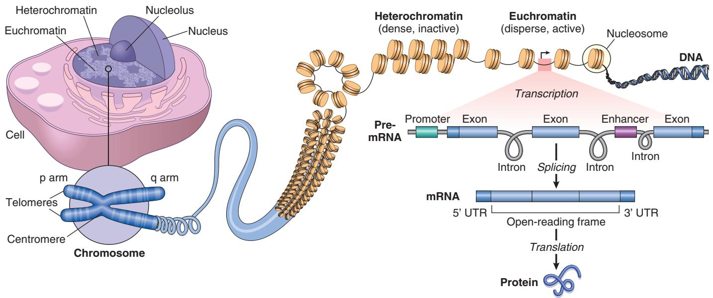 
Fig. 1.1 The organization of nuclear DNA. At the light microscopic level, the nuclear genetic material is organized into dispersed, transcriptionally active euchromatin or densely packed, transcriptionally inactive heterochromatin; chromatin can also be mechanically connected with the nuclear membrane, and nuclear membrane perturbation can thus influence transcription. Chromosomes (as shown) can only be visualized by light microscopy during cell division. During mitosis, they are organized into paired chromatids connected at centromeres; the centromeres act as the locus for the formation of a kinetochore protein complex that regulates chromosome segregation at metaphase. The telomeres are repetitive nucleotide sequences that cap the termini of chromatids and permit repeated chromosomal replication without loss of DNA at the chromosome ends. The chromatids are organized into short “P” (“petite”) and long “Q” (“next letter in the alphabet”) arms. The characteristic banding pattern of chromatids has been attributed to relative GC content (less GC content in bands relative to interbands), with genes tending to localize to interband regions. Individual chromatin fibers are composed of a string of nucleosomes—DNA wound around octameric histone cores—with the nucleosomes connected via DNA linkers. Promoters are noncoding regions of DNA that initiate gene transcription; they are on the same strand and upstream of their associated gene. Enhancers are regulatory elements that can modulate gene expression across distances of $100\mathrm{kB}$ or more by looping back onto promoters and recruiting additional factors that are needed to drive the expression of pre-mRNA species. The intronic sequences are subsequently spliced out of the pre-mRNA to produce the definitive message that includes exons that are translated into protein and $3^{\prime}-$ and $5^{\prime}$ -untranslated regions (UTR) that may have regulatory functions. In addition to the enhancer, promoter, and UTR sequences, noncoding elements are found throughout the genome; these include short repeats, regulatory factor binding regions, noncoding regulatory RNAs, and transposons.
and machinery required for assembling cells, tissues, and organisms, it is the noncoding regions of the genome that provide the critical "architectural planning."
The major classes of functional non-protein-coding DNA sequences found in the human genome include (Fig. 1.1):
- Promoter and enhancer regions that bind protein transcription factors 
- Binding sites for proteins that organize and maintain higher order chromatin structures 
Noncoding regulatory RNAs. Of the $80\%$ of the genome dedicated to regulatory functions, the vast majority is transcribed into RNAs-micro-RNAs and long noncoding RNAs (described later)-that are never translated into protein, but can regulate gene expression 
- Mobile genetic elements (e.g., transposons). Remarkably, more than one-third of the human genome is composed of such "jumping genes." These segments can cruise around the genome, and are implicated in gene regulation and chromatin organization. 
- Special structural regions of DNA, including telomeres (chromosome ends) and centromeres (chromosome "tethers")
Importantly, many genetic variations (polymorphisms) associated with diseases are located in non-protein-coding regions of the genome. Thus, variation in gene
regulation may prove to be more important in disease causation than structural changes in specific proteins. Another surprise that emerged from genome sequencing is that any two humans are typically $>99.5\%$ DNA-identical (and are $99\%$ sequence-identical with chimpanzees)! Thus, individual variation, including differential susceptibility to diseases and environmental exposures, is encoded in $<0.5\%$ of our DNA (importantly, this still represents about 15 million base pairs).
The two most common forms of DNA variation in the human genome are single-nucleotide polymorphisms (SNPs) and copy number variations (CNVs).
- SNPs are variants at single nucleotide positions and are almost always biallelic (only two choices exist at a given site within the population, such as A or T). More than 6 million human SNPs have been identified, with many showing wide variation in frequency in different populations. The following features are worthy of note:
SNPs occur across the genome—within exons, introns, intergenic regions, and coding regions. 
- Roughly $1\%$ of SNPs occur in coding regions, which is about what would be expected by chance, because coding regions comprise about $1.5\%$ of the genome. 
- SNPs located in noncoding regions can occur in regulatory elements in the genome, thereby altering gene
expression; in such instances the SNP may have a direct influence on disease susceptibility.
SNPs can also be "neutral" variants with no effect on gene function or carrier phenotype. 
- Even "neutral" SNPs may be useful markers if they happen to be coinherited with a disease-associated gene as a result of physical proximity. In other words, the SNP and the causative genetic factor are in linkage disequilibrium. 
- The effect of most SNPs on disease susceptibility is weak, and it remains to be seen if the identification of such variants, alone or in combination, can be used to develop effective strategies for disease prediction or prevention.
- CNVs are a form of genetic variation consisting of different numbers of large contiguous stretches of DNA; these can range from 1000 base pairs to millions of base pairs. In some instances these loci are, like SNPs, biallelic and simply duplicated or deleted in a subset of the population. In other instances there are complex rearrangements of genomic material, with multiple alleles in the human population. CNVs are responsible for several million base pairs of sequence difference between any
two individuals. Approximately $50\%$ of CNVs involve gene-coding sequences; thus, CNVs may underlie a large portion of human phenotypic diversity.
It is important to note that alterations in DNA sequence cannot by themselves explain the diversity of phenotypes in human populations; moreover, classical genetic inheritance cannot explain differing phenotypes in monozygotic twins. The answers to these conundrums probably lie in epigenetics—heritable changes in gene expression that are not caused by alterations in DNA sequence (see later).
# Histone Organization
Even though virtually all cells in the body have the same genetic composition, differentiated cells have distinct structures and functions arising through lineage-specific programs of gene expression. Such cell type-specific differences in DNA transcription and translation are regulated by epigenetic modifications that consist of several changes that profoundly influence gene expression, including:
Chromatin organization (Fig. 1.2). Genomic DNA is packed into nucleosomes, which are composed of 147
.GenomicDNAispackedi.jpg)
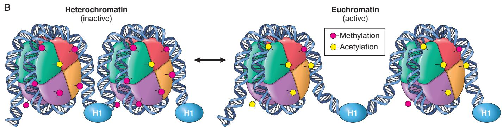 
Fig. 1.2 Chromatin organization. (A) Nucleosomes are comprised of octamers of histone proteins (two each of histone subunits H2A, H2B, H3, and H4) encircled by 1.8 loops of 147 base pairs of DNA; histone H1 sits on the 20 to 80 nucleotide linker DNA between nucleosomes and helps stabilize the overall chromatin architecture. The histone subunits are positively charged, thus allowing the compaction of the negatively charged DNA. (B) The relative state of DNA unwinding (and thus access for transcription factors) is regulated by histone modification, for example, by acetylation, methylation, and/or phosphorylation (so-called "marks"); marks are dynamically written and erased. Certain marks such as histone acetylation "open up" the chromatin structure, whereas others, such as methylation of particular histone residues, tend to condense the DNA and lead to gene silencing. DNA itself can also be also be methylated, a modification that is associated with transcriptional inactivation.
base pair DNA segments wrapped around a central core of proteins called histones. Nucleosomes resemble beads joined by short DNA linkers; the entire structure is generically called chromatin. Importantly, the winding and compaction of chromatin in any given cell varies in different genomic regions. Thus, nuclear chromatin exists in two basic forms (visualizable by standard histology): (1) histochemically dense and transcriptionally inactive heterochromatin and (2) histochemically dispersed and transcriptionally active euchromatin. Because only euchromatin permits gene expression and thereby dictates cellular identity and activity, there are a host of mechanisms that tightly regulate the state of chromatin (described below).
- DNA methylation. High levels of DNA methylation in gene regulatory elements typically result in chromatin condensation and transcriptional silencing. Like histone modifications (see later), DNA methylation is tightly regulated by methyltransferases, demethylating enzymes, and methylated-DNA-binding proteins. 
- Histone modifying factors. Nucleosomes are highly dynamic structures regulated by an array of nuclear proteins and post-translational modifications:
- Chromatin remodeling complexes can reposition nucleosomes on DNA, exposing (or obscuring) gene regulatory elements such as promoters. 
- "Chromatin writer" complexes carry out more than 70 different covalent histone modifications generically denoted as marks. These include methylation, acetylation, and phosphorylation of specific histone amino acid residues: Histone methylation of lysines and arginines is accomplished by specific writer enzymes; methylation of histone lysine residues can lead to transcriptional activation or repression, depending on which histone residue is "marked." Histone acetylation of lysine residues (occurring through histone acetyl transferases) tends to open up chromatin and increase transcription; histone deacetylases (HDAC) reverse this process, leading to chromatin condensation. Histone phosphorylation of serine residues can variably open or condense chromatin, to increase or decrease transcription, respectively. 
- Histone marks are reversible through the activity of "chromatin erasers." Other proteins function as "chromatin readers," binding histones that bear particular marks and thereby regulating gene expression.
The mechanisms involved in the cell-specific epigenetic regulation of genomic organization and gene expression are undeniably complex. Despite the intricacies, learning to manipulate these processes will likely bear significant therapeutic benefits because many diseases are associated with inherited or acquired epigenetic alterations, and dysregulation of the "epigenome" has a central role in the genesis of benign and malignant neoplasms (Chapter 6). Moreover—unlike genetic changes—epigenetic alterations (e.g., histone acetylation and DNA methylation) are readily reversible and are therefore amenable to intervention; indeed, HDAC inhibitors and DNA methylation inhibitors are already being used in the treatment of various forms of cancer.
# Micro-RNA and Long Noncoding RNA
Another mechanism of gene regulation depends on the functions of noncoding RNAs. As the name implies, these are encoded by genes that are transcribed but not translated. Although many distinct families of noncoding RNAs exist, only two examples are discussed here: small RNA molecules called microRNAs and long noncoding RNAs $>200$ nucleotides in length.
- Micro-RNAs (miRNAs) are relatively short RNAs (22 nucleotides on average) that function primarily to modulate the translation of target mRNAs into their corresponding proteins. Posttranscriptional silencing of gene expression by miRNA is a fundamental and evolutionarily conserved mechanism of gene regulation present in all eukaryotes (plants and animals). Even bacteria have a primitive version of the same general machinery that they use to protect themselves against foreign DNA (e.g., from phages and viruses). 
- The human genome contains almost 6000 miRNA genes, only 3.5-fold less than the number of protein-coding genes. Moreover, individual miRNAs appear to regulate multiple protein-coding genes, allowing each miRNA to coregulate entire programs of gene expression. Transcription of miRNA genes produces a primary transcript (pri-miRNA) that is processed into progressively smaller segments, including trimming by the enzyme Dicer. This generates mature single-stranded miRNAs of 21 to 30 nucleotides that associate with a multiprotein aggregate called RNA-induced silencing complex (RISC; Fig. 1.3). Subsequent base pairing between the miRNA strand and its target mRNA directs the RISC to either induce mRNA cleavage or to repress its translation. In this way, the target mRNA is posttranscriptionally silenced.
Taking advantage of the same pathway, small interfering RNAs (siRNAs) are short RNA sequences that can be introduced into cells. These serve as substrates for Dicer and interact with the RISC complex in a manner analogous to endogenous miRNAs. Synthetic siRNAs that can target specific mRNA species are therefore powerful laboratory tools to study gene function (so-called knockdown technology); they also are promising as therapeutic agents to silence pathogenic genes, e.g., oncogenes involved in neoplastic transformation.
- Long noncoding RNA (lncRNA). The human genome also contains a very large number of lncRNAs—at least 30,000, with the total number potentially exceeding coding mRNAs by 10- to 20-fold. lncRNAs modulate gene expression in many ways (Fig. 1.4); for example, they can bind to regions of chromatin, restricting RNA polymerase access to coding genes within the region. The best-known example of a repressive function involves XIST, which is transcribed from the X chromosome and plays an essential role in physiologic X chromosome inactivation. XIST itself escapes X inactivation, but forms a repressive "cloak" on the X chromosome from which it is transcribed, resulting in gene silencing. Conversely, it has been appreciated that many enhancers are sites of lncRNA synthesis, with the lncRNAs expanding transcription from gene promoters through
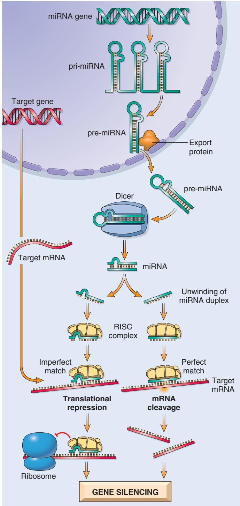 
Fig. 1.3 Generation of microRNAs (miRNA) and their mode of action in regulating gene function. miRNA genes are transcribed to produce a primary miRNA (pri-miRNA), which is processed within the nucleus to form pre-miRNA composed of a single RNA strand with secondary hairpin loop structures that form stretches of double-stranded RNA. After this pre-miRNA is exported out of the nucleus via specific transporter proteins, the cytoplasmic enzyme Dicer trims the pre-miRNA to generate mature double-stranded miRNAs of 21 to 30 nucleotides. The miRNA subsequently unwinds, and the resulting single strands are incorporated into the multiprotein RISC. Base pairing between the single-stranded miRNA and its target mRNA directs RISC to either cleave the mRNA target or to repress its translation. In either case, the target mRNA gene is silenced posttranscriptionally.
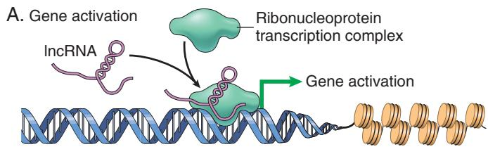
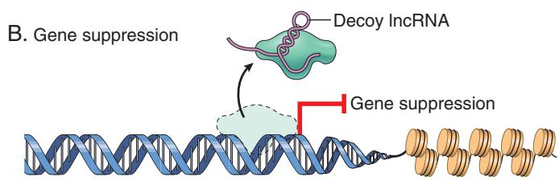
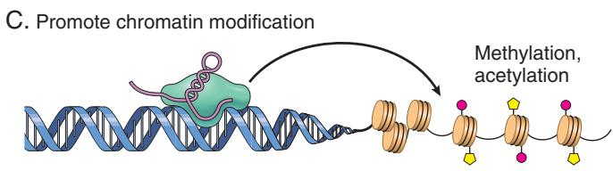
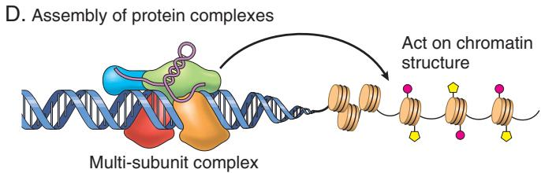 
Fig. 1.4 Roles of long noncoding RNAs (lncRNAs). (A) Long noncoding RNAs (lncRNAs) can facilitate transcription factor binding and thus promote gene activation. (B) Conversely, lncRNAs can preemptively bind transcription factors and thus prevent gene transcription. (C) Histone and DNA modification by acetylases or methylases (or deacetylases and demethylases) may be directed by the binding of lncRNAs. (D) In other instances lncRNAs may act as scaffolding to stabilize secondary or tertiary structures and/or multisubunit complexes that influence general chromatin architecture or gene activity. (Adapted from Wang KC, Chang HY: Molecular mechanisms of long noncoding RNAs, Mol Cell 43:904, 2011.)
a variety of mechanisms (Fig. 1.4). Ongoing studies are exploring the role of lncRNAs in diseases like atherosclerosis and cancer.
# Gene Editing
Exciting new developments that permit exquisitely specific genome editing stand to usher in an era of molecular revolution. These advances come from a wholly unexpected source: the discovery of clustered regularly interspaced short palindromic repeats (CRISPRs) and Cas (or CRISPR-associated genes). These are linked genetic elements that endow prokaryotes with a form of acquired immunity to phages and plasmids. Bacteria use this system to sample the DNA of infecting agents, incorporating it into the host genome as CRISPRs. CRISPRs are transcribed and processed into an RNA sequence that binds and directs the nuclease Cas9 to a sequences (e.g., a phage), leading to its cleavage and the destruction of the phage. Gene editing repurposes this process by using artificial guide RNAs (gRNAs) that bind Cas9 and are complementary to a DNA
sequence of interest. Once directed to the target sequence by the gRNA, Cas9 induces double-strand DNA breaks.
Repair of the resulting highly specific cleavage sites can lead to somewhat random disruptive mutations in the targeted sequences (through nonhomologous end joining [NHEJ]), or the precise introduction of new sequences of interest (by homologous recombination). Both the gRNAs and the Cas9 enzyme can be delivered to cells with a single easy-to-build plasmid (Fig. 1.5). However, the real beauty
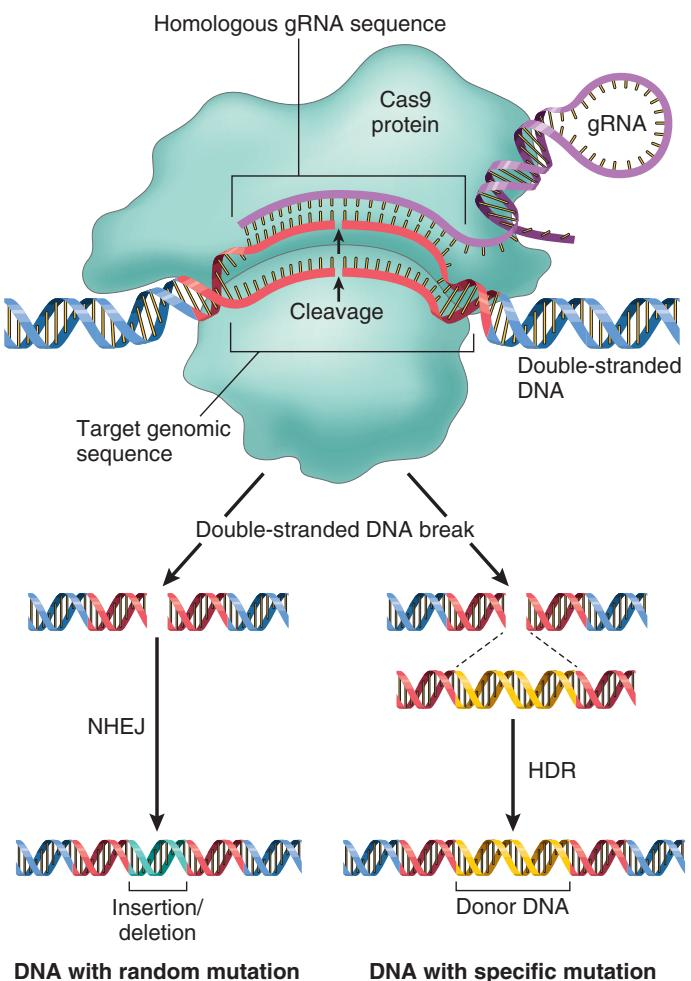 
Fig. 1.5 Gene editing with clustered regularly interspersed short palindromic repeats (CRISPRs)/Cas9. In bacteria, DNA sequences consisting of CRISPRs are transcribed into guide RNAs (gRNAs) with a constant region and a variable sequence of about 20 bases. The constant regions of gRNAs bind to Cas9, permitting the variable regions to form heteroduplexes with homologous host cell DNA sequences. The Cas9 nuclease then cleaves the bound DNA, producing a double-stranded DNA break. To perform gene editing, gRNAs are designed with variable regions that are homologous to a target DNA sequence of interest. Coexpression of the gRNA and Cas9 in cells leads to efficient cleavage of the target sequence. In the absence of homologous DNA, the broken DNA is repaired by nonhomologous end joining (NHEJ), an error-prone method that often introduces disruptive insertions or deletions (indels). By contrast, in the presence of a homologous "donor" DNA spanning the region targeted by CRISPR/Cas9, cells instead may use homologous DNA recombination (HDR) to repair the DNA break. HDR is less efficient than NHEJ, but has the capacity to introduce precise changes in DNA sequence. Potential applications of CRISPR/Cas9 coupled with HDR include the repair of inherited genetic defects and the creation of pathogenic mutations.
of the system (and the excitement about its genetic engineering potential) comes from its impressive flexibility and specificity, which is substantially better than other previous editing systems. Applications include inserting specific mutations into the genomes of cells to model cancers and other diseases, and rapidly generating transgenic animals from edited embryonic stem cells. On the flip side, it now is feasible to selectively "correct" mutations that cause heritable disease, or — perhaps more worrisome—to just eliminate less "desirable" traits. Predictably, the technology has inspired a vigorous debate regarding its application.
# CELLULAR HOUSEKEEPING
The viability and normal activity of cells depend on a variety of fundamental housekeeping functions that all differentiated cells must perform.
Many normal housekeeping functions are compartmentalized within membrane-bound intracellular organelles (Fig. 1.6). By isolating certain cellular functions within distinct compartments, potentially injurious degradative enzymes or reactive metabolites can be concentrated or stored at high concentrations in specific organelles without risking damage to other cellular constituents. Moreover, compartmentalization allows for the creation of unique intracellular environments (e.g., low pH or high calcium) that are optimal for certain enzymes or metabolic pathways.
New proteins destined for the plasma membrane or secretion are synthesized in the rough endoplasmic reticulum (RER) and physically assembled in the Golgi apparatus; proteins intended for the cytosol are synthesized on free ribosomes. Smooth endoplasmic reticulum (SER) may be abundant in certain cell types such as gonads and liver where it serves as the site of steroid hormone and lipoprotein synthesis, as well as the modification of hydrophobic compounds such as drugs into water-soluble molecules for export.
Cells catabolize the wide variety of molecules that they endocytose, as well as their own repertoire of proteins and organelles—all of which are constantly being degraded and renewed. Breakdown of these constituents takes place at three different sites, ultimately serving different functions.
- Proteasomes are "disposal" complexes that degrade denatured or otherwise "tagged" cytosolic proteins and release short peptides. In some cases the peptides so generated are presented in the context of class I major histocompatibility molecules to help drive the adaptive immune response (Chapter 5). In other cases, proteasomal degradation of regulatory proteins or transcription factors can trigger or shut down cellular signaling pathways. 
- Lysosomes are intracellular organelles that contain enzymes that digest a wide range of macromolecules, including proteins, polysaccharides, lipids, and nucleic acids. They are the organelle in which phagocytosed microbes and damaged or unwanted cellular organelles are degraded and eliminated. 
- Peroxisomes are specialized cell organelles that contain catalase, peroxidase and other oxidative enzymes. They
Relative volumes of intracellular organelles (hepatocyte) 
Compartment% total volumenumber/cellrole in the cellCytosol54%1metabolism, transport, protein translationMitochondria22%1700energy generation, apoptosisRough ER9%1*synthesis of membrane and secreted proteinsSmooth ER, Golgi6%1*protein modification, sorting, catabolismNucleus6%1cell regulation, proliferation, DNA transcriptionEndosomes1%200intracellular transport and export, ingestion of extracellular substancesLysosomes1%300cellular catabolismPeroxisomes1%400very long-chain fatty acid metabolism
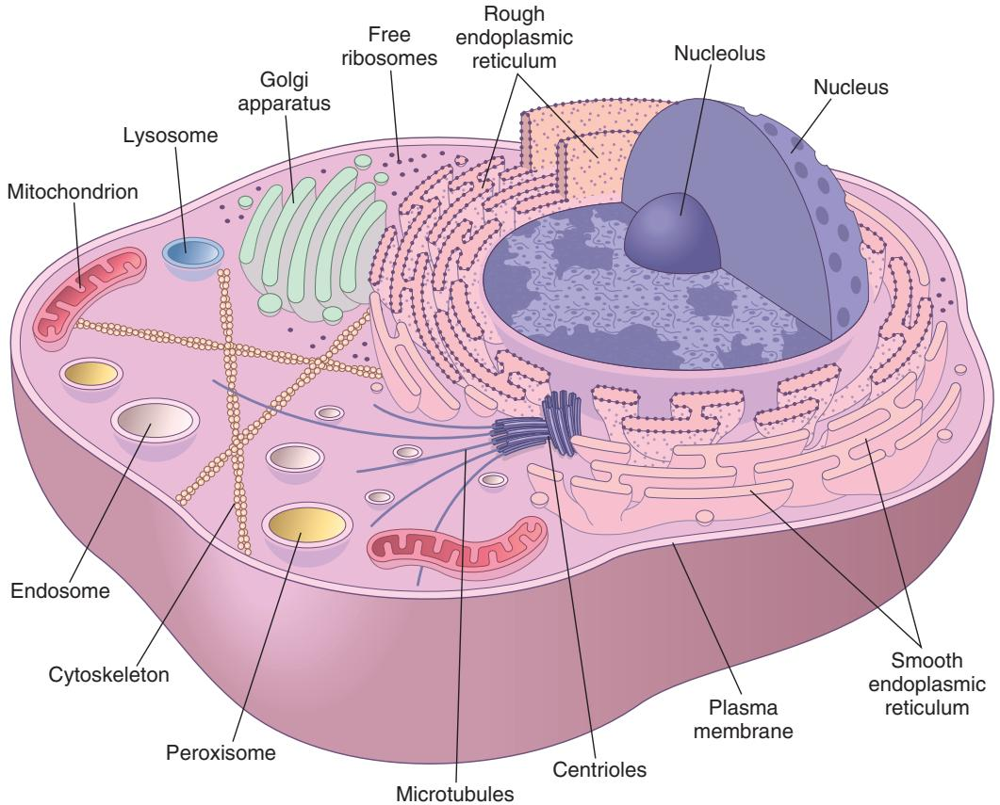 
Fig. 1.6 Basic subcellular constituents of cells. The table presents the number of various organelles within a typical hepatocyte, as well as their volume within the cell. The figure shows geographic relationships but is not intended to be accurate to scale. *Rough and smooth ER form a single compartment; the Golgi apparatus is organized as a set of discrete stacked cisternae interconnected by transport vesicles. (Adapted from Weibel ER, Stäubli W, Gnagi HR, et al: Correlated morphometric and biochemical studies on the liver cell. I. Morphometric model, stereologic methods, and normal morphometric data for rat liver, J Cell Biol 42:68, 1969.)
play a specialized role in the breakdown of very long chain fatty acids, generating hydrogen peroxide in the process.
The contents and position of cellular organelles also are subject to regulation. Endosomal vesicles shuttle internalized material to the appropriate intracellular sites or direct newly synthesized materials to the cell surface or targeted organelle. Movement of both organelles and proteins within the cell and of the cell in its environment is orchestrated by the cytoskeleton. These structural proteins also regulate cellular shape and intracellular organization, requisites for maintaining cell polarity. This is particularly critical in epithelia, in which the top of the cell (apical) and the bottom and side of the cell (basolateral) are often exposed to different environments and have distinct functions.
Most of the adenosine triphosphate (ATP) that powers cells is made through oxidative phosphorylation in the mitochondria. However, mitochondria also serve as an important source of metabolic intermediates that are needed for anabolic metabolism. They also are sites of synthesis of certain macromolecules (e.g., heme), and contain important sensors of cell damage that can initiate and regulate the process of apoptotic cell death.
Cell growth and maintenance require a constant supply of both energy and the building blocks that are needed for synthesis of macromolecules. In growing and dividing cells, all of these organelles have to be replicated (organellar biogenesis) and correctly apportioned in daughter cells following mitosis. Moreover, because the macromolecules and organelles have finite life spans (mitochondria, e.g., last only about 10 days), mechanisms also must exist that allow for the recognition and degradation of "worn
out" cellular components. The final catabolism occurs in lysosomes.
With this as a primer, we now move on to discuss cellular components and their function in greater detail.
# Plasma Membrane: Protection and Nutrient Acquisition
Plasma membranes (and all other organellar membranes) are more than just static lipid sheaths. Rather, they are fluid bilayers of amphipathic phospholipids with hydrophilic head groups that face the aqueous environment and hydrophobic lipid tails that interact with each other to form a barrier to passive diffusion of large or charged molecules (Fig. 1.7A). The bilayer is composed of a heterogeneous collection of different phospholipids, which are distributed asymmetrically—for example, certain membrane lipids preferentially associate with extracellular or cytosolic faces. Asymmetric partitioning of phospholipids is important in several cellular processes:
- Phosphatidylinositol on the inner membrane leaflet can be phosphorylated, serving as an electrostatic scaffold for intracellular proteins; alternatively, polyphosphoinositides can be hydrolyzed by phospholipase C to generate intracellular second signals such as diacylglycerol and inositol trisphosphate. 
- Phosphatidylserine is normally restricted to the inner face where it confers a negative charge and is involved in electrostatic interactions with proteins; however, when it flips to the extracellular face, which happens in
cells undergoing apoptosis (programmed cell death), it becomes an "eat me" signal for phagocytes. In the special case of platelets, it serves as a cofactor in the clotting of blood.
- Glycolipids and sphingomyelin are preferentially expressed on the extracellular face; glycolipids (and particularly gangliosides, with complex sugar linkages and terminal sialic acids that confer negative charges) are important in cell-cell and cell-matrix interactions, including inflammatory cell recruitment and sperm-egg interactions.
Certain membrane components associate laterally with each other in the bilayer, leading to distinct domains called lipid rafts. Because inserted membrane proteins have different intrinsic solubilities in various lipid domains, they tend to accumulate in certain regions of the membrane (e.g., rafts) and to become depleted from others. Such nonrandom distributions of lipids and membrane proteins impact cell-cell and cell-matrix interactions, as well as intracellular signaling and the generation of specialized membrane regions involved in secretory or endocytic pathways.
The plasma membrane is liberally studded with a variety of proteins and glycoproteins involved in (1) ion and metabolite transport, (2) fluid-phase and receptor-mediated uptake of macromolecules, and (3) cell-ligand, cell-matrix, and cell-cell interactions. Proteins interact with the lipid bilayer by one of four general arrangements (Fig. 1.7B):
- Most proteins are transmembrane (integral) proteins, having one or more relatively hydrophobic $\alpha$ -helical
proteins,ha.jpg) 
A
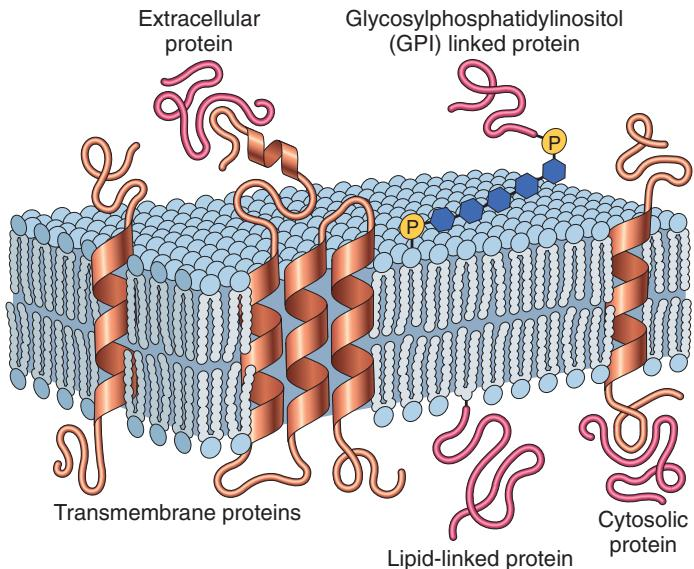 
B 
Fig. 1.7 Plasma membrane organization and asymmetry. (A) The plasma membrane is a bilayer of phospholipids, cholesterol, and associated proteins. The phospholipid distribution within the membrane is asymmetric; phosphatidylcholine and sphingomyelin are overrepresented in the outer leaflet, and phosphatidylserine (negative charge) and phosphatidylethanolamine are predominantly found on the inner leaflet; glycolipids occur only on the outer face where they contribute to the extracellular glycocalyx. Non-random partitioning of certain membrane components such as cholesterol creates membrane domains known as lipid rafts. (B) Membrane-associated proteins may traverse the membrane (singly or multiply) via $\alpha$ -helical hydrophobic amino acid sequences; depending on the sequence and hydrophobicity of these domain, such proteins may be enriched or excluded from lipid rafts and other membrane domain. Proteins on the cytosolic face may associate with membranes through posttranslational modifications, for example, farnesylation or addition of palmitic acid. Proteins on the extracytoplasmic face may associate with the membrane via glycosyl phosphatidyl inositol linkages. Besides protein-protein interactions within the membrane, membrane proteins can also associate with extracellular and/or intracytoplasmic proteins to generate large, relatively stable complexes (e.g., the focal adhesion complex). Transmembrane proteins can translate mechanical forces (e.g., from the cytoskeleton or ECM) as well as chemical signals across the membrane. It is worth remembering that a similar organization of lipids and associated proteins also occurs within the various organellar membranes.
segments that traverse the lipid bilayer. Integral membrane proteins typically contain positively charged amino acids in their cytoplasmic domains that anchor the proteins to the negatively charged head groups of membrane phospholipids.
- Proteins may be synthesized in the cytosol and posttranslationally attached to prenyl groups (e.g., farnesyl, related to cholesterol) or fatty acids (e.g., palmitic or myristic acid) that insert into the cytosolic side of the plasma membrane. 
- Attachment to membranes can occur through glycosylphosphatidylinositol (GPI) anchors on the extracellular face of the membrane. 
- Extracellular proteins can noncovalently associate with transmembrane proteins, which serve to anchor them to the cell.
Many plasma membrane proteins function together as larger complexes; these may assemble under the control of chaperone molecules in the RER or by lateral diffusion in the plasma membrane. The latter mechanism is characteristic of many protein receptors (e.g., cytokine receptors) that dimerize or trimerize in the presence of ligand to form functional signaling units. Although lipid bilayers are fluid in the two-dimensional plane of the membrane, membrane components can nevertheless be constrained to discrete domains. This can occur by localization to lipid rafts (discussed earlier), or through intercellular protein-protein interactions (e.g., at tight junctions) that establish discrete boundaries; indeed, this strategy is used to maintain cell polarity (e.g., top/apical versus bottom/basolateral) in epithelial layers. Alternatively, unique domains can be formed through the interaction of membrane proteins with cytoskeletal molecules or an extracellular matrix (ECM).
The extracellular face of the plasma membrane is diffusely studded with carbohydrates, not only as complex oligosaccharides on glycoproteins and glycolipids, but also as polysaccharide chains attached to integral membrane proteoglycans. This glycocalyx functions as a chemical and mechanical barrier, and is also involved in cell-cell and cell-matrix interactions.
# Passive Membrane Diffusion
Small, nonpolar molecules such as $\mathrm{O}_2$ and $\mathrm{CO}_{2}$ readily dissolve in lipid bilayers and therefore rapidly diffuse across them, as do hydrophobic molecules (e.g., steroid-based molecules such as estradiol or vitamin D). Similarly, small polar molecules (<75 daltons in mass, such as water, ethanol, and urea) readily cross membranes. In contrast, the lipid bilayer is an effective barrier to the passage of larger polar molecules, even those only slightly greater than 75 daltons, such as glucose. Lipid bilayers also are impermeant to ions, no matter how small, because of their charge and high degree of hydration. We will next discuss specialized mechanisms that regulate traffic across plasma membranes.
# Carriers and Channels
For each of the larger polar molecules that must cross membranes to support normal cellular functions (e.g., for nutrient uptake and waste disposal), unique plasma membrane protein complexes are typically required. For
low-molecular-weight species (ions and small molecules up to approximately 1000 daltons), channel proteins and carrier proteins may be used (although this discussion focuses on plasma membranes, it should be noted that similar pores and channels are needed for transport across organellar membranes). Each transported molecule (e.g., ion, sugar, nucleotide) requires a transporter that is typically highly specific (e.g., glucose but not galactose):
- Channel proteins create hydrophilic pores that, when open, permit rapid movement of solutes (usually restricted by size and charge; Fig. 1.8). 
- Carrier proteins bind their specific solute and undergo a series of conformational changes to transfer the ligand across the membrane; their transport is relatively slow.
In many cases, a concentration and/or electrical gradient between the inside and outside of the cell drives solute movement via passive transport (virtually all plasma membranes have an electrical potential difference across them, with the inside negative relative to the outside). In other cases, active transport of certain solutes against a concentration gradient is accomplished by carrier molecules (not channels) using energy released by ATP hydrolysis or a coupled ion gradient. Transporter ATPases include the notorious multidrug resistance (MDR) protein, which pumps polar compounds (e.g., chemotherapeutic drugs) out of cells and may render cancer cells resistant to treatment.
Because membranes are freely permeable to water, it moves into and out of cells by osmosis, depending on relative solute concentrations. Thus, extracellular salt in excess of that in the cytosol (hypertonicity) causes a net movement of water out of cells, whereas hypotonicity causes a net movement of water into cells. The cytosol is rich in charged metabolites and protein species, which attract a large number of counterions that tend to increase the intracellular osmolarity. As a consequence, to prevent overhydration cells must constantly pump out small inorganic ions (e.g., $\mathrm{Na^{+}}$ )—typically through the activity of membrane ion-exchanging ATPases. Loss of the ability to generate energy (e.g., in a cell injured by toxins or ischemia) therefore results in osmotic swelling and eventual rupture of cells. Similar transport mechanisms also regulate intracellular and intraorganellar $\mathsf{pH}$ ; most cytosolic enzymes prefer to work at $\mathsf{pH}7.4$ , whereas lysosomal enzymes function best at $\mathsf{pH}5$ or less.
# Receptor-Mediated and
# Fluid-Phase Uptake
Uptake of fluids or macromolecules by the cell, called endocytosis, occurs by two fundamental mechanisms (Fig. 1.8). Certain small molecules—including some vitamins—are taken up by invaginations of the plasma membrane called caveolae. For larger molecules, uptake occurs after binding to specific cell-surface receptors; internalization occurs through a membrane invagination process driven by an intracellular matrix of clathrin proteins. Clathrin is a hexamer of proteins that spontaneously assembles into a basketlike lattice to drive the invagination process. We shall come back to these later.
The process by which large molecules are exported from cells is called exocytosis. In this process, proteins synthesized and packaged within the RER and Golgi apparatus
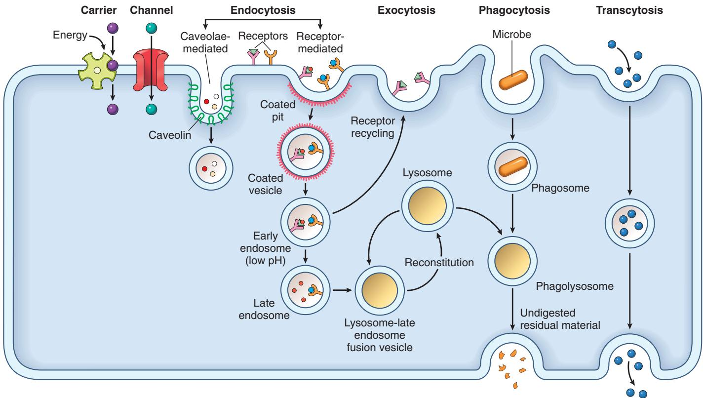 
Fig. 1.8 Movement of small molecules and larger structures across membranes. The lipid bilayer is relatively impermeable to all but the smallest and/or most hydrophobic molecules. Thus, the import or export of charged species requires specific transmembrane transporter proteins; the internalization or externalization of large proteins, complex particles, or even cells requires encircling them with segments of the membrane. Small charged solutes can move across the membrane using either channels or carriers; in general, each molecule requires a unique transporter. Channels are used when concentration gradients can drive the solute movement. Carriers are required when solute is moved against a concentration gradient. Receptor-mediated and fluid-phase uptake of material involves membrane-bound vacuoles. Caveolae endocytose extracellular fluid, membrane proteins, and some receptor-bound molecules (e.g., folate) in a process driven by caveolin proteins concentrated within lipid rafts. Pinocytosis of extracellular fluid and most surface receptor-ligand pairs involves clathrin-coated pits and vesicles. After internalization, the clathrin dissociates and can be reused, whereas the resulting vesicle progressively matures and acidifies. In the early and/or late endosome, ligand can be released from its receptor (e.g., iron released from transferrin bound to the transferrin receptor) with receptor recycling to the cell surface for another round. Alternatively, receptor and ligand within endosomes can be targeted to fuse with lysosomes (e.g., epidermal growth factor bound to its receptor); after complete degradation, the late endosome-lysosome fusion vesicle can reconstitute lysosomes. Phagocytosis involves the non-clathrin-mediated membrane invagination of large particles—typically by specialized phagocytes (e.g., macrophages or neutrophils). The resulting phagosomes eventually fuse with lysosomes to facilitate the degradation of the internalized material. Transcytosis involves the transcellular endocytotic transport of solute and/or bound ligand from one face of a cell to another. Exocytosis is the process by which membrane-bound vesicles fuse with the plasma membrane and discharge their contents to the extracellular space.
are concentrated in secretory vesicles, which then fuse with the plasma membrane and expel their contents.
Transcytosis is the movement of endocytosed vesicles between the apical and basolateral compartments of cells; this is a mechanism for transferring large amounts of intact proteins across epithelial barriers (e.g., ingested antibodies in maternal milk across intestinal epithelia) or for the rapid movement of large volumes of solute. In fact, increased transcytosis probably plays a role in the increased vascular permeability seen in tumors.
We now return to the two forms of endocytosis mentioned earlier.
- Caveolae-mediated endocytosis. Caveolae ("little caves") are noncoated plasma membrane invaginations associated with GPI-linked molecules, cyclic adenosine monophosphate (cAMP)-binding proteins, SRC-family kinases, and the folate receptor. Caveolin is the major structural protein of caveolae. Internalization of caveolae with any bound molecules and associated extracellular fluid is denoted potocytosis—literally "cellular
sipping." Although caveolae likely participate in the transmembrane delivery of some molecules (e.g., folate), they also appear to contribute to the regulation of transmembrane signaling and/or cellular adhesion via the internalization of receptors and integrins. Mutations in caveolin are associated with muscular dystrophy and electrical abnormalities in the heart.
- Pinocytosis and receptor-mediated endocytosis (Fig. 1.8). Pinocytosis ("cellular drinking") is a fluid-phase process. The plasma membrane invaginates and is pinched off to form a cytoplasmic vesicle; after delivering their cargo, endocytosed vesicles recycle back to the plasma membrane (exocytosis) for another round of ingestion. Endocytosis and exocytosis are tightly balanced and highly active, as a cell typically pinocytoses $10\%$ to $20\%$ of its own cell volume each hour, or about $1\%$ to $2\%$ of its plasma membrane each minute. Pinocytosis and receptor-mediated endocytosis begin with the formation of a clathrin-coated pit containing the ligand to be internalized (by itself or bound to the receptor), which rapidly
invaginates and pinches off to form a clathrin-coated vesicle. Thus, trapped within the vesicle is a gulp of the extracellular milieu, as well as receptor-bound macromolecules as described below. The vesicles then rapidly uncoat and fuse with an acidic intracellular structure called the early endosome, which progressively matures to late endosomes and ultimately fuses with lysosomes.
Receptor-mediated endocytosis is the major uptake mechanism for certain macromolecules, as exemplified by transferrin and low-density lipoprotein (LDL). These macromolecules bind to receptors that localize to clathrin-coated pits. After binding to their specific receptors, LDL and transferrin are endocytosed in vesicles that mature into early and late endosomes. In the acidic environment of the endosome, LDL and transferrin release their bound ligands (cholesterol and iron, respectively), which then exit into the cytosol, and the LDL receptor and transferrin receptor subsequently recycle to the plasma membrane. Defects in receptor-mediated transport of LDL are responsible for familial hypercholesterolemia, as described in Chapter 7.
# Cytoskeleton
The ability of cells to adopt a particular shape, maintain polarity, organize the intracellular organelles, and move about depends on the intracellular scaffolding of proteins called the cytoskeleton (Fig. 1.9). In eukaryotic cells, there are three major classes of cytoskeletal proteins:
- Actin microfilaments are fibrils 5- to 9-nm in diameter formed from the globular protein actin (G-actin), the most abundant cytosolic protein in cells. G-actin monomers noncovalently polymerize into long filaments (F
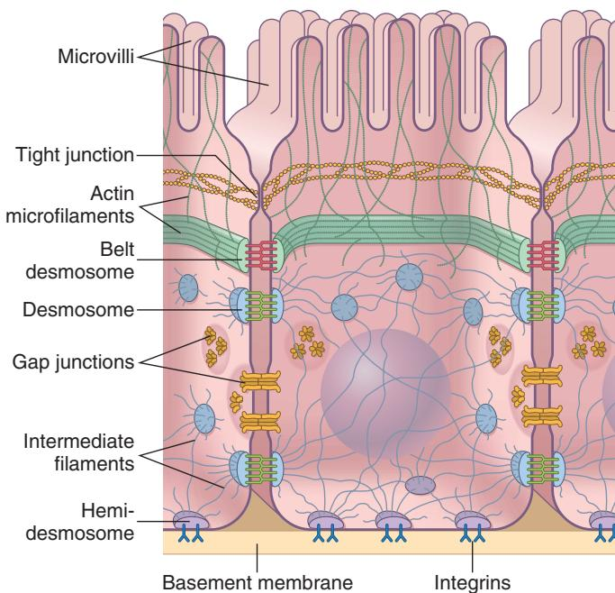 
Fig. 1.9 Cytoskeletal elements and cell-cell interactions. Interepithelial adhesion involves several different surface protein interactions, including tight junctions and desmosomes; adhesion to the ECM involves cellular integrins (and associated proteins) within hemidesmosomes. See text for details.
actin) that intertwine to form double-stranded helices. In muscle cells, the filamentous protein myosin binds to actin and moves along it, driven by ATP hydrolysis (the basis of muscle contraction). In non-muscle cells, F-actin assembles via an assortment of actin-binding proteins into well-organized bundles and networks that control cell shape and movement.
- Intermediate filaments are fibrils $10\mathrm{-nm}$ in diameter that comprise a large and heterogeneous family. Members include lamins A, B, and C, which contribute to the structure of nuclear lamina. Individual types of intermediate filaments have characteristic tissue-specific patterns of expression that are useful for identifying the cellular origin of poorly differentiated tumors.
- Vimentin: Mesenchymal cells (fibroblasts, endothelium) anchoring intracellular organelles 
- Desmin: Muscle cells, forming the scaffold on which actin and myosin contract 
- Neurofilaments: Axons of neurons, imparting strength and rigidity 
Glial fibrillary acidic protein: Glial cells that support neurons 
- Cytokeratins: Epithelial cells express more than 30 distinct varieties with distinct patterns of expression in different lineages (e.g., lung versus gastrointestinal epithelia). These can serve as histochemical markers for various epithelia
Intermediate filaments are found predominantly in a ropelike polymerized form and primarily serve to impart tensile strength and allow cells to bear mechanical stress. The nuclear membrane lamins are important not only for maintaining nuclear morphology but also for regulating nuclear gene transcription. The critical roles of lamins is emphasized by rare but fascinating disorders caused by lamin mutations, which range from certain forms of muscular dystrophy to progeria, a disease of premature aging. Intermediate filaments also form the major structural proteins of epidermis and hair.
- Microtubules are 25-nm-thick fibrils composed of noncovalently polymerized dimers of $\alpha$ - and $\beta$ -tubulin arrayed in constantly elongating or shrinking hollow tubes with a defined polarity; the ends are designated "+" or "-" The "−" end is typically embedded in a microtubule organizing center (MTOC or centrosome) near the nucleus where it is associated with paired centrioles, while the "+" end elongates or recedes in response to various stimuli by the addition or subtraction of tubulin dimers. Microtubules are involved in several important cellular functions:
- Support cables for "molecular motor" proteins that allow the movement of vesicles and organelles around cells. Kinesins are the motors for anterograde $(- \mathrm{to} +)$ transport, whereas dyneins move cargo in a retrograde direction $(+ \mathrm{to} -)$ . 
- The mechanical support for sister chromatid separation during mitosis 
- The core of primary cilia, single nonmotile projections on nucleated cells that help regulate proliferation and differentiation 
- The core of motile cilia (e.g., in bronchial epithelium) or flagella (in sperm)
# Cell-Cell Interactions
Cells interact and communicate with one another by forming junctions that provide mechanical links and enable surface receptors to recognize ligands on other cells. Cell junctions are organized into three basic types (Fig. 1.9):
- Occluding junctions (tight junctions) seal adjacent cells together to create a continuous barrier that restricts the paracellular (between cells) movement of ions and other molecules. Viewed en face, occluding junctions form a tight meshlike network of macromolecular contacts between neighboring cells. The complexes that mediate these cell-cell interactions are composed of multiple proteins, including occludin and claudin. In addition to being a high-resistance barrier to solute movement, occluding junctions also maintain cellular polarity by forming the boundary between apical and basolateral domains of cells. Significantly, these junctions (as well as the desmosomes described later) are dynamic structures that can dissociate and reform as required to facilitate epithelial proliferation or inflammatory cell migration.
- Anchoring junctions (desmosomes) mechanically attach cells—and their intracellular cytoskeletons—to other cells or to the ECM. When the adhesion focus is between cells, and is small and rivetlike, it is designated a spot desmosome. When such a focus attaches the cell to the ECM, it is called a hemidesmosome. Similar adhesion domains can also occur as broad bands between cells, where they are denoted as belt desmosomes. Cell-cell desmosomal junctions are formed by the homotypic association of transmembrane glycoproteins called cadherins.
- In spot desmosomes, the cadherins are linked to intracellular intermediate filaments and allow extracellular forces to be mechanically communicated (and dissipated) over multiple cells. 
- In belt desmosomes, the transmembrane adhesion molecules are associated with intracellular actin microfilaments, by which they can influence cell shape and/or motility. 
- In hemidesmosomes, the transmembrane connector proteins are called integrins; like cadherins, these attach to intracellular intermediate filaments, and thus they functionally link the cytoskeleton to the ECM. Focal adhesion complexes are large macromolecular complexes that localize at hemidesmosomes, and include proteins that can generate intracellular signals when cells are subjected to increased shear stress, for example, endothelium in the bloodstream, or cardiac myocytes in a failing heart.
- Communicating junctions (gap junctions) mediate the passage of chemical or electrical signals from one cell to another. The junction consists of a dense planar array of 1.5- to 2-nm pores (called connexons) formed by hexamers of transmembrane protein connexins. These pores permit the passage of ions, nucleotides, sugars, amino acids, vitamins, and other small molecules; the permeability of the junction is rapidly reduced by lowered intracellular pH or increased intracellular calcium. Gap junctions play a critical role in cell-cell communication; in cardiac myocytes, for example, cell-to-cell
calcium fluxes through gap junctions allowing the myocardium to behave as a functional syncytium capable of coordinated waves of contraction—the beating of the heart.
# Biosynthetic Machinery: Endoplasmic Reticulum and Golgi Apparatus
The structural proteins and enzymes of the cell are constantly renewed by a balance between ongoing synthesis and intracellular degradation. The endoplasmic reticulum (ER) is the site of synthesis of all transmembrane proteins and lipids needed for the assembly of plasma membrane and cellular organelles, including the ER itself. It is also the initial site of synthesis of all molecules destined for export out of the cell. The ER is organized into a mesh-like interconnected maze of branching tubes and flattened lamellae forming a continuous sheet around a single lumen that is topologically contiguous with the extracellular environment. The ER is composed of distinct domains that are distinguished by the presence or absence of ribosomes (Fig. 1.6).
Rough ER (RER): Membrane-bound ribosomes on the cytosolic face of the RER translate mRNA into proteins that are extruded into the ER lumen or become integrated into the ER membrane. This process is directed by specific signal sequences on the N-termini of nascent proteins. Proteins insert into the ER fold and must fold properly in order to assume a functional conformation and assemble into higher order complexes. Proper folding of the extracellular domains of many proteins involves the formation of disulfide bonds. A number of inherited disorders, including many cases of familial hypercholesterolemia (Chapter 6), are cause by mutations that disrupt disulfide bond formation. In addition, N-linked oligosaccharides (sugar moieties attached to asparagine residues) are added in the ER. Chaperone molecules retain proteins in the ER until these modifications are complete and the proper conformation is achieved. If a protein fails to fold and assemble into complexes appropriately, it is retained and degraded within the ER. Moreover, excess accumulation of misfolded proteins—exceeding the capacity of the ER to edit and degrade them—leads to the ER stress response (also called the unfolded protein response or the UPR), which triggers cell death through apoptosis (Chapter 2).
As an example of the importance of the ER editing function, the disease cystic fibrosis most commonly results from misfolding of the CFTR membrane transporter protein. In cystic fibrosis, the most common mutation in the CFTR gene results in the loss of a single amino acid residue (phenylalanine 508), leading in turn to misfolding, ER retention, and degradation of the CFTR protein. The loss of CFTR function leads to abnormal epithelial chloride transport, hyperviscous bronchial secretions and recurrent airway infections (Chapter 7).
Golgi apparatus: From the RER, proteins and lipids destined for other organelles or for extracellular export are shuttled into the Golgi apparatus. This organelle consists of stacked cisternae that progressively modify proteins in an orderly fashion from cis (near the ER) to trans (near the plasma membrane); macromolecules are shuttled between
the various cisternae within membrane-bound vesicles. As molecules move from cis to trans, the N-linked oligosaccharides originally added to proteins in the ER are pruned and further modified in a stepwise fashion; O-linked oligosaccharides (sugar moieties linked to serine or threonine) are also appended. Some of this glycosylation is important in directing molecules to lysosomes (via the mannose-6-phosphate receptor); other glycosylation adducts may be important for cell-cell or cell-matrix interactions, or for clearing senescent cells (e.g., platelets and red cells). In addition to the stepwise glycosylation of lipids and proteins, the cis Golgi network is where proteins are recycled back to the ER, and the trans Golgi network is where proteins and lipids are dispatched to other organelles (including the plasma membrane), or to secretory vesicles destined for extracellular release. The Golgi complex is especially prominent in cells specialized for secretion, including goblet cells of the intestine, bronchial epithelium ( secreting large amounts of polysaccharide-rich mucus), and plasma cells ( secreting large quantities of antibodies).
Smooth ER (SER): The SER in most cells is relatively sparse, forming the transition zone from RER to transport vesicles moving to the Golgi. However, in cells that synthesize steroid hormones (e.g., in the gonads or adrenals), or that catabolize lipid-soluble molecules (e.g., in the liver), the SER may be particularly conspicuous. Indeed, repeated exposure to compounds that are metabolized by the SER (e.g., phenobarbital, which is catabolized by the cytochrome P-450 system) leads to a reactive hyperplasia of the SER. The SER also is responsible for sequestering intracellular calcium; subsequent release from the SER into the cytosol can mediate a number of responses to extracellular signals. In addition, in muscle cells, a specialized SER called the sarcoplasmic reticulum is responsible for the cyclical release and sequestration of calcium ions that regulate muscle contraction and relaxation, respectively.
# Waste Disposal: Lysosomes and Proteasomes
As already mentioned briefly, cellular waste disposal depends on the activities of lysosomes and proteasomes (Fig. 1.10).
- Lysosomes are membrane-bound organelles containing roughly 40 different acid hydrolases (i.e., enzymes that function best in acidic pH ≤5), including proteases, nucleases, lipases, glycosidases, phosphatases, and sulfatases. Lysosomal enzymes are initially synthesized in the ER lumen and then tagged with a mannose-6-phosphate (M6P) residue within the Golgi apparatus. Such M6P-modified proteins are subsequently delivered to lysosomes through trans-Golgi vesicles that express M6P receptors. The other macromolecules destined for catabolism in the lysosomes arrive by one of three other pathways (Fig. 1.10):
- Material internalized by fluid-phase pinocytosis or receptor-mediated endocytosis passes from plasma membrane to early endosome to late endosome, and ultimately into the lysosome, becoming progressively more acidic in the process. The early endosome is the first acidic compartment encountered, whereas
proteolytic enzymes only begin significant digestion in the late endosome; late endosomes mature into lysosomes.
- Senescent organelles and large protein complexes can be shuttled into lysosomes by a process called autophagy. Through poorly understood mechanisms, obsolete organelles are corralled by a double membrane derived from the ER; the membrane progressively expands to encircle a collection of structures and forms an autophagosome, which then fuses with lysosomes where the contents are catabolized. In addition to facilitating the turnover of aged and defunct cellular constituents, autophagy also is used to preserve cell viability during nutrient depletion. The significance of autophagy in cell biology was recognized by the award of the 2016 Nobel Prize to Yoshinori Ohsumi for his discoveries relating to the mechanism of autophagy. This topic is discussed in more detail in Chapter 2.
- Phagocytosis of microorganisms or large fragments of matrix or debris occur primarily in professional phagocytes (macrophages and neutrophils). The material is engulfed to form a phagosome that subsequently fuses with a lysosome.
- Proteasomes play an important role in degrading cytosolic proteins (Fig. 1.10); these include denatured or misfolded proteins (akin to what occurs within the ER), as well as other proteins whose levels and half-life need to be tightly regulated (e.g., transcription factors). Many (but not all) proteins destined for proteasome destruction are targeted after covalent addition of a protein called ubiquitin. Polyubiquitinated molecules are progressively unfolded and funneled into the polymeric proteasome complex, a cylinder containing multiple different protease activities, each with its active site pointed at the hollow core. Proteasomes digest proteins into small (6-12 amino acids) fragments that can subsequently be further degraded to their constituent amino acids and recycled, or presented to immune cells in the context of major histocompatibility complex class I molecules, an important component of host immune surveillance.
# CELLULAR METABOLISM AND MITOCHONDRIAL FUNCTION
Mitochondria evolved from ancestral prokaryotes that were engulfed by primitive eukaryotes about 1.5 billion years ago. Their origin explains why mitochondria contain their own DNA genome (circularized, about $1\%$ of the total cellular DNA), which encodes roughly $1\%$ of the total cellular proteins and approximately $20\%$ of the proteins involved in oxidative phosphorylation. Although their genomes are small, mitochondria can nevertheless perform all the steps of DNA replication, transcription, and translation. Interestingly, the mitochondrial machinery is similar to present-day bacteria; for example, mitochondria initiate protein synthesis with N-formylmethionine and are sensitive to anti-bacterial antibiotics.
Mitochondria are dynamic, constantly undergoing fission and fusion with other mitochondria; in this way,
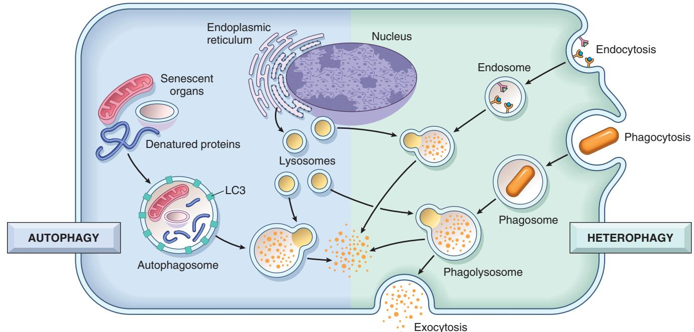 
A LYSOSOMAL DEGRADATION
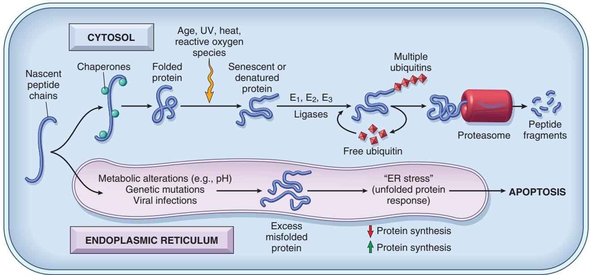 
B PROTEASOMAL DEGRADATION 
Fig. 1.10 Intracellular catabolism. (A) Lysosomal degradation. In heterophagy (right side), lysosomes fuse with endosomes or phagosomes to facilitate the degradation of their internalized contents (see Fig. 1.8). The end products may be released into the cytosol for nutrition or discharged into the extracellular space (exocytosis). In autophagy (left side), senescent organelles or denatured proteins are targeted for lysosome-driven degradation by encircling them with a double membrane derived from the ER and marked by LC3 proteins (microtubule-associated protein 1A/1B-light chain 3). Cell stressors such as nutrient depletion or certain intracellular infections can also activate the autophagocytic pathway. (B) Proteasome degradation. Cytosolic proteins destined for turnover (e.g., transcription factors or regulatory proteins), senescent proteins, or proteins that have become denatured because of extrinsic mechanical or chemical stresses can be tagged by multiple ubiquitin molecules (through the activity of $\mathsf{E}_1$ , $\mathsf{E}_2$ , and $\mathsf{E}_3$ ubiquitin ligases). This marks the proteins for degradation by proteasomes, cytosolic multisubunit complexes that degrade proteins to small peptide fragments. High levels of misfolded proteins within the ER trigger a protective unfolded protein response engendering a broad reduction in protein synthesis, but specific increases in chaperone proteins that can facilitate protein refolding. If this is inadequate to cope with the levels of misfolded proteins, apoptosis is induced.
mitochondria can undergo regular renewal to stave off degenerative changes that might occur because of genetic disorders or oxygen free radical damage. Mitochondria turn over rapidly, with estimated half-lives ranging from 1 to 10 days, depending on the tissue, nutritional status, metabolic demands, and intercurrent injury. Because the ovum
contributes the vast majority of cytoplasmic organelles to the fertilized zygote, mitochondrial DNA is virtually entirely maternally inherited. However, because the protein constituents of mitochondria derive from both nuclear and mitochondrial genetic transcription, mitochondrial disorders may be X-linked, autosomal, or maternally inherited.
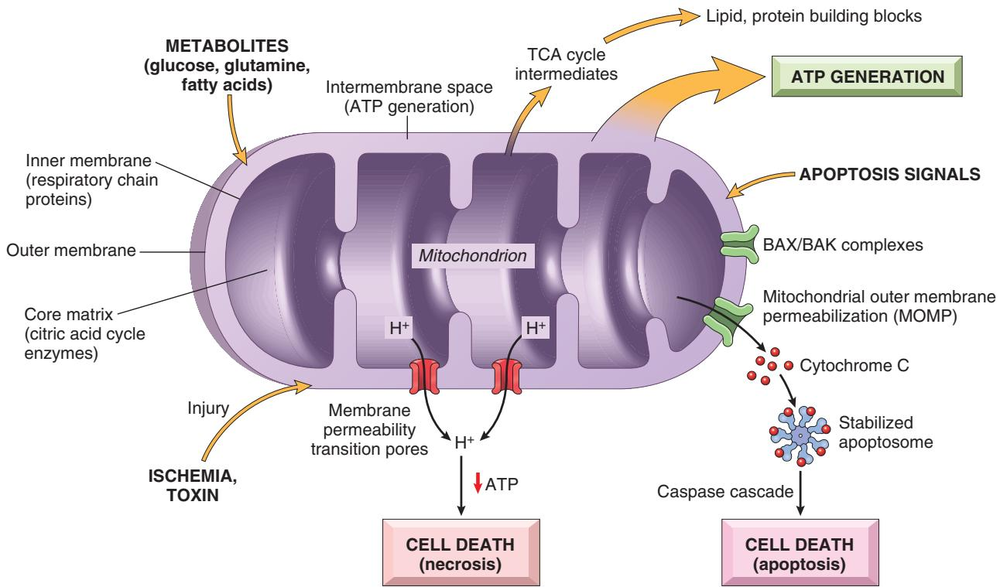 
Fig. 1.11 Roles of the mitochondria. Besides the efficient generation of ATP from carbohydrate and fatty acid substrates, mitochondria play an important role in intermediary metabolism, serving as the source of molecules used to synthesize lipids and proteins, and they also are centrally involved in cell life-and-death decisions.
Mitochondria provide the enzymatic machinery for oxidative phosphorylation (and thus the relatively efficient generation of energy from glucose and fatty acid substrates). They also have central roles in anabolic metabolism and the regulation programmed cell death, so-called "apoptosis" (Fig. 1.11).
Energy Generation. Each mitochondrion has two separate and specialized membranes. The inner membrane contains the enzymes of the respiratory chain folded into cristae. This encloses a core matrix space that harbors the bulk of certain metabolic enzymes, such as the enzymes of the citric acid cycle. Outside the inner membrane is the intermembrane space, site of ATP synthesis, which is, in turn, enclosed by the outer membrane; the latter is studded with porin proteins that form aqueous channels permeable to small (<5000 daltons) molecules. Larger molecules (and even some smaller polar species) require specific transporters.
The major source of the energy needed to run all basic cellular functions derives from oxidative metabolism. Mitochondria oxidize substrates to $\mathrm{CO}_{2}$ , and in the process transfer high-energy electrons from the original molecule (e.g., glucose) to molecular oxygen to water. The oxidation of various metabolites drives hydrogen ion (proton) pumps that transfer $\mathrm{H}^{+}$ ions from the core matrix into the intermembrane space. As these $\mathrm{H}^{+}$ ions flow back down their electrochemical gradient, the energy released is used to synthesize ATP.
It should be noted that the electron transport chain need not necessarily be coupled to ATP generation. Thus, an inner membrane protein enriched in brown fat called thermogenin (or UCP-1 = uncoupling protein 1) is a proton
transporter that can dissipate the proton gradient (uncouple it from oxidative phosphorylation) in the form of heat (nonshivering thermogenesis). As a natural (albeit usually low-level) byproduct of substrate oxidation and electron transport, mitochondria also are an important source of reactive oxygen species (e.g., oxygen free radicals, hydrogen peroxide); importantly, hypoxia, toxic injury, or even mitochondrial aging can lead to significantly increased levels of intracellular oxidative stress.
Intermediate Metabolism. Pure oxidative phosphorylation produces abundant ATP, but also "burns" glucose to $\mathrm{CO}_{2}$ and $\mathrm{H}_2\mathrm{O}$ , leaving no carbon moieties for use as building blocks for lipids or proteins. For this reason, rapidly growing cells (both benign and malignant) increase glucose and glutamine uptake and decrease their production of ATP per glucose molecule—forming lactic acid in the presence of adequate oxygen—a phenomenon called the Warburg effect (or aerobic glycolysis). Both glucose and glutamine provide carbon moieties that prime the mitochondrial tricarboxylic acid (TCA) cycle, but instead of being used to make ATP, intermediates are "spun off" to make lipids, nucleic acids, and proteins. Thus, depending on the growth state of the cell, mitochondrial metabolism can be modulated to support either cellular maintenance or cellular growth. Ultimately, growth factors, nutrient supplies, and oxygen availability, as well as cellular signaling pathways and sensors that respond to these exogenous factors, govern these metabolic decisions.
Cell Death. Mitochondria are like the proverbial Dr. Jekyll and Mr. Hyde. On the one hand, they are factories of energy production in the form of ATP that allow the cells to survive; on the other hand, they participate in driving
cell death when the cells are exposed to noxious stimuli that the cells cannot adapt to. The role of mitochondria in the two principle forms of cell death, necrosis and apoptosis, are discussed in Chapter 2. In addition to providing ATP and metabolites that enable the bulk of cellular activity, mitochondria also regulate the balance of cell survival and death.
# CELLULAR ACTIVATION
Cell communication is critical in multicellular organisms. At the most basic level, extracellular signals determine whether a cell lives or dies, whether it remains quiescent, or whether it is stimulated to perform a specific function. Intercellular signaling is important in the developing embryo, in maintaining tissue organization, and in ensuring that tissues respond in an adaptive and effective fashion to various threats, such as local tissue trauma or a systemic infection. Loss of cellular communication and the "social controls" that maintain normal relationships of cells can variously lead to unregulated growth (cancer) or an ineffective response to an extrinsic stress (as in shock).
# Cell Signaling
An individual cell is constantly exposed to a remarkable cacophony of signals, which must be "interpreted" and integrated into responses that benefit the organism as a whole. Some signals may induce a given cell type to differentiate, others may stimulate proliferation, and yet others may direct the cell to perform a specialized function. Multiple signals received in combination may trigger yet another totally unique response. Many cells require certain inputs just to continue living; in the absence of appropriate exogenous signals, they die by apoptosis.
The sources of the signals that most cells respond to can be classified into several groups:
- Pathogens and damage to neighboring cells. Many cells have an innate capacity to sense and respond to damaged cells (danger signals), as well as foreign invaders such as microbes. The receptors that generate these danger signals are discussed in Chapters 3 and 5. 
- Cell-cell contacts, mediated through adhesion molecules and/or gap junctions. As mentioned previously, gap junction signaling is accomplished between adjacent cells via hydrophilic connexons that permit the movement of small ions (e.g., calcium), various metabolites, and potential second messenger molecules such as cAMP. 
- Cell-ECM contacts, mediated through integrins, which are discussed in Chapter 3 in the context of leukocyte attachment to other cells during inflammation. 
- Secreted molecules. The most important secreted molecules include growth factors, discussed later; cytokines, a term reserved for mediators of inflammation and immune responses (also discussed in Chapters 3 and 5); and hormones, which are secreted by endocrine organs and act on different cell types (Chapter 20).
Signaling pathways also can be classified into different types based on the spatial relationships between the sending and receiving cells:
- Paracrine signaling. Cells in just the immediate vicinity are affected. Paracrine signaling may involve transmembrane "sending" molecules that activate receptors on adjacent cells or secreted factors that diffuse for only short distances. In some instances, the latter is achieved by having secreted factors bind tightly to ECM. 
- Autocrine signaling occurs when molecules secreted by a cell affect that same cell. This can serve as a means to entrain groups of cells undergoing synchronous differentiation during development, or it can be used to amplify (positive feedback) or dampen (negative feedback) a response. 
Synaptic signaling. Activated neurons secrete neurotransmitters at specialized cell junctions (synapses) onto target cells. 
- Endocrine signaling. A hormone is released into the bloodstream and acts on target cells at a distance.
Regardless of the nature of an extracellular stimulus (paracrine, synaptic, or endocrine), the signal it conveys is transmitted to the cell via a specific receptor protein. Signaling molecules (ligands) bind their respective receptors and initiate a cascade of intracellular events culminating in the desired cellular response. Ligands usually have high affinities for receptors and at physiologic concentrations bind receptors with exquisite specificity. Receptors may be present on the cell surface or located within the cell (Fig. 1.12):
- Intracellular receptors include transcription factors that are activated by lipid-soluble ligands that easily transit plasma membranes. Examples include vitamin D and steroid hormones, which activate nuclear hormone receptors. In other settings, a small and/or nonpolar signaling ligand can diffuse into adjacent cells. Such is the case for nitric oxide (NO), through which endothelial cells regulate intravascular pressure. NO is generated by an activated endothelial cell and then diffuses into adjacent vascular smooth muscle cells; there it activates guanylyl cyclase to generate cyclic GMP, an intracellular second signal that causes smooth muscle relaxation. 
- Cell-surface receptors are generally transmembrane proteins with extracellular domains that bind activating ligands. Depending on the receptor, ligand binding may (1) open ion channels (typically at the synapse between electrically excitable cells), (2) activate an associated GTP-binding regulatory protein (G protein), (3) activate an endogenous or associated enzyme, often a tyrosine kinase, or (4) trigger a proteolytic event or a change in protein binding or stability that activates a latent transcription factor. Activities (2) and (3) are associated with growth factor signaling pathways that drive cell proliferation, whereas activity (4) is a common feature of multiple pathways (e.g., Notch, Wnt, and Hedgehog) that regulate normal development. Understandably, signals transduced by cell surface receptors are often deranged in developmental disorders and in cancers.
# Signal Transduction Pathways
Binding of a ligand to a cell surface receptor mediates signaling by inducing clustering of the receptor (receptor
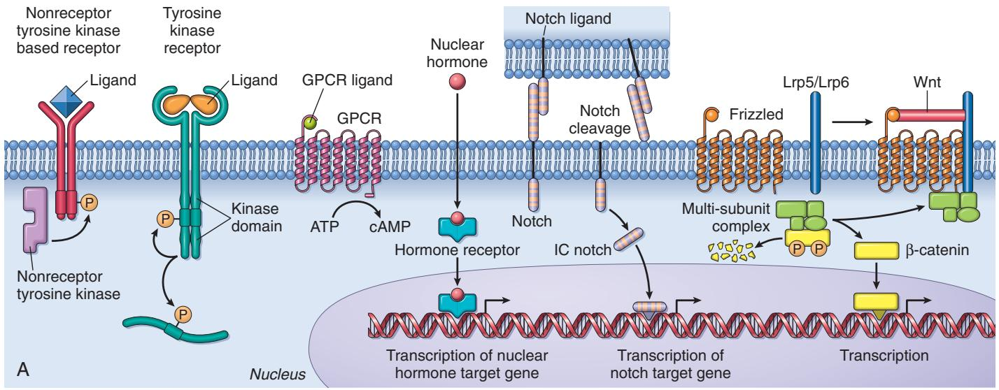
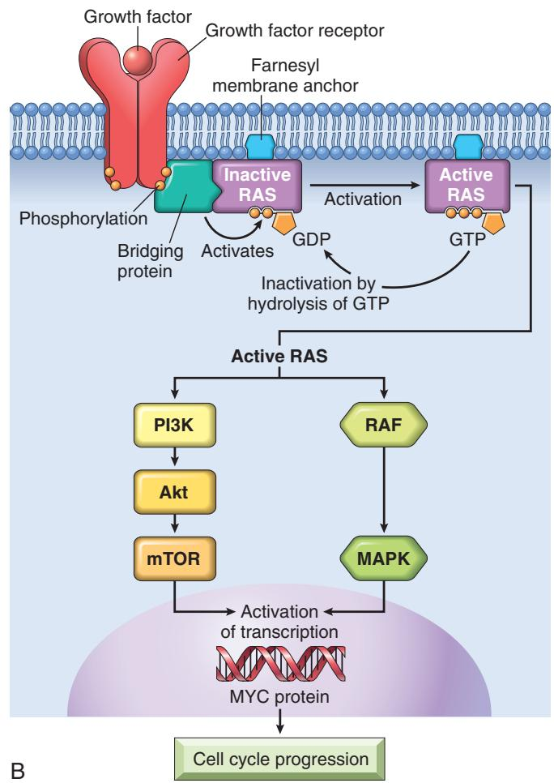 
Fig. 1.12 Receptor-mediated signaling. (A) Categories of signaling receptors, including receptors that use a nonreceptor tyrosine kinase; a receptor tyrosine kinase; a nuclear receptor that binds its ligand and can then influence transcription; a seven-transmembrane receptor linked to heterotrimeric G proteins; Notch, which recognizes a ligand on a distinct cell and is cleaved yielding an intracellular fragment that can enter the nucleus and influence transcription of specific target genes; and the Wnt/Frizzled pathway where activation releases intracellular $\beta$ -catenin from a protein complex that normally drives its constitutive degradation. The released $\beta$ -catenin can then migrate to the nucleus and act as a transcription factor. Lrp5/Lrp6, low-density lipoprotein (LDL) receptor-related proteins 5 and 6, are highly homologous and act as coreceptors in Wnt/Frizzled signaling. (B) Signaling from a tyrosine kinase-based receptor. Binding of the growth factor (ligand) causes receptor dimerization and autophosphorylation of tyrosine residues. Attachment of adapter (or bridging) proteins couples the receptor to inactive, GDP-bound RAS, allowing the GDP to be displaced in favor of GTP and yielding activated RAS. Activated RAS interacts with and activates RAF (also known as MAP kinase kinase kinase). This kinase then phosphorylates mitogen-activated protein kinase (MAPK), and activated MAP kinase phosphorylates other cytoplasmic proteins and nuclear transcription factors, generating cellular responses. Activated RAS can also interact with other components, such as phosphatidyl 3-kinase (PI3 kinase), which activates other signaling systems. The cascade is turned off when the activated RAS eventually hydrolyzes GTP to GDP converting RAS to its inactive form. Mutations in RAS that lead to delayed GTP hydrolysis can thus lead to augmented proliferative signaling. GDP, Guanosine diphosphate; GTP, guanosine triphosphate; mTOR, mammalian target of rapamycin.
crosslinking) or other conformational changes (Fig. 1.12). The common theme is that all of these perturbations cause a change in the physical state of the intracellular domain of the receptor, which then triggers additional biochemical events that lead to signal transduction.
Cellular receptors are grouped into several types based on the signaling mechanisms they use and the intracellular biochemical pathways they activate (Fig. 1.12). Receptor signaling most commonly leads to the formation or modification of biochemical intermediates and/or activation of enzymes, and ultimately to the generation of active transcription factors that enter the nucleus and alter gene expression:
- Receptors associated with kinase activity. Downstream phosphorylation is a common pathway of signal transduction. Changes in receptor geometry can stimulate intrinsic receptor protein kinase activity or promote the enzymatic activity of recruited intracellular kinases. These kinases add charged phosphate residues to target molecules. Tyrosine kinases phosphorylate specific tyrosine residues, whereas serine/threonine kinases add phosphates to distinct serine or threonine residues, and lipid kinases phosphorylate lipid substrates. For every phosphorylation event, there is also a potential counter-regulatory phosphatase, an enzyme that can remove the phosphate residue and thus modulate signaling; usually, phosphatases play an inhibitory role in signal transduction. 
- Receptor tyrosine kinases (RTKs) are integral membrane proteins (e.g., receptors for insulin, epidermal growth factor, and platelet-derived growth factor [PDGF]); ligand-induced crosslinking activates intrinsic tyrosine kinase domains located in their cytoplasmic tails. 
- Several kinds of receptors have no intrinsic catalytic activity (e.g., immune receptors, some cytokine receptors, and integrins). For these, a separate intracellular protein-known as a nonreceptor tyrosine kinase-interacts with receptors after ligand binding and phosphorylates specific motifs on the receptor or other proteins. The cellular homolog of the transforming protein of the Rous sarcoma virus, called SRC, is the prototype for an important family of such nonreceptor tyrosine kinases (Src-family kinases). SRC contains unique functional regions called Src-homology (SH) domains; SH2 domains typically bind to receptors phosphorylated by another kinase, allowing the aggregation of multiple enzymes, whereas SH3 domains mediate protein-protein interactions, often involving proline-rich domains. 
- G-protein coupled receptors are polypeptides that characteristically traverse the plasma membrane seven times (hence their designation as seven-transmembrane or serpentine receptors); more than 1500 such receptors have been identified. After ligand binding, the receptor associates with an intracellular guanosine triphosphate (GTP)-binding protein (G protein). At baseline, these G proteins contain guanosine diphosphate (GDP); interaction with a receptor-ligand complex results in G protein activation through the exchange of GDP for GTP. Downstream signaling typically involves the generation of cAMP, and inositol-1,4,5,-triphosphate $(\mathrm{IP}_3)$ , the latter releasing calcium from the ER.
- Nuclear receptors. Lipid-soluble ligands can diffuse into cells where they interact with intracellular proteins to form a receptor-ligand complex that directly binds to nuclear DNA; the results can be either activation or repression of gene transcription.
- Other classes of receptors. Other receptors—originally recognized as important for embryonic development and cell fate determination—have since been shown to participate in the functions of mature cells, particularly within the immune system. These pathways rely on protein:protein interactions, rather than enzymatic activities, to transduce signals, which may serve to allow for very precise control.
- Receptor proteins of the Notch family: ligand binding to Notch receptors leads to proteolytic cleavage of the receptor and subsequent nuclear translocation of the cytoplasmic domain (intracellular Notch) to form a transcription complex. 
- Wnt protein ligands act through a pathway involving transmembrane Frizzled family receptors, which regulate the intracellular levels of $\beta$ -catenin. In the absence of Wnt, $\beta$ -catenin is targeted for ubiquitin-directed proteasome degradation. Wnt binding to Frizzled (and other coreceptors) recruits other proteins that disrupt the degradation-targeting complex. This stabilizes $\beta$ -catenin, allowing it to translocate to the nucleus and form a transcription complex.
# Modular Signaling Proteins, Hubs, and Nodes
The traditional linear view of signaling—that receptor activation triggers an orderly sequence of biochemical intermediates that ultimately leads to changes in gene expression and the desired biological response—is oversimplified. Instead, it is increasingly clear that any initial signal results in multiple primary and secondary effects, each of which contributes in varying degrees to the final outcome. This is particularly true of signaling pathways that rely on enzymatic activities, which typically modulate a web of polypeptides with complex interactions. For example, phosphorylation of any given protein can allow it to associate with a host of other molecules, resulting in multiple effects such as:
- Enzyme activation (or inactivation) 
- Nuclear (or cytoplasmic) localization of transcription factors (see later) 
- Transcription factor activation (or inactivation) 
- Actin polymerization (or depolymerization) 
Protein degradation (or stabilization) 
- Activation of feedback inhibitory (or stimulatory) loops
Adaptor proteins play a key role in organizing intracellular signaling pathways. These proteins function as molecular connectors that physically link different enzymes and promote the assembly of complexes; adaptors can be integral membrane proteins or cytosolic proteins. A typical adaptor may contain a few specific domains (e.g., SH2 or SH3) that mediate protein-protein interactions. By influencing the proteins that are recruited to signaling complexes, adaptors can determine downstream signaling events.
By analogy with computer networks, the protein-protein complexes can be considered nodes and the biochemical events feeding into or emanating from these nodes can be thought of as hubs. Signal transduction can therefore be visualized as a kind of networking phenomenon; understanding this higher-order complexity is the province of systems biology, involving a "marriage" of biology and computation.
# Transcription Factors
Most signal transduction pathways ultimately influence cellular function by modulating gene transcription through the activation and nuclear localization of transcription factors. Conformational changes of transcription factors (e.g., following phosphorylation) can allow their translocation into the nucleus or can expose specific DNA or protein-binding motifs. Transcription factors may drive the expression of a relatively limited set of genes or may have much more widespread effects on gene expression. Among the transcription factors that regulate the expression of genes that are needed for growth are MYC and JUN, whereas a transcription factor that triggers the expression of genes that lead to growth arrest is p53. Transcription factors have a modular design, often containing domains that bind DNA and others that interact with other proteins, such as components of the RNA polymerase complex required for transcription.
- DNA-binding domains permit specific binding to short DNA sequences. Whereas some transcription factor binding sites are found in promoters, close to the site where transcription starts, it is now appreciated that most transcription factors bind widely throughout genomes, including to long-range regulatory elements such as enhancers. Enhancers function by looping back to gene promoters, and therefore are spatially located close to the genes that they regulate, even though it terms of genomic sequence they may appear to be far
away. These insights highlight the importance of chromatin organization in regulating gene expression, both normal and pathologic.
- For a transcription factor to induce transcription, it must also possess protein:protein interaction domains that directly or indirectly recruit histone-modifying enzymes, chromatin-remodeling complexes, and (most importantly) RNA polymerase—the large multiprotein enzymatic complex that is responsible for RNA synthesis.
# GROWTH FACTORS AND RECEPTORS
A major role of growth factors is to stimulate the activity of proteins that are required for cell survival, growth and division. Growth factor activity is mediated through binding to specific receptors, ultimately influencing the expression of genes that can:
- Promote entry of cells into the cell cycle 
- Relieve blocks on cell-cycle progression (thus promoting replication) 
Prevent apoptosis 
- Enhance biosynthesis of cellular components (nucleic acids, proteins, lipids, carbohydrates) required for a mother cell to give rise to two daughter cells
Although some growth factors are proteins that "just" stimulate cell proliferation and/or survival, it is important to remember that they also can drive a host of other activities, including migration, differentiation, and synthetic capacity. Some of the important growth factors relevant to tissue regeneration and repair are listed in Table 1.1 and described further in Chapter 3.
Growth factors can be involved in the proliferation of cells at steady state as well as after injury, when irreversibly damaged cells must be replaced. Uncontrolled
Table I.1 Growth Factors Involved in Regeneration and Repair 
Growth FactorSourcesFunctionsEpidermal growth factor (EGF)Activated macrophages, salivary glands, keratinocytes, and many other cellsMitogenic for keratinocytes and fibroblasts; stimulates keratinocyte migration; stimulates formation of granulation tissueTransforming growth factor-α (TGF-α)Activated macrophages, keratinocytes, many other cell typesStimulates proliferation of hepatocytes and many other epithelial cellsHepatocyte growth factor (HGF) (scatter factor)Fibroblasts, stromal cells in the liver, endothelial cellsEnhances proliferation of hepatocytes and other epithelial cells; increases cell motilityVascular endothelial growth factor (VEGF)Mesenchymal cellsStimulates proliferation of endothelial cells; increases vascular permeabilityPlatelet-derived growth factor (PDGF)Platelets, macrophages, endothelial cells, smooth muscle cells, keratinocytesChemotactic for neutrophils, macrophages, fibroblasts, and smooth muscle cells; activates and stimulates proliferation of fibroblasts, endothelial, and other cells; stimulates ECM protein synthesisFibroblast growth factors (FGFs), including acidic (FGF-1) and basic (FGF-2)Macrophages, mast cells, endothelial cells, many other cell typesChemotactic and mitogenic for fibroblasts; stimulates angiogenesis and ECM protein synthesisTransforming growth factor-β (TGF-β)Platelets, T lymphocytes, macrophages, endothelial cells, keratinocytes, smooth muscle cells, fibroblastsChemotactic for leukocytes and fibroblasts; stimulates ECM protein synthesis; suppresses acute inflammationKeratinocyte growth factor (KGF) (i.e., FGF-7)FibroblastsStimulates keratinocyte migration, proliferation, and differentiation
ECM, Extracellular membrane.
proliferation can result when the growth factor activity is dysregulated, or when growth factor signaling pathways are altered to become constitutively active. Thus, many growth factor pathway genes are proto-oncogenes, and gain-of-function mutations in these genes can convert them into oncogenes capable of driving unfettered cell proliferation and tumor formation. The following discussion summarizes selected growth factors that are involved in the important proliferative processes of tissue repair and regeneration; by virtue of their proliferative effects they can also drive tumorigenesis. Although the growth factors described here all involve receptors with intrinsic kinase activity, other growth factors may signal through each of the various pathways shown in Fig. 1.12.
- Epidermal growth factor and transforming growth factor- $\alpha$ . Both of these factors belong to the EGF family and bind to the same receptors, explaining their shared biologic activities. EGF and TGF- $\alpha$ are produced by macrophages and a variety of epithelial cells, and are mitogenic for hepatocytes, fibroblasts, and a host of epithelial cells. The "EGF receptor family" includes four membrane receptors with intrinsic tyrosine kinase activity; the best-characterized is EGFR1, also known as ERB-B1, or simply EGFR. EGFR1 mutations and/or amplification frequently occur in a number of cancers including those of the lung, head and neck, breast, and brain. The ERBB2 receptor (also known as HER2) is overexpressed in a subset of breast cancers. To treat malignancies, many of these receptors have been successfully targeted by antibodies and small molecule antagonists.
- Hepatocyte growth factor. Hepatocyte growth factor (HGF; also known as scatter factor) has mitogenic effects on hepatocytes and most epithelial cells. HGF acts as a morphogen during embryonic development (i.e., it influences the pattern of tissue differentiation), promotes cell migration (hence its designation as scatter factor), and enhances hepatocyte survival. HGF is produced by fibroblasts and most mesenchymal cells, as well as endothelium and nonhepatocyte liver cells. It is synthesized as an inactive precursor (pro-HGF) that is proteolytically activated by serine proteases released at sites of injury. The receptor for HGF is MET, which has intrinsic tyrosine kinase activity. It is frequently overexpressed or mutated in tumors, particularly renal and thyroid papillary carcinomas. Consequently, MET inhibitors are being evaluated as cancer therapies.
- Platelet-derived growth factor. PDGF is a family of several closely related proteins, each consisting of two chains (designated by pairs of letters). Three isoforms of PDGF (AA, AB, and BB) are constitutively active, while PDGF-CC and PDGF-DD must be activated by proteolytic cleavage. PDGF is stored in platelet granules and is released on platelet activation. Although originally isolated from platelets (hence the name), it also is produced by many other cells, including activated macrophages, endothelium, smooth muscle cells, and a variety of tumors. All PDGF isoforms exert their effects by binding to two cell surface receptors (PDGFR $\alpha$ and $\beta$ ), both having intrinsic tyrosine kinase activity. PDGF induces fibroblast, endothelial, and smooth muscle cell proliferation and matrix synthesis, and is chemotactic for these cells (and inflammatory cells), thus promoting
recruitment of the cells into areas of inflammation and tissue injury.
- Vascular endothelial growth factor. Vascular endothelial growth factors (VEGFs) - VEGF-A, -B, -C, and -D, and PIGF (placental growth factor) - are a family of homodimeric proteins. VEGF-A is generally referred to simply as VEGF; it is the major factor responsible for angiogenesis, inducing blood vessel development, after injury and in tumors. In comparison, VEGF-B and PIGF are involved in embryonic vessel development, and VEGF-C and -D stimulate both angiogenesis and lymphatic development (lymphangiogenesis). VEGFs also are involved in the maintenance of endothelial cells lining mature vessels. Its expression is highest in epithelial cells adjacent to fenestrated endothelium (e.g., podocytes in the kidney, pigment epithelium in the retina, and choroid plexus in the brain). VEGF induces angiogenesis by promoting endothelial cell migration and proliferation (capillary sprouting), and the formation of the vascular lumina. VEGFs also induce vascular dilation and increase vascular permeability. As might be anticipated, hypoxia is the most important inducer of VEGF production through pathways that involve activation of the transcription factor hypoxia-inducible factor (HIF-1). Other VEGF inducers - produced at sites of inflammation or wound healing - include PDGF and TGF- $\alpha$ .
VEGFs bind to a family of receptor tyrosine kinases (VEGFR-1, -2, and -3). VEGFR-2 is highly expressed in endothelium and is the most important for angiogenesis. Antibodies against VEGF are approved for the treatment of several tumors such as renal and colon cancers because cancers require angiogenesis for their spread and growth. Anti-VEGF antibodies also are used in the treatment of a number of ophthalmic diseases, including: "wet" age-related macular degeneration (AMD a disorder of inappropriate angiogenesis and vascular permeability that causes adult-onset blindness); the retinopathy of prematurity; and the leaky vessels that lead to diabetic macular edema. Finally, increased levels of soluble versions of VEGFR-1 (s-FLT-1) in pregnant women may contribute to preeclampsia (hypertension and proteinuria) by "sopping up" the free VEGF required for maintaining normal endothelium.
- Fibroblast growth factor. Fibroblast growth factor (FGF) is a family of growth factors with more than 20 members. Acidic FGF (aFGF, or FGF-1) and basic FGF (bFGF, or FGF-2) are the best characterized; FGF-7 is also referred to as keratinocyte growth factor (KGF). Released FGFs associate with heparan sulfate in the ECM, which serves as a reservoir for inactive factors that can be subsequently released by proteolysis (e.g., at sites of wound healing). FGFs transduce signals through four tyrosine kinase receptors (FGFR 1-4). FGFs contribute to wound healing responses, hematopoiesis, and development; bFGF has all the activities necessary for angiogenesis as well.
- Transforming growth factor- $\beta$ . TGF- $\beta$ has three isoforms (TGF- $\beta$ 1, TGF- $\beta$ 2, and TGF- $\beta$ 3) that belong to a family with about 30 members, including bone morphogenetic proteins (BMPs), activins, inhibins, and Müllerian inhibiting substance. TGF- $\beta$ 1 has the most widespread distribution, and it is more commonly referred to simply as
TGF- $\beta$ . It is a homodimeric protein produced by multiple cell types, including platelets, endothelium, and mononuclear inflammatory cells. TGF- $\beta$ is secreted as a precursor that requires proteolysis to yield the biologically active protein. There are two TGF- $\beta$ receptors, both with serine/threonine kinase activity that induces the phosphorylation of several downstream cytoplasmic transcription factors called Smads. Phosphorylated Smads form heterodimers with Smad4, allowing nuclear translocation and association with other DNA-binding proteins to activate or inhibit gene transcription. TGF- $\beta$ produces multiple and often opposing effects depending on the tissue type and concurrent signals. Agents with such multiplicity of effects are called pleiotropic, and TGF- $\beta$ is "pleiotropic with a vengeance." Primarily, TGF- $\beta$ drives scar formation by stimulating matrix synthesis through decreased matrix metalloproteinase (MMP) activity and increased activity of tissue inhibitors of proteinases (TIMPs). TGF- $\beta$ also applies brakes
to the inflammation that accompanies wound healing by inhibiting lymphocyte proliferation and the activity of other leukocytes.
# EXTRACELLULAR MATRIX
The ECM is a network of interstitial proteins that constitutes a significant proportion of any tissue. Cell interactions with ECM are critical for development and healing, as well as for maintaining normal tissue architecture (Fig. 1.13). Much more than a simple "space filler" around cells, ECM serves several key functions:
- Mechanical support for cell anchorage and cell migration, and maintenance of cell polarity. 
- Control of cell proliferation, by binding and displaying growth factors and by signaling through cellular receptors of the integrin family. The ECM provides a depot
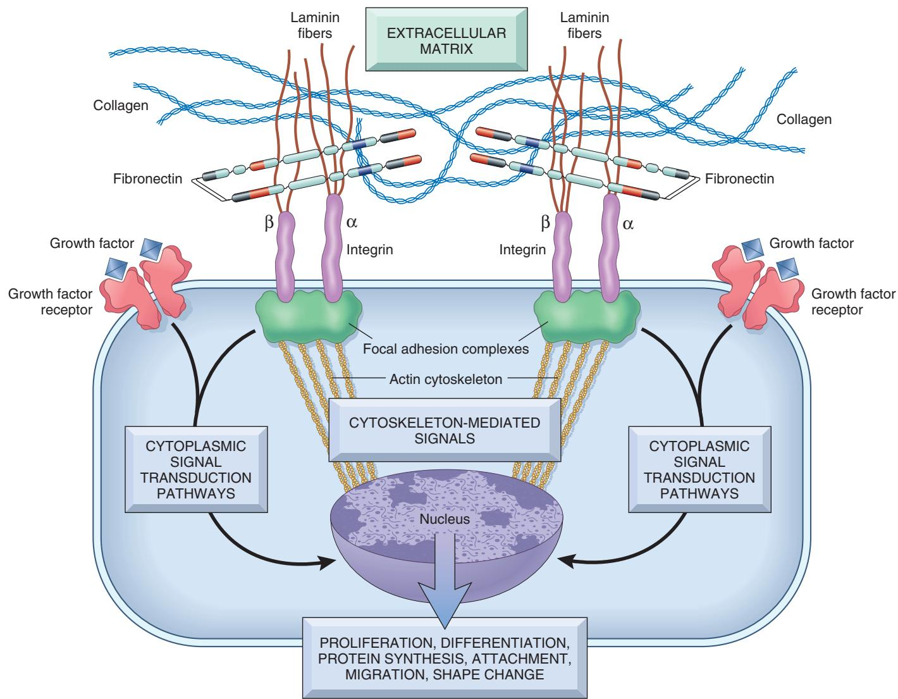 
Fig. 1.13 Interactions of ECM and growth factor-mediated cell signaling. Cell surface integrins interact with the cytoskeleton at focal adhesion complexes (protein aggregates that include vinculin, $\alpha$ -actinin, and talin; see Fig. 1.16C). This can initiate the production of intracellular messengers or can directly transduce signals to the nucleus. Cell surface receptors for growth factors can activate signal transduction pathways that overlap with those mediated through integrins. Signals from ECM components and growth factors can be integrated by the cells to produce a given response, including changes in proliferation, locomotion, and/or differentiation.
for a variety of latent growth factors that can be activated within a focus of injury or inflammation.
- Scaffolding for tissue renewal. Because maintenance of normal tissue structure requires a basement membrane or stromal scaffold, the integrity of the basement membrane or the stroma of parenchymal cells is critical for the organized regeneration of tissues. Thus, ECM disruption results in defective tissue regeneration and repair, for example, cirrhosis of the liver resulting from the collapse of the hepatic stroma in various forms of hepatitis. 
- Establishment of tissue microenvironments. The basement membrane acts as a boundary between the epithelium and underlying connective tissue; it does not just provide support to the epithelium but is also functional, for example, in the kidney, forming part of the filtration apparatus.
The ECM is constantly being remodeled; its synthesis and degradation accompany morphogenesis, tissue regeneration and repair, chronic fibrosis, and tumor invasion and metastasis. ECM occurs in two basic forms: interstitial matrix and basement membrane (Fig. 1.14
- Interstitial matrix is present in the spaces between cells in connective tissue, and between the parenchymal epithelium and the underlying supportive vascular and smooth muscle structures. The interstitial matrix is synthesized by mesenchymal cells (e.g., fibroblasts), forming an amorphous three-dimensional gel. Its major constituents are fibrillar and nonfibrillar collagens, as well as fibronectin, elastin, proteoglycans, hyaluronate, and other constituents (see later). 
- Basement membrane. The seemingly random array of interstitial matrix in connective tissues becomes highly
organized around epithelial cells, endothelial cells, and smooth muscle cells, forming the specialized basement membrane. This is synthesized conjointly by the overlying epithelium and the underlying mesenchymal cells, forming a flat lamellar "chicken wire" mesh (although labeled as a membrane, it is quite porous). The major constituents are amorphous nonfibrillar type IV collagen and laminin.)
# Components of the Extracellular Matrix
The components of the ECM fall into three groups of proteins (Fig. 1.15):
- Fibrous structural proteins such as collagens and elastins that confer tensile strength and recoil 
- Water-hydrated gels such as proteoglycans and hyaluronan that permit compressive resistance and lubrication 
- Adhesive glycoproteins that connect ECM elements to one another and to cells
Collagens. Collagens are composed of three separate polypeptide chains braided into a ropelike triple helix. About 30 collagen types have been identified, some of which are unique to specific cells and tissues.
- Some collagen types (e.g., types I, II, III, and V collagens) form linear fibrils stabilized by interchain hydrogen bonding; such fibrillar collagens form a major proportion of the connective tissue in structures such as bone, tendon, cartilage, blood vessels, and skin, as well as in healing wounds and scars. The tensile strength of the fibrillar collagens derives from lateral crosslinking of the triple helices by covalent bonds, an unusual
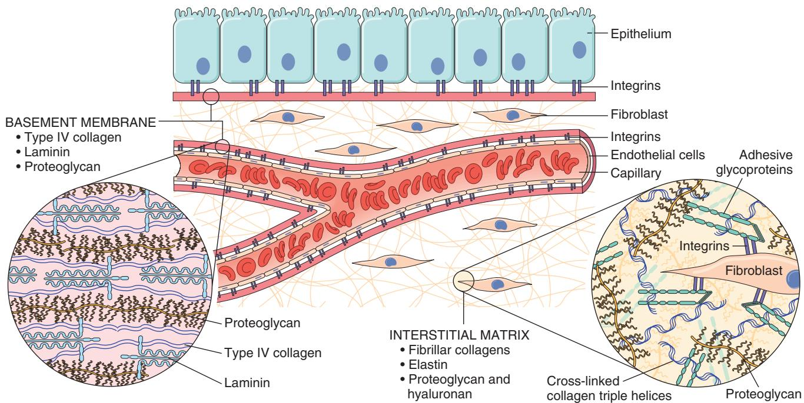 
Fig. 1.14 Main components of the ECM, including collagens, proteoglycans, and adhesive glycoproteins. Both epithelial and mesenchymal cells (e.g., fibroblasts) interact with ECM via integrins. Basement membranes and the interstitial ECM have different architecture and general composition, although certain components are present in both. For the sake of clarity, many ECM components (e.g., elastin, fibrillin, hyaluronan, and syndecan) are not included.
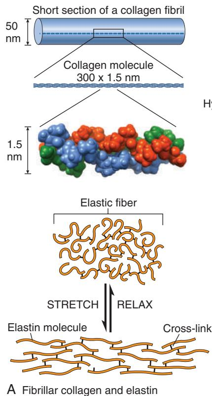 
Fig. 1.15 ECM components. (A) Fibrillar collagen, and elastic tissue structures. Because of rodlike fibril stacking and extensive lateral crosslinking, collagen fibers have marked tensile strength but little elasticity. Elastin also is crosslinked but differs in having large hydrophobic segments that form a dense globular configuration at rest. As stretch is exerted, the hydrophobic domains are pulled open, but the crosslinks keep the molecules intact; release of the tension allows the hydrophobic domains of the proteins to refold. (B) Proteoglycan structure. The highly negatively charged sulfated sugars on the proteoglycan "bristles" attract sodium and water to generate a viscous compressible matrix. (C) Regulation of basic FGF (bFGF, FGF-2) activity by ECM and cellular proteoglycans. Heparan sulfate binds bFGF secreted in the ECM. Syndecan is a cell surface proteoglycan with a transmembrane core protein and extracellular glycosaminoglycan side chains that bind bFGF, and a cytoplasmic tail that interacts with the intracellular actin cytoskeleton. Syndecan side chains bind bFGF released from damaged ECM, thus facilitating bFGF interaction with cell surface receptors.
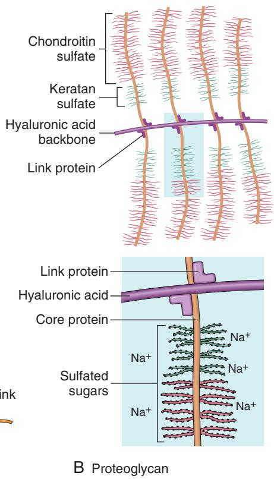
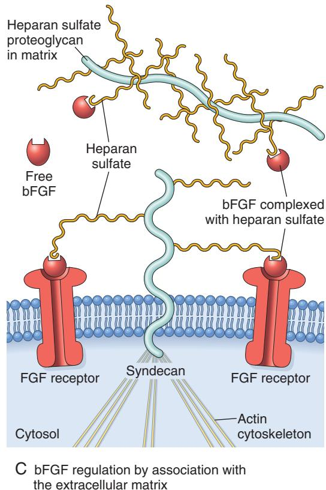
post-translational modification that requires hydroxylation of lysine residues in collagen by the enzyme lysyl oxidase. Because lysyl oxidase is a vitamin C-dependent enzyme, children with ascorbate deficiency have skeletal deformities, and people of any age with vitamin C deficiency heal poorly and bleed easily because of "weak" collagen. Genetic defects in collagens cause diseases such as osteogenesis imperfecta and certain forms of Ehlers-Danlos syndrome (Chapter 7).
- Nonfibrillar collagens variously contribute to the structures of planar basement membranes (type IV collagen); help regulate collagen fibril diameters or collagen-collagen interactions via so-called "fibril-associated collagen with interrupted triple helices" (FACITs, such as type IX collagen in cartilage); and provide anchoring fibrils within basement membrane beneath stratified squamous epithelium (type VII collagen).
Elastin. The ability of tissues to recoil and recover their shape after physical deformation is conferred by elastin (Fig. 1.15). Elasticity is especially important in cardiac valves and large blood vessels, which must accommodate recurrent pulsatile flow, as well as in the uterus, skin, and ligaments. Morphologically, elastic fibers consist of a central core of elastin with an associated meshlike network composed of fibrillin. The latter relationship partially
explains why fibrillin defects lead to skeletal abnormalities and weakened aortic walls, as in individuals with Marfan syndrome. Fibrillin also controls the availability of TGF- $\beta$ (Chapter 7).
Proteoglycans and hyaluronan (Fig. 1.15). Proteoglycans form highly hydrated gels that confer resistance to compressive forces; in joint cartilage, proteoglycans also provide a layer of lubrication between adjacent bony surfaces. Proteoglycans consist of long polysaccharides called glycosaminoglycans (examples are keratan sulfate and chondroitin sulfate) attached to a core protein; these are then linked to a long hyaluronic acid polymer called hyaluronan in a manner reminiscent of the bristles on a test-tube brush. The highly negatively charged, densely packed sulfated sugars attract cations (mostly sodium) and abundant water molecules, producing a viscous, gelatin-like matrix. Besides providing compressibility to tissues, proteoglycans also serve as reservoirs for secreted growth factors (e.g., FGF and HGF). Some proteoglycans are integral cell membrane proteins that have roles in cell proliferation, migration, and adhesion, for example, by binding and concentrating growth factors and chemokines (Fig. 1.15).
Adhesive glycoproteins and adhesion receptors. These are structurally diverse molecules variously involved in cell-cell, cell-ECM, and ECM-ECM interactions (Fig. 1.16). Prototypical adhesive glycoproteins include fibronectin (a
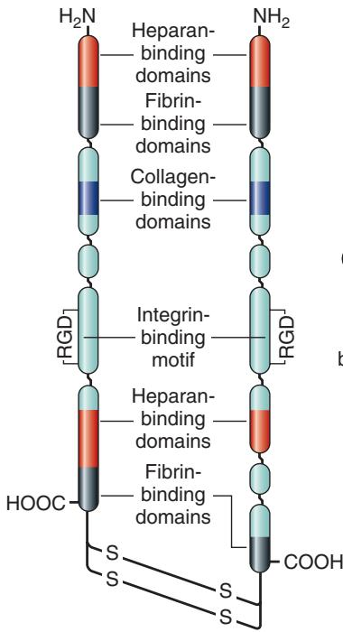 
A 
FIBRONECTIN
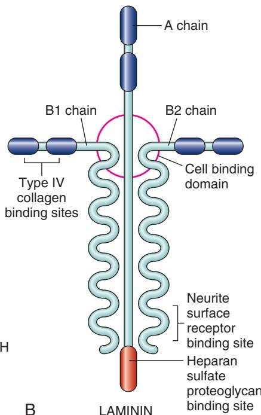 
Fig. 1.16 Cell and ECM interactions: adhesive glycoproteins and integrin signaling. (A) Fibronectin consists of a disulfide-linked dimer, with several distinct domains that allow binding to ECM and integrins, the latter through arginine-glycine-aspartic acid (RGD) motifs. (B) The cross-shaped laminin molecule is one of the major components of basement membranes; its multidomain structure allows interactions between type IV collagen, other ECM components, and cell-surface receptors. (C) Integrins and integrin-mediated signaling events at focal adhesion complexes. Each $\alpha-\beta$ heterodimeric integrin receptor is a transmembrane dimer that links ECM and the intracellular cytoskeleton. It is also associated with a complex of linking molecules (e.g., vinculin and talin) that can recruit and activate kinases that ultimately trigger downstream signaling cascades.
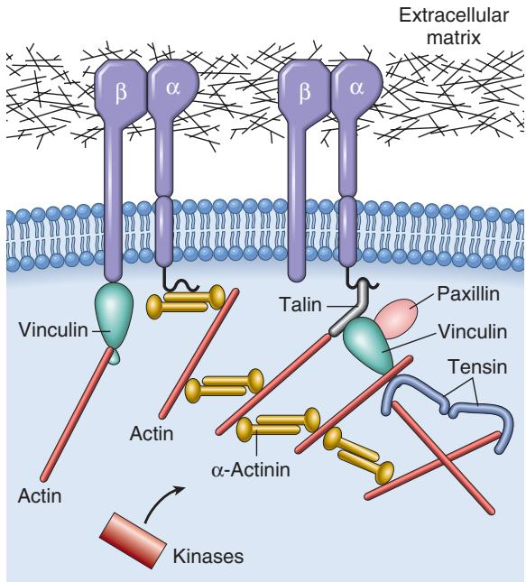 
C
major component of the interstitial ECM) and laminin (a major constituent of basement membrane). Integrins are representative of the adhesion receptors, also known as cell adhesion molecules (CAMs); the CAMs also include immunoglobulins family members, cadherins, and selectins.
- Fibronectin is a large (450 kD) disulfide-linked heterodimer that exists in tissue and plasma forms; it is synthesized by a variety of cells, including fibroblasts, monocytes, and endothelium. Fibronectin has specific domains that bind to distinct ECM components (e.g., collagen, fibrin, heparin, and proteoglycans), as well as integrins (Fig. 1.16). In healing wounds, tissue and plasma fibronectin provide a scaffold for subsequent ECM deposition, angiogenesis, and reepithelialization. 
- Laminin is the most abundant glycoprotein in the basement membrane. It is an 820-kD cross-shaped heterotrimer that connects cells to underlying ECM components such as type IV collagen and heparan sulfate (Fig. 1.16). Besides mediating the attachment to the basement membrane, laminin can also modulate cell proliferation, differentiation, and motility. 
- Integrins are a large family of transmembrane heterodimeric glycoproteins composed of $\alpha$ - and $\beta$ -subunits that allow cells to attach to ECM constituents such as laminin and fibronectin, thus functionally and structurally linking the intracellular cytoskeleton with the outside world. Integrins also mediate cell-cell adhesive interactions. For instance, integrins on the surface of leukocytes are essential in mediating firm adhesion to and transmigration across the endothelium at sites of inflammation
(Chapter 3), and they play a critical role in platelet aggregation (Chapter 4). Integrins attach to ECM components via a tripeptide arginine-glycine-aspartic acid motif (abbreviated RGD). In addition to providing focal attachment to underlying substrates, binding through the integrin receptors can also trigger signaling cascades that influence cell locomotion, proliferation, shape, and differentiation (Fig. 1.16).
# MAINTAINING CELL POPULATIONS
# Proliferation and the Cell Cycle
Cell proliferation is fundamental to development, maintenance of steady-state tissue homeostasis, and replacement of dead or damaged cells. The key elements of cellular proliferation are accurate DNA replication accompanied by the coordinated synthesis of all other cellular constituents, followed by equal apportionment of DNA and other cellular constituents (e.g., organelles) to daughter cells through mitosis and cytokinesis.
The sequence of events that results in cell division is called the cell cycle. The cell cycle consists of $G_{1}$ (presynthetic growth), S (DNA synthesis), $G_{2}$ (premitotic growth), and M (mitotic) phases; quiescent cells that are not actively cycling are in the $G_{0}$ state. (Fig. 1.17). Cells can enter $G_{1}$ either from the $G_{0}$ quiescent cell pool or after completing a round of mitosis. Each stage requires completion of the previous step, as well as activation of
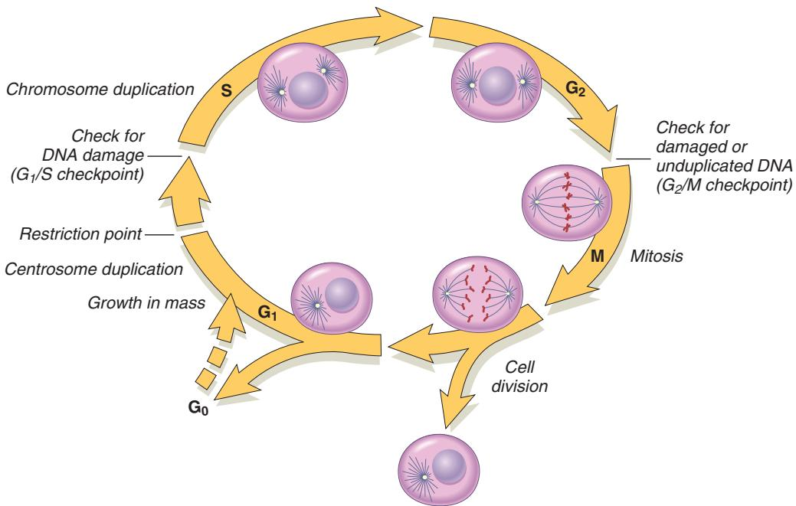 
Fig. 1.17 Cell-cycle landmarks. The figure shows the cell-cycle phases $(G_0, G_1, G_2, S, \text{and} M)$ , the location of the $G_1$ restriction point, and the $G_1 / S$ and $G_2 / M$ cell-cycle checkpoints. GI restriction point refers to the phase in GI at which the cell gets committed to the cell cycle without further need of the growth factor that initiated cell division. Cells from labile tissues such as the epidermis and the gastrointestinal tract may cycle continuously; stable cells such as hepatocytes are quiescent but can enter the cell cycle; permanent cells such as neurons and cardiac myocytes have lost the capacity to proliferate. (Modified from Pollard TD, Earnshaw WC: Cell biology, Philadelphia, 2002, Saunders.)
necessary factors (see later); nonfidelity of DNA replication or cofactor deficiency results in arrest at the various transition points.
The cell cycle is regulated by numerous activators and inhibitors. Cell-cycle progression is driven by proteins called cyclins—named for the cyclic nature of their production and degradation—and cyclin-associated enzymes called cyclin-dependent kinases (CDKs) (Fig. 1.18). CDKs acquire the ability to phosphorylate protein substrates (i.e., kinase activity) by forming complexes with the relevant cyclins. Transiently increased synthesis of a particular cyclin leads to increased kinase activity of the appropriate CDK binding partner; as the CDK completes its round of phosphorylation, the associated cyclin is degraded and the CDK activity abates. Thus, as cyclin levels rise and fall, the activity of associated CDKs likewise waxes and wanes.
More than 15 cyclins have been identified; cyclins D, E, A, and B appear sequentially during the cell cycle and bind to one or more CDKs. The cell cycle thus resembles a relay race in which each leg is regulated by a distinct set of cyclins: as one collection of cyclins leaves the track, the next set takes over.
Embedded in the cell cycle are surveillance mechanisms primed to sense DNA or chromosomal damage. These quality-control checkpoints ensure that cells with genetic imperfections do not complete replication. Thus, the $\mathrm{G}_1$ -S checkpoint monitors the integrity of DNA before irreversibly committing cellular resources to DNA replication. Later in the cell cycle, the $\mathrm{G}_2$ -M check point ensures that there has been accurate DNA replication before the cell actually divides. When cells do detect DNA irregularities, checkpoint activation delays cell-cycle progression and triggers DNA repair mechanisms. If the genetic derangement is too severe to be repaired, the cells either undergo
apoptosis or enter a nonreplicative state called senescence — primarily through p53-dependent mechanisms (see later).
Enforcing the cell-cycle checkpoints is the job of CDK inhibitors (CDKIs); they accomplish this by modulating CDK-cyclin complex activity. There are several different CDKIs:
- One family of CDKIs—composed of three proteins called $p21$ (CDKN1A), $p27$ (CDKN1B), and $p57$ (CDKN1C)—broadly inhibits multiple CDKs 
- Another family of CDKIs has selective effects on cyclin CDK4 and cyclin CDK6; these proteins are called $p15$ (CDKN2B), $p16$ (CDKN2A), $p18$ (CDKN2C), and $p19$ (CDKN2D) 
- Defective CDKI checkpoint proteins allow cells with damaged DNA to divide, resulting in mutated daughter cells at risk for malignant transformation
An equally important aspect of cell growth and division is the biosynthesis of other cellular components needed to make two daughter cells, such as membranes and organelles. Thus when growth factor receptor signaling stimulates cell-cycle progression, it also activates events that promote changes in cellular metabolism that support growth. Chief among these is the Warburg effect, mentioned earlier, marked by increased cellular uptake of glucose and glutamine, increased glycolysis, and (counterintuitively) decreased oxidative phosphorylation. These changes are major elements of cancer-cell growth and are discussed in greater detail in Chapter 6.
# Stem Cells
Not all stem cells are created equal. During development, totipotent stem cells can give rise to all types of
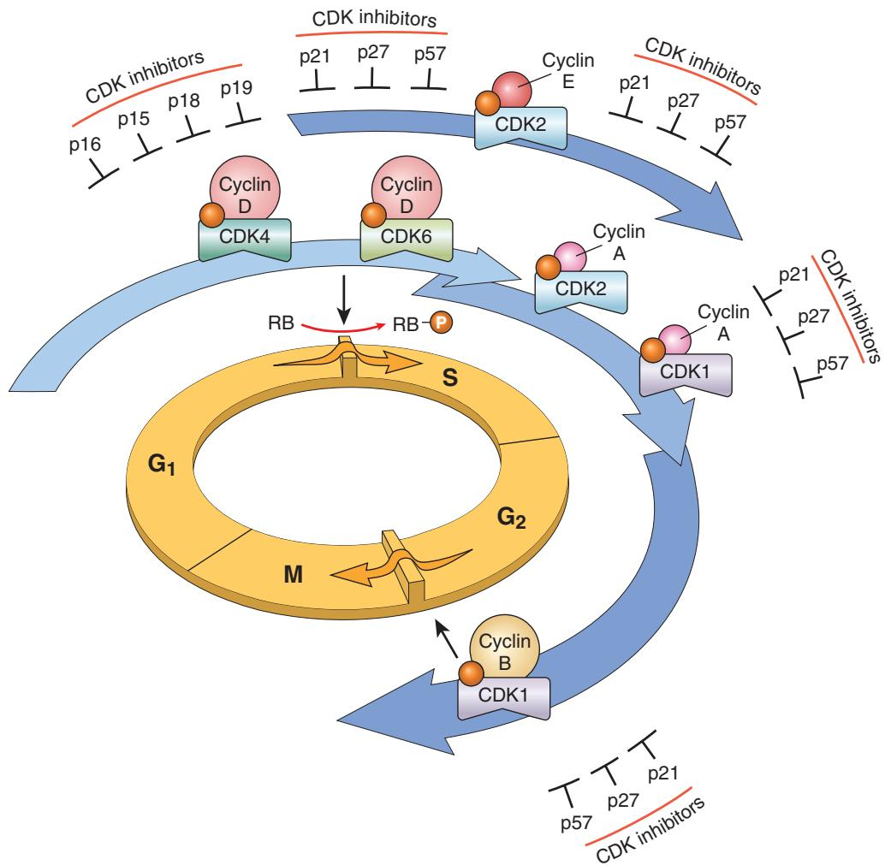 
Fig. 1.18 Role of cyclins, CDKs, and CDK inhibitors in regulating the cell cycle. Shaded arrows represent the phases of the cell cycle during which specific cyclin-CDK complexes are active. As illustrated, cyclin D-CDK4, cyclin D-CDK6, and cyclin E-CDK2 regulate the $G_{1}$ -to-S transition by phosphorylating the Rb protein (pRb). Cyclin A-CDK2 and cyclin A-CDK1 are active in the S phase. Cyclin B-CDK1 is essential for the $G_{2}$ -to-M transition. Two families of CDK inhibitors can block activity of CDKs and progression through the cell cycle. The so-called "INK4 inhibitors," composed of p16, p15, p18, and p19, act on cyclin D-CDK4 and cyclin D-CDK6. The other family of three inhibitors, p21, p27, and p57, can inhibit all CDKs.
differentiated tissues; in the mature organism, adult stem cells in various tissues only have the capacity to replace damaged cells and maintain cell populations within the tissues where they reside. There also are populations of stem cells between these extremes with varying capacities to differentiate into multiple cell lineages. Thus, depending on the source and stage of development, there may be limits on the cell types that a stem cell population can generate.
In normal tissues (without neoplasia, degeneration, or healing), there is a homeostatic equilibrium between the replication, self-renewal, and differentiation of stem cells and the death of the mature, fully differentiated cells (Fig. 1.19). The dynamic relationship between stem cells and terminally differentiated parenchyma is nicely exemplified by the continuously dividing epithelium of the skin. Thus, stem cells at the basal layer of the epithelium progressively differentiate as they migrate to the upper layers of the epithelium before dying and being shed.
Under conditions of homeostasis, stem cells are characterized by two important properties:
- Self-renewal, which permits stem cells to maintain their numbers. Self-renewal may follow asymmetric or symmetric division. 
- Asymmetric division refers to cell replication in which one daughter cell enters a differentiation pathway and gives rise to mature cells, whereas the other remains undifferentiated and retains its self-renewal capacity. By contrast, in symmetric division, both daughter cells retain self renewal capacity. Such divisions are seen early in embryogenesis (when stem cell populations are expanding) and under conditions of stress, such as in the bone marrow following chemotherapy.
Although there is a tendency in the scientific literature to partition stem cells into several different subsets, fundamentally there are only two varieties:
- Embryonic stem cells (ES cells) are the most undifferentiated. They are present in the inner cell mass of the
blastocyst, have virtually limitless cell renewal capacity, and can give rise to every cell in the body; they are thus said to be totipotent (Fig. 1.20). ES cells can be maintained for extended periods without differentiating; thereafter, appropriate culture conditions allow them to form specialized cells of all three germ cell layers,
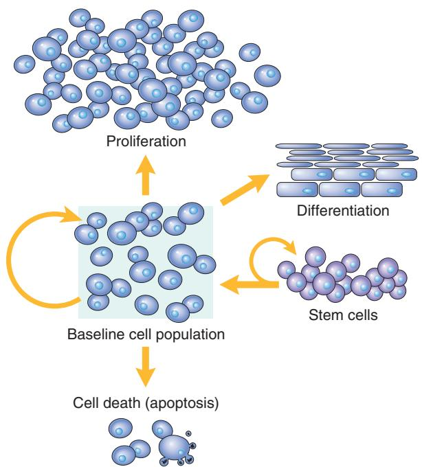 
Fig. 1.19 Mechanisms regulating cell populations. Cell numbers can be altered by increased or decreased rates of stem cell input, cell death resulting from apoptosis, or changes in the rates of proliferation or differentiation. (Modified from McCarthy NJ, et al: Apoptosis in the development of the immune system: growth factors, clonal selection and bcl-2, Cancer Metastasis Rev 11:157, 1992.)
including neurons, cardiac muscle, liver cells, and pancreatic islet cells.
- Tissue stem cells (also called adult stem cells) are found in intimate association with the differentiated cells of a given tissue. They are normally protected within specialized tissue microenvironments called stem cell niches. Such niches have been demonstrated in many organs, most notably the bone marrow, where hematopoietic stem cells congregate in a perivascular niche. Other niches for stem cells include the bulge region of hair follicles; the limbus of the cornea; the crypts of the gut; the canals of Hering in the liver; and the subventricular zone in the brain. Soluble factors and other cells within the niches keep the stem cells quiescent until there is a need for expansion and differentiation of the precursor pool (Fig. 1.21).
Adult stem cells have a limited repertoire of differentiated cells that they can generate. Thus, although adult stem cells can maintain tissues with high (e.g., skin and gastrointestinal tract) or low (e.g., endothelium) cell turnover, the adult stem cells in any given tissue can usually only produce cells that are normal constituents of that tissue.
Hematopoietic stem cells are the most extensively studied; they continuously replenish all the cellular elements of the blood as they are consumed. They can be isolated directly from bone marrow, as well as from the peripheral blood after administration of certain colony stimulating factors (CSF) that induce their release from bone marrow niches. Although rare, hematopoietic stem cells can be purified to virtual homogeneity based on cell surface markers. Clinically, these stem cells can be used to repopulate marrows depleted after chemotherapy (e.g., for leukemia), or to provide normal precursors to correct various blood cell defects (e.g., sickle cell disease; see Chapter 12).
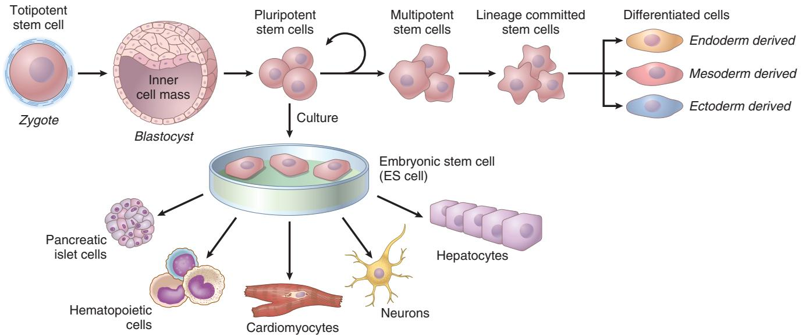 
Fig. 1.20 Embryonal stem cells. The zygote, formed by the union of sperm and egg, divides to form blastocysts, and the inner cell mass of the blastocyst generates the embryo. The pluripotent cells of the inner cell mass, known as embryonic stem (ES) cells, can be induced to differentiate into cells of multiple lineages. In the embryo, pluripotent stem cells can asymmetrically divide to yield a residual stable pool of ES cells in addition to generating populations that have progressively more restricted developmental capacity, eventually generating stem cells that are committed to just specific lineages. ES cells can be cultured in vitro and induced to give rise to cells of all three germ layers.
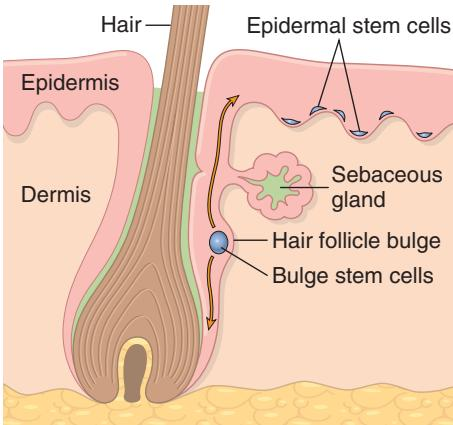 
A Skin 
B Intestine 
Fig. 1.21 Stem cell niches in various tissues. (A) Skin stem cells are located in the bulge area of the hair follicle, in sebaceous glands, and in the lower layer of the epidermis. (B) Small intestine stem cells are located near the base of the crypt, above Paneth cells. (C) Liver stem cells (oval cells) are located in the canals of Hering (thick arrow), structures that connect bile ductules (thin arrow) to parenchymal hepatocytes. Bile duct cells and canals of Hering are stained here with an immunohistochemical stain for cytokeratin 7. (C, Courtesy Tania Roskams, MD, University of Leuven, Belgium.)
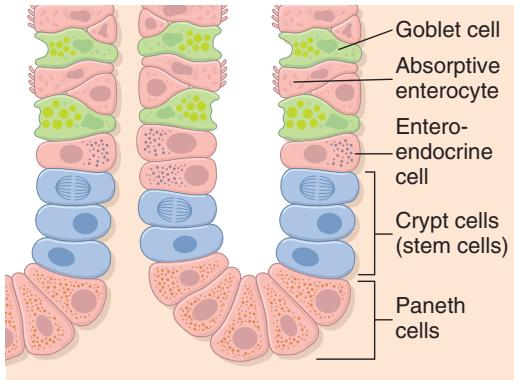
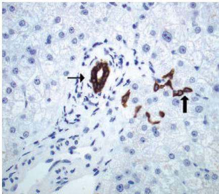 
C Liver
Besides hematopoietic stem cells, the bone marrow (and notably, other tissues such as fat) also contains a population of mesenchymal stem cells. These are multipotent cells that can differentiate into a variety of stromal cells including chondrocytes (cartilage), osteocytes (bone), adipocytes (fat), and myocytes (muscle). Because these cells can be expanded to large numbers, they represent a potential means of manufacturing the stromal scaffolding needed for tissue regeneration.
# Regenerative Medicine
The ability to identify, isolate, expand, and transplant stem cells has given birth to the new field of regenerative medicine. Theoretically, the differentiated progeny of ES or adult stem cells can be used to repopulate damaged tissues or to construct entire organs for replacement. In particular, there is considerable excitement about the therapeutic opportunities for restoring damaged tissues that have low intrinsic regenerative capacity, such as myocardium after a myocardial infarct or neurons after a stroke. Unfortunately, despite an improving ability to purify and expand stem cell populations, much of the initial enthusiasm has been tempered by difficulties encountered in introducing and functionally integrating the replacement cells into sites of damage.
More recently it has been possible to generate pluripotential cells, resembling ES cells, that are derived from the patient into whom they will be implanted. To accomplish this, a handful of genes have been identified whose products can—remarkably—reprogram somatic cells to achieve the "stem-ness" of ES cells. When such genes are introduced into fully differentiated cells (e.g., fibroblasts), induced pluripotent stem cells (iPS cells) are generated (Fig. 1.22), albeit at low frequency. Because these cells are derived from the patient, their differentiated progeny (e.g., insulin-secreting $\beta$ -cells in a patient with diabetes) can be engrafted without eliciting an immunologically mediated rejection reaction that would occur if the differentiated cells were derived from ES cells obtained from another donor.
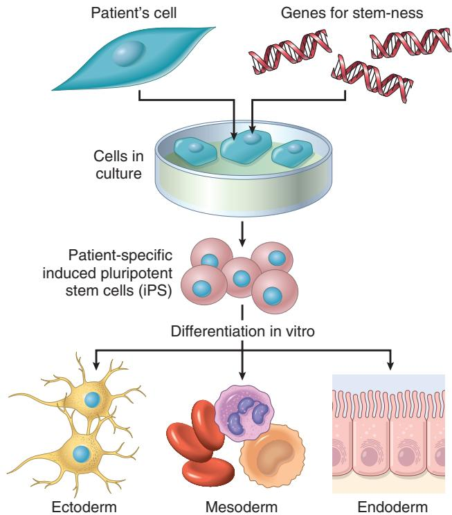 
Fig. 1.22 The production of induced pluripotent stem cells (iPS cells). Genes that confer stem cell properties are introduced into a patient's differentiated cells, giving rise to stem cells that can be induced to differentiate into various lineages. (Modified from Hochondlinger K, Jaenisch R: Nuclear transplantation, embryonic stem cells, and the potential for cell therapy, N Engl J Med 349:275-286, 2003.)
# Concluding Remarks
This survey of selected topics in cell biology serves as a basis for our later discussions of pathology, and we will refer back to it throughout the book. Students should, however, remember that this summary is intentionally brief, and more information about some of the fascinating topics reviewed here can be readily found in textbooks devoted to cell and molecular biology.
# Genetics and Epigenetics
Batista PJ, Chang HY: Long noncoding RNAs: cellular address codes in development and disease, Cell 152:1298, 2013. [Good review regarding lncRNA biology.]
Cech TR, Steitz JA: The noncoding RNA revolution trashing old rules to forge new ones, Cell 157:77, 2014. [An excellent review of the roles played by noncoding RNAs.]
Hübner MR, Eckersley-Maslin MA, Spector DL: Chromatin organization and transcriptional regulation, Curr Opin Genet Dev 23:89, 2013. [A nice discussion of genome organization and chromatin structure-function relationships that regulate cell type-specific nuclear transcription.]
Jarovcevski M, Akbarian S: Epigenetic mechanisms in neurologic disease, Nat Med 18:1194, 2012. [A well-written overview of genomic organization and transcriptional regulation, with a specific focus on neurologic disease.]
Meller VH, Joshi SS, Deshpande N: Modulation of chromatin by noncoding RNA, Annu Rev Genet 49:673, 2015. [An excellent overview of the roles played by noncoding RNAs in nuclear organization.]
Minarovits J, Banati F, Szenthe K, et al: Epigenetic regulation, Adv Exp Med Biol 879:1, 2016. [A brief primer on the pathways that regulate chromatin structure and accessibility.]
Rowley MJ, Corces VG: The three-dimensional genome: principles and roles of long-distance interactions, Curr Opin Cell Biol 40:8, 2016. [An interesting discussion regarding the mechanisms by which three-dimensional conformations can influence nuclear transcription.]
Teperino R, Lempradi L, Pospisilik JA: Bridging epigenomics and complex disease: the basics, Cell Mol Life Sci 70:1609, 2013. [An introductory review of the epigenetic basis for human disease.]
# Cellular Housekeeping
Andersson ER: The role of endocytosis in activating and regulating signal transduction, Cell Mol Life Sci 69:1755, 2011. [Overview of endocytosis with specific emphasis on its role in modulating intracellular signaling.] 
Choi AM, Ryter SW, Levine B: Autophagy in human health and disease, N Engl J Med 368:651, 2013. [A superb review concerning the physiologic and pathophysiologic aspects of autophagy.] 
English AR, Zurek N, Voeltz GK: Peripheral ER structure and function, Curr Opin Cell Biol 21:596, 2009. [An overview of the structural and functional organization of the endoplasmic reticulum and its relationship to other cellular organelles.] 
Guillot C, Lecuit T: Mechanics of epithelial tissue homeostasis and morphogenesis, Science 340:1185, 2013. [A topical discussion about cellular interactions and the mechanical basis of tissue maintenance.] 
Hetz C, Chevet E, Oakes SA: Proteostasis control by the unfolded protein response, Nat Cell Biol 17:829, 2015. [Mechanisms underlying endoplasmic reticulum editing and cellular homeostasis.]
Kaur J, Debnath J: Autophagy at the crossroads of catabolism and anabolism, Nat Rev Mol Cell Biol 16:461, 2015. [An excellent review of the mechanisms and consequences of cellular autophagy.] 
Simons K, Sampaio JL: Membrane organization and lipid rafts, Cold Spring Harb Perspect Biol 3:1, 2013. [A nice review of the general principles of membrane architecture and emphasizing domain organization.] 
Wong E, Cuervo AM: Integration of clearance mechanisms: the proteasome and autophagy, Cold Spring Harb Perspect Biol 2:1, 2010. [An overview of intracellular degradation pathways, specifically focusing on the elimination of aberrant or abnormal constituents.]
# Cellular Metabolism and Mitochondrial Function
Andersen JL, Kornbluth S: The tangled circuitry of metabolism and apoptosis, Mol Cell 49:399, 2013. [A solid review of the interplay between cell metabolism, cell proliferation, and cell death.] 
Dang CV: Links between metabolism and cancer, Genes Dev 26:877, 2012. [An excellent review on metabolic functions of mitochondria.] 
Friedman JR, Nunnari J: Mitochondrial form and function, Nature 505:335, 2014. [A good overview of mitochondrial replication, and response to cellular injury.] 
Tait SW, Green DR: Mitochondria and cell death: outer membrane permeabilization and beyond, Nat Rev Mol Cell Biol 11:621, 2010. [A review of the role of mitochondria in cell death pathways.]
# Cellular Activation
Duronio RJ, Xiong Y: Signaling pathways that control cell proliferation, Cold Spring Harb Perspect Biol 5:1, 2013. [An excellent overall review of cell signaling and proliferation.] 
Morrison DK: MAP kinase pathways, Cold Spring Harb Perspect Biol 4:1, 2012. [A review of mitogen-activated kinase signaling pathways.] 
Perona R: Cell signalling: growth factors and tyrosine kinase receptors, Clin Transl Oncol 8:77, 2011. [An overview of signaling pathways with an emphasis on how these become dysregulated in malignancy.]
# Maintaining Cell Populations
Alvarado AS, Yamanaka S: Rethinking differentiation: stem cells, regeneration, and plasticity, Cell 157:110, 2014. 
Fuchs E, Chen T: A matter of life and death: self-renewal in stem cells, EMBO Rep 14:39, 2013. [A scholarly review on the conceptual framework and experimental underpinnings of our understanding regarding stem cell renewal, using cutaneous stem cells as a paradigm.] 
Li M, Liu GH, Izpisua-Belmonte JC: Navigating the epigenetic landscape of pluripotent stem cells, Nat Rev Mol Cell Biol 13:524, 2012. [A good discussion of the epigenetic regulation of stem cell proliferation and subsequent differentiation.] 
Martello G, Smith A: The nature of embryonic stem cells, Annu Rev Cell Dev Biol 30:647, 2014. [A good, comprehensive overview of cell plasticity and stemness.]
# Cell Injury, Cell Death, and Adaptations
# 2
Introduction to Pathology 31
Overview of Cellular Responses
to Stress and Noxious
Stimuli 31
Causes of Cell Injury 32
Sequence of Events in Cell Injury and Cell Death 33
Reversible Cell Injury 33
Cell Death 34
Necrosis 35
Apoptosis 37
Other Pathways of Cell Death 40
Autophagy 40
Mechanisms of Cell Injury and Cell Death 41
Hypoxia and Ischemia 42
Ischemia-Reperfusion Injury 43
Oxidative Stress 43
Cell Injury Caused by Toxins 45
Endoplasmic Reticulum Stress 45
DNA Damage 47
Inflammation 47
Common Events in Cell Injury From Diverse
Causes 47
Cellular Adaptations to Stress 48
Hypertrophy 48
Hyperplasia 49
Atrophy 50
Metaplasia 50
IntracellularAccumulations51
Pathologic Calcification 53
Cellular Aging 54
# INTRODUCTION TO PATHOLOGY
The field of pathology is devoted to understanding the causes of disease and the changes in cells, tissues, and organs that are associated with disease and give rise to the presenting signs and symptoms in patients. There are two important terms that students will encounter throughout their study of pathology and medicine:
- Etiology refers to the underlying causes and modifying factors that are responsible for the initiation and progression of disease. It is now clear that many common diseases, such as hypertension, diabetes, and cancer, are caused by a combination of inherited genetic susceptibility and various environmental triggers. Elucidating the genetic and environmental factors underlying diseases is a major theme of modern medicine. 
- Pathogenesis refers to the mechanisms of development and progression of disease, which account for the cellular and molecular changes that give rise to the specific functional and structural abnormalities that characterize any particular disease. Thus, etiology refers to why a disease arises and pathogenesis describes how a disease develops (Fig. 2.1).
Defining the etiology and pathogenesis of disease not only is essential for understanding disease but also is the basis for developing rational treatments and effective preventive measures. Thus, pathology provides the scientific foundation for the practice of medicine.
To render diagnoses and guide therapy in clinical practice, pathologists identify changes in the gross or micro
scopic appearance (morphology) of cells and tissues, and biochemical alterations in body fluids (such as blood and urine). Pathologists also use a variety of morphologic, molecular, and other techniques to define the biochemical, structural, and functional changes that occur in cells, tissues, and organs in response to injury. We begin, in this chapter, with a discussion of cellular abnormalities induced by a variety of internal (e.g., genetic) and external (e.g., environmental) abnormalities and stresses.
# OVERVIEW OF CELLULAR RESPONSES TO STRESS AND NOXIOUS STIMULI
Cells actively interact with their environment, constantly adjusting their structure and function to accommodate changing demands and extracellular stresses. The intracellular milieu of cells is normally tightly regulated such that it remains fairly constant, a state referred to as homeostasis. As cells encounter physiologic stresses (such as increased workload in the heart) or potentially injurious conditions (such as nutrient deprivation), they can undergo adaptation, achieving a new steady state and preserving viability and function. If the adaptive capability is exceeded or if the external stress is inherently harmful or excessive, cell injury develops (Fig. 2.2). Within certain limits, injury is reversible, and cells return to their stable baseline; however, if the stress is severe, persistent, or rapid in onset, it results in irreversible injury and death of the affected cells. Cell death is one of the most crucial events in the evolution
areshown..jpg) 
Fig. 2.1 Steps in the evolution of disease. Only selected major causes (etiologies) are shown.
of disease in any tissue or organ. It results from diverse causes, including ischemia (lack of blood flow), infections, toxins, and immune reactions. Cell death also is a normal and essential process in embryogenesis, the development of organs, and the maintenance of tissue homeostasis.
Because damage to cells is the basis of all disease, in this chapter we discuss first the causes, mechanisms, and consequences of the various forms of acute cell injury, including reversible injury and cell death. We then consider cellular adaptations to stress and conclude with two other processes that affect cells and tissues: the deposition of abnormal substances and cell aging.
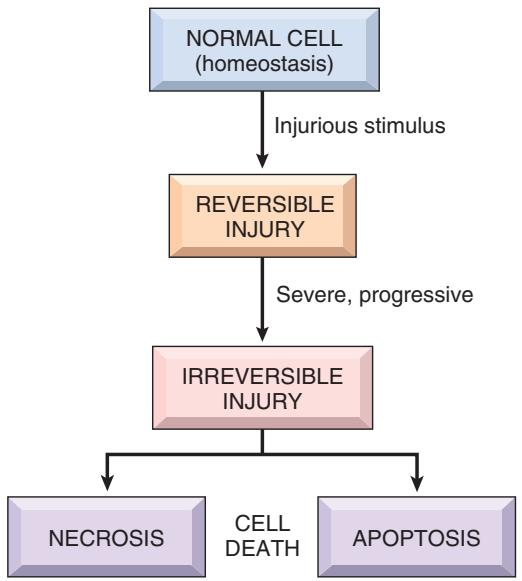 
Fig. 2.2 Sequence of reversible cell injury and cell death. Necrosis and apoptosis are the two major pathways of cell death and are discussed in detail later.
# CAUSES OF CELL INJURY
The causes of cell injury span a range from gross physical trauma, such as after a motor vehicle accident, to a single gene defect that results in a nonfunctional enzyme in a specific metabolic disease. Most injurious stimuli can be grouped into the following categories.
Hypoxia and ischemia. Hypoxia, which refers to oxygen deficiency, and ischemia, which means reduced blood supply, are among the most common causes of cell injury. Both deprive tissues of oxygen, and ischemia, in addition, results in a deficiency of essential nutrients and a build up of toxic metabolites. The most common cause of hypoxia is ischemia resulting from an arterial obstruction, but oxygen deficiency also can result from inadequate oxygenation of the blood, as in a variety of diseases affecting the lung, or from reduction in the oxygen-carrying capacity of the blood, as with anemia of any cause, and carbon monoxide (CO) poisoning.
Toxins. Potentially toxic agents are encountered daily in the environment; these include air pollutants, insecticides, CO, asbestos, cigarette smoke, ethanol, and drugs. Many drugs in therapeutic doses can cause cell or tissue injury in a susceptible patient or in many individuals if used excessively or inappropriately (Chapter 7). Even innocuous substances, such as glucose, salt, water and oxygen, can be toxic.
Infectious agents. All types of disease-causing pathogens, including viruses, bacteria, fungi, and protozoans, injure cells. The mechanisms of cell injury caused by these diverse agents are discussed in Chapter 9.
Immunologic reactions. Although the immune system defends the body against pathogenic microbes, immune reactions also can result in cell and tissue injury. Examples are autoimmune reactions against one's own tissues, allergic reactions against environmental substances, and excessive or chronic immune responses to microbes (Chapter 5). In all of these situations, immune responses elicit inflammatory reactions, which are often the cause of damage to cells and tissues.
Genetic abnormalities. Genetic aberrations can result in pathologic changes as conspicuous as the congenital malformations associated with Down syndrome or as subtle as the single amino acid substitution in hemoglobin giving rise to sickle cell anemia (Chapter 7). Genetic defects may cause cell injury as a consequence of deficiency of functional proteins, such as enzymes in inborn errors of metabolism, or accumulation of damaged DNA or misfolded proteins, both of which trigger cell death when they are beyond repair.
Nutritional imbalances. Protein-calorie insufficiency among impoverished populations remains a major cause of cell injury, and specific vitamin deficiencies are not uncommon even in developed countries with high standards of living (Chapter 8). Ironically, excessive dietary intake may result in obesity and also is an important underlying factor in many diseases, such as type 2 diabetes mellitus and atherosclerosis.
Physical agents. Trauma, extremes of temperature, radiation, electric shock, and sudden changes in atmospheric pressure all have wide-ranging effects on cells (Chapter 8).
Aging. Cellular senescence results in a diminished ability of cells to respond to stress and, eventually, the death of cells and of the organism. The mechanisms underlying cellular aging are discussed at the end of this chapter.
With this introduction, we proceed to a discussion of the progression and morphologic manifestations of cell injury, and then to the biochemical mechanisms in injury caused by different noxious stimuli.
# SEQUENCE OF EVENTS IN CELL INJURY AND CELL DEATH
Although various injurious stimuli damage cells through diverse biochemical mechanisms, all tend to induce a stereotypic sequence of morphologic and structural alterations in most types of cells.
# Reversible Cell Injury
Reversible injury is the stage of cell injury at which the deranged function and morphology of the injured cells can return to normal if the damaging stimulus is removed (Fig. 2.3). In reversible injury, cells and intracellular organelles typically become swollen because they take in water as a result of the failure of energy-dependent ion pumps in the plasma membrane, leading to an inability to maintain ionic and fluid homeostasis. In some forms of injury, degenerated organelles and lipids may accumulate inside the injured cells.

The two main morphologic correlates of reversible cell injury are cellular swelling and fatty change.
- Cellular swelling (Fig. 2.4B) is commonly seen in cell injury associated with increased permeability of the plasma membrane. It may be difficult to appreciate with the light microscope, but it is often apparent at the level of the whole organ. When it affects many cells in an organ, it causes pallor (as a result of compression of capillaries), increased turgor, and an increase in organ weight. Microscopic examination may show small, clear vacuoles within the cytoplasm; these represent distended and pinched-off segments of the endoplasmic reticulum (ER). This pattern of nonlethal injury is sometimes called hydropic change or vacuolar degeneration. 
- Fatty change is manifested by the appearance of triglyceride containing lipid vacuoles in the cytoplasm. It is principally encountered in organs that are involved in lipid metabolism, such as the liver, and hence it is discussed in Chapter 16.
The cytoplasm of injured cells also may become redder (eosinophilic), a change that becomes much more pronounced with progression to necrosis (described later). Other intracellular changes associated with cell injury (Fig. 2.3) include (1) plasma membrane alterations such as blebbing, blunting, or distortion of microvilli, and loosening of intercellular attachments; (2) mitochondrial changes such as swelling and the appearance of phospholipid-rich amorphous densities; (3) dilation of the ER
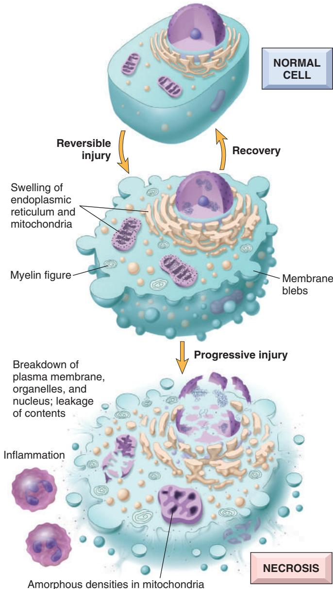 
Fig. 2.3 Reversible cell injury and necrosis. The principal cellular alterations that characterize reversible cell injury and necrosis are illustrated. By convention, reversible injury is considered to culminate in necrosis if the injurious stimulus is not removed.
with detachment of ribosomes and dissociation of polysomes; and (4) nuclear alterations, such as clumping of chromatin. The cytoplasm may contain so-called "myelin figures," which are collections of phospholipids resembling myelin sheaths that are derived from damaged cellular membranes.
In some situations, potentially injurious insults induce specific alterations in cellular organelles, such as the ER. The smooth ER is involved in the metabolism of various chemicals, and cells exposed to these chemicals show hypertrophy of the ER as an adaptive response that may have important functional consequences. For instance, many drugs, including barbiturates, which were commonly used as sedatives in the past and are still used as a treatment for some forms of epilepsy, are metabolized in the liver by the cytochrome P-450 mixed-function oxidase system found in the smooth ER. Protracted use of
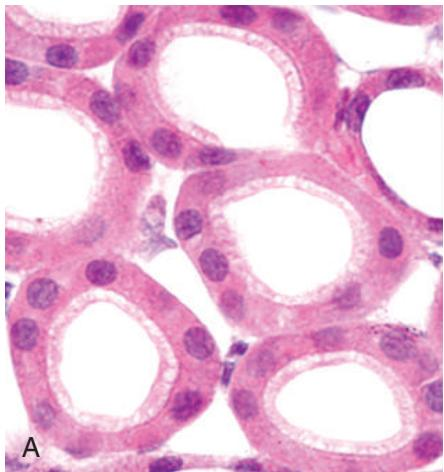 
Fig. 2.4 Morphologic changes in reversible and irreversible cell injury (necrosis). (A) Normal kidney tubules with viable epithelial cells. (B) Early (reversible) ischemic injury showing surface blebs, increased eosinophilia of cytoplasm, and swelling of occasional cells. (C) Necrotic (irreversible) injury of epithelial cells, with loss of nuclei and fragmentation of cells and leakage of contents. (Courtesy of Drs. Neal Pinckard and M.A.Venkatachalam, University of Texas Health Sciences Center, San Antonio, Texas.)
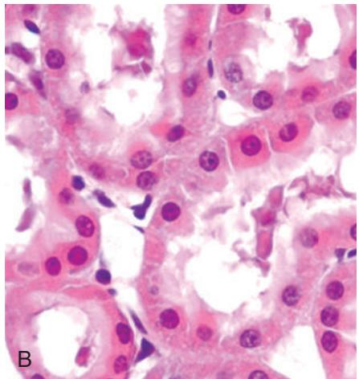
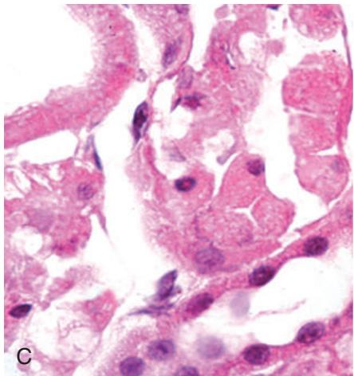
barbiturates leads to a state of tolerance, marked by the need to use increasing doses of the drug to achieve the same effect. This adaptation stems from hypertrophy (an increase in volume) of the smooth ER of hepatocytes and a consequent increase in P-450 enzymatic activity. P-450-mediated modification of compounds sometimes leads to their detoxification, but in other instances converts them into a dangerous toxin; one such example involves carbon tetrachloride $\mathrm{(CCl_4)}$ , discussed later. Cells adapted to one drug demonstrate an increased capacity to metabolize other compounds handled by the same system. Thus, if patients taking phenobarbital for epilepsy increase their alcohol intake, they may experience a drop in blood concentration of the anti-seizure medication to subtherapeutic levels because of smooth ER hypertrophy in response to the alcohol.
With persistent or excessive noxious exposures, injured cells pass a nebulous "point of no return" and undergo cell death. The clinical relevance of defining this transition point is obvious—if the biochemical and molecular changes that predict cell death can be identified, it may be possible to devise strategies for preventing the transition from reversible to irreversible cell injury. Although there are no definitive morphologic or biochemical correlates of irreversibility, it is consistently characterized by three phenomena: the inability to restore mitochondrial function (oxidative phosphorylation and adenosine triphosphate [ATP] generation) even after resolution of the original injury; the loss of structure and functions of the plasma membrane and intracellular membranes; and the loss of DNA and chromatin structural integrity. As discussed in more detail later, injury to lysosomal membranes results in the enzymatic dissolution of the injured cell, which is the culmination of necrosis.
# Cell Death
When cells are injured they die by different mechanisms, depending on the nature and severity of the insult.
- Severe disturbances, such as loss of oxygen and nutrient supply and the actions of toxins, cause a rapid and
uncontrollable form of death that has been called "accidental" cell death. The morphological manifestation of accidental cell death is necrosis (Greek, necros = death) (Table 2.1). Necrosis is the major pathway of cell death in many commonly encountered injuries, such as those resulting from ischemia, exposure to toxins, various infections, and trauma. Necrosis is traditionally considered the inevitable end result of severe damage that is beyond salvage and is not thought to be regulated by specific signals or biochemical mechanisms; in other words, necrosis happens accidentally because the injury is too severe to be repaired and many cellular constituents simply fail or fall apart.
- In contrast, when the injury is less severe, or cells need to be eliminated during normal processes, they activate a precise set of molecular pathways that culminate in death. Because this kind of cell death can be manipulated
Table 2.1 Features of Necrosis and Apoptosis 
FeatureNecrosisApoptosisCell sizeEnlarged (swelling)Reduced (shrinkage)NucleusPyknosis → karyorrhexis → karyolysisFragmentation into nucleosome-sized fragmentsPlasma membraneDisruptedIntact; altered structure, especially orientation of lipidsCellular contentsEnzymatic digestion; may leak out of cellIntact; may be released in apoptotic bodiesAdjacent inflammationFrequentNoPhysiologic or pathologic roleInvariably pathologic (culmination of irreversible cell injury)Often physiologic means of eliminating unwanted cells; may be pathologic after some forms of cell injury, especially DNA and protein damage
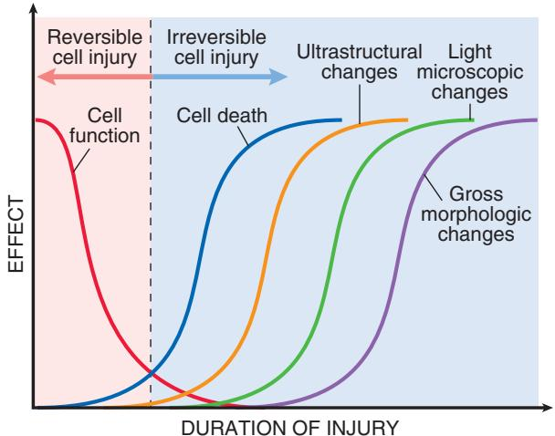 
Fig. 2.5 The relationship among cellular function, cell death, and the morphologic changes of cell injury. Note that cells may rapidly become nonfunctional after the onset of injury, although they are still viable, with potentially reversible damage; with a longer duration of injury, irreversible injury and cell death may result. Note also that cell death typically precedes ultrastructural, light microscopic, and grossly visible morphologic changes.
by therapeutic agents or genetic mutations, it is said to be "regulated" cell death. The morphologic appearance of most types of regulated cell death is apoptosis (see Table 2.1). In some instances, regulated cell death shows features of both necrosis and apoptosis, and has been called necroptosis. The discovery of these previously unrecognized forms of cell death that were regulated by identifiable genes and signaling pathways showed that cell death can be a controlled process. The idea of regulated cell death also raises the possibility that specific molecular pathways can be targeted therapeutically to prevent the loss of cells in pathologic conditions. Apoptosis is a process that eliminates cells with a variety of intrinsic abnormalities and promotes clearance of the fragments of the dead cells without eliciting an inflammatory reaction. This "clean" form of cell suicide occurs in pathologic situations when a cell's DNA or proteins are damaged beyond repair or the cell is deprived of necessary survival signals. But unlike necrosis, which is always an indication of a pathologic process, apoptosis also occurs in healthy tissues. It serves to eliminate unwanted cells during normal development and to maintain constant cell numbers, so it is not necessarily associated with pathologic cell injury. These types of physiologic cell death are also called programmed cell death.
It is important to point out that cellular function may be lost long before cell death occurs, and that the morphologic changes of cell injury (or death) lag far behind loss of function and viability (Fig. 2.5). For example, myocardial cells become noncontractile after 1 to 2 minutes of ischemia, but may not die until 20 to 30 minutes of ischemia have elapsed. Morphologic features indicative of the death of ischemic myocytes appear by electron microscopy within 2 to 3 hours after the death of the cells, but are not evident by light microscopy until 6 to 12 hours later.
# Necrosis
Necrosis is a form of cell death in which cellular membranes fall apart, and cellular enzymes leak out and ultimately digest the cell (Fig. 2.3). Necrosis elicits a local host reaction, called inflammation, that is induced by substances released from dead cells and which serves to eliminate the debris and start the subsequent repair process (Chapter 3). The enzymes responsible for digestion of the cell are derived from lysosomes and may come from the dying cells themselves or from leukocytes recruited as part of the inflammatory reaction. Necrosis often is the culmination of reversible cell injury that cannot be corrected.
The biochemical mechanisms of necrosis vary with different injurious stimuli. These mechanisms include: failure of energy generation in the form of ATP because of reduced oxygen supply or mitochondrial damage; damage to cellular membranes, including the plasma membrane and lysosomal membranes, which results in leakage of cellular contents including enzymes; irreversible damage to cellular lipids, proteins, and nucleic acids, which may be caused by reactive oxygen species (ROS); and others. These biochemical mechanisms are discussed later when we consider the individual causes of cell necrosis.
Necrosis is characterized by changes in the cytoplasm and nuclei of the injured cells (Figs. 2.3 and 2.4C).
- Cytoplasmic changes. Necrotic cells show increased eosinophilia (i.e., they are stained red by the dye eosin—the E in the hematoxylin and eosin [H&E] stain), attributable partly to increased binding of eosin to denatured cytoplasmic proteins and partly to loss of basophilic ribonucleic acid (RNA) in the cytoplasm (basophilia stems from binding of the blue dye hematoxylin—the H in "H&E"). Compared with viable cells, the cell may have a glassy, homogeneous appearance, mostly because of the loss of lighter staining glycogen particles. Myelin figures are more prominent in necrotic cells than in cells with reversible injury. When enzymes have digested cytoplasmic organelles, the cytoplasm becomes vacuolated and appears "moth-eaten." By electron microscopy, necrotic cells are characterized by discontinuities in plasma and organelle membranes, marked dilation of mitochondria associated with the appearance of large amorphous intramitochondrial densities, disruption of lysosomes, and intracytoplasmic myelin figures. 
- Nuclear changes. Nuclear changes assume one of three patterns, all resulting from a breakdown of DNA and chromatin. Pyknosis is characterized by nuclear shrinkage and increased basophilia; the DNA condenses into a dark shrunken mass. The pyknotic nucleus can undergo fragmentation; this change is called karyorrhexis. Ultimately, the nucleus may undergo karyolysis, in which the basophilia fades because of digestion of DNA by deoxyribonuclease (DNase) activity. In 1 to 2 days, the nucleus in a dead cell may completely disappear. 
- Fates of necrotic cells. Necrotic cells may persist for some time or may be digested by enzymes and disappear. Dead cells may be replaced by myelin figures, which are either phagocytosed by other cells or further degraded into fatty acids. These fatty acids bind calcium salts, which may result in the dead cells ultimately becoming calcified.
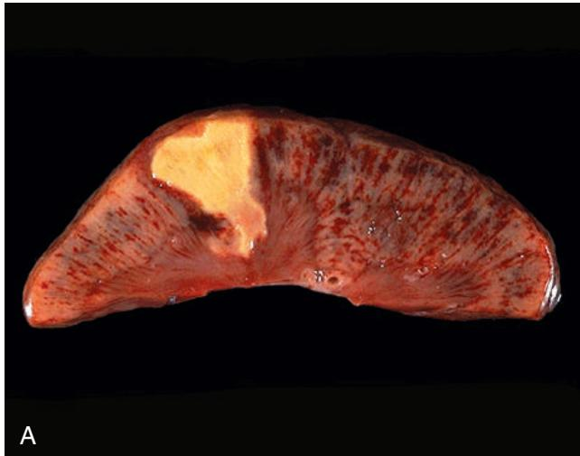 
Fig. 2.6 Coagulative necrosis. (A) A wedge-shaped kidney infarct (yellow) with preservation of the outlines. (B) Microscopic view of the edge of the infarct, with normal kidney $(N)$ and necrotic cells in the infarct $(I)$ . The necrotic cells show preserved outlines with loss of nuclei, and an inflammatory infiltrate is present (difficult to discern at this magnification).
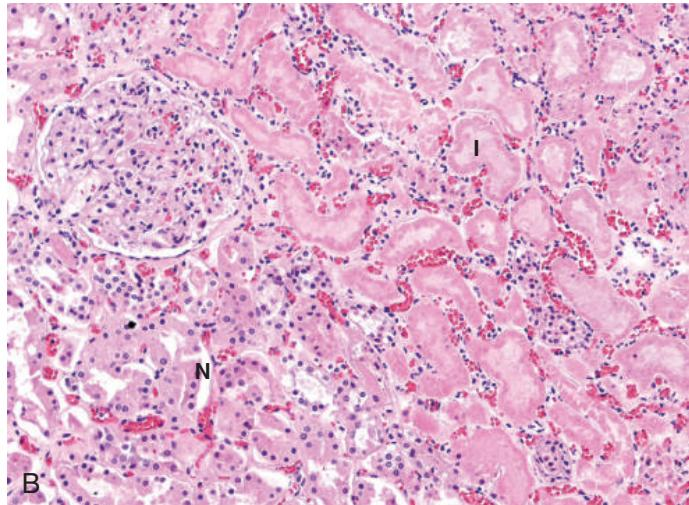
# Morphologic Patterns of Tissue Necrosis
In severe pathologic conditions, large areas of a tissue or even entire organs may undergo necrosis. This may happen in association with marked ischemia, infections, and certain inflammatory reactions. There are several morphologically distinct patterns of tissue necrosis that may provide etiologic clues. Although the terms that describe these patterns do not reflect underlying mechanisms, such terms are commonly used and their implications are understood by pathologists and clinicians.
Most of the types of necrosis described here have distinctive gross appearances; the exception is fibrinoid necrosis, which is detected only by histologic examination.
- Coagulative necrosis is a form of necrosis in which the underlying tissue architecture is preserved for at least several days after death of cells in the tissue (Fig. 2.6). The affected tissues take on a firm texture. Presumably the injury denatures not only structural proteins but also enzymes, thereby blocking the proteolysis of the dead cells; as a result, eosinophilic, anucleate cells may persist for days or weeks. Leukocytes are recruited to the site of necrosis, and the dead cells are ultimately digested by the action of lysosomal enzymes of the leukocytes. The cellular debris is then removed by phagocytosis mediated primarily by infiltrating neutrophils and macrophages. Coagulative necrosis is characteristic of infarcts (areas of necrosis caused by ischemia) in all solid organs except the brain. 
- Liquefactive necrosis is seen in focal bacterial and, occasionally, fungal infections because microbes stimulate rapid accumulation of inflammatory cells, and the enzymes of leukocytes digest ("liquefy") the tissue. For obscure reasons, hypoxic death of cells within the central nervous system often evokes liquefactive necrosis (Fig. 2.7). Whatever the pathogenesis, the dead cells are completely digested, transforming the tissue into a viscous liquid that is eventually removed by phagocytes. If the process is initiated by acute inflammation, as in a bacterial
infection, the material is frequently creamy yellow and is called pus (Chapter 3).
- Although gangrenous necrosis is not a distinctive pattern of cell death, the term is still commonly used in clinical practice. It usually refers to the condition of a limb (generally the lower leg) that has lost its blood supply and has undergone coagulative necrosis involving multiple tissue layers. When bacterial infection is superimposed, the morphologic appearance changes to liqueactive necrosis because of the destructive contents of the bacteria and the attracted leukocytes (resulting in so-called "wet gangrene"). 
- Caseous necrosis is most often encountered in foci of tuberculous infection. Caseous means "cheeselike," referring to the friable yellow-white appearance of the area of necrosis on gross examination (Fig. 2.8). On microscopic examination, the necrotic focus appears as a collection of fragmented or lysed cells with an amorphous granular pink appearance in H&E-stained tissue sections. Unlike coagulative necrosis, the tissue
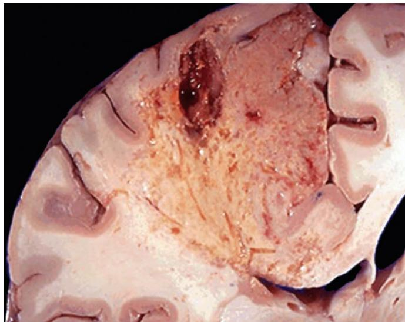 
Fig. 2.7 Liquefactive necrosis. An infarct in the brain shows dissolution of the tissue.
debris..jpg) 
Fig. 2.8 Caseous necrosis. Tuberculosis of the lung, with a large area of caseous necrosis containing yellow-white (cheesy) debris.
architecture is completely obliterated and cellular outlines cannot be discerned. Caseous necrosis is often surrounded by a collection of macrophages and other inflammatory cells; this appearance is characteristic of a nodular inflammatory lesion called a granuloma (Chapter 3).
- Fat necrosis refers to focal areas of fat destruction, typically resulting from the release of activated pancreatic lipases into the substance of the pancreas and the peritoneal cavity. This occurs in the calamitous abdominal emergency known as acute pancreatitis (Chapter 17). In this disorder, pancreatic enzymes that have leaked out of acinar cells and ducts liquefy the membranes of fat cells in the peritoneum, and lipases split the triglyceride esters contained within fat cells. The released fatty acids combine with calcium to produce grossly visible chalky white areas (fat saponification), which enable the surgeon and the pathologist to identify the lesions (Fig. 2.9). On histologic examination, the foci of necrosis contain shadowy outlines of necrotic fat cells surrounded by basophilic calcium deposits and an inflammatory reaction.
atsitesoflipidbreakdowninthemesentery..jpg) 
Fig. 2.9 Fat necrosis in acute pancreatitis. The areas of white chalky deposits represent foci of fat necrosis with calcium soap formation (saponification) at sites of lipid breakdown in the mesentery.
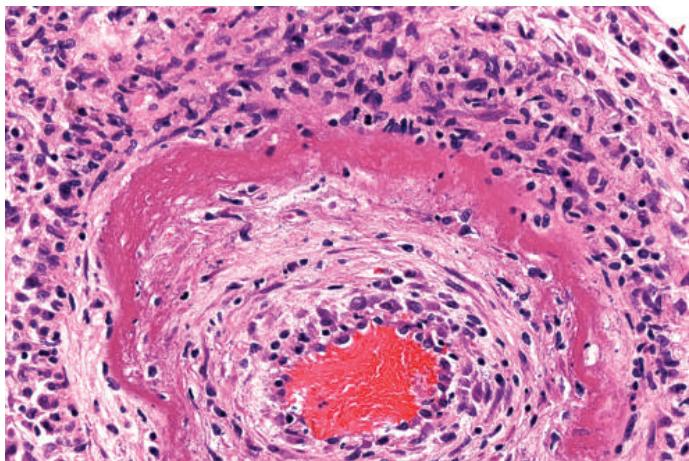 
Fig. 2.10 Fibrinoid necrosis in an artery in a patient with polyarteritis nodosa. The wall of the artery shows a circumferential bright pink area of necrosis with protein deposition and inflammation.
- Fibrinoid necrosis is a special form of necrosis. It usually occurs in immune reactions in which complexes of antigens and antibodies are deposited in the walls of blood vessels, but it also may occur in severe hypertension. Deposited immune complexes and plasma proteins that leak into the wall of damaged vessels produce a bright pink, amorphous appearance on H&E preparations called fibrinoid (fibrinlike) by pathologists (Fig. 2.10). The immunologically mediated diseases (e.g., polyarteritis nodosa) in which this type of necrosis is seen are described in Chapter 5.
Leakage of intracellular proteins through the damaged cell membrane and ultimately into the circulation provides a means of detecting tissue-specific necrosis using blood or serum samples. Cardiac muscle, for example, contains a unique isoform of the enzyme creatine kinase and of the contractile protein troponin, whereas hepatic bile duct epithelium contains the enzyme alkaline phosphatase, and hepatocytes contain transaminases. Irreversible injury and cell death in these tissues elevate the serum levels of these proteins, which makes them clinically useful markers of tissue damage.
# Apoptosis
Apoptosis is a pathway of cell death in which cells activate enzymes that degrade the cells' own nuclear DNA and nuclear and cytoplasmic proteins (Fig. 2.11). Fragments of the apoptotic cells then break off, giving the appearance that is responsible for the name (apoptosis, "falling off"). The plasma membrane of the apoptotic cell remains intact, but the membrane is altered in such a way that the fragments, called apoptotic bodies, become highly "edible," leading to their rapid consumption by phagocytes. The dead cell and its fragments are cleared with little leakage of cellular contents, so apoptotic cell death does not elicit an inflammatory reaction. Thus, apoptosis differs in many respects from necrosis (Table 2.1).
# Causes of Apoptosis
Apoptosis occurs in many normal situations and serves to eliminate potentially harmful cells and cells that have
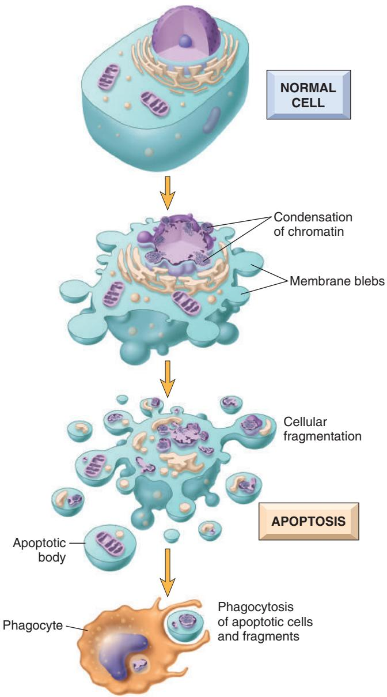 
Fig. 2.11 Apoptosis. The cellular alterations in apoptosis are illustrated. Contrast these with the changes that characterize necrotic cell death, shown in Fig. 2.3.
outlived their usefulness (Table 2.2). It also occurs as a pathologic event when cells are damaged, especially when the damage affects the cell's DNA or proteins; thus, the irreparably damaged cell is eliminated.
- Physiologic apoptosis. During normal development of an organism, some cells die and are replaced by new ones. In mature organisms, highly proliferative and hormone-responsive tissues undergo cycles of proliferation and cell loss that are often determined by the levels of growth factors. In these situations, the cell death is always by apoptosis, ensuring that unwanted cells are eliminated without eliciting potentially harmful inflammation. In the immune system, apoptosis eliminates excess leukocytes left at the end of immune responses as well as lymphocytes that recognize self-antigens and could cause autoimmune diseases if they were not purged.
Table 2.2 Physiologic and Pathologic Conditions Associated With Apoptosis 
ConditionMechanism of ApoptosisPhysiologicDuring embryogenesisLoss of growth factor signaling (presumed mechanism)Turnover of proliferative tissues (e.g., intestinal epithelium, lymphocytes in bone marrow, and thymus)Loss of growth factor signaling (presumed mechanism)Involution of hormone-dependent tissues (e.g., endometrium)Decreased hormone levels lead to reduced survival signalsDecline of leukocyte numbers at the end of immune and inflammatory responsesLoss of survival signals as stimulus for leukocyte activation is eliminatedElimination of potentially harmful self-reactive lymphocytesStrong recognition of self antigens induces apoptosis by both the mitochondrial and death receptor pathwaysPathologicDNA damageActivation of proapoptotic proteins by BH3-only sensorsAccumulation of misfolded proteinsActivation of proapoptotic proteins by BH3-only sensors, possibly direct activation of caspasesInfections, especially certain viral infectionsActivation of the mitochondrial pathway by viral proteins Killing of infected cells by cytotoxic T lymphocytes, which activate caspases
- Apoptosis in pathologic conditions. Apoptosis eliminates cells that are damaged beyond repair. This is seen when there is severe DNA damage, for example, after exposure to radiation and cytotoxic drugs. The accumulation of misfolded proteins also triggers apoptotic death; the underlying mechanisms of this cause of cell death and its significance in disease are discussed later, in the context of ER stress. Certain infectious agents, particularly some viruses, induce apoptotic death of infected cells.
# Mechanisms of Apoptosis
Apoptosis is regulated by biochemical pathways that control the balance of death- and survival-inducing signals and ultimately the activation of enzymes called caspases. Caspases were so named because they are cysteine proteases that cleave proteins after aspartic acid residues. Two distinct pathways converge on caspase activation: the mitochondrial pathway and the death receptor pathway (Fig. 2.12). Although these pathways can intersect, they are generally induced under different conditions, involve different molecules, and serve distinct roles in physiology and disease. The end result of apoptotic cell death is the clearance of apoptotic bodies by phagocytes.
- The mitochondrial (intrinsic) pathway seems to be responsible for apoptosis in most physiologic and pathologic situations. Mitochondria contain several proteins that are capable of inducing apoptosis, including cytochrome c. When mitochondrial membranes
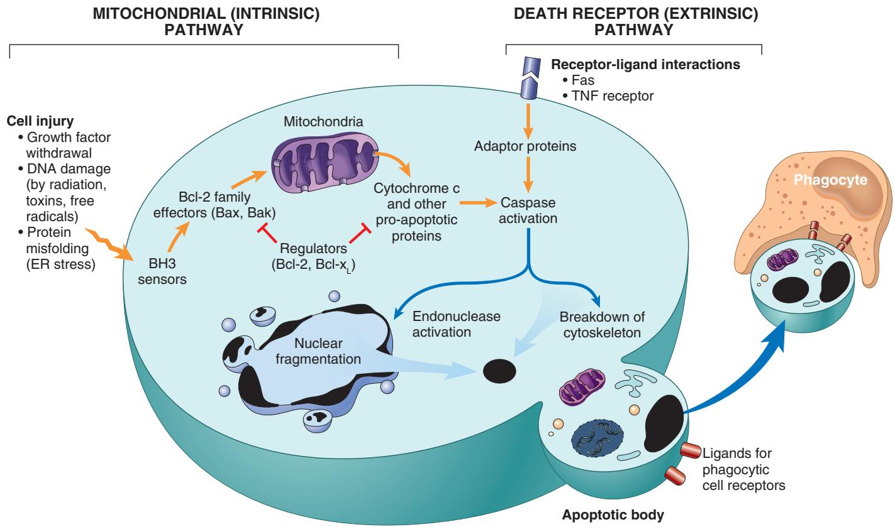 
Fig. 2.12 Mechanisms of apoptosis. The two pathways of apoptosis differ in their induction and regulation, and both culminate in the activation of caspases. In the mitochondrial pathway, BH3-only proteins, which are related to members of the Bcl-2 family, sense a lack of survival signals or DNA or protein damage. These BH3-only proteins activate effector molecules that increase mitochondrial permeability. In concert with a deficiency of Bcl-2 and other proteins that maintain mitochondrial permeability, the mitochondria become leaky and various substances, such as cytochrome c, enter the cytosol and activate caspases. Activated caspases induce the changes that culminate in cell death and fragmentation. In the death receptor pathway, signals from plasma membrane receptors lead to the assembly of adaptor proteins into a "death-inducing signaling complex," which activates caspases, and the end result is the same.
become permeable, cytochrome c leaks out into the cytoplasm, triggering caspase activation and apoptotic death. A family of more than 20 proteins, the prototype of which is Bcl-2, controls the permeability of mitochondria. In healthy cells, Bcl-2 and the related protein Bcl-xL, which are produced in response to growth factors and other stimuli, maintain the integrity of mitochondrial membranes, in large part by holding two proapoptotic members of the family, Bax and Bak, in check. When cells are deprived of growth factors and survival signals, or are exposed to agents that damage DNA, or accumulate unacceptable amounts of misfolded proteins, a number of sensors are activated. These sensors are called BH3 proteins because they contain the third domain seen in Bcl-family proteins. They in turn shift this delicate, life-sustaining balance in favor of pro-apoptotic Bak and Bax. As a result, Bak and Bax dimerize, insert into the mitochondrial membrane, and form channels through which cytochrome c and other mitochondrial proteins escape into the cytosol. After cytochrome c enters the cytosol, it, together with certain cofactors, activates caspase-9. The net result is the activation of a caspase cascade, ultimately leading to nuclear fragmentation and formation of apoptotic bodies.
- The death receptor (extrinsic) pathway of apoptosis. Many cells express surface molecules, called death
receptors, that trigger apoptosis. Most of these are members of the tumor necrosis factor (TNF) receptor family, which contain in their cytoplasmic regions a conserved "death domain," so named because it mediates interaction with other proteins involved in cell death. The prototypic death receptors are the type I TNF receptor and Fas (CD95). Fas ligand (FasL) is a membrane protein expressed mainly on activated T lymphocytes. When these T cells recognize Fas-expressing targets, Fas molecules are crosslinked by FasL and bind adaptor proteins via the death domain. These then recruit and activate caspase-8, which, in turn, activates downstream caspases. The death receptor pathway is involved in the elimination of self-reactive lymphocytes and in the killing of target cells by some cytotoxic T lymphocytes (CTLs) that express FasL.
In either pathway, after caspase-9 or caspase-8 is activated, it cleaves and thereby activates additional caspases that cleave numerous targets and ultimately activate enzymes that degrade the cells' proteins and nucleus. The end result is the characteristic cellular fragmentation of apoptosis.
- Clearance of apoptotic cells. Apoptotic cells and their fragments entice phagocytes by producing a number of "eat-me" signals. For instance, in normal cells, phosphatidylserine is present on the inner leaflet of the plasma membrane, but in apoptotic cells this phospholipid
"flips" to the outer leaflet, where it is recognized by tissue macrophages, leading to phagocytosis of the apoptotic cells. Cells that are dying by apoptosis also secrete soluble factors that recruit phagocytes. The plasma membrane alterations and secreted proteins facilitate prompt clearance of the dead cells before the cells undergo membrane damage and release their contents (which can induce inflammation). Numerous macrophage receptors have been shown to be involved in the binding and engulfment of apoptotic cells. The phagocytosis of apoptotic cells is so efficient that dead cells disappear without leaving a trace, and inflammation is virtually absent.

In H&E-stained tissue sections, the nuclei of apoptotic cells show various stages of chromatin condensation and aggregation and, ultimately, karyorrhexis (Fig. 2.13); at the molecular level, this is reflected in the fragmentation of DNA into nucleosome-sized pieces. The cells rapidly shrink, form cytoplasmic buds, and fragment into apoptotic bodies that are composed of membrane-bound pieces of cytosol and organelles (Fig. 2.11). Because these fragments are quickly extruded and phagocytosed without eliciting an inflammatory response, even substantial apoptosis may be histologically undetectable.
# Other Pathways of Cell Death
In addition to necrosis and apoptosis, two other patterns of cell death have been described that have unusual features. Although the importance of these pathways in disease remains to be established, they are the subjects of considerable current research, and it is useful to be aware of the basic concepts.
- Necroptosis. This form of cell death is initiated by engagement of TNF receptors as well as other, poorly defined triggers. Unlike the extrinsic pathway of apoptosis, which also is downstream of TNF receptors, in necroptosis, kinases called receptor-interacting protein (RIP) kinases are activated, initiating a series of events that result in the dissolution of the cell, much like necrosis. The name necroptosis implies that there are features of both necrosis and apoptosis. Some infections are believed to kill cells by this pathway, and it has been hypothesized to play a role in ischemic injury and other pathologic situations, especially those associated with inflammatory reactions in which the cytokine TNF is produced. However, when and why it occurs and how significant it is in human diseases is not well understood. 
- Pyroptosis. This form of cell death is associated with activation of a cytosolic danger-sensing protein complex called the inflammasome (Chapter 5). The net result of inflammasome activation is the activation of caspases, some of which induce the production of cytokines that induce inflammation, often manifested by fever, and others trigger apoptosis. Thus, apoptosis and inflammation coexist. The name pyroptosis stems from the association of apoptosis with fever (Greek, pyro = fire). It is thought to be one mechanism by which some infectious
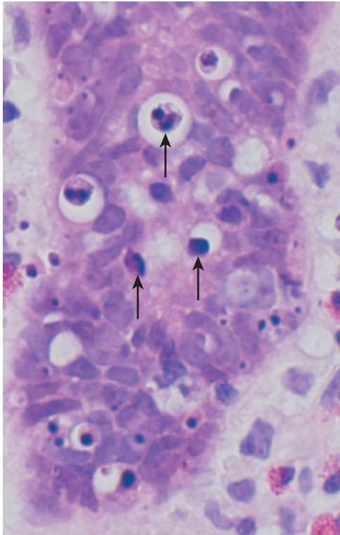 
Fig. 2.13 Morphologic appearance of apoptotic cells. Apoptotic cells (some indicated by arrows) in colonic epithelium are shown. (Some preparative regimens for colonoscopy may induce apoptosis in epithelial cells, which explains the presence of dead cells in this biopsy.) Note the fragmented nuclei with condensed chromatin and the shrunken cell bodies, some with pieces falling off. (Courtesy of Dr. Sanjay Kakar, Department of Pathology, University of California San Francisco, San Francisco, California.)
microbes cause the death of infected cells. Its role in other pathologic situations is unknown.
# Autophagy
Autophagy ("self-eating") refers to lysosomal digestion of the cell's own components. It is a survival mechanism in times of nutrient deprivation, so that the starved cell can live by eating its own contents and recycling these contents to provide nutrients and energy. In this process, intracellular organelles and portions of cytosol are first sequestered within an ER-derived autophagic vacuole, whose formation is initiated by cytosolic proteins that sense nutrient deprivation (Fig. 2.14). The vacuole fuses with lysosomes to form an autophagolysosome, in which lysosomal enzymes digest the cellular components. In some circumstances, autophagy may be associated with atrophy of tissues (discussed later) and may represent an adaptation that helps cells survive lean times. If, however, the starved cell can no longer cope by devouring its contents, autophagy may eventually lead to apoptotic cell death.
Extensive autophagy is seen in ischemic injury and some types of myopathies. Polymorphisms in a gene involved in autophagy have been associated with inflammatory bowel disease, but the mechanistic link between autophagy and intestinal inflammation is not known. The role of autophagy in cancer is discussed in Chapter 6. Thus, a once little-appreciated survival pathway in cells may prove to have wide-ranging roles in human disease.
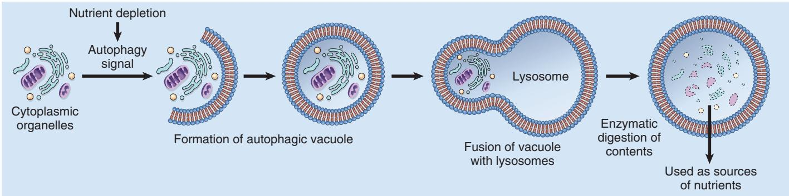 
Fig. 2.14 Autophagy. Cellular stresses, such as nutrient deprivation, activate autophagy genes, which initiate the formation of membrane-bound vesicles in which cellular organelles are sequestered. These vesicles fuse with lysosomes, in which the organelles are digested, and the products are used to provide nutrients for the cell. The same process can trigger apoptosis by mechanisms that are not well defined.
# PATTERNS OF CELL INJURY AND CELL DEATH
- Reversible cell injury: cell swelling, fatty change, plasma membrane blebbing and loss of microvilli, mitochondrial swelling, dilation of the ER, eosinophilia (resulting from decreased cytoplasmic RNA) 
- Necrosis: Accidental cell death manifested by increased cytoplasmic eosinophilia; nuclear shrinkage, fragmentation, and dissolution; breakdown of plasma membrane and organellar membranes; abundant myelin figures; leakage and enzymatic digestion of cellular contents 
- Morphologic types of tissue necrosis: under different conditions, necrosis in tissues may assume specific patterns: coagulative, liquefactive, gangrenous, caseous, fat, and fibrinoid. 
- Apoptosis: regulated mechanism of cell death that serves to eliminate unwanted and irreparably damaged cells, with the least possible host reaction, characterized by enzymatic degradation of proteins and DNA, initiated by caspases; and by rapid recognition and removal of dead cells by phagocytes 
- Apoptosis is initiated by two major pathways:
- Mitochondrial (intrinsic) pathway is triggered by loss of survival signals, DNA damage, and accumulation of misfolded proteins (ER stress); associated with leakage of proapoptotic proteins from mitochondrial membrane into the cytoplasm, where they trigger caspase activation; inhibited by anti-apoptotic members of the Bcl family, which are induced by survival signals including growth factors.
- Death receptor (extrinsic) pathway is responsible for elimination of self-reactive lymphocytes and damage by CTLs; is initiated by engagement of death receptors (members of the TNF receptor family) by ligands on adjacent cells.
- Two other unusual pathways of cell death are necroptosis (which, as the name implies, includes features of both necrosis and apoptosis and is regulated by particular signaling pathways) and pyroptosis, which can lead to the release of proinflammatory cytokines and may initiate apoptosis. 
- Autophagy is an adaptation to nutrient deprivation in which cells digest their own organelles and recycle them to provide energy and substrates. If the stress is too severe for the process to cope with it, it results in cell death by apoptosis.
# MECHANISMS OF CELL INJURY AND CELL DEATH
Before discussing individual mechanisms of cell injury and death, some general principles should be emphasized.
- The cellular response to injurious stimuli depends on the type of injury, its duration, and its severity. Thus, low doses of toxins or a brief period of ischemia may lead to reversible cell injury, whereas larger toxin doses or longer ischemic times may result in irreversible injury and cell death. 
- The consequences of an injurious stimulus also depend on the type, status, adaptability, and genetic makeup of the injured cell. The same injury has vastly different outcomes depending on the cell type. For instance, striated skeletal muscle in the leg tolerates complete ischemia for 2 to 3 hours without irreversible injury, whereas cardiac muscle dies after only 20 to 30 minutes of ischemia. The nutritional (or hormonal) status also can be important; understandably, a glycogen-replete hepatocyte will survive ischemia better than one that has just burned its last glucose molecule. Genetically determined diversity in metabolic pathways can contribute to differences in responses to injurious stimuli. For instance, when exposed to the same dose of a toxin, individuals who inherit variants in genes encoding cytochrome P-450 may catabolize the toxin at different rates, leading to different outcomes. Much effort is now directed toward understanding the role of genetic polymorphisms in responses to drugs and toxins, a field of study called pharmacogenomics. In fact, genetic variations influence susceptibility to many complex diseases as well as responsiveness to various therapeutic agents. Using the genetic makeup of the individual patient to guide therapy is one example of "precision medicine." 
- Cell injury usually results from functional and biochemical abnormalities in one or more of a limited number of essential cellular components (Fig. 2.15). As we discuss in more detail later, different external insults and endogenous perturbations typically affect different cellular organelles and biochemical pathways. For instance, deprivation of oxygen and nutrients (as
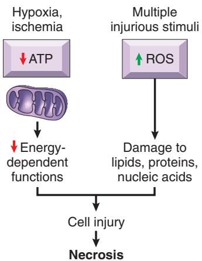 
Fig. 2.15 The principal biochemical mechanisms and sites of damage in cell injury. Note that causes and mechanisms of cell death by necrosis and apoptosis are shown as being independent but there may be overlap; for instance, both may contribute to cell death caused by ischemia, oxidative stress, or radiation. ATP, Adenosine triphosphate; ROS, reactive oxygen species.
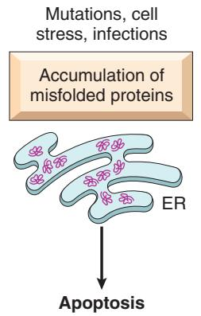
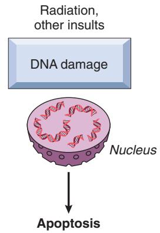
primarilyimpairsenergy-depend.jpg)
in hypoxia and ischemia) primarily impairs energy-dependent cellular functions, culminating in necrosis, whereas damage to proteins and DNA triggers apoptosis. However, it should be emphasized that the very same injurious agent may trigger multiple and overlapping biochemical pathways. Not surprisingly, therefore, it has proved difficult to prevent cell injury by targeting an individual pathway.
As we discussed in the beginning of this chapter and have alluded to throughout, there are numerous and diverse causes of cell injury and cell death. Similarly, there are many biochemical pathways that can initiate the sequence of events that lead to cell injury and culminate in cell death. Some of these pathways are recognized to play important roles in human diseases. In the following section, we organize our discussion of the mechanisms of cell injury along its major causes and pathways, and discuss the principal biochemical alterations in each. For the sake of clarity and simplicity, we emphasize the unique mechanisms in each pathway, but it is important to point out that any initiating trigger may activate one or more of these mechanisms, and several mechanisms may be active simultaneously.
# Hypoxia and Ischemia
Deficiency of oxygen leads to failure of many energy-dependent metabolic pathways, and ultimately to death of cells by necrosis. Most cellular ATP is produced from adenosine diphosphate (ADP) by oxidative phosphorylation during reduction of oxygen in the electron transport system of mitochondria. High-energy phosphate in the form of ATP is required for membrane transport, protein synthesis, lipogenesis, and the deacylation-reacylation reactions necessary for phospholipid turnover. It is estimated that in total, the cells of a healthy human burn 50 to $75\mathrm{kg}$ of ATP every day! Not surprisingly, therefore, cells deprived of oxygen are at risk of suffering catastrophic failure of many essential functions. Oxygen deprivation is one of the most frequent causes of cell injury and necrosis in clinical medicine.
Cells subjected to the stress of hypoxia that do not immediately die activate compensatory mechanisms that
are induced by transcription factors of the hypoxia-inducible factor 1 (HIF-1) family. HIF-1 simulates the synthesis of several proteins that help the cell to survive in the face of low oxygen. Some of these proteins, such as vascular endothelial growth factor (VEGF), stimulate the growth of new vessels and thus attempt to increase blood flow and the supply of oxygen. Other proteins induced by HIF-1 cause adaptive changes in cellular metabolism by stimulating the uptake of glucose and glycolysis and dampening mitochondrial oxidative phosphorylation. Anaerobic glycolysis can generate ATP in the absence of oxygen using glucose derived either from the circulation or from the hydrolysis of intracellular glycogen. Understandably, normal tissues with a greater glycolytic capacity because of the presence of glycogen (e.g., the liver and striated muscle) are more likely to survive hypoxia and decreased oxidative phosphorylation than tissues with limited glucose stores (e.g., the brain). Although it seems counterintuitive, rapidly proliferating normal cells and cancer cells rely on aerobic glycolysis to produce much of their energy, a phenomenon referred to as the Warburg effect. The reason for this is that although glycolysis yields less ATP per molecule of glucose burned than oxidative phosphorylation, metabolites generated by glycolysis and the TCA cycle serve as precursors for the synthesis of cellular constituents (e.g., proteins, lipids, and nucleic acids) that are needed for cell growth and division. Alterations in cellular metabolism are frequently seen in cancer cells, so they are discussed in more detail in Chapter 6.
Persistent or severe hypoxia and ischemia ultimately lead to failure of ATP generation and depletion of ATP in cells. Loss of this critical energy store has deleterious effects on many cellular systems (Fig. 2.16).
- Reduced activity of plasma membrane ATP-dependent sodium pumps, resulting in intracellular accumulation of sodium and efflux of potassium. The net gain of solute is accompanied by isoosmotic gain of water, causing cell swelling and dilation of the ER. 
- The compensatory increase in anaerobic glycolysis leads to lactic acid accumulation, decreased intracellular pH, and decreased activity of many cellular enzymes. 
- Prolonged or worsening depletion of ATP causes structural disruption of the protein synthetic apparatus,
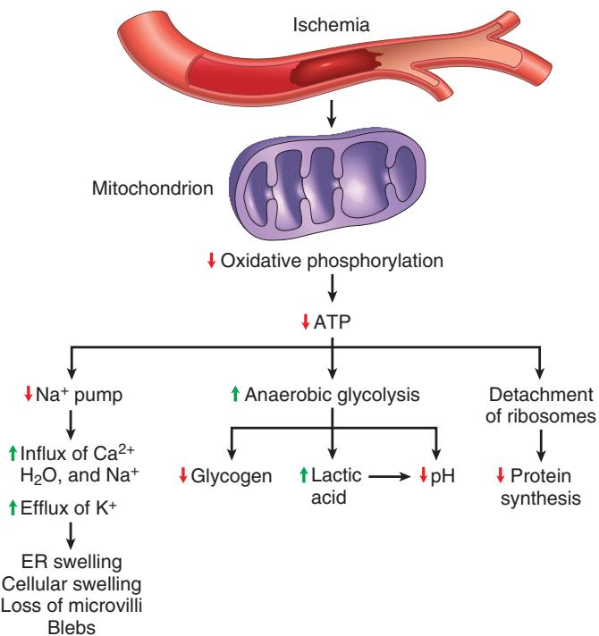 
Fig. 2.16 The functional and morphologic consequences of hypoxia and ischemia. ER, Endoplasmic reticulum.
manifested as detachment of ribosomes from the rough ER (RER) and dissociation of polysomes into monosomes, with a consequent reduction in protein synthesis.
- It also has been suggested that hypoxia per se increases the accumulation of ROS. Whether this is true is a matter of debate; however, there is ample evidence that hypoxia predisposes cells to ROS-mediated damage if blood flow (and oxygen delivery) is reestablished, a phenomenon called reperfusion injury (described later). 
- Ultimately, there is irreversible damage to mitochondrial and lysosomal membranes, and the cell undergoes necrosis. Membrane damage is a late event in cell injury caused by diverse mechanisms, and is discussed later. Although necrosis is the principal form of cell death caused by hypoxia, apoptosis by the mitochondrial pathway is also thought to contribute.
The functional consequences of hypoxia and ischemia depend on the severity and duration of the deficit. For instance, the heart muscle ceases to contract within 60 seconds of coronary occlusion. If hypoxia continues, worsening ATP depletion causes further deterioration, undergoing the sequence of changes illustrated in Fig. 2.3 and described earlier.
# Ischemia-Reperfusion Injury
Under certain circumstances, the restoration of blood flow to ischemic but viable tissues results, paradoxically, in increased cell injury. This is the reverse of the expected outcome of the restoration of blood flow, which normally results in the recovery of reversibly injured cells. This so-called "ischemia-reperfusion injury" is a clinically important process that may contribute significantly to
tissue damage, especially after myocardial and cerebral ischemia.
Several mechanisms may account for the exacerbation of cell injury resulting from reperfusion of ischemic tissues:
- New damage may be initiated during reoxygenation by increased generation of ROS (described in more detail below). Some of the ROS may be generated by injured cells with damaged mitochondria that cannot carry out the complete reduction of oxygen, and at the same time cellular anti-oxidant defense mechanisms may be compromised by ischemia, exacerbating the situation. ROS generated by infiltrating leukocytes also may contribute to the damage of vulnerable injured cells. 
- The inflammation that is induced by ischemic injury may increase with reperfusion because it enhances the influx of leukocytes and plasma proteins. The products of activated leukocytes may cause additional tissue injury (Chapter 3). Activation of the complement system also may contribute to ischemia-reperfusion injury. Complement proteins may bind to the injured tissues, or to antibodies that are deposited in the tissues, and subsequent complement activation generates byproducts that exacerbate the cell injury and inflammation.
# Oxidative Stress
Oxidative stress refers to cellular abnormalities that are induced by ROS, which belong to a group of molecules known as free radicals. Free radical-mediated cell injury is seen in many circumstances, including chemical and radiation injury, hypoxia, cellular aging, tissue injury caused by inflammatory cells, and ischemia-reperfusion injury. In all these cases, cell death may be by necrosis, apoptosis, or the mixed pattern of necroptosis.
Free radicals are chemical species with a single unpaired electron in an outer orbit. Such chemical states are extremely unstable, and free radicals readily react with inorganic and organic molecules; when generated in cells, they avidly attack nucleic acids as well as a variety of cellular proteins and lipids. In addition, free radicals initiate reactions in which molecules that react with the free radicals are themselves converted into other types of free radicals, thereby propagating the chain of damage.
# Generation and Removal of Reactive Oxygen Species
The accumulation of ROS is determined by their rates of production and removal (Fig. 2.17). ROS are produced by two major pathways.
- ROS are produced normally in small amounts in all cells during the reduction-oxidation (redox) reactions that occur during mitochondrial respiration and energy generation. In this process, molecular oxygen is reduced in mitochondria to generate water by the sequential addition of four electrons. This reaction is imperfect, however, and small amounts of highly reactive but short-lived toxic intermediates are generated when oxygen is only partially reduced. These intermediates include superoxide $(\mathrm{O}_2^{\bullet})$ , which is converted to hydrogen peroxide $(\mathrm{H}_2\mathrm{O}_2)$ spontaneously and by the action of the enzyme superoxide dismutase (SOD). $\mathrm{H}_2\mathrm{O}_2$ is more stable than $\mathrm{O}_2^{\bullet}$ and can cross biologic membranes. In the presence of metals, such as $\mathrm{Fe}^{2+}$ , $\mathrm{H}_2\mathrm{O}_2$ is converted to the
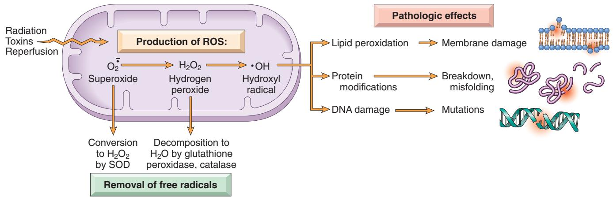 
Fig. 2.17 The generation, removal, and role of reactive oxygen species (ROS) in cell injury. The production of ROS is increased by many injurious stimuli. These free radicals are removed by spontaneous decay and by specialized enzymatic systems. Excessive production or inadequate removal leads to accumulation of free radicals in cells, which may damage lipids (by peroxidation), proteins, and DNA, resulting in cell injury. SOD, Superoxide dismutase.
highly reactive hydroxyl radical $\cdot$ OH by the Fenton reaction. The properties and pathologic effects of the major ROS are summarized in Table 2.3.
- ROS are produced in phagocytic leukocytes, mainly neutrophils and macrophages, as a weapon for destroying ingested microbes and other substances during inflammation and host defense (Chapter 3). The ROS are generated in the phagosomes and phagolysosomes of leukocytes by a process that is similar to mitochondrial respiration and is called the respiratory burst (or oxidative burst). In this process, a phagosome membrane enzyme catalyzes the generation of superoxide, which is converted to $\mathrm{H}_2\mathrm{O}_2$ . $\mathrm{H}_2\mathrm{O}_2$ is in turn converted to a highly reactive compound, hypochlorite (the major component of household bleach), by the enzyme myeloperoxidase, which is present in leukocytes. The role of ROS in inflammation is described in Chapter 3. 
- Nitric oxide (NO) is another reactive free radical produced in macrophages and other leukocytes. It can react with $\mathrm{O}_2^-$ to form a highly reactive compound, peroxynitrite, which also participates in cell injury.
The generation of free radicals is increased under several circumstances:
- The absorption of radiant energy (e.g., ultraviolet (UV) light, x-rays). Ionizing radiation can hydrolyze water into hydroxyl $(\bullet \mathrm{OH})$ and hydrogen $(\mathrm{H}^{\bullet})$ free radicals.
- The enzymatic metabolism of exogenous chemicals (e.g., carbon tetrachloride—see later) 
- Inflammation, in which free radicals are produced by leukocytes (Chapter 3) 
- Reperfusion of ischemic tissues, as already described.
Cells have developed mechanisms to remove free radicals and thereby minimize their injurious effects. Free radicals are inherently unstable and decay spontaneously. There also are nonenzymatic and enzymatic systems, sometimes called free radical scavengers, serving to inactivate free radicals (Fig. 2.17).
- The rate of decay of superoxide is significantly increased by the action of superoxide dismutase (SOD). 
- Glutathione (GSH) peroxidases are a family of enzymes whose major function is to protect cells from oxidative damage. The most abundant member of this family, GSH peroxidase 1, is found in the cytoplasm of all cells. It catalyzes the breakdown of $\mathrm{H}_2\mathrm{O}_2$ by the reaction $2\mathrm{GSH} + \mathrm{H}_2\mathrm{O}_2 \rightarrow \mathrm{GS-SG} + 2\mathrm{H}_2\mathrm{O}$ . The intracellular ratio of oxidized GSH to reduced GSH is a reflection of this enzyme's activity and thus of the cell's ability to catabolize free radicals. 
- Catalase, present in peroxisomes, catalyzes the decomposition of hydrogen peroxide $(2\mathrm{H}_2\mathrm{O}_2 \rightarrow \mathrm{O}_2 + 2\mathrm{H}_2\mathrm{O})$ . It is one of the most active enzymes known, capable of degrading millions of molecules of $\mathrm{H}_2\mathrm{O}_2$ per second.
Table 2.3 Principal Free Radicals Involved in Cell Injury 
Free RadicalMechanisms of ProductionMechanisms of RemovalPathologic EffectsSuperoxide (O2-)Incomplete reduction of O2 during mitochondrial oxidative phosphorylation; by phagocyte oxidase in leukocytesConversion to H2O2and O2by superoxide dismutaseDirect damaging effects on lipids (peroxidation), proteins, and DNAHydrogen peroxide (H2O2)Mostly from superoxide by action of superoxide dismutaseConversion to H2O and O2by catalase, glutathione peroxidaseCan be converted to .OH and OC1-, which destroy microbes and cellsHydroxyl radical (*OH)Produced from H2O, H2O2, and O2- by various chemical reactionsConversion to H2O by glutathione peroxidaseDirect damaging effects on lipids, proteins, and DNAPeroxynitrite (ONOO*)Interaction of O2- and NO mediated by NO synthaseConversion to nitrite by enzymes in mitochondria and cytosolDirect damaging effects on lipids, proteins, and DNA
- Endogenous or exogenous anti-oxidants (e.g., vitamins E, A, and C and $\beta$ -carotene) may either block the formation of free radicals or scavenge them after they have formed.
# Cell Injury Caused by Reactive Oxygen Species
ROS causes cell injury by damaging multiple components of cells (Fig. 2.17):
- Lipid peroxidation of membranes. Double bonds in membrane polyunsaturated lipids are vulnerable to attack by oxygen-derived free radicals. The lipid-radical interactions yield peroxides, which are themselves unstable and reactive, and an autocatalytic chain reaction ensues. Damage to plasma membranes as well as mitochondrial and lysosomal membranes can have devastating consequences, as discussed earlier in the context of ischemia and hypoxia. 
- Crosslinking and other changes in proteins. Free radicals promote sulfhydryl-mediated protein crosslinking, resulting in enhanced degradation or loss of enzymatic activity. Free radical reactions also may directly cause polypeptide fragmentation. Damaged proteins may fail to fold properly, triggering the unfolded protein response, described later. 
- DNA damage. Free radical reactions with thymine residues in nuclear and mitochondrial DNA produce single-strand breaks. Such DNA damage has been implicated in apoptotic cell death, aging, and malignant transformation of cells. 
- In addition to the role of ROS in cell injury and the killing of microbes, low concentrations of ROS are involved in numerous signaling pathways in cells and thus in many physiologic reactions. Therefore, these molecules are produced normally but, to avoid their harmful effects, their intracellular concentrations are tightly regulated in healthy cells.
# Cell Injury Caused by Toxins
Toxins, including environmental chemicals and substances produced by infectious pathogens, induce cell injury that culminates primarily in necrotic cell death. Different types of toxins induce cell injury by two general mechanism:
- Direct-acting toxins. Some toxins act directly by combining with a critical molecular component or cellular organelle. For example, in mercuric chloride poisoning (as may occur from ingestion of contaminated seafood) (Chapter 8), mercury binds to the sulfhydryl groups of various cell membrane proteins, causing inhibition of ATP-dependent transport and increased membrane permeability. Many anti-neoplastic chemotherapeutic agents also induce cell damage by direct cytotoxic effects. Also included in this class are toxins made by microorganisms (described in Chapter 9). These often cause damage by targeting host cell molecules that are needed for essential functions, such as protein synthesis and ion transport. 
- Latent toxins. Many toxic chemicals are not intrinsically active but must first be converted to reactive metabolites, which then act on target cells. Understandably, such toxins typically affect the cells in which they are activated. This is usually accomplished by cytochrome
P-450 in the smooth ER of the liver and other organs. Although the metabolites might cause membrane damage and cell injury by direct covalent binding to protein and lipids, the most important mechanism of cell injury involves the formation of free radicals. Carbon tetrachloride $\mathrm{(CCl_4)}$ once widely used in the dry cleaning industry but now banned-and the analgesic acetaminophen belong in this category. The effect of $\mathrm{CCl_4}$ is still instructive as an example of chemical injury. $\mathrm{CCl_4}$ is converted to a toxic free radical, principally in the liver, and this free radical is the cause of cell injury, mainly by membrane phospholipid peroxidation. In less than 30 minutes after exposure to $\mathrm{CCl_4}$ there is sufficient damage to the ER membranes of hepatocytes to cause a decline in the synthesis of enzymes and plasma proteins; within 2 hours, swelling of the smooth ER and dissociation of ribosomes from the RER have occurred. There also is decreased synthesis of apoproteins that form complexes with triglycerides and thereby facilitate triglyceride secretion; this defect results in the accumulation of lipids in hepatocytes and other cells and the "fatty liver" of $\mathrm{CCl_4}$ poisoning. Mitochondrial injury follows, and subsequently diminished ATP stores result in defective ion transport and progressive cell swelling; the plasma membranes are further damaged by fatty aldehydes produced by lipid peroxidation in the ER. The end result can be cell death.
# Endoplasmic Reticulum Stress
The accumulation of misfolded proteins in a cell can stress compensatory pathways in the ER and lead to cell death by apoptosis. During normal protein synthesis, chaperones in the ER control the proper folding of newly synthesized proteins, and misfolded polypeptides are ubiquitinated and targeted for proteolysis. If unfolded or misfolded proteins accumulate in the ER, they first induce a protective cellular response that is called the unfolded protein response (Fig. 2.18). This adaptive response activates signaling pathways that increase the production of chaperones and decrease protein translation, thus reducing the levels of misfolded proteins in the cell. When a large amount of misfolded protein accumulates and cannot be handled by the adaptive response, the signals that are generated result in activation of proapoptotic sensors of the BH3-only family as well as direct activation of caspases, leading to apoptosis by the mitochondrial (intrinsic) pathway.
Intracellular accumulation of misfolded proteins may be caused by abnormalities that increase the production of misfolded proteins or reduce the ability to eliminate them. This may result from gene mutations that lead to the production of proteins that cannot fold properly; aging, which is associated with a decreased capacity to correct misfolding; infections, especially viral infections, when large amounts of microbial proteins are synthesized within cells, more than the cell can handle; increased demand for secretory proteins such as insulin in insulin-resistant states; and changes in intracellular $\mathsf{pH}$ and redox state. Protein misfolding is thought to be the fundamental cellular abnormality in several neurodegenerative diseases (Chapter 23). Deprivation of glucose and oxygen, as in ischemia and hypoxia, also may increase the burden of misfolded proteins.
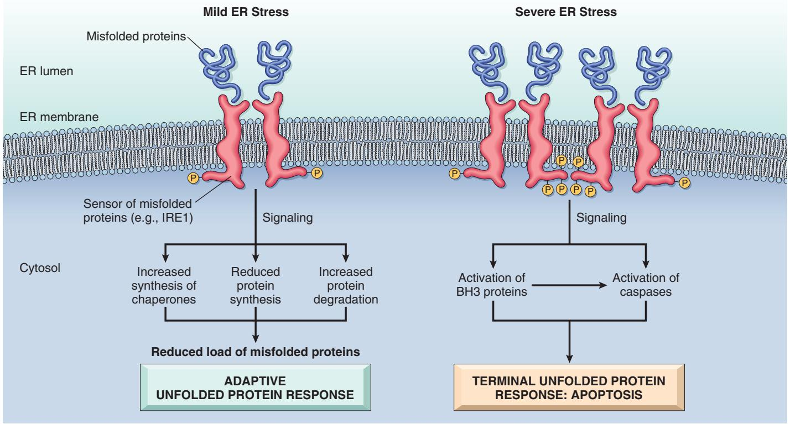 
Fig. 2.18 The unfolded protein response and endoplasmic reticulum (ER) stress. The presence of misfolded proteins in the ER is detected by sensors in the ER membrane, such as the kinase IRE-1, which form oligomers that are activated by phosphorylation. This triggers an adaptive unfolded protein response, which can protect the cell from the harmful consequences of the misfolded proteins. When the amount of misfolded proteins is too great to be corrected, excessive activation of ER sensors activates the mitochondrial pathway of apoptosis and the irreparably damaged cell dies; this is also called the terminal unfolded protein response.
Protein misfolding within cells may cause disease by creating a deficiency of an essential protein or by inducing apoptosis (Table 2.4).
- Misfolded proteins often lose their activity and are rapidly degraded, both of which can contribute to a loss of function. If this function is essential, cellular injury ensues. One important disease in which this occurs is cystic fibrosis, which is caused by inherited mutations in a membrane transport protein that prevents its normal folding.
- Cell death as a result of protein misfolding is recognized as a feature of a number of diseases, including the neurodegenerative disorders Alzheimer disease, Huntington disease, and Parkinson disease, and may underlie type 2 diabetes as well (Table 2.4).
As discussed later in the chapter, improperly folded proteins can also accumulate in extracellular tissues, as in amyloidosis.
Table 2.4 Diseases Caused by Misfolded Proteins ${}^{a}$ 
DiseaseAffected ProteinPathogenesisDiseases Caused by Mutant Proteins That Are Degraded, Leading to Their DeficiencyCystic fibrosisCFTRLoss of CFTR leads to defects in chloride transport and death of affected cellsFamilial hypercholesterolemiaLDL receptorLoss of LDL receptor leads to hypercholesterolemiaTay-Sachs diseaseHexosaminidase β subunitLack of the lysosomal enzyme leads to storage of GM2 gangliosides in neuronsDiseases Caused by Misfolded Proteins That Result in ER Stress-Induced Cell LossRetinitis pigmentosaRhodopsinAbnormal folding of rhodopsin causes photoreceptor loss and cell death, resulting in blindnessCreutzfeldt-Jacob diseasePrionsAbnormal folding of PrPsc causes neuronal cell deathAlzheimer diseaseAβ peptideAbnormal folding of Aβ peptide causes aggregation within neurons and apoptosisDiseases Caused by Misfolded Proteins That Result From Both ER Stress-Induced Cell Loss and Functional Deficiency of the ProteinAlpha-I-anti-trypsin deficiencyα-1 anti-trypsinStorage of nonfunctional protein in hepatocytes causes apoptosis; absence of enzymatic activity in lungs causes destruction of elastic tissue giving rise to emphysema
aSelected illustrative examples of diseases are shown in which protein misfolding is thought to be the major mechanism of functional derangement or cell or tissue injury. CFTR, Cystic fibrosis transmembrane conductance regulator; LDL, low-density lipoprotein.
# DNA Damage
Exposure of cells to radiation or chemotherapeutic agents, intracellular generation of ROS, and acquisition of mutations may all induce DNA damage, which if severe may trigger apoptotic death. Damage to DNA is sensed by intracellular sentinel proteins, which transmit signals that lead to the accumulation of p53 protein. p53 first arrests the cell cycle (at the G1 phase) to allow the DNA to be repaired before it is replicated (Chapter 6). However, if the damage is too great to be repaired successfully, p53 triggers apoptosis, mainly by stimulating BH3-only sensor proteins that ultimately activate Bax and Bak, proapoptotic members of the Bcl-2 family. When p53 is mutated or absent (as it is in certain cancers), cells with damaged DNA that would otherwise undergo apoptosis survive. In such cells, the DNA damage may result in mutations or DNA rearrangements (e.g., translocations) that lead to neoplastic transformation (Chapter 6).
# Inflammation
A common cause of injury to cells and tissues is the inflammatory reaction that is elicited by pathogens, necrotic cells, and dysregulated immune responses, as in autoimmune diseases and allergies. In all these situations, inflammatory cells, including neutrophils, macrophages, lymphocytes, and other leukocytes, secrete products that evolved to destroy microbes but also may damage host tissues. These injurious immune reactions are classified under hypersensitivity. Their mechanisms and significance are discussed in Chapter 5.
# Common Events in Cell Injury From Diverse Causes
In the previous discussion, we addressed the mechanisms of cell injury according to the initiating cause, and highlighted the principal pathways of injury that are triggered in different pathophysiologic situations. Some abnormalities characterize cell injury regardless of the cause, and are thus seen in a variety of pathologic situations. Two of these changes are described next.
# Mitochondrial Dysfunction
Mitochondria may be viewed as "mini-factories" that produce life-sustaining energy in the form of ATP. Not surprisingly, therefore, they also are critical players in cell injury and death. Mitochondria are sensitive to many types of injurious stimuli, including hypoxia, chemical toxins, and radiation (Fig. 2.19). Mitochondrial changes occur in necrosis and apoptosis. They may result in several biochemical abnormalities:
- Failure of oxidative phosphorylation leads to progressive depletion of ATP, culminating in necrosis of the cell, as described earlier. 
- Abnormal oxidative phosphorylation also leads to the formation of ROS, which have many deleterious effects, as already described. 
- Damage to mitochondria is often associated with the formation of a high-conductance channel in the mitochondrial membrane, called the mitochondrial
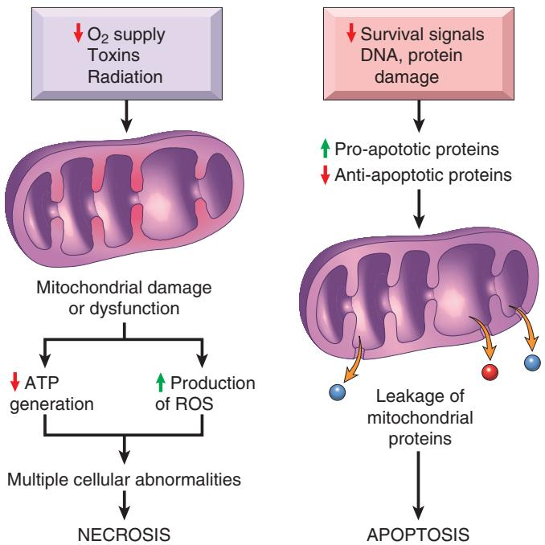 
Fig. 2.19 Role of mitochondria in cell injury and death. Mitochondria are affected by a variety of injurious stimuli and their abnormalities lead to necrosis or apoptosis. This pathway of apoptosis is described in more detail later. ATP, Adenosine triphosphate; ROS, reactive oxygen species.
permeability transition pore. The opening of this channel leads to the loss of mitochondrial membrane potential and pH changes, further compromising oxidative phosphorylation.
- Mitochondria also contain proteins such as cytochrome c that, when released into the cytoplasm, tell the cell there is internal injury and activate a pathway of apoptosis, as discussed earlier.
# Defects in Membrane Permeability
Increased membrane permeability leading ultimately to overt membrane damage is a feature of most forms of cell injury that culminate in necrosis. The most important sites of membrane damage during cell injury are the mitochondrial membrane, the plasma membrane, and membranes of lysosomes. As noted earlier, increased permeability of the plasma membrane and lysosomal membranes is not a feature of apoptosis.
- Mitochondrial membrane damage. As discussed earlier, damage to mitochondrial membranes results in decreased production of ATP, with many deleterious effects culminating in necrosis. 
- Plasma membrane damage. Plasma membrane damage leads to loss of osmotic balance and influx of fluids and ions, as well as loss of cellular contents. The cells may also leak metabolites that are vital for the reconstitution of ATP, thus further depleting energy stores. 
- Injury to lysosomal membranes results in leakage of their enzymes into the cytoplasm and activation of the acid hydrolases in the acidic intracellular pH of the injured (e.g., ischemic) cell. Activation of these enzymes leads to enzymatic digestion of cell components, and the cells die by necrosis.

# MECHANISMS OF CELL INJURY
- Different initiating events cause cell injury and death by diverse mechanisms. 
- Hypoxia and ischemia lead to ATP depletion and failure of many energy-dependent functions, resulting first in reversible injury and, if not corrected, in necrosis. 
- In ischemia-reperfusion injury, restoration of blood flow to an ischemic tissue exacerbates damage by increasing production of ROS and by inflammation. 
- Oxidative stress refers to accumulation of ROS, which can damage cellular lipids, proteins, and DNA, and is associated with numerous initiating causes. 
- Protein misfolding depletes essential proteins and, if the misfolded proteins accumulate within cells, results in apoptosis. 
- DNA damage (e.g., by radiation) also can induce apoptosis if it is not repaired. 
- Inflammation is associated with cell injury because of the damaging actions of the products of inflammatory leukocytes.
We have now concluded the discussion of cell injury and cell death. As we have seen, these processes are the root cause of many common diseases. We end this chapter with brief considerations of three other processes: cellular adaptations to stresses; intracellular accumulations of various substances and extracellular deposition of calcium, both of which are often associated with cell injury; and aging.
# CELLULAR ADAPTATIONS TO STRESS
Adaptations are reversible changes in the number, size, phenotype, metabolic activity, or functions of cells in response to changes in their environment. Physiologic adaptations usually represent responses of cells to normal stimulation by hormones or endogenous chemical mediators (e.g., the hormone-induced enlargement of the breast and
uterus during pregnancy), or to the demands of mechanical stress (in the case of bones and muscles). Pathologic adaptations are responses to stress that allow cells to modulate their structure and function and thus escape injury, but at the expense of normal function, such as squamous metaplasia of bronchial epithelium in smokers. Physiologic and pathologic adaptations can take several distinct forms, as described in the following text.
# Hypertrophy
Hypertrophy is an increase in the size of cells resulting in an increase in the size of the organ. In contrast, hyperplasia (discussed next) is an increase in cell number. Stated another way, in pure hypertrophy there are no new cells, just bigger cells containing increased amounts of structural proteins and organelles. Hyperplasia is an adaptive response in cells capable of replication, whereas hypertrophy occurs when cells have a limited capacity to divide. Hypertrophy and hyperplasia also can occur together, and obviously both result in an enlarged organ.
Hypertrophy can be physiologic or pathologic and is caused either by increased functional demand or by growth factor or hormonal stimulation.
- The massive physiologic enlargement of the uterus during pregnancy occurs as a consequence of estrogen-stimulated smooth muscle hypertrophy and smooth muscle hyperplasia (Fig. 2.20). In contrast, in response to increased workload the striated muscle cells in both the skeletal muscle and the heart undergo only hypertrophy because adult muscle cells have a limited capacity to divide. Therefore, the chiseled physique of the avid weightlifter stems solely from the hypertrophy of individual skeletal muscles. 
- An example of pathologic hypertrophy is the cardiac enlargement that occurs with hypertension or aortic valve disease (Fig. 2.21). The differences between normal, adapted, and irreversibly injured cells are illustrated by the responses of the heart to different types of
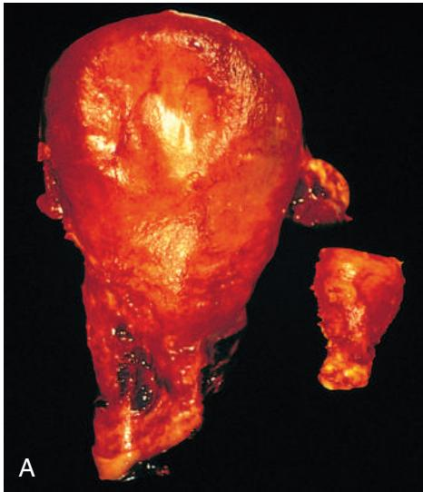 
Fig. 2.20 Physiologic hypertrophy of the uterus during pregnancy. (A) Gross appearance of a normal uterus (right) and a gravid uterus (left) that was removed for postpartum bleeding. (B) Small spindle-shaped uterine smooth muscle cells from a normal uterus. (C) Large, plump hypertrophied smooth muscle cells from a gravid uterus; compare with B. (B and C, Same magnification.)
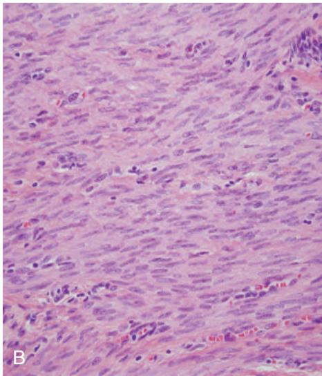
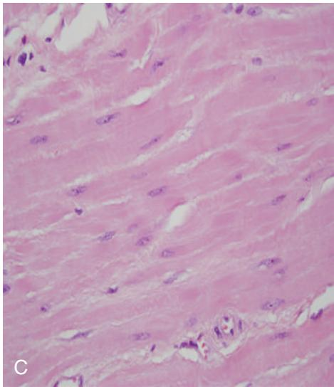
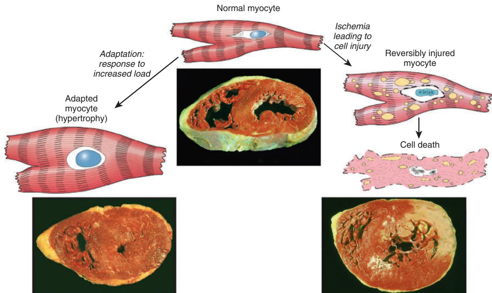 
Fig. 2.21 The relationship among normal, adapted, reversibly injured, and dead myocardial cells. The cellular adaptation depicted here is hypertrophy, the cause of reversible injury is ischemia, and the irreversible injury is ischemic coagulative necrosis. In the example of myocardial hypertrophy (lower left), the left ventricular wall is thicker than $2\mathrm{cm}$ (normal, $1 - 1.5\mathrm{cm}$ ). Reversibly injured myocardium shows functional effects without any gross or light microscopic changes, or reversible changes such as cellular swelling and fatty change (shown here). In the specimen showing necrosis (lower right) the transmural light area in the posterolateral left ventricle represents an acute myocardial infarction. All three transverse sections of myocardium were stained with triphenyltetrazolium chloride, an enzyme substrate that colors viable myocardium magenta. Failure to stain is due to enzyme loss after cell death.
stress. Myocardium subjected to a persistently increased workload, as in hypertension or with a narrowed (stenotic) valve, adapts by undergoing hypertrophy to generate the required higher contractile force. If, on the other hand, the myocardium is subjected to reduced blood flow (ischemia) due to an occluded coronary artery, the muscle cells may undergo injury.
The mechanisms driving cardiac hypertrophy involve at least two types of signals: mechanical triggers, such as stretch, and soluble mediators that stimulate cell growth, such as growth factors and adrenergic hormones. These stimuli turn on signal transduction pathways that lead to the induction of a number of genes, which in turn stimulate synthesis of many cellular proteins, including growth factors and structural proteins. The result is the synthesis of more proteins and myofilaments per cell, which increases the force generated with each contraction, enabling the cell to meet increased work demands. There may also be a switch of contractile proteins from adult to fetal or neonatal forms. For example, during muscle hypertrophy, the $\alpha$ -myosin heavy chain is replaced by the fetal $\beta$ form of the myosin heavy chain, which produces slower, more energetically economical contraction.
An adaptation to stress such as hypertrophy can progress to functionally significant cell injury if the stress is not relieved. Whatever the cause of hypertrophy, a limit is reached beyond which the enlargement of muscle mass can no longer compensate for the increased burden. When this happens in the heart, several degenerative changes occur
in the myocardial fibers, of which the most important are fragmentation and loss of myofibrillar contractile elements. Why hypertrophy progresses to these regressive changes is incompletely understood. There may be finite limits on the abilities of the vasculature to adequately supply the enlarged fibers, the mitochondria to supply ATP, or the biosynthetic machinery to provide sufficient contractile proteins or other cytoskeletal elements. The net result of these degenerative changes is ventricular dilation and ultimately cardiac failure.
# Hyperplasia
Hyperplasia is an increase in the number of cells in an organ that stems from increased proliferation, either of differentiated cells or, in some instances, less differentiated progenitor cells. As discussed earlier, hyperplasia takes place if the tissue contains cell populations capable of replication; it may occur concurrently with hypertrophy and often in response to the same stimuli.
Hyperplasia can be physiologic or pathologic; in both situations, cellular proliferation is stimulated by growth factors that are produced by a variety of cell types.
- The two types of physiologic hyperplasia are (1) hormonal hyperplasia, exemplified by the proliferation of the glandular epithelium of the female breast at puberty and during pregnancy, and (2) compensatory hyperplasia, in which residual tissue grows after removal or loss of part of an organ. For example, when part of a liver is resected, mitotic activity in the remaining cells begins as
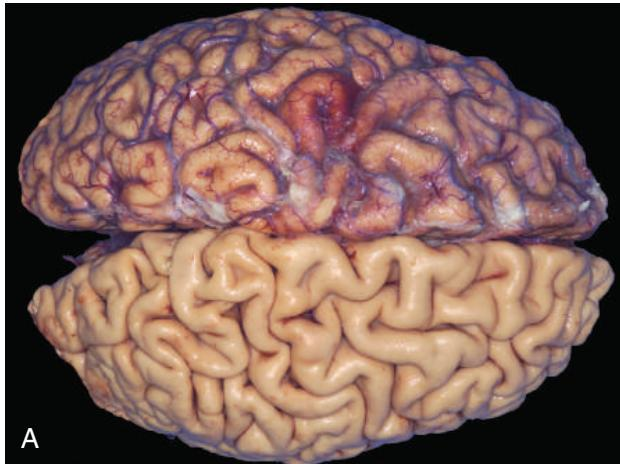 
Fig. 2.22 Atrophy as seen in the brain. (A) Normal brain of a young adult. (B) Atrophy of the brain in an 82-year-old man with atherosclerotic disease. Atrophy of the brain is caused by aging and reduced blood supply. Note that loss of brain substance narrows the gyri and widens the sulci. The meninges have been stripped from the bottom half of each specimen to show the surface of the brain.
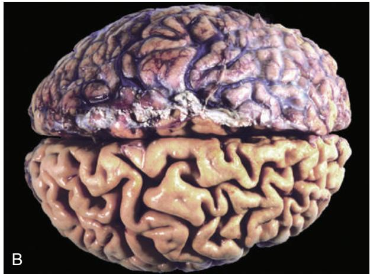
early as 12 hours later, eventually restoring the liver to its normal size. The stimuli for hyperplasia in this setting are polypeptide growth factors produced by uninjured hepatocytes as well as nonparenchymal cells in the liver (Chapter 3). After restoration of the liver mass, various growth inhibitors turn off cell proliferation.
- Most forms of pathologic hyperplasia are caused by excessive hormonal or growth factor stimulation. For example, after a normal menstrual period there is a burst of uterine epithelial proliferation that is normally tightly regulated by the stimulatory effects of pituitary hormones and ovarian estrogen and the inhibitory effects of progesterone. A disturbance in this balance leading to increased estrogenic stimulation causes endometrial hyperplasia, which is a common cause of abnormal menstrual bleeding. Benign prostatic hyperplasia is another common example of pathologic hyperplasia induced in responses to hormonal stimulation by androgens. Stimulation by growth factors also is involved in the hyperplasia that is associated with certain viral infections; for example, papillomaviruses cause skin warts and mucosal lesions that are composed of masses of hyperplastic epithelium. Here the growth factors may be encoded by viral genes or by the genes of the infected host cells.
An important point is that in all of these situations, the hyperplastic process remains controlled; if the signals that initiate it abate, the hyperplasia disappears. It is this responsiveness to normal regulatory control mechanisms that distinguishes pathologic hyperplasias from cancer, in which the growth control mechanisms become permanently dysregulated or ineffective (Chapter 6). Nevertheless, in many cases, pathologic hyperplasia constitutes a fertile soil in which cancers may eventually arise. For example, patients with hyperplasia of the endometrium are at increased risk of developing endometrial cancer (Chapter 19).
# Atrophy
Atrophy is shrinkage in the size of cells by the loss of cell substance. When a sufficient number of cells are
involved, the entire tissue or organ is reduced in size, or atrophic (Fig. 2.22). Although atrophic cells may have diminished function, they are not dead.
Causes of atrophy include a decreased workload (e.g., immobilization of a limb to permit healing of a fracture), loss of innervation, diminished blood supply, inadequate nutrition, loss of endocrine stimulation, and aging (senile atrophy). Although some of these stimuli are physiologic (e.g., the loss of hormone stimulation in menopause) and others are pathologic (e.g., denervation), the fundamental cellular changes are similar. They represent a retreat by the cell to a smaller size at which survival is still possible; a new equilibrium is achieved between cell size and diminished blood supply, nutrition, or trophic stimulation.
Cellular atrophy results from a combination of decreased protein synthesis and increased protein degradation.
Protein synthesis decreases because of reduced metabolic activity. 
- The degradation of cellular proteins occurs mainly by the ubiquitin-proteasome pathway. Nutrient deficiency and disuse may activate ubiquitin ligases, which attach multiple copies of the small peptide ubiquitin to cellular proteins and target them for degradation in proteasomes. This pathway is also thought to be responsible for the accelerated proteolysis seen in a variety of catabolic conditions, including the cachexia associated with cancer. 
- In many situations, atrophy also is associated with autophagy, with resulting increases in the number of autophagic vacuoles. As discussed previously, autophagy is the process in which the starved cell eats its own organelles in an attempt to survive.
# Metaplasia
Metaplasia is a change in which one adult cell type (epithelial or mesenchymal) is replaced by another adult cell type. In this type of cellular adaptation, a cell type sensitive to a particular stress is replaced by another cell type better able to withstand the adverse environment. Metaplasia is thought to arise by the reprogramming of stem cells
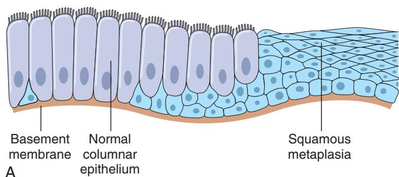
tosquamousepithelium(right)inabronchus,shownschematically(A)andhistologically(B)..jpg) 
Fig. 2.23 Metaplasia of normal columnar (left) to squamous epithelium (right) in a bronchus, shown schematically (A) and histologically (B).
to differentiate along a new pathway rather than a phenotypic change (transdifferentiation) of already differentiated cells.
Epithelial metaplasia is exemplified by the change that occurs in the respiratory epithelium of habitual cigarette smokers, in whom the normal ciliated columnar epithelial cells of the trachea and bronchi often are replaced by stratified squamous epithelial cells (Fig. 2.23). The rugged stratified squamous epithelium may be able to survive the noxious chemicals in cigarette smoke that the more fragile specialized epithelium would not tolerate. Although the metaplastic squamous epithelium has survival advantages, important protective mechanisms are lost, such as mucus secretion and ciliary clearance of particulate matter. Epithelial metaplasia is therefore a double-edged sword. Because vitamin A is essential for normal epithelial differentiation, its deficiency also may induce squamous metaplasia in the respiratory epithelium.
Metaplasia need not always occur in the direction of columnar to squamous epithelium; in chronic gastric reflux, the normal stratified squamous epithelium of the lower esophagus may undergo metaplastic transformation to gastric or intestinal-type columnar epithelium. Metaplasia also may occur in mesenchymal cells, but in these situations it is generally a reaction to some pathologic alteration and not an adaptive response to stress. For example, bone is occasionally formed in soft tissues, particularly in foci of injury.
The influences that induce metaplastic change in an epithelium, if persistent, may predispose to malignant transformation. In fact, squamous metaplasia of the respiratory epithelium often coexists with lung cancers composed of malignant squamous cells. It is thought that cigarette smoking initially causes squamous metaplasia, and cancers arise later in some of these altered foci.
# CELLULAR ADAPTATIONS TO STRESS
- Hypertrophy: increased cell and organ size, often in response to increased workload; induced by growth factors produced in response to mechanical stress or other stimuli; occurs in tissues incapable of cell division 
- Hyperplasia: increased cell numbers in response to hormones and other growth factors; occurs in tissues whose cells are able to divide or contain abundant tissue stem cells 
- Atrophy: decreased cell and organ size, as a result of decreased nutrient supply or disuse; associated with decreased synthesis of cellular building blocks and increased breakdown of cellular organelles and autophagy 
- Metaplasia: change in phenotype of differentiated cells, often in response to chronic irritation, that makes cells better able to withstand the stress; usually induced by altered differentiation pathway of tissue stem cells; may result in reduced functions or increased propensity for malignant transformation
# INTRACELLULAR ACCUMULATIONS
Under some circumstances, cells may accumulate abnormal amounts of various substances, which may be harmless or may cause varying degrees of injury. The substance may be located in the cytoplasm, within organelles (typically lysosomes), or in the nucleus, and it may be synthesized by the affected cells or it may be produced elsewhere.
The main pathways of abnormal intracellular accumulations are inadequate removal and degradation or excessive production of an endogenous substance, or deposition of an abnormal exogenous material (Fig. 2.24). Selected examples of each are described as follows.
Fatty Change. Fatty change, also called steatosis, refers to any accumulation of triglycerides within parenchymal cells. It is most often seen in the liver, since this is the major organ involved in fat metabolism, but also may occur in heart, skeletal muscle, kidney, and other organs. Steatosis may be caused by toxins, protein malnutrition, diabetes mellitus, obesity, or anoxia. Alcohol abuse and diabetes associated with obesity are the most common causes of fatty change in the liver (fatty liver) in industrialized nations. This process is discussed in more detail in Chapter 16.
Cholesterol and Cholesteryl Esters. Cellular cholesterol metabolism is tightly regulated to ensure normal generation of cell membranes (in which cholesterol is a key component) without significant intracellular accumulation. However, phagocytic cells may become overloaded with lipid (triglycerides, cholesterol, and cholesteryl esters) in several different pathologic processes, mostly characterized by increased intake or decreased catabolism of lipids. Of these, atherosclerosis is the most important. The role of lipid and cholesterol deposition in the pathogenesis of atherosclerosis is discussed in Chapter 10.
Proteins. Morphologically visible protein accumulations are less common than lipid accumulations; they may occur when excesses are presented to the cells or if the cells
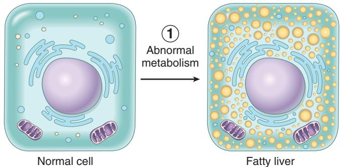
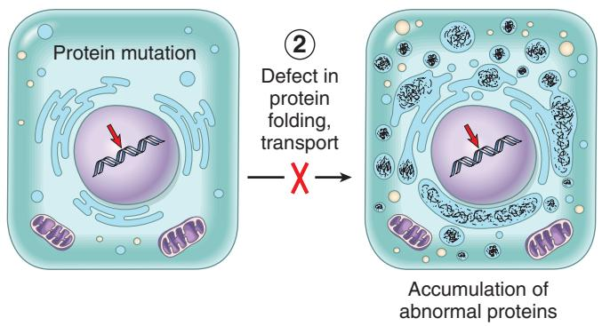
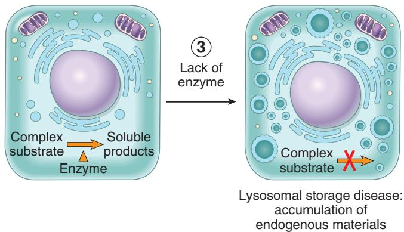
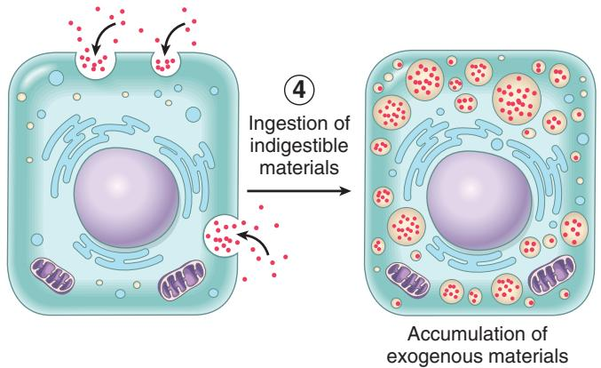 
Fig. 2.24 Mechanisms of intracellular accumulation: (1) Abnormal metabolism, as in fatty change in the liver. (2) Mutations causing alterations in protein folding and transport, so that defective molecules accumulate intracellularly. (3) A deficiency of critical enzymes responsible for breaking down certain compounds, causing substrates to accumulate in lysosomes, as in lysosomal storage diseases. (4) An inability to degrade phagocytosed particles, as in carbon pigment accumulation.
synthesize excessive amounts. In the kidney, for example, trace amounts of albumin filtered through the glomerulus are normally reabsorbed by pinocytosis in the proximal convoluted tubules. However, in disorders with heavy protein leakage across the glomerular filter (e.g., nephrotic syndrome), much more of the protein is reabsorbed, and vesicles containing this protein accumulate, giving the histologic appearance of pink, hyaline cytoplasmic droplets. The process is reversible: if the proteinuria abates, the protein droplets are metabolized and disappear. Another example is the marked accumulation of newly synthesized immunoglobulins that may occur in the RER of some plasma cells, forming rounded, eosinophilic Russell bodies. Other examples of protein aggregation are discussed elsewhere in this book (e.g., "alcoholic hyaline" in the liver in Chapter 16; neurofibrillary tangles in neurons in Chapter 23).
Glycogen. Excessive intracellular deposits of glycogen are associated with abnormalities in the metabolism of either glucose or glycogen. In poorly controlled diabetes mellitus, the prime example of abnormal glucose metabolism, glycogen accumulates in renal tubular epithelium, cardiac myocytes, and $\beta$ cells of the islets of Langerhans. Glycogen also accumulates within cells in a group of related genetic disorders collectively referred to as glycogen storage diseases, or glycogenoses (Chapter 7).
Pigments. Pigments are colored substances that are either exogenous, coming from outside the body, such as carbon, or are endogenous, synthesized within the body itself, such as lipofuscin, melanin, and certain derivatives of hemoglobin.
The most common exogenous pigment is carbon, a ubiquitous air pollutant of urban life. When inhaled, it is phagocytosed by alveolar macrophages and transported through lymphatic channels to the regional tracheobronchial lymph nodes. Aggregates of the pigment blacken the draining lymph nodes and pulmonary parenchyma (anthracosis) (Chapter 13).
- Lipofuscin, or "wear-and-tear pigment," is an insoluble brownish-yellow granular intracellular material that accumulates in a variety of tissues (particularly the heart, liver, and brain) with aging or atrophy. Lipofuscin represents complexes of lipid and protein that are produced by the free radical-catalyzed peroxidation of polyunsaturated lipids of subcellular membranes. It is not injurious to the cell but is a marker of past free radical injury. The brown pigment (Fig. 2.25), when present in large amounts, imparts an appearance to the tissue that is called brown atrophy. 
- Melanin is an endogenous, brown-black pigment that is synthesized by melanocytes located in the epidermis and acts as a screen against harmful UV radiation. Although melanocytes are the only source of melanin, adjacent basal keratinocytes in the skin can accumulate the pigment (e.g., in freckles), as can dermal macrophages. 
- Hemosiderin is a hemoglobin-derived granular pigment that is golden yellow to brown and accumulates in tissues when there is a local or systemic excess of iron. Iron is normally stored within cells in association with the protein apoferritin, forming ferritin micelles. Hemosiderin pigment represents large aggregates of these
..jpg) 
Fig. 2.25 Lipofuscin granules in cardiac myocytes (deposits indicated by arrows).
ferritin micelles, readily visualized by light and electron microscopy; the iron can be unambiguously identified by the Prussian blue histochemical reaction (Fig. 2.26). Although hemosiderin accumulation is usually pathologic, small amounts of this pigment are normal in the mononuclear phagocytes of the bone marrow, spleen, and liver, where aging red cells are normally degraded. Excessive deposition of hemosiderin, called hemosiderosis, and more extensive accumulations of iron seen in hereditary hemochromatosis are described in Chapter 16.
# PATHOLOGIC CALCIFICATION
Pathologic calcification, a common process in a wide variety of disease states, is the result of an abnormal deposition of calcium salts, together with smaller amounts of iron, magnesium, and other minerals. It can occur in two ways.
- Dystrophic calcification. In this form, calcium metabolism is normal but it deposits in injured or dead tissue, such as
areas of necrosis of any type. It is virtually ubiquitous in the arterial lesions of advanced atherosclerosis (Chapter 10). Although dystrophic calcification may be an incidental finding indicating insignificant past cell injury, it also may be a cause of organ dysfunction. For example, calcification can develop in aging or damaged heart valves, resulting in severely compromised valve motion. Dystrophic calcification of the aortic valves is an important cause of aortic stenosis in elderly persons (Chapter 11).
Dystrophic calcification is initiated by the extracellular deposition of crystalline calcium phosphate in membrane-bound vesicles, which may be derived from injured cells, or the intracellular deposition of calcium in the mitochondria of dying cells. It is thought that the extracellular calcium is concentrated in vesicles by its affinity for membrane phospholipids, whereas phosphates accumulate as a result of the action of membrane-bound phosphatases. The crystals are then propagated, forming larger deposits.
- Metastatic calcification. This form is associated with hypercalcemia and can occur in normal tissues. The major causes of hypercalcemia are (1) increased secretion of parathyroid hormone, due to either primary parathyroid tumors or production of parathyroid hormone-related protein by other malignant tumors; (2) destruction of bone due to the effects of accelerated turnover (e.g., Paget disease), immobilization, or tumors (increased bone catabolism associated with multiple myeloma, leukemia, or diffuse skeletal metastases); (3) vitamin D-related disorders including vitamin D intoxication and sarcoidosis (in which macrophages activate a vitamin D precursor); and (4) renal failure, in which phosphate retention leads to secondary hyperparathyroidism.
Regardless of the site, calcium salts are seen on gross examination as fine white granules or clumps, often felt as brittle deposits. Dystrophic calcification is common in areas of caseous necrosis in tuberculosis. Sometimes a tuberculous lymph node is essentially converted to radiopaque stone. On histologic examination,
Hematoxylin-eosin-stainedsectionshowinggolden-brown,finelygranularpigment.(B)IrondepositsshownbyaspecialstainingprocesscalledthePrussianbluereaction..jpg) 
Fig. 2.26 Hemosiderin granules in liver cells. (A) Hematoxylin-eosin-stained section showing golden-brown, finely granular pigment. (B) Iron deposits shown by a special staining process called the Prussian blue reaction.
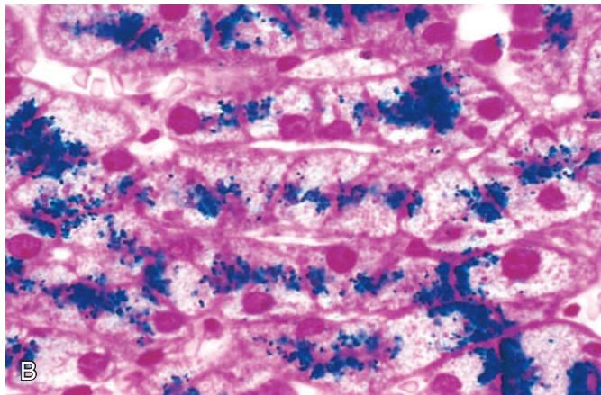
calcification appears as intracellular and/or extracellular basophilic deposits. With time, heterotopic bone may form in foci of calcification.
Metastatic calcification can occur widely throughout the body but principally affects the interstitial tissues of the vasculature, kidneys, lungs, and gastric mucosa. The calcium deposits morphologically resemble those described in dystrophic calcification. Although they generally do not cause clinical dysfunction, extensive calcifications in the lungs may be evident on radiographs and may produce respiratory deficits, and massive deposits in the kidney (nephrocalcinosis) can lead to renal damage.
# ABNORMAL INTRACELLULAR DEPOSITIONS AND CALCIFICATIONS
- Abnormal deposits of materials in cells and tissues are the result of excessive intake or defective transport or catabolism. 
- Depositions of lipids
- Fatty change: accumulation of free triglycerides in cells, resulting from excessive intake or defective transport (often because of defects in synthesis of transport proteins); manifestation of reversible cell injury 
- Cholesterol deposition: result of defective catabolism and excessive intake; seen in macrophages and smooth muscle cells of vessel walls in atherosclerosis 
- Deposition of proteins: reabsorbed proteins in kidney tubules; immunoglobulins in plasma cells 
- Deposition of glycogen: in macrophages of patients with defects in lysosomal enzymes that break down glycogen (glycogen storage diseases) 
- Deposition of pigments: typically indigestible pigments, such as carbon, lipofuscin (breakdown product of lipid peroxidation), or iron (usually resulting from overload, as in hemosiderosis)
- Pathologic calcifications
Dystrophic calcification: deposition of calcium at sites of cell injury and necrosis 
- Metastatic calcification: deposition of calcium in normal tissues, caused by hypercalcemia (usually a consequence of parathyroid hormone excess)
# CELLULAR AGING
Individuals age because their cells age. Although public attention on the aging process has traditionally focused on its cosmetic manifestations, aging has important health consequences, because age is one of the strongest independent risk factors for many chronic diseases, such as cancer, Alzheimer disease, and ischemic heart disease. Perhaps one of the most striking discoveries about cellular aging is that it is not simply a consequence of cells' "running out of steam," but in fact is regulated by a limited number of genes and signaling pathways that are evolutionarily conserved from yeast to mammals.
Cellular aging is the result of a progressive decline in the life span and functional activity of cells. Several abnormalities contribute to the aging of cells (Fig. 2.27):
- Accumulation of mutations in DNA. A variety of metabolic insults over time may result in damage to nuclear and mitochondrial DNA. ROS induced by toxins and radiation exposure contribute to DNA damage associated with aging. Although most DNA damage is repaired by DNA repair enzymes, some persists and accumulates as cells age, especially if repair mechanisms become inefficient over time. Accumulation of mutations in nuclear and mitochondrial DNA ultimately compromise the functional activities and survival of cells. 
- Decreased cellular replication. Normal cells (other than stem cells) have a limited capacity for replication, and after a fixed number of divisions, they become arrested in a terminally nondividing state, known as replicative senescence. Aging is associated with progressive replicative senescence of cells. Cells from children have the capacity to undergo more rounds of replication than do cells from older people. In contrast, cells from patients with Werner syndrome, a rare disease characterized by premature aging, have a markedly reduced in vitro life span.
Replicative senescence occurs in aging cells because of progressive shortening of telomeres, which ultimately results in cell cycle arrest. Telomeres are short repeated sequences of DNA present at the ends of chromosomes that are important for ensuring the complete replication of chromosome ends and for protecting the ends from fusion and degradation. Telomeric DNA also binds proteins that shield it, preventing activation of a DNA damage response. When somatic cells replicate, a small section of the telomere is not duplicated, and telomeres become progressively shortened. As they shorten, the ends of chromosomes cannot be protected and are sensed in cells as broken DNA, which signals cell cycle arrest. Telomere length is maintained by nucleotide addition mediated by an enzyme called telomerase. Telomerase is a specialized RNA-protein complex that uses its own RNA as a template for adding nucleotides to the ends of chromosomes. Telomerase is expressed in germ cells and is present at low levels in stem cells, but absent in most somatic cells (Fig. 2.28). Therefore, as mature somatic cells age, their telomeres become shorter and they exit the cell cycle, resulting in an inability to generate new cells to replace damaged ones. Conversely, in immortalized cancer cells, telomerase is usually reactivated and telomere length is stabilized, allowing the cells to proliferate indefinitely. This is discussed more fully in Chapter 6. Telomere shortening also may decrease the regenerative capacity of stem cells, further contributing to cellular aging. Despite such alluring observations, however, the relationship of telomerase activity and telomere length to aging has yet to be fully established. Abnormalities in telomere maintenance have been implicated in many diseases, such as aplastic anemia and other cytopenias (thought to be caused by a failure of hematopoietic stem cells), premature greying of hair, skin pigment and nail abnormalities, pulmonary and liver fibrosis, and others.
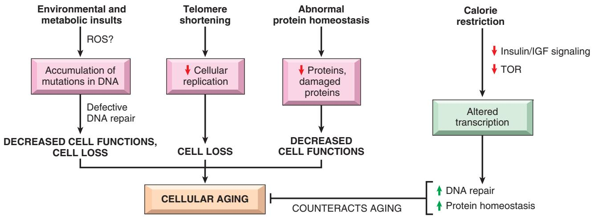 
Fig. 2.27 Mechanisms that cause and counteract cellular aging. DNA damage, replicative senescence, and decreased and misfolded proteins are among the best-described mechanisms of cellular aging. Some environmental influences, such as calorie restriction, counteract aging by activating various signaling pathways and transcription factors. IGF, Insulin-like growth factor; ROS, reactive oxygen species; TOR, target of rapamycin.
These disorders are sometimes considered the prototypic "telomeropathies."
- Defective protein homeostasis. With the passage of time, cells are unable to maintain normal protein homeostasis, because of increased turnover and decreased synthesis caused by reduced translation of proteins and defective activity of chaperones (which promote normal protein folding) and proteasomes (which destroy misfolded proteins).
proteins). The resultant decrease in intracellular proteins can have many deleterious effects on cell survival, replication, and functions. The concomitant accumulation of misfolded proteins exacerbates the loss of functional proteins and can trigger apoptosis.
- There has been great interest in defining biochemical signaling pathways that counteract the aging process, not only because of their obvious therapeutic potential
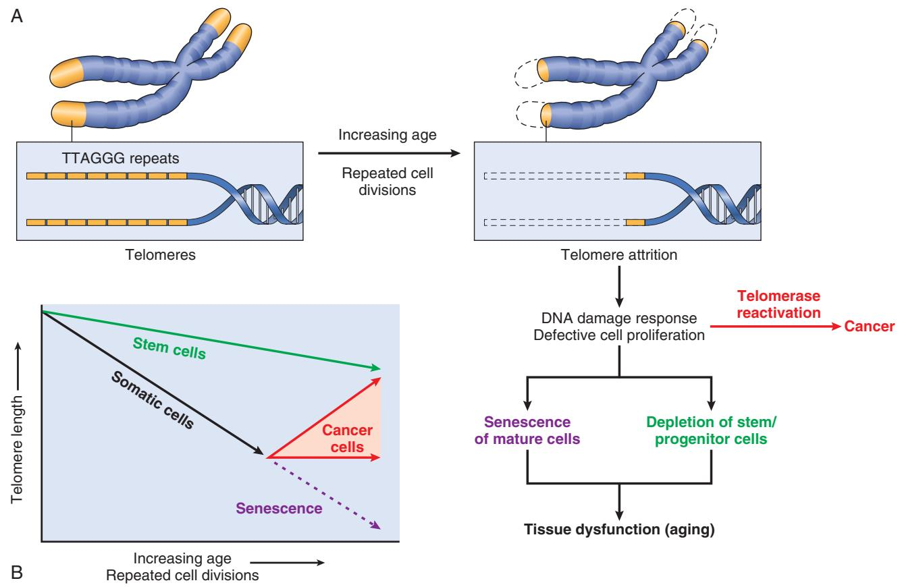 
Fig. 2.28 The role of telomeres and telomerase in replicative senescence of cells. (A) Mechanisms and consequences of telomere attrition. Repeated cell division associated with aging leads to progressive shortening of telomeres, which triggers senescence and loss of stem cell pools. (B) Telomere attrition is characteristic of somatic cells. Stem cells maintain their telomeres and are, therefore, capable of more cycles of replication. Cancer cells frequently activate telomerase and are thus able to maintain telomeres.
(the search for the "elixir of youth") but also because elucidating these pathways might tell us about the mechanisms that cause aging. Calorie restriction has been found to slow down aging and prolong life in every species tested from flies to mice. It is now thought that calorie restriction alters signaling pathways that influence aging (Fig. 2.27). Among the biochemical alterations associated with calorie restriction that have been described as playing a role in counteracting the aging process is reduced activation of insulin-like growth factor receptor signaling, which involves a downstream network of kinases and transcription factors. Reduced IGF-1 signaling leads to lower rates of cell growth and metabolism and possibly reduced errors in DNA replication, better DNA repair and improve protein homeostasis. Calorie restriction also serves to improve immunity. All of these inhibit aging.
- Persistent inflammation. As individuals age, the accumulation of damaged cells, lipids, and other endogenous substances may activate the inflammasome pathway (Chapter 5), resulting in persistent low-level inflammation. Inflammation in turn induces chronic diseases, such as atherosclerosis and type 2 diabetes. Cytokines produced during inflammatory reactions may themselves induce cellular alterations that exacerbate aging, and chronic metabolic disorders may accelerate the aging process.
Clinical observations and epidemiologic studies have shown that physical activity and, as mentioned previously, calorie restriction slow the aging process, whereas stresses, perhaps acting via increased production of glucocorticoids, accelerate aging. Alas, the precise mechanisms underlying these effects remain to be defined, and for now we all remain vulnerable to the ravages of age.
# CELLULAR AGING
- Results from a combination of multiple, progressive cellular alterations, including: 
- Accumulation of DNA damage and mutations 
- Replicative senescence: reduced capacity of cells to divide secondary to progressive shortening of chromosomal ends (telomeres) 
Defective protein homeostasis: loss of normal proteins and accumulation of misfolded proteins 
- Aging is exacerbated by chronic diseases, especially those associated with prolonged inflammation, and by stress, and is slowed down by calorie restriction and exercise.
It should be apparent that the various forms of cellular derangements and adaptations described in this chapter cover a wide spectrum, ranging from reversible and irreversible forms of acute cell injury, to adaptations in cell size, growth, and function, to largely unavoidable consequences of aging. Reference is made to these many different alterations throughout this book, because all instances
of organ injury and ultimately all cases of clinical disease arise from derangements in cell structure and function.
Calado RT, Young NS: Telomere diseases, N Engl J Med 361:2353, 2009. [An excellent review of the basic biology of telomeres, and how their abnormalities may contribute to cancer, aging, and other diseases.] 
Chipuk JE, Moldoveanu T, Llambl F, et al: The BCL-2 family reunion, Mol Cell 37:299, 2010. [A review of the biochemistry and biology of the BCL-2 family of apoptosis-regulating proteins.] 
Choi AMK, Ryter S, Levine B: Autophagy in human health and disease, N Engl J Med 368:7, 2013. [An excellent discussion of the mechanisms and significance of autophagy.] 
Conrad M, Angeli JPF, Vandenabeele P, et al: Regulated necrosis: disease relevance and therapeutic opportunities, Nat Rev Drug Discov, 15:348, 2016. [A review of newly discovered pathways of cell death and possible therapeutic interventions.] 
Dong Z, Saikumar P, Weinberg JM, et al: Calcium in cell injury and death, Ann Rev Pathol 1:405, 2006. [A review of the links between calcium and cell injury.] 
Frey N, Olson EN: Cardiac hypertrophy: the good, the bad, and the ugly, Annu Rev Physiol 65:45, 2003. [Excellent discussion of the mechanisms of muscle hypertrophy, using the heart as the paradigm.] 
Hotchkiss RS, Strasser A, McDunn JE, et al: Cell death, N Engl J Med 361:1570, 2009. [Excellent review of the major pathways of cell death (necrosis, apoptosis, and autophagy-associated death), and their clinical implications and therapeutic targeting.] 
Kenyon CJ: The genetics of ageing, Nature 464:504, 2010. [An excellent review of the genes that influence aging, based on human genetic syndromes and studies with mutant model organisms.] 
Lambeth JD, Neish AS: Nox enzymes and new thinking on reactive oxygen: a double-edged sword revisited, Ann Rev Pathol Mech Dis 9:47, 2014. [A discussion of reactive oxygen species and their roles in physiology and cell injury.] 
Lopez-Otin C, Blasco MA, Partridge L, et al: The hallmarks of aging, Cell 153:1194, 2013. [A landmark review that suggests nine hallmarks of aging and directions for future research.] 
Marquez FC, Volovik Y, Cohen E: The roles of cellular and organismal aging in the development of late-onset maladies, Ann Rev Pathol Mech Dis 10:1, 2015. [A review of the many ways by which cellular aging contributes to the development of chronic diseases.] 
McKinnell IW, Rudnicki MA: Molecular mechanisms of muscle atrophy, Cell 119:907, 2004. [Discussion of the mechanisms of cellular atrophy.] 
Nathan C, Cunningham-Bussel A: Beyond oxidative stress: an immunologist's guide to reactive oxygen species, Nat Rev Immunol 13:349, 2013. [An excellent modern review of the production, catabolism, targets, and actions of reactive oxygen species, and their roles in inflammation.] 
Newgard CB, Sharpless NE: Coming of age: molecular drivers of aging and therapeutic opportunities, J Clin Invest 3:946, 2013. [A summary of key molecular pathways in aging.] 
Oakes SA, Papa FR: The role of endoplasmic reticulum stress in human pathology, Ann Rev Pathol Mech Dis 10:173, 2015. [An up-to-date review of the unfolded protein response and the pathogenic importance of cell injury caused by misfolded proteins.] 
Tosh D, Slack JM: How cells change their phenotype, Nat Rev Mol Cell Biol 3:187, 2002. [Review of metaplasia and the roles of stem cells and genetic reprogramming.] 
Vanden Berghe T, Linkermann A, Jouan-Lanhouet S, et al: Regulated necrosis: the expanding network of non-apoptotic cell death pathways, Nat Rev Mol Cell Biol 15:135, 2014. [A current review of various forms of programmed non-apoptotic pathways of cell death.]
# Inflammation and Repair
# 3
Overview of Inflammation: Definitions and General Features 57
Causes of Inflammation 59
Recognition of Microbes and Damaged Cells 59
Acute Inflammation 60
Reactions of Blood Vessels in Acute Inflammation 60
Leukocyte Recruitment to Sites of Inflammation 62
Phagocytosis and Clearance of the Offending Agent 66
Leukocyte-Mediated Tissue Injury 69
Other Functional Responses of Activated
Leukocytes 70
Termination of the Acute Inflammatory Response 70
Mediators of Inflammation 70
Vasoactive Amines: Histamine and Serotonin 71
Arachidonic Acid Metabolites 71
Cytokines and Chemokines 73
Complement System 75
Other Mediators of Inflammation 77
Morphologic Patterns of Acute Inflammation 78
Serous Inflammation 78
Fibrinous Inflammation 78
Purulent (Suppurative) Inflammation, Abscess 78
Ulcers 79
Outcomes of Acute Inflammation 79
Chronic Inflammation 81
Causes of Chronic Inflammation 81
Morphologic Features 81
Cells and Mediators of Chronic Inflammation 82
Systemic Effects of Inflammation 86
Tissue Repair 87
Overview of Tissue Repair 87
Cell and Tissue Regeneration 88
Repair by Scarring 89
Factors That Impair Tissue Repair 93
Clinical Examples of Abnormal Wound Healing and Scarring 93
# OVERVIEW OF INFLAMMATION: DEFINITIONS AND GENERAL FEATURES
Inflammation is a response of vascularized tissues to infections and tissue damage that brings cells and molecules of host defense from the circulation to the sites where they are needed, to eliminate the offending agents. Although in common medical and lay parlance, inflammation suggests a harmful reaction, it is actually a protective response that is essential for survival. It serves to rid the host of both the initial cause of cell injury (e.g., microbes, toxins) and the consequences of such injury (e.g., necrotic cells and tissues). The mediators of defense include phagocytic leukocytes, antibodies, and complement proteins (Fig. 3.1). Most of these normally circulate in the blood, where they are sequestered so they cannot damage normal tissues but can be rapidly recruited to any site in the body. Some of the cells involved in inflammatory responses also reside in tissues, where they function as sentinels on the lookout for threats. The process of inflammation delivers leukocytes and proteins to foreign invaders, such as microbes, and to damaged or necrotic tissues, and it activates the recruited cells and molecules, which then function to eliminate the harmful or unwanted substances. Without inflammation, infections would go unchecked, wounds would never
heal, and injured tissues might remain permanent fester-ing sores.
The typical inflammatory reaction develops through a series of sequential steps:
- The offending agent, which is located in extravascular tissues, is recognized by host cells and molecules. 
- Leukocytes and plasma proteins are recruited from the circulation to the site where the offending agent is located. 
- The leukocytes and proteins are activated and work together to destroy and eliminate the offending substance. 
- The reaction is controlled and terminated. 
- The damaged tissue is repaired.
Inflammation may be of two types, acute and chronic (Table 3.1). The initial, rapid response to infections and tissue damage is called acute inflammation. It typically develops within minutes or hours and is of short duration, lasting for several hours or a few days. Its main characteristics are the exudation of fluid and plasma proteins (edema) and the emigration of leukocytes, predominantly neutrophils (also called polymorphonuclear leukocytes). When acute inflammation achieves its desired goal of eliminating the offenders, the reaction subsides and residual injury is repaired. But if the initial response fails to clear the stimulus, the reaction progresses to a protracted type
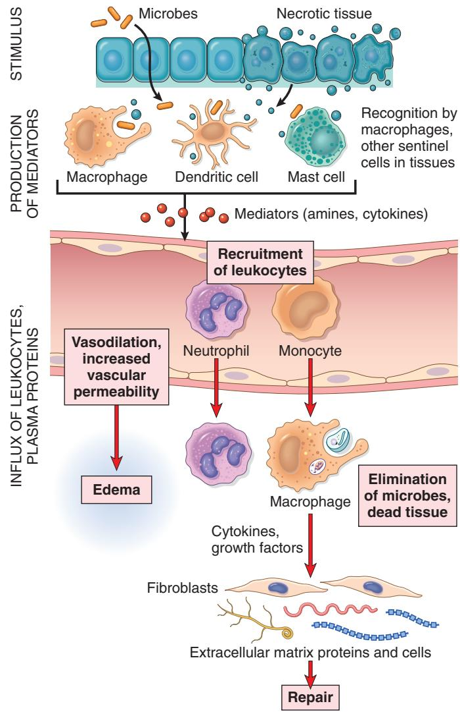 
Fig. 3.1 Sequence of events in an inflammatory reaction. Macrophages and other cells in tissues recognize microbes and damaged cells and liberate mediators, which trigger the vascular and cellular reactions of inflammation. Recruitment of plasma proteins from the blood is not shown.
of inflammation that is called chronic inflammation. As discussed later in this chapter, chronic inflammation may follow acute inflammation or arise de novo. It is of longer duration and is associated with more tissue destruction, the presence of lymphocytes and macrophages, the proliferation of blood vessels, and fibrosis.
Inflammation is induced by chemical mediators that are produced by host cells in response to injurious stimuli. When a microbe enters a tissue or the tissue is
Table 3.1 Features of Acute and Chronic Inflammation 
FeatureAcuteChronicOnsetFast: minutes or hoursSlow: daysCellular infiltrateMainly neutrophilsMonocytes/macrophages and lymphocytesTissue injury, fibrosisUsually mild and self-limitedMay be severe and progressiveLocal and systemic signsProminentLess
injured, the presence of the infection or damage is sensed by resident cells, including macrophages, dendritic cells, mast cells, and other cell types. These cells secrete molecules (cytokines and other mediators) that induce and regulate the subsequent inflammatory response. Inflammatory mediators are also produced from plasma proteins that react to the microbes or to products of necrotic cells. Some of these mediators promote the efflux of plasma and the recruitment of circulating leukocytes to the site where the offending agent is located. Mediators also activate the recruited leukocytes, enhancing their ability to destroy and remove the offending agent. Understanding the role of chemical mediators is important because most anti-inflammatory drugs target specific mediators. We shall discuss the mediators of inflammation in detail later, after we review the main steps in inflammatory reactions.
The external manifestations of inflammation, often called its cardinal signs, are heat (calor in Latin), redness (rubor), swelling (tumor), pain (dolor), and loss of function (functio laesa). The first four of these were described more than 2000 years ago by a Roman encyclopedist named Celsus, who wrote the then-famous text De Medicina, and the fifth was added in the late 19th century by Rudolf Virchow, known as the "father of modern pathology." These manifestations occur as consequences of the vascular changes and leukocyte recruitment and activation, as will be evident from the discussion that follows.
Although normally protective, in some situations, the inflammatory reaction becomes the cause of disease, and the damage it produces is its dominant feature. For example, inflammatory reactions to infections are often accompanied by local tissue damage and its associated signs and symptoms (e.g., pain and functional impairment). Typically, however, these harmful consequences are self-limited and resolve as the inflammation abates, leaving little or no permanent damage. In contrast, there are many diseases in which the inflammatory reaction is misdirected (e.g., against self tissues in autoimmune diseases), occurs against normally harmless environmental substances that evoke an immune response (e.g., in allergies), or is excessively prolonged (e.g., in infections by microbes that resist eradication).
Inflammatory reactions underlie common chronic diseases, such as rheumatoid arthritis, atherosclerosis, and lung fibrosis, as well as life-threatening hypersensitivity reactions to insect bites, drugs, and toxins (Table 3.2). For this reason our pharmacies abound with anti-inflammatory drugs, which ideally would control the harmful sequelae of inflammation yet not interfere with its beneficial effects. In fact, inflammation may contribute to a variety of diseases that are thought to be primarily metabolic, degenerative, or genetic disorders, such as type 2 diabetes, Alzheimer disease, and cancer. Hence, anti-inflammatory drugs may well have a broader role than currently indicated. In recognition of the wide-ranging harmful consequences of inflammation, the lay press has rather melodramatically referred to it as "the silent killer."
Not only excessive inflammation but also defective inflammation is responsible for serious illness. Too little inflammation, which is typically manifested by increased susceptibility to infections, is most often caused by a reduced number of leukocytes resulting from replacement of the bone marrow by cancers and suppression of the
Table 3.2 Disorders Caused by Inflammatory Reactions 
DisordersCells and Molecules Involved in InjuryAcuteAcute respiratory distress syndromeNeutrophilsAsthmaEosinophils; IgE antibodiesGlomerulonephritisAntibodies and complement; neutrophils, monocytesSeptic shockCytokinesChronicArthritisLymphocytes, macrophages; antibodies?AsthmaEosinophils; IgE antibodiesAtherosclerosisMacrophages; lymphocytesPulmonary fibrosisMacrophages; fibroblasts
Listed are selected examples of diseases in which the inflammatory response plays a significant role in tissue injury. Some, such as asthma, can present with acute inflammation or a chronic illness with repeated bouts of acute exacerbation. These diseases and their pathogenesis are discussed in relevant chapters.
marrow by therapies for cancer and graft rejection. Recall that leukocytes, the cells of the inflammatory response, arise from progenitors in the bone marrow, hence any compromise of marrow function will diminish the generation of mature leukocytes. Inherited genetic abnormalities of leukocyte function are rare disorders but they provide valuable information about the mechanisms of leukocyte responses. These conditions are described in Chapter 5, in the context of immunodeficiency diseases.
Inflammation is terminated when the offending agent is eliminated. The reaction resolves because mediators are broken down and dissipated, and leukocytes have short life spans in tissues. In addition, anti-inflammatory mechanisms are activated, serving to control the response and prevent it from causing excessive damage to the host. After inflammation has achieved its goal of eliminating the offending agents, it sets into motion the process of tissue repair. Repair consists of a series of events that heal damaged tissue. In this process, the injured tissue is replaced through regeneration of surviving cells and filling of residual defects with connective tissue (scarring).
This chapter describes the etiology of and stimuli for inflammation, and then the sequence of events, mediators, and morphologic patterns of acute inflammation. This is followed by a discussion of chronic inflammation, and then the process of tissue repair.
# CAUSES OF INFLAMMATION
Inflammatory reactions may be triggered by a variety of stimuli:
- Infections (bacterial, viral, fungal, parasitic) and microbial toxins are among the most common and medically important causes of inflammation. Different infectious pathogens elicit distinct inflammatory responses, from mild acute inflammation that causes little or no lasting damage and successfully eradicates the infection, to severe systemic reactions that can be fatal, to prolonged chronic reactions that cause extensive tissue injury. The
morphologic pattern of the response can be useful in identifying its etiology, as discussed later in this chapter.
- Tissue necrosis elicits inflammation regardless of the cause of cell death, which may include ischemia (reduced blood flow, the cause of myocardial infarction), trauma, and physical and chemical injury (e.g., thermal injury, as in burns or frostbite; irradiation; exposure to some environmental chemicals). Several molecules released from necrotic cells are known to trigger inflammation; some of these are described later. 
- Foreign bodies (splinters, dirt, sutures) may elicit inflammation by themselves or because they cause traumatic tissue injury or carry microbes. Even some endogenous substances stimulate potentially harmful inflammation if large amounts are deposited in tissues; such substances include urate crystals (in the disease gout), and cholesterol crystals (in atherosclerosis). 
- Immune reactions (also called hypersensitivity) are reactions in which the normally protective immune system damages the individual's own tissues. The injurious immune responses may be directed against self antigens, causing autoimmune diseases, or may be inappropriate reactions against environmental substances, as in allergies, or against microbes. Inflammation is a major cause of tissue injury in these diseases (Chapter 5). Because the stimuli for the inflammatory responses in autoimmune and allergic diseases (self and environmental antigens) cannot be eliminated, these reactions tend to be persistent and difficult to cure, are often associated with chronic inflammation, and are important causes of morbidity and mortality.
# RECOGNITION OF MICROBES AND DAMAGED CELLS
The first step in inflammatory responses is the recognition of microbes and necrotic cells by cellular receptors and circulating proteins. The cells and receptors that recognize invaders evolved as adaptations of multicellular organisms to the presence of microbes in the environment, and the responses they trigger are critical for survival.
- Cellular receptors for microbes. Phagocytes, dendritic cells (cells in epithelia and all tissues whose function is to capture microbes), and many other cells express receptors that detect the presence of infectious pathogens. The best defined of these receptors belong to the family of Toll-like receptors (TLRs), which are named for the founding member, Toll, a gene that was discovered in Drosophila (Chapter 5). TLRs are located in plasma membranes and endosomes, so they are able to detect extracellular and ingested microbes. Other microbial sensors are present in the cytoplasm of cells. TLRs recognize motifs common to many microbes, often called pathogen-associated molecular patterns (PAMPs). Recognition of microbes by these receptors stimulates the production and expression of a number of secreted and membrane proteins. These proteins include cytokines that induce inflammation, anti-viral cytokines (interferons), and cytokines and membrane proteins that promote lymphocyte activation and even more potent immune responses. We will return to TLRs in more
detail in Chapter 5, when we discuss innate immunity, the early defense against infections.
- Sensors of cell damage. All cells have cytosolic receptors that recognize molecules that are liberated or altered as a consequence of cell damage, and are hence appropriately called damage-associated molecular patterns (DAMPs). These molecules include uric acid (a product of DNA breakdown), ATP (released from damaged mitochondria), reduced intracellular $\mathrm{K}^+$ concentrations (reflecting loss of ions because of plasma membrane injury), DNA (when it is released into the cytoplasm and not sequestered in nuclei, as it should be normally), and many others. The receptors activate a multiprotein cytosolic complex called the inflammasome, which induces the production of the cytokine interleukin-1 (IL-1). IL-1 recruits leukocytes and thus induces inflammation (discussed later). Gain-of-function mutations in the cytosolic receptors are the cause of rare diseases known as autoinflammatory syndromes that are characterized by spontaneous inflammation; IL-1 antagonists are effective treatments for these disorders. The inflammasome also has been implicated in inflammatory reactions to urate crystals (the cause of gout), cholesterol crystals (in atherosclerosis), lipids (in metabolic syndrome and obesity-associated diabetes), and amyloid deposits in the brain (in Alzheimer disease). These disorders are discussed in relevant chapters. 
- Circulating proteins. Several plasma proteins recognize microbes and function to destroy blood-borne microbes and to stimulate inflammation at tissue sites of infection. The complement system reacts against microbes and produces mediators of inflammation (discussed later). A circulating protein called mannose-binding lectin recognizes microbial sugars and promotes ingestion of microbes and activation of the complement system. Other proteins called collectins also bind to microbes and promote their phagocytosis.
# GENERAL FEATURES AND CAUSES OF INFLAMMATION
- Inflammation is a beneficial host response to foreign invaders and necrotic tissue, but also may cause tissue damage. 
- The main components of inflammation are a vascular reaction and a cellular response; both are activated by mediators that are derived from plasma proteins and various cells. 
- The steps of the inflammatory response can be remembered as the five Rs: (1) recognition of the injurious agent, (2) recruitment of leukocytes, (3) removal of the agent, (4) regulation (control) of the response, and (5) resolution (repair). 
- The causes of inflammation include infections, tissue necrosis, foreign bodies, trauma, and immune responses. 
- Epithelial cells, tissue macrophages and dendritic cells, leukocytes, and other cell types express receptors that sense the presence of microbes and necrotic cells. Circulating proteins recognize microbes that have entered the blood. 
- The outcome of acute inflammation is either elimination of the noxious stimulus followed by decline of the reaction and repair of the damaged tissue, or persistent injury resulting in chronic inflammation.
# ACUTE INFLAMMATION
Acute inflammation has three major components: (1) dilation of small vessels, leading to an increase in blood flow, (2) increased permeability of the microvasculature, enabling plasma proteins and leukocytes to leave the circulation, and (3) emigration of the leukocytes from the microcirculation, their accumulation in the focus of injury, and their activation to eliminate the offending agent (Fig. 3.1). When an injurious agent, such as an infectious microbe or dead cells, is encountered, phagocytes that reside in all tissues try to eliminate these agents. At the same time, phagocytes and other sentinel cells in the tissues recognize the presence of the foreign or abnormal substance and react by liberating soluble molecules that mediate inflammation. Some of these mediators act on small blood vessels in the vicinity and promote the efflux of plasma and the recruitment of circulating leukocytes to the site where the offending agent is located.
# Reactions of Blood Vessels in Acute Inflammation
The vascular reactions of acute inflammation consist of changes in the flow of blood and the permeability of vessels, both designed to maximize the movement of plasma proteins and leukocytes out of the circulation and into the site of infection or injury. The escape of fluid, proteins, and blood cells from the vascular system into interstitial tissues or body cavities is known as exudation (Fig. 3.2). An exudate is an extravascular fluid that has a high protein concentration and contains cellular debris. Its presence implies that there is an increase in the permeability of small blood vessels, typically during an inflammatory reaction. In contrast, a transudate is a fluid with low protein content, little or no cellular material, and low specific gravity. It is essentially an ultrafiltrate of blood plasma that is produced as a result of osmotic or hydrostatic imbalance across vessels with normal vascular permeability (Chapter 4). Edema denotes an excess of fluid in the interstitial tissue or serous cavities; it can be either an exudate or a transudate. $Pus$ , a purulent exudate, is an inflammatory exudate rich in leukocytes (mostly neutrophils), the debris of dead cells, and, in many cases, microbes.
# Changes in Vascular Flow and Caliber
Changes in vascular flow and caliber begin early after injury and consist of the following:
- Vasodilation is induced by the action of several mediators, notably histamine, on vascular smooth muscle. It is one of the earliest manifestations of acute inflammation, and may be preceded by transient vasoconstriction. Vasodilation first involves the arterioles and then leads to the opening of new capillary beds in the area. The result is increased blood flow, which is the cause of heat and redness (erythema) at the site of inflammation. 
- Vasodilation is quickly followed by increased permeability of the microvasculature, with the outpouring of protein-rich fluid (an exudate) into the extravascular tissues. 
- The loss of fluid and increased vessel diameter lead to slower blood flow, concentration of red cells in small
A. NORMAL
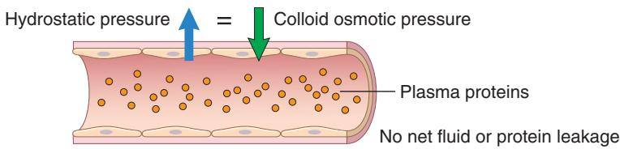
B. EXUDATE (high protein content, and may contain some white and red cells)
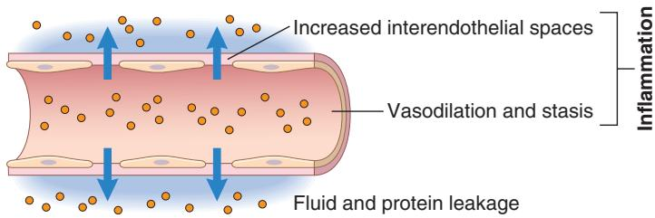
C. TRANSDATE (low protein content, few cells) Increased hydrostatic pressure (venous outflow obstruction, [e.g., congestive heart failure])
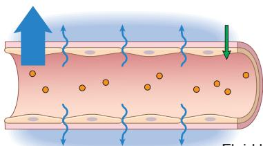 
Fig. 3.2 Formation of exudates and transudates. (A) Normal hydrostatic pressure (blue arrow) is about $32\mathrm{mmHg}$ at the arterial end of a capillary bed and $12\mathrm{mmHg}$ at the venous end; the mean colloid osmotic pressure of tissues is approximately $25\mathrm{mmHg}$ (green arrow), which is equal to the mean capillary pressure. Therefore, the net flow of fluid across the vascular bed is almost nil. (B) An exudate is formed in inflammation because vascular permeability increases as a result of retraction of endothelial cells, creating spaces through which fluid and proteins can pass. (C) A transudate is formed when fluid leaks out because of increased hydrostatic pressure or decreased osmotic pressure.
Decreased colloid osmotic pressure (decreased protein synthesis [e.g., liver disease]; increased protein loss [e.g., kidney disease]; protein malnutrition [e.g., kwashiokor])
Fluid leakage
vessels, and increased viscosity of the blood. These changes result in stasis of blood flow, engorgement of small vessels jammed with slowly moving red cells, seen histologically as vascular congestion and externally as localized redness (erythema) of the involved tissue.
- As stasis develops, blood leukocytes, principally neutrophils, accumulate along the vascular endothelium. At the same time endothelial cells are activated by mediators produced at sites of infection and tissue damage, and express increased levels of adhesion molecules. Leukocytes then adhere to the endothelium, and soon afterward they migrate through the vascular wall into the interstitial tissue, in a sequence that is described later.
# Increased Vascular Permeability (Vascular Leakage)
Several mechanisms are responsible for increased vascular permeability in acute inflammation (Fig. 3.3), which include:
- Retraction of endothelial cells resulting in opening of interendothelial spaces is the most common mechanism of vascular leakage. It is elicited by histamine, bradykinin, leukotrienes, and other chemical mediators. It occurs rapidly after exposure to the mediator (within 15 to 30 minutes) and is usually short-lived; hence, it is referred to as the immediate transient response, to distinguish it from the delayed prolonged response that follows endothelial injury, described next. The main sites for this rapid increase in vascular permeability are postcapillary venules. 
- Endothelial injury, resulting in endothelial cell necrosis and detachment. Direct damage to the endothelium is encountered in severe injuries, for example, in burns, or is induced by the actions of microbes and microbial
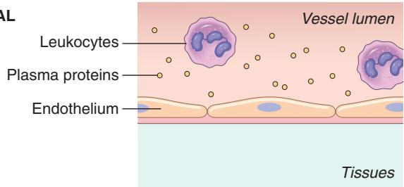 
A NORMAL 
B RETRACTION OF ENDOTHELIAL CELLS
- Induced by histamine, other mediators 
- Rapid and short-lived (minutes)
.jpg)
- Caused by burns, some microbial toxins 
Rapid; may be long-lived (hours to days)
.jpg) 
C ENDOTHELIAL INJURY 
Fig. 3.3 Principal mechanisms of increased vascular permeability in inflammation and their features and underlying causes.
toxins that target endothelial cells. Neutrophils that adhere to the endothelium during inflammation may also injure the endothelial cells and thus amplify the reaction. In most instances leakage starts immediately after injury and is sustained for several hours until the damaged vessels are thrombosed or repaired.
- Increased transport of fluids and proteins, called transcytosis, through the endothelial cell. This process, documented in experimental models, may involve intracellular channels that open in response to certain factors, such as vascular endothelial growth factor (VEGF), that promote vascular leakage. Its contribution to the vascular permeability seen in acute inflammation in humans is unclear.
Although these mechanisms of increased vascular permeability are described separately, all probably contribute in varying degrees in responses to most stimuli. For example, at different stages of a thermal burn, leakage results from endothelial retraction caused by inflammatory mediators and direct and leukocyte-dependent endothelial injury.
# Responses of Lymphatic Vessels and Lymph Nodes
In addition to blood vessels, lymphatic vessels also participate in acute inflammation. The system of lymphatics and lymph nodes filters and polices the extravascular fluids. Lymphatics drain the small amount of extravascular fluid that seeps out of capillaries under normal circumstances. In inflammation, lymph flow is increased to help drain edema fluid that accumulates because of increased vascular permeability. In addition to fluid, leukocytes and cell debris, as well as microbes, may find their way into lymph. Lymphatic vessels, like blood vessels, proliferate during inflammatory reactions to handle the increased load. The lymphatics may become secondarily inflamed (lymphangitis), as may the draining lymph nodes (lymphadenitis). Inflamed lymph nodes are often enlarged because of increased cellularity. This constellation of pathologic changes is termed reactive, or inflammatory, lymphadenitis (Chapter 12). For clinicians the presence of red streaks near a skin wound is a telltale sign of an infection in the wound. This streaking follows the course of the lymphatic channels and indicates the presence of lymphangitis; it may be accompanied by painful enlargement of the draining lymph nodes, indicating lymphadenitis.
# Leukocyte Recruitment to Sites of Inflammation
Leukocytes that are recruited to sites of inflammation perform the key function of eliminating the offending
# VASCULAR REACTIONS IN ACUTE INFLAMMATION
- Vasodilation is induced by inflammatory mediators such as histamine (described later), and is the cause of erythema and stasis of blood flow. 
- Increased vascular permeability is induced by histamine, kinins, and other mediators that produce gaps between endothelial cells, by direct or leukocyte-induced endothelial injury, and by increased passage of fluids through the endothelium.
- Increased vascular permeability allows plasma proteins and leukocytes, the mediators of host defense, to enter sites of infection or tissue damage. Fluid leak from blood vessels (exudation) results in edema. 
- Lymphatic vessels and lymph nodes also are involved in inflammation, and often show redness and swelling.
agents. The most important leukocytes in typical inflammatory reactions are the ones capable of phagocytosis, namely, neutrophils and macrophages. Neutrophils are produced in the bone marrow and rapidly recruited to sites of inflammation. Macrophages are slower responders. The principal functions of these cell types differ in subtle but important ways—neutrophils use cytoskeletal rearrangements and enzyme assembly to mount rapid, transient responses, whereas macrophages, being long-lived, make slower but more prolonged responses that often rely on new gene transcription (Table 3.3). Macrophages are discussed in more detail later, in the context of chronic inflammation. These leukocytes ingest and destroy bacteria and other microbes, as well as necrotic tissue and foreign substances. Macrophages also produce growth factors that aid in repair. A price that is paid for the defensive potency of leukocytes is that, when strongly activated, they may induce tissue damage and prolong inflammation, because the leukocyte products that destroy microbes and help "clean up" necrotic tissues can also produce "collateral damage" of normal host tissues. When there is systemic activation of inflammation, as may occur when there is invasion of the bloodstream by bacteria, the resulting systemic inflammatory response may even be lethal.
The journey of leukocytes from the vessel lumen to the tissue is a multistep process that is mediated and controlled by adhesion molecules and cytokines. Leukocytes normally flow rapidly in the blood, and in inflammation, they have to be stopped and then brought to the offending agent or the site of tissue damage, outside the vessels. This process can be divided into phases, consisting first of adhesion of leukocytes to endothelium at the site of inflammation, then transmigration of the leukocytes through the vessel wall, and movement of the cells toward the offending agent. Different molecules play important roles in each of these steps (Fig. 3.4).
# Leukocyte Adhesion to Endothelium
When blood flows from capillaries into postcapillary venules, circulating cells are swept by laminar flow against the vessel wall. Red cells, being smaller, tend to move faster than the larger white cells. As a result, red cells are confined to the central axial column, and leukocytes are pushed out toward the wall of the vessel, but the flow prevents the cells from attaching to the endothelium. As the blood flow slows early in inflammation (stasis), hemodynamic conditions change (wall shear stress decreases), and more white cells assume a peripheral position along the endothelial surface. This process of leukocyte redistribution is called margination. By moving close to the vessel wall, leukocytes are able to detect and react to changes in the endothelium. If the endothelial cells are activated by cytokines and other mediators produced locally, they express adhesion molecules to which the
Table 3.3 Properties of Neutrophils and Macrophages 
NeutrophilsMacrophagesOriginHSCs in bone marrowHSCs in bone marrow (in inflammatory reactions)Many tissue-resident macrophages: stem cells in yolk sac or fetal liver (early in development)Life span in tissues1-2 daysInflammatory macrophages: days or weeks Tissue-resident macrophages: yearsResponses to activating stimuliRapid, short-lived, mostly degranulation and enzymatic activityMore prolonged, slower, often dependent on new gene transcription• Reactive oxygen speciesRapidly induced by assembly of phagocyte oxidase (respiratory burst)Less prominent• Nitric oxideLow levels or noneInduced following transcriptional activation of iNOS• DegranulationMajor response; induced by cytoskeletal rearrangementNot prominent• Cytokine productionLow levels or noneMajor functional activity, requires transcriptional activation of cytokine genes• NET formationRapidly induced, by extrusion of nuclear contentsNo• Secretion of lysosomal enzymesProminentLess
HSC, Hematopoietic stem cells; iNOS, inducible nitric oxide synthase; NET, neutrophil extracellular traps. This table lists the major differences between neutrophils and macrophages. The reactions summarized above are described in the text. Note that the two cell types share many features, such as phagocytosis, ability to migrate through blood vessels into tissues, and chemotaxis.
leukocytes attach loosely. These cells bind and detach and thus begin to tumble on the endothelial surface, a process called rolling. The cells finally come to rest at some point where they adhere firmly (resembling pebbles over which a stream runs without disturbing them).
The attachment of leukocytes to endothelial cells is mediated by complementary adhesion molecules on the two cell types whose expression is enhanced by cytokines. Cytokines are secreted by cells in tissues in response to microbes and other injurious agents, thus ensuring that leukocytes are recruited to the tissues where these stimuli are present. The two major families of molecules involved in leukocyte adhesion and migration are the selectins and integrins (Table 3.4). These molecules are expressed on leukocytes and endothelial cells, as are their ligands.
- Selectins mediate the initial weak interactions between leukocytes and endothelium. Selectins are receptors expressed on leukocytes and endothelium that contain an extracellular domain that binds sugars (hence the lectin part of the name). The three members of this family are E-selectin (also called CD62E), expressed on endothelial cells; P-selectin (CD62P), present on platelets and endothelium; and L-selectin (CD62L), found on the surface of most leukocytes. The ligands for selectins are sialic acid-containing oligosaccharides bound to glycoprotein backbones. The endothelial selectins are typically expressed at low levels or not at all on unactivated endothelium, and are upregulated after stimulation by cytokines and other mediators. Therefore, binding of leukocytes is largely restricted to the endothelium at sites of infection or tissue injury (where the mediators are produced). For example, in unactivated endothelial cells, P-selectin is found primarily in intracellular Weibel-Palade bodies; however, within minutes of exposure to mediators such as histamine or thrombin, P-selectin is distributed to the cell surface. Similarly, E-selectin and the ligand for L-selectin are expressed on endothelium only after stimulation by IL-1 and tumor
necrosis factor (TNF), cytokines that are produced by tissue macrophages, dendritic cells, mast cells, and endothelial cells themselves following encounters with microbes and dead tissues. (These and other cytokines are described in more detail later.) Leukocytes express L-selectin at the tips of their microvilli and also express ligands for E- and P-selectins, all of which bind to the complementary molecules on the endothelial cells. These are low-affinity interactions with a fast off rate, and they are easily disrupted by the flowing blood. As a result, the bound leukocytes bind, detach, and bind again, and thus begin to roll along the endothelial surface. These weak selectin-mediated rolling interactions slow down the leukocytes and give them the opportunity to recognize additional adhesion molecules on the endothelium.
- Firm adhesion of leukocytes to endothelium is mediated by a family of leukocyte surface proteins called integrins. Integrins are transmembrane two-chain glycoproteins that mediate the adhesion of leukocytes to endothelium and of various cells to the extracellular matrix. They are normally expressed on leukocyte plasma membranes in a low-affinity form and do not adhere to their specific ligands until the leukocytes are activated by chemokines. Chemokines are chemoattractant cytokines that are secreted by many cells at sites of inflammation, bind to endothelial cell proteoglycans, and are displayed at high concentrations on the endothelial surface. When the rolling leukocytes encounter the displayed chemokines, the cells are activated, and their integrins undergo conformational changes and cluster together, thus converting to a high-affinity form. At the same time, other cytokines, notably TNF and IL-1, activate endothelial cells to increase their expression of ligands for integrins. These ligands include intercellular adhesion molecule-1 (ICAM-1), which binds to the integrins leukocyte function-associated antigen-1 (LFA-1) (also called CD11aCD18) and macrophage-1
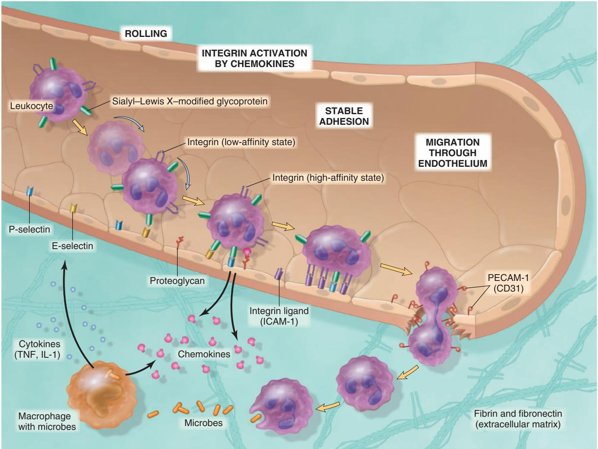 
Fig. 3.4 The multistep process of leukocyte migration through blood vessels, shown here for neutrophils. The leukocytes first roll, then become activated and adhere to endothelium, then transmigrate across the endothelium, pierce the basement membrane, and move toward chemoattractants emanating from the source of injury. Different molecules play predominant roles at each step of this process: selectins in rolling; chemokines (usually displayed bound to proteoglycans) in activating the neutrophils to increase avidity of integrins; integrins in firm adhesion; and CD31 (PECAM-1) in transmigration. ICAM-1, Intercellular adhesion molecule-1; PECAM-1 (CD31), platelet endothelial cell adhesion molecule-1; TNF, tumor necrosis factor.
Table 3.4 Endothelial and Leukocyte Adhesion Molecules 
FamilyMoleculeDistributionLigandSelectinL-selectin (CD62L)Neutrophils, monocytesSialyl-Lewis X/PNAd on GlyCAM-I, CD34, MAdCAM-I, others; expressed on endothelium (HEV)T cells (naive and central memory)B cells (naive)E-selectin (CD62E)Endothelium activated by cytokines (TNF, IL-1)Sialyl-Lewis X (e.g., CLA) on glycoproteins; expressed on neutrophils, monocytes, T cells (effector, memory)P-selectin (CD62P)Endothelium activated by cytokines (TNF, IL-1), histamine, or thrombin; plateletsSialyl-Lewis X on PSGL-I and other glycoproteins; expressed on neutrophils, monocytes, T cells (effector, memory)IntegrinLFA-1 (CD11aCD18)Neutrophils, monocytes, T cells (naive, effector, memory)ICAM-1 (CD54), ICAM-2 (CD102); expressed on endothelium (upregulated on activated endothelium)MAC-1 (CD11bCD18)Monocytes, DCsICAM-1 (CD54), ICAM-2 (CD102); expressed on endothelium (upregulated on activated endothelium)VLA-4 (CD49aCD29)MonocytesVCAM-1 (CD106); expressed on endothelium (upregulated on activated endothelium)T cells (naive, effector, memory)α4β7 (CD49DCD29)MonocytesVCAM-1 (CD106), MAdCAM-I; expressed on endothelium in gut and gut-associated lymphoid tissuesT cells (gut homing naïve effector, memory)IgCD3IEndothelial cells, leukocytesCD3I (homotypic interaction)
CLA, Cutaneous lymphocyte antigen-1; GlyCAM-1, glycan-bearing cell adhesion molecule-1; HEV, high endothelial venule; ICAM, intercellular adhesion molecule; Ig, immunoglobulin; IL-1, interleukin-1; MAdCAM-1, mucosal adhesion cell adhesion molecule-1; PSGL-1, P-selectin glycoprotein ligand-1; TNF, tumor necrosis factor; VCAM, vascular cell adhesion molecule.
antigen (Mac-1) (CD11bCD18), and vascular cell adhesion molecule-1 (VCAM-1), which binds to the integrin very late antigen-4 (VLA-4) (Table 3.4). The combination of cytokine-induced expression of integrin ligands on the endothelium and increased affinity of integrins on the leukocytes results in firm integrin-mediated binding of the leukocytes to the endothelium at the site of inflammation. The leukocytes stop rolling, and engagement of integrins by their ligands delivers signals leading to cytoskeletal changes that arrest the leukocytes and firmly attach them to the endothelium.
The most telling proof of the importance of leukocyte adhesion molecules is the existence of genetic deficiencies in these molecules that result in recurrent bacterial infections as a consequence of impaired leukocyte adhesion and defective inflammation. These leukocyte adhesion deficiencies are described in Chapter 5.
# Leukocyte Migration Through Endothelium
After being arrested on the endothelial surface, leukocytes migrate through the vessel wall primarily by squeezing between cells at intercellular junctions. This extravasation of leukocytes, called transmigration, occurs mainly in postcapillary venules, the site at which there is maximal retraction of endothelial cells. Further movement of leukocytes is driven by chemokines produced in extravascular tissues, which stimulate leukocytes to travel along a chemical gradient (described shortly). In addition, platelet endothelial cell adhesion molecule-1 (PECAM-1) (also called CD31), an adhesion molecule of the immunoglobulin (Ig) superfamily expressed on leukocytes and endothelial cells, mediates the binding events needed for leukocytes to traverse the endothelium. After traversing the endothelium, leukocytes pierce the basement membrane, probably by secreting collagenases, and they enter the extravascular tissue. Typically, the vessel wall is not injured during leukocyte transmigration.
# Chemotaxis of Leukocytes
After exiting the circulation, leukocytes move in the tissues toward the site of injury by a process called chemotaxis, which is defined as locomotion along a chemical gradient. Both exogenous and endogenous substances can act as chemoattractants, including the following:
- Bacterial products, particularly peptides with N-formylmethionine termini 
Cytokines, especially those of the chemokine family 
- Components of the complement system, particularly C5a 
- Products of the lipoxygenase pathway of arachidonic acid (AA) metabolism, particularly leukotriene B4 $(\mathrm{LTB_4})$
These chemoattractants are produced by microbes and by host cells in response to infections and tissue damage and during immunologic reactions. All act by binding to seventransmembrane G protein-coupled receptors on the surface of leukocytes. Signals initiated from these receptors activate second messengers that induce polymerization of actin, resulting in increased amounts at the leading edge of the cell and localization of myosin filaments at the back. The leukocyte moves by extending filopodia that pull the back of the cell in the direction of extension, much like the front wheels
pull an automobile with front-wheel drive. The net result is that leukocytes migrate toward the inflammatory stimulus in the direction of the locally produced chemoattractants.
The nature of the leukocyte infiltrate varies with the age of the inflammatory response and the type of stimulus. In most forms of acute inflammation, neutrophils predominate in the inflammatory infiltrate during the first 6 to 24 hours and are gradually replaced by monocyte-derived macrophages over 24 to 48 hours (Fig. 3.5). There are several reasons for the early preponderance of neutrophils: they are more numerous in the blood than other leukocytes, they respond more rapidly to chemokines, and they may attach more firmly to the adhesion molecules that are rapidly induced on endothelial cells, such as P- and E-selectins. After entering tissues, neutrophils are short-lived; they undergo apoptosis and disappear within 24 to 48 hours. Macrophages not only survive longer but also may proliferate in the tissues, and thus they become the dominant population in prolonged inflammatory reactions. There are, however, exceptions to this stereotypic pattern of cellular infiltration. In certain infections—for example, those produced by Pseudomonas bacteria—the cellular infiltrate is dominated by neutrophils for several days; in viral infections, lymphocytes may be the first cells to arrive; some hypersensitivity reactions are dominated by activated lymphocytes, macrophages, and plasma cells (reflecting the immune response); and in allergic reactions, eosinophils may be a prominent cell type.
The molecular understanding of leukocyte recruitment and migration has provided a large number of potential therapeutic targets for controlling harmful inflammation. Agents that block TNF, one of the major cytokines in leukocyte recruitment, are among the most successful therapeutics ever developed for chronic inflammatory diseases, and antagonists of leukocyte integrins are approved for inflammatory diseases and are being tested in clinical trials. Predictably, these antagonists not only have the desired effect of controlling the inflammation but can also compromise the ability of treated patients to defend themselves against microbes, which, of course, is the physiologic function of the inflammatory response.
# LEUKOCYTE RECRUITMENT TO SITES OF INFLAMMATION
- Leukocytes are recruited from the blood into the extravascular tissue where infectious pathogens or damaged tissues may be located, migrate to the site of infection or tissue injury, and are activated to perform their functions. 
- Leukocyte recruitment is a multistep process consisting of loose attachment to and rolling on endothelium (mediated by selectins); firm attachment to endothelium (mediated by integrins); and migration through interendothelial gaps. 
- Various cytokines promote the expression of selectins and integrin ligands on endothelium (TNF, IL-1), increase the avidity of integrins for their ligands (chemokines), and promote directional migration of leukocytes (also chemokines). Tissue macrophages and other cells responding to the pathogens or damaged tissues produce many of these cytokines. 
- Neutrophils predominate in the early inflammatory infiltrate and are later replaced by monocytes and macrophages.
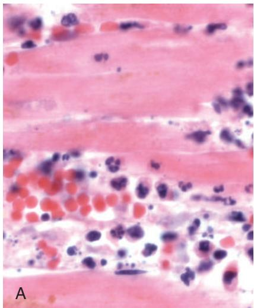 
Fig. 3.5 Nature of leukocyte infiltrates in inflammatory reactions. The photomicrographs show an inflammatory reaction in the myocardium after ischemic necrosis (infarction). (A) Early (neutrophilic) infiltrates and congested blood vessels. (B) Later (mononuclear) cellular infiltrates. (C) The approximate kinetics of edema and cellular infiltration. For simplicity, edema is shown as an acute transient response, although secondary waves of delayed edema and neutrophil infiltration also can occur.
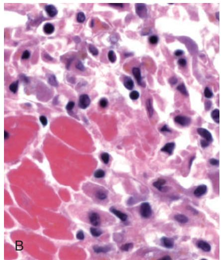
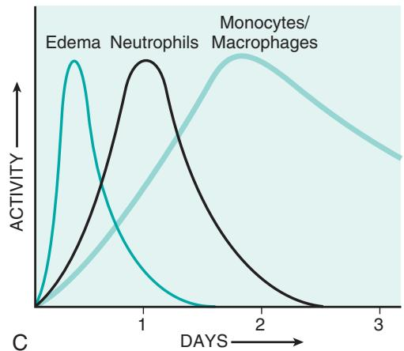
# Phagocytosis and Clearance of the Offending Agent
Recognition of microbes or dead cells induces several responses in leukocytes that are collectively called leukocyte activation (Fig. 3.6). After leukocytes (particularly neutrophils and monocytes) have been recruited to a site
of infection or tissue injury they must be activated to perform their functions. This makes perfect sense because, while we want our defenders to patrol our body constantly, it would be wasteful to keep them at a high level of alert and expending energy before they are required. The functional responses that are most important for destruction of microbes and other offenders are phagocytosis and
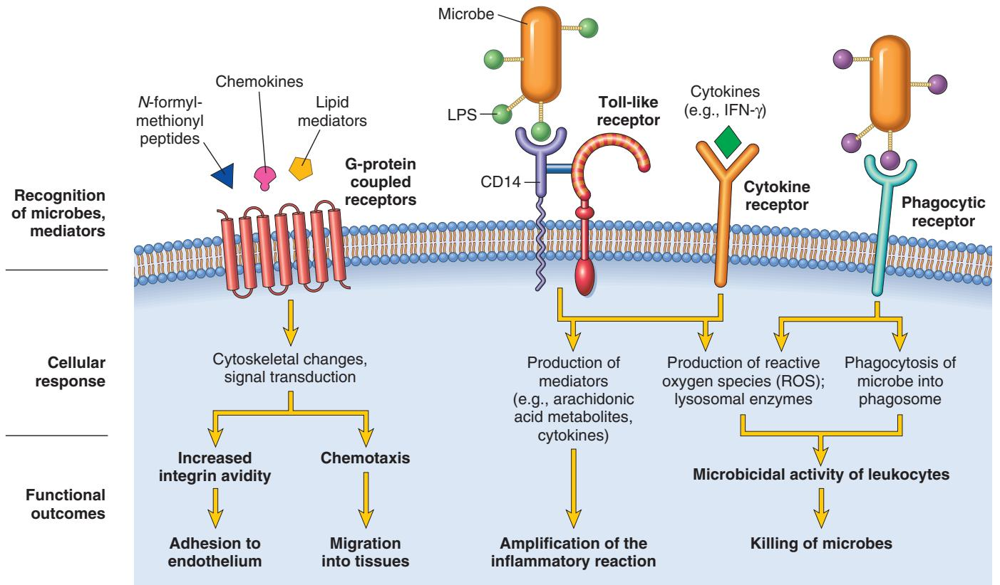 
Fig. 3.6 Leukocyte activation. Various types of leukocyte cell surface receptors recognize different agonists. Once stimulated, the receptors initiate responses that mediate leukocyte functions. Only some receptors are depicted (see text for details). LPS first binds to a circulating LPS-binding protein (not shown). IFN-γ; Interferon-γ; LPS, lipopolysaccharide.
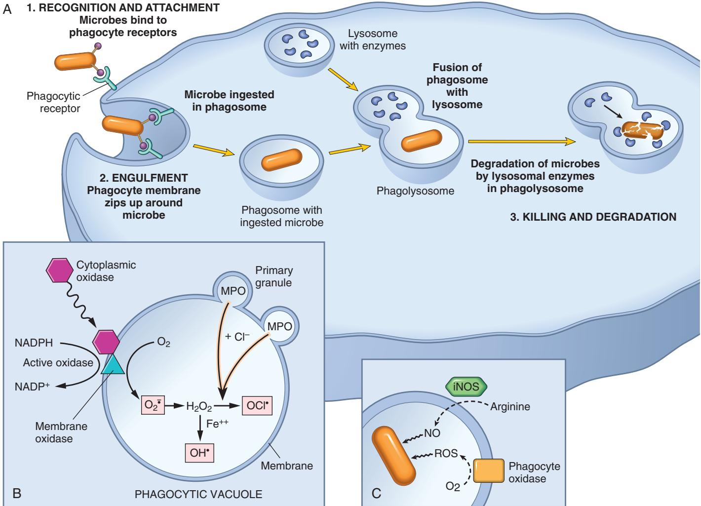 
Fig. 3.7 Phagocytosis and intracellular destruction of microbes. (A) Phagocytosis of a particle (e.g., a bacterium) involves binding to receptors on the leukocyte membrane, engulfment, and fusion of the phagocytic vacuoles with lysosomes. This is followed by destruction of ingested particles within the phagolysosomes by lysosomal enzymes and by reactive oxygen and nitrogen species. (B) In activated phagocytes, cytoplasmic components of the phagocyte oxidase enzyme assemble in the membrane of the phagosome to form the active enzyme, which catalyzes the conversion of oxygen into superoxide $(\mathsf{O}_2^-)$ and $\mathsf{H}_2\mathsf{O}_2$ . Myeloperoxidase, present in the granules of neutrophils, converts $\mathsf{H}_2\mathsf{O}_2$ to hypochlorite. (C) Microbicidal reactive oxygen species (ROS) and nitric oxide (NO) kill ingested microbes. During phagocytosis, granule contents may be released into extracellular tissues (not shown). iNOS, Inducible NO synthase; MPO, myeloperoxidase; ROS, reactive oxygen species.
intracellular killing. Several other responses aid in the defensive functions of inflammation and may contribute to its injurious consequences.
# Phagocytosis
Phagocytosis involves three sequential steps: (1) recognition and attachment of the particle to be ingested by the leukocyte; (2) engulfment, with subsequent formation of a phagocytic vacuole; and (3) killing or degradation of the ingested material (Fig. 3.7). These steps are triggered by activation of phagocytes by microbes, necrotic debris, and various mediators.
Recognition by Phagocytic Receptors. Mannose receptors, scavenger receptors, and receptors for various opsonins bind and ingest microbes. The macrophage mannose receptor is a lectin that binds terminal mannose and fucose residues of glycoproteins and glycolipids. These sugars are typically part of molecules found on microbial cell walls, whereas mammalian glycoproteins and glycolipids contain terminal sialic acid or N-acetylgalactosamine. Therefore, the
mannose receptor recognizes microbes and not host cells. Scavenger receptors bind and ingest low-density lipoprotein (LDL) particles as well as a variety of microbes. The efficiency of phagocytosis is greatly enhanced when microbes are opsonized (coated) by specific proteins (opsonins) for which the phagocytes express high-affinity receptors. The major opsonins are immunoglobulin $(\mathrm{Ig})\mathrm{G}$ antibodies, the C3b breakdown product of complement activation, and certain plasma lectins, notably mannose-binding lectin, all of which are recognized by specific receptors on leukocytes.
Engulfment. After a particle is bound to phagocyte receptors, extensions of the cytoplasm (pseudopods) flow around it, and the plasma membrane pinches off to form a cytosolic vesicle (phagosome) that encloses the particle. The phagosome then fuses with lysosomes, resulting in the discharge of lysosomal contents into the phagolysosome (Fig. 3.7). During this process the phagocyte also may release some granule contents into the extracellular space, thereby damaging innocent bystander normal cells.
# Intracellular Destruction of Microbes and Debris
The killing of microbes and the destruction of ingested materials are accomplished by reactive oxygen species (ROS, also called reactive oxygen intermediates), reactive nitrogen species, mainly derived from nitric oxide (NO), and lysosomal enzymes (Fig. 3.7). This is the final step in the elimination of infectious agents and necrotic cells. The killing and degradation of microbes and elimination of dead-cell debris within neutrophils and macrophages occur most efficiently after their activation. All these killing mechanisms are normally sequestered in lysosomes, to which phagocytosed materials are brought. Thus, potentially harmful substances are segregated from the cell's cytoplasm and nucleus to avoid damage to the phagocyte while it is performing its normal function.
Reactive Oxygen Species. ROS are produced by the rapid assembly and activation of a multicomponent enzyme, phagocyte oxidase (also called NADPH oxidase), which oxidizes NADPH (reduced nicotinamide-adenine dinucleotide phosphate) and, in the process, reduces oxygen to the superoxide anion $(\mathrm{O}_2^{\bullet})$ (Fig. 3.7B). In neutrophils, this oxidative reaction is tightly linked to phagocytosis, and is called the respiratory burst. Phagocyte oxidase is an enzyme complex consisting of at least seven proteins. In resting neutrophils, different components of the enzyme are located in the plasma membrane and the cytoplasm. In response to activating stimuli, the cytosolic protein components translocate to the phagosomal membrane, where they assemble and form the functional enzyme complex. Thus, the ROS are produced within the phagolysosome, where they can act on ingested particles without damaging the host cell. $\mathrm{O}_2^{\bullet}$ so produced is then converted into hydrogen peroxide $(\mathrm{H}_2\mathrm{O}_2)$ , mostly by spontaneous dismutation, a process of simultaneous oxidation and reduction. $\mathrm{H}_2\mathrm{O}_2$ is not able to kill microbes efficiently by itself. However, the azurophilic granules of neutrophils contain the enzyme myeloperoxidase (MPO), which, in the presence of a halide such as $\mathrm{Cl}^{-}$ , converts $\mathrm{H}_2\mathrm{O}_2$ to hypochlorite $(\mathrm{OC}\mathrm{l}_{2}^{-}$ , the active ingredient in household bleach). The latter is a potent anti-microbial agent that destroys microbes by halogenation (in which the halide is bound covalently to cellular constituents) or by oxidation of proteins and lipids (lipid peroxidation). The $\mathrm{H}_2\mathrm{O}_2$ -MPO-halide system is the most efficient bactericidal system of neutrophils. Nevertheless, inherited deficiency of MPO only causes a modest increase in susceptibility to infection, emphasizing the redundancy of microbial mechanisms in leukocytes. $\mathrm{H}_2\mathrm{O}_2$ also is converted to hydroxyl radical $(\mathrm{OH}^{\bullet})$ , another powerful destructive agent. As discussed in Chapter 2, these oxygen-derived free radicals bind to and modify cellular lipids, proteins, and nucleic acids, and thus destroy cells such as microbes.
Oxygen-derived radicals may be released extracellularly from leukocytes after exposure to microbes, chemokines, and antigen-antibody complexes, or following a phagocytic challenge. These ROS are implicated in tissue damage accompanying inflammation.
Serum, tissue fluids, and host cells possess anti-oxidant mechanisms that protect against these potentially harmful oxygen-derived radicals. These anti-oxidants are discussed in Chapter 2; they include (1) the enzyme superoxide
dismutase, which is found in or can be activated in a variety of cell types; (2) catalase, which detoxifies $\mathrm{H}_2\mathrm{O}_2$ ; and (3) glutathione peroxidase, another powerful $\mathrm{H}_2\mathrm{O}_2$ detoxifier. The role of oxygen-derived free radicals in any given inflammatory reaction depends on the balance between production and inactivation of these metabolites by cells and tissues.
Genetic defects in the generation of ROS are the cause of an immunodeficiency disease called chronic granulomatous disease, described in Chapter 5.
Nitric Oxide. NO, a soluble gas produced from arginine by the action of nitric oxide synthase (NOS), also participates in microbial killing. There are three different types of NOS: endothelial (eNOS), neuronal (nNOS), and inducible (iNOS). eNOS and nNOS are constitutively expressed at low levels, and the NO they generate acts to maintain vascular tone and as a neurotransmitter, respectively. iNOS, the type that is involved in microbial killing, is expressed when macrophages are activated by cytokines (e.g., IFN- $\gamma$ ) or microbial products, and induces the production of NO. In macrophages, NO reacts with superoxide $(\mathrm{O}_2^{\bullet})$ to generate the highly reactive free radical peroxynitrite (ONOO) (Fig. 3.7C). These nitrogen-derived free radicals, similar to ROS, attack and damage the lipids, proteins, and nucleic acids of microbes and host cells.
In addition to its role as a microbicidal substance, NO produced by endothelial cells relaxes vascular smooth muscle and promotes vasodilation. It is not clear if this action of NO plays an important role in the vascular reactions of acute inflammation.
Granule Enzymes and Other Proteins. Neutrophils and monocytes contain granules packed with enzymes and anti-microbial proteins that degrade microbes and dead tissues and may contribute to tissue damage. These granules are actively secretory and thus distinct from classical lysosomes. Neutrophils have two main types of granules. The smaller specific (or secondary) granules contain lysozyme, collagenase, gelatinase, lactoferrin, plasminogen activator, histaminase, and alkaline phosphatase. The larger azurophil (or primary) granules contain MPO, bactericidal factors (such as defensins), acid hydrolases, and a variety of neutral proteases (elastase, cathepsin G, nonspecific collagenases, proteinase 3). Phagocytic vesicles containing engulfed material may fuse with these granules (and with lysosomes, as described earlier), and the ingested materials are destroyed. In addition, both types of granules also undergo exocytosis (degranulation), leading to the extracellular release of granule contents.
Different granule enzymes serve different functions. Acid proteases degrade bacteria and debris within phagolysosomes, which are acidified by membrane-bound proton pumps. Neutral proteases are capable of degrading various extracellular components, such as collagen, basement membrane, fibrin, elastin, and cartilage, resulting in the tissue destruction that accompanies inflammatory processes. Neutrophil elastase combats infections by degrading virulence factors of bacteria. Macrophages also contain acid hydrolases, collagenase, elastase, phospholipase, and plasminogen activator.
Because of the destructive effects of granule enzymes, the initial leukocytic infiltration, if unchecked, can potentiate further inflammation by damaging tissues. These
harmful proteases, however, are normally controlled by a system of anti-proteases in the serum and tissue fluids. Foremost among these is $\alpha_{1}$ -anti-trypsin, which is the major inhibitor of neutrophil elastase. A deficiency of these inhibitors may lead to sustained action of leukocyte proteases, as is the case in patients with $\alpha_{1}$ -anti-trypsin deficiency (Chapter 13).
# Neutrophil Extracellular Traps
Neutrophil extracellular traps (NETs) are extracellular fibrillar networks that concentrate anti-microbial substances at sites of infection and prevent the spread of the microbes by trapping them in the fibrils. They are produced by neutrophils in response to infectious pathogens (mainly bacteria and fungi) and inflammatory mediators (e.g., chemokines, cytokines, and complement proteins). The extracellular traps consist of a viscous meshwork of nuclear chromatin that binds and concentrates granule proteins such as anti-microbial peptides and enzymes (Fig. 3.8). NETs provide an additional mechanism of killing microbes that does not involve phagocytosis. In the process of NET formation, the nuclei of the neutrophils are lost, leading to the death of the cells, sometimes called NETosis, representing a distinctive form of cell death affecting neutrophils. NETs also have been detected in the blood during sepsis. The nuclear chromatin in the NETs, which includes histones and associated DNA, may be a source of nuclear antigens in systemic autoimmune diseases, particularly lupus, in which individuals react against their own DNA and nucleoproteins (Chapter 5).
# Leukocyte-Mediated Tissue Injury
# Leukocytes are important mediators of injury to normal cells and tissues under several circumstances:
- As part of a normal defense reaction against infectious microbes, when tissues at or near the site of infection suffer collateral damage. In some infections that are difficult to eradicate, such as tuberculosis and certain viral diseases such as hepatitis, the prolonged host response contributes more to the pathology than does the microbe itself. 
- When the inflammatory response is inappropriately directed against host tissues, as in certain autoimmune diseases. 
- When the host "hyper-reacts" against usually harmless environmental substances, as in allergic diseases, including asthma, and some drug reactions.
Leukocytes damage tissues by releasing injurious molecules. The potentially toxic contents of granules are released by leukocytes into the extracellular milieu by several mechanisms. Controlled secretion of granule contents following degranulation is a normal response of activated leukocytes. If phagocytes encounter materials that cannot be easily ingested, such as immune complexes deposited on immovable flat surfaces (e.g., glomerular basement membrane), the inability of the leukocytes to surround and ingest these substances ("frustrated phagocytosis") triggers strong activation and also the release of large amounts of granule enzymes into the extracellular environment. Some phagocytosed substances, such as urate and
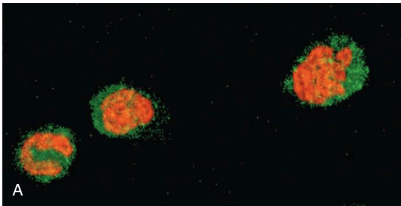
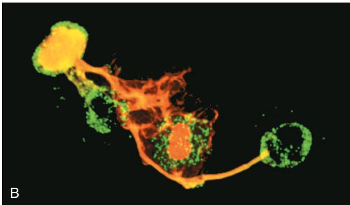 
Fig. 3.8 Neutrophil extracellular traps (NETs). (A) Healthy neutrophils with nuclei stained red and cytoplasm green. (B) Release of nuclear material from neutrophils (note that two have lost their nuclei), forming extracellular traps. (C) An electron micrograph of bacteria (staphylococci) trapped in NETs. (From Brinkmann V, Zychlinsky A: Beneficial suicide: why neutrophils die to make NETs, Nat Rev Microbiol 5:577, 2007, with permission.)
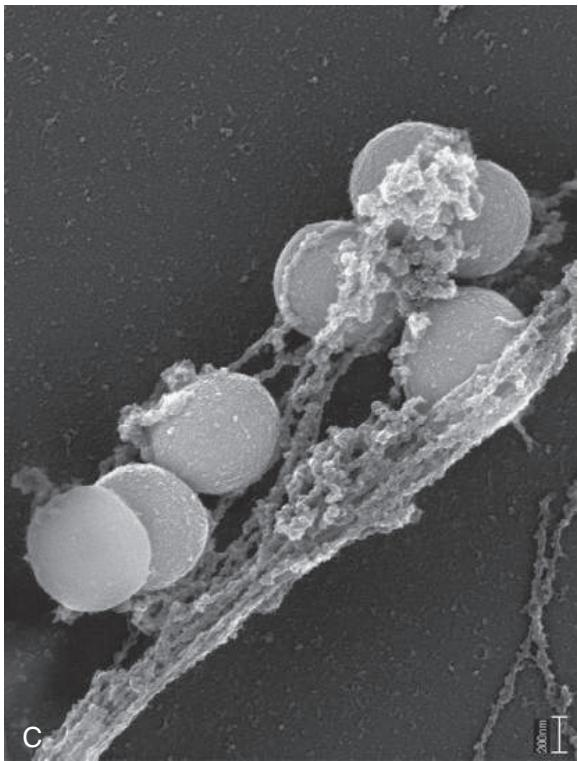
silica crystals, may damage the membrane of the phagolysosome and also lead to the release of damaging contents.
# Other Functional Responses of Activated Leukocytes
In addition to eliminating microbes and dead cells, activated leukocytes play several other roles in host defense. Importantly, these cells, especially macrophages, produce cytokines that can either amplify or limit inflammatory reactions, growth factors that stimulate the proliferation of endothelial cells and fibroblasts and the synthesis of collagen, and enzymes that remodel connective tissues. Because of these activities, macrophages also have central roles in orchestrating chronic inflammation and tissue repair, after the inflammation has subsided. These functions of macrophages are discussed later in the chapter.
In this discussion of acute inflammation, we emphasize the importance of neutrophils and macrophages. However, it has become clear that some T lymphocytes, which are cells of adaptive immunity, also contribute to acute inflammation. The most important of these cells are those that produce the cytokine IL-17 (so-called "T $_{\text{H}}$ 17 cells"), which are discussed in more detail in Chapter 5. IL-17 induces the secretion of chemokines that recruit other leukocytes. In the absence of effective $\mathrm{T_H}17$ responses, individuals are susceptible to fungal and bacterial infections, and the skin abscesses that develop are "cold abscesses," lacking the classic features of acute inflammation, such as warmth and redness.
# Termination of the Acute Inflammatory Response
Such a powerful system of host defense, with its inherent capacity to cause tissue injury, needs tight controls to minimize damage. In part, inflammation declines after the offending agents are removed simply because the mediators of inflammation are produced in rapid bursts, only as long as the stimulus persists, have short half-lives, and are degraded after their release. Neutrophils also have short half-lives in tissues and die by apoptosis within hours to a day or two after leaving the blood. In addition, as inflammation develops, the process itself triggers a variety of stop signals that actively terminate the reaction. These active termination mechanisms include a switch in the type of arachidonic acid metabolite produced, from proinflammatory leukotrienes to anti-inflammatory lipoxins (described later), and the liberation of anti-inflammatory cytokines, including transforming growth factor- $\beta$ (TGF- $\beta$ ) and IL-10, from macrophages and other cells. Other control mechanisms that have been demonstrated experimentally include neural impulses (cholinergic discharge), which inhibit the production of TNF in macrophages.
# LEUKOCYTE ACTIVATION AND REMOVAL OF OFFENDING AGENTS
- Leukocytes can eliminate microbes and dead cells by phagocytosis, followed by their destruction in phagolysosomes. 
- Destruction is caused by free radicals (ROS, NO) generated in activated leukocytes and by granule enzymes.
- Neutrophils can extrude their nuclear contents to form extracellular nets that trap and destroy microbes. 
- Granule enzymes may be released into the extracellular environment. 
- The mechanisms that function to eliminate microbes and dead cells (the physiologic role of inflammation) also are capable of damaging normal tissues (the pathologic consequences of inflammation). 
- Anti-inflammatory mediators terminate the acute inflammatory reaction when it is no longer needed.
# MEDIATORS OF INFLAMMATION
The mediators of inflammation are the substances that initiate and regulate inflammatory reactions. Although the harried student may find the list of mediators daunting (as do professors!), it is worthy of note that this knowledge has been used to design a large armamentarium of anti-inflammatory agents that are used every day by many people and which include familiar drugs such as aspirin and acetaminophen. The most important mediators of acute inflammation are vasoactive amines, lipid products (prostaglandins and leukotrienes), cytokines (including chemokines), and products of complement activation (Table 3.5). We begin by summarizing the general properties of the
Table 3.5 Principal Mediators of Inflammation 
MediatorSourceActionHistamineMast cells, basophils, plateletsVasodilation, increased vascular permeability, endothelial activationProstaglandinsMast cells, leukocytesVasodilation, pain, feverLeukotrienesMast cells, leukocytesIncreased vascular permeability, chemotaxis, leukocyte adhesion, and activationCytokines (TNF, IL-1, IL-6)Macrophages, endothelial cells, mast cellsLocal: endothelial activation (expression of adhesion molecules). Systemic: fever, metabolic abnormalities, hypotension (shock)ChemokinesLeukocytes, activated macrophagesChemotaxis, leukocyte activationPlatelet-activating factorLeukocytes, mast cellsVasodilation, increased vascular permeability, leukocyte adhesion, chemotaxis, degranulation, oxidative burstComplementPlasma (produced in liver)Leukocyte chemotaxis and activation, direct target killing (membrane attack complex), vasodilation (mast cell stimulation)KininsPlasma (produced in liver)Increased vascular permeability, smooth muscle contraction, vasodilation, pain
mediators of inflammation and then discuss some of the more important molecules.
- Mediators may be produced locally by cells at the site of inflammation, or may be derived from circulating inactive precursors that are activated at the site of inflammation. Cell-derived mediators are rapidly released from intracellular granules (e.g., amines) or are synthesized de novo (e.g., prostaglandins, leukotrienes, cytokines) in response to a stimulus. The major cell types that produce mediators of acute inflammation are tissue macrophages, dendritic cells, and mast cells, but platelets, neutrophils, endothelial cells, and most epithelia also can be induced to elaborate some of the mediators. Therefore, cell-derived mediators are most important for reactions against offending agents in tissues. Plasma-derived mediators (e.g., complement proteins) are present in the circulation as inactive precursors that must be activated, usually by a series of proteolytic cleavages, to acquire their biologic properties. They are produced mainly in the liver, are effective against circulating microbes, and also can be recruited into tissues. 
- Active mediators are produced only in response to various molecules that stimulate inflammation, including microbial products and substances released from necrotic cells. Many of these stimuli trigger well-defined receptors and signaling pathways, as described earlier. The usual requirement for microbes or dead tissues as the initiating stimulus ensures that inflammation is normally triggered only when and where it is needed. 
- Most of the mediators are short-lived. They quickly decay, or are inactivated by enzymes, or they are otherwise scavenged or inhibited. There is thus a system of checks and balances that regulates mediator actions. These built-in control mechanisms are discussed with each class of mediator. 
- One mediator can stimulate the release of other mediators. For instance, products of complement activation stimulate the release of histamine, and the cytokine TNF acts on endothelial cells to stimulate the production of another cytokine, IL-1, and many chemokines. The secondary mediators may have the same actions as the initial mediators but also may have different and even opposing activities, thus providing mechanisms for amplifying—or, in certain instances, counteracting—the initial action of a mediator.
# Vasoactive Amines: Histamine and Serotonin
The two major vasoactive amines, so named because they have important actions on blood vessels, are histamine and serotonin. They are stored as preformed molecules in cells and are therefore among the first mediators to be released during inflammation. The richest sources of histamine are mast cells, which are normally present in the connective tissue adjacent to blood vessels. Histamine also is found in blood basophils and platelets. It is stored in mast cell granules and is released by degranulation in response to a variety of stimuli, including (1) physical injury, such as trauma, cold, or heat, by unknown mechanisms; (2) binding of antibodies to mast cells, which
underlies immediate hypersensitivity (allergic) reactions (Chapter 5); and (3) products of complement called anaphylatoxins (C3a and C5a), described later. Antibodies and complement products bind to specific receptors on mast cells and trigger signaling pathways that induce rapid degranulation. Neuropeptides (e.g., substance P) and cytokines (IL-1, IL-8) also may trigger release of histamine.
Histamine causes dilation of arterioles and increases the permeability of venules. Histamine is considered the principal mediator of the immediate transient phase of increased vascular permeability, producing interendothelial gaps in postcapillary venules, as discussed earlier. Its vasoactive effects are mediated mainly via binding to receptors, called $\mathrm{H}_{1}$ receptors, on microvascular endothelial cells. The antihistamine drugs that are commonly used to treat some inflammatory reactions, such as allergies, are $\mathrm{H}_{1}$ receptor antagonists that bind to and block the receptor. Histamine also causes contraction of some smooth muscles, but leukotrienes, described later, are much more potent and relevant for causing spasms of bronchial muscles, for example, in asthma.
Serotonin (5-hydroxytryptamine) is a preformed vasoactive mediator present in platelets and certain neuroendocrine cells, such as in the gastrointestinal tract, and in mast cells in rodents but not humans. Its primary function is as a neurotransmitter in the gastrointestinal tract. It also is a vasoconstrictor, but the importance of this action in inflammation is unclear.
# Arachidonic Acid Metabolites
The lipid mediators prostaglandins and leukotrienes are produced from arachidonic acid present in membrane phospholipids, and they stimulate vascular and cellular reactions in acute inflammation. Arachidonic acid is a 20-carbon polyunsaturated fatty acid that is derived from dietary sources or by conversion from the essential fatty acid linoleic acid. Most cellular arachidonic acid is esterified and incorporated into membrane phospholipids. Mechanical, chemical, and physical stimuli or other mediators (e.g., C5a) trigger the release of arachidonic acid from membranes by activating cellular phospholipases, mainly phospholipase $\mathrm{A}_2$ . Once freed from the membrane, arachidonic acid is rapidly converted to bioactive mediators. These mediators, also called eicosanoids (because they are derived from 20-carbon fatty acids; Greek eicosa = 20), are synthesized by two major classes of enzymes: cyclooxygenases (which generate prostaglandins) and lipoxygenases (which produce leukotrienes and lipoxins) (Fig. 3.9). Eicosanoids bind to G protein-coupled receptors on many cell types and can mediate virtually every step of inflammation (Table 3.6).
# Prostaglandins
Prostaglandins (PGs) are produced by mast cells, macrophages, endothelial cells, and many other cell types, and are involved in the vascular and systemic reactions of inflammation. They are generated by the actions of two cyclooxygenases called COX-1 and COX-2. COX-1 is produced in response to inflammatory stimuli and also is constitutively expressed in most tissues, where it may serve a homeostatic function (e.g., fluid and electrolyte balance in
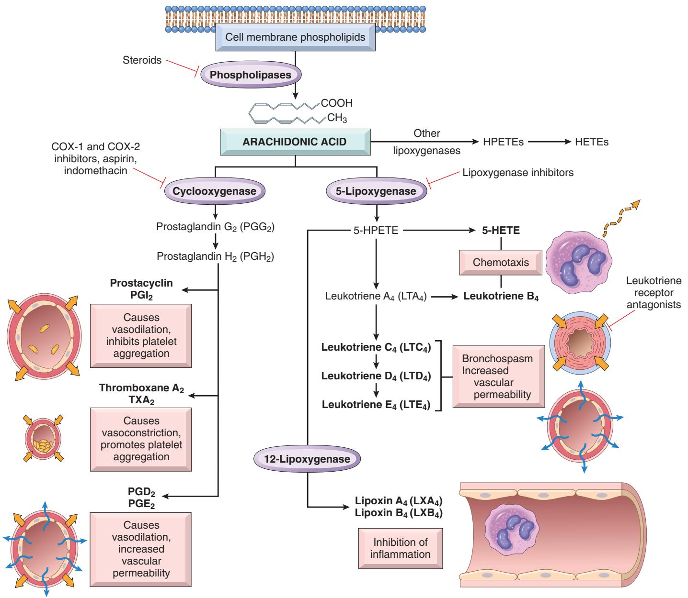 
Fig. 3.9 Production of AA metabolites and their roles in inflammation. Clinically useful antagonists of different enzymes and receptors are indicated in red. While leukotriene receptor antagonists inhibit all actions of leukotrienes, they are used in the clinic to treat asthma, as shown. COX-1, COX-2, Cyclooxygenase 1 and 2; HETE, hydroxyeicosatetraenoic acid; HPETE, hydroperoxyeicosatetraenoic acid.
the kidneys, cytoprotection in the gastrointestinal tract). In contrast, COX-2 is induced by inflammatory stimuli and thus generates the PGs that are involved in inflammatory reactions, but it is low or absent in most normal tissues.
Table 3.6 Principal Actions of Arachidonic Acid Metabolites in Inflammation 
ActionEicosanoidVasodilationProstaglandins PGI2 (prostacyclin), PGE1, PGE2, PGD2VasoconstrictionThromboxane A2, leukotrienes C4, D4, E4Increased vascular permeabilityLeukotrienes C4, D4, E4Chemotaxis, leukocyte adhesionLeukotriene B4Smooth muscle contractionProstaglandins PGC4, PGD4, PGE4
Prostaglandins are named based on structural features coded by a letter (e.g., PGD, PGE, PGF, PGG, and PGH) and a subscript numeral (e.g., 1, 2), which indicates the number of double bonds in the compound. The most important prostaglandins in inflammation are $\mathrm{PGE}_2$ , $\mathrm{PGD}_2$ , $\mathrm{PGF}_{2a}$ , $\mathrm{PGI}_2$ (prostacyclin), and $\mathrm{TXA}_2$ (thromboxane $\mathrm{A}_2$ ), each of which is derived by the action of a specific enzyme on an intermediate in the pathway. Some of these enzymes have restricted tissue distribution and functions.
- $\mathrm{PGD}_2$ is the major prostaglandin made by mast cells; along with $\mathrm{PGE}_2$ (which is more widely distributed), it causes vasodilation and increases the permeability of postcapillary venules, thus potentiating exudation and resultant edema. $\mathrm{PGD}_2$ also is a chemoattractant for neutrophils. 
- Platelets contain the enzyme thromboxane synthase, which is responsible for synthesizing TXA2, the major
platelet eicosanoid. $\mathrm{TXA}_2$ is a potent platelet-aggregating agent and vasoconstrictor, and thus promotes thrombosis.
- In contrast, vascular endothelium contains prostacyclin synthase, which is responsible for the formation of prostacyclin $\left(\mathrm{PGI}_2\right)$ and its stable end product $\mathrm{PGF}_{1a}$ . Prostacyclin is a vasodilator and a potent inhibitor of platelet aggregation, and thus serves to prevent thrombus formation on normal endothelial cells. A thromboxane-prostacyclin imbalance has been implicated in coronary and cerebral artery thrombosis (Chapter 4). 
- In addition to their local effects, prostaglandins are involved in the pathogenesis of pain and fever, two common systemic manifestations of inflammation. $\mathrm{PGE}_2$ makes the skin hypersensitive to painful stimuli, and causes fever during infections (described later).
# Leukotrienes
Leukotrienes are produced in leukocytes and mast cells by the action of lipoxygenase and are involved in vascular and smooth muscle reactions and leukocyte recruitment. The synthesis of leukotrienes involves multiple steps, the first of which generates leukotriene $\mathrm{A}_4$ (LTA $_4$ ), which in turn gives rise to LTB $_4$ or LTC $_4$ . LTB $_4$ is produced by neutrophils and some macrophages, and is a potent chemotactic agent and activator of neutrophils, causing aggregation and adhesion of the cells to venular endothelium, generation of ROS, and release of lysosomal enzymes. The cysteinyl-containing leukotriene $\mathrm{LTC}_4$ and its metabolites, LTD $_4$ and LTE $_4$ , are produced mainly in mast cells and cause intense vasoconstriction, bronchospasm (important in asthma), and increased permeability of venules.
# Lipoxins
Lipoxins also are generated from arachidonic acid by the lipoxygenase pathway, but unlike prostaglandins and leukotrienes, the lipoxins suppress inflammation by inhibiting the recruitment of leukocytes. They inhibit neutrophil chemotaxis and adhesion to endothelium. They also are unusual in that two cell populations are required for the transcellular biosynthesis of these mediators. Leukocytes, particularly neutrophils, produce intermediates in lipoxin synthesis, and these are converted to lipoxins by platelets interacting with the leukocytes.
# Pharmacologic Inhibitors of Prostaglandins
# and Leukotrienes
The importance of eicosanoids in inflammation has driven attempts to develop drugs that inhibit their production or actions and thus suppress inflammation. These anti-inflammatory drugs include the following:
- Cyclooxygenase inhibitors include aspirin and other nonsteroidal anti-inflammatory drugs (NSAIDs), such as ibuprofen. They inhibit both COX-1 and COX-2 and thus block all prostaglandin synthesis (hence their efficacy in treating pain and fever); aspirin does this by irreversibly inactivating cyclooxygenases. Selective COX-2 inhibitors are a newer class of these drugs that are 200- to 300-fold more potent in blocking COX-2 than COX-1. There has been great interest in COX-2 as a therapeutic target because of the possibility that COX-1 is responsible for the production of prostaglandins that are involved in both inflammation and physiologic
functions such as protecting gastric epithelial cells from acid-induced injury, whereas COX-2 generates prostaglandins that are involved only in inflammation. If this idea is correct, the selective COX-2 inhibitors should be anti-inflammatory without having the toxicities of the nonselective inhibitors, such as gastric ulceration. However, these distinctions are not absolute, as COX-2 also seems to play some role in normal homeostasis. Furthermore, selective COX-2 inhibitors may increase the risk of cardiovascular and cerebrovascular events, possibly because they impair endothelial cell production of prostacyclin $\mathrm{(PGI_2)}$ , which prevents thrombosis, while leaving intact the COX-1-mediated production by platelets of $\mathrm{TXA}_2$ , which induces platelet aggregation. Thus, selective COX-2 inhibition may tilt the balance toward vascular thrombosis, especially in combination with other factors that increase the risk of thrombosis. Nevertheless, these drugs are used in individuals who do not have risk factors for cardiovascular disease and when the drugs' benefits outweigh their risks.
- Lipoxygenase inhibitors. 5-lipoxygenase is not affected by NSAIDs, and many new inhibitors of this enzyme pathway have been developed. Pharmacologic agents that inhibit leukotriene production (e.g., zileuton) are useful in the treatment of asthma. 
- Corticosteroids are broad-spectrum anti-inflammatory agents that reduce the transcription of genes encoding COX-2, phospholipase $\mathrm{A}_2$ , proinflammatory cytokines (e.g., IL-1 and TNF), and iNOS. 
- Leukotriene receptor antagonists block leukotriene receptors and prevent the actions of the leukotrienes. These drugs (e.g., Montelukast) are useful in the treatment of asthma.
# Cytokines and Chemokines
Cytokines are proteins secreted by many cell types (principally activated lymphocytes, macrophages, and dendritic cells, but also endothelial, epithelial, and connective tissue cells) that mediate and regulate immune and inflammatory reactions. By convention, growth factors that act on epithelial and mesenchymal cells are not grouped under cytokines. The general properties and functions of cytokines are discussed in Chapter 5. Here the cytokines involved in acute inflammation are reviewed (Table 3.7).
# Tumor Necrosis Factor and Interleukin-1
TNF and IL-1 serve critical roles in leukocyte recruitment by promoting adhesion of leukocytes to endothelium and their migration through vessels. Activated macrophages and dendritic cells mainly produce these cytokines; TNF also is produced by T lymphocytes and mast cells, and some epithelial cells produce IL-1 as well. Microbial products, foreign bodies, necrotic cells, and a variety of other inflammatory stimuli can stimulate the secretion of TNF and IL-1. The production of TNF is induced by signals through TLRs and other microbial sensors, and the synthesis of IL-1 is stimulated by the same signals, but the generation of the biologically active form of this cytokine is dependent on the inflammasome, described earlier.
Table 3.7 Cytokines in Inflammation 
CytokinePrincipal SourcesPrincipal Actions in InflammationIn Acute InflammationTNFMacrophages, mast cells,T lymphocytesStimulates expression of endothelial adhesion molecules and secretion of other cytokines; systemic effectsIL-1Macrophages, endothelial cells, some epithelial cellsSimilar to TNF; greater role in feverIL-6Macrophages, other cellsSystemic effects (acute phase response)ChemokinesMacrophages, endothelial cells, T lymphocytes, mast cells, other cell typesRecruitment of leukocytes to sites of inflammation; migration of cells in normal tissuesIL-17T lymphocytesRecruitment of neutrophils and monocytesIn Chronic InflammationIL-12Dendritic cells, macrophagesIncreased production of IFN-γIFN-γT lymphocytes, NK cellsActivation of macrophages (increased ability to kill microbes and tumor cells)IL-17T lymphocytesRecruitment of neutrophils and monocytes
The most important cytokines involved in inflammatory reactions are listed. Many other cytokines may play lesser roles in inflammation. There is also considerable overlap between the cytokines involved in acute and chronic inflammation. Specifically, all the cytokines listed under acute inflammation may also contribute to chronic inflammatory reactions. 
IFN-γ, Interferon-γ; IL-1, interleukin-1; NK, natural killer; TNF, tumor necrosis factor.
The actions of TNF and IL-1 contribute to the local and systemic reactions of inflammation (Fig. 3.10). The most important roles of these cytokines in inflammation are the following:
- Endothelial activation. Both TNF and IL-1 act on endothelium to induce a spectrum of changes referred to as endothelial activation. These changes include increased expression of endothelial adhesion molecules, mostly E- and P-selectins and ligands for leukocyte integrins; increased production of various mediators, including other cytokines and chemokines, and eicosanoids; and increased procoagulant activity of the endothelium. 
- Activation of leukocytes and other cells. TNF augments responses of neutrophils to other stimuli such as bacterial endotoxin and stimulates the microbicidal activity of macrophages. IL-1 activates fibroblasts to synthesize collagen and stimulates proliferation of synovial cells and other mesenchymal cells. IL-1 and IL-6 also stimulate the generation of a subset of $\mathrm{CD4 + }$ helper T cells called $\mathrm{T_H17}$ cells, described later and in Chapter 5. 
Systemic acute-phase response. IL-1 and TNF (as well as IL-6) induce the systemic acute-phase responses associated with infection or injury, including fever (described later in the chapter). They also are implicated in the pathogenesis of the systemic inflammatory response
syndrome (SIRS), resulting from disseminated bacterial infection (sepsis) and other serious conditions, described later.
TNF regulates energy balance by promoting lipid and protein catabolism and by suppressing appetite. Therefore, sustained production of TNF contributes to cachexia, a pathologic state characterized by weight loss, muscle atrophy, and anorexia that accompanies some chronic infections and cancers.
As mentioned earlier, TNF antagonists have been remarkably effective in the treatment of chronic inflammatory diseases, particularly rheumatoid arthritis, psoriasis, and some types of inflammatory bowel disease. One complication of this therapy is increased susceptibility to mycobacterial infection, resulting from reduced ability of macrophages to kill intracellular microbes. Although many of the actions of TNF and IL-1 are overlapping, IL-1 antagonists are not as effective, for reasons that remain obscure. Also, blocking either cytokine has no effect on the outcome of sepsis, perhaps because other cytokines contribute to this serious systemic inflammatory reaction.
# Chemokines
Chemokines are a family of small (8-10 kD) proteins that act primarily as chemoattractants for specific types of leukocytes. About 40 different chemokines and 20 different receptors for chemokines have been identified. They are classified into four major groups, according to the arrangement of cysteine (C) residues in the proteins:
- C-X-C chemokines have one amino acid residue separating the first two of the four conserved cysteines. These chemokines act primarily on neutrophils. IL-8 (now called CXCL8) is typical of this group. It is secreted by activated macrophages, endothelial cells, and other cell types, and causes activation and chemotaxis of neutrophils, with limited activity on monocytes and eosinophils. Its most important inducers are microbial products and cytokines, mainly IL-1 and TNF. 
- C-C chemokines have the first two conserved cysteine residues adjacent. The C-C chemokines, which include monocyte chemoattractant protein (MCP-1, CCL2), eotaxin (CCL11), and macrophage inflammatory protein-1α (MIP-1α, CCL3), mainly serve as chemoattractants for monocytes, eosinophils, basophils, and lymphocytes. Although most of the chemokines in this class have overlapping actions, eotaxin selectively recruits eosinophils. 
- C chemokines lack the first and third of the four conserved cysteines. The C chemokines (e.g., lymphotactin, XCL1) are relatively specific for lymphocytes. 
- $CX_{3}C$ chemokines contain three amino acids between the first two cysteines. The only known member of this class is called fractalkine (CX $_3$ CL1). This chemokine exists in two forms: a cell surface-bound protein induced on endothelial cells by inflammatory cytokines that promotes strong adhesion of monocytes and T cells, and a soluble form, derived by proteolysis of the membrane-bound protein, that has potent chemoattractant activity for the same cells.
Chemokines mediate their activities by binding to seven-transmembrane G protein-coupled receptors. These
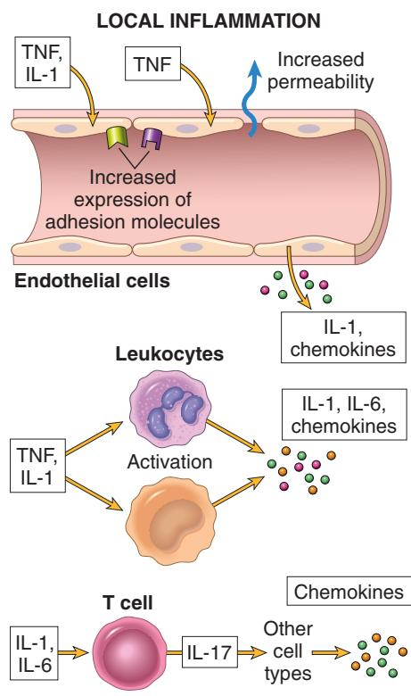 
Fig. 3.10 Major roles of cytokines in acute inflammation. PDGF, Platelet-derived growth factor; PGE, prostaglandin E; PGI, prostaglandin I.
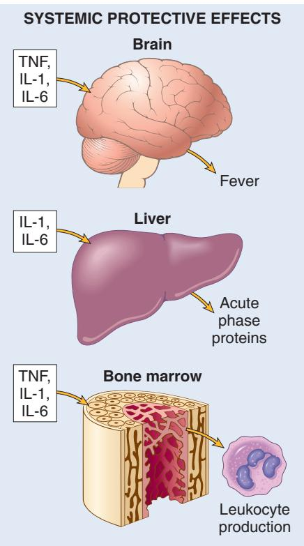
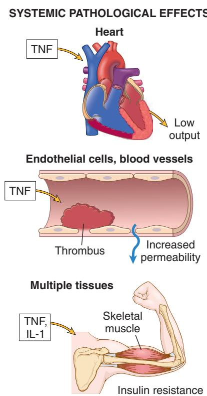
receptors usually exhibit overlapping ligand specificities, and leukocytes generally express multiple receptors. As discussed in Chapter 5, certain chemokine receptors (CXCR4, CCR5) act as coreceptors for a viral envelope glycoprotein of human immunodeficiency virus (HIV), the cause of AIDS, and are thus involved in binding and entry of the virus into cells.
Chemokines bind to proteoglycans and are displayed at high concentrations on the surface of endothelial cells and in the extracellular matrix. They have two main functions:
- Acute inflammation. Most chemokines stimulate leukocyte attachment to endothelium by acting on leukocytes to increase the affinity of integrins, and also serve as chemoattractants, thereby guiding leukocytes to sites of infection or tissue damage. Because they mediate aspects of the inflammatory reaction, they are sometimes called inflammatory chemokines. Their production is induced by microbes and other stimuli. 
- Maintenance of tissue architecture. Some chemokines are produced constitutively by stromal cells in tissues and are sometimes called homeostatic chemokines. These organize various cell types in different anatomic regions of the tissues, such as T and B lymphocytes in discrete areas of the spleen and lymph nodes (Chapter 5).
Although the role of chemokines in inflammation is well established, it has proved difficult to develop chemokine antagonists that suppress inflammation, perhaps because of the functional redundancy of these proteins.
# Other Cytokines in Acute Inflammation
The list of cytokines implicated in inflammation is huge and constantly growing. In addition to the ones described
earlier, two that have received considerable interest are IL-6, made by macrophages and other cells, which is involved in local and systemic reactions, and IL-17, produced mainly by T lymphocytes, which promotes neutrophil recruitment. IL-6 receptor antagonists are used in the treatment of rheumatoid arthritis, and IL-17 antagonists are very effective in psoriasis and other inflammatory diseases. Type I interferons, whose normal function is to inhibit viral replication, contribute to some of the systemic manifestations of inflammation. Cytokines also play key roles in chronic inflammation; these are described later in the chapter.
# Complement System
The complement system is a collection of soluble proteins and their membrane receptors that function mainly in host defense against microbes and in pathologic inflammatory reactions. There are more than 20 complement proteins, some of which are numbered C1 through C9. They function in both innate and adaptive immunity for defense against microbial pathogens. In the process of complement activation, several cleavage products of complement proteins are elaborated that cause increased vascular permeability, chemotaxis, and opsonization. The activation and functions of complement are outlined in Fig. 3.11.
Complement proteins are present in inactive forms in the plasma, and many of them are activated to become proteolytic enzymes that degrade other complement proteins, thus forming an enzymatic cascade capable of tremendous amplification. The critical step in complement activation is the proteolysis of the third (and most
..jpg) 
Fig. 3.11 The activation and functions of the complement system. Activation of complement by different pathways leads to cleavage of C3. The functions of the complement system are mediated by breakdown products of C3 and other complement proteins, and by the membrane attack complex (MAC).
abundant) component, C3. Cleavage of C3 can occur by one of three pathways:
- The classical pathway, which is triggered by fixation of C1 to antibody (IgM or IgG) that has combined with antigen 
- The alternative pathway, which can be triggered by microbial surface molecules (e.g., endotoxin, or LPS), complex polysaccharides, and other substances, in the absence of antibody 
- The lectin pathway, in which plasma mannose-binding lectin binds to carbohydrates on microbes and directly activates C1
All three pathways of complement activation lead to the formation of an enzyme called the C3 convertase, which splits C3 into two functionally distinct fragments, C3a and C3b. C3a is released, and C3b becomes covalently attached to the cell or molecule where the complement is being activated. More C3b then binds to the previously generated fragments to form C5 convertase, which cleaves C5 to release C5a and leave C5b attached to the cell surface. C5b binds the late components (C6-C9), culminating in the formation of the membrane attack complex (MAC, composed of multiple C9 molecules). The enzymatic activity of complement proteins provides such tremendous amplification that millions of molecules of C3b can deposit on the surface of a microbe within 2 or 3 minutes!
The complement system has three main functions (Fig. 3.11):
- Inflammation. $C5a$ , and, to a lesser extent, $C4a$ and $C3a$ , are cleavage products of the corresponding complement components that stimulate histamine release from mast cells and thereby increase vascular permeability and cause vasodilation. They are called anaphylatoxins
because they have effects similar to those of mast cell mediators that are involved in the reaction called anaphylaxis (Chapter 5). C5a also is a chemotactic agent for neutrophils, monocytes, eosinophils, and basophils. In addition, C5a activates the lipoxygenase pathway of arachidonic acid metabolism in neutrophils and monocytes, causing release of more inflammatory mediators.
- Opsonization and phagocytosis. $C3b$ and its cleavage product $iC3b$ (inactive C3b), when fixed to a microbial cell wall, act as opsonins and promote phagocytosis by neutrophils and macrophages, which bear cell surface receptors for these complement fragments. 
- Cell lysis. The deposition of the MAC on cells drills holes in the cell membrane, making the cells permeable to water and ions and resulting in their osmotic death (lysis). This function of complement is important mainly for the killing of microbes with thin cell walls, such as Neisseria bacteria. Hence, deficiency of the terminal components of complement predisposes to infections by the Neisseria species meningococci and gonococci. In patients with complement deficiencies, these microbes can cause serious disseminated infections.
The activation of complement is tightly controlled by cell-associated and circulating regulatory proteins. Different regulatory proteins inhibit the production of active complement fragments or remove fragments that deposit on cells. These regulators are expressed on normal host cells and thus prevent healthy tissues from being injured at sites of complement activation. Regulatory proteins can be overwhelmed when large amounts of complement are deposited on host cells and in tissues, as happens in autoimmune diseases, in which individuals produce complement-fixing antibodies against their own cell and
tissue antigens (Chapter 5). The most important of these regulatory proteins are the following:
- C1 inhibitor blocks the activation of C1, the first protein of the classical complement pathway. Inherited deficiency of this inhibitor is the cause of hereditary angioedema. 
- Decay accelerating factor (DAF) and CD59 are two proteins that are linked to plasma membranes by a glycoprophatidyl (GPI) anchor. DAF prevents formation of C3 convertases and CD59 inhibits formation of the MAC. An acquired deficiency of the enzyme that creates GPI anchors leads to deficiency of these regulators and excessive complement activation and lysis of red cells (which are sensitive to complement-mediated cell lysis). This gives rise to a disease called paroxysmal nocturnal hemoglobinuria (PNH) (Chapter 12). 
- Other complement regulatory proteins proteolytically cleave active complement components. For instance, Factor H is a plasma protein that serves as a cofactor for the proteolysis of the C3 convertase; its deficiency results in excessive complement activation. Mutations in Factor H are associated with a kidney disease called the hemolytic uremic syndrome (Chapter 14), as well as increased permeability of retinal vessels in wet macular degeneration of the eye.
The complement system contributes to disease in several ways. The activation of complement by antibodies or antigen-antibody complexes deposited on host cells and tissues is an important mechanism of cell and tissue injury (Chapter 5). Inherited deficiencies of complement proteins cause increased susceptibility to infections, and, as mentioned earlier, deficiencies of regulatory proteins cause a variety of disorders.
# Other Mediators of Inflammation
# Platelet-Activating Factor
PAF is a phospholipid-derived mediator that was discovered as a factor that caused platelet aggregation, but it is now known to have multiple inflammatory effects. A variety of cell types, including platelets themselves, basophils, mast cells, neutrophils, macrophages, and endothelial cells, can elaborate PAF. In addition to platelet aggregation, PAF causes vasoconstriction and bronchoconstriction, and at low concentrations it induces vasodilation and increased vascular permeability. Despite these documented actions, trials of PAF antagonists in various inflammatory conditions have been disappointing.
# Products of Coagulation
Studies performed more than 50 years ago suggested that inhibiting coagulation reduced the inflammatory reaction to some microbes, leading to the idea that coagulation and inflammation are linked processes. This concept was supported by the discovery of protease-activated receptors (PARs), which are activated by thrombin (the protease that cleaves fibrinogen to produce a fibrin clot). PARs are expressed on leukocytes, suggesting a role in inflammation, but their clearest role is in platelets, in which thrombin activation of a PAR known as the thrombin receptor is a potent trigger of platelet aggregation during the process of clot formation (Chapter 4). In fact, it is difficult to
dissociate clotting and inflammation, because virtually all forms of tissue injury that lead to clotting also induce inflammation, and inflammation causes changes in endothelial cells that increase the likelihood of abnormal clotting (thrombosis, described in Chapter 4). Whether the products of coagulation, per se, have a significant role in stimulating inflammation is still not established.
# Kinins
Kinins are vasoactive peptides derived from plasma proteins, called kininogens, by the action of specific proteases called kallikreins. The enzyme kallikrein cleaves a plasma glycoprotein precursor, high-molecular-weight kininogen, to produce bradykinin. Bradykinin increases vascular permeability and causes contraction of smooth muscle, dilation of blood vessels, and pain when injected into the skin. These effects are similar to those of histamine. The action of bradykinin is short-lived, because it is quickly inactivated by an enzyme called kininase. Bradykinin has been implicated as a mediator in some forms of allergic reaction, such as anaphylaxis.
# Neuropeptides
Neuropeptides are secreted by sensory nerves and various leukocytes, and may play a role in the initiation and regulation of inflammatory responses. These small peptides, including substance P and neurokinin A, are produced in the central and peripheral nervous systems. Nerve fibers containing substance P are prominent in the lung and gastrointestinal tract. Substance P has many biologic functions, including the transmission of pain signals, regulation of blood pressure, stimulation of hormone secretion by endocrine cells, and in increasing vascular permeability.
When Lewis discovered the role of histamine in inflammation, one mediator was thought to be enough. Now, we are wallowing in them! Yet, from this large compendium, it is likely that a few mediators are most important for the reactions of acute inflammation in vivo, and these are summarized in Table 3.8. This list is compiled in part from the
Table 3.8 Role of Mediators in Different Reactions of Inflammation 
Reaction of InflammationPrincipal MediatorsVasodilationHistamine
ProstaglandinsIncreased vascular permeabilityHistamine
C3a and C5a (by liberating vasoactive amines from mast cells, other cells)
Leukotrienes C4, D4, E4Chemotaxis, leukocyte recruitment and activationTNF, IL-1
Chemokines
C3a, C5a
Leukotriene B4FeverIL-1, TNF
ProstaglandinsPainProstaglandins
BradykininTissue damageLysosomal enzymes of leukocytes
Reactive oxygen species
observed anti-inflammatory effects of antagonists to these molecules, thus highlighting the importance of basic biology to the practice of medicine. The redundancy of the mediators and their actions ensures that this protective response remains robust and is not readily subverted.
# ACTIONS OF THE PRINCIPAL MEDIATORS OF INFLAMMATION
- Vasoactive amines, mainly histamine: vasodilation and increased vascular permeability 
- Arachidonic acid metabolites (prostaglandins and leukotrienes): several forms exist and are involved in vascular reactions, leukocyte chemotaxis, and other reactions of inflammation; antagonized by lipoxins 
- Cytokines: proteins produced by many cell types; usually act at short range; mediate multiple effects, mainly in leukocyte recruitment and migration; principal ones in acute inflammation are TNF, IL-1, and chemokines 
- Complement proteins: Activation of the complement system by microbes or antibodies leads to the generation of multiple breakdown products, which are responsible for leukocyte chemotaxis, opsonization and phagocytosis of microbes and other particles, and cell killing 
- Kinins: produced by proteolytic cleavage of precursors; mediate vascular reaction, pain
# MORPHOLOGIC PATTERNS OF ACUTE INFLAMMATION
The morphologic hallmarks of acute inflammatory reactions are dilation of small blood vessels and accumulation of leukocytes and fluid in the extravascular tissue. The vascular and cellular reactions account for the signs and symptoms of the inflammatory response. Increased blood flow to the injured area and increased vascular permeability lead to the accumulation of extravascular fluid rich in plasma proteins (edema) and account for the redness (rubor), warmth (calor), and swelling (tumor) that accompany acute inflammation. Leukocytes that are recruited and activated by the offending agent and by endogenous mediators may release toxic metabolites and proteases extracellularly, causing tissue damage and loss of function (functio laesa). During the damage, and in part as a result of the liberation of prostaglandins, neuropeptides, and cytokines, one of the local symptoms is pain (dolor).
Although these general features are characteristic of most acute inflammatory reactions, special morphologic patterns are often superimposed on them, depending on the severity of the reaction, its specific cause, and the particular tissue and site involved. The importance of recognizing distinct gross and microscopic patterns of inflammation is that they often provide valuable clues about the underlying cause.
# Serous Inflammation
Serous inflammation is marked by the exudation of cell-poor fluid into spaces created by injury to surface epithelia
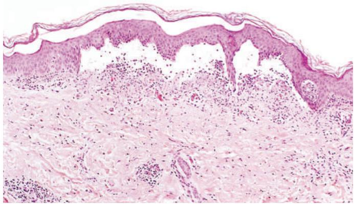 
Fig. 3.12 Serous inflammation. Low-power view of a cross section of a skin blister showing the epidermis separated from the dermis by a focal collection of serous effusion.
or into body cavities lined by the peritoneum, pleura, or pericardium. Typically, the fluid in serous inflammation is not infected by destructive organisms and does not contain large numbers of leukocytes (which tend to produce purulent inflammation, described later). In body cavities the fluid may be derived from the plasma (as a result of increased vascular permeability) or from the secretions of mesothelial cells (as a result of local irritation); accumulation of fluid in these cavities is called an effusion. (Effusions consisting of transudates also occur in noninflammatory conditions, such as reduced blood outflow in heart failure, or reduced plasma protein levels in some kidney and liver diseases.) The skin blister resulting from a burn or viral infection represents accumulation of serous fluid within or immediately beneath the damaged epidermis of the skin (Fig. 3.12).
# Fibrinous Inflammation
A fibrinous exudate develops when the vascular leaks are large or there is a local procoagulant stimulus. With a large increase in vascular permeability, higher-molecular-weight proteins such as fibrinogen pass out of the blood, and fibrin is formed and deposited in the extracellular space. A fibrinous exudate is characteristic of inflammation in the lining of body cavities, such as the meninges, pericardium (Fig. 3.13A), and pleura. Histologically, fibrin appears as an eosinophilic meshwork of threads or sometimes as an amorphous coagulum (Fig. 3.13B). Fibrinous exudates may be dissolved by fibrinolysis and cleared by macrophages. If the fibrin is not removed, with time, it may stimulate the ingrowth of fibroblasts and blood vessels and thus lead to scarring. Conversion of the fibrinous exudate to scar tissue (organization) within the pericardial sac leads to opaque fibrous thickening of the pericardium and epicardium in the area of exudation and, if the fibrosis is extensive, obliteration of the pericardial space.
# Purulent (Suppurative) Inflammation, Abscess
Purulent inflammation is characterized by the production of pus, an exudate consisting of neutrophils, the liquefied debris of necrotic cells, and edema fluid. The most frequent cause of purulent (also called supppurative)
Depositsoffibrinonthepericardium.(B)Apinkmeshworkoffibrinexudate$(F)$overliesthepericardialsurface$(P)$..jpg) 
Fig. 3.13 Fibrinous pericarditis. (A) Deposits of fibrin on the pericardium. (B) A pink meshwork of fibrin exudate $(F)$ overlies the pericardial surface $(P)$ .
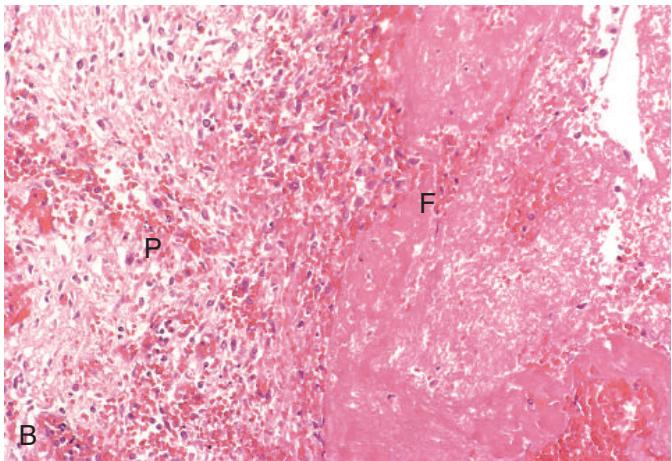
inflammation is infection with bacteria that cause liquefactive tissue necrosis, such as staphylococci; these pathogens are referred to as pyogenic (pus-producing) bacteria. A common example of an acute suppurative inflammation is acute appendicitis. Abscesses are localized collections of pus caused by suppuration buried in a tissue, an organ, or a confined space. They are produced by seeding of pyogenic bacteria into a tissue (Fig. 3.14). Abscesses have a central region that appears as a mass of necrotic leukocytes and tissue cells. There is usually a zone of preserved neutrophils around this necrotic focus, and outside this region there may be vascular dilation and parenchymal and fibroblastic proliferation, indicating chronic inflammation and repair. In time the abscess may become walled off and ultimately replaced by connective tissue. When persistent or at critical locations (such as the brain), abscesses may have to be drained surgically.
# Ulcers
An ulcer is a local defect, or excavation, of the surface of an organ or tissue that is produced by the sloughing
(shedding) of inflamed necrotic tissue (Fig. 3.15). Ulceration can occur only when tissue necrosis and resultant inflammation exist on or near a surface. It is most commonly encountered in (1) the mucosa of the mouth, stomach, intestines, or genitourinary tract, and (2) the skin and subcutaneous tissue of the lower extremities in older persons who have circulatory disturbances that predispose to extensive ischemic necrosis. Acute and chronic inflammation often coexist in ulcers, such as peptic ulcers of the stomach or duodenum and diabetic ulcers of the legs. During the acute stage there is intense polymorphonuclear infiltration and vascular dilation in the margins of the defect. With chronicity, the margins and base of the ulcer develop fibroblast proliferation, scarring, and the accumulation of lymphocytes, macrophages, and plasma cells.
# OUTCOMES OF ACUTE INFLAMMATION
Although, as might be expected, many variables may modify the basic process of inflammation, including the
Multiplebacterialabscesses(arrows)inthelunginacaseofbronchopneumonia.(B)Theabscesscontainsneutrophilsandcellulardebris,andissurroundedbycongestedbloodvessels..jpg) 
Fig. 3.14 Purulent inflammation. (A) Multiple bacterial abscesses (arrows) in the lung in a case of bronchopneumonia. (B) The abscess contains neutrophils and cellular debris, and is surrounded by congested blood vessels.
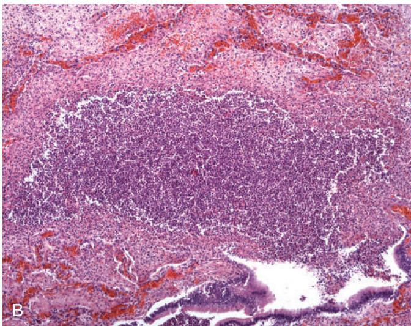
Achronicduodenalulcer.(B)Low-powercross-sectionviewofaduodenalulcercraterwithanacuteinflammatoryexudateinthebase..jpg) 
Fig. 3.15 The morphology of an ulcer. (A) A chronic duodenal ulcer. (B) Low-power cross-section view of a duodenal ulcer crater with an acute inflammatory exudate in the base.
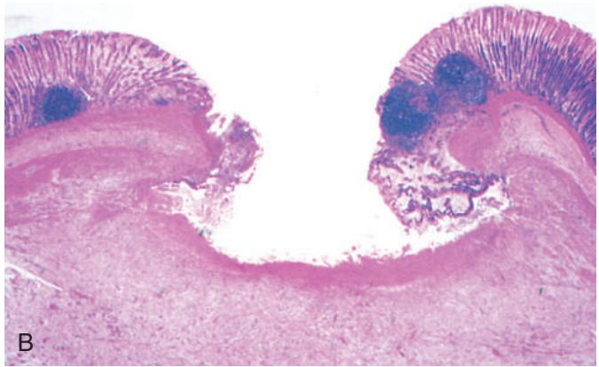
nature and intensity of the injury, the site and tissue affected, and the responsiveness of the host, acute inflammatory reactions typically have one of three outcomes (Fig. 3.16):
- Complete resolution. In a perfect world, all inflammatory reactions, after they have succeeded in eliminating the offending agent, should end with restoration of the site of acute inflammation to normal. This is called resolution and is the usual outcome when the injury is limited or short-lived or when there has been little tissue
destruction and the damaged parenchymal cells can regenerate. Resolution involves removal of cellular debris and microbes by macrophages, and resorption of edema fluid by lymphatics.
- Healing by connective tissue replacement (scarring, or fibrosis). This occurs after substantial tissue destruction, when the inflammatory injury involves tissues that are incapable of regeneration, or when there is abundant fibrin exudation in tissue or in serous cavities (pleura, peritoneum) that cannot be adequately cleared. In all
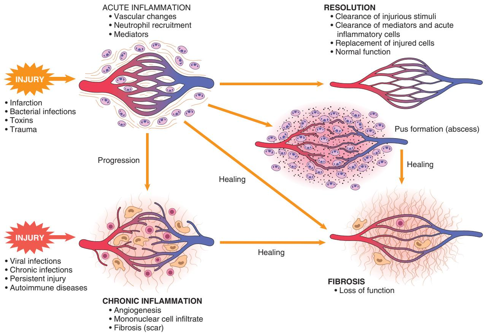 
Fig. 3.16 Outcomes of acute inflammation: resolution, healing by fibrosis, or chronic inflammation. The components of the various reactions and their functional outcomes are listed.
these situations, connective tissue grows into the area of damage or exudate, converting it into a mass of fibrous tissue.
- Progression of the response to chronic inflammation. Acute to chronic transition occurs when the acute inflammatory response cannot be resolved, as a result of either the persistence of the injurious agent or some interference with the normal process of healing.
# CHRONIC INFLAMMATION
Chronic inflammation is a response of prolonged duration (weeks or months) in which inflammation, tissue injury, and attempts at repair coexist, in varying combinations. It may follow acute inflammation, as described earlier, or may begin insidiously, as a smoldering, sometimes progressive, process without any signs of a preceding acute reaction.
# Causes of Chronic Inflammation
Chronic inflammation arises in the following settings:
- Persistent infections by microorganisms that are difficult to eradicate, such as mycobacteria and certain viruses, fungi, and parasites. These organisms often evoke an immune reaction called delayed-type hypersensitivity (Chapter 5). The inflammatory response sometimes takes a specific pattern called granulomatous inflammation (discussed later). In other cases, unresolved acute inflammation evolves into chronic inflammation, such as when an acute bacterial infection of the lung progresses to a chronic lung abscess. 
- Hypersensitivity diseases. Chronic inflammation plays an important role in a group of diseases that are caused by excessive and inappropriate activation of the immune system (Chapter 5). In autoimmune diseases, self (auto) antigens evoke a self-perpetuating immune reaction that results in chronic inflammation and tissue damage; examples of such diseases are rheumatoid arthritis and multiple sclerosis. In allergic diseases, chronic inflammation is the result of excessive immune responses against common environmental substances, as in bronchial asthma. Because these autoimmune and allergic reactions are triggered against antigens that are normally harmless, the reactions serve no useful purpose and only cause disease. Such diseases may show morphologic patterns of mixed acute and chronic inflammation because they are characterized by repeated bouts of inflammation. Fibrosis may dominate the late stages. 
- Prolonged exposure to potentially toxic agents, either exogenous or endogenous. An example of an exogenous agent is particulate silica, a nondegradable inanimate material that, when inhaled for prolonged periods, results in an inflammatory lung disease called silicosis (Chapter 13). Atherosclerosis (Chapter 10) is a chronic inflammatory process affecting the arterial wall that is thought to be induced, at least in part, by excessive production and tissue deposition of endogenous cholesterol and other lipids. 
- Some forms of chronic inflammation may be important in the pathogenesis of diseases that are not convention
ally thought of as inflammatory disorders. These include neurodegenerative diseases such as Alzheimer disease, metabolic syndrome and the associated type 2 diabetes, and certain cancers in which inflammatory reactions promote tumor development. The role of inflammation in these conditions is discussed in the relevant chapters.
# Morphologic Features
In contrast to acute inflammation, which is manifested by vascular changes, edema, and predominantly neutrophilic infiltration, chronic inflammation is characterized by the following:
- Infiltration with mononuclear cells, which include macrophages, lymphocytes, and plasma cells (Fig. 3.17) 
- Tissue destruction, induced by the persistent offending agent or by the inflammatory cells 
- Attempts at healing by connective tissue replacement of damaged tissue, accomplished by angiogenesis (proliferation of small blood vessels) and, in particular, fibrosis
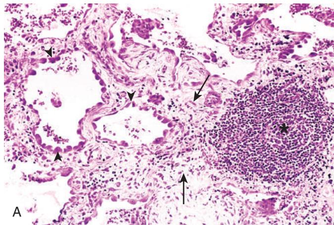
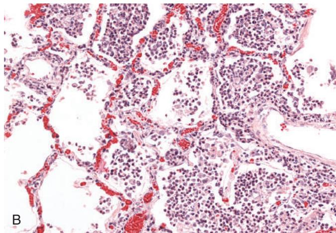 
Fig. 3.17 (A) Chronic inflammation in the lung, showing all three characteristic histologic features: (1) collection of chronic inflammatory cells $(^{*})$ , (2) destruction of parenchyma (normal alveoli are replaced by spaces lined by cuboidal epithelium, arrowheads), and (3) replacement by connective tissue (fibrosis, arrows). (B) In contrast, in acute inflammation of the lung (acute bronchopneumonia), neutrophils fill the alveolar spaces and blood vessels are congested.
Because angiogenesis and fibrosis are also components of wound healing and repair, they are discussed later, in the context of tissue repair.
# Cells and Mediators of Chronic Inflammation
The combination of leukocyte infiltration, tissue damage, and fibrosis that characterize chronic inflammation is the result of the local activation of several cell types and the production of mediators.
# Role of Macrophages
The dominant cells in most chronic inflammatory reactions are macrophages, which contribute to the reaction by secreting cytokines and growth factors that act on various cells, by destroying foreign invaders and tissues, and by activating other cells, notably T lymphocytes. Macrophages are professional phagocytes that act as filters for particulate matter, microbes, and senescent cells. They also function as effector cells that eliminate microbes in cellular and humoral immune responses (Chapter 5). But they serve many other roles in inflammation and repair. Here we review the basic biology of macrophages, including their development and functional responses.
Macrophages are tissue cells derived from hematopoietic stem cells in the bone marrow and from progenitors in the embryonic yolk sac and fetal liver during early development (Fig. 3.18). Circulating cells of this lineage are known as monocytes. Macrophages are normally diffusely scattered in most connective tissues. In addition, they are
found in specific locations in organs such as the liver (where they are called Kupffer cells), spleen and lymph nodes (sinus histiocytes), central nervous system (microglial cells), and lungs (alveolar macrophages). Together these cells comprise the mononuclear phagocyte system, also known by the older (and inaccurate) name of reticuloendothelial system.
In inflammatory reactions, progenitors in the bone marrow give rise to monocytes, which enter the blood, migrate into various tissues, and differentiate into macrophages. Entry of blood monocytes into tissues is governed by the same factors that are involved in neutrophil emigration, such as adhesion molecules and chemokines. The half-life of blood monocytes is about 1 day, whereas the life span of tissue macrophages is several months or years. Thus, macrophages often become the dominant cell population in inflammatory reactions within 48 hours of onset. The macrophages that reside in tissues in the steady state (in the absence of tissue injury or inflammation), such as microglia, Kupffer cells, and alveolar macrophages, arise from the yolk sac or fetal liver very early in embryogenesis, populate the tissues, stay for long periods, and are replenished mainly by the proliferation of resident cells.
There are two major pathways of macrophage activation, called classical and alternative (Fig. 3.19). Which of these two pathways is taken by a given macrophage depends on the nature of the activating signals.
- Classical macrophage activation may be induced by microbial products such as endotoxin, which engage TLRs and other sensors, and by T cell-derived signals,
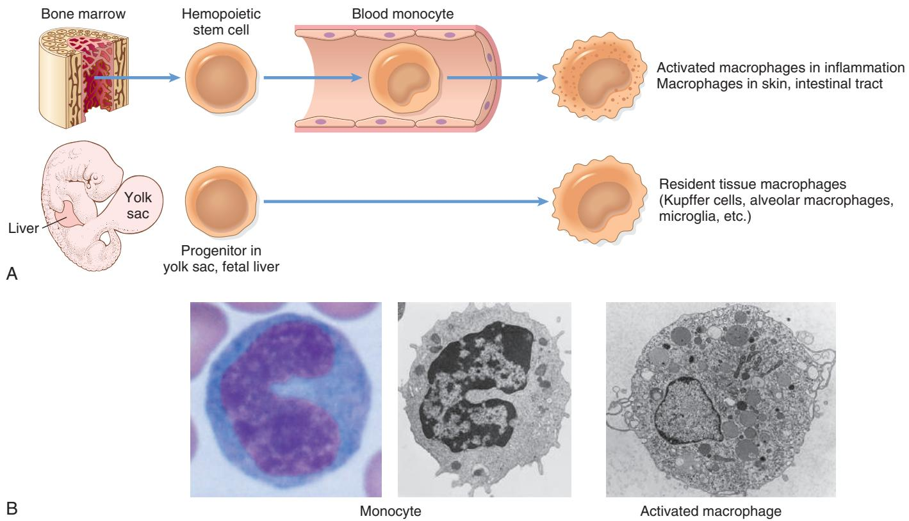 
Fig. 3.18 Maturation of mononuclear phagocytes. (A) During inflammatory reactions, the majority of tissue macrophages are derived from hematopoietic precursors. Some long-lived resident tissue macrophages are derived from embryonic precursors that populate the tissues early in development. (B) The morphology of a monocyte and activated macrophage.
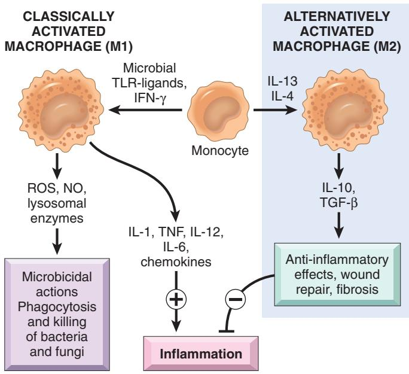 
Fig. 3.19 Classical and alternative macrophage activation. Different stimuli activate monocytes/macrophages to develop into functionally distinct populations. Classically activated macrophages are induced by microbial products and cytokines, particularly IFN- $\gamma$ . They phagocytose and destroy microbes and dead tissues and can potentiate inflammatory reactions. Alternatively activated macrophages are induced by other cytokines and are important in tissue repair and the resolution of inflammation.
importantly the cytokine IFN- $\gamma$ , in immune responses. Classically activated (also called M1) macrophages produce NO and ROS and upregulate lysosomal enzymes, all of which enhance their ability to kill ingested organisms, and secrete cytokines that stimulate inflammation. These macrophages are important in host defense against microbes and in many inflammatory reactions.
- Alternative macrophage activation is induced by cytokines other than IFN- $\gamma$ , such as IL-4 and IL-13, produced by T lymphocytes and other cells. These macrophages are not actively microbicidal; instead, the principal function of alternatively activated (M2) macrophages is in tissue repair. They secrete growth factors that promote angiogenesis, activate fibroblasts, and stimulate collagen synthesis.
It seems plausible that in response to most injurious stimuli, the first activation pathway is the classical one, designed to destroy the offending agents, and this is followed by alternative activation, which initiates tissue repair. However, such a precise sequence is not well documented in most inflammatory reactions. In addition, although the concept of M1 and M2 macrophages provides a useful framework for understanding macrophage heterogeneity, numerous other subpopulations have been described and the M1 and M2 subsets are not fixed.
The products of activated macrophages eliminate injurious agents such as microbes and initiate the process of repair, but are also responsible for much of the tissue injury in chronic inflammation. Several functions of macrophages are central to the development and persistence of chronic inflammation and the accompanying tissue injury.
- Macrophages secrete mediators of inflammation, such as cytokines (TNF, IL-1, chemokines, and others) and eicosanoids. Thus, macrophages are central to the initiation and propagation of inflammatory reactions. 
- Macrophages display antigens to T lymphocytes and respond to signals from T cells, thus setting up a feedback loop that is essential for defense against many microbes by cell-mediated immune responses. These interactions are described further in the discussion of the role of lymphocytes in chronic inflammation, later in this chapter, and in more detail in Chapter 5 where cell-mediated immunity is considered.
Their impressive arsenal of mediators makes macrophages powerful allies in the body's defense against unwanted invaders, but the same weaponry can also induce considerable tissue destruction when macrophages are inappropriately or excessively activated. It is because of these activities of macrophages that tissue destruction is one of the hallmarks of chronic inflammation.
In some instances if the irritant is eliminated, macrophages eventually disappear (either dying off or making their way via lymphatics into lymph nodes). In others, macrophage accumulation persists, as a result of continuous recruitment from the circulation and local proliferation at the site of inflammation.
# Role of Lymphocytes
Microbes and other environmental antigens activate T and B lymphocytes, which amplify and propagate chronic inflammation. Although the major function of these lymphocytes is as the mediators of adaptive immunity, which provides defense against infectious pathogens (Chapter 5), these cells are often present in chronic inflammation and, when they are activated, the inflammation tends to be persistent and severe. Some of the strongest chronic inflammatory reactions, such as granulomatous inflammation, described later, are dependent on lymphocyte responses. Lymphocytes may be the dominant population in the chronic inflammation seen in autoimmune and other hypersensitivity diseases.
By virtue of their ability to secrete cytokines, $\mathrm{CD4 + }$ T lymphocytes promote inflammation and influence the nature of the inflammatory reaction. These T cells greatly amplify the early inflammatory reaction that is induced by recognition of microbes and dead cells as part of the innate immune response. There are three subsets of $\mathrm{CD4 + }$ T cells that secrete different cytokines and elicit different types of inflammation.
- $\mathrm{T_H1}$ cells produce the cytokine IFN- $\gamma$ , which activates macrophages by the classical pathway. 
- $\mathrm{T_H2}$ cells secrete IL-4, IL-5, and IL-13, which recruit and activate eosinophils and are responsible for the alternative pathway of macrophage activation. 
- $\mathrm{T_H17}$ cells secrete IL-17 and other cytokines, which induce the secretion of chemokines responsible for recruiting neutrophils into the reaction.
Both $\mathrm{T_H1}$ and $\mathrm{T_H17}$ cells are involved in defense against many types of bacteria and viruses and in autoimmune diseases. $\mathrm{T_H2}$ cells are important in defense against helminthic parasites and in allergic inflammation. These T cell
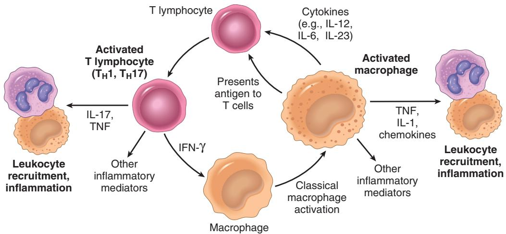 
Fig. 3.20 Macrophage-lymphocyte interactions in chronic inflammation. Activated T cells produce cytokines that recruit macrophages (TNF, IL-17, chemokines) and others that activate macrophages (IFN- $\gamma$ ). Activated macrophages in turn stimulate T cells by presenting antigens and via cytokines such as IL-12.
subsets and their functions are described in more detail in Chapter 5.
Lymphocytes and macrophages interact in a bidirectional way, and these interactions play an important role in propagating chronic inflammation (Fig. 3.20). Macrophages display antigens to T cells, express membrane molecules (called costimulators) that activate T cells, and produce cytokines (IL-12 and others) that also stimulate T cell responses (Chapter 5). Activated T lymphocytes, in turn, produce cytokines, described earlier, which recruit and activate macrophages, promoting more antigen presentation and cytokine secretion. The result is a cycle of cellular reactions that fuel and sustain chronic inflammation.
Activated B lymphocytes and antibody-producing plasma cells are often present at sites of chronic inflammation. The antibodies may be specific for persistent foreign or self antigens in the inflammatory site or against altered tissue components. However, the specificity and even the importance of antibodies in most chronic inflammatory disorders are unclear.
In some chronic inflammatory reactions, the accumulated lymphocytes, antigen-presenting cells, and plasma cells cluster together to form lymphoid structures resembling the follicles found in lymph nodes. These are called tertiary lymphoid organs; this type of lymphoid organogenesis is often seen in the synovium of patients with longstanding rheumatoid arthritis, in the thyroid in Hashimoto thyroiditis, and in the gastric mucosa in the setting of Helicobacter pylori infection. It has been postulated that the local formation of lymphoid organs may perpetuate the immune reaction, but the significance of these structures is not established.
# Other Cells in Chronic Inflammation
Other cell types may be prominent in chronic inflammation induced by particular stimuli.
- Eosinophils are abundant in immune reactions mediated by IgE and in parasitic infections (Fig. 3.21). Their recruitment is driven by adhesion molecules similar to those used by neutrophils, and by specific chemokines (e.g., eotaxin) derived from leukocytes and epithelial
cells. Eosinophils have granules that contain major basic protein, a highly cationic protein that is toxic to parasites but also injures host epithelial cells. This is why eosinophils are of benefit in controlling parasitic infections, yet also contribute to tissue damage in immune reactions such as allergies (Chapter 5).
- Mast cells are widely distributed in connective tissues and participate in both acute and chronic inflammatory reactions. Mast cells arise from precursors in the bone marrow. They have many similarities with circulating basophils, but they do not arise from basophils, are tissue-resident, and therefore play more significant roles in inflammatory reactions in tissues than basophils do. Mast cells (and basophils) express on their surface the receptor FcεRI, which binds the Fc portion of IgE antibody. In immediate hypersensitivity reactions, IgE bound to the mast cells' Fc receptors specifically recognizes antigen, and in response the cells degranulate and release mediators, such as histamine and prostaglandins (Chapter 5). This type of response occurs during allergic reactions to foods, insect venom, or drugs, sometimes with catastrophic results (e.g., anaphylactic shock). Mast cells also are present in chronic inflammatory reactions, and because they secrete a
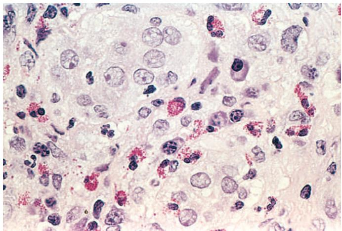 
Fig. 3.21 A focus of inflammation containing numerous eosinophils.
plethora of cytokines, they can promote inflammatory reactions.
- Although neutrophils are characteristic of acute inflammation, many forms of chronic inflammation, lasting for months, continue to show large numbers of neutrophils, induced either by persistent microbes or by cytokines and other mediators produced by activated macrophages and T lymphocytes. In chronic bacterial infection of bone (osteomyelitis), a neutrophilic exudate can persist for many months. Neutrophils also are important in the chronic damage induced in lungs by smoking and other irritant stimuli (Chapter 13). This pattern of inflammation has been called acute on chronic.
# Granulomatous Inflammation
Granulomatous inflammation is a form of chronic inflammation characterized by collections of activated macrophages, often with T lymphocytes, and sometimes associated with central necrosis. The activated macrophages may develop abundant cytoplasm and begin to resemble epithelial cells, and are called epithelioid cells. Some activated macrophages may fuse, forming multinucleate giant cells. Granuloma formation is a cellular attempt to contain an offending agent that is difficult to eradicate. In this attempt there is often strong activation of T lymphocytes leading to macrophage activation, which can cause injury to normal tissues.
There are two types of granulomas, which differ in their pathogenesis.
- Immune granulomas are caused by a variety of agents that are capable of inducing a persistent T cell-mediated immune response. This type of immune response produces granulomas usually when the inciting agent cannot be readily eliminated, such as a persistent microbe or a self antigen. In such responses, macrophages activate T cells to produce cytokines, such as IL-2, which activates other T cells, perpetuating the response, and IFN- $\gamma$ , which activates the macrophages. 
- Foreign body granulomas are seen in response to relatively inert foreign bodies, in the absence of T cell-mediated immune responses. Typically, foreign body granulomas form around materials such as talc (associated with intravenous drug abuse), sutures, or other fibers that are large enough to preclude phagocytosis by a macrophage but are not immunogenic. Epithelioid cells and giant cells are apposed to the surface of the foreign body. The foreign material can usually be identified in the center of the granuloma, particularly if viewed with polarized light, in which it may appear refractile.
In the usual H&E stained tissue samples (Fig. 3.22), the activated macrophages in granulomas have pink granular cytoplasm with indistinct cell boundaries and are called epithelioid cells. A collar of lymphocytes surrounds the aggregates of epithelioid macrophages. Older granulomas may have a rim of fibroblasts and connective tissue. Frequently, but not invariably, multinucleated giant cells 40 to $50~\mu \mathrm{m}$ in diameter are found in
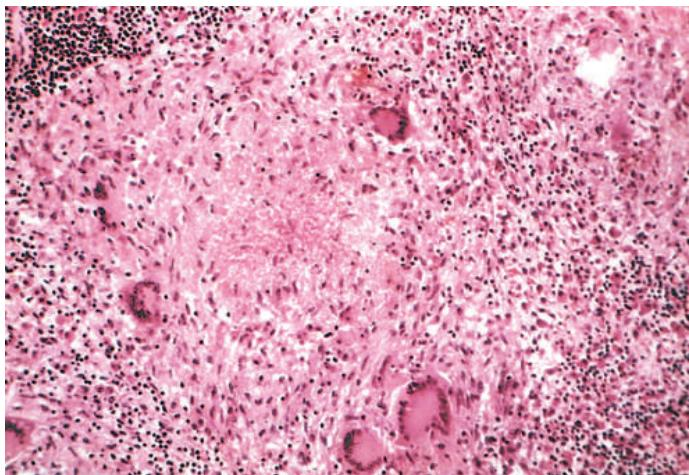 
Fig. 3.22 Typical tuberculous granuloma showing an area of central necrosis surrounded by multiple multinucleate giant cells, epithelioid cells, and lymphocytes.
granulomas; these are called Langhans giant cells. They consist of a large mass of cytoplasm and many nuclei. Granulomas associated with certain infectious organisms (classically Mycobacterium tuberculosis) often contain a central zone of necrosis. Grossly, this has a granular, cheesy appearance and is therefore called caseous necrosis. Microscopically, this necrotic material appears as amorphous, structureless, eosinophilic, granular debris, with loss of cellular details. The granulomas in Crohn disease, sarcoidosis, and foreign body reactions tend to not have necrotic centers and are said to be noncaseating. Healing of granulomas is accompanied by fibrosis that may be extensive.
Granulomas are encountered in certain specific pathologic states; recognition of the granulomatous pattern is important because of the limited number of conditions (some life threatening) that cause it (Table 3.9). In the setting of persistent T cell responses to certain microbes (e.g., M. tuberculosis, Treponema pallidum, or fungi), T cell-derived cytokines are responsible for chronic macrophage activation and granuloma formation. Granulomas may also develop in some immune-mediated inflammatory diseases, notably Crohn disease, which is one type of inflammatory bowel disease and an important cause of granulomatous inflammation in the United States, and in a disease of unknown etiology called sarcoidosis. Tuberculosis is the prototype of a granulomatous disease caused by infection and should always be excluded as the cause when granulomas are identified. In this disease the granuloma is referred to as a tubercle. The morphologic patterns in the various granulomatous diseases may be sufficiently different to allow a reasonably accurate diagnosis (Table 3.9), but it is always necessary to identify the specific etiologic agent by special stains for organisms (e.g., acid-fast stains for tubercle bacilli), by culture methods (e.g., in tuberculosis and fungal diseases), by molecular techniques (e.g., the polymerase chain reaction in tuberculosis), and by serologic studies (e.g., in syphilis).
Table 3.9 Examples of Diseases With Granulomatous Inflammation 
DiseaseCauseTissue ReactionTuberculosisMycobacterium tuberculosisCaseating granuloma (tubercle): focus of activated macrophages (epithelioid cells), rimmed by fibroblasts, lymphocytes, histiocytes, occasional Langhans giant cells; central necrosis with amorphous granular debris; acid-fast bacilliLeprosyMycobacterium lepraeAcid-fast bacilli in macrophages; noncaseating granulomasSyphilisTreponema pallidumGumma: microscopic to grossly visible lesion, enclosing wall of macrophages; plasma cell infiltrate; central cells are necrotic without loss of cellular outline; organisms difficult to identify in tissueCat-scratch diseaseGram-negative bacillusRounded or stellate granuloma containing central granular debris and recognizable neutrophils; giant cells uncommonSarcoidosisUnknown etiologyNoncaseating granulomas with abundant activated macrophagesCrohn disease (inflammatory bowel disease)Immune reaction against undefined gut microbes and, possibly, self antigensOccasional noncaseating granulomas in the wall of the intestine, with dense chronic inflammatory infiltrate
# CHRONIC INFLAMMATION
- Chronic inflammation is a prolonged host response to persistent stimuli that may follow unresolved acute inflammation or be chronic from the outset. 
- It is caused by microbes that resist elimination, immune responses against self and environmental antigens, and some toxic substances (e.g., silica); underlies many medically important diseases. 
- It is characterized by coexisting inflammation, tissue injury, attempted repair by scarring, and immune response. 
- The cellular infiltrate consists of macrophages, lymphocytes, plasma cells, and other leukocytes. 
- It is mediated by cytokines produced by macrophages and lymphocytes (notably T lymphocytes); bidirectional interactions between these cells tend to amplify and prolong the inflammatory reaction. 
- Granulomatous inflammation is a morphologically specific pattern of chronic inflammation induced by T cell and macrophage activation in response to an agent that is resistant to eradication.
# SYSTEMIC EFFECTS OF INFLAMMATION
Inflammation, even if it is localized, is associated with cytokine-induced systemic reactions that are collectively called the acute-phase response. Anyone who has suffered through a severe bout of a bacterial or viral illness (e.g., pneumonia or influenza) has experienced the systemic manifestations of acute inflammation. These changes are reactions to cytokines whose production is stimulated by bacterial products such as LPS, viral double stranded RNA and by other inflammatory stimuli. The cytokines TNF, IL-1, and IL-6 are important mediators of the acute-phase reaction; other cytokines, notably type I interferons, also contribute to the reaction.
The acute-phase response consists of several clinical and pathologic changes:
- Fever, characterized by an elevation of body temperature, usually by $1^{\circ}$ to $4^{\circ}\mathrm{C}$ , is one of the most prominent manifestations of the acute-phase response, especially when inflammation is associated with infection. Substances that induce fever are called pyrogens. The increase in body temperature is caused by prostaglandins that are produced in the vascular and perivascular cells of the hypothalamus. Bacterial products, such as LPS (called exogenous pyrogens), stimulate leukocytes to release cytokines such as IL-1 and TNF (called endogenous pyrogens) that increase the enzymes (cyclooxygenases) that convert arachadonic acid into prostaglandins. In the hypothalamus, the prostaglandins, especially $\mathrm{PGE}_2$ , stimulate the production of neurotransmitters that reset the temperature set point at a higher level. NSAIDs, including aspirin, reduce fever by inhibiting prostaglandin synthesis. How, and even if, fever contributes to the protective host response remains unclear. 
- Acute-phase proteins are plasma proteins, mostly synthesized in the liver, whose plasma concentrations may increase several hundred-fold as part of the response to inflammatory stimuli. Three of the best-known of these proteins are C-reactive protein (CRP), fibrinogen, and serum amyloid A (SAA) protein. Synthesis of these molecules in hepatocytes is stimulated by cytokines. Many acute-phase proteins, such as CRP and SAA, bind to microbial cell walls, and they may act as opsonins and fix complement. Fibrinogen binds to red cells and causes them to form stacks (rouleaux) that sediment more rapidly at unit gravity than do individual red cells. This is the basis for measuring the erythrocyte sedimentation rate as a simple test for an inflammatory response caused by any stimulus. Acute-phase proteins have beneficial effects during acute inflammation, but prolonged production of these proteins (especially SAA) in states of chronic inflammation can, in some cases, cause secondary amyloidosis (Chapter 5). Elevated serum levels of CRP serve as a marker for increased risk of myocardial infarction in patients with coronary artery disease. It is postulated that inflammation involving atherosclerotic plaques in the coronary arteries predisposes to
thrombosis and subsequent infarction. Another peptide whose production is increased in the acute-phase response is the iron-regulating peptide hepcidin. Chronically elevated plasma concentrations of hepcidin reduce the availability of iron and are responsible for the anemia associated with chronic inflammation (Chapter 12).
- Leukocytosis is a common feature of inflammatory reactions, especially those induced by bacterial infections. The leukocyte count usually climbs to 15,000 or 20,000 cells/mL, but sometimes it may reach extraordinarily high levels of 40,000 to 100,000 cells/mL. These extreme elevations are referred to as leukemoid reactions, because they are similar to (and must be distinguished from) the white cell counts observed in leukemia. The leukocytosis occurs initially because of accelerated release of cells from the bone marrow postmitotic reserve pool (caused by cytokines, including TNF and IL-1) and is therefore associated with a rise in the number of more immature neutrophils in the blood, referred to as a shift to the left. Prolonged infection also induces proliferation of precursors in the bone marrow, caused by increased production of colony-stimulating factors (CSFs). Thus, if inflammation is sustained the bone marrow output of leukocytes increases, an effect that usually more than compensates for the loss of these cells in the inflammatory reaction. (See also the discussion of leukocytosis in Chapter 12.) Most bacterial infections induce an increase in the blood neutrophil count, called neutrophilia. Viral infections, such as infectious mononucleosis, mumps, and German measles, cause an absolute increase in the number of lymphocytes (lymphocytosis). In some allergies and parasitic infestations, there is an increase in the number of blood eosinophils, creating an eosinophilia. Certain infections (typhoid fever and infections caused by some viruses, rickettsiae, and certain protozoa) are associated with a decreased number of circulating white cells (leukopenia). 
- Other manifestations of the acute-phase response include increased heart rate and blood pressure; decreased sweating, mainly because of redirection of blood flow from cutaneous to deep vascular beds, to minimize heat loss through the skin; rigors (shivering), chills (search for warmth), anorexia, somnolence, and malaise, probably because of the actions of cytokines on brain cells.
In severe bacterial infections (sepsis), the large amounts of bacteria and their products in the blood stimulate the production of enormous quantities of several cytokines, notably TNF and IL-1. High blood levels of cytokines cause widespread clinical and pathologic abnormalities such as disseminated intravascular coagulation, hypotensive shock, and metabolic disturbances including insulin resistance and hyperglycemia. This clinical triad is known as septic shock; it is discussed in more detail in Chapter 4. A syndrome similar to septic shock may occur as a complication of noninfectious disorders, such as severe burns, trauma, pancreatitis, and other serious conditions. Collectively these reactions are called systemic inflammatory response syndrome (SIRS).
We next consider the process of repair, which is a healing response to tissue destruction resulting from inflammation or other causes.
# SYSTEMIC EFFECTS OF INFLAMMATION
- Fever: Cytokines (TNF, IL-1) stimulate production of PGs in hypothalamus 
- Production of acute-phase proteins: C-reactive protein, others; synthesis stimulated by cytokines (IL-6, others) acting on liver cells 
- Leukocytosis: Cytokines (CSFs) stimulate production of leukocytes from precursors in the bone marrow 
- In some severe infections, septic shock: Fall in blood pressure, disseminated intravascular coagulation, metabolic abnormalities; induced by high levels of TNF and other cytokines
# TISSUE REPAIR
# Overview of Tissue Repair
Critical to the survival of an organism is the ability to repair the damage caused by toxic insults and inflammation. In fact, the inflammatory response to microbes and injured tissues not only serves to eliminate these dangers but also sets into motion the process of repair.
Repair of damaged tissues occurs by two types of reactions: regeneration by proliferation of residual (uninjured) cells and maturation of tissue stem cells, and the deposition of connective tissue to form a scar (Fig. 3.23).
- Regeneration. Some tissues are able to replace the damaged components and essentially return to a normal
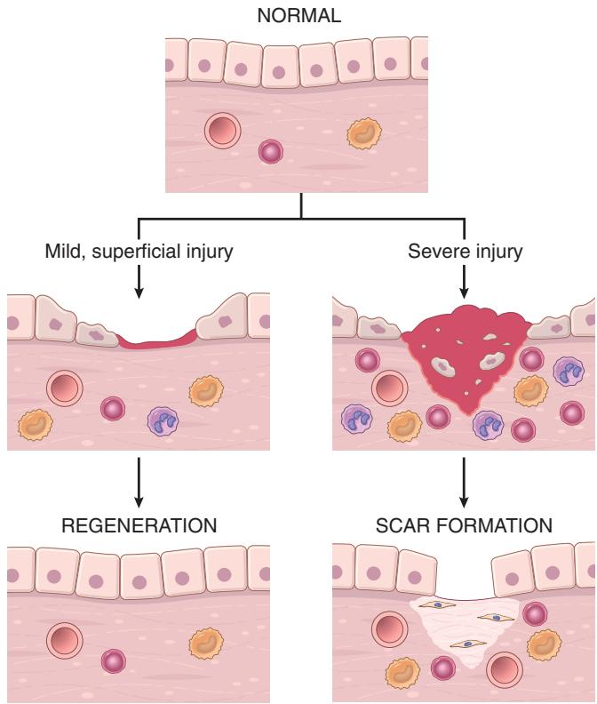 
Fig. 3.23 Mechanisms of tissue repair: regeneration and scar formation. Following mild injury, which damages the epithelium but not the underlying tissue, resolution occurs by regeneration, but after more severe injury with damage to the connective tissue, repair is by scar formation.
state; this process is called regeneration. Regeneration occurs by proliferation of cells that survive the injury and retain the capacity to proliferate, for example, in the rapidly dividing epithelia of the skin and intestines, and in some parenchymal organs, notably the liver. In other cases, tissue stem cells may contribute to the restoration of damaged tissues. However, whereas lower animals such as salamanders and fish can regenerate entire limbs or appendages, mammals have a limited capacity to regenerate damaged tissues and organs, and only some components of most tissues are able to fully restore themselves.
- Connective tissue deposition (scar formation). If the injured tissues are incapable of complete restitution, or if the supporting structures of the tissue are severely damaged, repair occurs by the laying down of connective (fibrous) tissue, a process that may result in formation of a scar. Although the fibrous scar is not normal, it provides enough structural stability that the injured tissue is usually able to function. The term fibrosis is most often used to describe the extensive deposition of collagen that occurs in the lungs, liver, kidney, and other organs as a consequence of chronic inflammation, or in the myocardium after extensive ischemic necrosis (infarction). If fibrosis develops in a tissue space occupied by an inflammatory exudate, it is called organization (as in organizing pneumonia affecting the lung).
After many common types of injury, both regeneration and scar formation contribute in varying degrees to the ultimate repair. Both processes involve the proliferation of various cells, and close interactions between cells and the extracellular matrix (ECM). We first discuss the general mechanisms of cellular proliferation and regeneration, and then the salient features of regeneration and healing by scar formation, and conclude with a description of cutaneous wound healing and fibrosis (scarring) in parenchymal organs as illustrations of the repair process.
# Cell and Tissue Regeneration
The regeneration of injured cells and tissues involves cell proliferation, which is driven by growth factors and is critically dependent on the integrity of the extracellular matrix, and by the development of mature cells from stem cells. Before describing examples of repair by regeneration, we discuss the control of cell proliferation in this process. The general principles of cell proliferation were summarized in Chapter 1.
# Cell Proliferation: Signals and Control Mechanisms
Several cell types proliferate during tissue repair. These include the remnants of the injured tissue (which attempt to restore normal structure), vascular endothelial cells (to create new vessels that provide the nutrients needed for the repair process), and fibroblasts (the source of the fibrous tissue that forms the scar to fill defects that cannot be corrected by regeneration).
The ability of tissues to repair themselves is determined, in part, by their intrinsic proliferative capacity. In some tissues (sometimes called labile tissues), cells are constantly being lost and must be continually replaced by new cells
that are derived from tissue stem cells and rapidly proliferating immature progenitors. These types of tissues include hematopoietic cells in the bone marrow and many surface epithelia, such as the basal layers of the squamous epithelia of the skin, oral cavity, vagina, and cervix; the cuboidal epithelia of the ducts draining exocrine organs (e.g., salivary glands, pancreas, biliary tract); the columnar epithelium of the gastrointestinal tract, uterus, and fallopian tubes; and the transitional epithelium of the urinary tract. These tissues can readily regenerate after injury as long as the pool of stem cells is preserved.
Other tissues (called stable tissues) are made up of cells that are normally in the $\mathrm{G}_0$ stage of the cell cycle and hence not proliferating, but they are capable of dividing in response to injury or loss of tissue mass. These tissues include the parenchyma of most solid organs, such as liver, kidney, and pancreas. Endothelial cells, fibroblasts, and smooth muscle cells are also normally quiescent but can proliferate in response to growth factors, a reaction that is particularly important in wound healing.
Some tissues (called permanent tissues) consist of terminally differentiated nonproliferative cells, such as the majority of neurons and cardiac muscle cells. Injury to these tissues is irreversible and results in a scar, because the cells cannot regenerate. Skeletal muscle cells are usually considered nondividing, but satellite cells attached to the endomysial sheath provide some regenerative capacity for muscle.
Cell proliferation is driven by signals provided by growth factors and from the extracellular matrix. Many different growth factors have been described, some of which act on multiple cell types, while others are cell-type specific (Chapter 1). Growth factors are typically produced by cells near the site of damage. The most important sources of these growth factors are macrophages that are activated by the tissue injury, but epithelial and stromal cells also produce some of these factors. Several growth factors bind to ECM proteins and are displayed at the site of tissue injury at high concentrations. All growth factors activate signaling pathways that ultimately induce changes in gene expression that drive cells through the cell cycle and support the biosynthesis of molecules and organelles that are needed for cell division (Chapter 1). In addition to responding to growth factors, cells use integrins to bind to ECM proteins, and signals from the integrins can also stimulate cell proliferation.
In the process of regeneration, proliferation of residual cells is supplemented by development of mature cells from stem cells. In Chapter 1 we introduced the major types of stem cells. In adults, the most important stem cells for regeneration after injury are tissue stem cells. These stem cells live in specialized niches, and it is believed that injury triggers signals in these niches that activate quiescent stem cells to proliferate and differentiate into mature cells that repopulate the injured tissue.
# Mechanisms of Tissue Regeneration
The importance of regeneration in the replacement of injured tissues varies in different types of tissues and with the severity of injury.
- In epithelia of the intestinal tract and skin, injured cells are rapidly replaced by proliferation of residual cells
and differentiation of cells derived from tissue stem cells, providing the underlying basement membrane is intact. The residual epithelial cells produce the growth factors involved in these processes. The newly generated cells migrate to fill the defect created by the injury, and tissue integrity is restored (Fig. 3.23).
- Tissue regeneration can occur in parenchymal organs whose cells are capable of proliferation, but with the exception of the liver, this is usually a limited process. Pancreas, adrenal, thyroid, and lung have some regenerative capacity. The surgical removal of a kidney elicits in the remaining kidney a compensatory response that consists of both hypertrophy and hyperplasia of proximal duct cells. The mechanisms underlying this response are not understood, but they likely involve local production of growth factors and interactions of cells with the ECM. The extraordinary capacity of the liver to regenerate has made it a valuable model for studying this process, as described below.
Restoration of normal tissue architecture can occur only if the residual tissue is structurally intact, for example after partial surgical resection of the liver. By contrast, if the entire tissue is damaged by infection or inflammation, regeneration is incomplete and is accompanied by scarring. For example, extensive destruction of the liver with collapse of the reticulin framework, as occurs in a liver abscess, leads to scar formation even though the remaining liver cells have the capacity to regenerate.
# Liver Regeneration
The human liver has a remarkable capacity to regenerate, as demonstrated by its growth after partial hepatectomy, which may be performed for tumor resection or for living-donor hepatic transplantation. The mythologic image of liver regeneration is the regrowth of the liver of Prometheus, which was eaten every day by an eagle sent by Zeus as punishment for stealing the secret of fire, and rewreg every night. The reality, although less dramatic, is still quite impressive.
Regeneration of the liver occurs by two major mechanisms: proliferation of remaining hepatocytes and repopulation from progenitor cells. Which mechanism plays the dominant role depends on the nature of the injury.
- Proliferation of hepatocytes following partial hepatectomy. In humans, resection of up to $90\%$ of the liver can be corrected by proliferation of the residual hepatocytes. This process is driven by cytokines such as IL-6 produced by Kupffer cells, and by growth factors such as hepatocyte growth factor (HGF) produced by many cell types. 
- Liver regeneration from progenitor cells. In situations in which the proliferative capacity of hepatocytes is impaired, such as after chronic liver injury or inflammation, progenitor cells in the liver contribute to repopulation. In rodents, these progenitor cells have been called oval cells because of the shape of their nuclei. Some of these progenitor cells reside in specialized niches called canals of Hering, where bile canaliculi connect with larger bile ducts. The signals that drive proliferation of progenitor cells and their differentiation into mature hepatocytes are topics of active investigation.
# REPAIR BY REGENERATION
- Different tissues consist of continuously dividing cells (epithelia, hematopoietic tissues), normally quiescent cells that are capable of proliferation (most parenchymal organs), and nondividing cells (neurons, skeletal and cardiac muscle). The regenerative capacity of a tissue depends on the proliferative potential of its constituent cells. 
- Cell proliferation is controlled by the cell cycle, and is stimulated by growth factors and interactions of cells with the extracellular matrix. 
- Regeneration of the liver is a classic example of repair by regeneration. It is triggered by cytokines and growth factors produced in response to loss of liver mass and inflammation. In different situations, regeneration may occur by proliferation of surviving hepatocytes or repopulation from progenitor cells.
# Repair by Scarring
If repair cannot be accomplished by regeneration alone, it occurs by replacement of the injured cells with connective tissue, leading to the formation of a scar, or by a combination of regeneration of some residual cells and scar formation. As discussed earlier, scarring may happen if the tissue injury is severe or chronic and results in damage to parenchymal cells and epithelia as well as to the connective tissue framework, or if nondividing cells are injured. In contrast to regeneration, which involves the restitution of tissue components, scar formation is a response that "patches" rather than restores the tissue. The term scar is most often used in connection to wound healing in the skin, but also may be used to describe the replacement of parenchymal cells in any tissue by collagen, as in the heart after myocardial infarction.
# Steps in Scar Formation
Repair by connective tissue deposition consists of a series of sequential steps that follow tissue injury (Fig. 3.24).
- Within minutes after injury, a hemostatic plug comprised of platelets (Chapter 4) is formed, which stops bleeding and provides a scaffold for infiltrating inflammatory cells. 
- Inflammation. This step is comprised of the typical acute and chronic inflammatory responses. Breakdown products of complement activation, chemokines released from activated platelets, and other mediators produced at the site of injury function as chemotactic agents to recruit neutrophils and then monocytes during the next 6 to 48 hours. As described earlier, these inflammatory cells eliminate the offending agents, such as microbes that may have entered through the wound, and clear the debris. Macrophages are the central cellular players in the repair process—M1 macrophages clear microbes and necrotic tissue and promote inflammation in a positive feedback loop, and M2 macrophages produce growth factors that stimulate the proliferation of many cell types in the next stage of repair. As the injurious agents and necrotic cells are cleared, the
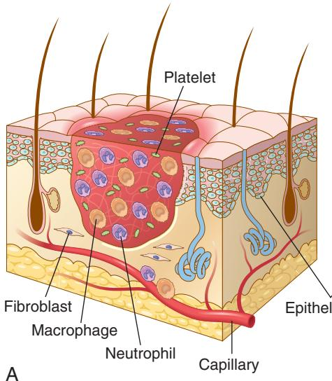 
Fig. 3.24 Steps in repair by scar formation: healing of a large wound in the skin. This is an example of healing by second intention. (A) Hemostatic plug and inflammation. (B) Proliferation of epithelial cells; formation of granulation tissue by vessel growth and proliferating fibroblasts. (C) Remodeling to produce the fibrous scar.
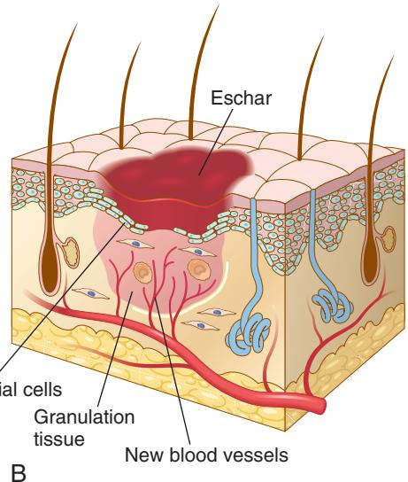
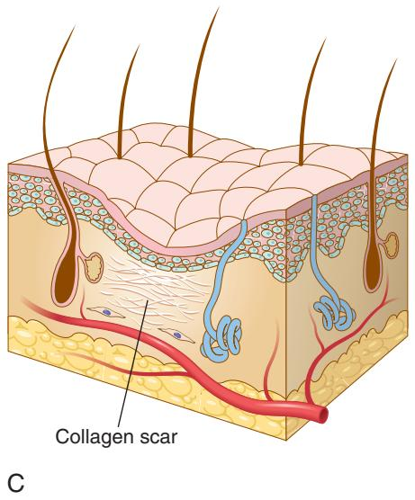
inflammation resolves; how this inflammatory flame is extinguished in most situations of injury is still not well defined.
- Cell proliferation. In the next stage, which takes up to 10 days, several cell types, including epithelial cells, endothelial and other vascular cells, and fibroblasts, proliferate and migrate to close the now-clean wound. Each cell type serves unique functions.
- Epithelial cells respond to locally produced growth factors and migrate over the wound to cover it. 
- Endothelial and other vascular cells proliferate to form new blood vessels, a process known as angiogenesis. Because of the importance of this process in physiologic host responses and in many pathologic conditions, it is described in more detail later. 
- Fibroblasts proliferate and migrate into the site of injury and lay down collagen fibers that form the scar. 
- The combination of proliferating fibroblasts, loose connective tissue, new blood vessels and scattered chronic inflammatory cells, forms a type of tissue that is unique to healing wounds and is called granulation tissue. This term derives from its pink, soft, granular gross appearance, such as that seen beneath the scab of a skin wound.
- Remodeling. The connective tissue that has been deposited by fibroblasts is reorganized to produce the stable fibrous scar. This process begins 2 to 3 weeks after injury and may continue for months or years.
Healing of skin wounds can be classified into healing by first intention (primary union), referring to epithelial regeneration with minimal scarring, as in well-apposed surgical incisions, and healing by second intention (secondary union), referring to larger wounds that heal by a combination of regeneration and scarring. Because the fundamental processes involved in both types of wound healing represent a continuum from regeneration to scarring, we do not
make this distinction in our discussion of the key events in tissue repair.
# Angiogenesis
Angiogenesis is the process of new blood vessel development from existing vessels. It is critical in healing at sites of injury, in the development of collateral circulations at sites of ischemia, and in allowing tumors to increase in size beyond the constraints of their original blood supply. Much work has been done to understand the mechanisms of angiogenesis, and therapies have been developed either to augment the process (e.g., to improve blood flow to a heart ravaged by coronary atherosclerosis) or to inhibit it (to frustrate tumor growth or block pathologic vessel growth, as in wet macular degeneration of the eye).
Angiogenesis involves sprouting of new vessels from existing ones, and consists of the following steps (Fig. 3.25):
- Vasodilation in response to NO and increased permeability induced by VEGF 
- Separation of pericytes from the abluminal surface and breakdown of the basement membrane to allow formation of a vessel sprout 
- Migration of endothelial cells toward the area of tissue injury 
- Proliferation of endothelial cells just behind the leading front ("tip") of migrating cells 
- Remodeling into capillary tubes 
Recruitment of periendothelial cells (pericytes for small capillaries and smooth muscle cells for larger vessels) to form the mature vessel 
- Suppression of endothelial proliferation and migration and deposition of the basement membrane
It has been suggested that endothelial progenitor cells are present in the bone marrow and can be recruited to promote new vessel formation. However, these cells likely play a minor, if any, role in the angiogenesis associated with the healing of most wounds.
toformthenewvascularbed..jpg) 
Fig. 3.25 Angiogenesis. In tissue repair, angiogenesis occurs mainly by the sprouting of new vessels. The steps in the process, and the major signals involved, are illustrated. The newly formed vessel joins up with other vessels (not shown) to form the new vascular bed.
The process of angiogenesis involves several signaling pathways, cell-cell interactions, ECM proteins, and tissue enzymes.
- Growth factors. VEGFs, mainly VEGF-A (Chapter 1), stimulates both migration and proliferation of endothelial cells, thus initiating the process of capillary sprouting in angiogenesis. It promotes vasodilation by stimulating the production of NO and contributes to the formation of the vascular lumen. Fibroblast growth factors (FGFs), mainly FGF-2, stimulate the proliferation of endothelial cells. They also promote the migration of macrophages and fibroblasts to the damaged area, and stimulate epithelial cell migration to cover epidermal wounds. Newly formed vessels need to be stabilized by the recruitment of pericytes and smooth muscle cells and by the deposition of connective tissue. Multiple growth factors, including PDGF and TGF- $\beta$ , likely participate in the stabilization process: PDGF recruits smooth muscle cells and TGF- $\beta$ suppresses endothelial proliferation and migration, and enhances the production of ECM proteins.
- Notch signaling. Through "cross talk" with VEGF, the Notch signaling pathway regulates the sprouting and branching of new vessels and thus ensures that the new vessels that are formed have the proper spacing to effectively supply the healing tissue with blood. 
- ECM proteins participate in the process of vessel sprouting in angiogenesis, largely through interactions with integrin receptors of endothelial cells and by providing the scaffold for vessel growth. 
- Enzymes in the ECM, notably the matrix metalloproteinases (MMPs), degrade the ECM to permit remodeling and extension of the vascular tube.
Newly formed vessels are leaky because of incomplete interendothelial junctions and because VEGF, the growth factor that drives angiogenesis, increases vascular permeability. This leakiness accounts in part for the edema that may persist in healing wounds long after the acute inflammatory response has resolved.
# Activation of Fibroblasts and Deposition of Connective Tissue
The laying down of connective tissue occurs in two steps: (1) migration and proliferation of fibroblasts into the site of injury and (2) deposition of ECM proteins produced by these cells. These processes are orchestrated by locally produced cytokines and growth factors, including PDGF, FGF-2, and TGF- $\beta$ . The major sources of these factors are inflammatory cells, particularly alternatively activated (M2) macrophages that infiltrate sites of injury.
In response to cytokines and growth factors, fibroblasts enter the wound from the edges and migrate toward the center. Some of these cells may differentiate into cells called myofibroblasts, which contain smooth muscle actin and have increased contractile activity, and serve to close the wound by pulling its margins toward the center. Activated fibroblasts and myofibroblasts also increase their synthetic activity and produce connective tissue proteins, mainly collagen, which is the major component of the fully developed scar.
TGF- $\beta$ is the most important cytokine for the synthesis and deposition of connective tissue proteins. It is produced by most of the cells in granulation tissue, including alternatively activated macrophages. The levels of TGF- $\beta$ in tissues are primarily regulated not by the transcription of the gene but by the post-transcriptional activation of latent TGF- $\beta$ , the rate of secretion of the active molecule, and factors in the ECM, notably integrins, that enhance or diminish TGF- $\beta$ activity. In addition, microfibrils made up of fibrillin also regulate the bioavailability of TGF- $\beta$ (Chapter 6). TGF- $\beta$ stimulates fibroblast migration and proliferation, increases the synthesis of collagen and fibronectin, and decreases the degradation of ECM by inhibiting metalloproteinases. TGF- $\beta$ is involved not only in scar formation after injury but also in the development of fibrosis in lung, liver, and kidneys that follows chronic inflammation. TGF- $\beta$ also has anti-inflammatory effects that serve to limit and terminate inflammatory responses. It does this by inhibiting lymphocyte proliferation and the activity of other leukocytes.
As healing progresses, the number of proliferating fibroblasts and new vessels decreases, but the fibroblasts
progressively assume a more synthetic phenotype, and hence there is increased deposition of ECM. Collagen synthesis, in particular, is necessary for the healing wound to become strong and mechanically stable. Collagen synthesis by fibroblasts begins early in wound healing (days 3-5) and continues for several weeks, depending on the size of the wound. Net collagen accumulation depends not only on increased synthesis but also on diminished collagen degradation (discussed later). As the scar matures, there is progressive vascular regression, which eventually transforms the highly vascularized granulation tissue into a pale, largely avascular scar.
# Remodeling of Connective Tissue
After the scar is formed, it is remodeled to increase its strength and contract it. Wound strength increases because of cross-linking of collagen and increased size of collagen fibers. In addition, there is a shift of the type of collagen deposited, from type III collagen early in repair to more resilient type I collagen. In well-sutured skin wounds, strength may recover to $70\%$ to $80\%$ of normal skin by 3 months. Wound contraction is initially caused by myofibroblasts and later by cross-linking of collagen fibers.
With time, the connective tissue is degraded and the scar shrinks. The degradation of collagens and other ECM components is accomplished by a family of matrix metalloproteinases (MMPs), so called because they are dependent on metal ions (e.g., zinc) for their enzymatic activity. MMPs are produced by a variety of cell types (fibroblasts, macrophages, neutrophils, synovial cells, and some epithelial cells), and their synthesis and secretion are regulated by growth factors, cytokines, and other agents. They include interstitial collagenases, which cleave fibrillar collagen (MMP-1, -2, and -3); gelatinases (MMP-2 and 9), which degrade amorphous collagen and fibronectin; and stromelysins (MMP-3, -10, and -11), which degrade a variety of ECM constituents, including proteoglycans, laminin, fibronectin, and amorphous collagen. Neutrophil elastase, cathepsin G, plasmin, and other serine proteinases can also degrade ECM but are less important in wound remodeling than those that are not.
than the MMPs. In addition, activated collagenases can be rapidly inhibited by specific tissue inhibitors of metalloproteinases (TIMPs), produced by most mesenchymal cells. Thus, a balance of MMPs and TIMPs regulates the size and nature of the scar.
# MOROPHOLOGY
- Granulation tissue is characterized by proliferation of fibroblasts and new thin-walled, delicate capillaries in a loose extracellular matrix, often with admixed inflammatory cells, mainly macrophages (Fig. 3.26A). This tissue progressively invades the site of injury; the amount of granulation tissue that is formed depends on the size of the tissue deficit created by the wound and the intensity of inflammation. 
- A scar or fibrosis in tissues is composed of largely inactive, spindle-shaped fibroblasts, dense collagen, fragments of elastic tissue, and other ECM components (Fig. 3.26B). Pathologists often use special stains to identify different protein constituents of scars and fibrotic tissues. The trichrome stain detects collagen fibers, and the elastin stain identifies delicate fibers of elastin, which is the major component of pliable elastic tissue. (The trichrome actually contains three stains—hence its name—that stain red cells orange, muscle red, and collagen blue.) Another extracellular matrix protein that makes up the connective tissue stroma of normal organs and is present in early scars is reticulin, which is composed of type III collagen, and it too can be identified with a special stain.
# REPAIR BY SCAR FORMATION
- Repair occurs by deposition of connective tissue and scar formation if the injured tissue is not capable of regeneration or if the structural framework is damaged and cannot support regeneration.
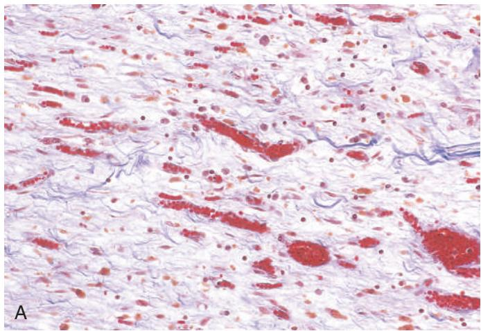 
Fig. 3.26 (A) Granulation tissue showing numerous blood vessels, edema, and a loose extracellular matrix containing occasional inflammatory cells. Collagen is stained blue by the trichrome stain; minimal mature collagen can be seen at this point. (B) Trichrome stain of mature scar, showing dense collagen (stained blue) and scattered vascular channels.
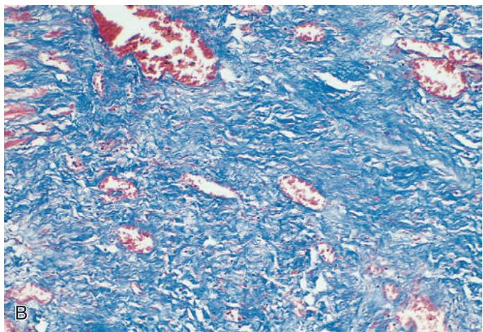
- The main steps in repair by scarring are clot formation, inflammation, angiogenesis and formation of granulation tissue, migration and proliferation of fibroblasts, collagen synthesis, and connective tissue remodeling. 
- Macrophages are critical for orchestrating the repair process, by eliminating offending agents and producing cytokines and growth factors that stimulate the proliferation of the cell types involved in repair. 
- TGF- $\beta$ is a potent fibrogenic agent; ECM deposition depends on the balance among fibrogenic agents, matrix metalloproteinases (MMPs) that digest ECM, and the tissue inhibitors of MMPs (TIMPs).
# Factors That Impair Tissue Repair
Tissue repair may be impaired by a variety of factors that reduce the quality or adequacy of the reparative process. Factors that interfere with healing may be extrinsic (e.g., infection) or intrinsic to the injured tissue, and systemic or local:
- Infection is one of the most important causes of delayed healing; it prolongs inflammation and potentially increases the local tissue injury. 
- Diabetes is a metabolic disease that compromises tissue repair for many reasons (Chapter 24), and is an important systemic cause of abnormal wound healing. 
- Nutritional status has profound effects on repair; protein malnutrition and vitamin C deficiency, for example, inhibit collagen synthesis and retard healing. 
- Glucocorticoids (steroids) have well-documented anti-inflammatory effects, and their administration may result in weak scars because they inhibit TGF- $\beta$ production and diminish fibrosis. In some instances, however, the anti-inflammatory effects of glucocorticoids are desirable. For example, in corneal infections, glucocorticoids may be prescribed (along with antibiotics) to reduce the likelihood of opacity due to collagen deposition. 
- Mechanical factors such as increased local pressure or torsion may cause wounds to pull apart (dehisce). 
- Poor perfusion, resulting either from arteriosclerosis and diabetes or from obstructed venous drainage (e.g., in varicose veins), also impairs healing. 
- Foreign bodies such as fragments of steel, glass, or even bone impede healing. 
- The type and extent of tissue injury affects the subsequent repair. Complete restoration can occur only in tissues composed of cells capable of proliferating; even then, extensive injury will probably result in incomplete tissue regeneration and at least partial loss of function. Injury to tissues composed of nondividing cells must inevitably result in scarring; such is the case with healing of a myocardial infarct. 
- The location of the injury and the character of the tissue in which the injury occurs also are important. For example, in inflammation arising in tissue spaces (e.g., pleural, peritoneal, synovial cavities), small exudates may be resorbed and digested by the proteolytic enzymes of leukocytes, resulting in resolution of the
inflammation and restoration of normal tissue architecture. However, when the exudate is too large to be fully resorbed it undergoes organization, a process during which granulation tissue grows into the exudate, and a fibrous scar ultimately forms.
# Clinical Examples of Abnormal Wound Healing and Scarring
Complications in tissue repair can arise from abnormalities in any of the basic components of the process, including deficient scar formation, excessive formation of the repair components, and formation of contractures.
# Defects in Healing: Chronic Wounds
These are seen in numerous clinical situations, as a result of local and systemic factors. The following are some common examples.
- Venous leg ulcers (Fig. 3.27A) develop most often in elderly people as a result of chronic venous hypertension, which may be caused by severe varicose veins or congestive heart failure. Deposits of iron pigment (hemosiderin) are common, resulting from red cell breakdown, and there may be accompanying chronic inflammation. These ulcers fail to heal because of poor delivery of oxygen to the site of the ulcer. 
- Arterial ulcers (Fig. 3.27B) develop in individuals with atherosclerosis of peripheral arteries, especially associated with diabetes. The ischemia results in atrophy and then necrosis of the skin and underlying tissues. These lesions can be quite painful. 
- Pressure sores (Fig. 3.27C) are areas of skin ulceration and necrosis of underlying tissues caused by prolonged compression of tissues against a bone, for example, in bedridden, immobile elderly individuals with numerous morbidities. The lesions are caused by mechanical pressure and local ischemia. 
- Diabetic ulcers (Fig. 3.27D) affect the lower extremities, particularly the feet. Tissue necrosis and failure to heal are the result of small vessel disease causing ischemia, neuropathy, systemic metabolic abnormalities, and secondary infections. Histologically, these lesions are characterized by epithelial ulceration (Fig. 3.27E) and extensive granulation tissue in the underlying dermis (Fig. 3.27F).
In some cases failure of healing may lead to dehiscence (wound rupture). Although not common, this occurs most frequently after abdominal surgery and is a result of increased abdominal pressure, such as may occur with vomiting, coughing, or ileus.
# Excessive Scarring
Excessive formation of the components of the repair process can give rise to hypertrophic scars and keloids. The accumulation of excessive amounts of collagen may result in a raised scar known as a hypertrophic scar. These often grow rapidly and contain abundant myofibroblasts, but they tend to regress over several months (Fig. 3.28A). Hypertrophic scars generally develop after thermal or traumatic injury that involves the deep layers of the dermis. If the scar tissue grows beyond the boundaries of the
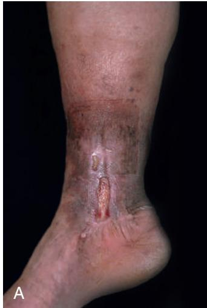
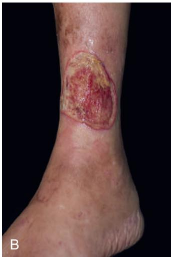
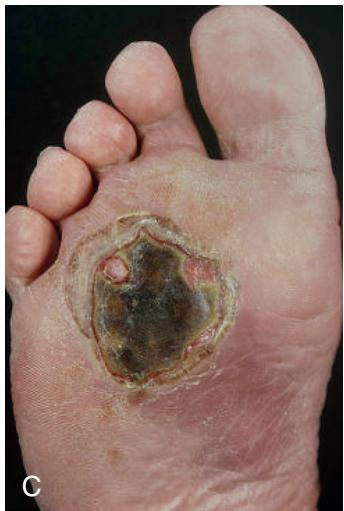
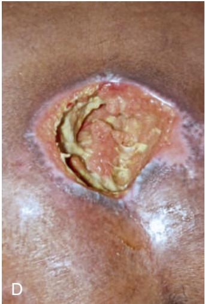
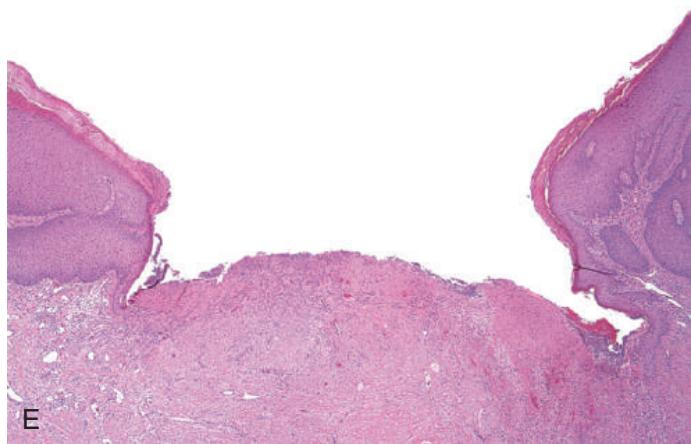 
Fig. 3.27 Chronic wounds illustrating defects in wound healing. (A–D) External appearance of skin ulcers. (From Eming SA, Margin P, Tomic-Canic M: Wound repair and regeneration: mechanisms, signaling, and translation, Sci Transl Med 6:265, 2014.) (A) Venous leg ulcer; (B) arterial ulcer, with more extensive tissue necrosis; (C) diabetic ulcer; and (D) pressure sore. (E–F) Histologic appearance of a diabetic ulcer. (E) ulcer crater; (F) chronic inflammation and granulation tissue.
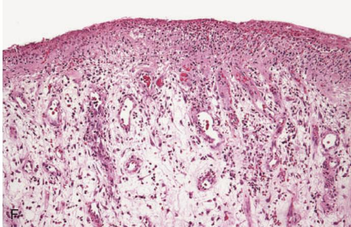
original wound and does not regress, it is called a keloid (Fig. 3.28B). Certain individuals seem to be predisposed to keloid formation, particularly those of African descent.
Exuberant granulation is another deviation in wound healing characterized by the formation of excessive amounts of granulation tissue, which protrudes above the level of the surrounding skin and blocks reepithelialization (this process has been called, with more literary fervor, proud flesh). Excessive granulation must be removed by cautery or surgical excision to permit restoration of epithelial continuity. Rarely, incisional scars or traumatic injuries may be followed by exuberant proliferation of fibroblasts and other connective tissue elements that may, in fact, recur after excision. Called desmoids, or aggressive fibromatoses, these neoplasms lie at the gray zone of benign and malignant low-grade tumors.
Wound contraction is an important part of the normal healing process. An exaggeration of this process gives rise to contracture and results in deformities of the wound and the surrounding tissues. Contractures are particularly prone to develop on the palms, the soles, and the anterior aspect of the thorax. Contractures are commonly seen after serious burns and can compromise the movement of joints.
# Fibrosis in Parenchymal Organs
The term fibrosis is used to denote the excessive deposition of collagen and other ECM components in a tissue. The terms scar and fibrosis may be used interchangeably, but fibrosis most often refers to the abnormal deposition of collagen that occurs in internal organs in chronic diseases. The basic mechanisms of fibrosis are the same as those of scar formation in the skin during tissue repair. Fibrosis is a pathologic process induced by persistent injurious stimuli such as chronic infections and immunologic reactions, and is typically associated with loss of tissue (Fig. 3.29). It may be responsible for substantial organ dysfunction and even organ failure.
As discussed earlier, the major cytokine involved in fibrosis is TGF- $\beta$ . The mechanisms that lead to increased TGF- $\beta$ activity in fibrosis are not precisely known, but cell death by necrosis or apoptosis and the production of ROS seem to be important triggers, regardless of the tissue. The cells that produce collagen in response to TGF- $\beta$ stimulation may vary depending on the tissue. In most organs, such as in the lung and kidney, myofibroblasts are the main source of collagen, but stellate cells are the major collagen producers in liver cirrhosis.
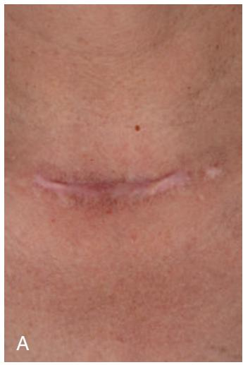
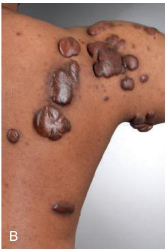
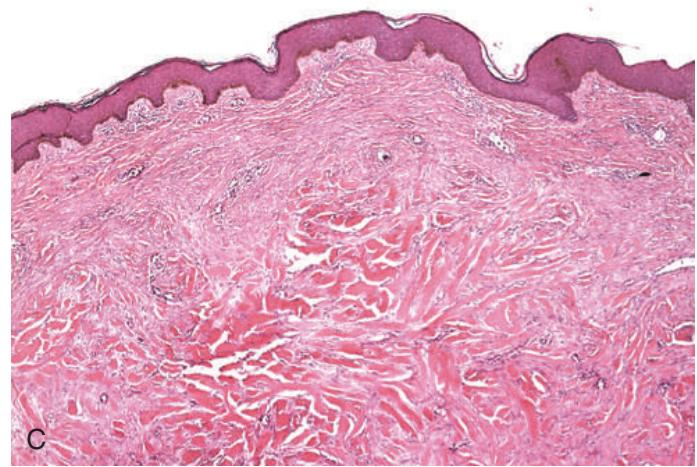 
Fig. 3.28 Clinical examples of excessive scarring and collagen deposition. (A) Hypertrophic scar. (B) Keloid. (C) Microscopic appearance of a keloid. Note the thick connective tissue deposition in the dermis. (A-B from Eming SA, Margin P, Tomic-Canic M: Wound repair and regeneration: mechanisms, signaling, and translation, Sci Transl Med 6:265, 2014, p. 2.)
Fibrotic disorders include diverse chronic and debilitating diseases such as liver cirrhosis, systemic sclerosis (scleroderma), fibrosing diseases of the lung (idiopathic pulmonary fibrosis, pneumoconioses, and drug- or radiation-induced pulmonary fibrosis), end-stage kidney disease, and constrictive pericarditis. These conditions are discussed in the relevant chapters later in the book. Because fibrosis is the major cause of morbidity and death in these conditions, there is great interest in the development of anti-fibrotic drugs.
# CUTANEOUS WOUND HEALING AND PATHOLOGIC ASPECTS OF REPAIR
- The main phases of cutaneous wound healing are inflammation, formation of granulation tissue, and ECM remodeling. 
- Cutaneous wounds can heal by primary union (first intention) or secondary union (secondary intention); secondary healing involves more extensive scarring and wound contraction.
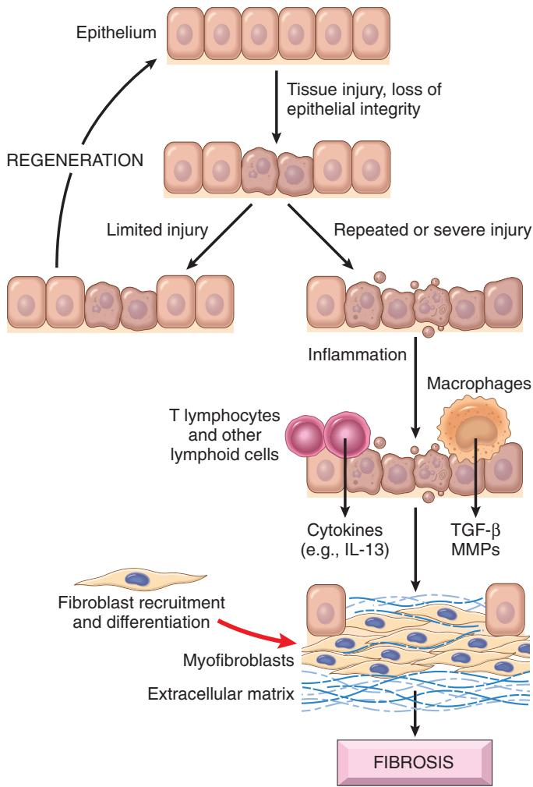 
Fig. 3.29 Mechanisms of fibrosis. Persistent tissue injury leads to chronic inflammation and loss of tissue architecture. Cytokines produced by macrophages and other leukocytes stimulate the migration and proliferation of fibroblasts and myofibroblasts and the deposition of collagen and other extracellular matrix proteins. The net result is replacement of normal tissue by fibrosis.
- Wound healing can be altered by many conditions, particularly infection and diabetes; the type, volume, and location of the injury are important factors that influence the healing process. 
- Excessive production of ECM can cause keloids in the skin. 
- Persistent stimulation of collagen synthesis in chronic inflammatory diseases leads to tissue fibrosis, often with extensive loss of the tissue and functional impairment.
Alitalo K: The lymphatic vasculature in disease, Nat Med 17:1371-1380, 2011. [An excellent review of the cell biology of lymphatic vessels, their functions in immune and inflammatory reactions, and their roles in inflammatory, neoplastic, and other diseases.] 
Dennis EA, Norris PC: Eicosanoid storm in infection and inflammation, Nat Rev Immunol 15:511, 2015. [A review of the pro- and antiinflammatory activities of eicosanoids.] 
Duffield JS, Lupher M, Thannickal VJ, et al: Host responses in tissue repair and fibrosis, Ann Rev Pathol Mech Dis 8:241, 2013. [An overview
of the cellular mechanisms of fibrosis, with an emphasis on the role of the immune system in fibrotic reactions to chronic infections.] 
Eming SA, Martin P, Tomic-Canic M: Wound repair and regeneration: mechanisms, signaling, and translation, Sci Transl Med 6:265r6, 2014. [A modern review of host responses that contribute to tissue repair.] 
Flannagan RS, Jaumouille V, Grinstein S: The cell biology of phagocytosis, Ann Rev Pathol Mech Dis 7:61-98, 2012. [A modern discussion of the receptors involved in phagocytosis, the molecular control of the process, and the biology and functions of phagosomes.] 
Friedman SL, Sheppard D, Duffield JS, et al: Therapy for fibrotic diseases: nearing the starting line, Sci Transl Med 5:167sr1, 2013. [An excellent review of the current concepts of the pathogenesis of fibrosis, emphasizing the roles of different cell populations and the extracellular matrix, and the potential for translating basic knowledge to the development of new therapies.] 
Gabay C, Lamacchia C, Palmer G: IL-1 pathways in inflammation and human diseases, Nat Rev Rheumatol 6:232, 2010. [An excellent review of the biology of IL-1 and the therapeutic targeting of this cytokine in inflammatory diseases.] 
Hubmacher D, Apte SS: The biology of the extracellular matrix: novel insights, Curr Opin Rheumatol 25:65-70, 2013. [A brief review of the structural and biochemical properties of the ECM.] 
Kalliolias GD, Ivashkiv LB: TNF biology, pathogenic mechanisms and emerging therapeutic strategies, Nat Rev Rheumatol 12:49, 2016. [An excellent review of TNF and its signaling pathways, and the development and clinical efficacy of TNF inhibitors.] 
Khanapure SP, Garvey DS, Janero DR, et al: Eicosanoids in inflammation: biosynthesis, pharmacology, and therapeutic frontiers, Curr Top Med Chem 7:311, 2007. [A summary of the properties of this important class of inflammatory mediators.] 
Kolaczkowska E, Kubes P: Neutrophil recruitment and function in health and inflammation, Nat Rev Immunol 13:159-175, 2013. [An excellent review of neutrophil generation, recruitment, functions and fates, and their roles in different types of inflammatory reactions.] 
Kopp JL, Grompe M, Sander M: Stem cell versus plasticity in liver and pancreas regeneration, Nat Cell Biol 18:238, 2016. [An excellent review of the relative contributions of parenchymal cells and stem cells to organ regeneration.] 
Mayadas TN, Cullere X, Lowell CA: The multifaceted functions of neutrophils, Ann Rev Pathol Mech Dis 9:181, 2014. [An excellent review of neutrophil biology.] 
McAnully RJ: Fibroblasts and myofibroblasts: their source, function, and role in disease, Int J Biochem Cell Biol 39:666, 2007. [A discussion of the two major types of stroma cells and their roles in tissue repair and fibrosis.] 
Nathan C, Ding A: Nonresolving inflammation, Cell 140:871, 2010. [A discussion of the abnormalities that lead to chronic inflammation.]
Okin D, Medzhitov R: Evolution of inflammatory diseases, Curr Biol 22:R733-R740, 2012. [An interesting conceptual discussion of the balance between the high potential cost and benefit of the inflammatory response and how this balance may be disturbed by environmental changes, accounting for the association between inflammation and many of the diseases of the modern world.] 
Page-McCaw A, Ewald AJ, Werb Z: Matrix metalloproteinases and the regulation of tissue remodelling, Nat Rev Mol Cell Biol 8:221, 2007. [A review of the function of matrix modifying enzymes in tissue repair.] 
Ricklin D, Lambris JD: Complement in immune and inflammatory disorders, J Immunol 190:3831-3838, 3839-3847, 2013. [Two companion articles on the biochemistry and biology of the complement system, and the development of therapeutic agents to alter complement activity in disease.] 
Rock KL, Latz E, Ontiveros F, et al: The sterile inflammatory response, Annu Rev Immunol 28:321-342, 2010. [An excellent discussion of how the immune system recognizes necrotic cells and other noninfectious harmful agents.] 
Romito A, Cobellis G: Pluripotent stem cells: current understanding and future directions, Stem Cells Int 2016. [Epub 2015] [A cogent summary of endogenous and induced pluripotent stem cells.] 
Schmidt S, Moser M, Sperandio M: The molecular basis of leukocyte recruitment and its deficiencies, Mol Immunol 55:49-58, 2013. [A review of the mechanisms of leukocyte recruitment and leukocyte adhesion deficiencies.] 
Sica A, Mantovani A: Macrophage plasticity and polarization: in vivo veritas, J Clin Invest 122:787-795, 2012. [An excellent review of macrophage subpopulations, their generation, and their roles in inflammation, infections, cancer, and metabolic disorders.] 
Stappenbeck TS, Miyoshi H: The role of stromal stem cells in tissue regeneration and wound repair, Science 324:1666, 2009. [An excellent review of the role of tissue stem cells in repair.] 
Stearns-Kurosawa DJ, Osuchowski MF, Valentine C, et al: The pathogenesis of sepsis, Ann Rev Pathol Mech Dis 6:19, 2011. [A discussion of the current concepts of pathogenic mechanisms in sepsis and septic shock.] 
Welti J, Loges S, Dimmeler S, et al: Recent molecular discoveries in angiogenesis and antiangiogenic therapies in cancer, J Clin Invest 123:3190, 2013. [A review of new advances in elucidating the stimuli and control of angiogenesis, and the development of therapies targeting the process.] 
Zlotnik A, Yoshie O: The chemokine superfamily revisited, Immunity 36:705-716, 2012. [An excellent update on the classification, functions, and clinical relevance of chemokines and their receptors.]
# Hemodynamic Disorders, Thromboembolism, and Shock
# 4
Hyperemia and Congestion 97
Edema 98
Increased Hydrostatic Pressure 99
Reduced Plasma Osmotic Pressure 99
Lymphatic Obstruction 99
Sodium and Water Retention 100
Hemorrhage 100
Hemostasis and Thrombosis 101
Normal Hemostasis 101
Thrombosis 106
Disseminated Intravascular Coagulation (DIC) 111
Embolism 112
Pulmonary Thromboembolism 112
Systemic Thromboembolism 112
Fat Embolism 112
Amniotic Fluid Embolism 113
Air Embolism 113
Infarction 114
Factors That Influence Infarct Development 115
Shock 115
Pathogenesis of Septic Shock 116
Stages of Shock 118
The health of cells and tissues depends on the circulation of blood, which delivers oxygen and nutrients and removes wastes generated by cellular metabolism. Under normal conditions, as blood passes through capillary beds, proteins in the plasma are retained within the vasculature and there is little net movement of water and electrolytes into the tissues. This balance is often disturbed by pathologic conditions that alter endothelial function, increase vascular hydrostatic pressure, or decrease plasma protein content, all of which promote edema—the accumulation of fluid in tissues resulting from a net movement of water into extravascular spaces. Depending on its severity and location, edema may have minimal or profound effects. In the lower extremities, it may only make one's shoes feel snugger after a long sedentary day; in the lungs, however, edema fluid can fill alveoli, causing life-threatening hypoxia.
The structural integrity of blood vessels is frequently compromised by trauma. Hemostasis is the process of blood clotting that prevents excessive bleeding after blood-vessel damage. Inadequate hemostasis may result in hemorrhage, which can compromise regional tissue perfusion and, if massive and rapid, may lead to hypotension, shock, and death. Conversely, inappropriate clotting (thrombosis) or migration of clots (embolism) can obstruct blood vessels, potentially causing ischemic cell death (infarction). Indeed, thromboembolism lies at the heart of three major causes of morbidity and death in developed countries: myocardial infarction, pulmonary embolism (PE), and cerebrovascular accident (stroke).
With this as a preface, we begin our discussion of hemodynamic disorders with conditions that increase tissue blood volumes.
# HYPEREMIA AND CONGESTION
Hyperemia and congestion both refer to an increase in blood volume within a tissue, but have different underlying mechanisms. Hyperemia is an active process resulting from arteriolar dilation and increased blood inflow, as occurs at sites of inflammation or in exercising skeletal muscle. Hyperemic tissues are redder than normal because of engorgement with oxygenated blood. Congestion is a passive process resulting from impaired outflow of venous blood from a tissue. It can occur systemically, as in cardiac failure, or locally as a consequence of an isolated venous obstruction. Congested tissues have an abnormal blue-red color (cyanosis) that stems from the accumulation of deoxygenated hemoglobin in the affected area. In long-standing chronic congestion, inadequate tissue perfusion and persistent hypoxia may lead to parenchymal cell death and secondary tissue fibrosis, and the elevated intravascular pressures may cause edema or sometimes rupture capillaries, producing focal hemorrhages.
Cut surfaces of hyperemic or congested tissues feel wet and typically ooze blood. On microscopic examination, acute pulmonary congestion is marked by blood-engorged alveolar capillaries and variable degrees of alveolar septal edema and intraalveolar hemorrhage. In chronic pulmonary congestion, the septa become thickened and fibrotic, and the alveolar spaces contain numerous macrophages laden with hemosiderin ("heart failure cells") derived from phagocytosed red cells. In acute
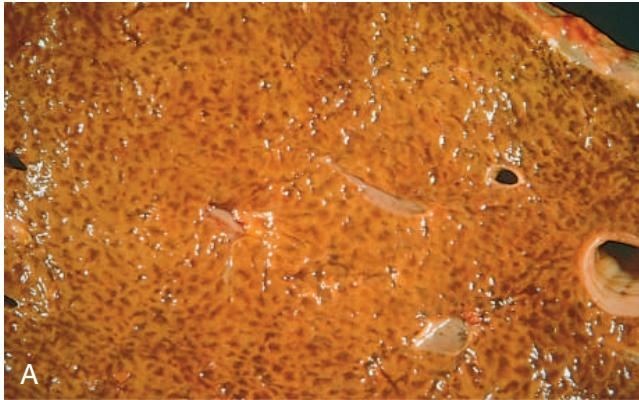
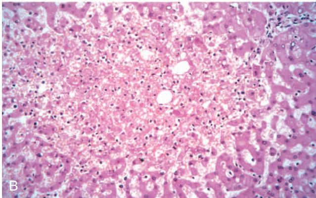 
Fig. 4.1 Liver with chronic passive congestion and hemorrhagic necrosis. (A) In this autopsy specimen, central areas are red and slightly depressed compared with the surrounding tan viable parenchyma, creating "nutmeg liver" (so called because it resembles the cut surface of a nutmeg). (B) Microscopic preparation shows centrilobular hepatic necrosis with hemorrhage and scattered inflammatory cells. (Courtesy of Dr. James Crawford.)
hepatic congestion, the central vein and sinusoids are distended with blood, and there may even be necrosis of centrally located hepatocytes. The periportal hepatocytes, better oxygenated because of their proximity to hepatic arterioles, experience less severe hypoxia and may develop only reversible fatty change. In chronic passive congestion of the liver, the central regions of the hepatic lobules, viewed on gross examination, are red-brown and slightly depressed (owing to cell loss) and are accentuated against the surrounding zones of uncongested tan, sometimes fatty, liver (nutmeg liver) (Fig. 4.1A). Microscopic findings include centrilobular hepatocyte necrosis, hemorrhage, and hemosiderin-laden macrophages (Fig. 4.1B).
# EDEMA
Approximately $60\%$ of lean body weight is water, two-thirds of which is intracellular. Most of the remaining water is found in extracellular compartments in the form of interstitial fluid; only $5\%$ of the body's water is in blood plasma. As noted earlier, edema is an accumulation of interstitial fluid within tissues. Extravascular fluid can also collect in body cavities and such accumulations are often referred to collectively as effusions. Examples include effusions in the pleural cavity (hydrothorax), the pericardial cavity (hydropericardium), or the peritoneal cavity (hydroperitoneum, or ascites). Anasarca is severe, generalized
edema marked by profound swelling of subcutaneous tissues and accumulation of fluid in body cavities.
Table 4.1 lists the major causes of edema. The mechanisms of inflammatory edema are largely related to increased vascular permeability and are discussed in Chapter 3; the noninflammatory causes are described in the following discussion.
Fluid movement between the vascular and interstitial spaces is governed mainly by two opposing forces—the vascular hydrostatic pressure and the colloid osmotic pressure produced by plasma proteins. Normally, the outflow of fluid produced by hydrostatic pressure at the arteriolar end of the microcirculation is nearly balanced by inflow at the venular end owing to slightly elevated osmotic pressure; hence there is only a small net outflow of fluid into the interstitial space, which is drained by lymphatic vessels. Either increased hydrostatic pressure or diminished colloid osmotic pressure causes increased movement of water into the interstitium (Fig. 4.2). This in turn increases the tissue's hydrostatic pressure, and eventually a new equilibrium is achieved. Excess edema fluid is removed by lymphatic drainage and is returned to the bloodstream by way of the thoracic duct (Fig. 4.2).
The edema fluid that accumulates in the setting of increased hydrostatic pressure or reduced intravascular
Table 4.1 Causes of Edema 
Increased Hydrostatic PressureImpaired Venous ReturnCongestive heart failureConstrictive pericarditisAscites (liver cirrhosis)Venous obstruction or compressionThrombosisExternal pressure (e.g., mass)Lower extremity inactivity with prolonged dependencyArteriolar DilationHeatNeurohumoral dysregulationReduced Plasma Osmotic Pressure (Hypoproteinemia)Protein-losing glomerulopathies (nephrotic syndrome)Liver cirrhosis (ascites)MalnutritionProtein-losing gastroenteropathyLymphatic ObstructionInflammatoryNeoplasticPostsurgicalPostirradiationSodium RetentionExcessive salt intake with renal insufficiencyIncreased tubular reabsorption of sodiumRenal hypoperfusionIncreased renin-angiotensin-aldosterone secretionInflammationAcute inflammationChronic inflammationAngiogenesisData from Leaf A, Cotran RS: Renal pathophysiology, ed 3, New York, 1985, Oxford University Press, p 146.
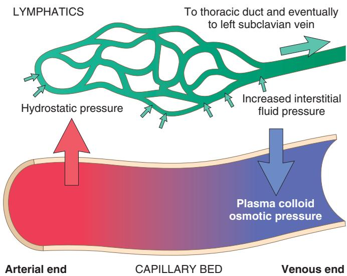 
Fig. 4.2 Factors influencing fluid movement across capillary walls. Capillary hydrostatic and osmotic forces are normally balanced so there is little net movement of fluid into the interstitium. However, increased hydrostatic pressure or diminished plasma osmotic pressure leads to extravascular fluid accumulation (edema). Tissue lymphatics drain much of the excess fluid back to the circulation by way of the thoracic duct; however, if the capacity for lymphatic drainage is exceeded, tissue edema results.
colloid typically is a protein-poor transudate; by contrast, because of increased vascular permeability, inflammatory edema fluid is a protein-rich exudate with a high specific gravity. The usual cutoffs for specific gravity (1.020 for exudates) illustrate the point but are not clinically useful. We will now discuss the various causes of edema.
# Increased Hydrostatic Pressure
Increases in hydrostatic pressure are mainly caused by disorders that impair venous return. Local increases in intravascular pressure caused, for example, by deep venous thrombosis in the lower extremity can cause edema restricted to the distal portion of the affected leg. Generalized increases in venous pressure, with resultant systemic edema, occur most commonly in congestive heart failure (Chapter 11). Fig. 4.3 illustrates the interlocking mechanisms that underlie generalized edema resulting from cardiac, renal, and hepatic failure. Several factors increase venous hydrostatic pressure in patients with congestive heart failure (Fig. 4.3). The reduced cardiac output leads to systemic venous congestion and resultant increase in capillary hydrostatic pressure. At the same time reduction in cardiac output results in hypoperfusion of the kidneys, triggering the renin-angiotensin-aldosterone axis and inducing sodium and water retention (secondary hyperaldosteronism). In patients with normal heart function, this adaptation increases cardiac filling and cardiac output, thereby improving renal perfusion. However, the failing heart often cannot increase its cardiac output in response to the compensatory increases in blood volume. Instead, a vicious cycle of fluid retention, increased venous hydrostatic pressures, and worsening edema ensues. Unless cardiac output is restored or renal water retention is reduced (e.g., by salt restriction or treatment with diuretics or aldosterone
antagonists), this downward spiral continues. Because secondary hyperaldosteronism is a common feature of generalized edema, salt restriction, diuretics, and aldosterone antagonists also are of value in the management of generalized edema resulting from non-cardiac causes.
# Reduced Plasma Osmotic Pressure
Reduction of plasma albumin concentrations leads to decreased colloid osmotic pressure of the blood and loss of fluid from the circulation. Under normal circumstances, albumin accounts for almost half of the total plasma protein. Therefore, conditions in which albumin is either lost from the circulation or synthesized in inadequate amounts are common causes of reduced plasma osmotic pressure. Nephrotic syndrome is the most important cause of albumin loss from the blood. In diseases that are characterized by nephrotic syndrome (Chapter 14), the glomerular capillaries become leaky, leading to the loss of albumin (and other plasma proteins) in the urine and the development of generalized edema. Reduced albumin synthesis occurs in the setting of severe liver disease (e.g., cirrhosis) (Chapter 16) and protein malnutrition (Chapter 8). Regardless of cause, low albumin levels lead in a stepwise fashion to edema, reduced intravascular volume, renal hypoperfusion, and secondary hyperaldosteronism. Unfortunately, increased salt and water retention by the kidney not only fails to correct the plasma volume deficit but also exacerbates the edema, because the primary defect—low serum protein—persistence.
# Lymphatic Obstruction
Edema may result from lymphatic obstruction that compromises resorption of fluid from interstitial spaces. Impaired lymphatic drainage and consequent lymphedema usually results from a localized obstruction caused by an inflammatory or neoplastic condition. For example, the parasitic infection filariasis can cause massive edema of the lower extremity and external genitalia (so-called
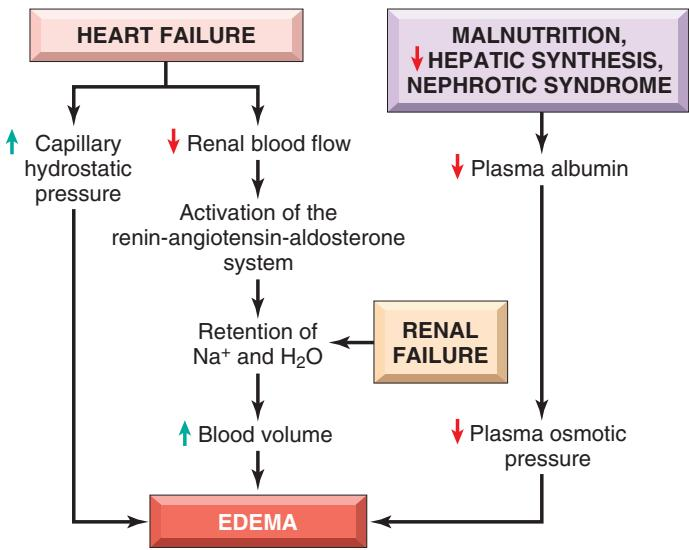 
Fig. 4.3 Pathways leading to systemic edema resulting from heart failure, renal failure, or reduced plasma osmotic pressure.
"elephantiasis") by producing inguinal lymphatic and lymph node fibrosis. Infiltration and obstruction of superficial lymphatics by breast cancer may cause edema of the overlying skin; the characteristic finely pitted appearance of the skin of the affected breast is called *peau d'orange* (orange peel). Lymphedema also may occur as a complication of therapy. One relatively common setting for this clinical entity is in women with breast cancer who undergo axillary lymph node resection and/or irradiation, both of which can disrupt and obstruct lymphatic drainage, resulting in severe lymphedema of the arm.
# Sodium and Water Retention
Excessive retention of salt (and its obligate associated water) can lead to edema by increasing hydrostatic pressure (because of expansion of the intravascular volume) and reducing plasma osmotic pressure. Excessive salt and water retention are seen in a wide variety of diseases that compromise renal function, including poststreptococcal glomerulonephritis and acute renal failure (Chapter 14).
Edema is easily recognized on gross inspection; microscopic examination shows clearing and separation of the extracellular matrix (ECM) elements. Although any tissue can be involved, edema most commonly is encountered in subcutaneous tissues, lungs, and brain.
Subcutaneous edema can be diffuse but usually accumulates preferentially in parts of the body positioned the greatest distance below the heart, where hydrostatic pressures are highest. Thus, edema typically is most pronounced in the legs with standing and the sacrum with recumbency, a relationship termed dependent edema. Finger pressure over edematous subcutaneous tissue displaces the interstitial fluid, leaving a finger-shaped depression; this appearance is called pitting edema. Edema resulting from renal dysfunction or nephrotic syndrome often manifests first in loose connective tissues (e.g., the eyelids, causing periorbital edema). With pulmonary edema, the lungs often are two to three times their normal weight, and sectioning shows frothy, sometimes blood-tinged fluid consisting of a mixture of air, edema fluid, and extravasated red cells. Brain edema (Chapter 23) can be localized (e.g., because of abscess or tumor) or generalized, depending on the nature and extent of the pathologic process or injury. With generalized edema, the sulci are narrowed as the gyri swell and become flattened against the skull.
The effects of edema vary, ranging from merely annoying to rapidly fatal. Subcutaneous edema is important to recognize primarily because it signals potential underlying cardiac or renal disease; however, when significant, it also can impair wound healing and the clearance of infections. Pulmonary edema is a common clinical problem. It is seen most frequently in the setting of left ventricular failure, but also may occur in renal failure, acute respiratory distress syndrome (Chapter 11), and inflammatory and infectious disorders of the lung. It can cause death by interfering with
normal ventilatory function; besides impeding oxygen diffusion, alveolar edema fluid also creates a favorable environment for infections. Brain edema is life threatening; if the swelling is severe, the brain can herniate (extrude) through the foramen magnum. With increased intracranial
# EDEMA
- Edema results from the movement of fluid from the vasculature into the interstitial spaces; the fluid may be protein poor (transudate) or protein rich (exudate). 
Edema may be caused by:
- Increased hydrostatic pressure (e.g., heart failure) 
- Increased vascular permeability (e.g., inflammation) 
Decreased colloid osmotic pressure resulting from reduced plasma albumin
Decreased synthesis (e.g., liver disease, protein malnutrition) 
- Increased loss (e.g., nephrotic syndrome) 
Lymphatic obstruction (e.g., inflammation or neoplasia) 
- Sodium retention (e.g., renal failure)
pressure, the brain stem vascular supply can be compressed, leading to death due to injury to the medullary centers controlling respiration and other vital functions (Chapter 23).
# HEMORRHAGE
Hemorrhage, defined as the extravasation of blood from vessels, is most often the result of damage to blood vessels or defective clot formation. As described earlier, capillary bleeding can occur in chronically congested tissues. Trauma, atherosclerosis, or inflammatory or neoplastic erosion of a vessel wall also may lead to hemorrhage, which may be extensive if the affected vessel is a large vein or artery.
The risk of hemorrhage (often after a seemingly insignificant injury) is increased in a wide variety of clinical disorders collectively called hemorrhagic diatheses. These have diverse causes, including inherited or acquired defects in vessel walls, platelets, or coagulation factors, all of which must function properly to ensure homeostasis. These are discussed in the next section. Here we focus on clinical features of hemorrhages, regardless of the cause.
Hemorrhage may be manifested by different appearances and clinical consequences.
- Hemorrhage may be external or accumulate within a tissue as a hematoma, which ranges in significance from trivial (e.g., a bruise) to fatal (e.g., a massive retroperitoneal hematoma resulting from rupture of a dissecting aortic aneurysm) (Chapter 10). Large bleeds into body cavities are described variously according to location—hemothorax, hemopericardium, hemoperitoneum, or hemarthrosis (injoints). Extensive hemorrhages can occasionally result in jaundice from the massive breakdown of red cells and hemoglobin.
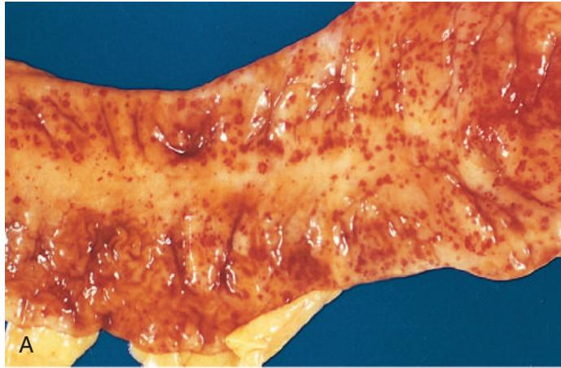
Punctatepetechialhemorrhagesofthecolonicmucosa,aconsequenceofthrombocytopenia.(B)Fatalintracerebralhemorrhage..jpg) 
Fig. 4.4 (A) Punctate petechial hemorrhages of the colonic mucosa, a consequence of thrombocytopenia. (B) Fatal intracerebral hemorrhage.
- Petechiae are minute (1 to $2\mathrm{mm}$ in diameter) hemorrhages into skin, mucous membranes, or serosal surfaces (Fig. 4.4A); causes include low platelet counts (thrombocytopenia), defective platelet function, and loss of vascular wall support, as in vitamin C deficiency (Chapter 8).
- Purpura are slightly larger (3 to $5\mathrm{mm}$ ) hemorrhages. Purpura can result from the same disorders that cause petechiae, as well as trauma, vascular inflammation (vasculitis), and increased vascular fragility.
- Ecchymoses are larger (1 to $2\mathrm{cm}$ ) subcutaneous hematomas (colloquially called bruises). Extravasated red cells are phagocytosed and degraded by macrophages; the characteristic color changes of a bruise result from the enzymatic conversion of hemoglobin (red-blue color) to bilirubin (blue-green color) and eventually hemosiderin (golden-brown).
The clinical significance of any particular hemorrhage depends on the volume of blood that is lost and the rate of bleeding. Rapid loss of up to $20\%$ of the blood volume, or slow losses of even larger amounts, may have little impact in healthy adults; greater losses, however, can cause hemorrhagic (hypovolemic) shock (discussed later). The site of hemorrhage also is important; bleeding that would be trivial in the subcutaneous tissues can cause death if located in the brain (Fig. 4.4B). Finally, chronic or recurrent external blood loss (e.g., due to peptic ulcer or menstrual bleeding)
frequently culminates in iron deficiency anemia as a consequence of a loss of iron in hemoglobin. By contrast, iron is efficiently recycled from phagocytosed red cells, so internal bleeding (e.g., a hematoma) does not lead to iron deficiency.
# HEMOSTASIS AND THROMBOSIS
Normal hemostasis comprises a series of regulated processes that culminate in the formation of a blood clot that limits bleeding from an injured vessel. The pathologic counterpart of hemostasis is thrombosis, the formation of blood clot (thrombus) within non-traumatized, intact vessels. This discussion begins with normal hemostasis and its regulation, to be followed by causes and consequences of thrombosis.
# Normal Hemostasis
Hemostasis is a precisely orchestrated process involving platelets, clotting factors, and endothelium that occurs at the site of vascular injury and culminates in the formation of a blood clot, which serves to prevent or limit the extent of bleeding. The general sequence of events leading to hemostasis at a site of vascular injury is shown in Fig. 4.5.
- Arteriolar vasoconstriction occurs immediately and markedly reduces blood flow to the injured area (Fig. 4.5A). It is mediated by reflex neurogenic mechanisms and augmented by the local secretion of factors such as endothelin, a potent endothelium-derived vasoconstrictor. This effect is transient, however, and bleeding would resume if not for activation of platelets and coagulation factors. 
- Primary hemostasis: the formation of the platelet plug. Disruption of the endothelium exposes subendothelial von Willebrand factor (vWF) and collagen, which promote platelet adherence and activation. Activation of platelets results in a dramatic shape change (from small rounded discs to flat plates with spiky protrusions that markedly increased surface area), as well as the release of secretory granules. Within minutes the secreted products recruit additional platelets, which undergo aggregation to form a primary hemostatic plug (Fig. 4.5B). 
- Secondary hemostasis: deposition of fibrin. Vascular injury exposes tissue factor at the site of injury. Tissue factor is a membrane-bound procoagulant glycoprotein that is normally expressed by subendothelial cells in the vessel wall, such as smooth muscle cells and fibroblasts. Tissue factor binds and activates factor VII (see later), setting in motion a cascade of reactions that culminates in thrombin generation. Thrombin cleaves circulating fibrinogen into insoluble fibrin, creating a fibrin meshwork, and also is a potent activator of platelets, leading to additional platelet aggregation at the site of injury. This sequence, referred to as secondary hemostasis, consolidates the initial platelet plug (Fig. 4.5C). 
- Clot stabilization and resorption. Polymerized fibrin and platelet aggregates undergo contraction to form a solid, permanent plug that prevents further hemorrhage. At this stage, counterregulatory mechanisms (e.g., tissue plasminogen activator, t-PA made by endothelial cells) are set into motion that limit clotting to the site of injury (Fig. 4.5D) and eventually lead to clot resorption and tissue repair.
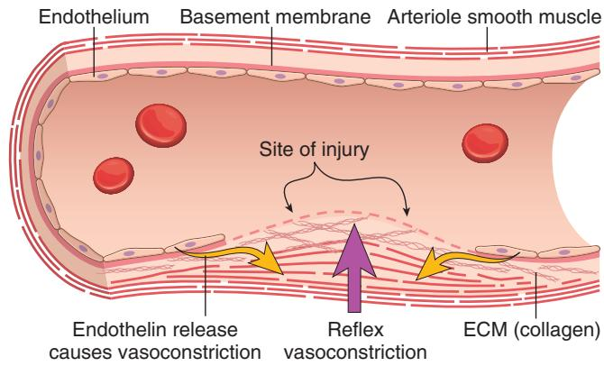 
A. VASOCONSTRUCTION 
Fig. 4.5 Normal hemostasis. (A) After vascular injury, local neurohumoral factors induce a transient vasoconstriction. (B) Platelets bind via glycoprotein Ib (Gplb) receptors to von Willebrand factor (VWF) on exposed ECM and are activated, undergoing a shape change and granule release. Released ADP and thromboxane $\mathrm{A}_2$ $(\mathrm{TXA}_2)$ induce additional platelet aggregation through platelet GpIb-IIIa receptor binding to fibrinogen, and form the primary hemostatic plug. (C) Local activation of the coagulation cascade (involving tissue factor and platelet phospholipids) results in fibrin polymerization, "cementing" the platelets into a definitive secondary hemostatic plug. (D) Counterregulatory mechanisms, mediated by tissue plasminogen activator (t-PA, a fibrinolytic product) and thrombomodulin, confine the hemostatic process to the site of injury.
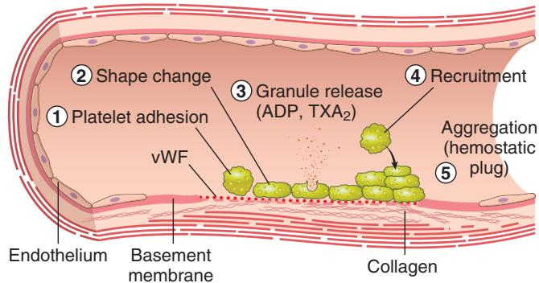 
B. PLATELET ACTIVATION AND AGGREGATION
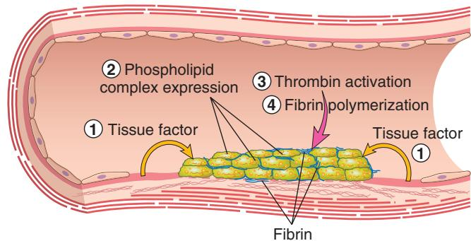 
C. ACTIVATION OF CLOTTING FACTORS AND FORMATION OF FIBRIN
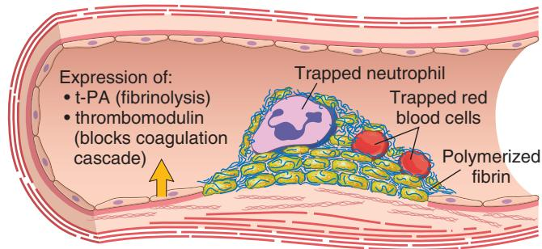 
D. CLOT RESORPTION
It should be emphasized that endothelial cells are central regulators of hemostasis; the balance between the anti-thrombic and prothrombotic activities of endothelium determines whether thrombus formation, propagation, or dissolution occurs. Normal endothelial cells express a variety of anticoagulant factors that inhibit platelet aggregation and coagulation and promote fibrinolysis; after injury or activation, however, this balance shifts, and endothelial cells acquire numerous procoagulant activities (activation of platelets and clotting factor, described above, see also Fig. 4.11). Besides trauma, endothelium can be activated by microbial pathogens, hemodynamic forces, and a number of pro-inflammatory mediators. We will return to the pro-coagulant and anti-coagulant roles of endothelium after a detailed discussion of the role of platelets and coagulation factors in hemostasis since endothelium modulates the functions of platelets and can trigger coagulation.
The following sections describe roles of platelets, coagulation factors and endothelium in hemostasis in greater detail, following the scheme illustrated in Fig. 4.5.
# Platelets
Platelets play a critical role in hemostasis by forming the primary plug that initially seals vascular defects and by providing a surface that binds and concentrates activated coagulation factors. Platelets are disc-shaped anucleate cell fragments that are shed from megakaryocytes in the bone marrow into the bloodstream. Their function depends on several glycoprotein receptors, a contractile cytoskeleton, and two types of cytoplasmic granules. $\alpha$ -Granules have the adhesion molecule P-selectin on their membranes (Chapter 3) and contain proteins involved in coagulation, such as fibrinogen, coagulation factor V, and vWF, as well as protein factors that may be involved in wound healing, such as fibronectin, platelet factor 4 (a heparin-binding chemokine), platelet-derived growth factor (PDGF), and transforming growth factor- $\beta$ . Dense (or $\delta$ ) granules contain adenosine diphosphate (ADP) and adenosine triphosphate, ionized calcium, serotonin, and epinephrine.
After a traumatic vascular injury, platelets encounter constituents of the subendothelial connective tissue, such as vWF and collagen. On contact with these proteins, platelets undergo a sequence of reactions that culminate in the formation of a platelet plug (Fig. 4.5B).
- Platelet adhesion is mediated largely via interactions with vWF, which acts as a bridge between the platelet surface receptor glycoprotein Ib (GpIb) and exposed collagen
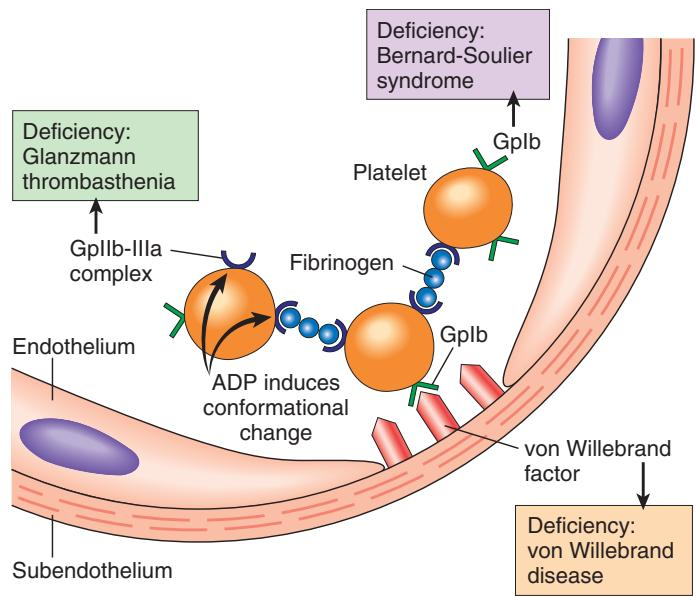 
Fig. 4.6 Platelet adhesion and aggregation. VWF functions as an adhesion bridge between subendothelial collagen and the glycoprotein Ib (Gplb) platelet receptor. Platelet aggregation is accomplished by fibrinogen binding to platelet Gplb-IIIa receptors on different platelets. Congenital deficiencies in the various receptors or bridging molecules lead to the diseases indicated in the colored boxes. ADP, Adenosine diphosphate.
(Fig. 4.6). Notably, genetic deficiencies of vWF (von Willebrand disease, Chapter 14) or GpIb (Bernard-Soulier syndrome) result in bleeding disorders, attesting to the importance of these factors.
- Platelets rapidly change shape following adhesion, being converted from smooth discs to spiky "sea urchins" with greatly increased surface area. This change is accompanied by alterations in glycoprotein IIb/IIIa that increase its affinity for fibrinogen (see later), and by the translocation of negatively charged phospholipids (particularly phosphatidylserine) to the platelet surface. These phospholipids bind calcium and serve as nucleation sites for the assembly of coagulation factor complexes. 
- Secretion (release reaction) of granule contents occurs along with changes in shape; these two events are often referred to together as platelet activation. Platelet activation is triggered by a number of factors, including the coagulation factor thrombin and ADP. Thrombin activates platelets through a special type of G-protein-coupled receptor referred to as a protease-activated receptor (PAR), which is switched on by a proteolytic cleavage carried out by thrombin. ADP is a component of dense-body granules; thus, platelet activation and ADP release begets additional rounds of platelet activation, a phenomenon referred to as recruitment. Activated platelets also produce the prostaglandin thromboxane A2 (TXA2), a potent inducer of platelet aggregation. Aspirin inhibits platelet aggregation and produces a mild bleeding defect by inhibiting cyclooxygenase, a platelet enzyme that is required for TXA2 synthesis. Although the phenomenon is less well characterized, it is also suspected that growth factors released from platelets contribute to the repair of the vessel wall following injury.
- Platelet aggregation follows their activation. The conformational change in glycoprotein IIb/IIIa that occurs with platelet activation allows binding of fibrinogen, a large bivalent plasma polypeptide that forms bridges between adjacent platelets, leading to their aggregation. Predictably, inherited deficiency of GpIIb-IIIa results in a bleeding disorder called Glanzmann thrombasthenia. The initial wave of aggregation is reversible, but concurrent activation of thrombin stabilizes the platelet plug by causing further platelet activation and aggregation, and by promoting irreversible platelet contraction. Platelet contraction is dependent on the cytoskeleton and consolidates the aggregated platelets. In parallel, thrombin also converts fibrinogen into insoluble fibrin, cementing the platelets in place and creating the definitive secondary hemostatic plug. Entrapped red cells and leukocytes are also found in hemostatic plugs, in part due to adherence of leukocytes to P-selectin expressed on activated platelets.
# PLATELET ADHESION, ACTIVATION, AND AGGREGATION
- Endothelial injury exposes the underlying basement membrane ECM; platelets adhere to the ECM primarily through the binding of platelet GpIb receptors to VWF. 
- Adhesion leads to platelet activation, an event associated with secretion of platelet granule contents, including calcium (a cofactor for several coagulation proteins) and ADP (a mediator of further platelet activation); dramatic changes in shape and membrane composition; and activation of GpIIb/IIIa receptors. 
- The GpIIb/IIIa receptors on activated platelets form bridging crosslinks with fibrinogen, leading to platelet aggregation. 
- Concomitant activation of thrombin promotes fibrin deposition, cementing the platelet plug in place.
# Coagulation Cascade
The coagulation cascade is a series of amplifying enzymatic reactions that lead to the deposition of an insoluble fibrin clot. As discussed later, the dependency of clot formation on various factors differs in the laboratory test tube and in blood vessels in vivo (Fig. 4.7). However, clotting in vitro and in vivo both follow the same general principles, as follows.
The cascade of reactions in the pathway can be likened to a "dance," in which coagulation factors are passed from one partner to the next (Fig. 4.8). Each reaction step involves an enzyme (an activated coagulation factor), a substrate (an inactive proenzyme form of a coagulation factor), and a cofactor (a reaction accelerator). These components are assembled on a negatively charged phospholipid surface, which is provided by activated platelets. Assembly of reaction complexes also depends on calcium, which binds to $\gamma$ -carboxylated glutamic acid residues that are present in factors II, VII, IX, and X. The enzymatic reactions that produce $\gamma$ -carboxylated glutamic acid use vitamin K as a cofactor and are antagonized by drugs such as Coumadin, a widely used anti-coagulant.
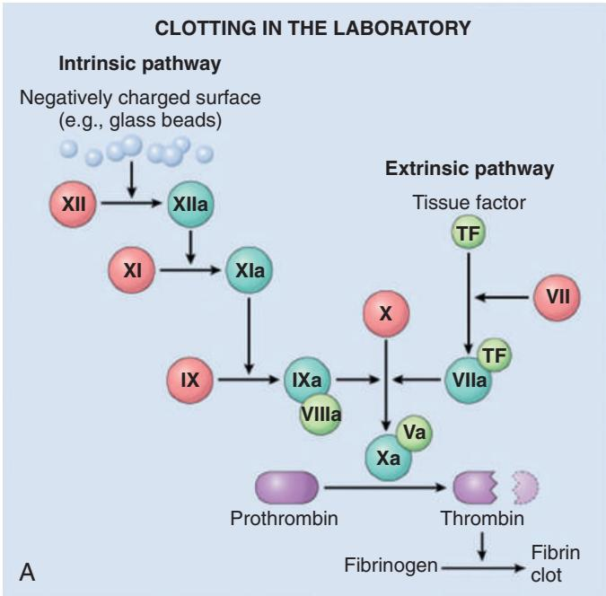 
Fig. 4.7 The coagulation cascade in the laboratory and in vivo. (A) Clotting is initiated in the laboratory by adding phospholipids, calcium, and either a negative-charged substance such as glass beads (intrinsic pathway) or a source of tissue factor (extrinsic pathway). (B) In vivo, tissue factor is the major initiator of coagulation, which is amplified by feedback loops involving thrombin (dotted lines). The red polypeptides are inactive factors, the dark green polypeptides are active factors, whereas the light green polypeptides correspond to cofactors.
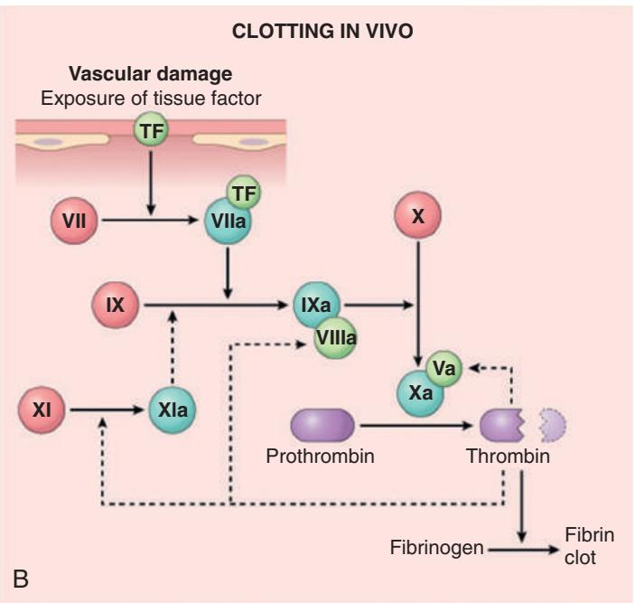
Based on assays performed in clinical laboratories, the coagulation cascade has traditionally been divided into the extrinsic and intrinsic pathways (Fig. 4.7A).
- The prothrombin time (PT) assay assesses the function of the proteins in the extrinsic pathway (factors VII, X, V, II (prothrombin), and fibrinogen). In brief, tissue factor, phospholipids, and calcium are added to plasma and the time for a fibrin clot to form is recorded.
- The partial thromboplastin time (PTT) assay screens the function of the proteins in the intrinsic pathway (factors XII, XI, IX, VIII, X, V, II, and fibrinogen). In this assay, clotting of plasma is initiated by the addition of negative-charged particles (e.g., ground glass) that activate factor XII (Hageman factor) together with phospholipids and calcium, and the time to fibrin clot formation is recorded.
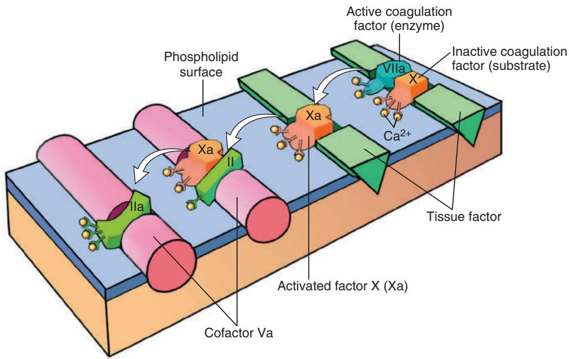 
Fig. 4.8 Sequential conversion of factor X to factor Xa by way of the extrinsic pathway, followed by conversion of factor II (prothrombin) to factor Ila (thrombin). The initial reaction complex consists of a protease (factor VIIa), a substrate (factor X), and a reaction accelerator (tissue factor) assembled on a platelet phospholipid surface. Calcium ions hold the assembled components together and are essential for the reaction. Activated factor Xa then becomes the protease component of the next complex in the cascade, converting prothrombin to thrombin (factor Ila) in the presence of a different reaction accelerator, factor Va.
Although the PT and PTT assays are of great utility in evaluating coagulation factor function in patients, they do not recapitulate the events that lead to coagulation in vivo. This point is most clearly made by considering the clinical effects of deficiencies of various coagulation factors. Deficiencies of factors V, VII, VIII, IX, and X are associated with moderate to severe bleeding disorders, and prothrombin deficiency is likely incompatible with life. In contrast, factor XI deficiency is only associated with mild bleeding, and individuals with factor XII deficiency do not bleed and in fact may be susceptible to thrombosis. The paradoxical effect of factor XII deficiency may be explained by involvement of factor XII in the fibrinolysis pathway (discussed later); although there is also some evidence from experimental models suggesting that factor XII may promote thrombosis under certain circumstances, the relevance of these observations to human thrombotic disease remains to be determined.
Based on the effects of various factor deficiencies in humans, it is believed that, in vivo, factor VIIa/tissue factor complex is the most important activator of factor IX and that factor IXa/factor VIIIa complex is the most important activator of factor X (Fig. 4.7B). The mild bleeding tendency seen in patients with factor XI deficiency is likely explained by the ability of thrombin to activate factor XI (as well as factors V and VIII), a feedback mechanism that amplifies the coagulation cascade.
Among the coagulation factors, thrombin is the most important, because its various enzymatic activities control diverse aspects of hemostasis and link clotting to inflammation and repair. Among thrombin's most important activities are the following:
- Conversion of fibrinogen into crosslinked fibrin. Thrombin directly converts soluble fibrinogen into fibrin monomers that polymerize into an insoluble fibril, and also amplifies the coagulation process, not only by activating factor XI, but also by activating two critical cofactors: factors V and VIII. It also stabilizes the secondary hemostatic plug by activating factor XIII, which covalently crosslinks fibrin. 
- Platelet activation. Thrombin is a potent inducer of platelet activation and aggregation through its ability to activate PARs, thereby linking platelet function to coagulation. 
- Proinflammatory effects. PARs also are expressed on inflammatory cells, endothelium, and other cell types (Fig. 4.9), and activation of these receptors by thrombin is believed to mediate proinflammatory effects that contribute to tissue repair and angiogenesis. 
- Anti-coagulant effects. Remarkably, through mechanisms described later, on encountering normal endothelium, thrombin changes from a procoagulant to an anti-coagulant; this reversal in function prevents clots from extending beyond the site of the vascular injury.
Factors That Limit Coagulation. Once initiated, coagulation must be restricted to the site of vascular injury to prevent deleterious consequences. One limiting factor is simple dilution; blood flowing past the site of injury washes out activated coagulation factors, which are rapidly removed by the liver. A second is the requirement for negatively charged phospholipids, which, as mentioned, are mainly provided by platelets that have been
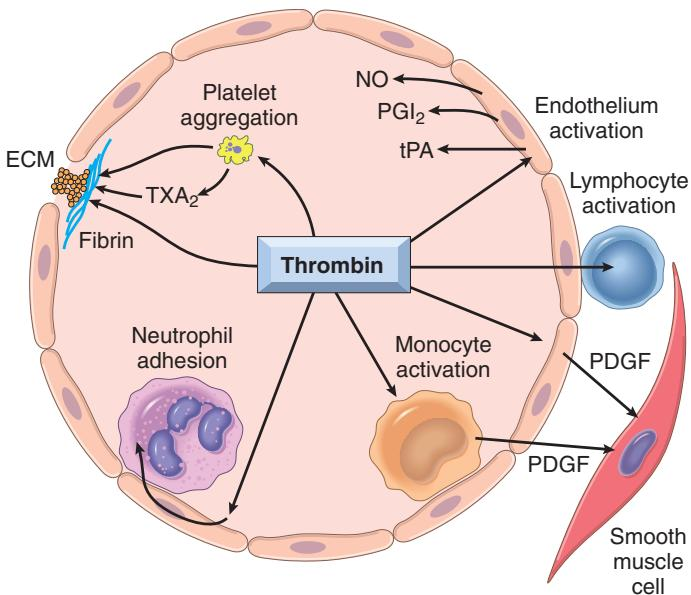 
Fig. 4.9 Role of thrombin in hemostasis and cellular activation. Thrombin generates fibrin by cleaving fibrinogen, activates factor XIII (which is responsible for crosslinking fibrin into an insoluble clot), and also activates several other coagulation factors, thereby amplifying the coagulation cascade (Fig. 4.7). Through protease-activated receptors (PARs), thrombin activates (1) platelet aggregation and $\mathrm{TxA}_2$ secretion; (2) endothelium, which responds by generating leukocyte adhesion molecules and a variety of fibrinolytic (t-PA), vasoactive (NO, $\mathrm{PGI}_2$ ), or cytokine (PDGF) mediators; and (3) leukocytes, increasing their adhesion to activated endothelium. ECM, Extracellular matrix; NO, nitric oxide; PDGF, platelet-derived growth factor; $\mathrm{PGI}_2$ , prostaglandin $l_2$ (prostacyclin); TXA2, thromboxane A2; t-PA, tissue-type plasminogen activator. See Fig. 4.11 for anticoagulant activities mediated by thrombin via thrombomodulin. (Courtesy of Shaun Coughlin, MD, PhD, Cardiovascular Research Institute, University of California at San Francisco, San Francisco, California.)
activated by contact with subendothelial matrix at sites of vascular injury. However, the most important counterregulatory mechanisms involve factors that are expressed by intact endothelium adjacent to the site of injury (described later).
Activation of the coagulation cascade also sets into motion a fibrinolytic cascade that limits the size of the clot and contributes to its later dissolution (Fig. 4.10). Fibrinolysis is largely accomplished through the enzymatic activity of plasmin, which breaks down fibrin and interferes with its polymerization. An elevated level of breakdown products of fibrinogen (often called fibrin split products), most notably fibrin-derived $D$ -dimers, are a useful clinical markers of several thrombotic states (described later). Plasmin is generated by enzymatic catabolism of the inactive circulating precursor plasminogen, either by a factor XII-dependent pathway (possibly explaining the association of factor XII deficiency and thrombosis) or by plasminogen activators. The most important plasminogen activator is t-PA; it is synthesized principally by endothelium and is most active when bound to fibrin. This characteristic makes t-PA a useful therapeutic agent, since its fibrinolytic activity is largely confined to sites of recent thrombosis. Once activated, plasmin is in turn tightly controlled by counterregulatory factors such as $\alpha_{2}$ -plasmin inhibitor, a plasma protein that binds and rapidly inhibits free plasmin.
..jpg) 
Fig. 4.10 The fibrinolytic system, illustrating various plasminogen activators and inhibitors (see text).
# COAGULATION FACTORS
- Coagulation occurs via the sequential enzymatic conversion of a cascade of circulating and locally synthesized proteins. 
- Tissue factor elaborated at sites of injury is the most important initiator of the coagulation cascade in vivo. 
- At the final stage of coagulation, thrombin converts fibrinogen into insoluble fibrin that contributes to formation of the definitive hemostatic plug. 
- Coagulation normally is restricted to sites of vascular injury by:
- limiting enzymatic activation to phospholipid surfaces provided by activated platelets or endothelium, 
circulating inhibitors of coagulation factors, such as antithrombin III, whose activity is augmented by heparin-like molecules expressed on endothelial cells 
- expression of thrombomodulin on normal endothelial cells, which bind thrombin and convert it into an anti-coagulant, 
- activation of fibrinolytic pathways (e.g., by association of tissue plasminogen activator with fibrin).
# Endothelium
The balance between the anticoagulant and procoagulant activities of endothelium often determines whether clot formation, propagation, or dissolution occurs (Fig. 4.11). Normal endothelial cells express a multitude of factors that inhibit the procoagulant activities of platelets and coagulation factors and that augment fibrinolysis. These factors act in concert to prevent thrombosis and to limit clotting to sites of vascular damage. However, if injured or exposed to proinflammatory factors, endothelial cells lose many of their antithrombotic properties. Here, we complete the discussion of hemostasis by focusing on the antithrombotic activities of normal endothelium; we return to the "dark side" of endothelial cells later when discussing thrombosis.
The antithrombotic properties of endothelium can be divided into activities directed at platelets, coagulation factors, and fibrinolysis.
- Platelet inhibitory effects. An obvious effect of intact endothelium is to serve as a barrier that shields platelets from subendothelial vWF and collagen. However, normal endothelium also releases a number of factors that inhibit platelet activation and aggregation. Among the most important are prostacyclin $(\mathsf{PGI}_2)$ , nitric oxide (NO), and adenosine diphosphatase; the latter degrades ADP, already discussed as a potent activator of platelet aggregation. Finally, endothelial cells bind and alter the activity of thrombin, which is one of the most potent activators of platelets. 
- Anticoagulant effects. Normal endothelium shields coagulation factors from tissue factor in vessel walls and expresses multiple factors that actively oppose coagulation, most notably thrombomodulin, endothelial protein C receptor, heparin-like molecules, and tissue factor pathway inhibitor. Thrombomodulin and endothelial protein C receptor bind thrombin and protein C, respectively, in a complex on the endothelial cell surface. When bound in this complex, thrombin loses its ability to activate coagulation factors and platelets, and instead cleaves and activates protein C, a vitamin K-dependent protease that requires a cofactor, protein S. Activated protein C/protein S complex is a potent inhibitor of coagulation factors Va and VIIIa. Heparin-like molecules on the surface of endothelium bind and activate antithrombin III, which then inhibits thrombin and factors IXa, Xa, XIa, and XIIa. The clinical utility of heparin and related drugs is based on their ability to stimulate antithrombin III activity. Tissue factor pathway inhibitor (TFPI), like protein C, requires protein S as a cofactor and, as the name implies, binds and inhibits tissue factor/factor VIIa complexes. 
- Fibrinolytic effects. Normal endothelial cells synthesize t-PA, already discussed, as a key component of the fibrinolytic pathway.
# Thrombosis
The primary abnormalities that lead to intravascular thrombosis are (1) endothelial injury, (2) stasis or turbulent blood flow, and (3) hypercoagulability of the blood (the so-called "Virchow triad") (Fig. 4.12). Thrombosis is
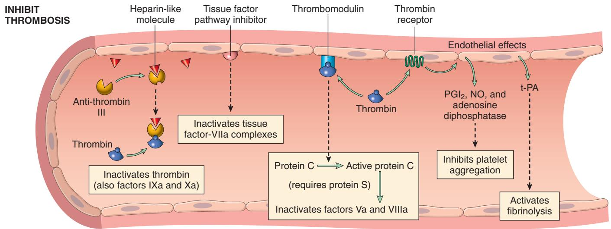
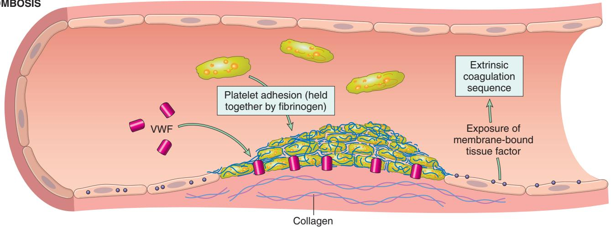 
FAVOR THROMBOSIS 
Fig. 4.11 Anti-coagulant properties of normal endothelium (top) and procoagulant properties of injured or activated endothelium (bottom). NO, Nitric oxide; $PGI_2$ , prostaglandin I2 (prostacyclin); t-PA, tissue plasminogen activator; VWF, von Willebrand factor. Thrombin receptors are also called protease-activated receptors (PARs).
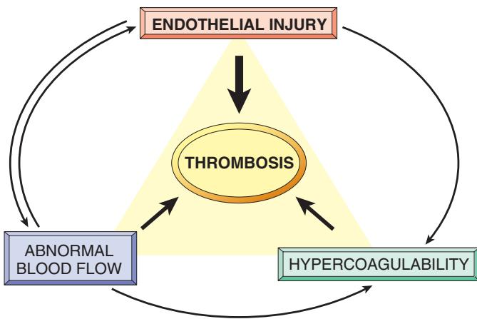 
Fig. 4.12 Virchow's triad in thrombosis. Endothelial integrity is the most important factor. Abnormalities of procoagulants or anti-coagulants can tip the balance in favor of thrombosis. Abnormal blood flow (stasis or turbulence) can lead to hypercoagulability directly and also indirectly through endothelial dysfunction.
one of the scourges of modern man, because it underlies the most serious and common forms of cardiovascular disease. Here, the focus is on its causes and consequences; its role in cardiovascular disorders is discussed in detail in Chapters 10 and 11.
# Endothelial Injury
Endothelial injury leading to platelet activation almost inevitably underlies thrombus formation in the heart and the arterial circulation, where the high rates of blood flow impede clot formation. Notably, cardiac and arterial clots are typically rich in platelets, and it is believed that platelet adherence and activation is a necessary prerequisite for thrombus formation under high shear stress, such as exists in arteries. This insight provides part of the reasoning behind the use of aspirin and other platelet inhibitors in coronary artery disease and acute myocardial infarction.
Obviously, severe endothelial injury may trigger thrombosis by exposing VWF and tissue factor. However, inflammation and other noxious stimuli also promote thrombosis
by shifting the pattern of gene expression in endothelium to one that is "prothrombotic." This change is sometimes referred to as endothelial activation or dysfunction and can be produced by diverse exposures, including physical injury, infectious agents, abnormal blood flow, inflammatory mediators, metabolic abnormalities, such as hypercholesterolemia or homocystinemia, and toxins absorbed from cigarette smoke. Endothelial activation is believed to have an important role in triggering arterial thrombotic events.
The role of endothelial cell activation and dysfunction in arterial thrombosis is also discussed in Chapters 10 and 11. Here it suffices to mention several of the major prothrombotic alterations:
- Procoagulant changes. Endothelial cells activated by cytokines downregulate the expression of thrombomodulin, already described as a key modulator of thrombin activity. This may result in sustained activation of thrombin, which can in turn stimulate platelets and augment inflammation through PARs expressed on platelets and inflammatory cells. In addition, inflamed endothelium also downregulates the expression of other anti-coagulants, such as protein C and tissue factor protein inhibitor, changes that further promote a procoagulant state. 
- Anti-fibrinolytic effects. Activated endothelial cells secrete Plasminogen activator inhibitors (PAI), which limit fibrinolysis and downregulate the expression of t-PA, alterations that also favor the development of thrombi.
# Abnormal Blood Flow
Turbulence (chaotic blood flow) contributes to arterial and cardiac thrombosis by causing endothelial injury or dysfunction, as well as by forming countercurrents and local pockets of stasis. Stasis is a major factor in the development of venous thrombi. Under conditions of normal laminar blood flow, platelets (and other blood cells) are found mainly in the center of the vessel lumen, separated from the endothelium by a slower-moving layer of plasma. By contrast, stasis and turbulence have the following deleterious effects:
- Both promote endothelial cell activation and enhanced procoagulant activity, in part through flow-induced changes in endothelial gene expression. 
- Stasis allows platelets and leukocytes to come into contact with the endothelium when the flow is sluggish. 
- Stasis also slows the washout of activated clotting factors and impedes the inflow of clotting factor inhibitors.
Turbulent and static blood flow contributes to thrombosis in a number of clinical settings. Ulcerated atherosclerotic plaques not only expose subendothelial ECM but also cause turbulence. Abnormal aortic and arterial dilations called aneurysms create local stasis and consequently are fertile sites for thrombosis (Chapter 9). Acute myocardial infarction results in focally noncontractile myocardium. Ventricular remodeling after more remote infarction can lead to aneurysm formation. In both cases, cardiac mural thrombi are more easily formed because of the local blood stasis (Chapter 11). Mitral valve stenosis (e.g., after rheumatic heart disease) results in left atrial
dilation. In conjunction with atrial fibrillation, a dilated atrium also produces stasis and is a prime location for the development of thrombi. Hyperviscosity syndromes (such as polycythemia vera, Chapter 12) increase resistance to flow and cause small vessel stasis; the deformed red cells in sickle cell anemia (Chapter 12) cause vascular occlusions, and the resultant stasis also predisposes to thrombosis.
# Hypercoagulability
Hypercoagulability refers to an abnormally high tendency of the blood to clot, and is typically caused by alterations in coagulation factors. It contributes infrequently to arterial or intracardiac thrombosis but is an important underlying risk factor for venous thrombosis. The alterations of the coagulation pathways that predispose affected persons to thrombosis can be divided into primary (genetic) and secondary (acquired) disorders (Table 4.2).
Primary (inherited) hypercoagulability is most often caused by mutations in the factor V and prothrombin genes:
- Approximately $2\%$ to $15\%$ of whites carry a specific factor V mutation (called the Leiden mutation, after the Dutch city where it was first described). Among those with recurrent deep venous thrombosis (DVT), the frequency of this mutation approaches $60\%$ . The mutation alters an amino acid residue in factor V and renders it
Table 4.2 Hypercoagulable States 
Primary (Genetic)Common (&gt;1% of the Population)Factor V mutation (G1691A mutation; factor V Leiden)Prothrombin mutation (G20210A variant)Increased levels of factor VIII, IX, or XI or fibrinogenRareAnti-thrombin III deficiencyProtein C deficiencyProtein S deficiencyVery RareFibrinolysis defectsHomozygous homocystinuria (deficiency of cystathione β-synthetase)Secondary (Acquired)High Risk for ThrombosisProlonged bed rest or immobilizationMyocardial infarctionAtrial fibrillationTissue injury (surgery, fracture, burn)CancerProsthetic cardiac valvesDisseminated intravascular coagulationHeparin-induced thrombocytopeniaAnti-phospholipid antibody syndromeLower Risk for ThrombosisCardiomyopathyNephrotic syndromeHyperestrogenic states (pregnancy and postpartum)Oral contraceptive useSickle cell anemiaSmoking
resistant to proteolysis by protein C. Thus, an important anti-thrombotic counterregulatory mechanism is lost. Heterozygotes carry a fivefold increased risk for venous thrombosis, with homozygotes having a 50-fold increased risk.
- A single-nucleotide substitution (G to A) in the $3^{\prime}$ -untranslated region of the prothrombin gene is a fairly common allele (found in $1\% - 2\%$ of the general population). This variant results in increased prothrombin transcription and is associated with a nearly threefold increased risk for venous thromboses. 
- Elevated levels of homocysteine contribute to arterial and venous thrombosis, as well as to the development of atherosclerosis (Chapter 10). The prothrombotic effects of homocysteine may be due to thioester linkages formed between homocysteine metabolites and a variety of proteins, including fibrinogen. Marked elevations of homocysteine may be caused by an inherited deficiency of cystathione $\beta$ -synthetase. 
- Less common primary hypercoagulable states include inherited deficiencies of anti-coagulants such as antithrombin III, protein C, or protein S; affected patients typically present with venous thrombosis and recurrent thromboembolism in adolescence or in early adult life.
Although the risk of thrombosis is only mildly increased in heterozygous carriers of factor V Leiden and the prothrombin gene variant, these genetic factors carry added significance for two reasons. First, both abnormal alleles are sufficiently frequent that homozygous and compound heterozygous persons are not uncommon, and these individuals are at much higher risk for thrombosis. More importantly, heterozygous individuals are at higher risk for venous thrombosis in the setting of other acquired risk factors, such as pregnancy, prolonged bed rest, and lengthy airplane flights. Consequently, inherited causes of hypercoagulability should be considered in young patients (<50 years of age), even when other acquired risk factors are present.
Secondary (acquired) hypercoagulability is seen in many settings (Table 4.2). In some situations (e.g., cardiac failure or trauma), stasis or vascular injury may be the most important factor. The hypercoagulability associated with oral contraceptive use and the hyperestrogenic state of pregnancy may be related to increased hepatic synthesis of coagulation factors and reduced synthesis of anti-thrombin III. In disseminated cancers, release of procoagulant tumor products (e.g., mucin from adenocarcinoma) predisposes to thrombosis. The hypercoagulability seen with advancing age has been attributed to increased platelet aggregation and reduced release of PGI2 from endothelium. Smoking and obesity promote hypercoagulability by unknown mechanisms.
Among the acquired thrombophilic states, two are particularly important clinical problems and deserve special mention:
- Heparin-induced thrombocytopenia (HIT) syndrome. This syndrome occurs in up to $5\%$ of patients treated with unfractionated heparin (for therapeutic anti-coagulation). It is marked by the development of autoantibodies that bind complexes of heparin and platelet membrane protein (platelet factor-4) (Chapter 12). Although the
mechanism is unclear, it appears that these antibodies may also bind similar complexes present on platelet and endothelial surfaces, resulting in platelet activation, aggregation, and consumption (hence thrombocytopenia), as well as causing endothelial cell injury. The overall result is a prothrombotic state, even in the face of heparin administration and low platelet counts. Newer low-molecular-weight fractionated heparin preparations induce autoantibodies less frequently but can still cause thrombosis if antibodies have already formed.
- Anti-phospholipid antibody syndrome. This syndrome (previously called the lupus anti-coagulant syndrome) has protean clinical manifestations, including recurrent thromboses, repeated miscarriages, cardiac valve vegetations, and thrombocytopenia. Depending on the vascular bed involved, the clinical presentations can include pulmonary embolism (following lower extremity venous thrombosis), pulmonary hypertension (from recurrent subclinical pulmonary emboli), stroke, bowel infarction, or renovascular hypertension. Fetal loss does not appear to be explained by thrombosis, but rather seems to stem from antibody-mediated interference with the growth and differentiation of trophoblasts, leading to a failure of placentation. Anti-phospholipid antibody syndrome is also a cause of renal microangiopathy, resulting in renal failure associated with multiple capillary and arterial thromboses (Chapter 14).
The name anti-phospholipid antibody syndrome came from the detection in patients of circulating antibodies that bind to phospholipids. But this name is misleading, as it is believed that the most important pathologic effects are mediated through binding of the antibodies to epitopes on proteins that are somehow induced or "unveiled" by phospholipids. Suspected antibody targets include $\beta_{2}$ -glycoprotein I, a plasma protein that associates with the surfaces of endothelial cells and trophoblasts, and prothrombin. In vivo, it is suspected that these antibodies bind to these and perhaps other proteins, thereby inducing a hypercoagulable state through uncertain mechanisms. However, in vitro, the antibodies interfere with phospholipids and thus inhibit coagulation (hence the name lupus anticoagulant, also a misnomer). The antibodies also frequently provide a false-positive serologic test for syphilis because the antigen in the standard assay for syphilis is embedded in cardiolipin.
Anti-phospholipid antibody syndrome has primary and secondary forms. Individuals with a well-defined autoimmune disease, such as systemic lupus erythematosus (Chapter 5), are designated as having secondary anti-phospholipid syndrome (hence the earlier term lupus anticoagulant syndrome). In primary anti-phospholipid syndrome, patients exhibit only the manifestations of a hypercoagulable state and lack evidence of other autoimmune disorders; occasionally, it appears following exposure to certain drugs or infections. Therapy involves anticoagulation and immunosuppression. Although anti-phospholipid antibodies are clearly associated with thrombotic diatheses, they have also been identified in $5\%$ to $15\%$ of apparently normal individuals, implying that they are necessary but not sufficient to cause the full-blown syndrome.

Thrombi can develop anywhere in the cardiovascular system. Arterial or cardiac thrombi typically arise at sites of endothelial injury or turbulence; venous thrombi characteristically occur at sites of stasis. Thrombi are focally attached to the underlying vascular surface and tend to propagate toward the heart; thus, arterial thrombi grow in a retrograde direction from the point of attachment, whereas venous thrombi extend in the direction of blood flow. The propagating portion of a thrombus tends to be poorly attached and therefore prone to fragmentation and migration through the blood as an embolus.
Thrombi can have grossly (and microscopically) apparent laminations called lines of Zahn; these represent pale platelet and fibrin layers alternating with darker red cell-rich layers. Such lines are significant in that they are only found in thrombi that form in flowing blood; their presence can therefore usually distinguish antemortem thrombosis from the bland nonlaminated clots that form in the postmortem state. Although thrombi formed in the "low-flow" venous system superficially resemble postmortem clots, careful evaluation generally shows ill-defined laminations.
Thrombi occurring in heart chambers or in the aortic lumen are designated as mural thrombi. Abnormal myocardial contraction (arrhythmias, dilated cardiomyopathy, or myocardial infarction) or endomyocardial injury (myocarditis, catheter trauma) promote cardiac mural thrombi (Fig. 4.13A), whereas ulcerated atherosclerotic plaques and aneurysmal dilation promote aortic thrombosis (Fig. 4.13B).
Arterial thrombi are frequently occlusive. They are typically rich in platelets, as the processes underlying their development (e.g., endothelial injury) lead to platelet activation. Although usually superimposed on a ruptured atherosclerotic plaque, other vascular injuries (vasculitis, trauma) can also be underlying causes. Venous thrombi (phlebothrombosis) are almost invariably occlusive; they frequently propagate some distance toward the heart, forming a long cast within the vessel lumen that is prone to give rise to emboli. Because these thrombi form in the sluggish venous circulation, they tend to contain more enmeshed red cells, leading to the moniker red, or stasis, thrombi. The veins of the lower extremities are most commonly affected (90% of venous thromboses); however, venous thrombi also can occur in the upper extremities, periprostatic plexus, or ovarian and periuterine veins, and under special circumstances they may be found in the dural sinuses, portal vein, or hepatic vein.
At autopsy, postmortem clots can sometimes be mistaken for venous thrombi. However, the former are gelatinous and because of red cell settling they have a dark red dependent portion and a yellow "chicken fat" upper portion; they also are usually not attached to the underlying vessel wall. By contrast, red thrombi typically are firm, focally attached to vessel walls, and they contain gray strands of deposited fibrin.
Thrombi on heart valves are called vegetations. Bacterial or fungal bloodborne infections can cause valve damage, leading to the development of large thrombotic masses (infective endocarditis) (Chapter 11). Sterile vegetations also can develop on noninfected valves in hypercoagulable states—the lesions of so-called "nonbacterial thrombotic endocarditis" (Chapter 11). Less commonly, sterile, verrucous endocarditis (Libman-Sacks endocarditis) can occur in the setting of systemic lupus erythematosus (Chapter 5).
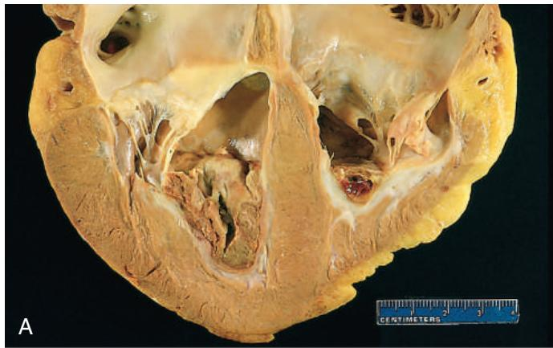
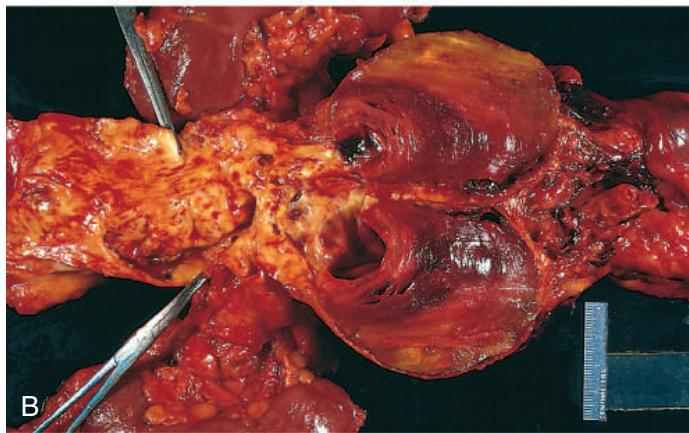 
Fig. 4.13 Mural thrombi. (A) Thrombus in the left and right ventricular apices, overlying white fibrous scar. (B) Laminated thrombus in a dilated abdominal aortic aneurysm. Numerous friable mural thrombi are also superimposed on advanced atherosclerotic lesions of the more proximal aorta (left side of photograph).
# Fate of the Thrombus
If a patient survives an initial thrombotic event, during the ensuing days to weeks the thrombus evolves through some combination of the following four processes:
- Propagation. The thrombus enlarges through the accretion of additional platelets and fibrin, increasing the odds of vascular occlusion or embolization. 
- Embolization. Part or all of the thrombus is dislodged and transported elsewhere in the vasculature. 
- Dissolution. If a thrombus is newly formed, activation of fibrinolytic factors may lead to its rapid shrinkage and complete dissolution. With older thrombi, extensive fibrin polymerization renders the thrombus substantially more resistant to plasmin-induced proteolysis, and lysis is ineffectual. This acquisition of resistance to lysis has clinical significance, as therapeutic administration of fibrinolytic agents (e.g., t-PA in the setting of acute coronary thrombosis) generally is not effective unless administered within a few hours of thrombus formation. 
- Organization and recanalization. Older thrombi become organized by the ingrowth of endothelial cells, smooth muscle cells, and fibroblasts (Fig. 4.14). In time, capillary channels are formed that—to a limited extent—create conduits along the length of the thrombus, thereby reestablishing the continuity of the original lumen. Further recanalization can sometimes convert a thrombus into a
andiscompletelyfilledwithorganizedthrombus..jpg) 
Fig. 4.14 An organized thrombus. Low-power view of a thrombosed artery stained for elastic tissue. The original lumen is delineated by the internal elastic lamina (arrows) and is completely filled with organized thrombus.
vascularized mass of connective tissue that is eventually incorporated into the wall of the remodeled vessel. Occasionally, instead of organizing, the center of a thrombus undergoes enzymatic digestion, presumably because of the release of lysosomal enzymes from entrapped leukocytes. If bacterial seeding occurs, the contents of degraded thrombi serve as an ideal culture medium, and the resulting infection may weaken the vessel wall, leading to the formation of a mycotic aneurysm (Chapter 10).
Thrombi are significant because they cause obstruction of arteries and veins and may give rise to emboli. The effect that is of the greatest clinical importance depends on the site of thrombosis. Thus, although venous thrombi can cause congestion and edema in vascular beds distal to an obstruction, they are most worrisome because of their potential to embolize to the lungs and cause death. Conversely, whereas arterial thrombi can embolize and cause tissue infarction, their tendency to obstruct vessels (e.g., in coronary and cerebral vessels) is considerably more important.
# Venous Thrombosis (Phlebothrombosis)
Most venous thrombi occur in the superficial or the deep veins of the leg. Superficial venous thrombi usually arise in the saphenous system, particularly in the setting of varicosities; these rarely embolize but they can be painful and can cause local congestion and swelling from impaired venous outflow, predisposing the overlying skin to the development of infections and varicose ulcers. Deep venous thromboses (DVTs) in the larger leg veins at or above the knee joint (e.g., popliteal, femoral, and iliac veins) are more serious because they are prone to embolize. Although such DVTs may cause local pain and edema, collateral channels often circumvent the venous obstruction. Consequently, DVTs are entirely asymptomatic in approximately $50\%$ of patients and are recognized only after they have embolized to the lungs.
Lower-extremity DVTs are associated with stasis and hypercoagulable states, as described earlier (Table 4.2). Thus, common predisposing factors include congestive
heart failure, bed rest, and immobilization; the latter two factors reduce the milking action of leg muscles and thus slow venous return. Trauma, surgery, and burns not only immobilize a patient but also are associated with vascular injury, procoagulant release, increased hepatic synthesis of coagulation factors, and reduced t-PA production. Many factors contribute to the thrombotic diathesis of pregnancy; in addition to the potential for amniotic fluid infusion into the circulation at the time of delivery, pressure produced by the enlarging fetus and uterus can produce stasis in the veins of the legs, and late pregnancy and the postpartum period are associated with hypercoagulability. Tumor-associated procoagulant release is largely responsible for the increased risk of thromboembolic phenomena seen in disseminated cancers. These are sometimes referred to as migratory thrombophlebitis, because of the tendency to involve several different venous beds transiently, or as Trousseau syndrome, for the physician who both described the disorder and suffered from it. Regardless of the specific clinical setting, the risk of DVT is increased in persons older than 50 years.
# Arterial and Cardiac Thrombosis
Atherosclerosis is a major cause of arterial thromboses because it is associated with the loss of endothelial integrity and with abnormal blood flow (Fig. 4.13B). Myocardial infarction can predispose to cardiac mural thrombi by causing dyskinetic myocardial contraction and endocardial injury (Fig. 4.13A), and rheumatic heart disease may engender atrial mural thrombi by causing atrial dilation and fibrillation. Both cardiac and aortic mural thrombi are prone to embolization. Although any tissue can be affected, the brain, kidneys, and spleen are particularly likely targets because of their rich blood supply.
# THROMBOSIS
- Thrombus development is usually related to one or more components of Virchow's triad: 
- endothelial injury (e.g., by toxins, hypertension, inflammation, or metabolic products) 
- abnormal blood flow, stasis, or turbulence (e.g., resulting from aneurysms, atherosclerotic plaque) 
hypercoagulability: either primary (e.g., factor V Leiden, increased prothrombin synthesis, anti-thrombin III deficiency) or secondary (e.g., bed rest, tissue damage, malignancy) 
- Thrombi may propagate, resolve, become organized, or embolize. 
- Thrombosis causes tissue injury by local vascular occlusion or by distal embolization.
# Disseminated Intravascular Coagulation (DIC)
DIC is widespread thrombosis within the microcirculation that may be of sudden or insidious onset. It may be seen in disorders ranging from obstetric complications to advanced malignancy. To complicate matters, the widespread microvascular thrombosis consumes platelets and coagulation proteins (hence the synonym consumptive coagulopathy), and at the same time, fibrinolytic mechanisms are activated.
The net result is that excessive clotting and bleeding may co-exist in the same patient. It is discussed in greater detail along with other bleeding diatheses in Chapter 12.
# EMBOLISM
An embolus is a detached intravascular solid, liquid, or gaseous mass that is carried by the blood from its point of origin to a distant site, where it often causes tissue dysfunction or infarction. The vast majority of emboli derive from a dislodged thrombus—hence the term thromboembolism. Less commonly, emboli are composed of fat droplets, bubbles of air or nitrogen, atherosclerotic debris (cholesterol emboli), tumor fragments, bits of bone marrow, or amniotic fluid. Inevitably, emboli lodge in vessels too small to permit further passage, resulting in partial or complete vascular occlusion; depending on the site of origin, emboli can arrest anywhere in the vascular tree. The primary consequence of systemic embolization is ischemic necrosis (infarction) of downstream tissues, whereas embolization in the pulmonary circulation leads to hypoxia, hypotension, and right-sided heart failure.
# Pulmonary Thromboembolism
Pulmonary emboli originate from deep venous thromboses and are responsible for the most common form of thromboembolic disease. The incidence of pulmonary embolism (PE) is 2 to 4 per 1000 hospitalized patients. Although the rate of fatal PE has declined considerably since the early 1990s, PE still causes about 100,000 deaths per year in the United States. In more than $95\%$ of cases, venous emboli originate from thrombi within deep leg veins proximal to the popliteal fossa; embolization from lower leg thrombi is uncommon.
Fragmented thrombi from DVTs are carried through progressively larger channels and usually pass through the right side of the heart before arresting in the pulmonary vasculature. Depending on size, a PE can occlude the main pulmonary artery, lodge at the bifurcation of the right and left pulmonary arteries (saddle embolus), or pass into the smaller, branching arterioles (Fig. 4.15). Frequently, multiple emboli occur, either sequentially or as a shower of smaller emboli from a single large thrombus; a patient who has had one pulmonary embolus is at increased risk for having more. Rarely, an embolus passes through an atrial or ventricular defect and enters the systemic circulation (paradoxical embolism). A more complete discussion of PE is found in Chapter 13; the major clinical and pathologic features are the following:
- Most pulmonary emboli $(60\% - 80\%)$ are small and clinically silent. With time, they undergo organization and become incorporated into the vascular wall; in some cases, organization of thromboemboli leaves behind bridging fibrous webs. 
- At the other end of the spectrum, a large embolus that blocks a major pulmonary artery can cause sudden death. 
- Embolic obstruction of medium-sized arteries and subsequent rupture of downstream capillaries rendered anoxic can cause pulmonary hemorrhage. Such emboli do not usually cause pulmonary infarction because the
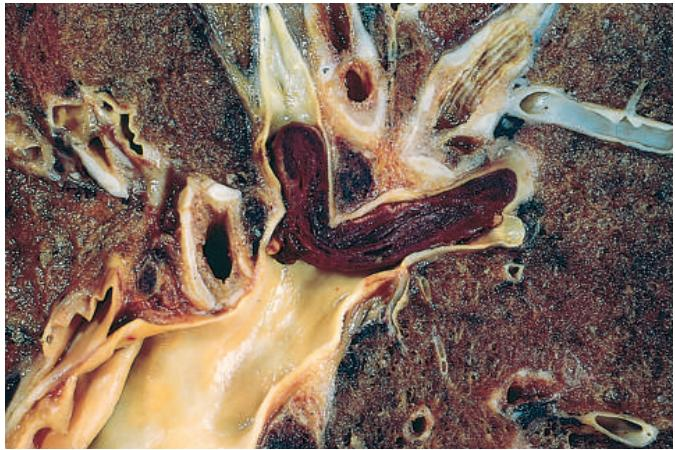 
Fig. 4.15 Embolus derived from a lower-extremity deep venous thrombus lodged in a pulmonary artery branch.
area also receives blood through an intact bronchial circulation (dual circulation). However, a similar embolus in the setting of left-sided cardiac failure (and diminished bronchial artery perfusion) can lead to a pulmonary infarct.
- Embolism to small end-arteriolar pulmonary branches usually causes infarction. 
- Multiple emboli occurring through time can cause pulmonary hypertension and right ventricular failure (cor pulmonale).
# Systemic Thromboembolism
Most systemic emboli $(80\%)$ arise from intracardiac mural thrombi; two-thirds of these are associated with left ventricular infarcts and another $25\%$ with dilated left atria (e.g., secondary to mitral valve disease). The remainder originate from aortic aneurysms, thrombi overlying ulcerated atherosclerotic plaques, fragmented valvular vegetations (Chapter 11), or the venous system (paradoxical emboli); $10\%$ to $15\%$ of systemic emboli are of unknown origin.
By contrast with venous emboli, which lodge primarily in the lung, arterial emboli can travel virtually anywhere; their final resting place understandably depends on their point of origin and the relative flow rates of blood to the downstream tissues. Common arteriolar embolization sites include the lower extremities (75%) and central nervous system (10%); intestines, kidneys, and spleen are less common targets. The consequences of embolization depend on the caliber of the occluded vessel, the collateral supply, and the affected tissue's vulnerability to anoxia; arterial emboli often lodge in end arteries and cause infarction.
# Fat Embolism
Soft tissue crush injury or rupture of marrow vascular sinusoids (eg, due to a long bone fracture) release microscopic fat globules into the circulation. Fat and marrow emboli are common incidental findings after vigorous cardiopulmonary resuscitation but probably are of little clinical significance. Similarly, although fat and marrow embolism occurs in some $90\%$ of individuals with severe skeletal injuries (Fig. 4.16A), less than $10\%$ show any clinical findings. However, a minority of patients develop a
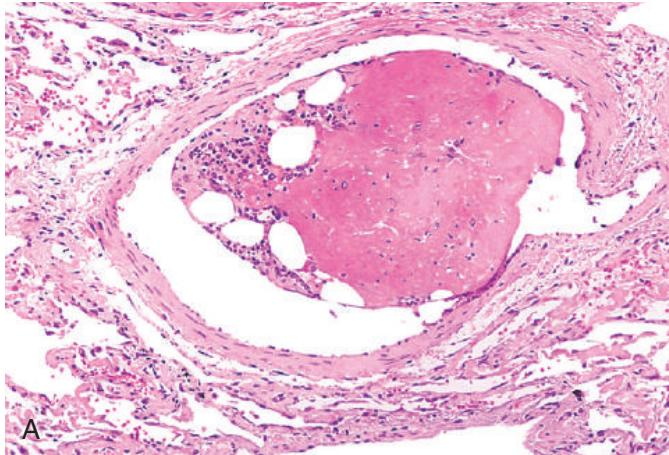
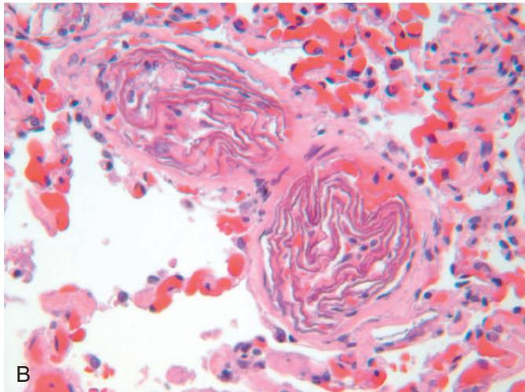 
Fig. 4.16 Unusual types of emboli. (A) Bone marrow embolus. The embolus is composed of hematopoietic marrow and marrow fat cells (clear spaces) attached to a thrombus. (B) Amniotic fluid emboli. Two small pulmonary arterioles are packed with laminated swirls of fetal squamous cells. The surrounding lung is edematous and congested. (Courtesy of Dr. Beth Schwartz, Baltimore, MD.)
symptomatic fat embolism syndrome characterized by pulmonary insufficiency, neurologic symptoms, anemia, thrombocytopenia, and a diffuse petechial rash that is fatal in $10\%$ of cases. Clinical signs and symptoms appear 1 to 3 days after injury as the sudden onset of tachypnea, dyspnea, tachycardia, irritability, and restlessness, which can progress rapidly to delirium or coma. Thrombocytopenia is attributed to platelet adhesion to fat globules and subsequent aggregation or splenic sequestration; anemia can result from similar red cell aggregation and/or hemolysis. A diffuse petechial rash (seen in $20\% -50\%$ of cases) is related to rapid onset of thrombocytopenia and can be a useful diagnostic feature.
The pathogenesis of fat emboli syndrome involves both mechanical obstruction and biochemical injury. Fat microemboli occlude pulmonary and cerebral microvasculature, both directly and by triggering platelet aggregation. This deleterious effect is exacerbated by fatty acid release from lipid globules, which causes local toxic endothelial injury. Platelet activation and granulocyte recruitment (with free radical, protease, and eicosanoid release) (Chapter 3) complete the vascular assault. Because lipids are dissolved by the solvents used during tissue processing, microscopic
demonstration of fat microglobules (i.e., in the absence of accompanying marrow elements) requires specialized techniques (frozen sections and fat stains).
# Amniotic Fluid Embolism
Amniotic fluid embolism is an uncommon, grave complication of labor and the immediate postpartum period occurring in 1 in 40,000 deliveries. The mortality rate approaches $80\%$ , making it the most common cause of maternal death in the developed world and the fifth most common cause of maternal death in the United States, accounting for $10\%$ of maternal deaths in this country; $85\%$ of survivors suffer some form of permanent neurologic deficit. Onset is characterized by sudden severe dyspnea, cyanosis, and hypotensive shock, followed by seizures and coma. If the patient survives the initial crisis, pulmonary edema typically develops, along with (in about half the patients) disseminated intravascular coagulation secondary to release of thrombogenic substances from amniotic fluid. Indeed it is thought that morbidity and mortality in such cases results not from mechanical obstruction of pulmonary vessels but from biochemical activation of the coagulation system and the innate immune system caused by substances in the amniotic fluid.
The underlying cause is the entry of amniotic fluid (and its contents) into the maternal circulation via tears in the placental membranes and/or uterine vein rupture. Histologic analysis shows squamous cells shed from fetal skin, lanugo hair, fat from vernix caseosa, and mucin derived from the fetal respiratory or gastrointestinal tracts in the maternal pulmonary microcirculation (Fig. 4.16B). Other findings include marked pulmonary edema, diffuse alveolar damage (Chapter 13), and systemic fibrin thrombi generated by disseminated intravascular coagulation.
# Air Embolism
Gas bubbles within the circulation can coalesce and obstruct vascular flow and cause distal ischemic injury. Thus, a small volume of air trapped in a coronary artery during bypass surgery or introduced into the cerebral arterial circulation by neurosurgery performed in an upright "sitting position" can occlude flow, with dire consequences. Small venous gas emboli generally have no deleterious effects, but sufficient air can enter the pulmonary circulation inadvertently during obstetric or laproscopic procedures or as a consequence of a chest wall injury to cause hypoxia, and very large venous emboli may arrest in the heart and cause death.
A particular form of gas embolism called decompression sickness is caused by sudden changes in atmospheric pressure. Scuba divers, underwater construction workers, and persons in unpressurized aircraft who undergo rapid ascent are at risk. When air is breathed at high pressure (e.g., during a deep sea dive), increased amounts of gas (particularly nitrogen) become dissolved in the blood and tissues. If the diver then ascends (depressurizes) too rapidly, the nitrogen expands in the tissues and bubbles out of solution in the blood to form gas emboli, which cause tissue ischemia. Rapid formation of gas bubbles within skeletal muscles and supporting tissues in and about joints is responsible for
the painful condition called the bends (so named in the 1880s because the afflicted person arches the back in a manner reminiscent of a then-popular women's fashion pose called the Grecian bend). Gas bubbles in the pulmonary vasculature cause edema, hemorrhages, and focal atelectasis or emphysema, leading to respiratory distress, the so-called "chokes". Bubbles in the central nervous system can cause mental impairment and even sudden onset of coma. A more chronic form of decompression sickness is called caisson disease (named for pressurized underwater vessels used during bridge construction), in which recurrent or persistent gas emboli in the bones lead to multifocal ischemic necrosis; the heads of the femurs, tibiae, and humeri are most commonly affected.
Placing affected persons in a high-pressure chamber, to force the gas back into solution, treats acute decompression sickness. Subsequent slow decompression permits gradual gas resorption and exhalation so that obstructive bubbles do not re-form.
# EMBOLISM
- An embolus is a solid, liquid, or gaseous mass carried by the blood to a site distant from its origin; most are dislodged thrombi. 
- Pulmonary emboli derive primarily from lower-extremity deep vein thrombi. Their effects depend mainly on the size of the embolus and the location in which it lodges. Consequences may include right-sided heart failure, pulmonary hemorrhage, pulmonary infarction, or sudden death. 
- Systemic emboli derive primarily from cardiac mural or valvular thrombi, aortic aneurysms, or atherosclerotic plaques; whether an embolus causes tissue infarction depends on the site of embolization and the presence or absence of collateral circulation. 
- Fat embolism can occur after crushing injuries to the bones; symptoms include pulmonary insufficiency and neurological damage. Amniotic fluid embolism may follow childbirth and can give rise to fatal pulmonary and cerebral manifestations. Air embolism can occur upon rapid decompression, most commonly in divers; it results from sudden bubbling of nitrogen dissolved in blood at higher pressures.
# INFARCTION
An infarct is an area of ischemic necrosis caused by occlusion of the vascular supply to the affected tissue. Infarction primarily affecting the heart and the brain is a common and extremely important cause of clinical illness. Roughly $40\%$ of all deaths in the United States are a consequence of cardiovascular disease, with most of these deaths stemming from myocardial or cerebral infarction. Pulmonary infarction is a common clinical complication, bowel infarction often is fatal, and ischemic necrosis of distal extremities (gangrene) causes substantial morbidity in the diabetic population.
Arterial thrombosis or arterial embolism underlies the vast majority of infarctions. Less common causes of arterial obstruction include vasospasm, expansion of an atheroma secondary to intraplaque hemorrhage, and extrinsic compression of a vessel, such as by tumor, a dissecting aortic aneurysm, or edema within a confined space (e.g., in anterior tibial compartment syndrome). Other uncommon causes of tissue infarction include vessel twisting (e.g., in testicular torsion or bowel volvulus), traumatic vascular rupture, and entrapment in a hernia sac. Although venous thrombosis can cause infarction, the more common outcome is simply congestion; typically, bypass channels rapidly open to provide sufficient outflow to restore the arterial inflow. Infarcts caused by venous thrombosis thus usually occur only in organs with a single efferent vein (e.g., testis or ovary).
Infarcts are classified based on their color (reflecting the amount of hemorrhage) and the presence or absence of microbial infection. Thus, infarcts may be either red (hemorrhagic) or white (anemic) and may be either septic or bland.
Red infarcts (Fig. 4.17A) occur $(I)$ as a result of venous occlusions (such as in ovarian torsion); (2) in loose tissues (e.g., lung) where blood can collect in infarcted zones; (3) in tissues with dual circulations such as lung and small intestine, where partial, albeit
Hemorrhagic,roughlywedge-shapedpulmonaryinfarct(redinfarct).(B)Sharplydemarcatedpaleinfarctinthespleen(whiteinfarct)..jpg) 
Fig. 4.17 Red and white infarcts. (A) Hemorrhagic, roughly wedge-shaped pulmonary infarct (red infarct). (B) Sharply demarcated pale infarct in the spleen (white infarct).
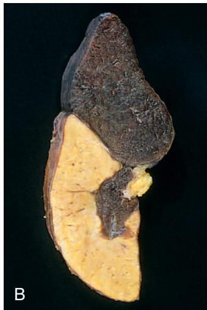
inadequate perfusion by collateral arterial supplies is typical; (4) in previously congested tissues (as a consequence of sluggish venous outflow); and (5) when flow is reestablished after infarction has occurred (e.g., after angioplasty of an arterial obstruction).
White infarcts occur with arterial occlusions in solid organs with end-arterial circulations (e.g., heart, spleen, and kidney), and where tissue density limits the seepage of blood from adjoining patent vascular beds (Fig. 4.17B). Infarcts tend to be wedgeshaped, with the occluded vessel at the apex and the organ periphery forming the base (Fig. 4.17); when the base is a serosal surface, there is often an overlying fibrinous exudate. Lateral margins may be irregular, reflecting flow from adjacent vessels. The margins of acute infarcts typically are indistinct and slightly hemorrhagic; with time, the edges become better defined by a narrow rim of hyperemia attributable to inflammation.
Infarcts resulting from arterial occlusions in organs without a dual circulation typically become progressively paler and more sharply defined with time (Fig. 4.17B). By comparison, hemorrhagic infarcts are the rule in the lung and other spongy organs (Fig. 4.17A). Extravasated red cells in hemorrhagic infarcts are phagocytosed by macrophages, and the heme iron is converted to intracellular hemosiderin. Small amounts do not impart any appreciable color to the tissue, but extensive hemorrhages leave a firm, brown residue.
In most tissues, the main histologic finding associated with infarcts is ischemic coagulative necrosis (Chapter 2). An inflammatory response begins to develop along the margins of infarcts within a few hours and usually is well defined within 1 to 2 days. Eventually, inflammation is followed by repair, beginning in the preserved margins (Chapter 3). In some tissues, parenchymal regeneration can occur at the periphery of the infarct, where the underlying stromal architecture has been spared. Most infarcts, however, are ultimately replaced by scar (Fig. 4.18). The brain is an exception to these generalizations; ischemic tissue injury in the central nervous system results in liqueactive necrosis (Chapter 2).
Septic infarctis occur when infected cardiac valve vegetations embolize, or when microbes seed necrotic tissue. In these cases the infarct is converted into an abscess, with a correspondingly greater inflammatory response and healing by organization and fibrosis (Chapter 3).
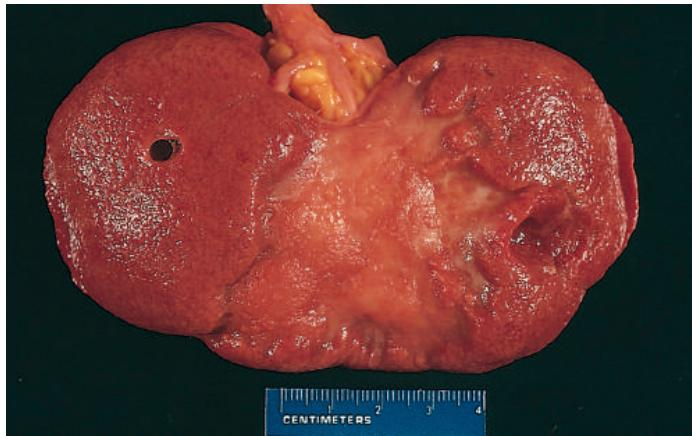 
Fig. 4.18 Remote kidney infarct, now replaced by a large fibrotic scar.
# Factors That Influence Infarct Development
The effects of vascular occlusion range from inconsequential to tissue necrosis leading to organ dysfunction and sometimes death. The range of outcomes is influenced by the following three variables:
- Anatomy of the vascular supply. The presence or absence of an alternative blood supply is the most important factor in determining whether occlusion of an individual vessel causes damage. The dual supply of the lung by the pulmonary and bronchial arteries means that obstruction of the pulmonary arterioles does not cause lung infarction unless the bronchial circulation also is compromised. Similarly, the liver, which receives blood from the hepatic artery and the portal vein, and the hand and forearm, with its parallel radial and ulnar arterial supply, are resistant to infarction. By contrast, the kidney and the spleen both have end-arterial circulations, and arterial obstruction generally leads to infarction in these tissues. 
- Rate of occlusion. Slowly developing occlusions are less likely to cause infarction because they allow time for the development of collateral blood supplies. For example, small interarteriolar anastomoses, which normally carry minimal blood flow, interconnect the three major coronary arteries. If one coronary artery is slowly occluded (e.g., by encroaching atherosclerotic plaque), flow in this collateral circulation may increase sufficiently to prevent infarction—even if the original artery becomes completely occluded. 
- Tissue vulnerability to hypoxia. Neurons undergo irreversible damage when deprived of their blood supply for only 3 to 4 minutes. Myocardial cells, although hardier than neurons, still die after only 20 to 30 minutes of ischemia. By contrast, fibroblasts within myocardium remain viable after many hours of ischemia.
# INFARCTION
- Infarcts are areas of ischemic necrosis most commonly caused by arterial occlusion (typically resulting from thrombosis or embolization); venous outflow obstruction is a less frequent cause. 
- Infarcts caused by venous occlusion or occurring in spongy tissues typically are hemorrhagic (red); those caused by arterial occlusion in compact tissues typically are pale (white). 
- Whether or not vascular occlusion causes tissue infarction is influenced by collateral blood supplies, the rate at which an obstruction develops, intrinsic tissue susceptibility to ischemic injury, and blood oxygenation.
# SHOCK
Shock is a state in which diminished cardiac output or reduced effective circulating blood volume impairs tissue perfusion and leads to cellular hypoxia. At the outset, the cellular injury is reversible; however, prolonged shock eventually leads to irreversible tissue injury and is often fatal.
Table 4.3 Three Major Types of Shock 
Type of ShockClinical ExamplesPrincipal Pathogenic MechanismsCardiogenicMyocardial infarctionFailure of myocardial pump resulting from intrinsic myocardial damage, extrinsic pressure, or obstruction to outflowVentricular ruptureArrhythmiaCardiac tamponadePulmonary embolismHypovolemicHemorrhageInadequate blood or plasma volumeFluid loss (e.g., vomiting, diarrhea, burns, trauma)SepticOverwhelming microbial infectionsPeripheral vasodilation and pooling of blood; endothelial activation/injury; leukocyte-induced damage; disseminated intravascular coagulation; activation of cytokine cascadesGram-negative sepsisGram-positive septicemiaFungal sepsisSuperantigens (e.g., toxic shock syndrome)
Shock may complicate severe hemorrhage, extensive trauma or burns, myocardial infarction, pulmonary embolism, and microbial sepsis. Its causes fall into three general categories (Table 4.3):
- Cardiogenic shock results from low cardiac output as a result of myocardial pump failure. It may be caused by myocardial damage (infarction), ventricular arrhythmias, extrinsic compression (cardiac tamponade) (Chapter 12), or outflow obstruction (e.g., pulmonary embolism). 
- Hypovolemic shock results from low cardiac output due to loss of blood or plasma volume (e.g., resulting from hemorrhage or fluid loss from severe burns). 
- Septic shock is triggered by microbial infections and is associated with severe systemic inflammatory response syndrome (SIRS). In addition to microbes, SIRS may be triggered by a variety of insults, including burns, trauma, and/or pancreatitis. The common pathogenic mechanism is a massive outpouring of inflammatory mediators from innate and adaptive immune cells that produce arterial vasodilation, vascular leakage, and venous blood pooling. These cardiovascular abnormalities result in tissue hypoperfusion, cellular hypoxia, and metabolic derangements that lead to organ dysfunction and, if severe and persistent, organ failure and death. The pathogenesis of shock is discussed in detail below.
Less commonly, shock can result from a loss of vascular tone associated with anesthesia or secondary to a spinal cord injury (neurogenic shock). Anaphylactic shock results from systemic vasodilation and increased vascular permeability that is triggered by an immunoglobulin E-mediated hypersensitivity reaction (Chapter 5).
# Pathogenesis of Septic Shock
Septic shock is responsible for $2\%$ of all hospital admissions in the United States. Of these, $50\%$ require treatment in intensive care units. The number of cases in the United States exceeds 750,000/year and the incidence is rising, which is ironically due to improvements in life support for critically ill patients, as well as the growing ranks of immunocompromised hosts (because of chemotherapy, immunosuppression, advanced age, or human immunodeficiency virus infection) and the increasing prevalence of multidrug-resistant organisms in the hospital setting. Despite
improvements in care, the mortality remains at a staggering $20\%$ to $30\%$ .
Septic shock is most frequently triggered by gram-positive bacterial infections, followed by gram-negative bacteria and fungi. Hence, an older synonym, "endotoxic shock," is no longer appropriate.
The ability of diverse microorganisms to cause septic shock is consistent with the idea that a variety of microbial constituents can trigger the process. As mentioned in Chapter 3, macrophages, neutrophils, dendritic cells, endothelial cells, and soluble components of the innate immune system (e.g., complement) recognize and are activated by several substances derived from microorganisms. After activation, these cells and factors initiate a number of inflammatory responses that interact in a complex, incompletely understood fashion to produce septic shock and multiorgan dysfunction (Fig. 4.19).
Factors believed to play major roles in the pathophysiology of septic shock include the following:
- Inflammatory and counterinflammatory responses. In sepsis, various microbial cell wall constituents engage receptors on cells of the innate immune system, triggering proinflammatory responses. Likely initiators of inflammation in sepsis are signaling pathways that lie downstream of Toll-like receptors (TLRs) (Chapter 5), which recognize a host of microbe-derived substances containing so-called "pathogen-associated molecular patterns" (PAMPs), as well as G-protein-coupled receptors that detect bacterial peptides, and C-type lectin receptors such as Dectins. On activation, innate immune cells produce numerous cytokines, including TNF, IL-1, IFN $\gamma$ , IL-12, and IL-18, as well as other inflammatory mediators such as high-mobility group box 1 protein (HMGB1). Markers of acute inflammation such as C-reactive protein and procalcitonin are also elevated. The latter is a clinically useful indicator of septic shock. Reactive oxygen species and lipid mediators such as prostaglandins and platelet-activating factor (PAF) are also elaborated. These effector molecules induce endothelial cells (and other cell types) to upregulate adhesion molecule expression and further stimulate cytokine and chemokine production. The complement cascade is also activated by microbial components, both directly and through the proteolytic activity of plasmin (Chapter 3), resulting in the production of anaphylotoxins (C3a, C5a), chemotactic fragments (C5a), and opsonins (C3b), all of which
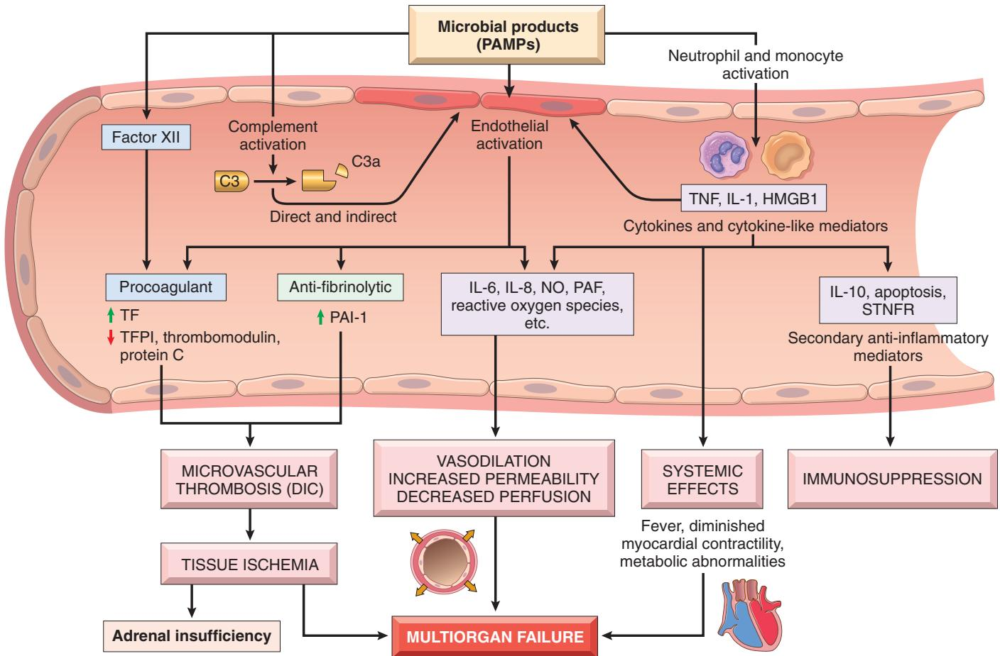 
Fig. 4.19 Major pathogenic pathways in septic shock. Microbial products activate endothelial cells and cellular and humoral elements of the innate immune system, initiating a cascade of events that lead to end-stage multiorgan failure. Additional details are provided in the text. DIC, Disseminated intravascular coagulation; HMGB1, high-mobility group box I protein; NO, nitric oxide; PAF, platelet-activating factor; PAI-I, plasminogen activator inhibitor-I; PAMP, pathogen-associated molecular pattern; STNFR, soluble tumor necrosis factor receptor; TF, tissue factor; TFPI, tissue factor pathway inhibitor.
contribute to the proinflammatory state. In addition, microbial components can activate coagulation directly through factor XII and indirectly through altered endothelial function (discussed later). The accompanying widespread activation of thrombin may further augment inflammation by triggering protease activated receptors on inflammatory cells.
The hyperinflammatory state, initiated by sepsis, triggers counterregulatory immunosuppressive mechanisms, which may involve both innate and adaptive immune cells. As a result, septic patients may oscillate between hyperinflammatory and immunosuppressed states during their clinical course. Proposed mechanisms for the immune suppression include a shift from proinflammatory $(\mathrm{T_H}1)$ to anti-inflammatory $(\mathrm{T_H}2)$ cytokines (Chapter 5), production of anti-inflammatory mediators (e.g., soluble TNF receptor, IL-1 receptor antagonist, and IL-10), lymphocyte apoptosis, the immunosuppressive effects of apoptotic cells, and the induction of cellular anergy. In some patients the counterregulatory mechanisms overshoot the inflammatory responses and the resultant immune suppression renders such patients susceptible to superinfections.
- Endothelial activation and injury. The proinflammatory state and endothelial cell activation associated with sepsis lead to widespread vascular leakage and tissue
edema, which have deleterious effects on both nutrient delivery and waste removal. One effect of inflammatory cytokines is to loosen endothelial cell tight junctions, making vessels leaky and resulting in the accumulation of protein-rich edema fluid throughout the body. This alteration impedes tissue perfusion and may be exacerbated by attempts to support the patient with intravenous fluids. Activated endothelium also upregulates production of nitric oxide (NO) and other vasoactive inflammatory mediators (e.g., C3a, C5a, and PAF), which may contribute to vascular smooth muscle relaxation and systemic hypotension.
- Induction of a procoagulant state. The derangement in coagulation is sufficient to produce the formidable complication of disseminated intravascular coagulation in up to half of septic patients. Sepsis alters the expression of many factors so as to favor coagulation. Proinflammatory cytokines increase tissue factor production by monocytes and possibly endothelial cells as well, and decrease the production of endothelial anti-coagulant factors, such as tissue factor pathway inhibitor, thrombomodulin, and protein C (see Fig. 4.11). They also dampen fibrinolysis by increasing plasminogen activator inhibitor-1 expression (see Fig. 4.10). The vascular leak and tissue edema decrease blood flow at the level of small vessels, producing stasis and diminishing the
washout of activated coagulation factors. Acting in concert, these effects lead to systemic activation of thrombin and the deposition of fibrin-rich thrombi in small vessels, often throughout the body, further compromising tissue perfusion. In full-blown disseminated intravascular coagulation, the consumption of coagulation factors and platelets is so great that deficiencies of these factors appear, leading to concomitant bleeding and hemorrhage (Chapter 12).
Metabolic abnormalities. Septic patients exhibit insulin resistance and hyperglycemia. Cytokines such as TNF and IL-1, stress-induced hormones (such as glucagon, growth hormone, and glucocorticoids), and catecholamines all drive gluconeogenesis. At the same time, the proinflammatory cytokines suppress insulin release while simultaneously promoting insulin resistance in the liver and other tissues, likely by impairing the surface expression of GLUT-4, a glucose transporter. Hyperglycemia decreases neutrophil function—thereby suppressing bactericidal activity—and causes increased adhesion molecule expression on endothelial cells. Although sepsis is initially associated with an acute surge in glucocorticoid production, this phase may be followed by adrenal insufficiency and a functional deficit of glucocorticoids. This may stem from depression of the synthetic capacity of intact adrenal glands or frank adrenal necrosis resulting from disseminated intravascular dissemination (Waterhouse-Friderichsen syndrome) (Chapter 20). Finally, cellular hypoxia and diminished oxidative phosphorylation lead to increased lactate production and lactic acidosis. 
- Organ dysfunction. Systemic hypotension, interstitial edema, and small vessel thrombosis all decrease the delivery of oxygen and nutrients to the tissues that, because of cellular hypoxia, fail to properly use those nutrients that are delivered. Mitochondrial damage resulting from oxidative stress impairs oxygen use. High levels of cytokines and secondary mediators diminish myocardial contractility and cardiac output, and increased vascular permeability and endothelial injury can lead to the acute respiratory distress syndrome (Chapter 13). Ultimately, these factors may conspire to cause the failure of multiple organs, particularly the kidneys, liver, lungs, and heart, culminating in death.
The severity and outcome of septic shock are likely dependent on the extent and virulence of the infection; the immune status of the host; the presence of other comorbid conditions; and the pattern and level of mediator production. The multiplicity of factors and the complexity of the interactions that underlie sepsis explain why most attempts to intervene therapeutically with antagonists of specific mediators have not been effective and may even have had deleterious effects in some cases. The standard of care remains antibiotics to treat the underlying infection and intravenous fluids, pressors, and supplemental oxygen to maintain blood pressure and limit tissue hypoxia. Suffice it to say that even in the best of clinical centers, septic shock remains an obstinate clinical challenge.
An additional group of secreted bacterial proteins called superantigens also cause a syndrome similar to septic shock (e.g., toxic shock syndrome). Superantigens are polyclonal
T-lymphocyte activators that induce the release of high levels of cytokines that result in a variety of clinical manifestations, ranging from a diffuse rash to vasodilation, hypotension, shock, and death.
# Stages of Shock
Shock is a progressive disorder that leads to death if the underlying problems are not corrected. The exact mechanisms of sepsis-related death are still unclear; aside from increased lymphocyte and enterocyte apoptosis, cellular necrosis is minimal. Death typically follows the failure of multiple organs, which usually offer no morphological clues to explain their dysfunction. For hypovolemic and cardiogenic shock, however, the pathways leading to a patient's demise are reasonably well understood. Unless the insult is massive and rapidly lethal (e.g., exsanguination from a ruptured aortic aneurysm), shock tends to evolve through three general (albeit somewhat artificial) stages. These stages have been documented most clearly in hypovolemic shock but are common to other forms as well:
- An initial nonprogressive stage during which reflex compensatory mechanisms are activated and vital organ perfusion is maintained, 
- A progressive stage characterized by tissue hypoperfusion and onset of worsening circulatory and metabolic derangement, including acidosis, 
- An irreversible stage in which cellular and tissue injury is so severe that even if the hemodynamic defects are corrected, survival is not possible.
In the early nonprogressive phase of shock, various neurohumoral mechanisms help maintain cardiac output and blood pressure. These mechanisms include baroreceptor reflexes, release of catecholamines and anti-diuretic hormone, activation of the renin-angiotensin-aldosterone axis, and generalized sympathetic stimulation. The net effect is tachycardia, peripheral vasoconstriction, and renal fluid conservation; cutaneous vasoconstriction causes the characteristic "shocky" skin coolness and pallor (notably, septic shock can initially cause cutaneous vasodilation, so the patient may present with warm, flushed skin). Coronary and cerebral vessels are less sensitive to sympathetic signals and maintain relatively normal caliber, blood flow, and oxygen delivery. Thus, blood is shunted away from the skin to the vital organs such as the heart and the brain.
If the underlying causes are not corrected, shock passes imperceptibly to the progressive phase, which as noted is characterized by widespread tissue hypoxia. In the setting of persistent oxygen deficit, intracellular aerobic respiration is replaced by anaerobic glycolysis with excessive production of lactic acid. The resultant metabolic lactic acidosis lowers the tissue $\mathsf{pH}$ which blunts the vasomotor response; arterioles dilate, and blood begins to pool in the microcirculation. Peripheral pooling not only worsens the cardiac output but also puts endothelial cells at risk for the development of anoxic injury with subsequent DIC. With widespread tissue hypoxia, vital organs are affected and begin to fail.
In the absence of appropriate intervention, or in severe cases, the process eventually enters an irreversible stage. Widespread cell injury is reflected in lysosomal enzyme
leakage, further aggravating the shock state. Myocardial contractile function worsens, in part because of increased NO synthesis. The ischemic bowel may allow intestinal flora to enter the circulation, and thus bacteremic shock may be superimposed. Commonly, further progression to renal failure occurs as a consequence of ischemic injury of the kidney (Chapter 14), and despite the best therapeutic interventions, the downward spiral frequently culminates in death.
The cellular and tissue effects of shock are essentially those of hypoxic injury (Chapter 2) and are caused by a combination of hypoperfusion and microvascular thrombosis. Although any organ can be affected, the brain, heart, kidneys, adrenals, and gastrointestinal tract are most commonly involved. Fibrin thrombi can form in any tissue but typically are most readily visualized in kidney glomeruli. Adrenal cortical cell lipid depletion is akin to that seen in all forms of stress and reflects increased use of stored lipids for steroid synthesis. Whereas the lungs are resistant to hypoxic injury in hypovolemic shock occurring after hemorrhage, sepsis or trauma can precipitate diffuse alveolar damage (Chapter 13), leading to so-called "shock lung." Except for neuronal and cardiomyocyte loss, affected tissues can recover completely if the patient survives.
The clinical manifestations of shock depend on the precipitating insult. In hypovolemic and cardiogenic shock, patients exhibit hypotension, a weak rapid pulse, tachypnea, and cool, clammy, cyanotic skin. As already noted, in septic shock, the skin may be warm and flushed owing to peripheral vasodilation. The primary threat to life is the underlying initiating event (e.g., myocardial infarction, severe hemorrhage, bacterial infection). However, the cardiac, cerebral, and pulmonary changes rapidly aggravate the situation. If patients survive the initial period, worsening renal function can provoke a phase dominated by progressive oliguria, acidosis, and electrolyte imbalances.
Prognosis varies with the origin of shock and its duration. Thus, more than $90\%$ of young, otherwise healthy patients with hypovolemic shock survive with appropriate management; by comparison, septic or cardiogenic shock is associated with substantially worse outcomes, even with state-of-the-art care.
# SHOCK
- Shock is defined as a state of systemic tissue hypoperfusion resulting from reduced cardiac output and/or reduced effective circulating blood volume.
- The major types of shock are cardiogenic (e.g., myocardial infarction), hypovolemic (e.g., blood loss), and septic (e.g., infections). 
- Shock of any form can lead to hypoxic tissue injury if not corrected. 
- Septic shock is caused by the host response to bacterial or fungal infections; it is characterized by endothelial cell activation, vasodilation, edema, disseminated intravascular coagulation, and metabolic derangements.
Akhtar S: Fat embolism, Anesthesiol Clin 27:533, 2009. [Recent overview of the pathogenesis and clinical issues in fat embolism syndrome.] 
Alberelli MA, De Candia E: Functional role of protease activated receptors in vascular biology, Vascular Pharmacol 62:72-81, 2014. [An exhaustive review of the role played by PARs in hemostasis.] 
Angus DC, van der Poll T: Severe sepsis and septic shock, N Engl J Med 840:2013. [An excellent review of clinical features, pathogenesis, and outcome of septic shock.] 
Benson MD: Current concepts of immunology and diagnosis in amniotic fluid embolism, Clin Dev Immunol doi:10.1155/2012/946576: 2012. [Discussion of the pathophysiology of amniotic fluid embolism.] 
Cawcutt KA, Peters SG: Severe sepsis and septic shock: clinical overview and update on management, Mayo Clin Proc 89:1572, 2014. [A brief clinical review of sepsis.] 
Chapman JC, Hajjar KA: Fibrinolysis and the control of blood coagulation, Blood Rev 29:17, 2015. [An updated discussion of fibrinolysis and its role in the regulation of coagulation.] 
Chaturvedi S, McCrae KR: Recent advances in the antiphospholipid antibody syndrome, Curr Opin Hematol 21:371, 2014. [A discussion of the pathophysiology of this important and complex entity.] 
Coleman DM, Obi A, Henke PK: Update in venous thromboembolism: pathophysiology, diagnosis, and treatment for surgical patients, Curr Probl Surg 52:233, 2015. [An exhaustive review of this common clinical condition.] 
Ellery PE, Adams MJ: Tissue factor pathway inhibitor: then and now, Semin Thromb Hemost 40:881, 2014. [Advances in understanding the role of tissue factor in coagulation.] 
Esmon CT, Esmon NL: The link between vascular features and thrombosis, Annu Rev Physiol 2011. [An excellent review of the interactions of endothelium, blood flow, and hemostasis/thrombosis.] 
Greinacher A: Heparin induced thrombocytopenia, N Engl J Med 373:3, 2015. [A nice review on this common and enigmatic condition.] 
Osinbowale O, Ali L, Chi YW: Venous thromboembolism: a clinical review, Postgrad Med 122:54, 2010. [Good review at a medical student/ house officer level.] 
Rao LVM, Esom CT, Pendurthi UR: Endothelial cell protein C receptor: a multiliganded and multifunctional receptor, Blood 124:1553, 2014. [A discussion of this novel receptor in limiting coagulation.] 
Renne T, Schmaier AH, Nickel KF, et al: In vivo roles of factor XII, Blood 120:4296-4303, 2012. [A review summarizing new insights into the still-uncertain in vivo functions of factor XII in thrombosis and vascular biology.] 
Versteeg HH, Heemskerk JWM, Levi M, et al: New fundamentals in hemostasis, Physiol Rev 93:327, 2013. [An update in several issues in hemostasis.]
# Diseases of the Immune System
# 5
The Normal Immune Response 121
Innate Immunity 122
Adaptive Immunity 124
Cells and Tissues of the Immune
System 124
Lymphocytes 124
Antigen-Presenting Cells 128
Lymphoid Tissues 129
Overview of Lymphocyte Activation and
Adaptive Immune Responses 130
Capture and Display of Antigens 130
Cell-Mediated Immunity: Activation of
T Lymphocytes and Elimination of Intracellular Microbes 132
Humoral Immunity: Activation of B Lymphocytes and Elimination of Extracellular Microbes 132
Decline of Immune Responses and Immunologic Memory 134
Hypersensitivity: Immunologically
Mediated Tissue Injury 134
Causes of Hypersensitivity Reactions 135
Classification of Hypersensitivity Reactions 135
Immediate (Type I) Hypersensitivity 136
Antibody-Mediated Diseases (Type II)
Hypersensitivity) 139
Immune Complex-Mediated Diseases (Type III)
Hypersensitivity) 140
T Cell-Mediated Diseases (Type IV)
(Hypersensitivity) 142
Autoimmune Diseases 145
Immunologic Tolerance 145
Mechanisms of Autoimmunity: General Principles 147
Systemic Lupus Erythematosus 150
Rheumatoid Arthritis 158
Sjogren Syndrome 158
Systemic Sclerosis (Scleroderma) 159
Inflammatory Myopathies 162
Mixed Connective Tissue Disease 162
Polyarteritis Nodosa and Other Vasculitides 162
IgG4-Related Disease 162
Rejection of Transplants 162
Recognition and Rejection of Allografts 162
Transplantation of Hematopoietic Stem
Cells 166
Immunodeficiency Syndromes 168
Primary (Inherited) Immunodeficiencies 168
Defects in Innate Immunity 172
Secondary (Acquired) Immunodeficiencies 173
Acquired Immunodeficiency
Syndrome 173
Epidemiology 173
Properties of HIV 174
Pathogenesis of HIV Infection and AIDS 175
Natural History and Course of HIV
Infection 178
Clinical Features of AIDS 180
Amyloidosis 182
Pathogenesis of Amyloid Deposition 183
Classification of Amyloidosis and Mechanisms of Amyloid Formation 183
Immunity refers to protection against infections. The immune system is the collection of cells and molecules that are responsible for defending the body against the countless pathogens that individuals encounter. Defects in the immune system render individuals easy prey to infections and are the cause of immunodeficiency diseases. But the immune system is itself capable of causing tissue injury and disease, which are often referred to as hypersensitivity disorders.
This chapter is devoted to diseases caused by too little immunity or too much immunologic reactivity. We also consider amyloidosis, a disease in which an abnormal protein, usually derived from fragments of antibodies or produced during chronic inflammatory disorders, is deposited in tissues. First, we review some important features of normal immune responses, to provide a foundation for understanding the abnormalities that give rise to immunologic diseases.
# THE NORMAL IMMUNE RESPONSE
Defense against pathogens consists of two types of reactions (Fig. 5.1). Innate immunity (also called natural, or native, immunity) is mediated by cells and proteins that are always present (hence the term innate), poised to react against infectious pathogens. These mechanisms are called into action immediately in response to infection, and thus provide the first line of defense. Some of these mechanisms also are involved in clearing damaged cells and tissues. A major reaction of innate immunity is inflammation (Chapter 3).
Many pathogens have evolved to resist innate immunity, and protection against these infections requires the more specialized and powerful mechanisms of adaptive immunity (also called acquired, or specific, immunity). Adaptive immunity is normally silent and responds (or adapts)
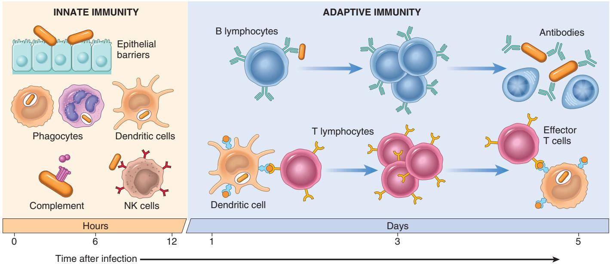 
Fig. 5.1 The principal components and kinetics of response of the innate and adaptive immune systems. NK cells, Natural killer cells.
to the presence of infectious agents by generating potent mechanisms for neutralizing and eliminating the pathogens. By convention, the terms immune system and immune response generally refer to adaptive immunity.
# Innate Immunity
The major components of innate immunity are epithelial barriers that block the entry of microbes, phagocytic cells (mainly neutrophils and macrophages), dendritic cells (DCs), natural killer (NK) cells and other innate lymphoid cells, and several plasma proteins, including the proteins of the complement system. The various cells are discussed later in this chapter; the complement system was discussed in Chapter 3.
Phagocytes, dendritic cells and many other cells, such as epithelial cells, express receptors that sense the presence of infectious agents and substances released from dead cells. The microbial structures recognized by these receptors are called pathogen-associated molecular patterns; they are shared among microbes of the same type, and they are essential for the survival and infectivity of the microbes (so the microbes cannot evade innate immune recognition by mutating these molecules). The substances released from injured and necrotic cells are called damage-associated molecular patterns. The cellular receptors that recognize these molecules are often called pattern recognition receptors. It is estimated that innate immunity uses about 100 different receptors to recognize 1000 molecular patterns.
# Receptors of Innate Immunity
Pattern recognition receptors are located in all the cellular compartments where pathogens may be present: plasma membrane receptors detect extracellular pathogens, endosomal receptors detect ingested microbes, and cytosolic receptors detect microbes in the cytoplasm (Fig. 5.2). Several classes of these receptors have been identified.
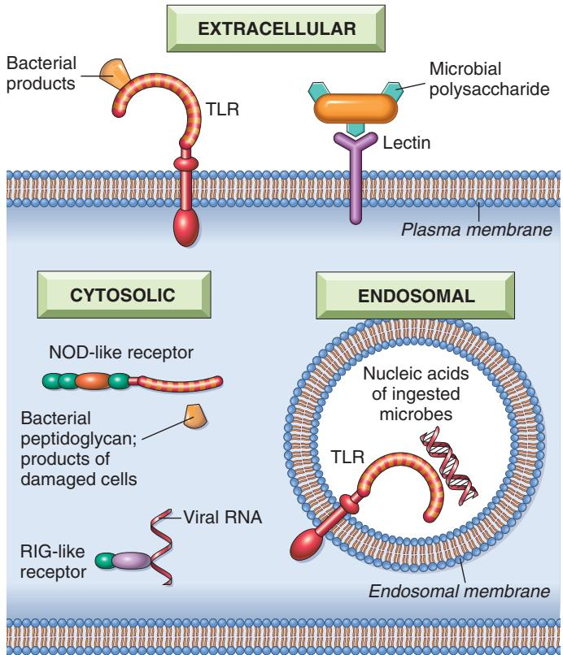 
Fig. 5.2 Cellular receptors for microbes and products of cell injury. Phagocytes, dendritic cells, and many types of epithelial cells express different classes of receptors that sense the presence of microbes and dead cells. Toll-like receptors (TLRs) located in different cellular compartments, as well as other cytoplasmic and plasma membrane receptors, recognize products of different classes of microbes. The major classes of innate immune receptors are TLRs, NOD-like receptors in the cytosol (NLRs), C-type lectin receptors, RIG-like receptors for viral RNA, named after the founding member RIG-I, and cytosolic DNA sensors.
# Toll-Like Receptors
The best known of the pattern recognition receptors are the Toll-like receptors (TLRs). There are 10 TLRs in mammals that recognize a wide range of microbial molecules. The plasma membrane TLRs recognize bacterial products such as lipopolysaccharide (LPS), and endosomal TLRs recognize viral and bacterial RNA and DNA (see Fig. 5.2). Recognition of microbes by these receptors activates transcription factors that stimulate the production of several secreted and membrane proteins, including mediators of inflammation, anti-viral cytokines (interferons), and proteins that promote lymphocyte activation and the even more potent adaptive immune responses.
# NOD-Like Receptors and the Inflammasome
NOD-like receptors (NLRs) are cytosolic receptors named after the founding members NOD-1 and NOD-2. They recognize a wide variety of substances, including products of necrotic cells (e.g., uric acid and released ATP), ion disturbances (e.g., loss of $\mathrm{K}^+$ ), and some microbial products. How this family of sensors detects so many diverse signs of danger or damage is not known. Several of the NLRs signal via a cytosolic multiprotein complex called the inflammasome, which activates an enzyme (caspase-1) that cleaves a precursor form of the cytokine interleukin-1 (IL-1) to generate the biologically active form (Fig. 5.3). As discussed in Chapter 3, IL-1 is a mediator of inflammation that recruits leukocytes and induces fever. Gain-of-function mutations in one of the NLRs result in periodic fever syndromes, called autoinflammatory syndromes, which respond very well to treatment with IL-1 antagonists. The NLR-inflammasome pathway also may play a role in a number of chronic disorders marked by inflammation. For example, recognition of urate crystals by a class of NLRs underlies the inflammation associated with gout. These receptors may detect and respond to lipids and cholesterol crystals that are deposited in abnormally large amounts in tissues; the resulting inflammation may contribute to obesity-associated type 2 diabetes and atherosclerosis, respectively.
# Other Receptors for Microbial Products
C-type lectin receptors (CLRs) expressed on the plasma membrane of macrophages and DCs detect fungal glycans and elicit inflammatory reactions to fungi. Several cytosolic receptors detect the nucleic acids of viruses that replicate in the cytoplasm of infected cells, and stimulate the production of anti-viral cytokines. G protein-coupled receptors on neutrophils, macrophages, and most other types of leukocytes recognize short bacterial peptides containing N-formylmethionyl residues. Because all bacterial proteins and few mammalian proteins (only those synthesized within mitochondria) are initiated by N-formylmethionine, this receptor enables neutrophils to detect bacterial proteins and stimulates chemotactic responses. Mannose receptors recognize microbial sugars (which often contain terminal mannose residues, unlike mammalian glycoproteins) and induce phagocytosis of the microbes. In addition, two families of cytosolic receptors, one named after the founding member RIG-I and the other called cytosolic DNA sensors, recognize microbial RNA and DNA, respectively.
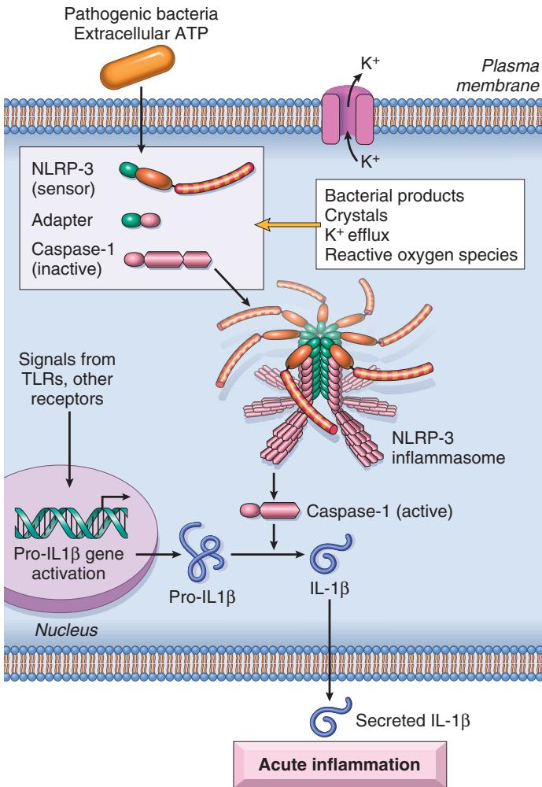 
Fig. 5.3 The inflammasome. The inflammasome is a protein complex that recognizes products of dead cells and some microbes and induces the secretion of biologically active interleukin-1. It is a complex of multiple copies of a sensor protein (a leucine-rich protein called NLRP3), an adapter, and the enzyme caspase-1, which is converted from an inactive to an active form. The structure of the inflammasome as shown is simplified from known crystal structures. The formation of the inflammasome complex proceeds by a prion-like mechanism of propagation, in which one protein altered by activation induces conformational changes in other proteins of the same type. The net result is the activation and assembly of a large number of identical polypeptides, forming filament-like bundles of adapters and enzymes.
# Reactions of Innate Immunity
The innate immune system provides host defense by the following two main reactions:
- Inflammation. Cytokines and products of complement activation, as well as other mediators, are produced during innate immune reactions and trigger the vascular and cellular components of inflammation. The recruited leukocytes destroy pathogens and ingest and eliminate damaged cells. This reaction was described in Chapter 3. 
- Anti-viral defense. Type I interferons produced in response to viruses act on infected and uninfected cells and activate enzymes that degrade viral nucleic acids and inhibit viral replication.
In addition to these defensive functions, the innate immune system generates signals that stimulate the
subsequent, more powerful adaptive immune response. Some of these signals are described later.
# Adaptive Immunity
The adaptive immune system consists of lymphocytes and their products, including antibodies. In contrast to the limited repertoire of the innate immune system, the adaptive immune system can recognize a vast array of foreign substances.
There are two types of adaptive immunity: humoral immunity, mediated by soluble proteins called antibodies that are produced by B lymphocytes (also called B cells), and cell-mediated (or cellular) immunity, mediated by T lymphocytes (also called T cells). Antibodies provide protection against extracellular pathogens in the blood, mucosal surfaces, and tissues. T lymphocytes are important in defense against intracellular microbes. They work by either directly killing infected cells (accomplished by cytotoxic T lymphocytes) or by activating phagocytes to kill ingested microbes, via the production of soluble protein mediators called cytokines (made by helper T cells). We next turn to the main properties and functions of the cells of the immune system.
# CELLS AND TISSUES OF THE IMMUNE SYSTEM
The cells of the immune system consist of lymphocytes, most of which have specific receptors for antigens and mount adaptive immune responses; specialized APCs, which capture and display microbial and other antigens to the lymphocytes; and various effector cells, whose function is to eliminate microbes and other antigens. Some of the remarkable features of the immune system are the expression of highly diverse and specific antigen receptors on B and T cells, the specialization of the cells that that enable them to perform many different functions, and the precise control mechanisms that permit useful responses when needed and prevent potentially harmful ones.
# Lymphocytes
Lymphocytes are present in the circulation and in various lymphoid organs. Although all lymphocytes are morphologically similar, they actually consist of several functionally and phenotypically distinct populations (Fig. 5.4). Lymphocytes develop from precursors in the generative (primary) lymphoid organs; $T$ lymphocytes mature in the thymus, whereas $B$ lymphocytes mature in the bone marrow. Each T or B lymphocyte and its progeny, which constitute a clone, express a single antigen receptor, and the total population of lymphocytes (numbering about $10^{12}$ in humans) can recognize tens or hundreds of millions of antigens. The enormous diversity of antigen receptors is encoded by variant DNA sequences that are created during lymphocyte maturation by the joining and diversification of different gene segments to form functional antigen receptor genes, a process that occurs only in B cells and T cells. Hence the presence of rearranged antigen receptor genes is a reliable marker of these cells. As already mentioned, the antigen
receptors that are expressed in B cells are called antibodies, while their T-cell counterparts are called T-cell receptors.
Mature T and B lymphocytes recirculate through peripheral (secondary) lymphoid organs—the lymph nodes, spleen and mucosal tissues—and reside in these organs and in most tissues. Foreign antigens are concentrated in these organs, where they bind to and activate the clones of lymphocytes that express receptors for those antigens, a process known as clonal selection. All mature lymphocytes go through distinct phases during their lives—naive lymphocytes express antigen receptors but have not responded to antigens and do not serve any functions; effector lymphocytes are induced by lymphocyte activation and perform the functions that eliminate microbes; and memory lymphocytes, induced during activation, survive in a functionally silent state even after the antigen is eliminated and respond rapidly upon subsequent encounters with the antigen.
# T Lymphocytes
Thymus-derived T lymphocytes develop into the effector cells of cellular immunity and "help" B cells to produce antibodies against protein antigens. T cells constitute $60\%$ to $70\%$ of the lymphocytes in peripheral blood and are the major lymphocyte population in splenic periarteriolar sheaths and lymph node interfollicular zones. T cells cannot recognize free or circulating antigens; instead, the vast majority $(>95\%)$ of T cells sense only peptide fragments of proteins displayed by molecules of the major histocompatibility complex (MHC), discussed in more detail later. Because T cell antigen receptors have evolved to see MHC-bound peptides on cell surfaces, T cells only recognize antigens presented by other cells. The outcome of this interaction varies dramatically depending on the type of T cell that is involved and the identity of the other interacting cell, ranging from the killing of virus-infected cells to the activation of phagocytes or B lymphocytes that have ingested protein antigens.
Peptide antigens presented by MHC molecules are recognized by the T-cell receptor (TCR), a heterodimer that in most T cells is composed of disulfide-linked $\alpha$ and $\beta$ protein chains (Fig. 5.5). Each chain has a variable region that participates in binding a particular peptide antigen and a constant region that interacts with associated signaling molecules. TCRs are noncovalently linked to a cluster of five invariant polypeptide chains, the $\gamma$ , $\delta$ , and $\varepsilon$ proteins of the CD3 molecular complex and two $\zeta$ chains (see Fig. 5.5). The CD3 proteins and $\zeta$ chains do not bind antigens; instead, they are attached to the TCR and initiate intracellular biochemical signals after TCR recognition of antigen.
T cells also express a number of other molecules that serve important functions in immune responses. CD4 and CD8 are expressed on distinct T-cell subsets and act as coreceptors during T-cell activation. During antigen recognition, CD4 molecules on T cells bind to invariant portions of class II MHC molecules (described later) on selected antigen-presenting cells (APCs); in an analogous fashion, CD8 binds to class I MHC molecules. CD4 is expressed on $50\%$ to $60\%$ of T cells, whereas CD8 is expressed on about $40\%$ of T cells. The CD4- and CD8-expressing T cells—called $CD4+$ and $CD8+$ cells, respectively—perform different but overlapping functions. $\mathrm{CD4 + }$ T cells are called helper T cells because they secrete soluble molecules
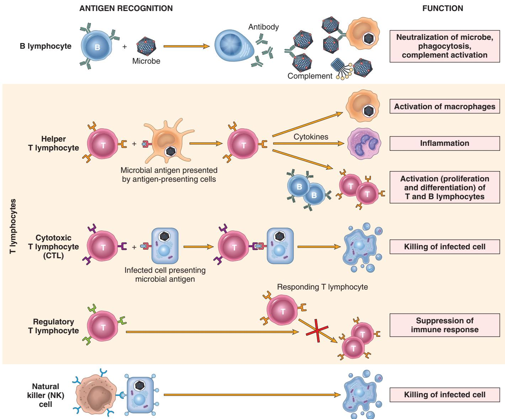 
Fig. 5.4 The principal classes of lymphocytes and their functions. B lymphocytes and T lymphocytes are cells of adaptive immunity, and natural killer (NK) cells are cells of innate immunity. Several more classes of lymphocytes have been identified, including NK-T cells and so-called "innate lymphoid cells" (ILCs); the functions of these cells are not established.
(cytokines) that help B cells to produce antibodies and also help macrophages to destroy phagocytosed microbes. The central role of $\mathrm{CD4 + }$ helper cells in immunity is highlighted by the severe compromise that results from destruction of these cells by human immunodeficiency virus (HIV) infection (described later). $\mathrm{CD8 + }$ T cells also can secrete cytokines, but their most important role is to directly kill virus-infected cells and tumor cells; hence, they are called cytotoxic T lymphocytes (CTLs). Other important invariant proteins on T cells include CD28, which functions as the receptor for molecules called costimulators that are induced on APCs by microbes, and various adhesion molecules that strengthen the bond between the T cells and APCs and control the migration of the T cells to different tissues.
T cells that function to suppress immune responses are called regulatory T lymphocytes. This cell type is described later, in the context of tolerance of self antigens.
While most T cells express TCRs composed of $\alpha$ and $\beta$ chains, a minority of peripheral blood T cells and many T cells associated with mucosal surfaces (e.g., lung, gastrointestinal tract) express TCRs that are composed of $\gamma$ and $\delta$ chains, which are similar but not identical to $\alpha$ and $\beta$ chains. Such $\gamma \delta$ T cells, which do not express CD4 or CD8, recognize nonprotein molecules (e.g., bacterial lipoglycans), but their functional roles are not well understood. Another small population of T cells expresses markers of both T cells and NK cells. These so-called NKT cells recognize microbial glycolipids and may play a role in defense against some infections. The antigen receptors of $\gamma \delta$ T cells and NKT cells recognize antigens independently of MHC molecules, and are much less diverse than the receptors of the more abundant $\mathrm{CD4 + }$ and $\mathrm{CD8 + }$ T cells. We will not discuss these rare lymphocyte populations further.
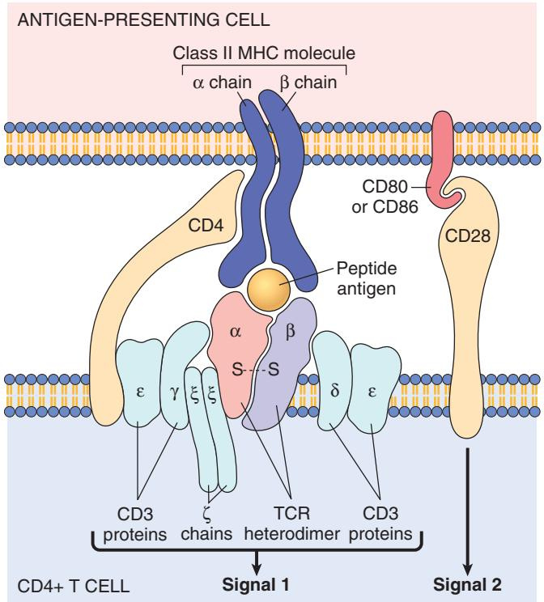 
Fig. 5.5 The T-cell receptor (TCR) complex and other molecules involved in T-cell activation. The TCR heterodimer, consisting of an $\alpha$ chain and a $\beta$ chain, recognizes antigen (in the form of peptide-MHC complexes expressed on antigen-presenting cells), and the linked CD3 complex and $\zeta$ chains initiate activating signals. CD4 and CD28 are also involved in T-cell activation. (Note that some T cells express CD8 and not CD4; these molecules serve analogous roles.) The sizes of the molecules are not drawn to scale. MHC, Major histocompatibility complex.
# Major Histocompatibility Complex Molecules: The Peptide Display System of Adaptive Immunity
MHC molecules are fundamental to T-cell recognition of antigens, and genetic variations in MHC molecules are associated with many immunologic diseases; hence, it is important to review the structure and function of these molecules. The MHC was discovered on the basis of studies of graft rejection and acceptance (tissue, or "histo," compatibility). It is now known that the normal function of MHC molecules is to display peptides for recognition by $\mathrm{CD4 + }$ and $\mathrm{CD8 + }$ T lymphocytes. In each person, T cells recognize only peptides displayed by that person's MHC molecules, which, of course, are the only MHC molecules that the T cells normally encounter. This phenomenon is called MHC restriction.
The human MHC, known as the human leukocyte antigen (HLA) complex, consists of a cluster of genes on chromosome 6 (Fig. 5.6). On the basis of their chemical structure, tissue distribution, and function, MHC gene products fall into two main categories:
Class I MHC molecules are expressed on all nucleated cells and are encoded by three closely linked loci, designated HLA-A, HLA-B, and HLA-C (see Fig. 5.6). Each of these molecules consists of a polymorphic $\alpha$ chain noncovalently associated with an invariant $\beta_{2}$ -microglobulin polypeptide (encoded by a separate gene on chromosome 15). The extracellular portion of the $\alpha$
chain contains a cleft where the polymorphic residues are located and where foreign peptides bind to MHC molecules for presentation to T cells, and a conserved region that binds CD8, ensuring that only $\mathrm{CD8 + }$ T cells can respond to peptides displayed by class I molecules. In general, class I MHC molecules bind and display peptides derived from protein antigens present in the cytosol of the cell (e.g., viral and tumor antigens).
Class II MHC molecules are encoded by genes in the HLA-D region, which contains three subregions: DP, DQ, and DR. Class II molecules are heterodimers of noncovalently linked $\alpha$ and $\beta$ subunits (see Fig. 5.6). Unlike class I MHC molecules, which are expressed on all nucleated cells, expression of class II MHC molecules is restricted to a few cell types, mainly APCs (notably, dendritic cells), macrophages, and B cells. The extracellular portion of class II MHC molecules contains a cleft for the binding of antigenic peptides and a region that binds CD4. In general, class II MHC molecules bind to peptides derived from extracellular proteins synthesized outside the cell, for example, from microbes that are ingested and then broken down inside the cell. This property allows $\mathrm{CD4 + }$ T cells to recognize the presence of extracellular pathogens.
- Several other proteins are encoded in the MHC locus, including complement components (C2, C3, and Factor B) and the cytokines tumor necrosis factor (TNF) and lymphotoxin.
HLA genes are highly polymorphic; that is, there are alternative forms (alleles) of each gene at each locus (estimated to number over 10,000 for all HLA genes and over 3500 for HLA-B alleles alone). Each individual expresses only one set of HLA genes. It is believed that the polymorphism of MHC genes evolved to enable display of and response to any conceivable microbial peptide encountered in the environment. As a result of the polymorphism, a virtually infinite number of combinations of HLA molecules exists in the population. The HLA genes are closely linked on chromosome 6, so they are passed from parent to offspring en bloc and behave like a single locus with respect to their inheritance patterns. Each set of maternal and paternal HLA genes is referred to as an HLA haplotype. Because of this mode of inheritance, the probability that siblings will share the same two HLA haplotypes is $25\%$ . By contrast, in most populations the probability that an unrelated donor will share the same two HLA haplotypes is very low. The implications of HLA polymorphism for transplantation are obvious; because each person has HLA alleles that differ to some extent from those of every other unrelated individual, grafts from unrelated donors will elicit immune responses in the recipient and be rejected. Only identical twins can accept grafts from one another, without fear of rejection. Even grafts from a donor to a sibling with the same HLA haplotype may be rejected because of differences in so-called "minor histocompatibility loci", other sets of polymorphic genes that are likely to differ by chance. (The only exception to this rule, of course, are identical twins) In fact, HLA molecules were discovered in the course of early attempts at tissue transplantation, because HLA molecules of the graft evoke immune responses that eventually lead to graft destruction
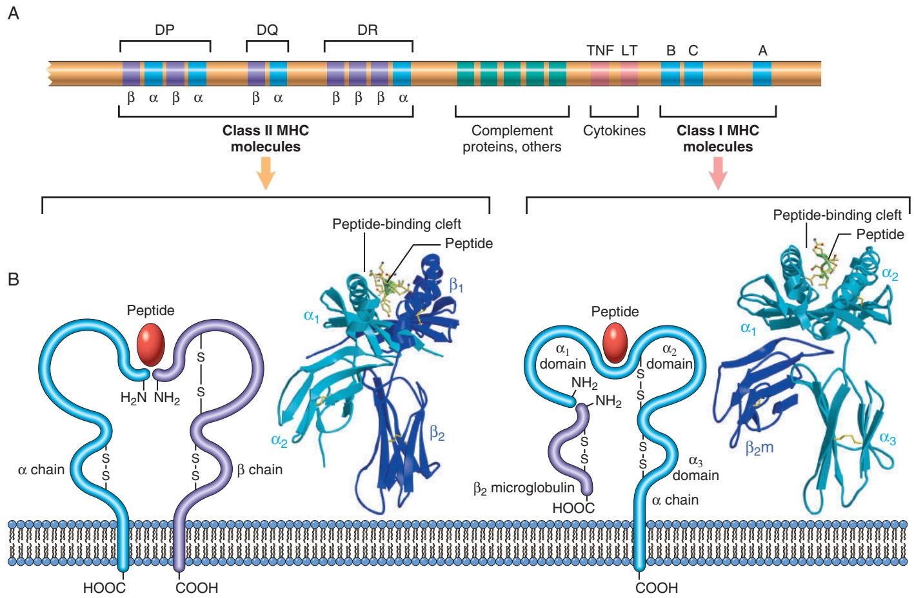 
Fig. 5.6 The human leukocyte antigen (HLA) complex and the structure of HLA molecules. (A) The location of genes in the HLA complex. The relative locations, sizes, and distances between genes are not to scale. Genes that encode several proteins involved in antigen processing (the TAP transporter, components of the proteasome, and HLA-DM) are located in the class II region (not shown). (B) Schematic diagrams and crystal structures of class I and class II HLA molecules. (Crystal structures are courtesy of Dr. P. Bjorkman, California Institute of Technology, Pasadena, California.)
discussed later). This ability of MHC molecules to trigger immune responses is the reason these molecules are often called antigens.
The inheritance of particular MHC alleles influences both protective and harmful immune responses. The ability of any given MHC allele to bind the peptide antigens generated from a particular pathogen will determine whether a specific person's T cells can recognize and mount a protective response to that pathogen. Conversely, if the antigen is ragweed pollen and the response is an allergic reaction, inheritance of some HLA genes may make individuals susceptible to hay fever, the colloquial name for ragweed allergy.
Finally, many autoimmune diseases are associated with particular HLA alleles. We return to a discussion of these associations when we consider autoimmunity.
# B Lymphocytes
B (bone marrow-derived) lymphocytes are the cells that produce antibodies, the mediators of humoral immunity. B cells make up $10\%$ to $20\%$ of the circulating peripheral lymphocyte population. They also are present in bone marrow and in the follicles of peripheral (secondary) lymphoid organs.
B cells recognize antigen by means of membrane-bound antibody of the immunoglobulin M (IgM) class, expressed
on the surface together with signaling molecules to form the B-cell receptor (BCR) complex (Fig. 5.7). Whereas T cells recognize only MHC-associated peptides, B cells recognize and respond to many more chemical structures, including soluble or cell-associated proteins, lipids, polysaccharides, nucleic acids, and small chemicals, without a requirement for the MHC. As with TCRs, each antibody has a unique amino acid sequence. This sequence diversity is a consequence of the rearrangement and assembly of a multitude of immunoglobulin (Ig) gene segments, a process that creates functional Ig genes. B cells express several invariant molecules that are responsible for signal transduction and B-cell activation (see Fig. 5.7). Some are signaling molecules attached to the BCR; another example is CD21 (also known as the type 2 complement receptor, or CR2), which recognizes a complement breakdown product that frequently is deposited on microbes and promotes B-cell responses to microbial antigens. Interestingly, the ubiquitous Epstein-Barr virus has cleverly evolved to use CD21 as a receptor for binding to B cells and infecting them.
After stimulation, B cells differentiate into plasma cells, which secrete large amounts of antibodies. There are five classes, or isotypes, of immunoglobulins: IgG, IgM, and IgA constitute more than $95\%$ of circulating antibodies. IgA is the major isotype in mucosal secretions; IgE is present in
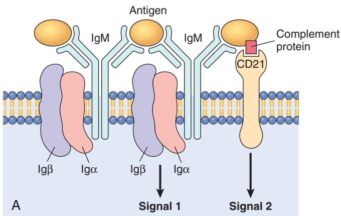
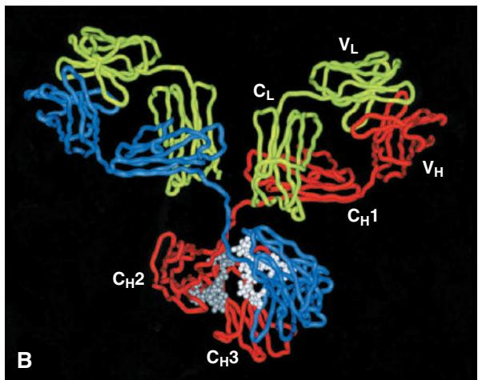 
Fig. 5.7 Structure of antibodies and the B-cell antigen receptor. (A) The B-cell antigen receptor complex is composed of membrane immunoglobulin M (IgM; or IgD, not shown), which recognizes antigens, and the associated signaling proteins Igα and Igβ. CD21 is a receptor for a complement component that also promotes B-cell activation. (B) Crystal structure of a secreted IgG molecule, showing the arrangement of the variable (V) and constant (C) regions of the heavy (H) and light (L) chains. (Courtesy of Dr. Alex McPherson, University of California, Irvine, California.)
the circulation at very low concentrations and also is found attached to the surfaces of tissue mast cells; and IgD is expressed on the surfaces of B cells but is secreted at very low levels. These isotypes differ in their ability to activate complement and recruit inflammatory cells, and thus have different roles in host defense and disease states.
# Natural Killer Cells and Innate Lymphoid Cells
NK cells are lymphocytes that arise from the same common lymphoid progenitor that gives rise to T lymphocytes and B lymphocytes. However, NK cells are innate immune cells, as they are functional without prior activation and do not express highly variable and clonally distributed receptors for antigens. Instead, NK cells have two types of receptors—inhibitory and activating. Inhibitory receptors recognize self class I MHC molecules, which are expressed on all healthy cells, whereas activating receptors recognize molecules that are expressed or upregulated on stressed or infected cells. Normally, the effects of inhibitory receptors dominate over those of activating receptors, preventing spontaneous activation of the NK cells. Infections (especially viral infections) and stress are associated with
reduced expression of class I MHC molecules and increased expression of proteins that engage activating receptors. The net result is that the NK cells are activated and the infected or stressed cells are killed and eliminated. NK cells also secrete cytokines such as interferon- $\gamma$ (IFN- $\gamma$ ), which activates macrophages to destroy ingested microbes, and thus NK cells provide early defense against intracellular microbial infections.
Innate lymphoid cells (ILCs) are populations of lymphocytes that lack TCRs but produce cytokines similar to those that are made by T cells. They are classified into three groups, which produce IFN- $\gamma$ , IL-5, or IL-17, cytokines that are characteristic of $\mathrm{T_H}1$ , $\mathrm{T_H}2$ , and $\mathrm{T_H}17$ subsets of T cells, respectively (described later). NK cells are related to group 1 ILCs based on their production of IFN- $\gamma$ , a cytokine also made by $\mathrm{T_H}1$ cells. Because ILCs mostly reside in tissues, they are thought to provide early defense against infections in the tissues, before T cells are activated and can migrate into tissues. ILCs also may be early participants in inflammatory diseases.
# Antigen-Presenting Cells
The immune system contains several cell types that are specialized to capture antigens and display these to lymphocytes. Foremost among these APCs are dendritic cells, the major cells for displaying protein antigens to naive T cells. Several other cell types present antigens to lymphocytes at various stages of immune responses.
# Dendritic Cells
Dendritic cells (DCs) are the most important antigen-presenting cells for initiating T-cell responses against protein antigens. These cells have numerous fine cytoplasmic processes that resemble dendrites, from which they derive their name. Several features of DCs account for their key role in antigen capture and presentation.
- These cells are located at the right place to capture antigens—under epithelia, the common site of entry of microbes and foreign antigens, and in the interstitia of all tissues, where antigens may be produced. DCs within the epidermis are called Langerhans cells. 
- DCs express many receptors for capturing and responding to microbes (and other antigens), including TLRs and C-type lectin receptors. 
- In response to microbes, DCs are recruited to the T-cell zones of lymphoid organs, where they are ideally positioned to present antigens to T cells. 
- DCs express high levels of MHC and other molecules needed for antigen presentation and activation of T cells.
One subset of DCs is called plasmacytoid DCs because of their resemblance to plasma cells. These cells are present in the blood and lymphoid organs, and are major sources of the anti-viral cytokine type I interferon, produced in response to many viruses.
A second type of cell with dendritic morphology is present in the germinal centers of lymphoid follicles in the spleen and lymph nodes and is called the follicular dendritic cell (FDC). These cells bear Fc receptors for IgG and receptors for C3b and can trap antigen bound to antibodies or
Table 5.1 Distribution of Lymphocytes in Tissues* 
TissueNumber of Lymphocytes × 109Lymph nodes190Spleen70Bone marrow50Blood10Skin20Intestines50Liver10Lungs30
*Approximate numbers of lymphocytes in different tissues in a healthy adult.
complement proteins. These cells display antigens to B lymphocytes in lymphoid follicles and promote antibody responses, but are not involved in capturing antigens for display to T cells.
# Other Antigen-Presenting Cells
Macrophages (Chapter 3) ingest microbes and other particulate antigens and display peptides for recognition by T lymphocytes. These T cells in turn activate the macrophages to kill the microbes, the central reaction of cell-mediated immunity. B cells present peptides to helper T cells and receive signals that stimulate antibody responses to protein antigens, critical steps in humoral immune responses.
# Lymphoid Tissues
The tissues of the immune system consist of the generative (also called primary, or central) lymphoid organs, in which T lymphocytes and B lymphocytes mature and become competent to respond to antigens, and the peripheral (or secondary) lymphoid organs, in which adaptive immune responses to microbes are initiated. The principal generative lymphoid organs are the thymus, where T cells develop, and the bone marrow, the site of production of all blood cells and where B lymphocytes mature. The major peripheral organs are briefly described in the following sections.
# Peripheral Lymphoid Organs
The peripheral lymphoid organs are organized to concentrate antigens, APCs, and lymphocytes in a way that optimizes interactions among these cells and the development of adaptive immune responses. Most of the body's lymphocytes are located in these organs (Table 5.1).
- Lymph nodes are encapsulated, highly organized collections of lymphoid cells and innate immune cells that are located along lymphatic channels throughout the body (Fig. 5.8A). As lymph passes through lymph nodes, resident APCs are able to sample antigens that are carried to the node in lymph derived from the interstitial fluids of tissues. In addition, DCs transport antigens from nearby epithelial surfaces and tissues by migrating through lymphatic vessels to the lymph nodes. Thus, antigens (e.g., of microbes that enter through epithelia or colonize tissues) become concentrated in draining lymph nodes. 
- The spleen has an important role in immune responses to bloodborne antigens. Blood entering the spleen flows through a network of sinusoids, which enables the
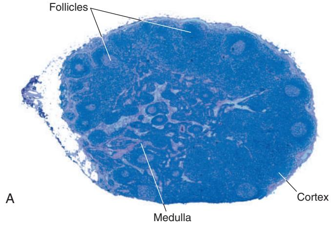
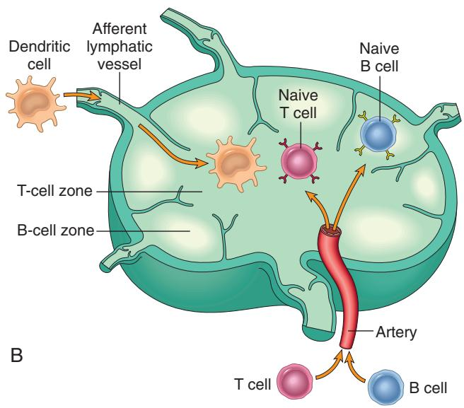
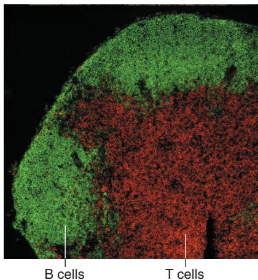 
Fig. 5.8 Morphology of a lymph node. (A) The histology of a lymph node, with an outer cortex containing follicles and an inner medulla. (B) The segregation of B cells and T cells in different regions of the lymph node, illustrated schematically. (C) The location of B cells (stained green, using the immunofluorescence technique) and T cells (stained red) in a lymph node. (Courtesy of Drs. Kathryn Pape and Jennifer Walter, University of Minnesota School of Medicine, Minneapolis, Minnesota.)
trapping of bloodborne antigens by resident DCs and macrophages.
- The cutaneous and mucosal lymphoid systems are located under the epithelia of the skin and the gastrointestinal and respiratory tracts, respectively. They respond to antigens that enter through breaches in the epithelium. Pharyngeal tonsils and Peyer's patches of the intestine are two anatomically defined mucosal lymphoid tissues. The large number of lymphocytes in mucosal organs (second only to lymph nodes) reflects the huge surface area of these organs.
Within the peripheral lymphoid organs, T lymphocytes and B lymphocytes are segregated into different regions (Fig. 5.8B, C). In lymph nodes, the B cells are concentrated in discrete structures, called follicles, located around the periphery, or cortex, of each node. If the B cells in a follicle have recently responded to an antigen, the follicle develops a central pale-staining region called a germinal center. The T lymphocytes are concentrated in the parafollicular cortex. The follicles contain the FDCs that are involved in the activation of B cells, and the paracortex contains the DCs that present antigens to T lymphocytes. In the spleen, T lymphocytes are concentrated in periarteriolar lymphoid sheaths surrounding small arterioles, and B cells reside in the follicles.
Lymphocytes constantly travel between tissues and home to particular sites. Naive lymphocytes circulate through peripheral lymphoid organs where antigens are concentrated and immune responses are initiated, and effector lymphocytes migrate to sites of infection. The process of lymphocyte recirculation is most important for T cells, because naïve T cells have to "patrol" widely distributed peripheral lymphoid organs to find antigens, and effector T cells have to home to sites of infection to eliminate microbes. In contrast, plasma cells do not need to migrate to sites of infection because they secrete antibodies that are transported via the blood and lymph to distant tissues.
# Cytokines: Messenger Molecules of the Immune System
Cytokines are secreted proteins that mediate immune and inflammatory reactions. Molecularly defined cytokines are called interleukins, a name implying a role in communication between leukocytes. Most cytokines have a wide spectrum of effects, and some are produced by several different cell types. The majority of these cytokines act on the cells that produce them or on neighboring cells, but some (like IL-1) have systemic effects.
Different cytokines contribute to specific types of immune responses.
- In innate immune responses, cytokines are produced rapidly after microbes and other stimuli are encountered, and function to induce inflammation and inhibit virus replication. These cytokines include TNF, IL-1, IL-12, type I IFNs, IFN- $\gamma$ , and chemokines (Chapter 3). Their major sources are macrophages, DCs, ILCs, and NK cells, but endothelial and epithelial cells also can produce them. 
- In adaptive immune responses, cytokines are produced principally by $\mathrm{CD4 + }$ T lymphocytes activated by antigen and other signals, and function to promote lymphocyte
proliferation and differentiation and to activate effector cells. The main ones in this group are IL-2, IL-4, IL-5, IL-17, and IFN- $\gamma$ ; their roles in immune responses are described later. Some cytokines serve mainly to limit and terminate immune responses; these include TGF- $\beta$ and IL-10.
- Some cytokines stimulate hematopoiesis and are called colony-stimulating factors because they stimulate formation of blood cell colonies from bone marrow progenitors (Chapter 12). Their functions are to increase leukocyte numbers during immune and inflammatory responses, and to replace leukocytes that are consumed during such responses. They are produced by marrow stromal cells, T lymphocytes, macrophages, and other cells. Examples include GM-CSF and IL-7.
The knowledge gained about cytokines has numerous practical therapeutic applications. Inhibiting cytokine production or actions can control the harmful effects of inflammation and tissue-damaging immune reactions. Patients with rheumatoid arthritis often show dramatic responses to TNF antagonists, an elegant example of rationally designed and molecularly targeted therapy. Many other cytokine antagonists are now approved for the treatment of various inflammatory disorders. Conversely, administration of cytokines is used to boost reactions that are normally dependent on these proteins, such as hematopoiesis and defense against some viruses.
# OVERVIEW OF LYMPHOCYTE ACTIVATION AND ADAPTIVE IMMUNE RESPONSES
Adaptive immune responses develop in steps, consisting of: antigen recognition; activation, proliferation and differentiation of specific lymphocytes into effector and memory cells; elimination of the antigen; and decline of the response, with memory cells being the long-lived survivors. The major events in each step are summarized next; these general principles apply to protective responses against microbes as well as pathologic responses that injure the host.
# Capture and Display of Antigens
Microbes and other foreign antigens can enter the body virtually anywhere, and it is obviously impossible for lymphocytes of every specificity to patrol every possible portal of antigen entry. To overcome this problem, microbes and their protein antigens in epithelia and other tissues are captured by resident dendritic cells, which then carry their antigenic cargo to draining lymph nodes through which T cells constantly recirculate (Fig. 5.9). Here the antigens are processed and displayed complexed with MHC molecules on the cell surface, where the antigens are recognized by T cells. Similarly, soluble antigens are captured and concentrated in follicles in lymph nodes and the spleen, where they may be recognized by B cells via their antigen receptors.
At the same time as microbial antigens are recognized by T lymphocytes and B lymphocytes, the microbe
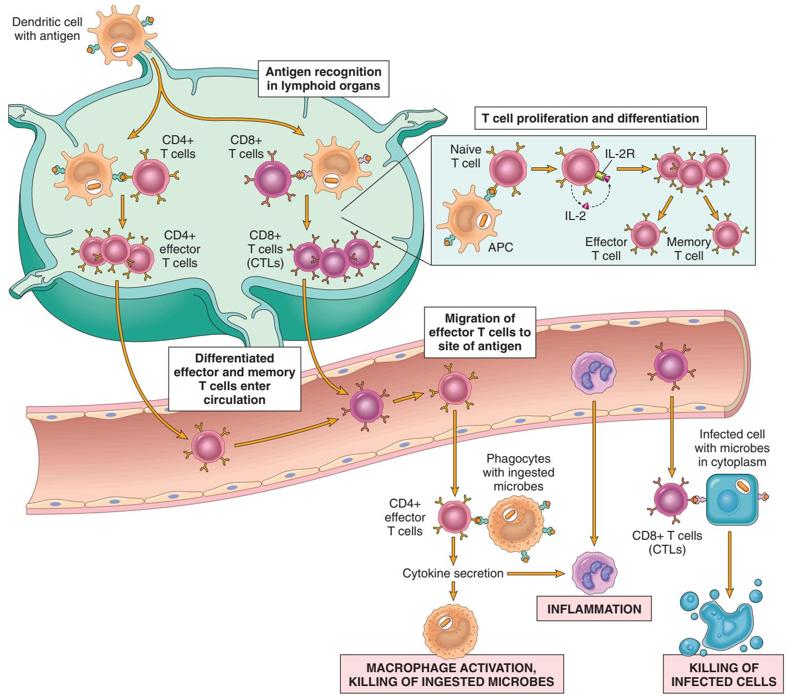 
Fig. 5.9 Cell-mediated immunity. Dendritic cells (DCs) capture microbial antigens from epithelia and tissues and transport the antigens to lymph nodes. During this process, the DCs mature, and express high levels of MHC molecules and costimulators. Naive T cells recognize MHC-associated peptide antigens displayed on DCs. The T cells are activated to proliferate and to differentiate into effector and memory cells, which migrate to sites of infection and serve various functions in cell-mediated immunity. CD4+ effector T cells of the $T_{\mathrm{H}}1$ subset recognize the antigens of microbes ingested by phagocytes, and activate the phagocytes to kill the microbes; other subsets of effector cells enhance leukocyte recruitment and stimulate different types of immune responses. CD8+ cytotoxic T lymphocytes (CTLs) kill infected cells harboring microbes in the cytoplasm. Some activated T cells remain in the lymphoid organs and help B cells to produce antibodies, and some T cells differentiate into long-lived memory cells (not shown). APC, Antigen-presenting cell.
activates innate immune cells expressing pattern recognition receptors. In the case of immunization with a protein antigen, as in a vaccine, a microbial mimic called an adjuvant that stimulates innate immune responses is given with the antigen. During the innate response, the microbe or adjuvant activates APCs to express molecules called costimulators and to secrete cytokines that stimulate the proliferation and differentiation of T lymphocytes. The principal costimulators for T cells are the B7 proteins (CD80 and CD86), which are expressed on APCs and are recognized by the CD28 receptor on naïve T cells. Antigen ("signal 1") and costimulatory molecules
produced during innate immune responses to microbes ("signal 2") function cooperatively to activate antigen-specific lymphocytes. The requirement for microbe-triggered signal 2 ensures that the adaptive immune response is induced by microbes and not by harmless substances. In immune responses to tumors and transplants, "signal 2" may be provided by substances released from necrotic cells (the damage-associated molecular patterns mentioned earlier).
The reactions and functions of T lymphocytes and B lymphocytes differ in important ways and are best considered separately.
# Cell-Mediated Immunity: Activation of T Lymphocytes and Elimination of Intracellular Microbes
Naive T lymphocytes are activated by antigen and costimulators in peripheral lymphoid organs, and proliferate and differentiate into effector cells that migrate to any site where the antigen (microbe) is present (see Fig. 5.9). One of the earliest responses of $\mathrm{CD4 + }$ helper T cells is secretion of the cytokine IL-2 and expression of high-affinity receptors for IL-2. IL-2 is a growth factor that acts on these T lymphocytes and stimulates their proliferation, leading to an increase in the number of antigen-specific lymphocytes. The functions of helper T cells are mediated by the combined actions of CD40-ligand (CD40L) and cytokines. CD40 is a member of the TNF-receptor family, and CD40L is a membrane protein homologous to TNF. When $\mathrm{CD4 + }$ helper T cells recognize antigens being displayed by macrophages or B lymphocytes, the T cells express CD40L, which engages CD40 on the macrophages or B cells and activates these cells.
Some of the activated $\mathrm{CD4 + }$ T cells differentiate into effector cells that secrete different sets of cytokines and perform different functions (Fig. 5.10). Cells of the $\mathrm{T_H1}$ subset secrete the cytokine IFN- $\gamma$ which is a potent macrophage activator. The combination of CD40- and IFN- $\gamma$ mediated activation results in "classical" macrophage activation (Chapter 3), leading to the induction of microbicidal substances in macrophages and the destruction of ingested microbes. $\mathrm{T_H2}$ cells produce IL-4, which stimulates B cells to differentiate into IgE-secreting plasma cells; IL-5, which activates eosinophils; and IL-13, which activates mucosal epithelial cells to secrete mucus, and induces the "alternative" pathway of macrophage activation, which is associated with tissue repair and fibrosis (Chapter 3). Eosinophils bind to and kill IgE-coated pathogens such as
helminthic parasites. $\mathrm{T_H17}$ cells, so called because the signature cytokine of these cells is IL-17, recruit neutrophils and monocytes, which destroy some extracellular bacteria and fungi and are involved in certain inflammatory diseases.
Activated $\mathrm{CD8 + }$ T lymphocytes differentiate into CTLs that kill cells harboring cytoplasmic microbes, thereby eliminating otherwise hidden reservoirs of infection. The principal mechanism of killing by CTLs depends on the perforin-granzyme system. Perforin and granzymes are stored in the granules of CTLs and are rapidly released when CTLs engage their targets (cells bearing the appropriate class I MHC-bound peptides). Perforin binds to the plasma membrane of the target cells and promotes the entry of granzymes, proteases that specifically cleave and thereby activate cellular caspases (Chapter 2), which induce the apoptosis of target cells.
The responses of T cells are regulated by a balance between costimulatory and inhibitory receptors. The major costimulatory receptor is CD28, mentioned earlier as the molecule that recognizes B7 ligands on APCs and provides second signals that work together with antigen recognition. Other proteins of the CD28 family include two "coinhibitory" receptors, CTLA-4 and PD-1, which block signals from the TCR and from CD28 and thus terminate T cell responses. Blocking these coinhibitors has proved to be a powerful approach for enhancing anti-tumor immune responses (Chapter 6).
# Humoral Immunity: Activation of B Lymphocytes and Elimination of Extracellular Microbes
Upon activation, B lymphocytes proliferate and then differentiate into plasma cells that secrete different classes of antibodies with distinct functions (Fig. 5.11). There are two major pathways of B-cell activation.
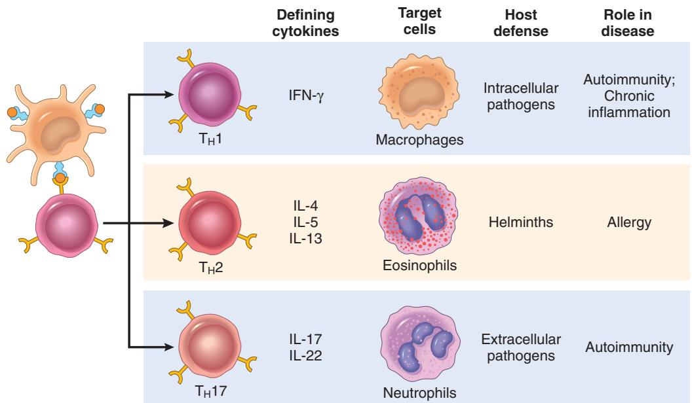 
Fig. 5.10 Subsets of helper T $(\mathsf{T_H})$ cells. In response to stimuli (mainly cytokines) present at the time of antigen recognition, naive $\mathrm{CD4 + }$ T cells may differentiate into populations of effector cells that produce distinct sets of cytokines that act on different cells (indicated as target cells) and mediate different functions. The roles of these subsets in host defense and immunologic diseases are summarized. These populations may be capable of converting from one to another. Some activated T cells produce multiple cytokines and do not fall into a distinct subset.
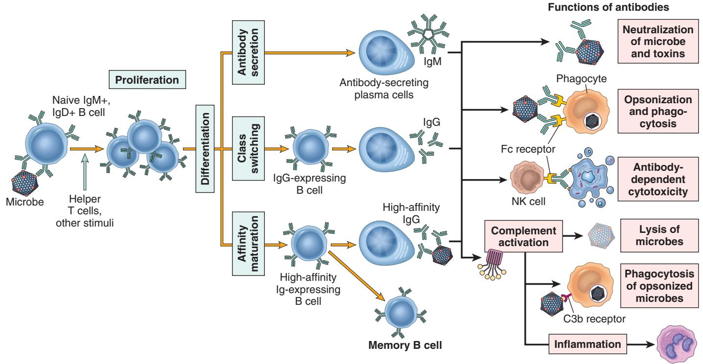 
Fig. 5.11 Humoral immunity. Naive B lymphocytes recognize antigens, and under the influence of Th cells and other stimuli (not shown), the B cells are activated to proliferate and to differentiate into antibody-secreting plasma cells. Some of the activated B cells undergo heavy-chain class switching and affinity maturation, and some become long-lived memory cells. Antibodies of different heavy-chain classes (isotypes) perform different effector functions, shown on the right. Note that the antibodies shown are IgG; these and IgM activate complement; and the specialized functions of IgA (mucosal immunity) and IgE (mast cell and eosinophil activation) are not shown.
- T cell-independent. Many polysaccharide and lipid antigens have multiple identical antigenic determinants (epitopes) that are able to simultaneously engage and cross-link several antibody molecules on each B cell and initiate the process of B-cell activation. 
- T cell-dependent. Typical globular protein antigens are not able to bind to multiple antigen receptors, and the full response of B cells to protein antigens requires help from $\mathrm{CD4 + }$ T cells. B cells also act as APCs—they ingest protein antigens, degrade them, and display peptides bound to class II MHC molecules for recognition by helper T cells. The helper T cells express CD40L and secrete cytokines, which work together to activate the B cells.
Some of the progeny of the expanded B-cell clones differentiate into antibody-secreting plasma cells. Each plasma cell secretes antibodies with the same specificity as the cell surface antibodies (B-cell antigen receptors) that first recognized the antigen. Polysaccharides and lipids stimulate secretion mainly of IgM antibody. Protein antigens, by virtue of CD40L- and cytokine-mediated helper T-cell actions, induce the production of antibodies of different classes (IgG, IgA, IgE). Production of functionally different antibodies, all with the same specificity, relies on heavy-chain class (isotype) switching, which increases the range of functions that antibodies serve. Some of the isotype-specific functions of antibodies include opsonization and transplacental transfer of IgG, IgA secretion into mucosal lumens, and binding of IgE to mast cells. Helper T cells also stimulate the production of antibodies with
higher affinity for the antigen. This process, called affinity maturation, improves the quality of the humoral immune response. Some activated B cells migrate into follicles and form germinal centers, which are the major sites of isotype switching and affinity maturation. The helper T cells that stimulate these processes in B lymphocytes also migrate to and reside in the germinal centers and are called follicular helper T (Tfh) cells.
The humoral immune response combats microbes in numerous ways (see Fig. 5.11).
- Antibodies bind to microbes and prevent them from infecting cells, thereby neutralizing the microbes. 
- IgG antibodies coat (opsonize) microbes and target them for phagocytosis, since phagocytes (neutrophils and macrophages) express receptors for the Fc tails of IgG molecules. 
- IgG and IgM activate the complement system by the classical pathway, and complement products promote phagocytosis and destruction of microbes. 
- IgA is secreted in mucosal tissues and neutralizes microbes in the lumens of the respiratory and gastrointestinal tracts (and other mucosal tissues). 
- IgG is actively transported across the placenta and protects the newborn until the immune system becomes mature. This is a form of passive immunity. 
- IgE coats helminthic parasites and functions with mast cells and eosinophils to kill them.
Circulating IgG antibodies have half-lives of about 3 weeks, which is much longer than the half-lives of most blood proteins, as a consequence of special mechanisms for
recycling IgG and reducing its catabolism. Some antibody-secreting plasma cells migrate to the bone marrow and live for years, continuing to produce low levels of antibodies.
# Decline of Immune Responses and Immunologic Memory
The majority of effector lymphocytes induced by an infectious pathogen die by apoptosis after the pathogen is eliminated, thus returning the immune system to its basal resting state. The initial activation of lymphocytes generates long-lived memory cells, which may survive for years after the infection. Memory cells are an expanded pool of antigen-specific lymphocytes (more numerous than the naive cells specific for any antigen that are present before encounter with that antigen), and they respond faster and more effectively when reexposed to the antigen than do naive cells. This is why the generation of memory cells is an important goal of vaccination.

# THE NORMAL IMMUNE RESPONSE: OVERVIEW OF CELLS, TISSUES, RECEPTORS, AND MEDIATORS
- The innate immune system uses several families of receptors, such as the Toll-like receptors, to recognize molecules present in various types of microbes and produced by damaged cells. 
- Lymphocytes are the mediators of adaptive immunity and the only cells that produce specific and diverse receptors for antigens. 
- T (thymus-derived) lymphocytes express antigen receptors called T-cell receptors (TCRs) that recognize peptide fragments of protein antigens that are displayed by MHC molecules on the surface of antigen-presenting cells. 
- B (bone marrow-derived) lymphocytes express membrane-bound antibodies that recognize a wide variety of antigens. B cells are activated to become plasma cells, which secrete antibodies. 
- Natural killer (NK) cells kill cells that are infected by some microbes, or are stressed and damaged beyond repair. NK cells express inhibitory receptors that recognize MHC molecules that are normally expressed on healthy cells, and are thus prevented from killing normal cells. 
- Antigen-presenting cells (APCs) capture microbes and other antigens, transport them to lymphoid organs, and display them for recognition by lymphocytes. The most efficient APCs are DCs, which live in epithelia and most tissues. 
- The cells of the immune system are organized in tissues, some of which are the sites of production of mature lymphocytes (the generative lymphoid organs, the bone marrow, and thymus), and others are the sites of immune responses (the peripheral lymphoid organs, including lymph nodes, spleen, and mucosal lymphoid tissues). 
- The early reaction to microbes is mediated by the innate immune system, which is ready to respond to microbes. Components of the innate immune system include epithelial barriers, phagocytes, NK cells, and plasma proteins, for example, of the complement system. Innate immune reactions are often manifested as inflammation. Innate immunity, unlike adaptive immunity, does not have fine antigen specificity or memory.
- The defense reactions of adaptive immunity develop slowly, but are more potent and specialized. 
- Microbes and other foreign antigens are captured by DCs and transported to lymph nodes, where the antigens are recognized by naive lymphocytes. The lymphocytes are activated to proliferate and differentiate into effector and memory cells. 
- Cell-mediated immunity is the reaction of T lymphocytes, designed to combat cell-associated microbes (e.g., phagocytosed microbes and microbes in the cytoplasm of infected cells). Humoral immunity is mediated by antibodies and is effective against extracellular microbes (in the circulation and mucosal lumens). 
- CD4+ helper T cells help B cells to make antibodies, activate macrophages to destroy ingested microbes, stimulate recruitment of leukocytes, and regulate all immune responses to protein antigens. The functions of CD4+ T cells are mediated by secreted proteins called cytokines. 
- CD8+ cytotoxic T lymphocytes kill cells that express antigens in the cytoplasm that are seen as foreign (e.g., virus-infected and tumor cells) and can also produce cytokines. 
- Antibodies secreted by plasma cells neutralize microbes and block their infectivity, and promote the phagocytosis and destruction of pathogens. Antibodies also confer passive immunity to neonates.
The brief outline of basic immunology presented here provides a foundation for considering the diseases of the immune system. We first discuss the immune reactions that cause injury, called hypersensitivity reactions, and then disorders caused by the failure of tolerance to self antigens, called autoimmune disorders, and the rejection of transplants. This is followed by diseases caused by a defective immune system, called immunodeficiency diseases. We close with a consideration of amyloidosis, a disorder that is often associated with immune and inflammatory diseases.
# HYPERSENSITIVITY: IMMUNOLOGICALLY MEDIATED TISSUE INJURY
Immune responses that normally are protective also are capable of causing tissue injury. Injurious immune reactions are grouped under hypersensitivity, and the resulting diseases are called hypersensitivity diseases. This term originated from the idea that persons who mount immune responses against an antigen are sensitized to that antigen, so pathologic or excessive reactions represent manifestations of a hypersensitive state. Normally, an exquisite system of checks and balances optimizes the eradication of infecting organisms without serious injury to host tissues. However, immune responses may be inadequately controlled or directed against normally harmless antigens or inappropriately targeted to host tissues, and in such situations, the normally beneficial response is the cause of disease. In this section, we describe the causes and general mechanisms of hypersensitivity diseases and then discuss specific situations in which the immune response is responsible for the disease.
# Causes of Hypersensitivity Reactions
Pathologic immune responses may be directed against different types of antigens and may result from various underlying abnormalities.
- Autoimmunity: reactions against self antigens. Normally, the immune system does not react against one's own antigens. This phenomenon is called self tolerance, implying that the body "tolerates" its own antigens. On occasion, self-tolerance fails, resulting in reactions against one's own cells and tissues. Collectively, such reactions constitute autoimmunity, and diseases caused by autoimmunity are referred to as autoimmune diseases. We will return to the mechanisms of self-tolerance and autoimmunity later in this chapter. 
- Reactions against microbes. There are many types of reactions against microbial antigens that may cause disease. In some cases, the reaction appears to be excessive or the microbial antigen is unusually persistent. If antibodies are produced against such antigens, the antibodies may bind to the microbial antigens to produce immune complexes, which deposit in tissues and trigger inflammation; this is the underlying mechanism of poststreptococcal glomerulonephritis (Chapter 14). T-cell responses against persistent microbes may give rise to severe inflammation, sometimes with the formation of granulomas (Chapter 3); this is the cause of tissue injury in tuberculosis and other infections. Rarely, antibodies or T cells reactive with a microbe cross-react with a host tissue; such cross-reactivity is believed to be the basis for rheumatic heart disease (Chapter 11). In some instances, the disease-causing immune response may be entirely normal, but in the process of eradicating the infection, host tissues are injured. In viral hepatitis, the virus that infects liver cells is not cytopathic, but it is recognized as foreign by the immune system. Cytotoxic
T cells try to eliminate infected cells, and this normal immune response damages liver cells.
- Reactions against environmental antigens. Almost $20\%$ of the population is allergic to common environmental substances (e.g., pollens, animal danders, and dust mites), as well as some metal ions and therapeutic drugs. Such individuals are genetically predisposed to make unusual immune responses to noninfectious, typically harmless antigens to which all persons are exposed but against which only some react.
In all of these conditions, tissue injury is mediated by the same mechanisms that normally function to eliminate infectious pathogens—namely, antibodies, effector T lymphocytes, and various other effector cells. The fundamental problem in these diseases is that the immune response is triggered and maintained inappropriately. Because the stimuli for these abnormal immune responses are difficult or impossible to eliminate (e.g., self antigens, persistent microbes, or environmental antigens), and the immune system has many intrinsic positive feedback loops (which normally promote protective immunity), once a hypersensitivity reaction starts, it is difficult to control or terminate it. Therefore, these diseases tend to be chronic and debilitating, and are therapeutic challenges. Since inflammation is a major component of the pathology of these disorders, they are sometimes grouped under the term immunemediated inflammatory diseases.
# Classification of Hypersensitivity Reactions
Hypersensitivity reactions can be subdivided into four types based on the principal immune mechanism responsible for injury; three are variations on antibody-mediated injury, and the fourth is T-cell mediated (Table 5.2). The rationale for this classification is that the mechanism of
Table 5.2 Mechanisms of Hypersensitivity Reactions 
TypeImmune MechanismsHistopathologic LesionsPrototypical DisordersImmediate (type I) hypersensitivityProduction of IgE antibody → immediate release of vasoactive amines and other mediators from mast cells; later recruitment of inflammatory cellsVascular dilation, edema, smooth muscle contraction, mucus production, tissue injury, inflammationAnaphylaxis; allergies; bronchial asthma (atopic forms)Antibody-mediated (type II) hypersensitivityProduction of IgG, IgM → binds to antigen on target cell or tissue → phagocytosis or lysis of target cell by activated complement or Fc receptors; recruitment of leukocytesPhagocytosis and lysis of cells; inflammation; in some diseases, functional derangements without cell or tissue injuryAutoimmune hemolytic anemia; Goodpasture syndromeImmune complex-mediated (type III) hypersensitivityDeposition of antigen-antibody complexes → complement activation → recruitment of leukocytes by complement products and Fc receptors → release of enzymes and other toxic moleculesInflammation, necrotizing vasculitis (fibrinoid necrosis)Systemic lupus erythematosus; some forms of glomerulonephritis; serum sickness; Arthus reactionCell-mediated (type IV) hypersensitivityActivated T lymphocytes → (1) release of cytokines, inflammation and macrophage activation; (2) T cell-mediated cytotoxicityPerivascular cellular infiltrates; edema; granuloma formation; cell destructionContact dermatitis; multiple sclerosis; type I diabetes; tuberculosis
Ig, Immunoglobulin.
immune injury is often a good predictor of the clinical manifestations and may help to guide the therapy. However, this classification of immune-mediated diseases is not perfect, because several immune reactions may coexist in any one disease.
The main types of hypersensitivity reactions are as follows:
- In immediate (type I) hypersensitivity, often called allergy, the injury is caused by $\mathrm{T_H2}$ cells, IgE antibodies, and mast cells and other leukocytes. Mast cells release mediators that act on blood vessels and smooth muscle as well as cytokines that recruit and activate inflammatory cells. 
- Antibody-mediated disorders (type II hypersensitivity) are caused by secreted IgG and IgM antibodies that bind to fixed tissue or cell surface antigens. Antibodies injure cells by promoting their phagocytosis or lysis and injure tissues by inducing inflammation. Antibodies also may interfere with cellular functions and cause disease without cell or tissue injury. 
- In immune complex-mediated disorders (type III hypersensitivity), IgG and IgM antibodies bind antigens, usually in the circulation, and form antigen-antibody complexes that deposit in vascular beds and induce inflammation. The leukocytes that are recruited (neutrophils and monocytes) produce tissue damage by release of lysosomal enzymes and generation of toxic free radicals. 
- T cell-mediated (type IV) hypersensitivity disorders are caused mainly by immune responses in which T lymphocytes of the $\mathrm{T_H1}$ and $\mathrm{T_H17}$ subsets produce cytokines that induce inflammation and activate neutrophils and macrophages, which are responsible for tissue injury. CD8+ CTLs also may contribute to injury by directly killing host cells.
# Immediate (Type I) Hypersensitivity
Immediate hypersensitivity is a tissue reaction that occurs rapidly (typically within minutes) after the interaction of antigen with IgE antibody bound to the surface of mast cells. The reaction is initiated by entry of an antigen, which is called an allergen because it triggers allergy. Many allergens are environmental substances that certain individuals are predisposed to developing allergic reactions against. $\mathrm{T_H2}$ cells and IgE are responsible for the clinical and pathologic manifestations of the reaction. Immediate hypersensitivity may occur as a local reaction that is merely annoying (e.g., seasonal rhinitis, hay fever), severely debilitating (asthma), or even fatal (anaphylaxis).
# Sequence of Events in Immediate
# Hypersensitivity Reactions
Most hypersensitivity reactions follow a stereotypic sequence of cellular responses (Fig. 5.12):
- Activation of $T_{\mathrm{H}}2$ cells and production of IgE antibody. Allergens may be introduced by inhalation, ingestion, or injection. Variables that probably contribute to the strong $\mathrm{T_H2}$ responses to allergens include the route of entry, dose, and chronicity of antigen exposure, and the genetic makeup of the host. It is not clear if allergenic substances also have unique structural or chemical properties that endow them with the ability to elicit $\mathrm{T_H2}$
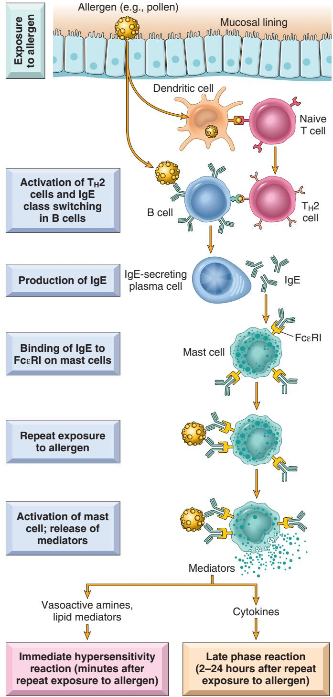 
Fig. 5.12 Sequence of events in immediate (type I) hypersensitivity. Immediate hypersensitivity reactions are initiated by the introduction of an allergen, which stimulates $\mathrm{T}_{\mathrm{H}}2$ responses and IgE production in genetically susceptible individuals. IgE binds to Fc receptors (FcεRI) on mast cells, and subsequent exposure to the allergen activates the mast cells to secrete the mediators that are responsible for the pathologic manifestations of immediate hypersensitivity. See text for abbreviations.
responses. Immediate hypersensitivity is the prototypical $\mathrm{T_H2}$ -mediated reaction. The $\mathrm{T_H2}$ cells that are induced secrete several cytokines, including IL-4, IL-5, and IL-13, which are responsible for essentially all the reactions of immediate hypersensitivity. IL-4 stimulates B cells specific for the allergen to undergo heavy-chain class
switching to IgE and to secrete this immunoglobulin isotype. IL-5 activates eosinophils that are recruited to the reaction, and IL-13 acts on epithelial cells and stimulates mucus secretion. $\mathrm{T_H2}$ cells often are recruited to the site of allergic reactions in response to chemokines that are produced locally; one of these chemokines, eotaxin, also recruits eosinophils to the same site.
- Sensitization of mast cells by IgE antibody. Mast cells are derived from precursors in the bone marrow and widely distributed in tissues, often residing near blood vessels and nerves and in subepithelial locations. Mast cells express a high-affinity receptor for the Fc portion of the $\varepsilon$ heavy chain of IgE, called FcεRI. Even though the serum concentration of IgE is very low (in the range of 1 to $100\mu \mathrm{g} / \mathrm{mL}$ ), the affinity of the mast cell FcεRI receptor is so high that the receptors are always occupied by IgE. These antibody-bearing mast cells are sensitized to react if the specific antigen (the allergen) binds to the antibody molecules. Basophils are circulating cells that resemble mast cells. They also express FcεRI, but their role in most immediate hypersensitivity reactions is not established (since these reactions occur in tissues and most basophils are in the circulation). The third cell type that expresses FcεRI is eosinophils, which often are present in these reactions.
- Activation of mast cells and release of mediators. When a person who was sensitized by exposure to an allergen is reexposed to the allergen, the allergen binds to antigen-specific IgE molecules on mast cells, usually at or near the site of allergen entry. Cross-linking of these IgE molecules triggers a series of biochemical signals that culminate in the secretion of various mediators from the mast cells.
Three groups of mediators are important in different immediate hypersensitivity reactions:
- Vasoactive amines released from granule stores. The granules of mast cells contain histamine, which is released within seconds or minutes of activation. Histamine causes vasodilation, increased vascular permeability, smooth muscle contraction, and increased secretion of mucus. Other rapidly released mediators include chemotactic factors for neutrophils and eosinophils as well as neutral proteases (e.g., tryptase), which may damage tissues and also generate kinins and cleave complement components to produce additional chemotactic and inflammatory factors (e.g., C5a) (Chapter 3). The granules also contain acidic proteoglycans (heparin, chondroitin sulfate), the main function of which seems to be as a storage matrix for the amines.
- Newly synthesized lipid mediators. Mast cells synthesize and secrete prostaglandins and leukotrienes by the same pathways as do other leukocytes (Chapter 3). These lipid mediators have several actions that are important in immediate hypersensitivity reactions. Prostaglandin D2 $(\mathrm{PGD}_2)$ is the most abundant mediator generated by the cyclooxygenase pathway in mast cells. It causes intense bronchospasm as well as increased mucus secretion. The leukotrienes $\mathrm{LTC}_4$ and $\mathrm{LTD}_4$ are the most potent vasoactive and spasmogenic agents known; on a molar basis, they
are several thousand times more active than histamine in increasing vascular permeability and in causing bronchial smooth muscle contraction. $\mathrm{LTB_4}$ is highly chemotactic for neutrophils, eosinophils, and monocytes.
- Cytokines. Activation of mast cells results in the synthesis and secretion of several cytokines that are important for the late-phase reaction. These include TNF and chemokines, which recruit and activate leukocytes (Chapter 3), and IL-4 and IL-5, which amplify the $\mathrm{T_H}2$ -initiated immune reaction.
The reactions of immediate hypersensitivity clearly did not evolve to cause human discomfort and disease. The $\mathrm{T_H}2$ response plays an important protective role in combating parasitic infections. IgE antibodies target helminths for destruction by eosinophils and mast cells. Mast cells also are involved in defense against bacterial infections. And snake aficionados will be relieved to hear that their mast cells may protect them from some snake venoms by releasing granule proteases that degrade the toxins. Why these beneficial responses are inappropriately activated by harmless environmental antigens, giving rise to allergies, remains a puzzle.
# Development of Allergies
Susceptibility to immediate hypersensitivity reactions is genetically determined. An increased propensity to develop immediate hypersensitivity reactions is called atopy. Atopic individuals tend to have higher serum IgE levels and more IL-4-producing $\mathrm{T_H}2$ cells than does the general population. A positive family history of allergy is found in $50\%$ of atopic individuals. The basis of familial predisposition is not clear, but genes that are implicated in susceptibility to asthma and other atopic disorders include those encoding HLA molecules (which may confer immune responsiveness to particular allergens), cytokines (which may control $\mathrm{T_H}2$ responses), a component of the FcεRI, and ADAM33, a metalloproteinase that may be involved in tissue remodeling in the airways.
Environmental factors are also important in the development of allergic diseases. Exposure to environmental pollutants, all too common in industrialized societies, is an important predisposing factor for allergy. It is notable that dogs and cats living in the same environment as humans develop allergies, whereas chimps living in the wild do not despite their much closer genetic similarity to humans. This simple observation suggests that environmental factors may be more important in the development of allergic disease than genetics. Viral infections of the airways are important triggers for bronchial asthma, an allergic disease affecting the lungs (Chapter 13). Bacterial skin infections are strongly associated with atopic dermatitis.
It is estimated that $20\%$ to $30\%$ of immediate hypersensitivity reactions are triggered by nonantigenic stimuli such as temperature extremes and exercise, and do not involve $\mathrm{T_H}2$ cells or IgE. It is believed that in these cases mast cells are abnormally sensitive to activation by various nonimmune stimuli.
The incidence of many allergic diseases is increasing in developed countries and seems to be related to a decrease in infections during early life. These observations have
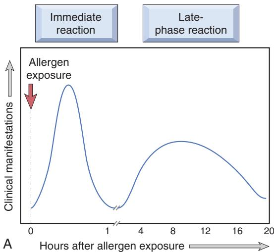 
Fig. 5.13 Phases of immediate hypersensitivity reactions. (A) Kinetics of the immediate and late-phase reactions. The immediate vascular and smooth muscle reaction to allergen develops within minutes after challenge (allergen exposure in a previously sensitized individual), and the late-phase reaction develops 2 to 24 hours later. The immediate reaction (B) is characterized by vasodilation, congestion, and edema, and the late-phase reaction (C) is characterized by an inflammatory infiltrate rich in eosinophils, neutrophils, and T cells. (Courtesy of Dr. Daniel Friend, Department of Pathology, Brigham and Women's Hospital, Boston, Massachusetts.)
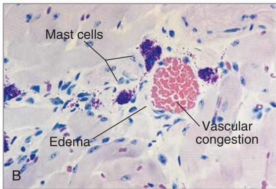
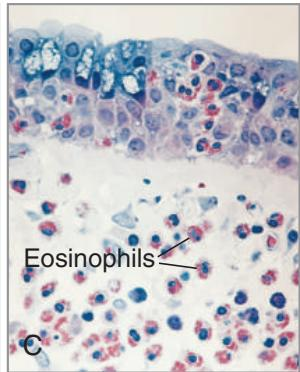
led to an idea, sometimes called the hygiene hypothesis, that early childhood and even prenatal exposure to microbial antigens educates the immune system in such a way that subsequent pathologic responses against common environmental allergens are prevented. Thus, too much hygiene in childhood may increase allergies later in life. The idea that early childhood exposure to antigens may reduce later allergies against those antigens has received support from clinical trials demonstrating that exposing infants to peanuts reduces the incidence of peanut allergy later in life.
# Clinical and Pathologic Manifestations
Often, the IgE-triggered reaction has two well-defined phases (Fig. 5.13): (1) the immediate response, which is stimulated by mast cell granule contents and lipid mediators and is characterized by vasodilation, vascular leakage, and smooth muscle spasm, usually evident within 5 to 30 minutes after exposure to an allergen and subsiding by 60 minutes; and (2) a second, late-phase reaction stimulated mainly by cytokines, which usually sets in 2 to 8 hours later, may last for several days, and is characterized by inflammation as well as tissue destruction, such as mucosal epithelial cell damage. The dominant inflammatory cells in the late-phase reaction are neutrophils, eosinophils, and lymphocytes, especially $\mathrm{T_H}2$ cells. Neutrophils are recruited by various chemokines; their roles in inflammation were described in Chapter 3. Eosinophils are recruited by eotaxin and other chemokines released from epithelium and are important effectors of tissue injury in the late-phase response. Eosinophils produce major basic protein and eosinophil cationic protein, which are toxic to epithelial cells, and $\mathrm{LTC_4}$ and platelet-activating factor, which promote inflammation. The $\mathrm{T_H}2$ cells produce cytokines that have multiple actions, as described earlier. These recruited leukocytes can amplify and sustain the inflammatory response, even in the absence of continuous allergen exposure. In addition, inflammatory leukocytes are responsible for much of the epithelial cell injury in
immediate hypersensitivity. Because inflammation is a major component of many allergic diseases, notably asthma and atopic dermatitis, therapy includes anti-inflammatory drugs such as corticosteroids.
An immediate hypersensitivity reaction may occur as a systemic disorder or as a local reaction (Table 5.3). The route of antigen exposure often determines the nature of the reaction. Systemic exposure to protein antigens (e.g., in bee venom) or drugs (e.g., penicillin) may result in systemic anaphylaxis. Within minutes of the exposure in a sensitized host, itching, urticaria (hives), and skin erythema appear, followed in short order by profound respiratory difficulty caused by pulmonary bronchoconstriction and accentuated by hypersecretion of mucus. Laryngeal edema may exacerbate matters by causing upper airway obstruction. In addition, the musculature of the entire gastrointestinal tract may be affected, with resultant vomiting, abdominal cramps, and diarrhea. Without immediate intervention, there may be systemic vasodilation with a fall
Table 5.3 Examples of Disorders Caused by Immediate Hypersensitivity 
Clinical SyndromeClinical and Pathologic ManifestationsAnaphylaxis (may be caused by drugs, bee sting, food)Fall in blood pressure (shock) caused by vascular dilation; airway obstruction due to laryngeal edemaBronchial asthmaAirway obstruction caused by bronchial smooth muscle hyperactivity; inflammation and tissue injury caused by late-phase reactionAllergic rhinitis, sinusitis (hay fever)Increased mucus secretion; inflammation of upper airways and sinusesFood allergiesIncreased peristalsis due to contraction of intestinal muscles, resulting in vomiting and diarrhea
in blood pressure (anaphylactic shock), and the patient may progress to circulatory collapse and death within minutes.
Local reactions generally occur when the antigen is confined to a particular site, such as the skin (following contact), the gastrointestinal tract (following ingestion), or the lung (following inhalation). Atopic dermatitis, food allergies, hay fever, and certain forms of asthma are examples of localized allergic reactions. However, ingestion or inhalation of allergens also can trigger systemic reactions.
# IMMEDIATE (TYPE I) HYPERSENSITIVITY
- Immediate (type I) sensitivity is also called an allergic reaction, or allergy. 
- Type I hypersensitivity is induced by environmental antigens (allergens) that stimulate strong $\mathrm{T}_{\mathrm{H}}2$ responses and IgE production in genetically susceptible individuals. 
- IgE coats mast cells by binding to the FcεRI receptor; reexposure to the allergen leads to cross-linking of the IgE and FcεRI, activation of mast cells, and release of mediators. 
- Principal mediators are histamine, proteases, and other granule contents; prostaglandins and leukotrienes; and cytokines. 
- Mediators are responsible for the immediate vascular and smooth muscle reactions and the late-phase reaction (inflammation). 
- The clinical manifestations may be local or systemic, and range from mildly annoying rhinitis to fatal anaphylaxis.
# Antibody-Mediated Diseases (Type II Hypersensitivity)
Antibody-mediated (type II) hypersensitivity disorders are caused by antibodies directed against target antigens on the surface of cells or other tissue components. The antigens may be normal molecules intrinsic to cell membranes or in the extracellular matrix, or they may be adsorbed exogenous antigens (e.g., a drug metabolite). These reactions are the cause of several important diseases (Table 5.4).
# Mechanisms of Antibody-Mediated Diseases
Antibodies cause disease by targeting cells for phagocytosis, activating the complement system, or interfering with normal cellular functions (Fig. 5.14). The antibodies that are responsible typically are high-affinity antibodies capable of activating complement and binding to the Fc receptors of phagocytes.
- Opsonization and phagocytosis. When circulating cells, such as red blood cells or platelets, are coated (opsonized) with autoantibodies, with or without complement proteins, the cells become targets for phagocytosis by neutrophils and macrophages (Fig. 5.14A). These phagocytes express receptors for the Fc tails of IgG antibodies and for breakdown products of the C3 complement protein, and use these receptors to bind and ingest opsonized particles. Opsonized cells are usually eliminated in the spleen, and this is why splenectomy is of clinical benefit in some antibody-mediated diseases.
Antibody-mediated cell destruction and phagocytosis occur in the following clinical situations: (1) transfusion reactions, in which cells from an incompatible
Table 5.4 Examples of Antibody-Mediated Diseases (Type II Hypersensitivity) 
DiseaseTarget AntigenMechanisms of DiseaseClinicopathologic ManifestationsAutoimmune hemolytic anemiaRed blood cell membrane proteinsOpsonization and phagocytosis of red blood cellsHemolysis, anemiaAutoimmune thrombocytopenic purpuraPlatelet membrane proteins (GpIIb:IIIa integrin)Opsonization and phagocytosis of plateletsBleedingPemphigus vulgarisProteins in intercellular junctions of epidermal cells (desmogleins)Antibody-mediated activation of proteases, disruption of intercellular adhesionsSkin vesicles (bullae)Vasculitis caused by ANCANeutrophil granule proteins, presumably released from activated neutrophilsNeutrophil degranulation and inflammationVasculitisGoodpasture syndromeProtein in basement membranes of kidney glomeruli and lung alveoliComplement- and Fc receptor-mediated inflammationNephritis, lung hemorrhageAcute rheumatic feverStreptococcal cell wall antigen; antibody cross-reacts with myocardial antigenInflammation, macrophage activationMyocarditis, arthritisMyasthenia gravisAcetylcholine receptorAntibody inhibits acetylcholine binding, down-modulates receptorsMuscle weakness, paralysisGraves disease (hyperthyroidism)TSH receptorAntibody-mediated stimulation of TSH receptorsHyperthyroidismPernicious anemiaIntrinsic factor of gastric parietal cellsNeutralization of intrinsic factor, decreased absorption of vitamin B12Abnormal erythropoiesis, anemia
ANCA, Anti-neutrophil cytoplasmic antibodies; TSH, thyroid-stimulating hormone.
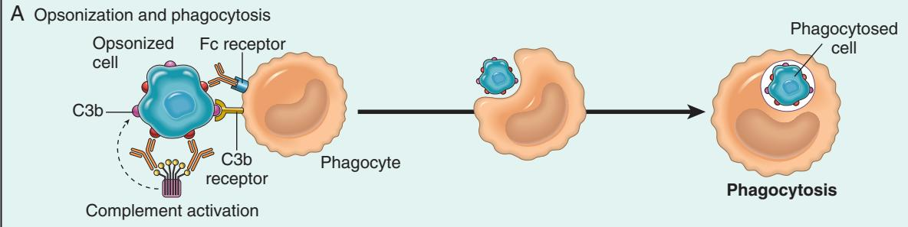
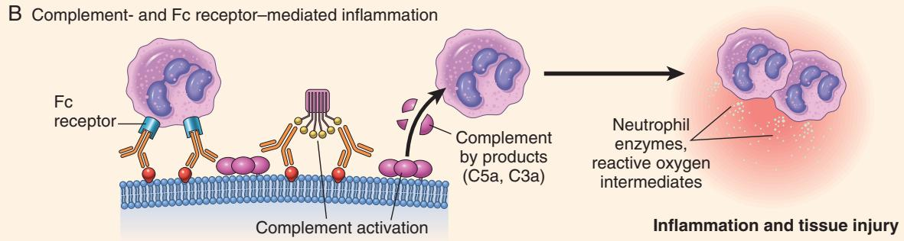
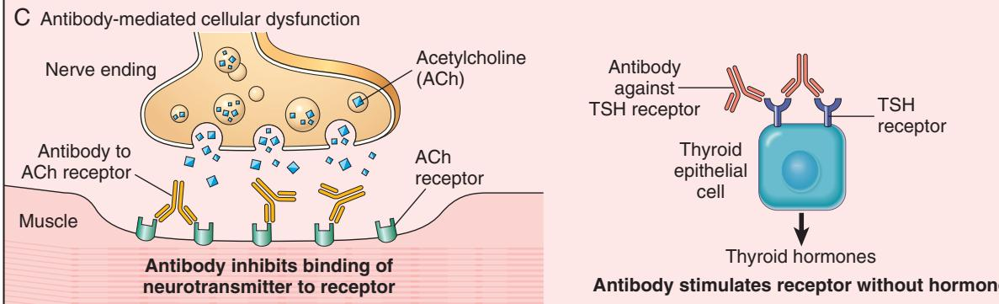 
Fig. 5.14 Mechanisms of antibody-mediated injury. (A) Opsonization of cells by antibodies and complement components and ingestion by phagocytes. (B) Inflammation induced by antibody binding to Fc receptors of leukocytes and by complement breakdown products. (C) Anti-receptor antibodies disturb the normal function of receptors. In these examples, antibodies to the acetylcholine (ACh) receptor impair neuromuscular transmission in myasthenia gravis, and antibodies against the thyroid-stimulating hormone (TSH) receptor activate thyroid cells in Graves disease.
donor react with preformed antibody in the host (Chapter 12); (2) hemolytic disease of the newborn (erythroblastosis fetalis), in which IgG anti-red blood cell antibodies from the mother cross the placenta and cause destruction of fetal red blood cells (Chapter 7); (3) autoimmune hemolytic anemia, agranulocytosis, and thrombocytopenia, in which individuals produce antibodies to their own blood cells (Chapter 12); and (4) certain drug reactions, in which a drug attaches to plasma membrane proteins of red blood cells and antibodies are produced against the drug-protein complex.
- Inflammation. Antibodies bound to cellular or tissue antigens activate the complement system by the classical pathway (Fig. 5.14B). Products of complement activation serve several functions (see Fig. 3.11, Chapter 3), one of which is to recruit neutrophils and monocytes, triggering inflammation in tissues. Leukocytes also may be activated by engagement of Fc receptors, which recognize the bound antibodies. Antibody-mediated inflammation is responsible for tissue injury in some forms of glomerulonephritis, vascular rejection in organ grafts, and other disorders.
- Antibody-mediated cellular dysfunction. In some cases, antibodies directed against a host protein impair or dysregulate important functions without directly causing cell injury or inflammation (Fig. 5.14C). In myasthenia gravis, antibodies against acetylcholine receptors in the motor end plates of skeletal muscles inhibit neuromuscular transmission, with resultant muscle weakness. Antibodies also can stimulate cellular responses excessively. In Graves disease, antibodies against the thyroid-stimulating hormone receptor stimulate thyroid epithelial cells to secrete thyroid hormones, resulting in hyperthyroidism. Antibodies against hormones and other essential proteins can neutralize and block the actions of these molecules, causing functional derangements.
# Immune Complex-Mediated Diseases (Type III Hypersensitivity)
Antigen-antibody (immune) complexes that are formed in the circulation may deposit in blood vessels, leading to complement activation and acute inflammation. Less
Table 5.5 Examples of Immune Complex-Mediated Diseases 
DiseaseAntigen InvolvedClinicopathologic ManifestationsSystemic lupus erythematosusNuclear antigens (circulating or “planted” in kidney)Nephritis, skin lesions, arthritis, othersPoststreptococcal glomerulonephritisStreptococcal cell wall antigen(s); may be “planted” in glomerular basement membraneNephritisPolyarteritis nodosaHepatitis B virus antigens in some casesSystemic vasculitisReactive arthritisBacterial antigens (e.g., Yersinia)Acute arthritisSerum sicknessVarious proteins (e.g., foreign serum protein) (horse anti-thymocyte globulin)Arthritis, vasculitis, nephritisArthus reaction (experimental)Various foreign proteinsCutaneous vasculitis
frequently, the complexes may be formed at sites where antigen has been "planted" previously (called in situ immune complexes). The antigens that form immune complexes may be exogenous, such as a foreign protein that is injected or produced by an infectious microbe, or endogenous, if the individual produces antibody against self antigens (autoimmunity). Examples of immune complex disorders and the antigens involved are listed in Table 5.5. Immune complex-mediated diseases tend be systemic, but often preferentially involve the kidney (glomerulonephritis), joints (arthritis), and small blood vessels (vasculitis), all of which are common sites of immune complex deposition.
# Systemic Immune Complex Disease
Acute serum sickness is the prototype of a systemic immune complex disease; it was once a frequent sequela to the administration of large amounts of foreign serum (e.g., serum from immunized horses used for protection against diphtheria). In modern times, the disease is infrequent and usually seen in individuals who receive antibodies from other individuals or species, e.g. horse or rabbit antithymocyte globulin administered to deplete T cells in recipients of organ grafts. Nevertheless, it is an informative model that has taught us a great deal about immune complex disorders.
The pathogenesis of systemic immune complex disease can be divided into three phases (Fig. 5.15).
Formation of Immune Complexes. The introduction of a protein antigen triggers an immune response that results in the formation of antibodies, typically about 1 week after the injection of the protein. These antibodies are secreted into the blood, where they react with the antigen still present in the circulation and form antigen-antibody complexes.
Deposition of Immune Complexes. In the next phase, the circulating antigen-antibody complexes are deposited in various tissues. The factors that determine whether immune complex formation will lead to tissue deposition and disease are not fully understood, but the major influences seem to be the characteristics of the complexes and local vascular alterations. In general, complexes of medium size that are formed when antigen is in slight excess are the most pathogenic. Organs where blood is filtered at high
..jpg) 
Fig. 5.15 Immune complex disease. The sequential phases in the induction of systemic immune complex-mediated diseases (type III hypersensitivity).
pressure to form other fluids, like urine and synovial fluid, are sites where immune complexes become concentrated and deposit; hence, immune complex disease often affects glomeruli and joints.
Inflammation and Tissue Injury. Once deposited in tissues, immune complexes initiate an acute inflammatory reaction via complement activation and engagement of leukocyte Fc receptors. Typically, the antibodies are IgG or IgM. Deposition of complement proteins can be detected at the site of injury. Consumption of complement during the active phase of the disease decreases serum levels of C3, which can be used as a marker for disease activity. During this phase (approximately 10 days after antigen administration), clinical features such as fever, urticaria, joint pain (arthralgia), lymph node enlargement, and proteinuria appear. Wherever complexes deposit, the tissue damage is similar. The resultant inflammatory lesion is termed vasculitis if it occurs in blood vessels, glomerulonephritis if it occurs in renal glomeruli, arthritis if it occurs in the joints, and so on.
The principal morphologic manifestation of immune complex injury is acute vasculitis, associated with fibrinoid necrosis of the vessel wall and intense neutrophilic infiltration (Fig. 3.12, Chapter 3). When deposited in the kidney, the complexes can be seen on immunofluorescence microscopy as granular deposits of immunoglobulin and complement and on electron microscopy as electron-dense deposits along the glomerular basement membrane (see Fig. 5.24).
In acute serum sickness induced by administration of a single large dose of antigen, the lesions tend to resolve as a result of phagocytosis and degradation of the immune complexes. A form of chronic serum sickness results from repeated or prolonged exposure to an antigen. This occurs in several diseases, such as systemic lupus erythematosus (SLE), which is associated with persistent antibody responses to autoantigens. In many diseases, the morphologic changes and other findings suggest immune complex deposition, but the inciting antigens are unknown. Included in this category are membranous glomerulonephritis and several vasculitides.
# Local Immune Complex Disease (Arthus Reaction)
A model of local immune complex diseases is the Arthus reaction, in which an area of tissue necrosis appears as a result of acute immune complex vasculitis. The reaction is produced experimentally by injecting an antigen into the skin of a previously immunized animal with preformed antibody. Immune complexes form as the antigen diffuses into the vascular wall at the site of injection, triggering the same inflammatory reaction and histologic appearance as in systemic immune complex disease. Arthus lesions evolve over a few hours and reach a peak 4 to 10 hours after injection, when the injection site develops edema and hemorrhage, occasionally followed by ulceration.
# PATHOGENESIS OF DISEASES CAUSED BY ANTIBODIES AND IMMUNE COMPLEXES
- Antibodies can coat (opsonize) cells, with or without complement proteins, and target these cells for phagocytosis by phagocytes (macrophages), which express receptors for the Fc tails of IgG and for complement proteins. The result is depletion of the opsonized cells. 
- Antibodies and immune complexes may deposit in tissues or blood vessels, and elicit an acute inflammatory reaction by activating complement, with release of breakdown products, or by engaging Fc receptors of leukocytes. The inflammatory reaction causes tissue injury. 
- Antibodies can bind to cell surface receptors or other essential molecules and cause functional derangements (either inhibition or unregulated activation) without cell injury.
# T Cell-Mediated Diseases (Type IV Hypersensitivity)
Several autoimmune disorders, as well as pathologic reactions to environmental chemicals and persistent microbes, are now known to be caused by T cells (Table 5.6). Two types of T cell reactions are capable of causing tissue injury and disease: (1) cytokine-mediated inflammation, in which the cytokines are produced mainly by $\mathrm{CD4 + }$ T cells, and (2) direct cell cytotoxicity, mediated by $\mathrm{CD8 + }$ T cells (Fig. 5.16). This group of diseases is of great clinical interest because T cells are increasingly recognized as the basis of chronic inflammatory diseases, and many of the new rationally designed therapies for these diseases have been developed to target the abnormal T cell reactions.
# CD4+ T Cell-Mediated Inflammation
In $\mathrm{CD4 + }$ T cell-mediated hypersensitivity reactions, cytokines produced by the T cells induce inflammation that may be chronic and destructive. The prototype of T cell-mediated inflammation is delayed-type hypersensitivity (DTH), a tissue reaction to antigens given to immune individuals. In this reaction, an antigen administered into the skin of a previously immunized individual results in a detectable cutaneous reaction within 24 to 48 hours (hence the term delayed, in contrast to immediate hypersensitivity).
As described earlier, naive T cells are activated in secondary lymphoid organs by recognition of peptide antigens displayed by dendritic cells. The T cells differentiate into effector cells under the influence of various cytokines (see Figs. 5.9 and 5.10). Classical T cell-mediated hypersensitivity is a reaction of $\mathrm{T_H}1$ effector cells, but $\mathrm{T_H}17$ cells also may contribute to the reaction, especially when neutrophils are prominent in the inflammatory infiltrate. $\mathrm{T_H}1$ cells secrete cytokines, mainly IFN- $\gamma$ , which are responsible for many of the manifestations of delayed-type hypersensitivity. IFN- $\gamma$ -activated (classically activated) macrophages produce substances that destroy microbes and damage tissues, and mediators that promote inflammation (Chapter 3).
Table 5.6 T Cell-Mediated Diseases 
DiseaseSpecificity of Pathogenic T CellsPrincipal Mechanisms of Tissue InjuryClinicopathologic ManifestationsRheumatoid arthritisCollagen?Citrullinated self proteins?Inflammation mediated by TH17 (and TH1?) cytokines; role of antibodies and immune complexes?Chronic arthritis with inflammation, destruction of articular cartilageMultiple sclerosisProtein antigens in myelin (e.g., myelin basic protein)Inflammation mediated by TH1 and TH17 cytokines, myelin destruction by activated macrophagesDemyelination in CNS with perivascular inflammation; paralysisType I diabetes mellitusAntigens of pancreatic islet β cells (insulin, glutamic acid decarboxylase, others)T cell-mediated inflammation, destruction of islet cells by CTLsInsulitis (chronic inflammation in islets), destruction of β cells; diabetesInflammatory bowel diseaseEnteric bacteria; self antigens?Inflammation mediated by TH1 and TH17 cytokinesChronic intestinal inflammation, obstructionPsoriasisUnknownInflammation mediated mainly by TH17 cytokinesDestructive plaques in the skinContact sensitivityVarious environmental chemicals (e.g., urushiol from poison ivy or poison oak, therapeutic drugs)Inflammation mediated by TH1 (and TH17?) cytokinesEpidermal necrosis, dermal inflammation, causing skin rash and blisters
Examples of human T cell-mediated diseases are listed. In many cases, the specificity of the T cells and the mechanisms of tissue injury are inferred based on the similarity with experimental animal models of the diseases.
Activated $\mathrm{T_H17}$ cells secrete cytokines that recruit neutrophils and monocytes.
# Clinical Examples of CD4+ T Cell-Mediated Inflammatory Reactions
The classic example of DTH is the tuberculin reaction (known in clinical medicine as the PPD skin test), which is produced
by the intracutaneous injection of purified protein derivative (PPD, also called tuberculin), a protein-containing antigen of the Mycobacterium tuberculosis bacillus. In a previously exposed individual, reddening and induration of the site appear in 8 to 12 hours, reach a peak in 24 to 72 hours, and thereafter slowly subside. Morphologically, delayed-type hypersensitivity is characterized by the
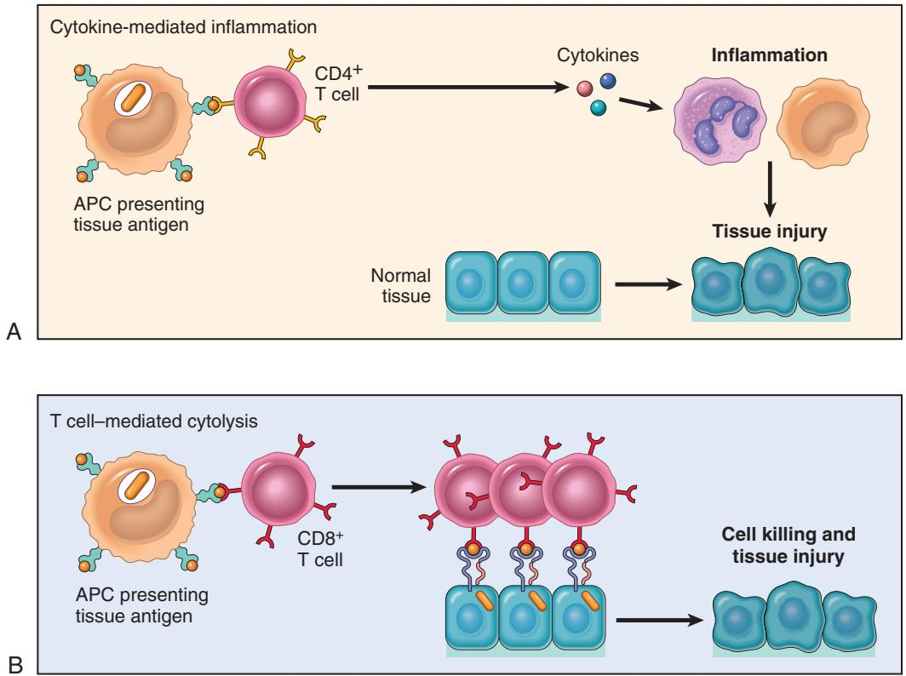 
Fig. 5.16 Mechanisms of T-cell-mediated (type IV) hypersensitivity reactions. (A) $\mathrm{CD4 + T_H1}$ cells (and sometimes $\mathrm{CD8 + T}$ cells, not shown) respond to tissue antigens by secreting cytokines that stimulate inflammation and activate phagocytes, leading to tissue injury. $\mathrm{CD4 + T_H17}$ cells contribute to inflammation by recruiting neutrophils (and, to a lesser extent, monocytes). (B) In some diseases, $\mathrm{CD8 + }$ cytotoxic T lymphocytes (CTLs) directly kill tissue cells expressing intracellular antigens (shown as orange bars inside cells). APC, Antigen-presenting cell.
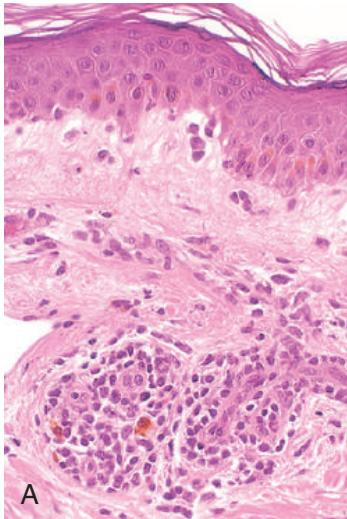 
Fig. 5.17 Delayed hypersensitivity reaction in the skin. (A) Perivascular accumulation ("cuffing") of mononuclear inflammatory cells (lymphocytes and macrophages), with associated dermal edema and fibrin deposition. (B) Immunoperoxidase staining reveals a predominantly perivascular cellular infiltrate that marks positively with anti-CD4 antibodies. (Courtesy of Dr. Louis Picker, Department of Pathology, Oregon Health Sciences University, Portland, Oregon.)
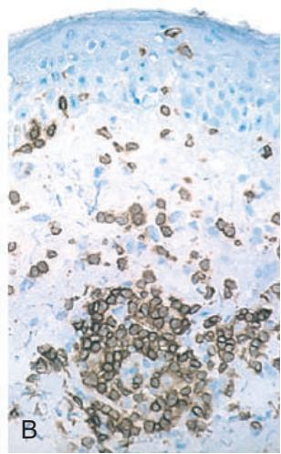
accumulation of mononuclear cells, mainly CD4+ T cells and macrophages, around venules, producing perivascular "cuffing" (Fig. 5.17).
Prolonged DTH reactions against persistent microbes or other stimuli may result in a special pattern of reaction called granulomatous inflammation. The initial perivascular $\mathrm{CD4 + }$ T cell infiltrate is progressively replaced by macrophages over a period of 2 to 3 weeks. These accumulated macrophages typically exhibit morphologic evidence of activation; that is, they become large, flat, and eosinophilic, and are called epithelioid cells. The epithelioid cells occasionally fuse under the influence of cytokines (e.g., IFN- $\gamma$ to form multinucleate giant cells. An aggregate of epithelioid cells, typically surrounded by a collar of lymphocytes, is called a granuloma (Fig. 5.18A). The process is essentially a chronic form of $\mathrm{T_H}1$ -mediated inflammation and macrophage activation (see Fig. 5.18B). Older granulomas develop an enclosing rim of fibroblasts and connective tissue. In certain situations, such as infection by helminths known as schistosomes, $\mathrm{T_H}2$ cells also are involved, and as a result eosinophils are prominent in the lesions. Recognition of granulomas is of diagnostic importance because they are seen only in a limited number of conditions (Chapter 3).
Contact dermatitis is a common example of tissue injury resulting from DTH reactions. It may be evoked by contact with urushiol, the antigenic component of poison ivy or poison oak, and presents as a vesicular dermatitis. It is thought that in these reactions, the environmental chemical binds to and structurally modifies self proteins, and peptides derived from these modified proteins are recognized by T cells and elicit the reaction. The same mechanism is responsible for many drug reactions, among the most common hypersensitivity reactions of humans. The responsible drug (often a reactive chemical) alters self proteins, including MHC molecules, and these neoantigens are recognized as foreign by T cells, leading to cytokine produc
tion and inflammation. Drug reactions often manifest as skin rashes.
$\mathrm{CD4 + }$ T cell-mediated inflammation is the basis of tissue injury in many organ-specific and systemic autoimmune diseases, such as rheumatoid arthritis and multiple sclerosis, as well as diseases probably caused by uncontrolled reactions to bacterial commensals, such as inflammatory bowel disease (see Table 5.6).
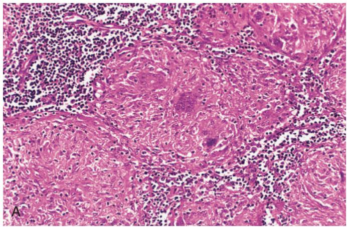
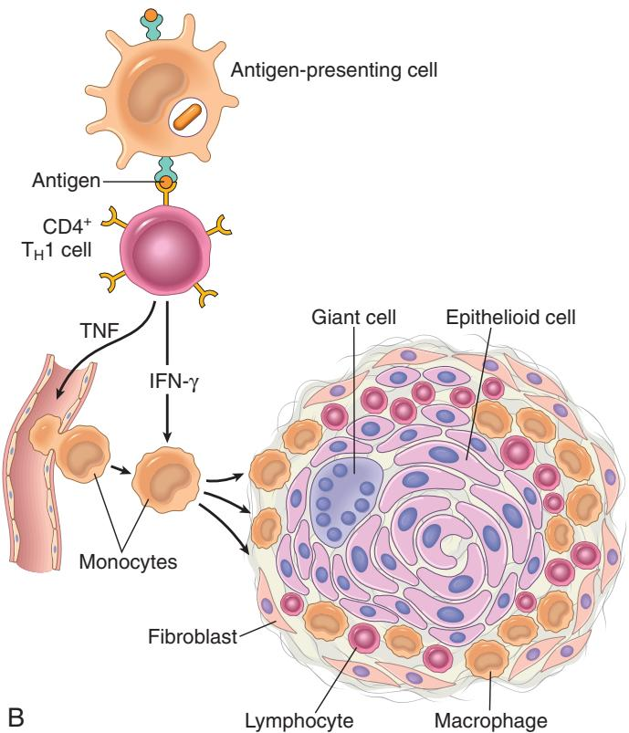 
Fig. 5.18 Granulomatous inflammation. (A) A section of a lymph node shows several granulomas, each made up of an aggregate of epithelioid cells and surrounded by lymphocytes. The granuloma in the center shows several multinucleate giant cells. (B) The events that give rise to the formation of granulomas in type IV hypersensitivity reactions, illustrating the role of $\mathrm{T_H}1$ cytokines. In some granulomatous disorders (e.g., schistosomiasis), $\mathrm{T_H}2$ cells also contribute to the lesions. The role of $\mathrm{T_H}17$ cells in granuloma formation is not proven. (A, Courtesy of Dr. Trace Worrell, Department of Pathology, University of Texas Southwestern Medical School, Dallas, Texas.)
# CD8+ T Cell-Mediated Cytotoxicity
In this type of T cell-mediated reaction, $\mathrm{CD8 + }$ CTLs kill antigen-expressing target cells. Tissue destruction by CTLs may be an important component of some T cell-mediated diseases, such as type 1 diabetes. CTLs directed against cell surface histocompatibility antigens play an important role in graft rejection, which is discussed later. They also play a role in reactions against viruses. In a virus-infected cell, viral peptides are displayed by class I MHC molecules and the complex is recognized by the TCR of $\mathrm{CD8 + }$ T lymphocytes. The killing of infected cells leads to elimination of the infection, but in some cases, it is responsible for cell damage that accompanies the infection (e.g., in viral hepatitis). $\mathrm{CD8 + }$ T cells also produce cytokines, notably IFN- $\gamma$ and are involved in inflammatory reactions resembling DTH, especially following virus infections and exposure to some contact sensitizing agents.
# MECHANISMS OF T CELL-MEDIATED HYPERSENSITIVITY REACTIONS
- Cytokine-mediated inflammation: $\mathrm{CD4 + }$ T cells are activated by exposure to a protein antigen and differentiate into $T_{\mathsf{H}}\mathsf{I}$ and $T_{\mathsf{H}}17$ effector cells. Subsequent exposure to the antigen results in the secretion of cytokines. IFN- $\gamma$ activates macrophages to produce substances that cause tissue damage and promote fibrosis, and IL-17 and other cytokines recruit leukocytes, thus promoting inflammation. 
- The classical T cell-mediated inflammatory reaction is delayed-type hypersensitivity. Chronic $\mathsf{T_H}$ reactions associated with macrophage activation often lead to granuloma formation. 
- T cell-mediated cytotoxicity: CD8+ cytotoxic T lymphocytes (CTLs) specific for an antigen recognize cells expressing the target antigen and kill these cells. CD8+ T cells also secrete IFN- $\gamma$ .
Now that we have described how the immune system can cause tissue damage, we turn to diseases in which normal control mechanisms fail. The prototypes of such diseases are autoimmune disorders, which are the result of failure of tolerance to self antigens.
# AUTOIMMUNE DISEASES
Autoimmunity refers to immune reactions against self ("auto") antigens. Autoimmune diseases are estimated to affect at least $1\%$ to $2\%$ of the U.S. population. The evidence that these diseases are indeed the result of autoimmune reactions is more persuasive for some than for others. For instance, in many of these disorders, high-affinity autoantibodies have been identified, and in some cases these antibodies are known to cause pathologic abnormalities. There is also growing evidence for the activation of pathogenic self-reactive T cells in some of these diseases. In addition, experimental models have proved very informative, providing circumstantial evidence supporting an autoimmune etiology. Nevertheless, it is fair to say that for many
Table 5.7 Autoimmune Diseases 
Organ-Specific SystemicDiseases Mediated by AntibodiesAutoimmune hemolytic anemiaSystemic lupus erythematosusAutoimmune thrombocytopeniaAutoimmune atrophic gastritis of pernicious anemiaMyasthenia gravisGraves diseaseGoodpasture syndromeDiseases Mediated by T Cells*Type I diabetes mellitusRheumatoid arthritisMultiple sclerosisSystemic sclerosis (scleroderma)†Sjögren syndrome†Diseases Postulated to Be AutoimmuneInflammatory bowel diseases (Crohn disease, ulcerative colitis)‡Primary biliary cirrhosis†Polyarteritis nodosa†Autoimmune (chronic active) hepatitisInflammatory myopathies†
\*A role for T cells has been demonstrated in these disorders, but antibodies may also be involved in tissue injury. An autoimmune basis of these disorders is suspected, but the supporting evidence is not strong. These disorders may result from excessive immune responses to commensal enteric microbes, autoimmunity, or a combination of the two.
disorders traditionally classified as autoimmune, this etiology is suspected but not proved.
Autoimmune diseases may be organ-specific, in which the immune responses are directed against one particular organ or cell type and result in localized tissue damage, or systemic, characterized by lesions in many organs (Table 5.7). In systemic diseases that are caused by immune complexes and autoantibodies, the lesions principally affect the connective tissues and blood vessels of involved organs. Therefore, these diseases are often referred to as collagen vascular diseases or connective tissue diseases, even though the immunologic reactions are not specifically directed against constituents of connective tissue or blood vessels.
Normal persons are unresponsive (tolerant) to their own (self) antigens, and autoimmunity results from a failure of self-tolerance. Therefore, understanding the pathogenesis of autoimmunity requires familiarity with the mechanisms of normal immunologic tolerance.
# Immunologic Tolerance
Immunologic tolerance is a state of unresponsiveness to an antigen that is induced by exposure of specific lymphocytes to that antigen. Self-tolerance refers to lack of immune responsiveness to one's own tissue antigens. Billions of different antigen receptors are randomly generated in developing T lymphocytes and B lymphocytes, and it is not surprising that during this process, receptors are produced that can recognize self antigens. Since these antigens cannot all be concealed from the immune system, there must be a means of eliminating or controlling self-recognizing lymphocytes. Several mechanisms work in
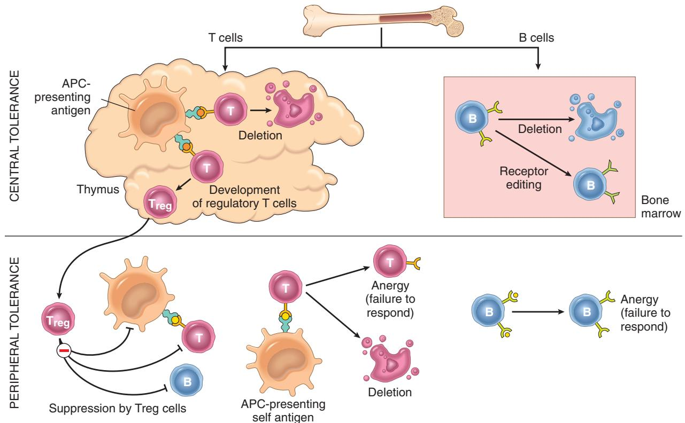 
Fig. 5.19 Mechanisms of immunologic tolerance to self antigens. The principal mechanisms of central and peripheral self-tolerance in T cells and B cells are illustrated. APC, Antigen-presenting cell; Treg cells, regulatory T cells.
concert to select against self-reactivity and to thus prevent immune reactions against the body's own antigens. Two broad mechanisms are recognized: central tolerance and peripheral tolerance (Fig. 5.19).
# Central Tolerance
The principal mechanism of central tolerance is the antigen-induced deletion (death) of self-reactive T lymphocytes and B lymphocytes during their maturation in central (generative) lymphoid organs (i.e., in the thymus for T cells and in the bone marrow for B cells). In the thymus, many autologous (self) protein antigens are processed and presented by thymic APCs. Any immature T cell that encounters such a self antigen undergoes apoptosis (a process called deletion, or negative selection), and the T cells that complete their maturation are thereby depleted of self-reactive cells. An exciting advance has been the identification of a protein called AIRE (autoimmune regulator), which stimulates expression of some peripheral tissue-restricted self antigens in the thymus and is thus critical for deletion of immature T cells specific for these antigens. Mutations in the AIRE gene are the cause of an autoimmune polyendocrinopathy (Chapter 20). Not all immature T cells that see self antigens in the thymus are deleted. Some $\mathrm{CD4 + }$ T cells survive and develop into regulatory T cells (described later).
Immature B cells that recognize self antigens with high affinity in the bone marrow also may die by apoptosis. Other self-reactive B cells are not deleted but instead undergo a second round of rearrangement of antigen receptor genes and then express new receptors that are no longer self-reactive (a process called receptor editing).
Central tolerance, however, is imperfect. Not all self antigens are present in the thymus or bone marrow, and hence lymphocytes bearing receptors for such autoantigens escape into the periphery. Self-reactive lymphocytes that escape negative selection can inflict tissue injury unless they are eliminated or muzzled in the peripheral tissues.
# Peripheral Tolerance
Several mechanisms silence potentially autoreactive T cells and B cells in peripheral tissues; these are best defined for T cells. These mechanisms include the following:
- Anergy. This term refers to functional inactivation (rather than death) of lymphocytes that is induced by encounter with antigens under certain conditions. As described previously, activation of T cells requires two signals: recognition of peptide antigen in association with MHC molecules on APCs, and a set of second costimulatory signals (e.g., through B7 molecules) provided by the APCs. If the costimulatory signals are not delivered, or if an inhibitory receptor on the T cell (rather than the costimulatory receptor) is engaged when the cell encounters self antigen, the T cell becomes anergic and cannot respond to the antigen. Because costimulatory molecules are expressed at low levels or not at all on APCs presenting self antigens, the encounter between autoreactive T cells and self antigens in tissues may result in anergy.
It is believed that if mature B cells encounter self antigen in peripheral tissues, especially in the absence of specific helper T cells, these B cells become unable to respond to the antigen. B lymphocytes also express inhibitory receptors that may play a role in
limiting their activation and preventing responses to self antigens.
- Suppression by regulatory T cells. A population of T cells called regulatory T cells functions to prevent immune reactions against self antigens. Regulatory T cells develop mainly in the thymus, but they also may be induced in peripheral lymphoid tissues. The best-defined regulatory T cells are $\mathrm{CD4 + }$ cells that express high levels of CD25, the $\alpha$ chain of the IL-2 receptor, and a transcription factor of the forkhead family, called FOXP3. Both IL-2 and FOXP3 are required for the development and maintenance of functional $\mathrm{CD4 + }$ regulatory T cells. Mutations in the FOXP3 gene result in severe autoimmunity in humans and mice; in humans, these mutations are the cause of a systemic autoimmune disease called IPEX (an acronym for immune dysregulation, polyendocrinopathy, enteropathy, X-linked). 
The mechanisms by which regulatory T cells suppress immune responses are not fully defined, but their inhibitory activity may be mediated in part by the secretion of immunosuppressive cytokines such as IL-10 and TGF- $\beta$ , which inhibit lymphocyte activation and effector functions. Regulatory T cells also express CTLA-4, which may bind to B7 molecules on APCs and reduce their ability to activate T cells via CD28. 
- Deletion by apoptosis. T cells that recognize self antigens may receive signals that promote their death by apoptosis. Two mechanisms of deletion of mature T cells have been proposed, based mainly on studies in mice. It is postulated that if T cells recognize self antigens, they upregulate a pro-apoptotic member of the Bcl-2 family called Bim, which triggers apoptosis by the mitochondrial pathway (Chapter 2). Another mechanism of apoptosis involves the death receptor Fas (a member of the TNF receptor family), which can be engaged by its ligand coexpressed on the same or neighboring cells. The importance of this pathway of self-tolerance is illustrated by the discovery that FAS mutations are responsible for an autoimmune disease called the autoimmune lymphoproliferative syndrome (ALPS), characterized by lymphadenopathy and production of autoantibodies. 
- Some self antigens are hidden (sequestered) from the immune system, because the tissues in which these antigens are located do not communicate with the blood and lymph. As a result, unless released into the circulation, these antigens fail to elicit immune responses and are essentially ignored by the immune system. This is believed to be the case for antigens that are only found in the testis, eye, and brain, all of which are called immune-privileged sites because antigens located in these sites tend to be shielded from the immune system. If the antigens are released from these tissues, for example, as a consequence of trauma or infection, the result may be an immune response that leads to prolonged tissue inflammation and injury. This is the postulated mechanism for post-traumatic orchitis and uveitis.
# Mechanisms of Autoimmunity: General Principles
Now that we have summarized the principal mechanisms of self-tolerance, we can ask how these mechanisms might break down to give rise to pathologic autoimmunity.
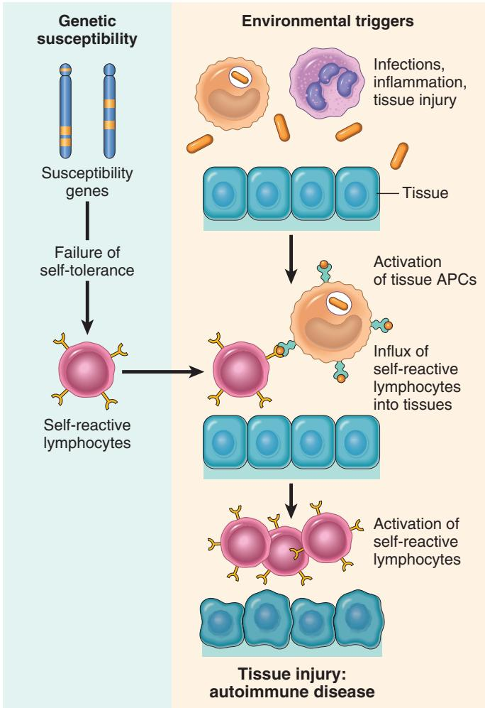 
Fig. 5.20 Pathogenesis of autoimmunity. Autoimmunity results from multiple factors, including susceptibility genes that may interfere with self-tolerance and environmental triggers (such as infections, tissue injury, and inflammation) that promote lymphocyte entry into tissues, activation of self-reactive lymphocytes, and tissue damage.
Unfortunately, there are no simple answers to this question, and the underlying causes of most human autoimmune diseases remain to be determined. The best guess is that breakdown of self-tolerance and development of autoimmunity result from the combined effects of susceptibility genes, which influence lymphocyte tolerance, and environmental factors, such as infections or tissue injury, that alter the display of and responses to self antigens (Fig. 5.20).
# Genetic Factors in Autoimmunity
Most autoimmune diseases are complex multigenic disorders. There is abundant evidence that inherited genes play a role in the development of autoimmune diseases.
- Autoimmune diseases have a tendency to run in families, and there is a greater incidence of the same disease in monozygotic than in dizygotic twins. 
- Several autoimmune diseases are linked to the HLA locus, especially class II alleles (HLA-DR, HLA-DQ). The frequency of a disease in individuals with a particular HLA allele compared with those who do not inherit that allele, is called the odds ratio or relative risk (Table 5.8). The relative risk ranges from 3 or 4 for
Table 5.8 Association of HLA Alleles and Inflammatory Diseases 
DiseaseHLA AlleleOdds Ratio†Rheumatoid arthritis (anti-CCP Ab positive)‡DRBI, 1 SE allele¶4DRBI, 2 SE alleles12Type I diabetes mellitusDRBI*0301-DQAI*0501-DQBI*0201 haplotype4DRBI*0401-DQAI*0301-DQBI*0302 haplotype8DRBI*0301/0401 haplotype heterozygotes35Multiple sclerosisDRBI*15013Systemic lupus erythematosusDRBI*03012DRBI*15011.3Ankylosing spondylitisB*27 (mainly B*2705 and B*2702)100–200Celiac diseaseDQAI*0501-DQBI*0201 haplotype7
†The odds ratio reflects approximate values of increased risk for the disease associated with the inheritance of particular HLA alleles. The data are from European-derived populations. 
$^{\ddagger}$ Anti-CCP Ab refers to antibodies directed against cyclic citrullinated peptides. Data are from patients who test positive for these antibodies in the serum. 
${}^{1}$ SE refers to shared epitope,so called because the susceptibility alleles map to one region of the DRBI protein (positions 70-74). The DRBI protein is the product of the $\beta$ chain of the HLA DR molecule. 
Courtesy of Dr. Michelle Fernando, Imperial College London.
rheumatoid arthritis (RA) and HLA-DR4 to 100 or more for ankylosing spondylitis and HLA-B27. However, how MHC genes influence the development of autoimmunity is still not clear. Notably, most individuals with a susceptibility-related MHC allele never develop disease, and, conversely, individuals without the relevant MHC gene may get it. Expression of a particular MHC gene is therefore but one variable that contributes to autoimmunity.
- Genome-wide association (GWAS) studies and linkage studies in families are revealing many genetic polymorphisms that are associated with different autoimmune diseases (Table 5.9). Some of these genetic variants are disease-specific, but many of the associations are seen in multiple disorders, suggesting that they affect general mechanisms of immune regulation and self-tolerance. However, the mechanism by which most of these genetic variants contribute to particular autoimmune diseases is not established.
# Role of Infections, Tissue Injury, and Other
A variety of microbes, including bacteria, mycoplasmas, and viruses, have been implicated as triggers for autoimmunity. Microbes may induce autoimmune reactions by several mechanisms (Fig. 5.21):
- Microbial infections with resultant tissue necrosis and inflammation can stimulate expression of costimulatory molecules on APCs in the tissue, thus favoring a breakdown of T cell tolerance and subsequent T cell activation. 
- Viruses and other microbes may share cross-reacting epitopes with self antigens, and as a result responses induced by the microbe may extend to self tissues, a phenomenon called molecular mimicry. The best example of a pathogenic immunologic cross-reaction is rheumatic heart disease, in which an antibody response against streptococci cross-targets cardiac antigens. It is not known if mimicry has a role in more common autoimmune diseases.
Recently, there has been great interest in the idea that the development of autoimmunity is influenced by the normal gut and skin microbiome (the diverse collection of commensal microbes that live with us in a symbiotic relationship). It is possible that different commensal microbes
Table 5.9 Selected Non-HLA Gene Variants Associated With Autoimmune Diseases 
Putative Gene 
InvolvedDiseasesPostulated Function of Encoded Protein and Role of Mutation/Polymorphism in 
DiseaseGenes Involved in Immune RegulationPTPN22RA,TID,IBDProtein tyrosine phosphatase; may affect signaling in lymphocytes and may alter negative selection or activation 
of self-reactive T cellsIL23RIBD,PS,ASReceptor for the TH17-inducing cytokine IL-23; may alter differentiation of CD4+ T cells into pathogenic TH17 
effector cellsCTLA4TID,RAInhibits T-cell responses by terminating activation and promoting activity of regulatory T cells; may interfere with 
self-toleranceIL2RAMS,TIDα chain of the receptor for IL-2, which is a growth and survival factor for activated and regulatory T cells; may 
affect development of effector cells and/or regulation of immune responsesGenes Involved in Immune Responses to MicrobesNOD2IBDCytoplasmic sensor of bacteria expressed in Paneth and other intestinal epithelial cells; may control resistance 
to gut commensal bacteriaATG16IBDInvolved in autophagy; possible role in defense against microbes and maintenance of epithelial barrier functionIRF5,IFIH1SLERole in type I interferon production; type I IFN is involved in the pathogenesis of SLE (see text)
AS, Ankylosing spondylitis; IBD, inflammatory bowel disease; IFN, interferon; MS, multiple sclerosis; PS, psoriasis; RA, rheumatoid arthritis; SLE, systemic lupus erythematosus; TID, type I diabetes. 
The probable linkage of these genes with various autoimmune diseases has been defined by genome-wide association studies (GWAS) and other methods for studying disease-associated polymorphisms. 
Adapted from Zenewicz LA, Abraham C, Flavell RA, et al: Unraveling the genetics of autoimmunity, Cell 140:791, 2010.
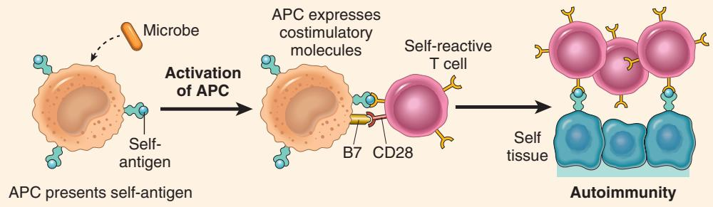 
A Induction of costimulators on APCs
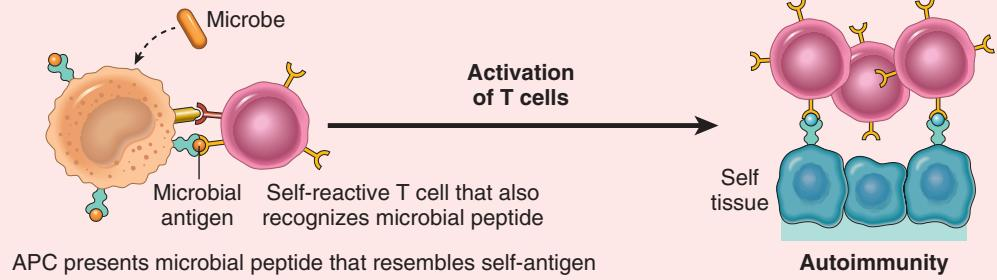 
B Molecular mimicry
,ormicrobialantigensmaymimicselfantigensandactivateself-reactivelymphocytesasacross-reaction(B)..jpg) 
Fig. 5.21 Postulated role of infections in autoimmunity. Infections may promote activation of self-reactive lymphocytes by inducing the expression of costimulators (A), or microbial antigens may mimic self antigens and activate self-reactive lymphocytes as a cross-reaction (B).
affect the relative proportions of effector and regulatory T cells, and shape the host response toward or away from aberrant activation. However, it is still not clear which microbes contribute to specific diseases in humans, or if the microbiome can be manipulated to prevent or treat these disorders.
Adding to the complexity of the link between microbes and autoimmunity are recent observations suggesting that infections paradoxically protect individuals from some autoimmune diseases, notably type 1 diabetes, multiple sclerosis, and Crohn disease. The possible mechanisms underlying this effect are not understood.
In addition to infections, the display of tissue antigens also may be altered by a variety of environmental insults. As discussed later, ultraviolet (UV) radiation causes cell death and may lead to the exposure of nuclear antigens, which elicit pathologic immune responses in lupus; this mechanism is the proposed explanation for the association of lupus flares with exposure to sunlight. Smoking is a risk factor for RA, perhaps because it leads to chemical modification of self antigens. Local tissue injury for any reason may lead to the release of self antigens and autoimmune responses.
Finally, there is a strong gender bias of autoimmunity, with many of these diseases being more common in women than in men. The underlying mechanisms are not well understood, but may involve the effects of hormones and other factors.
An autoimmune response may itself promote further autoimmune attack. Tissue injury caused by an autoimmune response or any other cause may lead to exposure of self antigen epitopes that were previously concealed but are now presented to T cells in an immunogenic form. The activation of such autoreactive T cells is called epitope spreading, because the immune response spreads to epitopes that were not recognized initially. This is one of the mechanisms that may contribute to the chronicity of autoimmune diseases.
# IMMUNOLOGIC TOLERANCE AND AUTOIMMUNITY
- Tolerance (unresponsiveness) to self antigens is a fundamental property of the immune system, and breakdown of tolerance is the basis of autoimmune diseases.
- Central tolerance: immature T and B lymphocytes that recognize self antigens in the central (generative) lymphoid organs are killed by apoptosis; in the B-cell lineage, some of the self-reactive lymphocytes switch to new antigen receptors that are not self-reactive. 
- Peripheral tolerance: mature lymphocytes that recognize self antigens in peripheral tissues become functionally inactive
(anergic), are suppressed by regulatory T lymphocytes, or die by apoptosis.
- The factors that lead to a failure of self-tolerance and the development of autoimmunity include (1) inheritance of susceptibility genes that disrupt different tolerance pathways, and (2) infections and tissue injury that expose self antigens and activate APCs and lymphocytes in the tissues.
Having discussed the general principles of tolerance and autoimmunity, we proceed to a discussion of some of the most common and important autoimmune diseases. Although each disease is discussed separately, considerable overlap is apparent in their clinical and morphologic features and underlying pathogenesis. Here we cover the systemic autoimmune diseases; autoimmune diseases that affect single organ systems are discussed in chapters that deal with the relevant organs.
# Systemic Lupus Erythematosus
SLE is an autoimmune disease involving multiple organs, characterized by a vast array of autoantibodies, particularly antinuclear antibodies (ANAs), in which injury is caused mainly by deposition of immune
complexes and binding of antibodies to various cells and tissues. Injury to the skin, joints, kidney, and serosal membranes is prominent, but virtually every organ in the body may be affected. The presentation of SLE is so variable that a complex set of criteria for this disorder have been proposed, to help clinicians and for the design and assessment of clinical trials (Table 5.10). However, the disease is very heterogeneous, and any patient may present with any number of these features. SLE is a fairly common disease, with a prevalence that may be as high as 400 per 100,000 in certain populations. Although SLE often presents when a person is in the twenties or thirties, it may manifest at any age, even in early childhood. Similar to many autoimmune diseases, SLE predominantly affects women, with a female-to-male ratio of 9:1 for the reproductive age group of 17 to 55 years. By comparison, the female-to-male ratio is only 2:1 for disease developing during childhood or after 65 years of age. The prevalence of the disease is 2- to 3-fold higher in blacks and Hispanics than in whites.
# Spectrum of Autoantibodies in SLE
The hallmark of SLE is the production of autoantibodies. Some antibodies recognize nuclear and cytoplasmic components, while others are directed against cell surface antigens of blood cells. Apart from their value in the diagnosis
Table 5.10 Revised Criteria for Classification of Systemic Lupus Erythematosus* 
CriterionDefinitionClinical CriteriaAcute cutaneous lupusMalar rash (fixed erythema, flat or raised, over the malar eminences), photosensitivityChronic cutaneous lupusDiscoid rash: erythematous raised patches with adherent keratotic scaling and follicular pluggingNonscarring alopeciaDiffuse thinning or hair fragility in the absence of other causesOral or nasal ulcersOral or nasopharyngeal ulceration, usually painlessJoint diseaseNonerosive synovitis involving two or more peripheral joints, characterized by tenderness, swelling, or effusionSerositisPleuritis (pleuritic pain or rub or evidence of pleural effusion), pericarditisRenal disorderPersistent proteinuria &gt;0.5 g/24 hours, or red cell castsNeurologic disorderSeizures, psychosis, myelitis, or neuropathy, in the absence of offending drugs or other known causesHemolytic anemiaHemolytic anemiaLeukopenia or lymphopeniaLeukopenia—&lt;4.0 × 109cells/L (4000 cells/mm3) total on two or more occasions, or Lymphopenia—&lt;1.5 × 109cells/L (1500 cells/mm3) on two or more occasionsThrombocytopeniaThrombocytopenia—&lt;100 × 109cells/L (100 × 103cells/mm3) in the absence of offending drugs and other conditionsImmunologic CriteriaAntinuclear antibody (ANA)Abnormal titer of antinuclear antibody by immunofluorescenceAnti-dsDNA antibodyAbnormal titerAnti-Sm antibodyPresence of antibody to Sm nuclear antigenAntiphospholipid antibodyPositive finding of antiphospholipid antibodies based on (1) an abnormal serum level of IgG or IgM anti-cardiolipin antibodies, (2) a positive test for lupus anticoagulant using a standard test, or (3) a false-positive serologic test for syphilis known to be positive for at least 6 months and confirmed by negative Treponema pallidum immobilization or fluorescent treponemal antibody absorption testLow complementLow C3, C4 or CH50Direct Coombs testAssay for anti-red cell antibody, in the absence of clinically evident hemolytic anemia
*This classification was initially proposed in 1997 by the American College of Rheumatology for the purpose of identifying patients in clinical studies. It has been updated in 2012 by the Systemic Lupus International Collaborating Clinics. A patient is classified as having SLE if four of the clinical and immunologic criteria are present at any time (not necessarily concurrently), including at least one clinical and one immunologic criterion. Some details have been omitted from the table. Modified from Petri M, Orbai AM, Alarcón GS, et al: Derivation and validation of the Systemic Lupus International Collaborating Clinics classification criteria for systemic lupus erythematosus. Arthritis Rheum 64:2677, 2012.
Table 5.11 Autoantibodies in Systemic Autoimmune Diseases 
DiseaseSpecificity of Autoantibody% PositiveDisease AssociationsSystemic lupus erythematosus (SLE)Double-stranded DNA40–60Nephritis; specific for SLEUI-RNP30–40Smith (Sm) antigen (core protein of small RNP particles)20–30Specific for SLERo (SS-A) nucleoprotein30–50Congenital heart block; neonatal lupusPhospholipid-protein complexes (anti-PL)30–40Anti-phospholipid syndrome (in ~10% of SLE patients)Multiple nuclear antigens (“generic ANAs”)95–100Found in other autoimmune diseases, not specificSystemic sclerosisDNA topoisomerase I30–70Diffuse skin disease, lung disease; specific for systemic sclerosisCentromeric proteins (CENPs) A, B, C20–40Limited skin disease, ischemic digital loss, pulmonary hypertensionRNA polymerase III15–20Acute onset, scleroderma renal crisis, cancerSjögren syndromeRo/SS-A75More sensitiveLa/SS-B50More specificAutoimmune myositisHistidyl aminoacyl-tRNA synthetase, JoI25Interstitial lung disease, Raynaud phenomenonMi-2 nuclear antigen5–10Dermatomyositis, skin rashMDA5 (cytoplasmic receptor for viral RNA)20–35 (Japanese)Vascular skin lesions, interstitial lung diseaseTIF1γ nuclear protein15–20Dermatomyositis, cancerRheumatoid arthritisCCP (cyclic citrullinated peptides); various citrullinated proteins60–80Specific for rheumatoid arthritisRheumatoid factor60–70Not specific
Table compiled with the assistance of Dr. Antony Rosen, Johns Hopkins University, and Dr. Andrew Gross, University of California San Francisco.
and management of patients with SLE, these autoantibodies are of major pathogenic significance, as, for example, in the immune complex-mediated glomerulonephritis so typical of this disease. Autoantibodies also are found in other autoimmune diseases, many of which tend to be associated with specific types of autoantibodies (Table 5.11).
# Anti-Nuclear Antibodies
ANAs can be grouped into four categories: (1) antibodies to DNA, (2) antibodies to histones, (3) antibodies to nonhistone proteins bound to RNA, and (4) antibodies to nucleolar antigens. The most widely used method for detecting ANAs is indirect immunofluorescence, which can identify antibodies that bind to a variety of nuclear antigens, including DNA, RNA, and proteins (collectively called generic ANAs). The pattern of nuclear fluorescence suggests the type of antibody present in the patient's serum. Several basic patterns are recognized (Fig. 5.22):
- A homogeneous or diffuse staining pattern usually reflects the presence of antibodies to chromatin, histones, and, occasionally, double-stranded DNA. 
- A rim or peripheral staining pattern is most often indicative of antibodies to double-stranded DNA and sometimes to nuclear envelope proteins. 
- A centromeric pattern is indicative of antibodies specific for centromeres. This pattern is often observed in patients with systemic sclerosis. 
- A speckled pattern refers to the presence of uniform or variable-sized speckles. This is one of the most commonly observed patterns of fluorescence and therefore the least specific. It reflects the presence of antibodies to non-DNA nuclear constituents such as Sm antigen, ribonucleoprotein, and SS-A and SS-B reactive antigens.
- A nucleolar pattern refers to the presence of a few discrete spots of fluorescence within the nucleus and represents antibodies to RNA. This pattern is reported most often in patients with systemic sclerosis.
The fluorescence patterns are not absolutely specific for the type of antibody, and because many autoantibodies may be present, combinations of patterns are frequent. Attempts are ongoing to replace microscopic assays with quantitative assays for antibodies against specific nuclear and other antigens. Indeed, antibodies to double-stranded DNA and the so-called "Smith (Sm) antigen" can be detected by more quantitative assays and are virtually diagnostic of SLE. Nevertheless, the staining pattern has diagnostic value, and the test remains in use.
# Other Autoantibodies
In addition to ANAs, lupus patients have a host of other autoantibodies. Some are directed against blood cells, such as red cells, platelets, and lymphocytes. Anti-phospholipid antibodies are present in $30\%$ to $40\%$ of lupus patients. They are actually directed against epitopes of various plasma proteins that are revealed when the proteins are in complex with phospholipids. Antibodies against the phospholipid- $\beta_{2}$ -glycoprotein complex also bind to cardiolipin antigen, used in syphilis serology, and therefore lupus patients may have a false-positive test result for syphilis. Because these antibodies bind to phospholipids, they may prolong the partial thromboplastin time, an in vitro clotting test that requires phospholipids. Therefore, these antibodies are sometimes referred to as lupus anti-coagulant. Despite the observed clotting delays in vitro, patients with anti-phospholipid antibodies have complications related to excessive clotting (a hypercoagulable state), such as thrombosis (Chapter 4).
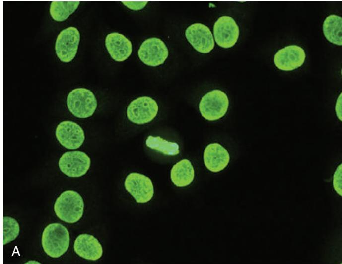
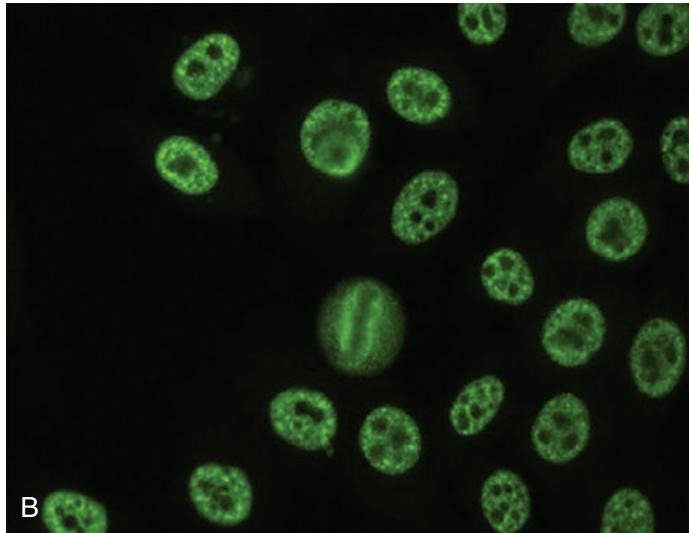
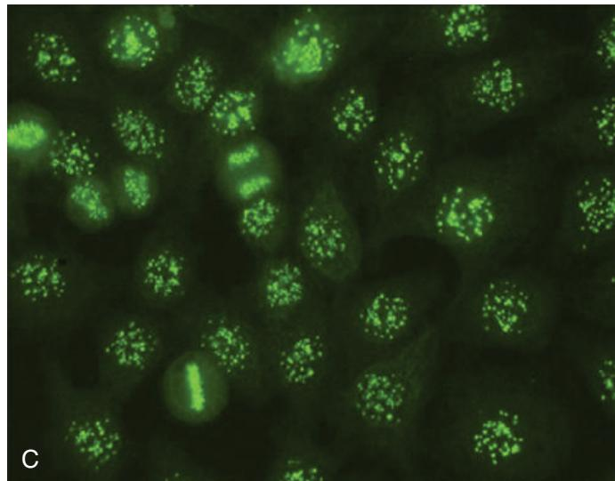 
Fig. 5.22 Staining patterns of anti-nuclear antibodies. (A) Homogeneous or diffuse staining of nuclei is typical of antibodies reactive with dsDNA, nucleosomes, and histones, and is common in SLE. (B) A speckled pattern is seen with antibodies against various nuclear antigens, including Sm and RNPs. (C) The pattern of staining of anti-centromere antibodies is seen in some cases of systemic sclerosis, Sjögren syndrome, and other diseases. (D) A nucleolar pattern is typical of antibodies against nucleolar proteins. (From Wiik AS, Høier-Madsen M, Forslid J, et al: Antinuclear antibodies: a contemporary nomenclature using HEp-2 cells. J Autoimm 35:276, 2010.)
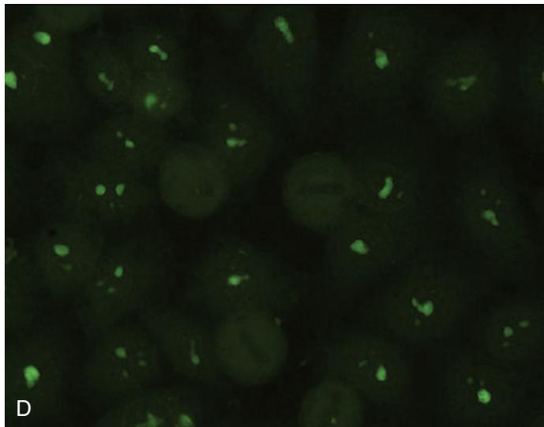
The fundamental defect in SLE is a failure of the mechanisms that maintain self-tolerance. Although what causes this failure of self-tolerance remains unknown, as is true of most autoimmune diseases, both genetic and environmental factors play a role.
# Genetic Factors
Many lines of evidence support a genetic predisposition to SLE.
- Familial association. Family members have an increased risk for the development of SLE, and up to $20\%$ of unaffected first-degree relatives have autoantibodies. There is a higher rate of concordance in monozygotic twins $(25\%)$ than in dizygotic twins $(1\%-3\%)$ . 
- HLA association. The odds ratio (relative risk) for persons with HLA-DR2 or HLA-DR3 is 2 to 3, and if both haplotypes are present, the risk is about 5.
- Other genes. Genetic deficiencies of classical pathway complement proteins, especially C1q, C2, or C4, are seen in about $10\%$ of patients with SLE. The complement deficiencies may result in defective clearance of immune complexes and apoptotic cells, and failure of B-cell tolerance. A polymorphism in the inhibitory Fc receptor, FcγRIIb, has been described in some patients; this may contribute to inadequate control of B-cell activation. Additional genes have been implicated by genomewide association studies, but their contribution to the development of the disease remains unclear.
There are many indications that environmental factors also are involved in the pathogenesis of SLE.
- Exposure to UV light exacerbates the disease in many individuals. UV irradiation may induce apoptosis and also may alter DNA and make it immunogenic, perhaps
by enhancing its recognition by TLRs. In addition, UV light may modulate the immune response, for example, by stimulating keratinocytes to produce IL-1, a cytokine that promotes inflammation.
- The gender bias of SLE is partly attributable to actions of sex hormones and partly related to genes on the X chromosome, independent of hormone effects. 
- Drugs such as hydralazine, procainamide, and D-penicillamine can induce an SLE-like disorder.
# Immunologic Factors
Recent studies in animal models and patients have revealed several immunologic aberrations that collectively may result in the persistent and uncontrolled activation of self-reactive lymphocytes.
- Failure of self-tolerance in B cells results from defective elimination of self-reactive B cells in the bone marrow or defects in peripheral tolerance mechanisms. 
- CD4+ helper T cells specific for nucleosomal antigens also escape tolerance and contribute to the production of high-affinity pathogenic autoantibodies. The autoantibodies in SLE show characteristics of T cell-dependent antibodies produced in germinal centers, and increased numbers of follicular helper T cells have been detected in the blood of SLE patients. 
- Type I interferons. Blood cells show a striking molecular signature that indicates exposure to interferon- $\alpha$ (IFN- $\alpha$ ), a type I interferon that is produced mainly by plasmacytoid DCs. Some studies have shown that such cells from SLE patients produce abnormally large amounts of IFN- $\alpha$ . 
- TLR signals. Studies in animal models have shown that TLRs that recognize DNA and RNA, notably the DNA-recognizing TLR9 and the RNA-recognizing TLR7, produce signals that activate B cells specific for self nuclear antigens. 
- Other cytokines that may play a role in unregulated B-cell activation include the TNF family member BAFF, which promotes survival of B cells. In some patients and animal models, increased production of BAFF has been reported, and this has led to modest success of an antibody that blocks BAFF as a therapy for SLE.
# A Model for the Pathogenesis of SLE
It is clear from this discussion that the immunologic abnormalities in SLE—both documented and postulated—are varied and complex. Nevertheless, an attempt can be made to synthesize results from human studies and animal models into a hypothetical model of the pathogenesis of SLE (Fig. 5.23). UV irradiation and other environmental insults lead to the apoptosis of cells. Inadequate clearance of the nuclei of these cells results in a large burden of nuclear antigens. Underlying abnormalities in B lymphocytes and T lymphocytes are responsible for defective tolerance, because of which self-reactive lymphocytes survive and remain functional. These lymphocytes are stimulated by nuclear self antigens, and antibodies are produced against the antigens. Complexes of the antigens and antibodies bind to Fc receptors on B cells and dendritic cells, and may be internalized. The nucleic acid components engage TLRs and stimulate B cells to produce more autoantibodies. TLR stimuli also activate dendritic cells to
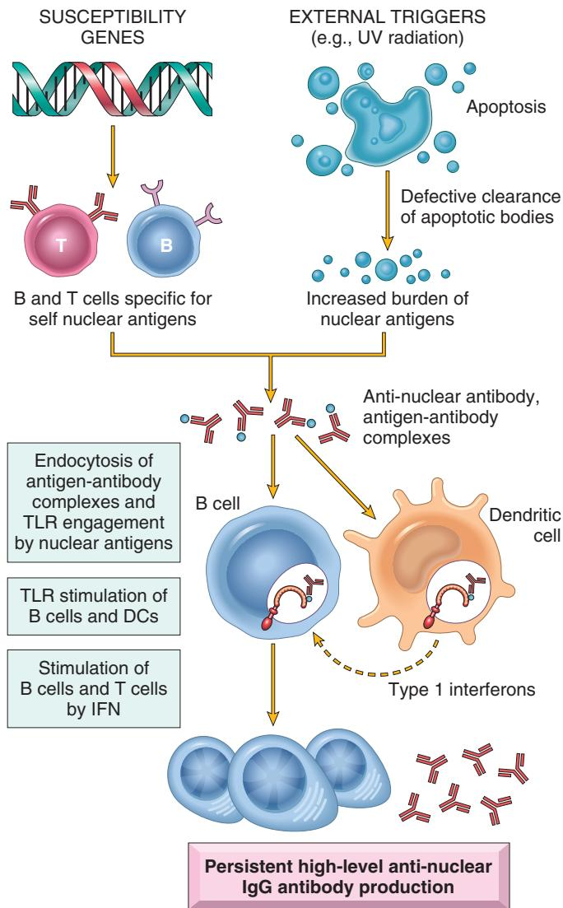 
Fig. 5.23 Model for the pathogenesis of systemic lupus erythematosus. In this hypothetical model, susceptibility genes interfere with the maintenance of self-tolerance, and external triggers lead to persistence of nuclear antigens. The result is an antibody response against self nuclear antigens, which is amplified by the action of nucleic acids on dendritic cells (DCs) and B cells, and the production of type I interferons. TLRs, Toll-like receptors.
produce interferons and other cytokines, which further enhance the immune response and cause more apoptosis. The net result is a cycle of antigen release and immune activation resulting in the production of high-affinity autoantibodies.
# Mechanisms of Tissue Injury
Different autoantibodies are the cause of most of the lesions of SLE.
- Most of the systemic lesions are caused by immune complexes (type III hypersensitivity). DNA-anti-DNA complexes can be detected in the glomeruli and small blood vessels. Low levels of serum complement (secondary to consumption of complement proteins) and granular deposits of complement and immunoglobulins in the glomeruli further support the immune complex nature of the disease. T cell infiltrates are also frequently
seen in the kidneys, but the role of these cells in tissue damage is not established.
- Autoantibodies of different specificities contribute to the pathology and clinical manifestations of SLE (type II hypersensitivity). Autoantibodies specific for red blood cells, white blood cells, and platelets opsonize these cells and promote their phagocytosis, resulting in cytopenias. There is no evidence that ANAs, which are involved in immune complex formation, can penetrate intact cells. If cell nuclei are exposed, however, the ANAs can bind to them. In tissues, nuclei of damaged cells react with ANAs, lose their chromatin pattern, and become homogeneous, producing so-called "LE bodies" or hematoxylin bodies. Related to this phenomenon are LE cells, which are readily seen when blood is agitated in vitro. An LE cell is a phagocyte (neutrophil or macrophage) that has engulfed the denatured nucleus of an injured cell. The demonstration of LE cells in vitro was used in the past as a test for SLE. With new techniques for detection of ANAs, however, this test is now only of historic interest. Sometimes, LE cells are found in pericardial or pleural effusions in patients. 
- Anti-phospholipid antibody syndrome. Patients with anti-phospholipid antibodies may develop venous and arterial thromboses, which may be associated with recurrent spontaneous miscarriages and focal cerebral or ocular ischemia. This constellation of clinical features, in association with lupus, is referred to as the secondary anti-phospholipid antibody syndrome. The mechanisms of thrombosis are not defined, and antibodies against clotting factors, platelets, and endothelial cells have all been proposed as being responsible for thrombosis (Chapter 4). Some patients develop these autoantibodies and the clinical syndrome without associated SLE. They are said to have the primary anti-phospholipid antibody syndrome (Chapter 4). 
- The neuropsychiatric manifestations of SLE have been attributed to antibodies that cross the blood-brain barrier and react with neurons or receptors for various neurotransmitters. However, this is not established in all cases, and mechanisms involving other immune factors, such as cytokines, also may underlie the cognitive dysfunction and other CNS abnormalities that are associated with SLE.
The morphologic changes in SLE are extremely variable. The frequency of individual organ involvement is shown in Table 5.12. The most characteristic lesions result from immune complex deposition in blood vessels, kidneys, connective tissue, and skin.
Blood Vessels. An acute necrotizing vasculitis involving capillaries, small arteries, and arterioles may be present in any tissue. The arteritis leads to fibrinoid necrosis of the vessel walls. In chronic stages, vessels undergo fibrous thickening with luminal narrowing.
Kidney. Up to $50\%$ of SLE patients have clinically significant renal involvement, and the kidney virtually always shows evidence of abnormality if examined by electron microscopy and immunofluorescence. Renal involvement takes a number of forms, all
Table 5.12 Clinical and Pathologic Manifestations of Systemic Lupus Erythematosus 
Clinical ManifestationPrevalence in Patients (%)*Hematologic100Arthritis, arthralgia, or myalgia80–90Skin85Fever55–85Fatigue80–100Weight loss60Renal50–70Neuropsychiatric25–35Pleuritis45Pericarditis25Gastrointestinal20Raynaud phenomenon15–40Ocular5–15Peripheral neuropathy15
*Percentages are approximate and may vary with age, ethnicity, and other factors. Table compiled with the assistance of Dr. Meenakshi Jolly, Rush Medical Center, Chicago.
of which are associated with the deposition of immune complexes within the glomeruli. According to the currently accepted classification, six patterns of glomerular disease are recognized. It should be noted that there is overlap within these classes and that lesions may evolve from one class to another over time. Thus, the exact percentage of patients with each of the six classes of lesions is difficult to determine. Suffice it to say that class I is the least common and class IV is the most common pattern.
- Minimal mesangial lupus nephritis (class I) is very uncommon, and is characterized by immune complex deposition in the mesangium, identified by immunofluorescence and by electron microscopy, but without structural changes by light microscopy. 
- Mesangial proliferative lupus nephritis (class II) is characterized by mesangial cell proliferation, often accompanied by accumulation of mesangial matrix, and granular mesangial deposits of immunoglobulin and complement without involvement of glomerular capillaries. 
- Focal lupus nephritis (class III) is defined by involvement of fewer than $50\%$ of all glomeruli. The lesions may be segmental (affecting only a portion of the glomerulus) or global (involving the entire glomerulus). Affected glomeruli may exhibit swelling and proliferation of endothelial and mesangial cells associated with leukocyte accumulation, capillary necrosis, and hyaline thrombi. Often, there also is extracapillary proliferation associated with focal necrosis and crescent formation (Fig. 5.24A). The clinical presentation ranges from mild hematuria and proteinuria to acute renal insufficiency. Red blood cell casts in the urine are common when the disease is active. Some patients progress to diffuse glomerulonephritis. The active (or proliferative) inflammatory lesions can heal completely or lead to chronic global or segmental glomerular scarring. 
- Diffuse lupus nephritis (class IV) is the most common and severe form of lupus nephritis. The lesions are identical to those in class III, but differ in extent; in diffuse lupus
isthemostcommonands.jpg)
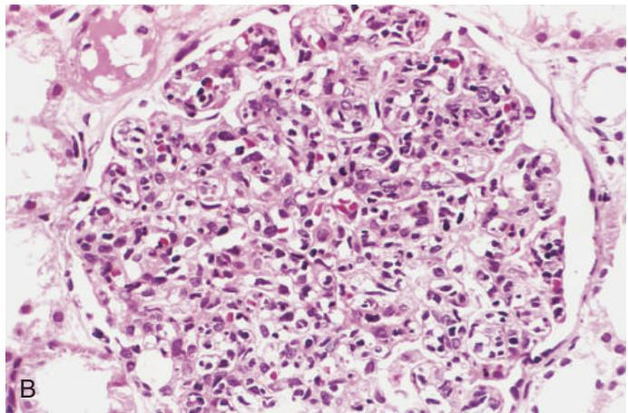
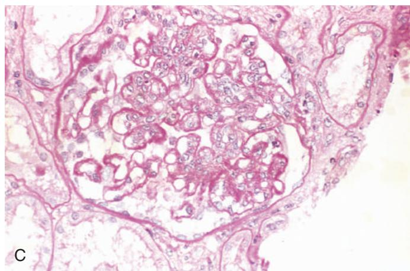
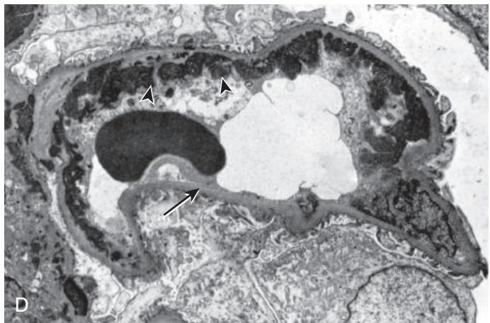
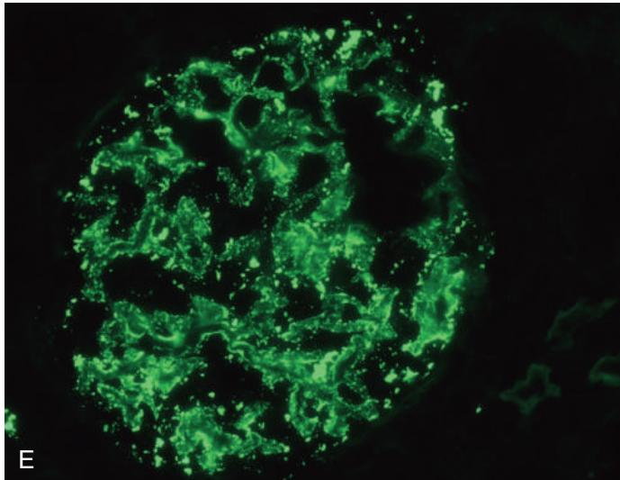 
Fig. 5.24 Lupus nephritis. (A) Focal proliferative glomerulonephritis, with two focal necrotizing lesions at the I1 o'clock and 2 o'clock positions (H&E stain). Extracapillary proliferation is not prominent in this case. (B) Diffuse proliferative glomerulonephritis. Note the marked increase in cellularity throughout the glomerulus (H&E stain). (C) Lupus nephritis showing a glomerulus with several "wire-loop" lesions representing extensive subendothelial deposits of immune complexes (periodic acid-Schiff stain). (D) Electron micrograph of a renal glomerular capillary loop from a patient with SLE nephritis. Subendothelial dense deposits (arrowheads) on basement membrane (arrow) correspond to "wire loops" seen by light microscopy. (E) Deposition of IgG antibody in a granular pattern, detected by immunofluorescence. (A to C, Courtesy of Dr. Helmut Rennke, Department of Pathology, Brigham and Women's Hospital, Boston, Massachusetts. D, Courtesy of Dr. Edwin Eigenbrodt, Department of Pathology, University of Texas, Southwestern Medical School, Dallas, Texas. E, Courtesy of Dr. Jean Olson, Department of Pathology, University of California, San Francisco, California.)
nephritis, half or more of the glomeruli are affected. Involved glomeruli show proliferation of endothelial, mesangial, and epithelial cells (see Fig. 5.24B), with the latter producing cellular crescents that fill Bowman's space. Subendothelial immune complex deposits may create a circumferential thickening of the capillary wall, forming "wire-loop" structures on light microscopy (see Fig. 5.24C). Immune complexes can be readily detected by electron microscopy (see Fig. 5.24D) and immunofluorescence (see Fig. 5.24E). Lesions may progress to scarring of glomeruli. Patients with diffuse glomerulonephritis are usually symptomatic, showing hematuria as well as proteinuria. Hypertension and mild to severe renal insufficiency also are common.
- Membranous lupus nephritis (class V) is characterized by diffuse thickening of the capillary walls due to deposition of subepithelial immune complexes, similar to idiopathic membranous nephropathy, described in Chapter 14. The immune complexes are usually accompanied by increased production of basement membrane-like material, resulting in "holes" and "spikes" on silver stain. This lesion is usually accompanied by severe proteinuria or nephrotic syndrome, and may occur concurrently with focal or diffuse lupus nephritis. 
- Advanced sclerosing lupus nephritis (class VI) is characterized by sclerosis of more than $90\%$ of the glomeruli, and represents end-stage renal disease.
Changes in the interstitium and tubules are frequently present. Rarely, tubulointerstitial lesions may be the dominant abnormality. Discrete immune complexes similar to those in glomeruli are present in the tubular or peritubular capillary basement membranes in many lupus nephritis patients. Sometimes, there are well-organized B-cell follicles in the interstitium, associated with plasma cells that may be sources of autoantibodies.
Skin. Characteristic erythema affects the face along the bridge of the nose and cheeks (the butterfly rash) in approximately $50\%$ of patients, but a similar rash also may be seen on the extremities and trunk. Urticaria, bullae, maculopapular lesions, and ulcerations also occur. Exposure to sunlight incites or accentuates the erythema. Histologically the involved areas show vacuolar degeneration of the basal layer of the epidermis (Fig. 5.25A). In the dermis, there is variable edema and perivascular inflammation. Vasculitis with fibrinoid necrosis may be prominent. Immunofluorescence microscopy shows deposits of immunoglobulin and complement along the dermoepidermal junction (Fig. 5.25B); these also may be present in uninvolved skin. This finding is not diagnostic of SLE and is sometimes seen in scleroderma and dermatomyositis.
Joints. Joint involvement is typically a nonerosive synovitis with little deformity, which contrasts with rheumatoid arthritis.
Central Nervous System. Although it was suggested in the past that the neuropsychiatric manifestations of SLE may be due to acute vasculitis, in histologic studies of the nervous system in such patients, significant vasculitis is rarely present. Instead, noninflammatory occlusion of small vessels by intimal proliferation is sometimes noted, which may be due to endothelial damage caused by autoantibodies or immune complexes.
Pericarditis and Other Serosal Cavity Involvement. Inflammation of the serosal lining membranes may be acute, subacute, or chronic. During the acute phase, the mesothelial surfaces are sometimes covered with fibrinous exudate. Later they become thickened, opaque, and coated with shaggy fibrous
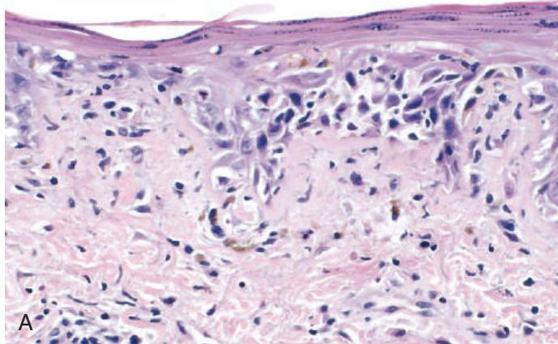
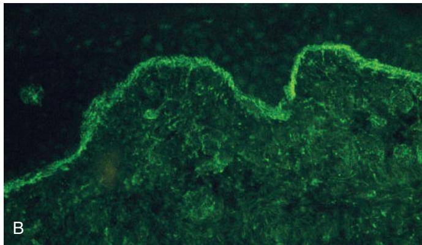 
Fig. 5.25 Systemic lupus erythematosus involving the skin. (A) An H&E-stained section shows liqueactive degeneration of the basal layer of the epidermis and edema at the dermoepidermal junction. (B) An immunofluorescence micrograph stained for IgG reveals deposits of Ig along the dermoepidermal junction. (A, Courtesy of Dr. Jag Bhawan, Boston University School of Medicine, Boston, Massachusetts. B, Courtesy of Dr. Richard Sontheimer, Department of Dermatology, University of Texas Southwestern Medical School, Dallas, Texas.)
tissue that may lead to partial or total obliteration of the serosal cavity. Pleural and pericardial effusions may be present.
Cardiovascular system involvement may manifest as damage to any layer of the heart. Symptomatic or asymptomatic pericardial involvement is present in up to $50\%$ of patients. Myocarditis is less common and may cause resting tachycardia and electrocardiographic abnormalities. Valvular (so-called "Libman-Sacks") endocarditis was more common prior to the widespread use of steroids. This sterile endocarditis takes the form of single or multiple I- to 3-mm verrucous deposits, which may form on either surface of any heart valve, distinctively on either surface of the leaflets (Fig. 5.26). By comparison, the vegetations in infective endocarditis are larger, while those in rheumatic heart disease (Chapter 11) are smaller and confined to the lines of closure of the valve leaflets.
An increasing number of patients are affected by coronary artery disease manifesting as angina or myocardial infarction. This complication may be seen in young patients with longstanding disease, and is especially prevalent in those who have been treated with corticosteroids. The pathogenesis of accelerated coronary atherosclerosis is unclear but is probably multifactorial. Risk factors for atherosclerosis, including hypertension, obesity, and hyperlipidemia, are more commonly present in SLE patients than in the population at large. In addition, immune
.jpg) 
Fig. 5.26 Libman-Sacks endocarditis of the mitral valve in lupus erythematosus. The vegetations attached to the margin of the thickened valve leaflet are indicated by arrows. (Courtesy of Dr. Fred Schoen, Department of Pathology, Brigham and Women's Hospital, Boston, Massachusetts.)
complexes and anti-phospholipid antibodies may cause endothelial damage and promote atherosclerosis.
Spleen. Splenomegaly, capsular thickening, and follicular hyperplasia are common features. Central penicillary arteries may show concentric intimal and smooth muscle cell hyperplasia, producing so-called onion-skin lesions.
Lungs. In addition to pleuritis and accompanying pleural effusions, some cases are complicated by chronic interstitial fibrosis and secondary pulmonary hypertension.
Other Organs and Tissues. LE, or hematoxylin, bodies in the bone marrow or other organs are strongly indicative of SLE. Lymph nodes may be enlarged due to hyperplasia of B cell follicles or even demonstrate necrotizing lymphadenitis due to vasculitis.
SLE is a highly variable multisystem disease, and its diagnosis relies on a constellation of clinical, serologic, and morphologic findings (see Table 5.10). It may be acute or insidious in its onset. Often, the patient is a young woman with some or all of the following features: a butterfly rash on the face; fever; pain without deformity in one or more joints; pleuritic chest pain; and photosensitivity. In many patients, however, the presentation is subtle and puzzling, taking forms such as fever of unknown origin, abnormal urinary findings, or joint disease masquerading as rheumatoid arthritis or rheumatic fever. Generic ANAs, detected by immunofluorescence assays, are found in virtually $100\%$ of patients, but these are not specific for SLE. Renal involvement may produce a variety of findings, including hematuria, red blood cell casts, proteinuria, and nephrotic syndrome (Chapter 14). Anemia or thrombocytopenia are
presenting manifestations in some patients and may be dominant clinical problems. In others, neuropsychiatric manifestations including psychosis or convulsions, or coronary artery disease may be prominent. Infections also are common, presumably because of the immune dysfunction that underlies SLE as well as treatment with immunosuppressive drugs.
The course of SLE is variable and unpredictable. Rare acute cases result in death within weeks to months. More often, with appropriate therapy, SLE follows a relapsing and remitting course over a period of years or decades. During acute flares, increased formation of immune complexes results in complement activation, often leading to hypocomplementemia. Disease flares are usually treated with corticosteroids or other immunosuppressive drugs. Even without therapy, in some patients the disease runs an indolent course for years with relatively mild manifestations, such as skin changes and mild hematuria. The overall 5-year and 10-year survivals are approximately $90\%$ and $80\%$ , respectively. The most common causes of death are renal failure and intercurrent infections. Coronary artery disease also is becoming an important cause of death. Patients treated with steroids and immunosuppressive drugs incur the usual risks associated with such therapy.
As mentioned earlier, involvement of skin along with multisystem disease is fairly common in SLE. The following sections describe two syndromes in which the cutaneous involvement is the exclusive or most prominent feature.
# Chronic Discoid Lupus Erythematosus
Chronic discoid lupus erythematosus is a disease in which the skin manifestations may mimic SLE, but systemic manifestations are rare. It is characterized by the presence of skin plaques, most often on the face and scalp, showing varying degrees of edema, erythema, scaliness, follicular plugging, and skin atrophy surrounded by an elevated erythematous border. It progresses to SLE in $5\%$ to $10\%$ of patients, usually after many years. Conversely, some patients with SLE may have prominent discoid lesions in the skin. Approximately $35\%$ of patients have a positive test for generic ANAs, but antibodies to double-stranded DNA are rarely present. Immunofluorescence studies of skin biopsy specimens show deposition of immunoglobulin and C3 at the dermoepidermal junction similar to that in SLE.
The term subacute cutaneous lupus erythematosus refers to a group intermediate between SLE and lupus erythematosus localized only to skin. The skin rash in this disease tends to be widespread and superficial. Most patients have mild systemic symptoms similar to those in SLE. There is a strong association with antibodies to the SS-A antigen and with the HLA-DR3 genotype.
# Drug-Induced Lupus Erythematosus
An SLE-like syndrome may develop in patients receiving a variety of drugs, including hydralazine, procainamide, isoniazid, and D-penicillamine. Surprisingly, anti-TNF therapy, which is effective in rheumatoid arthritis and other autoimmune diseases, also can cause drug-induced lupus. Many of these drugs are associated with the development of ANAs, especially antibodies specific for histones. The disease remits after withdrawal of the offending drug.
# SYSTEMIC LUPUS ERYTHEMATOSUS
- SLE is a systemic autoimmune disease caused by autoantibodies produced against numerous self antigens and the formation of immune complexes. 
- The major autoantibodies, and the ones responsible for the formation of circulating immune complexes, are directed against nuclear antigens. Other autoantibodies react with red blood cells, platelets, and various phospholipid-proteins complexes. 
- Disease manifestations include nephritis, skin lesions, and arthritis (caused by the deposition of immune complexes), hematologic abnormalities (caused by antibodies against red cells, white cells and platelets) and neurologic abnormalities (caused by obscure mechanisms). 
- The underlying cause of the breakdown in self-tolerance in SLE is unknown; non-exclusive possibilities include excessive generation or persistence of nuclear antigens, in individuals with inherited susceptibility genes, and environmental triggers (e.g., UV irradiation, which results in cellular apoptosis and release of nuclear antigens).
# Rheumatoid Arthritis
Rheumatoid arthritis is an autoimmune disease that affects primarily the joints but also may involve extraarticular tissues such as the skin, blood vessels, lungs, and heart. Because the principal manifestations of the disease are in the joints, it is discussed in Chapter 21.
# Sjögren Syndrome
Sjögren syndrome is a chronic disease characterized by dry eyes (keratoconjunctivitis sicca) and dry mouth (xerostomia) resulting from immunologically mediated destruction of the lacrimal and salivary glands. It occurs as an isolated disorder (primary form), also known as the sicca syndrome, or more often in association with another autoimmune disease (secondary form). Rheumatoid arthritis is the most common associated disorder, while other patients have SLE, polymyositis, scleroderma, vasculitis, mixed connective tissue disease, or autoimmune thyroid disease.
The lacrimal and salivary glands characteristically show dense lymphocytic infiltration consisting mainly of activated $\mathrm{CD4 + }$ helper T cells and some B cells, including plasma cells. Serologic studies frequently reveal autoantibodies. Antibodies against two ribonucleoprotein antigens, SS-A (Ro) and SS-B (La) (see Table 5.11), can be detected in as many as $90\%$ of patients by sensitive techniques. High titers of antibodies to SS-A are associated with early disease onset, longer disease duration, and extraglandular manifestations, such as cutaneous vasculitis and nephritis. These autoantibodies also are present in a smaller percentage of patients with SLE and hence are not diagnostic of Sjogren syndrome. In addition, about $75\%$ of patients have rheumatoid factor (an antibody reactive with self IgG), and $50\%$ to $80\%$ of patients have ANAs.
The pathogenesis of Sjögren syndrome remains obscure, but the pathology and serology, as well as an association, albeit weak, with HLA alleles, all point to activation of autoreactive T cells and B cells. The initiating trigger may be a viral infection of the salivary glands, which causes local cell death and release of tissue self antigens. In genetically susceptible individuals, $\mathrm{CD4 + }$ T cells and B cells specific for these self antigens may escape tolerance and participate in immune reactions that lead to tissue damage and, eventually, fibrosis. However, the role of particular cytokines or T cell subsets, and the nature of the autoantigens recognized by these lymphocytes, remain mysterious.
Lacrimal and salivary glands are the major targets of the disease, but other exocrine glands, including those lining the respiratory and gastrointestinal tracts and the vagina, also may be involved. The earliest histologic finding in both the major and the minor salivary glands is periductal and perivascular lymphocytic infiltration. Eventually the lymphocytic infiltrate becomes extensive (Fig. 5.27), and in the larger salivary glands, lymphoid follicles with germinal centers may be seen. The epithelial cells lining the ducts may become hyperplastic and obstruct the ducts. Later there is atrophy of the acini, fibrosis, and hyalinization; still later in the course, the atrophic parenchyma may be replaced with fat. In some cases, the lymphoid infiltrate may be so intense as to give the appearance of a lymphoma. Indeed, these patients are at high risk for development of B-cell lymphomas of the salivary gland and other extranodal sites (Chapter 12). The histologic findings are not specific or diagnostic and may be mimicked by chronic sialdenitis caused by ductal obstruction due to calculi.
The lack of tears leads to drying of the corneal epithelium, which becomes inflamed, eroded, and ulcerated; the oral mucosa may atrophy, with inflammatory fissuring and ulceration; and dryness and crusting of the nose may lead to ulcerations and even perforation of the nasal septum.
Sjögren syndrome occurs most commonly in women between 50 and 60 years of age. As might be expected, symptoms result from inflammatory destruction of the exocrine glands. Keratoconjunctivitis produces blurred vision, burning, and itching, and thick secretions that accumulate in the conjunctival sac. Xerostomia results in difficulty in swallowing solid foods, a decrease in taste, cracks and fissures in the mouth, and dryness of the buccal mucosa. Parotid gland enlargement is present in half the patients; dryness of the nasal mucosa, epistaxis, recurrent bronchitis, and pneumonitis are other symptoms. Manifestations of extraglandular disease are seen in one third of patients and include synovitis, pulmonary fibrosis, and peripheral neuropathy. In contrast to SLE, glomerular lesions are rare in Sjögren syndrome. Defects of tubular function, however, including renal tubular acidosis, uricosuria, and phosphaturia, often are seen and are associated with tubulointerstitial nephritis (Chapter 14). About $60\%$ of patients have another accompanying autoimmune disorder, such as rheumatoid arthritis.
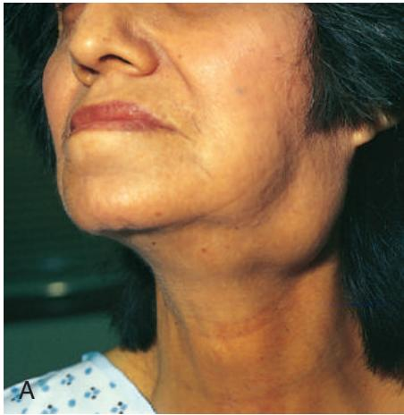 
Fig. 5.27 Sjogren syndrome. (A) Enlargement of the salivary gland. (B) Intense lymphocytic and plasma cell infiltration with ductal epithelial hyperplasia in a salivary gland. (A, Courtesy of Dr. Richard Sontheimer, Department of Dermatology, University of Texas Southwestern Medical School, Dallas, Texas. B, Courtesy of Dr. Dennis Burns, Department of Pathology, University of Texas Southwestern Medical School, Dallas, Texas.)
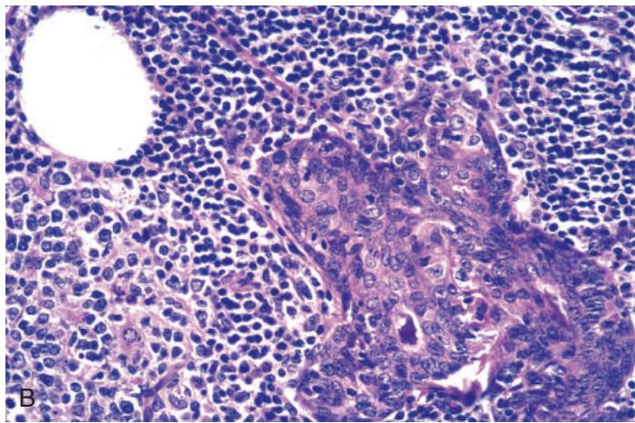
# SJOGREN SYNDROME
- Sjögren syndrome is an inflammatory disease that primarily affects the salivary and lacrimal glands, causing dryness of the mouth and eyes. 
- The disease is believed to be caused by an autoimmune T-cell reaction against an unknown self antigen expressed in these glands, or immune reactions against the antigens of a virus that infects the tissues.
# Systemic Sclerosis (Scleroderma)
Systemic sclerosis is an immunologic disorder characterized by excessive fibrosis in multiple tissues, obliterative vascular disease, and evidence of autoimmunity, mainly the production of multiple autoantibodies. Although the term scleroderma is ingrained in clinical medicine, the name systemic sclerosis is preferred because excessive fibrosis is seen in multiple organs. Cutaneous involvement is the usual presenting manifestation and eventually appears in approximately $95\%$ of cases, but it is the visceral involvement—of the gastrointestinal tract, lungs, kidneys, heart, and skeletal muscles—that is responsible for most of the morbidity and mortality. Disease limited to the skin is also called localized scleroderma.
Systemic sclerosis is classified into two groups on the basis of its course:
- Diffuse systemic sclerosis, characterized by initial widespread skin involvement, with rapid progression and early visceral involvement 
- Limited systemic sclerosis, with relatively mild skin involvement, often confined to the fingers and face. Involvement of the viscera occurs late, so the disease generally follows a fairly benign course. This presentation also is called CREST syndrome because of its frequent features of calcinosis, Raynaud phenomenon, esophageal dysmotility, sclerodactyly, and telangiectasia.
The cause of systemic sclerosis is not known, but the disease likely results from three interrelated processes—autoimmune responses, vascular damage, and collagen deposition (Fig. 5.28).
- Autoimmunity. It is proposed that $\mathrm{CD4 + }$ T cells responding to an as yet unidentified antigen accumulate in the skin and release cytokines that activate inflammatory cells and fibroblasts. Although inflammatory infiltrates in the affected skin typically are sparse, they include activated $\mathrm{CD4 + }$ $\mathrm{T_H2}$ cells. Several cytokines, including IL-13 produced by $\mathrm{T_H2}$ cells and TGF- $\beta$ produced by macrophages and other cell types, stimulate synthesis of collagen and extracellular matrix proteins (e.g., fibronectin) in fibroblasts. Other cytokines recruit leukocytes and propagate the chronic inflammation.
The presence of various autoantibodies, notably ANAs, provides diagnostic and prognostic information. It has been postulated that these antibodies stimulate fibrosis, but the evidence in support of this idea is not convincing.
- Vascular damage. Microvascular disease is consistently present early in the course of systemic sclerosis. Telltale signs of endothelial activation and injury and increased platelet activation have been noted. However, the cause of the vascular injury is not known; it could be the initiating event or the result of chronic inflammation, with mediators released by inflammatory cells inflicting damage on microvascular endothelium. Repeated cycles of endothelial injury followed by platelet aggregation lead to release of platelet and endothelial factors (e.g., PDGF, TGF- $\beta$ ) that trigger endothelial proliferation and intimal and perivascular fibrosis. Eventually, widespread narrowing of the microvasculature leads to ischemic injury and scarring. The pulmonary vasculature is frequently involved, and the resulting pulmonary hypertension is a serious complication of the disease. 
- Fibrosis. The progressive fibrosis characteristic of the disease may be the culmination of multiple abnormalities, including the accumulation of alternatively
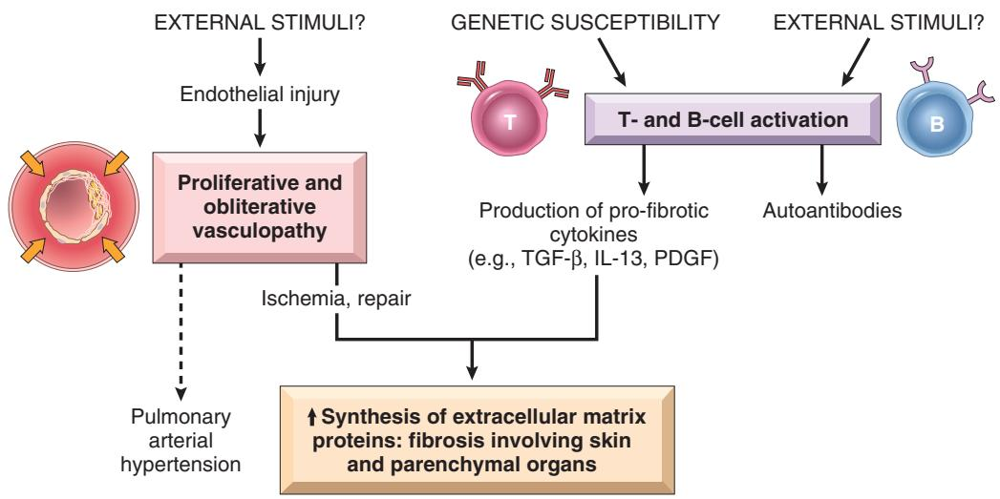 
Fig. 5.28 A model for the pathogenesis of systemic sclerosis. Unknown external stimuli cause vascular abnormalities and immune activation in genetically susceptible individuals, and both contribute to the excessive fibrosis.
activated macrophages, actions of fibrogenic cytokines produced by infiltrating leukocytes, hyperresponsiveness of fibroblasts to these cytokines, and scarring following ischemic damage caused by the vascular lesions. Studies with cultured fibroblasts from patients have suggested an intrinsic abnormality that causes the cells to produce excessive amounts of collagen.
In systemic sclerosis, the most prominent changes occur in the skin, alimentary tract, musculoskeletal system, and kidney, but lesions also are often present in the blood vessels, heart, lungs, and peripheral nerves.
Skin. Most patients have diffuse fibrosis of the skin and associated atrophy, which usually begins in the fingers and distal regions of the upper extremities and extends proximally to involve the upper arms, shoulders, neck, and face. Edema and perivascular infiltrates containing $\mathrm{CD4 + T}$ cells are seen, together with swelling and degeneration of collagen fibers, which become eosinophilic. Capillaries and small arteries (150-500 $\mu$ m in diameter) may show thickening of the basal lamina, endothelial damage, and partial occlusion. With disease progression, there is increasing fibrosis of the dermis, which becomes tightly bound to the subcutaneous structures. Fibrosis often is accompanied by thinning of the epidermis, loss of rete pegs, atrophy of the dermal appendages, and hyaline thickening of the walls of dermal arterioles and capillaries (Fig. 5.29B). Subcutaneous calcifications may develop, especially in patients with CREST syndrome. In advanced stages the fingers take on a tapered, clawlike appearance and have limited joint mobility, and the face becomes a drawn mask. Loss of blood supply may lead to cutaneous ulcerations and atrophic changes (Fig. 5.29C) or even autoamputation of the terminal phalanges.
Alimentary Tract. The alimentary tract is affected in approximately $90\%$ of patients. Progressive atrophy and fibrous replacement of the muscularis may develop at any level of the gut but are most severe in the esophagus. The lower two thirds of the esophagus often develops a rubber-hose-like inflexibility.
The associated dysfunction of the lower esophageal sphincter gives rise to gastroesophageal reflux and its complications, including Barrett metaplasia (Chapter 15) and strictures. The mucosa is thinned and may ulcerate, and there is excessive collagenization of the lamina propria and submucosa. Loss of villi and microvilli in the small bowel is the anatomic basis for a malabsorption syndrome that sometimes is encountered.
Musculoskeletal System. Inflammation of the synovium, associated with synoviocyte hypertrophy, is common in the early stages; fibrosis later ensues. These changes are reminiscent of rheumatoid arthritis, but joint destruction is not common in systemic sclerosis. In a small subset of patients (approximately $10\%$ ), inflammatory myositis indistinguishable from polymyositis may develop.
Kidneys. Renal abnormalities occur in two-thirds of patients. The most prominent are the vascular lesions. Interlobular arteries show intimal thickening as a result of deposition of mucinous material containing glycoproteins and acid mucopolysaccharides and concentric proliferation of intimal cells. These changes resemble those seen in malignant hypertension, but in systemic sclerosis the alterations are restricted to vessels 150 to $500\mu \mathrm{m}$ in diameter and are not always associated with hypertension. Hypertension, however, does occur in $30\%$ of patients, and in $20\%$ it takes an ominously rapid, downhill course (malignant hypertension). In hypertensive patients, vascular alterations are more pronounced and are often associated with fibrinoid necrosis of arterioles that can lead to thrombosis and infarction. Such patients often die of renal failure, which accounts for about $50\%$ of deaths. There are no specific glomerular changes.
Lungs. The lungs are affected in more than $50\%$ of cases. This involvement may manifest as pulmonary hypertension and interstitial fibrosis. Pulmonary vasospasm secondary to endothelial dysfunction is considered important in the pathogenesis of pulmonary hypertension. Pulmonary fibrosis, when present, is indistinguishable from that seen in idiopathic pulmonary fibrosis (Chapter 13).
Heart. Pericarditis with effusion, myocardial fibrosis, and thickening of intramyocardial arterioles occur in one third of patients. Because of the changes in the lung, right ventricular hypertrophy and failure (cor pulmonale) are frequent.
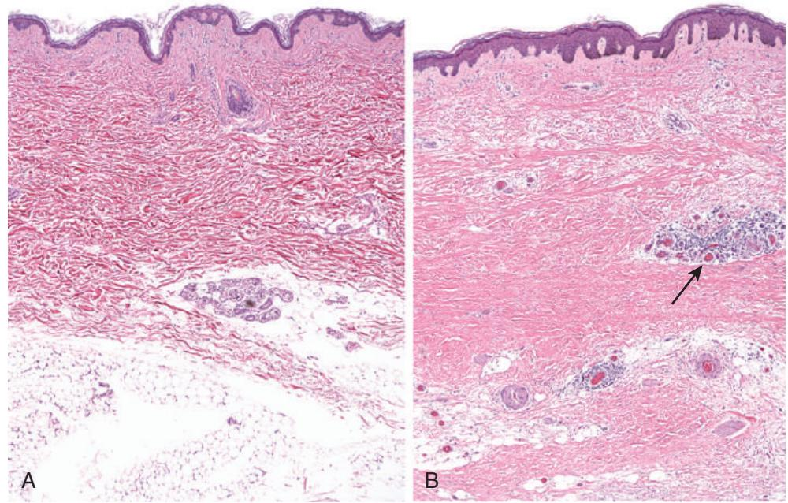
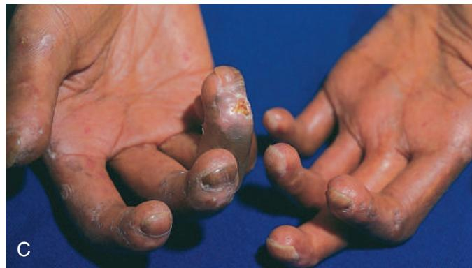 
Fig. 5.29 Systemic sclerosis. (A) Normal skin. (B) Skin biopsy from a patient with systemic sclerosis. Note the extensive deposition of dense collagen in the dermis, the virtual absence of appendages (e.g., hair follicles), and foci of inflammation (arrow). (C) The extensive subcutaneous fibrosis has virtually immobilized the fingers, creating a clawlike flexion deformity. Loss of blood supply has led to cutaneous ulcerations. (C, Courtesy of Dr. Richard Sontheimer, Department of Dermatology, University of Texas Southwestern Medical School, Dallas, Texas.)
Systemic sclerosis has a female-to-male ratio of 3:1 and a peak incidence in the 50- to 60-year age group. Although systemic sclerosis shares features with SLE, rheumatoid arthritis (Chapter 21), and polymyositis (Chapter 22), it is distinguished by the striking cutaneous changes, notably skin thickening. Raynaud phenomenon, caused by episodic vasoconstriction of the arteries and arterioles of the extremities, is seen in virtually all patients and precedes other symptoms in $70\%$ of cases. Progressive collagen deposition in the skin leads to increasing stiffness, especially of the hands, with eventually complete immobilization of the joints. Nailfold capillary loops are distorted early in the disease, and later disappear. Dysphagia attributable to esophageal fibrosis and its resultant hypomotility are present in more than $50\%$ of patients. Eventually, destruction of the esophageal wall leads to atony and dilation, especially at its lower end. Abdominal pain, intestinal obstruction, or malabsorption syndrome reflect involvement of the small intestine. Respiratory difficulties caused by the pulmonary fibrosis may result in right-sided cardiac
dysfunction, and myocardial fibrosis may cause either arrhythmias or cardiac failure. Mild proteinuria occurs in as many as $30\%$ of patients, but rarely is severe enough to cause nephrotic syndrome. The most ominous manifestation is malignant hypertension, with the subsequent development of fatal renal failure (Chapter 14), but in its absence progression of the disease may be slow. In most patients the disease pursues a steady downhill course over the span of many years, although life span is improving with better treatment of the complications. The disease tends to be more severe in blacks, especially black women. As treatment of the renal complications has improved, pulmonary and cardiac complications have become the major cause of death.
Virtually all patients have ANAs that react with a variety of nuclear antigens (see Table 5.11). Two ANAs are strongly associated with systemic sclerosis. One directed against DNA topoisomerase I (anti-Scl 70) is highly specific and is associated with a greater likelihood of pulmonary fibrosis and peripheral vascular disease. The other, an anticentromere antibody, is associated with a higher likelihood
of CREST syndrome. Patients with this syndrome have relatively limited skin disease, often confined to fingers, forearms and face, and subcutaneous calcifications. Involvement of the viscera, including esophageal lesions, pulmonary hypertension, and biliary cirrhosis, may not occur at all or occur late. In general, these patients live longer than those with systemic sclerosis with diffuse visceral involvement from the outset.
# SYSTEMIC SCLEROSIS
Systemic sclerosis (commonly called scleroderma) is characterized by progressive fibrosis involving the skin, gastrointestinal tract, and other tissues. 
- Fibrosis may be the result of activation of fibroblasts by cytokines produced by T cells, but what triggers T cell responses is unknown. 
- Endothelial injury and microvascular disease are commonly present in the lesions of systemic sclerosis, perhaps causing chronic ischemia, but the pathogenesis of vascular injury is not known.
# Inflammatory Myopathies
Inflammatory myopathies comprise an uncommon, heterogeneous group of disorders characterized by injury and inflammation of mainly the skeletal muscles that are probably immunologically mediated. Based on clinical, morphologic, and immunologic features, three disorders—polymyositis, dermatomyositis, and inclusion body myositis—have been described. Each may occur alone or with other immune-mediated diseases, particularly systemic sclerosis. These diseases are described in Chapter 22.
# Mixed Connective Tissue Disease
Mixed connective tissue disease is a disorder with clinical features that overlap those of SLE, systemic sclerosis, and polymyositis. The disease is characterized serologically by high titers of antibodies to U1 ribonucleoprotein. Typically, it presents with synovitis of the fingers, Raynaud phenomenon, and mild myositis. Renal involvement is modest, and there is a favorable response to corticosteroids, at least in the short term. Because these clinical features are shared with other diseases, mixed connective tissue disease may not be a distinct entity, and in fact it may evolve over time into classic SLE or systemic sclerosis. However, progression to other autoimmune disorders is not universal, and there may be a form of mixed connective tissue disease that is distinct from other autoimmune diseases. Serious complications of mixed connective tissue disease include pulmonary hypertension, interstitial lung disease, and renal disease.
# Polyarteritis Nodosa and Other Vasculitides
Polyarteritis nodosa belongs to a group of disorders characterized by necrotizing inflammation of the walls of blood
vessels that show strong evidence of an immunologic basis. Any type of vessel may be involved—arteries, arterioles, veins, or capillaries. These vasculitides are discussed in Chapter 10.
# IgG4-Related Disease
IgG4-related disease (IgG4-RD) is a newly recognized constellation of fibro-inflammatory disorders characterized by tissue infiltrates rich in IgG4 antibody-producing plasma cells and lymphocytes, particularly T cells, associated with fibrosis and obliterative phlebitis (Fig. 5.30). The disorder is often, but not always, associated with elevated serum IgG4 concentrations. Increased numbers of IgG4-producing plasma cells in tissue are a sine qua non of this disorder. IgG4-related disease has now been described in virtually every organ system, including the biliary tree, salivary glands, periorbital tissues, kidneys, lungs, lymph nodes, meninges, aorta, breast, prostate, thyroid, pericardium, and skin. Many conditions long viewed as disorders of single organs are now part of the IgG4-RD spectrum. These include Mikulicz syndrome (enlargement and fibrosis of salivary and lacrimal glands), Riedel thyroiditis, idiopathic retroperitoneal fibrosis, autoimmune pancreatitis, and inflammatory pseudotumors of the orbit, lungs, and kidneys, to name a few. The disease most often affects middle-aged and older men.
The pathogenesis of this condition is not understood, and although IgG4 production in lesions is a hallmark of the disease, it is not known if this antibody type contributes to the pathology. The key role of B cells is supported by clinical trials in which depletion of B cells by anti-B-cell reagents such as rituximab provided clinical benefit.
# REJECTION OF TRANSPLANTS
A major barrier to transplantation is the process of rejection, in which the recipient's immune system recognizes the graft as foreign and attacks it. The key to successful transplantation has been the development of therapies that prevent or minimize rejection. Transplant rejection is discussed here because it involves several of the immunologic reactions that underlie immune-mediated inflammatory diseases.
# Recognition and Rejection of Allografts
Rejection is a process in which T lymphocytes and antibodies produced against graft antigens react against and destroy the grafts. We next discuss how this occurs.
# Recognition of Graft Alloantigens
The major antigenic differences between a donor and recipient that result in rejection of transplants are differences in HLA alleles. Grafts exchanged between individuals of the same species are called allografts. Because HLA genes are highly polymorphic, there are always some differences between individuals (except, of course, identical twins). Following transplantation, the recipient's T cells recognize donor antigens from the graft (the allogeneic antigens, or alloantigens) by two pathways. The graft
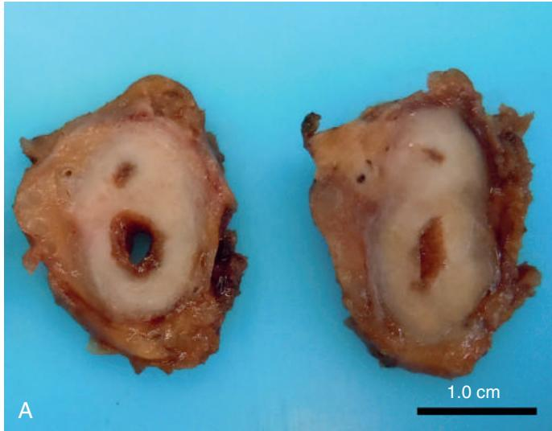
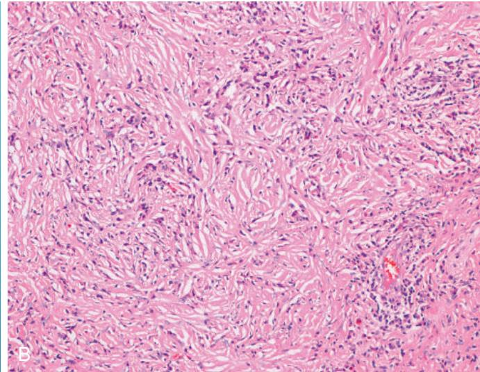
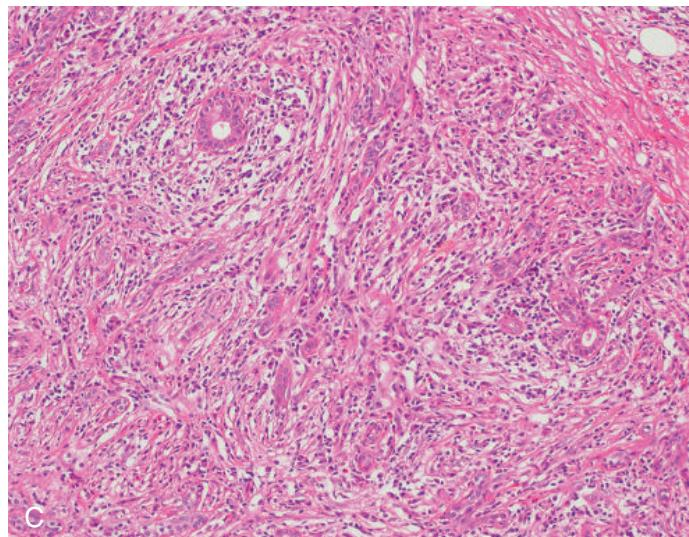 
Fig. 5.30 IgG4-related disease: representative lesions. (A) Bile duct showing sclerosing cholangitis. (B) Sclerotic area of the bile duct with storiform fibrosis. (C) Submandibular gland with infiltrates of lymphocytes and plasma cells and whorls of fibrosis. (D) Section of an involved lacrimal gland stained with an antibody against IgG4, showing large numbers of IgG4-producing plasma cells. (From Kamisawa T, Zen Y, Pillai S, et al: IgG4-related disease. Lancet 385:1460, 2015.)
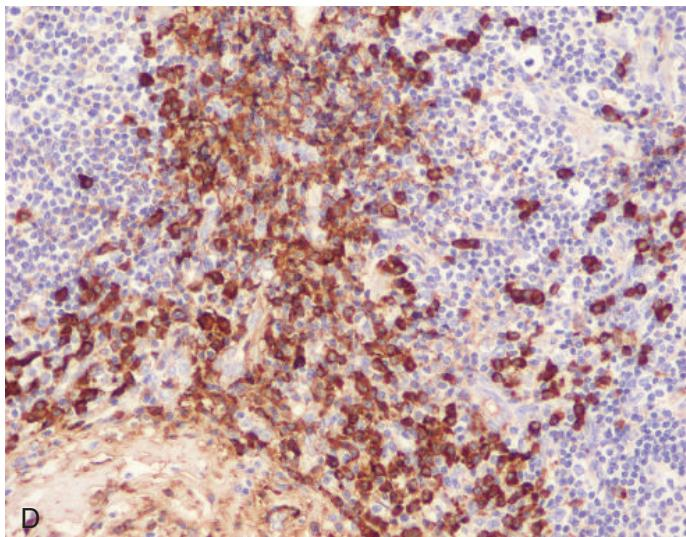
antigens are either presented directly to recipient T cells by graft APCs, or the graft antigens are picked up by host APCs, processed (like any other foreign antigen), and presented to host T cells. These are called the direct and indirect pathways of recognition of alloantigens. Both lead to the activation of $\mathrm{CD8 + }$ T cells, which develop into CTLs, and $\mathrm{CD4 + }$ T cells, which become cytokine-producing effector cells, mainly $\mathrm{T_H1}$ cells. We do not know the relative importance of these pathways in the rejection of allografts. The direct pathway may be most important for CTL-mediated acute rejection, and the indirect pathway may play a greater role in chronic rejection, described later.
The frequency of T cells that can recognize the foreign antigens in a graft is much higher than the frequency of T cells specific for any microbe. For this reason, immune responses to allografts are stronger than responses to pathogens. Predictably, these strong reactions can destroy grafts rapidly, and their control requires powerful immunosuppressive agents.
# Mechanisms of Graft Rejection
Graft rejection is classified into hyperacute, acute, and chronic, on the basis of clinical and pathologic features. This classification was devised by nephrologists and pathologists based on rejection of kidney allografts, and has stood the test of time remarkably well. Each type of rejection is mediated by a particular kind of immune response. In the following discussion, the description of the morphology of rejection is limited to kidney allografts, but similar changes are seen in other organ transplants.
- Hyperacute rejection is mediated by preformed antibodies specific for antigens on graft endothelial cells. The preformed antibodies may be natural IgM antibodies specific for blood group antigens, or may be antibodies specific for allogeneic MHC molecules that were induced by prior exposure through blood transfusions, pregnancy, or organ transplantation. Immediately after the graft is implanted and blood flow is restored, the antibodies bind to antigens on the graft
Depositionofantibodyonendotheliumandactivationofcomplementcausesthrombosis.(B)Hyperacuterejectionofakidneyallograftshowingplateletfibrinthrombiandsevereischemicinjuryinaglomerulus..jpg) 
Fig. 5.31 Hyperacute rejection. (A) Deposition of antibody on endothelium and activation of complement causes thrombosis. (B) Hyperacute rejection of a kidney allograft showing platelet fibrin thrombi and severe ischemic injury in a glomerulus.
endothelium and activate the complement and clotting systems, leading to endothelial injury, thrombus formation, and ischemic necrosis of the graft (Fig. 5.31A). Hyperacute rejection is not a common problem, because every donor and recipient are matched for blood type and potential recipients are tested for antibodies against the cells of the prospective donor, a test called a cross-match.
In hyperacute rejection, the affected kidney rapidly becomes cyanotic, mottled, and anuric. Virtually all arterioles and arteries exhibit acute fibrinoid necrosis of their walls and narrowing or complete occlusion of their lumens by thrombi (Fig. 5.31B). Neutrophils rapidly accumulate within arterioles, glomeruli, and peritubular capillaries. As these changes intensify and become diffuse, the glomerular capillaries also undergo thrombotic occlusion, and eventually the kidney cortex undergoes outright necrosis (infarction). Affected kidneys are nonfunctional and have to be removed.
- Acute rejection is mediated by T cells and antibodies that are activated by alloantigens in the graft. It occurs within days or weeks after transplantation, and is the principal cause of early graft failure. It also may appear suddenly months or even years later, after immunosuppression is tapered or terminated. Based on the role of T cells or antibodies, acute rejection is divided into two types, although in most rejecting grafts, both patterns are present.
In acute cellular rejection, $\mathrm{CD8 + }$ CTLs may directly destroy graft cells, or $\mathrm{CD4 + }$ cells secrete cytokines and induce inflammation, which damages the graft (Fig. 5.32A). T cells also may react against graft vessels, leading to vascular damage. Current immunosuppressive therapy is designed mainly to prevent and reduce acute rejection by blocking the activation of alloreactive T cells.
Acute cellular (T cell-mediated) rejection may produce two different patterns of injury.
- In the tubulointerstitial pattern (sometimes called type I), there is extensive interstitial inflammation and tubular inflammation (tubulitis) associated with focal tubular injury (Fig. 5.32B). As might be expected, the inflammatory infiltrates contain activated $\mathrm{CD4+}$ and $\mathrm{CD8+}$ T lymphocytes. 
- The vascular pattern shows inflammation of vessels (type II) (Fig. 5.32C) and sometimes necrosis of vessel walls (type III). The affected vessels have swollen endothelial cells, and at places lymphocytes are seen between the endothelium and the vessel wall, a finding termed endotheliitis or intimal arteritis. The recognition of cellular rejection is important because, in the absence of accompanying humoral rejection, most patients respond well to immunosuppressive therapy.
In acute antibody-mediated (vascular or humoral) rejection, antibodies bind to vascular endothelium and activate complement via the classical pathway (Fig. 5.33A). The resultant inflammation and endothelial damage cause graft failure.
Acute antibody-mediated rejection is manifested mainly by damage to glomeruli and small blood vessels. Typically, there is inflammation of glomeruli and peritubular capillaries (Fig. 5.33B) associated with deposition of complement products, which is due to activation of the complement system by the antibody-dependent classical pathway (Fig. 5.33C). Small vessels also may show focal thrombosis.
- Chronic rejection is an indolent form of graft damage that occurs over months or years, leading to progressive loss of graft function. Chronic rejection manifests
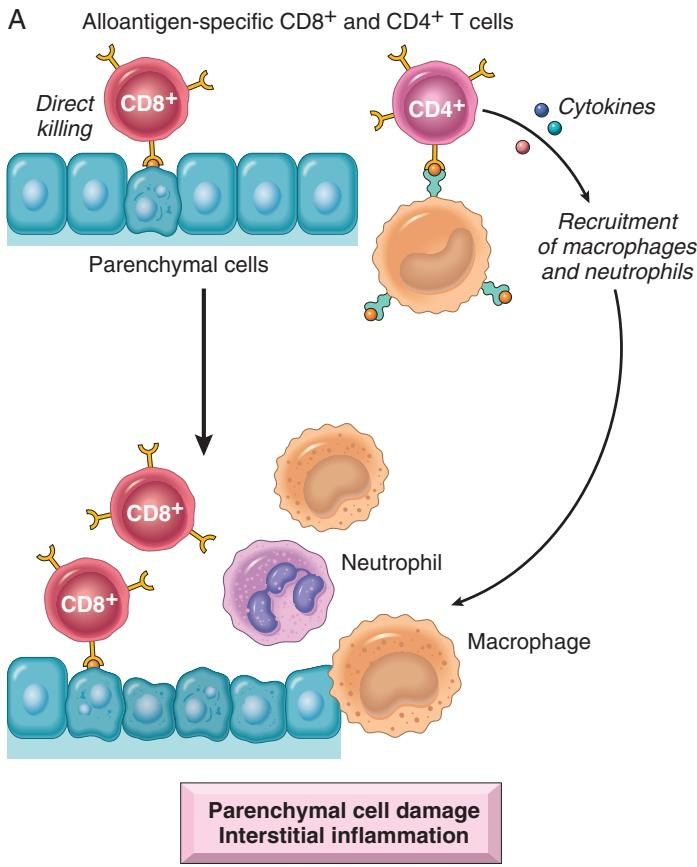 
Fig. 5.32 Acute cellular rejection. (A) Destruction of graft cells by T cells. Acute T cell-mediated rejection involves direct killing of graft cells by $\mathrm{CD8+}$ CTLs and inflammation caused by cytokines produced by CD4 T cells. (B) Acute cellular rejection of a kidney graft, manifested by inflammatory cells in the interstitium and between epithelial cells of the tubules (tubulitis). Collapsed tubules are outlined by wavy basement membranes. (C) Rejection vasculitis in a kidney graft. An arteriole is shown with inflammatory cells attacking and undermining the endothelium (endotheliitis) (arrow). (Courtesy of Drs. Zoltan Laszik and Kuang-Yu Jen, Department of Pathology, University of California, San Francisco, California.)
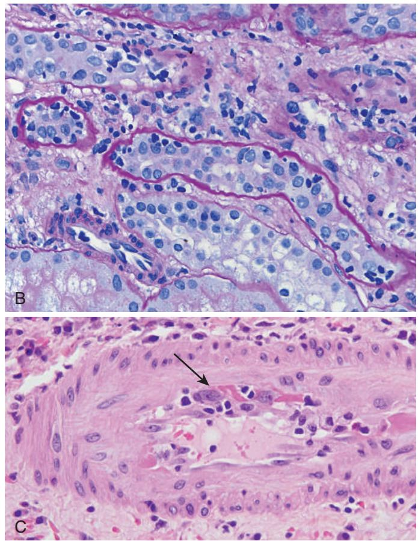
as interstitial fibrosis and gradual narrowing of graft blood vessels (graft arteriosclerosis). In both lesions, the culprits are believed to be T cells that react against graft alloantigens and secrete cytokines, which stimulate the proliferation and activities of fibroblasts and vascular smooth muscle cells in the graft (Fig. 5.34A). Alloantibodies also contribute to chronic rejection. Although treatments to prevent or curtail acute rejection have steadily improved, leading to longer than 1-year survival of transplants, chronic rejection is refractory to most therapies and is becoming the principal cause of graft failure.
Chronic rejection is dominated by vascular changes, often with intimal thickening and vascular occlusion (Fig. 5.34B). Chronically rejecting kidney grafts show glomerulopathy, with duplication of the basement membrane, likely secondary to chronic endothelial injury (Fig. 5.34C) and peritubular capillaritis with multilayering of peritubular capillary basement membranes. Interstitial fibrosis and tubular atrophy with loss of renal parenchyma may occur secondary to the vascular lesions (Fig. 5.34D). Interstitial mononuclear cell infiltrates are typically sparse.
# Methods of Increasing Graft Survival
Because HLA molecules are the major targets in transplant rejection, better matching of the donor and the recipient improves graft survival. HLA matching is more beneficial for living related kidney transplants than for other kinds of transplants, and survival improves with increasing number of loci matched. However, as drugs for immunosuppression have improved, HLA matching is no longer done for heart, lung, liver, and islet transplantation; in such instances, the recipient often needs a transplant urgently and other considerations, such as anatomic compatibility, are of greater importance.
Immunosuppression of the recipient is a necessity in all organ transplantation, except in the case of identical twins. At present, drugs such as cyclosporine, the related FK506, mofetil mycophenolate (MMF), rapamycin, azathioprine, corticosteroids, anti-thymocyte globulin, and monoclonal antibodies (e.g., monoclonal anti-CD3) are used. Cyclosporine and FK506 suppress T cell-mediated immunity by inhibiting transcription of cytokine genes, in particular, the gene for IL-2. Although immunosuppression has made transplantation of many organs feasible, it has its own problems. Suppression of the immune system results in increased susceptibility to opportunistic fungal, viral, and other infections. Reactivation of latent viruses,
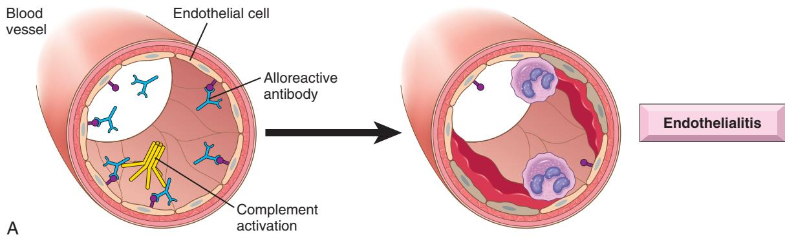
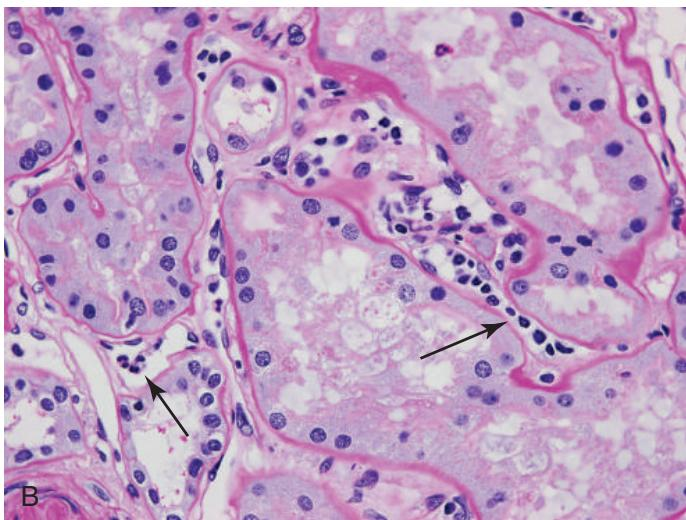 
Fig. 5.33 Acute antibody-mediated (humoral) rejection. (A) Graft damage caused by antibody deposition in vessels. (B) Light micrograph showing inflammation (capillaritis) in peritubular capillaries (arrows) in a kidney graft. (C) Immunoperoxidase stain shows C4d deposition in peritubular capillaries and a glomerulus. (Courtesy of Dr. Zoltan Laszik, Department of Pathology, University of California, San Francisco, California.)
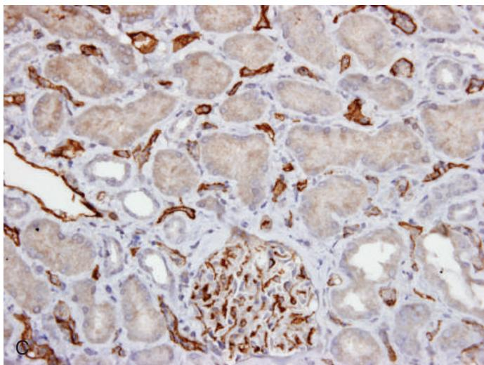
such as cytomegalovirus (CMV) and polyoma virus, are frequent complications. Immunosuppressed patients also are at increased risk for developing virus-induced tumors, such as Epstein-Barr virus (EBV)-induced lymphomas and human papillomavirus (HPV)-induced squamous cell carcinomas. To circumvent the untoward effects of immunosuppression, much effort is being devoted to induce donor-specific tolerance in host T cells. One strategy is to prevent host T cells from receiving costimulatory signals from donor DCs during the initial phase of sensitization. This can be accomplished by administration of agents that block the interaction of the B7 molecules on the DCs of the graft and the CD28 receptor on host T cells, which, by interrupting the second signal for T cell activation, induces either T cell apoptosis or anergy. Other approaches include injecting into recipients regulatory T cells enriched for cells specific for donor alloantigens; these trials are in their infancy.
# Transplantation of Hematopoietic Stem Cells
Use of hematopoietic stem cell (HSC) transplants for hematologic malignancies, bone marrow failure syndromes (such as aplastic anemia), and disorders caused by inherited HSC defects (such as sickle cell anemia, thalassemia, and immunodeficiency states) is increasing in number each year. Transplantation of genetically "reengineered" hema
topoietic stem cells obtained from affected patients may be useful in treating inherited forms of immunodeficiency. Historically, HSCs were obtained from the bone marrow, but now they usually are harvested from peripheral blood after they are mobilized from the bone marrow by administration of hematopoietic growth factors, or from the umbilical cord blood of newborn infants, a rich source of HSCs. In most of the conditions in which HSC transplantation is indicated, the recipient is irradiated or treated with chemotherapy to destroy the immune system (and sometimes, cancer cells) and to "open up" niches in the microenvironment of the marrow that nurture HSCs, thus allowing the transplanted HSCs to engraft. Two major problems complicate this form of transplantation and distinguish it from solid organ transplants: graft-versus-host disease and immune deficiency.
# Graft-Versus-Host Disease
GVHD occurs when immunologically competent cells or their precursors are transplanted into immunologically crippled recipients, and the transferred cells recognize alloantigens in the host and attack host tissues. It is seen most commonly in the setting of HSC transplantation but, rarely, may occur following transplantation of solid organs rich in lymphoid cells (e.g., the liver). On receiving allogeneic HSCs, an immunologically compromised host cannot reject the graft, but T cells present in the
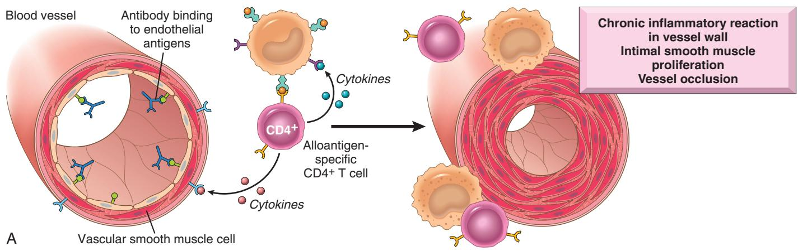
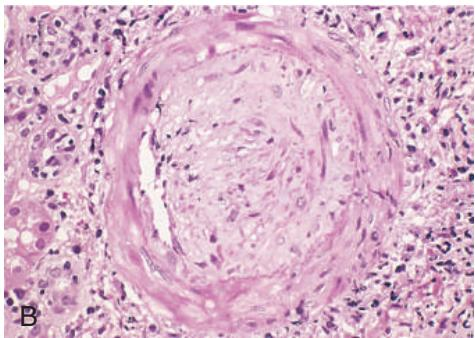 
Fig. 5.34 Chronic rejection. (A) Graft arteriosclerosis caused by T-cell cytokines and antibody deposition. (B) Graft arteriosclerosis in a cardiac transplant. (C) Transplant glomerulopathy, the characteristic manifestation of chronic antibody-mediated rejection in the kidney. The glomerulus shows inflammatory cells within the capillary loops (glomerulitis), accumulation of mesangial matrix, and duplication of the capillary basement membrane. (D) Interstitial fibrosis and tubular atrophy, resulting from arteriosclerosis of arteries and arterioles in a chronically rejecting kidney allograft. In this trichrome stain, the blue area (asterisk) shows fibrosis, contrasted with the normal kidney (top right). An artery showing prominent arteriosclerosis is shown (bottom right). (B, Courtesy of Dr. Richard Mitchell, Department of Pathology, Brigham and Women's Hospital, Boston, Massachusetts. C and D, Courtesy of Dr. Zoltan Laszik, Department of Pathology, University of California, San Francisco, California.)
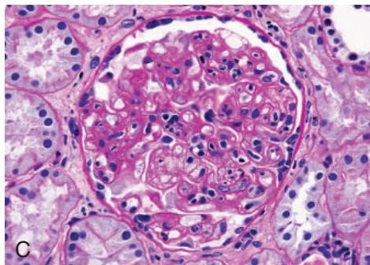
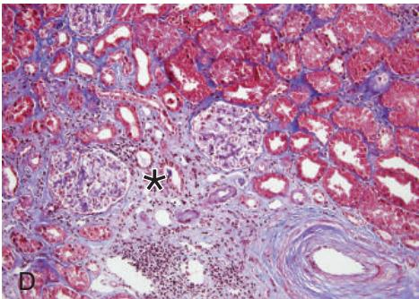
donor graft perceive the host's tissue as foreign and react against it. This results in the activation of donor $\mathrm{CD4 + }$ and $\mathrm{CD8 + }$ T cells, ultimately causing inflammation and killing recipient cells. To try to minimize GVHD, HSC transplants are done between donor and recipient that are carefully HLA-matched using precise DNA sequencing-based methods.
There are two forms of GVHD.
- Acute GVHD (occurring days to weeks after transplantation) causes epithelial cell necrosis in three principal target organs: liver, skin, and gut. Destruction of small bile ducts gives rise to jaundice, and mucosal ulceration of the gut results in bloody diarrhea. Cutaneous involvement (Fig. 5.35) manifests as a rash, which
involvingtheskin.(A)Patchyepithelialcelldeathanddermalinfiltratesofmononuclearcells(lymphocytesandmacrophages).(B)Focallydeadepithelialcells(arrows)..jpg) 
Fig. 5.35 Acute graft-versus-host disease (GVHD) involving the skin. (A) Patchy epithelial cell death and dermal infiltrates of mononuclear cells (lymphocytes and macrophages). (B) Focally dead epithelial cells (arrows).
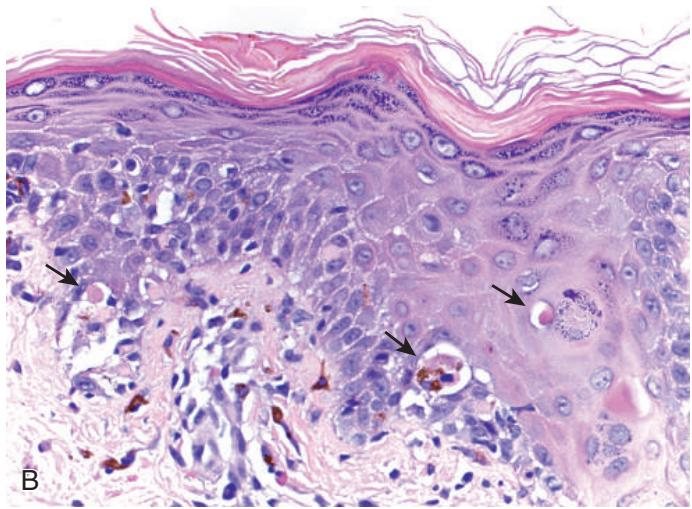
characteristically appears first on the neck, ears, and palms of the hands and soles of the feet and then becomes generalized.
- Chronic GVHD may follow the acute syndrome or may occur insidiously. Patients develop skin lesions resembling those of systemic sclerosis (discussed earlier) and manifestations mimicking other autoimmune disorders.
Because GVHD is mediated by T lymphocytes contained in the transplanted donor cells, depletion of donor T cells before transplantation virtually eliminates the disease. This approach, however, has proven to be a mixed blessing: GVHD is ameliorated, but the recurrence of tumor in leukemic patients as well as the incidence of graft failures and EBV-related B-cell lymphoma increase. It seems that the multifaceted T cells not only mediate GVHD but also are required for engraftment of the transplanted HSCs, suppression of EBV-infected B-cell clones, and control of leukemia cells.
# Immune Deficiencies
These are often of prolonged duration in recipients of HSC transplants. Among the many reasons for this impairment is the slow reconstitution of the adaptive immune system (derived from donor HSC), after the recipient's immune system is destroyed or suppressed to allow the graft to take. During the many months that may be needed for immune reconstitution, recipients are susceptible to a variety of infections, mostly with viruses, such as CMV and EBV.
# RECOGNITION AND REJECTION OF TRANSPLANTS
- Rejection of solid organ transplants is initiated mainly by host T cells that recognize the foreign HLA antigens of the graft, either directly (on APCs in the graft) or indirectly (after uptake and presentation by host APCs). 
- Types and mechanisms of rejection of solid organ grafts are as follows:
- Hyperacute rejection: Preformed anti-donor antibodies bind to graft endothelium immediately after transplantation, leading to thrombosis, ischemic damage, and rapid graft failure. 
- Acute cellular rejection: T cells destroy graft parenchyma (and vessels) by cytotoxicity and inflammatory reactions. 
- Acute antibody-mediated (humoral) rejection: Antibodies damage graft vasculature. 
- Chronic rejection: Dominated by arteriosclerosis, this type is caused by T cell activation and antibodies. The T cells may secrete cytokines that induce proliferation of vascular smooth muscle cells, and the antibodies cause endothelial injury. The vascular lesions and T cell reactions cause parenchymal fibrosis. 
- Treatment of graft rejection relies on immunosuppressive drugs, which inhibit immune responses against the graft. 
- Transplantation of hematopoietic stem cells (HSCs) requires careful matching of donor and recipient and is often complicated by graft-vs-host disease (GVHD) and immune deficiency.
# IMMUNODEFICIENCY SYNDROMES
Immune deficiencies can be divided into primary (or congenital) immunodeficiency disorders, which are genetically determined, and secondary (or acquired) immunodeficiencies, which may arise as complications of cancers, infections, malnutrition, or side effects of immunosuppression, irradiation, or chemotherapy for cancer and other diseases. Immunodeficiencies are manifested clinically by increased infections, which may be newly acquired or reactivation of latent infections. The primary immunodeficiency syndromes are accidents of nature that provide valuable insights into some of the molecules critical in the development of the immune system. Paradoxically, several immunodeficiencies also are associated with autoimmune disorders, perhaps because the deficiency results in loss of regulatory mechanisms or persistence of infections that promote autoimmunity. Here we briefly discuss the more important and best-defined primary immunodeficiencies, to be followed by a more detailed description of acquired immunodeficiency syndrome (AIDS), the most devastating example of secondary immunodeficiency.
# Primary (Inherited) Immunodeficiencies
Primary immunodeficiency diseases are inherited genetic disorders that impair mechanisms of innate immunity (phagocytes, NK cells, or complement) or the humoral and/or cellular arms of adaptive immunity (mediated by B lymphocytes and T lymphocytes, respectively). These immunodeficiencies are usually detected in infancy, between 6 months and 2 years of age, the telltale signs being susceptibility to recurrent infections. With advances in genetic analyses, the mutations responsible for many of these diseases are now known (Fig. 5.36). Here we present selected examples of immunodeficiencies, beginning with the more common defects in the maturation and activation of B lymphocytes and T lymphocytes, followed by disorders of innate immunity.
# Severe Combined Immunodeficiency
Severe combined immunodeficiency (SCID) spans a constellation of genetically distinct syndromes, all having in common impaired development of mature T lymphocytes and/or B lymphocytes and defects in both humoral and cell-mediated immunity. Affected infants present with thrush (oral candidiasis), severe diaper rash, and failure to thrive. Some infants develop a generalized rash shortly after birth because maternal T cells are transferred across the placenta and attack the fetus, causing GVHD. Children with SCID are extremely susceptible to recurrent, severe infections by a wide range of pathogens, including Candida albicans, Pneumocystis jiroveci, Pseudomonas, cytomegalovirus, varicella, and a whole host of bacteria. Without HSC transplantation, death occurs within the first year of life. The overall prevalence of the disease is approximately 1 in 65,000 to 1 in 100,000, but it is 20 to 30 times more frequent in some Native American populations.
Despite the common clinical manifestations, of different forms of SCID the underlying defects are quite varied.
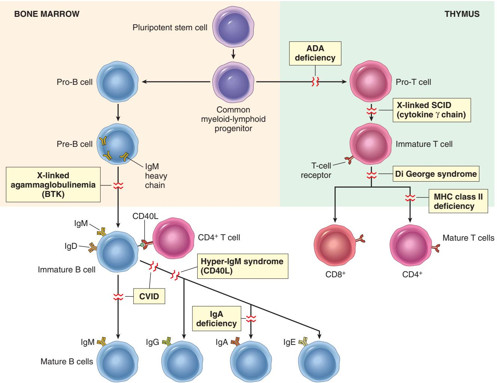 
Fig. 5.36 Primary immune deficiency diseases. Shown are the principal pathways of lymphocyte development and the blocks in these pathways in selected primary immune deficiency diseases. The affected genes are indicated in parentheses for some of the disorders. ADA, Adenosine deaminase; CD40L, CD40 ligand (also known as CD154); CVID, common variable immunodeficiency; SCID, severe combined immunodeficiency.
Often, the defect resides in the T-cell compartment, with a secondary impairment of humoral immunity. Two major forms are described next.
- X-linked SCID. Approximately half of the cases of SCID are X-linked; these are caused by mutations in the gene encoding the common $\gamma (\gamma c)$ chain shared by the receptors for the cytokines IL-2, IL-4, IL-7, IL-9, and IL-15. Of these cytokines, defective IL-7 signaling is the most important underlying basis of SCID because this cytokine is responsible for stimulating the survival and expansion of immature B and T cell precursors in the generative lymphoid organs. 
- Autosomal recessive SCID. Another $40\%$ to $50\%$ of SCID cases follow autosomal recessive pattern of inheritance, with approximately half of these caused by mutations in adenosine deaminase (ADA), an enzyme involved in purine metabolism. ADA deficiency results in accumulation of adenosine and deoxyadenosine triphosphate metabolites, which inhibit DNA synthesis and are toxic to lymphocytes. Other autosomal recessive forms of SCID result variously from defects in another purine metabolic pathway, primary failure of class II MHC expression, or mutations in genes encoding the
recombinase responsible for the rearrangement of lymphocyte antigen-receptor genes.
The histologic findings in SCID depend on the underlying defect. In the two most common forms ( $\gamma c$ mutation and ADA deficiency), the thymus is small and devoid of lymphoid cells. In X-linked SCID, the thymus contains lobules of undifferentiated epithelial cells resembling fetal thymus, whereas in SCID caused by ADA deficiency, remnants of Hassall's corpuscles can be found. In both diseases, other lymphoid tissues are hypoplastic as well, with marked depletion of T cell areas and in some cases both T cell and B cell zones.
Currently, HSC transplantation is the mainstay of treatment. X-linked SCID is the first disease in which gene therapy has been successful. For gene therapy, a normal $\gamma c$ gene is expressed using a viral vector in HSCs taken from patients, and the cells are then transplanted back into the patients. The clinical experience is small, but some patients have shown reconstitution of their immune systems for several years after therapy. Unfortunately, however, about
$20\%$ of patients receiving a first-generation viral vector developed T cell acute lymphoblastic leukemia (T-ALL), highlighting the dangers of this particular approach to gene therapy. The uncontrolled T-cell proliferation is likely the result of the virus integrating into the genome close to an oncogene, leading to the activation of the oncogene, and possibly also because of the growth advantage conferred by the introduced normal $\gamma c$ gene. Current trials are using new vectors with safety features built in. Patients with ADA deficiency also have been treated with HSC transplantation and, more recently, with administration of the enzyme or gene therapy involving the introduction of a normal ADA gene into T-cell precursors.
# X-Linked Agammaglobulinemia
X-linked agammaglobulinemia (XLA), or Bruton disease, is characterized by the failure of pre-B cells to differentiate into mature B cells and, as the name implies, a resultant absence of antibodies (gamma globulin) in the blood. It is one of the more common forms of primary immunodeficiency, occurring at a frequency of about 1 in 100,000 male infants. During normal B-cell maturation, immunoglobulin (Ig) heavy chain genes are rearranged first, followed by light chain genes. At each stage, signals are received from the expressed components of the antigen receptor that drive maturation to the next stage; these signals act as quality controls, to ensure that the correct receptor proteins are being produced. In XLA, B-cell maturation stops after the initial heavy chain gene rearrangement because of mutations in a tyrosine kinase that is associated with the pre-B-cell receptor and is involved in pre-B-cell signal transduction. This kinase is called Bruton tyrosine kinase (BTK). When BTK is nonfunctional, the pre-B-cell receptor cannot signal the cells to proceed along the maturation pathway. As a result, Ig light chains are not produced, and the complete Ig molecule containing heavy and light chains cannot be assembled and transported to the cell membrane, although free heavy chains can be found in the cytoplasm. Because the BTK gene is on the X chromosome, the disorder is only seen in males. Sporadic cases with the same features have been described in females, possibly due to mutations in other genes that function in the same pathway.
Classically, the disease is characterized by a profound reduction in the number of B cells in the blood and secondary lymphoid organs and an absence of germinal centers and plasma cells in these organs. T-cell numbers and responses may be normal.
The disease usually does not become apparent until about 6 months of age, as maternal antibodies that were transported via the placenta are depleted. In most cases, recurrent bacterial infections of the respiratory tract, such as acute and chronic pharyngitis, sinusitis, otitis media, bronchitis, and pneumonia, call attention to the underlying immune defect. Almost always, the causative organisms are Haemophilus influenzae, Streptococcus pneumoniae, or Staphylococcus aureus, organisms that are normally opsonized by antibodies and cleared by phagocytosis. Because antibodies are important for neutralizing certain infectious viruses, individuals with this disease also are susceptible to some viral infections, especially those caused by enteroviruses. These viruses infect the gastrointestinal tract, and from
there they can disseminate to the nervous system via the blood. Thus, immunization with live poliovirus carries the risk for paralytic poliomyelitis, and infections with echovirus can cause fatal encephalitis. For similar reasons, Giardia lamblia, an intestinal protozoan that is normally resisted by secreted IgA, causes persistent infections in individuals with this disorder. Many intracellular viral, fungal, and protozoal infections are handled quite well by the intact T cell-mediated immunity. For unclear reasons, autoimmune diseases (such as rheumatoid arthritis and dermatomyositis) occur in as many as $35\%$ of patients with this disease.
The treatment of X-linked agammaglobulinemia is replacement therapy with intravenous immunoglobulin (IVIG) from pooled human serum.
# DiGeorge Syndrome (Thymic Hypoplasia)
DiGeorge syndrome is caused by a congenital defect in thymic development resulting in deficient T-cell maturation. T cells are absent in the lymph nodes, spleen, and peripheral blood, and infants with this defect are extremely vulnerable to viral, fungal, and protozoal infections. Patients also are susceptible to infection with intracellular bacteria, because of defective T cell-mediated immunity. B cells and serum immunoglobulins are generally unaffected.
The disorder is a consequence of a developmental malformation affecting the third and fourth pharyngeal pouches, structures that give rise to the thymus, parathyroid glands, and portions of the face and aortic arch. Thus, in addition to the thymic and T-cell defects, there may be parathyroid gland hypoplasia, resulting in hypocalcemic tetany, as well as additional midline developmental abnormalities. In $90\%$ of cases of DiGeorge syndrome, there is a deletion affecting chromosomal region 22q11, discussed in Chapter 7. Transplantation of thymic tissue has successfully treated some affected infants. In patients with partial defects, immunity may improve spontaneously with age.
# Hyper-IgM Syndrome
This disease is characterized by the production of normal (or even supranormal) levels of IgM antibodies and decreased levels of the IgG, IgA, and IgE isotypes; the underlying defect is an inability of T cells to activate B cells. As discussed earlier, many of the functions of CD4+ helper T cells require the engagement of CD40 on B cells, macrophages, and dendritic cells by CD40L (also called CD154) expressed on antigen-activated T cells. This interaction triggers Ig class switching and affinity maturation in the B cells, and stimulates the microbicidal functions of macrophages. Approximately $70\%$ of individuals with hyper-IgM syndrome have the X-linked form of the disease, caused by mutations in the gene encoding CD40L located on Xq26. In the remaining patients, the disease is inherited in an autosomal recessive pattern caused by loss-of-function mutations involving either CD40 or an enzyme called activation-induced cytidine deaminase (AID), a DNA-editing enzyme that is required for Ig class switching and affinity maturation.
Patients present with recurrent pyogenic infections because of low levels of opsonizing IgG antibodies. Those with CD40L mutations also are susceptible to pneumonia
caused by the intracellular organism Pneumocystis jiroveci, because CD40L-mediated macrophage activation, a key reaction of cell-mediated immunity, is compromised. Occasionally, the IgM antibodies react with blood cells, giving rise to autoimmune hemolytic anemia, thrombocytopenia, and neutropenia. In older patients, there may be a proliferation of IgM-producing plasma cells that infiltrate the mucosa of the gastrointestinal tract.
# Common Variable Immunodeficiency
This relatively frequent but poorly defined entity encompasses a heterogeneous group of disorders in which the common feature is hypogammaglobulinemia, generally affecting all the antibody classes but sometimes only IgG. The diagnosis of common variable immunodeficiency is based on exclusion of other well-defined causes of decreased antibody production. The estimated prevalence of the disease is about 1 in 50,000.
Although most patients have normal numbers of mature B cells, plasma cells are absent, suggesting a block in B-cell differentiation. In keeping with this idea, B cell areas of the lymphoid tissues (i.e., lymphoid follicles in nodes, spleen, and gut) tend to be hyperplastic. The enlargement of B cell areas may reflect incomplete activation, such that B cells can proliferate in response to antigen but do not differentiate into antibody-producing plasma cells. The defective antibody production has been variably attributed to intrinsic B-cell defects, deficient T-cell help, or excessive T-cell suppressive activity. Paradoxically, these patients are prone to develop a variety of autoimmune disorders (hemolytic anemia, pernicious anemia) as well as lymphoid tumors. Common variable immunodeficiency may be genetic or acquired. Different genetic causes have been discovered, including mutations in a receptor for BAFF, a cytokine that promotes the survival and differentiation of B cells, and in a molecule called ICOS (inducible costimulator), a homologue of CD28 that contributes to the function of T follicular helper cells. However, in the majority of cases, the genetic basis is unknown.
Patients typically present with recurrent sinopulmonary bacterial infections. About $20\%$ of patients have recurrent herpesvirus infections, and serious enterovirus infections causing meningoencephalitis also may occur. Individuals with this disorder also are prone to the development of persistent diarrhea caused by G. lamblia. In contrast to X-linked agammaglobulinemia, common variable immunodeficiency affects both sexes equally, and the onset of symptoms is later, in childhood or adolescence. As in X-linked agammaglobulinemia, these patients have a high frequency of autoimmune diseases (approximately $20\%$ ), including rheumatoid arthritis. The risk for lymphoid malignancy also is increased, and an increase in gastric cancer has been reported.
# Isolated IgA Deficiency
This is the most common primary immune deficiency disease, affecting about 1 in 700 whites. As noted previously, IgA is the major immunoglobulin in mucosal secretions and is thus involved in defending the airways and the gastrointestinal tract. Weakened mucosal defenses due to IgA deficiency predispose patients to recurrent sinopulmonary infections and diarrhea. There also is a significant
(but unexplained) association with autoimmune diseases. The pathogenesis of IgA deficiency seems to involve a block in the terminal differentiation of IgA-secreting B cells to plasma cells; IgM and IgG subclasses of antibodies are present in normal or even supranormal levels. The molecular basis for this defect is not understood.
# Other Defects in Lymphocyte Activation
Many rare cases of lymphocyte activation defects have been described that affect antigen receptor signaling and various biochemical pathways. Defects in $\mathrm{T_H1}$ responses are associated with atypical mycobacterial infections, and defective $\mathrm{T_H17}$ responses are the cause of chronic mucocutaneous candidiasis as well as bacterial infections of the skin (a disorder called Job syndrome).
# Immunodeficiencies Associated With Systemic Diseases
In some inherited systemic disorders, immune deficiency is a prominent clinical problem. Two representative examples of such diseases are described next.
- Wiskott-Aldrich syndrome is an X-linked disease characterized by thrombocytopenia, eczema, and a marked vulnerability to recurrent infection that results in early death. The thymus is normal, at least early in the disease course, but there is progressive loss of T lymphocytes from the blood and the T cell zones (paracortical areas) of lymph nodes, with variable defects in cellular immunity. Patients do not make antibodies to polysaccharide antigens, and the response to protein antigens is poor. IgM levels in the serum are low, but levels of IgG are usually normal and, paradoxically, IgA and IgE are often elevated. The syndrome is caused by mutations in an X-linked gene encoding Wiskott-Aldrich syndrome protein (WASP). WASP belongs to a family of signaling proteins that link membrane receptors, such as antigen receptors, to cytoskeletal elements. The WASP protein is involved in cytoskeleton-dependent responses, including cell migration and signal transduction, but how this contributes to the functions of lymphocytes and platelets is unclear. The only treatment is HSC transplantation.
- Ataxia telangiectasia is an autosomal-recessive disorder characterized by abnormal gait (ataxia), vascular malformations (telangiectases), neurologic deficits, increased incidence of tumors, and immunodeficiency. The immunologic defects are of variable severity and may affect both B cells and T cells. The most prominent humoral immune abnormalities are defective production of isotype-switched antibodies, mainly IgA and IgG2. The T-cell defects are usually less pronounced, and may be associated with thymic hypoplasia. Patients experience upper and lower respiratory tract bacterial infections, multiple autoimmune phenomena, and increasingly frequent cancers, particularly lymphoid tumors, with advancing age. The gene responsible for this disorder encodes a protein called ATM (ataxia telangiectasia mutated), a sensor of DNA damage that activates cell cycle checkpoints and apoptosis in cells with damaged DNA. Lack of ATM also leads to abnormalities in antigen gene recombination (and therefore defects in the generation of antigen receptors) and abnormal antibody isotype switching.
# Defects in Innate Immunity
Inherited defects in the early innate immune response typically affect leukocyte functions or the complement system and lead to increased vulnerability to infections (Table 5.13). Some defects whose molecular bases are defined are summarized next.
# Defects in Leukocyte Function
- Leukocyte adhesion deficiencies (LADs) stem from inherited defects in adhesion molecules that impair leukocyte recruitment to sites of infection, resulting in recurrent bacterial infections. LAD1 is caused by defects in the $\beta_{2}$ chain that is shared by the integrins LFA-1 and Mac-1, while LAD2 is caused by a defect in a fucosyl transferase that is required to synthesize functional sialyl-Lewis X, the ligand for E- and P-selectins. 
- Chronic granulomatous disease results from inherited defects in the genes encoding components of phagocyte oxidase, the phagolysosomal enzyme that generates ROS such as superoxide $(\mathrm{O}_2^{\bullet})$ , resulting in defective bacterial killing and susceptibility to recurrent bacterial infection. The name of this disease comes from the macrophage-rich chronic inflammatory reaction that
Table 5.13 Common Inherited Immune Deficiencies of Phagocytic Leukocytes and the Complement System 
DiseaseDefectDefects in Leukocyte FunctionLeukocyte adhesion deficiency 1Defective leukocyte adhesion because of mutations in the β chain of CD11/CD18 integrinsLeukocyte adhesion deficiency 2Defective leukocyte adhesion because of mutations in fucosyl transferase required for synthesis of sialylated oligosaccharide (receptor for selectins)Chédiak-Higashi syndromeDecreased leukocyte functions because of mutations affecting protein involved in lysosomal membrane trafficChronic granulomatous diseaseDecreased oxidative burstX-linkedPhagocyte oxidase (membrane component)Autosomal recessivePhagocyte oxidase (cytoplasmic components)Myeloperoxidase deficiencyDecreased microbial killing because of defective MPO- \( {\mathrm{H}}_{2}{\mathrm{O}}_{2} \) systemDefects in the Complement SystemC2, C4 deficiencyDefective classical pathway activation; results in reduced resistance to infection and reduced clearance of immune complexesC3 deficiencyDefects in all complement functionsDeficiency of complement regulatory proteinsExcessive complement activation; clinical syndromes include angioedema, paroxysmal hemoglobinuria, and others
Modified in part from Gallin JI: Disorders of phagocytic cells. In Gallin JI, et al, editors: Inflammation: basic principles and clinical correlates, ed 2, New York, 1992, Raven Press, pp 860-861.
appears at sites of infection if the initial neutrophil defense is inadequate. These collections of activated macrophages form granulomas in an effort to wall off the microbes.
- Chediak-Higashi syndrome is characterized by defective fusion of phagosomes and lysosomes, resulting in defective phagocyte function and susceptibility to infections. The main leukocyte abnormalities are neutropenia, defective degranulation, and delayed microbial killing. The affected leukocytes contain giant granules, which are readily seen in peripheral blood smears and are thought to result from aberrant phagolysosome fusion. In addition, there are abnormalities in melanocytes (leading to albinism), cells of the nervous system (associated with nerve defects), and platelets (causing bleeding disorders). The gene associated with this disorder encodes a large cytosolic protein called LYST, which is believed to regulate lysosomal trafficking. 
- TLR defects are rare but informative. Mutations in TLR3, a receptor for viral RNA, result in recurrent herpes simplex encephalitis, and mutations in MYD88, an adaptor protein needed for signaling downstream of multiple TLRs, are associated with destructive bacterial pneumonias.
# Deficiencies Affecting the Complement System
- Deficiency of several complement components have been described, with C2 deficiency being the most common. Deficiencies of C2 or C4, early components of the classical pathway, are associated with increased bacterial or viral infections; however, many patients are asymptomatic, presumably because the alternative complement pathway is able to control most infections. Surprisingly, in some patients with C2, C4, or C1q deficiency, the dominant manifestation is an SLE-like autoimmune disease, possibly because these factors are involved in clearance of immune complexes. Deficiency of C3 is rare. It is associated with severe pyogenic infections as well as immune complex-mediated glomerulonephritis. Deficiency of the late components C5 to C9 results in increased susceptibility to recurrent neisserial (gonococcal and meningococcal) infections, as Neisseria bacteria have thin cell walls and are especially susceptible to the lytic actions of complement.
- Defects in complement regulatory proteins result in excessive inflammation or cell injury. A deficiency of C1 inhibitor (C1 INH) gives rise to an autosomal dominant disorder called hereditary angioedema, C1 INH is an inhibitor of many proteases, including kallikrein and coagulation factor XII, both of which are involved in the production of vasoactive peptides such as bradykinin. Therefore, defective C1 INH activity leads to over-production of bradykinin, which is a potent vasodilator. Affected patients have episodes of edema affecting skin and mucosal surfaces such as the larynx and the gastrointestinal tract. Acquired deficiencies of other complement regulatory proteins are the cause of paroxysmal nocturnal hemoglobinuria (Chapter 12), while some cases of hemolytic uremic syndrome (Chapter 14) stem from inherited defects in complement regulatory proteins.
# PRIMARY (INHERITED) IMMUNE DEFICIENCY DISEASES
- These diseases are caused by inherited mutations in genes involved in lymphocyte maturation or function, or in innate immunity. 
- Some of the more common disorders affecting lymphocytes and the adaptive immune response are:
X-SCID: Failure of T cell and B cell maturation; mutation in the common $\gamma$ chain of a cytokine receptor, leading to failure of IL-7 signaling and defective lymphopoiesis 
- Autosomal recessive SCID: Failure of T cell development; secondary defect in antibody responses; approximately $50\%$ of cases caused by mutation in the gene encoding ADA, leading to accumulation of toxic metabolites during lymphocyte maturation and proliferation 
- X-linked agammaglobulinemia (XLA): Failure of B-cell maturation, absence of antibodies; caused by mutations in the BTK gene, which encodes B-cell tyrosine kinase, required for maturation signals from the pre-B-cell and B-cell receptors 
Di George syndrome: Failure of development of thymus, with T cell deficiency 
- X-linked hyper-IgM syndrome: Failure to produce isotypeswitched high-affinity antibodies (IgG, IgA, IgE); mutations in genes encoding CD40L or activation-induced cytosine deaminase 
- Common variable immunodeficiency: Defects in antibody production; cause unknown in most cases. 
- Selective IgA deficiency: Failure of IgA production; cause unknown
- Deficiencies in innate immunity include defects of leukocyte function, complement, and innate immune receptors. 
- These diseases present clinically with increased susceptibility to infections in early life.
# Secondary (Acquired) Immunodeficiencies
Secondary (acquired) immune deficiencies may be encountered in individuals with cancer, diabetes and other metabolic diseases, malnutrition, chronic infection, and in patients receiving chemotherapy or radiation therapy for cancer, or immunosuppressive drugs to prevent graft rejection or to treat autoimmune diseases (Table 5.14). As a group, the secondary immune deficiencies are more common than the disorders of primary genetic origin. Discussed next is perhaps the most important secondary immune deficiency disease, AIDS, which has become one of the great scourges of humankind.
# ACQUIRED IMMUNODEFICIENCY SYNDROME
AIDS is a disease caused by the retrovirus human immunodeficiency virus (HIV) and is characterized by profound immunosuppression that leads to opportunistic
Table 5.14 Causes of Secondary (Acquired) Immunodeficiencies 
CauseMechanismHuman immunodeficiency virus infectionDepletion of CD4+ helper T cellsIrradiation and chemotherapy treatments for cancerDecreased bone marrow precursors for all leukocytesInvolvement of bone marrow by cancers (metastases, leukemias)Reduced leukocyte development due to displacement of progenitorsProtein-calorie malnutritionMetabolic derangements inhibit lymphocyte maturation and functionRemoval of spleenDecreased phagocytosis of microbes
infections, secondary neoplasms, and neurologic manifestations. Although AIDS was first recognized as a distinct entity as recently as the 1980s, it has become one of the most devastating afflictions in history. Of the estimated 36 million HIV-infected individuals worldwide, about $70\%$ are in Africa and $20\%$ in Asia. More than 25 million deaths are attributable to HIV/AIDS, with 1 to 2 million deaths annually. Effective anti-retroviral drugs have been developed, but the infection continues to spread in parts of the world where these therapies are not widely available, and in some African countries, more than $30\%$ of the population is HIV infected. Despite the remarkable progress in drug therapy of AIDS, cure is still a distant goal. The advent of these drugs also raises its own tragic concern; because more individuals are living with HIV, the risk of spreading the infection will increase if vigilance is relaxed.
The enormous medical and social burden of AIDS has led to an explosion of research aimed at understanding this modern plague and its remarkable ability to cripple host defenses. The literature on HIV and AIDS is vast. Here we summarize the currently available data on the epidemiology, pathogenesis, and clinical features of HIV infection.
# Epidemiology
Epidemiologic studies in the United States have identified five groups of adults at high risk for developing AIDS.
- Homosexual or bisexual men constitute the largest group, accounting for about $50\%$ of the reported cases. This includes about $5\%$ who also are intravenous drug abusers. 
- Heterosexual contacts of members of other high-risk groups constituted about $20\%$ of infections from 2001 to 2004. In Africa and Asia, this is by far the largest group of patients with new infections, most of which occur in women who are infected by male partners. 
- Intravenous drug abusers with no previous history of homosexuality represented about $20\%$ of infected individuals and $9\%$ of new cases in 2009. 
- Surviving hemophiliacs, especially those who received large amounts of factor VIII or factor IX concentrates before 1985, make up about $0.5\%$ of all cases. 
- Other recipients of HIV-infected whole blood or components (e.g., platelets, plasma) account for about $1\%$ of patients.
- HIV infection of the newborn. Close to $2\%$ of all AIDS cases occur in this pediatric population. The vast majority acquires the infection by transmission of the virus from mother to child (discussed later). 
- In approximately $5\%$ of cases, the risk factors cannot be determined.
It should be apparent from the preceding discussion that transmission of HIV occurs under conditions that facilitate exchange of blood or body fluids containing the virus or virus-infected cells. The three major routes of transmission are sexual contact, parenteral inoculation, and passage of the virus from infected mothers to their newborns.
- Sexual transmission is the dominant mode of infection worldwide, accounting for more than $75\%$ of all cases of HIV transmission. Because most infected individuals in the United States are men who have sex with men, sexual transmission has mainly occurred among homosexual men. The virus is carried in the semen, and it enters the recipient's body through abrasions in rectal or oral mucosa or by direct contact with mucosal lining cells. Viral spread occurs in two ways: (1) direct inoculation into the blood vessels breached by trauma and (2) infection of DCs or $\mathrm{CD4 + }$ cells within the mucosa. Sexual transmission of HIV is enhanced by coexisting sexually transmitted diseases, especially those associated with genital ulceration. 
- Parenteral transmission of HIV has occurred in intravenous drug abusers, hemophiliacs who received contaminated factor VIII and factor IX concentrates, and other recipients of contaminated blood products. In the United States at present, parenteral transmission is common only among intravenous drug users. Transmission occurs by sharing of needles, syringes, and other paraphernalia contaminated with HIV-containing blood. Transmission of HIV by transfusion of blood or blood products, such as lyophilized factor VIII and factor IX concentrates, has been virtually eliminated by public health measures, including screening of donated blood and plasma for antibody to HIV, stringent purity criteria for factor VIII and factor IX preparations, and screening of donors on the basis of history. An extremely small risk for acquiring AIDS through transfusion of seronegative blood persists, because a recently infected individual may be antibody-negative. Currently, this risk is estimated to be 1 in more than 2 million units of blood transfused. 
- As alluded to earlier, mother-to-infant transmission is the major cause of pediatric AIDS. Infected mothers can transmit the infection to their offspring by three routes: (1) in utero by transplacental spread; (2) during delivery through an infected birth canal; and (3) after birth by ingestion of breast milk. Of these, transmission during birth (intrapartum) and in the immediate period thereafter (peripartum) is considered to be the most common mode in the United States. The reported transmission rates vary from $7\%$ to $49\%$ in different parts of the world. Higher risk of transmission is associated with high maternal viral load and low $\mathrm{CD4 + }$ T cell counts as well as chorioamnionitis. Fortunately, anti-retroviral therapy given to infected pregnant women in the United
States has virtually eliminated mother-to-child transmission, but it remains a major source of infection in areas where these treatments are not available.
Much concern has arisen in the lay public and among healthcare workers about the spread of HIV infection outside the high-risk groups. Extensive studies indicate that HIV infection cannot be transmitted by casual personal contact in the household, workplace, or school. Spread by insect bites is virtually impossible. Regarding transmission of HIV infection to healthcare workers, an extremely small but definite risk is present. Seroconversion has been documented after accidental needle-stick injury or exposure of nonintact skin to infected blood in laboratory accidents. After needle-stick accidents, the risk for seroconversion is believed to be about $0.3\%$ , and antiretroviral therapy given within 24 to 48 hours of a needle stick can greatly reduce the risk of infection. By comparison, approximately $30\%$ of those accidentally exposed to hepatitis B-infected blood become seropositive.
# Properties of HIV
HIV is a nontransforming human retrovirus belonging to the lentivirus family. Included in this group are feline immunodeficiency virus, simian immunodeficiency virus, visna virus of sheep, bovine immunodeficiency virus, and the equine infectious anemia virus.
Two genetically different but related forms of HIV, called HIV-1 and HIV-2, have been isolated from patients. HIV-1 is the most common type associated with AIDS in the United States, Europe, and Central Africa, whereas HIV-2 causes a similar disease principally in West Africa and India. The ensuing discussion relates primarily to HIV-1, but is generally applicable to HIV-2 as well.
# Structure of HIV
Similar to most retroviruses, the HIV-1 virion is spherical and contains an electron-dense, cone-shaped core surrounded by a lipid envelope derived from the host cell membrane (Fig. 5.37). The virus core contains (1) the major capsid protein p24; (2) nucleocapsid protein p7/p9; (3) two copies of viral genomic RNA; and (4) the three viral enzymes (protease, reverse transcriptase, and integrase). p24 is the most abundant viral antigen and is the antigen detected by an assay widely used to diagnose HIV infection. The viral core is surrounded by a matrix protein called $p17$ , which lies underneath the virion envelope. Studding the viral envelope are two viral glycoproteins, gp120 and gp41, which are critical for HIV infection of cells.
The HIV-1 RNA genome contains the gag, pol, and env genes, which are typical of retroviruses. The products of the gag and pol genes are large precursor proteins that are cleaved by the viral protease to yield the mature proteins. In addition to these three standard retroviral genes, HIV contains several accessory genes, including tat, rev, vif, nef, vpr, and vpu, which regulate the synthesis and assembly of infectious viral particles and the pathogenicity of the virus.
Molecular analysis of different HIV-1 isolates has revealed considerable variability in certain parts of the viral genome, mostly within sequences that encode particular regions of the envelope glycoproteins. Because the
-Ivirion.Theviralparticleiscoveredbyalipidbilayerderivedfromthehostcellandstuddedwithviralglycoproteinsgp41andgp120..jpg) 
Fig. 5.37 The structure of the human immunodeficiency virus (HIV)-I virion. The viral particle is covered by a lipid bilayer derived from the host cell and studded with viral glycoproteins gp41 and gp120.
antibody response against HIV-1 is targeted against its envelope, such variability poses problems for the development of a single-antigen vaccine. Based on genetic variation, HIV-1 can be divided into three subgroups, designated M (major), O (outlier), and N (neither M nor O). Group M viruses are the most common form worldwide, and they are further divided into several subtypes, or clades, designated A through K. Various subtypes differ in their geographic distribution; for example, subtype B is the most common form in western Europe and the United States, whereas subtype E is the most common clade in Thailand. Currently, clade C is the fastest spreading clade worldwide, being present in India, Ethiopia, and Southern Africa.
# Pathogenesis of HIV Infection and AIDS
While HIV can infect many tissues, the two major targets of HIV infection are the immune system and the central nervous system. The effects of HIV infection on each of these two systems are discussed separately.
Profound immune deficiency, primarily affecting cell-mediated immunity, is the hallmark of AIDS. This results chiefly from infection and subsequent loss of $\mathrm{CD4 + }$ T cells as well as impaired function of surviving helper T cells and other immune cells. We first describe the mechanisms involved in viral entry into T cells and macrophages and the replicative cycle of the virus within cells. This is followed by a more detailed review of the interaction between HIV and its cellular targets.
# Life Cycle of HIV
The life cycle of HIV consists of infection of cells, integration of the provirus into the host cell genome, activation of viral replication, and production and release of infectious virus (Fig. 5.38). The molecules and mechanisms of each of these steps are understood in considerable detail.
# Infection of Cells by HIV
HIV infects cells by using the CD4 molecule as a receptor and various chemokine receptors as coreceptors (see Fig. 5.38). Binding of HIV gp120 to CD4 is essential for infection and accounts for the tropism of the virus for $\mathrm{CD4 + }$ T cells and for $\mathrm{CD4 + }$ monocytes/macrophages and DCs. However, binding to CD4 is not sufficient for infection, as HIV gp120 also must bind to other cell surface molecules (coreceptors) for entry into the cell. Chemokine receptors, particularly CCR5 and CXCR4, serve this role. HIV isolates can be distinguished by their use of these coreceptors: R5 strains use CCR5, X4 strains use CXCR4, and some strains (R5X4) are dual-tropic. R5 strains preferentially infect cells of the monocyte/macrophage lineage and are thus referred to as M-tropic, whereas X4 strains are T-tropic, preferentially infecting T cells, but these distinctions are not absolute.
Polymorphisms in the gene encoding CCR5 are associated with altered susceptibility to HIV infection. About $1\%$ of white Americans inherit two mutated copies of the CCR5 gene and are resistant to R5 HIV isolates. About $20\%$ of individuals are heterozygous for this protective CCR5 allele; these individuals are not protected from AIDS, but the onset of their disease after infection is delayed. Only rare homozygotes for the mutation have been found in African and East Asian populations.
Molecular details of the deadly handshake between HIV glycoproteins and their cell surface receptors have been elucidated. The HIV envelope contains two noncovalently associated glycoproteins, surface gp120 and the transmembrane protein gp41. The initial step in infection is the binding of the gp120 envelope glycoprotein to CD4 molecules, which leads to a conformational change that creates a new recognition site on gp120 for the coreceptors CCR5 or CXCR4. Binding to the coreceptors induces conformational changes in gp41 that exposes a hydrophobic region called the fusion peptide at the tip of gp41. This peptide inserts into the cell membrane of the target cells (e.g., T cells or macrophages), leading to fusion of the virus with the host cell. After fusion, the virus core containing the HIV genome enters the cytoplasm of the cell.
# Viral Replication
Once internalized, the RNA genome of the virus undergoes reverse transcription, leading to the synthesis of double-stranded complementary DNA (cDNA; proviral DNA) (see Fig. 5.38). In quiescent T cells, HIV cDNA may remain in the cytoplasm in a linear episomal form. In dividing T cells, the cDNA circularizes, enters the nucleus, and is then integrated into the host genome. After integration, the provirus may be silent for months or years, a form of latent infection. Alternatively, proviral DNA may be transcribed, leading to the expression of viral proteins that are required for the formation of complete viral particles. HIV infects memory cells and activated T cells but is inefficient at productively infecting naïve (resting) T cells.
Completion of the viral life cycle in latently infected cells occurs only after cell activation, and in the case of most $\mathrm{CD4 + }$ T cells, virus activation results in death of the infected cells. Activation of T cells by antigens or cytokines upregulates several transcription factors, including NF- $\kappa \mathbb{B}$ which moves from the cytosol into the nucleus. In
.jpg) 
Fig. 5.38 The life cycle of HIV showing the steps from viral entry to production of infectious virions. (Adapted from Wain-Hobson S: HIV. One on one meets two. Nature 384:117, 1996.)
the nucleus, NF- $\kappa \mathrm{B}$ binds to regulatory sequences within several genes, including genes for cytokines and other immune mediators, promoting their transcription. The long-terminal-repeat sequences that flank the HIV genome also contain NF- $\kappa \mathrm{B}$ -binding sites, so binding of the transcription factor activates viral gene expression. Imagine now a latently infected $\mathrm{CD4 + }$ cell that encounters an environmental antigen. Induction of NF- $\kappa \mathrm{B}$ in such a cell (a physiologic response) activates the transcription of HIV proviral DNA (a pathologic outcome) and leads ultimately to the production of virions and to cell death. Furthermore, TNF and other cytokines produced by activated macrophages also stimulate NF- $\kappa \mathrm{B}$ activity and thus lead to production of HIV RNA. Thus, it seems that HIV thrives when the host T cells and macrophages are physiologically activated, a situation that can be described as "subversion from within." Such activation in vivo may result from antigenic stimulation by HIV itself or by other infecting microorganisms. HIV-positive individuals are at increased risk
for recurrent infections, which leads to increased lymphocyte activation and production of proinflammatory cytokines. These, in turn, stimulate more HIV production, loss of additional $\mathrm{CD4 + }$ T cells, and more infections. Thus, it is easy to see how HIV infection sets up a vicious cycle that culminates in inexorable destruction of the immune system.
# Mechanism of T-Cell Depletion in HIV Infection
Loss of $\mathrm{CD4 + }$ T cells is mainly caused by the direct cytopathic effects of the replicating virus. In infected individuals, approximately 100 billion new viral particles are produced and 1 to 2 billion $\mathrm{CD4 + }$ T cells die each day. Death of these cells is a major cause of the relentless, and eventually profound, T cell immunodeficiency. Up to a point, the immune system can replace the dying T cells, but as the disease progresses, renewal of $\mathrm{CD4 + }$ T cells cannot keep up with their loss. Possible mechanisms by which the virus directly kills infected cells include increased
plasma membrane permeability associated with budding of virus particles and defects in protein synthesis stemming from interference by viral proteins involved in viral replication.
In addition to direct killing of cells by the virus, other mechanisms may contribute to the loss or functional impairment of T cells. These include:
- Chronic activation of uninfected cells, responding to HIV itself or to infections that are common in individuals with AIDS, leading to apoptosis of these cells. 
- HIV infection of cells in lymphoid organs (spleen, lymph nodes, tonsils) causing progressive destruction of the architecture and cellular composition of lymphoid tissues. 
- Fusion of infected and uninfected cells, leading to formation of syncytia (giant cells). In tissue culture the gp120 expressed on productively infected cells binds to CD4 molecules on uninfected T cells, followed by cell fusion. Fused cells usually die within a few hours. 
- Qualitative defects in T cell function. Even in asymptomatic HIV-infected individuals, defects have been reported, including a reduction in antigen-induced T cell proliferation, a decrease in $\mathrm{T_H1}$ -type responses relative to the $\mathrm{T_H2}$ type, defects in intracellular signaling, and many more. The loss of $\mathrm{T_H1}$ responses results in a profound deficiency in cell-mediated immunity. There also is a selective loss of the memory subset of $\mathrm{CD4+}$ helper T cells early in the course of disease, which explains poor recall responses to previously encountered antigens.
Low-level chronic or latent infection of T cells is an important feature of HIV infection. Integrated provirus, without viral gene expression (latent infection), can persist in cells for months or years. Even with potent antiviral therapy, which practically sterilizes the peripheral blood, latent virus lurks within $\mathrm{CD4 + }$ cells (both T cells and macrophages) in lymph nodes. According to some estimates, $0.05\%$ of $\mathrm{CD4 + }$ T cells in the lymph nodes are latently infected. Because most of these $\mathrm{CD4 + }$ T cells are memory cells, they are long-lived, with a life span of months to years, and thus provide a persistent reservoir of virus.
# HIV Infection of Non-T Immune Cells
In addition to infection and loss of $\mathrm{CD4 + }$ T cells, infection of macrophages and DCs also is important in the pathogenesis of HIV infection.
Macrophages. Similar to T cells, most macrophages infected by HIV are found in tissues, and in certain tissues, such as the lungs and brain, as many as $10\%$ to $50\%$ of macrophages are infected. Although cell division is required for nuclear entry and replication of most retroviruses, HIV-1 can infect and multiply in terminally differentiated nongividing macrophages, which may contain large numbers of virus particles. Even though macrophages allow viral replication, they are quite resistant to the cytopathic effects of HIV, in contrast to $\mathrm{CD4 + }$ T cells. Thus, macrophages may be reservoirs of infection, and in late stages of HIV infection, when $\mathrm{CD4 + }$ T-cell numbers
decline greatly, macrophages may be an important site of continued viral replication.
Dendritic Cells. Mucosal DCs may be infected by the virus and transport it to regional lymph nodes, where the virus is transmitted to $\mathrm{CD4 + }$ T cells. Follicular DCs in the germinal centers of lymph nodes also are potential reservoirs of HIV. Although some follicular DCs may be susceptible to HIV infection, most virus particles are found on the surface of their dendritic processes.
B Cell Function in HIV Infection. Although B cells cannot be infected by HIV, they may show profound abnormalities. Paradoxically, there is spontaneous B-cell activation and hypergammaglobulinemia in association with an inability to mount antibody responses to newly encountered antigens. The defective antibody responses may be due to lack of T-cell help as well as acquired defects in B cells.
# Pathogenesis of Central Nervous System Involvement
Like the lymphoid system, the nervous system is a target of HIV infection. Macrophages and microglia, cells in the CNS that belong to the macrophage lineage, are the predominant cell types in the brain that are infected with HIV. It is believed that HIV is carried into the brain by infected monocytes. In keeping with this, the HIV isolates from the brain are almost exclusively M-tropic. The mechanism of HIV-induced damage of the brain, however, remains obscure. Because neurons are not infected and the extent of neuropathologic changes is often less than might be expected from the severity of neurologic symptoms, most clinicians believe that the neurologic deficit is caused indirectly by viral products and by soluble factors produced by infected microglia, such as the cytokines IL-1, TNF, and IL-6.
# HUMAN IMMUNODEFICIENCY VIRUS LIFE CYCLE AND THE PATHOGENESIS OF AIDS
- Virus entry into cells: Requires CD4 and coreceptors, which are receptors for chemokines; involves binding of viral gp120 and fusion with the cell mediated by viral gp41 protein; main cellular targets: CD4+ helper T cells, macrophages, DCs 
- Viral replication: Integration of provirus genome into host cell DNA; triggering of viral gene expression by stimuli that activate infected cells (e.g., infectious microbes, cytokines produced during normal immune responses) 
- Progression of infection: Acute infection of mucosal T cells and DCs; viremia with dissemination of virus; latent infection of cells in lymphoid tissue; continuing viral replication and progressive loss of $\mathrm{CD4 + }$ T cells 
- Mechanisms of immune deficiency:
- Loss of $\mathrm{CD4 + }$ T cells: T cell death during viral replication and budding (similar to other cytopathic infections); apoptosis occurring as a result of chronic stimulation; decreased thymic output; functional defects 
Defective macrophage and DC functions 
- Destruction of architecture of lymphoid tissues (late)
# Natural History and Course of HIV Infection
HIV disease begins with acute infection, which is only partly controlled by the host immune response, and advances to chronic progressive infection of peripheral lymphoid tissues (Figs. 5.39 and 5.40).
- Acute phase. Virus typically enters through mucosal surfaces, and acute (early) infection is characterized by infection of memory $\mathrm{CD4 + }$ T cells (which express CCR5) in mucosal lymphoid tissues, and the death of many of these infected cells. Because the mucosal tissues are the largest reservoir of T cells in the body, and a major site of residence of memory T cells, this local loss results in considerable depletion of lymphocytes. At this stage, few infected cells are detectable in the blood and other tissues.
Mucosal infection is followed by dissemination of the virus and the development of host immune responses. DCs in epithelia at sites of virus entry capture the virus and then migrate into the lymph nodes. Once in lymphoid tissues, DCs pass HIV on to $\mathrm{CD4 + }$ T cells through direct cell-cell contact. Within days after the first exposure to HIV, viral replication can be detected in lymph nodes. This replication leads to viremia, during which high numbers of HIV particles are present in the patient's blood. The virus disseminates throughout the body and infects helper T cells, macrophages, and DCs in peripheral lymphoid tissues.
Within 3 to 6 weeks after initial infection, $40\%$ to $90\%$ of infected individuals develop an acute HIV syndrome, which is triggered by the initial spread of the virus and the host response. This phase is associated with a self-limited acute illness with nonspecific symptoms, including sore throat, myalgias, fever, weight loss, and fatigue, resembling a flulike syndrome. Rash, lymphadenopathy, diarrhea, and vomiting also may occur. This typically resolves spontaneously in 2 to 4 weeks.
As the infection spreads, the individual mounts antiviral humoral and cell-mediated immune responses. These responses are evidenced by seroconversion (usually within 3 to 7 weeks of presumed exposure) and by the appearance of virus-specific $\mathrm{CD8 + }$ cytotoxic T cells. HIV-specific $\mathrm{CD8 + }$ T cells are detected in the blood at about the time viral titers begin to fall and are most likely responsible for the initial containment of HIV infection. These immune responses partially control the infection and viral production, and such control is reflected by a drop in viremia to low but detectable levels by about 12 weeks after the primary exposure.
- Chronic phase. In the next, chronic phase of the disease, lymph nodes and the spleen are sites of continuous HIV replication and cell destruction. During this period of the disease, few or no clinical manifestations of the HIV infection are present. Therefore, this phase of HIV disease is called the clinical latency period. Although few peripheral blood T cells harbor the virus, destruction of $\mathrm{CD4+}$ T cells within lymphoid tissues (up to $10\%$ of which may be infected) continues during this phase, and the number of circulating blood $\mathrm{CD4+}$ T cells steadily declines. Eventually, over a period of years, the continuous cycle of virus infection, T-cell death, and new infection leads to a steady decline in the number of
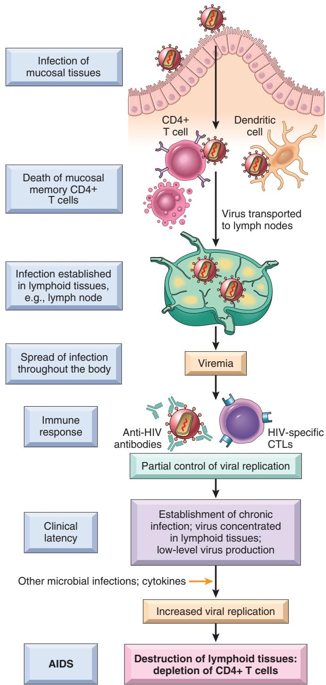 
Fig. 5.39 Pathogenesis of HIV-1 infection. The initial infection starts in mucosal tissues, involving mainly memory $\mathrm{CD4 + }$ T cells and dendritic cells, and spreads to lymph nodes.Viral replication leads to viremia and widespread seeding of lymphoid tissue. The viremia is controlled by the host immune response, and the patient then enters a phase of clinical latency. During this phase, viral replication in both T cells and macrophages continues unabated, but there is some immune containment of virus (not shown). A gradual erosion of $\mathrm{CD4 + }$ cells continues, and, ultimately, $\mathrm{CD4 + }$ T-cell numbers decline and the patient develops clinical symptoms of full-blown AIDS. CTL, Cytotoxic T lymphocyte.
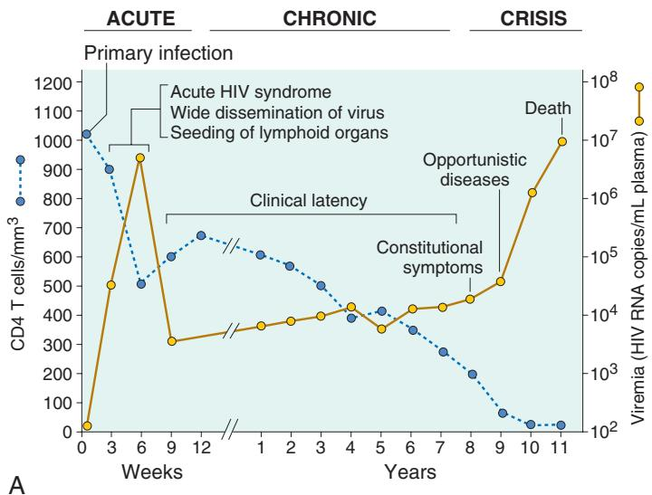 
Fig. 5.40 Clinical course of HIV infection. (A) During the early period after primary infection, there is dissemination of virus, development of an immune response to HIV, and often an acute viral syndrome. During the period of clinical latency, viral replication continues and the $\mathrm{CD4 + }$ T-cell count gradually decreases, until it reaches a critical level below which there is a substantial risk for AIDS-associated diseases. (B) Immune response to HIV infection. A cytotoxic T-lymphocyte (CTL) response to HIV is detectable by 2 to 3 weeks after the initial infection, and it peaks by 9 to 12 weeks. Marked expansion of virus-specific $\mathrm{CD8 + }$ T-cell clones occurs during this time, and up to $10\%$ of a patient's CTLs may be HIV specific at 12 weeks. The humoral immune response to HIV peaks at about 12 weeks. (A, Redrawn from Fauci AS, Lane HC: Human immunodeficiency virus disease: AIDS and related conditions. In Fauci AS, et al, editors: Harrison's principles of internal medicine, ed 14, New York, 1997, McGraw-Hill, p 1791.)
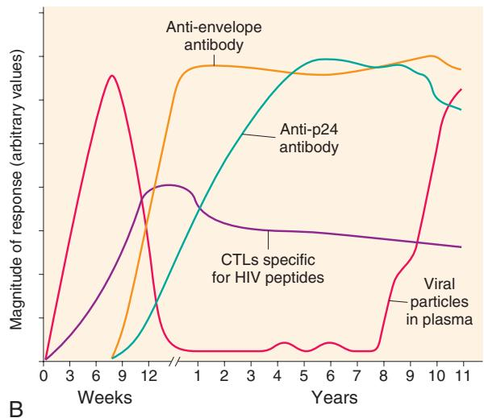
CD4+ T cells in the lymphoid tissues and the circulation.
- AIDS. The final phase is progression to AIDS, characterized by a breakdown of host defense, a dramatic increase in plasma virus, and severe, life-threatening clinical disease. Typically the patient presents with long-lasting fever (>1 month), fatigue, weight loss, and diarrhea. After a variable period, serious opportunistic infections, secondary neoplasms, or clinical neurologic disease (grouped under the rubric AIDS indicator diseases or AIDS-defining illnesses, discussed later) emerge, and the patient is said to have developed AIDS.
The extent of viremia, measured as HIV-1 RNA levels in the blood, is a useful marker of HIV disease progression and is of value in the management of HIV-infected individuals. The viral load at the end of the acute phase reflects the equilibrium reached between the virus and the host response, and in a given patient it may remain fairly stable for several years. This level of steady-state viremia, called the viral set point, is a predictor of the rate of decline of $\mathrm{CD4 + }$ T cells and, therefore, progression of HIV disease.
Because the loss of immune containment is associated with declining $\mathrm{CD4 + }$ T cell counts, the Centers for Disease Control and Prevention (CDC) classification of HIV infection stratifies patients into three groups based on $\mathrm{CD4 + }$ cell counts: greater than or equal to 500 cells/ $\mu \mathrm{L}$ , 200 to 499 cells/ $\mu \mathrm{L}$ , and fewer than 200 cells/ $\mu \mathrm{L}$ (Table 5.15).
In the absence of treatment, most patients with HIV infection progress to AIDS after a chronic phase lasting from 7 to 10 years, but there are exceptions. In rapid progressors, the middle, chronic phase is telescoped to 2 to 3 years after primary infection. About $5\%$ to $15\%$ of infected individuals are long-term nonprogressors, defined as untreated HIV-1-infected individuals who remain asymptomatic for
10 years or more, with stable $\mathrm{CD4 + }$ T cell counts and low levels of plasma viremia (usually $< 500$ viral RNA copies/ mL). Remarkably, about $1\%$ of infected individuals have undetectable plasma virus (<50 to 75 RNA copies/mL); these have been called elite controllers. Individuals with such an uncommon clinical course have attracted great attention in the hope that studying them may shed light on host and viral factors that influence disease progression. Studies thus far indicate that this group is heterogeneous with respect to the variables that influence the course of the disease. In most cases, the viral isolates do not show qualitative abnormalities, suggesting that the uneventful course cannot be attributed to a "wimpy" virus. In all cases, there is evidence of a vigorous anti-HIV immune
Table 5.15 CDC Classification Categories of HIV Infection 
Clinical CategoriesCD4+ T-Cell Categories123≥500 Cells/μL200–499 Cells/μL&lt;200 Cells/μLA. Asymptomatic: acute (primary) HIV, or persistent generalized lymphadenopathyAIA2A3B. Symptomatic: no A or C conditionsBIB2B3C. AIDS indicator conditions: including constitutional disease, neurologic disease, or neoplasm
Data from Centers for Disease Control and Prevention: 1993 revised classification system and expanded surveillance definition for AIDS among adolescents and adults. MMWR 41(RR-17):1, 1992.
response, but the immune correlates of protection are still unknown. Some of these individuals have high levels of HIV-specific $\mathrm{CD4 + }$ and $\mathrm{CD8 + }$ T-cell responses, and these levels are maintained over the course of infection. The inheritance of particular $HLA$ alleles seems to correlate with resistance to disease progression, perhaps reflecting the ability to mount anti-viral T cell responses.
# Clinical Features of AIDS
In the following section, we summarize the clinical manifestations of the terminal phase of the disease, full-blown AIDS.
In the United States, the typical adult patient with AIDS presents with fever, weight loss, diarrhea, generalized lymphadenopathy, multiple opportunistic infections, neurologic disease, and, in many cases, secondary neoplasms.
# Opportunistic Infections
Opportunistic infections account for the majority of deaths in untreated patients with AIDS. Many of these infections represent reactivation of latent infections, which are normally kept in check by a robust immune system but are not completely eradicated because the infectious agents have evolved to coexist with their hosts. The actual frequency of infections varies in different regions of the world, and has been markedly reduced by the advent of highly active anti-retroviral therapy (called HAART or ART), which relies on a combination of three or four drugs that block different steps of the HIV life cycle.
- Approximately $15\%$ to $30\%$ of untreated HIV-infected individuals develop pneumonia caused by the fungus Pneumocystis jiroveci at some time during the course of the disease. Before the advent of HAART, this infection was the presenting feature in about $20\%$ of cases, but the incidence is much less in patients who respond to HAART. 
- Candidiasis is the most common fungal infection in patients with AIDS, and infection of the oral cavity, vagina, and esophagus are its most common clinical manifestations. In HIV-infected individuals, oral candidiasis is a sign of immunologic decompensation, and often heralds the transition to AIDS. Invasive candidiasis is infrequent in patients with AIDS, and it usually occurs when there is drug-induced neutropenia or use of indwelling catheters. 
- Cytomegalovirus (CMV) may cause disseminated disease, but more commonly affects the eye and gastrointestinal tract. Chorioretinitis used to be seen in approximately $25\%$ of patients, but has decreased dramatically after the initiation of HAART. CMV retinitis occurs almost exclusively in patients with $\mathrm{CD4 + }$ T cell counts less than 50 per microliter. Gastrointestinal CMV infection, seen in $5\%$ to $10\%$ of cases, manifests as esophagitis and colitis, the latter associated with multiple mucosal ulcerations. 
- Disseminated bacterial infection with nontuberculous, or atypical, mycobacteria (mainly Mycobacterium avium intracellulare) also occurs late, in the setting of severe immunosuppression. Coincident with the AIDS epidemic, the incidence of tuberculosis has risen dramatically. Worldwide, almost one third of all deaths in AIDS patients are attributable to tuberculosis, but this compli
cation remains uncommon in the United States. Both reactivation of latent pulmonary disease and new primary infection contribute to this toll. As with tuberculosis in other settings, the infection may be confined to lungs or may involve multiple organs. Most worrisome are reports indicating that a growing number of isolates are resistant to multiple anti-mycobacterial drugs.
- Cryptococcosis occurs in about $10\%$ of AIDS patients. As in other settings with immunosuppression, meningitis is the major clinical manifestation of cryptococcosis. Toxoplasma gondii, another frequent invader of the CNS in AIDS, causes encephalitis and is responsible for $50\%$ of all mass lesions in the CNS. 
- JC virus, a human papovirus, is another important cause of CNS infections in HIV-infected patients. It causes progressive multifocal leukoencephalopathy (Chapter 23). Herpes simplex virus infection is manifested by mucocutaneous ulcerations involving the mouth, esophagus, external genitalia, and perianal region. Persistent diarrhea, which is common in untreated patients with advanced AIDS, is often caused by infections with protozoans or enteric bacteria.
# Tumors
Patients with AIDS have a high incidence of certain tumors, notably Kaposi sarcoma, B cell lymphoma, cervical cancer in women, and anal cancer in men. These tumors are often considered AIDS-defining malignancies. It is estimated that $25\%$ to $40\%$ of untreated HIV-infected individuals will eventually develop a malignancy. Many of these tumors are caused by oncogenic DNA viruses, including Kaposi sarcoma herpesvirus (Kaposi sarcoma), EBV (B cell lymphoma), and human papillomavirus (cervical and anal carcinoma). These viruses establish latent infections that are kept in check in healthy individuals by a competent immune system. The increased risk for malignancy in AIDS patients exists mainly because of failure to contain the infection following reactivation of the viruses and decreased cellular immunity against virally infected cells undergoing malignant transformation. The incidence of many of these tumors, especially Kaposi sarcoma, is decreasing as treatment has improved and patients have less immune compromise. Nevertheless, HIV-infected individuals remain more susceptible to tumors that occur in the general population, such as lung and skin cancers and certain forms of lymphoma.
Kaposi Sarcoma. Kaposi sarcoma (KS), a vascular tumor that is otherwise rare in the United States, is considered an AIDS-defining malignancy. The morphology of KS and its occurrence in patients not infected with HIV are discussed in Chapter 10. At the onset of the AIDS epidemic, up to $30\%$ of infected homosexual or bisexual men had KS, but with use of HAART there has been a dramatic decline in its incidence in recent years. In contrast, in areas of sub-Saharan Africa where HIV infection is both frequent and largely untreated, Kaposi sarcoma is one of the most common tumors.
The lesions of KS are characterized by a proliferation of spindle-shaped cells that express markers of both endothelial cells (vascular or lymphatic) and smooth muscle cells.
In addition, KS lesions contain chronic inflammatory cell infiltrates. Many of the features of KS suggest that it is not a malignant tumor (despite its ominous name).
There is compelling evidence that KS is caused by the KS herpesvirus (KSHV), also called human herpesvirus 8 (HHV8). Exactly how KSHV infection leads to KS is still unclear. Like other herpesviruses, KSHV establishes latent infection, during which several proteins are produced with potential roles in stimulating spindle cell proliferation and preventing apoptosis. These include a viral homologue of the cell cycle regulator cyclin D (an oncogene) and several inhibitors of p53 (a key tumor suppressor gene), both of which have been implicated in tumor development (Chapter 6). The spindle cells produce proinflammatory and angiogenic factors, which recruit the inflammatory and neovascular components of the lesion, and the latter components supply signals that aid in spindle cell survival and growth. However, KSHV infection, while necessary for KS development, is not sufficient, and additional cofactors are needed. In the AIDS-related form, that cofactor is clearly HIV. HIV-mediated immune suppression may aid in widespread dissemination of KSHV in the host.
Clinically, AIDS-associated KS is quite different from the sporadic form (Chapter 10). In HIV-infected individuals, the tumor is usually widespread, affecting the skin, mucous membranes, gastrointestinal tract, lymph nodes, and lungs. These tumors also tend to be more aggressive than sporadic KS.
Lymphomas. Lymphoma occurs at a markedly increased rate in individuals with AIDS, making it another AIDS-defining tumor. Roughly $5\%$ of AIDS patients present with lymphoma, and approximately another $5\%$ develop lymphoma during their subsequent course. Even in the era of anti-retroviral therapy, lymphoma continues to occur in HIV-infected individuals at an incidence that is at least 10-fold greater than the population average. Based on molecular characterization of HIV-associated lymphomas and the epidemiologic considerations above, at least two mechanisms appear to underlie the increased risk for B-cell tumors in HIV-infected individuals.
- Tumors Induced by Oncogenic Viruses. T-cell immunity is required to restrain the proliferation of B cells latently infected with oncogenic viruses such as EBV and KSHV. With the appearance of severe T-cell depletion in the course of HIV infection, this control is lost, and the infected B cells undergo unchecked proliferation that predispose to mutations and the development of B-cell tumors. As a result, AIDS patients are at high risk for developing aggressive B-cell lymphomas composed of tumor cells infected by oncogenic viruses, particularly EBV. The tumors often occur in extranodal sites, such as the CNS, gut, orbit, and lungs, and elsewhere. AIDS patients also are prone to rare lymphomas that present as malignant effusions (so-called "primary effusion lymphoma"), which are remarkable in that the tumor cells are usually coinfected by both EBV and KSHV, a highly unusual example of cooperativity between two oncogenic viruses.
- Germinal Center B-Cell Hyperplasia. The majority of the lymphomas that arise in patients with preserved CD4 T-cell counts are not associated with EBV or KSHV. The
increased risk for lymphoma in these patients may be related to the profound germinal center B cell hyperplasia that occurs in HIV infection. The high level of proliferation and somatic mutations that occur in germinal center B cells set the stage for chromosomal translocations and mutations involving tumor-causing genes. In fact, the aggressive B-cell tumors that arise outside the setting of severe T cell depletion in HIV-infected individuals, such as Burkitt lymphoma and diffuse large B cell lymphoma, often are associated with mutations in oncogenes such as MYC and BCL6 that bear the molecular hallmarks of "mistakes" during the attempted diversification of immunoglobulin genes in germinal center B cells.
Several other EBV-related proliferations also merit mention. Hodgkin lymphoma, an unusual B-cell tumor associated with a pronounced tissue inflammatory response (Chapter 12), also occurs at increased frequency in HIV-infected individuals. In virtually all instances of HIV-associated Hodgkin lymphoma, the characteristic tumor cells (Reed-Sternberg cells) are infected with EBV. Many (but not all) HIV patients with Hodgkin lymphoma have low CD4 counts at the time of disease presentation. EBV infection also is responsible for oral hairy leukoplakia (white projections on the tongue), which results from EBV-driven squamous cell proliferation of the oral mucosa (Chapter 15).
Other Tumors. In addition to KS and lymphomas, patients with AIDS also have an increased occurrence of carcinoma of the uterine cervix and of anal cancer. Both of these tumors are highly associated with human papilloma virus infection, which is poorly controlled in the setting of immunosuppression.
# Central Nervous System Disease
Involvement of the CNS is a common and important manifestation of AIDS. Ninety percent of patients demonstrate some form of neurologic involvement at autopsy, and $40\%$ to $60\%$ have clinically apparent neurologic dysfunction. Importantly, in some patients, neurologic manifestations may be the sole or earliest presenting feature of HIV infection. Lesions include a self-limited presumed viral meningoencephalitis or aseptic meningitis, vacuolar myelopathy, peripheral neuropathies, and, most commonly, a progressive encephalopathy called HIV-associated neurocognitive disorder (Chapter 23).
# Effect of Anti-Retroviral Drug Therapy on the Course of HIV Infection
The advent of new drugs that target the viral reverse transcriptase, protease, and integrase enzymes has changed the clinical face of AIDS. When a combination of at least three effective drugs is used in a motivated, compliant patient, HIV replication is reduced to below the threshold of detection (<50 RNA copies/mL) and remains there as long as the patient adheres to therapy. Once the virus is suppressed, the progressive loss of $\mathrm{CD4 + }$ T cells is halted, and the peripheral $\mathrm{CD4 + }$ T-cell count slowly increases, often returning to a normal level. With the use of these drugs, the annual death rate from AIDS in the United States has decreased from a peak of 16 to 18 per 100,000 individuals
in 1995-1996 to less than 4 per 100,000. Many AIDSassociated disorders, such as opportunistic infections with $P_{\cdot}$ jiroveci and Kaposi sarcoma, now are uncommon. Effective anti-retroviral therapy also has reduced the transmission of the virus, especially from infected mothers to newborns.
Despite these dramatic improvements, several new complications associated with HIV infection and its treatment have emerged. Some patients with advanced disease who are given anti-retroviral therapy develop a paradoxical clinical deterioration during the period of recovery of the immune system despite increasing $\mathrm{CD4 + }$ T-cell counts and decreasing viral load. This disorder, called the immune reconstitution inflammatory syndrome, is not understood but is postulated to be a poorly regulated host response to the high antigenic burden of persistent microbes. Perhaps a more important complication of long-term anti-retroviral therapy pertains to adverse side effects of the drugs. These include lipoatrophy (loss of facial fat), lipoaccumulation (excess fat deposition centrally), elevated lipids, insulin resistance, peripheral neuropathy, and premature cardiovascular, kidney, and liver disease. Finally, non-AIDS morbidity is far more common than classic AIDS-related morbidity in long-term HAART-treated patients. Major causes of morbidity are cancer and accelerated cardiovascular disease. The mechanism for these non-AIDS-related complications is not known, but persistent inflammation and T-cell dysfunction may have a role.
Changes in the tissues (with the exception of the brain) are neither specific nor diagnostic. Common pathologic features of AIDS include opportunistic infections, Kaposi sarcoma, and B-cell lymphomas. Most of these lesions are discussed elsewhere, because they also occur in individuals who do not have HIV infection. Lesions in the central nervous system are described in Chapter 23.
Biopsy specimens from enlarged lymph nodes in the early stages of HIV infection reveal a marked hyperplasia of B-cell follicles, which often take on unusual, serpiginous shapes. The mantle zones that surround the follicles are attenuated, and the germinal centers impinge on interfollicular T cell areas. This hyperplasia of B cells is the morphologic reflection of the polyclonal B cell activation and hypergammaglobulinemia seen in HIV-infected individuals.
With disease progression, the frenzy of B cell proliferation subsides and gives way to a pattern of severe lymphoid involution. The lymph nodes are depleted of lymphocytes, and the organized network of follicular dendritic cells is disrupted. The germinal centers may even become hyalinized. During this advanced stage, viral burden in the nodes is reduced, in part because of the disruption of the follicular dendritic cells. These "burnt-out" lymph nodes are atrophic and small and may harbor numerous opportunistic pathogens, often within macrophages. Because of profound immunosuppression, the inflammatory response to infections both in the lymph nodes and at extranodal sites may be sparse or atypical. For example, mycobacteria often fail to
evoke granuloma formation because $\mathrm{CD4 + }$ cells are deficient, and the presence of these and other infectious agents may not be apparent without special stains. As might be expected, lymphoid involution is not confined to the nodes; in later stages of AIDS, the spleen and thymus also are converted to "wastelands" that are virtually devoid of lymphocytes.
Despite impressive advances in our understanding and treatment of HIV infection, the long-term prognosis of patients with AIDS remains a concern. Although with effective drug therapy the mortality rate has declined in the United States, the treated patients still carry viral DNA in their lymphoid tissues. Truly curative therapy remains elusive. Similarly, although considerable effort has been mounted to develop a protective vaccine, many hurdles remain before this becomes a reality. Molecular analyses have revealed an alarming degree of variation in viral isolates from patients; this renders the task of producing a vaccine extremely difficult. Recent efforts have focused on producing broadly neutralizing antibodies against relatively invariant portions of HIV proteins. At present, therefore, prevention, public health measures, and anti-retroviral drugs remain the mainstays in the fight against AIDS.
# CLINICAL COURSE AND COMPLICATIONS OF HIV INFECTION
- Progression of disease. HIV infection progresses through phases.
- Acute HIV infection. Manifestations of acute viral illness 
- Chronic (latent) phase. Dissemination of virus, host immune response, progressive destruction of immune cells. 
- AIDS. Severe immune deficiency.
Clinical features. Full-blown AIDS manifests with several complications, mostly resulting from immune deficiency.
Opportunistic infections 
Tumors, especially tumors caused by oncogenic viruses 
- Neurologic complications of unknown pathogenesis
- Antiretroviral therapy has greatly decreased the incidence of opportunistic infections and tumors but also has numerous complications.
# AMYLOIDOSIS
Amyloidosis is a condition associated with a number of disorders in which extracellular deposits of fibrillar proteins are responsible for tissue damage and functional compromise. These abnormal fibrils are produced by the aggregation of improperly folded proteins (which are soluble in their normal folded configuration). The fibrillar deposits bind a wide variety of proteoglycans and glycosaminoglycans, which contain charged sugar groups that give the deposits staining characteristics thought to resemble those of starch (amylose). Therefore, the deposits were called amyloid, a name that is firmly entrenched despite the realization that the deposits are unrelated to starch.
# Pathogenesis of Amyloid Deposition
Amyloid deposits can occur in a variety of conditions, in each of which the protein composition is different. Although amyloid always has the same morphologic appearance, it is biochemically heterogeneous. In fact, at least 30 different proteins can aggregate to form fibrils with the appearance of amyloid. Regardless of their derivation, all amyloid deposits are composed of nonbranching fibrils, each formed of intertwined polypeptides in a $\beta$ pleated sheet conformation (Fig. 5.41). Approximately $95\%$ of the amyloid material consists of fibril proteins, the remaining $5\%$ being various glycoproteins.
The three most common forms of amyloid are the following:
- AL (amyloid light chain) amyloid is made up of complete immunoglobulin light chains, the amino-terminal fragments of light chains, or both. 
- AA (amyloid-associated) amyloid is composed of an 8500-dalton protein derived by proteolysis from a larger precursor in the blood called SAA (serum amyloid-associated) protein, which is synthesized in the liver. 
- $\beta$ -amyloid protein (A $\beta$ ) is a 4000-dalton peptide that is derived by proteolysis from a much larger transmembrane glycoprotein, called amyloid precursor protein.
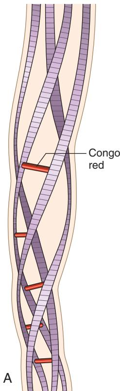 
Fig. 5.41 Structure of amyloid. (A) A schematic diagram of an amyloid fiber showing four fibrils (there can be as many as six in each fiber) wound around one another with regularly spaced binding of the Congo red dye. (B) Congo red staining shows apple-green birefringence under polarized light, a diagnostic feature of amyloid. (C) Electron micrograph of 7.5- to 10-nm amyloid fibrils. (From Merlini G, Bellotti V: Molecular mechanisms of amyloidosis. N Engl J Med 349:583-596, 2003.)
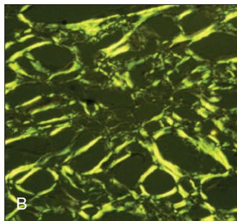
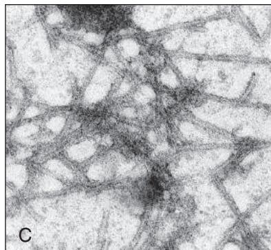
Many other proteins also can deposit as amyloid in a variety of clinical settings. Some of the most clinically important examples are mentioned in the following section.
# Classification of Amyloidosis and Mechanisms of Amyloid Formation
Amyloidosis results from abnormal folding of proteins, which assume a $\beta$ pleated sheet conformation, aggregate, and deposit as fibrils in extracellular tissues. Normally, intracellular misfolded proteins are degraded in proteasomes and extracellular protein aggregates are taken up and degraded by macrophages. In amyloidosis, these quality control mechanisms fail and fibrillar proteins accumulate outside of cells. The proteins that form amyloid fall into two general categories (Fig. 5.42): (1) normal proteins that have an inherent tendency to associate and form fibrils, particularly when produced in increased amounts; and (2) mutant proteins that are prone to misfolding and aggregation. The mechanisms of deposition of different types of amyloid are discussed next along with classification.
Because a given form of amyloid (e.g., AA) may be associated with diverse clinical settings, we will follow a classification that takes into account clinical and biochemical features (Table 5.16). Amyloid may be systemic (generalized), involving several organ systems, or it may be localized to a single organ, such as the heart. On clinical grounds, the systemic pattern is subclassified into primary amyloidosis when it is associated with a clonal plasma cell proliferation, or secondary amyloidosis when it occurs as a complication of an underlying chronic inflammatory or tissue-destructive process. Hereditary or familial amyloidosis constitutes a separate, heterogeneous group with several distinctive patterns of organ involvement.
Primary Amyloidosis: Plasma Cell Proliferations Associated With Amyloidosis. Amyloid in this category is of the AL type and is usually systemic in distribution. This is the most common form of amyloidosis, with approximately 2000 to 3000 new cases each year in the United States. It is caused by a clonal proliferation of plasma cells that synthesize abnormal Ig molecules. The AL type of systemic amyloidosis occurs in $5\%$ to $15\%$ of individuals with multiple myeloma, a plasma-cell tumor characterized by excessive production of free immunoglobulin light chains (Chapter 12). The free, unpaired $\kappa$ or $\lambda$ light chains (referred to as Bence Jones protein) are prone to aggregating and depositing in tissues as amyloid. Since the majority of myeloma patients do not develop amyloidosis, however, it is clear that not all free light chains are equally likely to produce amyloid. For unknown reasons, $\lambda$ light chains are approximately six times more likely to deposit as amyloid than $\kappa$ light chains.
Most persons with AL amyloid do not have multiple myeloma or any other overt B cell neoplasm; such cases have been traditionally classified as primary amyloidosis, because their clinical features derive solely from the effects of amyloid deposition rather than formation of tumor masses. In virtually all such cases, however, monoclonal immunoglobulins or free light chains, or both, can be found in the blood or urine. Most of these patients also have a
Generalmechanismofformationofamyloidfibrils.(B)Formationofamyloidfromexcessiveproductionofproteinspronetomisfolding.(C)Formationofamyloidfrommutantprotein..jpg) 
Fig. 5.42 Pathogenesis of amyloidosis. (A) General mechanism of formation of amyloid fibrils. (B) Formation of amyloid from excessive production of proteins prone to misfolding. (C) Formation of amyloid from mutant protein.
modest increase in the number of plasma cells in the bone marrow, which presumably secrete the precursors of AL protein.
Reactive Systemic Amyloidosis. The amyloid deposits in this pattern are systemic in distribution and are composed of AA protein. This category was previously referred to as secondary amyloidosis because it is secondary to an
associated inflammatory condition. At one time, tuberculosis, bronchiectasis, and chronic osteomyelitis were the most important underlying conditions, but currently, these conditions frequently resolve with antibiotic treatment and less often lead to amyloidosis. More commonly now, reactive systemic amyloidosis complicates rheumatoid arthritis, other connective tissue disorders such as ankylosing spondylitis, and inflammatory bowel disease, particularly
Table 5.16 Classification of Amyloidosis 
Clinicopathologic CategoryAssociated DiseasesMajor Fibril ProteinChemically Related Precursor ProteinSystemic (Generalized) AmyloidosisPlasma cell proliferations with amyloidosis (primary amyloidosis)Multiple myeloma and other monoclonal plasma cell proliferationsALImmunoglobulin light chains, chiefly λ typeReactive systemic amyloidosis (secondary amyloidosis)Chronic inflammatory conditionsAASAAHemodialysis-associated amyloidosisChronic renal failureAβ2mβ2-microglobulinHereditary AmyloidosisFamilial Mediterranean feverAASAAFamilial amyloidotic neuropathies (several types)ATTRTransthyretinSystemic senile amyloidosisATTRTransthyretinLocalized AmyloidosisSenile cerebralAlzheimer diseaseAβAPPEndocrineType 2 diabetesMedullary carcinoma of thyroidA CalCalcitoninIslets of LangerhansAIAPPIslet amyloid peptideIsolated atrial amyloidosisAANFAtrial natriuretic factor
Crohn disease and ulcerative colitis. Among these, the most frequent associated condition is rheumatoid arthritis. Amyloidosis is reported to occur in approximately $3\%$ of patients with rheumatoid arthritis and is clinically significant in one half of those affected. Heroin abusers who inject the drug subcutaneously also have a high occurrence rate of generalized AA amyloidosis. The chronic skin infections, which cause the "skin-popping" associated with injection of narcotics, seem to be responsible for the amyloidosis. Reactive systemic amyloidosis also may occur in association with certain cancers, the most common being renal cell carcinoma and Hodgkin lymphoma.
In AA amyloidosis, SAA synthesis by liver cells is stimulated by cytokines such as IL-6 and IL-1 that are produced during inflammation; thus, long-standing inflammation leads to a sustained elevation of SAA levels. While SAA levels are increased in all cases of inflammation, only a small subset get amyloidosis. It seems that in some patients SAA breakdown produces intermediates that are prone to forming fibrils.
Heredofamilial Amyloidosis. A variety of familial forms of amyloidosis have been described. Most are rare and occur in limited geographic areas. The most common and best studied is an autosomal recessive condition called familial Mediterranean fever, which is encountered largely in individuals of Armenian, Sephardic Jewish, and Arabic origins. This is an "autoinflammatory" syndrome associated with excessive production of the cytokine IL-1 in response to inflammatory stimuli. It is characterized by attacks of fever accompanied by inflammation of serosal surfaces that manifests as peritonitis, pleuritis, and synovitis. The gene for familial Mediterranean fever encodes a protein called pyrin that is important in dampening the response of innate immune cells, particularly neutrophils, to inflammatory mediators. The amyloid seen in this disorder is of the AA type, suggesting that it is related to the recurrent bouts of inflammation.
In contrast to familial Mediterranean fever, a group of autosomal dominant familial disorders is characterized by deposition of amyloid made up of fibrils derived from mutant transthyretin (TTR). TTR is a transporter of the hormone thyroxine. Remarkably, specific TTR mutant polypeptides tend to form amyloid in different organs; thus, in some families, deposits are seen mainly in peripheral nerves (familial amyloidotic polyneuropathies), whereas in others cardiac deposits predominate. The mutated form of the TTR gene that leads to cardiac amyloidosis is carried by approximately $4\%$ of the black population in the United States, and cardiomyopathy has been identified in both homozygous and heterozygous patients. The precise prevalence of patients with this mutation who develop clinically manifest cardiac disease is not known.
Hemodialysis-Associated Amyloidosis. Patients on long-term hemodialysis for renal failure can develop amyloid deposits derived from $\beta_{2}$ -microglobulin. This protein is present in high concentrations in the serum of individuals with renal disease, and in the past it was retained in the circulation because it could not be filtered through dialysis membranes. With new dialysis filters, the
incidence of this complication has decreased substantially. The classical features of this form of amyloidosis are the triad of scapulohumeral periarthritis, carpal tunnel syndrome, and flexor tenosynovitis of the hand.
Localized Amyloidosis. Sometimes, amyloid deposits are limited to a single organ or tissue without involvement of any other site in the body. The deposits may produce grossly detectable nodular masses or be evident only on microscopic examination. Nodular deposits of amyloid are most often encountered in the lung, larynx, skin, urinary bladder, tongue, and the region about the eye. Frequently, there are infiltrates of lymphocytes and plasma cells associated with these amyloid masses. At least in some cases, the amyloid consists of AL protein and may therefore represent a localized form of plasma cell-derived amyloid.
Endocrine Amyloid. Microscopic deposits of localized amyloid may be found in certain endocrine tumors, such as medullary carcinoma of the thyroid gland, islet tumors of the pancreas, pheochromocytomas, and undifferentiated carcinomas of the stomach, and in the islets of Langerhans in individuals with type 2 diabetes mellitus. In these settings, the amyloidogenic proteins seem to be derived either from polypeptide hormones (e.g., medullary carcinoma) or from unique proteins (e.g., islet amyloid polypeptide).
Amyloid of Aging. Several well-documented forms of amyloid deposition occur with aging. Senile systemic amyloidosis refers to the systemic deposition of amyloid in elderly patients (usually in their seventies and eighties). Because of the dominant involvement and related dysfunction of the heart, this form was previously called senile cardiac amyloidosis. Those who are symptomatic present with a restrictive cardiomyopathy and arrhythmias (Chapter 11). The amyloid in this form, in contrast to familial forms, is derived from normal TTR.
There are no consistent or distinctive patterns of organ or tissue distribution of amyloid deposits in any of the categories cited, but a few generalizations can be made. In AA amyloidosis secondary to chronic inflammatory disorders, kidneys, liver, spleen, lymph nodes, adrenal glands, thyroid glands, and many other tissues are typically affected. Although AL amyloidosis associated with plasma cell proliferations cannot reliably be distinguished from the AA form by its organ distribution, it more often involves the heart, gastrointestinal tract, respiratory tract, peripheral nerves, skin, and tongue. The localization of amyloid deposits in the hereditary syndromes is varied. In familial Mediterranean fever, the amyloidosis is of the AA type and accordingly may be widespread, involving the kidneys, blood vessels, spleen, respiratory tract, and (rarely) liver.
Amyloid may be appreciated macroscopically when it accumulates in large amounts. The organ is frequently enlarged, and the tissue appears gray and has a waxy, firm consistency. Histologically, the amyloid deposition is always extracellular and begins between cells, often closely adjacent to basement membranes
(Fig. 5.43A). As the amyloid accumulates, it encroaches on the cells, in time surrounding and destroying them. In the form associated with plasma cell proliferation, perivascular and vascular deposits are common.
The diagnosis of amyloidosis is based on histopathology. With the light microscope and hematoxylin and eosin stains, amyloid appears as an amorphous, eosinophilic, hyaline, extracellular substance. To differentiate amyloid from other hyaline materials (e.g., collagen, fibrin), a variety of histochemical stains are used. The most widely used is the Congo red stain, which under ordinary light gives a pink or red color to tissue deposits, but far more striking and specific is the green birefringence of the stained amyloid when observed by polarizing microscopy (Fig. 5.43B). This staining reaction is shared by all forms of amyloid and is imparted by the crossed $\beta$ -pleated sheet configuration of amyloid fibrils. Confirmation can be obtained by electron microscopy, which reveals amorphous nonoriented thin fibrils. Subtyping of amyloid is most reliably done by mass spectroscopy, as immunohistochemical stains are not entirely sensitive or specific.
The pattern of organ involvement in different forms of amyloidosis is variable.
Kidney. Amyloidosis of the kidney is the most common and potentially the most serious form of organ involvement. Grossly, the kidneys may be of normal size and color, or in advanced cases they may be shrunken because of ischemia caused by vascular narrowing induced by the deposition of amyloid within arterial and arteriolar walls. Histologically, the amyloid is deposited primarily in the glomeruli, but the interstitial peritubular tissue, arteries, and arterioles are also affected. The glomerular deposits first appear as subtle thickenings of the mesangial matrix, accompanied usually by uneven widening of the basement membranes of the glomerular capillaries. In time, deposits in the mesangium and along the basement membranes cause capillary narrowing and distortion of the glomerular vascular tuft. With progression of the glomerular amyloidosis, the capillary lumens are obliterated and the obsolescent glomerulus is replaced by confluent masses or interlacing broad ribbons of amyloid.
Spleen. Amyloidosis of the spleen may be inapparent grossly or may cause moderate to marked splenomegaly (up to $800\mathrm{g}$ ). For mysterious reasons, two distinct patterns of deposition are seen. In one, the deposits are largely limited to the splenic follicles, producing tapioca-like granules on gross inspection, designated sago spleen. In the other pattern, the amyloid involves the walls of the splenic sinuses and connective tissue framework in the red pulp. Fusion of the early deposits gives rise to large, maplike areas of amyloidosis, creating what has been designated lardaceous spleen.
Liver. The deposits may be inapparent grossly or may cause moderate to marked hepatomegaly. Amyloid appears first in the space of Disse and then progressively encroaches on adjacent hepatic parenchymal cells and sinusoids. In time, deformity, pressure atrophy, and disappearance of hepatocytes occur, causing total replacement of large areas of liver parenchyma. Vascular involvement and deposits in Kupffer cells are frequent. Liver function is usually preserved despite sometimes quite extensive involvement.
Heart. Amyloidosis of the heart (Chapter 11) may occur in any form of systemic amyloidosis. It also is the major organ involved in senile systemic amyloidosis. The heart may be enlarged and firm, but more often it shows no appreciable change on gross inspection. Histologically the deposits begin as focal subendocardial accumulations and within the myocardium between the muscle fibers. Expansion of these myocardial deposits eventually causes pressure atrophy of myocardial fibers. When the amyloid deposits are subendocardial, the conduction system may be damaged, accounting for the electrocardiographic abnormalities noted in some patients.
Other Organs. Nodular depositions in the tongue may cause macroglossia, giving rise to the designation tumor-forming amyloid of the tongue. The respiratory tract may be involved focally or diffusely from the larynx down to the smallest bronchioles. A distinct form of amyloid is found in the brains of patients with Alzheimer disease. It may be present in so-called "plaques" as well as blood vessels (Chapter 23). Amyloidosis of peripheral and autonomic nerves is a feature of several familial amyloidotic neuropathies.
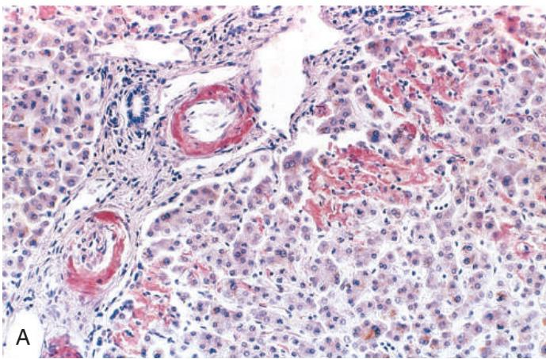 
Fig. 5.43 Amyloidosis. (A) A section of liver stained with Congo red reveals pink-red deposits of amyloid in the walls of blood vessels and along sinusoids. (B) Note the yellow-green birefringence of the deposits when observed by a polarizing microscope. (B, Courtesy of Dr. Trace Worrell and Sandy Hinton, Department of Pathology, University of Texas Southwestern Medical School, Dallas, Texas.)
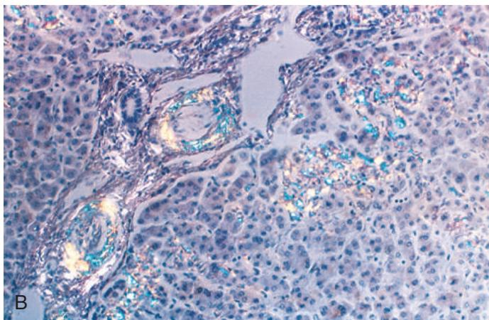
Amyloidosis may be found as an unsuspected anatomic change, having produced no clinical manifestations, or it may cause serious clinical problems and even death. The symptoms depend on the magnitude of the deposits and on the sites or organs affected. Clinical manifestations at first are often entirely nonspecific, such as weakness, weight loss, lightheadedness, or syncope. Somewhat more specific findings appear later and most often relate to renal, cardiac, and gastrointestinal involvement.
Renal involvement gives rise to proteinuria that may be severe enough to cause the nephrotic syndrome (Chapter 14). Progressive obliteration of glomeruli in advanced cases ultimately leads to renal failure and uremia. Renal failure is a common cause of death. Cardiac amyloidosis may present insidiously as congestive heart failure. The most serious aspects of cardiac amyloidosis are conduction disturbances and arrhythmias, which may prove fatal. Occasionally, cardiac amyloidosis produces a restrictive pattern of cardiomyopathy and masquerades as chronic constrictive pericarditis (Chapter 11). Gastrointestinal amyloidosis may be asymptomatic, or it may present in a variety of ways. Amyloidosis of the tongue may cause sufficient enlargement and inelasticity to hamper speech and swallowing. Depositions in the stomach and intestine may lead to malabsorption, diarrhea, and disturbances in digestion. Vascular amyloidosis causes vascular fragility that may lead to bleeding, sometimes massive, that can occur spontaneously or following seemingly trivial trauma. Additionally, in some cases AL amyloid binds and inactivates factor X, a critical coagulation factor, leading to a life-threatening bleeding disorder.
The diagnosis of amyloidosis depends on the histologic demonstration of amyloid deposits in tissues. The most common sites biopsied are the kidney, when renal manifestations are present, or rectal or gingival tissues in patients suspected of having systemic amyloidosis. Examination of abdominal fat aspirates stained with Congo red can also be used for the diagnosis of systemic amyloidosis. The test is quite specific, but its sensitivity is low. In suspected cases of AL amyloidosis, serum and urine protein electrophoresis and immunoelectrophoresis should be performed. Bone marrow aspirates in such cases often show a monoclonal population of plasma cells, even in the absence of overt multiple myeloma. Scintigraphy with radiolabeled serum amyloid P (SAP) component is a rapid and specific test, since SAP binds to the amyloid deposits and reveals their presence. It also gives a measure of the extent of amyloidosis and can be used to follow patients undergoing treatment. Mass spectroscopy is a useful tool for identification of the protein component of amyloid. It can be performed on paraffin embedded tissues.
The prognosis for individuals with generalized amyloidosis is poor. Those with AL amyloidosis (not including multiple myeloma) have a median survival of 2 years after diagnosis. Individuals with myeloma-associated amyloidosis have an even poorer prognosis. The outlook for individuals with reactive systemic amyloidosis is somewhat better and depends to some extent on the control of the underlying condition. Resorption of amyloid after treatment of the associated condition has been reported, but this is a rare occurrence. New therapeutic strategies aimed at
correcting protein misfolding and inhibiting fibrillogenesis are being developed.
# AMYLOIDOSIS
- Amyloidosis is a disorder characterized by the extracellular deposits of proteins that are prone to aggregate and form insoluble fibrils. 
- The deposition of these proteins may result from: excessive production of proteins that are prone to aggregation; mutations that produce proteins that cannot fold properly and tend to aggregate; defective or incomplete proteolytic degradation of extracellular proteins. 
- Amyloidosis may be localized or systemic. It is seen in association with a variety of primary disorders, including monoclonal B-cell proliferations (in which the amyloid deposits consist of immunoglobulin light chains); chronic inflammatory diseases such as rheumatoid arthritis (deposits of amyloid A protein, derived from an acute-phase protein produced in inflammation); Alzheimer disease (amyloid $\beta$ protein); familial conditions in which the amyloid deposits consist of mutated proteins (e.g., transthyretin in familial amyloid polyneuropathies); and hemodialysis (deposits of $\beta_{2}$ -microglobulin, whose clearance is defective). 
Amyloid deposits cause tissue injury and impair normal function by causing pressure on cells and tissues. They do not evoke an inflammatory response.
Bonnelykke K, Sparks R, Waage J, et al: Genetics of allergy and allergic sensitization: common variants, rare mutations, Curr Opin Immunol 36:115, 2015. [An update on the genes associated with allergic diseases.] 
Broderick L, De Nardo D, Franklin BS, et al: The inflammasomes and autoinflammatory syndromes, Annu Rev Pathol 10:395, 2015. [A discussion of the inflammasome and its role in inflammatory diseases.] 
Chaudhry A, Rudensky AY: Control of inflammation by integration of environmental cues by regulatory T cells, J Clin Invest 123:939-944, 2013. [A thoughtful discussion of how regulatory T cells control inflammatory responses and maintain homeostasis in the immune system.] 
Cheng MH, Anderson MS: Monogenic autoimmunity, Annu Rev Immunol 30:393-427, 2012. [An excellent review of autoimmune syndromes caused by single-gene mutations, and what they teach us about pathways of immunologic tolerance.] 
Conley ME, Casanova JL: Discovery of single-gene inborn errors of immunity by next generation sequencing, Curr Opin Immunol 30:17, 2014. [A review of modern approaches for identifying the genetic basis of immunodeficiency diseases.] 
Craft JE: Follicular helper T cells in immunity and systemic autoimmunity, Nat Rev Rheumatol 8:337-347, 2012. [A discussion of the properties and generation of follicular helper T cells and their roles in antibody production and autoimmunity.] 
Douek DC, Roederer M, Koup RA: Emerging concepts in the immunopathogenesis of AIDS, Annu Rev Med 60:471, 2009. [A balanced discussion of the pathogenesis of AIDS, and the still unresolved issues.] 
Galli SJ: The development of allergic inflammation, Nature 454:445, 2008. [An excellent review of the mechanisms of inflammation in allergic diseases.] 
Galli SJ: The mast cell-IgE paradox: from homeostasis to anaphylaxis, Am J Pathol 186:212, 2016. [A fascinating discussion of the evolution of mast cell responses and their roles in host defense and disease.]
Goodnow CC: Multistep pathogenesis of autoimmune disease, Cell 130:25, 2007. [An excellent discussion of the checkpoints that prevent autoimmunity and why these might fail.] 
Holgate ST: Innate and adaptive immune responses in asthma, Nat Med 18:673-683, 2012. [A comprehensive discussion of the roles of $T_{H}2$ cells, cytokines, and other cells of the immune system in the development and resolution of asthma.] 
Jancar S, Sanchez Crespo M: Immune complex-mediated tissue injury: a multistep paradigm, Trends Immunol 26:48, 2005. [A summary of the mechanisms of immune complex-mediated tissue injury.] 
Jennette JC, Falk RJ, Hu P, et al: Pathogenesis of antineutrophil cytoplasmic autoantibody-associated small-vessel vasculitis, Annu Rev Pathol 8:139-160, 2013. [A comprehensive review of the clinical and pathologic features and pathogenesis of small-vessel vasculitis.] 
Pandey S, Kawai T, Akira S: Microbial sensing by Toll-like receptors and intracellular nucleic acid sensors, Cold Spring Harb Perspect Biol 7:a016246, 2014. [An excellent review of the receptors used by the innate immune system to sense microbes.] 
Klein L, Kyewski B, Allen PM, et al: Positive and negative selection of the T cell repertoire: what thymocytes see (and don't see), Nat Rev Immunol 14:377, 2014. [A discussion of the mechanisms of T cell maturation and central tolerance induced in the thymus.] 
Lamkanfi M, Dixit VM: Mechanisms and functions of inflammasomes, Cell 157:1013, 2014. [An excellent update on the inflammasome and its role in inflammation and host defense.] 
Liu Z, Davidson A: Taming lupus—a new understanding of pathogenesis is leading to clinical advances, Nat Med 18:871-882, 2012. [An excellent review of recent advances in understanding the genetics of lupus and the roles of innate and adaptive immune responses in the disease, and how these advances are shaping the development of novel therapies.] 
Mahajan VS, Mattoo H, Deshpande V, et al: IgG4-related disease, Annu Rev Pathol 9:315, 2014. [A comprehensive discussion of the features and likely pathogenesis of this recently recognized entity.] 
Mathis D, Benoist C: Microbiota and autoimmune disease: the hosted self, Cell Host Microbe 10:297-301, 2011. [A review of the evidence that the microbiome influences immune activation and autoimmunity, and the relevance of these findings to human autoimmune diseases.] 
Mavragani CP, Moustopoulos HM: Sjögren's syndrome, Annu Rev Pathol 9:273, 2014. [A review of the pathogenesis and clinical features of Sjögren's syndrome.] 
Mitchell RN: Graft vascular disease: immune response meets the vessel wall, Annu Rev Pathol 4:19, 2009. [A review of the mechanisms that lead to vascular disease in chronic graft rejection.] 
Moir S, Chun TW, Fauci AS: Pathogenic mechanisms of HIV disease, Annu Rev Pathol 6:223, 2011. [A discussion of current concepts of the mechanisms by which HIV causes immunodeficiency.]
Nankivell BJ, Alexander SI: Rejection of the kidney allograft, N Engl J Med 363:1451, 2010. [A good review of the mechanisms of recognition and rejection of allografts and the development of new strategies for treating rejection.] 
O'Shea JJ, Paul WE: Mechanisms underlying lineage commitment and plasticity of helper $\mathrm{CD4 + }$ T cells, Science 327:1098, 2010. [An excellent review of the development and functions of helper T cell subsets, and the uncertainties in the field.] 
Ohkura N, Kitagawa Y, Sakaguchi S: Development and maintenance of regulatory T cells, Immunity 38:414-423, 2013. [An excellent review of the molecular mechanisms underlying the generation, maintenance, and stability of regulatory T cells.] 
Pattanaik D, Brown M, Postlethwaite BC, et al: Pathogenesis of systemic sclerosis, Front Immunol 6:272, 2015. [A discussion of current concepts of the pathogenesis of systemic sclerosis.] 
Parvaneh N, Casanova JL, Notarangelo LD, et al: Primary immunodeficiencies: a rapidly evolving story, J Allergy Clin Immunol 131:314-323, 2013. [An excellent review of newly described primary immunodeficiency syndromes.] 
Schwartz RH: Historical overview of immunological tolerance, Cold Spring Harb Perspect Biol 4:a006908, 2012. [A thoughtful summary of the mechanisms of tolerance, the experimental studies behind the elucidation of these mechanisms, and how they may be disrupted to give rise to autoimmunity.] 
Tsokos GC: Systemic lupus erythematosus, N Engl J Med 365:2110, 2011. [An excellent review of the clinical features and pathogenesis of lupus.] 
Westermark GT, Fandrich M, Westermark P: AA amyloidosis: pathogenesis and targeted therapies, Annu Rev Pathol 10:321, 2015. [An excellent review of the pathogenesis and clinical features of a major form of amyloidosis.] 
Victora GD, Nussenzweig MC: Germinal centers, Annu Rev Immunol 30:429-457, 2012. [An excellent review of the properties and formation of germinal centers and their roles in antibody responses and autoimmune diseases.] 
Voight BF, Cotsapas C: Human genetics offers an emerging picture of common pathways and mechanisms in autoimmunity, Curr Opin Immunol 24:552-557, 2012. [A discussion of the genetic associations with autoimmune diseases and the implications for understanding pathways of autoimmunity.] 
Weaver CT, Elson CO, Fouser LA, et al: The $\mathrm{T_H17}$ pathway and inflammatory diseases of the intestines, lungs, and skin, Annu Rev Pathol 8:477, 2013. [An excellent review of the development and lineage relationships of $\mathrm{T_H17}$ cells and their roles in autoimmune and other inflammatory diseases.] 
Zenewicz L, Abraham C, Flavell RA, et al: Unraveling the genetics of autoimmunity, Cell 140:791, 2010. [An update on susceptibility genes for autoimmune diseases, how these are identified, and their significance.]
# Neoplasia
# 6
# Nomenclature 190
Benign Tumors 190
Malignant Tumors 190
# Characteristics of Benign and Malignant Neoplasms 192
Differentiation and Anaplasia 192
Local Invasion 194
Metastasis 195
# Epidemiology 196
Cancer Incidence 197
Environmental Factors 197
Age and Cancer 199
Acquired Predisposing Conditions 199
Interactions Between Environmental and Genetic
Factors 200
# Cancer Genes 200
Genetic Lesions in Cancer 201
Driver and Passenger Mutations 201
Epigenetic Modifications and Cancer 203
# Carcinogenesis:A Multistep Process 204
# Hallmarks of Cancer 204
Self-Sufficiency in Growth Signals 205
Insensitivity to Growth Inhibitory Signals: Tumor Suppressor Genes 208
Altered Cellular Metabolism 214
Evasion of Cell Death 217
Limitless Replicative Potential (Immortality) 218
Sustained Angiogenesis 219
Invasion and Metastasis 220
Evasion of Immune Surveillance 223
Tumor-Promoting Inflammation as an Enabler of Malignancy 228
# Etiology of Cancer: Carcinogenic Agents 228
Chemical Carcinogens 228
Radiation Carcinogenesis 231
Viral and Microbial Oncogenesis 231
# Clinical Aspects of Neoplasia 235
Effects of Tumor on Host 235
Grading and Staging of Cancer 236
Laboratory Diagnosis of Cancer 237
Cancer is the second leading cause of death in the United States; only cardiovascular diseases exact a higher toll. Even more agonizing than the associated mortality is the emotional and physical suffering inflicted by neoplasms. Patients and the public often ask, "When will there be a cure for cancer?" The answer to this simple question is difficult, because cancer is not one disease but rather many disorders that share a profound growth dysregulation. Some cancers, such as Hodgkin lymphoma, are highly curable, whereas others, such as cancer of the pancreas, are virtually always fatal. The only hope for controlling cancer lies in learning more about its pathogenesis, and great strides have been made in understanding the molecular basis of cancer. This chapter deals with the basic biology of neoplasia—the nature of benign and malignant neoplasms and the molecular basis of neoplastic transformation. The host response to tumors and the clinical features of neoplasia also are discussed.
Before we discuss the features of cancer cells and the mechanisms of carcinogenesis, it is useful to summarize the fundamental and shared characteristics of cancers:
- Cancer is a genetic disorder caused by DNA mutations. Most pathogenic mutations are either induced by exposure to mutagens or occur spontaneously as part of aging. In addition, cancers frequently show epigenetic
changes, such as focal increases in DNA methylation and alterations in histone modifications, which may themselves stem from acquired mutations in genes that regulate such modifications. These genetic and epigenetic changes alter the expression or function of key genes that regulate fundamental cellular processes, such as growth, survival, and senescence.
- Genetic alterations in cancer cells are heritable, being passed to daughter cells upon cell division. As a result, cells harboring these alterations are subject to Darwinian selection (survival of the fittest, arguably the most important scientific concept in biology). Cells bearing mutations that provide a growth or survival advantage outcompete their neighbors and thus come to dominate the population. At the time of tumor initiation, these selective advantages are conferred on a single cell, and as a result all tumors are clonal (i.e., the progeny of one cell). However, even beyond the point of initiation, Darwinian selection continues to shape the evolution of cancers by favoring the emergence of genetically distinct subclones with more aggressive characteristics, an important concept referred to as progression and discussed in more detail later in this chapter. 
- Mutations and epigenetic alterations impart to cancer cells a set of properties that are referred to collectively
as cancer hallmarks. These properties produce the cellular phenotypes that dictate the natural history of cancers as well as their response to various therapies. The molecular underpinnings of each hallmark of cancer are discussed in later sections.
Basic research has elucidated many of the cellular and molecular abnormalities that give rise to cancer and govern its pernicious behavior. These insights are in turn leading to a revolution in the diagnosis and treatment of cancer, an emerging triumph of biomedical science.
# NOMENCLATURE
Neoplasia literally means "new growth." Neoplastic cells are said to be transformed because they continue to replicate, apparently oblivious to the regulatory influences that control normal cells. Neoplasms therefore enjoy a degree of autonomy and tend to increase in size regardless of their local environment. Their autonomy is by no means complete, however. All neoplasms depend on the host for their nutrition and blood supply. Neoplasms derived from hormone responsive tissues often also require endocrine support, and such dependencies sometimes can be exploited therapeutically.
In common medical usage, a neoplasm often is referred to as a tumor, and the study of tumors is called oncology (from oncos, "tumor," and logos, "study of"). Among tumors, the division of neoplasms into benign and malignant categories is based on a judgment of a tumor's potential clinical behavior.
- A tumor is said to be benign when its microscopic and gross characteristics are considered to be relatively innocent, implying that it will remain localized and is amenable to local surgical removal. Affected patients generally survive. Of note, however, benign tumors can produce more than localized lumps, and sometimes they produce significant morbidity or are even lethal. 
- Malignant, as applied to a neoplasm, implies that the lesion can invade and destroy adjacent structures and spread to distant sites (metastasize) to cause death. Malignant tumors are collectively referred to as cancers, derived from the Latin word for "crab" - that is, they adhere to any part that they seize in an obstinate manner, similar to a crab's behavior. Not all cancers pursue so deadly a course. The most aggressive are also some of the most curable, but the designation malignant constitutes a red flag.
All tumors, benign and malignant, have two basic components: (1) the parenchyma, made up of transformed or neoplastic cells, and (2) the supporting, host-derived, non-neoplastic stroma, made up of connective tissue, blood vessels, and host-derived inflammatory cells. The parenchyma of the neoplasm largely determines its biologic behavior, and it is this component from which the tumor derives its name. The stroma is crucial to the growth of the neoplasm, since it carries the blood supply and provides support for the growth of parenchymal
cells. Although the biologic behavior of tumors largely reflects the behavior of the parenchymal cells, there has been a growing realization that stromal cells and neoplastic cells carry on a two-way conversation that influences the growth of the tumor.
# Benign Tumors
In general, benign tumors are designated by attaching the suffix -oma to the cell type from which the tumor arises. For example, a benign tumor arising in fibrous tissue is a fibroma; a benign cartilaginous tumor is a chondroma. More varied and complex nomenclature is applied to benign epithelial tumors. The term adenoma is generally applied not only to benign epithelial neoplasms that produce glandlike structures, but also to benign epithelial neoplasms that are derived from glands but lack a glandular growth pattern. Thus, a benign epithelial neoplasm arising from renal tubule cells and growing in a glandlike pattern is termed an adenoma, as is a mass of benign epithelial cells that produces no glandular patterns but has its origin in the adrenal cortex. Papillomas are benign epithelial neoplasms, growing on any surface, that produce microscopic or macroscopic fingerlike fronds. A polyp is a mass that projects above a mucosal surface, as in the gut, to form a macroscopically visible structure (Fig. 6.1). Although this term commonly is used for benign tumors, some malignant tumors also may grow as polyps, whereas other polyps (such as nasal polyps) are not neoplastic but inflammatory in origin. Cystadenomas are hollow cystic masses that typically arise in the ovary.
# Malignant Tumors
The nomenclature of malignant tumors essentially follows that of benign tumors, with certain additions and exceptions.
- Malignant neoplasms arising in "solid" mesenchymal tissues or its derivatives are called sarcomas, whereas those arising from the mesenchymal cells of the blood are called leukemias or lymphomas. Sarcomas are designated based on their cell-type composition, which presumably reflects their cell of origin. Thus, a malignant neoplasm comprised of fat-like cells is a liposarcoma, and a malignant neoplasm composed of chondrocyte-like cells is a chondrosarcoma. 
- While the epithelia of the body are derived from all three germ cell layers, malignant neoplasms of epithelial cells are called carcinomas regardless of the tissue of origin. Thus, malignant neoplasms arising in the renal tubular epithelium (mesoderm), the skin (ectoderm), and lining epithelium of the gut (endoderm) are all considered carcinomas. Furthermore, mesoderm may give rise to carcinomas (epithelial), sarcomas (mesenchymal), and hematolymphoid tumors (leukemias and lymphomas). 
- Carcinomas are subdivided further. Carcinomas that grow in a glandular pattern are called adenocarcinomas, and those that produce squamous cells are called squamous cell carcinomas. Sometimes the tissue or organ of origin can be identified, as in the designation of renal cell adenocarcinoma, but it is not uncommon for tumors
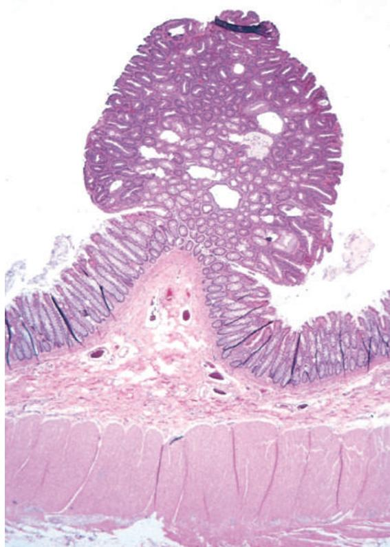 
Fig. 6.1 Colonic polyp. This glandular tumor is seen projecting into the colonic lumen. The polyp is attached to the mucosa by a distinct stalk.
to show little or no differentiation. Such tumors are referred to as poorly differentiated or undifferentiated carcinoma.
The transformed cells in a neoplasm, whether benign or malignant, usually resemble each other, consistent with their origin from a single transformed progenitor cell. In some unusual instances, however, the tumor cells undergo divergent differentiation, creating so-called "mixed tumors". Mixed tumors are still of monoclonal origin, but the progenitor cell in such tumors has the capacity to differentiate down more than one lineage. The best example is mixed tumor of salivary gland. These tumors have obvious epithelial components dispersed throughout a fibromyxoid stroma, sometimes harboring islands of cartilage or bone (Fig. 6.2). All of these diverse elements are thought to derive from a single transformed epithelial progenitor cell, and the preferred designation for these neoplasms is pleomorphic adenoma. Fibroadenoma of the female breast is another common mixed tumor. This benign tumor contains a mixture of proliferating ductal elements (adenoma) embedded in loose fibrous tissue (fibroma). Unlike pleomorphic adenoma, only the fibrous component is neoplastic, but the term fibroadenoma remains in common usage.
Teratoma is a special type of mixed tumor that contains recognizable mature or immature cells or tissues derived from more than one germ cell layer, and sometimes all three. Teratomas originate from totipotential germ cells such as those that normally reside in the ovary and testis
and that are sometimes abnormally present in midline embryonic rests. Germ cells have the capacity to differentiate into any of the cell types found in the adult body; not surprisingly, therefore, they may give rise to neoplasms that contain elements resembling bone, epithelium, muscle, fat, nerve, and other tissues, all thrown together in a helter-skelter fashion.
The specific names of the more common neoplasms are presented in Table 6.1. Some glaring inconsistencies may be noted. For example, the terms lymphoma, mesothelioma, melanoma, and seminoma are used for malignant neoplasms. Unfortunately for students, these exceptions are firmly entrenched in medical terminology.
There also are other instances of confusing terminology:
- Hamartoma is a mass of disorganized tissue indigenous to the particular site, such as the lung or the liver. While traditionally considered developmental malformations, many hamartomas have clonal chromosomal aberrations that are acquired through somatic mutations and on this basis are now considered to be neoplastic. 
- Choristoma is a congenital anomaly consisting of a heterotopic nest of cells. For example, a small nodule of well-developed and normally organized pancreatic tissue may be found in the submucosa of the stomach, duodenum, or small intestine. The designation -oma, connoting a neoplasm, imparts to these lesions an undeserved gravity, as they are usually of trivial significance.
Although the terminology of neoplasms is regrettably complex, an understanding of the nomenclature is important because it is the language by which a tumor's nature and significance is communicated among physicians in different disciplines involved in cancer care.
arepresentinthisfield.(CourtesyofDr.VickyJo,DepartmentofPathology,BrighamandWomen'sHospital,Boston,Massachusetts.).jpg) 
Fig. 6.2 Mixed tumor of the parotid gland. Small nests of epithelial cells and myxoid stroma forming cartilage and bone (an unusual feature) are present in this field. (Courtesy of Dr. Vicky Jo, Department of Pathology, Brigham and Women's Hospital, Boston, Massachusetts.)
Table 6.1 Nomenclature of Tumors 
Tissue of OriginBenignMalignantOne Parenchymal Cell TypeConnective tissue and derivativesFibromaFibrosarcomaLipomaLiposarcomaChondromaChondrosarcomaOsteomaOsteogenic sarcomaEndothelium and related cell typesBlood vesselsHemangiomaAngiosarcomaLymph vesselsLymphangiomaLymphangiosarcomaMesotheliumMesotheliomaBrain coveringsMeningiomaInvasive meningiomaBlood cells and related cell typesHematopoietic cellsLeukemiasLymphoid tissueLymphomasMuscleSmoothLeiomyomaLeiomyosarcomaStriatedRhabdomyomaRhabdomyosarcomaSkinStratified squamousSquamous cell papillomaSquamous cell or epidermoid carcinomaBasal cells of skin or adnexaBasal cell carcinomaTumors of melanocytesNevusMalignant melanomaEpithelial lining of glands or ductsAdenomaAdenocarcinomaPapillomaPapillary carcinomasCystadenomaCystadenocarcinomaLungBronchial adenomaBronchogenic carcinomaKidneyRenal tubular adenomaRenal cell carcinomaLiverLiver cell adenomaHepatocellular carcinomaBladderUrothelial papillomaUrothelial carcinomaPlacentaHydatidiform moleChoriocarcinomaTesticleSeminomaEmbryonal carcinomaMore Than One Neoplastic Cell Type—Mixed Tumors, Usually Derived From One Germ Cell LayerSalivary glandsPleomorphic adenoma (mixed tumor of salivary gland)Malignant mixed tumor of salivary glandRenal anlageWilms tumorMore Than One Neoplastic Cell Type Derived From More Than One Germ Cell Layer—TeratogenousTotipotential cells in gonads or in embryonic restsMature teratoma, dermoid cystImmature teratoma, teratocarcinoma
# CHARACTERISTICS OF BENIGN AND MALIGNANT NEOPLASMS
There are three fundamental features by which most benign and malignant tumors can be distinguished: differentiation and anaplasia, local invasion, and metastasis. In general, rapid growth also signifies malignancy, but many malignant tumors grow slowly and as a result growth rate is not a reliable discriminator between good and bad actors. Nothing is more important to the patient with a tumor than being told: "It is benign." Although some neoplasms defy easy characterization, in most instances the determination of benign versus malignant is made with remarkable accuracy using long-established clinical and anatomic criteria.
# Differentiation and Anaplasia
Differentiation refers to the extent to which neoplasms resemble their parenchymal cells of origin, both morphologically and functionally; lack of differentiation is called anaplasia. In general, benign neoplasms are composed of well-differentiated cells that closely resemble their normal counterparts. A lipoma is made up of mature fat cells laden with cytoplasmic lipid vacuoles, and a chondroma is made up of mature cartilage cells that synthesize their usual cartilaginous matrix—evidence of morphologic and functional differentiation. In well-differentiated benign tumors, mitoses are usually rare and are of normal configuration.
By contrast, while malignant neoplasms exhibit a wide range of parenchymal cell differentiation, most exhibit morphologic alterations that betray their malignant nature.
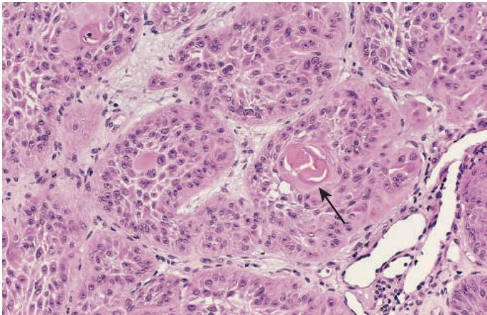 
Fig. 6.3 Well-differentiated squamous cell carcinoma of the skin. The tumor cells are strikingly similar to normal squamous epithelial cells, with intercellular bridges and nests of keratin (arrow). (Courtesy of DrTRACE Worrell, Department of Pathology, University of Texas Southwestern Medical School, Dallas, Texas.)
In well-differentiated cancers, these features may be quite subtle (Fig. 6.3). For example, well-differentiated adenocarcinoma of the thyroid gland may contain normal-appearing follicles, its malignant potential being only revealed by invasion into adjacent tissues or metastasis. The stroma carrying the blood supply is crucial to the growth of tumors but does not aid in the separation of benign from malignant ones. The amount of stromal connective tissue does, however, determine the consistency of a neoplasm. Certain cancers induce a dense, abundant fibrous stroma (desmoplasia), making them hard, so-called "scirrhotous tumors".
Tumors composed of undifferentiated cells are said to be anaplastic, a feature that is a reliable indicator of malignancy. The term anaplasia literally means "backward formation" -implying dedifferentiation, or loss of the structural and functional differentiation of normal cells. It is now known, however, that at least some cancers arise from stem cells in tissues; in these tumors, failure of differentiation of transformed stem cells, rather than dedifferentiation of specialized cells, accounts for their anaplastic appearance. Recent studies also indicate that in some cases, dedifferentiation of apparently mature cells occurs during carcinogenesis. Anaplastic cells often display the following morphologic features:
- Pleomorphism (i.e., variation in size and shape) (Fig. 6.4) 
- Nuclear abnormalities, consisting of extreme hyperchromatism (dark-staining), variation in nuclear size and shape, or unusually prominent single or multiple nucleoli. Enlargement of nuclei may result in an increased nuclear-to-cytoplasmic ratio that approaches 1:1 instead of the normal 1:4 or 1:6. Nucleoli may attain astounding sizes, sometimes approaching the diameter of normal lymphocytes. 
- Tumor giant cells may be formed. These are considerably larger than neighboring cells and may possess either one enormous nucleus or several nuclei. 
- Atypical mitoses, which may be numerous. Anarchic multiple spindles may produce tripolar or quadripolar mitotic figures (Fig. 6.5). 
- Loss of polarity, such that anaplastic cells lack recognizable patterns of orientation to one another. Such cells may grow in sheets, with total loss of communal
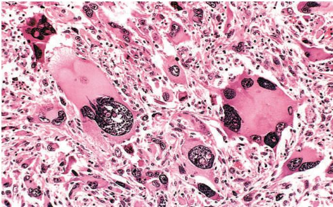 
Fig. 6.4 Pleomorphic malignant tumor (rhabdomyosarcoma). Note the marked variation in cell and nuclear sizes, the hyperchromatic nuclei, and the presence of tumor giant cells. (Courtesy of Dr. Trace Worrell, Department of Pathology, University of Texas Southwestern Medical School, Dallas, Texas.)
structures, such as glands or stratified squamous architecture.
Well-differentiated tumor cells are likely to retain the functional capabilities of their normal counterparts, whereas anaplastic tumor cells are much less likely to have specialized functional activities. For example, benign neoplasms and even well-differentiated cancers of endocrine glands frequently elaborate the hormones characteristic of their cell of origin. Similarly, well-differentiated squamous cell carcinomas produce keratin (see Fig. 6.3), just as well-differentiated hepatocellular carcinomas secrete bile. In other instances, unanticipated functions emerge. Some cancers may express fetal proteins not produced by comparable cells in the adult. Cancers of nonendocrine origin may produce so-called "ectopic hormones." For example, certain lung carcinomas may produce adrenocorticotropic hormone (ACTH), parathyroid hormone-like hormone, insulin, glucagon, and others. More is said about these so-called "paraneoplastic" phenomena later.
Also of relevance in the discussion of differentiation and anaplasia is dysplasia, referring to disorderly proliferation.
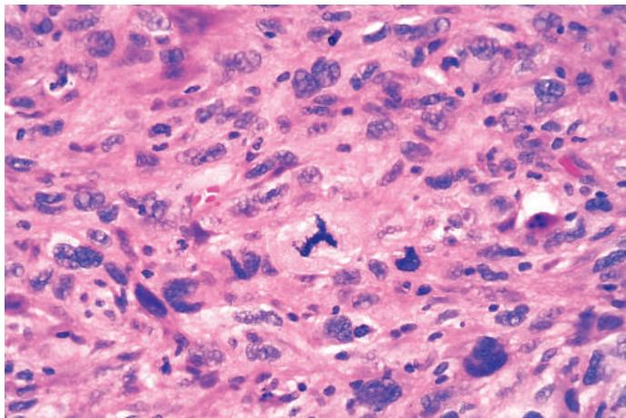 
Fig. 6.5 High-power detailed view of anaplastic tumor cells shows cellular and nuclear variation in size and shape. The prominent cell in the center field has an abnormal tripolar spindle.
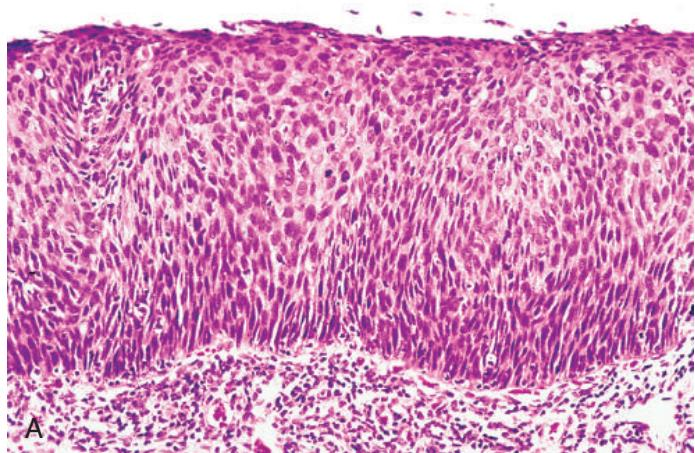 
Fig. 6.6 Carcinoma in situ. (A) Low-power view shows that the entire thickness of the epithelium is replaced by atypical dysplastic cells. There is no orderly differentiation of squamous cells. The basement membrane is intact, and there is no tumor in the subepithelial stroma. (B) High-power view of another region shows failure of normal differentiation, marked nuclear and cellular pleomorphism, and numerous mitotic figures extending toward the surface. The intact basement membrane (below) is not seen in this section.
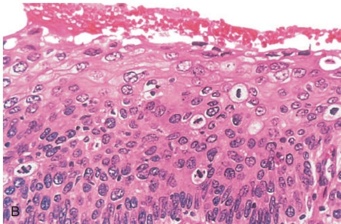
Dysplastic epithelium is recognized by a loss in the uniformity of individual cells and in their architectural orientation. Dysplastic cells exhibit considerable pleomorphism and often possess abnormally large, hyperchromatic nuclei. Mitotic figures are more abundant than usual and frequently appear in abnormal locations within the epithelium. In dysplastic stratified squamous epithelium, mitoses are not confined to the basal layers, where they normally occur, but may be seen throughout the epithelium. In addition, there is considerable architectural anarchy. For example, the usual progressive maturation of tall cells in the basal layer to flattened squames on the surface may be lost and replaced by a disordered hodgepodge of dark basal-appearing cells. When dysplastic changes are severe and involve the entire thickness of the epithelium, the lesion is referred to as carcinoma in situ, a preinvasive stage of cancer (Fig. 6.6).
It is important to appreciate that dysplasia is not synonymous with cancer. Mild to moderate dysplasias that do not involve the entire thickness of the epithelium sometimes regress completely, particularly if inciting causes are removed. However, dysplasia is often noted adjacent to frankly malignant neoplasms (e.g., in cigarette smokers with lung cancer), and in general the presence of dysplasia marks a tissue as being at increased risk for developing an invasive cancer.
# Local Invasion
The growth of cancers is accompanied by progressive infiltration, invasion, and destruction of surrounding tissues, whereas most benign tumors grow as cohesive expansile masses that remain localized to their sites of origin. Because benign tumors grow and expand slowly, they usually develop a rim of compressed fibrous tissue (Figs. 6.7 and 6.8). This capsule consists largely of extracellular matrix that is deposited by stromal cells such as fibroblasts, which are activated by hypoxic damage to parenchymal cells resulting from compression by the expanding tumor. Encapsulation creates a tissue plane that makes the tumor discrete, moveable (non-fixed), and
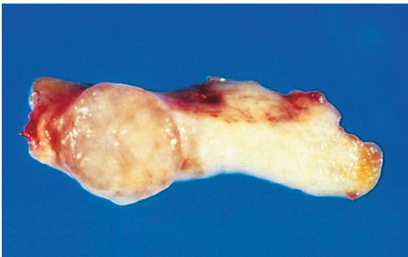 
Fig. 6.7 Fibroadenoma of the breast. The tan-colored, encapsulated small tumor is sharply demarcated from the whiter breast tissue.
sharplydelimitsthetumorfromthesurroundingtissue.(CourtesyofDrTRACEWorrell,DepartmentofPathology,UniversityofTexasSouthwesternMedicalSchool,Dallas,Texas.).jpg) 
Fig. 6.8 Microscopic view of fibroadenoma of the breast seen in Fig. 6.7. The fibrous capsule (right) sharply delimits the tumor from the surrounding tissue. (Courtesy of DrTRACE Worrell, Department of Pathology, University of Texas Southwestern Medical School, Dallas, Texas.)
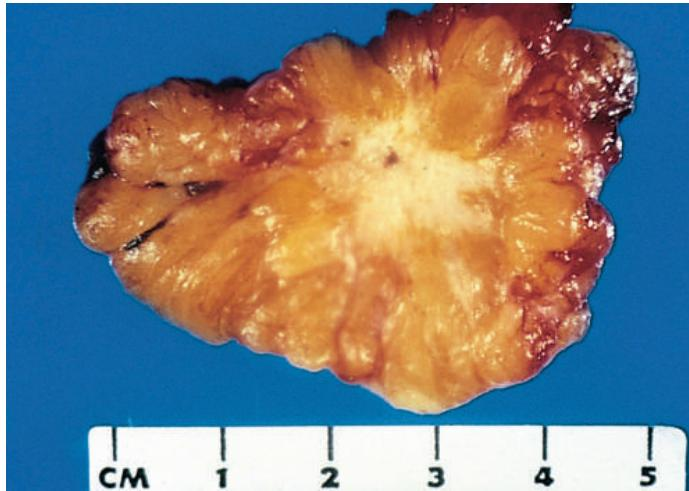 
Fig. 6.9 Cut section of invasive ductal carcinoma of the breast. The lesion is retracted, infiltrating the surrounding breast substance, and was stony-hard on palpation.
readily excisable by surgical enucleation. However, it is important to recognize that not all benign neoplasms are encapsulated. For example, the leiomyoma of the uterus is discretely demarcated from the surrounding smooth muscle by a zone of compressed and attenuated normal myometrium, but lacks a capsule. A few benign tumors are neither encapsulated nor discretely defined; lack of demarcation is particularly likely in benign vascular neoplasms such as hemangiomas, which understandably may be difficult to excise. These exceptions are pointed out only to emphasize that although encapsulation is the rule in benign tumors, the lack of a capsule does not mean that a tumor is malignant. Sadly, because of their uncivilized nature, tumor cells sometimes do not follow the rules set by humans. We will see such deviations many times in this chapter.
Next to the development of metastases, invasiveness is the feature that most reliably distinguishes cancers from benign tumors (Figs. 6.9 and 6.10). Cancers lack well-defined capsules. There are instances in which a slowly growing malignant tumor deceptively appears to be encased by the stroma of the surrounding host tissue, but microscopic examination reveals tiny crablike feet penetrating the margin and infiltrating adjacent structures. This infiltrative mode of growth makes it necessary to remove a wide margin of surrounding normal tissue when surgical excision of a malignant tumor is attempted. Surgical pathologists carefully examine the margins of resected tumors to ensure that they are devoid of cancer cells (clean margins).
# Metastasis
Metastasis is defined by the spread of a tumor to sites that are physically discontinuous with the primary tumor and unequivocally marks a tumor as malignant, as by definition benign neoplasms do not metastasize. The invasiveness of cancers permits them to penetrate into blood vessels, lymphatics, and body cavities, providing opportunities for spread (Fig. 6.11). Overall, approximately $30\%$ of patients with newly diagnosed solid tumors (excluding skin cancers other than melanomas) present with
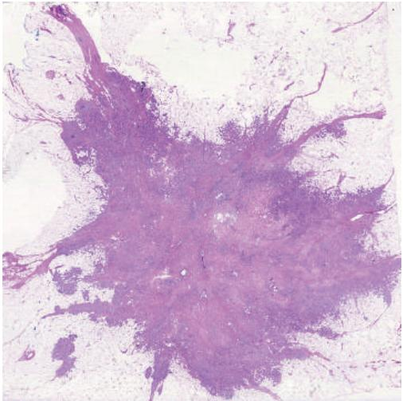 
Fig. 6.10 Microscopic view of breast carcinoma seen in Fig. 6.9 illustrates the invasion of breast stroma and fat by nests and cords of tumor cells (compare with Fig. 6.8). Note the absence of a well-defined capsule. (Courtesy of Dr. Susan Lester, Brigham and Women's Hospital, Boston, Massachusetts.)
clinically evident metastases. An additional $20\%$ have occult (hidden) metastases at the time of diagnosis.
In general, the more anaplastic and the larger the primary neoplasm, the more likely is metastatic spread, but as with most rules there are exceptions. Extremely small cancers have been known to metastasize; conversely, some large and ominous-looking lesions may not. While all malignant tumors can metastasize, some do so very infrequently. For example, basal cell carcinomas of the skin and most primary tumors of the central nervous system are highly locally invasive but rarely metastasize. It is evident then that the properties of local invasion and metastasis are sometimes separable.
A special circumstance involves so-called "blood cancers", the leukemias and lymphomas. These tumors are derived from blood-forming cells that normally have the capacity to enter the bloodstream and travel to distant sites; as a result, with only rare exceptions, leukemias and lymphomas are taken to be disseminated diseases at diagnosis and are always considered to be malignant.
Malignant neoplasms disseminate by one of three pathways: (1) seeding within body cavities, (2) lymphatic
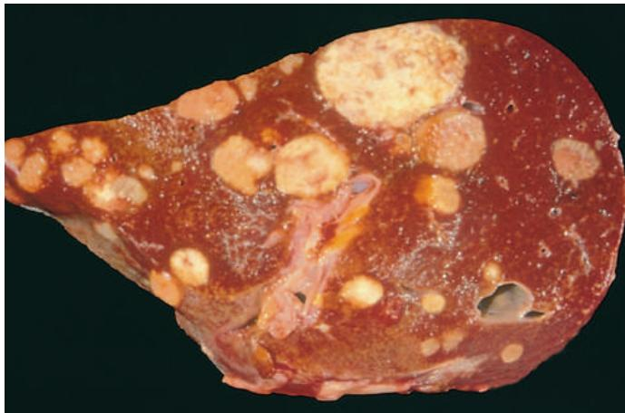 
Fig. 6.11 A liver studded with metastatic cancer.
spread, or (3) hematogenous spread. Spread by seeding occurs when neoplasms invade a natural body cavity. This mode of dissemination is particularly characteristic of cancers of the ovary, which often cover the peritoneal surfaces widely. The implants literally may glaze all peritoneal surfaces and yet not invade the underlying tissues. Here is an instance where the ability to reimplant and grow at sites distant from the primary tumor seems to be separable from the capacity to invade. Neoplasms of the central nervous system, such as a medulloblastoma or ependymoma, may penetrate the cerebral ventricles and be carried by the cerebrospinal fluid to reimplant on the meningeal surfaces, either within the brain or in the spinal cord.
Lymphatic spread is more typical of carcinomas, whereas hematogenous spread is favored by sarcomas. There are numerous interconnections, however, between the lymphatic and vascular systems, so all forms of cancer may disseminate through either or both systems. The pattern of lymph node involvement depends principally on the site of the primary neoplasm and the natural pathways of local lymphatic drainage. Lung carcinomas arising in the respiratory passages metastasize first to the regional bronchial lymph nodes and then to the tracheobronchial and hilar nodes. Carcinoma of the breast usually arises in the upper outer quadrant and first spreads to the axillary nodes. However, medial breast lesions may drain through the chest wall to the nodes along the internal mammary artery. Thereafter, in both instances, the supraclavicular and infraclavicular nodes may be seeded. In some cases, the cancer cells seem to travel in lymphatic channels within the immediately proximate nodes to be trapped in subsequent lymph nodes, producing so-called "skip metastases." The cells may traverse all of the lymph nodes ultimately to reach the vascular compartment by way of the thoracic duct.
A "sentinel lymph node" is the first regional lymph node that receives lymph flow from a primary tumor. It can be identified by injection of blue dyes or radiolabeled tracers near the primary tumor. Biopsy of sentinel lymph nodes allows determination of the extent of spread of tumor and can be used to plan treatment.
Of note, although enlargement of nodes near a primary neoplasm should arouse concern for metastatic spread, it does not always imply cancerous involvement. The necrotic products of the neoplasm and tumor antigens often evoke immunologic responses in the nodes, such as hyperplasia of the follicles (lymphadenitis) and proliferation of macrophages in the subcapsular sinuses (sinus histiocytosis). Thus, histopathologic verification of tumor within an enlarged lymph node is required.
While hematogenous spread is the favored pathway for sarcomas, carcinomas use it as well. As might be expected, arteries are penetrated less readily than are veins. With venous invasion, the bloodborne cells follow the venous flow draining the site of the neoplasm, with tumor cells often stopping in the first capillary bed they encounter. Since all portal area drainage flows to the liver, and all caval blood flows to the lungs, the liver and lungs are the most frequently involved secondary sites in hematogenous dissemination. Cancers arising near the vertebral column often embolize through the paravertebral plexus; this pathway probably is involved in the frequent vertebral metastases of carcinomas of the thyroid and prostate glands.
Certain carcinomas have a propensity to grow within veins. Renal cell carcinoma often invades the renal vein to grow in a snakelike fashion up the inferior vena cava, sometimes reaching the right side of the heart. Hepatocellular carcinomas often penetrate and grow within the radicles of portal and hepatic veins, eventually reaching the main venous channels. Remarkably, such intravenous growth may not be accompanied by widespread dissemination.
Many observations suggest that the anatomic localization of a neoplasm and its venous drainage cannot wholly explain the systemic distributions of metastases. For example, prostatic carcinoma preferentially spreads to bone, bronchogenic carcinoma tends to involve the adrenal glands and the brain, and neuroblastoma spreads to the liver and bones. Conversely, skeletal muscles, although rich in capillaries, are rarely sites of tumor metastases. The molecular basis of such tissue-specific homing of tumor cells is discussed later.
Thus, numerous features of tumors (Fig. 6.12) usually permit the differentiation of benign and malignant neoplasms.
# CHARACTERISTICS OF BENIGN AND MALIGNANT TUMORS
- Benign and malignant tumors can be distinguished from one another based on the degree of differentiation, rate of growth, local invasiveness, and distant spread. 
- Benign tumors resemble the tissue of origin and are well differentiated; malignant tumors are poorly or completely undifferentiated (anaplastic). 
- Benign tumors tend to be slow growing, whereas malignant tumors generally grow faster. 
- Benign tumors are well circumscribed and have a capsule; malignant tumors are poorly circumscribed and invade the surrounding normal tissues. 
- Benign tumors remain localized to the site of origin, whereas malignant tumors are locally invasive and metastasize to distant sites.
# EPIDEMIOLOGY
Study of cancer occurrence in populations has contributed substantially to knowledge about its origins. The now well-established concept that cigarette smoking is causally associated with lung cancer arose primarily from epidemiologic studies. A comparison of the incidence rates for colon cancer and dietary patterns in the Western world and in Africa led to the recognition that dietary fat and fiber content may figure importantly in the causation of this cancer. Major insights into the causes of cancer can be obtained by epidemiologic studies that relate particular environmental, racial (possibly hereditary), and cultural influences to the occurrence of specific neoplasms. Certain diseases associated with an increased risk for developing cancer also provide clues to the pathogenesis of cancer. The following discussion first summarizes the overall incidence of cancer to provide insight into the magnitude of the cancer problem and then reviews factors relating to the
andamalignanttumorofsimilarorigin(leiomyosarcoma)..jpg) 
Fig. 6.12 Comparison between a benign tumor of the myometrium (leiomyoma) and a malignant tumor of similar origin (leiomyosarcoma).
patient and the environment that influence the predisposition to cancer.
# Cancer Incidence
For the year 2012, the World Health Organization (WHO) estimated that there were about 14.1 million new cancer cases worldwide, leading to 8.2 million deaths (approximately 22,500 deaths per day). Moreover, due to increasing population size, by the year 2035 the WHO projects that the numbers of cancer cases and deaths worldwide will increase to 24 million and 14.6 million, respectively (based on current mortality rates). Additional perspective on the likelihood of developing a specific form of cancer can be gained from national incidence and mortality data. In the United States, it is estimated that the year 2016 will be marked by approximately 1.69 million new cases of cancer and 595,000 cancer deaths. Incidence data for the most common forms of cancer, with the major killers identified, are presented in Fig. 6.13.
Over several decades, the death rates for many forms of cancer have changed. Since 1995, the incidence of cancer in men and women in the United States has been roughly stable, but the cancer death rate has decreased by roughly $20\%$ in men and $10\%$ in women. Among men, $80\%$ of the decrease is accounted for by lower death rates for cancers of the lung, prostate, and colon; among women, nearly $60\%$ of the decrease is due to reductions in death rates from breast and colorectal cancers. Decreased use of tobacco products is responsible for the reduction in lung cancer deaths, while improved detection and treatment are responsible for the decrease in death rates for colorectal, female breast, and prostate cancers.
The last half-century has also seen a sharp decline in death rates from cervical cancer and gastric cancer in the United States. The decrease in cervical cancer is directly attributable to widespread use of the Papanicolaou (PAP) smear test for early detection of this tumor and its precursor lesions. The deployment of the human papillomavirus (HPV) vaccine may nearly eliminate this cancer in coming years. The cause of the decline in death rates for cancers of the stomach is obscure; it may be related to decreasing exposure to unknown dietary carcinogens.
Environmental exposures appear to be the dominant risk factors for many common cancers, suggesting that a high fraction of cancers are potentially preventable. This notion is supported by the geographic variation in death rates from specific forms of cancer, which is thought to stem mainly from differences in environmental exposures. For instance, death rates from breast cancer are about four to five times higher in the United States and Europe than in Japan. Conversely, the death rate for stomach carcinoma in men and women is about seven times higher in Japan than in the United States. Liver cell carcinoma is relatively infrequent in the United States but is the most lethal cancer among many African populations. Nearly all the evidence indicates that these geographic differences have environmental rather than genetic origins. For example, Nisei (second-generation Japanese living in the United States) have mortality rates for certain forms of cancer that are intermediate between those in natives of Japan and in Americans who have lived in the United States for many generations. The two rates come closer with each passing generation.
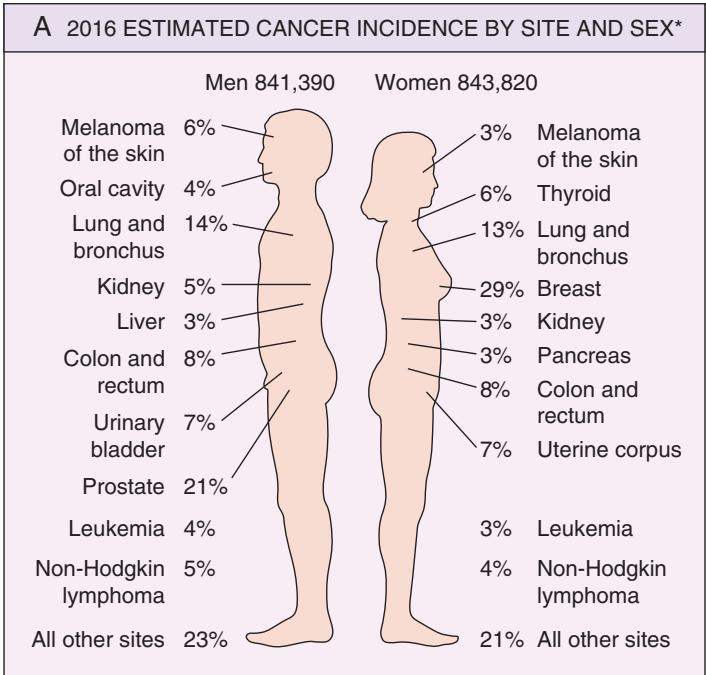 
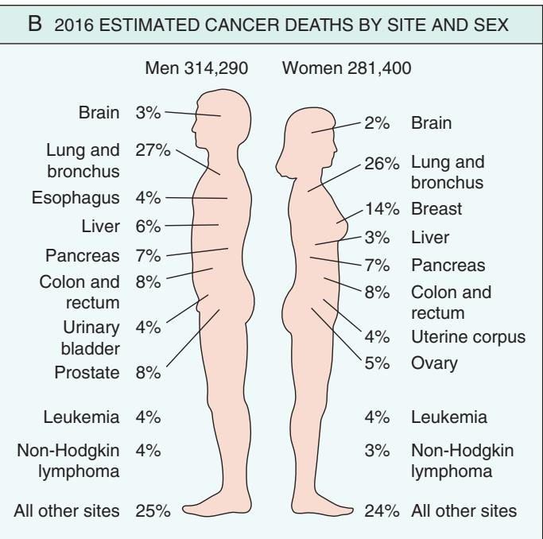
There is no paucity of environmental factors that contribute to cancer. They lurk in the ambient environment, in the workplace, in food, and in personal practices. They can be as universal as sunlight or be largely restricted to urban settings (e.g., asbestos) or particular occupations (Table 6.2). The most important environmental exposures linked to cancer include the following:
- Diet. Certain features of diet have been implicated as predisposing influences. More broadly, obesity, currently epidemic in the United States, is associated
with a modestly increased risk for developing many different cancers.
Smoking. Smoking, particularly of cigarettes, has been implicated in cancer of the mouth, pharynx, larynx, esophagus, pancreas, bladder, and, most significantly, the lung, as $90\%$ of lung cancer deaths are related to smoking. 
- Alcohol consumption. Alcohol abuse is an independent risk factor for cancers of the oropharynx, larynx, esophagus, and (due to alcoholic cirrhosis) liver. Moreover,
Table 6.2 Occupational Cancers 
Agents or Groups of AgentsHuman Cancers for Which Reasonable Evidence Is AvailableTypical Use or OccurrenceArsenic and arsenic compoundsLung carcinoma, skin carcinomaBy-product of metal smelting; component of alloys, electrical and semiconductor devices, medications and herbicides, fungicides, and animal dipsAsbestosLung, esophageal, gastric, and colon carcinoma; mesotheliomaFormerly used for many applications because of fire, heat, and friction resistance; still found in existing construction as well as fire-resistant textiles, friction materials (i.e., brake linings), underlayment and roofing papers, and floor tilesBenzeneAcute myeloid leukemiaPrincipal component of light oil; despite known risk, many applications exist in printing and lithography, paint, rubber, dry cleaning, adhesives and coatings, and detergents; formerly widely used as solvent and fumigantBeryllium and beryllium compoundsLung carcinomaMissile fuel and space vehicles; hardener for lightweight metal alloys, particularly in aerospace applications and nuclear reactorsCadmium and cadmium compoundsProstate carcinomaUses include yellow pigments and phosphors; found in solders; used in batteries and as alloy and in metal platings and coatingsChromium compoundsLung carcinomaComponent of metal alloys, paints, pigments, and preservativesNickel compoundsLung and oropharyngeal carcinomaNickel plating; component of ferrous alloys, ceramics, and batteries; by-product of stainless-steel arc weldingRadon and its decay productsLung carcinomaFrom decay of minerals containing uranium; potentially serious hazard in quarries and underground minesVinyl chlorideHepatic angiosarcomaRefrigerant; monomer for vinyl polymers; adhesive for plastics; formerly inert aerosol propellant in pressurized containers
Modified from Stellman JM, Stellman SD: Cancer and the workplace, CA Cancer J Clin 46:70-92, 1996, with permission from Lippincott Williams & Wilkins.
alcohol and tobacco smoking synergistically increase the risk for developing cancers of the upper airways and upper digestive tract.
- Reproductive history. There is strong evidence that lifelong cumulative exposure to estrogen stimulation, particularly if unopposed by progesterone, increases the risk for developing cancers of the endometrium and breast, both of which are estrogen-responsive tissues. 
- Infectious agents. It is estimated that infectious agents cause approximately $15\%$ of cancers worldwide.
Thus, there is no escape: it seems that everything people do to earn a livelihood, to subsist, or to enjoy life turns out to be illegal, immoral, or fattening, or - most disturbing - possibly carcinogenic!
# Age and Cancer
In general, the frequency of cancer increases with age. Most cancer deaths occur between 55 and 75 years of age; the rate declines, along with the population base, after 75 years of age. The rising incidence with age may be explained by the accumulation of somatic mutations that drive the emergence of malignant neoplasms (discussed later). The decline in immune competence that accompanies aging also may be a factor.
Although cancer preferentially affects older adults, it also is responsible for slightly more than $10\%$ of all deaths among children younger than 15 years of age (Chapter 7). The major lethal cancers in children are leukemias, tumors of the central nervous system, lymphomas, and soft-tissue and bone sarcomas. As discussed later, study of several childhood tumors, such as retinoblastoma, has provided fundamental insights into the pathogenesis of malignant transformation.
# Acquired Predisposing Conditions
Acquired conditions that predispose to cancer include disorders associated with chronic inflammation, immunodeficiency states, and precursor lesions. Many chronic inflammatory conditions create a fertile "soil" for the development of malignant tumors (Table 6.3). Tumors arising in the context of chronic inflammation are mostly carcinomas, but also include mesothelioma and several kinds of lymphoma. By contrast, immunodeficiency states mainly predispose to virus-induced cancers, including specific types of lymphoma and carcinoma and some sarcoma-like proliferations.
Precursor lesions are localized disturbances of epithelial differentiation that are associated with an elevated risk for developing carcinoma. They may arise secondary to chronic inflammation or hormonal disturbances (in endocrine-sensitive tissues), or may occur spontaneously. Molecular analyses have shown that precursor lesions often possess some of the genetic lesions found in their associated cancers (discussed later). However, progression to cancer is not inevitable, and it is important to recognize precursor lesions because their removal or reversal lowers cancer risk.
Many different precursor lesions have been described; among the most common are the following:
Table 6.3 Chronic Inflammatory States and Cancer 
Pathologic ConditionAssociated Neoplasm(s)Etiologic AgentAsbestosis, silicosisMesothelioma, lung carcinomaAsbestos fibers, silica particlesInflammatory bowel diseaseColorectal carcinomaLichen sclerosisVulvar squamous cell carcinomaPancreatitisPancreatic carcinomaAlcoholism, germ line mutations (e.g., in the trypsinogen gene)Chronic cholecystitisGallbladder cancerBile acids, bacteria, gallbladder stonesReflux esophagitis, Barrett esophagusEsophageal carcinomaGastric acidSjögren syndrome, Hashimoto thyroiditisMALT lymphomaOpisthorchis, cholangitisCholangiocarcinoma, colon carcinomaLiver flukes (Opisthorchis viverrini)Gastritis/ulcersGastric adenocarcinoma, MALT lymphomaHelicobacter pyloriHepatitisHepatocellular carcinomaHepatitis B and/or C virusOsteomyelitisCarcinoma in draining sinusesBacterial infectionChronic cervicitisCervical carcinomaHuman papillomavirusChronic cystitisBladder carcinomaSchistosomiasis
Adapted from Tlsty TD, Coussens LM: Tumor stroma and regulation of cancer development, Ann Rev Pathol Mech Dis I:119, 2006.
- Squamous metaplasia and dysplasia of bronchial mucosa, seen in in habitual smokers—a risk factor for lung carcinoma (Chapter 13) 
- Endometrial hyperplasia and dysplasia, seen in women with unopposed estrogenic stimulation—a risk factor for endometrial carcinoma (Chapter 19) 
- Leukoplakia of the oral cavity, vulva, and penis, which may progress to squamous cell carcinoma (Chapters 15, 18, and 19) 
- Villous adenoma of the colon, associated with a high risk for progression to colorectal carcinoma (Chapter 15)
In this context it also may be asked, "What is the risk for malignant change in a benign neoplasm?"—or, stated differently, "Are benign tumors precancers?" In general the answer is no, but inevitably there are exceptions, and perhaps it is better to say that each type of benign tumor is associated with a particular level of risk, ranging from high to virtually nonexistent. As cited earlier, adenomas of the colon as they enlarge can undergo malignant transformation in up to $50\%$ of cases; by contrast, malignant change is extremely rare in leiomyomas of the uterus.
# Interactions Between Environmental and Genetic Factors
Cancer behaves like an inherited trait in some families, usually due to germ line mutations that affect the function of a gene that suppresses cancer (a so-called "tumor suppressor gene," discussed later). What then can be said about the influence of heredity on sporadic malignant neoplasms, which constitute roughly $95\%$ of the cancers in the United States?
While the evidence suggests that sporadic cancers can largely be attributed to environmental factors or acquired predisposing conditions, lack of family history does not preclude an inherited component. It may in fact be difficult to tease out hereditary and genetic contributions because these factors often interact. Such interactions may be particularly complex when tumor development is affected by small contributions from multiple genes. Furthermore, genetic factors may alter the risk for developing environmentally induced cancers. Instances where this holds true often involve inherited variation in enzymes such as components of the cytochrome P-450 system that metabolize procarcinogens to active carcinogens. Conversely, environmental factors can influence the risk for developing cancer, even in individuals who inherit well-defined "cancer genes." For instance, breast cancer risk in females who inherit mutated copies of the BRCA1 or BRCA2 tumor suppressor genes (discussed later) is almost three-fold higher for women born after 1940 than for women born before that year, perhaps because of changes in reproductive behavior or increases in obesity in more recent times.
# EPIDEMIOLOGY OF CANCER
- The incidence of cancer varies with age, geographic factors, and genetic background. The geographic variation in cancer incidence results mostly from different environmental exposures. Cancer can occur at any age, but is most common in older adults. 
- Environmental factors implicated in carcinogenesis include infectious agents, smoking, alcohol, diet, obesity, reproductive history, and exposure to carcinogens. 
- Cancer risk rises in certain tissues in the setting of increased cellular proliferation caused by chronic inflammation or hormonal stimulation. 
- Epithelial cell linings may develop morphologic changes that signify an increased risk for developing cancer; such lesions are referred to as precursor lesions. 
- The risk for developing cancer is modified by interactions between environmental exposures and genetic variants.
# CANCER GENES
It could be argued that the proliferation of literature on the molecular basis of cancer has outpaced the growth of even the most malignant of tumors. Researchers and students alike can easily get lost in the growing forest of information. But it has become eminently clear that cancer is a
disease caused by mutations that alter the function of of a finite subset of the 20,000 or so human genes. For simplicity, we will refer to these genes as cancer genes. Cancer genes can be defined as genes that are recurrently affected by genetic aberrations in cancers, presumably because they contribute directly to the malignant behavior of cancer cells. Causative mutations that give rise to cancer genes may be acquired by the action of environmental agents, such as chemicals, radiation, or viruses, may occur spontaneously, or may be inherited in the germ line. If such mutations drive carcinogenesis, a key prediction is that each cell in an individual tumor should share mutations that were present in the founding cell at the time of transformation. This expectation has been realized in all tumors that have been systematically analyzed by genomic sequencing, providing strong support for the hypothesis that cancer is at its root a genetic disease.
Cancer genes number in the hundreds and new ones are still being discovered. Not only are these genes numerous, but many have unpronounceable acronyms for names that are difficult to remember, even for the aficionado. One way to try to simplify this complexity is to consider that cancer genes fall into one of four major functional classes:
- Oncogenes are genes that induce a transformed phenotype when expressed in cells by promoting increased cell growth. A major discovery in cancer was the realization that oncogenes are mutated or overexpressed versions of normal cellular genes, which are called proto-oncogenes. Most oncogenes encode transcription factors, factors that participate in pro-growth signaling pathways, or factors that enhance cell survival. They are considered dominant genes because a mutation involving a single allele is sufficient to produce a pro-oncogenic effect. 
- Tumor suppressor genes are genes that normally prevent uncontrolled growth and, when mutated or lost from a cell, allow the transformed phenotype to develop. Often both normal alleles of tumor suppressor genes must be damaged for transformation to occur. Tumor suppressor genes can be placed into two general groups, "governors" that act as important brakes on cellular proliferation, and "guardians" that are responsible for sensing genomic damage. Some guardian genes initiate and choreograph a complex "damage control response" that leads to the cessation of proliferation or, if the damage is too great to be repaired, or induce apoptosis. 
- Genes that regulate apoptosis primarily act by enhancing cell survival, rather than stimulating proliferation per se. Understandably, genes of this class that protect against apoptosis are often overexpressed in cancer cells, whereas those that promote apoptosis tend to be under-expressed or functionally inactivated by mutations. 
- To this list may now be added genes that regulate interactions between tumor cells and host cells, as these genes are also recurrently mutated or functionally altered in certain cancers. Particularly important are genes that enhance or inhibit recognition of tumors cells by the host immune system.
In most instances, the mutations that give rise to cancer genes are acquired during life and are confined to the cancer cells. However, causative mutations sometimes are inherited in the germ line and are therefore present in
Table 6.4 Inherited Predisposition to Cancer 
Inherited PredispositionGene(s)Autosomal Dominant Cancer SyndromesRetinoblastomaRBLi-Fraumeni syndrome (various tumors)TP53MelanomaCDKN2AFamilial adenomatous polyposis/colon cancerAPCNeurofibromatosis 1 and 2NF1, NF2Breast and ovarian tumorsBRCA1, BRCA2Multiple endocrine neoplasia 1 and 2MEN1, RETHereditary nonpolyposis colon cancerMSH2, MLH1, MSH6Nevoid basal cell carcinoma syndromePTCH1Autosomal Recessive Syndromes of Defective DNA RepairXeroderma pigmentosumDiverse genes involved in nucleotide excision repairAtaxia-telangiectasiaATMBloom syndromeBLMFanconi anemiaDiverse genes involved in repair of DNA cross-links
every cell in the body, placing the affected individual at high risk for developing cancer. Understandably, in families in which these germ line mutations are passed from generation to generation, cancer behaves like an inherited trait (Table 6.4). We will touch on important familial cancer syndromes and associated genes and cancers later in this chapter.
Presented next is a discussion of the varied genetic lesions that underlie altered cancer gene expression and function.
# GENETIC LESIONS IN CANCER
The genetic changes found in cancers vary from point mutations involving single nucleotides to abnormalities large enough to produce gross changes in chromosome structure. In certain neoplasms, genetic abnormalities are nonrandom and highly characteristic. Specific chromosomal abnormalities have been identified in most leukemias and lymphomas and in an increasing number of nonhematopoietic tumors, while other tumors are characterized by particular point mutations. It is believed that all recurrent genetic changes alter the activity of one or more cancer genes in a fashion that gives the affected cells a selective advantage, presumably by contributing to one or more of the hallmarks of cancer.
# Driver and Passenger Mutations
In the following sections, we briefly review the types of mutations that are commonly found in cancers. Before doing so, however, we must first touch on the important concept of driver mutations and passenger mutations. Driver mutations are mutations that alter the function of
cancer genes and thereby directly contribute to the development or progression of a given cancer. They are usually acquired, but as mentioned earlier, occasionally inherited. By contrast, passenger mutations are acquired mutations that are neutral in terms of fitness and do not affect cellular behavior; they just come along for the proverbial ride. Because they occur at random, passenger mutations are sprinkled throughout the genome, whereas driver mutations tend to be tightly clustered within cancer genes. It is now appreciated that particularly in cancers caused by carcinogen exposure, such as melanoma and smoking-related lung cancer, passenger mutations greatly outnumber driver mutations.
Despite their apparently innocuous nature, passenger mutations have nevertheless proven to be important in several ways:
- In carcinogen-associated cancers, mutational analysis has provided definitive evidence that most genomic damage is directly caused by the carcinogen in question. For example, before sequencing of melanoma genomes, the causative role of sun exposure in this cancer was debated. This is no longer so, as most melanomas have thousands of mutations of a type that is specifically linked to damage caused by ultraviolet light. 
- A second, more nefarious effect of passenger mutations is that they create genetic variants that, while initially neutral, may provide tumor cells with a selective advantage in the setting of therapy. The evidence for this comes from DNA sequence analyses of tumors at the time of recurrence after drug therapy; in many instances, mutations that lead directly to drug resistance are found in most tumor cells. Generally, the same resistance mutations can also be found before therapy, but only in a very small fraction of cells. In such instances, it appears that the selective pressure of therapy "converts" a neutral passenger mutation into a driver mutation, to the benefit of the tumor and the detriment of the patient.
# Point Mutations
Point mutations can either activate or inactivate the protein products of the affected genes depending on their precise position and consequence. Point mutations that convert proto-oncogenes into oncogenes generally produce a gain-of-function by altering amino acid residues in a domain that normally holds the protein's activity in check. A cardinal example is point mutations that convert the RAS gene into a cancer gene, one of the most comment events in human cancers. By contrast, point mutations (as well as larger aberrations, such as insertions and deletions) in tumor suppressor genes reduce or disable the function of the encoded protein. The tumor suppressor gene that is most commonly affected by point mutations in cancer is TP53, a prototypical "guardian" type tumor suppressor gene (discussed later).
# Gene Rearrangements
Gene rearrangements may be produced by chromosomal translocations or inversions. Specific chromosomal translocations and inversions are highly associated with certain malignancies, particularly neoplasms derived from hematopoietic cells and other kinds of mesenchymal cells.
These rearrangements can activate proto-oncogenes in two ways:
- Some gene rearrangements result in overexpression of proto-oncogenes by removing them from their normal regulatory elements and placing them under control of an inappropriate, highly active promoter or enhancer. Two different kinds of B cell lymphoma provide illustrative examples of this mechanism. In more than $90\%$ of cases of Burkitt lymphoma, the cells have a translocation, usually between chromosomes 8 and 14, that leads to overexpression of the MYC gene on chromosome 8 by juxtaposition with immunoglobulin heavy chain gene regulatory elements on chromosome 14 (Fig. 6.14). In follicular lymphoma, a reciprocal translocation between chromosomes 14 and 18 leads to overexpression of the anti-apoptotic gene, BCL2, on chromosome 18, also driven by immunoglobulin gene regulatory elements. 
- Other oncogenic gene rearrangements create fusion genes encoding novel chimeric proteins. Most notable
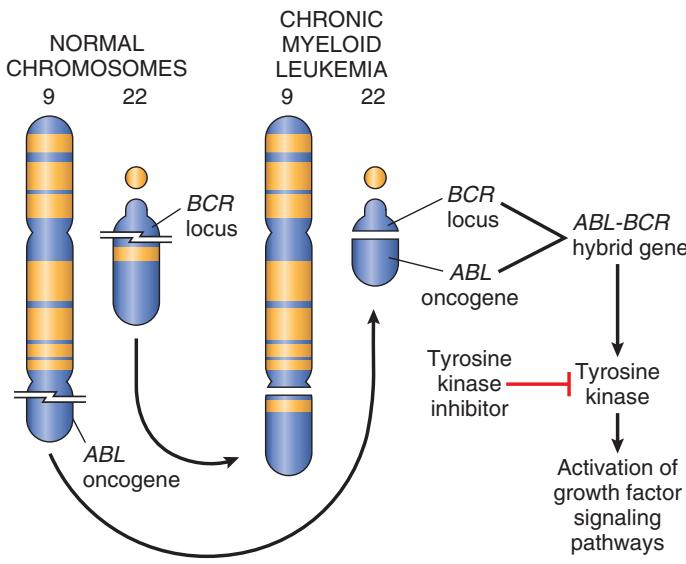
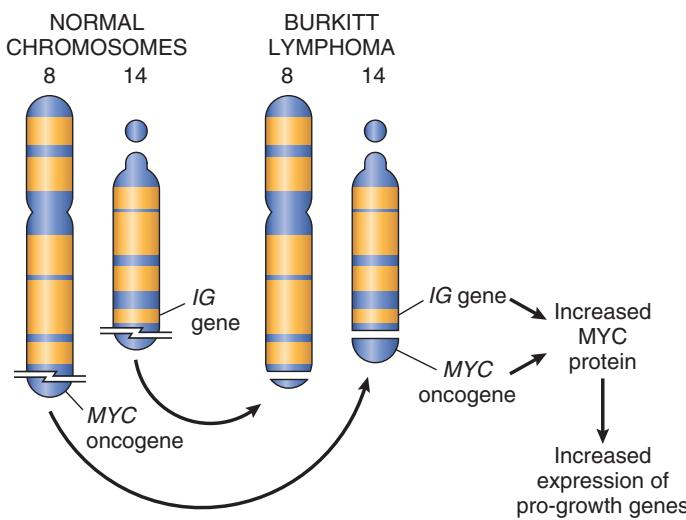 
Fig. 6.14 The chromosomal translocations and associated oncogenes in chronic myelogenous leukemia and Burkitt lymphoma.
is the Philadelphia (Ph) chromosome in chronic myeloid leukemia, consisting of a balanced reciprocal translocation between chromosomes 9 and 22 (see Fig. 6.14). As a consequence, the derivative chromosome 22 (the Philadelphia chromosome) appears smaller than normal. This cytogenetic change is seen in more than $90\%$ of cases of chronic myeloid leukemia and results in the fusion of portions of the BCR gene on chromosome 22 and the ABL gene on chromosome 9. The few Philadelphia chromosome-negative cases harbor a cryptic (cytogenetically silent) BCR-ABL fusion gene, the presence of which is the sine qua non of chronic myeloid leukemia. As discussed later, the BCR-ABL fusion gene encodes a novel tyrosine kinase with potent transforming activity.
Lymphoid tumors are most commonly associated with recurrent gene rearrangements. This relationship exists because normal lymphocytes express special enzymes that purposefully introduce DNA breaks during the processes of immunoglobulin or T cell receptor gene recombination. Repair of these DNA breaks is error-prone, and the resulting mistakes sometimes result in gene rearrangements that activate proto-oncogenes. Two other types of mesenchymal tumors, myeloid neoplasms (acute myeloid leukemias and myeloproliferative disorders) and sarcomas, also frequently possess gene rearrangements. Unlike lymphoid neoplasms, the cause of the DNA breaks that lead to gene rearrangements in myeloid neoplasms and sarcomas is unknown. In general, the rearrangements that are seen in myeloid neoplasms and sarcomas create fusion genes that encode either hyperactive tyrosine kinases (akin to BCR-ABL) or novel oncogenic transcription factors. A well-characterized example of the latter is the (11;22)(q24;q12) translocation in Ewing sarcoma. This rearrangement creates a fusion gene encoding a chimeric oncoprotein composed of portions of two different transcription factors called EWS and FLI1.
Identification of pathogenic gene rearrangements in carcinomas has lagged because karyotypically evident translocations and inversions (which point to the location of important oncogenes) are rare in carcinomas. However, advances in DNA sequencing have revealed recurrent cryptic pathogenic gene rearrangements in carcinomas as well. As with hematologic malignancies and sarcomas, gene rearrangements in solid tumors can contribute to carcinogenesis either by increasing expression of an oncogene or by generation of a novel fusion gene. Examples will be discussed along with specific cancers in other chapters. As with a fusion gene such as BCR-ABL, some of the fusion genes in solid tumors also provide drug targets (e.g., EML-ALK in lung cancer; Chapter 13).
# Deletions
Deletions are another prevalent abnormality in tumor cells. Deletion of specific regions of chromosomes may result in the loss of particular tumor suppressor genes. Tumor suppressors generally require inactivation of both alleles in order for them to contribute to carcinogenesis. A common mechanism for this is an inactivating point mutation in one allele, followed by deletion of the other, nonmutated allele. As discussed later, deletions involving
13q14, the site of the RB gene, are associated with retinoblastoma, and deletion of 17p is associated with loss of TP53, arguably the most important tumor suppressor gene.
# Gene Amplifications
Proto-oncogenes may be converted to oncogenes by gene amplification, with consequent overexpression and hyperactivity of otherwise normal proteins. Such amplification may produce several hundred copies of the gene, a change in copy number that can be readily detected by molecular hybridization with appropriate DNA probes. In some cases, the amplified genes produce chromosomal changes that can be identified microscopically. Two mutually exclusive patterns are seen: multiple small, extrachromosomal structures called double minutes; and homogeneously staining regions. The latter derive from the insertion of the amplified genes into new chromosomal locations, which may be distant from the normal location of the involved genes; because regions containing amplified genes lack a normal banding pattern, they appear homogeneous in a G-banded karyotype. Two clinically important examples of amplification involve the NMYC gene in neuroblastoma and the HER2 gene in breast cancers. NMYC is amplified in $25\%$ to $30\%$ of neuroblastomas, and the amplification is associated with poor prognosis (Fig. 6.15). HER2 (also known as ERBB2) amplification occurs in about $20\%$ of breast cancers, and antibody therapy directed against the receptor encoded by the HER2 gene has proved effective in this subset of tumors.
# Aneuploidy
Aneuploidy is defined as a number of chromosomes that is not a multiple of the haploid state; for humans, that is a chromosome number that is not a multiple of 23. Aneuploidy is remarkably common in cancers, particularly carcinomas, and was proposed as a cause of carcinogenesis over 100 years ago. Aneuploidy frequently results from errors of the mitotic checkpoint, the major cell cycle control mechanism that acts to prevent mistakes in chromosome segregation. The mitotic checkpoint prevents aneuploidy by inhibiting the irreversible transition to anaphase until all of the replicated chromosomes have made productive attachments to spindle microtubules. Complete absence of the mitotic checkpoint leads to rapid cell death as a consequence of abnormal chromosome segregation.
Mechanistic data establishing aneuploidy as a cause of carcinogenesis, rather than a consequence, have been difficult to generate. However, statistical approaches made possible by detailed analysis of cancer cells suggest (as might be expected) that aneuploidy tends to increase the copy number of key oncogenes and decrease the copy number of potent tumor suppressors. For example, chromosome 8, which almost never is lost and often is present in increased copies in tumor cells, is where the MYC oncogene is located. By contrast, portions of chromosome 17, where the TP53 gene is located, are often lost and are infrequently gained. Thus, tumor development and progression may be molded by changes in chromosome numbers that enhance the dosage of oncogenes while restricting the activity of tumor suppressor genes.
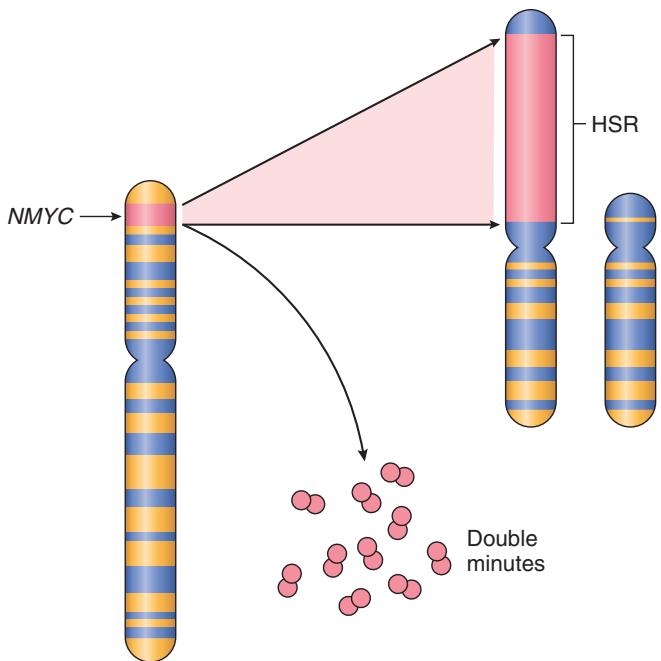 
Fig. 6.15 Amplification of the NMYC gene in human neuroblastoma. The NMYC gene, present normally on chromosome 2p, becomes amplified and is seen either as extrachromosomal double minutes or as a chromosomally integrated homogeneous-staining region (HSR). The integration involves other autosomes, such as 4, 9, or 13. (Modified from Brodeur GM, Seeger RC, Sather H, et al: Clinical implications of oncogene activation in human neuroblastomas. Cancer 58:541, 1986. Reprinted by permission of Wiley-Liss, Inc, a subsidiary of John Wiley & Sons, Inc.)
# MicroRNAs and Cancer
As discussed in Chapter 1, microRNAs (miRNAs) are noncoding, single-stranded RNAs, approximately 22 nucleotides in length, that function as negative regulators of genes. They inhibit gene expression posttranscriptionally by repressing translation or, in some cases, by messenger RNA (mRNA) cleavage. In view of their important functions in control of cell growth, differentiation, and survival, it is not surprising that accumulating evidence indicates that miRNAs also can contribute to carcinogenesis. Specifically, if the target of a miRNA is a tumor suppressor gene, then overactivity of the miRNA can reduce the tumor suppressor protein. Such miRNAs are sometimes referred to as oncomIRs. Conversely, if an miRNA inhibits the translation of an oncogene, a reduction in the quantity or function of that miRNA will lead to overproduction of the oncogene product. Such relationships have already been established by miRNA profiling of several human tumors. For example, downregulation or deletion of certain miRNAs in some leukemias and lymphomas results in increased expression of BCL2, an anti-apoptotic gene. Thus, by negatively regulating BCL2, such miRNAs behave as tumor suppressor genes. Dysregulation of other miRNAs that control the expression of the RAS and MYC oncogenes also has been detected in lung tumors and in certain B-cell leukemias, respectively.
# Epigenetic Modifications and Cancer
You will recall from Chapter 1 that epigenetics refers to reversible, heritable changes in gene expression that occur without mutation. Such changes involve posttranslational
modifications of histones and DNA methylation, both of which affect gene expression. In normal, differentiated cells, the major portion of the genome is not expressed. These regions of the genome are silenced by DNA methylation and histone modifications. On the other hand, cancer cells are characterized by a global DNA hypomethylation and selective promoter-localized hypermethylation. Indeed, it has become evident during the past several years that tumor suppressor genes are sometimes silenced by hypermethylation of promoter sequences, rather than by mutation. In addition, genome-wide hypomethylation has been shown to cause chromosomal instability and can induce tumors in mice. Thus, epigenetic changes may influence carcinogenesis in many ways. As an added wrinkle, deep sequencing of cancer genomes has identified mutations in genes that regulate epigenetic modifications in many cancers. Thus, certain genetic changes in cancers may be selected because they lead to alterations of the "epigenome" that favor cancer growth and survival.
The epigenetic state of particular cell types—a feature described as the epigenetic context—also dictates their response to signals that control growth and differentiation. As mentioned earlier, epigenetic modifications regulate gene expression, allowing cells with the same genetic makeup (e.g., a neuron and a keratinocyte) to have completely different appearances and functions. In some instances, the epigenetic state of a cell dramatically affects its response to otherwise identical signals. For example, the NOTCH1 gene has an oncogenic role in T-cell leukemia, yet acts as a tumor suppressor in squamous cell carcinomas. As would be expected, this dichotomy exists because activated NOTCH1 turns on pro-growth genes in T-cell progenitors and tumor suppressor genes in keratinocytes.
# GENETIC LESIONS IN CANCER
- Mutations in cancer cells fall into two major classes, driver (pathogenic) mutations and passenger (neutral) mutations. 
- Passenger mutations may become driver mutations if selective pressure on the tumor changes, for example, in the setting of treatment with an effective therapeutic drug. 
- Tumor cells may acquire driver mutations through several means, including point mutations and nonrandom chromosomal abnormalities that contribute to malignancy; these include gene rearrangements, deletions, and amplifications. 
- Gene rearrangements (usually caused by translocations, but sometimes by inversions of other more complex events) contribute to carcinogenesis by overexpression of oncogenes or generation of novel fusion proteins with altered signaling capacity. 
- Deletions frequently affect tumor suppressor genes, whereas gene amplification increases the expression of oncogenes. 
- Overexpression of miRNAs can contribute to carcinogenesis by reducing the expression of tumor suppressors, while deletion or loss of expression of miRNAs can lead to overexpression of proto-oncogenes. 
- Tumor suppressor genes and DNA repair genes also may be silenced by epigenetic changes, which involve reversible, heritable changes in gene expression that occur not by mutation but by methylation of the promoter.
# CARCINOGENESIS: A MULTISTEP PROCESS
Fortunately, in most if not all instances, no single mutation is sufficient to transform a normal cell into a cancer cell. Carcinogenesis is thus a multistep process resulting from the accumulation of multiple genetic alterations that collectively give rise to the transformed phenotype and all of its associated hallmarks, discussed later. As mentioned earlier, the presence of driver mutations in some nonneoplastic precursor lesions suggest the need for additional mutations for transition to a full blown cancer and thus support this model.
Beyond tumor initiation from a single founding cell, it is important to recognize that cancers continue to undergo Darwinian selection and therefore continue to evolve (Fig. 6.16). It is well established that during their course cancers generally become more aggressive and acquire greater malignant potential, a phenomenon referred to as tumor progression. At the molecular level, tumor progression most likely results from mutations that accumulate independently in different cells. Some of these mutations may be lethal, but others may affect the function of cancer genes, thereby making the affected cells more adept at growth, survival, invasion, metastasis, or immune evasion. Due to this selective advantage, subclones that acquire these mutations may come to dominate one area of a tumor, either at the primary site or at sites of metastasis. As a result of continuing mutation and Darwinian selection, even though malignant tumors are monoclonal in origin they are typically genetically heterogeneous by the time of their clinical presentation. In advanced tumors exhibiting genetic instability, the extent of genetic heterogeneity may be enormous.
Genetic evolution shaped by darwinian selection can explain the two most pernicious properties of cancers: the tendency over time for cancers to become both more aggressive and less responsive to therapy. Thus, genetic heterogeneity has implications not only for cancer progression but also for its response to therapy. Experience has shown that when tumors recur after chemotherapy, the recurrent tumor is almost always resistant to the original drug regimen if it is given again. Experimental data suggest that this acquired resistance stems from the outgrowth of subclones that have, by chance, mutations (or epigenetic alterations) that impart drug resistance.
# HALLMARKS OF CANCER
This overview serves as background for a more detailed consideration of the molecular pathogenesis of cancer. As mentioned earlier, bona fide cancer genes number in the hundreds, at a minimum. While it is traditional to describe the function of cancer genes one gene at a time, the blizzard of mutated genes emerging from the sequencing of cancer genomes has blanketed the landscape and revealed the limitations of trying to grasp the fundamental properties of cancer, gene by gene. A much more tractable and conceptually satisfying way to think about the biology of cancer is to consider the common phenotypic and
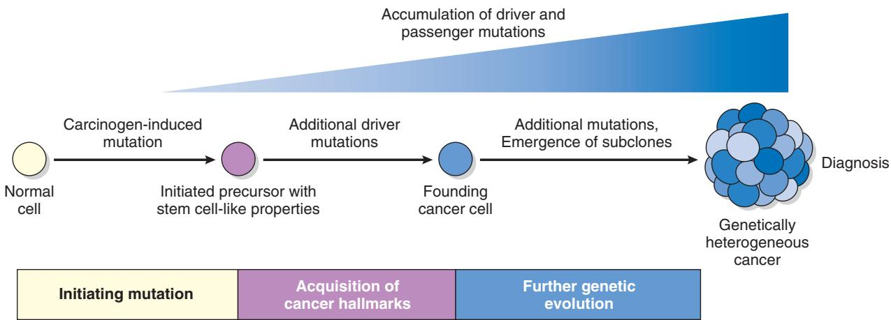 
Fig. 6.16 Development of cancer through stepwise accumulation of complementary driver mutations. The order in which various driver mutations occur is usually unknown and may vary from tumor to tumor.
biological properties of cancer cells. It appears that all cancers display eight fundamental changes in cell physiology, which are considered the hallmarks of cancer. These changes are illustrated in Fig. 6.17 and consist of the following:
Self-sufficiency in growth signals 
- Insensitivity to growth-inhibitory signals 
- Altered cellular metabolism 
Evasion of apoptosis 
- Limitless replicative potential (immortality) 
Sustained angiogenesis 
- Invasion and metastasis 
- Evasion of immune surveillance
The acquisition of the genetic and epigenetic alterations that confer these hallmarks may be accelerated by cancer-promoting inflammation and by genomic instability. These are considered enabling characteristics because they promote cellular transformation and subsequent tumor progression.
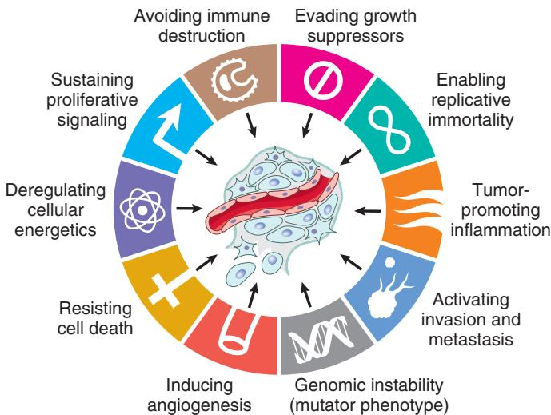 
Fig. 6.17 Eight cancer hallmarks and two enabling factors (genomic instability and tumor-promoting inflammation). Most cancer cells acquire these properties during their development, typically due to mutations in critical genes. (From Hanahan D, Weinberg RA: Hallmarks of cancer: the next generation. Cell 144:646, 2011.)
Mutations in genes that regulate some or all of these cellular traits are seen in every cancer; accordingly, these traits form the basis of the following discussion of the molecular origins of cancer. Of note, by convention, gene symbols are italicized but their protein products are not (e.g., RB gene and RB protein, TP53 and p53, MYC and MYC).
# Self-Sufficiency in Growth Signals
The self-sufficiency in growth that characterizes cancer cells generally stems from gain-of-function mutations that convert proto-oncogenes to oncogenes. Oncogenes encode proteins called oncoproteins that promote cell growth, even in the absence of normal growth-promoting signals. To appreciate how oncogenes drive inappropriate cell growth, it is helpful to review briefly the sequence of events that characterize normal cell proliferation (introduced in Chapter 1). Under physiologic conditions, cell proliferation can be readily resolved into the following steps:
1. Binding of a growth factor to its specific receptor on the cell membrane 
2. Transient and limited activation of the growth factor receptor, which in turn activates several signaltransducing proteins on the inner leaflet of the plasma membrane 
3. Transmission of the transduced signal across the cytosol to the nucleus by second messengers or a cascade of signal transduction molecules 
4. Induction and activation of nuclear regulatory factors that initiate and regulate DNA transcription and the biosynthesis of other cellular components that are needed for cell division, such as organelles, membrane components, and ribosomes 
5. Entry and progression of the cell into the cell cycle, resulting ultimately in cell division
The mechanisms that endow cancer cells with the ability to proliferate can be grouped according to their role in the growth factor-induced signal transduction cascade and cell cycle regulation. Indeed, each one of the listed steps is susceptible to corruption in cancer cells.
# Growth Factors
Cancers may secrete their own growth factors or induce stromal cells to produce growth factors in the tumor microenvironment. Most soluble growth factors are made by one cell type and act on a neighboring cell to stimulate proliferation (paracrine action). Normally, cells that produce the growth factor do not express the cognate receptor, preventing the formation of positive feedback loops within the same cell. This "rule" may be broken by cancer cells in several different ways.
- Some cancer cells acquire growth self-sufficiency by acquiring the ability to synthesize the same growth factors to which they are responsive. For example, many glioblastomas secrete platelet-derived growth factor (PDGF) and express the PDGF receptor, and many sarcomas make both transforming growth factor- $\alpha$ (TGF- $\alpha$ ) and its receptor. Similar autocrine loops are fairly common in many types of cancer. 
- Another mechanism by which cancer cells acquire growth self-sufficiency is by interaction with stroma. In some cases, tumor cells send signals to activate normal cells in the supporting stroma, which in turn produce growth factors that promote tumor growth.
# Growth Factor Receptors
The next group in the sequence of signal transduction is growth factor receptors. Some growth factor receptors have an intrinsic tyrosine kinase activity that is activated by growth factor binding, while others signal by stimulating the activity of downstream proteins. Many of the myriad growth factor receptors function as oncoproteins when they are mutated or if they overexpressed. The best-documented examples of overexpression involve the epidermal growth factor (EGF) receptor family. ERBB1, the EGF receptor, is overexpressed in $80\%$ of squamous cell carcinomas of the lung, $50\%$ or more of glioblastomas, and $80\%$ to $100\%$ of epithelial tumors of the head and neck. As mentioned earlier, the gene encoding a related receptor, HER2 (ERBB2), is amplified in approximately $20\%$ of breast cancers and in a smaller fraction of adenocarcinomas of the lung, ovary, stomach, and salivary glands. These tumors are exquisitely sensitive to the mitogenic effects of small amounts of growth factors. The significance of HER2 in the pathogenesis of breast cancers is illustrated dramatically by the clinical benefit derived from blocking the extracellular domain of this receptor with anti-HER2 antibodies, an elegant example of "bench to bedside" medicine. In other instances, tyrosine kinase activity is stimulated by point mutations or small indels that lead to subtle but functionally important changes in protein structure, or gene rearrangements that create fusion genes encoding chimeric receptors. In each of these cases, the mutated receptors are constitutively active, delivering mitogenic signals to cells even in the absence of growth factors. These types of mutations are most common in leukemias, lymphomas, and certain forms of sarcoma.
# Downstream Signal-Transducing Proteins
Cancer cells often acquire growth autonomy as a result of mutations in genes that encode components
of signaling pathways downstream of growth factor receptors. The signaling proteins that couple growth factor receptors to their nuclear targets are activated by ligand binding to growth factor receptors. The signals are transmitted to the nucleus through various signal transduction molecules. Two important oncoproteins in the category of signaling molecules are RAS and ABL. Each of these is discussed briefly next.
# RAS
RAS is the most commonly mutated oncogene in human tumors. Approximately $30\%$ of all human tumors contain mutated RAS genes, and the frequency is even higher in some specific cancers (e.g., pancreatic adenocarcinoma). RAS is a member of a family of small G proteins that bind guanosine nucleotides (guanosine triphosphate [GTP] and guanosine diphosphate [GDP]). Signaling by RAS involves the following sequential steps:
- Normally, RAS flips back and forth between an excited signal-transmitting state and a quiescent state. RAS is inactive when bound to GDP; stimulation of cells by growth factors such as EGF and PDGF leads to exchange of GDP for GTP and subsequent conformational changes
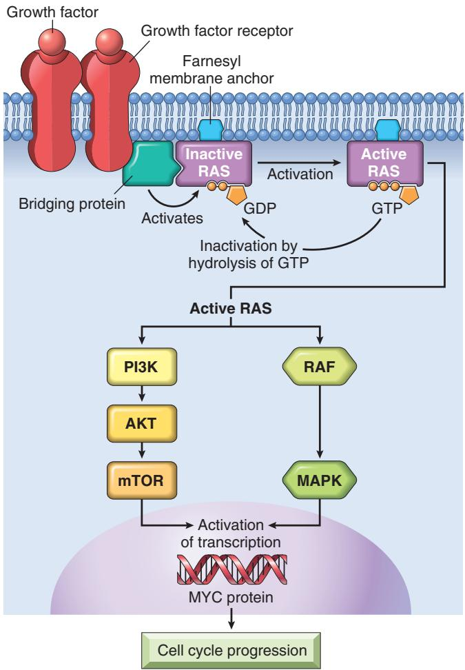 
Fig. 6.18 Model for action of RAS. When a normal cell is stimulated through a growth factor receptor, inactive (GDP-bound) RAS is activated to a GTP-bound state. Activated RAS transduces proliferative signals to the nucleus along two pathways: the so-called "RAF/ERK/MAP kinase pathway" and the PI3 kinase/AKT pathway. GDP, Guanosine diphosphate; GTP, guanosine triphosphate; MAP, mitogen-activated protein; PI3, phosphatidylinositol-3.
that generate active RAS (Fig. 6.18). This excited signal-emitting state is short-lived, however, because the intrinsic guanosine triphosphatase (GTPase) activity of RAS hydrolyzes GTP to GDP, releasing a phosphate group and returning the protein to its quiescent GDP-bound state. The GTPase activity of activated RAS is magnified dramatically by a family of GTPase-activating proteins (GAPs), which act as molecular brakes that prevent uncontrolled RAS activation by favoring hydrolysis of GTP to GDP.
- Activated RAS stimulates downstream regulators of proliferation by several interconnected pathways that converge on the nucleus and alter the expression of genes that regulate growth, such as MYC. While details of the signaling cascades (some of which are illustrated in Fig. 6.18) downstream of RAS are not discussed here, an important point is that mutational activation of these signaling intermediates mimics the growth promoting effects of activated RAS. For example, BRAF, which lies in the so-called "RAF/ERK/MAP kinase pathway" is mutated in more than $60\%$ of melanomas and is associated with unregulated cell proliferation. Mutations of phosphatidly inositol-3 kinase (PI3 kinase) in the PI3K/AKT pathway also occur with high frequency in some tumor types, with similar consequences.
RAS most commonly is activated by point mutations in amino acid residues that are either within the GTP-binding pocket or in the enzymatic region that carries out GTP hydrolysis. Both kinds of mutations interfere with breakdown of GTP, which is essential to inactivate RAS. RAS is thus trapped in its activated, GTP-bound form, and the cell is forced into a continuously proliferating state. It follows from this scenario that the consequences of activating mutations in RAS should be mimicked by loss-of-function mutations in GAPs, which would lead to a failure to simulate GTP hydrolysis and thereby restrain RAS. Indeed, the GAP neurofibromin-1 (NF1) is mutated in the cancer-prone familial disorder neurofibromatosis type 1 (Chapter 22) and is a bona fide tumor suppressor. Similarly, another important tumor suppressor called PTEN is a negative inhibitor of PI3 kinase and is frequently mutated in carcinomas, certain leukemias, and other cancers as well.
# ABL
Several non-receptor tyrosine kinases function as signal transduction molecules. In this group, ABL is the best defined with respect to carcinogenesis.
The ABL proto-oncoprotein has tyrosine kinase activity that is dampened by internal negative regulatory domains. As discussed earlier (see Fig. 6.14), in chronic myeloid leukemia and certain acute leukemias, a part of the ABL gene is translocated from its normal abode on chromosome 9 to chromosome 22, where it fuses with part of the breakpoint cluster region (BCR) gene. This fusion gene encodes as BCR-ABL hybrid protein that contains the ABL tyrosine kinase domain and a BCR domain that self-associates, an event that unleashes a constitutive tyrosine kinase activity. Of interest, the BCR-ABL protein activates all of the signals that are downstream of RAS, making it a potent stimulator of cell growth.
The crucial role of BCR-ABL in cancer has been confirmed by the dramatic clinical response of patients with chronic myeloid leukemia to BCR-ABL kinase inhibitors. The prototype of this kind of drug, imatinib mesylate (Gleevec), galvanized interest in design of drugs that target specific molecular lesions found in various cancers (so-called "targeted therapy"). BCR-ABL also is an example of the concept of oncogene addiction, wherein a tumor is profoundly dependent on a single signaling molecule. BCR-ABL fusion gene formation is an early, perhaps initiating, event that drives leukemogenesis. Development of leukemia probably requires other collaborating mutations, but the transformed cell continues to depend on BCR-ABL for signals that mediate growth and survival. BCR-ABL signaling can be seen as the central lodgepole around which the transformed state is "built". If the lodgepole is removed by inhibition of the BCR-ABL kinase, the structure collapses. In view of this level of dependency, it is not surprising that acquired resistance of tumors to BCR-ABL inhibitors often is due to the outgrowth of a subclone with a mutation in BCR-ABL that prevents binding of the drug to the BCR-ABL protein.
# Nuclear Transcription Factors
The ultimate consequence of signaling through oncoproteins such as RAS or ABL is inappropriate and continuous stimulation of nuclear transcription factors that drive the expression of growth-promoting genes. Growth autonomy may thus be a consequence of mutations affecting genes that regulate DNA transcription. A host of oncoproteins, including products of the MYC, MYB, JUN, FOS, and REL oncogenes, function as transcription factors that regulate the expression of growth-promoting genes, such as cyclins. Of these, MYC is involved most commonly in human tumors.
Dysregulation of MYC promotes tumorigenesis by simultaneously promoting the progression of cells through the cell cycle and enhancing alterations in metabolism that support cell growth. MYC primarily functions by activating the transcription of other genes. Genes activated by MYC include several growth-promoting genes, including cyclin-dependent kinases (CDKs), whose products drive cells into the cell cycle (discussed next), and genes that control pathways that produce the building blocks (e.g., amino acids, lipids, nucleotides) that are needed for cell growth and division. As mentioned earlier (see Fig. 6.14), dysregulation of MYC results from a (8;14) translocation in Burkitt lymphoma, a highly aggressive B-cell tumor. MYC also is amplified in breast, colon, lung, and many other cancers, while the related NMYC and LMYC genes are amplified in neuroblastomas and small cell cancers of lung, respectively.
# Cyclins and Cyclin-Dependent Kinases
As mentioned in Chapter 1, growth factors transduce signals that stimulate the orderly progression of cells through the various phases of the cell cycle, the process by which cells replicate their DNA in preparation for cell division. You will recall that progression of cells through the cell cycle is orchestrated by cyclin-dependent kinases (CDKs), which are activated by binding to cyclins, so called because of the cyclic nature of their production and degradation.
The CDK-cyclin complexes phosphorylate crucial target proteins that drive cells forward through the cell cycle. While cyclins arouse the CDKs, CDK inhibitors (CDKIs), of which there are many, silence the CDKs and exert negative control over the cell cycle. Expression of these inhibitors is downregulated by mitogenic signaling pathways, thus promoting the progression of the cell cycle.
There are two main cell cycle checkpoints, one at the G1/S transition and the other at the G2/M transition, each of which is tightly regulated by a balance of growth-promoting and growth-suppressing factors, as well as by sensors of DNA damage (Chapter 1). If activated, these DNA-damage sensors transmit signals that arrest cell cycle progression and, if cell damage cannot be repaired, initiate apoptosis. Once cells pass through the $\mathrm{G}_1 / \mathrm{S}$ checkpoint, they are committed to undergo cell division. Understandably, then, defects in the $\mathrm{G}_1 / \mathrm{S}$ checkpoint are particularly important in cancer, since these lead directly to increased cell division. Indeed, all cancers appear to have genetic lesions that disable the $\mathrm{G}_1 / \mathrm{S}$ checkpoint, causing cells to continually reenter the S phase. For unclear reasons, particular lesions vary widely in frequency across tumor types, but they fall into two major categories.
- Gain-of-function mutations involving CDK4 or D cyclins. Mishaps increasing the expression of cyclin D or CDK4 are common events in neoplastic transformation. The cyclin D genes are overexpressed in many cancers, including those affecting the breast, esophagus, liver, and a subset of lymphomas and plasma cell tumors. Amplification of the CDK4 gene occurs in melanomas, sarcomas, and glioblastomas. Mutations affecting cyclins B and E and other CDKs also occur, but they are much less frequent than those affecting cyclin D and CDK4. 
- Loss-of-function mutations involving CDKIs. CDKIs frequently are disabled by mutation or gene silencing in many human malignancies. For example, germline mutations of CDKN2A, a gene that encodes the CDK inhibitor p16, are present in $25\%$ of melanoma-prone kindreds, and acquired deletion or inactivation of CDKN2A is seen in $75\%$ of pancreatic carcinomas, $40\%$ to $70\%$ of glioblastomas, $50\%$ of esophageal cancers and certain leukemias, and $20\%$ of non-small cell lung carcinomas, soft-tissue sarcomas, and bladder cancers.
A final consideration of importance in a discussion of growth-promoting signals is that the increased production of oncoproteins does not by itself lead to sustained proliferation of cancer cells. There are two built-in mechanisms, cell senescence and apoptosis, that oppose oncogenemediated cell growth. As discussed later, genes that regulate these two braking mechanisms must be disabled to allow the action of oncogenes to proceed unopposed.
# SELF-SUFFICIENCY IN GROWTH SIGNALS
- Proto-oncogenes: normal cellular genes whose products promote cell proliferation 
- Oncogenes: mutant or overexpressed versions of proto-oncogenes that function autonomously without a requirement for normal growth-promoting signals
- Oncoproteins promote uncontrolled cell proliferation by several mechanisms: 
- Stimulus-independent expression of growth factor and its receptor, setting up an autocrine loop of cell proliferation (e.g., PDGF-PDGF receptor in brain tumors) 
- Mutations in genes encoding growth factor receptors or tyrosine kinases leading to constitutive signaling 
- Amplification of EGF receptor family genes such as HER2 in breast cancer 
- Fusion of portions of the ABL tyrosine kinase gene and the BCR protein gene, creating a BCR-ABL fusion gene encoding a constitutively active tyrosine kinase, in certain leukemias 
- Mutations in genes encoding signaling molecules 
- RAS commonly is mutated in human cancers and normally flips between resting GDP-bound state and active GTP-bound state; mutations block hydrolysis of GTP to GDP, leading to unchecked signaling 
Overproduction or unregulated activity of transcription factors 
- Translocation of MYC in some lymphomas leads to overexpression and unregulated expression of its target genes controlling cell cycling and survival 
- Mutations that activate cyclin genes or inactivate negative regulators of cyclins and cyclin-dependent kinases 
- Complexes of cyclins with CDKs drive the cell cycle by phosphorylating various substrates and normally are controlled by CDK inhibitors. Mutations in genes encoding cyclins, CDKs, and CDK inhibitors result in uncontrolled cell cycle progression and are found in a wide variety of cancers including melanomas and brain, lung, and pancreatic cancers.
# Insensitivity to Growth Inhibitory Signals: Tumor Suppressor Genes
Isaac Newton theorized that every action has an equal and opposite reaction. Although Newton was not a cancer biologist, his formulation holds true for cell growth. Whereas oncogenes encode proteins that promote cell growth, the products of tumor suppressor genes apply brakes to cell proliferation. Disruption of such genes renders cells refractory to growth inhibition and mimics the growth-promoting effects of oncogenes. The following discussion describes tumor suppressor genes, their products, and possible mechanisms by which loss of their function contributes to unregulated cell growth.
In principle, anti-growth signals can prevent cell proliferation by several complementary mechanisms. The signal may cause dividing cells to enter $\mathrm{G}_0$ (quiescence), where they remain until external cues prod their reentry into the proliferative pool. Alternatively, the cells may enter a postmitotic, differentiated pool and lose replicative potential. Nonreplicative senescence, alluded to earlier, is another mechanism of escape from sustained cell growth. And, as a last-ditch effort, the cells may be programmed for death by apoptosis. As we will see, tumor suppressor genes have all these "tricks" in their toolbox designed to halt wayward cells from becoming malignant.
# RB: Governor of the Cell Cycle
RB, a key negative regulator of the cell cycle, is directly or indirectly inactivated in most human cancers. The
retinoblastoma gene (RB) was the first tumor suppressor gene to be discovered and is now considered the prototype of this family of cancer genes. As with many advances in medicine, the discovery of tumor suppressor genes was accomplished by the study of a rare disease—in this case, retinoblastoma, an uncommon childhood tumor. Approximately $60\%$ of retinoblastomas are sporadic, while the remaining ones are familial, the predisposition to develop the tumor being transmitted as an autosomal dominant trait. To account for the sporadic and familial occurrence of an identical tumor, Knudson, in 1974, proposed his now famous two-hit hypothesis, which in molecular terms can be stated as follows:
- Two mutations (hits) are required to produce retinoblastoma. These involve the $RB$ gene, which has been mapped to chromosomal locus 13q14. Both of the normal alleles of the $RB$ locus must be inactivated (hence the two hits) for the development of retinoblastoma (Fig. 6.19). 
- In familial cases, children inherit one defective copy of the RB gene in the germ line; the other copy is normal.
Retinoblastoma develops when the normal $RB$ gene is lost in retinoblasts as a result of somatic mutation. Because in retinoblastoma families a single germ line mutation is sufficient to transmit disease risk, the trait has an autosomal dominant inheritance pattern.
- In sporadic cases, both normal $RB$ alleles are lost by somatic mutation in one of the retinoblasts. The end result is the same: a retinal cell that has lost both of the normal copies of the $RB$ gene becomes cancerous.
From the above, it is evident that although the risk for developing retinoblastoma in retinoblastoma families is inherited as a dominant trait, at the level of the cell, one intact $RB$ gene is all that is needed for normal function.
Although the loss of normal $RB$ genes initially was discovered in retinoblastomas, it is now evident that biallelic loss of this gene is a fairly common feature of several tumors, including breast cancer, small cell cancer of the lung, and bladder cancer. Patients with familial retinoblastoma also are at greatly increased risk for developing osteosarcomas and some soft-tissue sarcomas.
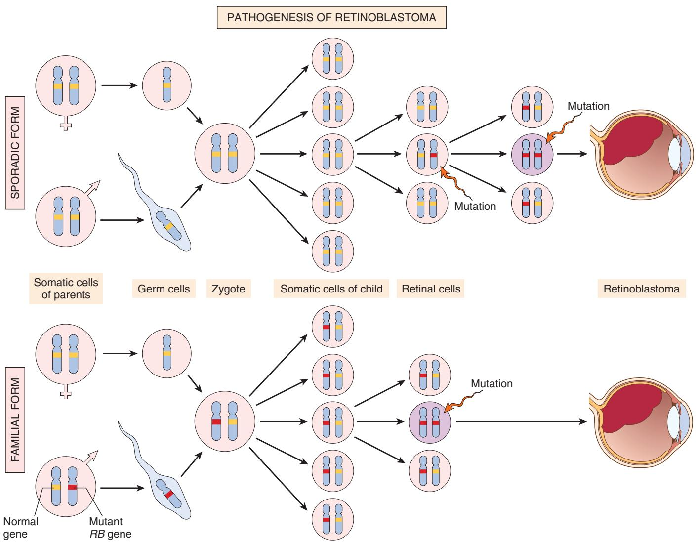 
Fig. 6.19 Pathogenesis of retinoblastoma. Two mutations of the RB chromosomal locus, on 13q14, lead to neoplastic proliferation of the retinal cells. In the sporadic form, both RB mutations in the tumor-founding retinal cell are acquired. In the familial form, all somatic cells inherit one mutant RB gene from a carrier parent, and as a result only one additional RB mutation in a retinal cell is required for complete loss of RB function.
The function of the RB protein is to regulate the G1/S checkpoint, the portal through which cells must pass before DNA replication commences. Although each phase of the cell cycle circuitry is monitored carefully, the transition from $\mathrm{G}_1$ to S is an extremely important checkpoint in the cell cycle "clock." In the $\mathrm{G}_1$ phase, diverse signals are integrated to determine whether the cell should progress through the cell cycle, or exit the cell cycle and differentiate. The RB gene product, RB, is a DNA-binding protein that serves as a point of integration for these diverse signals, which ultimately act by altering the phosphorylation state of RB. Specifically, signals that promote cell cycle progression lead to the phosphorylation and inactivation of RB, while those that block cell cycle progression act by maintaining RB in an active hypophosphorylated state.
To appreciate this crucial role of RB in the cell cycle, it is helpful to review the mechanisms that enforce the $G_{1} / S$ transition.
- The initiation of DNA replication (S phase) requires the activity of cyclin E/CDK2 complexes, and expression of cyclin E is dependent on the E2F family of transcription factors. Early in $G_{1}$ , RB is in its hypophosphorylated active form, and it binds to and inhibits the E2F family of transcription factors, preventing transcription of cyclin E. Hypophosphorylated RB blocks E2F-mediated transcription in at least two ways (Fig. 6.20). First, it sequesters E2F, preventing it from interacting with other transcriptional activators. Second, RB recruits chromatin remodeling proteins, such as histone deacetylases and histone methyltransferases, which bind to the promoters of E2F-responsive genes such as cyclin E. These enzymes modify chromatin at the promoters to make DNA insensitive to transcription factors. 
- This situation is changed on mitogenic signaling. Growth factor signaling leads to cyclin D expression and activation of cyclin D-CDK4/6 complexes. The level of cyclin D-CDK4/6 activity is tempered by antagonists such as p16, which is itself subject to regulation by growth inhibitors such as TGFβ that serve to set a threshold for mitogenic responses. If the stimulus is sufficiently strong, cyclin D-CDK4/6 complexes phosphorylate RB, inactivating the protein and releasing E2F to induce target genes such as cyclin E. Cyclin E/CDK complexes then stimulate DNA replication and progression through the cell cycle. When the cells enter S phase, they are committed to divide without additional growth factor stimulation. During the ensuing M phase, the phosphate groups are removed from RB by cellular phosphatases, regenerating the hypophosphorylated form of RB. 
- E2F is not the sole target of RB. The versatile RB protein binds to a variety of other transcription factors that regulate cell differentiation. For example, RB stimulates myocyte-, adipocyte-, melanocyte-, and macrophagespecific transcription factors. Thus, the RB pathway couples control of cell cycle progression at $G_{1}$ with differentiation, which may explain how differentiation is associated with exit from the cell cycle.
In view of the centrality of RB to the control of the cell cycle, an interesting question is why RB is not mutated in every cancer. In fact, mutations in other genes that control
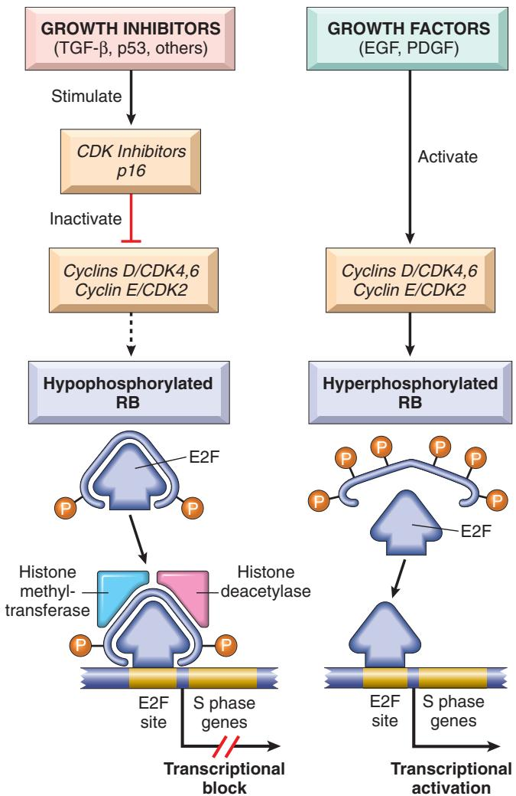 
Fig. 6.20 The role of RB in regulating the GI-S checkpoint of the cell cycle. Hypophosphorylated RB in complex with the E2F transcription factors binds to DNA, recruits chromatin remodeling factors (histone deacetylases and histone methyltransferases), and inhibits transcription of genes whose products are required for the S phase of the cell cycle. When RB is phosphorylated by the cyclin D-CDK4, cyclin D-CDK6, and cyclin E-CDK2 complexes, it releases E2F. The latter then activates transcription of S-phase genes. The phosphorylation of RB is inhibited by CDKIs, because they inactivate cyclin-CDK complexes. Virtually all cancer cells show dysregulation of the GI-S checkpoint as a result of mutation in one of four genes that regulate the phosphorylation of RB; these genes are RB, CDK4, cyclin D, and CDKN2A [p16]. EGF, Epidermal growth factor; PDGF, platelet-derived growth factor.
RB phosphorylation can mimic the effect of RB loss and are commonly found in many cancers that have normal RB genes. For example, mutational activation of CDK4 and overexpression of cyclin D favor cell proliferation by facilitating RB phosphorylation and inactivation. Indeed, cyclin D is overexpressed in many tumors because of amplification or translocation of the cyclin D1 gene. Mutational inactivation of genes encoding CDKIs also can drive the cell cycle by removing important brakes on cyclin/CDK activity. As mentioned earlier, the CDKN2A gene, which encodes the CDK inhibitor p16, is an extremely common target of deletion or mutational inactivation in human tumors.
It is now accepted that loss of normal cell cycle control is central to malignant transformation and that at least
one of the four key regulators of the cell cycle (p16, cyclin D, CDK4, RB) is mutated in most human cancers. Notably, in cancers caused by certain oncogenic viruses (discussed later), this is achieved through direct targeting of RB by viral proteins. For example, the human papillomavirus (HPV) E7 protein binds to the hypophosphorylated form of RB, preventing it from inhibiting the E2F transcription factors. Thus, RB is functionally deleted, leading to uncontrolled growth.
# RB: GOVERNOR OF THE CELL CYCLE
- Like other tumor suppressor genes, both copies of $RB$ must be dysfunctional for tumor development to occur. 
- In cases of familial retinoblastoma, one defective copy of the RB gene is present in the germ line, so that only one additional somatic mutation is needed to completely eliminate RB function. 
- RB exerts anti-proliferative effects by controlling the $G_{1}$ -to-S transition of the cell cycle. In its active form, RB is hypophosphorylated and binds to E2F transcription factors. This interaction prevents transcription of genes like cyclin E that are needed for DNA replication, and so the cells are arrested in $G_{1}$ . 
- Growth factor signaling leads to cyclin D expression, activation of cyclin D-CDK4/6 complexes, inactivation of RB by phosphorylation, and thus release of E2F. 
- Loss of cell cycle control is fundamental to malignant transformation. Almost all cancers have a disabled $G_{1}$ checkpoint due to mutation of either RB or genes that affect RB function, such as cyclin D, CDK4, and CDKIs. 
- Many oncogenic DNA viruses, like HPV, encode proteins (e.g., E7) that bind RB and render it nonfunctional.
# TP53: Guardian of the Genome
The p53-encoding tumor suppressor gene, TP53, is the most commonly mutated gene in human cancer. The p53 protein is a transcription factor that thwarts neoplastic transformation by three interlocking mechanisms: activation of temporary cell cycle arrest (termed quiescence), induction of permanent cell cycle arrest (termed senescence), or triggering of programmed cell death (termed apoptosis). If RB is a "sensor" of external signals, p53 can be viewed as a central monitor of internal stress, directing the stressed cells toward one of these pathways.
A variety of stresses trigger the p53 response pathways, including anoxia, inappropriate pro-growth stimuli (e.g., unbridled MYC or RAS activity), and DNA damage. By managing the DNA damage response, p53 plays a central role in maintaining the integrity of the genome, as discussed next.
In nonstressed, healthy cells, p53 has a short half-life (20 minutes) because of its association with MDM2, a protein that targets p53 for destruction. When the cell is stressed, for example, by an assault on its DNA, "sensors" that include protein kinases such as ATM (ataxia telangiectasia mutated) are activated. These activated sensors catalyze posttranslational modifications in p53 that release it from
MDM2, increasing its half-life and enhancing its ability to drive the transcription of target genes. Hundreds of genes whose transcription is triggered by p53 have been found. These genes suppress neoplastic transformation by three mechanisms:
- p53-mediated cell cycle arrest may be considered the primordial response to DNA damage (Fig. 6.21). It occurs late in the $G_{1}$ phase and is caused mainly by p53-dependent transcription of the CDKI gene CDKN1A $(p21)$ . The p21 protein inhibits cyclin-CDK complexes and prevents phosphorylation of RB, thereby arresting cells in the $G_{1}$ phase. Such a pause in cell cycling is welcome, because it gives the cells "breathing time" to repair DNA damage. The p53 protein also induces expression of DNA damage repair genes. If DNA damage is repaired successfully, p53 upregulates transcription of MDM2, leading to its own destruction and relief of the cell cycle block. If the damage cannot be repaired, the cell may enter p53-induced senescence or undergo p53-directed apoptosis. 
- $p53$ -induced senescence is a form of permanent cell cycle arrest characterized by specific changes in morphology and gene expression that differentiate it from quiescence or reversible cell cycle arrest. Senescence requires activation of $p53$ and/or Rb and expression of their mediators, such as the CDKIs. The mechanisms of senescence are unclear but seem to involve global chromatin changes, which drastically and permanently alter gene expression. 
- $p53$ -induced apoptosis of cells with irreversible DNA damage is the ultimate protective mechanism against neoplastic transformation. It is mediated by upregulation of several proapoptotic genes, including BAX and PUMA (discussed later).
To summarize, p53 is activated by stresses such as DNA damage and assists in DNA repair by causing $\mathbf{G}_1$ arrest and inducing the expression of DNA repair genes. A cell with damaged DNA that cannot be repaired is directed by p53 to either enter senescence or undergo apoptosis (see Fig. 6.21). In view of these activities, p53 has been rightfully called the "guardian of the genome." With loss of normal p53 function, DNA damage goes unrepaired, mutations become fixed in dividing cells, and the cell turns onto a one-way street leading to malignant transformation.
Confirming the importance of TP53 in controlling carcinogenesis, more than $70\%$ of human cancers have a defect in this gene, and the remaining malignant neoplasms often have defects in genes upstream or downstream of TP53. Biallelic abnormalities of the TP53 gene are found in virtually every type of cancer, including carcinomas of the lung, colon, and breast—the three leading causes of cancer deaths. In most cases, mutations affecting both TP53 alleles are acquired in somatic cells. In other tumors, such as certain sarcomas, the TP53 gene is intact but p53 function is lost because of amplification and overexpression of the MDM2 gene, which encodes a potent inhibitor of p53. Less commonly, patients inherit a mutant TP53 allele; the resulting disorder is called the Li-Fraumeni syndrome. As in the case with familial retinoblastoma, inheritance of one mutant TP53 allele predisposes affected
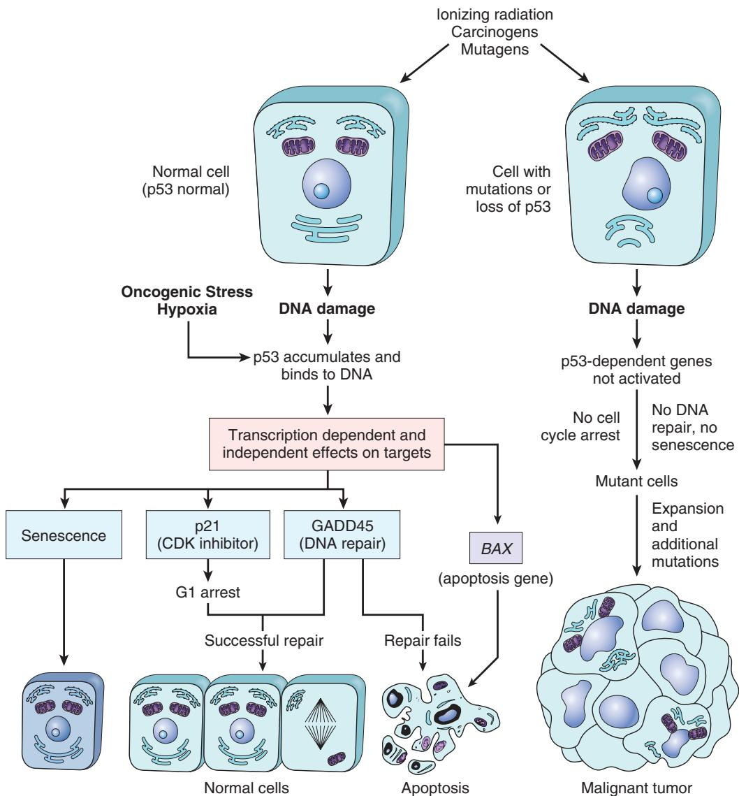 
Fig. 6.21 The role of p53 in maintaining the integrity of the genome. Activation of normal p53 by DNA-damaging agents or by hypoxia leads to cell cycle arrest in GI and induction of DNA repair, by transcriptional upregulation of the cyclin-dependent kinase inhibitor CDKN1A (p21) and the GADD45 genes. Successful repair of DNA allows cells to proceed with the cell cycle; if DNA repair fails, p53 triggers either apoptosis or senescence. In cells with loss or mutations of TP53, DNA damage does not induce cell cycle arrest or DNA repair, and genetically damaged cells proliferate, giving rise eventually to malignant neoplasms.
individuals to develop malignant tumors because only one additional hit is needed to inactivate the second, normal allele. Patients with the Li-Fraumeni syndrome have a 25-fold greater chance of developing a malignant tumor by 50 years of age compared with the general population. In contrast to tumors developing in patients who inherit a mutant RB allele, the spectrum of tumors that develop in patients with the Li-Fraumeni syndrome is much more varied; the most common types are sarcomas, breast cancer, leukemia, brain tumors, and carcinomas of the adrenal cortex. Compared with individuals diagnosed with sporadic tumors, patients with Li-Fraumeni syndrome develop tumors at a younger age and may develop multiple primary tumors.
As with RB, normal p53 also can be rendered nonfunctional by certain oncogenic DNA viruses. Proteins encoded by oncogenic HPVs, certain polyoma viruses, and hepatitis
B virus bind to p53 and nullify its protective function. Thus, transforming DNA viruses subvert two of the best-understood tumor suppressors, RB and p53.
# TP53: GUARDIAN OF THE GENOME
- TP53 encodes p53, the central monitor of stress in the cell, which can be activated by anoxia, inappropriate oncogene signaling, or DNA damage. Activated p53 controls the expression and activity of genes involved in cell cycle arrest, DNA repair, cellular senescence, and apoptosis. 
- DNA damage leads to activation of p53 by phosphorylation. Activated p53 drives transcription of CDKN1A (p21), which prevents RB phosphorylation, thereby causing a $G_{1}$ -S block in
the cell cycle. This pause allows the cells to repair DNA damage.
- If DNA damage cannot be repaired, p53 induces cellular senescence or apoptosis. 
- Of human tumors, $70\%$ demonstrate biallelic mutations in TP53. Patients with the rare Li-Fraumeni syndrome inherit one defective copy of TP53 in the germ line, such that only one additional mutation is required to lose normal p53 function. Li-Fraumeni syndrome patients are prone to develop a wide variety of tumors. 
- As with RB, p53 can be incapacitated when bound by proteins encoded by oncogenic DNA viruses such as HPV.
# Transforming Growth Factor- $\beta$ Pathway
Although much is known about the circuitry that applies brakes to the cell cycle, the molecules that transmit antiproliferative signals to cells are less well characterized. Best-known is TGF- $\beta$ , a member of a family of dimeric growth factors that includes bone morphogenetic proteins and activins. In most normal epithelial, endothelial, and hematopoietic cells, TGF- $\beta$ is a potent inhibitor of proliferation. It regulates cellular processes by binding to a complex composed of TGF- $\beta$ receptors I and II. Dimerization of the receptor upon ligand binding leads to a cascade of events that result in the transcriptional activation of CDKIs with growth-suppressing activity, as well as repression of growth-promoting genes such as MYC and CDK4.
In many forms of cancer, the growth-inhibiting effects of the TGF- $\beta$ pathways are impaired by mutations affecting TGF- $\beta$ signaling. These mutations may alter the type II TGF- $\beta$ receptor or SMAD molecules that serve to transduce anti-proliferative signals from the receptor to the nucleus. Mutations affecting the type II receptor are seen in cancers of the colon, stomach, and endometrium. Mutational inactivation of SMAD4, 1 of the 10 proteins known to be involved in TGF- $\beta$ signaling, is common in pancreatic cancers. In other cancers, by contrast, loss of TGF- $\beta$ -mediated growth control occurs at a level downstream of the core TGF- $\beta$ signaling pathway; for example, there may be loss of p21 expression and/or overexpression of MYC. These tumor cells can then use other elements of the TGF- $\beta$ -induced program, including immune system suppression or promotion of angiogenesis, to facilitate tumor progression. Thus, TGF- $\beta$ can function to prevent or promote tumor growth, depending on the state of other genes in the cell. Indeed, in many late-stage tumors, TGF- $\beta$ signaling activates epithelial-to-mesenchymal transition (EMT), a process that promotes migration, invasion, and metastasis, as discussed later.
# Contact Inhibition, NF2, and APC
When cancer cells are grown in the laboratory, their proliferation fails to be inhibited when they come in contact with each other. This is in sharp contrast to nontransformed cells, which stop proliferating once they form confluent monolayers. The mechanisms that govern contact inhibition are only now being discovered.
Cell-cell contacts in many tissues are mediated by homodimeric interactions between transmembrane proteins called cadherins. E-cadherin (E for epithelial) mediates cell-cell contact in epithelial layers. Two mechanisms have been proposed to explain how E-cadherin maintains contact inhibition:
- One mechanism is mediated by the tumor suppressor gene $NF2$ . Its product, neurofibromin-2, more commonly called merlin, acts downstream of E-cadherin in a signaling pathway that helps to maintain contact inhibition. Homozygous loss of $NF2$ is known to cause certain neural tumors, and germ line mutations in $NF2$ are associated with a tumor-prone hereditary condition called neurofibromatosis type 2. 
- A second mechanism by which E-cadherin may regulate contact inhibition involves its ability to bind $\beta$ -catenin, another signaling protein. $\beta$ -catenin is a key component of the WNT signaling pathway (described below), which has broad but as of yet incompletely understood roles in regulating the morphology and organization of epithelial cells lining structures such as the gut.
A further clue to the important of E-cadherin and $\beta$ -catenin in epithelial cancers is illustrated by the rare hereditary disease adenomatous polyposis coli (APC). This disorder is characterized by the development of numerous adenomatous polyps in the colon that have a very high incidence of transformation into colonic cancers. The polyps consistently show loss of a tumor suppressor gene called APC (named for the disease), which exerts anti-proliferative effects in an unusual manner. APC encodes a cytoplasmic protein whose dominant function is to promote the degradation of $\beta$ -catenin, which has several functions. In addition to binding E-cadherin, $\beta$ -catenin also is a key component of the WNT signaling pathway (illustrated in Fig. 6.22). WNTs are soluble factors that bind WNT receptors, which in turn transmit signals that prevent the APC-mediated degradation of $\beta$ -catenin, allowing it to translocate to the nucleus, where it acts as a transcriptional activator. In quiescent cells that have not been exposed to WNT, cytoplasmic $\beta$ -catenin is degraded by a destruction complex, of which APC is an integral part. With loss of APC (e.g., in colon cancers), $\beta$ -catenin degradation is prevented, and the WNT signaling response is inappropriately activated even in the absence of WNT factors. In colonic epithelium this leads to increased transcription of growth-promoting genes, such as cyclin D1 and MYC, as well as transcriptional regulators, such as TWIST and SLUG, which repress E-cadherin expression and thus reduce contact inhibition.
APC behaves as a typical tumor suppressor gene. Individuals born with one mutated allele typically are found to have hundreds to thousands of adenomatous polyps in the colon by their teens or twenties; these polyps show loss of the other APC allele. Almost invariably, one or more polyps undergo malignant transformation, as discussed later. APC mutations are seen in $70\%$ to $80\%$ of sporadic colon cancers. Colonic cancers with normal APC genes sometimes show activating mutations of $\beta$ -catenin that render them refractory to the degrading action of APC.
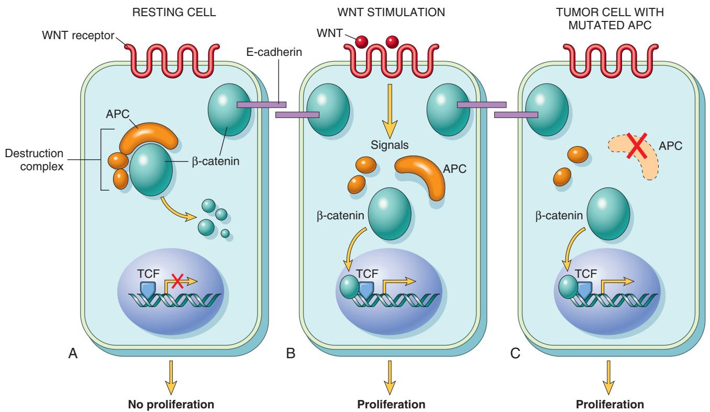 
Fig. 6.22 The role of APC in regulating the stability and function of $\beta$ -catenin. APC and $\beta$ -catenin are components of the WNT signaling pathway. (A) In resting cells (not exposed to WNT), $\beta$ -catenin forms a macromolecular complex containing the APC protein. This complex leads to the destruction of $\beta$ -catenin, and intracellular levels of $\beta$ -catenin are low. (B) When cells are stimulated by secreted WNT molecules, the destruction complex is deactivated, $\beta$ -catenin degradation does not occur, and cytoplasmic levels increase. $\beta$ -Catenin translocates to the nucleus, where it binds to TCF, a transcription factor that activates several genes involved in the cell cycle. (C) When APC is mutated or absent, the destruction of $\beta$ -catenin cannot occur. $\beta$ -Catenin translocates to the nucleus and coactivates genes that promote the cell cycle, and cells behave as if they are under constant stimulation by the WNT pathway.
# TGF-β, CONTACT INHIBITION, AND APC-β-CATENIN PATHWAYS
- TGF- $\beta$ inhibits proliferation of many cell types by activation of growth-inhibiting genes such as CDKIs and suppression of growth-promoting genes such as MYC and those encoding cyclins. 
- TGF- $\beta$ function is compromised in many tumors by mutations in its receptors (colon, stomach, endometrium) or by mutational inactivation of SMAD genes that transduce TGF- $\beta$ signaling (pancreas). 
- E-cadherin maintains contact inhibition, which is lost in malignant cells. 
- The APC gene exerts anti-proliferative actions by regulating the destruction of the cytoplasmic protein $\beta$ -catenin. With a loss of APC, $\beta$ -catenin is not destroyed, and it translocates to the nucleus, where it acts as a growth-promoting transcription factor. 
- In familial adenomatous polyposis syndrome, inheritance of a germ line mutation in the APC gene and sporadic loss of the sole normal allele causes the development of hundreds of colonic polyps at a young age. Inevitably, one or more of these polyps evolves into a colonic cancer. Somatic loss of both alleles of the APC gene is seen in approximately $70\%$ of sporadic colon cancers.
# Altered Cellular Metabolism
Even in the presence of ample oxygen, cancer cells demonstrate a distinctive form of cellular metabolism characterized by high levels of glucose uptake and increased conversion of glucose to lactose (fermentation) via the glycolytic pathway. This phenomenon, called the Warburg effect and also known as aerobic glycolysis, has been recognized for many years (indeed, Otto Warburg received the Nobel Prize in 1931 for its discovery). Clinically, the "glucose-hunger" of tumors is used to visualize tumors via positron emission tomography (PET) scanning, in which patients are injected with $^{18}\mathrm{F}$ -fluorodeoxyglucose, a glucose derivative that is preferentially taken up into tumor cells (as well as normal, actively dividing tissues such as the bone marrow). Most tumors are PET-positive, and rapidly growing ones are markedly so.
Warburg's discovery was largely neglected for many years, but over the past decade, metabolism has become one of the most active areas of cancer research. Metabolic pathways (like signaling pathways) in normal and cancer cells are still being elucidated, and the details are complex, but at the heart of the Warburg effect lies a simple question: why is it advantageous for a cancer cell to rely on seemingly inefficient glycolysis (which generates two molecules of ATP per molecule of glucose) instead of oxidative phosphorylation (which generates up to 36 molecules of ATP per molecule of glucose)? While pondering this question,
it is important to recognize that rapidly proliferating normal cells, such as in embryonic tissues and lymphocytes during immune responses, also rely on aerobic fermentation. Thus, "Warburg metabolism" is not cancer specific, but instead is a general property of growing cells that becomes "fixed" in cancer cells.
The answer to this riddle is simple: Aerobic glycolysis provides rapidly dividing tumor cells with metabolic intermediates that are needed for the synthesis of cellular components, whereas mitochondrial oxidative phosphorylation does not. The reason growing cells rely on aerobic glycolysis becomes readily apparent when one considers that a growing cell has a strict biosynthetic requirement; it must duplicate all of its cellular components—DNA, RNA, proteins, lipid, and organelles—before it can divide and produce two daughter cells. While oxidative phosphorylation yields abundant ATP, it fails to produce any carbon moieties that can be used to build the cellular components needed for growth (proteins, lipids, and nucleic acids). Even cells that are not actively growing must shunt some metabolic intermediates away from oxidative phosphorylation in order to synthesize macromolecules that are needed for cellular maintenance.
By contrast, in actively growing cells only a small fraction of the cellular glucose is shunted through the oxidative phosphorylation pathway, such that on average each molecule of glucose metabolized produces approximately four molecules of ATP. Presumably, this balance (heavily biased
toward aerobic fermentation, with a bit of oxidative phosphorylation) hits a metabolic "sweet spot" that is optimal for growth. It follows that growing cells do rely on mitochondrial metabolism. However, a major function of mitochondria in growing cells is not to generate ATP, but rather to carry out reactions that generate metabolic intermediates that can be shunted off and used as precursors in the synthesis of cellular building blocks. For example, lipid biosynthesis requires acetyl-CoA, and acetyl-CoA is largely synthesized in growing cells from intermediates such as citrate that are generated in mitochondria.
So how is this profound reprogramming of metabolism, the Warburg effect, triggered in growing normal and malignant cells? As might be guessed, metabolic reprogramming is produced by signaling cascades downstream of growth factor receptors, the very same pathways that are deregulated by mutations in oncogenes and tumors suppressor genes in cancers. Thus, whereas in rapidly dividing normal cells aerobic glycolysis ceases when the tissue is no longer growing, in cancer cells this reprogramming persists due to the action of oncogenes and the loss of tumor suppressor gene function. Some of the important points of cross-talk between pro-growth signaling factors and cellular metabolism are shown in Fig. 6.23 and include the following:
- Growth factor receptor signaling. In addition to transmitting growth signals to the nucleus, signals from growth factor receptors also influence metabolism by
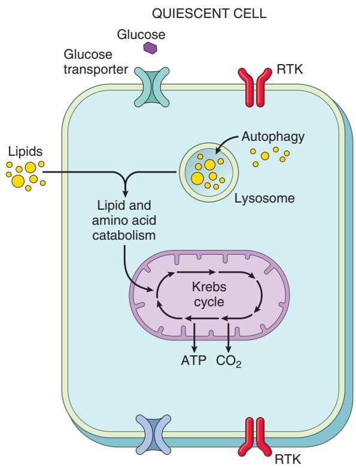
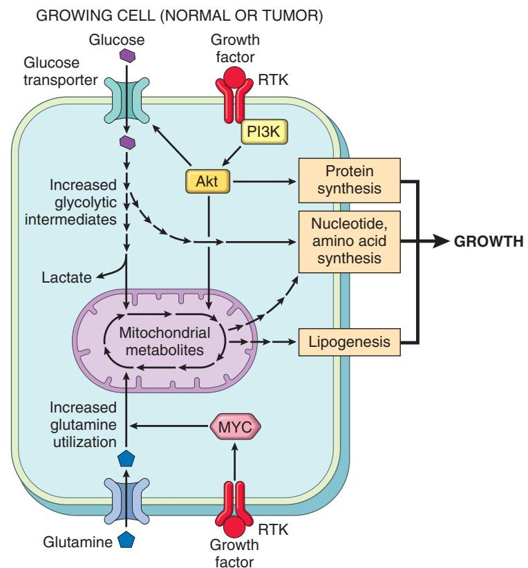 
Fig. 6.23 Metabolism and cell growth. Quiescent cells rely mainly on the Krebs cycle for ATP production; if starved, autophagy (self-eating) is induced to provide a source of fuel. When stimulated by growth factors, normal cells markedly upregulate glucose and glutamine uptake, which provide carbon sources for synthesis of nucleotides, proteins, and lipids. In cancers, oncogenic mutations involving growth factor signaling pathways and other key factors such as MYC deregulate these metabolic pathways, an alteration known as the Warburg effect.
upregulating glucose uptake and inhibiting the activity of pyruvate kinase, which catalyzes the last step in the glycolytic pathway, the conversion of phosphoenolpyruvate to pyruvate. This creates a damming effect that leads to the buildup of upstream glycolytic intermediates, which are siphoned off for synthesis of DNA, RNA, and protein.
- RAS signaling. Signals downstream of RAS upregulate the activity of glucose transporters and multiple glycolytic enzymes, thus increasing glycolysis; promote shunting of mitochondrial intermediates to pathways leading to lipid biosynthesis; and stimulate factors that are required for protein synthesis. 
- MYC. As mentioned earlier, pro-growth pathways upregulate expression of the transcription factor MYC, which drives changes in gene expression that support anabolic metabolism and cell growth. Among the MYC-regulated genes are those for several glycolytic enzymes and glutaminase, which is required for mitochondrial utilization of glutamine, a key source of carbon moieties needed for biosynthesis of cellular building blocks.
The flipside of the coin is that tumor suppressors often inhibit metabolic pathways that support growth. We have already discussed the "braking" effect of the tumor suppressors NF1 and PTEN on signals downstream of growth factor receptors and RAS, allowing them to oppose the Warburg effect. Indeed, it may be that many (and perhaps all) tumor suppressors that induce growth arrest suppress the Warburg effect. For example, p53, arguably the most important tumor suppressor, upregulates target genes that collectively inhibit glucose uptake, glycolysis, lipogenesis, and the generation of NADPH (a key cofactor needed for the biosynthesis of macromolecules). Thus, it is increasingly clear that the functions of many oncoproteins and tumor suppressors are inextricably intertwined with cellular metabolism.
Beyond the Warburg effect, there are two other links between metabolism and cancer that are of sufficient importance to merit brief mention, autophagy and an unusual set of oncogenic mutations that lead to the creation of oncometabolites, small molecules that appear to directly contribute to the transformed state.
# Autophagy
Autophagy is a state of severe nutrient deficiency in which cells not only arrest their growth, but also cannibalize their own organelles, proteins, and membranes as carbon sources for energy production (Chapter 2). If this adaptation fails, the cells die. Tumor cells often seem to be able to grow under marginal environmental conditions without triggering autophagy, suggesting that the pathways that induce autophagy are deranged. In keeping with this, several genes that promote autophagy are tumor suppressors. Whether autophagy is always bad from the vantage point of the tumor, however, remains a matter of active investigation and debate. For example, under conditions of severe nutrient deprivation, tumor cells may use autophagy to become "dormant," a state of metabolic hibernation that allows cells to survive hard times for long periods. Such cells are believed to be resistant to therapies that kill actively dividing cells, and could therefore be
responsible for therapeutic failures. Thus, autophagy may be a tumor's friend or foe depending on how the signaling pathways that regulate it are "wired" in a given tumor.
# Oncometabolism
Another surprising group of genetic alterations discovered through tumor genome sequencing studies are mutations in enzymes that participate in the Krebs cycle. Of these, mutations in isocitrate dehydrogenase (IDH) have garnered the most interest, as they have revealed a new mechanism of oncogenesis termed oncometabolism (Fig. 6.24).
The proposed steps in the oncogenic pathway involving IDH are as follows:
- IDH acquires a mutation that leads to a specific amino acid substitution involving residues in the active site of the enzyme. As a result, the mutated protein loses its ability to function as an isocitrate dehydrogenase and instead acquires a new enzymatic activity that catalyzes the production of 2-hydroxglutarate (2-HG). 
- 2-HG in turn acts as an inhibitor of several other enzymes that are members of the TET family, including TET2. 
- TET2 is one of several factors that regulate DNA methylation, which you will recall is an epigenetic modification that controls normal gene expression and often goes awry in cancer. According to the model, loss of TET2 activity leads to abnormal patterns of DNA methylation. 
- Abnormal DNA methylation in turn leads to misexpression of currently unknown cancer genes, which drive cellular transformation and oncogenesis.
Thus, according to this scenario, mutated IDH acts as an oncoprotein by producing 2-HG, which is considered a prototypical oncometabolite. Oncogenic IDH mutations
incancercellswithmutatedisocitratedehydrogenase(mIDH)..jpg) 
Fig. 6.24 Proposed action of the oncometabolite 2-hydroxyglutarate (2-HG) in cancer cells with mutated isocitrate dehydrogenase (mIDH).
have now been described in a diverse collection of cancers, including a sizable fraction of cholangiocarcinomas, gliomas, acute myeloid leukemias, and sarcomas. Of clinical significance, because the mutated IDH proteins have an altered structure, it has been possible to develop drugs that inhibit mutated IDH and not the normal IDH enzyme. These drugs are now being tested in cancer patients and have produced encouraging therapeutic responses. This developing story is a remarkable example of how detailed understanding of oncogenic mechanisms can yield entirely new kinds of anti-cancer drugs.
# ALtered CELLULAR METABOLISM
- Warburg metabolism is a form of pro-growth metabolism favoring glycolysis over oxidative phosphorylation. It is induced in normal cells by exposure to growth factors and becomes fixed in cancer cells due to the action of certain driver mutations. 
- Many oncoproteins (RAS, MYC, mutated growth factor receptors) induce or contribute to Warburg metabolism, and many tumor suppressors (PTEN, NF1, p53) oppose it. 
- Stress may induce cells to consume their components in a process called autophagy. Cancer cells may accumulate mutations to avoid autophagy, or may corrupt the process to provide nutrients for continued growth and survival. 
- Some oncoproteins such as mutated IDH act by causing the formation of high levels of "oncometabolites" that alter the epigenome, thereby leading to changes in gene expression that are oncogenic.
# Evasion of Cell Death
Tumor cells frequently contain mutations in genes that regulate apoptosis, making the cells resistant to cell death. As discussed in Chapter 2, apoptosis, or regulated cell death, refers to an orderly dismantling of cells into component pieces, which are then efficiently consumed by neighboring cells and professional phagocytes without stimulating inflammation. You will recall that there are two pathways that lead to apoptosis: the extrinsic pathway, triggered by the death receptors FAS and FAS-ligand; and the intrinsic pathway (also known as the mitochondrial pathway), initiated by perturbations such as loss of growth factors and DNA damage. Cancer cells are subject to a number of intrinsic stresses that can initiate apoptosis, particularly DNA damage, but also metabolic disturbances stemming from dysregulated growth as well as hypoxia caused by insufficient blood supply. These stresses are enhanced manyfold when tumors are treated with chemotherapy or radiation therapy, which kill tumor cells by activating the intrinsic pathway of apoptosis. Thus, there is strong selective pressure, both before and during therapy, for cancer cells to develop resistance to intrinsic stresses that may induce apoptosis. Accordingly, evasion of apoptosis by cancer cells occurs mainly by way of acquired mutations and changes in gene expression that disable
key components of the intrinsic pathway, or that reset the balance of regulatory factors so as to favor cell survival in the face of intrinsic stresses (Figure 6.25).
Before delving into modes of resistance to apoptosis, a brief review of the intrinsic pathway is in order. Activation of this pathway leads to permeabilization of the mitochondrial outer membrane and release of molecules, such as cytochrome c, that initiate apoptosis. The integrity of the mitochondrial outer membrane is determined by a delicate balancing act between pro-apoptotic and anti-apoptotic members of the BCL2 protein family. The pro-apoptotic proteins BAX and BAK are required for apoptosis and directly promote mitochondrial permeabilization. Their action is inhibited by the anti-apoptotic members of this family, which are exemplified by BCL2, BCL-XL, and MCL1. A third set of proteins, the so-called "BH3-only proteins," which include BAD, BID, and PUMA, shift the balance between the pro-apoptotic and anti-apoptotic family members by neutralizing the actions of anti-apoptotic proteins like BCL2 and BCL-XL, thereby promoting apoptosis. When the sum total of all the BH3-only proteins "overwhelms" the protective BCL2/BCL-XL factors, BAX and BAK are activated and form pores in the mitochondrial membrane. These allow mitochondrial cytochrome c to
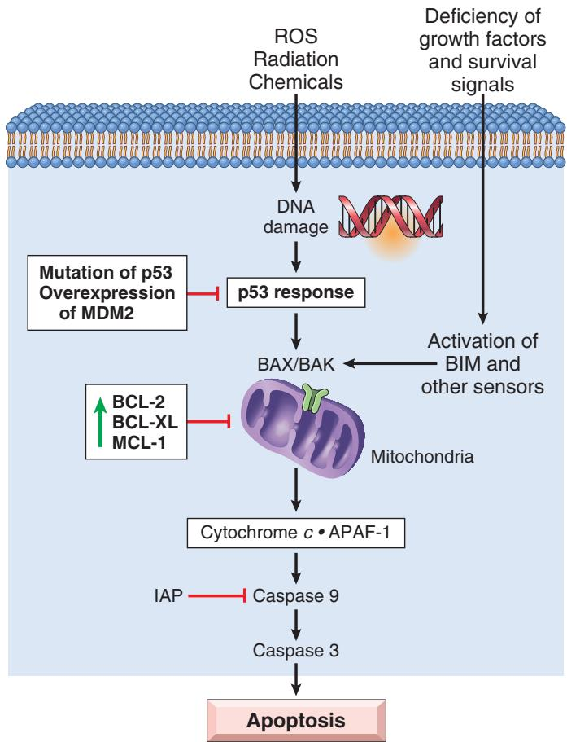 
Fig. 6.25 Intrinsic pathway of apoptosis and major mechanisms used by tumor cells to evade cell death. (1) Loss of p53, either through mutation or through antagonism by MDM2. (2) Reduced egress of cytochrome c from mitochondria as a result of upregulation of anti-apoptotic factors such as BCL2, BCL-XL, and MCL-1. IAP, Inhibitor of apoptosis.
leak out into the cytosol, where it binds to APAF-1 and activates caspase-9, which in turn cleaves and activates executioner caspases such as caspase-3. Another group of factors that function as negative regulators of the intrinsic pathway is known as inhibitor of apoptosis proteins (IAPs), which bind caspase-9 and prevent apoptosis.
Within this framework, it is possible to illustrate the major mechanisms by which apoptosis is evaded by cancer cells (Figure 6.25). These mainly involve loss of p53, the key component of early steps in the intrinsic pathway, and increased expression of anti-apoptotic members of the BCL2 family.
- Loss of TP53 function. As already discussed, TP53 is commonly mutated in cancers at diagnosis, and the frequency of TP53 mutations is even higher in tumors that relapse after therapy. In addition to mutation of TP53, other lesions in cancers impair p53 function indirectly, most notably amplification of MDM2, which encodes an inhibitor of p53. Loss of p53 function prevents the upregulation of PUMA, a pro-apoptotic BH3-only member of the BCL2 family that is a direct target of p53. As a result, cells survive levels of DNA damage and cell stress that otherwise would result in their death. 
- Overexpression of anti-apoptotic members of the BCL2 family. Overexpression of BCL2 is a common event leading to the protection of tumor cells from apoptosis and occurs through several mechanisms. One of the best understood examples is found follicular lymphoma (Chapter 12), a B-cell tumor carrying a characteristic (14;18) (q32;q21) translocation that fuses the BCL2 (located at 18q21) to the transcriptionally active immunoglobulin heavy chain gene (located at 14q32). The resulting overabundance of BCL2 protects lymphocytes from apoptosis and allows them to survive for abnormally long periods, producing a steady accumulation of B lymphocytes that results in lymphadenopathy. Because BCL2-overexpressing follicular lymphomas arise in large part through reduced cell death rather than explosive cell proliferation, they tend to be indolent (slow-growing). In other tumors such as chronic lymphocytic leukemia (Chapter 12), it appears that BCL2 is upregulated because of loss of expression of specific micro-RNAs that normally dampen BCL2 expression. Many other mechanisms leading to overexpression of anti-apoptotic members of the BCL2 family have been described, particularly in the setting of resistance to chemotherapy. For example, amplification of the MCL1 gene is seen in a subset of lung and breast cancers.
Recognition of the mechanisms by which cancers evade cell death has stimulated several lines of targeted drug development. Restoration of p53 function in TP53-mutated tumors is a daunting problem (because of the inherent difficulty of "fixing" defective genes), but is possible in tumors in which p53 is inactive because of overexpression of its inhibitor, MDM2. Indeed, inhibitors of MDM2 that reactivate p53 and induce apoptosis in tumors with MDM2 gene amplification, such as certain types of sarcoma, are being tested in clinical trials. Even more promising results are being generated with drugs that mimic the activities of BH3-only proteins and inhibit the function of antiapoptotic members of the BCL2 family, particularly BCL2
itself. These drugs have potent activity against tumors characterized by BCL2 overexpression (such as chronic lymphocytic leukemia) and are likely to become a standard part of cancer treatment over the course of the next few years.
# EVAION OF APOPTOSIS
- Evasion of cell death by cancers mainly involves acquired abnormalities that interfere with the intrinsic (mitochondrial) pathway of apoptosis. 
- The most common abnormalities involve loss of p53 function, either by way of TP53 mutations or overexpression of the p53 inhibitor MDM2. 
- Other cancers evade cell death by overexpressing anti-apoptotic members of the BCL2 family, such as BCL2, BCL-XL, and MCL1, which protect cells from the action of BAX and BAK, the pro-apoptotic members of the BCL2 family. 
- In a large majority of follicular B-cell lymphomas, BCL2 levels are high because of a (14;18) translocation that fuses the BCL2 gene with regulatory elements of the immunoglobulin heavy chain gene. 
- Inhibitors of MDM2 (which activate p53) and inhibitors of BCL2 family members induce the death of cancer cells by stimulating the intrinsic pathway of apoptosis and are being developed as therapeutic agents.
# Limitless Replicative Potential (Immortality)
Tumor cells, unlike normal cells, are capable of limitless replication. As discussed previously in the context of cellular aging (Chapter 2), most normal human cells have a capacity of at most 70 doublings. Thereafter, the cells lose the ability to divide and enter replicative senescence. This phenomenon has been ascribed to progressive shortening of telomeres at the ends of chromosomes.
Markedly eroded telomeres are recognized by the DNA repair machinery as double-stranded DNA breaks, leading to cell cycle arrest and senescence, mediated by TP53 and RB. In cells in which TP53 or RB mutations are disabled by mutations, the nonhomologous end-joining pathway is activated in a last-ditch effort to save the cell, joining the shortened ends of two chromosomes.
Such an inappropriately activated repair system results in dicentric chromosomes that are pulled apart at anaphase, resulting in new double-stranded DNA breaks. The resulting genomic instability from the repeated bridge-fusion-breakage cycles eventually produces mitotic catastrophe, characterized by massive apoptosis.
It follows that for tumors to acquire the ability to grow indefinitely, loss of growth restraints is not enough; both cellular senescence and mitotic catastrophe must also be avoided (Fig. 6.26). If during crisis a cell manages to reactivate telomerase, the bridge-fusion-breakage cycles cease, and the cell is able to avoid death. However, during this period of genomic instability that precedes telomerase activation, numerous mutations could accumulate, helping the
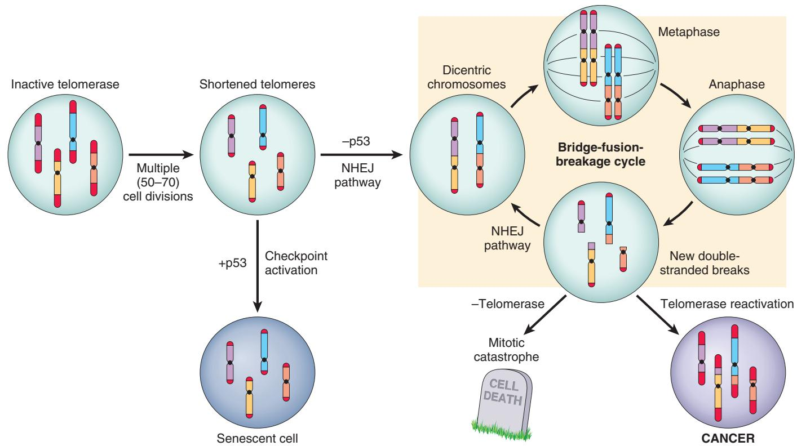 
Fig. 6.26 Escape of cells from replicative senescence and mitotic catastrophe caused by telomere shortening.
cell march toward malignancy. Telomerase, active in normal stem cells, is absent from or present at very low levels in most somatic cells. By contrast, telomere maintenance is seen in virtually all types of cancers. In $85\%$ to $95\%$ of cancers, this is due to upregulation of the enzyme telomerase. A few tumors use other mechanisms, termed alternative lengthening of telomeres, which depend on DNA recombination.
Of interest, in a study of the progression from colonic adenoma to colonic adenocarcinoma, early lesions had a high degree of genomic instability with low telomerase expression, whereas malignant lesions had complex karyotypes with high levels of telomerase activity, consistent with a model of telomere-driven tumorigenesis in human cancer. Thus, it appears that unregulated proliferation in incipient tumors leads to telomere shortening, followed by chromosomal instability and the accumulation of mutations. If telomerase is then reactivated in these cells, telomeres are extended and these mutations become fixed, contributing to tumor growth.
# LIMITLESS REPLICATIVE POTENTIAL (IMMORTALITY)
- In normal cells, which lack expression of telomerase, the shortened telomeres generated by cell division eventually activate cell cycle checkpoints, leading to senescence and placing a limit on the number of divisions a cell may undergo.
- In cells that have disabled checkpoints, DNA repair pathways are inappropriately activated by shortened telomeres, leading to massive chromosomal instability and mitotic crisis. 
- Tumor cells reactivate telomerase, thus staving off mitotic catastrophe and achieving immortality.
# Sustained Angiogenesis
Even if a solid tumor possesses all of the genetic aberrations that are required for malignant transformation, it cannot enlarge beyond 1 to $2\mathrm{mm}$ in diameter unless it has the capacity to induce angiogenesis. Like normal tissues, tumors require delivery of oxygen and nutrients and removal of waste products; presumably the 1- to 2-mm zone represents the maximal distance across which oxygen, nutrients, and waste can diffuse to and from blood vessels. Growing cancers stimulate neoangiogenesis, during which vessels sprout from previously existing capillaries. Neovascularization has a dual effect on tumor growth: perfusion supplies needed nutrients and oxygen, and newly formed endothelial cells stimulate the growth of adjacent tumor cells by secreting growth factors, such as insulin-like growth factors (IGFs) and PDGF. While the resulting tumor vasculature is effective at delivering nutrients and removing wastes, it is not entirely normal; the vessels are leaky and dilated, and have a haphazard pattern of connection, features that can be appreciated on angiograms. By permitting tumor cells access to these abnormal vessels, angiogenesis also contributes to metastasis. Angiogenesis is thus an essential facet of malignancy.
How do growing tumors develop a blood supply? The current paradigm is that angiogenesis is controlled by a balance between angiogenesis promoters and inhibitors; in angiogenic tumors this balance is skewed in favor of promoters. Early in their development, most human tumors do not induce angiogenesis. Starved of nutrients, these tumors remain small or in situ, possibly for years, until an angiogenic switch terminates this stage of vascular quiescence. The molecular basis of the angiogenic switch involves increased production of angiogenic factors and/ or loss of angiogenic inhibitors. These factors may be produced by the tumor cells themselves or by inflammatory cells (e.g., macrophages) or resident stromal cells (e.g., tumor-associated fibroblasts). Proteases, either elaborated by the tumor cells or by stromal cells in response to the tumor, are also involved in regulating the balance between angiogenic and anti-angiogenic factors. Many proteases can release proangiogenic basic fibroblast growth factors (bFGF) that are stored in the ECM; conversely, the angiogenesis inhibitors angiotatin and endostatin are produced by proteolytic cleavage of plasminogen and collagen, respectively.
The local balance of angiogenic and anti-angiogenic factors is influenced by several factors:
- Relative lack of oxygen due to hypoxia stabilizes HIF1 $\alpha$ , an oxygen-sensitive transcription factor mentioned earlier, which then activates the transcription of proangiogenic cytokines such as VEGF. These factors create an angiogenic gradient that stimulates the proliferation of endothelial cells and guides the growth of new vessels toward the tumor. 
- Mutations involving tumor suppressors and oncogenes in cancers also tilt the balance in favor of angiogenesis. For example, p53 stimulates expression of antiangiogenic molecules, such as thrombospondin-1, and represses expression of proangiogenic molecules, such as VEGF. Thus, loss of p53 in tumor cells provides a more permissive environment for angiogenesis. 
- The transcription of VEGF also is influenced by signals from the RAS-MAP kinase pathway, and gain-of-function mutations in $RAS$ or MYC upregulate the production of VEGF. Notably, elevated levels of VEGF can be detected in the serum and urine of a significant fraction of cancer patients.
The idea that angiogenesis is essential if solid tumors are to grow to clinically significant sizes has provided a powerful impetus for the development of therapeutic agents that block angiogenesis. These agents are now a part of the armamentarium that oncologists use against cancers; a cardinal example is bevacizumab, a monoclonal antibody that neutralizes VEGF activity and is approved for use in the treatment of multiple cancers. However, angiogenesis inhibitors have not been nearly as effective as was originally hoped; they can prolong life, but usually for only a few months and at high financial cost. The mechanisms that underlie the persistence and ultimate progression of cancers in the face of therapy with angiogenesis inhibitors are not yet clear. The modest benefit of anti-angiogenic therapy highlights the pernicious nature of advanced cancers, which can even elude therapies directed at stromal support cells such as endothelium.
Improvements are only possible with greater understanding of the "escape routes" through which tumor cells sidestep the effects of the angiogenesis inhibitors that are now in use.
# SUSTAINED ANGIOGENESIS
- Vascularization of tumors is essential for their growth and is controlled by the balance between angiogenic and antiangiogenic factors that are produced by tumor and stromal cells. 
- Hypoxia triggers angiogenesis through the actions of HIF-1 $\alpha$ on the transcription of the proangiogenic factor VEGF. 
- Many other factors regulate angiogenesis; for example, p53 induces synthesis of the angiogenesis inhibitor thrombospondin-I, while RAS, MYC, and MAPK signaling all upregulate VEGF expression and stimulate angiogenesis. 
- VEGF inhibitors are used to treat a number of advanced cancers and prolong the clinical course, but are not curative.
# Invasion and Metastasis
Invasion, and metastasis, the major causes of cancer-related morbidity and mortality, result from complex interactions involving cancer cells, stromal cells, and the extracellular matrix (ECM). These interactions can be broken down into a series of steps consisting of local invasion, intravasation into blood and lymph vessels, transit through the vasculature, extravasation from the vessels, formation of micrometastases, and growth of micrometastases into macroscopic tumors (Fig. 6.27). Predictably, this sequence of steps may be interrupted at any stage by either host-related or tumor-related factors. For the purpose of discussion, the metastatic cascade can be subdivided into two phases: (1) invasion of ECM and (2) vascular dissemination and homing of tumor cells.
# Invasion of Extracellular Matrix
Human tissues are organized into a series of compartments separated from each other by two types of ECM: basement membranes and interstitial connective tissue (Chapter 1). Although organized differently, each type of ECM is composed of collagens, glycoproteins, and proteoglycans. Tumor cells must interact with the ECM at several stages in the metastatic cascade (see Fig. 6.27). A carcinoma first must breach the underlying basement membrane, then traverse the interstitial connective tissue, and ultimately gain access to the circulation by penetrating the vascular basement membrane. This process is repeated in reverse when tumor cell emboli extravasate at a distant site. Invasion of the ECM initiates the metastatic cascade and is an active process that can be resolved into several sequential steps (Fig. 6.28):
- Loosening of intercellular connections between tumor cells. As mentioned earlier, E-cadherins act as intercellular glues, and their cytoplasmic portions bind to $\beta$ -catenin (see Fig. 6.22). Adjacent E-cadherin molecules keep the cells together; in addition, as discussed earlier, E-cadherin can transmit anti-growth signals by sequestering $\beta$ -catenin. E-cadherin function is lost in almost all
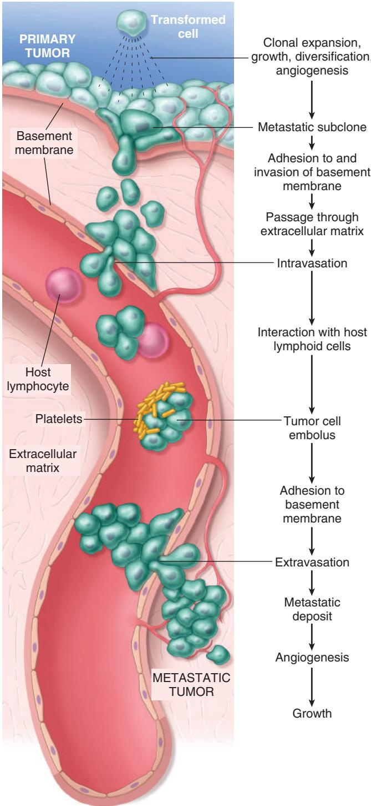 
Fig. 6.27 The metastatic cascade: The sequential steps involved in the hematogenous spread of a tumor.
epithelial cancers, either by mutational inactivation of E-cadherin genes, activation of $\beta$ -catenin genes, or inappropriate expression of the SNAIL and TWIST transcription factors, which suppress E-cadherin expression.
- Local degradation of the basement membrane and interstitial connective tissue. Tumor cells may either secrete proteolytic enzymes themselves or induce stromal cells (e.g., fibroblasts and inflammatory cells) to elaborate proteases. Multiple different proteases, such as matrix metalloproteinases (MMPs), cathepsin D, and urokinase
plasminogen activator, have been implicated in tumor cell invasion. MMPs regulate tumor invasion not only by remodeling insoluble components of the basement membrane and interstitial matrix but also by releasing ECM-sequestered growth factors, which have chemotactic, angiogenic, and growth-promoting effects. For example, MMP-9 is a gelatinase that cleaves type IV
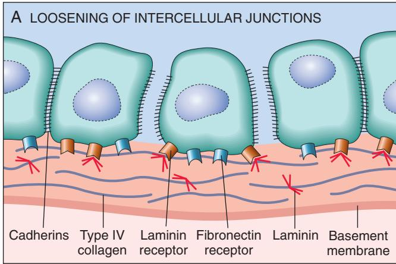
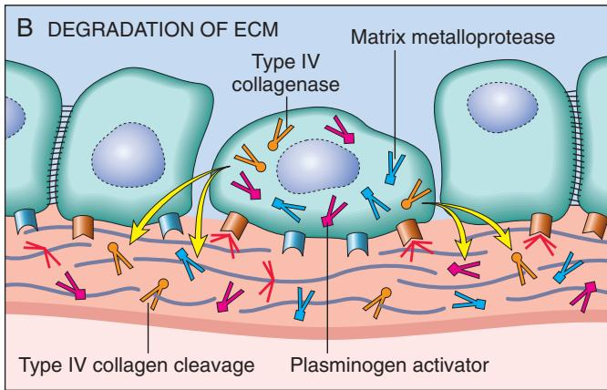
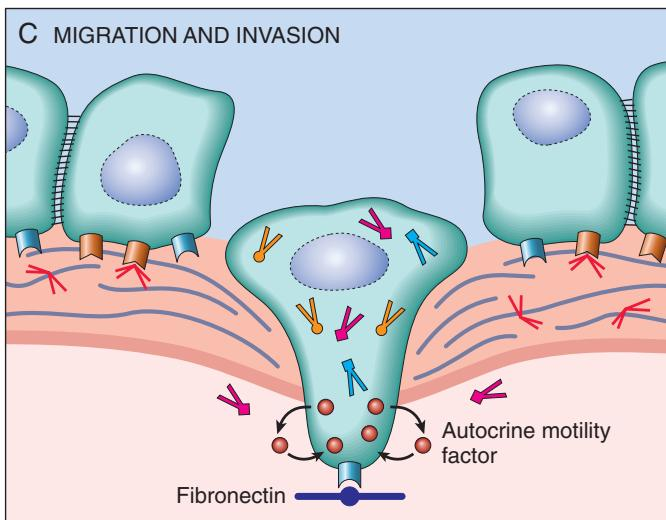 
Fig. 6.28 Sequence of events in the invasion of epithelial basement membranes by tumor cells. Tumor cells detach from each other because of reduced adhesiveness and attract inflammatory cells. Proteases secreted from tumor cells and inflammatory cells degrade the basement membrane. Binding of tumor cells to proteolytically generated binding sites and tumor cell migration follow.
collagen of the epithelial and vascular basement membrane and also stimulates release of VEGF from ECM-sequestered pools. Benign tumors of the breast, colon, and stomach show little type IV collagenase activity, whereas their malignant counterparts overexpress this enzyme. Concurrently, the levels of metalloproteinase inhibitors are reduced so that the balance is tilted greatly toward tissue degradation. Indeed, overexpression of MMPs and other proteases has been reported for many malignant tumors.
- Changes in attachment of tumor cells to ECM proteins. Normal epithelial cells have receptors, such as integrins, for basement membrane laminin and collagens that are polarized at their basal surface; these receptors help to maintain the cells in a resting, differentiated state. Loss of adhesion in normal cells leads to induction of apoptosis, while, not surprisingly, tumor cells are resistant to this form of cell death. Additionally, the matrix itself is modified in ways that promote invasion and metastasis. For example, cleavage of the basement membrane proteins, collagen IV, and laminin by MMP-2 or MMP-9 generates novel sites that bind to receptors on tumor cells and stimulate migration. 
- Locomotion is the final step of invasion, propelling tumor cells through the degraded basement membranes and zones of matrix proteolysis. Migration is a complex, multistep process that involves many families of receptors and signaling proteins that eventually impinge on the actin cytoskeleton. Such movement seems to be potentiated and directed by tumor cell-derived cytokines, such as autocrine motility factors. In addition, cleavage products of matrix components (e.g., collagen, laminin) and some growth factors (e.g., insulin-like growth factors I and II) have chemotactic activity for tumor cells. Stromal cells also produce paracrine effectors of cell motility, such as hepatocyte growth factor/scatter factor (HGF/SCF), which binds to receptors on tumor cells. Concentrations of HGF/SCF are elevated at the advancing edges of the highly invasive brain tumor glioblastoma multiforme, supporting their role in motility.
It also has become clear that the stromal cells surrounding tumor cells are not merely a static barrier for tumor cells to traverse but rather constitute a variable environment in which reciprocal signaling between tumor cells and stromal cells such as fibroblasts and immune cells enable multiple cancer hallmarks (discussed later). For example, a variety of studies have demonstrated that tumor-associated fibroblasts exhibit altered expression of genes that encode ECM molecules, proteases, protease inhibitors, and various growth factors, all of which can influence tumor invasion and extravasation. The most successful tumors may be those that can co-opt the activities of stromal cells to their own nefarious purposes.
# Vascular Dissemination and Homing of Tumor Cells
Because of their invasive properties, tumor cells frequently escape their sites of origin and enter the circulation. It is now recognized from studies of "liquid biopsies," blood samples taken from patients with solid tumors, that millions of tumor cells are shed daily from even small cancers; hence both tumor cells and
tumor-derived DNA can be detected in circulation. Most of these tumor cells circulate as single cells, while others form emboli by aggregating and adhering to circulating blood elements, particularly platelets.
Given the ease with which tumor cells access the circulation, it is apparent that the ability of cancers cells to leave the circulation, invade, and grow to clinically significant sizes at other sites in the body is (fortunately for the patient) highly inefficient.
Several factors seem to limit the metastatic potential of circulating tumor cells. While in the circulation, tumor cells are vulnerable to destruction by host immune cells (discussed later), and the process of adhesion to normal vascular beds and invasion of normal distant tissues may be much more difficult than the escape of tumor cells from the cancer. Even following extravasation, tumor cells that have been selected for growth in the originating tissue may find it difficult to grow in a second site due to lack of critical stromal support or because of recognition and suppression by resident immune cells. Indeed, the concept of tumor dormancy, referring to the prolonged survival of micrometastases without progression, is well described in melanoma and in breast and prostate carcinoma. Dormancy of tumor cells at distant sites may well be the last defense against clinically significant metastatic disease.
Despite these limiting factors, if neglected, virtually all malignant tumors will eventually produce macroscopic metastases. The site at which metastases appear is related to two factors: the anatomic location and vascular drainage of the primary tumor, and the tropism of particular tumors for specific tissues. As mentioned earlier, most metastases occur in the first capillary bed available to the tumor, hence the frequency of metastases to liver and lung. Many observations, however, suggest that natural pathways of drainage do not wholly explain the distribution of metastases. For example, prostatic carcinoma preferentially spreads to bone, bronchogenic carcinomas tend to involve the adrenal glands and the brain, and neuroblastomas spread to the liver and bones. Such organ tropism may be related to the following mechanisms:
- Tumor cells may have adhesion molecules whose ligands are expressed preferentially on the endothelial cells of the target organ. 
- Chemokines may have an important role in determining the target tissues for metastasis. For instance, many cancers express the chemokine receptor CXCR4, which has been implicated in the extravasation of circulating tumor cells originating from tumors such as breast cancer. 
- In some cases, the target tissue may be a nonpermissive environment, "unfavorable soil," so to speak, for the growth of tumor seedlings. For example, although they are well vascularized, skeletal muscle and spleen are rarely sites of metastasis.
It must be admitted, however, that although particular tumors "prefer" certain metastatic sites, the precise localization of metastases cannot be predicted in individual patients with any form of cancer. Evidently, much to the dismay of medical students, many tumors have not read the relevant chapters of pathology textbooks! Although the molecular mechanisms of colonization are still being
unraveled, a consistent theme seems to be that tumor cells secrete cytokines, growth factors, and proteases that act on the resident stromal cells, which in turn make the metastatic site habitable for the cancer cell. With a better molecular understanding of the mechanisms of metastasis, the clinician's ability to target them therapeutically will be greatly enhanced.
# Metastasis
Of central importance in oncology is the question, why do only some tumors metastasize? It is sobering to realize that satisfying answers are still lacking. Some variation in metastasis clearly relates to inherent differences in the behavior of particular tumors; for example, small cell carcinoma of the lung virtually always metastasizes to distant sites, whereas with some tumors, such as basal cell carcinoma, metastasis is the exception rather than the rule. In general, large tumors are more likely to metastasize than small tumors, presumably because (all other things being equal) large tumors will have been present in the patient for longer periods of time, providing additional chances for metastasis to occur. However, tumor size and type cannot adequately explain the behavior of individual cancers, and it is still open to question whether metastasis is merely probabilistic (a matter of chance multiplied by tumor cell number and time) or reflects inherent differences in metastatic potential from tumor to tumor (a deterministic model).
The deterministic model proposes that metastasis is inevitable with certain tumors because the tumor harbors cells with a specific metastatic phenotype. As discussed earlier, as tumor cells grow they randomly accumulate mutations, creating subclones with distinct combinations of mutations. One possibility is that only rare tumor cells accumulate all of the mutations necessary for metastasis, and that this accounts for the inefficiency of the process. However, identification of metastasis-specific mutations and metastasis-specific patterns of gene expression has proven to be difficult. An alternative idea is that some tumors acquire all of the mutations needed for metastasis early in their development, and that these are the tumors that are fated to be "bad actors." Metastasis, according to this view, is not dependent on the stochastic generation of metastatic subclones during tumor progression, but is an intrinsic property of the tumor that develops early on during carcinogenesis. These mechanisms are not mutually exclusive, and it could be that aggressive tumors acquire a metastasis-permissive gene expression pattern early in tumorigenesis, yet also require some additional random mutations to complete the metastatic phenotype. Nor can all blame be placed on tumor cells: as mentioned earlier, there is evidence that the makeup of the stroma, the presence of infiltrating immune cells, and the degree and quality of angiogenesis also influence metastasis.
Another open question is whether there are genes whose principal or sole contribution is to control programs of gene expression that promote metastasis. This question is of more than academic interest, because if altered forms of certain genes promote or suppress the metastatic phenotype, their detection in a primary tumor would have both prognostic and therapeutic implications. Among candidates for such metastasis oncogenes are those encoding
SNAIL and TWIST, transcription factors whose primary function is to promote epithelial-to-mesenchymal transition (EMT). In EMT, carcinoma cells downregulate certain epithelial markers (e.g., E-cadherin) and upregulate certain mesenchymal markers (e.g., vimentin, smooth muscle actin). These molecular changes are accompanied by phenotypic alterations such as morphologic change from polygonal epithelioid cell shape to a spindly mesenchymal shape, along with increased production of proteolytic enzymes that promote migration and invasion. These changes are believed to favor the development of a promigratory phenotype that is essential for metastasis. Loss of E-cadherin expression seems to be a key event in EMT, and SNAIL and TWIST are transcriptional repressors that downregulate E-cadherin expression. How expression of these master regulator transcription factors is stimulated in tumors is not clear; however, experimental models suggest that interactions of tumor cells with stromal cells are a key stimulus for this change. Thus, acquisition of a metastatic phenotype may not require a set of mutations but may be an emergent property arising from the interactions of tumor cells and stroma.
# INVASION AND METASTASIS
- Ability to invade tissues, a hallmark of malignancy, occurs in four steps: loosening of cell-cell contacts, degradation of ECM, attachment to novel ECM components, and migration of tumor cells. 
- Cell-cell contacts are lost by the inactivation of E-cadherin through a variety of pathways. 
- Basement membrane and interstitial matrix degradation is mediated by proteolytic enzymes secreted by tumor cells and stromal cells, such as MMPs and cathepsins. 
- Proteolytic enzymes also release growth factors sequestered in the ECM and generate chemotactic and angiogenic fragments from cleavage of ECM glycoproteins. 
- The metastatic site of many tumors can be predicted by the location of the primary tumor. Many tumors arrest in the first capillary bed they encounter (lung and liver, most commonly). 
- Some tumors show organ tropism, probably due to activation of adhesion or chemokine receptors whose ligands are expressed by endothelial cells at the metastatic site.
# Evasion of Immune Surveillance
Long one of the "holy grails" of oncology, the promise of therapies that enable the host immune system to recognize and destroy cancer cells is finally coming to fruition, largely due to a clearer understanding of the mechanisms by which cancer cells evade the host response. Paul Ehrlich first conceived the idea that tumor cells can be recognized as "foreign" and eliminated by the immune system. Subsequently, Lewis Thomas and Macfarlane Burnet formalized this concept by coining the term immune surveillance, based on the premise that a normal function of the immune system is to constantly "scan" the body for emerging malignant cells and destroy them. This idea has
been supported by many observations—the direct demonstration of tumor-specific T cells and antibodies in patients; data showing that the extent and quality of immune infiltrates in cancers often correlates with outcome; the increased incidence of certain cancers in immunodeficient people and mice; and most recently and most directly, the dramatic success of immunotherapy in the treatment of several cancers.
The specific factors that govern the outcome of interactions between tumor cells and the host immune system are numerous and are still being defined. In the face of this complexity, it is helpful to consider a few overarching principles:
- Cancer cells express a variety of antigens that stimulate the host immune system, which appears to have an important role in preventing the emergence of cancers. 
- Despite the antigenicity of cancer cells, the immune response to established tumors is ineffective, and in some instances may actually promote cancer growth, due to acquired changes that allow cancer cells to evade anti-tumor responses and foster pro-tumor responses. 
- Defining mechanisms of immune evasion and "immunomodulation" by cancer cells has led to effective new immunotherapies that work by reactivating latent host immune responses.
Tumor Antigens. As we have discussed, cancer is a disorder that is caused by driver mutations in oncogenes and tumor suppressor genes, which in most instances are acquired rather than inherited. In addition to pathogenic driver mutations, cancers, due to their inherent genetic instability, also accumulate passenger mutations. These may be particularly abundant in cancers that are caused by mutagenic exposures (e.g., sunlight, smoking). All of these varied mutations may generate new protein sequences (neoantigens) that the immune system has not seen and therefore is not tolerant of and can react to.
In some instances, unmutated proteins expressed by tumor cells also can stimulate the host immune response.
- One such antigen is tyrosinase, an enzyme involved in melanin biosynthesis that is expressed only in normal melanocytes and melanomas. It may be surprising that the immune system is able to respond to this normal self-antigen. The probable explanation is that tyrosinase is normally produced in such small amounts and in so few normal cells that it is not recognized by the immune system and fails to induce tolerance. 
- Another group of tumor antigens, the cancer-testis antigens, are encoded by genes that are silent in all adult tissues except germ cells in the testis—hence their name. Although the protein is present in the testis it is not expressed on the cell surface in a form that can be recognized by $\mathrm{CD8 + }$ T cells, because sperm do not express MHC class I molecules. Thus, for all practical purposes these antigens are tumor specific and are therefore capable of stimulating anti-tumor immune responses.
An additional important class of tumor antigens consists of viral proteins that are expressed in cancer cells transformed by oncogenic viruses. The most potent of these antigens are proteins produced by cells that are latently infected
with DNA viruses, the most important of which are human papilloma virus (HPV) and Epstein-Barr virus (EBV). There is abundant evidence that cytotoxic T lymphocytes (CTLs) recognize viral antigens and play important roles in surveillance against virus-induced tumors through their ability to recognize and kill virus-infected cells. Most notably, multiple cancers associated with oncogenic viruses, including HPV-associated cervical carcinoma and EBV-related B cell lymphomas, occur at significantly higher rates in individuals with defective T cell immunity, such as patients infected with HIV.
Effective Immune Responses to Tumor Antigens. Assuming that the immune system is normally capable of eliminating emerging cancers, we may ask, what are the key components of an effective host immune response? It appears likely that immune reactions to cancers are initiated by the death of individual cancer cells, which occurs at some frequency in all cancers due to dysregulated growth, metabolic stresses, and hypoxia due to insufficient blood supply. When tumor cells die they release "danger signals" (damage associated molecular patterns, see Chapter 5) that stimulate innate immune cells, including resident phagocytes and antigen presenting cells. It is believed that some of the dead cells are phagocytosed by dendritic cells, which migrate to draining lymph nodes and present tumor neoantigens in the context of MHC class I molecules, a process termed cross-presentation. The displayed tumor antigens are recognized by antigen-specific $\mathrm{CD8 + }$ T cells, which become activated, proliferate, differentiate into active CTLs, and home to the site of the tumor, where they recognize and kill tumor cells presenting neoantigens in the context of their own MHC class I molecules (Fig. 6.29). IFN- $\gamma$ -producing T helper cells of the Th1 subset, which may be induced by recognition of tumor antigens, can activate macrophages and also contribute to the destruction of tumors.
As will be discussed shortly, some the strongest evidence for the importance of CTL responses in immunosurveillance stems from the characterization of established human cancers, which often feature acquired mutations that prevent CTLs from recognizing tumor cells as "foreign". It also has been noted in large studies of a wide variety of human tumors that high levels of infiltrating CTLs and Th1 cells correlate with better clinical outcomes. While other cell types such as natural killer cells also have been implicated in anti-tumor responses, the quality and strength of CTL responses are believed to be of preeminent importance.
Immune Evasion by Cancers. Since the immune system is capable of recognizing and eliminating nascent cancers, it follows that tumors that reach clinically significant sizes must be composed of cells that are either invisible to the host immune system or that express factors that actively suppress host immunity. The term cancer immunoediting has been used to describe the ability of the immune system to promote the darwinian selection of the tumor subclones that are most able to avoid host immunity or even manipulate the immune system for their own malignant purposes. Since CTL responses appear to be the most important defense that the host has against tumors, it should come as
.jpg) 
Fig. 6.29 Cross-presentation of tumor antigens and induction of $\mathrm{CD8 + }$ cytotoxic T cell antitumor response. (Modified from Abbas AK, Lichtman AH, Pillai S: Cellular and molecular immunology, ed 9, Philadelphia, 2018, Elsevier.)
no surprise that tumor cells show a variety of alterations that abrogate CTL responses. These include acquired mutations in $\beta 2$ -microglobulin that prevent the assembly of functional MHC class I molecules, and increased expression of a variety of proteins that inhibit CTL function. These proteins work by activating what is referred to as immune checkpoints, inhibitory pathways that normally are crucial for maintaining self-tolerance and controlling the size and duration of immune responses so as to minimize collateral tissue damage.
One of the best-characterized immune checkpoints involves a protein called PD-L1 (programmed cell death ligand 1), which is often expressed on the surface of tumor cells (Figure 6.30). When PD-L1 engages its receptor, PD-1, on CTLs, the CTLs become unresponsive and lose their ability to kill tumor cells. Experimental studies have identified several other immune checkpoint pathways, involving different ligands and receptors, which also have been implicated in immunoevasion by tumors. Of these, the best characterized involves CTLA4, another receptor expressed on T cells that inhibits T cell function.
The discovery of checkpoints that shut off anti-tumor immunity has led to the development of antibodies that
block these checkpoints and release the brakes on the immune response. Current checkpoint blockade therapies have resulted in response rates of $10 - 30\%$ in a variety of solid tumors (melanoma, lung cancer, bladder cancer, and others), and even higher rates in some hematologic malignancies such as Hodgkin lymphoma (Chapter 12). Because these checkpoints evolved to prevent responses to self antigens (Chapter 5), it is not surprising that patients treated with checkpoint blockade therapy develop various autoimmune manifestations, such as colitis and other types of systemic inflammation. Most of these reactions can be controlled with anti-inflammatory agents.
The remarkable response of advanced cancers to immune checkpoint inhibitors has energized other work focused on harnessing the immune system to combat cancer. These include efforts to develop personalized tumor vaccines using neoantigens identified in the tumors of individual patients, as well as new kinds of adoptive immunotherapy. The most advanced of the latter are patient-derived CTLs that are engineered to express chimeric antigen receptors (CARs). CARs have extracellular domains consisting of antibodies that bind tumor antigens and intracellular domains that delivered signals that activate CTLs following their engagement with antigen on the surface of tumor cells. CAR T cells are potent killers of tumor cells and have produced long-term remissions in patients with certain leukemias, such as B cell acute lymphoblastic leukemia (Chapter 12). However, CAR T cells also are associated with serious complications related to cytokines released from the activated CTLs, and it remains to be seen if they will become a routine part of cancer treatment.
Beyond complications of immunotherapy, it also should be recognized that the host immune response to tumors is not an unalloyed blessing. For example, tumors release incompletely characterized factors that alter the function of certain immune cells, such as macrophages and Th2 lymphocytes, in a fashion that is suspected of promoting angiogenesis, tissue fibrosis, and the accumulation of alternatively activated (M2) macrophages, which you will recall from Chapter 5 are associated with suppression of the immune response during wound healing. These types of responses may promote tumor growth, the converse of what one would expect from a protective anti-tumor immune response.
To summarize, while the future appears very bright for cancer immunotherapy, important hurdles remain to be cleared. At present, response and resistance to immune checkpoint inhibitors are unpredictable, and new biomarkers are needed to better tailor therapies for individual patients. This will entail the development of new diagnostic tests to gauge both the host immune response and the likely means of immune evasion in individual cancers. There is reason to believe that immune checkpoint inhibitors may be more effective if given before the patient receives chemotherapy (which is immunosuppressive) or in combination with certain targeted therapies directed against tumor cells, and many well-designed clinical trials will need to be conducted before these questions are answered. Currently available immunotherapies are effective in some cancers but not others. Thus, there is a need for development of safe adaptive therapies that are
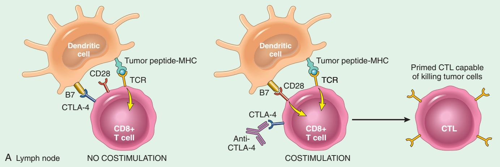
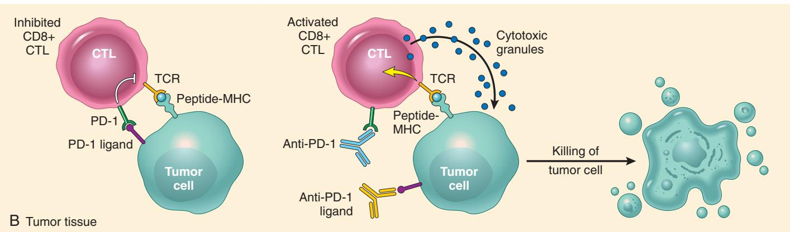 
Fig. 6.30 Activation of host antitumor immunity by checkpoint inhibitors. (A) Blockade of the CTLA4 surface molecule with an inhibitor antibody allows cytolytic $\mathrm{CD8 + }$ T cells (CTLs) to engage B7 family coreceptors, leading to T cell activation. (B) Blockade of PD-1 receptor or PD-1 ligand by inhibitory antibodies abrogates inhibitory signals transmitted by PD-1, again leading to activation of CTLs. (Reprinted from Abbas AK, Lichtman AH, Pillai S: Cellular and molecular immunology, ed 9, Philadelphia, 2018, Elsevier.)
effective in a wide variety of cancers. With all of these caveats, it seems certain that the field of oncology is on the threshold of transformative therapeutic advances, all made possible by careful study of the normal immune response and its myriad variations in cancers.
# EVASION OF IMMUNE SURVEILLANCE
- Tumor cells can be recognized by the immune system as non-self and destroyed. 
Antitumor activity is mediated by predominantly cell-mediated mechanisms. Tumor antigens are presented on the cell surface by MHC class I molecules and are recognized by CD8+ CTLs. 
- The different classes of tumor antigens include products of mutated genes, overexpressed or aberrantly expressed proteins, and tumor antigens produced by oncogenic viruses. 
- Immunosuppressed patients have an increased risk for development of cancer, particularly types caused by oncogenic DNA viruses. 
- In immunocompetent patients, tumors may avoid the immune system by several mechanisms, including selective outgrowth of antigen-negative variants, loss or reduced expression of histocompatibility molecules, and immunosuppression mediated by expression of certain factors (e.g., TGF- $\beta$ , PD-1 ligands) by the tumor cells.
- Antibodies that overcome some of these mechanisms of immune evasion are now approved for treatment of patients with advanced forms of cancer.
# Genomic Instability as an Enabler of Malignancy
The preceding section identified the eight defining features of malignancy, all of which appear to be produced by genetic alterations involving cancer genes. How do these mutations arise? Although humans are awash in environmental agents that are mutagenic (e.g., chemicals, radiation, sunlight), cancers are relatively rare outcomes of these encounters. This state of affairs results from the ability of normal cells to sense and repair DNA damage.
The importance of DNA repair in maintaining the integrity of the genome is highlighted by several inherited disorders in which genes that encode proteins involved in DNA repair are defective. Individuals born with inherited defects in DNA repair genes are at greatly increased risk for the development of cancer. Defects in three types of DNA repair systems - mismatch repair, nucleotide excision repair, and recombination repair - are presented next. While these discussions focus on inherited syndromes, a point worthy of emphasis is that sporadic cancers often incur mutations in DNA repair genes as well; this in turn enables the accumulation of mutations in cancer genes that contribute directly to development of cancer.
# Hereditary Nonpolyposis Colon
# Cancer Syndrome
Hereditary nonpolyposis colon carcinoma (HNPCC) syndrome dramatically illustrates the role of DNA repair genes in predisposition to cancer. This disorder, characterized by familial carcinomas of the colon affecting predominantly the cecum and proximal colon (Chapter 14), results from defects in genes involved in DNA mismatch repair. When a strand of DNA is being repaired, the products of mismatch repair genes act as "spell checkers." For example, if there is an erroneous pairing of G with T, rather than the normal A with T, the mismatch repair genes correct the defect. Without these "proofreaders," errors accumulate at an increased rate. Mutations in at least four mismatch repair genes have been found to underlie HNPCC (Chapter 15). Each affected individual inherits one defective copy of one of several DNA mismatch repair genes and acquires the second "hit" in colonic epithelial cells. Thus, DNA repair genes affect cell growth only indirectly—by allowing mutations in other genes during the process of normal cell division. A characteristic finding in the genome of patients with mismatch repair defects is microsatellite instability (MSI). Microsatellites are tandem repeats of one to six nucleotides found throughout the genome (Chapter 1). In normal people, the length of these microsatellites remains constant. By contrast, in patients with HNPCC, these satellites are unstable and increase or decrease in length. Although HNPCC accounts for only $2\%$ to $4\%$ of all colonic cancers, MSI can be detected in about $15\%$ of sporadic cancers due to acquired mutations that disrupt the function of mismatch repair genes.
# Xeroderma Pigmentosum
Xeroderma pigmentosum is an autosomal recessive disorder caused by a defect in DNA repair that is associated with a greatly increased risk for cancers arising in sunexposed skin. Ultraviolet (UV) rays in sunlight cause cross-linking of pyrimidine residues, preventing normal DNA replication. Such DNA damage is repaired by the nucleotide excision repair system. Several proteins are involved in nucleotide excision repair, and the inherited loss of any one of these can give rise to xeroderma pigmentosum.
# Diseases With Defects in DNA Repair by Homologous Recombination
A group of autosomal recessive disorders comprising Bloom syndrome, ataxia-telangiectasia, and Fanconi anemia is characterized by hypersensitivity to DNA-damaging agents, such as ionizing radiation (in Bloom syndrome and ataxia-telangiectasia), or to DNA cross-linking agents, such as nitrogen mustard (in Fanconi anemia). Their phenotype is complex and includes, in addition to predisposition to cancer, features such as neural symptoms (in ataxiatelangiectasia), anemia (in Fanconi anemia), and developmental defects (in Bloom syndrome). The gene mutated in ataxia-telangiectasia is ATM, which encodes a protein kinase that is important in "sensing" DNA damage caused by ionizing radiation and then directing p53 to initiate the DNA damage response, as described earlier.
Evidence for the role of DNA repair genes in the origin of cancer also comes from the study of hereditary breast cancer. Germ line mutations in two genes, BRCA1 and BRCA2, account for $50\%$ of cases of familial breast cancer. In addition to breast cancer, women with BRCA1 mutations have a substantially higher risk for developing epithelial ovarian cancers, and men have a slightly higher risk for developing prostate cancer. Likewise, germ line mutations in the BRCA2 gene increase the risk for developing breast cancer in both men and women, as well as cancers originating from the ovary, prostate, pancreas, bile ducts, stomach, melanocytes, and Blymphocytes. Although the functions of BRCA1 and BRCA2 have not been elucidated fully, cells with a defective version of these genes develop chromosomal breaks and severe aneuploidy. Indeed, both genes seem to function, at least in part, in the homologous recombination DNA repair pathway. For example, BRCA1 forms a complex with other proteins in the homologous recombination pathway and also is linked to the ATM kinase pathway. BRCA2 was identified as one of several genes mutated in Fanconi anemia, and the BRCA2 protein has been shown to bind to RAD51, a protein required for homologous recombination. Similar to other tumor suppressor genes, both copies of BRCA1 and BRCA2 must be inactivated for cancer to develop. Although linkage of BRCA1 and BRCA2 to familial breast cancers is well established, these genes are rarely inactivated in sporadic cases of breast cancer. In this regard, BRCA1 and BRCA2 are different from other tumor suppressor genes, such as APC and TP53, which are frequently inactivated in sporadic cancers.
# Cancers Resulting From Mutations Induced by Regulated Genomic Instability: Lymphoid Neoplasms
A special type of DNA damage plays a central role in the pathogenesis of tumors of B cells and T lymphocytes. As discussed earlier, adaptive immunity relies on the ability of B cells and T cells to diversify their antigen receptor genes. Immature B cells and T progenitors both express a pair of gene products, RAG1 and RAG2, that carry out V(D)J segment recombination, permitting the assembly of functional immunoglobulin and T-cell receptor genes. In addition, after encountering antigen, mature B cells express a specialized enzyme called activation-induced cytosine deaminase (AID), which catalyzes both immunoglobulin gene class switch recombination and immunoglobulin diversification through somatic hypermutation. Errors that occur during antigen receptor gene assembly and immunoglobulin gene class switching and diversification provide fertile soil for many of the mutations that cause lymphoid neoplasms, discussed in detail in Chapter 12.
# GENOMIC INSTABILITY AS AN ENabler OF MALIGNANCY
- Individuals with inherited mutations of genes involved in DNA repair systems are at greatly increased risk for the development of cancer.
- Patients with HNPCC syndrome have defects in the mismatch repair system, leading to development of carcinomas of the colon. These patients' genomes show microsatellite instability (MSI), characterized by changes in length of short tandem repeating sequences throughout the genome. 
- Patients with xeroderma pigmentosum have a defect in the nucleotide excision repair pathway. They are at increased risk for the development of skin cancers in sites exposed to sunlight because of an inability to repair pyrimidine dimers induced by UV light. 
- Syndromes involving defects in the homologous recombination DNA repair system constitute a group of disorders—Bloom syndrome, ataxia-telangiectasia, and Fanconi anemia—that are characterized by hypersensitivity to DNA-damaging agents, such as ionizing radiation. BRCA1 and BRCA2, which are mutated in familial breast cancers, also are involved in homologous DNA repair. 
- Mutations incurred in lymphocytes expressing gene products that induce genomic instability (RAG1, RAG2, AID) are important in the pathogenesis of lymphoid neoplasms.
# Tumor-Promoting Inflammation as an Enabler of Malignancy
Infiltrating cancers provoke a chronic inflammatory reaction. In patients with advanced cancers, this inflammatory reaction can be so extensive as to cause systemic signs and symptoms, such as anemia (the so-called "anemia of chronic disease"), fatigue, and cachexia. However, studies carried out on cancers in animal models suggest that inflammatory cells also modify the tumor microenvironment to enable many of the hallmarks of cancer. These effects may stem from direct interactions between inflammatory cells and tumor cells, or through indirect effects of inflammatory cells on other resident stromal cells, particularly cancer-associated fibroblasts and endothelial cells. Proposed cancer-enabling effects of inflammatory cells and resident stromal cells include the following:
- Release of factors that promote proliferation. Infiltrating leukocytes and activated stromal cells have been shown to secrete a wide variety of growth factors, such as EGF, and proteases that can liberate growth factors from the extracellular matrix (ECM). 
- Removal of growth suppressors. As mentioned earlier, the growth of epithelial cells is suppressed by cell-cell and cell-ECM interactions. Proteases released by inflammatory cells can degrade the adhesion molecules that mediate these interactions, removing a barrier to growth. 
- Enhanced resistance to cell death. Detachment of epithelial cells from basement membranes and from cell-cell interactions can lead to a particular form of programmed cell death called anoikis. It is suspected that tumor-associated macrophages may prevent anoikis by expressing adhesion molecules such as integrins that promote direct physical interactions with tumor cells. 
- Angiogenesis. Inflammatory cells release numerous factors, including VEGF, that stimulate angiogenesis.
- Invasion and metastasis. Proteases released from macrophages foster tissue invasion by remodeling the ECM, while factors such as TNF and EGF may directly stimulate tumor cell motility. As mentioned earlier, other factors released from stromal cells such as TGF- $\beta$ may promote epithelial-mesenchymal transition (EMT), which may be a key event in the process of invasion and metastasis. 
- Evasion of immune destruction. A variety of soluble factors released by macrophages and other stromal cells are believed to contribute to an immunosuppressive tumor microenvironment. The leading suspects include TGF- $\beta$ and other factors that either favor the recruitment of immunosuppressive T regulatory cells or suppress the function of CD8+ cytotoxic T cells. Furthermore, there is abundant evidence in cancer models and emerging evidence in human disease that advanced cancers contain mainly alternatively activated (M2) macrophages (Chapter 3). M2 macrophages produce cytokines that promote angiogenesis, fibroblast proliferation, and collagen deposition, all of which are commonly observed in invasive cancers and in healing wounds, giving rise to the notion that cancers are like "wounds that do not heal."
A thorough understanding of how cancers "manipulate" inflammatory cells to support their growth and survival remains elusive. However, the results from animal studies are intriguing and raise the possibility of therapies directed at tumor-induced inflammation and its downstream consequences. An example of one such intervention involves aspirin and other COX-2 inhibitors, use of which is associated with a decreased risk of colorectal cancer in several epidemiological studies.
Important clinical considerations emerge from the principles presented in the foregoing discussion of the hallmarks of cancer: These hallmarks provide a road map for the development of new therapeutic agents for the treatment of cancer (Fig. 6.31).
# ETIOLOGY OF CANCER: CARCINGENIC AGENTS
Carcinogenic agents inflict genetic damage, which lies at the heart of carcinogenesis. Three classes of carcinogenic agents have been identified: (1) chemicals, (2) radiant energy, and (3) microbial products. Chemicals and radiant energy are documented causes of cancer in humans, and oncogenic viruses are involved in the pathogenesis of tumors in several animal models and some human tumors. In the following discussion, each class of agents is considered separately; of note, however, several may act in concert or sequentially to produce the multiple genetic abnormalities characteristic of neoplastic cells.
# Chemical Carcinogens
More than 200 years ago, the London surgeon Sir Percival Pott correctly attributed scrotal skin cancer in chimney sweeps to chronic exposure to soot. On the basis of this observation, the Danish Chimney Sweeps Guild ruled that
.jpg) 
Fig. 6.31 Therapeutic targeting of the hallmarks of cancer. (From Hanahan D, Weiberg RA: The hallmarks of cancer: the next generation. Cell 144:646, 2011.)
its members must bathe daily. No public health measure since that time has achieved so much in the control of a form of cancer. Subsequently, hundreds of chemicals have been shown to be carcinogenic in animals.
Some of the major agents are presented in Table 6.5. A few comments on a handful of these are offered next.
# Direct-Acting Agents
Direct-acting agents require no metabolic conversion to become carcinogenic. They are typically weak carcinogens but are important because some of them are cancer chemotherapy drugs (e.g., alkylating agents) used in regimens that may cure certain types of cancer (e.g., Hodgkin lymphoma), only to evoke a subsequent, second form of cancer, usually leukemia. This situation is even more tragic when the initial use of such agents has been for non-neoplastic disorders, such as rheumatoid arthritis or granulomatosis with polyangiitis. The associated risk for induced cancer is low, but its existence dictates judicious use of such agents.
# Indirect-Acting Agents
The designation indirect-acting refers to chemicals that require metabolic conversion to an ultimate carcinogen. Some of the most potent indirect chemical carcinogens are polycyclic hydrocarbons that are created with burning of fossil fuels, plant, and animal material. For example, benzo[a]pyrene and other carcinogens formed during the combustion of tobacco are implicated in the causation of lung cancer, and in olden days, benzo[a]pyrene created during the burning of coal was likely responsible for the high incidence of scrotal cancer in chimney sweeps. Polycyclic hydrocarbons also may be produced from animal fats during the process of broiling meats and are present in smoked meats and fish. In the body, benzo[a]pyrene is
Table 6.5 Major Chemical Carcinogens 
Direct-Acting CarcinogensAlkylating Agentsβ-Propiolactone
Dimethyl sulfate
Diepoxybutane
Anti-cancer drugs (cyclophosphamide, chlorambucil, nitrosoureas, and others)Acylating Agents1-Acetyl-imidazole
Dimethylcarbamyl chlorideProcarcinogens That Require Metabolic ActivationPolycyclic and Heterocyclic Aromatic HydrocarbonsBenz(a)anthracene
Benzo(a)pyrene
Dibenz(a,h)anthracene
3-Methylcholanthrene
7, 12-Dimethylbenz(a)anthraceneAromatic Amines, Amides, Azo Dyes2-Naphthylamine (β-naphthylamine)
Benzidine
2-Acetylaminofluorene
Dimethylaminoazobenzene (butter yellow)Natural Plant and Microbial ProductsAflatoxin B1
Griseofulvin
Cycasin
Safrole
Betel nutsOthersNitrosamine and amides
Vinyl chloride, nickel, chromium
Insecticides, fungicides
Polychlorinated biphenyls
metabolized to epoxides, which form covalent adducts (addition products) with molecules in the cell, principally DNA, but also with RNA and proteins.
The aromatic amines and azo dyes constitute another class of indirect-acting carcinogens. Before its carcinogenicity was recognized, $\beta$ -naphthylamine was responsible for a 50-fold increased incidence of bladder cancers in heavily exposed workers in the aniline dye and rubber industries. Examples of other occupational carcinogens are listed in Table 6.5. Because indirect-acting carcinogens require metabolic activation for their conversion to DNA-damaging agents, much interest is focused on the enzymatic pathways that are involved, such as that mediated by the cytochrome P-450-dependent monooxygenases. The genes that encode these enzymes are polymorphic, and enzyme activity varies among individuals. It is widely believed that the susceptibility to chemical carcinogenesis depends at least in part, on the specific allelic form of the enzyme that is inherited. Thus, it may be possible in the future to assess cancer risk in a given individual by genetic analysis of enzyme polymorphisms.
A few other agents merit brief mention. Aflatoxin $\mathrm{B}_{1}$ is of interest because it is a naturally occurring agent produced by some strains of Aspergillus, a mold that grows on improperly stored grains and nuts. A strong correlation has been found between the dietary level of this food contaminant and the incidence of hepatocellular carcinoma in some parts of Africa and the Far East. Additionally, vinyl chloride, arsenic, nickel, chromium, insecticides, fungicides, and polychlorinated biphenyls are potential carcinogens in the workplace and about the house. Finally, nitrites used as food preservatives have caused concern, since they cause nitrosylation of amines contained in food. The nitrosamines thus formed are suspected to be carcinogenic.
# Mechanisms of Action of
# Chemical Carcinogens
Because malignant transformation results from mutations, it should come as no surprise that most chemical carcinogens are mutagenic. Indeed, all direct and ultimate carcinogens contain highly reactive electrophile groups that form chemical adducts with DNA, as well as with proteins and RNA. Any gene may be the target of chemical carcinogens, but understandably it is the mutation of important cancer genes, such as RAS and TP53, that is responsible for carcinogenesis. Indeed, specific chemical carcinogens, such as aflatoxin $\mathrm{B}_{1}$ , produce characteristic mutations in TP53, such that detection of mutations within particular codons strongly points toward aflatoxin as the causative agent. Such specific "mutational signatures" also exist for cancers caused by UV light, tobacco smoke, and other environmental carcinogens and are proving to be useful tools in epidemiologic studies of carcinogenesis.
Carcinogenicity of some chemicals is augmented by subsequent administration of promoters (e.g., phorbol esters, hormones, phenols, certain drugs), which are by themselves nontumorigenic. To be effective, repeated or sustained exposure to the promoter must follow the application of the mutagenic chemical, or initiator (Fig. 6.32). The initiation-promotion sequence of chemical carcinogenesis
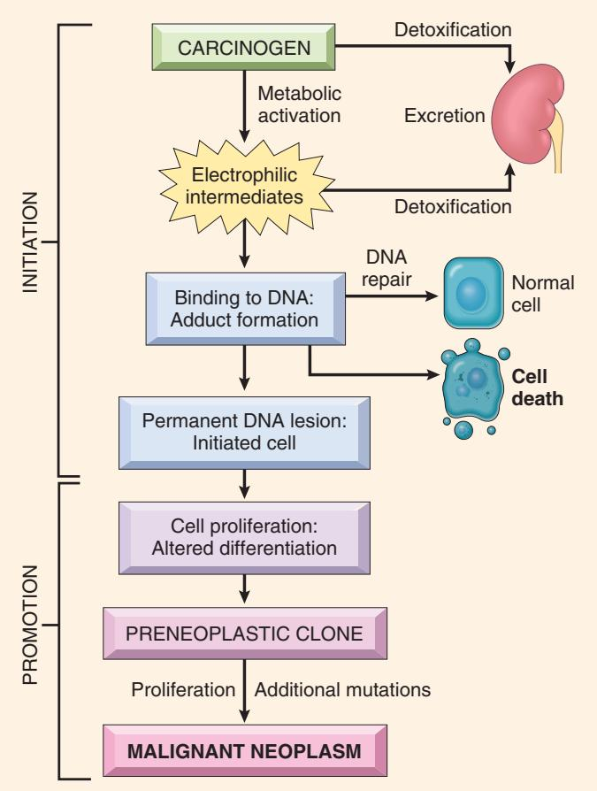 
Fig. 6.32 General schema of events in chemical carcinogenesis. Note that promoters cause clonal expansion of the initiated cell, thus producing a preneoplastic clone. Further proliferation induced by the promoter or other factors causes accumulation of additional mutations and emergence of a malignant tumor.
raises an important question: Since promoters are not mutagenic, how do they contribute to tumorigenesis? Although the effects of tumor promoters are pleiotropic, induction of cell proliferation is a sine qua non of tumor promotion. It seems most likely that while the application of an initiator may cause the mutational activation of an oncogene such as RAS, subsequent application of promoters leads to clonal expansion of initiated (mutated) cells. Forced to proliferate, the initiated clone of cells accumulates additional mutations, developing eventually into a malignant tumor. Indeed, the concept that sustained cell proliferation increases the risk for mutagenesis, and hence promotes neoplastic transformation, also is applicable to human carcinogenesis. For example, endometrial hyperplasia (Chapter 19) and increased regenerative activity that accompanies chronic liver cell injury are associated with the development of cancer in these organs. Were it not for the DNA repair mechanisms discussed earlier, the incidence of chemically induced cancers in all likelihood would be much higher. As mentioned previously, the rare hereditary disorders of DNA repair, including xeroderma pigmentosum, are associated with greatly increased risk for developing cancers induced by UV light and certain chemicals.
# CHEMICAL CARCINOGENS
Chemical carcinogens have highly reactive electrophile groups that directly damage DNA, leading to mutations and eventually cancer. 
- Direct-acting agents do not require metabolic conversion to become carcinogenic, while indirect-acting agents are not active until converted to an ultimate carcinogen by endogenous metabolic pathways. Hence, polymorphisms of endogenous enzymes such as cytochrome P-450 may influence carcinogenesis by altering the conversion of indirect-acting agents to active carcinogens. 
- After exposure of a cell to a mutagen or an initiator, tumorigenesis can be enhanced by exposure to promoters, which stimulate proliferation of the mutated cells. 
- Examples of human carcinogens are direct-acting agents (e.g., alkylating agents used for chemotherapy), indirect-acting agents (e.g., benzo(a)pyrene, azo dyes, aflatoxin), and tumor promoters. 
- Tumor promoters act by stimulating cell proliferation. Increased proliferation may occur through direct effects of tumor promoters on target cells or may be secondary to tissue injury and regenerative repair.
# Radiation Carcinogenesis
Radiation, whatever its source (UV rays of sunlight, radiographs, nuclear fission, radionuclides), is an established carcinogen. Unprotected miners of radioactive elements have a 10-fold increased incidence of lung cancers. A follow-up study of survivors of the atomic bombs dropped on Hiroshima and Nagasaki disclosed a markedly increased incidence of leukemia after an average latent period of about 7 years, as well as increased mortality rates for thyroid, breast, colon, and lung carcinomas. The nuclear power accident at Chernobyl in the former Soviet Union continues to exact its toll in the form of high cancer incidence in the surrounding areas. More recently, it is feared that radiation release from a nuclear power plant in Japan damaged by a massive earthquake and tsunami will result in significantly increased cancer incidence in the surrounding geographic areas.
Therapeutic irradiation of the head and neck can give rise to papillary thyroid cancers years later. The oncogenic properties of ionizing radiation are related to its mutagenic effects; it causes chromosome breakage, chromosomal rearrangements such as translocations and inversions, and, less frequently, point mutations. Biologically, double-stranded DNA breaks seem to be the most important form of DNA damage caused by radiation.
The oncogenic effect of UV rays merits special mention because it highlights the importance of DNA repair in carcinogenesis. Natural UV radiation derived from the sun can cause skin cancers (melanomas, squamous cell carcinomas, and basal cell carcinomas). At greatest risk are fair-skinned people who live in locales such as Australia and New Zealand that receive a great deal of sunlight. Nonmelanoma skin cancers are associated with total cumulative exposure to UV radiation, whereas
melanomas are associated with intense intermittent exposure—as occurs with sunbathing. UV light has several biologic effects on cells. Of particular relevance to carcinogenesis is the ability to damage DNA by forming pyrimidine dimers. This type of DNA damage is repaired by the nucleotide excision repair pathway. With extensive exposure to UV light, the repair systems may be overwhelmed, and skin cancer results. As mentioned earlier, patients with the inherited disease xeroderma pigmentosum have a defect in the nucleotide excision repair pathway. As expected, there is a greatly increased predisposition to skin cancers in this disorder.
# RADIATION CARCINOGENESIS
- Ionizing radiation causes chromosome breakage, chromosome rearrangements, and, less frequently, point mutations, any of which may affect cancer genes and thereby drive carcinogenesis. 
UV rays in sunlight induce the formation of pyrimidine dimers within DNA, leading to mutations that can give rise to squamous cell carcinomas and melanomas of the skin.
# Viral and Microbial Oncogenesis
Many DNA and RNA viruses have proved to be oncogenic in animals as disparate as frogs and primates. Despite intense scrutiny, however, only a few viruses have been linked with human cancer. The following discussion focuses on human oncogenic viruses. Also discussed is the role of the bacterium Helicobacter pylori in gastric cancer.
# Oncogenic RNA Viruses
Although the study of animal retroviruses has provided spectacular insights into the molecular basis of cancer, only one human retrovirus, human T-cell leukemia virus type 1 (HTLV-1), is firmly implicated in the pathogenesis of cancer in humans.
HTLV-1 causes adult T-cell leukemia/lymphoma (ATLL), a tumor that is endemic in certain parts of Japan, the Caribbean basin, South America, and Africa, and found sporadically elsewhere, including the United States. Worldwide, it is estimated that 15 to 20 million people are infected with HTLV-1. Similar to the human immunodeficiency virus, which causes AIDS, HTLV-1 has tropism for $\mathrm{CD4 + }$ T cells, and hence this subset of T cells is the major target for neoplastic transformation. Human infection requires transmission of infected T cells via sexual intercourse, blood products, or breastfeeding. Leukemia develops in only $3\%$ to $5\%$ of the infected individuals, typically after a long latent period of 40 to 60 years.
There is little doubt that HTLV-1 infection of T lymphocytes is necessary for leukemogenesis, but the molecular mechanisms of transformation are not certain. In contrast to several murine retroviruses, HTLV-1 does not contain an oncogene, and no consistent pattern of proviral integration next to a proto-oncogene has been discovered. In leukemic cells, however, viral integration shows a clonal pattern. In other words, although the site of viral
integration in host chromosomes is random (the viral DNA is found at different locations in different cancers), the site of integration is identical within all cells of a given cancer. This would not occur if HTLV-1 were merely a passenger that infects cells after transformation; rather, it means that HTLV-1 must have been present at the moment of transformation, placing it at the "scene of the crime."
The HTLV-1 genome contains the gag, pol, env, and long-terminal-repeat regions typical of all retroviruses, but, in contrast to other leukemia viruses, it contains another gene referred to as tax. Several aspects of HTLV-1's transforming activity are attributable to Tax, the protein product of the tax gene. Tax is essential for viral replication, because it stimulates transcription of viral RNA from the $5^{\prime}$ longitudinal repeat. However, Tax also alters the transcription of several host cell genes and interacts with certain host cell signaling proteins. By doing so, Tax contributes to the acquisition of several cancer hallmarks, including the following:
- Increased survival and growth of infected cells. Tax appears to interact with PI3 kinase and thereby stimulate the downstream signaling cascade, which you will recall promotes both cell survival and metabolic alterations that enhance cell growth. Tax also upregulates the expression of cyclin D and represses the expression of multiple CDK inhibitors, changes that promote cell cycle progression. Finally, Tax can activate the transcription factor NF- $\kappa$ B, which promotes the survival of many cell types, including lymphocytes. 
- Increased genomic instability. Tax may also cause genomic instability by interfering with DNA-repair functions and inhibiting cell cycle checkpoints activated by DNA damage. In line with these defects, HTLV-1-associated leukemias tend to be highly aneuploid.
The precise steps that lead to the development of adult T-cell leukemia/lymphoma are still not known, but a plausible scenario is as follows. Infection by HTLV-1 causes the expansion of a nonmalignant polyclonal cell population through stimulatory effects of Tax on cell proliferation. The proliferating T cells are at increased risk for mutations and genomic instability due to the effects of Tax and possibly other viral factors as well. This instability allows the accumulation of oncogenic mutations and eventually a monoclonal neoplastic T-cell population emerges. The most common driver mutations identified thus far are predicted to enhance T cell receptor signaling and stimulate NF- $\kappa$ B activation.
# ONCOGENIC RNA VIRUSES
HTLV-I causes a T cell leukemia that is endemic in Japan and the Caribbean. 
- The HTLV-I genome encodes a viral protein called Tax, which stimulates proliferation, enhances cell survival, and interferes with cell cycle controls. Although this proliferation initially is polyclonal, the proliferating T cells are at increased risk for secondary mutations that may lead to the outgrowth of a monoclonal leukemia.
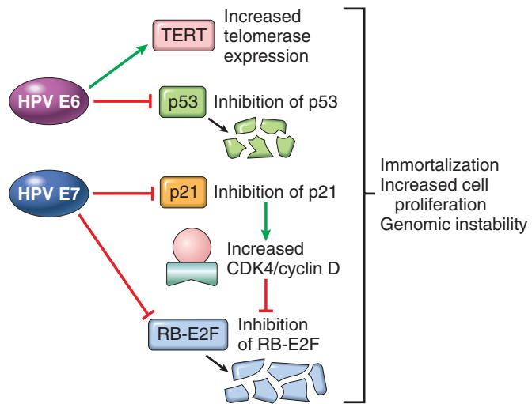 
Fig. 6.33 Transforming effects of HPV E6 and E7 proteins. The net effect of HPV E6 and E7 proteins is to immortalize cells and remove the restraints on cell proliferation.
# Oncogenic DNA Viruses
As with RNA viruses, several oncogenic DNA viruses that cause tumors in animals have been identified. Five DNA viruses—HPV, Epstein-Barr virus (EBV), Kaposi sarcoma herpesvirus (KSHV, also called human herpesvirus-8 [HHV-8]), a polyoma virus called Merkel cell virus, and hepatitis B virus (HBV)—are of special interest because they are strongly associated with human cancer. KSHV and Kaposi sarcoma are discussed in Chapter 5. Merkel cell virus is associated with a particular cancer, Merkel cell carcinoma, that is too rare to merit further discussion. The others are presented here. We also briefly touch on the oncogenic effects of hepatitis C virus, an RNA virus, during our discussion of HBV, since both viruses share an association with chronic liver injury and liver cancer.
# Human Papillomavirus
Scores of genetically distinct types of HPV have been identified. Some types (e.g., 1, 2, 4, and 7) cause benign squamous papillomas (warts) in humans (Chapters 18 and 24). Genital warts have low malignant potential and are also associated with low-risk HPVs, predominantly HPV-6 and HPV-11. By contrast, high-risk HPVs (e.g., types 16 and 18) cause several cancers, particularly squamous cell carcinoma of the cervix and anogenital region. In addition, at least $20\%$ of oropharyngeal cancers, particularly those arising in the tonsils, are associated with high-risk HPVs.
The oncogenic potential of HPV can be related to products of two early viral genes, E6 and E7 (Fig. 6.33), each of which has several activities that are pro-oncogenic.
- Oncogenic activities of E6. The E6 protein binds to and mediates the degradation of p53, and also stimulates the expression of TERT, the catalytic subunit of telomerase, which you will recall contributes to the immortalization of cells. E6 from high-risk HPV types has a higher affinity for p53 than E6 from low-risk HPV types, a property that is likely to contribute to oncogenesis. 
- Oncogenic activities of E7. The E7 protein has effects that complement those of E6, all of which are centered on
speeding cells through the $G_{1}$ -S cell cycle checkpoint. It binds to the RB protein and displaces the E2F transcription factors that are normally sequestered by RB, promoting progression through the cell cycle. As with E6 proteins and p53, E7 proteins from high-risk HPV types have a higher affinity for RB than do E7 proteins from low-risk HPV types. E7 also inactivates the CDK inhibitors p21 and p27, and binds and presumably activates cyclins E and A.
An additional factor that contributes to the oncogenic potential of HPVs is viral integration into the host genome. In benign warts, the HPV genome is maintained in a non-integrated episomal form, while in cancers, the HPV genome is randomly integrated into the host genome. Integration interrupts a negative regulatory region in the viral DNA, resulting in overexpression of the E6 and E7 oncoproteins. Furthermore, cells in which the viral genome has integrated show significantly more genomic instability, which may contribute to acquisition of pro-oncogenic mutations in host cancer genes.
To summarize, high-risk HPVs encode oncogenic proteins that inactivate RB and p53, activate cyclin/ CDK complexes, and combat cellular senescence. Thus, it is evident that HPV proteins promote many of the hallmarks of cancer. The primacy of HPV infection in the causation of cervical cancer is confirmed by the effectiveness of HPV vaccines in preventing it. However, infection with HPV itself is not sufficient for carcinogenesis, and full-blown transformation requires the acquisition of mutations in host cancer genes, such as RAS. A high proportion of women infected with HPV clear the infection by immunologic mechanisms, but others do not, some because of acquired immune abnormalities, such as those that result from HIV infection. As might be expected, women who are coinfected with high-risk HPV types and HIV are at particularly high risk for developing cervical cancer.
# Epstein-Barr Virus
EBV, a member of the herpesvirus family, was the first virus linked to a human tumor, Burkitt lymphoma. Burkitt lymphoma is an aggressive tumor that is endemic in certain parts of Africa and occurs sporadically elsewhere. In endemic areas, the tumor cells in virtually all affected patients carry the EBV genome. Since its initial discovery in Burkitt lymphoma some 50 years ago, EBV has been detected within the cells of a surprisingly diverse list of other tumors, including most nasopharyngeal carcinomas and a subset of T cell lymphomas, NK cell lymphomas, gastric carcinomas, and even, in rare instances, sarcomas, mainly in the immunosuppressed.
The manner in which EBV causes B cell tumors such as Burkitt lymphoma is complex and incompletely understood, but best appreciated by considering its effects on normal B cells. EBV uses the complement receptor CD21 to attach to and infect B cells. In vitro, such infection leads to polyclonal B cell proliferation and generation of immortal B lymphoblastoid cell lines. One EBV-encoded gene, LMP1 (latent membrane protein 1), acts as an oncogene, as proven by its ability to induce B cell lymphomas in transgenic mice. LMP1 promotes B cell proliferation, mimicking
the effects of a key surface receptor known as CD40. CD40 is normally activated by interaction with CD40 ligands expressed mainly on T cells. By contrast, LMP1 is constitutively active and stimulates signaling through the NF- $\kappa \mathrm{B}$ and JAK/STAT pathways, both of which promote B cell proliferation and survival. Thus, the virus "borrows" a normal B cell activation pathway to promote its own replication by expanding the pool of infected cells. Another EBV-encoded protein, EBNA2, transactivates several host genes, including cyclin D and the SRC family of protooncogenes. In addition, the EBV genome contains a viral cytokine, vIL-10, that was pirated from the host genome. This viral cytokine can prevent macrophages and monocytes from activating T cells and killing virally infected cells. In immunologically normal persons, the EBV-driven polyclonal B cell proliferation is readily controlled by cytotoxic T cells, and the affected patient either remains asymptomatic or experiences a self-limited episode of infectious mononucleosis. However, a small number of EBV-infected B cells downregulate expression of immunogenic viral proteins such as LMP-1 and EBNA2 and enter a long-lived pool of memory B cells that persist throughout life.
Given these observations, how then does EBV contribute to the genesis of endemic Burkitt lymphoma? One possibility is shown in Fig. 6.34. In regions of the world where
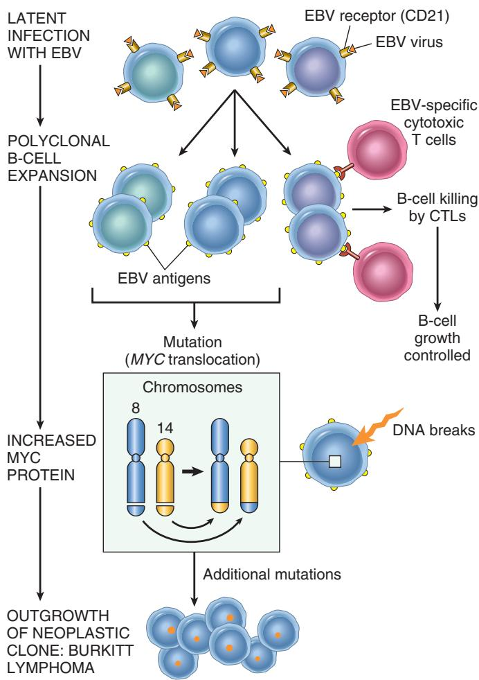 
Fig. 6.34 Possible evolution of EBV-induced Burkitt lymphoma.
Burkitt lymphoma is endemic, concomitant infections such as malaria impair immune competence, allowing sustained B-cell proliferation. Eventually, cytotoxic T cells eliminate most of the EBV-infected B cells, but a small number survive. It appears that lymphoma cells emerge from this residual population only with the acquisition of specific mutations, most notably translocations that activate the MYC oncogene. It should be noted that in nonendemic areas $80\%$ of these tumors are unrelated to EBV, but virtually all endemic and sporadic tumors possess the t(8;14) translocation or other translocations that dysregulate MYC. Thus, although sporadic Burkitt lymphomas are triggered by mechanisms other than EBV infection, they appear to develop through similar oncogenic pathways.
The oncogenic role played by EBV is more direct in EBV-positive B-cell lymphomas in immunosuppressed patients. Some individuals with AIDS or who receive immunosuppressive therapy for preventing allograft rejection develop EBV-positive B-cell tumors, often at multiple sites. These proliferations are polyclonal at the outset but can evolve into monoclonal neoplasms. In contrast to Burkitt lymphoma, the tumors in immunosuppressed patients usually lack MYC translocations and uniformly express LMP-1 and EBNA2, which, as discussed, are antigenic and can be recognized by cytotoxic T cells. These potentially lethal proliferations can be subdued if T cell function can be restored, as may occur with withdrawal of immunosuppressive drugs in transplant recipients.
Nasopharyngeal carcinoma also is associated with EBV infection. This tumor is endemic in southern China, in some parts of Africa, and in the Inuit population of the Arctic. In contrast to Burkitt lymphoma, $100\%$ of nasopharyngeal carcinomas obtained from all parts of the world contain EBV. The integration site of the viral genome is identical (clonal) in all of the tumor cells within individual tumors, excluding the possibility that EBV infection occurred after tumor development. The uniform association of EBV with nasopharyngeal carcinoma suggests that EBV has a central role in the genesis of the tumor, but (as with Burkitt lymphoma) the restricted geographic distribution indicates that genetic or environmental cofactors, or both, also contribute to tumor development. Unlike Burkitt lymphoma, LMP-1 is expressed in nasopharyngeal carcinoma cells and, as in B cells, activates the NF- $\kappa$ B pathway. NF- $\kappa$ B, in turn, upregulates the expression of factors such as VEGF and matrix metalloproteases that may contribute to oncogenesis.
The relationship of EBV to the pathogenesis of Hodgkin lymphoma, yet another EBV-associated tumor, is discussed in Chapter 12.
# ONCOGENIC DNA VIRUSES
HPV is associated with benign warts, as well as cervical cancer. 
- The oncogenicity of HPV is related to the expression of two viral oncoproteins, E6 and E7, which bind to the p53 and RB tumor suppressors, respectively, neutralizing their function. 
- E6 and E7 from high-risk strains of HPV (which give rise to cancers) have higher affinity for their targets than do E6 and
E7 from low-risk strains of HPV (which give rise to benign warts).
- EBV is implicated in the pathogenesis of Burkitt lymphomas, lymphomas in immunosuppressed patients, Hodgkin lymphoma, uncommon T-cell and NK-cell tumors, nasopharyngeal carcinoma, a subset of gastric carcinoma, and rarely sarcomas. 
- Certain EBV gene products contribute to oncogenesis by stimulating normal B-cell proliferation pathways. Concomitant compromise of immune competence allows sustained B-cell proliferation, leading eventually to development of lymphoma.
# Hepatitis B and Hepatitis C Viruses
The epidemiologic evidence linking chronic HBV and hepatitis C virus (HCV) infection with hepatocellular carcinoma is strong (Chapter 16). It is estimated that $70\%$ to $85\%$ of hepatocellular carcinomas worldwide are caused by HBV or HCV. However, the mode of action of these viruses in tumorigenesis is not fully elucidated. The HBV and HCV genomes do not encode any viral oncoproteins, and although the HBV DNA is integrated within the human genome, there is no consistent pattern of integration in liver cells. Indeed, the oncogenic effects of HBV and HCV are multifactorial, but the dominant effect seems to be immunologically mediated chronic inflammation with hepatocyte death, leading to regeneration and genomic damage. Although the immune system generally is thought to be protective, recent work has demonstrated that in the setting of unresolved chronic inflammation, as occurs in viral hepatitis or chronic gastritis caused by $H.$ pylori (see later), the immune response may become maladaptive, promoting tumorigenesis.
As with any cause of hepatocellular injury, chronic viral infection leads to the compensatory proliferation of hepatocytes. This regenerative process is aided and abetted by a plethora of growth factors, cytokines, chemokines, and other bioactive substances produced by activated immune cells that promote cell survival, tissue remodeling, and angiogenesis. The activated immune cells also produce other mediators, such as reactive oxygen species, that are genotoxic and mutagenic. A key molecular step seems to be activation of the nuclear factor- $\kappa \mathrm{B}$ (NF- $\kappa \mathrm{B}$ ) pathway in hepatocytes caused by mediators derived from the activated immune cells. Activation of the NF- $\kappa \mathrm{B}$ pathway blocks apoptosis, allowing the dividing hepatocytes to incur genotoxic stress and to accumulate mutations. Although this seems to be the dominant mechanism in the pathogenesis of virus-induced hepatocellular carcinoma, both HBV and HCV also contain proteins within their genomes that may more directly promote the development of cancer. The HBV genome contains a gene known as $HBx$ , and hepatocellular cancers develop in mice engineered to have HBx transgenes. $HBx$ can directly or indirectly activate a variety of transcription factors and several signal transduction pathways, and may interfere with p53 function. In addition, viral integration can cause secondary rearrangements of chromosomes, including multiple deletions that may harbor unknown tumor suppressor genes.
HCV, an RNA virus, also is strongly linked to the pathogenesis of liver cancer. The molecular mechanisms used by HCV are even less well defined than those for HBV. In addition to chronic liver cell injury and compensatory regeneration, components of the HCV genome, such as the HCV core protein, may have a direct effect on tumorigenesis, possibly by activating a variety of growth-promoting signal transduction pathways.
# HEPATITIS B AND HEPATITIS C VIRUSES
- Between $70\%$ and $85\%$ of hepatocellular carcinomas worldwide are due to infection with HBV or HCV. 
- The oncogenic effects of HBV and HCV are multifactorial, but the dominant effect seems to be immunologically mediated chronic inflammation, with hepatocellular injury, stimulation of hepatocyte proliferation, and production of reactive oxygen species that can damage DNA. 
- The HBx protein of HBV and the HCV core protein can activate a variety of signal transduction pathways that also may contribute to carcinogenesis.
# Helicobacter pylori
H. pylori infection is implicated in the genesis of both gastric adenocarcinomas and gastric lymphomas. First incriminated as a cause of peptic ulcers, H. pylori now has acquired the dubious distinction of being the first bacterium classified as a carcinogen.
The scenario for the development of gastric adenocarcinoma is similar to that for HBV- and HCV-induced liver cancer. It involves increased epithelial cell proliferation on a background of chronic inflammation. As in viral hepatitis, the inflammatory milieu contains numerous genotoxic agents, such as reactive oxygen species. The sequence of histopathologic changes consists of initial development of chronic inflammation/gastritis, followed by gastric atrophy, intestinal metaplasia of the lining cells, dysplasia, and cancer. This sequence takes decades to complete and occurs in only $3\%$ of infected patients. Like those of HBV and HCV, the $H.$ pylori genome also contains genes directly implicated in oncogenesis. Strains associated with gastric adenocarcinoma have been shown to contain a "pathogenicity island" that contains cytotoxin-associated A gene (CagA). Although $H.$ pylori is noninvasive, CagA is injected into gastric epithelial cells, where it has a variety of effects, including the initiation of a signaling cascade that mimics unregulated growth factor stimulation.
As mentioned earlier, $H.$ pylori is associated with an increased risk for the development of gastric lymphomas as well. The gastric lymphomas are of B-cell origin, and because the transformed B cells grow in a pattern resembling that of normal mucosa-associated lymphoid tissue (MALT), they have been referred to as MALT lymphomas (Chapter 12). Their molecular pathogenesis is incompletely understood but seems to involve strain-specific $H.$ pylori factors, as well as host genetic factors, such as polymorphisms in the promoters of inflammatory cytokines such as IL-1 $\beta$ and tumor necrosis factor (TNF). It is thought that $H.$ pylori infection leads to the activation of $H.$ pylori-reactive T cells, which in turn cause polyclonal B cell
proliferation. In time, a monoclonal B cell tumor emerges from the proliferating B cells, perhaps as a result of accumulation of mutations in growth regulatory genes. In keeping with this model, early in the course of disease, eradication of $H.$ pylori with antibiotics causes regression of the lymphoma by removing the antigenic stimulus for T cells. MALT lymphoma is thus a remarkable example of a tumor that depends on signals elicited by interactions with host immune cells for its continued growth and survival.
# HELICOBACTER PYLORI
- H. pylori infection has been implicated in both gastric adenocarcinoma and MALT lymphoma. 
- The mechanism of $H.$ pylori-induced gastric cancers is multifactorial, including immunologically mediated chronic inflammation, stimulation of gastric cell proliferation, and production of reactive oxygen species that damage DNA. $H.$ pylori pathogenicity genes, such as CagA, also may contribute by stimulating growth factor pathways. 
- It is thought that $H.$ pylori infection leads to polyclonal B-cell proliferations and that eventually a monoclonal B-cell tumor (MALT lymphoma) emerges as a result of accumulation of mutations.
# CLINICAL ASPECTS OF NEOPLASIA
The importance of neoplasms ultimately lies in their effects on patients. Although malignant tumors are of course more threatening than benign tumors, morbidity and mortality may be associated with any tumor, even a benign one. Indeed, both malignant and benign tumors may cause problems because of (1) location and impingement on adjacent structures, (2) functional activity such as hormone synthesis or the development of paraneoplastic syndromes, (3) bleeding and infections when the tumor ulcerates through adjacent surfaces, (4) symptoms that result from rupture or infarction, and (5) cachexia or wasting. The following discussion considers the effects of a tumor on the host, the grading and clinical staging of cancer, and the laboratory diagnosis of neoplasms.
# Effects of Tumor on Host
Location is crucial in both benign and malignant tumors. A small (1-cm) pituitary adenoma can compress and destroy the surrounding normal gland, giving rise to hypopituitarism. A 0.5-cm leiomyoma in the wall of the renal artery may encroach on the blood supply, leading to renal ischemia and hypertension. A comparably small carcinoma within the common bile duct may induce fatal biliary tract obstruction.
Signs and symptoms related to hormone production are often seen in patients with benign and malignant neoplasms arising in endocrine glands. Adenomas and carcinomas arising in the beta cells of the pancreatic islets of Langerhans can produce hyperinsulinism, sometimes fatal. Similarly, some adenomas and carcinomas of the adrenal
cortex disrupt homeostatic mechanisms by elaborating steroid hormones (e.g., aldosterone, which induces sodium retention, hypertension, and hypokalemia). Such hormonal activity is more likely with a well-differentiated benign tumor than with a corresponding carcinoma.
A tumor may ulcerate through a surface, with consequent bleeding or secondary infection. Benign or malignant neoplasms that protrude into the gut lumen may become caught in the peristaltic pull of the gut, causing intussusception (Chapter 15) and intestinal obstruction or infarction.
# Cancer Cachexia
Many cancer patients suffer progressive loss of body fat and lean body mass, accompanied by profound weakness, anorexia, and anemia—a condition referred to as cachexia. There is some correlation between the size and extent of spread of the cancer and the severity of the cachexia. However, cachexia is not caused by the nutritional demands of the tumor. Although patients with cancer often are anorexic, current evidence indicates that cachexia results from the action of soluble factors such as cytokines produced by the tumor and the host, rather than reduced food intake. In patients with cancer, calorie expenditure remains high, and basal metabolic rate is increased, despite reduced food intake. This is in contrast with the lower metabolic rate that occurs as an adaptive response in starvation. The basis of these metabolic abnormalities is not fully understood. It is suspected that TNF and other cytokines produced by macrophages in response to tumor cells or by the tumor cells themselves mediate cachexia. TNF suppresses appetite and inhibits the action of lipoprotein lipase, preventing the release of free fatty acids from lipoproteins. There is no satisfactory treatment for cancer cachexia other than removal of the underlying cause, the tumor.
# Paraneoplastic Syndromes
Symptom complexes that occur in patients with cancer and that cannot be readily explained by local or distant spread of the tumor or by the elaboration of hormones indigenous to the tissue of origin of the tumor are referred to as paraneoplastic syndromes. They appear in $10\%$ to $15\%$ of patients with cancer, and their clinical recognition is important for several reasons:
- Such syndromes may represent the earliest manifestation of an occult neoplasm. 
- In affected patients, the pathologic changes may be associated with significant clinical illness and may even be lethal. 
- The symptom complex may mimic metastatic disease, thereby confounding treatment.
The paraneoplastic syndromes are diverse and are associated with many different tumors (Table 6.6). The most common paraneoplastic syndromes are hypercalcemia, Cushing syndrome, and nonbacterial thrombotic endocarditis, and the neoplasms most often associated with these and other syndromes are lung and breast cancers and hematologic malignancies. Hypercalcemia in cancer patients is multifactorial, but the most important mechanism is the synthesis of a parathyroid hormone-related protein (PTHrP) by tumor cells. Also implicated are other tumor-derived
factors, such as TGF- $\alpha$ and the active form of vitamin D. Another possible mechanism for hypercalcemia is widespread osteolytic metastatic disease of bone; of note, however, hypercalcemia resulting from skeletal metastases is not a paraneoplastic syndrome. Cushing syndrome arising as a paraneoplastic phenomenon usually is related to ectopic production of ACTH or ACTH-like polypeptides by cancer cells, as occurs in small cell carcinoma of the lung.
Paraneoplastic syndromes also may manifest as hypercoagulability, leading to venous thrombosis and nonbacterial thrombotic endocarditis (Chapter 11). Other manifestations are clubbing of the fingers and hypertrophic osteoarthropathy in patients with lung carcinomas (Chapter 13). Still others are discussed in the consideration of cancers of the various organs of the body.
# Grading and Staging of Cancer
Methods to quantify the probable clinical aggressiveness of a given neoplasm and its apparent extent and spread in the individual patient are necessary for arriving at an accurate prognosis and for comparing end results of various treatment protocols. For instance, the results of treating well-differentiated thyroid adenocarcinomas localized to the thyroid gland will on average be very different from those obtained from treating highly anaplastic thyroid cancers that have invaded the neck organs. Systems have been developed to express, at least in semiquantitative terms, the level of differentiation, or grade, and extent of spread of a cancer within the patient, or stage, as parameters of the clinical gravity of the disease. Of note, when compared with grading, staging has proved to be of greater clinical value.
- Grading. Grading of a cancer is based on the degree of differentiation of the tumor cells and, in some cancers, the number of mitoses and the presence of certain architectural features. Grading schemes have evolved for each type of malignancy, and generally range from two categories (low grade and high grade) to four categories. Criteria for the individual grades vary in different types of tumors and so are not detailed here, but all attempt, in essence, to judge the extent to which the tumor cells resemble or fail to resemble their normal counterparts. Although histologic grading is useful, the correlation between histologic appearance and biologic behavior is less than perfect. In recognition of this problem and to avoid spurious quantification, it is common practice to characterize a particular neoplasm in descriptive terms, for example, well-differentiated, mucin-secreting adenocarcinoma of the stomach, or poorly differentiated pancreatic adenocarcinoma. 
- Staging. The staging of solid cancers is based on the size of the primary lesion, its extent of spread to regional lymph nodes, and the presence or absence of blood-borne metastases. The major staging system currently in use is the American Joint Committee on Cancer Staging. This system uses a classification called the TNM system $-T$ for primary tumor, $N$ for regional lymph node involvement, and $M$ for metastases. TNM staging varies for specific forms of cancer, but there are general principles. The primary lesion is characterized as T1 to T4 based on increasing size. T0 is used to indicate an in situ
Table 6.6 Paraneoplastic Syndromes 
Clinical SyndromeMajor Forms of NeoplasiaCausal Mechanism(s)/Agent(s)EndocrinopathiesCushing syndromeSmall cell carcinoma of lung 
Pancreatic carcinoma 
Neural tumorsACTH or ACTH-like substanceSyndrome of inappropriate anti-diuretic hormone secretionSmall cell carcinoma of lung; intracranial neoplasmsAnti-diuretic hormone or atrial natriuretic hormonesHypercalcemiaSquamous cell carcinoma of lung 
Breast carcinoma 
Renal carcinoma 
Adult T cell leukemia/lymphomaParathyroid hormone-related protein, TGF-α.HypoglycemiaFibrosarcoma 
Other mesenchymal sarcomas 
Ovarian carcinomaInsulin or insulin-like substancePolycythemiaRenal carcinoma 
Cerebellar hemangioma 
Hepatocellular carcinomaErythropoietinNerve and Muscle SyndromeMyastheniaBronchogenic carcinoma, thymomaImmunologicDisorders of the central and peripheral nervous systemsBreast carcinoma, teratomaImmunologicDermatologic DisordersAcanthosis nigricansGastric carcinoma 
Lung carcinoma 
Uterine carcinomaImmunologic; secretion of epidermal growth factorDermatomyositisBronchogenic and breast carcinomaImmunologicOsseous, Articular, and Soft-Tissue ChangesHypertrophic osteoarthropathy and clubbing of the fingersBronchogenic carcinomaUnknownVascular and Hematologic ChangesVenous thrombosis (Trousseau phenomenon)Pancreatic carcinoma 
Bronchogenic carcinoma 
Other cancersTumor products (mucins that activate clotting)Nonbacterial thrombotic endocarditisAdvanced cancersHypercoagulabilityAnemiaThymomaImmunologicOthersNephrotic syndromeVarious cancersTumor antigens, immune complexes
ACTH, Adrenocorticotropic hormone; IL-1, interleukin-1; TGF- $\alpha$ , transforming growth factor- $\alpha$ ; TNF, tumor necrosis factor.
lesion. N0 would mean no nodal involvement, whereas N1 to N3 would denote involvement of an increasing number and range of nodes. M0 signifies no distant metastases, whereas M1 or sometimes M2 reflects the presence and estimated number of metastases.
In modern practice, grading and staging of tumors are being supplemented by molecular characterization, described later.
# CLINICAL ASPECTS OF TUMORS
- Cachexia, defined as progressive loss of body fat and lean body mass, accompanied by profound weakness, anorexia, and anemia, is caused by release of cytokines by the tumor or host. 
- Paraneoplastic syndromes, defined as systemic symptoms that cannot be explained by tumor spread or by hormones
appropriate to the tissue, are caused by the ectopic production and secretion of bioactive substances such as ACTH, PTHrP, or TGF- $\alpha$
- Grading of tumors is determined by cytologic appearance and is based on the idea that behavior and differentiation are related, with poorly differentiated tumors having more aggressive behavior. 
- Staging (extent of tumor), determined by surgical exploration or imaging, is based on size, local and regional lymph node spread, and distant metastases. Staging is of greater clinical value than grading.
# Laboratory Diagnosis of Cancer
Every year the approach to laboratory diagnosis of cancer becomes more complex, more sophisticated, and more specialized. For virtually every neoplasm mentioned in this text, the experts have characterized several subcategories;
we must walk, however, before we can run. Each of the following sections attempts to present the state of the art, avoiding details of technologies.
# Morphologic Methods
In most instances, the laboratory diagnosis of cancer is not difficult. The two ends of the benign-malignant spectrum pose no problems; in the middle, however, lies a "no man's land" where the wise tread cautiously. Clinicians tend to underestimate the contributions they make to the diagnosis of a neoplasm. Clinical and radiologic data are invaluable for optimal pathologic diagnosis. Radiation-induced changes in the skin or mucosa can be similar to those of cancer. Sections taken from a healing fracture can mimic an osteosarcoma. The laboratory evaluation of a lesion can be only as good as the specimen submitted for examination. The specimen must be adequate, representative, and properly preserved.
Several sampling approaches are available, including excision or biopsy, fine-needle aspiration, and cytologic smears. When excision of a lesion is not possible, selection of an appropriate site for biopsy of a large mass requires awareness that the margins may not be representative and the center may be largely necrotic. Requesting frozen section diagnosis is sometimes desirable, as, for example, in determining the nature of a mass lesion or in evaluating the regional lymph nodes in a patient with cancer for metastasis. This method, in which a sample is quick-frozen and sectioned, permits histologic evaluation within minutes. In experienced, competent hands, frozen section diagnosis is accurate, but there are particular instances in which the superior histologic detail provided by more time-consuming routine methods is needed. In such instances, it is better to wait a few days, despite the drawbacks, than to perform inadequate or unnecessary surgery.
Fine-needle aspiration of tumors is another approach that is widely used. It involves aspiration of cells from a mass, followed by cytologic examination of the cells after they have been spread out on a slide. This procedure is used most commonly with readily palpable lesions affecting the breast, thyroid gland, lymph nodes, and salivary glands. Modern imaging techniques permit extension of the method to deeper structures, such as the liver, pancreas, and pelvic lymph nodes. Use of this diagnostic modality obviates surgery and its attendant risks. Although it entails some difficulties, such as small sample size and sampling errors, in experienced hands it can be reliable, rapid, and useful.
Cytologic (Papanicolaou) smears provide another method for the detection of cancer. Historically, this approach has been used widely for discovery of carcinoma of the cervix, often at an in situ stage, but now it is used to investigate many other forms of suspected malignancy, such as endometrial carcinoma, bronchogenic carcinoma, bladder and prostate tumors, and gastric carcinomas; for the identification of tumor cells in abdominal, pleural, joint, and cerebrospinal fluids; and, less commonly, for evaluation of other forms of neoplasia. Neoplastic cells are less cohesive than others and are therefore shed into fluids or secretions (Fig. 6.35). The shed cells are evaluated for features of anaplasia indicative of their origin from a tumor. The
smearsprovideanothermethodf.jpg)
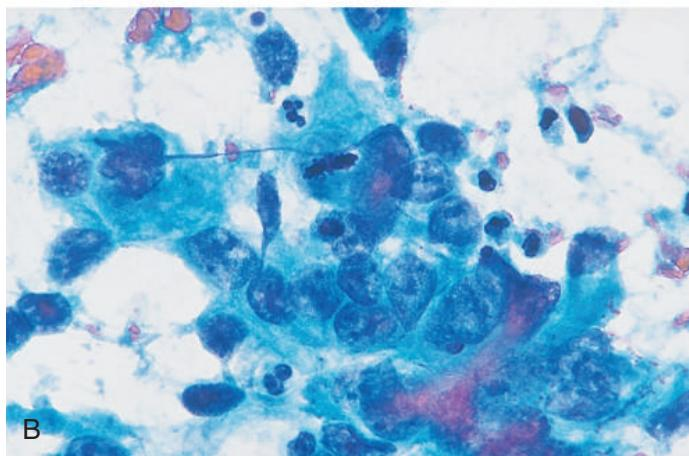 
Fig. 6.35 (A) Normal Papanicolaou smear from the uterine cervix. Large, flat cells with small nuclei are typical. (B) Abnormal smear containing a sheet of malignant cells with large hyperchromatic nuclei. Nuclear pleomorphism is evident, and one cell is in mitosis. A few interspersed neutrophils, much smaller in size and with compact, lobate nuclei, are seen. (Courtesy of Dr. Richard M. DeMay, Department of Pathology, University of Chicago, Chicago, Illinois.)
gratifying control of cervical cancer is the best testament to the value of the cytologic method.
Immunohistochemistry offers a powerful adjunct to routine histologic examination. Detection of cytokeratin by stains performed with specific monoclonal antibodies points to a diagnosis of undifferentiated carcinoma rather than large cell lymphoma. Similarly, detection of prostate-specific antigen (PSA) in metastatic deposits by immunohistochemical staining allows definitive diagnosis of a primary tumor in the prostate gland. Immunocytochemical detection of estrogen receptors allows prognostication and directs therapeutic intervention in breast cancers.
Flow cytometry is used routinely in the classification of leukemias and lymphomas. In this method, fluorescently labeled antibodies against cell surface molecules and differentiation antigens are used to obtain the phenotype of malignant cells (Chapter 12).
# Tumor Markers
Biochemical assays for tumor-associated enzymes, hormones, and other tumor markers in the blood cannot be utilized for definitive diagnosis of cancer; however, they are used with varying success as screening tests
and have utility in monitoring the response to therapy or detecting disease recurrence. The application of these assays is considered with many of the specific forms of neoplasia discussed in other chapters, so only a few examples suffice here. PSA, used to screen for prostatic adenocarcinoma, is one of the most frequently used tumor markers in clinical practice. Prostatic carcinoma can be suspected when elevated levels of PSA are found in the blood. However, PSA screening also highlights problems encountered with use of virtually every tumor marker. Although PSA levels often are elevated in cancer, PSA levels also may be elevated in benign prostatic hyperplasia (Chapter 18). Furthermore, there is no PSA level that ensures that a patient does not have prostate cancer. Thus, the PSA test suffers from both low sensitivity and low specificity, and its use as a screening tool has become quite controversial. The PSA assay is extremely valuable, however, for detecting residual disease or recurrence following treatment for prostate cancer. Other tumor markers used in clinical practice include carcinoembryonic antigen (CEA), which is elaborated by carcinomas of the colon, pancreas, stomach, and breast, and alpha fetoprotein (AFP), which is produced by hepatocellular carcinomas, yolk sac remnants in the gonads, and occasionally teratocarcinomas and embryonal cell carcinomas. Like PSA, CEA and AFP can be elevated in a variety of nonneoplastic conditions and thus also lack the specificity and sensitivity required for the early detection of cancers, but they may be useful in monitoring disease once the diagnosis is established. With successful resection of the tumor, these markers disappear from the serum; their reappearance almost always signifies recurrence. CEA is further discussed in Chapter 15 and alpha fetoprotein in Chapter 16.
# Molecular Diagnosis
An increasing number of molecular techniques are being used for the diagnosis of tumors and for predicting their behavior.
- Diagnosis of malignancy. Because each T cell and B cell has unique antigen receptor gene rearrangements, polymerase chain reaction (PCR)-based detection of rearranged T-cell receptor or immunoglobulin genes allows monoclonal (neoplastic) and polyclonal (reactive) proliferations to be distinguished. Many hematopoietic neoplasms, as well as a few solid tumors, are defined by particular translocations, so the diagnosis can be made by detection of such translocations. For example, fluorescence in situ hybridization (FISH) or PCR analysis (Chapter 7) can be used to detect translocations characteristic of Ewing sarcoma and several leukemias and lymphomas. PCR-based detection of BCR-ABL transcripts can confirm the diagnosis of chronic myeloid leukemia (Chapter 12). Finally, certain hematologic malignancies are now defined by the presence of point mutations in particular oncogenes. For example, as mentioned earlier, the diagnosis of another myeloid neoplasm called polycythemia vera requires the identification of specific mutations in JAK2, a gene that encodes a nonreceptor tyrosine kinase.
- Prognosis and behavior. Certain genetic alterations are associated with a poor prognosis, and thus the presence
of these alterations determines the patient's subsequent therapy. FISH and PCR methods can be used to detect amplification of oncogenes such as HER2 and NMYC, which provide therapeutic and prognostic information for breast cancers and neuroblastomas, respectively. Sequencing of cancer genomes is now routine in some centers, allowing for the identification of point mutations in cancer genes such as TP53 that predict a poor outcome in many different types of cancer. Although not yet standard of care, efforts are ongoing to develop tests that assess the host immune response to tumors, for example, by quantifying the number of infiltrating cytotoxic T cells, as this too is helpful in gauging prognosis.
- Detection of minimal residual disease. Another emerging use of molecular techniques is for detection of minimal residual disease after treatment. For example, detection of BCR-ABL transcripts by PCR assay gives a measure of residual disease in patients treated for chronic myeloid leukemia. Recognition that virtually all advanced tumors are associated with both intact circulating tumor cells and products derived from tumors (e.g., cell-free circulating tumor DNA) has led to interest in following tumor burden through sensitive blood tests designed to identify tumor-specific nucleic acid sequences. 
- Diagnosis of hereditary predisposition to cancer. Germ line mutation of several tumor suppressor genes, such as BRCA1, increases a patient's risk for developing certain types of cancer. Thus, detection of these mutated alleles may allow the patient and the physician to devise an aggressive screening protocol, as well as an opportunity for prophylactic surgery. In addition, such detection allows genetic counseling of relatives who are at risk. 
- Therapeutic decision-making. Therapies that directly target specific mutations are increasingly being developed, and thus detection of such mutations in a tumor can guide the development of targeted therapy, as discussed later. It is now becoming evident that certain targetable mutations transgress morphologic categories. One example involves a valine for glutamate substitution in amino acid 600 (V600E) of the serine/threonine kinase BRAF, which you will recall lies downstream of RAS in the growth factor signaling pathway. Melanomas with the V600E BRAF mutation respond well to BRAF inhibitors, whereas melanomas without this mutation show no response. Subsequently, it was realized that the same V600E mutation is also present in a subset of many other diverse cancers, including carcinomas of the colon and thyroid gland, most hairy cell leukemias, and many cases of Langerhans cell histiocytosis (Fig. 6.36). These tumors are morphologically diverse and have distinct cells of origin, but they share identical oncogenic lesions in a common pro-growth pathway.
# Molecular Profiling of Tumors: The Future of Cancer Diagnostics
Until recently, molecular studies of tumors involved the analysis of individual genes. However, the past few years have seen the introduction of revolutionary technologies that can rapidly sequence an entire genome; assess
,maybecandidatesfortreatmentwiththesameBRAFinhibitors..jpg) 
Fig. 6.36 Diverse tumor types that share a common mutation, BRAF (V600E), may be candidates for treatment with the same BRAF inhibitors.
epigenetic modifications genome-wide (the epigenome); quantify all of the RNAs expressed in a cell population (the transcriptome); measure many proteins simultaneously (the proteome); and take a snapshot of all of the cell's metabolites (the metabolome). Thus, the diagnosis, management and study of cancer has entered the age of "omics!"
The most common method for large-scale analysis of RNA expression in use in research laboratories has been based on DNA microarrays, but newer methods involving RNA sequencing that offer a more comprehensive and quantitative assessment of RNA expression are beginning to supplant older methods. However, RNA is prone to degradation and is a more difficult analyte to work with than DNA in clinical practice. Furthermore, DNA sequencing is technically simpler than RNA sequencing, permitting the development of methods that rely on massively parallel sequencing (so-called "next-generation [NextGen] sequencing") that can be readily performed on virtually any tissue specimen (Chapter 7). The increases in DNA sequencing capacity and speed that such methods have enabled over the past decade have been breathtaking, and are matched by an equally remarkable decrease in cost. The first reasonably complete draft of the sequence of the human genome, released in 2003, took 12 years of work and cost about $2,700,000,000. The cost of sequencing the whole genome has now decreased to less than$ 5000 in some commercial laboratories, making the test readily affordable. At present, using NextGen sequencing, the process of whole-genome of individual tumors can be completed in as little as a few weeks, which includes the time required for the extraordinarily complex task of assembling and analyzing the sequencing data.
These advances have enabled the systematic sequencing and cataloging of genomic alterations in various human cancers, an effort sponsored by the National Cancer Institute called The Cancer Genome Atlas (TCGA). The main impact of cancer genome sequencing to date has been in the area of research: identification of new mutations that
underlie various cancers; description of the full panoply of genetic lesions that are found in individual cancers; and a greater appreciation of the genetic heterogeneity that exists in individual cancers from area to area. While whole-genome sequencing to manage patients can be performed, most efforts in the clinical realm are focused on developing sequencing methods that permit identification of therapeutically "actionable" genetic lesions in a timely fashion at a reasonable cost. Such approaches seem particularly applicable to tumors, such as lung carcinomas, that are genetically diverse and require a "personalized" approach if targeted therapy is to succeed (Fig. 6.37). Thus, the current trend in molecular diagnostic laboratories is to develop methods that permit several hundred exons of key genes to be sequenced simultaneously at sufficient "depth" (fold coverage of the sequence in question) to reliably detect any mutations that might be present in as few as $5\%$ of tumor cells. A second method that is moving into clinical practice involves the use of DNA arrays to identify changes in DNA copy number, such as amplifications and deletions. Arrays containing probes that span the entire genome at some standard spacing can detect all but the smallest copy number aberrations, providing information that is complementary to that obtained from focused DNA sequencing. Other "omics," such as proteomics and epigenomics, are currently being used mainly in the realm of clinical research, but with many drugs that target the cancer epigenome moving into the clinic, it can be anticipated that tests directed at assessing the state of the epigenome that predict response to such agents are soon to follow.
The excitement created by the development of new techniques for the global molecular analysis of tumors has led some scientists to predict that the end of histopathology is in sight. However, histopathologic inspection of tumors provides information about important characteristics of cancers, such as anaplasia, invasiveness, and tumor heterogeneity, that cannot be gleaned from DNA sequences. Histopathology coupled with in situ biomarker tests performed
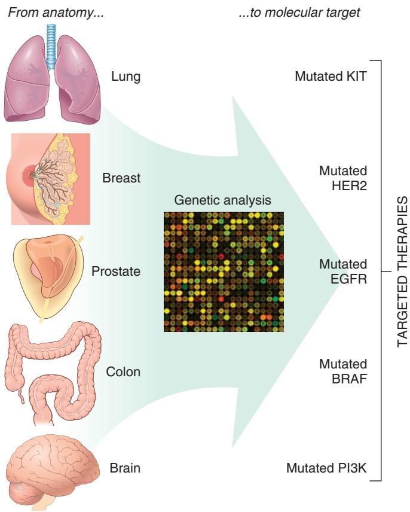 
Fig. 6.37 Genetic analysis of cancers is being utilized to identify mutations that can be targeted by drugs.
on tissue sections also remains the best way to assess tumor: stromal cell interactions, such as angiogenesis and host immune responses; the latter may have an increasingly important role in guiding therapeutic interventions that are designed to counteract immune evasion by tumors. Thus, what lies ahead is not the replacement of one set of techniques by another. On the contrary, for the foreseeable future the most accurate diagnosis and assessment of prognosis in cancer patients will be arrived at by a combination of morphologic and molecular techniques.
With all of the advances in genomic analyses and targeted therapies, one can safely predict that we are on the cusp of the golden age of tumor diagnosis and treatment. Those of you who are in medical school now can safely assume that the expectations for rapid advances in cancer diagnosis and therapy will be realized while you are still in practice. Get ready!
# LABORATORY DIAGNOSIS OF CANCER
- Several sampling approaches exist for the diagnosis of tumors, including excision, biopsy, fine-needle aspiration, and cytologic smears. 
- Immunohistochemistry and flow cytometry studies help in the diagnosis and classification of tumors, because distinct protein expression patterns define different entities.
- Proteins released by tumors into the serum, such as PSA, can be used to screen populations for cancer and to monitor for recurrence after treatment. 
- Molecular analyses are used to determine diagnosis and prognosis, to detect minimal residual disease, and to diagnose patients with a hereditary predisposition to cancer. 
- Molecular profiling of tumors by RNA expression profiling, DNA sequencing, and DNA copy number arrays are useful in molecular stratification of otherwise identical tumors or those of distinct histogenesis that share a mutation for the purpose of targeted treatment and prognostication. 
- Assays of circulating tumor cells and of DNA shed into blood, stool, sputum, and urine are under development.
Artandi SE, DePinho RA: Telomeres and telomerase in cancer, Carcinogenesis 31:9-18, 2010. [A review discussing the importance of telomeres and telomerase.] 
Bai L, Wang S: Targeting apoptosis pathways for new cancer therapeutics, Annual Rev Med 65:139-155, 2014. [A review of apoptosis pathways and therapeutic strategies to activate them in cancer cells.] 
Burkhart DL, Sage J: Cellular mechanisms of tumour suppression by the retinoblastoma gene, Nat Rev Cancer 8:671-682, 2008. [A review of Rb function.] 
Cilloni D, Saglio G: Molecular pathways: BCR-ABL, Clin Cancer Res 18:930-937, 2012. [A discussion of the functional consequences and clinical significance of aberrant tyrosine kinase activity in chronic myeloid leukemia mediated by the constitutive enzyme activity of BCR-ABL.] 
Coussens LM, Zitvogel L, Palucka AK: Neutralizing tumor-promoting chronic inflammation: a magic bullet?, Science 339:286-291, 2013. [A discussion of clinical and experimental studies describing protumorigenic roles for immune cells that elicit cancer-associated inflammation.] 
Hanahan D, Coussens L: Accessories to the crime: functions of cell recruited to the tumor microenvironment, Cancer Cell 20:309-322, 2012. [A review discussing the role of stroma in cancer.] 
Hanahan D, Weinberg RA: The hallmarks of cancer (2011): the next generation, Cell 144:646-674, 2011. [A reexamination of the hallmarks of cancer.] 
Joerger AC, Fersht AR: The p53 pathway: Origins, inactivation in cancer, and emerging therapeutic approaches, Annu Rev Biochem 85:375-404, 2016. [A wide-ranging discussion of p53 functions and dysfunction in cancer, with an eye towards development of new cancer therapies.] 
Lord C, Ashworth A: BRCAness revisited, Nat Rev Cancer 16:110-120, 2016. [A discussion of how BRCAs function as tumor suppressors and how this informs therapy for tumors with evidence of BRCA dysfunction.] 
Manning AL, Dyson NJ: RB: mitotic implications of a tumour suppressor, Nat Rev Cancer 12:220-226, 2012. [In addition to the well-established roles of RB in control of cell cycle progression and proliferation, this review describes other emerging tumor suppressive functions, such as maintenance of genomic stability.] 
Martinez P, Blasco MA: Telomeric and extra-telomeric roles for telomerase and the telomere-binding proteins, Nat Rev Cancer 11:161-176, 2011. [A review discussing the role of telomeric proteins in immortalization of cancer cells and other emerging non-telomeric functions that may also contribute to oncogenesis.] 
Massague J, Obenauf AC: Metastatic colonization by circulating tumour cells, Nature 529:298-306, 2016. [A discussion of concepts to explain metastasis.] 
Munoz-Espin D, Serrano M: Cellular senescence: from physiology to pathology, Nat Rev Mol Cell Biol 15:482-496, 2014. [A discussion of the mechanisms of senescence and their potential therapeutic relevance.]
Nieto MA, Huang RY-J, Jackson RA, et al: EMT: 2016, Cell 166:21-45, 2016. [A far-ranging discussion of the causes and consequences of epithelial-mesenchymal transition in cancer.] 
Pickup M, Novitskly S, Moses HL: The roles of TGF- $\beta$ in the tumor microenvironment, Nat Rev Cancer 13:788-799, 2013. [A review discussing the tumor-promoting effects of TGF- $\beta$ .] 
Stine ZE, Walton ZE, Altman BJ, et al: MYC, metabolism, and cancer, Cancer Discov 5:1024-1039, 2015. [A review of the connections between MYC and cancer cell metabolism.] 
Stratton MR, Campbell PJ, Futreal PA: The cancer genome, Nature 458:719-724, 2009. [An excellent summary of next-generation sequencing technologies and their application to cancer.] 
van Roy F: Beyond E-cadherin: roles of other cadherin superfamily members in cancer, Nat Rev Cancer 14:121-134, 2014. [A review discussing the role of members of the cadherin family in cancer.]
Ward PS, Thompson C: Metabolic reprogramming: a cancer hallmark even Warburg did not anticipate, Cancer Cell 21:297-308, 2012. [An account of the molecular pathways of reprogramming of energy metabolism in cancer and the emergence of "oncometabolites."]. 
Welti J, Loges S, Dimmeler S, et al: Recent molecular discoveries in angiogenesis and anti-angiogenesis therapies in cancer, J Clin Invest 123:3190-3200, 2013. [A discussion of angiogenic mechanisms and successes and challenges of anti-angiogenic therapy in cancer.] 
White E: The role of autophagy in cancer, J Clin Invest 125:42-46, 2016. [A discussion of the diverse possible contributions of autophagy to cancer.]
# Genetic and Pediatric Diseases
# 7
# Genetic Diseases 243
Nature of Genetic Abnormalities
Contributing to Human Disease 244
Mutations in Protein-Coding Genes 244
Alterations in Protein-Coding Genes Other Than Mutations 244
# Mendelian Disorders: Diseases Caused by Single-Gene Defects 245
Transmission Patterns of Single-Gene Disorders 246
Diseases Caused by Mutations in Genes Encoding Structural Proteins 247
Diseases Caused by Mutations in Genes Encoding Receptor Proteins or Channels 248
Diseases Caused by Mutations in Genes Encoding Enzyme Proteins 254
Diseases Caused by Mutations in Genes Encoding Proteins That Regulate Cell Growth 261
Complex Multigenic Disorders 261
Cytogenetic Disorders 262
Numeric Abnormalities 262
Structural Abnormalities 263
General Features of Chromosomal
Disorders 264
Cytogenetic Disorders Involving Autosomes 264
Cytogenetic Disorders Involving Sex Chromosomes 267
# Single-Gene Disorders With Atypical Patterns of Inheritance 269
Triplet Repeat Mutations 269
Diseases Caused by Mutations in Mitochondrial Genes 271
Diseases Caused by Alterations of Imprinted Regions: Prader-Willi and Angelman Syndromes 271
# Pediatric Diseases 273
Congenital Anomalies 273
Etiology 275
Perinatal Infections 277
Prematurity and Fetal Growth Restriction 277
Respiratory Distress Syndrome of the Newborn 278
# Necrotizing Enterocolitis 279
Sudden Infant Death Syndrome (SIDS) 280
Fetal Hydrops 282
Immune Hydrops 283
Nonimmune Hydrops 283
# Tumors and Tumorlike Lesions of Infancy and Childhood 285
Benign Neoplasms 285
Malignant Neoplasms 286
# Molecular Diagnosis of Mendelian and Complex Disorders 291
Indications for Genetic Analysis 292
Molecular Diagnosis of Copy Number Abnormalities 292
Direct Detection of DNA Mutations by Polymerase Chain Reaction (PCR) Analysis 294
Linkage Analysis and Genomewide Association Studies 295
# Genetic Diseases
The completion of the human genome project was a landmark achievement in the study of human diseases. It established that humans have only about 25,000 protein-coding genes, far fewer than the 100,000 previously estimated and almost half the number in the lowly rice plant (Oryza sativa)! The unraveling of this "genetic architecture" is beginning to unlock secrets of inherited as well as acquired human disease. Powerful technologies now allow applications of the human gene sequences to the analysis of human diseases. Current high-throughput "next-generation" sequencing technologies can routinely sequence the human exome (the entire compendium of coding genes) in a couple of days for as little as $1000. The speed and reduced costs of DNA sequencing are increasingly facilitating the application of "personalized medicine" (also known as
"precision medicine") to the treatment of cancer and other diseases with a genetic component.
Because disorders of childhood are of genetic origin, developmental and pediatric diseases are discussed along with genetic diseases in this chapter. However, it must be borne in mind that not all genetic disorders manifest in infancy and childhood, and conversely, many pediatric diseases are not of genetic origin. To the latter category belong diseases resulting from immaturity of organ systems. In this context it is helpful to clarify three commonly used terms: hereditary, familial, and congenital. Hereditary disorders, by definition, are derived from one's parents, are transmitted in the gametes through the generations, and therefore are familial. The term congenital simply implies "present at birth." Of note, some congenital
diseases are not genetic (e.g., congenital syphilis). On the other hand, not all genetic diseases are congenital; the expression of Huntington disease, for example, begins only after the third or fourth decade of life.
# NATURE OF GENETIC ABNORMALITIES CONTRIBUTING TO HUMAN DISEASE
There are several types of genetic abnormalities that affect the structure and function of proteins, disrupting cellular homeostasis and contributing to disease.
# Mutations in Protein-Coding Genes
The term mutation refers to permanent changes in the DNA. Those that affect germ cells are transmitted to the progeny and may give rise to inherited diseases. Mutations in somatic cells are not transmitted to the progeny but are important in the causation of cancers and some congenital malformations.
Details of specific mutations and their effects are discussed along with the relevant disorders throughout this book. Cited here are some common examples of gene mutations and their effects:
- Point mutations result from the substitution of a single nucleotide base by a different base, resulting in the replacement of one amino acid by another in the protein product. The mutation in the $\beta$ -globin chain of hemoglobin giving rise to sickle cell anemia is an excellent example of a point mutation that alters the meaning of the genetic code. Such mutations are sometimes called missense mutations. By contrast, certain point mutations may change an amino acid codon to a chain termination codon, or a stop codon. Such "nonsense" mutations interrupt translation, and in most cases RNAs are rapidly degraded, a phenomenon called nonsense mediated decay, such that little or no protein is formed. 
- Frameshift mutations occur when the insertion or deletion of one or two base pairs alters the reading frame of the DNA strand. 
- Trinucleotide repeat mutations belong to a special category, because these mutations are characterized by amplification of a sequence of three nucleotides. Although the specific nucleotide sequence that undergoes amplification varies with different disorders, all affected sequences share the nucleotides guanine (G) and cytosine (C). For example, in fragile X syndrome, prototypical of this category of disorders, there are 200 to 4000 tandem repeats of the sequence CGG within a gene called FMR1. In normal populations, the number of repeats is small, averaging 29. The expansions of the trinucleotide sequences prevent normal expression of the FMR1 gene, thus giving rise to mental retardation. Another distinguishing feature of trinucleotide repeat mutations is that they are dynamic (i.e., the degree of amplification increases during gametogenesis). These features, discussed in greater detail later in this chapter, influence the pattern of inheritance
and the phenotypic manifestations of the diseases caused by this class of mutations.
# Alterations in Protein-Coding Genes Other Than Mutations
In addition to alterations in DNA sequence, coding genes also can undergo structural variations, such as copy number changes—amplifications or deletions—or translocations that result in aberrant gain or loss of protein function. As with mutations, structural changes may occur in the germline, or be acquired in somatic tissues. In many instances, pathogenic germline alterations involve a contiguous portion of a chromosome rather than a single gene, such as in the 22q microdeletion syndrome, discussed later. With the widespread availability of next-generation sequencing technology for assessing DNA copy number variation at very high resolution genome wide, pathogenic structural alterations have now been discovered in common disorders such as autism. Cancers often contain somatically acquired structural alterations, including amplifications, deletions, and translocations. The so-called "Philadelphia chromosome"—translocation t(9;22) between the BCR and ABL genes in chronic myeloid leukemia (Chapter 12)—is a classic example.
# Alterations in Non-Coding RNAs
It is worth noting that until recently the major focus of gene hunting has been discovery of genes that encode proteins. Recent studies indicate, however, that a very large number of genes do not encode proteins. Instead, the non-encoded products of these genes—so-called "non-coding RNAs (ncRNAs)"—play important regulatory functions. Although many distinct families of ncRNAs exist, the two most important examples, —small RNA molecules called microRNAs (miRNAs) and long non-coding RNAs (lncRNAs)—are discussed in Chapter 1.
With this brief review of the nature of abnormalities that contribute to the pathogenesis of human diseases, we can turn our attention to the three major categories of genetic disorders:
- Mendelian disorders resulting from mutations in single genes. The genetic abnormalities show high penetrance, meaning that most individuals who inherit the anomaly show phenotypic effects. These diseases are hereditary and familial. They include many uncommon conditions, such as storage diseases and inborn errors of metabolism. 
- Complex disorders involving multiple genes as well as environmental influences. These are sometimes called multifactorial diseases. They include some of the most common disorders of mankind, including hypertension, diabetes, and allergic and autoimmune diseases. 
- Diseases arising from chromosomal abnormalities, including changes in the number or structure of chromosomes. Several rare developmental abnormalities are attributable to chromosomal alterations. 
- Other genetic diseases, which involve single gene mutations but do not follow simple Mendelian rules of inheritance. These single-gene disorders with nonclassic
inheritance patterns include those resulting from triplet repeat mutations or from mutations in mitochondrial DNA, and those in which the transmission is influenced by an epigenetic phenomenon called genomic imprinting. Each of these four categories is discussed separately.
# MENDELIAN DISORDERS: DISEASES CAUSED BY SINGLE-GENE DEFECTS
Single-gene defects (mutations) follow the well-known mendelian patterns of inheritance (Tables 7.1 and 7.2). Although individually rare, together they account for approximately $1\%$ of all adult admissions to hospitals and about $6\%$ to $8\%$ of all pediatric hospital admissions. Listed next are a few important tenets and caveats when considering mendelian disorders:
- Mutations involving single genes follow one of three patterns of inheritance: autosomal dominant, autosomal recessive, or X-linked. 
- A single-gene mutation may have many phenotypic effects (pleiotropy) and, conversely, mutations at several genetic loci may produce the same trait (genetic heterogeneity). For example, Marfan syndrome, which results from a basic defect in connective tissue, is associated with widespread effects involving the skeleton, eyes, and cardiovascular system, all of which stem from a mutation in the gene encoding fibrillin, a component of connective tissues. On the other hand, several different types of mutations can cause retinitis pigmentosa, an inherited disorder associated with abnormal retinal pigmentation and consequent visual impairment.
Recognition of genetic heterogeneity not only is important in genetic counseling but also facilitates understanding of the pathogenesis of common disorders such as diabetes mellitus (Chapter 20).
- It is now increasingly recognized that the phenotypic manifestations of mutations affecting a known single
Table 7.1 Estimated Prevalence of Selected Mendelian Disorders Among Live-Born Infants 
DisorderEstimated PrevalenceAutosomal Dominant InheritanceFamilial hypercholesterolemia1 in 500Polycystic kidney disease1 in 1000Hereditary spherocytosis1 in 5000 (northern Europe)Marfan syndrome1 in 5000Huntington disease1 in 10,000Autosomal Recessive InheritanceSickle cell anemia1 in 500 (U.S. African Americans)*Cystic fibrosis1 in 3200 (U.S. Caucasians)Tay-Sachs disease1 in 3500 (U.S. Ashkenazi Jewish; French Canadians)Phenylketonuria1 in 10,000MPSs—all types1 in 25,000Glycogen storage diseases—all types1 in 50,000Galactosemia1 in 60,000X-Linked InheritanceDuchenne muscular dystrophy1 in 3500 (U.S. males)Hemophilia1 in 5000 (U.S. males)
*The prevalence of heterozygous sickle cell trait is 1 in 12 for U.S.African Americans. MPS, Mucopolysaccharidosis.
Table 7.2 Biochemical Basis and Inheritance Pattern for Selected Mendelian Disorders 
DiseaseAbnormal ProteinProtein Type/FunctionAutosomal Dominant InheritanceFamilial hypercholesterolemiaLDL receptorReceptor transportMarfan syndromeFibrillinStructural support: extracellular matrixEhler-Danlos syndrome*CollagenStructural support: extracellular matrixHereditary spherocytosisSpectrin, ankyrin, or protein 4.1Structural support: red blood cell membraneNeurofibromatosis, type INeurofibromin-1 (NF-1)Growth regulationAdult polycystic kidney diseasePolycystin-1 (PKD-1)Cell-cell and cell-matrix interactionsAutosomal Recessive InheritanceCystic fibrosisCystic fibrosis transmembrane regulatorIon channelPhenylketonuriaPhenylalanine hydroxylaseEnzymeTay-Sachs diseaseHexosaminidaseEnzymeSevere combined immunodeficiencyAdenosine deaminaseEnzymeα- and β-thalassemias†HemoglobinOxygen transportSickle cell anemia†HemoglobinOxygen transportX-Linked Recessive InheritanceHemophilia AFactor VIIICoagulationDuchenne/Becker muscular dystrophyDystrophinStructural support: cell membraneFragile X syndromeFMRPRNA translation
*Some variants of Ehler-Danlos syndrome have an autosomal recessive inheritance pattern. 
Although full-blown symptoms require biallelic mutations, heterozygotes for thalassemia and sickle cell anemia may present with mild clinical disease. Thus, these disorders sometimes are categorized as "autosomal codominant" entities.
gene are influenced by other genetic loci, which are called modifier genes. As discussed later in the section on cystic fibrosis these modifier loci can affect the severity or extent of the disease.
- The use of proactive prenatal genetic screening in high-risk populations (e.g., persons of Ashkenazi Jewish descent) has significantly reduced the incidence (Table 7.1) of certain genetic disorders such as Tay-Sachs disease.
# Transmission Patterns of Single-Gene Disorders
# Disorders of Autosomal Dominant Inheritance
Disorders of autosomal dominant inheritance are manifested in the heterozygous state, so at least one parent in an index case usually is affected. Both males and females can be affected, and both sexes can transmit the condition. When an affected person marries an unaffected one, each child has one chance in two of having the disease. The following features also pertain to autosomal dominant diseases:
- With any autosomal dominant disorder, some patients do not have affected parents. Such patients owe their disorder to new mutations involving either the egg or the sperm from which they were derived. Their siblings are neither affected nor at increased risk for development of the disease. 
- Clinical features can be modified by reduced penetrance and variable expressivity. Some persons inherit the mutant gene but are phenotypically normal, a phenomenon referred to as reduced penetrance. The variables that affect penetrance are not clearly understood. In contrast with penetrance, if a trait is consistently associated with a mutant gene but is expressed differently among persons carrying the gene, the phenomenon is called variable expressivity. For example, manifestations of neurofibromatosis 1 range from brownish spots on the skin to multiple tumors and skeletal deformities. 
- In many conditions, the age at onset is delayed, and symptoms and signs do not appear until adulthood (as in Huntington disease). 
- In autosomal dominant disorders, a $50\%$ reduction in the normal gene product is associated with clinical signs and symptoms. Because a $50\%$ loss of enzyme activity can be compensated for, involved genes in autosomal dominant disorders usually do not encode enzyme proteins, but instead fall into two other categories of proteins:
- Those involved in regulation of complex metabolic pathways, often subject to feedback control (e.g., membrane receptors, transport proteins). An example of this pathogenic mechanism is found in familial hypercholesterolemia, which results from mutation in the low-density lipoprotein (LDL) receptor gene (discussed later). 
- Key structural proteins, such as collagen and components of the red cell membrane skeleton (e.g., spectrin, abnormalities of which result in hereditary spherocytosis).
The biochemical mechanisms by which a $50\%$ reduction in the levels of such proteins results in an abnormal
phenotype are not fully understood. In some cases, especially when the gene encodes one subunit of a multimeric protein, the product of the mutant allele can interfere with the assembly of a functionally normal multimer. For example, the collagen molecule is a trimer in which the three collagen chains are arranged in a helical configuration. The presence of mutated collagen chains reduces the assembly of the remaining normal chains, producing a marked deficiency of collagen. In this instance the mutant allele is called dominant negative, because it impairs the function of a normal allele. This effect is illustrated in some forms of osteogenesis imperfecta (Chapter 21).
# Disorders of Autosomal Recessive Inheritance
Disorders of autosomal recessive inheritance are manifested in the homozygous state. They occur when both of the alleles at a given gene locus are mutants. Therefore, such disorders are characterized by the following features: (1) The trait does not usually affect the parents, who are carriers of one diseased allele, but multiple siblings may show the disease; (2) siblings have one chance in four of being affected (i.e., the recurrence risk is $25\%$ for each birth); and (3) if the mutant gene occurs with a low frequency in the population, there is a strong likelihood that the affected patient (the proband) is the product of a consanguineous marriage. They make up the largest group of mendelian disorders.
In contrast with the features of autosomal dominant diseases, the following features generally apply to most autosomal recessive disorders:
- The expression of the defect tends to be more uniform than in autosomal dominant disorders. 
- Complete penetrance is common. 
- Onset is frequently early in life. 
- Although new mutations for recessive disorders do occur, they are rarely detected clinically. Because the affected person is an asymptomatic heterozygote, several generations may pass before the descendants of such a person mate with other heterozygotes and produce affected offspring. 
- In many cases, enzymes are affected by the mutation. In heterozygotes, equal amounts of normal and defective enzyme are synthesized. Usually the natural "margin of safety" ensures that cells with half of their complement of the enzyme function normally.
# X-Linked Disorders
The Y chromosome is home to the testes-determining gene SRY, which directs male sexual differentiation, but apart from very rare instances of Y-linked familial deafness, no Y chromosome-linked mendelian disorders have ever been reported. Thus, for the most part, sex-linked disorders are X linked. Most X-linked disorders are X-linked recessive and are characterized by the following features:
- Heterozygous female carriers transmit them only to sons, who of course are hemizygous for the X chromosome. 
- Heterozygous females rarely express the full phenotypic change, because they have the paired normal allele. Although one of the X chromosomes in females is inactivated (see further text), this process of inactivation is random, which typically allows sufficient numbers of cells with the normal expressed allele to emerge.
- An affected male does not transmit the disorder to sons, but all daughters are carriers. Sons of heterozygous women have one chance in two of receiving the mutant gene.
# TRANSMISSION PATTERNS OF SINGLE-GENE DISORDERS
- Autosomal dominant disorders are characterized by expression in heterozygous state; they affect males and females equally, and both sexes can transmit the disorder. 
- Autosomal dominant disorders often invovle dysfunctional receptors and structural proteins. 
- Autosomal recessive diseases occur when both copies of a gene are mutated and frequently involve enzymes. Males and females are affected equally. 
- X-linked disorders are transmitted by heterozygous females to their sons, who manifest the disease. Female carriers usually are unaffected because of random inactivation of one X chromosome.
# Diseases Caused by Mutations in Genes Encoding Structural Proteins
# Marfan Syndrome
Marfan syndrome is an autosomal dominant disorder of connective tissues, manifested principally by changes in the skeleton, eyes, and cardiovascular system. It is caused by an inherited defect in an extracellular glycoprotein called fibrillin-1. This glycoprotein, secreted by fibroblasts, is the major component of microfibrils found in the extracellular matrix. Microfibrils serve as scaffolding for the deposition of tropoelastin, an integral component of elastic fibers. Although microfibrils are widely distributed in the body, they are particularly abundant in the aorta, ligaments, and the ciliary zonules that support the ocular lens, precisely the tissues that are prominently affected in Marfan syndrome.
Fibrillin is encoded by the FBN1 gene, which maps to chromosomal locus 15q21. Mutations in FBN1 are found in all patients with Marfan syndrome. More than 1800 distinct causative mutations in the very large FBN1 gene have been found, a level of complexity that complicates diagnosis by DNA sequencing. As a result, the diagnosis is mainly based on clinical findings. Because heterozygotes have clinical symptoms, it is thought that the mutant fibrillin protein may act as a dominant negative, preventing the assembly of normal microfibrils. The prevalence of Marfan syndrome is estimated to be 1 in 5000. Approximately $70\%$ to $85\%$ of cases are familial, and the rest are sporadic, arising from de novo FBN1 mutations in the germ cells of parents.
Although many of the abnormalities in Marfan syndrome can be explained on the basis of structural failure of connective tissues, some, such as overgrowth of bones, are difficult to relate to simple loss of fibrillin. It is now evident that loss of microfibrils gives rise to abnormal and excessive activation of transforming growth factor- $\beta$ (TGF- $\beta$ ), because normal microfibrils sequester TGF- $\beta$ , thereby controlling the bioavailability of this cytokine.
Excessive TGF- $\beta$ signaling has deleterious effects on vascular smooth muscle development and the integrity of extracellular matrix. In support of this hypothesis, mutations in the TGF- $\beta$ type II receptor give rise to a related syndrome, called Marfan syndrome type 2 (MFS2). Furthermore, patients with germline mutations in one isoform of TGF- $\beta$ , called TGF- $\beta 3$ , present with an inherited predisposition to aortic aneurysm and other cardiovascular manifestations similar to those found in "classic" Marfan patients (see later). Of note, angiotensin receptor blockers, which inhibit the activity of TGF- $\beta$ , improve aortic and cardiac function in mouse models of Marfan syndrome. Prevention of cardiovascular disease entails the use of beta-aderenergic blocking agents, which lower blood pressure, as well as angiotensin receptor inhibitors, which not only lower blood pressure but also interfere with TGF- $\beta$ activity.
Skeletal abnormalities are the most obvious feature of Marfan syndrome. Patients have a slender, elongated habitus with abnormally long legs, arms, and fingers (arachnodactyly); a high-arched palate; and hyperextensibility of joints. A variety of spinal deformities, such as severe kyphoscoliosis, may be present. The chest is deformed, exhibiting either pectus excavatum (i.e., deeply depressed sternum) or a pigeon-breast deformity. The most characteristic ocular change is bilateral dislocation, or subluxation, of the lens secondary to weakness of its suspensory ligaments (ectopia lentis). Ectopia lentis, particularly if bilateral, is highly specific for Marfan syndrome and strongly suggests the diagnosis. Most serious, however, is the involvement of the cardiovascular system. Fragmentation of the elastic fibers in the tunica media of the aorta predisposes affected patients to aneurysmal dilation and aortic dissection (Chapter 10). These changes, called cystic medionecrosis, are not specific for Marfan syndrome; similar lesions occur in hypertension and with aging. Loss of medial support causes dilation of the aortic valve ring, giving rise to aortic incompetence. The cardiac valves, especially the mitral valve, may be excessively distensible and regurgitant (floppy valve syndrome), giving rise to mitral valve prolapse and congestive cardiac failure (Chapter 11). Aortic rupture is the most common cause of death and may occur at any age. Less frequently, cardiac failure is the terminal event.
Although the lesions described are typical of Marfan syndrome, they are not seen in all cases. There is much variation in clinical expression, and some patients may exhibit predominantly cardiovascular lesions with minimal skeletal and ocular changes. It is believed that the variable expressivity is related to different mutations in the FBN1 gene.
# MARFAN SYNDROME
- Marfan syndrome is caused by a mutation in the FBN1 gene encoding fibrillin, which is required for structural integrity of connective tissues and activation of TGF- $\beta$ . 
- The major tissues affected are the skeleton, eyes, and cardiovascular system.
- Clinical features may include tall stature, long fingers, bilateral subluxation of lens, mitral valve prolapse, aortic aneurysm, and aortic dissection. 
- Prevention of cardiovascular diseases involves the use of drugs that lower blood pressure and inhibit TGF- $\beta$ signaling.
# Ehlers-Danlos Syndromes
Ehlers-Danlos syndromes (EDSs) are a group of diseases characterized by defects in collagen synthesis or structure. All are single-gene disorders, but the mode of inheritance encompasses both autosomal dominant and recessive patterns. There are approximately 30 distinct types of collagen; all have characteristic tissue distributions and are the products of different genes. To some extent, the clinical heterogeneity of EDS can be explained by mutations in different collagen genes.
At least six clinical and genetic variants of EDS are recognized. Because defective collagen is the basis for these disorders, certain clinical features are common to all variants.
- Tissues rich in collagen, such as skin, ligaments, and joints, frequently are affected in most variants of EDS. Because the abnormal collagen fibers lack adequate tensile strength, joints are hypermobile. These features permit grotesque contortions, such as bending the thumb backward to touch the forearm and bending the knee upward to create almost a right angle. Indeed, it is believed that most contortionists have some form of EDS; however, a predisposition to joint dislocation is one of the prices paid for this virtuosity. 
- Skin fragility. The skin is extraordinarily stretchable, extremely fragile, and vulnerable to trauma. Minor injuries produce gaping defects, and surgical repair or any surgical intervention is accomplished only with great difficulty because of the lack of normal tensile strength. 
- Structural failure of organ or tissues. The structural defect in connective tissue may lead to serious internal complications, including rupture of the colon and large arteries (vascular EDS); ocular fragility, with rupture of the cornea and retinal detachment (kyphoscoliotic EDS); and diaphragmatic hernias (classical EDS), among others.
The molecular bases for three of the more common variants are as follows:
- Deficient synthesis of type III collagen resulting from mutations affecting the COL3A1 gene. This variant, vascular EDS, is inherited as an autosomal dominant disorder and is characterized by weakness of tissues rich in type III collagen (e.g., blood vessels, bowel wall), predisposing them to rupture. 
- Deficiency of the enzyme lysyl hydroxylase. Decreased hydroxylation of lysyl residues in types I and III collagen interfaces with the formation of crosslinks among collagen molecules. As might be expected, this variant (kyphoscoliotic EDS), resulting from an enzyme deficiency, is inherited as an autosomal recessive disorder. Patients typically manifest with congenital scoliosis and ocular fragility.
- Deficient synthesis of type V collagen resulting from mutations in COL5A1 and COL5A2 is inherited as an autosomal dominant disorder and results in classical EDS.
# EHLERS-DANLOS SYNDROMES
- There are six variants of EDS, all characterized by defects in collagen synthesis or assembly. Each of the variants is caused by a distinct mutation. 
- Clinical features may include fragile, hyperextensible skin vulnerable to trauma, hypermobile joints, and ruptures involving colon, cornea, or large arteries. Wound healing is poor.
# Diseases Caused by Mutations in Genes Encoding Receptor Proteins or Channels
# Familial Hypercholesterolemia
Familial hypercholesterolemia is a "receptor disease" caused by loss-of-function mutations in the gene encoding the LDL receptor, which is involved in the transport and metabolism of cholesterol. As a consequence of receptor abnormalities there is a loss of feedback control that normally holds cholesterol synthesis in check. The resulting elevated levels of cholesterol induce premature atherosclerosis and greatly increase the risk of myocardial infarction. Familial hypercholesterolemia is among the most common of mendelian disorders; the frequency of the heterozygous condition is 1 in 500 in the general population. Approximately $7\%$ of the body's cholesterol circulates in the plasma, predominantly in the form of LDL. As might be expected, the amount of plasma cholesterol is influenced by its synthesis and catabolism, and the liver plays a crucial role in both these processes, as described later. A brief review of the synthesis and transport of cholesterol follows.
Normal Cholesterol Metabolism. Cholesterol may be derived from the diet or from endogenous synthesis. Dietary triglycerides and cholesterol are incorporated into chylomicrons in the intestinal mucosa and travel by way of the gut lymphatics to the blood. These chylomicrons are hydrolyzed by an endothelial lipoprotein lipase in the capillaries of muscle and fat. The chylomicron remnants, rich in cholesterol, are then delivered to the liver. Some of the cholesterol enters the metabolic pool (to be described), and some is excreted as free cholesterol or as bile acids into the biliary tract. The endogenous synthesis of cholesterol and LDL begins in the liver (Fig. 7.1). The first step in the synthesis is the secretion of triglyceride-rich very-low-density lipoprotein (VLDL) by the liver into the blood. In the capillaries of adipose tissue and muscle, the VLDL particle undergoes lipolysis and is converted to intermediate-density lipoprotein (IDL). In comparison with VLDL, the content of triglyceride is reduced and that of cholesteryl esters is enriched in IDL, but IDL retains on its surface the VLDL-associated apolipoproteins B-100 and E. Further metabolism of IDL occurs along two pathways: Most of the
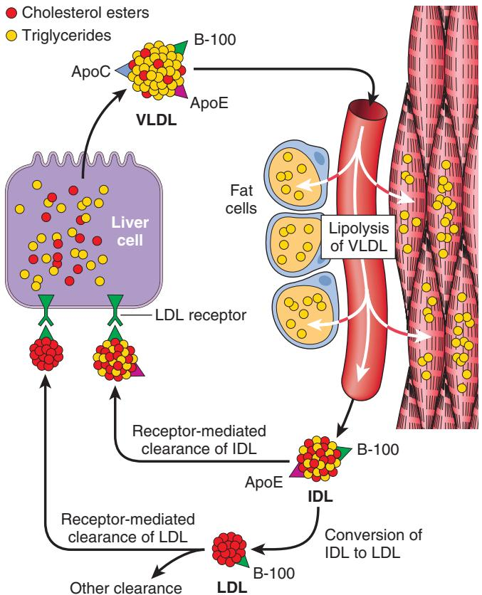 
Fig. 7.1 Low-density lipoprotein (LDL) metabolism and the role of the liver in its synthesis and clearance. Lipolysis of very-low-density lipoprotein (VLDL) by lipoprotein lipase in the capillaries releases triglycerides, which are then stored in fat cells and used as a source of energy in skeletal muscles. IDL (intermediate-density lipoprotein) remains in the blood and is taken up by the liver.
IDL particles are directly taken up by the liver through the LDL receptor described later; others are converted to cholesterol-rich LDL by a further loss of triglycerides and the loss of apolipoprotein E. In the liver cells, IDL is recycled to generate VLDL.
The LDL receptor pathway metabolizes two-thirds of the resultant LDL particles, and the rest is metabolized by a receptor for oxidized LDL (scavenger receptor), to be described later. The LDL receptor binds to apolipoproteins B-100 and E and thus is involved in the transport of both LDL and IDL. Although the LDL receptors are widely distributed, approximately $75\%$ are located on hepatocytes, so the liver plays an extremely important role in LDL metabolism. The first step in the receptor-mediated transport of LDL involves binding to the cell surface receptor, followed by endocytotic internalization inside so-called clathrin-coated pits (Fig. 7.2). Within the cell, the endocytic vesicles fuse with the lysosomes, and the LDL molecule is enzymatically degraded, resulting ultimately in the release of free cholesterol into the cytoplasm. The exit of cholesterol from the lysosomes requires the action of two proteins, called NPC1 and NPC2 (described later). The cholesterol not only is used by the cell for membrane synthesis but also takes part in intracellular cholesterol homeostasis by a sophisticated system of feedback control:
- It suppresses cholesterol synthesis by inhibiting the activity of the enzyme 3-hydroxy-3-methylglutaryl-coenzyme A reductase (HMG-CoA reductase), which is the rate-limiting enzyme in the synthetic pathway. 
- It stimulates the formation of cholesterol esters for storage of excess cholesterol. 
- It downregulates the synthesis of cell surface LDL receptors, thus preventing excessive accumulation of cholesterol inside cells.
The transport of LDL by the scavenger receptors, alluded to earlier, seems to occur in cells of the mononuclear-phagocyte system and possibly in other cells as well. Monocytes and macrophages have receptors for chemically modified (e.g., acetylated or oxidized) LDLs. The amount catabolized by this scavenger receptor pathway is directly related to the plasma cholesterol level.
In familial hypercholesterolemia, mutations in the LDL receptor protein impair the intracellular transport and catabolism of LDL, resulting in accumulation of LDL cholesterol in the plasma. In addition, the absence of LDL receptors on liver cells impairs the transport of IDL into the liver, so a greater proportion of plasma IDL is converted into LDL. Thus, patients with familial hypercholesterolemia develop excessive levels of serum cholesterol as a result of the combined effects of reduced catabolism and excessive biosynthesis (Fig. 7.1). This leads to a marked increase of cholesterol uptake by the monocyte-macrophages and vascular walls through the scavenger receptor. This accounts for the appearance of skin xanthomas and premature atherosclerosis.
Familial hypercholesterolemia is an autosomal dominant disease. Heterozygotes have a twofold- to threefold elevation of plasma cholesterol levels, whereas homozygotes may have in excess of a fivefold elevation. Although their cholesterol levels are elevated from birth, heterozygotes remain asymptomatic until adult life, when they develop cholesterol deposits (xanthomas) along tendon sheaths and premature atherosclerosis resulting in coronary artery disease. Homozygotes are much more severely affected, developing cutaneous xanthomas in childhood and often dying of myocardial infarction before the age of 20 years.
Analysis of the cloned LDL receptor gene has shown that more than 900 different mutations can give rise to familial hypercholesterolemia. These can be divided into five categories. Class I mutations are uncommon, and they are associated with complete loss of receptor synthesis. With class II mutations, the most prevalent type, the receptor protein is synthesized, but its transport from the endoplasmic reticulum to the Golgi apparatus is impaired because of defects in protein folding. Class III mutations produce receptors that are transported to the cell surface but fail to bind LDL normally. Class IV mutations give rise to receptors that fail to internalize within clathrin pits after binding to LDL, whereas class V mutations encode receptors that can bind LDL and are internalized but are trapped in endosomes because dissociation of receptor and bound LDL does not occur.
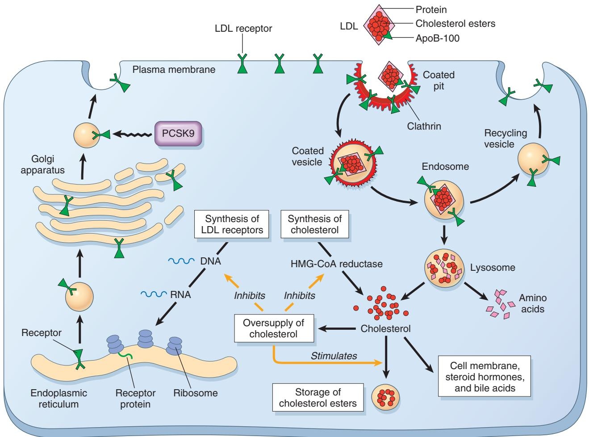 
Fig. 7.2 The LDL receptor pathway and regulation of cholesterol metabolism. The yellow arrows show three regulatory functions of free intracellular cholesterol: (1) suppression of cholesterol synthesis by inhibition of HMG-CoA reductase, (2) stimulating the storage of excess cholesterol as esters, and (3) inhibition of synthesis of LDL receptors. PCSK9 causes intracellular degradation of LDL receptors in liver cells, reducing the level of LDL receptors on the cell membrane. HMG-CoA reductase, 3-Hydroxy-3-methylglutaryl-coenzyme A reductase; LDL, low-density lipoprotein; PCSK9, proprotein convertase subtilisin/kexin type 9.
In recent years, a new mechanism of posttranslational regulation of plasma LDL levels has been elucidated, wherein an enzyme referred to as PCSK9 causes intracellular degradation of LDL receptors in hepatocytes, before they reach the cell surface. With fewer LDL receptors on the cell surface, there is reduced uptake of plasma LDL, leading to hypercholesterolemia. Families with activating mutations of the gene PCSK9, which codes for the enzyme, have many features similar to classic familial hypercholesterolemia.
The discovery of the critical role of LDL receptors in cholesterol homeostasis has led to the rational design of the statin family of drugs that are now widely used to lower plasma cholesterol. They inhibit the activity of HMG-CoA reductase and thus promote greater synthesis of LDL receptors (Fig. 7.2). However, the upregulation of LDL receptors is accompanied by a compensatory increase in PCSK9 levels, which dampens the effects of statins. Therefore, agents that antagonize PCSK9 enzymatic function have been developed, and large clinical trials have shown the benefits using such inhibitors in patients with refractory hypercholesterolemia.
# FAMILIAL HYPERCHOLESTEROLEMIA
- Familial hypercholesterolemia is an autosomal dominant disorder caused by mutations in the gene encoding the LDL receptor. Activating mutations of PCSK9 (far less common), which degrades LDL receptors, also cause a similar phenotype. 
Patients develop hypercholesterolemia as a consequence of impaired transport of LDL into the cells. 
- In heterozygotes, elevated serum cholesterol greatly increases the risk of atherosclerosis and resultant coronary artery disease; homozygotes have an even greater increase in serum cholesterol and a higher frequency of ischemic heart disease. Cholesterol also deposits along tendon sheaths to produce xanthomas.
# Cystic Fibrosis
Cystic fibrosis (CF) is a disorder of epithelial ion transport affecting fluid secretion in exocrine glands and the epithelial linings of the respiratory, gastrointestinal, and reproductive tracts. The ion transport defects lead to
abnormally viscid mucous secretions that block the airways and the pancreatic ducts which in turn are responsible for the two most important clinical manifestations: recurrent and chronic pulmonary infections and pancreatic insufficiency. In addition, although the exocrine sweat glands are structurally normal (and remain so throughout the course of this disease), a high level of sodium chloride in the sweat is a consistent and characteristic biochemical abnormality in CF. At the same time, it must be remembered that CF can present with a bewilderingly variable set of clinical findings. This variation in phenotype results from diverse mutations in the CF-associated gene, tissue-specific effects of loss of the CF gene's function, and the influence of disease modifier genes.
With an incidence of 1 in 2500 live births in the United States, CF is the most common lethal genetic disease that affects white populations. The carrier frequency in the United States is 1 in 20 among Caucasians but significantly lower among African Americans, Asians, and Hispanics. CF follows simple autosomal recessive transmission, although even heterozygous carriers have a predisposition toward pulmonary and pancreatic disease at higher rates than the general population.
The primary defect in CF is reduced production, or abnormal function of an epithelial chloride channel protein encoded by the CF transmembrane conductance regulator (CFTR) gene. Disruptive mutations in CFTR render the epithelial membranes relatively impermeable to chloride ions (Fig. 7.3). However, the impact of this defect on transport function is tissue specific. The major function of the CFTR protein in the sweat gland ducts is to reabsorb luminal chloride ions and augment sodium reabsorption through the epithelial sodium channel (ENaC). Therefore, in the sweat ducts, loss of CFTR function leads to decreased reabsorption of sodium chloride and production of hypertonic ("salty") sweat (Fig. 7.3, top). In contrast to sweat glands, CFTR in the respiratory and intestinal epithelium is one of the most important avenues for active luminal secretion of chloride. At these sites, CFTR mutations result in loss or reduction of chloride secretion into the lumen (Fig. 7.3, bottom). Active luminal sodium absorption through ENaCs also is increased, and both of these ion changes increase passive water reabsorption from the lumen, lowering the water content of the surface fluid layer coating mucosal cells. Thus, unlike the sweat ducts, there
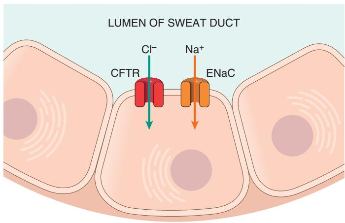 
NORMAL
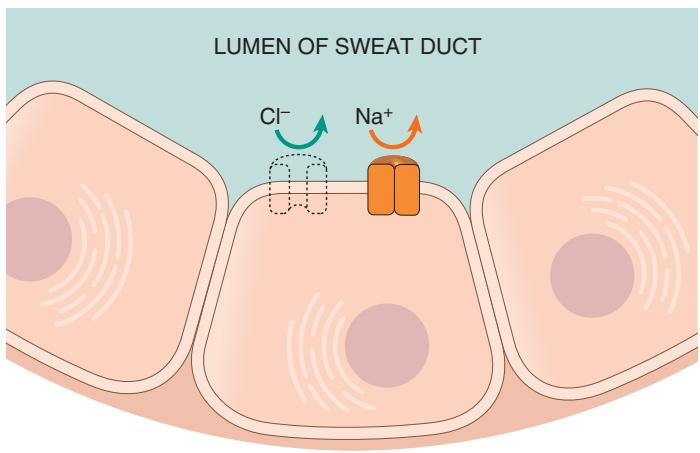 
Cystic Fibrosis
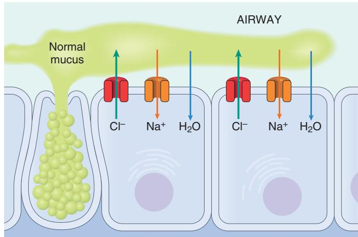 
NORMAL
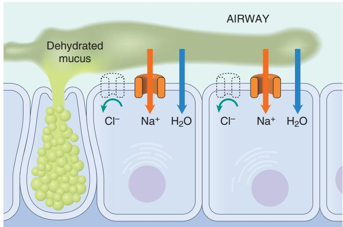 
Cystic Fibrosis 
Fig. 7.3 (Top) In CF, a chloride channel defect in the sweat duct causes increased chloride and sodium concentration in sweat. (Bottom) Patients with CF have decreased chloride secretion and increased sodium and water reabsorption in the airways, leading to dehydration of the mucus layer coating epithelial cells, defective mucociliary action, and mucous plugging. CFTR, Cystic fibrosis transmembrane conductance regulator; ENaC, epithelial sodium channel responsible for intracellular sodium conduction.
is no difference in the salt concentration of the surface fluid layer coating the respiratory and intestinal mucosal cells in normal persons and in those with CF. Instead, respiratory and intestinal complications in CF seem to stem from dehydration of surface fluid layer. In the lungs, this dehydration leads to defective mucociliary action and the accumulation of concentrated, viscid secretions that obstruct the air passages and predispose to recurrent pulmonary infections. In addition to chloride, CFTR also regulates secretion of bicarbonate ions. In fact, certain CFTR variants manifest only with abnormal bicarbonate transport while chloride ion transport is largely preserved. Pancreatic insufficiency, a feature of classic CF, is virtually always present in patients who carry CFTR mutations with abnormal bicarbonate conductance.
Since the CFTR gene was cloned in 1989, more than 1800 disease-causing mutations have been identified. They can be classified on the basis of clinical course of CF or the nature of the underlying defect. Mechanistically, they may result in reduced quantity of functional CFTR that reaches the cell surface or reduced function of CFTR that reaches the cell surface. As we shall see these differences impact on the development of treatment strategies. They can also be classified as severe or mild, depending on the clinical phenotype. Severe mutations are associated with complete loss of CFTR protein function, whereas mild mutations allow some residual function. The most common severe CFTR mutation is a deletion of three nucleotides coding for phenylalanine at amino acid position 508 ( $\Delta F508$ ). This causes misfolding and total loss of the CFTR. Worldwide, $\Delta F508$ mutation is found in approximately $70\%$ of patients with CF. Since CF is an autosomal recessive disease, affected persons harbor mutations on both alleles. As discussed later, the nature of mutations on the two alleles influences the overall phenotype, as well as organ-specific manifestations. Although CF remains one of the best-known examples of the "one gene-one disease" axiom, there is increasing evidence that other genes modify the frequency and severity of organ-specific manifestations. Examples of modifier genes include mannose-binding lectin 2 (MBL2) and transforming growth factor- $\beta1$ (TGF- $\beta1$ ). It is postulated that polymorphisms in these genes influence the ability of the lungs to tolerate infections with virulent microbes (see later), thus modifying the natural history of CF.

Even "classic" CF can present with a multitude of manifestations (Fig. 7.4). Pancreatic abnormalities are present in $85\%$ to $90\%$ of patients. In the milder cases, there may be only accumulations of mucus in the small ducts, with some dilation of the exocrine glands. In more advanced cases, usually seen in older children or adolescents, the ducts are totally plugged, causing atrophy of the exocrine glands and progressive fibrosis (Fig. 7.5). The total loss of pancreatic exocrine secretion impairs fat absorption and may lead to vitamin A deficiency. This may contribute to squamous metaplasia of the lining epithelium of the pancreatic ducts, which may exacerbate injury caused by the inspissated mucus secretions. Thick viscid plugs of mucus also may be found in the small
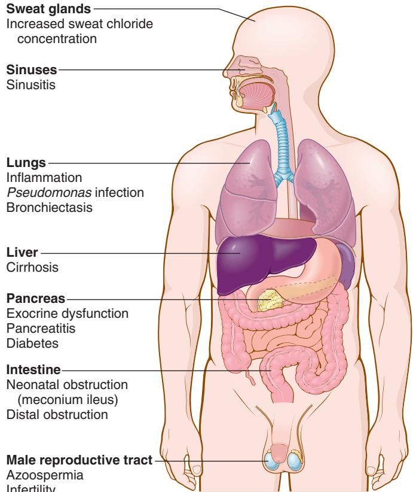 
Bilateral obstruction of vas deferens 
Fig. 7.4 Tissues affected in patients with CF. (Adapted from Cutting GR: Cystic fibrosis genetics: from molecular understanding to clinical application. Nat Rev Genet 16:45, 2015.)
intestine of infants. Sometimes these cause small bowel obstruction, known as meconium ileus.
The pulmonary changes are the most serious complications of this disease (Fig. 7.6). These changes stem from obstruction of the air passages by the viscous mucus secretions of submucosal glands and superimposed infections. The bronchioles often are distended with thick mucus, associated with marked hyperplasia and hypertrophy of the mucus-secreting cells. Superimposed infections give rise to severe chronic bronchitis and
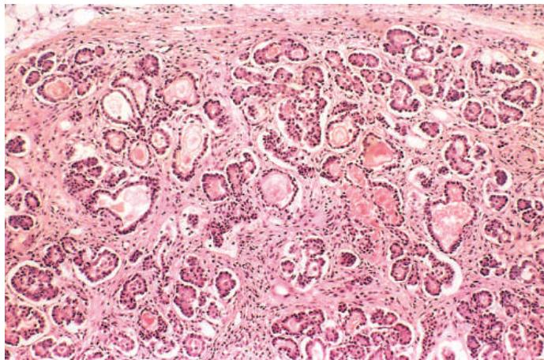 
Fig. 7.5 Mild to moderate changes of CF in the pancreas. The ducts are dilated and plugged with eosinophilic mucin, and the parenchymal glands are atrophic and replaced by fibrous tissue.
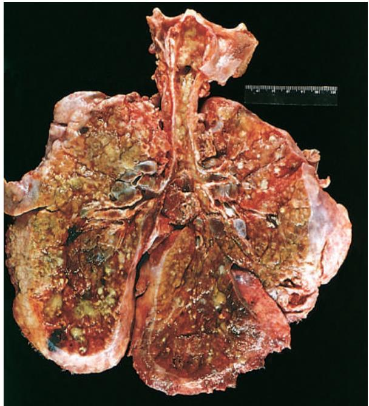 
Fig. 7.6 Lungs of a patient who died of cystic fibrosis. Extensive mucous plugging and dilation of the tracheobronchial tree are apparent. The pulmonary parenchyma is consolidated by a combination of both secretions and pneumonia; the greenish discoloration is the product of Pseudomonas infections. (Courtesy of Dr. Eduardo Yunis: Children's Hospital of Pittsburgh, Pittsburgh, Pennsylvania.)
bronchiectasis. Development of lung abscesses is common. Staphylococcus aureus, Haemophilus influenzae, and Pseudomonas aeruginosa are the three most common organisms responsible for lung infections. Even more sinister is the increasing frequency of infection with another pseudomonad, Burkholderia cepacia. This opportunistic bacterium is particularly hardy, and infection with this organism has been associated with fulminant illness ("cepacia syndrome"). The liver involvement follows the same basic pattern. Bile canaliculi are plugged by mucinous material, accompanied by ductular proliferation and portal inflammation. Hepatic steatosis ("fatty liver") is a common finding in liver biopsies. With time, cirrhosis develops, resulting in diffuse hepatic nodularity. Such severe hepatic involvement is encountered in less than $10\%$ of patients. Azoospermia and infertility are found in $95\%$ of the affected males who survive to adulthood; bilateral absence of the vas deferens is a frequent finding in these patients. In some males, this may be the only feature suggesting an underlying CFTR mutation.
In few childhood diseases are clinical manifestations as protean as those of CF (Fig. 7.4). Approximately $5\%$ to $10\%$ of the cases come to clinical attention at birth or soon after because of an attack of meconium ileus. Exocrine pancreatic insufficiency occurs in a majority (85% to $90\%$ ) of patients and is associated with "severe" CFTR mutations on both alleles (e.g., $\Delta F508 / \Delta F508$ ). By contrast, $10\%$ to $15\%$ of patients, who have one "severe" and one "mild" CFTR mutation, or two "mild" CFTR mutations, retain sufficient pancreatic exocrine function that enzyme supplementation
is not required—the pancreas-sufficient phenotype. Pancreatic insufficiency is associated with malabsorption of protein and fat and increased fecal loss. Manifestations of malabsorption (e.g., large, foul-smelling stools; abdominal distention; poor weight gain) appear during the first year of life. The faulty fat absorption may induce deficiency states of the fat-soluble vitamins, resulting in manifestations of avitaminosis A, D, or K. Hypoproteinemia may be severe enough to cause generalized edema. Persistent diarrhea may result in rectal prolapse in as many as $10\%$ of children with CF. The pancreas-sufficient phenotype usually is not associated with other gastrointestinal complications, and in general, these patients demonstrate excellent growth and development. In contrast to exocrine insufficiency, endocrine insufficiency (i.e., diabetes) is uncommon in CF and occurs late in the course of the disease especially with improved survival of patients with CF.
Cardiorespiratory complications, such as chronic cough, persistent lung infections, obstructive pulmonary disease, and cor pulmonale, constitute the most common cause of death (accounting for approximately $80\%$ of fatalities) in patients who receive follow-up care in most CF centers in the United States. By 18 years of age, $80\%$ of patients with classic CF harbor $P_{\cdot}$ aeruginosa, and $3.5\%$ harbor $B.$ cepacia. With the indiscriminate use of antibiotic prophylaxis, there has been an unfortunate resurgence of resistant strains of Pseudomonas in many patients. Significant liver disease occurs late in the natural history of CF and is foreshadowed by pulmonary and pancreatic involvement; with increasing life expectancy, liver disease is now the third most common cause of death in patients with CF (after cardiopulmonary and transplant-related complications). More extensive DNA sequencing has shown that the spectrum of diseases caused by germline CFTR mutations (either biallelic or in heterozygous carriers) is broader than the "classic" multisystem disease described earlier. For example, some patients suffering from recurrent bouts of abdominal pain and pancreatitis since childhood who were previously classified as having "idiopathic" chronic pancreatitis are now known to harbor biallelic CFTR variants that are distinct from those seen in "classic" CF. Patients with isolated pancreatitis or bilateral absence of vas deferens (see earlier) resulting from CFTR mutations are included under the umbrella of "CFTRopathies." Similarly, whereas CF carriers were initially thought to be asymptomatic, studies suggest that they have an increased lifetime risk for chronic lung disease (especially bronchiectasis) and recurrent sinonasal polyps. In most cases, the diagnosis of CF is based on persistently elevated sweat electrolyte concentrations (often the mother makes the diagnosis because her infant "tastes salty"), characteristic clinical findings (sinopulmonary disease and gastrointestinal manifestations), or a family history. Sequencing the CFTR gene is the gold standard for diagnosis of CF.
There have been major improvements in the management of acute and chronic complications of CF, including more potent anti-microbial therapies, pancreatic enzyme replacement, and bilateral lung transplantation. Importantly, two new forms of treatment aimed at increasing CFTR protein function in certain CFTR variants have been
approved. For example, a group of agents known as CFTR "potentiators" are used in a minority ( $\sim 3\%$ to $5\%$ ) of CF patients who harbor a G155D mutation in the CFTR gene. In this variant, functionally defective CFTR is present in otherwise normal amounts at the cell membrane; the orally bioavailable CFTR "potentiator" partially restores the critical ion transport functions to the defective channel. Another approved drug contains a combination of two agents—one the aforementioned potentiator and the second a drug that increases the transport of the defective $\Delta 508$ CFTR protein to the cell membrane. It is too early to determine the impact of the emerging molecular therapies on prognosis and survival. Overall, improved management of CF have extended the median life expectancy to close to 40 years and, is steadily changing a lethal disease of childhood into a chronic disease of adults.
# Cystic Fibrosis
- CF is an autosomal recessive disease caused by mutations in the CFTR gene encoding the CF transmembrane regulator. 
- The principal defect is of chloride ion transport, resulting in high salt concentrations in sweat and in viscous luminal secretions in respiratory and gastrointestinal tracts. 
- CFTR mutations can be severe (ΔF508), resulting in multisystem disease, or mild, with limited disease extent and severity. 
- Cardiopulmonary complications constitute the most common cause of death; pulmonary infections, especially with resistant Pseudomonas or Burkholderia species, are frequent. Bronchiectasis and right-sided heart failure are long-term sequelae. 
- Pancreatic insufficiency is extremely common; infertility caused by congenital bilateral absence of vas deferens is a characteristic finding in adult patients with CF. 
- Liver disease, including cirrhosis, is increasing in frequency as life expectancy increases. 
- Molecular therapies that enhance the transport or stability of mutant CFTR protein are useful in patients who harbor certain CFTR alleles.
# Diseases Caused by Mutations in Genes Encoding Enzyme Proteins
# Phenylketonuria (PKU)
PKU results from mutations that cause a severe lack of the enzyme phenylalanine hydroxylase (PAH). It affects 1 in 10,000 live-born white infants and there are several variants of this disease. The most common form, referred to as classic phenylketonuria, is common in persons of Scandinavian descent and is distinctly uncommon in African-American and Jewish populations.
Homozygotes with this autosomal recessive disorder classically have a severe lack of PAH, leading to hyperphenylalaninemia and PKU. Affected infants are normal at birth but within a few weeks exhibit a rising plasma phenylalanine level, which impairs brain development. Usually, by 6 months of life, severe mental retardation becomes all too evident; less than $4\%$ of untreated phenylketonuric children have intelligence quotients (IQs) greater
than 60. About one-third of these children are never able to walk, and two-thirds cannot talk. Seizures, other neurologic abnormalities, decreased pigmentation of hair and skin, and eczema often accompany the mental retardation in untreated children. Hyperphenylalaninemia and the resultant mental retardation can be avoided by restricting phenylalanine intake early in life. Hence, several screening procedures are routinely performed to detect PKU in the immediate postnatal period.
Many female patients with PKU who receive dietary treatment beginning early in life reach childbearing age and are clinically normal. Most of them have marked hyperphenylalaninemia, because dietary treatment is discontinued after they reach adulthood. Between $75\%$ and $90\%$ of children born to such women are mentally retarded and microcephalic, and $15\%$ have congenital heart disease, even though the infants themselves are heterozygotes. This syndrome, termed maternal PKU, results from the teratogenic effects of phenylalanine or its metabolites that cross the placenta and affect specific fetal organs during development. The presence and severity of the fetal anomalies directly correlate with the maternal phenylalanine level, so it is imperative that maternal dietary restriction of phenylalanine be initiated before conception and continued throughout pregnancy.
The biochemical abnormality in PKU is an inability to convert phenylalanine into tyrosine. In normal children, less than $50\%$ of the dietary intake of phenylalanine is necessary for protein synthesis. The remainder is converted to tyrosine by the phenylalanine hydroxylase system (Fig. 7.7). When phenylalanine metabolism is blocked because of a lack of PAH enzyme, shunt pathways come into play, yielding several intermediates that are excreted in large amounts in the urine and in the sweat. These impart a strong musty or mousy odor to affected infants. It is believed that excess phenylalanine or its metabolites contribute to the brain damage in PKU. Concomitant lack of tyrosine (Fig. 7.7), a precursor of melanin, is responsible for the light color of hair and skin.
At the molecular level, approximately 500 mutant alleles of the $PAH$ gene have been identified, only some of which cause a severe deficiency of the enzyme. Infants with mutations resulting in a severe lack of PAH activity present with the classic features of PKU, whereas those with some residual activity present with milder disease or may be asymptomatic, a condition referred to as benign hyperphenylalaninemia. Because the numerous disease-causing alleles of the $PAH$ gene, complicate molecular diagnosis, measurement of serum phenylalanine levels is used to differentiate benign hyperphenylalaninemia from PKU; the levels in the latter disorder typically are ≥5 times higher than normal. After a biochemical diagnosis is established, the specific mutation causing PKU can be determined. With this information, carrier testing of at-risk family members can be performed. Currently, enzyme replacement therapy is being tried as a method for reducing circulating phenylalanine levels in patients with classic PKU. The replacement enzyme, known as phenylalanine ammonia lyase (or PAL), converts excess phenylalanine to ammonia and other nontoxic metabolites.
Although $98\%$ of cases of hyperphenylalaninemia are attributable to mutations in PAH, approximately $2\%$ arise
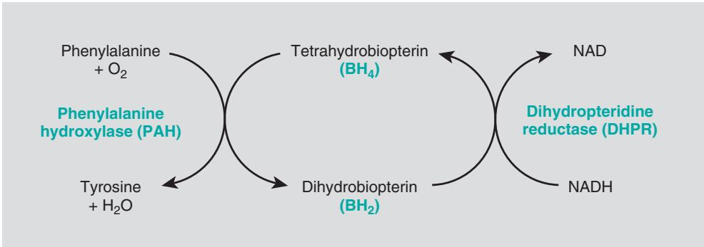 
Fig. 7.7 The phenylalanine hydroxylase system. NADH, Nicotinamide adenine dinucleotide, reduced form.
from abnormalities in synthesis or recycling of the cofactor tetrahydrobiopterin (Fig. 7.7). Clinical recognition of these variant forms is important because these patients cannot be treated by dietary restriction of phenylalanine alone, but also require supplementation with tetrahydrobiopterin, certain neurotransmitter precursors, and folic acid.
# PHENYLKETONURIA
- PKU is an autosomal recessive disorder caused by a lack of the enzyme phenylalanine hydroxylase and a consequent inability to metabolize phenylalanine. 
- Clinical features of untreated PKU may include severe mental retardation, seizures, and decreased pigmentation of skin, which can be avoided by restricting the intake of phenylalanine in the diet. 
- Female patients with PKU who discontinue dietary treatment can give birth to children with malformations and neurologic impairment resulting from transplacental passage of phenylalanine metabolites.
# Galactosemia
Galactosemia is an autosomal recessive disorder of galactose metabolism resulting from a mutation in the gene encoding the enzyme galactose-1-phosphate uridylyltransferase (GALT). It affects 1 in 60,000 live-born infants. Normally, lactase splits lactose, the major carbohydrate of mammalian milk, into glucose and galactose in the intestinal microvilli. Galactose is then converted to glucose in several steps, in one of which the enzyme GALT is required. As a result of this transferase deficiency, galactose-1-phosphate and other metabolites, including galactitol, accumulate in many tissues, including the liver, spleen, lens of the eye, kidney, and cerebral cortex.
The liver, eyes, and brain bear the brunt of the damage. The early-onset hepatomegaly results largely from fatty change, but in time widespread scarring that closely resembles the cirrhosis of alcohol abuse may supervene (Chapter 16). Opacification of the lens (cataract) develops, probably because the lens absorbs water and swells as galactitol, produced by alternative metabolic pathways, accumulates and increases its tonicity. Nonspecific alterations appear in the central nervous system (CNS), including loss of nerve cells, gliosis, and edema. There is still no
clear understanding of the mechanism of injury to the brain, although elevated galactitol levels in neuronal tissues suggests that this may contribute to the damage.
Almost from birth, affected infants fail to thrive. Vomiting and diarrhea appear within a few days of milk ingestion. Jaundice and hepatomegaly usually become evident during the first week of life. Accumulation of galactose and galactose-1-phosphate in the kidney impairs amino acid transport, resulting in aminoaciduria. Fulminant Escherichia coli septicemia occurs with increased frequency. Newborn screening tests are widely utilized in the United States. They depend on fluorometric assay of GALT enzyme activity on a dried blood spot. A positive screening test must be confirmed by assay of GALT levels in RBC. Antenatal diagnosis is possible by assay of GALT activity in cultured amniotic fluid cells or determination of galactitol level in amniotic fluid supernatant.
Many of the clinical and morphologic changes of galactosemia can be prevented or ameliorated by removal of galactose from the diet for at least the first 2 years of life. If instituted soon after birth, this diet prevents cataracts and liver damage and permits almost normal development. Even with dietary restrictions, however, older patients frequently are affected by a speech disorder and gonadal failure (especially premature ovarian failure) and, less commonly, by an ataxic condition.
# GALACTOSEMIA
- Galactosemia is an autosomal recessive disorder caused by lack of the GALT enzyme, leading to the accumulation of galactose-1-phosphate and its metabolites in tissues. 
- Clinical features may include jaundice, liver damage, cataracts, neural damage, vomiting and diarrhea, and E. coli sepsis. Dietary restriction of galactose can prevent at least some of the more severe complications.
# Lysosomal Storage Diseases
Lysosomes, the digestive system of the cells, contain a variety of hydrolytic enzymes that are involved in the breakdown of complex substrates, such as sphingolipids and mucopolysaccharides, into soluble end products. These large molecules may be derived from the turnover of intracellular organelles that enter the lysosomes by autophagy, or they may be acquired from outside the cell
by phagocytosis. With an inherited lack of a lysosomal enzyme, catabolism of its substrate remains incomplete, leading to accumulation of the partially degraded insoluble metabolites within the lysosomes (Fig. 7.8). This is called primary storage. Stuffed with incompletely digested macromolecules, lysosomes become large and numerous enough to interfere with normal cell functions. Because lysosomal function is also essential for autophagy, impaired autophagy gives rise to secondary storage of autophagic substrates such as polyubiquinated proteins and old and effete mitochondria. The absence of this quality-control mechanism causes accumulation of dysfunctional mitochondria, which can trigger the generation of free radicals and apoptosis.
Approximately 60 lysosomal storage diseases have been identified. These may result from abnormalities of
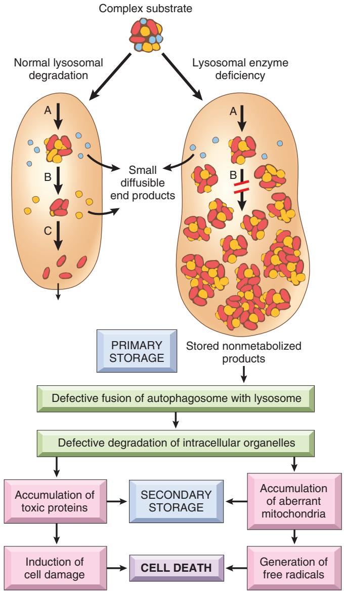 
Fig. 7.8 Pathogenesis of lysosomal storage diseases. In this example, a complex substrate is normally degraded by a series of lysosomal enzymes into soluble end products (A, B and C). If there is a deficiency or malfunction of one of the enzymes (e.g., B), catabolism is incomplete, and insoluble intermediates accumulate in the lysosomes. In addition to this primary storage, secondary storage and toxic effects result from defective autophagy.
lysosomal enzymes or proteins involved in substrate degradation, endosomal sorting, or lysosomal membrane integrity. Lysosomal storage disorders are divided into categories based on the biochemical nature of the substrates and the accumulated metabolites. (Table 7.3). Within each group are several entities, each resulting from the deficiency of a specific enzyme.
Although the combined frequency of lysosomal storage disorders (LSDs) is about 1 in 5000 live births, lysosomal dysfunction may be involved in the etiology of several more-common diseases. For example, an important genetic risk factor for developing Parkinson disease is the carrier state for Gaucher disease, and virtually all Gaucher disease patients develop Parkinson disease. Niemann Pick C is another LSD connected to the risk for Alzheimer disease. Such interconnectedness stems from the multifunctionality of the lysosome. For example, lysosomes play critical roles in (i) autophagy, resulting from fusion with the autophagosome; (ii) immunity, as they fuse with phagosomes; and (iii) membrane repair, through fusion with the plasma membrane.
LSDs are typically fatal, with many displaying profound neurologic impairment that begins in childhood. Studies show that several neurodegenerative LSDs also are associated with a dysregulation of the immune system. For example, immunosuppression occurs in Gaucher disease and mucopolysaccharidoses VII, whereas in Niemann Pick disease-type-C1, hyperactivation of the immune system is seen. The mechanistic basis of linkage to immunologic changes remains to be deciphered.
Despite this complexity, certain features are common to most diseases in this group:
Autosomal recessive transmission 
- Patient population consisting of infants and young children 
- Storage of insoluble intermediates in the mononuclear phagocyte system, giving rise to hepatosplenomegaly 
- Frequent CNS involvement with associated neuronal damage 
- Cellular dysfunction caused not only by storage of undigested material, but also by a cascade of secondary events, for example, macrophage activation and release of cytokines
Most of these conditions are very rare, and their detailed description is better relegated to specialized texts and reviews. Only a few of the more common conditions are considered here.
# Tay-Sachs Disease (GM2 Gangliosidosis: Deficiency in Hexosaminidase $\beta$ Subunit)
Gangliosidoses are characterized by accumulation of gangliosides, principally in the brain, as a result of a deficiency of one of the lysosomal enzymes that catabolize these glycolipids. Depending on the ganglioside involved, these disorders are subclassified into GM1 and GM2 categories. Tay-Sachs disease, by far the most common of all gangliosidoses, is caused by loss-of-function mutations of the $\beta$ subunit of the enzyme hexosaminidase $A$ , which is necessary for the degradation of GM2. More than 100 mutations have been described; most disrupt protein folding or intracellular transport. Tay-Sachs disease, similar to other lipid storage disorders, is most common among
Table 7.3 Lysosomal Storage Disorders 
DiseaseEnzyme DeficiencyMajor Accumulating MetabolitesGlycogenosis, type 2-Pompe diseaseα-1,4-Glucosidase (lysosomal glucosidase)GlycogenSphingolipidosesGM1 gangliosidosisGM1 ganglioside β-galactosidaseGM1 ganglioside, galactose-containing oligosaccharidesType 1—infantile, generalized Type 2—juvenileGM2 gangliosidosisTay-Sachs diseaseHexosaminidase, α subunitGM2 gangliosideSandhoff diseaseHexosaminidase, β subunitGM2 ganglioside, globosideGM2 gangliosidosis variant ABGanglioside activator proteinGM2 gangliosideSulfatidosesMetachromatic leukodystrophyArylsulfatase ASulfatideMultiple sulfatase deficiencyArylsulfatase A, B, C; steroid sulfatase; iduronate sulfatase; heparan N-sulfataseSulfatide, steroid sulfate, heparan sulfate, dermatan sulfateKrabbe diseaseGalactosylceramidaseGalactocerebrosideFabry diseaseα-Galactosidase ACeramide trihexosideGaucher diseaseGlucocerebrosidaseGlucocerebrosideNiemann-Pick disease: types A and BSphingomyelinaseSphingomyelinMucopolysaccharidoses (MPSs)MPS I H (Hurler)α-L-IuronidaseDermatan sulfate, heparan sulfateMPS II (Hunter)I-Iduronosulfate sulfataseMucolipidoses (MLs)I-cell disease (ML II) and pseudo-Hurler polydystrophyDeficiency of phosphorylating enzymes essential for the formation of mannose-6-phosphate recognition marker; acid hydrolases lacking the recognition marker cannot be targeted to the lysosomes but are secreted extracellularlyMucopolysaccharide, glycolipidOther diseases of complex carbohydratesFucosidosisα-FucosidaseFucose-containing sphingolipids and glycoprotein fragmentsMannosidosisα-MannosidaseMannose-containing oligosaccharidesAspartylglycosaminuriaAspartylglycosamine amide hydrolaseAspartyl-2-deoxy-2-acetamido-glycosylamineOther lysosomal storage diseasesWolman diseaseAcid lipaseCholesterol esters, triglyceridesAcid phosphate deficiencyLysosomal acid phosphatasePhosphate esters
Ashkenazi Jews, among whom the frequency of heterozygous carriers is estimated to be 1 in 30. Heterozygote carriers can be detected by measuring the level of hexosaminidase in the serum or by DNA sequencing.
In the absence of hexosaminidase A, $G_{\mathrm{M2}}$ ganglioside accumulates in many tissues (e.g., heart, liver, spleen, nervous system), but the involvement of neurons in the central and autonomic nervous systems and retina dominates the clinical picture. The accumulation of GM2 occurs within neurons, axon cylinders of nerves, and glial cells throughout the CNS. Affected cells appear swollen and sometimes foamy (Fig. 7.9A). Electron microscopy shows whorled onionskin-like configurations within lysosomes composed of layers of membranes (Fig. 7.9B). These pathologic changes are found throughout the CNS (including the spinal cord), peripheral nerves, and autonomic nervous system. The retina usually is involved as well, where the pallor produced by swollen ganglion cells in the peripheral retina results in a contrasting "cherry red" spot in the relatively unaffected central macula.
The molecular basis for neuronal injury is not fully understood. Because in many cases the mutant protein is
misfolded, it induces the so-called "unfolded protein" response (Chapter 2). If such misfolded enzymes are not stabilized by chaperones, they undergo proteasomal degradation, leading to accumulation of toxic substrates and intermediates within neurons. These findings have spurred clinical trials of molecular chaperone therapy for some variants of later-onset Tay-Sachs and other selected lysosomal storage diseases. Such therapy involves the use of synthetic chaperones that can cross the blood-brain barrier, bind to the mutated protein, and enable its proper folding. Sufficient functional enzyme can then be rescued to ameliorate the effects of the inborn error.
In the most common acute infantile variant of Tay-Sachs disease, infants appear normal at birth, but motor weakness begins at 3 to 6 months of age, followed by neurologic impairment, onset of blindness, and progressively more severe neurologic dysfunctions. Death occurs within 2 to 3 years.
# Niemann-Pick Disease Types A and B
Type A and type B Niemann-Pick diseases are related entities characterized by a primary deficiency of acid
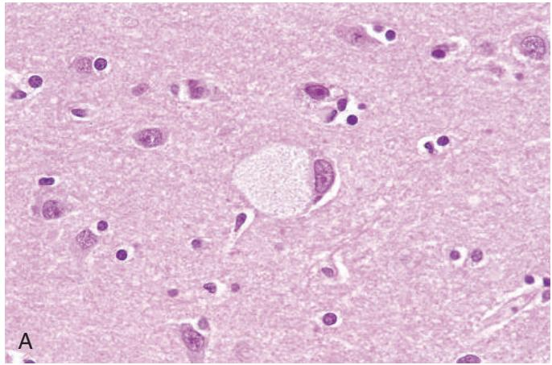 
Fig. 7.9 Ganglion cells in Tay-Sachs disease. (A) Under the light microscope, a large neuron has obvious lipid vacuolation. (B) A portion of a neuron under the electron microscope shows prominent lysosomes with whorled configurations just below part of the nucleus. (A, Courtesy of Dr. Arthur Weinberg, Department of Pathology, University of Texas Southwestern Medical Center, Dallas, Texas. B, Courtesy of Dr. Joe Rutledge, Children's Regional Medical Center, Seattle, Washington.)
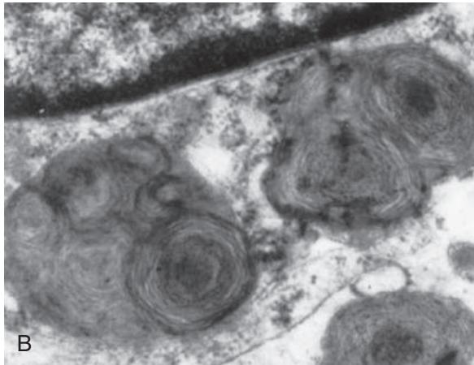
sphingomyelinase and the resultant accumulation of sphingomyelin. As with Tay-Sachs disease, Niemann-Pick disease types A and B are common in Ashkenazi Jews. The gene for acid sphingomyelinase maps to chromosome 11p15.4 and is one of the imprinted genes that is preferentially expressed from the maternal chromosome as a result of epigenetic silencing of the paternal gene (discussed later).
In type A, characterized by a severe deficiency of sphingomyelinase, the breakdown of sphingomyelin into ceramide and phosphorylcholine is impaired, and excess sphingomyelin accumulates in phagocytic cells and in neurons. Macrophages become stuffed with droplets or particles of the complex lipid, imparting a fine vacuolation or foaminess to the cytoplasm (Fig. 7.10). Electron microscopy shows engorged secondary lysosomes that often contain membranous cytoplasmic bodies resembling concentric lamellated myelin figures, sometimes called "zebra" bodies. Because of their high content of phagocytic cells, the organs most severely affected are the spleen, liver, bone marrow, lymph nodes, and lungs. The splenic enlargement may be striking. In addition, the entire CNS, including the spinal cord and ganglia, is involved in this inexorable process. The affected neurons are enlarged and vacuolated as a result of the accumulation of lipids. This variant manifests in infancy with massive organomegaly and severe neurologic deterioration. Death usually occurs within the first 3 years of life. By comparison, patients with the type B variant, which is associated with mutant sphigomyelinase with some residual activity, have organomegaly but no neurologic manifestations. Estimation of sphingomyelinase activity in the leukocytes can be used for diagnosis of suspected cases, as well as for detection of carriers. Molecular genetic tests are also available for diagnosis at specialized centers.
# Niemann-Pick Disease Type C
Although previously considered to be related to type A and type B Niemann-Pick disease type C (NPC) is quite distinct at the biochemical and molecular levels and is more common than types A and B combined. Mutations in two related genes, NPC1 and NPC2, can give rise to this
disorder, with NPC1 being responsible for a majority of cases. Unlike most other lysosomal storage diseases, NPC results from a primary defect in lipid transport. Affected cells accumulate cholesterol as well as gangliosides such as GM1 and GM2. Both NPC1 and NPC2 are involved in the transport of free cholesterol from the lysosomes to the cytoplasm. NPC is clinically heterogeneous. The most common form manifests in childhood and is marked by ataxia, vertical supranuclear gaze palsy, dystonia, dysarthria, and psychomotor regression.
# Gaucher Disease
Gaucher disease results from mutation in the gene that encodes glucocerebrosidase, and the resultant deficiency of this enzyme leads to an accumulation of glucocerebroside, an intermediate in glycolipid metabolism, in the mononuclear phagocytic cells. There are three autosomal recessive variants of Gaucher disease resulting from distinct allelic mutations. Common to all is deficient activity of a glucocerebrosidase that cleaves the glucose residue from ceramide. Normally, macrophages,
.jpg) 
Fig. 7.10 Niemann-Pick disease in liver. The hepatocytes and Kupffer cells have a foamy, vacuolated appearance resulting from deposition of lipids. (Courtesy of Dr. Arthur Weinberg, Department of Pathology, University of Texas Southwestern Medical Center, Dallas, Texas.)
particularly in the liver, spleen, and bone marrow, sequentially degrade glycolipids derived from the breakdown of senescent blood cells. In Gaucher disease, the degradation stops at the level of glucocerebrosides, which accumulate in macrophages. These cells—the so-called "Gaucher cells"—become enlarged, with some reaching a diameter as great as $100\mu \mathrm{m}$ , because of the presence of distended lysosomes, and they acquire a pathognomonic cytoplasmic appearance characterized as "wrinkled tissue paper" (Fig. 7.11). It is evident now that Gaucher disease is caused not just by the burden of storage material but also by activation of the macrophages. High levels of macrophage-derived cytokines, such as interleukins (IL-1, IL-6) and tumor necrosis factor (TNF), are found in affected tissues.
One variant, type 1, also called the chronic nonneuronepatic form, accounts for $99\%$ of cases of Gaucher disease. It is characterized by clinical or radiographic bone involvement (osteopenia, focal lytic lesions, and osteonecrosis) in $70\%$ to $100\%$ of cases. Additional features are hepatosplenomegaly and the absence of CNS involvement. The spleen often enlarges to massive proportions, filling the entire abdomen. Gaucher cells are found in the liver, spleen, lymph nodes, and bone marrow. Marrow replacement and cortical erosion may produce radiographically visible skeletal lesions, and peripheral blood cytopenias. It is believed that bone changes are caused by the aforementioned macrophage-derived cytokines. Type 1 is most common in Ashkenazi Jews; unlike other variants, it is compatible with long life. Neurologic signs and symptoms characterize types 2 and 3 variants. In type 2, these manifestations appear during infancy (acute infantile neuronopathic form) and are more severe, whereas in type 3, they emerge later and are milder (chronic neuronopathic form). Although the liver and spleen also are involved, the clinical features in types 2 and 3 are dominated by neurologic disturbances, including convulsions and progressive mental deterioration. As mentioned earlier mutation of the glucocerebroside gene is a very important risk factor for Parkinson disease. Patients with Gaucher disease have a 20 fold higher risk of developing Parkinson disease (compared to controls) and $5 - 10\%$ of patients with Parkinson disease have mutations in the gene encoding glucocerebrosidase.
There is a reciprocal relationship between the level of this enzyme and alpha synuclein. The latter is involved in the pathogenesis of Parkinson disease (Chapter 24). The level of glucocerebrosides in leukocytes or cultured fibroblasts is helpful in diagnosis and in the detection of heterozygote carriers. DNA testing is also available in select populations.
Currently, there are two approved therapies for type I Gaucher disease. The first is lifelong enzyme replacement therapy via infusion of recombinant glucocerebrosidase. The second, known as substrate reduction therapy, involves oral intake of an inhibitor of the enzyme glucosylceramide synthase. This leads to reduced systemic levels of glucocerebroside, the substrate for the defective enzyme in Gaucher disease. Clinical trials have confirmed that substrate reduction therapy leads to reduced spleen and liver sizes, improved blood counts, and enhanced skeletal function. Other emerging treatments include gene therapy through transplant of hematopoietic stem cells containing the corrected enzyme.
# Mucopolysaccharidoses
Mucopolysaccharidoses (MPSs) are characterized by defective degradation and excessive storage of mucopolysaccharides in various tissues. Recall that mucopolysaccharides are part of the extracellular matrix and are synthesized by connective tissue fibroblasts. Most mucopolysaccharide is secreted, but a certain fraction is degraded within lysosome through a catabolic pathway involving multiple enzymes. Several clinical variants of MPS, classified numerically from MPS I to MPS VII, have been described, each resulting from the deficiency of one specific enzyme in this pathway. The mucopolysaccharides that accumulate within the tissues include dermatan sulfate, heparan sulfate, keratan sulfate, and (in some cases) chondroitin sulfate.
Hepatosplenomegaly, skeletal deformities, lesions of heart valves, subendothelial arterial deposits, particularly in the coronary arteries, and lesions in the brain, are features that are seen in all of the MPSs. In many of the more protracted syndromes, coronary subendothelial lesions lead to myocardial ischemia. Thus, myocardial infarction and cardiac decompensation are important causes of death. Most cases are associated
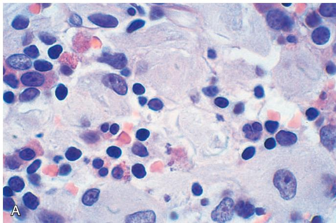 
Fig. 7.11 Gaucher disease involving the bone marrow. (A) Gaucher cells with abundant lipid-laden "wrinkled" cytoplasm. (B) Electron micrograph of Gaucher cells with elongated distended lysosomes. (Courtesy of Dr. Matthew Fries, Department of Pathology, University of Texas Southwestern Medical Center, Dallas, Texas.)
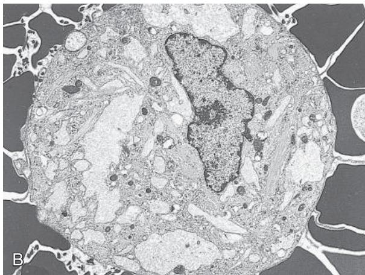
with coarse facial features, clouding of the cornea, joint stiffness, and mental retardation. Urinary excretion of the accumulated mucopolysaccharides often is increased. With all of these disorders except one, the mode of inheritance is autosomal recessive; the exception, Hunter syndrome, is an X-linked recessive disease. Of the seven recognized variants, only two well-characterized syndromes are discussed briefly here.
- MPS type I, also known as Hurler syndrome, is caused by a deficiency of $\alpha$ -L-iduronidase. In Hurler syndrome, affected children have a life expectancy of 6 to 10 years, and death is often a result of cardiac complications. Accumulation of dermatan sulfate and heparan sulfate is seen in cells of the mononuclear phagocyte system, in fibroblasts, and within endothelium and smooth muscle cells of the vascular wall. The affected cells are swollen and have clear cytoplasm, resulting from the accumulation of material positive for periodic acid-Schiff staining within engorged, vacuolated lysosomes. Lysosomal inclusions also are found in neurons, accounting for the mental retardation. 
- MPS type II or Hunter syndrome, differs from Hurler syndrome in its mode of inheritance (X-linked), the absence of corneal clouding, and often its milder clinical course. As in Hurler syndrome, the accumulated mucopolysaccharides in Hunter syndrome are heparan sulfate and dermatan sulfate, but this results from a deficiency of L-iduronate sulfatase. Despite the difference in enzyme deficiency, an accumulation of identical substrates occurs because breakdown of heparan sulfate and dermatan sulfate requires both $\alpha$ -L-iduronidase and the sulfatase; if either one is missing, further degradation is blocked. Diagnosis is made by measuring the level of enzyme in leukocytes. DNA diagnosis is not routinely employed because of the large number of allelic mutations.
# LYSOSOMAL STORAGE DISEASES
- Tay-Sachs disease is caused by an inability to metabolize GM2 gangliosides because of a lack of the $\beta$ subunit of lysosomal hexosaminidase. GM2 gangliosides accumulate in the CNS and cause severe mental retardation, blindness, motor weakness, and death by 2 to 3 years of age. 
- Niemann-Pick disease types A and B are caused by a deficiency of sphingomyelinase. In the more severe, type A variant, accumulation of sphingomyelin in the nervous system results in neuronal damage. Sphingomyelin also is stored in phagocytes within the liver, spleen, bone marrow, and lymph nodes, causing their enlargement. In type B, neuronal damage is not present. 
- Niemann-Pick disease type C is caused by a defect in cholesterol transport and resultant accumulation of cholesterol and gangliosides in the nervous system. Affected children exhibit ataxia, dysarthria, and psychomotor regression. 
- Gaucher disease results from lack of the lysosomal enzyme glucocerebrosidase and accumulation of glucocerebroside in mononuclear phagocytic cells. In the most common, type I variant, affected phagocytes become enlarged (Gaucher cells) and accumulate in liver, spleen, and bone marrow, causing
hepatosplenomegaly and bone erosion. Types 2 and 3 are characterized by variable neuronal involvement.
- MPss result from accumulation of mucopolysaccharides in many tissues including liver, spleen, heart, blood vessels, brain, cornea, and joints. Affected patients in all forms have coarse facial features. Manifestations of Hurler syndrome include corneal clouding, coronary arterial and valvular deposits, and death in childhood. Hunter syndrome is associated with a milder clinical course.
# Glycogen Storage Diseases (Glycogenoses)
An inherited deficiency of any one of the enzymes involved in glycogen synthesis or degradation can result in excessive accumulation of glycogen or some abnormal form of glycogen in various tissues. The type of glycogen stored, its intracellular location, and the tissue distribution of the affected cells vary depending on the specific enzyme deficiency. Regardless of the tissue or cells affected, the glycogen most often is stored within the cytoplasm, or sometimes within nuclei. One variant, Pompe disease, is a form of lysosomal storage disease, because the missing enzyme is localized to lysosomes. Most glycogenoses are inherited as autosomal recessive diseases, as is common with "missing enzyme" syndromes.
Approximately a dozen forms of glycogenoses have been described in association with specific enzyme deficiencies. Based on pathophysiologic findings, they can be grouped into three categories (Table 7.4):
- Hepatic type. Liver contains several enzymes that synthesize glycogen for storage and also break it down into free glucose. Hence, a deficiency of the hepatic enzymes involved in glycogen metabolism is associated with two major clinical effects: enlargement of the liver due to storage of glycogen and hypoglycemia due to a failure of glucose production (Fig. 7.12). Von Gierke disease (type I glycogenosis), resulting from a lack of glucose-6-phosphatase, is the most important example of the hepatic form of glycogenosis (Table 7.4). 
- Myopathic type. In striated muscle, glycogen is an important source of energy. Not surprisingly, most forms of glycogen storage disease affect muscles. When enzymes that are involved in glycolysis are deficient, glycogen storage occurs in muscles and there is an associated muscle weakness due to impaired energy production. Typically, the myopathic forms of glycogen storage diseases are marked by muscle cramps after exercise, myoglobinuria, and failure of exercise to induce an elevation in blood lactate levels because of a block in glycolysis. McArdle disease (type V glycogenosis), resulting from a deficiency of muscle phosphorylase, is the prototype of myopathic glycogenoses. 
- Type II glycogenosis (Pompe disease) is caused by a deficiency of lysosomal acid maltase and is associated with deposition of glycogen in virtually every organ, but cardiomegaly is most prominent. Most affected patients die within 2 years of onset of cardiorespiratory failure. Therapy with the missing enzyme (glucosidase) can reverse cardiac muscle damage and modestly increase longevity.
Table 7.4 Principal Subgroups of Glycogenoses 
Clinicopathologic CategorySpecific TypeEnzyme DeficiencyMorphologic ChangesClinical FeaturesHepatic typeHepatorenal (von Gierke disease, type I)Glucose-6-phosphataseHepatomegaly: intracytoplasmic accumulations of glycogen and small amounts of lipid; intranuclear glycogen Renomegaly: intracytoplasmic accumulations of glycogen in cortical tubular epithelial cellsIn untreated patients, failure to thrive, stunted growth, hepatomegaly, and renomegaly Hypoglycemia resulting from failure of glucose mobilization, often leading to convulsions Hyperlipidemia and hyperuricemia resulting from deranged glucose metabolism; many patients develop gout and skin xanthomas Bleeding tendency caused by platelet dysfunction With treatment (providing continuous source of glucose), most patients survive and develop late complications (e.g., hepatic adenomas)Myopathic typeMcArdle disease (type V)Muscle phosphorylaseSkeletal muscle only: accumulations of glycogen predominant in subsarcolemmal locationPainful cramps associated with strenuous exercise Myoglobinuria occurs in 50% of cases Onset in adulthood (&gt;20 year) Muscular exercise fails to raise lactate level in venous blood Compatible with normal longevityMiscellaneous typeGeneralized glycogenosis (Pompe disease, type II)Lysosomal glucosidase (acid maltase)Mild hepatomegaly: ballooning of lysosomes with glycogen creating lacy cytoplasmic pattern Cardiomegaly: glycogen within sarcoplasm as well as membrane-bound Skeletal muscle: similar to heart (see earlier, under cardiomegaly)Massive cardiomegaly, muscle hypotonia, and cardiorespiratory failure before age 2 Milder adult form with only skeletal muscle involvement manifests with chronic myopathy
# GLYCOCEN STORAGE DISEASES
- Inherited deficiency of enzymes involved in glycogen metabolism can result in storage of normal or abnormal forms of glycogen, predominantly in liver or muscles or in all tissues. 
- In the hepatic form (von Gierke disease), liver cells store glycogen because of a lack of hepatic glucose-6-phosphatase. 
- There are several myopathic forms, including McArdle disease, in which lack of muscle phosphorylase gives rise to storage in skeletal muscles and cramps after exercise. 
- In Pompe disease there is lack of lysosomal acid maltase, and all organs are affected, but heart involvement is predominant.
# Diseases Caused by Mutations in Genes Encoding Proteins That Regulate Cell Growth
As detailed in Chapter 6, two classes of genes, protooncogenes and tumor suppressor genes, regulate normal cell growth. Mutations affecting these genes, most often in somatic cells, are involved in the pathogenesis of tumors. In approximately $5\%$ to $10\%$ of all cancers, however, mutations affecting certain tumor suppressor genes are present in all cells of the body, including germ cells, and hence can
be transmitted to the offspring. These mutant genes predispose the offspring to hereditary tumors, a topic discussed in greater detail in Chapter 6. A few salient examples of familial neoplasms arising in children are discussed later in this chapter.
# COMPLEX MULTIGENIC DISORDERS
Complex multigenic disorders—so-called "multifactorial or polygenic disorders"—are caused by interactions between genetic variants and environmental factors. A genetic variant that occurs in at least $1\%$ of the population is called a polymorphism. According to the common disease-common variant hypothesis, complex multigenic disorders occur when many polymorphisms, each with a modest effect and low penetrance, are coinherited. Two additional important facts have emerged from studies of common complex disorders such as type 1 diabetes:
- Although complex disorders result from the collective inheritance of many polymorphisms, different polymorphisms vary in significance. For example, of the 20 to 30 genes implicated in type 1 diabetes, 6 or 7 are most important, and a few HLA alleles contribute more than $50\%$ of the risk (Chapter 20).
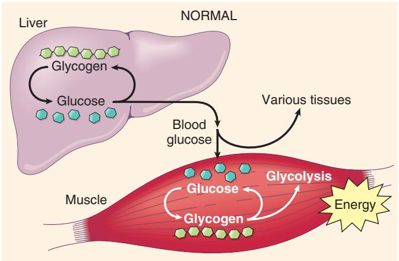 
GLYCOCGEN STORAGE DISEASE—HEPATIC TYPE
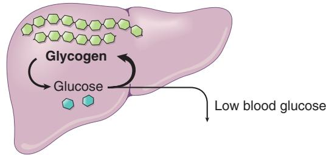 
GLYCOCEN STORAGE DISEASE—MYOPATHIC TYPE
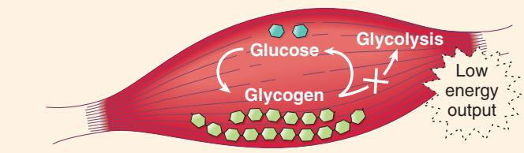 
Fig. 7.12 (Top) A simplified scheme of normal glycogen metabolism in the liver and skeletal muscles. (Middle) The effects of an inherited deficiency of hepatic enzymes involved in glycogen metabolism. (Bottom) The consequences of a genetic deficiency in the enzymes that metabolize glycogen in skeletal muscles.
- Some polymorphisms are common to multiple diseases of the same type, whereas others are disease-specific. This observation is well illustrated in immune-mediated inflammatory diseases (Chapter 5). 
- Many of the disease-associated polymorphisms are in noncoding regions so they likely affect epigenetic regulation of gene expression.
Several normal phenotypic characteristics are governed by multigenic inheritance, such as hair color, eye color, skin color, height, and intelligence. These characteristics (also known as quantitative trait loci [QTLs]) show a continuous variation within, as well as across, all population groups. Environmental influences, however, significantly modify the phenotypic expression of complex traits. For example, type 2 diabetes mellitus has many of the features of a complex multigenic disorder. It is well recognized clinically that affected persons often first exhibit clinical manifestations of this disease after weight gain. Thus, obesity, as well as other environmental influences, unmasks the diabetic genetic trait. Assigning a disease to this mode
of inheritance must be done with caution. Such attribution depends on many factors but first on familial clustering and the exclusion of mendelian and chromosomal modes of transmission. A range of levels of severity of a disease is suggestive of a complex multigenic disorder, but, as pointed out earlier, variable expressivity and reduced penetrance of single mutant genes also may account for this phenomenon. Because of these issues, it is sometimes difficult to distinguish between mendelian and multifactorial disorders.
# CYTOGENETIC DISORDERS
Chromosomal abnormalities occur much more frequently than is generally appreciated. It is estimated that approximately 1 in 200 newborn infants has some form of chromosomal abnormality. The figure is much higher in fetuses that do not survive to term; in as many as $50\%$ of first-trimester spontaneous abortions, the fetus may have a chromosomal abnormality. Cytogenetic disorders result from alterations in the number or structure of chromosomes and may affect autosomes or sex chromosomes.
Before embarking on a discussion of chromosomal aberrations, it is appropriate to review karyotyping as the basic tool of the cytogeneticist. A karyotype is a photographic representation of a stained metaphase spread in which the chromosomes are arranged in order of decreasing length. A variety of techniques for staining chromosomes has been developed. With the widely used Giemsa stain (G banding) technique, each chromosome set can be seen to possess a distinctive pattern of alternating light and dark bands of variable widths (Fig. 7.13). The use of banding techniques allows identification of each chromosome, and can detect and localize structural abnormalities large enough to produce changes in banding pattern (described later).
# Numeric Abnormalities
In humans, the normal chromosome count is 46 (i.e., $2n = 46$ ). Any exact multiple of the haploid number (n) is called euploid. Chromosome numbers such as 3n and 4n are called polyploid. Polyploidy generally results in a spontaneous abortion. Any number that is not an exact multiple of n is called aneuploid. The chief cause of aneuploidy is nondisjunction of a homologous pair of chromosomes at the first meiotic division or a failure of sister chromatids to separate during the second meiotic division. The latter also may occur during mitosis in somatic cells, leading to the production of two aneuploid cells. Failure of pairing of homologous chromosomes followed by random assortment (anaphase lag) also can lead to aneuploidy. When nondisjunction occurs at the time of meiosis, the gametes formed have either an extra chromosome $(n + 1)$ or one less chromosome $(n - 1)$ . Fertilization of such gametes by normal gametes would result in two types of zygotes: trisomic, with an extra chromosome $(2n + 1)$ , or monosomic $(2n - 1)$ . Monosomy involving an autosome is incompatible with life, whereas trisomies of certain autosomes and monosomy involving sex chromosomes are compatible with life. These, as we shall see, are
.AlsoshownisthebandingpatternoftheX-chromosomewithnomenclatureofarms,regions,bands,andsubbands.(KaryotypecourtesyofDr.StuartSchwartz,DepartmentofPathology,UniversityofChicago,Chicago,Illinois.).jpg) 
Fig. 7.13 G-banded karyotype from a normal male (46,XY). Also shown is the banding pattern of the X-chromosome with nomenclature of arms, regions, bands, and subbands. (Karyotype courtesy of Dr. Stuart Schwartz, Department of Pathology, University of Chicago, Chicago, Illinois.)
associated with variable degrees of phenotypic abnormality. Mosaicism is a term used to describe the presence of two or more populations of cells with different complements of chromosomes in the same individual. In the context of chromosome numbers, postzygotic mitotic nondisjunction would result in the production of a trisomic and a monosomic daughter cell; the descendants of these cells would then produce a mosaic. As discussed later, mosaicism affecting sex chromosomes is common, whereas autosomal mosaicism is not.
# Structural Abnormalities
Structural changes in the chromosomes typically result from chromosomal breakage followed by loss or rearrangement of material. Such changes usually are designated using a cytogenetic shorthand in which p (French, petit) denotes the short arm of a chromosome, and q, the long arm. Each arm is then divided into numbered regions (1, 2, 3, and so on) from centromere outward, and within each region the bands are numerically ordered (Fig. 7.13). Thus, 2q34 indicates chromosome 2, long arm, region 3, band 4. The patterns of chromosomal rearrangement after breakage (Fig. 7.14) are as follows:
- Translocation implies transfer of a part of one chromosome to another chromosome. The process is usually reciprocal (i.e., fragments are exchanged between two chromosomes). In genetic shorthand, translocations are indicated by t followed by the involved chromosomes in numeric order—for example, 46,XX,t(2;5)(q31;p14). This notation would indicate a reciprocal translocation
involving the long arm (q) of chromosome 2 at region 3, band 1, and the short arm of chromosome 5, region 1, band 4. When the entire broken fragments are exchanged, the resulting balanced reciprocal translocation (Fig. 7.14) is not harmful to the carrier, who has the normal number of chromosomes and the full complement of genetic material. However, during gametogenesis, abnormal (unbalanced) gametes are formed, resulting in abnormal zygotes. A special pattern of translocation involving two acrocentric chromosomes is called centric fusion type, or robertsonian, translocation. The breaks typically occur close to the centromere, affecting the short arms of both chromosomes. Transfer of the segments leads to one very large chromosome and one extremely small one (Fig. 7.14). The short fragments are lost, and the carrier has 45 chromosomes. Because the short arms of all acrocentric chromosomes carry highly redundant genes (e.g., ribosomal RNA genes), such loss is compatible with survival. However, difficulties arise during gametogenesis, resulting in the formation of unbalanced gametes that could lead to abnormal offspring.
- Isochromosomes result when the centromere divides horizontally rather than vertically. One of the two arms of the chromosome is then lost, and the remaining arm is duplicated, resulting in a chromosome with only two short arms or two long arms. The most common isochromosome present in live births involves the long arm of the X chromosome and is designated i(Xq). When fertilization occurs by a gamete that contains a normal X chromosome, the result is monosomy for genes on Xp and trisomy for genes on Xq.
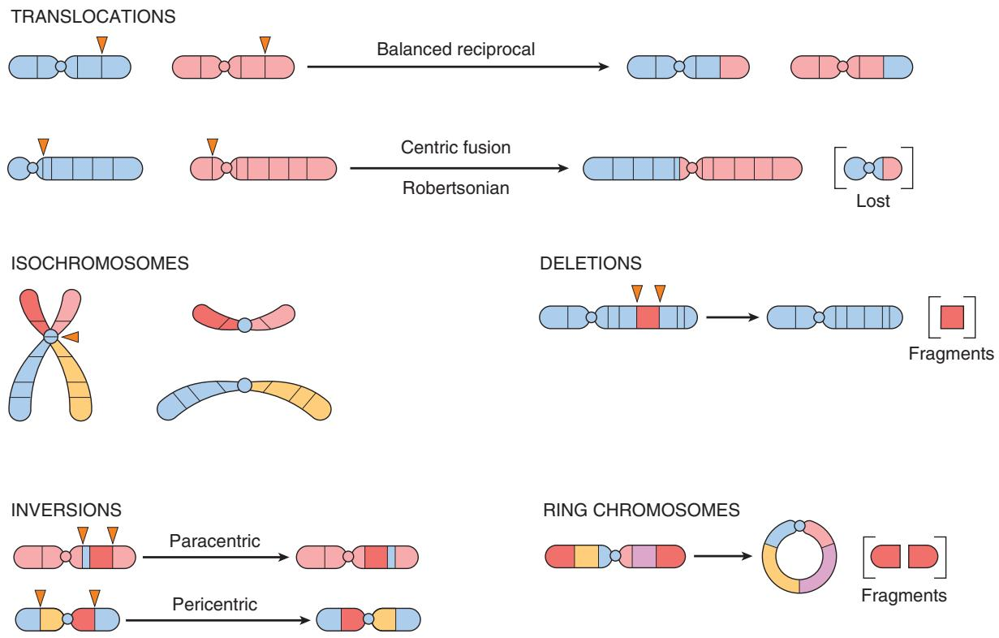 
Fig. 7.14 Types of chromosomal rearrangements.
- Deletion involves loss of a portion of a chromosome. A single break may delete a terminal segment. Two interstitial breaks, with reunion of the proximal and distal segments, may result in loss of an internal segment. The isolated fragment, which lacks a centromere, almost never survives, and thus many genes are lost. 
- Inversions occur when there are two interstitial breaks in a chromosome, and the segment reunites after a complete turnaround. 
- A ring chromosome is a variant of a deletion. After loss of segments from each end of the chromosome, the arms unite to form a ring.
# General Features of Chromosomal Disorders
- Chromosomal disorders may be associated with absence (deletion, monosomy), excess (trisomy), or abnormal rearrangements (translocations) of chromosomes. 
- In general, a loss of chromosomal material produces more severe defects than does a gain of chromosomal material. 
- Excess chromosomal material may result from a complete chromosome (as in trisomy) or from part of a chromosome (as in Robertsonian translocation). 
- Imbalances of sex chromosomes (excess or loss) are tolerated much better than are similar imbalances of autosomes. 
- Sex chromosomal disorders often produce subtle abnormalities, sometimes not detected at birth. Infertility, a common manifestation, cannot be diagnosed until adolescence. 
- In most cases, chromosomal disorders result from de novo changes (i.e., parents are normal, and risk of
recurrence in siblings is low). The translocation form of Down syndrome (described later) exhibits an uncommon but important exception to this principle.
Some specific examples of diseases involving changes in the karyotype are presented next.
# Cytogenetic Disorders Involving Autosomes
Three autosomal trisomies (21, 18, and 13) and one deletion syndrome (cri du chat syndrome), which results from partial deletion of the short arm of chromosome 5, were the first chromosomal abnormalities identified. More recently, several additional trisomies and deletion syndromes (such as those affecting $22\mathrm{q}$ ) have been described. Most of these disorders are quite uncommon, but their clinical features should permit ready recognition (Fig. 7.15).
Only trisomy 21 and 22q11.2 deletions occur with sufficient frequency to merit further consideration.
# Trisomy 2 I (Down Syndrome)
Down syndrome, characterized by extra copy of genes on chromosome 21, is the most common of the chromosomal disorders. About $95\%$ of affected persons have trisomy 21, so their chromosome count is 47. As mentioned earlier, the most common cause of trisomy, and therefore of Down syndrome, is meiotic nondisjunction. The parents of such children are normal in all respects. Maternal age has a strong influence on the incidence of Down syndrome. It occurs in 1 in 1550 live births in women younger than 20 years, in contrast with 1 in 25 live births in women older than 45 years. The correlation with maternal age suggests
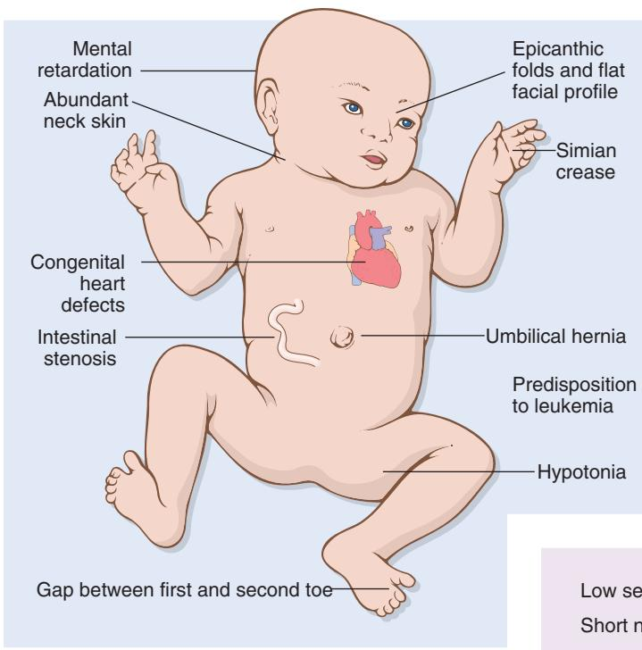 
TRISOMY 21:DOWN SYNDROME
Incidence: 1 in 700 births
Trisomy 21 type:
47,XX,+21
Translocation type:
46,XX,der(14;21)(q10;q10),+21
Mosaic type:
46,XX/47,XX,+21
Incidence: 1 in 8000 births
Trisomy 18 type: 47,XX, +18
Mosaic type: 46,XX/47,XX, +18
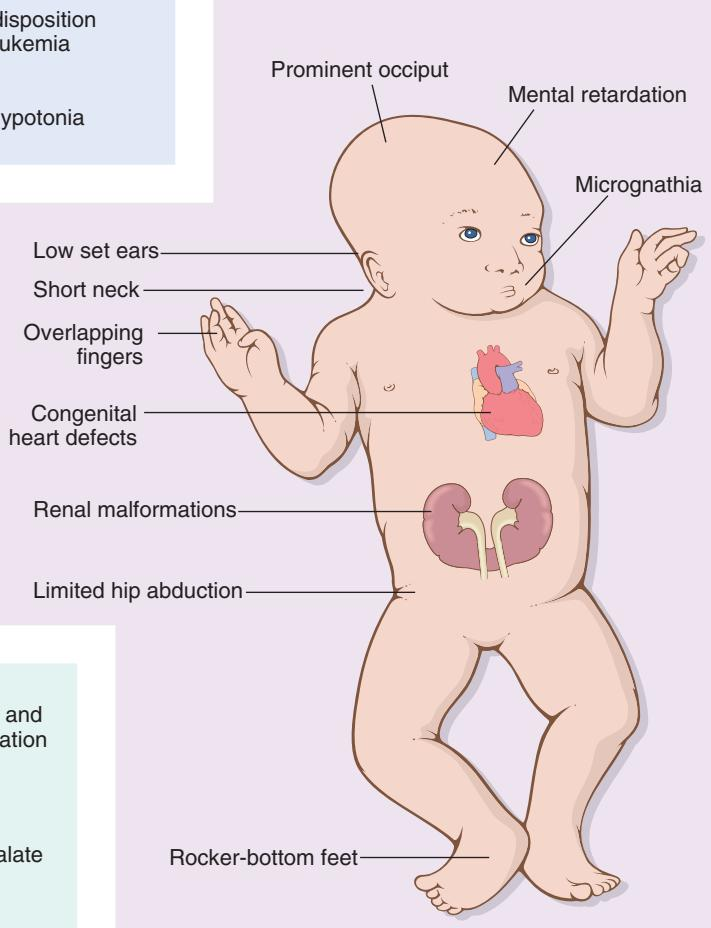 
TRISOMY 18: EDWARDS SYNDROME
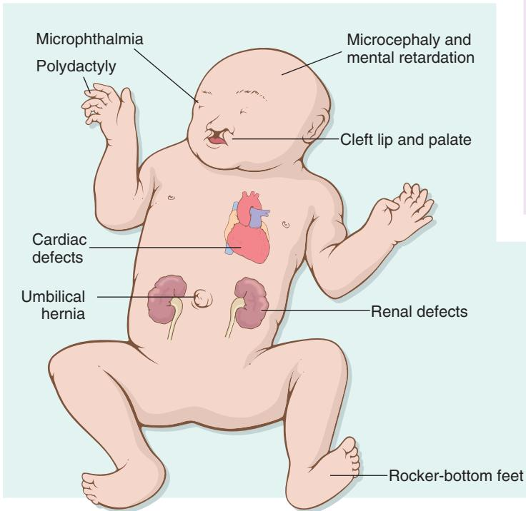 
TRISOMY 13: PATAU SYNDROME 
Fig. 7.15 Clinical features and karyotypes of the three most common autosomal trisomies.
Incidence: 1 in 15,000 births
Trisomy 13 type:
47,XX,+13
Translocation type:
46,XX,+13,der(13;14)(q10;q10)
Mosaic type:
46,XX/47,XX,+13
that in most cases the meiotic nondisjunction of chromosome 21 occurs in the ovum. Indeed, in $95\%$ of cases the extra chromosome is of maternal origin. The reason for the increased susceptibility of the ovum to nondisjunction with aging is not fully understood. No effect of paternal age has been found in those cases in which the extra chromosome is derived from the father.
In about $4\%$ of all patients with trisomy 21, the extra chromosomal material is present as a translocation of the long arm of chromosome 21 to chromosome 22 or 14. Such cases frequently (but not always) are familial, and the translocated chromosome is inherited from one of the parents, who typically is a carrier of a Robertsonian translocation. Approximately $1\%$ of patients with trisomy 21 are mosaics, usually having a mixture of 46- and 47-chromosome cells. These cases result from mitotic nondisjunction of chromosome 21 during an early stage of embryogenesis. Clinical manifestations in such cases are variable and milder, depending on the proportion of abnormal cells.
The diagnostic clinical features of this condition—flat facial profile, oblique palpebral fissures, and epicanthic folds (Fig. 7.15)—are usually readily evident, even at birth. Down syndrome is a leading cause of severe mental retardation; approximately $80\%$ of those afflicted have an IQ of 25 to 50. By contrast, some mosaics with Down syndrome have mild phenotypic changes and normal or near-normal intelligence. In addition to the phenotypic abnormalities and the mental retardation already noted, some other clinical features are worthy of mention:
- Approximately $40\%$ of the patients have congenital heart disease, most commonly defects of the endocardial cushion, including atrial septal defects, atrioventricular valve malformations, and ventricular septal defects (Chapter 11). Cardiac problems are responsible for a majority of the deaths in infancy and early childhood. Several other congenital malformations, including atresias of the esophagus and small bowel, also are common. 
- Children with trisomy 21 have a tenfold- to twentyfold increased risk of developing acute leukemia. Both acute lymphoblastic leukemias and acute myeloid leukemias occur (Chapter 12). 
- Virtually all patients with trisomy 21 older than age 40 develop neuropathologic changes characteristic of Alzheimer disease, a degenerative disorder of the brain (Chapter 23). 
- Patients with Down syndrome demonstrate abnormal immune responses that predispose them to serious infections, particularly of the lungs, and to thyroid autoimmunity (Chapter 20). Although several abnormalities, affecting mainly T cell functions, have been reported, the basis for the immunologic disturbances is not clear.
Despite all of these problems, improved medical care has increased the longevity of persons with trisomy 21. Currently the median age at death is 60 years (up from 25 years in 1983). Although the karyotype of Down syndrome has been known for decades, the molecular basis for this disease remains elusive. Studies of humans with partial trisomy of chromosome 21 and mouse models of trisomy have identified the critical region of human chromosome
21 that is involved in the pathogenesis. Based on these studies, several gene clusters, each of which is predicted to participate in the same biologic pathway, have been implicated. For example, 16 genes are involved in the mitochondrial energy pathway, several are likely to influence CNS development, and one group is involved in folate metabolism. It is not known how each of these groups of genes is related to Down syndrome. Adding complexity is the fact that several miRNA genes reside on chromosome 21 that can shut down translation of genes that map elsewhere in the genome.
Much progress is being made in the molecular diagnosis of Down syndrome prenatally. Approximately $5\%$ to $10\%$ of the total cell free DNA in maternal blood is derived from the fetus and can be identified by polymorphic genetic markers. By using next-generation sequencing, the gene dosage of chromosome 21-linked genes in fetal DNA can be determined with great precision. This has emerged as a sensitive and specific noninvasive method ("liquid biopsy") for prenatal diagnosis of trisomy 21 as well as other trisomies. Currently, all cases of trisomy 21 identified by such liquid biopsies are confirmed by conventional cytogenetics on fetal cells obtained by amniocentesis.
# 22q11.2 Deletion Syndrome
The 22q11.2 deletion syndrome encompasses a spectrum of disorders that result from a small interstitial deletion of band 11 on the long arm of chromosome 22. The clinical features of this syndrome include congenital heart disease affecting the outflow tracts, abnormalities of the palate, facial dysmorphism, developmental delay, thymic hypoplasia with impaired T cell immunity (Chapter 5), and parathyroid hypoplasia resulting in hypocalcemia (Chapter 20). Previously, these clinical features were believed to represent two different disorders: DiGeorge syndrome and velocardiofacial syndrome. However, it is now known that both are caused by 22q11.2 deletion. Variations in the size and position of the deletion are thought to be responsible for the differing clinical manifestations. When T cell immunodeficiency and hypocalcemia are the dominant features, the patients are said to have DiGeorge syndrome, whereas patients with the so-called velocardiofacial syndrome have mild immunodeficiency and pronounced dysmorphology and cardiac defects. In addition to these malformations, patients with 22q11.2 deletion are at high risk for schizophrenia and bipolar disorder. In fact, it is estimated that schizophrenia develops in approximately $25\%$ of adults with this syndrome. Conversely, deletions of the region can be found in $2\%$ to $3\%$ of individuals with childhood-onset schizophrenia. The molecular basis for this syndrome is not fully understood. The affected region of chromosome 11 encodes many genes. Among these, a transcription factor gene called TBX1 is suspected to be one of the responsible candidates, because its loss seems to correlate with the occurrence of DiGeorge syndrome. Clearly there are other genes that contribute to the behavioral and psychiatric disorders that remain to be identified.
The diagnosis of this condition may be suspected on clinical grounds but can be established only by detection of the deletion, typically by fluorescence in situ hybridization (FISH) (see Fig. 7.38B).
# CYTOGENETIC DISORDERS INVOLVING AUTOSOMES
- Down syndrome is associated with an extra copy of genes on chromosome 21, most commonly due to trisomy 21 and less frequently from translocation of extra chromosomal material from chromosome 21 to other chromosomes or from mosaicism. 
Patients with Down syndrome have severe mental retardation, flat facial profile, epicanthic folds, cardiac malformations, higher risk of leukemia and infections, and premature development of Alzheimer disease. 
- Deletion of genes at chromosomal locus 22q11.2 gives rise to malformations affecting the face, heart, thymus, and parathyroids. The resulting disorders are recognized as (1) DiGeorge syndrome (thymic hypoplasia with diminished T-cell immunity and parathyroid hypoplasia with hypocalcemia), and (2) velocardiofacial syndrome (congenital heart disease involving outflow tracts, facial dysmorphism, and developmental delay).
# Cytogenetic Disorders Involving Sex Chromosomes
A number of abnormal karyotypes involving the sex chromosomes, ranging from 45,X to 49,XXXXY, are compatible with life. Indeed, phenotypically normal males with two and even three Y chromosomes have been identified. Such extreme karyotypic deviations are not encountered with the autosomes. In large part, this latitude relates to two factors: (1) lyonization of X chromosomes and (2) the small amount of genetic information carried by the Y chromosome. The consideration of lyonization must begin with Mary Lyon, who in 1962 proposed that in females, only one X chromosome is genetically active. X inactivation occurs early in fetal life, about 16 days after conception. Either the paternal or the maternal X chromosome is randomly inactivated in each cell of the developing embryo. Once inactivated, the same X chromosome remains inactive in all of the progeny of these cells. Moreover, all but one X chromosome is inactivated, and so a 48,XXXXX female has only one active X chromosome. This phenomenon explains why normal females do not have a double dose (compared with males) of phenotypic attributes encoded on the X chromosome. The Lyon hypothesis also explains why normal females are in reality mosaics, containing two cell populations: one with an active maternal X, the other with an active paternal X. The molecular basis of X inactivation involves a long non-coding RNA that is encoded by the XIST gene. This non-coding RNA is retained in the nucleus, where it "coats" the X chromosome that it is transcribed from and silences the genes on that chromosome. The other XIST allele is switched off in the active X, allowing genes encoded one one X chromosome to be expressed.
Although essentially accurate, the Lyon hypothesis subsequently has been somewhat modified. Most important, the initial presumption that all of the genes on the inactive X are "switched off" has been revised, as roughly $21\%$ of genes on Xp, and a smaller number $(3\%)$ on Xq, escape X inactivation. This observation has implications for
monosomic X chromosome disorders, or Turner syndrome, as discussed later.
Extra Y chromosomes are readily tolerated because the only information known to be carried on the Y chromosome seems to relate to male differentiation. Of note, whatever the number of X chromosomes, the presence of a Y invariably dictates the male phenotype. The gene for male differentiation (SRY, sex-determining region of Y chromosome) is located on the short arm of the Y.
Described briefly next are two disorders, Klinefelter syndrome and Turner syndrome, that result from aberrations of sex chromosomes.
# Klinefelter Syndrome
Klinefelter syndrome is defined as male hypogonadism that develops when there are at least two X chromosomes and one or more Y chromosomes. It is the most common cause of hypogonadism in males. Most affected patients have a 47,XXY karyotype. This karyotype results from nondisjunction of sex chromosomes during meiosis. The extra X chromosome may be of either maternal or paternal origin. Advanced maternal age and a history of irradiation in either parent may contribute to the meiotic error resulting in this condition. Approximately $15\%$ of the patients show mosaic patterns, including 46,XY/47,XXY, 47,XXY/48,XXXXY, and variations on this theme. The presence of a 46,XY line in mosaics usually is associated with a milder clinical condition.
Klinefelter syndrome is associated with a wide range of clinical manifestations. In some persons it may be expressed only as hypogonadism, but most patients have a distinctive body habitus with an increase in length between the soles and the pubic bone, which creates the appearance of an elongated body. Also characteristic is eunuchoid body habitus. Reduced facial, body, and pubic hair and gynecomastia also are frequently seen. The testes are markedly reduced in size, sometimes to only $2\mathrm{cm}$ in greatest dimension. In keeping with the testicular atrophy, the serum testosterone levels are lower than normal, and urinary gonadotropin levels are elevated.
Only rarely are patients with the Klinefelter syndrome fertile, and presumably such persons are mosaics with a large proportion of 46,XY cells. The sterility is due to impaired spermatogenesis, sometimes to the extent of total azoospermia. Histologic examination shows hyalinization of tubules, which appear as ghostlike structures on tissue section. By contrast, Leydig cells are prominent, as a result of either hyperplasia or an apparent increase related to loss of tubules. Although Klinefelter syndrome may be associated with mental retardation, the degree of intellectual impairment typically is mild, and in some cases, no deficit is detectable. The reduction in intelligence is correlated with the number of extra X chromosomes. Klinefelter syndrome is associated with a higher frequency of several disorders, including breast cancer (seen 20 times more commonly than in normal males), extragonadal germ-cell tumors, and autoimmune diseases such as systemic lupus erythematosus.
# Turner Syndrome
Turner syndrome, characterized by primary hypogonadism in phenotypic females, results from partial or
complete monosomy of the short arm of the X chromosome. With routine cytogenetic methods, the entire X chromosome is found to be missing in $57\%$ of patients, resulting in a 45,X karyotype. These patients are the most severely affected, and the diagnosis often can be made at birth or early in childhood. Typical clinical features associated with 45,X Turner syndrome include growth retardation, leading to abnormally short stature (below the third percentile); swelling of the nape of the neck because of distended lymphatic channels (in infancy) that is seen as webbing of the neck in older children; low posterior hairline; cubitus valgus (an increase in the carrying angle of the arms); shieldlike chest with widely spaced nipples; higharched palate; lymphedema of the hands and feet; and a variety of congenital malformations such as horseshoe kidney, bicuspid aortic valve, and coarctation of the aorta (Fig. 7.16). Cardiovascular abnormalities are the most common cause of death in childhood. In adolescence, affected girls fail
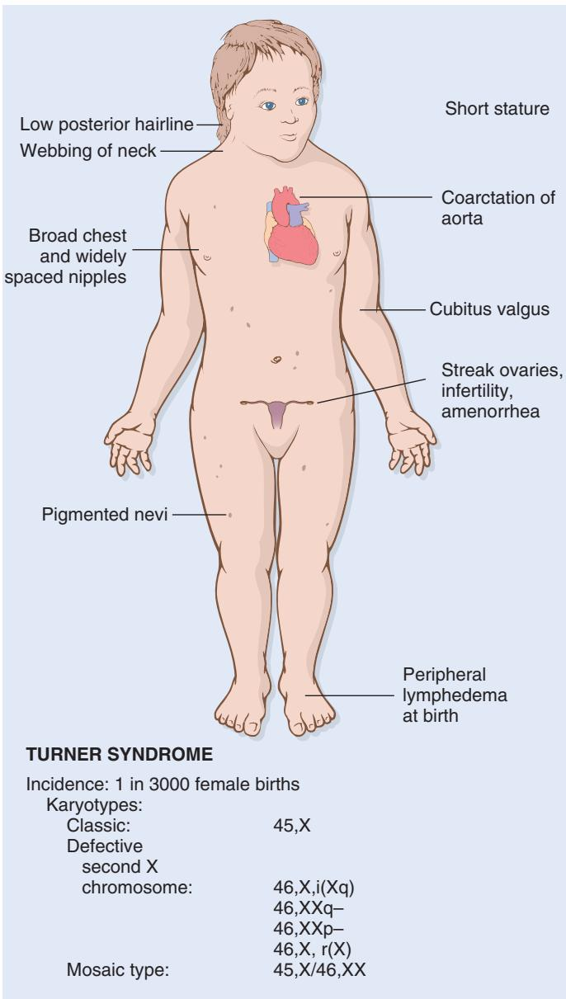 
Fig. 7.16 Clinical features and karyotypes of Turner syndrome.
to develop normal secondary sex characteristics; the genitalia remain infantile, breast development is minimal, and little pubic hair appears. Most patients have primary amenorrhea, and morphologic examination shows transformation of the ovaries into white streaks of fibrous stroma devoid of follicles. The mental status of these patients usually is normal, but subtle defects in visual-spatial information processing have been noted. Curiously, hypothyroidism caused by autoantibodies occurs, especially in women with isochromosome Xp. As many as $50\%$ of these patients develop clinical hypothyroidism. In adult patients, a combination of short stature and primary amenorrhea should prompt strong suspicion for Turner syndrome. The diagnosis is established by karyotyping.
Approximately $43\%$ of patients with Turner syndrome either are mosaics (one of the cell lines being 45,X) or have structural abnormalities of the X chromosome. The most common is deletion of the short arm, resulting in the formation of an isochromosome of the long arm, 46,X,i(X) (q10). The net effect of the associated structural abnormalities is to produce partial monosomy of the X chromosome. Combinations of deletions and mosaicism also occur. It is important to appreciate the karyotypic heterogeneity associated with Turner syndrome because it is responsible for significant variations in the phenotype. In contrast with the patients with monosomy X, those who are mosaics or have deletion variants may have an almost normal appearance and may present only with primary amenorrhea.
The molecular pathogenesis of Turner syndrome is not completely understood, but studies have begun to shed some light. As mentioned earlier, both X chromosomes are active during oogenesis and are essential for normal development of the ovaries. During normal fetal development, ovaries contain as many as 7 million oocytes. The oocytes gradually disappear so that by menarche their numbers have dwindled to a mere 400,000, and when menopause occurs fewer than 10,000 remain. In Turner syndrome, fetal ovaries develop normally early in embryogenesis, but the absence of the second X chromosome leads to an accelerated loss of oocytes, which is complete by age 2 years. In a sense, therefore, "menopause occurs before menarche," and the ovaries are reduced to atrophic fibrous strands, devoid of ova and follicles (streak ovaries). Because patients with Turner syndrome also have other (nongonadal) abnormalities, it follows that genes required for normal growth and development of somatic tissues also must reside on the X chromosome. Among the genes involved in the Turner phenotype is the short stature homeobox (SHOX) gene at Xp22.33. This is one of the genes that remain active in both X chromosomes and is unique in having an active homologue on the short arm of the Y chromosome. Thus, both normal males and females have two active copies of this gene. Loss of one copy of SHOX gives rise to short stature. Indeed, deletions of the SHOX gene are noted in $2\%$ to $5\%$ of otherwise normal children with short stature. Whereas loss of one copy of SHOX can explain the growth deficit in Turner syndrome, it cannot explain other important clinical features such as cardiac malformations and endocrine abnormalities. Clearly, several other genes located on the X chromosome also are involved.
# CYTOGENETIC DISORDERS INVOLVING SEX CHROMOSOMES
- In females, one X chromosome, maternal or paternal, is randomly inactivated during development (Lyon hypothesis). 
- In Klinefelter syndrome, there are two or more X chromosomes with one Y chromosome as a result of nondisjunction of sex chromosomes. Patients have testicular atrophy, sterility, reduced body hair, gynecomastia, and eunuchoid body habitus. It is the most common cause of male sterility. 
- In Turner syndrome, there is partial or complete monosomy of genes on the short arm of the X chromosome, most commonly caused by the absence of one X chromosome (45,X) and less commonly by mosaicism, or by deletions involving the short arm of the X chromosome. Short stature, webbing of the neck, cubitus valgus, cardiovascular malformations, amenorrhea, lack of secondary sex characteristics, and fibrotic ovaries are typical clinical features.
# SINGLE-GENE DISORDERS WITH ATYPICAL PATTERNS OF INHERITANCE
Three groups of diseases resulting from mutations affecting single genes do not follow the Mendelian rules of inheritance:
Diseases caused by triplet repeat mutations 
Diseases caused by mutations in mitochondrial genes 
- Diseases associated with alteration of imprinted regions of the genome
# Triplet Repeat Mutations
# Fragile X Syndrome
Fragile X syndrome is the prototype of diseases in which the causative mutation occurs in a long repeating sequence of three nucleotides. Other examples of diseases associated with trinucleotide repeat mutations are Huntington disease and myotonic dystrophy. This type of mutation is now known to cause about 40 diseases, and all disorders discovered so far are associated with neurodegenerative changes. In each of these conditions, amplification of specific sets of three nucleotides within the gene disrupts its function. Certain unique features of trinucleotide repeat mutations, described later, are responsible for the atypical pattern of inheritance of the associated diseases.
Fragile X syndrome results from a mutation in the FMR1 gene, which maps to Xq27.3 and is the second most common genetic cause of mental retardation, after Down syndrome. It has a frequency of 1 in 1550 for males and 1 in 8000 for females. The syndrome derives its name from the karyotypic appearance of the X chromosome in the original method of diagnosis. Culturing patient cells in a folate-deficient medium typically showed a discontinuity of staining or constriction in the long arm of the X chromosome. This method has now been supplanted by DNA-based analysis of triplet repeat size, as discussed later. Clinically affected males have moderate to severe mental retardation, although the extent of
impairment is highly variable. It is not unusual for some children to initially be diagnosed with autism-like symptoms. The typical physical phenotype includes a long face with a large mandible, large everted ears, and large testicles (macroorchidism). Although characteristic of fragile X syndrome, these abnormalities are not always present or may be quite subtle. The only distinctive physical abnormality that can be detected in at least $90\%$ of postpubertal males with fragile X syndrome is macroorchidism.
As with all X-linked diseases, fragile X syndrome predominantly affects males. Analysis of several pedigrees, however, shows some patterns of transmission not typically associated with other X-linked recessive disorders (Fig. 7.17). These include the following:
- Carrier males. Approximately $20\%$ of males who, by pedigree analysis, are known to carry a fragile X mutation do not manifest the typical neurological symptoms or physical characteristics of fragile X during childhood. As discussed below, these carrier males (also known as "transmitting males") harbor a detectable molecular abnormality at the FMR1 locus but not the full-fledged mutation observed in symptomatic children. 
- Affected females. From $30\%$ to $50\%$ of carrier women with the fragile X mutation on one chromosome might show features of mild cognitive impairment or other behavioral disturbances. Approximately $20\%$ develop features of premature reproductive failure (see below). The presence of symptoms in carrier females, albeit mild, is unusual for an X-linked recessive disease. 
- Anticipation. This term refers to the phenomenon whereby clinical features of fragile X syndrome worsen with each successive generation, as if the mutation becomes increasingly deleterious as it is transmitted from a man to his grandsons and great-grandsons.
These unusual features have been related to the dynamic nature of the mutation. In the normal population, the number of repeats of the sequence CGG in the FMR1 gene is small, averaging around 29, whereas affected persons have 200 to 4000 repeats. These so-called "full mutations" are believed to arise through an intermediate stage of premutations characterized by 52 to 200 CGG repeats. Carrier males and females have premutations. During oogenesis (but not spermatogenesis), the premutations can be converted to full mutations by further amplification of the CGG repeats, which can then be transmitted to both the sons and the daughters of the carrier female. These observations provide an explanation for why some carrier males are unaffected (they have premutations), and certain carrier females are affected (they inherit full mutations).
The molecular basis for fragile X syndrome is beginning to be understood and relates to silencing of the product of the FMR1 gene, familial mental retardation protein (FMRP). The normal FMR1 gene contains CGG repeats in its $5^{\prime}$ untranslated region. When the number of trinucleotide repeats exceeds approximately 230, the DNA of the entire $5^{\prime}$ region of the gene becomes abnormally methylated. Methylation also extends upstream into the promoter region of the gene, resulting in transcriptional suppression of FMR1. The resulting absence of FMRP is believed to cause the
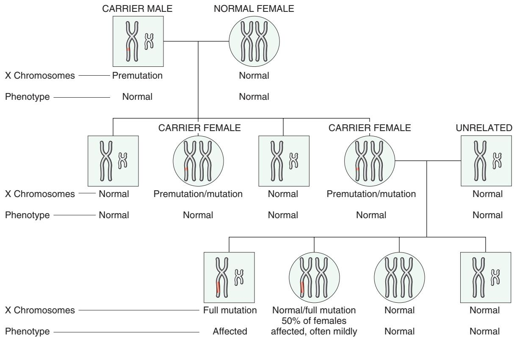 
Fig. 7.17 Fragile X pedigree. X and Y chromosomes are shown. Note that in the first generation, all sons are normal and all females are carriers (harbor a premutation). During oogenesis in the carrier female, premutation expands to full mutation; hence, in the next generation, all males who inherit the X with full mutation are affected. However, only $50\%$ of females who inherit the full mutation are affected, and often only mildly. (Based on an original sketch courtesy of Dr. Nancy Schneider, Department of Pathology, University of Texas Southwestern Medical School, Dallas, Texas.)
phenotypic changes. FMRP is widely expressed in normal tissues, but higher levels are found in the brain and the testis. It is an RNA-binding protein that is transported from the cytoplasm to the nucleus, where it binds specific mRNAs and transports them to the axons and dendrites (Fig. 7.18). It is in the synapses that FMRP-mRNA complexes perform critical roles in regulating the translation of specific mRNAs involved in control of synaptic functions. The absence of this finely coordinated "shuttle" function seems to underlie the fragile X syndrome.
# Fragile X Tremor/Ataxia
Although initially assumed to be innocuous, CGG premutations in the FMR1 gene can cause a disease that is phenotypically different from fragile X syndrome through a distinct mechanism involving a toxic "gain-of-function." This disease was discovered when it was noted that approximately $20\%$ of females carrying the premutation (carrier females) have mild cognitive impairment and premature ovarian failure (before the age of 40 years), and more than $50\%$ of premutation-carrying males (transmitting males) exhibit a progressive neurodegenerative syndrome starting in their sixth decade. This syndrome, referred to as fragile X tremor/ataxia, is characterized by intention tremors and cerebellar ataxia and may progress to parkinsonism.
How do premutations cause disease? In these patients, the FMR1 gene instead of being methylated and silenced continues to be transcribed. CGG-containing FMR1 mRNAs so formed are "toxic." They accumulate in the nucleus and form intranuclear inclusions. In this process the aggregated mRNA recruits RNA-binding proteins.
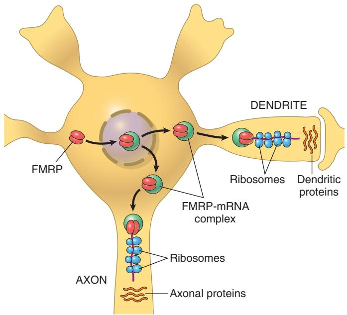 
Fig. 7.18 A model for the action of familial mental retardation protein (FMRP) in neurons. FMRP plays a critical role in regulating the translation of axonal proteins from bound RNAs. These locally produced proteins, in turn, play diverse roles in the microenvironment of the synapse. (Adapted from Hin P, Warren ST: New insights into fragile X syndrome: from molecules to neurobehavior, Trends Biochem Sci 28:152, 2003.)
Perhaps sequestration of these proteins at abnormal locations leads to events that are toxic to the cell.
As noted, earlier many other neurodegenerative diseases related to trinucleotide repeat expansions are recognized. Some general principles follow:
- In all cases, gene functions are altered by an expansion of the repeats, but the precise threshold at which premutations are converted to full mutations differs with each disorder. 
- Whereas the expansion in fragile X syndrome occurs during oogenesis, in other disorders such as Huntington disease, premutations are converted to full mutations during spermatogenesis. 
- The expansion may involve any part of the gene, and the range of possibilities can be divided into two broad categories: those that affect untranslated regions (as in fragile X syndrome) and those that affect coding regions (as in Huntington disease) (Fig. 7.19). When mutations affect noncoding regions, there is "loss of function," because protein synthesis is suppressed (e.g., FMRP). By contrast, mutations involving translated parts of the gene give rise to misfolded proteins (e.g., Huntington disease). Many of these so-called "toxic gain-of-function" mutations involve CAG repeats that encode polyglutamine tracts, and the resultant diseases are sometimes referred to as polyglutamine diseases, affecting primarily the nervous system. Accumulation of misfolded proteins in aggregates within the cytoplasm is a common feature of such diseases.
# FRAGILE X SYNDROME AND FRAGILE X TREMOR/ATAXIA
- Pathologic amplification of trinucleotide repeats causes loss-of-function (fragile X syndrome) or gain-of-function mutations (Huntington disease). Most such mutations produce neurodegenerative disorders. 
- Fragile $\times$ syndrome results from loss of FMR1 gene function and is characterized by mental retardation, macroorchidism, and abnormal facial features. 
- In the normal population, there are about 29 CGG repeats in the FMRI gene. The genomes of carrier males and females contain premutations with 52 to 200 CGG repeats that can expand to 4000 repeats (full mutations) during oogenesis.
When full mutations are transmitted to progeny, fragile X syndrome occurs.
- Fragile X tremor/ataxia resulting from expression of a FMRI gene bearing premutation develops in some males and females. The accumulation of corresponding mRNA in the nucleus binds and sequesters certain proteins that are essential for normal neuronal functions
# Diseases Caused by Mutations in Mitochondrial Genes
Mitochondria contain several genes that encode enzymes involved in oxidative phosphorylation. Inheritance of mitochondrial DNA differs from that of nuclear DNA in that the former is associated with maternal inheritance. The reason for this peculiarity is that ova contain the normal complement of mitochondria within their abundant cytoplasm, whereas spermatozoa contain few, if any, mitochondria. The mitochondrial DNA of the zygote is therefore derived entirely from the ovum. Thus, only mothers transmit mitochondrial genes to their offspring, both male and female.
Diseases caused by mutations in mitochondrial genes are rare. Because mitochondrial DNA encodes enzymes involved in oxidative phosphorylation, diseases caused by mutations in such genes affect organs most dependent on oxidative phosphorylation (CNS, skeletal muscle, cardiac muscle, liver, and kidney). Leber hereditary optic neuropathy is the prototypical disorder in this group. This neurodegenerative disease manifests as progressive bilateral loss of central vision that leads in due course to blindness.
# Diseases Caused by Alterations of Imprinted Regions: Prader-Willi and Angelman Syndromes
All humans inherit two copies of each gene (except, of course, the sex chromosome genes in males), carried on homologous maternal and paternal chromosomes. It was long assumed that there was no difference between normal homologous genes derived from the mother and the father. Indeed, this is true for most genes. It has been established, however, that functional differences exist between the paternal and the maternal copies of some genes. The differences arise from an epigenetic process called genomic imprinting, whereby certain homologous genes are differentially "inactivated" during paternal and maternal
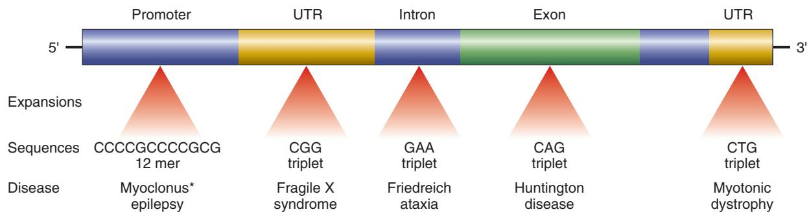 
Fig. 7.19 Sites of expansion and the affected sequence in selected diseases caused by nucleotide repeat mutations. UTR, Untranslated region. *Although not strictly a trinucleotide-repeat disease, progressive myoclonus epilepsy is caused, like others in this group, by a heritable DNA expansion. The expanded segment is in the promoter region of the gene.
gametogenesis. Thus, maternal imprinting refers to transcriptional silencing of the maternal allele, whereas paternal imprinting implies that the paternal allele is inactivated. At the molecular level, imprinting is associated with methylation of the gene promoter, as well as related events such as modification of DNA-binding histone proteins, the sum total effect of which is to silence the gene. Imprinting occurs in ova or sperm and is then stably transmitted to all somatic cells derived from the zygote.
Genomic imprinting is best illustrated by considering two uncommon genetic disorders, Prader-Willi syndrome and Angelman syndrome.
Mental retardation, short stature, hypotonia, obesity, small hands and feet, and hypogonadism characterize Prader-Willi syndrome. In $60\%$ to $75\%$ of cases, an interstitial deletion of band q12 in the long arm of chromosome 15-del(15)(q11;q13)-can be detected. In many patients without a detectable cytogenetic abnormality, FISH analysis shows smaller deletions within the same region. It is striking that in all cases, the deletion affects the paternally derived chromosome 15. In contrast to Prader-Willi syndrome, patients with the phenotypically distinct Angelman syndrome are born with a deletion of the same chromosomal region derived from their mothers. Patients with Angelman syndrome also are mentally retarded, but in addition they present with ataxic gait, seizures, and inappropriate laughter. Because of the laughter and ataxia, this syndrome has been called the happy puppet syndrome. A comparison of these two syndromes clearly demonstrates the "parent-of-origin" effects on gene function. If all the paternal and maternal genes contained within chromosome 15 were expressed in an identical fashion, clinical features resulting
from these deletions would be expected to be identical regardless of the parental origin of chromosome 15.
The molecular basis of these two syndromes can be understood in the context of imprinting (Fig. 7.20). A set of genes on the maternal chromosome at $15\mathrm{q}12$ is imprinted (and hence silenced), so the paternal chromosome provides the only functional alleles. When these are lost as a result of a deletion (in the paternal chromosome), the patient develops Prader-Willi syndrome. Among the set of genes that are deleted in Prader-Willi syndrome, the most likely culprit is believed to be a gene cluster encoding multiple distinct small nucleolar RNAs (snoRNAs), which are involved in messenger RNA processing. Conversely, a distinct gene, UBE3A, that also maps to the same region of chromosome 15 is imprinted on the paternal chromosome. UBE3A encodes for a ubiquitin ligase, a family of enzymes that targets other cellular proteins for proteasomal degradation (Chapter 1) through the addition of ubiquitin moieties. Only the maternally derived allele of the gene normally is active. Deletion of this maternal gene on chromosome 15 gives rise to the Angelman syndrome. The neurologic manifestations of Angelman are principally because of a lack of UBE3A expression in specific regions of the brain.
Molecular studies of cytogenetically normal patients with Prader-Willi syndrome have shown that in some cases, both of the structurally normal copies of chromosome 15 are derived from the mother. Inheritance of both chromosomes of a pair from one parent is called uniparental disomy. The net effect is the same (i.e., the patient does not have a functional set of genes from the [nonimprinted] paternal chromosome 15). Angelman syndrome, as might be expected, also can result from uniparental disomy of paternal chromosome 15.
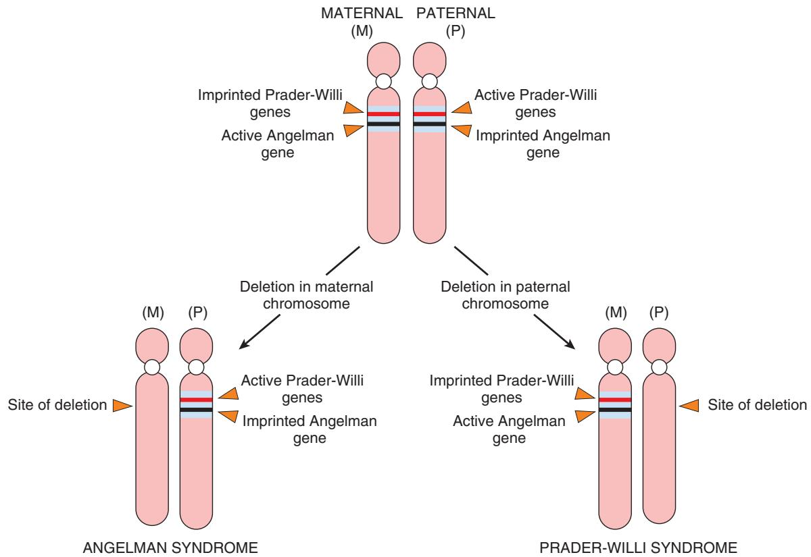 
Fig. 7.20 Genetics of Angelman and Prader-Willi syndromes.
# GENOMIC IMPRINTING
- Imprinting involves transcriptional silencing of the paternal or maternal copies of certain genes during gametogenesis. For such genes only one functional copy exists in the individual. Loss of the functional allele (not imprinted) by deletions gives rise to diseases.
- Prader-Willi syndrome results from deletion of paternal chromosomal region 15q12 and is characterized by mental retardation, short stature, hypotonia, obesity, and hypogonadism. 
- Angelman syndrome results from deletion of maternal chromosomal region 15q12 and is characterized by mental retardation, ataxia, seizures, and inappropriate laughter.
# Pediatric Diseases
As mentioned earlier and as illustrated by several examples, many diseases of infancy and childhood are of genetic origin. Others, although not genetic, either are unique to children or take distinctive forms in this patient population and thus merit the designation pediatric diseases. During each stage of development, infants and children are prey to a somewhat different group of diseases (Table 7.5). Clearly, diseases of infancy (i.e., in the first year of life) pose the highest risk of death. During this phase, the neonatal period (the first 4 weeks of life) is unquestionably the most hazardous time.
After the infant survives the first year of life, the outlook brightens considerably. However, it is sobering to note that between 1 year and 14 years of age, injuries resulting from accidents are the leading cause of death. Not all conditions listed in Table 7.5 are described in this chapter; only a select few that are most common are considered here. Although general principles of neoplastic disease and specific tumors are discussed elsewhere, a few tumors of children are described, to highlight the differences between pediatric and adult neoplasms.
Congenital anomalies are structural defects that are present at birth, although some, such as cardiac defects and renal anomalies, may not become clinically apparent until years later. As will be evident from the ensuing discussion, the term congenital does not imply or exclude a genetic basis. It is estimated that about 120,000 babies are born with a birth defect each year in the United States, an incidence of 1 in 33. As indicated in Table 7.5, congenital anomalies are an important cause of infant mortality. Moreover, they continue to be a significant source of illness, disability, and death throughout the early years of life.
Before considering the etiology and pathogenesis of congenital anomalies, it is essential to define some of the terms used to describe errors in morphogenesis.
- Malformations are primary errors of morphogenesis. In other words, there is an intrinsically abnormal developmental process. Malformations usually are multifactorial, rather than the result of a single gene or chromosomal defect.
Table 7.5 Causes of Death by Age 
Causes*Rate†Causes*Rate†Younger than 1 year582.11-4 Years-cont&#x27;d28.3Congenital malformations, deformations, and chromosomal anomaliesMalignant neoplasms Diseases of the heart‡Disorders related to short gestation and low birth weight Sudden infant death syndrome (SIDS)5-9 Years12.5Newborn affected by maternal complications of pregnancyAccidents (unintentional injuries)Accidents (unintentional injuries)Malignant neoplasmsNewborn affected by complications of placenta, cord, and membranesCongenital malformations, deformations, and chromosomal abnormalitiesBacterial sepsis of newbornAssault (homicide)Respiratory distress of newbornInfluenza and pneumoniaDiseases of the circulatory systemNeonatal hemorrhage10-14 Years15.71-4 Years24Accidents (unintentional injuries)Malignant neoplasmsAccidents (unintentional injuries)Intentional self-harm (suicide)Congenital malformations, deformations, and chromosomal abnormalitiesAssault (homicide)Assault (homicide)Congenital malformations, deformations, and chromosomal anomalies
*Causes are listed in decreasing order of frequency. All causes and rates are based on 2008 (final) and 2009 (preliminary) data. 
†Rates are expressed per 100,000 population from all causes within each age group. 
$^\ddagger$ Excludes congenital heart disease. 
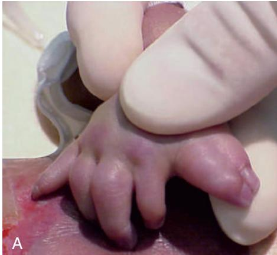 
Fig. 7.21 Examples of malformations. Malformations can range in severity from the incidental to the lethal. (A) Polydactyly (one or more extra digits) and syndactyly (fusion of digits) have little functional consequence when they occur in isolation. (B) Similarly, cleft lip, with or without associated cleft palate, is compatible with life when it occurs as an isolated anomaly; in this case, however, the child had an underlying malformation syndrome (trisomy 13) and expired because of severe cardiac defects. (C) Stillbirth associated with a lethal malformation, in which the midface structures are fused or ill-formed; in almost all cases, this degree of external dysmorphogenesis is associated with severe internal anomalies such as maldevelopment of the brain and cardiac defects. (A and C, Courtesy of Dr. Reade Quinton, Department of Pathology, University of Texas Southwestern Medical Center, Dallas, Texas. B, Courtesy of Dr. Beverly Rogers, Department of Pathology, University of Texas Southwestern Medical Center, Dallas, Texas.)
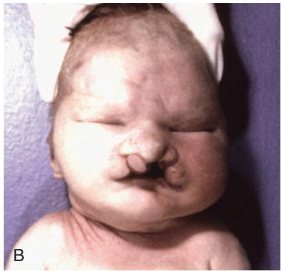
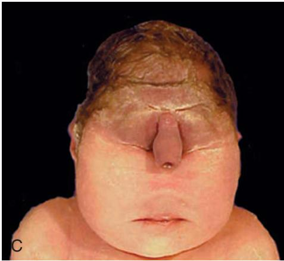
They may manifest in any of several patterns. In some presentations, such as congenital heart diseases, single body systems may be involved, whereas in others, multiple malformations involving many organs and tissues may coexist (Fig. 7.21).
- Disruptions result from secondary destruction of an organ or body region that was previously normal in development; thus, in contrast with malformations, disruptions arise from an extrinsic disturbance in morphogenesis. Amniotic bands, stemming from rupture of amnio with resultant formation of "bands" that encircle, compress, or attach to parts of the developing fetus, constitute the classic example of a disruption (Fig. 7.22). A variety of environmental agents may cause disruptions (see later). Disruptions are not heritable, of course, and thus are not associated with risk of recurrence in subsequent pregnancies. 
- Deformations, like disruptions, also represent an extrinsic disturbance of development rather than an intrinsic error of morphogenesis. Deformations are common, affecting approximately $2\%$ of newborn infants to various degrees. They are caused by localized or generalized compression of the growing fetus by abnormal biomechanical forces, leading eventually to a variety of structural abnormalities. The most common cause of deformations is uterine constraint. Between weeks 35 and 38 of gestation, rapid increase in the size of the fetus outpaces the growth of the uterus, and the relative amount of amniotic fluid (which normally acts as a cushion) also decreases. Thus, even the normal fetus is subjected to some degree of uterine constraint. However, several variables increase the likelihood of excessive compression of the fetus, including maternal conditions such as first pregnancy, small uterus, malformed (bicornuate) uterus, and leiomyomas. Causes relating to the fetus, such as presence of multiple fetuses, oligohydramnios, and abnormal fetal presentation, also may be involved. 
- Sequence refers to multiple congenital anomalies that result from secondary effects of a single localized aberration in
organogenesis. The initiating event may be a malformation, deformation, or disruption. An excellent example is the oligohydramnios (or Potter) sequence (Fig. 7.23A). Oligohydramnios (decreased amniotic fluid) may be caused by a variety of maternal, placental, or fetal abnormalities, including chronic leakage of amniotic fluid because of rupture of the amnio; uteroplacental insufficiency resulting from maternal hypertension or severe toxemia; and renal agenesis in the fetus (because fetal urine is a major constituent of amniotic fluid). The fetal compression associated with oligohydramnios in turn results in a classic phenotype in the newborn infant consisting of flattened faces and positional abnormalities of the hands and feet (Fig. 7.23B). The hips may be dislocated. Growth of the chest wall and the lungs also is compromised, sometimes to such an extent that
.jpg) 
Fig. 7.22 Disruption due to amniotic bands. In the specimen shown, the placenta is at the right, and the band of amnion extends from the top portion of the amniotic sac to encircle the leg of the fetus. (Courtesy of Dr. Theonia Boyd, Children's Hospital of Boston, Boston, Massachusetts.)
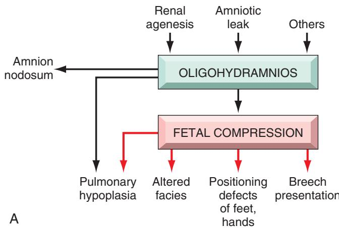
Pathogenesisoftheoligohydramnios(Potter)sequence.(B)Infantwitholigohydramnios(Potter)sequence.Noteflattenedfacialfeaturesanddeformedfoot(tapipesequinovarus)..jpg) 
Fig. 7.23 (A) Pathogenesis of the oligohydramnios (Potter) sequence. (B) Infant with oligohydramnios (Potter) sequence. Note flattened facial features and deformed foot (tapipes equinovarus).
survival is not possible. If the embryologic connection between these defects and the initiating event is not recognized, a sequence may be mistaken for a malformation syndrome.
- Malformation syndrome refers to the presence of several defects that cannot be explained on the basis of a single localizing initiating error in morphogenesis. Syndromes most often arise from a single causative condition (e.g., viral infection or a specific chromosomal abnormality) that simultaneously affects several tissues. 
- In addition to these global definitions, some general terms are applied to organ-specific malformations. Agenesis refers to the complete absence of an organ or its anlage, whereas aplasia and hypoplasia indicate incomplete development and underdevelopment, respectively. Atresia describes the absence of an opening, usually of a hollow visceral organ or duct such as intestines and bile ducts.
# Etiology
Known causes of errors in human malformations can be grouped into three major categories: genetic, environmental, and multifactorial (Table 7.6). The cause has not been identified for almost half of the reported cases.
Genetic causes of malformations include all of the previously discussed mechanisms of genetic disease. Virtually all chromosomal syndromes are associated with congenital malformations. Examples are Down syndrome and other trisomies, Turner syndrome, and Klinefelter syndrome. Most chromosomal disorders arise during gametogenesis and hence are not familial. Single-gene mutations, characterized by mendelian inheritance, may underlie major malformations. For example, holoprosencephaly is the most common developmental defect of the forebrain and midface in humans (see Chapter 23). The Hedgehog signaling pathway plays a critical role in the morphogenesis of these structures, and loss-of-function mutations of individual components within this pathway are reported in families with a history of recurrent holoprosencephaly.
Environmental influences, such as viral infections, drugs, and radiation to which the mother was exposed during pregnancy, may cause fetal malformations (the appellation of "malformation" is used loosely in this context, because technically, these anomalies represent disruptions). Among the viral infections listed in Table 7.6, rubella was a major
Table 7.6 Causes of Congenital Malformations in Humans 
CauseFrequency of Malformations* (%)GeneticChromosomal aberrations10–15Mendelian inheritance2–10EnvironmentalMaternal/placental infections2–3RubellaToxoplasmosisSyphilisCytomegalovirus infectionHuman immunodeficiency virus infectionZika virus infectionMaternal disease states6–8DiabetesPhenylketonuriaEndocrinopathiesDrugs and chemicals~1AlcoholFolic acid antagonistsAndrogensPhenytoinThalidomideWarfarin13-Cis-retinoic acidOthersIrradiation~1Multifactorial20–25Unknown40–60
*Live births. 
Data from Stevenson RE, Hall JG, Goodman RM, editors: Human malformations and related anomalies, New York, 1993, Oxford University Press, p 115.
scourge of the 19th and early 20th centuries. Fortunately, maternal rubella and the resultant rubella embryopathy have been virtually eliminated in developed countries as a result of vaccination. As mentioned later, maternal infection with Zika Virus can give rise to severe malformations of the central nervous system. A variety of drugs and chemicals have been suspected to be teratogenic, but perhaps less than $1\%$ of congenital malformations are caused by these agents. The list includes thalidomide, alcohol, anticonvulsants, warfarin (oral anti-coagulant), and 13-cis-retinoic acid, which is used in the treatment of severe acne. For example, thalidomide, formerly used as a tranquilizer in Europe and currently used for treatment of certain cancers, causes an extremely high incidence $(50\%)$ to $80\%$ ) of limb malformations. Alcohol, perhaps the most widely used agent today, is an important environmental teratogen. Infants born of mothers who abuse alcohol show prenatal and postnatal growth retardation, facial anomalies (microcephaly, short palpebral fissures, maxillary hypoplasia), and psychomotor disturbances. These features in combination are designated the fetal alcohol syndrome. Although cigarette smoke-derived nicotine has not been convincingly demonstrated to be a teratogen, there is a high incidence of spontaneous abortions, premature labor, and placental abnormalities among pregnant smokers, and babies born to mothers who smoke often have a low birth weight and may be prone to the sudden infant death syndrome (SIDS). In light of these findings, it is best to avoid nicotine exposure altogether during pregnancy. Among maternal conditions listed in Table 7.6, diabetes mellitus is a common entity, and despite advances in antenatal obstetric monitoring and glucose control, the incidence of major malformations in infants of diabetic mothers stands between $6\%$ and $10\%$ in most reported series. Maternal hyperglycemia-induced fetal hyperinsulinemia results in fetal macrosomia (organomegaly and increased body fat and muscle mass); cardiac anomalies, neural tube defects, and other CNS malformations are some of the major anomalies seen in diabetic embryopathy.
Multifactorial inheritance, which implies the interaction of environmental influences with two or more genes of small effect, is the most common genetic cause of congenital malformations. Included in this category are some relatively common malformations such as cleft lip and palate and neural tube defects. The importance of environmental contributions to multifactorial inheritance is underscored by the dramatic reduction in the incidence of neural tube defects by periconceptional intake of folic acid in the diet. The recurrence risks and mode of transmission of multifactorial disorders are described earlier in this chapter.
The pathogenesis of congenital anomalies is complex and still poorly understood, but two general principles are relevant regardless of the etiologic agent:
1. The timing of the prenatal teratogenic insult has an important impact on the occurrence and the type of anomaly produced. The intrauterine development of humans can be divided into two phases: (1) the embryonic period, occupying the first 9 weeks of pregnancy, and (2) the fetal period, terminating at birth.
- In the early embryonic period (first 3 weeks after fertilization), an injurious agent damages either enough cells to cause death and abortion or only a few cells, presumably allowing the embryo to recover without developing defects. Between the third and the ninth weeks, the embryo is extremely susceptible to teratogenesis, with the peak sensitivity occurring between the fourth and the fifth weeks. During this period organs are being crafted out of the germ-cell layers.
- The fetal period that follows organogenesis is marked chiefly by the further growth and maturation of the organs, with greatly reduced susceptibility to teratogenic agents. Instead, the fetus is susceptible to growth retardation or injury to already formed organs. It is therefore possible for a given agent to produce different anomalies if exposure occurs at different times of gestation.
2. The complex interplay between environmental teratogens and intrinsic genetic defects is exemplified by the fact that features of dysmorphogenesis caused by environmental insults often can be recapitulated by genetic defects in the pathways targeted by these teratogens. Some representative examples follow:
- Cyclopamine is a plant teratogen. Pregnant sheep that feed on plants containing cyclopamine give birth to lambs that have severe craniofacial abnormalities including holoprosencephaly and cyclopia (single fused eye—hence the origin of the moniker cyclopamine). This compound is an inhibitor of Hedgehog signaling in the embryo, and, as stated previously, mutations of Hedgehog genes are present in subsets of fetuses with holoprosencephaly.
- Valproic acid is an anti-epileptic and a recognized teratogen. Valproic acid disrupts expression of a family of highly conserved developmentally critical transcription factors known as homeobox (HOX) proteins. In vertebrates, HOX proteins have been implicated in the patterning of limbs, vertebrae, and craniofacial structures. Not surprisingly, mutations in the HOX gene family are responsible for congenital anomalies that mimic features observed in valproic acid embryopathy.
- The vitamin A (retinol) derivative all-trans-retinoic acid is essential for normal development and differentiation, and its absence during embryogenesis results in a constellation of malformations affecting multiple organ systems, including the eyes, genitourinary system, cardiovascular system, diaphragm, and lungs (see Chapter 8 for vitamin A deficiency in the postnatal period). Conversely, excessive exposure to retinoic acid also is teratogenic. Infants born to mothers treated with retinoic acid for severe acne have a predictable phenotype (retinoic acid embryopathy), including CNS, cardiac, and craniofacial defects, such as cleft lip and cleft palate. The last entity may stem from retinoic acid-mediated deregulation of components of the transforming growth factor- $\beta$ (TGF- $\beta$ ) signaling pathway, which is involved in palatogenesis. Mice with knockout of the TGFB3 gene uniformly develop cleft palate, once again illustrating the functional relationship between teratogenic exposure and signaling pathways in the causation of congenital anomalies.
- Congenital anomalies result from intrinsic abnormalities (malformations) as well as extrinsic disturbances (deformations, disruptions). 
- Congenital anomalies can result from genetic (chromosomal abnormalities, gene mutations), environmental (infections, drugs, alcohol), and multifactorial causes. 
- The timing of the in utero insult has profound influence on the extent of congenital anomalies, with earlier events usually having greater impact. 
- The interplay between genetic and environmental causes of anomalies is emphasized by the fact that teratogens often target signaling pathways in which mutations have been reported as a cause for the same anomalies.
# PERINATAL INFECTIONS
Infections of the fetus and neonate may be acquired transcervically (ascending infections) or transplacentially (hematologic infections).
- Transcervical, or ascending, infections are caused by spread of microbes from the cervicovaginal canal and may be acquired in utero or during birth. Most bacterial infections (e.g., $\alpha$ -hemolytic streptococcal infection) and a few viral infections (e.g., herpes simplex) are acquired in this manner. In general, the fetus acquires the infection by "inhaling" infected amniotic fluid into the lungs or by passing through an infected birth canal during delivery. Fetal infection usually is associated with inflammation of the placental membranes (chorioamnionitis) and inflammation of the umbilical cord (funisitis). This mode of spread is typical for pneumonia and, in severe cases, sepsis and meningitis. 
- Transplacental infections gain access to the fetal bloodstream by crossing the placenta via the chorionic villi, and may occur at any time during gestation or occasionally, as may be the case with hepatitis B and human immunodeficiency virus, at the time of delivery via maternal-to-fetal transfusion. Most parasitic (e.g., toxoplasma, malaria) and viral infections, and a few bacterial infections (i.e., Listeria and Treponema), follow this mode of hematogenous transmission. The clinical manifestations of these infections are highly variable, depending largely on the gestational timing and the microorganism involved. The most important transplacental infections can be conveniently remembered by the acronym TORCH. The elements of the TORCH complex are Toxoplasma (T), rubella virus (R), cytomegalovirus (C), herpesvirus (H), and any of a number of other (O) microbes such as Treponema pallidum. These agents are grouped together because they may evoke similar clinical and pathologic manifestations. TORCH infections occurring early in gestation may cause chronic sequelae in the child, including growth restriction, mental retardation, cataracts, and congenital cardiac anomalies, whereas infections later in pregnancy result primarily in tissue injury accompanied by inflammation (encephalitis, chorioretinitis, hepatosplenomegaly,
pneumonia, and myocarditis). More recently, Zika virus has emerged as another agent that can be transmitted by pregnant females to their offspring with devastating consequences such as microcephaly and brain damage.
# PREMATURITY AND FETAL GROWTH RESTRICTION
Prematurity is defined by a gestational age less than 37 weeks and is the second most common cause of neonatal mortality (second only to congenital anomalies). As might be expected, infants born before completion of gestation also weigh less than normal $(<2500\mathrm{gm})$ . The major risk factors for prematurity include preterm premature rupture of membranes; intrauterine infection leading to inflammation of the placental membranes (chorioamnionitis); structural abnormalities of the uterus, cervix, and placenta; and multiple gestation (e.g., twin pregnancy). Children born before completion of the full period of gestation have higher morbidity and mortality rates than full-term infants. The immaturity of organ systems in preterm infants makes them especially vulnerable to several important complications:
- Respiratory distress syndrome, also called hyaline membrane disease 
- Necrotizing enterocolitis 
Sepsis 
- Intraventricular and germinal matrix hemorrhage (Chapter 23) 
- Long-term sequelae, including developmental delay
Although birth weight is low in preterm infants, it usually is appropriate after adjustment for gestational age. By contrast, as many as one-third of infants who weigh less than $2500\mathrm{gm}$ are born at term and are therefore under-grown rather than immature. These small-for-gestational-age (SGA) infants suffer from fetal growth restriction. Fetal growth restriction may result from fetal, maternal, or placental abnormalities, although in many cases the specific cause is unknown.
- Fetal abnormalities: This category consists of conditions that intrinsically reduce growth potential of the fetus despite an adequate supply of nutrients from the mother. Prominent among such fetal conditions are chromosomal disorders, congenital anomalies, and congenital infections. Chromosomal abnormalities may be detected in as many as $17\%$ of fetuses evaluated for fetal growth restriction and in as many as $66\%$ of fetuses with documented ultrasonographic malformations. Fetal infection should be considered in all growth-restricted neonates, with the TORCH group of infections (see earlier) being a common cause. When the causation is intrinsic to the fetus, fetal growth restriction is symmetric (i.e., affects all organ systems equally). 
- Placental abnormalities: Placental causes include any factor that compromises the uteroplacental blood supply. Examples include placenta previa (low implantation of the placenta), placental abruption (separation of placenta from the decidua by a retroplacental clot), or placental infarction. With placental (and maternal) abnormalities, the fetal growth restriction is asymmetric
(i.e., the brain is spared relative to visceral organs such as the liver).
- Maternal factors: This category comprises by far the most common causes of the growth deficit in SGA infants. Important examples are vascular diseases such as preeclampsia ("toxemia of pregnancy") (Chapter 19) and chronic hypertension. Another class of maternal diseases increasingly being recognized in the setting of fetal growth restriction is acquired or inherited diseases of hypercoagulability (i.e., thrombophilias) (Chapter 4). The list of other maternal conditions associated with fetal growth restriction is long, but some of the avoidable influences are maternal narcotic abuse, alcohol intake, and heavy cigarette smoking (as noted previously, many of these same causes also are involved in the pathogenesis of congenital anomalies). Drugs causing fetal growth restriction in similar fashion include teratogens, such as the commonly administered anti-convulsant phenytoin (Dilantin), as well as nonteratogenic agents. Maternal malnutrition (in particular, prolonged hypoglycemia) also may affect fetal growth.
Not only is the growth-restricted infant handicapped in the perinatal period, but the deficits persist into childhood and adult life. Affected persons are thus more likely to have cerebral dysfunction, learning disabilities, and sensory (i.e., visual and hearing) impairment.
# RESPIRATORY DISTRESS SYNDROME OF THE NEWBORN
The most common cause of respiratory distress in the newborn is respiratory distress syndrome (RDS), also known as hyaline membrane disease because of the formation of "membranes" in the peripheral air spaces observed in infants who succumb to this condition. An estimated 24,000 cases of RDS are reported annually in the United States. Improvements in management of this condition have sharply decreased deaths due to respiratory insufficiency from as many as 5000 per year a decade ago to fewer than 900 cases yearly. It is primarily a disorder of premature infants. Less common causes include excessive sedation of the mother, fetal head injury during delivery, aspiration of blood or amniotic fluid, and intrauterine hypoxia secondary to compression from coiling of the umbilical cord about the neck.
RDS occurs in about $60\%$ of infants born at less than 28 weeks' gestation, $30\%$ of those born between 28 to 34 weeks' gestation, and less than $5\%$ of those born after 34 weeks' gestation. There are also strong though not invariable associations with male gender, maternal diabetes, and delivery by cesarean section.
The fundamental defect in RDS is the inability of the immature lung to synthesize sufficient surfactant. Surfactant is a complex of surface-active phospholipids, principally dipalmitoylphosphatidylcholine (lecithin) and at least two groups of surfactant-associated proteins. The importance of surfactant-associated proteins in normal lung function can be gauged by the occurrence of severe
respiratory failure in neonates with congenital deficiency of surfactant caused by mutations in the corresponding genes. Surfactant is synthesized by type II pneumocytes and, with the healthy newborn's first breath, rapidly coats the surface of alveoli, reducing surface tension and thus decreasing the pressure required to keep the alveoli open. In a lung deficient in surfactant, alveoli tend to collapse, and a relatively greater inspiratory effort is required with each breath to open the alveoli. The infant rapidly tires from breathing and generalized atelectasis sets in. The resulting hypoxia sets into motion a sequence of events that leads to epithelial and endothelial damage and eventually to the formation of hyaline membranes (Fig. 7.24). As discussed later, this classical picture of surfactant deficiency is greatly modified by surfactant treatment.
Hormones regulate surfactant synthesis. Corticosteroids stimulate the formation of surfactant lipids and associated proteins. Therefore, conditions associated with intrauterine stress and fetal growth restriction, which increase corticosteroid release, lower the risk of developing RDS. Conversely, the compensatory high blood levels of insulin in infants of diabetic mothers can suppress surfactant synthesis, counteracting the effects of steroids. This may explain, in part, why infants of diabetic mothers are at higher risk for developing RDS. Labor is known to increase surfactant synthesis; accordingly, cesarean section performed before the onset of labor also may be associated with increased risk for RDS.
The lungs in infants with RDS are of normal size but are heavy and relatively airless. They have a mottled purple color, and on microscopic examination the tissue appears solid, with poorly developed, generally collapsed (atelectatic) alveoli. If the infant dies within the first several hours of life, only necrotic cellular debris will be present in the terminal bronchioles and alveolar ducts. Later in the course, characteristic eosinophilic hyaline membranes line the respiratory bronchioles, alveolar ducts, and random alveoli (Fig. 7.25). These "membranes" contain necrotic epithelial cells admixed with extravasated plasma proteins. There is a remarkable paucity of neutrophilic inflammatory reaction associated with these membranes. The lesions of hyaline membrane disease are never seen in stillborn infants or in live-born infants who die within a few hours of birth. If the infant with RDS dies after several days, evidence of reparative changes, including proliferation of type II pneumocytes and interstitial fibrosis, is seen.
The classic clinical presentation before the era of treatment with exogenous surfactant was described earlier. Currently, the actual clinical course and prognosis for neonatal RDS vary, depending on the maturity and birth weight of the infant and the promptness of therapy. The control of RDS focuses on prevention, either by delaying labor until the fetal lung reaches maturity or by inducing maturation of the lung in the at-risk fetus. Critical to these objectives is the ability to assess fetal lung maturity accurately. Because pulmonary secretions are discharged into the amniotic fluid, analysis of amniotic fluid phospholipids
..jpg) 
Fig. 7.24 Pathophysiology of respiratory distress syndrome (see text).
.Alternatingatelectasisanddilationofthealveolicanbeseen.Notetheeosinophilicthickhyalinemembranesliningthedilatedalveoli..jpg) 
Fig. 7.25 Hyaline membrane disease (hematoxylin-eosin stain). Alternating atelectasis and dilation of the alveoli can be seen. Note the eosinophilic thick hyaline membranes lining the dilated alveoli.
provides a good estimate of the level of surfactant in the alveolar lining. Prophylactic administration at birth of exogenous surfactant to extremely premature infants (born before 28 weeks' gestational age) has proven very beneficial, such that it is now uncommon for infants to die of acute RDS.
In uncomplicated cases, recovery begins to occur within 3 or 4 days. In affected infants, oxygen is required. Use of high concentrations of ventilator-administered oxygen for prolonged periods, however, is associated with two well-known complications: retrolental fibroplasia (also called retinopathy of prematurity) in the eyes; and bronchopulmonary dysplasia. Fortunately, both complications are now significantly less common as a result of gentler ventilation techniques, antenatal glucocorticoid therapy, and prophylactic surfactant treatments. Hence they are described briefly:
- Retinopathy of prematurity has a two-phase pathogenesis. During the hyperoxic phase of RDS therapy (phase I), expression of the proangiogenic vascular endothelial growth factor (VEGF) is markedly decreased, causing endothelial cell apoptosis. VEGF levels rebound after return to relatively hypoxic room air ventilation (phase II), inducing retinal vessel proliferation (neovascularization) characteristic of the lesions in the retina. 
- The major abnormality in bronchopulmonary dysplasia is a striking decrease in alveolar septation (manifested as large, simplified alveolar structures) and a dysmorphic capillary configuration. Multiple factors—hyperoxemia, hyperventilation, prematurity, inflammatory cytokines, and vascular maldevelopment—contribute to bronchopulmonary dysplasia and probably act additively or synergistically to promote injury.
Infants who recover from RDS also are at increased risk for developing a variety of other complications associated with preterm birth; most important among these are patent ductus arteriosus, intraventricular hemorrhage, and necrotizing enterocolitis. Thus, although technologic advances help save the lives of many infants with RDS, they also bring to the surface the exquisite fragility of the immature neonate.
# NEONATAL RESPIRATORY DISTRESS SYNDROME
- Neonatal RDS (hyaline membrane disease) is a disease of prematurity; most cases occur in neonates born before 28 weeks' gestational age. 
- The fundamental abnormality in RDS is insufficient pulmonary surfactant, which results in failure of lungs to inflate after birth. 
- The characteristic morphologic pattern in RDS is the presence of hyaline membranes (consisting of necrotic epithelial cells and plasma proteins) lining the airways. 
- RDS can be ameliorated by prophylactic administration of steroids, surfactant therapy, and by improved ventilation techniques. 
- Long-term sequelae associated with RDS therapy include retinopathy of prematurity and bronchopulmonary dysplasia; the incidence of both complications has decreased with improvements in management of RDS.
# NECROTIZING ENTEROCOLITIS
Necrotizing enterocolitis (NEC) most commonly occurs in premature infants, with the incidence of the disease being inversely proportional to the gestational age. It
occurs in approximately 1 of 10 very-low-birth-weight infants $(< 1500\mathrm{gm})$ . In addition to prematurity, most cases are associated with enteral feeding, suggesting that some postnatal insult (such as the introduction of bacteria) sets in motion the cascade culminating in tissue destruction. Although infectious agents are likely to play a role in NEC pathogenesis, no single bacterial pathogen has been linked to the disease. A large number of inflammatory mediators have been associated with pathogenesis of NEC. One particular mediator, platelet-activating factor, has been implicated in increasing mucosal permeability by promoting enterocyte apoptosis and compromising intercellular tight junctions, thereby "adding fuel to the fire."
NEC typically involves the terminal ileum, cecum, and right colon, although any part of the small or large intestine may be involved. The involved segment typically is distended, friable, and congested (Fig. 7.26), or it can be frankly gangrenous; intestinal perforation with accompanying peritonitis may be seen. On microscopic examination, mucosal or transmural coagulative necrosis, ulceration, bacterial colonization, and submucosal gas bubbles are all features associated with NEC. Evidence of reparative changes, such as granulation tissue and fibrosis, may be seen shortly after resolution of the acute episode.
The clinical course is fairly typical, with the onset of bloody stools, abdominal distention, and development of circulatory collapse. Abdominal radiographs often demonstrate gas within the intestinal wall (pneumatosis intestinalis). When detected early, NEC often can be managed conservatively, but many cases $(20\%$ to $60\%)$ require operative intervention including resection of the necrotic segments of bowel. NEC is associated with high perinatal mortality; infants who survive often develop post-NEC strictures from fibrosis caused by the healing process.
# SUDDEN INFANT DEATH SYNDROME (SIDS)
According to the National Institute of Child Health and Human Development, SIDS is defined as "the sudden death of an infant under 1 year of age which remains unexplained after a thorough case investigation, including performance of a complete autopsy, examination of the death scene, and review of the clinical history." It is important to emphasize that many cases of sudden death in infancy are found to have an anatomic or biochemical basis at autopsy (Table 7.7); these should not be labeled as SIDS, but rather as sudden unexpected infant death (SUID). The Centers for Disease Control and Prevention estimates that SIDS accounts for approximately half of the cases of SUID in the United States. An aspect of SIDS that is not stressed in the definition is that the infant usually dies while asleep—hence the lay terms crib death and cot death. SIDS is the leading cause of death between the ages of 1 month and 1 year in U.S. infants, and the third leading cause of death overall in this age group, after congenital anomalies and diseases of prematurity and low birth weight. In $90\%$ of cases, the infant is younger than 6 months; most are between the ages of 2 and 4 months. SIDS in an earlier sibling is associated with a fivefold relative risk of recurrence; traumatic child abuse must be carefully excluded under these circumstances.
SIDS is multifactorial condition, with a mixture of contributing causes in a given case. Three interacting variables have been proposed: (1) a vulnerable infant, (2) a critical developmental period in homeostatic control, and (3) one or more exogenous stressors. According to this model, several factors make the infant vulnerable to sudden
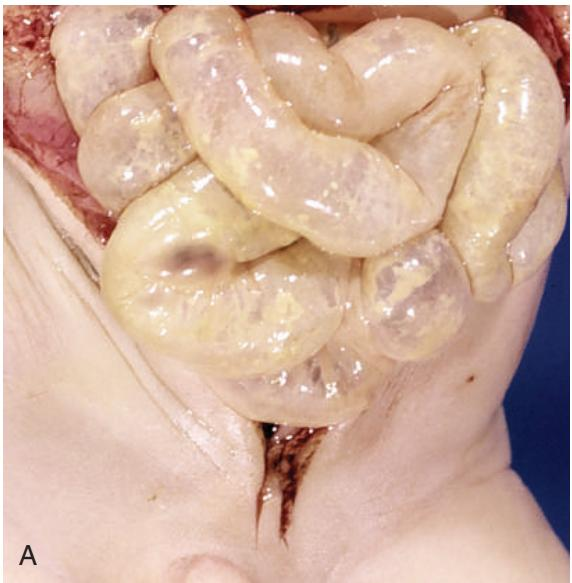 
Fig. 7.26 Necrotizing enterocolitis. (A) At postmortem examination in a severe case, the entire small bowel was markedly distended and perilously thin (usually this appearance implies impending perforation). (B) The congested portion of the ileum corresponds to areas of hemorrhagic infarction and transmural necrosis. Submucosal gas bubbles (pneumatosis intestinalis) can be seen in several areas (arrows).
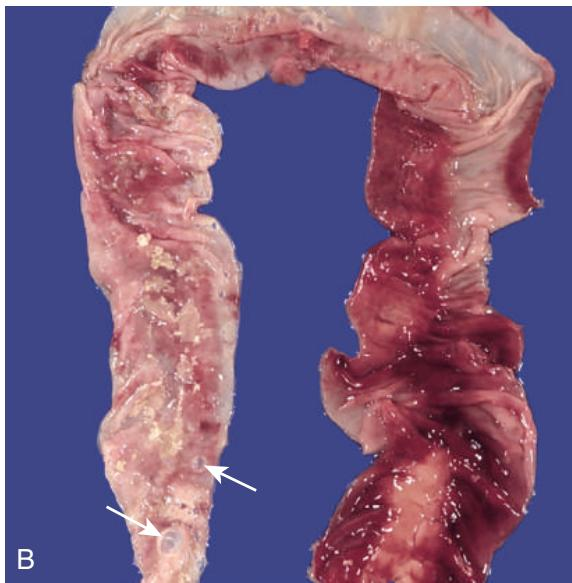
Table 7.7 Factors Associated With Sudden Infant Death Syndrome (SIDS) 
ParentalYoung maternal age (age younger than 20 years)Maternal smoking during pregnancyDrug abuse in either parent, specifically paternal marijuana and maternal opiate, cocaine useShort intergestational intervalsLate or no prenatal careLow socioeconomic groupAfrican-American and American Indian ethnicity (socioeconomic factors)InfantBrain stem abnormalities, associated with delayed development of arousal and cardiorespiratory controlPrematurity and/or low birth weightMale sexProduct of a multiple birthSIDS in a previous siblingAntecedent respiratory infectionsGermline polymorphisms in autonomic nervous system genesEnvironmentProne or side sleep positionSleeping on a soft surfaceHyperthermiaCosleeping in first 3 months of lifePostmortem Abnormalities Detected in Cases of Sudden Unexpected Infant Death (SUID)*InfectionsViral myocarditisBronchopneumoniaUnsuspected congenital anomalyCongenital aortic stenosisAnomalous origin of the left coronary artery from the pulmonary arteryTraumatic child abuseIntentional suffocation (filicide)Genetic and metabolic defectsLong QT syndrome (SCN5A and KCNQ1 mutations)Fatty acid oxidation disorders (MCAD, LCHAD, SCHAD mutations)Histiocytoid cardiomyopathy (MTCYB mutations)Abnormal inflammatory responsiveness (partial deletions in C4a and C4b)
\*SIDS is not the only cause of SUIDs, but rather is a diagnosis of exclusion. Therefore, performance of an autopsy may often show findings that would explain the cause of an SUID. These cases should not, strictly speaking, be labeled as "SIDS." SCN5A, Sodium channel, voltage-gated, type V, alpha polypeptide; KCNQ1, potassium voltage-gated channel, KQT-like subfamily, member I; MCAD, medium-chain acyl coenzyme A dehydrogenase; LCHAD, long-chain 3-hydroxyacyl coenzyme A dehydrogenase; SCHAD, short-chain 3-hydroxyacyl coenzyme A dehydrogenase; MTCYB, mitochondrial cytochrome $b$ C4, complement component 4.
death during the critical developmental period (i.e., 1 month to 1 year). These vulnerability factors may be specific to the parents or the infant, whereas the exogenous stressor or stressors are attributable to the environment (Table 7.7). Although numerous factors have been proposed to account for a vulnerable infant, the most compelling hypothesis is that SIDS reflects a delayed development of arousal and cardiorespiratory control. The brain stem and, in particular, the medulla oblongata play a critical role in the body's "arousal" response to noxious stimuli such as episodic hypercarbia, hypoxia, and thermal stress encountered during sleep. The serotonergic (5-HT) system of the medulla is implicated in these "arousal" responses as well as regulation of other critical homeostatic functions such
as respiratory drive, blood pressure, and upper airway reflexes. Abnormalities in serotonin-dependent signaling in the brain stem may be the underlying basis for SIDS in some infants.
Among the potential environmental causes, prone sleeping position, sleeping on soft surfaces, and thermal stress are possibly the most important modifiable risk factors for SIDS. Many studies have clearly shown increased risk for SIDS in infants who sleep in a prone position, prompting the American Academy of Pediatrics to recommend placing healthy infants on their backs when laying them down to sleep. This "Back to Sleep" campaign has resulted in substantial decreases in SIDS-related deaths since its inception in 1994. The prone position increases the infant's vulnerability to one or more recognized noxious stimuli (hypoxia, hypercarbia, and thermal stress) during sleep. In addition, the prone position also is associated with decreased arousal responsiveness compared with the supine position.
Of note, SIDS is not the only cause of sudden unexpected death in infancy. Therefore, SIDS is a diagnosis of exclusion, requiring careful examination of the death scene and a complete postmortem examination. The latter can show an unsuspected cause of sudden death in as many as $20\%$ or more of babies presumed to have died of SIDS (Table 7.7). Infections (e.g., viral myocarditis or bronchopneumonia) are the most common causes of SUID, followed by a congenital anomaly. As a result of advancements in molecular diagnostics, several genetic causes of SUID have emerged. For example, fatty acid oxidation disorders, characterized by defects in mitochondrial fatty acid oxidative enzymes, may be responsible for as many as $5\%$ of sudden deaths in infancy; of these, a deficiency in medium-chain acyl-coenzyme A dehydrogenase is the most common. Retrospective analyses in cases of sudden infant death originally designated SIDS also have revealed mutations of cardiac sodium and potassium channels, which result in a form of cardiac arrhythmia characterized by prolonged QT intervals; these cases account for no more than $1\%$ of SUIDs.
Anatomic studies of victims have yielded inconsistent histologic findings. Multiple petechiae are the most common finding in the typical SIDS autopsy (in approximately $80\%$ of cases); these usually are present on the thymus, visceral and parietal pleura, and epicardium. The lungs usually are congested, and vascular engorgement with or without pulmonary edema is present in a majority of cases. Sophisticated morphometric studies have shown quantitative brain stem abnormalities such as hypoplasia of the arcuate nucleus or a subtle decrease in brain stem neuronal populations in several cases; these observations are not uniform, however, and the use of such studies is not feasible in most "routine" autopsy procedures.
# SUDDEN INFANT DEATH SYNDROME
- SIDS is a disorder of unknown cause, defined as the sudden death of an infant younger than 1 year of age that remains unexplained after a thorough case investigation including
performance of an autopsy. Most SIDS deaths occur between the ages of 2 and 4 months.
- The most likely basis for SIDS is a delayed development of arousal reflexes and cardiorespiratory control. 
- Numerous environmental risk factors have been proposed, of which the prone sleeping position is best recognized—hence the success of the "Back to Sleep" program in reducing the incidence of SIDS.
# FETAL HYDROPS
Fetal hydrops refers to the accumulation of edema fluid in the fetus during intrauterine growth. The causes of fetal hydrops are manifold; the most important are listed in Table 7.8. In the past, hemolytic anemia caused by Rh blood group incompatibility between mother and fetus (immune hydrops) was the most common cause, but with the successful prophylaxis of this disorder during pregnancy, other causes of nonimmune hydrops have emerged as the principal culprits. The fluid accumulation can be quite variable, ranging in degree from progressive, generalized edema of the fetus (hydrops fetalis), a usually lethal condition, to more localized and less marked edematous processes, such as isolated pleural and peritoneal effusions or postnuchal fluid collections (cystic hygroma), that often are compatible with life (Fig. 7.27). The mechanism of immune hydrops is discussed first, followed by other important causes of fetal hydrops.
Table 7.8 Major Causes of Fetal Hydrops* 
CardiovascularMalformations
Tachyarrhythmia
High-output failureChromosomalTurner syndrome
Trisomy 21, trisomy 18Thoracic CausesCystic adenomatoid malformation
Diaphragmatic herniaFetal AnemiaHomozygous α-thalassemia
Parvovirus B19
Immune hydrops (Rh and ABO)Twin GestationTwin-to-twin transfusionInfection (excluding parvovirus)Cytomegalovirus
Syphilis
ToxoplasmosisGenitourinary Tract MalformationsTumorsGenetic/Metabolic Disorders
*The cause of fetal hydrops may be undetermined ("idiopathic") in up to $20\%$ of cases. Data from Machin GA: Hydrops, cystic hygroma, hydrothorax, pericardial effusions, and fetal ascites. In Gilbert-Barness E, et al, editors: Potter's pathology of the fetus, infant, and child, St. Louis, 2007, Mosby, pp 33.
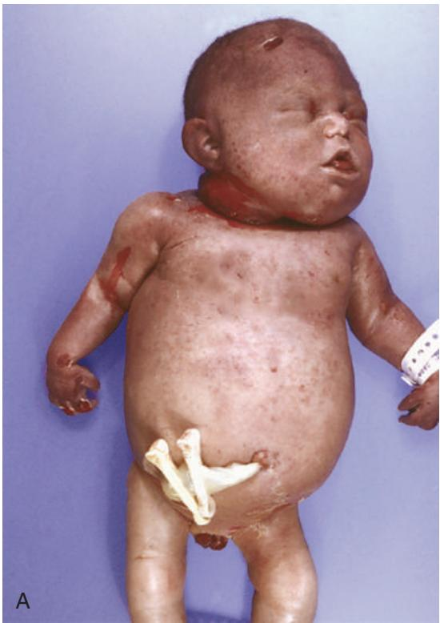 
Fig. 7.27 Hydrops fetalis. (A) Generalized accumulation of fluid in the fetus. (B) Fluid accumulation particularly prominent in the soft tissues of the neck. This condition has been termed cystic hygroma. Cystic hygromas are characteristically seen with, but not limited to, constitutional chromosomal anomalies such as $45,X$ karyotypes. (Courtesy of Dr. Beverly Rogers, Department of Pathology, University of Texas Southwestern Medical Center, Dallas, Texas.)
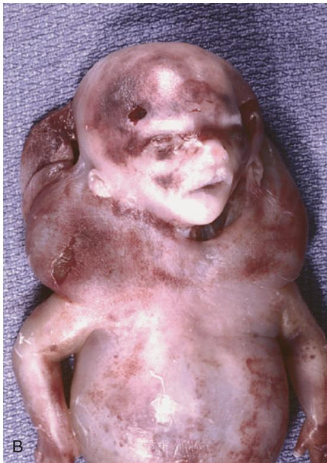
# Immune Hydrops
Immune hydrops results from an antibody-induced hemolytic disease in the newborn that is caused by blood group incompatibility between mother and fetus. Such an incompatibility occurs when the fetus inherits red cell antigenic determinants from the father that are foreign to the mother. The most common antigens to result in clinically significant hemolysis are the Rh and ABO blood group antigens. Of the numerous antigens included in the Rh system, only the D antigen is a major cause of Rh incompatibility. Fetal red cells may reach the maternal circulation during the last trimester of pregnancy, when the cytotrophoblast is no longer present as a barrier, or during childbirth itself (fetomaternal bleed). The mother then becomes sensitized to the foreign antigen and produces antibodies that, in future pregnancies, can freely traverse the placenta to the fetus, in which they cause red cell destruction. With initiation of immune hemolysis, progressive anemia in the fetus leads to tissue ischemia, intrauterine cardiac failure, and peripheral pooling of fluid (edema). As discussed later, cardiac failure may be the final pathway by which edema occurs in many cases of nonimmune hydrops as well.
Several factors influence the immune response to Rh-positive fetal red cells that reach the maternal circulation:
- Concurrent ABO incompatibility protects the mother against Rh immunization, because the fetal red cells are promptly coated by isohemagglutinins (preformed anti-A or anti-B antibodies) and removed from the maternal circulation. 
- The antibody response depends on the dose of immunizing antigen, so hemolytic disease develops only when the mother has experienced a significant transplacental bleed (more than $1\mathrm{mL}$ of Rh-positive red cells). 
- The isotype of the antibody is important, because immunoglobulin G (IgG) (but not IgM) antibodies can cross the placenta. The initial exposure to Rh antigen evokes the formation of IgM antibodies, so Rh disease is very uncommon with the first pregnancy. Subsequent exposure during the second or third pregnancy generally leads to a brisk IgG antibody response.
Appreciation of the role of previous sensitization in the pathogenesis of Rh-hemolytic disease of the newborn has led to its therapeutic control. Currently, Rh-negative mothers are given Rh immune globulin (RhIg) at 28 weeks and within 72 hours after delivery of an Rh-positive baby. The RhIg masks the antigenic sites on the fetal red cells that may have leaked into the maternal circulation during childbirth, thus preventing long-lasting sensitization to Rh antigens.
As a result of the remarkable success achieved in prevention of Rh hemolysis, fetomaternal ABO incompatibility currently is the most common cause of immune hemolytic disease of the newborn. Although ABO incompatibility occurs in approximately $20\%$ to $25\%$ of pregnancies, hemolysis develops in only a small fraction of infants born subsequently, and in general the disease is much milder than Rh incompatibility. In part the less severe course of disease can be attributed to the expression of A
and B antigens on many cells other than red cells which act like sponge for the transferred antibody. ABO hemolytic disease occurs almost exclusively in infants of blood group A or B who are born to mothers of blood group O. The normal anti-A and anti-B isohemagglutinins in group O mothers usually are of the IgM type and therefore do not cross the placenta. However, for reasons not well understood, certain group O women possess IgG antibodies directed against group A or B antigens (or both) even without previous sensitization. Therefore, the firstborn may be affected. There is no effective method of preventing hemolytic disease resulting from ABO incompatibility.
# Nonimmune Hydrops
The major causes of nonimmune hydrops include those disorders associated with cardiovascular defects, chromosomal anomalies, and fetal anemia.
- Structural cardiovascular defects and functional abnormalities (i.e., arrhythmias) may result in intrauterine cardiac failure and hydrops. Among the chromosomal anomalies, 45,X karyotype (Turner syndrome) and trisomies 21 and 18 are associated with fetal hydrops; the basis for this disorder usually is the presence of underlying structural cardiac anomalies, although in Turner syndrome there may be an abnormality of lymphatic drainage from the neck leading to postnuchal fluid accumulation (resulting in cystic hygromas). 
- Fetal anemias resulting from causes other than Rh or ABO incompatibility also may result in hydrops. In fact, in some parts of the world (e.g., Southeast Asia), severe fetal anemia caused by homozygous $\alpha$ -thalassemia probably is the most common cause of fetal hydrops. 
- Transplacental infection by parvovirus B19 is increasingly recognized as an important cause of fetal hydrops. The virus gains entry into erythroid precursors (normoblasts), where it replicates. The ensuing cellular injury leads to the death of the normoblasts and aplastic anemia. Parvoviral intranuclear inclusions can be seen within circulating and marrow erythroid precursors (Fig. 7.28).
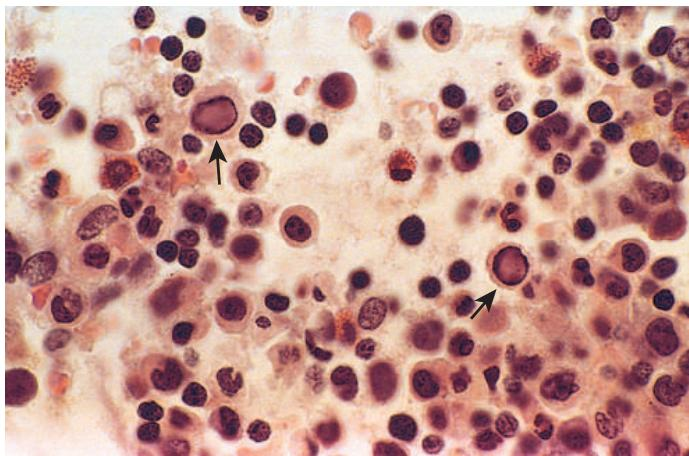 
Fig. 7.28 Bone marrow from an infant infected with parvovirus B19. The arrows point to two erythroid precursors with large homogeneous intranuclear inclusions and a surrounding peripheral rim of residual chromatin.
The basis for hydrops in fetal anemia of immune and nonimmune causes is tissue ischemia with secondary myocardial dysfunction and circulatory failure. Additionally, secondary liver failure may occur, with loss of synthetic function contributing to hypoalbuminemia, reduced plasma osmotic pressure, and edema.

The anatomic findings in fetuses with intrauterine fluid accumulation vary with both the severity of the disease and the underlying etiology. As previously noted, hydrops fetalis represents the most severe and generalized manifestation (Fig. 7.27), and lesser degrees of edema such as isolated pleural, peritoneal, or postnuchal fluid collections can occur. Accordingly, infants may be stillborn, die within the first few days, or recover completely. The presence of dysmorphic features suggests underlying constitutional chromosomal abnormalities; postmortem examination may show a cardiac anomaly. In hydrops associated with fetal anemia, both fetus and placenta are characteristically pale; in most cases, the liver and spleen are enlarged as a consequence of cardiac failure and congestion. Additionally, the bone marrow shows compensatory hyperplasia of erythroid precursors (parvovirus-associated aplastic anemia being a notable exception), and extramedullary hematopoiesis is present in the liver, the spleen, and possibly in other tissues such as the kidneys, the lungs, the lymph nodes, and even the heart (Fig. 7.29). The increased hematopoietic activity accounts for the presence in the peripheral circulation of large numbers of normoblasts, and even more immature erythroblasts (erythroblastosis fetalis).
The presence of hemolysis in Rh or ABO incompatibility is associated with the added complication of increased circulating bilirubin from the red cell breakdown. The CNS may be damaged when hyperbilirubinemia is marked (usually greater than $20\mathrm{mg}/$ dL in full-term infants, but often less in premature infants). The circulating unconjugated bilirubin is taken up into the brain, on which it apparently exerts a toxic effect. The basal ganglia and brain stem are particularly prone to deposition of bilirubin pigment, which imparts a characteristic yellow hue to the parenchyma (kernicterus) (Fig. 7.30).
Early recognition of fetal hydrops is imperative, because even severe cases can sometimes be salvaged with timely therapy. Immune hydrops that results from Rh incompatibility can be predicted with reasonable certainty, because its severity correlates well with rapidly rising Rh antibody titers in the mother during pregnancy. Antenatal identification and management of the at-risk fetus have been facilitated by amniocentesis and the advent of chorionic villus and fetal blood sampling. The direct anti-globulin test (direct Coombs test) (Chapter 12) using fetal cord blood yields a positive result if the red cells have been coated by maternal antibody. In addition, cloning of the RHD gene has resulted in efforts to determine fetal Rh status by sequencing cell free DNA in maternal blood. When identified, cases of severe intrauterine hemolysis may be treated by fetal intravascular transfusions via
arescatteredamongmaturehepatocytesinthishistologicpreparationfromaninfantwithnonimmunehydropsfetalis..jpg) 
Fig. 7.29 Numerous islands of extramedullary hematopoiesis (small blue cells) are scattered among mature hepatocytes in this histologic preparation from an infant with nonimmune hydrops fetalis.
the umbilical cord and early delivery. Postnatally, phototherapy is helpful, because visible light converts bilirubin to readily excreted dipyrrroles. As already discussed, in an overwhelming majority of cases, administration of RhIg to the mother can prevent the occurrence of immune hydrops in subsequent pregnancies. Group ABO hemolytic disease is more difficult to predict but is readily anticipated by awareness of the blood incompatibility between mother and father and by hemoglobin and bilirubin determinations in the vulnerable newborn. In fatal cases of fetal hydrops, a thorough postmortem examination is imperative to determine the cause and to exclude a potentially recurring cause such as a chromosomal abnormality.
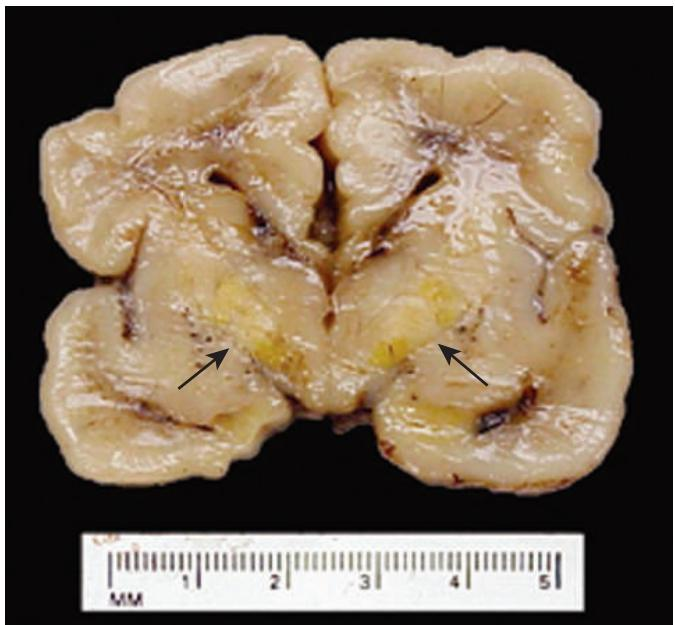 
Fig. 7.30 Kernicterus. Severe hyperbilirubinemia in the neonatal period—for example, secondary to immune hydrolysis—results in deposition of bilirubin pigment (arrows) in the brain parenchyma. This occurs because the blood-brain barrier is less developed in the neonatal period than it is in adulthood. Infants who survive develop long-term neurologic sequelae.
# FETAL HYDROPS
- Fetal hydrops refers to the accumulation of edema fluid in the fetus during intrauterine growth. 
- The degree of fluid accumulation is variable, from generalized hydrops fetalis to localized cystic hygromas. 
- The most common causes of fetal hydrops are nonimmune (chromosomal abnormalities, cardiovascular defects, and fetal anemia), whereas immune hydrops has become less frequent as a result of Rh antibody prophylaxis. 
- Erythroblastosis fetalis (circulating immature erythroid precursors) is a characteristic finding of fetal anemia-associated hydrops. 
- Hemolysis-induced hyperbilirubinemia can result in bilirubin toxicity (kernicterus) in the basal ganglia and brain stem, particularly in premature infants.
# TUMORS AND TUMORLIKE LESIONS OF INFANCY AND CHILDHOOD
Malignant neoplasms constitute the second most common cause of death in children between the ages of 4 and 14 years; only accidents exact a higher toll. Benign tumors are even more common than cancers.
It is sometimes difficult to segregate, on morphologic grounds, true tumors from tumorlike lesions in the infant and child. In this context, two special categories of tumor-like lesions should be recognized:
- Heterotopia or choristoma refers to microscopically normal cells or tissues that are present in abnormal locations. Examples are a pancreatic tissue "rest" found in the wall of the stomach or small intestine and a small mass of adrenal cells found in the kidney, lungs, ovaries, or elsewhere. Heterotopic rests usually are of little clinical significance, but on the basis of their appearance they can be confused with neoplasms. 
- Hamartoma refers to an excessive but focal overgrowth of cells and tissues native to the organ in which it occurs. Although the cellular elements are mature and identical to those found in the remainder of the organ, they do not reproduce the normal architecture of the surrounding tissue. The line of demarcation between a hamartoma and a benign neoplasm frequently is tenuous and is variously interpreted. Hemangiomas, lymphangiomas, rhabdomyomas of the heart, and adenomas of the liver are considered by some researchers to be hamartomas and by others to be true neoplasms.
# Benign Neoplasms
Virtually any neoplasm may be encountered in the pediatric age group, but three—hemangiomas, lymphangiomas, and teratomas—deserve special mention here.
Hemangiomas are the most common neoplasms of infancy. Both cavernous and capillary hemangiomas may be encountered (Chapter 10), although the latter often are more cellular than in adults and thus may appear deceptively worrisome. In children, most hemangiomas are
located in the skin, particularly on the face and scalp, where they produce flat to elevated, irregular, red-blue masses; the flat, larger lesions are referred to as port-wine stains. Hemangiomas may enlarge as the child ages, but in many instances they spontaneously regress (Fig. 7.31). The vast majority of superficial hemangiomas have no more than a cosmetic significance; rarely, they may be the manifestation of a hereditary disorder associated with disease within internal organs, such as the von Hippel-Lindau syndrome (Chapter 10). A subset of CNS cavernous hemangiomas can occur in the familial setting; affected families harbor mutations in one of three cerebral cavernous malformation (CCM) genes.
Lymphangiomas represent the lymphatic counterpart of hemangiomas. Microscopic examination shows cystic and cavernous spaces lined by endothelial cells and surrounded by lymphoid aggregates; the spaces usually contain pale fluid. They may occur on the skin but, more importantly, they also are encountered in the deeper regions of the neck, axilla, mediastinum, and retroperitoneum. Although histologically benign, they tend to increase in size after birth and may encroach on mediastinal structures or nerve trunks in axilla.
Teratomas may occur as benign, well-differentiated cystic lesions (mature teratomas), as lesions of indeterminate potential (immature teratomas), or as unequivocally
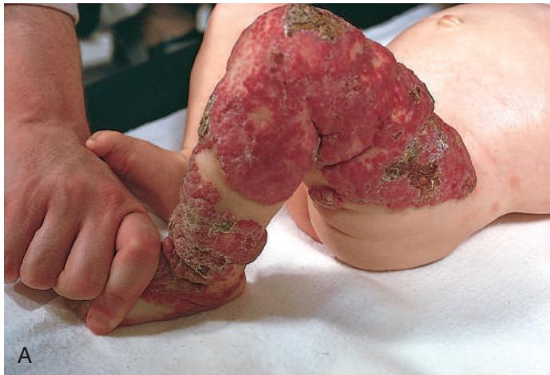
atbirthand(B)at2yearsofageafterthelesionhadundergonespontaneousregression.(CourtesyofDr.EduardoYunis,Children'sHospitalofPittsburgh,Pittsburgh,Pennsylvania.).jpg) 
Fig. 7.31 Congenital capillary hemangioma (A) at birth and (B) at 2 years of age after the lesion had undergone spontaneous regression. (Courtesy of Dr. Eduardo Yunis, Children's Hospital of Pittsburgh, Pittsburgh, Pennsylvania.)
malignant teratomas (usually admixed with another germ cell tumor component such as an endodermal sinus tumor). Sacrococcygeal teratomas are the most common teratomas of childhood, accounting for $40\%$ or more of cases (Fig. 7.32). In view of the overlap in the mechanisms underlying congenital malformations and oncogenesis, it is interesting that approximately $10\%$ of sacrococcygeal teratomas are associated with congenital anomalies, primarily defects of the hindgut and cloacal region and other midline defects (e.g., meningocele, spina bifida) not believed to result from local effects of the tumor. Approximately $75\%$ of these tumors are mature teratomas with a benign course, and about $12\%$ are unmistakably malignant and lethal (Chapter 18). The remainder are designated immature teratomas, and their malignant potential correlates with the amount of immature tissue elements present. Most of the benign teratomas are encountered in younger infants (4 months of age or younger), whereas children with malignant lesions tend to be somewhat older.
# Malignant Neoplasms
The organ systems involved most commonly by malignant neoplasms in infancy and childhood are the hematopoietic system, neural tissue, and soft tissues (Table 7.9). This distribution is in sharp contrast with that in adults, in whom epithelial tumors of the lung, heart, prostate, and colon are the most common forms. Malignant neoplasms of infancy and childhood differ biologically and histologically from those in adults. The main differences are as follows:
- Relatively frequent demonstration of a close relationship between abnormal development (teratogenesis) and tumor induction (oncogenesis), suggesting a common stem cell defect. 
- Prevalence of genetic abnormalities or familial syndromes that predispose to cancer 
- Tendency of fetal and neonatal malignancies to regress spontaneously or to undergo "differentiation" into mature elements
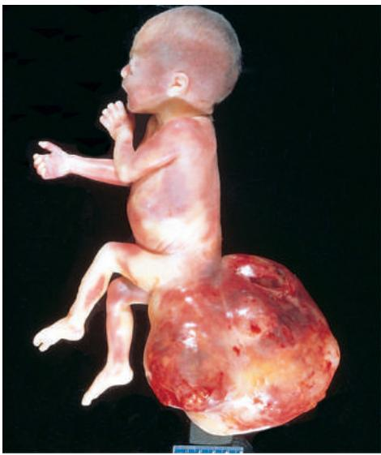 
Fig. 7.32 Sacrococcygeal teratoma. Note the size of the lesion compared with that of the infant.
Table 7.9 Common Malignant Neoplasms of Infancy and Childhood 
0-4 Years of Age5-9 Years of Age10-14 Years of AgeLeukemiaLeukemiaHepatocellular carcinomaRetinoblastomaRetinoblastomaNeuroblastomaNeuroblastomaSoft tissue sarcomaWilms tumorHepatocellular carcinomaOsteogenic sarcoma Thyroid carcinomaHepatoblastomaSoft tissue sarcoma Ewing tumorHodgkin diseaseSoft tissue sarcoma (especially rhabdomyosarcoma)CNS tumorsTeratomas CNS tumorsLymphoma
CNS, Central nervous system.
- Better survival or cure of many childhood tumors, so that much attention is now paid to minimizing the adverse delayed effects of chemotherapy and radiotherapy in survivors, including the development of second malignancies
Many malignant pediatric neoplasms are histologically unique. In general, they tend to exhibit a primitive (embryonal) rather than pleomorphic-anaplastic microscopic appearance, and frequently they exhibit features of organogenesis specific to the site of tumor origin. Because of their primitive histologic appearance, many childhood tumors have been collectively referred to as small, round, blue-cell tumors. Sheets of cells with small, round nuclei characterize these tumors, which include neuroblastoma, lymphoma, rhabdomyosarcoma, Ewing sarcoma (peripheral neuroectodermal tumor), and some cases of Wilms tumor. Sufficient distinctive features usually are present to permit definitive diagnosis on the basis of histologic examination alone, but molecular studies are becoming increasingly useful, both for diagnosis and prognosis of childhood cancers. Three common tumors—neuroblastoma, retinoblastoma, and Wilms tumor—are described here to highlight the differences between pediatric tumors and those in adults.
# Neuroblastoma
The term neuroblastic includes tumors of the sympathetic ganglia and adrenal medulla that are derived from primordial neural crest cells populating these sites; neuroblastoma is the most important member of this family. It is the second most common solid malignancy of childhood after brain tumors, accounting for $7\%$ to $10\%$ of all pediatric neoplasms, and as many as $50\%$ of malignancies diagnosed in infancy. Neuroblastomas demonstrate several unique features in their natural history, including spontaneous regression and spontaneous or therapy-induced maturation. Most occur sporadically, but $1\%$ to $2\%$ are familial, with autosomal dominant transmission, and in such cases the neoplasms may involve both of the adrenals or multiple primary autonomic sites. Germline mutations in the anaplastic lymphoma kinase (ALK) gene have been linked to the familial predisposition to neuroblastoma. Somatic gain-of-function ALK mutations are also observed in $8\%$ to $10\%$ of sporadic neuroblastomas, and are markers of adverse prognosis. Clinical trials using inhibitors that target the mutated ALK tyrosine kinase are underway.
In childhood, about $40\%$ of neuroblastomas arise in the adrenal medulla. The remainder occur anywhere along the sympathetic chain, with the most common locations being the paravertebral region of the abdomen $(25\%)$ and posterior mediastinum $(15\%)$ . Macroscopically, neuroblastomas range in size from clinically silent minute nodules (in situ lesions) to large masses weighing more than $1\mathrm{kg}$ . In situ neuroblastomas are reported to be 40 times more frequent than tumors with clinical symptoms. The great majority of these silent lesions spontaneously regress, leaving only a focus of fibrosis or calcification in the adult. Some neuroblastomas are sharply demarcated with a fibrous pseudocapsule, but others are infiltrative and invade surrounding structures, including the kidneys, renal vein, and vena cava, and envelop the aorta. On transection, they are composed of soft, gray-tan, brainlike tissue. Larger tumors have areas of necrosis, cystic softening, and hemorrhage.
Histologically, classic neuroblastomas are composed of small, primitive-appearing cells with dark nuclei, scant cytoplasm, and poorly defined cell borders growing in solid sheets (Fig. 7.33A). Mitotic activity, nuclear breakdown ("karyorrhexis"), and pleomorphism may be prominent. The background often demonstrates a faintly eosinophilic fibrillary material (neuropil) that corresponds to neuritic processes of the primitive neuroblasts. Typically, so-called Homer-Wright pseudorosettes can be found, in which the tumor cells are concentrically arranged about a central space filled with neuropil (the absence of an actual central lumen garners the designation pseudo.). Other helpful features include immunochemical detection of nerval markers, such as neuron-specific enolase, and demonstration on ultrastructural studies of small, membrane-bound, cytoplasmic catecholamine-containing secretory granules.
Some neoplasms show signs of maturation, either spontaneous or therapy-induced. Larger cells having more abundant cytoplasm with large vesicular nuclei and a prominent nucleolus, representing ganglion cells in various stages of maturation, may be found in tumors admixed with primitive neuroblasts (ganglioneuroblastoma). Lesions that are even better differentiated contain many more large cells resembling mature ganglion cells in the absence of residual neuroblasts; such neoplasms merit the designation ganglioneuroma (Fig. 7.33B). Maturation of neuroblasts into ganglion cells usually is accompanied by the appearance of Schwann cells.
# Clinical Course and Prognosis
# Many factors influence prognosis, but the most important are the stage of the tumor and the age of the patient.
- Staging of neuroblastomas (Table 7.10) assumes great importance in establishing a prognosis. Special note should be taken of stage 4S (S means special), because the outlook for these patients is excellent, despite the spread of disease. As noted in Table 7.10, the primary tumor would be classified as stage 1 or 2 but for the presence of metastases, which are limited to liver, skin, and bone marrow, without bone involvement. Infants with 4S tumors have an excellent prognosis with minimal therapy, and it is not uncommon for the primary or metastatic tumors to undergo spontaneous regression. The biologic basis for this welcome behavior is not clear. Unfortunately, most (60% to 80%) children
assumesgreatimp.jpg)
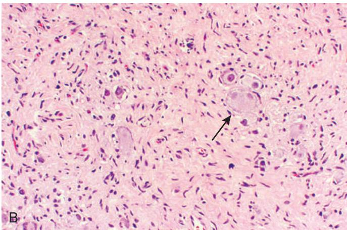 
Fig. 7.33 (A) Neuroblastoma. This tumor is composed of small cells embedded in a finely fibrillar matrix (neuropil). A Homer-Wright pseudorosette (tumor cells arranged concentrically around a central core of neuropil) is seen in the upper right corner. (B) Ganglioneuromas, arising from spontaneous or therapy-induced maturation of neuroblastomas, are characterized by clusters of large ganglion cells with vesicular nuclei and abundant eosinophilic cytoplasm (arrow). Spindle-shaped Schwann cells are present in the background stroma.
present with stage 3 or 4 tumors, and only $20\%$ to $40\%$ present with stage 1, 2A, 2B, or 4S neuroblastomas.
- Age is the other important determinant of outcome. The outlook for children younger than 18 months is much more favorable than for older children at a comparable stage of disease. Most neoplasms diagnosed in children during the first 18 months of life are stage 1 or 2, or stage 4S ("low" risk category in Table 7.10), whereas neoplasms in older children fall into the "intermediate" or "high" category of risk. 
- Histology is an independent prognostic variable in neuroblastic tumors; evidence of schwannian stroma and gangliocytic differentiation is indicative of a favorable prognosis. 
- Amplification of the MYCN oncogene has profound impact on prognosis. MYCN is located on the distal short arm of chromosome 2. MYCN amplification is present in about $25\%$ to $30\%$ of primary tumors, most in advanced-stage disease; the greater the number of copies, the worse the prognosis. Amplification of MYCN does not karyotypically manifest at the resident 2p23-p24 site, but rather as extrachromosomal double minute chromosomes or homogeneously staining regions on
Table 7.10 International Neuroblastoma Staging System 
Stage 1Localized tumor completely excised, with or without microscopic residual disease; representative ipsilateral nonadherent lymph nodes negative for tumor (nodes adherent to the primary tumor may be positive for tumor)Stage 2ALocalized tumor resected incompletely grossly; representative ipsilateral nonadherent lymph nodes negative for tumor microscopicallyStage 2BLocalized tumor with or without complete gross excision, ipsilateral nonadherent lymph nodes positive for tumor; enlarged contralateral lymph nodes, which are negative for tumor microscopicallyStage 3Unresectable unilateral tumor infiltrating across the midline with or without regional lymph node involvement; or localized unilateral tumor with contralateral regional lymph node involvementStage 4Any primary tumor with dissemination to distant lymph nodes, bone, bone marrow, liver, skin, and/or other organs (except as defined for stage 4S)Stage 4SLocalized primary tumor (as defined for stage I, 2A, or 2B) with dissemination limited to skin, liver, and/or bone marrow (&lt;10% of nucleated cells are constituted by neoplastic cells; &gt;10% involvement of bone marrow is considered as stage 4); stage 4S limited to infants younger than 1 year of age
S, Special. 
Adapted from Brodeur GM, Pritchard J, Berthold F, et al: Revisions of the international neuroblastoma diagnosis, staging, and response to treatment, J Clin Oncol 11:1466, 1993.
other chromosomes (Fig. 7.34). MYCN amplification is currently the most important genetic abnormality used in risk stratification of neuroblastic tumors and automatically renders a tumor as "high" risk, irrespective of stage or age.
- DNA ploidy is another prognostic factor, with tumors that are hyperdiploid (with whole chromosome gains) having more favorable prognosis than tumors that are near-diploid. The latter subset, although closer to diploidy on absolute number, tends to have multiple structural rearrangements between, and within, chromosomes that can result in adverse molecular events, such as MYCN amplification. 
- Although age, stage, MYCN status, and ploidy are used clinically for assigning prognostication, many other "experimental" molecular aberrations have been identified that might also have prognostic bearings, or be potential candidates for targeted therapy. For example, expression of TrkA, a high-affinity receptor for nerve growth factor that is indicative of differentiation toward sympathetic ganglia lineage, is associated with favorable prognosis. Overall, besides MYCN amplification and ALK mutations (latter in $\sim 10\%$ ), de novo neuroblastomas have few recurrent "hotspot" mutations. However, a very high frequency of relapsed neuroblastomas ( $>75\%$ ) have mutations in the RAS-MAP kinase signaling pathway, suggesting that relapsed tumors might be targeted with therapies against these oncogenic pathways.
Children younger than 2 years with neuroblastomas generally present with a protuberant abdomen resulting
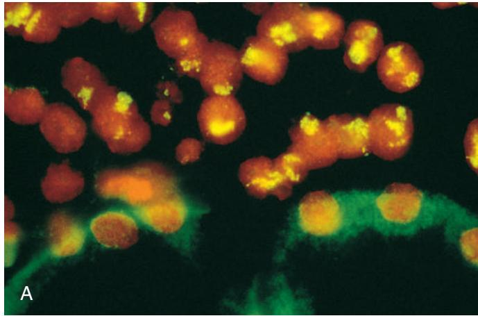
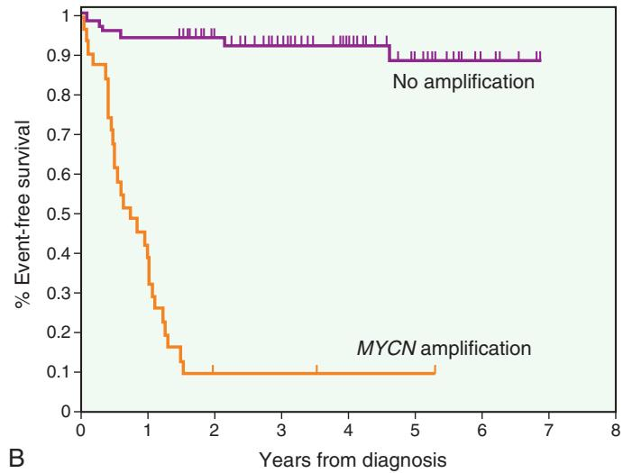 
Fig. 7.34 (A) FISH using a fluorescein-labeled cosmid probe for $N$ -myc on a tissue section containing neuroblastoma attached to the kidney. Note the neuroblastoma cells on the upper half of the photo with large areas of staining (yellow-green); this corresponds to amplified $N$ -MYC in the form of homogeneously staining regions. Renal tubular epithelial cells in the lower half of the photograph show no nuclear staining and background (green) cytoplasmic staining. (B) A Kaplan-Meier survival curve of infants younger than 1 year of age with metastatic neuroblastoma. The 3-year event-free survival of infants whose tumors lacked MYCN amplification was $93\%$ , whereas those with tumors that had MYCN amplification had only a $10\%$ event-free survival. (A, Courtesy Dr. Timothy Triche, Children's Hospital, Los Angeles, California. B, Reproduced with permission from Brodeur GM: Neuroblastoma: biological insights into a clinical enigma, Nat Rev Cancer 3:203-216, 2003.)
from an abdominal mass, fever, and weight loss. In older children the neuroblastomas may remain unnoticed until metastases cause hepatomegaly, ascites, and bone pain. Neuroblastomas may metastasize widely through the hematogenous and lymphatic systems, particularly to liver, lungs, bones, and the bone marrow. In neonates, disseminated neuroblastomas may manifest with multiple cutaneous metastases associated with deep blue discoloration to the skin (earning the rather unfortunate moniker of "blueberry muffin baby"). About $90\%$ of neuroblastomas, regardless of location, produce catecholamines (similar to the catecholamines associated with pheochromocytomas), which constitutes an important diagnostic feature (i.e., elevated blood levels of catecholamines and elevated urine levels of catecholamine metabolites such as
vanillylmandelic acid [VMA] and homovanillic acid [HVA]). Despite the elaboration of catecholamines, hypertension is much less frequent with these neoplasms than with pheochromocytomas (Chapter 20).
# NEUROBLASTOMA
- Neuroblastomas and related tumors arise from neural crest-derived cells in the sympathetic ganglia and adrenal medulla. 
- Neuroblastomas are undifferentiated, whereas ganglioneuroblastomas and ganglioneuromas demonstrate evidence of differentiation (schwannian stroma and ganglion cells). HomerWright pseudorosettes are characteristic of neuroblastomas. 
- Age, stage, and MYCN amplification and ploidy are the most important prognostic features; children younger than 18 months usually have a better prognosis than older children, whereas children with higher-stage tumors or MYCN amplification fare worse. A high frequency of relapsed neuroblastomas have mutations in the RAS-MAP kinase pathway. 
- Neuroblastomas secrete catecholamines, whose metabolites (VMA/HVA) can be used for screening patients.
# Retinoblastoma
Retinoblastoma is the most common primary intraocular malignancy of children. The molecular genetics of retinoblastoma has been discussed previously (Chapter 6). Approximately $40\%$ of the tumors are associated with a germline mutation in the RB gene and are therefore heritable. The remaining $60\%$ of the tumors develop sporadically, and these have somatic RB gene mutations. Familial cases typically are associated with development of multiple tumors that are bilateral, although they may be unifocal and unilateral. All of the sporadic, nonheritable tumors are unilateral and unifocal. Patients with familial retinoblastoma also are at increased risk for the development of osteosarcoma and other soft tissue tumors.
Retinoblastomas tend to be nodular masses, usually in the posterior retina, often with satellite seedings (Fig. 7.35A). On microscopic examination, undifferentiated areas of these tumors are found to be composed of small, round cells with large hyperchromatic nuclei and scant cytoplasm, resembling undifferentiated retinoblasts.
Differentiated structures are found within many retinoblastomas, the most characteristic of these being Flexner-
Wintersteiner rosettes (Fig. 7.35B). These structures consist of clusters of cuboidal or short columnar cells arranged around a central lumen (in contrast with the pseudorosettes of neuroblastoma, which lack a central lumen). The nuclei are displaced away from the lumen, which by light microscopy appears to have a limiting membrane resembling the external limiting membrane of the retina.
Tumor cells may disseminate beyond the eye through the optic nerve or subarachnoid space. The most common sites of distant metastases are the CNS, skull, distal bones, and lymph nodes.
The presenting findings include poor vision, strabismus, a whitish hue to the pupil ("cat's eye reflex"), and pain and tenderness in the eye. The median age at presentation is 2 years, although the tumor may be present at birth. Untreated, the tumors usually are fatal, but when treated with chemotherapy, radiotherapy, and (in locally advanced tumors) enucleation, survival is the rule. As noted earlier, some tumors spontaneously regress, and patients with familial retinoblastoma are at increased risk for the development of osteosarcoma and other soft tissue tumors.
# Wilms Tumor
Wilms tumor, or nephroblastoma, is the most common primary tumor of the kidney in children, with most cases occurring in children between 2 and 5 years of age. This tumor illustrates several important concepts of childhood tumors: the relationship between congenital malformation and increased risk of tumors; the histologic similarity between tumor and developing organ; and finally, the remarkable success in the treatment of childhood tumors. Each of these concepts is presented in the following discussion.
Three groups of congenital malformations are associated with an increased risk for Wilms tumor. These are WAGR syndrome (i.e., Wilms tumor, aniridia, genital abnormalities, and mental retardation); Denys-Drash syndrome (DDS), and Beckwith-Wiedemann syndrome (BWS). Of patients with WAGR syndrome approximately one in three will go on to develop this tumor. Another group of patients, those with so-called "Denys-Drash syndrome" (DDS), have an even higher risk (approximately $90\%$ ) of Wilms tumor. Patients with the WAGR syndrome, as the name indicates, have Wilms tumor, aniridia, genital abnormalities and mental retardation. DD syndrome is characterized by gonadal dysgenesis and early onset nephropathy leading to renal failure. Both of these conditions are associated with abnormalities of the Wilms tumor 1 (WT1) gene, located on 11p13. The nature of the genetic aberration differs, however: Patients with WAGR syndrome demonstrate loss of genetic material (i.e., deletions) of WT1, while persons with DDS harbor a dominant negative inactivating mutation in WT1 that interferes with the function of normal WT1 protein made from the other WT1 allele. WT1 is critical to normal renal and gonadal development; it is not surprising, therefore, that constitutional inactivation of one copy of this gene results in genitourinary abnormalities in humans.
A third group of patients, those with Beckwith-Wiedemann syndrome (BWS), also are at increased risk for the development of Wilms tumor. These patients exhibit enlargement of individual body organs (e.g., tongue, kidneys, or liver) or entire body segments (hemihypertrophy); enlargement of adrenal cortical cells (adrenal cytomegaly) is a characteristic microscopic feature. BWS is an example of a disorder of genomic imprinting (see earlier). The genetic locus that is involved in these patients is in band p15.5 of chromosome 11 distal to the WT1 locus. Although this locus is called "WT2" for the second Wilms tumor locus, the gene involved has not been identified. This region contains at least 10 genes that normally are expressed from only one of the two parental alleles, with
Poorlycohesivetumorinretinaisseenabuttingtheopticnerve.(B)Higher-powerviewshowingFlexner-Wintersteinerrosettes(arrow)andnumerousmitoticfigures..jpg) 
Fig. 7.35 Retinoblastoma. (A) Poorly cohesive tumor in retina is seen abutting the optic nerve. (B) Higher-power view showing Flexner-Wintersteiner rosettes (arrow) and numerous mitotic figures.
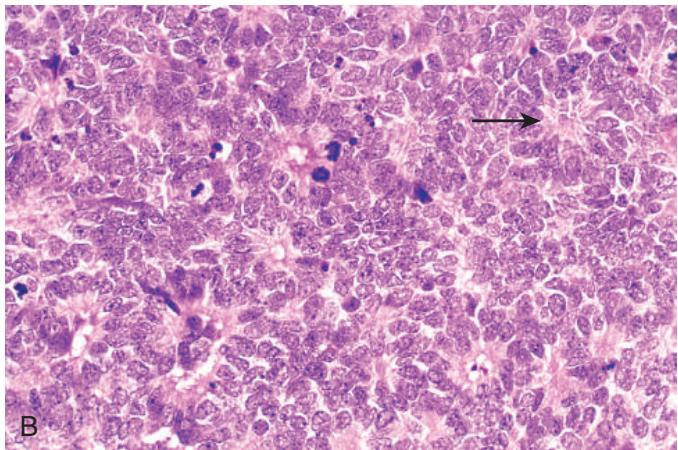
transcriptional silencing of the other parental homologue by methylation of the promoter region located upstream of the transcription start site. Of all candidate "WT2" genes, imprinting abnormalities of insulinlike growth factor-2 (IGF2) have the strongest relationship to tumor predisposition in persons with BWS. IGF2 normally is expressed solely from the paternal allele, whereas the maternal allele is imprinted. In some Wilms tumors, loss of imprinting (i.e., reexpression of IGF2 by the maternal allele) can be demonstrated, leading to overexpression of the IGF2 protein, which is postulated to result in both organ enlargement and tumorigenesis. Thus, these associations suggest that in some cases, congenital malformations and tumors represent related manifestations of genetic lesions affecting a single gene or closely linked genes. In addition to Wilms tumors, patients with BWS also are at increased risk for the development of hepatoblastoma, adrenocortical tumors, rhabdomyosarcomas, and pancreatic tumors.
In contrast to syndromic Wilms tumors, the molecular abnormalities underlying sporadic (i.e., nonsyndromic) tumors, which account for $90\%$ of cases overall in children, are only recently being elucidated. Some of them are associated with specific histologic features described later. For example, gain-of-function mutations of the gene encoding $\beta$ -catenin (Chapter 6) have been demonstrated in approximately $10\%$ of sporadic Wilms tumors. Other recurrent mutations occur in genes encoding proteins involved in microRNA processing (DROSHA, DGCR8, and DICER1); these are seen in $15\%$ to $20\%$ of Wilms tumors with predominantly blastemal histology (see later). It is postulated that aberrations in microRNA processing lead to reduced levels of many mature microRNAs, in particular in the miR-200 family, which is involved in "mesenchymal to epithelial transformation" during renal morphogenesis. The lack of mesenchymal to epithelial transformation likely leads to persistent blastemal
"rests" in the kidney (see the following), which evolve into Wilms tumors. Finally, tumors with TP53 mutations are associated with an especially poor prognosis and often have a distinctive anaplastic histologic appearance, described later.
Wilms tumor typically is a large, solitary, well-circumscribed mass, although $10\%$ are either bilateral or multicentric at the time of diagnosis. On cut section, the tumor is soft, homogeneous, and tan to gray, with occasional foci of hemorrhage, cystic degeneration, and necrosis (Fig. 7.36).
On microscopic examination, Wilms tumors are characterized by recognizable attempts to recapitulate different stages of nephrogenesis. The classic triphasic combination of blastemal, stromal, and epithelial cell types is observed in most lesions, although the percentage of each component is variable (Fig. 7.37A). Sheets of small blue cells, with few distinctive features, characterize the blastemal component. Epithelial "differentiation" usually takes the form of abortive tubules or glomeruli. Stromal cells are usually fibrocytic or myxoid in nature, although skeletal muscle "differentiation" is not uncommon. Approximately $5\%$ of tumors contain foci of anaplasia (cells with large, hyperchromatic, pleomorphic nuclei and abnormal mitoses) (Fig. 7.37B). The presence of anaplasia correlates with the presence of acquired TP53 mutations and the emergence of resistance to chemotherapy. The pattern of distribution of anaplastic cells within the primary tumor (focal versus diffuse) has important implications for prognosis (see further text).
Nephrogenic rests are putative precursor lesions of Wilms tumors and are sometimes present in the renal parenchyma adjacent to the tumor. Nephrogenic rests have a spectrum of histologic appearances, from expansile masses that resemble Wilms tumors (hyperplastic rests) to sclerotic rests consisting predominantly of fibrous tissue with occasional admixed
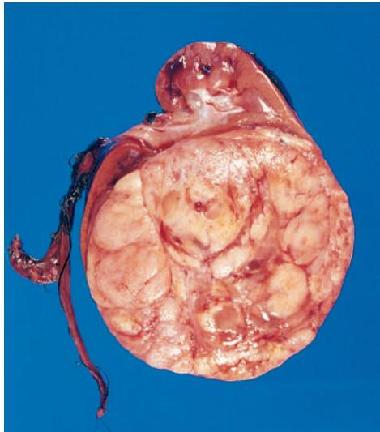 
Fig. 7.36 Wilms tumor in the lower pole of the kidney with the characteristic tan to gray color and well-circumscribed margins.
immature tubules or glomeruli. It is important to document the presence of nephrogenic rests in the resected specimen, because these patients are at an increased risk for the development of Wilms tumors in the contralateral kidney.
Patients typically present with a palpable abdominal mass, which may extend across the midline and down into the pelvis. Less often, the presenting features are fever and abdominal pain, hematuria or, occasionally, intestinal obstruction as a result of pressure from the tumor. The prognosis for Wilms tumor generally is very good, and excellent results are obtained with a combination of nephrectomy and chemotherapy. Anaplasia is a harbinger of adverse prognosis, but only if it is diffuse. If the anaplasia is focal and confined within the resected nephrectomy
# WILMS TUMOR
- Wilms tumor is the most common renal neoplasm of childhood. 
Patients with three syndromes are at increased risk for Wilms tumors: Denys-Drash, Beckwith-Wiedemann, and Wilms tumor, aniridia, genital abnormalities, and mental retardation (WGAR) syndrome. 
- WAGR syndrome and DDS are associated with WT1 inactivation, whereas Beckwith-Wiedemann arises through imprinting abnormalities at the WT2 locus, principally involving the IGF2 gene. 
- The morphologic components of Wilms tumor include blastema (small, round blue cells) and epithelial and stromal elements. 
- Nephrogenic rests are precursor lesions of Wilms tumors.
specimen, the outcome is no different from that for tumors without evidence of anaplasia.
# MOLECULAR DIAGNOSIS OF MENDELIAN AND COMPLEX DISORDERS
In the era predating the ready availability of molecular diagnostic assays, rendering the diagnosis of a genetic disorder depended on the identification of abnormal gene products (e.g., mutant hemoglobin or abnormal metabolites) or their clinical effects, such as mental retardation (e.g., in PKU). Several factors have since enabled the rapid expansion of molecular diagnostics from the realm of research to an almost ubiquitous presence in both academic and commercial pathology laboratories. These include (1) the sequencing of the human genome and the deposition of these data in publicly available databases; (2) the availability of numerous "off-the-shelf" polymerase chain
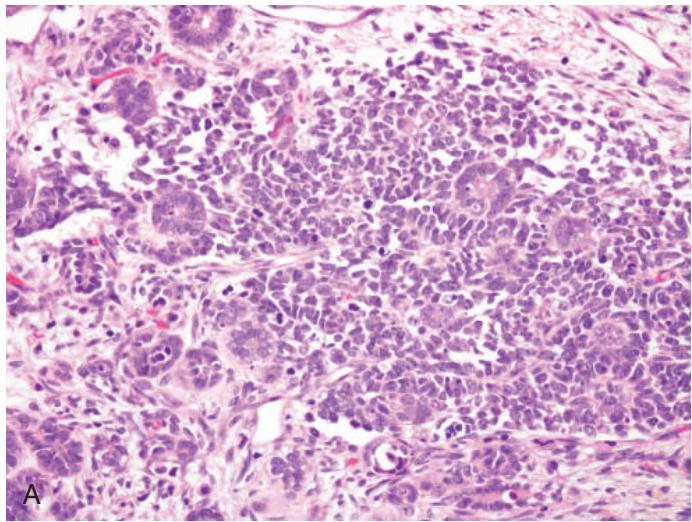 
Fig. 7.37 (A) Wilms tumor with tightly packed blue cells consistent with the blastemal component and interspersed primitive tubules, representing the epithelial component. (B) Focal anaplasia was present in other areas within this Wilms tumor, characterized by cells with hyperchromatic, pleomorphic nuclei, and an abnormal mitosis (center of field). Predominance of blastemal morphology and diffuse anaplasia are associated with specific molecular lesions (see text).
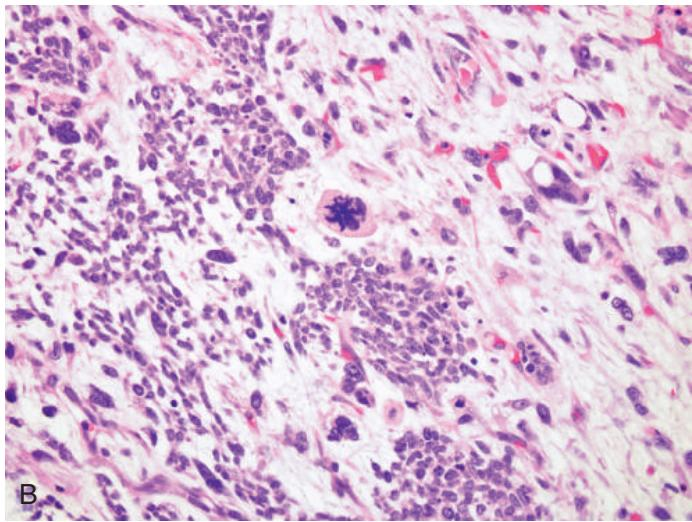
reaction (PCR) kits tailor-made for the identification of specific genetic disorders; (3) the availability of high-resolution microarrays ("gene chips") that can interrogate both DNA and RNA on a genomewide scale using a single platform; and, finally, (4) the emergence of automated, highbroughput, next-generation ("NextGen") sequencing technologies. The last two advances have been especially useful in the context of new research to elucidate the genetic basis for both mendelian and complex disorders. Although a detailed discussion of molecular diagnostics is beyond the scope of this book, some of the better-known approaches are highlighted in the ensuing paragraphs. Irrespective of the technique used, the genetic aberration being queried can be either in the germline (i.e., present in each and every cell of the affected person, as with a CFTR mutation in a patient with CF) or somatic (i.e., restricted to specific tissue types or lesions, as with MYCN amplification in neuroblastoma cells). This consideration determines the nature of the sample (e.g., peripheral blood lymphocytes [PBLs], saliva, tumor tissue) used for the assay.
# Indications for Genetic Analysis
In general, indications for genetic analysis can be divided into inherited conditions and acquired conditions. Within inherited conditions, genetic testing can be offered at either the prenatal or postnatal stages. It may involve conventional cytogenetics, FISH, molecular diagnostics, or a combination of these techniques.
Prenatal genetic analysis should be offered to all patients who are at risk of having cytogenetically abnormal progeny. It can be performed on cells obtained by amniocentesis, on chorionic villus biopsy material, or increasingly in "liquid biopsies" on maternal blood paired with next-generation sequencing. Some important indications are the following:
- Advanced maternal age (beyond 34 years), which is associated with greater risk of trisomies 
- Confirmed carrier status for a balanced reciprocal translocation, robertsonian translocation, or inversion (in such cases, the gametes may be unbalanced, so the progeny would be at risk for chromosomal disorders) 
- Fetal abnormalities observed on ultrasound, or an abnormal result on routine maternal blood screening 
- A chromosomal abnormality or mendelian disorder affecting a previous child 
- Determination of fetal sex when the patient or partner is a confirmed carrier of an X-linked genetic disorder
Postnatal genetic analysis usually is performed on peripheral blood lymphocytes. Indications are as follows:
- Multiple congenital anomalies 
- Suspicion of a metabolic syndrome 
- Unexplained mental retardation and/or developmental delay 
- Suspected aneuploidy (e.g., features of Down syndrome) or other syndromic chromosomal abnormality (e.g., deletions, inversions) 
- Suspected monogenic disease, whether previously described or unknown
Acquired genetic alterations, such as somatic mutations in cancer, are increasingly becoming a large focus area in
molecular diagnostics laboratories, especially with the advent of targeted therapies. Although single gene tests (mutations of $EGFR$ or $BRAF$ , amplification of HER2) have been used for a while to inform treatment decisions, the advent of cost-effective next-generation sequencing approaches has now allowed interrogations of large numbers of coding genes (often in the 100s), as well as cancer-relevant translocations, in a single assay. The clinical team typically receives a "genomic report" on the patient's cancer, including potential molecularly targeted treatment recommendations. Another major focus of molecular diagnostics has been the rapid identification of infectious diseases, such as suspected tuberculosis or virulent pathogens such as Ebola, using DNA-based approaches. In general, these approaches have cut down the time required for diagnosis from weeks to a matter of days. Besides de novo identification of pathogens, molecular diagnostics laboratories can also contribute to the identification of treatment resistance (e.g., acquired mutations in influenza viruses that render them resistant to anti-virals), and to the monitoring of treatment efficacy using assays for "viral load" in the blood. Similar parameters (measuring efficacy of therapy and emergence of resistance) are also widely used in cancer patients.
Because of the rapid advances in molecular diagnostics, terms such as "personalized therapy" and "precision medicine" are being increasingly used to indicate therapy tailored to the needs of the individual patient. It is hoped that such expectations will be met in the foreseeable future. We will now discuss some of the common approaches used in molecular diagnostics laboratories for assessment of inherited and acquired indications.
# Molecular Diagnosis of Copy Number Abnormalities
As already discussed in this chapter, various diseases may occur as a result of copy number abnormalities, at the level of the entire chromosome (trisomy 21), chromosomal segments (22q11 deletion syndrome), or submicroscopic intragenic deletions (WAGR syndrome). Karyotype analysis of chromosomes by G banding remains the classic approach for identifying changes at the chromosomal level; however, as might be expected, the resolution with this technique is fairly low. To identify subchromosomal alterations, both focused analysis of chromosomal regions by FISH and global genomic approaches such as comparative genomic hybridization (CGH) are commonly used.
# Fluorescence in Situ Hybridization
FISH uses DNA probes that recognize sequences specific to chromosomal regions of greater than 100 kilobases in size, which defines the limit of resolution with this technique for identifying chromosomal changes. Such probes are labeled with fluorescent dyes and are applied to metaphase spreads or interphase nuclei. The probe hybridizes to its complementary sequence on the chromosome and thus labels the specific chromosomal region that can then be visualized under a fluorescence microscope. The ability of FISH to circumvent the need for dividing cells is invaluable when a rapid diagnosis is warranted (e.g., in a critically ill infant suspected of having an underlying genetic
disorder). Such analysis can be performed on prenatal samples (e.g., cells obtained by amniocentesis, chorionic villus biopsy, or umbilical cord blood), peripheral blood lymphocytes, and even archival tissue sections. FISH is used for the detection of numeric abnormalities of chromosomes (aneuploidy) (Fig. 7.38A), subtle microdeletions (Fig. 7.38B) and complex translocations not identifiable by routine karyotyping, and gene amplification (e.g., MYCN amplification in neuroblastomas).
# Array-Based Genomic Hybridization
FISH requires previous knowledge of the one or few specific chromosomal regions suspected of being altered in the test sample. However, genomic abnormalities can also be detected without previous knowledge by using micro-array technology to perform a global genomic survey. First-generation platforms were designed for comparative genomic hybridization (CGH), whereas newer platforms incorporate single nucleotide polymorphism (SNP) genotyping approaches, offering multiple benefits.
In array comparative genomic hybridization (aCGH), the test DNA and a reference (normal) DNA are labeled with two different fluorescent dyes that fluoresce red and green, respectively. The differentially labeled samples are then cohybridized to an array spotted with DNA probes that span the human genome at regularly spaced intervals, and usually cover all 22 autosomes and the sex chromosomes. At each chromosomal probe location, the binding
of the labeled DNA from the two samples is compared. If the two samples are equal (i.e., the test sample is diploid), then all spots on the array will fluoresce yellow (the result of an equal admixture of green and red dyes). In contrast, if there is even a focal deletion or duplication, the probe spots corresponding to it will show skewing toward red or green (depending on gain or loss of material), allowing highly accurate determinations of copy number variants across the genome.
Newer types of "SNP chips" are based on a similar concept, but the probes are designed to identify SNP sites genomewide, which has a number of advantages over CGH. As discussed in Chapter 1, SNPs are the most common type of DNA polymorphism, occurring approximately every 1000 nucleotides throughout the genome (e.g., in exons, introns, and regulatory sequences). Thus, SNPs serve both as a physical landmark within the genome as well as a genetic marker whose transmission can be followed from parent to child. There are several testing platforms that allow SNPs to be analyzed genomewide on arrays. Like CGH probes, methods involving SNPs can be used to determine copy number variations. In addition, by discriminating between SNP alleles at each particular location, they also provide zygosity data (Fig. 7.39). This means, for example, that SNP chips can identify uniparental disomy, in which loss of heterozygosity is seen within an affected region having diploid DNA content. The current generation of SNP arrays is quite comprehensive, with the
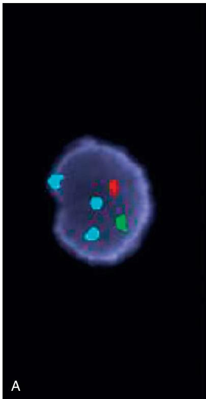 
Fig. 7.38 FISH. (A) Interphase nucleus from a male patient with suspected trisomy 18. Three different fluorescent probes have been used in a "FISH cocktail"; the green probe hybridizes to the X chromosome centromere (one copy), the red probe to the Y chromosome centromere (one copy), and the aqua probe to the chromosome 18 centromere (three copies). (B) A metaphase spread in which two fluorescent probes have been used, one hybridizing to chromosome region 22q13 (green) and the other hybridizing to chromosome region 22q11.2 (red). There are two 22q13 signals. One of the two chromosomes does not stain with the probe for 22q11.2, indicating a microdeletion in this region. This abnormality gives rise to the 22q11.2 deletion syndrome (DiGeorge syndrome). (Courtesy of Dr. Nancy R. Schneider and Jeff Doolittle, Cytogenetics Laboratory, University of Texas Southwestern Medical Center, Dallas, Texas.)
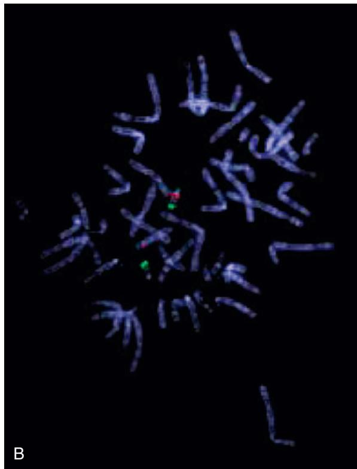
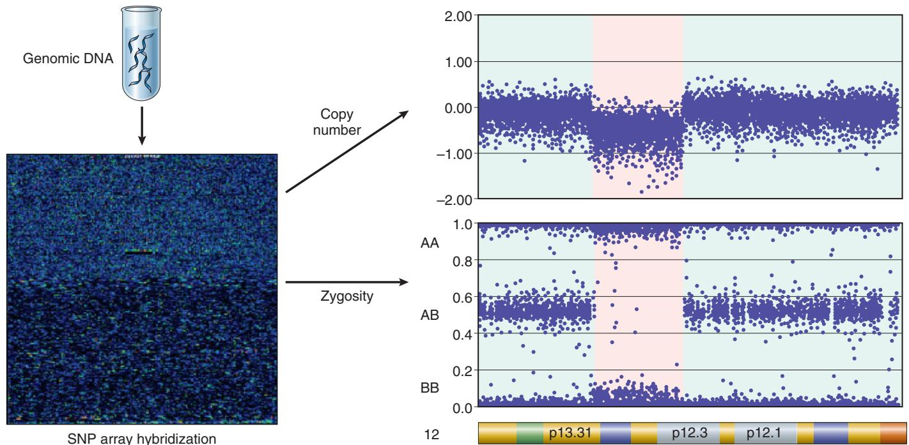 
Fig. 7.39 Analysis of copy number variation via SNP cytogenomic array. Genomic DNA is labeled and hybridized to an array containing potentially millions of probe spots. Copy number is determined by overall intensity and genotype is determined by allelic ratio. The example shown is the p arm of chromosome 12 in a pediatric leukemia. Here, the normal areas (green) show neutral (diploid) DNA content and the zygosity plot shows the expected ratio of AA, AB, and BB SNP genotypes. The anomalous area (red) shows decreased overall intensity, and the zygosity plot shows loss of heterozygosity (the AB genotype); together, these findings indicate the presence of a deletion on one copy of chromosome 12p. (Modified from Paulsson K, et al: Genetic landscape of high hyperdiploid childhood acute lymphoblastic leukemia, PNAS 107[50]:21719-21724, 2010.)
largest containing greater than 4 million SNP probes. As a result, this technology is the mainstay of genomewide association studies (GWASs, described later).
# Direct Detection of DNA Mutations by Polymerase Chain Reaction (PCR) Analysis
PCR analysis, which involves exponential amplification of DNA, is now widely used in molecular diagnosis. If RNA is used as the substrate, it is first reverse-transcribed to obtain cDNA and then amplified by PCR. This method involving reverse transcription (RT) often is abbreviated as RT-PCR. To amplify a DNA segment of interest, two primers that bind to the $3^{\prime}$ and $5^{\prime}$ ends of the normal sequence are designed. By using appropriate DNA polymerases and thermal cycling, the target DNA is greatly amplified, producing millions of copies of the DNA sequence between the two primer sites. The DNA sequence of the PCR product can then be analyzed in several ways:
- Sanger sequencing, named after its inventor, Nobell-laureate Frederick Sanger, has for many years been the "workhorse" of genome sequencing, including the original Human Genome Project. Here, the amplified DNA is mixed with a DNA polymerase, a DNA primer, nucleotides, and four dead-end (di-deoxy terminator) nucleotides (A, T, G, and C) labeled with different fluorescent tags. The ensuing reaction produces a series of DNA molecules of all possible lengths up to a kilobase or so, each labeled with a tag that corresponds to the base at which the reaction stopped because of the incorporation
of one of the terminator nucleotides. After size separation by capillary electrophoresis, the exact sequence can be "read" and compared with the normal sequence to detect the presence of mutations. Many applications of Sanger sequencing (and other PCR-based approaches) are starting to give way to next-generation sequencing (discussed later), particularly when the analysis of large genes or multiple genes is required. Nonetheless, even in 2016, Sanger sequencing remains the "gold standard" for many genotyping assays.
Another approach for identifying mutations at a specific nucleotide position (say, a codon 12 mutation in the KRAS oncogene that converts glycine [GGT] to aspartic acid [GAT]) would be to add fluorescently labeled nucleotides C and T to the PCR mixture, which are complementary to either the wild-type (G) or mutant (A) sequence, respectively. Because these two nucleotides are labeled with different fluorophores, the fluorescence emitted by the resulting PCR product can be of one or another color, depending on whether a C or a T becomes incorporated in the process of primer extension (Fig. 7.40). The advantage of this allele-specific extension strategy is that it is more sensitive than Sanger sequencing, allowing for the identification mutated DNA sequences even if they make up a small fraction ( $\sim 1\%$ ) of the total DNA (as may be the case in clinical specimens obtained from patients suspected of harboring a malignancy). An ultrasensitive variant of this assay, known as droplet digital PCR, literally separates the template DNA (or cDNA) into thousands to millions of microscopic oil "droplets," such that any given
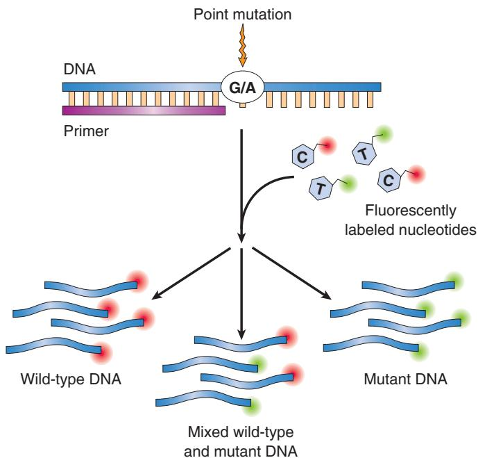 
Fig. 7.40 Allele-specific polymerase chain reaction (PCR) analysis for mutation detection in a heterogeneous sample containing an admixture of normal and mutant DNA. Nucleotides complementary to the mutant and wild-type nucleotides at the queried base position are labeled with different fluorophores such that incorporation into the resulting PCR product yields fluorescent signals of variable intensity in accordance with the ratio of mutant to wild-type DNA present.
droplet contains no more than one strand of template DNA, along with requisite PCR reagents. Each such "minireactor" then generates its own PCR product, which can be digitally integrated and analyzed for the presence of mutant alleles. By assessing each template individually in parallel, rather than in a single PCR reaction, droplet digital PCR has exquisite sensitivity, being able to detect as little as 1 mutant DNA strand in 10,000 or more wild-type molecules.
# Next Generation Sequencing
Increasingly, nearly all of molecular diagnostics applications requiring assessment of DNA (or RNA) are being supplanted by so-called "next-generation sequencing" (NGS) technologies, so named because the Sanger sequencing mentioned earlier is now considered "first generation." The availability of NGS technology has the potential to alter molecular diagnostics radically, by the sheer volume of sequencing data (more than 1 gigabase pairs or 1,000,000,000 base pairs of DNA per day!) at relatively low costs. The entire human genome has a little more than 3 gigabases, so true "whole genome sequencing" can be performed several times in a matter of days. In contrast with Sanger sequencing, NGS technologies use platforms in which sequencing of multiple fragments of the human genome (DNA or cDNA) can occur in parallel ("massively parallel sequencing"), significantly enhancing its speed (Fig. 7.41). Fluorescently labeled nucleotides are incorporated that are complementary to the template DNA strands, which are immobilized on a solid phase, with one nucleotide added per template per cycle. An image is captured at the end of each cycle, and the cycles are repeated until a
"read" of sufficient length is generated to map each read back to the human genome using sophisticated bioinformatics. In addition to differences of time and scale, another key difference between NGS and traditional Sanger sequencing is the ability of the former to detect variant alleles that occur at low frequency in samples that contain a heterogeneous mixture of cells. With Sanger sequencing, the lower limit of detection for variant allele frequency is $20\%$ or more, thus requiring either homogeneous samples (such as germline DNA) or some form of enrichment, such as microdissection of tumor cells from a biopsy that also contains normal tissue. The ability of NGS to "read" the same region of the genome multiple times (from 100- to 1000-fold redundancy) allows detection of allele frequencies as low as $1\%$ , making NGS particularly useful when searching for mutations in tissue biopsies that contain more nonneoplastic stroma than the tumor cells.
Clinical and research applications of NGS (which can be performed on either germline or somatic DNA, or both) include targeted sequencing (typically a panel of a few to several hundred genes); whole exome sequencing (WES), which interrogates all coding regions of the human genome; and whole genome sequencing (WGS), which includes the remaining $99\%$ of the human genome, including regions that express noncoding RNAs. In addition to DNA, NGS can also be used for measuring the transcriptome (RNA-Seq) and genomewide binding sites for transcription factors or histones (chromatin immunoprecipitation and sequencing, or ChIP-Seq).
# Linkage Analysis and Genomewide Association Studies
Direct diagnosis of mutations is possible only if the gene responsible for a genetic disorder is known and its sequence has been identified. In several diseases that have a genetic basis, including some common disorders, direct genetic diagnosis is not possible, either because the causal gene has not been identified or because the disease is multifactorial (polygenic) and no single gene is involved. In such cases, two types of analyses can be performed for unbiased identification of disease-associated gene(s): linkage analysis and GWASs. In both instances, surrogate markers in the genome, also known as marker loci, must be used to localize the chromosomal regions of interest, based on their linkage to one or more putative disease-causing genes. The marker loci used are naturally occurring variations in DNA sequences known as polymorphisms, typically SNPs, as described previously.
Two technologic breakthroughs have enabled the application of SNPs to high-throughput "gene hunting." First is the completion of several large genomic sequencing projects (the HapMap project and the 1000 genome project) that have provided linkage disequilibrium patterns in multiple ethnoracial groups, based on genomewide SNP mapping. The entire human genome can now be divided into blocks known as "haplotypes," which contain varying numbers of contiguous SNPs on the same chromosome that are in linkage disequilibrium and hence inherited together as a cluster. As a result, rather than querying every single SNP in the human genome, comparable information about shared DNA can be obtained simply by
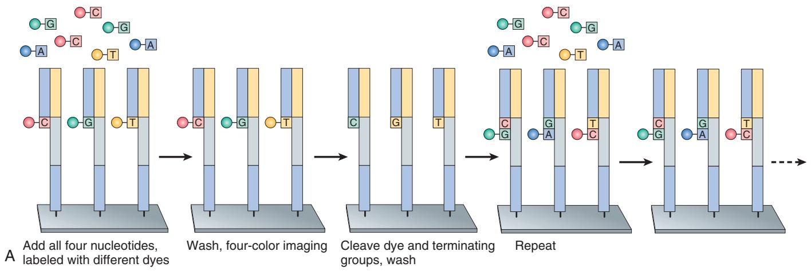
 
Fig. 7.41 Principle of next-generation sequencing. Several alternative approaches currently are available for "NextGen" sequencing, and one of the more commonly used platforms is illustrated. (A) Short fragments of genomic DNA ("template") between 100 and 500 base pairs in length are immobilized on a solid phase platform such as a glass slide, using universal capture primers that are complementary to adapters that have previously been added to ends of the template fragments. The addition of fluorescently labeled complementary nucleotides, one per template DNA per cycle, occurs in a "massively parallel" fashion, at millions of templates immobilized on the solid phase at the same time. A four-color imaging camera captures the fluorescence emanating from each template location (corresponding to the specific incorporated nucleotide), following which the fluorescent dye is cleaved and washed away, and the entire cycle is repeated. (B) Powerful computational programs can decipher the images to generate sequences complementary to the template DNA at the end of one "run," and these sequences are then mapped back to the reference genomic sequence, to identify alterations. (Reproduced with permission from Metzker M: Sequencing technologies—the next generation, Nat Rev Genet 11:31-46, 2010, © Nature Publishing Group.)
looking for shared haplotypes, using single or a small number of SNPs that "tag" or identify a specific haplotype. Second, it is now possible to genotype millions of SNPs simultaneously, in a cost-effective way, using high-density SNP arrays, as described earlier.
# Linkage Analysis
Linkage analysis deals with assessing shared marker loci (i.e., SNPs) in family members exhibiting the disease or trait of interest, with the assumption that SNPs in linkage disequilibrium with the disease allele are transmitted through pedigrees. With time it becomes possible to define a "disease haplotype" based on a panel of SNPs, all of which cosegregate with the putative disease allele. Eventually, linkage analysis facilitates localization and cloning of the disease allele. Linkage analysis is most useful in mendelian disorders that are related to one gene with profound effects and high penetrance.
# Genomewide Association Studies (GWASs)
It is now established that some of the most common human diseases, such as hypertension, diabetes, mental disorders, and asthma, have a polygenic basis, with multiple genetic loci contributing small independent effects, resulting in a disease phenotype. Conventional linkage analyses lack the statistical power to detect such genetic variants. In GWASs, large cohorts of patients with and without a disease (rather than families) are examined across the entire genome for variant SNPs that are overrepresented in persons with the
disease. This identifies regions of the genome that contain a variant gene or genes that confer disease susceptibility. The causal variant within the region is then provisionally identified using a "candidate gene" approach, in which genes are selected based on how tightly they are associated with the disease and whether their biologic function seems likely to be involved in the disease under study. In addition to polygenic diseases, GWASs also have led to the identification of genetic loci that modulate common quantitative traits in humans, such as height, body mass, hair and eye color, and bone density.
We end this chapter to reflect on the current genomic era of medicine. Advances in understanding the molecular basis of human disease are taking place at a breathtaking pace, as are molecular diagnostic techniques. Throughout this book we will illustrate how these changes have impacted on the management of certain diseases in the clinic. By the time this book reaches the reader we hope that many more such examples will become commonplace.
Bianchi DW, Parker RL, Wentworth J, et al: DNA sequencing versus standard prenatal aneuploidy screening, N Engl J Med 370:799-808, 2014. [Seminal study that demonstrated potential superiority of maternal "liquid biopsies" paired with next-generation sequencing for prenatal diagnosis of trisomies in the fetus, when compared to conventional prenatal tests.]
Bresler SC, Weiser DA, Huwe PJ, et al: ALK mutations confer differential oncogenic activation and sensitivity to ALK inhibition therapy in neuroblastoma, Cancer Cell 26(5):682-694, 2014. [An important study demonstrating the potential for targeted therapy in neuroblastomas harboring ALK mutations, using small molecule ALK inhibitors.] 
Cutting GR: Cystic fibrosis genetics: from molecular understanding to clinical application, Nat Rev Genet 16:45-56, 2015. [An outstanding review on cystic fibrosis by one of the doyens in the field, with a particular focus on genetic and environmental modifiers of the disease.] 
Eleveld TF, Oldridge DA, Bernard V, et al: Relapsed neuroblastomas show frequent RAS-MAPK pathway mutations, Nat Genet 47:864-871, 2015. [A landmark study demonstrating a high frequency of alterations in the RAS-MAPK pathway in treated neuroblastomas, providing a new opportunity for targeted therapy in this lethal tumor of childhood.] 
Gudbjartsson DF, Helgason H, Gudjonsson SA, et al: Large-scale whole-genome sequencing of the Icelandic population, Nat Genet 47:435-444, 2015. [A unique study that reiterates the power of modern-day next-generation sequencing, wherein the whole genomes of over 2600 Icelandic natives were sequenced for identification of genetic variants that might influence genetic diversity as well as risk for multifactorial diseases.] 
Hagerman PJ, Hagerman RJ: Fragile X-associated tremor/ataxia syndrome (FTAS), Ann N Y Acad Sci 1338:58-70, 2015. [An authoritative review on FMR1 protein, and the role of premutations at the fragile X loci in causing the symptomatic neurodegenerative condition, FTAS.] 
Jameson JL, Longo DL: Precision medicine—personalized, problematic, and promising, N Engl J Med 372:2229-2234, 2015. [An insightful review on the challenges and opportunities of personalized medicine, also known as precision medicine, in the modern era of genomics and high throughput sequencing.] 
Kalsner L, Chamberlain SJ: Prader-Willi, Angelman, and 15q11-q13 duplication syndromes, Pediatr Clin North Am 62:587-606, 2015. [An up-to-date review on the genetics, clinical findings, and natural history of children with these two imprinting disorders.] 
Page MM, Stefanutti C, Sniderman A, et al: Recent advances in the understanding and care of familial hypercholesterolemia: significance of the biology and therapeutic regulation of proprotein convertase subtilisin/kexin type 9, Clin Sci 129:63-79, 2015. [A]
state-of-the-art review on mechanisms of cholesterol regulation by PCSK9, and how inhibition of this protein is being leveraged in the clinic for augmenting statin effects.] 
Robinson JG, Farnier M, Krempf M, et al: Efficacy and safety of alirocumab in reducing lipids and cardiovascular events, N Engl J Med 372(16):1489-1499, 2015. [Seminal study establishing the benefits of PCSK9 inhibitors in hyperlipidemia.] 
Stoltz DA, Meyerholz DK, Welsh MJ: Origins of cystic fibrosis lung disease, N Engl J Med 372:351-362, 2015. [An exhaustive review on pathophysiological mechanisms that contribute to the panorama of pulmonary diseases in cystic fibrosis, with numerous excellent illustrations.] 
Trachtenberg FL, Haas EA, Kinney HC, et al: Risk factor changes for sudden infant death syndrome after initiation of Back-to-Sleep campaign, Pediatrics 129:630-638, 2012. [An important study that measures the impact of the "Back to Sleep" campaign on SIDS mortality, and what additional risk factors have emerged since then.] 
Wainwright CE, TRAFFIC Study Group, TRANSPORT Study Group: Lumacaftor-Ivacaftor in patients with cystic fibrosis homozygous for Phe508del CFTR, N Engl J Med 373:220-231, 2015. [Seminal study that led to FDA approval of the combination regimen of Lumacaftor and Ivacaftor, which enhance mutant Phe508del CFTR function in cystic fibrosis; Ivacaftor alone is approved for another variant of CFTR.] 
Walz AL, Ooms A, Gadd S, et al: Recurrent DGCR8, DROSHA, and SIX homeodomain mutations in favorable histology Wilms tumors, Cancer Cell 27(2):286-297, 2015. [Seminal sequencing study in Wilms tumors identifying mutations of genes involved in microRNA processing and consequent microRNA deregulation.] 
Wong LC, Behr ER: Sudden unexplained death in infants and children: the role of undiagnosed inherited cardiac conditions, Europace 16:1706-1713, 2014. [An insightful review on how unsuspected cardiac conditions, specifically "channelopathies," leading to sudden death in infancy might be erroneously diagnosed as SIDS.] 
Yang Y, Muzny DM, Xia F, et al: Molecular findings among patients referred for clinical whole exome sequencing, JAMA 312:1870-1879, 2014. [An elegant study highlighting the prowess of next-generation techniques, wherein 2000 consecutive patients with suspected genetic disorders underwent germline whole exome sequencing, leading to the discovery of causal pathogenic mutations in as many as $25\%$ of patients.]
# Environmental and Nutritional Diseases
# 8
Health Effects of Climate Change 299
Toxicity of Chemical and Physical
Agents 301
Environmental Pollution 302
Air Pollution 302
Metals as Environmental Pollutants 304
Industrial and Agricultural
Exposures 306
Effects of Tobacco 307
Effects of Alcohol 310
Injury by Therapeutic Drugs and Drugs of Abuse 312
Injury by Therapeutic Drugs: Adverse Drug Reactions 312
Injury by Nontherapeutic Agents (Drug Abuse) 315
Injury by Physical Agents 317
Mechanical Trauma 317
Thermal Injury 318
Electrical Injury 319
Injury Produced by Ionizing Radiation 320
Nutritional Diseases 323
Malnutrition 324
Severe Acute Malnutrition 324
Anorexia Nervosa and Bulimia 326
Vitamin Deficiencies 326
Obesity 334
Diet and Systemic Diseases 337
Diet and Cancer 338
Many diseases are caused or influenced by environmental factors. Broadly defined, the term "ambient environment encompasses the various outdoor, indoor, and occupational settings in which humans live and work. In each of these settings, the air people breathe, the food and water they consume, and the toxic agents they are exposed to are major determinants of health. Other environmental factors pertain to the individual ("personal environment") and include tobacco use, alcohol ingestion, therapeutic and "recreational" drug consumption, diet, and the like. It is generally believed that factors in the personal environment have a larger effect on human health than that of the ambient environment, but new threats related to global warming (described later) may change this equation.
The term environmental disease refers to disorders caused by exposure to chemical or physical agents in the ambient, workplace, and personal environments, including diseases of nutritional origin. Environmental diseases are surprisingly common. The International Labor Organization has estimated that work-related injuries and illnesses kill more people per year globally than do road accidents and wars combined. Most of these work-related problems are caused by illnesses rather than accidents. The burden of disease in the general population created by nonoccupational exposures to toxic agents is much more difficult to estimate, mostly because of the diversity of agents and the difficulties in measuring the dose and duration of exposures. Whatever the precise numbers, environmental diseases are major causes of disability and suffering and constitute a heavy financial burden, particularly in developing countries.
Environmental diseases are sometimes the consequence of major disasters, such as the methyl mercury contamina
tion of Minamata Bay in Japan in the 1960s, the leakage of methyl isocyanate gas in Bhopal, India, in 1984, the Chernobyl nuclear accident in 1986, the Fukushima nuclear meltdown following the tsunami in 2011, and lead poisoning resulting from contaminated drinking water in the city of Flint in the United States in 2016. Fortunately, these are unusual and infrequent occurrences. Less dramatic, but much more common, are diseases and injury produced by chronic exposure to relatively low levels of contaminants. It should be noted that a host of factors, including complex interactions between pollutants producing multiplicative effects, as well as the age, genetic predisposition, and different tissue sensitivities of exposed persons, create wide variations in individual sensitivity. Disease related to malnutrition is even more pervasive. In 2010, it was estimated that 925 million people were malnourished – one in every seven persons worldwide. Children are disproportionately affected by undernutrition, which accounts for more than $50\%$ of childhood mortality worldwide.
In this chapter, we first consider the emerging problem of the health effects of climate change. We then discuss the mechanisms of toxicity of chemical and physical agents, and address specific environmental disorders, including those of nutritional origin.
# HEALTH EFFECTS OF CLIMATE CHANGE
Global temperature measurements show that the earth has warmed significantly since the early 20th century, and especially since the mid-1960s. Record-breaking global temperatures have become common, with 2005, 2010, 2014,
and 2015 each setting successive high-temperature records. Of note, 15 of the 16 warmest years since 1880 have occurred during the 21st century. During 2015, the global land temperature was $0.9^{\circ}\mathrm{C}$ warmer than the 20th century average. Mean global ocean temperatures also set new records in 2015, with an annual average temperature $0.74^{\circ}\mathrm{C}$ above the 20th century average. As of this writing, 2016 is on track to approach or exceed the records just set in 2015.
The rising atmospheric and ocean temperatures have led to a large number of effects that include changes in storm frequency, drought, and flood, as well as large-scale ice losses in Greenland, Antarctica, and the vast majority of the other glaciated regions on earth, as well as dramatic thinning or disappearance of Arctic ocean sea ice. The melting of land-based glacial ice and the thermal expansion of the warming oceans has produced approximately $80\mathrm{mm}$ of global average sea level rise since 1993, and the sea level currently is rising at a global average rate of $3.5 \pm 0.4\mathrm{mm}/$ year.
Although politicians quibble, among scientists there is a general acceptance that climate change is, at least in part, man-made. The culprit is the rising atmospheric level of greenhouse gases, particularly carbon dioxide $\mathrm{(CO_2)}$ released through the burning of fossil fuels (Fig. 8.1A), as well as ozone (an important air pollutant, discussed later), and methane. These gases, along with water vapor, produce the so-called "greenhouse effect" by absorbing energy radiated from Earth's surface that otherwise would be lost into space. The annual average level of atmospheric $\mathrm{CO}_{2}$ (about $401~\mathrm{ppm}$ ) in 2015 was higher than at any point in approximately 650,000 years and, without changes in human behavior, is expected to increase to 500 to $1200~\mathrm{ppm}$ by the end of this century—levels not experienced for tens of millions of years. This increase stems not only from increased $\mathrm{CO}_{2}$ production but also from deforestation and the attendant decrease in carbon fixation by plants. Depending on the computer model used, increased levels of greenhouse gases are projected to cause the global temperature to rise by $2^{\circ}\mathrm{C}$ to $5^{\circ}\mathrm{C}$ by the year 2100 (Fig. 8.1B). The health consequences of climate change will depend on its extent and rapidity, the severity of the ensuing consequences, and humankind's ability to mitigate the damaging effects. Even in the best-case scenario, however, climate change is expected to have a serious negative impact on human health by increasing the incidence of a number of diseases, including the following:
- Cardiovascular, cerebrovascular, and respiratory diseases, all of which will be exacerbated by heat waves and air pollution. 
- Gastroenteritis, cholera, and other food- and waterborne infectious diseases, caused by contamination as a consequence of floods and disruption of clean water supplies and sewage treatment, after heavy rains and other environmental disasters. 
- Vector-borne infectious diseases, such as malaria and dengue fever, resulting from changes in vector number and geographic distribution related to increased temperatures, crop failures, and more extreme weather variation (e.g., more frequent and severe El Niño events). 
- Malnutrition, caused by changes in local climate that disrupt crop production. Such changes are anticipated to be most severe in tropical locations, in which average
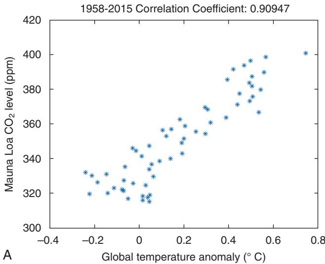
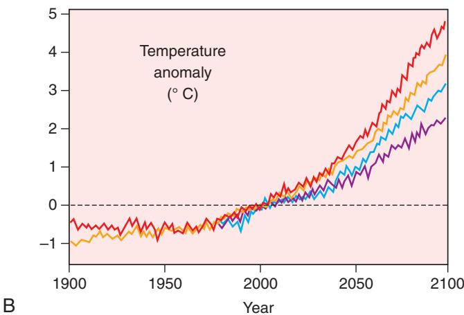 
Fig. 8.1 Climate change, past and future. (A) Correlation of $\mathrm{CO}_{2}$ levels measured at the Mauna Loa Observatory in Hawaii with average global temperature trends since the mid-1960s. "Global temperature" in any given year was deduced at the Hadley Center (United Kingdom) from measurements taken at more than 3000 weather stations located around the globe. (B) Predicted temperature increases during the 21st century. Different computer models plot anticipated rises in global temperatures of $2^{\circ}\mathrm{C}$ to $5^{\circ}\mathrm{C}$ by the year 2100. (A, Courtesy of Dr. Richard Aster, Department of Geosciences, Colorado State University, Fort Collins, Colorado.)
temperatures may already be near or above crop tolerance levels; it is estimated that by 2080, agricultural productivity may decline by $10\%$ to $25\%$ in some developing countries as a consequence of climate change.
Beyond these disease-specific effects, it is estimated that the melting of glacial ice, particularly in Greenland and other parts of the Northern Hemisphere, combined with the thermal expansion of warming oceans, will raise sea levels by 2 to 6 feet by 2100. Approximately $10\%$ of the world's population—roughly 600 million people—live in low-lying areas that are at risk for flooding even if the rise in ocean levels is at the low end of these estimates. For example, a rise in sea level by 1.5 feet will submerge $70\%$ of the land mass of Maldives islands by 2100 and a 3-foot rise will inundate $100\%$ all of the islands by 2085. The resulting displacement of people will disrupt lives and commerce, creating conditions ripe for political
unrest, war, and poverty, the "vectors" of malnutrition, sickness, and death. Worldwide recognition of the catastrophic effects of climate change led in late 2015 to a historic meeting of 196 countries in Paris, France, at which the participating countries agreed to the following objective:
Holding the increase in the global average temperature to well below $2^{\circ}C$ above preindustrial levels and to pursue efforts to limit the temperature increase to $1.5^{\circ}C$ above preindustrial levels, recognizing that this would significantly reduce the risks and impacts of climate change.
# TOXICITY OF CHEMICAL AND PHYSICAL AGENTS
Toxicology is defined as the science of poisons. It studies the distribution, effects, and mechanisms of action of toxic agents. More broadly, it also includes the study of the effects of physical agents such as radiation and heat. Approximately 4 billion pounds of toxic chemicals, including 72 million pounds of known carcinogens, are produced each year in the United States. In general, however, little is known about the potential health effects of chemicals. Of the approximately 100,000 chemicals in use in the United States, less than $1\%$ have been tested experimentally for health effects.
We now consider some basic principles regarding the toxicity of exogenous chemicals and drugs.
- The definition of a poison is not straightforward. It is a quantitative concept strictly dependent on dosage. The quote from Paracelsus in the 16th century that "all substances are poisons; the right dosage differentiates a poison from a remedy" is perhaps even more valid today, in view of the proliferation of therapeutic drugs with potentially harmful effects. 
- Xenobiotics are exogenous chemicals in the environment that may be absorbed by the body through inhalation, ingestion, or skin contact (Fig. 8.2). 
Chemicals may be excreted in urine or feces or eliminated in expired air, or they may accumulate in bone, fat, brain, or other tissues. 
- Chemicals may act at the site of entry, or they may be transported to other sites. Some agents are not modified on entry in the body, but most solvents and drugs are metabolized to form water-soluble products (detoxification) or are activated to form toxic metabolites. 
- Most solvents and drugs are lipophilic, which facilitates their transport in the blood by lipoproteins and penetration through lipid components of cell membranes. 
- The reactions that metabolize xenobiotics into nontoxic products, or activate xenobiotics to generate toxic compounds (Fig. 8.3; see also Fig. 8.2), occur in two phases. In phase I reactions, chemicals can undergo hydrolysis, oxidation, or reduction. Products of phase I reactions often are metabolized into water-soluble compounds through phase II reactions of glucuronidation, sulfation, methylation, and conjugation with glutathione (GSH). Water-soluble compounds are readily excreted.
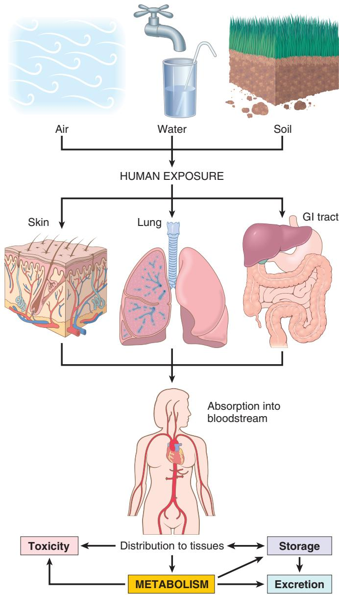 
Fig. 8.2 Human exposure to pollutants. Pollutants contained in air, water, and soil are absorbed through the lungs, gastrointestinal (GI) tract, and skin. In the body, they may act at the site of absorption, but they generally are transported through the bloodstream to various organs, where they are stored or metabolized. Metabolism of xenobiotics may result in the formation of water-soluble compounds, which are excreted, or in activation of the agent, creating a toxic metabolite.
- The most important cellular enzyme system involved in phase I reactions is the cytochrome P-450 system. The P-450 system is present in organs throughout the body, but it is most active in the endoplasmic reticulum (ER) of the liver. The system catalyzes reactions that may either detoxify xenobiotics or convert xenobiotics into active compounds that cause cellular injury. Both types of reactions may produce, as a byproduct, reactive oxygen species (ROS), which can cause cellular damage (discussed in Chapter 2). Examples of metabolic activation of chemicals through the P-450 system are the conversion of carbon tetrachloride to the toxic trichloromethyl free radical, and the generation of a DNA-binding
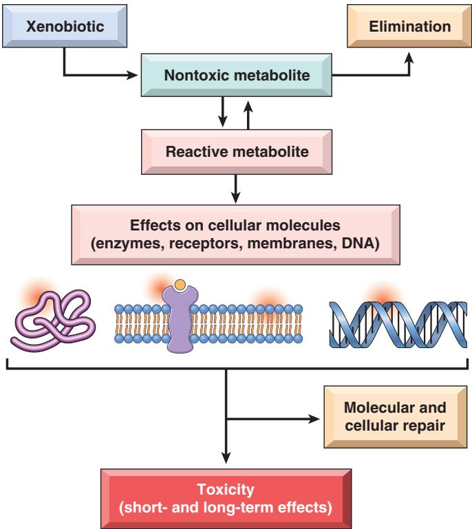 
Fig. 8.3 Xenobiotic metabolism. Xenobiotics can be metabolized to nontoxic metabolites and eliminated from the body (detoxification). However, their metabolism also may result in formation of a reactive metabolite that is toxic to cellular components. If repair is not effective, short- and long-term effects develop. (Modified from Hodgson E: A textbook of modern toxicology, ed 3, Fig. I-1. Hoboken, NJ, 2004, John Wiley & Sons.)
metabolite from benzo[a]pyrene, a carcinogen present in cigarette smoke. The cytochrome P-450 system also participates in the metabolism of a large number of common therapeutic drugs such as acetaminophen, barbiturates, and anti-convulsants, and in alcohol metabolism (discussed later).
- P-450 enzymes vary widely in activity among different people, owing to both polymorphisms in the genes encoding the enzymes and interactions with drugs that are metabolized through the system. The activity of the enzymes also may be decreased by fasting or starvation, and increased by alcohol consumption and smoking.
# ENVIRONMENTAL POLLUTION
# Air Pollution
Air pollution is a significant cause of morbidity and mortality worldwide, particularly among at-risk individuals with preexisting pulmonary or cardiac disease. The life-giving air that we breathe is also often laden with many potential causes of disease. Airborne microorganisms have long been major causes of morbidity and death. More widespread are the chemical and particulate pollutants found in the air, both in so-called "developed" and "under-developed" countries. Specific hazards have been recognized for both outdoor and indoor air.
# Outdoor Air Pollution
The ambient air in industrialized nations is contaminated with an unsavory mixture of gaseous and particulate pollutants, more so in cities and in proximity to heavy industry. In the United States, the Environmental Protection Agency (EPA) monitors and sets allowable upper limits for six pollutants: sulfur dioxide, CO, ozone, nitrogen dioxide, lead, and particulate matter. Together, some of these agents produce the well-known smog that sometimes stifles major cities such as Cairo, Los Angeles, Houston, Mexico City, and São Paulo. It may seem that air pollution is a modern phenomenon. This is not the case; Seneca wrote in AD 61 that he felt an alteration of his disposition as soon as he left the "pestilential vapors, soot, and heavy air of Rome." The first environmental-control law was proclaimed by Edward I in 1306 and was straightforward in its simplicity: "Whoever should be found guilty of burning coal shall suffer the loss of his head." What has changed in modern times is the nature and sources of air pollutants, and the types of regulations that control their emission. It could be argued that modern man has lost his head to drown himself in pollution!
The lungs bear the brunt of the adverse consequences of air pollution, but air pollutants affect many organ systems (as with the effects of lead poisoning and CO, discussed later). More detailed discussion of pollutant-caused lung diseases is found in Chapter 13. Here we consider the major health effects of ozone, sulfur dioxide, particulates, and CO (Table 8.1).
Table 8.1 Health Effects of Outdoor Air Pollutants 
PollutantPopulations at RiskEffect(s)OzoneHealthy adults and childrenDecreased lung function Increased airway reactivity Lung inflammationAthletes, outdoor workersDecreased exercise capacityAsthmaticsIncreased hospitalizationsNitrogen dioxideHealthy adultsIncreased airway reactivityAsthmaticsDecreased lung functionChildrenIncreased respiratory infectionsSulfur dioxideHealthy adultsIncreased respiratory symptomsPatients with chronic lung diseaseIncreased mortalityAsthmaticsIncreased hospitalization Decreased lung functionAcid aerosolsHealthy adultsAltered mucociliary clearanceChildrenIncreased respiratory infectionsAsthmaticsDecreased lung function Increased hospitalizationsParticulatesChildrenIncreased respiratory infectionsPatients with chronic lung or heart diseaseDecreased lung function Excess mortalityAsthmaticsIncreased attacks
Data from Health Effects of Outdoor Air Pollution, Part 2. Committee of the Environmental and Occupational Health Assembly of the American Thoracic Society, Am J Respir Crit Care Med 153:477, 1996.
Ozone is one of the most pervasive air pollutants, with levels in many cities exceeding EPA standards. It is a gas formed by sunlight-driven reactions involving nitrogen oxides, which are released mostly by automobile exhaust. Together with oxides and fine particulate matter, ozone forms the familiar smog (from the words smoke and fog). Its toxicity stems from its participation in chemical reactions that generate free radicals, which injure the lining cells of the respiratory tract and the alveoli. Low levels of ozone may be tolerated by healthy persons but are detrimental to lung function, especially in those with asthma or emphysema, and when present along with particulate pollution. Unfortunately, pollutants rarely occur singly but combine to create a veritable "witches' brew."
Sulfur dioxide, particles, and acid aerosols are emitted by coal- and oil-fired power plants and industrial processes burning these fuels. Of these, particles appear to be the main cause of morbidity and death. Particles less than $10\mu \mathrm{m}$ in diameter are particularly harmful, because when inhaled they are carried by the airstream all the way to the alveoli. Here, they are phagocytosed by macrophages and neutrophils, causing the release of mediators (possibly by activating inflammasomes, Chapter 2) and inciting an inflammatory reaction. By contrast, larger particles are removed in the nose or are trapped by the mucociliary "escalator" and as a result are less dangerous.
Carbon monoxide (CO) is a nonirritating, colorless, tasteless, odorless gas. It is produced by the incomplete oxidation of carbonaceous materials. Its sources include automotive engines, industries using fossil fuels, home oil burners, and cigarette smoke. The low levels often found in ambient air may contribute to impaired respiratory function but usually are not life threatening. However, persons working in confined environments with high exposure to fumes, such as tunnel and underground garage workers, may develop chronic poisoning. CO is included here as an air pollutant, but it also is an important cause of accidental and suicidal death. In a small, closed garage, exhaust from a running car engine can induce a lethal coma within 5 minutes. CO is a systemic asphyxiant that kills by binding to hemoglobin and preventing oxygen transport. Hemoglobin has a 200-fold greater affinity for CO than for $\mathrm{O}_2$ . The carboxyhemoglobin, that is formed by binding of CO is incapable of carrying oxygen. Hypoxia leads to central nervous system (CNS) depression, which develops so insidiously that victims often are unaware of their plight and are unable to help themselves. Systemic hypoxia appears when the hemoglobin is $20\%$ to $30\%$ saturated with CO, and unconsciousness and death are probable with $60\%$ to $70\%$ saturation. The diagnosis of CO poisoning is based on detection of high levels of carboxyhemoglobin in the blood.
Chronic poisoning by CO develops because carboxyhemoglobin, once formed, is remarkably stable. As a result, with low-level persistent exposure to CO, carboxyhemoglobin may accumulate to a life-threatening concentration in the blood. The slowly developing hypoxia can evoke widespread ischemic changes in the
brain, particularly in the basal ganglia and lenticular nuclei. With cessation of exposure to CO, the patient usually recovers, but there may be permanent neurologic damage.
Acute poisoning by CO generally is a consequence of accidental exposure or suicide attempt. In light-skinned people, it is marked by a characteristic generalized cherry-red color of the skin and mucous membranes, a color imparted by carboxyhemoglobin. If death occurs rapidly, morphologic changes may not be present; with longer survival, the brain may be slightly edematous and exhibit punctate hemorrhages and hypoxia-induced neuronal changes. These changes are not specific; they simply imply systemic hypoxia (Chapter 23). In victims who survive CO poisoning, complete recovery is possible; however, impairments of memory, vision, hearing, and speech sometimes remain.
# Indoor Air Pollution
As modern homes are increasingly "buttoned up" to exclude the environment, the potential for pollution of the indoor air increases. The most common pollutant is tobacco smoke (discussed later), but additional offenders are CO, nitrogen dioxide (already mentioned as outdoor pollutants), and asbestos (discussed in Chapter 13). A few comments about some other agents are presented here.
- Smoke from burning of organic materials, containing various oxides of nitrogen and carbon particulates, is an irritant that predisposes exposed persons to lung infections and may contain carcinogenic polycyclic hydrocarbons. It is estimated that one-third of the world, mainly in developing areas, burn carbon-containing material such as wood, dung, or charcoal in their homes for cooking, heating, and light. 
- Radon, a radioactive gas derived from uranium, is widely present in soil and in homes. Although radon exposure can cause lung cancer in uranium miners (particularly in those who smoke), it does not appear that low-level chronic exposures in the home increase lung cancer risk, at least for nonsmokers. 
- Bioaerosols may contain pathogenic microbiologic agents, such as those that can cause Legionnaires' disease, viral pneumonia, and the common cold, as well as allergens derived from pet dander, dust mites, and fungi and molds, which can cause rhinitis, eye irritation, and even asthma.
# ENVIRONMENTAL DISEASES AND ENVIRONMENTAL POLLUTION
- Environmental diseases are conditions caused by exposure to chemical or physical agents in the ambient, workplace, and personal environments. 
- Exogenous chemicals, known as xenobiotics, enter the body through inhalation, ingestion, and skin contact, and can either be eliminated or accumulate in fat, bone, brain, and other tissues. 
- Xenobiotics can be converted into nontoxic products or toxic compounds through a two-phase reaction process that involves the cytochrome P-450 system.
- The most common air pollutants are ozone (which in combination with oxides and particulate matter forms smog), sulfur dioxide, acid aerosols, and particles less than $10\mu \mathrm{m}$ in diameter. 
- CO is an air pollutant and an important cause of death from accidents and suicide; it binds hemoglobin with high affinity, leading to systemic asphyxiation resulting in CNS depression.
# Metals as Environmental Pollutants
Lead, mercury, arsenic, and cadmium, the heavy metals most commonly associated with harmful effects in human populations, are considered here.
# Lead
Lead is a readily absorbed metal that binds to sulfhydryl groups in proteins and interferes with calcium metabolism, leading to hematologic, skeletal, neurologic, GI, and renal toxicities. Lead exposure occurs through contaminated air, food, and water. For most of the 20th century the major sources of lead in the environment were house paints and gasoline. Although the use of lead-based paints and leaded gas has greatly diminished, many sources of lead persist in the environment, such as mines, foundries, batteries, and spray paints, all of which constitute occupational hazards. However, flaking lead paint in older houses and soil contamination pose the major hazards for youngsters. Blood levels of lead in children living in older homes containing lead-based paint or lead-contaminated dust often exceed $5\mu \mathrm{g} / \mathrm{dL}$ , the level at which the Centers for Disease Control and Prevention (CDC) recommends that measures be taken to limit further exposure. A dramatic case of lead contamination of drinking water occurred in the U.S. city of Flint, Michigan, in 2014-2016. The so-called "Flint water crisis" occurred when the source of water supply to the city was changed from Lake Huron to the Flint River. Because water from the Flint River had a higher chloride concentration than the lake waters, it leached lead from century-old lead pipes. This caused an increase in lead levels in tap water above the acceptable limit of 15 parts per billion (ppb) in about $25\%$ of the homes and in some cases as high as 13,200 ppb. As a result 6000 to 12,000 residents developed very high lead levels in their blood. Ingested lead is particularly harmful to children because they absorb more than $50\%$ of lead from food, whereas adults absorb approximately $15\%$ . A more permeable blood-brain barrier in children creates a high susceptibility to brain damage. The clinical features of lead poisoning are shown in Fig. 8.4.
Most absorbed lead (80% to 85%) is taken up into developing teeth and into bone, where it competes with calcium, binds phosphates, and has a half-life of 20 to 30 years. About 5% to 10% of the absorbed lead remains in the blood, and the remainder is distributed throughout soft tissues. Excess lead is toxic to nervous tissues in adults and children; peripheral neuropathies predominate in adults, whereas central effects are more common in children. The effects of chronic lead exposure in children may be subtle, producing mild dysfunction, or they may be massive and lethal. In young children, sensory, motor, intellectual, and psychologic impairments have been described, including reduced IQ, learning disabilities, retarded psychomotor
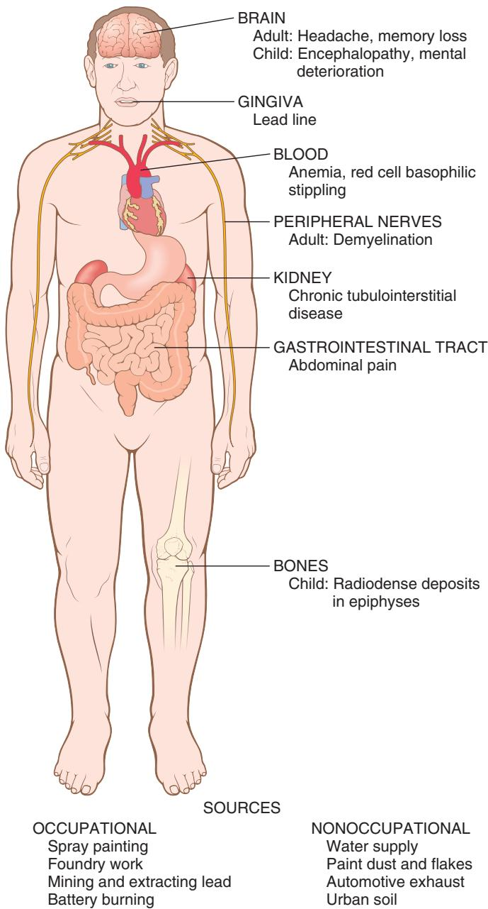 
Fig. 8.4 Pathologic features of lead poisoning.
development, and, in more severe cases, blindness, psychoses, seizures, and coma. Lead-induced peripheral neuropathies in adults generally remit with the elimination of exposure, but both peripheral and CNS abnormalities in children usually are irreversible. Other effects of lead exposure include the following.
Excess lead interferes with the normal remodeling of calcified cartilage and primary bone trabeculae in the epiphyses in children, causing increased bone density detected as radiodense "lead lines" (Fig. 8.5). Lead lines of a different sort also may occur in the gums, where excess lead stimulates hyperpigmentation. Lead inhibits the healing of fractures by increasing chondrogenesis and delaying cartilage mineralization. Excretion of lead occurs by way of the kidneys, and acute exposures may cause damage to proximal tubules.
Lead has a high affinity for sulfhydryl groups and interferes with two enzymes involved in heme synthesis:
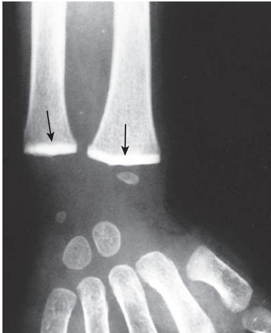 
Fig. 8.5 Lead poisoning. Impaired remodeling of calcified cartilage in the epiphyses (arrows) of the wrist has caused a marked increase in their radiodensity, so that they are as radiopaque as the cortical bone. (Courtesy of Dr. GW Dietz: Department of Radiology, University of Texas Southwestern Medical School, Dallas, Texas.)
aminolevulinic acid dehydratase and delta ferrochelatase. Iron incorporation into heme is impaired, leading to anemia. Lead also inhibits sodium- and potassium-dependent ATPases in cell membranes, an effect that may increase the fragility of red cells, causing hemolysis. The diagnosis of lead poisoning requires constant vigilance. It may be suspected on the basis of neurologic changes in children or unexplained anemia with basophilic stippling in red cells in adults and children. Elevated blood lead and red cell free protoporphyrin levels (greater than $50~\mu \mathrm{g / dL}$ ) or, alternatively, zinc-protoporphyrin levels, are required for definitive diagnosis. In milder cases of lead exposure, anemia may be the only obvious abnormality.
The major anatomic targets of lead toxicity are the blood, bone marrow, nervous system, GI tract, and kidneys (Fig. 8.4).
Blood changes are one of the earliest signs of lead accumulation and are characteristic, consisting of a microcytic, hypochromic anemia associated with a distinctive punctate basophilic stippling of red cells. These changes in the blood stem from the inhibition of heme synthesis in marrow erythroid progenitors. Another consequence of this blockade is that zinc-protoporphyrin is formed instead of heme. Thus, elevated blood levels of zinc-protoporphyrin or its product, free red cell protoporphyrin, are important indicators of lead poisoning.
Brain damage is prone to occur in children. The anatomic changes underlying the more subtle functional deficits are ill defined; at the more severe end of the spectrum, changes include brain edema, demyelination of the cerebral and cerebellar white
matter, and necrosis of cortical neurons accompanied by diffuse astrocytic proliferation. In adults, the CNS is less-often affected, but frequently a peripheral demyelinating neuropathy appears, typically involving motor neurons innervating the most commonly used muscles. Thus, the extensor muscles of the wrist and fingers are often the first to be affected, followed by paralysis of the peroneal muscles (wristdrop and footdrop).
The GI tract also is a site of major clinical manifestations. Lead "colic" is characterized by extremely severe, poorly localized abdominal pain.
The kidneys may develop proximal tubular damage with intranuclear lead inclusions. Chronic renal damage leads eventually to interstitial fibrosis and possibly renal failure and findings suggestive of gout ("saturnine gout"). Other features of lead poisoning are shown in Fig. 8.4.
# Mercury
Mercury, like lead, binds to sulfhydryl groups in certain proteins with high affinity, leading to damage in the CNS and several other organs such as the GI tract and the kidneys. Humans have used mercury in many ways throughout history, including as a pigment in cave paintings, a cosmetic, a remedy for syphilis, and a component of diuretics. Poisoning from inhalation of mercury vapors has long been recognized and is associated with tremor, gingivitis, and bizarre behavior, such as that of the "Mad Hatter" in Lewis Carroll's *Alice in Wonderland* (mercury formerly was used in hat-making).
Today, the main sources of exposure to mercury are contaminated fish and dental amalgams, which release mercury vapors. In some areas of the world, mercury used in gold mining has contaminated rivers and streams. Inorganic mercury from the natural degassing of the earth's crust or from industrial contamination is converted to organic compounds such as methyl mercury by bacteria. Methyl mercury enters the food chain, and in carnivorous fish such as swordfish, shark, and bluefish, mercury levels may be 1 million times higher than in the surrounding water. Almost $90\%$ of the ingested mercury is absorbed in the GI tract. The consumption of contaminated fish from the release of methyl mercury in Minamata Bay and the Agano River in Japan, and the consumption of bread containing grain treated with a methyl mercury-based fungicide in Iraq, caused widespread morbidity and many deaths.
The medical disorders associated with the Minamata episode became known as "Minamata disease" and include cerebral palsy, deafness, blindness, and major CNS defects in children exposed in utero. The developing brain is extremely sensitive to methyl mercury; for this reason, the CDC in the United States has recommended that pregnant women avoid the consumption of fish known to contain mercury.
Ingested mercury can injure the gut and cause ulcerations and bloody diarrhea. In the kidneys, mercury can cause acute tubular necrosis and renal failure.
# Arsenic
Arsenic salts interfere with several aspects of cellular metabolism, leading to toxicities that are most prominent in the GI tract, nervous system, skin, and heart. Arsenic was poison of choice of skilled practitioners in the Borgia
and Medici families in Renaissance Italy. Today, arsenic exposure is an important health problem in many areas of the world. Arsenic is found naturally in soil and water and is used in wood preservatives, herbicides, and other agricultural products. It may be released into the environment by the mining and smelting industries. Arsenic is present in Chinese and Indian herbal medicine, and arsenic trioxide is a frontline treatment for acute promyelocytic leukemia (Chapter 6). Large concentrations of inorganic arsenic are present in ground water in countries such as Bangladesh, Chile, and China. Between 35 and 77 million people in Bangladesh drink water contaminated with arsenic, constituting one of the greatest environmental cancer risks yet uncovered.
If ingested in large quantities, arsenic causes acute toxicity manifesting as severe abdominal pain, diarrhea; cardiac arrhythmias, shock and respiratory distress syndrome; and acute encephalopathy. GI, cardiovascular and CNS toxicity may be severe enough to cause death. These effects may be attributed to the interference with mitochondrial oxidative phosphorylation. Chronic exposure to arsenic causes hyperpigmentation and hyperkeratosis of the skin, which may be followed by the development of basal and squamous cell carcinomas (but not melanomas). A symmetrical sensorimotor polyneuropathy can also develop. Arsenic-induced skin tumors differ from those induced by sunlight by appearing on palms and soles, and by occurring as multiple lesions. Arsenic exposure also is associated with an increased risk of lung carcinoma. The mechanisms of arsenic carcinogenesis in the skin and the lung are uncertain.
# Cadmium
Cadmium is preferentially toxic to the kidneys and the lungs through uncertain mechanisms that may involve increased production of ROS. In contrast with the metals already discussed, cadmium is a relatively modern toxic agent. It is used mainly in nickel-cadmium batteries, which generally are disposed of as household waste. Cadmium can contaminate soil and plants directly or through fertilizers and irrigation water. Food is the most important source of exposure for the general population. Excessive cadmium intake can lead to obstructive lung disease and renal toxicity, initially as tubular damage that may progress to end-stage renal disease. Cadmium exposure can also cause skeletal abnormalities associated with calcium loss. Cadmium-contaminated water used to irrigate rice fields in Japan caused a disease in postmenopausal women known as "itai-itai" (ouch-ouch), a combination of osteoporosis and osteomalacia associated with renal disease. A survey showed that $5\%$ of persons aged 20 years and older in the U.S. population have urinary cadmium levels that, according to research data, may produce subtle kidney injury and increased calcium loss.
# TOXIC EFFECTS OF HEAVY METALS
- Lead, mercury, arsenic, and cadmium are the heavy metals most commonly associated with toxic effects in humans. 
- Children absorb more ingested lead than adults; the main source of exposure for children is lead-containing paint.
- Excess lead causes CNS defects in children and peripheral neuropathy in adults. Excess lead competes with calcium in bones and interferes with the remodeling of cartilage; it also causes anemia. 
- The major source of mercury is contaminated fish. The developing brain is highly sensitive to methyl mercury, which accumulates in the brain and blocks ion channels. 
- Exposure of the fetus to high levels of mercury in utero may lead to Minamata disease, characterized by cerebral palsy, deafness, and blindness. 
- Arsenic is naturally found in soil and water and is a component of some wood preservatives and herbicides. Excess arsenic interferes with mitochondrial oxidative phosphorylation and causes toxic effects in the GI tract, CNS, and cardiovascular system; long-term exposure causes polyneuropathy, skin lesions and carcinomas. 
- Cadmium from nickel-cadmium batteries and chemical fertilizers can contaminate soil. Excess cadmium causes obstructive lung disease and kidney damage.
# Industrial and Agricultural Exposures
More than 10 million occupational injuries occur annually in the United States, and approximately 65,000 people die as a consequence of occupational injuries and illnesses. Industrial exposures to toxic agents are as varied as the industries themselves. They range from merely annoying irritations of respiratory airways by formaldehyde or ammonia fumes, to lung cancers arising from exposure to asbestos, arsenic, or uranium. Human diseases associated with occupational exposures are listed in Table 8.2. In addition to toxic metals (already discussed), other important agents that contribute to environmental diseases include the following:
- Organic solvents are widely used in huge quantities worldwide. Some, such as chloroform and carbon tetrachloride, are found in degreasing and dry cleaning agents and paint removers. Acute exposure to high levels of vapors from these agents can cause dizziness and confusion, leading to CNS depression and even coma. Lower levels may cause liver and kidney toxicity. Occupational exposure of rubber workers to benzene and 1,3-butadiene increases the risk of leukemia. Benzene is oxidized to an epoxide through hepatic CYP2E1, a component of the P-450 enzyme system already mentioned. The epoxide and other metabolites disrupt progenitor cell differentiation in the bone marrow, and may lead to marrow aplasia and acute myeloid leukemia. 
- Polycyclic hydrocarbons are released during the combustion of coal and gas, particularly at the high temperatures used in steel foundries, and also are present in tar and soot. (Pott identified soot as the cause of scrotal cancers in chimney sweeps in 1775, as mentioned in Chapter 6). Polycyclic hydrocarbons are among the most potent carcinogens, and industrial exposures have been implicated in the causation of lung and bladder cancer. 
- Organochlorines (and halogenated organic compounds in general) are synthetic products that resist degradation and are lipophilic. Important organochlorines used
Table 8.2 Human Diseases Associated With Occupational Exposures 
Organ/SystemEffect(s)Toxicant(s)Cardiovascular systemHeart diseaseCO, lead, solvents, cobalt, cadmiumRespiratory systemNasal cancerIsopropyl alcohol, wood dustLung cancerRadon, asbestos, silica, bis(chloromethyl)ether, nickel, arsenic, chromium, mustard gasChronic obstructive lung diseaseGrain dust, coal dust, cadmiumHypersensitivityBeryllium, isocyanatesIrritationAmmonia, sulfur oxides, formaldehydeFibrosisSilica, asbestos, cobaltNervous systemPeripheral neuropathiesSolvents, acrylamide, methyl chloride, mercury, lead, arsenic, DDTAtaxic gaitChlordane, toluene, acrylamide, mercuryCNS depressionAlcohols, ketones, aldehydes, solventsCataractsUltraviolet radiationUrinary systemToxicityMercury, lead, glycol ethers, solventsBladder cancerNaphthylamines, 4-aminobiphenyl, benzidine, rubber productsReproductive systemMale infertilityLead, phthalate plasticizersFemale infertilityCadmium, leadTeratogenesisMercury, polychlorinated biphenylsHematopoietic systemLeukemiaBenzene, radon, uraniumSkinFolliculitis and acneiform dermatosisPolychlorinated biphenyls, dioxins, herbicidesCancerUltraviolet radiationGI tractLiver angiosarcomaVinyl chloride
CNS, Central nervous system; CO, carbon monoxide; DDT, dichlorodiphenyltrichloroethane; GI, gastrointestinal. Data from Leigh JP, Markowitz SB, Fahs M, et al: Occupational injury and illness in the United States: estimates of costs, morbidity, and mortality, Arch Intern Med 157:1557, 1997; Mitchell FL: Hazardous waste. In Rom WN, editor: Environmental and occupational medicine, ed 2, Boston, 1992, Little, Brown, pp 1275; and Levi PE: Classes of toxic chemicals. In Hodgson E, Levi PE, editors: A textbook of modern toxicology, Stamford, CT, 1997, Appleton & Lange, pp 229.
as pesticides are DDT (dichlorodiphenyltrichloroethane) and its metabolites, and agents such as lindane, aldrin, and dieldrin. Nonpesticide organochlorines include polychlorinated biphenyls (PCBs) and dioxin (TCDD [2,3,7,8-tetrachlorodibenzo-p-dioxin]). DDT was banned in the United States in 1973, but more than half of the population have detectable serum levels of $\mathsf{p,p}^{\prime}$ -DDE, a long-lasting DDT metabolite, including those born after the ban on DDT went into effect. PCB and TCDD also are present in the blood of most of the U.S. population. Acute DDT poisoning in humans causes neurologic toxicity. Most organochlorines are endocrine disruptors and have anti-estrogenic or anti-androgenic activity in laboratory animals, but long-term health effects in humans have not been firmly established.
- Nonpesticide organochlorines include polychlorinated biphenyls (PCBs) and dioxin (TCDD [2,3,7,8-tetrachlorodibenzo-p-dioxin]). Dioxins and PCBs can cause skin disorders such as folliculitis and acneiform dermatosis known as chloracne, which consists of acne, cyst formation, hyperpigmentation, and hyperkeratosis, generally around the face and behind the ears. It can be accompanied by abnormalities in the liver and CNS. Because PCBs induce the P-450 enzyme system, workers exposed to these substances may show altered drug metabolism. Environmental disasters in Japan and China in the late 1960s caused by the consumption of rice oil contaminated by PCBs poisoned about 2000 people in each episode. The primary manifestations of the disease (yusho in Japan, yu-cheng in China) were chloracne and hyperpigmentation of the skin and nails.
- Bisphenol A (BPA) is used in the synthesis of polycarbonate food and water containers and of epoxy resins that line almost all food bottles and cans; as a result, exposure to BPA is virtually ubiquitous in humans. BPA has
long been known as a potential endocrine disruptor. Several large retrospective studies have linked elevated urinary BPA levels to heart disease in adult populations. In addition, infants who drink from BPA-containing containers may be particularly susceptible to BPA's endocrine effects. In 2010, Canada was the first country to list BPA as a toxic substance, and the largest makers of baby bottles and "sippy" cups have stopped using BPA in the manufacturing process. The extent of the human health risks associated with BPA remains uncertain, however, and requires further study.
- Vinyl chloride, used in the synthesis of polyvinyl resins, can cause angiosarcoma of the liver, a rare type of liver tumor. 
- Inhalation of mineral dusts causes chronic, nonneoplastic lung diseases called pneumoconioses. This group of disorders includes diseases induced by organic and inorganic particulates as well as chemical fume- and vapor-induced nonneoplastic lung diseases. The most common pneumoconioses are caused by exposures to coal dust (in mining of hard coal), silica (in sandblasting and stone cutting), asbestos (in mining, fabrication, and insulation work), and beryllium (in mining and fabrication). Exposure to these agents nearly always occurs in the workplace. The increased risk of cancer as a result of asbestos exposure, however, extends to family members of asbestos workers and to other persons exposed outside the workplace. Pneumoconioses and their pathogenesis are discussed in Chapter 13.
# EFFECTS OF TOBACCO
Tobacco is the most common exogenous cause of human cancers, being responsible for $90\%$ of lung cancers. The
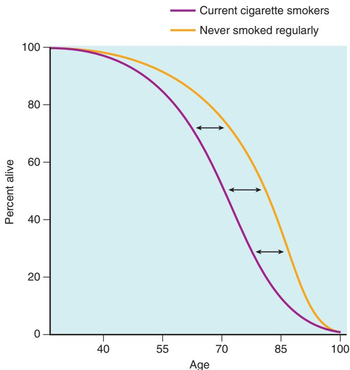 
Fig. 8.6 The effects of smoking on survival. The study compared age-specific death rates for current cigarette smokers with those of individuals who never smoked regularly (British Doctors Study). The difference in survival, measured at age 75 between smokers and nonsmokers is 7.5 years. (Modified from Stewart BW, Kleihues P, editors: World cancer report, Lyon, 2003, IARC Press.)
main culprit is cigarette smoking, but smokeless tobacco in its various forms (snuff, chewing tobacco) also is harmful to health and is an important cause of oral cancer. Not only does the use of tobacco products create personal risk, but also passive tobacco inhalation from the environment ("second-hand smoke") can cause lung cancer in nonsmokers. From 1998 to 2007 in the United States, the incidence of smoking declined modestly, but this trend failed to continue, and approximately $20\%$ of adults remain smokers. In recent years, China has become the world's largest producer and consumer of cigarettes. China has approximately 350 million smokers who in aggregate consume about $33\%$ of all cigarettes smoked worldwide. Cigarette smoking causes, worldwide, more than 4 million deaths annually, mostly from cardiovascular disease, various types of cancers, and chronic respiratory problems. It is expected that there will be 8 million tobacco-related deaths yearly by 2020, the major increase occurring in developing countries. Of people alive today, an estimated 500 million will die from tobacco-related illnesses. In the United States alone, tobacco is responsible for more than 400,000 deaths per year, with one-third of these attributable to lung cancer.
Smoking is the most important cause of preventable human death. It reduces overall survival in a dose-dependent fashion. Whereas $80\%$ of nonsmokers are alive at age 70, only about $50\%$ of smokers survive to this age (Fig. 8.6). Cessation of smoking greatly reduces the risk of death from lung cancer, and it even has an effect, albeit reduced, on people who stop smoking at age 60. Discussed
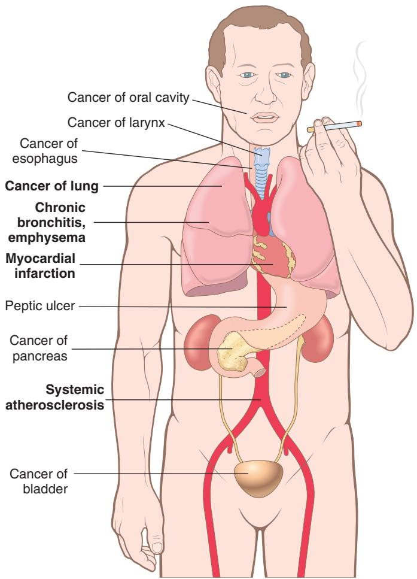 
Fig. 8.7 Adverse effects of smoking. The more common are in boldface.
next are some of the agents contained in tobacco and diseases associated with tobacco consumption. Adverse effects of smoking in various organ systems are shown in Fig. 8.7.
The number of potentially noxious chemicals in tobacco smoke is vast; Table 8.3 presents only a partial list and includes the type of injury produced by these agents. Nicotine, an alkaloid present in tobacco leaves, is not a direct cause of tobacco-related diseases, but it is highly addictive. Nicotine binds to receptors in the brain and, through the
Table 8.3 Effects of Selected Tobacco Smoke Constituents 
SubstanceEffect(s)TarCarcinogenesisPolycyclic aromatic hydrocarbonsCarcinogenesisNicotineGanglionic stimulation and depression, tumor promotionPhenolTumor promotion; mucosal irritationBenzopyreneCarcinogenesisCOImpaired oxygen transport and useFormaldehydeToxicity to cilia; mucosal irritationOxides of nitrogenToxicity to cilia; mucosal irritationNitrosamineCarcinogenesis
Table 8.4 Organ-Specific Carcinogens in Tobacco Smoke 
OrganCarcinogen(s)Lung, larynxPolycyclic aromatic hydrocarbons
4-(Methylnitrosoamino)-1-(3-pyridyl)-1-butanone (NNK)
210PoniumEsophagusN&#x27;-Nitrosonornicotine (NNN)PancreasNNK (?)Bladder4-Aminobiphenyl, 2-naphthylamineOral cavity: smokingPolycyclic aromatic hydrocarbons, NNK, NNNOral cavity: snuffNNK, NNN, 210polonium
Data from Szczesny LB, Holbrook JH: Cigarette smoking. In Rom WH, editor: Environmental and occupational medicine, ed 2, Boston, 1992, Little, Brown, pp 1211.
release of catecholamines, is responsible for the acute effects of smoking, such as increased heart rate and blood pressure, and increased cardiac contractility and output.
The most common diseases caused by cigarette smoking involve the lung and include emphysema, chronic bronchitis, and lung cancer, all discussed in Chapter 13. The mechanisms responsible for some tobacco-induced diseases include the following:
- Direct irritant effect on the tracheobronchial mucosa, producing inflammation and increased mucus production (bronchitis). Cigarette smoke also causes the recruitment of leukocytes to the lung, increasing local elastase production and subsequent injury to lung tissue that leads to emphysema. 
- Carcinogenesis. Components of cigarette smoke, particularly polycyclic hydrocarbons and nitrosamines (Table 8.4), are potent carcinogens in animals and probably are involved in the causation of lung carcinomas in humans (see Chapter 13). The risk of developing lung cancer is related to the intensity of exposure, frequently expressed in terms of "pack years" (e.g., one pack daily for 20 years equals 20 pack years) or in cigarettes smoked per day (Fig. 8.8). In addition to lung cancers, tobacco smoke
.jpg) 
Fig. 8.8 The risk of lung cancer is determined by the number of cigarettes smoked. (Data from Stewart BW, Kleihues P, editors: World cancer report, Lyon, 2003, IARC Press.)
contributes to the development of cancers of the oral cavity, esophagus, pancreas, and bladder. Table 8.4 lists organ-specific carcinogens contained in tobacco smoke. Moreover, smoking multiplies the risk of disease associated with other carcinogens; well-recognized examples are the 10-fold increased incidence of lung carcinomas in asbestos workers and uranium miners who smoke than in those who do not. The combination of tobacco (chewed or smoked) and alcohol consumption has multiplicative effects on the risks of oral, laryngeal, and esophageal cancers. An example of the carcinogenic interaction of these all-too-common vices is shown for laryngeal cancer (Fig. 8.9).
- Atherosclerosis and its major complication, myocardial infarction, are strongly linked to cigarette smoking. The causal mechanisms probably relate to several factors, including increased platelet aggregation, decreased myocardial oxygen supply (because of lung disease coupled with hypoxia related to CO in cigarette smoke) accompanied by increased oxygen demand, and a decreased threshold for ventricular fibrillation. Almost one-third of all heart attacks are associated with cigarette smoking. Smoking has a multiplicative effect on risk when combined with hypertension and hypercholesterolemia. 
- Maternal smoking increases the risk of spontaneous abortions and preterm births and results in intrauterine growth retardation (Chapter 7); however, birth weights of infants born to mothers who stopped smoking before pregnancy are normal.
.jpg) 
Fig. 8.9 Multiplicative increase in the risk of laryngeal cancer from the interaction between cigarette smoking and alcohol consumption. (Data from Stewart BW, Kleihues P, editors: World cancer report, Lyon, 2003, IARC Press.)
- Passive smoke inhalation is also associated with detrimental effects. It is estimated that the relative risk of lung cancer in nonsmokers exposed to environmental smoke is about 1.3 times that in nonsmokers who are not exposed to smoke. In the United States, approximately 3000 lung cancer deaths in nonsmokers older than 35 years can be attributed each year to environmental tobacco smoke. Even more striking is the increased risk of coronary atherosclerosis and fatal myocardial infarction. Studies report that 30,000 to 60,000 cardiac deaths annually in the United States are associated with passive exposure to smoke. Children living in a household with an adult who smokes have an increased frequency of respiratory illnesses and asthma. Passive smoke inhalation in nonsmokers can be estimated by measuring the blood levels of cotinine, a metabolite of nicotine. In the United States, median cotinine levels in nonsmokers have decreased by more than $60\%$ since around 2000 because of the adoption of nonsmoking policies in public places. However, passive exposure to tobacco smoke in the home remains a major public health concern, particularly for children. It is clear that the transient pleasure a puff may provide comes with a heavy long-term price.
# HEALTH EFFECTS OF TOBACCO
Smoking is the most preventable cause of human death. 
- Tobacco smoke contains more than 2000 compounds. Among these are nicotine, which is responsible for tobacco addiction, and strong carcinogens—mainly, polycyclic aromatic hydrocarbons, nitrosamines, and aromatic amines. 
- Approximately $90\%$ of lung cancers occur in smokers. Smoking is also associated with an increased risk of cancers of the oral cavity, larynx, esophagus, stomach, bladder, and kidney, as well as some forms of leukemia. Cessation of smoking reduces the risk of lung cancer. 
- Smokeless tobacco use is an important cause of oral cancers. Tobacco interacts with alcohol in multiplying the risk of oral, laryngeal, and esophageal cancer and increases the risk of lung cancers from occupational exposures to asbestos, uranium, and other agents. 
- Tobacco consumption is an important risk factor for development of atherosclerosis and myocardial infarction, peripheral vascular disease, and cerebrovascular disease. In the lungs, in addition to cancer, it predisposes to emphysema, chronic bronchitis, and chronic obstructive disease. 
- Maternal smoking increases the risk of abortion, premature birth, and intrauterine growth retardation.
# EFFECTS OF ALCOHOL
Ethanol is consumed, at least partly, for its mood-altering properties, but when used in moderation its effects are socially acceptable and not injurious. When excessive amounts are used, alcohol can cause marked physical and psychologic damage. Here we describe the lesions that are directly associated with the abuse of alcohol.
Despite all the attention given to illegal drugs, alcohol abuse is a more widespread hazard and claims many more lives. Fifty percent of adults in the Western world drink alcohol, and approximately $5\%$ to $10\%$ have chronic alcoholism. It is estimated that there are more than 10 million chronic alcoholics in the United States and that alcohol consumption is responsible for more than 100,000 deaths annually. Almost $50\%$ of these deaths result from accidents caused by drunken driving and alcohol-related homicides and suicides, and about $15\%$ are a consequence of cirrhosis of the liver.
After consumption, ethanol is absorbed unaltered in the stomach and small intestine and then distributes to all of the tissues and fluids of the body in direct proportion to the blood level. Less than $10\%$ is excreted unchanged in the urine, sweat, and breath. The amount exhaled is proportional to the blood level and forms the basis for the breath test used by law enforcement agencies. A concentration of $80~\mathrm{mg / dL}$ in the blood constitutes the legal definition of drunk driving in most states. For an average individual, this alcohol concentration may be reached after consumption of three standard drinks, about three (12 ounce) bottles of beer, 15 ounces of wine, or 4 to 5 ounces of 80-proof distilled spirits. Drowsiness occurs at $200~\mathrm{mg / dL}$ , stupor at $300~\mathrm{mg / dL}$ , and coma, with possible respiratory arrest, at higher levels. The rate of metabolism affects the blood alcohol level. Chronic alcoholics develop tolerance to alcohol. They metabolize alcohol at a higher rate than normal and hence show lower peak levels of alcohol than average for the same about of alcohol consumed. Most of the alcohol in the blood is metabolized to acetaldehyde in the liver by three enzyme systems: alcohol dehydrogenase; cytochrome P-450 isoenzymes; and catalase (Fig. 8.10). Of these, the main enzyme involved in alcohol metabolism is alcohol dehydrogenase, located in the cytosol of hepatocytes. At high blood alcohol levels, however, the microsomal ethanoloxidizing system also plays an important role. This system involves cytochrome P-450 enzymes, particularly the CYP2E1 isoform, located in the smooth ER. Induction of P-450 enzymes by alcohol explains the increased susceptibility of alcoholics to other compounds metabolized by the same enzyme system, which include drugs (acetaminophen, cocaine), anesthetics, carcinogens, and industrial solvents. Of note, however, when alcohol is present in the blood at high concentrations, it competes with other CYP2E1 substrates and may delay the catabolism of other drugs, thereby potentiating their effects. Catalase is of minor importance, being responsible for only about $5\%$ of alcohol metabolism. Acetaldehyde produced by these systems is in turn converted by acetaldehyde dehydrogenase to acetate, which is used in the mitochondrial respiratory chain.
Several toxic effects result from ethanol metabolism. Listed here are only the most important of these:
- Alcohol oxidation by alcohol dehydrogenase causes a decrease in nicotinamide adenine dinucleotide $(\mathrm{NAD}^{+})$ and an increase in NADH (the reduced form of $\mathrm{NAD}^{+}$ ). $\mathrm{NAD}^{+}$ is required for fatty acid oxidation in the liver. Its deficiency is a main cause of fat accumulation in the liver of alcoholics. The increase in the $\mathrm{NADH} / \mathrm{NAD}^{+}$ ratio in alcoholics also causes lactic acidosis.
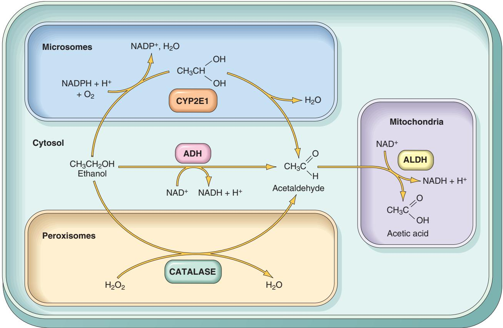 
Fig. 8.10 Metabolism of ethanol: oxidation of ethanol to acetaldehyde by three different routes, and the generation of acetic acid. Note that oxidation by alcohol dehydrogenase (ADH) takes place in the cytosol; the cytochrome P-450 system and its CYP2E1 isoform are located in the ER (microsomes), and catalase is located in peroxisomes. Oxidation of acetaldehyde by aldehyde dehydrogenase (ALDH) occurs in mitochondria. (Data from Parkinson A: Biotransformation of xenobiotics. In Klassen CD, editor: Casarett and Doull's toxicology: The basic science of poisons, ed 6, New York, 2001, McGraw-Hill, pp 133.)
- Acetaldehyde toxicity may be responsible for some of the acute effects of alcohol. Acetaldehyde metabolism differs between populations because of genetic variation. Most notably, about $50\%$ of Asians express a defective form of acetaldehyde dehydrogenase. After ingesting alcohol, such persons experience flushing, tachycardia, and hyperventilation owing to the accumulation of acetaldehyde. 
- ROS generation. Metabolism of ethanol in the liver by CYP2E1 produces ROS and causes lipid peroxidation of cell membranes. Nevertheless, the precise mechanisms that account for alcohol-induced cellular injury have not been well defined. 
- Endotoxin release. Alcohol may cause the release of endotoxin (lipopolysaccharide), a product of gram-negative bacteria, from the intestinal flora. Endotoxin stimulates the release of tumor necrosis factor (TNF) and other cytokines from circulating macrophages and from Kupffer cells in the liver, causing cell injury.
Acute alcoholism exerts its effects mainly on the CNS but also may induce reversible hepatic and gastric injuries. Even with moderate intake of alcohol, multiple fat droplets accumulate in the cytoplasm of hepatocytes (fatty change or hepatic steatosis). Gastric damage occurs in the form of acute gastritis and ulceration. In the CNS, alcohol is a depressant, first affecting subcortical structures that
modulate cerebral cortical activity. Consequently there is stimulation and disordered cortical, motor, and intellectual behavior. At progressively higher blood levels, cortical neurons and then lower medullary centers are depressed, including those that regulate respiration. Respiratory arrest may follow.
Chronic alcoholism affects not only the liver and stomach but virtually all other organs and tissues as well. Chronic alcoholics suffer significant morbidity and have a shortened life span, related principally to damage to the liver, GI tract, CNS, cardiovascular system, and pancreas.
- The liver is the main site of chronic injury. In addition to fatty change, mentioned earlier, chronic alcoholism causes alcoholic hepatitis and cirrhosis (described in Chapter 16). Cirrhosis is associated with portal hypertension and an increased risk of hepatocellular carcinoma. 
- In the GI tract, chronic alcoholism can cause massive bleeding from gastritis, gastric ulcer, or esophageal varices (associated with cirrhosis), which may prove fatal. 
- Neurologic effects. Thiamine deficiency is common in chronic alcoholics; the principal lesions resulting from this deficiency are peripheral neuropathies and the Wernicke-Korsakoff syndrome (see Table 8.9 and Chapter 23). Cerebral atrophy, cerebellar degeneration, and optic neuropathy may also occur.
- Cardiovascular effects. Alcohol has diverse effects on the cardiovascular system. Injury to the myocardium may produce dilated congestive cardiomyopathy (alcoholic cardiomyopathy), discussed in Chapter 11. Moderate amounts of alcohol (one drink per day) have been reported to increase serum levels of high-density lipoproteins (HDLs) and inhibit platelet aggregation, thus protecting against coronary artery disease. However, heavy consumption, with attendant liver injury, results in decreased levels of HDL, increasing the likelihood of heart disease. Chronic alcoholism also is associated with an increased incidence of hypertension. 
- Pancreatitis. Excess alcohol intake increases the risk of acute and chronic pancreatitis (Chapter 16). 
- Effects on fetus. The use of ethanol during pregnancy – reportedly even in low amounts – can cause fetal alcohol syndrome. It consists of microcephaly, growth retardation and facial abnormalities in the newborn, and a reduction of mental functions in older children. It is difficult to establish the amount of alcohol consumption that can cause fetal alcohol syndrome, but consumption during the first trimester of pregnancy is particularly harmful. 
- Carcinogenesis. Chronic alcohol consumption is associated with an increased incidence of cancers of the oral cavity, esophagus, liver, and, possibly, breast in females. The mechanisms of the carcinogenic effect are uncertain. 
- Malnutrition. Ethanol is a substantial source of energy, but is often consumed at the expense of food (empty calories). Chronic alcoholism is thus associated with malnutrition and deficiencies, particularly of the B vitamins.
# ALCOHOL-METABOLISM AND HEALTH EFFECTS
- Acute alcohol abuse causes drowsiness at blood levels of approximately $200\mathrm{mg/dL}$ . Stupor and coma develop at higher levels. 
- Alcohol is oxidized to acetaldehyde in the liver primarily by alcohol dehydrogenase, and to a lesser extent by the cytochrome P-450 system, and by catalase. Acetaldehyde is converted to acetate in mitochondria and is used in the respiratory chain. 
- Alcohol oxidation by alcohol dehydrogenase depletes NAD, leading to accumulation of fat in the liver and to metabolic acidosis. 
- The main effects of chronic alcoholism are fatty liver, alcoholic hepatitis, and cirrhosis, which leads to portal hypertension and increases the risk for development of hepatocellular carcinoma. 
- Chronic alcoholism can cause bleeding from gastritis and gastric ulcers, peripheral neuropathy associated with thiamine deficiency, and alcoholic cardiomyopathy, and it increases the risk for development of acute and chronic pancreatitis. 
- Chronic alcoholism is a major risk factor for cancers of the oral cavity, larynx, and esophagus. The risk is greatly increased by concurrent smoking or the use of smokeless tobacco.
# INJURY BY THERAPEUTIC DRUGS AND DRUGS OF ABUSE
# Injury by Therapeutic Drugs: Adverse Drug Reactions
Adverse drug reactions (ADRs) are untoward effects of drugs that are administered in conventional therapeutic settings. These reactions are extremely common in the practice of medicine and are believed to affect $7\%$ to $8\%$ of patients admitted to a hospital. About $10\%$ of such reactions prove fatal. Table 8.5 lists common pathologic findings in ADRs and the drugs most frequently involved. As can be seen, many of the drugs involved in ADRs, such as the anti-neoplastic agents, are highly potent, and the ADR is a calculated risk for the dosage assumed to achieve the maximum therapeutic effect. Commonly used drugs such as long-acting tetracyclines, which are used to treat diverse conditions, including acne, may produce localized or systemic reactions (Fig. 8.11). Because they are widely used, estrogens and oral contraceptives (OCs) are discussed next in more detail. In addition, acetaminophen and aspirin, which are nonprescription drugs but are important
areuntowardeffectsofdrug.jpg)
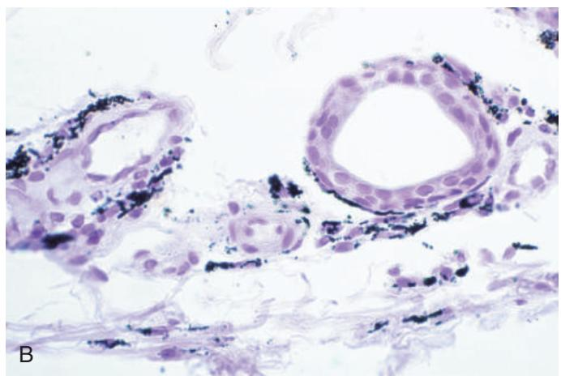 
Fig. 8.11 Adverse reaction to minocycline, a long-acting tetracycline derivative. (A) Diffuse blue-gray pigmentation of the forearm, secondary to minocycline administration. (B) Deposition of drug metabolite/iron/melanin pigment particles in the dermis. (A and B, Courtesy of Dr. Zsolt Argenyi, Department of Pathology, University of Washington, Seattle, Washington.)
Table 8.5 Some Common Adverse Drug Reactions and Their Agents 
ReactionMajor OffendersBlood Dyscrasias*Granulocytopenia, aplastic anemia, pancytopeniaAnti-neoplastic agents, immunosuppressives, and chloramphenicolHemolytic anemia, thrombocytopeniaPenicillin, methyldopa, quinidineCutaneousUrticaria, macules, papules, vesicles, petechiae, exfoliative dermatitis, fixed drug eruptions, abnormal pigmentationAnti-neoplastic agents, sulfonamides, hydantoin, some antibiotics, and many other agentsCardiacArrhythmiasTheophylline, hydantoinCardiomyopathyDoxorubicin, daunorubicinRenalGlomerulonephritisPenicillamineAcute tubular necrosisAminoglycoside antibiotics, cyclosporine, amphotericin BTubulointerstitial disease with papillary necrosisPhenacetin, salicylatesPulmonaryAsthmaSalicylatesAcute pneumonitisNitrofurantoinInterstitial fibrosisBusulfan, nitrofurantoin, bleomycinHepaticFatty changeTetracyclineDiffuse hepatocellular damageHalothane, isoniazid, acetaminophenCholestasisChlorpromazine, estrogens, contraceptive agentsSystemicAnaphylaxisPenicillinLupus erythematosus syndrome (drug-induced lupus)Hydralazine, procainamideCNSTinnitus and dizzinessSalicylatesAcute dystonic reactions and parkinsonian syndromePhenothiazine anti-psychoticsRespiratory depressionSedatives
*Feature in almost half of all drug-related deaths.
causes of accidental or intentional overdose, merit special comment.
# Exogenous Estrogens and Oral Contraceptives
Menopausal Hormone Therapy (MHT)
The most common type of MHT (previously referred to as hormone replacement therapy, or HRT) consists of the administration of estrogens together with a progestogen. Because of the risk of uterine cancer, estrogen therapy alone is used only in hysterectomized women. Initially used to counteract "hot flashes" and other symptoms of menopause, early clinical studies suggested that MHT use in postmenopausal women could prevent or slow the progression of osteoporosis (Chapter 21) and reduce the likelihood of myocardial infarction. However, subsequent randomized clinical trials have produced decidedly mixed results. According to these, although MHT did reduce the number of fractures in women on treatment, it was also reported that after 5 years of treatment, combination MHT increased the risk of breast cancer (Chapter 19), stroke, and venous thromboembolism and had no effect on the incidence of coronary heart disease. But during the past few
years there has been a reappraisal of the risks and benefits of MHT. These newer analyses showed that MHT effects depend on the type of hormone therapy regimen used (combination estrogen-progestin versus estrogen alone), the age and risk factor status of the woman at the start of treatment, the duration of the treatment, and possibly the hormone dose, formulation, and route of administration.
The current risk: benefit consensus can be summarized as follows:
- Combination estrogen-progestin increases the risk of breast cancer after a median time of 5 to 6 years. In contrast, estrogen alone in women with hysterectomy is associated with a borderline reduction in the risk of breast cancer. 
- MHT may have a protective effect on the development of atherosclerosis and coronary disease in women younger than 60 years of age, but there is no protection in women who started MHT at an older age. These data support the notion that there may be a critical therapeutic window for MHT effects on the cardiovascular system. Protective effects in younger women depend in part on the response of estrogen receptors in healthy vascular endothelium. However, MHT should not be used for the
prevention of cardiovascular disease or other chronic diseases.
- MHT increases the risk of stroke and venous thromboembolism (VTE), including deep vein thrombosis and pulmonary embolism. The increase in VTE is more pronounced during the first 2 years of treatment and in women who have other risk factors, such as immobilization and hypercoagulable states caused by prothrombin or factor V Leiden mutations (Chapter 4). Whether risks of VTE and stroke are lower with transdermal than oral routes of estrogen administration warrants further study.
As can be appreciated from these associations, assessment of risks and benefits when considering the use of MHT in women is complex. The current feeling is that these agents have a role in the management of menopausal symptoms in early menopause but should not be used long term for chronic disease prevention.
# Oral Contraceptives
Although OCs have been used for several decades, disagreement continues about their safety and adverse effects. They nearly always contain a synthetic estradiol and a variable amount of a progestin ("combination OCs"), but a few preparations contain only progestins. Currently prescribed OCs contain a smaller amount of estrogens (less than $50~\mu \mathrm{g / day}$ ) and clearly have fewer side effects than those reported for earlier formulations. Hence, the results of epidemiologic studies must be interpreted in the context of the dosage. Nevertheless, there is reasonable evidence to support the following conclusions:
- Breast carcinoma: The prevailing opinion is that OCs do not cause an increase in breast cancer risk. 
- Endometrial cancer and ovarian cancers: OCs have a protective effect against these tumors. 
- Cervical cancer: OCs may increase the risk of cervical carcinomas in women infected with human papillomavirus. 
- Thromboembolism: Most studies indicate that OCs, including the newer low-dose (less than $50~\mu \mathrm{g}$ of estrogen) preparations, are associated with a threefold to sixfold increased risk of venous thrombosis and pulmonary thromboembolism resulting from increased hepatic synthesis of coagulation factors. This risk may be even higher with newer "third-generation" OCs that contain synthetic progestins, particularly in women who are carriers of the factor V Leiden mutation. To put this complication into context, however, the risk of thromboembolism associated with OC use is two to six times lower than the risk of thromboembolism associated with pregnancy. 
- Cardiovascular disease: There is considerable uncertainty about the risk of atherosclerosis and myocardial infarction in users of OCs. It seems that OCs do not increase the risk of coronary artery disease in women younger than 30 years or in older women who are nonsmokers, but the risk approximately doubles in women older than 35 years who smoke. 
- Hepatic adenoma: There is a well-defined association between the use of OCs and this rare benign hepatic tumor, especially in older women who have used OCs for prolonged periods (Chapter 14).
Obviously, the pros and cons of OCs must be viewed in the context of their wide applicability and acceptance as a form of contraception that protects against unwanted pregnancies.
# Acetaminophen
At therapeutic doses, acetaminophen, a widely used nonprescription analgesic and anti-pyretic, is mostly conjugated in the liver with glucuronide or sulfate. About $5\%$ or less is metabolized to NAPQI ( $N$ -acetyl- $p$ -benzoquinoneimine) through the hepatic P-450 system. With very large doses, however, NAPQI accumulates, leading to centriloblar hepatic necrosis. The mechanisms of injury produced by NAPQI include (1) covalent binding to hepatic proteins and (2) depletion of reduced GSH. The depletion of GSH makes the hepatocytes more susceptible to cell death caused by ROS. The window between the usual therapeutic dose $(0.5\mathrm{g})$ and the toxic dose $(15$ to $25\mathrm{g})$ is large, and the drug ordinarily is very safe. Nevertheless, accidental overdoses occur in children, and suicide attempts using acetaminophen are not uncommon, particularly in the United Kingdom. In the United States, acetaminophen toxicity is causes about $50\%$ of acute liver failure. Toxicity begins with nausea, vomiting, diarrhea, and sometimes shock, followed in a few days by the appearance of jaundice. Overdoses of acetaminophen can be treated in early stages by the administration of $N$ -acetylcysteine, which restores GSH. With serious overdoses, liver failure ensues, and centrilobular necrosis may extend to involve entire lobules; such patients often require liver transplantation. Some patients also show evidence of concurrent renal damage.
# Aspirin (Acetylsalicylic Acid)
Aspirin overdose may result from accidental ingestion in young children or suicide attempts in adults. The major untoward consequences are metabolic, with few morphologic changes. At first, respiratory alkalosis develops, followed by a metabolic acidosis that often proves fatal. Fatal doses may be as little as 2 to $4\mathrm{g}$ in children and 10 to $30\mathrm{g}$ in adults, but survival has been reported after doses five times larger.
Chronic aspirin toxicity (salicylism) may develop in persons who take $3\mathrm{gm}$ or more daily (the dose used to treat chronic inflammatory conditions). Chronic salicylism is manifested by headache, dizziness, ringing in the ears (tinnitus), difficulty in hearing, mental confusion, drowsiness, nausea, vomiting, and diarrhea. The CNS changes may progress to convulsions and coma. The morphologic consequences of chronic salicylism are varied. Most often, there is an acute erosive gastritis (Chapter 15), which may produce overt or covert GI bleeding and lead to gastric ulceration. A bleeding tendency may appear concurrently with chronic toxicity because aspirin irreversibly inhibits platelet cyclooxygenase and blocks the ability to make thromboxane $\mathrm{A}_2$ an activator of platelet aggregation (Chapter 4). Petechial hemorrhages may appear in the skin and internal viscera, and bleeding from gastric ulcerations may be exaggerated.
Proprietary analgesic mixtures of aspirin and phenacetin or its active metabolite, acetaminophen, when taken throughout several years, can cause tubulointerstitial
Table 8.6 Common Drugs of Abuse 
ClassMolecular TargetExamplesOpioid narcoticsMu opioid receptor (agonist)Heroin, hydromorphone (Dilaudid) 
Oxycodone 
Methadone (Dolophine)Sedative-hypnoticsGABA receptor (agonist)Barbiturates 
Ethanol 
Methaqualone (“Quaalude”) 
Glutethimide (Doriden) 
Ethchlorvynol (Placidyl)Psychomotor stimulantsDopamine transporter (antagonist) 
Serotonin receptors (toxicity)Cocaine 
Amphetamine 
3,4-methylenedioxymethamphetamine (MDMA) (i.e., “ecstasy”)Phencyclidine-like drugsNMDA glutamate receptor channel (antagonist)Phencyclidine (PCP) (i.e., “angel dust”) 
KetamineCannabinoidsCB1 cannabinoid receptors (agonist)Marijuana 
HashishNicotineNicotine acetylcholine receptor (agonist)Tobacco productsHallucinogensSerotonin 5-HT2 receptors (agonist)Lysergic acid diethylamide (LSD) 
Mescaline 
Psilocybin
CBI, Cannabinoid receptor type I; GABA, $\gamma$ -aminobutyric acid; 5-HT2, 5-hydroxytryptamine; NMDA, N-methyl-D-aspartate; PCP, I-(1-phenylcyclohexyl)piperidine. Data from Hyman SE: A 28-year-old man addicted to cocaine, JAMA 286:2586, 2001.
nephritis with renal papillary necrosis. This clinical entity is referred to as analgesic nephropathy (Chapter 14).
# Injury by Nontherapeutic Agents (Drug Abuse)
Drug abuse generally involves the use of mind-altering substances beyond therapeutic or social norms. Drug addiction and overdose are serious public health problems. Common drugs of abuse are listed in Table 8.6. Considered here are cocaine, opiates, and marijuana, with a brief mention of a few other drugs.
# Cocaine
In 2014, it was estimated that there were 1.5 million users of cocaine in the United States, of which approximately $15\%$ to $20\%$ were users of "crack" cocaine. Use is highest among adults 18 to 25 years of age, of whom $1.4\%$ reported taking cocaine within the past month. Extracted from the leaves of the coca plant, cocaine usually is prepared as a water-soluble powder, cocaine hydrochloride, but when sold on the street it is liberally diluted with talcum powder, lactose, or other look-alikes. Crystallization of the pure alkaloid from cocaine hydrochloride yields nuggets of crack (so called because of the popping sound it makes when heated). The pharmacologic actions of cocaine and crack are identical, but crack is far more potent. Both forms can be snorted, smoked after mixing with tobacco, ingested, or injected subcutaneously or intravenously.
Cocaine produces a sense of intense euphoria and mental alertness, making it one of the most addictive of all drugs. Experimental animals will press a lever more than 1000 times and will forgo food and drink to obtain the drug. In cocaine users, although physical dependence seems not to occur, the psychologic dependence is profound. Intense cravings are particularly severe in the first several months after abstinence and can recur for years.
Acute overdose produces seizures, cardiac arrhythmias, and respiratory arrest. The following are the important manifestations of cocaine toxicity:
- Cardiovascular effects. The most serious physical effects of cocaine relate to its acute action on the cardiovascular system. Cocaine is a sympathomimetic agent (Fig. 8.12), both in the CNS, where it blocks the reuptake of dopamine, and at adrenergic nerve endings, where it blocks the reuptake of both epinephrine and norepinephrine while stimulating the presynaptic release of norepinephrine. The net effect is the accumulation of these neurotransmitters in synapses and excessive stimulation, manifested by tachycardia, hypertension, and peripheral vasoconstriction. Cocaine also induces myocardial ischemia, the basis for which is multifactorial. It causes coronary artery vasoconstriction and promotes thrombus formation by facilitating platelet aggregation. Cigarette smoking potentiates cocaine-induced coronary vasospasm. Thus, by increasing myocardial oxygen demand by its sympathomimetic action and, at the same time, reducing coronary blood flow, cocaine often triggers myocardial ischemia, which may lead to myocardial infarction. Cocaine also can precipitate lethal arrhythmias by enhanced sympathetic activity as well as by disrupting normal ion $(\mathrm{K}+,\mathrm{Ca}2+, \mathrm{Na}+)$ transport in the myocardium. These toxic effects are not necessarily dose related, and a fatal event may occur in a first-time user with what is a typical mood-altering dose.
- CNS effects. The most common CNS findings are hyperpyrexia (thought to be caused by aberrations of the dopaminergic pathways that control body temperature) and seizures. 
- Effects on the fetus. In pregnant women, cocaine may cause decreased blood flow to the placenta, resulting in fetal hypoxia and spontaneous abortion. Neurologic development may be impaired in the fetuses of pregnant women who are chronic drug users.
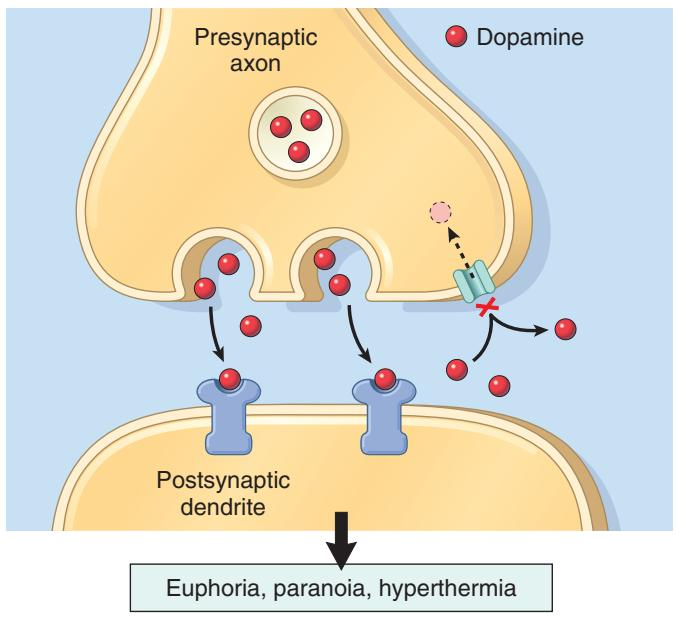 
CENTRAL NERVOUS SYSTEM SYNAPSE
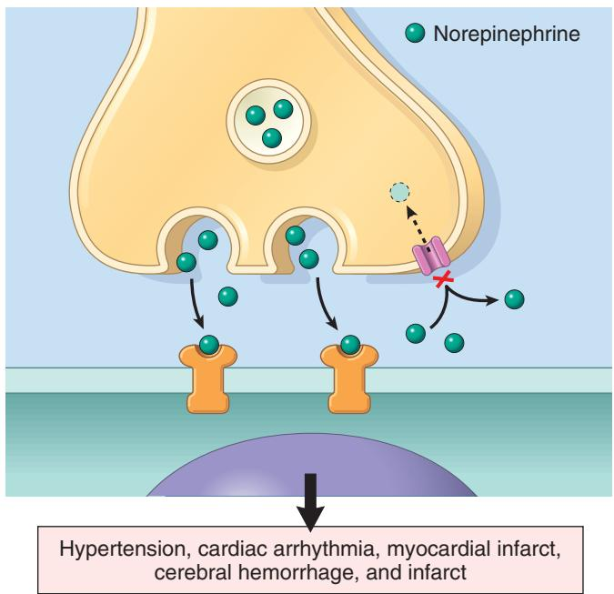 
SYMPATHETIC NEURON-TARGET CELL INTERFACE 
Fig. 8.12 The effect of cocaine on neurotransmission. The drug inhibits reuptake of the neurotransmitters dopamine and norepinephrine in the central and peripheral nervous systems.
- Chronic cocaine use. Chronic use may cause (1) perforation of the nasal septum in snorters, (2) decrease in lung diffusing capacity in users who inhale the smoke, and (3) the development of dilated cardiomyopathy.
# Heroin and Other Opioids
Heroin is an addictive opioid derived from the poppy plant and is closely related to morphine. Its effects are even more harmful than those of cocaine. Nevertheless, it is estimated that almost 4 million people in the United States have used heroin at least once, and that in 2012 more than 650,000 people used the drug at some time during the year. As sold
on the street, it is cut (diluted) with an agent (often talc or quinine); thus, the size of the dose not only is variable but also usually is unknown to the buyer. Heroin, along with any contaminating substances, usually is self-administered intravenously or subcutaneously. Effects are varied and include euphoria, hallucinations, somnolence, and sedation. Heroin has a wide range of adverse physical effects that can be categorized etiologically according to (1) the pharmacologic action of the agent, (2) reactions to the cutting agents or contaminants, (3) hypersensitivity reactions to the drug or its adulterants, and (4) diseases contracted through the sharing of needles. Some of the most important adverse effects of heroin are the following:
- Sudden death. Sudden death, usually related to overdose, is an ever-present risk, because drug purity generally is unknown and may range from $2\%$ to $90\%$ . The yearly incidence of sudden death among chronic users in the United States is estimated to be between $1\%$ and $3\%$ . Sudden death sometimes is due to a loss of tolerance for the drug, such as after a period of incarceration. The mechanisms of death include profound respiratory depression, arrhythmia and cardiac arrest, and pulmonary edema. 
- Pulmonary disease. Pulmonary complications include edema, septic embolism, lung abscess, opportunistic infections, and foreign body granulomas from talc and other adulterants. Although granulomas occur principally in the lung, they also are sometimes found in the spleen, liver, and lymph nodes that drain the upper extremities. Examination under polarized light often highlights trapped talc crystals, sometimes enclosed within foreign body giant cells. 
- Infections. Infectious complications are common. The sites most commonly affected are the skin and subcutaneous tissue, heart valves, liver, and lungs. In a series of addicted patients admitted to the hospital, more than $10\%$ had endocarditis, which often takes a distinctive form involving right-sided heart valves, particularly the tricuspid. Most cases are caused by Staphylococcus aureus, but fungi and a multitude of other organisms have also been implicated. Viral hepatitis is the most common infection among addicts and is acquired by the sharing of dirty needles. In the United States, this practice has also led to a very high incidence of human immunodeficiency virus (HIV) infection in intravenous drug abusers. 
- Skin lesions. Cutaneous lesions probably are the most frequent telltale sign of heroin addiction. Acute changes include abscesses, cellulitis, and ulcerations resulting from subcutaneous injections. Scarring at injection sites, hyperpigmentation over commonly used veins, and thrombosed veins are the usual sequelae of repeated intravenous inoculations. 
- Renal problems. Kidney disease is a relatively common hazard. The two forms most frequently encountered are amyloidosis (generally secondary to skin infections) and focal glomerulosclerosis; both induce heavy proteinuria and the nephrotic syndrome.
Tragically, more widespread availability of prescription opiates, such as hydrocodone and oxycodone, has fueled an epidemic of opioid abuse that surpasses that associated with
heroin. In 2014, it was estimated that 4.3 million Americans engaged in non-medical use of prescription opioids, and that prescription opioid overdoses led to approximately 19,000 deaths, mainly from respiratory failure. Moreover, an increasing number of heroin users start with prescription opioids, then switch to heroin because it is a substantially less expensive habit. This trend underlies a near doubling of heroin use in the United States between 2005 and 2012. Current efforts are focused on making opioid antagonists widely available to first responders, which has prevented many deaths, and tightening the use of prescription opioids to limit their potential for abuse.
# Marijuana
Marijuana, or "pot," is the most widely used illegal drug. As of 2014 in the United States, 22.2 million people (7.0% of the population) admitted use during the previous month. Several states in the United States have legalized the "recreational" use of marijuana, and more states appear poised to follow; thus, its status as an illicit drug is undergoing reevaluation.
Marijuana is made from the leaves of the Cannabis sativa plant, which contain the psychoactive substance $\Delta^9$ -tetrahydrocannabinol (THC). When marijuana is smoked, about $5\%$ to $10\%$ of the THC content is absorbed. Despite numerous studies, whether the drug includes persistent adverse physical and functional effects remains unresolved. Some of the untoward anecdotal effects may be allergic or idiosyncratic reactions or are possibly related to contaminants in the preparations, rather than to marijuana's pharmacologic effects. On the other hand, beneficial effects of THC include its capacity to decrease intraocular pressure in glaucoma and to combat intractable nausea secondary to cancer chemotherapy.
The functional and organic CNS consequences of marijuana have received great scrutiny. Marijuana use is well recognized to distort sensory perception and impair motor coordination, but these acute effects generally clear in 4 to 5 hours. With continued use, these changes may progress to cognitive and psychomotor impairments, such as the inability to judge time, speed, and distance. Among adolescents, such impairment often leads to automobile accidents. Marijuana increases the heart rate and sometimes blood pressure and it may cause angina in a person with coronary artery disease.
The lungs are affected by chronic marijuana smoking; laryngitis, pharyngitis, bronchitis, cough, hoarseness, and asthmalike symptoms all have been described, along with mild but significant airway obstruction. Smoking a marijuana cigarette, compared with a tobacco cigarette, is associated with a 3-fold increase in the amount of tar inhaled and retained in the lungs, as a consequence of deeper inhalation and longer breath holding.
# Other Illicit Drugs
The variety of drugs that have been tried by those seeking "new experiences" (highs, lows, "out-of-body experiences") defies belief. These drugs include various stimulants, depressants, analgesics, and hallucinogens. Among these are PCP (1-(1-phenylcyclohexyl) piperidine), or phencyclidine, and ketamine (related anesthetic agents); lysergic acid diethylamide (LSD), the most potent hallucinogen known; "ecstasy"
(3,4-methylenedioxymethamphetamine [MDMA]); and "bath salts", synthetic cathinones that are chemically related to khat, a widely used stimulant in East Africa. Not much is known about the long-term deleterious effects of any of these agents. Acutely, LSD has unpredictable effects on mood, affect, and thought, sometimes leading to bizarre and dangerous behaviors. Chronic use of ecstasy may deplete the CNS of serotonin, potentially leading to sleep disorders, depression, anxiety, and aggressive behavior.
# DRUG INJURY
- Therapeutic drugs (ADRs) or nontherapeutic agents (drug abuse) might cause drug injury. 
- Anti-neoplastic agents, long-acting tetracyclines, and other antibiotics, HRT preparations and OCs, acetaminophen, and aspirin are the drugs most frequently involved. 
- HRT increases the risk of endometrial and breast cancers and thromboembolism but does not appear to protect against ischemic heart disease. OCs have a protective effect against endometrial and ovarian cancers but increase the risk of thromboembolism and hepatic adenomas. 
- Overdose of acetaminophen may cause centrilobular liver necrosis, leading to liver failure. Early treatment with agents that restore GSH levels may limit toxicity. Aspirin blocks the production of thromboxane A2, which may produce gastric ulceration and bleeding. 
- The common drugs of abuse include sedative-hypnotics (barbiturates, ethanol), psychomotor stimulants (cocaine, amphetamine, ecstasy), opioid narcotics (heroin, methadone, oxycodone), hallucinogens (LSD, mescaline), and cannabinoids (marijuana, hashish). They have diverse effects on various organs.
# INJURY BY PHYSICAL AGENTS
Injury induced by physical agents is divided into the following categories: mechanical trauma, thermal injury, electrical injury, and injury produced by ionizing radiation. Each type is considered separately.
# Mechanical Trauma
Mechanical forces may inflict a variety of forms of damage. The type of injury depends on the shape of the colliding object, the amount of energy discharged at impact, and the tissues or organs that bear the impact. Bone and head injuries result in unique damage and are discussed elsewhere (Chapter 23). All soft tissues react similarly to mechanical forces, and the patterns of injury can be divided into abrasions, contusions, lacerations, incised wounds, and puncture wounds (Fig. 8.13).
An abrasion is a wound produced by scraping or rubbing the skin surface, which damages the superficial layer. Typical skin abrasions remove only the epidermal layer. A contusion, or bruise, is a wound usually produced by a blunt trauma and is characterized by damage to a vessel and extravasation of blood
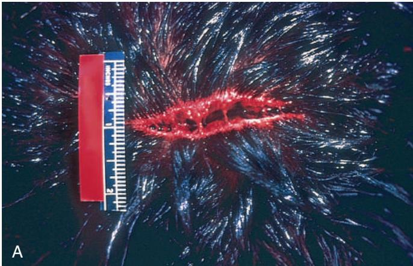 
Fig. 8.13 (A) Laceration of the scalp: The bridging strands of fibrous tissues are evident. (B) Contusion resulting from blunt trauma. The skin is intact, but hemorrhage of subcutaneous vessels has produced extensive discoloration. (A and B, From the teaching collection of the Department of Pathology, University of Texas Southwestern Medical School, Dallas, Texas.)
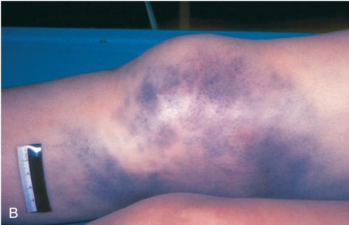
into tissues. A laceration is a tear or disruptive stretching of tissue caused by the application of force by a blunt object. In contrast with an incision, most lacerations have intact bridging blood vessels and jagged, irregular edges. An incised wound is one inflicted by a sharp instrument. The bridging blood vessels are severed. A puncture wound is typically caused by a long, narrow instrument and is termed penetrating when the instrument pierces the tissue and perforating when it traverses a tissue to also create an exit wound. Gunshot wounds are special forms of puncture wounds that demonstrate distinctive features important to the forensic pathologist. For example, a wound from a bullet fired at close range leaves powder burns, whereas one fired from more than 4 or 5 feet away does not.
One of the most common causes of mechanical injury is vehicular accident. Injuries typically sustained result from (1) hitting a part of the interior of the vehicle or being hit by objects that enter the passenger compartment during the crash, such as engine parts; (2) being thrown from the vehicle; or (3) being trapped in a burning vehicle. The pattern of injury relates to whether one or all three of these mechanisms are operative. For example, in a head-on collision, a common pattern of injury sustained by a driver who is not wearing a seat belt includes trauma to the head (windshield impact), chest (steering column impact), and knees (dashboard impact). Common chest injuries stemming from such accidents include sternal and rib fractures, heart contusions, aortic lacerations, and (less commonly) lacerations of the spleen and liver. Thus, in caring for an automobile injury victim, it is essential to recognize that internal wounds often accompany superficial abrasions, contusions, and lacerations. Indeed, in many cases, external evidence of serious internal damage is completely absent.
# Thermal Injury
Both excess heat and excess cold are important causes of injury. Burns are all too common and are discussed first; a brief discussion of hyperthermia and hypothermia follows.
# Thermal Burns
In the United States, burns cause 3500 deaths per year and result in the hospitalization of more than 10 times that
many persons. Many victims are children, in whom the cause of injury often is scalding by hot liquids. Fortunately, since the 1970s marked decreases have been seen in both mortality rates and the length of hospitalizations. These improvements have been achieved through better understanding of the systemic effects of massive burns and the discovery of better ways to prevent wound infection and to facilitate the healing of skin surfaces.
The clinical severity of burns depends on the following important variables:
- Depth 
Percentage of body surface involved 
- Whether internal injuries from the inhalation of hot and toxic fumes are present 
- Promptness and efficacy of therapy, especially fluid and electrolyte management and prevention or control of wound infections
A full-thickness burn produces total destruction of the epidermis and dermis, including the dermal appendages that harbor cells needed for epithelial regeneration. Both third- and fourth-degree burns are in this category. In partial-thickness burns, at least the deeper portions of the dermal appendages are spared. Partial-thickness burns include first-degree burns (epithelial involvement only) and second-degree burns (involving both the epidermis and the superficial dermis).

On gross inspection, full-thickness burns are white or charred, dry, and anesthetic (as a result of the destruction of nerve endings), whereas partial-thickness burns, depending on the depth, are pink or mottled, blistered, and painful. Histologic examination of devitalized tissue shows coagulative necrosis adjacent to vital tissue, which quickly accumulates inflammatory cells and marked exudation.
Despite continuous improvement in therapy, any burn exceeding $50\%$ of the total body surface, whether superficial or deep, is grave and potentially fatal. With burns of more than $20\%$ of the body surface, there is a rapid shift of body fluids into the
interstitial compartments, both at the burn site and systemically, which can result in hypovolemic shock (Chapter 4). Because protein from the blood is lost into interstitial tissue, generalized edema, including pulmonary edema, may become severe.
Another important consideration is the degree of injury to the airways and lungs. Inhalation injury is frequent in persons trapped in burning buildings and may result from the direct effect of heat on the mouth, nose, and upper airways or from the inhalation of heated air and gases in the smoke. Water-soluble gases, such as chlorine, sulfur oxides, and ammonia, may react with water to form acids or alkalis, particularly in the upper airways, resulting in inflammation and swelling, which may lead to partial or complete airway obstruction. Lipid-soluble gases, such as nitrous oxide and products of burning plastics, are more likely to reach deeper airways, producing pneumonitis. Unlike in shock, which develops within hours, pulmonary manifestations may not develop for 24 to 48 hours.
Organ system failure resulting from sepsis continues to be the leading cause of death in burned patients. The burn site is ideal for the growth of microorganisms; the serum and debris provide nutrients, and the burn injury compromises blood flow, blocking effective inflammatory responses. The most common offender is the opportunist Pseudomonas aeruginosa, but antibiotic-resistant strains of other common hospital-acquired bacteria, such as S. aureus and fungi, particularly Candida spp., also may be involved. Furthermore, cellular and humoral defenses against infections are compromised, and both lymphocyte and phagocyte functions are impaired. Direct bacteremic spread and release of toxic substances such as endotoxin from the local site have dire consequences. Pneumonia or septic shock, accompanied by renal failure and/or the acute respiratory distress syndrome (ARDS) (Chapter 13), are the most common serious sequelae.
Another very important pathophysiologic effect of burns is the development of a hypermetabolic state, with excess heat loss and an increased need for nutritional support. It is estimated that when more than $40\%$ of the body surface is burned, the resting metabolic rate may approach twice normal.
# Hyperthermia
Prolonged exposure to elevated ambient temperatures can result in heat cramps, heat exhaustion, or heat stroke.
- Heat cramps result from loss of electrolytes through sweating. Cramping of voluntary muscles, usually in association with vigorous exercise, is the hallmark sign. Heat-dissipating mechanisms are able to maintain normal core body temperature. 
- Heat exhaustion is probably the most common hyperthermic syndrome. Its onset is sudden, with prostration and collapse, and it results from a failure of the cardiovascular system to compensate for hypovolemia, secondary to water depletion. After a period of collapse, which is usually brief, equilibrium is spontaneously reestablished if the victim is able to rehydrate. 
- Heat stroke is associated with high ambient temperatures and high humidity. Thermoregulatory mechanisms fail, sweating ceases, and core body temperature rises. In the clinical setting, a rectal temperature of $106^{\circ}\mathrm{F}$ or higher is considered a grave prognostic sign, and the mortality rate for such patients exceeds $50\%$ . The underlying
mechanism is marked generalized peripheral vasodilation with peripheral pooling of blood and a decreased effective circulating blood volume. Necrosis of the muscles and myocardium may occur. Arrhythmias, disseminated intravascular coagulation, and other systemic effects are common. Elderly people, persons with cardiovascular disease, and otherwise healthy people undergoing physical stress (such as young athletes and military recruits) are prime candidates for heat stroke.
- Malignant hyperthermia, although similar sounding, is not caused by exposure to high temperatures. It is a genetic condition resulting from mutations in genes such as RYR1 that control calcium levels in skeletal muscle cells. In affected individuals, exposure to certain anesthetics during surgery may trigger a rapid rise in calcium levels in skeletal muscle, which in turn leads to muscle rigidity and increased heat production. The resulting hyperthermia has a mortality rate of approximately $80\%$ if untreated, but this falls to less than $5\%$ if the condition is recognized and muscle relaxants are administered promptly.
# Hypothermia
Prolonged exposure to low ambient temperature leads to hypothermia. The condition is seen all too frequently in homeless alcoholics, in whom wet or inadequate clothing and dilation of superficial blood vessels, occurring as a result of the ingestion of alcohol, hasten the lowering of body temperature. At about $90^{\circ}\mathrm{F}$ , loss of consciousness occurs, followed by bradycardia and atrial fibrillation at lower core temperatures.
Chilling or freezing of cells and tissues causes injury by two mechanisms:
- Direct effects probably are mediated by physical disruptions within cells and high salt concentrations incident to the crystallization of the intra- and extracellular water. 
- Indirect effects are the result of circulatory changes, which vary depending on the rate and the duration of the temperature drop. Slowly developing, prolonged chilling may induce vasoconstriction and increased permeability, leading to edema. Such changes are typical of "trench foot." This condition developed in soldiers who spent long periods of time in waterlogged trenches during the First World War (1914-1918), frequently causing gangrene that necessitated amputation. Alternatively, with sudden sharp drops in temperature, the vasoconstriction and increased viscosity of the blood in the local area may cause ischemic injury and degenerative changes in peripheral nerves. In this situation, the vascular injury and increased permeability with exudation only become evident with rewarming. If the period of ischemia is prolonged, hypoxic changes and infarction of the affected tissues (e.g., gangrene of toes or feet) may result.
# Electrical Injury
Electrical injuries, which may be fatal, can arise from low-voltage currents (i.e., in the home and workplace) or from high-voltage currents carried in power lines or by lightning. Injuries are of two types: (1) burns and (2) ventricular fibrillation or cardiac and respiratory center failure
resulting from disruption of normal electrical impulses. The type of injury and the severity and extent of burning depend on the amperage of the electric current and its path within the body.
Voltage in the household and the workplace (120 or $220\mathrm{V}$ ) is high enough that with low resistance at the site of contact (as when the skin is wet), sufficient current can pass through the body to cause serious injury, including ventricular fibrillation. If current flow continues long enough, it generates enough heat to produce burns at the site of entry and exit as well as in internal organs. An important characteristic of alternating current, the type available in most homes, is that it induces tetanic muscle spasm, so that when a live wire or switch is grasped, irreversible clutching is likely to occur, prolonging the period of current flow. This results in a greater likelihood of extensive electrical burns and, in some cases, spasm of the chest wall muscles, producing death from asphyxia. Currents generated from high-voltage sources cause similar damage; however, because of the large current flows generated, these injuries are more likely to produce paralysis of medullary centers and extensive burns. Lightning is a classic cause of high-voltage electrical injury.
# Injury Produced by Ionizing Radiation
Radiation is energy that travels in the form of waves or high-speed particles. It has a wide range of energies that span the electromagnetic spectrum; it can be divided into nonionizing and ionizing radiation. The energy of nonionizing radiation, such as ultraviolet (UV) and infrared light, microwaves, and sound waves, can move atoms in a molecule or cause them to vibrate but is not sufficient to displace electrons from atoms. By contrast, ionizing radiation has sufficient energy to remove tightly bound electrons. Collision of these free electrons with other atoms releases additional electrons, in a reaction cascade referred to as ionization. The main sources of ionizing radiation are (1) x-rays and gamma rays, which are electromagnetic waves of very high frequencies, and (2) high-energy neutrons, alpha particles (composed of two protons and two neutrons), and beta particles, which are essentially electrons. At equivalent amounts of energy, alpha particles induce heavy damage in a restricted area, whereas x-rays and gamma rays dissipate energy over a longer, deeper course, and produce considerably less damage per unit of tissue. Some of the total dose of ionizing radiation received by the U.S. population is human-made, mostly originating from medical devices and radioisotopes. In fact, the exposure of patients to ionizing radiation during radiologic imaging tests roughly doubled between the early 1980s and 2006, mainly because of much more widespread use of CT scans.
Ionizing radiation is indispensable in medical practice, but this application constitutes a two-edged sword. Radiation in this form is used in the treatment of cancer, in diagnostic imaging, and as therapeutic or diagnostic radioisotopes. However, it also is mutagenic, carcinogenic, and teratogenic.
The following terms are used to express exposure, absorption, and dose of ionizing radiation:
- Curie (Ci) represents the disintegrations per second of a spontaneously disintegrating radionuclide (radioiso
tope). One Ci is equal to $3.7 \times 1010$ disintegrations per second.
- Gray (Gy) is a unit that expresses the energy absorbed by a target tissue. It corresponds to the absorption of $10^{4}$ ergs per gram of tissue. A centigray (cGy), which is the absorption of 100 ergs per gram of tissue, is equivalent to the exposure of tissue to 100 rads (R) ("radiation absorbed dose"). The cGy nomenclature has now replaced the rad in medical parlance. 
- Sievert (Sv) is a unit of equivalent dose that depends on the biologic rather than the physical effects of radiation (it replaced a unit called the rem). For the same absorbed dose, various types of radiation differ in the extent of damage they produce. The equivalent dose controls for this variation and provides a uniform measuring unit. The equivalent dose (expressed in sieverts) corresponds to the absorbed dose (expressed in grays) multiplied by the relative biologic effectiveness of the radiation. The relative biologic effectiveness depends on the type of radiation, the type and volume of the exposed tissue, and the duration of the exposure, as well as other biologic factors (discussed next). The effective dose of x-rays, computed tomography (CT), and other imaging and nuclear medicine procedures are commonly expressed in millisieverts (mSv). For x-radiation, $1\mathrm{mSv} = 1\mathrm{mGy}$ .
# Main Determinants of the Biologic Effects of Ionizing Radiation
In addition to the physical properties of the radiation, its biologic effects depend heavily on the following variables:
- Rate of delivery. The rate of delivery significantly modifies the biologic effect. Although the effect of radiant energy is cumulative, delivery in divided doses may allow cells to repair some of the damage in the intervals. Thus, fractional doses of radiant energy have a cumulative effect only to the extent that repair during the intervals is incomplete. Radiotherapy of tumors exploits the capability of normal cells to repair themselves and to recover more rapidly than tumor cells. 
- Field size. The size of the field exposed to radiation has a great influence on its consequences. The body can sustain relatively high doses of radiation when they are delivered to small, carefully shielded fields, whereas smaller doses delivered to larger fields may be lethal. 
- Cell proliferation. Because ionizing radiation damages DNA, rapidly dividing cells are more vulnerable to injury than are quiescent cells. Except at extremely high doses that impair DNA transcription, DNA damage is compatible with survival in nondividing cells, such as neurons and muscle cells. However, as discussed in Chapter 6, in dividing cells DNA damage is detected by sensors that produce signals leading to the upregulation of p53, the "guardian of the genome." p53 in turn upregulates the expression of genes that initially lead to cell-cycle arrest and, if the DNA damage is too great to repair, genes that cause cell death through apoptosis. Understandably, therefore, tissues with a high rate of cell turnover, such as gonads, bone marrow, lymphoid tissue, and the mucosa of the GI tract, are extremely vulnerable to radiation, and the injury is manifested early after exposure.
- Hypoxia. The production of ROS by the radiolysis of water is the most important mechanism of DNA damage by ionizing radiation. Tissue hypoxia, such as may exist in the center of rapidly growing, poorly vascularized tumors, may thus reduce the extent of damage and the effectiveness of radiotherapy directed against tumors. 
- Vascular damage. Damage to endothelial cells, which are moderately sensitive to radiation, may cause narrowing or occlusion of blood vessels, leading to impaired healing, fibrosis, and chronic ischemic atrophy. These changes may appear months or years after exposure. Despite the low sensitivity of brain cells to radiation, vascular damage after irradiation can lead to late manifestations of radiation injury in this tissue.
# DNA Damage and Carcinogenesis
The most important cellular target of ionizing radiation is DNA (Fig. 8.14). Damage to DNA caused by ionizing radiation that is not precisely repaired leads to mutations, which can manifest years or decades later as cancer. Ionizing radiation can cause many types of damage in DNA, including single-base damage, single- and double-strand breaks, and crosslinks between DNA and protein. In surviving cells, simple defects may be repairable by various enzyme repair systems contained in mammalian cells (see Chapter 6). These repair systems are linked to cell-cycle regulation through proteins such as ATM (ataxia-telangiectasia mutated) that initiate signal transduction after the damage, and p53, which can transiently arrest the cell cycle to allow for DNA repair or to trigger apoptosis of cells that are irreparable. However, double-strand breaks may persist without repair, or the repair of lesions may be imprecise (error prone), creating mutations. If cell-cycle checkpoints are not functioning (for instance, because of mutations in TP53), cells with abnormal and unstable genomes survive
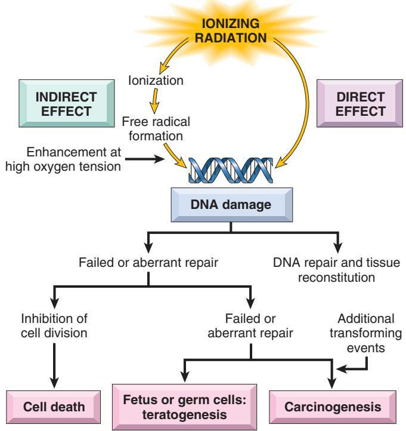 
Fig. 8.14 Effects of ionizing radiation on DNA and their consequences. The effects on DNA can be direct or, most important, indirect, through free radical formation.
and may expand as abnormal clones to form tumors eventually.
# Fibrosis
A common consequence of cancer radiotherapy is the development of fibrosis in the irradiated field (Fig. 8.15). Fibrosis may occur weeks or months after irradiation,
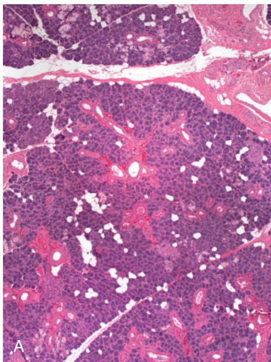 
Fig. 8.15 Vascular changes and fibrosis of salivary glands produced by radiation therapy of the neck region. (A) Normal salivary gland; (B) fibrosis caused by radiation; (C) fibrosis and vascular changes consisting of fibrointimal thickening and arteriolar sclerosis. V, Vessel lumen; I, thickened intima. (A-C, Courtesy of Dr. Melissa Upton, Department of Pathology, University of Washington, Seattle, Washington.)
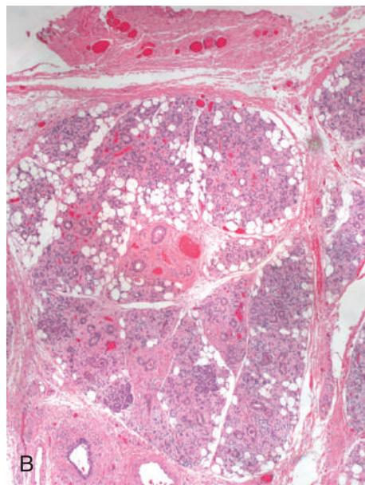
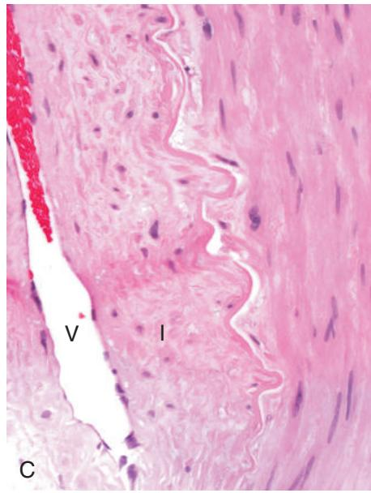
leading to the replacement of dead parenchymal cells by connective tissue and the formation of scars and adhesions (see Chapter 3). As already mentioned, ionizing radiation causes vascular damage and consequent tissue ischemia. Vascular damage, the killing of tissue stem cells by ionizing radiation, and the release of cytokines and chemokines that promote an inflammatory reaction all contribute to fibroblast activation and the development of radiation-induced fibrosis.

Cells surviving radiant energy damage show a wide range of structural changes in chromosomes, including deletions, breaks, translocations, and fragmentation. The mitotic spindle often becomes disorderly, and polyploidy and aneuploidy may be encountered. Nuclear swelling and condensation and clumping of chromatin may appear; breaks in the nuclear membrane also may be noted. Apoptosis may occur. Cells with abnormal nuclear morphology may be produced and persist for years, including giant cells with pleomorphic nuclei or more than one nucleus. At extremely high dose levels of radiant energy, features that foretell impending cell death, such as nuclear pyk-nosis, appear quickly.
In addition to affecting DNA and nuclei, radiant energy may induce a variety of cytoplasmic changes, including cytoplasmic swelling, mitochondrial distortion, and degeneration of the ER. Plasma membrane breaks and focal defects may appear. The histologic constellation of cellular pleomorphism, giant cell formation, changes in nuclei, and mitotic figures creates a more than passing similarity between radiation-injured cells and cancer cells, a problem that plagues the pathologist when evaluating post-irradiation tissues for persistence or recurrence of cancer.
At the light microscopic level, vascular changes and interstitial fibrosis are prominent in irradiated tissues (Fig. 8.15). During the immediate postirradiation period, vessels may show only dilation. Later, or with higher doses, a variety of degenerative changes appear, including endothelial cell swelling and vacuolation, or even necrosis of the walls of small vessels such as capillaries and venules. Affected vessels may rupture or undergo thrombosis. Still later, endothelial cell proliferation and collagenous hyalinization with thickening of the media layer are seen in irradiated vessels, resulting in marked narrowing or obliteration of the vascular lumina. At this time, an increase in interstitial collagen in the irradiated field, leading to scarring and contractions, usually becomes evident.
# Effects on Organ Systems
Fig. 8.16 depicts the main consequences of radiation injury. As already mentioned, the most sensitive organs and tissues are the gonads, the hematopoietic and lymphoid systems, and the lining of the GI tract. Estimated threshold doses for the effects of acute exposure to radiation in various organs are shown in Table 8.7. The changes in the hematopoietic and lymphoid systems, along with cancers induced by environmental or occupational exposure to ionizing radiation, are summarized as follows:
- Hematopoietic and lymphoid systems. The hematopoietic and lymphoid systems are extremely susceptible to radiation injury and deserve special mention. With high
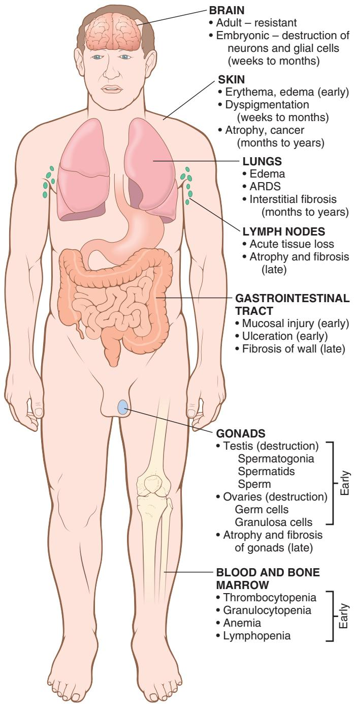 
Fig. 8.16 Overview of the major morphologic consequences of radiation injury. Early changes occur in hours to weeks; late changes occur in months to years. ARDS, Acute respiratory distress syndrome.
Table 8.7 Estimated Threshold Doses for Acute Radiation Effects on Specific Organs 
Health EffectOrgan/StructureDose (Sv)Temporary sterilityTestes0.15Depression of hematopoiesisBone marrow0.50Reversible skin effects (e.g., erythema)Skin1.0–2.0Permanent sterilityOvaries2.5–6.0Temporary hair lossSkin3.0–5.0Permanent sterilityTestis3.5CataractLens of eye5.0
dose levels and large exposure fields, severe lymphopenia may appear within hours of irradiation, along with shrinkage of the lymph nodes and spleen. Radiation directly destroys lymphocytes, both in the circulating blood and in tissues (nodes, spleen, thymus, gut). With sublethal doses of radiation, regeneration from viable progenitors is prompt, leading to restoration of a normal lymphocyte count. Hematopoietic precursors in the bone marrow are also quite sensitive to radiant energy, which produces a dose-dependent marrow aplasia. The acute effects of marrow irradiation on peripheral blood counts reflects the kinetics of turnover of the formed elements—the granulocytes, platelets, and red cells, which have half-lives of less than 1 day, 10 days, and 120 days, respectively. After a brief rise in the circulating neutrophil count, neutropenia appears within several days. Neutrophil counts reach their nadir, often at counts near zero, during the second week. If the patient survives, full recovery of granulocytes may require 2 to 3 months. Thrombocytopenia appears by the end of the first week, with the platelet count nadir occurring somewhat later than that of granulocytes; recovery is similarly delayed. Anemia appears after 2 to 3 weeks and may persist for months. Understandably, higher doses of radiation produce more severe cytopenias and more prolonged periods of recovery. Very high doses kill marrow stem cells and induce permanent aplasia (aplastic anemia) marked by a failure of blood count recovery, whereas with lower doses the aplasia is transient.
- Environmental exposure and cancer development. Any cell capable of division that has sustained mutations has the potential to become cancerous. Thus, an increased incidence of neoplasms may occur in any organ after exposure to ionizing radiation. The level of radiation required to increase the risk of cancer development is difficult to determine, but there is little doubt that acute or prolonged exposures that result in doses of $100\mathrm{mSv}$ cause serious consequences, including cancer. This is documented by the increased incidence of leukemias and tumors at various sites (such as thyroid, breast, and lung) in survivors of the atomic bombings of Hiroshima and Nagasaki, the increase in thyroid cancers in survivors of the Chernobyl accident, and the development of "second cancers," such as acute myeloid leukemia, myelodysplastic syndrome, and solid tumors, in individuals who received radiation therapy for cancers such as Hodgkin lymphoma. It is believed that the risk of secondary cancers following irradiation is greatest in children. This is based in part on a large-scale epidemiologic study showing that children who receive at least two CT scans have very small but measurable increased risks for leukemia and malignant brain
tumors, and on older studies showing that radiation therapy to the chest is particularly likely to produce breast cancers when administered to adolescent females.
- Occupational exposure and cancer development. Radon is a ubiquitous product of the spontaneous decay of uranium. The carcinogenic agents are two radon decay byproducts (polonium-214 and polonium-218, or "radon daughters"), which emit alpha particles and have a short half-life. These particulates are deposited in the lung, and chronic exposure in uranium miners may give rise to lung carcinomas. Risks also are present in those homes in which the levels of radon are very high, comparable to those found in mines. However, there is little or no evidence to suggest that radon contributes to the risk of lung cancer in the average household.
# Total-Body Irradiation
Exposure of large areas of the body to even small doses of radiation may have devastating effects. Dosages less than 1 Sv produce minimal or no symptoms. Greater exposures, however, cause health effects known as acute radiation syndromes, which at progressively higher doses involve the hematopoietic system, GI system, and CNS. The syndromes associated with total-body exposure to ionizing radiation are summarized in Table 8.8.
# RADIATION INJURY
- Ionizing radiation may injure cells directly or indirectly by generating free radicals from water or molecular oxygen. 
- Ionizing radiation damages DNA; therefore, rapidly dividing cells such as germ cells, and those in the bone marrow and GI tract are very sensitive to radiation injury. 
- DNA damage that is not adequately repaired may result in mutations that predispose affected cells to neoplastic transformation. 
- Ionizing radiation may cause vascular damage and sclerosis, resulting in ischemic necrosis of parenchymal cells and their replacement by fibrous tissue.
# NUTRITIONAL DISEASES
Millions of people in developing nations starve or live on the cruel edge of starvation, whereas those in the developed world, and more recently in the developing world, struggle to avoid calories and the attendant obesity or fear that what they eat may contribute to atherosclerosis and
Table 8.8 Effects of Whole-Body Ionizing Radiation 
0-1 Sv1-2 Sv2-10 Sv10-20 Sv&gt;50 SvMain site of injuryNoneLymphocytesBone marrowSmall bowelBrainMain signs and symptoms—Moderate leukopeniaLeukopenia, hemorrhage, epilation, vomitingDiarrhea, fever, electrolyte imbalance, vomitingAtaxia, coma, convulsions, vomitingTiming—1 day-1 week4-6 weeks5-14 days1-4 hoursLethality—NoneVariable (0%-80%)100%100%
hypertension. So both the lack of nutrition and overnutrition are major health concerns.
# Malnutrition
A healthy diet provides (1) sufficient energy, in the form of carbohydrates, fats, and proteins, for the body's daily metabolic needs; (2) essential (as well as nonessential) amino acids and fatty acids, used as building blocks for synthesis of structural and functional proteins and lipids; and (3) vitamins and minerals, which function as coenzymes or hormones in vital metabolic pathways or, as in the case of calcium and phosphate, as important structural components. In primary malnutrition, one or all of these components are missing from the diet. By contrast, in secondary, or conditional, malnutrition, the dietary intake of nutrients is adequate, and malnutrition results from nutrient malabsorption, impaired use or storage, excess losses, or increased requirements. The causes of secondary malnutrition can be grouped into three general but overlapping categories: GI diseases, chronic wasting diseases, and acute critical illness.
Malnutrition is widespread and may be gross or subtle. Some common causes of dietary insufficiencies are listed here.
- Poverty. Homeless people, elderly persons, and children of the poor often suffer from severe malnutrition as well as trace nutrient deficiencies. In poor countries, poverty, together with droughts, crop failure, and livestock deaths, creates the setting for malnourishment of children and adults. 
- Ignorance. Even the affluent may fail to recognize that infants, adolescents, and pregnant women have increased nutritional needs. Ignorance about the nutritional content of various foods also contributes to malnutrition, as follows: (1) iron deficiency often develops in infants exclusively fed artificial milk diets; (2) polished rice used as the mainstay of a diet may lack adequate amounts of thiamine; and (3) iodine often is lacking in food and water in regions removed from the oceans, unless supplementation is provided. 
- Chronic alcoholism. Alcoholic persons may sometimes suffer from malnutrition but are more frequently lacking in several vitamins, especially thiamine, pyridoxine, folate, and vitamin A, as a result of dietary deficiency, defective GI absorption, abnormal nutrient utilization and storage, increased metabolic needs, and an increased rate of loss. A failure to recognize thiamine deficiency in patients with chronic alcoholism may result in irreversible brain damage (e.g., Korsakoff psychosis, discussed in Chapter 23). 
- Acute and chronic illnesses. The basal metabolic rate becomes accelerated in many illnesses (in patients with extensive burns, it may double), resulting in increased daily requirements for all nutrients. Failure to recognize these nutritional needs may delay recovery. Malnutrition is often present in patients with advanced cancer and AIDS. 
- Self-imposed dietary restriction. Anorexia nervosa, bulimia, and less overt eating disorders affect a large population of persons who are concerned about body image or suffer from an unreasonable fear of cardiovascular
disease (anorexia and bulimia are discussed in a separate section in this chapter).
- Other causes. Additional causes of malnutrition include GI diseases, acquired and inherited malabsorption syndromes, specific drug therapies (which block uptake or use of particular nutrients), and total parenteral nutrition.
The remainder of this section presents a general overview of nutritional disorders. Particular attention is devoted to severe acute malnutrition, anorexia nervosa and bulimia, deficiencies of vitamins and trace minerals, and obesity, with a brief consideration of the relationships of diet to atherosclerosis and cancer. Other nutrients and nutritional issues are discussed in the context of specific diseases throughout the text.
# Severe Acute Malnutrition
The World Health Organization defines severe acute malnutrition (SAM) as a state characterized by a greatly reduced weight for height ratio that is below 3 standard deviation of WHO standards. Worldwide about 16 million children under the age of 5 years are affected by it. It is common in poor countries, where as many as $25\%$ of children may be affected and where it is a major contributor to the high death rates among the very young. In addition to loss of life, wars also exact a heavy toll on refugees who live in abject poverty. In camps set up for refugees from Syria, as many as $20\%$ of the children are severely or moderately malnourished.
SAM previously called protein energy malnutrition (PEM) manifests as a range of clinical syndromes, all resulting from a dietary intake of protein and calories that is inadequate to meet the body's needs. The two ends of the spectrum of SAM are known as marasmus and kwashiorkor. It should be noted that from a functional standpoint, there are two protein compartments in the body: the somatic compartment, represented by proteins in skeletal muscles, and the visceral compartment, represented by protein stores in the visceral organs, primarily the liver. These two compartments are regulated differently, as detailed subsequently. The somatic compartment is affected more severely in marasmus and the visceral compartment is depleted more severely in kwashiorkor. Clinical assessment of undernutrition is discussed next, followed by descriptions of marasmus and kwashiorkor.
The diagnosis of SAM is obvious in its most severe forms. In mild to moderate forms, the usual approach is to compare the body weight for a given height against standard tables; other helpful parameters are fat stores, muscle mass, and levels of certain serum proteins. With a loss of fat, measured skinfold thickness (which includes skin and subcutaneous tissue) is reduced. If the somatic protein compartment is catabolized, the resultant reduction in muscle mass is reflected by reduced circumference of the midarm. Measurement of serum proteins (albumin, transferrin, and others) provides an estimate of the adequacy of the visceral protein compartment. Recent studies suggest a role for the gut microbiome in the pathogenesis of SAM. There is a substantial difference in the microbial flora of children with SAM when compared with the gut
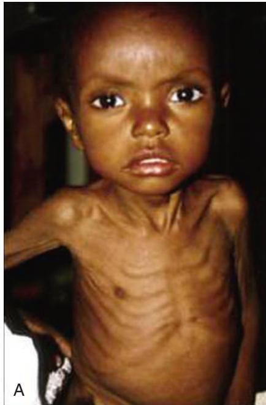 
Fig. 8.17 Childhood malnutrition. (A) Marasmus. Note the loss of muscle mass and subcutaneous fat; the head appears to be too large for the emaciated body. (B) Kwashiorkor. The infant shows generalized edema, seen as ascites and puffiness of the face, hands, and legs. (A, From Clinic Barak, Reisebericht Kenya.)
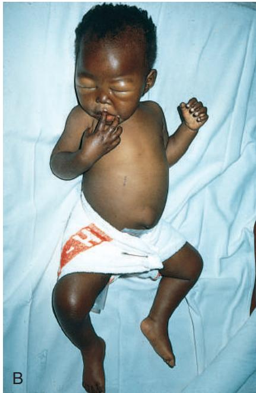
microbiome of normal children. It seems that the alterations in the microbiome are not merely the consequences of SAM but play a role in their causation.
# Marasmus
Marasmus develops when the diet is severely lacking in calories (Fig. 8.17A). A marasmic child suffers growth retardation and loss of muscle mass as a result of catabolism and depletion of the somatic protein compartment. This seems to be an adaptive response that provides the body with amino acids as a source of energy. Of interest, the visceral protein compartment, which presumably is more critical for survival, is depleted only marginally, so serum albumin levels are either normal or only slightly reduced. In addition to muscle proteins, subcutaneous fat is also mobilized and used as fuel. Leptin (discussed later under "Obesity") production is low, which may stimulate the hypothalamic-pituitary-adrenal axis to produce the high levels of cortisol that contribute to lipolysis. With such losses of muscle and subcutaneous fat, the extremities are emaciated; by comparison, the head appears too large for the body. Anemia and manifestations of multivitamin deficiencies are present, and there is evidence of immune deficiency, particularly of T-cell-mediated immunity. Hence, concurrent infections are usually present, which impose an additional stress on an already weakened body.
# Kwashiorkor
Kwashiorkor occurs when protein deprivation is relatively greater than the reduction in total calories (Fig. 8.17B). This is the most common form of SAM seen in African children who have been weaned too early and subsequently fed, almost exclusively, a carbohydrate diet (the name kwashiorkor, from the Ga language in Ghana, describes the illness in a baby that appears after the arrival
of another child). The prevalence of kwashiorkor also is high in impoverished countries of Southeast Asia. Less severe forms may occur worldwide in persons with chronic diarrheal states, in which protein is not absorbed, or in those with chronic protein loss (e.g., protein-losing enteropathies, the nephrotic syndrome, or the aftermath of extensive burns). Rare cases of kwashiorkor resulting from fad diets or replacement of milk by rice-based beverages have been reported in the United States.
In kwashiorkor, unlike in marasmus, marked protein deprivation is associated with severe loss of the visceral protein compartment, and the resultant hypoalbuminemia gives rise to generalized or dependent edema (Fig. 8.17). The weight of children with severe kwashiorkor typically is $60\%$ to $80\%$ of normal. However, the true loss of weight is masked by the increased fluid retention (edema). In further contrast with marasmus, there is relative sparing of subcutaneous fat and muscle mass. The modest loss of these compartments may also be masked by edema.
Children with kwashiorkor have characteristic skin lesions with alternating zones of hyperpigmentation, desquamation, and hypopigmentation, giving a "flaky paint" appearance. Hair changes include loss of color or alternating bands of pale and darker color, straightening, fine texture, and loss of firm attachment to the scalp. Other features that distinguish kwashiorkor from marasmus include an enlarged, fatty liver (resulting from reduced synthesis of the carrier protein component of lipoproteins) and the development of apathy, listlessness, and loss of appetite. As in marasmus, vitamin deficiencies are likely to be present, as are defects in immunity and secondary infections. In kwashiorkor, the inflammation caused by infection produces a catabolic state that aggravates the malnutrition. As already mentioned, marasmus and kwashiorkor represent two ends of a spectrum, and considerable overlap exists.
# Secondary Malnutrition
In the United States, secondary malnutrition often develops in chronically ill, older, and bedridden patients. It is estimated that more than $50\%$ of older residents in nursing homes in the United States are malnourished. Weight loss of more than $5\%$ resulting from malnutrition increases the risk of mortality in nursing home patients by almost 5-fold. A particularly severe form of secondary malnutrition, called cachexia, often develops in patients with advanced cancer (Chapter 6). The wasting is all too apparent and often presages death. Although loss of appetite may partly explain it, cachexia may appear before the appetite decreases. The underlying mechanisms are complex, but appear to involve cytokines secreted by tumor cells, particularly TNF, which are released as part of the host response to advanced tumors. These factors directly stimulate the degradation of skeletal muscle proteins, and also stimulate fat mobilization from lipid stores.
The hallmark anatomic changes in SAM are (1) growth failure, (2) peripheral edema in kwashiorkor, and (3) loss of body fat and atrophy of muscle, more marked in marasmus.
The liver in kwashiorkor, but not in marasmus, is enlarged and fatty; superimposed cirrhosis is rare.
In kwashiorkor (rarely in marasmus) the small bowel shows a decrease in the mitotic index in the crypts of the glands, associated with mucosal atrophy and loss of villi and microvilli. In such cases concurrent loss of small intestinal enzymes occurs, most often manifested as disaccharidase deficiency. Hence, infants with kwashiorkor are lactate intolerant initially and may not respond well to full-strength, milk-based diets. With treatment, the mucosal changes are reversible.
The bone marrow in both kwashiorkor and marasmus may be hypoplastic, mainly as a result of decreased numbers of red cell precursors. Thus, anemia is usually present, most often hypochromic, microcytic due to iron deficiency, but a concurrent deficiency of folate may lead to a mixed microcytic-macrocytic anemia.
The brain in infants who are born to malnourished mothers and who suffer from SAM during the first 1 or 2 years of life has been reported by some investigators to show cerebral atrophy, a reduced number of neurons, and impaired myelination of white matter.
Many other changes may be present, including (1) thymic and lymphoid atrophy (more marked in kwashiorkor than in marasmus), (2) anatomic alterations induced by intercurrent infections, particularly with endemic helminths and other parasites, and (3) deficiencies of other required nutrients such as iodine and vitamins.
# Anorexia Nervosa and Bulimia
Anorexia nervosa is a state of self-induced starvation resulting in marked weight loss; bulimia is a condition in which the patient binges on food and then induces vomiting. Bulimia is more common than anorexia nervosa and carries a better prognosis. It is estimated to occur in $1\%$ to $2\%$ of women and $0.1\%$ of men, with an average age
at onset of 20 years. These disorders occur primarily in previously healthy young women who have acquired an obsession with attaining or maintaining thinness.
The clinical findings in anorexia nervosa generally are similar to those in SAM. In addition, effects on the endocrine system are prominent. Amenorrhea, resulting from decreased secretion of gonadotropin-releasing hormone (and consequent decreased secretion of luteinizing and follicle-stimulating hormones), is so common that its presence is almost a diagnostic feature. Other common findings, related to decreased thyroid hormone release, include cold intolerance, bradycardia, constipation, and changes in the skin and hair. In addition, dehydration and electrolyte abnormalities are frequent findings. Body hair may be increased but usually is fine and pale (lanugo). Bone density is decreased, most likely because of low estrogen levels, which mimics the postmenopausal acceleration of osteoporosis. As expected with severe malnutrition, anemia, lymphopenia, and hypoalbuminemia may be present. A major complication of anorexia nervosa is an increased susceptibility to cardiac arrhythmia and sudden death, both resulting from hypokalemia.
In bulimia, binge eating is the norm. Huge amounts of food, principally carbohydrates, are ingested, only to be followed by induced vomiting. Although menstrual irregularities are common, amenorrhea occurs in less than $50\%$ of bulimic patients, probably because weight and gonadotropin levels are maintained near normal. The major medical complications are related to continual induced vomiting and chronic use of laxatives and diuretics. These include (1) electrolyte imbalances (hypokalemia), which predispose the patient to cardiac arrhythmias; (2) pulmonary aspiration of gastric contents; and (3) esophageal and stomach rupture. Nevertheless, there are no specific signs and symptoms for this syndrome, and the diagnosis must rely on a comprehensive psychologic assessment of the patient.
# Vitamin Deficiencies
Before we summarize the functions of individual vitamins and the consequence of their deficiency, some general comments are in order.
- Thirteen vitamins are necessary for health; four—A, D, E, and K—are fat-soluble and the remainder are water-soluble. The distinction between fat- and water-soluble vitamins is important; although the former are more readily stored in the body, they may be poorly absorbed in fat malabsorption disorders, caused by disturbances of digestive functions (discussed in Chapter 15). 
- Certain vitamins can be synthesized endogenously—vitamin D from precursor steroids, vitamin K and biotin by the intestinal microflora, and niacin from tryptophan, an essential amino acid. Notwithstanding this endogenous synthesis, a dietary supply of all vitamins is essential for health. 
- Deficiency of a single vitamin is uncommon, and single-or multiple-vitamin deficiencies may accompany concurrent SAM.
In the following sections, vitamins A, D, and C are presented in some detail because of their wide-ranging
functions and the morphologic changes of deficient states. This is followed by a summary in tabular form of the main consequences of deficiencies of the remaining vitamins-E, K, and the B complex-and some essential minerals.
# Vitamin A
The major functions of vitamin A are maintenance of normal vision, regulation of cell growth and differentiation, and regulation of lipid metabolism. Vitamin A is a generic name for a group of related fat-soluble compounds that include retinol, retinal, and retinoic acid, which have similar biologic activities. Retinol is the chemical name for vitamin A. It is the transport form and, as retinol ester, also the storage form. A widely used term, retinoids, refers to both natural and synthetic chemicals that are structurally related to vitamin A but may not necessarily have vitamin A activity. Animal-derived foods such as liver, fish, eggs, milk, and butter are important dietary sources of preformed vitamin A. Yellow and leafy green vegetables such as carrots, squash, and spinach supply large amounts of carotenoids, many of which are provitamins that are metabolized to active vitamin A in the body. Carotenoids contribute approximately $30\%$ of the vitamin A in human diets; the most important of these is $\beta$ -carotene, which is efficiently converted to vitamin A. The recommended dietary allowance for vitamin A is expressed in retinol equivalents, to take into account both preformed vitamin A and $\beta$ -carotene.
Vitamin A is a fat-soluble vitamin, and its absorption requires bile, pancreatic enzymes, and some level of antioxidant activity in the food. Retinol (generally ingested as retinol ester) and $\beta$ -carotene are absorbed through the intestinal wall, where $\beta$ -carotene is converted to retinol (Fig. 8.18). Retinol is then transported in chylomicrons, where it is taken up into liver cells through the apolipoprotein E receptor. More than $90\%$ of the body's vitamin A reserves are stored in the liver, predominantly in the perisinusoidal stellate (Ito) cells. In healthy persons who consume an adequate diet, these reserves are sufficient to support the body's needs for at least 6 months. Retinol esters stored in the liver can be mobilized; before release, retinol binds to a specific retinol-binding protein (RBP), synthesized in the liver. The uptake of retinol and RBP in peripheral tissues is dependent on cell surface RBP receptors. After uptake by cells, retinol is released, and the RBP is recycled back into the blood. Retinol may be stored in peripheral tissues as retinyl ester or may be oxidized to form retinoic acid.
Function. In humans, the best-defined functions of vitamin A are the following:
- Maintaining normal vision in reduced light. The visual process involves four forms of vitamin A-containing pigments: rhodopsin, located in rod cells, the most light-sensitive pigment and therefore important in reduced light; and three iodopsins, located in cone cells, each responsive to a specific color in bright light. The synthesis of rhodopsin from retinol involves (1) oxidation to all-trans-retinal, (2) isomerization to 11-cis-retinal, and (3) interaction with opsin to form rhodopsin. A photon of light causes the isomerization of 11-cis-retinal to all-trans-retinal, and a sequence of configuration changes
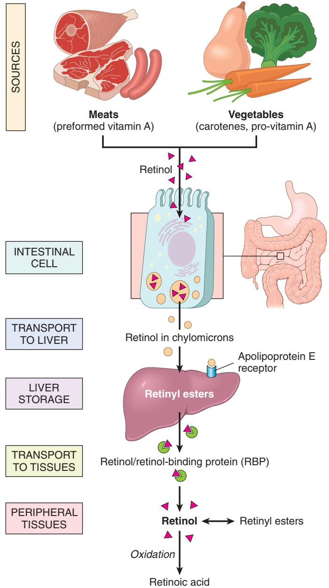 
Fig. 8.18 Vitamin A metabolism.
in rhodopsin, which produce a visual signal. In the process, a nerve impulse is generated (by changes in membrane potential) and transmitted by means of neurons from the retina to the brain. During dark adaptation, some of the all-trans-retinal is reconverted to 11-cis-retinal, but most is reduced to retinol and lost to the retina, explaining the need for a continuous supply of retinol.
- Potentiating the differentiation of specialized epithelial cells. Vitamin A and retinoids play an important role in the orderly differentiation of mucus-secreting columnar epithelium; when a deficiency state exists, the epithelium undergoes squamous metaplasia, differentiating into a keratinizing epithelium. Activation of retinoic acid receptors (RARs) by their ligands causes the release of corepressors and the obligatory formation of heterodimers with another retinoid receptor, known as the retinoic X receptor (RXR). Both RAR and RXR have three
isoforms, $\alpha$ , $\beta$ , and $\gamma$ . The RAR/RXR heterodimers bind to retinoic acid response elements located in the regulatory regions of genes that encode receptors for growth factors, tumor suppressor genes, and secreted proteins. Through these effects, retinoids regulate cell growth and differentiation, cell-cycle control, and other biologic responses. All-trans-retinoic acid, a potent acid derivative of vitamin A, has the highest affinity for RARs compared with other retinoids.
- Metabolic effects of retinoids. The RXR, believed to be activated by 9-cis retinoic acid, can form heterodimers with other nuclear receptors, such as receptors involved in drug metabolism, the peroxisome proliferator-activated receptors (PPARs), and vitamin D receptors. PPARs are key regulators of fatty acid metabolism, including fatty acid oxidation in fat and muscle, adipogenesis, and lipoprotein metabolism. The association between RXR and PPARγ provides an explanation for the metabolic effects of retinoids on adipogenesis. 
Enhancing immunity to infections. Vitamin A supplementation can reduce morbidity and mortality rates for some forms of diarrhea. Similarly, supplementation in preschool children with measles, particularly those who are malnourished, can reduce mortality and complications of the disease, including eye damage and blindness. The effects of vitamin A on infections probably derive in part from its ability to stimulate the immune system through unclear mechanisms. Infections may reduce the bioavailability of vitamin A, possibly by inducing the acute phase response, which appears to inhibit RBP synthesis in the liver. The drop in hepatic RBP causes a decrease in circulating retinol, which reduces the tissue availability of vitamin A. The beneficial effect of vitamin A in diarrheal diseases may be related to the maintenance and restoration of the integrity of the epithelium of the gut.
In addition, the retinoids, $\beta$ -carotene, and some related carotenoids can function as photoprotective and antioxidant agents. Retinoids have broad biologic effects, including effects on embryonic development, cellular differentiation and proliferation, and lipid metabolism.
Retinoids are used clinically to treat skin disorders such as severe acne and certain forms of psoriasis, and also to treat acute promyelocytic leukemia. As discussed in Chapter 6, all-trans-retinoic acid induces the differentiation and subsequent apoptosis of acute promyelocytic leukemia cells through its ability to bind to a PML-RARα fusion protein that characterizes this form of cancer.
Deficiency States. Vitamin A deficiency occurs worldwide as a consequence of either poor nutrition or fat malabsorption. In children, stores of vitamin A are depleted by infections, and the absorption of the vitamin is poor in newborn infants. In adults, vitamin A deficiency, in conjunction with depletion of other fat-soluble vitamins, may develop in patients with malabsorption syndromes, such as celiac disease, Crohn disease, and colitis. Bariatric surgery and the continuous use of mineral oil laxatives also may lead to deficiency. The multiple effects of vitamin A deficiency are as follows:
- As was already discussed, vitamin A is a component of rhodopsin and other visual pigments. Not surprisingly, one of the earliest manifestations of vitamin A deficiency is impaired vision, particularly in reduced light (night blindness). 
- Other effects of vitamin A deficiency are related to its role in maintaining the differentiation of epithelial cells (Fig. 8.19). Persistent deficiency gives rise to a series of changes involving epithelial metaplasia and keratization. The most devastating changes occur in the eyes and result in the clinical entity referred to as xerophthalmia (dry eye). First, there is dryness of the conjunctiva (xerosis conjunctivae) as the normal lachrymal and
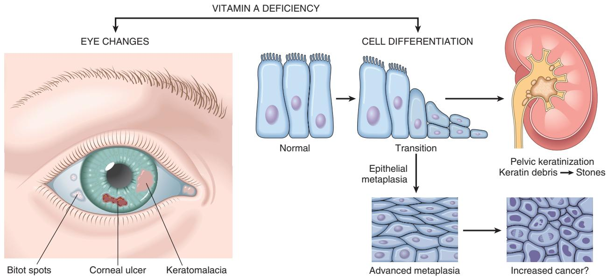 
Fig. 8.19 Vitamin A deficiency: major consequences in the eye and in the production of keratinizing metaplasia of specialized epithelial surfaces, and its possible role in epithelial metaplasia. Not depicted are night blindness and immune deficiency.
mucus-secreting epithelium are replaced by keratinized epithelium. This is followed by a buildup of keratin debris in small opaque plaques (Bitot spots) and, eventually, the erosion of the roughened corneal surface, leading to softening and destruction of the cornea (keratomalacia) and total blindness.
- Vitamin A deficiency also leads to replacement of the epithelium lining the upper respiratory passage and urinary tract by keratinizing squamous cells (squamous metaplasia). Loss of the mucociliary epithelium of the airways predisposes affected patients to pulmonary infections, and desquamation of keratin debris in the urinary tract predisposes to renal and bladder stones. Hyperplasia and hyperkeratinization of the epidermis with plugging of the ducts of the adnexal glands may produce follicular or papular dermatosis. 
- Another serious consequence of the lack of vitamin A is immune deficiency. This impairment of immunity leads to higher mortality rates from common infections such as measles, pneumonia, and infectious diarrhea. In parts of the world with a high prevalence of vitamin A deficiency, dietary supplements reduce mortality rates for infectious disorders by $20\%$ to $30\%$ .
Vitamin A Toxicity. Both short- and long-term excesses of vitamin A may produce toxic manifestations—a point of concern because of the megadoses being touted by certain sellers of supplements. The consequences of acute hypervitaminosis A were first described in 1597 by Gerrit de Veer, a ship's carpenter stranded in the Arctic, who recounted in his diary the serious symptoms that he and other crew members developed after eating polar bear liver. With this cautionary tale in mind, the adventurous eager should note that acute vitamin A toxicity also has been described in "hepatoaficionados" who feasted on the livers of whales, sharks, and even tuna!
The signs and symptoms of acute toxicity include headache, dizziness, vomiting, stupor, and blurred vision—all of which may be confused with those of a brain tumor. Chronic toxicity is associated with weight loss, anorexia, nausea, vomiting, and bone and joint pain. Retinoic acid stimulates the production and function of osteoclasts, leading to increased bone resorption and a consequent high risk of fractures. Although synthetic retinoids used for the treatment of acne are not associated with these complications, their use in pregnancy must be avoided because of the well-established teratogenic effect of retinoids.
# Vitamin D
The major function of the fat-soluble vitamin D is the maintenance of adequate plasma levels of calcium and phosphorus to support metabolic functions, bone mineralization, and neuromuscular transmission. In this capacity, the vitamin is required for the prevention of bone diseases known as rickets (in children whose epiphyses have not already closed), osteomalacia (in adults), and hypocalcemic tetany. With respect to tetany, vitamin D maintains the correct concentration of ionized calcium in the extracellular fluid compartment. When deficiency develops, the drop in ionized calcium in the extracellular fluid results in continuous excitation of muscle (tetany). It should
be noted, however, that any reduction in the level of serum calcium is rapidly corrected by excess secretion of parathyroid hormone. Hence tetany is quite uncommon. Our attention here is focused on the function of vitamin D in the regulation of serum calcium levels.
Metabolism. The major source of vitamin D for humans is its endogenous synthesis in the skin by photochemical conversion of a precursor, 7-dehydrocholesterol, powered by the energy of solar or artificial UV light. Irradiation of this compound forms cholecalciferol, known as vitamin $\mathrm{D}_3$ ; in the following discussion, for the sake of simplicity, the term vitamin $D$ is used to refer to this compound. Under usual conditions of sun exposure, approximately $90\%$ of the vitamin D needed is endogenously derived from 7-dehydrocholesterol present in the skin. However, blacks may have a lower level of vitamin D production in the skin because of melanin pigmentation (perhaps a small price to pay for protection against UV-induced cancers). The small remainder comes from dietary sources, such as deep-sea fish, plants, and grains. In plant sources, vitamin D is present in a precursor form, ergosterol, which is converted to vitamin D in the body.
The metabolism of vitamin D can be outlined as follows (Fig. 8.20):
1. Absorption of vitamin D along with other fats in the gut or synthesis from precursors in the skin 
2. Binding to plasma $\alpha_{1}$ -globulin (vitamin D-binding protein) and transport to liver 
3. Conversion to 25-hydroxyvitamin D (25-OH-D) by 25-hydroxylase in the liver 
4. Conversion of 25-OH-D to 1,25-dihydroxyvitamin D $\left[1,25-(\mathrm{OH})_{2}-\mathrm{D}\right]$ (biologically the most active form of vitamin D) by $\alpha 1$ -hydroxylase in the kidney
Renal production of 1,25-(OH)2-D is regulated by three mechanisms:
- Hypocalcemia stimulates secretion of parathyroid hormone (PTH), which in turn augments the conversion of 25-OH-D to 1,25-(OH)₂-D by activating α1-hydroxylase. 
- Hypophosphatemia directly activates $\alpha 1$ -hydroxylase, thereby increasing the formation of $1,25(\mathrm{OH})_{2}$ -D. 
- In a feedback loop, increased levels of $1,25-(\mathrm{OH})_{2}$ -D downregulate the synthesis of this metabolite by inhibiting the action of $\alpha 1$ -hydroxylase (decreases in 1,25- $(\mathrm{OH})_{2}$ -D have the opposite effect).
Functions. Like retinoids and steroid hormones, 1,25-(OH) $_2$ -D acts by binding to a high-affinity nuclear receptor that in turn binds to regulatory DNA sequences, thereby inducing transcription of specific target genes. The receptors for 1,25-(OH) $_2$ -D are present in most nucleated cells of the body, and they transduce signals that result in various biologic activities, beyond those involved in calcium and phosphorus homeostasis. Nevertheless, the best-understood functions of vitamin D relate to the maintenance of normal plasma levels of calcium and phosphorus, through action on the intestines, bones, and kidneys (Fig. 8.20).
The active form of vitamin D:
- Stimulates intestinal absorption of calcium through upregulation of calcium transport, in enterocytes
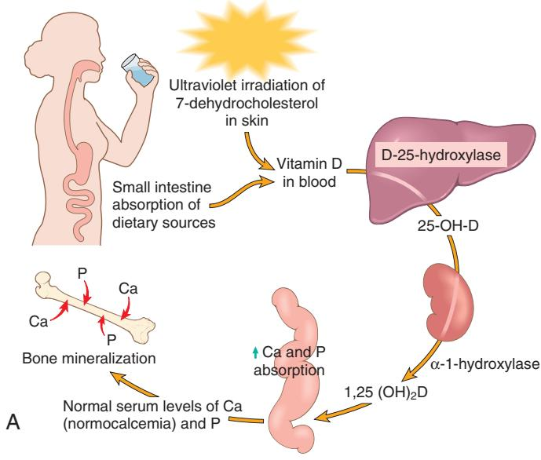 
NORMAL VITAMIN D METABOLISM
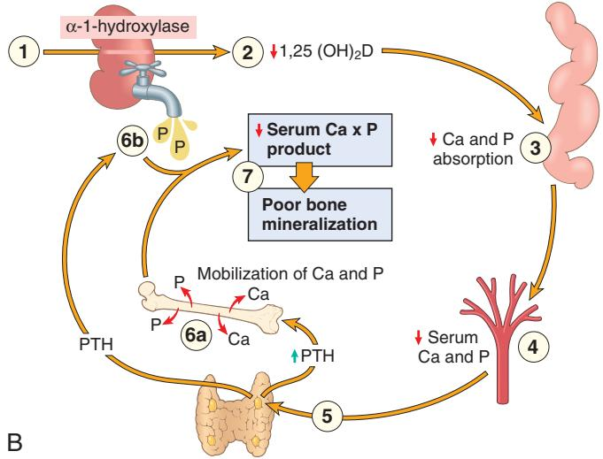 
VITAMIN D DEFICIENCY 
Fig. 8.20 (A) Normal vitamin D metabolism. (B) Vitamin D deficiency. There is inadequate substrate for the renal hydroxylase (1), yielding a deficiency of $1,25-(\mathrm{OH})_{2}\mathrm{D}$ (2), and deficient absorption of calcium and phosphorus from the gut (3), with consequent depressed serum levels of both (4). The hypocalcemia activates the parathyroid glands (5), causing mobilization of calcium and phosphorus from bone (6a). Simultaneously, parathyroid hormone (PTH) induces wasting of phosphate in the urine (6b) and calcium retention. Consequently, the serum levels of calcium are normal or nearly normal, but the phosphate is low; hence, mineralization is impaired (7).
Stimulates calcium resorption in renal distal tubules. 
Collaborates with PTH to regulate blood calcium. This occurs in part through upregulation of RANK ligand on osteoblasts, which in turn activates RANK receptors on osteoclast precursors. RANK activation produces signals that increase osteoclast differentiation and bone resorptive activities (Chapter 21). 
- Promotes the mineralization of bone. Vitamin D is needed for the mineralization of osteoid matrix and epiphyseal cartilage during the formation of flat and long bones. It stimulates osteoblasts to synthesize the calcium-binding protein osteocalcin, which promotes calcium deposition.
Of note, effects of vitamin D on bone depend on the plasma levels of calcium: On the one hand, in hypocalcemic states $1,25-(\mathrm{OH})_{2}$ -D together with PTH increases the resorption of calcium and phosphorus from bone to support blood levels. On the other hand, in normocalcemic states, vitamin D is required for calcium deposition in epiphyseal cartilage and osteoid matrix.
# Deficiency States
Vitamin D deficiency causes rickets in growing children and osteomalacia in adults; these skeletal diseases have worldwide distribution. They may result from diets deficient in calcium and vitamin D, but probably more important is limited exposure to sunlight (for instance, in heavily veiled women; children born to mothers who have frequent pregnancies followed by lactation, which leads to vitamin D deficiency; and inhabitants of northern climates with scant sunlight). Other, less common causes of rickets and osteomalacia include renal disorders causing decreased synthesis of 1,25-( $\mathrm{OH}$ ) $_2$ -D or phosphate depletion, and malabsorption disorders. Although rickets and osteomalacia rarely occur outside high-risk groups, milder forms of vitamin D deficiency (also called vitamin D insufficiency) leading to bone loss and hip fractures are common among elderly persons. Studies also suggest that vitamin D may be important for preventing demineralization of bones. It appears that certain genetically determined variants of the vitamin D receptor are associated with an accelerated loss of bone minerals with aging and certain familial forms of osteoporosis (Chapter 21).
Whatever the basis, a deficiency of vitamin D tends to cause hypocalcemia. This in turn stimulates PTH production, which (1) activates renal $\alpha_{1}$ -hydroxylase, increasing the amount of active vitamin D and calcium absorption; (2) mobilizes calcium from bone; (3) decreases renal calcium excretion; and (4) increases renal excretion of phosphate. Thus, the serum level of calcium is restored to near normal, but hypophosphatemia persists, so mineralization of bone is impaired or there is high bone turnover.
An understanding of the morphologic changes in rickets and osteomalacia is facilitated by a brief summary of normal bone development and maintenance. The development of flat bones in the skeleton involves intramembranous ossification, whereas the formation of long tubular bones proceeds by endochondral ossification. With intramembranous bone formation, mesenchymal cells differentiate directly into osteoblasts, which synthesize the collagenous osteoid matrix on which calcium is deposited. By contrast, with endochondral ossification, growing cartilage at the epiphyseal plates is provisionally mineralized and then progressively resorbed and replaced by osteoid matrix, which undergoes mineralization to create bone (Fig. 8.21A).
The basic derangement in both rickets and osteomalacia is an excess of unmineralized bone matrix. The changes that occur in the growing bones of children with rickets, however, are complicated by inadequate provisional calcification
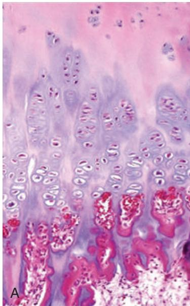 
Fig. 8.21 Rickets. (A) Normal costochondral junction of a young child. Note cartilage palisade formation and orderly transition from cartilage to new bone. (B) Rachitic costochondral junction in which the palisade of cartilage is absent. Darker trabeculae are well-formed bone; paler trabeculae consist of uncalcified osteoid. (C) Note bowing of legs as a consequence of the formation of poorly mineralized bone in a child with rickets. (B, Courtesy of Dr.Andrew E. Rosenberg, Massachusetts General Hospital, Boston, Massachusetts.)
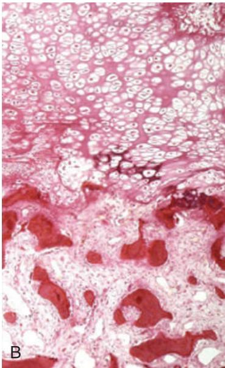
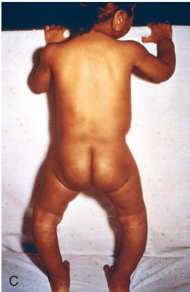
of epiphyseal cartilage, deranging endochondral bone growth. The following sequence ensues in rickets:
- Overgrowth of epiphyseal cartilage caused by inadequate provisional calcification and failure of the cartilage cells to mature and disintegrate 
- Persistence of distorted, irregular masses of cartilage, many of which project into the marrow cavity 
- Deposition of osteoid matrix on inadequately mineralized cartilaginous remnants 
- Disruption of the orderly replacement of cartilage by osteoid matrix, with enlargement and lateral expansion of the osteochondral junction (Fig. 8.21B) 
- Abnormal overgrowth of capillaries and fibroblasts in the disorganized zone resulting from microfractures and stresses on the inadequately mineralized, weak, poorly formed bone 
- Deformation of the skeleton resulting from the loss of structural rigidity of the developing bones
The gross skeletal changes depend on the severity of the rachitic process; its duration; and, in particular, the stresses to which individual bones are subjected. During the nonambulatory stage of infancy, the head and chest sustain the greatest stresses. The softened occipital bones may become flattened, and the parietal bones can be buckled inward by pressure; with the release of the pressure, elastic recoil snaps the bones back into their original positions (craniotabes). An excess of osteoid produces frontal bossing and a squared appearance to the head. Deformation of the chest results from overgrowth of cartilage or osteoid tissue at the costochondral junction, producing the "rachitic rosary." The weakened metaphyseal areas of the ribs are subject to the pull of the respiratory muscles, causing them to bend inward creating anterior protrusion of the sternum (pigeon breast deformity). The inward pull at the margin of the diaphragm creates the Harrison groove, girdling the thoracic cavity at the lower margin of the rib cage. The pelvis may
become deformed. When an ambulating child develops rickets, deformities are likely to affect the spine, pelvis, and long bones (e.g., tibia), causing, most notably, lumbar lordosis and bowing of the legs (Fig. 8.21C).
In adults with osteomalacia, the lack of vitamin D deranges the normal bone remodeling that occurs throughout life. The newly formed osteoid matrix laid down by osteoblasts is inadequately mineralized, producing the excess of persistent osteoid that is characteristic of osteomalacia. Although the contours of the bone are not affected, the bone is weak and vulnerable to gross fractures or microfractures, which are most likely to affect vertebral bodies and femoral necks. On histologic examination, the unmineralized osteoid can be visualized as a thickened layer of matrix (which stains pink in hematoxylin and eosin preparations) arranged about the more basophilic, normally mineralized trabeculae.
Nonskeletal Effects of Vitamin D. As mentioned earlier, the vitamin D receptor is present in various cells and tissues that do not participate in calcium and phosphorus homeostasis. In addition, macrophages, keratinocytes, and tissues such as breast, prostate, and colon can produce 1,25-dihydroxyvitamin D. It appears that pathogen-induced activation of Toll-like receptors in macrophages causes increased expression of vitamin D receptor as well as increased local synthesis of 1,25-dihydroxyvitamin D. This causes activation of vitamin-D-dependent gene expression in macrophages and other neighboring immune cells. The net effect of these changes on the immune response remains to be determined. It appears that in some patients with tuberculosis, vitamin D supplements increase lymphocyte counts and enhance the clearance of Mycobacterium tuberculosis. It has also been reported that low levels
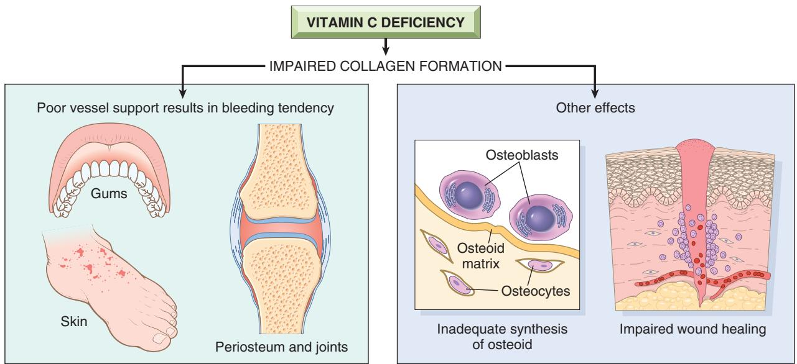 
Fig. 8.22 Major consequences of impaired formation of collagen caused by vitamin C deficiency.
of 1,25-dihydroxyvitamin D $(< 20\mathrm{ng / mL})$ are associated with a $30\%$ to $50\%$ increase in the incidence of colon, prostate, and breast cancers, but whether or not vitamin D supplementation can reduce cancer risk has not been firmly established.
Toxicity. Prolonged exposure to sunlight may cause sunburns but it does not produce an excess of vitamin D, but megadoses of orally administered vitamin can lead to hypervitaminosis. In children, hypervitaminosis D may take the form of metastatic calcifications of soft tissues such as the kidney; in adults, it causes bone pain and hypercalcemia. As a point of some interest, the toxic potential of this vitamin is so great that in sufficiently large doses it is a potent rodenticide!
# Vitamin C (Ascorbic Acid)
A deficiency of water-soluble vitamin C leads to the development of scurvy, characterized principally by bone disease in growing children and by hemorrhages and healing defects in both children and adults. Sailors of the British Royal Navy were nicknamed "limeys" because at the end of the 18th century the Navy began to provide lime and lemon juice to them to prevent scurvy during their long sojourns at sea. It was not until 1932 that ascorbic acid was identified and synthesized. Unlike vitamin D, ascorbic acid is not synthesized endogenously in humans, who therefore are entirely dependent on the diet for this nutrient. Vitamin C is present in milk and some animal products (liver, fish) and is abundant in a variety of fruits and vegetables. All but the most restricted diets provide adequate amounts of vitamin C.
Function. Ascorbic acid acts in a variety of biosynthetic pathways by accelerating hydroxylation and amidation reactions. The most clearly established function of vitamin C is the activation of prolyl and lysyl hydroxylases from inactive precursors, allowing for hydroxylation
of procollagen. Inadequately hydroxylated procollagen cannot acquire a stable helical configuration or be adequately crosslinked, so it is poorly secreted from the fibroblasts. Those molecules that are secreted lack tensile strength, are more soluble, and are more vulnerable to enzymatic degradation. Collagen, which normally has the highest content of hydroxyproline, is most affected, particularly in blood vessels, accounting for the predisposition to hemorrhages in scurvy. In addition, a deficiency of vitamin C suppresses the synthesis of collagen polypeptides, independent of effects on proline hydroxylation. Vitamin C also has anti-oxidant properties. These include an ability to scavenge free radicals directly and the participation in metabolic reactions that regenerate the anti-oxidant form of vitamin E.
Deficiency States. Consequences of vitamin C deficiency are illustrated in Fig. 8.22. Fortunately, because of the abundance of ascorbic acid in foods, scurvy has ceased to be a global problem. It is sometimes encountered in affluent populations as a secondary deficiency, particularly among elderly persons, people who live alone, and chronic alcoholics – groups often characterized by erratic and inadequate eating patterns. Occasionally, scurvy appears in patients undergoing peritoneal dialysis and hemodialysis and among food faddists.
Toxicity. The popular notion that megadoses of vitamin C protect against the common cold or at least allay the symptoms has not been borne out by controlled clinical studies. Such slight relief as may be experienced probably is a result of the mild antihistamine action of ascorbic acid. The large excess of vitamin C is promptly excreted in the urine but may cause uricosuria and increased absorption of iron, with the potential for iron overload.
Other vitamins and some essential minerals are listed and briefly described in Tables 8.9 and 8.10. Folic acid and vitamin $\mathrm{B}_{12}$ are discussed in Chapter 12.
Table 8.9 Vitamins: Major Functions and Deficiency Syndromes 
VitaminFunctionsDeficiency SyndromesFat-SolubleVitamin AA component of visual pigmentMaintenance of specialized epitheliaMaintenance of resistance to infectionNight blindness, xerophthalmia, blindness Squamous metaplasiaVulnerability to infection, particularly measlesVitamin DFacilitates intestinal absorption of calcium and phosphorus and mineralization of boneRickets in children Osteomalacia in adultsVitamin EMajor anti-oxidant; scavenges free radicalsSpinocerebellar degenerationVitamin KCofactor in hepatic carboxylation of procoagulants—factors II (prothrombin), VII, IX, and X; and protein C and protein SBleeding diathesisWater-SolubleVitamin B1(thiamine)As pyrophosphate, is coenzyme in decarboxylation reactionsDry and wet beriberi,Wernicke syndrome,Korsakoff syndromeVitamin B2(riboflavin)Converted to coenzymes flavin mononucleotide and flavin adenine dinucleotide, cofactors for many enzymes in intermediary metabolismCheilosis, stomatitis, glossitis, dermatitis, corneal vascularizationNiacinIncorporated into nicotinamide adenine dinucleotide (NAD) and NAD phosphate; involved in a variety of oxidation-reduction (redox) reactionsPellagra—&quot;three Ds&quot;: dementia, dermatitis, diarrheaVitamin B6(pyridoxine)Derivatives serve as coenzymes in many intermediary reactionsCheilosis, glossitis, dermatitis, peripheral neuropathyVitamin B12*Required for normal folate metabolism and DNA synthesis Maintenance of myelinization of spinal cord tractsCombined system disease (megaloblastic anemia and degeneration of posterolateral spinal cord tracts)Vitamin CServes in many redox reactions and hydroxylation of collagenScurvyFolate*Essential for transfer and use of one-carbon units in DNA synthesisMegaloblastic anemia, neural tube defectsPantothenic acidIncorporated in coenzyme ANo nonexperimental syndrome recognizedBiotinCofactor in carboxylation reactionsNo clearly defined clinical syndrome*See also Chapter 12.
Table 8.10 Selected Trace Elements and Deficiency Syndromes 
ElementFunctionBasis of DeficiencyClinical FeaturesZincComponent of enzymes, principally oxidasesInadequate supplementation in artificial dietsInterference with absorption by other dietary constituentsInborn error of metabolismRash around eyes, mouth, nose, and anus called acrodermatitis enteropathicaAnorexia and diarrheaGrowth retardation in childrenDepressed mental functionDepressed wound healing and immune responseImpaired night visionInfertilityIronEssential component of hemoglobin as well as several iron-containing metalloenzymesInadequate dietChronic blood lossHypochromic, microcytic anemiaIodineComponent of thyroid hormoneInadequate supply in food and waterGoiter and hypothyroidismCopperComponent of cytochrome c oxidase, dopamine β-hydroxylase, tyrosinase, and lysyl oxidase (involved in crosslinking collagen)Inadequate supplementation in artificial dietInterference with absorptionMuscle weaknessNeurologic defectsAbnormal collagen crosslinkingFluorideReplaces calcium during remineralization of teeth, producing fluorapatite, which is more resistant to acidsInadequate supply in soil and waterInadequate supplementationDental cariesSeleniumComponent of GSH peroxidaseAnti-oxidant with vitamin EInadequate amounts in soil and waterMyopathyCardiomyopathy (Keshan disease)

# NUTRITIONAL DISEASES
- Primary SAM is a common cause of childhood deaths in poor countries. The two main primary SAM syndromes are marasmus and kwashiorkor. Secondary SAM occurs in the chronically ill and in patients with advanced cancer (as a result of cachexia). 
- Kwashiorkor is characterized by hypoalbuminemia, generalized edema, fatty liver, skin changes, and defects in immunity. It is caused by diets low in protein but normal in calories. 
- Marasmus is characterized by emaciation resulting from loss of muscle mass and fat with relative preservation of serum albumin. It is caused by diets severely lacking in calories—both protein and nonprotein. 
- Anorexia nervosa is self-induced starvation; it is characterized by amenorrhea and multiple manifestations of low thyroid hormone levels. Bulimia is a condition in which food binges alternate with induced vomiting. 
- Vitamins A and D are fat-soluble vitamins with a wide range of activities. Vitamin C and members of the vitamin B family are water-soluble (Table 8.9 lists vitamin functions and deficiency syndromes).
# Obesity
Excess adiposity (obesity) and excess body weight are associated with increased incidence of several of the most important diseases of humans, including type 2 diabetes, dyslipidemias, cardiovascular disease, hypertension, and cancer. It is a major public health problem in developed countries and an emerging health problem in developing nations, such as India. In the United States, obesity has reached epidemic proportions. The prevalence of obesity increased from $13\%$ to $34\%$ between 1960 and 2008, and as of 2015, $68.6\%$ of Americans between 20 and 75 years of age were overweight as were $17\%$ of the children. Globally, the World Health Organization (WHO) estimates that in 2015, 700 million adults were obese. The causes of this epidemic are complex but undoubtedly are related to societal changes in diet and levels of physical activity. Obesity is defined as a state of increased body weight, caused by adipose tissue accumulation, that is of sufficient magnitude to produce adverse health effects. How does one measure fat accumulation? Several high-tech methods have been devised, but for practical purposes the body mass index (BMI) is most commonly used. BMI is calculated as (weight in kilograms)/(height in meters) $^2$ , or $\mathrm{kg} / \mathrm{m}^2$ .
The BMI is closely correlated with body fat. BMIs in the range 18.5 to $25\mathrm{kg} / \mathrm{m}^2$ are considered normal, whereas BMIs between 25 and $30\mathrm{kg} / \mathrm{m}^2$ identify the overweight, and BMIs greater than $30\mathrm{kg} / \mathrm{m}^2$ , the obese. It is generally agreed that a BMI greater than $30\mathrm{kg} / \mathrm{m}^2$ imparts a health risk. In the following discussion, for the sake of simplicity, the term obesity is applied to both the overweight and the truly obese.
The untoward effects of obesity are related not only to the total body weight but also to the distribution of the stored fat. Central, or visceral, obesity, in which fat accumulates in the trunk and in the abdominal cavity (in the
mesentery and around viscera), is associated with a much higher risk for several diseases than is a condition of excess accumulation of fat in a diffuse distribution in subcutaneous tissue.
The etiology of obesity is complex and incompletely understood. Involved are genetic, environmental, and psychologic factors. However, simply put, obesity is a disorder of energy balance. The two sides of the energy equation, intake and expenditure, are finely regulated by neural and hormonal mechanisms, so that body weight is maintained within a narrow range for many years. Apparently, this fine balance is controlled by an internal set point, or "lipostat," that senses the quantity of energy stores (adipose tissue) and appropriately regulates food intake as well as energy expenditure. Several "obesity genes" have been identified. As might be expected, they encode the molecular components of the physiologic system that regulates energy balance. A key player in energy homeostasis is the LEP gene and its product, leptin. This unique member of the cytokine family, secreted by adipocytes, regulates both sides of the energy equation—intake of food and expenditure of energy. As discussed later, the net effect of leptin is to reduce food intake and to enhance the expenditure of energy.
In a simplified way, the neurohumoral mechanisms that regulate energy balance and body weight may be divided into three components (Fig. 8.23):
- The peripheral or afferent system generates signals from various sites. Its main components are leptin and adiponectin produced by fat cells, insulin from the pancreas, ghrelin from the stomach, and peptide YY from the ileum and colon. Leptin reduces food intake and is discussed in further detail later. Ghrelin secretion stimulates appetite, and it may function as a "meal-initiating" signal. Peptide YY, which is released postprandially by endocrine cells in the ileum and colon, is a satiety signal. 
- The arcuate nucleus in the hypothalamus, processes and integrates the peripheral signals and generates new signals that are transmitted by (1) POMC (propiomelanocortin) and CART (cocaine- and amphetamine-regulated transcript) neurons; and (2) NPY (neuropeptide Y) and AgRP (agouti-related peptide) neurons. 
- The efferent system, which consists of hypothalamic neurons regulated by the arcuate nucleus, is organized along two pathways, anabolic and catabolic, which control food intake and energy expenditure, respectively. 
- POMC/CART neurons activate efferent neurons that enhance energy expenditure and weight loss through the production of molecules such as $\alpha$ -melanocyte stimulating hormone (MSH) that reduce food intake (anorexigenic effect). MSH signals through melanocortin receptor (MC4R). By contrast NPY/AgRP neurons activate efferent neurons that promote food intake (orexigenic effect) and weight gain. Signals transmitted by efferent neurons also communicate with forebrain and midbrain centers that control the autonomic nervous system.
Discussed next are two important components of the afferent system that regulate appetite and satiety: leptin and gut hormones, and adiponectin that regulates fat consumption.
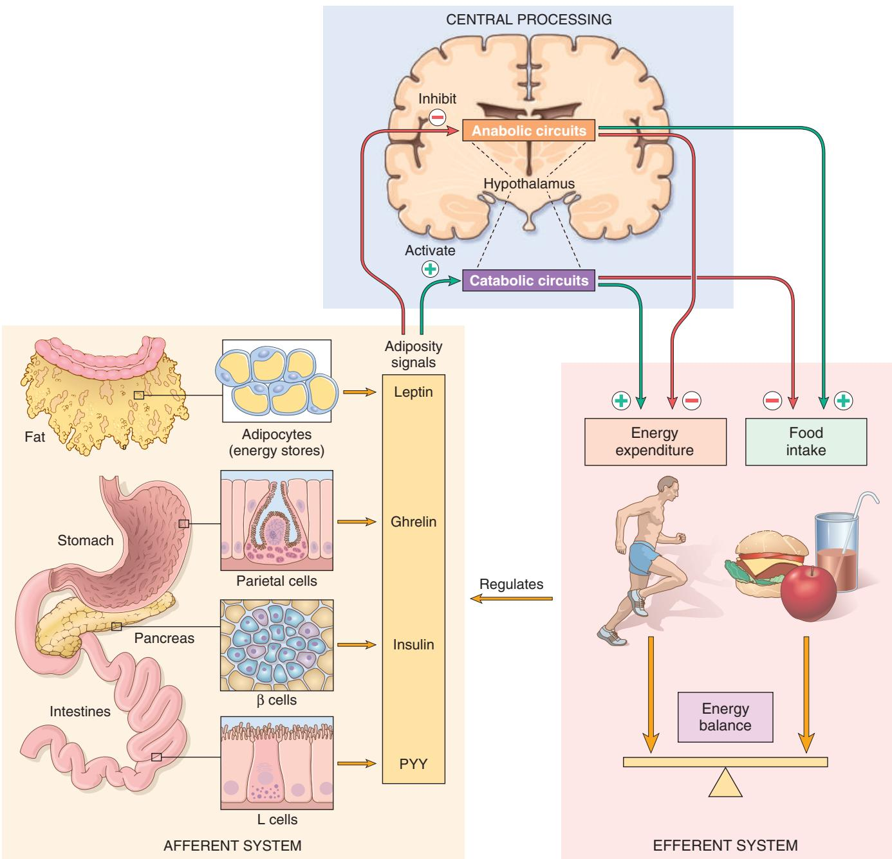 
Fig. 8.23 Energy balance regulatory circuitry. When sufficient energy is stored in adipose tissue and the individual is well fed, afferent adiposity signals (insulin, leptin, ghrelin, peptide YY) are delivered to the central neuronal processing units, in the hypothalamus. Here the adiposity signals inhibit anabolic circuits and activate catabolic circuits. The effector arms of these central circuits then influence energy balance by inhibiting food intake and promoting energy expenditure. This in turn reduces the energy stores, and proadiposity signals are blunted. Conversely, when energy stores are low, the available anabolic circuits take over, at the expense of catabolic circuits, to generate energy stores in the form of adipose tissue.
# Leptin
Leptin is secreted by fat cells, and its output is regulated by the adequacy of fat stores. BMI and body fat stores are directly related to leptin secretion. With abundant adipose tissue, leptin secretion is stimulated, and the hormone crosses the blood-brain barrier and travels to the hypothalamus, where it reduces food intake by stimulating POMC/CART neurons and inhibiting NPY/AgRP neurons. The opposite sequence of events occurs when there are inadequate stores of body fat: Leptin secretion is diminished and food intake is increased. In persons of stable weight, the
activities of these pathways are balanced. Leptin also increases energy expenditure by stimulating physical activity, energy expenditure, and thermogenesis, and these may be the most important catabolic effects mediated by leptin through the hypothalamus. Although the effects of leptin on food intake and energy expenditure can be readily demonstrated in nonobese mice and humans, the anorexigenic response of leptin is blunted in states of obesity despite high levels of circulating leptin. Such leptin resistance in obese mice can be bypassed by intraventricular injection of leptin. In keeping with this observation,
injections of leptin in obese humans fail to affect food intake and energy expenditure, dashing initial enthusiasm of leptin therapy for obesity.
In rodents and humans, loss-of-function mutations affecting components of the leptin pathway give rise to massive obesity. Mice with mutations that disable the leptin gene or its receptor fail to sense the adequacy of fat stores, so they behave as if they are undernourished, eating ravenously. As in mice, mutations of the leptin gene or receptor in humans, although rare, may cause massive obesity. More common are mutations in the melanocortin receptor-4 gene (MC4R), found in $4\%$ to $5\%$ of patients with massive obesity. As mentioned earlier, MSH sends satiety signals by binding to this receptor. These monogenic traits underscore the importance of the leptin pathway in the control of body weight, and it is possible that more common types of defects in this pathway will be discovered in the obese. In closing it should be mentioned that, like leptin, insulin also exerts anorexigenic responses. However, the mechanism of this effect of insulin is less clear, and most of the evidence suggests the primacy of leptin in the regulation of adiposity.
# Adiponectin
Adiponectin, produced in the adipose tissue, has been called a "fat-burning molecule" and the "guardian angel against obesity." It directs fatty acids to muscle for their oxidation. It decreases the influx of fatty acids to the liver and the total hepatic triglyceride content. It also decreases glucose production in the liver, causing an increase in insulin sensitivity and protecting against the metabolic syndrome. In addition to its metabolic effects, adiponectin has anti-diabetic, anti-inflammatory, anti-atherogenic, antiproliferative, and cardioprotective effects. Its serum levels are lower in obese than in lean individuals. These effects contribute to obesity-associated insulin resistance, type 2 diabetes, nonalcoholic fatty liver disease (Chapter 14), and possibly increased risk of certain cancers, discussed later.
# Adipose Tissue and Other Mediators
In addition to leptin and adiponectin, adipose tissue produces other mediators, such as cytokines, chemokines, and steroid hormones, which allow adipose tissue to function as a link between lipid metabolism, nutrition, and inflammatory responses. The total number of adipocytes is established by the time of adolescence and is higher in people who were obese as children, providing another reason for concern about childhood obesity. Although in adults approximately $10\%$ of adipocytes turn over annually, the number of adipocytes remains constant, regardless of individual body mass. Diets fail in part because the loss of fat from adipocytes causes leptin levels to fall, stimulating the appetite and diminishing energy expenditure.
# Gut Hormones
Gut hormones are rapidly acting initiators and terminators of volitional eating. Prototypical examples are ghrelin and peptide YY (PYY). Ghrelin is produced in the stomach and the arcuate nucleus of the hypothalamus. It increases food intake, acting most likely by stimulating the NPY/AgRP neurons in the hypothalamus. Ghrelin
levels normally rise before meals and fall 1 to 2 hours afterward, but this drop is attenuated in obese persons. Ghrelin levels are lower in obese individuals as compared to those with normal weight, and they increase with a reduction in obesity. Interestingly, the rise in ghrelin levels is much reduced in individuals in whom gastric bypass surgery is performed for the treatment of obesity, suggesting that the beneficial effects of such surgery may be in part due to a reduced surface of gastric mucosa that is exposed to food.
$PYY$ is secreted from endocrine cells in the ileum and colon in response to the consumption of food. It decreases appetite and augments a sense of fullness (satiety). It acts, presumably, by stimulating POMC/CART neurons in the hypothalamus, thereby decreasing food intake.
PYY also reduces the rate of gastric emptying and intestinal motility ("ilea brake"), all of which contribute to satiety. PYY levels are reduced with obesity and may be of therapeutic value in the treatment of those who are overweight or obese.
# The Role of Gut Microbiome
An interesting series of observations suggest that the gut microbiome may be involved in the development of obesity. In support of this notion is the finding that the profiles of gut microbiota differ between genetically obese mice and their lean littermates. The microbiome of genetically obese mice can harvest much more energy from food as compared to that of lean mice. Colonization of the gut of germfree mice by microbiota from obese mice (but not microbiota from lean mice) is associated with increased body weight. The relevance of these models to human obesity is tantalizing but remains to be proven.
# Clinical Consequences of Obesity
Obesity, particularly central obesity, is a known risk factor for a number of conditions, including type 2 diabetes, cardiovascular disease, and cancer. Central obesity also stands at the center of a cluster of alterations known as the metabolic syndrome, characterized by abnormalities of glucose and lipid metabolism coupled with hypertension and evidence of a systemic proinflammatory state. This seems to be caused by the inflammasome response to free fatty acids and excess levels of lipids in cells and tissue. The inflammasome stimulates secretion of IL-1, which induces insulin resistance. The following associations are worthy of note:
- Obesity is associated with insulin resistance and hyperinsulinemia, important features of type 2 diabetes (Chapter 20). Excess insulin, in turn, may play a role in the retention of sodium, expansion of blood volume, production of excess norepinephrine, and smooth muscle proliferation that are the hallmarks of hypertension. Whatever the mechanism, the risk of developing hypertension among previously normotensive persons increases proportionately with weight.
- Obese persons generally have hypertriglyceridemia and low HDL cholesterol levels, factors that increase the risk of coronary artery disease. The association between obesity and heart disease is not straightforward, however, and such linkage as there is relates more to the associated diabetes and hypertension than to weight per se.
- Nonalcoholic fatty liver disease is commonly associated with obesity and type 2 diabetes. It can progress to fibrosis and cirrhosis (Chapter 16). 
- Cholelithiasis (gallstones) is six times more common in obese than in lean subjects. The mechanism is mainly an increase in total body cholesterol, increased cholesterol turnover, and augmented biliary excretion of cholesterol in the bile, which in turn predisposes affected persons to the formation of cholesterol-rich gallstones (Chapter 16). 
- Hypoventilation syndrome is a constellation of respiratory abnormalities in very obese persons. It has been called the pickwickian syndrome, after the fat lad who was constantly falling asleep in Charles Dickens' The Pickwick Papers. Hypersomnolence, both at night and during the day, is characteristic and is often associated with apneic pauses during sleep (sleep apnea), polycythemia, and eventual right-sided heart failure. 
- Marked adiposity is a predisposing factor for the development of degenerative joint disease (osteoarthritis). This form of arthritis, which typically appears in older persons, is attributed in large part to the cumulative effects of wear and tear on joints. The greater the body burden of fat, the greater the trauma to joints with the passage of time. 
- Markers of inflammation, such as C-reactive protein (CRP) and proinflammatory cytokines like TNF, are often elevated in obese persons. The basis for the inflammation is uncertain; both a direct proinflammatory effect of excess circulating lipids and increased release of cytokines from fat-laden adipocytes have been proposed. Whatever the cause, it is thought that chronic inflammation may contribute to many of the complications of obesity, including insulin resistance, metabolic abnormalities, thrombosis, cardiovascular disease, and cancer.
# Obesity and Cancer
There is an increased incidence of certain cancers in the overweight, including cancers of the esophagus, thyroid, colon, and kidney in men and cancers of the esophagus, endometrium, gallbladder, and kidney in women. Overall, obesity is associated with approximately $20\%$ of cancer deaths in women and $14\%$ of deaths in men. The underlying mechanisms are unknown and are likely to be multiple.
- Elevated insulin levels. Insulin resistance leads to hyperinsulinemia, which includes multiple effects that may directly or indirectly contribute to cancer. For example, hyperinsulinemia causes a rise in levels of free insulin-like growth factor-1 (IGF-1). IGF-1 is a mitogen, and its receptor, IGFR-1, is highly expressed in many human cancers. IGFR-1 activates the RAS and PI3K/AKT pathways, which promote the growth of both normal and neoplastic cells (Chapter 6). 
- Obesity has effects on steroid hormones that regulate cell growth and differentiation in the breast, uterus, and other tissues. Specifically, obesity increases the synthesis of estrogen from androgen precursors, increases androgen synthesis in ovaries and adrenals, and enhances estrogen availability in obese persons by inhibiting the production of sex-hormone-binding globulin (SHBG) in the liver. 
- As discussed earlier, adiponectin secretion from adipose tissue is reduced in obese individuals. Adiponectin
suppresses cell proliferation and promotes apoptosis. It also counteracts the actions of p53 and p21. In obese individuals these anti-neoplastic actions of adiponectin may be compromised. 
- The proinflammatory state that is associated with obesity may itself be carcinogenic, through mechanisms discussed in Chapter 6.
# OBESITY
- Obesity is a disorder of energy regulation. It increases the risk for a number of important conditions such as insulin resistance, type 2 diabetes, hypertension, and hypertriglyceridemia, which are associated with the development of coronary artery disease. 
- The regulation of energy balance is very complex. It has three main components: (1) afferent signals, provided mostly by insulin, leptin, ghrelin, and peptide YY; (2) the central hypothalamic system, which integrates afferent signals and triggers the efferent signals; and (3) efferent signals, which control energy balance. 
- Leptin plays a key role in energy balance. Its output from adipose tissues is regulated by the abundance of fat stores. Leptin binding to its receptors in the hypothalamus reduces food intake by stimulating POMC/CART neurons and inhibiting NPY/AgRP neurons. 
- In addition to diabetes and cardiovascular disease, obesity also is associated with increased risk for certain cancers, non-alcoholic fatty liver disease, and gallstones.
# Diet and Systemic Diseases
The problems of under- and overnutrition, as well as specific nutrient deficiencies, have been discussed; however, the composition of the diet, even in the absence of any of these problems, may make a significant contribution to the causation and progression of a number of diseases. A few examples suffice here.
Currently, one of the most important and controversial issues is the contribution of diet to atherogenesis. The central question is whether dietary modification—specifically, reduction in the consumption of foods high in cholesterol and saturated animal fats (e.g., eggs, butter, beef)—can reduce serum cholesterol levels and prevent or retard the development of atherosclerosis (of most importance, coronary heart disease) in those with no previous episode of cardiovascular disease. This is called "primary prevention". We know some but not all the answers. The average adult in the United States consumes a large amount of fat and cholesterol daily, with a ratio of saturated fatty acids to polyunsaturated fatty acids of about 3:1. Lowering the level of saturates to the level of the polyunsaturates causes a $10\%$ to $15\%$ reduction in serum cholesterol within a few weeks. Vegetable oils (e.g., corn and safflower oils) and fish oils contain polyunsaturated fatty acids and are good sources of such cholesterol-lowering lipids. Fish oil fatty acids belonging to the omega-3, or n-3, family have more double bonds than do the omega-6, or n-6, fatty acids found in vegetable oils. A corollary of this idea is that supplementation of diet with fish oils might protect against atherosclerosis. One study of Dutch men whose usual
daily diet contained $30\mathrm{g}$ of fish showed a substantially lower frequency of death from coronary heart disease than that among comparable control subjects. However, other studies have shown that omega-3 fatty acid supplements do not reduce the risk of cardiovascular diseases, suggesting that yet unknown components of fish may be required for cardioprotection.
Other specific effects of diet on disease have been recognized:
- Restricting sodium intake reduces hypertension. 
- Dietary fiber, or roughage, resulting in increased fecal bulk, is thought by some investigators to provide a preventive effect against diverticulosis of the colon. 
- Caloric restriction has been convincingly demonstrated to increase life span in experimental animals, including monkeys. The basis for this striking observation is not clear (Chapter 2). 
- Even lowly garlic has been touted to protect against heart disease (and also, alas, against kisses—and the devil), although research has yet to prove this effect unequivocally.
# Diet and Cancer
With respect to carcinogenesis, three aspects of the diet are of concern: (1) the content of exogenous carcinogens, (2) the endogenous synthesis of carcinogens from dietary components, and (3) the lack of protective factors.
- An example of an exogenous carcinogen is aflatoxin, which is an important factor in the development of hepatocellular carcinomas in parts of Asia and Africa. Exposure to aflatoxin causes a specific mutation (codon 249) in the TP53 gene in tumor cells. The mutation can be used as a molecular signature for aflatoxin exposure in epidemiologic studies. 
- The concern about endogenous synthesis of carcinogens or promoters from components of the diet relates principally to gastric carcinomas. Nitrosamines and nitrosamides are suspected to generate these tumors in humans, as they induce gastric cancer in animals. These compounds are formed in the body from nitrites and amines or amides derived from digested proteins. Sources of nitrites include sodium nitrite, added to foods as a preservative, and nitrates, present in common vegetables, which are reduced in the gut by bacterial flora. There is, then, the potential for endogenous production of carcinogenic agents from dietary components, which might well have an effect on the stomach. 
- High animal fat intake combined with low fiber intake has been implicated in the causation of colon cancer. The most convincing explanation for this association is as follows: High fat intake increases the level of bile acids in the gut, which in turn modifies intestinal flora, favoring the growth of microaerophilic bacteria. The bile acids or bile acid metabolites produced by these bacteria might serve as carcinogens or promoters. The protective effect of a high-fiber diet might relate to (1) increased stool bulk and decreased transit time, which decreases the exposure of mucosa to putative offenders, and (2) the capacity of certain fibers to bind carcinogens and thereby protect the mucosa. Attempts to document these
theories in clinical and experimental studies have, on the whole, led to contradictory results.
- Vitamins C and E, $\beta$ -carotenes, and selenium have been assumed to have anti-carcinogenic effects because of their anti-oxidant properties. To date, however, no convincing evidence has emerged to show that these antioxidants act as chemopreventive agents. As already mentioned, retinoic acid promotes epithelial differentiation and is believed to reverse squamous metaplasia.
Thus, despite many tantalizing trends and proclamations by "diet gurus," to date there is no definite proof that diet in general can cause or protect against cancer. Nonetheless, concern persists that carcinogens lurk in things as pleasurable as a juicy steak and rich ice cream.
Bellinger DC: Lead, Pediatrics 113:1016, 2004. [An excellent overview of the subject.] 
Boffetta P, Hecht S, Gray N, et al: Smokeless tobacco and cancer, Lancet Oncol 9:667, 2009. [A review of cancer risks associated with smokeless tobacco worldwide.] 
Casals-Casas C, Desvergne B: Endocrine disruptors: from endocrine to metabolic disruption, Annu Rev Phys 73:135, 2011. [An update discussing the scope and possible consequences of human exposure to this class of chemical.] 
Global Burden of Disease Study 2010: Lancet, epublished December 13, 2012. [An entire issue of this journal devoted to a detailed summary of the latest global disease data from the GBD project.] 
Graham C, Mullen A, Whelan K: Obesity and gastrointestinal microbiota: a review of associations and mechanisms, Nutr Rev 73:376, 2016. [A review of the emerging data on the role of the microbiome in obesity.] 
Gregor MF, Hotamisligil GS: Inflammatory mechanisms in obesity, Annu Rev Immunol 29:445, 2011. [A concise discussion of current views of the proinflammatory state associated with obesity.] 
Hanna-Attisha M, LaChance J, Sadler RC, et al: Elevated blood lead levels in children associated with the Flint drinking water crisis: a spatial analysis of risk and public health response, Am J Public Health 106:283, 2016. [An article that discusses public health issues resulting from water pollution with lead in Flint, Michigan, USA.] 
Hollick MF: Vitamin D deficiency, N Engl J Med 357:266, 2007. [A comprehensive review of vitamin D deficiency.] 
McCreanor J, Cullinan P, Nieuwenhuijsen MJ, et al: Respiratory effects of exposure to diesel traffic in persons with asthma, N Engl J Med 357:2348, 2007. [A paper discussing the danger of particulates in diesel exhaust to patients with asthma.] 
Matthew JD, Forsythe AV, Brady Z, et al: Cancer risk in 680,000 people exposed to computed tomography scans in childhood or adolescence: data linkage study of 11 million Australians, BMJ 346:f2360, 2013. [A paper showing that children who have undergone CT scans have a $24\%$ increased risk of cancer, adding to accruing evidence that CT scans increase the risk of secondary cancers in children and adolescents.] 
Manson JE, Hsia J, Johnson KC, et al: Estrogen plus progestin and the risk of coronary heart disease, N Engl J Med 349:523, 2003. [A landmark study from the Women's Health Initiative.] 
Nigro E, Scudiero O, Monaco ML, et al: New insights into adiponectin role in obesity and obesity-related diseases, Biomed Res Int 2014;658913, 2014. doi: 10.1155/2014/658913. Epub July 7, 2014. [Role of adiponectin in fat utilization and other systemic effects.] 
Pope CA, Ezzati M, Dockery DW: Fine-particulate air pollution and life expectancy in the United States, N Engl J Med 360:376, 2009. [A
paper correlating increases in life expectancy in major U.S. cities with decreases in fine-particulate air pollution.] 
Ravdin PM, Cronin KA, Howlader N, et al: The decrease in breast cancer incidence in 2003 in the United States, N Engl J Med 356:1670, 2007. [A paper documenting the decrease in breast cancer that followed its linkage to menopausal hormone therapy.] 
Rice KM, Walker EM Jr, Wu M, et al: Environmental mercury and its toxic effects, J Prev Med Public Health 47:74, 2014. [Mercury toxicity review.] 
Roberts DL, Dove C, Renehan AG: Biological mechanisms linking obesity and cancer risk: new perspectives, Annu Rev Med 61:301, 2010. [A discussion of the possible interactions between obesity and cancer.]
Seitz HK, Stickel F: Molecular mechanisms of alcohol-mediated carcinogenesis, Nat Rev Cancer 7:599, 2007. [A review of the multifactorial effects of alcohol that may contribute to cancer development.] 
Tang X-H, Gudas LJ: Retinoids, retinoic acid receptors, and cancer, Annu Rev Pathol 6:345, 2011. [A review of the role of retinoids in cancer, with a focus on solid tumors.] 
van der Klaauw AA, Farooqi IS: The hunger genes: pathways to obesity, Cell 161:119, 2015. [A succinct review of the afferent pathways to obesity.] 
Wilson J, Enriori PJ: A talk between fat tissue, gut, pancreas, and brain to control body weight, Mol Cell Endocrinol 418:108, 2015. [Excellent discussion of the various afferent pathways in obesity.]
# General Pathology of Infectious Diseases
# 9
General Principles of Microbial Pathogenesis 341
Categories of Infectious Agents 341
The Microbiome 346
Techniques for Identifying Infectious
Agents 346
Newly Emerging and
Reemerging Infectious
Diseases 347
Agents of Bioterrorism 348
Transmission and Dissemination of Microbes 349
Routes of Entry of Microbes 349
Spread and Dissemination of Microbes Within the Body 351
Transmission of Microbes 352
How Microorganisms Cause Disease 352
Mechanisms of Viral Injury 353
Mechanisms of Bacterial Injury 353
Injurious Effects of Host Immune Responses 355
Immune Evasion by Microbes 355
Spectrum of Inflammatory Responses to
Infection 357
Mononuclear and Granulomatous
Inflammation 357
Cytopathic-Cytoproliferative Reaction 357
Tissue Necrosis 358
Chronic Inflammation and Scarring 358
Infections in Individuals With
Immunodeficiencies 358
Humans are prey to thousands of infectious agents ranging from submicroscopic viruses to several meters long tape worms. This chapter reviews the general principles of the pathogenesis of infectious disease and describes the characteristic histopathologic changes caused by different types of microbes. Infections that involve specific organs are discussed in other chapters of this book.
# GENERAL PRINCIPLES OF MICROBIAL PATHOGENESIS
Infectious diseases are an important health problem in the United States and worldwide despite the availability of effective vaccines and antibiotics for many types of infections. Influenza and pneumonia combined are the eighth leading cause of death in the United States. In low-income countries, limited access to healthcare, unsanitary living conditions, and malnutrition contribute to a massive burden of infectious diseases. Lower-respiratory infections, HIV/AIDS, and diarrheal diseases are the top three causes of death in developing countries, and malaria and tuberculosis are among the top ten. Infectious diseases are particularly important causes of death among children, older adults, individuals with chronic debilitating diseases and inherited or acquired immunodeficiency states (e.g., AIDS), and in patients receiving immunosuppressive drugs.
# Categories of Infectious Agents
Infectious agents belong to a wide range of classes and vary greatly in size, ranging from prion protein
aggregates of under $20\mathrm{nm}$ to tapeworms 10 meters in length (Table 9.1).
# Prions
Prions are composed of abnormal forms of a host protein termed prion protein (PrP). These agents cause transmissible spongiform encephalopathies, including kuru (associated with human cannibalism), hereditary or sporadic Creutzfeldt-Jakob disease (CJD), bovine spongiform encephalopathy (BSE) (better known as mad cow disease), and variant Creutzfeldt-Jakob disease (vCJD) (probably transmitted to humans through consumption of meat from BSE-infected cattle). PrP is found normally in neurons. Diseases occur when the PrP undergoes a conformational change that confers resistance to proteases. The protease-resistant PrP promotes conversion of the normal protease-sensitive PrP to the abnormal form, explaining the transmissible nature of these diseases. CJD can be transmitted from person to person iatrogenically, by surgery, organ transplantation, or blood transfusion. These diseases are discussed in detail in Chapter 23.
# Viruses
Viruses are obligate intracellular parasites that depend on the host cell's metabolic machinery for their replication. They consist of a nucleic acid genome surrounded by a protein coat (called a capsid) that is sometimes encased in a lipid membrane. Viruses are classified by their nucleic acid genome (DNA or RNA, but not both), the shape of the capsid (icosahedral or helical), the presence or absence of a lipid envelope, their mode of replication, their preferred cell type for replication (called tropism), or the type of
Table 9.1 Classes of Human Pathogens 
Taxonomic CategorySizePropagation Site(s)Example(s)Disease(s)Prions&lt;20 nmIntracellularPrion proteinCreutzfeldt-Jacob diseaseViruses20–400 nmObligate intracellularPoliovirusPoliomyelitisBacteria0.2–15 μmObligate intracellularChlamydia trachomatisTrachoma, urethritisExtracellularStreptococcus pneumoniaePneumoniaFacultative intracellularMycobacterium tuberculosisTuberculosisFungi2–200 μmExtracellularCandida albicansThrushFacultative intracellularHistoplasma capsulatumHistoplasmosisProtozoa1–50 μmExtracellularTrypanosoma bruceiSleeping sicknessFacultative intracellularTrypanosoma cruziChagas diseaseObligate intracellularLeishmania donovaniKala-azarHelminths3 mm–10 mExtracellularWuchereria bancroftiFilariasisIntracellularTrichinella spiralisTrichinosis
pathology they cause. Some viral components and particles aggregate within infected cells and form characteristic inclusion bodies, which may be seen with the light microscope and are useful for diagnosis (Fig. 9.1). For example, cytomegalovirus (CMV)-infected cells are enlarged and show a large eosinophilic nuclear inclusion and smaller basophilic cytoplasmic inclusions; herpesviruses form a large nuclear inclusion surrounded by a clear halo; and both smallpox and rabies viruses form characteristic cytoplasmic inclusions. However, many viruses (e.g., poliovirus) do not produce inclusions.
Accounting for a large share of human infections, viruses can cause disease in several ways (Table 9.2). Many viruses cause transient illnesses (e.g., colds, influenza). Other viruses are not eliminated from the body and persist within cells of the host for years, either continuing to multiply (e.g., chronic infection with hepatitis B virus [HBV]) or survive in some latent nonreplicating form, with the potential to be reactivated later. For example, herpes zoster virus, the cause of chickenpox, can enter dorsal root ganglia and establish latency at the site, with periodic reactivation at later times to cause shingles, a painful skin condition. Some viruses are involved in transformation of a host cell into a benign or malignant tumor (e.g., human papillomavirus [HPV]-induced benign warts and cervical carcinoma). Different species of viruses can produce the same clinical picture (e.g., adenovirus and rhinovirus
causing upper respiratory infection); conversely, a single virus can cause different clinical manifestations depending on the age or immune status of the host (e.g., CMV causing congenital neurologic damage or gastroenteritis in the immunocompromised).
# Bacteria
Bacteria are prokaryotes, meaning that they have a cell membrane but lack membrane-bound nuclei and other membrane-enclosed organelles. Most bacteria are bounded by a cell wall consisting of peptidoglycan, a polymer of long sugar chains linked by peptide bridges surrounding the cell membrane. There are two common forms of cell wall structure: a thick wall that retains crystal-violet stain (gram-positive bacteria) and a thin cell wall surrounded by an outer membrane (gram-negative bacteria) (Fig. 9.2). Bacteria are classified by Gram staining (positive or negative), shape (spherical, called cocci, or rod-shaped, called bacilli) (Fig. 9.3), and their requirement for oxygen (aerobic or anaerobic). Motile bacteria have flagella, long helical filaments extending from the cell surface that rotate and move the bacteria. Some bacteria possess pili, another kind of surface projection that can attach bacteria to host cells or extracellular matrix. Bacteria synthesize their own DNA, RNA, and proteins, but they depend on the host for favorable growth conditions. Many bacteria remain extracellular when they grow in the host, while
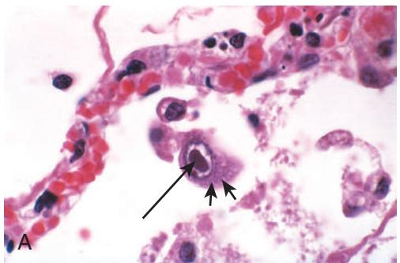 
Fig. 9.1 Examples of viral inclusions. (A) Cytomegalovirus infection in the lung. Infected cells show distinct nuclear (long arrow) and ill-defined cytoplasmic (short arrows) inclusions. (B) Varicella-zoster virus infection in the skin. Herpes simplex virus and varicella-zoster virus both cause characteristic cytopathologic changes, including fusion of epithelial cells, which produces multinucleate cells with molding of nuclei to one another (long arrow), and eosinophilic haloed nuclear inclusions (short arrow). (C) Hepatitis B viral infection in liver. In chronic infections, infected hepatocytes show diffuse granular ("ground-glass") cytoplasm, reflecting accumulated hepatitis B surface antigen (HBsAg).
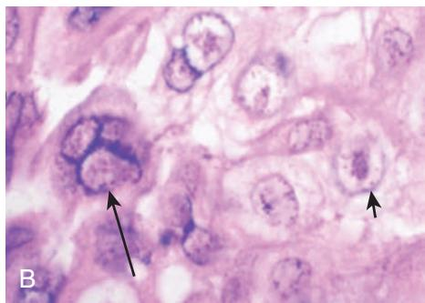
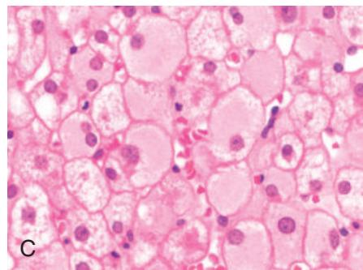
Table 9.2 Selected Human Viral Diseases and Their Pathogens 
Organ SystemPathogenDisease(s)RespiratoryAdenovirusUpper- and lower-respiratory tract infections, conjunctivitisRhinovirusUpper-respiratory tract infectionInfluenza viruses A, BInfluenzaRespiratory syncytial virusBronchiolitis, pneumoniaDigestiveMumps virusMumps, pancreatitis, orchitisRotavirusChildhood gastroenteritisNorovirusGastroenteritisHepatitis A virusAcute viral hepatitisHepatitis B virusAcute or chronic hepatitisHepatitis D virusWith hepatitis B virus infection: acute or chronic hepatitisHepatitis C virusAcute or chronic hepatitisHepatitis E virusAcute viral hepatitisSystemicWith skin eruptionsMeasles virusMeasles (rubeola)Rubella virusGerman measles (rubella)Varicella-zoster virusChickenpox, shinglesHerpes simplex virus type 1Oral herpes (“cold sore”)Herpes simplex virus type 2Genital herpesWith hematopoietic disordersCytomegalovirusCytomegalic inclusion disease in the newborn, gastroenteritis in transplant patientsEpstein-Barr virusInfectious mononucleosisHIV-1 and HIV-2AIDSSkin/genital wartsPapillomavirusCondyloma; cervical carcinomaCentral nervous systemPoliovirusPoliomyelitisJC virusProgressive multifocal leukoencephalopathy (opportunistic)Zika virusCongenital microcephaly
AIDS, Acquired immunodeficiency syndrome; HIV, human immunodeficiency virus.
others can survive and replicate both outside and inside of host cells (facultative intracellular bacteria such as mycobacteria), and some grow only inside host cells (obligate intracellular bacteria, such as rickettsia).
Bacteria cause a range of infections from common pharyngitis and urinary tract infections to rare diseases such as leprosy (Table 9.3). Chlamydia and Rickettsia are obligate intracellular bacteria that replicate inside membrane-bound vacuoles in epithelial and endothelial cells, respectively. These bacteria get most or all of their energy source, ATP, from the host cell. Chlamydia trachomatis is a frequent infectious cause of female sterility (by scarring and narrowing of the fallopian tubes) and blindness (by chronic inflammation of the conjunctiva that eventually causes scarring and opacification of the cornea). Rickettsiae injure the endothelial cells in which they grow, causing a
hemorrhagic vasculitis, often visible as a rash, but they also may injure the central nervous system (CNS), with potentially fatal outcome, as in Rocky Mountain spotted fever and epidemic typhus. Rickettsiae are transmitted by arthropod vectors, including lice (in epidemic typhus), ticks (in Rocky Mountain spotted fever and ehrlichiosis), and mites (in scrub typhus).
Mycoplasma and the related genus Ureaplasma are unique among extracellular bacterial pathogens in that they do not have a cell wall. These are the tiniest free-living organisms known (125 to $300\mathrm{nm}$ ).
# Fungi
Fungi are eukaryotes with thick cell walls composed of complex carbohydrates such as beta-glucans, chitin, and mannosylated glycoproteins. Calcofluor-white, a
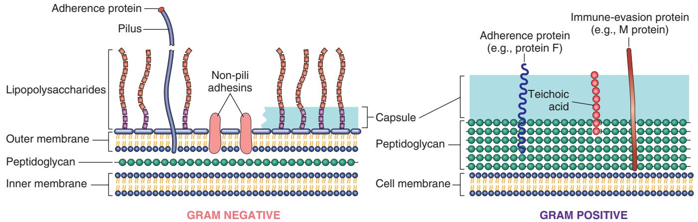 
Fig. 9.2 Molecules on the surface of gram-negative and gram-positive bacteria involved in the pathogenesis of infection.
Table 9.3 Selected Human Bacterial Diseases and Their Pathogens 
Microbiologic Category Clinical CategorySpeciesFrequent Disease Presentation(s)Infections by pyogenic cocciStaphylococcus aureus, Staphylococcus epidermidisAbscess, cellulitis, pneumonia, sepsisStreptococcus pyogenesPharyngitis, erysipelas, scarlet feverStreptococcus pneumoniaeLobar pneumonia, meningitisNeisseria meningitidisMeningitisNeisseria gonorrhoeaeGonorrheaGram-negative infectionsEscherichia coli, Klebsiella pneumoniae, Enterobacter aerogenes, Proteus mirabilis, Serratia marcescens, Pseudomonas aeruginosa, Bacteroides fragilis Legionella pneumophilaUrinary tract infection, wound infection, abscess, pneumonia, sepsis, shock, endocarditis Legionnaires&#x27; diseaseClostridial infectionsClostridium tetaniTetanus (lockjaw)Clostridium botulinumBotulism (paralytic food poisoning)Clostridium perfringens, Clostridium septicumGas gangrene, necrotizing cellulitisClostridium difficilePseudomembranous colitisZoonotic bacterial infectionsBacillus anthracisAnthraxYersinia pestisBubonic plagueFrancisella tularensisTularemiaBrucella melitensis, Brucella suis, Brucella abortusBrucellosis (undulant fever)Borrelia recurrentisRelapsing feverBorrelia burgdorferiLyme diseaseTreponemal infectionsTreponema pallidumSyphilisMycobacterial infectionsMycobacterium tuberculosis, M. bovisTuberculosisMycobacterium lepraeLeprosyMycobacterium kansasii, Mycobacterium avium complexPulmonary disease, lymphadenitis, disseminated diseaseActinomycetal infectionsNocardia asteroides complexPulmonary disease, brain abscessActinomyces israeliiHead and neck abscessContagious childhood bacterial diseasesHaemophilus influenzaeMeningitis, upper- and lower-respiratory tract infectionsBordetella pertussisWhooping coughCorynebacterium diphtheriaeDiphtheriaEnteric infectionsEnteropathogenic E. coli, Shigella spp., Vibrio cholera, Campylobacter jejuni, Campylobacter coli, Yersinia enterocolitica, Salmonella spp.Invasive or noninvasive gastroenterocolitisSalmonella enterica serotype TyphiTyphoid fever
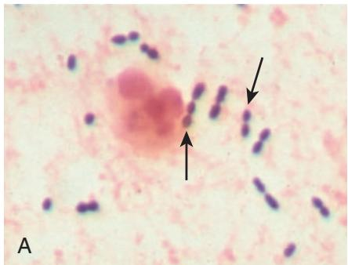 
Fig. 9.3 Bacterial morphologies. The bacteria are indicated by arrows. (A) Gram stain preparation of sputum from a patient with pneumonia. Gram-positive, elongated cocci in pairs and short chains (Streptococcus pneumoniae) and a neutrophil are evident. (B) Gram stain preparation of a bronchoalveolar lavage specimen showing gram-negative intracellular rods typical of members of Enterobacteriaceae such as Klebsiella pneumoniae or Escherichia coli. (C) Silver stain preparation of brain tissue from a patient with Lyme disease meningoencephalitis. Two helical spirochetes (Borrelia burgdorferi) are shown (arrows). (A), (B), and (C) are at different magnifications. (A and C, Courtesy of Dr. Kenneth Van Horn, Focus Diagnostics, Cypress, California. B, Courtesy of Dr. Karen Krisher, Clinical Microbiology Institute, Wilsonville, Oregon.)
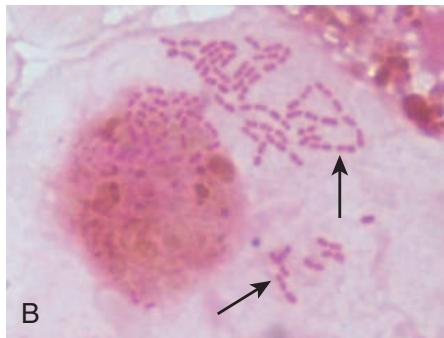
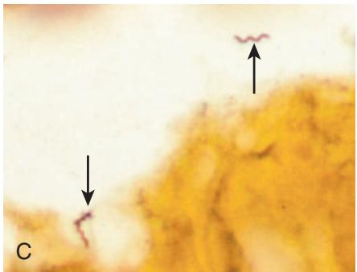
fluorescent stain that binds chitin, provides a useful way to identify fungi in patient specimens. Assays for betaglucans in blood are used to diagnose disseminated fungal infections. Fungi can grow either as rounded yeast cells or as slender, filamentous hyphae. An important distinguishing characteristic is whether hyphae are septate (with cell walls separating individual cells) or aseptate. Some of the most important pathogenic fungi exhibit thermal dimorphism; that is, they grow as hyphal forms at room temperature but as yeast forms at body temperature. Fungi may produce sexual spores or, more commonly, asexual spores called conidia. The latter are produced on specialized structures or fruiting bodies arising along the hyphal filament.
Fungi may cause superficial or deep infections.
- Superficial infections involve the skin, hair, and nails. Fungal species that cause superficial infections are called dermatophytes. Infection of the skin is called tinea; thus, tinea pedis is "athlete's foot" and tinea capitis is scalp ringworm. Certain fungi invade the subcutaneous tissue, causing abscesses or granulomas. Chronic infections, often in the foot, are called mycetomas. 
- Deep fungal infections can spread systemically and invade tissues, destroying vital organs in immunocompromised hosts, but usually resolve or remain latent in otherwise normal hosts.
Fungi are divided into endemic and opportunistic species.
- Endemic fungi are invasive species that are usually limited to particular geographic regions (e.g., Coccidioides in the southwestern United States, Histoplasma in the Ohio River Valley). 
- Opportunistic fungi (e.g., Candida, Aspergillus, Mucor, Cryptococcus), by contrast, are ubiquitous organisms that either colonize individuals or are encountered from environmental sources but do not cause severe disease in healthy individuals. In immunodeficient individuals, opportunistic fungi give rise to life-threatening invasive infections characterized by vascular occlusion, hemorrhage, and tissue necrosis, with little or no inflammatory response (Fig. 9.4). Patients with AIDS are very susceptible to infection with the opportunistic fungus Pneumocystis jiroveci (previously called Pneumocystis carinii).
# Protozoa
Protozoa are single-celled eukaryotes that are major causes of disease and death in developing countries. Protozoa can replicate intracellularly within a variety of cells (e.g., Plasmodium in red cells, Leishmania in macrophages) or extracellularly in the urogenital system, intestine, or blood. Trichomonas vaginalis organisms are sexually transmitted flagellated protozoal parasites that often colonize the vagina and male urethra. The most prevalent pathogenic intestinal protozoans, Entamoeba histolytica and Giardia lamblia, are ingested as nonmotile cysts in contaminated food or water and become motile trophozoites that attach to intestinal epithelial cells. Bloodborne protozoa (e.g., Plasmodium, Trypanosoma, Leishmania) are transmitted by insect vectors, in which they replicate before being
.(CourtesyofDr.DanMilner,DepartmentofPathology,BrighamandWomen'sHospital,Boston,Massachusetts.).jpg) 
Fig. 9.4 Meningeal blood vessels with angioinvasive Mucor species. Note the irregular width and near right-angle branching of the hyphae (arrow). (Courtesy of Dr. Dan Milner, Department of Pathology, Brigham and Women's Hospital, Boston, Massachusetts.)
passed to new human hosts. Toxoplasma gondii is acquired either through contact with oocyst-shedding cats or by eating cyst-ridden, undercooked meat.
# Helminths
Parasitic worms are highly differentiated multicellular organisms. Their life cycles are complex; most alternate between sexual reproduction in the definitive host and asexual multiplication in an intermediate host or vector. Thus, depending on the species, humans may harbor adult worms (e.g., Ascaris lumbricoides), immature stages (e.g., Toxocara canis), or asexual larval forms (e.g., Echinococcus spp.). Once adult worms take up residence in humans, they usually do not multiply but they produce eggs or larvae that typically are passed in stool. Often, the severity of disease is proportional to the number of infecting organisms. For example, a burden of 10 hookworms is associated with mild or no clinical disease, whereas 1000 hookworms consume enough blood to cause severe anemia. In some helminthic infections, such as schistosomiasis, disease is caused by inflammatory responses to the eggs or larvae rather than the adult worms.
Helminths comprise three groups:
- Roundworms (nematodes) are circular in cross-section and nonsegmented. Intestinal nematodes include A. lumbricoides, Strongyloides stercoralis, and hookworms. Nematodes that invade tissues include the filariae, such as Wuchereria bancrofti and Trichinella spiralis (Fig. 9.5). 
- Tapeworms (cestodes) have a head (scolex) and a ribbon of multiple flat segments (proglottids). They adsorb nutrition through their tegument and do not have a digestive tract. They include the fish, beef, and pork tapeworms that make their home in the human intestine. The larvae that develop after ingestion of eggs of certain tapeworms can cause cystic disease within tissues (Echinoccus granulosus larvae cause hydatid cysts; pork tapeworm larvae produce cysts called cysticerci in many organs). 
- Flukes (trematodes) are leaf-shaped flatworms with prominent suckers that are used to attach to the host. They include liver and lung flukes and schistosomes.
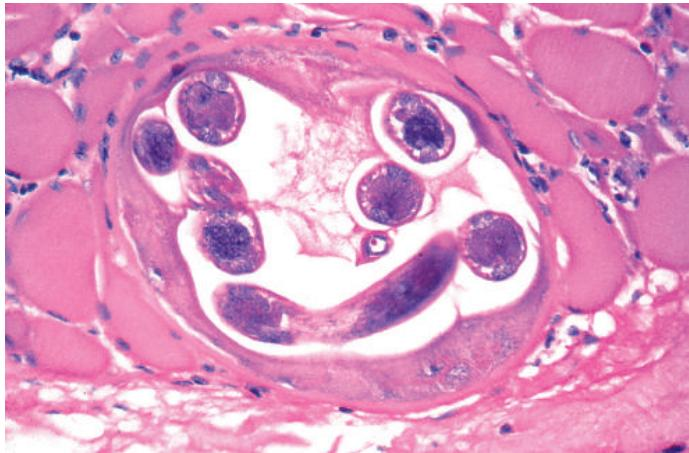 
Fig. 9.5 Coiled Trichinella spiralis larva within a skeletal muscle cell.
# Ectoparasites
Ectoparasites are insects (e.g., lice, bedbugs, fleas) or arachnids (e.g., mites, ticks, spiders) that cause disease by biting or by attaching to and living on or in the skin. Infestation of the skin by arthropods is characterized by itching and excoriations, such as pediculosis caused by lice attached to hairs, or scabies caused by mites burrowing into the stratum corneum. At the site of bites, mouth parts may be found associated with a mixed infiltrate of lymphocytes, macrophages, and eosinophils. Arthropods also can serve as vectors for other pathogens, such as Borrelia burgdorferi, the agent of Lyme disease, which is transmitted by deer ticks.
# THE MICROBIOME
The microbiome is the diverse microbial population of bacteria, fungi, and viruses found in or on the human body (e.g., in the intestinal tract, skin, upper airway, and vagina). While most of these organisms do not harm the healthy host, a few cause diseases such as skin and soft-tissue infections (Staphylococcus aureus and Streptococcus pyogenes), acne (Propionibacterium acnes), and tooth decay (Streptococcus mitus). The microbiome has important roles in normal health and development. In the intestinal tract, the normal flora are responsible for absorption of digested foods, for maintaining the integrity of the epithelium and the normal functioning of the intestinal immune system, and for competitively inhibiting invasion and colonization by potentially pathogenic microbes. The gut microbiome is also emerging as a regulator of nutritional status.
New techniques of bacterial identification relying on ribosomal RNA sequencing have dramatically improved our understanding of the microbiome:
- In healthy individuals, the microbiome is very diverse. For example, there are estimated to be over 1000 species of bacteria in the normal intestinal flora of an individual. In a healthy person, a part of the bacterial population at various body sites is relatively stable over time, but may be altered by diet and environment. 
- The diversity of bacteria is greatest in the oral cavity and the stool, intermediate on the skin, and least in the vagina.
- The bacterial microbiomes at various body sites are partially similar in different individuals.
Dysbiosis refers to changes in composition of the microbiome that are associated with disease. These changes may result from therapies or various pathophysiologic conditions, including the following:
- Use of some antibiotics is an important risk factor for intestinal infections caused by toxin-producing Clostridium difficile. These antibiotics kill or inhibit normal commensal bacteria, allowing overgrowth of C. difficile. Restoration of the microbiome by duodenal infusion of stool containing commensal flora from healthy donors successfully treats C. difficile infection in many individuals who have relapsed after antibiotic therapy. 
- The microbiome in the stool of obese individuals is less diverse than that of lean individuals, and the proportions of bacterial phyla differ as well. The proportions of these phyla in obese individuals who change their diet and lose weight shifts to resemble that of lean individuals. Experimental animals gain more weight when colonized with bacterial populations associated with a high-fat diet than when colonized with bacterial populations associated with a normal diet. 
- The intestinal bacterial populations in individuals with inflammatory bowel disease are altered, with reduced diversity and changes in the proportions of bacterial phyla, compared to individuals without inflammatory bowel disease. Interestingly, inflammatory bowel disease also is associated with changes in the viral populations in stool. The specific roles of different viruses and bacteria in gastrointestinal dysbiosis is an area of very active investigation.
# TECHNIQUES FOR IDENTIFYING INFECTIONAL AGENTS
There are several methods for identifying microorganisms in tissue and body fluids:
Culture. Bacterial and fungal cultures remain essential for diagnostic testing, in conjunction with additional methods, but culture of viruses has been replaced to a great extent by alternative methods. 
- Histology. Some infectious agents can be seen in hematoxylin and eosin (H&E)-stained sections (e.g., the inclusion bodies formed by CMV and herpes simplex virus (HSV); bacterial clumps, which usually stain blue; Candida and Mucor among the fungi; most protozoans; all helminths). Many infectious agents, however, are better visualized by special stains that identify organisms on the basis of particular characteristics of their cell wall or coat—Gram, acid-fast, silver, mucicarmine, and Giemsa stains—or after labeling with specific antibodies (Table 9.4). Organisms are usually best visualized at the advancing edge of a lesion rather than at its center, particularly if there is necrosis. 
- Serology. Acute infections can be diagnosed serologically by detecting pathogen-specific antibodies in the serum. The presence of specific immunoglobulin M (IgM) antibody shortly after the onset of symptoms is often diagnostic. Alternatively, specific antibody titers
Table 9.4 Techniques for Identifying Infectious Agents 
TechniqueInfectious Agent(s)Gram stainMost bacteriaWet Mount/Calcofluor-white/Fungi-fluorFungiAcid-fast stainMycobacteria, nocardiae(modified)Silver stainFungi, legionellae, PneumocystisPeriodic acid-Schiff stainFungi, amebaeMucicarmine stainCryptococciGiemsa stainLeishmaniae, PlasmodiumAntibodiesAll classesCultureAll classesDNA probes and polymerase chain reactionAll classesProteomic methods/mass spectrometryBacteria, mycobacteria, fungi
can be measured early ("acute") and again at 4 to 6 weeks ("convalescent") after infection; a 4-fold rise in titer usually is considered diagnostic. Assays for serum antibodies are very useful for the diagnosis of viral hepatitis. Antibodies that are not pathogen-specific are produced by patients with syphilis or infectious mononucleosis, and assays for these cross-reacting antibodies are used in diagnosis.
- Molecular diagnostics. Nucleic acid amplification techniques, such as polymerase chain reaction (PCR) and transcription-mediated amplification, are used for diagnosis of gonorrhea, chlamydial infection, tuberculosis, and herpes encephalitis. Molecular assays are much more sensitive than conventional testing for some pathogens. PCR testing of cerebrospinal fluid (CSF) for HSV encephalitis has a sensitivity of about $80\%$ , whereas viral culture of CSF has a sensitivity of less than $10\%$ . Similarly, nucleic acid tests for genital Chlamydia detect $10\%$ to $30\%$ more cases than conventional Chlamydia culture does. For other infections, such as gonorrhea, the sensitivity of nucleic acid testing is similar to that of culture. Quantitative PCR for BK virus, CMV, and Epstein-Barr virus (EBV) is used to assess viral loads in transplant recipients. Molecular panels for detection of 20 or more pathogens are now routinely used to diagnose respiratory bacterial and viral infections, as well as gastrointestinal bacterial, viral and parasitic infections. Quantitative assays for viral nucleic acids are used to guide the medical management of patients infected with human immunodeficiency virus (HIV), HBV, and hepatitis C virus (HCV). Next-generation sequencing, with or without initial PCR amplification, is being used for the detection of novel or rare pathogens, and for epidemiologic investigations.
- Proteomics. Mass spectrometry can be used to identify microorganisms based on protein content and has been introduced into routine clinical laboratories. It has the advantage of rapid identification of the bacterial species but is not useful for antibiotic sensitivity. That still requires culture.
# NEWLY EMERGING AND REEMERGING INFECTIONAL DISEASES
A surprising number of new infectious agents continue to be discovered, and there are several reasons for this:
- Some pathogens were discovered due to improved methods of detection, although they have likely been present in humans for centuries. For example, Helicobacter pylori, which causes gastritis and peptic ulcer disease, was only discovered in the 1980s. More recently, a new cause of leprosy was discovered, Mycobacterium lepromatosis. This agent, identified by sequencing bacterial DNA from biopsy material of patients who died of leprosy, is a close relative of the previously known Mycobacterium leprae. 
- Animals are a source of new pathogens that infect humans. Two coronaviruses that cause severe respiratory tract infections in humans, Middle East respiratory syndrome coronavirus (MERS CoV) and the severe acute respiratory syndrome (SARS) virus, likely spread to humans from animals and were first detected in 2003 and 2012, respectively. Other examples of pathogens that emerged in humans after being transmitted from animals include HIV and B. burgdorferi. 
- Microorganisms can acquire genes that enhance virulence or overcome host defense. In 2011, almost 4000 individuals in Germany were infected with a new strain of highly virulent shiga-toxin producing Escherichia coli that spread in sprout seeds. The new strain was derived from a different type of $E.$ coli that acquired a gene for the shiga-toxin from a bacteriophage. 
- Other pathogens have become much more common because of immunosuppression caused by AIDS, or therapy to prevent transplant rejection or treat cancers (e.g., human herpes virus 8, Mycobacterium avium complex, P. jirovecii).
Additional clinical syndromes may be recognized after the pathogen has been known for some time, possibly due to new contributing factors. Although Zika virus was discovered in 1947 in Uganda, very few human cases were reported for many years, until the virus more recently spread through additional countries, expanding the range from Africa, Asia, and the Pacific to the Americas, causing newly recognized clinical cases. The virus is contracted primarily via the Aedes species mosquito but also via sexual transmission and possibly blood transfusion. Although many individuals infected have no or mild nonspecific symptoms, infection may be associated with Guillain-Barre syndrome, a form of rapid-onset muscle weakness caused by immune system damage to the nervous system. Infection with Zika virus during pregnancy is associated with birth defects, including microcephaly. Many more congenital cases were diagnosed in the 2015 outbreak beginning in Brazil compared to earlier outbreaks, creating a Public Health Emergency of International Concern. Further investigation is ongoing to determine if other variables may be contributing to the CNS effects such as genetics, co-infections, immunity from past infections, or yet to be defined environmental factors.
Several factors contribute to the emergence of infectious diseases:
- Human behavior affects the spread and demographics of infections. AIDS was first recognized in the United States as predominantly a disease of homosexual men and drug abusers, but heterosexual transmission is now more common. In sub-Saharan Africa, the area of the world with the highest number of AIDS cases, it is predominantly a heterosexual disease. The Ebola virus epidemic of 2014 spread to more countries than previous Ebola outbreaks due in part to the frequent movement of people across borders in West Africa, as well as burial practices that involved contact with the bodies of the deceased. SARS, mentioned earlier, spread very quickly to 24 countries due to human air travel before it was contained. 
- Changes in the environment occasionally increase the incidence of infectious diseases. Regrowth of forests in the eastern United States with cessation of farming has led to massive increases in deer and mice, which carry the ticks that transmit Lyme disease, babesiosis, and ehrlichiosis. Global warming also has had an impact on the spread of infections. For example, the mosquitoes that carry Dengue fever and Zika viruses, which used to be confined to the U.S.-Mexican border, are now found in more than half of the states. Chikungunya virus transmitted by mosquitoes, which causes fever and joint pain that can be severe for some, was first seen in the Americas in 2013, and transmission of Dengue and Zika viruses has recently been reported in Florida. 
- Infectious diseases that are common in one geographic area may be introduced into a new area due to increased travel or movement of infected animals, invertebrates, or birds. For example, West Nile virus has been common in Europe, Asia, and Africa for years but was first described in the United States in 1999, possibly transported by an infected mosquito or bird. Highly pathogenic H5 influenza viruses, which have led to death of some patients in Asia, have spread throughout the world during the last 2 decades in bird populations, due to their natural migration and transport of domestic birds. 
- Pathogens adapt rapidly to selective pressures exerted by widespread use of antibiotics. Antibiotic resistance has developed and is now common in Mycobacterium tuberculosis, Neisseria gonorrhoeae, Klebsiella pneumoniae, and S. aureus. Similarly, development of drug-resistant parasites has dramatically increased the morbidity and mortality associated with Plasmodium falciparum infection in Asia, Africa, and Latin America.
# AGENTS OF BIOTERRORISM
Sadly, the anthrax attacks in the United States in 2001 transformed the theoretical threat of bioterrorism into reality. The Centers for Disease Control and Prevention (CDC) has evaluated the danger microorganisms pose as weapons on the basis of the efficiency with which disease can be transmitted, how difficult the microorganisms are to produce and distribute, what can be done to defend against them, and the extent to which they are likely to
Table 9.5 Potential Agents of Bioterrorism 
Category A Diseases and AgentsAnthrax: Bacillus anthracisBotulism: Clostridium botulinum toxinPlague: Yersinia pestisSmallpox: Variola major virusTularemia: Francisella tularensisViral hemorrhagic fevers: Ebola, Marburg, Lassa, othersCategory B Diseases and AgentsBrucellosis: Brucella spp.Epsilon toxin of Clostridium perfringensFood safety threats: Salmonella spp., Escherichia coli O157:H7, Shigella, othersGlanders: Burkholderia malleiMelioidosis: Burkholderia pseudomalleiPsittacosis: Chlamydia psittaciQ fever: Coxiella burnetiiRicin toxin from castor beans (Ricinus communis)Staphylococcal enterotoxin BTyphus fever: Rickettsia prowazekiiMosquito-borne encephalitis viruses: Venezuelan equine encephalitis, Eastern equine encephalitis, Western equine encephalitis, othersWater safety threats: Vibrio cholerae, Cryptosporidium parvum, othersCategory C Diseases and AgentsEmerging infectious disease threats: Nipah virus, hantavirus, others
alarm the public and produce widespread fear. Based on these criteria, the CDC has ranked bioweapons into three categories, designated A, B, and C (Table 9.5).
The agents in the highest-risk category A can be readily disseminated or transmitted from person to person, typically cause diseases that carry a high mortality rate with potential for major public health impact, may cause pandemics leading to widespread panic and social disruption, and are likely to require special action for public health preparedness. For example, the smallpox virus is a category A agent because of its high transmissibility, case mortality rates of $30\%$ or greater, and the lack of effective therapy. Smallpox readily spreads from person to person, mainly through respiratory secretions and by direct contact with virus in skin lesions. Since routine smallpox vaccination ended in the United States in 1972, immunity has waned, leaving the population highly susceptible. Concern that smallpox could be used for bioterrorism has led to reinstitution of vaccination for some medical and military personnel.
Category B agents are less easy to disseminate, cause disease associated with moderate morbidity but low mortality, and require specific diagnostic and disease surveillance. Many of these agents can be spread in food or water. Category C agents include emerging pathogens that could be engineered for mass dissemination because of ease of availability, production, and dissemination; the potential for high morbidity and mortality; and great impact on health.
# TRANSMISSION AND DISSEMINATION OF MICROBES
Microbes can enter the host through several body surfaces and, once in the host, can disseminate by different routes.
# Routes of Entry of Microbes
Microbes can enter the host through breaches in the skin, by inhalation or ingestion, or by sexual transmission. The first defenses against infection are intact skin and mucosal surfaces, which provide physical barriers and produce anti-microbial substances. In general, respiratory, gastrointestinal, or genitourinary tract infections that occur in otherwise healthy individuals are caused by relatively virulent microorganisms that are capable of damaging or penetrating intact epithelial barriers. By contrast, most skin infections in healthy individuals are caused by less virulent organisms that breach the skin through damaged sites (Table 9.6).
# Skin
The dense, keratinized outer layer of skin is a natural barrier to infection; furthermore, the low pH of the skin (less than 5.5) combined with the presence of fatty acids inhibit growth of microorganisms other than the normal bacteria and fungi. Included among these normal flora are potential opportunists, such as S. aureus and Candida albicans.
Cutaneous infections are typically acquired by entry of microbes through breaks in the skin, including wounds
or surgical incisions (Staphylococci), burns (Pseudomonas aeruginosa), and diabetic and pressure-related foot sores (multibacterial infections). Intravenous catheters in hospitalized patients provide portals for local or systemic infection. Needle sticks can expose the recipient to infected blood and transmit HBV, HCV, or HIV. Some pathogens penetrate the skin via an insect or animal bite. Bites by fleas, ticks, mosquitoes, mites, and lice break the skin and transmit arboviruses (causes of yellow fever and encephalitis), bacteria (plague, Lyme disease, Rocky Mountain spotted fever), protozoa (malaria, leishmaniasis), and helminths (filariasis). Animal bites can lead to infections with bacteria, such as Pasteurella, or viruses, such as rabies. Only a few microorganisms are able to cross the skin barrier directly. For example, Schistosoma larvae released from freshwater snails penetrate swimmers' skin by releasing enzymes that dissolve the extracellular matrix, traversing unbroken skin. Similarly, certain fungi (dermatophytes) can infect intact stratum corneum of the skin, hair, and nails.
# Gastrointestinal Tract
Gastrointestinal pathogens are transmitted by food or drink contaminated with fecal material. When hygiene fails, as may occur with natural disasters such as floods and earthquakes, diarrheal disease becomes rampant. Acidic gastric secretions are important defenses and are lethal for many gastrointestinal pathogens. Healthy volunteers do not become infected by Vibrio cholerae unless they are fed $10^{11}$ organisms, but neutralizing the stomach acid reduces the infectious dose by 10,000-fold. By contrast, some
Table 9.6 Routes of Microbial Infection 
SiteMajor Local Defense(s)Basis for Failure of Local DefensePathogen/Disease (Examples)SkinEpidermal barrierMechanical defects (punctures, burns, ulcers)Needle sticksArthropod and animal bitesDirect penetrationStaphylococcus aureus, Candida albicans, Pseudomonas aeruginosaHIV, hepatitis virusesYellow fever, plague, Lyme disease, malaria, rabies, Zika virusSchistosomaGastrointestinal tractEpithelial barrierAttachment and local proliferation of microbesAttachment and local invasion of microbesUptake through M cellsAcidic secretionsBile and pancreatic enzymesNormal protective floraVibrio cholerae, GiardiaShigella, Salmonella, CampylobacterPoliovirus, certain pathogenic bacteriaMany protozoa and helminthsHepatitis A, Rotavirus, NorovirusClostridium difficileRespiratory tractMucociliary clearanceAttachment and local proliferation of microbesCiliary paralysis by toxinsResistance to killing by phagocytesInfluenza virusesHaemophilus influenzae, M. pneumoniae, Bordetella pertussisM. tuberculosisResident alveolar macrophagesUrogenital tractUrinationObstruction, microbial attachment, and local proliferationAntibiotic useMicrobial attachment and local proliferationDirect infection/local invasionLocal traumaE. coliCandida albicansNeisseria gonorrhoeaeHerpes viruses, Zika virus, Treponema pallidumVarious sexually transmitted diseases (e.g., human papilloma virus)Normal vaginal floraIntact epidermal/epithelial barrier
ingested agents, such as Shigella and Giardia cysts, are relatively resistant to gastric acid, so fewer than 100 organisms can cause illness.
Other normal defenses within the gastrointestinal tract include (1) the layer of viscous mucus covering the intestinal epithelium, (2) lytic pancreatic enzymes and bile detergents, (3) mucosal anti-microbial peptides called defensins, (4) normal flora, and (5) secreted IgA antibodies. IgA antibodies are made by plasma cells located in mucosa-associated lymphoid tissue (MALT). These lymphoid aggregates are covered by a single layer of specialized epithelial cells called M cells, which are important for transport of antigens to MALT. Numerous gut pathogens use M cells to enter the host from the intestinal lumen, including poliovirus, enteropathic E. coli, V. cholerae, Salmonella enterica serotype Typhi, and Shigella flexneri.
Infection via the gastrointestinal tract occurs when local defenses are weakened or the organisms develop strategies to overcome these defenses. Host defenses are weakened by low gastric acidity, by antibiotics that alter the normal bacterial flora (e.g., in pseudomembranous colitis due to C. difficile), or when there is stalled peristalsis or mechanical obstruction. Viruses that can enter the body through the intestinal tract (e.g., hepatitis A, rotavirus) are those that lack envelopes, because enveloped viruses are inactivated by bile and digestive enzymes.
Enteropathogenic bacteria cause gastrointestinal disease in several ways:
- Toxin production in food. S. aureus and Bacillus cereus can contaminate and grow in food, where they release powerful enterotoxins that, when ingested, cause food poisoning without any bacterial growth in the gut. 
- Adhesion, local proliferation, and toxin production in the host. V. cholerae and enterotoxigenic E. coli bind to the intestinal epithelium and multiply in the overlying mucous layer, where they release exotoxins that cause epithelial cells to secrete large volumes of fluid, resulting in watery diarrhea. 
- Invasion. Shigella, Salmonella, and Campylobacter invade locally and damage the intestinal mucosa and lamina propria, causing ulceration, inflammation, and hemorrhage—changes manifested clinically as bloody diarrhea (dysentery). S. enterica serotype Typhi passes from the damaged mucosa through Peyer patches and mesenteric lymph nodes and into the bloodstream, resulting in a systemic infection.
Fungal infections of the gastrointestinal tract occur in immunologically compromised individuals. Candida, part of the normal gastrointestinal flora, shows a predilection for stratified squamous epithelium, causing oral thrush or membranous esophagitis, but also may spread to the stomach, lower gastrointestinal tract, and other organs.
Most intestinal parasites enter the body by being ingested as cysts, eggs, or meat-borne larvae, but a few enter by penetrating the skin and finding their way to the intestine. Once in the intestine, these pathogens cause damage in several ways:
- G. lamblia attaches to the epithelial brush border, but does not invade into cells or tissue. Attachment of the organisms leads to blunting of villi, loss of brush border,
malabsorption, and chronic inflammation through mechanisms that are poorly understood.
- Cryptosporidia are taken up by enterocytes, in which they replicate, leading to extensive mucosal damage, villous atrophy, and inflammation. 
- E. histolytica kills host cells by contact-mediated cytolysis through a channel-forming pore protein, with consequent ulceration and invasion of the colonic mucosa. 
- Intestinal helminths cause disease when they are present in large numbers or travel to ectopic sites. Large numbers of A. lumbricoides can obstruct the gut, and this organism can invade and damage the bile ducts as well. 
- Helminths also cause disease by depriving the host of nutrients. Hookworms cause iron-deficiency anemia by sucking blood from intestinal villi; Diphylllobothrium, the fish tapeworm, causes anemia by depriving the host of vitamin $\mathrm{B}_{12}$ .
# Respiratory Tract
A large number of microorganisms, including viruses, bacteria, and fungi, are inhaled daily by every individual. In many cases, the microbes are inhaled in dust or aerosol particles. The distance these particles travel into the respiratory system is inversely proportional to their size. Large particles are trapped in the mucociliary blanket that lines the nose and the upper respiratory tract. Microorganisms trapped in the mucus secreted by goblet cells are transported by ciliary action to the back of the throat, where they are swallowed or coughed out. Particles smaller than $5\mu \mathrm{m}$ travel directly to the alveoli, where they are phagocytosed by alveolar macrophages or by neutrophils recruited to the lung by cytokines.
Microorganisms that invade the normal healthy respiratory tract have developed specific mechanisms to overcome mucociliary defenses or to avoid destruction by alveolar macrophages. Some successful respiratory viruses evade these defenses by attaching to and entering epithelial cells in the lower respiratory tract and pharynx. For example, influenza viruses possess hemagglutinin proteins that project from the surface of the virus and bind to sialic acid on the surface of epithelial cells. This attachment induces the host cell to engulf the virus, leading to viral entry and replication within the host cell.
Certain bacterial respiratory pathogens release toxins that paralyze cilia. Examples include Haemophilus influenzae, Mycoplasma pneumoniae, and Bordetella pertussis. Some bacteria lack the ability to overcome the defenses of the healthy lung and can cause respiratory infections only in compromised hosts. Streptococcus pneumoniae and S. aureus can cause pneumonia subsequent to influenza because the viral infection leads to the loss of the protective ciliated epithelium. Chronic damage to mucociliary defense mechanisms occurs in smokers and individuals with cystic fibrosis, while acute injury occurs in intubated patients and in those who aspirate gastric acid.
Some respiratory pathogens avoid phagocytosis or destruction after phagocytosis. M. tuberculosis, for example, gains a foothold in alveoli because it escapes killing within the phagolysosomes of macrophages. Opportunistic fungi infect the lungs when cellular immunity is depressed or when leukocytes are reduced in number (e.g., P. jiroveci in patients with AIDS, Aspergillus spp. after chemotherapy).
# Urogenital Tract
The urinary tract is almost always invaded from the exterior by way of the urethra. The regular flushing of the urinary tract with urine serves as a defense against invading microorganisms. Urine in the bladder is normally sterile or contains only small numbers of fastidious bacteria; however, successful pathogens (e.g., $N$ . gonorrhoeae, $E$ . coli) adhere to the urinary epithelium, overcoming the host defense of regular flushing. Anatomy plays an important role in infection. Women have many more urinary tract infections than men because the distance between the urinary bladder and skin (i.e., the length of the urethra) is $5\mathrm{cm}$ in women, in contrast with $20\mathrm{cm}$ in men. Obstruction of urinary flow, as in benign prostatic hyperplasia, or reflux can compromise normal defenses and increase susceptibility to urinary tract infections. Urinary tract infections can spread further up from the bladder to the kidney and cause acute and chronic pyelonephritis.
From puberty until menopause, the vagina is protected from pathogens by a low pH resulting from catabolism of glycogen in the normal epithelium by lactobacilli. Antibiotics can kill the lactobacilli, allowing overgrowth of yeast, with resultant vaginal candidiasis.
# Spread and Dissemination of Microbes Within the Body
Some microorganisms proliferate locally, at the site of initial infection, whereas others penetrate the epithelial barrier and spread to distant sites by way of the lymphatics, the blood, or nerves (Fig. 9.6). In contrast to those that disseminate, pathogens that cause superficial infections stay confined to the lumen of hollow viscera (e.g., $V.$ cholerae) or interact exclusively with epithelial cells (e.g., papillomaviruses, dermatophytes).
Microbes can spread within the body in several ways:
- Lysis and invasion. Some extracellular bacteria, fungi, and helminths secrete lytic enzymes that destroy tissue and allow direct invasion. For example, S. aureus secretes hyaluronidase, which degrades the extracellular matrix between host cells. Invasive microbes initially follow tissue planes of least resistance and drain to regional lymphatics. S. aureus may travel from a localized abscess to the draining lymph nodes. This can sometimes lead to bacteremia and spread to deep organs (heart, bone). 
- Through blood and lymph. Microorganisms may be spread either in extracellular fluid or within host cells. Some viruses (e.g., poliovirus, HBV), most bacteria and fungi, some protozoa (e.g., African trypanosomes), and all helminths are transported in the plasma. Leukocytes can carry herpesviruses, HIV, mycobacteria, Leishmania, and Toxoplasma. The parasites Plasmodium and Babesia are found within red cells. 
- Cell-to-cell transmission. Most viruses spread locally from cell to cell by replication and release of infectious virions, but others may propagate from cell to cell by causing fusion of host cells, or by transport within nerves (as with rabies virus and varicella-zoster virus).
The consequences of bloodborne spread of pathogens vary widely depending on the virulence of the organism,
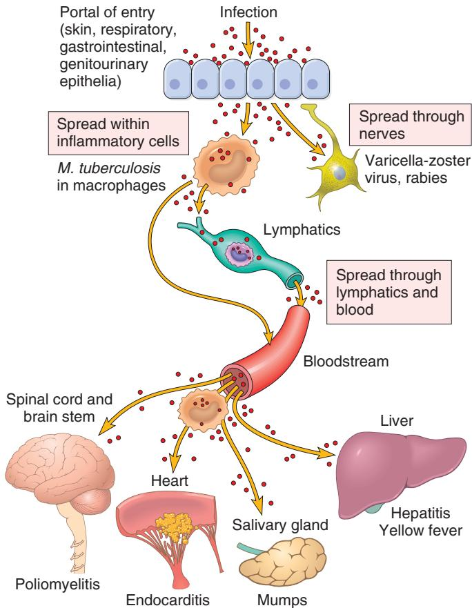 
Fig. 9.6 Routes of entry and dissemination of microbes. To enter the body, microbes penetrate epithelial or mucosal barriers. Infection may remain localized at the site of entry or spread to other sites in the body. Most common microbes (selected examples are shown) spread through the lymphatics or bloodstream (either freely or within inflammatory cells). However, certain viruses and bacterial toxins also may travel through nerves. (Adapted from Mims CA: The pathogenesis of infectious disease, ed 4, San Diego, 1996, Academic Press.)
the magnitude of the infection, the pattern of seeding, and host factors such as immune status. Sporadic bloodstream invasion by low-virulence or nonvirulent microbes (e.g., during brushing of teeth) is common but is quickly controlled by normal host defenses. By contrast, disseminated viremia, bacteremia, fungemia, or parasitemia by virulent pathogens poses a serious danger and manifests as fever, hypotension, and multiple other systemic signs and symptoms of sepsis. Massive bloodstream invasion by bacteria can be rapidly fatal, even in previously healthy individuals.
The major manifestations of infectious disease may appear at sites distant from the point of microbe entry. For example, varicella-zoster and measles viruses enter through the airways but cause rashes in the skin; poliovirus enters through the intestine but kills motor neurons to cause paralysis. Schistosoma mansoni parasites penetrate the skin but eventually localize in blood vessels of the portal system and mesentery, damaging the liver and intestine. Schistosoma hematobium also penetrates the skin, but localizes to the urinary bladder and causes cystitis. The rabies virus travels from the site of a bite by a rabid animal to the brain by retrograde transport in sensory neurons, where it then causes encephalitis and death.
# Transmission of Microbes
Transmission depends on the hardiness of the microbe. Some microbes can survive for extended periods in dust, food, or water. Bacterial spores, protozoan cysts, and thickshelled helminth eggs can survive in a cool and dry environment. Less hardy microorganisms must be quickly passed from person to person, often by direct contact.
For transmission of disease, the mode of exit of a microorganism from the host's body is as important as entry into it. Every fluid or tissue that is normally secreted, excreted, or shed is used by microorganisms to leave the host for transmission to new victims.
- Skin. Skin flora, such as S. aureus and dermatophytes (fungi), are shed in the desquamated skin. Some sexually transmitted pathogens are transmitted from genital skin lesions, such as HSV and Treponema pallidum (causing syphilis). 
- Oral secretions. Viruses that replicate in the salivary glands and are spread in saliva include mumps virus, CMV, and rabies virus. 
- Respiratory secretions. Viruses and bacteria can be shed in respiratory secretions during talking, coughing, and sneezing. Most respiratory pathogens, including influenza viruses, spread in large respiratory droplets, which travel no more than 3 feet. However, a few organisms, including M. tuberculosis and varicella-zoster virus, are spread from the respiratory tract in small respiratory droplets or within dust particles that can travel long distances in the air. These properties determine the type of isolation precautions that are used to prevent the spread of infection. 
- Stool. Organisms shed in stool include many pathogens that replicate in the lumen or epithelium of the gut, such as Shigella, G. lamblia, and rotavirus. Pathogens that replicate in the liver (hepatitis A virus) or gallbladder (S. enterica serotype Typhi) enter the intestine in bile and are shed in stool. 
- Blood. Pathogens spread via blood may be transmitted by invertebrate vectors, medical practices (blood transfusion, reuse of equipment), or sharing of needles by intravenous drug abusers. Bloodborne parasites, including Plasmodium spp. and arboviruses, are transmitted by biting insects. 
- Urine. Urine is the usual mode of exodus from the human host for only a few organisms, including S. haematobium, which grows in the veins of the bladder and releases eggs that reach the urine. 
Genital tract. Sexually transmitted infections (STIs) spread from the urethra, vagina, cervix, rectum, or oral pharynx. Organisms that cause STIs depend on direct contact for person-to-person spread because these pathogens cannot survive in the environment. Transmission of STIs often is by asymptomatic individuals who do not realize that they are infected. Infection with one STI increases the risk for additional STIs, mainly because the risk factors are the same for all STIs. STIs are described in Chapters 18 and 19. 
Vertical transmission. Transmission of infectious agents from mother to fetus or newborn child is a common mode of transmission for some pathogens, and may occur through several different routes. Placental-fetal
transmission is most likely to occur when the mother is infected with a pathogen during pregnancy. Some of the resulting infections interfere with fetal development, and the degree and type of damage depend on the age of the fetus at the time of infection. For example, rubella infection during the first trimester can lead to heart malformations, mental retardation, cataracts, or deafness, while rubella infection during the third trimester has little effect. Congenital microcephaly and other CNS complications have been associated with Zika virus infection during pregnancy. Much is still unknown about timing of infection relative to the trimester of pregnancy. Transmission during birth is caused by contact with infectious agents during passage through the birth canal. Examples include gonococcal and chlamydial conjunctivitis. Postnatal transmission in maternal milk can transmit CMV, HIV, and HBV.
Microbes also can be transmitted from animal to human resulting in zoonotic infections, either through direct contact with or consumption of animal products or indirectly by an invertebrate vector.
# TRANSMISSION OF MICROBES
- Transmission of infections can occur via:
- Contact (direct and indirect) 
- Respiratory droplets 
Fecal-oral route 
Sexual transmission 
Vertical transmission from mother to fetus or newborn 
- Insect/arthropod vectors.
- A pathogen can establish infection if it possesses virulence factors that overcome normal host defenses or if the host defenses are compromised. 
- Host defenses against infection include:
- Skin: tough keratinized barrier, low pH, fatty acids, normal microbiota 
- Respiratory system: alveolar macrophages and mucociliary clearance by bronchial epithelium, IgA 
Gastrointestinal system: acidic gastric pH, viscous mucus, pancreatic enzymes and bile, defensins, IgA, and normal flora 
- Urogenital tract: repeated flushing and acidic environment created by commensal vaginal flora
# HOW MICROORGANISMS CAUSE DISEASE
Infectious agents establish infection and damage tissues by any of three mechanisms:
- They can contact or enter host cells and directly cause death of infected cells. 
- They can release toxins that kill cells at a distance, release enzymes that degrade tissue components, or damage blood vessels and cause ischemic necrosis.
- They can induce host immune responses that, although directed against the invader, cause additional tissue damage. Thus, the defensive responses of the host can be a mixed blessing, helping to overcome the infection but also contributing to tissue damage.
Described next are some of the mechanisms whereby viruses and bacteria damage host tissues.
# Mechanisms of Viral Injury
Viruses can directly damage host cells by entering them and replicating at the host's expense. The manifestations of viral infection are largely determined by the tropism of the virus for specific tissues and cell types. Tropism is influenced by a number of factors.
- Host receptors for viruses. Viruses are coated with surface proteins that bind with high specificity to particular host cell surface proteins. Entry of many viruses into cells commences with binding to normal host cell receptors. For example, HIV glycoprotein gp120 binds to CD4 and CXCR4 and CCR5 on T cells and macrophages (Chapter 5). Host proteases may be needed to enable binding of virus to host cells; for instance, a host protease cleaves and activates the influenza virus hemagglutinin. 
- Specificity of transcription factors. The ability of the virus to replicate inside particular cell types depends on the presence of lineage-specific transcription factors that recognize viral enhancer and promoter elements. For example, the JC virus, which causes leukoencephalopathy (Chapter 23), replicates only in oligodendroglia in the CNS because the promoter and enhancer DNA sequences regulating viral gene expression are active in glial cells, but not in neurons or endothelial cells. 
- Physical characteristics of tissues. Host environment and temperature can contribute to tissue tropism. For example, enteroviruses replicate in the intestine in part because they can resist inactivation by acids, bile, and digestive enzymes. Rhinoviruses infect cells only within the upper-respiratory tract because they replicate optimally at the lower temperatures characteristic of this site.
Once viruses are inside host cells, they can damage or kill the cells by a number of mechanisms (Fig. 9.7):
- Direct cytopathic effects. Viruses can kill cells by preventing synthesis of critical host macromolecules, by producing degradative enzymes and toxic proteins, or by inducing apoptosis. For example, poliovirus blocks synthesis of host proteins by inactivating cap-binding protein. HSV produces proteins that inhibit synthesis of cellular DNA and mRNA and other proteins that degrade host DNA. Viral replication also can trigger apoptosis of host cells by cell-intrinsic mechanisms, such as perturbations of the endoplasmic reticulum during virus assembly, which can activate caspases that mediate apoptosis. 
- Anti-viral immune responses. Viral proteins on the surface of host cells may be recognized by the immune system, and lymphocytes may attack virus-infected cells. Cytotoxic T lymphocytes (CTLs) are important for defense against viral infections, but CTLs also can be responsible for tissue injury. Hepatitis B infection causes CTL
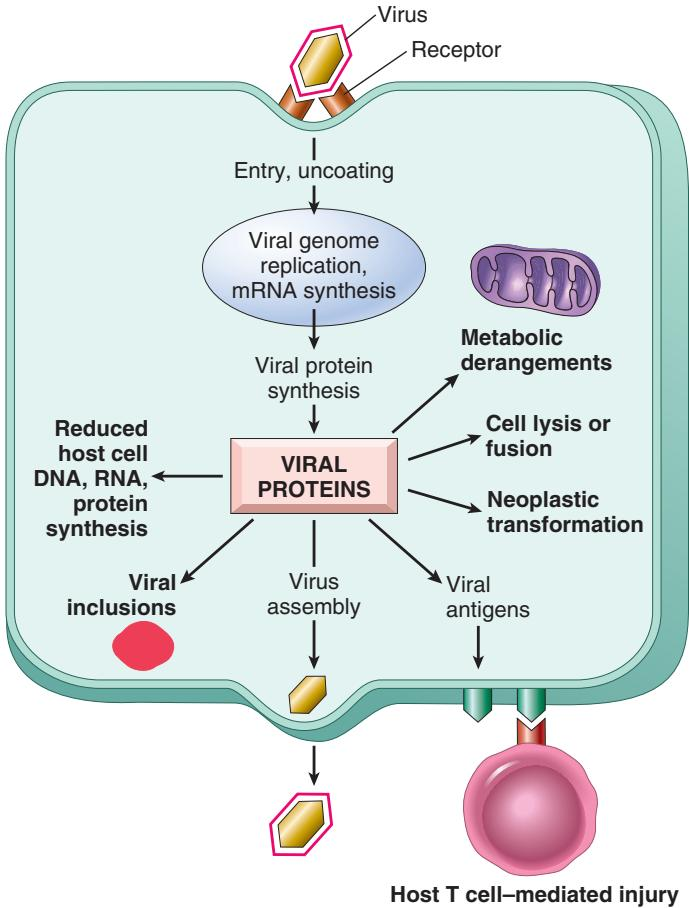 
Fig. 9.7 Mechanisms by which viruses cause injury to cells.
mediated destruction of infected hepatocytes, a normal response that is attempting to clear the infection.
- Transformation of infected cells. Different oncogenic viruses (e.g., HPV, EBV) can stimulate cell growth and survival by a variety of mechanisms, including hijacking the control of cell cycle machinery, anti-apoptotic strategies, and insertional mutagenesis (in which the insertion of viral DNA into the host genome alters the expression of nearby host genes). Mechanisms of viral transformation are discussed in Chapter 6.
# Mechanisms of Bacterial Injury
# Bacterial Virulence
Bacterial damage to host tissues depends on the ability of the bacteria to adhere to host cells, invade cells and tissues, or deliver toxins. Pathogenic bacteria have virulence genes that are frequently found grouped together in clusters called pathogenicity islands. A small number of virulence genes can determine whether a bacterium is harmful. The Salmonella strains that infect humans are so closely related that they are a single species, but only a few virulence genes determine whether an isolate of Salmonella causes life-threatening typhoid fever or self-limited gastroenteritis.
Plasmids (small independently replicating circular DNAs) and bacteriophages (viruses) are genetic elements that spread between bacteria and can carry virulence
factors, including toxins or enzymes that confer antibiotic resistance. Exchange of these elements between bacteria can endow the recipient bacteria with a survival advantage and/or the capacity to cause disease. Plasmids or transposons encoding antibiotic resistance can convert an antibiotic-susceptible bacterium into a resistant one, making effective therapy difficult. Carbapenemase genes carried on plasmids have spread among gram-negative bacilli worldwide, resulting in strains for which there are no available effective antibiotics, causing the CDC to list these organisms as an urgent threat.
Populations of bacteria also can act together in ways that alter their virulence.
- Quorum sensing. Many species of bacteria coordinately regulate gene expression within a large population in which specific genes, such as virulence genes, are expressed after bacteria reach high concentrations. This in turn may allow bacteria growing in discrete host sites, such as an abscess or consolidated pneumonia, to overcome host defenses. S. aureus coordinately regulates virulence factors by secreting autoinducer peptides. As the bacteria grow to increasing concentrations, the level of the autoinducer peptide increases, stimulating exotoxin production. 
- Biofilms. Communities of bacteria can live within a viscous layer of extracellular polysaccharides that adhere to host tissues or devices such as intravascular catheters and artificial joints. Biofilms make bacteria inaccessible to immune effector mechanisms and increase their resistance to anti-microbial drugs. Biofilm formation seems to be important in the persistence and relapse of infections such as bacterial endocarditis, artificial joint infections, and respiratory infections in individuals with cystic fibrosis.
# Bacterial Adherence to Host Cells
Bacterial surface molecules that bind to host cells or extracellular matrix are called adhesins. Diverse surface structures are involved in adhesion of various bacteria (see Fig. 9.2). S. pyogenes has protein F and teichoic acid projecting from its cell wall that bind to fibronectin on the surface of host cells and in the extracellular matrix. Other bacteria have filamentous proteins called pili on their surfaces. Stalks of pili are structurally conserved, whereas amino acids on the tips of the pili vary and determine the binding specificity of the bacteria. Strains of E. coli that cause urinary tract infections uniquely express a specific P pilus that binds to a Gal(α1-4)Gal moiety expressed on uroepithelial cells. Pili on N. gonorrhoeae bacteria mediate adherence of the bacteria to host cells and also are targets of the host antibody response. Antigenic variation affecting the antigens expressed in the pili is an important mechanism by which N. gonorrhoeae escapes the immune response.
# Bacterial Toxins
Any bacterial substance that contributes to illness can be considered a toxin. Toxins are subclassified as endotoxins, which are components of the bacterial cell, or exotoxins, which are proteins that are secreted by the bacterium.
Bacterial endotoxin is a lipopolysaccharide (LPS) that is a component of the outer membrane of gram-negative bacteria (see Fig. 9.2). LPS is composed of a long-chain fatty
acid anchor, termed lipid $A$ , connected to a core sugar chain, both of which are very similar in all gram-negative bacteria. Attached to the core sugar is a variable carbohydrate chain (O antigen), which is used to serotype strains of bacteria to aid in diagnosis. Lipid A binds to CD14 on the surface of host leukocytes, and the complex then binds to Toll-like receptor 4, a pattern recognition receptor of the innate immune system that transmits signals to promote cell activation and inflammatory responses. Responses to LPS can be both beneficial and harmful to the host. The response is beneficial in that LPS activates protective immunity through induction of important cytokines and chemoattractants (chemokines), as well as increased expression of costimulatory molecules, which enhance T-lymphocyte activation. However, high levels of LPS play an important role in septic shock, disseminated intravascular coagulation, and acute respiratory distress syndrome, mainly through induction of excessive levels of cytokines such as tumor necrosis factor (Chapter 4).
Exotoxins are secreted proteins that cause cellular injury and disease. They can be classified into broad categories by their mechanism and site of action.
- Enzymes. Bacteria secrete enzymes (proteases, hyaluronidases, coagulases, fibrinolysins) that act on their respective substrates in vitro, but their role in disease is understood in only a few cases. For example, exfoliative toxins are proteases produced by S. aureus that cleave proteins known to hold keratinocytes together, causing the epidermis to detach from the deeper skin. 
- A-B toxins: Toxins that alter intracellular signaling or regulatory pathways. The two-component toxins have an active (A) component with enzymatic activity and a binding (B) component that binds cell surface receptors and delivers the A protein into the cell cytoplasm. The effect of these toxins depends on the binding specificity of the B domain and the cellular pathways affected by the A domain. A-B toxins are made by many bacteria including Bacillus anthracis, V. cholerae, and Corynebacterium diphtheriae. The mechanism of action of the A-B anthrax toxin is well understood (Fig. 9.8). Anthrax toxin has two alternate A components, edema factor (EF) and lethal factor (LF), which enter cells following binding to the B component, and each A component mediates specific pathologic effects. 
- Superantigens stimulate very large numbers of T lymphocytes by binding to conserved portions of the T cell receptor, leading to massive T lymphocyte proliferation and cytokine release. The high levels of cytokines lead to capillary leak and the systemic inflammatory response syndrome (Chapter 4). Superantigens made by S. aureus and S. pyogenes cause toxic shock syndrome. 
- Neurotoxins produced by Clostridium botulinum and Clostridium tetani inhibit release of neurotransmitters, resulting in paralysis. These toxins do not kill neurons; instead, the A domains cleave proteins involved in secretion of neurotransmitters at the synaptic junction. Tetanus and botulism can result in death from respiratory failure due to paralysis of the chest and diaphragm muscles. 
- Enterotoxins affect the gastrointestinal tract causing varied effects, including nausea and vomiting (S. aureus), voluminous watery diarrhea (V. cholerae), and bloody diarrhea (C. difficile).
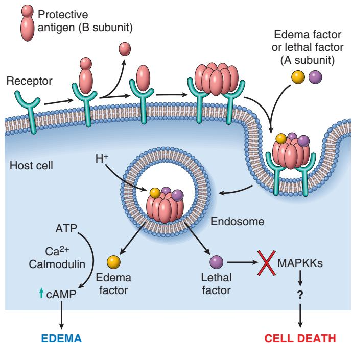 
Fig. 9.8 Mechanism of anthrax exotoxin action. The B subunit, also called protective antigen, binds a cell-surface receptor, is cleaved by a host protease, and forms a heptamer. Three A subunits of edema factor (EF) or lethal factor (LF) bind to the B heptamer, enter the cell, and are released into the cytoplasm. EF binds calcium and calmodulin to form an adenylate cyclase that increases intracellular cAMP, which causes efflux of water and interstitial edema. LF is a protease that destroys mitogen-activated protein kinase kinases (MAPKKs), leading to cell death. cAMP, cyclic adenosine monophosphate. Note that each B subunit binds either EF or LF, but not both (as shown for simplicity). (Adapted from Mourez M, Lacy DB, Cunningham K, et al: 2011: A year of major advances in anthrax toxin research. Trends Microbiol 10:287, 2002.)
# Injurious Effects of Host Immune Responses
As mentioned earlier, the host immune response to microbes can sometimes be the cause of tissue injury. A few examples of types and mechanisms of injury are as follows:
- Granulomatous inflammation. Infection with $M.$ tuberculosis results in a delayed hypersensitivity response and the formation of granulomas, which sequester the bacilli and prevent its spread, but also produce tissue damage (caseous necrosis) and fibrosis. 
- T-cell-mediated inflammation. Damage from HBV and HCV infection of hepatocytes is due mainly to the immune response to the infected liver cells and not to cytopathic effects of the virus. 
- Innate immune inflammation. Pattern recognition receptors bind to pathogen-associated molecular patterns (PAMPS) and to damage-associated molecular patterns (DAMPS) released from damaged host cells, activating the immune system and leading to inflammation (discussed in Chapter 5). 
- Humoral immunity. Poststreptococcal glomerulonephritis can develop after infection with S. pyogenes. It is caused by antibodies that bind to streptococcal antigens and form immune complexes, which deposit in renal glomeruli and produce nephritis.
- Chronic inflammatory diseases. In the development of inflammatory bowel disease (Chapter 15), an important early event may be compromise of the intestinal epithelial barrier, which enables the entry of both pathogenic and commensal microbes and their interactions with local immune cells, resulting in inflammation. The cycle of inflammation and epithelial injury may be an important component of the disease, with microbes playing the central role. 
- Cancer. Viruses, such as HBV and HCV, and bacteria, such as $H.$ pylori, that are not known to carry or to activate oncogenes are associated with cancers, presumably because these microbes trigger chronic inflammation with subsequent tissue regeneration, which provides fertile ground for the development of cancer (Chapter 6).
# HOW MICROORGANISMSCAUSEDISEASE
- Diseases caused by microbes involve an interplay of microbial virulence and host responses. 
- Infectious agents can cause cell death or dysfunction by directly interacting with the cell. 
- Injury may be due to local or systemic release of bacterial products, including endotoxins (LPS), exotoxins, or superantigens, combined with the immune response. 
- Absence of an immune response may reduce the damage induced by some infections; conversely, immunocompromise can allow uncontrolled expansion of opportunistic infections that can directly cause injury. 
- Chronic immunological and inflammatory diseases and cancer have been associated with specific microorganisms.
# IMMUNE EVASION BY MICROBES
Humoral and cellular immune responses that protect the host from most infections are discussed in Chapter 5. Not surprisingly, microorganisms have developed many means to resist and evade the immune system (Fig. 9.9). These mechanisms of escaping the immune response are important determinants of microbial virulence and pathogenicity.
- Antigenic variation. Neutralizing antibodies against microbial antigens block the ability of microbes to infect cells and recruit immune cells to kill pathogens. To escape recognition, microbes use many strategies that involve genetic mechanisms for generating antigenic variation. The low fidelity of viral RNA polymerases (HIV and influenza virus) and reassortment of viral genomes (influenza viruses) create viral antigenic variation (Table 9.7). Borrelia species switch their surface antigens via gene rearrangement. Trypanosoma species have many genes for their major surface antigen, VSG, and vary the expression of this surface protein. There are more than 90 different serotypes of S. pneumoniae, each with a different capsular polysaccharide. 
- Modification of surface proteins. Host cationic antimicrobial peptides, including defensins, cathelicidins,
.jpg) 
Fig. 9.9 An overview of mechanisms used by viral and bacterial pathogens to evade innate and adaptive immunity. (Modified with permission from Finlay B, McFadden G: Anti-immunology: evasion of the host immune system by bacterial and viral pathogens. Cell 124:767-782, 2006.)
and thrombocidins, provide important initial defenses against invading microbes. These peptides bind the bacterial membrane and form pores, killing the bacterium by osmotic lysis. Bacterial pathogens (Shigella spp., S. aureus) avoid killing by making surface molecules that resist binding of anti-microbial peptides, or that inactivate or downregulate anti-microbial peptides. 
- Overcoming antibodies and complement. Host defense includes coating of bacteria with antibodies or the complement protein C3b (opsonization) to facilitate phagocytosis by macrophages. However, the facultative intracellular pathogen M. tuberculosis subverts the complement response by activating the alternative
Table 9.7 Mechanisms of Anti-genic Variation 
MechanismExampleAgent(s)DiseaseHigh mutation rateHIVAIDSInfluenza virusInfluenzaGenetic reassortmentInfluenza virusInfluenzaRotavirusDiarrheaGenetic rearrangement (e.g., gene recombination, gene conversion, site-specific inversion)Borrelia burgdorferiLyme diseaseNeisseria gonorrhoeaeGonorrheaTrypanosoma spp.African sleeping sicknessPlasmodium spp.MalariaLarge diversity of serotypesRhinovirusesColdsStreptococcus pneumoniaePneumonia, meningitis
complement pathway in the extracellular environment, and complement products coat the bacteria, resulting in uptake of the organism by monocytes; by this means, the organism reaches its site of replication. Many bacteria (such as Shigella, enteroinvasive E. coli, M. tuberculosis, M. leprae, S. enterica serotype Typhi) use the inside of cells as a "hideout" that allows them to escape from antibodies and complement. Listeria monocytogenes can manipulate the cell cytoskeleton to spread directly from cell to cell, thus allowing the bacteria to evade immune defenses.
- Resisting phagocytosis and bacterial killing in phagosomes. Phagocytosis and killing of bacteria by neutrophils and macrophages constitute a critical host defense against extracellular bacteria. The carbohydrate capsule on the surface of many bacteria that cause pneumonia or meningitis (S. pneumoniae, Neisseria meningitidis, H. influenzae) makes them more virulent by preventing phagocytosis of the organisms by neutrophils. Surface proteins that inhibit phagocytosis include proteins A (S. aureus) and M (S. pyogenes). Macrophages usually kill bacteria by fusion of the phagosome with the lysosome to form a phagolysosome. M. tuberculosis blocks fusion of the lysosome with the phagosome, allowing the bacteria to proliferate unchecked within the macrophage. Legionella produces a pore-forming protein called listeriolysin O and two phospholipases that degrade the phagosome membrane, allowing the bacteria to escape into the cytoplasm and avoid destruction in the macrophage. Legionella also secretes proteins that modulate small GTPases, master regulators of intracellular signaling to modify trafficking. Also, many bacteria make proteins that kill phagocytes, prevent their migration, or diminish their oxidative burst. 
- Escaping the inflammasome. The activation of the cytosolic inflammasome is one pathway of innate immune responses to microbes. It is stimulated by microbial products and culminates in the activation of caspases, which induce the secretion of the pro-inflammatory cytokines IL-1 and IL-18 and induce a form of cell death called pyroptosis (Chapter 5). Both inflammation and cell death limit microbial virulence and replication. Some bacteria, such as Yersinia and Salmonella, express virulence proteins that inhibit the formation of the mature inflammasome, suppress caspase activation, block signaling pathways that are required for inflammasome activation, or limit the access of other bacterial proteins to the inflammasome. All these mechanisms serve to disable various components of this host antimicrobial defense reaction. 
- Disruption of interferon pathways. Viruses have developed a large number of strategies to combat interferons (IFNs), which are mediators of early antiviral defense. Some viruses produce soluble homologues of IFN receptors that bind to and block the actions of secreted IFNs, or produce proteins that inhibit intracellular JAK/STAT signaling downstream of IFN receptors. RIG-I (RNA helicase retinoic acid inducible gene I protein) is a host cytoplasmic pattern recognition receptor for intracellular double-stranded RNA viruses. RIG-I inhibits signaling by this receptor, thus blocking the downstream IFN pathway and overcoming this host defense. Some
viruses encode within their genomes homologs of cytokines, chemokines, or their receptors that act as competitive antagonists to inhibit immune responses. Finally, viruses have developed strategies to block apoptosis, which may give the viruses time to replicate, persist, or transform the infected host cell.
- Decreased T-cell recognition: DNA viruses (e.g., HSV, CMV, and EBV) can bind to or alter the localization of major histocompatibility complex (MHC) class I proteins, impairing peptide presentation to $\mathrm{CD8 + }$ cytotoxic T cells. Although downregulation of MHC class I molecules might cause virus-infected cells to be targets for NK cells, herpesviruses also express MHC class I homologues that act as decoys that engage inhibitory receptors of NK cells. Herpesviruses can target MHC class II molecules for degradation, impairing antigen presentation to $\mathrm{CD4 + }$ helper T cells. Viruses also can infect leukocytes to directly compromise their function (e.g., HIV infects $\mathrm{CD4 + }$ T cells, macrophages, and dendritic cells).
# IMMUNE EVASION BY MICROBES
After bypassing host tissue barriers, infectious microorganisms must also evade host innate and adaptive immunity mechanisms to successfully proliferate and be transmitted to the next host. Strategies include the following:
- Anti-genic variation 
- Inactivating antibodies or complement 
- Resisting phagocytosis (e.g., by producing a capsule) 
- Escaping the phagosome 
Viral latency 
- Suppressing the host adaptive immune response (e.g., by inhibiting antigen presentation and disrupting interferon pathways)
# SPECTRUM OF INFLAMMATORY RESPONSES TO INFECTION
In contrast with the vast molecular diversity of microbes, the morphologic patterns of tissue responses to microbes are limited, as are the mechanisms directing these responses. Therefore, many pathogens produce similar reaction patterns, and few features are unique to or
pathognomonic for a particular microorganism, adding to the challenge in histopathologic diagnosis.
The interaction between the microbe and the host determines the histologic features of the response to the microbes. There are five major histologic patterns of tissue reaction in infections: suppurative, mononuclear/ granulomatous, cytopathic-cytoproliferative, necrosis, and chronic inflammation/scarring. Suppurative inflammation is discussed in Chapter 3.
# Mononuclear and Granulomatous Inflammation
Diffuse, predominantly mononuclear, interstitial infiltrates are a common feature of all chronic inflammatory processes, but sometimes they appear acutely in response to viruses, intracellular bacteria, or intracellular parasites. In addition, spirochetes and some helminths also provoke chronic inflammation. Eosinophilia can be prominent with some helminthic infections.
Which mononuclear cell predominates within the inflammatory lesion depends on the host immune response to the organism. Thus, lymphocytes predominate in HBV infection (Fig. 9.10A), whereas plasma cells are common in the primary and secondary lesions of syphilis (see Fig. 9.10B). The presence of these lymphoid cells reflects cell-mediated immune responses against the pathogen or pathogen-infected cells. Granulomatous inflammation is a distinctive form of mononuclear inflammation usually evoked by infectious agents that resist eradication, but nevertheless are capable of stimulating strong T-cell-mediated immunity (e.g., M. tuberculosis, Histoplasma capsulatum, schistosome eggs). Granulomatous inflammation (Chapter 3) is characterized by accumulation of activated macrophages called epithelioid cells, which may fuse to form giant cells. In some cases, there is a central area of caseous necrosis (see Fig. 9.10C).
# Cytopathic-Cytoproliferative Reaction
Cytopathic-cytoproliferative reactions usually are produced by viruses. The lesions are characterized by cell necrosis or cellular proliferation, usually with sparse inflammatory cells.
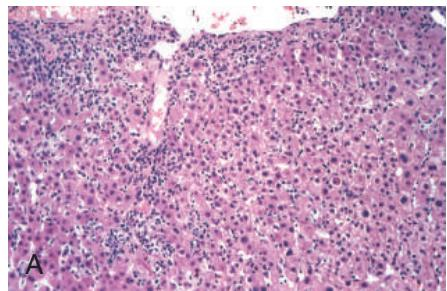 
Fig. 9.10 Mononuclear and granulomatous inflammation. (A) Acute viral hepatitis characterized by a predominantly lymphocytic infiltrate. (B) Secondary syphilis in the dermis with perivascular lymphoplasmacytic infiltrate and endothelial proliferation. (C) Granulomatous inflammation in response to tuberculosis. Note the zone of caseation (asterisk), which normally forms the center of the granuloma, with a surrounding rim of activated epithelioid macrophages, some of which have fused to form giant cells (arrows); this in turn is surrounded by a zone of activated T lymphocytes. This high-magnification view highlights the histologic features; the granulomatous response typically takes the form of a three-dimensional sphere with the offending organism in the central area.
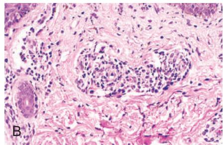
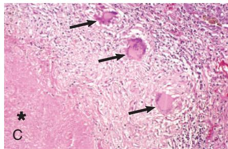
Some viruses replicate within cells and make viral aggregates that are visible as inclusion bodies (e.g., herpesviruses or adenovirus) or induce cells to fuse and form multinucleated cells called polykaryons (e.g., measles virus or herpesviruses) (see Fig. 9.1). Focal cell damage in the skin may cause epithelial cells to become detached, forming blisters. Some viruses can cause epithelial cells to proliferate (e.g., venereal warts caused by HPV or the umbilicated papules of molluscum contagiosum caused by poxviruses). Finally, viruses can contribute to the development of malignant neoplasms (Chapter 6).
# Tissue Necrosis
Clostridium perfringens and other organisms that secrete powerful toxins can cause such rapid and severe necrosis that tissue damage is the dominant feature.
Because few inflammatory cells are present, necrotic lesions resemble infarcts with disruption or loss of basophilic nuclear staining and preservation of cellular outlines. Clostridia often are opportunistic pathogens that are introduced into muscle tissue by penetrating trauma or infection of the bowel in a neutropenic host. Similarly, the parasite E. histolytica causes colonic ulcers and liver abscesses characterized by extensive tissue destruction and liqueactive necrosis without a prominent inflammatory infiltrate. By entirely different mechanisms, viruses can cause widespread necrosis of host cells associated with inflammation, as exemplified by destruction of the temporal lobes of the brain by HSV or the liver by HBV. The powerful exotoxins of C. diphtheriae cause necrosis of laryngeal epithelium giving rise to a pseudomembrane comprised of necrotic cells enmeshed in a fibrinous exudate. This can cause asphyxia.
# Chronic Inflammation and Scarring
Many infections elicit chronic inflammation, which can either resolve with complete healing or lead to extensive scarring.
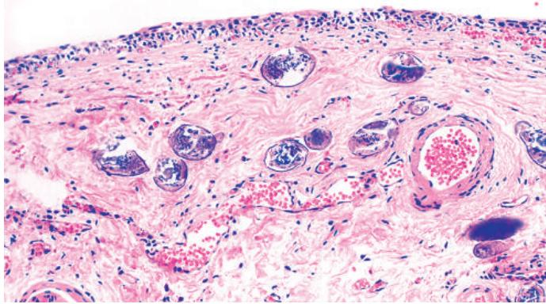 
Fig. 9.11 Schistosoma haematobium infection of the bladder with numerous calcified eggs and extensive scarring.
Sometimes an exuberant scarring response is the major cause of dysfunction. For example, schistosome eggs cause "pipestem" fibrosis of the liver or fibrosis of the bladder wall (Fig. 9.11). M. tuberculosis causes constrictive fibrous pericarditis. Chronic HBV infection may cause cirrhosis of the liver, in which dense fibrous septa surround nodules of regenerating hepatocytes.
The patterns of tissue reactions described above are useful guidelines for analyzing microscopic features of infectious processes, but in practice it must be remembered that different types of host reactions often occur at the same time. For example, the lung of a patient with AIDS may be infected with CMV, which causes cytolytic changes, and, at the same time, by Pneumocystis, which causes interstitial inflammation. Similar patterns of inflammation also can be seen in tissue responses to physical or chemical agents and in other inflammatory conditions of unknown cause. Finally, in immunocompromised individuals, the absence of a host inflammatory response frequently eliminates some of the histologic clues about the potential nature of infecting microorganism(s). Because of this potential for mixed infections and/or lack of host response, other diagnostic tests for infection in addition to pathologic examination are essential to make a definitive diagnosis.
# Infections in Individuals With Immunodeficiencies
Inherited or acquired defects in immunity (Chapter 5) often impair only part of the immune system, rendering the affected individuals susceptible to specific types of infections.
- Patients with antibody deficiency, as in X-linked agammaglobulinemia, contract severe bacterial infections by extracellular bacteria and a few viral infections (rotavirus and enteroviruses). 
- Patients with T-cell defects are susceptible to infections with intracellular pathogens, notably viruses and some parasites. 
Patients with deficiencies in early complement components are particularly susceptible to infections by encapsulated bacteria, such as S. pneumoniae, whereas deficiencies of the late components of complement are associated with Neisseria infections. 
- Deficiencies in neutrophil function lead to increased infections with S. aureus, some gram-negative bacteria, and fungi. 
- Individuals with inherited deficiencies in specific components of innate and adaptive immunity sometimes show selective susceptibility to particular infections. These patterns reveal the essential roles of different molecules in mediating protective immunity to specific microorganisms. For example, patients with mutations in signaling molecules downstream of several TLRs are prone to pyogenic bacterial diseases, particularly with S. pneumoniae infections. Impaired TLR3 responses are associated with childhood HSV encephalitis. Inherited defects in IL-17 immunity (such as mutations in STAT3, a transcription factor needed for Th17 cell generation) are associated with chronic mucocutaneous candidiasis.
Acquired immunodeficiencies have a variety of causes, the most widely known being infection with HIV, which causes AIDS (Chapter 5). HIV infects and kills $\mathrm{CD4 + }$ helper T lymphocytes, leading to profound immunosuppression and a multitude of infections. Other causes of acquired immunodeficiency include infiltrative processes that suppress bone marrow function (e.g., leukemia), immunosuppressive drugs (such as those used to treat certain autoimmune diseases), and hemopoietic stem cell transplantation. Diseases of organ systems other than the immune system also can make patients susceptible to disease due to specific microorganisms. Individuals with cystic fibrosis and impaired respiratory clearance commonly get infections dominated by Pseudomonas aeruginosa. Lack of splenic function in individuals with sickle cell disease makes them susceptible to infection with encapsulated bacteria such as S. pneumoniae. Burns destroy skin, removing this barrier to microbes, allowing infection with pathogens such as $P_{\cdot}$ aeruginosa. Finally, malnutrition impairs immune defenses.
Patients with antibody, complement, or neutrophil defects may acquire severe local bacterial infections that do not elicit any significant neutrophilic infiltrate. In these patients, the identity of the causative organism determined by culture or special stains may not have been predicted from histology. Although many viral cytopathic effects (e.g., cell fusion or inclusions) (see Fig. 9.1) may still be present, viral infections in immunocompromised hosts may not engender the anticipated mononuclear inflammatory response. In patients with AIDS who have no helper T cells and cannot mount normal cellular responses, organisms that would otherwise cause granulomatous inflammation (e.g., M. avium complex) fail to do so (Fig. 9.12).
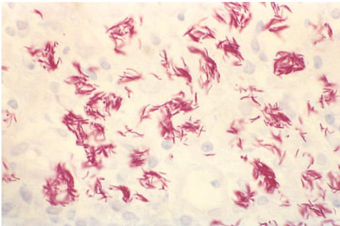 
Fig. 9.12 In the absence of appropriate T-cell-mediated immunity, granulomatous host response does not occur. Mycobacterium avium infection in a duodenal biopsy from a patient with AIDS, showing massive intracellular macrophage infection with acid-fast organisms (filamentous and pink in this acid-fast stain preparation). The intracellular bacteria persist and even proliferate within macrophages, because there are inadequate T cells to mount a granulomatous response. AIDS, acquired immunodeficiency syndrome. (Courtesy of Dr. Arlene Sharpe, Department of Microbiology and Immunology, Harvard Medical School, Boston, Massachusetts.)
# PATTERNS OF HOST RESPONSES TO MICROBES
- In normal (immunocompetent) individuals, the patterns of host responses are fairly stereotypical for different classes of microbes; these response patterns can be used to infer possible causal organisms. 
- Neutrophil-rich acute suppurative inflammation is typical of infections with many bacteria ("pyogenic" bacteria) and some fungi. 
- Mononuclear cell infiltrates are common in many chronic infections and some acute viral infections. 
- Granulomatous inflammation is the hallmark of infection with M. tuberculosis and certain fungi. 
- Cytopathic and proliferative lesions are caused by some viruses. 
- Necrosis results from tissue-damaging toxins produced by microbes such as C. perfringens. 
- Chronic inflammation and scarring represent the final common pathway of many infections.
Arvanitis M, Anagnostou T, Fuchs BB, et al: Molecular and nonmolecular diagnostic methods for invasive fungal infections, Clin Microbiol Rev 27:490, 2014. [A very useful review of the many methods available for laboratory detection of fungal infections.] 
Belkaid Y, Segre JA: Dialogue between skin microbiota and immunity, Science 346:954, 2014. [An excellent review of interactions between the microbiome of the skin and the immune system.] 
Bennett E, Dolan R, Blaser MJ: Mandell, Douglas, and Bennett's principles and practice of infectious diseases, ed 8, Philadelphia, 2014, Elsevier Saunders. [A comprehensive reference for infectious diseases, including very good sections on microbial pathogenesis.] 
Bergsbaken T, Fink SL, Cookson BT: Pyroptosis: host cell death and inflammation, Nat Rev Microbiol 7:99, 2010. [A good introduction to the inflammasome and pyroptosis, including their role in the response to infections.] 
Blair JM, Webber MA, Baylay AJ, et al: Molecular mechanisms of antibiotic resistance, Nat Rev Microbiol 13:42, 2015. [An accessible, well-written review at the introductory level.] 
Buchan BW, Ledeboer NA: Emerging technologies for the clinical microbiology laboratory, Clin Microbiol Rev 27:783, 2014. [A timely review of emerging technologies in clinical microbiology.] 
Cadwell K: The virome in host health and disease, Immunity 42:805, 2015. [A good introduction to this emerging area, including a discussion of the interactions between the virome and other components of the microbiome.] 
Dantas G, Sommer MO, Degnan PH, et al: Experimental approaches for defining functional roles of microbes in the human gut, Annu Rev Microbiol 67:459, 2013. [A thoughtful and short review of experimental methods for microbiology research.] 
Galán JE, Lara-Tejero M, Marlovits TC, et al: Bacterial type III secretion systems: specialized nanomachines for protein delivery into target cells, Annu Rev Microbiol 68:415, 2014. [A review of the structure and mechanism of type III secretion systems.] 
Geno KA, Gilbert GL, Song JY, et al: Pneumococcal capsules and their types: past, present, and future, Clin Microbiol Rev 28:871, 2015. [Includes the significance of capsule in pathogenesis and vaccines, as well as methods for capsule typing.] 
Goo E, An JH, Kang Y, et al: Control of bacterial metabolism by quorum sensing, Trends Microbiol 23:567, 2015. [A review of this emerging area of study, with focus on non-enteric gram-negative bacilli.]
Hobley L, Harkins C, MacPhee CE, et al: Giving structure to the biofilm matrix: an overview of individual strategies and emerging common themes, FEMS Microbiol Rev 39:649, 2015. [An exhaustive review of biofilm structure.] 
Jorgensen JH, Pfaller MA: Manual of clinical microbiology, ed 11, Washington, DC, 2015, ASM Press. [A comprehensive textbook of clinical microbiology at an advanced level.] 
Jucker M, Walker LC: Self-propagation of pathogenic protein aggregates in neurodegenerative diseases, Nature 501:45, 2013. [A short review of prions and other self-propagating proteins.] 
Keeney KM, Yurist-Dutsch S, Arrieta MC, et al: Effects of antibiotics on human microbiota and subsequent disease, Annu Rev Microbiol 68:217, 2014. [A timely review of how antibiotics can increase vulnerability to some diseases.] 
Khabbaz RF, Moseley RR, Steiner RJ, et al: Challenges of infectious diseases in the USA, Lancet 384:53, 2014. [A comprehensive but short review of current infectious disease challenges in the United States.] 
Lagier JC, Edouard S, Pagnier I, et al: Current and past strategies for bacterial culture in clinical microbiology, Clin Microbiol Rev 28:208, 2015. [An exhaustive review of the utility of bacterial culture.] 
Mackey TK, Liang BA, Cuomo R, et al: Emerging and reemerging neglected tropical diseases: a review of key characteristics, risk factors, and the policy and innovation environment, Clin Microbiol Rev 27:949, 2014. [A review of current challenges of emerging and neglected diseases in developing nations.]
Nash AA, Dalziel RG, Fitzgerald JR: Mims' pathogenesis of infectious disease, ed 6, San Diego, 2015, Academic Press. [A beautifully written timely and comprehensive classic text.] 
Okumura CY, Nizet V: Subterfuge and sabotage: evasion of host innate defenses by invasive gram-positive bacterial pathogens, Annu Rev Microbiol 68:439, 2014. [A very good review of this complex area.] 
Panchaud A, Stojanov M, Ammerdorffer A, et al: Emerging role of Zika virus in adverse fetal and neonatal outcomes, Clin Microbiol Rev 29:659, 2016. [Review of emerging role of Zika virus in congenital brain defects.] 
Safronetz D, Feldmann H, de Wit E: Birth and pathogenesis of rogue respiratory viruses, Annu Rev Pathol 10:449, 2015. [Introduces zoonotic respiratory review, with a good emphasis on pathogenesis.] 
Sommer F, Backhed F: The gut microbiota-masters of host development and physiology, Nat Rev Microbiol 11:227, 2013. [An excellent introduction to intestinal microbiome and the role it plays in development of the immune response.] 
Wlodarska M, Johnston JC, Gardy JL, et al: A microbiological revolution meets an ancient disease: improving the management of tuberculosis with genomics, Clin Microbiol Rev 28:523, 2015. [A good example of the important trend toward whole-bacterial genome sequencing in clinical diagnostics.]
# Blood Vessels
# 10
# Structure and Function of Blood Vessels 361
Vascular Organization 362
Endothelial Cells 363
Vascular Smooth Muscle Cells 364
# Congenital Anomalies 364
Blood Pressure Regulation 364
# Hypertensive Vascular Disease 366
Epidemiology of Hypertension 366
Mechanisms of Essential Hypertension 367
# Vascular Wall Response to Injury 368
Intimal Thickening: A Stereotypical Response to
Vascular Injury 368
Arteriosclerosis 369
# Atherosclerosis 369
Epidemiology of Atherosclerosis 370
Clinicopathologic Consequences of Atherosclerosis 376
# Aneurysms and Dissections 378
Abdominal Aortic Aneurysm 379
Thoracic Aortic Aneurysm 380
Aortic Dissection 380
# Vasculitis 382
Noninfectious Vasculitis 382
Infectious Vasculitis 389
# Disorders of Blood Vessel
Hyperreactivity 390
Raynaud Phenomenon 390
# Myocardial Vessel Vasospasm 390
# Veins and Lymphatics 390
Varicose Veins of the Extremities 390
Varicosities of Other Sites 390
Thrombophlebitis and Phlebothrombosis 391
Superior and Inferior Vena Cava Syndromes 391
Lymphangitis and Lymphedema 391
# Tumors 391
Benign Tumors and Tumor-Like Conditions 392
Intermediate-Grade (Borderline) Tumors 394
Malignant Tumors 396
# Pathology of Vascular Intervention 397
Endovascular Stenting 397
Vascular Replacement 397
Vascular diseases are responsible for some of the most common and lethal conditions afflicting mankind. Although most clinically significant disorders involve arterial lesions, venous pathologies also can wreak havoc. Vascular disease develops through two principal mechanisms:
- Narrowing or complete obstruction of vessel lumina, occurring either progressively (e.g., by atherosclerosis) or acutely (e.g., by thrombosis or embolism) 
- Weakening of vessel walls, causing dilation and/or rupture
We start with an overview of vascular structure and function, as background for the diseases of blood vessels discussed in the chapter.
# STRUCTURE AND FUNCTION OF BLOOD VESSELS
Blood vessels are fundamentally all tubes composed of smooth muscle cells (SMCs) and extracellular matrix (ECM), with an inner luminal face covered by a continuous lining of endothelial cells (ECs). However, the relative amounts of SMCs and ECM, and the properties of the ECs, vary throughout the vasculature depending on unique functional needs (Fig. 10.1). To accommodate pulsatile flow and higher blood pressures, arterial walls are thicker than veins and invested with several reinforcing layers of
SMCs. As arteries narrow to arterioles, the ratio of wall thickness to lumen diameter increases to allow more precise regulation of intravascular pressure. Veins, on the other hand, are distensible thin-walled vessels with high capacitance. To facilitate maximal diffusion, capillaries are essentially single-cell linings of ECs lying on a basement membrane.
Since various vessels have unique structural features, it is not surprising that certain lesions characteristically involve only specific regions of the vasculature. For example, atherosclerosis occurs mainly in larger, muscular arteries, while hypertension affects small arterioles, and specific forms of vasculitis selectively involve vessels of only a certain caliber.
Vessel walls are organized into three concentric layers: intima, media, and adventitia (see Fig. 10.1). These layers are present in all vessels but are most apparent in larger vessels and particularly arteries. The intima consists of an EC monolayer on a basement membrane with minimal underlying ECM; it is separated from the media by a dense elastic membrane called the internal elastic lamina. The media is composed predominantly of SMCs and ECM, surrounded by loose connective tissue, nerve fibers, and smaller vessels of the adventitia. An external elastic lamina is present in some arteries and defines the transition between media and adventitia. Diffusion of oxygen and nutrients from the lumen is adequate to sustain thin-walled vessels and the innermost SMCs of all vessels. In large and medium-sized
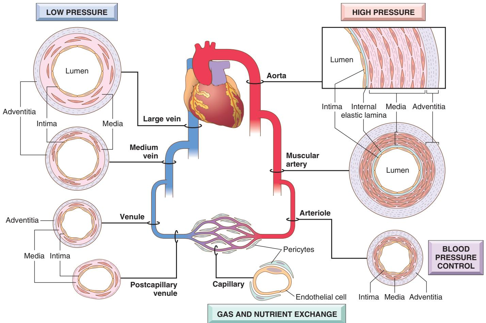 
Fig. 10.1 Regional vascular specializations. Although all vessels share the same general constituents, the thickness and composition of the various layers differ as a function of hemodynamic forces and tissue requirements.
vessels, however, small arterioles within the adventitia (called vasa vasorum - literally, "vessels of the vessels") perfuse the outer half to two-thirds of the media.
# Vascular Organization
Arteries are divided into three types based on their size and structure:
- Large elastic arteries (e.g., aorta, arch vessels, iliac and pulmonary arteries). In these vessels, elastic fibers alternate with SMCs throughout the media, which expands during systole (storing some of the energy of each cardiac contraction), and recoils during diastole to propel blood distally. With age and/or diseases, such as diabetes and hypertension, the elasticity is lost; the vessels become "stiff pipes" that transmit high arterial pressures to distal organs, or become dilated and tortuous (ectatic) and prone to rupture. 
- Medium-sized muscular arteries (e.g., coronary and renal arteries). Here, the media is composed primarily of SMCs, with elastin limited to the internal and external elastic lamina. The medial SMCs are circularly or spirally arranged around the lumen, and regional blood flow is regulated by SMC contraction (vasoconstriction) and relaxation (vasodilation) controlled by the autonomic nervous system and local metabolic factors (e.g., acidosis). ECs also modulate arterial SMC tone, for example,
by releasing nitric oxide (NO, causing vasodilation) or endothelin (causing vasoconstriction).
- Small arteries (2 mm or less in diameter) and arterioles (20 to $100\mu \mathrm{m}$ in diameter) lie within the connective tissue of organs. The media in these vessels is mostly composed of SMCs. Arterioles are where blood flow resistance is regulated. As pressures drop during passage through arterioles, the velocity of blood flow is sharply reduced, and flow becomes steady rather than pulsatile. Because the resistance to fluid flow is inversely proportional to the fourth power of the diameter (i.e., halving the diameter increases resistance 16-fold), small changes in arteriolar lumen size have profound effects on blood pressure.
Capillaries have lumen diameters slightly smaller than those of red blood cells (7 to $8\mu \mathrm{m}$ ). These vessels are lined by ECs and partially surrounded by SMC-like cells called pericytes. Collectively, capillary beds have a very large total cross-sectional area and a low rate of blood flow. With their thin walls and slow flow, capillaries are ideally suited to the rapid exchange of diffusible substances between blood and tissue. The capillary network of most tissues is necessarily very rich, because diffusion of oxygen and nutrients is not efficient beyond $100~{\mu\mathrm{m}}$ ; metabolically active tissues (e.g., heart) have the highest capillary density.
Veins receive blood from the capillary beds as postcapillary venules, which anastomose to form collecting venules
and progressively larger veins. The vascular leakage (edema) and leukocyte emigration characteristic of inflammation occurs preferentially in postcapillary venules (Chapter 3).
Compared with arteries at the same level of branching, veins have larger diameters, larger lumina, and thinner walls with less distinct layers, all adaptations to the low pressures found on the venous side of the circulation (see Fig. 10.1). Thus, veins are more prone to dilation, external compression, and penetration by tumors or inflammatory processes. In veins where blood flows against gravity (e.g., in the lower extremities), backflow is prevented by valves. Collectively, the venous system has a huge capacitance and normally contains approximately two thirds of the blood.
Lymphatics are thin-walled, endothelium-lined channels that drain lymph (water, electrolytes, glucose, fat, proteins, and inflammatory cells) from the interstitium of tissues, eventually reconnecting with the blood stream via the thoracic duct. Lymphatics transport interstitial fluid and inflammatory cells from the periphery to lymph nodes, thereby facilitating antigen presentation and cell activation in the nodal tissues—and enabling continuous monitoring of peripheral tissues for infection. This can be a double-edged sword, however, as these channels can also disseminate disease by transporting microbes or tumor cells to distant sites.
# Endothelial Cells
Endothelium is a continuous sheet of cells lining the entire vascular tree that regulates many aspects of blood and blood vessel function (Table 10.1). Resting ECs maintain a non-thrombogenic blood-tissue interface (Chapter 4), modulate inflammation (Chapter 3), and influence the growth and behavior of other cell types, particularly SMCs.
Table 10.1 Endothelial Cell Properties and Functions 
Property/FunctionMediators/ProductsMaintenance of permeability barrierElaboration of anti-coagulant, anti-thrombotic, and fibrinolytic regulatorsProstacyclinThrombomodulinHeparin-like moleculesPlasminogen activatorElaboration of prothrombotic moleculesVon Willebrand factorTissue factorPlasminogen activator inhibitorProduction of extracellular matrixCollagen, proteoglycansModulation of blood flow and vascular reactivityVasoconstrictors: endothelin,ACE Vasodilators: NO, prostacyclinRegulation of inflammation and immunityIL-1, IL-6, chemokinesAdhesion molecules:VCAM-I,ICAM, E-selectin, P-selectinHistocompatibility antigensRegulation of cell growthGrowth stimulators: PDGF, CSF, FGFGrowth inhibitors: heparin, TGF-βOxidation of LDL
ACE, Angiotensin-converting enzyme; CSF, colony-stimulating factor; FGF, fibroblast growth factor; ICAM, intercellular adhesion molecule; IL, interleukin; LDL, low-density lipoprotein; NO, nitric oxide; PDGF, platelet-derived growth factor; TGF- $\beta$ , transforming growth factor- $\beta$ ; VCAM, vascular cell adhesion molecule.
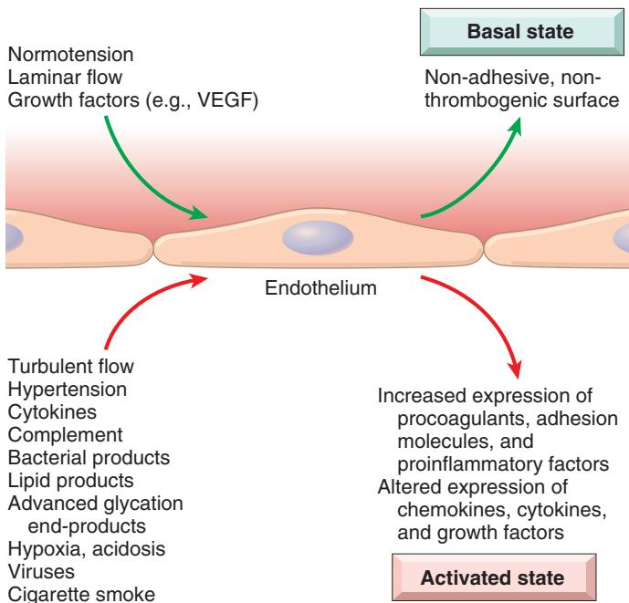 
Fig. 10.2 Basal and activated endothelial cell states. Normal blood pressure, laminar flow, and stable growth factor levels promote a basal endothelial cell state that maintains a nonthrombotic surface and appropriate vascular wall smooth muscle tone. Injury or exposure to certain mediators results in endothelial activation, a state in which endothelial cells develop adhesive, procoagulant surfaces and release factors that lead to smooth muscle contraction and/or proliferation and matrix synthesis.
In most regions, the interendothelial junctions normally are impermeable. However, these junctions open under the influence of hemodynamic stress (e.g., high blood pressure) and/or vasoactive agents (e.g., histamine in inflammation), flooding the adjacent tissues with electrolytes and protein. Vacuolar transcytosis also permits the movement of large amounts of solutes across intact endothelium. Relevant to pathologic processes, ECs also are active participants in the egress of leukocytes during inflammatory cell recruitment (Chapter 3), and EC dysfunction underlies development of atherosclerosis (discussed later).
Although ECs throughout the vasculature share many attributes, they also show phenotypic variability and adaptations depending on the anatomic site and local environmental cues. Thus, EC populations from different parts of the vasculature (e.g., large vessels versus capillaries, or arteries versus veins) have distinct transcriptional programs and behaviors. Fenestrations (holes) in ECs lining hepatocyte cords, renal glomeruli, and choroid plexus are specializations that facilitate filtration. Conversely, in the central nervous system, ECs—in conjunction with astrocytes—collaborate to generate an impermeable blood-brain barrier.
Maintenance of a "normal," nonthrombogenic EC lining requires laminar flow, certain growth factors (e.g., vascular endothelial growth factor [VEGF]), and firm adhesion to the underlying basement membrane (Fig. 10.2). Trauma or other injuries that denude vessel walls of ECs tip the scales toward thrombosis and vasoconstriction. However, ECs also respond to various physiologic and pathologic stimuli by modulating their usual (constitutive) functions and by expressing new (inducible) properties—a process called endothelial activation.
Inducers of endothelial activation include bacterial products, inflammatory cytokines, hemodynamic stresses and lipid products (relevant to atherosclerosis, discussed later), advanced glycation end products (important in diabetic vascular injury), viruses, complement, and various metabolic insults (e.g., hypoxia) (see Fig. 10.2). Activated ECs undergo shape changes, express adhesion molecules, and produce cytokines, chemokines, growth factors, procoagulant and anti-coagulant factors, and a host of other biologically active products—all presumably intended to respond to the original stimulus.
Some of these responses are rapid (occurring within minutes), reversible, and independent of new protein synthesis (e.g., endothelial contraction induced by histamine); others involve alterations in gene and protein expression, and may take days to develop or abate. Exposure of ECs to high levels of stimuli for sustained periods can result in endothelial dysfunction, characterized by impaired endothelium-dependent vasodilation, hypercoagulable states, and increased oxygen free radical production. Dysfunctional endothelium can initiate thrombosis, promote atherosclerosis, or contribute to formation of the vascular lesions of hypertension and diabetes.
# Vascular Smooth Muscle Cells
SMCs participate in both normal vascular repair and pathologic processes such as atherosclerosis. When stimulated by various factors, SMCs can do the following:
- Proliferate 
- Upregulate ECM collagen, elastin, and proteoglycan production 
- Elaborate growth factors and cytokines
SMCs also mediate the vasoconstriction or vasodilation that occurs in response to physiologic or pharmacologic stimuli.
The migratory and proliferative activities of SMCs are regulated by numerous factors. Among the most important pro-growth factors are platelet-derived growth factor (PDGF), endothelin, thrombin, fibroblast growth factors, and inflammatory mediators such as interferon- $\gamma$ (IFN- $\gamma$ ) and interleukin-1 (IL-1). Factors that maintain SMCs in a quiescent state include heparan sulfate, NO, and transforming growth factor- $\alpha$ (TGF- $\alpha$ ).
# VASCULAR STRUCTURE AND FUNCTION
- All vessels are lined by endothelium; although all ECs share certain homeostatic properties, ECs in specific vascular beds have special features that allow for tissue-specific functions (e.g., fenestrated ECs in renal glomeruli). 
- The relative SMC and ECM content of vessel walls (e.g., in arteries, veins, and capillaries) varies according to hemodynamic demands (e.g., pressure, pulsatility) and functional requirements. 
- EC function is tightly regulated in both the basal and activated states. Various physiologic and pathophysiologic stimuli induce endothelial activation and dysfunction that alter the EC phenotype (e.g., procoagulative versus anti-coagulative, proinflammatory versus anti-inflammatory, nonadhesive versus adhesive).
Although rarely symptomatic, unusual anatomic variants of blood vessels can cause complications during surgery, as may occur when a vessel in an unexpected location is injured. Cardiac surgeons and interventional cardiologists also must be familiar with coronary artery variants that can occur in up to $1\%$ to $5\%$ of patients. Among the other congenital vascular anomalies, three deserve further mention:
- Berry aneurysms are thin-walled arterial outpouchings in cerebral vessels, classically at branch points around the circle of Willis; they occur where the arterial media is congenitally attenuated and can spontaneously rupture causing fatal intracerebral hemorrhage (Chapter 23). 
- Arteriovenous (AV) fistulas are abnormal connections between arteries and veins without an intervening capillary bed. They occur most commonly as developmental defects but can also result from rupture of arterial aneurysms into adjacent veins, from penetrating injuries that pierce arteries and veins, or from inflammatory necrosis of adjacent vessels. AV fistulas can be created surgically to provide vascular access for hemodialysis. Extensive AV fistulas can cause high-output cardiac failure by shunting large volumes of blood from the arterial to the venous circulation. 
- Fibromuscular dysplasia is a focal irregular thickening of the walls of medium- and large-sized muscular arteries due to a combination of medial and intimal hyperplasia and fibrosis. It can manifest at any age but occurs most frequently in young women. The focal wall thickening results in luminal stenosis or can be associated with vessel spasm that reduces vascular flow; in the renal arteries, it can lead to renovascular hypertension. Between the focal segments of thickened wall, the artery often exhibits medial attenuation; vascular outpouchings can develop in these portions of the vessel and sometimes rupture.
# BLOOD PRESSURE REGULATION
Systemic and local blood pressure must be maintained within a narrow range to maintain health. Low blood pressure (hypotension) results in inadequate organ perfusion, organ dysfunction, and sometimes tissue death. Conversely, high blood pressure (hypertension) causes vessel and end-organ damage and is one of the major risk factors for atherosclerosis (see later).
Blood pressure is a function of cardiac output and peripheral vascular resistance, both of which are influenced by multiple genetic and environmental factors (Fig. 10.3). The integration of the various inputs ensures adequate systemic perfusion, despite regional demand differences.
- Cardiac output is a function of stroke volume and heart rate. The most important determinant of stroke volume is the filling pressure, which is regulated through sodium homeostasis and its effect on blood volume. Heart rate and myocardial contractility (a second factor affecting stroke volume) are both regulated by the $\alpha$ - and $\beta$ -adrenergic systems (in addition to their effects on vascular tone).
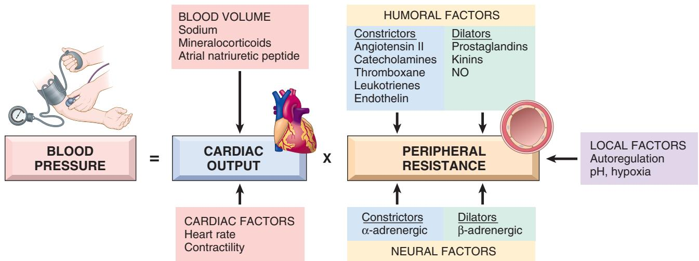 
Fig. 10.3 Blood pressure regulation.
- Peripheral resistance is regulated predominantly at the level of the arterioles by neural and humoral inputs. Vascular tone reflects a balance between the actions of vasoconstrictors (including angiotensin II, catecholamines, and endothelin) and vasodilators (including kinins, prostaglandins, and NO). Resistance vessels also exhibit autoregulation, whereby increased blood flow induces vasoconstriction to protect tissues against hyperperfusion. Finally, blood pressure is fine-tuned by tissue pH and hypoxia to accommodate local metabolic demands.
Factors released from the kidneys, adrenal glands, and myocardium interact to influence vascular tone and to regulate blood volume by adjusting sodium balance (Fig. 10.4). Each day, the kidneys on average filter 170 liters of plasma containing 23 moles of salt. Thus, with a typical diet containing $100\mathrm{mEq}$ of sodium, $99.5\%$ of the filtered salt must be reabsorbed to maintain total body sodium levels. About $98\%$ of the filtered sodium is reabsorbed by several constitutively active transporters. Recovery of the remaining $2\%$ of sodium occurs by way of the epithelial sodium channel (ENaC), which is tightly regulated by aldosterone, a downstream effector of the renin-angiotensin system; it is this pathway that determines net sodium balance.
Kidneys influence peripheral resistance and sodium excretion/retention primarily through the renin-angiotensin system. The kidneys and heart contain cells that sense changes in blood pressure and/or blood volume. In response, these cells release several important regulators that act in concert to maintain normal blood pressure:
- Renin is a proteolytic enzyme produced by renal juxta-glomerular cells—myoepithelial cells that surround the glomerular afferent arterioles. It is released in response to low blood pressure in afferent arterioles, elevated levels of circulating catecholamines, or low sodium levels in the distal convoluted renal tubules. The latter occurs when the glomerular filtration rate falls (e.g., when the cardiac output is low) because a higher fraction of the filtered sodium is resorbed in the proximal tubules. 
Angiotensin. Renin cleaves plasma angiotensinogen to angiotensin I, which in turn is converted to angiotensin
II by angiotensin-converting enzyme (ACE) in the periphery. Angiotensin II raises blood pressure by (1) inducing vascular SMC contraction, (2) stimulating aldosterone secretion by the adrenal gland, and (3) increasing tubular sodium resorption.
- Vasodilators. The kidney also produces a variety of vascular relaxing substances (including prostaglandins and NO) that presumably counterbalance the vasopressor effects of angiotensin. 
- Aldosterone. Adrenal aldosterone increases blood pressure by its effect on blood volume; aldosterone increases sodium resorption (and thus water) in the distal convoluted and collecting tubules while also driving potassium excretion into the urine. 
- Natriuretic peptides. Myocardial natriuretic peptides are released from atrial and ventricular myocardium in response to volume expansion; these inhibit sodium resorption in the distal renal tubules, thus leading to sodium excretion and diuresis. They also induce systemic vasodilation.
# BLOOD PRESSURE REGULATION
- Blood pressure is determined by vascular resistance and cardiac output. 
- Vascular resistance is regulated at the level of the arterioles, influenced by neural and hormonal inputs. 
- Cardiac output is determined by heart rate and stroke volume, the latter of which is strongly influenced by blood volume. Blood volume in turn is regulated mainly by renal sodium excretion or resorption. 
- Renin, a major regulator of blood pressure, is secreted by the kidneys in response to decreased blood pressure in afferent arterioles. In turn, renin cleaves angiotensinogen to angiotensin I; subsequent peripheral catabolism produces angiotensin II, which regulates blood pressure by increasing vascular SMC tone and by increasing adrenal aldosterone secretion, which consequently increases renal sodium resorption.
..jpg) 
Fig. 10.4 Interplay of renin, angiotensin, aldosterone, and atrial natriuretic peptide in blood pressure regulation (see text).
# HYPERTENSIVE VASCULAR DISEASE
Hypertension is a major health problem in the developed world. Although it occasionally manifests in an acute aggressive form, high blood pressure is typically asymptomatic for many years. This insidious condition has been dubbed essential hypertension, so called because the gradual age-associated rise in blood pressure was considered "essential" for normal perfusion of endorgans such as the brain. However, such increases are neither essential nor benign; besides increasing the risk for stroke and atherosclerotic coronary heart disease, hypertension can lead to cardiac hypertrophy and heart failure (hypertensive heart disease; see Chapter 11), aortic dissection, multi-infarct dementia, and renal failure. While the molecular pathways of blood pressure regulation are reasonably well understood, the mechanisms leading to hypertension in the vast majority of affected individuals remain unknown. The accepted wisdom is that "essential hypertension" results from the interplay of several genetic polymorphisms (which individually might be inconsequential) and environmental factors, which spire to increase blood volume and/or peripheral resistance.
# Epidemiology of Hypertension
Like height and weight, blood pressure is a continuously distributed variable; moreover, detrimental consequences increase continuously as the pressure rises, with no rigidly defined threshold dependably predicting total safety. Nevertheless, sustained diastolic pressures greater than $90\mathrm{mmHg}$ or sustained systolic pressures in excess of $140\mathrm{mmHg}$ are reliably associated with an increased risk for atherosclerosis and are therefore used as cutoffs in diagnosing hypertension in clinical practice. By these criteria, over $25\%$ of individuals in the general population are hypertensive. As noted however, these values are somewhat arbitrary, and in patients with other cardiovascular risk factors (e.g., diabetes), lower thresholds may be applicable.
The prevalence of pathologic effects of high blood pressure increases with age and is also higher in African Americans. Without appropriate treatment, some $50\%$ of hypertensive patients die of ischemic heart disease (IHD) or congestive heart failure, and another third succumb to stroke. Reduction of blood pressure dramatically reduces the incidence and clinical sequelae (including death) of all forms of hypertension-related disease. Indeed, treatment of asymptomatic hypertension constitutes one of the few
instances in which "preventive medicine" has a major demonstrated health benefit.
A small percentage of hypertensive patients (approximately $5\%$ ) present with a rapidly rising blood pressure that, if untreated, leads to death in within 1 to 2 years. Such malignant hypertension usually is severe (i.e., systolic pressures over $200\mathrm{mmHg}$ or diastolic pressures over $120\mathrm{mmHg}$ ) and frequently is associated with renal failure and retinal hemorrhages, with or without papilledema. It can arise de novo but most commonly is superimposed on preexisting benign hypertension.
Hypertension may be primary (idiopathic) or less commonly secondary to an identifiable underlying condition. In close to $95\%$ of cases hypertension is idiopathic or "essential". Most of the remaining cases (secondary hypertension) are due to primary renal disease, renal artery narrowing (renovascular hypertension), or adrenal disorders (Table 10.2). Essential hypertension is compatible with long life unless a myocardial infarction, stroke, or other complication supervenes. Prognosis of secondary hypertension depends on adequate treatment of the underlying cause. Several relatively rare single-gene disorders cause hypertension (and hypotension) by affecting renal sodium resorption. Such disorders include the following:
- Gene defects in enzymes involved in aldosterone metabolism (e.g., aldosterone synthase, $11\beta$ -hydroxylase, $17\alpha$ -
Table 10.2 Types and Causes of Hypertension (Systolic and Diastolic) 
Essential HypertensionAccounts for 90% to 95% of all casesSecondary HypertensionRenalAcute glomerulonephritisChronic renal diseasePolycystic diseaseRenal artery stenosisRenal vasculitisRenin-producing tumorsEndocrineAdrenocortical hyperfunction (Cushing syndrome, primary aldosteronism, congenital adrenal hyperplasia, licorice ingestion)Exogenous hormones (glucocorticoids, estrogen [including pregnancy-induced and oral contraceptives], sympathomimetics and tyramine-containing foods, monoamine oxidase inhibitors)PheochromocytomaAcromegalyHypothyroidism (myxedema)Hyperthyroidism (thyrotoxicosis)Pregnancy-induced (pre-eclampsia)CardiovascularCoarctation of the aortaPolyarteritis nodosaIncreased intravascular volumeIncreased cardiac outputRigidity of the aortaNeurologicPsychogenicIncreased intracranial pressureSleep apneaAcute stress, including surgery
hydroxylase), leading to increased aldosterone secretion, increased salt and water resorption, and plasma volume expansion
- Mutations in proteins that affect sodium resorption (as in Liddle syndrome, which is caused by mutations that prevent the normal degradation of the ENaC sodium channel, leading to increased distal tubular resorption of sodium)
# Mechanisms of Essential Hypertension
Although the specific triggers are unknown, it appears that both altered renal sodium handling and increased vascular resistance contribute to essential hypertension.
- Reduced renal sodium excretion in the presence of normal arterial pressure probably is a key pathogenic feature; indeed, this is a common etiologic factor in most forms of hypertension. Decreased sodium excretion causes an obligatory increase in fluid volume and increased cardiac output, thereby elevating blood pressure (see Fig. 10.3). At the new higher blood pressure, the kidneys excrete additional sodium. Thus, a new steady state of sodium excretion is achieved, but at the expense of an elevated blood pressure. 
- Increased vascular resistance may stem from vasoconstriction or structural changes in vessel walls. These are not necessarily independent factors, as chronic vasoconstriction may result in permanent thickening of the walls of affected vessels. 
- Genetic factors play an important role in determining blood pressure, as shown by familial clustering of hypertension and by studies of monozygotic and dizygotic twins. In a small proportion of cases of essential hypertension there is linkage to specific angiotensinogen polymorphisms and angiotensin II receptor variants; polymorphisms of the renin-angiotensin system also may contribute to the known racial differences in blood pressure regulation. Susceptibility genes for essential hypertension in the vast majority of cases are currently unknown but probably include those that influence renal sodium resorption, the production of endogenous pressors, and SMC growth. 
- Environmental factors, such as stress, obesity, smoking, physical inactivity, and high levels of salt consumption, modify the impact of genetic determinants. Evidence linking dietary sodium intake with the prevalence of hypertension is particularly strong.
Hypertension not only accelerates atherogenesis but also causes degenerative changes in the walls of large- and medium-sized arteries that can lead to aortic dissection and cerebrovascular hemorrhage. Three forms of small blood vessel disease are hypertension-related (Fig. 10.5):
- Hyaline arteriolosclerosis is associated with benign hypertension. It is marked by homogeneous, pink hyaline thickening of the arteriolar walls, with loss of underlying structural detail, and luminal narrowing (see Fig. 10.5A). The lesions stem from leakage of plasma components across injured ECs into vessel
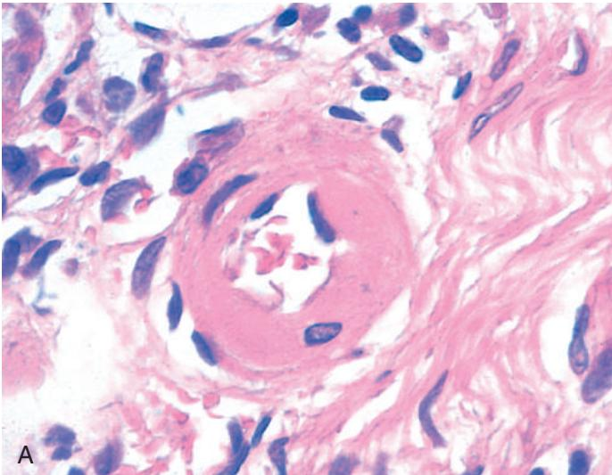
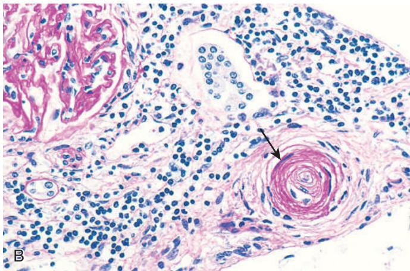 
Fig. 10.5 Hypertensive vascular disease. (A) Hyaline arteriolosclerosis. The arteriolar wall is thickened with the deposition of amorphous proteinaceous material (hyalinized), and the lumen is markedly narrowed. (B) Hyperplastic arteriolosclerosis ("onion-skinning") (arrow) causing luminal obliteration (periodic acid-Schiff stain). (B, Courtesy of Helmut Rennke, MD, Brigham and Women's Hospital, Boston, Massachusetts.)
walls, and increased ECM production by SMCs in response to chronic hemodynamic stress. In the kidneys, the arteriolar narrowing caused by hyaline arteriosclerosis leads to diffuse vascular compromise and nephrosclerosis (glomerular scarring). Although the vessels of older adult patients (normotensive or hypertensive) show the same changes, hyaline arteriolesclerosis is more generalized and severe in patients with hypertension. The same lesions also are common in diabetic microangiopathy; in this disorder, the underlying etiology is hyperglycemia-associated EC dysfunction.
- Hyperplastic arteriolasclerosis is more typical of severe hypertension. Vessels exhibit "onion skin," concentric, laminated thickening of arteriolar walls and luminal narrowing (see Fig. 10.5B). The laminations consist of SMCs and thickened, reduplicated basement membrane. In malignant hypertension, these changes are accompanied by fibrinoid deposits and vessel wall necrosis (necrotizing arteriolitis), which are particularly prominent in the kidney.
# HYPERTENSION
- Hypertension is a common disorder affecting $25\%$ of the population; it is a major risk factor for atherosclerosis, congestive heart failure, and renal failure. 
- Hypertension may be primary (idiopathic) or less commonly secondary to an identifiable underlying condition. In close to $95\%$ of cases hypertension is idiopathic or "essential." The remaining cases (secondary hypertension) are due to primary renal disease, renal artery narrowing (renovascular hypertension), or adrenal disorders. 
- Essential hypertension represents $95\%$ of cases and is a complex, multifactorial disorder, involving both environmental influences and genetic polymorphisms that may influence sodium resorption, aldosterone pathways, the adrenergic nervous system, and the renin-angiotensin system. 
- Hypertension occasionally is caused by single-gene disorders or is secondary to diseases of the renal arteries, kidneys, adrenal glands, or other endocrine organs.
# VASCULAR WALL RESPONSE TO INJURY
Injury to the vessel wall—and in particular to ECs—is the fundamental basis for the vast majority of vascular disorders. Such injurious stimuli may be biochemical, immunologic, or hemodynamic. The integrated function of ECs—and the underlying SMCs—is critical for the vasculature to respond to various stimuli; such responses can be adaptive or may lead to pathologic lesions. Thus, EC injury or dysfunction (as discussed earlier) contributes to a host of pathologic processes including thrombosis, atherosclerosis, and hypertensive vascular lesions. Ensuing SMC proliferation and matrix synthesis can help to repair a damaged vessel wall, but also can eventually lead to luminal occlusion.
# Intimal Thickening: A Stereotypical Response to Vascular Injury
Vascular injury leading to EC loss or dysfunction stimulates SMC growth, ECM synthesis, and thickening of the vascular wall. Healing of injured vessels involves the migration of SMCs or SMC precursor cells into the intima. These cells then proliferate and synthesize ECM in much the same way that fibroblasts fill in a wound elsewhere in the body (Fig. 10.6), forming a neointima that typically is covered by an intact EC layer. This neointimal response occurs with any form of vascular damage or dysfunction, including infection, inflammation, immune injury, physical trauma (e.g., from a balloon catheter or hypertension), or toxic exposure (e.g. oxidized lipids or cigarette smoke). Thus, intimal thickening is a stereotypical response of the vessel wall to any insult.
Of note, the phenotype of neointimal SMCs is distinct from medial SMCs. Thus, neointimal SMCs are not contractile like medial SMCs, but do have the capacity to divide and have a considerably greater synthetic capacity
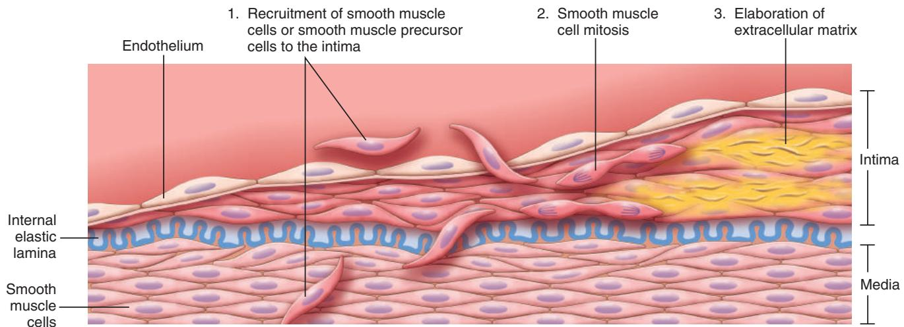 
Fig. 10.6 Stereotypical response to vascular injury. Schematic diagram of intimal thickening, emphasizing intimal smooth muscle cell migration and proliferation associated with extracellular matrix synthesis. Intimal smooth muscle cells may derive from the underlying media or may be recruited from circulating precursors; they are depicted in a color different from that of the medial smooth muscle cells, to emphasize their distinct phenotype.
than their sleepy colleagues in the media. Although neointimal cells were previously thought to arise exclusively from dedifferentiated medial SMCs, at least a subset is derived from circulating precursor cells. The migratory, proliferative, and synthetic activities of the intimal SMCs are regulated by growth factors and cytokines produced by platelets, ECs, and macrophages, as well as by activated coagulation and complement factors (as discussed earlier).
With restoration and/or normalization of the EC layer, intimal SMCs can return to a nonproliferative state, but not before the healing response has produced intimal thickening. With persistent or recurrent insults, further thickening can occur that leads to the stenosis of small- and medium-sized blood vessels (e.g., as in atherosclerosis, discussed later). As a final note, it is also important to recognize that gradual ongoing intimal thickening appears to be a part of "normal aging." Fortunately, such age-related intimal change typically is of no consequence, in part because compensatory outward remodeling of the vessel wall results in little net change in the luminal diameter.
# ARTERIOSCLEROSIS
Arteriosclerosis literally means "hardening of the arteries"; it is a generic term reflecting arterial wall thickening and loss of elasticity. Four distinct types are recognized, each with different clinical and pathologic causes and consequences:
- Arteriolosclerosis affects small arteries and arterioles and may cause downstream ischemic injury. The two variants, hyaline and hyperplastic arteriolosclerosis, were discussed earlier in relation to hypertension. 
- Monckeberg medial sclerosis is characterized by the presence of calcific deposits in muscular arteries, usually centered on the internal elastic lamina, and typically in individuals older than 50 years of age. The lesions do not encroach on the vessel lumen and usually are not clinically significant. 
- Fibromuscular intimal hyperplasia is a non-atherosclerotic process that occurs in muscular arteries larger than
arterioles. This is predominantly an SMC- and ECM-rich lesion driven by inflammation (as in a healed arteritis or transplant-associated arteriopathy; see Chapter 11), or by mechanical injury (e.g., associated with stents or balloon angioplasty, see later). Such a healing response can cause substantial stenosis of the vessel; indeed such intimal hyperplasia underlies in-stent restenosis and is the major long-term limitation of solid organ transplants.
- Atherosclerosis, from Greek root words for "gruel" and "hardening," is the most frequent and clinically important pattern and is the subject of the next section.
# ATHEROSCLEROSIS
Atherosclerosis is characterized by intimal lesions called atheromas (or atheromatous or atherosclerotic plaques) that impinge on the vascular lumen and can rupture to cause sudden occlusion. It underlies the pathogenesis of coronary, cerebral, and peripheral vascular disease, and causes more morbidity and mortality (roughly half of all deaths) in the Western world than any other disorder. Atheromatous plaques are raised lesions composed of soft friable (grumous) lipid cores (mainly cholesterol and cholesterol esters, with necrotic debris) covered by fibrous caps (Fig. 10.7). As they enlarged, atherosclerotic plaques may mechanically obstruct vascular lumina, leading to stenosis. Of greater concern, however, atherosclerotic plaques also are prone to rupture, an event that may result in thrombosis and sudden occlusion of the vessel. The thickness of the intimal lesions also may be sufficient to impede the perfusion of the underlying media, which may be weakened by ischemia and by changes in the ECM caused by subsequent inflammation. Together, these two factors weaken the media, setting the stage for the formation of aneurysms.
With better treatment of infectious disorders and increased access to Western dietary behaviors, atherosclerosis is also becoming increasingly prevalent in developing countries. Because coronary artery disease is an important manifestation of atherosclerosis, epidemiologic data related
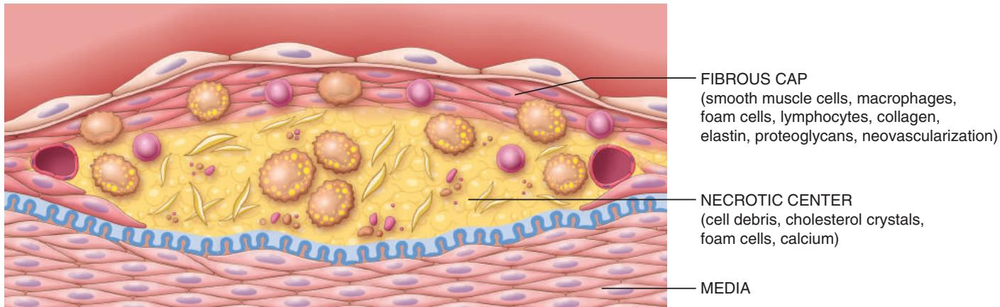 
Fig. 10.7 The basic structure of an atheromatous plaque.
to atherosclerosis-related mortality typically reflect deaths caused by ischemic heart disease (IHD) (Chapter 11); indeed, myocardial infarction is responsible for roughly one quarter of all deaths in the United States.
# Epidemiology of Atherosclerosis
Atherosclerosis is virtually ubiquitous among most developed nations, with prevalence increasing at an alarming pace in developing countries. The mortality rate for IHD in the United States is among the highest in the world, approximately five times higher than that in Japan. However, IHD is increasing in Japan, where it is now the second leading cause of death. Furthermore, Japanese emigrants who come to the United States and adopt American lifestyles and dietary customs acquire the same atherosclerosis risk as U.S.-born individuals, emphasizing the important etiologic role of environmental factors.
The prevalence and severity of atherosclerosis and IHD have been correlated with a number of risk factors in several prospective analyses including the landmark Framingham Heart Study; some of these risk factors are constitutional (and therefore less controllable), but others are acquired or related to modifiable behaviors (Table 10.3). These risk factors have roughly multiplicative effects. Thus, two factors increase the risk for myocardial infarction approximately 4-fold, and three (i.e., hyperlipidemia, hypertension, and smoking) increase the rate by a factor of 7 (Fig. 10.8).
# Constitutional Risk Factors
- Genetics. Family history is the most important independent risk factor for atherosclerosis. Certain mendelian disorders are strongly associated with atherosclerosis (e.g., familial hypercholesterolemia) (Chapter 7), but these account for only a small percentage of cases. Most
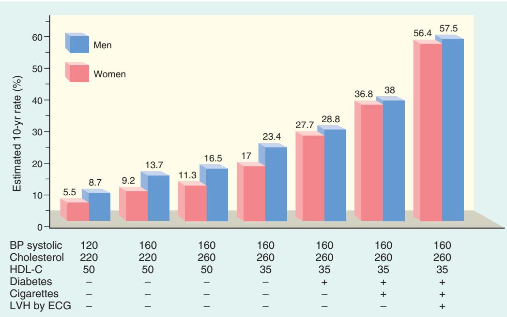 
Fig. 10.8 Estimated 10-year risk for coronary artery disease in 55-year-old men and women as a function of established risk factors—hyperlipidemia, hypertension, smoking, and diabetes. BP, blood pressure; ECG, electrocardiogram; HDL-C, high-density lipoprotein cholesterol; LVH, left ventricular hypertrophy. (Data from O'Donnell CJ, Kannel WB: Cardiovascular risks of hypertension: lessons from observational studies, J Hypertension 16[Suppl 6]:3, 1998.)
Table 10.3 Major Risk Factors for Atherosclerosis 
Nonmodifiable (Constitutional)Genetic abnormalitiesFamily historyIncreasing ageMale genderModifiableHyperlipidemiaHypertensionCigarette smokingDiabetesInflammation
familial risk is related to multifactorial traits that go hand-in-hand with atherosclerosis, including hypertension, and, diabetes.
- Age. Atherosclerosis usually remains clinically silent until lesions reach a critical threshold in middle age or later. Thus, the incidence of myocardial infarction increases 5-fold between 40 and 60 years of age. Death rates from IHD continue to rise with each successive decade. 
- Gender. All other factors being equal, premenopausal women are relatively protected against atherosclerosis (and its consequences) compared with age-matched men. Thus, myocardial infarction and other complications of atherosclerosis are uncommon in premenopausal women in the absence of other predisposing factors such as diabetes, hyperlipidemia, or severe hypertension. After menopause, however, the incidence of atherosclerosis-related disease increases and can even exceed that in men. Although a salutary effect of estrogen has long been proposed to explain this gender difference, clinical trials have shown no benefit of hormonal therapy for prevention of vascular disease. Indeed, estrogen replacement after 65 years of age appears to actually increase cardiovascular risk. In addition to atherosclerosis, gender also influences other factors that can affect outcome in patients with IHD, such as hemostasis, infarct healing, and myocardial remodeling.
# Modifiable Major Risk Factors
- Hyperlipidemia—and, more specifically, hypercholesterolemia—is a major risk factor for development of atherosclerosis and is sufficient to induce lesions in the absence of other risk factors. The main cholesterol component associated with increased risk is low-density lipoprotein (LDL) cholesterol ("bad cholesterol"); LDL distributes cholesterol to peripheral tissues. By contrast, high-density lipoprotein (HDL) cholesterol ("good cholesterol") mobilizes cholesterol from developing and existing vascular plaques and transports it to the liver for biliary excretion. Consequently, higher levels of HDL correlate with reduced risk. Recognition of these relationships has spurred the development of dietary and pharmacologic interventions that lower total serum cholesterol or LDL and/or raise serum HDL, as follows:
- High dietary intake of cholesterol and saturated fats (e.g., present in egg yolks, animal fats, and butter) raises plasma cholesterol levels. Conversely, diets
low in cholesterol and/or containing higher ratios of polyunsaturated fats, lower plasma cholesterol levels.
- Omega-3 fatty acids (abundant in fish oils) are beneficial, whereas (trans)-unsaturated fats produced by artificial hydrogenation of polyunsaturated oils (used in baked goods and margarine) adversely affect cholesterol profiles. 
Exercise and moderate consumption of ethanol raise HDL levels, whereas obesity and smoking lower them. 
- Statins are a widely used class of drugs that lower circulating cholesterol levels by inhibiting hydroxymethylglutaryl coenzyme A (HMG-CoA) reductase, the rate-limiting enzyme in hepatic cholesterol biosynthesis (Chapter 7). 
- Hypertension (see earlier discussion) is another major risk factor for development of atherosclerosis. On its own, hypertension can increase the risk for IHD by approximately $60\%$ (see Fig. 10.8). Hypertension also is the major cause of left ventricular hypertrophy (LVH), which also can contribute to myocardial ischemia (see Fig. 10.8). 
- Cigarette smoking is a well-established risk factor in men and probably accounts for the increasing incidence and severity of atherosclerosis in women. Prolonged (years) smoking of one or more packs of cigarettes per day doubles the rate of IHD-related mortality, while smoking cessation reduces the risk. 
- Diabetes mellitus is associated with raised circulating cholesterol levels and markedly increases the risk for atherosclerosis. Other factors being equal, the incidence of myocardial infarction is twice as high in diabetics as in non-diabetics. In addition, this disorder is associated with an increased risk for stroke and a 100-fold increase in atherosclerosis-induced gangrene of the lower extremities.
# Additional Risk Factors
Roughly $20\%$ of cardiovascular events occur in the absence of identifiable risk factors. For example, in previously healthy women, more than $75\%$ of cardiovascular events occur in those with LDL cholesterol levels below $130\mathrm{mg / dL}$ (a cutoff value considered to connote only borderline risk). Other factors that contribute to risk include the following:
- Inflammation. Inflammatory cells are present during all stages of atheromatous plaque formation and are intimately linked with plaque progression and rupture (see the following discussion). There is some evidence that a systemic pro-inflammatory state is associated with the development of atherosclerosis and hence measures of systemic inflammation have been used in risk stratification. Of various systemic markers of inflammation, determination of C-reactive protein (CRP) has emerged as one of the simplest and most sensitive. CRP is an acute-phase reactant synthesized primarily by the liver in response to a variety of inflammatory cytokines. In some studies, CRP levels independently predict the risk for myocardial infarction, stroke, peripheral arterial disease, and sudden cardiac death, even among apparently healthy individuals (Fig. 10.9). However, such studies are confounded by lack of precise definition of "healthy individuals" because clinically asymptomatic individuals may harbor
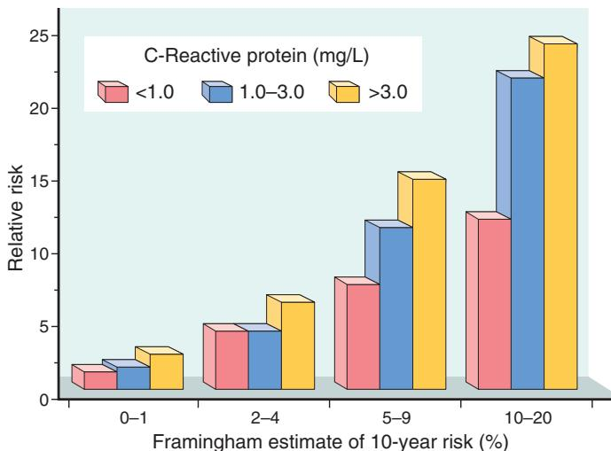 
Fig. 10.9 Prognostic value of C-reactive protein (CRP) in coronary artery disease. Relative risk (y-axis) reflects the risk for a cardiovascular event (e.g., myocardial infarction). The x-axis shows the 10-year risk for a cardiovascular event calculated from the traditional risk factors identified in the Framingham Study. In each risk group, CRP levels further stratify the patients. (Data from Ridker PM, et al: Comparison of C-reactive protein and low-density lipoprotein cholesterol levels in the prediction of first cardiovascular events. N Engl J Med 347:1557, 2002.)
significant atherosclerotic lesions with associated inflammation. Thus elevated CRP levels may be a marker of underlying asymptomatic atherosclerosis. Furthermore, there is no direct evidence that lowering CRP diminishes cardiovascular risk or that CRP is involved in the formation of atheromas. It is of interest that CRP is reduced by smoking cessation, weight loss, and exercise, all of which could reduce the risk of atherosclerosis independently. Thus, whether elevated CRP is a marker of or a consequence of plaque inflammation remains to be resolved.
- Hyperhomocysteinemia. Serum homocysteine levels correlate with coronary atherosclerosis, peripheral vascular disease, stroke, and venous thrombosis. Homocystinuria, due to rare inborn errors of metabolism, causes elevated circulating homocysteine (greater than $100\mu \mathrm{mol} / \mathrm{L}$ ) and is associated with early-onset vascular disease. Although low folate and vitamin $\mathbf{B}_{12}$ levels can increase homocysteine levels, supplemental vitamin ingestion does not affect the incidence of cardiovascular disease. 
- Metabolic syndrome. Associated with central obesity (Chapter 8), this clinical entity is characterized by insulin resistance, hypertension, dyslipidemia (elevated triglycerides and depressed HDL), hypercoagulability, and a pro-inflammatory state, which may be triggered by cytokines released from adipocytes. The dyslipidemia, hyperglycemia, and hypertension are all cardiac risk factors, while the systemic hypercoagulabgramle and pro-inflammatory state may contribute to endothelial dysfunction and/or thrombosis. 
- Lipoprotein(a) levels. Lipoprotein(a) is an LDL-like particle that contains apolipoprotein B-100 linked to apolipoprotein(a). Lipoprotein(a) levels are correlated with risk of coronary and cerebrovascular disease, independent of total cholesterol or LDL levels.
Apolipoprotein(a) is homologous to plasminogen, suggesting a potential link between thrombogenesis and circulating molecules that can drive atherosclerosis.
- Elevated levels of procoagulants are potent predictors of risk for major cardiovascular events including myocardial infarction and stroke. Excessive activation of thrombin, which you may recall can initiate inflammation through cleavage of protease-activated receptors (PARs; Chapter 4) on leukocytes, endothelium, and other cells, may be particularly atherogenic. 
- Clonal hematopoiesis. It is now recognized that a surprisingly high fraction of older individuals have clonal hematopoiesis (Chapter 12), defined by the presence of a major clone of cells in the bone marrow that have acquired somatic driver mutations in one or more well-characterized oncogenes or tumor suppressor genes. Despite the presence of these mutations, such patients typically have normal blood counts. Unexpectedly, epidemiologic studies have found that clonal hematopoiesis is strongly associated with an increased risk of death from cardiovascular disease, possibly because of alterations in the function of innate immune cells derived from mutated hematopoietic stem cells. Work is ongoing to further confirm this association and determine its mechanistic basis. 
- Other factors associated with difficult-to-quantify risks include lack of exercise and living a competitive, stressful lifestyle ("type A personality").
The currently held view of pathogenesis is embodied in the response-to-injury hypothesis. This model views atherosclerosis as a chronic inflammatory response of the arterial wall to endothelial injury. Lesion progression involves interaction of modified lipoproteins, monocyte-derived macrophages, T lymphocytes, and the cellular constituents of the arterial wall (Fig. 10.10). According to this model, atherosclerosis results from the following pathogenic events:
- EC injury—and resultant endothelial dysfunction—leading to increased permeability, leukocyte adhesion, and thrombosis 
- Accumulation of lipoproteins (mainly oxidized LDL and cholesterol crystals) in the vessel wall 
- Platelet adhesion 
- Monocyte adhesion to the endothelium, migration into the intima, and differentiation into macrophages and foam cells 
- Lipid accumulation within macrophages, which respond by releasing inflammatory cytokines 
- SMC recruitment due to factors released from activated platelets, macrophages, and vascular wall cells 
- SMC proliferation and ECM production
Some details of these steps are presented next.
# Endothelial Injury
EC injury is the cornerstone of the response to injury hypothesis. EC loss due to any kind of injury-induced experimentally by mechanical denudation, hemodynamic forces, immune complex deposition, irradiation, or chemicals - results in intimal thickening; in the presence of high-lipid diets, typical atheromas ensue. However, early
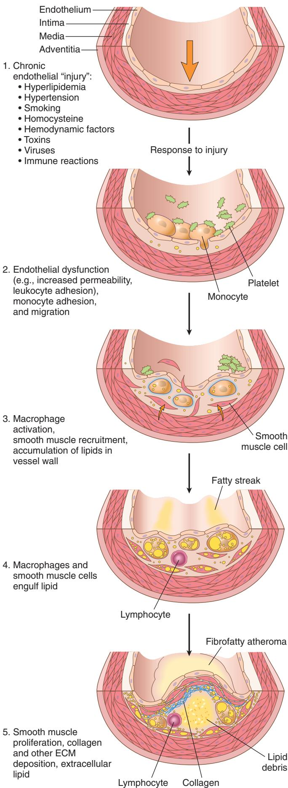 
Fig. 10.10 Response to injury in atherogenesis: I, Normal. 2, Endothelial injury with monocyte and platelet adhesion. 3, Monocyte and smooth muscle cell migration into the intima, with macrophage activation. 4, Macrophage and smooth muscle cell uptake of modified lipids and further activation. 5, Intimal smooth muscle cell proliferation and extracellular matrix elaboration, forming a well-developed plaque.
human atherosclerotic lesions begin at sites of intact, but dysfunctional, endothelium. These dysfunctional ECs exhibit increased permeability, enhanced leukocyte adhesion, and altered gene expression, all of which may contribute to the development of atherosclerosis.
Suspected triggers of early atheromatous lesions include hypertension, hyperlipidemia, toxins from cigarette smoke, and homocysteinemia. Inflammatory cytokines (e.g., tumor necrosis factor [TNF]) also can stimulate proatherogenic patterns of EC gene expression. Nevertheless, the two most important causes of endothelial dysfunction are hemodynamic disturbances and hypercholesterolemia.
# Hemodynamic Disturbances
The importance of hemodynamic factors in atherogenesis is illustrated by the observation that plaques tend to occur at ostia of exiting vessels, at branch points, and along the posterior wall of the abdominal aorta, where there is turbulent blood flow. In vitro studies further demonstrate that nonturbulent laminar flow leads to the induction of endothelial genes whose products protect against atherosclerosis. Such "atheroprotective" genes may explain the nonrandom localization of early atherosclerotic lesions.
# Lipids
Lipids typically are transported in the bloodstream bound to specific apoproteins (forming lipoprotein complexes). Dyslipoproteinemias can result from mutations in genes that encode apoproteins or lipoprotein receptors, or from disorders that derange lipid metabolism, e.g., nephrotic syndrome, alcoholism, hypothyroidism, or diabetes mellitus. Common lipoprotein abnormalities in the general population (and indeed, present in many myocardial infarction survivors) include (1) increased LDL cholesterol levels, (2) decreased HDL cholesterol levels, and 3) increased levels of lipoprotein(a).
Several lines of evidence implicate hypercholesterolemia in atherogenesis:
- The dominant lipids in atheromatous plaques are cholesterol and cholesterol esters. 
- Genetic defects in lipoprotein uptake and metabolism that cause hyperlipoproteinemia are associated with accelerated atherosclerosis. Thus, homozygous familial hypercholesterolemia, caused by defective LDL receptors and inadequate hepatic LDL uptake, can lead to myocardial infarction by 20 years of age. 
- Other genetic or acquired disorders (e.g., diabetes mellitus, hypothyroidism) that cause hypercholesterolemia lead to premature atherosclerosis. 
- Epidemiologic analyses (e.g., the Framingham study) demonstrate a significant correlation between the levels
of total plasma cholesterol or LDL and the severity of atherosclerosis.
- Lowering serum cholesterol by diet or drugs slows the rate of progression of atherosclerosis, causes regression of some plaques, and reduces the risk for cardiovascular events.
The mechanisms by which dyslipidemia contributes to atherogenesis include the following:
- Chronic hyperlipidemia, particularly hypercholesterolemia, can directly impair EC function by increasing local oxygen free radical production; among other things, oxygen free radicals accelerate NO decay, damping its vasodilator activity.
- With chronic hyperlipidemia, lipoproteins accumulate within the intima, where they are hypothesized to generate two pathogenic derivatives, oxidized LDL and cholesterol crystals. LDL is oxidized through the action of oxygen free radicals generated locally by macrophages or ECs and ingested by macrophages through the scavenger receptor, resulting in foam cell formation. Oxidized LDL stimulates the local release of growth factors, cytokines, and chemokines, increasing monocyte recruitment, and also is cytotoxic to ECs and SMCs. More recently, it has been shown that minute extracellular cholesterol crystals found in early atherosclerotic lesions serve as "danger" signals that can activate innate immune cells such as monocytes and macrophages to produce IL-1 and other pro-inflammatory mediators.
# Inflammation
Inflammation contributes to the initiation, progression, and complications of atherosclerotic lesions. Normal vessels do not bind inflammatory cells. Early in atherogenesis, however, dysfunctional ECs express adhesion molecules that promote leukocyte adhesion, in particular, monocytes and T cells which migrate into the intima under the influence of locally produced chemokines.
- Monocytes differentiate into macrophages and avidly engulf lipoproteins, including oxidized LDL and small cholesterol crystals. Cholesterol crystals appear to be particularly important instigators of inflammation through activation of the inflammasome and subsequent release of IL-1 (Chapter 5). Activated macrophages also produce toxic oxygen species that drive LDL oxidation and elaborate growth factors that stimulate SMC proliferation.
- T lymphocytes recruited to the intima interact with the macrophages and also contribute to chronic inflammation. It is not clear whether the T cells are responding to specific antigens (e.g., bacterial or viral antigens, heat-shock proteins [see later], or modified arterial wall constituents and lipoproteins) or are nonspecifically activated by the local inflammatory milieu. Nevertheless, activated T cells in the growing intimal lesions elaborate inflammatory cytokines (e.g., IFN- $\gamma$ ), which stimulate macrophages, ECs, and SMCs.
- As a consequence of the chronic inflammatory state, activated leukocytes and vascular wall cells release growth factors that promote SMC proliferation and matrix synthesis.
# SMC Proliferation and Matrix Synthesis
Intimal SMC proliferation and ECM deposition lead to conversion of the earliest lesion, a fatty streak, into a mature atheroma, thus contributing to the progressive growth of atherosclerotic lesions (see Fig. 10.10). Several growth factors are implicated in SMC proliferation and matrix synthesis, including platelet-derived growth factor (released by locally adherent platelets, macrophages, ECs, and SMCs), fibroblast growth factor, and TGF- $\alpha$ . The recruited SMCs synthesize ECM (most notably collagen), which stabilizes atherosclerotic plaques. However, activated inflammatory cells in atheromas also can cause intimal SMC apoptosis and breakdown of matrix, leading to the development of unstable plaques (see later).
The development of atherosclerosis tends to follow a series of morphologic changes described below.
Fatty Streaks. Fatty streaks begin as minute yellow, flat macules that coalesce into elongated lesions, 1 cm or more in length (Fig. 10.11). They are composed of lipid-filled foamy macrophages but are only minimally raised and do not cause any significant flow disturbance. Fatty streaks can appear in the aortas of infants younger than 1 year of age and are present in virtually all children older than 10 years of age, regardless of genetic, clinical, or dietary risk factors. Not all fatty streaks are destined to progress to atherosclerotic plaques. Nevertheless, it is notable that coronary fatty streaks form during adolescence at the same anatomic sites that are prone to plaques later in life.
Atherosclerotic Plaque. The key features of these lesions are intimal thickening and lipid accumulation (see Fig. 10.7). Atheromatous plaques are white to yellow raised lesions; they range from 0.3 to $1.5\mathrm{cm}$ in diameter but can coalesce to form larger masses. Thrombus superimposed on ulcerated plaques imparts a red-brown color (Fig. 10.12).
Atherosclerotic plaques are patchy, usually involving only a portion of any given arterial wall; on cross-section, therefore, the lesions appear "eccentric" (Fig. 10.13A). The focal nature of atherosclerotic lesions may be related to the vagaries of vascular hemodynamics. Local flow disturbances, such as turbulence at branch points, make certain parts of a vessel wall especially susceptible to plaque formation.
In descending order of severity, atherosclerosis involves the infrarenal abdominal aorta, the coronary arteries, the popliteal arteries, the internal carotid arteries, and the vessels of the circle of Willis. Even in the same patient, atherosclerosis typically is more severe in the abdominal aorta than in the thoracic aorta. Vessels of the upper extremities usually are spared, as are the mesenteric and renal arteries, except at their ostia. It is important to note that the severity of atherosclerosis in one vascular location does not necessarily predict its severity in another (e.g., aorta versus coronary arteries); nevertheless, any given patient tends to show comparable severity of disease throughout his or her vasculature. Finally, in any given vessel, lesions at various stages of severity often coexist.
Atherosclerotic plaques have three principal components: (1) cells, including SMCs, macrophages, and T cells;
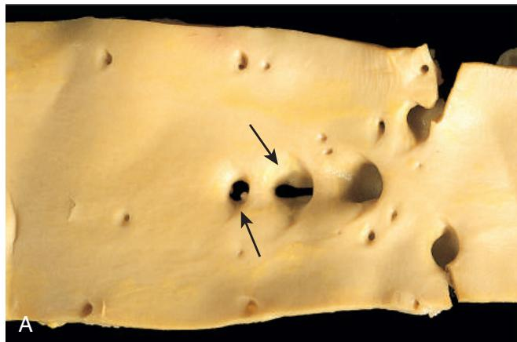 
Fig. 10.11 Fatty streaks. (A) Aorta with fatty streaks (arrows), mainly near the ostia of branch vessels. (B) Fatty streak in an experimental hypercholesterolemic rabbit, demonstrating intimal, macrophage-derived foam cells (arrows). (B, Courtesy of Myron I. Cybulsky, MD, University of Toronto, Toronto, Ontario, Canada.)
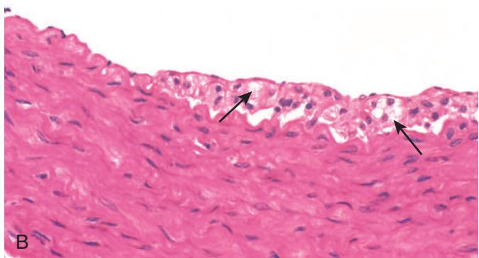
Aortawithmildatherosclerosiscomposedoffibrousplaques,onedenotedbythearrow.(B)Aortawithseverediffusecomplicatedlesions,includinganulceratedplaque(openarrow),andalesionwithoverlyingthrombus(closedarrow)..jpg) 
Fig. 10.12 Atherosclerotic lesions. (A) Aorta with mild atherosclerosis composed of fibrous plaques, one denoted by the arrow. (B) Aorta with severe diffuse complicated lesions, including an ulcerated plaque (open arrow), and a lesion with overlying thrombus (closed arrow).
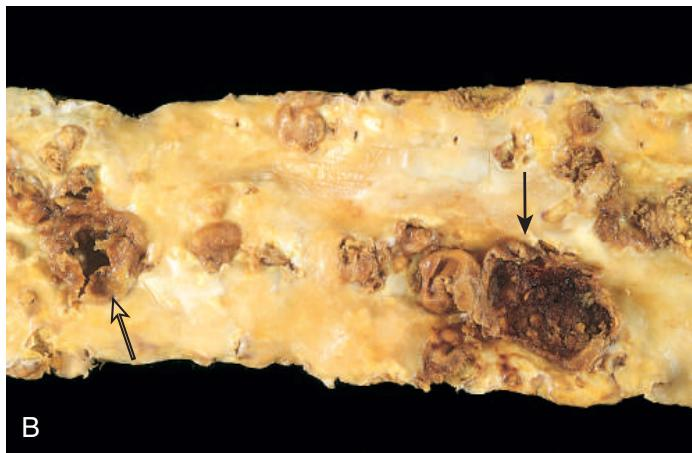
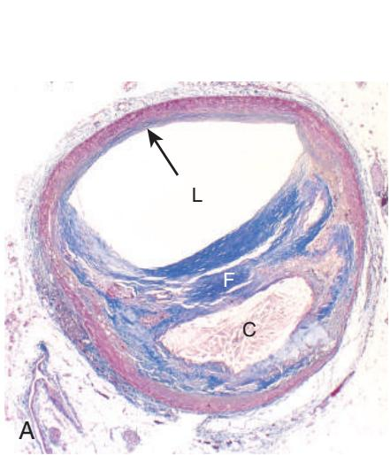 
Fig. 10.13 Atherosclerotic plaque, coronary artery. (A) Overall architecture demonstrating fibrous cap $(F)$ and a central necrotic (largely lipid) core $(C)$ ; collagen (blue) is stained with Masson trichrome. The lumen $(L)$ is moderately narrowed by this eccentric lesion, which leaves part of the vessel wall unaffected (arrow). (B) Moderate-power view of the plaque shown in A, stained for elastin (black); the internal and external elastic membranes are attenuated, and the media of the artery is thinned under the most advanced plaque (arrow). (C) High-power view of the junction of the fibrous cap and core, showing scattered inflammatory cells, calcification (arrowheads), and neovascularization (small arrows).
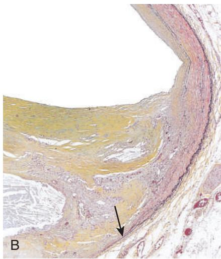
ECM,includingcollagen,elasticfibers,andproteogl.jpg)
(2) ECM, including collagen, elastic fibers, and proteoglycans; and (3) intracellular and extracellular lipid (see Fig. 10.13A and B). The proportion and configuration of each component varies from lesion to lesion. Most commonly, plaques have a superficial fibrous cap composed of SMCs and relatively dense collagen. Where the cap meets the vessel wall (the "shoulder") is a more cellular area containing macrophages, T cells, and SMCs. Deep to the fibrous cap is a necrotic core, containing lipid (primarily cholesterol and cholesterol esters), necrotic debris, lipid-laden macrophages and SMCs (foam cells), fibrin, variably organized thrombus, and other plasma proteins. The extracellular cholesterol frequently takes the forms of crystalline aggregates that are washed out during routine tissue processing, leaving behind empty "cholesterol clefts." The periphery of the lesions shows neovascularization (proliferating small blood vessels) (see Fig. 10.13C). The media deep to the plaque may be attenuated and exhibit fibrosis secondary to smooth muscle atrophy and loss. Typical atheromas contain relatively abundant lipid, but some so-called fibrous plaques are composed almost exclusively of SMCs and fibrous tissue.
Plaques generally progressively enlarge over time through cell death and degeneration, synthesis and degradation of ECM (remodeling), and thrombus organization. Atheromas also often undergo calcification (see Fig. 10.13C).
Atherosclerotic plaques are susceptible to several clinically important changes:
- Rupture, ulceration, or erosion of the luminal surface of atheromatous plaques exposes highly thrombogenic substances and induces thrombus formation. Thrombi may partially or completely occlude the lumen, leading to tissue ischemia (e.g., in the heart) (Chapter 11) (Fig. 10.14). If the patient survives, thrombi become organized and incorporated into the growing plaque. 
- Hemorrhage into a plaque. Rupture of the overlying fibrous cap or of the thin-walled vessels in the areas of neovascularization can cause intra-plaque hemorrhage; the resulting hematoma may cause rapid plaque expansion or plaque rupture.
- Atheroembolism. Ruptured plaque can discharge debris into the blood, producing microemboli composed of plaque contents. 
- Aneurysm formation. Atherosclerosis-induced pressure or ischemic atrophy of the underlying media, with loss of elastic tissue, causes structural weakening that can lead to aneurysmal dilation and rupture.
# Clinicopathologic Consequences of Atherosclerosis
Large elastic arteries (e.g., aorta, carotid, and iliac arteries) and large- and medium-sized muscular arteries (e.g., coronary, renal, and popliteal arteries) are the vessels most commonly involved by atherosclerosis. Accordingly, atherosclerosis is most likely to present with signs and symptoms related to ischemia of the heart, brain, kidneys, and lower extremities. Myocardial infarction (heart attack), cerebral infarction (stroke), aortic aneurysm, and peripheral vascular disease (gangrene of extremities) are the major clinical consequences of atherosclerosis.
The natural history, morphologic features, and main pathogenic events are schematized in Figure 10.15. The principal pathophysiologic outcome stemming from atherosclerotic lesions vary depending on the size of the affected vessel, the size and stability of the plaques, and the degree to which plaques disrupt the vessel wall. We next describe the features of atherosclerotic lesions that are typically responsible for the clinical manifestations.
# Atherosclerotic Stenosis
At early stages, remodeling of the media tends to preserve the luminal diameter by increasing the overall vessel circumference. Owing to limits on remodeling, however, eventually the expanding atheroma may impinge on blood flow. Although this most commonly happens as a consequence of acute plaque change (described next), it can also occur gradually, with critical stenosis being the tipping point at which chronic occlusion limits flow so severely
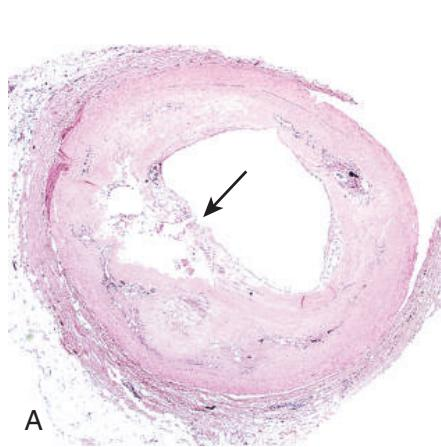 
Fig. 10.14 Atherosclerotic plaque rupture. (A) Plaque rupture without superimposed thrombus, in a patient who died suddenly. (B) Acute coronary thrombosis superimposed on an atherosclerotic plaque with focal disruption of the fibrous cap, triggering fatal myocardial infarction. In both A and B, an arrow points to the site of plaque rupture. (B, Reproduced from Schoen Fj: Interventional and surgical cardiovascular pathology: clinical correlations and basic principles, Philadelphia, 1989, Saunders, p 61.)
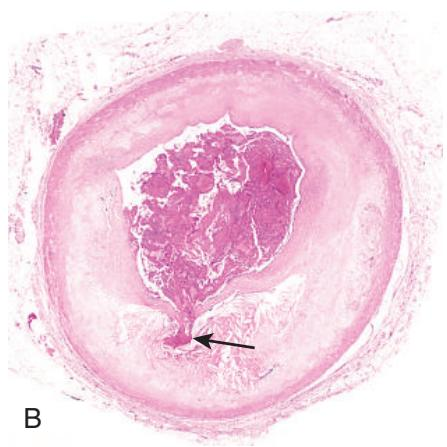
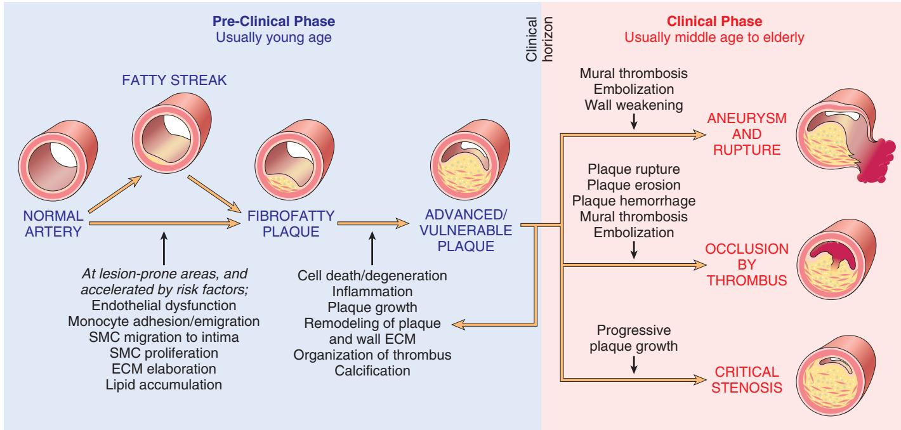 
Fig. 10.15 Summary of the natural history, morphologic features, main pathogenic events, and clinical complications of atherosclerosis.
that tissue demand exceeds supply. In the coronary artery (and other) circulations, this typically occurs when the vessel is approximately $70\%$ occluded. At rest, affected patients have adequate cardiac perfusion; but with even modest exertion, demand exceeds supply, and chest pain develops because of cardiac ischemia (stable angina) (Chapter 11). The toll of chronic arterial hypoperfusion due to atherosclerosis in various vascular beds includes bowel ischemia, sudden cardiac death, chronic IHD, ischemic encephalopathy, and intermittent claudication (ischemic leg pain).
# Acute Plaque Change
Plaque erosion or rupture typically triggers thrombosis, leading to partial or complete vascular obstruction and often tissue infarction (Fig. 10.15). Plaque changes fall into three general categories:
- Rupture/fissuring, exposing highly thrombogenic plaque constituents 
- Erosion/ulceration, exposing the thrombogenic subendothelial basement membrane to blood 
- Hemorrhage into the atheroma, expanding its volume
It is now recognized that plaques responsible for myocardial infarctions and other acute coronary syndromes often are asymptomatic before the acute event; symptoms are triggered by thrombosis on a lesion that previously did not produce significant luminal occlusion. The worrisome conclusion is that large numbers of asymptomatic individuals are at risk for a catastrophic coronary event. The causes of acute plaque change are complex and include both intrinsic factors (e.g., plaque structure and composition) and extrinsic factors (e.g., blood pressure). These factors combine to weaken the integrity of the plaque, making it unable to withstand vascular shear forces.
Certain types of plaques are believed to be at particularly high risk of rupturing. These include plaques that contain large
numbers of foam cells and abundant extracellular lipid, plaques that have thin fibrous caps containing few SMCs, and plaques that contain clusters of inflammatory cells. Plaques at high risk for rupture are referred to as vulnerable plaques (Fig. 10.16). The fibrous cap also undergoes continuous remodeling; its mechanical strength and stability are proportional to its collagen content, so the balance of collagen synthesis and degradation affects cap integrity. Collagen in atherosclerotic plaques is synthesized primarily by SMCs, and loss of SMCs understandably results in cap weakening.
In general, plaque inflammation increases collagen degradation and reduces collagen synthesis, thereby destabilizing the mechanical integrity of the cap. Of interest, statins may have a beneficial effect not only by
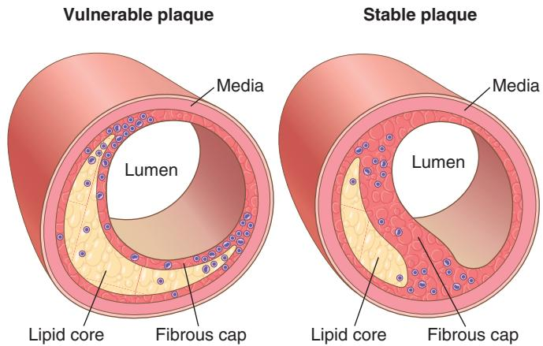 
Fig. 10.16 Vulnerable and stable atherosclerotic plaque. Stable plaques have densely collagenized and thickened fibrous caps with minimal inflammation and negligible underlying atheromatous cores, whereas vulnerable plaques have thin fibrous caps, large lipid cores, and increased inflammation. (Adapted from Libby P: Molecular bases of the acute coronary syndromes, Circulation 91:2844, 1995.)
reducing circulating cholesterol levels but also by stabilizing plaques through a reduction in plaque inflammation.
Factors extrinsic to plaques also are important. Thus, adrenergic stimulation (as with intense emotions) can increase systemic blood pressure or induce local vasoconstriction, thereby increasing the mechanical stress on a given plaque. Indeed, one explanation for the pronounced circadian periodicity in the onset of heart attacks (peak incidence between 6 AM and 12 noon) is the adrenergic surge associated with waking and rising - sufficient to cause blood pressure spikes and heightened platelet reactivity.
Fortunately, not all plaque ruptures result in occlusive thromboses with catastrophic consequences. In fact, silent plaque disruption and ensuing superficial platelet aggregation and thrombosis probably occur frequently and repeatedly in those with atherosclerosis. Healing of these subclinical plaque disruptions—and their overlying thromboses—is an important mechanism of atheroma enlargement.

# ATHEROSCLEROSIS
- Atherosclerosis is an intima-based lesion composed of a fibrous cap and an atheromatous (literally, "gruel-like") core; the constituents of the plaque include SMCs, ECM, inflammatory cells, lipids, and necrotic debris. 
- Atherogenesis is driven by an interplay of vessel wall injury and inflammation. The multiple risk factors for atherosclerosis all cause EC dysfunction and influence SMC recruitment and stimulation. 
- Major modifiable risk factors for atherosclerosis are hypercholesterolemia, hypertension, cigarette smoking, and diabetes mellitus. 
- Atherosclerotic plaques develop and grow slowly over decades. Stable plaques can produce symptoms related to chronic ischemia by narrowing vessels, whereas unstable plaques can cause dramatic and potentially fatal ischemic complications related to acute plaque rupture, thrombosis, or embolization. 
- Stable plaques tend to have a dense fibrous cap, minimal lipid accumulation, and little inflammation, whereas "vulnerable" unstable plaques have thin caps, large lipid cores, and relatively dense inflammatory infiltrates.
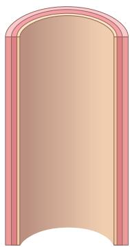 
A. Normal vessel
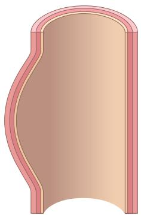 
B. True aneurysm (saccular)
.jpg) 
C. True aneurysm (fusiform) 
Fig. 10.17 Aneurysms. (A) Normal vessel. (B) True aneurysm, saccular type. The wall bulges outward and may be attenuated but is otherwise intact. (C) True aneurysm, fusiform type. There is circumferential dilation of the vessel. (D) False aneurysm. The wall is ruptured, creating a collection of blood (hematoma) bounded externally by adherent extravascular tissues. (E) Dissection. Blood has entered the wall of the vessel and separated (dissected) the layers.
# ANEURYSMS AND DISSECTIONS
Aneurysms are congenital or acquired dilations of blood vessels or the heart (Fig. 10.17). "True" aneurysms involve all three layers of the artery (intima, media, and adventitia) or the attenuated wall of the heart; these include atherosclerotic and congenital vascular aneurysms, as well as ventricular aneurysms resulting from transmural myocardial infarctions. By comparison, a false aneurysm (pseudoaneurysm) results when a wall defect leads to the formation of an extravascular hematoma that communicates with the intravascular space ("pulsating hematoma"). Examples are ventricular ruptures contained by pericardial adhesions and leaks at the junction of a vascular graft with a natural artery. In arterial dissections, pressurized blood gains entry to the arterial wall through a surface defect and then pushes apart the underlying layers. Aneurysms and dissections are important causes of stasis and subsequent thrombosis; they also have a propensity to rupture—often with catastrophic results.
Aneurysms can be classified by shape (see Fig. 10.17). Saccular aneurysms are discrete outpouchings ranging from 5 to $20\mathrm{cm}$ in diameter, often with a contained thrombus. Fusiform aneurysms are circumferential dilations up to $20\mathrm{cm}$ in diameter; these most commonly involve the aortic arch, the abdominal aorta, or the iliac arteries.
Arteries are dynamic tissues that must withstand the constant mechanical stress of pulsatile blood flow. Aneurysms occur when alterations in SMCs or ECM compromise the structural integrity of the arterial media. Among the implicated factors in aneurysm formation are the following:
- Inadequate or abnormal connective tissue synthesis. Several rare inherited diseases provide insight into the types of abnormalities that can lead to aneurysm formation. As discussed earlier, TGF- $\beta$ regulates SMC proliferation and matrix synthesis. Thus, mutations in TGF- $\beta$ receptors or downstream signaling pathways result in defective elastin and collagen synthesis; aneurysms in affected
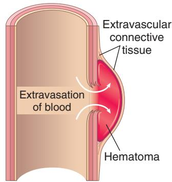 
D. False aneurysm
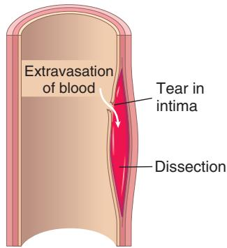 
E. Dissection
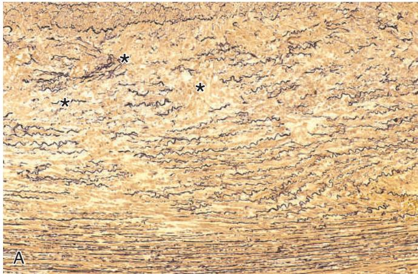 
Fig. 10.18 Cystic medial degeneration. (A) Cross-section of aortic media from a patient with Marfan syndrome, showing marked elastin fragmentation and areas devoid of elastin that resemble cystic spaces (asterisks). (B) Normal media for comparison, showing the regular layered pattern of elastic tissue. In both (A) and (B), elastin is stained black.
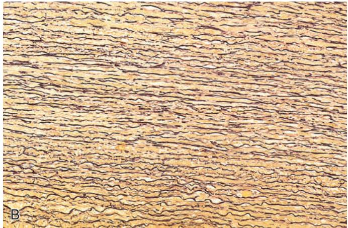
individuals often rupture, even when small. In Marfan syndrome (Chapter 7), defective synthesis of the scaffolding protein fibrillin leads to increased bioavailability of TGF- $\beta$ in the aortic wall, with subsequent dilation due to dysregulated signaling and progressive loss of elastic tissue. Defective type III collagen synthesis leading to aneurysm formation is a hallmark of type IV Ehlers-Danlos syndrome (Chapter 7).
- Excessive connective tissue degradation. Increased matrix metalloprotease expression by macrophages in atherosclerotic plaque can contribute to aneurysm development by degrading arterial ECM in the arterial wall; similarly, decreased tissue inhibitors of metalloprotease expression can also tip the balance toward net ECM degradation. A genetic predisposition to aneurysm formation in the setting of inflammation may be related to polymorphisms in these factors. 
- Loss of SMCs or change in the SMC synthetic phenotype. Atherosclerotic thickening of the intima can cause ischemia of the inner media by increasing the diffusion distance from the lumen. Conversely, systemic hypertension can cause luminal narrowing of the aortic vasa vasorum, leading to ischemia of the outer media. Such ischemia results in SMC loss as well as aortic "degenerative changes," which include fibrosis (replacing distensible elastic tissue), inadequate ECM synthesis, and accumulation of increasing amounts of amorphous proteoglycans. Histologically, these changes are collectively called cystic medial degeneration (Fig. 10.18), although no true cysts are formed. Such changes are nonspecific; they can occur whenever ECM synthesis is defective, including in inherited disorders such as Marfan syndrome and acquired conditions such as scurvy.
The two most important predisposing conditions for aortic aneurysms are atherosclerosis and hypertension. Atherosclerosis is the dominant factor in abdominal aortic aneurysms, while hypertension is associated with ascending aortic aneurysms. Other conditions that weaken vessel walls and lead to aneurysms include trauma, vasculitis (see later), congenital defects, and infections, giving
rise to so-called "mycotic aneurysms." Mycotic aneurysms may result from (1) embolization of a septic embolus, usually as a complication of infective endocarditis; (2) extension of an adjacent suppurative process; or (3) direct infection of an arterial wall by circulating organisms. Tertiary syphilis is a rare cause of aortic aneurysms. A predilection of the spirochetes for the vasa vasorum of the ascending thoracic aorta—and the subsequent immune response to them—results in an obliterative endarteritis that compromises blood flow to the media; the ensuing ischemic injury leads to aneurysmal dilation that occasionally also can involve the aortic valve annulus.
# Abdominal Aortic Aneurysm
Aneurysms occurring as a consequence of atherosclerosis form most commonly in the abdominal aorta and common iliac arteries, and may also involve the aortic arch and descending thoracic aorta. Abdominal aortic aneurysms (AAAs) occur more frequently in men and in smokers and rarely develop before 50 years of age. Atherosclerosis is a major cause of AAA, but other factors clearly contribute, since the incidence is less than $5\%$ in men older than 60 years of age despite the almost universal presence of abdominal aortic atherosclerosis in this population.
In the majority of cases, AAA results from ECM degradation mediated by proteolytic enzymes released from inflammatory infiltrates in atherosclerotic lesions. Atherosclerotic plaques also compromise the diffusion of nutrients and wastes between the vascular lumen and the arterial wall, alternations that have deleterious effects on SMCs in the media. Due to this combination of effects, the media undergoes degeneration and necrosis, which results in arterial wall thinning. A familial predisposition to AAA, independent of genetic predilections to atherosclerosis or hypertension, appears to be a factor in some individuals. Of note, smokers who develop AAA tend to have more severe chronic obstructive pulmonary disease, particularly emphysema, suggesting that such patients are constitutionally predisposed to develop disorders associated with ECM degradation.

Abdominal aortic aneurysms typically occur between the renal arteries and the aortic bifurcation; they can be saccular or fusiform and up to $15\mathrm{cm}$ in diameter and $25\mathrm{cm}$ in length (Fig. 10.19). In the vast majority of cases, extensive atherosclerosis is present, with thinning and focal destruction of the underlying media. The aneurysm sac usually contains bland, laminated, poorly organized mural thrombus, which can fill much of the dilated segment. Not infrequently, AAAs are accompanied by smaller iliac artery aneurysms. Next we describe some of the less common forms of aortic aneurysms:
- Inflammatory AAAs are a distinct subtype characterized by dense periaortic fibrosis containing abundant lymphoplasmacytic inflammation with many macrophages and giant cells. 
- A subset of inflammatory AAAs may be a vascular manifestation of a recently recognized entity called immunoglobulin G4 (IgG4)-related disease. This disorder is marked by tissue fibrosis associated with frequent infiltrating IgG4-expressing plasma cells. As discussed in Chapter 5, IgG4-related diseases can also affect a variety of tissues, including the pancreas, biliary system, thyroid gland, and salivary gland. Affected individuals have aortitis and periaortitis that weaken the wall sufficiently in some cases to give rise to aneurysms. Recognition of this entity is important since it responds well to steroid therapy. 
- Mycotic AAAs occur when circulating microorganisms (as in bacteremia from infective endocarditis) seed the aneurysm wall or the associated thrombus; the resulting suppuration accelerates the medial destruction and may lead to rapid dilation and rupture.
Externalsiteofruptureofalargeaorticaneurysmisindicatedbythearrow.(B)Openedaorta,withthelocationoftherupturetractindicatedbyaprobe.Thewalloftheaneurysmisattenuated,andthelumenisfilledbyalarge,layeredthrombus..jpg) 
Fig. 10.19 Abdominal aortic aneurysm. (A) External site of rupture of a large aortic aneurysm is indicated by the arrow. (B) Opened aorta, with the location of the rupture tract indicated by a probe. The wall of the aneurysm is attenuated, and the lumen is filled by a large, layered thrombus.
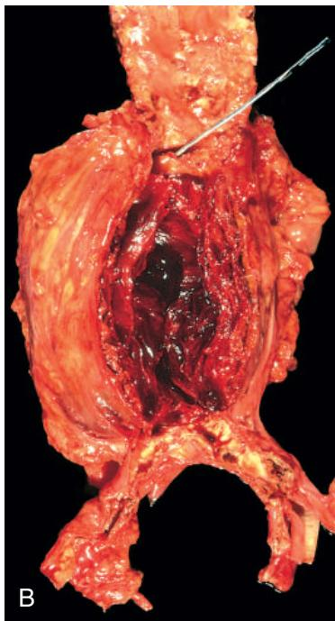
# Clinical Consequences
The clinical consequences of AAA include the following:
- Obstruction of a vessel branching off the aorta (e.g., the renal, iliac, vertebral, or mesenteric arteries), resulting in ischemia of the kidneys, legs, spinal cord, or gastrointestinal tract, respectively 
- Embolism of atheromatous material (e.g., cholesterol crystals) or mural thrombus 
- Impingement on adjacent structures (e.g., compression of a ureter or erosion of vertebrae by the expanding aneurysm) 
- An abdominal mass (often palpably pulsating) that simulates a tumor 
- Rupture into the peritoneal cavity or retroperitoneal tissues, leading to massive, often fatal hemorrhage
The risk for rupture is related to the size of AAAs. Those $4\mathrm{cm}$ or less in diameter almost never burst, while those between 4 and $5\mathrm{cm}$ do so at a rate of $1\%$ per year. The risk rises to $11\%$ per year for AAAs 5 to $6\mathrm{cm}$ in diameter, and to $25\%$ per year for aneurysms greater than $6\mathrm{cm}$ in diameter. Thus, aneurysms $5\mathrm{cm}$ in diameter or larger are managed surgically, either by open placement of tubular prosthetic grafts or with endoluminal insertion of stented grafts (expandable wire frames covered by a cloth sleeve). Timely intervention is critical, because the mortality rate for elective procedures is approximately $5\%$ , whereas the rate for emergency surgery after rupture is roughly $50\%$ .
A point worthy of emphasis is that because atherosclerosis is a systemic disease, a patient with AAA also is very likely to have atherosclerosis in other vascular beds and is at a significantly increased risk for ischemic heart disease and stroke.
# Thoracic Aortic Aneurysm
Thoracic aortic aneurysms most commonly are associated with hypertension, bicuspid aortic valves, and Marfan syndrome. Less commonly, disorders caused by mutations in the TGF- $\beta$ signaling pathway are causative. These aneurysms manifest with the following signs and symptoms:
- Respiratory or feeding difficulties due to airway or esophageal compression, respectively, because of encroachment on mediastinal structures 
- Persistent cough from irritation of the recurrent laryngeal nerves 
- Pain caused by erosion of bone (i.e., ribs and vertebral bodies) 
- Cardiac disease due to valvular insufficiency or narrowing of the coronary ostia; heart failure induced by aortic valvular incompetence 
- Aortic dissection or rupture
# Aortic Dissection
Aortic dissection occurs when blood splays apart the laminar planes of the media to form a blood-filled channel within the aortic wall (Fig. 10.20). This development can be catastrophic if the dissecting blood ruptures through the adventitia and escapes into adjacent spaces.
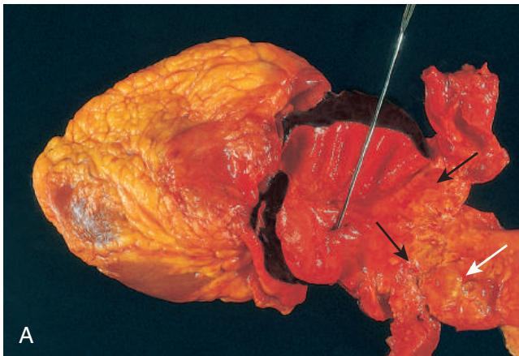 
Fig. 10.20 Aortic dissection. (A) An opened aorta with a proximal dissection originating from a small, oblique intimal tear (identified by the probe) associated with an intramural hematoma. Note that the intimal tear occurred in a region largely free of atherosclerotic plaque. The distal edge of the intramural hematoma (black arrows) lies at the edge of a large area of atherosclerosis (white arrow), which arrested the propagation of the dissection. (B) Histologic preparation showing the dissection and intramural hematoma (asterisk). Aortic elastic layers are black, and blood is red in this section, stained with Movat stain.
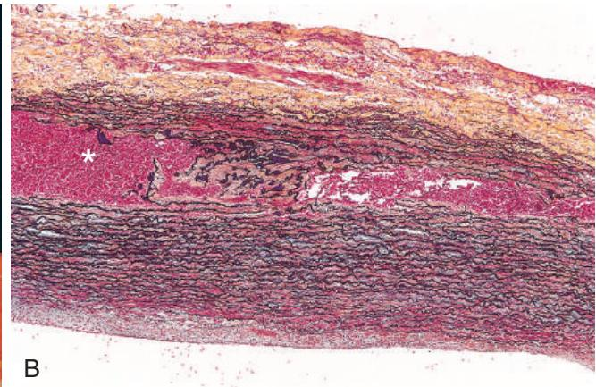
Aortic dissection need not be associated with aortic dilation, and the older term dissecting aneurysm should be avoided. Aortic dissection occurs mainly in two age groups: (1) men 40 to 60 years of age with antecedent hypertension (more than $90\%$ of cases); and (2) younger patients with connective tissue abnormalities that affect the aorta (e.g., Marfan syndrome). Dissections also can be iatrogenic (e.g., complicating arterial cannulation during diagnostic catheterization or cardiopulmonary bypass).
Rarely, pregnancy is associated with aortic (or other vessel) dissection (roughly 10 to 20 cases per 1 million births). This typically occurs during or after the third trimester, and may be related to hormone-induced vascular remodeling and the hemodynamic stresses of the perinatal period. Dissection is unusual in the presence of substantial atherosclerosis or other causes of medial scarring, presumably because the medial fibrosis inhibits propagation of the dissecting hematoma (see Fig. 10.20).
Hypertension is the major risk factor for aortic dissection. Aortas in hypertensive patients show narrowing of the vasa vasorum associated with degenerative changes in ECM and variable loss of medial SMCs, suggesting that diminished flow through the vasa vasorum is contributory. Abrupt, transient increase in blood pressure, as may occur with cocaine abuse, is also known to cause aortic dissection. Most other dissections are related to heritable or acquired connective tissue disorders that give rise to abnormal aortic ECM, including Marfan syndrome, Ehlers-Danlos syndrome type IV, and defects in copper metabolism.
The trigger for the intimal tear and subsequent intramural hemorrhage is not known in most cases. Nevertheless, once the tear has occurred, blood under systemic pressure dissects through the media along laminar planes. Accordingly, aggressive pressure-reducing therapy may be effective in limiting an evolving dissection. In rare cases, disruption of the vasa vasorum can give rise to an intramural hematoma without an intimal tear.
In most dissections, the intimal tear marking the point of origin is found in the ascending aorta within $10\mathrm{cm}$ of the aortic valve (see Fig. 10.20A). Such tears usually are transverse or oblique in orientation and 1 to $5\mathrm{cm}$ long, with sharp, jagged edges. The dissection plane can extend retrograde toward the heart or distally, occasionally as far as the iliac and femoral arteries, and usually lies between the middle and outer thirds of the media (see Fig. 10.20B).
External rupture causes massive hemorrhage, or results in cardiac tamponade if it occurs into the pericardial sac. In some (fortunate) instances, the dissecting hematoma reenters the lumen of the aorta through a second distal intimal tear, creating a second vascular channel within the media (so-called "double-barreled aorta"). Over time, such a false channel becomes endothelialized forming a chronic dissection.
In most instances, no specific underlying causal defect is identified in the aortic wall. The most frequent histologically detectable lesion is the cystic medial degeneration discussed earlier; this is characterized by SMC dropout and necrosis, elastic tissue fragmentation, and accumulations of amorphous proteoglycan-rich ECM (see Fig. 10.18). Inflammation is characteristically absent. Recognizable medial damage appears to be neither a prerequisite for dissection nor a guarantee that dissection is imminent. Occasionally, dissections occur in the setting of seemingly trivial medial degeneration, while marked degenerative changes may be seen at autopsy in individuals without dissection.
# Clinical Consequences
The clinical manifestations of dissection depend primarily on the portion of the aorta affected; the most serious complications occur with dissections involving the proximal aorta and arch. Thus, aortic dissections generally are classified into two types (Fig. 10.21):
- Proximal lesions (type A dissections), involving the ascending aorta, with or without involvement of the descending aorta (DeBakey type I or II, respectively)
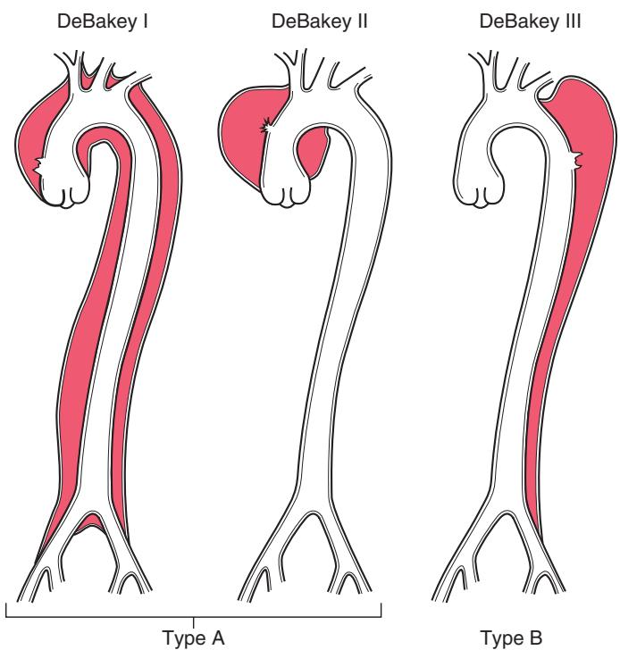 
Fig. 10.21 Classification of dissections. Type A dissections (proximal) involve the ascending aorta, either as part of a more extensive dissection (DeBakey type I), or in isolation (DeBakey type II). Type B dissections (distal, or DeBakey type III) arise after the takeoff of the great vessels. Type A dissections typically have the most serious complications and the greatest associated mortality.
- Distal lesions (type B dissections), usually beginning beyond the subclavian artery (DeBakey type III)
The classic clinical symptom of aortic dissection is the sudden onset of excruciating tearing or stabbing pain, usually beginning in the anterior chest, radiating to the back between the scapulae, and moving downward as the dissection progresses. The most common cause of death is rupture of the dissection into the pericardial, pleural, or peritoneal cavity. Retrograde dissection into the aortic root also can cause fatal disruption of the aortic valvular apparatus or compression of the coronary arteries. Common clinical presentations stemming from cardiac involvement include tamponade, aortic insufficiency, and myocardial infarction. Other complications are related to extension of the dissection to the great arteries of the neck and the renal, mesenteric, or iliac arteries, any of which may become obstructed. Similarly, compression of spinal arteries can cause transverse myelitis.
In type A dissections, rapid diagnosis and institution of intensive anti-hypertensive therapy coupled with surgical plication of the aortic intimal tear can save $65\%$ to $85\%$ of the patients. However, the mortality rate approaches $70\%$ in patients who present with hemorrhage or symptoms related to distal ischemia, and the overall 10-year survival rate is only $40\%$ to $60\%$ . Most type B dissections can be managed conservatively; patients have a $75\%$ survival rate whether they are treated with surgery or with anti-hypertensive medication only.
# ANEURYSMS AND DISSECTIONS
- Aneurysms are congenital or acquired dilations of the heart or blood vessels that involve the entire wall thickness. Complications are related to rupture, thrombosis, and embolization. 
- Dissections occur when blood enters the wall of a vessel and separates the various layers. Complications arise as a result of rupture or obstruction of vessels branching off the aorta. 
- Aneurysms and dissections result from structural weakness of the vessel wall caused by loss of SMCs or weakening of the ECM, which can be a consequence of ischemia, genetic defects, or defective matrix remodeling.
# VASCULITIS
Vasculitis is a general term for vessel wall inflammation. The two most common pathogenic mechanisms of vasculitis are immune-mediated inflammation and direct vascular invasion by infectious pathogens. Infections also can indirectly precipitate immune-mediated vasculitis (e.g., by generating immune complexes or triggering cross-reactivity). In any given patient, it is critical to distinguish between infectious and immunologic mechanisms because immunosuppressive therapy is appropriate for immunemediated vasculitis but could exacerbate infectious vasculitis. Physical and chemical injury, including that due to radiation, mechanical trauma, and toxins, also can cause vasculitis.
Some 20 primary forms of vasculitis are recognized, and classification schemes attempt (with variable success) to group them according to vessel diameter, role of immune complexes, presence of specific autoantibodies, granuloma formation, organ specificity, and even population demographics (Table 10.4 and Fig. 10.22).
The possible clinical manifestations are protean, but they largely depend on the specific vascular bed that is affected. Besides findings referable to the affected tissue(s), there are usually also signs and symptoms of systemic inflammation, such as fever, myalgia, arthralgias, and malaise. There is considerable clinical and pathologic overlap among these entities, as will be evident from the discussion of individual forms below.
# Noninfectious Vasculitis
The main immunologic mechanisms underlying noninfectious vasculitis are as follows:
- Immune complex deposition 
- Anti-neutrophil cytoplasmic antibodies 
Anti-EC antibodies 
Autoreactive T cells
# Immune Complex-Associated Vasculitis
This form of vasculitis is seen in immunologic disorders such as systemic lupus erythematosus (Chapter 5) that are associated with autoantibody production. The vascular lesions resemble those found in experimental immune
Table 10.4 Primary Forms of Vasculitis 
Giant Cell ArteritisGranulomatosis With PolyangiitisChurg- Strauss SyndromePolyarteritis NodosaLeukocytoclastic VasculitisBuerger DiseaseBehçet DiseaseSites of InvolvementAorta+------Medium-sized arteries++++-++Small-sized arteries-++++++Capillaries----+-+Veins----+++Inflammatory Cells PresentLymphocytes+++±±±±Macrophages+++±±±±NeutrophilsRare++±±±RequiredEosinophilsVery rare±Required±±±±Other FeaturesGranulomas±*Required*±----Giant cellsOften; not required±-----Thrombosis±±±±±Required±Serum ANCA positivity-++±---Clinical history&gt;40 years of age, ± polymyalgia rheumaticaAnyAsthma, atopyAnyAnyYoung male smokerOrogenital ulcers
*The granulomas of giant cell arteritis are found within the vessel wall as part of the inflammation comprising the vasculitis, but need not be present to render the diagnosis. 
The granulomas of granulomatosis with polyangiitis are larger, spanning between vessels, and associated with areas of tissue necrosis. 
ANCA, Anti-neutrophil cytoplasmic antibodies. 
From Seidman MA, Mitchell RN: Surgical pathology of small-and medium-sized vessels. In Winters, GL, ed., Current concepts in cardiovascular pathology, Philadelphia, 2012, Saunders.
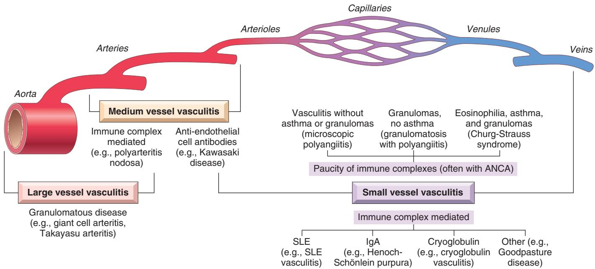 
Fig. 10.22 Vascular sites involved in the more common vasculitides and their presumptive etiology. Note the considerable overlap in distributions. ANCA, anti-neutrophil cytoplasmic antibody; IgA, immunoglobulin A; SLE, systemic lupus erythematosus. (Data from Jennette JC, Falk RJ: Nosology of primary vasculitis, Curr Opin Rheumatol 19:17, 2007.)
complex-mediated disorders, such as the Arthus phenomenon and serum sickness, and in some cases contain readily identifiable antibody and complement. Often, however, this type of vasculitis is a diagnostic challenge. Only rarely is the specific antigen responsible for immune complex formation known, and in most instances it is not clear whether the pathogenic antigen-antibody complexes are deposited into the vessel wall from the circulation or form in situ. In fact, in many suspected cases, even the antigen-antibody deposits are scarce, perhaps because the immune complexes have been degraded by the time of biopsy.
Immune complex deposition is also implicated in the following vasculitides:
- Drug hypersensitivity vasculitis. In some cases, drugs (e.g., penicillin) appear to act as haptens by binding to host proteins; other agents are themselves foreign proteins (e.g., streptokinase). In either case, antibodies directed against the drug-modified proteins or foreign molecules result in immune complex formation. The clinical manifestations can be mild and self-limiting, or severe and even fatal; skin lesions are most common. It is always important to consider drug hypersensitivity as a cause of vasculitis, since discontinuation of the offending agent usually leads to resolution. 
- Vasculitis secondary to infections. Antibodies to microbial constituents can form immune complexes that circulate and deposit in vascular lesions. For example, in up to $30\%$ of patients with polyarteritis nodosa (discussed in greater detail later), the vasculitis can be ascribed to immune complexes composed of hepatitis B surface antigen (HBsAg) and anti-HBsAg antibody.
# Anti-Neutrophil Cytoplasmic Antibodies
Many patients with vasculitis have circulating antibodies that react with neutrophil cytoplasmic antigens, so-called "anti-neutrophil cytoplasmic antibodies (ANCAs)." ANCAs are a heterogeneous group of autoantibodies directed against constituents (mainly enzymes) of neutrophil primary granules, monocyte lysosomes, and ECs. ANCAs are very useful diagnostic markers; their titers generally mirror clinical severity, and a rise in titers after periods of quiescence is predictive of disease recurrence. Although a number of ANCAs have been described, two are most important. These are classified according to their antigen specificity:
- Anti-proteinase-3 (PR3-ANCA), previously called c-ANCA. PR3 is a neutrophil azurophilic granule constituent that shares homology with numerous microbial peptides, possibly explaining the generation of PR3-ANCAs. PR3-ANCAs are associated with granulomatosis with polyangiitis (see later). 
- Anti-myeloperoxidase (MPO-ANCA), previously called $p$ -ANCA. MPO is a lysosomal granule constituent involved in oxygen free radical generation (Chapter 3). MPO-ANCs are induced by several therapeutic agents, particularly propylthiouracil (used to treat hyperthyroidism). MPO-ANCs are associated with microscopic polyangiitis and Churg-Strauss syndrome (see later).
The close association between ANCA titers and disease activity suggests a pathogenic role for these antibodies. Of note, ANCAs can directly activate neutrophils, stimulating the release of reactive oxygen species and proteolytic
enzymes; in vascular beds, this may lead to EC injury. While the antigenic targets of ANCA are primarily intracellular (and therefore not usually accessible to circulating antibodies), it is now clear that ANCA antigens (especially PR3) either are constitutively expressed at low levels on the plasma membrane or are translocated to the cell surface in activated and apoptotic leukocytes.
A plausible pathogenic sequence for the development of ANCA vasculitis involves the following:
- Drugs or cross-reactive microbial antigens induce ANCA formation; alternatively, leukocyte surface expression or release of PR3 and MPO (in the setting of infection) incites ANCA development in a susceptible individual. 
- Subsequent inflammatory stimuli elicit the release of cytokines such as TNF that upregulate the surface expression of PR3 and MPO on neutrophils and other cell types. 
- ANCAs bind to these cytokine-activated cells, causing further neutrophil activation. 
- ANCA-activated neutrophils cause EC injury by releasing granule contents and elaborating reactive oxygen species.
The ANCA auto-antibodies are directed against cellular constituents and do not form circulating immune complexes, nor do the vascular lesions typically contain demonstrable antibody and complement; therefore ANCA-associated vasculitides often are described as "pauci-immune." Of interest, ANCAs directed against proteins other than PR3 and MPO are sometimes seen in patients with non-vasculitic inflammatory disorders (e.g., inflammatory bowel disease, sclerosing cholangitis, and rheumatoid arthritis).
# Anti-Endothelial Cell Antibodies and Autoreactive T Cells
Antibodies to ECs underlie certain vasculitides, such as Kawasaki disease (discussed later). Autoreactive T cells cause injury in some forms of vasculitides characterized by formation of granulomas.
Presented next is a brief overview of several of the best-characterized vasculitides. Although each is presented as a distinct entity, it must be acknowledged that many cases of vasculitis lack a classic constellation finding or have overlapping features that may render classification difficult.
# Giant Cell (Temporal) Arteritis
Giant cell (temporal) arteritis is a chronic inflammatory disorder, typically with granulomatous inflammation, that principally affects large- to small-sized arteries in the head. The temporal arteries are not more vulnerable than other arteries, but have leant their name to the disorder because the diagnosis is typically established by biopsy of these vessels. Vertebral and ophthalmic arteries, as well as the aorta (giant cell aortitis), are other common sites of involvement. Because ophthalmic artery vasculitis can lead to sudden and permanent blindness, affected individuals must be promptly diagnosed and treated promptly. It is the most common form of vasculitis among older adults in developed countries.
Giant cell arteritis likely occurs as a result of a T-cell-mediated immune response to an as-yet uncharacterized vessel wall antigen. Pro-inflammatory cytokines
(eespecially TNF) and anti-EC antibodies also contribute. The characteristic granulomatous inflammation, an association with certain MHC class II haplotypes, and the excellent therapeutic response to steroids, all strongly support an immune etiology. The predilection for vessels of the head remains unexplained, although one hypothesis is that vessels in various parts of the body develop from distinct anlagen and may, therefore, express unique antigens.
Temporal arteritis is rare before 50 years of age. Signs and symptoms may be vague and constitutional (e.g., fever, fatigue, weight loss) or take the form of facial pain or headache, most intense along the course of the superficial temporal artery, which is painful to palpation. Ocular symptoms (associated with involvement of the ophthalmic artery) abruptly appear in about $50\%$ of patients; these range from diplopia to complete vision loss. Diagnosis depends on biopsy and histology; however, because the vascular inflammation is patchy, a negative biopsy result does not exclude the diagnosis. Corticosteroid or anti-TNF therapies are effective treatments.
In giant cell arteritis, the pathologic changes are notoriously patchy along the length of affected vessels. Involved arterial segments exhibit nodular intimal thickening (and occasional thromboses) that reduce the vessel diameter and cause distal ischemia. The vast majority of lesions exhibit granulomatous inflam
mation within the inner media centered on the internal elastic membrane; there is an infiltrate of lymphocytes and macrophages, with multinucleate giant cells, and fragmentation of the internal elastic lamina (Fig. 10.23). In up to $25\%$ of cases, granulomas and giant cells are absent, and lesions exhibit only a nonspecific panarteritis with a mixed infiltrate of acute and chronic inflammation. Healing is marked by intimal thickening, medial thinning and scarring, and adventitial fibrosis. Characteristically, lesions at different stages of development are seen within the same artery.
# Takayasu Arteritis
Takayasu arteritis is a granulomatous vasculitis of medium- and large-sized arteries characterized principally by ocular disturbances and marked weakening of the pulses in the upper extremities (hence the alternate name, pulseless disease). This disorder manifests with transmural scarring and thickening of the aorta—particularly the aortic arch and great vessels—with severe luminal narrowing of the major branch vessels (Fig. 10.24). Aortic lesions share many of the clinical and histologic features of giant cell aortitis. Indeed, the distinction between the two entities is made largely on the basis of a patient's age; in those older than 50 years of age are said to have giant cell aortitis, and lesions that occur in those younger than 50 years of age are designated Takayasu aortitis. Although historically associated with Japanese ethnicity and certain HLA haplotypes, Takayasu aortitis has a global distribution. An autoimmune etiology is likely.
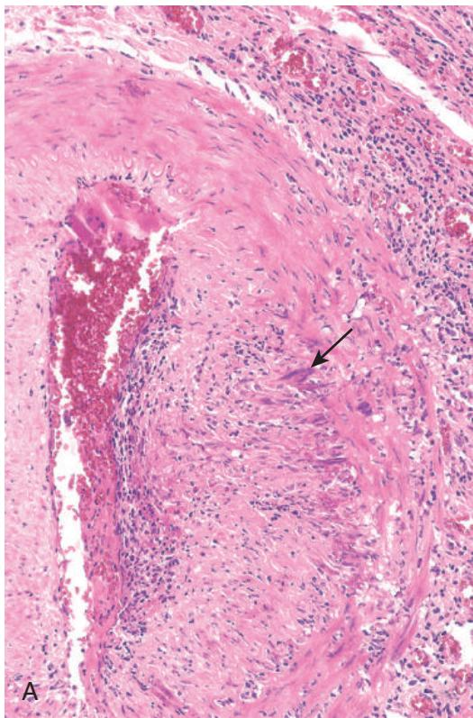 
Fig. 10.23 Temporal (giant cell) arteritis. (A) Hematoxylin-eosin-stained section of a temporal artery showing giant cells near the fragmented internal elastic membrane (arrow), along with medial and adventitial inflammation. (B) Elastic tissue stain demonstrating focal destruction of the internal elastic membrane (arrow) and medial attenuation and scarring.
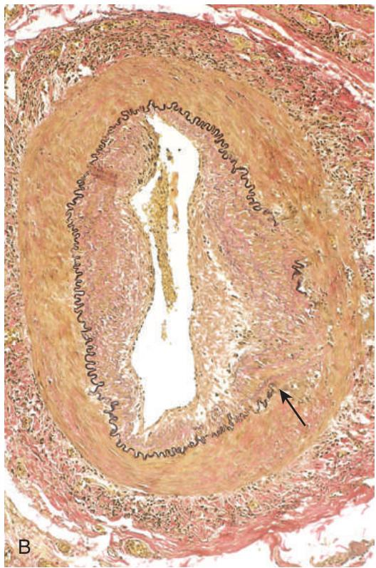
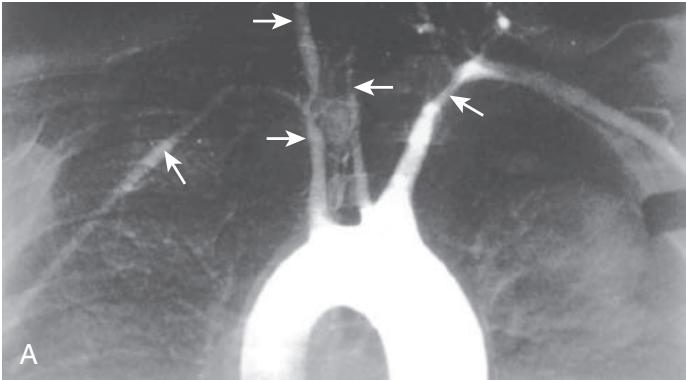
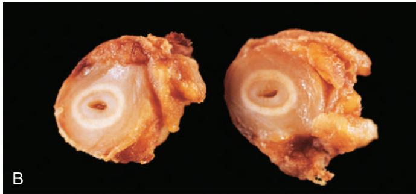
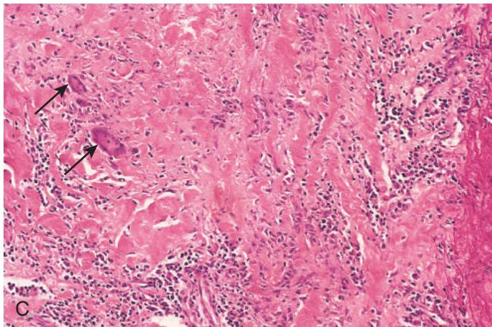 
Fig. 10.24 Takayasu arteritis. (A) Aortic arch angiogram showing reduced flow of contrast material into the great vessels and narrowing of the brachiocephalic, carotid, and subclavian arteries (arrows). (B) Cross-sections of the right carotid artery from the patient shown in A demonstrating marked intimal thickening and luminal narrowing. The white circles correspond to the original vessel wall; the inner core of tan tissue is the area of intimal hyperplasia. (C) Histologic appearance in active Takayasu aortitis illustrating destruction and fibrosis of the arterial media associated with mononuclear infiltrates and giant cells (arrows).

Takayasu arteritis classically affects the aortic arch and arch vessels; one third of cases also involve the remainder of the aorta and its branches. Occasionally, aortic root involvement causes dilation and aortic valve insufficiency. Pulmonary arteries are involved in $50\%$ of patients, and renal and coronary arteries also can be affected. The takeoffs of the great vessels can be markedly narrowed and even obliterated (see Fig. 10.24A and B), explaining the upper-extremity weakness and faint
carotid pulses. The histologic picture (see Fig. 10.24C) encompasses a spectrum ranging from adventitial mononuclear infiltrates and perivascular cuffing of the vasa vasorum, to intense transmural mononuclear inflammation, to granulomatous inflammation, replete with giant cells and patchy medial necrosis. The inflammation is associated with irregular thickening of the vessel wall, intimal hyperplasia, and adventitial fibrosis.
Initial signs and symptoms usually are nonspecific, including fatigue, weight loss, and fever. With progression, vascular signs and symptoms appear and dominate the clinical picture. These include reduced upper-extremity blood pressure and pulse strength; neurologic deficits; and ocular disturbances, including visual field defects, retinal hemorrhages, and total blindness. Distal aorta disease can manifest as leg claudication, and pulmonary artery involvement can cause pulmonary hypertension. Narrowing of the coronary ostia can lead to myocardial infarction, and involvement of the renal arteries causes systemic hypertension in roughly one half of patients. The evolution of the disease is variable. Some cases rapidly progress, while others become quiescent after 1 to 2 years. In the latter scenario, long-term survival, albeit with visual or neurologic deficits, is possible.
# Polyarteritis Nodosa
Polyarteritis nodosa (PAN) is a systemic vasculitis of small- or medium-sized muscular arteries; it typically involves the renal and visceral vessels and spares the pulmonary circulation. There is no association with ANCAs, but one third of patients have chronic hepatitis B infection, which leads to the formation of immune complexes containing hepatitis B antigens that deposit in affected vessels. The cause is unknown in the remaining cases.

Classic PAN is a segmental transmural necrotizing inflammation of small- to medium-sized arteries, often with superimposed thrombosis. Kidney, heart, liver, and gastrointestinal tract vessels are affected in descending order of frequency. Lesions usually involve only part of the vessel circumference and have a predilection for branch points. Impaired perfusion may lead to ulcerations, infarcts, ischemic atrophy, or hemorrhages in the distribution of affected vessels. The inflammatory process also weakens the arterial wall, leading to aneurysms and rupture.
In the acute phase, there is transmural mixed inflammatory infiltrate composed of neutrophils and mononuclear cells, frequently accompanied by fibrinoid necrosis and luminal thrombosis (Fig. 10.25). Older lesions show fibrous thickening of the vessel wall extending into the adventitia. Characteristically, all stages of activity (from early to late) coexist in different vessels or even within the same vessel, suggesting ongoing and recurrent pathogenic insults.
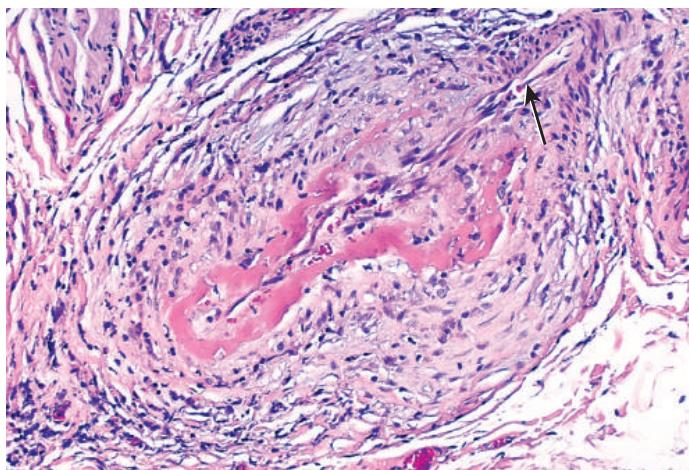 
Fig. 10.25 Polyarteritis nodosa, associated with segmental fibrinoid necrosis and thrombotic occlusion of a small artery. Note that part of the vessel (upper-right, arrow) is uninvolved. (Courtesy of Sidney Murphree, MD, Department of Pathology, University of Texas Southwestern Medical School, Dallas, Texas.)
PAN is primarily a disease of young adults but can occur in all age groups. The clinical course typically is episodic, with long symptom-free intervals. The systemic findings—malaise, fever, and weight loss—are nonspecific, and the vascular involvement is widely scattered, so that the clinical manifestations can be varied and puzzling. A "classic" presentation involves involve some combination of rapidly accelerating hypertension due to renal artery involvement; abdominal pain and bloody stools caused by gastrointestinal lesions; diffuse muscular aches and pains; and peripheral neuritis, predominantly affecting motor nerves. Renal involvement often is prominent and is a major cause of death. Untreated, PAN typically is fatal; however, with immunosuppression, 5-year survival is close to $80\%$ . Relapse occurs in up to $25\%$ of the cases, more often in non-HBV-associated cases than those that follow HBV infection. The latter have a better long-term prognosis.
# Kawasaki Disease
Kawasaki disease is an acute, febrile, usually self-limited illness of infancy and childhood associated with an arteritis of mainly large- to medium-sized vessels. Approximately $80\%$ of patients are younger than 4 years of age. Its clinical significance stems from the involvement of coronary arteries. Coronary arteritis can result in aneurysms that rupture or thrombose, causing myocardial infarction. Originally described in Japan, the disease is now recognized in the United States and elsewhere.
In genetically susceptible individuals, a variety of infectious agents (mostly viral) have been posited to trigger the disease. The vasculitis may result from a delayed-type hypersensitivity response directed against cross-reactive or newly uncovered vascular antigen(s). Subsequent cytokine production and polyclonal B cell activation result in auto-antibodies to ECs and SMCs that precipitate the vasculitis.
The vasculitis resembles that seen in polyarteritis nodosa. There is a dense transmural inflammatory infiltrate, although fibrinoid necrosis usually is less prominent than in polyarteritis nodosa. The vasculitis typically subsides spontaneously or in response to treatment, but aneurysm formation due to wall damage may supervene. As with other arteritides, healing may be accompanied by the development of obstructive intimal thickening. Pathologic changes outside the cardiovascular system are rarely significant.
Kawasaki disease typically manifests with conjunctival and oral erythema and blistering, edema of the hands and feet, erythema of the palms and soles, a desquamative rash, and cervical lymph node enlargement (hence its other name, mucocutaneous lymph node syndrome). Approximately $20\%$ of untreated patients develop cardiovascular sequelae, ranging from asymptomatic coronary arteritis, to coronary artery ectasia, to large coronary artery aneurysms (7 to $8\mathrm{mm}$ in diameter); the latter may be associated with rupture, thrombosis, myocardial infarction, and/or sudden death. Treatment consists of intravenous immunoglobulin infusions (which suppress inflammation through unclear mechanisms) and aspirin, which when given together markedly decrease the incidence of symptomatic coronary artery disease.
# Microscopic Polyangiitis
Microscopic polyangiitis is a necrotizing vasculitis that generally affects capillaries, as well as small arterioles and venules. It also is called hypersensitivity vasculitis or leukocytoclastic vasculitis. Unlike in PAN, all lesions of microscopic polyangiitis tend to be of the same age in any given patient. The skin, mucous membranes, lungs, brain, heart, gastrointestinal tract, kidneys, and muscle all can be involved; necrotizing glomerulonephritis (seen in $90\%$ of patients) and pulmonary capillaritis are particularly common. Microscopic angiitis can be a feature of a number of immune disorders, such as Henoch-Schonlein purpura, essential mixed cryoglobulinemia, or the vasculitis associated with connective tissue disorders.
In some cases, antibody responses to antigens such as drugs (e.g., penicillin), microorganisms (e.g., streptococci), heterologous proteins, or tumor proteins have been implicated. These reactions can either lead to immune complex deposition or trigger secondary immune responses (e.g., the development of ANCAs) that are pathogenic. Indeed, most cases of microscopic polyangiitis are associated with MPO-ANCA. Recruitment and activation of neutrophils within affected vascular beds is probably responsible for the disease manifestations.
Depending on the vascular bed involved, major features include hemoptysis, hematuria, proteinuria, abdominal pain or bleeding, muscle pain or weakness, and palpable cutaneous purpura. With the exception of patients with
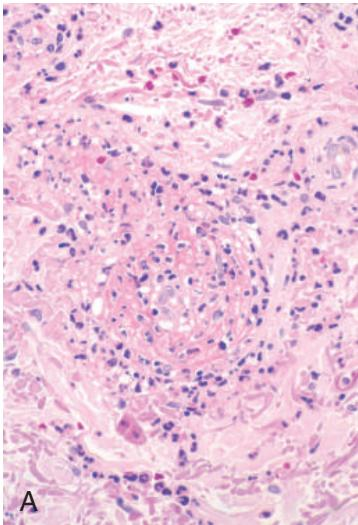 
Fig. 10.26 ANCA-associated small vessel vasculitis. (A) Microscopic polyangiitis (leukocytoclastic vasculitis) with fragmented neutrophils in the thickened vessel wall. (B and C) Granulomatosis with polyangiitis. (B) Vasculitis of a small artery with adjacent granulomatous inflammation including giant cells (arrows). (C) Lung from a patient with granulomatosis with polyangiitis, demonstrating large nodular cavitating lesions. (A, Courtesy of Scott Granter, MD, Brigham and Women's Hospital, Boston, Massachusetts. C, Courtesy of Sidney Murphree, MD, Department of Pathology, University of Texas Southwestern Medical School, Dallas, Texas.)
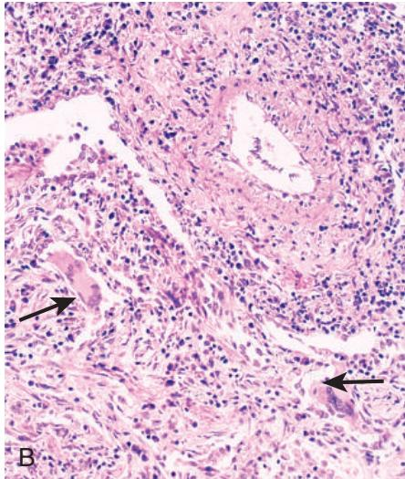
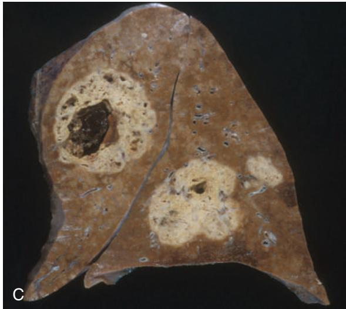
widespread renal or CNS involvement, immunosuppression and removal of the offending agent induce durable remissions.
Microscopic polyangiitis is characterized by segmental fibrinoid necrosis of the media with focal transmural necrotizing lesions; granulomatous inflammation is absent. These lesions resemble those of polyarteritis nodosa but spare medium- and large-sized arteries, so that macroscopic infarcts are uncommon. In some areas (typically postcapillary venules), only infiltrating neutrophils undergoing fragmentation are seen, giving rise to the term leukocytoclastic vasculitis (Fig. 10.26A). Although immunoglobulins and complement components can be demonstrated in early skin lesions, most lesions are "pauci-immune" (i.e., show little or no antibody).
# Granulomatosis With Polyangiitis
Previously called Wegener granulomatosis, granulomatosis with polyangiitis (GPA) is a necrotizing vasculitis characterized by a triad of the following:
- Necrotizing granulomas of the upper-respiratory tract (ear, nose, sinuses, throat) or the lower-respiratory tract (lung) or both 
- Necrotizing or granulomatous vasculitis affecting small- to medium-sized vessels (e.g., capillaries, venules, arterioles, and arteries), most prominently the lungs and upper airways but other sites as well 
- Focal necrotizing, often crescentic, glomerulonephritis
"Limited" forms of disease can be restricted to the respiratory tract. Conversely, when widespread the disease may affect the eyes, skin, and other organs, most notably the heart; clinically, widespread GPA resembles PAN with the additional feature of respiratory involvement.
GPA is likely initiated as a cell-mediated hypersensitivity response to inhaled infectious or environmental
antigens. PR3-ANCAs are present in almost $95\%$ of cases and probably drive the tissue injury. The ANCA level also is a useful marker of disease activity, as antibody titers fall dramatically with effective immunosuppressive therapy and rise prior to disease relapse.
Upper respiratory tract lesions range from granulomatous sinusitis to ulcerative lesions of the nose, palate, or pharynx; lung findings also vary, ranging from diffuse parenchymal infiltrates to granulomatous nodules. There is multifocal necrotizing granulomatous vasculitis with a surrounding fibroblastic proliferation (Fig. 10.26B). Multiple granulomata can coalesce to produce radiographically visible nodules with central cavitation (Fig. 10.26BC). Destruction of vessels can lead to hemorrhage and hemoptysis. Lesions can ultimately undergo progressive fibrosis and organization.
The renal lesions range from mild, focal glomerular necrosis associated with thrombosis of isolated glomerular capillary loops (focal and segmental necrotizing glomerulonephritis) to more advanced glomerular lesions with diffuse necrosis and parietal cell proliferation forming epithelial crescents (crescentic glomerulonephritis) (Chapter 14).
The typical patient is a middle aged man, although women and individuals of other ages can be affected. Classic presentations include bilateral pneumonitis with nodules and cavitary lesions (95%), chronic sinusitis (90%), mucosal ulcerations of the nasopharynx (75%), and renal disease (80%). Patients with mild renal involvement may demonstrate only hematuria and proteinuria, whereas more severe disease may portend rapidly progressive renal failure. Rash, myalgias, articular involvement, neuritis, and fever also may occur. If untreated, the mortality rate
at 1 year is $80\%$ . Treatment with steroids, cyclophosphamide, TNF inhibitors, and anti-B-cell antibodies (rituximab) has improved this picture considerably. Most patients with GPA now survive, but remain at high risk for relapses that may ultimately lead to renal failure.
# Churg-Strauss Syndrome
Churg-Strauss syndrome (also called allergic granulomatosis and angiitis) is a small-vessel necrotizing vasculitis classically associated with asthma, allergic rhinitis, lung infiltrates, peripheral eosinophilia, extravascular necrotizing granulomas, and a striking infiltration of vessels and perivascular tissues by eosinophils. It is a rare disorder, affecting 1 in 1 million individuals. Cutaneous involvement (with palpable purpura), gastrointestinal bleeding, and renal disease (primarily as focal and segmental glomerulosclerosis) are the major associations. Cytotoxicity produced by the myocardial eosinophilic infiltrates often leads to cardiomyopathy. Cardiac involvement is seen in $60\%$ of patients and is a major cause of morbidity and death.
Churg-Strauss syndrome may stem from "hyperresponsiveness" to some normally innocuous allergic stimulus. MPO-ANCAs are present in a minority of cases, suggesting that the disorder is pathogenically heterogeneous. The vascular lesions differ from those of PAN or microscopic polyangiitis by virtue of the presence of granulomas and eosinophils.
# Thromboangiitis Obliterans (Buerger Disease)
Thromboangiitis obliterans (Buerger disease) is characterized by segmental, thrombosing, acute and chronic inflammation of medium- and small-sized arteries, principally the tibial and radial arteries, with occasional secondary extension into the veins and nerves of the extremities. Buerger disease occurs almost exclusively in heavy tobacco smokers and usually develops before 35 years of age. Direct EC toxicity caused by some component of tobacco is suspected; alternatively, a reactive compound in tobacco may modify vessel wall components and induce an immune response. Indeed, most patients with Buerger disease are hypersensitive to tobacco extracts. A genetic predilection is suggested by an increased prevalence in certain ethnic groups (Israeli, Indian subcontinent, Japanese) and an association with certain HLA haplotypes.
In thromboangiitis obliterans, there is a sharply segmental acute and chronic transmural vasculitis of medium- and small-sized arteries, predominantly those of the extremities. In the early stages, mixed inflammatory infiltrates are accompanied by luminal thrombosis; small microabscesses, occasionally rimmed by granulomatous inflammation, also may be present (Fig. 10.27). The inflammation often extends into contiguous veins and nerves (a feature that is rare in other forms of vasculitis). With time, thrombi can organize and recanalize, and eventually the artery and adjacent structures become encased in fibrous tissue.
.Thelumenisoccludedbythrombuscontainingasterileabscess(arrow),andthevesselwallisinfiltratedwithleukocytes..jpg) 
Fig. 10.27 Thromboangiitis obliterans (Buerger disease). The lumen is occluded by thrombus containing a sterile abscess (arrow), and the vessel wall is infiltrated with leukocytes.
Early manifestations include cold-induced Raynaud phenomenon (see later), instep foot pain induced by exercise (instep claudication), and superficial nodular phlebitis (venous inflammation). The vascular insufficiency of Buerger disease tends to be accompanied by severe pain—even at rest—undoubtedly from the neural involvement. Chronic extremity ulcerations may develop, progressing over time (occasionally precipitously) to frank gangrene. Smoking abstinence in the early stages of the disease often ameliorates further attacks; however, once established, the vascular lesions do not respond to smoking abstinence.
# Vasculitis Associated With Other Noninfectious Disorders
Vasculitis resembling hypersensitivity angitis or classic PAN may be seen in association with many other diseases, including malignancies and immunologic disorders such as rheumatoid arthritis, systemic lupus erythematosus, anti-phospholipid antibody syndrome, and Henoch-Schonlein purpura. Rheumatoid vasculitis may occur in patients with severe, long-standing rheumatoid arthritis; it can cause a clinically significant aortitis but more typically affects small- and medium-sized arteries, leading to visceral infarction. Linking vasculitis to specific disorders may have important therapeutic implications. For example, although classic immune complex lupus vasculitis and antiphospholipid antibody syndrome share certain morphologic features, the former requires anti-inflammatory therapy while anticoagulation is indicated in the latter.
# Infectious Vasculitis
Localized arteritis may be caused by the direct invasion of arteries by infectious agents, usually bacteria or fungi, and in particular Aspergillus and Mucor spp. Vascular invasion may be part of a nearby local tissue infection (e.g., bacterial pneumonia or an adjacent abscesses), or - less commonly - may arise from hematogenous spread of bacteria or embolization from infective endocarditis.
Vascular infections may weaken arterial walls and culminate in mycotic aneurysms described earlier, or may
induce thrombosis and infarction. Thus, inflammation of vessels in bacterial meningitis can cause thrombosis and infarction, leading ultimately to extension of a subarachnoid infection into the brain parenchyma.
# VASCULITIS
- Vasculitis is defined as inflammation of vessel walls; it frequently is associated with systemic manifestations (including fever, malaise, myalgias, and arthralgias) and organ dysfunction that depends on the pattern of vascular involvement. 
- Vasculitis can result from infections but more commonly has an immunologic basis such as immune complex deposition, anti-neutrophil antibodies (ANCAs), or anti-EC antibodies. 
- Different forms of vasculitis tend to specifically affect vessels of a particular caliber and location (see Fig. 10.22 and Table 10.4).
# DISORDERS OF BLOOD VESSEL HYPERREACTIVITY
Several disorders are characterized by inappropriate or exaggerated vasoconstriction of blood vessels.
# Raynaud Phenomenon
Raynaud phenomenon results from vasoconstriction of arteries and arterioles in the extremities, particularly the fingers and toes, but also sometimes the nose, earlobes, or lips. The restricted blood flow induces paroxysmal pallor or cyanosis; involved digits characteristically show "red-white-and-blue" color changes from most proximal to most distal, reflecting proximal vasodilation, central vasoconstriction, and more distal cyanosis, respectively. Raynaud phenomenon can be a primary entity or may be secondary to other disorders.
Primary Raynaud phenomenon (previously called Raynaud disease) is caused by exaggerated central and local vasomotor responses to cold or emotion; it affects $3\%$ to $5\%$ of the general population and has a predilection for young women. Structural changes in the arterial walls are absent except late in the course, when intimal thickening may appear. The course usually is benign, but in chronic cases, atrophy of the skin, subcutaneous tissues, and muscles may occur. Ulceration and ischemic gangrene are rare.
Secondary Raynaud phenomenon refers to vascular insufficiency due to arterial disease caused by other entities including systemic lupus erythematosus, scleroderma, Buerger disease, or even atherosclerosis. Indeed, since Raynaud phenomenon may be the first manifestation of such conditions, every patient with Raynaud phenomenon should be evaluated for these secondary causes.
# Myocardial Vessel Vasospasm
Vasospasm of cardiac arterial or arteriolar beds has been called cardiac Raynaud and in a subset of cases leads to
Prinzmetal angina (angina due to vasospasm). If such spasm is of sufficient duration (20 to 30 minutes), myocardial infarction can result. Elevated levels of catechols also increase heart rate and myocardial contractility, exacerbating ischemia caused by the vasospasm. The outcome can be sudden cardiac death (caused by a fatal arrhythmia) or an ischemic dilated cardiomyopathy—so-called "Takotsubo cardiomyopathy" (also called "broken heart syndrome," because of the association with emotional duress). Histologic findings in acute cases may include microscopic areas of necrosis characterized by myocyte hypercontraction (contraction band necrosis) (Chapter 11); in subacute and chronic cases, microscopic foci of granulation tissue and/or scar may be present.
# VEINS AND LYMPHATICS
Varicose veins and phlebothrombosis/thrombophlebitis account for at least $90\%$ of cases of clinically relevant venous disease.
# Varicose Veins of the Extremities
Varicose veins are abnormally dilated tortuous veins produced by chronically increased intraluminal pressures and weakened vessel wall support. The superficial veins of the upper and lower leg typically are involved. Up to one fifth of men and one third of women develop lower-extremity varicose veins. Obesity increases the risk, and the higher incidence in women probably reflects the prolonged elevation in venous pressure caused by compression of the inferior vena cava by the gravid uterus during pregnancy. There is also a familial tendency toward premature varicosities.
Varicose dilation renders the venous valves incompetent and leads to lower-extremity stasis, congestion, edema, pain, and thrombosis. The most disabling sequelae include persistent edema in the extremity and secondary ischemic skin changes, including stasis dermatitis and ulcerations. The latter can become chronic varicose ulcers as a consequence of poor wound healing and superimposed infections. Of note, embolism from these superficial veins is very rare, in contrast with the relatively frequent emboli that arise from thrombosed deep veins (Chapter 4).
# Varicosities of Other Sites
Venous dilations in two other sites merit special attention:
- Esophageal varices. Liver cirrhosis (and less frequently, portal vein obstruction or hepatic vein thrombosis) causes portal venous hypertension (Chapter 16). This, in turn, leads to the opening of porto-systemic shunts and increased blood flow into veins at the (1) gastroesophageal junction (forming esophageal varices); (2) rectum (forming hemorrhoids); and (3) periumbilical veins of the abdominal wall (forming a caput medusae). Esophageal varices are most important since they are prone to ruptures that can lead to massive (even fatal) upper gastrointestinal hemorrhage.
- Hemorrhoids are varicose dilations of the venous plexus at the anorectal junction that result from prolonged pelvic vascular congestion associated with pregnancy or straining to defecate. Hemorrhoids are a source of bleeding and are prone to thrombosis and painful ulceration.
# Thrombophlebitis and Phlebothrombosis
Thrombosis of deep leg veins accounts for more than $90\%$ of cases of thrombophlebitis and phlebothrombosis. These two terms are largely interchangeable designations for venous thrombosis accompanied by inflammation. Other sites where venous thrombi may form are the periprostatic venous plexus in males and the pelvic venous plexus in females, as well as the large veins in the skull and the dural sinuses (especially in the setting of infection or inflammation). Peritoneal infections, including peritonitis, appendicitis, salpingitis, and pelvic abscesses, as well as certain conditions associated with hypercoagulability (e.g., polycythemia vera) (Chapter 12) can lead to portal vein thrombosis.
In deep venous thrombosis (DVT) of the legs, prolonged immobilization resulting in venous stasis is the most important risk factor. This can occur with extended bed rest or even just sitting during long plane or automobile trips. The postoperative state is another independent risk factor for DVT, as are congestive heart failure, pregnancy, oral contraceptive use, malignancy, obesity, male sex, and age over 50 years. Inherited defects in coagulation factors (Chapter 4) often predispose affected individuals to development of thrombophlebitis. Venous thrombi also can result from elaboration of procoagulant factors from cancers (Chapter 6); the resulting hypercoagulable state can manifest as evanescent thromboses in different vascular beds at different times, so-called "migratory thrombophlebitis" or "Trousseau syndrome."
Thrombi in legs tend to produce few, if any, reliable signs or symptoms. When present, local manifestations include distal edema, cyanosis, superficial vein dilation, heat, tenderness, redness, swelling, and pain. In some cases, pain is elicited by pressure over affected veins, squeezing the calf muscles, or forced dorsiflexion of the foot (Homan sign). However, many DVTs are asymptomatic, especially in bedridden patients, and the absence of findings does not exclude their presence.
Pulmonary embolism is a common and serious clinical complication of DVT, resulting from fragmentation or detachment of the venous thrombus. In many cases, the first manifestation of thrombophlebitis is a pulmonary embolus. Depending on the size and number of emboli, the outcome can range from resolution with no symptoms to death.
# Superior and Inferior Vena Cava Syndromes
The superior vena cava syndrome usually is caused by neoplasms that compress or invade the superior vena cava, such as bronchogenic carcinoma or mediastinal lymphoma. The resulting obstruction produces a characteristic clinical complex consisting of marked dilation of the veins of the head, neck, and arms associated with cyanosis. Pulmonary
vessels also can be compressed, causing respiratory distress.
The inferior vena cava syndrome can be caused by neoplasms that compress or invade the inferior vena cava or by a thrombus from the hepatic, renal, or lower-extremity veins that propagates cephalad. Certain neoplasms—particularly hepatocellular carcinoma and renal cell carcinoma—show a striking tendency to grow within veins, and these tumors may ultimately occlude the inferior vena cava. Obstruction of the inferior vena cava induces marked lower-extremity edema, distention of the superficial collateral veins of the lower abdomen, and—with renal vein involvement—marked proteinuria.
# Lymphangitis and Lymphedema
Primary disorders of lymphatic vessels are extremely uncommon. Much more commonly, lymphatic vessels are secondarily involved by inflammatory, infectious, or malignant processes.
Lymphangitis refers to an acute inflammation caused by bacterial seeding of the lymphatic vessels (Chapter 3). Clinically, the inflamed lymphatics appear as red, painful subcutaneous streaks, usually associated with tender enlargement of draining lymph nodes (acute lymphadenitis). If bacteria are not contained within the lymph nodes, they can pass into the venous circulation and cause bacteremia or sepsis.
Primary lymphedema may occur as an isolated congenital defect (simple congenital lymphedema) or as the familial Milroy disease (heredofamilial congenital lymphedema), resulting from agenesis or hypoplasia of lymphatics. Secondary or obstructive lymphedema stems from the accumulation of interstitial fluid behind an obstructed, previously normal lymphatic; such obstruction can result from the following disorders or conditions:
- Tumors involving either the lymphatic channels or the regional lymph nodes 
- Surgical procedures that sever lymphatic connections (e.g., axillary lymph nodes in radical mastectomy) 
- Postradiation fibrosis 
- Filariasis 
Postinflammatory thrombosis and scarring
Regardless of the cause, lymphedema increases the hydrostatic pressure in the lymphatics distal to the obstruction and causes edema. Chronic edema in turn may lead to deposition of ECM and fibrosis, producing brawny induration or a peau d'orange appearance of the overlying skin (as may occur in the skin overlying a breast carcinoma). Eventually, inadequate tissue perfusion may lead to skin ulceration. Rupture of dilated lymphatics, typically following obstruction by an infiltrating tumor mass, can lead to milky accumulations of lymph in various spaces designated chylous ascites (abdomen), chylothorax, and chylopericardium.
# TUMORS
Tumors of blood vessels and lymphatics include benign hemangiomas (extremely common), locally aggressive
Table 10.5 Classification of Vascular Tumors and Tumor-Like Conditions 
Benign Neoplasms: Developmental and Acquired ConditionsHemangioma
 Capillary hemangioma
 Cavernous hemangioma
 Pyogenic granuloma
Lymphangioma
 Simple (capillary) lymphangioma
 Cavernous lymphangioma (cystic hygroma)
Glomus tumor
Vascular ectasias
 Nevus flammeus
 Spider telangiectasia (arterial spider)
 Hereditary hemorrhagic telangiectasis (Osler-Weber-Rendu disease)
Reactive vascular proliferations
 Bacillary angiomatosisIntermediate-Grade NeoplasmsKaposi sarcoma
HemangioendotheliomaMalignant NeoplasmsAngiosarcoma
neoplasms that metastasize infrequently, and rare, highly malignant angiosarcomas (Table 10.5).
Vascular neoplasms arise either from endothelium (e.g., hemangioma, lymphangioma, angiosarcoma) or cells that support or surround blood vessels (e.g., glomus tumor). Primary tumors of large vessels (aorta, pulmonary artery, and vena cava) occur infrequently and are mostly sarcomas. Although a benign hemangioma cannot by confused with an anaplastic angiosarcoma, "gray-zone" lesions of uncertain malignancy are sometimes observed. Congenital or developmental malformations and non-neoplastic reactive vascular proliferations (e.g., bacillary angiomatosis) can also manifest as tumor-like lesions that may present diagnostic challenges. In general, benign and malignant vascular neoplasms are distinguished by the following features:
- Benign tumors usually are composed of vascular channels filled with blood cells or lymph that are lined by a monolayer of normal-appearing ECs. 
- Malignant tumors are more cellular, show cytologic atypia, are proliferative, and usually do not form well-organized vessels; confirmation of the endothelial derivation of such proliferations may require immunohistochemical detection of EC-specific markers.
# Benign Tumors and Tumor-Like Conditions
# Vascular Ectasias
Ectasia is a generic term for any local dilation of a structure, while telangiectasia is used to describe a permanent dilation of preexisting small vessels (capillaries, venules, and arterioles, usually in the skin or mucous membranes) that forms a discrete red lesion. These lesions can be congenital or acquired and are not true neoplasms.
- Nevus flammeus (a "birthmark"), the most common form of vascular ectasia, is a light pink to deep purple flat
lesion on the head or neck composed of dilated vessels. Most ultimately regress spontaneously.
- The so-called "port wine stain" is a special form of nevus flammeus. These lesions tend to grow during childhood, thicken the skin surface, and do not fade with time. Such lesions occurring in the distribution of the trigeminal nerve are associated with the Sturge-Weber syndrome (also called encephalotrigeminal angiomatosis). This uncommon congenital disorder is associated with facial port wine nevi, ipsilateral venous angiomas in the cortical leptomeninges, mental retardation, seizures, hemiplegia, and radiologic opacities of the skull. Thus, a large facial telangiectasia in a child with mental deficiencies may indicate the presence of additional vascular malformations. 
- Spider telangiectasias are non-neoplastic vascular lesions. These lesions manifest as radial, often pulsatile arrays of dilated subcutaneous arteries or arterioles (the "legs" of the spider) about a central core (the spider's "body") that blanch with pressure. Spider telangiectasias commonly occur on the face, neck, or upper chest and most frequently are associated with hyperestrogenic states (e.g., in pregnant women or patients with cirrhosis). 
- Hereditary hemorrhagic telangiectasia (Osler-Weber-Rendu disease) is an autosomal dominant disorder caused by mutations in genes that encode components of the TGF- $\beta$ signaling pathway in ECs. The telangiectasias are malformations composed of dilated capillaries and veins that are present at birth. They are widely distributed over the skin and oral mucous membranes, as well as in the respiratory, gastrointestinal, and urinary tracts. The lesions can spontaneously rupture, causing serious epistaxis (nosebleed), gastrointestinal bleeding, or hematuria.
# Hemangiomas
Hemangiomas are very common tumors composed of blood-filled vessels. These lesions constitute $7\%$ of all benign tumors of infancy and childhood; most are present from birth and initially increase in size, but many eventually regress spontaneously (Fig. 10.28). While hemangiomas typically are localized lesions confined to the head and neck, they occasionally may be more extensive (angiomatosis) and can arise internally. Nearly one third of these internal lesions are found in the liver. Malignant transformation is rare. Several histologic and clinical variants have been described:
- Capillary hemangiomas are the most common type; these occur in the skin, subcutaneous tissues, and mucous membranes of the oral cavities and lips, as well as in the liver, spleen, and kidneys (Fig. 10.28A). Histologically, they are composed of thin-walled capillaries with scant stroma (Fig. 10.28B). 
Juvenile hemangiomas (so-called "strawberry hemangiomas") of the newborn skin are extremely common (1 in 200 births) and can be multiple. These grow rapidly for a few months but then fade by 1 to 3 years of age, with complete regression by 7 years of age in the vast majority of cases. 
- Pyogenic granulomas are capillary hemangiomas that manifest as rapidly growing red pedunculated lesions on the skin, gingival, or oral mucosa. Microscopically they resemble exuberant granulation tissue. They bleed
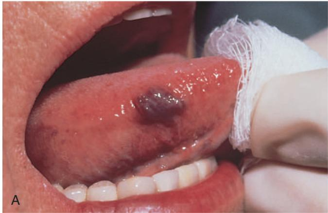
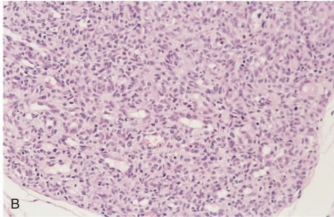
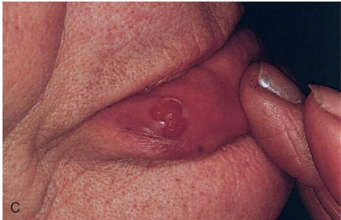 
Fig. 10.28 Hemangiomas. (A) Hemangioma of the tongue. (B) Histologic appearance in juvenile capillary hemangioma. (C) Pyogenic granuloma of the lip. (D) Histologic appearance in cavernous hemangioma. (A and D, Courtesy of John Sexton, MD, Beth Israel Hospital, Boston, Massachusetts. B, Courtesy of Christopher D.M. Fletcher, MD, Brigham and Women's Hospital, Boston, Massachusetts. C, Courtesy of Thomas Rogers, MD, University of Texas Southwestern Medical School, Dallas, Texas.)
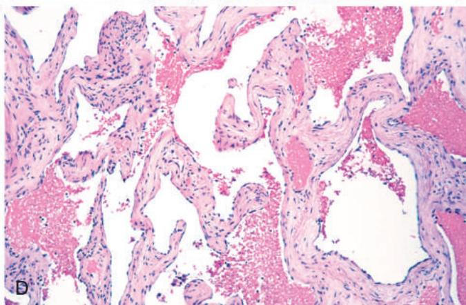
easily and often ulcerate (Fig. 10.28C). Roughly one fourth of the lesions develop after trauma, reaching a size of 1 to $2\mathrm{cm}$ within a few weeks. Curettage and cautery usually are curative. Pregnancy tumor (granuloma gravidarum) is a pyogenic granuloma that occurs infrequently in the gingiva of pregnant women. These lesions may spontaneously regress (especially after pregnancy) or undergo fibrosis, but occasionally require surgical excision.
- Cavernous hemangiomas are composed of large, dilated vascular channels. Compared with capillary hemangiomas, cavernous hemangiomas are more infiltrative, frequently involve deep structures, and do not spontaneously regress. On histologic examination, the mass is sharply defined but unencapsulated and is composed of large blood-filled vascular spaces separated by connective tissue stroma (Fig. 10.28D). Intravascular thrombosis and dystrophic calcification are common. These lesions may be locally destructive, and surgical excision is required in some cases. More often the tumors are of little clinical significance, but they can be cosmetically troublesome and are vulnerable to traumatic ulceration and bleeding. Brain hemangiomas are problematic, because they may cause symptoms related to compression of adjacent tissue or may rupture. Cavernous hemangiomas constitute one component of von Hippel-Lindau disease (Chapter 23), in which vascular lesions are
commonly found in the cerebellum, brain stem, retina, pancreas, and liver. In some cases cerebral cavernous hemangiomas are familial, caused by mutations in one of three tumor suppressor genes called CCM1, CCM2, or CCM3
# Lymphangiomas
Lymphangiomas are the benign lymphatic counterpart of hemangiomas.
- Simple (capillary) lymphangiomas are slightly elevated or sometimes pedunculated lesions up to 1 to $2\mathrm{cm}$ in diameter that occur predominantly in the head, neck, and axillary subcutaneous tissues. Histologically, lymphangiomas are composed of networks of endothelium-lined spaces that are distinguished from capillary channels only by the absence of blood cells. 
- Cavernous lymphangiomas (cystic hygromas) typically are found in the neck or axilla of children, and more rarely in the retroperitoneum. Cavernous lymphangiomas can be large (up to $15\mathrm{cm}$ ), filling the axilla or producing gross deformities of the neck. These lesions are composed of massively dilated lymphatic spaces lined by ECs and separated by intervening connective tissue stroma containing lymphoid aggregates. The tumor margins are indistinct and unencapsulated, making definitive resection difficult. Of note, cavernous lymphangiomas of the neck are common in Turner syndrome.
# Glomus Tumors (Glomangiomas)
Glomus tumors are benign, exquisitely painful tumors arising from specialized SMCs of glomus bodies, arteriovenous structures involved in thermoregulation. Distinction from cavernous hemangiomas is based on clinical features and immunohistochemical staining for smooth muscle markers. They most commonly are found in the distal portion of the digits, especially under the fingernails. Excision is curative.
# Bacillary Angiomatosis
Bacillary angiomatosis is a vascular proliferation in immunocompromised hosts (e.g., patients with AIDS) caused by opportunistic gram-negative bacilli of the Bartonella family. The lesions can involve the skin, bone, brain, and other organs. Two species have been implicated:
- Bartonella henselae, whose principal reservoir is the domestic cat; this organism causes cat-scratch disease (a necrotizing granulomatous inflammation of lymph nodes) in immunocompetent hosts. 
- Bartonella quintana, which is transmitted by human body lice; this microbe was the cause of "trench fever" in World War I.
Skin lesions take the form of red papules and nodules, or rounded subcutaneous masses. Histologically, there is a proliferation of capillaries lined by prominent epithelioid ECs, which exhibit nuclear atypia and mitoses (Fig. 10.29). Other features include infiltrating neutrophils, nuclear debris, and purplish granular collections of the causative bacteria.
The bacteria induce host tissues to produce hypoxia-inducible factor-1 $\alpha$ (HIF-1 $\alpha$ ), which drives VEGF production and vascular proliferation. The infections (and lesions) are cured by antibiotic treatment.
# Intermediate-Grade (Borderline) Tumors
# Kaposi Sarcoma
Kaposi sarcoma (KS) is a vascular neoplasm caused by Kaposi sarcoma herpesvirus (KSHV, also known as
human herpesvirus-8, or HHV-8). Although it occurs in a number of contexts, it is most common in patients with AIDS; indeed, its presence is used as a criterion for the diagnosis. Four forms of KS, based on population demographics and risks, are recognized:
- Classic KS is a disorder of older men of Mediterranean, Middle Eastern, or Eastern European descent (especially Ashkenazi Jews); it is uncommon in the United States. It can be associated with malignancy or altered immunity but is not associated with HIV infection. Classic KS manifests as multiple red-purple skin plaques or nodules, usually on the distal lower extremities; these progressively increase in size and number and spread proximally. Although persistent, the tumors typically are asymptomatic and remain localized to the skin and subcutaneous tissue. 
- Endemic African KS typically occurs in younger (under 40 years of age) HIV-seronegative individuals and can follow an indolent or aggressive course; it involves lymph nodes much more frequently than in the classic variant. In combination with AIDS-associated KS (see later), KS is now the most common tumor in central Africa. A particularly severe form, with prominent lymph node and visceral involvement, occurs in prepubertal children; the prognosis is poor, with an almost $100\%$ mortality within 3 years. 
- Transplantation-associated KS occurs in solid organ transplant recipients in the setting of T-cell immunosuppression. In these patients, the risk for KS is increased 100-fold. It pursues an aggressive course and often involves lymph nodes, mucosa, and viscera; cutaneous lesions may be absent. Lesions often regress with attenuation of immunosuppression, but at the risk for organ rejection. 
- AIDS-associated (epidemic) KS is an AIDS-defining illness; worldwide it represents the most common HIV-related malignancy (Chapter 5). Although the incidence of KS has fallen more than $80\%$ with the advent of antiretroviral therapy, it still occurs in HIV-infected individuals with a 1000-fold higher incidence than in the general population, and afflicts $2\%$ to $3\%$ of the HIV-infected U.S. population. AIDS-associated KS often involves
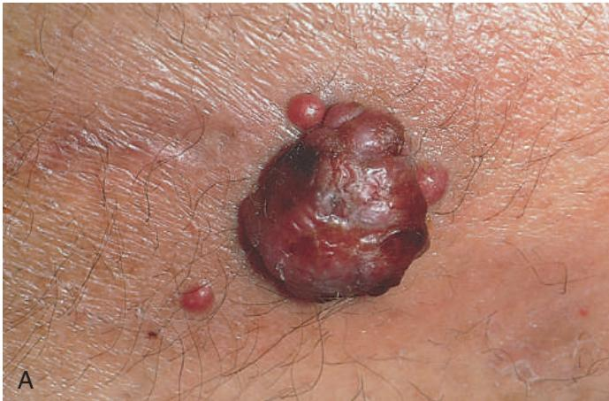 
Fig. 10.29 Bacillary angiomatosis. (A) Characteristic cutaneous lesion. (B) Histologic features are those of acute inflammation and capillary proliferation. Inset, Modified silver (Warthin-Starry) stain demonstrates clusters of tangled bacilli (black). (A, Courtesy of Richard Johnson, MD, Beth Israel Deaconess Medical Center, Boston, Massachusetts. B and inset, courtesy of Scott Granter, MD, Brigham and Women's Hospital, Boston, Massachusetts.)
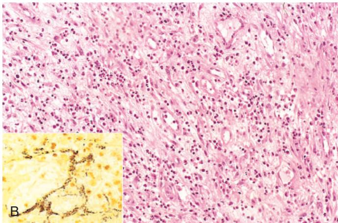
lymph nodes and disseminates widely to viscera early in its course. Most patients eventually die of opportunistic infections rather than from KS.
Virtually all KS lesions are infected by KSHV (HHV-8). Like Epstein-Barr virus, KSHV is a $\gamma$ -herpesvirus. It is transmitted both through sexual contact and potentially via oral secretions and cutaneous exposures (of note, the prevalence of endemic African KS is inversely related to the wearing of shoes). KSHV and altered T-cell immunity probably are required for KS development; in older adults, diminished T-cell immunity may be related to aging. It also is probable that acquired somatic mutations in the cells of origin contribute to tumor development and progression.
KSHV causes lytic and latent infections in ECs, both of which probably are important in KS pathogenesis. A virally encoded G protein induces VEGF production, stimulating endothelial growth, and cytokines produced by inflammatory cells recruited to sites of lytic infection also create a local proliferative milieu. In latently infected cells, KSHV-encoded proteins disrupt normal cellular proliferation controls (e.g., through synthesis of a viral homologue of cyclin D) and prevent apoptosis by inhibiting p53. Thus, the local inflammatory environment favors cellular proliferation, and latently infected cells have a growth advantage. In its early stages, only a few cells are KSHV-infected, but with time, virtually all of the proliferating cells carry the virus. As with EBV infection, early lesions are polyclonal but with accumulation of mutations the tumors become monoclonal.
In classic Kaposi sarcoma (and sometimes in other variants), the cutaneous lesions progress through three stages: patch, plaque, and nodule.
- Patches are pink, red, or purple macules, typically confined to the distal lower extremities (Fig. 10.30A). Microscopic examination reveals dilated, irregular, and angulated blood vessels lined by ECs and an interspersed infiltrate of chronic
inflammatory cells, sometimes containing hemosiderin. These lesions can be difficult to distinguish from granulation tissue.
- With time, lesions spread proximally and become larger, violaceous, raised plaques (Fig. 10.30A) composed of dilated, jagged dermal vascular channels lined and surrounded by plump spindle cells. Other prominent features include extravasated red cells, hemosiderin-laden macrophages, and other mononuclear cells. 
- Eventually nodular, more overtly neoplastic, lesions appear. These are composed of plump, proliferating spindle cells, mostly located in the dermis or subcutaneous tissues (Fig. 10.30B), often with interspersed slitlike spaces. The spindle cells express both EC and SMC markers. Hemorrhage and hemosiderin deposition are more pronounced, and mitotic figures are common. The nodular stage often is accompanied by nodal and visceral involvement, particularly in the African and AIDS-associated variants.
The course of disease varies widely according to the clinical setting. Most primary KSHV infections are asymptomatic. Classic KS is – at least initially – largely restricted to the surface of the body, and surgical resection usually is adequate for an excellent prognosis. Radiation therapy can be used for multiple lesions in a restricted area, and chemotherapy yields satisfactory results for more disseminated disease, including nodal involvement. In KS associated with immunosuppression, withdrawal of therapy (with or without adjunct chemotherapy or radiotherapy) often is effective. For AIDS-associated KS, HIV anti-retroviral therapy generally is beneficial, with or without additional therapy. IFN-γ and angiogenesis inhibitors also have proved variably effective.
# Hemangjoendotheliomas
Hemangioendotheliomas comprise a wide spectrum of borderline vascular neoplasms with clinical behaviors intermediate between those of benign, well-differentiated hemangiomas and aggressively malignant angiosarcomas
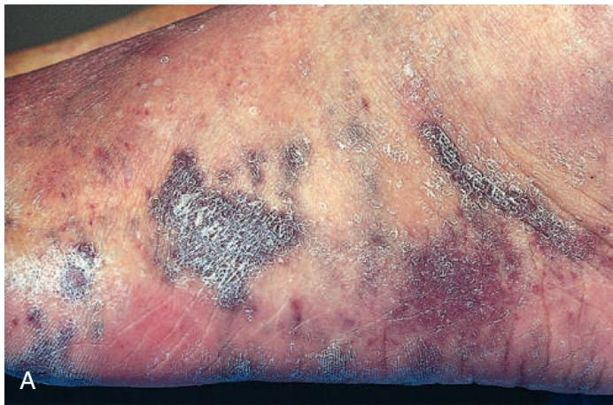 
Fig. 10.30 Kaposi sarcoma. (A) Characteristic coalescent cutaneous red-purple macules and plaques. (B) Histologic view of the nodular stage, demonstrating sheets of plump, proliferating spindle cells and slitlike vascular spaces. (Courtesy of Christopher D.M. Fletcher, MD, Brigham and Women's Hospital, Boston, Massachusetts.)
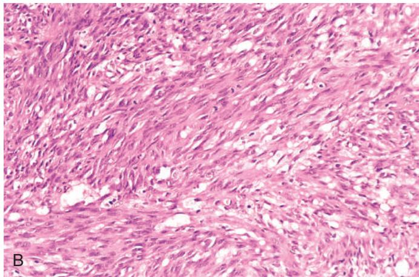
Epithelioid hemangioendothelioma is a tumor of adults arising in association with medium- to large-sized veins. The clinical course is highly variable. While excision is curative in a majority of the cases, up to $40\%$ of the tumors recur; $20\%$ to $30\%$ eventually metastasize, and $15\%$ of patients die of their tumors.
# Malignant Tumors
# Angiosarcomas
Angiosarcomas are malignant endothelial neoplasms ranging from highly differentiated tumors resembling hemangiomas to wildly anaplastic lesions. Older adults are more commonly affected, without gender predilection; lesions can occur at any site, but most often involve the skin, soft tissue, breast, and liver. Clinically, angiosarcomas are aggressive tumors that invade locally and metastasize. Current 5-year survival rates are only about $30\%$ .
Angiosarcomas can arise in the setting of lymphedema, classically in the ipsilateral upper extremity several years after radical mastectomy (i.e., with lymph node resection) for breast cancer. In such instances, the tumor presumably arises from lymphatic vessels (lymphangiosarcoma). Angiosarcomas can also be induced by radiation and rarely are associated with long-term (years) indwelling foreign bodies (e.g., catheters).
Hepatic angiosarcomas are associated with certain carcinogens, including arsenical pesticides and polyvinyl chloride (one of the best known examples of human chemical carcinogenesis). Multiple years typically transpire between exposure and subsequent tumor development.
In the skin, angiosarcomas begin as small, sharply demarcated, asymptomatic red nodules. More advanced lesions are large, fleshy red-tan to gray-white masses (Fig. 10.31A) with margins that blend imperceptibly with surrounding structures. Necrosis and hemorrhage are common.
On microscopic examination, the extent of differentiation is extremely variable, ranging from plump atypical ECs that form vascular channels (Fig. 10.31B) to undifferentiated spindle cell tumors without discernible blood vessels. The EC origin can be demonstrated in the poorly differentiated tumors by staining for the EC markers CD31 and von Willebrand factor (Fig. 10.31C).
# VASCULAR TUMORS
- Vascular ectasias are not neoplasms, but rather dilations of existing vessels. 
- Vascular neoplasms can derive from either blood vessels or lymphatics, and can be composed of ECs (e.g., hemangioma, lymphangioma, angiosarcoma) or other cells of the vascular wall (e.g., glomus tumor). 
- Most vascular tumors are benign (e.g., hemangioma); some have an intermediate, locally aggressive behavior (e.g., Kaposi sarcoma); and others are highly malignant (e.g., angiosarcoma). 
- Benign tumors typically form obvious vascular channels lined by normal-appearing ECs. Malignant tumors more often are solid and cellular, exhibit cytologic atypia, and lack well-defined vessels.
Angiosarcomaoftherightventricle.(B)Moderatelydifferentiatedangiosarcomawithdenseclumpsofatypicalcellsliningdistinctvascularlumina.(C)ImmunohistochemicalstainingofangiosarcomafortheendothelialcellmarkerCD31..jpg) 
Fig. 10.31 Angiosarcoma. (A) Angiosarcoma of the right ventricle. (B) Moderately differentiated angiosarcoma with dense clumps of atypical cells lining distinct vascular lumina. (C) Immunohistochemical staining of angiosarcoma for the endothelial cell marker CD31.
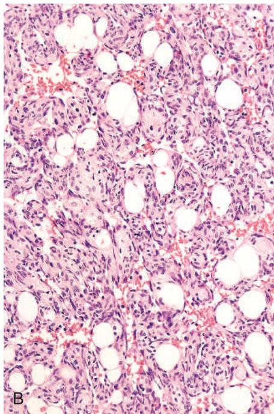
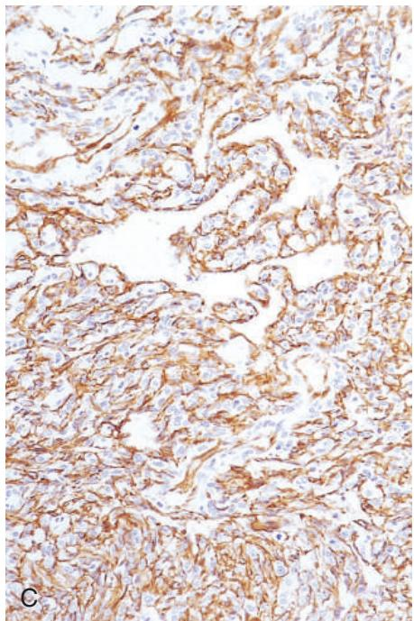
# PATHOLOGY OF VASCULAR INTERVENTION
The morphologic changes that occur in vessels following therapeutic intervention—balloon angioplasty, stenting, or bypass surgery—recapitulate many of the changes that occur in the setting of other forms of vascular injury. Local trauma (due to stenting), vascular thrombosis (after angioplasty), and abnormal mechanical forces (e.g., a saphenous vein inserted into the arterial circulation as a coronary artery bypass graft) all induce the same stereotypical healing responses—fibromuscular intimal hyperplastic lesions composed of SMCs and ECM. Thus, just as with atherosclerosis, interventions that injure the endothelium also tend to induce intimal thickening by recruiting SMCs and promoting ECM deposition.
# Endovascular Stenting
Arterial stenoses (especially those in coronary and carotid arteries) can be dilated by transiently inflating a balloon catheter to pressures sufficient to rupture the occluding plaque (balloon angioplasty); in doing so, a limited arterial dissection also is induced. Angioplasty can be complicated by abrupt reclosure resulting from compression of the lumen by an extensive circumferential or longitudinal dissection, or by thrombosis. In view of this well over $90\%$ of endovascular coronary procedures involve both angioplasty and concurrent coronary stent placement.
Coronary stents are expandable tubes of metallic mesh. They provide a larger and more regular lumen, "tack down" the intimal flaps and dissections that occur during angioplasty, and mechanically limit vascular spasm. Nevertheless, as a consequence of endothelial injury,
thrombosis is an important immediate post-stenting complication; patients must receive potent anti-thrombotic agents (primarily platelet antagonists) to prevent acute catastrophic thrombotic occlusions until the stented region becomes endothelialized. The long-term success of angioplasty is limited by the development of proliferative in-stent restenosis. Such intimal thickening results in clinically significant luminal occlusion in up to one third of patients within 6 to 12 months of stenting (Fig. 10.32). The newest generation of drug-eluting stents is designed to avoid this complication by releasing anti-proliferative drugs (e.g., paclitaxel, sirolimus) into the adjacent vessel wall that block SMC activation. Use of such stents reduces the incidence of restenosis at 1 year by $50\%$ to $80\%$ .
# Vascular Replacement
Synthetic or autologous vascular grafts commonly are used to replace damaged vessels or bypass diseased arteries. Of the synthetic grafts, large-bore (12- to 18-mm-diameter) conduits function well in high-flow locations such as the aorta, while small-bore artificial grafts (8 mm or less in diameter) generally fail as a result of acute thrombosis or late intimal hyperplasia, primarily at the junction of the graft and the native vasculature.
Consequently, when small-bore vessel replacement is needed (e.g., for coronary artery bypass surgeries), the grafts are fashioned either from autologous saphenous vein (taken from the patient's own leg) or left internal mammary artery. The long-term patency of saphenous vein grafts is only $50\%$ at 10 years; these grafts occlude through thrombosis (typically early), intimal thickening (months to years postoperatively), and vein graft atherosclerosis. By contrast, more than $90\%$ of internal mammary artery grafts are patent after 10 years.
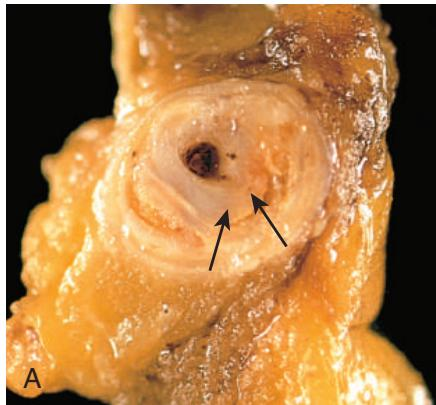 
Fig. 10.32 Restenosis after angioplasty and stenting. (A) Gross view demonstrating residual atherosclerotic plaque (arrows) and a new, glistening intimal proliferative lesion. (B) Histologic view shows a thickened neointima overlying the stent wires (black diamond indicated by the arrow), which encroaches on the lumen (asterisk). (B, Reproduced from Schoen FJ, Edwards WD: Pathology of cardiovascular interventions, including endovascular therapies, revascularization, vascular replacement, cardiac assist/replacement, arrhythmia control, and repaired congenital heart disease. In Silver MD, et al., editors: Cardiovascular pathology, ed 3, Philadelphia, 2001, Churchill Livingstone.)
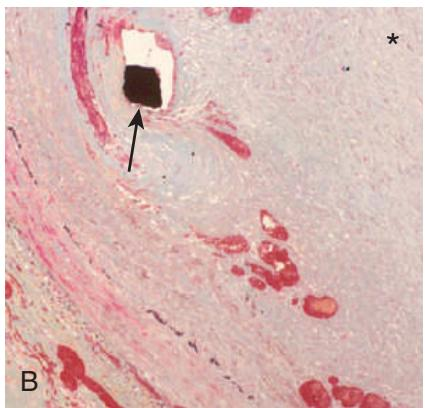
Bhutani M, Polizzotto MN, Uldrick TS, et al: Kaposi sarcoma-associated herpesvirus-associated malignancies: epidemiology, pathogenesis, and advances in treatment, Semin Oncol 42:247, 2015. [A solid and thorough review.] 
Coffman TM: Under pressure: the search for the essential mechanisms of hypertension, Nat Med 17:1402, 2011. [A well-written review of the current state of the field including recent translational advances.] 
Fishbein MC, Fishbein GA: Arteriosclerosis: facts and fancy, Cardiovasc Pathol 24:335, 2015. [A fun and thought-provoking revisit to topics of cardiovascular "conventional wisdom."]. 
Gillis E, Van Laer L, Loeys BL: Genetics of thoracic aortic aneurysm: at the crossroad of transforming growth factor- $\beta$ signaling and vascular smooth muscle cell contractility, Circ Res 113:327, 2013. [An up-to-date discussion of the molecular and cellular basis for thoracic aneurysms and dissections.] 
Gimbrone MA Jr, Garcia-Cardena G: Vascular endothelium, hemodynamics, and the pathobiology of atherosclerosis, Cardiovasc Pathol 22:9, 2013. [A well-written review on endothelial responses to mechanical forces from one of the leading groups in the field.] 
Grebe A, Latz E: Cholesterol crystals and inflammation, Curr Rheumatol Rep 15:313, 2013. [A review of the activation of the inflammasome by cholesterol crystals, and its role in atherosclerosis.] 
Hansson GK, Libby P, Tabas I: Inflammation and plaque vulnerability, J Intern Med 278:483, 2015. [An up-to-date review of the current concepts linking inflammation and plaque vulnerability.] 
Inoue T, Croce K, Morooka T, et al: Vascular inflammation and repair: implications for re-endothelialization, restenosis, and stent thrombosis, JACC Cardiovasc Interv 4:1057, 2011. [An excellent overview of the inflammatory pathways that influence the outcomes of percutaneous vessel interventions.] 
Jaffe R, Strauss B: Late and very late thrombosis of drug-eluting stents: evolving concepts and perspectives, J Am Coll Cardiol 50:119, 2007. [An even-handed discussion of the complications following coronary artery stent placement.] 
Jennette J, Falk R: Nosology of primary vasculitis, Curr Opin Rheumatol 19:10, 2007. [A classification of vasculitis based on pathogenic pathways
and the vessels involved; provides a good organization to a complex and potentially confusing aspect of vascular pathology.] 
Jennette JC, Falk RJ: Pathogenesis of antineutrophil cytoplasmic autoantibody-mediated disease, Nat Rev Rheumatol 10:463, 2014. [A well-written and well-organized overview of the big picture in ANCA vasculitis.] 
Kim FY, Marhefka G, Ruggiero NJ, et al: Saphenous vein graft disease: review of pathophysiology, prevention, and treatment, Cardiol Rev 21:101, 2013. [A good overview of the pathogenesis and clinical issues of saphenous vein graft acute occlusion and chronic stenosis.] 
Libby P, Lichtman AH, Hansson GK: Immune effector mechanisms implicated in atherosclerosis: from mice to humans, Immunity 38:1092, 2013. [A superb review of the experimental and clinical literature describing the role of specific and adaptive immunity in atherosclerosis pathogenesis.] 
MacAlpin RN: Some observations on and controversies about coronary arterial spasm, Int J Cardiol 181:389, 2015. [A good clinical overview of coronary spasm and its sequelae.] 
Michel JB, Martin-Ventura JL, Egido J, et al: Novel aspects of the pathogenesis of aneurysms of the abdominal aorta in humans, Cardiovasc Res 90:18, 2011. [A good discussion of the molecular pathways underlying human abdominal aortic aneurysm formation.] 
Monahan-Earley R, Dvorak AM, Aird WC: Evolutionary origins of the blood vascular system and endothelium, J Thromb Haemost 11(Suppl 1):46, 2013. [An interesting discussion of the evolutionary basis for vascular development, including cogent explanations for endothelial heterogeneity.] 
Penel N, Marreaud S, Robin YM, et al: Angiosarcoma: state of the art and perspectives, Crit Rev Oncol Hematol 22:1266, 2011. [An extensive clinical summary of this aggressively malignant vascular tumor.] 
Ridker P: From C-reactive protein to interleukin-6 to interleukin-1: moving upstream to identify novel targets for atheroprotection, Circ Res 118:145, 2016. [A well-written opinion piece regarding how CRP links to other inflammatory mediators, and potentially identifies therapeutic targets.]
# Heart
# 11
Overview of Heart Disease 399
Heart Failure 400
Left-Sided Heart Failure 401
Right-Sided Heart Failure 402
Congenital Heart Disease 403
Malformations Associated With Left-to-Right Shunts 404
Malformations Associated With Right-to-Left Shunts 406
Malformations Associated With Obstructive Lesions 407
Ischemic Heart Disease 408
Angina Pectoris 411
Myocardial Infarction 411
Chronic Ischemic Heart Disease 419
Cardiac Stem Cells 419
Arrhythmias 419
Sudden Cardiac Death 420
Hypertensive Heart Disease 420
Systemic (Left-Sided) Hypertensive Heart Disease 421
Pulmonary Hypertensive Heart Disease—Cor Pulmonale 422
Valvular Heart Disease 422
Degenerative Valve Disease 423
Rheumatic Valvular Disease 425
Infective Endocarditis 427
Noninfected Vegetations 428
Cardiomyopathies and Myocarditis 429
Dilated Cardiomyopathy 429
Arrhythmogenic Right Ventricular Cardiomyopathy 432
Hypertrophic Cardiomyopathy 432
Restrictive Cardiomyopathy 433
Myocarditis 434
Other Causes of Myocardial Disease 435
Pericardial Disease 436
Pericardial Effusion and Hemopericardium 436
Pericarditis 436
Cardiac Tumors 437
Primary Neoplasms 437
Cardiac Effects of Noncardiac Neoplasms 438
Cardiac Transplantation 439
The heart is a truly remarkable organ, beating more than 40 million times per year and pumping over 7500 liters of blood a day; in a typical lifespan, its cumulative output would fill three supertankers. The cardiovascular system is the first organ system to become functional in utero (at approximately 8 weeks of gestation); without a beating heart and vascular supply, development cannot proceed, and the embryo dies. When the heart fails during postnatal life, the results are equally catastrophic. Indeed, cardiovascular disease is the leading cause of mortality worldwide and accounts for one in four of all deaths in the United States—approximately 1 death every minute, or 610,000 deaths each year (a greater mortality rate than for all forms of cancer combined). The annual economic impact of cardiac disease exceeds $200 billion, with ischemic heart disease contributing well over half. Moreover, roughly one third of these deaths are "premature," occurring in individuals younger than 75 years of age; thus, an additional economic burden is imposed through lost years of productivity.
# OVERVIEW OF HEART DISEASE
Although a wide range of diseases can affect the cardiovascular system, the pathophysiologic pathways that result in a "broken" heart distill down to six principal mechanisms:
- Failure of the pump. In the most common situation, the cardiac muscle contracts weakly and the chambers cannot empty properly—so-called "systolic dysfunction." In some cases, the muscle cannot relax sufficiently to permit ventricular filling, resulting in diastolic dysfunction. 
- Obstruction to flow. Lesions that prevent valve opening (e.g., calcific aortic valve stenosis) or cause increased ventricular chamber pressures (e.g., systemic hypertension or aortic coarctation) can overwork the myocardium, which has to pump against the obstruction. 
- Regurgitant flow. Valve pathology that allows backward flow of blood results in increased volume workload and may overwhelm the pumping capacity of the affected chambers. 
- Shunted flow. Defects (congenital or acquired) that divert blood inappropriately from one chamber to another, or from one vessel to another, lead to pressure and volume overloads. 
- Disorders of cardiac conduction. Uncoordinated cardiac impulses or blocked conduction pathways can cause arrhythmias that slow contractions or prevent effective pumping altogether. 
- Rupture of the heart or major vessel. Loss of circulatory continuity (e.g., a gunshot wound through the thoracic aorta) may lead to massive blood loss, hypotensive shock, and death.
# HEART FAILURE
Heart failure, often referred to as congestive heart failure (CHF), is the common end point for many forms of cardiac disease and typically is a progressive condition with a poor prognosis. In the United States alone, over 5 million individuals are affected, resulting in well over 1 million hospitalizations annually, and a financial burden in excess of $32 billion. Roughly one half of patients die within 5 years of receiving a diagnosis of CHF, and 1 in 9 deaths in the United States include heart failure as a contributory cause.
CHF occurs when the heart cannot generate sufficient output to meet the metabolic demands of the tissues, or can only do so at higher-than-normal filling pressures; in a minority of cases, heart failure is a consequence of greatly increased tissue demands, as in hyperthyroidism, or decreased oxygen carrying capacity, as in anemia (high-output failure). The onset of CHF is sometimes abrupt, as in the setting of a large myocardial infarct or acute valve dysfunction. In most cases, however, CHF develops gradually and insidiously owing to the cumulative effects of chronic work overload or progressive loss of myocardium.
Heart failure may result from systolic or diastolic dysfunction. Systolic dysfunction results from inadequate myocardial contractile function, usually as a consequence of ischemic heart disease or hypertension. Diastolic dysfunction refers to an inability of the heart to adequately relax and fill, which may be a consequence of massive left ventricular hypertrophy, myocardial fibrosis, amyloid deposition, or constrictive pericarditis. Approximately one half of CHF cases are attributable to diastolic dysfunction, with a greater frequency seen in older adults, diabetic patients, and women. Heart failure may also be caused by valve dysfunction (e.g., due to endocarditis), or may occur following rapid increases in blood volume or blood pressure, even if the heart is normal.
When, the failing heart can no longer efficiently pump blood, there is an increase in end-diastolic ventricular volumes, increased end-diastolic pressures, and elevated venous pressures. Thus, inadequate cardiac output—called forward failure—is almost always accompanied by increased congestion of the venous circulation—that is, backward failure. Although the root problem in CHF typically is deficient cardiac function, virtually every other organ is eventually affected by some combination of forward and backward failure.
The cardiovascular system attempts to compensate for reduced myocardial contractility or increased hemodynamic burden through several homeostatic mechanisms:
- The Frank-Starling mechanism. Increased end-diastolic filling volumes dilate the heart and cause increased cardiac myofiber stretching; these lengthened fibers contract more forcibly, thereby increasing cardiac output. If the dilated ventricle is able to maintain cardiac output by this means, the patient is said to be in compensated heart failure. However, ventricular dilation comes at the expense of increased wall tension and magnifies the oxygen requirements of an already-compromised heart.
myocardium. With time, the failing muscle is no longer able to propel sufficient blood to meet the needs of the body, and the patient develops decompensated heart failure.
- Activation of neurohumoral systems:
- Release of the neurotransmitter norepinephrine by the autonomic nervous system increases heart rate and augments myocardial contractility and vascular resistance. 
- Activation of the renin-angiotensin-aldosterone system spurs water and salt retention (augmenting circulatory volume) and increases vascular tone. 
- Release of atrial natriuretic peptide acts to balance the renin-angiotensin-aldosterone system through diuresis and vascular smooth muscle relaxation. 
- Myocardial structural changes, including augmented muscle mass. Cardiac myocytes adapt to increased workload by assembling new sarcomeres, a change that is accompanied by myocyte enlargement (hypertrophy) (Fig. 11.1). 
- In pressure overload states (e.g., hypertension or valvular stenosis), new sarcomeres tend to be added parallel to the long axis of the myocytes, adjacent to existing sarcomeres. The growing muscle fiber diameter thus results in concentric hypertrophy – the ventricular wall thickness increases without an increase in the size of the chamber. 
- In volume overload states (e.g., valvular regurgitation or shunts), the new sarcomeres are added in series with existing sarcomeres, so that the muscle fiber length increases. Consequently, the ventricle tends to dilate, and the resulting wall thickness can be increased, normal, or decreased; thus, heart weight—rather than wall thickness—is the best measure of hypertrophy in volume-overloaded hearts.
Compensatory hypertrophy comes at a cost. The oxygen requirements of hypertrophic myocardium are amplified owing to increased myocardial cell mass. Because the myocardial capillary bed does not expand in step with the increased myocardial oxygen demands, the myocardium becomes vulnerable to ischemic injury. Hypertrophy also typically is associated with altered patterns of gene expression reminiscent of fetal myocytes, such as changes in the dominant form of myosin heavy chain produced. Altered gene expression may contribute to changes in myocyte function that lead to increases in heart rate and force of contraction, both of which improve cardiac output, but which also lead to higher cardiac oxygen consumption. In the face of ischemia and chronic increases in workload, other pathologic changes eventually supervene, including myocyte apoptosis, cytoskeletal alterations, and increased extracellular matrix (ECM) deposition.
Pathologic compensatory cardiac hypertrophy is correlated with increased mortality; indeed, cardiac hypertrophy is an independent risk factor for sudden cardiac death. By contrast, the volume-loaded hypertrophy induced by regular aerobic exercise (physiologic hypertrophy) typically is accompanied by an increase in capillary density, with decreased resting heart rate and blood
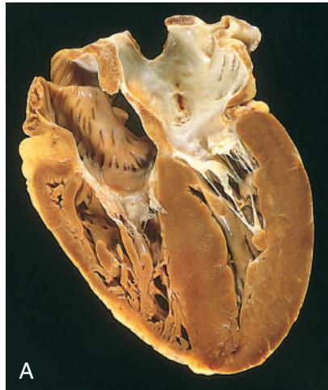
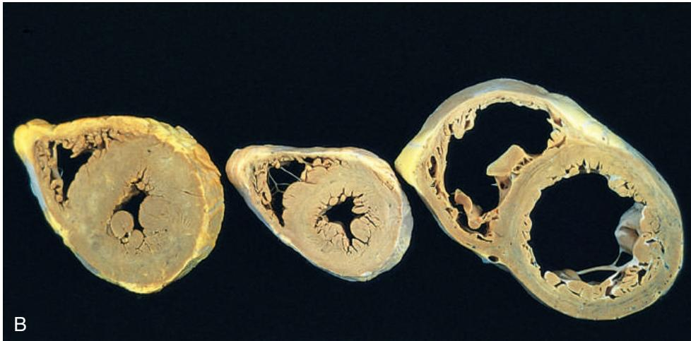
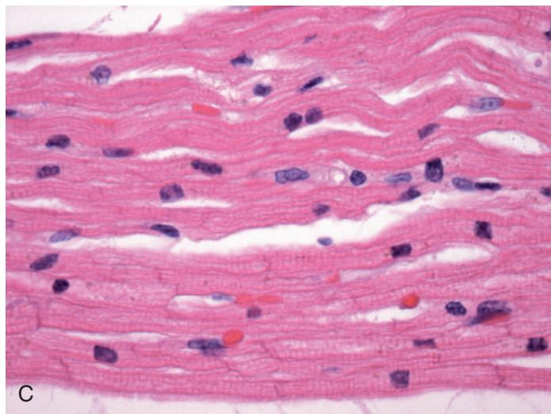 
Fig. 11.1 Left ventricular hypertrophy. (A) Pressure hypertrophy due to left ventricular outflow obstruction. The left ventricle is on the lower right in this apical four-chamber view of the heart. (B) Left ventricular hypertrophy with and without dilation, viewed in transverse heart sections. Compared with a normal heart (center), the pressure-hypertrophied hearts (left and in A) have increased mass and a thick left ventricular wall, while the hypertrophied, dilated heart (right) has increased mass and a normal wall thickness. (C) Normal myocardium. (D) Hypertrophied myocardium (panels C and D are photomicrographs at the same magnification). Note the increases in both cell size and nuclear size in the hypertrophied myocytes. (A and B, Reproduced with permission from Edwards WD: Cardiac anatomy and examination of cardiac specimens. In Emmanouilides GC, et al, editors: Moss and Adams heart disease in infants, children, and adolescents: including the fetus and young adults, ed 5, Philadelphia, 1995, Williams & Wilkins, p 86.)
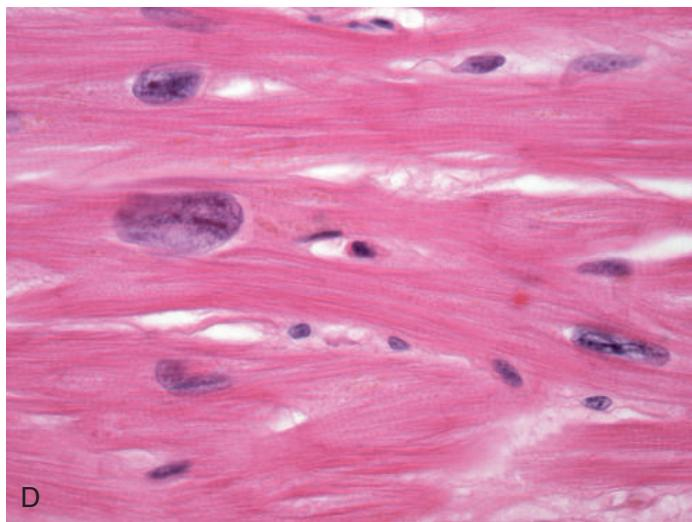
pressure. These physiologic adaptations reduce overall cardiovascular morbidity and mortality. In comparison, static exercise (e.g., weight lifting) is associated with pressure hypertrophy and may not have the same beneficial effects.
# Left-Sided Heart Failure
Heart failure can affect predominantly the left or the right side of the heart or may involve both sides. The most common causes of left-sided cardiac failure are ischemic heart disease (IHD), systemic hypertension, mitral or aortic valve disease, and primary diseases of the myocardium (e.g., amyloidosis). The morphologic and clinical effects of left-sided CHF stem from diminished systemic perfusion and elevated back-pressures within the pulmonary circulation.
Heart. The gross cardiac findings depend on the underlying disease process, for example, myocardial infarction or valvular deformities may be present. With the exception of failure due to mitral valve stenosis or restrictive cardiomyopathies (described later), the left ventricle usually is hypertrophied and can be dilated, sometimes massively. Left ventricular dilation can result in mitral insufficiency and left atrial enlargement, which is associated with an increased incidence of atrial fibrillation. The microscopic changes in heart failure are nonspecific, consisting primarily of myocyte hypertrophy with interstitial fibrosis of variable severity. Superimposed on this background may be other lesions that contribute to the development of heart failure (e.g., recent or old myocardial infarction).
Lungs. In acute left-sided heart failure, rising pressure in the pulmonary veins is ultimately transmitted back to the capillaries
and arteries of the lungs, resulting in congestion and edema as well as pleural effusion due to an increase in hydrostatic pressure in the venules of the visceral pleura. The lungs are heavy and boggy, and microscopically show perivascular and interstitial transudates, alveolar septal edema, and accumulation of edema fluid in the alveolar spaces. In chronic heart failure, variable numbers of red cells extravasate from the leaky capillaries into alveolar spaces, where they are phagocytosed by macrophages. The subsequent breakdown of red cells and hemoglobin leads to the appearance of hemosiderin-laden alveolar macrophages—so-called heart failure cells—that reflect previous episodes of pulmonary edema.
Dyspnea (shortness of breath) on exertion is usually the earliest and most significant symptom of left-sided heart failure; cough is also common as a consequence of fluid transudation into air spaces. As failure progresses, patients experience dyspnea when recumbent (orthopnea); this occurs because the supine position increases venous return from the lower extremities and also elevates the diaphragm. Orthopnea typically is relieved by sitting or standing, so patients usually sleep in a semi-seated position. Paroxysmal nocturnal dyspnea is a particularly dramatic form of breathlessness, awakening patients from sleep with extreme dyspnea bordering on feelings of suffocation.
Other manifestations of left ventricular failure include an enlarged heart (cardiomegaly), tachycardia, a third heart sound $(S_{3})$ , and fine rales at the lung bases, caused by the opening of edematous pulmonary alveoli. With progressive ventricular dilation, the papillary muscles are displaced outward, causing mitral regurgitation and a systolic murmur. Subsequent chronic dilation of the left atrium can cause atrial fibrillation, manifested by an "irregularly irregular" heartbeat. Such uncoordinated, chaotic atrial contractions reduce the atrial contribution to ventricular filling, thus reducing the ventricular stroke volume. Atrial fibrillation also causes stasis of the blood (particularly in the atrial appendage), frequently leading to the formation of thrombi that can shed emboli and cause strokes and manifestations of infarction in other organs.
Diminished cardiac output leads to decreased renal perfusion that in turn triggers the renin-angiotensin-aldosterone axis, increasing intravascular volume and pressures (Chapters 4 and 10). Unfortunately, with a failing heart, these compensatory effects exacerbate the pulmonary edema. With further progression of CHF, prerenal azotemia may supervene, with impaired excretion of nitrogenous wastes and increasing metabolic derangement. In severe CHF, diminished cerebral perfusion may manifest as hypoxic encephalopathy marked by irritability, diminished cognition, and restlessness that can progress to stupor and coma.
Treatment for CHF is typically focused—at least initially—on correcting the underlying cause, for example a valvular defect or inadequate cardiac perfusion. In lieu of such options, the clinical approach includes salt restriction or pharmacologic agents that variously reduce volume overload (e.g., diuretics), increase myocardial contractility (so-called “positive inotropes”), or reduce afterload (adren
ergic blockade or inhibitors of angiotensin-converting enzymes). Angiotensin-converting enzyme inhibitors appear to benefit patients not only by opposing aldosterone-mediated salt and water retention, but also by limiting cardiomyocyte hypertrophy and remodeling through uncertain mechanisms. Although cardiac resynchronization therapy (exogenous pacing of both the right and left ventricles) and cardiac contractility modulation (exogenous stimulation of cardiac muscle) have recently augmented the cardiologist's armamentarium, CHF remains a serious cause of human morbidity and mortality.
# Right-Sided Heart Failure
Right-sided heart failure is usually the consequence of left-sided heart failure, since any pressure increase in the pulmonary circulation inevitably produces an increased burden on the right side of the heart. Consequently, the causes of right-sided heart failure include all of those that induce left-sided heart failure. Isolated right-sided heart failure is infrequent and typically occurs in patients with one of a variety of disorders affecting the lungs; hence it is often referred to as cor pulmonale. Besides parenchymal lung diseases, cor pulmonale also may arise secondary to disorders that affect the pulmonary vasculature, for example, primary pulmonary hypertension (Chapter 13), recurrent pulmonary thromboembolism, or conditions that cause pulmonary vasoconstriction (obstructive sleep apnea). The common feature of these disorders is pulmonary hypertension (discussed later), which results in hypertrophy and dilation of the right side of the heart. In cor pulmonale, myocardial hypertrophy and dilation generally are confined to the right ventricle and atrium, although bulging of the ventricular septum to the left can reduce cardiac output by causing outflow tract obstruction.
The major morphologic and clinical effects of pure right-sided heart failure differ from those of left-sided heart failure in that engorgement of the systemic and portal venous systems typically is pronounced and pulmonary congestion is minimal.
Liver and Portal System. The liver usually is increased in size and weight (congestive hepatomegaly). A cut section displays prominent passive congestion, a pattern referred to as nutmeg liver (Chapter 4); congested centrilobular areas are surrounded by peripheral paler, noncongested parenchyma. When left-sided heart failure is also present, severe central hypoxia produces centrilobular necrosis in addition to the sinusoidal congestion. With long-standing severe right-sided heart failure, the central areas can become fibrotic, creating so-called cardiac cirrhosis.
Right-sided heart failure can also lead to elevated pressure in the portal vein and its tributaries (portal hypertension), with vascular congestion producing a tense, enlarged spleen (congestive splenomegaly). If severe, chronic passive congestion and attendant edema of the bowel wall may interfere with absorption of nutrients and medications.
Pleural, Pericardial, and Peritoneal Spaces. Systemic venous congestion due to right-sided heart failure can lead to transudates (effusions) in the pleural and pericardial spaces, but usually does not cause pulmonary parenchymal edema. Pleural effusions are most pronounced when there is combined right-sided and left-sided heart failure leading to elevated pulmonary and systemic venous pressures. A combination of hepatic congestion (with or without diminished albumin synthesis) and portal hypertension can lead to peritoneal transudates (ascites). If uncomplicated, effusions associated with right-sided CHF are transudates with a low protein content and lack of inflammatory cells.
Subcutaneous Tissues. Edema of dependent portions of the body, especially the feet and lower legs, is a hallmark of right-sided CHF. In chronically bedridden patients, the edema may be primarily presacral.
Unlike left-sided heart failure, pure right-sided heart failure typically is not associated with respiratory symptoms. Instead, the clinical manifestations are related to systemic and portal venous congestion and include hepatic and splenic enlargement, peripheral edema, pleural effusion, and ascites. Venous congestion and hypoxia of the kidneys and brain due to right-sided heart failure can produce deficits comparable to those caused by the hypoperfusion of left-sided heart failure.
Of note, cardiac decompensation is often marked by the appearance of biventricular CHF, encompassing features of both right-sided and left-sided heart failure. As CHF progresses, patients may become frankly cyanotic and acidotic, as a consequence of decreased tissue perfusion resulting from both diminished cardiac output and increasing congestion.
# HEART FAILURE
- CHF occurs when the heart is unable to provide adequate perfusion to meet the metabolic demands of peripheral tissues; inadequate cardiac output usually is accompanied by congestion of the venous circulation. 
- Left-sided heart failure is most commonly secondary to ischemic heart disease, systemic hypertension, mitral or aortic valve disease, or primary diseases of the myocardium; symptoms are mainly a consequence of pulmonary congestion and edema, although systemic hypoperfusion can cause renal and cerebral dysfunction. 
- Right-sided heart failure is due most often to left-sided heart failure and, less commonly, to primary pulmonary disorders; signs and symptoms are related chiefly to peripheral edema and visceral congestion.
# CONGENITAL HEART DISEASE
Congenital heart diseases are abnormalities of the heart or great vessels that are present at birth. They account for $20\%$ to $30\%$ of all birth defects and include a broad
Table 11.1 Frequency of Congenital Cardiac Malformations* 
MalformationIncidence per 1 Million Live Births%Ventricular septal defect448242Atrial septal defect104310Pulmonary stenosis8368Patent ductus arteriosus7817Tetralogy of Fallot5775Coarctation of aorta4925Atrioventricular septal defect3964Aortic stenosis3884Transposition of great arteries3884Truncus arteriosus1361Total anomalous pulmonary venous connection1201Tricuspid atresia1181TOTAL9757
*Summary of 44 published studies. Percentages do not add to $100\%$ because of rounding. Data from Hoffman JI, Kaplan S: The incidence of congenital heart disease, J Am Coll Cardiol 39:1890, 2002.
spectrum of malformations, ranging from severe anomalies incompatible with intrauterine or perinatal survival, to lesions that produce few or no symptoms, some of which go completely unrecognized during life. Congenital heart disease affects nearly $1\%$ of newborns (or roughly 40,000 infants per year in the United States). The incidence is higher in premature infants and in stillborns, approximately one fourth of which have significant cardiac malformations. Defects that permit live birth usually involve only single chambers or regions of the heart. Twelve entities account for $85\%$ of congenital heart disease; their frequencies are shown in Table 11.1.
Thanks to surgical advances, the number of patients surviving with congenital heart disease is increasing rapidly and is currently estimated at over 2 million individuals in the United States alone. Although surgery may correct the hemodynamic abnormalities, the repaired heart may not be completely normal, since the myocardial hypertrophy and cardiac remodeling brought about by the congenital defect may be irreversible; in addition, virtually all cardiac surgery results in some degree of myocardial scarring. Such changes can lead secondarily to arrhythmias and myocardial dysfunction, which occasionally appear many years after surgical correction.
Congenital heart disease most commonly arises from faulty embryogenesis during gestational weeks 3 through 8, when major cardiovascular structures develop. The cause is unknown in almost $90\%$ of cases. Of the accepted etiologic factors, environmental exposures, including congenital rubella infection, teratogens, and maternal diabetes, and genetic factors are best characterized. Genetic factors include specific loci implicated in familial forms of congenital heart disease and certain chromosomal abnormalities (e.g., trisomies 13, 15, 18, and 21, and Turner syndrome).
Cardiac morphogenesis involves multiple genes that work together to choreograph a complex series of tightly regulated events. Key steps include commitment of progenitor cells to the myocardial lineage, formation and looping of the heart tube, segmentation and growth of the cardiac chambers, cardiac valve formation, and connection of the great vessels to the heart. Proper orchestration of these remarkable transformations depends on networks of transcription factors and several signaling pathways and molecules, including the Wnt, vascular endothelial growth factor (VEGF), bone morphogenetic protein (BMP), transforming growth factor- $\beta$ (TGF- $\beta$ ), fibroblast growth factor, and Notch pathways. Also essential for cardiac morphogenesis is the mechanical force imparted by flowing pulsatile blood, which is sensed by the cells of the developing heart and vessels.
Since crafting a normal heart involves many steps, even subtle perturbations can adversely influence the outcome. Most of the known genetic defects are autosomal dominant mutations causing loss (or sometimes gain) of function of a particular factor. Several mutations involve transcription factors. For example, atrial septal defects (ASDs) and ventricular septal defects (VSDs) and/or conduction defects may be caused by transcription factor mutations, such as TBX5 mutations in the Holt-Oram syndrome. Other disorders (e.g., Noonan syndrome) are associated with mutations in intracellular signaling cascades that cause constitutive activation. MicroRNAs, as well as epigenetic changes (e.g., DNA methylation), also are increasingly recognized as important contributors. It is likely that even transient environmental stresses at critical junctures early in pregnancy can cause subtle changes in transcription factor activity that may recapitulate defects produced by heritable mutations.
The various structural anomalies in congenital heart disease can be assigned to three major groups based on their hemodynamic and clinical consequences: (1) malformations causing a left-to-right shunt; (2) malformations causing a right-to-left shunt (cyanotic congenital heart diseases); and (3) malformations causing obstruction.
A shunt is an abnormal communication between chambers or blood vessels. Depending on pressure relationships, shunts permit the flow of blood from the left to the right side of the heart (or vice versa).
- With right-to-left shunt, a dusky blueness of the skin (cyanosis) results because the pulmonary circulation is bypassed and poorly oxygenated blood collected from the venous system enters the systemic arterial circulation. 
- By contrast, left-to-right shunts increase blood flow into the pulmonary circulation and are not associated (at least initially) with cyanosis. However, they expose the low-pressure, low-resistance pulmonary circulation to high pressures and increased volumes; these alterations lead to adaptive changes that increase lung vascular resistance to protect the pulmonary bed, resulting in right ventricular hypertrophy and—eventually right-sided—failure. With time, increased pulmonary resistance also can cause shunt reversal (right to left) and late-onset cyanosis.
- Some congenital anomalies obstruct vascular flow by narrowing the chambers, valves, or major blood vessels. A malformation characterized by complete obstruction is called an atresia. In some disorders (e.g., tetralogy of Fallot), an obstruction (pulmonary stenosis) also is associated with a shunt (right-to-left, through a VSD).
The altered hemodynamics of congenital heart disease usually lead to chamber dilation or wall hypertrophy. However, some defects result in a reduced muscle mass or chamber size; this is called hypoplasia if it occurs before birth and atrophy if it develops postnatally.
# Malformations Associated With Left-to-Right Shunts
Disorders associated with Left-to-right shunts are the most common types of congenital cardiac malformations. They include atrial septal defects (ASDs), ventricular septal defects (VSDs), and patent ductus arteriosus (PDA) (Fig. 11.2). ASDs typically increase only right ventricular and pulmonary outflow volumes, while VSDs and PDAs cause both increased pulmonary blood flow and pressure. Manifestations of these shunts range from completely asymptomatic to fulminant heart failure.
Cyanosis is not an early feature of these defects. However, as discussed earlier, prolonged left-to-right
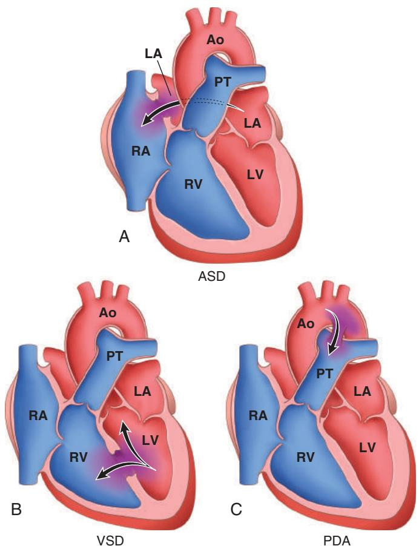 
Fig. 11.2 Common congenital causes of left-to-right shunts (arrows indicate direction of blood flow). (A) Atrial septal defect (ASD). (B) Ventricular septal defect (VSD). (C) Patent ductus arteriosus (PDA). Ao, Aorta; LA, left atrium; LV, left ventricle; PT, pulmonary trunk; RA, right atrium; RV, right ventricle.
shunting may eventually give rise to pulmonary hypertension and right-to-left shunting of unoxygenated blood into the systemic circulation, a change marked by the appearance of cyanosis (Eisenmenger syndrome). Once significant pulmonary hypertension develops, the structural defects of congenital heart disease are considered irreversible. This is the rationale for early intervention, in most cases surgically.
# Atrial Septal Defects and Patent Foramen Ovale
During normal cardiac development, patency is maintained between the right and left atria by a series of fenestrations (ostium primum and ostium secundum) that eventually become the foramen ovale. This arrangement allows oxygenated blood from the maternal circulation to flow from the right to the left atrium, thereby sustaining fetal development. At later stages of intrauterine development, tissue flaps (septum primum and septum secundum) grow to occlude the foramen ovale, and in $80\%$ of cases, the higher left-sided pressures in the heart that occur at birth permanently fuse the septa against the foramen ovale. In the remaining $20\%$ of cases, a patent foramen ovale results; although the flap is of adequate size to cover the foramen, the unsealed septa can allow transient right-to-left blood flow, such as with a Valsalva maneuver during sneezing or straining during bowel movements. Although this typically has little significance, it occasionally manifests as paradoxical embolism, defined as venous emboli (e.g., from deep leg veins) that enter the systemic arterial circulation via a foramen ovale defect.
In contrast to patent foramen ovale, an ASD is an abnormal fixed opening in the atrial septum that allows unrestricted blood flow between the atrial chambers. A majority $(90\%)$ of ASDs are so-called "ostium secundum" defects in which growth of the septum secundum is insufficient to occlude the second ostium.
Ostium secundum ASDs (90% of ASDs) are smooth-walled defects near the foramen ovale, typically without other associated cardiac abnormalities. Hemodynamically significant lesions are accompanied by right atrial and ventricular dilation, right ventricular hypertrophy, and dilation of the pulmonary artery, reflecting the effects of a chronically increased volume load.
Ostium primum ASDs (accounting for $5\%$ of these defects) occur at the lowest part of the atrial septum and can be associated with mitral and tricuspid valve abnormalities, reflecting the close relationship between development of the septum primum and the endocardial cushions. In more severe cases, additional defects may include a VSD and a common atrioventricular canal.
Sinus venosus ASDs (accounting for another $5\%$ of the cases) are located high in the atrial septum and often are accompanied by anomalous drainage of the pulmonary veins into the right atrium or superior vena cava.
ASDs usually are asymptomatic until adulthood. Although VSDs are more common, many close spontaneously. Consequently, ASDs—which are less likely to spontaneously
close—are the most common defects to be first diagnosed in adults. ASDs initially cause left-to-right shunts, due to lower pressures in the pulmonary circulation and the right side of the heart. In general, these defects are well tolerated, especially if they are less than $1\mathrm{cm}$ in diameter; even larger lesions do not usually produce any symptoms in childhood. Over time, however, chronic volume and pressure overloads can cause pulmonary hypertension. Surgical or intravascular ASD closure is thus performed to preempt the development of heart failure, paradoxical embolization, and irreversible pulmonary vascular disease. Mortality is low, and postoperative survival is comparable to that for an unaffected population.
# Ventricular Septal Defects
Defects in the ventricular septum allow left-to-right shunting and constitute the most common congenital cardiac anomaly at birth (see Table 11.1 and Fig. 11.3). The ventricular septum normally is formed by a muscular ridge that grows upward from the heart apex fusing with a thinner membranous partition that grows downward from the endocardial cushions. The basal (membranous) region is the last part of the septum to develop and is the site of approximately $90\%$ of VSDs. Most VSDs close spontaneously in childhood, but only $20\%$ to $30\%$ of VSDs occur in isolation; the remainder are associated with other cardiac malformations.
The size and location of VSDs are variable (see Fig. 11.3), ranging from minute defects in the membranous septum to large defects involving virtually the entire interventricular wall. In defects associated with a significant left-to-right shunt, the right ventricle is hypertrophied and often dilated. The diameter of the pulmonary artery is increased, owing to the increased right ventricular output and higher right sided pressures. Vascular changes typical of pulmonary hypertension are common (Chapter 13).
.(CourtesyofWilliamD.Edwards,MD,MayoClinic,Rochester,Minnesota.).jpg) 
Fig. 11.3 Ventricular septal defect of the membranous type (arrow). (Courtesy of William D. Edwards, MD, Mayo Clinic, Rochester, Minnesota.)
Small VSDs may be asymptomatic; half of those in the muscular portion of the septum close spontaneously during infancy or childhood. Larger defects, however, result in chronic left-to-right shunting, often complicated by pulmonary hypertension and CHF. Progressive pulmonary hypertension, with resultant reversal of the shunt and cyanosis, occurs earlier and more frequently with VSDs than with ASDs. Early surgical correction is therefore indicated for such lesions. Small- or medium-sized defects that produce jet lesions in the right ventricle cause endothelial damage and increase the risk for infective endocarditis.
# Patent Ductus Arteriosus
The ductus arteriosus arises from the left pulmonary artery and joins the aorta just distal to the origin of the left subclavian artery. During intrauterine life, it permits blood to flow from the pulmonary artery to the aorta, bypassing the unoxygenated lungs. Within 1 to 2 days of birth in healthy term infants, the ductus constricts and closes; these changes occur in response to increased arterial oxygenation, decreased pulmonary vascular resistance, and declining local levels of prostaglandin $\mathrm{E}_2$ . Complete obliteration occurs within the first few months of extrauterine life, leaving only a strand of residual fibrous tissue known as the ligamentum arteriosum. Ductal closure can be delayed (or even absent) in infants with hypoxia (related to respiratory distress or heart disease). PDAs account for about $7\%$ of congenital heart lesions (see Table 11.1 and Fig. 11.2); the great majority of these $(90\%)$ are isolated defects.
PDAs are high-pressure left-to-right shunts that produce harsh, "machinery-like" murmurs. A small PDA generally causes no symptoms, although larger defects eventually can lead to Eisenmenger syndrome with cyanosis and congestive heart failure. High-pressure shunts also predispose patients to developing infective endocarditis. While isolated PDAs should be closed as early in life as is feasible, preservation of ductal patency (by administering prostaglandin E) can be lifesaving when a PDA is the only means to sustain systemic or pulmonary blood flow (e.g., in infants with aortic or pulmonic atresia).
# Malformations Associated With Right-to-Left Shunts
Cardiac malformations associated with right-to-left shunts are distinguished by early cyanosis. This occurs because poorly oxygenated blood from the right side of the heart flows directly into the arterial circulation. Two of the most important conditions associated with cyanotic congenital heart disease are tetralogy of Fallot and transposition of the great vessels (Fig. 11.4). Clinical consequences of severe, systemic cyanosis include clubbing of the tips of the fingers and toes (hypertrophic osteoarthropathy), polycythemia, and paradoxical embolization.
# Tetralogy of Fallot
Tetralogy of Fallot is the most common cause of cyanotic congenital heart disease. It accounts for about $5\%$ of all
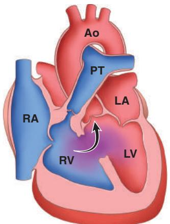 
A Classic tetralogy of Fallot
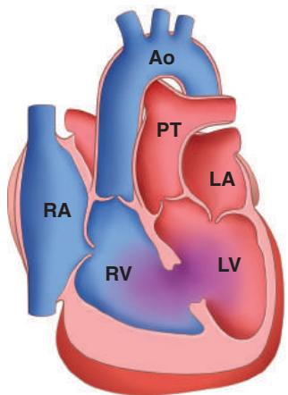 
With VSD 
B Complete transposition 
Fig. 11.4 Common congenital right-to-left shunts (cyanotic congenital heart disease). (A) Tetralogy of Fallot (arrow indicates direction of blood flow). (B) Transposition of the great vessels with and without VSD. Ao, Aorta; LA, left atrium; LV, left ventricle; PT, pulmonary trunk; RA, right atrium; RV, right ventricle.
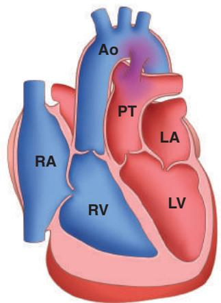 
Without VSD
congenital cardiac malformations (see Table 11.1). The four cardinal features are (Fig. 11.4A):
VSD 
- Right ventricular outflow tract obstruction (subpulmonary stenosis) 
- Overriding of the VSD by the aorta 
Right ventricular hypertrophy
All of the features of tetralogy of Fallot result from anterosuperior displacement of the infundibular septum leading to abnormal septation between the pulmonary trunk and the aortic root.
The heart is enlarged and "boot-shaped" as a consequence of right ventricular hypertrophy; the proximal aorta is dilated, while the pulmonary trunk is hypoplastic. The left-sided cardiac chambers are of normal size, while the right ventricular wall is markedly hypertrophied, sometimes even exceeding the thickness of the left ventricle. The VSD usually is large and lies in the
vicinity of the membranous portion of the interventricular septum; the aortic valve lies immediately over the VSD (overriding aorta) and is the major site of egress for blood flow from both ventricles. The obstruction of the right ventricular outflow most often is due to narrowing of the infundibulum (subpulmonic stenosis) but also can be caused by pulmonary valve stenosis or complete atresia of the valve and the proximal pulmonary arteries. In such cases, a persistent PDA or dilated bronchial arteries are the only route for blood to reach the lungs.
The hemodynamic consequences of tetralogy of Fallot are right-to-left shunting, decreased pulmonary blood flow, and increased aortic volumes. The clinical severity largely depends on the degree of the pulmonary outflow obstruction; even untreated, some patients can survive into adult life. Thus, if the pulmonic obstruction is mild, the condition resembles an isolated VSD because the high left-sided pressure causes only a left-to-right shunt with no cyanosis. More commonly, more severe degrees of pulmonic stenosis cause early cyanosis. Moreover, as the child grows and the heart increases in size, the pulmonic orifice does not expand proportionately, leading to progressive worsening of the stenosis. Fortuitously, the pulmonic outflow stenosis protects the pulmonary vasculature from pressure and volume overloads, so that pulmonary hypertension does not develop, and right ventricular failure is rare. Nevertheless, patients develop the typical sequelae of cyanotic heart disease, such as hypertrophic osteoarthropathy and polycythemia (due to hypoxia) with attendant hyperviscosity; right-to-left shunting also increases the risk for infective endocarditis and systemic embolization. Complete surgical repair is possible with classic tetralogy of Fallot but is more complicated in the setting of pulmonary atresia.
# Transposition of the Great Arteries
Transposition of the great arteries is a discordant connection of the ventricles to their vascular outflow. The embryologic defect is an abnormal formation of the truncal and aortopulmonary septa so that the aorta arises from the right ventricle and the pulmonary artery emanates from the left ventricle (Fig. 11.4B). The atrium-to-ventricle connections, however, are normal (concordant), with the right atrium joining the right ventricle and the left atrium emptying into the left ventricle.
The functional outcome is separation of the systemic and pulmonary circulations, a condition incompatible with postnatal life unless a shunt (such as a VSD) allows delivery of oxygenated blood to the aorta. Indeed, VSDs occur in one third of cases (see Fig. 11.4, B). There is marked right ventricular hypertrophy, since that chamber functions as the systemic ventricle; the left ventricle is hypoplastic, since it pumps only to the low-resistance pulmonary circulation. Some newborns with transposition of the great arteries have a patent foramen ovale or PDA that allows oxygenated blood to reach the aorta, but these tend to close; such infants typically require emergent surgical intervention within the first few days of life.
The dominant manifestation is cyanosis, with the prognosis depending on the magnitude of shunting, the degree of tissue hypoxia, and the ability of the right ventricle to maintain systemic pressures. Without surgery (even with stable shunting), most patients with uncorrected transposition of the great arteries die within the first months of life. However, improved surgical techniques now permit definitive repair, and such patients often survive into adulthood.
# Malformations Associated With Obstructive Lesions
Congenital obstruction of blood flow can occur at the level of the heart valves or more distally within a great vessel. Obstruction can also occur proximal to the valve, as with subpulmonic stenosis in tetralogy of Fallot. Relatively common examples of congenital obstructions are pulmonic valve stenosis, aortic valve stenosis or atresia, and coarctation of the aorta.
# Aortic Coarctation
Coarctation (narrowing, or constriction) of the aorta is a common form of obstructive congenital heart disease (see Table 11.1). Males are affected twice as often as females, although females with Turner syndrome frequently have coarctation. There are two classic forms (Fig. 11.5):
- An "infantile" preductal form featuring hypoplasia of the aortic arch proximal to a PDA 
- An "adult" postductal form consisting of a discrete ridgelike infolding of the aorta, adjacent to the ligamentum arteriosum
Coarctation can occur as a solitary defect, but in more than half of the cases is accompanied by a bicuspid aortic valve. Aortic valve stenosis, ASD, VSD, or mitral regurgitation also can be present.
andwithoutapatentductusarteriosus(PDA)(adultorpostductalform);arrowindicatesdirectionofbloodflow.Ao,Aorta;LA,leftatrium;LV,leftventricle;PT,pulmonarytrunk;RA,rightatrium;RV,rightventricle..jpg) 
Fig. 11.5 Coarctation of the aorta with ("infantile" or preductal form) and without a patent ductus arteriosus (PDA) ("adult" or postductal form); arrow indicates direction of blood flow. Ao, Aorta; LA, left atrium; LV, left ventricle; PT, pulmonary trunk; RA, right atrium; RV, right ventricle.
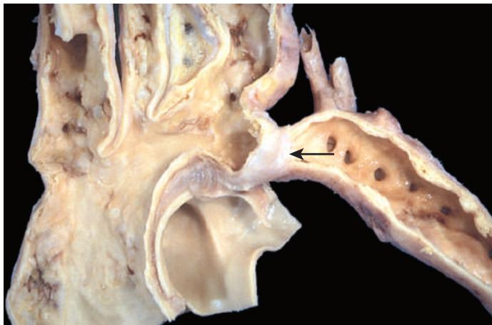 
Fig. 11.6 Coarctation of the aorta, postductal type. The coarctation is a segmental narrowing of the aorta (arrow). Such lesions typically manifest later in life than preductal coarctations. The dilated ascending aorta and major branch vessels are to the left of the coarctation. The lower extremities are perfused predominantly by way of dilated, tortuous collateral channels. (Courtesy of Sid Murphree, MD, Department of Pathology, University of Texas Southwestern Medical School, Dallas, Texas.)
Preductal coarctation is characterized by circumferential narrowing of the aortic segment between the left subclavian artery and the ductus arteriosus; the ductus typically is patent and is the main source of (unoxygenated) blood delivered to the distal aorta. The pulmonary trunk is dilated to accommodate the increased blood flow; because the right side of the heart now perfuses the body distal to the narrowed segment ("coarct"), the right ventricle typically is hypertrophied.
In the more common "adult" postductal coarctation, the aorta is sharply constricted by a tissue ridge adjacent to the nonpatent ligamentum arteriosum (Fig. 11.6). The constricted segment is made up of smooth muscle and elastic fibers derived from the aortic media. Proximal to the coarctation, the aortic arch and its branch vessels are dilated and the left ventricle is hypertrophied.
Clinical manifestations depend on the severity of the narrowing and the patency of the ductus arteriosus.
- Preductal coarctation with a PDA usually presents early in life, classically as cyanosis localized to the lower half of the body; without intervention, most affected infants die in the neonatal period. 
- Postductal coarctation without a PDA usually is asymptomatic, and the disease may remain unrecognized well into adult life. Classically, there is upper-extremity hypertension paired with weak pulses and relative hypotension in the lower extremities, associated with symptoms of claudication and coldness. Exuberant collateral circulation "around" the coarctation often develops through markedly enlarged intercostal and internal mammary arteries; expansion of the flow through these vessels can lead to radiographically visible "notching" of the ribs.
In most cases, significant coarctations are associated with systolic murmurs and occasionally palpable thrills. Balloon dilation and stent placement or surgical resection with end-to-end anastomosis (or replacement of the affected aortic segment by a prosthetic graft) yields excellent results.
# CONGENITAL HEART DISEASE
- Congenital heart disease represents defects of cardiac chambers or the great vessels; these either result in shunting of blood between the right- and left-sided circulation or cause outflow obstructions. Lesions range from relatively asymptomatic to rapidly fatal. Environmental (toxic or infectious) and genetic causes both contribute. 
- Malformations associated with Left-to-right shunts are the most common and include ASDs, VSDs, and PDA. Shunting results in right-sided volume overload that eventually causes pulmonary hypertension and, with reversal of flow and right-to-left shunting, cyanosis (Eisenmenger syndrome). 
- Malformations associated with Right-to-left shunts include tetralogy of Fallot and transposition of the great arteries. These lesions cause early-onset cyanosis and are associated with polycythemia, hypertrophic osteoarthropathy, and paradoxical embolization. 
- Obstructive lesions include forms of aortic coarctation; the clinical severity of these lesions depends on the degree of stenosis and the patency of the ductus arteriosus.
# ISCHEMIC HEART DISEASE
Ischemic heart disease (IHD) is a broad term encompassing several closely related syndromes caused by myocardial ischemia—an imbalance between cardiac blood supply (perfusion) and myocardial oxygen and nutritional requirements. Since cardiac myocytes generate energy almost exclusively through mitochondrial oxidative phosphorylation, cardiac function is strictly dependent upon the continuous flow of oxygenated blood through the coronary arteries. Despite dramatic improvements in therapy in the past quarter century, IHD in its various forms remains the leading cause of mortality in the United States and other developed nations, accounting for 7.5 million deaths worldwide each year.
In more than $90\%$ of cases, IHD is a consequence of reduced coronary blood flow secondary to obstructive atherosclerotic vascular disease (Chapter 10). Thus, unless otherwise specified, IHD usually is synonymous with coronary artery disease (CAD). In most cases, the various syndromes of IHD are consequences of coronary atherosclerosis that has been gradually progressing for decades (beginning even in childhood or adolescence). In the remaining cases, cardiac ischemia may be the result of increased demand (e.g., with increased heart rate or hypertension); diminished blood volume (e.g., with hypotension or shock); diminished oxygenation (e.g., due to pneumonia or CHF); or diminished oxygen-carrying capacity (e.g., due to anemia or carbon monoxide poisoning).
The manifestations of IHD are a direct consequence of the insufficient blood supply to the heart. The clinical presentation may include one or more of the following cardiac syndromes:
- Angina pectoris (literally, "chest pain"). Ischemia induces pain but is insufficient to cause myocyte death. Angina can be stable (occurring predictably at certain levels of exertion), can be caused by vessel spasm (Prinzmetal angina), or can be unstable (occurring with progressively less exertion or even at rest). 
- Myocardial infarction (MI). This occurs when the severity or duration of ischemia is sufficient to cause cardiomyocyte death. 
- Chronic IHD with CHF. This progressive cardiac decompensation, which occurs after acute MI or secondary to accumulated small ischemic insults, eventually precipitates mechanical pump failure. 
- Sudden cardiac death (SCD). This can occur as a consequence of tissue damage from MI, but most commonly results from a lethal arrhythmia without myocyte necrosis (see "Arrhythmias" later in the chapter).
The term acute coronary syndrome is applied to any of the three catastrophic manifestations of IHD—unstable angina, MI, and SCD.
# Epidemiology
More than 700,000 Americans experience a MI each year, and roughly half of those affected die. As troubling as this toll is, it represents a spectacular advance; since peaking in 1963, the mortality related to IHD in the United States has declined by $50\%$ . The improvement is largely attributed to interventions that have diminished cardiac risk factors (behaviors or conditions that promote atherosclerosis; Chapter 10), in particular smoking cessation programs, hypertension and diabetes treatment, and use of cholesterol-lowering agents. To a lesser extent, diagnostic and therapeutic advances also have contributed; these include aspirin prophylaxis, better arrhythmia control, establishment of coronary care units, thrombolysis for MI, angioplasty and endovascular stenting, and coronary artery bypass graft surgery. Maintaining this downward trend in mortality will be particularly challenging given the predicted longevity of "baby boomers," as well as the epidemic of obesity that is sweeping the United States and other parts of the world.
IHD is a consequence of inadequate coronary perfusion relative to myocardial demand, usually as a consequence of a preexisting ("fixed") atherosclerotic occlusion of the coronary arteries and new, superimposed thrombosis and/or vasospasm. Atherosclerotic narrowing can affect any of the coronary arteries—left anterior descending (LAD), left circumflex (LCX), and right coronary artery (RCA)—singly or in combination. Clinically significant plaques tend to occur within the first several centimeters of the LAD and LCX takeoff from the aorta, and along the entire length of the RCA. Sometimes, secondary branches also are involved (i.e., diagonal branches of the LAD, obtuse marginal branches of the LCX, or posterior descending branch of the RCA).
Fixed obstructions that occlude less than $70\%$ of a coronary vessel lumen typically are asymptomatic, even with exertion. In comparison, lesions that occlude more than $70\%$ of a vessel lumen—resulting in so-called "critical stenosis"—generally cause symptoms in the setting of increased demand; with critical stenosis, certain levels of exertion predictably cause chest pain, and the patient is said to have stable angina. A fixed stenosis that occludes $90\%$ or more of a vascular lumen can lead to inadequate coronary blood flow with symptoms even at rest—one of the forms of unstable angina (see "Angina Pectoris" later in the chapter).
Of importance, if an atherosclerotic lesion progressively occludes a coronary artery at a sufficiently slow rate over years, other coronary vessels may undergo remodeling and provide compensatory blood flow to the area at risk; such collateral perfusion can subsequently protect against MI, even if the original vessel becomes completely occluded. Unfortunately, with acute coronary blockage, there is no time for collateral flow to develop and infarction results.
The following elements contribute to the development and consequences of coronary atherosclerosis:
- Inflammation plays an essential role at all stages of atherosclerosis, from inception to plaque rupture (Chapter 10). It begins with the interaction of endothelial cells and circulating leukocytes, resulting in T-cell and macrophage recruitment and activation. These cells drive subsequent smooth muscle cell accumulation and proliferation, with associated matrix production, superimposed on an atheromatous core of lipid, cholesterol, calcification, and necrotic debris. At later stages, destabilization of atherosclerotic plaque can occur through macrophage metalloproteinase secretion.
- Thrombosis associated with an eroded or ruptured plaque triggers the acute coronary syndromes. Partial vascular occlusion by a newly formed thrombus on a disrupted atherosclerotic plaque can wax and wane with time and lead to unstable angina or sudden death; alternatively, even partial luminal occlusion by a thrombus can compromise blood flow sufficiently to cause a infarction of the innermost zone of the myocardium (subendocardial infarct). Organizing thrombi produce potent activators of smooth muscle proliferation, which can contribute to the growth of atherosclerotic lesions. Mural thrombi in a coronary artery can also embolize; indeed, small emboli can be found in the distal intramyocardial circulation (along with associated microinfarcts) at autopsy of patients with unstable angina. In the most serious case, completely obstructive thrombus over a disrupted plaque can cause massive MI.
- Vasoconstriction directly compromises lumen diameter; moreover, by increasing local mechanical shear forces, vessel spasm can potentiate plaque disruption. Vasoconstriction in atherosclerotic plaques can be stimulated by the following:
- Circulating adrenergic agonists 
- Locally released platelet contents 
- Imbalance between endothelial cell-relaxing factors (e.g., nitric oxide) and -contracting factors (e.g., endothelin) due to endothelial dysfunction 
- Mediators released from perivascular inflammatory cells
# Acute Plaque Change
Onset of myocardial ischemia depends not only on the extent and severity of fixed atherosclerotic disease but also on dynamic changes in coronary plaque morphology. In most patients, unstable angina, infarction, and sudden cardiac death occur because of abrupt plaque change followed by thrombosis—hence the term acute coronary syndrome (Fig. 11.7).
The initiating event is typically a sudden disruption (ranging from erosion to rupture) of a partially occlusive plaque. More than one mechanism of injury may be involved: rupture, fissuring, or ulceration of plaques expose
.jpg) 
Fig. 11.7 Diagram of sequential progression of coronary artery lesions leading to various acute coronary syndromes. (Modified and redrawn from Schoen FJ: Interventional and surgical cardiovascular pathology: clinical correlations and basic principles, Philadelphia, 1989, Saunders, p 63.)
highly thrombogenic constituents or underlying subendothelial basement membrane, leading to rapid thrombosis. In addition, hemorrhage into the core of plaques can expand plaque volume, thereby acutely exacerbating the degree of luminal occlusion.
Factors that trigger plaque erosion include endothelial injury and apoptosis, likely attributable to some combination of inflammatory and toxic exposures. Acute plaque rupture, on the other hand, involves factors that influence plaque susceptibility to disruption by mechanical stress. These include intrinsic aspects of plaque composition and structure (Chapter 10) and extrinsic factors, such as blood pressure and platelet reactivity:
- Plaques that contain large atheromatous cores or have thin overlying fibrous caps are more likely to rupture and are therefore termed vulnerable. Fissures frequently occur at the junction of the fibrous cap and the adjacent normal plaque-free arterial segment, where the mechanical stresses are highest and the fibrous cap is thinnest. Fibrous caps also are continuously remodeling; their overall balance of collagen synthesis versus degradation determines mechanical strength and plaque stability. Collagen is produced by smooth muscle cells and degraded by the action of metalloproteases elaborated by macrophages. Consequently, atherosclerotic lesions with a paucity of smooth muscle cells or large numbers of inflammatory cells are vulnerable to rupture. Of interest, statins (inhibitors of hydroxymethylglutaryl Co-A reductase, a key enzyme in cholesterol synthesis) can provide additional benefit in CAD and IHD by reducing plaque inflammation and increasing plaque stability, effects distinct from and their primary cholesterol-lowering activity.
- Influences extrinsic to the plaque also are important. Adrenergic stimulation can put physical stress on the plaque by causing hypertension or local vasospasm. Indeed, the surge in adrenergic stimulation associated with awakening and rising may underlie the observation that the incidence of acute MI is highest between 6 AM and 12 noon. Intense emotional stress also leads to adrenergic stimulation, explaining the association of natural catastrophes such as earthquakes and floods with secondary waves of MIs in susceptible individuals.
In a majority of cases, the "culprit lesion" in patients who suffer an MI was not critically stenotic or even symptomatic before its rupture. As noted previously, anginal symptoms typically occur with fixed lesions exhibiting greater than $70\%$ chronic occlusion. Pathologic and clinical studies show that two thirds of ruptured plaques are less than or equal to $50\%$ stenotic before plaque rupture, and $85\%$ exhibit initial stenotic occlusion of less than or equal to $70\%$ . Thus, the worrisome conclusion is that a large number of asymptomatic adults are at significant risk for a catastrophic coronary event. At present, it is impossible to predict plaque rupture in any given patient.
Plaque disruption and ensuing non-occlusive thrombosis also are common, repetitive, and often clinically silent complications of atheromas. The healing of such subclinical plaque disruption and overlying thrombosis is an important mechanism by which atherosclerotic lesions progressively enlarge (Fig. 11.7).
# Angina Pectoris
Angina pectoris is an intermittent chest pain caused by transient, reversible myocardial ischemia. The pain is a consequence of the ischemia-induced release of adenosine, bradykinin, and other molecules that stimulate autonomic nerves. The following three variants are recognized:
- Typical or stable angina is predictable episodic chest pain associated with particular levels of exertion or some other increased demand (e.g., tachycardia). The pain is described as a crushing or squeezing substernal sensation that often radiates down the left arm or to the left jaw (referred pain). The pain usually is relieved by rest (reducing demand) or by drugs such as nitroglycerin, a vasodilator that increases coronary perfusion. 
- Prinzmetal or variant angina occurs at rest and is caused by coronary artery spasm. Although such spasms typically occur on or near existing atherosclerotic plaques, a completely normal vessel can be affected. Prinzmetal angina typically responds promptly to vasodilators such as nitroglycerin and calcium channel blockers. 
- Unstable angina (also called crescendo angina) is characterized by increasingly frequent pain, precipitated by progressively less exertion or even occurring at rest. Unstable angina is associated with plaque disruption and superimposed thrombosis, distal embolization of the thrombus, and/or vasospasm; it can be a harbinger of MI, portending complete vascular occlusion.
# Myocardial Infarction
Myocardial infarction (MI), also commonly referred to as "heart attack," is necrosis of the heart muscle resulting from ischemia. The major underlying cause of IHD is atherosclerosis; while MIs can occur at virtually any age, the frequency rises progressively with aging and with increasing risk factors for atherosclerosis (Chapter 10). Nevertheless, approximately $10\%$ of MIs occur before 40 years of age, and $45\%$ occur before 65 years of age. Blacks and whites are equally affected. Men are at greater risk than women, although the gap progressively narrows with age. In general, women tend to be protected against MI during their reproductive years. However, menopause—with declining estrogen production—is associated with exacerbation of coronary artery disease, and IHD is the most common cause of death in older adult women.
The vast majority of MIs are caused by acute thrombosis within coronary arteries (Fig. 11.7). In most instances, disruption or erosion of preexisting atherosclerotic plaque serves as the nidus for thrombus generation, vascular occlusion, and subsequent infarction of the perfused myocardium. In $10\%$ of MIs, however, transmural infarction occurs in the absence of occlusive atherosclerotic vascular disease; such infarcts are mostly ascribed to coronary artery vasospasm or to embolization from mural thrombi (e.g., in the setting of atrial fibrillation) or from valve vegetations. Occasionally, especially with infarcts limited to the innermost (subendocardial) myocardium, thrombi or emboli are absent. In such cases, severe fixed coronary
atherosclerosis leads to marginal perfusion of the heart. In this setting, a prolonged period of increased demand (e.g., due to tachycardia or hypertension) can lead to ischemic necrosis of endomyocardium, the portion of the heart that is most distal to the epicardial vessels. Finally, ischemia without detectable atherosclerosis or thromboembolic disease can be caused by disorders of small intramyocardial arterioles, including vasculitis, amyloid deposition, or stasis, as in sickle cell disease.
# Coronary Artery Occlusion
In a typical MI, the following sequence of events takes place:
- An atheromatous plaque is eroded or suddenly disrupted by endothelial injury, intraplaque hemorrhage, or mechanical forces, exposing subendothelial collagen and necrotic plaque contents to the blood. 
- Platelets adhere, aggregate, and are activated, releasing thromboxane $\mathrm{A}_2$ , adenosine diphosphate (ADP), and serotonin—causing further platelet aggregation and vasospasm (Chapter 4). 
- Activation of coagulation by exposure of tissue factor and other mechanisms adds to the growing thrombus. 
- Within minutes, the thrombus can evolve to completely occlude the coronary artery lumen.
The evidence for this scenario derives from autopsy studies of patients dying of acute MI, as well as imaging studies demonstrating a high frequency of thrombotic occlusion early after MI. Angiography performed within 4 hours of the onset of MI demonstrates coronary thrombosis in almost $90\%$ of cases. When angiography is performed 12 to 24 hours after onset of symptoms, however, evidence of thrombosis is seen in only $60\%$ of patients, even without intervention. Thus, at least some occlusions clear spontaneously through lysis of the thrombus or relaxation of spasm. This sequence of events in a typical MI also has therapeutic implications: early thrombolysis and/or angioplasty can be highly successful in limiting the extent of myocardial necrosis.
# Myocardial Response to Ischemia
Loss of blood supply has profound functional, biochemical, and morphologic consequences for the myocardium. Within seconds of vascular obstruction, aerobic metabolism ceases, leading to a drop in adenosine triphosphate (ATP) and accumulation of potentially noxious metabolites (e.g., lactic acid) in the cardiac myocytes. The functional consequence is a rapid loss of contractility, occurring within a minute or so of the onset of ischemia. Ultrastructural changes (including myofibrillar relaxation, glycogen depletion, cellular and mitochondrial swelling) are also seen. These early changes are reversible. Only prolonged ischemia lasting at least 20 to 40 minutes causes irreversible damage and coagulative necrosis of myocytes (Chapter 2). With longer periods of ischemia, vessel injury ensues, leading to superimposed microvascular thrombosis.
Thus, if blood flow is restored before irreversible injury occurs, myocardium can be preserved; this is the goal of early diagnosis and prompt intervention by thrombolysis or angioplasty. However, as discussed later, reperfusion can have deleterious effects. Even if reperfusion is timely,
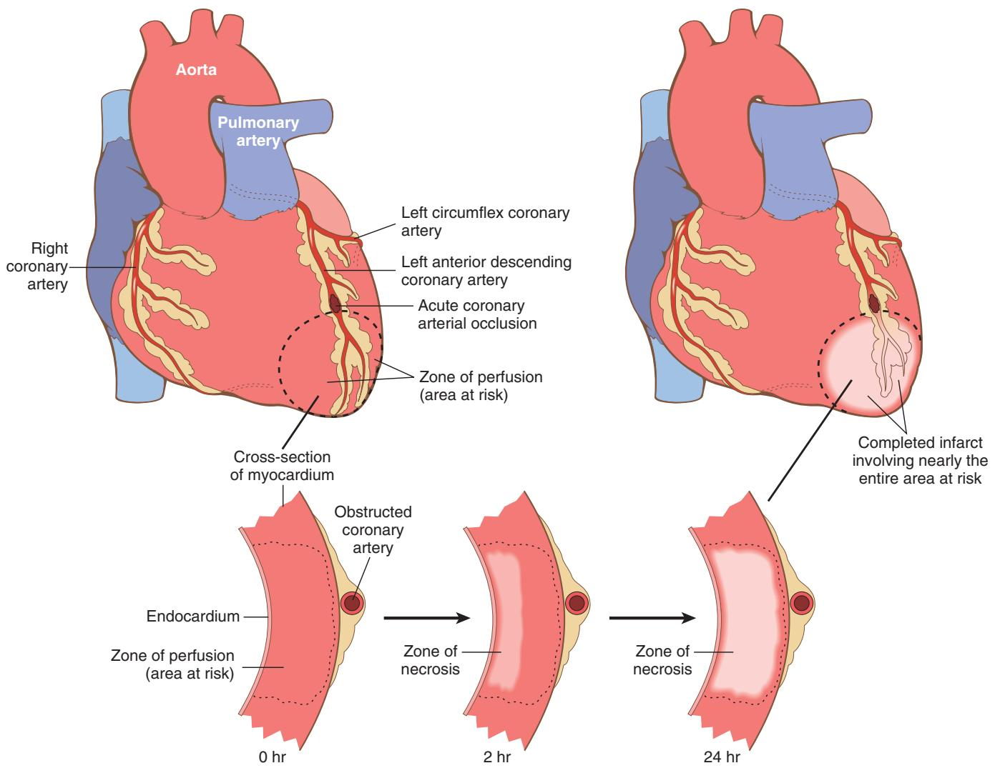 
Fig. 11.8 Progression of myocardial necrosis after coronary artery occlusion. A transmural segment of myocardium that is dependent on the occluded vessel for perfusion constitutes the area at risk (outlined). Necrosis begins in the subendocardial region in the center of the ischemic zone and with time expands to involve the entire wall thickness. Note that a very narrow zone of myocardium immediately beneath the endocardium is spared from necrosis because it can be oxygenated by diffusion from the ventricle.
postischemic myocardium can be profoundly dysfunctional for a number of days due to persistent abnormalities in cellular biochemistry that result in a noncontractile state (stunned myocardium). Such stunning can be severe enough to produce transient but reversible cardiac failure.
Myocardial ischemia also contributes to arrhythmias, probably by causing electrical instability (irritability) of ischemic regions of the heart. Although massive myocardial damage can cause a fatal mechanical failure, sudden cardiac death in the setting of myocardial ischemia most often (in $80\%$ to $90\%$ of cases) is due to ventricular fibrillation caused by myocardial irritability.
Irreversible injury of ischemic myocytes first occurs in the subendocardial zone (Fig. 11.8). As already mentioned, this region is especially susceptible to ischemia because it is the last area to receive blood delivered by the epicardial vessels, and also because it is exposed to relatively high intramural pressures, which act to impede the inflow of blood. With more prolonged ischemia, a wavefront of cell death moves through other regions of the myocardium,
driven by progressive tissue edema and myocardial-derived reactive oxygen species and inflammatory mediators. An infarct usually achieves its full extent within 3 to 6 hours; in the absence of intervention, an infarct caused by occlusion of an epicardial vessel can involve the entire wall thickness (transmural infarct). Clinical intervention within this critical window of time can lessen the size of the infarct within the "territory at risk."
# Patterns of Infarction
The location, size, and morphologic features of an acute myocardial infarct depend on multiple factors:
- Size and distribution of the involved vessel (Fig. 11.9) 
- Rate of development and duration of the occlusion 
- Metabolic demands of the myocardium (affected, for example, by blood pressure and heart rate) 
- Extent of collateral supply
Acute occlusion of the proximal left anterior descending (LAD) artery is the cause of $40\%$ to $50\%$ of all MIs and
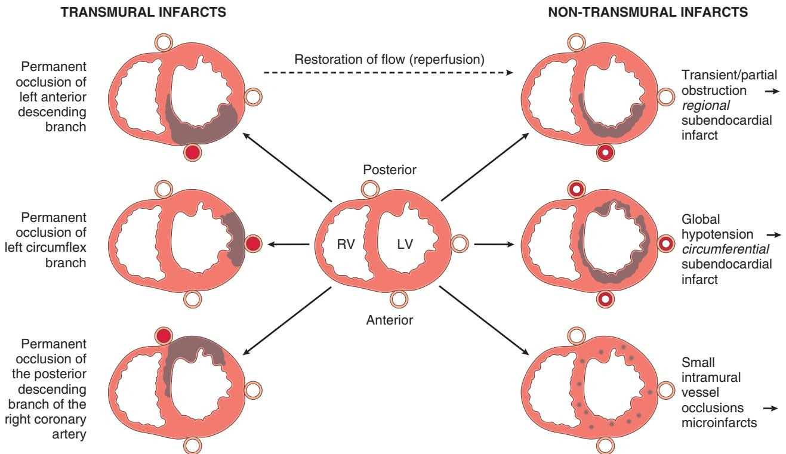 
Fig. 11.9 Dependence of myocardial infarction on the location and nature of the diminished perfusion. Left, Patterns of transmural infarction resulting from major coronary artery occlusion. The right ventricle may be involved with occlusion of the right main coronary artery (not depicted). Right, Patterns of infarction resulting from partial or transient occlusion (top), global hypotension superimposed on fixed three-vessel disease (middle), or occlusion of small intramyocardial vessels (bottom).
typically results in infarction of the anterior wall of the left ventricle, the anterior two thirds of the ventricular septum, and most of the heart apex; more distal occlusion of the same vessel may affect only the apex. Similarly, acute occlusion of the proximal left circumflex (LCX) artery (seen in $15\%$ to $20\%$ of MIs) causes necrosis of the lateral left ventricle, and proximal right coronary artery (RCA) occlusion $(30\%$ to $40\%$ of MIs) affects much of the right ventricle. Coronary occlusion in the proximal left anterior descending artery has been dubbed the "widow maker" because so much myocardial territory is perfused by that vessel, and acute obstructions are often fatal.
The posterior third of the septum and the posterior left ventricle are perfused by the posterior descending artery. The posterior descending artery can arise from either the RCA (in $90\%$ of individuals) or the LCX. By convention, the coronary artery—either RCA or LCX—that gives rise to the posterior descending artery and thereby perfuses portions of the inferior/posterior left ventricle and the posterior third of the septum is considered the dominant vessel. Thus, in a right dominant heart, occlusion of the RCA can lead to posterior septal and posterior wall ischemic injury. In comparison, in a left dominant heart, where the posterior descending artery arises from the circumflex artery, occlusion of the LCX generally affects the left lateral wall as well as the posterior third of the septum, and the inferior and posterior wall of the left ventricle.
Occlusions also can occur within secondary branches, such as the diagonal branches of the LAD artery or marginal branches of the LCX artery. Interestingly, atherosclerosis is primarily a disease of epicardial vessels; significant
atherosclerosis or thrombosis of penetrating intramyocardial branches of coronary arteries is rare—although these can be affected by vasculitis or vasospasm, and can be occluded by embolization.
Even though the three major coronary arteries are end arteries, these epicardial vessels are interconnected by numerous intercoronary anastomoses (collateral circulation). Although these channels are normally closed, gradual narrowing of one artery allows blood to flow from high- to low-pressure areas through the collateral channels. In this manner, gradual collateral dilation can provide adequate perfusion to areas of the myocardium despite occlusion of an epicardial vessel. Based on the size of the involved vessel and the degree of collateral circulation, myocardial infarcts may take one of the following patterns:
- Transmural infarctions involve the full thickness of the ventricle and are caused by epicardial vessel occlusion through a combination of chronic atherosclerosis and acute thrombosis; such transmural MIs typically yield ST segment elevations on the electrocardiogram (ECG) and can have negative Q waves with loss of R wave amplitude. These infarcts are also called ST-segment elevated MIs (STEMIs). 
- Subendocardial infarctions are MIs limited to the inner third of the myocardium; these infarcts typically do not exhibit ST segment elevations or Q waves on the ECG tracing (so-called "non-ST-segment elevated MIs" or "NSTEMIs"), although they can have ST-segment depressions or T wave abnormalities. As mentioned earlier, the subendocardial region is most vulnerable to hypoperfusion and hypoxia. Thus, in the setting of
severe coronary artery disease, transient decreases in oxygen delivery (as from hypotension, anemia, or pneumonia) or increases in oxygen demand (as with tachycardia or hypertension) can cause subendocardial ischemic injury. This pattern also can occur when an occlusive thrombus lyses before a full-thickness infarction can develop.
- Microscopic infarcts occur in the setting of small-vessel occlusions and may not show any diagnostic ECG changes. These can occur in the setting of vasculitis, embolization of valve vegetations or mural thrombi, or vessel spasm due to elevated catecholamines, as may occur in extreme emotional stress, with certain tumors (e.g., pheochromocytoma), or as a consequence of cocaine use.
Nearly all transmural infarcts (involving $50\%$ or more of the ventricle thickness) affect at least a portion of the left ventricle and/or interventricular septum. Roughly $15\%$ to $30\%$ of MIs that involve the posterior or posteroseptal wall also extend into the right ventricle. Isolated right ventricle infarcts occur in only $1\%$ to $3\%$ of cases. Even in transmural infarcts, a narrow rim (approximately $0.1 \mathrm{~mm}$ ) of viable subendocardial myocardium is preserved by diffusion of oxygen and nutrients from the ventricular lumen.
The gross and microscopic appearance of an MI depends on the age of the injury. Areas of damage progress through a highly characteristic sequence of morphologic changes from coagulative necrosis, to acute and then chronic inflammation, to fibrosis
(Table 11.2). Myocardial necrosis proceeds invariably to scar formation without any significant regeneration; studies looking at whether tissue stem cells can be used to regenerate functional myocardium are ongoing but have yet to bear fruit.
Gross and/or microscopic recognition of very recent myocardial infarcts can be challenging, particularly when death occurs within a few hours. Myocardial infarcts less than 12 hours old usually are not grossly apparent. However, infarcts more than 3 hours old can be visualized by exposing myocardium to vital stains, such as triphenyltetrazolium chloride, a substrate for lactate dehydrogenase. Because this enzyme is depleted in the area of ischemic necrosis (it leaks out of the damaged cells), the infarcted area is unstained (pale), while old scars appear white and glistening (Fig. 11.10). By 12 to 24 hours after MI, an infarct usually can be grossly identified by a red-blue discoloration caused by stagnated, trapped blood. Thereafter, infarcts become progressively better delineated as soft, yellow-tan areas; by 10 to 14 days, infarcts are rimmed by hyperemic (highly vascularized) granulation tissue. Over the succeeding weeks, the infarcted tissue evolves to a fibrous scar.
The microscopic appearance also undergoes a characteristic sequence of changes (see Table 11.2 and Fig. 11.11). Typical features of coagulative necrosis (Chapter 2) become detectable within 4 to 12 hours of infarction. "Wavy fibers" also can be present at the edges of an infarct; these reflect the stretching and buckling of noncontractile dead fibers. Sublethal ischemia can also induce intracellular myocyte vacuolization; such myocytes are viable but frequently contract poorly.
Necrotic myocardium elicits acute inflammation (typically most prominent 1 to 3 days after MI), followed by a wave of macrophages that remove necrotic myocytes and neutrophil
Table 11.2 Evolution of Morphologic Changes in Myocardial Infarction 
Time FrameGross FeaturesLight Microscopic FindingsElectron Microscopic FindingsReversible Injury0-1/2 hourNoneNoneRelaxation of myofibrils; glycogen loss; mitochondrial swellingIrreversible Injury1/2-4 hoursNoneUsually none; variable waviness of fibers at borderSarcolemmal disruption; mitochondrial amorphous densities4-12 hoursOccasionally dark mottlingBeginning coagulation necrosis; edema; hemorrhage12-24 hoursDark mottlingOngoing coagulation necrosis; pyknosis of nuclei; hypereosinophilic appearance of myocytes; marginal contraction band necrosis; beginning neutrophilic infiltrate1-3 daysMottling with yellow-tan infarct centerCoagulation necrosis with loss of nuclei and striations; interstitial infiltrate of neutrophils3-7 daysHyperemic border; central yellow-tan softeningBeginning disintegration of dead myofibers, with dying neutrophils; early phagocytosis of dead cells by macrophages at infarct border7-10 daysMaximally yellow-tan and soft, with depressed red-tan marginsWell-developed phagocytosis of dead cells; early formation of fibrovascular granulation tissue at margins10-14 daysRed-gray depressed infarct bordersWell-established granulation tissue with new blood vessels and collagen deposition2-8 weeksGray-white scar, progressive from border toward core of infarctIncreased collagen deposition, with decreased cellularity&gt;2 monthsScarring completeDense collagenous scar
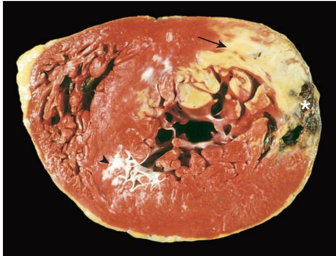 
Fig. 11.10 Acute myocardial infarct of the posterolateral left ventricle demonstrated by a lack of triphenyltetrazolium chloride staining in areas of necrosis (arrow); the absence of staining is due to enzyme leakage after cell death. Note the anterior scar (arrowhead), indicative of remote infarction. The myocardial hemorrhage at the right edge of the infarct (asterisk) is due to ventricular rupture, and was the acute cause of death in this patient (specimen is oriented with the posterior wall at the top).
fragments (most pronounced 5 to 10 days after MI). The infarcted zone is progressively replaced by granulation tissue (most prominent 1 to 2 weeks after MI), which in turn forms the provisional scaffolding upon which dense collagenous scar forms. In most instances, scarring is well advanced by the end of the sixth week, but the efficiency of repair depends on the size of the original lesion and the ability of the host tissues to heal. Healing requires the migration of inflammatory cells and ingrowth of new vessels from the infarct margins. Thus, an MI heals from its borders toward the center, and a large infarct may not heal as fast or as completely as a small one. Moreover, malnutrition, poor vasculature, or exogenous anti-inflammatory steroids can impede infarct scarring (Chapter 3). Once an MI is completely healed, it is impossible to distinguish its age: whether present for 8 weeks or 10 years, fibrous scars look the same.
# Infarct Modification by Reperfusion
The therapeutic goal in acute MI is restoration of tissue perfusion as quickly as possible (hence the adage "time is myocardium"). Such reperfusion is achieved by thrombolysis (dissolution of thrombus by tissue plasminogen activator), angioplasty, or coronary arterial bypass graft.
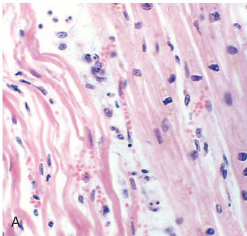
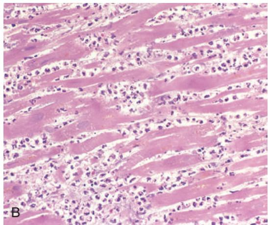
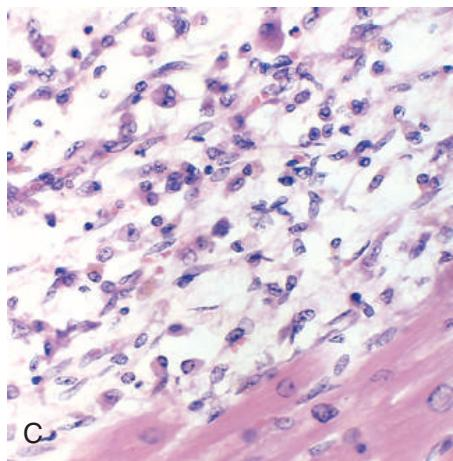 
Fig. 11.11 Microscopic features of myocardial infarction and its repair. (A) One-day-old infarct showing coagulative necrosis and wavy fibers, compared with adjacent normal fibers (right). Necrotic cells are separated by edema fluid. (B) Dense neutrophilic infiltrate in the area of a 2- to 3-day-old infarct. (C) Nearly complete removal of necrotic myocytes by phagocytic macrophages (7 to 10 days). (D) Granulation tissue characterized by loose connective tissue and abundant capillaries. (E) Healed myocardial infarct consisting of a dense collagenous scar. A few residual cardiac muscle cells are present. (D) and (E) are Masson's trichrome stain, which stains collagen blue.
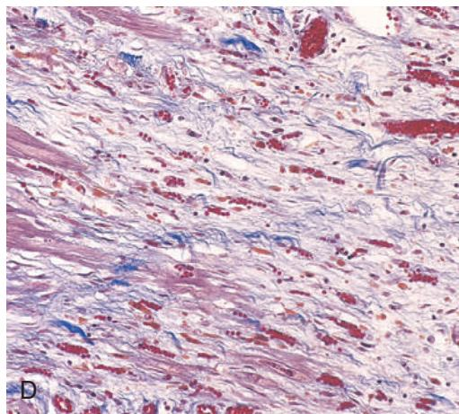
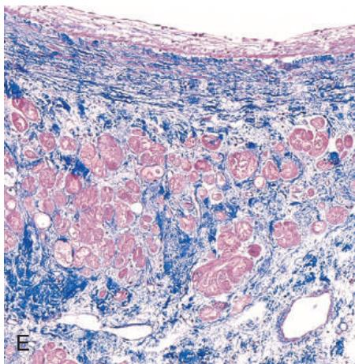
Unfortunately, while preservation of a viable (but at-risk) heart can improve both short- and long-term outcomes, reperfusion is not an unalloyed blessing. Indeed, late restoration of blood flow into ischemic tissues can incite greater local damage than might otherwise have occurred so-called "reperfusion injury".
The factors that contribute to reperfusion injury include the following:
- Mitochondrial dysfunction. Ischemia alters the mitochondrial membrane permeability, which allows proteins to move into the mitochondria. This leads to swelling and rupture of the outer membrane, releasing mitochondrial contents that promote apoptosis. 
- Myocyte hypercontracture. During periods of ischemia, the intracellular levels of calcium are increased as a result of impaired calcium cycling and sarcolemmal damage. After reperfusion, the contraction of myofibrils is augmented and uncontrolled, causing cytoskeletal damage and cell death. 
- Free radicals, including superoxide anion $(\bullet \mathrm{O}_2^-)$ , hydrogen peroxide $(\mathrm{H}_2\mathrm{O}_2)$ , hypochlorous acid (HOCl), nitric oxide-derived peroxynitrite, and hydroxyl radicals ( $\bullet$ OH). These are produced within minutes of reperfusion and cause damage to the myocytes by altering membrane proteins and phospholipids. 
- Leukocyte aggregation may occlude the microvasculature and contribute to the "no-reflow" phenomenon. Further, leukocytes elaborate proteases and elastases that cause cell death. 
- Platelet and complement activation also contribute to microvascular injury. Complement activation is thought to play a role in the no-reflow phenomenon by injuring the endothelium.
The typical appearance of reperfused myocardium in the setting of an acute MI is shown in Figure 11.12. Such infarcts are hemorrhagic as a consequence of vascular injury and leakiness. Microscopically, irreversibly damaged myocytes after reperfusion develop contraction band necrosis; in this pathologic process, intense eosinophilic bands of hypercontracted sarcomeres are created by
an influx of calcium across plasma membranes that heightens actin-myosin interactions. In the absence of ATP, the sarcomeres cannot relax and get stuck in an agonal tetanic state. Thus, while reperfusion can salvage reversibly injured cells, it also alters the morphology of irreversibly injured cells.
The classic MI is heralded by severe, crushing substernal chest pain (or pressure) that can radiate to the neck, jaw, epigastrium, or left arm. In contrast to angina pectoris, the associated pain typically lasts several minutes to hours, and is not relieved by nitroglycerin or rest. However, in a substantial minority of patients $(10\%$ to $15\%)$ , MIs present with the atypical signs and symptoms, and may even be entirely asymptomatic. Such "silent" infarcts are particularly common in patients with underlying diabetes mellitus (in which autonomic neuropathy may prevent perception of pain) and in older adults.
The pulse generally is rapid and weak, and patients are often diaphoretic (sweating) and nauseous (particularly with posterior wall MIs). Dyspnea is common, resulting from impaired myocardial contractility and dysfunction of the mitral valve apparatus, with resultant acute pulmonary congestion and edema. With massive MIs (involving more than $40\%$ of the left ventricle), cardiogenic shock develops.
Electrocardiographic abnormalities are important for the diagnosis of MI; these include Q waves, ST segment changes, and T wave inversions (the latter two representing abnormalities in myocardial repolarization). Arrhythmias caused by electrical abnormalities in the ischemic myocardium and conduction system are common; indeed, sudden cardiac death from a lethal arrhythmia accounts for the vast majority of MI-related deaths occurring before hospitalization.
The laboratory evaluation of MI is based on measuring blood levels of macromolecules that leak out of injured myocardial cells through damaged cell membranes (Fig. 11.13). These molecules include myoglobin, cardiac troponins T and I (TnT, TnI), creatine kinase (CK;
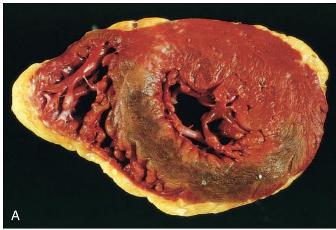 
Fig. 11.12 Reperfused myocardial infarction. (A) The transverse heart slice (stained with triphenyl tetrazolium chloride) exhibits a large anterior wall myocardial infarction that is hemorrhagic because of bleeding from damaged vessels. The posterior wall is at the top. (B) Hemorrhage and contraction bands, visible as prominent hypereosinophilic cross-striations spanning myofibers (arrow), are seen microscopically.
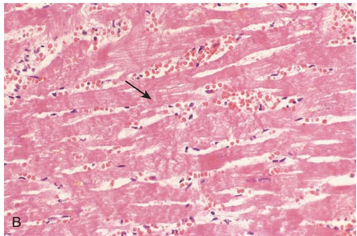
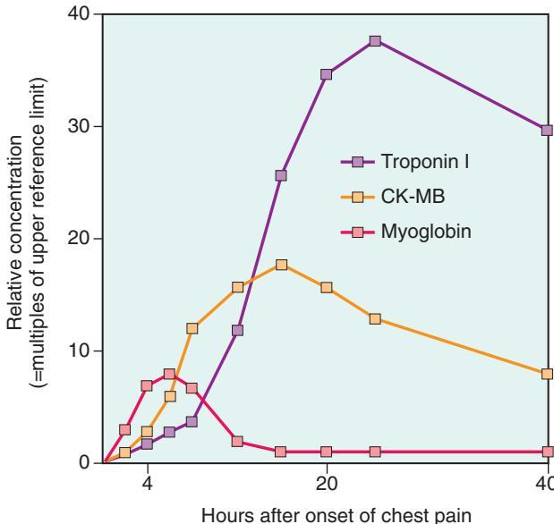 
Fig. 11.13 Acute increases in myocardium-derived troponin I, myocardial creatine kinase (CK-MB), and myoglobin following myocardial infarction. The kinetics of enzyme elevations can be used to estimate the timing of the MI. Myoglobin can also be measured, but is substantially less sensitive and specific for myocardial injury.
specifically the myocardial isoform, CK-MB), and lactate dehydrogenase. Troponins (and to a lesser extent CK-MB) have high specificity and sensitivity for myocardial damage.
- CK-MB has long been the biomarker of myocardial injury, but is now tested for less frequently in favor of the more sensitive cardiac-specific troponins. Total CK activity is not a reliable marker of cardiac injury since various isoforms of CK are found in non-cardiac tissues. However, the CK-MB isoform—principally derived from myocardium, but also present at low levels in skeletal muscle—is a more specific indicator of heart damage. CK-MB activity begins to rise within 2 to 4 hours of MI, peaks at 24 to 48 hours, and returns to normal within approximately 72 hours. 
- TnI and TnT normally are not found in the circulation; however, after acute MI, both are detectable within 2 to 4 hours, with levels peaking at 48 hours and remaining elevated for 7 to 10 days. Persistence of elevated troponin levels allows the diagnosis of an acute MI to be made long after CK-MB levels have returned to normal. With reperfusion, both troponin and CK-MB levels may peak earlier owing to more rapid washout of the enzyme from the necrotic tissue.
# Consequences and Complications of Myocardial Infarction
Extraordinary progress has been made in improving patient outcomes after acute MI; the overall in-hospital death rate for MI is approximately $7\%$ to $8\%$ , with MI associated with ST segment elevations (approximately $10\%$ mortality) experiencing higher mortality rates than those without (approximately $6\%$ ). Unfortunately, out-of-hospital mortality is substantially poorer: one third of individuals with STEMIs die, usually of an arrhythmia within
1 hour of symptom onset, before they receive appropriate medical attention. Such statistics make the rising rate of coronary artery disease in developing countries with scarce hospital facilities all the more worrisome.
Nearly three fourths of patients experience one or more of the following complications after an acute MI (Fig. 11.14):
- Contractile dysfunction. In general, MIs affect left ventricular pump function in proportion to the volume of damage. In most cases, there is some degree of left ventricular failure manifested as hypotension, pulmonary congestion, and pulmonary edema. Severe "pump failure" (cardiogenic shock) occurs in roughly $10\%$ of patients with transmural MIs and typically is associated with infarcts that damage $40\%$ or more of the left ventricle. 
- Papillary muscle dysfunction. Although papillary muscles rupture infrequently after MI, they often are dysfunctional and can be poorly contractile as a result of ischemia, leading to postinfarct mitral regurgitation. Much later, papillary muscle fibrosis and shortening or global ventricular dilation also can cause mitral valve insufficiency. 
- Right ventricular infarction. Although isolated right ventricular infarction occurs in only $1\%$ to $3\%$ of MIs, the right ventricle is affected by RCA occlusions leading to posterior septal or left ventricular infarction. In either case, right-sided heart failure is a common outcome, leading to pooling of blood in the venous circulation and systemic hypotension. 
- Myocardial rupture. Rupture complicates only $1\%$ to $5\%$ of MIs but is frequently fatal when it occurs. Left ventricular free wall rupture is most common, usually resulting in rapidly fatal hemopericardium and cardiac tamponade (Fig. 11.14A). Ventricular septal rupture creates a VSD with left-to-right shunting (Fig. 11.14B), and papillary muscle rupture leads to severe mitral regurgitation (Fig. 11.14C). Rupture occurs most commonly within 3 to 7 days after infarction—the time in the healing process when lysis of necrotic myocardium is maximal and when much of the infarct has been converted to soft, friable granulation tissue. Risk factors for free wall rupture include age older than 60 years, anterior or lateral wall infarctions, female gender, lack of left ventricular hypertrophy, and first MI (since scarring associated with prior MIs tends to limit the risk for myocardial tearing). 
- Arrhythmias. MIs lead to myocardial irritability and conduction disturbances that can cause sudden death. Approximately $90\%$ of patients develop some form of rhythm disturbance, with the incidence being higher in STEMIs versus NSTEMIs. MI-associated arrhythmias include heart block of variable degree (including asystole), bradycardia, supraventricular tachyarrhythmias, ventricular premature contractions or ventricular tachycardia, and ventricular fibrillation. The risk for serious arrhythmias (e.g., ventricular fibrillation) is greatest in the first hour and declines thereafter. 
- Pericarditis. Transmural MIs can elicit a fibrinohemorrhagic pericarditis; this is an epicardial manifestation of the underlying myocardial inflammation (Fig. 11.14D). Heralded by anterior chest pain and a pericardial
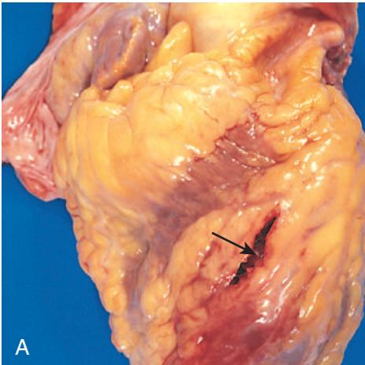
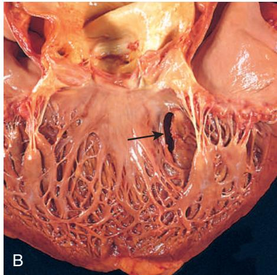
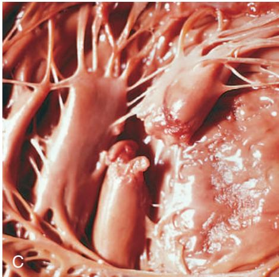
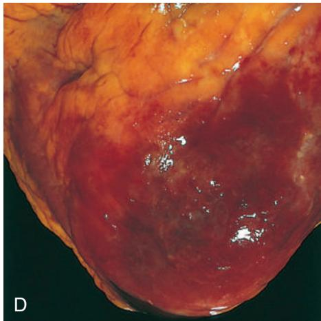 
Fig. 11.14 Complications of myocardial infarction. (A to C) Cardiac rupture. (A) Anterior free wall myocardial rupture (arrow). (B) Ventricular septal rupture (arrow). (C) Papillary muscle rupture. (D) Fibrinous pericarditis, with a hemorrhagic, roughened epicardial surface overlying an acute infarct. (E) Recent expansion of an anteroapical infarct with wall stretching and thinning (arrow) and mural thrombus. (F) Large apical left ventricular aneurysm (arrow). (A to E, Reproduced by permission from Schoen FJ: Interventional and surgical cardiovascular pathology: clinical correlations and basic principles, Philadelphia, 1989, Saunders; F, Courtesy of William D. Edwards, MD, Mayo Clinic, Rochester, Minnesota.)
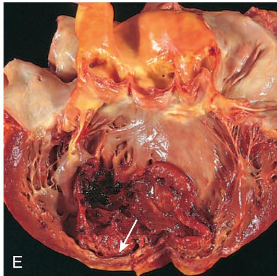
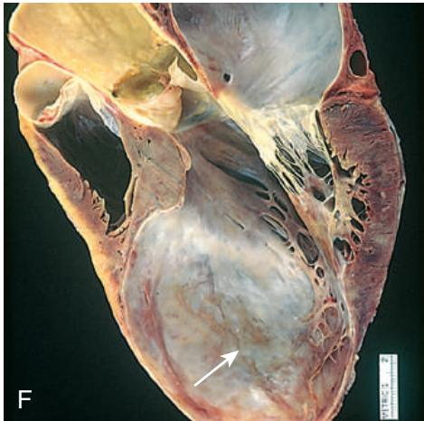
friction rub, pericarditis typically appears 2 to 3 days after infarction and then gradually resolves over the next few days. Extensive infarcts or severe pericardial inflammation occasionally can lead to large effusions or can organize to form dense adhesions that eventually manifest as a constrictive lesion.
- Chamber dilation. Because of the weakening of necrotic muscle, there may be disproportionate stretching, thinning, and dilation of the infarcted region (especially with anteroseptal infarcts). 
- Mural thrombus. With any infarct, the combination of attenuated myocardial contractility (causing stasis), chamber dilation, and endocardial damage (causing a thrombogenic surface) can foster mural thrombosis (Fig. 11.14E), eventually leading to left-sided thromboembolism. 
- Ventricular aneurysm. A late complication, aneurysms of the ventricle most commonly result from a large transmural anteroseptal infarct that heals with the formation of a thinned wall of scar tissue (Fig. 11.14F). Although ventricular aneurysms frequently give rise to formation of mural thrombi, arrhythmias, and heart failure, they do not rupture. 
- Progressive heart failure. This is discussed under "Chronic Ischemic Heart Disease" next.
The risk for complications and the overall prognosis depends on infarct size, site, and type (subendocardial versus transmural infarct). Thus, large transmural infarcts are associated with a higher probability of cardiogenic shock, arrhythmias, and late CHF, and patients with anterior transmural MIs are at greatest risk for free wall rupture, expansion, aneurysm formation, and formation of mural thrombi. By contrast, posterior transmural infarcts are more likely to be complicated by conduction blocks, right ventricular involvement, or both; when ventricular septal ruptures occur in this area, they are more difficult to manage. Overall, patients with anterior infarcts have a much more guarded prognosis than those with posterior infarcts. With subendocardial infarcts, thrombi may form on the endocardial surface, but pericarditis, rupture, and aneurysms rarely occur.
In addition to the aforementioned scarring, the remaining viable myocardium attempts to compensate for the loss of contractile mass. Noninfarcted regions undergo hypertrophy and dilation; in combination with the scarring and thinning of the infarcted zones, the changes are collectively termed ventricular remodeling. The initial compensatory hypertrophy of noninfarcted myocardium is hemodynamically beneficial. The adaptive effect of remodeling can be
overwhelmed, however, and ventricular function may decline in the setting of ventricular aneurysm formation.
The long-term prognosis after MI depends on many factors, the most important of which are the quality of left ventricular function and the severity of atherosclerotic narrowing of vessels perfusing the remaining viable myocardium. The overall mortality rate within the first year is about $30\%$ , including deaths occurring before the patient reaches the hospital. Thereafter, the annual mortality rate for patients who have suffered an MI is $3\%$ to $4\%$ .
# Chronic Ischemic Heart Disease
Chronic IHD, also called ischemic cardiomyopathy, is progressive heart failure secondary to ischemic myocardial damage. In most instances, there is a known clinical history of previous MI. After prior infarction(s), chronic IHD appears when the compensatory mechanisms (e.g., hypertrophy) of residual myocardium begin to fail. In other cases, severe CAD can cause diffuse myocardial dysfunction, and even micro-infarction and replacement fibrosis, without any clinically evident episode of frank infarction.
The heart failure of chronic IHD is typically severe and is occasionally punctuated by new episodes of angina or infarction. Arrhythmias, CHF, and intercurrent MI account for most of the associated morbidity and mortality.
Patients with chronic IHD typically exhibit left ventricular dilation and hypertrophy, often with discrete areas of gray-white scarring from previous healed infarcts. Invariably, there is moderate to severe atherosclerosis of the coronary arteries, sometimes with total occlusion. The endocardium generally shows patchy, fibrous thickening, and mural thrombi may be present. Microscopic findings include myocardial hypertrophy, diffuse subendocardial myocyte vacuolization, and fibrosis from previous infarction.
# Cardiac Stem Cells
Because of the serious morbidity associated with IHD, there is much interest in exploring the possibility of using cardiac stem cells to replace damaged myocardium. Although cardiac regeneration in metazoans (such as newts and zebrafish) is well described, cardiac myocytes of higher-order animals are classically considered a postmitotic cell population without replicative potential. Increasing evidence, however, points to the presence of bone marrow-derived precursors—as well as a small resident stem cell population within the myocardium—capable of repopulating the mammalian heart. These cells express a cluster of cell surface markers that allow their isolation and purification, and like all other tissue stem cells, they occur in very low frequency.
Besides self-renewal, these cardiac stem cells can generate all cell lineages seen within the myocardium. They have a slow intrinsic rate of proliferation, which is greatest
in neonates and decreases with age. Of interest, stem cell numbers and progeny also increase after myocardial injury or hypertrophy, albeit to a limited extent, since hearts that suffer an MI clearly do not recover any significant function in the necrotic zone. Nevertheless, the potential for stimulating the proliferation of these cells in vivo is tantalizing because it could facilitate recovery of myocardial function after acute MI or chronic IHD. Ex vivo expansion and subsequent administration of such cells after an MI is another area of vigorous investigation. Unfortunately, results thus far have been less than exciting.
# ISCHEMIC HEART DISEASE
- In the vast majority of cases, cardiac ischemia is due to coronary artery atherosclerosis; vasospasm, vasculitis, and embolism are less common causes. 
- Cardiac ischemia results from a mismatch between coronary supply and myocardial demand and manifests as different, albeit overlapping syndromes:
Angina pectoris is exertional chest pain due to inadequate perfusion, and is typically due to atherosclerotic disease causing greater than $70\%$ fixed stenosis (so-called "critical stenosis").
- Unstable angina is characterized by increasingly frequent pain, precipitated by progressively less exertion or even occurring at rest. It results from an erosion or rupture of atherosclerotic plaque triggering platelet aggregation, vasoconstriction, and formation of a mural thrombus that need not necessarily be occlusive.
- Acute myocardial infarction typically results from acute thrombosis after plaque disruption; a majority occur in plaques that did not previously exhibit critical stenosis.
- Sudden cardiac death usually results from a fatal arrhythmia, typically without significant acute myocardial damage.
- Ischemic cardiomyopathy is progressive heart failure due to ischemic injury, either from previous infarction(s) or chronic ischemia.
- Myocardial ischemia leads to loss of myocyte function within 1 to 2 minutes but causes death after only 30 to 40 minutes. Myocardial infarction is diagnosed on the basis of symptoms, electrocardiographic changes, and measurement of serum biomarkers such as cardiac-specific troponins. Gross and histologic changes of infarction require hours to days to develop. 
- Infarction can be modified by therapeutic intervention (e.g., thrombolysis or stenting), which salvages myocardium at risk but may also induce reperfusion-related injury. 
- Complications of infarction include ventricular rupture, papillary muscle rupture, aneurysm formation, mural thrombus, arrhythmia, pericarditis, and CHF.
# ARRHYTHMIAS
Aberrant rhythms can be initiated anywhere in the conduction system, from the sinoatrial (SA) node down to the level of an individual myocyte; they are typically designated as originating from the atrium (supraventricular) or within the ventricular myocardium. Abnormalities in myocardial conduction can be sustained or sporadic
(paroxysmal). They can manifest as tachycardia (fast heart rate), bradycardia (slow heart rate), an irregular rhythm with normal ventricular contraction, chaotic depolarization without functional ventricular contraction (ventricular fibrillation), or no electrical activity at all (asystole). Patients may be unaware of a rhythm disorder, or may note a "racing heart" or palpitations (irregular rhythm); loss of adequate cardiac output due to sustained arrhythmia can produce lightheadedness (near syncope), loss of consciousness (syncope), or sudden cardiac death (see later).
Ischemic injury is the most common cause of rhythm disorders, either through direct damage or through the dilation of heart chambers that alters signal conduction.
- If the SA node is damaged (e.g., sick sinus syndrome), other fibers or even the atrioventricular (AV) node can take over pacemaker function, albeit at a much slower intrinsic rate (causing bradycardia). 
- If the atrial myocytes become "irritable" and depolarize independently and sporadically (as occurs with atrial dilation), the signals are variably transmitted through the AV node leading to the random "irregularly irregular" heart rate of atrial fibrillation. 
- If the AV node is dysfunctional, varying degrees of heart block occur, ranging from simple prolongation of the P-R interval on the ECG (first-degree heart block), to intermittent transmission of the signal (second-degree heart block), to complete failure (third-degree heart block).
Certain heritable conditions (fortunately rare) can also cause arrhythmias. They are important to recognize because they may alert physicians to the need for intervention to prevent sudden cardiac death (discussed later) in the proband and their family members. Some of these disorders are associated with recognizable anatomic abnormalities (e.g., congenital anomalies, hypertrophic cardiomyopathy, mitral valve prolapse). However, other heritable disorders precipitate arrhythmias and sudden death in the absence of structural cardiac pathology (so-called "primary electrical disorders"). These syndromes can only be diagnosed by genetic testing, which is performed in those with a positive family history or an unexplained nonlethal arrhythmia. The most important of these are the channelopathies, which are caused by mutations in genes that are required for normal function of $\mathrm{Na^{+}}$ , $\mathrm{K^{+}}$ , and $\mathrm{Ca^{+}}$ channels. Since ion channels are responsible for conducting the electrical currents that mediate contraction of the heart, it is not surprising that defects in these channels may provoke arrhythmias. The prototype is the long QT syndrome, characterized by prolongation of the QT segment in ECGs and susceptibility to malignant ventricular arrhythmias. Mutations in several different genes account for the cases of long QT syndrome, with KCNQ1 being the most common; it results in decreased potassium currents.
# Sudden Cardiac Death
Sudden cardiac death (SCD) is defined as unexpected death due to a lethal arrhythmia such as asystole or sustained ventricular fibrillation. Roughly 400,000 individuals are victims of SCD each year in the United States. Coronary artery disease is the leading cause of SCD, being responsible for $80\%$ to $90\%$ of cases. Unfortunately, SCD
may be the first manifestation of IHD. Of interest, autopsy typically shows severe atherosclerotic disease without evidence of acute plaque disruption. Thus, in the vast majority of cases, there is no associated myocardial infarction; $80\%$ to $90\%$ of patients who suffer SCD but are successfully resuscitated do not show any enzymatic or ECG evidence of myocardial necrosis—even if the cause is IHD! Healed remote MIs are present in about $40\%$ of cases.
In younger victims of SCD, nonatherosclerotic causes are more common, including the following:
- Hereditary (channelopathies) or acquired abnormalities of the cardiac conduction system 
Congenital coronary arterial abnormalities 
- Mitral valve prolapse 
- Myocarditis or sarcoidosis 
- Dilated or hypertrophic cardiomyopathy 
Pulmonary hypertension 
- Myocardial hypertrophy. Increased cardiac mass is an independent risk factor for SCD; thus, in some young individuals who die suddenly, including athletes, hypertensive hypertrophy or unexplained increased cardiac mass is the only pathologic finding.
Although ischemic injury (and other pathologic conditions) can directly affect the major components of the conduction system, most cases of fatal arrhythmia are triggered by electrical irritability of myocardium distant from the conduction system.
The prognosis of many patients at risk for SCD, including those with chronic IHD, is markedly improved by implantation of a pacemaker or an automatic cardioverter defibrillator, which senses and electrically counteracts an episode of ventricular fibrillation.
The relationship of coronary artery disease to the various clinical end points discussed earlier is depicted in Fig. 11.15.
# ARRHYTHMIAS
- Arrhythmias can be caused by ischemic or structural changes in the conduction system or by myocyte electrical instability. In structurally normal hearts, arrhythmias more often are due to mutations in ion channels that cause aberrant repolarization or depolarization. 
- SCD most frequently is due to coronary artery disease leading to ischemia. Myocardial irritability typically results from nonlethal ischemia or from preexisting fibrosis from previous myocardial injury. SCD less often is due to acute plaque rupture with thrombosis that induces a rapidly fatal arrhythmia.
# HYPERTENSIVE HEART DISEASE
Hypertensive heart disease (HHD) is a consequence of the increased demands placed on the heart by hypertension, causing pressure overload and ventricular hypertrophy. As discussed in Chapter 10, hypertension is a common disorder associated with considerable morbidity and affecting many organs, including the heart, brain, and kidneys. The comments here will focus specifically on the major cardiac
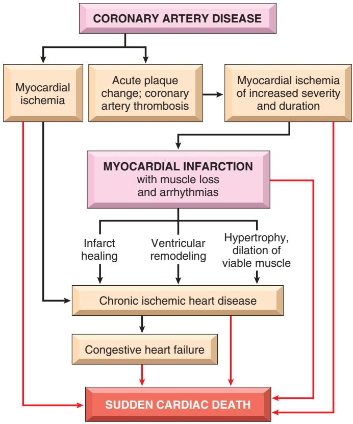 
Fig. 11.15 Pathways in the progression of ischemic heart disease showing the relationships among coronary artery disease and its major sequelae.
complications of hypertension, which result from pressure overload and ventricular hypertrophy. Myocyte hypertrophy is an adaptive response to pressure overload; there are limits to myocardial adaptive capacity, however, and persistent hypertension eventually can culminate in dysfunction, cardiac dilation, CHF, and even sudden death. Although hypertensive heart disease most commonly affects the left
side of the heart secondary to systemic hypertension, pulmonary hypertension also can cause right-sided hypertensive changes—so-called "cor pulmonale."
# Systemic (Left-Sided) Hypertensive Heart Disease
The criteria for the diagnosis of systemic hypertensive heart disease are (1) left ventricular hypertrophy in the absence of other cardiovascular pathology (e.g., valvular stenosis), and (2) a history or pathologic evidence of hypertension. The Framingham Heart Study established unequivocally that even mild hypertension (above $140/90\mathrm{mmHg}$ ), if sufficiently prolonged, induces left ventricular hypertrophy. Roughly $25\%$ of the U.S. population suffers from at least this degree of hypertension.
As discussed earlier, systemic hypertension imposes pressure overload on the heart and is associated with gross and microscopic changes somewhat distinct from those caused by volume overload. The essential feature of hypertensive heart disease is left ventricular hypertrophy, typically without ventricular dilation until very late in the process (Fig. 11.16A). The heart weight can exceed $500\mathrm{g}$ (normal for a 60- to $70\mathrm{-kg}$ individual is 320 to $360\mathrm{g}$ ), and the left ventricular wall thickness can exceed $2.0\mathrm{cm}$ (normal is 1.2 to $1.4\mathrm{cm}$ ). With time, the increased left ventricular wall thickness imparts a stiffness that impairs diastolic filling and can result in left atrial dilation. In long-standing systemic hypertensive heart disease leading to congestive failure, the hypertrophic left ventricle typically is dilated.
Microscopically, the transverse diameter of myocytes is increased and there is prominent nuclear enlargement and hyperchromasia ("boxcar nuclei"), as well as intercellular fibrosis (see also Fig. 11.1D).
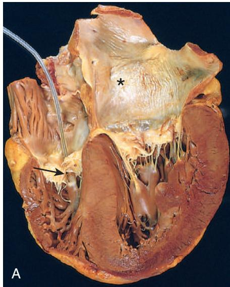 
Fig. 11.16 Hypertensive heart disease. (A) Systemic (left-sided) hypertensive heart disease. There is marked concentric thickening of the left ventricular wall causing reduction in lumen size. The left ventricle and left atrium are shown on the right in this four-chamber view of the heart. A pacemaker is present incidentally in the right ventricle (arrow). Note also the left atrial dilation (asterisk) due to stiffening of the left ventricle and impaired diastolic relaxation, leading to atrial volume overload. (B) Chronic cor pulmonale. The right ventricle (shown on the left) is markedly dilated and hypertrophied with a thickened free wall and hypertrophied trabeculae. The shape and volume of the left ventricle have been distorted by the enlarged right ventricle.
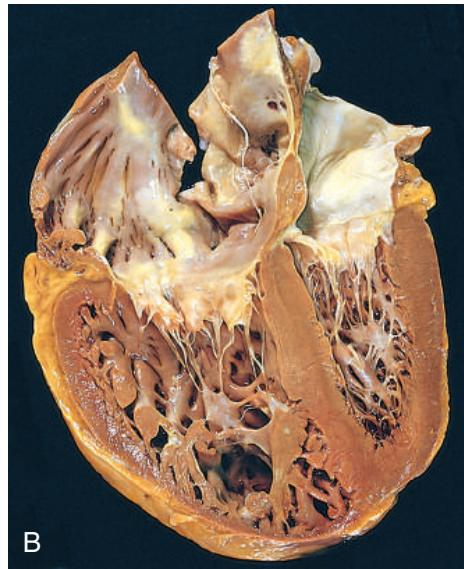
Compensated HHD typically is asymptomatic and is suspected only from discovery of elevated blood pressure on routine physical examination, or from ECG or echocardiographic findings of left ventricular hypertrophy. In some patients, the disease comes to attention with the onset of atrial fibrillation (secondary to left atrial enlargement) and/or CHF. The mechanisms by which hypertension leads to heart failure are incompletely understood; presumably the hypertrophic myocytes fail to contract efficiently, possibly due to structural abnormalities in newly assembled sarcomeres and because the vascular supply is inadequate to meet the demands of the increased muscle mass. Depending on the severity and duration of the condition, the underlying cause of hypertension, and the adequacy of therapeutic control, patients can (1) enjoy normal longevity and die of unrelated causes, (2) develop IHD owing to the effects of hypertension in potentiating coronary atherosclerosis, (3) suffer renal damage or cerebrovascular stroke, or (4) experience congestive heart failure. The risk for SCD also is increased. Effective hypertension control can prevent or lead to the regression of cardiac hypertrophy and its attendant risks.
# Pulmonary Hypertensive Heart Disease—Cor Pulmonale
Cor pulmonale consists of right ventricular hypertrophy and dilation—frequently accompanied by right-sided heart failure—caused by pulmonary hypertension attributable to primary disorders of the lung parenchyma or pulmonary vasculature (Table 11.3). Right ventricular dilation and hypertrophy caused by left ventricular failure (or by congenital heart disease) is substantially more common but is excluded by this definition.
Cor pulmonale can be acute in onset, as with pulmonary embolism, or can have a slow and insidious onset when due to prolonged pressure overload in the setting of chronic lung and pulmonary vascular disease (see Table 11.3).
In acute cor pulmonale, the right ventricle usually shows only dilation; if an embolism causes sudden death, the heart may even be of normal size. Chronic cor pulmonale is characterized by right ventricular (and often right atrial) hypertrophy. In extreme cases, the thickness of the right ventricular wall may be comparable to or even exceed that of the left ventricle (Fig. 11.16B). When ventricular failure develops, the right ventricle and atrium often are dilated. Because chronic cor pulmonale occurs in the setting of pulmonary hypertension, the pulmonary arteries often contain atheromatous plaques and other lesions, reflecting long-standing pressure elevations.
# VALVULAR HEART DISEASE
Valvular disease may result in stenosis, insufficiency (regurgitation or incompetence), or both.
- Stenosis is the failure of a valve to open completely, obstructing forward flow. Valvular stenosis is almost
Table 11.3 Disorders Predisposing to Cor Pulmonale 
Diseases of the Pulmonary ParenchymaChronic obstructive pulmonary diseaseDiffuse pulmonary interstitial fibrosisPneumoconiosisCystic fibrosisBronchiectasisDiseases of the Pulmonary VesselsRecurrent pulmonary thromboembolismPrimary pulmonary hypertensionExtensive pulmonary arteritis (e.g., Granulomatosis with polyangiitis)Drug-, toxin-, or radiation-induced vascular obstructionExtensive pulmonary tumor microembolismDisorders Affecting Chest MovementKyphoscoliosisMarked obesity (Pickwickian syndrome)Neuromuscular diseasesDisorders Inducing Pulmonary Arterial ConstrictionMetabolic acidosisHypoxemiaObstructive sleep apneaIdiopathic alveolar hypoventilation
# HYPERTENSIVE HEART DISEASE
- Hypertensive heart disease can affect either the left ventricle or the right ventricle; in the latter case, the disorder is most often due to primary pulmonary disease and is called cor pulmonale. Elevated pressures induce myocyte hypertrophy and interstitial fibrosis that increases wall thickness and stiffness. 
- The chronic pressure overload of systemic hypertension causes left ventricular concentric hypertrophy, often associated with left atrial dilation due to impaired diastolic filling of the ventricle. Persistently elevated pressure overload can cause ventricular failure with dilation. 
- Cor pulmonale results from pulmonary hypertension due to primary lung parenchymal or vascular disorders. Hypertrophy of both the right ventricle and the right atrium is characteristic; dilation also may be seen when failure supervenes.
always due to a primary cuspal abnormality stemming from a chronic process (e.g., calcification or valve scarring).
Insufficiency results from failure of a valve to close completely, thereby allowing regurgitation (backflow) of blood. Valvular insufficiency can result from either intrinsic disease of the valve cusps (e.g., endocarditis) or disruption of the supporting structures (e.g., the aorta, mitral annulus, tendinous cords, papillary muscles, or ventricular free wall) without primary cuspal injury. It can appear abruptly, as with chordal rupture, or insidiously as a consequence of leaflet scarring and retraction.
Stenosis or regurgitation may occur alone or together in the same valve. Valvular disease can involve only one
valve (the mitral valve being the most common target), or more than one valve. Turbulent flow through diseased valves typically produces abnormal heart sounds called murmurs; severe lesions can even be externally palpated as thrills. Depending on the valve involved, murmurs are best heard at different locations on the chest wall; moreover, the nature (regurgitation versus stenosis) and severity of the valvular disease determines the quality and timing of the murmur (e.g., harsh systolic or soft diastolic murmurs).
The outcome of valvular disease depends on the valve involved, the degree of impairment, the tempo of its development, and the effectiveness of compensatory mechanisms. For example, rapid destruction of an aortic valve cusp by infection can cause massive regurgitation and the abrupt onset of cardiac failure. By contrast, rheumatic mitral stenosis usually progresses over years, and its clinical effects are well tolerated until late in the course.
Valvular abnormalities can be congenital or acquired. By far the most common congenital valvular lesion is a bicuspid aortic valve, containing only two functional cusps instead of the normal three; this malformation occurs with a frequency of $1\%$ to $2\%$ of all live births, and has been associated with a number of mutations, including those affecting proteins of the Notch signaling pathway. The two cusps are of unequal size, with the larger cusp exhibiting a midline raphe resulting from incomplete cuspal separation (Fig. 11.17B). Bicuspid aortic valves are generally neither stenotic nor incompetent through early life; however, they are more prone to early and progressive degenerative calcification that gives rise to stenosis (see later).
The most important causes of acquired valvular diseases are summarized in Table 11.4; acquired stenoses of the aortic and mitral valves account for approximately two thirds of all valve disease.
# Degenerative Valve Disease
Degenerative valve disease is a term used to describe changes that affect the integrity of valvular ECM. Degenerative changes include the following:
- Calcifications, which can be cuspal (typically in the aortic valve) (Fig. 11.17A and B) or annular (in the mitral valve) (Fig. 11.17C and D). Mitral annular calcification is usually asymptomatic unless it encroaches on the adjacent conduction system. 
- Alterations in the ECM. In some cases, changes consist of increased proteoglycan and diminished fibrillar collagen and elastin (myxomatous degeneration); in other cases, the valve becomes fibrotic and scarred. 
- Changes in the production of matrix metalloproteinases or their inhibitors 
- Degenerative changes in the cardiac valves are probably an inevitable aspect of aging related to the repetitive mechanical stresses to which valves are subjected—40 million beats per year, with each normal opening and closing requiring substantial valve deformation.
# Calcific Aortic Stenosis
Calcific aortic degeneration is the most common cause of aortic stenosis. In most cases, calcific degeneration is asymptomatic and is discovered only incidentally by viewing
Table 11.4 Etiology of Acquired Heart Valve Disease 
Mitral Valve DiseaseAortic Valve DiseaseMitral StenosisAortic StenosisPostinflammatory scarring (rheumatic heart disease)Postinflammatory scarring (rheumatic heart disease) 
Senile calcific aortic stenosis 
Calcification of congenitally deformed valveMitral RegurgitationAortic RegurgitationAbnormalities of leaflets and commissuresIntrinsic valvular diseasePostinflammatory scarringPostinflammatory scarring (rheumatic heart disease)Infective endocarditisInfective endocarditisMitral valve prolapseAortic disease“Fen-phen”-induced valvular fibrosisDegenerative aortic dilationAbnormalities of tensor apparatusSyphilitic aortitisRupture of papillary muscleAnkylosing spondylitisPapillary muscle dysfunction (fibrosis)Rheumatoid arthritisRupture of chordae tendineaeMarfan syndromeAbnormalities of left ventricular cavity and/or annulusLeft ventricular enlargement (myocarditis, dilated cardiomyopathy)Calcification of mitral ring
Fen-phen, Fenfluramine-Phentermine. 
Data from Schoen FJ: Surgical pathology of removed natural and prosthetic valves, Hum Pathol 18:558, 1987.
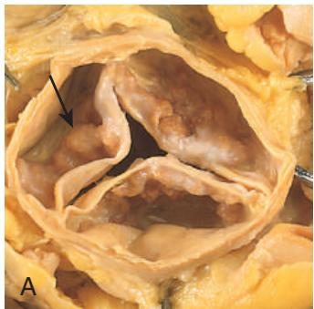
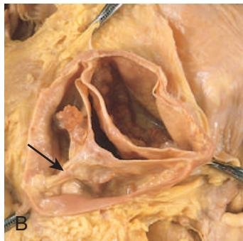
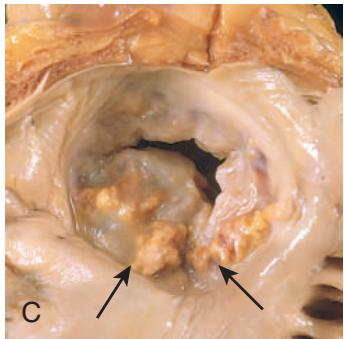 
Fig. 11.17 Calcific valvular degeneration. (A) Calcific aortic stenosis of a previously normal valve (viewed from above the valve). Nodular masses of calcium are heaped up within the sinuses of Valsalva (arrow). Note that the commissures are not fused, as in rheumatic aortic valve stenosis (see Fig. 11.19C). (B) Calcific aortic stenosis occurring on a congenitally bicuspid valve. One cusp has a partial fusion at its center, called a raphe (arrow). (C and D) Mitral calcification, with calcific nodules within the annulus (attachment margin) of the mitral leaflets (arrows). (C) Left atrial view. (D) Section demonstrating the extension of calcification into the underlying myocardium. Such involvement of adjacent structures near the interventricular septum can impinge on the conduction system.
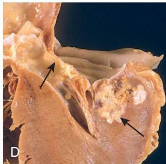
calcifications on a routine chest radiograph or at autopsy. In other patients, valvular sclerosis and/or calcification can be severe enough to cause stenosis, necessitating surgical intervention. The incidence of calcific aortic stenosis is increasing in pace with longevity. In anatomically normal valves, it typically begins to manifest when patients reach their 70s and 80s; onset with bicuspid aortic valves is at a much earlier age (often 40 to 50 years of age).
Although simple progressive age-associated "wear and tear" is often invoked to explain the process, cuspal fibrosis and calcification also can be viewed as the valvular counterparts to age-related arteriosclerosis. Thus, chronic injury due to hyperlipidemia, hypertension, inflammation, and other factors implicated in atherosclerosis have been proposed as contributors to valvular degenerative changes, but firm evidence is lacking.
The hallmark of calcific aortic stenosis is heaped-up calcified masses on the outflow side of the cusps; these protrude into the sinuses of Valsalva and mechanically impede valve opening (Fig. 11.17A and B); commissural fusion (usually a sign of previous inflammation) is not a typical feature of degenerative aortic stenosis, although the cusps may become secondarily fibrosed and thickened. An earlier, hemodynamically inconsequential stage of the calcification process is called aortic valve sclerosis.
In severe disease, valve orifices can be compromised by as much as $70\%$ to $80\%$ (from a normal area of approximately $4\mathrm{cm}^2$ ). Cardiac output is maintained only by virtue of concentric left ventricular hypertrophy; the chronic outflow obstruction can drive left ventricular pressures to $200\mathrm{mmHg}$ or more. The hypertrophied myocardium is prone to ischemia, and angina may develop. Systolic and diastolic dysfunction collude to cause CHF, and cardiac decompensation eventually ensues. The development of angina, CHF, or syncope in aortic stenosis heralds the exhaustion of compensatory cardiac hyperfunction and carries a poor prognosis; without surgical intervention, $50\%$ to $80\%$ of patients die within 2 to 3 years.
# Myxomatous Mitral Valve
In myxomatous degeneration of the mitral valve, one or both mitral leaflets are "floppy" and prolapse—they balloon back into the left atrium during systole. Primary mitral valve prolapse is a form of myxomatous mitral degeneration affecting some $0.5\%$ to $2.4\%$ of adults; thus, it is one of the most common forms of valvular heart disease, with women affected almost 7-fold more often than men. Conversely, secondary myxomatous mitral degeneration affects men and women equally, and can occur in any one of a number of settings in which mitral regurgitation is caused by some other underlying cause (e.g., IHD).
The basis for primary myxomatous degeneration of the mitral valve is unknown. Nevertheless, an underlying (possibly systemic) intrinsic defect of connective tissue
synthesis or remodeling is likely. Thus, myxomatous degeneration of the mitral valve is a common feature of Marfan syndrome (due to fibrillin-1 mutations, Chapter 7) and occasionally occurs in other connective tissue disorders. In some patients with primary disease, additional hints of systemic structural abnormalities in connective tissue, including scoliosis and high-arched palate, may be found. Subtle defects in structural proteins (or the cells that make them) may cause hemodynamically stressed connective tissues rich in microfibrils and elastin (e.g., cardiac valves) to elaborate defective ECM. Secondary myxomatous change presumably results from injury to the valve myofibroblasts, imposed by chronically aberrant hemodynamic forces.
Myxomatous degeneration of the mitral valve is characterized by ballooning (hooding) of the mitral leaflets (Fig. 11.18). The affected leaflets are enlarged, redundant, thick, and rubbery; the tendinous cords also tend to be elongated, thinned, and occasionally rupture. In those with primary mitral disease, concomitant tricuspid valve involvement is frequent (20% to 40% of cases); less commonly, aortic and pulmonic valves also may be affected. On histologic examination, the essential change is thinning of the valve layer known as the fibrosa layer of the valve, on which the structural integrity of the leaflet depends, accompanied by expansion of the middle spongiosa layer owing to increased deposition of myxomatous (mucoid) material. The same changes occur whether the myxomatous degeneration is due to an intrinsic ECM defect (primary), or is caused by regurgitation secondary to another etiologic process (e.g., ischemic dysfunction).
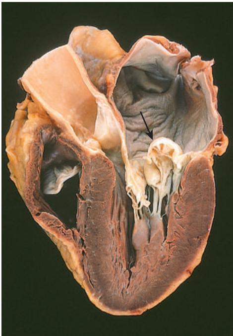 
Fig. 11.18 Myxomatous degeneration of the mitral valve. There is prominent hooding with prolapse of the posterior mitral leaflet (arrow) into the left atrium; the atrium also is dilated, reflecting long-standing valvular insufficiency and volume overload. The left ventricle is shown on the right in this four-chamber view. (Courtesy of William D. Edwards, MD, Mayo Clinic, Rochester, Minnesota.)
Most patients are asymptomatic, and the valvular abnormality is discovered incidentally. In a minority of cases, patients complain of palpitations, dyspnea, or atypical chest pain. Auscultation discloses a midsystolic click, caused by abrupt tension on the redundant valve leaflets and chordae tendineae as the valve attempts to close; there is sometimes an associated regurgitant murmur. Although in most instances the natural history and clinical course are benign, approximately $3\%$ of patients develop complications such as hemodynamically significant mitral regurgitation and CHF, particularly if the chordae or valve leaflets rupture. Patients with primary myxomatous degeneration also are at increased risk for the development of infective endocarditis (see later), as well as SCD due to ventricular arrhythmias. Stroke or other systemic infarctions may rarely occur from embolism of thrombi formed in the left atrium.
# Rheumatic Valvular Disease
Rheumatic fever is an acute, immunologically mediated, multisystem inflammatory disease that occurs after group A $\beta$ -hemolytic streptococcal infections (usually pharyngitis, but also occasionally infections at other sites, such as skin). Rheumatic heart disease is the cardiac manifestation of rheumatic fever. It is associated with inflammation of all parts of the heart, but valvular inflammation and scarring produce the most important clinical features.
The valvular disease principally takes the form of deforming fibrotic mitral stenosis; indeed rheumatic heart disease is essentially the only cause of acquired mitral stenosis. The incidence of rheumatic fever (and thus rheumatic heart disease) has declined remarkably in many parts of the Western world over the past several decades due to a combination of improved socioeconomic conditions, rapid diagnosis and treatment of streptococcal pharyngitis, and a fortuitous (and unexplained) decline in the virulence of many strains of group A streptococci. Nevertheless, in developing countries and economically depressed urban areas in the United States, rheumatic fever and rheumatic heart disease remain important public health problems.
Acute rheumatic fever is a hypersensitivity reaction classically attributed to antibodies directed against group A streptococcal molecules that cross-react with host myocardial antigens (see also Chapter 5). In particular, antibodies against M proteins of certain streptococcal strains bind to proteins in the myocardium and cardiac valves and cause injury through the activation of complement and Fc receptor-bearing cells (including macrophages). $\mathrm{CD4 + }$ T cells that recognize streptococcal peptides can cross-react with host antigens and elicit cytokine-mediated inflammatory responses. The characteristic 2- to 3-week delay in symptom onset after infection is explained by the time needed to generate an immune response; streptococci are completely absent from the lesions. Since only a small minority of infected patients develop rheumatic fever (estimated at $3\%$ ), genetic susceptibility to the development of the cross-reactive immune responses is likely in those
affected. The deforming fibrotic lesions are the predictable consequence of healing and scarring associated with the resolution of the acute inflammation.
Acute rheumatic fever is characterized by discrete inflammatory foci within a variety of tissues. The myocardial inflammatory lesions—called Aschoff bodies—are pathognomonic for rheumatic fever (Fig. 11.19B); these are collections of lymphocytes (primarily T cells), scattered plasma cells, and plump activated macrophages called Anitschkow cells associated with zones of fibrinoid necrosis. The Anitschkow cells have abundant cytoplasm and nuclei with chromatin that is centrally condensed into a slender, wavy ribbon (so-called "caterpillar cells"). During acute rheumatic fever, Aschoff bodies can be found in any of the three layers of the heart—pericardium, myocardium, or endocardium (including valves). Hence, rheumatic fever is said to cause pancarditis, with the following salient features:
- The pericardium may exhibit a fibrinous exudate, which generally resolves without sequelae. 
- The myocardial involvement—myocarditis—takes the form of scattered Aschoff bodies within the interstitial connective tissue. 
- Valve involvement results in fibrinoid necrosis and fibrin deposition along the lines of closure (Fig. 11.19A) forming I- to 2-mm vegetations—verrucae—that cause little disturbance in cardiac function.
Chronic rheumatic heart disease is characterized by organization of acute inflammation and subsequent scarring. Aschoff bodies are replaced by fibrous scar so that these lesions are rarely seen in chronic disease. Most characteristically, valve cusps and leaflets become permanently thickened and retracted. Classically, the mitral valves exhibit leaflet thickening, commissural fusion and shortening, and thickening and fusion of the chordae tendineae (Fig. 11.19C to E). Fibrous bridging across the valvular commissures and calcification create "mouth" or "buttonhole" stenoses (Fig. 11.19C). Microscopic examination shows neovascularization (visibly evident in Fig. 11.19D) and diffuse fibrosis that obliterates the normal leaflet architecture.
The most important functional consequence of rheumatic heart disease is valvular stenosis and regurgitation; stenosis tends to predominate. The mitral valve alone is involved in $70\%$ of cases, and combined mitral and aortic disease in seen in another $25\%$ ; the tricuspid valve is less frequently (and less severely) involved; and the pulmonic valve almost always escapes injury. With tight mitral stenosis, the left atrium progressively dilates owing to pressure overload, precipitating atrial fibrillation. The combination of dilation and fibrillation is a fertile substrate for thrombosis, and formation of large mural thrombi is common. Long-standing passive venous congestion gives rise to pulmonary vascular and parenchymal changes typical of left-sided heart failure. In time, this leads to right ventricular hypertrophy and failure. With pure mitral stenosis, the left ventricle generally is normal.
Acute rheumatic fever occurs most often in children; the principal clinical manifestation is carditis. Nevertheless,
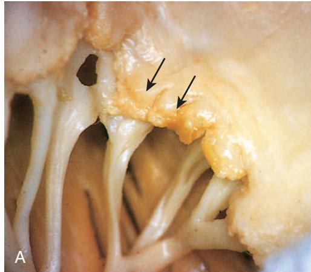
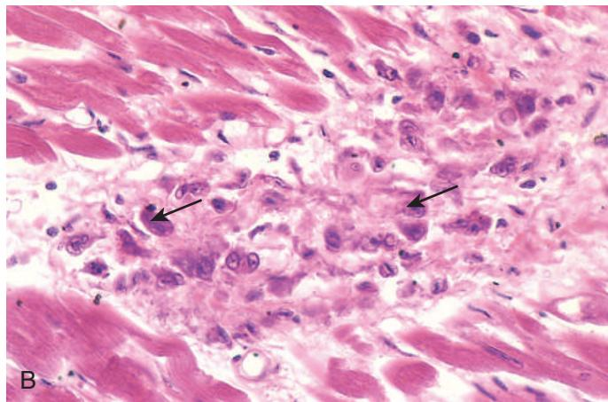
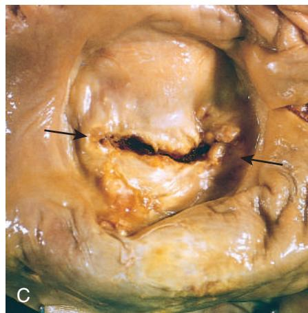 
Fig. 11.19 Rheumatic heart disease. (A) Acute rheumatic mitral valvulitis superimposed on chronic rheumatic heart disease. Small vegetations (verrucae) are visible along the line of closure of the mitral valve leaflet (arrows). Previous episodes of rheumatic valvulitis have caused fibrous thickening and fusion of the chordae tendineae. (B) Microscopic appearance of an Aschoff body in acute rheumatic carditis; there is central necrosis associated with a circumscribed collection of mononuclear inflammatory cells, including some activated macrophages with prominent nucleoli and central wavy (caterpillar) chromatin (arrows). (C and D) Mitral stenosis with diffuse fibrous thickening and distortion of the valve leaflets, commissural fusion (arrows), and thickening and shortening of the chordae tendineae. There is marked left atrial dilation as seen from above the valve (C). (D) Anterior leaflet of an opened rheumatic mitral valve; note the neovascularization (arrow). (E) Surgically removed specimen of rheumatic aortic stenosis, demonstrating thickening and distortion of the cusps with commissural fusion. (E, From Schoen FJ, St John-Sutton M: Contemporary issues in the pathology of valvular heart disease, Hum Pathol 18:568, 1967.)
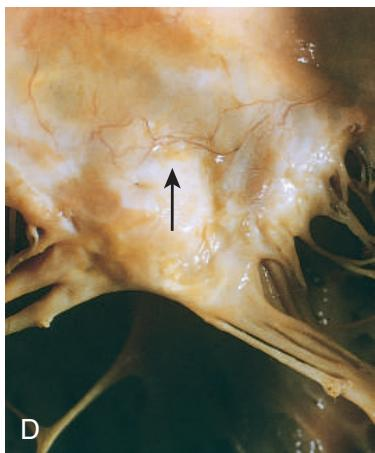
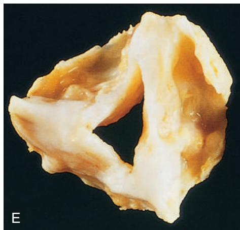
about $20\%$ of first attacks occur in adults, with arthritis being the predominant feature. Symptoms in all age groups typically begin 2 to 3 weeks after streptococcal infection and are heralded by fever and migratory polyarthritis—one large joint after another becomes painful and swollen for a period of days, followed by spontaneous resolution with no residual disability. Although cultures are negative for streptococci at the time of symptom onset, serum titers of antibodies against one or more streptococcal antigens (e.g., streptolysin O or DNAse) usually are elevated. The clinical signs of carditis include pericardial friction rubs and arrhythmias; myocarditis may be sufficiently severe to cause cardiac dilation and resultant functional mitral insufficiency and CHF. Nevertheless, less than $1\%$ of patients die of acute rheumatic fever.
The diagnosis of acute rheumatic fever is made based on serologic evidence of previous streptococcal infection in conjunction with two or more of the Jones criteria: (1) carditis; (2) migratory polyarthritis of large joints; (3) subcutaneous nodules; (4) erythematous annular rash (erythema marginatum) in the skin; and (5) Sydenham chorea, a neurologic disorder characterized by involuntary
purposeless, rapid movements (also called St. Vitus dance). Minor criteria such as fever, arthralgias, EKG changes, or elevated acute phase reactants also can help support the diagnosis.
After an initial attack and the generation of immunologic memory, patients are increasingly vulnerable to disease reactivation with any subsequent streptococcal infections. Carditis is likely to worsen with each recurrence, and the damage is cumulative. However, chronic rheumatic carditis usually is not clinically evident until years or even decades after the initial episode of rheumatic fever. At that time, the signs and symptoms of valvular disease depend on which cardiac valve(s) is involved. In addition to various cardiac murmurs, cardiac hypertrophy and dilation, and CHF, patients with chronic rheumatic heart disease often have arrhythmias (particularly atrial fibrillation in the setting of mitral stenosis), and thromboembolic complications due to atrial mural thrombi. In addition, scarred and deformed valves are more susceptible to infective endocarditis. The long-term prognosis is highly variable. In some cases, a relentless cycle of valvular deformity ensues, yielding hemodynamic abnormality, which begets further
deforming fibrosis. Surgical repair or replacement of diseased valves—mitral valvuloplasty—has greatly improved the outlook for patients with rheumatic heart disease.
# Infective Endocarditis
Infective endocarditis (IE) is a microbial infection of the heart valves or the mural endocardium that leads to the formation of vegetations composed of thrombotic debris and organisms, often associated with destruction of the underlying cardiac tissues. The aorta, aneurysmal sacs, other blood vessels, and prosthetic devices also may become infected. Although fungi, rickettsiae (agents of Q fever), and chlamydial species can cause endocarditis, the vast majority of cases are caused by extracellular bacteria.
Infective endocarditis is classified into acute and subacute forms based on the tempo and severity of the clinical course; the distinctions are related to the virulence of the responsible microbe and whether underlying cardiac disease is present. Of note, a clear delineation between acute and subacute endocarditis is not always possible, and many cases fall somewhere along the spectrum between the two forms.
- Acute endocarditis refers to tumultuous, destructive infections, frequently involving a highly virulent organism attacking a previously normal valve. It is associated with of substantial morbidity and mortality, even with appropriate antibiotic therapy and/or surgery. 
- Subacute endocarditis refers to infections by organisms of low virulence affecting a previously abnormal heart, especially scarred or deformed valves. The disease typically appears insidiously and—even if untreated—follows a protracted course of weeks to months; most patients recover after appropriate antibiotic therapy.
Infective endocarditis can develop on previously normal valves, but cardiac abnormalities predispose to such infections; rheumatic heart disease, mitral valve prolapse, bicuspid aortic valves, and calcific valvular stenosis are all common substrates. Prosthetic heart valves (discussed later) now account for $10\%$ to $20\%$ of all cases of IE. Sterile platelet-fibrin deposits at sites of pacemaker lines, indwelling vascular catheters, or endocardium damage by flow "jets" stemming from preexisting cardiac disease all can be foci for bacterial seeding and development of endocarditis. Host factors such as neutropenia, immunodeficiency, malignancy, diabetes mellitus, and alcohol or intravenous drug abuse also increase the risk for IE and adversely affect outcomes.
The causative organisms differ depending on the underlying risk factors; $50\%$ to $60\%$ of cases occurring on damaged or deformed valves are caused by Streptococcus viridans, a relatively banal group of normal oral flora. By contrast, the more virulent S. aureus (common to skin) can attack healthy as well as deformed valves and is responsible for $10\%$ to $20\%$ of cases overall; it also is the major offender in infections occurring in intravenous drug abusers. Additional bacterial agents include enterococci and the so-called "HACEK group" (Haemophilus, Actinobacillus, Cardiobacterium, Eikenella, and Kingella), all commensal in the oral cavity. More rarely, gram-negative bacilli and fungi are
involved. In about $10\%$ of all cases of endocarditis, no organism is isolated from the blood ("culture-negative" endocarditis) because of previous antibiotic therapy, difficulty in isolating the offending agent, or because deeply embedded organisms within the enlarging vegetation are not readily released into the blood.
Foremost among the factors predisposing to endocarditis is seeding of the blood with microbes. The mechanism or portal of entry of the agent into the bloodstream may be an obvious infection elsewhere, a dental or surgical procedure that causes a transient bacteremia, injection of contaminated material directly into the bloodstream by intravenous drug abusers, an occult source from the gut, or oral cavity, or trivial injuries. Recognition of predisposing anatomic substrates and clinical conditions causing bacteremia allows appropriate antibiotic prophylaxis.
In both acute and subacute forms of the disease, friable, bulky, and potentially destructive vegetations containing fibrin, inflammatory cells, and microorganisms are present on the heart valves (Figs. 11.20 and 11.21). The aortic and mitral valves are the most common sites of infection, although the tricuspid valve is a frequent target in the setting of intravenous drug abuse. Vegetations may be single or multiple and may involve more than one valve; they can sometimes erode into the underlying myocardium to produce an abscess cavity (ring abscess) (Fig. 11.21B). Shedding of emboli is common because of the friable nature of the vegetations. Since the fragmented vegetations contain large numbers of organisms, abscesses often develop at the sites where emboli lodge, leading to development of septic infarcts and aneurysms resulting from bacterial infection of the arterial wall (mycotic aneurysms).
Subacute endocarditis typically causes less valvular destruction than acute endocarditis. On microscopic examination, the vegetations of subacute endocarditis often have granulation tissue at their bases (suggesting chronicity), promoting development of chronic inflammatory infiltrates, fibrosis, and calcification over time.
Fever is the most consistent sign of infective endocarditis. However, in subacute disease (particularly in older adults), fever may be absent, and the only manifestations may be nonspecific fatigue, weight loss, and a flulike syndrome; splenomegaly also is common in subacute cases. By contrast, acute endocarditis often manifests with rapidly developing fever, chills, weakness, and lassitude. Murmurs are present in $90\%$ of patients with left-sided lesions. In those who are not treated promptly, microemboli are formed, which can give rise to petechia, nail bed (splinter) hemorrhages, retinal hemorrhages (Roth spots), painless palm or sole erythematous lesions (Janeway lesions), or painful fingertip nodules (Osler nodes); diagnosis is confirmed by positive blood cultures and echocardiographic findings.
Prognosis depends on the infecting organism and the development of complications. Adverse sequelae generally begin within the first weeks after onset of the infectious process and can include glomerulonephritis due to glomerular trapping of antigen-antibody complexes, with
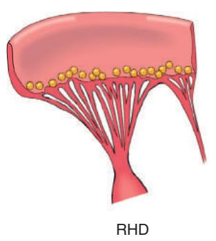 
Fig. 11.20 Major forms of vegetative endocarditis. The acute rheumatic fever phase of rheumatic heart disease (RHD) is marked by the appearance of small, warty, inflammatory vegetations along the lines of valve closure; as the inflammation resolves, substantial scarring can result. Infective endocarditis (IE) is characterized by large, irregular, often destructive masses that can extend from valve leaflets onto adjacent structures (e.g., chordae or myocardium). Nonbacterial thrombotic endocarditis (NBTE) typically manifests with small- to medium-sized, bland, nondestructive vegetations at the line of valve closure. Libman-Sacks endocarditis (LSE) is characterized by small- to medium-sized inflammatory vegetations that can be attached on either side of the valve leaflets; these heal with scarring.
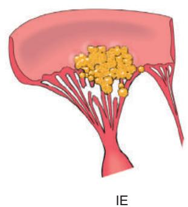
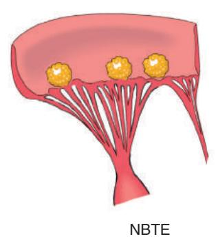
.Cl.jpg)
hematuria, albuminuria, or renal failure (Chapter 14). Clinical features of septicemia, arrhythmias (suggesting extension to underlying myocardium and conduction system), and systemic embolization bode ill for the patient. Left untreated, IE generally is fatal. However, with appropriate long-term (6 weeks or more) antibiotic therapy and/or valve replacement, mortality is reduced. For infections with low-virulence organisms (e.g., Streptococcus viridans or Streptococcus bovis), the cure rate is $98\%$ , and for enterococci and Staphylococcus aureus infections, cure rates range from $60\%$ to $90\%$ ; however, infections with aerobic gram-negative bacilli or fungi are associated with fatality rate of approximately $50\%$ .
# Noninfected Vegetations
# Nonbacterial Thrombotic Endocarditis
Nonbacterial thrombotic endocarditis (NBTE) is characterized by the deposition of sterile thrombi on cardiac valves, typically in those with an underlying hypercoagulable state. Although NBTE can occur in otherwise healthy individuals, a wide variety of diseases associated
with general debility or wasting are associated with an increased risk for NBTE - hence the alternate term marantic endocarditis. In contrast to infective endocarditis, the sterile valvular lesions of NBTE are nondestructive (Fig. 11.22).
The vegetations in NBTE are typically small (1 to $5\mathrm{mm}$ in diameter) and valvular damage is not a prerequisite. Indeed, the condition usually occurs on previously normal valves. Rather, hypercoagulable states are the usual precursor to NBTE; such conditions include chronic disseminated intravascular coagulation, hyperestrogenic states, and those associated with underlying malignancy, particularly mucinous adenocarcinomas. This last association probably relates to the procoagulant effect of circulating mucin and/or tissue factor elaborated by these tumors. Endocardial trauma, such as from an indwelling catheter, also is a well-recognized predisposing condition.
Although the local effect on the valve usually is trivial, NBTE lesions can become clinically significant by giving rise to emboli that can cause infarcts in the brain, heart, and other organs. NBTE also can serve as a potential nidus for bacterial colonization and the consequent development of infective endocarditis.
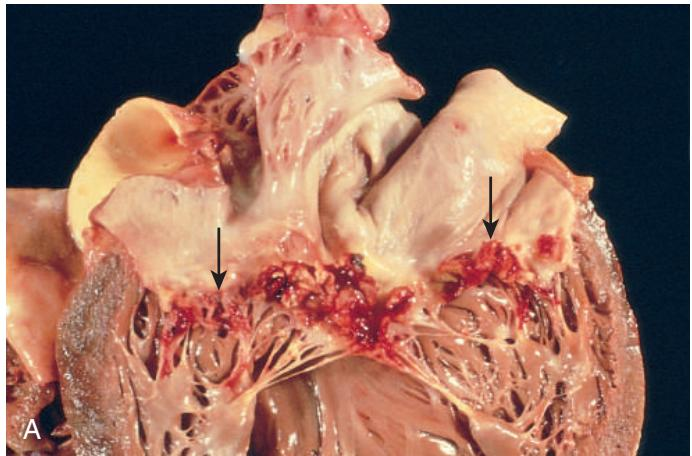 
Fig. 11.21 Infective endocarditis. (A) Subacute endocarditis caused by Streptococcus viridans on a previously myxomatous mitral valve. The large, friable vegetations are denoted by arrows. (B) Acute endocarditis caused by Staphylococcus aureus on a congenitally bicuspid aortic valve with extensive cuspal destruction and ring abscess (arrow).
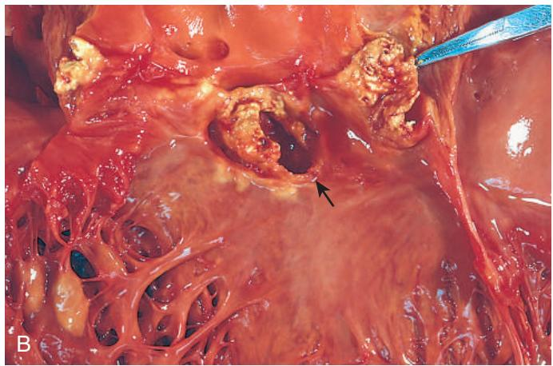
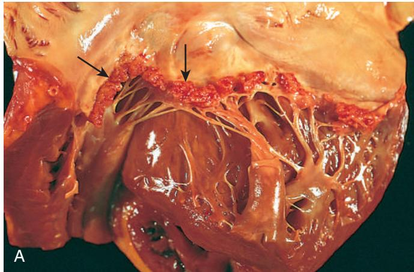
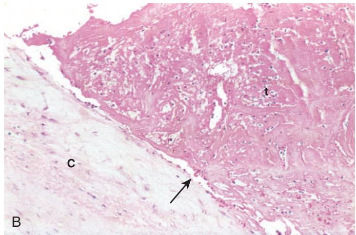 
Fig. 11.22 Nonbacterial thrombotic endocarditis (NBTE). (A) Small thrombotic vegetations along the line of closure of the mitral valve leaflets (arrows). (B) Photomicrograph of NBTE lesion, showing bland thrombus, with virtually no inflammation in the valve cusp (C) or the thrombotic deposit (t). The thrombus is only loosely attached to the cusp (arrow).
# Endocarditis in Systemic Lupus Erythematosus: Libman-Sacks Endocarditis
Libman-Sacks endocarditis is characterized by the presence of sterile vegetations on the valves of patients with systemic lupus erythematosus. It occurs in about $10\%$ of patients with SLE. The lesions probably develop as a consequence of immune complex deposition and thus exhibit associated inflammation, often with fibrinoid necrosis of the valve adjacent to the vegetation; subsequent fibrosis and serious deformity can result in lesions that resemble chronic rheumatic heart disease. These can occur anywhere on the valve surface, on the cords, or even on the atrial or ventricular endocardium (see Fig. 11.20). Similar lesions can occur in the setting of anti-phospholipid antibody syndrome (Chapter 4).
# VALVULAR HEART DISEASE
- Valve pathology can lead to occlusion (stenosis) and/or regurgitation (insufficiency); acquired aortic or mitral valve stenosis accounts for approximately two thirds of all valve disease.
- Valve calcification typically results in stenosis; abnormal matrix synthesis and turnover leads to myxomatous degeneration and insufficiency. 
- Inflammatory valve diseases cause postinflammatory neovascularization and scarring. Rheumatic heart disease results from anti-streptococcal antibodies that cross-react with cardiac tissues; it most commonly affects the mitral valve and is responsible for almost all cases of acquired mitral stenosis. 
- Infective endocarditis can rapidly destroy normal valves, or can be indolent and minimally destructive of previously abnormal valves. Systemic embolization can produce septic infarcts. 
- Nonbacterial thrombotic endocarditis occurs on previously normal valves as a result of hypercoagulable states; embolization is an important complication.
# CARDIOMYOPATHIES AND MYOCARDITIS
Cardiac diseases due to intrinsic myocardial dysfunction are termed cardiomyopathies (literally, "heart muscle diseases"); these can be primary—that is, principally confined to the myocardium—or secondary presenting as the cardiac manifestation of a systemic disorder. Cardiomyopathies are thus a diverse group that includes inflammatory disorders (e.g., myocarditis), immunologic diseases (e.g., sarcoidosis), systemic metabolic disorders (e.g., hemochromatosis), muscular dystrophies, and genetic disorders of myocardial fibers. In many cases, the cardiomyopathy is of unknown etiology and thus is termed idiopathic; however, a number of previously "idiopathic" cardiomyopathies have been shown to be the consequence of specific genetic abnormalities in cardiac energy metabolism or in structural and contractile proteins.
Cardiomyopathies can be classified according to a variety of criteria, including the underlying genetic basis of dysfunction; indeed, some of the arrhythmia-inducing channelopathies that are included in some classifications of cardiomyopathy were alluded to earlier. For purposes of general diagnosis and therapy, however, three time-honored clinical, functional, and pathologic patterns are recognized (Fig. 11.23 and Table 11.5):
- Dilated cardiomyopathy (DCM) (including arrhythmogenic right ventricular cardiomyopathy) 
Hypertrophic cardiomyopathy (HCM) 
- Restrictive cardiomyopathy
Of the three major patterns, DCM is most common (90% of cases), and restrictive cardiomyopathy is the least frequent. Within each pattern, there is a spectrum of clinical severity, and in some cases clinical features overlap among the groups. In addition, each of these patterns can be caused by a specific identifiable cause, or can be idiopathic (see Table 11.5).
# Dilated Cardiomyopathy
Dilated cardiomyopathy (DCM) is characterized by progressive cardiac dilation and contractile (systolic) dysfunction, usually with concurrent hypertrophy; regardless of the cause, the clinicopathologic patterns are similar.
ischaracterizedbyprogres.jpg) 
Normal
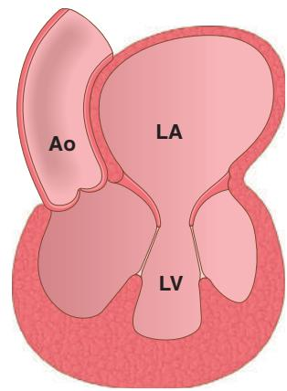 
Dilated cardiomyopathy
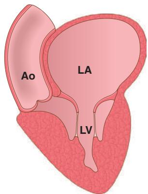 
Hypertrophic cardiomyopathy 
Fig. 11.23 The three major forms of cardiomyopathy. Dilated cardiomyopathy leads primarily to systolic dysfunction, whereas restrictive and hypertrophic cardiomyopathies result in diastolic dysfunction. Note the changes in atrial and/or ventricular dilation and in ventricular wall thickness. Ao, Aorta; LA, left atrium; LV, left ventricle.
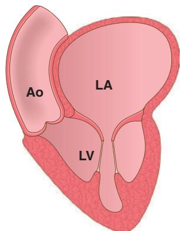 
Restrictive cardiomyopathy
Although many individuals with DCM have a familial (genetic) form, DCM can also result from various acquired myocardial insults. These include the following:
- Myocarditis (an inflammatory disorder that precedes the development of cardiomyopathy in at least some cases, and is sometimes caused by viral infections)
- Toxicities, including adverse effects of chemotherapeutic agents and chronic alcoholism, a history of which can be elicited in $10\%$ to $20\%$ of patients 
- Pregnancy, so-called "peripartum cardiomyopathy" 
- Stress-provoked 
- Tachycardia-induced
By the time it is diagnosed, DCM has frequently already progressed to end-stage disease; the heart is dilated and poorly contractile, and at autopsy or cardiac transplant, fails to reveal any specific pathologic features. Nevertheless, genetic and epidemiologic studies suggest that at least five general pathways can lead to end-stage DCM (Fig. 11.24):
- Genetic causes. DCM has a hereditary basis in $20\%$ to $50\%$ of cases. Over 50 genes are known to be mutated in this form of cardiomyopathy, with autosomal dominant inheritance being the predominant pattern; mutations affecting cytoskeletal proteins or proteins that link the sarcomere to the cytoskeleton (e.g., $\alpha$ -cardiac actin) are most commonly involved. X-linked DCM is most frequently associated with mutations in dystrophin, a cell membrane protein that physically couples the intracellular cytoskeleton to the ECM (Chapter 22). Uncommon forms of DCM are caused by mutations of mitochondrial proteins involved in oxidative phosphorylation or fatty acid $\beta$ -oxidation, presumably leading to defective ATP generation. Other genetic forms of DCM include those with mutations in cytoskeletal proteins such as desmin (the principal intermediate filament protein in cardiac myocytes), and the nuclear lamins A and C. Since contractile myocytes and conduction fibers share a common developmental pathway, congenital conduction abnormalities also can be a feature of inherited forms of DCM. 
- Infection. The nucleic acid "footprints" of coxsackievirus B and other enteroviruses can occasionally be detected in the myocardium from late-stage DCM patients. Moreover, sequential endomyocardial biopsies have documented instances in which infectious myocarditis progressed to DCM. Simply finding viral transcripts or demonstrating elevated anti-viral antibody titers may be sufficient to invoke a myocarditis that was "missed" in its early stages. Consequently, many cases of DCM are attributed to viral infections, even though inflammation is absent from the end-stage heart. 
- Alcohol or other toxic exposure. Alcohol abuse is strongly associated with the development of DCM. Alcohol and
Table 11.5 Cardiomyopathies: Functional Patterns, Causes 
Functional PatternLeft Ventricular Ejection Fraction*Mechanisms of Heart FailureCausesSecondary Myocardial Dysfunction (Mimicking Cardiomyopathy)Dilated&lt;40%Impairment of contractility (systolic dysfunction)Genetic; alcohol; peripartum; myocarditis; hemochromatosis; chronic anemia; doxorubicin (Adriamycin); sarcoidosis; idiopathicIschemic heart disease; valvular heart disease; hypertensive heart disease; congenital heart diseaseHypertrophic50%–80%Impairment of compliance (diastolic dysfunction)Genetic; Friedrich ataxia; storage diseases; infants of diabetic mothersHypertensive heart disease; aortic stenosisRestrictive45%–90%Impairment of compliance (diastolic dysfunction)Amyloidosis; radiation-induced fibrosis; idiopathicPericardial constriction
*Range of normal values is approximately 50% to 65%.
# Non-genetic causes
Myocarditis 
Peripartum 
- Toxic (e.g., alcohol) 
Idiopathic
# 20-50% genetic causes
Various proteins
(cell membrane,
cytoskeleton.
sarcomere,
nuclear envelope,
or mitochondrial)
Defect in force generation,
force transmission, and/or
myocyte signaling
 
DILATED CARDIOMYOPATHY 
Fig. 11.24 Causes and consequences of dilated and hypertrophic cardiomyopathy. A significant fraction of dilated cardiomyopathies—and virtually all hypertrophic cardiomyopathies—have a genetic origin. Dilated cardiomyopathies can be caused by mutations in cytoskeletal, sarcomeric, nuclear envelope, or mitochondrial proteins; hypertrophic cardiomyopathies typically are caused by sarcomeric protein mutations. Although the two forms of cardiomyopathy differ in cause and morphology, they have common clinical end points. LV, Left ventricle.
# Dilated cardiomyopathy
# phenotype
Hypertrophy 
Dilation 
- Fibrosis, interstitial 
Intracardiac thrombi
# HYPERTROPHIC CARDIOMYOPATHY
# 100% genetic causes
Sarcomeric proteins
Defect in energy transfer from
mitochondria to sarcomere and/or
direct sarcomeric dysfunction
# Hypertrophic cardiomyopathy
# phenotype
Hypertrophy, marked 
- Asymmetrical septal hypertrophy 
- Myofiber disarray 
- Fibrosis, interstitial and 
replacement 
LV outflow tract plaque 
Thickened septal vessels
# Clinical
Heart failure 
- Sudden death 
Atrial fibrillation 
Stroke
its metabolites (especially acetaldehyde) have a direct toxic effect on the myocardium. Moreover, chronic alcoholism can be associated with thiamine deficiency, introducing an element of beriberi heart disease (Chapter 8). DCM also can develop after exposure to other toxic agents, such as cobalt, and particularly doxorubicin (Adriamycin), a chemotherapeutic drug.
- Peripartum cardiomyopathy occurs late in gestation or several weeks to months postpartum. The etiology is multifactorial, including pregnancy-associated hypertension, volume overload, nutritional deficiency, metabolic derangements (e.g., gestational diabetes), and/or immunologic responses. Recent work suggests that the primary defect is impaired angiogenesis within the myocardium leading to ischemic injury. Antiangiogenic cleavage products of the hormone prolactin (which rises late in pregnancy) and placental-derived antagonists to the VEGF have been implicated. Fortunately, approximately one half of these patients spontaneously recover normal function. 
- Iron overload in the heart can result either from hereditary hemochromatosis (Chapter 16) or from multiple transfusions. Iron overload also can cause restrictive cardiomyopathy due to interstitial fibrosis, but DCM is the most common manifestation; it has been attributed to interference with metal-dependent enzyme systems or to injury caused by iron-mediated production of reactive oxygen species.
The heart in DCM characteristically is enlarged (up to two to three times the normal weight) and flabby, with dilation of all chambers (Fig. 11.25). Because of the wall thinning that accompanies dilation, the ventricular thickness may be less than, equal to, or greater than normal. Mural thrombi are often present and may be a source of thromboemboli. By definition, valvular and vascular lesions (e.g., atherosclerotic coronary artery disease) that can cause cardiac dilation secondarily are absent.
The characteristic histologic abnormalities in DCM are nonspecific. Most myocytes exhibit hypertrophy with enlarged nuclei, but many are attenuated, stretched, and irregular. There is also variable interstitial and endocardial fibrosis, with scattered areas of replacement fibrosis; the latter mark previous myocyte ischemic necrosis caused by hypoperfusion, or they may be the footprints of a previous "missed" myocarditis.
In DCM secondary to iron overload, there is a marked accumulation of intramyocardial hemosiderin, which is demonstrable by staining with Prussian blue.
The fundamental defect in DCM is ineffective contraction. Thus, in end-stage DCM, the cardiac ejection fraction typically is less than $25\%$ (normal is $50\%$ to $65\%$ ). Secondary mitral regurgitation and abnormal cardiac rhythms are
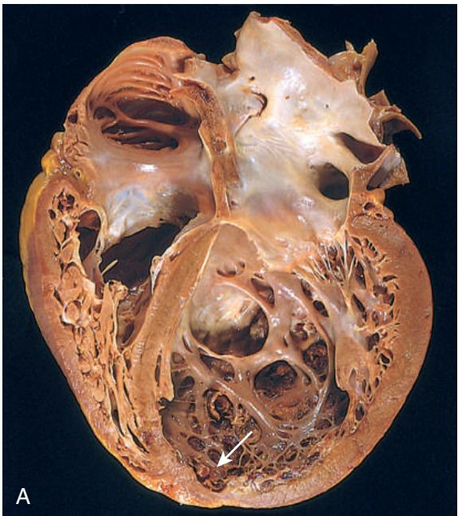 
Fig. 11.25 Dilated cardiomyopathy (DCM). (A) Four-chamber dilation and hypertrophy are evident. A small mural thrombus can be seen at the apex of the left ventricle (arrow). (B) The nonspecific histologic picture in typical DCM, with myocyte hypertrophy and interstitial fibrosis. (Collagen is blue in this Masson trichrome-stained preparation.)
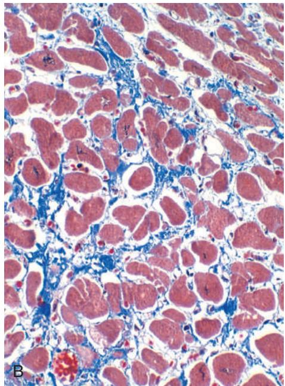
common, and embolism from intracardiac (mural) thrombi can occur. DCM most commonly is diagnosed between 20 and 50 years of age. It typically manifests with signs of slowly progressive CHF, including dyspnea, easy fatigability, and poor exertional capacity. One half of patients die within 2 years and only $25\%$ survive longer than 5 years; death is usually due to progressive cardiac failure or arrhythmia. Cardiac transplantation is the only definitive treatment, although implantation of long-term ventricular assist devices is increasingly utilized; in some patients, a course of mechanical assistance can produce durable regression of cardiac dysfunction.
# Arrhythmogenic Right Ventricular Cardiomyopathy
Arrhythmogenic right ventricular cardiomyopathy is an autosomal dominant disorder that classically manifests with right-sided heart failure and rhythm disturbances, which can cause sudden cardiac death. Its prevalence in the general adult population is close to 1 in 5000 in a study from Italy. Similar prevalence is likely in the US where it seems to be under reported. Almost $10\%$ of cases of sudden deaths in athletes have been ascribed to this entity. Morphologically, the right ventricular wall is severely thinned owing to myocyte replacement by fatty infiltration and lesser amounts of fibrosis (Fig. 11.26). Many of the causative mutations involve genes encoding desmosomal junctional proteins at the intercalated disk (e.g., plakoglobin), as well as proteins that interact with the desmosome (e.g., the intermediate filament desmin). It's thought that myocyte death is caused by desmosomal detachment, particularly during strenuous exercise.
# Hypertrophic Cardiomyopathy
Hypertrophic cardiomyopathy (HCM) is characterized by myocardial hypertrophy, defective diastolic filling, and—in one third of cases—ventricular outflow obstruction. The heart is thick-walled, heavy, and hypercontractile, in striking contrast to the flabby, poorly contractile heart in DCM. Systolic function usually is preserved in HCM, but the myocardium does not relax and therefore exhibits primary diastolic dysfunction. HCM needs to be distinguished clinically from disorders causing ventricular stiffness (e.g., amyloid deposition) and ventricular hypertrophy (e.g., aortic stenosis and hypertension).
Most cases of HCM are caused by missense mutations in one of several genes encoding proteins that form the contractile apparatus. The usual pattern of transmission is autosomal dominant, with variable expression. Although more than 400 causative mutations in nine different genes have been identified, all have one unifying feature: they all affect sarcomeric proteins and increase myofilament function. This results in myocyte hypercontractility, increased energy use, and a net negative energy balance. Of the various sarcomeric proteins, $\beta$ -myosin heavy chain is most frequently involved, followed by myosin-binding protein C and troponin T. Mutations in these three genes account for $70\%$ to $80\%$ of all cases of HCM.
Some of the genes mutated in HCM also are mutated in DCM (e.g., beta-myosin), but in DCM the mutations depress motor function as opposed to the gain of function seen in HCM.
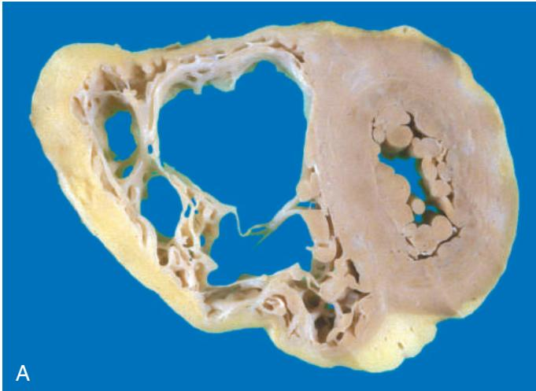 
Fig. 11.26 Arrhythmogenic right ventricular cardiomyopathy. (A) The right ventricle is markedly dilated with focal, almost transmural replacement of the free wall by adipose tissue and fibrosis. The left ventricle has a grossly normal appearance in this heart; it can be involved (albeit to a lesser extent) in some instances. (B) The right ventricular myocardium (red) is focally replaced by fibrous connective tissue (blue, arrow) and fat (Masson trichrome stain).
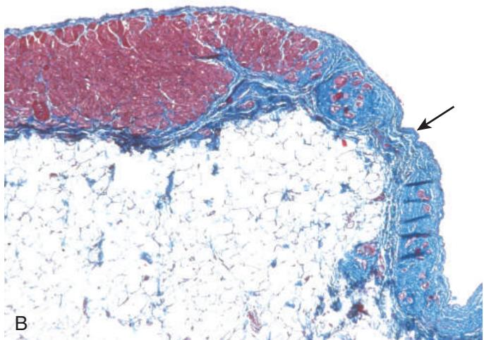
Hypertrophic cardiomyopathy is marked by massive myocardial hypertrophy without ventricular dilation (Fig. 11.27A). Classically, there is disproportionate thickening of the ventricular septum relative to the left ventricle free wall (so-called asymmetric septal hypertrophy); nevertheless, in about $10\%$ of cases of HCM, concentric hypertrophy is seen. On longitudinal sectioning, the ventricular cavity loses its usual round-to-ovoid shape and is compressed into a "banana-like" configuration. The anterior mitral leaflet contacts the septum during ventricular systole, producing a plaque in the left ventricular outflow tract and thickening of the mitral leaflet; these changes correlate with functional left ventricular outflow tract obstruction due to systolic anterior motion of the mitral valve.
The characteristic histologic features in HCM are marked myocyte hypertrophy, haphazard myocyte (and myofiber) disarray, and interstitial fibrosis (Fig. 11.27B).
Although HCM can present at any age, it typically manifests during the postpubertal growth spurt. The clinical symptoms can be best understood in the context of the functional abnormalities. It is characterized by massive left ventricular hypertorphy associated with (paradoxically) a markedly reduced stroke volume. This latter occurs as a consequence of impaired diastolic filling and overall smaller chamber size. In addition, roughly $25\%$ of patients have dynamic obstruction to the left ventricular outflow by the anterior leaflet of the mitral valve. Reduced cardiac output and a secondary increase in pulmonary venous pressure cause exertional dyspnea, with a harsh systolic ejection murmur. A combination of massive hypertrophy, high left ventricular pressures, and compromised intramural arteries frequently leads to myocardial ischemia (with angina), even in the absence of concomitant CAD. Major clinical problems include atrial fibrillation with mural
thrombus formation, ventricular fibrillation leading to sudden cardiac death, infectious endocarditis of the mitral valve, and CHF. Most patients' symptoms are improved by therapy that promotes ventricular relaxation; partial surgical excision or controlled alcohol-induced infarction of septal muscle also can relieve the outflow tract obstruction. As mentioned earlier, HCM is an important cause of sudden cardiac death. In almost one third of cases of sudden cardiac death in athletes younger than 35 years of age, the underlying cause is HCM.
# Restrictive Cardiomyopathy
Restrictive cardiomyopathy is characterized by a primary decrease in ventricular compliance, resulting in impaired ventricular filling during diastole (simply put, the wall is stiffer). This form of cardiomyopathy may be idiopathic or may be associated with systemic diseases that affect the myocardium, for example, radiation fibrosis, amyloidosis, sarcoidosis, or products of inborn errors of metabolism.
Three forms of restrictive cardiomyopathy merit brief mention:
- Amyloidosis is caused by the deposition of extracellular proteins with a predilection for forming insoluble $\beta$ -pleated sheets (Chapter 5). Cardiac amyloidosis can occur in the setting of systemic amyloidosis (e.g., multiple myeloma) or can be predominantly restricted to the heart (e.g., senile cardiac amyloidosis). In the latter case, deposition of normal (or mutant) forms of transthyretin (a liver-synthesized circulating protein that transports thyroxine and retinol) in the hearts of older adult patients results in a restrictive cardiomyopathy. Four percent of African Americans carry a specific mutation of transthyretin that increases the risk of cardiac amyloidosis in that population over fourfold. Besides depositing as amyloid, immunoglobulin light-chains in AL-type amyloid also are directly cardiotoxic and can induce myocardial dysfunction.
- Endomyocardial fibrosis is principally a disease of children and young adults in Africa and other tropical areas. It is
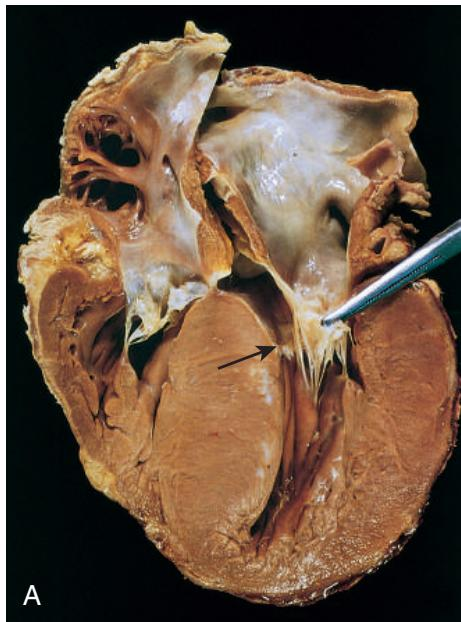 
Fig. 11.27 Hypertrophic cardiomyopathy with asymmetric septal hypertrophy. (A) The septal muscle bulges into the left ventricular outflow tract, giving rise to a "banana-shaped" ventricular lumen, and the left atrium is enlarged. The anterior mitral leaflet has been moved away from the septum to reveal a fibrous endocardial plaque (arrow) (see text). (B) Histologic appearance demonstrating disarray, extreme hypertrophy, and characteristic branching of myocytes, as well as interstitial fibrosis.
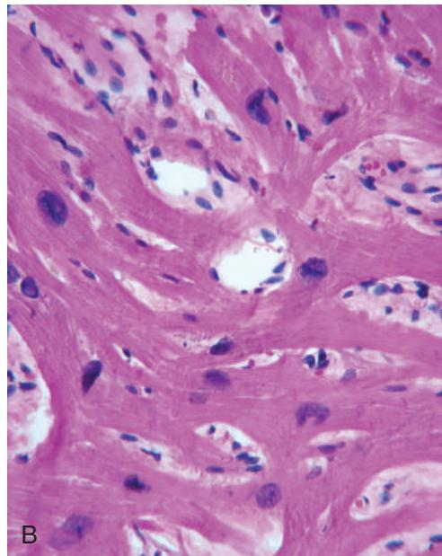
characterized by dense diffuse fibrosis of the ventricular endocardium and subendocardium, often involving the tricuspid and mitral valves. The fibrous tissue markedly diminishes the volume and compliance of affected chambers, resulting in a restrictive physiology. Endomyocardial fibrosis has been linked to nutritional deficiencies and/or inflammation related to helminthic infections (e.g., hypereosinophilia); worldwide, it is the most common form of restrictive cardiomyopathy. 
- Loeffler endomyocarditis also exhibits endocardial fibrosis, typically associated with formation of large mural thrombi. It has no geographic or population predilection. It is characterized by peripheral hypereosinophilia and eosinophilic tissue infiltrates; release of eosinophil granule contents, especially major basic protein, probably engenders endocardial and myocardial necrosis, followed by scarring, layering of the endocardium by thrombus, and finally thrombus organization. Of interest, some patients have an underlying hypereosinophilic myeloproliferative neoplasm driven by gene rearrangements that lead to expression of constitutively active tyrosine kinases (Chapter 12). Treatment of such patients with tyrosine kinase inhibitors can result in hematologic remission and reversal of the endomyocardial lesions.
In restrictive cardiomyopathy, the ventricles are of approximately normal size or only slightly enlarged, the cavities are not dilated, and the myocardium is firm. However, both atria are typically dilated as a consequence of restricted ventricular filling and pressure overloads. Microscopic examination reveals variable degrees of interstitial fibrosis. Although gross morphologic findings are similar for restrictive cardiomyopathy of disparate causes, endomyocardial biopsy often can reveal a specific etiology.
# Myocarditis
Myocarditis encompasses a diverse group of clinical entities in which infectious agents and/or inflammatory processes target the myocardium. It is important to distinguish myocarditis from conditions such as IHD, where the inflammatory process is secondary to some other cause of myocardial injury.
In the United States, viral infections are the most common cause of myocarditis, with coxsackieviruses A and B and other enteroviruses accounting for a majority of the cases. Cytomegalovirus (CMV), human immunodeficiency virus (HIV), influenza virus, and others are less common pathogens. Offending agents can be identified by serologic studies that show rising antibody titers or through molecular diagnostic techniques using infected tissues. While some viruses cause direct cell death, in most cases the injury results from an immune response directed against virally infected cells; this is analogous to the damage inflicted by virus-specific T cells on hepatitis virus-infected liver cells (Chapter 16). In some cases, viruses trigger a reaction against cross-reacting proteins such as myosin heavy chain.
The nonviral infectious causes of myocarditis run the entire gamut of the microbial world. The protozoan Trypanosoma cruzi is the agent of Chagas disease. Although uncommon in the northern hemisphere, Chagas disease affects up to one half of the population in endemic areas of South America, with myocardial involvement in the vast majority. About $10\%$ of the patients die during an acute attack; others can enter a chronic immune-mediated phase with development of progressive signs of CHF and arrhythmia 10 to 20 years later. Toxoplasma gondii (household cats are the most common vector) also can cause myocarditis, particularly in immunocompromised individuals.
Trichinosis is the most common helminthic disease associated with cardiac involvement.
Myocarditis occurs in approximately $5\%$ of patients with Lyme disease, a systemic illness caused by the bacterial spirochete Borrelia burgdorferi (Chapter 9). Lyme myocarditis manifests primarily as self-limited conduction system disease, frequently requiring temporary pacemaker insertion.
Noninfectious causes of myocarditis include systemic diseases of immune origin, such as systemic lupus erythematosus and polymyositis. Drug hypersensitivity reactions affecting the heart (hypersensitivity myocarditis) may occur with exposure to a wide range of agents; such reactions typically are benign and only in rare circumstances lead to CHF or sudden death.
In acute myocarditis, the heart may appear normal or dilated; in advanced stages, the myocardium typically is flabby and often mottled with pale and hemorrhagic areas. Mural thrombi may be present.
Microscopically, myocarditis is characterized by edema, interstitial inflammatory infiltrates, and myocyte injury (Fig. 11.28). A diffuse lymphocytic infiltrate is most common (see Fig. 11.28A), although the inflammatory involvement is often patchy and can be "missed" on endomyocardial biopsy. If the patient survives the acute phase of myocarditis, lesions may resolve without significant sequelae or heal by progressive fibrosis.
In hypersensitivity myocarditis, interstitial and perivascular infiltrates are composed of lymphocytes, macrophages, and a high proportion of eosinophils (Fig. 11.28B). Giant cell myocarditis is a morphologically distinctive entity characterized by widespread inflammatory cell infiltrates containing multinucleate giant cells (formed by macrophage fusion). Giant cell myocarditis probably represents the aggressive end of the spectrum of lymphocytic myocarditis, and there is at least focal—and frequently extensive—necrosis (Fig. 11.28C). This variant carries a poor prognosis.
Chagas myocarditis is characterized by the parasitization of scattered myofibers by trypanosomes accompanied by an inflammatory infiltrate of neutrophils, lymphocytes, macrophages, and occasional eosinophils (Fig. 11.28D).
The clinical spectrum of myocarditis is broad; at one end, the disease is asymptomatic, and patients recover without sequelae. At the other extreme is the precipitous onset of heart failure or arrhythmias, occasionally with sudden death. Between these extremes are many levels of involvement associated with a variety of signs and symptoms, including fatigue, dyspnea, palpitations, pain, and fever. The clinical features of myocarditis can mimic those of acute MI. Clinical progression from myocarditis to DCM occasionally is seen.
# Other Causes of Myocardial Disease
# Cardiotoxic Drugs
Cardiac complications of cancer therapy are an important clinical problem. Cardiotoxicity can be associated with
conventional chemotherapeutic agents, targeted drugs such as tyrosine kinase inhibitors, and certain forms of immunotherapy (e.g., immune checkpoint blockade for cancer). The anthracyclines doxorubicin and daunorubicin are the chemotherapeutic agents that are most frequently associated with toxic myocardial injury, which often takes the form of a dilated cardiomyopathy and heart failure. Anthracycline toxicity is dose-dependent (cardiotoxicity becomes progressively more frequent above a total dose of $500\mathrm{mg / m^2}$ ) and is attributed primarily to peroxidation of lipids in myocyte membranes.
Many other agents, such as lithium, phenothiazines, and chloroquine, have been implicated in myocardial injury and sometimes sudden death. Common findings in hearts injured by many of these chemicals and drugs (including diphtheria exotoxin and doxorubicin) are myofiber swelling, cytoplasmic vacuolization, and fatty change. Discontinuing such agents can lead to complete resolution, with no apparent sequelae. Sometimes, however, more extensive damage produces myocyte necrosis and leads to a dilated cardiomyopathy.
# Catecholamines
Foci of myocardial necrosis with contraction bands, often associated with a sparse mononuclear inflammatory infiltrate (mostly macrophages), can occur in individuals with pheochromocytoma, a tumor that elaborates catecholamines (Chapter 20). Similar changes can occur with a variety of agents—endogenous or exogenous—under the rubric of "catecholamine effect." These include cocaine, high doses of ephedrine (an adrenergic agent in many cold and allergy formulations), intense autonomic stimulation secondary to intracranial lesions, or vasopressor agents such as dopamine. The mechanism of catecholamine cardiotoxicity is uncertain, but seems to relate either to a direct toxicity of catecholamines on cardiac myocytes via calcium overload or to vasoconstriction in the face of an increased heart rate. The mononuclear cell infiltrate is probably a reaction to microscopic foci of myocyte cell death.
# CARDIOMYOPATHIES AND MYOCARDITIS
- Cardiomyopathy refers to intrinsic cardiac muscle disease; there may be specific causes, or it may be idiopathic. 
- The three general pathophysiologic categories of cardiomyopathy are dilated (accounting for $90\%$ of the cases), hypertrophic, and restrictive (least common). 
- DCM results in systolic (contractile) dysfunction. Causes include myocarditis, toxic exposures (e.g., alcohol), and pregnancy. In $20\%$ to $50\%$ of cases, mutations affecting cytoskeletal proteins are responsible. 
- HCM results in diastolic (relaxation) dysfunction. Virtually all cases are due to autosomal dominant mutations in the proteins that make up the contractile apparatus, in particular $\beta$ -myosin heavy chain. 
- Restrictive cardiomyopathy results in a stiff, noncompliant myocardium and can be due to depositions (e.g., amyloid), increased interstitial fibrosis (e.g., due to radiation), or endomyocardial scarring.
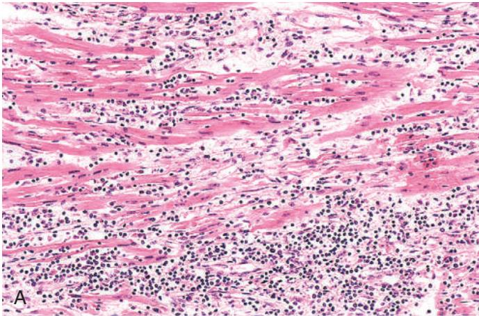
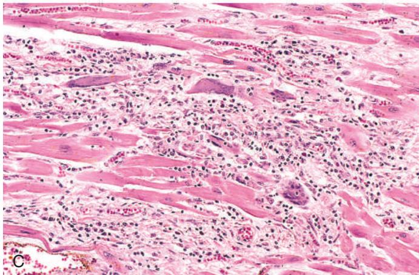 
Fig. 11.28 Myocarditis. (A) Lymphocytic myocarditis, with edema and associated myocyte injury. (B) Hypersensitivity myocarditis, characterized by perivascular eosinophil-rich inflammatory infiltrates. (C) Giant cell myocarditis, with lymphocyte and macrophage infiltrates, extensive myocyte damage, and multinucleate giant cells. (D) Chagas myocarditis. A myofiber distended with trypanosomes (arrow) is present, along with mononuclear inflammation and myofiber necrosis.
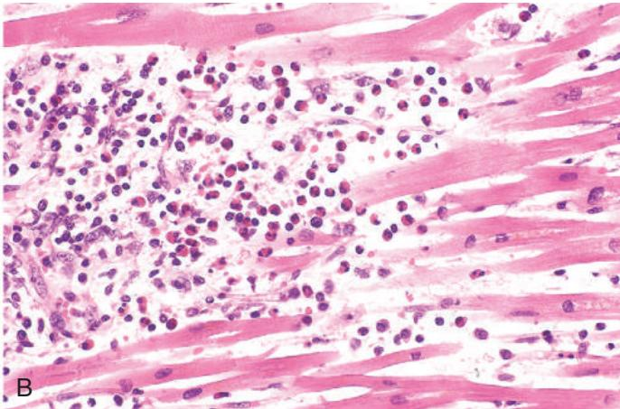
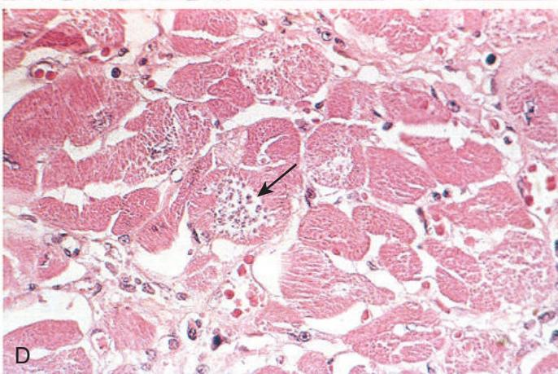
- Arrhythmogenic right ventricular cardiomyopathy is an autosomal dominant disorder of cardiac muscle that manifests with right-sided heart failure and rhythm disturbances that can cause sudden cardiac death in athletes. 
- Myocarditis is an inflammatory disorder caused by infections or immune reactions. Coxsackieviruses A and B are the most common pathogens in the United States. Clinically, myocarditis may be asymptomatic, give rise to acute heart failure, or evolve to DCM.
# PERICARDIAL DISEASE
Pericardial lesions typically are associated with a pathologic process elsewhere in the heart or surrounding structures, or are secondary to a systemic disorder. Pericardial disorders include effusions and inflammatory conditions, sometimes resulting in fibrous constriction.
# Pericardial Effusion and Hemopericardium
Normally, the pericardial sac contains less than $50~\mathrm{cc}$ of thin, clear, straw-colored fluid. Under various circumstances, the pericardial sac may be distended by accumulations of serous fluid (pericardial effusion), blood (hemopericardium), or pus (purulent pericarditis).
Pericardial effusions and their causes include the following:
- Serous: Congestive heart failure, hypoalbuminemia of any cause 
- Serosanguineous: Blunt chest trauma, malignancy, ruptured MI, or aortic dissection 
Chylous: Mediastinal lymphatic obstruction
With long-standing cardiac enlargement or with slowly accumulating fluid, the pericardium has time to dilate. This permits chronic pericardial effusions to become quite large without interfering with cardiac function. Thus, with chronic effusions of less than $500~\mathrm{cc}$ in volume, the only clinical significance is a characteristic globular enlargement of the heart shadow on chest radiograph. In contrast, rapidly developing fluid collections of as little as 200 to $300~\mathrm{cc}$ (e.g., due to hemopericardium caused by a ruptured MI or aortic dissection) can produce clinically devastating compression of the thin-walled atria and vena cavae, or the ventricles themselves; cardiac filling is thereby restricted, producing potentially fatal cardiac tamponade.
# Pericarditis
Primary pericarditis is uncommon. It is typically due to viral infection (often with concurrent myocarditis),
although bacteria, fungi, or parasites may also be involved. In most cases, pericarditis is secondary to acute MI or cardiac surgery (so-called "Dressler's syndrome"), radiation to the mediastinum, or processes involving other thoracic structures (e.g., pneumonia or pleuritis). Uremia is the most common systemic disorder associated with pericarditis. Less common secondary causes include rheumatic fever, systemic lupus erythematosus, and metastatic malignancies. Pericarditis can (1) cause immediate hemodynamic complications if it elicits a large effusion (resulting in cardiac tamponade), (2) resolve without significant sequelae, or 3) progress to a chronic fibrosing process.
In patients with acute viral pericarditis or uremia, the exudate typically is fibrinous, imparting an irregular, shaggy appearance to the pericardial surface (so-called "bread and butter" pericarditis). In acute bacterial pericarditis, the exudate is fibrinopurulent (suppurative), often with areas of frank pus (Fig. 11.29); tuberculous pericarditis can exhibit areas of caseation. Pericarditis due to malignancy often is associated with an exuberant, shaggy fibrinous exudate and a bloody effusion; metastases can be grossly evident as irregular excrescences or may be grossly inapparent, especially in the case of leukemia. In most cases, acute fibrinous or fibrinopurulent pericarditis resolves without any sequelae. With extensive suppuration or caseation, however, healing can result in fibrosis (chronic pericarditis).
Chronic pericarditis may be associated with delicate adhesions or dense, fibrotic scars that obliterate the pericardial space. In extreme cases, the heart is so completely encased by dense fibrosis that it cannot expand normally during diastole—resulting in the condition known as constrictive pericarditis.
Pericarditis classically manifests with atypical chest pain (not related to exertion and worse in recumbency), and a prominent friction rub. When associated with significant fluid accumulation, acute pericarditis can cause cardiac tamponade, which leads to declining cardiac output and consequent shock. Chronic constrictive pericarditis produces a combination of right-sided venous distention and low cardiac output, similar to the clinical picture in restrictive cardiomyopathy.
# CARDIAC TUMORS
# Primary Neoplasms
Primary cardiac tumors are uncommon; moreover, most also are (fortunately) benign. The five most common have no malignant potential and account for $80\%$ to $90\%$ of all primary heart tumors. In descending order of frequency, these are myxomas, fibromas, lipomas, papillary fibroelastomas, and rhabdomyomas. Angiosarcomas constitute the most common primary malignant tumor of the heart. Only the myxomas and rhabdomyomas merit further mention here.
pericarditis,causedbyextensionfromapneumonia..jpg) 
Fig. 11.29 Acute suppurative (purulent, exudative) pericarditis, caused by extension from a pneumonia.
Myxomas are the most common primary tumors of the adult heart (Fig. 11.30). Roughly $90\%$ are atrial, with the left atrium accounting for $80\%$ of those.
Rhabdomyomas are the most frequent primary tumors of the heart in infants and children; they frequently are discovered owing to valvular or outflow obstruction. Cardiac rhabdomyomas occur with high frequency in patients with tuberous sclerosis caused by mutations in the TSC1 or TSC2 tumor suppressor genes; loss of TSC-1 and TSC-2 activity leads to myocyte overgrowth. Because they often regress spontaneously (for unknown reasons), rhabdomyomas are sometimes considered to be hamartomas rather than true neoplasms. In keeping with this not all cardiac rhabdomyomas that occur in patients with tuberous sclerosis are clonal.
Myxomas are almost always single, classically arising in the region of the fossa ovalis (atrial septum). They can be small (less than $1\mathrm{cm}$ in diameter) or massive (up to $10\mathrm{cm}$ across), sessile or pedunculated masses (Fig. 11.30A), most often manifesting as soft, translucent, villous lesions with a gelatinous appearance. Pedunculated forms often are sufficiently mobile to swing into the mitral or tricuspid valve during systole, causing intermittent obstruction or exerting a "wrecking ball" effect that damages the valve leaflets.
Histologically, myxomas are composed of stellate, frequently multinucleated myxoma cells (typically with hyperchromatic nuclei), admixed with cells showing endothelial, smooth muscle, and/or fibroblastic differentiation; all of the cell types arise from differentiation of multipotential mesenchymal tumor cells. The cells are embedded in an abundant acid mucopolysaccharide ground substance (Fig. 11.30B). Hemorrhage, poorly organizing thrombus, and mononuclear inflammation also are usually present.
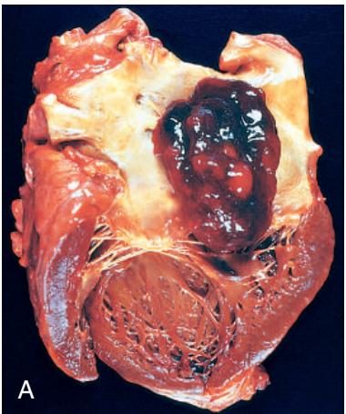 
Fig. 11.30 Atrial myxoma. (A) A large pedunculated lesion arises from the region of the fossa ovalis and extends into the mitral valve orifice. (B) Abundant amorphous extracellular matrix contains scattered multinucleate myxoma cells (arrowheads) in various groupings, including abnormal vascular formations (arrow).
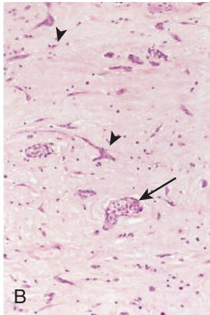
Rhabdomyomas are gray-white masses up to several centimeters in diameter that protrude into the ventricular chambers. Histologic examination shows a mixed population of cells; most characteristic, however, are large, rounded, or polygonal cells containing numerous glycogen-laden vacuoles separated by strands of cytoplasm running from the plasma membrane to the centrally located nucleus, so-called "spider cells".
The major clinical manifestations of myxomas are due to valvular "ball-valve" obstruction, embolization, or a syndrome of constitutional signs and symptoms including fever and malaise. This syndrome is caused by elaboration of the cytokine interleukin-6 by the tumor cells, a major mediator of the acute-phase response. Echocardiography is the diagnostic modality of choice, and surgical resection is almost uniformly curative.
# Cardiac Effects of Noncardiac Neoplasms
With enhanced patient survival due to diagnostic and therapeutic advances, significant cardiovascular effects of noncardiac neoplasms and their therapy are increasingly encountered (Table 11.6). The pathologic consequences include direct tumor metastasis or infiltration, effects of circulating mediators, and therapeutic complications.
The most frequent metastatic tumors involving the heart are carcinomas of the lung and breast, melanomas, leukemias, and lymphomas. Metastases can reach the heart and pericardium by retrograde lymphatic extension (carcinomas), by hematogenous seeding (many tumors), by direct contiguous extension (primary carcinoma of the lung, breast, or esophagus), or by venous extension (tumors of the kidney or liver). Clinical symptoms are most often associated with pericardial spread, which can cause symptomatic pericardial effusions or a mass-effect that is sufficient to restrict cardiac filling. Bronchogenic carcinoma or malignant lymphoma may infiltrate the mediastinum
extensively, causing encasement, compression, or invasion of the superior vena cava and obstruction to blood flow from the head and upper extremities (superior vena cava syndrome). Renal cell carcinoma often invades the renal vein and may grow as a continuous column of tumor up the inferior vena cava and into the right atrium, blocking venous return to the heart.
Noncardiac tumors also may affect cardiac function indirectly, sometimes via circulating tumor-derived substances. The consequences include nonbacterial thrombotic endocarditis, carcinoid heart disease, pheochromocytoma-associated myocardial damage, and myeloma-associated AL-type amyloidosis.
Complications of chemotherapy were discussed earlier in this chapter. Radiation used to treat breast, lung, or mediastinal neoplasms can cause pericarditis, pericardial effusion, myocardial fibrosis, and chronic pericardial disorders. Other cardiac effects of radiation therapy include accelerated coronary artery disease and mural and valvular endocardial fibrosis.
# Carcinoid Heart Disease
The carcinoid syndrome results from bioactive compounds such as serotonin released by carcinoid tumors (Chapter 15); systemic manifestations include flushing, diarrhea, dermatitis, and bronchoconstriction. Carcinoid heart disease refers to the cardiac manifestation caused by the bioactive compounds and occurs in one half of patients in whom the systemic syndrome develops. Cardiac lesions typically do not occur until there is a massive hepatic metastatic burden, since the liver normally inactivates circulating mediators before they can affect the heart. Classically, endocardium and valves of the right heart are primarily affected since they are the first cardiac tissues bathed by the mediators released by gastrointestinal carcinoid tumors. The left side of the heart is afforded some measure of protection because the pulmonary vascular bed degrades the mediators. However, left-sided heart carcinoid lesions can occur in the setting of atrial or ventricular septal defects and right-to-left flow, or they can arise in association with primary pulmonary carcinoid tumors.
Table 11.6 Cardiovascular Effects of Noncardiac Neoplasms 
Direct Consequences of TumorPericardial and myocardial metastasesLarge vessel obstructionPulmonary tumor emboliIndirect Consequences of Tumor (Complications of Circulating Mediators)Nonbacterial thrombotic endocarditisCarcinoid heart diseasePheochromocytoma-associated heart diseaseMyeloma-associated amyloidosisEffects of Tumor TherapyChemotherapyRadiation therapy
Modified from Schoen FJ, et al: Cardiac effects of non-cardiac neoplasms, Cardiol Clin 2:657, 1984.
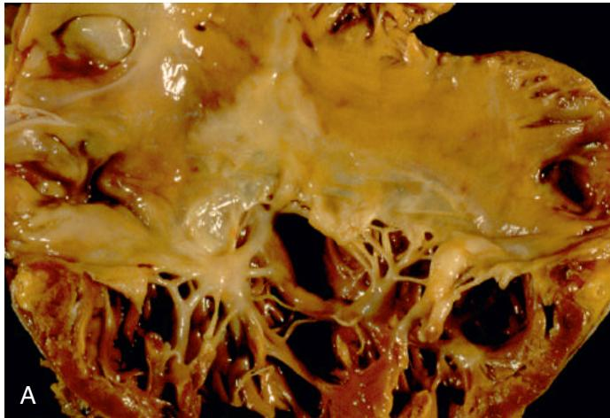 
Fig. 11.31 Carcinoid heart disease. (A) Characteristic endocardial fibrotic (light gray) lesion "coating" the right ventricle and tricuspid valve, and extending onto the chordae tendineae. (B) Microscopic appearance of the thickened endocardium, which contains smooth muscle cells and abundant acid mucopolysaccharides (blue-green in this Movat stain, which colors the underlying endocardial elastic tissue black).
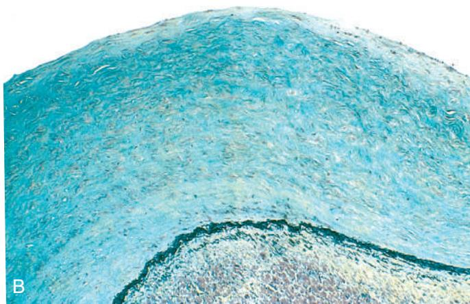
The mediators elaborated by carcinoid tumors include serotonin (5-hydroxytryptamine), kallikrein, bradykinin, histamine, prostaglandins, and tachykinins. Although it is not clear which of these is causative, plasma levels of serotonin and urinary excretion of the serotonin metabolite 5-hydroxyindoleacetic acid correlate with the severity of right-sided heart lesions. The valvular plaques in carcinoid syndrome also are similar to lesions that occur with the administration of fenfluramine (an appetite suppressant) or ergot alkaloids (for migraine headaches); of interest, these agents either affect systemic serotonin metabolism or directly bind to hydroxytryptamine receptors on heart valves.
The cardiovascular lesions associated with the carcinoid syndrome are distinctive, glistening white, intimal, plaquelike thickenings on the endocardial surfaces of the cardiac chambers and valve leaflets (Fig. 11.31). The lesions are composed of smooth muscle cells and sparse collagen fibers embedded in an acid mucopolysaccharide-rich matrix. Underlying structures are intact. With right-sided involvement, typical findings are tricuspid insufficiency and pulmonic stenosis.
# CARDIAC TRANSPLANTATION
Although permanent ventricular assist device implantation is increasingly an option for management of end-stage heart disease, cardiac transplantation remains the treatment of choice for patients with intractable heart failure. Without transplantation, medically managed end-stage heart failure carries a $50\%$ 1-year mortality rate, and less than $10\%$ of patients survive 5 years. Over 5000 heart transplantation procedures are performed annually worldwide, mostly for DCM and IHD.
The major complications of cardiac transplantation are acute cardiac rejection and allograft arteriopathy.
The immunosuppression required for allograft survival also increases the risk for opportunistic infections and certain malignancies (e.g., Epstein-Barr virus-associated lymphoma).
- Rejection is characterized by interstitial lymphocytic inflammation, myocyte damage and a histologic pattern similar to that seen in viral myocarditis. Both T cell- and antibody responses to the allograft are involved in the rejection reaction. 
- Allograft arteriopathy is the single most important long-term limitation for cardiac transplantation. It is marked by late, progressive, diffusely stenosing intimal proliferation in the coronary arteries, leading to ischemic injury.
Despite these problems, the outlook for transplant recipients generally is good, with a 1-year survival rate of $90\%$ and a 5-year survival rate of more than $70\%$ .
Azaouagh A, Churzidse S, Konorza T, et al: Arrhythmogenic right ventricular cardiomyopathy/dysplasia: a review and update, Clin Res Cardiol 100:383, 2011. [An excellent look at this entity and its genetic causes.] 
Bruneau BG: The developmental genetics of congenital heart disease, Nature 451:943, 2008. [A succinct overview of the relationships between cardiac development and congenital heart disease.] 
Cerrone M, Priori SG: Genetics of sudden death: focus on inherited channelopathies, Eur Heart J 32:2109, 2011. [A well-organized description of the known ion channel disorders that cause sudden cardiac death.] 
Cooper LT Jr: Myocarditis, N Engl J Med 360:1526, 2009. [A nice review of etiology, pathogenesis, and clinical features.] 
Grozinsky-Glasberg S, Grossman AB, Gross DJ: Carcinoid heart disease: from pathophysiology to treatment—“something in the way it moves” Neuroendocrinology 101:263, 2015. [A good review of the pathophysiology, diagnosis, and treatment of this entity.] 
Guilherme L, Kohler KF, Kalil J: Rheumatic heart disease: mediation by complex immune events, Adv Clin Chem 53:31, 2011. [A well-written and scholarly discussion of the pathogenic mechanisms regarding rheumatic heart disease.] 
Hausenloy DJ, Yellon DM: Myocardial ischemia-reperfusion injury: a neglected therapeutic target, J Clin Invest 123:92, 2013. [A nice
discussion of the mechanisms and possible therapeutic approaches in ischemia-reperfusion injury.] 
Heusch G, Libby P, Gersh B, et al: Cardiovascular remodelling in coronary artery disease and heart failure, Lancet 383:1933, 2014. [An excellent review of the pathophysiologic changes that occur as ischemic hearts develop CHF.] 
Hill EE, Herijgers P, Herregods MC, et al: Evolving trends in infective endocarditis, Clin Microbiol Infect 12:5, 2006. [A good, clinically oriented overview of the developments in microorganisms, diagnosis, and therapies for infective endocarditis.] 
Huang JB, Liu YL, Sun PW, et al: Molecular mechanisms of congenital heart disease, Cardiovasc Pathol 19:e183, 2010. [A comprehensive review of the genes and pathways underlying congenital heart disease.] 
Li C, Xu S, Gotlieb AI: The response to valve injury. A paradigm to understand the pathogenesis of heart valve disease, Cardiovasc Pathol 20:183, 2011. [A nice overview of pathologic concepts in valvular disease.] 
Mann DL, Zipes DP, Libby P, et al, editors: Braunwald's heart disease: a textbook of cardiovascular medicine, ed 10, Philadelphia, 2015, Elsevier. [An outstanding and authoritative text, with excellent sections on heart failure and atherosclerotic cardiovascular disease.] 
Maron BJ, Towbin JA, Thiene G, et al: Contemporary definitions and classification of the cardiomyopathies: an American Heart Association Scientific Statement from the Council on Clinical Cardiology, Heart Failure and Transplantation Committee; Quality of Care and Outcomes Research and Functional Genomics and Translational Biology Interdisciplinary Working Groups; and Council on Epidemiology and Prevention, Circulation 113:1807, 2006. [A consensus document regarding an updated classification of cardiomyopathies, heavily weighted to genetic etiologies rather than pathophysiologic manifestations.] 
Mitchell RN: Graft vascular disease: immune response meets the vessel wall, Annu Rev Pathol 4:19, 2009. [A comprehensive overview of allograft arteriopathy, including animal models, pathogenic mechanisms, clinical diagnosis, and therapy.]
New SE, Aikawa E: Molecular imaging insights into early inflammatory stages of arterial and aortic valve calcification, Circ Res 108:1381, 2011. [A good overview of the mechanisms leading to degenerative calcification on valves and vessels.] 
Ovize M, Baxter GF, Di Lisa F, et al: Postconditioning and protection from reperfusion injury: where do we stand? Position paper from the Working Group of Cellular Biology of the Heart of the European Society of Cardiology, Cardiovasc Res 87:406, 2010. [A good overview of the mechanisms and potential therapeutic interventions for ischemia-reperfusion injury and for ischemic preconditioning in limiting infarct size.] 
Patten IS, Rana S, Shahul S, et al: Cardiac angiogenic imbalance leads to peripartum cardiomyopathy, Nature 485:333, 2012. [A new perspective on the mechanisms underlying pregnancy-associated cardiomyopathy.] 
Rasmussen TL, Raveendran G, Zhang J, et al: Getting to the heart of myocardial stem cells and cell therapy, Circulation 123:1771, 2011. [A well-written overview of the challenges and current state of the art regarding stem cell therapies in heart disease.] 
Seidman CE, Seidman JG: Identifying sarcomere gene mutations in hypertrophic cardiomyopathy: a personal history, Circ Res 108:743, 2011. [A well-written and authoritative overview of the genetics and pathophysiology of hypertrophic cardiomyopathy from one of the leading groups in the world.] 
Watkins H, Houman A, Redwood C: Inherited cardiomyopathies, N Engl J Med 364:1643, 2011. [An excellent review of the molecular basis of cardiomyopathies.] 
Wu JC, Child JS: Common congenital heart disorders in adults, Curr Probl Cardiol 29:641, 2004. [A thorough overview of the congenital heart disorders seen in the adult population, often as a consequence of improved pediatric therapies.]