CHAPTER OUTLINE
Penis 691
Malformations 691
Inflammatory Lesions 691
Neoplasms 691
Scrotum, Testis, and Epididymis 692
Cryptorchidism and Testicular Atrophy 692
Inflammatory Lesions 693
Vascular Disturbances 693
Testicular Neoplasms 693
Prostate 697
Prostatitis 697
Benign Prostatic Hyperplasia 698
Carcinoma of the Prostate 699
Ureter, Bladder, and Urethra 701
Ureter 702
Urinary Bladder 702
Sexually Transmitted Diseases 704
Syphilis 705
Gonorrhea 708
Nongonococcal Urethritis and Cervicitis 709
Lymphogranuloma Venereum 710
Chancroid (Soft Chancre) 710
Granuloma Inguinale 711
Trichomoniasis 711
Genital Herpes Simplex 711
Human Papillomavirus Infection 712
# PENIS
# Malformations
Among the most common malformations of the penis are those in which the distal urethral orifice is abnormally located. In hypospadias, the abnormal urethral opening is found on the ventral aspect of the penis anywhere along the shaft. This anomalous orifice is sometimes constricted, resulting in urinary tract obstruction and an increased risk for urinary tract infections. Hypospadias occurs in 1 in 300 live male births and may be associated with other congenital anomalies, such as inguinal hernia and undescended testis. In epispidias, which is less common, the abnormal urethral orifice is on the dorsal aspect of the penis.
# Inflammatory Lesions
Balanitis and balanoposthitis refer to local inflammation of the glans penis and of the overlying prepuce, respectively. Among the more common agents are Candida albicans, anaerobic bacteria, Gardnerella, and pyogenic bacteria. Most cases occur as a consequence of poor hygiene in uncircumcised males, leading to the accumulation of desquamated epithelial cells, sweat, and debris, termed smegma, which acts as a local irritant. Phimosis is a condition in which the prepuce cannot be retracted easily over the glans penis. Phimosis may be a congenital anomaly, but most cases stem from scarring of the prepuce caused by balanoposthitis.
More than $95\%$ of penile neoplasms arise on squamous epithelium. In the United States, squamous cell carcinomas of the penis are relatively uncommon, accounting for about $0.4\%$ of all cancers in males. In developing countries, however, penile carcinoma occurs at much higher rates. Most cases occur in uncircumcised patients older than 40 years of age. Several factors have been implicated in the pathogenesis of penile squamous cell carcinoma, including poor hygiene (with resultant exposure to potential carcinogens in smegma), smoking, and infection with human papillomavirus (HPV), particularly types 16 and 18.
Squamous cell carcinoma in situ of the penis (Bowen disease) occurs in older uncircumcised males and appears grossly as a solitary plaque on the shaft of the penis. Histologic examination reveals dysplastic cells throughout the epidermis with no invasion of the underlying stroma (Fig. 18.1). It gives rise to invasive squamous cell carcinoma in approximately $10\%$ of patients.
Invasive squamous cell carcinoma of the penis appears as a gray, crusted, papular lesion, most commonly on the glans penis or prepuce. In many cases, infiltration of the underlying connective tissue produces an indurated, ulcerated lesion with irregular margins (Fig. 18.2). Histologically, the tumor is most often a typical keratinizing squamous cell carcinoma. The prognosis is related to the stage of the tumor. With localized lesions, the 5-year survival rate is $66\%$ , whereas metastasis to inguinal lymph nodes carries a grim $27\%$ 5-year survival rate. Verrucous carcinoma is a non-HPV-related variant of squamous cell
ofthepenis.Theepitheliumabovetheintactbasementmembraneshowsdelayedmaturationanddisorganization(left).Highermagnification(right)showsseveralmitoticfigures,someabovethebasallayer,andnuclearpleomorphism..jpg) 
Fig. 18.1 Carcinoma in situ (Bowen disease) of the penis. The epithelium above the intact basement membrane shows delayed maturation and disorganization (left). Higher magnification (right) shows several mitotic figures, some above the basal layer, and nuclear pleomorphism.
carcinoma characterized by papillary architecture, virtually no cytologic atypia, and rounded, pushing deep margins. Verrucous carcinomas are locally invasive but do not metastasize.
# LESIONS OF THE PENIS
- Squamous cell carcinoma and its precursor lesions are the most important penile lesions. Many are associated with HPV infection. 
- Squamous cell carcinoma occurs on the glans or shaft of the penis as an ulcerated infiltrative lesion that may spread to inguinal nodes and infrequently to distant sites. Most cases occur in uncircumcised males. 
- Other important penile disorders include congenital abnormalities involving the position of the urethra (epispadias, hypospadias) and inflammatory disorders (balanitis, phimosis).
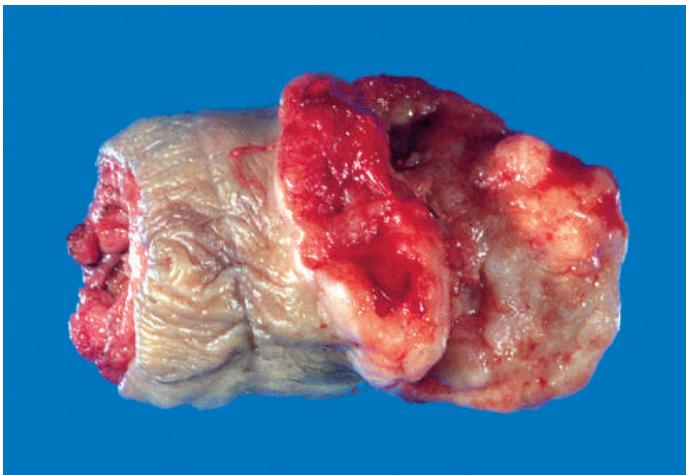 
Fig. 18.2 Carcinoma of the penis. The glans penis is deformed by an ulcerated, infiltrative mass.
# SCROTUM,TESTIS,AND EPIDIDYMIS
Several inflammatory processes may affect the skin of the scrotum, including local fungal infections and systemic dermatoses, such as psoriasis (Chapter 24). Neoplasms of the scrotal sac are unusual. Squamous cell carcinoma, the most common of these, is of historical interest in that it represents the first human malignancy associated with environmental exposures, dating from Sir Percival Pott's observation of a high incidence of the disease in chimney sweeps. The subsequent edict by the Chimney Sweeps Guild that its members must bathe daily remains one of the most successful public health measures for cancer prevention. Several disorders unrelated to the testes and epididymis may present as scrotal enlargement. Hydrocele, the most common cause of scrotal swelling, is caused by an accumulation of serous fluid within the tunica vaginalis. It may be idiopathic or arise in response to neighboring infections or tumors. The clear fluid of a hydrocele allows light to pass through (transluminescence), distinguishing it from collections of blood, pus, or lymph, all of which are cloudy or opaque. Accumulation of blood or lymphatic fluid within the tunica vaginalis, termed hematocele and chylocele, respectively, also may cause scrotal enlargement. In extreme cases of lymphatic obstruction, caused, for example, by filariasis, the scrotum and the lower extremities may enlarge to grotesque sizes—a condition termed elephantiasis.
# Cryptorchidism and Testicular Atrophy
Cryptorchidism is a failure of testicular descent into the scrotum. Normally, the testes descend from the abdominal cavity into the pelvis by the third month of gestation and then through the inguinal canals into the scrotum during the last 2 months of intrauterine life. The diagnosis of cryptorchidism is only established with certainty after 1 year of age, particularly in premature infants, because testicular descent into the scrotum is not always complete at birth. Cryptorchidism affects $1\%$ of the male population. In the vast majority of cases, the cause is unknown. The condition is bilateral in approximately $10\%$ of affected patients, a small percentage of whom have chromosomal aberrations and other developmental abnormalities. Because undescended testes become atrophic, bilateral cryptorchidism results in sterility. For unclear reasons, even unilateral cryptorchidism may be associated with atrophy of the contralateral descended gonad.
In addition to infertility, failure of testicular descent is associated with a 3- to 5-fold increased risk for testicular cancer. Patients with unilateral cryptorchidism also are at increased risk for the development of cancer in the contralateral, normally descended testis, suggesting that some intrinsic abnormality, rather than simple failure of descent, underlies the increased cancer risk. Surgical placement of the undescended testis into the scrotum (orchiopexy) is recommended by 18 months of age to decrease the likelihood of testicular atrophy, infertility, and testicular cancer.
The cryptorchid testis may be of normal size early in life, but some degree of atrophy usually is evident by the
onset of puberty. Microscopically, tubular atrophy begins to appear by 5 to 6 years of age, and is usually advanced by the time of puberty. Germ cell neoplasia in-situ (discussed later) may be present in cryptorchid testes and is a likely precursor of subsequent germ cell tumors. Atrophic changes similar to those in cryptorchid testes may be caused by other insults, including chronic ischemia, trauma, irradiation, and anti-neoplastic chemotherapy, as well as conditions associated with chronically elevated estrogen levels (e.g., cirrhosis).
# CRYPTOTRCHIDISM
- Cryptorchidism refers to incomplete descent of the testis from the abdomen to the scrotum and is present in about $1\%$ of 1-year-old male infants. 
- Bilateral or, in some cases, even unilateral cryptorchidism is associated with tubular atrophy and sterility. 
- The cryptorchid testis carries a 3- to 5-fold higher risk for testicular cancer, which arises from foci of germ cell neoplasia in-situ within the atrophic tubules. Early orchiopexy reduces the risk for sterility and cancer.
# Inflammatory Lesions
Inflammatory lesions of the testis are more common in the epididymis than in the testis proper. Sexually transmitted infectious disorders are discussed later in the chapter. Other causes of testicular inflammation include nonspecific epididymitis and orchitis, mumps, and tuberculosis. Nonspecific epididymitis and orchitis usually begin as a primary urinary tract infection that spreads to the testis through the vas deferens or the lymphatics of the spermatic cord. The involved testis is swollen and tender, and histologic examination reveals numerous neutrophils. Mumps infection involving the testes is rare in male children but occurs in roughly $20\%$ of infected adults. Affected testes are edematous and congested, and contain a lymphoplasmacytic inflammatory infiltrate. Severe mumps orchitis may lead to extensive necrosis, loss of seminiferous epithelium, tubular atrophy, fibrosis, and sterility. Several conditions, including infections and autoimmune injury, may elicit granulomatous inflammation in the testis. Of these, tuberculosis is the most common. Testicular tuberculosis generally begins as an epididymitis, with secondary involvement of the testis. Histologically, there is granulomatous inflammation and caseous necrosis identical to that seen in active tuberculosis in other sites.
# Vascular Disturbances
Torsion, or twisting of the spermatic cord, typically results in obstruction of testicular venous drainage while leaving the thick-walled and more resilient arteries patent. This leads to intense vascular engorgement and infarction unless the torsion is relieved. There are two types of testicular torsion. Neonatal torsion occurs either in utero or shortly after birth. There is no associated anatomic defect to account for its occurrence. Adult torsion typically is seen
in adolescence and manifests with the sudden onset of testicular pain. In contrast with neonatal torsion, adult torsion results from a bilateral congenital anomaly whereby the testis is abnormally anchored in the scrotal sac giving rise to increased mobility (bell clapper abnormality). It often occurs without any inciting injury; sudden pain heralding the torsion may even awaken the patient from sleep.
Torsion constitutes one of the few urologic emergencies. If the testis is explored surgically and the cord is manually untwisted within approximately 6 hours, the testis will likely remain viable. To prevent the catastrophic occurrence of torsion in the contralateral testis, the unaffected testis typically is surgically fixed within the scrotum (orchiopexy).
# Testicular Neoplasms
Testicular neoplasms occur in roughly 6 per 100,000 males. In the 15- to 34-year-old age group, when these neoplasms peak in incidence, they are the most common tumors in men. Neoplasms of the testis are heterogeneous and include germ cell tumors and sex cord-stromal tumors. In postpubertal males, $95\%$ of testicular tumors arise from germ cells, and almost all are malignant. By contrast, sex cord-stromal tumors derived from Sertoli or Leydig cells are uncommon and usually benign. The focus of the remainder of this discussion is on testicular germ cell tumors.
The cause of testicular neoplasms is poorly understood. Testicular tumors are more common in whites than in blacks, and the incidence has increased in white populations over recent decades. As discussed earlier, cryptorchidism is associated with a 3- to 5-fold increase in the risk for cancer in the undescended testis, as well as an increased risk for cancer in the contralateral descended testis. A history of cryptorchidism is present in approximately $10\%$ of cases of testicular cancer. Intersex syndromes, including androgen insensitivity syndrome and gonadal dysgenesis, also are associated with an increased frequency of testicular cancer. Family history is important, as brothers of males with germ cell tumors have an 8- to 10-fold increased risk, presumably owing to inherited factors. The development of cancer in one testis also is associated with a markedly increased risk for neoplasia in the contralateral testis. Extra copies of the short arm of chromosome 12, usually due to the presence of an isochromosome 12 [i(12p)], are found in virtually all germ cell tumors. Of note, point mutations that create oncogenes are relatively rare in germ cell tumors, occurring at the lowest frequency of any solid tumor in adults. Among these are oncogenic mutations in KIT which are found in up to $25\%$ of tumors.
Most testicular tumors in postpubertal males arise from germ cell neoplasia in situ. This precursor lesion is present in conditions associated with a high risk for developing germ cell tumors (e.g., cryptorchidism, dysgenetic gonads) and exhibits the same abnormality of chromosome 12 that is characteristic of fully developed germ cell tumors. As might be expected, germ cell neoplasia in situ often is found in "normal" testis adjacent to full-blown germ cell tumors.
Testicular germ cell tumors are subclassified into seminomas and nonseminomatous germ cell tumors (Table 18.1). Seminomas are most common, accounting for about
Table 18.1 Summary of Testicular Tumors 
TumorPeak Patient Age (years)MorphologyTumor Marker(s)Seminoma40–50Sheets of uniform polygonal cells with cleared cytoplasm; lymphocytes in the stroma10% of patients have elevated hCGEmbryonal carcinoma20–30Poorly differentiated, pleomorphic cells in cords, sheets, or papillary formation; most contain some yolk sac and choriocarcinoma cellsNegative (pure embryonal carcinoma)Spermatocytic tumor50-60Small, medium, and large polygonal cells; no inflammatory infiltrateNegativeYolk sac tumor3Poorly differentiated endothelium-like, cuboidal, or columnar cells90% of patients have elevated AFPChoriocarcinoma20–30Cytotrophoblast and syncytiotrophoblast without villus formation100% of patients have elevated hCGTeratomaAll agesTissues from all three germ cell layers with varying degrees of differentiationNegative (pure teratoma)Mixed tumor15–30Variable, depending on mixture; commonly teratoma and embryonal carcinoma90% of patients have elevated hCG and AFP
AFP, Alpha fetoprotein; hCG, human chorionic gonadotropin.
$50\%$ of testicular germ cell neoplasms. They are histologically identical to tumors called dysgerminomas, which occur in the ovary, and germinomas, which occur in the central nervous system and other extragonadal sites.

Germ cell tumors may be "pure" (i.e., composed of a single histologic type) or mixed (seen in $40\%$ of cases). Seminoma presents as a soft, well-demarcated, gray-white tumor that bulges from the cut surface of the affected testis (Fig. 18.3). Large tumors may contain foci of coagulative necrosis, usually without hemorrhage. Seminomas are composed of large, uniform cells with distinct cell borders, clear, glycogen-rich cytoplasm, round nuclei, and conspicuous nucleoli (Fig. 18.4). The cells often are arrayed in small lobules with intervening fibrous septa. A lymphocytic infiltrate usually is present and may, on occasion, overshadow the neoplastic cells. Seminomas also may elicit a granulomatous reaction. In approximately $15\%$ of cases, syncytiotrophoblasts are present; these cells are the source of the
minimally elevated serum human choriogonadotropin (hCG) that is encountered in approximately $10\%$ of cases. Their presence has no bearing on prognosis.
Spermatocytic tumor (formerly called spermatocytic seminoma) is a distinct clinical and histologic entity. It is an uncommon tumor that occurs in older men than other testicular tumors; affected patients generally are beyond 50 years of age. In contrast with seminomas, spermatocytic tumors lack lymphocytic infiltrates, granulomas, and syncytiotrophoblasts; are not admixed with other germ cell tumor histologies; are not associated with germ cell neoplasia in-situ; and do not metastasize. The tumor usually comprises polygonal cells of variable size that are arranged in nodules or sheets.
Embryonal carcinoma presents as ill-defined, invasive masses containing foci of hemorrhage and necrosis (Fig. 18.5). The primary lesions may be small, even in patients with systemic metastases. The tumor cells are large and have basophilic cytoplasm, indistinct cell borders, large nuclei, and prominent nucleoli. The neoplastic cells may be arrayed in undifferentiated, solid sheets or may form primitive glandular
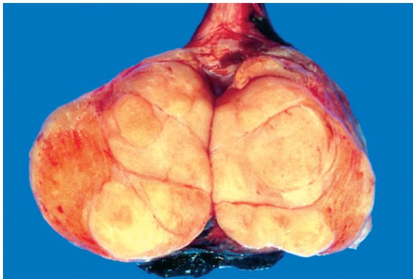 
Fig. 18.3 Seminoma of the testis appearing as a well-circumscribed, pale, fleshy, homogeneous mass.
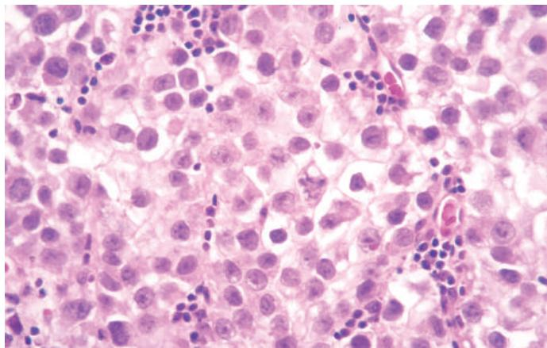 
Fig. 18.4 Seminoma of the testis. Microscopic examination reveals large cells with distinct cell borders, pale nuclei, prominent nucleoli, and a sparse lymphocytic infiltrate.
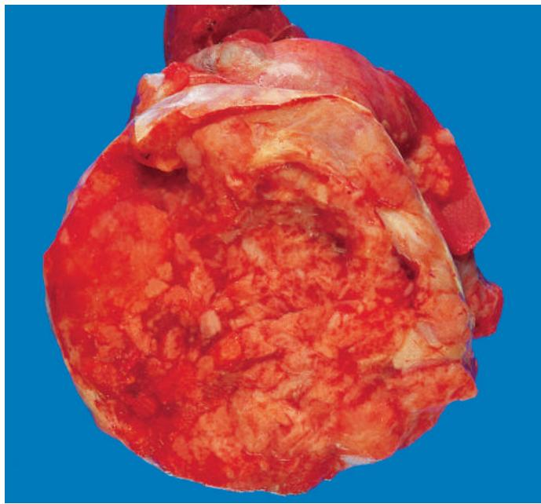 
Fig. 18.5 Embryonal carcinoma. In contrast with the seminoma in Fig. 18.3, this tumor is hemorrhagic.
structures and irregular papillae (Fig. 18.6). In most cases, cells characteristic of other germ cell tumors (e.g., yolk sac tumor, teratoma, choriocarcinoma) are admixed with the embryonal areas. Pure embryonal carcinomas account for only $2\%$ to $3\%$ of all testicular germ cell tumors.
Yolk sac tumor is the most common primary testicular neoplasm in children younger than 3 years of age; in this age group, it has a very good prognosis. In adults, yolk sac tumors most often are seen admixed with embryonal carcinoma. These tumors often are large and may be well demarcated. They are composed of low cuboidal to columnar epithelial cells that form microcysts, lacelike (reticular) patterns, sheets, glands, and papillae (Fig. 18.7). A distinctive feature is the presence
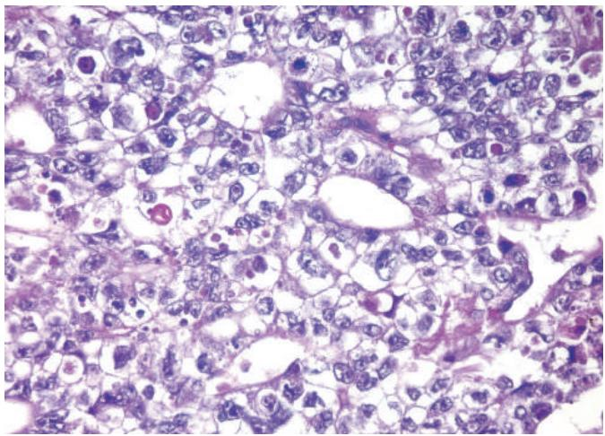 
Fig. 18.6 Embryonal carcinoma. Note the sheets of undifferentiated cells and primitive glandlike structures. The nuclei are large and hyperchromatic.
of structures resembling primitive glomeruli, the so-called Schiller-Duval bodies. These tumors often have eosinophilic hyaline globules containing $\alpha_{1}$ -anti-trypsin and alpha fetoprotein (AFP), which can be demonstrated by immunohistochemical techniques.
Choriocarcinoma is a tumor in which the pluripotential neoplastic germ cells differentiate into cells resembling placental trophoblasts. The primary tumors often are small and nonpalpable, even in patients with extensive metastatic disease. The tumor is composed of sheets of small cuboidal cytotrophoblast like cells that are irregularly intermingled with or capped by large, eosinophilic syncytiotrophoblast like cells containing multiple dark, pleomorphic nuclei (Fig. 18.8). HCG can be identified in the syncytiotrophoblastic cells by immunohistochemical staining.
Teratoma is a tumor in which the neoplastic germ cells differentiate along multiple somatic cell lineages. These tumors form firm masses that often contain cysts and recognizable areas
..jpg) 
Fig. 18.7 Yolk sac tumor demonstrating areas of loosely textured, microcystic tissue and papillary structures resembling a developing glomerulus (Schiller-Duval bodies).
andsyncytiotrophoblasticcellswithmultipledarknucleiembeddedineosinophiliccytoplasm(arrow,middle)arepresent.Hemorrhageandnecrosisareprominent..jpg) 
Fig. 18.8 Choriocarcinoma. Both cytotrophoblastic cells with single central nuclei (arrowhead, upper-right) and syncytiotrophoblastic cells with multiple dark nuclei embedded in eosinophilic cytoplasm (arrow, middle) are present. Hemorrhage and necrosis are prominent.
of cartilage. They may occur at any age from infancy to adult life. Pure forms of teratoma are fairly common in infants and children, being second in frequency only to yolk sac tumors. In adults, pure teratomas are rare, constituting $2\%$ to $3\%$ of germ cell tumors, and the remaining tumors are seen in combination with other histologic types. Teratomas are composed of a heterogeneous, helter-skelter collection of differentiated cells or organoid structures, such as neural tissue, muscle bundles, islands of cartilage, clusters of squamous epithelium, structures reminiscent of thyroid gland, bronchial epithelium, and bits of intestinal wall or brain substance, all embedded in a fibrous or myxoid stroma (Fig. 18.9). Elements may be mature (resembling various tissues within the adult) or immature (sharing histologic features with fetal or embryonal tissues). In prepubertal males, teratomas are benign, whereas the majority of teratomas in postpubertal males are malignant, being capable of metastasis regardless of whether they are composed of mature or immature elements.
Rarely, non-germ cell tumors may arise in teratoma—a phenomenon referred to as teratoma with malignant transformation. Examples of such neoplasms include squamous cell carcinoma, adenocarcinoma, and various sarcomas. These non-germ cell malignancies do not respond to therapies that are effective against metastatic germ cell tumors (discussed later); thus, the only hope for cure in such cases resides in surgical resection.
Patients with testicular germ cell neoplasms present most frequently with a painless testicular mass that (unlike enlargements caused by hydroceles) is nontranslucent. Biopsy of a testicular neoplasm is associated with a risk for tumor spillage, which would necessitate excision of the scrotal skin in addition to orchiectomy. Consequently, the standard management of a solid testicular mass is radical orchiectomy, based on the presumption of malignancy. Some tumors, especially nonseminomatous germ cell neoplasms, may have metastasized widely by the time of diagnosis in the absence of a palpable testicular lesion.
Seminomas and nonseminomatous tumors differ in their behavior and clinical course.
- Seminomas often remain confined to the testis for long periods and may reach considerable size before diagnosis. Metastases most commonly are encountered in the iliac and paraaortic lymph nodes, particularly in the upper lumbar region. Hematogenous metastases occur late in the course of the disease. 
- Nonseminomatous germ cell neoplasms tend to metastasize earlier, by lymphatic as well as hematogenous routes. Hematogenous metastases are most common in the liver and lungs. Metastatic lesions may be identical to the primary testicular tumor or may contain elements of other germ cell tumors.
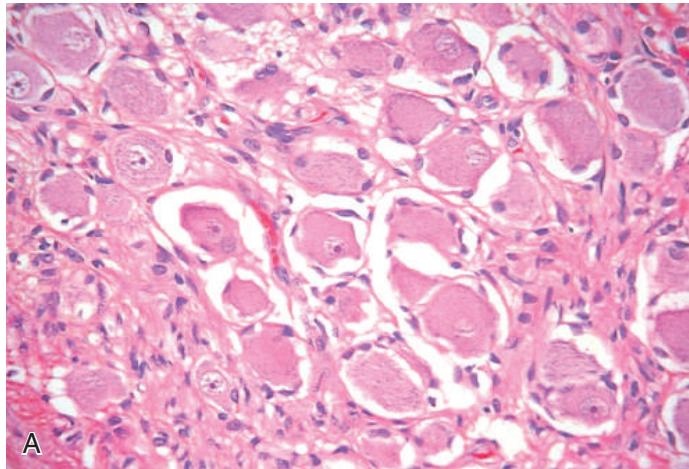
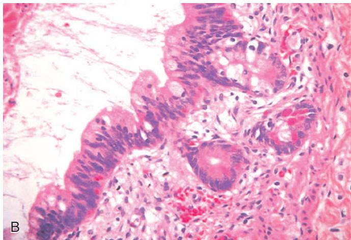
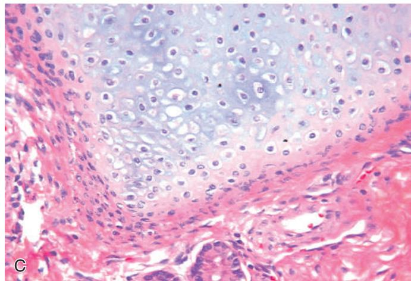 
Fig. 18.9 Teratoma. Testicular teratomas contain mature cells from endodermal, mesodermal, and ectodermal lines. (A to D) Four different fields from the same tumor specimen contain neural (ectodermal) (A), glandular (endodermal) (B), cartilaginous (mesodermal) (C), and squamous epithelial (D) elements.
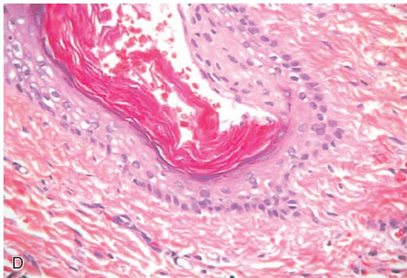
Assay of tumor markers secreted by germ cell tumors is important in two ways; these markers (summarized in Table 18.1, along with salient clinical and morphologic features) are helpful diagnostically and very valuable in following the response of tumors to therapy after the diagnosis is established. HCG is always elevated in patients with choriocarcinoma and, as noted, may be minimally elevated in individuals with other germ cell tumors containing syncytiotrophoblastic cells. Increased AFP in the setting of a testicular neoplasm indicates a yolk sac tumor component. The levels of lactate dehydrogenase (LDH) correlate with the tumor burden.
The treatment of testicular germ cell neoplasms is a remarkable clinical success story. Although roughly 8000 new cases of testicular cancer occur in the United States yearly, fewer than 400 men are expected to die of the disease. Seminoma, which is extremely radiosensitive and tends to remain localized for long periods, has the best prognosis. More than $95\%$ of patients with early-stage disease can be cured. Among nonseminomatous germ cell tumors, the histologic subtype does not influence the therapy. Approximately $90\%$ of patients achieve complete remission with aggressive chemotherapy, and most are cured. The exception is choriocarcinoma, which is associated with a poorer prognosis. With all testicular tumors, recurrences, typically in the form of distant metastases, usually occur within the first 2 years after treatment.
# TESTICULAR TUMORS
- Testicular neoplasms are the most common cause of painless testicular enlargement. They occur with increased frequency in association with undescended testes and with testicular dysgenesis. 
- Germ cells are the source of $95\%$ of testicular tumors, and the remainder arise from Sertoli or Leydig cells. Germ cell tumors may be composed of a single "pure" histologic pattern (60% of cases) or mixed patterns (40%). 
- The most common histologic patterns of germ cell tumors are seminoma, embryonal carcinoma, yolk sac tumor, choriocarcinoma, and teratoma. Mixed tumors contain more than one element, most commonly embryonal carcinoma, teratoma, and yolk sac tumor. 
- Clinically, testicular germ cell tumors are divided into two groups: seminomas and nonseminomatous tumors. Seminomas remain confined to the testis for a long time and spread mainly to paraaortic nodes; distant spread is rare. Nonseminomatous tumors tend to spread earlier, by both lymphatics and blood vessels. 
- HCG is produced by syncytiotrophoblasts and is always elevated in patients with choriocarcinomas and those with seminomas containing syncytiotrophoblasts. AFP is elevated when there is a yolk sac tumor component.
# PROSTATE
The prostate can be divided into biologically distinct regions, the most important of which are the peripheral and transition zones (Fig. 18.10). The types of proliferative
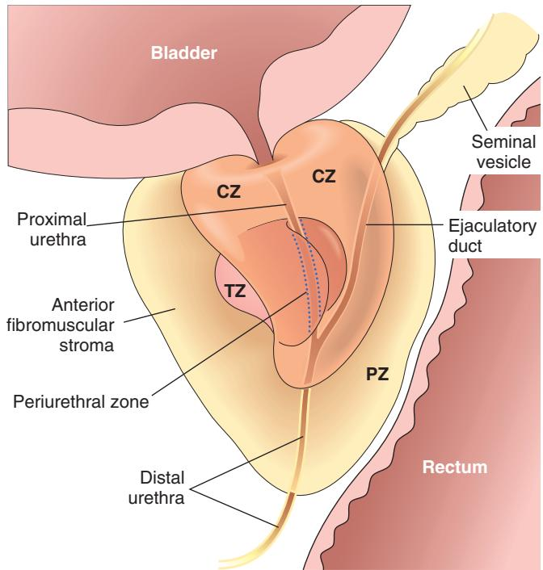 
Fig. 18.10 Adult prostate. The normal prostate contains several distinct regions, including a central zone (CZ), a peripheral zone (PZ), a transitional zone (TZ), and a periurethral zone. Most carcinomas arise from the peripheral glands of the organ, whereas nodular hyperplasia arises from more centrally situated glands.
lesions are different in each region. For example, most hyperplastic lesions arise in the inner transition zone, while most carcinomas $(70\% -80\%)$ arise in the peripheral zones. As a result, carcinomas are often detected by rectal examination, whereas hyperplasias are more likely to cause urinary obstruction. The normal prostate contains glands with two cell layers, a flat basal cell layer and an overlying columnar secretory cell layer. Surrounding prostatic stroma contains a mixture of smooth muscle and fibrous tissue. The prostate is involved by infectious, inflammatory, hyperplastic, and neoplastic disorders, of which prostate cancer is by far the most important clinically.
# Prostatitis
Prostatitis is divided into three categories: (1) acute bacterial prostatitis $(2\% -5\%$ of cases), caused by the same organisms associated with other acute urinary tract infections; (2) chronic bacterial prostatitis $(2\% -5\%$ of cases), also caused by common uropathogens; and (3) chronic pelvic pain syndrome $(90\% -95\%$ of cases). The latter can be subdivided into inflammatory cases, which are associated with leukocytes in prostatic secretions, and noninflammatory cases, in which leukocytes are absent.
The diagnosis of prostatitis is not typically based on biopsy, as the histologic findings are nonspecific and biopsy of an infected prostatitis can result in sepsis. The exception is granulomatous prostatitis, which may produce prostatic induration, leading to biopsy to rule out prostate cancer. In the United States, the most common cause of granulomatous prostatitis is instillation of Bacille Calmette-Guérin (BCG) within the bladder for treatment of
superficial bladder cancer. BCG is an attenuated tuberculosis strain that produces a granulomatous immune reaction that is histologically indistinguishable from tuberculosis. Prostatic tuberculosis also occurs but is rare in the Western world. Fungal granulomatous prostatitis is typically seen only in immunocompromised hosts. Nonspecific granulomatous prostatitis is relatively common and stems from a foreign-body reaction to fluids that leak into tissue from ruptured prostatic ducts and acini. Postsurgical prostatic granulomas also may be seen.
Acute bacterial prostatitis presents with sudden onset of fever, chills, dysuria, perineal pain, and bladder outlet obstruction; it may be complicated by sepsis. If acute prostatitis is suspected, digital rectal examination is contraindicated, as pressure on the boggy, exquisitely tender prostate can cause bacteremia. Chronic bacterial prostatitis usually is associated with recurrent urinary tract infections bracketed by asymptomatic periods. Presenting manifestations include low back pain, dysuria, and perineal and suprapubic discomfort. Both acute and chronic bacterial prostatitis is treated with antibiotics. Chronic pelvic pain syndrome is characterized by chronic pain localized to the perineum, suprapubic area, and penis. Pain during or after ejaculation is a prominent finding. The etiology is uncertain, and it is a diagnosis of exclusion; indeed, it is not even clear if the pain is related to an abnormality of the prostate. Therapy for chronic pelvic pain syndrome is empirical and depends on the nature of the symptoms.
# PROSTATITIS
- Bacterial prostatitis may be acute or chronic; the responsible organism usually is E. coli or another gram-negative rod. 
- Chronic pelvic pain syndrome, despite shared symptomatology with chronic bacterial prostatitis, is of unknown etiology and difficult to treat. 
- Granulomatous prostatitis may be either infectious (e.g., following treatment with BCG) or noninfectious.
# Benign Prostatic Hyperplasia
Benign prostatic hyperplasia (BPH) is an extremely common cause of prostatic enlargement resulting from proliferation of stromal and glandular elements. It is present in a significant number of men by 40 years of age, and its frequency rises progressively thereafter, reaching $90\%$ by the eighth decade of life. The enlargement of the prostate in men with BPH is an important cause of urinary obstruction.
Although the cause of BPH is incompletely understood, excessive androgen-dependent growth of stromal and glandular elements has a central role. BPH does not occur in males who are castrated before the onset of puberty or in males with genetic diseases that block androgen activity. Dihydrotestosterone (DHT), the ultimate mediator of prostatic growth, is synthesized in the prostate from circulating testosterone by the action of the enzyme $5\alpha$ -reductase,
type 2. DHT binds to nuclear androgen receptors, which regulate the expression of genes that support the growth and survival of prostatic epithelium and stromal cells. Although testosterone can also bind to androgen receptors and stimulate growth, DHT is 10 times more potent.
BPH virtually always occurs in the inner transition zone of the prostate. The affected prostate is enlarged, typically weighing between 60 and $100\mathrm{g}$ , and contains many well-circumscribed nodules that bulge from the cut surface (Fig. 18.11). The nodules may appear solid or contain cystic spaces, the latter corresponding to dilated glands. The urethra is usually compressed, often to a narrow slit, by the hyperplastic nodules. In some cases, hyperplastic glandular and stromal elements lying just under the epithelium of the proximal prostatic urethra project into the bladder lumen as a pedunculated mass, producing a ball-valve type of urethral obstruction.
Microscopically, the hyperplastic nodules are composed of variable proportions of proliferating glandular elements and fibromuscular stroma. The hyperplastic glands are lined by tall, columnar epithelial cells and a peripheral layer of flattened basal cells (Fig. 18.12). The glandular lumina often contain laminated proteinaceous secretory material known as corpora amylacea.
Because BPH preferentially involves the inner portions of the prostate, the most common manifestations are related to lower urinary tract obstruction, often in the form of difficulty in starting the stream of urine (hesitancy)
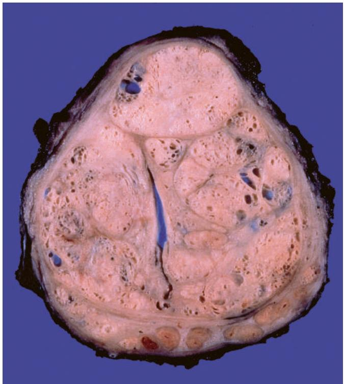 
Fig. 18.11 Nodular prostatic hyperplasia. Well-defined nodules compress the urethra into a slitlike lumen.
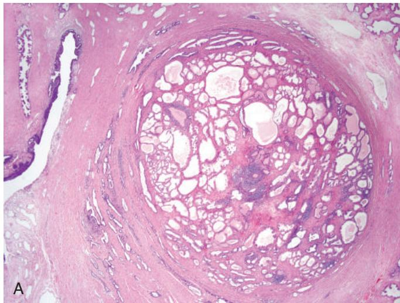 
Fig. 18.12 Nodular hyperplasia of the prostate. (A) Low-power photomicrograph demonstrates a well-demarcated nodule at the right of the field, with a portion of urethra seen to the left. In other cases of nodular hyperplasia, the nodularity is caused predominantly by stromal, rather than glandular, proliferation. (B) Higher-power photomicrograph demonstrates the morphology of the hyperplastic glands, which are large and have papillary infoldings.
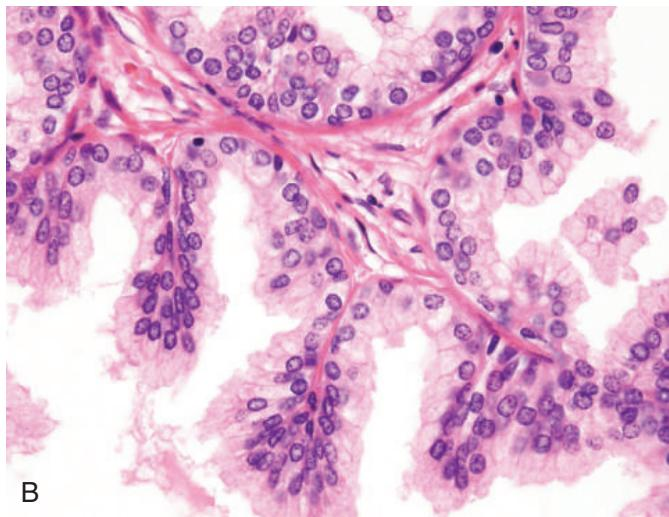
and intermittent interruption of the urinary stream while voiding. These symptoms frequently are accompanied by urinary urgency, frequency, and nocturia, all indicative of bladder irritation. Clinical manifestations of prostatic hyperplasia occur in only about $10\%$ of men with pathologic evidence of BPH. The presence of residual urine in the bladder due to chronic obstruction increases the risk for urinary tract infections. In some affected men, BPH leads to complete urinary obstruction, with resultant painful distention of the bladder and, in the absence of appropriate treatment, hydronephrosis (Chapter 14). Initial treatment is pharmacologic, using targeted therapeutic agents that inhibit the formation of DHT from testosterone (such as 5-alpha reductase inhibitors) or that relax prostatic smooth muscle by blocking $\alpha_{1}$ -adrenergic receptors. Various surgical techniques are reserved for severely symptomatic cases that are recalcitrant to medical therapy.
# BENIGN PROSTATIC HYPERPLASIA
- BPH is characterized by proliferation of benign stromal and glandular elements. DHT, an androgen derived from testosterone, is the major hormonal stimulus for proliferation. 
- BPH originates in the periurethral transition zone. The hyperplastic nodules exhibit variable proportions of stroma and glands. Hyperplastic glands are lined by two cell layers, an inner columnar layer and an outer layer composed of flattened basal cells. 
- Clinical findings result from urinary tract obstruction and include hesitancy, urgency, nocturia, and poor urinary stream. Chronic obstruction predisposes to recurrent urinary tract infections.
# Carcinoma of the Prostate
Adenocarcinoma of the prostate and is the most common form of cancer in men, accounting for $27\%$ of cancer cases in the United States in 2014. Its is uncommon before the
age of 50 years. Over the past several decades, mortality from prostate cancer has decreased significantly, and it currently causes only $10\%$ of cancer deaths in the United States.
The relatively low rate of mortality in men with prostate cancer is related in part to increased detection of the disease through screening (discussed later), but how effective screening is at saving lives is controversial. This seeming paradox is related to the wide variation in the natural history of prostate cancer, from aggressive and rapidly fatal to indolent disease of no clinical significance. Indeed, prostate carcinoma commonly is found incidentally at autopsy in men dying of other causes, and many more men die with prostate cancer than of prostate cancer. It is not currently possible to identify the tumors that will be "bad actors" with certainty; thus, while some men are no doubt saved by early detection and treatment of their prostate cancers, it is equally certain that others are being "cured" of clinically inconsequential tumors.
Clinical and experimental observations suggest that androgens, heredity, environmental factors, and acquired somatic mutations have roles in the pathogenesis and progression of prostate cancer.
- Androgens are of central importance. Cancer of the prostate does not develop in males who are castrated before puberty, indicating that androgens somehow provide the "soil," the cellular context, within which prostate cancer develops. This dependence on androgens extends to established cancers, which often regress for a time in response to surgical or chemical castration. Notably, tumors that are resistant to anti-androgen therapy often acquire androgen receptor gene amplifications or mutations that permit androgen receptors to activate the expression of their target genes despite therapy. Thus, tumors that recur in the face of anti-androgen therapies still depend on gene products regulated by androgen receptors for their growth and survival. However, while prostate cancer, like normal prostate, is dependent on androgens for its
survival, there is no evidence that androgens initiate carcinogenesis, nor are androgen levels associated with prostate cancer risk.
- Heredity also contributes, as there is an increased risk among first-degree relatives of patients with prostate cancer. Prostate cancer is uncommon in Asians and its incidence is highest among African-Americans and in Scandinavian countries. Aggressive, clinically significant disease is more common in African-Americans than in Caucasians. Genome-wide association studies have identified a number of genetic variants that are associated with increased risk for developing prostate cancer. Although each variant carries only a small increased risk, the effect is multiplicative, such that men with multiple risk alleles may have up to a 5-fold increase in risk compared to the general population. 
- Environment also plays a role, as evidenced by the fact that in Japanese immigrants to the United States the incidence of the disease rises (although not to the level seen in native-born Americans). Also, as the diet in Asia becomes more westernized, the incidence of clinically significant prostate cancer in this region of the world is increasing. However, the relationship between specific dietary components and prostate cancer risk is unclear. 
- Acquired genetic aberrations, as in other cancers, are the actual drivers of cellular transformation. Copy number variations in specific chromosomal regions and gene rearrangements are frequently seen in primary tumors. The most common gene rearrangements in prostate cancer create fusion genes consisting of the androgen-regulated promoter of the TMPRSS2 gene and the coding sequence of ETS family transcription factors. TMPRSS2-ETS fusion genes are found in approximately $40\%$ to $60\%$ of prostate cancers in Caucasian populations, and they occur relatively early in tumorigenesis. Notably, the prevalence of these rearrangements is lower among African-Americans and other ethnic groups. Other mutations commonly lead to activation of the PI3K/AKT signaling pathway (Chapter 6); of these, the most common are loss-of-function mutations involving the tumor suppressor PTEN, which acts as a brake on PI3K activity.
Carcinomas detected clinically are usually not visible grossly. More advanced lesions appear as firm, gray-white lesions with ill-defined margins that infiltrate the adjacent gland (Fig. 18.13).
Most prostate cancers are moderately differentiated adenocarcinomas that produce well-defined glands. The glands typically are smaller than benign glands and are lined by a single uniform layer of cuboidal or low columnar epithelium, lacking the basal cell layer seen in benign glands. In further contrast with benign glands, malignant glands are crowded together and characteristically lack branching and papillary infolding. The cytoplasm of the tumor cells ranges from pale-clear (as in benign glands) to a distinctive amphophilic (dark purple) appearance. Nuclei are enlarged and often contain one or more prominent nucleoli (Fig. 18.14). Some variation in nuclear size and shape is usual, but in general, pleomorphism is not marked. Mitotic figures are uncommon. With increasing grade, irregular or ragged glandular
.Notethesolidwhitertissueofcancer,incontrastwiththespongyappearanceofthebenignperipheralzoneonthecontralateralside..jpg) 
Fig. 18.13 Adenocarcinoma of the prostate. Carcinomatous tissue is seen on the posterior aspect (lower left). Note the solid whiter tissue of cancer, in contrast with the spongy appearance of the benign peripheral zone on the contralateral side.
structures, cribriform glands, sheets of cells, or infiltrating individual cells are present. In approximately $80\%$ of cases, prostatic tissue removed for carcinoma also harbors presumptive precursor lesions, referred to as high-grade prostatic intraepithelial neoplasia (HGPIN). Many of the molecular changes seen in invasive cancers are also seen in HPIN.
Prostate cancer is graded by the Gleason system, created in 1967 and updated in 2014. According to this system, prostate cancers are stratified into five grades on the basis of glandular patterns of differentiation. Grade I represents the most well differentiated tumors, and grade 5 tumors show no glandular differentiation. Most tumors are patterns 3, 4, or 5. Since the majority of tumors contain more than one pattern, a primary grade is assigned to the dominant pattern and a secondary grade to the next most frequent pattern. The two numerical grades are then added to obtain a combined Gleason score. Tumors with only one pattern are treated as if their primary and secondary grades are the same, and, hence, the number is doubled. Thus, the most differentiated tumors have a Gleason score of 2 (1 + 1), and the least differentiated tumors merit a score of 10 (5 + 5). A new grading system also based on glandular pattern was recently accepted by the World Health Organization (WHO) to be used initially in conjunction with the Gleason system; it ranges from I (excellent prognosis) to 5 (poor prognosis).
In the United States, most prostate cancers are small, nonpalpable, asymptomatic lesions discovered on needle biopsy performed to investigate an elevated serum prostate-specific antigen (PSA) level (discussed later). Some $70\%$ to $80\%$ of prostate cancers arise in the outer (peripheral) glands, and a subset of these may be palpable as irregular hard nodules on digital rectal examination. A minority of carcinomas is discovered unexpectedly during histologic examination of prostate tissue removed by transurethral resection for BPH. Because of the peripheral location, prostate cancer is less likely than BPH to cause urethral obstruction in its initial stages. Locally advanced cancers often infiltrate the seminal vesicles and periurethral zones
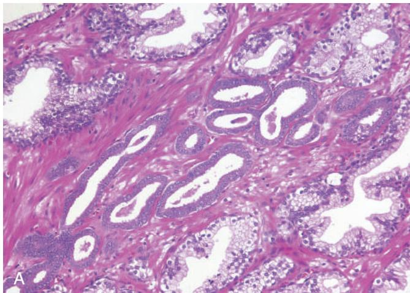
Adenocarcinomaoftheprostatedemonstratingsmallglandscrowdedinbetweenlargerbenignglands.(B)Highermagnificationshowsseveralsmallmalignantglandswithenlargednuclei,prominentnucleoli,anddarkcytoplasm,ascomparedwiththelarger,benigngland(top)..jpg) 
Fig. 18.14 (A) Adenocarcinoma of the prostate demonstrating small glands crowded in between larger benign glands. (B) Higher magnification shows several small malignant glands with enlarged nuclei, prominent nucleoli, and dark cytoplasm, as compared with the larger, benign gland (top).
of the prostate and may invade the adjacent soft tissues, the wall of the urinary bladder, or (less commonly) the rectum. Bone metastases, particularly to the axial skeleton, are frequent late in the disease and typically cause osteoblastic (bone-producing) lesions that can be detected on radionuclide bone scans.
The PSA assay is the most widely used test in the diagnosis and management of prostate cancer, but it suffers from a number of limitations. PSA is a product of prostatic epithelium and is normally secreted in the semen. Although PSA screening can detect prostate cancers early in their course, studies of the natural history of the disease (so-called "watch-and-wait studies") have confirmed that many prostate cancers are clinically insignificant, requiring no treatment, sometimes for decades. Overtreatment of these indolent cancers can cause significant morbidity, particularly erectile dysfunction and incontinence. A second limitation of PSA as a biomarker is that it is not cancer-specific. BPH, prostatitis, prostatic infarcts, instrumentation of the prostate, and ejaculation all may increase serum PSA levels. Conversely, $20\%$ to $40\%$ of patients with organ-confined prostate cancer have PSA values below the cutoffs that are used to identify patients who are likely to have prostate cancer.
Because of these problems, PSA assays are being reappraised as screening tests. By contrast, once cancer is diagnosed, serial measurements of PSA are of great value in assessing the response to therapy. For example, a rising PSA level after radical prostatectomy or radiotherapy for localized disease is indicative of recurrent or disseminated disease.
The most common treatments for clinically localized prostate cancer are radical prostatectomy and radiotherapy. The prognosis after radical prostatectomy is based on the pathologic stage, whether the margins of the resected specimens are free of tumor, and Gleason grade. The Gleason grade, clinical stage, and serum PSA values are important predictors of outcome after radiotherapy. Because many prostate cancers follow an indolent course, active surveillance ("watchful waiting") is an appropriate approach for older men, patients with significant comorbidity, or even some younger men with low serum PSA values and small, low-grade cancers. Advanced metastatic carcinoma is treated by androgen deprivation, either by orchiectomy or by administration of synthetic agonists of luteinizing hormone-releasing hormone (LHRH). In addition, there are many new therapies that reduce androgen synthesis or signaling in metastatic prostate cancer. Although anti-androgen therapy induces remissions, androgen-independent clones almost invariably emerge, leading to rapid disease progression and death. As discussed earlier, these mutant clones commonly continue to express many genes that in normal prostate are androgen-dependent, suggesting that mechanisms arise to reactivate androgen signaling, even in the context of androgen deprivation therapy.
# CARCINOMA OF THE PROSTATE
- Carcinoma of the prostate is a common cancer of older men between 65 and 75 years of age. 
- Prostate carcinomas range from indolent lesions that will never cause harm to aggressive fatal tumors, which are more common in African-Americans. 
- The most common acquired mutations in prostatic carcinomas create TPRSS2-ETS fusion genes or act to enhance PI3K/AKT signaling, which promotes tumor cell growth and survival. 
- Carcinomas of the prostate arise most commonly in the outer, peripheral zone of the gland and may be palpable by rectal examination. 
- Grading of prostate cancer by the Gleason system correlates with pathologic stage and prognosis. 
- Serum PSA measurement is a controversial cancer screening test, but has clear value in monitoring progressive or recurrent prostate cancer.
# URETER, BLADDER, AND URETHRA
The renal pelves, ureters, bladder, and urethra are lined by specialized multi-layer transitional epithelium called urothelium. Beneath the mucosa are the lamina propria
and, deeper yet, the muscularis propria (detrusor muscle), which makes up the bladder wall. Clinically significant disorders involving these organs include congenital aberrations, infectious and other inflammatory diseases, and neoplasms.
# Ureter
Disorders of the ureter are uncommon and include congenital disorders, neoplasms, and reactive conditions. A few merit brief mention.
- Ureteropelvic junction (UPJ) obstruction, a congenital disorder, results in hydronephrosis. It usually manifests in infancy or childhood and is much more common in boys than in girls. It is the most frequent cause of hydronephrosis in infants and children. 
- Malignant tumors of the ureter are pathologically similar to those arising in the renal pelvis, calyces, and bladder (discussed later). Most are urothelial carcinomas. 
- Retroperitoneal fibrosis is an uncommon cause of ureteral narrowing or obstruction characterized by a fibrous proliferative inflammatory process encasing the retroperitoneal structures and causing hydronephrosis. The disorder occurs in middle to old age. At least a proportion of these cases occur in association with IgG4-related disease, characterized by fibroinflammatory lesions rich in IgG4-secreting plasma cells (Chapter 5). Other cases are associated with drug exposures (ergot derivatives, adrenergic blockers), radiation, infection, prior surgery, or malignant disease (lymphomas, urinary tract carcinomas). Most cases, however, have no obvious cause and are considered primary, or idiopathic (Ormond disease).
# Urinary Bladder
# Nonneoplastic Conditions
A bladder or vesical diverticulum consists of a pouchlike evagination of the bladder wall. Diverticula may be congenital but more commonly are acquired lesions that arise as a consequence of persistent urethral obstruction caused, for example, by benign prostatic hyperplasia. Although most diverticula are small and asymptomatic, they sometimes lead to urinary stasis predisposing to recurrent urinary tract infections and bladder stone formation.
Cystitis takes many forms.
- Bacterial cystitis is common, particularly in women. The most common etiologic agents are coliform bacteria. 
- Hemorrhagic cystitis may occur in patients receiving cytotoxic anti-tumor drugs, such as cyclophosphamide, and sometimes complicates adenovirus infection. 
- Interstitial cystitis causes a chronic pelvic pain syndrome, typically in women. It is characterized by suprapubic pain that increases with bladder filling and is relieved by bladder emptying, leading to very frequent urination during both day and night. Other symptoms include urgency, hematuria, and dysuria. Cystoscopic findings are nonspecific and include petechial hemorrhages. Up to $50\%$ of patients have spontaneous remissions. Late in the course, transmural fibrosis may ensue, leading to a contracted bladder.
- Malakoplakia is an uncommon inflammatory disease that most commonly occurs in the bladder. It results from defects in the phagocytic or degradative function of macrophages. As a result of this defect, undigested bacterial products accumulate within distended phagosomes, which are seen in histologic sections as abundant granular material within the cytoplasm of macrophages. The abnormal macrophages also contain laminated mineralized concretions known as Michaelis-Gutmann bodies, which result from deposition of calcium salts in the enlarged lysosomes. 
Polypoid cystitis is an inflammatory condition resulting from irritation to the bladder mucosa in which the urothelium is thrown into broad bulbous polypoid projections as a result of marked submucosal edema. Polypoid cystitis may be confused with papillary urothelial carcinoma both clinically and histologically.
Transitional epithelium lining the bladder may undergo various forms of metaplasia. Nests of urothelium (Brunn nests) sometimes grow downward into the lamina propria. Here, their central epithelial cells may variously differentiate into a cuboidal or columnar epithelium lining (cystitis glandularis); cystic spaces filled with clear fluid lined by flattened urothelium (cystitis cystica); or goblet cells resembling intestinal mucosa (intestinal metaplasia). As a response to injury, the urothelium often undergoes squamous metaplasia, which must be differentiated from normal glycogenated squamous epithelium, commonly found at the trigone in women.
Bladder cancer accounts for approximately $5\%$ of cancers and $3\%$ of cancer deaths in the United States. The vast majority of bladder cancers (95%-97% in the United States; 60%-90% in Africa) are urothelial carcinomas. Squamous cell carcinomas represent about $3\%$ to $7\%$ of bladder cancers in the United States but are much more common in countries such as Egypt, where urinary schistosomiasis is endemic. Adenocarcinomas of the bladder are rare. Carcinoma of the bladder is more common in men than in women, in industrialized than in developing nations, in urban than in rural dwellers, and in whites than in African-Americans. About $80\%$ of patients are between 50 and 80 years of age.
Environmental factors are important in the pathogenesis of urothelial carcinoma and include cigarette smoking, various occupational carcinogens, and prior cyclophosphamide or radiation therapy. A family history of bladder cancer is a known risk factor. Squamous cell carcinoma is related to Schistosoma haematobium infections in areas where it is endemic. Cancers occurring in the setting of schistosoma infections arise in a background of chronic inflammation, which you will recall provides the "soil" for the development of a number of different cancers (Chapter 6).
Acquired genetic aberrations have been identified in urothelial carcinoma. Based on these observations, a model for bladder carcinogenesis has been proposed in which the tumor is initiated by deletions of tumor-suppressor genes on 9p and 9q, leading to the formation of superficial
papillary tumors, which may then acquire TP53 mutations and progress to invasive disease. A second pathway, possibly initiated by TP53 mutations, leads first to carcinoma in situ and then, with loss of genes from chromosome 9, progresses to invasion. Additional genetic alterations in superficial tumors include mutations in telomerase, as well as mutations in fibroblast growth factor receptor 3 (FGFR3) and components of the RAS and PI3K/AKT pathways. Muscle invasive tumors often have mutations involving both TP53 and RB (Chapter 6).

Two distinct precursor lesions of invasive urothelial carcinoma are recognized (Fig. 18.15). The most common is a noninvasive papillary tumor (Fig. 18.16). The other precursor is carcinoma in situ (CIS), which is discussed later. In about one-half of patients with invasive bladder cancer, no precursor lesion is found; in such cases, it is presumed that the precursor lesion was overgrown by the high-grade invasive component.
The most important prognostic factor in noninvasive papillary urothelial neoplasms is their grade, which is based on both architectural and cytologic features. As shown in Table 18.2, the grading system subclassifies tumors as follows: (1) papilloma; (2) papillary urothelial neoplasm of low malignant potential (PUNLMP); (3) low-grade papillary urothelial carcinoma; and (4) high-grade papillary urothelial carcinoma
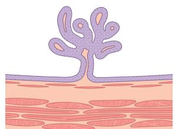 
Papilloma
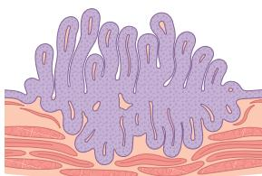 
Invasive papillary carcinoma
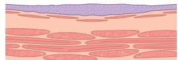 
Flat noninvasive carcinoma (CIS)
.jpg) 
Flat invasive carcinoma 
Fig. 18.15 Morphologic patterns of urothelial neoplasia.
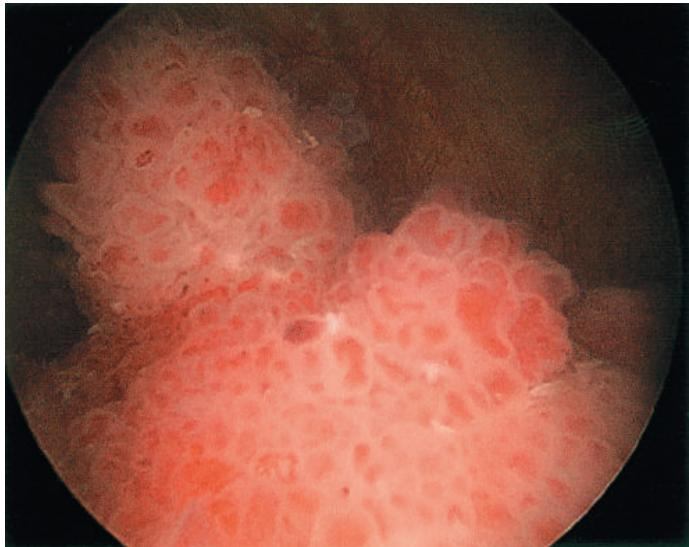 
Fig. 18.16 Cystoscopic appearance of a papillary urothelial tumor, resembling coral, within the bladder.
(Fig. 18.17). These exophytic papillary neoplasms are to be distinguished from inverted urothelial papilloma, which is entirely benign and not associated with an increased risk for subsequent carcinoma.
CIS is defined by the presence of overtly malignant-appearing cells within a flat urothelium (Fig. 18.18). Like high-grade papillary urothelial carcinoma, the tumor cells in CIS lack cohesiveness and are shed into the urine, where they can be detected by cytology. CIS commonly is multifocal and sometimes involves most of the bladder surface or extends into the ureters and urethra. Without treatment, $50\%$ to $75\%$ of CIS cases progress to invasive cancer.
Invasive urothelial cancer associated with papillary urothelial cancer (usually of high grade) or CIS may superficially invade the lamina propria or extend more deeply into underlying muscle. The extent of invasion and spread (staging) at the time of initial diagnosis is the most important prognostic factor. Almost all infiltrating urothelial carcinomas are high grade.
Squamous cell carcinomas of the bladder typically show extensive keratinization and are nearly always associated with chronic bladder irritation and infection. Adenocarcinomas of the bladder are histologically identical to adenocarcinomas seen in the gastrointestinal tract. Some arise from urachal remnants in the dome of the bladder or in association with extensive intestinal metaplasia.
Table 18.2 Noninvasive Papillary Urothelial Neoplasms 
NeoplasmRecurrencesCoexistent InvasionProgressionDeathPapillomaRareNoneRare*NonePUNLMP30%None2%NoneLGUC45%&lt;10%8%-10%2%-3%HGUC45%Up to 80%30%20%
HGUC, High-grade papillary urothelial carcinoma; LGUC, low-grade papillary urothelial carcinoma; PUNLMP, papillary urothelial neoplasia of uncertain malignant potential. 
*Rare cases of progression have occurred in immunocompromised patients.
showsslightlyirregularnucleiwithscatteredmitoticfigures(arrow)..jpg) 
Fig. 18.17 Noninvasive low-grade papillary urothelial carcinoma. Higher magnification (right) shows slightly irregular nuclei with scattered mitotic figures (arrow).
Bladder tumors most commonly present with painless hematuria. Patients with urothelial tumors, whatever their grade, have a tendency to develop new tumors after excision, and recurrences may exhibit a higher grade. The risk for recurrence is related to several factors, including tumor size, stage, grade, multifocality, mitotic index, and associated dysplasia and/or CIS in the surrounding mucosa. Many recurrent tumors arise at sites different than that of the original lesion, yet share the same clonal abnormalities as those of the initial tumor; thus, these are true recurrences that stem from shedding and implantation of the original tumor cells at new sites. Whereas high-grade papillary urothelial carcinomas frequently are associated with either concurrent or subsequent invasive urothelial carcinoma, lower-grade papillary urothelial neoplasms often recur but infrequently invade (see Table 18.2).
withenlargedhyperchromaticnucleiandamitoticfigure(arrow)..jpg) 
Fig. 18.18 Carcinoma in situ (CIS) with enlarged hyperchromatic nuclei and a mitotic figure (arrow).
Treatment of bladder cancer depends on tumor grade and stage and on whether the lesion is flat or papillary. For small, localized papillary tumors that are not high-grade, transurethral resection is both diagnostic and therapeutically sufficient. Patients with tumors that are at high risk for recurrence or progression typically receive topical immunotherapy consisting of intravesical instillation of an attenuated strain of the tuberculosis bacillus called Bacillus Calmette-Guérin (BCG), sometimes followed by intravesical chemotherapy. BCG elicits a granulomatous reaction that also triggers an effective local anti-tumor immune response. Patients are closely monitored for tumor recurrence with periodic cystoscopy and urine cytologic studies. Radical cystectomy is reserved for (1) tumor invading the muscularis propria; (2) CIS or high-grade papillary cancer refractory to BCG; and (3) CIS extending into the prostatic urethra and down the prostatic ducts, where BCG cannot come in contact the neoplastic cells. Advanced bladder cancer is treated using chemotherapy, which can palliate but is seldom curative.
# SEXUALLY TRANSMITTED DISEASES
Sexually transmitted diseases (STDs) have complicated human existence for centuries. Globally, approximately 15 million new cases of STD occur every year; of these, 4 million affect 15- to 19-year-olds, and 6 million affect 20- to 24-year-olds. Women are far more likely to become infected by an STD and to be asymptomatic. Of the 10 leading infectious diseases that require notification of the Centers for Disease Control and Prevention (CDC) in the United States, five—chlamydial infection, gonorrhea, acquired immunodeficiency syndrome (AIDS), syphilis, and hepatitis B—are STDs (Table 18.3). In the United States, the two most common STDs are genital herpes and genital HPV infection, but these do not require CDC notification.
Table 18.3 Classification of Important Sexually Transmitted Diseases 
PathogenAssociated Disease(s)—Distribution by GenderMalesBothFemalesVirusesHerpes simplex virusPrimary and recurrent herpes, neonatal herpesHepatitis B virusHepatitisHuman papillomavirusCancer of penis (some cases)Condyloma acuminatum, anal cancer, oropharyngeal carcinomaCervical dysplasia and cancer, vulvar cancerHuman immunodeficiency virusAcquired immunodeficiency syndromeChlamydiaeChlamydia trachomatisUrethritis, epididymitis, proctitisLymphogranuloma venereumUrethral syndrome, cervicitis, bartholinitis, salpingitis, and sequelaeMycoplasmasUreaplasma urealyticumUrethritisCervicitisBacteriaNeisseria gonorrhoeaeEpididymitis, prostatitis, urethral strictureUrethritis, proctitis, pharyngitis, disseminated gonococcal infectionCervicitis, endometritis, bartholinitis, salpingitis, and sequelae (infertility, ectopic pregnancy, recurrent salpingitis)Treponema pallidumSyphilisHaemophilus ducreyiChancroidCalymmatobacterium granulomatisGranuloma inguinale (donovanosis)ProtozoaTrichomonas vaginalisUrethritis, balanitisVaginitis
Several of these entities, such as human immunodeficiency virus (HIV) infection, HPV infection, hepatitis B, and infection with E. histolytica, are discussed in other chapters.
# Syphilis
Syphilis, or *lues*, is a chronic venereal infection caused by the spirochete *Treponema pallidum*. First recognized in epidemic form in 16th-century Europe as the Great Pox, syphilis is endemic in all parts of the world. In the United States, 20,000 cases of primary and secondary syphilis were reported to the CDC in 2014, representing almost a threefold increase since the year 2000. The increase for the most part can be attributed to the increased incidence in men who have sex with men. During 2013-2014, the incidence began to increase in women as well, raising the concern that there may be an impending increase in cases of congenital syphilis acquired from the mother. A strong racial disparity is evident; African Americans are affected six times more often than whites. Syphilis also is more common in HIV-infected patients, in whom syphilis is more likely to progress to organ involvement and neurosyphilis.
T. pallidum is a fastidious organism whose only natural host is man. The usual source of infection is contact with a cutaneous or mucosal lesion in a sexual partner in the early (primary or secondary) stages of syphilis. The organism is transmitted from such lesions during sexual activity through minute breaks in the skin or mucous membranes of the uninfected partner. In congenital cases, T. pallidum is transmitted across the placenta from mother to fetus, particularly during the early stages of maternal infection.
Once introduced into the body, the organisms rapidly disseminate to distant sites through lymphatics and the blood, even before the appearance of lesions at the primary
inoculation site. This widespread dissemination accounts for the protean manifestations of the disease (Fig. 18.19), which in adults can be divided into primary, secondary, and tertiary stages.
- Primary syphilis. Several weeks after infection (mean, 21 days), a primary lesion, termed a chancre, appears at the point of spirochete entry. Systemic dissemination of organisms occurs during this period, while the host mounts an immune response. Two types of antibodies are formed: antibodies that cross-react with host constituents (nontreponemal antibodies) and antibodies to specific treponemal antigens. This humoral response, however, fails to eradicate the organisms. 
- Secondary syphilis. The chancre of primary syphilis resolves spontaneously over a period of 4 to 6 weeks and is followed in approximately $25\%$ of untreated patients by the development of secondary syphilis. The manifestations of secondary syphilis, discussed in greater detail later, include generalized lymphadenopathy and mucocutaneous lesions. The mucocutaneous lesions of both primary and secondary syphilis are teeming with spirochetes and are highly infectious. Like the chancre, the lesions of secondary syphilis resolve even without antimicrobial therapy, at which point patients are said to be in early latent-phase syphilis. 
- Tertiary syphilis. Patients with untreated syphilis next enter an asymptomatic, late latent phase of the illness, defined as being more than 1 year after the initial infection. In about one third of cases, new symptoms develop over the next 5 to 20 years. This late symptomatic phase, or tertiary syphilis, is marked by the development of lesions in the cardiovascular system, central nervous system, or, less frequently, other organs. Spirochetes are much more difficult to demonstrate during the later
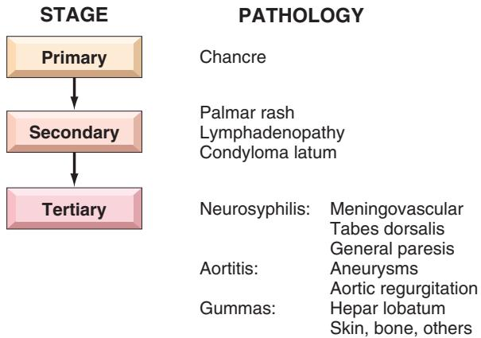
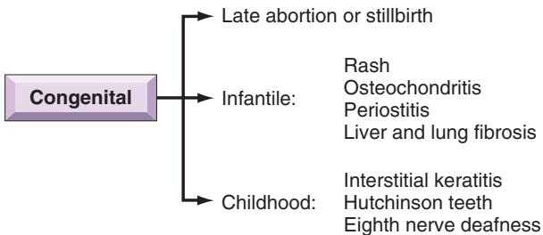 
Fig. 18.19 Protean manifestations of syphilis.
stages of disease, and patients are accordingly much less likely to be infectious than are those in the primary or secondary stages of disease.
T. pallidum also may be transmitted across the placenta from an infected mother to the fetus at any time during pregnancy, leading to the development of congenital syphilis. The likelihood of transmission is greatest during the early (primary and secondary) stages of disease, when spirochetes are most numerous. Because the manifestations of maternal disease may be subtle, routine serologic testing for syphilis is mandatory in all pregnancies. The stigmata of congenital syphilis typically do not develop until after the fourth month of pregnancy. In the absence of treatment, as many as $40\%$ of infected infants die in utero, typically after the fourth month. The incidence of congenital syphilis is expected to rise because infection rates in women have increased in recent years.
The pathognomonic microscopic lesion of syphilis is a proliferative endarteritis with an accompanying inflammatory infiltrate rich in plasma cells. Endarteritis has a central role in tissue injury at all sites involved by syphilis, but its pathogenesis is not understood; there is no evidence that the spirochetes cause any damage to host tissues directly. Instead, it is thought that the host immune response is responsible for the endothelial cell activation and proliferation that is the hallmark of the endarteritis, which eventually leads to perivascular fibrosis and luminal narrowing.
Both primary and secondary syphilis are associated with characteristic lesions. The chancre of primary syphilis is typically indurated and has been referred to as a hard chancre, to
distinguish it from the soft chancre of chancroid caused by Haemophilus ducreyi (discussed later). The primary chancre in males usually is on the glans, corona, or perianal region. In females, multiple chanres may be present, usually on the labia or vagina as well as the perianal region. The chancre begins as a small, painless, firm papule 2 to 4 weeks after sexual exposure, which gradually enlarges to produce a painless ulcer with well-defined, indurated margins and a "clean," moist base (Fig. 18.20). Regional lymph nodes often are slightly enlarged and firm. Microscopic examination of the ulcer reveals the typical lymphocytic and plasmacytic inflammatory infiltrate and endarteritis. Spirochetes are readily demonstrable in histologic sections of early lesions with the use of standard silver stains (e.g., Warthin-Starry stains) or immunohistochemical stains specific for spirochetes. Within approximately 2 months of resolution of the chancre, the lesions
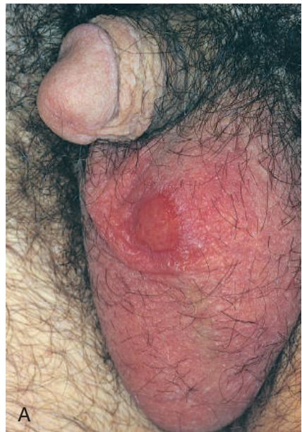
Syphiliticchancreofthescrotum.Suchlesionstypicallyarepainlessdespitethepresenceofulceration,andtheyhealspontaneously.(B)Histologicfeaturesofthechancreincludeadiffuseplasmacellinfiltratebeneathsquamousepitheliumofskin..jpg) 
Fig. 18.20 (A) Syphilitic chancre of the scrotum. Such lesions typically are painless despite the presence of ulceration, and they heal spontaneously. (B) Histologic features of the chancre include a diffuse plasma cell infiltrate beneath squamous epithelium of skin.
of secondary syphilis appear. The manifestations of secondary syphilis are varied but typically include a combination of generalized lymph node enlargement and a variety of mucocutaneous lesions. Skin lesions usually are symmetrically distributed; may be maculopapular, scaly, or pustular; and characteristically involve the palms of the hands and soles of the feet. In moist skin areas, such as the anogenital region, inner thighs, and axillae, broad-based, elevated lesions termed condylomata lata may appear (not to be confused with condyloma acuminata caused by HPV) (Chapters 18 and 23). Superficial mucosal lesions resembling condylomata lata can occur anywhere but are particularly common in the oral cavity and pharynx and on the external genitalia. Histologic examination of mucocutaneous lesions during the secondary phase of the disease reveals the characteristic proliferative endarteritis and, with special stains or immunohistochemistry, spirochetes, which are often abundant. Lymphadenopathy is most common in the neck and inguinal areas. Histologic examination of enlarged nodes demonstrates hyperplasia of germinal centers accompanied by increased numbers of plasma cells or, less commonly, granulomas or neutrophils. Less common manifestations of secondary syphilis include hepatitis, renal disease, eye disease (iritis), and gastrointestinal abnormalities.
Lesions associated with tertiary syphilis develop in approximately one third of untreated patients, usually after a latent period of 5 years or more. These are divided into three major categories: cardiovascular syphilis, neurosyphilis, and so-called "benign" tertiary syphilis, which may occur singly or in combination. Cardiovascular syphilis takes the form of syphilitic aortitis and accounts for more than $80\%$ of cases of tertiary disease; it is much more common in men than in women. Syphilitic aortitis is discussed further in Chapter 10. Neurosyphilis accounts for $10\%$ of cases of tertiary syphilis overall but occurs at increased frequency in those with concomitant HIV infection; it is discussed in detail in Chapter 22. Large areas of parenchymal damage in tertiary syphilis result in the formation of a gumma. On microscopic examination, the gumma contains a central zone of coagulative necrosis surrounded by dense fibrous tissue containing a mixed inflammatory infiltrate composed of lymphocytes, plasma cells, activated macrophages (epithelioid cells), and occasional giant cells, features that suggest a delayed hypersensitivity reaction. Gummas occur most commonly in bone, skin, and the mucous membranes of the upper airway and mouth, but any organ may be affected. Spirochetes are only rarely demonstrable. Once common, gummas have become exceedingly rare thanks to effective antibiotics such as penicillin. They are reported now mostly in patients with AIDS.
Manifestations of congenital syphilis include stillbirth, infantile syphilis, and late (tardive) congenital syphilis.
- Among infants who are stillborn, the most common manifestations are hepatomegaly, bone abnormalities, pancreatic fibrosis, and pneumonitis. The liver often shows extramedullary hematopoiesis and portal tract inflammation. Changes in the bones include inflammation and disruption of the osteochondral junction in long bones and, on occasion, bone resorption and fibrosis of the flat bones of the skull. The lungs may be firm and pale as a result of the presence of inflammatory cells and fibrosis in the alveolar septa (pneumonia alba). With special stains, spirochetes are readily seen in tissue sections. 
- Infantile syphilis refers to congenital syphilis in infants that manifests at birth or within the first few months of life. Affected
infants present with chronic rhinitis (snuffles) and mucocutaneous lesions similar to those seen in secondary syphilis in adults. Visceral and skeletal changes resembling those seen in stillborn infants also may be present.
- Late, or tardive, congenital syphilis refers to cases of untreated congenital syphilis of more than 2 years' duration. Classic manifestations include the Hutchinson triad: notched central incisors, interstitial keratitis with blindness, and deafness from eighth cranial nerve injury. Other changes include a so-called "saber shin" deformity caused by chronic inflammation of the periosteum of the tibia, deformed molar teeth ("mulberry molars"), chronic meningitis, chorioretinitis, and gummas of the nasal bone and cartilage with a resultant "saddle nose" deformity.
Syphilis remains highly sensitive to antibiotics such as penicillin, a short course of which is sufficient to treat all stages of the disease. Serology is the mainstay of diagnosis. Serologic tests for syphilis include nontreponemal antibody tests and antitreponemal antibody tests. Nontreponemal tests measure antibody to cardiolipin, an antigen that is present in both host tissues and the treponemal cell wall. These antibodies are detected by the rapid plasma reagin (RPR) and Venereal Disease Research Laboratory (VDRL) tests. Nontreponemal antibody tests are usually positive by 4 to 6 weeks of infection and are strongly positive in the secondary phase of infection. However, nontreponemal antibody test results may revert to negative during the tertiary phase or, conversely, may on occasion be persistently positive in some patients after successful treatment. Two additional points regarding nontreponemal antibody tests deserve emphasis:
- Nontreponemal antibody test results often are negative during the early stages of disease, even in the presence of a primary chancre. If there is a high degree of suspicion, these tests should be repeated in a few weeks. 
- As many as $15\%$ of positive VDRL test results are unrelated to syphilis. These false-positive results, which may be acute (transient) or chronic (persistent), increase in frequency with age and are associated with a variety of conditions, including the antiphospholipid antibody syndrome (Chapter 4).
Treponemal antibody tests also become positive within 4 to 6 weeks after an infection but (unlike those for nontreponemal antibody tests) they usually remain positive indefinitely, even after successful treatment. Historically, treponemal antibody tests have been used to confirm the diagnosis of syphilis in those with a positive nontreponemal antibody test. However, thanks to recent test improvements, some centers have reversed this algorithm and now use treponemal antibody tests for screening and nontreponemal antibody tests to confirm the diagnosis. As with all serologic tests for infection, certain pitfalls must be considered when interpreting these tests, including the timing of the test relative to the infection (e.g., too early for an antibody response to have been mounted) and the confounding influence of altered immunity, particularly in those who are HIV-infected.

# SYPHILIS
- Syphilis is caused by T. pallidum and has three stages. 
Primary syphilis: A painless lesion called a chancre develops on the external genitalia along with regional lymph node enlargement. 
- Secondary syphilis: Generalized lymphadenopathy and mucocutaneous lesions that may be maculopapular or take the form of flat raised lesions called condylomata lata. 
- Tertiary syphilis: May cause proximal aortitis and aortic insufficiency; may involve the brain, meninges, and the spinal cord; or may cause focal granulomatous lesions called gummas in multiple organs. 
- Congenital syphilis is caused by maternal transmission of the spirochetes during vaginal birth, mostly during the primary and secondary stages of disease in the mother. It may lead to stillbirth or cause widespread tissue injury in liver, spleen, lung, bones, and pancreas. 
- Most syphilitic lesions demonstrate proliferative endarteritis and a plasma cell-rich inflammatory infiltrate. Gummas have a central area of necrosis surrounded by lymphoplasmacytic infiltrates, activated macrophages, and fibrosis. 
- The diagnostic mainstay is serologic testing. Nontreponemal antibody tests (VDRL and RPR) are usually positive in early disease, but may be negative in advanced disease. Treponemespecific antibody test results become positive later and remain positive indefinitely.
# Gonorrhea
Gonorrhea is a sexually transmitted infection caused by Neisseria gonorrhoeae. It is second only to chlamydial infection (discussed later) among reportable communicable diseases in the United States. With an estimated 350,000 cases reported in 2014, it remains a major public health problem. Coinfection with other STDs is common, particularly Chlamydia trachomatis, which is found in $30\%$ of males with gonorrhea. The gravity of gonococcal infections has increased with the emergence of strains of N. gonorrhoeae that are resistant to multiple antibiotics.
Humans are the only natural reservoir for $N.$ gonorrhoeae. The organism is highly fastidious, and spread of infection requires direct contact with the mucosa of an infected individual, usually during sexual activity. The bacteria initially attach to mucosal epithelium, particularly of the columnar or transitional type, using a variety of membrane-associated adhesion molecules and structures termed pili (Chapter 9). Such attachment prevents the organism from being unceremoniously flushed away by body fluids such as urine or endocervical mucus. The organism then penetrates through the epithelial cells to invade the deeper tissues of the host.

N. gonorrhoeae provokes an intense, suppurative inflammatory reaction. In males, this manifests most often as a purulent urethral discharge, associated with an edematous, congested
.(CourtesyofDr.RitaGander,DepartmentofPathology,UniversityofTexasSouthwesternMedicalSchool,Dallas,Texas.).jpg) 
Fig. 18.21 Neisseria gonorrhoeae. Gram stain of urethral discharge demonstrates characteristic gram-negative, intracellular diplococci (arrow). (Courtesy of Dr. Rita Gander, Department of Pathology, University of Texas Southwestern Medical School, Dallas, Texas.)
urethral meatus. Gram-negative diplococci, many within the cytoplasm of neutrophils, are readily identified in Gram stains of the purulent exudate (Fig. 18.21). Ascending infection may result in the development of acute prostatitis, epididymitis (Fig. 18.22), or orchitis. Abscesses may complicate severe cases. Urethral and endocervical exudates tend to be less conspicuous in females, although acute inflammation of adjacent structures, such as the Bartholin glands, is fairly common. Ascending infection involving the uterus, fallopian tubes, and ovaries results in acute salpingitis, sometimes complicated by tuboovarian abscesses. The acute inflammatory process is followed by the development of granulation tissue and scarring, with resultant strictures and other permanent deformities of the involved structures, giving rise to pelvic inflammatory disease (Chapter 19).
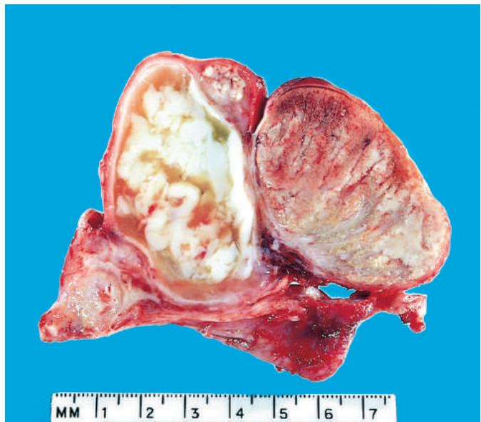 
Fig. 18.22 Acute epididymitis caused by gonococcal infection. The epididymis is involved by an abscess. Normal testis is seen on the right.
In most infected males, gonorrhea is manifested by the presence of dysuria, urinary frequency, and a mucopurulent urethral exudate within 2 to 14 days of the time of initial infection. However, urethral gonococcal infection can be detected in $40\%$ of asymptomatic male contacts of women with symptomatic gonorrhea. Treatment with appropriate anti-microbial therapy results in eradication of the organism and prompt resolution of symptoms. Untreated infections may ascend to involve the prostate, seminal vesicles, epididymis, and testis. Neglected cases may be complicated by chronic urethral stricture and, in more advanced cases, by permanent sterility. Untreated men also may become chronic carriers of $N.$ gonorrhoeae.
Among female patients, acute infections acquired by vaginal intercourse may be asymptomatic or may be associated with dysuria, lower pelvic pain, and vaginal discharge. Untreated cases may be complicated by ascending infection, leading to acute inflammation of the fallopian tubes (salpingitis) and ovaries. Scarring of the fallopian tubes may occur, with resultant infertility and an increased risk for ectopic pregnancy. Gonococcal infection of the upper genital tract may spread to the peritoneal cavity, where the exudate may extend up the right paracolic gutter to the dome of the liver, resulting in gonococcal peripatitis. Depending on sexual practices, other sites of primary infection in both males and females include the oropharynx and the anorectal area, with resultant acute pharyngitis and proctitis, respectively.
Disseminated infection is much less common than local infection, occurring in $0.5\%$ to $3\%$ of cases of gonorrhea. It is more frequent in females than in males. Manifestations include, most commonly, tenosynovitis, arthritis, and pustular or hemorrhagic skin lesions. Endocarditis and meningitis are rare presentations. Strains that cause disseminated infection usually are resistant to the lytic action of complement, but rare patients with inherited complement deficiencies are susceptible to systemic spread regardless of the infecting strain.
Gonococcal infection may be transmitted to infants during passage through the birth canal. The affected neonate may develop purulent infection of the eyes (ophthalmia neonatorum), an important cause of blindness in the past. The routine application of antibiotic ointment to the eyes of newborns has markedly reduced this disorder.
Both culture and a variety of tests that detect organism-specific nucleic acids can be used to diagnose gonococcal infections. The advantage of culture is that it permits determination of antibiotic sensitivity. Nucleic acid-based tests are more rapid and somewhat more sensitive than culture, and are being used increasingly.
# GONORRHEA
- Gonorrhea is a common STD affecting the genitourinary tract. Control of dissemination requires an effective complement-mediated immune response. 
- Gonorrhea presents with dysuria and a milky, purulent urethral discharge, although a high frequency of cases are asymptomatic.
- About $30\%$ of men with gonococcal urethritis also are infected with C. trachomatis. 
- Pregnant women can transmit gonorrhea to newborns during passage through the birth canal. 
- Diagnosis can be made by culture of the exudates as well as by nucleic acid amplification techniques.
# Nongonococcal Urethritis and Cervicitis
Nongonococcal urethritis (NGU) and cervicitis are the most common forms of STD. A variety of organisms are implicated in the pathogenesis of NGU and cervicitis, including C. trachomatis, Mycoplasma genitalium, Trichomonas vaginalis, and Ureaplasma urealyticum. In the United States, most cases are apparently caused by C. trachomatis, and this organism is believed to be the most common bacterial cause of STD in the United States. Mycoplasma genitalium is a close second as a cause of NGU. The frequency of causative agents varies geographically and in certain patient populations such a men having sex with men. In almost $50\%$ of the cases world wide no pathogen can be identified. As discussed earlier, gonorrhea infection frequently is accompanied by chlamydial infection.
C. trachomatis is a small gram-negative bacterium that is an obligate intracellular pathogen. It exists in two forms. The infectious form, the elementary body, is capable of at least limited survival in the extracellular environment. The elementary body is taken up by host cells, primarily through a process of receptor-mediated endocytosis. Once inside the cell, the elementary body differentiates into a metabolically active form, termed the reticulate body. Using the energy sources of the host cell, the reticulate body replicates and ultimately forms new infectious elementary bodies, which have a tropism for columnar epithelial cells.
C. trachomatis infections are associated with a wide range of clinical features that are virtually indistinguishable from those caused by $N$ gonorrhoeae. Clinically, patients typically present 1 to 5 weeks after exposure with dysuria with or without urethral discharge. Patients may develop epididymitis, prostatitis, pelvic inflammatory disease, pharyngitis, conjunctivitis, perihepatic inflammation, and, among individuals who engage in anal sex, proctitis. It is the most common cause of epididymitis in young men. Similar to gonococcus, a large percentage of both men and women are asymptomatic. C. trachomatis also causes lymphogranuloma venereum (LGV), discussed in the next section. The infection may be transmitted to newborns during vaginal birth, where up to $15\%$ of exposed newborns develop chlamydial pneumonia and $50\%$ develop chlamydial conjunctivitis.
The morphologic and clinical features of chlamydial infection, with the exception of lymphogranuloma venereum, are virtually identical to those of gonorrhea. The primary infection is characterized by a watery to mucopurulent discharge that contains a predominance of neutrophils. Organisms are not visible in Gram-stained sections. In contrast with the gonococcus, C. trachomatis cannot be isolated with the use of conventional culture media. The diagnosis is best made by a nucleic acid amplification test on voided urine, which is now the gold standard. Another important manifestation of chlamydial infection is reactive
arthritis (formerly known as Reiter syndrome), predominantly in patients who are HLA-B27 positive. This condition typically manifests as a combination of urethritis, conjunctivitis, arthritis, and generalized mucocutaneous lesions.
# NONGONOCOCCAL URETHRITIS AND CERVICITIS
- NGU and cervicitis are the most common forms of STD. Most cases are caused by C. trachomatis, and the rest by T. vaginalis, M. genitalium and U. urealyticum. 
- C. trachomatis is a gram-negative intracellular bacterium that causes a disease that is clinically indistinguishable from gonorrhea in both men and women. Diagnosis can be made by sensitive nucleic acid amplification tests in urine samples or vaginal swabs. 
- In patients who are HLA-B27 positive, C. trachomatis infection can cause reactive arthritis along with conjunctivitis and generalized mucocutaneous lesions.
# Lymphogranuloma Venereum
LGV is a chronic, ulcerative disease caused by certain strains of C. trachomatis that are distinct from those causing the more common nongonococcal urethritis or cervicitis discussed earlier. It is endemic in parts of Asia, Africa, the Caribbean region, and South America. An increased incidence has been noted in the US in the past 15 years, due in large part of infections in men having sex with men, who are often co infected with HIV. As in the case of granuloma inguinale (discussed later), sporadic cases of LGV are seen most often among individuals with multiple sexual partners.
LGV may present as nonspecific urethritis or papular or ulcerative lesions involving the lower genitalia. Subsequently, tender enlarged matted inguinal and/or femoral lymphadenopathy ensues that typically is unilateral and is often associated with fistulous tracts. Proctocolitis also can be seen. The lesions contain a mixed granulomatous and neutrophilic inflammatory response. Variable numbers of chlamydial inclusions may be seen in the cytoplasm of epithelial cells or inflammatory cells with special staining methods. Regional lymphadenopathy is common, usually appearing within 30 days of the time of infection. Lymph node involvement is characterized by a granulomatous inflammatory reaction associated with irregularly shaped foci of necrosis and neutrophilic infiltration (stellate abscesses). With time, the inflammatory reaction gives rise to extensive fibrosis that can cause local lymphatic obstruction and strictures, producing lymphedema.
Within 1 to 2 weeks of exposure, primary infection appears at the site of inoculation in the form of a genital ulcer or a mucosal inflammatory reaction. These primary lesions heal spontaneously, but the organisms at these sites seed draining lymph nodes, triggering a necrotizing lymphadenitis 2 to 6 weeks after the initial exposure. The lymphadenitis is usually unilateral and painful, and may lead to abscess
formation. Abscesses sometimes rupture, spreading the inflammatory process into surrounding soft tissues. Rectal infections may progress to proctocolitis, associated with pain, constipation, fever, and bleeding, features that mimic inflammatory bowel disease. If untreated, rectal fissures and strictures may develop secondary to inflammation and fibrosis.
The diagnosis of LGV is difficult because laboratory tests are not standardized and serologic tests have low specificity. As with other chlamydial infections, nucleic acid amplification tests have the highest sensitivity and specific and are becoming more widely available. Culture and serologic tests are less sensitive but are still used, particularly in areas where nucleic acid amplification tests are not available.
# Chancroid (Soft Chancre)
Chancroid, sometimes called the "third" venereal disease (after syphilis and gonorrhea), is an acute, ulcerative infection caused by Haemophilus ducreyi, a small, gram-negative coccobacillus. The disease is most common in tropical and subtropical areas and is more prevalent in lower socioeconomic groups, particularly among men who have regular contact with prostitutes. Chancroid is one of the most common causes of genital ulcers in Africa and Southeast Asia, where it serves as an important cofactor in the transmission of HIV infection. Chancroid probably is underdiagnosed in the United States because most STD clinics do not have facilities for isolating $H.$ ducreyi, and PCR-based tests are not widely available.
The primary lesion of chancroid appears first as a papule that rapidly breaks down to produce a ulcer. On microscopic examination, the ulcer of chancroid contains a superficial zone of neutrophilic debris and fibrin, with an underlying zone of granulation tissue containing areas of necrosis and thrombosed vessels. A dense, lymphoplasmacytic inflammatory infiltrate is present beneath the layer of granulation tissue. Secondarily involved draining lymph nodes also exhibit necrotizing inflammation that frequently progresses to abscess formation.
The primary lesion of chanchroid appears within 4 to 7 days of inoculation. In male patients, the primary lesion is usually on the penis; in female patients, most lesions occur in the vagina or periurethral area. Over the course of several days, the surface of the primary lesion erodes to produce an irregular ulcer, which is more likely to be painful in males than in females. The regional lymph nodes, particularly in the inguinal region, become enlarged and tender in about $50\%$ of cases within 1 to 2 weeks of the primary inoculation. In untreated cases, the inflamed and enlarged nodes (buboes) may erode the overlying skin to produce chronic, draining ulcers. A definitive diagnosis requires the identification of $H.$ ducreyi on special culture media that are not widely available from commercial sources; even when such media are used, sensitivity is less than $80\%$ . Therefore, the diagnosis often is based on clinical grounds alone.
# Granuloma Inguinale
Granuloma inguinale is a chronic inflammatory disease caused by Calymmatobacterium granulomatis, a minute, encapsulated coccobacillus related to the Klebsiella genus. This disease is uncommon in the United States and Western Europe, but it is endemic in the rural parts of certain tropical and subtropical regions. When it occurs in urban settings, transmission of C. granulomatis typically is associated with a history of multiple sexual partners. Untreated cases are characterized by extensive scarring, often associated with lymphatic obstruction and lymphedema (elephantiasis) of the external genitalia. Culture of the organism is difficult, and PCR-based assays are not widely available.
Granuloma inguinale causes genital ulceration, accompanied by the development of abundant granulation tissue. Disfiguring scars may develop in untreated cases, sometimes associated with formation of urethral, vulvar, or anal strictures. In contrast with chancroid, regional lymph nodes typically are spared or show only nonspecific reactive changes.
Microscopic examination of active lesions reveals marked epithelial hyperplasia at the borders of the ulcer, sometimes mimicking carcinoma (pseudoepitheliomatous hyperplasia). A mixture of neutrophils and mononuclear inflammatory cells is present at the base of the ulcer and beneath the surrounding epithelium. The organisms are demonstrable in Giemsa-stained smears of the exudate as minute coccobacilli within vacuoles in macrophages (Donovan bodies). Silver stains (e.g., the Warthin-Starry stain) also may be used to demonstrate the organism.
# LYMPHOGRANULOMA VENEREUM, CHANCROID, AND GRANULOMA INGUINALE
- LGV is caused by C. trachomatis serotypes that are distinct from those that cause nongonococcal urethritis. LGV is associated with urethritis, ulcerative genital lesions, lymphadenopathy, and involvement of the rectum. The lesions show both acute and chronic inflammation; they progress to fibrosis, with consequent lymphedema and formation of rectal strictures. Diagnosis is made by nucleic acid amplification tests and serology. 
- H. ducreyi infection causes an acute painful ulcerative genital infection called chancroid. Inguinal node involvement occurs in many cases and leads to their enlargement and ulceration. Ulcers show a superficial area of acute inflammation and necrosis, with an underlying zone of granulation tissue and mononuclear infiltrate. Diagnosis is possible by culture of the organism. 
- Granuloma inguinale is a chronic fibrosing STD caused by C. granulomatis. The initial papular lesion on the genitalia expands and ulcerates, with formation of urethral, vulvar, or anal strictures in some cases. Microscopic examination reveals granulation tissue and intense epithelial hyperplasia that can mimic squamous cell carcinoma. Organisms are visible as small intracellular coccobacilli within vacuolated macrophages (Donovan bodies).
# Trichomoniasis
T. vaginalis is a sexually transmitted protozoan that is a frequent cause of vaginitis. The trophozoite form adheres to the mucosa, where it causes superficial lesions. In females, T. vaginalis infection often is associated with loss of acid-producing lactobacilli. The incubation period is 4 to 28 days. It may be asymptomatic or be associated with pruritus and a profuse, frothy, yellow vaginal discharge. Urethral colonization may cause urinary frequency and dysuria. T. vaginalis infection typically is asymptomatic in males but in some cases may manifest as nongonococcal urethritis. The organism usually is demonstrable in smears of vaginal scrapings.
# Genital Herpes Simplex
Genital herpes infection, or herpes genitalis, is a very common STD. According to CDC, approximately 800,000 people get new infections every year in the United States. One in six persons between the ages of 14 and 49 has HSV-2 infection in the US. With increasing rate of HSV-1 infections the overall prevalence of genital herpes is likely much higher. Although both herpes simplex virus 1 (HSV-1) and HSV-2 can cause anogenital or oral infections, most cases of anogenital herpes are caused by HSV-2. However, recent years have seen a rise in the number of genital infections caused by HSV-1, in part due to the increasing practice of oral sex. Genital HSV infection may occur in any sexually active population. As with other STDs, the risk for infection is directly related to the number of sexual contacts. Up to $95\%$ of HIV-positive men who have sex with men are seropositive for HSV-1 and/or HSV-2. HSV is transmitted when the virus comes into contact with a mucosal surface or broken skin of a susceptible host. Such transmission requires direct contact with an infected individual, because the virus is readily inactivated at room temperature, particularly if dried.
The initial lesions of genital HSV infection are painful, erythematous vesicles on the mucosa or skin of the lower genitalia and adjacent extragenital sites. The anorectal area is a particularly common site of primary infection among men who have sex with men. Histologic changes include the presence of intraepithelial vesicles accompanied by necrotic cellular debris, neutrophils, and cells harboring characteristic intranuclear viral inclusions. The classic Cowdry type A inclusion appears as a light purple, homogeneous intranuclear structure surrounded by a clear halo. Infected cells commonly fuse to form multinucleate syncytia. The inclusions stain with antibodies to HSV, permitting a rapid, specific diagnosis of HSV infection in histologic sections or smears.
As discussed earlier, both HSV-1 and HSV-2 can cause genital or oral infection, and both produce indistinguishable primary or recurrent mucocutaneous lesions. Primary infection with HSV-2 often may be asymptomatic or may produce a variety of signs and symptoms. Locally painful vesicular lesions may be accompanied by dysuria, urethral discharge, local lymph node enlargement and tenderness,
and systemic manifestations, such as fever, muscle aches, and headache. HSV is actively shed during this period, and shedding continues until the mucosal lesions have completely healed. However, asymptomatic viral shedding can occur as long as 3 months after diagnosis. Signs and symptoms may last for several weeks during the primary phase of disease. Recurrences are milder and of shorter duration than in the primary episode. Diagnosis is most often made by viral culture or nucleic acid amplification testing of fluid collected after "unroofing" of a vesicular lesion.
In immunocompetent adults, herpes genitalis generally is not life-threatening. However, HSV poses a major threat to immunosuppressed patients, in whom fatal, disseminated disease may develop. Also life-threatening is neonatal herpes infection, which occurs in about one-half of infants delivered vaginally of mothers suffering from either primary or recurrent genital HSV infection. The viral infection is acquired during passage through the birth canal. Its incidence has risen in parallel with the rise in genital HSV infection. The manifestations of neonatal herpes vary from involvement of superficial sites (skin, eyes and mouth) to involvement of the CNS, with or without disseminated infection of other organs such as the liver and lungs. Approximately $60\%$ of affected infants die of the disease, with significant morbidity occurring in about one-half of the survivors. PCR-based testing is far more sensitive and the preferred method for diagnosis of encephalitis.
# Human Papillomavirus Infection
HPV causes a number of squamous proliferations in the genital tract, including condyloma acuminatum, as well as several precancerous lesions that commonly undergo transformation to carcinomas. The latter most commonly involve the cervix (Chapter 19), but also occur in the penis, vulva, oropharyngeal tonsil, and conjunctiva. Condylomata acuminata, also known as venereal warts, are caused by HPV types 6 and 11. These lesions occur on the penis as well as on the female genitalia. They should not be confused with the condylomata lata of secondary syphilis. Genital HPV infection may be transmitted to neonates during vaginal delivery. Recurrent and potentially life-threatening papillomas of the upper respiratory tract may develop subsequently in affected infants.
In males, condylomata acuminata usually occur on the coronal sulcus or inner surface of the prepuce, where they range in size from small, sessile lesions to large, papillary proliferations measuring several centimeters in diameter. In females, they commonly occur on the vulva. Examples of the microscopic appearance of these lesions are presented in Chapter 19.
# HERPES SIMPLEX VIRUS AND HUMAN PAPILLOMAVIRUS INFECTIONS
- HSV-2 and, less commonly, HSV-I can cause genital infections. Initial (primary) infection may be asymptomatic or cause
painful, erythematous, intraepithelial vesicles on the mucosa and skin of external genitalia, along with painful regional lymph node enlargement. Recurrent lesions in general are less painful and less extensive than primary lesions.
- On histologic examination, the vesicles of HSV infection contain necrotic cells and fused multinucleate giant cells with intranuclear inclusions (Cowdry type A) that stain with antibodies to the virus. 
- Neonatal herpes can be life-threatening and occurs in children born to mothers with genital herpes. Affected infants may have generalized herpes, often associated with encephalitis and consequent high mortality. 
HPV causes many proliferative lesions of the genital mucosa, including condyloma acuminatum, precancerous lesions, and invasive cancers.
Barbieri CE, Tomlins SA: The prostate cancer genome: perspectives and potential, Urol Oncol 32:53.e15, 2014. [A review of molecular alterations in prostate cancer from recent sequencing data.] 
Bostrom PJ, Bjartell AS, Catto JW, et al: Genomic predictors of outcome in prostate cancer, Eur Urol 68:1033, 2015. [A recent review of biomarkers that are useful for clinical decision making in prostate cancer.] 
Bushman W: Etiology, epidemiology, and natural history of benign prostatic hyperplasia, Urol Clin North Am 36:403, 2009. 
Cuzick J, Thorat MA, Andriole G, et al: Prevention and early detection of prostate cancer, Lancet Oncol 15:e484, 2014. [A review of the epidemiology and risk factors for prostate cancer as well as current screening methods and biomarkers.] 
Czerniak B, Dinney C, McConkey D: Origins of bladder cancer, Annu Rev Pathol 11:494, 2016. [Reviews recent advances in molecular characterization of bladder cancer.] 
Donovan B: Sexually transmitted infections other than HIV, Lancet 363:545, 2004. [A clinical review of STDs.] 
Epstein JI: An update of the Gleason grading system, *J Urol* 183:433, 2010. 
Fanfair RN, Workowski KA: Clinical update in sexually transmitted diseases—2014, Cleve Clin J Med 81:91, 2014. [A concise updated review with treatment recommendations.] 
Hanna NH, Einhorn LH: Testicular cancer - discoveries and updates, N Engl J Med 371:2005, 2014. [A comprehensive review of current pathologic and clinical features of testicular germ cell tumors.] 
Le BV, Schaeffer AJ: Genitourinary pain syndromes, prostatitis and lower urinary tract symptoms, Urol Clin North Am 36:527, 2009. [A recent review of the etiology, diagnosis, symptoms, and treatment of prostatitis and interstitial cystitis along with pelvic pain syndromes.] 
Lee PK, Wilkins KB: Condyloma and other infections including human immunodeficiency virus, Surg Clin North Am 90:99, 2010. 
Patel AK, Chapple CR: Medical management of lower urinary tract symptoms in men: current treatment and future approaches, Nat Clin Pract Urol 5:211, 2008. [This article clarifies the terminology used to evaluate men with lower urinary tract symptoms.] 
Rapley EA, Nathanson KL: Predisposition alleles for testicular germ cell tumour, Curr Opin Genet Dev 20:225, 2010. [An update on inherited risk factors in germ cell tumors]. 
Spiess PE, Horenblas S, Pagliaro LC, et al: Current concepts in penile cancer, J Natl Compr Canc Netw 11:617, 2013. [A systematic review of the epidemiology and current treatment of penile cancers.] 
Sulak PJ: Sexually transmitted diseases, Semin Reprod Med 21:399, 2003. [An exhaustive review of STDs.]
# Female Genital System and Breast
# 19
# Vulva 713
# Vulvitis 713
Nonneoplastic Epithelial Disorders 714
# Tumors 714
Condylomas 714
Carcinoma of the Vulva 715
Extramammary Paget Disease 715
# Vagina 716
# Vaginitis 716
Malignant Neoplasms 716
Squamous Cell Carcinoma 716
Clear Cell Adenocarcinoma 716
Sarcoma Botryoides 717
# Cervix 717
# Cervicitis 717
Neoplasia of the Cervix 717
Squamous Intraepithelial Lesion (SIL, Cervical Intraepithelial Lesion) 718
Invasive Carcinoma of the Cervix 720
Endocervical Polyp 720
# Uterus 721
Endometritis 721
Adenomyosis 721
# Endometriosis 721
Abnormal Uterine Bleeding 722
Proliferative Lesions of the Endometrium and Myometrium 723
Endometrial Hyperplasia 723
Endometrial Carcinoma 724
Endometrial Polyps 724
Leiomyoma 725
Leiomyosarcoma 726
# Fallopian Tubes 726
# Ovaries 727
Follicle and Luteal Cysts 727
Polycystic Ovarian Syndrome 727
Tumors of the Ovary 727
Surface Epithelial Tumors 727
Serous Tumors 728
Mucinous Tumors 729
Endometrioid Tumors 729
Brenner Tumor 729
Other Ovarian Tumors 730
# Diseases of Pregnancy 732
Placental Inflammations and
Infections 732
# Ectopic Pregnancy 732
Gestational Trophoblastic Disease 733
Hydatidiform Mole: Complete and Partial 733
Invasive Mole 733
Gestational Choriocarcinoma 734
Placental Site Trophoblastic Tumor 735
Preeclampsia/Eclampsia (Toxemia of
Pregnancy) 735
# Breast 736
Clinical Presentations of Breast Disease 736
Inflammatory Processes 737
Stromal Neoplasms 738
Benign Epithelial Lesions 738
Carcinoma 739
Epidemiology and Risk Factors 741
# Vulva
The vulva is the external female genitalia and includes the hair-bearing skin (labia majora) and mucosa (labia minora). Disorders of the vulva most frequently are inflammatory, rendering them more uncomfortable than serious. Malignant tumors of the vulva, although life-threatening, are rare.
# VULVITIS
One of the most common causes of vulvitis is reactive inflammation in response to an exogenous stimulus, which may be an irritant (contact irritant dermatitis) or an allergen (contact allergic dermatitis). Scratching-induced trauma secondary to associated intense "itching" (pruritus) often exacerbates the primary condition.
Contact irritant eczematous dermatitis manifests as well-defined erythematous weeping and crusting papules and
plaques and may be a reaction to urine, soaps, detergents, antiseptics, deodorants, or alcohol. Allergic dermatitis has a similar clinical appearance and may result from allergy to perfumes; additives in creams, lotions, and soaps; chemical treatments on clothing; and other antigens.
Vulvitis also may be caused by infections, which often are sexually transmitted. The most important infectious agents in North America are human papillomavirus (HPV), the causative agent of condyloma acuminatum, vulvar intraepithelial neoplasia (VIN), and one type of vulvar squamous carcinoma (discussed later); herpes simplex virus (HSV-1 or HSV-2), the agent of genital herpes; $N.$ gonorrhoeae, a cause of suppurative infection of the vulvovaginal glands; and Treponema pallidum, which causes primary chancre at vulvar sites of inoculation. Candida also is a cause of vulvitis, but is not sexually transmitted.
An important complication of vulvitis is obstruction of the excretory ducts of Bartholin glands. This blockage may
result in painful dilation of the glands (Bartholin cyst) and abscess formation.
# Nonneoplastic Epithelial Disorders
# Lichen Sclerosus
Lichen sclerosus is characterized by thinning of the epidermis, disappearance of rete pegs, a zone of acellular, homogenized, dermal fibrosis, and a bandlike mononuclear inflammatory cell infiltrate (Fig. 19.1). It appears as smooth, white plaques (termed leukoplakia) or papules that in time may extend and coalesce. When the entire vulva is affected, the labia become atrophic and stiffened, and the vaginal orifice is constricted. Lichen sclerosus occurs in all age groups but most commonly affects postmenopausal women and prepubertal girls. The pathogenesis is uncertain, but the presence of activated T cells in the subepithelial inflammatory infiltrate and the increased frequency of autoimmune disorders in affected women suggest an autoimmune etiology. Lichen sclerosus is benign; however, $1\%$ to $5\%$ of women with symptomatic lichen sclerosus develop HPV negative squamous cell carcinoma of the vulva.
# Lichen Simplex Chronicus
Lichen simplex chronicus is marked by epithelial thickening (particularly of the stratum granulosum) and hyperkeratosis. Increased mitotic activity is seen in the basal and suprabasal layers; however, there is no epithelial atypia (Fig. 19.1). Leukocytic infiltration of the dermis is sometimes pronounced. These nonspecific changes are a consequence of chronic irritation, often caused by pruritus related to an underlying inflammatory dermatosis. Lichen simplex chronicus appears as an area of leukoplakia. While no increased predisposition to cancer has been demonstrated when lesions are isolated, lichen simplex chronicus often is present at the margins of established vulvar cancer, suggesting some association with neoplastic disease.
Lichen sclerosus and lichen simplex chronicus may coexist in different areas of the body in the same person,
and both lesions may take the form of leukoplakia. Similar white patches or plaques also are seen in a variety of other benign dermatoses, such as psoriasis and lichen planus (Chapter 24), as well as in malignant lesions of the vulva, such as squamous cell carcinoma in situ and invasive squamous cell carcinoma. Thus, biopsy and microscopic examination are often needed to differentiate these clinically similar-appearing lesions.
# NONNEOPLASTIC EPITHELIAL DISORDERS
- Lichen sclerosus is characterized by atrophic epithelium, subepithelial dermal fibrosis, and bandlike chronic inflammation. 
- Lichen sclerosus carries a slightly increased risk for development of squamous cell carcinoma. 
- Lichen simplex chronicus is characterized by thickened epithelium (hyperplasia), usually with a dermal inflammatory infiltrate. 
- The lesions of lichen sclerosus and lichen simplex chronicus must be biopsied to distinguish them definitively from other causes of leukoplakia, such as squamous cell carcinoma of the vulva.
# TUMORS
# Condylomas
Condyloma is the name given to any warty lesion of the vulva. Most such lesions can be assigned to one of two distinctive forms. Condylomata lata, not commonly seen today, are flat, minimally elevated lesions that occur in secondary syphilis (Chapter 18). The more common condylomata acuminata may be papillary and distinctly elevated or somewhat flat and rugose. They may occur anywhere on the anogenital surface, sometimes as single but more often as multiple lesions. When located on the vulva, they range from a few millimeters to many centimeters in
Lichensclerosus.Thereismarkedthinningoftheepidermis,fibrosisofthesuperficialdermis,andchronicinflammatorycellsinthedeeperdermis.(B)Lichensimplexchronicusdisplayingthickenedepidermisandhyperkeratosis..jpg) 
Fig. 19.1 Nonneoplastic vulvar epithelial disorders. (A) Lichen sclerosus. There is marked thinning of the epidermis, fibrosis of the superficial dermis, and chronic inflammatory cells in the deeper dermis. (B) Lichen simplex chronicus displaying thickened epidermis and hyperkeratosis.
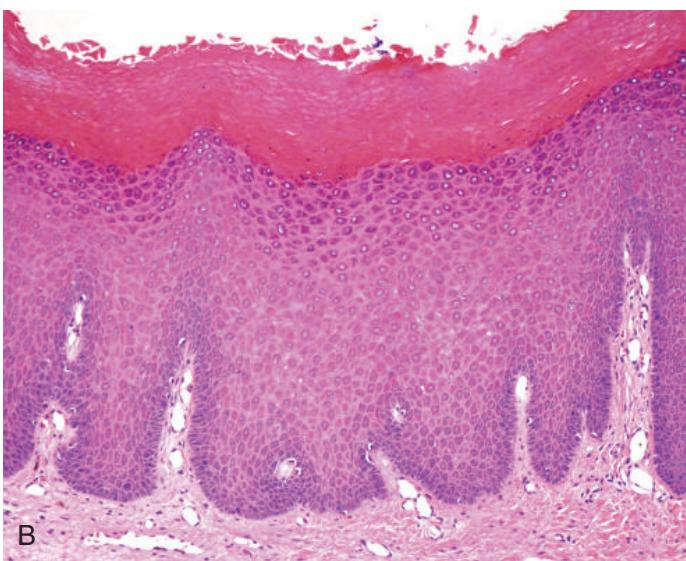
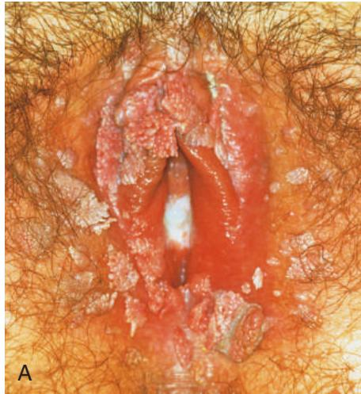
Numerouscondylomasofthevulva.(B)Histopathologicfeaturesofcondylomaacuminatumincludeacanthosis,hyperkeratosis,andcytoplasmicvacuolization(koilocytosis,center).(A,CourtesyofDr.AlexFerenczy,McGillUniversity,Montreal,Quebec,Canada.).jpg) 
Fig. 19.2 (A) Numerous condylomas of the vulva. (B) Histopathologic features of condyloma acuminatum include acanthosis, hyperkeratosis, and cytoplasmic vacuolization (koilocytosis, center). (A, Courtesy of Dr. Alex Ferenczy, McGill University, Montreal, Quebec, Canada.)
diameter and are red-pink to pink-brown (Fig. 19.2). On histologic examination, the characteristic cellular feature is koilocytosis (a cytopathic change characterized by perinuclear cytoplasmic vacuolization and a wrinkled nuclear contour), a hallmark of HPV infection (Fig. 19.2). Indeed, more than $90\%$ of condylomata acuminata are positive for HPV subtypes 6 and 11. HPV is sexually transmitted, and identical lesions occur in men on the penis and around the anus in men and women. HPV 6 and 11 are low-risk viral types, and hence, vulvar condylomas do not commonly progress to cancer. However, women with condyloma acuminata are at risk of having other HPV-related lesions in the vagina and cervix.
# Carcinoma of the Vulva
Carcinoma of the vulva represents about $3\%$ of all female genital tract cancers, occurring mostly in women older than age 60. Approximately $90\%$ of carcinomas are squamous cell carcinomas; most of the other tumors are adenocarcinomas or basal cell carcinomas.
There appear to be two distinct forms of vulvar squamous cell carcinomas that differ in pathogenesis and
course. The less common form is related to high-risk HPV strains (especially HPV type 16) and occurs in middle-aged women, particularly cigarette smokers. This form is often preceded by precancerous changes in the epithelium termed vulvar intraepithelial neoplasia (VIN). VIN progresses in many patients to greater degrees of atypia and eventually to carcinoma in situ; however, progression to invasive carcinoma is not inevitable and may occur only after many years. Environmental factors such as cigarette smoking and immunodeficiency appear to increase the risk of such progression.
A second form of squamous carcinoma occurs in older women, sometimes following a long history of reactive epithelial changes, principally lichen sclerosus. It is preceded by a subtle lesion, differentiated vulvar intraepithelial neoplasia (dVIN), characterized by cytologic atypia confined to the basal layer and abnormal keratinization. If left untreated it may give rise to HPV negative, well-differentiated, keratinizing squamous cell carcinoma.
VIN and early vulvar carcinomas commonly manifest as areas of leukoplakia. In about one-fourth of the cases, the lesions are pigmented owing to the presence of melanin. With time, these areas are transformed into overt exophytic or ulcerative endophytic tumors. HPV-positive tumors are often multifocal and warty and tend to be poorly differentiated squamous cell carcinomas, whereas HPV-negative tumors usually are unifocal and typically are well-differentiated keratinizing squamous cell carcinomas.
Both forms of vulvar carcinoma tend to remain confined to their site of origin for a few years but ultimately invade and spread, usually first to regional lymph nodes. The risk of metastasis correlates with the depth of invasion. As with most carcinomas, outcome is dependent on tumor stage. The overall 5-year survival is $70\%$ to $93\%$ for patients with negative lymph nodes but decreases to $25\%$ to $41\%$ for patients with lymph node metastases.
# Extramammary Paget Disease
Paget disease is an intraepidermal proliferation of epithelial cells that can occur in the skin of the vulva or nipple of the breast (described later). However, unlike in the breast, where Paget disease is virtually always associated with an underlying carcinoma, only a minority of cases of vulvar (extramammary) Paget disease have an underlying tumor. Instead, vulvar Paget cells most commonly appear to arise from epidermal progenitor cells.
Paget disease manifests as a red, scaly, crusted plaque that may mimic the appearance of an inflammatory dermatitis. On histologic examination, large cells with abundant pale, finely granular cytoplasm and occasional cytoplasmic vacuoles infiltrate the epidermis, singly and in groups (Fig. 19.3). The presence of mucin, as detected by periodic acid-Schiff (PAS) staining, is useful in distinguishing Paget disease from vulvar melanoma, which lacks mucin.
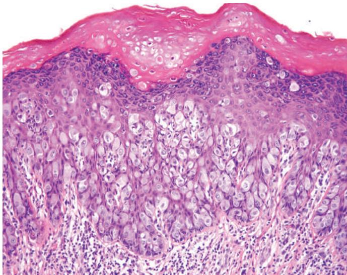 
Fig. 19.3 Paget disease of the vulva. Large tumor cells with pale-pink cytoplasm are seen infiltrating the epidermis. Chronic inflammatory cells are present in the underlying dermis.
Intraepidermal Paget disease may persist for years or even decades without evidence of invasion. However, when there is an associated tumor involving skin appendages, the Paget cells may invade locally and ultimately metastasize. After metastasis occurs, the prognosis is poor.
# TUMORS OF THE VULVA
HPV-related vulvar squamous cell carcinomas usually are poorly differentiated lesions and sometimes are multifocal. They often evolve from vulvar intraepithelial neoplasia. 
- Non-HPV-related vulvar squamous cell carcinomas occur in older women and usually are well differentiated and unifocal. They are often preceded by "differentiated" vulvar intraepithelial neoplasia associated with lichen sclerosus. 
- Vulvar Paget disease is characterized by a red, scaly plaque caused by proliferation of epithelial cells within the epidermis; usually, there is no underlying carcinoma, unlike Paget disease of the nipple.
# Vagina
In adult females, the vagina is seldom a site of primary disease. More often, it is involved secondarily by cancer or infections arising in adjacent organs (e.g., cervix, vulva, bladder, rectum).
Congenital anomalies of the vagina fortunately are uncommon and include entities such as total absence of the vagina, a septate or double vagina (usually associated with a septate cervix and, sometimes, septate uterus), and congenital, lateral Gartner duct cysts arising from persistent woffian duct rests.
# VAGINITIS
Vaginitis is a common condition that is usually transient and of no clinical consequence. It is associated with the production of a vaginal discharge (leukorrhea). A large variety of organisms have been implicated, including bacteria, fungi, and parasites. Many are normal commensals that become pathogenic only in the setting of diabetes, systemic antibiotic therapy (which causes disruption of normal microbial flora), immunodeficiency, pregnancy, or recent abortion. In adults, primary gonorrhoeal infection of the vagina is uncommon. The other organisms worthy of mention, because they are frequent offenders, are Candida albicans and Trichomonas vaginalis. Candidal (monilial) vaginitis is characterized by a curly white discharge. This organism is part of the normal vaginal flora in about $5\%$ of women, so the appearance of symptomatic infection almost always involves one of the predisposing influences listed above or superinfection by a new, more aggressive strain. T. vaginalis is sexually transmitted; it produces a watery, copious gray-green discharge in which parasites can be identified by microscopy. Trichomonas also can be identified in about $10\%$ of asymptomatic women; thus,
active infection usually stems from sexual transmission of a new strain.
# MALIGNANT NEOPLASMS
Squamous cell carcinoma of the vagina is an extremely uncommon cancer that usually occurs in women older than 60 years in the setting of risk factors similar to those associated with carcinoma of the cervix (discussed later). Vaginal intraepithelial neoplasia (VAIN) is a precursor lesion that is nearly always associated with HPV infection. Invasive squamous cell carcinoma of the vagina is associated with the presence of HPV DNA in more than half of the cases, presumably derived from HPV-positive VAIN.
# Clear Cell Adenocarcinoma
In 1970, clear cell adenocarcinoma, a very rare tumor, was identified in a cluster of young women whose mothers took diethylstilbestrol during pregnancy to prevent threatened abortion. Follow-up studies determined that the incidence of this tumor in persons exposed to diethylstilbestrol in utero is low (<1 per 1000, albeit about 40 times greater than in the unexposed population). In about one-third of exposed women, small glandular or microcystic inclusions develop in the vaginal mucosa. These lesions appear as red, granular foci lined by mucus-secreting or ciliated columnar cells. This condition is called vaginal adenosis and is benign but is important to recognize because it is from such precursor lesions that clear cell adenocarcinoma arises.
# Sarcoma Botryoides
Sarcoma botryoides (embryonal rhabdomyosarcoma) is a rare form of primary vaginal cancer that manifests as soft polypoid masses. It usually is encountered in infants
and children younger than 5 years of age, but may occur uncommonly in young women. It also may be found in other sites, such as the urinary bladder and bile ducts. It is discussed further with other soft tissue tumors in Chapter 21.
# Cervix
Most cervical lesions are relatively banal inflammations (cervicitis), but the cervix also is the site of one of the most common cancers in women worldwide.
# CERVICITIS
Inflammatory conditions of the cervix are extremely common and may be associated with a purulent vaginal discharge. Cervicitis can be subclassified as infectious or noninfectious, although differentiation is difficult owing to the presence of normal vaginal flora including incidental vaginal aerobes and anaerobes, streptococci, staphylococci, enterococci, and Escherichia coli and Candida spp.
Much more important are Chlamydia trachomatis, Ureaplasma urealyticum, T. vaginalis, Neisseria gonorrhoeae, HSV-2 (the agent of herpes genitalis), and certain types of HPV, all of which are often sexually transmitted. C. trachomatis is by far the most common of these pathogens, accounting for as many as $40\%$ of cases of cervicitis encountered in sexually transmitted infection clinics. Although less common, herpetic infections are noteworthy because maternal-infant transmission during childbirth may result in serious, sometimes fatal systemic herpetic infection in the newborn.
Cervicitis commonly comes to attention on routine examination or because of leukorrhea. It often is treated empirically with antibiotics that are active against chlamydia and gonococcus. In some instances, nucleic acid amplification tests are used on vaginal fluid to identify the presence of these organisms as well as Trichomonas vaginalis.
# NEOPLASIA OF THE CERVIX
Most tumors of the cervix are of epithelial origin and are caused by oncogenic strains of HPV. During development, the columnar mucus-secreting epithelium of the endocervix is joined to the squamous epithelial covering of the exocervix at the cervical os. With the onset of puberty, the squamocolumnar junction undergoes eversion, causing the columnar epithelium to become visible on the exocervix. The exposed columnar cells, however, eventually undergo squamous metaplasia, forming a region called the transformation zone, where tumors most commonly arise (Fig. 19.4).
HPV, the causative agent of cervical neoplasia, has a tropism for the immature squamous cells of the transformation zone. Most HPV infections are transient and are eliminated within months by the host immune response. A subset of infections persists, however, and some cause
squamous intraepithelial lesions (SILs), which are precursors from which most invasive cervical carcinomas develop.
HPV is detectable by molecular methods in nearly all cases of cervical intraepithelial neoplasia (CIN) and cervical carcinoma. Important risk factors for the development of CIN and invasive carcinoma thus are directly related to HPV exposure and include:
- Early age at first intercourse 
Multiple sexual partners 
- Male partner with multiple previous sexual partners 
- Persistent infection by high-risk strains of papillomavirus
Like most other DNA viruses, HPV uses host cell DNA polymerases to replicate its genome and produce virions. Virions must be shed from the surface of the squamous mucosa, yet under normal circumstances squamous cell maturation is accompanied by a cessation of DNA replication, which would prevent virus production. HPV "solves" this problem through the action of two viral oncoproteins, E6 and E7. The E6 and E7 proteins of "high risk" HPV variants inhibit p53 and RB, respectively (Chapter 6), two potent tumor suppressors that act to suppress the division of squamous cells as they mature. E6 and E7 thus have a central role in the life cycle of HPV and largely explain the carcinogenic activity of HPV in the cervix and other sites that are prone to HPV infection (e.g., vulva, penis, oropharynx).
HPV variants are classified as high-risk or low-risk types based on their propensity to induce carcinogenesis.
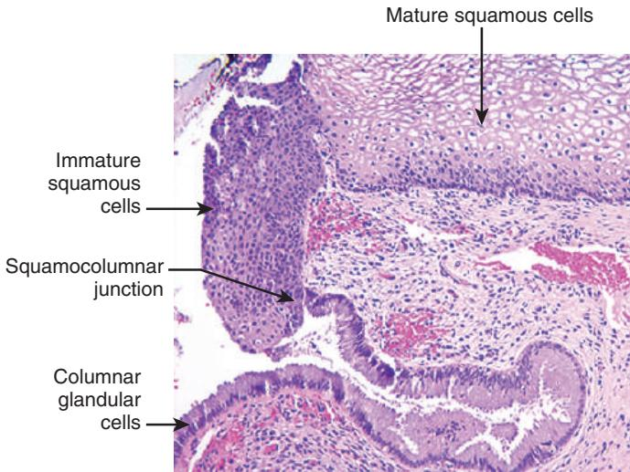 
Fig. 19.4 Cervical transformation zone showing the transition from mature glycogenated squamous epithelium, to immature metaplastic squamous cells, to columnar endocervical glandular epithelium.
infection.Progressionisassociatedwithintegrationofvirusandacquisitionofadditionalmutationsasdiscussedinthetext.SIL,Squamousintraepitheliallesion;hSIL,High-gradecervicalintraepitheliallesion..jpg) 
Fig. 19.5 Possible consequences of human papillomavirus (HPV) infection. Progression is associated with integration of virus and acquisition of additional mutations as discussed in the text. SIL, Squamous intraepithelial lesion; hSIL, High-grade cervical intraepithelial lesion.
High-risk HPV infection is the most important risk factor for the development of SIL that can progress to carcinoma. Two high-risk HPV viruses, types 16 and 18, account for approximately $70\%$ of cases of SIL and cervical carcinoma. In general, infections with high-risk HPV types are more likely to persist, which is a risk factor for progression to carcinoma. These HPV types also show a propensity to integrate into the host cell genome, an event that is linked to progression. Low-risk HPV variants (e.g., types 6 and 11) associated with the development of condylomas of the lower genital tract (Fig. 19.5), by contrast, express E6 and E7 variants with different or weaker activities and do not integrate into the host genome, remaining instead as free episomal viral DNA. Despite the strong association of HPV infection with cancer of the cervix, HPV is not sufficient to drive the neoplastic process. As mentioned later, HPV-infected high-grade precursor lesions do not invariably progress to invasive cancer. Diverse other factors such as immune and hormonal status and coinfection with other sexually transmitted agents are suspected to play a role. Collectively these factors favor the acquisition of somatically acquired mutations that involve both oncogenes and tumor suppressor genes. Viral integration appear to contribute to transformation in two ways: 1) integration always disrupts an HPV gene that negatively regulates E6 and E7, which leads to their increased expression; and 2) sometimes HPV integrates near a host cell oncogene such as MYC, leading to its overexpression as well.
# Squamous Intraepithelial Lesion (SIL, Cervical Intraepithelial Lesion)
HPV-related carcinogenesis begins with the precancerous epithelial change termed SIL, which usually precedes the development of an overt cancer by many years, sometimes decades. In support of this idea, SIL peaks in incidence at about 30 years of age, whereas invasive carcinoma peaks at about 45 years of age.
The classification of cervical precursor lesions has evolved with time. The current terminology is a two-tiered system that not only reflects the biology of the disease but also patient management, replacing a three-tiered system.
- SIL is divided into low-grade squamous intraepithelial lesion (LSIL), still often referred to as cervical intraepithelial neoplasia I (CIN I), and high-grade squamous intraepithelial lesion (HSIL), encompassing cervical intraepithelial neoplasia II and III (CIN II and III) of the previous three-tiered system. 
- LSIL is associated with productive HPV infection and does not progress directly to invasive carcinoma. Actually, most LSILs regress and only a small percentage progress to HSIL. 
- HSIL demonstrates increased proliferation, arrested epithelial maturation, and lower levels of viral replication. LSIL is not treated as a premalignant lesion, whereas HSIL is considered at high risk for progression to carcinoma.
Importantly, LSIL is 10 times more common than HSIL and while HSILs are precancerous, the majority of them fail to progress to cancer and may even regress. Patient management rests on the histopathologic diagnosis as discussed later. As shown in Table 19.1, the decision to treat HSIL and to observe LSIL is based on differences in the natural histories of these two groups of lesions.
Cervical precancerous lesions are associated with abnormalities in cytologic preparations that can be detected long before any abnormality is visible on gross inspection. Early detection of SIL is the rationale for the Papanicolaou (Pap) test, in which cells are scraped from the transformation zone and examined microscopically. The Pap smear remains the most successful cancer-screening test ever developed. In the United States, Pap screening has dramatically lowered the incidence of invasive cervical tumors to about 13,000 cases annually with a mortality of about 4000 per year; in fact, cervical cancer no longer ranks among the top 10 causes of cancer deaths in U.S. women. Paradoxically, the incidence of SIL has increased to its present level of more than 50,000 cases annually. Increased detection has certainly contributed to this. The U.S. Food and Drug Administration has approved testing for HPV DNA in cervical scrapings. This test is highly sensitive but has lower sensitivity than the HPV DNA test.
Table 19.1 Natural History of Squamous Intraepithelial Lesions (SILs) 
LesionRegressPersistProgressLSIL (CIN I)60%30%10% (to HSIL)HSIL (CIN II, III)30%60%10% (to carcinoma)a
${}^{a}$ Progression within 10 years. 
LSIL, Low-grade SIL; HSIL, high-grade SIL.
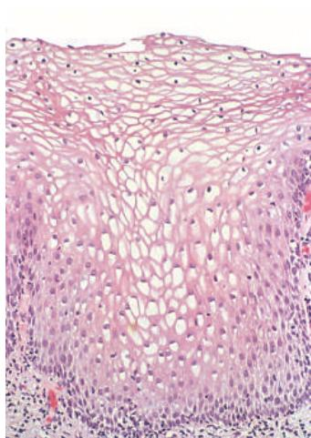 
Normal
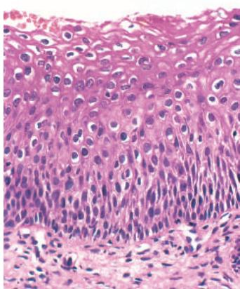 
LSIL
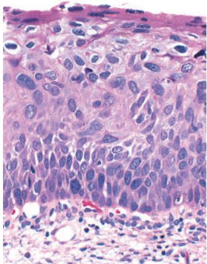 
HSIL 
Fig. 19.6 Spectrum of squamous intraepithelial lesions (SIL) with normal squamous epithelium for comparison: LSIL with koilocytotic atypia; HSIL with progressive atypia in all layers of the epithelium; and HSIL with diffuse atypia and loss of maturation (carcinoma in situ, far right image).
withnormalsquamousepitheliumforcomparisonLSILwithkoilocytoticatypia;HSILwithprogressiveatypiainalllayersoftheepithelium;andHSILwithdiffuseatypiaandlossofmaturation(carcinomainsitu,farrightimage)..jpg) 
HSIL
specificity than the Pap smear, and specific guidelines for its use have not been well established. One consideration is that while most women acquire HPV infections in their early 20s, these are usually cleared by the immune system and never progress to SIL, a process that occurs over many years. For this reason, HPV DNA screening is only recommended for women aged 30 or older, as a positive test at this age is more likely to identify an individual with a persistent infection that may lead to cervical neoplasia.
The quadrivalent HPV vaccine for types 6, 11, 16, and 18, and the more recently introduced 9-valent vaccine, are very effective in preventing HPV infections and are expected to greatly lower the frequency of genital warts and cervical cancers associated with these HPV genotypes. Despite its efficacy, vaccination does not supplant the need for routine cervical cancer screening - many at-risk women are already infected, and current vaccines protect against only some of the many oncogenic HPV genotypes.
Fig. 19.6 illustrates the three stages of SIL. LSIL is characterized by dysplastic changes in the lower third of the squamous epithelium and koilocytotic change in the superficial layers of the epithelium. In HSIL (CIN II), dysplasia extends to the middle third of the epithelium in the form of variation in cell and nuclear size, heterogeneity of nuclear chromatin, and the presence of mitoses, some atypical, above the basal layer extending into the middle third of the epithelium. The superficial layer of cells in CIN II still shows differentiation and occasional koilocytotic changes HSIL (CIN III) is marked by almost complete loss of differentiation, even greater variation in cell and nuclear size, chromatin heterogeneity, disorderly orientation of the cells, and abnormal mitoses, changes that affect virtually all layers of the epithelium. Koilocytotic change usually is absent. These histologic features correlate with the cytologic appearances shown in Fig. 19.7.
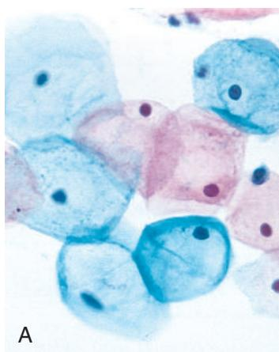 
Fig. 19.7 Cytologic features of squamous intraepithelial lesion (SIL) in a Papanicolaou smear. Superficial squamous cells may stain either red or blue. (A) Normal exfoliated superficial squamous epithelial cells. (B) Low-grade squamous intraepithelial lesion (LSIL). (C and D) Both high-grade squamous intraepithelial lesions (HSILs). Note the reduction in cytoplasm and the increase in the nucleus-to-cytoplasm ratio as the grade of the lesion increases. This observation reflects the progressive loss of cellular differentiation on the surface of the cervical lesions from which these cells are exfoliated (see Fig. 19.6). (Courtesy of Dr. Edmund S. Cibas, Brigham and Women's Hospital, Boston, Massachusetts.)
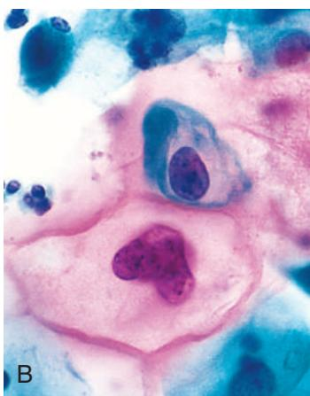
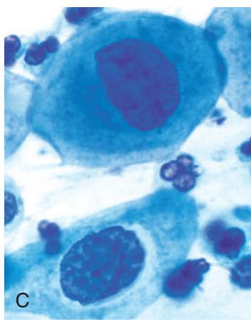
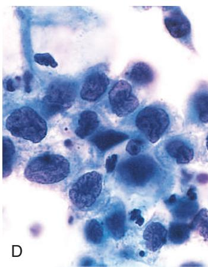
SIL is asymptomatic and comes to clinical attention through an abnormal Pap smear result. These cases are followed up by colposcopy, in which acetic acid is used to highlight the lesions so they can be biopsied. Women with biopsy-documented LSIL are managed conservatively with careful observation, whereas HSILs and persistent LSIL are treated with surgical excision (cone biopsy). Follow-up smears and clinical examination are required in patients with HSIL, as these women remain at risk for HPV-associated cervical, vulvar, and vaginal cancers.
# Invasive Carcinoma of the Cervix
The most common cervical carcinomas are squamous cell carcinomas $(75\%)$ , followed by adenocarcinomas and mixed adenosquamous carcinomas $(20\%)$ and small cell neuroendocrine carcinomas $(< 5\%)$ . All of these types of carcinomas are associated with HPV. Of interest, the relative proportion of adenocarcinomas has been increasing in recent decades owing to the decreasing incidence of invasive squamous carcinoma and suboptimal detection of glandular lesions by Pap smear.
Squamous cell carcinoma has a peak incidence at the age of about 45 years, some 10 to 15 years after detection of precursor SIL. As already discussed, progression of SIL to invasive carcinoma is variable and unpredictable and requires HPV infection as well as mutations in tumor suppressor genes and oncogenes. Risk factors for progression include cigarette smoking and human immunodeficiency virus (HIV) infection, the latter finding suggesting that immune surveillance plays a role in preventing progression. Although risk factors may help identify patients who are likely to progress from SIL to carcinoma, the only reliable way to monitor the disease course is with frequent physical examinations coupled with Pap smears and biopsy of suspicious lesions.

Invasive carcinomas of the cervix develop in the transformation zone and range from microscopic foci of stromal invasion to grossly conspicuous exophytic tumors (Fig. 19.8). Microscopically, the invasive tumors often consist of tongues and nests of squamous cells that produce a desmoplastic stromal response. Grading is based on the degree of squamous differentiation, which ranges from minimal to well-differentiated tumors that elaborate keratin pearls. Rare tumors with neuroendocrine differentiation resemble small cell carcinomas of the lung morphologically. Tumors encircling the cervix and penetrating into the underlying stroma produce a barrel cervix, which can be identified by direct palpation. Extension into the parametrial soft tissues can affix the uterus to the surrounding pelvic structures. The likelihood of spread to pelvic lymph nodes correlates with the depth of tumor invasion and the presence of tumor cells in vascular spaces. The risk of metastasis increases from less than $1\%$ for tumors less than $3\mathrm{mm}$ in depth to more than $10\%$ after invasion exceeds $3\mathrm{mm}$ .
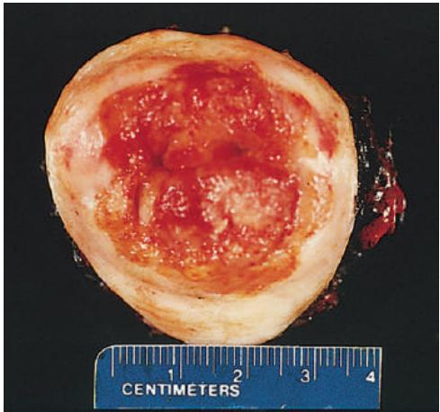 
Fig. 19.8 Cervical os with surrounding, invasive, exophytic cervical carcinoma.
Invasive cervical cancer most often is seen in women who have never had a Pap smear or who have not been screened for many years. In such cases, cervical cancer often is symptomatic, with patients coming to medical attention for unexpected vaginal bleeding, leukorrhea, painful coitus (dyspareunia), or dysuria. The primary treatment is hysterectomy and lymph node dissection; small microinvasive carcinomas may be treated with cone biopsy. Radiation and chemotherapy are also of benefit in instances where surgery alone is not curative. Mortality is most strongly predicted by tumor stage and, in the case of neuroendocrine carcinomas (which pursue an aggressive course) to cell type.
# Endocervical Polyp
Endocervical polyps are benign polypoid masses seen protruding from the endocervical mucosa (sometimes through the exocervix). They can be as large as a few centimeters and have a smooth, glistening surface with underlying cystically dilated spaces filled with mucinous secretions. The surface epithelium and lining of the underlying cysts are composed of the same mucus-secreting columnar cells that line the endocervical canal. The stroma is edematous and may contain scattered mononuclear cells. Superimposed chronic inflammation may lead to squamous metaplasia of the overlying epithelium and ulcerations. These lesions may bleed, thereby arousing concern, but they have no malignant potential.
# CERVICAL NEOPLASIA
- Risk factors for cervical carcinoma are related to HPV exposure, such as early age at first intercourse, multiple sexual partners, and other factors including cigarette smoking and immunodeficiency. 
- Nearly all cervical carcinomas are caused by HPV infections, particularly high-risk HPV types 16, 18, 31, and 33;
the HPV vaccine is effective in preventing infection resulting from the HPV types most commonly associated with carcinoma.
HPV expresses E6 and E7 proteins that inactivate the p53 and RB tumor suppressors, respectively, resulting in increased cell proliferation and suppression of DNA damage-induced apoptosis.
# Uterus
The body (corpus) of the uterus is composed of the endometrium, consisting of glands and stroma, and the myometrium, made up of smooth muscle. The more frequent and significant disorders of the uterus are considered here.
# ENDOMETRITIS
Inflammation of the endometrium is classified as acute or chronic depending on whether a neutrophilic or a lymphoplasmacytic infiltrate predominates, respectively. The diagnosis of chronic endometritis generally requires the presence of plasma cells, as lymphocytes are present even in the normal endometrium.
Endometritis is a component of pelvic inflammatory disease and is frequently a result of $N.$ gonorrhoeae or $C.$ trachomatis infection. Histologic examination shows a neutrophilic infiltrate in the superficial endometrium coexisting with a stromal lymphoplasmacytic infiltrate. Prominent lymphoid follicles may be seen, particularly in chlamydial infection. Tuberculosis causes granulomatous endometritis, frequently with associated tuberculous salpingitis and peritonitis. Although seen in the United States mainly in immunocompromised persons, tuberculous endometritis is common in countries in which tuberculosis is endemic, and it should be included in the differential diagnosis for pelvic inflammatory disease in women who have recently emigrated from endemic areas.
Endometritis also may be a result of retained products of conception subsequent to miscarriage or delivery or the presence of a foreign body such as an intrauterine device. Retained tissue or foreign bodies act as a nidus for ascending infection by vaginal or intestinal tract flora. Removal of the offending tissue or foreign body typically results in resolution.
Clinically, all forms of endometritis manifest with fever, abdominal pain, and menstrual abnormalities. In addition, there is an increased risk of infertility and ectopic pregnancy due to damage and scarring of the fallopian tubes.
# ADENOMYOSIS
Adenomyosis refers to the presence of endometrial tissue in the myometrium. Nests of endometrial stroma, glands, or both are found deep in the myometrium interposed between the muscle bundles. This endometrial tissue induces reactive hypertrophy of the myometrium, resulting
- In cervical cancer, high-risk HPV is integrated in the host genome, an event that increases the expression of E6 and E7 and contributes to progression to cancer. 
- The Pap smear is a highly effective screening tool for the detection of SIL and carcinoma and has significantly reduced the incidence of cervical carcinoma. HPV testing is currently being used in conjunction with the Pap smear.
in an enlarged, globular uterus, often with a thickened uterine wall. Extensive adenomyosis may produce menorrhagia, dysmenorrhea, and pelvic pain, particularly just prior to menstruation, and can coexist with endometriosis.
# ENDOMETRIOSIS
Endometriosis is defined by the presence of endometrial glands and stroma in a location outside the uterus. It occurs in as many as $10\%$ of women in their reproductive years and in nearly half of women with infertility. It frequently is multifocal and often involves pelvic structures (ovaries, pouch of Douglas, uterine ligaments, tubes, and rectovaginal septum). Less frequently, distant areas of the peritoneal cavity or periumbilical tissues are involved. Uncommonly, distant sites such as lymph nodes, lungs, and even heart, skeletal muscle, or bone are affected.
Four hypotheses have been put forth to explain the origin of dispersed endometriotic lesions, all of which are viable:
- The regurgitation theory, which is currently favored, proposes that menstrual backflow through the fallopian tubes leads to implantation. 
- The benign metastases theory holds that endometrial tissue from the uterus can "spread" to distant sites via blood vessels and lymphatics. 
- The metaplastic theory, on the other hand, posits endometrial differentiation of coelomic epithelium (mesothelium of pelvis and abdomen from which endometrium originates) as the source. 
- The extrauterine stem/progenitor cell theory, proposes that circulating stem/progenitor cells from the bone marrow differentiate into endometrial tissue.
Studies suggest that endometriotic tissue is not just misplaced but is also abnormal (Fig. 19.9). As compared to normal endometrium, endometriotic tissue exhibits increased levels of inflammatory mediators, particularly prostaglandin E2. It is proposed that the inflammation results from the recruitment and activation of macrophages by factors made by endometrial stromal cells. Stromal cells also make aromatase, leading to local production of estrogen. These factors enhance the survival and persistence of the endometriotic tissue within a foreign location (a key feature in the pathogenesis of endometriosis) and help to explain the beneficial effects of COX-2 inhibitors and aromatase inhibitors in the treatment of endometriosis.
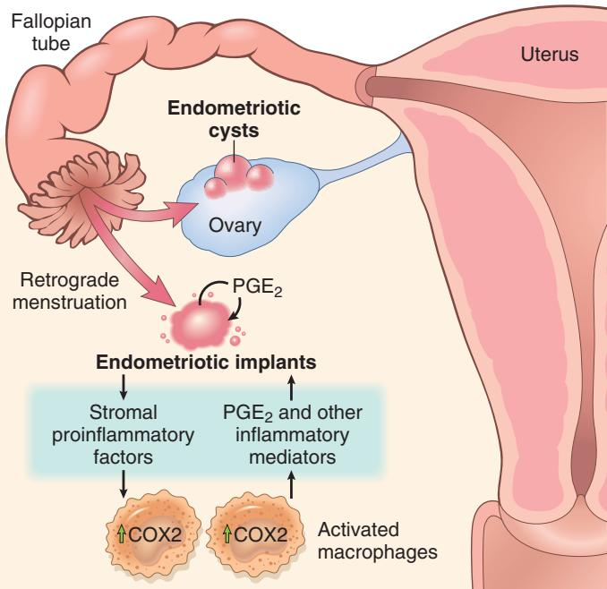 
Fig. 19.9 Proposed origins of endometriosis.

Endometriosis typically consists of functioning endometrium, which undergoes cyclic bleeding. Because blood collects in these aberrant foci, they appear grossly as red-brown nodules or implants. They range in size from microscopic to 1 to $2\mathrm{cm}$ in diameter and lie on or just under the affected serosal surface. Often, individual lesions coalesce to form larger masses. When the ovaries are involved, the lesions may form large, blood-filled cysts that turn brown (chocolate cysts) as the blood ages (Fig. 19.10). With seepage and organization of the blood, widespread fibrosis occurs, leading to adhesions among pelvic structures, sealing of the tubal fimbriated ends, and distortion of the fallopian tubes and ovaries. The diagnosis depends on finding both endometrial glands and stroma at sites external to the endometrium.
..jpg) 
Fig. 19.10 Ovarian endometriosis. Sectioning of ovary shows a large endometriotic cyst with degenerated blood ("chocolate cyst").
The clinical manifestations of endometriosis depend on the distribution of the lesions. Extensive scarring of the fallopian tubes and ovaries often produces discomfort in the lower abdomen and eventual sterility. Rectal wall involvement may produce pain on defecation, whereas involvement of the uterine or bladder serosa can cause dyspareunia (painful intercourse) and dysuria, respectively. Almost all cases feature severe dysmenorrhea and pelvic pain resulting from intrapelvic bleeding and intraabdominal adhesions.
# ABNORMAL UTERINE BLEEDING
Women commonly seek medical attention for abnormal uterine bleeding, such as menorrhagia (profuse or prolonged bleeding at the time of the period), metrorrhagia (irregular bleeding between the periods), or postmenopausal bleeding. Common causes include dysfunctional uterine bleeding, endometrial polyps, leiomyomas, endometrial hyperplasia, and endometrial carcinoma.
The probable cause of uterine bleeding in any given case varies depending on the age of the patient (Table 19.2). Abnormal bleeding from the uterus in the absence of an organic uterine lesion is called dysfunctional uterine bleeding. The most common cause of dysfunctional uterine bleeding is anovulation (failure to ovulate). Anovulatory cycles result from hormonal imbalances and are most common at menarche and in the perimenopausal period because of fluctuations in the hypothalamus/pituitary/ovarian axis. Less common causes of anovulation are
Endocrine disorders, such as thyroid disease, adrenal disease, or pituitary tumors. 
- Ovarian lesions, such as a functioning ovarian tumor (granulosa cell tumors) or polycystic ovarian syndrome (see section on ovaries that follows). 
- Generalized metabolic disturbances, such as obesity, malnutrition, or other chronic systemic disorders.
Dysfunctional uterine bleeding also may result from an inadequate luteal phase, which is thought to stem from
Table 19.2 Causes of Abnormal Uterine Bleeding by Age Group 
Age GroupCause(s)PrepubertyPrecocious puberty (hypothalamic, pituitary, or ovarian origin)AdolescenceAnovulatory cycleReproductive ageComplications of pregnancy (abortion, trophoblastic disease, ectopic pregnancy)
Proliferations (leiomyoma, adenomyosis, polyps, endometrial hyperplasia, carcinoma)
Anovulatory cycle
Ovulatory dysfunctional bleeding (e.g., inadequate luteal phase)PerimenopauseAnovulatory cycle
Irregular shedding
Proliferations (carcinoma, hyperplasia, polyps)PostmenopauseProliferations (carcinoma, hyperplasia, polyps)
Endometrial atrophy
insufficient production of progesterone by the corpus luteum.
# NONNEOPLASTIC DISORDERS OF ENDOMETRIUM
- Adenomyosis refers to growth of endometrium into the myometrium often with uterine enlargement. 
- Endometriosis refers to endometrial glands and stroma located outside the uterus and most often involves the pelvic or abdominal peritoneum. Rarely, distant sites such as the lymph nodes and the lungs also are involved. 
- The ectopic endometrium in endometriosis undergoes cyclic bleeding, and the condition is a common cause of dysmenorrhea and pelvic pain.
# PROLIFERATIVE LESIONS OF THE ENDOMETRIUM AND MYOMETRIUM
The most common proliferative lesions of the uterine corpus are endometrial hyperplasia, endometrial carcinomas, endometrial polyps, and smooth muscle tumors. All tend to produce abnormal uterine bleeding as their earliest manifestation.
# Endometrial Hyperplasia
An excess of estrogen relative to progestin, if sufficiently prolonged or marked, can induce exaggerated endometrial proliferation (hyperplasia), which is an important precursor of endometrial carcinoma. A common cause of estrogen excess is obesity, as adipose tissue converts steroid precursors into estrogens. Other potential causes of estrogen excess include failure of ovulation (such as in perimenopause), prolonged administration of estrogenic steroids without counterbalancing progestin, and estrogen-producing ovarian lesions (such as polycystic ovary syndrome and granulosa-theca cell tumors of the ovary).
Endometrial hyperplasia is placed in two categories based on the presence of cytologic atypia: hyperplasia without atypia and hyperplasia with atypia (Fig. 19.11). The importance of this classification is that the presence of cytologic atypia correlates with the development or concurrent finding of endometrial carcinoma. Hyperplasia without cellular atypia carries a low risk (between $1\%$ and $3\%$ ) for progression to endometrial carcinoma, whereas hyperplasia with atypia, also called endometrial intraepithelial neoplasia (EIN), is associated with a much higher risk $(20\% -50\%)$ . When hyperplasia with atypia is discovered, it must be carefully evaluated for the presence of cancer and usually warrants a hysterectomy in patients no longer desiring fertility. In younger patients, treatment with high-dose progestins may be used in an attempt to preserve the uterus.
Unopposed estrogen is also a risk factor for the most common type of endometrial carcinoma (see later), and inactivation of the PTEN tumor suppressor gene has been identified at a substantial frequency in hyperplasia with
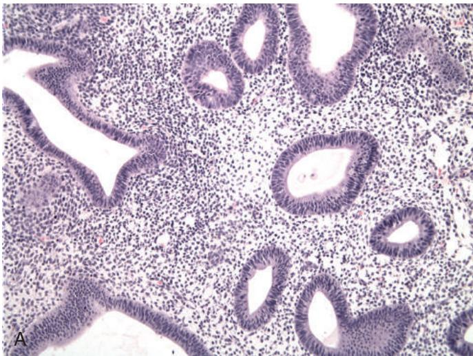
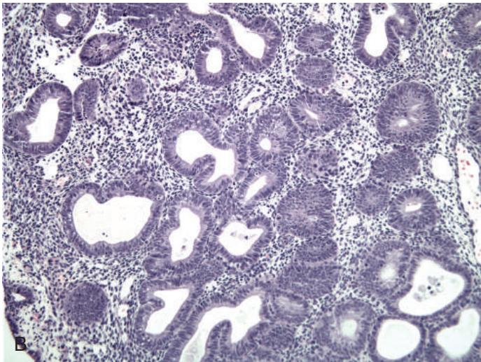
Anovulatoryordisorderedendometriumcontainingdilatedglands.(B)Hyperplasiawithoutatypia,characterizedbynestsofcloselypackedglands.(C)Hyperplasiawithatypia,seenasglandularcrowdingandcellularatypia..jpg) 
Fig. 19.11 Endometrial hyperplasia. (A) Anovulatory or "disordered" endometrium containing dilated glands. (B) Hyperplasia without atypia, characterized by nests of closely packed glands. (C) Hyperplasia with atypia, seen as glandular crowding and cellular atypia.
atypia (approximately $50\%$ ) and endometrioid carcinoma $(>70\%)$ . Along with clinicopathologic and epidemiologic studies, these findings indicate that hyperplasia with atypia is a precursor lesion for endometrioid endometrial carcinoma.
# Endometrial Carcinoma
In the United States and many other Western countries, endometrial carcinoma is the most frequent cancer occurring in the female genital tract. It generally appears between the ages of 55 and 65 years and is uncommon before age 40. Endometrial carcinoma can be broadly divided into two histologically and pathogenically distinct categories: endometrioid and serous carcinoma. There are other less common types of endometrial carcinoma, such as clear cell carcinoma and mixed Mullerian tumor (carcinosarcoma), but these will not be discussed further.
Endometrioid cancers arise in association with estrogen excess in the setting of endometrial hyperplasia in perimenopausal women, whereas serous cancers arise in the setting of endometrial atrophy in older postmenopausal women. The endometrioid type accounts for $80\%$ of cases of endometrial carcinomas. These tumors are designated as endometrioid because of their histologic similarity to normal endometrial glands. Risk factors for this type of carcinoma include (1) obesity, (2) diabetes, (3) hypertension, (4) infertility, and (5) exposure to unopposed estrogen. Many of these risk factors result in increased estrogenic stimulation of the endometrium and are associated with endometrial hyperplasia. In fact, it is well recognized that prolonged estrogen replacement therapy and estrogen-secreting ovarian tumors increase the risk of the endometrioid type of endometrial carcinoma. Mutations in mismatch repair genes and the tumor suppressor gene PTEN are early events in the stepwise development of endometrioid carcinoma. Women with germline mutations in PTEN (Cowden Syndrome) and germline alterations in DNA mismatch repair genes (Lynch Syndrome) are at high risk for this cancer. TP53 mutations occur but are relatively uncommon and are late events in the genesis of this tumor type.
The serous type of endometrial carcinoma is less common but also far more aggressive. It accounts, for roughly $15\%$ of tumors and is not associated with unopposed estrogen or endometrial hyperplasia. Nearly all cases of serous carcinoma have mutations in the TP53 tumor suppressor gene, whereas mutations in DNA mismatch repair genes and in PTEN are rare. Serous tumors are preceded by a lesion called serous endometrial intraepithelial carcinoma (SEIC) in which TP53 mutations are often detected, suggesting an early role for such mutations in the development of this form of endometrial carcinoma.
Endometrioid carcinomas closely resemble normal endometrium and may be exophytic or infiltrative (Fig. 19.12A-B). They include a range of histologic types, including those showing mucinous, tubal (ciliated), and squamous differentiation. Endometrioid carcinomas often infiltrate the myometrium and can enter vascular spaces (lymphovascular invasion). They may also metastasize to regional lymph nodes. Endometrioid carcinomas are graded I to 3, based on the degree of differentiation.
Serous carcinomas typically grow in small tufts and papillae with marked cytologic atypia. They can also form glands that at times create confusion with endometrioid carcinoma, however serous carcinomas exhibit much greater cytologic atypia. Serous carcinomas behave aggressively and thus are by definition high grade. Immunohistochemistry often shows diffuse, strong staining for p53 in serous carcinoma (Fig. 19.12C-D), a finding that correlates with the presence of TP53 mutations (mutant p53 accumulates and hence is more easily detected by staining).
Endometrial carcinomas usually manifest with irregular or postmenopausal bleeding. With progression, the uterus enlarges and may become affixed to surrounding structures as the cancer infiltrates surrounding tissues. Endometrioid carcinoma usually is slow to metastasize, but if left untreated, eventually disseminates to regional nodes and more distant sites. With therapy, the 5-year survival rate for early-stage endometrioid carcinoma is $90\%$ , but survival drops precipitously in higher-stage tumors. The prognosis with serous carcinomas is strongly dependent on operative staging but because of its aggressive behavior it often presents as high-stage disease with a poor prognosis.
# ENDOMETRIAL HYPERPLASIA AND ENDOMETRIAL CARCINOMA
- Endometrial hyperplasia results from unopposed endogenous or exogenous estrogen. 
- Risk factors for developing endometrial hyperplasia include anovulatory cycles, polycystic ovary syndrome, estrogen-producing ovarian tumor, obesity, and estrogen therapy without counterbalancing progestin. 
- Hyperplasia is classified based on cytologic atypia, which determines the risk of developing endometrioid carcinoma. 
- On the basis of clinical and molecular data, two major types of endometrial carcinoma are recognized:
- Endometrioid carcinoma is associated with estrogen excess and endometrial hyperplasia. Early molecular changes include inactivation of DNA mismatch repair genes and the PTEN gene. 
- Serous carcinoma of the endometrium arises in older women and usually is associated with endometrial atrophy and a distinct precursor lesion, serous intraepithelial carcinoma. Mutations in the TP53 gene are an early event, usually being present in serous endometrial intraepithelial carcinoma as well as invasive serous carcinoma. 
Stage is the major determinant of survival in both types. Serous tumors tend to manifest more frequently with extrauterine extension and therefore have a worse prognosis than endometrioid carcinomas.
# Endometrial Polyps
These polyps are usually sessile and range from 0.5 to $3\mathrm{cm}$ in diameter. Larger polyps may project from the
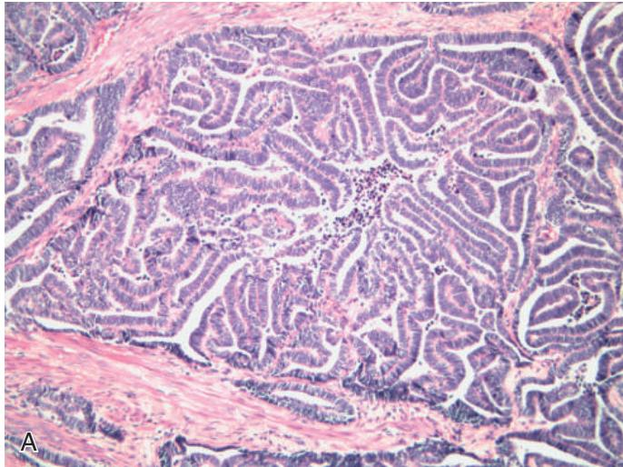
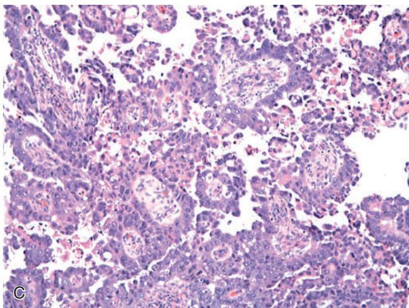 
Fig. 19.12 Endometrial carcinoma. (A) Endometrioid type, grade I, infiltrating myometrium and growing in a glandular pattern. (B) Endometrioid type, grade 3, has a predominantly solid growth pattern. (C) Serous carcinoma of the endometrium, with papilla formation and marked cytologic atypia. (D) Immunohistochemical staining shows accumulation of p53, a finding associated with TP53 mutation.
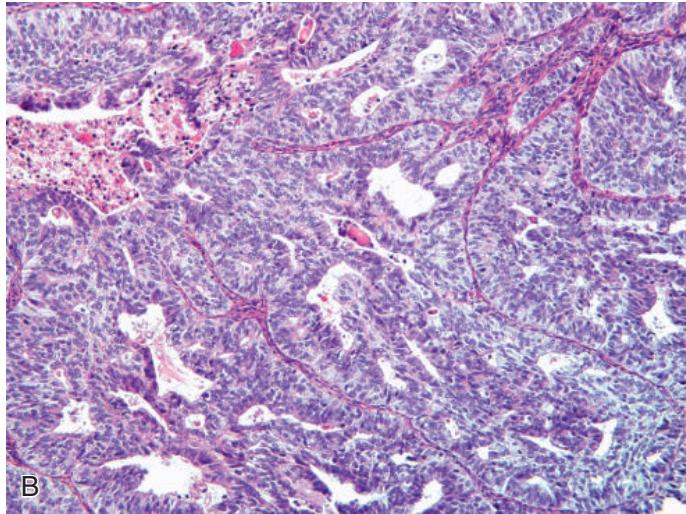
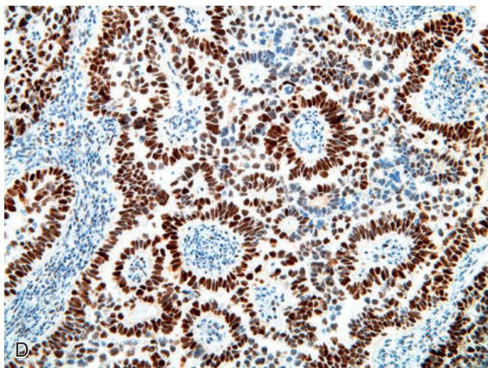
endometrial mucosa into the uterine cavity. They are composed of endometrium resembling the basalis, frequently with small muscular arteries. Some glands are normal architecturally, but more often they are cystically dilated. The stromal cells are monoclonal, often with a rearrangement of chromosomal region 6p21, and thus constitute the neoplastic component of the polyp.
Although endometrial polyps may occur at any age, they are most common around the time of menopause. Their main clinical significance is that they may produce abnormal uterine bleeding.
# Leiomyoma
Benign tumors that arise from the smooth muscle cells in the myometrium are properly termed leiomyomas, but because of their firmness often are referred to clinically as fibroids. Leiomyomas are the most common benign tumor in females, affecting $30\%$ to $50\%$ of women of reproductive age, and are considerably more frequent in black women. These tumors are associated with several different recurrent chromosomal abnormalities, including rearrangements of
chromosomes 6 and 12 that also are found in a variety of other benign neoplasms, such as endometrial polyps and lipomas. Mutations in the MED12 gene, which encodes a component of the RNA polymerase transcription complex, have been identified in up to $70\%$ of leiomyomas. The mechanism by which MED12 mutations contribute to the development of leiomyomas is not presently understood. Estrogens and possibly oral contraceptives stimulate the growth of leiomyomas; conversely, these tumors shrink postmenopausally.
Leiomyomas are typically sharply circumscribed, firm gray-white masses with a characteristic whorled cut surface. They may occur singly, but more often occur as multiple tumors that are scattered within the uterus, ranging from small nodules to large tumors (Fig. 19.13) that may dwarf the uterus. Some are embedded within the myometrium (intramural), whereas others may lie immediately beneath the endometrium (submucosal)
Theuterusisopenedtoshowmultiplesubmucosal,myometrial,andsubserosalgray-whitetumors,eachwithacharacteristicwhorledappearanceoncutsection.(B)Microscopicappearanceofleiomyomashowsbundlesofnormal-lookingsmoothmusclecells..jpg) 
Fig. 19.13 Uterine leiomyomas. (A) The uterus is opened to show multiple submucosal, myometrial, and subserosal gray-white tumors, each with a characteristic whorled appearance on cut section. (B) Microscopic appearance of leiomyoma shows bundles of normal-looking smooth muscle cells.
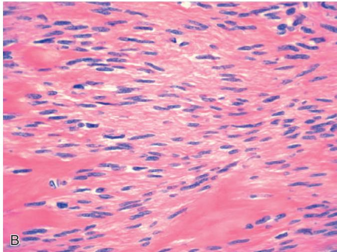
or the serosa (subserosal). In the latter location, tumors may extend out on attenuated stalks and even become attached to surrounding organs, from which they may develop a blood supply (parasitic leiomyomas). On histologic examination, the tumors are characterized by bundles of smooth muscle cells mimicking the appearance of normal myometrium. Foci of fibrosis, calcification, and degenerative softening may be present.
Leiomyomas of the uterus often are asymptomatic, being discovered incidentally on routine pelvic examination. The most frequent presenting sign is menorrhagia, with or without metrorrhagia. Leiomyomas rarely, if ever, transform into sarcomas, and the presence of multiple lesions does not increase the risk of malignancy.
# Leiomyosarcoma
Leiomyosarcomas of the uterus virtually always arise de novo from the mesenchymal cells of the myometrium. They are almost always solitary and most often occur in postmenopausal women, in contradiction to
leiomyomas, which frequently are multiple and usually arise premenopausally.
Recurrence after surgery is common with these cancers, and many metastasize, typically to the lungs, yielding a 5-year survival rate of about $40\%$ . The outlook with anaplastic tumors is less favorable than with well-differentiated tumors.
Leiomyosarcomas typically take the form of soft, hemorrhagic, necrotic masses. The histologic appearance varies widely, from tumors that closely resemble leiomyoma to wildly anaplastic neoplasms. Well-differentiated tumors may lie at the morphologic interface between leiomyoma and leiomyosarcoma and are sometimes designated smooth muscle tumors of uncertain malignant potential. The diagnostic features of leiomyosarcoma include tumor necrosis, cytologic atypia, and mitotic activity. Because increased mitotic activity is sometimes seen in benign smooth muscle tumors, particularly in young women, an assessment of all three features is necessary to make a diagnosis of malignancy.
# Fallopian Tubes
The most common disorder of the fallopian tubes is inflammation (salpingitis), almost invariably occurring as a component of pelvic inflammatory disease. Less common abnormalities are ectopic (tubal) pregnancy and endometriosis.
Inflammation of the fallopian tubes is almost always caused by infection. In addition to gonorrhea, nongonococcal organisms, such as Chlamydia, Mycoplasma hominis, coliforms, and (in the postpartum setting) streptococci and staphylococci are the major offenders. The morphologic changes produced by gonococci are similar to those in the male genital tract (Chapter 18). Infections with coliforms, streptococci, and staphylococci can penetrate the wall of
the tubes, giving rise to blood-borne infections that seed to distant sites. Tuberculous salpingitis is far less common and is almost always encountered in combination with tuberculous endometritis. All forms of salpingitis may produce fever, lower abdominal or pelvic pain, and pelvic masses, which are the result of distention of the tubes with either exudate or inflammatory debris (Fig. 19.14). Adherence of the inflamed tube to the ovary and adjacent ligamentous tissues may produce a tuboovarian abscess. This may in turn result in adhesions between the ovary and the tubes when the inflammation subsides. Even more serious are adhesions of the tubal plicae, which are associated with increased risk of tubal ectopic pregnancy (discussed later).
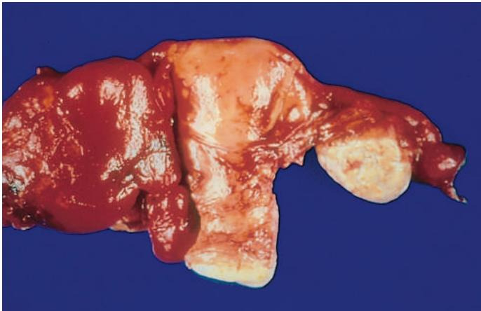 
Fig. 19.14 Pelvic inflammatory disease, bilateral and asymmetric. The tube and ovary to the left of the uterus are totally obscured by a hemorrhagic inflammatory mass. The tube is adherent to the adjacent ovary on the other side.
Damage to or obstruction of the tubal lumina may produce permanent sterility.
Once thought to be uncommon, primary adenocarcinomas of the fallopian tube may be the site of origin for many of the high-grade serous carcinomas long thought to arise in the ovary. Studies have identified the presence of serous tubal intraepithelial carcinoma (STIC) in the fimbriated ends of fallopian tubes. Like the precursor of uterine serous carcinoma, STICs have mutations in $TP53$ in more than $90\%$ of cases. These lesions are found frequently in fallopian tubes removed prophylactically from women who carry mutations in BRCA1 and BRCA2 and less commonly in instances where tubes are removed from women without known genetic risk factors. This has led to the idea that sporadic "ovarian" serous carcinomas (discussed later) also originate in the fallopian tube. Because the fimbriated end of the fallopian tube is intimately associated with the ovary and has access to the peritoneal cavity, fallopian tube carcinomas frequently involve the ovary, omentum, and peritoneal cavity at presentation.
# Ovaries
# FOLLICLE AND LUTEAL CYSTS
Follicle and luteal cysts in the ovaries are so commonplace that they may be considered variants of normal physiology. These innocuous lesions originate from unruptured graafian follicles or from follicles that rupture and then immediately seal. Such cysts often are multiple and develop subjacent to the serosa of the ovary. They typically are small (1-1.5 cm in diameter) and are filled with clear serous fluid. Occasionally, they become sufficiently large (4-5 cm) to produce palpable masses and pelvic pain. When small, they are lined by granulosa lining cells or luteal cells, but as fluid accumulates, pressure may cause atrophy of these cells. Sometimes these cysts rupture, producing intraperitoneal bleeding and peritoneal symptoms (acute abdomen).
# POLYCSTIC OVARIAN SYNDROME
Polycystic ovarian syndrome (formerly called Stein-Leventhal syndrome) is a complex endocrine disorder characterized by hyperandrogenism, menstrual abnormalities, polycystic ovaries, chronic anovulation, and decreased fertility. It usually comes to attention after menarche in teenage girls or young adults who present with oligomenorrhea, hirsutism, infertility, and sometimes with obesity.
The ovaries are usually twice the normal size, graywhite with a smooth outer cortex, and studded with subcortical cysts 0.5 to $1.5\mathrm{cm}$ in diameter. Histologic examination shows a thickened, fibrotic ovarian capsule overlying innumerable cystic follicles lined by granulosa cells with a hyperplastic luteinized theca interna. There is a conspicuous absence of corpora lutea in the ovary.
# TUMORS OF THE OVARY
In the United States it is estimated that there will be over 20,000 ovarian cancer cases diagnosed in 2016 leading to over 14,000 deaths, making ovarian cancer the fifth leading contributor to cancer mortality in women. Tumors of the ovary are remarkably varied as they may arise from any of the three cell types in the normal ovary: the multipotent surface (coelomic) epithelium, the totipotent germ cells, and the sex cord-stromal cells. Neoplasms of epithelial origin account for the great majority of ovarian tumors and, in their malignant forms, account for almost $90\%$ of ovarian cancers (Table 19.3). Germ cell and sex cord-stromal cell tumors are much less frequent; although they constitute $20\%$ to $30\%$ of ovarian tumors, they are collectively responsible for less than $10\%$ of malignant tumors of the ovary.
# Surface Epithelial Tumors
The majority of ovarian tumors arise from the fallopian tube or epithelial cysts in the cortex of the ovary (Fig. 19.15). As mentioned, studies have shown that many of the tumors thought to arise from the coelomic epithelium that covers the surface of the ovary are now thought to arise from the fimbriated end of the fallopian tube (Fig. 19.15). The epithelium lining the cortical cysts may be derived from displaced ovarian surface epithelium or the lining of fallopian tube. These can become metaplastic or undergo neoplastic transformation to give rise to a number of different epithelial tumors. Benign lesions usually are cystic (cystadenoma) and may have an accompanying stromal component (cystadenofibroma). Malignant tumors also may be cystic (cystadenocarcinoma) or solid (carcinoma).
Table 19.3 Frequency of Major Ovarian Tumors 
TypePercentage of Malignant Ovarian TumorsPercentage That Are BilateralSerous47Benign (60%)25Borderline (15%)30Malignant (25%)65Mucinous3Benign (80%)5Borderline (10%)10Malignant (10%)&lt;5Endometrioid carcinoma2030Undifferentiated carcinoma10—Clear cell carcinoma640Granulosa cell tumor55Teratoma1Benign (96%)15Malignant (4%)RareMetastatic5&gt;50Others3—
Some ovarian epithelial tumors fall into an intermediate category currently referred to as borderline tumors. Although the majority of borderline tumors behave in a benign manner they can recur and some can progress to carcinoma.
Important risk factors for ovarian cancer include nulliparity, family history, and germline mutations in certain
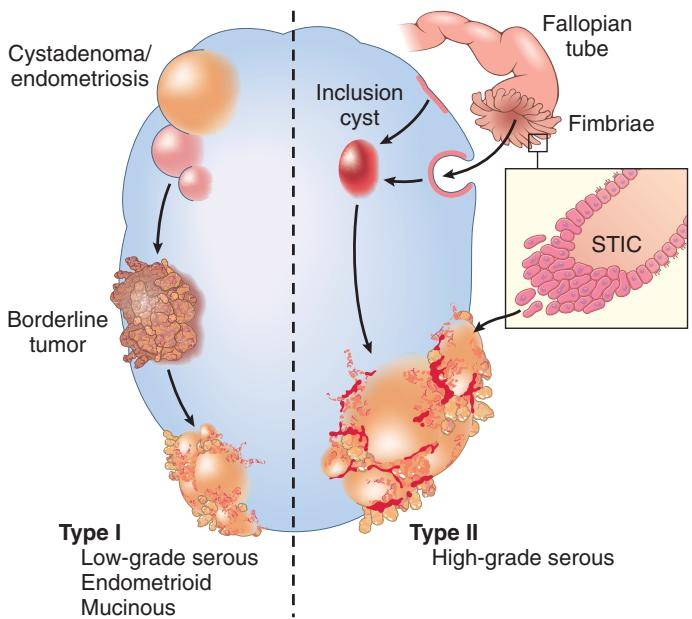 
Fig. 19.15 Derivation, of various ovarian neoplasms. Type I tumors progress from benign tumors through borderline tumors that may give rise to a low-grade carcinoma. Type II tumors arise from inclusions cysts/fallopian tube epithelium via intraepithelial precursors that are often not identified. They demonstrate high-grade features and are most commonly of serous histology. STIC, serous tubal intraepithelial carcinoma.
tumor suppressor genes. There is a higher incidence of carcinoma in unmarried women and married women with low parity. Of interest, prolonged use of oral contraceptives reduces the risk. Around $5\%$ to $10\%$ of ovarian cancers are familial, and most of these are associated with mutations in the BRCA1 or BRCA2 tumor suppressor genes. As will be discussed later, mutations in BRCA1 and BRCA2 also are associated with hereditary breast cancer. The average lifetime risk for ovarian cancer is approximately $30\%$ in BRCA1 carriers; the risk in BRCA2 carriers is somewhat lower. In contrast with familial ovarian cancer, mutations in BRCA1 and BRCA2 are found in only $8\%$ to $10\%$ of sporadic ovarian cancers, which appear to arise through alternative molecular mechanisms.
# Serous Tumors
Serous tumors are the most common of the ovarian epithelial tumors overall, and also make up the greatest fraction of malignant ovarian tumors. About $60\%$ are benign, $15\%$ are borderline, and $25\%$ are malignant. Benign lesions are usually encountered in patients between 30 and 40 years of age, and malignant serous tumors are more commonly seen between 45 and 65 years of age.
There are two types of serous carcinomas, low-grade and high-grade. The former arise from benign or borderline lesions and progress slowly in a stepwise manner to become invasive carcinoma. These low-grade tumors are associated with mutations in genes encoding signaling proteins, such as $KRAS$ , a member of the $RAS$ gene family. The high-grade serous tumors develop rapidly. As already mentioned, many of these high-grade lesions arise in the fimbriated end of the fallopian tube via serous tubal intraepithelial carcinoma, rather than ovarian coelomic epithelium. $TP53$ mutations are virtually ubiquitous in high-grade serous cancers, being present in over $95\%$ of cases. Other frequently mutated genes include the tumor suppressors $NF1$ and $RB$ , as well as $BRCA1$ and $BRCA2$ in familial ovarian cancers.
Most serous tumors are large, spherical to ovoid, cystic structures up to 30 to $40~\mathrm{cm}$ in diameter. About $25\%$ of the benign tumors are bilateral. In the benign tumors, the serosal covering is smooth and glistening. By contrast, the surface of adenocarcinomas often has nodular irregularities representing areas in which the tumor has invaded the serosa. On cut section, small cystic tumors may have a single cavity, but larger ones frequently are divided by multiple septa into multiloculated masses. The cystic spaces usually are filled with a clear serous fluid. Protruding into the cystic cavities are papillary projections, which are more prominent in malignant tumors (Fig. 19.16).
On histologic examination, benign tumors contain a single layer of columnar epithelial cells that line the cyst or cysts. The cells often are ciliated. Psammoma bodies (concentrically laminated calcified concretions) are common in the tips of papillae. In high-grade carcinoma the cells are markedly atypical, the papillary formations are usually complex and multilayered, and by definition nests or sheets of malignant cells invade the ovarian stroma. Between clearly benign and obviously malignant forms
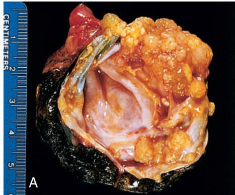
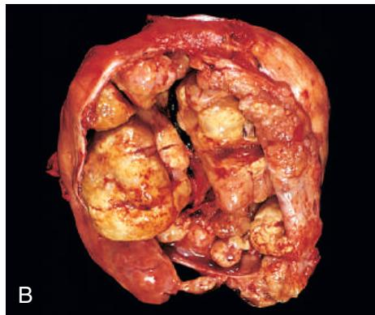 
Fig. 19.16 Ovarian serous tumors. (A) Borderline serous cystadenoma opened to display a cyst cavity lined by delicate papillary tumor growths. (B) Cystadenocarcinoma. The cyst is opened to show a large, bulky tumor mass. (Courtesy of Dr. Christopher Crum, Brigham and Women's Hospital, Boston, Massachusetts.)
lie borderline tumors, which exhibit less cytologic atypia and typically no stromal invasion. Borderline tumors may seed the peritoneum, but fortunately the tumor implants usually are "non-invasive." In general, malignant serous tumors spread throughout the peritoneal cavity and to regional lymph nodes, including periaortic lymph nodes; distant lymphatic and hematogenous metastases are infrequent.
The prognosis for patients with high-grade serous carcinoma is poor, even after surgery and chemotherapy, and depends heavily on the stage of the disease at diagnosis. The 5-year survival for women with carcinoma confined to one ovary is about $90\%$ , but falls precipitously with higher stage tumors to less than $40\%$ depending on the exact stage. In contrast, borderline tumors are associated with nearly $100\%$ survival. Of note, women with tumors containing BRCA1/2 mutations tend to have a better prognosis than women whose tumors lack these genetic abnormalities.
# Mucinous Tumors
Mucinous tumors differ from serous tumors in two respects: the neoplastic epithelium consists of mucin-secreting cells; and mucinous tumors are considerably less likely to be malignant. Overall, only $10\%$ of mucinous tumors are malignant; another $10\%$ are borderline, and $80\%$ are benign.
On gross examination, mucinous tumors produce cystic masses that may be indistinguishable from serous tumors except by the mucinous nature of the cyst contents. However, they are more likely to be larger and multicystic (Fig. 19.17A). Serosal penetration and solid areas of growth are suggestive of malignancy. Mucin-producing epithelial cells line the cysts (Fig. 19.17B). Malignant tumors are characterized by solid areas of growth, piling up (stratification) of lining cells, cytologic atypia, and stromal invasion.
Compared with serous tumors, mucinous tumors are much less likely to be bilateral. This feature is sometimes useful in differentiating mucinous tumors of the ovary from metastatic mucinous adenocarcinoma from a gastrointestinal tract primary (the so-called "Krukenberg tumor"), which more often produces bilateral ovarian masses.
Ruptured ovarian mucinous tumors may seed the peritoneum; however, these deposits typically regress spontaneously. Stable implantation of mucinous tumor cells in the peritoneum with production of copious amounts of mucin is called pseudomyxoma peritonei; in most cases, this disorder is caused by metastatic spread of tumors in the gastrointestinal tract, primarily the appendix (Chapter 15).
The prognosis of mucinous cystadenocarcinoma is somewhat better than that of its serous counterpart, although stage rather than histologic type (serous versus mucinous) is the major determinant of outcome. Mutations in KRAS are detected in approximately $50\%$ of ovarian mucinous carcinomas, however this does not help distinguish them from metastatic GI tumors, which also have a high frequency of KRAS mutations.
# Endometrioid Tumors
These tumors may be solid or cystic; they sometimes develop in association with endometriosis. On microscopic examination, they are distinguished by the formation of tubular glands, similar to those of the endometrium, within the lining of cystic spaces. Although benign and borderline forms exist, endometrioid tumors usually are malignant. They are bilateral in about $30\%$ of cases, and $15\%$ to $30\%$ of women with these ovarian tumors have a concomitant endometrial carcinoma. Similar to endometrioid-type carcinoma of the endometrium, endometrioid carcinomas of the ovary frequently have mutations in the PTEN tumor suppressor gene as well as mutations in other genes that also act by upregulating PI3K-AKT signaling.
# Brenner Tumor
The Brenner tumor is an uncommon, solid, usually unilateral ovarian tumor consisting of abundant stroma containing nests of transitional-type epithelium resembling that of the urinary tract. Occasionally, the nests are cystic and are lined by columnar mucus-secreting cells. Brenner tumors generally are smoothly encapsulated and gray-white on
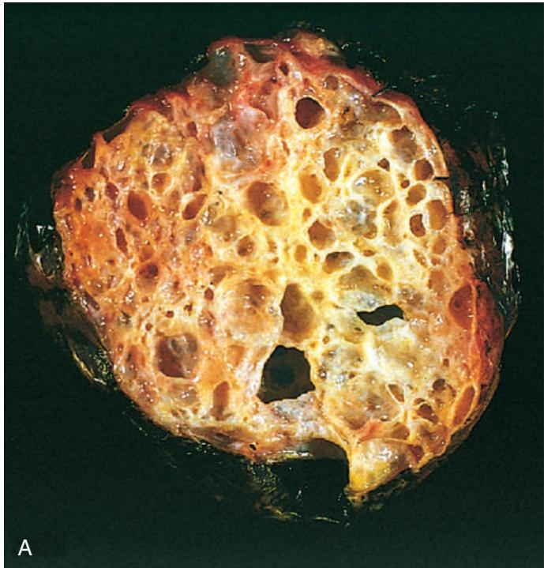
Mucinouscystadenomawithmulticysticappearanceanddelicatesepta.Notethepresenceofglisteningmucinwithinthecysts.(B)Columnarcellliningofmucinouscystadenoma..jpg) 
Fig. 19.17 Ovarian mucinous cystadenoma. (A) Mucinous cystadenoma with multicystic appearance and delicate septa. Note the presence of glistening mucin within the cysts. (B) Columnar cell lining of mucinous cystadenoma.
cut section, ranging from a few centimeters to $20~\mathrm{cm}$ in diameter. These tumors may arise from the surface epithelium or from urogenital epithelium trapped within the germinal ridge. Although most are benign, both malignant and borderline tumors have been described.
# Other Ovarian Tumors
Many other types of tumors of germ cell and sex cord-stromal origin also arise in the ovary, but only the teratomas of germ cell origin are sufficiently common to merit description. Table 19.4 presents some salient features of other neoplasms of germ cell and sex cord origin.
# Teratomas
Teratomas constitute $15\%$ to $20\%$ of ovarian tumors. A distressing feature of these germ cell tumors is their predilection to arise in the first 2 decades of life; to make matters worse, the younger the person, the greater the likelihood of malignancy. More than $90\%$ of these germ cell neoplasms, however, are benign mature cystic teratomas; the immature, malignant variant is rare.
# Benign (Mature) Cystic Teratomas
Benign (mature) cystic teratomas are marked by the presence of mature tissues derived from all three germ cell layers: ectoderm, endoderm, and mesoderm. Usually these tumors contain cysts lined by epidermis replete with adnexal appendages—hence the common designation dermoid cysts. Most are discovered in young women as ovarian masses or are found incidentally on abdominal radiographs or scans because they contain foci of calcification produced by toothlike structures contained within the tumor. About $90\%$ are unilateral, with the right side more commonly affected. Rarely do these cystic masses exceed $10~\mathrm{cm}$ in diameter. On cut section, they often are filled with sebaceous secretion and matted hair that, when removed, reveal a hair-bearing epidermal lining (Fig. 19.18). Sometimes there is a nodular projection from which teeth protrude. Occasionally, foci of bone and cartilage, nests of bronchial or gastrointestinal epithelium, or other tissues are present.
For unknown reasons, these neoplasms sometimes produce infertility and are prone to undergo torsion (in $10\% - 15\%$ of cases), which constitutes an acute surgical emergency. A rare, but fascinating, paraneoplastic complication is limbic encephalitis, which may develop in women with teratomas containing mature neural tissue and often remits with tumor resection. Malignant transformation, usually to a squamous cell carcinoma, is seen in about $1\%$ of cases.
# Immature Malignant Teratomas
Malignant (immature) teratomas are found early in life, the mean age at clinical detection being 18 years. They typically are bulky and appear solid on cut section, and they often contain areas of necrosis; uncommonly, cystic foci are present that contain sebaceous secretion, hair, and other features similar to those of mature teratomas. On microscopic examination, the distinguishing feature is the presence of immature elements or minimally differentiated cartilage, bone, muscle, nerve, or other tissues. As with other tumors, the prognosis depends on grade and stage.
# Specialized Teratomas
A rare subtype of teratoma is composed entirely of specialized tissue. The most common example is struma ovarii,
Table 19.4 Salient Features of Ovarian Germ Cell and Sex Cord Neoplasms 
NeoplasmPeak IncidenceUsual LocationMorphologic FeaturesBehaviorGerm Cell OriginDysgerminomaSecond to third decade of lifeUnilateral in 80%–90%Counterpart of testicular seminomaAll malignant but only one-third metastasize; all radiosensitive;Occur with gonadal dysgenesisSheets or cords of large clear cells80% cure rateStroma may contain lymphocytes and occasional granulomasChoriocarcinomaFirst 3 decades of lifeUnilateralIdentical to placental tumorMetastasizes early and widelyTwo types of epithelial cells: cytotrophoblast and syncytiotrophoblastPrimary focus may degenerate, leaving only metastasesResistant to chemotherapySex Cord TumorsGranulosa-theca cellMost postmenopausal, but may occur at any ageUnilateralComposed of mixture of cuboidal granulosa cells and spindled or plump lipid-laden theca cellsMay elaborate large amounts of estrogenGranulosa elements may recapitulate ovarian follicle as Call-Exner bodiesGranulosa element may be malignant (5%–25%)Thecoma-fibromaAny ageUnilateralYellow (lipid-laden) plump thecal cellsMost hormonally inactiveAbout 40% produce ascites and hydrothorax (Meigs syndrome)Rarely malignantSertoli-Leydig cellAll agesUnilateralRecapitulates development of testis with tubules or cords and plump pink Sertoli cellsMany masculinizing or defeminizingRarely malignantMetastases to OvaryOlder agesMostly bilateralAnaplastic tumor cells, cords, glands, dispersed through fibrous backgroundPrimaries are gastrointestinal tract (Krukenberg tumors), breast, and lungCells may be “signet ring” mucin-secreting
which is composed entirely of mature thyroid tissue that may actually produce hyperthyroidism. These tumors appear as small, solid, unilateral brown ovarian masses. Other specialized teratomas include ovarian carcinoid, which in rare instances produces carcinoid syndrome.
With all ovarian neoplasms, management poses a formidable clinical challenge, because symptoms or signs
oftheovary.Aballofhair(bottom)andamixtureoftissuesareevident.(CourtesyofDr.ChristopherCrum,BrighamandWomen'sHospital,Boston,Massachusetts.).jpg) 
Fig. 19.18 Mature cystic teratoma (dermoid cyst) of the ovary. A ball of hair (bottom) and a mixture of tissues are evident. (Courtesy of Dr. Christopher Crum, Brigham and Women's Hospital, Boston, Massachusetts.)
usually appear only when tumors are well advanced. Ovarian tumors of surface epithelial origin usually are asymptomatic until they become large enough to cause local pressure symptoms (e.g., pain, gastrointestinal complaints, urinary frequency). Indeed, about $30\%$ of all ovarian neoplasms are discovered incidentally on routine gynecologic examination. Larger masses, particularly the common epithelial tumors, may cause an increase in abdominal girth. Smaller masses, particularly dermoid cysts, sometimes twist on their pedicles (torsion), producing severe abdominal pain that mimics an acute abdomen. Metastatic seeding of malignant serous tumors often causes ascites, whereas functioning ovarian tumors often come to attention because of the endocrinopathies they produce.
Unfortunately, treatment of ovarian tumors remains unsatisfactory; only a modest increase in survival has been achieved since the mid-1970s. Screening methods that detect early tumors are badly needed, but those evaluated to date are of limited value. One such marker, the protein CA-125, is elevated in the sera of $75\%$ to $90\%$ of women with epithelial ovarian cancer. However, CA-125 is undetectable in up to $50\%$ of women with cancer limited to the ovary; conversely, it often is elevated in a variety of benign conditions and nonovarian cancers. Hence, its usefulness as a screening test in asymptomatic postmenopausal women is limited. Currently, CA-125 measurements are of greatest value in monitoring response to therapy.
# OVARIANT TUMORS
- Tumors may arise from epithelium, sex cord-stromal cells, or germ cells. 
Epithelial tumors are the most common malignant ovarian tumor and are more common in women older than 40 years of age. 
- The major types of epithelial tumors are serous, mucinous, and endometrioid. Each has a benign, malignant, and borderline counterpart. 
- Serous carcinoma is the most common and many arise in the distal fallopian tube.
- Sex cord-stromal tumors may display differentiation toward granulosa, Sertoli, Leydig, or ovarian stromal cell type. Depending on differentiation, they may produce estrogens or androgens. 
- Germ cell tumors (mostly cystic teratomas) are the most common ovarian tumor in young women; the vast majority are benign. 
- Germ cell tumors may differentiate toward oogonia (dysgerminoma), primitive embryonal tissue (embryonal), yolk sac (endodermal sinus tumor), placental tissue (choriocarcinoma), or multiple tissue types (teratoma).
# Diseases of Pregnancy
Diseases of pregnancy and pathologic conditions of the placenta are important contributors to morbidity and mortality for both mother and child. Discussed in this section are a limited number of disorders in which knowledge of the morphologic lesions contributes to an understanding of clinical disease.
# PLACENTAL INFLAMMATIONS AND INFECTIONS
Infections may reach the placenta by either of two paths: (1) ascension through the birth canal or (2) hematogenous (transplacental) spread.
Ascending infections are by far the more common; in most instances they are bacterial and are associated with premature rupture of the fetal membranes. On microscopic examination, the chorioamnion shows neutrophilic infiltration associated with edema and congestion (acute chorioamnionitis). With extension beyond the membranes, the infection may involve the umbilical cord and placental villi, resulting in acute vasculitis of the cord (funisitis). Ascending infections are caused by Mycoplasma, Candida, and bacteria of the vaginal flora.
Uncommonly, placental infections may arise by hematogenous spread of bacteria and other organisms; on histologic examination, placental villi are the most frequently affected structures (villitis). Syphilis, tuberculosis, listeriosis, toxoplasmosis, and various viruses (rubella, cytomegalovirus, herpes simplex virus) all can cause placental villitis. Transplacental infections can affect the fetus and give rise to the so-called "TORCH" complex (toxoplasmosis, other infections, rubella, cytomegalovirus infection, herpes) (Chapter 7).
# ECTOPIC PREGNANCY
Ectopic pregnancy is defined as implantation of a fertilized ovum in any site other than the uterus, which may occur in as many as $1\%$ of pregnancies. In more than $90\%$ of
these cases, implantation occurs in the fallopian tube (tubal pregnancy); other sites include the ovaries and the abdominal cavity. Any factor that retards passage of the ovum through the fallopian tube predisposes to ectopic pregnancy. In about half of the cases, slowed passage results from chronic inflammation and scarring in the oviduct; intrauterine tumors and endometriosis may also hamper passage of the ovum. In the other $50\%$ of tubal pregnancies, no anatomic cause is evident. Ovarian pregnancies probably result from rare instances in which the ovum is fertilized just as the follicle ruptures. Gestation within the abdominal cavity occurs when the fertilized egg drops out of the fimbriated end of the fallopian tube and implants on the peritoneum.
In all sites, early development of ectopic pregnancies proceeds normally, with formation of placental tissue, the amniotic sac, and decidual changes. With tubal pregnancies, the invading placenta eventually burrows through the wall of the fallopian tube, causing intratubal hematoma (hematosalpinx), intraperitoneal hemorrhage, or both. The tube is usually distended by freshly clotted blood containing bits of gray placental tissue and fetal parts. The histologic diagnosis depends on visualization of placental villi or, rarely, of the embryo.
Until rupture occurs, an ectopic pregnancy may be indistinguishable from a normal pregnancy, with cessation of menstruation and elevation of serum and urinary placental hormones. Under the influence of these hormones, the endometrium (in approximately $50\%$ of cases) undergoes the characteristic hypersecretory and decidual changes of pregnancy. The absence of elevated gonadotropin levels does not exclude the diagnosis because poor attachment and necrosis of the ectopic placenta are common. Rupture of an ectopic pregnancy may be catastrophic, with the sudden onset of intense abdominal pain and signs of an acute abdomen, often followed by shock. Prompt surgical intervention is necessary.
# ECTOPIC PREGNANCY
- Ectopic pregnancy is defined as implantation of the fertilized ovum outside of the uterine corpus. Approximately $1\%$ of pregnancies implant ectopically; the most common site is the fallopian tube. 
- Chronic salpingitis with scarring is a major risk factor for tubal ectopic pregnancy. 
- Rupture of an ectopic pregnancy is a medical emergency that, if left untreated, may result in exsanguination and death.
Table 19.5 Features of Complete and Partial Hydatidiform Mole 
FeatureComplete MolePartial MoleKaryotype46,XX (46,XY)Triploid (69,XXY)Villous edemaAll villiSome villiTrophoblast proliferationDiffuse; circumferentialFocal; slightSerum hCGElevatedLess elevatedTissue hCG++++++Risk of subsequent choriocarcinoma2%Rare
hCG, Human chorionic gonadotropin.
# GESTATIONAL TROPHOBLASTIC DISEASE
Gestational trophoblastic disease refers to an abnormal proliferation of fetal trophoblast cells. The World Health Organization broadly divides these diseases into two categories: molar lesions and nonmolar lesions. The molar lesions are further divided into partial, complete, and invasive hydatidiform moles. The nonmolar category consists of choriocarcinoma and other more uncommon types of trophoblast-derived malignancies. All elaborate human chorionic gonadotropins (hCG), which is detected in the blood and urine at levels considerably higher than those found during normal pregnancy. In addition to aiding diagnosis, hCG levels in the blood or urine can be used to monitor treatment efficacy. Clinicians prefer the umbrella term gestational trophoblastic disease because the response to therapy, as judged by the hormone levels, is significantly more important than pathologic subtyping of lesions. However, the genetics, pathology, and natural history of these disorders are sufficiently distinct to merit discussion of each.
# Hydatidiform Mole: Complete and Partial
The typical hydatidiform mole is a voluminous mass of swollen, sometimes cystically dilated, chorionic villi, appearing grossly as grapelike structures. Varying amounts of normal to highly atypical chorionic epithelium cover the swollen villi. There are two distinctive subtypes of hydatidiform moles: complete and partial. Complete hydatidiform moles are not compatible with embryogenesis and rarely contain fetal parts. All of the chorionic villi are abnormal, and the chorionic epithelial cells are diploid (46,XX or, uncommonly, 46,XY). The partial hydatidiform mole is compatible with early embryo formation and therefore may contain fetal parts, has some normal chorionic villi, and is almost always triploid (e.g., 69,XXY) (Table 19.5). Both types result from abnormal fertilization with an excess of paternal genetic material. In a complete mole the entire genetic content is supplied by two spermatozoa (or a diploid sperm), yielding diploid cells containing only paternal chromosomes, whereas in a partial mole a normal egg is fertilized by two spermatozoa (or a diploid sperm), resulting in a triploid karyotype with a preponderance of paternal genes.
The incidence of complete hydatidiform mole is about 1 to 1.5 per 2000 pregnancies in the United States and other Western countries. For unknown reasons, the incidence is much higher in Asian countries. Moles are most common before the age of 20 and after the age of 40 years, and a history of the condition increases the risk for molar disease in subsequent pregnancies. Although molar disease formerly was discovered at 12 to 14 weeks of pregnancy during investigation for a gestation that was "too large for dates," early monitoring of pregnancies by ultrasound has lowered the gestational age at detection. In both complete and partial moles, elevation of hCG in the maternal blood and absence of fetal heart sounds are typical.
In advanced cases the uterine cavity is expanded by a delicate, friable mass of thin-walled, translucent cystic structures (Fig. 19.19). Fetal parts are rarely seen in complete moles but are common in partial moles. On microscopic examination, the complete mole shows hydropic swelling of poorly vascularized chorionic villi with a loose, myxomatous, edematous stroma. The chorionic epithelium typically shows a proliferation of both cytotrophoblasts and syncytiotrophoblasts (Fig. 19.20). Histologic grading to predict the clinical outcome of moles has been supplanted by monitoring of hCG levels. In partial moles, villous edema involves only a subset of the villi, and the trophoblastic proliferation is focal and slight. In most cases of partial mole, some fetal cells are present, ranging from fetal red cells in placental villi to, in rare cases, a fully formed fetus.
Overall, $80\%$ to $90\%$ of moles do not recur after thorough curettage, but $10\%$ of complete moles are invasive (described next). No more than $2\%$ to $3\%$ give rise to choriocarcinoma.
# Invasive Mole
Invasive moles are complete moles that are locally invasive but lack the metastatic potential of choriocarcinoma. An invasive mole retains hydropic villi, which penetrate the uterine wall deeply, possibly causing rupture and sometimes life-threatening hemorrhage. On microscopic examination, the epithelium of the villi shows atypical changes, with proliferation of both trophoblastic and syncytiotrophoblast components.
villi..jpg) 
Fig. 19.19 Complete hydatidiform mole, consisting of numerous swollen (hydropic) villi.
Although the marked invasiveness of this lesion makes removal technically difficult, metastases do not occur. Hydropic villi may embolize to distant organs, such as lungs or brain, but these emboli do not behave like true metastases and may regress spontaneously. Because of deeper invasion into the myometrium, an invasive mole is difficult to remove completely by curettage, so if serum $\beta$ -hCG remains elevated, further treatment is required. Fortunately, in most cases cure is possible with chemotherapy.
# Gestational Choriocarcinoma
Choriocarcinoma, a very aggressive malignant tumor, arises from gestational chorionic epithelium or, less frequently, from totipotential cells within the gonads (as a germ cell tumor). These tumors are rare in the Western Hemisphere (they occur in about 1 per 30,000 pregnancies in the United States), but are much more common in
andproliferationofthechorionicepithelium(above)areevident.(CourtesyofDr.KyleMolberg,DepartmentofPathology,UniversityofTexasSouthwesternMedicalSchool,Dallas,Texas.).jpg) 
Fig. 19.20 Complete hydatidiform mole. In this microscopic image, distended hydropic villi (below) and proliferation of the chorionic epithelium (above) are evident. (Courtesy of Dr. Kyle Molberg, Department of Pathology, University of Texas Southwestern Medical School, Dallas, Texas.)
Asian and African countries, reaching a frequency of 1 in 2000 pregnancies. Approximately $50\%$ of choriocarcinomas arise from complete hydatidiform moles; about $25\%$ arise after an abortion, while the remainder manifest following an apparently normal pregnancy. In most cases, choriocarcinoma presents as a bloody, brownish discharge accompanied by a rising titer of $\beta$ -hCG in blood and urine, in the absence of marked uterine enlargement, such as would be seen with a mole. In general, the $\beta$ -hCG titers are much higher than those associated with a mole.
Choriocarcinomas usually appear as hemorrhagic, necrotic uterine masses. Sometimes the necrosis is so extensive that little viable tumor remains. Indeed, the primary lesion may "self-destruct," and only the metastases tell the story. Very early, the tumor insinuates itself into the myometrium and into vessels. In contrast with hydatidiform moles and invasive moles, chorionic villi are not formed; instead, the tumor is composed of anaplastic cuboidal cytotrophoblasts and syncytiotrophoblasts (Fig. 19.21).
By the time a choriocarcinoma is discovered, widespread vascular spread usually has occurred to the lungs (50%), vagina (30%–40%), brain, liver, or kidneys. Lymphatic invasion is uncommon.
Despite the extremely aggressive nature of placental choriocarcinoma, these tumors are remarkably sensitive to chemotherapy. Nearly $100\%$ of affected patients are cured, even those with metastases at distant sites such as the lungs. By contrast, response to chemotherapy with choriocarcinomas that arise in the gonads (ovary or testis) is relatively poor. This striking difference in prognosis may be related to the presence of paternal antigens on placental choriocarcinomas that are lacking in gonadal lesions. Conceivably, a maternal immune response against the foreign (paternal) antigens helps clear the tumor by acting as an adjunct to chemotherapy.
.jpg) 
Fig. 19.21 Choriocarcinoma. This field contains both neoplastic cytotrophoblast and multinucleate syncytiotrophoblast. (Courtesy of Dr. David R. Genest, Brigham and Women's Hospital, Boston, Massachusetts.)
# Placental Site Trophoblastic Tumor
Placental site trophoblastic tumors are derived from the placental site or intermediate trophoblast, a cell that has morphologic and functional features that overlap with those of trophoblasts and syncytiotrophoblasts. These uncommon diploid tumors, often XX in karyotype, typically arise a few months after pregnancy. Because intermediate trophoblasts do not produce hCG in large amounts, hCG concentrations are only slightly elevated. More typically, these tumors produce human placental lactogen. An indolent clinical course is typical, with a generally favorable outcome if the tumor is confined to the endomyometrium. Of note, however, placental site trophoblastic tumors are not as sensitive to chemotherapy as are other trophoblastic tumors, and the prognosis is poor when spread occurs beyond the uterus.
# GESTATIONAL TROPHOBLASTIC DISEASE
- Molar disease is a result of an abnormal contribution of paternal chromosomes to the conceptus. 
- Partial moles are triploid and have two sets of paternal chromosomes. They typically are accompanied by fetal tissue. There is a low rate of persistent disease. 
- Complete moles are diploid, and all chromosomes are paternal. Rarely are embryonic or fetal tissues associated with a complete mole. 
- Among complete moles, $10\%$ to $15\%$ are associated with persistent disease that usually takes the form of an invasive mole. Only $2\%$ of complete moles progress to choriocarcinoma. 
- Gestational choriocarcinoma is a highly invasive and frequently metastatic tumor that, in contrast with ovarian choriocarcinoma, is responsive to chemotherapy and curable in most cases. 
- Placental site trophoblastic tumor is an indolent tumor of intermediate trophoblast that produces human placental lactogen. It can be cured surgically but once it spreads it does not respond well to chemotherapy.
# Preeclampsia/Eclampsia (Toxemia of Pregnancy)
The development of hypertension, accompanied by proteinuria and edema in the third trimester of pregnancy, is referred to as preeclampsia. This syndrome occurs in $5\%$ to $10\%$ of pregnancies, particularly with first pregnancies in women older than 35 years. In those severely affected, seizures may occur, and the symptom complex is then termed eclampsia. By long-existing precedent, preeclampsia and eclampsia sometimes are referred to as toxemia of pregnancy. No blood-borne toxin has been identified, and this historically sanctified term is a misnomer. Recognition and early treatment of preeclampsia have now made eclampsia, particularly fatal eclampsia, rare.
While exact triggering events initiating these syndromes are unknown, a common feature underlying all cases is insufficient maternal blood flow to the placenta secondary to inadequate remodeling of the spiral arteries
of the uteroplacental vascular bed. In normal pregnancy, the musculoelastic walls of the spiral arteries are invaded by trophoblasts, permitting them to dilate into wide vascular sinusoids. In preeclampsia and eclampsia, this vascular remodeling is impaired, the musculoelastic walls are retained, and the channels remain narrow. Decreased uteroplacental blood flow appears to result in placental hypoxia, placental dysfunction, and the altered release of circulating factors that regulate angiogenesis. Specifically, increases in the anti-angiogenic factors soluble F1t1 (sF1t1) and soluble endoglin (sEng) and reductions in proangiogenic factors, such as VEGF, have been noted. These disturbances are hypothesized to result in endothelial cell dysfunction, vascular hyperreactivity, and end-organ microangiopathy. Although the exact basis of preeclampsia remains to be further defined, several serious consequences have been associated with this condition:
- Placental infarction, stemming from chronic hypoperfusion 
Hypertension, resulting from reduced endothelial production of the vasodilators prostacyclin and prostaglandin $\mathrm{E}_2$ and from increased production of the vasoconstrictor thromboxane A2 
- Hypercoagulability, due to endothelial dysfunction and release of tissue factor from the placenta 
- End-organ failure, most notably of the kidney and the liver, which occurs in patients with full-blown eclampsia. Approximately $10\%$ of the patients with severe preeclampsia develop the so-called "HELLP syndrome", characterized by elevated liver enzymes, microangiopathic hemolytic anemia, thrombocytopenia due to platelet consumption, and sometimes fullblown disseminated intravascular coagulation (DIC).
The morphologic changes of preeclampsia and eclampsia are variable and correlate to some degree with the severity of the disorder. Placental abnormalities include
- Infarcts, which can be a feature of normal pregnancy, but are much more numerous with severe preeclampsia or eclampsia 
- Retroplacental hemorrhages 
- Premature maturation of placental villi associated with villous edema, hypovascularity, and increased production of syncytial epithelial knots 
- Fibrinoid necrosis and focal accumulation of lipid-containing macrophages (acute atherosis) of decidual vessels
Preeclampsia presents insidiously during weeks 24 to 25 of gestation with edema, proteinuria, and rising blood pressure. Should the condition evolve into eclampsia, renal function is impaired, blood pressure rises further, and convulsions may occur. Prompt therapy early in the course aborts the associated organ changes, with all abnormalities resolving promptly after delivery or after cesarean section.
# Breast
Three important features distinguish the breast from other organs. First, rather than being essential for survival, the major function is the nutritional support of another individual, the infant. Second, the structure of the organ undergoes marked changes throughout life: expansion of the lobular system after menarche, periodic remodeling during adulthood, especially during and after pregnancy, and ultimately involution and regression of lobules. Finally, breasts are visible and as a result have a social, cultural, and personal significance not shared by other organs. All of these features play a role when considering the origins, presentations, and treatment of breast disease.
The functional unit of the breast is the lobule, which is supported by a specialized intralobular stroma. The inner luminal epithelial cells produce milk during lactation. The basally located myoepithelial cells have contractile function to aid in milk ejection and also help support the basement membrane. The ducts are conduits for milk to reach the nipple. The size of the breast is determined primarily by interlobular stroma, which increases during puberty and involutes with age. Each normal constituent is a source of both benign and malignant lesions (Fig. 19.22).
# CLINICAL PRESENTATIONS OF BREAST DISEASE
The predominant symptoms and signs of diseases of the breast are pain, inflammatory changes, nipple discharge, "lumpiness," or a palpable mass (Fig. 19.23A). However, few symptoms are so severe as to require treatment, and the primary reason for investigating their cause is to evaluate the possibility of malignancy. Most symptomatic breast lesions $(>90\%)$ are benign. Of women with cancer, about $45\%$ have symptoms, whereas the remainder come to attention through screening tests (Fig. 19.23B).
- Pain (mastalgia or mastodynia) is a common symptom often related to menses, possibly due to cyclic edema and swelling. Pain localized in a specific area is usually caused by a ruptured cyst or trauma to adipose tissue (fat necrosis). Almost all painful masses are benign, but for unknown reasons a small fraction of cancers (about $10\%$ ) cause pain. 
- Inflammation causes an edematous and erythematous breast. It is rare and is most often caused by infections, which only occur with any frequency during lactation and breastfeeding. An important mimic of
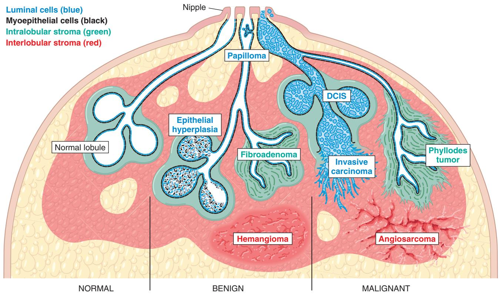 
Fig. 19.22 Origins of breast disorders. Benign epithelial lesions include intraductal papillomas that grow in sinuses below the nipple and epithelial hyperplasia that arises in lobules. Malignant epithelial lesions are mainly breast carcinomas, which may remain in situ or invade into the breast and spread by metastasis. Specialized intralobular stroma (green) cells may give rise to fibroadenomas and phyllodes tumors, whereas interlobular stroma (green) may give rise to a variety of rare benign and malignant tumors.
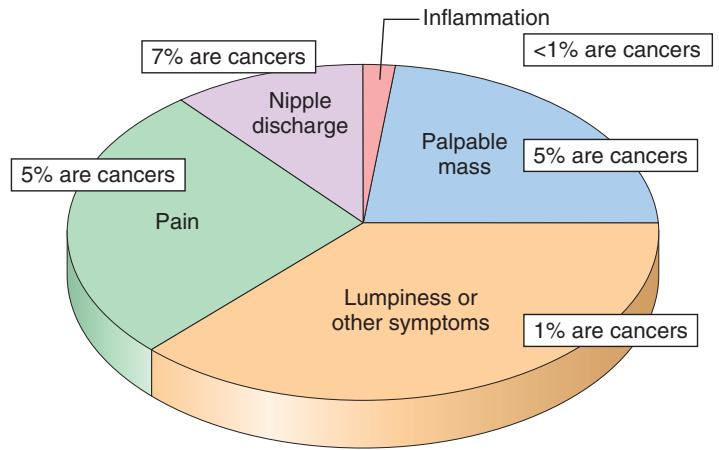 
A SYMPTOMS OF PATIENTS
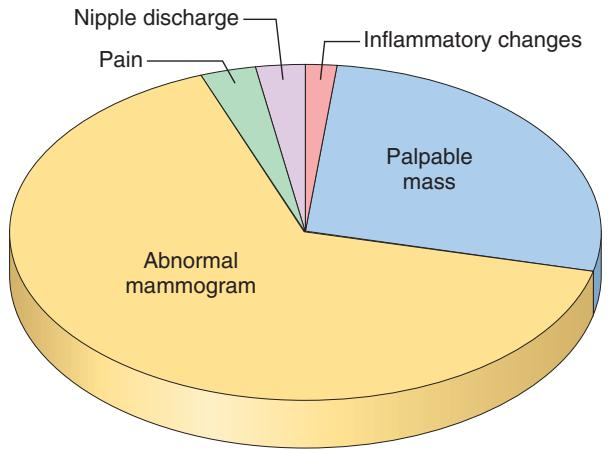 
B PRESENTATIONS OF BREAST CANCERS 
Fig. 19.23 Presenting symptoms of breast disease. (A) Common breast-related symptoms that bring patients to clinical attention. (B) Presentations of breast cancer.
inflammation is "inflammatory" breast carcinoma (discussed later).
- Nipple discharge may be normal when small in quantity and bilateral. The most common benign lesion producing a nipple discharge is a papilloma arising in the large ducts below the nipple (Fig. 19.22). Discharges that are spontaneous, unilateral, and bloody are of greatest concern for malignancy. 
- Lumpiness, or a diffuse nodularity throughout the breast, is usually a result of normal glandular tissue. When pronounced, imaging studies may help to determine whether a discrete mass is present. 
- Palpable masses can arise from proliferations of stromal cells or epithelial cells and are generally detected when they are 2 to $3\mathrm{cm}$ in size (Fig. 19.22). Most $(\sim 95\%)$ are benign; these tend to be round to oval and to have circumscribed borders. In contrast, malignant tumors usually invade across tissue planes and have irregular borders. However, because some cancers grow deceptively as circumscribed masses, all palpable masses require evaluation. 
- Gynecomastia is the only common breast symptom in males. There is an increase in both stroma and epithelial cells resulting from an imbalance between estrogens, which stimulate breast tissue, and androgens, which counteract these effects.
Regardless of presenting symptom, the likelihood of malignancy increases with age. For example, the risk of nipple discharge being due to cancer increases from $7\%$ in women younger than 60 years of age to $30\%$ in women older than 60. Similarly, only $10\%$ of palpable masses in women younger than 40 years of age are carcinomas, as compared to $60\%$ in women older than 50.
Mammographic screening was introduced in the 1980s as a means to detect early, nonpalpable asymptomatic breast carcinomas before metastatic spread has occurred. Mammography has met this promise, as the average size of invasive carcinomas detected by mammography is about $1\mathrm{cm}$ (significantly smaller than cancers identified by palpation), and only $15\%$ will have metastasized to regional
lymph nodes at the time of diagnosis. In the United States, most cancers in women more than 50 years of age are now detected by mammography (Fig. 19.23B). As with symptomatic breast lesions, the likelihood that an abnormal mammographic finding is caused by malignancy increases with age, from $10\%$ at age 40 to more than $25\%$ in women older than age 50.
# CLINICAL PRESENTATIONS OF BREAST DISEASE
- Symptoms affecting the breasts are evaluated primarily to determine if malignancy is present. 
- Regardless of the symptom, the underlying cause is benign in the majority of cases. 
- Breast cancer is most commonly detected by palpation of a mass in younger women and in unscreened populations and by mammographic screening in older women.
# INFLAMMATORY PROCESSES
Inflammatory diseases of the breast are rare and may be caused by infections, autoimmune disease, or foreign body-type reactions. Symptoms include erythema and edema, often accompanied by pain and focal tenderness. Because inflammatory diseases are rare, the possibility that the symptoms are caused by inflammatory carcinoma should always be considered (discussed later).
The only infectious agent to cause breast disease with any frequency is Staphylococcus aureus, which typically gains entry via fissures in nipple skin during the first weeks of breastfeeding. The invading organisms may lead to the formation of "lactational abscesses," collections of neutrophils and associated bacteria in fibroadipose tissue. If untreated, tissue necrosis may lead to the appearance of fistula tracks opening onto the skin. Most cases are treated adequately with antibiotics and continued expression of milk. Rarely, surgical incision and drainage is required.
# STROMAL NEOPLASMS
The two types of stroma in the breast, intralobular and interlobular, give rise to different types of neoplasms (Fig. 19.22). Historically, tumors derived from intralobular stroma have been cleanly divided into benign fibroadenomas and more cellular phyllodes tumors, which sometimes recur following excision and rarely pursue a malignant course. It is now appreciated that these tumors share driver mutations in the same genes and appear to be part of a spectrum of related neoplasms. Nevertheless, the old classification is engrained in the medical lexicon and we will follow it here for simplicity's sake.
Tumors derived from intralobular stroma are comprised of both stromal cells and epithelial cells (i.e., they are "biphasic"), as the neoplastic proliferation of specialized lobular fibroblasts also stimulates reactive proliferation of lobular epithelial cells. As the intralobular fibroblasts proliferate, they push and distort the epithelial cells so that they form elongated slitlike structures rather than round acini. In benign fibroadenoma, the tumor mass has circumscribed borders and low cellularity (Fig. 19.24A); mitoses are rare. By contrast, in phyllodes tumors the stromal cells tend to outgrow the epithelial cells, resulting in bulbous nodules of proliferating stromal cells that are covered by epithelium (Fig. 19.24B), the characteristic "phyllodes" (Greek for "leaflike") growth pattern. In high-grade phyllodes tumors epithelium may be scant or absent, producing a sarcomatous appearance. Overall, about $2\%$ of phyllodes tumors metastasize to distant sites.
Lesions of interlobular stroma are monophasic (only comprised of mesenchymal cells) and include benign soft tissue tumors found elsewhere in the body, such as hemangiomas (Chapter 10) and lipomas (Chapter 21). The only malignancy derived from interlobular stromal cells of note is angiosarcoma (Chapter 21), which may arise in the breast after local radiotherapy. The morphologies of these lesions are described elsewhere.
# BENIGN EPITHELIAL LESIONS
The majority of benign epithelial lesions are incidental findings detected by mammography. Their major clinical significance is their relationship to the subsequent risk of developing breast cancer. Benign changes are divided into three groups, nonproliferative disease, proliferative disease without atypia, and proliferative disease with atypia, each associated with a different degree of breast cancer risk (Table 19.6).
Nonproliferative disease is not associated with an increased risk of breast cancer. 
- Proliferative disease without atypia encompasses polyclonal hyperplasias that are associated with a slightly increased risk of breast cancer. 
- Proliferative disease with atypia includes monoclonal "precancers" that are associated with a modest increase in the risk of breast cancer in both breasts; overall, $13\%$ to $17\%$ of women with these lesions develop breast cancer.
Nonproliferative disease consists of three major morphologic changes: cysts, fibrosis, and adenosis. It is termed "nonproliferative" because the lesions contain single layers of epithelial cells. The most common nonproliferative breast lesions are simple cysts lined by a layer of luminal cells that often undergo apocrine metaplasia (Fig. 19.25A). The apocrine secretions may calcify and be detected by mammography. When cysts rupture, chronic inflammation and fibrosis in response to the spilled debris may produce palpable nodularity of the breast (so-called "fibrocystic changes"). Proliferative disease without atypia includes epithelial hyperplasia, sclerosing adenosis, complex sclerosing lesion, and papilloma. Each is associated with varying degrees of epithelial cell proliferation. For example, in epithelial
Fig. 19.24 Intralobular stromal neoplasms. (A) Fibroadenoma. This benign tumor has an expansile growth pattern with pushing circumscribed borders. 
Fibroadenoma.Thisbenigntumorhasanexpansilegrowthpatternwithpushingcircumscribedborders..jpg) 
(B) Phyllodes tumors. Proliferating stromal cells distort the glandular tissue, forming cleftlike spaces, and bulge into surrounding stroma.
Phyllodestumors.Proliferatingstromalcellsdistor.jpg)
Table 19.6 Factors Associated With Development of Invasive Carcinoma 
FactorRelative RiskaAbsolute Lifetime RiskaWomen with no risk factors1.03%First-degree relative(s) with breast cancera1.2–9.04%–30%Germline tumor suppressor gene mutation (e.g., BRCA1mutation)2.0–45.06% to &gt;90%Menstrual HistoryAge at menarche &lt;12 years1.34%Age at menopause &gt;55 years1.5–2.05%–6%PregnancyFirst live birth &lt;20 years (protective)0.51.6%First live birth 20–35 years1.5–2.05%–6%First live birth &gt;35 years2.0–3.06%–10%Never pregnant (nulliparous)3.010%Breast-feeding (slightly protective)0.82.6%Benign Breast DiseaseProliferative disease without atypia1.5–2.05%–6%Proliferative disease with atypia (ALH and ADH)4.0–5.013%–17%Carcinoma in situ (ductal or lobular)8.0–10.025%–30%Ionizing radiation1.1–1.43.6%–4.6%Mammographic density3.0–7.010%–23%Postmenopausal obesity and weight gain1.1–3.03.6%–10%Postmenopausal hormone replacement1.1–3.03.6%–10%Alcohol consumption1.1–1.43.6%–4.6%Alcohol consumption1.1–1.43.6%–4.6%
aRelative risk is the likelihood of developing cancer compared to a woman with no risk factors—whose relative risk is 1.0. Absolute lifetime risk is the fraction of women expected to develop invasive carcinoma without a risk reducing intervention. For women with no risk factors, there is about a $3\%$ chance of developing invasive breast cancer. bThe most common family history is a mother who developed cancer after menopause. This history does not increase the risk of her daughters.
hyperplasia, increased numbers of both spindled myoepithelial cells and epithelioid luminal cells expand ductal and lobular spaces (Fig. 19.25B).
Proliferative disease with atypia includes atypical lobular hyperplasia (ALH) and atypical ductal hyperplasia (ADH). ALH closely resembles lobular carcinoma in situ (LCIS) and ADH closely resembles ductal carcinoma in situ (DCIS) (both described later), but are more limited in extent. The cells in ADH are uniform in appearance and form sharply marginated spaces or rigid bridges (Fig. 19.25C).
# CARCINOMA
Breast carcinoma is the most common malignancy of women globally (excluding nonmelanoma skin cancer) and causes the majority of cancer deaths in women. Although the incidence in the United States decreased slightly in 2002 and then stabilized (changes attributed to a decrease in the use of postmenopausal hormone therapy and a plateau in the number of women undergoing mammographic screening), the worldwide incidence
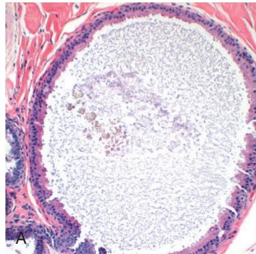 
Fig. 19.25 Benign epithelial breast disease. (A) Nonproliferative disease. An apocrine cyst is shown that is a common feature of nonproliferative breast disease. (B) Proliferative breast disease is characterized by increased numbers of epithelial cells, as in this example of epithelial hyperplasia. (C) Proliferative breast disease with atypia. The proliferating epithelial cells are monomorphic in appearance and pile up to form abnormal architectural structures.
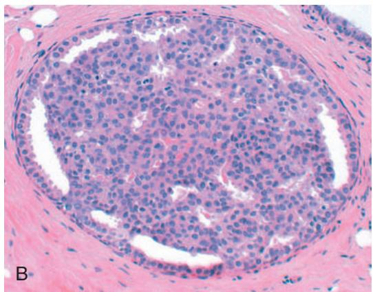
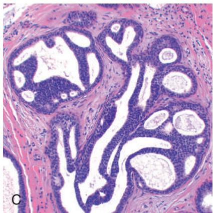
and mortality is increasing at an alarming rate. The major factors underlying this trend in developing countries are thought to be social changes that increase breast cancer risk—specifically, delayed childbearing, fewer pregnancies, and reduced breastfeeding—combined with a lack of access to optimal health care.
The lifetime risk of breast cancer is 1 in 8 for women living to age 90 in the United States. It is predicted that about 250,000 breast cancers will be diagnosed in 2016 and about 40,000 women will die of the disease—a toll among cancers second only to lung cancer. Since the mid-1980s the mortality rate has dropped from $30\%$ to less than $20\%$ . The decrease is attributed to both improved screening, which detects some cancers before they have metastasized, and more effective systemic treatment.
Almost all breast malignancies are adenocarcinomas $(>95\%)$ . In the most clinically useful classification system, breast cancers are divided based on the expression of hormone receptors—estrogen receptor (ER) and progesterone receptor (PR)—and the expression of the human epidermal growth factor receptor 2 (HER2, also known as ERBB2), into three major groups:
ER positive (HER2 negative; $50\% -65\%$ of cancers) 
- HER2 positive (ER positive or negative; $10\% - 20\%$ of cancers) 
- Triple negative (ER, PR, and HER2 negative; $10\% - 20\%$ of cancers)
These three groups show striking differences in patient characteristics, pathologic features, treatment response, metastatic patterns, time to relapse, and outcome (Table 19.7 and Fig. 19.26). Within each group are additional histologic subtypes (discussed later), some of which also have clinical importance.
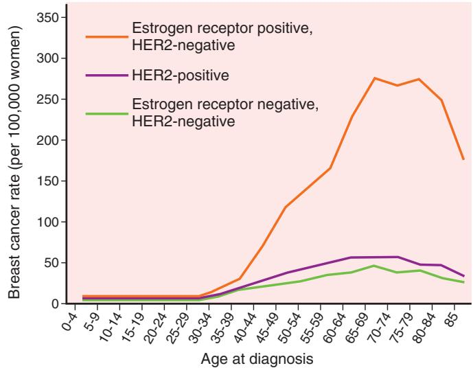 
Fig. 19.26 Age and the incidence of breast cancer subtypes.
An alternative classification system with substantial overlap relies on gene expression profiling. This system, which is currently used mainly in the context of clinical research, divides breast cancers into four major types:
- Luminal A. The majority are lower-grade ER-positive cancers that are HER2 negative 
- Luminal B. The majority are higher-grade ER-positive cancers that may be HER2 positive 
- HER2-enriched. The majority overexpress HER2 and do not express ER 
- Basal-like. The majority by gene expression profiling resemble basally located myoepithelial cells and are ER-negative, HER2-negative
Table 19.7 Summary of the Major Biologic Types of Breast Cancer 
FeatureER Positive/HER2 NegativeHER2 Positive (ER Positive or Negative)Triple Negative (ER, PR, and HER2 Negative)Overall frequency50%–65%20%15%Typical patient groupsOlder women; men; cancers detected by screening; germline BRCA2 mutation carriersYoung women; germline TP53 mutation carriersYoung women; germline BRCA1 mutation carriersEthnicityEuropean/American70%18%12%African/American52%22%26%Hispanic60%24%16%Asian/Pacific Islander63%26%11%GradeMainly grade 1 and 2Mainly grade 2 and 3Mainly grade 3Complete response to chemotherapyLow grade (&lt;10%), higher grade (10%)ER positive (15%), ER negative (&gt;30%)30%Timing of relapseMay be late (&gt;10 years after diagnosis)Usually short (&lt;10 years after diagnosis)Usually short (&lt;8 years after diagnosis)Metastatic sitesBone (70%), viscera (25%), brain (&lt;10%)Bone (70%), viscera (45%), brain (30%)Bone (40%), viscera (35%), brain (25%)Similar group defined by mRNA profilingLuminal A (low grade), luminal B (high grade)Luminal B (ER positive), HER2-enriched (ER negative)Basal-likeCommon special histologic typesLobular, tubular, mucinous, papillaryApocrine, micropapillaryCarcinoma with medullary featuresCommon somatic mutationsPIK3CA (40%), TP53 (26%)TP53 (75%), PIK3CA (40%)TP53 (85%)
PIK3CA encodes phosphoinositide 3-kinase (PI3K).
# Epidemiology and Risk Factors
A large number of risk factors for breast cancer have been identified (Table 19.6). Some of the more important risk factors are summarized next.
Age and Gender. Breast cancer is rare in women younger than age 25, but increases in incidence rapidly after age 30 (Fig. 19.26); $75\%$ of women with breast cancer are older than 50 years of age, and only $5\%$ are younger than 40. The incidence in men is only $1\%$ of that in women.
Family History of Breast Cancer. The greatest risk is for individuals with multiple affected first-degree relatives with early-onset breast cancer. In most families, it is thought that various combinations of low penetrance, "weak" cancer genes are responsible for increased risk. However, approximately $5\%$ to $10\%$ of breast cancers occur in persons who inherit highly penetrant germline mutations in tumor suppressor genes (discussed later). For these individuals, the lifetime risk of breast cancer may be greater than $90\%$ .
Geographic Factors. Significant differences in the incidence and mortality rates of breast cancer have been reported in various countries. The risk is significantly higher in the Americas and Europe than in Asia and Africa. For example, the incidence and mortality rates are five times higher in the United States than in Japan. Some risk factors must be modifiable because migrants from low-incidence to high-incidence areas tend to acquire the rates of their new home countries. Diet, reproductive patterns, and breastfeeding practices are thought to be involved. In line with this, breast cancer rates appear to be rising in parts of the world that are adopting Western habits.
Race/Ethnicity. The highest rate of breast cancer is in women of European descent, largely because of a higher incidence of ER-positive cancers. Hispanic and African American women tend to develop cancer at a younger age and are more likely to develop aggressive tumors. Such disparities are thought to result from a combination of differences in genetics, social factors, and access to health care and are an area of intense study.
Reproductive History. Early age of menarche, nulliparity, absence of breastfeeding, and older age at first pregnancy are all associated with increased risk, probably because each increases the exposure of "at-risk" breast epithelial cells to estrogenic stimulation.
Ionizing Radiation. Radiation to the chest increases the risk of breast cancer if exposure occurs while the breast is still developing. For example, breast cancer develops in $25\%$ to $30\%$ of women who underwent irradiation for Hodgkin lymphoma in their teens and 20s, but the risk for women treated later in life is not elevated.
Other Risk Factors. Postmenopausal obesity, postmenopausal hormone replacement, mammographic density, and alcohol consumption also have been implicated as risk factors. The risk associated with obesity probably is due
to exposure of the breast to estrogen produced by adipose tissue. In keeping with this, obesity is only associated with an increased risk of tumors that express ER.
The three major subtypes of breast cancer defined by differential expression of hormone receptors and HER2 arise through more-or-less distinct pathways that involve the stepwise acquisition of driver mutations in the epithelial cells of the duct/lobular system (Fig. 19.27). Factors that contribute directly to the development of breast cancer can be grouped into genetic, hormonal, and environmental categories.
Genetic. Driver mutations in cancer genes that contribute to breast carcinogenesis can be divided into those that are inherited and those that are acquired. The major germline mutations conferring susceptibility to breast cancer affect genes that regulate genomic stability or that are involved in progrowth signaling pathways. BRCA1 and BRCA2 are classic tumor suppressor genes, in that cancer arises only when both alleles are inactivated or defective (Chapter 6). BRCA1 and BRCA2 encode proteins that are required for repair of certain kinds of DNA damage. They are normally expressed in many different cells and tissues, and why germline mutations in these genes lead mainly to an increased risk of breast and serous ovarian cancer (discussed earlier) remains mysterious. The degree of penetrance, age of onset, and susceptibility to other types of cancers differ among the many BRCA1 and BRCA2 germline mutations, but most carriers develop breast cancer by the age of 70 years, as compared to about $12\%$ of women with an average risk of breast cancer. For unclear reasons, BRCA2 mutations are primarily associated with ER-positive tumors, whereas BRCA1 mutations show a strong association with triple-negative cancers (Fig. 19.27). Other mutated genes associated with familial breast cancer include TP53 (the so-called "guardian of the genome", Chapter 6) and PTEN (an important negative regulator of the pro-growth PI3K-AKT pathway), already mentioned earlier as a risk factor for endometrial carcinoma as part of Cowden syndrome.
As might be expected, the pathways in which familial breast cancer genes function also are often disturbed in sporadic breast cancers. Somatic mutations in BRCA1 and BRCA2 are rare in sporadic cancers, but BRCA1 is inactivated by methylation in up to $50\%$ of triple-negative cancers. Somatic mutations in TP53 are common in breast cancer, particularly triple-negative and HER2-positive tumors (Table 19.7), whereas mutations that activate PI3K-AKT signaling are frequently found in sporadic ER-positive and HER2-positive breast cancers (Fig. 19.27).
A common clinically important driver mutation in breast cancer is amplification of the HER2 gene. HER2 is a receptor tyrosine kinase that promotes cell proliferation and opposes apoptosis by stimulating the RAS- and PI3K-AKT signaling pathways. Cancers that overexpress HER2 are pathogenically distinct and highly proliferative. In the past they had a poor prognosis; however, the availability of therapeutic agents that specifically target HER2 has markedly improved the prognosis for patients with HER2-amplified tumors.
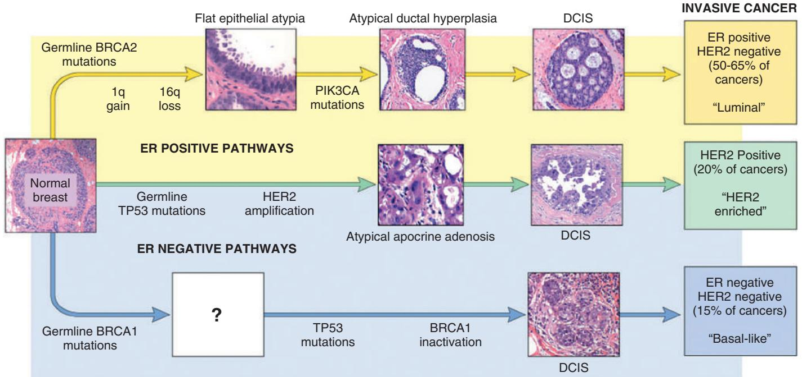 
Fig. 19.27 Major pathways of breast cancer development. The most common pathway (yellow arrow) leads to ER-positive cancers. Morphologically recognized precursor lesions include flat epithelial atypia, ADH, and DCIS, all of which share certain genomic events with invasive ER-positive carcinomas, such gains of chromosome I, losses of chromosome 16, and mutations of PIK3CA (the gene encoding PI3K). By gene expression profiling, these cancers are classified as "luminal." This is the type of cancer that arises most commonly in individuals with germline BRCA2 mutations. Less common are cancers that overexpress HER2 because of gene amplification (green arrow). These cancers may be positive or negative for ER and are usually associated with germline TP53 mutations. A possible precursor lesion is atypical apocrine adenosis, which shares features with apocrine DCIS. The least common but molecularly most distinctive type of breast cancer is negative for ER and HER2 ("triple negative"; blue arrow). These cancers have loss of BRCA1 and TP53 function and are genomically unstable. The majority of triple-negative cancers are classified as "basal-like" by gene expression profiling.
Hormonal Influences. Estrogens stimulate the production of growth factors, such as transforming growth factor- $\alpha$ , platelet-derived growth factor, fibroblast growth factor, and others, which may promote tumor development through paracrine and autocrine mechanisms. In addition, ER regulates dozens of other genes in an estrogen-dependent fashion, some of which are important for tumor development or growth. Hormonal influences likely drive proliferation during the development of cancers from precursor lesions (which typically strongly express ER) to fully malignant and even metastatic carcinomas. The clearest measure of the importance of estrogen is found in the therapeutic benefits of estrogen antagonists, which reduce the development of ER-positive cancers in women at high risk and are mainstays in the treatment of established ER-positive tumors.
Environmental Factors. Environmental influences are suggested by the variable incidence of breast cancer in genetically homogeneous groups (e.g., Japanese women living in Japan and the United States) and the geographic differences in breast cancer incidence, as discussed earlier.
The most common location of tumors within the breast is in the upper outer quadrant (50%), followed by the central portion (20%). About 4% of women with breast cancer have bilateral primary tumors or sequential lesions in the same breast.
Breast cancers are classified morphologically according to whether they have penetrated the basement membrane. Those that remain within this boundary are termed in situ carcinomas, and those that have spread beyond it are designated invasive carcinomas. In this classification, the main forms of breast carcinoma are as follows:
A. Noninvasive
I. Ductal carcinoma in situ 
2. Lobular carcinoma in situ
B. Invasive
I. Invasive ductal carcinoma (includes all carcinomas that are not of a special type) $70\%$ to $80\%$ 
2. Invasive lobular carcinoma— $\sim 10\%$ to $15\%$ 
3. Carcinoma with medullary features—\~5% 
4. Mucinous carcinoma (colloid carcinoma) — ~5% 
5. Tubular carcinoma— $\sim 5\%$ 
6. Other types
# Noninvasive (in Situ) Carcinoma
There are two morphologic types of noninvasive breast carcinoma: ductal carcinoma in situ (DCIS) and lobular carcinoma in situ (LCIS). The terms ductal and lobular are misleading, as both types of CIS are thought to arise from cells in the terminal duct that give rise to lobules. LCIS usually expands involved lobules (Fig. 19.28A), whereas DCIS distorts lobules into ductlike spaces (Fig. 19.28B). By definition, both "respect" the basement membrane and do not invade into stroma or lymphovascular channels.
DCIS has a wide variety of histologic appearances, including solid, comedo, cribriform, papillary, micropapillary, and "clinging"
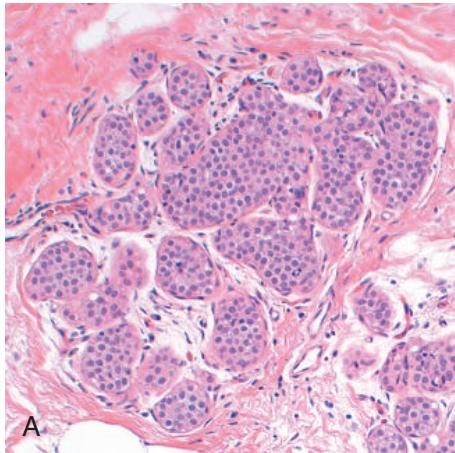 
Fig. 19.28 Carcinoma in situ. (A) Lobular carcinoma in situ (LCIS). (B) Ductal carcinoma in situ (DCIS). DCIS partially involves the lobule in the lower half of this photo and has completely effaced the upper lobules, producing a ductlike appearance. (C) Mammographic detection of calcifications associated with DCIS.
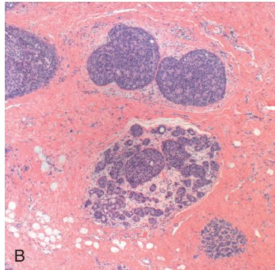
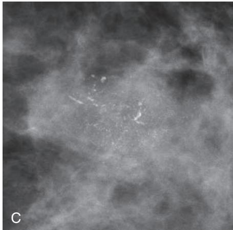
types. Nuclear appearances range from bland and monotonous (low nuclear grade) to pleomorphic (high nuclear grade). The distinctive comedo subtype is characterized by extensive central necrosis, which produces toothpastelike necrotic tissue that extrudes from transected ducts on application of gentle pressure. Calcifications frequently are associated with DCIS (Fig. 19.28C), resulting from calcification of necrotic debris or secretory material. DCIS constitutes only $5\%$ of breast cancers in unscreened populations but up to $30\%$ in screened populations, largely because of the ability of mammography to detect calcifications. Current treatment strategies for DCIS use surgery and irradiation to eradicate the lesion. Treatment with anti-estrogenic agents such as tamoxifen also is used to decrease the risk of recurrence of ER-positive DCIS. The prognosis is excellent, with greater than $97\%$ long-term survival. If untreated, DCIS progresses to invasive cancer in roughly one-third of cases, usually in the same breast and quadrant as the earlier DCIS.
Paget disease of the nipple is caused by the extension of DCIS up the lactiferous ducts and into the contiguous skin of the nipple, producing a unilateral crusting exudate over the nipple and areolar skin. Unlike Paget disease of the vulva (described earlier), Paget disease of the nipple stems from in situ extension of an underlying carcinoma. The prognosis of the carcinoma of origin is affected by the presence of Paget disease and is determined by other factors (discussed under Clinical Features).
LCIS has a uniform appearance. The cells are monomorphic, have bland, round nuclei, and are found in loosely cohesive clusters within the lobules (Fig. 19.28A). LCIS is virtually always an incidental finding because, unlike DCIS, it is only rarely associated with calcifications. Therefore, the incidence of LCIS has remained unchanged in mammographically screened populations. Approximately one-third of women with LCIS eventually develop invasive carcinoma. Unlike DCIS, invasive carcinomas following a diagnosis of LCIS may arise in either breast— $\frac{1}{3}$ in the same breast and $\frac{1}{3}$ in the contralateral breast. Thus, LCIS is both a marker of an increased risk of carcinoma in both breasts and a direct precursor of some cancers. Current treatment options include close clinical and radiologic follow-up, chemoprevention with tamoxifen or, less commonly, bilateral prophylactic mastectomy.
# Invasive (Infiltrating) Carcinoma
The distinctive histologic patterns of the subtypes of invasive carcinoma are described first, followed by grading, which is used for all.
Invasive ductal carcinoma is a term used for all carcinomas that cannot be subclassified into one of the specialized types described below. A majority (70%–80%) of cancers falls into this group. This type of cancer usually is associated with DCIS. The microscopic appearance varies, ranging from tumors with well-developed tubules and low-grade nuclei (Fig. 19.29A) to tumors consisting of sheets of anaplastic cells. Most invasive ductal carcinomas produce a desmoplastic response, which replaces normal breast fat (resulting in a mammographic density; Fig. 19.29B) and eventually leads to the appearance of a hard, palpable irregular mass. About 50% to 65% of ductal carcinomas are ER positive, 20% are HER2 positive, and 15% are negative for both ER and HER2 (Table 19.7).
Invasive lobular carcinoma consists of infiltrating cells that are morphologically similar to the tumor cells seen in LCIS; indeed, two-thirds of the cases are associated with LCIS. These tumors comprise $10\%$ to $15\%$ of all breast carcinomas. The cells invade stroma individually and often are aligned in "single-file" (Fig. 19.29C). Although most manifest as palpable masses or mammographic densities, a significant subgroup invade without producing a desmoplastic response; such tumors may be clinically occult and difficult to detect by imaging (Fig. 19.29D). The pattern of metastasis of lobular carcinoma is unique among breast cancers, as they frequently spread to cerebrospinal fluid, serosal surfaces, gastrointestinal tract, ovary, uterus, and bone marrow. Almost all lobular carcinomas express hormone receptors, whereas HER2 overexpression is rare.
Carcinomas with medullary features are a special type of triple-negative cancer comprising about $5\%$ of all breast cancers. These carcinomas typically grow as rounded masses that can be difficult to distinguish from benign tumors on imaging (Fig. 19.29F). They consist of sheets of large anaplastic cells associated with pronounced lymphocytic infiltrates composed predominantly of T cells (Fig. 19.29E). The presence of lymphocytes is associated with a favorable prognosis, at least in part due to a better response to chemotherapy compared to poorly differentiated carcinomas without lymphoid infiltrates. This type
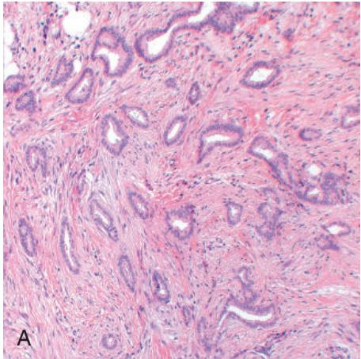
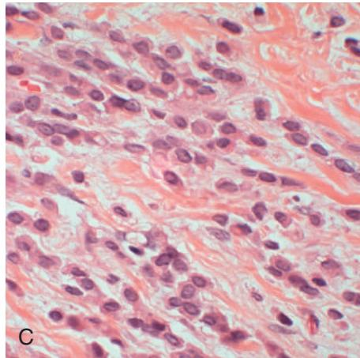
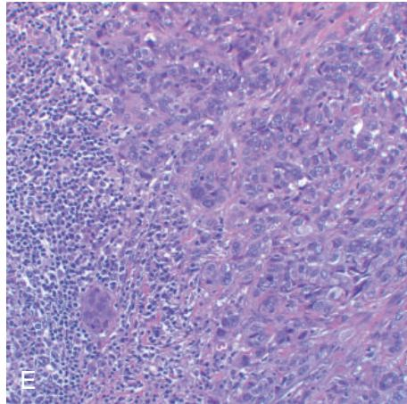
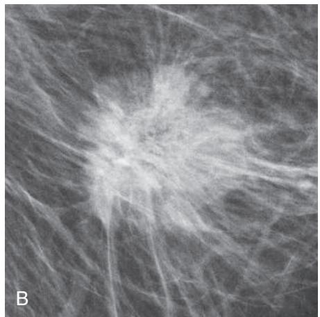 
Fig. 19.29 Growth patterns of invasive breast carcinomas. (A) Most grow as tubules ("ductal" carcinoma) and stimulate a reactive desmoplastic stromal proliferation. In mammograms (B), these carcinomas appear as dense masses with spicular margins resulting from invasion of adjacent radiolucent breast tissue. (C) Lobular carcinomas are composed of noncohesive tumor cells that invade as linear cords of cells and induce little stromal response. Accordingly, in mammograms (D) lobular carcinomas often appear as relatively subtle, irregular masses (arrows). (E) Uncommonly, carcinomas consist of tightly adhesive clusters of cells, as in this carcinoma with medullary features, or when there is abundant extracellular mucin production. (F) Such tumors may appear as well-circumscribed masses in mammograms, mimicking the appearance of a benign lesion.
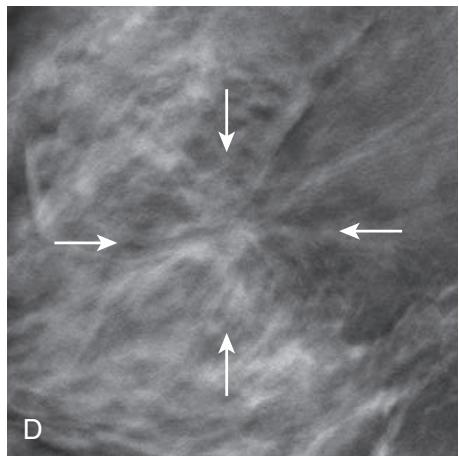
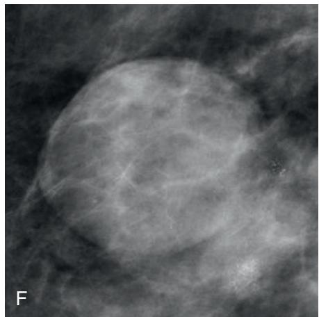
of carcinoma is seen frequently in women with germline BRCA1 mutations, but most women with these carcinomas are not carriers.
Mucinous (colloid) carcinoma is an ER-positive/HER2-negative tumor that produces abundant amounts of extracellular mucin. The tumors usually are soft and gelatinous because of the presence of mucin pools that create an expansile circumscribed mass.
Tubular carcinoma is another type of ER-positive/HER2-negative cancer and is almost always detected on mammography as a small irregular mass. The tumor cells are arranged in well-formed tubules and have low-grade nuclei. Lymph node metastases are rare, and the prognosis is excellent.
Inflammatory carcinoma is defined by its clinical presentation, rather than a specific morphology. Patients present with a swollen erythematous breast without a palpable mass. The underlying invasive carcinoma is generally poorly differentiated and diffusely infiltrates and obstructs dermal lymphatic spaces, causing the "inflamed" appearance; true inflammation is absent. Many of these tumors metastasize to distant sites; the overall 5-year survival is less than $50\%$ , and understandably even lower in those with metastatic disease at diagnosis. About half express ER and $40\%$ to $60\%$ overexpress HER2.
All types of invasive breast carcinoma are assigned a grade from 1 (low-grade) to 3 (high-grade) based on nuclear pleomorphism, tubule formation, and proliferation. Low-grade nuclei are similar in appearance to the nuclei of normal cells. High-grade nuclei are enlarged and have irregular nuclear contours resulting from abnormal DNA content and structure. Most low-grade carcinomas form well-defined tubules and may be difficult to distinguish from benign lesions, whereas high-grade carcinomas lose this capacity and invade as solid sheets or single cells. Proliferation is evaluated by counting mitotic figures. The majority of HER2-positive and triple-negative carcinomas are highly proliferative, whereas ER-positive cancers show a wide range of proliferation.
As previously discussed, in unscreened populations (including young women, for whom screening is not indicated) most breast cancers are detected as a palpable mass by the affected patient. Such carcinomas are almost all invasive and are typically at least 2 to $3\mathrm{cm}$ in size. At least half of these cancers will already have spread to regional lymph nodes. In older screened populations,
approximately $60\%$ of breast cancers are discovered before symptoms are present. About $20\%$ are in situ carcinomas. Invasive carcinomas detected by screening in older women are 1 to $2\mathrm{cm}$ in size and only $15\%$ will have metastasized to lymph nodes. Palpable cancers in the older age group are often "interval" cancers - cancers that appear suddenly between screening intervals. Understandably, interval cancers generally are highly proliferative and usually are high grade.
The clinical outcome for a woman with breast cancer can be predicted based on the molecular and morphologic features of the cancer and its stage at the time of diagnosis. Factors that influence outcome include the following:
- Biologic type. The biologic type of cancer is evaluated by a combination of histologic appearance, grade (including proliferative rate), expression of hormone receptors, and expression of HER2.
Proliferation is evaluated by mitotic count and is closely tied to responsiveness to cytotoxic chemotherapy. This is because rapidly growing cancer cells are more sensitive to agents that damage DNA or otherwise interfere with cell division.
Expression of estrogen or progesterone receptors predicts response to anti-estrogen therapy. The growth of hormone receptor-positive cancers can be inhibited for many years with therapy and it is possible for patients to survive for long periods with distant metastases. However, resistance often eventually develops—in some cancers because of mutations in the gene for ER. In contrast, there is no targeted therapy available for triple-negative cancers, which are treated with chemotherapy. Cancers that do not respond to initial therapy metastasize and usually cause the death of the patient.
Overexpression of HER2 is seen in about $20\%$ of breast cancers. HER2 remains one of the best-characterized examples of an effective therapy that is directed against a tumor-specific molecular lesion. Before targeted therapy, which may take the form of blocking antibodies or small
molecular inhibitors of HER2, outcomes were similar to patients with triple-negative carcinomas. However, complete response rates exceed $60\%$ when targeted therapy is combined with chemotherapy, and the outlook for these patients has been markedly improved.
- RNA expression profiling is a newer method of subclassifying cancers. For breast cancers, many of the genes that predict prognosis are involved in proliferation. The greatest clinical value of these assays is their ability to identify patients with slow-growing, antiestrogen-responsive cancers who can be spared the toxicity of chemotherapy.
- Tumor stage. "Stage" is a measure of the extent of tumor at the time of diagnosis and is important for all biologic types of carcinoma. It is based on features of the primary tumor (T), involvement of regional lymph nodes (N), and the presence of distant metastases (M) (Fig. 19.30). The AJCC/UICC staging system, used in the United States and Europe, classifies tumors as T1, T2, and T3 based on the tumor size, whereas T4 tumors have ulceration of the skin, involvement of the deep muscles of the chest wall, or are clinically diagnosed as inflammatory carcinoma. The majority of cancers first metastasize to regional nodes, and nodal involvement is a very strong prognostic factor. Lymphatic drainage goes to one or two sentinel lymph nodes in the axilla in most patients. If these nodes are not involved, the remaining axillary nodes are usually free of carcinoma. Sentinel node biopsy has become the standard for assessing nodal involvement, replacing more extensive lymph node dissections, which are associated with significant morbidity. Distant metastases (M) are only detected in $5\%$ of newly diagnosed women. Stage 0 is CIS, which is associated with survival rates greater than $95\%$ . Stage I includes women with smaller cancers and nodes either free of carcinoma or with only very small micrometastases. Survival is $\sim 86\%$ at 10 years. Carcinomas are classified as Stage II either because of larger tumor size or because of up to
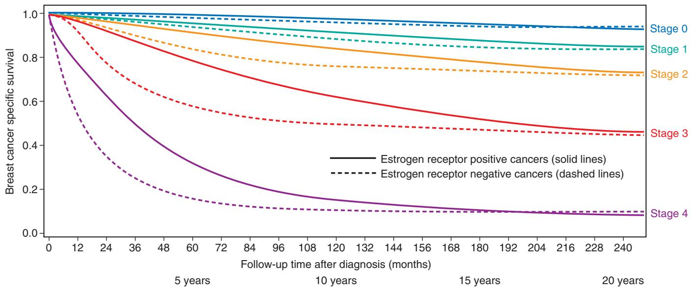 
three positive nodes. Survival declines to $\sim 71\%$ at Stage II. Stage III is the group of locally advanced cancers defined by large size, involvement of skin or chest wall, or by four or more positive nodes. Only $\sim 54\%$ of patients survive 10 years. Stage IV is reserved for patients with distant metastases, and survival is very poor ( $\sim 11\%$ ). The most likely site of a distant recurrence varies with the biologic type of cancer. Triple-negative cancers and HER2 cancers are more likely to metastasize to the brain and viscera, in contrast to ER-positive cancers, which most often metastasize to bones (Table 19.7).
Combining stage and biologic factors may provide a more accurate assessment of outcome. For example, for each cancer stage, the survival of patients with ER-positive cancers is higher than patients with ER-negative cancers 5 years postdiagnosis, especially for Stages III and IV (Fig. 19.30). It must be noted, however, this advantage diminishes with time, with progressively smaller differences being seen at 10 years post-diagnosis and beyond (Fig. 19.30). This narrowing of survival differences is explained by two factors. First, most deaths from ER-negative cancers happen within 5 years of diagnosis (Fig. 19.31). Women who live beyond this point are those whose tumors have had excellent responses to treatment, and many of these women may be cured. Second, although the growth of ER-positive cancers is held in check for years by antiestrogen therapy, this therapy is not curative and these cancers may eventually become resistant to treatment.
Historically, virtually all women with untreated breast cancer died within 3 to 4 years. However, great strides have been made in treatment and now $80\%$ of women with breast cancer who receive optimal therapy will survive.
Endocrine therapy with tamoxifen and aromatase inhibitors is very effective for ER-positive cancers, which may remain dormant for many years.
Targeted therapy has the promise of being more effective and less toxic than conventional chemotherapy (Table
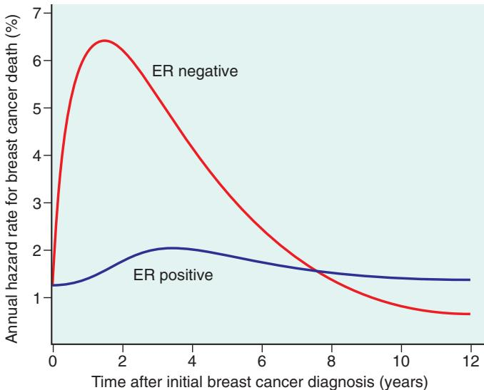 
Fig. 19.31 Time to recurrence of breast cancers. The hazard ratio reflects the risk of recurrence of each molecular type of breast cancer at various points in time after diagnosis. ER-negative cancers usually recur within the first 8 years. Patients who survive beyond this interval are likely cured. In contrast, ER-positive cancers have a lower rate of recurrence, but remain at risk decades after the primary diagnosis.
19.8), as already proven by marked improvement in survival of women with HER2-positive carcinomas following the introduction of therapies that target HER2. Newer approaches to targeted therapy include inhibition of alternative DNA repair pathways in BRCA-mutated cancers and blockage of the PI3K-AKT-signaling pathway. Immune checkpoint blockade therapy (Chapter 6), is under evaluation in patients with breast cancer. It is hoped that such new approaches will improve outcomes in subtypes that currently have a generally poor prognosis, such as triple negative breast cancer.
Table 19.8 Targeted Treatment of Breast Cancer 
TargetTreatmentAssayCommentsEREstrogen deprivation (oophorectomy, aromatase inhibitors)Blockage of ER (tamoxifen)IHC for nuclear EREffective cytostatic (but not cytotoxic) therapy for ER-positive cancerHER2Antibodies to HER2Cytotoxic therapy linked to HER2 antibody Tyrosine kinase inhibitorsIHC for membrane HER2 ISH for HER2 gene amplificationEffective for HER2-positive cancersSusceptibility to DNA damage resulting from BRCA1 and BRCA2 mutations that cause defects in HRRChemotherapy with agents causing DNA damage that requires HRR (e.g., platinum agents)Inhibition of alternative DNA repair pathway (poly-ADP ribose polymerase or PARP inhibitors)Sequencing of BRCA1 and BRCA2May be effective for carcinomas arising in patients with germline BRCA1 or 2 mutations or cancers with somatic loss of BRCA functionPI3K/AKT pathwayInhibition of proteins in the pathwayActivating mutations or pathway activation—not yet validated&gt;80% of breast cancers have alterations in this pathwayEffectiveness of treatment not yet demonstratedImmune checkpoint proteinsBlocking antibodies to PD-L1, PD-L1, and other immune checkpoint proteinsIHC for immune checkpoint proteins—not yet validatedUnder investigation in patients with triple-negative breast cancer
ER, Estrogen receptor; HRR, homologous recombination repair; IHC, immunohistochemistry; ISH, in situ hybridization.
# BREAST CARCINOMA
- The lifetime risk of developing breast cancer for an American woman is 1 in 8. 
- A majority (75%) of breast cancers are diagnosed after the age of 50. 
- The major risk factors for developing breast cancer are related to hormonal factors and inherited susceptibility. 
- About $12\%$ of all breast cancers are caused by identified germline mutations; BRCA1 and BRCA2 genes account for one-half of the cases associated with single-gene mutations. 
- DCIS is a precursor to invasive ductal carcinoma and is most often found on mammographic screening as calcifications. When carcinoma develops in a woman with a previous diagnosis of untreated DCIS, it is usually is an invasive ductal carcinoma in the same breast. 
- LCIS is both a marker of increased risk and a precursor lesion. When carcinoma develops in a woman with a previous diagnosis of LCIS, two-thirds are in the same breast and one-third is in the contralateral breast. 
- Invasive carcinomas are classified according to histologic type and biologic type: ER-positive/HER2-negative, HER2-positive, and ER/PR/HER2-negative (triple-negative). The biologic types of cancer have important differences in patient characteristics, grade, mutation profile, metastatic pattern, response to therapy, time to recurrence, and prognosis. 
- Prognosis is dependent on the biologic type of tumor, stage, and the availability of treatment modalities.
Bulun SE: Mechanism of disease: endometriosis, N Engl J Med 360:268, 2009. [Excellent review of the molecular basis of endometriosis.] 
Cannistra S: Cancer of ovary, N Engl J Med 351:2519, 2004. [A comprehensive review.] 
DiCristofano A, Ellenson LH: Endometrial carcinoma, Annu Rev Pathol 2:57, 2007. [A comprehensive discussion of pathogenesis.] 
Ehrmann DA: Polycystic ovary syndrome, N Engl J Med 352:1223, 2004. [A detailed review.] 
Fox H, Wells M: Recent advances in the pathology of the vulva, Histopathology 42:209, 2003. [A short update on vulvar pathology.] 
Herrington CS: Recent advances in molecular gynaecological pathology, Histopathology 55:243, 2009. [A review of molecular genetics of cervical, ovarian, and endometrial neoplasia.] 
Kathleen RC: Ovarian cancer, Annu Rev Pathol Mech Dis 4:287, 2009. [A good review on the subject with discussion of molecular genetics.] 
Moody CA: Human papillomavirus oncoproteins: pathways to transformation, Nat Rev Cancer 10:550, 2010. [A review of current opinion on cervical carcinogenesis.] 
Morice P, Leary A, Creutzberg C, et al: Endometrial cancer, Lancet 387:1094, 2016. [A comprehensive review of the subject.] 
Rich TA, Woodson AH, Litton J, et al: Hereditary breast cancer syndromes and genetic testing, J Surg Oncol 111:6-80, 2015. [Soon many individuals will know their entire DNA sequence. This review discusses the complexities of detecting low- and moderate-penetrance susceptibility genes.] 
Seckl MJ, Sebire NJ, Berkowitz RS: Gestational trophoblastic disease, Lancet 376:717, 2010. [A review of gestation trophoblastic including discussion regarding management.] 
Sonnenblick A, Fumagalli D, Sotiriou C, et al: Is the differentiation into molecular subtypes of breast cancer important for staging, local and systemic therapy, and follow up? Cancer Treat Rev 40:1089-1095, 2014. [The translation of the biologic types of cancer into clinical practice is discussed.]
# Endocrine System
# 20
# Pituitary 750
Anterior Pituitary Tumors 750
Pituitary Adenomas: General Features 750
Functioning Adenomas and
Hyperpituatarism 753
Other Anterior Pituitary Neoplasms 754
Hypopituitarism 754
Posterior Pituitary Syndromes 755
# Thyroid 755
Hyperthyroidism 756
Hypothyroidism 757
Autoimmune Thyroid Disease 758
Chronic Lymphocytic (Hashimoto)
Thyroiditis 758
Subacute Granulomatous (de Quervain) Thyroiditis 759
Subacute Lymphocytic Thyroiditis 760
Other Forms of Thyroiditis 760
Graves Disease 760
Diffuse and Multinodular Goiter 762
Thyroid Neoplasms 763
Adenomas 763
Carcinomas 764
# Parathyroid Glands 769
Hyperparathyroidism 769
Primary Hyperparathyroidism 769
Secondary Hyperparathyroidism 771
Hypoparathyroidism 771
# Endocrine Pancreas 772
Diabetes Mellitus 772
Normal Insulin Physiology and
Glucose Homeostasis 773
Pathogenesis of Type I Diabetes 774
Pathogenesis of Type 2 Diabetes 775
Monogenic Forms of Diabetes 776
Other Subtypes of Diabetes 776
Acute Metabolic Complications of Diabetes 777
Chronic Complications of Diabetes 778
Pancreatic Neuroendocrine Tumors 784
Insulinomas 784
Gastrinomas 784
# Adrenal Cortex 784
Adrenocortical Hyperfunction:
Hyperadrenalism 785
Hypercortisolism: Cushing Syndrome 785
Hyperaldosteronism 788
Adrenogenital Syndromes 789
Adrenal Insufficiency 790
Acute Adrenocortical Insufficiency 790
Chronic Adrenocortical Insufficiency: Addison Disease 790
Secondary Adrenocortical Insufficiency 791
Adrenocortical Neoplasms 792
# Adrenal Medulla 793
Tumors of the Adrenal Medulla 793
Pheochromocytoma 793
Neuroblastoma and Other Neuronal
Neoplasms 794
# Multiple Endocrine Neoplasia
(MEN) Syndromes 795
Multiple Endocrine Neoplasia Type I 795
Multiple Endocrine Neoplasia Type 2 795
The endocrine system is comprised of a widely distributed group of organs that work together to maintain the body's metabolic equilibrium, or homeostasis. The cells of the endocrine system achieve this by secreting molecules, which are frequently called hormones, that act on target cells distant from their site of synthesis. A hormone typically is carried by the blood from the endocrine gland to its target tissues. Most hormones are secreted in response to other, so-called trophic, hormones, which are produced in response to particular metabolic needs. Production of a hormone often downregulates the activity of the gland that secretes the stimulating trophic hormone, a process known as feedback inhibition.
Hormones can be classified into several broad categories, based on the nature of their receptors:
- Hormones that act by binding to cell surface receptors: This large class of compounds is composed of two groups: (1) peptide hormones, such as growth hormone and insulin, and (2) small molecules, such as epinephrine. Binding of these hormones to cell surface receptors leads to an increase in intracellular second messengers, such as cyclic adenosine monophosphate (cAMP), inositol 1,4,5-trisphosphate (IP3), and ionized calcium. Elevated
levels of one or more of these compounds can activate intracellular signaling pathways that may stimulate cell growth or differentiation, or alter cell function.
- Hormones that act by binding to intracellular receptors: Many lipid-soluble hormones pass through the plasma membrane by diffusion to interact with receptors in the cytosol or the nucleus. The resulting hormone-receptor complexes bind specifically to regulatory elements in DNA, thereby affecting the expression of specific target genes. Hormones of this type include steroids (e.g., estrogen, progesterone, glucocorticoids), retinoids (vitamin A), and thyroxine.
Endocrine diseases generally are caused by: (1) underproduction or overproduction of hormones, with associated biochemical and clinical consequences; (2) end-organ resistance to the effects of a hormone; or (3) neoplasms, which may be nonfunctional or may be associated with overproduction or underproduction of hormones. In many settings, the study of endocrine diseases relies heavily on biochemical measurements of the levels of hormones, their regulators, and other metabolites.
# Pituitary
The pituitary gland is a small, bean-shaped structure that lies at the base of the brain within the confines of the sella turcica. It is intimately related to the hypothalamus, with which it is connected by a stalk, composed of axons extending from the hypothalamus, and a rich venous plexus constituting a portal circulation. Along with the hypothalamus, the pituitary has a central role in the regulation of most of the other endocrine glands. The pituitary is composed of two morphologically and functionally distinct components: the anterior lobe (adenohypophysis) and the posterior lobe (neurohypophysis). Diseases of the pituitary, accordingly, can be divided into those that primarily affect the anterior lobe and those that primarily affect the posterior lobe.
The anterior pituitary, or adenohypophysis, produces trophic hormones that stimulate the production of hormones from the thyroid, adrenal, and other glands. The anterior pituitary is composed of epithelial cells derived embryologically from the developing oral cavity. In routine histologic sections, a colorful array of cells containing basophilic cytoplasm, eosinophilic cytoplasm, or poorly staining (chromophobic) cytoplasm is present (Fig. 20.1). Detailed studies using electron microscopy and immunohistochemical techniques have demonstrated that the staining properties of these cells are related to the presence of different polypeptide hormones within their cytoplasm that control the activity of other endocrine glands. The release of these pituitary hormones is under the control of factors produced in the hypothalamus; while most hypothalamic factors are stimulatory and promote pituitary hormone release, others (e.g., somatostatin and dopamine) are inhibitory (Fig. 20.2). Rarely, signs and symptoms of pituitary disease may be caused by overproduction or underproduction of hypothalamic factors, rather than a primary pituitary abnormality.
Symptoms and signs of pituitary disease fall into the following categories:
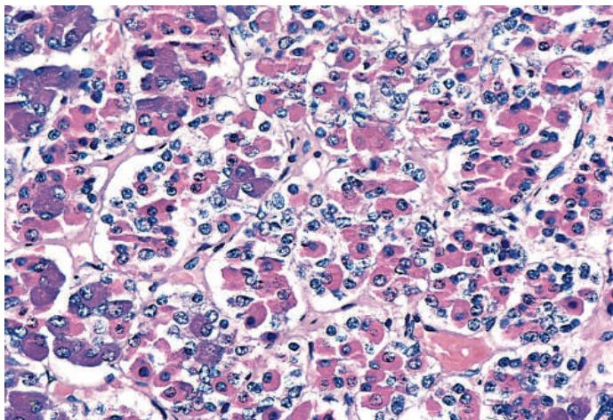 
Fig. 20.1 Normal anterior pituitary gland. The gland is populated by several distinct cell types that express different peptide hormones. These hormones are basophilic (blue), eosinophilic (red), or nonstaining in routine sections stained with hematoxylin and eosin, which allows the various cell types to be identified. Note also the presence of a fine reticulin network between the cells.
- Hyperpituitarism related effects: Hyperpituitarism arises from excessive secretion of trophic hormones. It most often results from an anterior pituitary adenoma but also may be caused by other pituitary and extrapituitary lesions, as discussed later. The symptoms and signs of hyperpituitarism are discussed in the context of individual tumors later in the chapter (see Table 20.1). 
- Hypopituitarism related effects: Hypopituitarism is caused by deficiency of trophic hormones and results from a variety of destructive processes that may damage the pituitary, including ischemic injury, surgery, radiation, and inflammatory reactions. In addition, nonfunctional pituitary adenomas may encroach upon and destroy the normal anterior pituitary, causing hypopituitarism. 
- Local mass effects: Among the earliest changes associated with pituitary neoplasms are radiographic abnormalities of the sella turcica, including sellar expansion, bony erosion, and disruption of the diaphragma sellae. Because of the close proximity of the optic nerves and chiasm to the sella, expanding pituitary lesions often compress decussating fibers in the optic chiasm. This can give rise to visual field abnormalities, classically in the form of defects in the lateral (temporal) visual fields—a so-called "bitemporal hemianopsia". As in the case of any expanding intracranial mass, pituitary tumors may produce signs and symptoms of elevated intracranial pressure, including headache, nausea, and vomiting. Pituitary neoplasms that extend beyond the sella turcica into the base of the brain produce seizures or obstructive hydrocephalus; involvement of cranial nerves can result in cranial nerve palsy. On occasion, acute hemorrhage into a pituitary neoplasm is associated with rapid enlargement of the lesion and loss of consciousness, a situation termed pituitary apoplexy. Acute pituitary apoplexy may be rapidly fatal and is therefore considered to be a neurosurgical emergency.
# ANTERIOR PITUITARY TUMORS
The most common cause of anterior pituitary disorders are pituitary tumors, most of which are benign adenomas. Some of these produce hormones and result in endocrine abnormalities, and others are nonfunctional and produce mass effects. We discuss first the general features of pituitary adenomas, then specific tumors.
# Pituitary Adenomas: General Features
The most common cause of hyperpituitarism is a hormone-producing adenoma arising in the anterior lobe. Other, less common, causes include hyperplasia and carcinomas of the anterior pituitary, secretion of hormones by some extrapituitary tumors, and certain hypothalamic disorders. Some salient features of pituitary adenomas are as follows:
- Pituitary adenomas are classified on the basis of hormone(s) produced by the neoplastic cells, which are detected by immunohistochemical stains performed on tissue sections (Table 20.1).
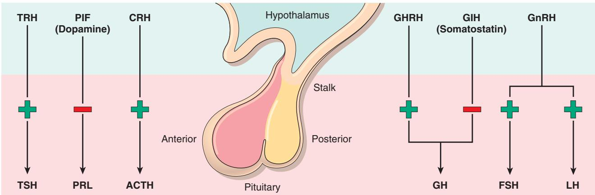 
Fig. 20.2 The hypothalamic/pituitary axis. The hypothalamus regulates the secretion of hormones from the adenosylpithium gland) by releasing stimulatory (corticotropic-releasing hormone, CRH; growth hormone-releasing hormone, GHRH; gonadotropin-releasing hormone, GnRH; thyrotropin-releasing hormone (TRH) and inhibitory factors (growth hormone inhibitory hormone, GIH or somatostatin; prolactin inhibitory factor, PIF or dopamine). These in turn modulate the release of six hormones from the anterior pituitary: adrenocorticotropic hormone (ACTH or corticotropin); follicle-stimulating hormone (FSH); growth hormone (GH, or somatotropin); luteinizing hormone (LH); prolactin (PRL); and thyroid-stimulating hormone (TSH, or thyrotropin).
- Pituitary adenomas can be functional (hormone producing) or nonfunctioning (not producing hormone), or silent (i.e., demonstration of hormone production at the tissue level only, without clinical manifestations of hormone excess). Both functional and nonfunctioning pituitary adenomas usually are composed of a single cell type and produce at most a single predominant hormone, but there are exceptions. Some pituitary adenomas secrete two different hormones (growth hormone and prolactin being the most common combination); rarely, pituitary adenomas are plurihormonal. 
- Pituitary adenomas are designated as microadenomas if they are less than $1\mathrm{cm}$ in diameter and macroadenomas if they exceed $1\mathrm{cm}$ in diameter.
- Nonfunctioning adenomas are likely to come to clinical attention at a later stage and are, therefore, more likely to be macroadenomas. Because of their larger size, nonfunctioning adenomas may encroach upon and destroy adjacent anterior pituitary parenchyma, leading to hypopituitarism.
Several genetic abnormalities associated with pituitary adenomas have been identified:
- G-protein mutations are one of the most common genomic alterations in pituitary adenomas. G-proteins play a critical role in signal transduction, transmitting signals from cell surface receptors e.g. growth
Table 20.1 Classification of Pituitary Adenomas 
Pituitary Cell 
TypeHormoneAdenoma SubtypesAssociated Syndrome*LactotrophProlactinLactotroph adenomaGalactorrhea and amenorrhea (in females)Silent lactotroph adenomaSexual dysfunction, infertilitySomatotrophGHDensely granulated somatotroph adenomaGigantism (children)Sparsely granulated somatotroph adenomaAcromegaly (adults)Silent somatotroph adenomaMammosomatotrophProlactin, GHMammosomatotroph adenomasCombined features of GH and prolactin excessCorticotrophACTH and other 
POMC-derived 
peptidesDensely granulated corticotroph adenomaCushing syndromeSparsely granulated corticotroph adenomaNelson syndromeSilent corticotroph adenomaThyrotrophTSHThyrotroph adenomasHyperthyroidismSilent thyrotroph adenomasGonadotrophFSH, LHGonadotroph adenomasHypogonadism, mass effects, and hypopituitarismSilent gonadotroph adenomas (“null cell,” oncocytic adenomas)
ACTH, Adrenocorticotropic hormone; FSH, follicle-stimulating hormone; GH, growth hormone; LH, luteinizing hormone; POMC, pro-opiomelanocortin; TSH, thyroid-stimulating hormone. 
\*Note that nonfunctional (silent) adenomas in each category express the corresponding hormone(s) within the neoplastic cells, as determined by special immunohistochemical staining on tissues. However, these adenomas do not produce the associated clinical syndrome, and typically present with mass effects accompanied by hypopituitarism due to destruction of normal pituitary parenchyma.These features are particularly common with gonadotroph adenomas. Partially adapted from Asa SL, Essat S: The pathogenesis of pituitary tumors.Annu Rev Pathol 4:97,2009.
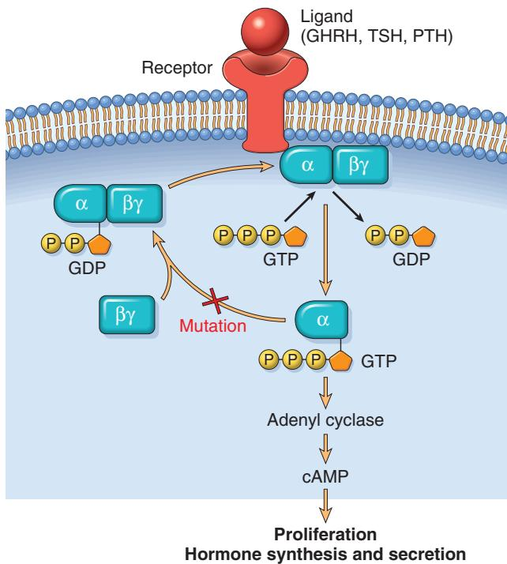 
Fig. 20.3 G-protein signaling in endocrine neoplasia. Mutations that lead to G-protein hyperactivity are seen in a variety of endocrine neoplasms, including pituitary, thyroid, and parathyroid adenomas. G proteins play a critical role in signal transduction, transmitting signals from cell surface receptors (GHRH, TSH, or PTH receptor) to intracellular effectors (e.g., adenyl cyclase), which then generate second messengers (cAMP, cyclic adenosine monophosphate). GDP, Guanosine diphosphate; GTP, guanosine triphosphate; P, inorganic phosphate.
hormone-releasing hormone (GHRH) receptor, to intracellular effectors (e.g., adenyl cyclase), which then generate second messengers (e.g., cAMP). G-proteins are heterotrimeric proteins, composed of a specific $\alpha$ -subunit that binds guanine nucleotides and interacts with both cell surface receptors and intracellular effectors (Fig. 20.3); the $\beta$ - and $\gamma$ -subunits are noncovalently bound to the $\alpha$ -subunit. Gs is a stimulatory G protein that has a pivotal role in signal transduction in several endocrine organs, including the pituitary. The $\alpha$ -subunit of Gs (Gsα) is encoded by the GNAS gene. In the basal state, Gs exists in an inactive state, with guanosine diphosphate (GDP) bound to the guanine nucleotide-binding site of Gsα. On interaction with the ligand-bound cell surface receptor, GDP dissociates, and guanosine triphosphate (GTP) binds to Gsα, activating the G protein. The activation of Gsα results in the generation of cAMP, which is a potent mitogenic stimulus in several endocrine cells (e.g., pituitary somatotrophs and corticotrophs, thyroid follicular cells, parathyroid cells), promoting cellular proliferation and hormone synthesis and secretion. Normally, Gsα activation is transient because of an intrinsic GTPase activity in the $\alpha$ -subunit, which hydrolyzes GTP into GDP. Approximately $40\%$ of somatotroph cell adenomas bear GNAS mutations that abrogate the GTPase activity of Gsα, leading to constitutive activation of Gsα, persistent generation of cAMP, and unchecked cellular proliferation. GNAS mutations also have been described in a minority of corticotroph adenomas; but are absent in thyrotroph, lactotroph, and gonadotroph
adenomas, which arise from cells whose hypothalamic release hormones do not signal via cAMP-dependent pathways.
- Approximately $5\%$ of pituitary adenomas arise as a result of an inherited predisposition. Four genes have been identified thus far as a cause of familial pituitary adenomas: MEN1, CDKN1B, PRKAR1A, and AIP. These genes regulate transcription and the cell cycle. Of note, somatic mutations of these four genes are rarely encountered in sporadic pituitary adenomas. 
- Molecular abnormalities associated with aggressive behavior include aberrations in cell cycle checkpoint genes, such as overexpression of cyclin D1, mutations of TP53, and epigenetic silencing of the retinoblastoma gene (RB). In addition, activating mutations of the RAS oncogene are observed in rare pituitary carcinomas. The functions of these genes were discussed in Chapter 6.
The usual pituitary adenoma is a well-circumscribed, soft lesion. Small tumors may be confined to the sella turcica, while larger lesions may compress the optic chiasm and adjacent structures (Fig. 20.4), erode the sella turcica and anterior clinoid processes, and extend locally into the cavernous and sphenoidal sinuses. In as many as $30\%$ of cases, the adenomas are nonencapsulated and infiltrate adjacent bone, dura, and (uncommonly) brain. Foci of hemorrhage and/or necrosis are common in larger adenomas.
Pituitary adenomas are composed of relatively uniform, polygonal cells arrayed in sheets, cords, or papillae. Supporting connective tissue, or reticulin, is sparse. The nuclei of the neoplastic cells may be uniform or pleomorphic. This cellular monomorphism and the absence of a significant reticulin network distinguish pituitary adenomas from
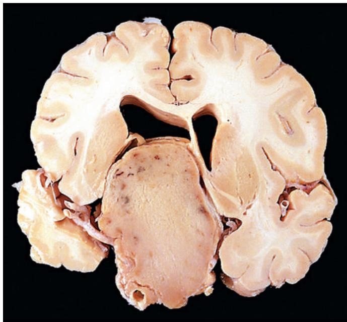 
Fig. 20.4 Pituitary adenoma. This massive, nonfunctioning adenoma has grown far beyond the confines of the sella turcica and has distorted the overlying brain. Nonfunctioning adenomas tend to be larger at the time of diagnosis than those that secrete a hormone.
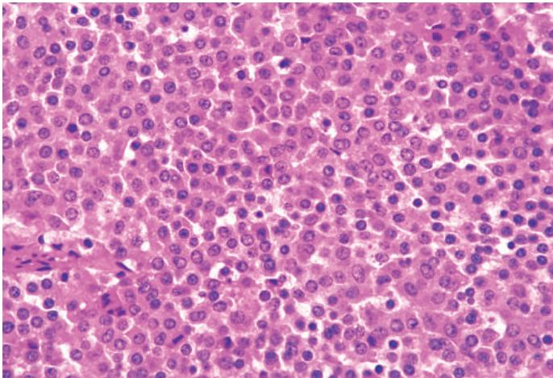 
Fig. 20.5 Pituitary adenoma. The monomorphism of these cells contrasts with the admixture of cells seen in the normal anterior pituitary gland in Fig. 20.1. Note also the absence of the reticulin network.
# non-neoplastic anterior pituitary parenchyma (Fig. 20.5).
Mitotic activity usually is scanty. The cytoplasm of the constituent cells may be acidophilic, basophilic, or chromophobic, depending on the type and amount of secretory product within the cell, but it is fairly uniform throughout the neoplasm. The functional status of the adenoma cannot be predicted from its histologic appearance. Adenomas that harbor TP53 mutations often demonstrate brisk mitotic activity and higher proliferation rates and are designated atypical adenomas because of their potential for aggressive behavior.
# PITUITARY ADENOMAS: GENERAL FEATURES
- The most common cause of hyperpituitarism is an anterior lobe pituitary adenoma. 
- Pituitary adenomas can be macroadenomas ( $>1$ cm in diameter) or microadenomas ( $<1$ cm across), and on clinical evaluation, they can be functional or nonfunctioning. 
- Macroadenomas may potentially lead to mass effects, including visual disturbances. 
- Functioning adenomas are associated with distinct endocrine signs and symptoms. 
- Mutation of the GNAS gene, which results in constitutive activation of a stimulatory G protein, is one of the more common genetic alterations. 
- The two distinctive morphologic features of most adenomas are their cellular monomorphism and absence of a reticulin network.
# Functioning Adenomas and Hyperpituatarism
Adenomas arising from different pituitary cells produce hormones characteristic of that cell type and cause clinical syndromes that reflect the activity of the hormones.
# Lactotroph Adenomas
Prolactin-secreting lactotroph adenomas are the most frequent type of hyperfunctioning pituitary adenoma,
accounting for about $30\%$ of all clinically recognized cases. They range in size from microadenomas to large, expansile tumors associated with considerable mass effect. Prolactin is demonstrable within the cytoplasm of the neoplastic cells by immunohistochemical techniques. Prolactin secretion by lactotroph adenomas is highly efficient, such that even microadenomas can secrete sufficient hormone to induce systemic symptoms.
Hyperprolactinemia causes amenorrhea, galactorrhea, loss of libido, and infertility. Because manifestations of hyperprolactinemia (e.g., amenorrhea) are obvious in premenopausal women, prolactinomas are diagnosed at an earlier stage in women of reproductive age than in others with these tumors. By contrast, the effects of hyperprolactinemia are subtle in men and older women, in whom the tumor may reach a large size before coming to clinical attention. Hyperprolactinemia also is a feature of other conditions, including pregnancy, high-dose estrogen therapy, renal failure, hypothyroidism, hypothalamic lesions, and dopamine-inhibiting drugs (e.g., reserpine). In addition, any mass in the suprasellar compartment may disturb the normal inhibitory influence of hypothalamus on prolactin secretion, resulting in hyperprolactinemia—a mechanism known as the stalk effect. Thus, mild elevations of serum prolactin $(<200\mu \mathrm{g} / \mathrm{L})$ in a patient with a pituitary adenoma do not necessarily indicate a prolactin-secreting neoplasm.
# Somatotroph Adenomas
Growth hormone-secreting somatotroph adenomas are the second most common type of functioning pituitary adenoma, and cause gigantism in children or acromegaly in adults. Because the clinical manifestations of excess growth hormone may be subtle, somatotroph cell adenomas may be quite large by the time they come to clinical attention. On microscopic examination, growth hormone-producing adenomas are composed of densely or sparsely granulated cells, and immunohistochemical staining demonstrates growth hormone within the cytoplasm of the neoplastic cells. Small amounts of immunoreactive prolactin often are present as well.
Persistent growth hormone excess stimulates the hepatic secretion of insulin-like growth factor 1 (IGF1), which acts in conjunction with growth hormone to induce overgrowth of bones and muscle. If a growth hormone-secreting adenoma develops before the epiphyses close, as is the case in prepubertal children, excessive levels of growth hormone and IGF1 result in gigantism. This condition is characterized by a generalized increase in body size, with disproportionately long arms and legs. If elevated levels of growth hormone and IGF1 persist or develop after closure of the epiphyses, affected individuals develop acromegaly, in which growth is most conspicuous in soft tissues, skin, viscera, and the bones of the face, hands, and feet. Enlargement of the jaw results in its protrusion (prognathism), broadening of the lower face, and separation of the teeth. The hands and feet are enlarged, and the fingers are broad and sausage-like. In most instances gigantism is accompanied by evidence of acromegaly. These changes may develop slowly over decades before being recognized, hence the adenoma may be quite large before it is detected.
Persistent growth hormone excess also is associated with metabolic abnormalities, the most important of
which is diabetes mellitus. This arises because of growth hormone-induced peripheral insulin resistance, which "blunts" the body's response to elevated glucose levels (see "Diabetes Mellitus", later). Failure to suppress growth hormone production in response to an oral load of glucose is one of the most sensitive tests for acromegaly. Other manifestations of growth hormone excess include gonadal dysfunction, generalized muscle weakness, hypertension, arthritis, congestive heart failure, and an increased risk for gastrointestinal cancers.
# Corticotroph Adenomas
Excess production of ACTH by functioning corticotroph adenomas leads to adrenal hypersecretion of cortisol and the development of hypercortisolism (also known as Cushing syndrome). Cushing syndrome (discussed later with diseases of the adrenal gland) may be caused by other conditions as well. When the hypercortisolism is caused by excessive production of ACTH by the pituitary, it is called Cushing disease after the neurosurgeon Harvey Cushing who first described the disorder.
Most corticotroph adenomas are small (microadenomas) at the time of diagnosis. These adenomas stain positively with periodic acid-Schiff (PAS) stains, as a result of the accumulation of glycosylated ACTH protein. ACTH also can be specifically detected by immunohistochemical methods. Large, clinically aggressive corticotroph cell adenomas may develop after surgical removal of the adrenal glands for treatment of Cushing syndrome. In most instances this condition, known as Nelson syndrome, results from loss of the inhibitory effect of adrenal corticosteroids on a preexisting corticotroph microadenoma. Because the adrenals are absent in individuals with Nelson syndrome, hypercortisolism does not develop. Instead, patients present with the mass effects of the pituitary tumor. Patients with Cushing syndrome often have hyperpigmented skin because of increased production of melanocyte stimulating hormone (MSH), which is derived from the same precursor as ACTH so its synthesis accompanies that of ACTH.
# Other Anterior Pituitary Neoplasms
Other pituitary adenomas are associated with hormonal disorders not considered part of hyperpituitarism, or are nonfunctional and do not produce hormonal disturbances.
- Gonadotroph adenomas are so named because they produce hormones (luteinizing hormone [LH] and follicle-stimulating hormone [FSH]) that act on reproductive organs (gonads). These adenomas can be difficult to recognize because they secrete hormones inefficiently and variably and the secretory products usually do not cause a recognizable clinical syndrome. They are typically detected when the tumors become large enough to cause signs and symptoms related to local mass effects, such as impaired vision, headaches, diplopia, or pituitary apoplexy. The neoplastic cells usually demonstrate immunoreactivity for the common gonadotropin $\alpha$ -subunit and the specific $\beta$ -FSH and $\beta$ -LH subunits; FSH usually is the predominant secreted hormone.
Thyrotroph (thyroid-stimulating hormone [TSH]-producing) adenomas account for about $1\%$ of all pituitary adenomas and constitute a rare cause of hyperthyroidism.
- Nonfunctioning pituitary adenomas are a heterogeneous group that constitutes $25\%$ to $30\%$ of all pituitary tumors. Not surprisingly, the typical presentation is characterized by mass effects. These lesions also may impinge on the residual anterior pituitary and produce hypopituitarism, which may appear slowly due to gradual enlargement of the adenoma or abruptly because of acute intratumoral hemorrhage (pituitary apoplexy). 
- Pituitary carcinomas are exceedingly rare. In addition to local extension beyond the sella turcica, these tumors virtually always metastasize to distant sites.
# HYPERPITUITARISM-ASSOCIATED ADENOMAS
- Prolactinomas: amenorrhea, galactorrhea, loss of libido, and infertility 
- Growth hormone (somatotroph cell) adenomas: gigantism (children), acromegaly (adults), and impaired glucose tolerance and diabetes mellitus 
Corticotroph cell adenomas: Cushing syndrome, hyperpigmentation 
- All pituitary adenomas, particularly nonfunctioning adenomas, may be associated with mass effects and hypopituitarism.
# HYPOPITUITARISM
Clinically significant hypopituitarism may occur with loss or absence of $75\%$ or more of the anterior pituitary parenchyma. It may be congenital (exceedingly rare) or result from a wide range of acquired intrinsic abnormalities of the pituitary. Less frequently, disorders that interfere with the delivery of pituitary hormone-releasing factors from the hypothalamus, such as hypothalamic tumors, cause hypofunction of the anterior pituitary. Hypopituitarism accompanied by evidence of posterior pituitary dysfunction in the form of diabetes insipidus (discussed later) is almost always of hypothalamic origin. Most cases of anterior pituitary hypofunction are caused by the following:
- Tumors and other mass lesions (especially nonfunctioning pituitary adenomas) 
- Ischemic necrosis of the anterior pituitary, called Sheehan syndrome, or postpartum necrosis of the anterior pituitary, is the most common form of clinically significant necrosis of the anterior pituitary. During pregnancy, the anterior pituitary enlarges, mainly because of an increase in the size and number of prolactin-secreting cells. This hyperplasia is not accompanied by an increase in blood supply from the low-pressure hypophyseal portal venous system. The enlarged gland is thus vulnerable to ischemic injury, especially in women who experience hypotension during the peripartal period. By contrast, the posterior pituitary receives its blood directly from arterial branches and is much less susceptible to ischemic injury. Pituitary necrosis also may occur in the setting of disseminated intravascular coagulation, sickle cell anemia, elevated intracranial pressure, traumatic injury, and shock of any origin. 
- Iatrogenic causes include ablation of the pituitary by surgery or radiation
- Other, less common causes of anterior pituitary hypofunction include inflammatory lesions such as sarcoidosis or tuberculosis, trauma, and metastatic tumors involving the pituitary
The clinical manifestations of anterior pituitary hypofunction depend on the specific hormones that are lacking. In children, growth failure (pituitary dwarfism) may occur as a result of growth hormone deficiency. Gonadotropin or gonadotropin-releasing hormone (GnRH) deficiency leads to amenorrhea and infertility in women and to decreased libido, impotence, and loss of pubic and axillary hair in men. TSH and ACTH deficiencies result in hypothyroidism and hypoadrenalism, respectively (discussed later). Prolactin deficiency results in failure of postpartum lactation. The anterior pituitary also is a rich source of MSH, synthesized from the same precursor molecule that produces ACTH; therefore, one of the manifestations of hypopituitarism is pallor of skin from loss of stimulatory effects of MSH on melanocytes.
# POSTERIOR PITUITARY SYNDROMES
The posterior pituitary, or neurohypophysis, is composed of modified glial cells (termed pituicytes) and axonal processes extending from nerve cell bodies in the supraoptic and paraventricular nuclei of the hypothalamus. The hypothalamic neurons produce two peptides: anti-diuretic hormone (ADH) and oxytocin. They are stored in axon terminals in the neurohypophysis and released into the circulation in response to appropriate stimuli. ADH is a nonapeptide hormone synthesized predominantly in the supraoptic nucleus. In response to several different stimuli, including increased plasma osmotic pressure, left atrial distention, exercise, and certain emotional states, ADH is released from axon terminals in the neurohypophysis into the general circulation. The hormone acts on the collecting tubules of the kidney to promote the resorption of free water. Oxytocin stimulates the contraction of smooth
muscle in the pregnant uterus and of muscle surrounding the lactiferous ducts of the mammary glands. Impairment of oxytocin synthesis and release has not been associated with significant clinical abnormalities.
The clinically important posterior pituitary syndromes involve ADH under- or overproduction.
- ADH deficiency causes diabetes insipidus, a condition characterized by excessive urination (polyuria) due to an inability of the kidney to resorb water properly from the urine. Diabetes insipidus can result from several causes, including head trauma, neoplasms, and inflammatory disorders of the hypothalamus and pituitary, and from surgical procedures involving the hypothalamus or pituitary. The condition sometimes arises spontaneously (idiopathic). Diabetes insipidus from ADH deficiency is designated central, to differentiate it from nephrogenic diabetes insipidus, which is caused by renal tubular unresponsiveness to circulating ADH. The clinical manifestations of both diseases are similar and include the excretion of large volumes of dilute urine with an inappropriately low specific gravity. Serum sodium and osmolality are increased as a result of excessive renal loss of free water, resulting in thirst and polydipsia. Patients who can drink water generally compensate for urinary losses, but patients who are obtunded, bedridden, or otherwise limited in their ability to obtain water may develop life-threatening dehydration.
- The syndrome of inappropriate ADH (SIADH) secretion is typically associated with ADH excess, which causes resorption of excessive amounts of free water, resulting in hyponatremia. Causes of SIADH include the secretion of ectopic ADH by malignant neoplasms (particularly small-cell carcinomas of the lung), nonneoplastic diseases of the lung, and local injury to the hypothalamus or neurohypophysis. The clinical manifestations of SIADH are dominated by hyponatremia, cerebral edema, and resultant neurologic dysfunction. Although total body water is increased, blood volume remains normal, and peripheral edema does not develop.
# Thyroid
The thyroid gland consists of two bulky lateral lobes connected by a relatively thin isthmus, usually located below and anterior to the larynx. The thyroid gland develops embryologically from an evagination of the developing pharyngeal epithelium that descends from the foramen cecum at the base of the tongue to its normal position in the anterior neck. This pattern of descent explains the occasional presence of ectopic thyroid tissue, most commonly located at the base of the tongue (lingual thyroid) or at other sites abnormally high in the neck.
The thyroid is divided into lobules, each composed of about 20 to 40 evenly dispersed follicles. The follicles are lined by cuboidal to low columnar epithelium, which is filled with thyroglobulin, the iodinated precursor protein of active thyroid hormone. In response to trophic factors from the hypothalamus, TSH (also called thyrotropin) is
released by thyrotrophs in the anterior pituitary into the circulation. The binding of TSH to its receptor on thyroid follicular epithelial cells results in activation and conformational change in the receptor, allowing it to associate with a stimulatory G-protein (Fig. 20.6). As illustrated in Fig. 20.3, activation of stimulatory G-protein results in an increase in intracellular cAMP levels, which stimulates thyroid hormone synthesis and release. Thyroid follicular epithelial cells convert thyroglobulin into thyroxine $(\mathrm{T}_4)$ and lesser amounts of triiodothyronine $(\mathrm{T}_3)$ . $\mathrm{T}_4$ and $\mathrm{T}_3$ are released into the systemic circulation, where most of these peptides are bound to circulating plasma proteins, such as $\mathrm{T}_4$ -binding globulin, for transport to peripheral tissues. The binding proteins maintain the serum unbound (free) $\mathrm{T}_3$ and $\mathrm{T}_4$ concentrations within narrow limits while ensuring that the hormones are readily available to the tissues.
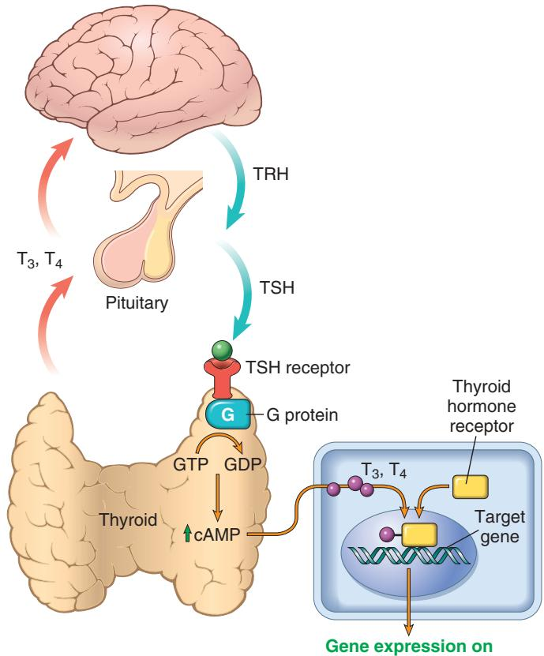 
Fig. 20.6 Homeostasis in the hypothalamus-pituitary-thyroid axis and mechanism of action of thyroid hormones. Secretion of thyroid hormones $(\mathsf{T}_3$ and $T_{4})$ is controlled by trophic factors secreted by both the hypothalamus and the anterior pituitary gland. Decreased levels of $T_{3}$ and $T_{4}$ stimulate the release of thyrotropin-releasing hormone (TRH) from the hypothalamus and thyroid-stimulating hormone (TSH) from the anterior pituitary, causing $T_{3}$ and $T_{4}$ levels to rise. Elevated $T_{3}$ and $T_{4}$ levels, in turn, suppress the secretion of both TRH and TSH. This relationship is termed a negative-feedback loop. TSH binds to the TSH receptor on the thyroid follicular epithelium, which causes activation of G proteins, release of cyclic AMP (cAMP), and cAMP-mediated synthesis and release of thyroid hormones (i.e., $T_{3}$ and $T_{4}$ ). In the periphery, $T_{3}$ and $T_{4}$ interact with the thyroid hormone receptor (TR) and form a complex that translocates to the nucleus and binds to so-called "thyroid response elements" (TREs) on target genes, thereby initiating transcription.
In the periphery, the majority of free $\mathrm{T_4}$ is deiodinated to $\mathrm{T}_3$ ; the latter binds to thyroid hormone nuclear receptors in target cells with 10-fold greater affinity than $\mathrm{T_4}$ and has proportionately greater activity. Binding of thyroid hormone to its nuclear thyroid hormone receptor (TR) creates a hormone-receptor complex that regulates the transcription of a subset of cellular genes. This produces diverse cellular effects, including increased carbohydrate and lipid catabolism and protein synthesis in a wide range of cell types. The net result of these processes is an increase in the basal metabolic rate.
Clinical recognition of diseases of the thyroid is important, because most are amenable to medical or surgical management. Such diseases include conditions associated with excessive release of thyroid hormones (hyperthyroidism), thyroid hormone deficiency (hypothyroidism), and mass lesions of the thyroid. Considered next are the clinical consequences of disturbed thyroid function, followed by an overview of the disorders that generate these problems.
# HYPERTHYROIDISM
Thyrotoxicosis is a hypermetabolic state caused by elevated circulating levels of free $\mathbf{T}_3$ and $\mathbf{T}_4$ . Because it is caused most commonly by hyperfunction of the thyroid gland, thyrotoxicosis often is referred to as hyperthyroidism. In certain conditions, however, the oversupply either is related to excessive release of preformed thyroid hormone (e.g., in thyroiditis) or comes from an extrathyroidal source, rather than a hyperfunctioning gland (Table 20.2). Thus, strictly speaking, hyperthyroidism is only one (albeit the most common) category of thyrotoxicosis. Despite this clear distinction, the following discussion adheres to the common practice of using the terms thyrotoxicosis and hyperthyroidism interchangeably.
The three most common causes of thyrotoxicosis are associated with hyperfunction of the gland:
- Diffuse hyperplasia of the thyroid associated with Graves disease, a form of autoimmune thyroid disease (accounts for $85\%$ of cases) 
- Hyperfunctioning ("toxic") multinodular goiter 
- Hyperfunctional ("toxic") adenoma of the thyroid
The clinical manifestations of thyrotoxicosis are protean and are mainly attributable to the hypermetabolic state induced by thyroid hormone and overactivity of the sympathetic nervous system:
- Constitutional symptoms: The skin of thyrotoxic individuals tends to be soft, warm, and flushed because of increased blood flow and peripheral vasodilation to increase heat loss; heat intolerance and excessive sweating are common. Increased sympathetic activity and hypermetabolism result in weight loss despite increased appetite. 
- Gastrointestinal: Stimulation of the gut results in rapid transit time (hypermotility), which can cause fat malabsorption and steatorrhea. 
- Cardiac: Palpitations and tachycardia are common due to both increased cardiac contractility and increased
Table 20.2 Causes of Thyrotoxicosis 
Associated With HyperthyroidismPrimaryDiffuse toxic hyperplasia (Graves disease)Hyperfunctioning (“toxic”) multinodular goiterHyperfunctioning (“toxic”) adenomaIodine-induced hyperthyroidismSecondaryTSH-secreting pituitary adenoma (rare)*Not Associated With HyperthyroidismGranulomatous (de Quervain) thyroiditis (painful)Subacute lymphocytic thyroiditis (painless)Struma ovarii (ovarian teratoma with thyroid)Factitious thyrotoxicosis (exogenous thyroxine intake)
TSH, Thyroid-stimulating hormone. 
*Associated with increased TSH; all other causes of thyrotoxicosis associated with decreased TSH.
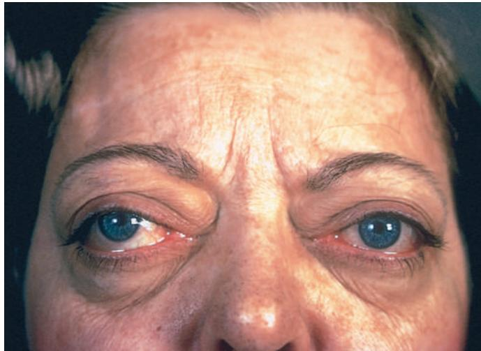 
Fig. 20.7 A patient with hyperthyroidism. A wide-eyed, staring gaze, caused by overactivity of the sympathetic nervous system, is one of the classic features of this disorder. In Graves disease, one of the most important causes of hyperthyroidism, accumulation of loose connective tissue behind the orbits also adds to the protuberant appearance of the eyes.
peripheral oxygen requirements. Older adult patients with preexisting heart disease may develop congestive heart failure.
- Neuromuscular: Patients frequently experience nervousness, tremor, and irritability due to the sympathetic overactivity. Nearly $50\%$ develop proximal muscle weakness (thyroid myopathy). 
- Ocular changes often call attention to hyperthyroidism. A wide, staring gaze and lid lag are present because of sympathetic overstimulation of the superior tarsal muscle (Müller's muscle), which functions alongside the levator palpebrae superioris muscle to raise the upper eyelid (Fig. 20.7). However, fullblown thyroid ophthalmopathy associated with proptosis is a feature seen only in Graves disease (discussed later). 
Thyroid storm designates the abrupt onset of severe hyperthyroidism. It occurs most often in patients with Graves disease and probably results from an acute elevation in catecholamine levels, as might be encountered during infection, surgery, cessation of anti-thyroid medication, or any form of stress. Thyroid storm is a medical emergency, as a significant number of untreated patients die of cardiac arrhythmias. 
- Apathetic hyperthyroidism refers to thyrotoxicosis occurring in older adults, in whom the typical features of thyroid hormone excess often are blunted. The underlying thyroid disease is usually detected during laboratory workup for unexplained weight loss or worsening cardiovascular disease.
The diagnosis of hyperthyroidism is based on clinical features and laboratory data. The measurement of serum TSH is the most useful single screening test for hyperthyroidism, because TSH levels are decreased even at the earliest stages, when the disease may still be subclinical. In rare cases of pituitary- or hypothalamus-associated (secondary) hyperthyroidism, TSH levels are either normal or raised. A low TSH value usually is associated with increased levels of free $\mathrm{T_4}$ . In the occasional patient, hyperthyroidism results
predominantly from increased circulating levels of $\mathrm{T}_{3}$ ( $\mathrm{T}_{3}$ toxicosis). In such cases, free $\mathrm{T}_{4}$ levels may be decreased, and direct measurement of serum $\mathrm{T}_{3}$ may be useful. Once the diagnosis of thyrotoxicosis has been confirmed by a combination of TSH and free thyroid hormone assays, measurement of radioactive iodine uptake by the thyroid gland can be valuable in determining the etiology. For example, such scans may show diffusely increased uptake in Graves disease, increased uptake in a solitary nodule in toxic adenoma, or decreased uptake in thyroiditis.
# HYPOTHYROIDISM
Hypothyroidism is caused by structural or functional derangements that interfere with thyroid hormone production. This disorder may be divided into primary and secondary categories, depending on whether it arises from an intrinsic abnormality in the thyroid or from hypothalamic or pituitary disease (Table 20.3). Primary hypothyroidism can be secondary to congenital, autoimmune, or iatrogenic causes.
- Genetic defects that perturb thyroid development (thyroid dysgenesis) or the synthesis of thyroid hormone (dys-hormonogenetic goiter) are rare overall but the most common cause of congenital hypothyroidism in the U.S. 
- Endemic deficiency of dietary iodine is typically manifested by hyothyroidism early in childhood and has been also called congenital, but is not caused by genetic defects. It is a common cause of hypothyroidism in infants and children worldwide. 
- Autoimmune thyroid disease is a common cause of hypothyroidism in regions of the world where iodine is supplemented in dietary salt products. The vast majority of cases of autoimmune hypothyroidism are due to Hashimoto thyroiditis (discussed later). 
- Iatrogenic hypothyroidism can be caused by either surgical or radiation-induced ablation of thyroid parenchyma, or as an unintended adverse effect of certain drugs.
The clinical manifestations of hypothyroidism includecretinism and myxedema.
- Cretinism refers to hypothyroidism developing in infancy or early childhood. This disorder formerly was
# Table 20.3 Causes of Hypothyroidism
PrimaryPostablativeSurgery, radioiodine therapy, or external irradiationAutoimmune hypothyroidismHashimoto thyroiditis*Iodine deficiency*Drugs (lithium, iodides, p-aminosalicylic acid)*Congenital biosynthetic defect (dyshormonogenetic goiter) (rare)*Genetic defects in thyroid development (rare)Thyroid hormone resistance syndrome (rare)
Secondary (Central)Pituitary failure (rare)Hypothalamic failure (rare)
*Associated with enlargement of thyroid ("goitrous hypothyroidism"). Hashimoto thyroiditis and postablative hypothyroidism account for the majority of cases of hypothyroidism in developed countries.
fairly common in areas of the world where dietary iodine deficiency is endemic, including mountainous areas such as the Himalayas and the Andes (endemiccretinism). It is now much less frequent because of the widespread supplementation of salt with iodine. By contrast, enzyme defects that interfere with thyroid hormone synthesis are a cause of sporadiccretinism. Clinical features of cretinism include impaired development of the skeletal system and central nervous system, severe mental retardation, short stature, coarse facial features, a protruding tongue, and umbilical hernia. The severity of the mental impairment in cretinism seems to be influenced by the time of onset of the deficient state in utero. Normally, maternal hormones that are critical to fetal brain development, including $\mathrm{T}_{3}$ and $\mathrm{T}_{4}$ , cross the placenta. If maternal thyroid deficiency is present before the development of the fetal thyroid gland, mental retardation is severe. By contrast, reduction in maternal thyroid hormones later in pregnancy, after the fetal thyroid has developed, allows normal brain development.
- Hypothyroidism in older children and adults results in a condition known as myxedema. The initial symptoms include generalized fatigue, apathy, and mental sluggishness, which may mimic depression. Decreased sympathetic activity results in constipation and decreased sweating. The skin is cool and pale because of decreased blood flow. Reduced cardiac output contributes to shortness of breath and decreased exercise capacity, two frequent complaints. Thyroid hormones regulate the transcription of several sarcolemmal genes, such as calcium ATPases, whose encoded products are critical in maintaining efficient cardiac output. In addition, hypothyroidism promotes an atherogenic lipid profile—an increase in total cholesterol and low-density lipoprotein (LDL) levels—that may contribute to the adverse cardiovascular mortality rates in this disease. Histologically, there is an accumulation of matrix substances, such as glycosaminoglycans and hyaluronic acid, in skin, subcutaneous tissue, and viscera. This results in nonpitting edema, broadening and coarsening of facial features, enlargement of the tongue, and deepening of the voice.
The diagnosis of hypothyroidism is based on laboratory evaluation. As in the case of hyperthyroidism, measurement of serum TSH is the most sensitive screening test. The serum TSH concentration is increased in primary hypothyroidism because of a loss of feedback inhibition of thyrotropin-releasing hormone (TRH) and TSH production by the hypothalamus and pituitary, respectively. The TSH concentration is not increased in individuals with hypothyroidism caused by primary hypothalamic or pituitary disease. Serum $\mathrm{T_4}$ is decreased in patients with hypothyroidism of any origin.
# AUTOIMMUNE THYROID DISEASE
Autoimmunity is the underlying cause of a variety of thyroid diseases, which are collectively referred to as autoimmune thyroid disease (AITD). These disorders include thyroiditis, and antibody-mediated disturbances in thyroid
function that are not necessarily associated with inflammation (exemplified by Graves disease). We discuss first the various forms of thyroiditis.
Thyroiditis encompasses a diverse group of disorders characterized by some form of thyroid inflammation. This discussion focuses on the three most common and clinically significant subtypes: (1) Hashimoto thyroiditis, (2) granulomatous (de Quervain) thyroiditis, and (3) subacute lymphocytic thyroiditis.
# Chronic Lymphocytic (Hashimoto) Thyroiditis
Hashimoto thyroiditis is the most common cause of hypothyroidism in areas of the world where iodine levels are sufficient. It is characterized by gradual thyroid failure secondary to autoimmune destruction of the thyroid gland. It is most prevalent between 45 and 65 years of age and is more common in women with a female to male ratio of 10:1 to 20:1. Although it is primarily a disease of older women, it can occur at any age, including childhood.
Hashimoto thyroiditis is an autoimmune disease caused by an immune response to thyroid autoantigens (Chapter 5). Circulating autoantibodies against thyroid antigens are present in the vast majority of patients. The immune response leads to progressive depletion of thyroid epithelial cells associated with lymphocytic infiltrates and fibrosis. The inciting events leading to the autoimmune response have not been fully elucidated, but multiple immunologic mechanisms that may contribute to thyroid cell damage have been identified (Fig. 20.8), including the following:
- CD8+ cytotoxic T-cell-mediated killing of thyroid epithelial cells. 
- Cytokine-mediated cell death. T-cell activation leads to the production of inflammatory cytokines such as interferon- $\gamma$ in the thyroid gland, with resultant recruitment and activation of macrophages and damage to follicles. 
- Binding of anti-thyroid antibodies (anti-thyroglobulin, and anti-thyroid peroxidase antibodies), followed by antibody-dependent cell-mediated cytotoxicity (Chapter 5).
The disease appears to have a significant genetic component, based on a concordance rate of about $40\%$ in monozygotic twins and the presence of anti-thyroid antibodies in approximately $50\%$ of asymptomatic siblings of affected patients. Increased susceptibility to Hashimoto thyroiditis is associated with polymorphisms in immune regulation-associated genes, the most significant of which is the cytotoxic T lymphocyte-associated antigen-4 gene (CTLA4), which codes for a negative regulator of T-cell responses (Chapter 5).
The thyroid usually is diffusely and symmetrically enlarged. Microscopic examination reveals widespread infiltration of the parenchyma by a mononuclear inflammatory infiltrate containing small lymphocytes, plasma cells, and well-developed
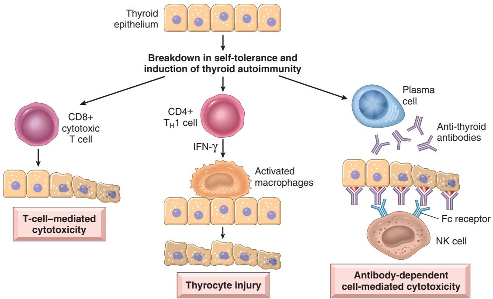 
Fig. 20.8 Pathogenesis of Hashimoto thyroiditis. Breakdown of immune tolerance to thyroid autoantigens results in progressive autoimmune destruction of thyrocytes by infiltrating cytotoxic T cells, locally released cytokines, or antibody-dependent cytotoxicity.
germinal centers (Fig. 20.9). The thyroid follicles are atrophic and are lined in many areas by epithelial cells distinguished by the presence of abundant eosinophilic, granular cytoplasm, termed Hürthle, or oxyphil, cells. This is a metaplastic response of the normal low cuboidal follicular epithelium to ongoing injury; on ultrastructural examination, the Hürthle cells are characterized by numerous prominent mitochondria. Interstitial connective tissue is increased and may be abundant. Less commonly, the thyroid is small and atrophic as a result of more extensive fibrosis (fibrosing variant).
Hashimoto thyroiditis comes to clinical attention as painless enlargement of the thyroid, usually associated with some degree of hypothyroidism, often in a middle-age woman.
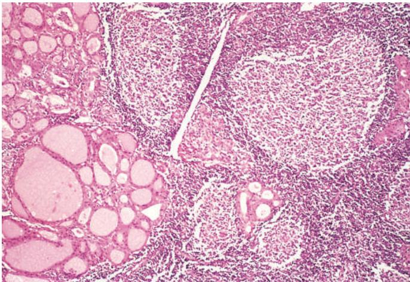 
Fig. 20.9 Hashimoto thyroiditis. The thyroid parenchyma contains a dense lymphocytic infiltrate with germinal centers. Residual thyroid follicles lined by deeply eosinophilic Hürthle cells also are seen.
The enlargement of the gland usually is symmetric and diffuse, but in some cases it may be sufficiently localized to raise suspicion for neoplasm. In the usual clinical course, hypothyroidism develops gradually. In some cases, however, it may be preceded by transient thyrotoxicosis caused by disruption of thyroid follicles, with secondary release of thyroid hormones (hashitotoxicosis). During this phase, free $\mathrm{T_4}$ and $\mathrm{T}_3$ concentrations are elevated, TSH is diminished, and radioactive iodine uptake is decreased. As hypothyroidism supervenes, $\mathrm{T_4}$ and $\mathrm{T}_3$ levels progressively fall, accompanied by a compensatory increase in TSH. Patients with Hashimoto thyroiditis often have other autoimmune diseases and are at increased risk for the development of B-cell non-Hodgkin lymphomas (Chapter 12), which typically arise within the thyroid gland. The relationship between Hashimoto disease and thyroid epithelial cancers remains controversial, with some morphologic and molecular studies suggesting a predisposition to papillary carcinomas.
# Subacute Granulomatous (de Quervain) Thyroiditis
Subacute granulomatous thyroiditis, also known as de Quervain thyroiditis, is much less common than Hashimoto disease. De Quervain thyroiditis is most common between 30 and 50 years of age and, like other forms of thyroiditis, occurs more frequently in women than in men. Subacute thyroiditis is believed to be caused by a viral infection or an inflammatory process triggered by viral infections, and not by an autoimmune process. A majority of patients have a history of an upper-respiratory infection shortly before the onset of thyroiditis. Unlike in autoimmune thyroid disease, the immune response in subacute granulomatous thyroiditis is not self-perpetuating, so the process spontaneously remits.

The gland is firm, with an intact capsule, and may be unilaterally or bilaterally enlarged. Histologic examination reveals disruption of thyroid follicles, extravasation of colloid, and infiltrating neutrophils, which are replaced over time by lymphocytes, plasma cells, and macrophages. The extravasated colloid provokes an exuberant granulomatous reaction with giant cells, some containing fragments of colloid. Healing occurs by resolution of inflammation and fibrosis.
The onset of this form of thyroiditis often is acute. It is characterized by neck pain (particularly with swallowing), fever, malaise, and variable enlargement of the thyroid. Transient hyperthyroidism may occur, as in other cases of thyroiditis, as a result of disruption of thyroid follicles and release of excessive thyroid hormone. The leukocyte count and erythrocyte sedimentation rates are increased. With progression of the gland destruction, a transient hypothyroid phase may ensue. The condition typically is self-limited, with most patients returning to a euthyroid state within 6 to 8 weeks.
# Subacute Lymphocytic Thyroiditis
Subacute lymphocytic thyroiditis also is known as silent or painless thyroiditis; in a subset of patients, the onset follows pregnancy (postpartum thyroiditis). This disease is most likely autoimmune in etiology, as circulating antithyroid antibodies are found in a majority of patients. It mostly affects middle-aged women, who present with a painless neck mass or features of thyroid hormone excess. The initial phase of thyrotoxicosis (which is likely to be secondary to thyroid tissue damage) is followed by return to a euthyroid state within a few months. In a minority of affected individuals, the condition eventually progresses to hypothyroidism. Except for possible mild symmetric enlargement, the thyroid appears normal on gross inspection. The histologic features consist of lymphocytic infiltration and hyperplastic germinal centers within the thyroid parenchyma.
# Other Forms of Thyroiditis
Riedel thyroiditis, a rare disorder that is a manifestation of IgG4-related disease (Chapter 5), is characterized by extensive fibrosis involving the thyroid and contiguous neck structures. Clinical evaluation demonstrates a hard and fixed thyroid mass, simulating a thyroid neoplasm. It may be associated with idiopathic fibrosis in other sites in the body, such as the retroperitoneum.
# THYROIDITIS
- Chronic lymphocytic (Hashimoto) thyroiditis is the most common cause of hypothyroidism in regions where dietary iodine levels are sufficient.
- Hashimoto thyroiditis is an autoimmune disease characterized by progressive destruction of thyroid parenchyma, Hürthle cell change, and mononuclear (lymphoplasmacytic) infiltrates, with or without extensive fibrosis. 
- Multiple autoimmune mechanisms account for thyroid injury in Hashimoto disease, including cytotoxicity mediated by $\mathrm{CD8 + }$ T cells, cytokines (IFN-γ), and anti-thyroid antibodies. 
- Subacute granulomatous (de Quervain) thyroiditis is a self-limited disease, probably secondary to a viral infection, and is characterized by pain and the presence of a granulomatous inflammation in the thyroid. 
- Subacute lymphocytic thyroiditis is a self-limited disease that often occurs after a pregnancy (postpartum thyroiditis), typically is painless, and is characterized by lymphocytic inflammation in the thyroid.
# Graves Disease
In 1835, Robert Graves reported on his observations of a disease characterized by "violent and long continued palpitations in females" associated with enlargement of the thyroid gland. Graves disease is the most common cause of endogenous hyperthyroidism. It is characterized by a triad of manifestations:
Thyrotoxicosis, caused by a diffusely enlarged, hyperfunctional thyroid 
- An infiltrative ophthalmopathy with resultant exophthalmos, noted in as many as $40\%$ of patients 
- A localized, infiltrative dermopathy (sometimes designated pretibial myxedema), seen in a minority of cases
Graves disease has a peak incidence between 20 and 40 years of age, with women being affected up to seven times more commonly than men. This is a common disorder, estimated to affect $1.5\%$ to $2\%$ of women in the United States. Genetic factors are important in Graves disease; the incidence is increased in relatives of affected patients, and the concordance rate in monozygotic twins is as high as $60\%$ . As with other autoimmune disorders, a genetic susceptibility to Graves disease is associated with the presence of certain human leukocyte antigen (HLA) haplotypes, specifically HLA-DR3, and polymorphisms in genes whose products regulate T-cell responses, including the inhibitory T-cell receptor CTLA-4 and the tyrosine phosphatase PTPN22.
Many manifestations of Graves disease are caused by autoantibodies against the TSH receptor that bind to, and stimulate, thyroid follicular cells independent of endogenous trophic hormones. Multiple autoantibodies are produced in Graves disease, including the following:
Thyroid-stimulating immunoglobulin (TSI). This IgG antibody binds to the TSH receptor and mimics the action of TSH, stimulating adenyl cyclase, with resultant increased release of thyroid hormones. Almost all individuals with Graves disease have detectable amounts of this autoantibody, which is relatively specific for Graves disease.
Thyroid growth-stimulating immunoglobulins. Also directed against the TSH receptor, these antibodies have been implicated in the proliferation of thyroid follicular epithelium. 
- TSH-binding inhibitor immunoglobulins. These anti-TSH receptor antibodies prevent TSH from binding to its receptor on thyroid epithelial cells and in so doing may inhibit thyroid cell function. The coexistence of stimulating and inhibiting immunoglobulins in the serum of the same patient is not unusual, and may explain why some patients develop episodes of hypothyroidism.
A T-cell-mediated autoimmune phenomenon also is involved in the development of the infiltrative ophthalmopathy characteristic of Graves disease. In Graves ophthalmopathy, the volume of the retroorbital connective tissues and extraocular muscles is increased due to (1) marked infiltration of the retroorbital space by mononuclear cells, predominantly T cells; (2) inflammatory edema and swelling of extraocular muscles; (3) accumulation of extracellular matrix components, specifically hydrophilic glycosaminoglycans such as hyaluronic acid and chondroitin sulfate; and (4) increased numbers of adipocytes (fatty infiltration). These changes displace the eyeball forward, potentially interfering with the function of the extraocular muscles.
Autoimmune thyroid diseases thus span a continuum in which Graves disease, characterized by hyperfunction of the thyroid, lies at one extreme and Hashimoto disease, manifesting as hypothyroidism, occupies the other end. Sometimes hyperthyroidism may supervene on preexisting Hashimoto thyroiditis, while at other times individuals with Graves disease may spontaneously develop thyroid hypofunction; occasionally, Hashimoto thyroiditis and Graves disease may coexist within an affected kindred. Not surprisingly, there is also an element of histologic overlap between the autoimmune thyroid disorders (most characteristically, prominent intrathyroidal lymphoid cell infiltrates with germinal center formation). In both disorders, the frequency of other autoimmune diseases, such as systemic lupus erythematosus, pernicious anemia, type 1 diabetes, and Addison disease, is increased.
In the typical case of Graves disease, the thyroid gland is enlarged (usually symmetrically) due to diffuse hypertrophy and hyperplasia of thyroid follicular epithelial cells. The gland is usually smooth and soft, and its capsule is intact. On microscopic examination, the follicular epithelial cells in untreated cases are tall, columnar, and more crowded than usual. This crowding often results in the formation of small papillae, which project into the follicular lumen (Fig. 20.10). Such papillae lack fibrovascular cores, in contrast with those of papillary carcinoma. The colloid within the follicular lumen is pale, with scalloped margins. Lymphoid infiltrates, consisting predominantly of T cells, with fewer B cells and mature plasma cells, are present throughout the interstitium; germinal centers are common.
Changes in extrathyroidal tissues include generalized lymphoid hyperplasia. In individuals with ophthalmopathy, the tissues of the orbit are edematous because of the presence of
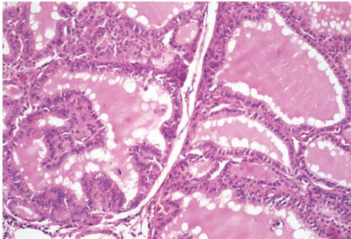 
Fig. 20.10 Graves disease. The follicles are lined by tall columnar epithelial cells that are actively resorbing the colloid in the centers of the follicles, resulting in a "scalloped" appearance of the colloid.
hydrophilic glycosaminoglycans. In addition, there is infiltration by lymphocytes, mostly T cells. Orbital muscles initially are edematous but may undergo fibrosis late in the course of the disease. The dermopathy, if present, is characterized by thickening of the dermis, as a result of deposition of glycosaminoglycans and lymphocyte infiltration.
The clinical manifestations of Graves disease include those common to all forms of thyrotoxicosis (discussed earlier), as well as those associated uniquely with Graves disease: diffuse hyperplasia of the thyroid, ophthalmopathy, and dermopathy. The degree of thyrotoxicosis varies from case to case, and the related changes may sometimes be less conspicuous than other manifestations of the disease. Increased flow of blood through the hyperactive gland often produces an audible bruit. Sympathetic overactivity produces a characteristic wide, staring gaze and lid lag. The ophthalmopathy of Graves disease results in abnormal protrusion of the eyeball (exophthalmos). The exophthalmos may persist or progress despite successful treatment of the thyrotoxicosis, sometimes resulting in corneal injury. The extraocular muscles often are weak. The infiltrative dermopathy most commonly involves the skin overlying the shins, where it manifests as scaly thickening and induration of the skin (pretibial myxedema). The skin lesions may be slightly pigmented papules or nodules and often have an orange peel texture. Laboratory findings in Graves disease include elevated serum free $\mathrm{T}_{4}$ and $\mathrm{T}_{3}$ and depressed serum TSH. Because of ongoing stimulation of the thyroid follicles by TSIs, radioactive iodine uptake is increased diffusely.
# GRAVES DISEASE
- Graves disease, the most common cause of endogenous hyperthyroidism, is characterized by the triad of thyrotoxicosis, ophthalmopathy, and dermopathy.
- Graves disease is an autoimmune disorder caused by autoantibodies to the TSH receptor that mimic TSH action and activate TSH receptors on thyroid epithelial cells. 
- The thyroid in Graves disease is characterized by diffuse hypertrophy and hyperplasia of follicles and lymphoid infiltrates; glycosaminoglycan deposition and lymphoid infiltrates are responsible for the ophthalmopathy and dermopathy. 
- Laboratory features include elevations in serum free $\mathsf{T}_3$ and $\mathsf{T}_4$ and decreased serum TSH.
# DIFFUSE AND MULTINODULAR GOITER
Enlargement of the thyroid, or goiter, is the most common manifestation of thyroid disease. Diffuse and multinodular goiters are the result of impaired synthesis of thyroid hormone, most often caused by dietary iodine deficiency. Impairment of thyroid hormone synthesis leads to a compensatory rise in the serum TSH, which drives the hypertrophy and hyperplasia of thyroid follicular cells and, ultimately, enlargement of the thyroid gland. The degree of thyroid enlargement is proportional to the level and duration of thyroid hormone deficiency. These compensatory changes overcome the hormone deficiency and maintain a euthyroid metabolic state in the vast majority of affected individuals. However, if the underlying disorder is severe (e.g., a congenital biosynthetic defect), the compensatory responses may be inadequate, resulting in goitrous hypothyroidism.
Goiters can be endemic or sporadic.
- Endemic goiter occurs in geographic areas where the diet contains little iodine. The designation endemic is used when goiters are present in more than $10\%$ of the population in a given region. Such conditions are particularly common in mountainous areas of the world, including the Himalayas and the Andes. With increased
availability of dietary iodine supplementation, the frequency and severity of endemic goiter have declined significantly.
- Sporadic goiter occurs less frequently than endemic goiter. The condition is more common in females than in males, with a peak incidence in puberty or young adulthood, when there is an increased physiologic demand for $\mathrm{T}_{4}$ . Sporadic goiter may be caused by several conditions, including the excessive ingestion of substances that interfere with thyroid hormone synthesis, such as calcium and vegetables belonging to the Brassicaceae (also called Cruciferae) family (e.g., cabbage, cauliflower, Brussels sprouts, turnips). In other instances goiter may result from inherited enzymatic defects that interfere with thyroid hormone synthesis (dyshormonogenetic goiter). In most cases, however, the cause of sporadic goiter is not apparent.
Early in its development, TSH-induced hypertrophy and hyperplasia of thyroid follicular cells usually result in diffuse, symmetric enlargement of the gland (diffuse goiter). The follicles are lined by crowded columnar cells, which may pile up and form projections similar to those seen in Graves disease. If dietary iodine subsequently increases, or if the demands for thyroid hormone decrease, the follicular epithelium involutes to form an enlarged, colloid-rich gland (colloid goiter). The cut surface of the thyroid in such cases usually is brown, glassy-appearing, and translucent. On microscopic examination, the follicular epithelium may be hyperplastic in the early stages of disease or flattened and cuboidal during periods of involution. Colloid is abundant during the latter periods.
With time, recurrent episodes of hyperplasia and involution combine to produce a more irregular enlargement of the thyroid, termed multinodular goiter. Virtually all long-standing diffuse goiters convert into multinodular goiters. Multinodular goiters are multilobulate, asymmetrically enlarged glands that may attain a massive size. On cut surface, irregular nodules containing variable amounts of brown, gelatinous colloid are
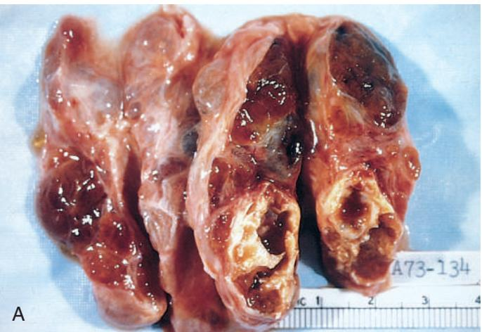 
Fig. 20.11 Multinodular goiter. (A) Gross morphologic appearance. The coarsely nodular gland contains areas of fibrosis and cystic change. (B) Photomicrograph of a specimen from a hyperplastic nodule, with compressed residual thyroid parenchyma on the periphery. The hyperplastic follicles contain abundant pink "colloid" within their lumina. Note the absence of a prominent capsule, a feature distinguishing such lesions from neoplasms of the thyroid. (B, Courtesy of Dr. William Westra, Department of Pathology, Johns Hopkins University, Baltimore, Maryland.)
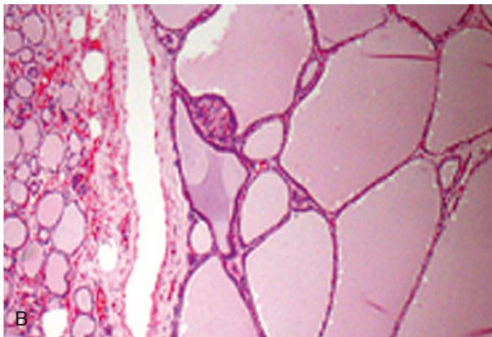
evident (Fig. 20.11A). Older lesions often show areas of fibrosis, hemorrhage, calcification, and cystic change. The microscopic appearance includes colloid-rich follicles lined by flattened, inactive epithelium and areas of follicular epithelial hypertrophy and hyperplasia, accompanied by the regressive changes just noted (see Fig. 20.11B).
The dominant clinical features of goiter are those caused by the mass effects of the enlarged gland. In addition to the obvious cosmetic problem of a large neck mass, goiters also may cause airway obstruction, dysphagia, and compression of large vessels in the neck and upper thorax (so-called "superior vena cava syndrome").
Multinodular goiters typically are hormonally silent, but a minority (approximately $10\%$ over 10 years) manifest with thyrotoxicosis secondary to the development of autonomous nodules that produce thyroid hormone independent of TSH stimulation. This condition, known as toxic multinodular goiter or Plummer syndrome, is not accompanied by the infiltrative ophthalmopathy and dermopathy of Graves disease-associated thyrotoxicosis. The incidence of malignancy in long-standing multinodular goiters is low $(<5\%)$ but not zero, and concern for malignancy arises with goiters that demonstrate sudden changes in size or associated symptoms (e.g., hoarseness).
# THYROID NEOPLASMS
Thyroid tumors range from circumscribed, benign adenomas to highly aggressive, anaplastic carcinomas. From a clinical standpoint, the possibility of a tumor is of major concern in patients who present with thyroid nodules. Fortunately, the overwhelming majority of solitary nodules of the thyroid prove to be either benign adenomas or localized, non-neoplastic conditions (e.g., a dominant nodule in multinodular goiter, simple cysts, or foci of thyroiditis). Carcinomas of the thyroid, by contrast, are uncommon, accounting for less than $1\%$ of solitary thyroid nodules. Several clinical criteria provide a clue to the nature of a given thyroid nodule:
- Solitary nodules, in general, are more likely to be neoplastic than are multiple nodules. 
- Nodules in very young (70 years) individuals are more likely to be neoplastic. 
- Nodules in males are more likely to be neoplastic than are those in females. 
- A history of radiation exposure is associated with an increased incidence of thyroid malignancy. 
- Nodules that take up radioactive iodine in imaging studies (hot nodules) are more likely to be benign.
Such associations, however, are of little significance in the evaluation of a given patient, in whom the timely recognition of a malignancy may be lifesaving. Ultimately, morphologic evaluation of a thyroid nodule by fine-needle aspiration, combined with the histologic study of surgically resected thyroid tissue, provide the most definitive information about the nature of the nodule.
# Adenomas
Adenomas of the thyroid are benign neoplasms derived from follicular epithelium. Follicular adenomas usually are solitary. On clinical and morphologic grounds, they may be difficult to distinguish from a dominant nodule in multinodular goiter, for example, or from less common follicular carcinomas. Although the vast majority of adenomas are nonfunctional, a small proportion produce thyroid hormones (toxic adenomas), causing clinically apparent thyrotoxicosis. In general, follicular adenomas are not forerunners to carcinomas; nevertheless, shared genetic alterations support the possibility that at least a subset of follicular carcinomas arise in preexisting adenomas.
Driver mutations in the TSH receptor signaling pathway play an important role in the pathogenesis of toxic adenomas (see Fig. 20.6). Activating (gain-of-function) somatic mutations in one of two components of this signaling system—most often the gene encoding the TSH receptor itself (TSHR) and, less commonly, the $\alpha$ -subunit of Gs (GNAS)—allow follicular cells to secrete thyroid hormone independent of TSH stimulation (thyroid autonomy). The result of this overabundance is symptomatic hyperthyroidism, with a "hot" thyroid nodule seen on imaging studies. Overall, somatic mutations in the TSH receptor signaling pathway are present in slightly over half of toxic adenomas. Not surprisingly, such mutations also are observed in a subset of autonomous nodules that give rise to toxic multinodular goiters, discussed earlier. Thus, autonomy in both toxic goiter and toxic adenomas stems from the ability of follicular cells to release thyroid hormone independent of trophic factors (i.e., TSH). A minority of nonfunctioning follicular adenomas (<20%) exhibit mutations in RAS or other other genes, genetic alterations that are shared with follicular carcinomas (discussed later).
The typical thyroid adenoma is a solitary, spherical lesion that compresses the adjacent nonneoplastic thyroid. The neoplastic cells are demarcated from the adjacent parenchyma by a well-defined, intact capsule (Fig. 20.12A). On microscopic examination, the constituent cells are arranged in uniform follicles that contain colloid (see Fig. 20.12B). Occasionally, the neoplastic cells acquire brightly eosinophilic granular cytoplasm (oxyphil or Hürthle cell change) (Fig. 20.13). Similar to endocrine tumors at other anatomic sites, even benign follicular adenomas occasionally exhibit focal nuclear pleomorphism, atypia, and prominent nucleoli (endocrine atypia); by themselves, these features do not constitute evidence of malignancy. The hallmark of all follicular adenomas is the presence of an intact well-formed capsule encircling the tumor. Careful evaluation of the integrity of the capsule is therefore critical in distinguishing follicular adenomas from follicular carcinomas, which demonstrate capsular and/or vascular invasion (discussed later).
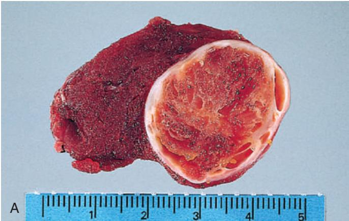
Asolitary,well-circumscribednoduleisvisibleinthisgrossspecimen.(B)Thephotomicrographshowswell-differentiatedfolliclesresemblingthoseofnormalthyroidparenchyma..jpg) 
Fig. 20.12 Follicular adenoma of the thyroid gland. (A) A solitary, well-circumscribed nodule is visible in this gross specimen. (B) The photomicrograph shows well-differentiated follicles resembling those of normal thyroid parenchyma.
Most adenomas of the thyroid manifest as painless nodules, often discovered during a routine physical examination. Larger masses may produce local symptoms such as difficulty in swallowing. Individuals with toxic adenomas may present with features of thyrotoxicosis. After injection of radioactive iodine, most adenomas take up iodine less avidly than normal thyroid parenchyma. On radionuclide scanning, therefore, adenomas appear as cold nodules relative to the adjacent normal thyroid gland. Toxic adenomas, however, appear as warm or hot nodules in the scan. As many as $10\%$ of cold nodules eventually prove to be malignant. By contrast, malignancy is uncommon in hot nodules. Essential techniques used in the preoperative evaluation of suspected adenomas are ultrasonography and fine-needle aspiration biopsy. Because of the need for evaluating capsular integrity, the definitive diagnosis of thyroid adenoma can be made only after careful microscopic examination of the resected specimen. Suspected adenomas of the thyroid are therefore removed surgically to exclude malignancy. Thyroid adenomas carry an excellent prognosis and do not recur or metastasize.
# Carcinomas
The detection of small, clinically asymptomatic cancerous nodules of the thyroid gland has increased dramatically in the United States over the last few years, largely due to the increasing use of thyroid ultrasound and other imaging studies. Nonetheless, deaths from thyroid cancer have remained relatively stable during this period, underscoring the favorable outcome for such incidentally detected thyroid carcinomas (and also raising questions about the value of detecting clinically insignificant cancers). A female predominance has been noted among patients who develop thyroid carcinoma in the early and middle adult years. By contrast, cases seen in childhood and late adult life are distributed equally between males and females. Most thyroid carcinomas (except medullary carcinomas) are derived from the thyroid follicular epithelium, and of these, the vast majority are well-differentiated lesions. The major subtypes of thyroid carcinoma and their relative frequencies are as follows:
- Papillary carcinoma (accounting for more than $85\%$ of cases) 
- Follicular carcinoma (5% to 15% of cases) 
- Anaplastic (undifferentiated) carcinoma (<5% of cases) 
Medullary carcinoma (5% of cases)
Because of the unique clinical and biologic features associated with each type of thyroid carcinoma, these are described separately. Presented next is an overview of the molecular pathogenesis of all thyroid cancers.
Distinct molecular events are involved in the pathogenesis of the four major variants of thyroid cancer. Genetic alterations in the three follicular cell-derived malignancies are clustered along two oncogenic pathways that lie downstream of growth factor receptors and RAS—the mitogen-activated protein (MAP) kinase pathway and the phosphatidylinositol-3-kinase (PI-3K)/AKT pathway
.jpg) 
Fig. 20.13 Hürthle cell adenoma. On this high-power view, the tumor is composed of cells with abundant eosinophilic cytoplasm and small regular nuclei. (Courtesy of Dr. Mary Sunday, Brigham and Women's Hospital, Boston, Massachusetts.)
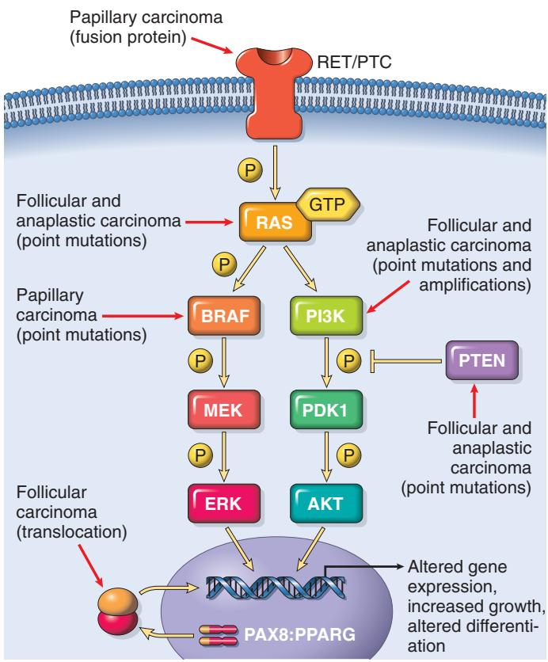 
Fig. 20.14 Genetic alterations in follicular cell-derived malignancies of the thyroid gland.
(Fig. 20.14). In normal cells, these pathways are transiently activated by binding of growth factors to receptor tyrosine kinases, which results in signal transduction. In thyroid carcinomas, as with many solid cancers (Chapter 6), gain-of-function mutations in components of these pathways lead to constitutive activation, even in the absence of growth factors, thus promoting carcinogenesis.
- Papillary thyroid carcinomas. Activation of the MAP kinase pathway is a feature of most papillary carcinomas. The most common mechanisms of MAP kinase signaling are: (1) rearrangements in genes that encode the receptor tyrosine kinases RET and NTRK1 (neurotrophic tyrosine kinase receptor 1); and (2) activating point mutations in $BRAF$ , whose product is a component of the MAP kinase pathway (see Fig. 20.14). One third to one half of papillary thyroid carcinomas harbor a gain-of-function mutation in $BRAF$ , which is the most common driver mutation in this neoplasm. Since chromosomal rearrangements of the RET or NTRK1 genes and mutations of $BRAF$ have redundant effects, papillary thyroid carcinomas demonstrate either one or the other molecular abnormality, but not both. 
- Follicular thyroid carcinomas. Follicular thyroid carcinomas frequently harbor driver mutations in RAS or in components of the PI3K/AKT signaling pathway. Both gain-of-function mutation in PI3K and loss-of-function mutations in PTEN, a negative regulator of PI3K, are seen. RAS and PI3K mutations also are found in benign follicular adenomas to and anaplastic carcinomas (see
next) suggesting a shared histogenesis. One third to one half of follicular carcinomas also have a unique (2;3) (q13;p25) translocation that disrupts $PAX8$ , a paired homeobox gene that is important in thyroid development, and the peroxisome proliferator-activated receptor gene (PPARG), whose gene product is a nuclear hormone receptor implicated in terminal differentiation of cells.
- Anaplastic carcinomas. These highly aggressive tumors can arise de novo or, more commonly, by progression of a well-differentiated papillary or follicular carcinoma. Molecular alterations present in anaplastic carcinomas include those also seen in well-differentiated carcinomas (e.g., RAS or PIK3CA mutations), as well as additional mutations that are specific to anaplastic carcinoma. The most common of these unique mutations are loss-of-function mutations in TP53, which are believed to have an important role in the development of anaplastic carcinomas. 
- Medullary thyroid carcinomas. In contrast with the subtypes described earlier, these neoplasms arise from the parafollicular C cells, rather than the follicular epithelium. Familial medullary thyroid carcinomas occur in multiple endocrine neoplasia type 2 (MEN-2) (see later) and are associated with germ line RET proto-oncogene mutations that lead to constitutive activation of the RET tyrosine kinase receptor. RET mutations are also seen in approximately one-half of nonfamilial (sporadic) medullary thyroid cancers.
Environmental Factors. The major risk factor predisposing to thyroid cancer is exposure to ionizing radiation, particularly during the first 2 decades of life. In keeping with this finding, there was a marked increase in the incidence of papillary carcinomas among children exposed to ionizing radiation after the Chernobyl nuclear disaster in 1986. Deficiency of dietary iodine (and by extension, an association with goiter) is linked with a higher frequency of follicular carcinomas.
# Papillary Carcinoma
As mentioned earlier, papillary carcinomas are the most common form of thyroid cancer. These tumors may occur at any age, and they account for the vast majority of thyroid carcinomas associated with previous exposure to ionizing radiation.
Papillary carcinomas are solitary or multifocal lesions. Some tumors may be well circumscribed and encapsulated; others infiltrate the adjacent parenchyma and have ill-defined margins. The cut surface sometimes reveals papillary foci that point to the diagnosis (Fig. 20.15A). The microscopic hallmarks of papillary neoplasms include the following:
- Branching papillae having a fibrovascular stalk covered by a single to multiple layers of cuboidal epithelial cells (see Fig. 20.15B). In most cases, the epithelium covering the papillae has well-differentiated, uniform, orderly cuboidal cells, but more pleomorphic or even anaplastic morphologies may be seen.
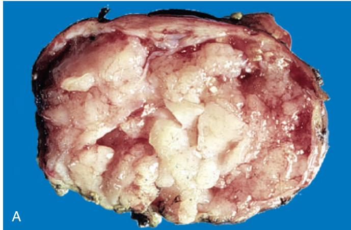
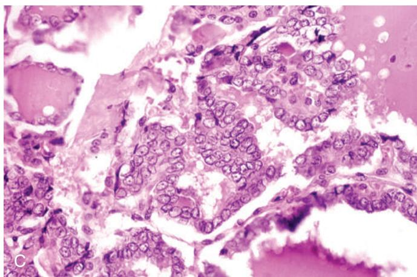 
Fig. 20.15 Papillary carcinoma of the thyroid gland. (A to C) A papillary carcinoma with grossly discernible papillary structures. In this particular example, well-formed papillae (B) are lined by cells with characteristic empty-appearing nuclei, sometimes termed Orphan Annie eye nuclei (C). (D) Cells obtained by fine-needle aspiration of a papillary carcinoma. Characteristic intranuclear inclusions are visible in some of the aspirated cells (arrows). (Courtesy of Dr. S. Gokasalan, Department of Pathology, University of Texas Southwestern Medical School, Dallas, Texas.)
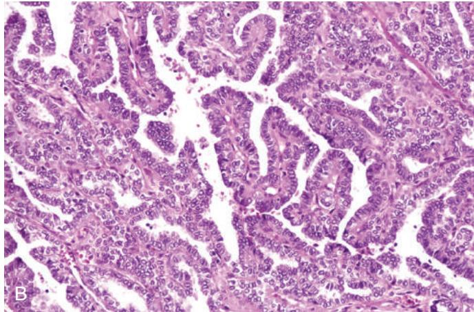
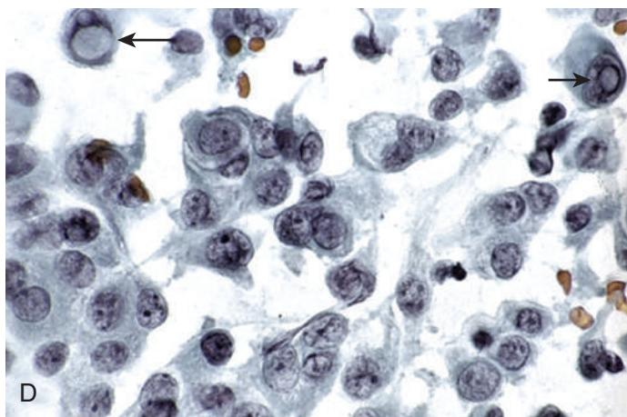
- Nuclei with finely dispersed chromatin, which imparts an optically clear or empty appearance, giving rise to the designation ground-glass or Orphan Annie eye nuclei (see Fig. 20.15B). In addition, invaginations of the cytoplasm often give the appearance of intranuclear inclusions ("pseudo-inclusions") or intranuclear grooves (see Fig. 20.15D). These nuclear features are sufficient for the diagnosis of papillary carcinoma, even in the absence of papillary architecture. 
- Concentrically calcified structures termed psammoma bodies are often present within the lesion, usually within the cores of papillae. These structures are almost never found in follicular and medullary carcinomas. 
- Foci of lymphatic invasion by tumor are often present, but involvement of blood vessels is relatively uncommon, particularly in smaller lesions. Metastases to adjacent cervical lymph nodes occur in up to one-half of cases. 
- There are over a dozen variants of papillary thyroid carcinoma, the most common of which is the so-called encapsulated follicular variant, comprised of follicles lined by cells harboring nuclear features of papillary cancers (discussed earlier).
Papillary carcinomas are nonfunctional tumors, so they manifest most often as a painless mass in the neck, either within the thyroid or as a metastasis in a cervical lymph
node. A preoperative diagnosis usually can be established by fine-needle aspiration based on the characteristic nuclear features described earlier. Papillary carcinomas are indolent lesions, with 10-year survival rates in excess of $95\%$ . Of interest, the presence of isolated cervical node metastases does not have a significant influence on prognosis. In a minority of patients, hematogenous metastases are present at the time of diagnosis, most commonly to the lung. The long-term survival of patients with papillary thyroid cancer is dependent on several factors, including age (in general, the prognosis is less favorable among patients older than 40 years of age), presence of extrathyroidal extension, and presence of distant metastases (stage).
Recent studies have shown that follicular variants of papillary carcinoma that lack evidence of invasion have essentially no potential for malignant behavior. In recognition of this, forthcoming recommendations from the World Health Organization suggest the name carcinoma should be stripped from these tumors, which will henceforth be classified as benign neoplasms to prevent overtreatment.
# Follicular Carcinoma
Follicular carcinomas account for $5\%$ to $15\%$ of primary thyroid cancers. They are more common in women (occurring in a ratio of 3:1) and manifest at an older age than papillary carcinomas, with a peak incidence between 40 and 60
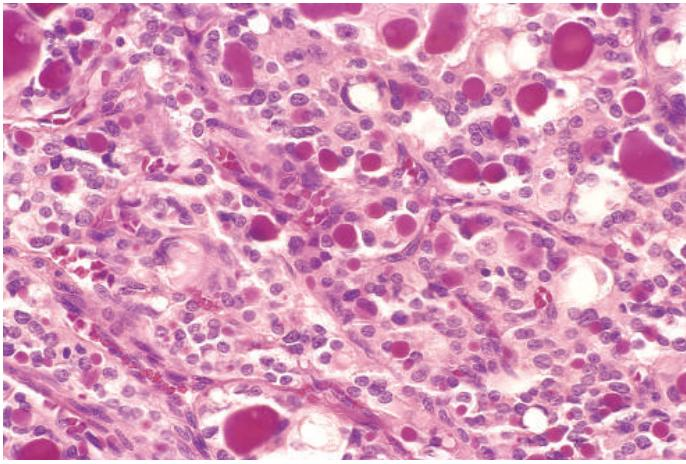 
Fig. 20.16 Follicular carcinoma of the thyroid gland. A few of the glandular lumina contain recognizable colloid.
years of age. Follicular carcinoma is more frequent in areas with dietary iodine deficiency (accounting for $25\% -40\%$ of thyroid cancers), while its incidence has either decreased or remained stable in iodine-sufficient areas of the world.
On microscopic examination, most follicular carcinomas are composed of uniform cells forming small follicles, reminiscent of normal thyroid (Fig. 20.16); in other cases, follicular differentiation may be less apparent. As with follicular adenomas, Hürthle cell variants of follicular carcinomas may be seen. Follicular carcinomas may be widely invasive, infiltrating the thyroid parenchyma and extrathyroidal soft tissues, or minimally invasive. The latter type are sharply demarcated lesions that may be impossible to distinguish from follicular adenomas on gross examination. The distinction between follicular adenoma and carcinoma requires extensive histologic sampling of the tumor capsule-thyroid interface, to exclude capsular and/or vascular invasion (Fig. 20.17).As discussed earlier, invasive follicular lesions in which the nuclear features are typical of papillary carcinomas are regarded as follicular variants of papillary cancers.
Follicular carcinomas manifest most frequently as solitary cold thyroid nodules. In rare cases, they may be hyperfunctional. These neoplasms tend to metastasize through the bloodstream (hematogenous dissemination) to the lungs, bone, and liver. In contrast with papillary carcinomas, regional nodal metastases are uncommon. As many as one-half of patients with widely invasive carcinomas succumb to their disease within 10 years, while less than $10\%$ of patients with minimally invasive follicular carcinomas die within the same time span. Follicular carcinomas are treated with surgical excision. Well-differentiated metastases may take up radioactive iodine, which can be used to identify and also ablate such lesions.
# Anaplastic Carcinoma
Anaplastic carcinomas are undifferentiated tumors of the thyroid follicular epithelium, accounting for less than $5\%$
of thyroid tumors. They are aggressive, with a mortality rate approaching $100\%$ . Patients with anaplastic carcinoma are older than those with other types of thyroid cancer, with a mean age of 65 years. Approximately one-fourth of patients with anaplastic thyroid carcinomas have a history of a well-differentiated thyroid carcinoma, and another one-fourth harbor a concurrent well-differentiated tumor in the resected specimen.
Anaplastic carcinomas manifest as bulky masses that typically grow rapidly beyond the thyroid capsule into adjacent neck structures. On microscopic examination, these neoplasms are composed of highly anaplastic cells, which may be large and pleomorphic or spindle shaped and in some cases mixture of the two cell types.
Foci of papillary or follicular differentiation may be present in some tumors, suggesting origin from a better-differentiated carcinoma.
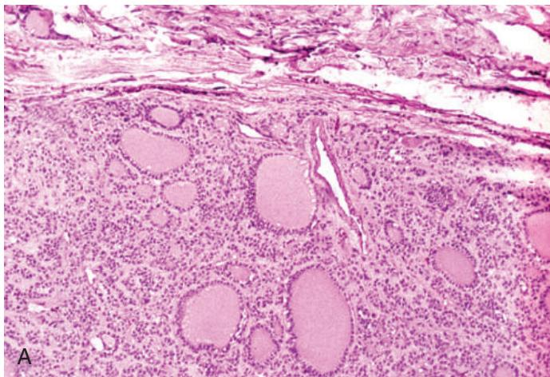
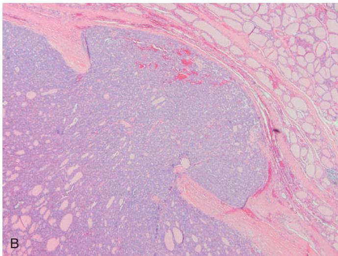 
Fig. 20.17 Capsular invasion in follicular carcinoma. Evaluating the integrity of the capsule is critical in distinguishing follicular adenomas from follicular carcinomas. (A) In adenomas, a fibrous capsule, usually thin but occasionally more prominent, surrounds the neoplastic follicles and no capsular invasion is seen; compressed normal thyroid parenchyma usually is present external to the capsule (top). (B) By contrast, follicular carcinomas demonstrate capsular invasion that may be minimal, as in this case, or widespread, with extension into local structures of the neck.
Anaplastic carcinomas grow with wild abandon despite therapy. Metastases to distant sites are common, but in most cases death occurs in less than 1 year as a result of aggressive local growth and compromise of vital structures in the neck.
# Medullary Carcinoma
Medullary carcinomas of the thyroid are neuroendocrine tumors derived from the parafollicular cells, or C cells, of the thyroid. Like normal C cells, medullary carcinomas secrete calcitonin, measurement of which plays an important role in the diagnosis and postoperative follow-up of patients. In some cases, the tumor cells elaborate other polypeptide hormones such as somatostatin, serotonin, and vasoactive intestinal peptide. Medullary carcinomas arise sporadically in about $70\%$ of cases. The remaining $30\%$ are familial, occurring in the setting of multiple endocrine neoplasia (MEN) syndrome 2A or 2B, or familial medullary thyroid carcinoma without an associated MEN syndrome, as discussed later. Both familial and sporadic medullary forms are associated with gain-of-function driver mutations in the RET receptor tyrosine kinase. Sporadic medullary carcinomas, as well as familial cases without an associated MEN syndrome, occur in adults, with a peak incidence in the fifth and sixth decades. Cases associated with MEN-2A or MEN-2B, by contrast, tend to occur in younger patients, including children.

Medullary carcinomas may arise as a solitary nodule or may manifest as multiple lesions involving both lobes of the thyroid. Multicentricity is particularly common in familial cases. Larger lesions often contain areas of necrosis and hemorrhage and may extend through the capsule of the thyroid. On microscopic examination, medullary carcinomas are composed of polygonal to spindle-shaped cells, which may form nests, trabeculae, and even follicles. Amyloid deposits, derived from altered calcitonin molecules, are present in the adjacent stroma in many cases (Fig. 20.18) and are a distinctive feature. Calcitonin is readily demonstrable both within the cytoplasm of the tumor cells and in the stromal amyloid by immunohistochemical methods. One of the characteristic features of familial medullary carcinomas is the presence of multicentric C cell hyperplasia in the surrounding thyroid parenchyma, a feature usually absent in sporadic lesions. Foci of C cell hyperplasia are believed to represent the precursor lesions from which medullary carcinomas arise.
In sporadic cases, medullary carcinoma manifests most often as a mass in the neck, sometimes associated with compression effects such as dysphagia or hoarseness. In some instances the initial manifestations are caused by the secretion of a peptide hormone (e.g., diarrhea caused by the secretion of vasoactive intestinal peptide). Screening of the patient's relatives for elevated calcitonin levels
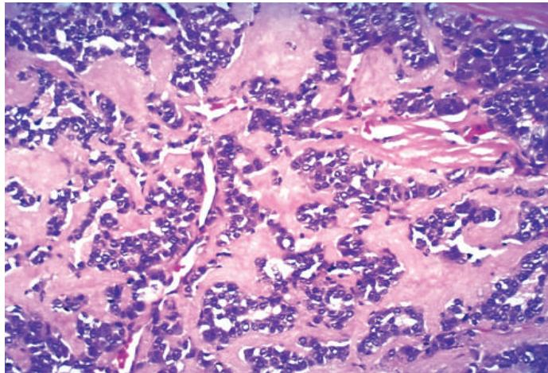 
Fig. 20.18 Medullary carcinoma of the thyroid gland. These tumors typically contain amyloid, visible here as homogeneous extracellular material, derived from calcitonin molecules secreted by the neoplastic cells.
or RET mutations permits early detection of tumors in familial cases. As discussed later, all members of MEN-2 kindreds carrying RET mutations are offered prophylactic thyroidectomies to preempt the development of medullary carcinomas; often, the only histologic finding in the resected thyroid of these asymptomatic carriers is the presence of C cell hyperplasia or small $(< 1\mathrm{cm})$ micromedullary carcinomas.

# THYROID NEOPLASMS
- Most thyroid neoplasms manifest as solitary thyroid nodules, but only $1\%$ of all thyroid nodules are neoplastic. 
- Follicular adenomas are the most common benign neoplasms, while papillary carcinoma is the most common malignancy. 
- Multiple genetic pathways are involved in thyroid carcinogenesis. Some of the driver mutations that are fairly unique to thyroid cancers include PAX8/PPARG fusion (in follicular carcinoma), chromosomal rearrangements involving the RET oncogene (in papillary cancers), and mutations of RET (in medullary carcinomas). 
- Follicular adenomas and carcinomas both are composed of well-differentiated follicular epithelial cells; the latter are distinguished by presence of capsular and/or vascular invasion. 
- Papillary carcinomas are recognized by nuclear features (ground-glass nuclei, pseudoinclusions), even in the absence of papillae. These neoplasms typically metastasize by way of the lymphatics, but the prognosis is excellent. 
- Anaplastic carcinomas are thought to arise by progression of more differentiated neoplasms. They are highly aggressive, uniformly lethal cancers. 
- Medullary cancers are nonepithelial neoplasms arising from the parafollicular C cells and can occur in either sporadic (70%) or familial (30%) settings. Multicentricity and C cell hyperplasia are features of familial cases. Amyloid deposits are a characteristic histologic finding.
# Parathyroid Glands
The parathyroid glands are derived developmentally from pharyngeal pouches that also give rise to the thymus. They are most commonly located in close proximity to the upper and lower poles of each thyroid lobe but may be found anywhere along the pathway of descent of the pharyngeal pouches, including the carotid sheath, the thymus, and elsewhere in the anterior mediastinum. Most of the gland is composed of chief cells which have secretory granules containing parathyroid hormone (PTH). Oxyphil cells are found throughout the normal parathyroid either singly or in small clusters. They are slightly larger than the chief cells, have acidophilic cytoplasm, and are tightly packed with mitochondria.
Parathyroid glands are key regulators of calcium homeostasis. The activity of the parathyroid glands is controlled by the level of free (ionized) calcium in the blood, rather than by trophic hormones secreted by the hypothalamus and pituitary. Normally, decreased levels of free calcium stimulate the synthesis and secretion of PTH, which has the following effects on its target tissues, the kidneys and the bones:
- Increased renal tubular reabsorption of calcium 
- Increased urinary phosphate excretion, thereby lowering serum phosphate levels (since phosphate binds to ionized calcium) 
- Increased conversion of vitamin D to its active dihydroxy form in the kidneys, which in turn augments gastrointestinal calcium absorption 
- Enhanced osteoclastic activity (i.e., bone resorption, thus releasing ionized calcium), mediated indirectly by promoting the differentiation of osteoclast progenitor cells into mature osteoclasts
The net result of these activities is an increase in the level of free calcium in the blood, which inhibits PTH secretion from chief cells. Abnormalities of the parathyroids include both hyperfunction and hypofunction. Tumors of the parathyroid glands, unlike thyroid tumors, usually come to attention because of excessive secretion of PTH, rather than mass effects.
# HYPERPARATHYROIDISM
Hyperparathyroidism occurs in two major forms, primary and secondary, and, less commonly, as tertiary hyperparathyroidism. The first condition represents an autonomous, spontaneous overproduction of PTH, while the latter two conditions typically occur as secondary phenomena in patients with chronic renal insufficiency.
# Primary Hyperparathyroidism
Primary hyperparathyroidism is a common endocrine disorder and an important cause of hypercalcemia. There was a dramatic increase in the detection of cases in the latter half of the 20th century, mainly due to routine performance of serum calcium assays in hospitalized patients. The frequency of occurrence of the various parathyroid
lesions underlying primary hyperparathyroidism is as follows:
Adenoma- $85\%$ to $95\%$ 
Primary hyperplasia (diffuse or nodular) - $5\%$ to $10\%$ 
- Parathyroid carcinoma—1%
Abnormalities in two genes are commonly associated with parathyroid tumors:
- Cyclin D1 gene rearrangements. Cyclin D1 is a positive regulator of the cell cycle. An inversion on chromosome 11 repositions the cyclin D1 gene (normally on 11q), so that it resides adjacent to genomic elements that regulate the PTH gene (on 11p). These elements drive abnormal expression of cyclin D1 in PTH-producing cells, leading to increased proliferation of these cells. Between $10\%$ and $20\%$ of adenomas have this acquired genetic defect. Cyclin D1 is overexpressed in approximately $40\%$ of parathyroid adenomas, indicating the existence of additional mechanisms that lead to its dysregulation. 
- MEN1 mutations. Approximately $20\%$ to $30\%$ of sporadic parathyroid tumors have mutations in both copies of the MEN1 tumor suppressor gene (see later). The spectrum of MEN1 mutations in the sporadic tumors is virtually identical to that in familial parathyroid adenomas.
The morphologic changes in primary hyperparathyroidism include those in the parathyroid glands and in other organs affected by hypercalcemia. In $75\%$ to $80\%$ of cases, one of the parathyroid glands harbors a solitary adenoma. The typical parathyroid adenoma is a well-circumscribed, soft, tan nodule, invested by a delicate capsule. By definition, parathyroid adenomas are confined to a single gland (Fig. 20.19). The other glands are normal in size or somewhat shrunken, as a result of feedback
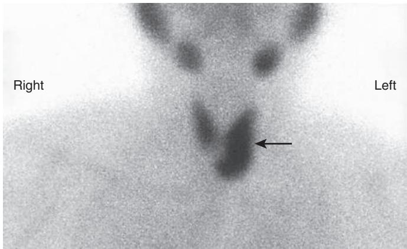 
Fig. 20.19 Technetium-99 radionuclide scan demonstrates an area of increased uptake corresponding to the left inferior parathyroid gland (arrow). This proved to be a parathyroid adenoma. Preoperative scintigraphy is useful in localizing and distinguishing adenomas from parathyroid hyperplasia, in which more than one gland will demonstrate increased uptake.
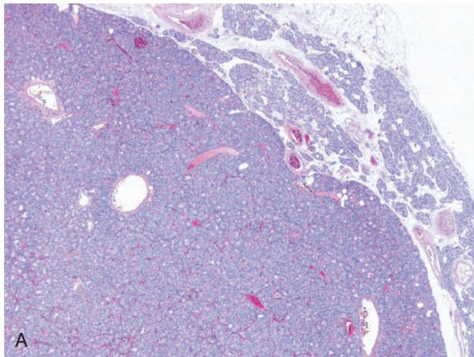 
Fig. 20.20 Chief cell parathyroid adenoma. (A) In this low-power view, a solitary hypercellular adenoma is delineated from the residual normocellular gland on the upper right. (B) High-power detail shows minimal variation in nuclear size and occasional follicle formation. (Courtesy of Dr. Nicole Cipriani, Department of Pathology, University of Chicago, Chicago, Illinois.)
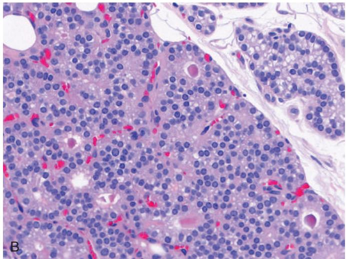
inhibition by elevated serum calcium. Most parathyroid adenomas weigh between 0.5 and $5\mathrm{g}$ . On microscopic examination, parathyroid adenomas are composed predominantly of chief cells (Fig. 20.20). A rim of compressed, non-neoplastic parathyroid tissue, generally separated by a fibrous capsule, often is visible at the edge of the adenoma. The chief cells of the adenoma are larger and show greater nuclear size variability than normal chief cells. Cells with bizarre and pleomorphic nuclei are often seen within adenomas (so-called "endocrine atypia") and must not be taken as a sign of malignancy. Mitotic figures are rare. In contrast with the normal parathyroid parenchyma, adipose tissue is inconspicuous within adenomas.
Parathyroid hyperplasia is typically a multiglandular process. In some cases, however, enlargement may be grossly apparent in only one or two glands, complicating the distinction between hyperplasia and adenoma. Microscopically, the most common pattern seen is that of chief cell hyperplasia, which may involve the glands in a diffuse or multinodular pattern. Less commonly, the constituent cells contain abundant clear cytoplasm as a consequence of the accumulation of glycogen—a condition designated water-clear cell hyperplasia. As in the case of adenomas, stromal fat is inconspicuous within foci of hyperplasia.
Parathyroid carcinomas may be circumscribed lesions that are difficult to distinguish from adenomas, or they may be clearly invasive neoplasms. These tumors enlarge one parathyroid gland and consist of gray-white, irregular masses that sometimes exceed $10\mathrm{g}$ in weight. The cells usually are uniform and resemble normal parathyroid cells. They are arrayed in nodular or trabecular patterns. The tumor mass is usually enclosed by a dense, fibrous capsule. There is general agreement that a diagnosis of carcinoma based on cytologic detail is unreliable; invasion of surrounding tissues and metastasis are the only definitive criteria. Local recurrence occurs in one-third of cases, and more distant dissemination occurs in another one-third.
# Morphologic changes in other organs:
- Skeletal changes include increased osteoclastic activity, which results in erosion of bone matrix and mobilization of calcium salts, particularly in the metaphyses of long tubular bones. Bone
resorption is accompanied by increased osteoblastic activity and the formation of new bone trabeculae. In more severe cases, the cortex is grossly thinned and the bone marrow contains increased amounts of fibrous tissue accompanied by foci of hemorrhage and cysts (osteitis fibrosa cystica) (Chapter 21). Aggregates of osteoclasts, reactive giant cells, and hemorrhagic debris occasionally form masses that may be mistaken for neoplasms (brown tumors of hyperparathyroidism).
- Renal changes. PTH-induced hypercalcemia favors the formation of urinary tract stones (nephrolithiasis) as well as calcification of the renal interstitium and tubules (nephrocalcinosis). 
- Metastatic calcification secondary to hypercalcemia also may be seen in other sites, including the stomach, lungs, myocardium, and blood vessels.
Primary hyperparathyroidism usually is a disease of adults and is much more common in women than in men (gender ratio of nearly 4:1). The most common manifestation of primary hyperparathyroidism is an increase in serum ionized calcium. In fact, primary hyperparathyroidism is the most common cause of clinically silent hypercalcemia. Other conditions also may produce hypercalcemia (Table 20.4). The most common cause of clinically apparent hypercalcemia
Table 20.4 Causes of Hypercalcemia 
Increased PTHDecreased PTHHyperparathyroidismHypercalcemia of malignancyPrimary (adenoma &gt; hyperplasia)*Osteolytic metastasesPTH-rP-mediatedSecondary†Vitamin D toxicityTertiary†ImmobilizationFamilial hypocalciuricDrugs (thiazide diuretics)hypercalcemiaGranulomatous diseases (sarcoidosis)
PTH, Parathyroid hormone; PTH-rP, PTH-related protein. 
*Primary hyperparathyroidism is the most common cause of hypercalcemia overall. 
†Secondary and tertiary hyperparathyroidism are most commonly associated with progressive renal failure.
in adults is cancer, which can cause hypercalcemia through a variety of mechanisms, including secretion of PTH-like polypeptides and osteolytic bone metastases (Chapter 6). The prognosis for patients with malignancy-associated hypercalcemia is poor, because it often occurs in those with advanced cancers. In individuals with hypercalcemia caused by parathyroid hyperfunction, serum PTH is inappropriately elevated, whereas serum PTH is low to undetectable in those with hypercalcemia caused by nonparathyroid diseases, including malignancy. Other laboratory alterations referable to PTH excess include hypophosphatemia and increased urinary excretion of both calcium and phosphate.
Primary hyperparathyroidism traditionally has been associated with a constellation of symptoms that include painful bones, renal stones, abdominal groans, and psychic moans. Pain, secondary to fractures of bones weakened by osteoporosis or osteitis fibrosa cystica and resulting from renal stones, with obstructive uropathy, was at one time a prominent manifestation of primary hyperparathyroidism. Because serum calcium is now routinely assessed in most patients who need blood tests for unrelated conditions, hyperparathyroidism is usually detected early in its course. Hence, many of the classic clinical manifestations, particularly those referable to bone and renal disease, are seen much less frequently. Additional signs and symptoms that may be encountered in some cases include the following:
- Gastrointestinal disturbances, including constipation, nausea, peptic ulcers, pancreatitis, and gallstones 
- Central nervous system alterations, including depression, lethargy, and seizures 
- Neuromuscular abnormalities, including weakness and hypotonia 
- Polyuria and secondary polydipsia
Although some of these alterations (e.g., polyuria and muscle weakness) are clearly related to hypercalcemia, the pathophysiology of many of the other manifestations of the disorder remains poorly understood.
# Secondary Hyperparathyroidism
Secondary hyperparathyroidism is caused by chronic depression of serum calcium levels, most often as a result of renal failure, leading to compensatory overactivity of the parathyroids. The mechanisms by which chronic renal failure induces secondary hyperparathyroidism are complex and not fully understood. Chronic renal insufficiency is associated with decreased phosphate excretion, which in turn results in hyperphosphatemia. The elevated serum phosphate levels directly depress serum calcium levels. In addition, loss of renal $\alpha_{1}$ -hydroxylase activity, which is required for the synthesis of the active form of vitamin D, reduces the intestinal absorption of calcium (Chapter 8). These alterations cause chronic hypocalcemia, which stimulates the activity of the parathyroid glands.
The parathyroid glands in secondary hyperparathyroidism are hyperplastic. As in primary hyperplasia, the degree of
glandular enlargement is not necessarily symmetric. On microscopic examination, the hyperplastic glands contain an increased number of chief cells, or cells with more abundant, clear cytoplasm (water-clear cells), in a diffuse or multinodular distribution. Fat cells are decreased in number. Bone changes similar to those seen in primary hyperparathyroidism also may be present. Metastatic calcification may be seen in many tissues.
The clinical manifestations of secondary hyperparathyroidism usually are dominated by those related to chronic renal failure. Bone abnormalities (renal osteodystrophy) and other changes associated with PTH excess are, in general, less severe than those seen in primary hyperparathyroidism. Serum calcium remains near normal because the compensatory increase in PTH levels sustains serum calcium. The metastatic calcification of blood vessels (secondary to hyperphosphatemia) occasionally may result in significant ischemic damage to skin and other organs—a process referred to as calciphylaxis. In a minority of patients, parathyroid activity may become autonomous and excessive, with resultant hypercalcemia—a process sometimes termed tertiary hyperparathyroidism. Parathyroidectomy may be necessary to control the hyperparathyroidism in such patients.
# HYPERPARATHYROIDISM
- Primary hyperparathyroidism is the most common cause of asymptomatic hypercalcemia. 
- In a majority of cases, primary hyperparathyroidism is caused by a sporadic parathyroid adenoma and, less commonly, by parathyroid hyperplasia. 
- Parathyroid adenomas are solitary, while hyperplasia typically is a multiglandular process. 
- Skeletal manifestations of hyperparathyroidism include bone resorption, osteitis fibrosa cystica, and brown tumors. Renal changes include nephrolithiasis (stones) and nephrocalcinosis. 
- Most cases of hyperparathyroidism are clinically silent because of early detection of hypercalcemia during routine blood testing. 
- Secondary hyperparathyroidism is caused by hypercalcemia most often secondary to renal failure, and the parathyroid glands are hyperplastic. 
- Malignancies are the most important cause of symptomatic hypercalcemia, which results from osteolytic metastases or release of PTH-related protein from nonparathyroid tumors.
# HYPOPARATHYROIDISM
Hypoparathyroidism is far less common than hyperparathyroidism. The major causes of hypoparathyroidism include the following:
- Surgical ablation: The most common cause is inadvertent removal of parathyroids during thyroidectomy or other surgical neck dissections.
- Congenital absence: This occurs in conjunction with thymic aplasia (Di George syndrome) and cardiac defects, secondary to deletions on chromosome 22q11.2 (Chapter 7). 
- Autoimmune hypoparathyroidism: This is a hereditary polyglandular deficiency syndrome arising from autoantibodies to multiple endocrine organs (parathyroid, thyroid, adrenals, and pancreas). This condition is caused by mutations in the autoimmune regulator (AIRE) gene and is discussed more extensively later, in the context of autoimmune adrenalitis.
# Endocrine Pancreas
The endocrine pancreas consists of the islets of Langerhans, which contain four major cell types—beta, alpha, delta, and PP (pancreatic polypeptide) cells. The beta cell produces insulin, which regulates glucose utilization in tissues and reduces blood glucose levels, as will be detailed in the discussion of diabetes; the alpha cell secretes glucagon, which raises glucose levels through its glycogenolytic activity in the liver; delta cells secrete somatostatin, which suppresses both insulin and glucagon release; and PP cells secrete pancreatic polypeptide, which exerts several gastrointestinal effects, such as stimulation of secretion of gastric and intestinal enzymes and inhibition of intestinal motility. The most important disease of the endocrine pancreas is diabetes mellitus, caused by deficient production or action of insulin.
# DIABETES MELLITUS
Diabetes mellitus is a group of metabolic disorders characterized by hyperglycemia. Hyperglycemia in diabetes (in common parlance, the suffix "mellitus" is often not used) results from defects in insulin secretion, insulin action, or, most commonly, both. The chronic hyperglycemia and attendant metabolic abnormalities of diabetes are often associated with secondary damage in multiple organ systems, especially the kidneys, eyes, nerves, and blood vessels. In the United States, diabetes is the leading cause of end-stage renal disease, adult-onset blindness, and nontraumatic lower-extremity amputations resulting from atherosclerosis of arteries.
According to the American Diabetes Association, diabetes affects over 29 million children and adults, or $9.3\%$ of the population, in the United States, nearly one-third of whom are currently unaware that they have hyperglycemia. Approximately 1.4 million new cases of diabetes are diagnosed each year in the United States, and there is a wide variability in prevalence between different ethnic groups. For example, the prevalence of diabetes in American Indian/Alaskan Natives is almost twice that of Caucasians. Increasingly sedentary lifestyles and poor eating habits have contributed to the increases in diabetes and obesity, which some have termed the diabesity epidemic. A staggering 86 million adults in the United States have prediabetes, which is defined as elevated blood sugar that does not reach the criterion accepted for an outright diagnosis of diabetes (discussed next); individuals with prediabetes have an elevated risk for development of frank diabetes.
The major clinical manifestations of hypoparathyroidism are secondary to hypocalcemia. Acute cases (as may occur after surgical ablation) manifest as increased neuromuscular irritability (tingling, muscle spasms, facial grimacing, and sustained carpopedal spasm or tetany), cardiac arrhythmias, and, on occasion, increased intracranial pressure and seizures. Manifestations of chronic hypoparathyroidism include cataracts, calcification of the cerebral basal ganglia, and dental abnormalities.
# Diagnosis
Blood glucose is normally maintained in a very narrow range, usually 70 to $120\mathrm{mg / dL}$ . According to the American Diabetes Association (ADA) and the World Health Organization (WHO), diagnostic criteria for diabetes include the following:
1. A fasting plasma glucose greater than or equal to $126\mathrm{mg / dL}$ , and/or 
2. A random plasma glucose greater than or equal to $200\mathrm{mg / dL}$ (in a patient with classic hyperglycemic signs, discussed later), and/or 
3. A 2-hour plasma glucose greater than or equal to $200\mathrm{mg / dL}$ during an oral glucose tolerance test with a loading dose of $75~\mathrm{gm}$ , and/or 
4. A glycated hemoglobin (HbA1C) level greater than or equal to $6.5\%$ (glycated hemoglobin is further discussed under chronic complications of diabetes)
All tests, except the random blood glucose test in a patient with classic hyperglycemic signs, need to be repeated and confirmed on a separate day. Of note, many acute conditions associated with stress, such as severe infections, burns, or trauma, can lead to transient hyperglycemia due to secretion of hormones such as catecholamines and cortisol that oppose the effects of insulin. The diagnosis of diabetes requires persistence of hyperglycemia following resolution of the acute illness.
Impaired glucose tolerance (prediabetes) is defined as:
1. A fasting plasma glucose between 100 and $125\mathrm{mg / dL}$ ("impaired fasting glucose"), and/or 
2. A 2-hour plasma glucose between 140 and $199\mathrm{mg / dL}$ during an oral glucose tolerance test, and/or 
3. HbA1C level between $5.7\%$ and $6.4\%$
As many as one-fourth of individuals with impaired glucose tolerance will develop overt diabetes in the next 5 years, with additional risk factors such as obesity and family history compounding such risk. In addition, individuals with prediabetes have an elevated risk of cardiovascular disease.
# Classification
Although all forms of diabetes share hyperglycemia as a common feature, the underlying causes of hyperglycemia vary widely. Previous classification schemes of diabetes were based on age at onset of the disease
Table 20.5 Simplified Classification of Diabetes 
1. Type 1 Diabetes
Beta cell destruction, usually leading to absolute insulin deficiency2. Type 2 Diabetes
Combination of insulin resistance and beta cell dysfunction3. Genetic Defects of Beta Cell Function
Maturity-onset diabetes of the young (MODY) (see text)
Insulin gene mutations4. Genetic Defects in Insulin Action
Insulin receptor mutations5. Exocrine Pancreatic Defects
Chronic pancreatitis
Pancreatectomy
Cystic fibrosis
Hemochromatosis6. Endocrinopathies
Growth hormone excess (acromegaly)
Cushing syndrome
Hyperthyroidism
Pheochromocytoma7. Infections
Cytomegalovirus infection
Coxsackievirus B infection
Congenital rubella8. Drugs
Glucocorticoids
Thyroid hormone
β-Adrenergic agonists9. Gestational Diabetes
Diabetes associated with pregnancy
Modified from Diagnosis and classification of diabetes mellitus (American Diabetes Association). Diabetes Care 37:S81-S90; 2014.
or on the mode of therapy; in contrast, the current etiologic classification reflects a greater understanding of the pathogenesis of each variant (Table 20.5). The vast majority of cases of diabetes fall into one of two broad classes:
- Type 1 diabetes is an autoimmune disease characterized by pancreatic $\beta$ -cell destruction and an absolute deficiency of insulin. It accounts for approximately $5\%$ to $10\%$ of all cases, and is the most common subtype diagnosed in patients younger than 20 years of age. 
- Type 2 diabetes is caused by a combination of peripheral resistance to insulin action and an inadequate secretory response by the pancreatic $\beta$ cells ("relative insulin deficiency"). Approximately $90\%$ to $95\%$ of diabetic patients have type 2 diabetes, and many of them are overweight. Although classically considered "adult-onset," the prevalence of type 2 diabetes in children and adolescents is increasing at an alarming pace due to the increasing rates of obesity in these age groups.
A variety of monogenic and secondary causes are responsible for the remaining cases (discussed later). Of note, when combined, monogenic and secondary forms of diabetes account for $>10\%$ of diabetes (which together makes them more common than type 1 diabetes). An important point is that although the major types of diabetes arise by different pathogenic mechanisms, the long-term complications in kidneys, eyes, nerves, and blood vessels are the same and are the principal causes of morbidity and death.
# Normal Insulin Physiology and Glucose Homeostasis
Before discussing the pathogenesis of the two major types of diabetes, we briefly review normal insulin physiology and glucose metabolism.
Normal glucose homeostasis is tightly regulated by three interrelated processes: (1) glucose production in the liver; (2) glucose uptake and utilization by peripheral tissues, chiefly skeletal muscle; and (3) the actions of insulin and counterregulatory hormones (especially glucagon).
The principal function of insulin is to increase the rate of glucose transport into certain cells in the body (Fig. 20.21). These are the striated muscle cells (including myocardial cells) and, to a lesser extent, adipocytes, representing collectively about two thirds of total body weight. Glucose uptake in other peripheral tissues, most notably the brain, is insulin-independent. In muscle cells, glucose is then either stored as glycogen or oxidized to generate adenosine triphosphate (ATP) and metabolic intermediates needed for cell growth. In adipose tissue, glucose is metabolized to lipids, which are stored as fat. Besides promoting lipid synthesis (lipogenesis), insulin also inhibits lipid degradation (lipolysis) in adipocytes. Similarly, insulin promotes amino acid uptake and protein synthesis while inhibiting protein degradation. Thus, the metabolic effects of insulin can be summarized as anabolic, with increased synthesis and reduced degradation of glycogen, lipid, and protein. In addition to these metabolic effects, insulin has several mitogenic functions, including initiation of DNA synthesis in certain cells and stimulation of their growth and differentiation.
Insulin reduces the production of glucose from the liver. Insulin and glucagon have opposing regulatory effects on glucose homeostasis. During fasting states, low
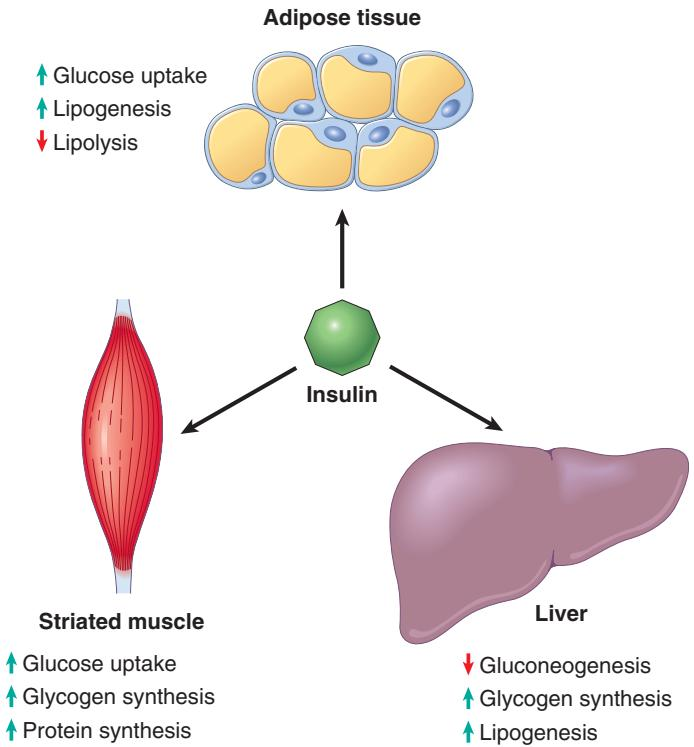 
Fig. 20.21 Metabolic actions of insulin in striated muscle, adipose tissue, and liver.
insulin and high glucagon levels facilitate hepatic gluconeogenesis and glycogenolysis (glycogen breakdown) while decreasing glycogen synthesis, thereby preventing hypoglycemia. Thus, fasting plasma glucose levels are determined primarily by hepatic glucose output. After a meal, insulin levels rise and glucagon levels fall in response to the large glucose load.
The most important stimulus that triggers insulin release from pancreatic beta cells is glucose itself. Oral intake of food leads to secretion of multiple hormones, notably the incretins produced by cells in the intestines. These hormones stimulate insulin secretion from beta cells, and also reduce glucagon secretion and delay gastric emptying, which promotes satiety. The incretin effect is significantly blunted in patients with type 2 diabetes, and restoring incretin function can lead to improved glycemic control and loss of weight (through restoration of satiety). These observations have resulted in the development of new classes of drugs for patients with type 2 diabetes that mimic incretins or enhance the levels of endogenous incretins through delaying their degradation.
In peripheral tissues (skeletal muscle and adipose tissue), secreted insulin binds to the insulin receptor, triggering a number of intracellular responses that promote glucose uptake and postprandial glucose utilization, thereby maintaining glucose homeostasis. Abnormalities at various points along this complex signaling cascade, from synthesis and release of insulin by beta cells to insulin receptor interactions in peripheral tissues, can result in the diabetic phenotype.
# Pathogenesis of Type I Diabetes
Type 1 diabetes is an autoimmune disease in which islet destruction is caused primarily by immune effector cells reacting against endogenous beta cell antigens. Although type 1 diabetes is the most common form of diabetes in childhood, it is important to remember that it can present at any age. Most patients with type 1 diabetes depend on exogenous insulin for survival; without insulin they develop serious metabolic complications such as ketoacidosis and coma. Although the clinical onset of type 1 diabetes is abrupt, it results from a chronic autoimmune attack on beta cells that usually starts years before the disease becomes evident (Fig. 20.22). The classic manifestations of the disease (such as ketoacidosis) occur late in its course, after more than $90\%$ of the beta cells have been destroyed.
As with most autoimmune diseases, the pathogenesis of type 1 diabetes involves genetic susceptibility and environmental factors. Genome-wide association studies have identified over 20 susceptibility loci for type 1 diabetes. Of these, the strongest association is with class II MHC (HLA-DR) genes. Between $90\%$ and $95\%$ of white patients with type 1 diabetes have HLA-DR3, or DR4, or both, in contrast with about $40\%$ of normal subjects, and $40\%$ to $50\%$ of patients are DR3/DR4 heterozygotes, in contrast with $5\%$ of normal subjects. Of note, however, most individuals who inherit these HLA alleles do not develop diabetes, indicating that these genes contribute to the disease but do not, by themselves, cause it. Several non-HLA genes also increase susceptibility to type 1 diabetes, including polymorphisms within the gene encoding
.jpg) 
Fig. 20.22 Stages in the development of type I diabetes mellitus. The stages are listed from left to right, and hypothetical $\beta$ cell mass is plotted against stage. (From Eisenbarth GE: Type I diabetes—a chronic autoimmune disease. N Engl J Med 314:1360, 1986.)
insulin itself, as well as CTLA4 and PTPN22. As discussed in Chapter 5, CTLA-4 is an inhibitory receptor of T cells, and PTPN-22 is a protein tyrosine phosphatase; both are thought to inhibit T-cell responses, so polymorphisms that interfere with their functional activity are expected to set the stage for excessive T-cell activation. Polymorphisms in the insulin gene may reduce its expression in the thymus, thus reducing the elimination of T cells reactive with this self protein (Chapter 5).
Additional evidence suggests that environmental factors, especially infections, are involved in type 1 diabetes. It has been proposed that certain viruses (mumps, rubella, and coxsackie B viruses, in particular) may be initiating triggers, perhaps because some viral antigens mimic beta cell antigens, leading to bystander damage to the islets, but this idea is not conclusively established. More recent advances in elucidating environmental contributions to the pathogenesis of type 1 diabetes have come from studies of the human microbiome. Studies in diabetic children have shown evidence for "intestinal dysbiosis" (change in composition of usual commensal flora), with reduction in diversity of the microbiome, and reduced abundance of certain bacterial species during progression of subclinical to clinical stages of the disease. Whether this is a cause or consequence of hyperglycemia remains unclear.
The fundamental immune abnormality in type 1 diabetes is a failure of self-tolerance in T cells specific for beta cell antigens. This failure of tolerance may result from some combination of defective clonal deletion of self-reactive T cells in the thymus and abnormalities of regulatory T cells (Tregs) that normally dampen effector T-cell responses (Chapter 5). One consequence of loss of self tolerance is the production of autoantibodies against a variety of beta cell antigens, including insulin and the beta cell enzyme glutamic acid decarboxylase, which are detected in the blood of $70\%$ to $80\%$ of patients. In the rare cases in which the pancreatic lesions have been examined
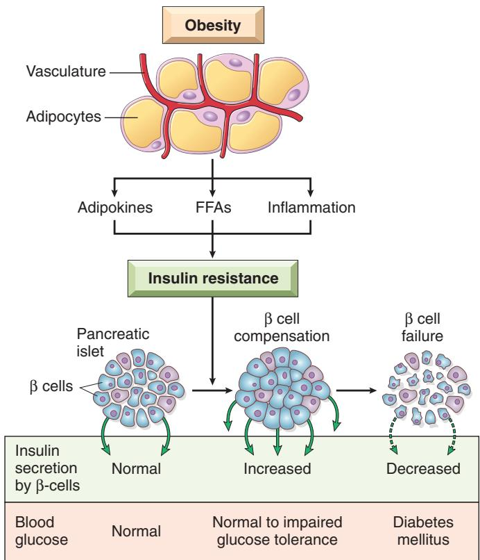 
Fig. 20.23 Development of type 2 diabetes. Insulin resistance associated with obesity is induced by adipokines, free fatty acids, and chronic inflammation in adipose tissue. Pancreatic $\beta$ cells compensate for insulin resistance by hypersecretion of insulin. However, at some point, $\beta$ cell compensation is followed by $\beta$ cell failure, and diabetes ensues. (Reproduced with permission from Kasuga M: Insulin resistance and pancreatic $\beta$ -cell failure. J Clin Invest 116:1756, 2006.)
early in the disease process, the islets show necrosis of beta cells and lymphocytic infiltration (so-called "insulitis", described later).
# Pathogenesis of Type 2 Diabetes
Type 2 diabetes is a heterogeneous and multifactorial complex disease that involves interactions of genetics, environmental risk factors, and inflammation. Unlike type 1 diabetes, however, there is no evidence of an autoimmune basis. The two defects that characterize type 2 diabetes are: (1) a decreased ability of peripheral tissues to respond to insulin (insulin resistance) and (2) beta cell dysfunction that is manifested as inadequate insulin secretion in the face of insulin resistance and hyperglycemia (Fig. 20.23). Insulin resistance predates the development of hyperglycemia and usually is accompanied by compensatory beta cell hyperfunction and hyperinsulinemia in the early stages of the evolution of diabetes.
Environmental factors, such as a sedentary lifestyle and dietary habits, unequivocally play a role, as described in the subsequent discussion of the association with obesity. Genetic factors also are involved, as evidenced by a concordance rate of $80\%$ to $90\%$ in monozygotic twins, which is even greater than that for type 1 diabetes (approximately $50\%$ concordance rates in twins), suggesting perhaps an even larger genetic component in type 2 diabetes. Additional evidence for a genetic basis has emerged from recent
large-scale genome-wide association studies, which have identified dozens of susceptibility loci called diabetogenic genes. Unlike type 1 diabetes, however, the disease is not linked to genes involved in immune tolerance and regulation (e.g., HLA, CTLA4).
# Insulin Resistance
Insulin resistance is defined as the failure of target tissues to respond normally to insulin. The liver, skeletal muscle, and adipose tissue are the major tissues where insulin resistance manifests as follows:
- Failure to inhibit endogenous glucose production (gluconeogenesis) in the liver, which contributes to high fasting blood glucose levels 
- Abnormally low glucose uptake and glycogen synthesis in skeletal muscle following a meal, which contributes to a high postprandial blood glucose level 
- Failure to inhibit hormone-sensitive lipase in adipose tissue, leading to excess circulating free fatty acids (FFAs), which, as will be discussed, exacerbates the state of insulin resistance
# Obesity and Insulin Resistance
Few factors play as important a role in the development of insulin resistance as obesity. The association of obesity with type 2 diabetes has been recognized for decades, with visceral obesity being common in a majority of affected patients. Insulin resistance is present even with simple obesity unaccompanied by hyperglycemia, indicating a fundamental abnormality of insulin signaling in states of fat excess. The term metabolic syndrome has been applied to a constellation of findings dominated by visceral obesity, accompanied by insulin resistance, glucose intolerance, and cardiovascular risk factors such as hypertension and abnormal lipid profiles. Individuals with metabolic syndrome are at high risk for the development of type 2 diabetes.
It is not only the absolute amount but also the distribution of body fat that has an effect on insulin sensitivity: central obesity (abdominal fat) is more likely to be associated with insulin resistance than is peripheral (gluteal/ subcutaneous) obesity. Obesity can adversely impact insulin sensitivity in numerous ways (see Fig. 20.23):
- Excess FFAs. Cross-sectional studies have demonstrated an inverse correlation between fasting plasma FFAs and insulin sensitivity. The level of intracellular triglycerides often is markedly increased in muscle and liver in obese individuals, presumably because excess circulating FFAs are taken up into these organs. Central adipose tissue is more "lipolytic" than peripheral adipose tissue, which might explain the particularly deleterious consequences of the central pattern of fat distribution. Intracellular triglycerides and products of fatty acid metabolism are potent inhibitors of insulin signaling and result in an acquired insulin resistance state. 
- Adipokines. Adipose tissue is not merely a passive storage depot for fat; it also is an endocrine organ that releases hormones in response to changes in metabolic status. A variety of proteins secreted into the systemic circulation by adipose tissue have been identified that are known collectively as adipokines (or adipose cytokines). Some of these promote hyperglycemia, and others (such as leptin and adiponectin) decrease blood glucose, in
part by increasing the insulin sensitivity of peripheral tissues. Adiponectin levels are decreased in obesity, thus contributing to insulin resistance.
- Inflammation. Over the past several years, inflammation has emerged as an important contributor to the pathogenesis of type 2 diabetes. It is now known that a permissive inflammatory milieu (mediated by proinflammatory cytokines that are secreted in response to excess nutrients such as FFAs) results in both peripheral insulin resistance and beta cell dysfunction (discussed later). Excess FFAs within macrophages and beta cells can activate the inflammasome, a multiprotein cytoplasmic complex that leads to secretion of the cytokine interleukin (IL-1β; Chapter 5). IL-1β stimulates the secretion of additional proinflammatory cytokines from macrophages, islets, and other cells, and IL-1 as well as other cytokines promote insulin resistance in peripheral tissues. Thus, excess FFAs can impede insulin signaling directly, as well as indirectly through the release of cytokines.
# Beta Cell Dysfunction
While insulin resistance by itself can lead to impaired glucose tolerance, beta cell dysfunction is an essential component in the development of overt diabetes. Beta cell function actually increases early in the disease process in most patients with type 2 diabetes, mainly as a compensatory measure to counter insulin resistance and maintain euglycemia. Eventually, however, beta cells are unable to adapt to the long-term demands of peripheral insulin resistance, and the hyperinsulinemic state gives way to a state of relative insulin deficiency.
Several mechanisms have been implicated in causing beta cell dysfunction in type 2 diabetes, including the following:
- Excess free fatty acids that compromise beta cell function and attenuate insulin release (lipotoxicity) 
- Chronic hyperglycemia (glucotoxicity) 
- Abnormal incretin effect, leading to reduced secretion of hormones that promote insulin release (discussed earlier) 
- Amyloid replacement of islets, present in more than $90\%$ of diabetic islets (see Morphology). It is unclear whether the amyloid is a cause or effect of beta cell "burnout." 
- Polymorphisms associated with an increased lifetime risk for type 2 diabetes in genes that control insulin secretion.
# Monogenic Forms of Diabetes
Type 1 and type 2 diabetes are genetically complex, and despite the associations with multiple susceptibility loci, no single-gene defect (mutation) can account for predisposition to these diseases. By contrast, monogenic forms of diabetes (see Table 20.5) are uncommon examples of the diabetes occurring as a result of loss-of-function mutations within a single gene. Monogenic causes of diabetes include primary defects in beta cell function and insulin receptor signaling. Monogenic diabetes can be classified based on age of onset into congenital early onset diabetes (manifesting in the neonatal period) and maturity onset diabetes of
the young (MODY), which develops beyond the neonatal period but usually before 25 years of age. Some of the underlying causes of congenital diabetes include mutations of the insulin gene itself, and mutations in mitochondrial DNA that lead to a syndrome of maternally inherited diabetes and bilateral deafness (the maternal pattern of inheritance being a sine qua non of mitochondrial DNA mutations). Rare instances of insulin receptor mutations that affect receptor synthesis, insulin binding, or downstream signal transduction can cause severe insulin resistance, accompanied by hyperinsulinemia (due to lack of feedback inhibition) and congenital diabetes. In contrast, MODY is caused by mutations in genes encoding factors driving beta cell function (see Table 20.5), and at least superficially, tends to resemble usual type 2 diabetes in many of its clinical features. Thus, it is not surprising that the diagnosis of MODY is often missed in individuals who harbor an underlying pathogenic mutation.
# Other Subtypes of Diabetes
In addition to Types 1 and 2 and monogenic forms of diabetes, the other broad subtypes include secondary diabetes and pregnancy-induced ("gestational") diabetes. Secondary diabetes arising as a result of endocrinopathies (for example, Cushing syndrome or growth hormone excess) have been described in relevant portions of this chapter. Here, we will briefly discuss a form of secondary diabetes arising as a result of a variety of chronic exocrine pancreatic diseases ("pancreatogenic" diabetes), and the important subtype known as gestational diabetes.
- Gestational diabetes. Approximately $5\%$ of pregnancies occurring in the United States are complicated by hyperglycemia. Pregnancy is a "diabetogenic" state in which the prevailing hormonal milieu favors a state of insulin resistance. In some euglycemic pregnant women this can give rise to gestational diabetes. Women with pregestational diabetes (where hyperglycemia is already present in the periconception period) have an increased risk for stillbirth and congenital malformations in the fetus (Chapter 7). Therefore, tight glycemic control is needed early in pregnancy to prevent congenital defects, and through the later trimesters of pregnancy to prevent fetal overgrowth ( macrosomia). The latter occurs because maternal hyperglycemia can induce compensatory secretion of insulin-like growth factors in the fetus. Most pregnant women who develop gestational diabetes require insulin for glycemic control. Gestational diabetes typically resolves following delivery; however, there is an elevated risk for developing outright diabetes within the next ten years (highest in the first five years after pregnancy), after which the risk of diabetes reverts to that of women without antecedent gestational diabetes. 
- Pancreatogenic diabetes is defined as hyperglycemia occurring as a result of a disorder of the exocrine pancreas (see Table 20.5). Pancreatogenic diabetes is heterogeneous, with underlying causes ranging from cystic fibrosis, to chronic pancreatitis, to pancreatic adenocarcinoma. In fact, evidence suggests that approximately $1\%$ of new-onset diabetes in older adults is actually a manifestation of an occult pancreatic adenocarcinoma.
# Acute Metabolic Complications of Diabetes
It is difficult to discuss with brevity the diverse clinical presentations of diabetes mellitus. We will discuss the most common initial presentation or mode of diagnosis for each of the two major subtypes, followed by a discussion of acute and chronic complications of diabetes.
# Initial Presentation
In the initial 1 or 2 years after manifestation of overt type 1 diabetes (referred to as the honeymoon period), exogenous insulin requirements may be minimal because of residual
insulin secretion, but eventually the beta cell reserve is exhausted and exogenous insulin becomes essential to control hyperglycemia. Although beta cell destruction is a gradual process, the transition from impaired glucose tolerance to overt diabetes may be abrupt, heralded by an event associated with increased insulin requirements such as infection. The onset of diabetes is marked by polyuria, polydipsia, polyphagia (known as the classic triad of diabetes), and in severe cases, ketoacidosis, all resulting from metabolic derangements (Fig. 20.24).
Since insulin is a major anabolic hormone, its deficiency has widespread effects. The assimilation of glucose into
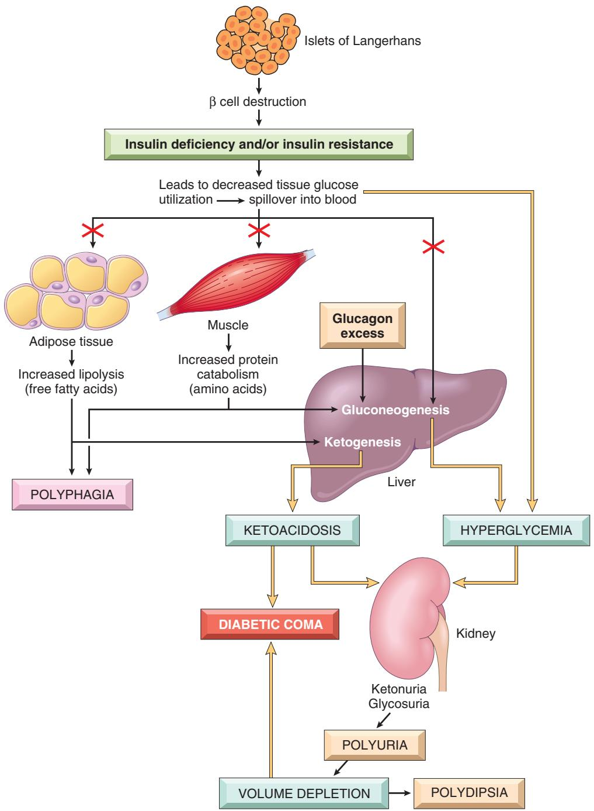 
Fig. 20.24 Sequence of metabolic derangements leading to diabetic coma in type I diabetes mellitus. An absolute insulin deficiency leads to a catabolic state, eventuating in ketoacidosis and severe volume depletion. These derangements bring about sufficient central nervous system compromise to cause coma and, eventually, death if left untreated.
muscle and adipose tissue is sharply diminished or abolished. Storage of glycogen in liver and muscle ceases, and reserves are depleted by glycogenolysis. The resultant hyperglycemia exceeds the renal threshold for reabsorption, and glycosuria ensues. The glycosuria induces osmotic diuresis and polyuria, causing the loss of water and electrolytes. The renal water loss combined with hyperosmolarity due to increased levels of glucose in the blood depletes intracellular water, triggering osmoreceptors in the brain. This sequence of events generates intense thirst (polydipsia). The deficiency of insulin leads to the catabolism of proteins and fats. Gluconeogenic amino acids produced by proteolysis are taken up and by the liver and used as building blocks for glucose. The catabolism of proteins and fats induces a negative energy balance, which in turn leads to increasing appetite (polyphagia), thus completing the classic triad. Despite the increased appetite, catabolic effects dominate, resulting in weight loss and muscle weakness. The combination of polyphagia and weight loss is paradoxical and should always point to the possibility of diabetes.
# Diabetic Ketoacidosis and Hyperosmolar Non-ketotic Coma
In patients with type 1 diabetes, significant deviations from normal dietary intake, unusual physical activity, infection, or any other forms of stress may worsen the metabolic imbalance, leading to diabetic ketoacidosis. The plasma glucose usually is in the range of 500 to $700\mathrm{mg / dL}$ as a result of absolute insulin deficiency and unopposed effects of counterregulatory hormones (epinephrine, glucagon). The marked hyperglycemia causes an osmotic diuresis and dehydration characteristic of the ketoacidotic state. The second major effect is activation of the ketogenic machinery. Insulin deficiency leads to activation of hormone-sensitive lipase, with resultant excessive breakdown of adipose stores, giving rise to increased FFAs, which are oxidized by the liver to produce ketones. Ketogenesis is an adaptive phenomenon in times of starvation, generating ketones as a source of energy for consumption by vital organs (e.g., the brain). The rate at which ketones are formed may exceed the rate at which they can be used by peripheral tissues, leading to ketonemia and ketonuria. If the urinary excretion of ketones is compromised by dehydration, the accumulating ketones decrease blood $\mathsf{pH}$ , resulting in metabolic acidosis.
Type 2 diabetes also may manifest with polyuria and polydipsia. In some cases, medical attention is sought because of unexplained weakness or weight loss. Most frequently, however, the diagnosis is made after routine blood or urine testing in asymptomatic individuals. In the decompensated state, patients with type 2 diabetes may develop hyperosmolar nonketotic coma. This syndrome is engendered by severe dehydration resulting from sustained osmotic diuresis and urinary fluid loss due to chronic hyperglycemia. Typically, the affected individual is an older adult diabetic who is disabled by a stroke or an infection and is unable to maintain adequate water intake. The absence of ketoacidosis and its symptoms (nausea, vomiting, respiratory difficulties) delays recognition of the seriousness of the situation until the onset of severe dehydration and coma.
# Chronic Complications of Diabetes
The morbidity associated with long-standing diabetes of any type results from the chronic complications of hyperglycemia, and the resulting damage induced in both large- and medium-sized muscular arteries (diabetic macrovascular disease) and small-vessels (diabetic microvascular disease). Macrovascular disease causes accelerated atherosclerosis among diabetics, resulting in increased myocardial infarction, stroke, and lower-extremity ischemia. The effects of microvascular disease are most profound in the retina, kidneys, and peripheral nerves, resulting in diabetic retinopathy, nephropathy, and neuropathy, respectively (Fig. 20.25). The pathologic findings in these tissues and their clinical consequences are described next. There is extreme variability among patients in the time of onset of these complications, their severity, and the particular organ or organs involved. In individuals with tight control of their diabetes, the onset may be delayed (hence the need for tight control of hyperglycemia).
# Pathogenesis of Chronic Complications of Diabetes
The pathogenesis of the long-term complications of diabetes is multifactorial, although persistent hyperglycemia (glucotoxicity) seems to be a key mediator. At least three distinct metabolic pathways seem to be involved in the pathogenesis of long-term complications; it is likely that all of them play a role in a tissue-specific manner.
1. Formation of advanced glycation end products (AGEs). AGEs are formed as a result of nonenzymatic reactions between intracellular glucose-derived precursors (glyoxal, methylglyoxal, and 3-deoxyglucosone) and the amino groups of proteins. The rate of AGE formation is greatly accelerated by hyperglycemia. AGEs bind to a specific receptor (RAGE), which is expressed on inflammatory cells (macrophages and T cells), endothelium and vascular smooth muscle. The detrimental effects of AGE-RAGE signaling within the vascular compartment include the following:
- Release of cytokines and growth factors, including transforming growth factor $\beta$ (TGF $\beta$ ), which leads to deposition of excess basement membrane material, and vascular endothelial growth factor (VEGF), implicated in diabetic retinopathy (discussed later) 
- Generation of reactive oxygen species (ROS) in endothelial cells 
- Increased procoagulant activity on endothelial cells and macrophages 
- Enhanced proliferation of vascular smooth muscle cells and synthesis of extracellular matrix
In addition to receptor-mediated effects, AGEs can directly cross-link extracellular matrix proteins. These cross-linked proteins can trap other plasma or interstitial proteins; for example, low-density lipoprotein (LDL) gets trapped within AGE-modified large-vessel walls, accelerating atherosclerosis (Chapter 10), while albumin can be trapped within capillary walls, accounting in part for the basement membrane thickening that is characteristic of diabetic microangiopathy (discussed later).
2. Activation of protein kinase C. Activation of intracellular protein kinase C (PKC) by calcium ions and the second messenger diacylglycerol (DAG) is an important
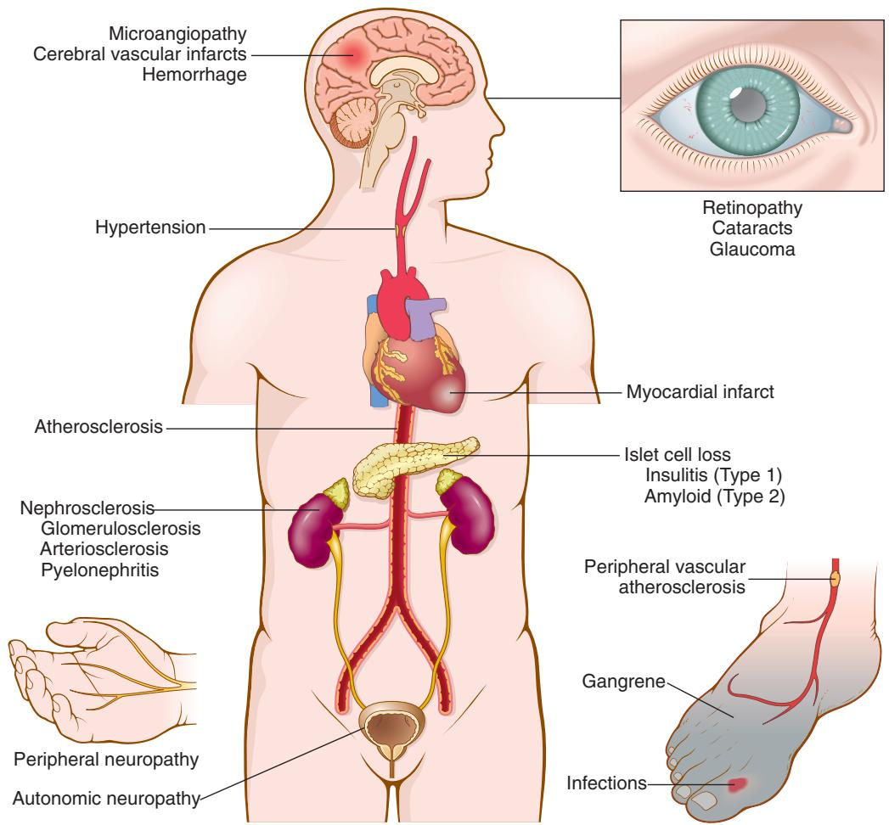 
Fig. 20.25 Long-term complications of diabetes.
signal transduction pathway in many cellular systems. Intracellular hyperglycemia can stimulate the de novo synthesis of DAG from glycolytic intermediates and hence cause activation of PKC. The downstream effects of PKC activation are numerous and include production of proangiogenic molecules such as vascular endothelial growth factor (VEGF), implicated in the neovascularization seen in diabetic retinopathy, and profibrogenic molecules such as transforming growth factor $\beta$ , leading to increased deposition of extracellular matrix and basement membrane material.
3. Disturbances in polyol pathways. In some tissues that do not require insulin for glucose transport (e.g., nerves, lens, kidneys, blood vessels), hyperglycemia leads to an increase in intracellular glucose that is then metabolized by the enzyme aldose reductase to sorbitol, a polyol, and eventually to fructose, in a reaction that uses NADPH (the reduced form of nicotinamide dinucleotide phosphate) as a cofactor. NADPH also is required by the enzyme glutathione reductase in a reaction that regenerates reduced glutathione (GSH). As described in Chapter 2, GSH is one of the important anti-oxidant mechanisms in the cell, and reductions in GSH increase cellular susceptibility to oxidative stress. In neurons, persistent hyperglycemia appears to be the major underlying cause of diabetic neuropathy (glucose neurotoxicity).
The most important morphologic changes are related to the many late systemic complications of diabetes. These changes are seen in both type I and type 2 diabetes (see Fig. 20.25).
Pancreas. Lesions in the pancreas are inconstant. One or more of the following alterations may be present:
- Reduction in the number and size of islets. This change most often is seen in type I diabetes, particularly with rapidly advancing disease. Most of the islets are small, inconspicuous, and not easily detected. 
- Leukocytic infiltrates in the islets (insulin) are principally composed of T lymphocytes (Fig. 20.26A). They are most often seen type I diabetes at the time of clinical presentation. 
Amyloid deposition within islets in type 2 diabetes begins in and around capillaries and between cells. At advanced stages, the islets may be virtually obliterated (see Fig. 20.26B); fibrosis also may be observed. Similar lesions may be found in older nondiabetics, apparently as part of normal aging. 
- An increase in the number and size of islets, especially characteristic of nondiabetic newborns of diabetic mothers. Presumably, fetal islets undergo hyperplasia in response to the maternal hyperglycemia.
Diabetic macrovascular disease. The hallmark of diabetic macrovascular disease is accelerated atherosclerosis
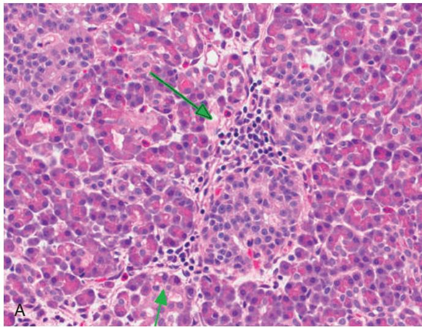 
Fig. 20.26 (A) Autoimmune insulitis in a human pancreatic explant. Arrows point to inflammation surrounding islet of Langerhans, while the surrounding acinar structures are essentially normal. (Photograph provided by Dr. Martha Campbell-Thompson, JDRF Network for Pancreatic Organ Donors, University of Florida., Gainesville, Florida.) (B) Amyloidosis of a pancreatic islet in type 2 diabetes. Amyloidosis typically is observed late in the natural history of this form of diabetes, with islet inflammation noted at earlier observations.
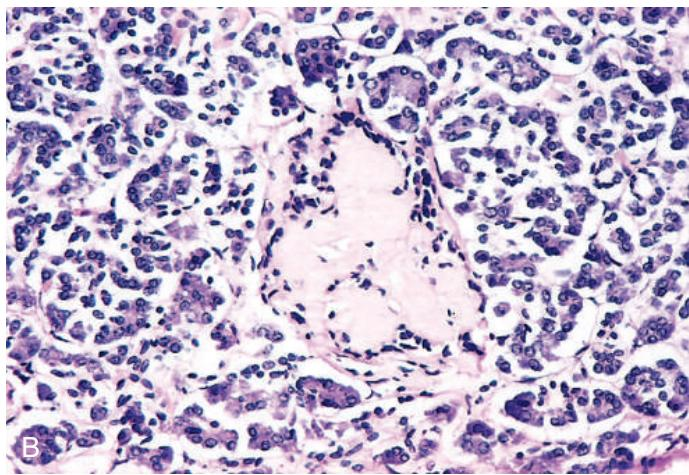
affecting the aorta and large- and medium-sized arteries. Except for its greater severity and earlier age at onset, atherosclerosis in diabetics is indistinguishable from that in nondiabetics (Chapter 10). Myocardial infarction, caused by atherosclerosis of the coronary arteries, is the most common cause of death in diabetics. Significantly, it is almost as common in diabetic women as in diabetic men. By contrast, myocardial infarction is uncommon in nondiabetic women of reproductive age. Gangrene of the lower extremities, as a result of advanced vascular disease, is about 100 times more common in individuals with diabetes than in the general population. The larger renal arteries also are subject to severe atherosclerosis, but the most damaging effect of diabetes on the kidneys is exerted at the level of the glomeruli and the microcirculation, as discussed later.
Hyaline arteriolasclerosis, the vascular lesion associated with hypertension (Chapters 10 and 14), is both more prevalent and more severe in diabetics than in nondiabetics, but it is not specific for diabetes and may be seen in older adults who do not suffer from either diabetes or hypertension. It takes the form of an amorphous, hyaline thickening of the wall of the arterioles, which causes narrowing of the lumen (Fig. 20.27). Not surprisingly, in diabetic patients, its severity is related not only to the duration of the disease but also to the presence or absence of hypertension.
Diabetic microangiopathy. One of the most consistent morphologic features of diabetes is diffuse thickening of basement membranes. The thickening is most evident in the capillaries of the skin, skeletal muscle, retina, renal glomeruli, and renal medulla. However, it also may be seen in nonvascular structures such as renal tubules, the Bowman capsule, peripheral nerves, and placenta. By both light and electron microscopy, the basal lamina separating parenchymal or endothelial cells from the surrounding tissue is markedly thickened by concentric layers of hyaline material composed predominantly of type IV collagen (Fig. 20.28). Of note, despite the increase in the thickness of basement membranes, diabetic capillaries are leaky, leading to extravasation of plasma proteins. The microangiopathy underlies the development of diabetic nephropathy, retinopathy,
and some forms of neuropathy. An indistinguishable microangiopathy can be found in aged nondiabetic patients, but rarely to the extent seen in individuals with long-standing diabetes.
Diabetic nephropathy. The kidneys are prime targets of diabetes (see also Chapter 14). Renal failure is second only to myocardial infarction as a cause of death from this disease. The lesions include mainly: (1) glomerular lesions; (2) renal vascular lesions, principally arteriolosclerosis; and (3) pyelonephritis, including necrotizing papillitis.
The most important glomerular lesions are capillary basement membrane thickening, diffuse mesangial sclerosis, and nodular glomerulosclerosis. The glomerular capillary basement membranes are thickened along their entire length. This change can be detected by electron microscopy within a few years of
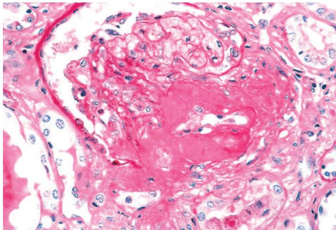 
Fig. 20.27 Severe renal hyaline arteriolosclerosis in a periodic acid-Schiff stained specimen. Note the markedly thickened, tortuous afferent arteriole. The amorphous nature of the thickened vascular wall is evident. (Courtesy of Dr. M.A. Venkatachalam, Department of Pathology, University of Texas Health Science Center, San Antonio, Texas.)
.jpg) 
Fig. 20.28 Renal cortex showing thickening of tubular basement membranes in a specimen from a diabetic patient. (Periodic acid-Schiff stain.)
.jpg) 
Fig. 20.30 Nodular glomerulosclerosis in a renal specimen from a patient with long-standing diabetes. (Courtesy of Dr. Lisa Yerian, Department of Pathology, University of Chicago, Chicago, Illinois.)
the onset of diabetes, sometimes without any associated change in renal function (Fig. 20.29).
Diffuse mesangial sclerosis refers to an increase in mesangial matrix associated with mesangial cell proliferation and basement membrane thickening. It is found in most individuals with disease of more than 10 years' duration. When glomerulosclerosis is severe, patients develop the nephrotic syndrome, characterized by proteinuria, hypoalbuminemia, and edema (Chapter 14).
Nodular glomerulosclerosis (Kimmelstiel-Wilson lesion) is a distinctive glomerular lesion characterized by ball-like deposits of a laminated matrix in the periphery of the glomerulus (Fig. 20.30). These nodules are PAS-positive and usually contain trapped mesangial cells. Nodular glomerulosclerosis is encountered in approximately $15\%$ to $30\%$ of individuals with long-term diabetes and is a major contributor to renal dysfunction. Diffuse
mesangial sclerosis also may be seen in association with old age and hypertension; by contrast, the nodular form of glomerulosclerosis is virtually pathognomonic of diabetes. Both the diffuse and the nodular forms of glomerulosclerosis induce sufficient ischemia to cause scarring of the kidneys, manifested by a finely granular-appearing cortical surface (Fig. 20.31).
Renal atherosclerosis and arteriolosclerosis constitute part of the macrovascular disease seen in diabetics. The kidney is one of the most frequently and severely affected organs; the changes in the arteries and arterioles are similar to those found throughout the body. Hyaline arteriolosclerosis affects not only the afferent but also the efferent arterioles. Such efferent arteriolosclerosis is rarely if ever encountered in individuals who do not have diabetes.
inadiabetic.L,Glomerularcapillarylumen;U,urinaryspace.(CourtesyofDr.MichaelKashgarian,DepartmentofPathology,YaleUniversitySchoolofMedicine,NewHaven,Connecticut.).jpg) 
Fig. 20.29 Renal glomerulus showing markedly thickened glomerular basement membrane (B) in a diabetic. L, Glomerular capillary lumen; U, urinary space. (Courtesy of Dr. Michael Kashgarian, Department of Pathology, Yale University School of Medicine, New Haven, Connecticut.)
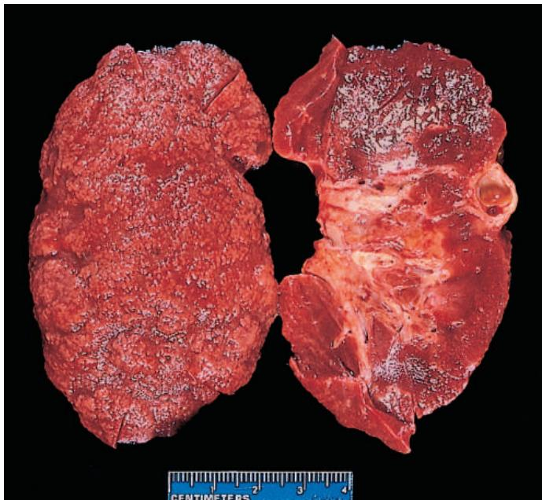 
Fig. 20.31 Nephrosclerosis in a patient with long-standing diabetes. The bisected kidney demonstrates diffuse granular transformation of the surface (left) and marked thinning of the cortex (right). Additional features include some irregular depressions, the result of pyelonephritis, and an incidental cortical cyst (far right).
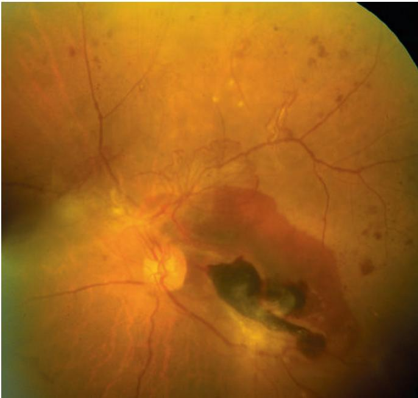 
Fig. 20.32 Characteristic morphologic changes of diabetic retinopathy. Features include advanced proliferative retinopathy with retinal hemorrhages, exudates, neovascularization, and tractional retinal detachment (lower-right corner). (Courtesy of Dr. Rajendra Apte, Washington University School of Medicine, St. Louis, Missouri.)
Pyelonephritis is an acute or chronic inflammation of the kidneys that usually begins in the interstitial tissue and then spreads to involve the tubules. Both the acute and chronic forms of this disease occur in nondiabetics as well as in diabetics are more common in individuals with diabetes, and once affected, diabetics also tend to have more severe involvement. One special pattern of acute pyelonephritis, necrotizing papillitis (or papillary necrosis), is much more prevalent in diabetics than in nondiabetics.
Ocular complications of diabetes. Visual impairment, sometimes even total blindness, is one of the more feared consequences of long-standing diabetes. The ocular involvement may take the form of retinopathy, cataract formation, or glaucoma. Retinopathy, the most common pattern, consists of a constellation of changes that together are considered by many ophthalmologists to be virtually diagnostic of the disease. The lesion in the retina takes two forms: nonproliferative retinopathy and proliferative retinopathy.
Nonproliferative retinopathy includes intraretinal or preretinal hemorrhages, retinal exudates, microaneurysms, venous dilations, edema, and, most importantly, thickening of the retinal capillaries (microangiopathy). The retinal exudates can be "soft" (microinfarcts) or "hard" (deposits of plasma proteins and lipids) (Fig. 20.32). The microaneurysms are discrete saccular dilations of retinal choroidal capillaries that appear through the ophthalmoscope as small red dots. Dilations tend to occur at focal points of weakening, resulting from loss of pericytes. Retinal edema presumably results from excessive capillary permeability. Underlying all of these changes is the microangiopathy, which is thought to lead to loss of capillary pericytes and hence to focal weakening of capillary structure.
The so-called proliferative retinopathy is a process of neovascularization and fibrosis. This lesion leads to serious
consequences, including blindness, especially if it involves the macula. Vitreous hemorrhages may result from the rupture of newly formed capillaries; the subsequent organization of the hemorrhage can pull the retina off its substratum (retinal detachment).
Diabetic neuropathy. The central and peripheral nervous systems are not spared by diabetes. The most frequent pattern of involvement is that of a peripheral, symmetric neuropathy of the lower extremities affecting both motor and sensory function, particularly the latter. Other forms include autonomic neuropathy, which produces disturbances in bowel and bladder function and sometimes sexual impotence, and diabetic mononeuropathy, which may manifest as sudden footdrop or wristdrop or isolated cranial nerve palsies. The neurologic changes may be the result of microangiopathy and increased permeability of the capillaries that supply the nerves, as well as direct axonal damage.
# Clinical Features of Chronic Diabetes
As the previous discussion has emphasized, type 1 and type 2 diabetes are distinct pathophysiologic entities with the common manifestation of hyperglycemia. Table 20.6 summarizes some of the clinical, genetic and histopathologic features that distinguish the two diseases. Nonetheless, as previously stated, the long-term sequela of both types 1 and 2 diabetes, arising as a result of uncontrolled
Table 20.6 Type I Versus Type 2 Diabetes Mellitus 
Type 1 Diabetes MellitusType 2 Diabetes MellitusClinicalOnset usually in childhood and adolescenceOnset usually in adulthood; increasing incidence in childhood and adolescenceNormal weight or weight loss preceding diagnosisVast majority of patients are obese (80%)Progressive decrease in insulin levelsIncreased blood insulin (early); normal or moderate decrease in insulin (late)Circulating islet autoantibodiesNo islet autoantibodiesDiabetic ketoacidosis in absence of insulin therapyNonketotic hyperosmolar comaGeneticsMajor linkage to MHC class I and II genes; also linked to polymorphisms in CTLA4 and PTPN22No HLA linkage; linkage to candidate diabetogenic and obesity-related genesPathogenesisBreakdown in self-tolerance to islet autoantigensInsulin resistance in peripheral tissues, failure of compensation by beta cellsMultiple obesity-associated factors (circulating nonesterified fatty acids, inflammatory mediators, adipocytokines) linked to pathogenesis of insulin resistancePathologyAutoimmune “insulitis”Amyloid deposition in islets (late)Beta cell depletion, islet atrophyMild beta cell depletion
or poorly controlled hyperglycemia, are similar, and are responsible for much of the morbidity and mortality in diabetics. In most instances these complications appear approximately 15 to 20 years after the onset of hyperglycemia. The major chronic complications of the disease are described next.
- Macrovascular complications, such as myocardial infarction, renal vascular insufficiency, and cerebrovascular accidents, are the most common causes of mortality in long-standing diabetes. Diabetics have a two to four times greater incidence of coronary artery disease, and a fourfold higher risk of death from cardiovascular complications, than nondiabetics. Diabetes is often accompanied by underlying conditions that favor the development of adverse cardiovascular events, including hypertension and dyslipidemia (see earlier discussion on metabolic syndrome). The hallmark of cardiovascular disease is accelerated atherosclerosis of the large- and medium-sized arteries (i.e., macrovascular disease). The importance of obesity in the pathogenesis of insulin resistance has already been discussed, but it also is an independent risk factor for development of atherosclerosis. 
- Diabetic nephropathy is a leading cause of end-stage renal disease in the United States. The earliest manifestation of diabetic nephropathy is the appearance of small amounts of albumin in the urine ( $>30$ but $300\mathrm{mg}/$ day) over the ensuing 10 to 15 years, usually accompanied by the appearance of hypertension. The progression from overt nephropathy to end-stage renal disease is highly variable and is evidenced by a progressive drop in glomerular filtration rate. By 20 years after diagnosis, more than $75\%$ of individuals with type 1 diabetes and about $20\%$ of those with type 2 diabetes with overt nephropathy will develop end-stage renal disease, necessitating dialysis or renal transplantation. 
- Visual impairment, sometimes even total blindness, is one of the more feared consequences of long-standing diabetes. Diabetes is the fourth leading cause of acquired blindness in the United States. Approximately $60\%$ to $80\%$ of patients develop some form of diabetic retinopathy approximately 15 to 20 years after diagnosis. The fundamental lesion of retinopathy—neovascularization—is attributable to hypoxia-induced overexpression of VEGF in the retina. Current treatment for this condition includes intravitreal injection of anti-angiogenic agents. In addition to retinopathy, diabetic patients also have an increased propensity for glaucoma and cataract formation, both of which contribute to visual impairment in diabetes. 
- Diabetic neuropathy can produce a variety of clinical syndromes, afflicting the central nervous system, peripheral sensorimotor nerves, and autonomic nervous system. The most frequent pattern of nerve involvement is a distal symmetric polyneuropathy of the lower extremities that affects both motor and sensory function, particularly the latter (Chapter 22). Over time, the upper extremities may be involved as well, thus approximating a "glove and stocking" pattern of polyneuropathy. Other forms include autonomic neuropathy, which
produces disturbances in bowel and bladder function and sometimes sexual impotence, and diabetic mononeuropathy, which may manifest as sudden footdrop, wristdrop, or isolated cranial nerve palsies.
- Diabetic patients are plagued by an increased susceptibility to infections of the skin, tuberculosis, pneumonia, and pyelonephritis. Infections cause about $5\%$ of diabetes-related deaths. In an individual with diabetic neuropathy, a trivial infection in a toe may be the first event in a long succession of complications (gangrene, bacteremia, pneumonia) that may ultimately lead to death.
Several large-scale prospective studies have convincingly demonstrated that the microvascular complications, and the associated morbidity and mortality, from diabetes are attenuated by strict glycemic control. For patients with type 1 diabetes, insulin replacement therapy is the mainstay of treatment, while nonpharmacologic approaches such as dietary restrictions and exercise (which improves insulin sensitivity) are often the "first line of defense" for type 2 diabetes. Most patients with type 2 diabetes eventually require therapeutic intervention to reduce hyperglycemia. Glycemic control is assessed clinically by measuring the percentage of glycosylated hemoglobin, also known as HbA1C, which is formed by nonenzymatic addition of glucose moieties to hemoglobin in red cells. Unlike blood glucose levels, HbA1C is a measure of glycemic control over long periods of time (2-3 months) and is relatively unaffected by day-to-day variations. The ADA recommends maintenance of HbA1C levels at less than $7\%$ to reduce the risk for long-term complications. In addition, diabetics need to maintain LDL and HDL cholesterol and triglycerides at optimal levels to reduce the risk for macrovascular complications. The adoption of a healthy and active lifestyle remains one of the best defenses against this modern day scourge.
# DIABETES MELLITUS: PATHOGENESIS AND LONG-TERM COMPLICATIONS
- Type I diabetes is an autoimmune disease characterized by progressive destruction of islet beta cells, leading to absolute insulin deficiency. Both autoreactive T cells and autoantibodies are involved. 
- Type 2 diabetes is caused by insulin resistance and beta cell dysfunction, resulting in relative insulin deficiency. Autoimmunity is not involved. 
- Obesity has an important relationship with insulin resistance (and hence type 2 diabetes), mediated by various factors, including excess free fatty acids, aberrant levels of adipokines, and an altered inflammatory milieu within adipose tissue. 
- Monogenic forms of diabetes are uncommon and are caused by single-gene defects that result in primary beta cell dysfunction or lead to abnormalities of insulin-insulin receptor signaling. 
- The long-term complications of diabetes are similar in all types and affect mainly blood vessels, and the kidneys, nerves, and eyes. The development of these complications is attributed to three underlying mechanisms: formation of AGEs, activation of PKC, and disturbances in polyol pathways leading to oxidative stress.
# PANCREATIC NEUROENDOCRINE TUMORS
Pancreatic neuroendocrine tumors (PanNETs), also known as islet cell tumors, are rare in comparison with tumors of the exocrine pancreas, accounting for only $2\%$ of all pancreatic neoplasms. PanNETs are most common in adults and may be single or multifocal; when they are malignant, the liver is the most common site of metastases. These tumors have a propensity to elaborate pancreatic hormones, but some are nonfunctional. The latter typically are larger at the time of diagnosis, since they come to clinical attention later in their natural history than functional PanNETs, which often present with symptoms related to excessive hormone production. All PanNETs, with the exception of insulinomas (see later), are regarded as having malignant potential, and in fact, $60\%$ to $90\%$ of PanNETs manifest with overtly malignant features of biologic aggressiveness, such as invasion into local tissues or distant metastases. The tumors frequently have mutations in tumor suppressor genes MEN1 and PTEN, or inactivating mutations in genes (e.g. ATRX) whose products maintain telomere length.
# Insulinomas
Beta cell tumors (insulinomas) are the most common type of PanNET and elaborate sufficient insulin to induce attacks of hypoglycemia when blood glucose levels fall below $50\mathrm{mg / dL}$ . These attacks manifest as confusion, stupor, and loss of consciousness. They are precipitated by fasting or exercise and are promptly relieved by feeding or parenteral administration of glucose. Most insulinomas are cured by surgical resection.
The majority of insulinomas are identified while they are small $(< 2\mathrm{cm}$ in diameter) and localized to the pancreas. Most are solitary lesions, although multifocal tumors or tumors ectopic to the pancreas may be encountered. Malignancy in insulinomas occurs in less than $10\%$ of cases, and is diagnosed on the basis of local invasion or metastases. On histologic examination, the benign tumors look remarkably like giant islets, with preservation of the regular cords of monotonous cells and their orientation to the vasculature. Malignant lesions also tend to be well-differentiated and may be deceptively encapsulated. Deposition of amyloid is a characteristic feature of many insulinomas (Fig. 20.33). Under the electron microscope, neoplastic beta cells, like their normal counterparts, display distinctive round granules.
,alsocalledisletcelltumor.Theneoplasticcellsaremonotonousinappearanceanddemonstrateminimalpleomorphismormitoticactivity.Thereisabundantamyloiddeposition,characteristicofaninsulinoma..jpg) 
Fig. 20.33 Pancreatic neuroendocrine tumor (PanNET), also called islet cell tumor. The neoplastic cells are monotonous in appearance and demonstrate minimal pleomorphism or mitotic activity. There is abundant amyloid deposition, characteristic of an insulinoma.
# Gastrinomas
Marked hypersecretion of gastrin usually has its origin in gastrin-producing tumors (gastrinomas), which are just as likely to arise in the duodenum and peripancreatic soft tissues as in the pancreas (the so-called "gastrinoma triangle"). The Zollinger-Ellison syndrome refers to the association of pancreatic islet cell lesions with hypersecretion of gastric acid and severe peptic ulceration, present in $90\%$ to $95\%$ of patients with gastrinomas. Hypergastrinemia from a pancreatic or duodenal tumor stimulates extreme gastric acid secretion, which, in turn, causes peptic ulceration. The duodenal and gastric ulcers often are multiple; although they are identical to those found in the general population, they often are unresponsive to usual therapy. In addition, ulcers may occur in unusual locations such as the jejunum; when intractable jejunal ulcers are found, Zollinger-Ellison syndrome should be considered. More than one-half of affected patients have diarrhea; in $30\%$ , it is the presenting manifestation.
Gastrinomas may arise in the pancreas, the peripancreatic region, or the wall of the duodenum. Over one-half of gastrin-producing tumors are locally invasive or have already metastasized at the time of diagnosis. In approximately $25\%$ of patients, gastrinomas arise in conjunction with other endocrine tumors, thus conforming to the MEN-1 syndrome (discussed later); MEN-1-associated gastrinomas frequently are multifocal, while sporadic gastrinomas usually are single. As with insulin-secreting tumors of the pancreas, gastrin-producing tumors are histologically bland and rarely exhibit marked anaplasia.
# Adrenal Cortex
The adrenal glands are paired endocrine organs consisting of two regions, the cortex and medulla, which differ in their development, structure, and function. The cortex
consists of three layers of distinct cell types. Beneath the capsule of the adrenal gland is the narrow layer of zona glomerulosa. An equally narrow zona reticularis abuts the
medulla. Intervening is the broad zona fasciculata, which makes up about $75\%$ of the total cortex.
The adrenal cortex synthesizes three different types of steroids:
- Glucocorticoids (principally cortisol), synthesized primarily in the zona fasciculata, with a small contribution from the zona reticularis 
- Mineralocorticoids, the most important being aldosterone, generated in the zona glomerulosa 
- Sex steroids (estrogens and androgens), produced largely in the zona reticularis
The adrenal medulla is composed of chromaffin cells, which synthesize and secrete catecholamines, mainly epinephrine. This section deals first with disorders of the adrenal cortex and then of the medulla. Diseases of the adrenal cortex can be conveniently divided into those associated with cortical hyperfunction or hypofunction.
# ADRENOCORTICAL HYPERFUNCTION: HYPERADRENALISM
There are three distinctive hyperadrenal clinical syndromes, each caused by abnormal production of one or
more of the hormones produced by the three layers of the cortex:
- Cushing syndrome, characterized by an excess of cortisol 
- Hyperaldosteronism, caused by an excess of mineralocorticoid 
- Adrenogenital or virilizing syndromes, caused by an excess of androgens
The clinical features of some of these syndromes show some similarities because of the shared functions of adrenal steroids.
# Hypercortisolism: Cushing Syndrome
Hypercortisolism (Cushing syndrome) is caused by elevated glucocorticoid levels. In clinical practice, the vast majority of cases of Cushing syndrome are the result of administration of exogenous glucocorticoids (iatrogenic). The remaining cases are endogenous, and the three most common disorders are as follows (Fig. 20.34):
Primary hypothalamic-pituitary diseases associated with hypersecretion of ACTH 
- Secretion of ectopic ACTH by nonpituitary neoplasms 
- Primary adrenocortical neoplasms (adenoma or carcinoma) and, rarely, primary cortical hyperplasia
Primary hypothalamic-pituitary disease associated with hypersecretion of ACTH, also known as Cushing disease,
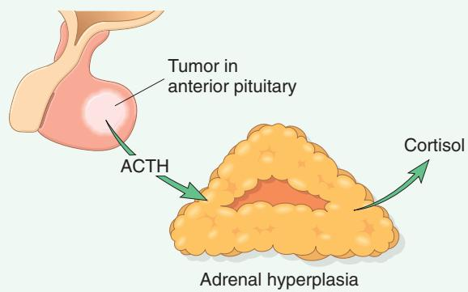 
PITUITARY CUSHING SYNDROME
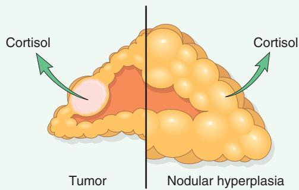 
ADRENAL CUSHING SYNDROME
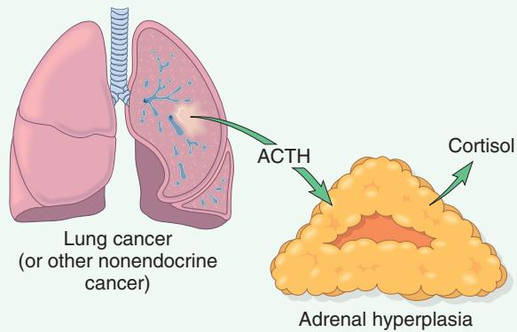 
PARANEOPLASTIC CUSHING SYNDROME
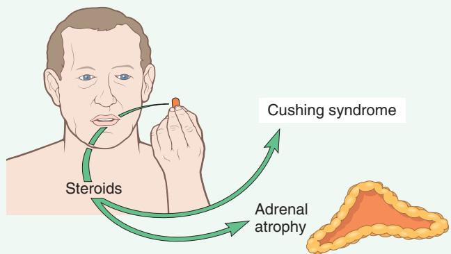 
IATROGENIC CUSHING SYNDROME 
Fig. 20.34 Schematic representation of the various forms of Cushing syndrome: The three endogenous forms, as well as the more common exogenous (iatrogenic) form. ACTH, Adrenocorticotropic hormone.
accounts for approximately $70\%$ of cases of spontaneous, endogenous Cushing syndrome. The prevalence of this disorder is about four times higher among women than among men, and it occurs most frequently during young adulthood (the twenties and thirties). In the vast majority of cases, the pituitary gland contains an ACTH-producing microadenoma that does not produce mass effects in the brain. In some cases there is a microadenoma and rarely, the anterior pituitary contains areas of corticotroph cell hyperplasia without a discrete adenoma. Corticotroph cell hyperplasia may be primary or, much less commonly, secondary to excessive ACTH release by a hypothalamic corticotropin-releasing hormone (CRH)-producing tumor. The adrenal glands in patients with Cushing disease show variable degrees of bilateral nodular cortical hyperplasia (discussed later), secondary to the elevated levels of ACTH ("ACTH-dependent" Cushing syndrome). The cortical hyperplasia is, in turn, responsible for the hypercortisolism.
Secretion of ectopic ACTH by nonpituitary tumors accounts for about $10\%$ of cases of Cushing syndrome. In many instances the responsible tumor is a small-cell carcinoma of the lung, although other neoplasms, including carcinoids, medullary carcinomas of the thyroid, and PanNETs, have been associated with the syndrome. In addition to tumors that elaborate ectopic ACTH, occasional neuroendocrine neoplasms produce ectopic CRH, which, in turn, causes ACTH secretion and hypercortisolism. As in the pituitary variant, the adrenal glands undergo bilateral cortical hyperplasia secondary to elevated ACTH, but the rapid downhill course of patients with these cancers often cuts short the adrenal enlargement.
Primary adrenal neoplasms, such as adrenal adenoma and carcinoma, and rarely, primary cortical hyperplasia, are responsible for about $15\%$ to $20\%$ of cases of endogenous Cushing syndrome, also designated ACTH-independent Cushing syndrome, because the adrenals function autonomously. The biochemical hallmark of adrenal Cushing syndrome is elevated levels of cortisol and low serum levels of ACTH. In most cases, adrenal Cushing syndrome is caused by a unilateral adrenocortical neoplasm, which may be benign (adenoma) or malignant (carcinoma). Primary cortical hyperplasia of the adrenal cortices is a rare cause of Cushing syndrome. There are two variants of this entity; the first presents as macronodules of varying sizes (typically less than $3\mathrm{cm}$ in diameter) and the second as micronodules $(1 - 3\mathrm{mm})$ .
The main lesions of Cushing syndrome are found in the pituitary and adrenal glands. The pituitary in Cushing syndrome shows changes that vary with different causes. The most common alteration, resulting from high levels of endogenous or exogenous glucocorticoids, is termed Crooke hyaline change. In this condition, the normal granular, basophilic cytoplasm of the ACTH-producing cells in the anterior pituitary is replaced by homogeneous, lightly basophilic material. This alteration is the result of the accumulation of intermediate keratin filaments in the cytoplasm. In pituitary Cushing syndrome, there is an adenoma (described under diseases of the pituitary).
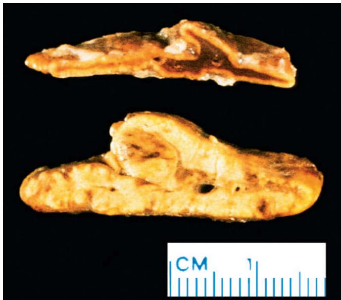 
Fig. 20.35 Diffuse hyperplasia of the adrenal gland (bottom) contrasted with a normal adrenal gland (top). In a cross-section, the adrenal cortex is yellow and thickened, and a subtle nodularity is evident. The abnormal gland was from a patient with ACTH-dependent Cushing syndrome, in whom both adrenal glands were diffusely hyperplastic. ACTH, Adrenocorticotropic hormone.
Morphologic changes in the adrenal glands also depend on the cause of the hypercortisolism and include: (1) cortical atrophy, (2) diffuse hyperplasia, (3) macronodular or micronodular hyperplasia, or (4) an adenoma or carcinoma.
In patients in whom the syndrome results from exogenous glucocorticoids, suppression of endogenous ACTH results in bilateral cortical atrophy, due to a lack of stimulation of the zona fasciculata and zona reticularis by ACTH. The zona glomerulosa is of normal thickness in such cases, because this portion of the cortex functions independently of ACTH. In cases of endogenous hypercortisolism, by contrast, the adrenals either are hyperplastic or contain a cortical neoplasm.
Diffuse hyperplasia is found in patients with ACTH-dependent Cushing syndrome (Fig. 20.35). Both glands are enlarged, either subtly or markedly, each weighing up to $30\mathrm{g}$ . The adrenal cortex is diffusely thickened and variably nodular, although the latter is not as pronounced as in cases of ACTH-independent nodular hyperplasia. The yellow color of diffusely hyperplastic glands derives from the presence of lipid-rich cells, which appear vacuolated under the microscope.
In primary cortical hyperplasia, the cortex is replaced almost entirely by macronodules or 1- to 3-mm darkly pigmented micronodules (Fig. 20.36). The pigment is believed to be lipofuscin, a wear-and-tear pigment (Chapter 2).
Functional adenomas or carcinomas of the adrenal cortex are not morphologically distinct from nonfunctioning adrenal neoplasms (discussed later). Both the benign and malignant lesions are more common in women in their thirties to fifties. Adrenocortical adenomas are yellow tumors surrounded by thin or well-developed capsules, and most weigh less than $30\mathrm{g}$ (Fig. 20.37A). On microscopic examination, they are composed of cells similar to those encountered in the normal zona fasciculata (see Fig. 20.37B). The carcinomas associated with Cushing syndrome, by contrast, tend to be larger than the adenomas.
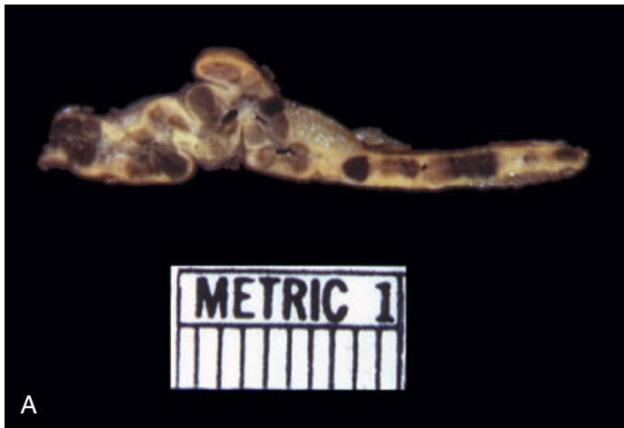 
Fig. 20.36 (A) Primary pigmented nodular adrenocortical hyperplasia showing prominent pigmented nodules in the adrenal gland. (B) On histologic examination, the nodules are composed of cells containing lipofuscin pigment, seen in the right part of the field. (Photographs courtesy of Dr.Aidan Carney, Department of Medicine, Mayo Clinic, Rochester, Minnesota.)
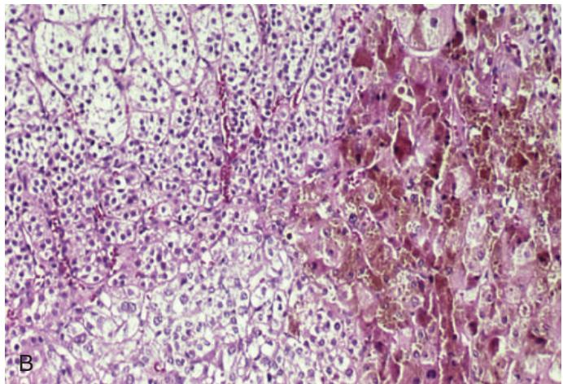
These tumors are nonencapsulated masses frequently exceeding 200 to $300\mathrm{g}$ in weight, having all of the anaplastic characteristics of cancer, as detailed later. With functioning tumors, both benign and malignant, the adjacent adrenal cortex and that of the contralateral adrenal gland are atrophic, as a result of suppression of endogenous ACTH by high cortisol levels.
The signs and symptoms of Cushing syndrome represent an exaggeration of the known actions of glucocorticoids. Cushing syndrome usually develops gradually and, like many other endocrine abnormalities, may be quite subtle in its early stages. A major exception to this insidious onset is Cushing syndrome associated with small-cell carcinomas of the lung, when the rapid course of the underlying disease precludes development of many of the
characteristic features. Early manifestations of Cushing syndrome include hypertension and weight gain. With time, the more characteristic centripetal redistribution of adipose tissue becomes apparent, with resultant truncal obesity, "moon facies," and accumulation of fat in the posterior neck and back ("buffalo hump"). Hypercortisolism causes selective atrophy of fast-twitch (type II) myofibers, with resultant decreased muscle mass and proximal limb weakness. Glucocorticoids induce gluconeogenesis and inhibit the uptake of glucose by cells, resulting in secondary diabetes with its attendant hyperglycemia, glucosuria, and polydipsia. The catabolic effects of insulin resistance on proteins cause loss of collagen. Thus, the skin is thin, fragile, and easily bruised; cutaneous striae are particularly common in the abdominal area (Fig. 20.38). Cortisol also has diverse effects on calcium metabolism that lead to resorption of bone, which results in the development of osteoporosis, with consequent increased susceptibility to fractures. Because
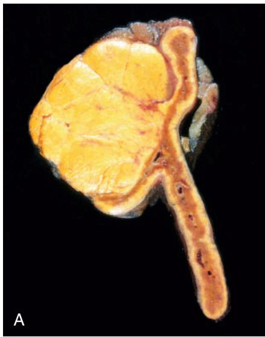 
Fig. 20.37 Adrenocortical adenoma. (A) The adenoma is distinguished from nodular hyperplasia by its solitary, circumscribed nature. The functional status of an adrenocortical adenoma cannot be predicted from its gross or microscopic appearance. (B) Histologic features of an adrenal cortical adenoma. The neoplastic cells are vacuolated because of the presence of intracytoplasmic lipid. There is mild nuclear pleomorphism. Mitotic activity and necrosis are not seen.
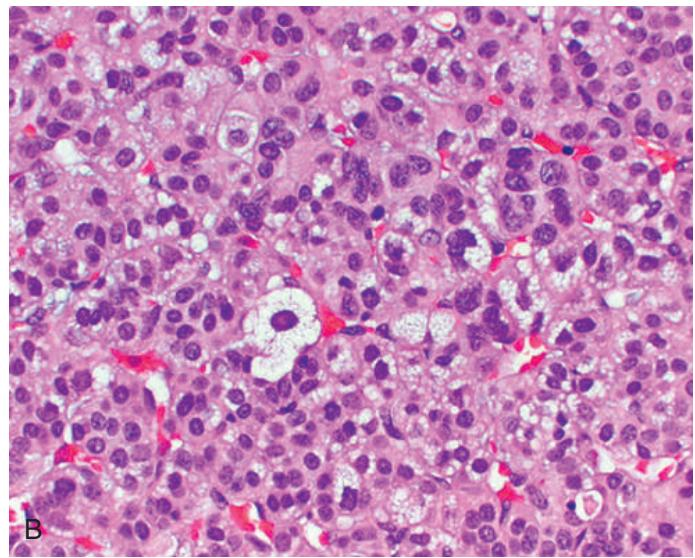
.jpg) 
Fig. 20.38 A patient with Cushing syndrome. Characteristic features include central obesity, "moon facies," and abdominal striae. (Reproduced with permission from Lloyd RV, et al: Atlas of nontumor pathology: endocrine diseases. Washington, DC, American Registry of Pathology, 2002.)
glucocorticoids suppress the immune response, patients with Cushing syndrome also are at increased risk for a variety of infections. Additional manifestations include hirsutism and menstrual abnormalities, as well as a number of psychiatric symptoms including mood swings, depression, and frank psychosis. Extraadrenal Cushing syndrome caused by pituitary or ectopic ACTH secretion usually is associated with increased skin pigmentation secondary to melanocyte-stimulating activity in the ACTH precursor molecule.
In pituitary and ectopic Cushing syndrome, ACTH levels are elevated and the urine is characterized by high levels of excreted corticosteroids. In contrast, ACTH levels are low in Cushing syndrome secondary to adrenal tumors.
# HYPERCORTISOLISM (CUSHING SYNDROME)
- The most common cause of hypercortisolism is exogenous administration of steroids. 
- Endogenous hypercortisolism most often is secondary to an ACTH-producing pituitary microadenoma (Cushing disease), followed by primary adrenal neoplasms (ACTH-independent hypercortisolism) and paraneoplastic ACTH production by tumors (e.g., small-cell lung cancer). 
- The morphologic features in the adrenal include bilateral cortical atrophy (in exogenous steroid-induced disease), bilateral diffuse or nodular hyperplasia (most common finding in endogenous Cushing syndrome), or an adrenocortical neoplasm.
# Hyperaldosteronism
Hyperaldosteronism is the generic term for a group of closely related conditions characterized by chronic excess aldosterone secretion. Hyperaldosteronism may be primary, or it may be secondary to an extraadrenal cause.
Primary hyperaldosteronism refers to autonomous overproduction of aldosterone with resultant suppression of the renin-angiotensin system and decreased plasma renin activity. The causes of primary hyperaldosteronism are as follows (Fig. 20.39):
- Bilateral idiopathic hyperaldosteronism, characterized by bilateral nodular hyperplasia of the adrenal glands. This is the most common underlying cause of primary hyperaldosteronism, accounting for about $60\%$ of cases. The pathogenesis of idiopathic hyperaldosteronism is unclear, although a subset harbors germ line mutations in the KCNJ5 gene, which encodes a potassium channel protein that is expressed in the adrenal gland. 
- Adrenocortical neoplasm, either an aldosterone-producing adenoma (the most common cause) or, rarely, an adrenocortical carcinoma. In approximately $35\%$ of cases, primary hyperaldosteronism is caused by a solitary aldosterone-secreting adenoma, a condition referred to as Conn syndrome. Somatic mutations of KCNJ5 (see earlier) are also present in a subset of aldosterone-secreting adenomas. 
Rarely, familial hyperaldosteronism may result from a genetic defect that leads to overactivity of the aldosterone synthase gene, CYP11B2.
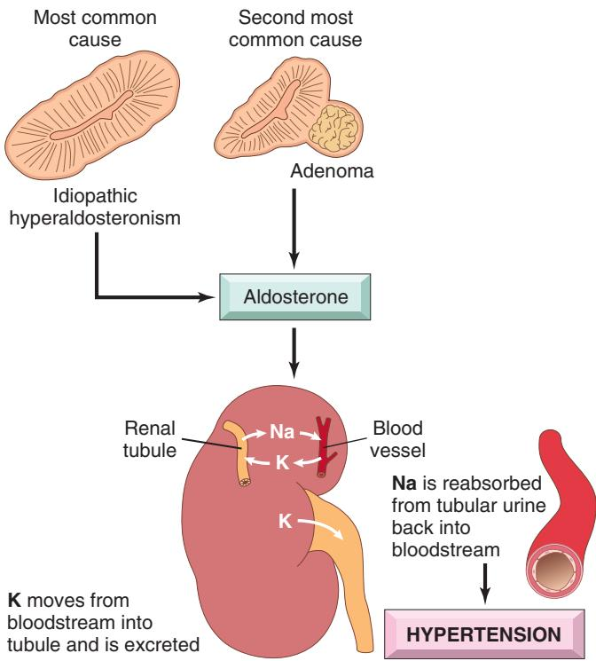 
PRIMARY HYPERALDOSTERONISM 
Fig. 20.39 The major causes of primary hyperaldosteronism and its principal effects on the kidney.
In secondary hyperaldosteronism, aldosterone release occurs in response to activation of the renin-angiotensin system. This condition is characterized by increased levels of plasma renin and is encountered in association with the following:
- Decreased renal perfusion (arteriolar nephrosclerosis, renal artery stenosis) 
- Arterial hypovolemia and edema (congestive heart failure, cirrhosis, nephrotic syndrome) 
- Pregnancy (caused by estrogen-induced increases in plasma renin substrate)
Aldosterone-producing adenomas are almost always solitary, small (<2 cm in diameter), well-circumscribed lesions. They are bright yellow on cut section and, surprisingly, are composed of lipid-laden cortical cells more closely resembling fasciculata cells than glomerulosa cells (the normal source of aldosterone). In general, the cells tend to be uniform in size and shape; occasionally there is some nuclear and cellular pleomorphism. A characteristic feature of aldosterone-producing adenomas is the presence of eosinophilic, laminated cytoplasmic inclusions, known as spironolactone bodies. These typically are found after treatment with the anti-hypertensive agent spironolactone, which is the drug of choice in primary hyperaldosteronism. In contrast with cortical adenomas associated with Cushing syndrome, those associated with hyperaldosteronism do not usually suppress ACTH secretion. Therefore, the adjacent adrenal cortex and that of the contralateral gland are not atrophic. Bilateral idiopathic hyperplasia is marked by diffuse or focal hyperplasia of cells resembling those of the normal zona glomerulosa.
The most important clinical consequence of hyperaldosteronism is hypertension. With an estimated prevalence rate of $5\%$ to $10\%$ among unselected hypertensive patients, primary hyperaldosteronism may be the most common cause of secondary hypertension (i.e., hypertension secondary to an identifiable cause). The long-term effects of hyperaldosteronism-induced hypertension are cardiovascular compromise (e.g., left ventricular hypertrophy and reduced diastolic volumes) and an increase in the prevalence of adverse events such as stroke and myocardial infarction. Hypokalemia results from renal potassium wasting and, when present, can cause a variety of neuromuscular manifestations, including weakness, paresthesias, visual disturbances, and occasionally frank tetany. Hypokalemia was considered a mandatory feature of primary hyperaldosteronism, but almost $50\%$ of normokalemic patients are now being diagnosed largely due to early detection.
In primary hyperaldosteronism, the therapy varies according to cause. Adenomas are amenable to surgical excision. By contrast, surgical intervention is not very beneficial in patients with primary hyperaldosteronism due to bilateral hyperplasia, which often occurs in children and young adults. These patients are best managed medically with an aldosterone antagonist such as spironolactone. The treatment of secondary hyperaldosteronism rests on
correcting the underlying cause of the renin-angiotensin system hyperstimulation.
# Adrenogenital Syndromes
Adrenogenital syndromes refer to a group of disorders caused by androgen excess, which may stem from a number of etiologies, including primary gonadal disorders and several primary adrenal disorders. The adrenal cortex secretes two compounds – dehydroepiandrosterone and androstenedione – which require conversion to testosterone in peripheral tissues for their androgenic effects. Unlike gonadal androgens, adrenal androgen formation is regulated by ACTH; thus, excessive secretion can present as an isolated syndrome or in combination with features of Cushing disease. The adrenal causes of androgen excess include adrenocortical neoplasms and an uncommon group of disorders collectively designated congenital adrenal hyperplasia (CAH). Adrenocortical neoplasms associated with symptoms of androgen excess (virilization) are more likely to be carcinomas than adenomas. They are morphologically identical to other functional or nonfunctional cortical neoplasms.
CAH represents a group of autosomal recessive disorders, each characterized by a hereditary defect in an enzyme involved in adrenal steroid biosynthesis, particularly cortisol. In these conditions, decreased cortisol production results in a compensatory increase in ACTH secretion due to absence of feedback inhibition. The resultant adrenal hyperplasia causes increased production of cortisol precursor steroids, which are then channeled into synthesis of androgens with virilizing activity. Certain enzyme defects also may impair aldosterone secretion, adding salt loss to the virilizing syndrome. The most common enzymatic defect in CAH is 21-hydroxylase deficiency, which accounts for more than $90\%$ of cases. 21-hydroxylase deficiency may range in degree from a total lack to a mild loss, depending on the nature of the underlying mutation. In the adrenal glands cortisol, aldosterone and sex steroids are synthesized from cholesterol through various intermediates. 21-hydroxylase is required for synthesis of cortisol and aldosterone but not sex steroids. Thus, a deficiency of this enzyme reduces cortisol and aldosterone synthesis and shunts the common precursors into the sex steroid pathway.
In all cases of CAH, the adrenals are hyperplastic bilaterally, sometimes expanding to 10 to 15 times their normal weights. The adrenal cortex is thickened and nodular, and on cut section, the widened cortex appears brown as a result of depletion of lipid. The proliferating cells mostly are compact, eosinophilic cells intermixed with lipid-laden clear cells. Hyperplasia of corticotroph (ACTH-producing) cells is present in the anterior pituitary in most patients.
The clinical manifestations of CAH are determined by the specific enzyme deficiency and include abnormalities
related to androgen excess, with or without aldosterone and glucocorticoid deficiency. Depending on the nature and severity of the enzymatic defect, the onset of clinical symptoms may occur in the perinatal period, later childhood, or (less commonly) adulthood.
In 21-hydroxylase deficiency, excessive androgenic activity causes signs of masculinization in females, ranging from clitoral hypertrophy and pseudohermaphroditism in infants to oligomenorrhea, hirsutism, and acne in postpubertal girls. In males, androgen excess is associated with enlargement of the external genitalia and other evidence of precocious puberty in young patients. Most men with CAH are fertile but some have failure of Leydig cell development and oligospermia. In approximately one-third of individuals with 21-hydroxylase deficiency, the enzymatic defect is severe enough to produce aldosterone deficiency, with resultant salt (sodium) wasting. Concomitant cortisol deficiency places individuals with CAH at risk for acute adrenal insufficiency (discussed later).
CAH should be suspected in any neonate with ambiguous genitalia. Severe enzyme deficiency in infancy can be a life-threatening condition, with vomiting, dehydration, and salt wasting. In the milder variants, women may present with delayed menarche, oligomenorrhea, or hirsutism. In all cases, an androgen-producing ovarian neoplasm must be excluded. Treatment of CAH is with exogenous glucocorticoids, which, in addition to providing adequate levels of glucocorticoids, also suppress ACTH levels, thereby decreasing the excessive synthesis of the steroid hormones responsible for many of the clinical abnormalities. Mineralocorticoid supplementation is required in the salt-wasting variants of CAH.
# ADRENOGENITAL SYNDROMES
- The adrenal cortex can secrete excess androgens in either of two settings: adrenocortical neoplasms (usually virilizing carcinomas) or congenital adrenal hyperplasia (CAH). 
- CAH consists of a group of autosomal recessive disorders characterized by defects in steroid biosynthesis, usually cortisol; the most common subtype is caused by deficiency of the enzyme 21-hydroxylase. 
- Reduction in cortisol production causes a compensatory increase in ACTH secretion, which in turn stimulates androgen production. Androgens have virilizing effects, including masculinization in females (ambiguous genitalia, oligomenorrhea, hirsutism), precocious puberty in males, and, in some instances, salt (sodium) wasting and hypotension. 
- Bilateral hyperplasia of the adrenal cortex is characteristic.
# ADRENAL INSUFFICIENCY
Adrenocortical insufficiency, or hypofunction, may be caused by either primary adrenal disease (primary hypoadrenalism) or decreased stimulation of the adrenals resulting from ACTH deficiency (secondary hypoadrenalism). Primary adrenocortical insufficiency may be acute (called adrenal crisis), or chronic (Addison disease).
Table 20.7 Causes of Adrenal Insufficiency 
AcuteWaterhouse-Friderichsen syndromeSudden withdrawal of long-term corticosteroid therapyStress in patients with underlying chronic adrenal insufficiencyChronicAutoimmune adrenalectis (60%–70% of cases in developed countries)—includes APS1 (AIRE mutations) and APS2 (polygenic)InfectionsTuberculosisAcquired immunodeficiency syndromeFungal infectionsHemochromatosisSarcoidosisSystemic amyloidosisMetastatic disease
APS1, APS2, Autoimmune polyendocrine syndrome types I and 2; AIRE, autoimmune regulator gene.
# Acute Adrenocortical Insufficiency
Acute adrenocortical insufficiency occurs most commonly in the clinical settings listed in Table 20.7. Individuals with chronic adrenocortical insufficiency may develop an acute crisis after any stress that taxes their limited physiologic reserves. In patients maintained on exogenous corticosteroids, rapid withdrawal of steroids or failure to increase steroid doses in response to an acute stress may precipitate a similar adrenal crisis, because of the inability of the atrophic adrenals to produce glucocorticoid hormones. Massive adrenal hemorrhage may destroy enough of the adrenal cortex to cause acute adrenocortical insufficiency. This condition may occur in patients maintained on anti-coagulant therapy, in postoperative patients who develop disseminated intravascular coagulation, during pregnancy, and in patients suffering from overwhelming sepsis; in the latter setting, it is known as the Waterhouse-Friderichsen syndrome (Fig. 20.40). This catastrophic syndrome is classically associated with Neisseria meningitidis septicemia but can also be caused by other organisms. Waterhouse-Friderichsen syndrome can occur at any age but is somewhat more common in children. The basis for the adrenal hemorrhage is uncertain but may be attributable to direct bacterial seeding of small vessels in the adrenal, the development of disseminated intravascular coagulation (Chapter 4), endotoxin-induced vasculitis, or some form of hypersensitivity vasculitis.
# Chronic Adrenocortical Insufficiency: Addison Disease
Addison disease, or chronic adrenocortical insufficiency, is an uncommon disorder resulting from progressive destruction of the adrenal cortex. More than $90\%$ of all cases are attributable to one of four disorders: autoimmune adrenalitis, tuberculosis, the acquired immune deficiency syndrome (AIDS), or metastatic cancer (see Table 20.7).
- Autoimmune adrenalitis accounts for $60\%$ to $70\%$ of cases and is by far the most common cause of primary adrenal insufficiency in countries where infectious causes are
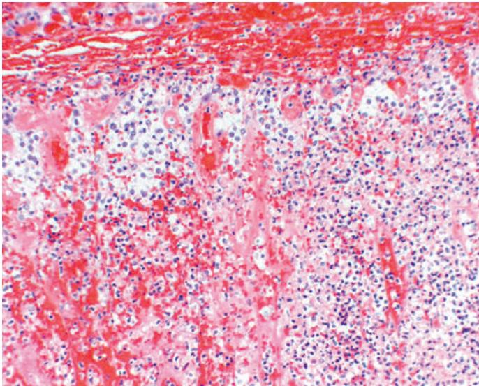 
Fig. 20.40 Waterhouse-Friderichsen syndrome. Bilateral adrenal hemorrhage in an infant with overwhelming sepsis, resulting in acute adrenal insufficiency. At autopsy, the adrenal glands were grossly hemorrhagic and shrunken; in this photomicrograph, little residual cortical architecture is discernible.
uncommon. As the name implies, there is autoimmune destruction of steroid-producing cells, and autoantibodies to several key steroidogenic enzymes have been detected in affected patients. Autoimmune adrenalitis may occur in association with several distinct autoimmune polyendocrine syndromes (APS). The best characterized of these is APS1, which is caused by mutations in the autoimmune regulator (AIRE) gene on chromosome 21. It is characterized by mucocutaneous candidiasis and abnormalities of skin, dental enamel, and nails (ectodermal dystrophy) occurring in association with a combination of organ-specific autoimmune disorders that result in destruction of target organs. The AIRE protein is involved in the expression of tissue antigens in the thymus and the elimination of T cells specific for these antigens (Chapter 5). Individuals with APS1 develop autoantibodies against IL-17 and IL-22, which are the principal effector cytokines secreted by $\mathrm{T_H}17$ T cells (Chapter 5). Because these two $\mathrm{T_H}17$ -derived cytokines are crucial for defense against fungal infections, affected patients develop chronic mucocutaneous candidiasis.
- Infections, particularly tuberculosis and those produced by fungi, also may cause primary chronic adrenocortical insufficiency. Tuberculous adrenalitis, which once accounted for as many as $90\%$ of cases of Addison disease, has become less common with improved anti-tuberculosis therapy. With the resurgence of tuberculosis mainly because of HIV infection and immunodeficiency, this cause of adrenal deficiency must be borne in mind. When present, tuberculous adrenalitis usually is associated with active infection in other sites, particularly the lungs and genitourinary tract. Among fungi, disseminated infections caused by Histoplasma capsulatum and Coccidioides immitis also may result in chronic adrenocortical insufficiency. Patients with AIDS are at risk for the development of adrenal insufficiency
from several other infectious (cytomegalovirus, Mycobacterium avium-intracellular) and noninfectious (Kaposi sarcoma) complications of their disease.
- Metastatic neoplasms involving the adrenals are another potential cause of adrenal insufficiency. The adrenals are a fairly common site for metastases in patients with disseminated carcinomas, which sometimes destroy sufficient adrenal cortex to produce a degree of adrenal insufficiency. Carcinomas of the lung and breast are the source of a majority of metastases in the adrenals.
# Secondary Adrenocortical Insufficiency
Any disorder of the hypothalamus and pituitary that reduces the output of ACTH, such as metastatic cancer, infection, infarction, or irradiation, leads to a syndrome of hypoadrenalism having many similarities to Addison disease. ACTH deficiency may occur alone, but in some instances, it is only one part of panhypopituitarism, associated with multiple pituitary hormone deficiencies. In patients with primary disease, the destruction of the adrenal cortex prevents a response to exogenously administered ACTH in the form of increased plasma levels of cortisol. By contrast, secondary adrenocortical insufficiency is characterized by low serum ACTH and a prompt rise in plasma cortisol levels in response to ACTH administration.
The appearance of the adrenal glands varies with the cause of the adrenocortical insufficiency. In secondary hypoadrenalism, the adrenals are reduced to small, flattened structures that usually retain their yellow color because of a small amount of residual lipid. A uniform, thin rim of atrophic yellow cortex surrounds a central, intact medulla. Histologic evaluation reveals atrophy of cortical cells with loss of cytoplasmic lipid, particularly in the zona fasciculata and zona reticularis. Primary autoimmune adrenalitis is characterized by irregularly shrunken glands, which may be exceedingly difficult to identify within the suprarenal adipose tissue. On histologic examination, the cortex contains only scattered residual cortical cells in a collapsed network of connective tissue. A variable lymphoid infiltrate is present in the cortex and may extend into the subjacent medulla (Fig. 20.41). The medulla is otherwise preserved. In tuberculosis or fungal diseases, the adrenal architecture may be effaced by a granulomatous inflammatory reaction identical to that encountered in other sites of infection. When hypoadrenalism is caused by metastatic carcinoma, the adrenals are enlarged, and their normal architecture is obscured by the infiltrating neoplasm.
In general, clinical manifestations of adrenocortical insufficiency do not appear until at least $90\%$ of the adrenal cortex has been compromised. The initial manifestations often include progressive weakness and easy fatigability, which may be dismissed as nonspecific complaints. Gastrointestinal disturbances are common and include anorexia, nausea, vomiting, weight loss, and diarrhea. In patients
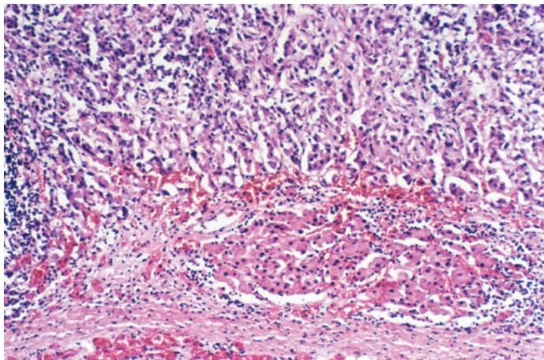 
Fig. 20.41 Autoimmune adrenalitis. In addition to loss of all but a subcapsular rim of cortical cells, there is an extensive mononuclear cell infiltrate.
with primary adrenal disease, increased levels of ACTH precursor hormone stimulate melanocytes, with resultant hyperpigmentation of the skin and mucosal surfaces. The face, axillae, nipples, areolae, and perineum are particularly common sites of hyperpigmentation. By contrast, hyperpigmentation is not seen in patients with secondary adrenocortical insufficiency because melanotropic hormone levels are not increased. Decreased mineralocorticoid (aldosterone) activity in patients with primary adrenal insufficiency results in potassium retention and sodium loss, with consequent hyperkalemia, hyponatremia, volume depletion, and hypotension, whereas secondary hypoadrenalism is characterized by deficient cortisol and androgen output but normal or near-normal aldosterone synthesis. Hypoglycemia occasionally may occur as a result of glucocorticoid deficiency and impaired gluconeogenesis. It is more common in infants and children than adults. Stresses such as infections, trauma, or surgical procedures in affected patients may precipitate an acute adrenal crisis, manifested by intractable vomiting, abdominal pain, hypotension, coma, and vascular collapse. Death follows rapidly unless corticosteroids are replaced immediately.
# ADRENOCORTICAL INSUFFICIENCY (HYPOADRENALISM)
- Primary adrenocortical insufficiency can be acute (Waterhouse-Friderichsen syndrome) or chronic (Addison disease). 
- Chronic adrenal insufficiency in the Western world most often is secondary to autoimmune adrenalitis, which occurs in the context of autoimmune polyendocrine syndromes. 
- Tuberculosis and infections due to opportunistic pathogens associated with the human immunodeficiency virus and tumors metastatic to the adrenals are the other important causes of chronic hypoadrenalism. 
- Patients typically present with fatigue, weakness, and gastrointestinal disturbances. Primary adrenocortical insufficiency also is characterized by high ACTH levels with associated skin pigmentation.
# ADRENOCORTICAL NEOPLASMS
It should be evident from the discussion of adrenocortical hyperfunction that functional adrenal neoplasms may be responsible for any of the various forms of hyperadrenalism. While functional adenomas are most commonly associated with hyperaldosteronism and with Cushing syndrome, a virilizing neoplasm is more likely to be a carcinoma. Not all adrenocortical neoplasms, however, elaborate steroid hormones. Determination of whether a cortical neoplasm is functional or not is based on clinical evaluation and measurement of the hormone or its metabolites in the laboratory.
Adrenocortical adenomas were described earlier in the discussions of Cushing syndrome and hyperaldosteronism. Most cortical adenomas do not cause hyperfunction and usually are encountered as incidental findings at the time of autopsy or during abdominal imaging for an unrelated cause. In fact, the half-facetious appellation of "adrenal incidentaloma" has crept into the medical lexicon to describe these incidentally discovered tumors. On cut surface, adenomas usually are yellow to yellow-brown, owing to the presence of lipid within the neoplastic cells (see Fig. 20.37). As a general rule they are small, averaging 1 to $2\mathrm{cm}$ in diameter. On microscopic examination, adenomas are composed of cells similar to those populating the normal adrenal cortex. As with other endocrine tumors, pleomorphism may be encountered in benign tumors and is not a reliable marker of malignancy.
Adrenocortical carcinomas are rare neoplasms that may occur at any age, including in childhood. Two rare inherited causes of adrenal cortical carcinomas are Li-Fraumeni syndrome (Chapter 6) and Beckwith-Wiedemann syndrome (Chapter 7). In most cases, adrenocortical carcinomas are large, invasive lesions that efface the native adrenal gland. On cut surface, adrenocortical carcinomas typically are variegated, poorly demarcated lesions containing areas of necrosis, hemorrhage, and cystic change (Fig. 20.42). Microscopic examination typically shows these tumors
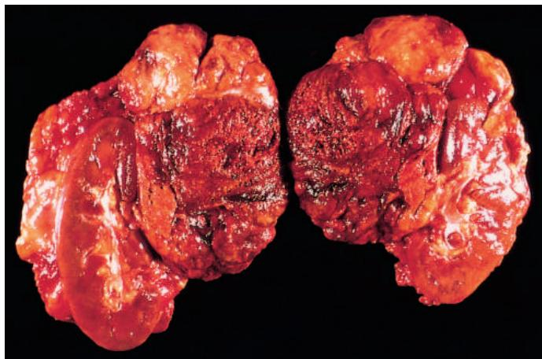 
Fig. 20.42 Adrenal carcinoma. The tumor dwarfs the kidney and compresses the upper pole. It is largely hemorrhagic and necrotic.
to be composed of well-differentiated cells resembling those seen in cortical adenomas or bizarre, pleomorphic cells, which may be difficult to distinguish from those of an undifferentiated carcinoma metastatic to the adrenal gland (Fig. 20.43). Adrenal cancers have a strong tendency to invade the adrenal vein, vena cava, and lymphatics. Metastases to regional and periaortic nodes are common, as is distant hematogenous spread to the lungs and other viscera. Bone metastases are unusual. The median patient survival is about 2 years. Of note, carcinomas metastatic to the adrenal cortex are significantly more frequent than a primary adrenocortical carcinoma.
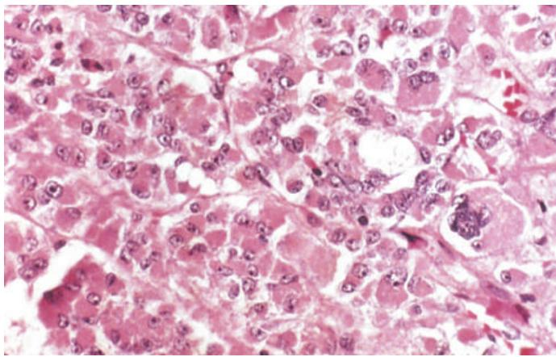 
Fig. 20.43 Adrenal carcinoma with marked anaplasia.
# Adrenal Medulla
The adrenal medulla is embryologically, functionally, and structurally distinct from the adrenal cortex. It is populated by cells derived from the neural crest (chromaffin cells) and their supporting (sustentacular) cells. The chromaffin cells are so named because of their brown-black color after exposure to potassium dichromate. They synthesize and secrete catecholamines in response to signals from preganglionic nerve fibers in the sympathetic nervous system. Similar collections of cells are distributed throughout the body in the extraadrenal paraganglion system. The most important diseases of the adrenal medulla are neoplasms, which include both neuronal neoplasms (including neuroblastomas and more mature ganglion cell tumors) and neoplasms composed of chromaffin cells (pheochromocytomas).
# TUMORS OF THE ADRENAL MEDULLA
# Pheochromocytoma
Pheochromocytomas are neoplasms composed of chromaffin cells, which, like their nonneoplastic counterparts, synthesize and release catecholamines and, in some cases, other peptide hormones. These tumors are of special importance because, although uncommon, they (like aldosterone-secreting adenomas) give rise to a surgically correctable form of hypertension.
Pheochromocytomas usually to a convenient "rule of 10s":
- $10\%$ of pheochromocytomas are extraadrenal, occurring in sites such as the organ of Zuckerkandl and the carotid body, where they usually are called paragangliomas, rather than pheochromocytomas. 
- $10\%$ of adrenal pheochromocytomas are bilateral; this proportion may rise to $50\%$ in cases that are associated with familial syndromes. 
- $10\%$ of adrenal pheochromocytomas are malignant, although the associated hypertension represents a serious and potentially lethal complication of even benign tumors.
Frank malignancy is somewhat more common in tumors arising in extraadrenal sites.
- $10\%$ of adrenal pheochromocytomas are not associated with hypertension. Of the $90\%$ that present with hypertension, approximately two-thirds have "paroxysmal" episodes associated with sudden rise in blood pressure and palpitations, which can, on occasion, be fatal.
One "traditional" $10\%$ rule that has since been modified pertains to familial cases. It is now recognized that as many as $25\%$ of individuals with pheochromocytomas and paragangliomas harbor a germ line mutation in one of at least six known genes, including RET, which causes type 2 MEN syndromes (described later); NF1, which causes type 1 neurofibromatosis (Chapter 22); VHL, which causes von Hippel-Lindau disease (Chapters 14 and 23); and three genes encoding subunits within the succinate dehydrogenase complex (SDHB, SDHC, and SDHD), which is involved in mitochondrial electron transport and oxygen sensing. It is postulated that loss of function in one or more of these subunits leads to stabilization of the transcription factor hypoxia-inducible factor $1\alpha$ (HIF-1 $\alpha$ ), promoting tumorigenesis.
Pheochromocytomas range in size from small, circumscribed lesions confined to the adrenal to large, hemorrhagic masses weighing several kilograms. On cut surface, smaller pheochromocytomas are yellow-tan, well-defined lesions that compress the adjacent adrenal gland (Fig. 20.44). Larger lesions tend to be hemorrhagic, necrotic, and cystic and typically efface the adrenal gland. Incubation of the fresh tissue with potassium dichromate solutions turns the tumor dark brown, as noted earlier.
On microscopic examination, pheochromocytomas are composed of polygonal to spindle-shaped chromaffin cells and their supporting cells, compartmentalized into small nests, by a rich vascular network (Fig. 20.45). The cytoplasm of the neoplastic cells often has a finely granular appearance, highlighted by a
..jpg) 
Fig. 20.44 Pheochromocytoma. The tumor is enclosed within an attenuated cortex and demonstrates areas of hemorrhage. The comma-shaped residual adrenal gland is seen (lower portion).
variety of silver stains, because of the presence of granules containing catecholamines. Electron microscopy reveals variable numbers of membrane-bound, electron-dense granules, representing catecholamines and sometimes other peptides. The nuclei of the neoplastic cells are often quite pleomorphic. Both capsular and vascular invasion, as well as cellular pleomorphism, may be encountered in some benign lesions. Therefore, the definitive diagnosis of malignancy in pheochromocytomas is based on the presence of metastases. These may involve regional lymph nodes as well as more distant sites, including liver, lung, and bone.
The dominant clinical manifestation of pheochromocytoma is hypertension, observed in $90\%$ of patients. Approximately two-thirds of patients with hypertension demonstrate paroxysmal episodes, which are described as an abrupt, precipitous elevation in blood pressure, associated with tachycardia, palpitations, headache, sweating, tremor, and a sense of apprehension. These episodes may also be associated with pain in the abdomen or chest, nausea, and vomiting. Isolated paroxysmal episodes of hypertension occur in fewer than half of patients; more commonly, patients demonstrate a chronic, sustained elevation in blood pressure punctuated by the aforementioned paroxysms. The elevations of blood pressure are induced by the sudden
release of catecholamines that may acutely precipitate congestive heart failure, pulmonary edema, myocardial infarction, ventricular fibrillation, and cerebrovascular accidents. The cardiac complications have been attributed to what has been called catecholamine cardiomyopathy, or catecholamine-induced myocardial instability and ventricular arrhythmias. In some cases, pheochromocytomas secrete other hormones such as ACTH and somatostatin and may therefore be associated with clinical features related to the effects of these and other peptide hormones. The laboratory diagnosis is based on demonstration of increased urinary excretion of free catecholamines and their metabolites, such as vanillylmandelic acid and metanephrines. Isolated benign pheochromocytomas are treated with surgical excision. With multifocal lesions, long-term medical treatment for hypertension may be required.
# Neuroblastoma and Other Neuronal Neoplasms
Neuroblastoma is the most common extracranial solid tumor of childhood. These neoplasms occur most commonly during the first 5 years of life and may arise during infancy. Neuroblastomas may occur anywhere in the sympathetic nervous system and occasionally within the brain, but they are most common in the abdomen; a majority of these tumors arise in either the adrenal medulla or the retroperitoneal sympathetic ganglia. Most neuroblastomas are sporadic, although familial cases also have been described. These tumors are discussed in Chapter 7, along with other pediatric neoplasms.
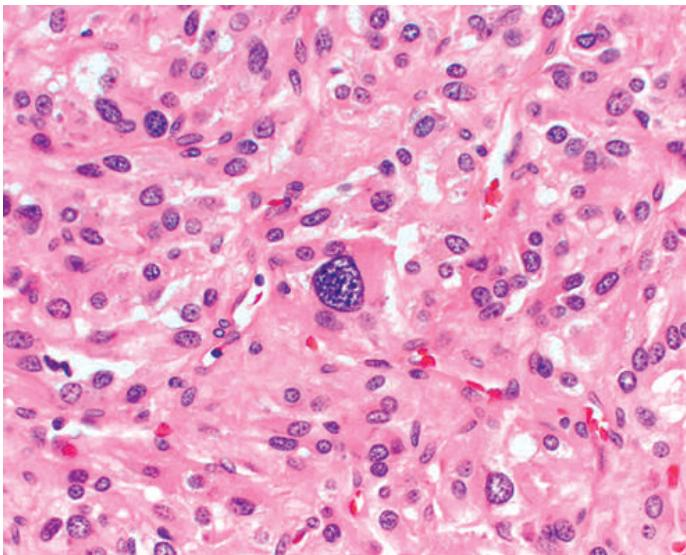 
Fig. 20.45 Photomicrograph of pheochromocytoma, demonstrating characteristic nests of cells with abundant cytoplasm. Granules containing catecholamine are not visible in this preparation. It is not uncommon to find bizarre cells (such as the one in the center of this image), even in pheochromocytomas that are benign.
# Multiple Endocrine Neoplasia (MEN) Syndromes
The MEN syndromes are a group of inherited diseases caused by proliferative lesions (hyperplasias, adenomas, and carcinomas) of multiple endocrine organs. Like other inherited cancer disorders (Chapter 6), endocrine tumors arising in the context of MEN syndromes have certain distinctive features that are not shared with their sporadic counterparts:
- These tumors occur at a younger age than that typical for sporadic cancers. 
- They arise in multiple endocrine organs, either synchronously (at the same time) or metachronously (at different times). 
- Even in one organ, the tumors often are multifocal. 
- The tumors usually are preceded by an asymptomatic stage of endocrine hyperplasia involving the cell of origin of the tumor (e.g., patients with MEN-2 almost universally demonstrate C cell hyperplasia in the thyroid parenchyma adjacent to medullary thyroid carcinomas). 
- These tumors are usually more aggressive and recur in a higher proportion of cases than similar endocrine tumors that occur sporadically.
# MULTIPLE ENDOCRINE NEOPLASIA TYPE I
MEN-1 syndrome is caused by germ line mutations in the MEN1 tumor suppressor gene, which encodes a protein called Menin. Menin is a component of several different transcription factor complexes, and loss of Menin function leads to deregulation of the corresponding binding partners, promoting endocrine neoplasia. Organs most commonly involved are the parathyroid, the pancreas, and the pituitary – the “3 Ps.”
- Parathyroid. Primary hyperparathyroidism is the most common manifestation of MEN-1 (80%-95% of patients) and is the initial manifestation of the disorder in most patients, appearing in almost all by 40 to 50 years of age. Parathyroid abnormalities include hyperplasia and adenomas. 
- Pancreas. Endocrine tumors of the pancreas are the leading cause of death in MEN-1. These tumors usually are aggressive and present with metastatic disease. Pancreatic endocrine tumors often are functional (i.e., secrete hormones). Zollinger-Ellison syndrome, associated with gastrinomas, and hypoglycemia, associated with insulinomas, are common endocrine manifestations. 
- Pituitary. The most frequent pituitary tumor in patients with MEN-1 syndrome is a prolactin-secreting macroadenoma. In some cases, acromegaly develops in association with somatotropin-secreting tumors.
# MULTIPLE ENDOCRINE NEOPLASIA TYPE 2
MEN-2 syndrome actually comprises two distinct groups of disorders that are unified by the occurrence of activating (i.e., gain-of-function) mutations of the RET
proto-oncogene at chromosomal locus 10q11.2. A strong genotype-phenotype correlation has been recognized for the MEN-2 syndromes, and differences in mutation patterns account for the variable features in the two subtypes. MEN-2 is inherited in an autosomal dominant pattern.
# Multiple Endocrine Neoplasia Type 2A
Organs commonly involved in MEN-2A include the following:
Thyroid: Medullary carcinoma of the thyroid develops in virtually all untreated cases, and the tumors usually occur in the first 2 decades of life. The tumors commonly are multifocal, and foci of C cell hyperplasia can be found in the adjacent thyroid. Familial medullary thyroid cancer is seen in a variant of MEN-2A, without the other characteristic manifestations listed here. In comparison with MEN-2, familial medullary carcinoma typically occurs at an older age and follows a more indolent course. 
- Adrenal medulla: Adrenal pheochromocytomas develop in $50\%$ of the patients; fortunately, no more than $10\%$ of these tumors are malignant. 
- Parathyroid: Approximately $10\%$ to $20\%$ of patients develop parathyroid gland hyperplasia with manifestations of primary hyperparathyroidism.
# Multiple Endocrine Neoplasia Type 2B
A single amino acid change in RET, distinct from the mutations that are seen in MEN-2A, seems to be responsible for virtually all cases of MEN-2B. Patients develop medullary thyroid carcinomas, which are usually multifocal and more aggressive than in MEN-2A, and pheochromocytomas. MEN-2B has the following distinctive features:
Primary hyperparathyroidism does not develop in patients with MEN-2B. 
- Extraendocrine manifestations are characteristic in patients with MEN-2B. These include ganglioneuromas of mucosal sites (gastrointestinal tract, lips, tongue) and a marfanoid habitus, in which overly long bones of the axial skeleton give an appearance resembling that in Marfan syndrome (Chapter 7).
Before the advent of genetic testing, relatives of patients with the MEN-2 syndrome were screened with annual biochemical tests, which often lacked sensitivity. Now, routine genetic testing identifies RET mutation carriers earlier and more reliably in MEN-2 kindreds. All individuals carrying germ line RET mutations are advised to have prophylactic thyroidectomy to prevent the inevitable development of medullary carcinomas.
Andersen DK, Andreen-Sandberg A, Duell EJ, et al: Pancreatitis-diabetes-pancreatic cancer: summary of a NCI-NIDDK workshop, Pancreas 42:1227-1237, 2013. [This workshop summary discusses the complex relationship between diabetes and pancreatic cancer, as well as
the recent emergence of the entity known as type 3c or pancreaticogenic diabetes. One of the causes of type 3c diabetes is pancreatic cancer.] 
Asa SL, Ezzat S: Genomic approaches to problems in pituitary neoplasia, Endocr Pathol 25:209-213, 2014. [A review on genomics of pituitary neoplasia from two of the best recognized authorities on these tumors.] 
Bancos I, Hahner S, Tomlinson J, et al: Diagnosis and management of adrenal insufficiency, Lancet Diabetes Endocrinol 3:216-226, 2015. [A clinically oriented review on the etiology of acute and chronic adrenal insufficiency.] 
Bilezikian JP, Cusano NE, Khan AA, et al: Primary hyperparathyroidism, Nat Rev Dis Primers 2:16033, 2016. [This review follows the format of other reviews in this journal that is heavy on summary figures and overviews written for a broad audience. The reader is encouraged to periodically browse the journal for discussions of other pertinent diseases.] 
Burman KD, Wartofsky L: Clinical practice. Thyroid nodules, N Engl J Med 373:2347-2356, 2015. [An authoritative review on etiology and management of thyroid nodules. Useful supplement to the chapter discussion.] 
DeFronzo RA, Ferrannini E, Groop L, et al: Type 2 diabetes mellitus, Nat Rev Dis Primers 1:15019, 2015. [An excellent overview of type 2 diabetes, again with overview figures on pathophysiology and complications. The level of discussion is beyond the scope of the chapter, so readers can use this review to supplement their knowledge.] 
De Leo S, Lee SY, Braverman LE: Hyperthyroidism, Lancet 388:906-918, 2016. [An excellent and clinically oriented recent review on etiology of hyperthyroidism, including common and uncommon causes.] 
Dralle H, Machens A, Basa J, et al: Follicular cell-derived thyroid cancer, Nat Rev Dis Primers 1:15077, 2015. [A timely review of thyroid cancers, including follicular and papillary neoplasms. As with reviews in this journal, the text spans genetics, symptoms, diagnosis, and management and can be a very useful supplement to the text for the curious reader.]
Faillot S, Assie G: Endocrine tumors: the genomics of adrenocortical tumors, Eur J Endocrinol 174:R249-R265, 2016. [In contrast to the TCGA paper below that is focused on adrenocortical cancers, this review also encompasses genetics of other adrenal pathologies, including adenomas and primary hyperplasia.] 
Higham CE, Johannsson G, Shalet SM: Hypopituitarism, Lancet 388:2403-2415, 2016. [A current review on hypopituitarism including etiology and management.] 
Lacroix A, Feelders RA, Stratakis CA, et al: Cushing's syndrome, Lancet 386:913-927, 2015. [A definitive review on Cushing syndrome, including genetics, pathophysiology, laboratory diagnosis, symptoms, and management. The text is exhaustive and can be used by the discerning for supplementing the text.] 
Nikiforov YE, Seethala RR, Tallini G, et al: Nomenclature revision for encapsulated follicular variant of papillary thyroid carcinoma: a paradigm shift to reduce overtreatment of indolent tumors, JAMA Oncol 2:1023-1029, 2016. [The defining paper that led to changing the nomenclature for the erstwhile entity known as encapsulated follicular variant of papillary thyroid carcinoma. This paper is also important to understand the concept of "overdiagnosis," which is increasingly becoming a factor due to increasing use of imaging modalities in patients.] 
Pociot F, Lernmark A: Genetic risk factors for type 1 diabetes, Lancet 387:2331-2339, 2016. [A recent review on the complex genetics of type 1 diabetes, especially the HLA alleles, and how these might interface with the environment.] 
Tuomi T, Santoro N, Caprio S, et al: The many faces of diabetes: a disease with increasing heterogeneity, Lancet 383:1084-1094, 2014. [An excellent review underscoring the etiologic heterogeneity of the entity that we know as "diabetes" - and how so many diverse genetic and environmental factors contribute to the phenotype of hyperglycemia.] 
Zheng S, Cherniack AD, Dewal N, et al: Comprehensive pan-genomic characterization of adrenocortical carcinoma, Cancer Cell 29:723-736, 2016. [The definitive study from The Cancer Genome Atlas (TCGA] on genomics of adrenocortical cancers.]
# Bones, Joints, and Soft Tissue Tumors
# 21
# Bone 797
Basic Structure and Function of Bone 797
Matrix 797
Cells 797
Development 798
Homeostasis and Remodeling 799
Congenital Disorders of Bone and Cartilage 799
Achondroplasia 800
Thanatophoric Dysplasia 800
Type I Collagen Diseases (Osteogenesis Imperfecta) 800
Osteopetrosis 800
Metabolic Disorders of Bone 801
Osteopenia and Osteoporosis 801
Rickets and Osteomalacia 802
Hyperparathyroidism 802
Paget Disease of Bone (Osteitis
Deformans) 803
# Fractures 805
Healing of Fractures 805
Osteonecrosis (Avascular Necrosis) 806
# Osteomyelitis 806
Pyogenic Osteomyelitis 806
Mycobacterial Osteomyelitis 807
Bone Tumors and Tumorlike Lesions 808
Bone-Forming Tumors 808
Cartilage-Forming Tumors 810
Tumors of Unknown Origin 812
Lesions Simulating Primary Neoplasms 814
Metastatic Tumors 816
# Joints 817
Arthritis 817
Osteoarthritis 817
Rheumatoid Arthritis 818
Juvenile Idiopathic Arthritis 821
Seronegative Spondyloarthropathies 822
Infectious Arthritis 822
Lyme Arthritis 822
Crystal-Induced Arthritis 823
Joint Tumors and Tumorlike
Conditions 826
Ganglion and Synovial Cysts 826
Tenosynovial Giant Cell Tumor 826
# Soft Tissue Tumors 827
Tumors of Adipose Tissue 828
Lipoma 828
Liposarcoma 828
Fibrous Tumors 828
Nodular Fascitis 828
Fibromatoses 828
Skeletal Muscle Tumors 830
Rhabdomyosarcoma 830
Smooth Muscle Tumors 830
Leiomyoma 830
Leiomyosarcoma 831
Tumors of Uncertain Origin 831
Synovial Sarcoma 831
Undifferentiated Pleomorphic Sarcoma 831
# Bone
# BASIC STRUCTURE AND FUNCTION OF BONE
The functions of bone include mechanical support, transmission of forces generated by muscles, protection of viscera, mineral homeostasis, and providing a niche for the production of blood cells. The constituents of bone include an extracellular matrix and specialized cells responsible for production and maintenance of the matrix.
# Matrix
Bone matrix is composed of an organic component known as osteoid (35%) and a mineral component (65%). Embedded within the bone matrix are a variety of bone cells including osteocytes that lay down bone and osteoclasts that reabsorb bone. These two cells types maintain bone homeostasis. Osteoid is made up predominantly of type I
collagen with smaller amounts of glycosaminoglycans and other proteins. The unique feature of bone matrix, its hardness, is imparted by the inorganic moiety hydroxyapatite $\left(\mathrm{Ca}_{10}\left[\mathrm{PO}_4\right]_6\left[\mathrm{OH}\right]_2\right)$ . The bone matrix is synthesized in one of two histologic forms, woven or lamellar (Fig. 21.1). Woven bone is produced rapidly, such as during fetal development or fracture repair, but the haphazard arrangement of collagen fibers imparts less structural integrity than the parallel collagen fibers in slowly produced lamellar bone. In an adult, the presence of woven bone is always abnormal, but it is not specific for any particular bone disease. A cross section of a typical long bone shows a dense outer cortex and a central medulla composed of bony trabeculae separated by marrow.
# Cells
Bone contains three major cell types:
- Osteoblasts, located on the surface of the matrix, synthesize, transport and assemble bone matrix and regulate
ismorecellularanddisorganizedthanlamellarbone(B)..jpg) 
Fig. 21.1 Woven bone (A) is more cellular and disorganized than lamellar bone (B).
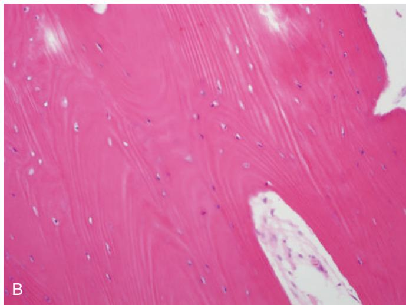
its mineralization (Fig. 21.2A). They are derived from mesenchymal stem cells that are located under the periosteum in the developing bone and additionally in the medullary space later in life.
.Theyarederivedfrommes.jpg)
Activeosteoblastssynthesizingbonematrix.Thesurroundingspindlecellsrepresentosteoprogenitorcells.(B)Twoosteoclastsresorbingbone..jpg) 
Fig. 21.2 (A) Active osteoblasts synthesizing bone matrix. The surrounding spindle cells represent osteoprogenitor cells. (B) Two osteoclasts resorbing bone.
- Osteocytes, located within the bone, are interconnected by an intricate network of cytoplasmic processes through tunnels known as canaliculars. Osteocytes help to control calcium and phosphate levels, detect mechanical forces, and translate them into biologic activity—a process called mechanotransduction. 
- Osteoclasts, located on the surface of bone, are specialized multinucleated macrophages, derived from circulating monocytes, which are responsible for bone resorption (Fig. 21.2B). By means of cell surface integrins, osteoclasts attach to bone matrix and create a sealed extracellular trench (resorption pit). The cells secrete acid and neutral proteases (predominantly matrix metalloproteases [MMPs]) into the pit, and these enzymes resorb the bone.
# Development
During embryogenesis, long bones develop from a cartilage mold by the process of endochondral ossification. A cartilage mold (anlagen) is synthesized by mesenchymal precursor cells. At approximately 8 weeks' gestation, the central portion of the anlagen is resorbed, creating the medullary canal. Simultaneously, at midshaft (diaphysis), osteoblasts begin to deposit the cortex beneath the periosteum producing the primary center of ossification and growing the bone radially. At each longitudinal end (epiphysis), endochondral ossification proceeds in a centrifugal fashion (secondary center of ossification). Eventually, a plate of the cartilage becomes entrapped between the two expanding centers of ossification, forming the physis or growth plate (Fig. 21.3). The chondrocytes within the growth plate undergo sequential proliferation, hypertrophy, and apoptosis. In the region of apoptosis the matrix mineralizes and is invaded by capillaries, providing the nutrients for osteoblasts, which synthesize osteoid. This process produces longitudinal bone growth.
Intramembranous ossification, by contrast, is responsible for the development of flat bones. Bones of the cranium, for example, are formed by osteoblasts directly
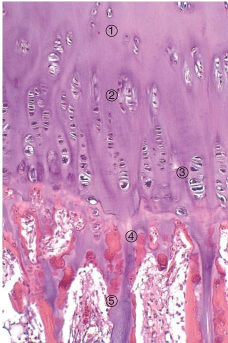 
Fig. 21.3 Active growth plate with ongoing endochondral ossification. I, Reserve zone. 2, Zone of proliferation. 3, Zone of hypertrophy. 4, Zone of mineralization. 5, Primary spongiosa.
from a fibrous layer of tissue, without cartilage anlagen. The enlargement of flat bones is achieved by deposition of new bone on a preexisting surface.
# Homeostasis and Remodeling
The adult skeleton appears static but is actually constantly turning over in a tightly regulated process known as remodeling. Remodeling takes place at a microscopic locus known as the bone (or basic) multicellular unit (BMU), which consists of a unit of coupled osteoblast and osteoclast activity on the bone surface.
The events at the BMU are regulated by cell-cell interactions and cytokines (Fig. 21.4). An important signaling pathway that controls remodeling involves three factors: (1) the transmembrane receptor activator of NF- $\kappa \mathrm{B}$ (RANK), which is expressed on osteoclast precursors; (2) RANK ligand (RANKL), which is expressed on osteoblasts and marrow stromal cells; and (3) osteoprotegerin (OPG), a secreted "decoy" receptor made by osteoblasts that can block RANK interaction with RANKL. RANK signaling activates the transcription factor NF- $\kappa \mathrm{B}$ , which is essential for the generation and survival of osteoclasts. Other important pathways include monocyte-colony stimulating factor (M-CSF), produced by osteoblasts. WNT proteins produced by various cells bind to the LRP5 and LRP6 receptors on osteoblasts and trigger the production of OPG. The importance of these pathways is proven by rare but informative germline mutations in the OPG, RANK, RANKL, and LRP5 genes, which cause severe disturbances of bone metabolism (described later).
Bone resorption or bone formation can be favored by tipping the RANK-to-OPG ratio. Systemic factors that affect this balance include hormones, vitamin D, inflammatory
cytokines (e.g., IL-1), and growth factors (e.g., bone morphogenetic factors). The mechanisms are complex, but parathyroid hormone (PTH), IL-1, and glucocorticoids promote osteoclast differentiation and bone turnover. In contrast, BMPs and sex hormones (estrogen, testosterone) generally block osteoclast differentiation or activity by favoring OPG expression.
Peak bone mass is achieved in early adulthood after the cessation of skeletal growth. This set point is determined by many factors, including polymorphisms in the vitamin D and LRP5/6 receptors, nutrition, and physical activity. Beginning in the fourth decade, resorption exceeds formation, resulting in a decline in skeletal mass.
# CONGENITAL DISORDERS OF BONE AND CARTILAGE
Congenital abnormalities of the skeleton frequently result from inherited mutations and first become manifest
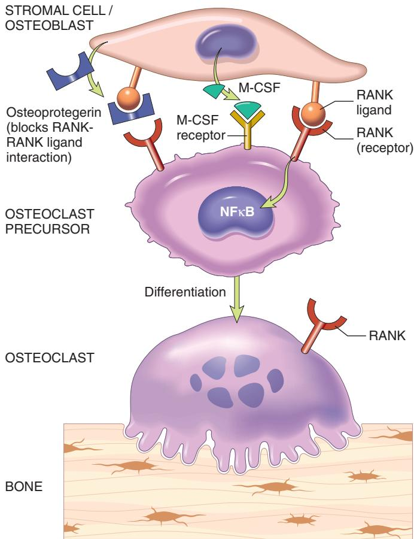 
Fig. 21.4 Paracrine molecular mechanisms that regulate osteoclast formation and function. Osteoclasts are derived from the same mononuclear cells that differentiate into macrophages. Osteoblast/stromal cell membrane-associated RANKL binds to its receptor RANK located on the cell surface of osteoclast precursors. This interaction in the background of macrophage colony-stimulating factor (M-CSF) causes the precursor cells to produce functional osteoclasts. Stromal cells also secrete osteoprotegerin (OPG), which acts as a "decoy" receptor for RANKL, preventing it from binding the RANK receptor on osteoclast precursors. Consequently, OPG prevents bone resorption by inhibiting osteoclast differentiation.
during the early stages of bone formation. The spectrum of developmental disorders of bone is broad, and the classification system is not standardized. Here we will categorize the major diseases according to their perceived pathogenesis.
Congenital anomalies can result from localized abnormalities in the migration and condensation of mesenchyme (dysostosis) or global disorganization of bone and/or cartilage (dysplasia). Dysostoses result from defects in the formation of mesenchymal condensations and their differentiation into the cartilage anlage. The most common forms include the complete absence of a bone or a digit (aplasia), extra bones or digits (supernumerary digit), and abnormal fusion of bones (e.g., syndactyly, craniosynostosis). Genetic alterations that affect homeobox genes, cytokines, and cytokine receptors are especially common among the dysostoses. In contrast, dysplasias arise from mutations in genes that control development or remodeling of the entire skeleton. It is important to note that, as for developmental anomalies in other tissues, the term dysplasia implies abnormal growth rather than a premalignant lesion as used in the context of neoplasia (Chapter 6).
More than 350 skeletal dysostoses and dysplasias, most of them extremely rare, have been described. Examples of diseases with defined genetic abnormalities are discussed below. Note that various point mutations in a single gene (e.g., COL2A1) can result in different phenotypes, whereas mutations in diverse genes (e.g., LRP5, RANKL) can give rise to similar clinical phenotypes.
# Achondroplasia
Achondroplasia, the most common skeletal dysplasia and a major cause of dwarfism, is an autosomal dominant disorder resulting from retarded cartilage growth. The disease is caused by gain-of-function mutations in fibroblast growth factor receptor 3 (FGFR3). Normally, FGF inhibits endochondral growth. FGFR3 mutation results in a constitutively active receptor, thereby exaggerating this effect and suppressing growth. Approximately $90\%$ of cases stem from new mutations, almost all of which occur in the paternal allele. Affected individuals have shortened proximal extremities, a trunk of relatively normal length, and an enlarged head with bulging forehead and conspicuous depression of the root of the nose. The skeletal abnormalities are usually not associated with changes in longevity, intelligence, or reproductive status.
# Thanatophoric Dysplasia
Thanatophoric dysplasia, the most common lethal form of dwarfism, results from diminished proliferation of chondrocytes and disorganization in the zone of proliferation. It also is caused by gain-of-function mutations in FGFR3, albeit ones that are distinct from those that cause achondroplasia. It occurs in about 1 of every 20,000 live births. Affected individuals have micromelic shortening of the limbs, frontal bossing, relative macrocephaly, a small chest cavity, and a bell-shaped abdomen. The underdeveloped thoracic cavity leads to respiratory insufficiency, and these individuals usually die at birth or soon thereafter.
# Type I Collagen Diseases (Osteogenesis Imperfecta)
Osteogenesis imperfecta (OI), the most common inherited disorder of connective tissue, is a phenotypically diverse disorder caused by deficiencies in the synthesis of type I collagen. OI principally affects bone and other tissues rich in type I collagen (joints, eyes, ears, skin, and teeth). It usually results from autosomal dominant mutations in the genes that encode the $\alpha 1$ and $\alpha 2$ chains of type I collagen. These defects cause misfolding of the mutated collagen polypeptides, and they interfere with the proper assembly of wild-type collagen chains (a dominant negative loss of function).
The fundamental abnormality in OI is too little bone, resulting in extreme skeletal fragility. Other findings include blue sclerae caused by decreased collagen content, making the sclera translucent and allowing partial visualization of the underlying choroid; hearing loss related to a sensorineural deficit and impeded conduction due to abnormalities in the bones of the middle ear; and dental imperfections (small, misshapen, and blue-yellow teeth) secondary to a deficiency in dentin.
OI can be separated into multiple clinical subtypes that vary widely in severity. The type 2 variant is at one end of the spectrum and is uniformly fatal in utero or during the perinatal period. In contrast, individuals with the type 1 form have a normal life span despite a susceptibility to fractures, particularly during childhood.
# Osteopetrosis
Osteopetrosis, also known as marble bone disease, refers to a group of rare genetic diseases that are characterized by reduced bone resorption and diffuse symmetric skeletal sclerosis resulting from impaired formation or function of osteoclasts. The term osteopetrosis reflects the stonelike quality of the bones. However, the bones are abnormally brittle and fracture easily, like a piece of chalk. Osteopetrosis is classified into variants based on both the mode of inheritance and the severity of clinical findings.
Most of the mutations underlying osteopetrosis interfere with the process of acidification of the osteoclast resorption pit, which is required for the dissolution of calcium hydroxyapatite within the matrix. These include autosomal recessive mutations in the enzyme carbonic anhydrase 2 (CA2), or mutations in the TCIRG1 gene, which encodes a component of a vacuolar ATPase that helps to maintain acidic pH in osteoclasts, which is essential for breaking down bone. Bones involved by osteopetrosis lack a medullary canal, and the ends of long bones are bulbous (Erlenmeyer flask deformity) and misshapen. The neural foramina are small and compress exiting nerves. The primary spongiosa, which is normally removed during growth, persists and fills the medullary cavity, leaving no room for the hematopoietic marrow.
Severe infantile osteopetrosis is autosomal recessive and is often fatal because of leukopenia, despite extensive extramedullary hematopoiesis that can lead to prominent hepatosplenomegaly. The mild autosomal dominant form may not be detected until adolescence or adulthood, when it is discovered on radiographic studies for repeated
fractures. These individuals also may have mild cranial nerve deficits and anemia.
# CONGENITAL DISORDERS OF BONE AND CARTILAGE
Abnormalities in a single bone or a localized group of bones are called dysostoses and arise from defects in the migration and condensation of mesenchyme. They manifest as absent, supernumerary, or abnormally fused bones. Global disorganizations of bone and/or cartilage are called dysplasias. Developmental abnormalities can be categorized by the associated genetic defect.
- FGFR3 mutations are responsible for achondroplasia and thanatophoric dysplasia, both of which manifest as dwarfism. 
- Mutations in the genes for type I collagen underlie most types of osteogenesis imperfecta (brittle bone disease), characterized by defective bone formation and skeletal fragility. 
- Mutations in CA2 and TCIRGI result in osteopetrosis (in which bones are hard but brittle) and renal tubular acidosis.
# METABOLIC DISORDERS OF BONE
# Osteopenia and Osteoporosis
The term osteopenia refers to decreased bone mass, while osteoporosis is defined as osteopenia that is severe enough to significantly increase the risk of fracture. Radiographically, osteoporosis is considered bone mass at least 2.5 standard deviations below mean peak bone mass, whereas osteopenia is 1 to 2.5 standard deviations below the mean. The disorder may be localized or generalized (involving the entire skeleton). Although osteoporosis can be secondary to endocrine disorders (e.g., hyperthyroidism), gastrointestinal disorders (e.g., malnutrition), or drugs (e.g., corticosteroids), most osteoporosis is primary.
The most common forms of osteoporosis are the senile and postmenopausal types. The following discussion relates largely to these forms of osteoporosis.
Peak bone mass is achieved during young adulthood. Its magnitude is influenced by hereditary factors, especially polymorphisms in the genes that influence bone metabolism (discussed later). Physical activity, muscle strength, diet, and hormonal state also make important contributions. After maximal skeletal mass is attained, bone turnover continues with a net deficit in bone formation resulting in an average loss of $0.7\%$ of bone mass per year. Although much remains unknown, discoveries in the molecular biology of bone formation and resorption have provided new insights into the pathogenesis of osteoporosis (Fig. 21.5):
- Age-related changes. Osteoblasts from older individuals have reduced proliferative and biosynthetic potential and reduced response to growth factors compared to osteoblasts in younger individuals. The net result is a diminished capacity to make bone. This form of osteoporosis, known as senile osteoporosis, is categorized as a low-turnover osteoporosis.
..jpg) 
Fig. 21.5 Pathophysiology of postmenopausal and senile osteoporosis (see text).
- Reduced physical activity. The decreased physical activity that is associated with normal aging contributes to senile osteoporosis. Mechanical forces stimulate normal bone remodeling as evidenced by bone loss in an immobilized or paralyzed extremity. The type of exercise is important, as load magnitude influences bone density more than the number of load cycles. Thus, resistance exercises such as weight training are more effective stimuli for increasing bone mass than repetitive endurance activities such as bicycling. 
- Genetic factors. Single gene defects (e.g., LRP5 mutations) account for only a small fraction of osteoporosis cases. Polymorphisms in other genes have been linked to osteoporosis by genome-wide association studies, in particular genes in the Wnt signaling pathway. 
- Calcium nutritional state. Adolescents (particularly girls) tend to have low dietary calcium intake, a factor that restricts peak bone mass. Calcium deficiency, increased PTH concentrations, and reduced levels of vitamin D also may play a role in the development of senile osteoporosis. 
- Hormonal influences. In the decade after menopause, yearly reductions in bone mass may be as much as $2\%$ of cortical bone and $9\%$ of medullary bone. Estrogen deficiency plays the major role in this phenomenon and close to $40\%$ of postmenopausal women are affected by osteoporosis. Decreased estrogen levels after menopause increase both bone resorption and formation but the latter does not keep up with the former, leading to high-turnover osteoporosis. The decreased estrogen may increase secretion of inflammatory cytokines by monocytes. These cytokines stimulate osteoclast recruitment and activity by increasing the levels of RANKL, diminishing the expression of OPG, decreasing osteoclast proliferation, and preventing osteoclast apoptosis. Cytokines such as IL-6, TNF- $\alpha$ , and IL-1 also have been implicated in postmenopausal osteoporosis, either independently or as downstream mediators of estrogen signaling.
shortenedbycompressionfracturescomparedwithanormalvertebralbody(left).Notethattheosteoporoticvertebrahasacharacteristiclossofhorizontaltrabeculaeandthickenedverticaltrabeculae..jpg) 
Fig. 21.6 Osteoporotic vertebral body (right) shortened by compression fractures compared with a normal vertebral body (left). Note that the osteoporotic vertebra has a characteristic loss of horizontal trabeculae and thickened vertical trabeculae.
The hallmark of osteoporosis is histologically normal bone that is decreased in quantity. The entire skeleton is affected in postmenopausal and senile osteoporosis, but certain bones tend to be more severely impacted. In postmenopausal osteoporosis the increase in osteoclast activity affects mainly bones or portions of bones that have increased surface area, such as the cancellous compartment of vertebral bodies (Fig. 21.6). The trabecular plates become perforated, thinned, and lose their interconnections (Fig. 21.7), leading to progressive microfractures and eventual vertebral collapse.
The clinical manifestations of osteoporosis depend on which bones are involved. Vertebral fractures that frequently occur in the thoracic and lumbar regions are painful, and, when multiple, can cause significant loss of height and various deformities, including lumbar lordosis and kyphoscoliosis. The immobility following fractures of the femoral neck, pelvis, or spine results in complications
andthecorticalbone(top)aremarkedlythinned..jpg) 
Fig. 21.7 In advanced osteoporosis, both the trabecular bone of the medulla (bottom) and the cortical bone (top) are markedly thinned.
such as pulmonary embolism and pneumonia, accounting for 40,000 to 50,000 deaths per year.
Osteoporosis cannot be reliably detected in plain radiographs until $30\%$ to $40\%$ of the bone mass is lost, and measurement of blood levels of calcium, phosphorus, and alkaline phosphatase are not diagnostic. Osteoporosis is thus a difficult condition to screen for in asymptomatic people. The best estimates of bone loss, aside from biopsy (which is rarely performed), are specialized radiographic imaging techniques, such as dual-energy x-ray absorptiometry and quantitative computed tomography, both of which measure bone density.
The prevention and treatment of senile and postmenopausal osteoporosis includes exercise, appropriate calcium and vitamin D intake, and pharmacologic agents that decrease resorption (bisphosphonates). Bisphosphonates reduce osteoclast activity and induce osteoclast apoptosis. Denosumab, an anti-RANKL antibody that blocks osteoclast activation, has shown promise in treating some forms of postmenopausal osteoporosis. The major challenge in pharmacotherapy of osteoporosis has been the inability to uncouple bone formation and resorption. Novel agents are currently undergoing clinical trials in an attempt to overcome this limitation. Although menopausal hormone therapy has been used to prevent fracture, complications, particularly deep venous thrombosis and stroke, have prompted the search for more selective estrogen receptor modulators.
# Rickets and Osteomalacia
Both rickets and osteomalacia are manifestations of vitamin D deficiency or its abnormal metabolism (detailed in Chapter 8). Rickets refers to the disorder in children, in whom it interferes with the deposition of bone in the growth plates. Osteomalacia is the adult counterpart, in which bone formed during remodeling is undermineralized, resulting in a predisposition to fractures. The fundamental defect is an impairment of mineralization and a resultant accumulation of unmineralized matrix.
# Hyperparathyroidism
Excess production and activity of PTH result in increased osteoclast activity, bone resorption, and osteopenia. Although the entire skeleton is affected, the osteopenia in some bones (e.g., phalanges) is more conspicuous radiographically. Isolated hyperparathyroidism peaks in middle adulthood and slightly earlier if presenting as a component of multiple endocrine neoplasia (MEN, types I and IIA).
As discussed in Chapter 20, PTH plays a central role in calcium homeostasis through the following effects:
- Osteoclast activation, increasing bone resorption, and calcium mobilization. PTH mediates the effect indirectly by increased RANKL expression on osteoblasts. 
- Increased resorption of calcium by the renal tubules. 
- Increased urinary excretion of phosphates. 
- Increased synthesis of active vitamin D, $1,25(\mathrm{OH})_{2}$ -D, by the kidneys, which in turn enhances calcium absorption
from the gut and mobilizes bone calcium by inducing RANKL on osteoblasts.
The net result of the actions of PTH is an elevation in serum calcium, which, under normal circumstances, inhibits further PTH production. However, excessive or inappropriate levels of PTH can result from autonomous parathyroid secretion (primary hyperparathyroidism) or can occur in the setting of underlying renal disease (secondary hyperparathyroidism) (see Chapter 20). PTH is directly responsible for the bone changes seen in primary hyperparathyroidism. Abnormalities stemming from chronic renal insufficiency that contribute to bone disease in secondary hyperparathyroidism include inadequate $1,25-(\mathrm{OH})_{2}$ -D synthesis, hyperphosphatemia, metabolic acidosis, and aluminum deposition in bone (in those undergoing renal dialysis).
Symptomatic, untreated primary hyperparathyroidism manifests with three interrelated skeletal abnormalities: osteoporosis, brown tumors, and osteitis fibrosa cystica. Osteoporosis is generalized, but is most severe in the phalanges, vertebrae, and proximal femur. Osteoclasts may tunnel into and dissect centrally along the length of the trabeculae, creating the appearance of railroad tracks and producing what is known as dissecting osteitis (Fig. 21.8). The marrow spaces around the affected surfaces are replaced by fibrovascular tissue. The correlative radiographic finding is a decrease in bone density.
The bone loss predisposes to microfractures and secondary hemorrhages that elicit an influx of macrophages and an ingrowth of reparative fibrous tissue, creating a mass of reactive tissue, known as a brown tumor (Fig. 21.9). The brown color is the result of the vascularity, hemorrhage, and hemosiderin. These lesions often undergo cystic degeneration. The combination of increased bone cell activity, peritrabecular fibrosis, and cystic brown tumors is the hallmark of severe hyperparathyroidism and is known as generalized osteitis fibrosa cystica.
..jpg) 
Fig. 21.8 Hyperparathyroidism with osteoclasts boring into the center of the trabecula resembling a train track (dissecting osteitis).
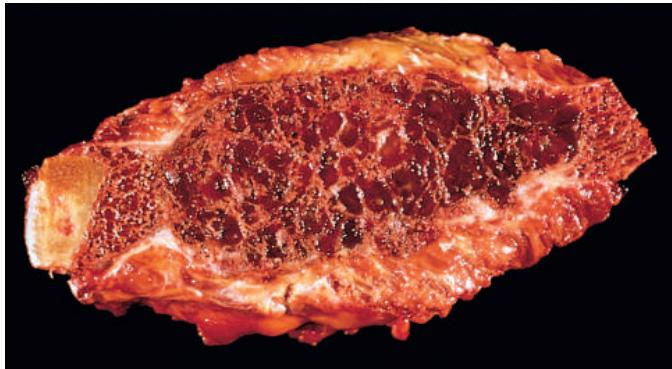 
Fig. 21.9 Resected rib, harboring an expansile brown tumor adjacent to the costal cartilage.
As bone mass decreases, affected patients are increasingly susceptible to fractures, bone deformation, and joint problems. Osteitis fibrosa cystica is now rarely encountered because hyperparathyroidism is usually diagnosed on routine blood tests and treated at an early stage. Restoration of PTH levels to normal can completely reverse the bone changes. Secondary hyperparathyroidism is usually not as severe or as prolonged as primary hyperparathyroidism, hence the skeletal abnormalities tend to be milder.
# METABOLIC DISORDERS OF BONE
- Osteopenia and osteoporosis represent histologically normal bone that is decreased in quantity. In osteoporosis the bone loss is sufficiently severe to significantly increase the risk of fracture. The disease is very common, with marked morbidity and mortality from fractures. Multiple factors including peak bone mass, age, activity, genetics, nutrition, and hormonal influences contribute to its pathogenesis. 
- Osteomalacia is characterized by bone that is insufficiently mineralized. In the developing skeleton, the manifestations are characterized by a condition known as rickets. 
- Hyperparathyroidism arises from either autonomous or compensatory hypersecretion of PTH and can lead to osteoporosis, brown tumors, and osteitis fibrosa cystica. However, in developed countries, where early diagnosis is the norm, these manifestations are rarely seen.
# PAGET DISEASE OF BONE (OSTEITIS DEFORMANS)
Paget disease is a condition of increased, but disordered and structurally unsound, bone. This unique skeletal disease can be divided into three sequential phases: (1) an initial osteolytic stage, (2) a mixed osteoclastic-osteoblastic stage, which ends with a predominance of osteoblastic activity and evolves into (3) a final burned-out quiescent osteosclerotic stage (Fig. 21.10).
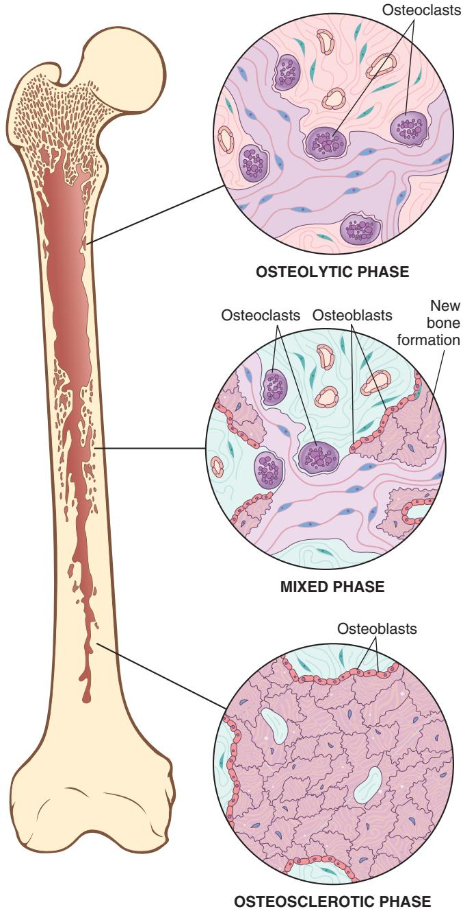 
Fig. 21.10 Diagrammatic representation of Paget disease of bone demonstrating the three phases in the evolution of the disease.
Paget disease usually begins in late adulthood. An estimated $1\%$ of the U.S. population older than age 40 is affected. An intriguing aspect is the striking geographic variation in the prevalence. Paget disease is relatively common in whites in England, France, Austria, regions of Germany, Australia, New Zealand, and the United States. In contrast, the disease is rare in the native populations of Scandinavia, China, Japan, and Africa.
Current evidence suggests both genetic and environmental causes of Paget disease. Approximately $50\%$ of familial Paget disease and $10\%$ of sporadic cases harbor mutations in the SQSTM1 gene. The mutations increase the activity of
NF- $\kappa \mathrm{B}$ , which, in turn increases osteoclast activity. Activating mutations in RANK and inactivating mutations in $OPG$ account for some cases of juvenile Paget disease. The geographic distribution is suggestive of some environmental influence. Of note in this regard, cell culture studies have shown that infection of osteoclast precursors with viruses such as measles or other RNA viruses alters vitamin D sensitivity and IL-6 secretion, both of which can lead to increased bone resorption.
Paget disease shows remarkable histologic variation throughout time and from site to site. The hallmark, seen in the sclerotic phase, is a mosaic pattern of lamellar bone (Fig. 21.11). The jigsaw puzzle-like appearance is produced by unusually prominent cement lines, which join haphazardly oriented units of lamellar bone. In the sclerotic phase, the bone is thickened but lacks structural stability making it vulnerable to deformation and fracture. The findings during the other phases are less specific. The initial lytic phase is characterized by numerous large osteoclasts and resorption pits. The osteoclasts may have 100 or more nuclei. Osteoclasts persist in the mixed phase, but many of the bone surfaces are also lined by prominent osteoblasts.
Paget disease is monostotic in about $15\%$ of cases and polyostotic in the remainder. The axial skeleton or proximal femur is involved in up to $80\%$ of cases. Most cases are asymptomatic and are discovered as an incidental radiographic finding. Pain localized to the affected bone is a common symptom. Pain is caused by microfractures or by bone overgrowth that compresses spinal and cranial nerve roots. Enlargement of the craniofacial skeleton may produce leontiasis ossea (lion face) and a cranium so heavy that is difficult for the person to hold the head erect. The weakened Pagetic bone may lead to invagination of the skull base (platybasia) and compression of the posterior fossa. Weight bearing causes anterior bowing of the femurs and tibiae
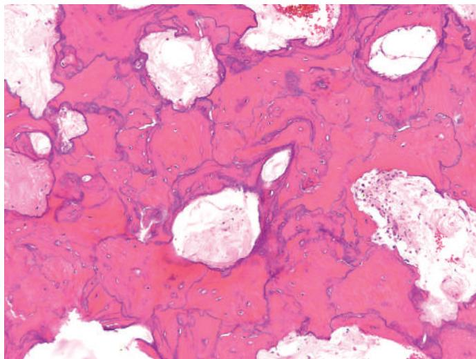 
Fig. 21.11 Mosaic pattern of lamellar bone pathognomonic of Paget disease.
and distorts the femoral heads, resulting in the development of severe secondary osteoarthritis. Chalk stick-type fractures are another frequent complication and usually occur in the long bones of the lower extremities. Compression fractures of the spine result in spinal cord injury and the development of kyphosis. The diagnosis can frequently be made from the radiographic findings. Many affected individuals have elevated serum alkaline phosphatase levels but normal serum calcium and phosphorus.
A variety of tumor and tumorlike conditions develop in Pagetic bone. Secondary osteosarcoma occurs in less than $1\%$ of all individuals with Paget disease, but appears in $5\%$ to $10\%$ of those with severe polyostotic disease. In the absence of malignant transformation, Paget disease is usually not a serious or life-threatening disease. Most affected individuals have mild symptoms that are readily suppressed by treatment with calcitonin and bisphosphonates.
# FRACTURES
# A fracture is defined as loss of bone integrity resulting from mechanical injury and/or diminished bone strength.
Fractures are the most common pathologic conditions affecting bone. The following qualifiers describe fracture types and affect treatment:
- Simple: the overlying skin is intact 
- Compound: the bone communicates with the skin surface 
- Comminuted: the bone is fragmented 
- Displaced: the ends of the bone at the fracture site are not aligned 
- Stress: a slowly developing fracture that follows a period of increased physical activity in which the bone is subjected to repetitive loads 
- Greenstick: extending only partially through the bone, common in infants when bones are soft 
- Pathologic: involving bone weakened by an underlying disease process, such as a tumor
# Healing of Fractures
Fracture repair involves regulated expression of a multitude of genes and can be separated into overlapping stages with particular molecular, biochemical, histologic, and biomechanical features.
Immediately after fracture, rupture of blood vessels results in a hematoma, which fills the fracture gap and surrounds the area of bone injury (Fig. 21.12). The clotted blood provides a fibrin mesh, sealing off the fracture site and creating a scaffold for the influx of inflammatory cells and the ingrowth of fibroblasts and new capillaries. Simultaneously, degranulated platelets and migrating inflammatory cells release PDGF, TGF- $\beta$ , FGF, and other factors that activate osteoprogenitor cells in the periosteum, medullary cavity, and surrounding soft tissues and stimulate osteoclastic and osteoblastic activity. By the end of the first week, a mass of predominantly uncalcified tissue—called soft callus or procallus—provides anchorage between the ends of the fractured bones. After approximately 2 weeks, the soft callus is transformed into a bony callus. The
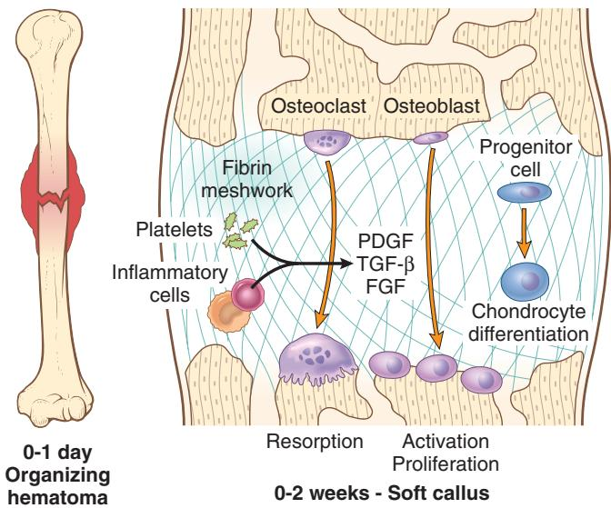
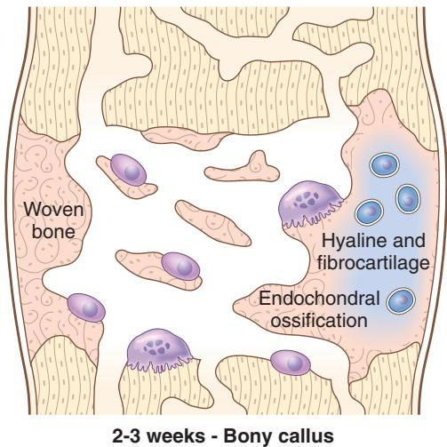
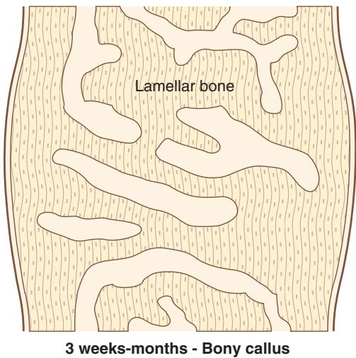 
Fig. 21.12 The reaction to a fracture begins with an organizing hematoma. Within two weeks, the two ends of the bone are bridged by a fibrin meshwork in which osteoclasts, osteoblasts, and chondrocytes differentiate from precursors. These cells produce cartilage and bone matrix, which, with adequate immobilization, remodels into normal lamellar bone.
activated osteoprogenitor cells deposit woven bone. In some cases, the activated mesenchymal cells in the soft tissues and bone surrounding the fracture line also differentiate into chondrocytes that make fibrocartilage and hyaline cartilage. The newly formed cartilage along the fracture line undergoes endochondral ossification, forming a contiguous network of bone with newly deposited bone trabeculae in the medulla and beneath the periosteum. In this fashion, the fractured ends are bridged (Fig. 21.12).
As the callus matures and is subjected to weight-bearing forces, portions that are not physically stressed are resorbed. This remodeling reduces the size of the callus until the shape and outline of the fractured bone are reestablished as lamellar bone. The healing process is complete with restoration of the medullary cavity.
The sequence of events in the healing of a fracture can be easily impeded or blocked. Displaced and comminuted fractures frequently result in some deformity. Inadequate immobilization permits movement of the callus and prevents its normal maturation, resulting in delayed union or nonunion. If a nonunion persists, the malformed callus undergoes cystic degeneration, and the luminal surface may become lined by synovial-like cells, creating a false joint or pseudoarthrosis. Infection of the fracture site, especially common in open fractures, is a serious obstacle to healing. Malnutrition and skeletal dysplasia also hinder fracture healing.
# OSTEONECROSIS (AVASCULAR NECROSIS)
Osteonecrosis refers to infarction (ischemic necrosis) of bone and marrow cells. A diverse set of conditions predisposes to bone ischemia, including vascular injury (e.g., trauma, vasculitis), drugs (e.g., corticosteroids), systemic disease (sickle cell crisis), and radiation. In about $25\%$ of cases, the cause is unknown. The three suspected mechanisms causing osteonecrosis are mechanical disruption of vessels, thrombotic occlusion, and extravascular compression. Osteonecrosis has a wide age range but peaks in the 30s to 50s and accounts for about $10\%$ of hip replacements in the United States.
Regardless of etiology, medullary infarcts are geographic and involve the trabecular bone and marrow. The cortex is usually not affected because of its collateral blood flow. In subchondral infarcts, a triangular or wedge-shaped segment of tissue that has the subchondral bone plate as its base undergoes necrosis. The overlying articular cartilage remains viable, as it can access nutrients that are present in synovial fluid. Microscopically, dead bone is recognized by empty lacunae surrounded by necrotic adipocytes that frequently rupture. In the healing response, osteoclasts resorb the necrotic trabeculae. Trabeculae that remain act as scaffolding for the deposition of new bone in a process known as creeping substitution. In subchondral infarcts, the pace of this substitution is too slow to be effective, so there is collapse of the necrotic bone and distortion, fracture, and even sloughing of the articular cartilage (Fig. 21.13).
.Thespacebetweentheoverlyingarticularcartilageandboneiscausedbytrabecularcompressionfractureswithoutrepair..jpg) 
Fig. 21.13 Femoral head with a subchondral, wedge-shaped pale yellow area of osteonecrosis (arrow). The space between the overlying articular cartilage and bone is caused by trabecular compression fractures without repair.
The symptoms depend on the location and extent of infarct. Typically, subchondral infarcts cause pain that is initially associated only with activity but then becomes constant. Subchondral infarcts often collapse and may lead to severe, secondary osteoarthritis. Treatment ranges from conservative measures (limited weight bearing, immobilization) to surgery.
# OSTEOMYELITIS
Osteomyelitis denotes inflammation of bone and marrow, virtually always secondary to infection. Osteomyelitis may be a complication of any systemic infection but frequently manifests as a primary solitary focus of disease. All types of organisms, including viruses, parasites, fungi, and bacteria, can produce osteomyelitis, but infections caused by certain pyogenic bacteria and mycobacteria are the most common.
# Pyogenic Osteomyelitis
Pyogenic osteomyelitis is almost always caused by bacteria and rarely by fungi. Organisms may reach the bone by (1) hematogenous spread, (2) extension from a contiguous site, and (3) direct implantation after compound fractures or orthopedic procedures. In otherwise healthy children, most osteomyelitis is hematogenous in origin and develops in the long bones. In adults, however, osteomyelitis more often occurs as a complication of open fractures, surgical procedures, and infections of the feet in diabetics.
Staphylococcus aureus is responsible for $80\%$ to $90\%$ of the cases of culture-positive pyogenic osteomyelitis. These organisms express cell wall proteins that bind to bone matrix components such as collagen and facilitate adherence to bone. Escherichia coli, Pseudomonas, and Klebsiella are more frequently isolated from individuals with genitourinary tract infections or who are intravenous drug abusers. Mixed bacterial infections are seen in the setting of direct
spread, inoculation of organisms during surgery, or into open fractures. In the neonatal period, Haemophilus influenzae and group B streptococci are frequent pathogens, and individuals with sickle cell disease are predisposed to Salmonella infection. In almost $50\%$ of suspected cases, no organisms can be isolated.
The osseous vascular circulation, which varies with age, determines the location of infection in most long bones. In infants and adults, vascular communication allows the spread of infection between the metaphysis and the epiphysis. By contrast, the avascular growth plate in the child interrupts infection spread between the metaphysis and epiphysis.

Changes associated with osteomyelitis depend on the stage (acute, subacute, or chronic) and location of the infection. In the acute phase, bacteria proliferate and induce a neutrophilic inflammatory reaction. Necrosis of bone cells and marrow ensues within the first 48 hours. The bacteria and inflammation spread longitudinally and radially throughout the Haversian systems to reach the periosteum. In children, the periosteum is loosely attached to the cortex. Thus, sizable subperiosteal abscess may form that dissect for long distances along the bone surface. Lifting of the periosteum further impairs the blood supply to the affected region, contributing to the necrosis. The dead bone is known as a sequestrum. Rupture of the periosteum leads to a soft tissue abscess, which can channel to the skin, creating a draining sinus. Sometimes the sequestrum crumbles, releasing fragments that pass through the sinus tract.
In infants (and uncommonly in adults), epiphyseal infection may spread through the articular surface or along capsular and tendoligamentous insertions into a joint, producing septic or suppurative arthritis, which can cause destruction of the articular cartilage and permanent disability.
After the first week, chronic inflammatory cells release cytokines that stimulate osteoclastic bone resorption, ingrowth of fibrous tissue, and the deposition of reactive bone at the periphery. The newly deposited bone can form a shell of living tissue, known as an involucrum, around the segment of devitalized infected bone (Fig. 21.14). The histologic findings of chronic osteomyelitis are more protean but typically involve marrow fibrosis, sequestrum, and an inflammatory infiltrate of lymphocytes and plasma cells.
Hematogenous osteomyelitis sometimes manifests as an acute systemic illness with malaise, fever, chills, leukocytosis, and marked throbbing pain over the affected region. In other instances the presentation is subtle, with only unexplained fever (most often in infants) or localized pain (most often in adults). The diagnosis is strongly suggested by the characteristic radiographic findings of a lytic focus of bone destruction surrounded by a zone of sclerosis. Biopsy and bone cultures are required to identify the pathogen in most instances. The combination of antibiotics and surgical drainage is usually curative.
In $5\%$ to $25\%$ of cases, acute osteomyelitis fails to resolve and persists as chronic infection. Chronic infections may
showstheinnernativenecroticcortex(sequestrum)..jpg) 
Fig. 21.14 Resected femur in a person with draining osteomyelitis. The drainage tract in the subperiosteal shell of viable new bone (involucrum) shows the inner native necrotic cortex (sequestrum).
develop when there is delay in diagnosis, extensive bone necrosis, inadequate antibiotic therapy or surgical debridement, or weakened host defenses. The course of chronic infections may be punctuated by acute flare-ups; these are usually spontaneous and may occur after years of dormancy. Other complications of chronic osteomyelitis include pathologic fracture, secondary amyloidosis, endocarditis, sepsis, and the development of squamous cell carcinoma in the draining sinus tracts and sarcoma in the infected bone.
# Mycobacterial Osteomyelitis
Mycobacterial osteomyelitis, historically a problem in developing countries, has increased in incidence in the developed world because of immigration patterns and immunocompromised patients. Overall, approximately $1\%$ to $3\%$ of individuals with pulmonary or extrapulmonary tuberculosis exhibit osseous infection.
The organisms are usually blood borne and originate from a focus of active visceral disease during the initial stages of primary infection. Direct extension (e.g., from a pulmonary focus into a rib or from tracheobronchial nodes into adjacent vertebrae) also may occur. The bone infection may persist for years before being recognized. Typically, affected individuals present with localized pain, low-grade fevers, chills, and weight loss. Infection is usually solitary except in immunocompromised individuals. The histologic findings, namely caseous necrosis and granulomas, are typical of tuberculosis. Mycobacterial osteomyelitis tends to be more destructive and resistant to control than pyogenic osteomyelitis.
Tuberculous spondylitis (Pott disease) is a destructive infection of vertebrae. The spine is involved in $40\%$ of cases of mycobacterial osteomyelitis. The infection breaks through intervertebral discs to affect multiple vertebrae and extends into the soft tissues. Destruction of discs and vertebrae frequently results in permanent compression
fractures that produce scoliosis or kyphosis and neurologic deficits secondary to spinal cord and nerve compression.
# BONE TUMORS AND TUMORLIKE LESIONS
The rarity of primary bone tumors and the often-disfiguring surgery required to treat a bone malignancy make this group of disorders especially challenging. About 2400 primary bone sarcomas are diagnosed annually in the United States. Therapy aims to optimize survival while maintaining the function of affected body parts. The predilection of specific types of tumors for certain age groups and particular anatomic sites provides important diagnostic clues. For example, osteosarcoma peaks during adolescence and most frequently involves the knee, whereas chondrosarcoma affects older adults and involves the pelvis and proximal extremities.
Bone tumors may present in a number of ways. The more common benign lesions are often asymptomatic incidental findings. Many tumors, however, produce pain or a slow-growing mass. In some circumstances the first hint of a tumor's presence is a pathologic fracture. Radiographic imaging studies have an important role in diagnosing these lesions. In addition to providing the exact location and extent of the tumor, imaging studies can detect features that narrow the diagnostic possibilities. In almost all instances biopsy is necessary for definitive diagnosis.
When possible, bone tumors are classified according to the normal cell or matrix they produce. Lesions that do not have normal tissue counterparts are grouped according to their clinicopathologic features (Table 21.1). Benign tumors greatly outnumber their malignant counterparts and occur with
greatest frequency within the first three decades of life. In older adults, a bone tumor is more likely to be malignant.
# Bone-Forming Tumors
Tumors in this category all produce unmineralized osteoid or mineralized woven bone.
# Osteoid Osteoma and Osteoblastoma
Osteoid osteoma and osteoblastoma are benign bone-producing tumors that have similar histologic features but differ clinically and radiographically. Osteoid osteomas are, by definition, less than $2\mathrm{cm}$ in diameter, and are most common in young men. About $50\%$ of cases involve the femur or tibia, wherein they typically arise in the cortex. Usually, there is a thick rim of reactive cortical bone that may be the only clue radiographically. Despite their small size, they present with severe nocturnal pain that is relieved by aspirin and other nonsteroidal anti-inflammatory agents. The pain is probably caused by prostaglandin $\mathrm{E}_2$ produced by osteoblasts. Osteoblastoma is larger than $2\mathrm{cm}$ and involves the posterior components of the vertebrae (laminae and pedicles) more frequently. The pain is unresponsive to aspirin, and the tumor usually does not induce a marked bony reaction. Osteoid osteoma is frequently treated by radiofrequency ablation, whereas osteoblastoma is usually cured or excised. Malignant transformation is rare.
Osteoid osteoma and osteoblastoma are round-to-oval masses of hemorrhagic gritty tan tissue. They are well circumscribed and composed of randomly interconnecting delicate trabeculae
Table 21.1 Classification of Selected Primary Bone Tumors 
CategoryBehaviorTumor TypeCommon 
LocationsAge (yr)MorphologyCartilage formingBenignOsteochondromaMetaphysis of long bones10–30Bony excrescence with cartilage cap——ChondromaSmall bones of hands and feet30–50Circumscribed hyaline cartilage nodule in medulla—MalignantChondrosarcoma (conventional)Pelvis, shoulder40–60Extends from medulla through cortex into soft tissue, chondrocytes with increased cellularity and atypiaBone formingBenignOsteoid osteomaMetaphysis of long bones10–20Cortical, interlacing microtrabeculae of woven bone——OsteoblastomaVertebral column10–20Posterior elements of vertebra, histology similar to osteoid osteoma—MalignantOsteosarcomaMetaphysis of distal femur, proximal tibia10–20Extends from medulla to lift periosteum, malignant cells producing woven boneUnknown originBenignGiant cell tumorEpiphysis of long bones20–40Destroys medulla and cortex, sheets of osteoclasts——Aneurysmal bone cystProximal tibia, distal femur, vertebra10–20Vertebral body, hemorrhagic spaces separated by cellular, fibrous septae—MalignantEwing sarcomaDiaphysis of long bones10–20Sheets of primitive small round cells
Adapted from Unni KK, Inwards CY: Dahlin's Bone Tumors, ed 6. Philadelphia, 2010, Lippincott-Williams & Wilkins; by permission of Mayo Foundation.
of woven bone that are prominently rimmed by a single layer of osteoblasts (Fig. 21.15). The stroma surrounding the neoplastic bone consists of loose connective tissue that contains many dilated and congested capillaries. The relatively small size, well-defined margins, and benign cytologic features of the neoplastic osteoblasts help distinguish these tumors from osteosarcoma. Osteoid osteomas elicit the formation of a large amount of reactive bone, which encircles the lesion.
# Osteosarcoma
Osteosarcoma is a malignant tumor that produces osteoid matrix or mineralized bone. Excluding hematopoietic tumors (myeloma and lymphoma), osteosarcoma is the most common primary malignant tumor of bone. Osteosarcoma has a bimodal age distribution; $75\%$ of osteosarcomas occur in persons younger than 20 years of age. The smaller second peak occurs in older adults, who frequently suffer from conditions known to predispose to osteosarcoma, such as Paget disease, bone infarcts, and previous radiation. These are referred to as secondary osteosarcomas. Overall, men are more commonly affected than women (1.6:1). The most common sites in adolescents are the metaphyseal regions of the distal femur and proximal tibia.
Osteosarcomas present as painful, progressively enlarging masses. Sometimes a pathologic fracture is the first indication. Radiographs usually show a large, destructive, mixed lytic and sclerotic mass with infiltrative margins (Fig. 21.16). The tumor frequently breaks through the cortex and lifts the periosteum, resulting in reactive subperiosteal bone formation. The triangular shadow between the cortex and raised ends of periosteum, known radiographically as Codman triangle, is indicative of an aggressive tumor, but is not pathognomonic of osteosarcoma.
Approximately $70\%$ of osteosarcomas have acquired genetic abnormalities such as complex structural and numerical chromosomal aberrations. Molecular studies have shown that these tumors usually have mutations in well-known tumor suppressors and oncogenes:
- $RB$ is a critical negative regulator of the cell cycle. Patients with germline mutations in $RB$ have a 1000-fold
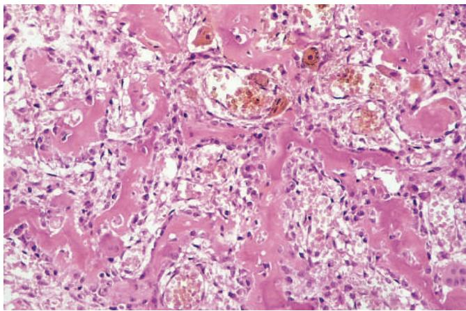 
Fig. 21.15 Osteoid osteoma composed of haphazardly interconnecting trabeculae of woven bone that are rimmed by prominent osteoblasts. The intertrabecular spaces are filled by vascularized loose connective tissue.
..jpg) 
Fig. 21.16 Distal femoral osteosarcoma with prominent bone formation extending into the soft tissues. The periosteum, which has been lifted, has laid down a triangular shell of reactive bone known as a Codman triangle (arrow).
increased risk of osteosarcoma, and somatic $RB$ mutations are present in up to $70\%$ of sporadic osteosarcomas.
- TP53 is a gene whose product functions as the guardian of genomic integrity by promoting DNA repair and apoptosis of irreversibly damaged cells. Patients with Li-Fraumeni syndrome, who have germline TP53 gene mutations, have a greatly elevated incidence of osteosarcoma, and abnormalities that interfere with p53 function are common in sporadic tumors. 
- CDKN2A is inactivated in many osteosarcomas. This gene encodes two tumor suppressors, p16 (a negative regulator of cyclin-dependent kinases) and p14 (which augments p53 function). 
- MDM2 and CDK4, which are cell cycle regulators that inhibit p53 and RB function, respectively, are overexpressed in many low-grade osteosarcomas.
It also is noteworthy that osteosarcomas peak in incidence around the time of the adolescent growth spurt and occur most frequently in the region of the growth plate in bones with the fastest growth. The increased proliferation at these sites may predispose to osteosarcoma development.
Osteosarcomas are bulky tumors that are gritty, gray-white, and often contain areas of hemorrhage and cystic degeneration (Fig. 21.17). The tumors frequently destroy the surrounding cortices and produce soft tissue masses. They spread extensively in the medullary canal, infiltrating and replacing the marrow.
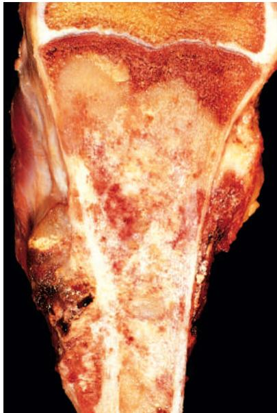 
Fig. 21.17 Osteosarcoma of the proximal tibia. The tan-white tumor fills most of the medullary cavity of the metaphysis and proximal diaphysis. It has infiltrated through the cortex, lifted the periosteum, and formed soft tissue masses on both sides of the bone.
Infrequently they penetrate the epiphyseal plate or enter the joint.
The formation of osteoid matrix or mineralized bone by malignant tumor cells is diagnostic of osteosarcoma
(Fig. 21.18). The neoplastic bone usually has a fine, lacelike configuration but also may be deposited in broad sheets or as primitive trabeculae. The tumor cells vary in size and shape (pleomorphic) and frequently have large hyperchromatic nuclei. Bizarre tumor giant cells, vascular invasion, and necrosis are common. Mitotic activity is high, including abnormal forms (e.g., tripolar mitoses).
Osteosarcoma is treated with a multimodality approach that consists of (1) neoadjuvant chemotherapy, (2) surgery,
..jpg) 
Fig. 21.18 Fine, lacelike pattern of neoplastic bone produced by anaplastic malignant tumor cells in an osteosarcoma. Note the abnormal mitotic figure (arrow).
and (3) chemotherapy. The amount of chemotherapy-induced necrosis found at surgical resection is an important prognostic finding. These aggressive neoplasms spread hematogenously to the lungs. Although the prognosis has improved substantially since the advent of chemotherapy, with 5-year survival rates reaching $60\%$ to $70\%$ in patients without detectible metastases at initial diagnosis, the outcome for patients with metastases, recurrent disease, or secondary osteosarcoma is still poor.
# Cartilage-Forming Tumors
These tumors are characterized by the formation of hyaline cartilage. Benign cartilaginous tumors are much more common than malignant ones.
# Osteochondroma
Osteochondroma, known clinically as exostosis, is a benign cartilage-capped tumor that is attached to the underlying skeleton by a bony stalk. About $85\%$ are solitary. The remainder are seen as part of the multiple hereditary exostoses syndrome (see later). Solitary osteochondromas are usually first diagnosed in late adolescence and early adulthood, but multiple osteochondromas become apparent during childhood. Men are affected three times more often than women. Osteochondromas develop in bones of endochondral origin and arise from the metaphysis near the growth plate of long tubular bones, especially near the knee (Fig. 21.19). They present as slow-growing masses, which can be painful if they impinge on a nerve or if the stalk is fractured. In many cases they are detected incidentally. In multiple hereditary exostoses, the underlying bones may be bowed and shortened, reflecting an associated disturbance in epiphyseal growth.
Hereditary exostoses are associated with germline loss-of-function mutations in either the EXT1 or the EXT2 gene and subsequent loss of the remaining wild-type allele in chondrocytes of the growth plate. Reduced expression of EXT1 or EXT2 also has been observed in sporadic osteochondromas. These genes encode enzymes that synthesize heparan sulfate glycosaminoglycans. The reduced or abnormal glycosaminoglycans may prevent normal diffusion of Hedgehog factors, which are local regulators of cartilage growth, thereby disrupting chondrocyte differentiation and skeletal development.
Osteochondromas are sessile or pedunculated, and they range in size from 1 to $20~\mathrm{cm}$ . The cap is composed of benign hyaline cartilage (Fig. 21.20) and is covered peripherally by perichondrium. The cartilage has the appearance of a disorganized growth plate and undergoes endochondral ossification, with the newly made bone forming the inner portion of the head and stalk. The cortex of the stalk merges with the cortex of the host bone resulting in continuity between the medulla of the osteochondroma and the host bone.
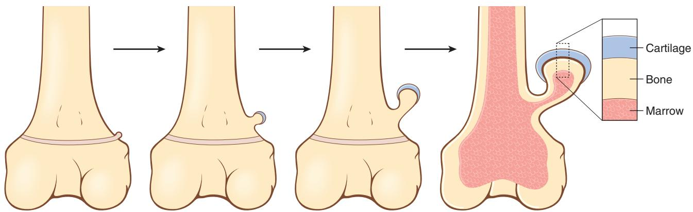 
Fig. 21.19 The development of an osteochondroma, beginning with an outgrowth from the epiphyseal cartilage.
Radiographofanosteochondromaarisingfromthedistalfemur(arrow).(B)Thecartilagecaphasthehistologicappearanceofdisorganizedgrowthplate-likecartilage..jpg) 
Fig. 21.20 Osteochondroma. (A) Radiograph of an osteochondroma arising from the distal femur (arrow). (B) The cartilage cap has the histologic appearance of disorganized growth plate-like cartilage.
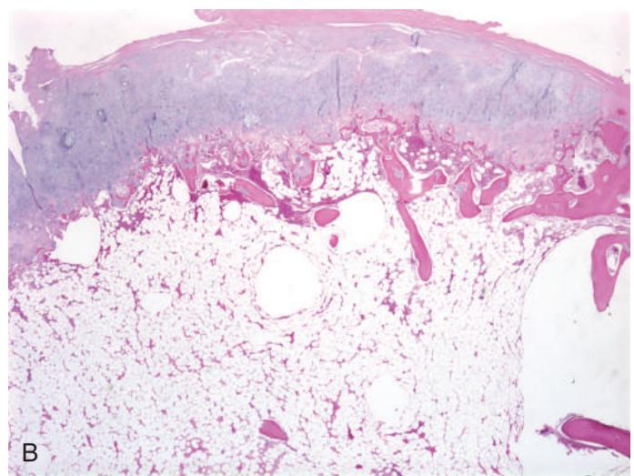
Osteochondromas usually stop growing at the time of growth plate closure. Symptomatic tumors are cured by simple excision. Rarely in sporadic cases, but more commonly in those with multiple hereditary exostosis $(5\% - 20\%)$ , osteochondromas progress to chondrosarcoma.
# Chondroma
Chondromas are benign tumors of hyaline cartilage that usually occur in bones of endochondral origin. They arise within the medullary cavity ( enchondroma) or on the cortical surface (juxtacortical chondroma). Enchondromas are usually diagnosed in individuals 20 to 50 years of age. Typically, they appear as solitary metaphyseal lesions of the tubular bones of the hands and feet. The radiographic features consist of a circumscribed lucency with central irregular calcifications, a sclerotic rim, and an intact cortex (Fig. 21.21). Ollier disease and Maffucci syndrome are disorders characterized by multiple enchondromas (enchondromatosis). Maffucci syndrome also is associated with other rare tumors.
Most enchondromas of large bones are asymptomatic and are detected incidentally. Occasionally, they are painful and cause pathologic fracture. The tumors in
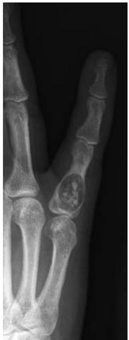 
Fig. 21.21 Enchondroma of the proximal phalanx. The radiolucent nodule of cartilage with central calcification thins but does not penetrate the cortex.
enchondromatosis may be numerous and large, producing severe deformities, especially of the digits.
Heterozygous gain of function mutations in the $IDH1$ and $IDH2$ genes, coding for the enzymes isocitrate dehydrogenases, have been identified in the chondrocytes of syndromic and solitary enchondromas. Patients with enchondroma syndromes are mosaics, harboring $IDH$ mutations in only a subset of otherwise normal cells throughout their bodies. The mutations confer a new enzymatic activity on the IDH proteins that leads to the synthesis of 2-hydroxyglutarate. As discussed in Chapter 6, this so-called "oncometabolite" interferes with regulation of DNA methylation and is also implicated in certain glial tumors and a subset of acute myeloid leukemias.
Enchondromas are usually smaller than $3\mathrm{cm}$ and are gray-blue and translucent. They are composed of well-circumscribed nodules of hyaline cartilage containing benign chondrocytes (Fig. 21.22). The peripheral portion of the nodules may undergo endochondral ossification, and the center can calcify and infarct. Syndromic enchondromas are sometimes more cellular with more atypia than sporadic enchondromas.
The growth potential of chondromas is limited. Treatment depends on the clinical situation and usually includes observation or curettage. Solitary chondromas rarely undergo sarcomatous transformation, but those associated with enchondromatosis do so more frequently. Individuals with Maffucci syndrome also are at risk of developing other neoplasms, including brain gliomas.
# Chondrosarcoma
Chondrosarcomas are malignant tumors that produce cartilage. They are subclassified into conventional (hyaline cartilage-producing), dedifferentiated, clear cell, and
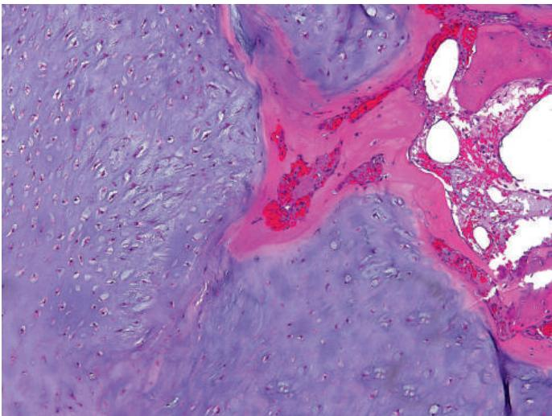 
Fig. 21.22 Enchondroma composed of a nodule of hyaline cartilage encased by a thin layer of reactive bone.
mesenchymal types. Approximately $90\%$ of chondrosarcomas are of the conventional type. Chondrosarcoma is about half as common as osteosarcoma. Individuals with conventional chondrosarcoma are usually in their 40s or older. These tumors affect men twice as frequently as women. The clear cell and especially the mesenchymal variants occur in children and young adults. Chondrosarcomas commonly arise in the axial skeleton, especially the pelvis, shoulder, and ribs. Unlike benign enchondroma, the distal extremities are rarely involved. On imaging, the calcified cartilage appears as foci of flocculent densities that may destroy the cortex and form a soft tissue mass. About $15\%$ of conventional chondrosarcomas are secondary, arising from a preexisting enchondroma or osteochondroma.
Although chondrosarcomas are genetically heterogeneous, a few reproducible abnormalities have been identified. Chondrosarcomas arising in multiple osteochondroma syndrome exhibit mutations in the EXT genes, and both chondromatosis-related and sporadic chondrosarcomas may have IDH1 and IDH2 mutations. Mutation of the collagen COL2A1 gene and silencing of the CDKN2A tumor
Conventional chondrosarcomas are large bulky tumors composed of nodules of glistening gray-white, translucent cartilage, along with gelatinous or myxoid areas (Fig. 21.23A). Spotty calcifications are typically present, and central necrosis may create cystic spaces. The tumor spreads through the cortex into surrounding muscle or fat. Histologically, the cartilage infiltrates the marrow space and entraps normal bony trabeculae (Fig. 21.23B). The tumors vary in cellularity, cytologic atypia, and mitotic activity and are assigned a grade from 1 to 3. Grade I tumors have relatively low cellularity, and the chondrocytes have plump vesicular nuclei with small nucleoli. By contrast, grade 3 chondrosarcomas are characterized by high cellularity, extreme pleomorphism with bizarre tumor giant cells, and mitoses.
suppressor gene by DNA methylation are also relatively common in sporadic tumors.
Chondrosarcomas usually present as painful, progressively enlarging masses. Tumor grade predicts outcome, which ranges from $80\%$ 5-year survival for Grade 1 tumors to $43\%$ for Grade 3 tumors. Grade 1 chondrosarcomas rarely metastasize, whereas $70\%$ of grade 3 tumors spread hematogenously, especially to the lungs. The treatment of conventional chondrosarcoma is wide surgical excision. The mesenchymal and dedifferentiated tumors are also excised and are additionally treated with chemotherapy because of their more aggressive clinical course.
# Tumors of Unknown Origin
# Ewing Sarcoma
Ewing sarcoma is a malignant tumor composed of primitive round cells with varying degrees of neuroectodermal
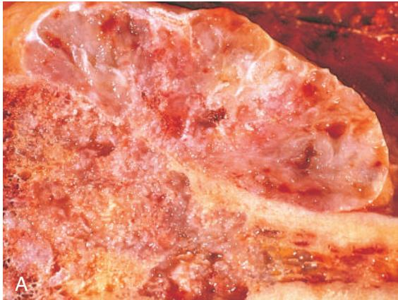 
Fig. 21.23 Chondrosarcoma. (A) Nodules of hyaline and myxoid cartilage permeating throughout the medullary cavity, growing through the cortex, and forming a relatively well-circumscribed soft tissue mass. (B) Conventional chondrosarcoma entraps native lamellar bone as a confluent mass of cartilage.
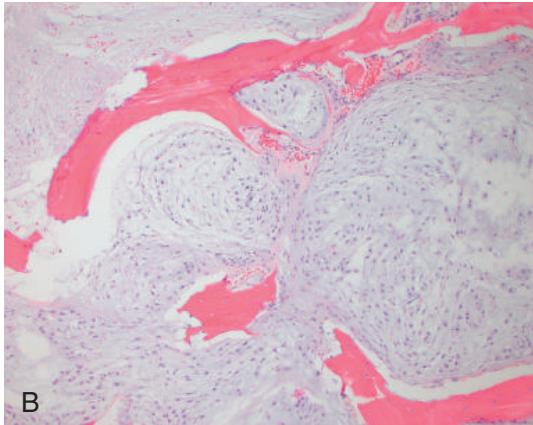
differentiation and a characteristic molecular signature (see later). Entities previously classified as primitive neuroectodermal tumor (PNET) and Askin tumor have been unified into the single category of Ewing sarcoma.
Ewing sarcoma accounts for approximately $10\%$ of primary malignant bone tumors and follows osteosarcoma as the second most common bone sarcoma in children. Of all bone sarcomas, Ewing sarcomas have the youngest average age at presentation (80% are younger than 20 years). Boys are affected slightly more frequently than girls, and there is a predilection for Caucasians. The tumors usually arise in the diaphysis of long tubular bones but $20\%$ are extraskeletal. They present as painful enlarging masses, and the affected site is frequently tender, warm, and swollen. Plain radiographs show a destructive lytic tumor with permeative margins that extends into the surrounding soft tissues. The characteristic periosteal reaction produces layers of reactive bone deposited in an onion-skin fashion.
The vast majority (85%) of Ewing sarcomas contain a balanced (11;22) (q24;q12) translocation generating in-frame fusion of the $EWSR1$ gene on chromosome 22 to the $FLI1$ gene on chromosome 11. Variant translocations fuse $EWSR1$ to other members of the ETS transcription factor family. How EWS fusion proteins contribute to transformation remains unsettled; effects on transcription, RNA splicing, and the cell cycle machinery have all been proposed. Similarly, the cell of origin still remains to be identified; the leading candidates are mesenchymal stem cells and primitive neuroectodermal cells.
Arising in the medullary cavity, Ewing sarcoma usually invades the cortex, periosteum, and soft tissue. The tumor is soft, tan-white, and frequently contains areas of hemorrhage and necrosis. It is one of the small, round blue cell tumors found in children (Chapter 7). Like other tumors in this group, Ewing sarcoma is composed of sheets of uniform small, round cells that are
slightly larger and more cohesive than lymphocytes (Fig. 21.24). They have scant cytoplasm, which may appear clear because it is rich in glycogen. Homer-Wright rosettes (round groupings of cells with a central fibrillary core) may be present and indicate a greater degree of neuroectodermal differentiation. The tumor cells do not produce bone or cartilage.
Ewing sarcomas are aggressive malignancies treated with neoadjuvant chemotherapy followed by surgical excision with or without radiation. With chemotherapy, 5-year survival of $75\%$ and long-term cure in $50\%$ of patients is possible.
# Giant Cell Tumor
Giant cell tumor is so named because multinucleated osteoclast-type giant cells dominate the histology. It is a locally aggressive neoplasm that almost exclusively affects adults. Giant cell tumors arise in the epiphyses of long bones, most commonly the distal femur and proximal tibia. The typical location of these tumors near joints frequently
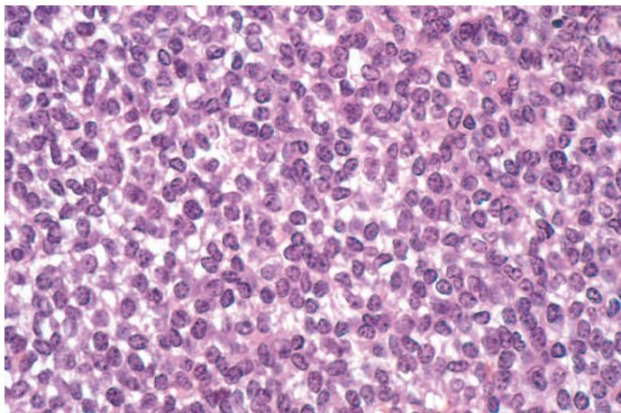 
Fig. 21.24 Ewing sarcoma composed of sheets of small round cells with small amounts of clear cytoplasm.
causes arthritis-like symptoms. Occasionally, they present with pathologic fractures.
Experimental evidence suggests that the neoplastic cells of the giant cell tumor are osteoblast precursors, which represent only a minority of the cells in the tumor. The neoplastic cells express high levels of RANKL, which promotes the proliferation and differentiation of normal osteoclast precursors into osteoclasts. The osteoclasts in turn cause localized but highly destructive resorption of bone.

Giant cell tumors often destroy the overlying cortex, producing a bulging soft tissue mass delineated by a thin shell of reactive bone (Fig. 21.25). Grossly, they are red-brown masses that frequently undergo cystic degeneration. Microscopically, the tumor conspicuously lacks bone or cartilage, consisting of numerous osteoclast-type giant cells with 100 or more nuclei with uniform, oval mononuclear tumor cells in between (Fig. 21.26).
Giant cell tumors are typically treated with curettage, but $40\%$ to $60\%$ recur locally. Up to $4\%$ of tumors metastasize to the lungs, but these sometimes spontaneously regress and they are seldom fatal. The RANKL inhibitor, Denosumab, has shown promise in treating giant cell tumor.
# Aneurysmal Bone Cyst
Aneurysmal bone cyst (ABC) is a benign tumor characterized by multiloculated blood-filled cystic spaces. ABC generally occurs during the first 2 decades of life and has
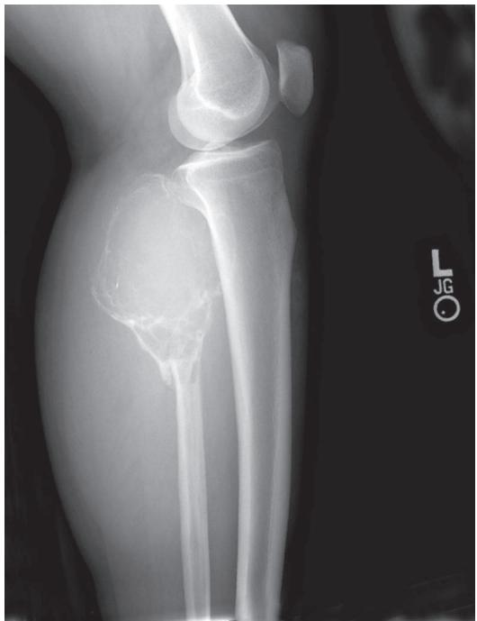 
Fig. 21.25 Radiographically, giant cell tumor of the proximal fibula is predominantly lytic, expansile with destruction of the cortex. A pathologic fracture is also present.
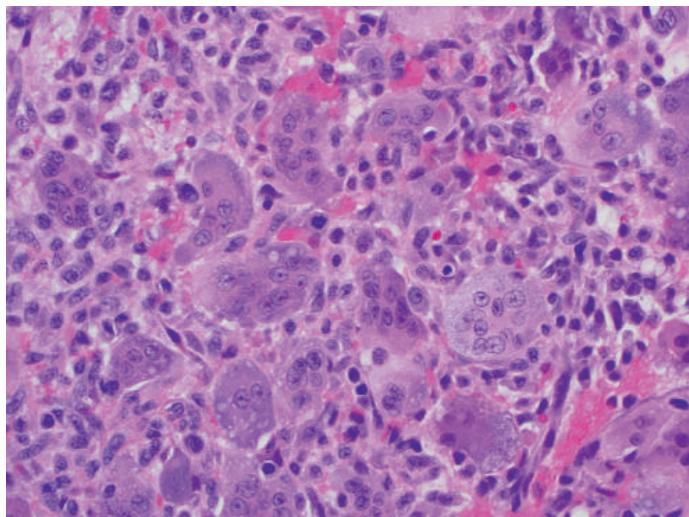 
Fig. 21.26 Giant cell tumor illustrating an abundance of multinucleated giant cells with background mononuclear stromal cells.
no sex predilection. It most frequently develops in the metaphysis of long bones and the posterior elements of vertebral bodies. Pain and swelling are common.
Radiographically, ABC is usually an eccentric, expansile, lytic, metaphyseal lesion with well-defined margins (Fig. 21.27A). Computed tomography and magnetic resonance imaging may demonstrate internal septa and characteristic fluid-fluid levels (Fig. 21.27B).
The spindle-shaped cells of primary ABC frequently demonstrate rearrangements of chromosome 17p13 resulting in fusion of the coding region of $USP6$ to the regulatory elements of genes that are highly expressed in osteoblasts, leading to USP6 overexpression. $USP6$ encodes an enzyme that removes ubiquitin residues from proteins (a deubiquitinase). It is proposed that increased USP6 expression enhances the activity of the transcription factor NF- $\kappa \mathbf{B}$ Increased NF- $\kappa \mathbf{B}$ activity may upregulate matrix metalloproteases, leading to cystic resorption of bone.
Aneurysmal bone cyst consists of multiple blood-filled cystic spaces separated by thin, tan-white septae (Fig. 21.28). The septae are composed of plump uniform fibroblasts, multinucleated osteoclast-like giant cells, and reactive woven bone, but they are not covered by endothelium.
The treatment of ABC is surgical. Curettage is effective with low risk of recurrence.
# Lesions Simulating Primary Neoplasms
# Nonossifying Fibroma
Nonossifying fibroma (NOF) is a benign, likely reactive, mesenchymal proliferation that may be present in
Coronalcomputedaxialtomographyscanshowingeccentricaneurysmalbonecystoftibia.Thesofttissuecomponentisdelineatedbyathinrimofreactivesubperiostealbone.(B)Axialmagneticresonanceimagedemonstratingcharacteristicfluid-fluidlevels(arrow)..jpg) 
Fig. 21.27 (A) Coronal computed axial tomography scan showing eccentric aneurysmal bone cyst of tibia. The soft tissue component is delineated by a thin rim of reactive subperiosteal bone. (B) Axial magnetic resonance image demonstrating characteristic fluid-fluid levels (arrow).
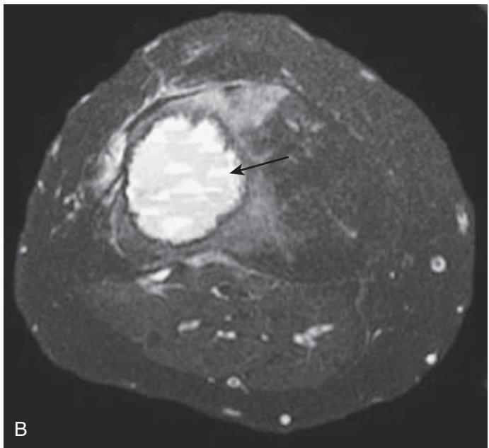
as many as $50\%$ of children and young adults aged 2-25 years. It is synonymous with fibrous cortical defect or metaphyseal fibrous defect if localized to the cortex or medulla, respectively. The vast majority arises eccentrically in the metaphysis of the distal femur and proximal tibia. Plain radiographs show a sharply demarcated oval radiolucency with the long axis parallel to the cortex (Fig. 21.29). The findings are sufficiently specific on plain radiography that biopsy is rarely necessary. NOFs form gray to yellow-brown cellular lesions containing fibroblasts and macrophages. The cytologically bland fibroblasts are frequently arranged in a storiform (pinwheel) pattern, and the macrophages may take the form of clustered cells with foamy cytoplasm or multinucleated giant cells (Fig. 21.30). Hemosiderin is commonly present. Most small NOFs undergo spontaneous resolution within several years.
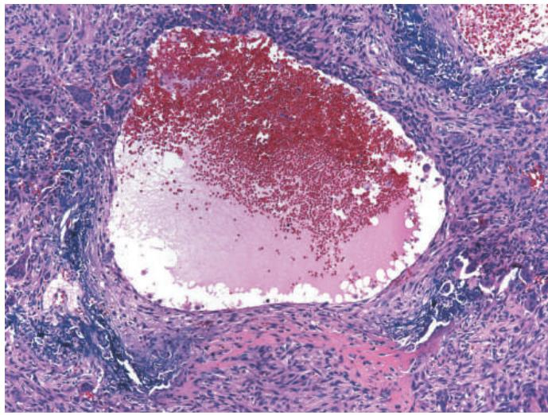 
Fig. 21.28 Aneurysmal bone cyst with blood-filled cystic space surrounded by a fibrous wall containing proliferating fibroblasts, reactive woven bone, and osteoclast-type giant cells.
# Fibrous Dysplasia
Fibrous dysplasia is a benign tumor that has been likened to a localized developmental arrest of bone constituents. The lesions arise during skeletal development, and they appear in several distinctive but sometimes overlapping clinical patterns:
- Monostotic: involvement of a single bone 
- Polyostotic: involvement of multiple bones
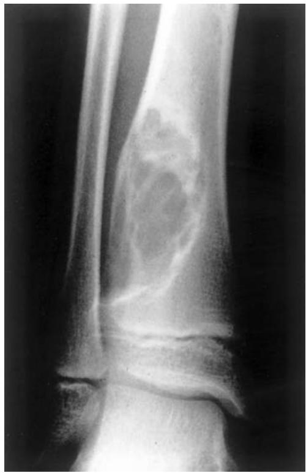 
Fig. 21.29 Nonossifying fibroma of the distal tibia metaphysis producing an eccentric lobulated radiolucency surrounded by a sclerotic margin.
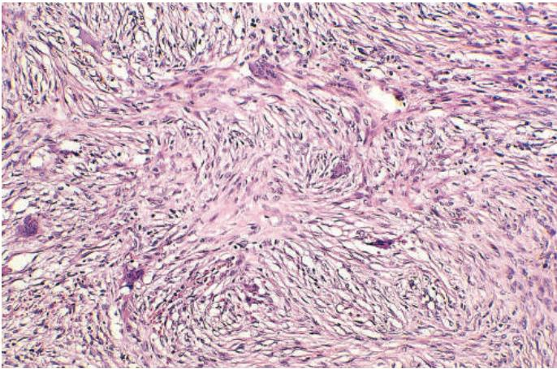 
Fig. 21.30 Storiform pattern created by benign spindle cells with scattered osteoclast-type giant cells characteristic of a fibrous cortical defect.
- Mazabraud syndrome: fibrous dysplasia and soft tissue myxoma 
McCune-Albright syndrome: polyostotic fibrous dysplasia, café-au-lait skin pigmottations, and endocrine abnormalities, especially precocious puberty
All of the aforementioned variants result from a somatic gain-of-function mutation in GNAS1, the gene that is also mutated in pituitary adenomas (Chapter 20). The mutations produce a constitutively active $\mathrm{G}_{\mathrm{s}}$ -protein that promotes cellular proliferation by increasing cellular levels of cAMP. The phenotype depends on the stage of embryogenesis when the mutation is acquired and on the fate of the cell harboring the mutation. A mutation during early embryogenesis produces the McCune-Albright syndrome, whereas a mutation during or after formation of the skeleton in an osteoblast precursor results in monostotic fibrous dysplasia. The skeletal manifestations arise from a cAMP-mediated interruption of normal osteoblast differentiation.

The lesions of fibrous dysplasia are well circumscribed, intramedullary, and vary greatly in size. Larger lesions expand and distort the bone. The lesional tissue is composed of curvilinear trabeculae of woven bone surrounded by a moderately cellular fibroblastic proliferation. The trabeculae lack prominent osteoblastic rimming (Fig. 21.31). Cystic degeneration, hemorrhage, and foamy macrophages are other common findings.
Monostotic fibrous dysplasia often stops enlarging at the time of growth plate closure. The lesion is frequently asymptomatic and is usually discovered incidentally, but it may cause pain, fracture, and discrepancies in limb length. Symptomatic lesions are cured by curettage.
Polyostotic fibrous dysplasia may continue to cause problems into adulthood. If it involves the limb girdles, it can cause crippling deformities and fractures. The McCune-Albright syndrome usually presents with precocious sexual development, most often in girls. The skeletal manifestations are managed as for other polyostotic fibrous dysplasia, whereas the endocrinopathies are treated medically.
# Metastatic Tumors
Metastatic tumors greatly outnumber primary bone cancers. The pathways of tumor spread to bone include (1) direct extension, (2) lymphatic or hematogenous dissemination, and (3) intraspinal seeding (via the Batson plexus of veins). Any cancer can spread to bone, but in adults more than $75\%$ of skeletal metastases originate from cancers of the prostate, breast, kidney, and lung. In children, metastases to bone originate from neuroblastoma, Wilms tumor, and rhabdomyosarcoma.
Skeletal metastases are typically multifocal and involve the axial skeleton, especially the vertebral column. The radiographic appearance of metastases may be purely lytic (bone destroying), purely blastic (bone forming), or mixed. Bidirectional interactions between metastatic cancer cells and native bone cells account for the changes that manifest in the bone matrix. Tumor cells secrete substances such as prostaglandins, cytokines, and PTH-like peptide that upregulate RANKL on osteoblasts and stromal cells thereby stimulating osteoclast activity. At the same time, tumor cell growth is supported by the release of matrix-bound growth factors (e.g., TGF- $\beta$ , IGF-1, and FGF) as bone is resorbed. Tumor cells secreting WNT proteins that stimulate osteoblastic bone formation may produce sclerotic metastases.
The presence of bone metastases carries a poor prognosis. Therapeutic options include systemic chemotherapy, radiation, and bisphosphonates. Surgery may be necessary to stabilize pathologic fractures.
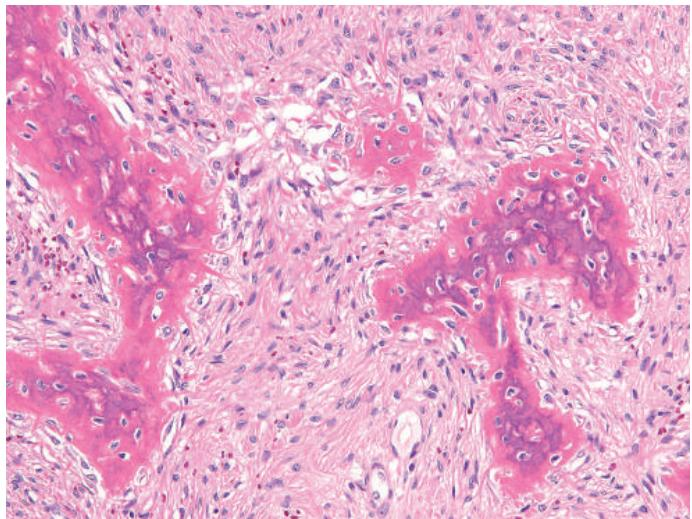 
Fig. 21.31 Fibrous dysplasia composed of curvilinear trabeculae of woven bone that lack conspicuous osteoblastic rimming and arise in a background of fibrous tissue.
# BONE TUMORS AND TUMORLIKE LESIONS
Primary bone tumors are classified according to the cell of origin or the matrix that they produce. The remainder is grouped according to clinicopathologic features. Most primary bone tumors are benign. Metastases, especially from lung, prostate, kidneys, and breast, are far more common than primary bone neoplasms.
Major categories of primary bone tumors include
- Bone forming: Osteoblastoma and osteoid osteoma consist of benign osteoblasts that synthesize osteoid. Osteosarcoma
is an aggressive tumor of malignant osteoblasts, predominantly occurring in adolescents.
- Cartilage forming: Osteochondroma is an exostosis with a cartilage cap. Sporadic and syndromic forms arise from mutations in the EXT genes. Chondromas are benign tumors producing hyaline cartilage, usually arising in the digits. Chondrosarcomas are malignant tumors of chondroid cells that involve the axial skeleton in adults. 
- Ewing sarcomas are aggressive, malignant, small round cell tumors most often associated with t(11;22). 
- Fibrous dysplasia is an example of a disorder caused by gain-of-function mutations that occur during development.
# Joints
Joints allow movement while providing mechanical stability. They are classified as solid (nonsynovial) and cavitated (synovial). The solid joints, also known as synarthroses, provide structural integrity and allow only minimal movement. They lack a joint space and are grouped according to the type of connective tissue (fibrous tissue or cartilage) that bridges the ends of the bones. Fibrous synarthroses include the cranial sutures and the bonds between roots of teeth and the jawbones. Cartilaginous synarthroses (synchronous) are represented by the symphyses between the sternum and the ribs and between bones of the pelvis. Synovial joints, in contrast, have a joint space that allows for a wide range of motion. Synovial membranes enclose these joints. The membranes are lined by type A synoviocytes that are specialized macrophages with phagocytic activity and type B synoviocytes that are similar to fibroblasts and synthesize hyaluronic acid and various proteins. The synovial lining lacks a basement membrane, which allows for efficient exchange of nutrients, wastes, and gases between blood and synovial fluid. Synovial fluid is a plasma filtrate containing hyaluronic acid produced by synovial cells that acts as a viscous lubricant and provides nutrition for the articular cartilage.
Hyaline cartilage is a unique connective tissue ideally suited to serve as an elastic shock absorber and wear-resistant surface. It lacks a blood supply, lymphatic drainage, and innervation. Hyaline cartilage is composed of water $(70\%)$ , type II collagen $(10\%)$ , proteoglycans $(8\%)$ and chondrocytes. The collagen resists tensile stresses and transmits vertical loads. The water and proteoglycans resist compression and limit friction. The chondrocytes synthesize the matrix as well as enzymatically digest it. Chondrocytes secrete degradative enzymes in inactive forms and enrich the matrix with enzyme inhibitors.
# ARTHRITIS
# Osteoarthritis
Osteoarthritis (OA), also called degenerative joint disease, is characterized by degeneration of cartilage that
results in structural and functional failure of synovial joints. It is the most common disease of joints. Although the term osteoarthritis implies an inflammatory disease, it is considered an intrinsic disorder of cartilage in which chondrocytes respond to biochemical and mechanical stresses resulting in the breakdown of the matrix and failure of its repair. Nevertheless there is little doubt that inflammatory mediators (described later) whose release is triggered by joint injury perpetuate and worsen the damage.
In most instances OA appears insidiously, without apparent initiating cause, as an aging phenomenon (idiopathic or primary osteoarthritis). In these cases the disease is usually oligoarticular (affects few joints). In about $5\%$ of cases, OA appears in younger individuals with some predisposing condition, such as joint deformity, a previous joint injury, or an underlying systemic disease that places joints at risk. In these settings the disease is called secondary osteoarthritis. The prevalence of OA increases exponentially beyond the age of 50, and about $40\%$ of people older than 70 are affected.
The lesions of OA stem from degeneration of the articular cartilage and its disordered repair. Articular cartilage serves as a low-friction surface that transmits loads to the underlying bone. Cartilage resists compression through the viscoelastic properties of the extracellular matrix (principally type II collagen, proteoglycans, and water) secreted by chondrocytes. Repeated biomechanical stress contributes to development of OA, but genetic factors, including genes encoding components of the matrix and signaling molecules, also play a role. These factors are thought to predispose to chondrocyte injury, which in turn leads to alteration of the extracellular matrix (Fig. 21.32). Although chondrocytes proliferate and continuously synthesize and secrete proteoglycans, degradation ultimately exceeds synthesis, and the composition of proteoglycans changes as the disease progresses. Meanwhile, MMPs secreted by chondrocytes degrade the type II collagen network. Cytokines and diffusible factors from chondrocytes and synovial cells, particularly TGF- $\beta$ (which induces MMPs), TNF,
prostaglandins, and nitric oxide, have been implicated in OA (Fig. 21.32). Chronic, low-level inflammation contributes to the progression of the disease. Ultimately, chondrocyte loss and a severely degraded matrix mark the late stage of the disease.
Clinical Course
In the early stages of OA, chondrocytes proliferate, forming clusters. Concurrently, the water content of the matrix increases and the concentration of proteoglycans decreases. The normally horizontally arranged collagen type II fibers are cleaved, yielding fissures and clefts at the articular surface (Fig. 21.33). This
manifests as a granular soft articular surface. Eventually, full-thickness portions of the cartilage are sloughed. The dislodged pieces of cartilage and subchondral bone tumble into the joint, forming loose bodies (joint mice). The exposed subchondral bone plate becomes the new articular surface, and friction with the opposing surface burnishes the exposed bone, giving it the appearance of polished ivory (bone eburnation) (Fig. 21.33). Small fractures through the articulating bone are common, and the fracture gaps allow synovial fluid to be forced into the subchondral regions in a one-way, ball valve-like mechanism forming fibrous-walled cysts. Outgrowths (osteophytes) develop at the margins of the articular surface and are capped by fibrocartilage and hyaline cartilage that gradually ossify. The synovium is usually only mildly congested and fibrotic, and it may have scattered chronic inflammatory cells.
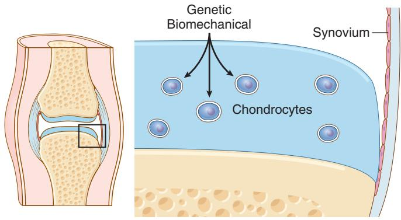 
1. CHONDROCYTE INJURY
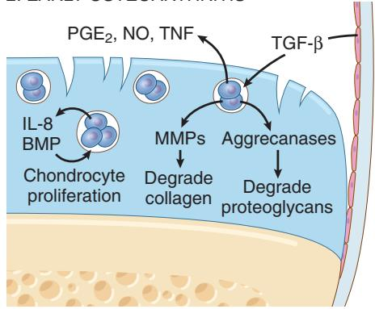 
2. EARLY OSTEOARTHRITIS
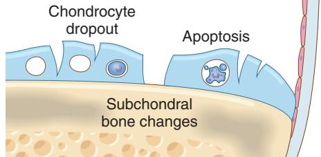 
3. LATE OSTEOARTHRITIS 
Fig. 21.32 Schematic view of osteoarthritis (OA). OA is thought to be initiated by chondrocyte injury (1) in a genetically predisposed patient leading to changes in the extracellular matrix. (2) Although chondrocytes may proliferate and attempt to repair damaged matrix, continued degradation exceeds repair in early OA. (3) Late OA is evidenced by loss of both matrix and chondrocytes with subchondral bone damage.
Primary OA usually presents in patients they are in their 50s. If a young person has significant manifestations of OA, a search for some underlying cause should be made. Characteristic symptoms include joint pain that worsens with use, morning stiffness, crepitus, and limitation of range of movement. Impingement on spinal foramina by osteophytes results in cervical and lumbar nerve root compression and radicular pain, muscle spasms, muscle atrophy, and neurologic deficits. The joints commonly involved include the hips (Fig. 21.34), knees, lower lumbar and cervical vertebrae, proximal and distal interphalangeal joints of the fingers, first carpometacarpal joints, and first tarsometatarsal joints. Heberden nodes, prominent osteophytes at the distal interphalangeal joints, are common in women (but not in men). With time, joint deformity can occur, but unlike rheumatoid arthritis (discussed next), joint fusion does not take place (Fig. 21.35). The level of disease severity detected radiographically, however, does not correlate well with pain and disability. There are still no satisfactory means of preventing primary OA, and there are no effective methods of halting its progression. Therapy includes management of pain, NSAIDs to reduce inflammation, intra-articular corticosteroids, activity modification, and, for severe cases, arthroplasty.
# Rheumatoid Arthritis
Rheumatoid arthritis (RA) is a chronic inflammatory disorder of autoimmune origin that principally attacks the joints, producing a nonsuppurative proliferative and inflammatory synovitis. RA often progresses to the destruction of the articular cartilage and, in some cases ankylosis (adhesion) of the joints. Extraarticular lesions may occur in the skin, heart, blood vessels, and lungs. The prevalence in the United States is approximately $1\%$ , and it is three times more common in women than in men. The peak incidence is in the third through fifth decades of life.
As in other autoimmune diseases, genetic predisposition and environmental factors contribute to the development, progression, and chronicity of the disease. The pathologic changes are mediated by antibodies against self-antigens
Histologicdemonstrationofthecharacteristicfibrillationofthearticularcartilage.(B)Eburnatedarticularsurfaceexposingsubchondralbone(1),subchondralcyst(2),andresidualarticularcartilage(3)..jpg) 
Fig. 21.33 Osteoarthritis. (A) Histologic demonstration of the characteristic fibrillation of the articular cartilage. (B) Eburnated articular surface exposing subchondral bone (1), subchondral cyst (2), and residual articular cartilage (3).
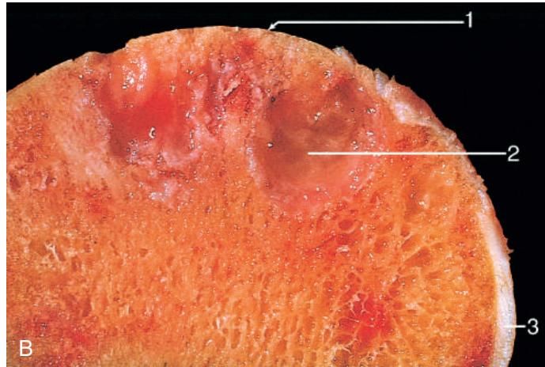
and inflammation caused by cytokines, predominantly secreted by $\mathrm{CD4 + }$ T cells (Fig. 21.36).
$\mathrm{CD4 + }$ T helper $(\mathrm{T_H})$ cells may initiate the autoimmune response in RA by reacting with an arthritogen, perhaps microbial or a chemically modified self-antigen. The T cells produce cytokines that stimulate other inflammatory cells to effect tissue injury:
- IFN- $\gamma$ from $\mathrm{T_H1}$ cells activates macrophages and synovial cells. 
- IL-17 from $\mathrm{T_H}17$ cells recruits neutrophils and monocytes.
..jpg) 
Fig. 21.34 Severe osteoarthritis of the hip. The joint space is narrowed, and there is subchondral sclerosis with scattered oval radiolucent cysts and peripheral osteophyte lipping (arrows).
- RANKL expressed on activated T cells stimulates osteoclasts and bone resorption. 
TNF and IL-1 from macrophages stimulate resident synovial cells to secrete proteases that destroy hyaline cartilage.
Of these, TNF has been most firmly implicated in the pathogenesis of RA, and TNF antagonists have proved to be effective therapies for the disease (see later).
The synovium of RA contains germinal centers with secondary follicles and abundant plasma cells that produce antibodies, some of which may be against self-antigens. Many of the serum autoantibodies detected in patients are specific for citrullinated peptides in which arginine residues are posttranslationally converted to citrulline. In RA, complexes of antibodies with citrullinated fibrinogen, type II collagen, $\alpha$ -enolase, and vimentin deposit in the joints. Evidence suggests that the anti-citrullinated protein antibodies (ACPA) in combination with a T cell response to the citrullinated proteins contribute to disease chronicity. Approximately $30\%$ of RA patients do not have ACPA in the blood. About $80\%$ of patients have serum IgM or IgA autoantibodies that bind to the Fc portions of their own IgG. These autoantibodies are called rheumatoid factor and may also deposit in joints as immune complexes, although they are not uniformly present in all patients with RA and can be found in patients without the disease.
It is estimated that $50\%$ of the risk of developing RA is related to inherited genetic susceptibility. The HLA class II locus is associated with ACPA-positive RA. Evidence suggests that an epitope on a citrullinated protein, vinculin, mimics an epitope on many microbes and is the target of $\mathrm{CD4 + }$ T cells when presented by predisposing HLA-DQ alleles. A second gene linked to RA, PTPN22, encodes a protein tyrosine phosphatase that is postulated to inhibit T cell activation. Numerous other genetic associations have been reported.
Many candidate environmental factors whose antigens promote autoimmunity have been postulated. At least $70\%$ of RA patients have ACPA in their blood, which may
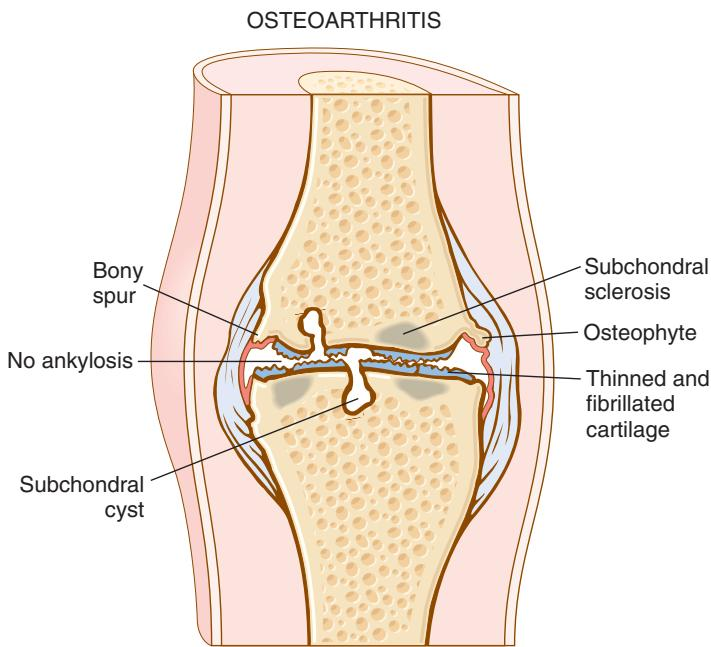 
Fig. 21.35 Comparison of the morphologic features of rheumatoid arthritis and osteoarthritis.
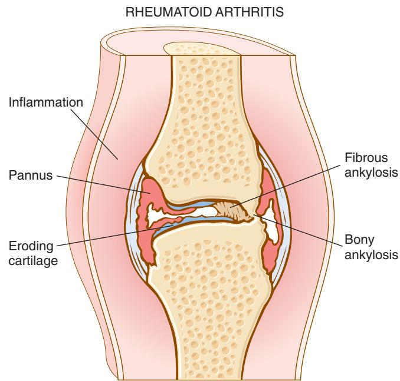
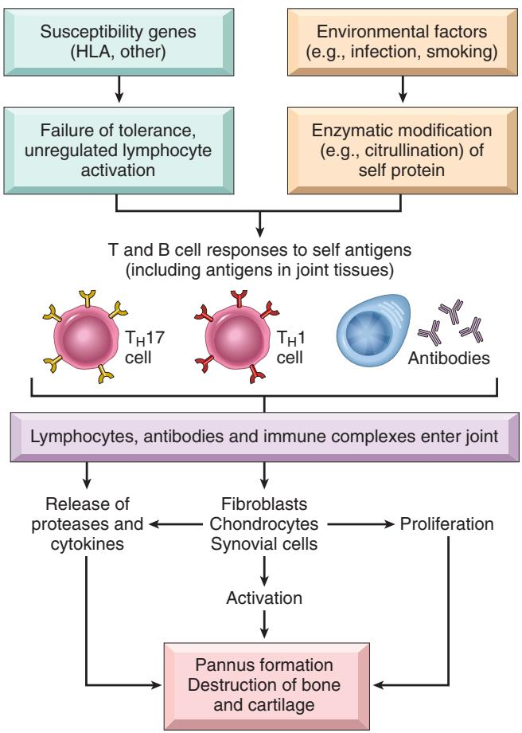 
Fig. 21.36 Major processes involved in the pathogenesis of rheumatoid arthritis.
be produced during inflammation. Insults such as infection (including periodontitis) and smoking may promote citrullination of self-proteins, creating new epitopes that trigger autoimmune reactions.
The inflammation localizes to the joint, recruiting macrophages and triggering activation and/or proliferation of synovial cells, chondrocytes, and fibroblasts. The production of proteolytic enzymes and cytokines contributes to the destruction of cartilage and, through increased osteoclast activity, bone (Fig. 21.36).
RA typically manifests as symmetric arthritis principally affecting the small joints of the hands and feet. Grossly, the synovium becomes edematous, thickened, and hyperplastic, transforming its smooth contour to one covered by delicate and bulbous villi (Fig. 21.37A-B). The characteristic histologic features include (1) synovial cell hyperplasia and proliferation; (2) dense inflammatory infiltrates of $\mathrm{CD4 + }$ helper T cells, B cells, plasma cells, dendritic cells, and macrophages (Fig. 21.37C); (3) increased vascularity resulting from angiogenesis; (4) neutrophils and aggregates of organizing fibrin on the synovial and joint surfaces; (5) osteoclastic activity in underlying bone, allowing the synovium to penetrate into the bone, causing periarticular erosions and subchondral cysts. Together, the aforementioned changes produce a pannus: a mass of edematous synovium, inflammatory cells, granulation tissue, and fibroblasts that grows over the articular cartilage and causes its erosion. In advanced untreated cases the pannus can bridge the bones to form a fibrous ankylosis, which may later ossify as a bony ankylosis (Fig. 21.35).
Rheumatoid nodules are an infrequent manifestation of RA and typically occur in subcutaneous tissue including the forearm, elbows, occiput, and lumbosacral area. Microscopically, they resemble necrotizing granulomas (Fig. 21.38). Rarely, RA can involve the lungs (rheumatoid nodules, interstitial lung disease).
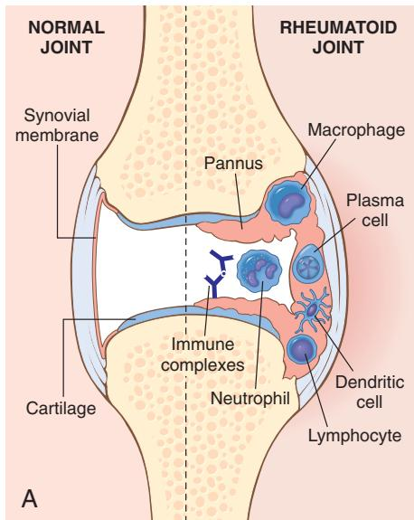 
Fig. 21.37 Rheumatoid arthritis. (A) Schematic view of the joint lesion. (B) Low magnification shows marked synovial hypertrophy with formation of villi. (C) At higher magnification, subsynovial tissue containing a dense lymphoid aggregate. (A, Modified from Feldmann M: Development of anti-TNF therapy for rheumatoid arthritis. Nat Rev Immunol 2:364, 2002.)
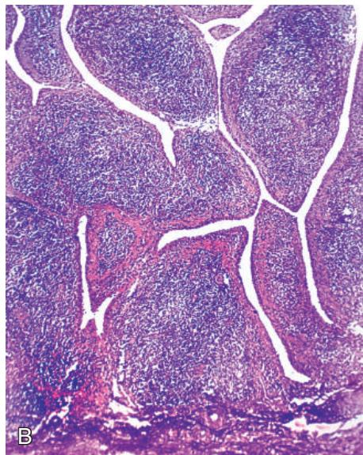
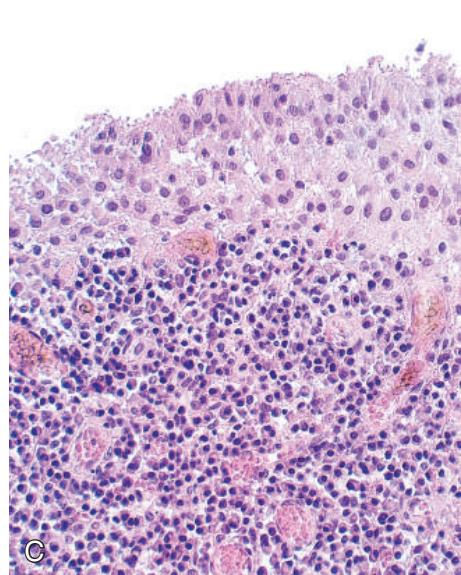
RA can be distinguished from other forms of polyarticular inflammatory arthritis by the presence of ACPA and by characteristic radiographic findings. In about half of patients, RA begins slowly and insidiously with malaise, fatigue, and generalized musculoskeletal pain. After several weeks to months, the joints become involved. The pattern of joint involvement is generally symmetrical and the hands and feet, wrists, ankles, elbows, and knees are most commonly affected. The metacarpophalangeal and proximal interphalangeal joints are frequently involved (in contrast to OA, see earlier).
Involved joints are swollen, warm, and painful. In contrast to OA, the joints are stiff when patient rises in the morning or following inactivity. The typical patient
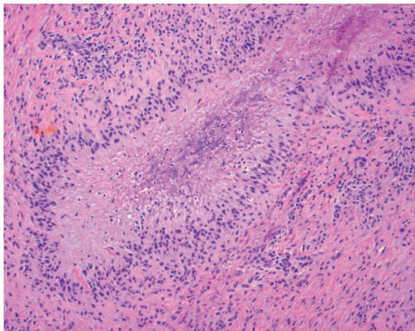 
Fig. 21.38 Rheumatoid nodule composed of central necrosis rimmed by palisaded histiocytes.
has progressive joint enlargement and decreased range of motion pursuing a chronic waxing and waning course. In a minority of patients, especially those lacking RF and ACPA, the disease may stabilize or even regress.
Inflammation in the tendons, ligaments, and occasionally the adjacent skeletal muscle frequently accompanies the arthritis and produces the characteristic ulnar deviation of the fingers and flexion-hyperextension of the fingers (swan-neck deformity, boutonnière deformity). Radiographic hallmarks are joint effusions and juxtaarticular osteopenia with erosions and narrowing of the joint space and loss of articular cartilage (Fig. 21.39).
The treatment for RA consists of corticosteroids, other immunosuppressants such as methotrexate, and, most notably, TNF antagonists. However, anti-TNF agents are not curative, and patients must be maintained on TNF antagonists to avoid disease flares. Long term treatment with TNF antagonists carries with it increased risk of infections with organisms such as $M.$ tuberculosis.
# Juvenile Idiopathic Arthritis
Juvenile idiopathic arthritis (JIA) is a heterogeneous group of disorders of unknown cause that present with arthritis before age 16 and persist for at least 6 weeks. In contrast to RA, in JIA: (1) oligoarthritis is more common, (2) systemic disease is more frequent, (3) large joints are affected more often than small joints, (4) rheumatoid nodules and rheumatoid factor are usually absent, and (5) anti-nuclear antibody (ANA) seropositivity is common. The pathogenesis is unknown but similar to adult RA; risk factors include HLA and PTPN22 variants. Also, like adult RA, damage in JIA appears to be caused by $\mathrm{T_H}1$ and $\mathrm{T_H}17$ cells and cytokines produced by these and other inflammatory cells. Treatment is similar to adult RA with some success in using an IL-6 receptor antibody in the systemic form. Long-term prognosis of JIA is very variable. Although many affected individuals have
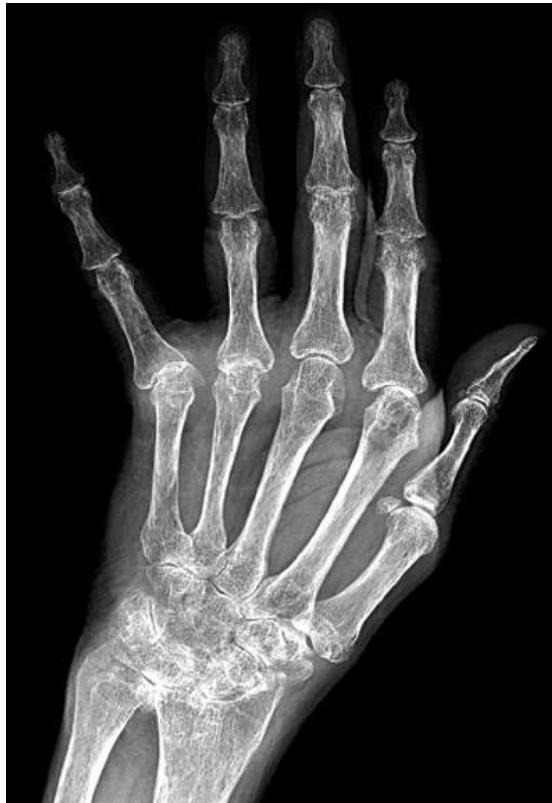 
Fig. 21.39 Rheumatoid arthritis of the hand. Characteristic features include diffuse osteopenia, marked loss of the joint spaces of the carpal, metacarpal, phalangeal, and interphalangeal joints, periarticular bony erosions, and ulnar drift of the fingers.
chronic disease, only about $10\%$ develop serious functional disability.
# Seronegative Spondyloarthropathies
# The spondyloarthropathies are a heterogeneous group of disorders that share the following features:
- Absence of rheumatoid factor 
- Pathologic changes in the ligamentous attachments rather than synovium 
- Involvement of sacroiliac joints, with or without other joints 
Association with HLA-B27 
- Bony proliferation leading to ankylosis (fusion of joints)
The manifestations are immune mediated and are triggered by a T cell response presumably directed against an undefined antigen, possibly infectious, that may cross-react with antigens expressed on cells of the musculoskeletal system.
Ankylosing spondylitis, the prototypical spondyloarthritis, causes destruction of articular cartilage and bony ankylosis, especially of the sacroiliac joints. The disease becomes symptomatic in the second and third decades of life as lower back pain and spinal immobility. Involvement of peripheral joints, such as the hips, knees, and shoulders, occurs in at least one-third of affected individuals. Approximately $90\%$ of patients are HLA-B27 positive, but how the B27 allele contributes to the disease is not known. An antiIL-17 antibody has shown some efficacy in this disease.
Reactive arthritis is defined by a triad of arthritis, nongonococcal urethritis or cervicitis, and conjunctivitis. Most affected individuals are men in their 20s or 30s, and more than $80\%$ are HLA-B27 positive. The disease is probably caused by an autoimmune reaction initiated by previous infection of the genitourinary system (Chlamydia) or the gastrointestinal tract (Shigella, Salmonella, Yersinia, Campylobacter). Within several weeks of urethritis or diarrhea, patients experience low back pain. The ankles, knees, and feet are affected most often, frequently in an asymmetric pattern. Patients with severe chronic disease have involvement of the spine that is indistinguishable from ankylosing spondylitis.
# Infectious Arthritis
Joints can become infected from hematogenous dissemination, direct inoculation through the skin, or from contiguous spread from a soft tissue abscess or osteomyelitis. Infectious arthritis is potentially serious, because it can cause rapid, permanent joint destruction.
# Suppurative Arthritis
Bacterial infections that cause acute suppurative arthritis usually enter the joints from distant sites by hematogenous spread. In neonates, however, contiguous spread from underlying epiphyseal osteomyelitis may occur. $H.$ influenza arthritis predominates in children younger than 2 years of age, S. aureus is the main agent in older children and adults, and gonococcus is prevalent during late adolescence and young adulthood. Individuals with sickle cell disease are prone to infection with Salmonella. These joint infections affect the sexes equally except for gonococcal arthritis, which is seen mainly in sexually active women. Individuals with deficiencies of complement components (C5, C6, C7, or C9) are susceptible to disseminated gonococcal infections and hence arthritis.
The classic presentation is the sudden development of an acutely painful, warm, and swollen joint that has a restricted range of motion. Systemic findings of fever, leukocytosis, and elevated sedimentation rate are common. In $90\%$ of nongonococcal cases, the infection involves only a single joint, most commonly the knee, followed in decreasing frequency by the hip, shoulder, elbow, wrist, and sternoclavicular joints. The axial joints are more often involved in drug users. Joint aspiration is diagnostic if it yields purulent fluid in which the causative agent can be identified. As mentioned earlier, cartilage has limited repair potential, so prompt recognition and effective anti-microbial therapy is vital to prevent permanent joint destruction.
# Lyme Arthritis
Lyme arthritis is the leading arthropod-borne disease in the United States, predominantly affecting New England and mid-Atlantic states, but the geographic range and incidence are increasing. It is caused by infection with the spirochete Borrelia burgdorferi, which is transmitted by deer ticks of the Ixodes ricinus complex. In its classic form, Lyme disease progressively involves multiple organ systems through three clinical phases (Fig. 21.40). The initial infection of the skin, or early localized stage, is followed by an
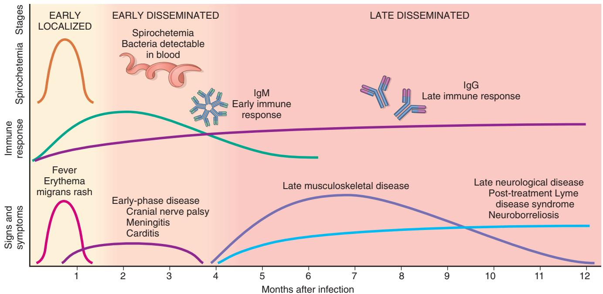 
Fig. 21.40 Lyme disease progresses through three clinically recognizable phases: early localized, early disseminated, and late persistent. Although initial manifestations result directly from spirochete infection, later signs and symptoms are likely immune-mediated. (Figure modified from Dr. Charles Chiu, University of California San Francisco, San Francisco, California. Used with permission.)
early disseminated stage involving skin, cranial nerves, heart, and meninges. If left untreated, arthritis, especially of the knee, occurs weeks to months after infection.
Currently, arthritis occurs in less than $10\%$ of cases because most patients are cured at an earlier stage. However, if left untreated approximately $60\%$ to $80\%$ of individuals develop a migratory arthritis (Lyme arthritis) lasting for weeks to months. Spirochetes can only be identified in about $25\%$ of joints with arthritis, but the diagnosis can be confirmed by serologic testing for anti-Borrelia antibodies. Treatment of Lyme disease consists of antibiotics with activity against Borrelia. Cure rates of $90\%$ have been achieved with standard regimens. A vaccine is under development. However, a chronic arthritis that is antibiotic refractory can develop in the late disseminated stage. In many of these patients, Borrelia cannot be detected in the joint fluid even by PCR. It has been proposed that cellular (especially $\mathrm{T_H}1$ ) and humoral responses to Borrelia outer surface protein A may initiate this late, autoimmune, arthritis. The chronic manifestations, in addition to joint pain, can include nonspecific symptoms (fatigue, cognitive complaints), known collectively as posttreatment Lyme disease syndrome (PTLDS).
Infected synovium exhibits a chronic synovitis marked by synoviocyte hyperplasia, fibrin deposition, mononuclear cell infiltrates (especially $\mathrm{CD4 + }$ T cells), and onion-skin thickening of arterial walls. The morphology in severe cases can closely resemble that of RA.
# Crystal-Induced Arthritis
Articular crystal deposits are associated with a variety of joint disorders. Endogenous crystals shown to be pathogenic include monosodium urate (MSU) (gout), calcium
pyrophosphate dehydrate (pseudogout), and basic calcium phosphate. Exogenous crystals, such as silicone, polyethylene, and methyl methacrylate used in prosthetic joints, and the debris that accumulates with their erosion, may result in local arthritis. Crystals produce disease by triggering an inflammatory reaction that destroys cartilage.
# Gout
Gout is marked by transient attacks of acute arthritis initiated by urate crystals deposited within and around joints. Whether gout is primary or secondary to some other underlying disease, the common feature is excessive uric acid in tissues and body fluids. In the primary form (90% of cases), gout is the major manifestation of the disease and the cause is usually unknown.
Hyperuricemia (plasma urate level above $6.8\mathrm{mg / dL}$ is necessary, but not sufficient, for the development of gout. Uric acid metabolism can be summarized as follows:
- Synthesis. Uric acid is the end product of purine catabolism. Increased synthesis typically reflects some abnormality in purine production. The synthesis of purine nucleotides, in turn, involves two interlinked pathways. In the de novo pathway, purine nucleotides are synthesized from nonpurine precursors, and in salvage pathways they are synthesized from free purine bases obtained through the diet or the catabolism of purine nucleotides. 
- Excretion. Uric acid is filtered from the circulation by the glomerulus and virtually completely resorbed by the proximal tubule of the kidney. A small fraction of the resorbed uric acid is secreted by the distal nephron and excreted in the urine.
In primary gout, elevated uric acid most commonly results from reduced excretion, the basis of which is unknown in most patients. A small minority of primary gout is caused by uric acid overproduction as a result of identifiable enzymatic defects. For example, partial deficiency of hypoxanthine guanine phosphoribosyl transferase (HGPRT) interrupts the salvage pathway, so purine metabolites cannot be salvaged and are, instead, degraded into uric acid. Complete absence of HGPRT also results in hyperuricemia, but significant neurologic manifestations of this condition (Lesch-Nyhan syndrome) dominate the clinical picture so it is classified as secondary gout. Secondary gout can also be caused by increased production (rapid cell lysis during chemotherapy for leukemia, so-called tumor lysis syndrome) or decreased excretion (chronic renal disease).
The inflammation in gout is triggered by precipitation of urate crystals in the joints, stimulating the production of cytokines that recruit leukocytes (Fig. 21.41). Macrophages and neutrophils phagocytose the crystals, which activates a cytosolic sensor, the inflammasome (Chapter 5). The inflammasome activates caspase-1, which is involved in the production of active IL-1 $\beta$ . IL-1 is proinflammatory, and promotes accumulation of more
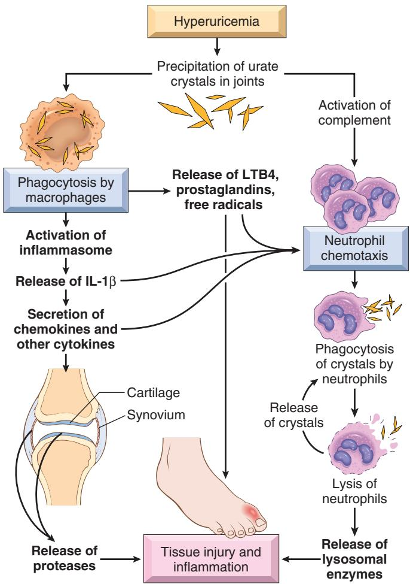 
Fig. 21.41 Pathogenesis of acute gouty arthritis. Urate crystals are phagocytosed by macrophages and stimulate the production of various inflammatory mediators that elicit the inflammation characteristic of gout. Note that IL-1, one of the major pro-inflammatory cytokines, in turn stimulates the production of chemokines and other cytokines from a variety of tissue cells. LTB4, Leukotriene B4; IL-1β, interleukin 1β.
neutrophils and macrophages in the joint. These cells, in turn, release other cytokines, free radicals, proteases, and arachidonic acid metabolites. The ingested crystals also damage the membranes of phagolysosomes, leading to leakage of these mediators. Activation of complement by the alternative pathway may contribute to more leukocyte recruitment. The result is an acute arthritis, which typically remits spontaneously in days to weeks. Repeated attacks of acute arthritis lead eventually to the formation of tophi, aggregates of urate crystals and inflammatory tissue, in the inflamed synovial membranes and periarticular tissue. Severe damage to the cartilage develops and the function of the joints is compromised.
Only about $10\%$ of patients with hyperuricemia develop clinical gout. Other factors contribute symptomatic gout:
- Age of the individual and duration of the hyperuricemia. Gout usually appears after 20 to 30 years of hyperuricemia. 
- Genetic predisposition. In addition to the well-defined X-linked abnormalities of HGPRT, polymorphisms in genes involved with urate or ion transport and possibly inflammation are also associated with gout. 
- Alcohol consumption. 
- Obesity. 
- Drugs (e.g., thiazides) that reduce excretion of urate.

The distinctive morphologic changes in gout are (1) acute arthritis, (2) chronic tophaceous arthritis, (3) tophi in various sites, and (4) gouty nephropathy.
Acute arthritis is characterized by a dense inflammatory infiltrate that permeates the synovium and synovial fluid. Urate crystals are frequently found in the cytoplasm of the neutrophils and are arranged in small clusters in the synovium. They are long, slender, and needle-shaped, and are negatively birefringent. The synovium is edematous and congested, and it also contains scattered lymphocytes, plasma cells, and macrophages.
Chronic tophaceous arthritis evolves from the repetitive precipitation of urate crystals during acute attacks. The crystals encrust the articular surface and form visible chalky deposits in the synovium (Fig. 21.42A). The synovium becomes hyperplastic, fibrotic, and thickened by inflammatory cells and forms a pannus that destroys the underlying cartilage.
Tophi in the articular cartilage, ligaments, tendons, and bursae are pathognomonic of gout. They are formed by large aggregations of urate crystals surrounded by an intense foreign body giant cell reaction (Fig. 21.42B-C).
Gouty nephropathy refers to the renal complications caused by urate crystals or tophi in the renal medullary interstitium or tubules. Complications include uric acid nephrolithiasis and pyelonephritis.
Gout is associated with male sex, obesity, metabolic syndrome, excess alcohol intake, renal failure, and age greater than 30 years. Four clinical stages are recognized:
- Asymptomatic hyperuricemia appears around puberty in men and after menopause in women. 
- Acute arthritis presents after several years as sudden onset excruciating joint pain, localized hyperemia, and
warmth. Most first attacks are monoarticular; $50\%$ occur in the first metatarsophalangeal joint. Untreated, acute gouty arthritis may last for hours to weeks, but gradually there is complete resolution. 
- Asymptomatic intercritical period: Resolution of the acute arthritis leads to a symptom-free interval. In the absence of appropriate therapy, the attacks recur at decreasing intervals and frequently become polyarticular.
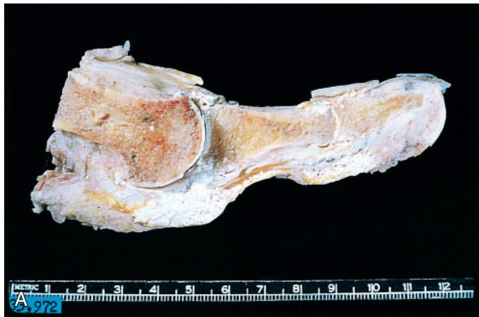
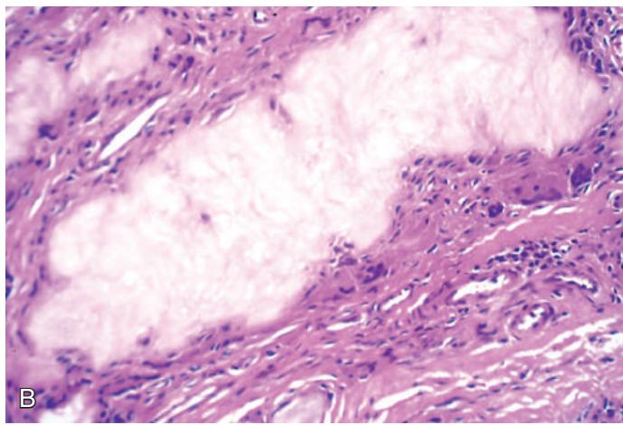
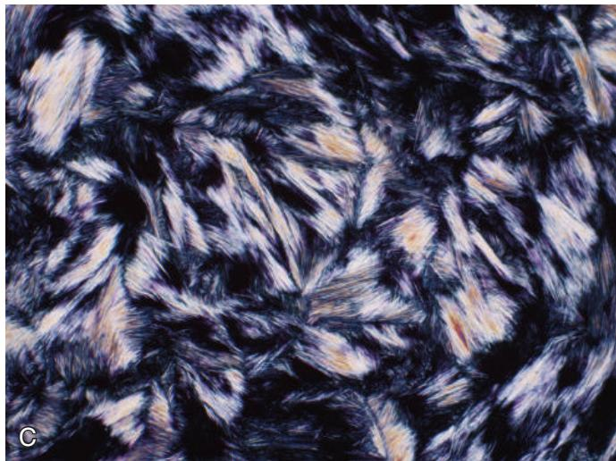 
Fig. 21.42 Gout. (A) Amputated great toe with white tophi involving the joint and soft tissues. (B) Gouty tophus—an aggregate of dissolved urate crystals is surrounded by reactive fibroblasts, mononuclear inflammatory cells, and giant cells. (C) Urate crystals are needle shaped and negatively birefringent under polarized light.
- Chronic tophaceous gout develops on average about 12 years after the initial acute attack. At this stage, radiographs show characteristic juxtaarticular bone and loss of the joint space.
Treatment of gout aims at lifestyle modification and medication to reduce symptoms (e.g., NSAIDs) and lower urate levels (e.g., xanthine oxidase inhibitor).
# Calcium Pyrophosphate Crystal Deposition Disease (Pseudogout)
Calcium pyrophosphate crystal deposition disease (CPPD), also known as pseudogout, usually occurs in individuals more than 50 years old and becomes more common with increasing age. The genders and races are equally affected. CPPD is divided into sporadic (idiopathic), hereditary, and secondary types. The autosomal dominant variant is caused by germline mutations in the pyrophosphate transport channel resulting in crystal deposition and arthritis relatively early in life. Various disorders, including previous joint damage, hyperparathyroidism, hemochromatosis, and diabetes, predispose to the secondary form. Studies suggest that articular cartilage proteoglycans, which normally inhibit mineralization, are degraded, allowing crystallization around chondrocytes. As in gout, inflammation is caused by activation of the inflammasome in macrophages.
The crystals first develop in the articular cartilage, menisci, and intervertebral discs, and as the deposits enlarge they may rupture and seed the joint. The crystals form chalky, white friable deposits, which are seen histologically in hematoxylin- and eosin-stained preparations as oval blue-purple aggregates (Fig. 21.43A). Individual crystals are rhomboid, 0.5 to $5\mu \mathrm{m}$ in greatest dimension (Fig. 21.43B), and are positively birefringent. Inflammation is usually milder than in gout.
CPPD is frequently asymptomatic. However, it may produce acute, subacute, or chronic arthritis that can be confused clinically with OA or RA. The joint involvement may last from several days to weeks and may be monoarticular or polyarticular; the knees, followed by the wrists, elbows, shoulders, and ankles, are most commonly affected. Ultimately, approximately $50\%$ of affected individuals experience significant joint damage. Therapy is supportive. There is no known treatment that prevents or slows crystal formation.
# ARTHRITIS
- Osteoarthritis (OA, degenerative joint disease), the most common disease of joints, is a degenerative process of articular cartilage in which matrix breakdown exceeds synthesis. Inflammation is minimal and typically secondary. Local production of inflammatory cytokines may contribute to the progression of joint degeneration. 
- Rheumatoid arthritis (RA) is a chronic autoimmune inflammatory disease that affects mainly small joints, but can
be systemic. RA is caused by a cellular and humoral immune response against self-antigens, particularly citrullinated proteins.TNF plays a central role and antagonists against TNF are of clinical benefit.
- Seronegative spondyloarthropathies are a heterogeneous group of likely autoimmune arthritides that preferentially involve the sacroiliac and vertebral joints and are associated with HLA-B27. 
- Suppurative arthritis describes direct infection of a joint space by bacterial organisms. 
- Lyme disease is a systemic infection by Borrelia burgdorferi, which manifests, in part, as an infectious arthritis, possibly with an autoimmune component in chronic stages. 
- Gout and pseudogout result from inflammatory responses triggered by precipitation of urate or calcium pyrophosphate, respectively.
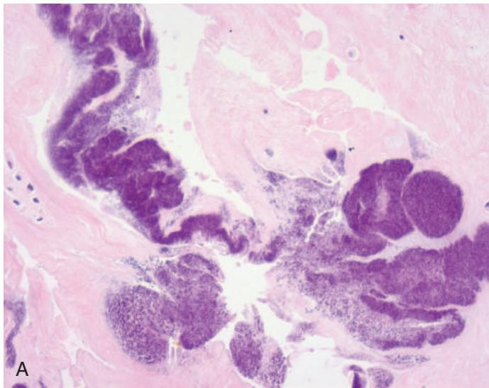
Depositsarepresentincartilageandconsistofamorphousbasophilicmaterial.(B)Smearpreparationofcalciumpyrophosphatecrystals..jpg) 
Fig. 21.43 Pseudogout. (A) Deposits are present in cartilage and consist of amorphous basophilic material. (B) Smear preparation of calcium pyrophosphate crystals.
# JOINT TUMORS AND TUMORLIKE CONDITIONS
Reactive tumorlike lesions, such as ganglions, synovial cysts, and osteochondral loose bodies, commonly involve joints and tendon sheaths. They usually result from trauma or degenerative processes and are much more common than neoplasms. Primary neoplasms are rare, usually benign, and tend to recapitulate the cells and tissue types (synovial membrane, fat, blood vessels, fibrous tissue, and cartilage) native to joints and related structures. Synovial sarcoma, although once thought to be related to or derived from the tissues of the joint, is now recognized as a sarcoma of uncertain origin and is discussed later with soft tissue tumors.
# Ganglion and Synovial Cysts
A ganglion is a small $(1 - 1.5\mathrm{cm})$ cyst that is almost always located near a joint capsule or tendon sheath. A common location is around the joints of the wrist, where it appears as a firm, fluctuant, pea-sized translucent nodule. It arises as a result of cystic or myxoid degeneration of connective tissue; hence the cyst wall lacks a cell lining. The lesion may be multilocular and enlarges through coalescence of adjacent areas of myxoid change. The fluid that fills the cyst is similar to synovial fluid; however, there is no communication with the joint space. Despite the name, the lesion is unrelated to ganglia of the nervous system.
Herniation of synovium through a joint capsule or massive enlargement of a bursa may produce a synovial cyst. A well-recognized example is the synovial cyst that forms in the popliteal space in the setting of RA or OA (Baker cyst). The synovial lining may be hyperplastic and contain inflammatory cells and fibrin.
# Tenosynovial Giant Cell Tumor
Tenosynovial giant cell tumor is the term for a benign neoplasm that develops in the synovial lining of joints, tendon sheaths, and bursae. Clinical variants of tenosynovial giant cell tumor include the diffuse type (previously known as pigmented villonodular synovitis), and the localized type. Whereas the diffuse form tends to involve large joints, the localized type usually occurs as a discrete nodule attached to a tendon sheath, commonly in the hand.
Diffuse and localized types of this tumor both harbor a reciprocal somatic chromosomal translocation, t(1;2) (p13;q37), resulting in fusion of the type VI collagen $\alpha$ -3 promoter to the M-CSF gene. Consequently, the tumor cells overexpress M-CSF, which, through autocrine and paracrine effects, stimulates proliferation of macrophages in a manner similar to giant cell tumor of bone (described previously).
Excisedsynoviumwithfrondsandnodulestypicalofpigmentedvillonodularsynovitis.(B)Sheetsofproliferatingcellsintenosynovialgiantcelltumorbulgingthesynoviallining..jpg) 
Fig. 21.44 Tenosynovial giant cell tumor, diffuse type. (A) Excised synovium with fronds and nodules typical of pigmented villonodular synovitis. (B) Sheets of proliferating cells in tenosynovial giant cell tumor bulging the synovial lining.
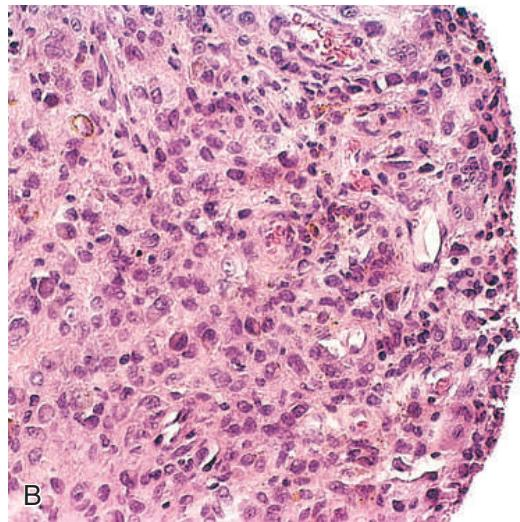
In diffuse tumors the normally smooth joint synovium is converted into a tangled mat by red-brown folds, fingerlike projections, and nodules (Fig. 21.44A). In contrast, localized (nodular) tumors are well circumscribed. The neoplastic cells, which account for only a minority of the cells in the mass, are polygonal, moderately sized, and resemble synoviocytes (Fig. 21.44B). Both diffuse and localized variants are heavily infiltrated by macrophages containing hemosiderin and foamy lipid, or are multinucleated.
Diffuse tenosynovial giant cell tumor presents in the knee in $80\%$ of cases. Affected individuals typically complain of pain, locking, and recurrent swelling similar to monoarticular arthritis. Sometimes, a palpable mass is appreciated. The localized variant manifests as a solitary, slow-growing, painless mass that frequently involves the hand. Both types are amenable to surgical excision, but recurrence is more common in the diffuse form. Clinical trials are investigating antagonists of the M-CSF signaling pathway for patients with unresectable disease.
# Soft Tissue Tumors
By convention, soft tissue refers to non-epithelial tissue excluding the skeleton, joints, central nervous system, hematopoietic and lymphoid tissues. Although nonneoplastic conditions can involve soft tissue, they are seldom confined to this compartment, so the area of soft tissue pathology is restricted to neoplasms.
With the exception of skeletal muscle neoplasms, benign soft tissue tumors outnumber their malignant counterparts, the sarcomas, by 100-fold. In the United States, the incidence of soft tissue sarcomas is approximately 12,000 per year, which is less than $1\%$ of all cancers. Sarcomas, however, cause $2\%$ of all cancer mortality, reflecting their aggressive behavior. Most soft tissue tumors arise in the extremities, especially the thigh. Approximately $15\%$ arise in children but the incidence increases with age.
Most sarcomas are sporadic and have no known predisposing cause. A small minority of soft tissue neoplasms are associated with germline mutations in tumor suppressor genes (neurofibromatosis 1, Gardner syndrome, Li-Fraumeni syndrome, Osher-Weber Rendu syndrome). A few tumors can be linked to known environmental exposures such as radiation, burns, or toxins.
Unlike tumors such as colorectal carcinomas that usually arise from recognized precursor lesions, the origin of sarcomas is unknown. The best guess is that the tumors arise from pluripotent mesenchymal stem cells, which acquire somatic "driver" mutations. Despite heterogeneous mechanisms of tumorigenesis among sarcomas, some generalizations can be made based on their genomic complexity:
- Simple karyotype (15%-20% of sarcomas): Like many leukemias and lymphomas, sarcomas are often euploid tumors with a single or limited number of chromosomal changes that occur early in tumorigenesis and are specific enough to serve as diagnostic markers. Tumors with these features most commonly arise in younger patients and tend to have a monomorphic appearance microscopically. Examples include Ewing sarcoma, described earlier, and synovial sarcoma. In some cases, the oncogenic effect of these rearrangements is reasonably well understood. In others, the mechanisms are unknown. Oncogenic tumor-specific fusion proteins represent potential molecular targets for therapy. 
Complex karyotype (80%-85% of sarcomas): These tumors are usually aneuploid or polyploid and demonstrate multiple chromosomal gains and losses, a feature that suggests underlying genomic instability. Examples
include leiomyosarcoma and undifferentiated pleomorphic sarcoma. Such tumors are more common in adults and tend to be microscopically pleomorphic.
Classification of soft tissue tumors continues to evolve as new molecular genetic abnormalities are identified. Clinically, soft tissue tumors range from benign, self-limited lesions that require minimal treatment to intermediate grade, locally aggressive tumors with minimal metastatic risk to highly aggressive malignancies with significant metastatic risk and mortality. All highly aggressive malignancies are classified as sarcomas but this term is less consistently used among the locally aggressive, rarely metastasizing category. Pathologic classification integrates morphology (e.g., muscle differentiation), immunohistochemistry, and molecular diagnostics. In addition to accurate diagnosis, grade (degree of differentiation) and stage (size and depth) are important prognostic indicators.
With this as a primer, we will consider representative or especially illustrative soft tissue tumors.
# TUMORS OF ADIPOSE TISSUE
# Lipoma
Lipoma, a benign tumor of fat, is the most common soft tissue tumor in adults. The conventional lipoma is the most common subtype, from which rare variants are distinguished according to characteristic morphologic and/or genetic features. Conventional lipoma is a well-encapsulated mass of mature adipocytes. It usually arises in the subcutis of the proximal extremities and trunk, most frequently during middle adulthood. Infrequently, lipomas are large, intramuscular, and poorly circumscribed. Most lipomas are usually cured by simple excision.
# Liposarcoma
Liposarcomas are malignant tumors of adipose tissue. Liposarcoma is one of the most common sarcomas of adulthood. It occurs mainly in people in their 50s to 60s in the deep soft tissues and retroperitoneum.

Liposarcomas are divided into three subtypes:
- Well-differentiated liposarcoma contains adipocytes with scattered atypical spindle cells (Fig. 21.45A). The tumors harbor amplification of chromosome region 12q13-q15, which includes the gene for MDM2. You will recall MDM2 encodes a potent inhibitor of p53. 
- Myxoid liposarcoma contains abundant basophilic extracellular matrix, arborizing capillaries, and primitive cells at various stages of adipocyte differentiation reminiscent of fetal fat (Fig. 21.45B). The t(12;16) translocation characterizes myxoid liposarcoma. The resultant fusion gene arrests adipose differentiation. 
- Pleomorphic liposarcoma consists of sheets of anaplastic cells, bizarre nuclei, and variable amounts of immature adipocytes (lipoblasts). These tumors have complex karyotypes.
All types of liposarcoma recur locally and often repeatedly unless adequately excised. The well-differentiated variant is relatively indolent, the myxoid/round cell type is intermediate in its malignant behavior, whereas the pleomorphic variant usually is aggressive and frequently metastasizes.
# FIBROUS TUMORS
# Nodular Fasciitis
Nodular fasciitis is a self-limited fibroblastic and myofibroblastic proliferation that typically occurs the upper extremities of young adults. A history of trauma is present in approximately $25\%$ to $50\%$ of cases, and the tumors grow rapidly during a period of several weeks or months. Whereas nodular fasciitis was historically considered a purely reactive lesion, identification of a t(17;22) translocation producing a MYH9-USP6 fusion gene indicates that it is a clonal, yet self-limited, proliferation. It is hypothesized that the proliferating cells lack some key hallmark of cancer, perhaps the ability to avoid senescence. Intriguingly, ABC (discussed earlier), another tumor that sits in a gray zone between reactive and neoplastic proliferations, also contains a USP6 fusion gene. Nodular fasciitis can spontaneously regress and, if excised, rarely recurs. Malignant transformation is virtually nonexistent.
Nodular fasciitis arises in the deep dermis, subcutis, fascia, or muscle. Grossly the lesion is less than $5\mathrm{cm}$ , circumscribed, or slightly infiltrative. It is highly cellular containing plump, immature-appearing fibroblasts and myofibroblasts arranged in a pattern reminiscent of cultured fibroblasts (Fig. 21.46). A gradient of maturation (zonation) from cellular, loose, and myxoid to organized and fibrous is typical. The cells vary in size and shape (spindle to stellate) and have conspicuous nucleoli; mitotic figures are abundant. Lymphocytes and extravasated red blood cells are common but neutrophils are unusual.
# Fibromatoses
# Superficial Fibromatosis
Superficial fibromatosis is an infiltrative proliferation that can cause local deformity but has an innocuous clinical course. All forms of superficial fibromatosis affect males more frequently than females. They are characterized by nodular or poorly defined broad fascicles of fibroblasts in long, sweeping fascicles, surrounded by abundant dense collagen. Several clinical subtypes have been identified:
- Palmar (Dupuytren contracture). Irregular or nodular thickening of the palmar fascia either unilaterally or bilaterally. 
Plantar. Common in young patients, unilateral and without contractures.
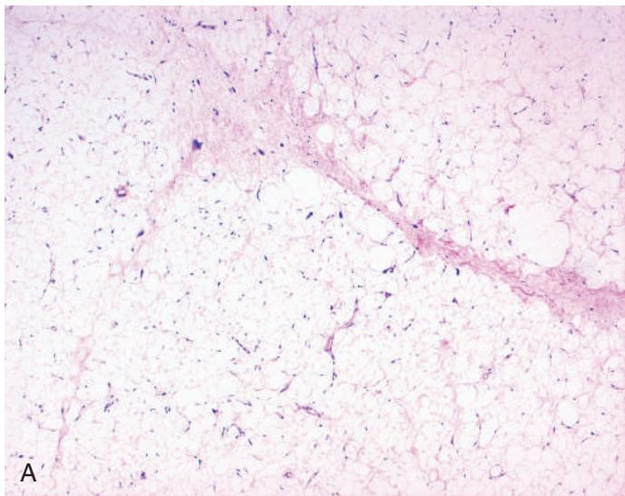 
Fig. 21.45 Liposarcoma. (A) The well-differentiated subtype consists of mature adipocytes and scattered spindle cells with hyperchromatic nuclei. (B) Myxoid liposarcoma with abundant ground substance and a rich capillary network in which there are scattered immature adipocytes and more primitive round-to-stellate cells.
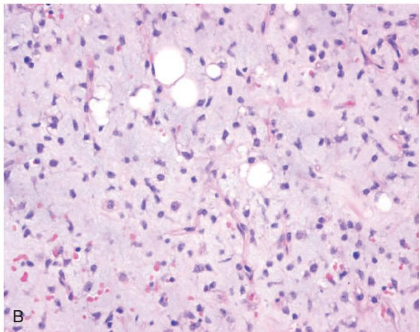
- Penile (Peyronie disease). Palpable induration or mass on the dorsolateral aspect of the penis.
In about $20\%$ to $25\%$ of cases, the palmar and plantar fibromatoses stabilize and do not progress, in some instances resolving spontaneously. Some recur after excision, particularly the plantar variant.
# Deep Fibromatosis
Deep fibromatoses, also called desmoid tumors, are large, infiltrative masses that frequently recur but do not metastasize. They most frequently occur in the teenage years to 30s, predominantly in women. Abdominal fibromatosis generally arises in the musculoaponeurotic structures of the anterior abdominal wall but tumors can arise in the limb girdles or the mesentery. Deep fibromatoses contain mutations in the CTNNB1 (β-catenin) or APC genes, leading to increased Wnt signaling. Most tumors are sporadic, but individuals with familial adenomatous polyposis (Gardner
..jpg) 
Fig. 21.46 Nodular fasciitis with plump, randomly oriented spindle cells surrounded by myxoid stroma. Note the mitotic activity (arrowheads).
syndrome, Chapter 16) who have germline APC mutations are predisposed to deep fibromatosis.
Fibromatoses are gray-white, firm, poorly demarcated masses varying from 1 to $15~\mathrm{cm}$ in greatest diameter. They are rubbery and tough, and have marked infiltration of surrounding muscle, nerve and fat. Cytologically bland fibroblasts arranged in broad sweeping fascicles amid dense collagen are the characteristic histologic pattern (Fig. 21.47). The histology resembles a scar.
Because of the extensively infiltrative nature, complete excision is often difficult. Recent efforts have concentrated on medical therapy and radiation as alternatives to surgery.
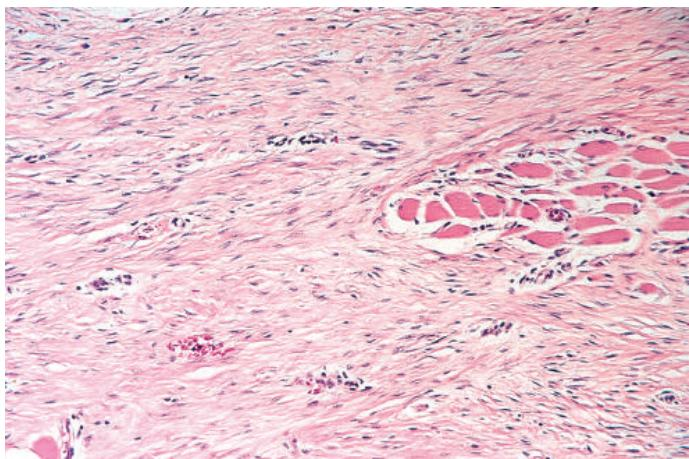 
Fig. 21.47 Deep fibromatosis infiltrating between skeletal muscle cells.
# SKELETAL MUSCLE TUMORS
Skeletal muscle neoplasms, in contrast to tumors of other lineages, are almost all malignant. The benign rhabdomyoma is more frequent in individuals with tuberous sclerosis.
# Rhabdomyosarcoma
Rhabdomyosarcoma is a malignant mesenchymal tumor with skeletal muscle differentiation. Three main subtypes are recognized: alveolar (20%), embryonal (60%), and pleomorphic (20%). Rhabdomyosarcoma (alveolar and embryonal) is the most common soft tissue sarcoma of childhood and adolescence, usually appearing before age 20. Pleomorphic rhabdomyosarcoma is seen predominantly in adults. The pediatric forms often arise in the sinuses, head and neck, and genitourinary tract, locations that do not normally contain much skeletal muscle, underscoring the notion that sarcomas do not arise from mature, terminally differentiated mesenchymal cells. The embryonal and pleomorphic subtypes are genetically heterogeneous.
Alveolar rhabdomyosarcoma frequently contains fusions of the FOXO1 gene to either the PAX3 or the PAX7 gene, rearrangements marked by the presence of (2;13) or (1;13) translocations, respectively. PAX3 is a transcription factor that initiates skeletal muscle differentiation, and it appears that the chimeric PAX3-FOXO1 fusion protein interferes with differentiation, a mechanism similar to many of the transcription factor fusion proteins that are found in acute leukemias.

Embryonal rhabdomyosarcoma presents as a soft gray infiltrative mass. The tumor cells mimic skeletal muscle at various stages of differentiation and consist of sheets of both primitive round and spindled cells (Fig. 21.48A). Rhabdomyoblasts with straplike cytoplasm and visible cross-striations may be present.
Sarcoma botryoides is a variant of embryonal rhabdomyosarcoma that develops in the walls of hollow viscera such as the urinary bladder and vagina.
In alveolar rhabdomyosarcoma, a network of fibrous septae divide the cells into clusters or aggregates, creating a crude resemblance to pulmonary alveoli. The tumor cells are uniformly round with little cytoplasm and they are only minimally cohesive (Fig. 21.48B).
Pleomorphic rhabdomyosarcoma is characterized by numerous large, sometimes multinucleated, bizarre eosinophilic tumor cells that can resemble other pleomorphic sarcomas. Immunohistochemical identification of muscle specific proteins such as myogenin is usually necessary to confirm rhabdomyoblastic differentiation.
Rhabdomyosarcomas are aggressive neoplasms that are usually treated with surgery and chemotherapy, with or without radiation therapy. The botryoid variant of embryonal rhabdomyosarcoma has the best prognosis, whereas the pleomorphic subtype is often fatal.
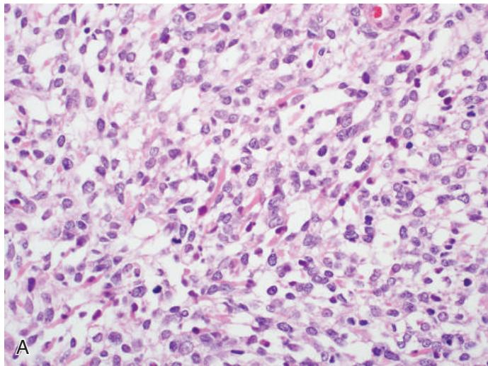
Embryonalsubtypecomposedofmalignantcellsrangingfromprimitiveandroundtodenselyeosinophilicwithskeletalmuscledifferentiation.(B)Alveolarrhabdomyosarcomawithnumerousspaceslinedbydiscohesive,uniformroundtumorcells..jpg) 
Fig. 21.48 Rhabdomyosarcoma. (A) Embryonal subtype composed of malignant cells ranging from primitive and round to densely eosinophilic with skeletal muscle differentiation. (B) Alveolar rhabdomyosarcoma with numerous spaces lined by discohesive, uniform round tumor cells.
# SMOOTH MUSCLE TUMORS
# Leiomyoma
Leiomyoma, a benign tumor of smooth muscle, is most common in the uterus but can arise in any soft tissue site. Uterine leiomyomas (Chapter 19) are common and may cause a variety of symptoms including infertility and menorrhagia. Leiomyomas also may arise from the erector pili muscles (pilar leiomyomas) in the skin and rarely in the deep somatic soft tissues or gastrointestinal tract. A germline loss-of-function mutation in the fumarate hydratase (FH) gene located on chromosome 1q42.3 leads to multiple cutaneous leiomyomas, uterine leiomyomas, and renal cell carcinoma. FH is an enzyme of the Krebs cycle, and this association constitutes another intriguing example of the link between metabolic abnormalities and neoplasia.
Soft tissue leiomyomas are usually 1 to $2\mathrm{cm}$ in size and are composed of fascicles of densely eosinophilic spindle cells that tend to intersect each other at right angles. The
tumor cells have blunt-ended, elongated nuclei and show minimal atypia and few mitotic figures. Solitary lesions are cured with surgery.
# Leiomyosarcoma
Soft tissue leiomyosarcoma accounts for $10\%$ to $20\%$ of soft tissue sarcomas. They occur in adults and affect women more frequently than men. Most develop in the deep soft tissues of the extremities and retroperitoneum or arise from the great vessels. Leiomyosarcomas have complex genotypes that stem from acquired defects that lead to profound genomic instability.

Leiomyosarcomas present as painless firm masses. Retroperitoneal tumors may be large and bulky and cause abdominal symptoms. They consist of eosinophilic spindle cells with blunt-ended, hyperchromatic nuclei arranged in interweaving fascicles. They express smooth muscle proteins (actin, desmin, caldesmon), which can be detected by immunohistochemistry. Unlike leiomyomas, mitotic activity and necrosis are common in leiomyosarcoma.
Treatment depends on tumor size, location, and grade. Superficial leiomyosarcomas are usually small and have a good prognosis, whereas those of the retroperitoneum are difficult to control and cause death by both local extension and metastatic spread, especially to the lungs.
# TUMORS OF UNCERTAIN ORIGIN
Although many soft tissue tumors can be assigned to recognizable histologic types, a large proportion of tumors do not recapitulate any known mesenchymal lineage. This group includes examples with simple or complex karyotypes; one of each type is described here.
# Synovial Sarcoma
Synovial sarcoma was so-named because the first described cases arose in the soft tissues near the knee joint and a morphologic relationship to synovium was postulated. However, this name is a misnomer, as these tumors can present in locations that lack synovium and their morphologic features are inconsistent with an origin from synoviocytes. Synovial sarcomas account for approximately $10\%$ of all soft tissue sarcomas. Most occur in people in their 20s to 40s. Patients usually present with a deep-seated mass that has been present for several years. Most synovial sarcomas show a characteristic chromosomal translocation t(x;18)(p11;q11) producing fusion genes composed of portions of the SS18 gene and one of three SSX genes that encode chimeric transcription factors that derail cell cycle control.
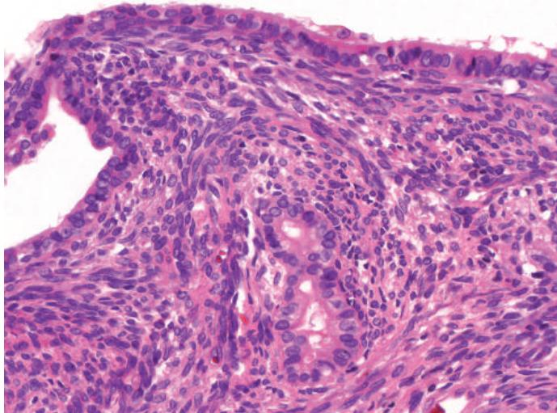 
Fig. 21.49 Synovial sarcoma showing the classic biphasic spindle cell and glandlike histologic appearance.

Synovial sarcomas are microscopically monophasic or biphasic. Monophasic synovial sarcoma consists of uniform spindle cells with scant cytoplasm and dense chromatin growing in short, tightly packed fascicles. The biphasic type contains glandlike structures composed of cuboidal to columnar epithelioid cells in addition to the aforementioned spindle cell component (Fig. 21.49). Immunohistochemistry is helpful in identifying these tumors, since the tumor cells, especially in the biphasic type, are positive for epithelial antigens (e.g., keratins), differentiating them from many other sarcomas.
Synovial sarcomas are treated aggressively with limb-sparing surgery and frequently chemotherapy. The 5-year survival varies from $25\%$ to $62\%$ , related to stage and patient age. Common sites of metastases are the lung and, unusual for sarcomas, regional lymph nodes.
# Undifferentiated Pleomorphic Sarcoma
Undifferentiated pleomorphic sarcoma (UPS) includes malignant mesenchymal tumors with high-grade, pleomorphic cells that cannot be classified into another category by a combination of histomorphology, immunophenotype, ultrastructure, and genetics. Most arise in the deep soft tissues of the extremity, especially the thigh of middle-aged or older adults. The diagnosis of malignant fibrous histiocytoma (MFH), sometimes used interchangeably with UPS, has fallen out of use because (1) the category included both undifferentiated tumors and others that could be reclassified with immunohistochemistry and genetics, and (2) no consensus exists for the morphologic definition of fibrohistiocytic lineage. Most tumors are aneuploid with multiple structural and numerical chromosomal changes.
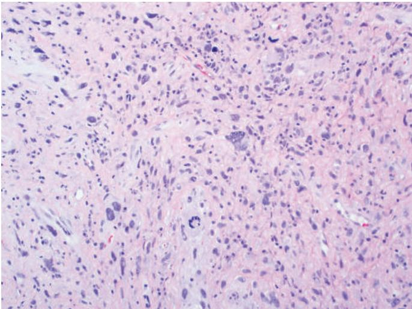 
Fig. 21.50 Undifferentiated pleomorphic sarcoma showing anaplastic spindle to polygonal cells.

UPSs are usually large, grey-white fleshy masses that can grow quite large (10–20 cm) depending on the anatomic compartment. Necrosis and hemorrhage are common. Microscopically, they are some of the most pleomorphic malignancies encountered. UPSs consist of sheets of large, anaplastic, spindled to polygonal cells with hyperchromatic irregular, sometimes bizarre nuclei (Fig. 21.50). Mitotic figures, including atypical nonsymmetric forms, are abundant as is necrosis. By definition, tumor cells lack differentiation along recognized lineages or characteristic genetic defects.
UPSs are aggressive malignancies that are treated with surgery and adjuvant chemotherapy and/or radiation. The prognosis is generally poor, with metastases arising in $30\%$ to $50\%$ of cases.

# SOFT TISSUE TUMORS
- The category of soft tissue neoplasia describes tumors that arise from non-epithelial tissues, excluding the skeleton, joints, central nervous system, and hematopoietic and lymphoid tissues. A sarcoma is a malignant mesenchymal tumor. 
- Although all soft tissue tumors probably arise from pluripotent mesenchymal stem cells, rather than mature cells, they can be classified as 
- Tumors that recapitulate a mature mesenchymal tissue (e.g., fat). These can be further subdivided into benign and malignant forms. 
- Tumors composed of cells for which there is no normal counterpart (e.g., synovial sarcoma, UPS). 
- Sarcomas with simple karyotypes demonstrate reproducible, chromosomal, and molecular abnormalities that contribute to pathogenesis and are sufficiently specific to have diagnostic use. 
- Most adult sarcomas have complex karyotypes, tend to be pleomorphic, and are genetically heterogeneous with a poor prognosis.
# ACKNOWLEDGMENT
We thank Dr. Andrew Rosenberg for his outstanding contribution to previous editions of this chapter.
Basic Structure and Biology of Bone 
Kogianni G, Noble BS: The biology of osteocytes, Curr Osteoporos Rep 5:81-86, 2007. [Good review of the cellular basis of bone remodeling.] 
Olsen BR, Reginato AM, Wang W: Bone development, Annu Rev Cell Dev Biol 16:191-220, 2000. [Update on the molecular and genetic basis of vertebrate skeletal development.] 
Zaidi M: Skeletal remodeling in health and disease, Nat Med 13:791-801, 2007. [Excellent review of the genetics and pathophysiology of skeletal diseases.] 
Skeletal Dysplasias 
Askmyr MK, Fasth A, Richter J: Towards a better understanding and new therapeutics of osteopetrosis, Br J Haematol 140:597-609, 2008. [Nice summary of treatment options for osteoporosis including gene therapy.] 
Krakow D, Rimoin DL: The skeletal dysplasias, Genet Med 12:327-341, 2010. [Comprehensive summary of the dysplasias with very useful summary table.] 
Van Dijk FS, Pals G, Van Rijn RR, et al: Classification of Osteogenesis Imperfecta revisited, Eur J Med Genet 53:1-5, 2010. [An overview of the current classification of osteogenesis imperfecta based on clinical and molecular findings.] 
Osteoporosis 
Mosekilde L: Mechanisms of age-related bone loss, Novartis Found Symp 235:150-166, discussion 66-71, 2001. [Nice review of relationship between remodeling and osteoporosis.] 
Styrkarsdottir U, Halldorsson BV, Gretarsdottir S, et al: Multiple genetic loci for bone mineral density and fractures, N Engl J Med 358:2355-2365, 2008. [Seminal paper elucidating the molecular pathways that underly osteoporosis.] 
Weitzmann MN, Pacifici R: Estrogen deficiency and bone loss: an inflammatory tale, J Clin Invest 116:1186-1194, 2006. [Excellent review of current understanding of the relationship between estrogen and osteoporosis.] 
Hyperparathyroidism 
Silva BC, Bilezikian JP: Parathyroid hormone: anabolic and catabolic actions on the skeleton, Curr Opin Pharmacol 22:41-50, 2015. [Nice summary of effects of parathyroid hormone on calcium and bone metabolism.] 
Paget Disease 
Roodman GD, Windle JJ: Paget disease of bone, J Clin Invest 115:200-208, 2005. [Concise, nicely illustrated, summary of clinicopathologic manifestation of Paget disease.] 
Singer FR: The etiology of Paget's Disease of bone: viral and genetic interactions, Cell Metab 13:5-6, 2011. [Very good review about the viral and genetic pathways in Paget disease.] 
Osteonecrosis 
Seamon J, Keller T, et al: The pathogenesis of nontraumatic osteonecrosis, Arthritis 601763, 2012. [Summarizes recent developments regarding pathophysiology of femoral head osteonecrosis.] 
Osteosarcoma 
Klein MJ, Siegal GP: Osteosarcoma: anatomic and histologic variants, Am J Clin Pathol 125:555-581, 2006. [Most recent update on classification of osteosarcoma.] 
Wagner ER, Luther G, Zhu G, et al: Defective osteogenic differentiation in the development of osteosarcoma, Sarcoma 2011:325238,
2011. [Discusses molecular relationship between normal osteoblast development the pathogenesis of osteosarcoma.] 
Chondrogenic Tumors 
Bovee JV, Hogendoorn PC, Wunder JS, et al: Cartilage tumours and bone development: molecular pathology and possible therapeutic targets, Nat Rev Cancer 10:481-488, 2010. [A good review of the known genetic abnormalities in these tumors] 
Pansuriya TC, van Eijk R, d'Adamo P, et al: Somatic mosaic IDH1 and IDH2 mutations are associated with enchondroma and spindle cell hemangioma in Ollier disease and Maffucci syndrome, Nat Genet 43:1256-1261, 2011. [Seminal article identifying IDH mutations in inherited cartilage tumors.] 
Wuyts W, Van Hul W: Molecular basis of multiple exostoses: mutations in the EXT1 and EXT2 genes, Hum Mutat 15:220-227, 2000. [Discussion of genetic basis of multiple osteochondroma syndrome.] 
Ewing Sarcoma 
Erkizan HV, Uversky VN, Toretsky JA: Oncogenic partnerships: EWS-FLI1 protein interactions initiate key pathways of Ewing's sarcoma, Clin Cancer Res 16:4077-4083, 2010. [Excellent summary of molecular effects of the EWS-FLI1 fusion protein found in Ewing sarcoma.] 
Giant Cell Tumor of Bone 
Robinson D, Einhorn TA: Giant cell tumor of bone: a unique paradigm of stromal-hematopoietic cellular interactions, J Cell Biochem 55:300-303, 1994. [Nice discussion of molecular mechanisms underlying giant cell tumor and insight gained regarding normal bone remodeling.] 
Aneurysmal Bone Cyst 
Oliveira AM, Chou MM: The TRE17/USP6 oncogene: a riddle wrapped in a mystery inside an enigma, Front Biosci (Schol Ed) 4:321-334, 2012. [Excellent review of the USP6 clonal genetic rearrangement in various self-limited mesenchymal tumors.] 
Fibrous Dysplasia 
Riminucci M, Robey PG, Saggio I, et al: Skeletal progenitors and the GNAS gene: fibrous dysplasia of bone read through stem cells, J Mol Endocrinol 45:355-364, 2010. [Excellent discussion of how a mutation can affect skeletal progenitor cells and cause clinical expression of fibrous dysplasia.] 
Osteoarthritis 
Goldring MB, Goldring SR: Articular cartilage and subchondral bone in the pathogenesis of osteoarthritis, Ann NY Acad Sci 1192:230-237, 2010. [A succinct and thoughtful presentation of the role of articular structures in the development of osteoarthritis.] 
Valdes AM, Spector TD: Genetic epidemiology of hip and knee osteoarthritis, Nat Rev Rheumatol 7:23-32, 2011. [Useful review of
genome-wide association studies that have lead to candidate genes predisposing to osteoarthritis.] 
Rheumatoid Arthritis 
Deane KD, El-Gabalawy H: Pathogenesis and prevention of rheumatic disease: focus on preclinical RA and SLE, Nat Rev Rheumatol 10:212-228, 2014. [Recent, nicely illustrated, update on pathogenesis of RA and SLE.] 
Scott DL, Wolfe F, Huizinga TW: Rheumatoid arthritis, Lancet 376:1094-1108, 2011. [Review of pathogenesis and treatment of the disease.] 
van Heemst J, Jansen DT, et al: Crossreactivity to vinculin and microbes provides a molecular basis for HLA-based protection against rheumatoid arthritis, Nat Commun 6:6681, 2015. [Describes the relationship between autoimmunity, HLA alleles and microbes.]
Lyme Disease 
Iliopoulou BP, Huber BT: Infectious arthritis and immune dysregulation: lessons from Lyme disease, Curr Opin Rheumatol 22:451-455, 2010. [Recent overview of immune mechanisms underlying Lyme arthritis] 
Marques A: Chronic Lyme disease: a review, Infect Dis Clin North Am 22:341-360, 2008. [In-depth review of Lyme disease.]
Gout and Pseudogout 
Rosenthal AK: Update in calcium deposition diseases, Curr Opin Rheumatol 19:158-162, 2007. [Recent, succinct, review of crystal-induced arthritis.] 
VanItallie TB: Gout: epitome of painful arthritis, Metabolism 59(Suppl 1):S32-S36, 2010. [Excellent summary of the recent developments in the molecular and cellular biology underlying gout.]
Tenosynovial Giant Cell Tumor 
Moller E, Mandahl N, Mertens F, et al: Molecular identification of COL6A3-CSF1 fusion transcripts in tenosynovial giant cell tumors, Genes Chromosomes Cancer 47:21-25, 2008. [Seminal article identifying clonal chromosomal rearrangement in tenosynovial giant cell tumor.]
Soft Tissue Sarcomas 
Antonescu CR, Dal Cin P: Promiscuous genes involved in recurrent chromosomal translocations in soft tissue tumours, Pathology 46:105-112, 2014. [Excellent review of specificity (or lack thereof) of genetic defects in soft tissue tumors.] 
Fletcher CD, Gustafson P, Rydholm A, et al: Clinicopathologic re-evaluation of 100 malignant fibrous histiocytomas: prognostic relevance of subclassification, J Clin Oncol 19:3045-3050, 2001. [Seminal article reassessing the diagnosis of malignant fibrous histiocytoma (MFH) allowing more specific classification.]
# Peripheral Nerves and Muscles
# 22
Disorders of Peripheral Nerves 835
Patterns of Peripheral Nerve Injury 835
Disorders Associated With Peripheral Nerve Injury 837
Disorders of Neuromuscular Junction 839
Myasthenia Gravis 839
Lambert-Eaton Syndrome 839
Miscellaneous Neuromuscular Junction Disorders 839
Disorders of Skeletal Muscle 840
Patterns of Skeletal Muscle Injury and Atrophy 840
Inherited Disorders of Skeletal Muscle 841
Acquired Disorders of Skeletal Muscle 844
Peripheral Nerve Sheath Tumors 846
Schwannomas and Neurofibromatosis Type 2 846
Neurofibromas 846
Neurofibromatosis Type I 846
Malignant Peripheral Nerve Sheath Tumors 846
Traumatic Neuroma 847
The peripheral nerves and skeletal muscles permit purposeful movement and provide the brain with sensory information about our surroundings. Both the anatomic distribution of lesions and their associated signs and symptoms are helpful in classifying neuromuscular diseases. The following discussion of neuromuscular disorders is organized along anatomic lines and traces the neuromuscular system from proximal to distal by discussing disorders of peripheral nerves, neuromuscular junctions, and skeletal muscle.
# DISORDERS OF PERIPHERAL NERVES
The two major functional elements of peripheral nerves are axonal processes and their myelin sheaths, which are made by Schwann cells. Axonal diameter and myelin thickness are correlated with each other and with conduction velocity. These characteristics are used to distinguish different types of axons, which mediate distinct sensory inputs and motor function. Light touch, for example, is transmitted by thickly myelinated large-diameter axons with fast conduction velocities, whereas temperature sensation is transmitted by slow, unmyelinated thin axons. In the case of myelinated axons, one Schwann cell makes and maintains exactly one myelin segment, or internode, along a single axon (Fig. 22.1A). Adjacent internodes are separated by the nodes of Ranvier along which saltatory conduction occurs. Any given nerve contains axons of different sizes and axons serving different functions. These are arranged into fascicles ensheathed by a layer of perineurial cells. Perineurial cells form a barrier between endoneu
rium on the inside of the fascicle and epineurium on the outside.
# Patterns of Peripheral Nerve Injury
Peripheral neuropathies are often subclassified as axonal or demyelinating, even though many diseases exhibit mixed features. Axonal neuropathies are caused by insults that directly injure the axon. The entire distal portion of an affected axon degenerates. Axonal degeneration is associated with secondary myelin loss (Fig. 22.1B). The term Wallerian degeneration is borrowed from experimental studies involving the transection of nerves to describe analogous changes observed in axonal neuropathies. Regeneration takes place through axonal regrowth and subsequent remyelination of the distal axon (Fig. 22.1C). The morphologic hallmark of axonal neuropathies is a decrease in the density of axons, which in electrophysiologic studies correlates with a decrease in the signal strength or amplitude of nerve impulses.
Demyelinating neuropathies are characterized by damage to Schwann cells or myelin with relative axonal sparing, resulting in abnormally slow nerve conduction velocities but preserved amplitude. Demyelination typically occurs discontinuously, affecting individual internodes along the length of an axon in a random distribution. This process is termed segmental demyelination (Fig. 22.1B). Morphologically, demyelinating neuropathies show a relatively normal density of axons and features of segmental demyelination and repair. This is recognized by the presence of axons with abnormally thin myelin sheaths and short internodes (Fig. 22.1C). The discontinuous nature
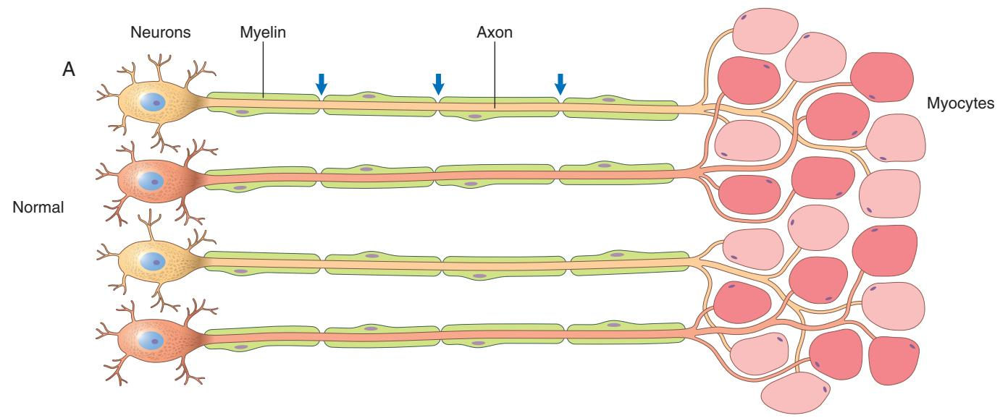
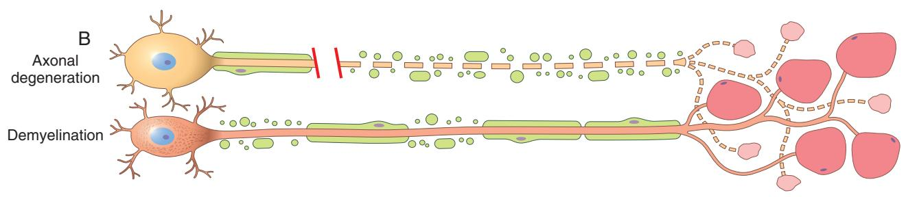
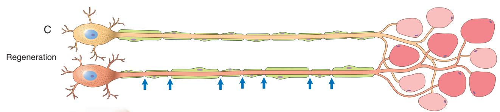
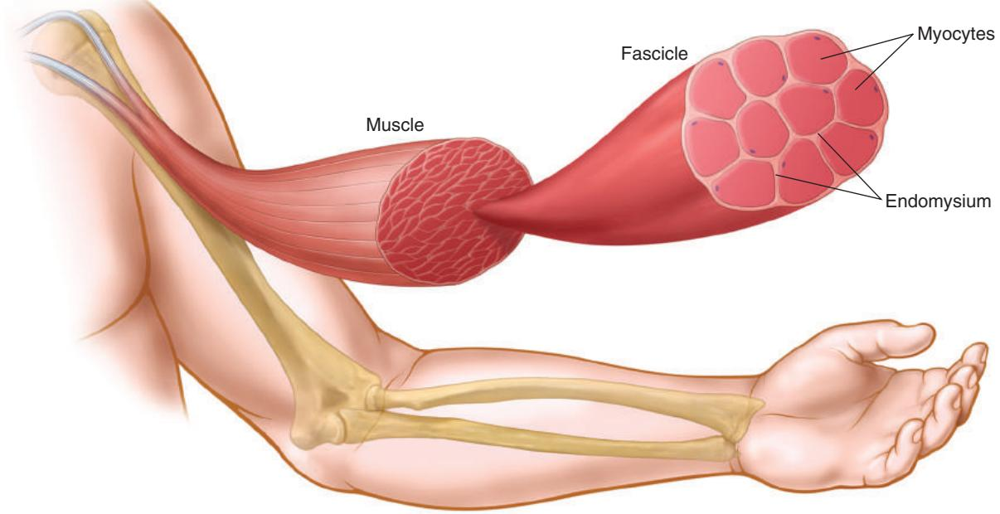 
Fig. 22.1 Patterns of peripheral nerve damage. (A) In normal motor units, type I and type II myofibers (see Table 22.2 later) are arranged in a “checkerboard” distribution. The internodes, separated by nodes of Ranvier (arrows) along the motor axons are uniform in thickness and length. (B) Acute axonal injury (upper axon) results in degeneration of the distal axon and its associated myelin sheath, with atrophy of denervated myofibers. By contrast, acute demyelinating disease (lower axon) produces random segmental degeneration of individual myelin internodes, while sparing the axon. (C) Regeneration of axons after injury (upper axon) allows connections with myofibers to re-form. The regenerated axon is myelinated by proliferating Schwann cells, but the new internodes are shorter and the myelin sheaths are thinner than the original ones. (Nodes Ranvier are marked by arrows; compare with panel A.) Remission of demyelinating disease (lower axon) allows remyelination to take place, but the new internodes also are shorter and have thinner myelin sheaths than flanking normal undamaged internodes.
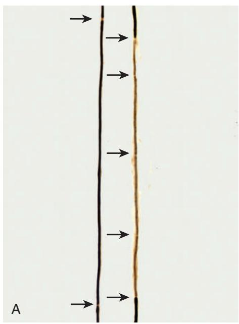 
Fig. 22.2 Pathologic changes in peripheral neuropathies. (A) Regeneration after segmental demyelination. Teased fiber preparations allow for examination of individual axons of peripheral nerves. A normal axon (left) with a long thick dark myelin internode flanked by nodes of Ranvier (arrows; compare with Fig. 22.1A). All myelin internodes along his axon would be expected to be of similar length and width. The right axon, by contrast, shows a segment surrounded by a series of thinly myelinated internodes of uneven length flanked on both ends by normal thicker myelin internodes (arrows mark nodes of Ranvier; compare with Fig. 22.1C). (B-C) Vasculitic neuropathy. In (B), the perineurial connective tissue contains an inflammatory infiltrate around small blood vessels that has obliterated a vessel. In (C), a special stain that colors myelinated axons dark blue hue shows that the nerve fascicle in the upper portion of this field (asterisk) has lost almost all of its large myelinated axons, in contrast with the other fascicle shown. Such interfascicular variation in axonal density is often seen in neuropathies resulting from vascular injury.
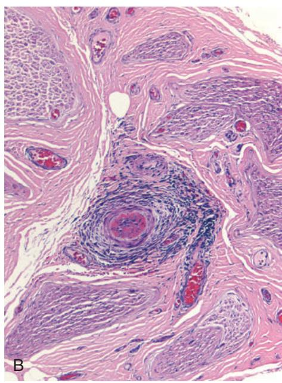
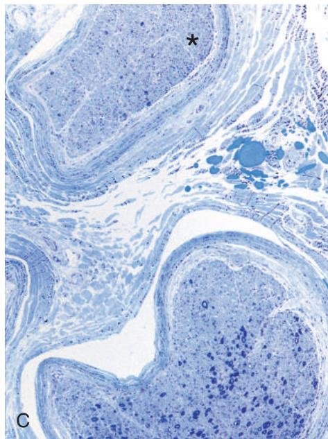
of damage to random internodes is best visualized when examining a series of internodes along individual axons in. teased fiber preparations (Fig. 22.2A).
Peripheral neuropathies exhibit several anatomic patterns.
- Polyneuropathies usually affect peripheral nerves in a symmetric, length-dependent fashion. Axonal loss is typically more pronounced in the distal segments of the longest nerves. Patients commonly present with loss of sensation and paresthesias that start in the toes and spread upward. By the time the sensory changes reach the level of the knees, the hands are also affected, resulting in a picture described as "stocking-and-glove" distribution. This pattern is often encountered with toxic and metabolic damage. 
- Mononeuritis multiplex, in which the damage randomly affects individual nerves, resulting (for example) in a right radial nerve palsy and wrist drop and, at a separate point in time, a left foot drop. Mononeuritis multiplex is often caused by vasculitis. 
- A simple mononeuropathy only involves a single nerve and is most commonly the result of traumatic injury, entrapment (e.g., carpal tunnel syndrome), or certain infections such as Lyme disease.
# Disorders Associated With Peripheral Nerve Injury
Many different diseases may be associated with peripheral neuropathy (Table 22.1). We next discuss selected entities that are prototypical for a specific type of polyneuropathy or that are particularly common.
Table 22.1 Peripheral Neuropathies 
Etiologic CategoryCausative Disorders/AgentsNutritional and metabolicDiabetes mellitus
Uremia
Vitamin deficiencies—thiamine, vitamin B6, vitamin B12ToxicDrugs, including vinblastine, vincristine, paclitaxel, colchicine, and isoniazid
Toxins—alcohol, lead, aluminum, arsenic, mercury, acrylamideVasculopathicVasculitis
AmyloidosisInflammatoryAutoimmune diseases
Guillain-Barré syndrome
Chronic inflammatory demyelinating polyneuropathy (CIDP)InfectionsHerpes zoster
Leprosy
HIV infection
Lyme diseaseInheritedCharcot-Marie-Tooth neuropathy, type I, type II, and X-linked
Hereditary neuropathy with liability to pressure palsyOthersParaneoplastic, some leukodystrophies
# Guillain-Barre Syndrome
Guillain-Barré syndrome is a rapidly progressive acute demyelinating disorder affecting motor axons, resulting in ascending weakness that can lead to death from failure of respiratory muscles within days of onset of symptoms. It is one of the most common life-threatening diseases of the peripheral nervous system. Guillain-Barré syndrome appears to be triggered by an infection or vaccination that breaks down self-tolerance, thereby leading to an autoimmune response. Associated infectious agents include Campylobacter jejuni, Epstein-Barr virus, cytomegalovirus, human immunodeficiency virus (HIV), and, most recently Zika virus. The injury is most extensive in the nerve roots and proximal nerve segments and is associated with mononuclear cell infiltrates rich in macrophages. Both humoral and cellular immune responses are believed to play a role in the disease process. Treatments include plasmapheresis (to remove offending antibodies), intravenous immunoglobulin infusions (which suppress immune responses through unclear mechanisms), and supportive care, such as ventilatory support. Patients who survive the initial acute phase of the disease usually recover with time.
# Chronic Inflammatory Demyelinating Polyneuropathy (CIDP)
CIDP is the most common chronic acquired inflammatory peripheral neuropathy, characterized by symmetrical mixed sensorimotor polyneuropathy that persists for 2 months or more. Both motor and sensory abnormalities are common, such as weakness, difficulty in walking, numbness, and pain or tingling sensations. Like Guillain-Barré syndrome, CIDP is immune mediated. But in contrast to Guillain-Barré syndrome, CIDP follows a chronic, relapsing-remitting, or progressive course. It occurs with increased frequency in patients with other immune disorders, such as systemic lupus erythematosus and HIV infection. The peripheral nerves show segments of demyelination and remyelination (Fig. 22.2A). In long-standing cases, repeated activation and proliferation of Schwann cells with episodes of regeneration result in the concentric arrangement of multiple Schwann cells around individual axons to produce multilayered structures likened to onion bulbs. Treatment includes plasmapheresis and administration of immunosuppressive agents. Some patients recover completely, but more often recurrent bouts of symptomatic disease lead to permanent loss of nerve function.
# Diabetic Peripheral Neuropathy
Diabetes is the most common cause of peripheral neuropathy, usually developing with long-standing disease. Diabetic neuropathies include several forms that can occur singly or together.
- Autonomic neuropathy is characterized by changes in bowel, bladder, cardiac, or sexual function. 
- Lumbosacral radiculopathy usually manifests with asymmetric pain that can progress to lower extremity weakness and muscle atrophy. 
Distal symmetric sensorimotor polyneuropathy is the most common form of diabetic neuropathy. Sensory axons are more severely affected than motor axons, resulting
in a clinical presentation dominated by paresthesias and numbness. This form of diabetic polyneuropathy results from the length-dependent degeneration of peripheral nerves and does not neatly fit into the axonal or demyelinating category but instead often exhibits features of both. The pathogenesis of diabetic neuropathy is complex; accumulation of advanced glycosylation end products resulting from hyperglycemia, increased levels of reactive oxygen species, microvascular changes, and changes in axonal metabolism, all have been implicated. Strict glycemic control is the best form of therapy.
# Toxic, Vasculitic, and Inherited Forms of Peripheral Neuropathy
There are diverse other causes of peripheral neuropathy (Table 22.1), some of which merit brief discussion.
- Drugs and environmental toxins that interfere with axonal transport or cytoskeletal function often produce peripheral neuropathies. The longest axons are most susceptible, hence symptoms appear first and are most pronounced in the distal extremities. 
- Peripheral nerves are damaged in many different forms of systemic vasculitis (Fig. 22.2B) (Chapter 10), including polyarteritis nodosa, Churg-Strauss syndrome, and polyangiitis with granulomatosis. Overall, peripheral nerve damage is seen in about a third of all patients with vasculitis at the time of presentation. The most common clinical picture is that of mononeuritis multiplex with a painful asymmetric mixed sensory and motor peripheral neuropathy. Patchy involvement also is apparent at the microscopic level, as single nerves may show considerable interfascicular variation in the degree of axonal damage (Fig. 22.2C). 
- Inherited diseases of peripheral nerves are a heterogeneous but relatively common group of disorders, with a prevalence of 1 to 4 in 10,000. They can be demyelinating or axonal. Many such disorders manifest in adulthood and follow a slowly progressive course that may mimic that of acquired polyneuropathies. The most common causes are mutations in the genes encoding myelin-associated proteins.
# PERIPHERAL NEUropathies
- Peripheral neuropathies may result in weakness and/or sensory deficits in patterns described as polyneuropathy, mononeuritis multiplex, and mononeuropathy. 
- Axonal and demyelinating peripheral neuropathies can be distinguished on the basis of clinical and pathologic features. Some disorders are associated with a mixed pattern of injury. 
Diabetes is the most common cause of peripheral neuropathy. 
- Guillain-Barré syndrome and chronic idiopathic demyelinating polyneuropathy are immune-mediated demyelinating diseases that follow acute and chronic courses, respectively. 
- Metabolic diseases, drugs, toxins, connective tissue diseases, vasculitides, and infections all can result in peripheral neuropathy. 
- A number of mutations cause peripheral neuropathy. Many of these are adult-onset diseases that may mimic acquired ones.
# DISORDERS OF NEUROMUSCULAR JUNCTION
The neuromuscular junction is a complex specialized structure located at the interface of motor nerve axons and skeletal muscle that serves to control muscle contraction. Here the distal ends of peripheral motor nerves branch into small processes that terminate in bulbous synaptic boutons. Nerve impulses depolarize the presynaptic membrane, stimulating calcium influx and the release of acetylcholine into the synaptic cleft. Acetylcholine diffuses across the synaptic cleft to bind its receptor on the postsynaptic membrane, leading to depolarization of the myofiber and contraction through electromechanical coupling. Often disorders of the neuromuscular junction produce functional deficits in the absence of any significant alterations in morphology beyond ultrastructural changes. Considered in this section are some of the more common or pathogenically interesting disorders that disrupt the transmission of signals across the neuromuscular junction.
# Myasthenia Gravis
Myasthenia gravis is an autoimmune disease with fluctuating muscle weakness that is caused by autoantibodies that target the neuromuscular junction. The most common antigenic target is the postsynaptic acetylcholine receptor (AChR). Other pathogenic antibodies recognize muscle-specific kinase (MuSK) and low-density lipoprotein receptor-related protein (LRP4). These antibodies lead to loss of receptors and damage to the structure of the junctions. The disease has an incidence of approximately 2 in 100,000 persons. Anti-AChR mediated cases have bimodal age distribution with somewhat distinctive clinical features. Early onset before age 50 years is more common in females and is frequently associated with enlargement of the thymus due to the presence of B cell follicles and germinal centers (follicular thymic hyperplasia). Late-onset cases show a more equal gender distribution and are associated with thymoma (Chapter 12), a neoplasm derived from thymic epithelium. Both of these thymic lesions are believed to perturb tolerance to self-antigens, setting the stage for the generation of autoreactive T and B cells.
Clinically, myasthenia gravis frequently manifests with ptosis (drooping eyelids) or diplopia (double vision) because of weakness in the extraocular muscles. This pattern of weakness is distinctly different from that of most primary myopathic diseases, in which there is relative sparing of facial and extraocular muscles. The severity of the weakness often fluctuates rapidly, sometimes over periods of a few minutes. Characteristically, repetitive firing of muscles makes the weakness more severe, whereas cholinesterase inhibitors improve strength markedly, features that are diagnostically useful. Effective treatments include cholinesterase inhibitors, immunosuppression, plasmapheresis, and (in patients with thymic lesions) thymectomy. These interventions have improved the 5-year survival rate to greater than $95\%$ .
# Lambert-Eaton Syndrome
Lambert-Eaton syndrome is caused by autoantibodies that inhibit the function of presynaptic calcium channels, thereby reducing the release of acetylcholine into the synaptic cleft. Patients with Lambert-Eaton syndrome experience improvement in weakness with repetitive stimulation, in contrast to those suffering from myasthenia gravis. Repetitive stimulation serves to build up sufficient intracellular calcium to facilitate acetylcholine release. Lambert-Eaton syndrome often arises as a paraneoplastic disorder, particularly in patients with small cell lung carcinoma. Cholinesterase inhibitors are not effective, and therapy is therefore directed toward reducing the titer of causative antibodies, through either plasmapheresis or immunosuppression. The prognosis is worse than that of myasthenia gravis because of the frequent coexistence of an underlying malignancy.
# Miscellaneous Neuromuscular Junction Disorders
Several other neuromuscular junction disorders merit brief mention.
- Congenital myasthenic syndromes comprise a heterogeneous group of diseases that result from mutations that disrupt the function of various neuromuscular junction proteins. Depending on the affected protein, the defects may occur at the level of acetylcholine release (presynaptic), the transport of acetylcholine across the synaptic cleft (synaptic), or the responsiveness of skeletal muscle (postsynaptic). Hence they may present with symptoms mimicking Lambert-Eaton syndrome or myasthenia gravis. Some forms respond to treatment with acetylcholinesterase inhibitors. 
- Infections with exotoxin-producing bacteria may be associated with defects in neural transmission and muscle contraction. Clostridium tetani and Clostridium botulinum (Chapter 9) both release extremely potent neurotoxins that interfere with neuromuscular transmission. Tetanus toxin (known as tetanospasmin) blocks the action of inhibitory neurons, leading to the increased release of acetylcholine and sustained muscle contraction and spasm (tetanus). Botulinum toxin, by contrast, inhibits acetylcholine release, producing a flaccid paralysis. The purified toxin (Botox) is remarkably stable after injection, an attribute that has led to its widespread use as an antidote for wrinkles and a variety of other conditions associated with unwanted muscular activity (e.g., blepharospasm and strabismus).
# NEUROMUSCULAR JUNCTION DISORDERS
- Disorders of neuromuscular junctions manifest with weakness that often affects facial and extraocular muscles and may show rapid fluctuation in severity. 
- Both myasthenia gravis and Lambert-Eaton syndrome, which are the most common forms, are immune mediated, being caused by antibodies that typically target postsynaptic acetylcholine receptors and presynaptic calcium channels, respectively.
- Myasthenia gravis often is associated with thymic hyperplasia or thymoma. Lambert-Eaton syndrome is a paraneoplastic disorder in the majority of the cases; the strongest association is with small cell lung cancer. 
- Genetic defects in neuromuscular junction proteins and bacterial toxins also can cause symptomatic disturbances in neuromuscular transmission.
# DISORDERS OF SKELETAL MUSCLE
# Patterns of Skeletal Muscle Injury and Atrophy
The principal component of the motor system is the motor unit, which is composed of one lower motor neuron together with the associated axon, its neuromuscular junctions, and the skeletal muscle fibers it innervates. Skeletal muscle consists of different fiber types broadly classified as slow twitch type I and fast twitch type II fibers (Table 22.2). The fiber type is dependent on the innervation. All myofibers of a motor unit therefore share the same fiber type. Normally the fibers of different types are distributed in checkerboard patterns (Fig. 22.1A). A number of proteins and protein complexes are crucial for the unique structure and function of skeletal muscles. These include proteins that make up the sarcomeres and the dystrophin-glycoprotein complex (Fig. 22.3), as well as enzymes that allow muscle to meet it unusual metabolic requirements.
Primary muscle diseases or myopathies have to be distinguished from secondary neuropathic changes caused by disorders that disrupt muscle innervation. Both are associated with altered muscle function and morphology, but each has distinctive features (Fig. 22.4). Myopathic conditions are often associated with segmental necrosis and regeneration of individual muscle fibers (Fig. 22.4B). Some myopathies are also associated with other morphologic features, such as inflammatory infiltrates or intracellular inclusions. Disruption of muscle by endomysial fibrosis and fatty replacement is reflective of disease chronicity that can occur both in myopathic as well as neuropathic conditions.
Both neuropathic and myopathic processes cause muscle fiber atrophy. However, certain disorders are associated with particular patterns of atrophy, as follows:
- Neuropathic changes. Loss of innervation causes atrophy of myofibers. The two main morphologic hallmarks of neurogenic changes, grouped atrophy and fiber type grouping (Fig. 22.4C), are the result of multiple rounds of denervation and reinnervation. Loss of an axon or lower motor neuron results in atrophy of the myofibers that are part of this motor unit (Fig. 22.4C2). Atrophic myofibers can be reinnervated by axonal branches from adjacent motor units, increasing the size of these motor units and returning trophic input to the atrophic myofibers (Fig. 22.4C3). Multiple rounds of denervation and reinnervation result in a dwindling number of motor units of increasingly larger size. In this setting loss of innervation will therefore produce large clusters of atrophic myofibers, grouped atrophy (Fig. 22.4C5). Because
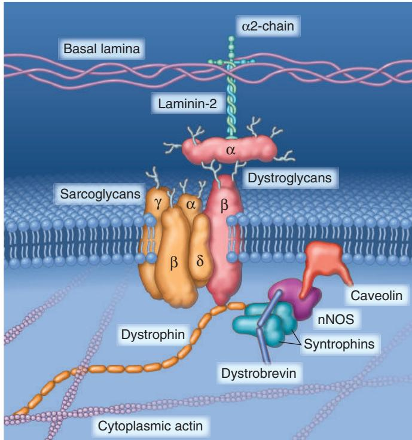 
Fig. 22.3 The dystrophin-glycoprotein complex (DGC). This complex of glycoproteins serves to couple the cell membrane (the sarcolemma) to extracellular matrix proteins such as laminin-2 and the intracellular cytoskeleton. A key set of connections is made by dystrophin, a scaffolding protein that tethers the myofibrillar cytoskeleton to the transmembrane dystroglycans and sarcoglycans, and also binds signaling complexes containing dystrobrevin, syntrophin, neuronal nitric oxide synthetase (nNOS), and caveolin. Mutations in dystrophin are associated with X-linked Duchenne and Becker muscular dystrophies; mutations in caveolin and the sarcoglycan proteins with autosomal limb-girdle muscular dystrophies; and mutations in $\alpha 2$ -laminin (merosin) with a form of congenital muscular dystrophy.
Table 22.2 Muscle Fiber Types 
Type IType IIActionSustained forceFast movementActivity typeAerobic exerciseAnaerobic exercisePower producedLowHighResistance to fatigueHighLowLipid contentHighLowGlycogen contentLowHighEnergy metabolismLow glycolytic capacity, high oxidative capacityHigh glycolytic capacity, low oxidative capacityMitochondrial densityHighLowMyosin heavy chain gene expressedMYH7MYH2, MYH4, MYH1ColorRed (high myoglobin content)Pale red / tan (low myoglobin content)
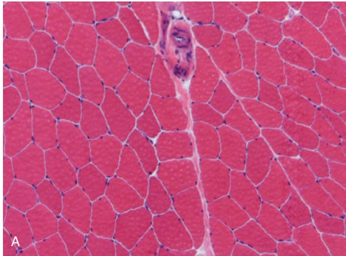
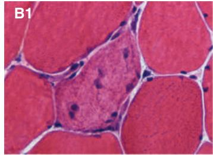
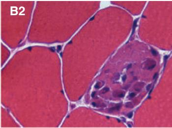
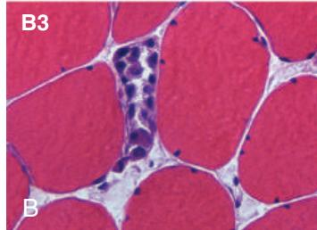
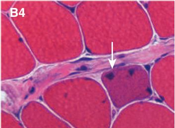
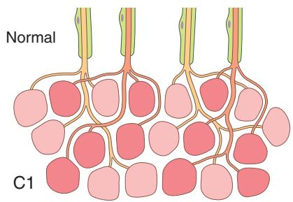
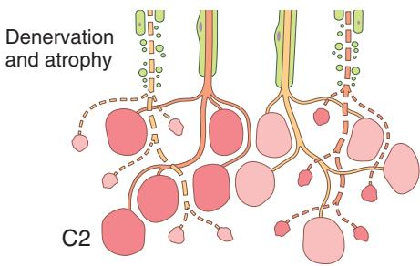
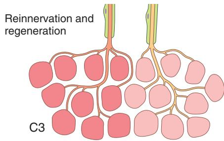
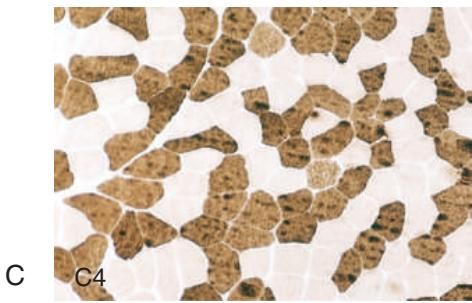 
Fig. 22.4 Patterns of skeletal muscle injury. (A) Normal skeletal muscle has relatively uniform polygonal myofibers with peripherally placed nuclei that are tightly packed together into fascicles separated by scant connective tissue. A perimysial interfascicular septum containing a blood vessel is present (top center). (B) Myopathic conditions often are associated with segmental necrosis and regeneration of individual myofibers. Necrotic cells (B1-B3) are infiltrated by variable numbers of inflammatory cells. Regenerative myofibers (B4, arrow) are characterized by cytoplasmic basophilia and enlarged nucleoli (not visible at this power). (C) Neurogenic changes. (C1) This diagrammatic representation of four normal motor units shows a checkerboard-type admixture of light and dark stained fibers of opposite type. (C2) Damage to innervating axons leads to a loss of trophic input and the atrophy of myofibers. (C3) Reinnervation of myofibers can result in a switch in fiber type and segregation of fibers of like type. As illustrated here, reinnervation is also often associated with an increase in motor unit size, with more myofibers innervated by an individual axon. (C4) Normal muscle has a checkerboard distribution of type I (light) and type II (dark) fibers on this ATPase reaction $(\mathsf{pH}9.4)$ , corresponding to findings in (A). (C5) Clustered flattened "angulated" atrophic fibers (grouped atrophy) are a typical finding associated with disrupted innervation. (C6) With ongoing denervation and reinnervation, large clusters of fibers appear that all share the same fiber type (fiber type grouping).
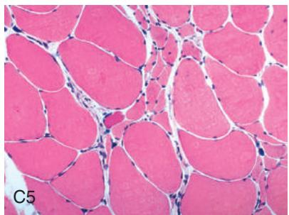
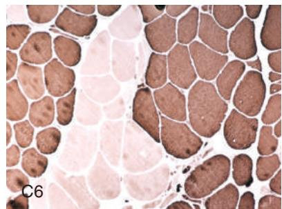
myofiber type depends on the innervating motor unit, reinnervated fibers may change from type I to type II and vice versa. The presence of increasingly larger motor units alters the normal checkerboard type distribution of fibers by producing large clusters of the same type, fiber type grouping (Fig. 22.4C6).
- Prolonged disuse of muscles from any cause (e.g., prolonged bed rest in the sick, casting of a broken bone) may cause focal or generalized muscle atrophy, which tends to affect type II fibers more than type I fibers.
- Glucocorticoid exposure, whether exogenous or endogenous (e.g., in Cushing syndrome), also may cause muscle atrophy. Proximal muscles and type II myofibers are affected preferentially in this setting.
# Inherited Disorders of Skeletal Muscle
Inherited mutations are responsible for a diverse collection of disorders marked by defects in skeletal muscle. In some of these disorders, skeletal muscle is the main site of
disease, while in others multiple organs are involved. Of the other organs involved, the heart is of particular importance, because cardiac involvement is common and is often life-limiting. Included in this group of inherited muscular disorders are the following:
- Muscular dystrophies are associated with progressive muscle injury in patients who have normal muscle function at birth. 
- Congenital muscular dystrophies, by contrast, are progressive, early-onset diseases. Some are also associated with malformations of the central nervous system. 
- Congenital myopathies typically present in infancy with muscle defects that tend to be static or to even improve with time. They are often associated with distinct structural abnormalities of the muscle.
The discussion of muscular dystrophies may at first glance appear confusing because of different classification systems and terminologies. This is reflective of our evolving understanding of these diseases, from a description based on phenotype and inheritance pattern, to one based on underlying genetic mutations. An additional layer of complexity stems from the fact that there is not a simple one-to-one correspondence between genotypes and phenotypes. Instead mutations in several different genes can, for example, present as autosomal recessive limb-girdle muscular dystrophy; conversely different mutations in a single gene (such as dystrophin) can lead to very different clinical phenotypes, as illustrated by Duchenne and Becker types of muscular dystrophy.
# Dystrophinopathies: Duchenne and Becker Muscular Dystrophy
The most common muscular dystrophies are X-linked and are caused by mutations that disrupt the function of a large structural protein called dystrophin. As a result, these diseases are referred to as dystrophinopathies. Duchenne muscular dystrophy (DMD) and Becker muscular dystrophy (BMD) are the two most important diseases in this group. DMD has an incidence of about 1 per 3500 live male births and follows an invariably fatal course. It becomes clinically evident in early childhood; most patients are wheelchair-bound by the time they are teenagers and are dead of their disease by early adulthood. The Becker type of muscular dystrophy is less common and less severe.
The histologic alterations in skeletal muscles affected by DMD and BMD are similar, except that the changes are milder in BMD (Fig. 22.5). The hallmarks of these as well as other muscular dystrophies are ongoing myofiber necrosis and regeneration. Progressive replacement of muscle tissue by fibrosis and fat is the result of degeneration outpacing repair. As a result of ongoing repair, muscles typically show marked variation in myofiber size and abnormal internally placed nuclei. Both DMD and BMD also affect cardiac muscles, which show variable degrees of myocyte hypertrophy and interstitial fibrosis.
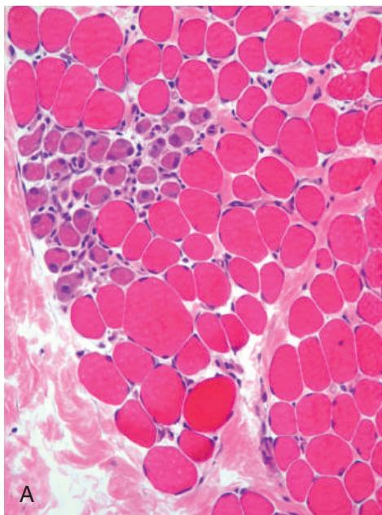 
Fig. 22.5 Duchenne muscular dystrophy. Histologic images of muscle biopsy specimens from two brothers. (A-B) Specimens from a 3-year-old boy. (C) Specimen from his brother, 9 years of age. As seen in (A), at a younger age fascicular muscle architecture is maintained, but myofibers show variation in size. Additionally, there is a cluster of basophilic regenerating myofibers (left side) and slight endomysial fibrosis, seen as focal pink-staining connective tissue between myofibers. In (B), immunohistochemical staining shows a complete absence of membrane-associated dystrophin, seen as a brown stain in normal muscle (inset). In (C), the biopsy from the older brother illustrates disease progression, which is marked by extensive variation in myofiber size, fatty replacement, and endomysial fibrosis.
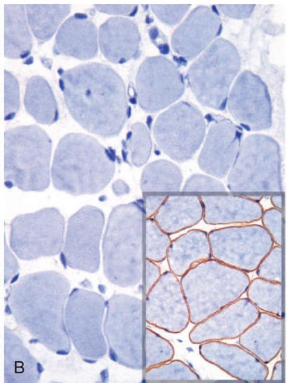
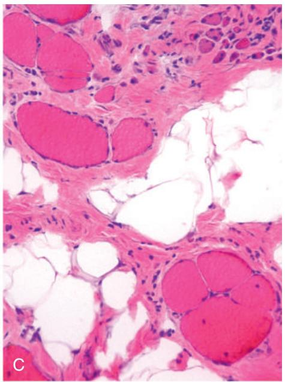
Both DMD and BMD are caused by mutations disrupting the function of the dystrophin gene located on the short arm of the X chromosome (Xp21). Dystrophin is a very large protein (427 kD in molecular weight) found in skeletal and cardiac muscle, brain, and peripheral nerves; it is part of the dystrophin-glycoprotein complex (Fig. 22.3). This complex stabilizes the muscle cell during contraction and may be involved in cell signaling through interactions with other proteins. Dystrophin-glycoprotein complex defects are thought to make muscle cells vulnerable to transient membrane tears during contraction that lead to calcium influx, and they may also disrupt intracellular signaling. The result is myofiber degeneration that with time outpaces the capacity for repair. The dystrophin-glycoprotein complex also is important for cardiac muscle function; this explains why cardiomyopathy eventually develops in many patients.
The dystrophin gene spans roughly 2.4 megabases (about $1\%$ of the X chromosome), making it one of the largest human genes. Its enormous size may make it more prone to sporadic mutations, which all things being equal are more likely by chance to affect large genes. The most common mutations are deletions, followed by frameshift and point mutations. Patient with DMD usually have either of the first two and show complete absence of dystrohpin on a muscle biopsy. Patients with BMD often have point mutations and make residual but defective forms. The severity of disease therefore correlates with genotype and extent of dystrohpin deficiency.
Often the first symptoms of DMD are clumsiness and an inability to keep up with peers because of muscle weakness. The weakness typically begins in the pelvic girdle and next involves the shoulder girdle. Enlargement of the calves, termed pseudohypertrophy, is an early physical finding. The increased muscle bulk initially stems from myofiber hypertrophy, but as myofibers progressively degenerate, an increasing part of the muscle is replaced by adipose tissue and endomysial fibrosis. Cardiac muscle damage and fibrosis may lead to heart failure and arrhythmias, which may prove fatal. Although no structural abnormalities in the central nervous system have been described, cognitive impairment also may occur and may be severe enough to be classified as mental retardation. Owing to ongoing muscle degeneration, high serum creatine kinase levels are present at birth and persist through the first decade of life but fall as muscle mass is lost as the disease progresses. Death results from respiratory insufficiency, pneumonia, and cardiac decompensation.
BMD becomes symptomatic later in childhood or adolescence and progresses at a slower and more variable rate. Many patients live well into adulthood and have a nearly normal life span. Cardiac involvement may be the dominant clinical feature and may result in death, even in the absence of significant skeletal muscle weakness.
Treatment of patients with dystrophinopathies is challenging. Current treatment consists primarily of supportive care. Definitive therapy requires restoration of dystrophin levels in skeletal and cardiac muscle fibers. Genetic
approaches to accomplish this are being tested in clinical trials. One strategy involves the expression of anti-sense RNAs that alter RNA splicing so as to cause "skipping" of exons containing deleterious mutations, thus permitting the expression of a truncated, but partially functional, dystrophin protein. A second strategy involves the use of drugs that promote ribosomal "read-through" of stop codons, another ploy that may enable the synthesis of some functional dystrophin protein.
# Other X-Linked and Autosomal Muscular Dystrophies
Other forms of muscular dystrophy share features with DMD and BMD but have distinct clinical, genetic, and pathologic features.
- Myotonic dystrophy. Myotonia, the sustained involuntary contraction of a group of muscles, is the cardinal neuromuscular symptom in myotonic dystrophy. Patients often complain of stiffness and difficulty in relaxing their grip, for example, after a handshake. Myotonic dystrophy is a nucleotide repeat expansion disease (Chapter 7) that is inherited as an autosomal dominant trait. More than $95\%$ of patients with myotonic dystrophy have mutations in the gene that encodes the dystrophia myotonica protein kinase (DMPK). In normal subjects, this gene contains 5 to 37 CTG repeats, whereas affected patients usually carry 45 to several thousand. As with other nucleotide repeat expansion diseases, myotonic dystrophy exhibits anticipation, characterized by worsening of the disease manifestations with each passing generation because of further trinucleotide repeat expansion. The CTG repeat is located in the $3^{\prime}$ untranslated region of the DMPK mRNA. Experimental studies suggest that the skeletal muscle phenotype stems from a "toxic" gain-of-function caused by the triplet repeat expansion. The mutant DMPK mRNA with the resulting CUG expansions sequesters muscleblind-like proteins involved in RNA splicing. This functional depletion of proteins involved in RNA splicing disrupts normal gene expression patterns and alters the function of diseased tissues like skeletal and cardiac muscle. Myotonic dystrophy often manifests in late childhood with gait abnormalities due to weakness of foot dorsiflexors, with subsequent progression to weakness of the intrinsic muscles of the hands and wrist extensors, atrophy of the facial muscles, and ptosis. Involvement of other organ systems results in potentially fatal cardiac arrhythmias, cataracts, early frontal balding, endocrinopathies, and testicular atrophy.
- Limb-girdle muscular dystrophies. These muscular dystrophies preferentially affect the proximal musculature of the trunk and limbs. Their genetic basis is heterogeneous. The growing list includes at least 7 dominant subtypes and 15 autosomal recessive subtypes. Some of the responsible mutations affect components of the dystrophin-glycoprotein complex other than dystrophin. Others affect proteins involved in vesicle transport and repair of cell membrane after injury (caveolin-3 and dysferlin), cytoskeletal proteins, or posttranslational modification of dystroglycan, a component of the dystrophin-glycoprotein complex. 
- Emery-Dreifuss muscular dystrophy (EMD) is a genetically heterogeneous disorder caused by mutations
affecting structural proteins found in the nucleus. An X-linked form results from mutations in the gene encoding the protein emerin, whereas an autosomal dominant form is caused by mutations in the gene encoding lamin A/C. It is hypothesized that defects in these proteins compromise the structural integrity of the nucleus in cells that are subjected to repetitive mechanical stress (e.g., cardiac and skeletal muscle). These proteins may also regulate chromatin structure and thereby affect gene expression patterns. The clinical picture is characterized by progressive muscle weakness and wasting, contractures of the elbows and ankles, and cardiac disease. The cardiac involvement is severe, being associated with cardiomyopathy and arrhythmias that lead to sudden death in up to $40\%$ of patients.
- Facioscapulohumeral dystrophy is an autosomal dominant form of muscular dystrophy that is caused by complex genetic changes that allow expression of the transcription factor DUX4 that is normally repressed in mature tissues. It is thought that the disease is caused by over expression of DUX4 target genes, many of which are involved in the normal function of skeletal muscles. Most patients become symptomatic by the age of 20 years, usually owing to weakness in the facial muscles and the shoulder. Patients also exhibit weakness in the lower trunk and the dorsiflexors of the foot. Most affected persons have a normal life expectancy.
# Channelopathies, Metabolic Myopathies, and Mitochondrial Myopathies
Other important inherited disorders of skeletal muscle are the result of defects in ion channels (channelopathies), metabolism, and mitochondrial function.
- Ion channel myopathies are a group of familial disorders caused by inherited defects in ion channels that are characterized by myotonia, relapsing episodes of hypotonic paralysis associated with abnormal serum potassium levels, or both. Hyperkalemic periodic paralysis results from mutations in the gene encoding the skeletal muscle sodium channel SCN4A, which regulates sodium entry during contraction. Malignant hyperthermia is a rare syndrome characterized by tachycardia, tachypnea, muscle spasms, and hyperpyrexia. It is triggered when patients carrying mutations in the ryanodine receptor RYR1, a calcium efflux channel, receive halogenated anesthetic agents or succinylcholine during surgery. On exposure to anesthetic, the mutated receptor leads to increased efflux of calcium from the sarcoplasmic reticulum, producing tetany and excessive heat production. There is some evidence that people carrying RYR1 mutations also are unusually susceptible to exertional hyperthermia (heat stroke).
- Myopathies due to inborn errors of metabolism include disorders of glycogen synthesis and degradation (Chapter 7) and lipid handling. The latter include disorders of the carnitine transport system and deficiencies of the mitochondrial dehydrogenase enzyme system, both of which can lead to accumulation of lipid in myocytes (lipid myopathies). These storage disorders may manifest as systemic disease or as a muscle-specific
phenotype. Some are associated with muscle damage and weakness. Others manifest with recurring episodes of exercise- or fasting-induced muscle damage, which if severe may lead to necrosis of myoctyes (rhabdomyolysis), myoglobulinuria and acute renal failure.
- Mitochondrial myopathies can stem from mutations in either the mitochondrial or nuclear genomes because both encode proteins and RNAs that are critical for mitochondrial function. The variants caused by mitochondrial mutations show maternal inheritance (Chapter 7). Mitochondrial myopathies usually manifest in early adulthood with proximal muscle weakness and sometimes with severe involvement of the ocular musculature (external ophthalmoplegia). There may also be neurologic signs and symptoms, lactic acidosis, endocrinopathy, peripheral neuropathy, and cardiomyopathy. Some mitochondrial diseases are associated with normal muscle morphology, whereas others show aggregates of abnormal mitochondria; the latter impart a blotchy red appearance in special stains—hence the term ragged red fibers. On ultrastructural examination, these correspond to abnormal aggregates of mitochondria with abnormal shape and size, some containing crystalline inclusions.
# Acquired Disorders of Skeletal Muscle
A diverse group of acquired disorders may manifest with muscle weakness, muscle cramping, or muscle pain. These include inflammatory myopathies, toxic muscle injuries, postinfectious rhabdomyolysis, and muscle infarction in the setting of diabetes. In most instances these are disorders of adults with acute or subacute onsets.
# Inflammatory Myopathies
Polymyositis, dermatomyositis, and inclusion body myositis represent the traditional triad of inflammatory myopathies. This triad is a simplified view of complex diseases with variable phenotypes that are not always as well delineated as outlined here. Nevertheless, this approach still helps to outline key principles.
Polymyositis is an autoimmune disorder associated with increased expression of MHC class I molecules on myofibers and predominantly endomysial inflammatory infiltrates containing $\mathrm{CD8 + }$ cytotoxic T cells. The autoimmune attack leads to myofiber necrosis and subsequent regeneration (Fig. 22.6A). Patients with polymyositis are often successfully treated with corticosteroids or other immunosuppressive agents.
- Dermatomyositis is the most common inflammatory myopathy in children, in whom it appears as an isolated entity. In adults, it often manifests as a paraneoplastic disorder. In both contexts, it is believed to have an autoimmune basis. The disease is typically associated with skin manifestations, as implied by the name, and may also have systemic manifestations such as interstitial lung disease. On microscopic examination and ultrastructural studies, it is associated with perivascular mononuclear cell infiltrates with plasma cells, "dropout" of capillaries, the presence of so-called "tubuloreticular inclusions" in endothelial cells, and myofiber damage in a paraseptal or perifascicular pattern (Fig. 22.6B).
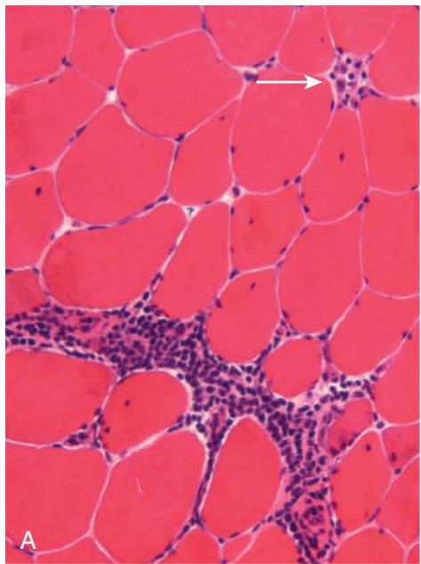 
Fig. 22.6 Inflammatory myopathies. (A) Polymyositis is characterized by endomysial inflammatory infiltrates and myofiber necrosis (arrow). (B) Dermatomyositis often shows prominent perifascicular and paraseptal atrophy. (C) Inclusion body myositis, showing myofibers containing rimmed vacuoles (arrows). Modified Gomori trichrome stain.
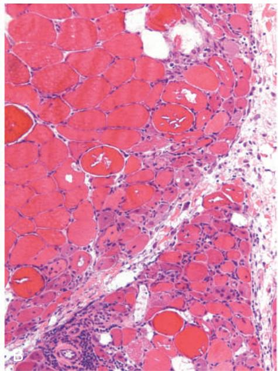
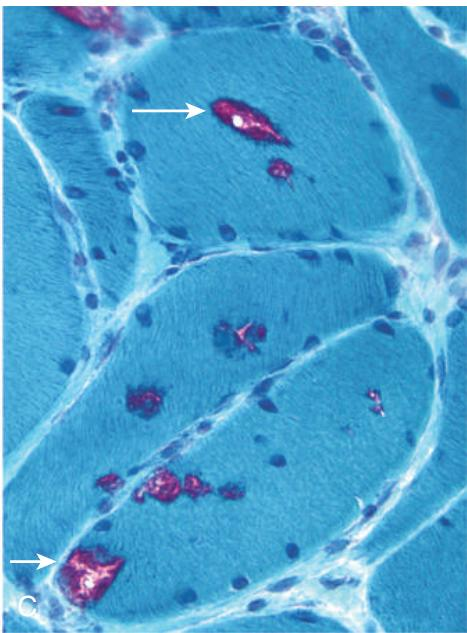
As with some other autoimmune diseases such as SLE (Chapter 5), type 1 interferon-induced gene products are strongly upregulated in affected muscles. Some patients have autoantibodies that are relatively specific for dermatomyositis; these include antibodies against Mi-2 (a nuclear helicase) and p155 and p140, proteins with uncertain functions.
- Inclusion body myositis is the most common inflammatory myopathy in patients older than 60 years of age. It is grouped with other forms of myositis, but it has yet to be determined whether inflammation is a cause or an effect in this disorder. The morphologic hallmark of inclusion body myositis is the presence of rimmed vacuoles (Fig. 22.6C) that contain aggregates of the same proteins that accumulate in the brains of patients with neurodegenerative diseases – hyperphosphorylated tau, amyloid derived from $\beta$ -amyloid precursor protein, and TDP-43 (Chapter 23) – leading some to speculate that this is a degenerative disorder of aging. Other features typical of chronic inflammatory myopathies, including myopathic changes, mononuclear cell infiltrates, endomysial fibrosis, and fatty replacement, also are evident. The disease follows a chronic, progressive course and generally does not respond well to immunosuppressive agents, another feature suggesting that inflammation is a secondary event.
# Toxic Myopathies
A number of insults can cause toxic muscle injury, including intrinsic factors (e.g., thyroxine) and extrinsic factors (e.g., acute alcohol intoxication, various drugs).
Thyrotoxic myopathy may take the form either of acute or chronic proximal muscle weakness, and it can be the first indication of thyrotoxicosis. Histologic findings include myofiber necrosis and regeneration. 
- Ethanol myopathy occurs after an episode of binge drinking. The degree of rhabdomyolysis may be severe,
sometimes leading to acute renal failure secondary to myoglobinuria. Patients usually complain of acute muscle pain, which may be generalized or confined to a single muscle group. Microscopically, there is myocyte swelling, necrosis, and regeneration.
- Drug myopathy can be produced by a variety of agents. For example, myopathy is the most common complication of statins (e.g., atorvastatin, simvastatin, pravastatin), occurring in approximately $1.5\%$ of users. Two forms of statin associated myopathy are recognized: (1) toxicity of the drug and (2) statin-induced HMG-CoA reductase autoantibodies causing an immune mediated myopathy.
# Tumors of Skeletal Muscles
These are discussed in Chapter 21 along with other tumors of soft tissues.
# DISORDERS OF SKELETAL MUSCLE
- Skeletal muscle function can be impaired by a primary (inherited or acquired) myopathy or secondarily because of problems with muscle innervation. 
- The genetic forms of myopathy fall into several fairly distinct clinical phenotypes, including muscular dystrophy, congenital myopathy, and congenital muscular dystrophy. 
- Dystrophinopathies are X-linked disorders caused by mutations in the dystrophin gene and disruption of the dystrophinglycoprotein complex. Depending on the type of mutation, the disease may be severe, such as DMD, or mild (e.g., Becker dystrophy). 
- Acquired myopathies have diverse causes, including inflammation and toxic exposures.
# PERIPHERAL NERVE SHEATH TUMORS
A number of different tumors arise from peripheral nerves. Such tumors may manifest as soft tissue masses, with pain or loss of function related to impingement on nerves or other surrounding structures. In most peripheral nerve tumors, the neoplastic cells show evidence of Schwann cell differentiation. These tumors usually occur in adults and include both benign and malignant variants. An important feature is their frequent association with the familial tumor syndromes neurofibromatosis type 1 (NF1) and neurofibromatosis type 2 (NF2).
# Schwannomas and Neurofibromatosis Type 2
Schwannomas are benign encapsulated tumors that may occur in soft tissues, internal organs, or spinal nerve roots. The most commonly affected cranial nerve is the vestibular portion of the eighth nerve. Tumors arising in a nerve root or the vestibular nerve may be associated with symptoms related to nerve root compression, which includes hearing loss in the case of vestibular schwannomas.
Most schwannomas are sporadic, but about $10\%$ are associated with familial neurofibromatosis type 2 (NF2). NF2 patients are at risk of developing multiple schwannomas, meningiomas, and ependymomas (the latter are described in Chapter 23). The presence of bilateral vestibular schwannomas is a hallmark of NF2; despite the name, neurofibromas (described later) are not found in NF2 patients. Affected patients carry a dominant loss of function mutation of the merlin gene on chromosome 22. Merlin is a cytoskeletal protein that functions as a tumor suppressor by facilitating E-cadherin-mediated contact inhibition (Chapter 6). With loss of merlin function, the tumor cells proliferate because contact inhibition is lost. Of note, merlin expression also is disrupted in sporadic schwannomas, possibly because of somatic mutations.
Most schwannomas appear as circumscribed masses abutting an adjacent nerve. On microscopic examination, these tumors often show an admixture of dense and loose areas referred to as Antoni A and B, respectively (Fig. 22.7A-B). They are comprised of a uniform proliferation of neoplastic Schwann cells. In the dense Antoni A areas, bland spindle cells with buckled nuclei are arranged into intersecting fascicles. These cells often align to produce nuclear palisading, resulting in alternating bands of nuclear and anuclear areas called Verocay bodies. Axons are largely excluded from the tumor. In the loose, hypocellular Antoni B areas, the spindle cells are spread apart by a prominent myxoid extracellular matrix. Thick-walled hyalinized vessels often are present. Hemorrhage or cystic changes also are sometimes seen.
# Neurofibromas
Neurofibromas are benign peripheral nerve sheath tumors. Three important subtypes are recognized:
- Localized cutaneous neurofibromas arise as superficial nodular or polypoid tumors. These occur either as solitary sporadic lesions or often as multiple lesions in the context of neurofibromatosis 1 (NF1). 
- Plexiform neurofibromas grow diffusely within the confines of a nerve or nerve plexus. Surgical enucleation of such lesions is therefore difficult and is often associated with lasting neurologic deficits. Plexiform neurofibromas are virtually pathognomonic for NF1 (discussed later). Unlike other benign nerve sheath tumors, these tumors are associated with a small but real risk of malignant transformation. 
- Diffuse neurofibromas are infiltrative proliferations that can take the form of large, disfiguring subcutaneous masses. These also are often associated with NF1.
Unlike schwannomas, neurofibromas are not encapsulated. They may appear circumscribed, as in localized cutaneous neurofibromas, or may exhibit a diffusely infiltrative growth pattern. Also in contrast to schwannomas, the neoplastic Schwann cells in neurofibroma are admixed with other cell types, including mast cells, fibroblast like cells, and perineurial-like cells. The background stroma often contains loose wavy collagen bundles but also can be myxoid or can contain dense collagen (Fig. 22.7D). Plexiform neurofibromas involve multiple fascicles of individual affected nerves (Fig. 22.7C). Diffuse neurofibromas show an extensive infiltrative pattern of growth within the dermis and subcutis of the skin.
# Neurofibromatosis Type I
NF1 is an autosomal dominant disorder caused by mutations in the tumor suppressor neurofibromin, encoded on the long arm of chromosome 17 (17q). Neurofibromin is a negative regulator of the potent oncoprotein Ras (Chapter 6). Loss of neurofibromin function and the resulting Ras hyperactivity appear to be a cardinal feature of NF1-associated tumors. As would be anticipated for a tumor suppressor gene, the sole normal NF1 allele is mutated or silenced in tumors arising in the setting of NF1. These include neurofibromas of all three main types, malignant peripheral nerve sheath tumors, "optic gliomas," and other glial tumors. In addition, patients with NF1 exhibit learning disabilities, seizures, skeletal abnormalities, vascular abnormalities with arterial stenoses, pigmented nodules of the iris (Lisch nodules), and pigmented skin lesions (axillary freckling and café-au-lait spots) in various degrees.
# Malignant Peripheral Nerve Sheath Tumors
Malignant peripheral nerve sheath tumors are neoplasms seen in adults that typically show evidence of Schwann cell derivation and sometimes a clear origin from a peripheral nerve. They may arise from transformation of a neurofibroma, usually of the plexiform type. About one-half of such tumors arise in patients with NF1, and $3\%$ to $10\%$ of all patients with NF1 develop a malignant peripheral
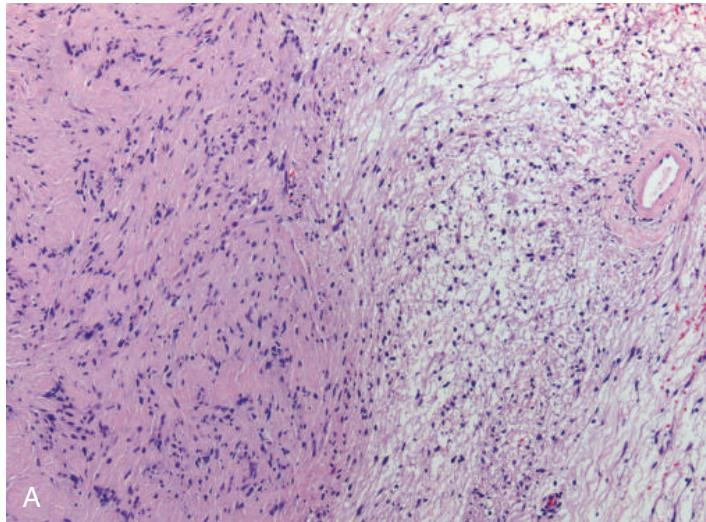
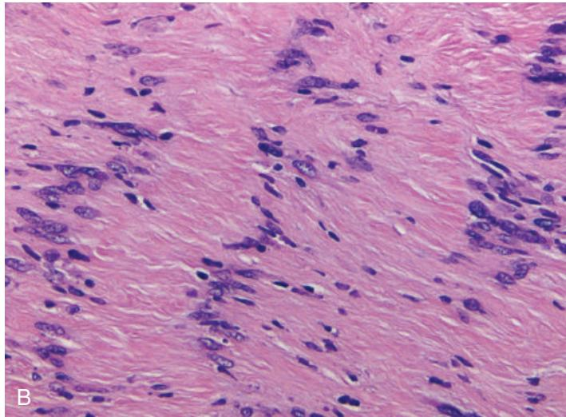
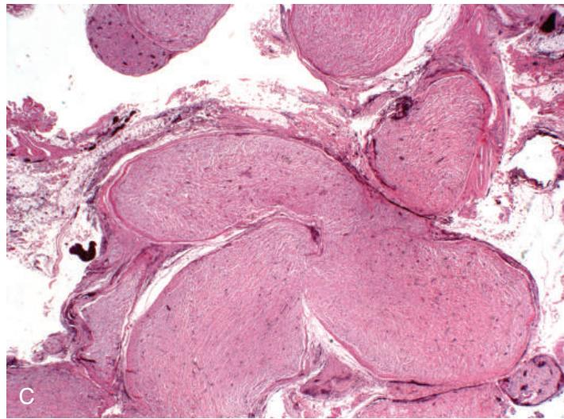 
Fig. 22.7 Schwannoma and plexiform neurofibroma. (A-B) Schwannoma. As seen in (A), schwannomas often contain dense pink Antoni A areas (left) and loose, pale Antoni B areas (right), as well as hyalinized blood vessels (right). (B) Antoni A area with the nuclei of tumor cells aligned in palisading rows. (C-D) Plexiform neurofibroma. Multiple nerve fascicles are expanded by infiltrating tumor cells (C), which at higher power (D) are seen to consist of bland spindle cells admixed with wavy collagen bundles likened to carrot shavings.
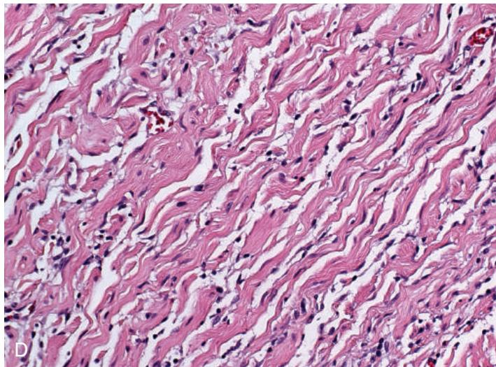
nerve sheath tumor during their lifetimes. Histologically, these tumors are highly cellular and exhibit features of overt malignancy, including anaplasia, necrosis, infiltrative growth pattern, pleomorphism, and high proliferative activity.
# Traumatic Neuroma
Traumatic neuroma is a nonneoplastic proliferation associated with a previous injury leading to transection of a peripheral nerve. Such injuries activate a regenerative program (see Fig. 22.1) characterized by sprouting and elongation of processes from the proximal axonal stump. With severe injuries that disrupt the perineurial sheath, these new processes may "miss" their target, the distal end of the transected nerve. The misguided elongating axonal processes can induce a reactive proliferation of Schwann cells, leading to the formation of a painful localized nodule that consists of a haphazard mixture of axons, Schwann cells, and connective tissue.
# PERIPHERAL NERVE SHEATH TUMORS
- In most peripheral nerve sheath tumors, the neoplastic cells show evidence of Schwann cell differentiation. 
- Peripheral nerve sheath tumors are important features of the familial tumor syndromes NF1 and NF2. 
- Schwannomas and neurofibromas are benign nerve sheath tumors. 
- Schwannomas are circumscribed, usually encapsulated tumors that abut the nerve of origin and are a feature of NF2. 
- Neurofibromas may manifest as a sporadic subcutaneous nodule, as a large, poorly defined soft tissue lesion, or as a growth within a nerve. Neurofibromas are associated with NF1. 
- About $50\%$ of malignant peripheral nerve sheath tumors occur de novo in otherwise normal persons, whereas the remainder arise from the malignant transformation of a preexisting NF1-associated neurofibroma.
Berrih-Aknin S, Le Panse R: Myasthenia gravis: a comprehensive review of immune dysregulation and etiological mechanisms, J Autoimmun 52:90-100, 2014. [Review of subtypes and etiology of myasthenia gravis.] 
Briemberg HR: Peripheral nerve complications of medical disease, Semin Neurol 29:124, 2009. [Review of the ways medical diseases including diabetes, connective tissue diseases, cancer, and infections affect peripheral nerves.] 
Dalakas MC: Inflammatory muscle diseases, N Engl J Med 372:18, 2015. [Discussion of current concepts on the pathophysiology of idiopathic inflammatory myopathies.] 
Falzarano MS, Scotton C, Passarelli C, et al: Duchenne muscular dystrophy: from diagnosis to therapy, Molecules 20:18168, 2015. [Molecular techniques for the diagnosis and treatment of this disease.] 
Habib AA, Brannagan TH III: Therapeutic strategies for diabetic neuropathy, Curr Neurol Neurosci Rep 10:92, 2010. [Review focused especially on clinical features and therapy of diabetic neuropathy.] 
Kang PB, Griggs RC: Advances in muscular dystrophies, JAMA 72:741, 2015. [An update on the molecular pathogenesis of muscular dystrophies and their treatment.] 
Mahadeva B, Phillips LH, Juel VC: Autoimmune disorders of neuromuscular transmission, Semin Neurol 28:212, 2008. [Review of myasthenia gravis and Lambert-Eaton syndrome.] 
McClatchey AI: Neurofibromatosis, Annu Rev Pathol 2:191, 2007. [Review of features that distinguish neurofibromatosis type 1, neurofibromatosis type 2, and schwannomatosis, with a focus on the genetics.]
Obrosova IG: Diabetes and the peripheral nerve, Biochim Biophys Acta 1792:931, 2009. [Detailed discussion of the pathophysiology of diabetic neuropathy.] 
Petrilli AM, Fernandez-Valle C: Role of Merlin/NF2 inactivation on tumor biology, Oncogene 35:537-548, 2016. [Mechanisms of action of the NF2 gene in the pathogenesis of neuronal tumors.] 
Ravenscroft G, Laing NG, Bonnemann CG: Pathophysiological concepts in the congenital myopathies: blurring the boundaries, sharpening the focus, Brain 138:246, 2015. [A review of the overlapping and nonoverlapping genetic lesions in congenital myopathies.] 
Tawil R, van der Maarel SM, Tapscott SJ: Facioscapulohumeral dystrophy: the path to consensus on pathophysiology, Skelet Muscle 4:12, 2014. [Review of FSHD including a discussion of the complex genetics.] 
van Adel BA, Tarnopolsky MA: Metabolic myopathies: update 2009, J Clin Neuromuscul Dis 10:97, 2009. [Review of metabolic myopathies.] 
Vrablik M, Zlatohlavek L, Stulc T, et al: Statin-associated myopathy: from genetic predisposition to clinical management, Physiol Res 63(Suppl 3):S327, 2014. [A discussion of the risk factors for statin-induced myopathy and its therapy.] 
Wang ET, Cody NA, Jog S, et al: Transcriptome-wide regulation of pre-mRNA splicing and mRNA localization by muscleblind proteins, Cell 150:710-724, 2012. [Study of the transcriptional changes with myotonic dystrophy.]
# Central Nervous System
# 23
Edema, Herniation, and Hydrocephalus 850
Cerebral Edema 850
Hydrocephalus 851
Herniation 851
Cerebrovascular Diseases 852
Hypoxia, Ischemia, and Infarction 852
Intracranial Hemorrhage 854
Other Vascular Diseases 856
Central Nervous System Trauma 857
Traumatic Parenchymal Injuries 857
Traumatic Vascular Injury 858
Congenital Malformations and Perinatal
Brain Injury 860
Malformations 860
Perinatal Brain Injury 861
Infections of the Nervous System 862
Epidural and Subdural Infections 862
Meningitis 862
Parenchymal Infections 864
Prion Diseases 869
Diseases of Myelin 870
Multiple Sclerosis (MS) 871
Other Acquired Demyelinating
Diseases 871
Leukodystrophies 872
Genetic Metabolic Diseases 873
Acquired Metabolic and Toxic
Disturbances 873
Nutritional Diseases 873
Metabolic Disorders 873
Toxic Disorders 874
Neurodegenerative Diseases 874
Alzheimer Disease 874
Frontotemporal Lobar Degeneration 877
Parkinson Disease 877
Huntington Disease 879
Spinocerebellar Ataxias 879
Amyotrophic Lateral Sclerosis 880
Tumors 881
Gliomas 881
Neuronal Tumors 883
Embryonal (Primitive) Neoplasms 884
OtherParenchymalTumors 884
Meningiomas 885
Metastatic Tumors 885
Familial Tumor Syndromes 886
Degenerative, inflammatory, infectious, vascular, and neoplastic disorders of the central nervous system (CNS) are some of the most serious diseases of mankind. These diseases have many unique features that reflect the highly specialized structure and functions of the CNS. The principal functional unit of the CNS is the neuron. Neurons of different types and in different locations have distinct properties, including functional roles, distribution of their connections, neurotransmitters used, metabolic requirements, and levels of electrical activity at a given moment. A set of neurons, not necessarily clustered together in a region of the brain, may thus show selective vulnerability to various insults because it shares one or more of these properties. Since different regions of the brain participate in different functions, the pattern of clinical signs and symptoms that follow injury depend as much on the region of brain involved as on the pathologic process. Mature neurons are incapable of cell division, so destruction of even a small number of neurons essential for a specific function may leave the individual with a neurologic deficit. In addition to neurons the CNS contains other cells, such as astrocytes and oligodendrocytes, which make up the glia. The components of the CNS are affected by a number of unique neurologic disorders and also respond to common insults (e.g., ischemia, infection) in a manner that is distinct from other tissues.
Before delving into specific disorders, we will briefly review the characteristic morphologic changes that are often seen in the CNS in the setting of injury or infection.
Features of Neuronal Injury. In response to injury, a number of changes occur in neurons and their processes (axons and dendrites). Within 12 hours of an irreversible hypoxic-ischemic insult, neuronal injury becomes evident on routine hematoxylin and eosin (H&E) staining (Fig. 23.1A). There is shrinkage of the cell body, pyknosis of the nucleus, disappearance of the nucleolus, loss of Nissl substance, and intense eosinophilia of the cytoplasm ("red neurons"). Axonal injury also leads to cell body enlargement and rounding, peripheral displacement of the nucleus, enlargement of the nucleolus, and peripheral dispersion of Nissl substance (central chromatolysis). In addition, acute injuries typically result in breakdown of the blood-brain barrier and variable degrees of cerebral edema (discussed later).
Many neurodegenerative diseases are associated with specific intracellular inclusions (e.g., Lewy bodies in Parkinson disease and tangles in Alzheimer disease). Pathogenic viruses may form inclusions in infected neurons, just as in other cells, and such inclusions aid in the diagnosis. In some neurodegenerative diseases, neuronal processes become thickened and tortuous; these are termed dystrophic neurites.
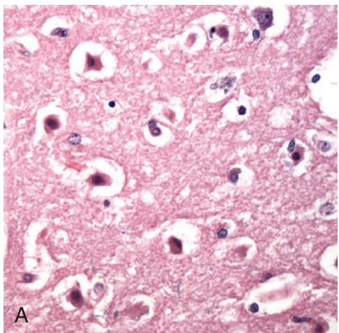 
Fig. 23.1 Patterns of neuronal injury. (A) Acute hypoxic-ischemic injury in the cerebral cortex. The cell bodies are shrunken and eosinophilic ("red neurons"), and the nuclei are pyknotic. (B) Reactive astrocytes, with eosinophilic cytoplasm and multiple radiating processes. (C) Collection of microglial cells forming a poorly defined nodule, a common finding in viral infections.
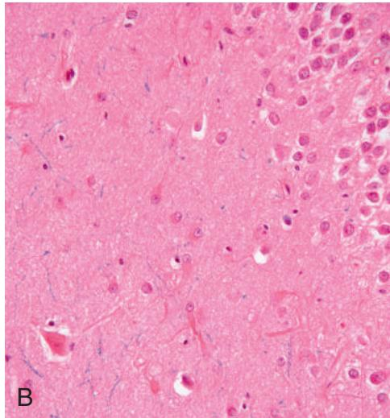
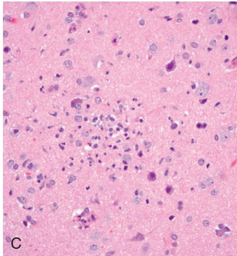
Astrocyte Injury and Repair. Astrocytes are the principal cells responsible for repair and scar formation in the brain, a process termed gliosis. In response to injury, astrocytes undergo both hypertrophy and hyperplasia. The nucleus enlarges and becomes vesicular, and the nucleolus becomes prominent. The cytoplasm expands and takes on a bright pink hue, and the cell extends multiple stout, ramifying processes (called gemistocytic astrocyte; see Fig. 23.1B). Unlike elsewhere in the body, fibroblasts participate in healing after brain injury to a limited extent except in specific settings (penetrating brain trauma or around abscesses). In long-standing gliosis, the cytoplasm of reactive astrocytes shrinks in size, and the cellular processes become more tightly interwoven (fibrillary astrocytes). Rosenthal fibers are thick, elongated, brightly eosinophilic protein aggregates found in astrocytic processes in chronic gliosis and in some low-grade gliomas.
Oligodendrocytes, which produce myelin, exhibit a limited spectrum of specific morphologic changes in response to various injuries. In progressive multifocal leukoencephalopathy, viral inclusions can be seen in oligodendrocytes, with a smudgy, homogeneous-appearing enlarged nucleus.
Microglial cells are long-lived cells derived from the embryonic yolk sac that function as the resident phagocytes of the CNS. When activated by tissue injury, infection, or trauma, they proliferate and become more prominent histologically. Microglial cells take on the appearance of activated macrophages in areas of demyelination, organizing infarct, or hemorrhage; in other settings such as infections, they develop elongated nuclei (rod cells). Aggregates of elongated microglial cells at sites of tissue injury are termed microglial nodules (see Fig. 23.1C). Similar collections can be found congregating around and phagocytosing injured neurons (neuronophagia).
Ependymal cells line the ventricular system and the central canal of the spinal cord. Certain pathogens, particularly cytomegalovirus (CMV), can produce extensive ependymal injury, with typical viral inclusions. Choroid plexus is in continuity with the ependyma, and its specialized epithelial covering is responsible for the secretion of cerebrospinal fluid (CSF).
# EDEMA, HERNIATION, AND HYDROCEPHALUS
The brain and spinal cord are encased within the skull and spinal canal, with nerves and blood vessels passing through specific foramina. The advantage of housing the delicate CNS within hard, rigid structures is obvious, but this arrangement provides little room for expansion of the brain in disease states. As a result, virtually any increase in the volume of the skull contents brings with it an increase in intracranial pressure. Substantial increases in the intracranial pressure compromise the ability of the cardiovascular system to deliver blood to the brain, resulting in decreased brain perfusion, with serious or fatal consequences. Disorders that may cause dangerous increases in the volume of intracranial contents include generalized cerebral edema, hydrocephalus, hemorrhages, ischemia, and mass lesions such as tumors.
# Cerebral Edema
Cerebral edema is the accumulation of excess fluid within the brain parenchyma. There are two types, which often occur together, particularly after generalized injury.
- Vasogenic edema occurs when the integrity of the normal blood-brain barrier is disrupted, allowing fluid to shift from the vascular compartment into the extracellular spaces of the brain. Vasogenic edema can be localized (e.g., the result of increased vascular permeability due to inflammation or in tumors) or generalized. 
- Cytotoxic edema is an increase in intracellular fluid secondary to neuronal and glial cell injury, as might follow generalized hypoxic or ischemic insult or exposure to certain toxins.
The edematous brain is softer than normal and often appears to "overfill" the cranial vault. In generalized
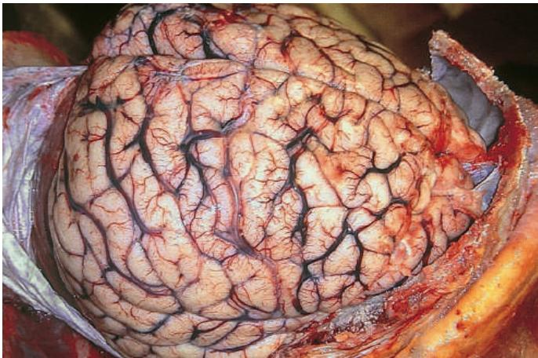 
Fig. 23.2 Cerebral edema. The surfaces of the gyri are flattened as a result of compression of the expanding brain by the dura mater and inner surface of the skull. Such changes are associated with a dangerous increase in intracranial pressure.
edema, the gyri are flattened, the intervening sulci are narrowed, and the ventricular cavities are compressed (Fig. 23.2).
# Hydrocephalus
After being produced by the choroid plexus within the ventricles, CSF circulates through the ventricular system and flows through the foramina of Luschka and Magendie into the subarachnoid space, where it is absorbed by arachnoid granulations. The balance between rates of generation and resorption regulates CSF volume.
Hydrocephalus refers to an increase in the volume of the CSF within the ventricular system. This disorder most often is a consequence of impaired flow or decreased resorption of CSF. If there is a localized obstacle to CSF flow within the ventricular system, then a portion of the ventricles enlarges while the remainder does not. This pattern is referred to as noncommunicating hydrocephalus and most commonly is caused by masses obstructing the foramen of Monro or compressing the cerebral aqueduct. In communicating hydrocephalus, the entire ventricular system is enlarged; it is usually caused by reduced CSF resorption.
If hydrocephalus develops in infancy before closure of the cranial sutures, the head enlarges. Once the sutures fuse, hydrocephalus causes ventricular expansion and increased intracranial pressure, but no change in head circumference (Fig. 23.3). In contrast to these disorders, in which increased CSF volume is the primary process, a compensatory increase in CSF volume (hydrocephalus ex vacuo) may occur secondary to a loss of brain volume from any underlying cause (e.g., infarction, neurodegenerative disease). In such settings, the hydrocephalus merely reflects the primary disorder and is of no clinical significance.
# Herniation
Herniation is the displacement of brain tissue from one compartment to another in response to increased intracranial pressure. The intra-cranial compartment is divided
by rigid dural folds (falx and tentorium). If the pressure is sufficiently high, portions of the brain are displaced across these rigid structures. This herniation often leads to compromise of the blood supply to compressed tissue, producing infarction, additional swelling, and further herniation.
There are three main types of herniation (Fig. 23.4):
- Subfalcine (cingulate) herniation occurs when unilateral or asymmetric expansion of a cerebral hemisphere displaces the cingulate gyrus under the edge of the falx. This may compress the anterior cerebral artery.
- Transtentorial (uncinate) herniation occurs when the medial aspect of the temporal lobe is compressed against the free margin of the tentorium. As the temporal lobe is displaced, the third cranial nerve is compromised, resulting in pupillary dilation and impaired ocular movements on the side of the lesion ("blown pupil"). The posterior cerebral artery may also be compressed, resulting in ischemic injury to tissue supplied by that vessel, including the primary visual cortex. With further displacement of the temporal lobe, pressure on the midbrain may compress the contralateral cerebral peduncle against the tentorium, resulting in hemiparesis ipsilateral to the side of the herniation. The compression of the peduncle creates a deformation known as Kernohan's notch. Compression of the midbrain and the ascending reticular activating system with transtentorial herniation leads to depressed consciousness. Progression of transtentorial herniation is often accompanied by linear or flame-shaped hemorrhages in the midbrain and pons, termed Duret hemorrhages (Fig. 23.5). These lesions usually occur in the midline and paramedian regions and are believed to be the result of tearing of penetrating veins and arteries supplying the upper brain stem.
- Tonsillar herniation refers to displacement of the cerebellar tonsils through the foramen magnum. This type of herniation causes brain stem compression and compromises vital respiratory and cardiac centers in the medulla, and is often fatal.
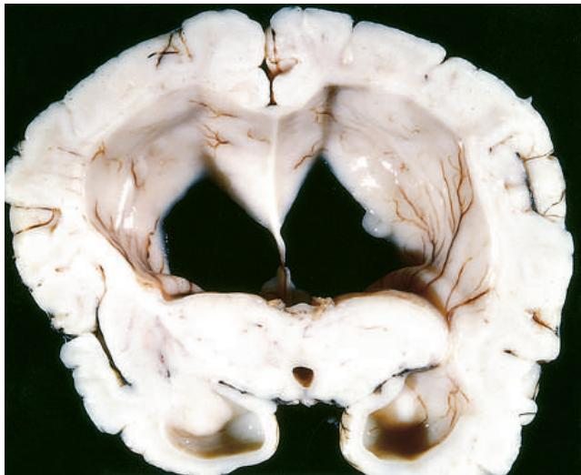 
Fig. 23.3 Hydrocephalus. Dilated lateral ventricles seen in a coronal section through the mid-thalamus.
..jpg) 
Fig. 23.4 Herniation syndromes. Displacement of brain parenchyma across fixed barriers can be subfalcine, transtentorial, or tonsillar (into the foramen magnum).
# EDEMA, HERNIATION, AND HYDROCEPHALUS
- Cerebral edema is the accumulation of excess fluid within the brain parenchyma. Hydrocephalus is defined as an increase in CSF volume within all or part of the ventricular system. 
- Increases in brain volume (as a result of increased CSF volume, edema, hemorrhage, or tumor) raise the pressure inside the fixed capacity of the skull. 
- Increases in pressure can damage the brain by decreasing perfusion or by displacing tissue across dural partitions inside the skull or through openings in the skull (herniations).
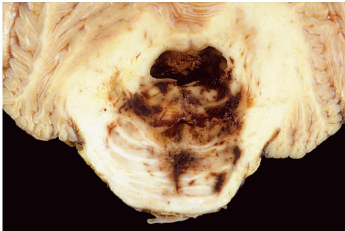 
Fig. 23.5 Duret hemorrhage. As mass effect displaces the brain downward, there is disruption of the vessels that enter the pons along the midline, leading to hemorrhage.
# CEREBROVASCULAR DISEASES
Cerebrovascular diseases are brain disorders caused by pathologic processes involving blood vessels. They are a major cause of death in the developed world and are the most prevalent cause of neurologic morbidity. The three main pathogenic mechanisms are (1) thrombotic occlusion, (2) embolic occlusion, and (3) vascular rupture. Stroke is the clinical designation applied to all of these conditions when symptoms begin acutely. Thrombosis and embolism have similar consequences for the brain: loss of oxygen and metabolic substrates, resulting in infarction or ischemic injury of regions supplied by the affected vessel. Similar injury occurs globally when there is complete loss of perfusion, severe hypoxemia (e.g., hypovolemic shock), or profound hypoglycemia. Hemorrhage accompanies rupture of vessels and leads to direct tissue damage as well as secondary ischemic injury. Traumatic vascular injury is discussed separately in the context of trauma.
# Hypoxia, Ischemia, and Infarction
The brain is a highly oxygen-dependent tissue that requires a continual supply of glucose and oxygen from the blood. Although it constitutes no more than $2\%$ of body weight, the brain receives $15\%$ of the resting cardiac output and is responsible for $20\%$ of total body oxygen consumption. Cerebral blood flow normally remains stable over a wide range of blood pressure and intracranial pressure because of autoregulation of vascular resistance. The brain may be deprived of oxygen by two general mechanisms:
- Functional hypoxia, caused by a low partial pressure of oxygen (e.g., high altitude), impaired oxygen-carrying capacity (e.g., severe anemia, carbon monoxide poisoning), or toxins that interfere with oxygen use (e.g., cyanide poisoning) 
- Ischemia, either transient or permanent, due to tissue hypoperfusion, which can be caused by hypotension, vascular obstruction, or both
# Global Cerebral Ischemia
Widespread ischemic-hypoxic injury can occur in the setting of severe systemic hypotension, usually when systolic pressures fall below $50\mathrm{mmHg}$ , as in cardiac arrest and shock. The clinical outcome varies with the severity and duration of the insult. When the insult is mild, there may be only a transient postischemic confusional state, with eventual complete recovery. Neurons are more susceptible to hypoxic injury than are glial cells, and the most susceptible neurons are the pyramidal cells of the hippocampus and neocortex and Purkinje cells of the cerebellum. In some individuals, even mild or transient global ischemic insults may cause damage to these vulnerable areas. In severe global cerebral ischemia, widespread neuronal death occurs irrespective of regional vulnerability. Patients who survive often remain severely impaired neurologically and in a persistent vegetative state. Other patients meet the clinical criteria for so-called "brain death," in which all voluntary and reflex brain and brain stem function is absent,
including respiratory drive. When patients with this form of irreversible injury are maintained on mechanical ventilation, the brain gradually undergoes autolysis, resulting in the so-called "respirator brain."
In the setting of global ischemia, the brain is swollen, with wide gyri and narrowed sulci. The cut surface shows poor demarcation between gray matter and white matter. The histopathologic changes that accompany irreversible ischemic injury (infarction) are grouped into three categories. Early changes, occurring 12 to 24 hours after the insult, include acute neuronal cell change (red neurons) (see Fig. 23.1A) characterized initially by microvacuolation, followed by cytoplasmic eosinophilia, and later nuclear pyknosis and karyorrhexis. Similar changes occur somewhat later in astrocytes and oligodendroglia. After this, the reaction to tissue damage begins with infiltration of neutrophils (Fig. 23.6A). Subacute changes, occurring at 24 hours to 2 weeks, include necrosis of tissue, influx of macrophages, vascular proliferation, and reactive gliosis (see Fig. 23.6B). Repair, seen after 2 weeks, is characterized by removal of necrotic tissue and gliosis (see Fig. 23.6C).
Border zone ("watershed") infarcts occur in regions of the brain and spinal cord that lie at the most distal portions of arterial territories. They are usually seen after hypotensive episodes. In the cerebral hemispheres, the border zone between the anterior and the middle cerebral artery distributions is at greatest risk. Damage to this region produces a wedge-shaped band of necrosis over the cerebral convexity a few centimeters lateral to the interhemispheric fissure.
# Focal Cerebral Ischemia
Cerebral arterial occlusion leads first to focal ischemia and then to infarction in the distribution of the compromised vessel. The size, location, and shape of the infarct and the
extent of tissue damage that results may be modified by collateral blood flow. Specifically, collateral flow through the circle of Willis or cortical-leptomeningeal anastomoses can limit damage in some regions. By contrast, there is little if any collateral blood flow to structures such as the thalamus, basal ganglia, and deep white matter, which are supplied by deep penetrating vessels.
Embolic infarctions are more common than infarctions due to thrombosis. Cardiac mural thrombi are a frequent source of emboli; myocardial dysfunction, valvular disease, and atrial fibrillation are important predisposing factors. Thromboemboli also arise in arteries, most often from atheromatous plaques in the carotid arteries or aortic arch. Emboli of venous origin may cross over to the arterial circulation through a patent foramen ovale and lodge in the brain (paradoxical embolism; see Chapter 4); these include thromboemboli from deep leg veins and fat emboli, usually following bone trauma. The territory of the middle cerebral artery, a direct extension of the internal carotid artery, is most frequently affected by embolic infarction. Emboli tend to lodge where vessels branch or in areas of stenosis, usually caused by atherosclerosis.
Thrombotic occlusions causing cerebral infarctions usually are superimposed on atherosclerotic plaques; common sites are the carotid bifurcation, the origin of the middle cerebral artery, and either end of the basilar artery. These occlusions may be accompanied by anterograde extension, as well as thrombus fragmentation and distal embolization. Thrombotic occlusions causing small infarcts of only a few millimeters in diameter, so-called "lacunar infarcts," occur when small penetrating arteries occlude due to chronic damage, usually from long-standing hypertension (discussed later).
Infarcts can be divided into two broad groups (Fig. 23.7). Nonhemorrhagic infarcts result from acute vascular occlusions and may evolve into hemorrhagic infarcts when there is reperfusion of ischemic tissue, either through collaterals or after dissolution of emboli.
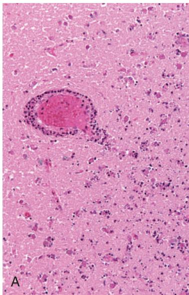 
Fig. 23.6 Cerebral infarction. (A) Infiltration of a cerebral infarction by neutrophils begins at the edges of the lesion, where the vascular supply is intact. (B) By day 10, an area of infarction shows the presence of macrophages and surrounding reactive gliosis. (C) Old intracortical infarcts are seen as areas of tissue loss and residual gliosis.
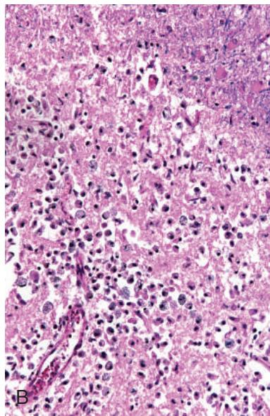
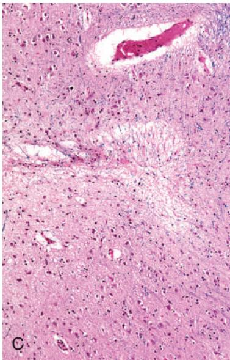

Hemorrhagic infarcts usually manifest as multiple, sometimes confluent, petechial hemorrhages (Fig. 23.7A and B). The microscopic picture and evolution of hemorrhagic infarction parallel those of ischemic infarction, with the addition of blood extravasation and resorption. In individuals with coagulopathies, hemorrhagic infarcts may be associated with extensive intracerebral hematomas.
The macroscopic appearance of a nonhemorrhagic infarct evolves over time. During the first 6 hours, the tissue is unchanged in appearance, but by 48 hours, the tissue becomes pale, soft, and swollen. From days 2 to 10, the injured brain turns gelatinous and friable, and the boundary between normal and abnormal tissue becomes more distinct as edema resolves in the adjacent viable tissue. From day 10 to week 3, the tissue liquefies, eventually leaving a fluid-filled cavity, which gradually expands as dead tissue is resorbed (see Fig. 23.7C).
Microscopically, the tissue reaction follows a characteristic sequence. After the first 12 hours, ischemic neuronal change (red neurons) (see Fig. 23.1A) and cytotoxic and vasogenic edema appear. Endothelial and glial cells, mainly astrocytes, swell, and myelinated fibers begin to disintegrate. During the first several days neutrophils infiltrate the area of injury, but these are replaced over the next 2-3 weeks by macrophages. Macrophages containing myelin or red blood cell breakdown products may persist in the lesion for months to years. As the process of phagocytosis and liquefaction proceeds, astrocytes at the edges of the lesion progressively enlarge, divide, and develop a prominent network of cytoplasmic extensions. After several months, the striking astrocytic nuclear and cytoplasmic enlargement regresses. In the wall of the cavity, astrocyte processes form a dense feltwork of glial fibers admixed with new capillaries and a few perivascular connective tissue fibers.
# Intracranial Hemorrhage
Hemorrhages within the brain are caused by (1) hypertension and other diseases leading to vascular wall injury, (2) structural lesions such as arteriovenous and cavernous malformations, and (3) tumors. Subarachnoid hemorrhages most commonly are the result of ruptured aneurysms but also occur with other vascular malformations. Subdural or epidural hemorrhages usually are associated with trauma.
# Primary Brain Parenchymal Hemorrhage
Spontaneous (nontraumatic) intraparenchymal hemorrhages are most common in mid to late adult life, with a peak incidence at about 60 years of age. Most are due to the rupture of a small intraparenchymal vessel. Hypertension is the leading underlying cause, and brain hemorrhage accounts for roughly $15\%$ of deaths among individuals with chronic hypertension. Intracerebral hemorrhage can be clinically devastating when it affects large portions of the brain or extends into the ventricular system; alternatively, it can affect small regions and be clinically silent. Hypertensive intraparenchymal hemorrhages typically occur in the basal ganglia, thalamus, pons, and
intraparenchymalhemorrhag.jpg)
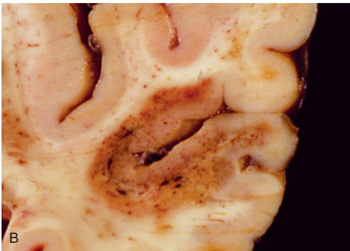
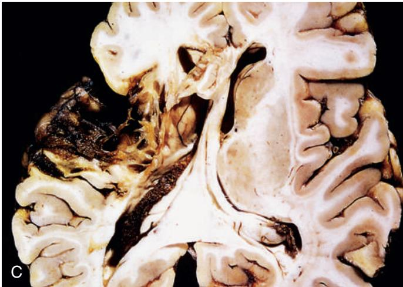 
Fig. 23.7 Cerebral infarction. (A) Section of the brain showing a large, discolored, focally hemorrhagic region in the left middle cerebral artery distribution (hemorrhagic, or red, infarction). (B) An infarct with punctate hemorrhages, consistent with ischemia-reperfusion injury, is present in the temporal lobe. (C) Old cystic infarct shows destruction of cortex and surrounding gliosis.
cerebellum (Fig. 23.8), with the location and the size of the bleed determining its clinical manifestations. If the individual survives the acute event, gradual resolution of the hematoma ensues, sometimes with considerable clinical improvement.
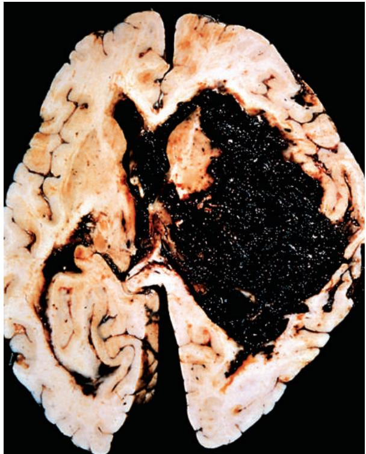 
Fig. 23.8 Cerebral hemorrhage. Massive hypertensive hemorrhage rupturing into a lateral ventricle.
In acute intracerebral hemorrhage, the extravasated blood compresses the adjacent parenchyma. With time, hemorrhages are converted to a cavity with a brown, discolored rim. On microscopic examination, early lesions consist of clotted blood surrounded by edematous brain tissue containing neurons and glia displaying morphologic changes typical of anoxic injury. Eventually the edema resolves, pigment- and lipid-laden macrophages appear, and proliferation of reactive astrocytes becomes visible at the periphery of the lesion. The cellular events then follow the same time course observed after cerebral infarction.
# Cerebral Amyloid Angiopathy
Cerebral amyloid angiopathy (CAA) is a disease in which the same amyloidogenic peptides as those found in Alzheimer disease (discussed later) deposit in the walls of medium- and small-caliber meningeal and cortical vessels. The amyloid confers a rigid, pipe-like appearance and stains with Congo red. Amyloid deposition weakens vessel walls and increases the risk for hemorrhages, which differ in distribution from those associated with hypertension. CAA-associated hemorrhages often occur in the lobes of the cerebral cortex (lobar hemorrhages). In addition to these symptomatic hemorrhages, CAA also results in small (<1 mm) cortical hemorrhages (microhemorrhages).
# Subarachnoid Hemorrhage and Saccular Aneurysms
The most frequent cause of clinically significant nontraumatic subarachnoid hemorrhage is rupture of a saccular
(berry) aneurysm. Hemorrhage into the subarachnoid space also may result from vascular malformation, trauma, rupture of an intracerebral hemorrhage into the ventricular system, coagulopathies, and tumors.
In about one-third of cases, rupture of a saccular aneurysm occurs at the time of an acute increase in intracranial pressure, such as occurs with straining at stool or sexual orgasm. Blood under arterial pressure is forced into the subarachnoid space, and the patient is stricken with sudden, excruciating headache (known as a thunderclap headache, often described as "the worst headache I've ever had") and rapidly loses consciousness. Between $25\%$ and $50\%$ of affected individuals die from the first bleed, and recurrent bleeds are common in survivors. Not surprisingly, the prognosis worsens with each bleeding episode.
About $90\%$ of saccular aneurysms occur in the anterior circulation near major arterial branch points (Fig. 23.9); multiple aneurysms exist in $20\%$ to $30\%$ of cases. The aneurysms are not present at birth but develop over time because of underlying defects in the vessel media. There is an increased risk for aneurysms in patients with autosomal dominant polycystic kidney disease (Chapter 14) and genetic disorders of extracellular matrix proteins (e.g., Ehler-Danlos syndrome). Overall, roughly $1.3\%$ of aneurysms bleed per year, with the probability of rupture increasing with size. For example, aneurysms larger than $1\mathrm{cm}$ in diameter have a roughly $50\%$ risk for bleeding per year. In the early period after a subarachnoid hemorrhage, there is an additional risk for ischemic injury from vasospasm of other vessels. Healing and the attendant meningeal fibrosis and scarring sometimes obstruct CSF flow or disrupt CSF resorption, leading to hydrocephalus.
A saccular aneurysm is a thin-walled outpouching of an artery (Fig. 23.10). Beyond the neck of the aneurysm, the muscular wall and intimal elastic lamina are absent, such that the aneurysm sac is lined only by thickened hyalinized intima. The adventitia covering the sac is continuous with that of the parent artery. Rupture usually occurs at the apex of the sac, releasing blood into the subarachnoid space, the substance of the brain, or both.
In addition to saccular aneurysms, atherosclerotic, mycotic, traumatic, and dissecting aneurysms also occur intracranially. The last three types (like saccular aneurysms) most often are found in the anterior circulation, whereas atherosclerotic aneurysms frequently are fusiform and most commonly involve the basilar artery. Nonsaccular aneurysms usually manifest as cerebral infarction due to vascular occlusion instead of subarachnoid hemorrhage.
# Vascular Malformations
Vascular malformations of the brain are classified into four principal types based on the nature of the abnormal vessels: arteriovenous malformations (AVMs), cavernous
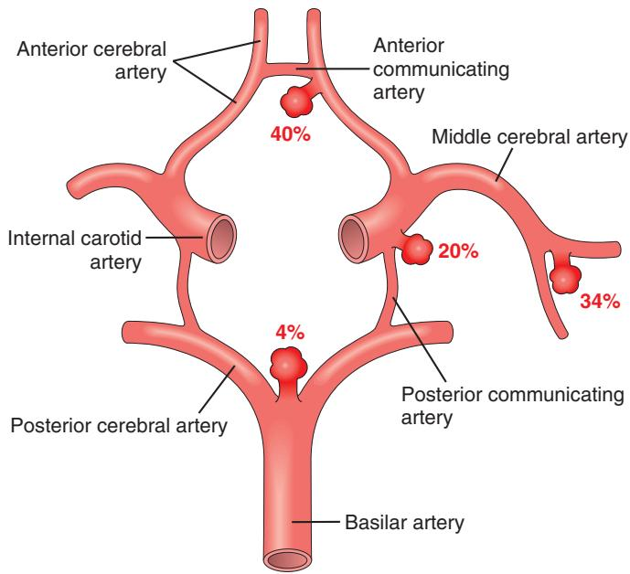 
Fig. 23.9 Common sites of saccular aneurysms.
malformations, capillary telangiectasias, and venous angiomas. AVMs, the most common of these, affect males twice as frequently as females and most commonly manifest between 10 and 30 years of age with seizures, an intracerebral hemorrhage, or a subarachnoid hemorrhage. In the newborn period, large AVMs may lead to high-output congestive heart failure because of blood shunting from arteries to veins. The risk for bleeding makes AVM the most dangerous type of vascular malformation. Multiple AVMs can be seen in the setting of hereditary hemorrhagic telangiectasia, an autosomal dominant condition often associated with mutations affecting the TGFβ pathway.
AVMs may involve subarachnoid vessels extending into brain parenchyma or occur exclusively within the brain. On gross inspection, they resemble a tangled network of wormlike vascular channels (Fig. 23.11). Microscopic examination shows enlarged blood vessels separated by gliotic tissue, often with evidence of previous hemorrhage. Some vessels can be recognized as arteries with duplicated and fragmented internal elastic lamina, while others show marked thickening or partial replacement of the media by hyalinized connective tissue.
Cavernous malformations consist of distended, loosely organized vascular channels with thin collagenized walls without intervening nervous tissue. They occur most often in the cerebellum, pons, and subcortical regions, and have a low blood flow without significant arteriovenous shunting. Foci of old hemorrhage, infarction, and calcification frequently surround the abnormal vessels.
Capillary telangiectasias are microscopic foci of dilated thin-walled vascular channels separated by relatively normal brain parenchyma that occur most frequently in the pons. Venous angiomas (varices) consist of aggregates of ectatic venous channels. These latter two types of vascular malformation are unlikely to bleed or to cause symptoms, and most are incidental findings.
# Other Vascular Diseases
# Hypertensive Cerebrovascular Disease
Hypertension causes hyaline arteriolar sclerosis of the deep penetrating arteries and arterioles that supply the basal ganglia, the hemispheric white matter, and the brain stem. Affected arteriolar walls are weakened and are more vulnerable to rupture. In some instances, minute aneurysms (Charcot-Bouchard microaneurysms) form in vessels less than $300\mu \mathrm{m}$ in diameter. In addition to massive intracerebral
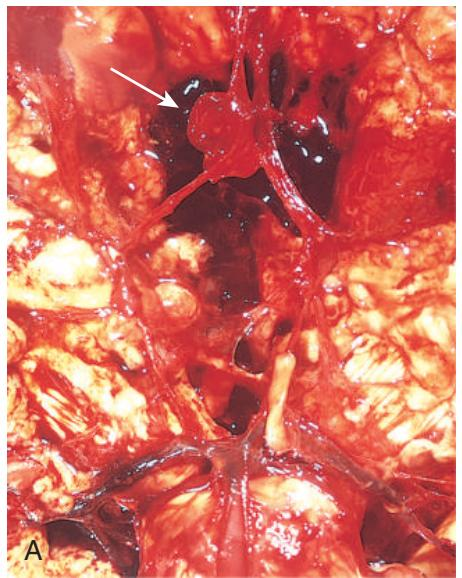 
Fig. 23.10 Saccular aneurysms. (A) View of the base of the brain, dissected to show the circle of Willis with an aneurysm of the anterior cerebral artery (arrow). (B) The circle of Willis is dissected to show a large aneurysm. (C) Section through a saccular aneurysm showing the hyalinized fibrous vessel wall. Hematoxylin-eosin stain.
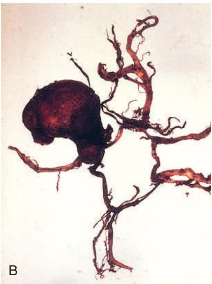
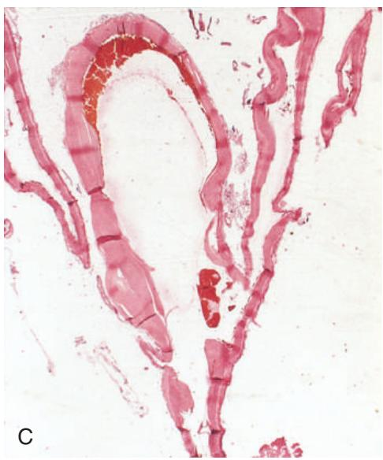
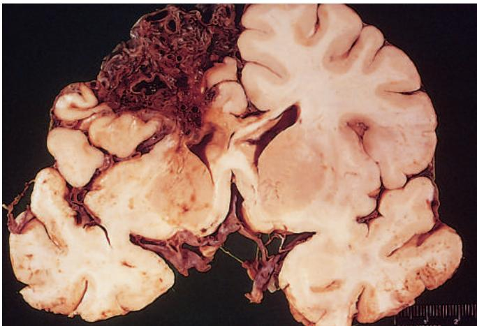 
Fig. 23.11 Arteriovenous malformation.
hemorrhage (discussed earlier), several other pathologic outcomes are related to hypertension.
- Lacunes or lacunar infarcts are small cavitary infarcts, just a few millimeters in size, that are found most commonly in the deep gray matter (basal ganglia and thalamus), the internal capsule, the deep white matter, and the pons. They are caused by occlusion of a single penetrating branch of a large cerebral artery. Depending on their location, lacunes can be silent clinically or cause significant neurologic impairment. 
- Rupture of the small-caliber penetrating vessels may occur, leading to the development of small hemorrhages. In time, these hemorrhages resorb, leaving behind a slit-like cavity (slit hemorrhage) surrounded by brownish discoloration. 
- Acute hypertensive encephalopathy most often is associated with sudden sustained increases in diastolic blood pressure to greater than $130\mathrm{mmHg}$ . It is characterized by increased intracranial pressure and global cerebral dysfunction, manifesting as headaches, confusion, vomiting, convulsions, and sometimes coma. Rapid therapeutic intervention to reduce the blood pressure is essential. Postmortem examination may show brain edema, with or without transtentorial or tonsillar herniation. Petechiae and fibrinoid necrosis of arterioles in the gray matter and white matter may be seen microscopically.
# Vasculitis
Inflammatory processes involving blood vessels may compromise blood flow and cause cerebral dysfunction or infarction. Infectious arteritis of small and large vessels was previously seen mainly in association with syphilis and tuberculosis, but is now more often caused by opportunistic infections (such as aspergillosis, herpes zoster, or CMV) in the setting of immunosuppression. Some systemic forms of vasculitis, such as polyarteritis nodosa, may involve cerebral vessels and cause single or multiple infarcts. Primary angiitis of the CNS is a form of vasculitis that involves multiple small- to medium-sized parenchymal and subarachnoid vessels and is characterized by chronic inflammation, multinucleate giant cells (with or without granuloma formation), and destruction
of vessel walls. Affected individuals present with a diffuse encephalopathy, often with cognitive dysfunction. Treatment consists of immunosuppressive agents.
# CEREBROVASCULAR DISEASES
- Stroke is the clinical term for acute-onset neurologic deficits resulting from hemorrhagic or obstructive vascular lesions. 
- Cerebral infarction follows loss of blood supply and can be widespread or focal, or affect regions with the least robust vascular supply ("watershed" infarcts). 
- Focal cerebral infarcts are most commonly embolic; with subsequent dissolution of the embolus and reperfusion, a nonhemorrhagic infarct can become hemorrhagic. 
- Primary intraparenchymal hemorrhages typically are due to either hypertension (most commonly in white matter, deep gray matter, or posterior fossa contents) or cerebral amyloid angiopathy (cerebral cortex). 
- Spontaneous subarachnoid hemorrhage usually is caused by a structural vascular abnormality, such as an aneurysm or arteriovenous malformation.
# CENTRAL NERVOUS SYSTEM TRAUMA
Trauma to the brain and spinal cord is a significant cause of death and disability. The severity and site of injury affect the outcome: injury of several cubic centimeters of brain parenchyma may be clinically silent (if in the frontal lobe), severely disabling (affecting the spinal cord), or fatal (involving the brain stem).
A blow to the head may be penetrating or blunt; it may cause an open or a closed injury. The magnitude and distribution of resulting traumatic brain lesions depend on the shape of the object causing the trauma, the force of impact, and whether the head is in motion at the time of injury. Severe brain damage can occur in the absence of external signs of head injury, and conversely, severe lacerations and even skull fractures do not necessarily indicate damage to the underlying brain. When the brain is damaged, the injuries may involve the parenchyma, the vasculature, or both.
# Traumatic Parenchymal Injuries
When an object impacts the head, brain injury may occur at the site of impact—a coup injury—or opposite the site of impact on the other side of the brain—a contrecoup injury. Both coup and contrecoup lesions are contusions, with comparable gross and microscopic appearances. A contusion is caused by rapid tissue displacement, disruption of vascular channels, and subsequent hemorrhage, tissue injury, and edema. Since they are closest to the skull, the crests of the gyri are the parts of the brain that are most susceptible to traumatic injury. Contusions are common in regions of the brain overlying rough and irregular inner skull surfaces, such as the orbitofrontal regions and the temporal lobe tips. Penetration of the brain by a projectile
such as a bullet or a skull fragment from a fracture causes a laceration, with tissue tearing, vascular disruption, and hemorrhage.
Contusions are wedge-shaped, with the widest aspect closest to the point of impact (Fig. 23.12A). Within a few hours of injury, blood extravasates throughout the involved tissue, across the width of the cerebral cortex, and into the white matter and subarachnoid spaces. Although functional effects are seen earlier, morphologic evidence of neuronal injury (nuclear pyknosis, cytoplasmic eosinophilia, cellular disintegration) takes about 24 hours to appear. The inflammatory response to the injured tissue follows its usual course, with neutrophils preceding the appearance of macrophages. In contrast with ischemic lesions, in which the superficial layer of cortex may be preserved, trauma affects the superficial layers most severely.
Old traumatic lesions characteristically appear as depressed, retracted, yellowish brown patches involving the crests of gyri (see Fig. 23.12B). These lesions show gliosis and residual hemosiderin-laden macrophages.
Although contusions are more easily seen, trauma may also cause more subtle but widespread injury to axons within the brain (called diffuse axonal injury), sometimes with devastating consequences. The movement of one region of brain relative to another is thought to disrupt axonal integrity and function. Angular acceleration, even in the absence of impact, may cause axonal injury as well as hemorrhage. As many as $50\%$ of patients who develop coma shortly after trauma are believed to have white matter damage and diffuse axonal injury, usually in the form of axonal swellings that appear within hours of the injury.
Concussion describes reversible altered brain function, with or without loss of consciousness, from head injury. The characteristic transient neurologic dysfunction includes loss of consciousness, temporary respiratory arrest, and loss of reflexes. Neurologic recovery is the norm, although amnesia for the event persists. The pathogenesis of the sudden disruption of nervous activity is unknown. Repeated episodes of concussion can result in persistent and profound neurologic deficits including cognitive impairment, parkinsonism, and others, and later development of neurodegenerative processes. Initially described in boxers (dementia pugilistica), it is now recognized to occur in a wider range of settings, such as in athletes participating in contact sports. This syndrome is termed chronic traumatic encephalopathy and is characterized by accumulation of tangles in cerebral cortex and other brain regions (see the "Neurodegenerative Diseases" section later in the chapter).
# Traumatic Vascular Injury
CNS trauma often directly disrupts vessel walls, leading to hemorrhage (Table 23.1). Depending on the affected vessel, the hemorrhage may be epidural, subdural, subarachnoid, or intraparenchymal (Fig. 23.13A), occurring alone or in combination. Subarachnoid and intraparenchymal
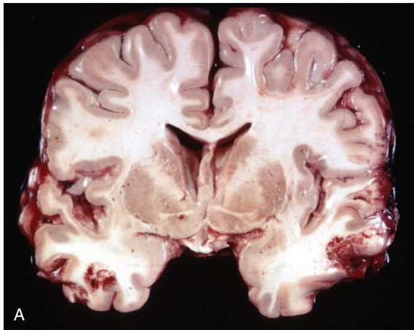
Acutecontusionsarepresentinbothtemporallobes,withareasofhemorrhageandtissuedisruption.(B)Remotecontusions,seenasdiscoloredyellowareas,arepresentontheinferiorfrontalsurfaceofthisbrain..jpg) 
Fig. 23.12 Cerebral trauma. (A) Acute contusions are present in both temporal lobes, with areas of hemorrhage and tissue disruption. (B) Remote contusions, seen as discolored yellow areas, are present on the inferior frontal surface of this brain.
hemorrhages most often occur at sites of contusions and lacerations.
# Epidural Hematoma
Dural vessels—especially the middle meningeal artery—are vulnerable to traumatic injury. In infants, traumatic displacement of the easily deformable skull may tear a vessel, even in the absence of a skull fracture. In children and adults, by contrast, tears involving dural vessels almost always stem from skull fractures. Once a vessel tears, blood accumulates under arterial pressure and dissects the tightly applied dura away from the inner skull surface (see Fig. 23.13B), producing a hematoma that compresses the brain surface. Clinically, patients can be lucid for several hours after the traumatic event before neurologic signs appear. An epidural hematoma may expand rapidly and constitutes a neurosurgical emergency necessitating prompt drainage and repair to prevent death.
# Subdural Hematoma
Rapid movement of the brain during trauma can tear the bridging veins that extend from the cerebral hemispheres
Table 23.1 Patterns of Vascular Injury in the Central Nervous System 
LocationEtiologyAdditional FeaturesEpidural spaceTraumaUsually associated with a skull fracture (in adults); rapidly evolving neurologic symptoms requiring interventionSubdural spaceTraumaLevel of trauma may be mild; slowly evolving neurologic symptoms, often with a delay from the time of injurySubarachnoid spaceVascular abnormalities (arteriovenous malformation or aneurysm)Sudden onset of severe headache, often with rapid neurologic deterioration; secondary injury may emerge due to vasospasmTraumaTypically associated with underlying contusionsIntraparenchymalTrauma (contusions)Selective involvement of the crests of gyri where the brain contacts the skull (frontal and temporal tips, orbitofrontal surface)Hemorrhagic conversion of an ischemic infarctionPetechial hemorrhages in an area of previously ischemic brain, usually following the cortical ribbonCerebral amyloid angiopathy“Lobar” hemorrhage, involving cerebral cortex, often with extension into the subarachnoid spaceHypertensionCentered in the deep white matter, thalamus, basal ganglia, or brain stem; may extend into the ventricular systemTumors (primary or metastatic)Associated with high-grade gliomas or certain metastases (melanoma, choriocarcinoma, renal cell carcinoma)
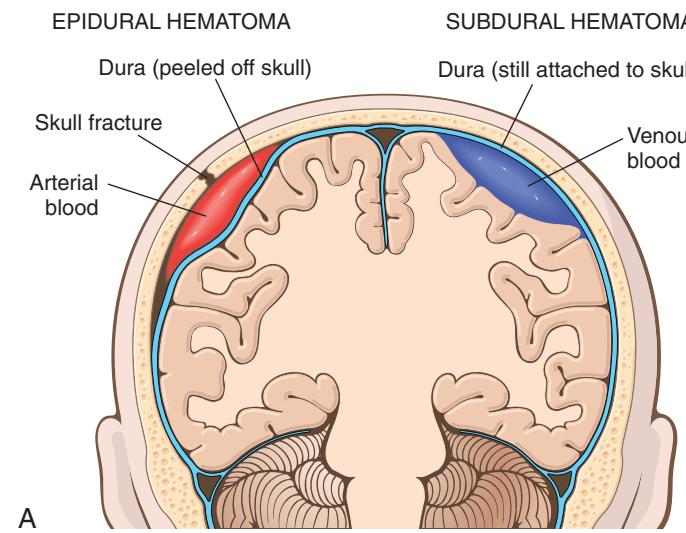
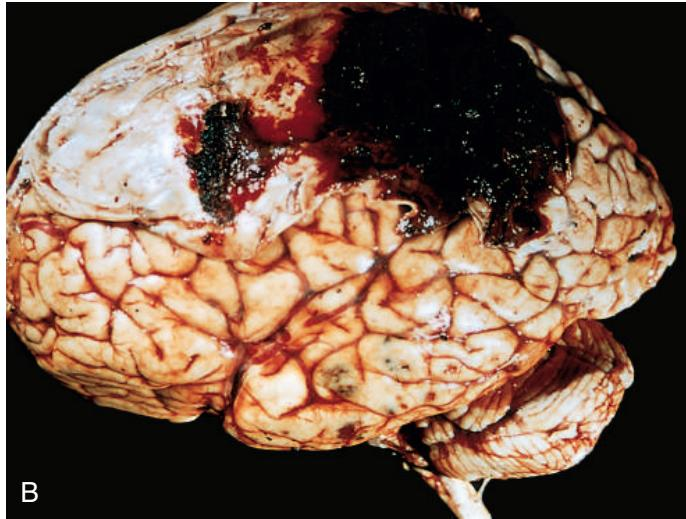 
Fig. 23.13 Traumatic intracranial hemorrhages. (A) Epidural hematoma (left) in which rupture of a meningeal artery, usually associated with a skull fracture, has led to accumulation of arterial blood between the dura and the skull. In a subdural hematoma (right), damage to bridging veins between the brain and the superior sagittal sinus has led to the accumulation of blood between the two layers of dura. (B) Epidural hematoma covering a portion of the dura. (C) Large organizing subdural hematoma attached to the dura. (D, Courtesy of the late Dr. Raymond D. Adams, Massachusetts General Hospital, Boston, Massachusetts.)
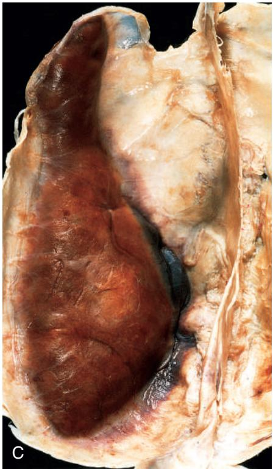
through the subarachnoid and subdural space to the dural sinuses. Their disruption produces bleeding into the subdural space. Because the inner cell layer of the dura is quite thin and in very close proximity to the arachnoid layer, the blood appears to be between the dura and arachnoid, but in reality it is between the two layers of the dura. In patients with brain atrophy, the bridging veins are stretched out and the brain has additional space within which to move, accounting for the higher rate of subdural hematomas in older adults. Infants also are susceptible to subdural hematomas because their bridging veins are thin walled.
Subdural hematomas typically become manifest within the first 48 hours after injury. They are most common over the lateral aspects of the cerebral hemispheres and may be bilateral. Neurologic signs are attributable to the pressure exerted on the adjacent brain. Symptoms are most often nonlocalizing, taking the form of headache, confusion, and slowly progressive neurologic deterioration.
Acute subdural hematoma appears as a collection of freshly clotted blood apposed to the contour of the brain surface, without extension into the depths of sulci (see Fig. 23.13C). The underlying brain is flattened, and the subarachnoid space is often clear. Subdural hematomas organize by lysis of the clot (about 1 week), growth of granulation tissue from the dural surface into the hematoma (2 weeks), and fibrosis (1-3 months). Subdural hematomas commonly rebleed, presumably from the thin-walled vessels of the granulation tissue, leading to microscopic findings consistent with hemorrhages of varying ages. Symptomatic subdural hematomas are treated by surgical removal of the blood and associated reactive tissue.
# CENTRAL NERVOUS SYSTEM TRAUMA
- Physical injury to the brain can occur when the inside of the skull comes into forceful contact with the brain. 
- In blunt trauma, there may be brain injury both at the original point of contact (coup injury) and on the opposite side of the brain (contrecoup injury) owing to impacts with the skull. 
- Rapid displacement of the head and brain can tear axons (diffuse axonal injury), often causing severe, irreversible neurologic deficits. 
- Traumatic tearing of blood vessels, depending on the location, leads to epidural, subdural, or intraparenchymal hematoma as well as subarachnoid hemorrhage.
# CONGENITAL MALFORMATIONS AND PERINATAL BRAIN INJURY
The incidence of CNS malformations, giving rise to mental retardation, cerebral palsy, or neural tube defects, is
estimated at $1\%$ to $2\%$ . Malformations of the brain are more common in the setting of multiple birth defects. Prenatal or perinatal insults may interfere with normal CNS development or cause tissue damage. During gestation, the timing of an injury determines the pattern of malformation, with earlier events typically leading to more severe phenotypes. Mutations affecting genes that regulate the differentiation, maturation, or intercellular communication of neurons or glial cells can cause CNS malformation or dysfunction. Additionally, various chemicals and infectious agents have teratogenic effects.
Some developmental disorders produce profound neuronal dysfunction in the absence of morphologic abnormalities. Genetic underpinnings for various forms of autism have emerged recently; many of the implicated genes contribute to the development or maintenance of synaptic connections. Rett syndrome is an X-linked dominant disorder associated with mutations in the gene encoding a regulator of epigenetic modifications of chromatin. Development in affected girls initially is normal, but neurologic deficits affecting cognition and movement appear by 1 to 2 years of age.
# Malformations
# Neural Tube Defects
One of the earliest steps in brain development is the formation of the neural tube, which gives rise to the ventricular system, brain, and spinal cord. Partial failure or reversal of neural tube closure may lead to several malformations, each characterized by abnormalities involving neural tissue, meninges, and overlying bone or soft tissues. Collectively, neural tube defects are the most frequent type of CNS malformation. Folate deficiency during the first trimester sharply increases risk through uncertain mechanisms and represents an important opportunity for prevention, as administration of folate to women of child-bearing age reduces the incidence of neural tube defects by up to $70\%$ . The combination of imaging studies and maternal screening for elevated $\alpha$ -fetoprotein has increased the early detection of neural tube defects.
Neural tube defects include the following: 
- The most common defects involve the posterior end of the neural tube, from which the spinal cord forms. These can range from asymptomatic bony defects (spina bifida occulta) to spina bifida, a severe malformation consisting of a flat, disorganized segment of spinal cord associated with an overlying meningeal outpouching. 
- Myelomeningocele is an extension of CNS tissue through a defect in the vertebral column that occurs most commonly in the lumbosacral region (Fig. 23.14). Patients have motor and sensory deficits in the lower extremities and problems with bowel and bladder control. The clinical problems derive from the abnormal spinal cord segment and often are compounded by infections extending from the thin or ulcerated overlying skin. 
- Anencephaly is a malformation of the anterior end of the neural tube that leads to the absence of the forebrain and the top of the skull. Varying amounts of posterior fossa structures may be present.
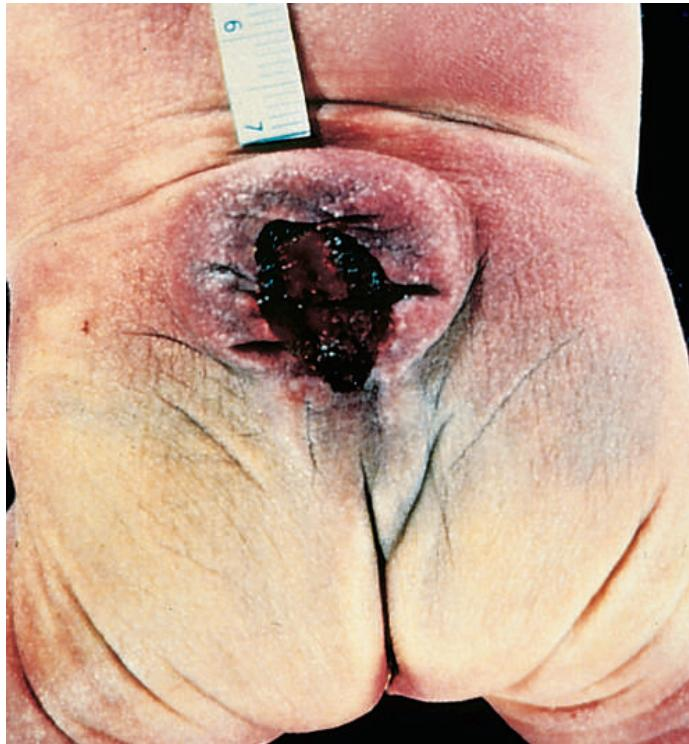 
Fig. 23.14 Myelomeningocele. Both meninges and spinal cord parenchyma are included in the cystlike structure visible just above the buttocks.
- An encephalocele is a diverticulum of malformed CNS tissue extending through a defect in the cranium. It most often involves the occipital region or the posterior fossa. When it occurs anteriorly, brain tissue may extend into the sinuses.
# Forebrain Malformations
Microencephaly describes the group of malformations in which the volume of brain is too small; usually it is associated with a small head as well (microcephaly). It has a wide range of associations, including chromosome abnormalities, fetal alcohol syndrome, and human immunodeficiency virus (HIV) and Zika virus infection acquired in utero. The unifying feature is decreased generation of neurons destined for the cerebral cortex. During the early stages of brain development, as progenitor cells proliferate in the subependymal ventricular zone, the balance between cells leaving the progenitor population to form the cortex and those remaining in the proliferating pool affects the overall number of neurons and glial cells generated. If too many cells leave the progenitor pool prematurely, there is inadequate generation of mature neurons, leading to a small brain. Megalencephaly, excessive brain volume that is always associated with a large head, is far less common and is mostly associated with rare genetic disorders.
Disruption of neuronal migration and differentiation during development can lead to abnormalities of gyration and neocortical architecture, often taking the form of neurons ending up in the wrong location. Mutations in various genes that control migration result in a variety of malformations. A representative example is holoprosencephaly, characterized by disruption of normal midline
patterning. Mild forms show absence of the olfactory bulbs and related structures (arrhinencephaly). In severe forms, the brain is not divided into hemispheres or lobes, and there may be facial midline defects such as cyclopia. The best known genetic causes involve acquired or inherited loss of function mutations in components of the Hedgehog signaling pathway.
Other examples include loss of gyri, which may be complete (lissencephaly) or partial, and increased number of irregularly formed gyri (polymicrogyria).
# Posterior Fossa Anomalies
The most common malformations in this region of the brain result in misplacement or absence of portions of the cerebellum.
- Arnold-Chiari malformation (Chiari type II malformation) combines a small posterior fossa with a misshapen midline cerebellum and downward extension of the vermis through the foramen magnum; hydrocephalus and a lumbar myelomeningocele typically are also present. 
- The far milder Chiari type I malformation has low-lying cerebellar tonsils that extend through the foramen magnum. Excess tissue in the foramen magnum results in partial obstruction of CSF flow and compression of the medulla, with symptoms of headache or cranial nerve deficits often manifesting only in adult life. Surgical intervention can alleviate the symptoms. 
- Dandy-Walker malformation is characterized by an enlarged posterior fossa, absence of the cerebellar vermis, and a large midline cyst.
# Perinatal Brain Injury
Brain injury occurring in the perinatal period is an important cause of childhood neurologic disability. Cerebral palsy is a term for nonprogressive neurologic motor deficits characterized by spasticity, dystonia, ataxia or athetosis, and paresis attributable to injury occurring during the prenatal and perinatal periods. Signs and symptoms may not be apparent at birth and only declare themselves later, well after the causal event.
The two major types of injury that occur in the perinatal period are hemorrhages and infarcts. These differ from the otherwise similar lesions in adults in terms of their locations and the tissue reactions they engender. In premature infants, there is an increased risk for intraparenchymal hemorrhage within the germinal matrix, most often adjacent to the anterior horn of the lateral ventricle. Hemorrhages may extend into the ventricular system and from there to the subarachnoid space, sometimes causing hydrocephalus. Infarcts may occur in the supratentorial periventricular white matter (periventricular leukomalacia), especially in premature infants. The residua of these infarcts are chalky yellow plaques consisting of discrete regions of white matter necrosis and dystrophic calcification (Fig. 23.15). When severe enough to involve the gray matter and white matter, large cystic lesions can develop throughout the hemispheres, a condition termed multicystic encephalopathy.
Certain infections, which may be acquired transplacentially or during birth, have a propensity to cause destructive
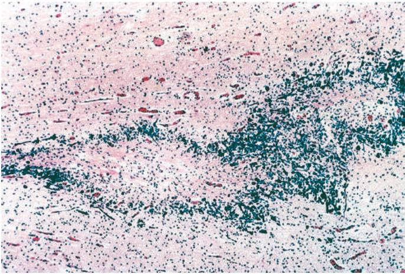 
Fig. 23.15 Perinatal brain injury. This specimen from a patient with periventricular leukomalacia contains a central focus of white matter necrosis with a peripheral rim of mineralized axonal processes.
brain lesions. Agents in this group (commonly referred to as TORCH) include toxoplasmosis and CMV, which can both result in parenchymal calcifications along with the tissue injury; these are discussed in more detail later.
# CONGENITAL MALFORMATIONS AND PERINATAL BRAIN INJURY
- Malformations of the brain can occur because of genetic factors or external insults. 
- The developmental timing and position of the injury determine its pattern and characteristics. 
- Various malformations stem from failure of neural tube closure, improper formation of neural structures, and altered neuronal migration. 
- Perinatal brain injury mostly takes one of two forms: (1) hemorrhage, often in the region of the germinal matrix with the risk for extension into the ventricular system; and (2) ischemic infarcts, leading to periventricular leukomalacia. 
- Certain infections may affect the brain during development with subsequent tissue destruction and neurologic consequences.
# INFECTIONS OF THE NERVOUS SYSTEM
The brain and its coverings can be sites of infection. Some infectious agents have a relative or absolute predilection for the nervous system (e.g., rabies), while others affect many other organs as well as the brain (e.g., Staphylococcus aureus). Damage to nervous tissue may be the consequence of direct injury of neurons or glial cells by the infectious agent or microbial toxins, or may be a consequence of the host immune response.
Infectious agents may reach the nervous system through several routes:
- Hematogenous spread by way of the arterial blood supply is the most common means of entry. There can also
be retrograde venous spread through the anastomoses between the veins of the face and the venous sinuses of the skull.
- Direct implantation of microorganisms is almost invariably due to open or penetrating trauma; rare cases can be iatrogenic, as when microbes are introduced with a lumbar puncture needle or into a surgical field. 
- Local extension can occur with infections of the skull or spine. Sources include air sinuses, most often the mastoid or frontal; infected teeth; cranial or spinal osteomyelitis; and congenital malformations, such as meningomyelocele. 
- Peripheral nerves also may serve as paths of entry for a few pathogens—in particular, viruses such as rabies and herpes zoster.
Basic mechanisms of injury associated with infectious agents are discussed in Chapter 9; in the following sections we discuss infections that are specific to the central nervous system (Table 23.2).
# Epidural and Subdural Infections
The epidural and subdural spaces can be involved by bacterial or fungal infections, usually as a consequence of direct local spread. Epidural abscesses arise from an adjacent focus of infection, such as sinusitis or osteomyelitis. When abscesses occur in the spinal epidural space, they may cause spinal cord compression and constitute a neurosurgical emergency. Infections of the skull or air sinuses may also spread to the subdural space, producing subdural empyema. The underlying arachnoid and subarachnoid spaces usually are unaffected, but a large subdural empyema may produce a mass effect. In addition, thrombophlebitis may develop in the bridging veins that cross the subdural space, resulting in venous occlusion and infarction of the brain. Most patients are febrile, with headache and neck stiffness, and if untreated may develop focal neurologic signs referable to the site of the infection, lethargy, and coma. With treatment, including surgical drainage, resolution of the empyema occurs from the dural side; if resolution is complete, a thickened dura may be the only residual finding. With prompt treatment, complete recovery is usual.
# Meningitis
Meningitis is an inflammatory process involving the leptomeninges within the subarachnoid space; if the infection spreads into the underlying brain, it is termed meningoencephalitis. These terms are also used in non-infectious settings such as chemical meningitis, a response to a nonbacterial irritant such as debris from a ruptured epidermoid cyst, and carcinomatous meningitis, the spread of metastatic cancer cells to the subarachnoid space.
Infectious meningitis can be broadly divided into acute pyogenic (usually bacterial), aseptic (usually viral), and chronic (usually tuberculous, spirochetal, or fungal) subtypes. Examination of the CSF is often useful in distinguishing among the various causes of meningitis.
Table 23.2 Common Central Nervous System Infections 
Type of InfectionClinical SyndromeCommon Causative OrganismsBacterial InfectionsMeningitisAcute pyogenic meningitisEscherichia coli or group B streptococci (infants)Neisseria meningitidis (young adults)Streptococcus. pneumoniae or Listeria monocytogenes (older adults)Mycobacterium tuberculosisChronic meningitisLocalized infectionsAbscessStreptococci and staphylococciPolymicrobial (staphylococci, anaerobic gram-negative)EmpyemaViral InfectionsMeningitisAcute aseptic meningitisEnterovirusesMeasles (subacute sclerosing panencephalitis)Influenza speciesLymphocytic choriomeningitis virusEncephalitisEncephalitic syndromesHerpes simplex (HSV-1, HSV-2)Cytomegalovirus Human immunodeficiency virusJC polyomavirus (progressive multifocal leukoencephalopathy)Arthropod-borne encephalitisWest Nile virus, other arbovirusesBrain stem and spinal cord syndromesRhombencephalitisSpinal poliomyelitisRabiesPolioWest Nile virusRickettsia, Spirochetes, and FungiMeningitic syndromesRocky Mountain spotted feverNeurosyphilisLyme disease (neuroborreliosis)Fungal meningitisRickettsia rickettsiiTreponema pallidumBarrelia burgdorferiCryptococcus neoformansCandida albicansProtozoa and MetazoaMeningitic syndromesCerebral malariaAmebic encephalitisPlasmodium falciparumNaegleria speciesLocalized infectionsToxoplasmosisCysticercosisToxoplasma gondiiTaenia solium
# Acute Pyogenic Meningitis (Bacterial Meningitis)
The most likely causes of bacterial meningitis vary with patient age. In neonates, common organisms are Escherichia coli and group B streptococci. In adolescents and young adults, Neisseria meningitidis is the most common pathogen; in older adults, Streptococcus pneumoniae and Listeria monocytogenes are more common. Across ages, patients typically show systemic signs of infection along with meningeal irritation and neurologic impairment, including headache, photophobia, irritability, clouding of consciousness, and neck stiffness. Lumbar puncture reveals an increased pressure; examination of the CSF shows abundant neutrophils,
elevated protein, and reduced glucose. Untreated pyogenic meningitis is often fatal, but with prompt diagnosis and administration of antibiotics, most patients can be saved.
In acute meningitis, an exudate is evident within the leptomeninges on the surface of the brain (Fig. 23.16A). The meningeal vessels are engorged and prominent, and tracts of pus may extend along blood vessels. On microscopic examination, neutrophils may fill the entire subarachnoid space or, in less severe cases, may be confined to regions adjacent to leptomeningeal blood vessels. In untreated meningitis, Gram stain reveals varying numbers of the causative organism. Severe involvement of leptomeningeal veins (phlebitis) may lead to venous occlusion and hemorrhagic infarction of the underlying brain. When the meningitis is fulminant, the organisms and the associated inflammatory cells may spread into the substance of the brain (focal cerebritis), sometimes leading to the formation of abscesses, discussed later (see Fig. 23.16B). Extension to the ventricles (ventriculitis) also may occur. If treated early and effectively, resolved meningitis may leave little or no residuum.
# Aseptic Meningitis (Viral Meningitis)
Aseptic meningitis is a clinical term for acute illness with meningeal signs and symptoms that is believed to be of viral origin. The clinical course is less fulminant than in pyogenic meningitis and is typically self-limiting. In contrast to pyogenic meningitis, examination of the CSF often shows lymphocytosis, moderate protein elevation, and a normal glucose level, but bacteria cannot be cultured. While an underlying viral agent is suspected, it is often difficult to identify the responsible virus by culture and serologic methods; application of nucleic acid sequencing has the potential to change our understanding of these cases. There are no distinctive macroscopic findings except for brain swelling, which may be seen in only some instances. On microscopic examination, there is either no recognizable abnormality or a mild to moderate leptomeningeal lymphocytic infiltrate.
# Chronic Meningitis
Several pathogens, including mycobacteria, some spirochetes, and fungi, cause a chronic meningitis; infections with these organisms also may involve the brain parenchyma.
# Tuberculous Meningitis
Tuberculous meningitis usually manifests with generalized signs and symptoms of headache, malaise, mental confusion, and vomiting. There is only a moderate increase in CSF cellularity, with mononuclear cells or a mixture of polymorphonuclear and mononuclear cells; the protein level is elevated, often strikingly so, and the glucose content typically is moderately reduced or normal. Infection with Mycobacterium tuberculosis also may result in a well-circumscribed intraparenchymal mass (tuberculoma), which may be associated with meningitis. Chronic tuberculous
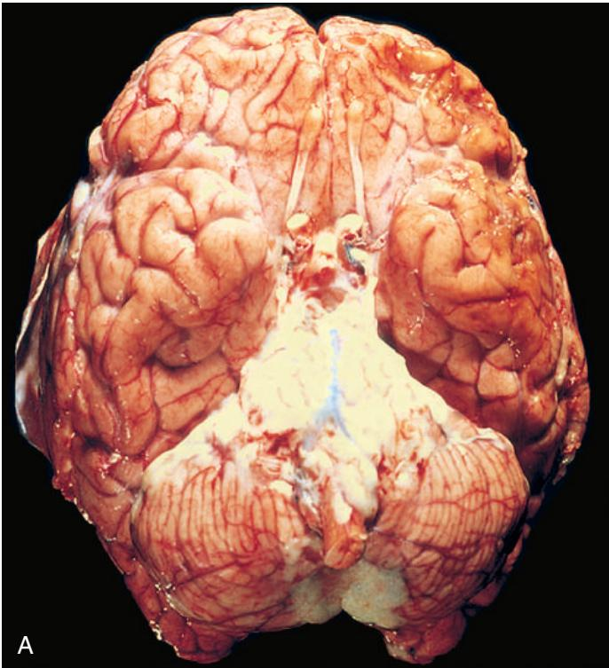
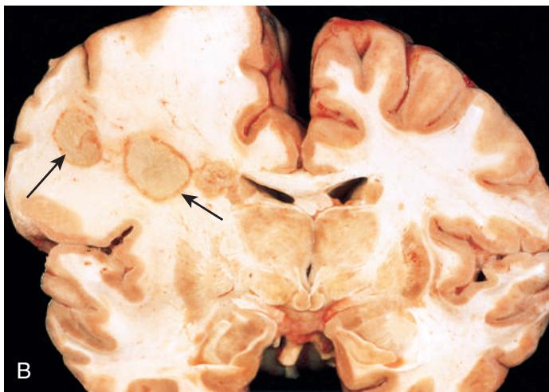 
Fig. 23.16 Bacterial infections. (A) Pyogenic meningitis. A thick layer of suppurative exudate covers the brain stem and cerebellum and thickens the leptomeninges. (B) Cerebral abscesses in the frontal lobe white matter (arrows). (A, From Golden JA, Louis DN: Images in clinical medicine: acute bacterial meningitis. N Engl J Med 333:364, 1994. Copyright © 1994 Massachusetts Medical Society. All rights reserved.)
meningitis leads to arachnoid fibrosis and hydrocephalus from interference with resorption of CSF.
# Spirochetal Infections
Neurosyphilis, a tertiary stage of syphilis, occurs in about $10\%$ of individuals with untreated Treponema pallidum infection. Infection with HIV increases the risk for developing neurosyphilis, and the disease is often more aggressive in this setting. There are several patterns of CNS involvement by syphilis, which may be present alone or in combination.
- Meningovascular neurosyphilis is a chronic meningitis, usually involving the base of the brain, often with
an obliterative endarteritis rich in plasma cells and lymphocytes.
- Paretic neurosyphilis stems from parenchymal involvement by spirochetes and is associated with neuronal loss and marked proliferation of microglial cells. Clinically, this form of the disease causes an insidious progressive loss of mental and physical functions, mood alterations (including delusions of grandeur), and eventually severe dementia. 
- Tables dorsalis results from damage to the sensory nerves in the dorsal roots. Consequences include impaired joint position sense and ataxia; loss of pain sensation, leading to skin and joint damage (Charcot joints); other sensory disturbances, particularly characteristic "lightning pains"; and the absence of deep tendon reflexes.
Neuroborreliosis refers to involvement of the nervous system by the spirochete Borrelia burgdorferi, the causative agent of Lyme disease. Neurologic signs and symptoms are highly variable and include aseptic meningitis, facial nerve palsies, mild encephalopathy, and polyneuropathies.
# Fungal Meningitis
Fungal infection of the nervous system can give rise to chronic meningitis and, as with other pathogens, this can be associated at times with parenchymal infection. Immunosuppression increases the risk for these diseases, but it is not a requirement for infection to occur. Several fungal pathogens cause CNS disease:
- Cryptococcus neoformans can cause both meningitis and meningoencephalitis, often in the setting of immunosuppression. It may be fulminant and fatal in as little as 2 weeks or may be indolent, evolving over months or years. The CSF may have few cells but elevated protein, and the mucoid encapsulated yeasts can be visualized on India ink preparations. Extension into the brain follows vessels in the Virchow-Robin spaces. As organisms proliferate, these spaces expand, giving rise to a "soap bubble"-like appearance (Fig. 23.17). 
- Histoplasma capsulatum commonly involves the nervous system in the setting of disseminated infection. There is an increased risk for disease in the setting of HIV infection. Histoplasmosis typically causes a basilar meningitis, with elevated CSF protein, mildly decreased glucose, and mild lymphocytic pleocytosis. Parenchymal lesions can occur, mostly from tracking of organisms along Virchow-Robin spaces. 
- Coccidioides immitis, a fungus endemic to desert regions of the American Southwest, most commonly causes meningitis in the setting of disseminated infection. Diagnosis can be made by examining the CSF for specific antibody. Without treatment, coccidioidal meningitis has a high fatality.
# Parenchymal Infections
The entire gamut of infectious pathogens (viruses to parasites) can infect the brain, often in characteristic patterns. In general, viral infections are diffuse, bacterial infections (when not associated with meningitis) are localized, while
Whole-brainsectionshowingthenumerousareasoftissuedestructionassociatedwiththespreadoforganismsintheperivascularspaces.(B)Athighermagnification,itispossibletoseethecryptococciinthelesions..jpg) 
Fig. 23.17 Cryptococcal infection. (A) Whole-brain section showing the numerous areas of tissue destruction associated with the spread of organisms in the perivascular spaces. (B) At higher magnification, it is possible to see the cryptococci in the lesions.
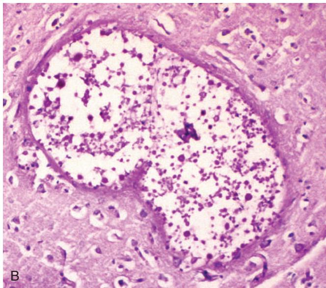
other organisms produce mixed patterns. In immunosuppressed hosts, more widespread involvement with any agent is typical.
# Brain Abscesses
Brain abscesses are most often caused by bacterial infections. These can arise by direct implantation of organisms, local extension from adjacent foci (mastoiditis, paranasal sinusitis), or hematogenous spread (usually from a primary site in the heart, lungs, or distal bones, or after tooth extraction). Predisposing conditions include acute bacterial endocarditis, from which septic emboli are released that may produce multiple abscesses; cyanotic congenital heart disease, associated with a right-to-left shunt and loss of pulmonary filtration of organisms; and chronic pulmonary infections, as in bronchiectasis, which provide a source of microbes that spread hematogenously.
Abscesses are discrete destructive lesions with central liqueactive necrosis surrounded by a rim of vascularized granulation and fibrous tissue (see Fig. 23.16B). Outside the fibrous capsule is a zone of reactive gliosis. Patients almost invariably present with progressive focal deficits as well as general signs related to increased intracranial pressure. While CSF white blood cell count and protein may be elevated, lumbar puncture has little role in the diagnosis of brain abscess since organisms are more reliably cultured by draining the abscess directly. In addition, if there is significant mass effect from the abscess, the decrease in lumbar CSF pressure following lumbar puncture can result in downward herniation of cerebral contents and neurologic deterioration. A systemic or local source of infection may or may not be apparent. The increased intracranial pressure may cause fatal brain herniation, and abscess rupture can lead to ventriculitis, meningitis, and venous sinus thrombosis. Surgery and antibiotics reduce the otherwise high mortality rate, with earlier intervention leading to better outcomes.
# Viral Encephalitis
Viral encephalitis is a parenchymal infection of the brain that is almost invariably associated with meningeal inflammation (meningoencephalitis). While different viruses show varying patterns of injury, the most characteristic histologic features are perivascular and parenchymal mononuclear cell infiltrates, microglial nodules, and neuronophagia (Fig. 23.18A-B). Certain viruses also form characteristic inclusion bodies.
The nervous system is particularly susceptible to certain viruses such as rabies virus and poliovirus. Some viruses infect specific CNS cell types, while others preferentially involve particular brain regions (such as the medial temporal lobes, or the limbic system) that lie along the viral route of entry. Intrauterine viral infection following transplacental spread of rubella and CMV may cause destructive lesions, and Zika virus causes developmental abnormalities of the brain. In addition to direct infection of the nervous system, the CNS also can be injured by immune mechanisms after systemic viral infections.
# Arboviruses
Arboviruses (arthropod-borne viruses) are an important cause of epidemic encephalitis, especially in tropical regions of the world, and are capable of causing serious morbidity and high mortality. Among the more commonly encountered types are Eastern and Western equine encephalitis and West Nile virus infection. Patients develop generalized neurologic symptoms, such as seizures, confusion, delirium, and stupor or coma, as well as focal signs, such as reflex asymmetry and ocular palsies. The CSF usually is colorless but with a slightly elevated pressure and an early neutrophilic pleocytosis that rapidly converts to a lymphocytosis; the protein concentration is elevated, but the glucose is normal. Thus, CSF examination helps to distinguish viral from bacterial infections of the CNS.
areanimportantc.jpg)
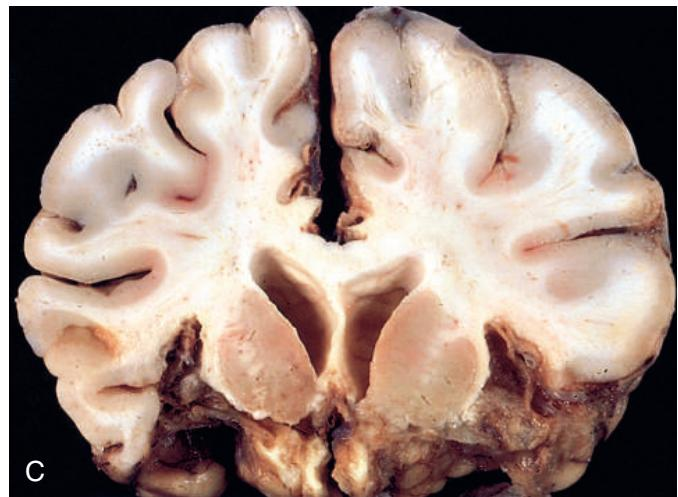 
Fig. 23.18 Viral infections. (A and B) Characteristic findings in many forms of viral meningitis include perivascular cuffing of lymphocytes (A) and microglial nodules (B). (C) Herpes encephalitis showing extensive destruction of inferior frontal and anterior temporal lobes. (D) Human immunodeficiency virus (HIV) encephalitis. Note the accumulation of microglia forming a microglial nodule and multinucleate giant cell. (C, Courtesy of Dr.T.W. Smith, University of Massachusetts Medical School, Worcester, Massachusetts.)
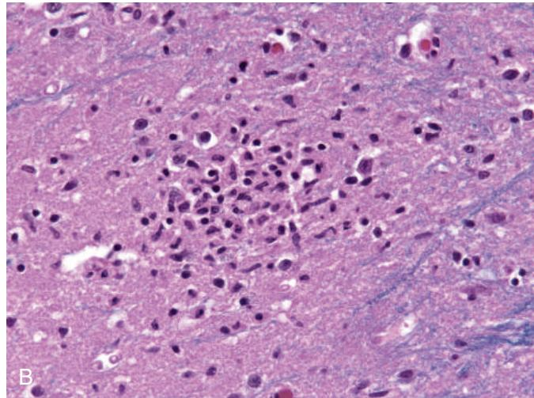
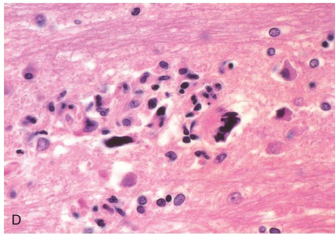
Arbovirus encephalitides produce a similar histopathologic picture. Characteristically, there is a perivascular lymphocytic meningoencephalitis (sometimes with neutrophils) (see Fig. 23.18A). Multifocal gray matter and white matter necrosis is seen, often associated with neuronophagia, the phagocytosis of neuronal debris, as well as localized collections of microglia termed microglial nodules (see Fig. 23.18B). In severe cases, there may be a necrotizing vasculitis with associated focal hemorrhages.
# Herpesviruses
HSV-1 encephalitis may occur in any age group but is most common in children and young adults. It typically manifests with alterations in mood, memory, and behavior, reflecting involvement of the frontal and temporal lobes. Recurrent HSV-1 encephalitis is sometimes associated with inherited mutations that interfere with Toll-like receptor signaling (specifically that of TLR-3), which has an important role in anti-viral defense.
Herpes encephalitis starts in and most severely involves the inferior and medial regions of the temporal lobes and the orbital gyri of the frontal lobes (see Fig. 23.18C). The infection is necrotizing and often hemorrhagic in severely affected regions. Perivascular inflammatory infiltrates usually are present, and large eosinophilic intranuclear viral inclusions (Cowdry type A bodies) can be found in both neurons and glial cells.
HSV-2 also affects the nervous system, usually in the form of meningitis in adults. Disseminated severe encephalitis occurs in many neonates born by vaginal delivery to women with active primary HSV genital infections.
Varicella-zoster virus (VZV) causes chickenpox during primary infection, usually without any evidence of neurologic involvement. The virus establishes latent infection in neurons of dorsal root ganglia. Reactivation in adults manifests as a painful, vesicular skin eruption in the distribution of one or a few dermatomes (shingles). This usually is a self-limited process, but there may be a persistent pain syndrome in the affected region (postherpetic neuralgia).
VZV also may cause a granulomatous arteritis that can lead to tissue infarcts. In immunosuppressed patients, acute herpes zoster encephalitis can occur. Inclusion bodies can be found in glial cells and neurons.
# Cytomegalovirus
CMV infects the nervous system in fetuses and immunosuppressed individuals. All cells within the CNS (neurons, glial cells, ependyma, and endothelium) are susceptible to infection. Intrauterine infection causes periventricular necrosis, followed later by microcephaly with periventricular calcification. When adults are infected, CMV produces a subacute encephalitis, which is also often most severe in the periventricular region. Lesions can be hemorrhagic and contain typical viral inclusion-bearing cells.
# Poliovirus
Poliovirus is an enterovirus that most often causes a subclinical or mild gastroenteritis; in a small fraction of cases, it secondarily invades the nervous system and damages motor neurons in the spinal cord and brain stem (paralytic poliomyelitis). The loss of motor neurons results in a flaccid paralysis with muscle wasting and hyporeflexia in the corresponding region of the body. In the acute disease, death can occur from paralysis of respiratory muscles. Long after the infection has resolved, typically 25 to 35 years after the initial illness, a poorly understood post-polio syndrome of progressive weakness associated with decreased muscle bulk and pain may appear. The re-emergent weakness has the same distribution as the prior polio infection.
# Rabies Virus
Rabies is a fatal encephalitic infection transmitted to humans from rabid animals, usually by a bite. Various mammals are natural reservoirs. Exposure to some bat species, even without evidence of a bite, is also a risk factor. The virus enters the CNS by ascending along the peripheral nerves from the wound site, so the incubation period (usually a few months) depends on the distance between the wound and the brain. The disease manifests initially with nonspecific symptoms of malaise, headache, and fever. As the infection advances, the patient shows extraordinary CNS excitability; the slightest touch is painful, with violent motor responses progressing to convulsions. Contracture of the pharyngeal musculature may create an aversion to swallowing even water (hydrophobia). Periods of mania and stupor progress to coma and eventually death, typically from respiratory failure.
# Human Immunodeficiency Virus
In the first 15 years or so after recognition of AIDS, neuropathologic changes were demonstrated at postmortem examination in as many as $80\%$ to $90\%$ of cases, owing to direct effects of the virus on the nervous system (HIV encephalitis), along with opportunistic infections and primary CNS lymphoma. Introduction of highly active antiretroviral therapy (HAART) has decreased the frequency of these secondary effects of HIV infection. However, cognitive dysfunction ranging from mild to full-blown dementia that is lumped under the umbrella term HIV-associated neurocognitive disorder (HAND) continues to be a source of
morbidity. This syndrome is believed to stem from HIV infection of microglial cells in the brain and activation of innate immune responses. Neuronal injury likely stems from a combination of cytokine-induced inflammation and toxic effects of HIV-derived proteins.
Aseptic meningitis occurs within 1 to 2 weeks of onset of primary HIV infection in about $10\%$ of patients; antibodies to HIV can be demonstrated, and the virus can be isolated from the CSF. The few neuropathologic studies of the early and acute phases of symptomatic or asymptomatic HIV invasion of the nervous system have shown mild lymphocytic meningitis, perivascular inflammation, and some myelin loss in the hemispheres.
When effective anti-HIV therapy is begun in the setting of established infection, there is a risk for neurologic involvement associated with the immune reconstitution inflammatory syndrome (IRIS). Neurologic manifestations include rapidly developing cognitive impairment and cerebral edema. The pathogenesis of IRIS is unclear but it is thought to be due to the activation of a previously suppressed inflammatory response brought about by effective treatment of HIV infection. IRIS is often associated with the presence of a mycobacterial, fungal or viral opportunistic CNS infection, although it can also occur in the absence of any other inciting disease.
HIV encephalitis is a chronic inflammatory process with widely distributed microglial nodules, sometimes with associated foci of tissue necrosis and reactive gliosis (see Fig. 23.18D). The microglial nodules also are found in the vicinity of small blood vessels, which show abnormally prominent endothelial cells and perivascular foam or pigment-laden macrophages. These changes are especially prominent in the subcortical white matter, diencephalon, and brain stem. An important component of the microglial nodule are macrophage-derived multinucleate cells. In some cases, there also is a disorder of white matter characterized by multifocal or diffuse areas of myelin pallor, axonal swellings, and gliosis. HIV is present in $\mathrm{CD4+}$ mononuclear and multinucleate macrophages and microglia.
Unlike HIV encephalitis, the brain lesions of IRIS may be associated with a $\mathrm{CD8 + }$ T cell infiltrate, both around blood vessels and diffusely in the parenchyma, in the absence of significant HIV burden or multinucleated cells.
# Polyomavirus and Progressive Multifocal Leukoencephalopathy
Progressive multifocal leukoencephalopathy (PML) is caused by JC virus, a polyomavirus, which preferentially infects oligodendrocytes, resulting in demyelination as these cells are injured and then die. Most people show serologic evidence of exposure to JC virus during childhood, and it is believed that PML results from virus reactivation, as the disease is restricted to immunosuppressed individuals. Patients develop focal and relentlessly progressive neurologic signs and symptoms, and imaging studies show extensive, often multifocal lesions in the hemispheric or cerebellar white matter.
iscau.jpg)
Sectionstainedformyelinshowingirregular,poorlydefinedareasofdemyelination,whichbecomeconfluentinplaces.(B)Enlargedoligodendrocytenucleistainedforviralantigenssurroundanareaofearlymyelinloss..jpg) 
Fig. 23.19 Progressive multifocal leukoencephalopathy. (A) Section stained for myelin showing irregular, poorly defined areas of demyelination, which become confluent in places. (B) Enlarged oligodendrocyte nuclei stained for viral antigens surround an area of early myelin loss.
The lesions are patchy, irregular, ill-defined areas of white matter destruction that enlarge as the disease progresses (Fig. 23.19). Each lesion is an area of demyelination, in the center of which are scattered lipid-laden macrophages and a reduced number of axons. At the edges of the lesion are greatly enlarged oligodendrocyte nuclei whose chromatin is replaced by glassy-appearing amphophilic viral inclusions. The virus also infects astrocytes, leading to bizarre giant forms with irregular, hyperchromatic, sometimes multiple nuclei that can be mistaken for a tumor.
# Fungal Encephalitis
Fungal infections usually produce parenchymal granulomas or abscesses, often associated with meningitis. The most common fungal infections have the following distinctive patterns:
- Candida albicans usually produces multiple microabscesses, with or without granuloma formation. 
- Mucormycosis, caused by several fungi belonging to the order Mucorales, typically presents as an infection of the nasal cavity or sinuses in a diabetic patient with ketoacidosis. It may spread to the brain through vascular invasion or by direct extension through the cribriform plate. The proclivity of Mucor to invade the brain directly
sets it apart from other fungi, which reach the brain by hematogenous dissemination from distant sites.
- Aspergillus fumigatus tends to cause a distinctive pattern of widespread septic hemorrhagic infarctions because of its marked predilection for blood vessel wall invasion with subsequent thrombosis.
# Other Meningoencephalitides
While a wide range of other organisms can infect the nervous system and its covering, only three relatively common entities are considered here.
# Cerebral Toxoplasmosis
Cerebral infection with the protozoan Toxoplasma gondii can occur in immunosuppressed adults or in newborns who acquire the organism transplacentially from a mother with an active infection. The consequences include the triad of chorioretinitis, hydrocephalus, and intracranial calcifications. In adults, the clinical symptoms are subacute, evolving over weeks, and may be both focal and diffuse. Due to inflammation and breakdown of the blood-brain barrier at sites of infection, imaging studies often show edema associated with ring-enhancing lesions.
When the infection is acquired in immunosuppressed adults, the brain shows abscesses, frequently multiple, most often involving the cerebral cortex (near the gray-white junction) and deep gray nuclei. Acute lesions consist of central foci of necrosis surrounded by acute and chronic inflammation, macrophage infiltration, and vascular proliferation. Both free tachyzoites and encysted bradyzoites may be found at the periphery of the necrotic foci (Fig. 23.20).
# Cysticercosis
Cysticercosis is the consequence of an end-stage infection by the tapeworm Tenia solium. If ingested larval organisms leave the lumen of the gastrointestinal tract, where they would otherwise develop into mature tapeworms, they encyst. Cysts can be found throughout the body and are common within the brain and subarachnoid space. Cysticercosis typically manifests as a mass lesion and can cause seizures. Symptoms can intensify when the encysted organism dies, as occurs after therapy.
The organism is found within a cyst with a smooth lining. The body wall and hooklets from mouth parts are most commonly recognized. Death of the encysted organism may produce an intense inflammatory reaction in the surrounding brain, often including eosinophils, and marked gliosis.
# Amebiasis
Amebic meningoencephalitis manifests with different clinical syndromes, depending on the responsible pathogen. Naegleria fowleri, associated with swimming in stagnant warm fresh water ponds, causes a rapidly fatal necrotizing encephalitis. By contrast, various species of Acanthamoeba cause a chronic granulomatous meningoencephalitis.
Abscessesarepresentintheputamenandthalamus.(B)Freetachyzoitesaredemonstratedbyimmunohistochemicalstaining.Inset,Bradyzoitesarepresentasapseudocyst,againhighlightedbyimmunohistochemicalstaining..jpg) 
Fig. 23.20 Toxoplasma infection. (A) Abscesses are present in the putamen and thalamus. (B) Free tachyzoites are demonstrated by immunohistochemical staining. Inset, Bradyzoites are present as a pseudocyst, again highlighted by immunohistochemical staining.
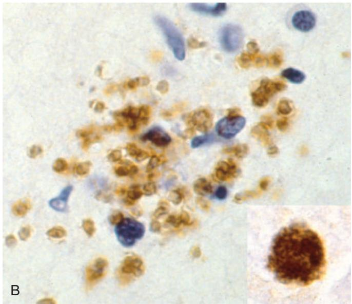
# Prion Diseases
Prion diseases are a group of infectious diseases in which the causative agent is an abnormal form of a cellular protein. These include sporadic, familial, iatrogenic, and variant forms of Creutzfeldt-Jakob disease (CJD), as well as animal diseases such as scrapie in sheep and bovine spongiform encephalopathy in cattle ("mad cow disease"). The causative protein, termed prion protein $(\mathsf{PrP})$ , may undergo a conformational change from its normal shape $(\mathrm{PrP}^{\mathrm{c}})$ to an abnormal conformation called $PrP^{sc}$ (sc for scrapie). PrP normally is rich in $\alpha$ -helices, but $\mathrm{PrP^{sc}}$ has a high content of $\beta$ -sheets, a characteristic that makes it resistant to proteolysis (hence an alternative term for the pathogenic form, $PrP^{res}$ -i.e., protease-resistant). More important, when $\mathrm{PrP^{sc}}$ physically interacts with PrP molecules, it induces them to adopt the $\mathrm{PrP^{sc}}$ conformation (Fig. 23.21), a property that accounts for the "infectious" nature of $\mathrm{PrP^{sc}}$ . Over time, this self-amplifying process leads to the accumulation of a high burden of pathogenic $\mathrm{PrP^{sc}}$ molecules in the brain. Certain mutations in the gene encoding $\mathrm{PrP}^{\mathrm{c}}$ (PRNP) accelerate the rate of spontaneous conformational change; these variants are associated with early-onset familial forms of prion disease (familial Creutzfeldt-Jakob disease [fCJD]). $\mathrm{PrP}^{\mathrm{c}}$ also may change its conformation spontaneously (but at an extremely low rate), accounting for sporadic cases of prion disease (sporadic Creutzfeldt-Jakob disease [sCJD]). Accumulation of $\mathrm{PrP^{sc}}$ in neural tissue seems to be the cause of cell injury, but the mechanisms underlying the cytopathic changes and eventual neuronal death are still unknown.
# Creutzfeldt-Jakob Disease (CJD)
CJD is a rapidly progressive dementing illness, with a typical duration from first onset of subtle changes in memory and behavior to death in only 7 months. It is sporadic in approximately $85\%$ of cases and has a worldwide annual incidence of about 1 per million. While commonly
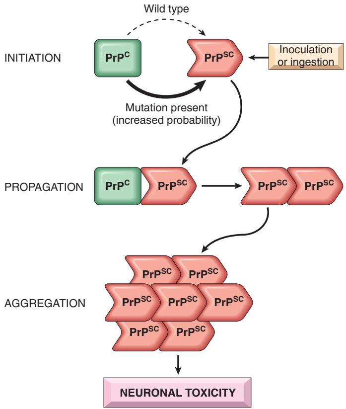 
Fig. 23.21 Pathogenesis of prion disease. $\alpha$ -Helical $\mathrm{PrP}^{\mathrm{sc}}$ may spontaneously shift to the $\beta$ -sheet $\mathrm{PrP}^{\mathrm{sc}}$ conformation, an event that occurs at a much higher rate in familial disease associated with germ line $\mathrm{PrP}$ mutations. $\mathrm{PrP}^{\mathrm{sc}}$ may also be from exogenous sources, such as contaminated food, medical instrumentation, or medicines. Once present, $\mathrm{PrP}^{\mathrm{sc}}$ converts additional molecules of $\mathrm{PrP}^{\mathrm{c}}$ into $\mathrm{PrP}^{\mathrm{sc}}$ through physical interaction, eventually leading to the formation of pathogenic $\mathrm{PrP}^{\mathrm{sc}}$ aggregates.
affecting individuals older than 70 years of age, familial forms caused by mutations in $PRNP$ may present in younger individuals. In keeping with the infectious nature of $\mathrm{PrP}^{\mathrm{sc}}$ , there are well-established cases of iatrogenic transmission by contaminated deep implantation electrodes and human growth hormone preparations.
The progression to death in CJD usually is so rapid that there is little, if any, macroscopic evidence of brain atrophy. On microscopic examination, the pathognomonic finding is a spongiform transformation of the cerebral cortex and deep gray matter structures (caudate, putamen); this multifocal process results in the uneven formation of small, apparently empty, microscopic vacuoles of varying sizes within the neuropil (the eosinophilic regions in grey matter that contain dendrites, axons, and synapses) and sometimes in the perikaryon of neurons (Fig. 23.22A). In advanced cases, there is severe neuronal loss, reactive gliosis, and sometimes expansion of the vacuolated areas into cystlike spaces ("status spongiosus"). No inflammatory infiltrate is present. Immunohistochemical staining demonstrates the presence of proteinase K-resistant $\mathrm{PrP}^{\mathrm{sc}}$ in tissue, while western blotting of tissue extracts after partial protease digestion allows detection of diagnostic $\mathrm{PrP}^{\mathrm{sc}}$ .
# Variant Creutzfeldt-Jakob Disease
Starting in 1995, cases of a CJD-like illness appeared in the United Kingdom. The neuropathologic findings and molecular features of these new cases were similar to those of CJD, suggesting a close relationship between the two illnesses, yet this new disorder differed from typical CJD in several important respects: the disease affected young adults; behavioral disorders figured prominently in early disease stages; and the neurologic syndrome progressed somewhat more slowly than typical CJD. Multiple lines of evidence indicate that this new disease, termed variant Creutzfeldt-Jakob disease (vCJD) is a consequence of exposure to the prion disease of cattle, called bovine spongiform encephalopathy. Also, there is now documentation of
transmission by blood transfusion. This variant form has a similar pathologic appearance to that in other types of CJD, with spongiform change and absence of inflammation. In vCJD, however, there are abundant cortical amyloid plaques, surrounded by the spongiform change (see Fig. 23.22B).
# INFECTIONS OF THE NERVOUS SYSTEM
- Pathogens from viruses through parasites can infect the brain; in addition, prion disease is a protein-induced transmissible disease that is unique to the nervous system. 
- Different pathogens use distinct routes to reach the brain, and they cause different patterns of disease. 
- Bacterial infections may cause meningitis, cerebral abscesses, or a chronic meningoencephalitis. 
Viral infections can cause meningitis or meningoencephalitis. 
- HIV can directly cause meningoencephalitis, or indirectly affect the brain by increasing the risk for opportunistic infections (toxoplasmosis, CMV) or CNS lymphoma. 
- Prion diseases are transmitted by an altered form of a normal cellular protein. They can be sporadic, transmitted, or inherited.
# DISEASES OF MYELIN
Within the CNS, axons are tightly ensheathed by myelin, an electrical insulator that allows rapid propagation of neural impulses. Myelin consists of multiple layers of highly specialized, closely apposed plasma membranes that are assembled by oligodendrocytes. Although myelinated axons are present in all areas of the brain, they are the dominant component in the white matter; therefore, most diseases of myelin are primarily white matter disorders. The myelin in peripheral nerves is similar to the myelin in the CNS, but with several important differences: (1) peripheral myelin is made by Schwann cells, not oligodendrocytes; (2) each Schwann cell in a peripheral nerve
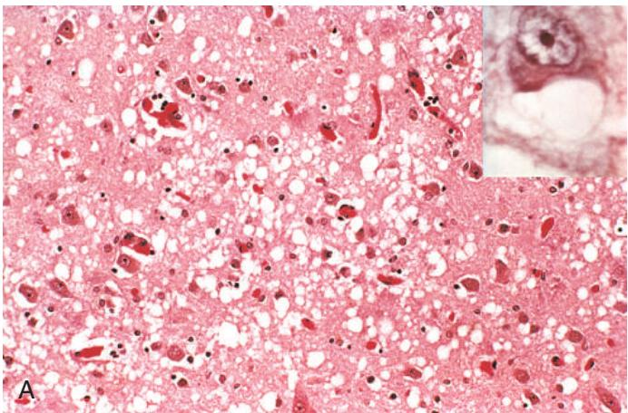 
Fig. 23.22 Prion disease. (A) Histologic features of Creutzfeldt-Jakob disease (CJD) include spongiform change in the cerebral cortex. Inset, High magnification of a neuron with vacuoles. (B) Variant CJD (vCJD) is characterized by amyloid plaques (inset) that sit in the regions of greatest spongiform change.
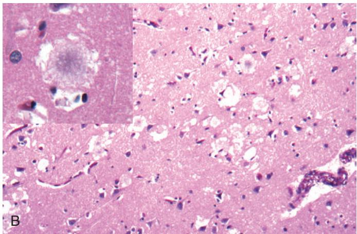
provides myelin for only one internode, while in the CNS, many internodes are created by processes coming from a single oligodendrocyte; and (3) the specialized proteins and lipids are also different. Most diseases of CNS myelin do not involve the peripheral nerves to any significant extent, and vice versa.
In general, CNS diseases involving myelin are separated into two broad groups.
- Demyelinating diseases of the CNS are acquired conditions characterized by preferential damage to previously normal myelin. The most common diseases in this group result from immune-mediated injury, such as multiple sclerosis (MS) and related disorders. Other processes that can cause this type of disease include viral infection of oligodendrocytes, as in progressive multifocal leukoencephalopathy (see earlier), and injury caused by drugs and other toxic agents. 
- By contrast, in other diseases, myelin is not formed properly or has abnormal turnover kinetics. As would be expected, most of these are caused by mutations that disrupt the function of proteins required for the formation of normal myelin sheaths. These diseases are grouped under leukodystrophy or dysmyelinating diseases.
# Multiple Sclerosis (MS)
MS is an autoimmune demyelinating disorder characterized by episodes of disease activity, separated in time, that produce white matter lesions that are separated in space. It is the most common demyelinating disorder, having a prevalence of approximately 1 per 1000 individuals in the United States and Europe, and its incidence appears to be increasing. The disease may present at any age, but onset in childhood or after 50 years of age is rare. Women are affected twice as often as men.
The lesions of MS are caused by an autoimmune response directed against components of the myelin sheath. As in other autoimmune diseases (Chapter 5), the development of MS is related to genetic susceptibility and largely undefined environmental triggers. The incidence of MS is 15-fold higher when the disease is present in a first-degree relative and roughly 150-fold higher with an affected monozygotic twin. Only a portion of the genetic basis of the disease has been explained, and many of the identified loci are associated with other autoimmune diseases. There is a strong effect of the major histocompatibility complex; each copy of the HLA-DRB1*1501 allele an individual inherits brings with it a roughly 3-fold increase in the risk for MS. Other genetic loci that are associated with MS include the IL-2 and IL-7 receptor genes and other genes encoding proteins involved in immune responses.
Immune mechanisms that underlie the destruction of myelin are the focus of much investigation. The available evidence indicates that the disease is initiated by $\mathrm{T_H1}$ and $\mathrm{T_H17T}$ cells that react against myelin antigens and secrete cytokines. Experimental autoimmune encephalomyelitis, an animal model of MS in which demyelination and inflammation occur after immunization of animals with
myelin proteins, can be passively transferred to unimmunized animals with $\mathrm{T_H1}$ and $\mathrm{T_H17}$ cells that recognize myelin antigens. $\mathrm{T_H1}$ cells secrete IFN- $\gamma$ , which activates macrophages, and $\mathrm{T_H17}$ cells promote the recruitment of leukocytes. The demyelination is caused by activated leukocytes and their injurious products. The infiltrate in plaques and surrounding regions of the brain consists of T cells (mainly $\mathrm{CD4 + }$ , some $\mathrm{CD8 + }$ ) and macrophages. B lymphocytes and antibodies also play an important, but poorly defined, role in the disease, as indicated by the surprising success of B cell depleting therapies.
MS is primarily a multifocal white matter disease. Grossly, the characteristic lesions, termed plaques, are discrete, slightly depressed, glassy-appearing, and gray-tan in color (Fig. 23.23A). Plaques are common near the ventricles and also frequently occur in the optic nerves and chiasm, brain stem, ascending and descending fiber tracts, cerebellum, and spinal cord. The lesions have sharply defined borders at the microscopic level (see Fig. 23.23B). Active plaques contain abundant macrophages stuffed with myelin debris, evidence of ongoing myelin breakdown. Lymphocytes also are present, mostly as perivascular cuffs. Small active lesions often are centered on small veins. Axons are relatively preserved but may be reduced in number. When plaques become quiescent (inactive plaques), the inflammation mostly disappears, leaving behind little to no myelin, astrocytic proliferation, and gliosis.
The course of MS is variable, but commonly there are multiple relapses followed by episodes of remission; typically, recovery during remissions is not complete. As a consequence, over time there is usually a gradual, often stepwise, accumulation of neurologic deficits. Imaging studies have demonstrated that there are often more lesions in the brains of patients with MS than might be expected from the clinical examination, and that lesions can come and go much more often than was previously suspected. Changes in cognitive function can be present, but are often much milder than the other deficits. In any individual patient, it is difficult to predict when the next relapse will occur; most current treatments, which are intended to control the immune response, aim at decreasing the rate and severity of relapses rather than recovering lost function.
The CSF in patients with MS shows a mildly elevated protein level with an increased proportion of immunoglobulin; in one-third of cases, there is moderate pleocytosis. When the immunoglobulin is examined further, oligoclonal bands usually are identified. These antibodies are directed against a variety of antigenic targets and can be used as markers of disease activity. The contribution of these antibodies to the disease process is unclear.
# Other Acquired Demyelinating Diseases
Immune-mediated demyelination can occur after a number of systemic infectious illnesses, including
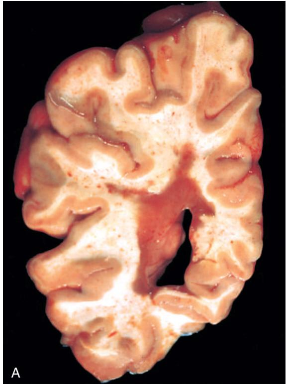
.(A)Sectionoffreshbrainshowingaplaquearoundoccipitalhornofthelateralventricle.(B)Unstainedregionsofdemyelination(MSplaques)aroundthefourthventricle.Luxolfastblue-periodicacid-Schiffstainformyelin..jpg) 
Fig. 23.23 Multiple sclerosis (MS). (A) Section of fresh brain showing a plaque around occipital horn of the lateral ventricle. (B) Unstained regions of demyelination (MS plaques) around the fourth ventricle. Luxol fast blue-periodic acid-Schiff stain for myelin.
relatively mild viral diseases. These are not thought to be related to direct spread of the infectious agents to the nervous system. Rather, it is believed that immune cells responding to pathogen-associated antigens cross-react against myelin antigens, resulting in myelin damage.
There are two general patterns of postinfectious autoimmune reactions to myelin; unlike MS, they both are associated with acute-onset monophasic illnesses. In acute disseminated encephalomyelitis, symptoms typically develop 1 or 2 weeks after an antecedent infection and are nonlocalizing (headache, lethargy, and coma), in contrast with the focal findings of MS. Symptoms progress rapidly, and the illness is fatal in as many as $20\%$ of cases; in the remaining
patients, there is complete recovery. Acute necrotizing hemorrhagic encephalomyelitis is a more devastating related disorder, which typically affects young adults and children.
Other acquired diseases of myelin include neuromyelitis optica (NMO), an antibody-mediated demyelinating disease centered on the optic nerves and spinal cord, and central pontine myelinolysis, caused by nonimmune damage to oligodendrocytes typically after sudden correction of hyponatremia, that may result in a rapidly evolving quadriplegia.
As discussed earlier, progressive multifocal leukoencephalopathy (PML) is a demyelinating disease that occurs after reactivation of the JC virus in immunosuppressed patients.
# Leukodystrophies
Leukodystrophies are inherited dysmyelinating diseases caused by abnormal myelin synthesis or turnover. They are caused by mutations of genes whose products are involved in the generation, turnover, or maintenance of myelin. Some of these mutations affect lysosomal enzymes, while others involve peroxisomal enzymes; a few are associated with mutations in myelin proteins. Most are of autosomal recessive inheritance, although X-linked diseases also occur. There is typically diffuse involvement of white matter leading to deterioration in motor skills, spasticity, hypotonia, or ataxia. Several clinical features separate leukodystrophies from demyelinating diseases. The leukodystrophies typically present with an insidious and progressive loss of function, often begin at younger ages, and are associated with diffuse and symmetric changes on imaging studies.
Much of the pathologic change of leukodystrophy is found in the white matter, which is diffusely abnormal in color (gray and translucent) and volume (decreased). Early in their course, some diseases may show patchy involvement, while others have a predilection for occipital lobe involvement. In the end, though, nearly all of the white matter usually is affected. With the loss of white matter, the brain becomes atrophic, the ventricles enlarge, and secondary changes can be found in the gray matter. Myelin loss is associated with infiltration of macrophages, which often become stuffed with lipid. Some of these diseases also show specific inclusions created by the accumulation of particular lipids.
# PRIMARY DISEASES OF MYELIN
- Because of the critical role of myelin in nerve conduction, diseases of myelin can lead to widespread and severe neurologic deficits. 
- Multiple sclerosis, an autoimmune demyelinating disease, is the most common disorder of myelin, affecting young adults. It often pursues a relapsing-remitting course, with eventual progressive accumulation of neurologic deficits. 
- Other, less common forms of immune-mediated demyelination often follow infections and are more acute illnesses. 
- Leukodystrophies are genetic disorders in which myelin production or turnover is abnormal.
# GENETIC METABOLIC DISEASES
Several genetic diseases disrupt metabolic processes in neurons and glia, resulting in progressive disorders that present early in life. These diseases can be grouped by the cells or compartment affected (neurons vs. white matter), the subcellular organelle affected (e.g., lysosome, peroxisome, or mitochondrion), or the metabolic pathway affected (e.g., sphingolipidoses, very long-chain fatty acid metabolism). The mutations underlying these diseases typically affect synthetic or degradation pathways that are specific to the nervous system.
- Neuronal storage diseases are characterized by the accumulation of storage material within neurons, typically leading to neuronal death. Cortical neuronal involvement leads to loss of cognitive function and may also cause seizures. Most commonly, they are autosomal recessive disorders caused by the deficiency of a specific enzyme involved in the catabolism of sphingolipids (including the gangliosides), mucopolysaccharides, or mucolipids; others appear to be caused by defects in protein or lipid trafficking within neurons. Several examples of these diseases, such as Tay-Sachs and Niemann-Pick diseases and mucopolysaccharidoses, are discussed in Chapter 7. 
- Mitochondrial encephalomyopathies are disorders of oxidative phosphorylation, often affecting multiple tissues including skeletal muscle (Chapter 22). When they involve the brain, gray matter is more severely affected than white matter, as would be expected because of the greater metabolic requirements of neurons. These disorders may be caused by mutations in the mitochondrial or the nuclear genomes.
# ACQUIRED METABOLIC AND TOXIC DISTURBANCES
Toxic and acquired metabolic diseases are relatively common causes of neurologic illnesses. Because of its high metabolic demands, the brain is particularly vulnerable to nutritional diseases and alterations in metabolic state. Some of these disorders have uneven pathologic lesions and distinct clinical presentations because of unique features or requirements of different anatomic regions of the brain. A few of the more common types of injury are discussed here.
# Nutritional Diseases
# Thiamine Deficiency
In addition to the systemic effects of thiamine deficiency (beriberi), it also may be associated with the abrupt onset of confusion, abnormalities in eye movement and ataxia, syndrome termed Wernicke encephalopathy. Treatment with thiamine reverses these deficits, but if treatment is delayed the result is a largely irreversible profound memory disturbance called Korsakoff syndrome. Because the two syndromes are closely linked, the term Wernicke-Korsakoff syndrome is often used. The syndrome is particularly common in the
setting of chronic alcoholism but also may be encountered in patients with thiamine deficiency resulting from gastric disorders, gastric bypass surgery, or persistent vomiting.
Wernicke encephalopathy is characterized by foci of hemorrhage and necrosis, particularly in the mammary bodies but also adjacent to the ventricles, especially the third and fourth ventricles. Early lesions show dilated capillaries with prominent endothelial cells and progress to hemorrhage. As the lesions resolve, a cystic space appears along with hemosiderin-laden macrophages. Lesions in the medial dorsal nucleus of the thalamus seem to best correlate with the memory disturbance in Korsakoff syndrome.
# Vitamin $B_{12}$ Deficiency
In addition to causing anemia, deficiency of vitamin $\mathrm{B}_{12}$ may lead to neurologic deficits associated with changes in the spinal cord, resulting in a syndrome called subacute combined degeneration of the spinal cord. As the name implies, both ascending and descending tracts of the spinal cord are affected. Symptoms develop over weeks. Early clinical signs often include mild ataxia and lower-extremity numbness and tingling, which can progress to spastic weakness of the lower extremities; sometimes, complete paraplegia ensues. Prompt vitamin replacement therapy produces clinical improvement; however, if paraplegia has developed, recovery is poor.
# Metabolic Disorders
Several systemic metabolic derangements may produce CNS dysfunction; only those associated with abnormal glucose levels and liver dysfunction are considered here.
# Hypoglycemia
Since the brain requires glucose as a substrate for energy production, the cellular effects of diminished glucose generally resemble those of global hypoxia. Hippocampal neurons are particularly susceptible to hypoglycemic injury, while cerebellar Purkinje cells are relatively spared. As with anoxia, if the level and duration of hypoglycemia are sufficiently severe, there may be widespread injury to many areas of the brain.
# Hyperglycemia
Hyperglycemia is most common in the setting of inadequately controlled diabetes mellitus and can be associated with either ketoacidosis or hyperosmolar coma. Patients develop confusion, stupor, and eventually coma associated with intracellular dehydration caused by the hyperosmolar state. The hyperglycemia must be corrected gradually, because rapid correction can produce severe cerebral edema.
# Hepatic Encephalopathy
Decreased hepatic function may be associated with depressed levels of consciousness and sometimes coma. In the early stages, patients exhibit a characteristic "flapping" tremor (asterixis) when extending the arms with
palms facing the observer. Elevated levels of ammonia, which the liver normally clears through the urea cycle, in combination with inflammation and hyponatremia, cause the changes in brain function. Because it is only one contributing factor, ammonia levels in symptomatic patients vary widely. Within the CNS, ammonia metabolism occurs only in astrocytes through the action of glutamine synthetase, and in the setting of hyperammonemia, astrocytes in the cortex and basal ganglia develop swollen, pale nuclei (referred to as Alzheimer type II cells).
# Toxic Disorders
The list of toxins with effects on the brain is extremely long. Among the major categories of neurotoxic substances are metals, including lead, arsenic, and mercury; industrial chemicals, including organophosphates (in pesticides) and methanol (causing blindness from retinal damage); and environmental pollutants such as carbon monoxide (combining hypoxia with selective injury to the globus pallidus).
Ethanol has a variety of effects on the brain. While acute intoxication is reversible, excessive intake can result in profound metabolic disturbances, including brain swelling and death. Chronic alcohol exposure leads to cerebellar dysfunction in about $1\%$ of cases, with truncal ataxia, unsteady gait, and nystagmus, associated with atrophy in the anterior vermis of the cerebellum.
Ionizing radiation, commonly used to treat intracranial tumors, can cause rapidly evolving signs and symptoms including headache, nausea, vomiting, and papilledema, even months to years after irradiation. Affected brain regions show large areas of coagulative necrosis, edema, and blood vessels with thickened walls containing intramural fibrin like material.
# NEURODEGENERATIVE DISEASES
Neurodegenerative diseases are characterized by the progressive loss of neurons, typically affecting groups of neurons with functional interconnections. Different diseases tend to involve particular neural systems and therefore have relatively stereotypic presenting signs and symptoms (Table 23.3):
- Diseases that involve the hippocampus and associated cortices present with cognitive changes, often including disturbances of memory, behavior, and language. With time these progress to dementia, as occurs with Alzheimer disease. 
- Diseases that affect the basal ganglia manifest as movement disorders; these may be hypokinetic, as with Parkinson disease, or hyperkinetic, as with Huntington disease. 
- Diseases that affect the cerebellum or its input and output circuitry result in ataxia, as seen in the spinocerebellar ataxias. 
- When the motor system bears the burden, weakness and difficulty with swallowing and respiration are often seen first, as with amyotrophic lateral sclerosis.
A pathologic process shared by most neurodegenerative diseases is the accumulation of protein aggregates,
Table 23.3 Features of the Major Neurodegenerative Diseases 
DiseaseClinical PatternProtein InclusionsAlzheimer disease (AD)DementiaAβ (plaques) 
Tau (tangles)Frontotemporal lobar degeneration (FTLD)Behavioral changes, language disturbanceTau 
TDP43 
Others (rare)Parkinson disease (PD)Hypokinetic movement disorderα-synuclein 
TauHuntington disease (HD)Hyperkinetic movement disorderHuntingtin 
(polyglutamine repeat expansions)Spinocerebellar ataxiasCerebellar ataxiaVarious proteins 
(polyglutamine repeat expansions)Amyotrophic lateral sclerosis (ALS)Weakness with upper and lower motor neurons signsSOD1 
TDP43
which serve as histologic hallmarks of specific disorders (Table 23.3). Aggregates may arise because of mutations that alter the protein's conformation or that disrupt pathways involved in processing or clearance of the proteins. In other situations, there may be a subtle imbalance between protein synthesis and clearance (due to genetic, environmental, or stochastic factors) that allows gradual accumulation of proteins. The aggregates often are resistant to degradation by normal cellular proteases, accumulate within cells, elicit an inflammatory response, and may be directly toxic to neurons. As is evident from Table 23.3, the same proteins may be present as aggregates in multiple diseases. The clinical phenotype of the neurodegenerative disease is determined more by the distribution of the aggregates than by the nature of the aggregating protein.
Two other features are common to many neurodegenerative diseases:
- There is experimental evidence that many of the protein aggregates that accumulate in neurons affected in these diseases appear to be capable of spreading to healthy neurons. Thus, aggregates can seed the development of more aggregates, and the disease process can spread, like prions. However, there is no evidence for transmission from affected to healthy individuals. 
- Activation of the innate immune system is a common feature of neurodegenerative diseases. The importance of this interaction between the brain and the immune system has been further strengthened by the identification of genes that confer risk for diseases (e.g., TREM2 for Alzheimer disease) that encode components of immune regulatory pathways.
# Alzheimer Disease
Alzheimer disease (AD) is the most common cause of dementia in older adults, with an increasing incidence as
a function of age. The incidence is about $3\%$ in individuals 65 to 74 years of age, $19\%$ in those 75 to 84 years of age, and $47\%$ in those older than 84 years of age. Most cases of AD are sporadic, but at least $5\%$ to $10\%$ are familial. Sporadic cases rarely present before 50 years of age, but early onset is seen with some heritable forms.
The disease usually manifests with the insidious onset of impaired higher intellectual function, memory impairment, and altered mood and behavior. Over time, disorientation and aphasia, findings indicative of severe cortical dysfunction, often develop; those in the final phases of AD are profoundly disabled, often mute and immobile. Death usually occurs from intercurrent pneumonia or other infections.
The fundamental abnormality in AD is the accumulation of two proteins (Aβ and tau) in specific brain regions, in the forms of plaques and tangles, respectively; these changes result in secondary effects including neuronal dysfunction, neuronal death, and inflammatory reactions. Plaques are deposits of aggregated Aβ peptides in the neuropil, while tangles are aggregates of the microtubule binding protein tau, which develop intracellularly and then persist extracellularly after neuronal death. Both plaques and tangles appear to contribute to neural dysfunction. The details of the interplay between the processes that lead to the accumulation of these abnormal aggregates are a critical aspect of AD pathogenesis that has yet to be unraveled.
Clinical and experimental evidence strongly suggests that $\mathrm{A}\beta$ generation is the critical initiating event for the development of AD. Notably, mutations or alterations in copy number of the gene encoding the precursor protein for $\mathrm{A}\beta$ are associated with an elevated risk of AD, whereas mutations in the gene for tau do not give rise to AD but rather cause frontotemporal lobar degenerations. Overexpression of $\mathrm{A}\beta$ can replicate the disease in animal models.
The pathogenesis of AD involves $\mathrm{A}\beta$ and Tau deposits, as well as other risk factors and inflammatory reactions.
- Role of $A\beta$ . $A\beta$ is created when the transmembrane protein amyloid precursor protein (APP) is sequentially cleaved by the enzymes $\beta$ -amyloid-converting enzyme (BACE) and $\gamma$ -secretase (Fig. 23.24). APP also can be cleaved by $\alpha$ -secretase and $\gamma$ -secretase, liberating a different peptide that is nonpathogenic. Mutations in APP or in components of $\gamma$ -secretase (encoded by the presenilin-1 or presenilin-2 gene) lead to familial AD by increasing the rate at which $A\beta$ , particularly its most aggregation-prone form, is generated. The APP gene is located on chromosome 21, and the risk for AD also is higher in those with an extra copy of the APP gene, such as patients with trisomy 21 (Down syndrome) and individuals with small interstitial duplications of APP, presumably because this too leads to greater $A\beta$ generation. Once generated, $A\beta$ is highly prone to aggregation; it first forms small oligomers, and these eventually propagate into large aggregates and fibrils. It is these aggregates that deposit in the brain and are visible as plaques. There is evidence that these oligomers decrease the number of synapses present and alter the function
of those that remain so that the cellular processes felt to underlie learning and memory are disrupted.
- Role of tau. Because neurofibrillary tangles contain the tau protein, there has been much interest in the role of this protein in AD. Tau is a microtubule-associated protein present in axons in association with the microtubular network. With the development of tangles in AD, tau shifts to a somatic-dendritic distribution, becomes hyperphosphorylated, and loses the ability to bind to microtubules. The formation of tangles is an important component of AD, but the mechanism of tangle injury to neurons remains poorly understood. Two pathways have been suggested; 1) aggregates of tau protein elicit a stress response, which persists and eventually leads to cell death; and 2), the microtubule stabilizing function of tau protein is lost, leading to neuronal toxicity and death. It has been shown that tau aggregates can be passed across synapses from one neuron to the next; this may underlie some of the spread of lesions across the brain. 
- Other genetic risk factors. The genetic locus on chromosome 19 that encodes apolipoprotein E (ApoE) has a strong influence on the risk for developing AD. Three alleles have been identified ( $\epsilon2, \epsilon3,$ and $\epsilon4$ ) based on two amino acid polymorphisms. The dosage of the $\epsilon4$ allele increases the risk for AD. This ApoE isoform promotes Aβ generation and deposition, although the mechanisms have not been established. Overall, this locus has been estimated to convey about one fourth of the risk for development of late-onset AD. Genome-wide association studies have identified multiple other loci that contribute to the risk for AD, but the roles of the encoded proteins in disease pathogenesis are not established. 
- Role of inflammation. Both genetic and histologic studies have indicated that the innate immune system responds to A $\beta$ and tau. Deposits of A $\beta$ elicit an inflammatory response from microglia and astrocytes. This response probably assists in the clearance of the aggregated peptide, but also may stimulate the secretion of mediators that cause neuronal injury over time. 
- Basis for cognitive impairment. Deposits of $\mathrm{A}\beta$ and tangles begin to appear in the brain well in advance of cognitive impairment. While there remains disagreement regarding the best correlate of dementia in individuals with AD, the presence of a large burden of plaques and tangles is strongly associated with severe cognitive dysfunction. The number of neurofibrillary tangles correlates better with the degree of dementia than does the number of neuritic plaques. Biochemical markers that have been correlated with the degree of dementia include amyloid burden.
Brains involved by AD show a variable degree of cortical atrophy, resulting in a widening of the cerebral sulci that is most pronounced in the frontal, temporal, and parietal lobes. The atrophy produces a compensatory ventricular enlargement (hydrocephalus ex vacuo). At the microscopic level, AD is diagnosed by the presence of neuritic plaques (an extracellular lesion) and neurofibrillary tangles (an intracellular lesion) (Fig. 23.25).
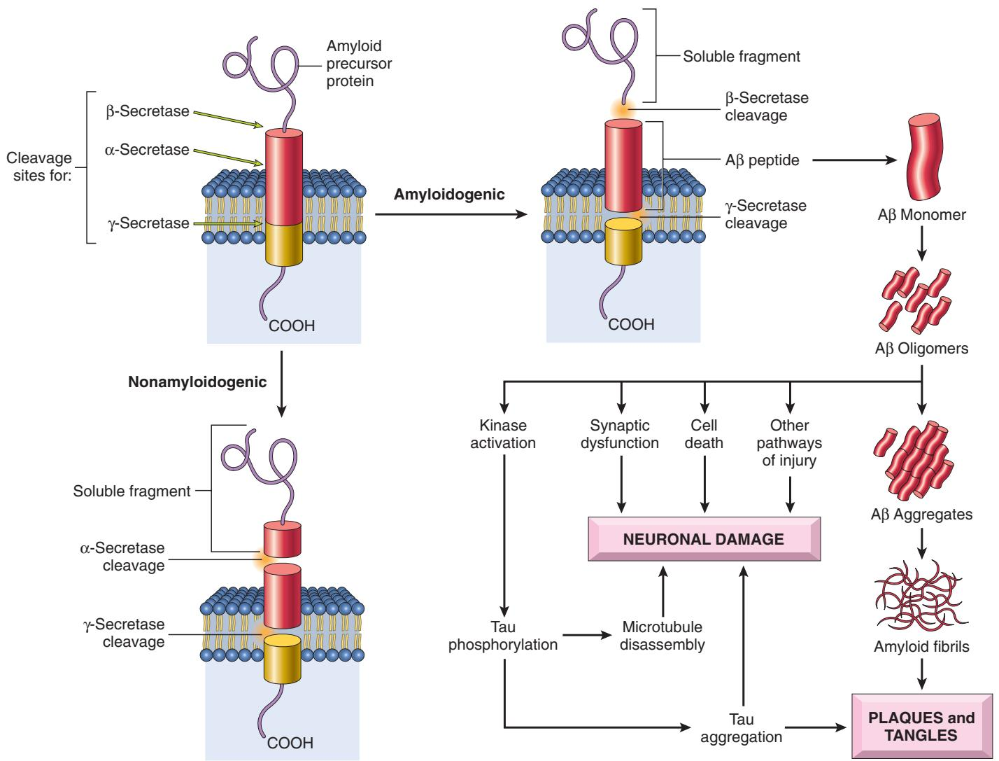 
Fig. 23.24 A $\beta$ peptide genesis and consequences in Alzheimer disease. Amyloid precursor protein cleavage by $\alpha$ -secretase and $\gamma$ -secretase produces a harmless soluble peptide, whereas amyloid precursor protein cleavage by $\beta$ -amyloid-converting enzyme (BACE) and $\gamma$ -secretase releases A $\beta$ peptides, which form pathogenic aggregates and contribute to the characteristic plaques and tangles of Alzheimer disease.
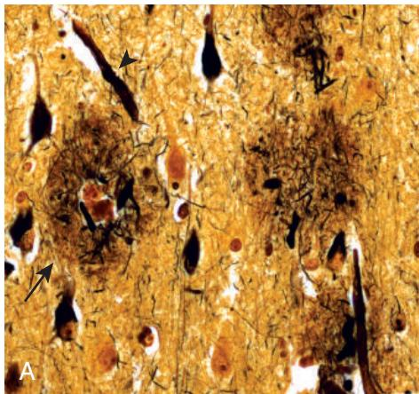 
Fig. 23.25 Alzheimer disease. (A) Plaques (arrow) contain a central core of amyloid and a surrounding region of dystrophic neurites (Bielschowsky stain). (B) Immunohistochemical stain for $\mathsf{A}\beta$ . Peptide is present in the core of the plaques as well as in the surrounding region. (C) Neurons containing tangles stained with an antibody specific for tau.
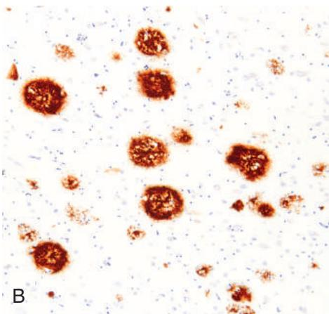
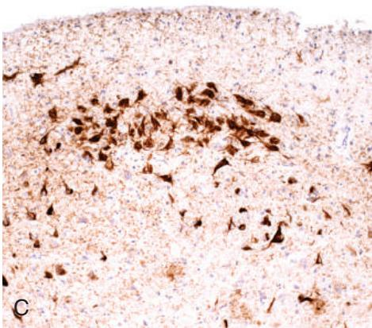
Neuritic plaques are focal, spherical collections of dilated, tortuous, processes derived from dystrophic neurites, often around a central amyloid core (see Fig. 23.25A). Neuritic plaques range in size from 20 to $200\mu \mathrm{m}$ in diameter; microglial cells and reactive astrocytes are present at their periphery. Plaques can be found in the hippocampus and amygdala as well as in the neocortex, although there is relative sparing of primary motor and sensory cortices until late in the disease course. The amyloid core contains Aβ (see Fig. 23.25B). Aβ deposits also can be found that lack the surrounding neuritic reaction, termed diffuse plaques; these are found in the superficial cerebral cortex, the basal ganglia, and the cerebellar cortex and may represent an early stage of plaque development.
Neurofibrillary tangles are bundles of paired helical filaments visible as basophilic fibrillary structures in the cytoplasm of the neurons that displace or encircle the nucleus; tangles can persist after neurons die, becoming a form of extracellular pathology. They are commonly found in cortical neurons, especially in the entorhinal cortex, as well as in the pyramidal cells of the hippocampus, the amygdala, the basal forebrain, and the raphe nuclei. A major component of paired helical filaments is hyperphosphorylated tau (see Fig. 23.25C).
In individuals harboring autosomal dominant mutations that cause AD, deposition of $\mathsf{A}\beta$ and the formation of tangles precede the emergence of cognitive impairment by as much as 15 to 20 years. For this reason, the current diagnostic criteria consider the burden and distribution of amyloid deposits, tangles, and neuritic plaques—a constellation known as Alzheimer disease neuropathologic changes. The staging of each of these processes, which has a fairly consistent pattern across individuals, is then used to assess the likelihood that the observed lesions resulted in cognitive impairment.
# Frontotemporal Lobar Degeneration
Frontotemporal lobar degeneration (FTLD) encompasses several disorders that preferentially affect the frontal and/or temporal lobes. As a result, these disorders have certain shared clinical features, such as progressive deterioration of language and changes in personality. The term degeneration is applied to describe the neuropathologic changes; clinically, these syndromes commonly are referred to as frontotemporal dementias. Depending on the disease distribution (frontal or temporal), behavioral changes or language problems may dominate. In general, behavioral and language problems precede memory disturbances, a distinction that assists in the clinical discrimination between FTLD and AD. The onset of symptoms occurs at younger ages for FTLD than for AD.
In addition to the clinical classification, two pathologic subgroups exist that are distinguished based on the composition of characteristic neuronal inclusions, which may contain tau or TDP43. One well-recognized subtype of FTLD-tau is Pick disease, which is associated with smooth, round inclusions known as Pick bodies. How tau aggregation may lead to neurodegeneration was discussed earlier, in the context of Alzheimer disease. The other major form of FTLD is characterized by aggregates containing the DNA/RNA-binding protein TDP43 (FTLD-TDP43). It is
uncertain how this leads to neurodegeneration; both loss of TDP43 activity and a toxic gain-of-function related to the protein aggregates remain possibilities. TDP43 neuronal inclusions also are found in a large proportion of cases of amyotrophic lateral sclerosis (ALS). This overlap is manifest clinically, as many individuals with ALS also show evidence of FTLD.
The gross appearance is independent of the type of inclusions, with atrophy of frontal and temporal lobes of variable extent and severity, accompanied by neuronal loss and gliosis (Fig. 23.26A-B). In FTLD-tau, the characteristic additional lesion is the presence of tau-containing neurofibrillary tangles, similar to the tangles found in AD (see Fig. 23.26C). In FTLD-TDP, there is loss of nuclear staining for TDP43 associated with the appearance of TDP43-positive inclusions (see Fig. 23.26D).
# Parkinson Disease
Parkinson disease (PD) is a neurodegenerative disease marked by a hypokinetic movement disorder that is caused by loss of dopaminergic neurons from the substantia nigra. Parkinsonism is a clinical syndrome characterized by tremor, rigidity, bradykinesia, and instability. These types of motor disturbances may be seen in a range of diseases that damage dopaminergic neurons, which project from the substantia nigra to the striatum and are involved in control of motor activity. Parkinsonism can be induced by drugs such as dopamine antagonists or toxins that selectively injure dopaminergic neurons. Among the neurodegenerative diseases, most cases of parkinsonism are caused by PD, which is associated with characteristic neuronal inclusions containing $\alpha$ -synuclein.
PD is associated with protein accumulation and aggregation, mitochondrial abnormalities, and neuronal loss in the substantia nigra and elsewhere in the brain. Based on the genetics of PD, it appears that abnormal protein and organelle clearance due to defects in autophagy and lysosomal degradation have a pathogenic role in the disease. One clue and diagnostic feature of the disease is the Lewy body, a characteristic inclusion containing $\alpha$ -synuclein, a protein involved in synaptic transmission. While PD in most cases is sporadic, point mutations and duplications of the gene encoding $\alpha$ -synuclein cause autosomal dominant PD. Synuclein aggregates are cleared by autophagy (Chapter 2), and several mutations associated with PD are in genes whose products (LRRK2, Parkin, others) all appear to have roles in endosomal trafficking pathways implicated in autophagy. It also has been demonstrated that heterozygosity for the Gaucher disease-causing mutation in glucocerebrosidase is a risk factor for PD. Glucocerebrosidase is a lysosomal enzyme, yet another clue suggesting that abnormal turnover of cellular constituents somehow sets the stage for the development of PD.
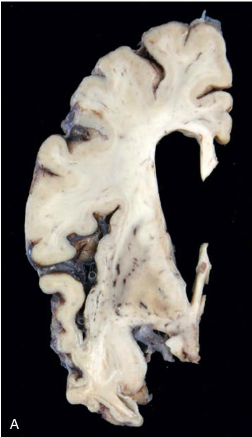 
Fig. 23.26 Frontotemporal lobar degeneration (FTLD). (A) Atrophy of the temporal cortex can be seen in comparison to the relative preservation of frontal cortex. (B) Severe neuronal loss and gliosis in the region of atrophy. (C) FTLD-tau. Cytoplasmic inclusions containing TDP43 are seen in association with loss of normal nuclear immunoreactivity. (D) FTLD-TDP. Some forms of FTLD are associated with neuronal intranuclear inclusions containing TDP43.
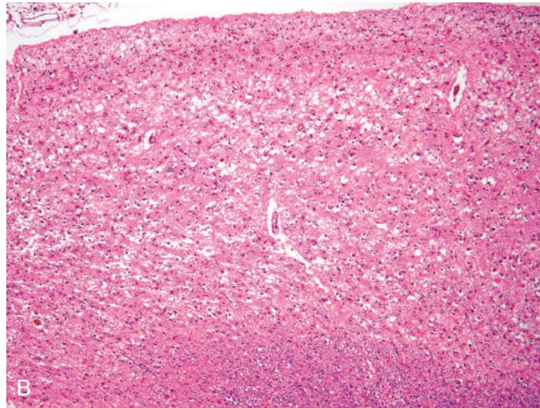
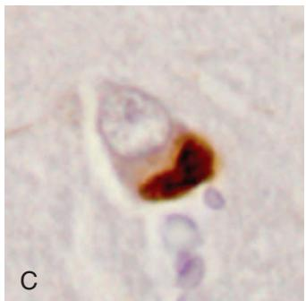
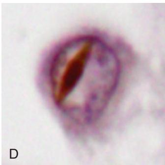

A typical gross finding at autopsy is pallor of the substantia nigra (Fig. 23.27A-B) and locus ceruleus. Microscopic features include loss of the pigmented, catecholaminergic neurons in these regions associated with gliosis. Lewy bodies (see Fig. 23.27C) may be found in those neurons that remain. These are single or multiple, cytoplasmic, eosinophilic, round to elongated inclusions. On ultrastructural examination, Lewy bodies consist of fine filaments, composed of $\alpha$ -synuclein and other proteins, including
neurofilaments and ubiquitin. The other major histologic finding is the presence of Lewy neurites, dystrophic neurites that also contain aggregated $\alpha$ -synuclein. Immunohistochemical staining for $\alpha$ -synuclein highlights more subtle Lewy bodies and Lewy neurites in many brain regions outside of the substantia nigra and in non-dopaminergic neurons, including regions of the medulla, the pons, the amygdala, and the cerebral cortex. Eventually they appear in the subcortical areas and the cerebral cortex. With involvement of the cerebral cortex, there is typically dementia present in addition to the movement disorder.
Normalsubstantianigra.(B)DepigmentedsubstantianigrainidiopathicParkinsondisease.(C)Lewybodyinaneuronfromthesubstantianigrastainspink..jpg) 
Fig. 23.27 Parkinson disease. (A) Normal substantia nigra. (B) Depigmented substantia nigra in idiopathic Parkinson disease. (C) Lewy body in a neuron from the substantia nigra stains pink.
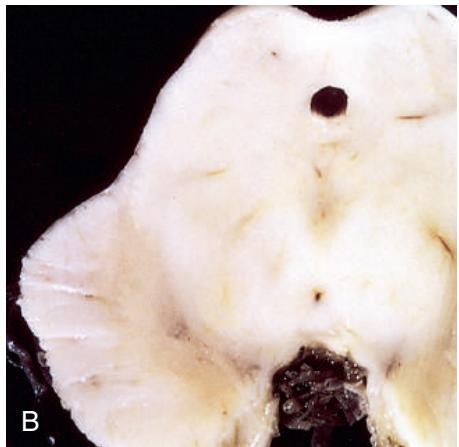
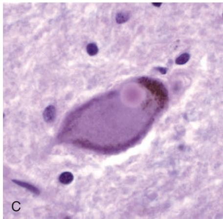
PD commonly manifests as a movement disorder in the absence of a toxic exposure or other known underlying etiology. The disease usually progresses over 10 to 15 years, eventually producing severe motor slowing to the point of near immobility. Death usually is the result of aspiration pneumonia or trauma from falls caused by postural instability.
Movement symptoms of PD initially respond to L-dihydroxyphenylalanine (L-DOPA), but this treatment does not slow disease progression. Over time, L-DOPA becomes less effective and begins to cause problematic fluctuations in motor function. Another treatment for the motor symptoms of PD is deep brain stimulation, in which electrodes are implanted in the globus pallidus or subthalamic nucleus to modulate basal ganglia circuitry, often allowing a significant reduction in L-DOPA dose.
While the movement disorder associated with loss of the nigrostriatal dopaminergic pathway is an important feature of PD, it is clear that the disease has more extensive clinical and pathologic manifestations. Lesions in the brain stem (in the dorsal motor nucleus of the vagus and in the reticular formation), in advance of nigral involvement, can give rise to behavioral sleep disorder often before the motor problems. Dementia, typically with a mildly fluctuating course and hallucinations, emerges in many individuals with PD and is attributable to involvement of the cerebral cortex. When dementia arises within 1 year of the onset of motor symptoms, it is referred to Lewy body dementia (LBD).
# Huntington Disease
Huntington disease (HD) is an autosomal dominant movement disorder associated with degeneration of the striatum (caudate and putamen). The disorder is characterized by involuntary jerky movements of all parts of the body; writhing movements of the extremities are typical. The disease is relentlessly progressive, resulting in death after an average course of about 15 years. Early cognitive symptoms include forgetfulness and thought and affective disorders, and there may be a progression to severe dementia. As a part of these early behavioral changes, HD carries an increased risk for suicide.
HD is caused by CAG trinucleotide repeat expansions in a gene located on 4p16.3 that encodes the protein huntingtin. Normal alleles contain 11 to 34 copies of the repeat; in disease-causing alleles, the number of repeats is increased, sometimes into the hundreds. There is a strong genotype-phenotype correlation, with larger numbers of repeats resulting in earlier-onset disease. Once the symptoms appear, however, the course of the illness is not affected by repeat length. Further expansions of the CAG (glutamine-encoding) repeats occur during spermatogenesis, so paternal transmission may be associated with earlier onset in the next generation, a phenomenon referred to as anticipation (Chapter 7).
HD appears to be caused by a toxic gain-of-function related to the expanded polyglutamine tract in huntingtin.
The mutant protein is subject to ubiquitination and proteolysis, yielding fragments that can form large intranuclear aggregates. As in other degenerative diseases, smaller aggregates of the abnormal protein fragments are suspected to be toxic. These aggregates have been shown to have a range of potentially injurious actions, including sequestration of transcription factors, disruption of protein degradation pathways, and perturbation of mitochondrial function. It is likely that some combination of these aberrations contributes to HD pathogenesis.
On gross examination, the brain is small and shows striking atrophy of the caudate nucleus and, sometimes less dramatically, the putamen (Fig. 23.28). The globus pallidus may be atrophied secondarily, and the lateral and third ventricles are dilated. Atrophy frequently also is seen in the frontal lobe, less often in the parietal lobe, and occasionally in the entire cortex.
Microscopic examination reveals severe loss of neurons from affected regions of the striatum along with gliosis. The medium-sized, spiny neurons that release the neurotransmitters $\gamma$ -aminobutyric acid (GABA), enkephalin, dynorphin, and substance P are especially sensitive, disappearing early in the disease. There is a strong correlation between the degree of degeneration in the striatum and the severity of motor symptoms; there is also an association between cortical neuronal loss and dementia. In remaining striatal neurons and in the cortex, there are intranuclear inclusions that contain aggregates of ubiquitinated huntingtin protein (see Fig. 23.28, inset).
# Spinocerebellar Ataxias
Spinocerebellar ataxias (SCAs) are a heterogeneous group of several dozen diseases with clinical findings that include a combination of cerebellar and sensory ataxia, spasticity, and sensorimotor peripheral neuropathy. They are distinguished from one another based on different
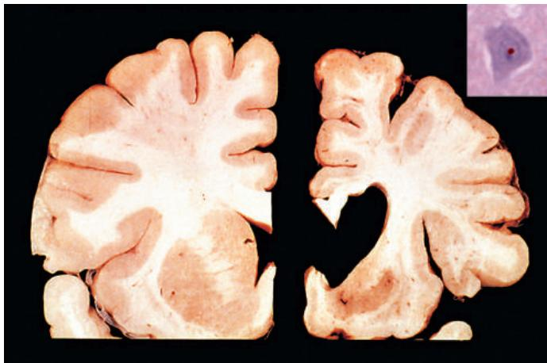 
Fig. 23.28 Huntington disease. Normal hemisphere (left) compared with a hemisphere with Huntington disease (right) showing atrophy of the striatum and ventricular dilation. Inset, An intranuclear inclusion in a cortical neuron is strongly immunoreactive for ubiquitin. (Gross photo courtesy of Dr.Vonsattel, Columbia University, New York, New York.)
causative mutations, patterns of inheritance, age at onset, and signs and symptoms. This group of diseases affects, to a variable extent, the cerebellar cortex, spinal cord, other brain regions, and peripheral nerves. Degeneration of neurons, often without other distinctive histopathologic changes, occurs in the affected areas and is associated with mild gliosis. The additional clinical symptoms that accompany the ataxia can help distinguish between well-characterized subtypes. Although many distinct genetic types of SCA have been identified, there remain many cases that do not fall into one of the already characterized forms.
As with HD, several forms of SCA are caused by CAG repeat expansions encoding polyglutamine tracts in various genes. In these forms of SCA, as is true for HD, neuronal intranuclear inclusions are present containing the abnormal protein, and there is an inverse correlation between the degree of repeat expansion and age of onset. Other SCAs are caused by repeat expansions in untranslated regions or by other types of mutations.
Friedreich ataxia is an autosomal recessive disorder that generally manifests in the first decade of life with gait ataxia, followed by hand clumsiness and dysarthria. Most patients develop pes cavus and kyphoscoliosis, and there is a high incidence of cardiac disease and diabetes. The disease usually is caused by a GAA trinucleotide repeat expansion in the gene encoding frataxin, a protein that regulates cellular iron levels, particularly in the mitochondria. The repeat expansion results in decreased protein levels through transcriptional silencing; decreased frataxin leads to mitochondrial dysfunction as well as increased oxidative damage.
# Amyotrophic Lateral Sclerosis
Amyotrophic lateral sclerosis (ALS) results from the death of lower motor neurons in the spinal cord and brain stem as well as upper motor neurons (Betz cells) in the motor cortex. The loss of lower motor neurons results in denervation of muscles, muscular atrophy (the "amyotrophy" of the condition), weakness, and fasciculations, while the loss of upper motor neurons results in paresis, hyperreflexia, and spasticity, along with a Babinski sign. An additional consequence of upper motor neuron loss is degeneration of the corticospinal tracts in the lateral portion of the spinal cord ("lateral sclerosis"). Sensation usually is unaffected, but cognitive impairment is not infrequent.
The disease affects men slightly more frequently than women and becomes clinically manifest in the fifth decade or later. It usually begins with subtle asymmetric distal extremity weakness. As the disease progresses, muscle strength and bulk diminish, and involuntary contractions of individual motor units, termed fasciculations, occur. The disease eventually involves the respiratory muscles, leading to recurrent bouts of pulmonary infection, which is the usual cause of death. The balance between upper and lower motor neuron involvement can vary, although most patients exhibit involvement of both. In some patients, degeneration of the lower brain stem cranial motor nuclei occurs early and progresses rapidly, a pattern of disease referred to as bulbar amyotrophic lateral sclerosis. With this disease pattern, abnormalities of swallowing and speaking dominate.
While most cases are sporadic, about $10\%$ are familial, mostly with autosomal dominant inheritance. Familial disease begins earlier in life than sporadic disease, but once symptoms appear, the clinical course is similar in both forms. Mutations in the superoxide dismutase gene, SOD1, on chromosome 21 were the first identified genetic cause of ALS and account for about $20\%$ of the familial forms. These mutations are thought to generate abnormal misfolded forms of the SOD1 protein, which may trigger the unfolded protein response and cause apoptotic death of neurons.
A number of other genetic loci have been identified as associated with ALS. The most common cause of familial ALS is hexanucleotide repeat expansion in a gene with the rather cumbersome name C9orf72, which is also frequently expanded in frontotemporal lobar degeneration. The protein encoded by C9orf72 associates with RNA binding proteins; notably, two other genes that when mutated may cause ALS, TDP43 (also associated with FTLD) and FUS, encode RNA binding proteins. This convergence suggests that an abnormality of RNA processing directly or indirectly contributes to the pathogenesis of ALS, but it is uncertain how mutations in SOD1 fit into this picture, and much remains to be discovered. As expected from the genetic overlap, there is some clinical overlap between ALS and FTLD, such as cognitive impairment.
The most striking gross changes are found in anterior roots of the spinal cord, which are thin and gray. In especially severe cases, the precentral gyrus (motor cortex) is mildly atrophic due to the death of upper motor neurons. Microscopic examination demonstrates a reduction in the number of anterior horn cell neurons throughout the spinal cord associated with reactive gliosis and loss of anterior root myelinated fibers. Similar findings are found with involvement of motor cranial nerve nuclei except those supplying the extraocular muscles, which are spared in all but a few long term survivors. Cytoplasmic inclusions that contain TDP43 may be seen in a subset of cases. With the loss of innervation from the death of anterior horn cells, skeletal muscles show neurogenic atrophy.
# NEURODEGENERATIVE DISEASES
- Neurodegenerative diseases cause symptoms that depend on the pattern of brain involvement. Cortical disease usually manifests as cognitive change, alterations in personality, and memory disturbances; basal ganglia disorders usually manifest as movement disorders. 
- Many of the neurodegenerative diseases are associated with various protein aggregates, which serve as pathologic hallmarks. Familial forms of these diseases are associated with mutations in the genes encoding these proteins or controlling their metabolism. Some of these protein aggregates can show prion like properties, facilitating spread from one cell to the next.
- Among dementias, Alzheimer disease (with plaques of Aβ and tangles of tau) is the most common; other predominantly dementing diseases include the various forms of FTLDs (both forms with tau-containing lesions and with other types of inclusions) and dementia with Lewy bodies (with α-synuclein containing lesions). 
- Among the hypokinetic movement disorders, Parkinson disease is the most common, with $\alpha$ -synuclein containing inclusions. 
- Amyotrophic lateral sclerosis (ALS) is the most common form of motor neuron disease, with diverse genetic causes as well as sporadic forms.
# TUMORS
The annual incidence of CNS tumors ranges from 10 to 17 per 100,000 individuals for intracranial tumors and 1 to 2 per 100,000 individuals for intraspinal tumors; about one-half to three-fourths are primary tumors, and the rest are metastatic. Tumors of the CNS make up a larger proportion of childhood cancers, accounting for as many of $20\%$ of all pediatric tumors. Childhood CNS tumors differ from those in adults in both histologic subtype and location. In childhood, tumors are likely to arise in the posterior fossa, whereas tumors in adults are mostly supratentorial.
Tumors of the nervous system have unique characteristics that set them apart from neoplastic processes elsewhere in the body.
- These tumors do not have morphologically evident premalignant or in situ stages comparable to those of carcinomas. 
- Even low-grade lesions may infiltrate large regions of the brain, leading to serious clinical deficits, inability to be resected, and poor prognosis. 
- The anatomic site of the neoplasm can influence outcome independent of histologic classification due to local effects (e.g., a benign meningioma may cause cardiorespiratory arrest from compression of the medulla). 
- Even the most highly malignant gliomas rarely spread outside of the CNS.
# Gliomas
Gliomas are tumors of the brain parenchyma that have long been classified as astrocytomas, oligodendrogliomas, and ependymomas based on their morphologic resemblance to different types of glial cells. With emerging genetic information, it has become clear that the gliomas are a molecularly distinct family of neoplastic lesions, independent of the histologic patterns. Nonetheless, histologic patterns continue to inform diagnosis and guide treatment, with refinement based on molecular characterization. The diffuse gliomas constitute the vast majority of gliomas that occur in adults, and include diffuse astrocytomas and oligodendrogliomas.
# Diffuse Astrocytoma
Astrocytomas account for about $80\%$ of adult gliomas. They are most frequent in the fourth through the sixth
decades of life. They usually are found in the cerebral hemispheres. The most common presenting signs and symptoms are seizures, headaches, and focal neurologic deficits related to the anatomic site of involvement. On the basis of histologic features, astrocytomas are stratified into three groups: diffuse astrocytoma (grade II), anaplastic astrocytoma (grade III), and glioblastoma (grade IV), with increasingly grim prognosis as the grade increases. There is emerging evidence that genetic subtyping provides important additional prognostic information.
Diffuse astrocytomas can be static for several years, but at some point they progress; the mean survival is more than 5 years. Eventually, patients suffer rapid clinical deterioration that is correlated with the appearance of anaplastic features and more rapid tumor growth. Other patients present with glioblastoma from the outset. Once the histologic features of glioblastoma appear, the prognosis is very poor; with treatment (resection, radiotherapy, and chemotherapy), the median survival is only 15 months.
Grade II and III astrocytomas are poorly defined, gray, infiltrative tumors that expand and distort the invaded brain without forming a discrete mass (Fig. 23.29A). Infiltration beyond the grossly evident margins is always present. The cut surface of the tumor is either firm or soft and gelatinous; cystic degeneration may be seen. In glioblastoma, variation in the gross appearance of the tumor from region to region is characteristic (see Fig. 23.29B). Some areas are firm and white, others are soft and yellow (the result of tissue necrosis), and still others show regions of cystic degeneration and hemorrhage.
Microscopically, low-grade (WHO grade II) astrocytomas are characterized by a mild to moderate increase in the number of glial cell nuclei, somewhat variable nuclear pleomorphism, and an intervening feltwork of fine, glial fibrillary acidic protein (GFAP)-positive astrocytic cell processes that give the background a fibrillary appearance. The transition between neoplastic and normal tissue is indistinct, and tumor cells can be seen infiltrating normal tissue many centimeters from the main lesion. Anaplastic astrocytomas show regions that are more densely cellular and have greater nuclear pleomorphism; mitotic figures are present. Glioblastoma has a histologic appearance similar to that of anaplastic astrocytoma, as well as either necrosis (commonly present as serpiginous bands of necrosis with palisaded tumor cells along the border) or microvascular proliferation (see Fig. 23.29C).
# Oligodendroglioma
Oligodendrogliomas account for $5\%$ to $15\%$ of gliomas and most commonly are detected in the fourth and fifth decades of life. Patients may have had several years of antecedent neurologic complaints, often including seizures. The lesions are found mostly in the cerebral hemispheres, mainly in the frontal or temporal lobes. The combination of surgery, chemotherapy, and radiotherapy yields an average survival of 10 to 20 years for well-differentiated (WHO grade II) oligodendrogliomas or 5 to 10 years for anaplastic (WHO grade III) oligodendrogliomas.
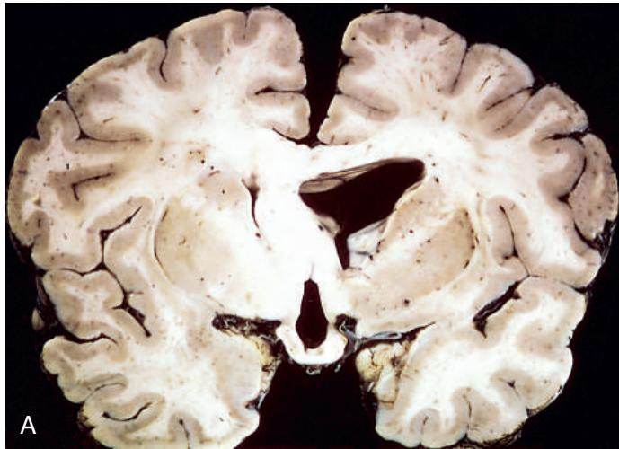
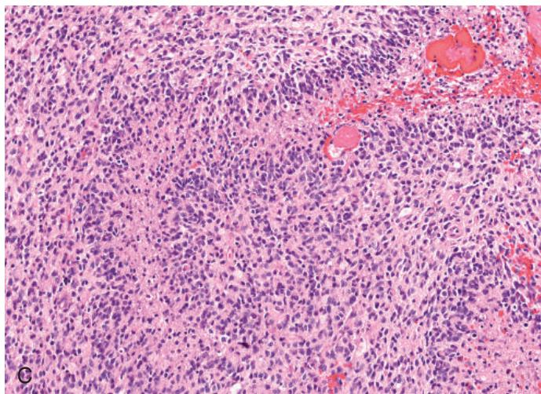 
Fig. 23.29 Diffuse astrocytomas. (A) Grade II astrocytoma is seen as expanded white matter of the left cerebral hemisphere and thickened corpus callosum and fornices. (B) Glioblastoma appearing as a necrotic, hemorrhagic, infiltrating mass. (C) Glioblastoma is a densely cellular tumor with necrosis and pseudopolisading of tumor cell nuclei along the edge of the necrotic zone.
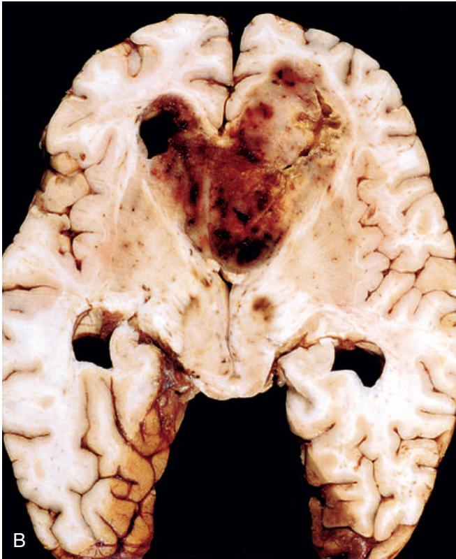

Well-differentiated oligodendrogliomas (WHO grade II) are infiltrative tumors that form gelatinous, gray masses and may show cysts, focal hemorrhage, and calcification. On microscopic examination, the tumor is composed of sheets of regular cells with spherical nuclei containing finely granular chromatin (similar to that in normal oligodendrocytes) surrounded by a clear halo of cytoplasm (Fig. 23.30). The tumor typically contains a delicate network of anastomosing capillaries. Calcification, present in as many as $90\%$ of these tumors, ranges in extent from microscopic foci to massive depositions. Mitotic activity usually is low. Anaplastic oligodendroglioma (WHO grade III) is a more aggressive subtype with higher cell density, nuclear anaplasia, increased mitotic activity, and often microvascular proliferation.
# Genetics and Pathogenesis
Several classes of tumor-causing genetic alterations have been described in gliomas.
- Mutations in isocitrate dehydrogenase (IDH) genes are commonly observed in grade II astrocytomas and oligodendrogliomas. These mutations may occur in IDH1 or IDH2
and lead to increased production of 2-hydroxyglutarate, which interferes with the activity of several enzymes that regulate gene expression (Chapter 6).
- Mutations in the promoter for telomerase, which contribute to the immortalization of tumor cells (Chapter 6), are seen in glioblastomas and other astrocytic tumors. In tumors with IDH mutations, telomerase mutations are uncommon; instead, these tumors often have loss of function mutations in ATRX, which normally suppresses recombination events that can preserve telomere length, a mechanism called alternative lengthening of telomeres. 
- Co-deletion of 1p and 19q chromosomal segments are present in oligodendrogliomas. The mechanism through which these chromosomal alterations shape tumor morphology and response to treatment is not known. 
- Other genetic alterations, which are also common in tumors outside the CNS, include mutations that lead to overexpression of the EGF receptor and other receptor tyrosine kinases or disable p53 or RB (Chapter 6).
# Midline Glioma
Midline gliomas arise most commonly in the brain stem (specifically in the pons) and also occur in the spinal cord
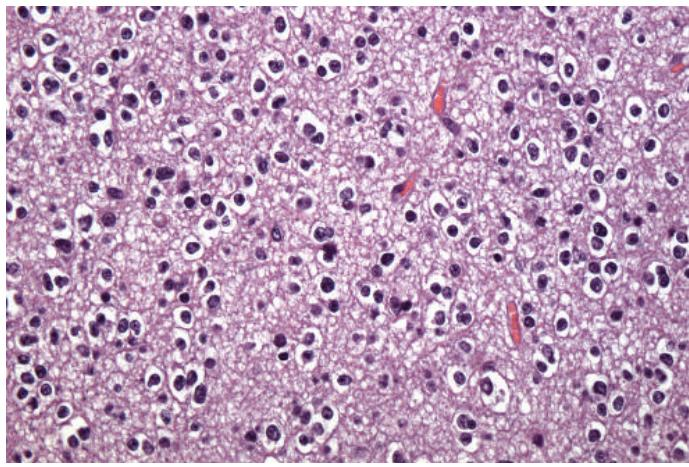 
Fig. 23.30 In oligodendroglioma, tumor cells have round nuclei, often with a clear cytoplasmic halo. Blood vessels in the background are thin and can form an interlacing pattern.
and thalamus. They are infiltrative and result in significant neurologic impairment because of the disruption of critical nearby structures. Although they may not show typical high-grade features such as necrosis or vascular proliferation, they often behave aggressively. These lesions typically have acquired point mutations in histone H3, the consequence of which is loss of a lysine residue that is the target of post-translational modifications that regulate gene expression, another example of oncogenesis via alteration of the cancer cell "epigenome". Precisely how this mutation contributes to cellular transformation remains to be determined.
# Pilocytic Astrocytoma
Pilocytic astrocytomas are relatively benign tumors that typically affect children and young adults. Most commonly located in the cerebellum, they also may involve the third ventricle, the optic pathways, the spinal cord, and occasionally the cerebral hemispheres. There is often a cyst associated with the tumor, and symptoms appearing after the incomplete resection of the lesions may be associated with cyst enlargement, rather than growth of the solid component. Tumors that involve the hypothalamus are especially problematic because they cannot be resected completely.
A high proportion of pilocytic astrocytomas have activating mutations or translocations involving the gene encoding the serine-threonine kinase BRAF, which result in activation of the MAPK signaling pathway. Pilocytic astrocytomas do not have mutations in $IDH1$ and $IDH2$ , supporting their distinction from the low-grade diffuse gliomas.
A pilocytic astrocytoma often is cystic, with a mural nodule in the wall of the cyst; if solid, it is usually well circumscribed. The tumor is composed of bipolar cells with long, thin "hairlike" processes that are GFAP-positive. Rosenthal fibers, eosinophilic granular bodies, and microcysts are often present, while necrosis and mitoses are rare.
# Ependymoma
Ependymomas most often arise next to the ependymalined ventricular system, including the central canal of the spinal cord. In the first 2 decades of life, they typically occur near the fourth ventricle and constitute $5\%$ to $10\%$ of the primary brain tumors in this age group. In adults, the spinal cord is their most common location; tumors in this site are particularly frequent in the setting of neurofibromatosis type 2 (Chapter 22). The clinical outcome for completely resected supratentorial and spinal ependymomas is better than for those in the posterior fossa.
In the fourth ventricle, ependymomas typically are solid or papillary masses extending from the ventricular floor. The tumors are composed of cells with regular, round to oval nuclei and abundant granular chromatin. Between the nuclei is a variably dense fibrillary background. Tumor cells may form round or elongated structures (rosettes, canals) that resemble the embryologic ependymal canal, with long, delicate processes extending into a lumen (Fig. 23.31); more frequently present are perivascular pseudorosettes in which tumor cells are arranged around vessels with an intervening zone containing thin ependymal processes. Anaplastic ependymomas show increased cell density, high mitotic rates, necrosis, microvascular proliferation, and less evident ependymal differentiation.
# Neuronal Tumors
Far less frequent than gliomas, tumors composed of cells with neuronal characteristics are typically lower-grade lesions that often present with seizures. While some neuronal differentiation can be observed in many tumors, lesions in this group are primarily composed of cells that express neuronal markers, such as synaptophysin and neurofilaments.
- Central neurocytoma is a low-grade neoplasm found within and adjacent to the ventricular system (most commonly the lateral or third ventricle); it is characterized by evenly spaced, round, uniform nuclei and often islands of neuropil.
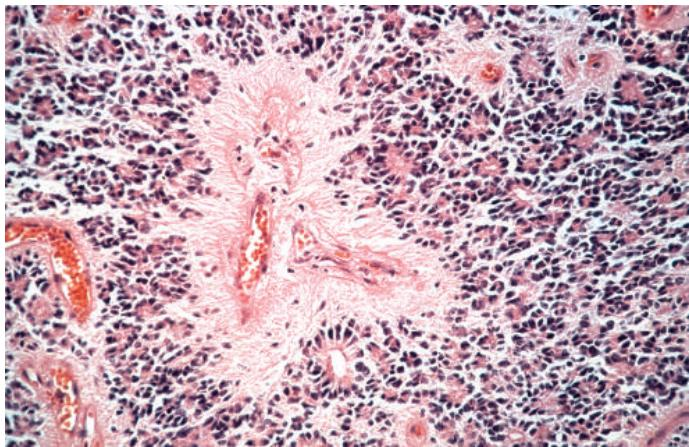 
Fig. 23.31 Microscopic appearance of ependymoma.
- Dysembryoplastic neuroepithelial tumor is a distinctive, low-grade tumor of children and young adults that grows slowly, often manifests as a seizure disorder, and carries a favorable prognosis after resection. It typically is located in the superficial temporal lobe and consists of small, round neuronal cells arranged in columns and around central cores of processes. 
- Gangliogliomas are tumors with a mixture of glial elements, usually a low-grade astrocytoma and mature-appearing neurons. Most of these tumors are slow growing, and often manifest with seizures. About $20\%$ to $50\%$ of gangliogliomas harbor point mutations in the BRAF gene.
# Embryonal (Primitive) Neoplasms
Some tumors of neuroectodermal origin have a primitive "small round cell" appearance that is reminiscent of normal progenitor cells encountered in the developing CNS. Differentiation is often limited, but may progress along multiple lineages. The most common is the medulloblastoma, accounting for $20\%$ of pediatric brain tumors.
# Medulloblastoma
Medulloblastoma occurs predominantly in children and exclusively in the cerebellum. Neuronal and glial markers are nearly always expressed, at least to a limited extent. It is highly malignant, and the prognosis for untreated patients is dismal; however, medulloblastoma is exquisitely radiosensitive. With total excision, chemotherapy, and irradiation, the 5-year survival rate may be as high as $75\%$ . There are a series of histologic patterns observed in medulloblastoma, which are informative about prognosis and correlate in part with the underlying genetics.
In children, medulloblastomas are located in the midline of the cerebellum; lateral tumors occur more often in adults. The tumor often is well circumscribed, gray, and friable and may be seen extending to the surface of the cerebellar folia and involving
the leptomeninges (Fig. 23.32A). Medulloblastomas are densely cellular, with sheets of anaplastic ("small blue") cells (see Fig. 23.32B). Individual tumor cells are small, with little cytoplasm and hyperchromatic nuclei; mitoses are abundant. Often, focal neuronal differentiation is seen in the form of rosettes, which closely resemble the rosettes encountered in neuroblastomas; they are characterized by primitive tumor cells surrounding central neuropil (delicate pink material formed by neuronal processes).
Genetic analysis of medulloblastoma has revealed several subtypes associated with different clinical outcomes. Current approaches separate medulloblastoma into distinct groups with different core pathogenic pathways or driver mutations. Examples of oncogenic pathways in these tumors are the following:
- Wnt pathway activation, most commonly associated with gain of function mutations in the gene for $\beta$ -catenin; these have the most favorable prognosis of all of the genetic subtypes and are commonly classic-type tumors. 
- Hedgehog pathway activation, most commonly associated with loss of function mutations in PTCH1, a negative regulator of the Hedgehog; these tumors have an intermediate prognosis, but the concomitant presence of TP53 mutation confers a very poor prognosis. 
- MYC overexpression, due to MYC amplification as well as other changes that result in increased expression; these tumors have the poorest prognosis.
Clinical trials are ongoing that seek to tailor therapy targeted to molecular alterations, with the goal of avoiding radiation therapy when possible.
# Other Parenchymal Tumors
# Primary Central Nervous System Lymphoma
Primary CNS lymphoma, occurring mostly as diffuse large B-cell lymphomas, accounts for $2\%$ of extranodal lymphomas and $1\%$ of intracranial tumors. It is the most common CNS neoplasm in immunosuppressed individuals, in
Sagittalsectionofabrainshowingmedulloblastomainvolvingthesuperiorvermisofthecerebellum.(B)Microscopicappearanceofmedulloblastoma,showingmostlysmall,blue,primitive-appearingtumorcells..jpg) 
Fig. 23.32 Medulloblastoma. (A) Sagittal section of a brain showing medulloblastoma involving the superior vermis of the cerebellum. (B) Microscopic appearance of medulloblastoma, showing mostly small, blue, primitive-appearing tumor cells.
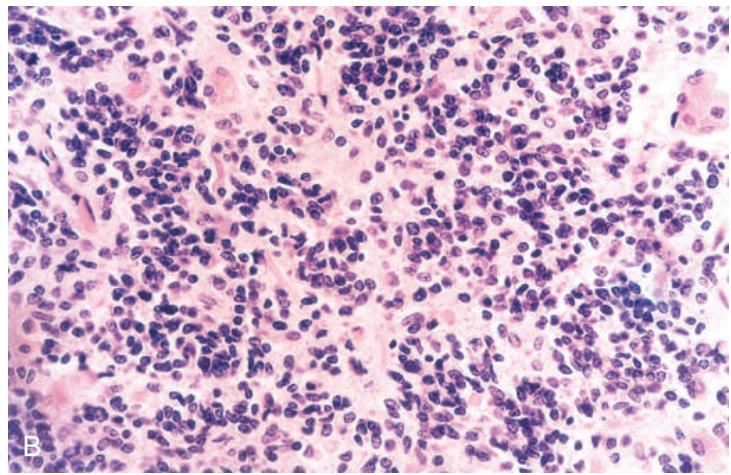
whom the tumors are nearly always positive for Epstein-Barr virus (EBV). In nonimmunosuppressed populations, the age spectrum is relatively wide, with the incidence increasing after 60 years of age. Regardless of the clinical context, primary brain lymphoma is an aggressive disease with a relatively poor response to chemotherapy as compared with peripheral lymphomas.
Patients with primary brain lymphoma often are found to have multiple tumor nodules within the brain parenchyma, yet involvement of sites outside of the CNS is uncommon. Conversely, lymphoma originating outside the CNS rarely spreads to the brain parenchyma; when this occurs, the tumor usually also involves the CSF or the meninges.
Lesions often involve deep gray structures, as well as the white matter and the cortex. Periventricular spread is common. The tumors are relatively well defined as compared with glial neoplasms, but they are not as discrete as metastases. EBV-associated tumors often show extensive areas of necrosis. The tumors are nearly always aggressive large B-cell lymphomas, although other histologic types may be encountered. Microscopically, malignant lymphoid cells accumulate around blood vessels and infiltrate the surrounding brain parenchyma. The diagnosis is confirmed by immunohistochemistry for B cell markers such as CD20, which also is a target of therapeutic antibodies.
# Germ Cell Tumors
Primary brain germ cell tumors occur along the midline, most commonly in the pineal and the suprasellar regions. They account for $0.2\%$ to $1\%$ of brain tumors in individuals of European descent but in as many as $10\%$ of brain tumors in individuals of Japanese ethnicity. They are a tumor of the young, with $90\%$ occurring during the first 2 decades of life. Germ cell tumors in the pineal region show a strong male predominance. The most common primary CNS germ cell tumor is germinoma, a tumor that closely resembles testicular seminoma (Chapter 18). Secondary CNS involvement by metastatic gonadal germ cell tumors also occurs.
# Meningiomas
Meningiomas are predominantly benign tumors that arise from arachnoid meningothelial cells. They usually occur in adults and are often attached to the dura. Meningiomas may be found along any of the external surfaces of the brain as well as within the ventricular system, where they arise from the stromal arachnoid cells of the choroid plexus. They often come to attention because of vague nonlocalizing symptoms, or with focal findings referable to compression of adjacent brain. Most meningiomas are easily separable from underlying brain, but some tumors are infiltrative, a feature associated with an increased risk for recurrence. The overall prognosis is determined by the lesion size and location, surgical accessibility, and histologic grade.
When an individual has multiple meningiomas, especially in association with eighth-nerve schwannomas or glial tumors, the diagnosis of neurofibromatosis type 2 (NF2) should be considered (Chapter 22). About half of meningiomas not associated with NF2 have somatic loss-of-function mutations in the NF2 tumor suppressor gene on the long arm of chromosome 22 (22q). These mutations are found in all grades of meningioma, suggesting that they are involved in tumor initiation. Among sporadic tumors that lack mutations in NF2, several other driver mutations have been identified including in genes that regulate the Hedgehog pathway as well as in various signaling molecules and transcription factors.
Meningiomas (WHO grade I) grow as well-defined durabased masses that may compress the brain but do not typically invade it (Fig. 23.33A). Extension into the overlying bone may be present. The varied histologic patterns include: meningothelial, named for whorled, tight clusters of cells without visible cell membranes; fibroblastic, with elongated cells and abundant collagen deposition; transitional, with features of the meningothelial and fibroblastic types; psammomatous, with numerous psammoma bodies (see Fig. 23.33B); and secretory, with glandlike spaces containing PAS-positive eosinophilic material.
Atypical meningiomas (WHO grade II) are recognized by the presence of either an increased mitotic rate, or prominent nucleoli, increased cellularity, patternless growth, high nucleus-to-cytoplasm ratio, or necrosis. These tumors demonstrate more aggressive local growth and a higher rate of recurrence and may require therapy in addition to surgery. Some histologic patterns—clear cell and chordoid—also correlate with more aggressive behavior, as does the presence of brain invasion.
Anaplastic (malignant) meningiomas (WHO grade III) are highly aggressive tumors that may resemble a high-grade sarcoma or carcinoma morphologically. Mitotic rates are typically much higher than in atypical meningiomas.
# Metastatic Tumors
Metastatic lesions, mostly carcinomas, account for approximately one-fourth to one-half of intracranial tumors. The most common primary sites are lung, breast, skin (melanoma), kidney, and gastrointestinal tract, which together account for about $80\%$ of cases. Metastases form sharply demarcated masses, often at the grey-white matter junction, and elicit local edema (Fig. 23.34). The boundary between tumor and brain parenchyma is sharp at the microscopic level as well, with surrounding reactive gliosis.
In addition to the direct and localized effects produced by metastases, paraneoplastic syndromes may involve the peripheral and central nervous systems, sometimes even preceding the clinical recognition of the malignant neoplasm. Many patients with paraneoplastic syndromes have antibodies against tumor antigens. Some of the more common patterns include the following:
- Subacute cerebellar degeneration resulting in ataxia, with destruction of Purkinje cells, gliosis, and a mild inflammatory infiltrate
Parasagittalmultilobularmeningiomaattachedtothedurawithcompressionofunderlyingbrain.(B)Meningiomawithawhorledpatternofcellgrowthandpsammomabodies..jpg) 
Fig. 23.33 Meningioma. (A) Parasagittal multilobular meningioma attached to the dura with compression of underlying brain. (B) Meningioma with a whorled pattern of cell growth and psammoma bodies.
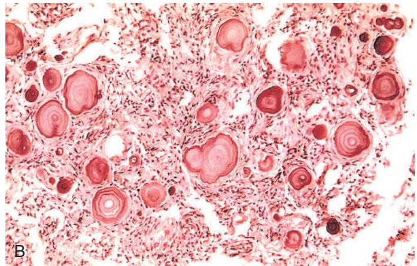
- Limbic encephalitis causing a subacute dementia, with perivascular inflammatory cells, microglial nodules, neuronal loss, and gliosis, all centered in the medial temporal lobe 
- Subacute sensory neuropathy leading to altered pain sensation, with loss of sensory neurons from dorsal root ganglia, in association with inflammation 
- Syndrome of rapid-onset psychosis, catatonia, epilepsy, and coma associated with ovarian teratoma and antibodies against the $N$ -methyl-D-aspartate (NMDA) receptor.
# Familial Tumor Syndromes
Several inherited syndromes caused by mutations in various tumor suppressor genes are associated with an increased risk for particular types of cancers. Those with particular involvement of the CNS are discussed here; familial syndromes associated with tumors of the peripheral nervous system are covered in Chapter 22.
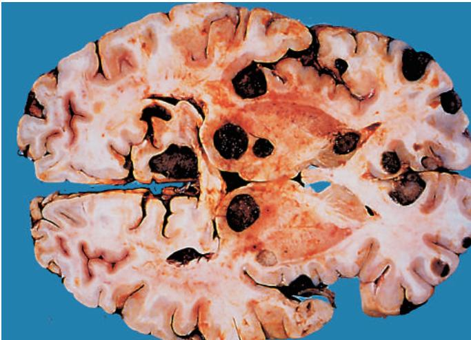 
Fig. 23.34 Metastatic melanoma. Metastatic lesions are distinguished grossly from most primary central nervous system tumors by their multicentricity and well-demarcated margins. The dark color of the tumor nodules in this specimen is due to the presence of melanin.
# Tuberous Sclerosis
Tuberous sclerosis is an autosomal dominant syndrome characterized by the development of hamartomas and benign neoplasms involving the brain and other tissues. CNS hamartomas variously consist of cortical tubers and subependymal hamartomas, including a larger tumefactive form known as subependymal giant cell astrocytoma. Because of their proximity to the foramen of Monro, they often present acutely with obstructive hydrocephalus, which requires surgical intervention and/or therapy with an mTOR inhibitor (see later). Seizures are associated with cortical tubers and can be difficult to control with anti-epileptic drugs. Extracerebral lesions include renal angiomyolipomas, retinal glial hamartomas, pulmonary lymphangiomyomatosis, and cardiac rhabdomyomas. Cysts may be found at various sites, including the liver, kidneys, and pancreas. Cutaneous lesions include angiofibromas, leathery thickenings in localized patches (shagreen patches), hypopigmented areas (ash leaf patches), and subungual fibromas.
Tuberous sclerosis results from disruption of either TSC1, which encodes hamartin, or TSC2, which encodes tuberin. The two TSC proteins form a dimeric complex that negatively regulates mTOR, a kinase that "senses" the cell's nutrient status and regulates cellular metabolism. Loss of either protein upregulates mTOR activity, which disrupts normal feedback mechanisms that restrict uptake of nutrients and leads to increased cell growth.
Cortical hamartomas are firmer than normal cortex and have been likened in appearance to potatoes—hence the appellation tubers. They are composed of haphazardly arranged large neurons that lack the normal cortical laminar architecture. These cells may exhibit a mixture of glial and neuronal features, having large vesicular nuclei with nucleoli (like neurons) and abundant eosinophilic cytoplasm. Similar abnormal cells are present in subependymal nodules, in which large astrocyte like cells cluster beneath the ventricular surface.
# von Hippel-Lindau Disease
In this autosomal dominant disorder, affected individuals develop hemangioblastomas within the cerebellar hemispheres, retina, and, less commonly, the brain stem, spinal cord, and nerve roots. Patients also may have cysts involving the pancreas, liver, and kidneys and have an increased propensity to develop renal cell carcinoma. The disease frequency is 1 in 30,000 to 40,000. Therapy is directed at the symptomatic neoplasms, including surgical resection of cerebellar tumors and laser ablation of retinal tumors.
The affected gene, the tumor suppressor VHL, encodes a protein that is part of a ubiquitin-ligase complex that degrades the transcription factor hypoxia-inducible factor (HIF). Tumors arising in patients with von Hippel-Lindau disease generally have lost all VHL protein function. As a result, the tumors express high levels of HIF, which drives the expression of VEGF, various growth factors, and sometimes erythropoietin; the latter effect may produce a paraneoplastic form of polycythemia.

Hemangioblastoma, the principal neurologic manifestation of the disease, is a highly vascular neoplasm that occurs as a mural nodule associated with a large, fluid-filled cyst. These occur most commonly in the cerebellum, but can be found along the spinal cord and in the retina, and rarely at other sites in the brain. On microscopic examination, the lesion consists of numerous capillary-sized or somewhat larger thin-walled vessels separated by intervening stromal cells with a vacuolated, lightly PAS-positive, lipid-rich cytoplasm. These stromal cells express inhibin, a member of the TGF- $\beta$ family, which serves as a useful diagnostic marker.

# TUMORS OF THE CENTRAL NERVOUS SYSTEM
- Tumors of the CNS may arise from the cells of the coverings (meningiomas), the brain (gliomas, neuronal tumors, choroid plexus tumors), or other CNS cell populations (primary CNS lymphoma, germ cell tumors), or they may originate elsewhere in the body (metastases). 
- Even low-grade or benign tumors can have poor clinical outcomes, depending on where they occur in the brain. 
- Distinct types of tumors affect specific brain regions (e.g., cerebellum for medulloblastoma, an intraventricular location for central neurocytoma) and specific age populations (medulloblastoma and pilocytic astrocytomas in pediatric age groups, and glioblastoma and lymphoma in older patients). 
Glial tumors are broadly classified into astrocytomas, oligodendrogliomas, and ependymomas. Increasing tumor malignancy is associated with more cytologic anaplasia, increased cell density, necrosis, and mitotic activity. 
- Metastatic spread of brain tumors to other regions of the body is rare, but the brain is not comparably protected against the spread of distant tumors. Carcinomas are the dominant type of systemic tumors that metastasize to the nervous system.
# Central Nervous System Trauma
McKee AC, Cairns NJ, Dickson DW, et al: The first NINDS/NIBIB consensus meeting to define neuropathological criteria for the diagnosis of chronic traumatic encephalopathy, Acta Neuropathol 131(1):75-86, 2016. [The first effort to define objectively the neuropathologic changes which define CTI.]
McKee AC, Stein TD, Kiernan PT, et al: The neuropathology of chronic traumatic encephalopathy, Brain Pathol 25(3):350-364, 2015. [A summary of much of the descriptive work laying the basis for the emergence of CTE as a tauopathy associated with prior brain trauma.]
# Congenital Malformations and Perinatal Brain Injury
Guemez-Gamboa A, Coufal NG, Gleeson JG: Primary cilia in the developing and mature brain, Neuron 82(3):511-521, 2014. [A discussion of the role of primary cilia in brain development, particularly the posterior fossa, as well as consideration of malformations that accompany disorders of this cilium.]
Guerrini R, Dobyns WB: Malformations of cortical development: clinical features and genetic causes, Lancet Neurol 13(7):710-726, 2014. [A clear review of many of the biological mechanisms that underlie cortical development as well as the genetic disorder that disrupt the process.]
# Infections of the Nervous System
Clifford DB: Neurological immune reconstitution inflammatory response: riding the tide of immune recovery, Curr Opin Neurol 28(3):295-301, 2015. [Discusses the clinical and pathological aspects of the inflammatory syndrome which can accompany initiation of HAART as a result of recovery of aspects of the immune system.] 
Saylor D, Dickens AM, Sacktor N, et al: HIV-associated neurocognitive disorder—pathogenesis and prospects for treatment, Nat Rev Neurol 12(4):234-248, 2016. [Summary of the underlying mechanisms for HIV-induced neurologic dysfunction and the impact of existing therapies on these complications of infection.]
# Demyelinating Diseases
Dendrou CA, Fugger L, Friese MA: Immunopathology of multiple sclerosis, Nat Rev Immunol 15(9):545-558, 2015. [While the immune basis of MS has been accepted for many years, it has become clear that there are increasing complexities of this injury to myelin, axons, and oligodendrocytes than previously assumed.] 
Podestà MA, Faravelli I, Cucchiari D, et al: Neurological counterparts of hyponatremia: pathological mechanisms and clinical manifestations, Curr Neurol Neurosci Rep 15(4):18, 2015. [The mechanistic relationship between alterations in serum osmolality and acute injury to myelin remains complex but is partially addressed in this discussion.] 
Yang X, Ransom BR, Ma JF: The role of AQP4 in neuromyelitis optica: More answers, more questions, J Neuroimmunol 298:63-70, 2016. [While the presence of antibodies to aquaporin-4 helped clarify the syndrome of neuromyelitis optica, it remains a more complex disease than a simple autoimmune disorder.]
# Neurodegenerative Diseases
Barker RA, Williams-Gray CH: Review: the spectrum of clinical features seen with alpha synuclein pathology, Neuropathol Appl Neurobiol 42(1):6-19, 2016. [Aggregation of $\alpha$ -synuclein marks several neurodegenerative diseases, and this review considers shared and distinct aspects of the pathologic findings.] 
Colonna M, Wang Y: TREM2 variants: new keys to decipher Alzheimer disease pathogenesis, Nat Rev Neurosci 17(4):201-207, 2016. [One of the strongest links between Alzheimer disease and microglia is the risk associated with variants of TREM2 on the surfaces of microglia.] 
Ling SC, Polymenidou M, Cleveland DW: Converging mechanisms in ALS and FTD: disrupted RNA and protein homeostasis, Neuron 79(3):416-438, 2013. [A clear summary of mechanisms associated with neurodegeneration that can be linked to the consequences of altered RNA dynamics within cells and the consequence of this for proteins.]
Mackenzie IR, Neumann M: Molecular neuropathology of frontotemporal dementia: insights into disease mechanisms from postmortem studies, J Neurochem 138(Suppl 1):54-70, 2016. [A consideration of the complex family of disorders that give rise to frontotemporal lobe degenerations, with different clinical pictures as well as different histologic findings and associated mechanisms.] 
Selkoe DJ, Hardy J: The amyloid hypothesis of Alzheimer's disease at 25 years, EMBO Mol Med 8(6):595-608, 2016. [A current summary of the relationship of $A\beta$ to the pathogenesis of Alzheimer disease.]
# Brain Tumors
Louis DN, Perry A, Reifenberger G, et al: The 2016 World Health Organization Classification of Tumors of the Central Nervous System: a summary, Acta Neuropathol 131(6):803-820, 2016. [A concise summary of the most recent classification of brain tumors, including the concept of "layer" diagnoses that incorporate histologic findings as well as multiple types of molecular information in order to predict course and guide therapy.]
# Skin
# 24
Acute Inflammatory Dermatoses 889
Urticaria 889
Acute Eczematous Dermatitis 890
Erythema Multiforme 891
Chronic Inflammatory Dermatoses 892
Psoriasis 892
Lichen Planus 893
Lichen Simplex Chronicus 894
Infectious Dermatoses 894
Bacterial Infections 894
Fungal Infections 894
Verrucae (Warts) 895
Blistering (Bullous) Disorders 895
Pemphigus (Vulgaris and Foliaceus) 895
Bullous Pemphigoid 896
Dermatitis Herpetiformis 898
Tumors of the Skin 899
Benign and Premalignant Epithelial Lesions 899
Malignant Epidermal Tumors 900
MelanocyticProliferations 903
Skin diseases are common and diverse, ranging from irritating acne to life-threatening melanoma. Many are intrinsic to the skin, but some are manifestations of diseases involving many tissues, such as systemic lupus erythematosus or genetic syndromes such as neurofibromatosis. In this sense, the skin is a uniquely accessible "window" through which numerous disorders can be recognized.
Skin is not a mere protective mantle but rather a complex organ, actually the largest in the body. It is constantly exposed to microbial and nonmicrobial antigens from the environment. Given this, it is not surprising that the skin is an active participant in immune responses. Environmentally derived antigens are processed by intraepithelial Langerhans cells, which bear their antigenic cargo to regional lymph nodes and initiate immune responses. Squamous cells (keratinocytes) help maintain skin homeostasis by providing a physical barrier to environmental insults and by secreting a plethora of cytokines that influence both the squamous and dermal microenvironments. The dermis contains resident populations of $\mathrm{CD4 + }$ helper and $\mathrm{CD8 + }$ cytotoxic T lymphocytes, some of which home to the skin by virtue of specialized receptors such as cutaneous lymphocyte antigen, as well as memory T cells, regulatory T cells $(\mathrm{T_{reg}})$ and occasional B cells. The epidermis contains intraepithelial lymphocytes, including $\gamma /\delta$ T cells, while the dermis contains perivascular mast cells and scattered macrophages, all components of the innate immune system. Responses involving these immune cells and locally released cytokines account for the morphologic patterns and clinical expressions of inflammatory and infectious skin disorders.
This chapter focuses on common and pathogenically illustrative skin diseases. In considering these diseases, it is important to appreciate that the practice of
The contributions of Dr. George Murphy to this chapter in previous editions are gratefully acknowledged.
dermatopathology relies on close interactions with clinicians, particularly dermatologists, as the clinical history, gross appearance, and distribution of lesions are often as important as the microscopic findings in arriving at a specific diagnosis. Diseases of the skin can be confusing for the student, in part because dermatologists and dermatopathologists communicate using a large, "skin-specific" lexicon that students must become familiar with in order to understand skin diseases. The most important of these terms and definitions are listed in Table 24.1.
# ACUTE INFLAMMATORY DERMATOSES
Thousands of inflammatory dermatoses exist, challenging the diagnostic acumen of even experienced clinicians. In general, acute lesions, defined as days to several weeks in duration, are characterized by inflammation, edema, and sometimes epidermal, vascular, or subcutaneous injury. Acute dermatoses are often marked by infiltrates consisting of mononuclear cells rather than neutrophils, unlike acute inflammatory disorders at most other sites. Some acute lesions may persist, transitioning to a chronic phase, while others are self-limited.
# Urticaria
Urticaria ("hives") is a common disorder mediated by localized mast cell degranulation, which leads to dermal microvascular hyperpermeability. The resulting erythematous, edematous, and pruritic plaques are termed wheals.
In most cases, urticaria stems from an immediate (type 1) hypersensitivity reaction (Chapter 5), in which antigens trigger mast cell degranulation by binding to
Table 24.1 Nomenclature of Skin Lesions 
Macroscopic LesionsDefinitionExcoriationTraumatic lesion breaking the epidermis and causing a raw linear area (i.e., deep scratch); often self-inflictedLichenificationThickened, rough skin (similar to a lichen on a rock); usually the result of repeated rubbingMacule, patchCircumscribed, flat lesion distinguished from surrounding skin by color. Macules are 5 mm in diameter or less, while patches are greater than 5 mm in size.Papule, noduleElevated dome-shaped or flat-topped lesion. Papules are 5 mm in diameter or less, while nodules are greater than 5 mm in size.PlaqueElevated flat-topped lesion, usually greater than 5 mm in diameter (may be formed by coalescence of papules)PustuleDiscrete, pus-filled, raised lesionScaleDry, horny, platelike excrescence; usually the result of imperfect cornificationVesicle, bulla, blisterFluid-filled raised lesion 5 mm or less in diameter (vesicle) or greater than 5 mm in diameter (bulla). Blister is the common term for both lesions.WhealItchy, transient, elevated lesion with variable blanching and erythema formed as the result of dermal edemaMicroscopic LesionsDefinitionAcanthosisDiffuse epidermal hyperplasiaDyskeratosisAbnormal, premature keratinization within cells below the stratum granulosumHyperkeratosisThickening of the stratum corneum, often associated with a qualitative abnormality of the keratinPapillomatosisSurface elevation caused by hyperplasia and enlargement of contiguous dermal papillaeParakeratosisRetention of nuclei in the stratum corneum of a squamous epithelium. On mucous membranes, parakeratosis is normal.SpongiosisIntercellular edema of the epidermis
immunoglobulin E (IgE) antibodies attached to the mast cell surface through their Fc receptor. Responsible antigens include viruses, pollens, foods, drugs, and insect venom. IgE-independent urticaria also can result from exposure to substances that directly incite mast cell degranulation, such as opiates and certain antibiotics. In the vast majority of cases, no clinical cause is discovered even with extensive investigation.
The histologic features of urticaria often are subtle. There is usually a sparse superficial perivenular infiltrate of mononuclear cells, rare neutrophils, and sometimes eosinophils. Superficial
dermal edema causes splaying of collagen bundles, making them appear to be more widely spaced than normal. Degranulation of mast cells, which reside around superficial dermal venules, is difficult to appreciate with routine hematoxylin-eosin (H&E) stains but can be highlighted using a Giemsa stain.
Urticaria typically affects individuals between 20 and 40 years of age, but no age is immune. Individual lesions usually develop and fade within hours, but episodes can persist for days or even months. Lesions range in size and nature from small, pruritic papules to large, edematous, erythematous plaques. They may be localized to a particular part of the body or generalized. In a specific type of urticaria termed pressure urticaria, lesions are found only in areas exposed to pressure (such as the feet or buttocks). Although not life-threatening, severe pruritus and the social embarrassment of urticaria can compromise quality of life. Most cases respond to antihistamines, but more severe, refractory disease may require treatment with leukotriene antagonists, monoclonal antibodies that block the action of IgE, or immunosuppressive drugs.
# Acute Eczematous Dermatitis
Eczema is a clinical term that embraces a number of conditions with varied underlying etiologies. New lesions take the form of erythematous papules, often with overlying vesicles, which ooze and become crusted. Pruritus is characteristic. With persistence, these lesions coalesce into raised, scaling plaques. The nature and degree of these changes vary among the clinical subtypes, which include the following:
- Allergic contact dermatitis – stems from topical exposure to an allergen and is caused by delayed hypersensitivity reactions. 
- Atopic dermatitis – formerly attributed to allergen exposure, now thought to often stem from defects in keratinocyte barrier function, defined as skin with increased permeability to substances to which it is exposed, such as potential antigens 
- Drug-related eczematous dermatitis - hypersensitivity reaction to a drug 
- Photoeczematous dermatitis - appears as an abnormal reaction to UV or visible light 
- Primary irritant dermatitis - results from exposure to substances that chemically, physically, or mechanically damage the skin
While atopic dermatitis reflects a genetic predisposition and can persist for years or decades, other forms of eczematous dermatitis resolve completely when the offending stimulus is removed or exposure is limited, stressing the importance of investigating the underlying cause. Only the most common form, contact dermatitis, is considered here.
Allergic contact dermatitis is triggered by exposure to an environmental contact-sensitizing agent, such as poison ivy, that chemically reacts with self-proteins, creating neoantigens that can be recognized by the T cell
arm of the adaptive immune system. The self-proteins modified by the agent are processed by epidermal Langerhans cells, which migrate to draining lymph nodes and present the antigen to naïve T cells. This sensitization event leads to acquisition of immunologic memory; on reexposure to the antigen, the activated memory CD4+ T lymphocytes migrate to the affected skin sites during the course of normal circulation. There they release cytokines that recruit additional inflammatory cells and also mediate epidermal damage, as in any delayed-type hypersensitivity reaction (Chapter 5).
As the name implies, skin involvement in contact dermatitis is limited to sites of direct contact with the triggering agent (Fig. 24.1A), whereas in other forms of eczema, lesions may be widely distributed. Spongiosis, or epidermal edema, characterizes all forms of acute eczematous dermatitis—hence the synonym spongiotic dermatitis. Edema fluid seeps into the epidermis, where it splays apart keratinocytes (Fig. 24.1B). Intercellular bridges are stretched and become more prominent and are easier to visualize. This change is accompanied by a superficial perivascular lymphocytic infiltrate, edema of dermal papillae, and mast cell degranulation. Eosinophils may be present and are especially prominent in spongiotic eruptions provoked by drugs, but in general the histologic features are similar regardless of cause, emphasizing the need for careful clinical correlation.
Lesions of acute eczematous dermatitis are pruritic, edematous, oozing plaques, often containing vesicles and bullae. With persistent antigen exposure, lesions may become scaly (hyperkeratotic) as the epidermis thickens (acanthosis). Some changes are produced or exacerbated by scratching of the lesion (see "Lichen Simplex Chronicus", discussed later). The clinical causes of eczema are sometimes divided into "inside jobs"-reaction to an internal circulating antigen (such as an ingested food or drug)- and "outside jobs"-disease resulting from contact with an external antigen (such as poison ivy).
Susceptibility to atopic dermatitis is often inherited; the disorder is concordant in $80\%$ of identical twins and $20\%$ of fraternal twins. It usually appears in early childhood and remits spontaneously as patients mature into adults. Children with atopic dermatitis often have asthma and allergic rhinitis, termed the atopic triad. Recent genetic studies have identified polymorphisms associated with increased risk in genes that encode proteins involved in keratinocyte barrier function, innate immunity, and T cell function.
# Erythema Multiforme
Erythema multiforme is characterized by epithelial injury mediated by skin-homing $\mathrm{CD8 + }$ cytotoxic T lymphocytes. It is an uncommon, usually self-limited disorder that appears to be a hypersensitivity response to certain infections and drugs. Antecedent infections include those
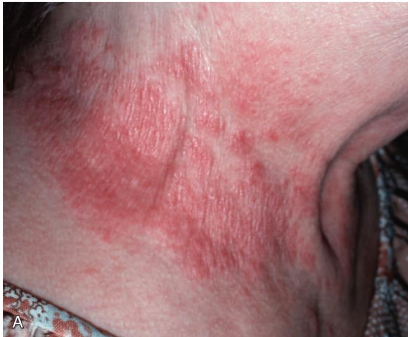
Patternederythemaandscalestemmingfromanickel-inducedcontactdermatitisproducedbyanecklace.(B)Microscopically,thereisaccumulationoffluid(spongiosis)betweenepidermalcells,whichmayprogresstofrankblisterformation..jpg) 
Fig. 24.1 Eczematous dermatitis. (A) Patterned erythema and scale stemming from a nickel-induced contact dermatitis produced by a necklace. (B) Microscopically, there is accumulation of fluid (spongiosis) between epidermal cells, which may progress to frank blister formation.
caused by herpes simplex, mycoplasma, and some fungi, while implicated drugs include sulfonamides, penicillin, salicylates, hydantoins, and anti-malarials. The cytotoxic T cell attack is focused on the basal cells of cutaneous and mucosal epithelia, presumably due to recognition of still unknown antigens. Certain human lymphocyte antigen (HLA) haplotypes are associated with the disease.
Affected individuals present with a wide array of lesions, which may include macules, papules, vesicles, and bullae (hence the term multiforme). Well-developed lesions have a characteristic "targetoid" appearance (Fig. 24.2A). Early lesions show a superficial perivascular lymphocytic infiltrate associated with dermal edema and margination of lymphocytes along the dermoepidermal junction in intimate association with apoptotic keratinocytes (see Fig. 24.2B). With time, discrete, confluent zones of basal
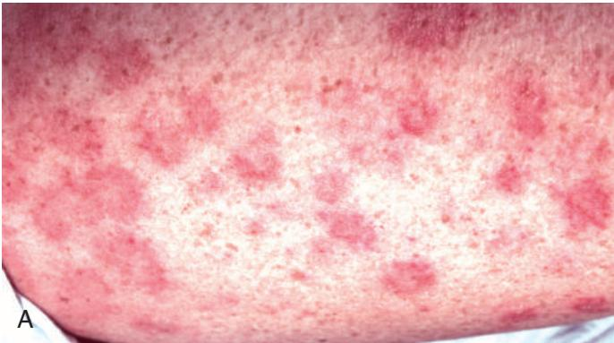
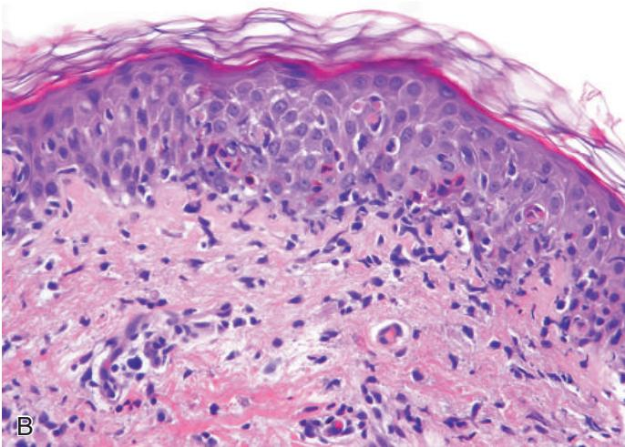 
Fig. 24.2 Erythema multiforme. (A) Target like lesions consisting of a pale central blister or zone of epidermal necrosis surrounded by macular erythema. (B) Early lesions show lymphocytes along the dermoepidermal junction (interface dermatitis) associated with scattered apoptotic keratinocytes, marked by dark shrunken nuclei and eosinophilic cytoplasm.
epidermal necrosis appear, with concomitant blister formation. In a rarer and more severe form of this disease, toxic epidermal necrolysis, the necrosis extends through the full thickness of the epidermis.
Erythema multiforme has a broad range of severity. The forms associated with infection (most often herpesvirus) are less severe. Erythema multiforme caused by medications may progress to more serious eruptions, such as Stevens-Johnson syndrome or toxic epidermal necrolysis. These forms can be life-threatening, as they may cause sloughing of large portions of the epidermis, resulting in fluid loss and infections complications similar to those seen in burn-injured patients.
# CHRONIC INFLAMMATORY DERMATOSES
Chronic inflammatory dermatoses are persistent skin conditions that exhibit their most characteristic features over many months to years, although they may begin with an acute stage. The skin surface in some chronic inflammatory
dermatoses is roughened as a result of excessive or abnormal scale formation and shedding (desquamation).
# Psoriasis
Psoriasis is a common chronic inflammatory dermatosis, affecting $1\%$ to $2\%$ of individuals residing in the United States. Recent epidemiologic studies have shown that psoriasis is associated with an increased risk for heart attack and stroke, a relationship that may be related to a chronic inflammatory state. Psoriasis also is associated in up to $10\%$ of patients with arthritis, which in some cases may be severe.
Psoriasis is a T cell-mediated inflammatory disease, presumed to be autoimmune in origin, although the antigens are not well described. Both genetic (HLA types and other susceptibility loci) and environmental factors contribute to the risk. It is unclear whether the inciting antigens are self-antigens, environmental antigens, or some combination of the two. Sensitized populations of T cells home to the dermis, including $\mathrm{CD4 + }$ $\mathrm{T_H17}$ and $\mathrm{T_H1}$ cells and $\mathrm{CD8 + }$ T cells, and accumulate in the epidermis. These cells secrete cytokines and growth factors that induce keratinocyte hyperproliferation, resulting in the characteristic lesions. Psoriatic lesions can be induced in susceptible individuals by local trauma (Koebner phenomenon), which may induce a local inflammatory response that promotes lesion development. Genome-wide association studies (GWAS) have linked an increased risk for psoriasis to polymorphisms in HLA loci and genes affecting antigen presentation, TNF signaling, and skin barrier function. Several loci also are associated with the development of psoriatic arthritis, a more severe complication of this disease.
The typical lesion is a well-demarcated, pink to salmon-colored plaque covered by loosely adherent silver-white scale (Fig. 24.3A). There is marked epidermal thickening (acanthosis), with regular downward elongation of the rete ridges (see Fig. 24.3B). The pattern of this downward growth has been likened to "test tubes in a rack." Increased epidermal cell turnover and lack of maturation results in loss of the stratum granulosum and extensive parakeratotic scale. Also seen is thinning of the epidermal cell layer overlying the tips of dermal papillae (suprapapillary plates), and dilated and tortuous blood vessels within the papillae. These vessels bleed readily when the scale is removed, giving rise to multiple punctate bleeding points (Auspitz sign). Neutrophils form small aggregates within both the spongiotic superficial epidermis and the parakeratotic stratum corneum. Similar changes can be seen in superficial fungal infections, which need to be excluded with appropriate special stains.
Psoriasis most frequently affects the skin of the elbows, knees, scalp, lumbosacral areas, intergluteal cleft, glans penis, and vulva. Nail changes on the fingers and toes occur in $30\%$ of cases. In most cases psoriasis is limited in
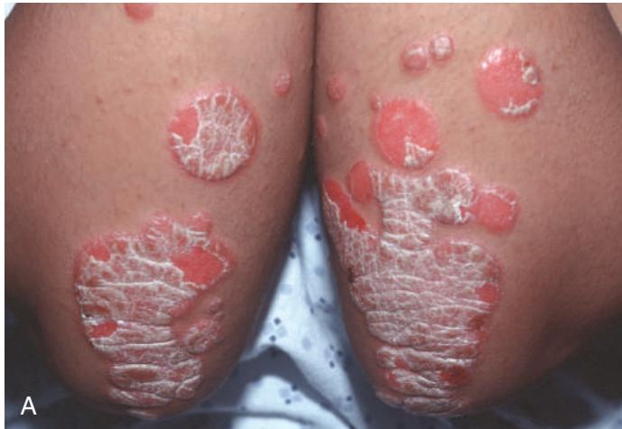 
Fig. 24.3 Chronic psoriasis. (A) Erythematous psoriatic plaques covered by silvery-white scale. (B) Microscopic examination shows marked epidermal hyperplasia, downward extension of rete ridges (psoriasiform hyperplasia), and prominent parakeratotic scale with infiltrating neutrophils.
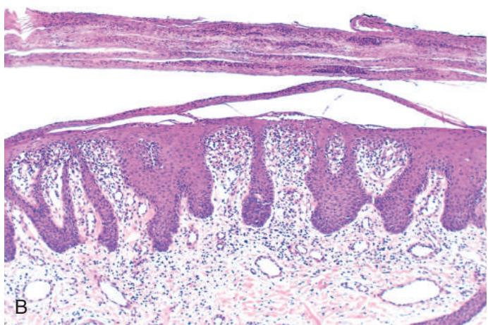
distribution, but it can be widespread and severe. The clinical subtypes are defined by pattern of involvement and severity. Treatment is aimed at preventing the release or actions of inflammatory mediators. Mild disease is treated topically with ointments containing corticosteroids or other immunomodulatory agents, whereas more severe disease is treated with phototherapy (which has immunosuppressive effects) or systemic therapy with immunosuppressive agents such as methotrexate or TNF antagonists.
# Lichen Planus
"Pruritic, purple, polygonal, planar papules, and plaques" are the tongue-twisting $P_{\mathrm{s}}$ that describe this disorder of skin and squamous mucosa. The lesions may result from a CD8+ T cell-mediated cytotoxic response against antigens in the basal cell layer and the dermoepidermal junction that are produced by unknown mechanisms, perhaps as a consequence of a viral infection or drug exposure.
bodies. Although these changes bear some similarities to those in erythema multiforme (another type of interface dermatitis discussed earlier), lichen planus shows well-developed changes of chronicity, including epidermal hyperplasia, hypergranulosis, and hyperkeratosis.
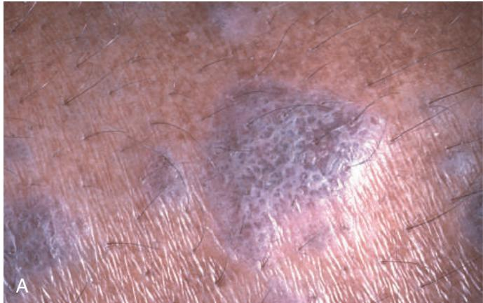
Cutaneous lesions of lichen planus consist of pruritic, violaceous, flat-topped papules that may coalesce focally to form plaques (Fig. 24.4A). These papules are highlighted by white dots or lines termed Wickham striae. Hyperpigmentation may result from melanin loss into the dermis from damaged keratinocytes. Microscopically, lichen planus is a prototypical interface dermatitis, so called because the inflammation and damage are concentrated at the interface of the squamous epithelium and papillary dermis. There is a dense, continuous infiltrate of lymphocytes along the dermoepidermal junction (see Fig. 24.4B). The lymphocytes are intimately associated with basal keratinocytes, which often atrophy or become necrotic. Perhaps as a response to damage, the basal cells take on the appearance of the more mature cells of the stratum spinosum (squamatization). This pattern of inflammation causes the dermoepidermal interface to assume an angulated, zigzag contour (sawtoothing). Anucleate, necrotic basal cells are seen in the inflamed papillary dermis and are referred to as colloid bodies or Civatte
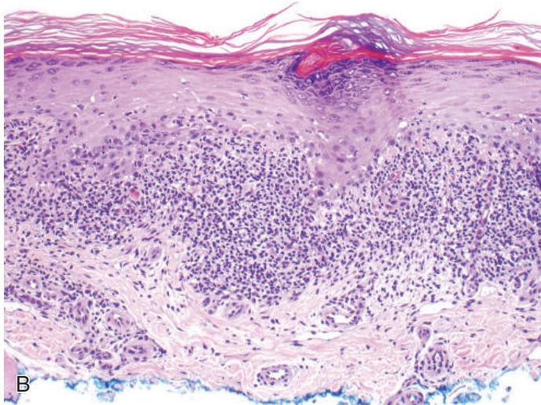 
Fig. 24.4 Lichen planus. (A) Flat-topped pink-purple polygonal papule with white lacelike markings referred to as Wickham striae. (B) Microscopic examination shows a bandlike infiltrate of lymphocytes along the dermoepidermal junction, hyperkeratosis, hypergranulosis, and pointed rete ridges ("sawtoothing"), which results from chronic injury of the basal cell layer.
Lichen planus is an uncommon disorder that usually presents in middle-aged adults. The cutaneous lesions are multiple and are usually symmetrically distributed, particularly on the extremities, and often occur around the wrists and elbows and on the vulva and glans penis. Approximately $70\%$ of cases also involve the oral mucosa, where the lesions manifest as white papules with a reticulate or netlike appearance. The cutaneous lesions of lichen planus usually resolve spontaneously within 1 to 2 years, but the oral lesions may persist and be of sufficient severity to interfere with food intake.
# Lichen Simplex Chronicus
Lichen simplex chronicus manifests as roughening of the skin, which takes on an appearance reminiscent of lichen on a tree. It is a response to local repetitive trauma, usually from rubbing or scratching. Nodular forms exist that are referred to as prurigo nodularis. The pathogenesis of lichen simplex chronicus is not understood, but the trauma probably induces epithelial hyperplasia and eventual dermal scarring.
Lichen simplex chronicus is characterized by acanthosis, hyperkeratosis, and hypergranulosis. Also seen are elongation of the rete ridges, fibrosis of the papillary dermis, and a dermal chronic inflammatory infiltrate (Fig. 24.5). Of interest, these lesions are similar in appearance to normal volar (palms and soles) skin, in which skin thickening serves as an adaptation to repetitive mechanical stress.
The lesions often are raised, erythematous, and scaly and can be mistaken for keratinocytic neoplasms. Lichen simplex chronicus can be superimposed on and mask
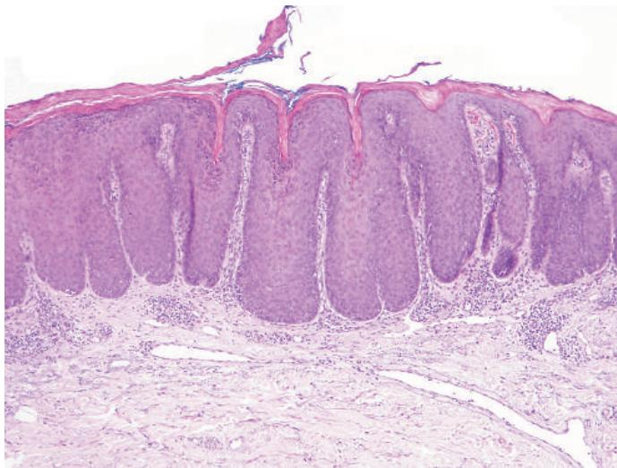 
Fig. 24.5 Lichen simplex chronicus. Note the distinctive acanthosis, hyperkeratosis, and hypergranulosis. Superficial dermal fibrosis and vascular ectasia, both common features, also are present.
another (often pruritic) dermatosis. It is therefore important to rule out an underlying cause while recognizing that the lesion may be entirely trauma-related.
# INFLAMMATORY DERMATOSES
- Many specific inflammatory dermatoses exist and can be mediated by IgE antibodies (urticaria), antigen-specific T cells (eczema, erythema multiforme, and psoriasis), or trauma (lichen simplex chronicus). 
- Underlying genetic susceptibility plays a role in atopic dermatitis and psoriasis. 
- These disorders can be grouped based on patterns of inflammation (e.g., interface dermatitis in lichen planus and erythema multiforme). 
- Clinical correlation is essential to diagnose specific skin diseases, since many have overlapping, nonspecific histologic features.
# INFECTIONAL DERMATOSES
# Bacterial Infections
Numerous bacterial infections occur in skin. These range from superficial infections known as impetigo, to deeper dermal abscesses associated with puncture wounds that are caused by bacteria such as Pseudomonas aeruginosa. The pathogenesis is similar to that for microbial infections elsewhere (Chapter 9). Only impetigo is discussed here.
Impetigo is characterized by an accumulation of neutrophils beneath the stratum corneum that often produces a subcorneal pustule. Nonspecific reactive epidermal alternation and superficial dermal inflammation accompany these findings. Bacterial cocci in the superficial epidermis can be demonstrated by Gram stain.
Impetigo, one of the most common bacterial infections of the skin, is seen primarily in children. The causative organism is usually Staphylococcus aureus or, less commonly, Streptococcus pyogenes, and is typically acquired through direct contact with a source. Impetigo often begins as a single small macule, usually on the extremities or the face near the nose or the mouth, which rapidly evolves into a larger lesion (Fig. 24.6), often with a honey-colored crust of dried serum. Individuals who are colonized by S. aureus or S. pyogenes (usually nasal or anal) are more likely to be affected. A less common bullous form of childhood impetigo may mimic an autoimmune blistering disorder.
# Fungal Infections
Fungal infections are varied, ranging from superficial infections with Tinea or Candida spp. to life-threatening
.jpg) 
Fig. 24.6 Impetigo. A child's arm involved by a superficial bacterial infection showing the characteristic erythematous scablike lesions crusted with dried serum. (Courtesy of Dr. Angela Wyatt, Bellaire, Texas.)
Aspergillus spp. infections in immunosuppressed individuals. Fungal infections can be superficial (stratum corneum, hair, and nails), deep (dermis or subcutis), or systemic, the last type arising through hematogenous spread, often in an immunocompromised patient.
The histologic appearance varies depending on the organism, host response, and degree of superinfection. Superficial infections are often associated with a neutrophilic infiltrate in the epidermis. Deep fungal infections produce greater tissue damage and often elicit a granulomatous response. Aspergillus can be angioinvasive. Periodic acid-Schiff (PAS) and Gomori methenamine silver stains are helpful in identifying the fungal organisms.
Superficial infections usually produce erythematous macules with superficial scale that can be pruritic, while deeper infections such as those seen with Aspergillus spp. are erythematous and often nodular and sometimes associated with local hemorrhage. Superficial fungal infections may have an annular appearance. However, they also may induce lesions that mimic other psoriasiform or eczematous dermatoses, so it is important to consider the possibility of fungal infection when these conditions are in the differential diagnosis.
# Verrucae (Warts)
Verrucae are proliferative lesions of squamous epithelial cells that are caused by human papillomavirus (HPV). They are most common in children and adolescents, but may be encountered in any age group. HPV infection usually stems from direct contact with an infected individual or autoinoculation. Verrucae generally are self-limited, most often regressing spontaneously within 6 months to 2 years.
While some members of the HPV family are associated with preneoplastic and invasive cancers of the anogenital region (Chapters 6 and 18), cutaneous warts are mainly caused by
low-risk HPV subtypes that lack transforming potential. Like high-risk HPV, low-risk viruses express viral E6 and E7 oncoproteins that lead to dysregulated epidermal cell growth and increased survival. Why low-risk viruses cause warts instead of cancer is likely due to structural variation in E6 and E7 proteins that affect their interactions with host proteins. Because the growth of warts is normally halted by the immune response, immunodeficiency is associated with more numerous and larger verrucae.
Different kinds of warts are identified on the basis of their gross appearance and location and generally are caused by distinct HPV subtypes. Verruca vulgaris (Fig. 24.7A), the most common type of wart, can occur anywhere but is found most frequently on the hands, particularly on the dorsal surfaces and periungual areas, where it appears as a gray-white to tan, flat to convex, 0.1- to 1-cm papule with a rough, pebble like surface. Verruca plana, or flat wart, is common on the face or dorsal surfaces of the hands. These warts are flat, smooth, tan macules. Verruca plantaris and verruca palmaris occur on the soles and palms, respectively. These rough, scaly lesions can reach 1 to $2\mathrm{cm}$ in diameter and may coalesce to form a surface that can be confused with ordinary calluses. Condyloma acuminatum (venereal wart) occurs on the penis, female genitalia, urethra, and perianal areas (Chapters 18 and 19). Histologic features common to verrucae include epidermal hyperplasia, which is often undulant in character (so-called verrucous or papillomatous epidermal hyperplasia) (Fig. 24.7B, top panel), and cytoplasmic vacuolization (koilocytosis), which preferentially involves the more superficial epidermal layers, producing halos of pallor surrounding infected nuclei. Infected cells also may demonstrate prominent keratohyalin granules and jagged eosinophilic intracytoplasmic protein aggregates as a result of impaired maturation (Fig. 24.7B, bottom panel).
# BLISTERING (BULLOUS) DISORDERS
Although vesicles and bullae (blisters) occur as secondary phenomena in several unrelated conditions (e.g., herpesvirus infection, spongiotic dermatitis), there is a group of disorders in which blisters are the primary and most distinctive feature. Blistering in these diseases tends to occur at specific levels within the skin, a morphologic distinction that is critical for diagnosis (Fig. 24.8).
# Pemphigus (Vulgaris and Foliaceus)
Pemphigus is an uncommon autoimmune blistering disorder resulting from loss of normal intercellular attachments within the epidermis and the squamous mucosal epithelium. There are three major variants:
- Pemphigus vulgaris (the most common type) 
- Pemphigus foliaceus 
- Paraneoplastic pemphigus
The last entity is associated with internal malignancy and is not discussed here.
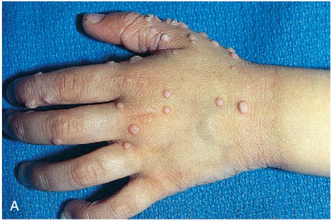
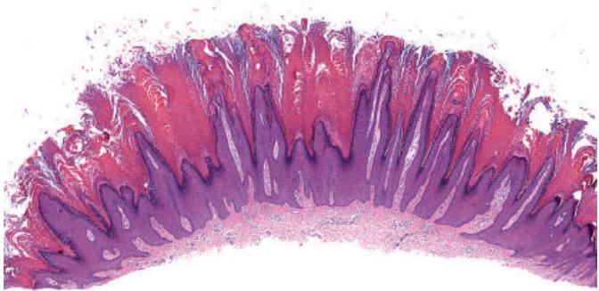
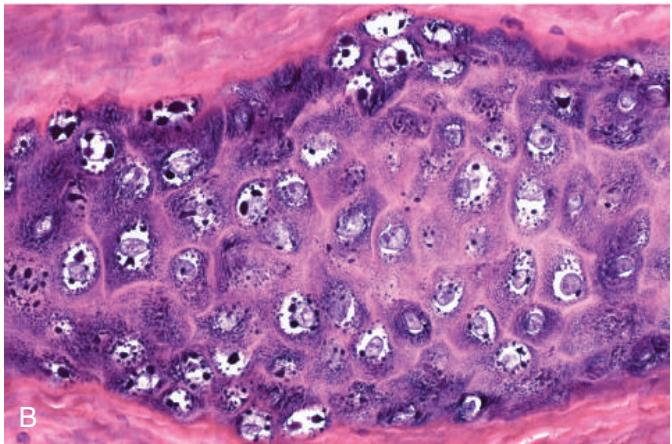 
Fig. 24.7 Verruca vulgaris. (A) Multiple warts, with characteristic rough, pebble like surfaces. (B) Microscopically, common warts contain zones of papillary epidermal proliferation that often radiate symmetrically like the points of a crown (top). Pallor or halos around nuclei, prominent keratohyalin granules, and related cytopathic changes are seen at higher magnification (bottom).
Pemphigus vulgaris and pemphigus foliaceus are autoimmune diseases caused by antibody-mediated (type II) hypersensitivity reactions (Chapter 5). The pathogenic antibodies are IgG autoantibodies that bind to intercellular desmosomal proteins (desmoglein types 1 and 3) found in the skin and mucous membranes. The antibodies disrupt the intercellular adhesive function of desmosomes and may activate intercellular proteases as well. The distribution of desmoglein proteins within the epidermis
determines the location of the lesions. By direct immunofluorescence study, lesional sites show a characteristic fishnet-like pattern of intercellular IgG deposits (Fig. 24.9). As with many other autoimmune diseases, pemphigus is associated with particular HLA alleles.
Pemphigus vulgaris involves both mucosa and skin, especially on the scalp, face, axillae, groin, trunk, and points of pressure. The lesions are superficial flaccid vesicles and bullae that rupture easily, leaving deep and often extensive erosions covered with a serum crust (Fig. 24.10A). Pemphigus foliaceus, a rare, milder form of pemphigus, results in bullae that are mainly confined to the skin, with only infrequent involvement of mucous membranes. The blisters in this disorder are superficial, such that more limited zones of erythema and crusting of ruptured blisters are seen (Fig. 24.11A).
The common histologic denominator in all forms of pemphigus is acantholysis, lysis of the intercellular adhesive junctions between neighboring squamous epithelial cells that results in the rounding up of detached cells. In pemphigus vulgaris, acantholysis selectively involves the layer of cells immediately above the basal cell layer, giving rise to a suprabasal acantholytic blister (Fig. 24.10B). In pemphigus foliaceus, acantholysis selectively involves the superficial epidermis at the level of the stratum granulosum (Fig. 24.11B). Variable superficial dermal infiltrates composed of lymphocytes, macrophages, and eosinophils accompany all forms of pemphigus.
Pemphigus vulgaris is a rare disorder that occurs most commonly in older adults and more often in women than in men. Lesions are painful, particularly when ruptured, and frequently develop secondary infections. Most affected patients have oropharyngeal involvement at some point in their course. The mainstay of treatment is immunosuppressive therapy, sometimes for life. Medications can induce pemphigus, more often pemphigus foliaceus than pemphigus vulgaris. There is also an unusual endemic form of pemphigus foliaceus in South America (fogo selvagem) that is putatively associated with the bite of a black fly.
# Bullous Pemphigoid
Bullous pemphigoid is another distinctive acquired blistering disorder with an autoimmune basis.
Blistering in bullous pemphigoid is triggered by the linear deposition of autoreactive IgG antibodies and complement in the epidermal basement membrane (Fig. 24.12A). Reactivity also occurs in the basement membrane attachment plaques (hemidesmosomes), where most bullous pemphigoid antigen (most commonly type XVII collagen) is located. The proteins that are recognized by the autoantibodies have structural roles in dermoepidermal adhesion. IgG autoantibodies to hemidesmosome components fix complement and cause tissue injury by recruiting neutrophils and eosinophils. Bullous pemphigoid and pemphigus vulgaris are thus caused by similar pathogenic
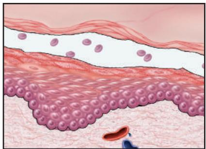 
A 
Subcorneal
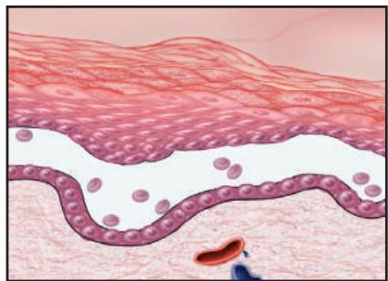 
Suprabasal 
Fig. 24.8 Levels of blister formation. (A) Subcorneal (as in pemphigus foliaceus). (B) Suprabasal (as in pemphigus vulgaris). (C) Subepidermal (as in bullous pemphigoid or dermatitis herpetiformis).
Subcorneal(asinpemphigusfoliaceus).(B)Suprabasal(asinpemphigusvulgaris).(C)Subepidermal(asinbullouspemphigoidordermatitisherpetiformis)..jpg) 
Subepidermal
mechanisms, but differ in their clinical presentation and course due to variation in the location of the target antigen (hemidesmosomes in bullous pemphigoid, desmosomes in pemphigus).
Bullous pemphigoid is associated with tense subepidermal bullae filled with clear fluid (Fig. 24.12B). The overlying epidermis characteristically lacks acantholysis. Early lesions show variable numbers of eosinophils at the dermal-epidermal junction, occasional neutrophils, superficial dermal edema, and associated basal cell layer vacuolization. The vacuolated basal cell layer eventually gives rise to a fluid-filled blister (Fig. 24.12C). The blister roof consists of full-thickness epidermis with intact intercellular junctions, a key distinction from the blisters seen in pemphigus.
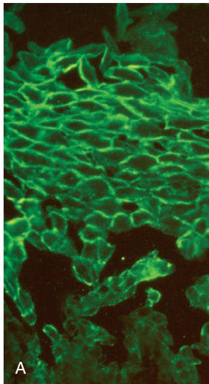 
Fig. 24.9 Direct immunofluorescence findings in pemphigus. (A) Pemphigus vulgaris. Note the uniform deposition of immunoglobulin (green) along keratinocyte cell membranes in a characteristic "fishnet" pattern. (B) Pemphigus foliaceus. Immunoglobulin deposits are confined to superficial layers of the epidermis.
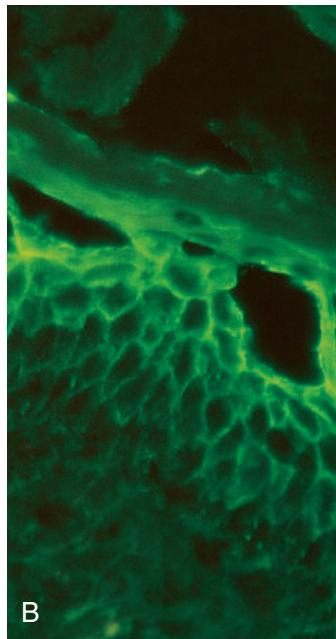
The lesions of bullous pemphigoid do not rupture as readily as in pemphigus and, if uncomplicated by infection, heal without scarring. The disease tends to follow a remitting and relapsing course and responds to topical or systemic immunosuppressive agents. Gestational pemphigoid (also known as herpes gestationis, a misnomer since there is no
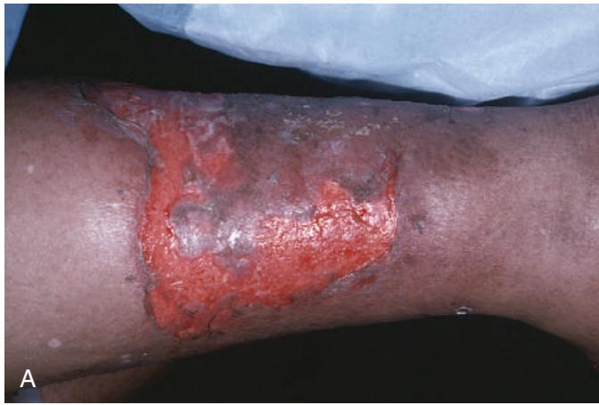
Anerosiononthelegarisingfromcoalescenceofagroupofunroofedblisters.(B)Suprabasalintraepidermalblisterinwhichrounded,dissociated(acantholytic)keratinocytesareplentiful(inset)..jpg) 
Fig. 24.10 Pemphigus vulgaris. (A) An erosion on the leg arising from coalescence of a group of "unroofed" blisters. (B) Suprabasal intraepidermal blister in which rounded, dissociated (acantholytic) keratinocytes are plentiful (inset).
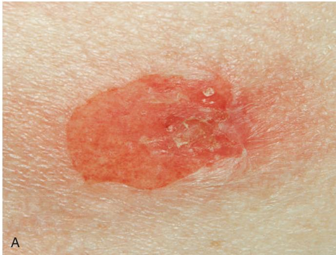
Atypicalblister,whichismoresuperficialthanthoseseeninpemphigusvulgaris.(B)Microscopicappearanceofacharacteristicsubcornealblister..jpg) 
Fig. 24.11 Pemphigus foliaceus. (A) A typical blister, which is more superficial than those seen in pemphigus vulgaris. (B) Microscopic appearance of a characteristic subcorneal blister.
viral etiology) is a clinically distinct subtype that appears suddenly during the second or third trimester of pregnancy. It also is caused by autoantibodies against bullous pemphigoid antigen. Gestational pemphigoid typically resolves after childbirth, but may recur with subsequent pregnancies.
# Dermatitis Herpetiformis
Dermatitis herpetiformis is an autoimmune blistering disorder associated with gluten sensitivity that is characterized by extremely pruritic grouped vesicles and papules. The disease affects predominantly males, often in the third and fourth decades of life. Up to $80\%$ of cases are associated with celiac disease; conversely, only a small fraction of patients with celiac disease develop dermatitis herpetiformis. Like celiac disease, dermatitis herpetiformis responds to a gluten-free diet.
The strong association of dermatitis herpetiformis with celiac disease provides a clue to its pathogenesis. Geneti
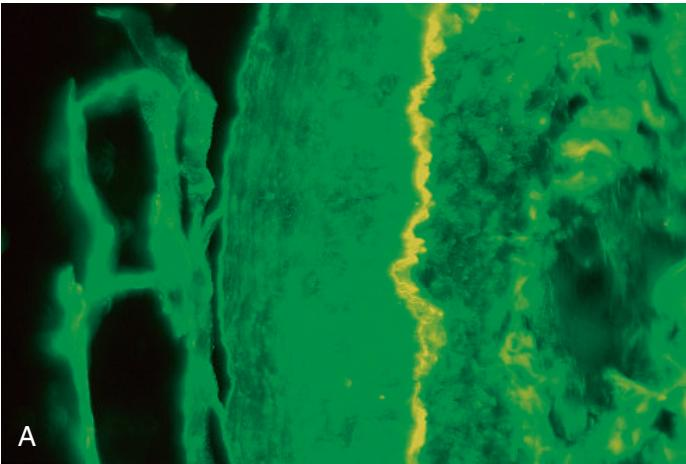
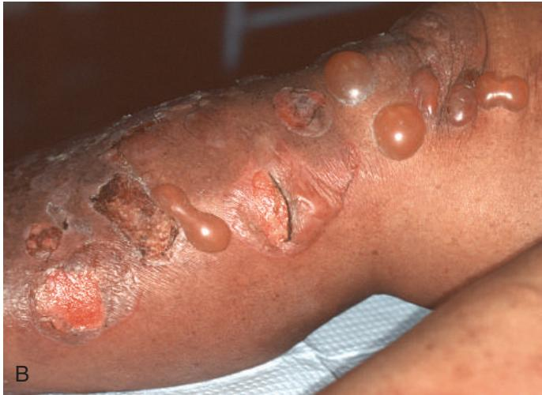
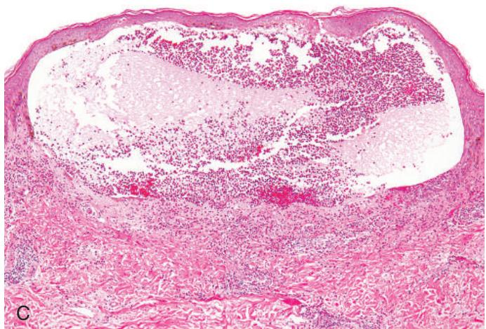 
Fig. 24.12 Bullous pemphigoid. (A) Deposition of IgG antibody (detected by direct immunofluorescence) in the subepidermal basement membrane (epidermis is on the left side of the fluorescent band). (B) Gross appearance of characteristic tense, fluid-filled blisters. (C) Subepidermal vesicle with an eosinophil-rich inflammatory infiltrate. (C, Courtesy of Dr. Victor G. Prieto, Houston, Texas.)
cally predisposed individuals develop IgA antibodies to dietary gluten (derived from the wheat protein gliadin) as well as IgA autoantibodies that cross-react with endomys-sium and tissue transglutaminases, including epidermal transglutaminase expressed by keratinocytes. By direct immunofluorescence, the skin shows discontinuous,
granular deposits of IgA selectively localized in the tips of dermal papillae (Fig. 24.13A). The resultant injury and inflammation produce a subepidermal blister.
The lesions of dermatitis herpetiformis are bilateral, symmetric, and grouped and preferentially involve the extensor surfaces, elbows, knees, upper back, and buttocks (Fig. 24.13B). Initially, neutrophils accumulate selectively at the tips of dermal papillae, forming small microabscesses (Fig. 24.13C). The basal cells overlying these microabscesses show vacuolization and focal dermoepidermal separation that ultimately coalesce to form a true subepidermal blister.
# BLISTERING DISORDERS
- Blistering disorders are classified based on the level of the epidermis that is affected. 
- These disorders often are caused by autoantibodies specific for epithelial or basement membrane proteins that lead to unmooring of keratinocytes (acantholysis). 
- Pemphigus is associated with IgG autoantibodies to various intercellular desmogleins (part of the desmosome), resulting in bullae that are either subcorneal (pemphigus foliaceus) or suprabasilar (pemphigus vulgaris). 
- Bullous pemphigoid is associated with IgG autoantibodies to basement membrane proteins (part of the hemidesmosome) and produces a subepidermal blister. 
- Dermatitis herpetiformis is associated with IgA autoantibodies to transglutaminase, and also is characterized by subepidermal blisters.
# TUMORS OF THE SKIN
# Benign and Premalignant Epithelial Lesions
Benign epithelial neoplasms are common and probably arise from stem cells residing in the epidermis and hair follicles. These tumors grow to a limited size and generally do not undergo malignant transformation.
# Seborrheic Keratosis
These common pigmented epidermal tumors occur most frequently in middle-age or older individuals. They arise spontaneously and are particularly numerous on the trunk, although the extremities, head, and neck also may be sites of involvement.
Fig. 24.13 Dermatitis herpetiformis. (A) Characteristic selective deposition of IgA autoantibody at the tips of the dermal papillae. (B) Lesions consist of intact and eroded (usually scratched) erythematous blisters, often grouped (seen here on elbows and arms). (C) Blisters associated with basal cell layer injury, initially caused by accumulation of neutrophils (microabscesses) at the tips of the dermal papillae. (A, Courtesy of Dr. Victor G. Prieto, Houston, Texas.)
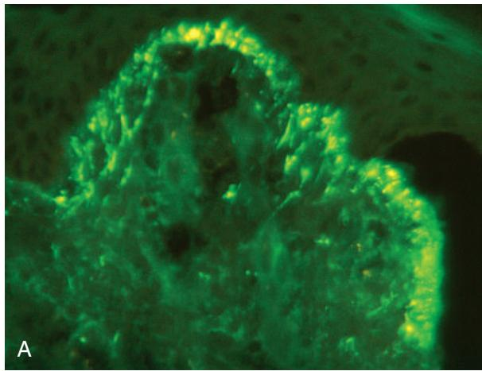
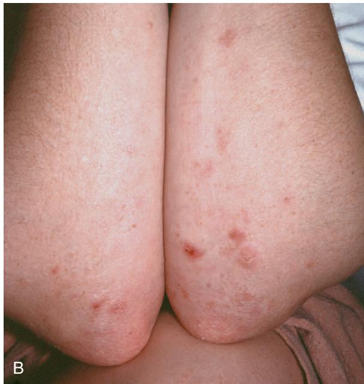
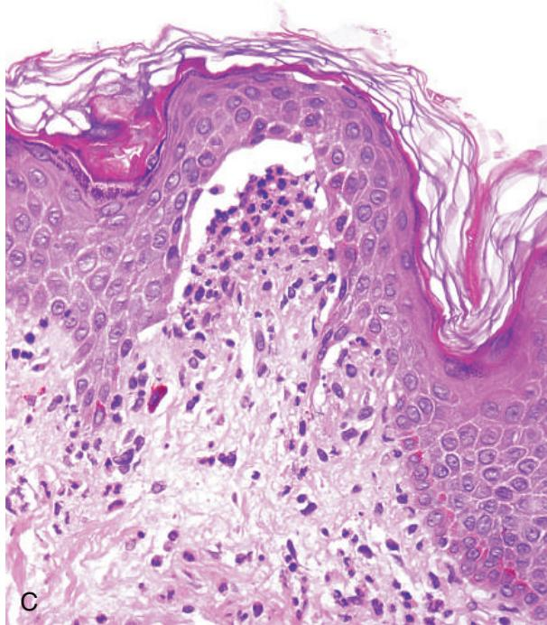
Seborrheic keratoses are caused by acquired activating mutations in growth factor signaling pathways. A significant fraction of these tumors harbor activating mutations in fibroblast growth factor receptor 3 (FGFR3), which possesses a tyrosine kinase activity that stimulates RAS and the PI3K/AKT pathway, while others have activating mutations in downstream pathway components such as RAS and PI3K. Except for cosmetic concerns, seborrheic keratoses are usually of little clinical importance. However, in rare patients hundreds of lesions may appear suddenly as a paraneoplastic syndrome (sign of Leser-Trelat). Patients with this presentation may harbor internal malignancies, most commonly gastrointestinal tract carcinomas, which produce growth factors that stimulate epidermal proliferation.
Seborrheic keratoses are round, exophytic, coinlike plaques that vary in diameter from millimeters to centimeters and have a "stuck-on" appearance (Fig. 24.14, inset). They are tan to dark brown and have a velvety- to granular-appearing surface. Occasionally, their dark color is suggestive of melanoma, leading to surgical removal.
Microscopically, seborrheic keratoses are composed of monotonous sheets of small cells that resemble the basal cells of the normal epidermis (see Fig. 24.14). Variable melanin pigmentation is present within these basaloid cells, accounting for the brown coloration seen grossly. Hyperkeratosis occurs at the surface, and the presence of small keratin-filled cysts (horn cysts) and downgrowth of keratin into the main tumor mass (pseudo-horn cysts) are characteristic features.
# Actinic Keratosis
Actinic keratosis is a premalignant lesion caused by UV-induced DNA damage that is associated with mutations in TP53 and other genes that also are frequently mutated in squamous cell carcinoma of the skin. Because such lesions usually are the result of chronic exposure to
.Microscopicexaminationshowsanorderlyproliferationofuniform,basaloidkeratinocytesthattendtoformkeratinmicrocysts(horncysts)..jpg) 
Fig. 24.14 Seborrheic keratosis. A characteristic roughened, brown, waxy lesion that appears to be "stuck on" the skin (inset). Microscopic examination shows an orderly proliferation of uniform, basaloid keratinocytes that tend to form keratin microcysts (horn cysts).
sunlight and are associated with hyperkeratosis, they are called actinic (sun-related) keratoses. The rate of progression to squamous cell carcinoma is small, varying from $0.1\%$ to $2.6\%$ per year. Most regress or remain stable.
Actinic keratoses usually are less than $1\mathrm{cm}$ in diameter, tan-brown or red, and rough (sandpaper-like) to the touch (Fig. 24.15A). Microscopically, lower portions of the epidermis show cytologic atypia, often associated with hyperplasia of basal cells (see Fig. 24.15B) or with atrophy and diffuse thinning of the epidermal surface. The dermis contains thickened, blue-gray elastic fibers (solar elastosis), the result of chronic sun damage. The stratum corneum is thickened and shows abnormal retention of nuclei (parakeratosis). Uncommonly, full-thickness epidermal atypia is seen; such lesions are considered squamous cell carcinoma in situ (Fig. 24.15C).
Actinic keratoses are very common in fair-skinned individuals and increase in incidence with age and sun exposure. As would be expected, there is a predilection for sunexposed areas (face, arms, dorsum of the hands). Despite the low risk for malignant progression, actinic keratoses are often treated, either to prevent progression or for cosmetic reasons. Local eradication with cryotherapy (superficial freezing) or topical agents is effective and safe.
# BENIGN AND PREMALIGNANT EPITHELIAL LESIONS
- Seborrheic keratosis: Round, flat plaques made up of proliferating monotonous epidermal basal cells, which sometimes contain melanin. Hyperkeratosis and keratin-filled cysts are characteristic. 
- Actinic keratosis: Present on sun-exposed skin, these lesions show cytologic atypia in lower parts of the epidermis and infrequently progress to carcinoma in situ. 
- Although both of these lesions are associated with oncogenic mutations, malignant transformation is exceedingly rare in seborrheic keratoses and occurs in only a small subset of actinic keratoses.
# Malignant Epidermal Tumors
Squamous cell carcinoma is a common tumor that typically arises on sun-exposed sites in older adults. These tumors have a higher incidence in men than in women.
Cutaneous squamous cell carcinoma is mainly caused by UV light exposure, which leads to widespread DNA damage and extremely high mutational loads (Chapter 6). As one might imagine, patients with the rare disorder xeroderma pigmentosum, which disrupts repair of UV-induced DNA damage, are at an exceptionally high risk. TP53
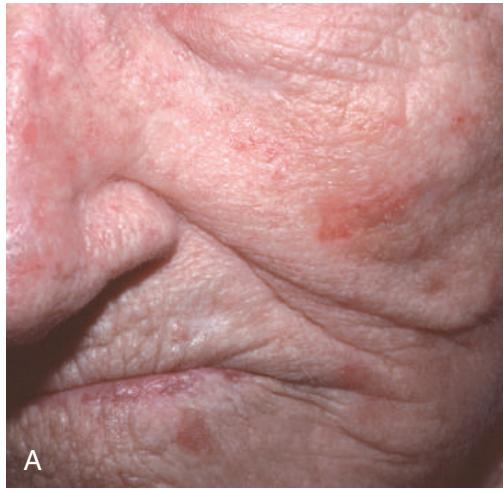 
Fig. 24.15 Actinic keratosis. (A) Red, rough (sandpaper-like) lesions owing to excessive scale are present on the cheek and nose. (B) Basal cell layer atypia (dysplasia) with epithelial buds associated with marked hyperkeratosis, parakeratosis, and dermal solar elastosis (asterisk). (C) Squamous cell carcinoma in situ lesion showing full-thickness epithelial atypia.
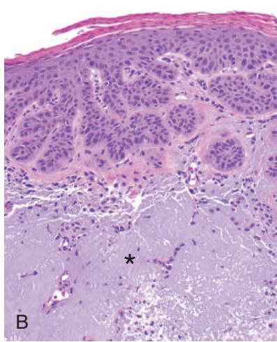
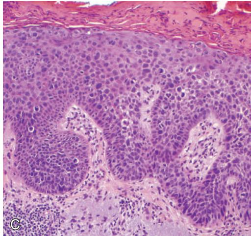
mutations are common, as are activating mutations in RAS and loss-of-function mutations in Notch receptors, which transmit signals that regulate the orderly differentiation of normal squamous epithelia.
Immunosuppression, particularly in organ transplant recipients, is associated with an increased incidence of cutaneous squamous cell carcinomas that are likely to be associated with HPV infection. Other predisposing factors include industrial carcinogens (tars and oils), chronic nonhealing ulcers, old burn scars, ingestion of arsenicals, and ionizing radiation.

Squamous cell carcinomas in situ appear as sharply defined, red, scaling plaques; some appear to arise in association with prior actinic keratoses. Microscopically, squamous cell carcinoma in situ is characterized by highly atypical cells at all levels of the epidermis, with nuclear crowding and disorganization. More advanced, invasive squamous cell carcinomas are nodular, often scaly lesions that may undergo ulceration (Fig. 24.16A). Such tumors show variable degrees of differentiation, ranging from tumors with cells arranged in orderly lobules that exhibit extensive keratinization to neoplasms consisting of highly anaplastic cells with foci of necrosis and only abortive, single-cell keratinization (dyskeratosis) (Fig. 24.16B).
Invasive squamous cell carcinomas of the skin often are discovered while small and resectable. Less than $1\%$ will have metastasized to regional lymph nodes at diagnosis. The likelihood of metastasis is related to the thickness of the lesion and degree of invasion into the subcutis. Tumors arising from actinic keratoses may be locally aggressive but generally metastasize only after long periods of time, while those arising in burn scars, ulcers, and non-sun-exposed skin often behave more aggressively. Squamous cell carcinomas arising at internal sites (oropharynx, lung, esophagus, anus) are generally invasive and aggressive, possibly because (unlike in the skin) early lesions go unrecognized.
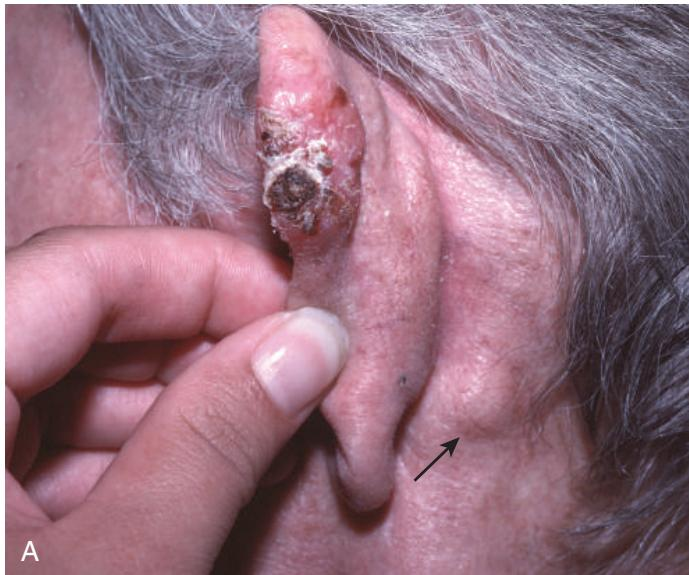
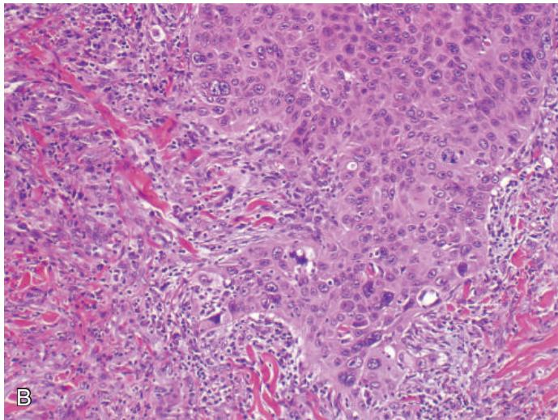 
Fig. 24.16 Invasive squamous cell carcinoma. (A) A nodular, hyperkeratotic lesion occurring on the ear, associated with metastasis to a prominent postauricular lymph node (arrow). (B) Tumor invades the dermal soft tissue as irregular projections of atypical squamous cells exhibiting acantholysis.
# Basal Cell Carcinoma
Basal cell carcinoma is a common slow-growing cancer that rarely metastasizes. It tends to occur at sites subject to chronic sun exposure and in lightly pigmented individuals.
The molecular hallmark of basal cell carcinoma is loss-of-function mutations in PTCH1, a tumor suppressor gene that negatively regulates Hedgehog signaling; hence, tumors exhibit constitutive Hedgehog pathway activation. Excessive activation of Hedgehog in turn activates a host of downstream genes implicated in cell growth and survival and other phenotypes linked to malignant transformation. In sporadic basal cell carcinoma, PTCH1 mutations bear the telltale signs of UV light-induced DNA damage. The central role of increased Hedgehog signaling in basal cell carcinoma is further emphasized by Gorlin syndrome, an autosomal dominant disorder caused by inherited defects in PTCH1 that is associated with familial basal cell carcinoma. The Hedgehog pathway is an important regulator of embryonic development, and patients with Gorlin syndrome also often manifest subtle developmental anomalies. Mutations in TP53 caused by UV light-induced damage also are common in both familial and sporadic tumors.
Basal cell carcinomas manifest as pearly papules, often with prominent, dilated subepidermal blood vessels (telangiectasia)
(Fig. 24.17A). Some tumors contain melanin pigment and can have an appearance similar to melanocytic nevi or melanomas. Microscopically, the tumor cells resemble the normal epidermal basal cell layer or follicular germinative elements. Because they arise from either the epidermis or the follicular epithelium, they are not encountered on mucosal surfaces. Two common patterns are seen: multifocal superficial growths, originating from the epidermis, and nodular lesions growing downward into the dermis as cords and islands of variably basophilic cells with hyperchromatic nuclei, embedded in a fibrotic or mucinous stromal matrix (Fig. 24.17B). Peripheral tumor cell nuclei align in the outermost layer (a pattern termed palisading), which often separates from the stroma, creating a characteristic cleft (Fig. 24.17C).
It is estimated that more than 1 million basal cell carcinomas are treated in the United States annually. By far the most important risk factor is cumulative sun exposure; basal cell carcinoma is more common in warm southern regions of the United States, and its incidence is 40-fold higher in sunny climates near the equator, such as Australia, than it is in Northern European locales. Individual tumors usually are cured by local excision, but approximately $40\%$ of patients develop another basal cell carcinoma within 5 years. Advanced lesions may ulcerate, and extensive local invasion of bone or facial sinuses may occur if the lesions are neglected. Metastasis is exceedingly rare. Hedgehog pathway inhibitors are used to treat locally advanced or metastatic tumors.
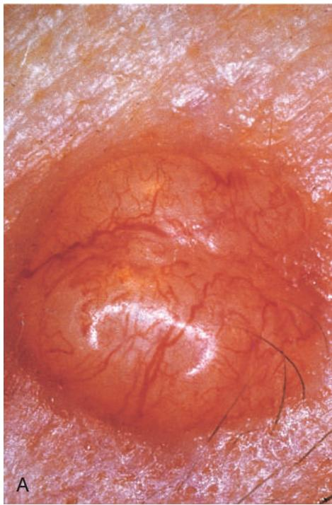 
Fig. 24.17 Basal cell carcinoma. (A) A prototypical pearly, smooth-surfaced papule with telangiectatic vessels. (B) Tumor is composed of nests of basaloid cells infiltrating a fibrotic stroma. (C) Tumor cells with scant cytoplasm and small hyperchromatic nuclei that palisade on the outside of the nest. The cleft between the tumor cells and the stroma is a highly characteristic artifact of sectioning.
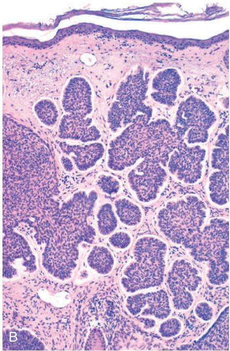
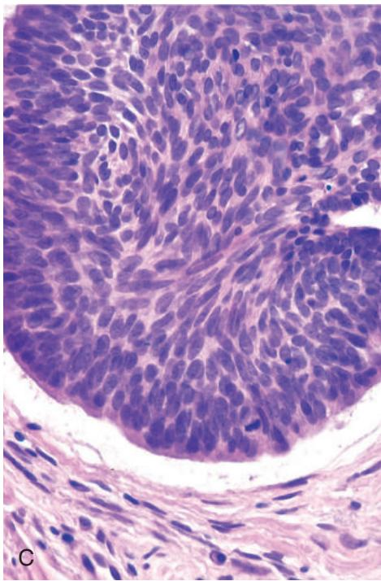
# MALIGNANT EPIDERMAL TUMORS
- The incidence of both basal cell and squamous cell carcinoma is strongly correlated with increasing lifetime sun exposure. 
- Risk factors for cutaneous squamous cell carcinoma include fair skin, UV light exposure, exposure to carcinogenic chemicals, chronic skin inflammation and scarring, and HPV infection (in the setting of immunosuppression). 
- Cutaneous squamous cell carcinoma has the potential for metastasis but usually is recognized and excised before it does so. 
- Basal cell carcinoma, the most common malignancy worldwide, is a locally aggressive tumor associated with mutations in the Hedgehog pathway. Metastasis is very rare.
# Melanocytic Proliferations
# Melanocytic Nevi
Strictly speaking, the term nevus denotes any congenital lesion of the skin. Melanocytic nevus, however, refers to any benign congenital or acquired neoplasm of melanocytes.
Melanocytic nevi are benign neoplasms caused by somatic gain-of-function mutations in $BRAF$ or $RAS$ . Nevi are derived from melanocytes, pigment-producing cells with dendritic projections that are normally interspersed among basal keratinocytes. You will recall that $BRAF$ encodes a serine/threonine kinase that lies downstream of RAS in the extracellular regulated kinase (ERK) pathway. Experimental evidence suggests that unbridled $BRAF/RAS$ signaling initially induces melanocytic proliferation followed by senescence. How these opposing effects are coordinated is unclear, but it is believed that the "brake" on proliferation provided by induced senescence explains why very few nevi transform into malignant
melanomas. Indeed, the growth and migration of nevus cells from the dermoepidermal junction into the underlying dermis is accompanied by morphologic changes that are taken as evidence of cellular senescence (Fig. 24.18). Superficial nevus cells are larger and tend to produce melanin pigment and grow in nests; deeper nevus cells are smaller, produce little or no pigment, and grow in cords or single cells. The deepest nevus cells have fusiform contours and grow in fascicles. This sequence of morphologic changes is of diagnostic importance, since they are absent from melanomas.
Common melanocytic nevi are tan-to-brown, uniformly pig-mented, small papules (5 mm or less across) with well-defined, rounded borders (Fig. 24.19A). Early lesions are composed of round to oval cells that grow in "nests" along the dermoepidermal junction. Nuclei are uniform and round, and contain inconspicuous nucleoli with little or no mitotic activity. Such early-stage lesions are called junctional nevi. Eventually, most junctional nevi grow into the underlying dermis as nests or cords of cells (compound nevi), and in older lesions the epidermal nests may be lost entirely, creating intradermal nevi (Fig. 24.19B).
There are numerous types of melanocytic nevi, with varied appearances. Although these lesions usually are of only cosmetic concern, they may cause irritation or mimic melanoma, requiring their surgical removal. Compound and intradermal nevi often are more elevated than junctional nevi.
# Dysplastic Nevus
Dysplastic nevi may be sporadic or familial. The latter are important clinically because they identify individuals who
Normalskinshowsonlyscatteredmelanocytes.(B)Junctionalnevus.(C)Compoundnevus.(D)Intradermalnevus.(E)Intradermalnevuswithextensivecellularsenescence..jpg) 
Fig. 24.18 Possible steps in the development of melanocytic nevi. (A) Normal skin shows only scattered melanocytes. (B) Junctional nevus. (C) Compound nevus. (D) Intradermal nevus. (E) Intradermal nevus with extensive cellular senescence.
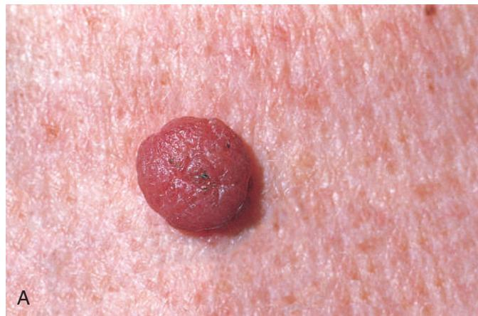 
Fig. 24.19 Melanocytic nevus. (A) Melanocytic nevi are relatively small, symmetric, and uniformly pigmented. (B) A nevus composed of melanocytes that lose pigmentation and become smaller and more dispersed as they extend into the dermis—all signs that speak to the benign nature of the proliferation.
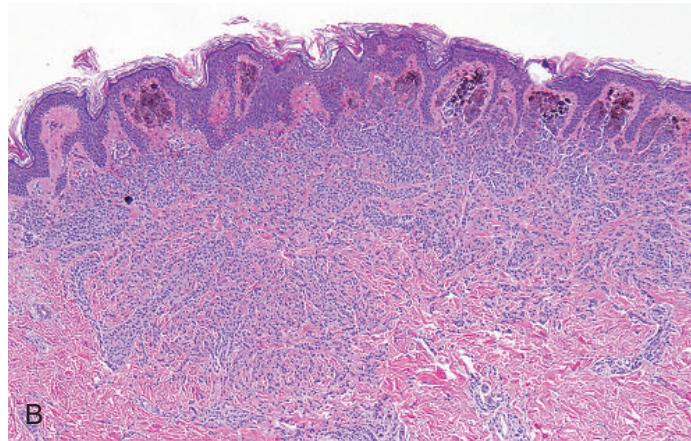
have an increased risk of developing melanoma. As with conventional melanocytic nevi, activating RAS or BRAF mutations are commonly found in dysplastic nevi and are believed to have a pathogenic role.

Dysplastic nevi are larger than most acquired nevi (often more than $5\mathrm{mm}$ across) and may number in the hundreds (Fig. 24.20A). They are flat macules to slightly raised plaques, with a "pebbly" surface. They usually have variable pigmentation (variegation) and irregular borders (Fig. 24.20A, inset).
Microscopically, dysplastic nevi are mostly compound nevi that exhibit both architectural and cytologic evidence of abnormal growth. Nevus cell nests within the epidermis may be enlarged and exhibit abnormal fusion or coalescence with adjacent nests (bridging). As part of this process, single nevus cells begin to replace the normal basal cell layer along the dermoepidermal junction, producing so-called "lentiginous
hyperplasia" (Fig. 24.20B). Cytologic atypia consisting of irregular, often angulated, nuclear contours and hyperchromasia is frequently observed (Fig. 24.20B-C). Associated alterations also occur in the superficial dermis. These consist of a sparse lymphocytic infiltrate, release of melanin pigment that is phagocytosed by dermal macrophages (melanin incontinence), and linear fibrosis surrounding epidermal nests of melanocytes. These dermal changes are elements of the host response to these lesions.
Unlike ordinary nevi, dysplastic nevi have a tendency to occur on body surfaces not exposed to the sun as well as on sun-exposed sites. Familial dysplastic nevus syndrome is strongly associated with melanoma, as the lifetime risk for the development of melanoma in affected individuals is close to $100\%$ . In sporadic cases, only individuals with 10 or more dysplastic nevi appear to be at an increased
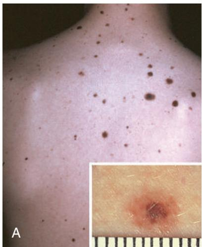 
Fig. 24.20 Dysplastic nevus. (A) Numerous irregular nevi on the back of a patient with dysplastic nevus syndrome. The lesions usually are greater than $5\mathrm{mm}$ in diameter and have irregular borders and variable pigmentation (inset). (B) Compound dysplastic nevus featuring a central dermal component and an asymmetric "shoulder" of exclusively junctional melanocytes (lentiginous hyperplasia). The former corresponds to the raised, more pigmented central zone seen in A (inset), and the latter corresponds to the less pigmented flat peripheral rim. (C) Other important features are cytologic atypia (irregular, dark-staining nuclei) and characteristic parallel bands of fibrosis.
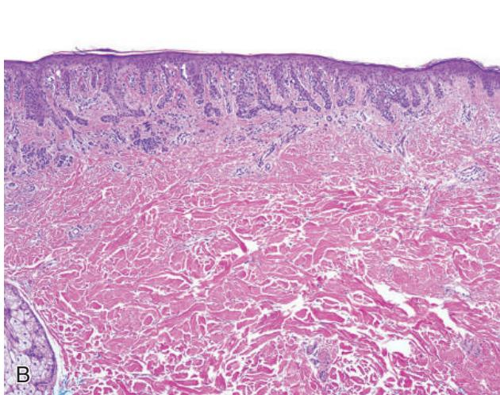
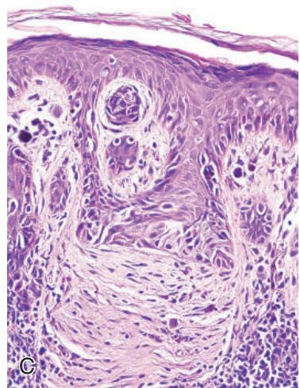
risk for melanoma. Transformation of dysplastic nevus to melanoma has been documented, both clinically and histologically. However, such cases are the exception, as most melanomas appear to arise de novo and not from a preexisting nevus. Thus, the likelihood that any particular nevus, dysplastic or otherwise, will develop into melanoma is low, and these lesions are best viewed as markers of melanoma risk.
# Melanoma
Melanoma is less common but much more deadly than basal or squamous cell carcinoma. Today, as a result of increased public awareness of the earliest signs of skin melanomas, most melanomas are cured surgically. Nonetheless, the incidence of these lesions has increased dramatically over the past several decades, at least in part as a result of increasing sun exposure and/or higher detection rates resulting from vigorous surveillance.
As with other cutaneous malignancies, melanoma is mainly caused by UV light-induced DNA damage that leads to the stepwise acquisition of driver mutations. The incidence is highest in sun-exposed skin and in geographic locales such as Australia, where sun exposure is high and much of the population is fair-skinned. Intense intermittent exposure at an early age is particularly harmful. Hereditary predisposition also plays a role in an estimated $5\%$ to $10\%$ of cases, as already discussed under familial dysplastic nevus syndrome. For example, germ-line mutations in the CDKN2A locus (located on 9p21) are found in as many as $40\%$ of the rare individuals who suffer from familial melanoma. This complex locus encodes two tumor suppressors: p16, a cyclin-dependent kinase inhibitor that
regulates the $\mathrm{G}_1$ -S transition of the cell cycle by maintaining the retinoblastoma (RB) tumor suppressor protein in its active state; and p14, which augments the activity of the p53 tumor suppressor by preventing its degradation.
Key phases of melanoma development are marked by radial and vertical growth. The earliest recognizable phase of melanoma development is proposed to consist of lateral expansion of melanocytes along the dermoepidermal junction (lentiginous hyperplasia and lentiginous compound nevus; Fig. 24.21A-C). This then progresses to the phase of melanoma in situ, which is marked by radial growth within the epidermis, often for a prolonged period (Fig. 24.21D). During this stage, melanoma cells do not have the capacity to invade and metastasize. With time, a vertical growth phase supervenes, in which the tumor grows downward into the deeper dermal layers as an expansile mass lacking cellular maturation (Fig. 24.21E). This event often is heralded by the development of a nodule in a previously flat lesion and correlates with the emergence of metastatic potential.
DNA sequencing of familial and sporadic cases, including cases that appear to have arisen from benign nevi, has provided important insights into the molecular pathogenesis of melanoma (Fig. 24.22). The initiating event appears to be an activating mutation in $BRAF$ or (less commonly) $RAS$ . In the vast majority of cases, this produces only a benign nevus unless other mutations are superimposed. Sequencing of nevi with "atypical" morphologic features suggestive of melanoma as well as melanomas in the radial phase of growth (melanoma in situ) has shown that they commonly harbor mutations that activate the expression of telomerase, which is proposed to serve as an antidote to senescence (the usual fate of benign nevi). With additional mutations or epigenetic aberrations that lead to loss of
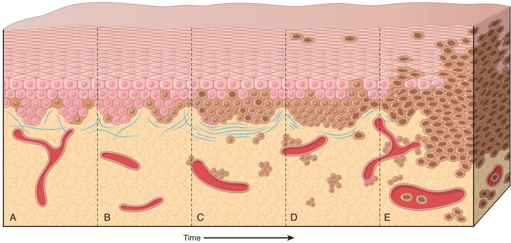 
Fig. 24.21 Possible steps in the development of melanoma. (A) Normal skin shows only scattered melanocytes. (B) Lentiginous melanocytic hyperplasia. (C) Lentiginous compound nevus with abnormal architecture and cytologic features (dysplastic nevus). (D) Early or radial growth phase melanoma (large dark cells in epidermis) arising in a nevus. (E) Melanoma in vertical growth phase with metastatic potential. Note that no melanocytic nevus precursor is identified in most cases of melanoma. They are believed to arise de novo, perhaps all using the same pathway.
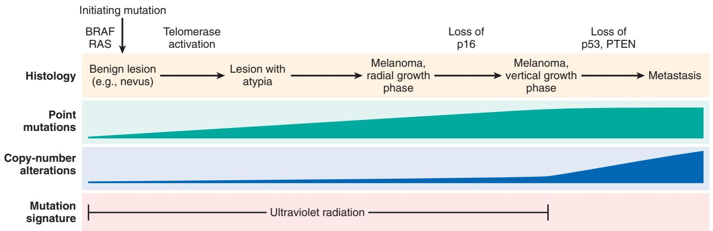 
Fig. 24.22 Molecular evolution of cutaneous melanoma. The most important driver mutations and the overall mutational burden (point mutations and genomic copy-number variations) at various histologic phases of melanocytic lesion progression are indicated. Note that as the tumor metastasizes to internal sites, UV light-induced DNA damage leading to point substitutions ceases, and copy number changes related to aneuploidy increase.
CDNK2A and its encoded tumor suppressor p16, the tumor shifts to the invasive vertical phase of growth. Throughout this cutaneous phase of tumor evolution, exposure to UV light adds to the mutational burden and increases the chances of tumor progression. Finally, with additional mutations in genes such as tumor suppressors TP53 and PTEN, the tumor acquires the capacity for metastasis. This phase is marked by the appearance of aneuploidy and genomic copy number alterations, which add to the genetic heterogeneity of the evolving tumor.
By contrast, the less common melanomas that arise in non-sun-exposed acral and mucosal sites follow different molecular courses. The most common initiating mutation in these tumors is a gain-of-function mutation in the KIT receptor tyrosine kinase. Similarly, melanomas arising the uvea of the eye also have a distinct set of driver gene mutations, most notably mutually exclusive mutations that activate the GTP-binding proteins GNAQ or GNA11.
In addition, it has long been speculated that melanomas express neoantigens that should be subject to recognition by the immune system. It follows that for melanoma to develop, tumor cells must acquire the ability to either suppress or evade the host immune response. The importance of immune evasion has been proven by the response of many advanced melanomas to immune checkpoint inhibitors, agents that unleash muzzled melanoma-specific T cells, allowing them to attack the tumor (described later).

Unlike benign nevi, melanomas often exhibit striking variations in pigmentation, including shades of black, brown, red, dark blue, and gray (Fig. 24.23A). The borders are irregular and often "notched." Microscopically, malignant cells grow as poorly formed nests or as individual cells at all levels of the epidermis (pagetoid spread) and in expansile dermal nodules; these constitute the radial and vertical growth phases, respectively (Fig. 24.23B-C). Of note, superficial spreading melanomas are often associated with a brisk lymphocytic infiltrate (Fig. 24.23B), a feature that may reflect a host response to tumor-specific antigens. Increasing thickness strongly correlates with
worse biologic behavior of melanomas (termed Breslow thickness). By recording and using these and other variables in aggregate, accurate prognostication is possible.
Individual melanoma cells usually are considerably larger than nevus cells. They have large nuclei with irregular contours, chromatin that is characteristically clumped at the periphery of the nuclear membrane, and prominent "cherry red" eosinophilic nucleoli (Fig. 24.23D). Immunohistochemical stains can be helpful in identifying metastatic deposits (Fig. 24.23D, inset).
Although most of these lesions arise in the skin, they also may occur in the oral and anogenital mucosal surfaces, the esophagus, the meninges, and the eye. The following discussion applies to cutaneous melanomas.
Melanoma of the skin usually is asymptomatic, although pruritus may be an early manifestation. The most important clinical sign is a change in the color or size of a pigmented lesion. The main clinical warning signs are as follows:
1. Rapid enlargement of a preexisting nevus 
2. Itching or pain in a lesion 
3. Development of a new pigmented lesion during adult life 
4. Irregularity of the borders of a pigmented lesion 
5. Variegation of color within a pigmented lesion
These principles are expressed in the so-called "ABCs" of melanoma: asymmetry, border, color, diameter, and evolution (change of an existing nevus). It is vitally important to recognize melanomas and intervene as rapidly as possible. The vast majority of superficial lesions are curable surgically, while metastatic melanoma has a very poor prognosis.
The probability of metastasis is predicted by measuring the depth of invasion in millimeters of the vertical growth phase nodule from the top of the granular cell layer of the overlying epidermis (Breslow thickness). Metastasis risk also is increased in tumors with a high mitotic rate and in those that fail to induce a local immune response. When metastases occur, they involve not only regional lymph
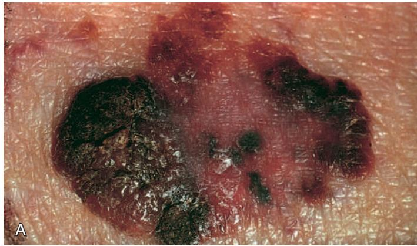
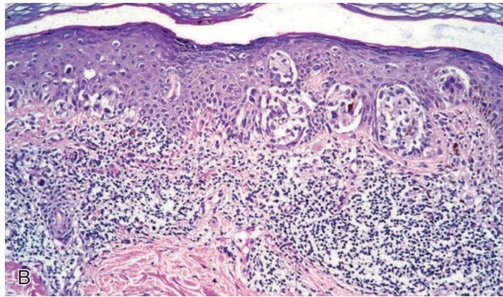
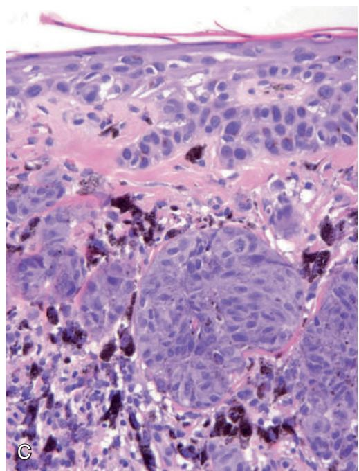 
Fig. 24.23 Melanoma. (A) Lesions tend to be larger than nevi, with irregular contours and variable pigmentation. Macular areas indicate superficial (radial) growth, while elevated areas indicate dermal invasion (vertical growth). (B) Radial growth phase, with spread of nested and single melanoma cells within the epidermis. (C) Vertical growth phase, with nodular aggregates of infiltrating tumor cells within the dermis. (D) Melanoma cells with hyperchromatic irregular nuclei of varying size that have prominent nucleoli. An atypical mitotic figure is present in the center of the field. The inset shows a sentinel lymph node containing a tiny cluster of metastatic melanoma (arrow), detected by staining for the melanocytic marker HMB-45.
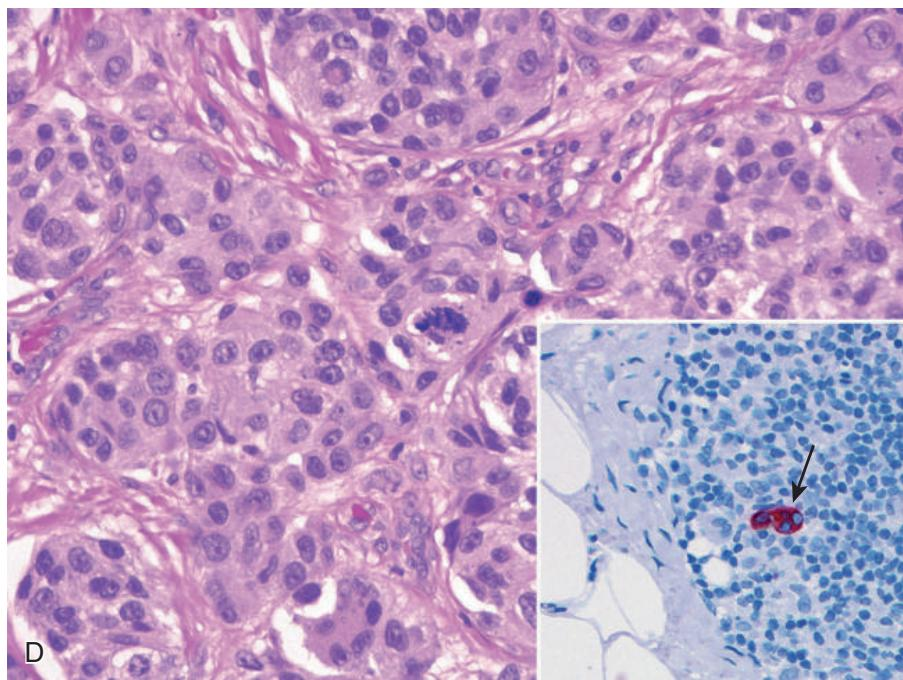
nodes but also liver, lungs, brain, and virtually any other site that can be seeded hematogenously. Sentinel lymph node biopsy (of the first draining node[s] of a primary melanoma) at the time of surgery provides additional information on biologic aggressiveness.
Agents that selectively inhibit mutant BRAF and KIT have produced dramatic responses in patients with metastatic tumors with BRAF and KIT mutations, respectively, an encouraging development in a previously hopeless disease. More recently, immune checkpoint inhibitors have been shown to be effective at stabilizing metastatic disease and in some instances causing remarkable tumor regression and even clinical remissions. Immune checkpoint inhibitors are antibodies that interfere with the function of proteins found on the surface of T lymphocytes that abrogate cytotoxic T cell responsiveness. By blocking these pathways, checkpoint inhibitors reactivate the host T-cell response, which otherwise is held at bay. Current efforts are focused on building upon these successes by using combinations of different checkpoint inhibitors, as
well as checkpoint inhibitors together with other targeted therapies such as BRAF inhibitors.
# MELANOCYTIC LESIONS, BENIGN AND MALIGNANT
- Most melanocytic nevi have activating mutations in BRAF or less often NRAS, but the vast majority never undergoes malignant transformation. 
- Most sporadic dysplastic nevi are best regarded as markers of melanoma risk rather than premalignant lesions. They are characterized by architectural disorder and cytologic atypia. 
- Melanoma is a highly aggressive malignancy; tumors only a few millimeters in thickness can give rise to deadly metastases. 
- In most cases, melanoma progresses from an intraepithelial (in situ) to an invasive (dermal) form. Characteristics of the dermal tumor such as depth of invasion and mitotic activity correlate with survival.
Bastian BC: The molecular pathology of melanoma: an integrated taxonomy of melanocytic neoplasia, Ann Rev Pathol 9:239, 2014. [A modified classification of melanoma based on both clinical and genetic features. Such molecular classification schemes are critical for progress in targeted therapy.] 
Cancer Genome Atlas Network: Genomic classification of cutaneous melanoma, Cell 161:1681, 2015. [A genomic study of cutaneous melanoma that highlights the different molecular subtypes and common pathogenic pathways.] 
Elder DE: Dysplastic nevi: an update, Histopathology 56:112, 2010. [A balanced presentation of the histology and pathogenesis of dysplastic nevi and their relationship to melanoma.] 
Epstein EH: Basal cell carcinomas: attack of the hedgehog, Nat Rev Cancer 8:743, 2008. [A succinct review of the epidemiology, clinical presentation, molecular pathogenesis, and novel treatment options for basal cell carcinoma.]
Nestle FO, Kaplan DH, Barker J: Psoriasis, N Engl J Med 361:496, 2009. [A discussion of the pathogenesis, clinical features, and targeted treatment options for psoriasis.] 
Ratushny V, Gober MD, Hick R, et al: From keratinocyte to cancer: the pathogenesis and modeling of cutaneous squamous cell carcinoma, J Clin Invest 122:464, 2012. [Models of human epidermal carcinogenesis indicate that multiple mutations in specific pathways are required for malignant transformation.] 
Ujiie H, Shibaki A, Nishie W, et al: What's new in bullous pemphigoid, J Dermatol 37:194, 2010. [A review of bullous pemphigoid pathogenesis.] 
Wargo JA, Cooper ZA, Flaherty KT: Universes collide: combining immunotherapy with targeted therapy for cancer, Cancer Discov 4:1377, 2014. [A presentation of melanoma signaling pathways with therapeutic interventions and the role of the immune system.] 
Yokoyama T, Amagai M: Immune dysregulation of pemphigus in humans and mice, J Dermatol 37:205, 2010. [A review of immune disturbances that may underlie pemphigus.]