# （二）恶性肿瘤 44
# 第一节 口和口咽部
# 一、口腔粘膜病
# （一）白斑
1978年WHO口腔癌和癌前病变研究中心指出，白斑在临床或病理上都不能描述为任何其他疾病的白色斑块。这个定义被广为接受。白斑发病与局部长期刺激有关，吸烟和饮酒是最普遍的原因，局部机械刺激也是重要方面。男性比女性多见，以颊和舌最好发。
大体 表面平坦者称均质性白斑，而非均质性白斑是指有刺状突起的疣状白斑，以及粗糙呈颗粒状或结节状的颗粒性白斑。
光镜 白斑表面上皮过度角化或不全角化，棘层增厚或少数也可萎缩，基底膜完整，结缔组织中有轻度慢性炎细胞浸润。
极少数白斑上皮伴有轻、中和重度的异常增生，这与宫颈癌分级常用的I-III级相对应。上皮异常增生程度越重，则潜在恶性越高，可变为上皮内癌。一般均质性白斑绝大多数为良性病变，而非均质性白斑癌变机会相对较多。
白斑的上皮异常增生常伴随苔藓样变化，出现过度角化，粒层明显，基底不规则具有锯齿状钉突，上皮下有带状炎细胞浸润，这种被认为是苔藓样异常增生改变应与真性口腔扁平苔藓相鉴别，后者上皮无异常增生改变，基底细胞层有液化变性，炎症浸润带上缘不清与表皮相连，下缘界限清楚。
# （二）红斑
也称 Queyrat 增殖性红斑，是指粘膜出现的边界清楚、色泽鲜红似天鹅绒样的斑块，并多伴有上皮异常增生、原位癌或早期浸润癌。红斑发病男女无差异，好发于舌缘、龈、龈颊沟、口底和舌腹。
红斑可分为以下4型：
1. 均质性红斑 边界清楚、平坦、质地柔软，此型癌变较少。 
2. 间杂性红斑 为红白斑间杂、多有癌变。 
3. 颗粒性红斑 在红斑的表面出现多数颗粒或小结节，此型往往是原位癌或早期浸润癌。 
4. 增殖性红斑 为高起于粘膜的红斑，表面可呈颗粒样或结节状。光镜为非典型增生或鳞癌。
# （三）白色水肿
此病为白色边界不清的斑块，好发于颊粘膜，与吸烟有关。
光镜 上皮增厚，细胞内水肿，胞核固缩消失，出现空泡变性。未见此病有异常增生或癌变。
# （四）粘膜良性淋巴组织增生病
好发于20岁-40岁，男性比女性稍多，以唇、颊粘膜多见，也可见于腭、舌、龈等处。
光镜 上皮可增生或萎缩，有的形成溃疡，粘膜固有层及粘膜下层有密集淋巴细胞和组织细胞，并有淋巴滤泡形成。此病偶见有癌变者。
# （五）复发性口腔溃疡
此病也称阿弗他口炎（aphthous stomatitis），发生于口腔粘膜单发或多发的圆形表浅溃疡，常一周左右可自愈，但许多因素如消化不良、睡眠不足、精神紧张、肠内寄生虫等均可使溃疡诱发。
光镜 溃疡表面有纤维素性渗出物或坏死组织覆盖，其下方有密集的中性白细胞及淋巴细胞。固有层中有血管扩张和炎细胞浸润。
# （六）Behcet综合征
此病也称眼-口-生殖器三联综合征，包括复发性口腔溃疡，生殖器溃疡和眼色素层炎。此外皮肤可出现结节性红斑，消化道溃疡，出血及中枢神经系统症状。化验血沉加快，血清中丙种球蛋白增高，免疫学检查发现体液免疫亢进，而细胞免疫低下，所以认为本病可能是一种自身免疫病。
光镜 病变本质为小血管炎性疾患，显示血管周围有中性白细胞、淋巴细胞和单核细胞浸润，血管内皮细胞肿胀，管壁坏死，血栓形成，并有粘膜炎性溃疡。
# （七）复发性坏死性粘膜腺周围炎
此病溃疡深、面积大，愈合慢，炎症深达粘膜下层腺体之中，腺泡被淋巴细胞取代，因破坏深，愈合后形成瘢痕。
# （八）异位皮脂腺
又称 Fordyce 病，位于口腔粘膜颊铃线之后方或上唇的唇红部，异位的增生皮脂腺呈黄色小颗粒状，聚集成片。
# （九）白色海绵状斑痣
一种少见的粘膜病，为遗传性家族性疾病，好发于颊粘膜、唇、口底及舌腹。病变粘膜呈珍珠白色、质软、触似海绵，可同时伴有阴唇、阴道、肛门和直肠发病，病变到青春期之后即可停止发展。
光镜 上皮棘层增生，表面不全角化，上皮细胞水肿，胞核消失形成水泡，钉突增宽并融合，上皮下组织水肿，有少量炎细胞浸润。
# （十）其他口腔粘膜病
包括扁平苔藓、寻常性天疱疮、良性粘膜天疱疮、多形性渗出性红斑和红斑狼疮等均与皮肤发生的病变相似。
# 二、口腔及口咽的炎性病变
# （一）粘膜慢性炎
主要由刺激食物、过锐的牙尖、不良的修复体、以及不佳的口腔卫生引起，病变处上皮增生，表层可糜烂，重则可出现溃疡。上皮下纤维组织增生，伴有各种慢性炎细胞浸润。
在腭部不良修复体及炎症刺激可引起粘膜上皮呈乳头状增生，为柔软无蒂的红色乳头状突起。
光镜 乳头表面被覆有复层鳞状上皮，表层可有角化或不全角化，乳头中心有结缔组织形成的轴，其中有较多炎细胞浸润。在牙龈可形成炎性增生物牙龈瘤，根据瘤内增生的组织成分不同，分为肉芽性牙龈瘤、纤维性牙龈瘤和血管性牙龈瘤三型，另有一型以纤维组织增生为主，伴有灶状多核巨细胞出现和少量慢性炎细胞浸润的牙龈瘤，则称为巨细胞性牙龈瘤。覆盖在牙龈瘤表面的上皮可有溃疡形成。在纤维性牙龈瘤和巨细胞性牙龈瘤内，常有骨质化生。血管性牙龈瘤多见于妊娠妇女，所以也称为妊娠性牙龈瘤。
此外在舌、颊及腭部因刺激可引起粘膜纤维性增生，表面平滑，也可有裂沟或溃疡形成。
光镜 增生的胶原纤维束错综排列，可发生玻璃样变性、骨化或钙化。本病与真性纤维瘤不同，覆盖的表面上皮无被压变薄，病变无包膜，界限不清，去除刺激后，可自行消退。
# （二）结核
口腔及口咽部粘膜原发结核少见，多伴有进行性呼吸道结核，特别是肺结核，光镜有典型的结核表现。
# （三）放线菌病
放线菌可通过龋齿、粘膜或皮肤的创口，而侵入面颈部或其他部位，以面颈最多占 $50\%$ ，引起组织坏死，形成脓肿。脓液内有硫磺样颗粒，光镜为菌丝及菌体，切片可见菌体及其周围的炎细胞。
# （四）结节病
多为全身性肉芽肿性疾患侵犯颌面部，也可在颌面部单发。多累及唇和颊粘膜，也可侵及牙龈、舌、腮腺。
光镜 可见上皮样细胞构成的肉芽肿性结节状病变，结节较一致，界限清楚。结节内可有多核巨细胞及薄壁小血管存在，无干酪样坏死。在多核巨细胞胞浆内有时可见星状小体及Schaumann小体，HE染色Schaumann小体为蓝紫色同心环层小体。结节周围纤维组织增生包绕，嗜银染色结节内外网织纤维增生明显。病变晚期肉芽肿结节可发生纤维化及玻璃样变。
结节病易与结核病混淆，前者有以下特点并与结核病鉴别[1]：①患者X线上多有肺门或纵隔淋巴结肿大，肺内有实性结节型病变；②结核菌素试验大多阴性；③少数患者有高球蛋白、高钙血症、血管紧张素转换酶增高；④病理形态显示结节较规则，大小一致。结节内无干酪样坏死，可有薄壁小血管存在。多核巨细胞胞浆内有时可见星状小体及Schaumann小体。结节周围较早出现纤维化，形成包裹。结节内网织纤维增生明显。病灶内抗酸染色阴性。
# （五）肉芽肿性唇炎
多见于青春期之后，从唇之一侧开始发病，波及全唇，唇肿胀增厚呈巨唇，皮肤潮红，扪时可及结节，无指压性凹陷。
光镜 在淋巴管周围有上皮样细胞，淋巴细胞及浆细胞形成的结节，其内可有多核
巨细胞存在。有时不形成结节，仅见组织中血管、淋巴管扩张，组织水肿，有灶状淋巴细胞浸润。
# （六）Melkerson-Rosenthal综合征
儿童和青年人好发，无性别差异。此综合征是以肉芽肿性唇炎、面神经麻痹和沟纹舌三征组成[2]。但三征常不同时出现，而肉芽肿性唇炎是Melkersson-Rosenthal综合征的基本表现，若只有肉芽肿性唇炎，而缺乏其他二征时，则认为是此综合征的不全型。该综合征的口唇组织学改变与肉芽肿性唇炎相同。
# （七）Crohn's病
此病可累及口腔和口咽部，以唇部多发，多有肠道Crohn's病。口腔粘膜病变表现为淋巴管扩张，组织疏松水肿，并有上皮样细胞、淋巴细胞及浆细胞形成的肉芽肿，其中可有多核巨细胞。从病理组织形态学上Crohn's病、Melkersson-Rosenthal综合征及单发的肉芽肿性唇炎无法区别。
# （八）Wegener肉芽肿
此病是好发于舌、龈、腭和口咽部的非特异性炎症，伴有坏死性血管炎，继而引起组织变性坏死，形成长时不愈的溃疡。
光镜 病变为由组织细胞、嗜酸性白细胞、多核巨细胞、中性白细胞、淋巴细胞和浆细胞构成的坏死性、溃疡性肉芽肿。肉芽肿内有纤维组织增生，疤痕形成及坏死性血管炎。在血管周围有炎细胞浸润，血管内膜增厚，管腔闭塞，管壁发生纤维素样坏死。
当病变内有多量弥漫或灶状非典型淋巴细胞出现，并侵犯血管壁时，应与恶性淋巴瘤相鉴别。Wegener肉芽肿中有多核巨细胞存在，淋巴细胞分化成熟，分布松散，中性白细胞数量多，必要时可借助免疫组织化学方法，恶性淋巴瘤对白细胞共同抗原（LCA）和T细胞/B细胞抗体为阳性。
# （九）溃疡性嗜酸性肉芽肿
此病也称Riga-Fede病或舌嗜酸细胞溃疡。可能是因舌肌受挤压损伤，引起嗜酸细胞性炎症反应增生，所以此病也称为创伤性肉芽肿。
# （十）组织胞浆菌病
可发生于舌或口腔各部位，呈结节状，疣状或硬结性溃疡，病变为非特异性炎症，用Gomórismethenamine-silver或PAS-Gridley特殊染色可帮助诊断。
# （十一）念珠菌病
此病是由白色念珠菌引起，口或口咽部粘膜均可受累，多因婴幼儿营养不良，或因重症疾病如糖尿病、血液病、恶性肿瘤，以及长期使用广谱抗生素者可引发。临床分为急性假膜性念珠菌病，也称鹅口疮；慢性增生性念珠菌病，或称白斑型念珠菌病；慢性萎缩性念珠菌病，即托牙性口炎三类。病理表现为念珠菌侵入粘膜，引起粘膜上皮增生，在角化层内有中性白细胞浸润灶，在角化层和上皮表层内可见念珠菌丝。菌丝HE染色不甚清楚，PAS染色菌丝呈阳性，上皮下结缔组织中有血管充血和各种炎细胞浸润。
# 三、其他非肿瘤性病变
# （一）囊虫病
由于误食有钩绦虫虫卵污染的食物引起，囊虫可出现于皮下、肌肉及各个脏器，口
腔粘膜囊虫呈豌豆大圆形结节，与周围组织无粘连。病理见囊内为幼虫头节，囊壁内层有各种炎细胞，外层为纤维性被膜包绕，其中可见浆细胞浸润。
# （二）淀粉样变
此病为一种特殊的蛋白质在组织内沉积，多为全身性病变累及口和口咽组织，也可单发于这些部位。舌最常见，其次为口底和牙龈，可使舌体增大变硬呈巨舌，出现言语不清，进食吞咽发生困难。在病变部粘膜结缔组织乳头层、以及深层组织中的血管周围、肌肉及其间质内均可有淀粉样物质浸润。
# （三）坏死性涎腺化生
此病是一种自限性疾病。以涎腺组织发生坏死，继以炎症反应，残余导管和腺上皮鳞状上皮化生为特点。最常见于腭部小涎腺，但口腔其他部位也可发生，如磨牙后垫、下唇、颊、口底和舌等处，大涎腺也有发生。多发于40岁～60岁，男多于女。临床表现为溃疡形成，溃疡边缘隆起似火山口状，周边有不同程度肿胀和充血，也有些无溃疡，只出现肿胀或肿块。
光镜 病变特点为腺泡凝固性坏死，腺泡结构和胞核消失，但腺小叶及腺泡的外形轮廓仍存在[3]。残存的腺导管和腺泡上皮细胞增生，形成单层或复层上皮细胞管状结构或为实性鳞状上皮团，这些增生的导管和鳞状上皮团细胞均规则一致，位于原小叶范围内。在坏死的腺泡和化生的鳞状上皮团周围有炎症反应和纤维组织增生环绕。粘膜表面上皮增生，钉突增长，甚至可与结缔组织内化生的鳞状上皮团相延续，极似浸润癌。
【鉴别诊断】此病应与粘液表皮样癌或鳞状细胞癌相鉴别，其要点是：①化生鳞状上皮细胞规则无异型性，增生的导管内无粘液细胞。②腺组织呈小叶性坏死。③残余导管和粘液腺泡同时鳞状化生。④明显的炎细胞浸润和肉芽组织形成。⑤增生和化生均保持在小叶的范围内进行。现认为此病因局部缺血引起，不需特殊治疗，3-12周可自愈。
# （四）粘液囊肿
此病多见于下唇粘膜，其次是颊粘膜、口底、舌及腭部。大小从几毫米至 $1\mathrm{cm}$ ，位于表浅者外观呈淡蓝色透明，深在者表面粘膜无色泽改变。
病理组织学可分为二型：
1. 外渗性粘液囊肿：涎腺导管因外伤破裂，致使粘液外溢于组织间隙，形成粘液池，初时周围有大量巨噬细胞及炎细胞渗出，其后有肉芽组织形成及纤维组织增生包绕。 
2. 潴留性粘液囊肿：为涎腺导管阻塞，使粘液潴留，导管扩张成囊。导管上皮细胞被压迫呈立方或扁平的囊肿衬里上皮细胞。
当外渗性粘液囊肿形成的早期，可有大量吞噬粘液的巨噬细胞成片聚集，此时应与粘液癌区别，吞噬粘液的巨噬细胞胞浆透明呈细泡沫状，核小深染位于中央。而粘液癌细胞胞体呈空泡状透明，胞核被压于一侧呈印戒样。
# （五）舌下囊肿
也称蛤蟆肿，位于口底，多单侧发生，是粘液囊肿的一种特殊类型，可为舌下腺及颌下腺导管阻塞引起，囊壁衬有单层立方上皮，邻近囊肿的腺体内有不同程度的慢性炎细胞浸润。但大多为导管破裂形成的外溢性囊肿，粘液潴留于组织间隙或腺小叶间，晚期粘液周围有纤维组织包裹或肉芽组织形成。
# （六）鳃裂囊肿和鳃瘘管
此病为胚胎发育过程中鳃弓和鳃裂未能正常融合或闭锁不全，则形成囊肿或瘘管。临床上最多见的为第二鳃裂来源的囊肿，位于颈上部舌骨水平，胸锁乳突肌上1/3的前缘附近，囊内为黄绿色清亮液体，囊壁内衬以复层鳞状上皮，或假复层柱状上皮，纤维囊壁内有密集淋巴细胞，并有淋巴滤泡形成。鳃裂囊肿常合并鳃瘘管。
鳃瘘管实际上大多数为窦道，而临床上常将窦道也混称为瘘管，一般将鳃瘘管分为三型：即不完全外瘘，仅有外口在面颈部皮肤上；不完全内瘘，开口于咽部；完全瘘，内外口兼有。
# （七）表皮样囊肿、皮样囊肿和皮脂腺囊肿
这三种囊肿均可发生于颈面部，皮样囊肿除有鳞状上皮衬里外，纤维性囊壁内还有皮肤附属器。而表皮样囊肿则缺乏后者，仅具有角化的复层鳞状上皮构成的囊壁衬里。囊内充满脱落的角化物。皮脂腺囊肿的主要特征，则是在囊壁衬里的复层鳞状上皮内，夹杂有灶状皮脂腺细胞。囊腔内为油脂状物。
上述三种囊肿破裂，囊内容物外溢，均可引起反应性炎性肉芽肿形成。有粉染无结构坏死物及多量多核巨噬细胞出现，此时应与真菌感染相区别，前者在肉芽肿内可见囊壁衬里上皮残存。巨噬细胞胞浆中常吞噬有折光角质碎片。坏死物中可有大量胆固醇结晶析出。而在真菌感染的肉芽肿内可找到芽孢或菌丝。
发生于口底中线上的皮样囊肿常在出生时就有，则是一种先天性囊性病损。
图2-1 疣状黄瘤 
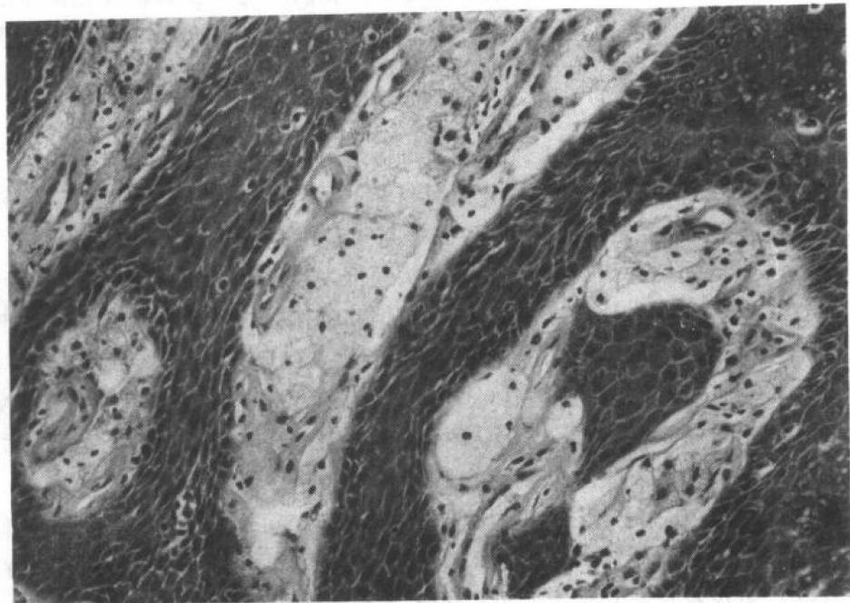 
于粘膜上皮下结缔组织乳头内有多量大细胞聚集，胞界清楚， 
胞浆呈细泡沫状透明，核固缩位于中心或偏于一侧
# （八）疣状黄瘤
多发于牙龈或牙槽粘膜[4]，病变处粘膜呈颗粒样或疣状，表面具有厚层角化，上皮钉突增长，在上皮钉突之间的结缔组织乳头层内，聚集一些圆形或多边形的大细胞（图2-
1), 胞界清楚, 镶嵌排列, 胞浆呈细泡沫状透明, 胞核小圆形, 位于中心或偏于一侧。此瘤并非真性肿瘤, 而是局部脂质代谢障碍性疾患。
# （九）纤维瘤病
也称瘤样纤维组织增生，浸润生长的纤维组织无包膜，细胞多丰富，异型性不明显，手术多因不能完整切除，而多次复发，不转移。
# 四、表皮肿瘤及瘤样病变
# （一）乳头瘤样病变和人类乳头瘤病毒（HPV）
HPV可引起口腔及口咽粘膜多种病变，寻常疣、尖锐湿疣和鳞状上皮乳头瘤（病理改变见皮肤病章）。HPV也可诱发疣状癌和鳞状细胞癌。
# （二）原位癌
此癌为上皮内癌，为早期浸润癌的前期，但对它存在的时间长短和发展为早期浸润癌的速度均尚不能预知。原位癌和早期浸润癌的临床表现多伴有红斑存在。郑麟蕃[5]观察35例红斑发现，已为浸润癌者20例，占 $57\%$ ，其中早期浸润癌8例。上皮重度增生和原位癌3例，占 $9\%$ 。轻、中度上皮异常增生11例，占 $31\%$ 。在26例颗粒红斑中有18例为浸润癌，占 $69\%$ 。这些均说明红斑与原位癌和浸润癌有着密切关系。而白斑则不同，仅有约 $3\% \sim 5\%$ 发生癌变。
口腔粘膜原位癌的组织病理诊断标准与宫颈相同，为上皮紊乱及上皮全层细胞非典型增生。常规染色基底膜完整、免疫组化染色见IV胶原和laminin变薄，在重度异常增生、原位癌中不连续。这些组织学改变也时常出现在浸润癌之周缘部位。
# （三）鳞状细胞癌
口腔粘膜原发恶性肿瘤有 $97\%$ 为鳞状细胞癌，主要来源于粘膜表面上皮。有 $2\% \sim 3\%$ 为各种类型腺癌，来自粘膜的腺体及其导管。另外有 $1\%$ 为其他口腔粘膜原发的恶性肿瘤如黑色素瘤或恶性淋巴瘤。所以口腔癌与鳞状细胞癌已成为同义词。
口腔癌占全身恶性肿瘤 $3\% \sim 5\%$ ，占头颈部发生恶性肿瘤的 $40\%$ ，好发于50岁以上，以男性多发，男女之比为 $3:1$ ，长期吸烟和饮酒是口腔及口咽癌主要的致病因素。
关于病变部位，赵福运曾总结570例口腔鳞状细胞癌，结果舌癌136例（23.9%），下牙龈癌133例（23.3%），唇癌（原发部位为唇粘膜）92例（16.1%），颊癌70例（12.3%），上牙龈癌62例（10.9%），硬腭癌47例（8.2%），口底癌30例（5.3%）。发生在咽部的肿瘤，最常发生于外侧壁的下部，有时侵及后壁。
病理特点：大体见高分化鳞状细胞癌多呈坚实隆起的肿块，中心溃破呈溃疡，表面为颗粒状，周缘高起为硬结，光镜为I或II级角化型鳞状细胞癌。分化较差的鳞状细胞癌质地较软，生长较快，外观不典型，可无溃疡；呈乳头状生长，镜检为III或IV级鳞癌。长于咽部的鳞状细胞癌一般分化较差，生长也较迅速，除鳞癌外，也见大圆形细胞癌和未分化癌。
口腔和口咽部癌的转移：首先经淋巴途径转移，受累淋巴结因原发灶部位而异，唇癌首转颏下淋巴结，其他口腔部位的鳞癌转移至颌下淋巴结，舌根和咽部肿瘤转至深层的咽后壁淋巴结，以后再至颈上深、颈中深、颈下深、颈后及锁骨上淋巴结转移。
转移至淋巴结的鳞癌组织可以发生囊性变，此时易误诊为鳃裂囊肿或鳃裂癌。鳞癌
经化疗、放疗后，可仅有少量残存变性坏死癌细胞，在角珠周围可有多核巨细胞出现，此为放疗或化疗后的组织反应。
预后：影响肿瘤预后的因素较多，首次治疗设计合理性、无瘤手术原则、以及原发灶的大小、生长部位、有无颈部淋巴结转移、肿瘤细胞分化程度等因素与肿瘤的生物学特性及预后密切相关。有淋巴结转移的口腔癌术后5年生存率为唇癌 $86\%$ 、舌癌 $33\%$ 、口底癌 $45\%$ 、其他部位癌 $44\%$ 。而无淋巴结转移的口腔癌术后5年生存率则为唇癌 $89\%$ 、舌癌 $53\%$ 、口底癌 $65\%$ 、其他部位癌 $61\%$ 。
# （四）疣状癌
为一型分化良好的鳞状细胞癌。1948年Ackerman首先报告并描述，所以也称此瘤为Ackerman瘤。由于它在临床、病理和生物行为均具有独特性，而被划为一特殊类型。口腔是疣状癌最好发部位，以唇、颊、舌背、牙龈或牙槽粘膜最多发，其次为腭部和口底。此外疣癌也可发生于喉、鼻腔、食管、阴茎、肛门、直肠区、外阴、阴道、子宫颈和皮肤处。以50岁以上老年人多见，其中 $75\%$ 发生于男性。病变呈白色刺状或乳头状突起。
光镜构成癌的上皮向外及结缔组织深部同时生长，全层细胞分化良好，核分裂少见，在表面增生的上皮折叠形成裂隙或小囊，其内充有不全角化物、深部上皮钉突膨大、钝圆，全部钉突几乎以同一方向、同一水平向间质内压迫生长，这种独特的“推进式”生长是疣状癌的特点。结缔组织内有多量慢性炎细胞浸润。疣状癌为局部侵袭性缓慢生长，不发生转移，切除不全可复发。
由于疣状癌细胞分化良好，如病检取材表浅，易误诊为角化棘皮瘤或鳞状细胞乳头瘤，所以应全面取材，见到膨大的球形上皮钉突，方可诊断。
# （五）腺鳞癌
在分化的鳞状细胞癌组织中，掺杂有腺癌的腺腔分化，此癌可能来自粘膜小涎腺。
# （六）小细胞癌（雀麦细胞癌）
为口腔及口咽发生的神经内分泌性小细胞癌，其形态与肺小细胞癌相同。
# 五、小涎腺肿瘤和瘤样病变
# （一）涎腺错构瘤
发生于牙龈的结节状增生物。
光镜 由浆液性、粘液性混合腺泡组成的小涎腺组织，并可混有皮脂腺细胞。
# （二）腺瘤样增生
常发生于硬腭，也偶见磨牙后区，小涎腺呈局灶性增生，表面为结节状。
# （三）小涎腺肿瘤
小涎腺分布于口腔及口咽粘膜各个部位，这些腺体均可发生良性或恶性肿瘤，其中硬腭是最好发的部位，其次也可发生于软腭、扁桃体区、颊、口底、舌、唇（通常为上唇）、牙龈及颌骨。小涎腺肿瘤的组织形态、分型及预后与大涎腺发生者相同。
发生于口内的恶性涎腺肿瘤，主要有腺样囊性癌、粘液表皮样癌和多形性低度恶性腺癌。有些涎腺肿瘤主要好发于小涎腺，而在大涎腺几乎不发生，这些涎腺肿瘤包括有：基底细胞腺瘤、肌上皮瘤、乳头状涎腺瘤、内翻性导管乳头瘤、多形性低度恶性腺癌。对
这些肿瘤的病理形态在第二节涎腺病变及肿瘤中描述。
# 六、外周性造釉细胞瘤
此瘤是发生于颌骨外的牙源性上皮性肿瘤，多发于牙龈，是来自口腔粘膜上皮基底层细胞的增殖、或来源于牙龈粘膜内残存的牙板上皮团。
光镜 肿瘤似造釉细胞瘤分化，与颌骨内造釉细胞瘤无区别。
# 七、黑色素细胞病变及黑色素瘤
# （一）雀斑和雀斑样痣
均见于唇部，前者是基底细胞层色素沉着过多，而后者除有前述特征外，还伴有上皮钉突的增长，偶在表皮和下方结缔组织交界处有小的痣细胞巢。
# （二）黑色素性棘皮瘤
在基底细胞层之上，增生的黑色素细胞向表面延伸，并与角质细胞紧密混杂。
# （三）黑色素沉着病
多在硬腭或牙龈出现黑色素沉着斑。
光镜 基底细胞层色素增加，也可为上皮下载色素细胞增多，或二者兼有。
# （四）Peutz-Jeghers综合征
唇、口周及口腔粘膜黑色素沉着斑，伴小肠、结肠息肉。
# （五）黑色素痣
与皮肤一样，在口内也可有交界痣、混合痣和粘膜内痣。另外蓝痣、太田痣也可发生于口腔粘膜，特别是腭部。
# （六）恶性黑色素瘤
多见于腭部或牙龈，可为有色素或无色素恶性黑色素瘤，瘤细胞异型性明显，其特点与身体其他部位发生者相同，必要时可进行HMB45及S-100免疫组化染色证实，两者均为阳性。
# 八、淋巴组织肿瘤及瘤样病变
# （一）淋巴组织增生性息肉
也称假性淋巴瘤，常有分化成熟的淋巴细胞增生，并呈结节状聚集，其中可有组织细胞的掺杂。多发生在颊或唇，形成淋巴滤泡样或扁桃体样的淋巴上皮病变。当有囊性结构出现，则呈淋巴上皮囊肿样改变。
# （二）恶性淋巴瘤
咽淋巴环是恶性淋巴瘤的好发部位，为结外发生，以B细胞来源的恶性淋巴瘤多见[7]。在口腔中以腭后部较多发，常为T细胞淋巴瘤，因临床上多形成溃疡和坏死，而被误诊为Wegener肉芽肿，鉴别点见前述。在牙龈和颊部也偶见恶性淋巴瘤发生。对淋巴瘤细胞形态及其分型，请见十四章淋巴结。
恶性淋巴瘤与该部发生的未分化癌的鉴别：①网织纤维染色，癌细胞有成巢倾向，而恶性淋巴瘤细胞呈散在分布。②电镜下癌细胞间有桥粒连接，细胞内有分泌颗粒或张力原纤维。③通过免疫组化染色可进一步区分。
# （三）浆细胞瘤
此瘤可在口腔软组织中发病，需与浆细胞性肉芽肿相鉴别，后者病灶中为分化成熟的浆细胞聚集，并掺杂有其他炎细胞以及纤维组织增生。浆细胞瘤含有单克隆 $\mathrm{IgM}$ ， $\kappa/\lambda$ 阳性，而浆细胞肉芽肿含有多克隆 $\mathrm{IgM}$ ， $\kappa$ 、 $\lambda$ 均为阳性。
# （四）白血病
急性髓细胞和单核细胞白血病约有 $40\%$ 的病例累及牙龈，同时可有或无皮肤受累。少数粒细胞性白血病口腔病变为其首发症候。
# 九、其他肿瘤及瘤样病变
# （一）外周性巨细胞性肉芽肿
也称巨细胞性牙龈瘤，较少见，可发生于任何年龄，女性多见，上下颌均可受累，为牙龈上外突性瘤样增生物，可使牙齿移位并浸蚀颌骨。
光镜 无包膜，在纤维性间质中有灶状破骨细胞样多核巨细胞分布，血管增生，炎细胞浸润，并可有多少不定的骨质化生。
# （二）先天性牙龈瘤
是一种罕见的病变，好发于新生儿口腔，女性多见，上颌比下颌多，部位以切牙区牙槽粘膜常见。肿物为圆形，可有蒂，偶为分叶状。光镜组织像颇似颗粒细胞瘤。瘤细胞大、圆形或多边形、呈片状排列，胞浆丰富呈红染细颗粒状。核圆形、可见核仁。间质少，血管丰富。肿瘤和粘膜上皮间有狭窄纤维带相隔，上皮不增生。
对此瘤的来源认识尚不一致，有人认为由于牙胚发育异常产生，而非真性肿瘤。也有人认为是来自肌源性或神经源性肿瘤。此为良性肿瘤，切除后不复发。
# （三）颗粒细胞瘤
最多见于舌，口腔其他部位也均可发生。覆盖于肿瘤表面的上皮常呈假上皮瘤样增生。
光镜 该瘤与先天性牙龈瘤难以区别，后者发生在新生儿，而且几乎均发生于女性，部位仅限于牙龈。
# （四）血管瘤
口腔颌面部是血管瘤好发部位，多数为先天性的，属于血管发育畸形，多见于颈面部、唇、舌、颊、龈和腭等处，也可发生于颌骨内。常见的组织类型为毛细血管瘤、海绵状血管瘤、蔓状血管瘤和血管球瘤。
化脓性肉芽肿：为口腔常见的一型血管增生性病变，好发于牙龈，也可发生于唇、舌、颊部。成年女性多见，为高起的暗红色肿物，其表面覆盖上皮可有溃疡形成，增生的毛细血管及内皮细胞被具有炎细胞及水肿的纤维间质分割成不规则小叶。肿物基部狭窄，两侧上皮几乎相接，病变愈合后留有粘膜纤维组织增生。化脓性肉芽肿与妊娠妇女发生的妊娠性牙龈瘤组织形态基本相同，难以区别。
血管肉瘤在口腔也有发生，但很少见。
# （五）淋巴管瘤
亦多为先天性淋巴管发育畸形而来，小儿及青年人多发，常见于舌、唇、颊及颈部。病变处外观不平呈结节状，病变由形态各异的淋巴管腔、裂隙或囊腔构成，在颈部扩张
的囊性淋巴管瘤也称囊性水瘤，弥散的淋巴管瘤也可使舌或唇成巨舌症或巨唇症。
# （六）平滑肌瘤
口腔也偶有发病，多见舌部，并常与血管结合为血管平滑肌瘤。平滑肌肉瘤口腔发病稀少，见于颊部。
# （七）横纹肌肉瘤
多见于颈面部及口底，婴儿及成人均可发生，以低分化横纹肌肉瘤多见。
# （八）外周性神经瘤
包括神经鞘瘤及神经纤维瘤，好发于舌、唇、鼻腔及喉部。口腔原发性神经纤维肉瘤也有发生，其内可含有色素。
（九）其他良性软组织肿瘤如脂肪瘤、粘液瘤、纤维瘤、软骨瘤、骨瘤等在口腔各部均有发生。
# （十）滑膜肉瘤
见于青年人，以咽、扁桃体、颊、舌及腭部为好发部位。
# （十一）Kapasis 肉瘤
以腭部多见，口腔的Kapasis肉瘤是部分爱滋病患者的首发症状。
# 十、转移性肿瘤
最多见转移部位是牙龈，口腔其他部位也可发生转移瘤。肿瘤的原发部位最常见有肺、肾、乳腺、皮肤、前列腺及肠道。
# 第二节 淞腺
# 一、涎腺的异位
异位的腺体远离正常腺体的位置，常见有腮腺区淋巴结内的异位腺体，它可能与淋巴上皮病变及Warthin瘤的发生有密切关系。颌下腺可异位于下颌角处，X光见下颌角处有界限清楚透影区，而误诊为颌骨囊肿。在牙槽粘膜、中耳、扁桃腺及颈部胸锁乳突肌前缘均可有异位腺体，致使可发生涎瘘、继发炎症、囊肿或肿瘤。涎腺也偶尔异位于其它部位的皮肤如腹部。
# 二、涎腺炎症
# （一）急性涎腺炎
多发生于腮腺，常一侧发病，出现疼痛、肿胀，腮腺导管口红肿，唾液分泌减少，初时为浆液性炎症，继而涎腺组织有散在化脓灶，组织坏死，导管壁及管周组织充血及中性白细胞浸润，管内有中性白细胞聚集。
# （二）慢性涎腺炎
主要发生于腮腺及颌下腺，小涎腺也可发生。发病侧腮腺局部肿大、微痛、口干，挤压腮腺导管口有少许粘稠、有咸味分泌物流出。
光镜 腺泡萎缩消失，导管上皮增生、鳞状上皮化生，间质中有纤维组织增生，淋
巴细胞及浆细胞浸润，也可有淋巴滤泡形成。
# （三）涎腺特异性炎
1. 淀腺结核 以腮腺多见，常为腮腺内淋巴结发生感染，经破溃后累及腺体实质。颌下淋巴结结核也常见，继而可累及颌下腺，病理改变与皮肤及其他部位结核相同。 
2. 放线菌病 面颈部是放线菌病好发部位，可波及涎腺，病理变化与其他部位相同。
# 三、涎腺非肿瘤性病变
# （一）涎石病
此病也称涎腺管结石，多发于男性青年，以颌下腺最多，其次为腮腺，舌下腺及小涎腺少见。结石可使导管阻塞，进食时颌下腺出现胀痛感，食后逐渐消失。涎石多为圆形、卵圆形或柱状，可单发或多发，结石所在部位导管粘膜上皮出现鳞状化生、增生，表面发生糜烂或溃疡形成，腺体内导管常发生扩张，充满积液，腺泡萎缩，间质内纤维组织增生及慢性炎细胞浸润。
# （二）涎瘘
由于涎腺区外伤或手术不当，造成涎液通过皮肤开口形成异常通道。最常见于腮腺，由于出现的部位不同，可分为管瘘和腺瘘。
# （三）涎腺变性肿胀
主要发生于腮腺，与营养缺乏有关，双侧腺体弥漫肿大、柔软，无明显压痛。
光镜 腺泡增大，腺泡细胞融合，胞浆内出现空泡变性，分泌颗粒消失，胞核变小固缩浓染。部分腺泡细胞消失，脂肪组织代偿增生，间质结缔组织水肿或玻璃样变性。
# （四）嗜伊红淋巴肉芽肿
本病于1937年金显宅首先报告，好发于中青年男性，发病缓慢，病程长，常发生在腮腺区，可单侧或双侧，上臂下部也可发病，病变处皮肤搔痒，色素沉着，血中嗜酸性白细胞增高，淋巴细胞也相对增加。肿物无包膜，与周围无明显界限，切面黄白色。
光镜 呈肉芽肿样改变，其中有大量嗜酸性白细胞及淋巴细胞浸润，嗜酸性白细胞多为单核或双核，呈弥漫分布，结缔组织多少不等，并可有玻璃样变。
# （五）Mikulicz病
1952年Godwin将Mikulicz病改用良性淋巴上皮病变（benign lymphoepithelial lesion）一名，现已被国内采用。
此病为自身免疫性疾病，好发于中老年女性，特征是单侧或双侧腮腺或颌下腺肿大，也可两腺同时肿大，有时伴有泪腺肿大。弥漫肿大的涎腺边界不清，少数可形成肿瘤样结节，患者偶感疼痛及口干。
光镜 腺小叶结构仍存在，小叶内腺泡间有淋巴细胞浸润，继而腺泡破坏消失，为密集的淋巴细胞和组织细胞所代替，小叶内导管增生，约有 $50\%$ 病人因导管上皮增生，形成实性上皮团块，称为上皮岛。Mikulicz病可恶变，变为恶性淋巴瘤或癌。
Mikulicz 综合征与 Mikulicz 病不同，前者是由于全身疾患如白血病、结核、梅毒等侵犯涎腺、泪腺引起腺体肿大，预后往往不良。
# （六）Sjogren综合征
临床特征是干燥性角膜炎、口干，并伴有全身其他结缔组织病，常为类风湿性关节炎，此外尚可合并其他胶原性疾患如红斑狼疮、硬皮病、多发性肌炎、结节性动脉炎等。
此病为自身免疫病，女性多见，女性为男性的4倍～5倍，发病年龄40岁～50岁，有口干、眼干、涎腺或泪腺肿大或不肿大。病理改变与Mikulicz病相同。二者在临床上也很难区分，故常称Mikulicz-Sjogren综合征。
Sjögren综合征应与恶性淋巴瘤相鉴别，前者原涎腺小叶轮廓仍保持，而小叶内为分化成熟的淋巴细胞取代了腺泡组织，其中有残存的导管上皮增生，而后者非典型淋巴细胞弥漫浸润，腺小叶轮廓及其残存的导管也均破坏消失。
# 四、涎腺肿瘤
# （一）涎腺肿瘤分类
1988年在Dublin召开了国际病理学会会议，提出了WHO涎腺肿瘤组织学分类修正方案[8]并于1992年发表[12]现列如下：
# 腺瘤
1. 多形性腺瘤 
2. 肌上皮瘤 
3. 基底细胞腺瘤 
4. Warthin瘤（腺淋巴瘤） 
5. 嗜酸性腺瘤 
6. 管状腺瘤 
7. 皮脂腺腺瘤
皮脂腺淋巴腺瘤
8. 导管乳头状瘤
内翻性导管乳头状瘤
导管内乳头状瘤
乳头状涎腺瘤
9.囊腺瘤
乳头状
粘液性
# 癌
1. 腺泡细胞癌 
2. 粘液表皮样癌 
3. 腺样囊性癌 
4. 多形性低度恶性腺癌 
5. 上皮一肌上皮癌 
6. 涎腺导管癌 
7. 基底细胞腺癌 
8. 皮脂腺癌 
9. 嗜酸性腺癌
10. 乳头状囊腺癌 
11. 粘液腺癌 
12. 腺癌 
13. 鳞状细胞癌 
14. 多形性腺瘤癌变 
15. 肌上皮癌（恶性肌上皮瘤） 
16. 未分化癌 
17. 其他癌
# （二）涎腺良性腺瘤
1. 多形性腺瘤又称混合瘤，是涎腺最多见的良性肿瘤，大小涎腺均可发生，肿瘤有包膜，但厚薄不一，瘤细胞可突入包膜内，肿瘤细胞比较一致，而组织结构具有多形性，有腺上皮细胞构成的腺管。肌上皮细胞形成的瘤细胞团片或条索，并有分化成熟的鳞状上皮化生，此外有粘液组织、软骨组织及骨组织分化。 
2. 肌上皮瘤 胰腺是此瘤最好发的部位，可有包膜或包膜不完整，根据肿瘤细胞形态不同，该瘤可分三型：①浆细胞样肌上皮瘤（图2-2），瘤细胞胞体宽大，镶嵌排列，浆红染，核圆形多偏位，细胞间常有粘液；②透明细胞肌上皮瘤[9]（图2-3）。瘤细胞圆形或多边形、胞界不清，胞浆透明、核圆形可见小核仁；③梭形细胞肌上皮瘤（图2-4）：瘤细胞长梭形，呈束状编织排列，易与纤维瘤、平滑肌瘤和神经纤维瘤混淆，在浆细胞样肌上皮瘤和透明细胞肌上皮瘤中，瘤细胞多被纤维性间质分割成不规则小叶。
肌上皮瘤免疫组化染色, S-100 蛋白、Actin、Myosin 和 GFAP 均显示阳性, 电镜下瘤细胞胞浆内有多量微丝, 借此可与其他肿瘤鉴别。
图2-2 浆细胞样肌上皮瘤 
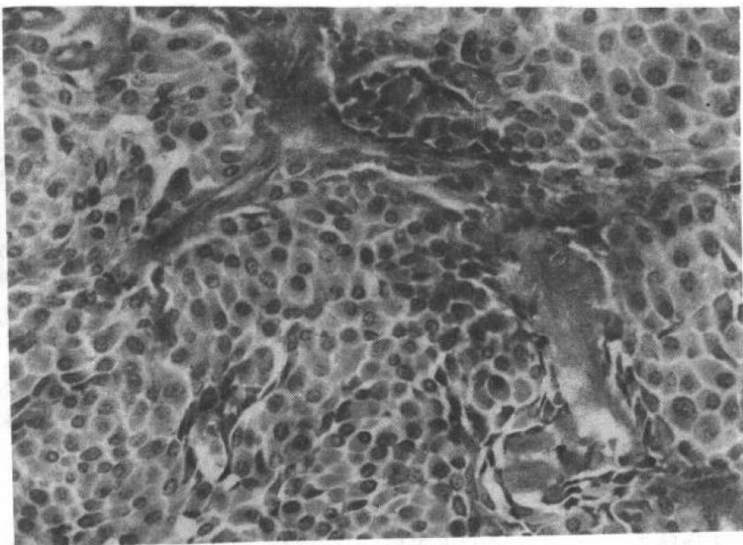 
瘤细胞胞体宽大，胞浆红染，胞核偏位，似浆细胞，细胞间常有粘液形成
图2-3 透明细胞肌上皮瘤 
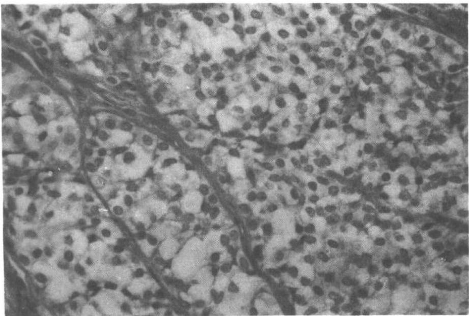 
瘤细胞圆形或多边形，胞界不清，胞浆透明，核圆形可见核仁
图2-4 梭形细胞肌上皮瘤 
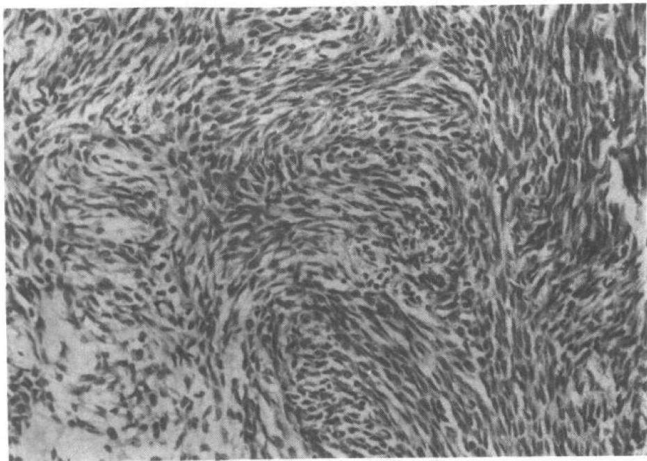 
瘤细胞为长梭形呈束状编织排列。部分区域细胞疏松，细胞间有粘液形成
3. 基底细胞腺瘤 此瘤 $70\%$ 发生于腮腺，而且好发于60岁以上老年人，女性稍多，肿瘤包膜完整，由单一的圆形基底样细胞构成，胞浆少，核圆形或卵圆形深染，可见核仁，根据瘤细胞的排列不同，可分为实性型（图2-5），小梁状型、管状型和膜状型四种。
在实性型及梁状型瘤细胞巢及梁素周围有呈栅栏状排列的矮柱状细胞围绕，并有基
底膜与间质相隔。而膜状型是实性型的一种变异型，在上皮巢周围有宽的基底膜样物质沉积，与皮肤汗腺发生的圆柱瘤形态相同。至于管状型的构成，是在富有血管的疏松间质中，分布有双层柱状细胞排成的索或带呈细管状。
图2-5 实性基底细胞腺瘤 
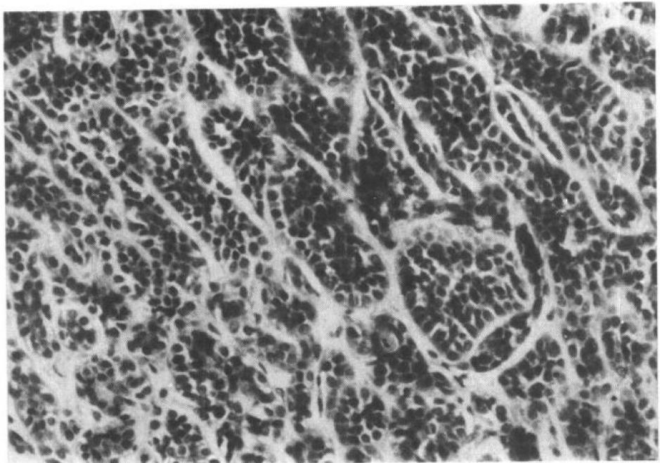 
基底细胞样瘤细胞构成团或巢，其周有呈栅栏状排列的矮柱状细胞围绕，并有基底膜
# 【鉴别诊断】
（1）与多形性腺瘤的区别：在于多形性腺瘤组织形态具有多样性，有上皮组织、粘液及软骨区域，肿瘤实质与间质分界不清。而基底细胞腺瘤细胞一致，形态单一，肿瘤实质与间质之间有基底膜相隔，分界清楚。 
（2）实性型基底细胞腺瘤与实性型腺样囊性癌的鉴别：后者无包膜，有向间质和神经周围浸润生长特性，实性的瘤细胞团块内常有灶片状坏死，如有小囊，囊腔多规则呈圆形，囊腔周围无基底膜，而腔内有粘液。前者肿瘤有包膜，不浸润间质和神经，在实性细胞团块内的小囊腔形状不规则，也可呈裂隙状，囊腔周边有基底膜，腔内有血管和胶原存在。 
4. 嗜酸细胞腺瘤 淀腺中少见的良性肿瘤[10]，绝大多数发生于腮腺，以老年妇女多见，此瘤生长缓慢，为圆形、有包膜。
光镜 瘤细胞大，呈圆形或多边形，胞浆内充满嗜酸性红染颗粒，胞核圆形或卵圆形，深染。瘤细胞可紧密镶嵌排列，也可形成腺管状。
电镜 肿瘤细胞胞浆内充满密集的线粒体。
此瘤应与老年性腮腺弥漫性嗜酸细胞增生和多发结节状嗜酸细胞增生相鉴别，三者细胞形态均相似，不同点为后两者无包膜。
5. 乳头状淋巴囊腺瘤 此瘤亦称 Warthin 瘤或腺淋巴瘤，好发于大涎腺，以腮腺为主，其次为颌下腺，可同时双侧发生。
大体 肿瘤呈圆形或椭圆形，部分为囊性，切面常为多囊状，有乳头突入囊腔中，腔
内充有粘液或红染物质，并有胆固醇结晶析出。
光镜 肿瘤由腺上皮及淋巴样间质构成，假复层柱状上皮围成不规则的腺管及囊腔，上皮细胞的胞浆嗜酸性细颗粒状，电镜证实为线粒体。上皮下间质中充满密集淋巴细胞，并有淋巴滤泡形成。在淋巴细胞中主要为B细胞，但也有T淋巴细胞，肥大细胞和S-100蛋白阳性的树突细胞。
# 6. 其他少见的良性肿瘤
（1）管状腺瘤：肿瘤形态单一，双层柱状细胞构成长的分支腺管，间质疏松，富含血管。 
（2）皮脂腺腺瘤及皮脂腺淋巴腺瘤：这两种肿瘤多发生在腮腺，由胚胎发育中异位的皮脂腺细胞增生而来，涎腺发育的皮脂腺瘤与皮肤发生者形态相同。至于涎腺皮脂腺淋巴腺瘤更为罕见，此瘤构成除有增生的皮脂腺腺瘤细胞巢片外，间质内有大量的淋巴细胞，并可有淋巴滤泡形成。 
（3）导管乳头状瘤：根据该瘤的病理形态可分为三个亚型： 
1）内翻性导管乳头状瘤：好发于小涎腺的排泄管，其管壁鳞状上皮向管周结缔组织内呈乳头状增生，增厚的鳞状上皮内可有小囊或粘液细胞出现，此瘤分化良好，不可误诊为导管发生的鳞癌或粘液表皮样癌。 
2）导管内乳头状瘤：导管内柱状上皮或鳞状上皮呈乳头状增生，与乳腺导管内乳头状瘤相似。 
3）乳头状涎腺瘤：为稀少的涎腺导管肿瘤，多发腭部，形态与汗腺发生的乳头状汗腺囊腺瘤相同。 
(4)囊腺瘤：可分为乳头状囊腺瘤和粘液性囊腺瘤，前者腺腔扩大为不规则囊腔，腔
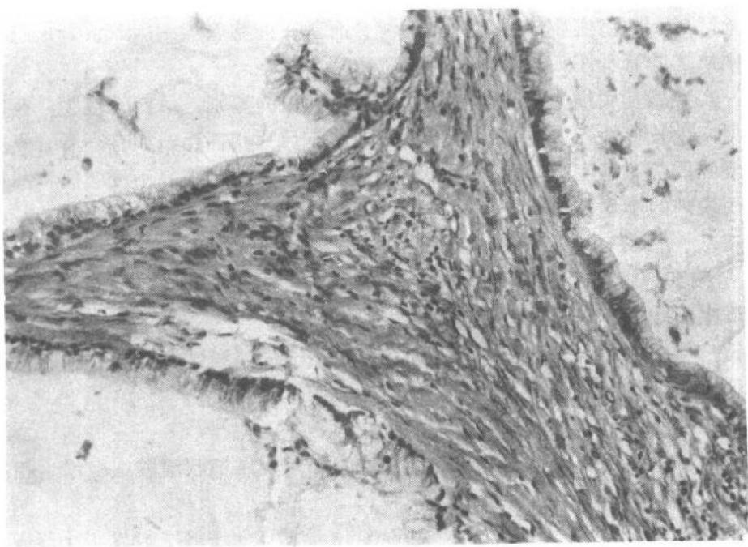 
图2-6 乳头状粘液性囊腺瘤
扩张的腺样囊腔有粘液细胞衬覆，并有粘液细胞形成乳头突入腔中
壁有柱状或立方状腺上皮衬里，腔内有增生腺上皮形成的乳头突入，乳头中央有结缔组织轴存在。后者在扩张的囊腔为粘液上皮细胞衬覆，偶也可有乳头形成突入腔中，构成乳头状粘液性囊腺瘤（图2-6），腔内充有脱落的粘液细胞及粘液。
# （三）涎腺恶性肿瘤
1. 恶性多形性腺瘤 有以下4种情况：
（1）多形性腺瘤癌变：占多形性腺瘤 $2\% \sim 10\%$ ，其中有 $50\% \sim 80\%$ 发生于腮腺， $10\% \sim 15\%$ 发生于颌下腺或小涎腺。
发生癌变的多形性腺瘤以肿瘤包膜为界，分为非侵袭性癌和侵袭性癌[1]。非侵袭性癌也可称包膜内癌或原位癌。侵出包膜的侵袭性癌小于 $8\mathrm{mm}$ 者，5年生存率为 $100\%$ ；若大于 $8\mathrm{mm}$ ，则5年生存率小于 $50\%$ 。
多形性腺瘤中出现的癌瘤类型频率为[8]：未分化癌和腺癌约占 $25\% - 30\%$ ，粘液表皮样癌、腺样囊性癌、鳞状细胞癌、肌上皮细胞癌和多形性低度恶性腺癌各占 $10\%$ 。发生转移的部位为淋巴结、肺和骨，尤其是脊椎骨。
多形性腺瘤的恶变征象常有：肿瘤组织变性、坏死、出血、间质大面积纤维化、玻璃样变、钙化和骨化。
（2）癌肉瘤：迄今报道不足20例。肿瘤上皮成分及间质同时发生恶变[13]，最常见的间质恶变形式为软骨肉瘤[12]。 
（3）转移性多形性腺瘤：更为罕见，原发瘤为纯属良性肿瘤而发生远处转移，表示出肿瘤的恶性特征。 
（4）低分化多形性腺瘤：肿瘤细胞有明显异型性，有大的瘤巨细胞，核分裂象可见，包膜常不完整，瘤细胞可浸润包膜及瘤周组织。 
2. 腺泡细胞癌 此癌为低度恶性肿瘤，预后较好，5年治愈率超过 $85\%$ ，好发中年以上女性，主要多发于腮腺，小涎腺以腭腺多见，肿瘤有包膜，但不完整。
光镜 瘤细胞胞体宽大，多边形或圆形，胞浆嗜碱性，呈细颗粒状。核小圆形深染，核多偏位。另外也见有圆形，核小的透明细胞和空泡细胞。肿瘤细胞常呈腺泡状（图2-7），实性片状排列，也有形成类似甲状腺的滤泡或扩张为囊腔，并有乳头突入腔中。肿瘤细胞对PAS染色为阳性。
3. 粘液表皮样癌 多发于中老年女性，大涎腺以腮腺多见，小涎腺以腭腺好发，根据瘤细胞分化程度及生物学行为可分高分化（低度恶性）和低分化（高度恶性）粘液表皮样癌，前者肿瘤多有包膜，但不完整，切面可有小囊腔，腔内为粘液。后者肿物无包膜，浸润生长，切面白色质致密。
光镜 粘液表皮样癌是由表皮样细胞、中间细胞及粘液细胞构成。在高分化肿瘤中，粘液细胞丰富，占肿瘤细胞 $50\%$ 以上，常见粘液细胞构成腺腔及囊样腔隙，并有增生的粘液细胞乳头突入其中，囊内有粘液及脱落的粘液上皮细胞。表皮样细胞成熟，无核分裂。中间细胞较少。低分化者，肿瘤主要以表皮样细胞和中间细胞构成，瘤细胞异型性明显，核分裂多见。粘液细胞不足 $10\%$ ，多单个散在于表皮细胞之间。对介于两型之间者可称为中分化型[14]，为表皮样细胞、中间细胞与粘液细胞数量大致相等混合而成，表皮细胞可有轻度异形性，偶见核分裂。
低分化粘液表皮样癌易与鳞状细胞癌混淆，特别当部分鳞癌细胞因胞浆富含糖原而
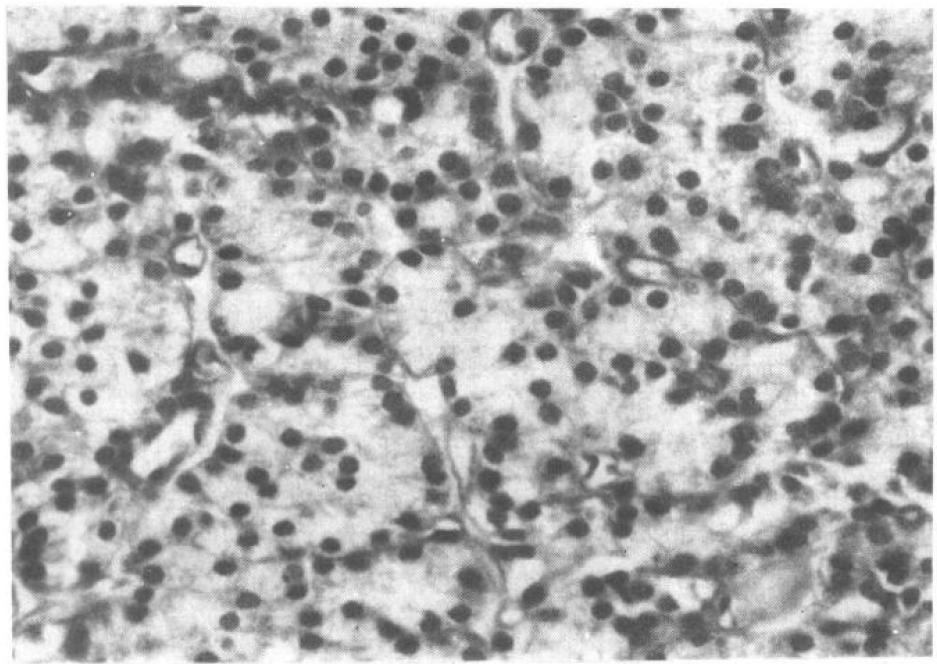 
图2-7 腺泡细胞癌
癌细胞胞体宽大,胞浆嗜碱性呈细颗粒状,核圆形。瘤细胞常呈腺泡状或实性片状排列透明时,更易误诊粘液表皮样癌,可用 Alcian blue 染色鉴别。
4. 腺样囊性癌又称圆柱瘤，为涎腺常见的恶性肿瘤，多发于小涎腺，以腭腺为多，发生在大涎腺者，以腮腺多见，其次为颌下腺。肿瘤早期常侵犯神经，出现疼痛或麻木。光镜瘤细胞似基底细胞，大小一致，圆形、卵圆形，核深染，按瘤细胞排列结构不同，可分以下三型[15]：
（1）腺样（筛状）型：瘤细胞排成不规则的上皮团块，其内有很多圆形或卵圆形的囊样腔隙，呈筛孔状。腔隙内含有PAS和Alcian blue染色阳性的粘液样物质。在上皮团周边及囊样腔隙周围有肌上皮细胞环绕。 
(2) 小管型: 由基底样细胞构成上皮条索, 其间有复层立方细胞形成的腺管。在上皮条索及腺管周围有玻璃样变纤维组织环绕。 
（3）实性型：瘤细胞排成实性团块，其内常有灶状瘤细胞变性坏死和筛孔状腔隙形成。
此三型结构常同时混合存在，称此为混合型[16]。对实性型腺样囊性癌的诊断，需与基底细胞腺癌相区别，后者瘤细胞形成实性细胞巢，巢排列紧密、间质稀少，巢周常有柱状或矮柱状细胞呈栅栏状排列。巢内瘤细胞较大，异型性较明显，核分裂常见，瘤细胞梁索及小管状结构少见。而实性型腺样囊性癌细胞较一致，无明显异型性，核分裂少见，上皮团内有变性坏死和筛状囊腔。上皮团间有多量纤维结缔组织。
5. 多形性低度恶性腺癌 对该瘤命名较多[17]，有终末导管癌、小叶癌、低度恶性乳头状腺癌，主要发生在小涎腺，而腭腺又是最多发生的部位，女性多见，发病率最高为40岁～70岁。
组织学特点是细胞形态单一,胞浆微嗜酸性,核圆一致,核分裂罕见。但组织结构
确具有多样性[18]，瘤细胞排成实性细胞巢、筛孔和含有乳头的囊腔，也见瘤细胞呈同心圆状环形排列或形成单排细胞条索。肿瘤生长缓慢，却侵袭周围组织，并常沿神经生长。约 $10\%$ 患者发生局部淋巴结转移[11]，但无远隔部位转移。
此瘤与腺样囊性癌的区别，后者细胞小，核浓染、胞浆少、胞界不清。在组织形态方面，没有乳头状囊腺结构，也无瘤细胞呈同心圆状排列或单一细胞条索排列。腺样囊性癌的间质胶原纤维致密，常发生玻璃样变。
6. 上皮一肌上皮癌 此癌为一种罕见的肿瘤，发生率在涎腺肿瘤中不足 $1\%$ ，主要发生于腮腺及颌下腺，小涎腺少见，好发中老年女性，肿瘤是由腺上皮细胞及肌上皮细胞构成。腺上皮细胞立方形或矮柱状，胞浆嗜酸性红染，核圆形位于中央，此细胞形成腺管，其管外有透明肌上皮细胞围绕，肌上皮细胞较大，圆形或多边形，胞界不清，胞浆透明，核圆形，位于基底（图2-8）。在两层细胞之外，有基底膜环绕。此瘤为低度恶性肿瘤，局部浸润生长，易复发，颈淋巴结转移率为 $10\% \sim 20\%$ ，远处转移少见。
图2-8 上皮一肌上皮癌 
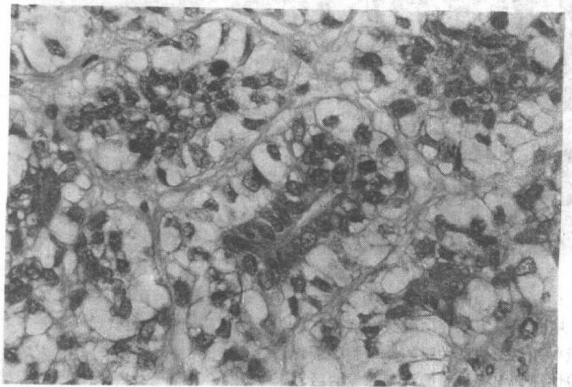 
肿瘤是由腺上皮细胞及肌上皮细胞构成。腺上皮细胞立方形或矮柱状，围成腺管。其外周有透明肌上皮细胞环绕
电镜及免疫组化可鉴别构成肿瘤的两种细胞。肿瘤因有透明性肌上皮细胞的存在，所以上皮-肌上皮癌应与腺泡细胞癌、粘液表皮样癌、皮脂腺腺癌及转移性透明细胞肾癌相鉴别，上皮-肌上皮癌除具有独特的组织结构，两层上皮细胞呈同心圆或双套管样排列外，外层肌上皮细胞对免疫组化染色S-100蛋白、Myosin、Actin和GFAP皆为阳性[19]，而上述其他肿瘤因不含肌上皮细胞均呈阴性反应可区别。
7. 淀腺导管癌 主要发生于腮腺，组织学与乳腺导管癌十分相似，可分为粉刺癌、筛状癌和乳头状癌，瘤细胞异型性明显，核分裂相可见，侵袭性强。常有远隔转移和淋巴结转移，死亡率为 $70\%$ 。 
8. 乳头状囊腺癌肿瘤发生大涎腺者，以腮腺多见，发生在小涎腺者，以腭部多发。
肿瘤形态与甲状腺乳头状腺癌十分相象，可借助于甲状腺球蛋白免疫组化染色相鉴别。与良性乳头状囊腺瘤区别是乳头状囊腺癌无包膜，向间质浸润生长，乳头分级多，瘤细胞具有异型性。与其他含有乳头结构的肿瘤如多形性低度恶性腺癌，涎腺导管癌，腺泡细胞癌的区别，在这些肿瘤内乳头只是肿瘤中多种组织结构之一，而在乳头状囊腺癌分枝的乳头则构成了肿瘤的主体。
9. 基底细胞腺癌 此癌主要发生于腮腺，它与良性基底细胞瘤区别是异型性明显，核分裂多见（图2-9），无包膜，可沿神经血管浸润生长[20]。
图2-9 基底细胞腺癌 
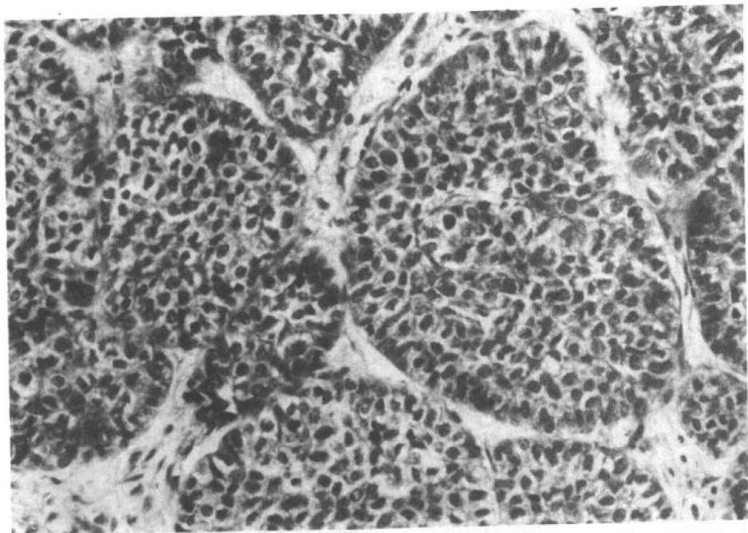 
癌巢内细胞异型性明显，巢周常有栅栏状排列的矮柱状肿瘤细胞环绕
10. 嗜酸性细胞腺癌 嗜酸性细胞腺癌与恶性嗜酸细胞腺瘤概念尚有差异, 后者多认为是指那种罕见的良性嗜酸性细胞腺瘤伴远处转移的类型。
嗜酸性细胞腺癌与嗜酸细胞腺瘤的区别，Goode和Corio认为当嗜酸细胞腺瘤具备以下病理特点，可诊断嗜酸细胞腺癌[21]：①瘤细胞增生活跃，异型性明显，核发裂多见；②肿瘤侵犯神经或血管；③肿瘤侵袭周围组织或腮腺旁淋巴结。
该瘤预后差，肿瘤大小似乎与预后有关，直径小于 $2\mathrm{cm}$ 的肿瘤预后较大于 $2\mathrm{cm}$ 者好。
11. 粘液癌 淀腺少见的肿瘤, 由立方状或矮柱状的粘液上皮细胞组成腺管或囊腔, 管腔内充有粘液及脱落的粘液细胞。
12. 肌上皮癌 也称恶性肌上皮瘤, 此癌与良性肌上皮瘤的区别[22], 前者肿瘤无包膜, 呈浸润性生长, 瘤细胞异型性明显, 可见核分裂 (图 2-10)。
13. 鳞状细胞癌 涌腺原发鳞状细胞癌少，主要发生在腮腺，常为邻近口腔粘膜鳞癌侵及腮腺或转移至腮腺内淋巴结发展而来，常来自上呼吸道，消化道和皮肤。极罕见原发于涎腺导管上皮，这种肿瘤生长，浸润周围组织。
14. 未分化癌 这类肿瘤与肺小细胞癌不能区别，其中有些病例与皮肤的麦克尔细胞癌相似。
图2-10 肌上皮癌 
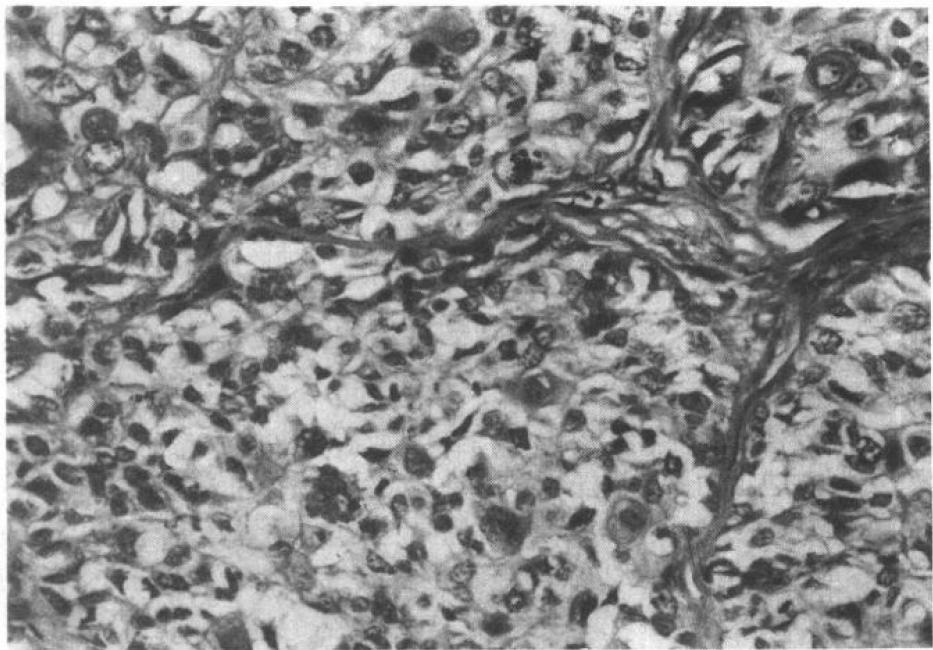 
肿瘤细胞排列成巢，胞浆透明，细胞具有明显异型性
# （四）其他涎腺肿瘤
多发生在大涎腺，以腮腺多见，良性肿瘤有血管瘤、脂肪瘤、神经纤维瘤。在恶性肿瘤中，骨外软组织巨细胞瘤，神经纤维肉瘤，纤维肉瘤，恶性纤维组织细胞瘤、肌源性肉瘤、恶性淋巴瘤，均可原发于涎腺内，其组织形态与全身其他部位发生者相同。
# （五）转移性涎腺肿瘤
多首先转移至腮腺内或颌下淋巴结，随着转移瘤的增大，与涎腺原发瘤相似，其中最多见的是鳞状细胞癌。其他转移瘤可来自肺、胃肠、肾和乳腺。
# 第三节 馋 骨
# 一、颌骨炎症
# （一）根尖肉芽肿
龋齿导致牙髓感染，炎症扩散至根尖引起，也可由根尖急性化脓性炎症转为慢性而来，炎症被包绕局限于根尖，形成根尖肉芽肿。一般无症状，多经X线检查发现，为圆形，直径不大于 $1.5\mathrm{cm}$ 。
光镜 病变中心常为组织变性坏死，周围有慢性炎细胞、组织细胞及多核巨细胞，其外有致密纤维组织环绕包裹。肉芽肿内常有上皮组织，并可以有增生、变性和液化，形成囊腔，成为根尖囊肿。
# （二）颌骨骨髓炎
颌骨的炎症以化脓性颌骨骨髓炎最多见,为牙体和牙周感染引起,多发于青年,男
性多见，下颌比上颌多发。急性化脓性骨髓炎表现疼痛剧烈，全身症状明显，张口受限、下唇麻木，严重者可出现败血症及颅内感染；慢性颌骨骨髓炎，颌骨内可有死骨形成，颊部皮肤出现瘘管，死骨周围有肉芽组织包裹，使死骨分离，病变外周有纤维组织及新骨形成，慢性低毒性颌骨骨髓炎，也称Garre骨髓炎，多因不适当地反复应用抗生素、或机体抵抗力增强的青年患者，为低毒性病原菌潜伏于骨膜下及骨皮质，刺激新骨增生和硬化，骨梁间为疏松纤维结缔组织，其中有少量散在淋巴细胞和浆细胞浸润。
颌骨结核是颌骨常见的特殊感染，多见于青少年，病理改变与全身骨关节结核相同。
# 二、颌骨瘤样病变
# （一）巨细胞性肉芽肿
以30岁以下女性多见，下颌发病约为上颌的两倍，且多位于下颌前部，巨细胞少，分布不均，多聚集于出血灶周围，巨细胞形态一般较小，形状也不规则，胞核数目少。间质为多量成熟的胶原纤维组织构成，并有分隔病变成结节状趋势。病灶内常有出血及含铁血黄素沉积。周围可有骨样组织及骨小梁新生。此病为颌骨损伤及出血之组织反应，不穿破骨质，刮除效果好。
巨细胞肉芽肿易与高分化巨细胞瘤相混淆，后者巨细胞多，分布均匀，且巨细胞多呈圆形，胞体宽大，胞核数目多，平均在50个以上。间质细胞呈短梭形，胞浆少，核卵圆形，染色质细，可见核仁。间质细胞间无成熟胶原纤维出现。巨细胞瘤为恶性肿瘤，可穿破骨皮质，浸润生长或转移。
# （二）家族性巨颌症
也称家族性颌骨多囊病，或家族性颌骨纤维异常增殖症，是常染色体显性遗传疾病，幼儿期发病，到青春期病变发展减慢或停止。临床表现为颌骨对称性增大。
光镜 富含血管的纤维结缔组织增生替代骨组织，血管壁薄，其周围可有嗜伊红物质环绕呈袖口状，多核巨细胞常围血管壁分布（图2-11），病灶中可有出血及含铁血黄素沉着，偶见有骨质化生。
# （三）囊性纤维性骨炎
因甲状旁腺机能亢进可引起全身性纤维性骨炎，颌骨也可受累。主要病理表现为破骨细胞增生活跃，骨小梁呈陷窝状破骨细胞吸收，富含血管的纤维组织增生，其中有尚未钙化新骨形成，新骨周缘也有多量破骨细胞聚集。病灶内常有出血，可见含铁血黄素沉积及多核巨细胞反应。患者血钙增高（ $12.5\mathrm{mg}\% \sim 18\mathrm{mg}\%$ ），血磷下降（ $2.5\mathrm{mg}\% \sim 3.5\mathrm{mg}\%$ ）。
本病与颌骨巨细胞肉芽肿及骨纤维异常增殖症的区别，后两者均无破骨细胞活跃增生，也不见破骨细胞贴附于骨质表面引起的陷窝状吸收，两病血中钙磷代谢正常，无甲状旁腺亢进表现。
# （四）骨纤维异常增殖症
本病有单骨性与多骨性之分。多骨性患者伴有性早熟和皮肤色素沉着，称为Albright综合征。单骨者好发颌骨，多见儿童和青少年，性别无差异，上下颌骨均可受累，颌骨膨隆不对称，随骨的发育成熟病变可停止进行。X光呈囊性透射区，也可有棉絮样骨质密度增高阻射区。
图2-11 家族性巨颌症 
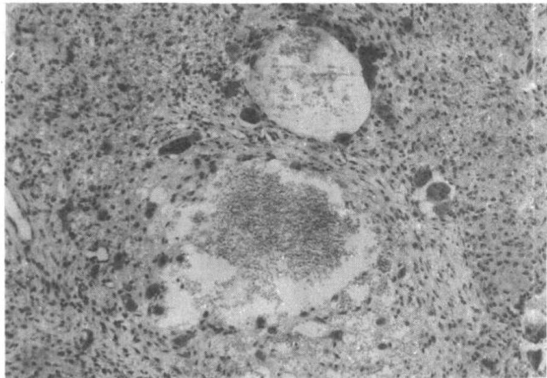 
富含血管的纤维组织增生，骨质消失，其中有多量薄壁血管，多核巨细胞环绕血管壁分布
光镜 正常骨结构被纤维组织替代，纤维细胞形状一致，呈梭形，胶原纤维细而分散，偶见致密胶原纤维束，在纤维组织中有散在化生的骨小梁，不规则呈“O、C、S”字样。小梁周围无成骨细胞及破骨细胞。血管丰富可有灶状出血及多核巨细胞反应。血中钙磷代谢正常。
# （五）颌骨Paget病
也称畸形性骨炎，发生在颅面者，呈现颅骨增大、增厚，颌骨增大畸形。在组织形态上Paget病则以骨质吸收和骨质新生不断交替进行，使骨小梁形成镶嵌构造，成为本病特征。
# （六）颌骨组织细胞增生症（histiocytosis X）
此病多发儿童和青少年，出现牙齿松动，牙龈红肿坏死，颌骨弥漫吸收及囊状破坏。病变以组织细胞增生为主，有嗜酸性白细胞、多核巨细胞及其他炎细胞，可见核分裂。由于这组疾病发病年龄、病变部位和组织细胞增生的程度不同，而出现症状和病程也不同，可将本病分成三种：即局限性组织细胞增多症（骨的嗜酸性肉芽肿eosinophilic granuloma of bone）、急性播散性组织细胞增多症（Letterer-Siwe disease）和慢性播散性组织细胞增多症（Hand-Schuller-Christian disease），现已证实此类病变中的组织细胞为Langerhans细胞，故称该病为Langerhans组织细胞增生症。Langerhans细胞具有Fc受体、HLA-D/DR等组织细胞标志。
电镜 胞浆内有Birbeck颗粒，为双层膜的管状结构。
免疫组化 对S-100蛋白、Vimentin、LCA、T细胞抗原均显示阳性，而Lysozyme为阴性。
# （七）巨大型牙骨质瘤
也称家族性多发性牙骨质瘤，常对称性发生，以中年女性多见，患者多有家族史和
常染色体显性遗传的特征。瘤组织生长缓慢，可长得很大。
光镜 为致密的高度钙化无细胞牙骨质，几乎无骨间质存在。
# 三、牙源性肿瘤
# （一）牙源性肿瘤的分类
对牙源性肿瘤的分类很多，1992年Kremer，Pindberg和Shear根据肿瘤的组织来源于上皮组织、间叶组织、混合组织，并结合分泌牙齿硬组织的有无，把牙源性肿瘤进行分类如下[23]：
I. 良性牙源性肿瘤
1. 牙源性上皮发生的肿瘤
造釉细胞瘤
牙源性钙化上皮瘤
牙源性鳞状细胞瘤
牙源性透明细胞瘤
2. 牙源性上皮及牙源性间叶组织发生的肿瘤，其中可有或没有牙齿硬组织形成
造釉细胞纤维瘤
造釉细胞纤维牙本质瘤或造釉细胞纤维牙瘤
造釉细胞牙瘤
牙源性腺样瘤
牙源性钙化囊肿
复合牙瘤
组合牙瘤
3. 牙源性间叶组织发生的肿瘤，其中可含有或无牙源性上皮成分
牙源性纤维瘤
粘液瘤
成牙骨质细胞瘤
II. 恶性牙源性肿瘤
1. 牙源性癌
恶性造釉细胞瘤
原发性骨内癌
其他牙源性上皮瘤的癌变
牙源性囊肿恶变
2. 牙源性肉瘤
造釉细胞纤维肉瘤（造釉细胞肉瘤）
造釉细胞纤维牙本质肉瘤或造釉细胞纤维牙肉瘤
造釉细胞癌肉瘤
# （二）良性牙源性肿瘤
1. 造釉细胞瘤。此瘤是最常见的牙源性肿瘤，好发于青壮年，性别和种族均无差异， $80\%$ 发生于下颌，其中 $70\%$ 好发于磨牙和下颌升支区。造釉细胞瘤来源于牙源性上皮，即
牙板、造釉器和牙周上皮剩余，也可来自含牙囊肿和牙源性角化囊肿的衬里上皮，以及口腔粘膜上皮基底细胞的增殖。
光镜 肿瘤组织形态多样，可分为：
(1) 造釉器样造釉细胞瘤: 肿瘤上皮呈团块、索条和网状, 其外周细胞象发育期牙滤泡的内釉上皮, 即造釉细胞层, 细胞高柱状, 核远离基底膜。上皮团块和索条中央的细胞呈星形, 排列疏松似造釉器的星网状层, 该层发生变性形成小囊, 在增大的囊腔周围, 其细胞被压为扁平形, 囊腔内有囊液及胆固醇结晶。此型分化较高, 有包膜。 
（2）鳞状细胞样造釉细胞瘤：此型与滤泡样造釉细胞瘤相像，仅是在上皮团或条索内，类似造釉器样的星网状层出现鳞状上皮化生，鳞状上皮细胞呈同心圆状排列，中心有角化珠形成。此型包膜常有瘤细胞浸润，或包膜不完整，该型易复发。 
（3）基底细胞样造釉细胞瘤：是分化低的一型，瘤细胞似基底细胞，核圆形或卵圆形，胞浆少，排成树枝状或条索，无周缘细胞层和中央星网状层细胞之分，这型肿瘤无包膜或包膜不完整。
造釉细胞瘤的间质为疏松纤维结缔组织，其中常有粘液变性或玻璃样变性，血管丰富。
（4）颗粒细胞样造釉细胞瘤：是一类少见的肿瘤，一些圆形或多边形的大细胞替代了上皮团中的星网状细胞，这些细胞核小固缩深染，胞浆内充满密集嗜伊红颗粒（图2-12）。
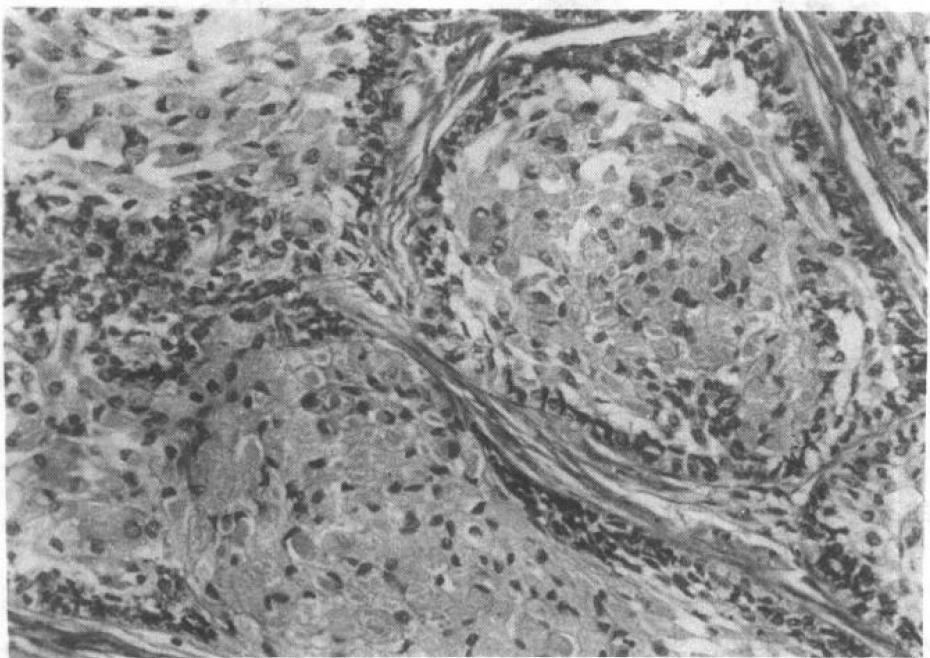 
图2-12 颗粒细胞样造釉细胞瘤
肿瘤实质由造釉器样上皮团构成，其周为高柱状细胞，
团内为多边形的大细胞，胞核小固缩，胞浆红染呈颗粒状
免疫组化 肿瘤细胞对Keratin呈强阳性反应。
电镜 肿瘤细胞内有成束的张力细丝，细胞间以桥粒连接。在颗粒细胞内有大量溶
酶体存在。
2. 牙源性钙化上皮瘤 又名Pindborg瘤，多发生于青壮年，无性别差异，下颌比上颌多见，多发生在磨牙部位。
光镜 肿瘤由多边形上皮细胞排成片状或小团，胞浆红染，胞界清晰，有时可见细胞间桥。胞核圆形或卵圆形，可见核仁，胞核常有明显异型性，出现多核或大核瘤细胞，但核分裂极罕见。在细胞内和细胞间有球形均质嗜伊红物质，现已证实为淀粉样物质，是由肿瘤细胞变性产生的，这些物质常呈同心圆状钙化（图2-13）。
此瘤为生长缓慢的良性肿瘤，但有局部浸润生长之特性，手术切除不彻底可复发。
图2-13 牙源性钙化上皮瘤(Pindborg瘤) 
.jpg) 
肿瘤由多边形上皮细胞呈片排列。其中有大核及多核细胞出现。 
瘤细胞间可见红染淀粉样物质及呈同心圆钙化团块存在
3. 牙源性鳞状细胞瘤 发病年龄范围较大，多数发生于30岁时，上下颌均可受累[24]。
光镜 见成熟的纤维结缔组织间质中, 有分化良好的鳞状上皮巢, 巢周无类似造釉细胞瘤的高柱状细胞, 而为一层扁平细胞环绕, 上皮巢内可有变性灶或钙化区, 也可偶见囊性变。此瘤为良性, 局部浸润生长, 刮除很少复发。
4. 牙源性透明细胞瘤 此瘤罕见，为近年才描述报导的一型牙源性上皮肿瘤[25]，与涎腺发生的或转移来的透明细胞癌相似，透明的肿瘤细胞呈巢状或条索状排列，间质为纤维结缔组织。
电镜 瘤细胞有明显的空泡变性, 胞浆内细胞器缺乏。此瘤为良性, 但具有局部浸润的特性。
5. 造釉细胞纤维瘤 颌骨内罕见的肿瘤，发生于青少年，平均年龄为14岁，很少超过21岁者，性别无差异，以下颌磨牙区为多见部位。X光显示为一界限清楚的囊性透
射区，肿瘤包膜完整。
光镜 肿瘤由牙源性上皮和幼稚间叶性纤维组织构成。上皮细胞为立方或柱状，似造釉细胞，多呈两层上皮细胞排成条索和小岛，偶见其中有星网状细胞分化，在幼稚的疏松纤维间质中没有釉质和牙本质形成（图2-14）。手术切除可复发，也可肉瘤变。
图2-14 造釉细胞纤维瘤 
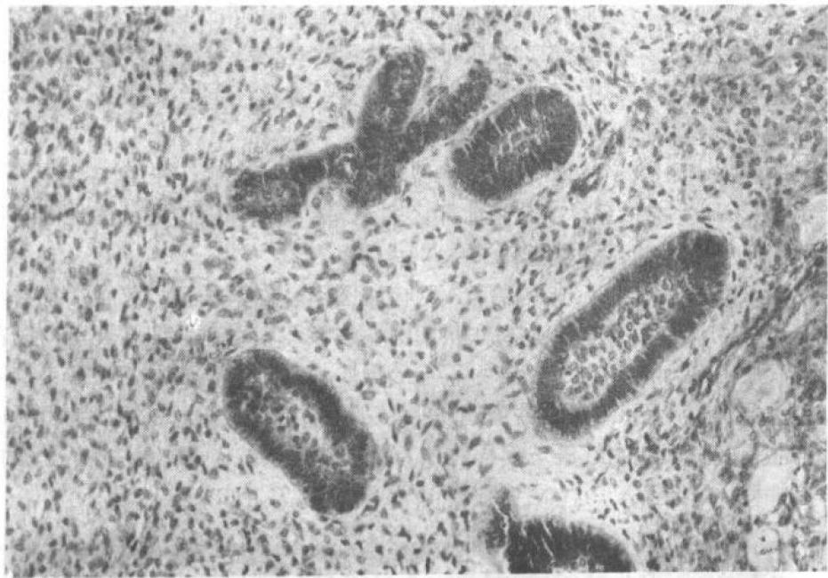 
由高柱状造釉细胞呈双层排列，构成条索或上皮岛，其间可见星网状细胞分化，间质为疏松纤维结缔组织
图2-15 造釉细胞纤维牙本质瘤 
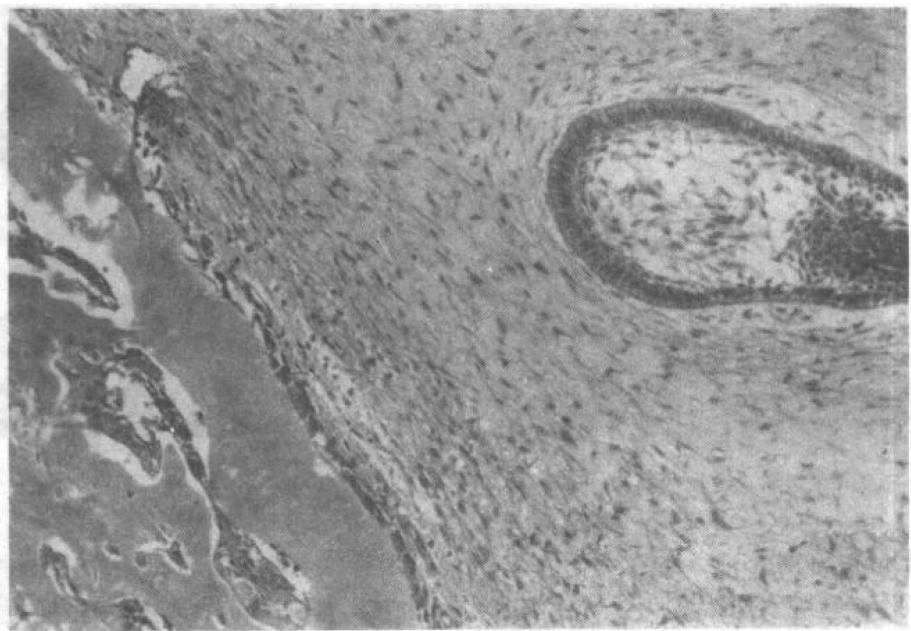 
见造釉器样上皮团及大片牙本质样组织。在牙本质周边排列有高柱状造牙本质样细胞，肿瘤间质为疏松结缔组织
6. 造釉细胞纤维牙本质瘤或造釉细胞纤维牙瘤 此两种肿瘤的组织结构与造釉细胞纤维瘤基本相似，其不同点为牙源上皮具有诱导牙齿硬组织形成的功能。当有牙本质形成时，称为造釉细胞纤维牙本质瘤（图2-15）。当有釉质形成时，则称造釉细胞纤维牙瘤。 
7. 造釉细胞牙瘤 此瘤也称牙造釉细胞瘤，是一种少见的牙源性肿瘤，多见于儿童，下颌多发，部位以后磨牙区常见。该瘤有与造釉细胞瘤相同的上皮成分，另外也有牙釉质、牙本质、牙骨质及牙髓组织存在，间质为幼稚的疏松纤维组织[26]。目前认为这是一种不成熟的组合性牙瘤，与造釉细胞瘤和造釉细胞纤维瘤不同，尽管它们之间形态上有些相似。这是一良性肿瘤，但偶尔具有侵袭性。 
8. 牙源性腺样瘤又称腺样造釉细胞瘤，是一种少见的颌骨肿瘤，常发生于青少年，平均年龄为16岁，女性多见，以上颌前牙区多发。X线示界限清楚的囊性透影区。肿瘤有完整包膜，切面常呈囊性，囊壁厚。
光镜 瘤细胞呈高柱状，排成腺管，胞核卵圆形，位于基底，腔面常有嗜酸性红染的牙本质基质样物质。另外也见由高柱状细胞、梭形细胞和扁平细胞聚集构成花瓣样的细胞团，在其中心或细胞间也有红染的不定形物质，似牙本质基质，PAS染色阳性，甲苯胺蓝染色为异染性（图2-16）。肿瘤间质少，为纤维结缔组织。在瘤细胞团周边的纤维组织内，也常有多少不定的红染玻璃样物质，偶见小管状结构。肿瘤中常见小的钙化灶。此瘤手术易摘除，不复发。
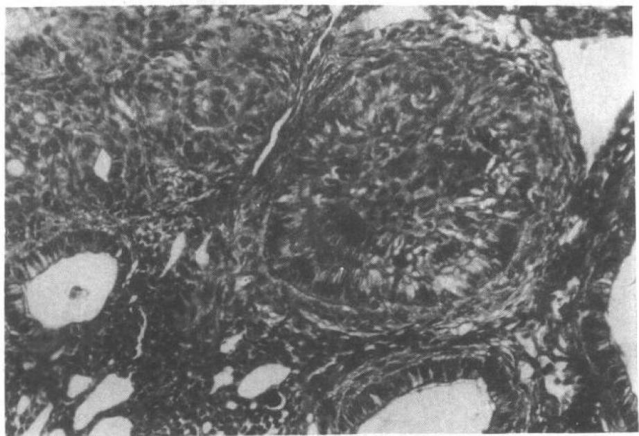 
图2-16 牙源性腺样瘤 
见瘤组织中肿瘤细胞排成腺样管腔及花瓣样细胞团结构
9. 牙源性钙化囊肿 1962年Gorlin等首先报告此瘤，称为牙源性钙化囊肿，可发生于任何年龄。囊肿衬里上皮为立方上皮或鳞状上皮，基底细胞排列整齐呈栅栏状。上皮层内有星网状细胞分化和影细胞灶出现[27]。影细胞胞体宽大红染，界限清，核溶解消失，残留有核之影像，故称影细胞。在上皮细胞间可见少量不规则红染类牙骨质。牙源性钙化囊肿常有实性肿瘤区域，该区组织结构与造釉细胞瘤相似，有肿瘤性牙源上皮团，团
内有影细胞和类牙本质形成。牙源性钙化囊肿为良性，刮除后不复发。
10. 牙瘤 此瘤为颌骨内造牙组织的增生分化，形成不规则类似牙齿组织的肿瘤。该瘤生长缓慢，无症状，上下颌均可发生，以儿童和青年多见。牙瘤是由釉质、牙本质、牙骨质和牙髓组织构成，是高分化的良性肿瘤，常有包膜，可分为二型： 
（1）混合性牙瘤：形成牙齿的四种组织混杂存在，形成不规则的坚硬肿瘤团块，无完整的牙齿形成。 
（2）组合牙瘤：构成牙齿的四种组织按正常牙齿相似排列，形成大小不一、形态各异的牙齿，数目少则数个，多则可达百余个，聚集成一团块。 
11. 牙源性粘液瘤 牙源性粘液瘤 $60\%$ 发生于20岁～40岁，性别无差异，下颌较上颌多见，生长缓慢，颌骨膨隆。X线显示大小不等的多囊性密度减低区。发生于颌骨的粘液瘤较身体其他部位多见，来源于牙胚间叶组织，即牙乳头和牙囊，因此也称为牙源性粘液瘤。
光镜 瘤组织由疏松星状细胞组成，胞浆突起互相连接成网，网眼间为蓝染粘液基质，细胞无异型性，偶见牙源性Malassez上皮剩余及圆形钙化的牙骨质小体。肿瘤多有不完整包膜，侵袭性生长，不易完全切除而复发。
12. 牙源性纤维瘤 此瘤的临床发病情况大致与牙源性粘液瘤相同，其不同点是光镜有较多的纤维组织和更多的牙源性上皮剩余。当粘液和纤维成分大致相等时，则称为牙源性粘液纤维瘤。 
13. 良性成牙骨质细胞瘤 此瘤也称良性牙骨质母细胞瘤[28]，常见于25岁以下青少年，下颌多发，多与牙根相连。X线见在斑点状致密阻射区周围有一狭窄透射带环绕。
光镜 瘤组织由增生的牙骨质小梁连接成片，成熟的骨梁内有牙骨质细胞和嗜碱性骨沉积线。骨梁间有少量富含血管的纤维间质。在骨梁及梁样骨基质周边，有多量牙骨质母细胞存在，其大小形态与骨母细胞相同。
图2-17 造釉细胞纤维肉瘤 
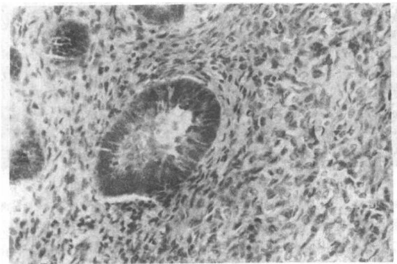 
见肿瘤由分化成熟的造釉细胞排列成上皮团，其间偶有 
星网状细胞分化，纤维性肿瘤间质具有明显肉瘤特征
# （三）恶性牙源性肿瘤
1. 造釉细胞癌 此癌具有造釉细胞瘤的组织结构和特点，但细胞形态有显著的异型性，并有多数核分裂，肿瘤无包膜，浸润生长。
恶性造釉细胞瘤：是指那些具有典型良性造釉细胞瘤形态特征，而却出现远处转移的肿瘤。但多数这样的病例在出现远处转移前，局部多有数次复发史。
2. 原发颌骨内癌 颌骨癌主要是鳞状细胞癌，多由口腔粘膜发生的鳞癌侵犯而来，也有些可能是远处原发癌转移至颌骨的。真性颌骨原发癌是由颌骨内牙源性上皮剩余增生恶变而来，此外也可由造釉细胞瘤转变而成，特别是鳞状细胞样造釉细胞瘤的恶变。再有颌骨内牙源性囊肿的衬里上皮增生恶变形成。 
3. 造釉细胞纤维肉瘤 此瘤也称造釉细胞肉瘤，是一种稀少的恶性肿瘤，好发于青年人，下颌多见，男女均可发病。该瘤与造釉细胞纤维瘤形态相似，仅肿瘤间叶成分发生恶变，幼稚的纤维细胞数目增多、形状多样，核分裂多见，而肿瘤性牙源性上皮无恶变（图2-17）。 
4. 造釉细胞纤维牙本质肉瘤或造釉细胞纤维牙肉瘤 此两种肿瘤形态结构与造釉细胞纤维肉瘤基本相同，只是肿瘤性牙源上皮有明显诱导现象，有牙本质形成则称造釉细胞纤维牙本质肉瘤。当上皮诱导更充分，不仅有牙本质产生，而且还有釉质沉积和牙骨质形成，则称为造釉细胞纤维牙肉瘤（图2-18）。
图2-18 造釉细胞纤维牙肉瘤 
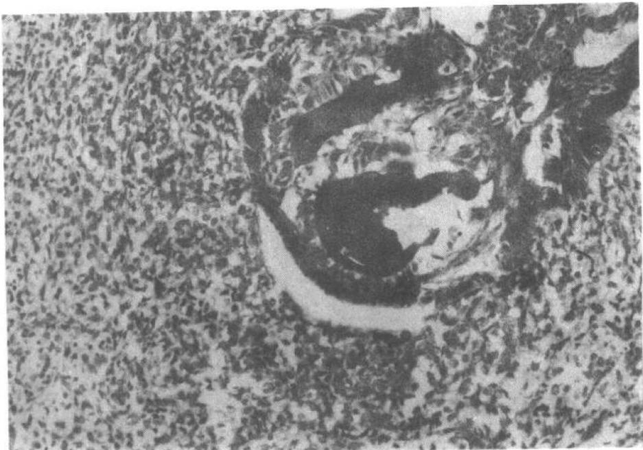 
见分化良好的造釉器样上皮团，高柱状造釉细胞分泌形成牙釉质，纤维性间质，具有明显肉瘤特征
5. 牙源性癌肉瘤 这是一种极为罕见的恶性肿瘤[29]，形态与造釉细胞纤维肉瘤结构大致相象，但其牙源性上皮成分和牙源性间叶组织形成的肿瘤间质，都显示有明显的恶性特征（图2-19）。
图2-19 牙源性癌肉瘤 
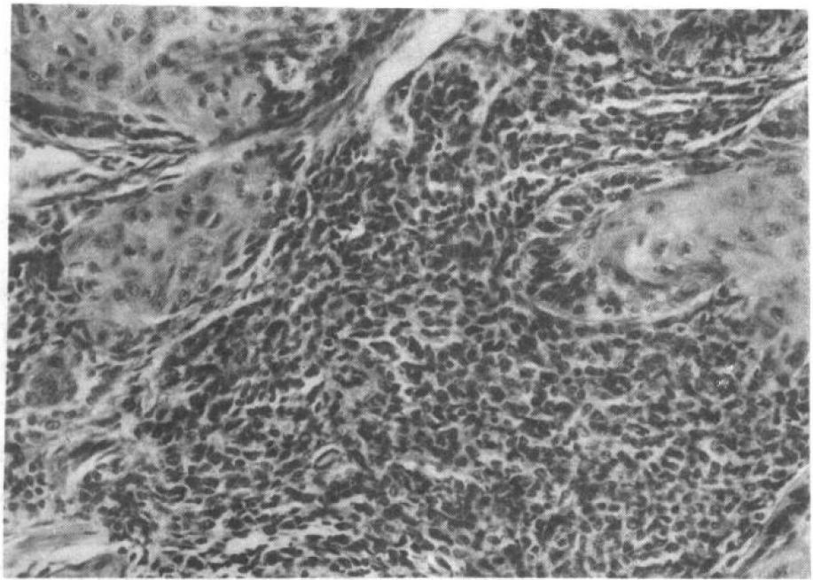 
牙源性造釉器样细胞团及间质均具有明显恶性形态
# 四、颌骨囊肿
# （一）颌骨囊肿分类[23]
# 1. 上皮性囊肿
（1）发育性囊肿：牙源性发育囊肿
婴儿牙龈囊肿
牙源性角化囊肿
含牙囊肿
萌出囊肿
根侧牙周囊肿
成人牙龈囊肿
腺牙源性囊肿
非牙源性发育囊肿
鼻腭管（切牙管）囊肿
鼻唇（鼻牙槽）囊肿
（2）炎症性囊肿：牙根的囊肿
根尖和根侧囊肿
根的残余囊肿
根旁囊肿
2. 非上皮囊肿
（1）单纯性骨囊肿 
（2）动脉瘤性骨囊肿
# （二）上皮性囊肿
1. 牙源性角化囊肿 牙源性角化囊肿占颌骨囊肿的 $10\%$ ，发病平均年龄为40岁，男女无差别，发病部位以下颌第三磨牙区多见。可为单囊或多囊，囊腔内含有似奶酪样物质，通常以组织学特点为此囊肿诊断的依据。
光镜囊壁衬里为薄层鳞状上皮，在呈皱纹状的上皮表面有不全角化或正角化层，基底细胞排列整齐呈栅栏状，无上皮钉突。纤维囊壁薄，其内可有牙源性上皮岛或微小子囊存在，一般无炎症。
牙源性角化囊肿术后易复发[30]，其原因：①囊壁上皮薄而易碎，难于完整摘除。②囊肿常呈指状突起沿阻力小的骨小梁间隙生长，所以很难彻底刮除。③囊壁内有微囊或子囊存在，手术残留的微囊可继续形成囊肿。④囊壁内牙板剩余上皮的增生形成。⑤口腔粘膜具有高度分裂能力的基底细胞增生形成。
Corlin 综合征：也称痣样基底细胞癌综合征，此综合征有家族史，具有常染色体显性遗传特点，表现有多发的牙源性角化囊肿，皮肤的基底细胞癌和多骨性异常如肋骨分叉、短掌骨症等。
2. 含牙囊肿 囊壁包绕于未萌出牙的牙冠，且附着在牙颈部的囊肿。当牙冠形成后，缩余釉上皮和牙面之间贮留液体而成的，囊内含有牙冠。
光镜囊壁衬里为复层鳞状上皮，表面无角化，上皮层薄仅为2层～5层扁平细胞或矮立方细胞构成，其中可夹有粘液细胞或有纤毛柱状上皮化生。纤维囊壁内可有牙源性上皮岛。囊液内含有脱落的上皮细胞及胆固醇结晶。当伴有感染时，囊壁内和囊腔中均有大量炎细胞，并可伴有衬里上皮增生。
含牙囊肿手术不能完整切除，可复发。纤维囊壁内的上皮岛及衬里上皮可增生恶变，成为造釉细胞瘤或颌骨内鳞状细胞癌。
3. 萌出囊肿 此囊肿是发生在软组织内的含牙囊肿，可单侧或双侧，可单发或多发。在萌出的乳牙或恒牙的牙冠，缩余釉上皮与釉质之间液体潴留形成的囊肿，此囊位于牙龈粘膜上皮和萌出的牙齿之间。囊壁衬里通常为无角化的薄层鳞状上皮。
4. 婴儿牙龈囊肿 出现于新生儿或生后1月一2月内的婴儿，位于牙槽嵴处的粘膜上，可单发或多发，白色或淡黄色如粟粒大的结节，数目不等，囊内衬以薄层不全角化鳞状上皮，基底细胞呈扁平状，此囊肿来自牙板上皮剩余。
5. 根侧牙周囊肿 多发于下颌前磨牙的牙根面或附着牙龈，囊肿来源于牙板上皮剩余，囊肿上皮极薄，仅有1层～2层细胞厚。
6. 成人牙龈囊肿 位于游离龈或附着龈内的牙龈软组织囊肿，多数人认为此囊肿来自牙板上皮剩余，也有人认为是因外伤性上皮植入而来。衬里上皮为薄层鳞状上皮。外科手术摘除无复发。
7. 腺牙源性囊肿（sialo-odontogenic cyst）此囊肿发生在颌骨的牙齿支撑区，囊肿衬里为鳞状上皮，部分可为嗜酸性立方或柱状上皮，其中常夹杂有产粘液细胞及纤毛柱状细胞，这些细胞可形成乳头，突入囊腔，也可下陷于厚的上皮层内，形成腺样裂隙或陷窝，内有粘液。
8. 鼻腭管囊肿 也称切牙管囊肿，位于腭中缝前部鼻腭管中，也可位于该管在口腔开口处腭乳头的软组织中。此囊肿常见，占全部颌骨囊肿的 $10\%$ ，由胚胎性上皮残余形
成。囊肿衬里上皮为复层鳞状上皮，也可为假复层纤毛柱状上皮，或两种兼有之。
9. 鼻唇囊肿 又名为鼻牙槽囊肿，此囊肿位于靠近鼻孔的基部，在上颌牙槽突的外侧软组织内，过去认为来源于球状突、侧鼻突和上颌突胚胎融合处上皮剩余发生。近来更多认为是来自鼻泪管的末端增生而成。
光镜囊壁衬里上皮为口腔上皮或呼吸道上皮，也可二者均有。
10. 球上颌囊肿 是位于上颌侧切牙和单尖牙之间的囊肿。
腭正中囊肿 是在硬腭正中线上发生的囊肿。
下颌正中囊肿 位于下颌中线部位。
以上三囊肿过去均认为是面突融合时残余上皮增生而来，近年对此来源皆提出疑问。这些囊肿的衬里上皮多为薄层复层鳞状上皮，近鼻腔的囊肿多为呼吸道上皮。
11. 根尖囊肿 多因龋齿诱发的牙髓炎波及根尖引起，先有根尖肉芽肿形成，进而形成根尖囊肿。可发生在任何年龄，X光示根尖部一界限清楚透影区。囊壁常有多量炎细胞浸润，衬里上皮为复层鳞状上皮。由于炎症刺激，上皮常有增生，钉突延长，也可因炎症衬里上皮破坏消失，形成溃疡。囊内充有棕黄色透明液体，其中可有脱落的上皮细胞，炎细胞及胆固醇结晶。
# （三）非上皮性囊肿
1. 单纯性骨囊肿 多发于青年人，下颌骨多见。X线为周缘清晰的透射区。此囊肿可因创伤及出血形成，为无上皮衬里的颌骨内腔隙。腔可很大，但内容物极少，骨腔内壁仅覆以少量血管纤维结缔组织。 
2. 动脉瘤性骨囊肿 此病主要发生于长骨，颌骨也有发病，且多见下颌骨，以青少年为多。
光镜 见病变由大小不等的腔窦构成，其内充满血液。血腔间有薄厚不一的纤维组织间隔。在囊壁及厚的血腔间隔纤维组织中，可有吞噬细胞、多核巨细胞、陈旧出血及含铁血黄素沉积。
# 五、颌骨其他肿瘤
# （一）良性肿瘤
1. 婴儿黑色素神经外胚瘤 此瘤稀少，来源于神经外胚层，以往曾认为是由牙源性上皮发生。多发生在一岁以内的婴儿，上颌骨多见，其次为下颌骨、颅骨、长骨、附睾、纵隔及肢端软组织均可发病。肿瘤由上皮样细胞和淋巴样细胞构成。上皮样细胞呈片状、条索状排列，并有瘤细胞围成裂隙和腺泡状结构。上皮样细胞之胞浆内含有黑色素颗粒。淋巴样细胞聚集呈团或位于上皮样细胞围成的裂隙中。间质为致密的纤维组织。
婴儿黑色素神经外胚瘤虽无包膜，浸润生长，但它仍属良性，手术切除不复发。
2. 骨化性纤维瘤和牙骨质化纤维瘤 前者是在增生的纤维间质内，有呈板状沉积的骨小梁，在小梁周边有新生的骨样组织和成骨细胞的排列。而后者则在增生的纤维组织中有散在圆形牙骨质小体，该小体有环形层状的沉积线（图2-20）。目前认为两者皆是牙骨质纤维瘤的两种形态，均来自牙周韧带。与骨纤维异常增生症不同，它们界限清楚，易于外科切除，在组织形态上，骨纤维异常增生症的骨小梁细，其周很少有骨样组织及骨母细胞，纤维间质也较疏松纤细。
图2-20 牙骨质化纤维瘤 
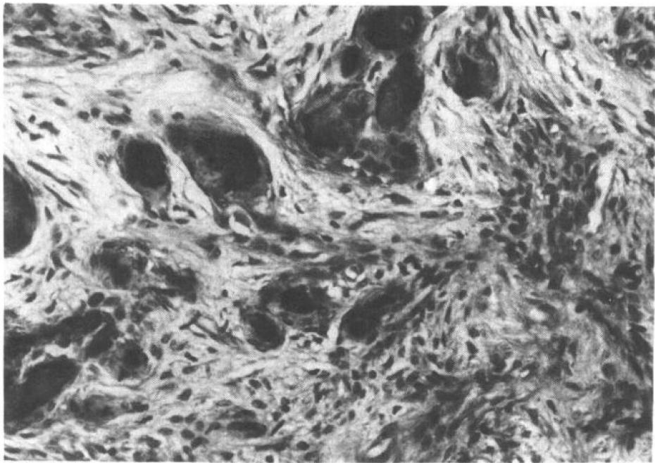 
在成熟的纤维组织之间分散多量圆形牙骨质小体，其中一些小体具有环形层状骨沉积线
3. 骨瘤、软骨瘤、骨母细胞瘤、软骨母细胞瘤、非骨化纤维瘤、神经纤维瘤、血管瘤等在颌骨也均可发生，对这些肿瘤的形态及生物学特征均与长骨内发生者相同。
# （二）恶性肿瘤
1. 软骨肉瘤 颌骨内软骨肉瘤比软骨瘤更多见，高分化软骨肉瘤有时与良性软骨瘤很难鉴别。软骨肉瘤可发生于上下颌骨，但以上颌骨更好发，肿瘤呈分叶状结构，其中可有钙化和骨化。 
2. 骨肉瘤 此瘤是颌骨内最常见的恶性肿瘤，多为颌骨原发，下颌比上颌多见，但也有因放射治疗不当，Paget病及骨纤维异常增生症恶变而来，颌骨肉瘤预后比长骨者好。 
3. 骨巨细胞瘤 颌骨巨细胞瘤应与颌骨内巨细胞病变如巨细胞修复性肉芽肿、巨颌症、动脉瘤性骨囊肿相鉴别。特别是骨巨细胞瘤易与颌骨内巨细胞修复性肉芽肿相混淆，后者与巨细胞瘤相比，巨细胞数目较少，分布也不均，常集聚于出血灶周围。巨细胞常较小，形状不规则，核也较少，间质有多量成熟的胶原纤维，编织的纤维组织有把病变分隔为结节状的倾向，病变中多有出血及含铁血黄素沉着。 
4. 颌骨内其他肉瘤 纤维肉瘤、恶性纤维组织细胞瘤、神经纤维肉瘤、血管肉瘤、肌源性肉瘤也均可在颌骨内发生，病理组织形态见软组织肿瘤章。 
5. 恶性淋巴瘤 何杰金淋巴瘤在颌骨内罕见，非何杰金淋巴瘤以组织细胞型恶性淋巴瘤多见。罕见的Burkitt's淋巴瘤常发生于颌骨的牙槽突，多见于儿童和青少年，表现为牙龈呈瘤样肿大，牙槽骨破坏，牙齿松动，病变可累及颌骨一处或多处。组织学特点在低分化的肿瘤细胞间，有散在胞体宽大，胞浆透亮的吞噬性组织细胞，使肿瘤具有特征性的“星天”图象。
6. Ewing 肉瘤 可原发于颌骨，较少见，以上颌骨多发。诊断应与颌骨原发性小细胞癌相鉴别，也应与颌骨低分化小细胞肉瘤及恶性淋巴瘤相区别。 
7. 浆细胞骨髓瘤 多是全身性浆细胞骨髓瘤的一部分，波及颌骨，也可颌骨单发，综合化验、X光像及瘤细胞的组织学特征，不难诊断。 
8. 颌骨转移癌 常来自乳腺、肺、肝、大肠、前列腺、肾、甲状腺及睾丸的恶性肿瘤转至颌骨，肿瘤一般常转移到下颌磨牙区。
（责呈瑞）
# 参考文献
1. 寡松林，等．结节病的病理组织学分析．附27例报告．实用病理学杂志，1987；3：7. 
2. Worsaae N, et al. Melkersson-Rosenthal syndrome and cheilitis granulomatosa. Oral Surg, 1982; 54: 404. 
3. 高诚，等．坏死性涎腺化生。现代口腔医学杂志，1992；6：114. 
4. 刘桂菁．疣状黄瘤．国外医学（口腔医学分册），1993；20：167. 
5. 郑麟蕃，等．口腔粘膜红斑．中华口腔医学杂志，1983；18：1. 
6. 赵福运，等．570例口腔鳞状细胞癌治疗经验总结．中华口腔医学杂志，1990；25：92. 
7. 陆其龙，等．口咽环非何杰金氏淋巴瘤与未分化癌和低分化鳞癌鉴别诊断. 中华病理学杂志，1987；16：150. 
8. Seifert G, et al. WHO international histological classification of tumours. Tentative classification of salivary gland tumours. Pathol Res Pract, 1990; 186: 555. 
9. Ogawa I, et al. Clear cell tumours of minor salivary glands. Oral Surg Oral Med Oral Pathol, 1991; 72: 200 
10. Palmer TJ, et al. Oncocytic adenomas and oncocytic hyperplasia of salivary gland: a clinicopathological study of 26 cases. Histopathol, 1990; 16: 487. 
11. Seifert G, et al. Histopathology of malignant salivary gland tumours. Oral Oncol Eur J Cancer, 1992; (28B): 49. 
12. Seifert G, et al. WHO histological classification of salivary gland tumours. Cancer, 1992; 70: 379. 
13. Hellquist H, et al. Malignant mixed tumour. A salivary gland tumour showing both carcinomatous and sarcomatous features. Virchows Archiv A (Pathol Anat), 1986; 409: 93. 
14. 贯呈瑞，等．粘液表皮样瘤分型与DNA含量关系的研究．中华口腔医学杂志，1993；28：95-96. 
15. Batsakis J G, et al. Histopathological grading of salivary gland neoplasms: III Adenoid cystic carcinomas. Ann Otol Rhinol Laryngol, 1990; 99: 1007. 
16. 贾呈瑞，等．腺样囊性癌组织学分型的计量病理学研究。中华口腔医学杂志，1992；27：228. 
17. Aberle AM, et al. Lobular (polymorphous low grade) carcinoma of minor salivary glands. A clinicopathologic study of twenty cases. Oral Surg, 1985; 60: 387. 
18. Norberg LE, et al. Cellular differentiation and morphologic heterogeneity in polymorphous low-grade adenocarcinoma of minor salivary gland. J Oral Pathol Med, 1991; 20: 373. 
19. Palmer RM. Epithelial-myoepithelial carcinoma: an immunocytochemical study. Oral Surg Oral Med Oral Pathol, 1985; 59: 511. 
20. Eveson JW. Troublesome tumours 2: border line tumours of salivary glands. J Clin Pathol, 1992; 45: 369. 
21. Goode RK, et al. Oncocytic adenocarcinoma of salivary glands. Oral Surg Oral Med Oral Pathol, 1988;
65:61. 
22. Di Palma S, et al. Salivary gland myoepithelioma variants. Histological, ultrastructural and immunocyto-logical features. Virchows Archiv (Pathol Anat), 1989; 416: 25. 
23. Kramer RH, et al. The WHO histological typing of odontogenic tumours. Cancer, 1992; 70: 2988. 
24. Goldblatt LI, et al. Squamous odontogenic tumor. Report of five cases and review of the literature. (O) Ral Surg Oral Med Oral Pathol, 1982; 54: 187. 
25. Hansen LS, et al. Clear cell odontogenic tumor: a new histologic variant with aggressive potential. Head Neck Surg. 1985; 8: 115. 
26. Labriola JD, ct al. Odontoameloblastoma. J Oral Surg, 1980; 38: 139. 
27. Buchner A. The central (intraosseous) calcifying odontogenic cyst: a analysis of 215 cases. J Oral Maxillofac Surg, 1991; 49: 330. 
28. Zachariades N, et al. Cementoblastoma: review of the literature and report of a case in a seven-year-old girl. Br J Oral Maxillofac Surg, 1985, 23: 456-461. 
29. Yoshida T, et al. Odontogenic carcinoma with sarcomatous proliferation: a case report. J Craniomaxfac Surg, 1989; 17: 139. 
30. Forssell K, et al. Recurrence of Keratocysts: a long-term follow-up study. Int J Oral Maxillofac Surg, 1988; 17: 25.
# 第三章 食管、胃、肠和肛门
# 第一节 食管 51
# 一、先天性畸形 51
（一）食管闭锁、狭窄和瘘管 51 
（二）食管重复、憩室和囊肿 51 
（三）组织异位 52
# 二、肌肉运动性疾病及其它病变 52
（一）硬皮病 52 
（二）下段食管弥漫性肌肉肥大 52 
（三）后天性憩室 52 
（四）后天性裂孔疝 53 
（五）食管失弛缓症 53 
（六）食管膜和环 53 
（七）食管管型 53 
（八）食管静脉曲张 53 
（九）糖原性棘皮症 53
# 三、食管炎 53
（一）急性食管炎 53 
（二）放射性食管炎 54 
（三）慢性食管炎 54 
（四）反流性食管炎 54 
（五）Barrett食管 55
# 四、食管肿瘤 55
（一）食管癌 55 
（二）食管癌肉瘤 57 
（三）恶性黑色素瘤 58 
（四）平滑肌性肿瘤 58 
（五）其它肿瘤和瘤样病变 59 
（六）转移癌 59
# 五、食管活检 60
# 第二节 胃 60
# 一、先天性畸形 60
（一）先天性幽门狭窄 60 
（二）胃憩室和胃重复 61 
（三）胰腺异位 61
（四）肌腺瘤或肌上皮性错构瘤 61
# 二、胃炎 61
（一）急性胃炎 61 
（二）慢性胃炎 61 
（三）特殊类型胃炎 64
# 三、胃溃疡 65
（一）急性胃溃疡 65 
（二）慢性胃溃疡（慢性消化性溃疡） 65
# 四、胃肿瘤及瘤样病变 66
（一）胃腺瘤和息肉 66 
（二）胃癌 68
（三）胃的神经内分泌肿瘤 74
四胃间质肿瘤 74 
（五）胃平滑肌肿瘤 74 
（共胃淋巴瘤 75 
（七胃浆细胞瘤和浆细胞肉芽肿 76
（八）胃血管球瘤 76 
（九）胃神经源性肿瘤和其它罕见的肿瘤 76 
（十）转移瘤 77
# 五、胃的其它病变 77
（一）胃结石 72 
（二）胃扭转 72 
（三）胃破裂 72 
（四）胃黄斑 72 
（五）胃动脉瘤 78 
（六）胃窦血管扩张 78
# 六、胃镜活检 78
# 第三节 小肠 78
# 一、先天性畸形 78
（一）小肠闭锁和狭窄 78 
（二）小肠旋转不良 79 
（三）小肠重复 79 
（四）胰腺异位 79 
（五）胃粘膜异位 79 
（六）憩室 79
# 二、炎症 79
（一）十二指肠炎和慢性十二指肠溃疡 79 
（二）急性蜂窝织炎性小肠炎 80 
（三）耶尔森小肠结肠炎 80
（四）急性非特异性末段回肠炎和急性非特异性肠系膜淋巴结炎 80 
（五）伤寒和副伤寒 80 
（六）嗜酸性肠炎 81 
（七）肠结核 81
克隆病 81
# 三、小肠缺血和梗死 85
# 四、小肠吸收不良 85
（一）乳糜泻 85 
（二）热带口炎性腹泻 86 
（三）Whipple病 86 
（四）无β脂蛋白血症 86 
（五）小肠淋巴管扩张症 86 
（六）芥蓝虫病 86
# 五、肿瘤和瘤样病变 87
（一）腺瘤和息肉 87 
（二）小肠癌 88 
三 神经内分泌肿瘤 88 
（四）神经节细胞性副神经节癌 90 
（五）平滑肌肿瘤 90 
（六）淋巴组织增生和淋巴瘤 90 
（七）其它肿瘤 91 
（八）转移癌 91
# 六、其他病变 91
（一）肠气囊肿 91 
（二）子宫内膜异位 91 
（三）棕色肠综合征 92
# 七、小肠活检 92
# 第四节 阑尾 92
# 一、先天性畸形 92
（一）阑尾重复 92 
（二）先天性阑尾缺如 93
# 二、阑尾炎 93
（一）急性阑尾炎 93 
（二）亚急性阑尾炎 93 
（三）慢性阑尾炎 93 
（四）特殊类型阑尾炎 93
# 三、肿瘤和瘤样病变 94
（一）阑尾粘液囊肿和腹膜假粘液瘤 94 
（二）息肉和腺瘤 94
（三）神经内分泌肿瘤 94 
（四）腺癌 95 
（五）淋巴瘤 95 
（六）其他肿瘤 95 
（七）转移癌 95
# 四、其他病变 95
# 第五节 大肠和肛门 95
# 一、先天性畸形 95
（一）肠重复和囊肿 96 
（二）Hirschsprung病 96 
（三）先天性肛门闭锁 96
# 二、炎症 96
（一）溃疡性结肠炎 96 
（二）克隆病 98 
（三）非特异性细菌性结肠炎 98 
（四）阿米巴痢疾 99 
（五）伪膜性结肠炎 99 
（六）病毒性结肠直肠炎 101 
（七）过敏性结肠直肠炎 101 
（八）胶原性结肠炎 101 
（九）Bchcet病 102 
（十）血吸虫病 102 
（十一）肠结核 102 
（十二）耶尔森结肠炎 102
# 三、缺血性结肠炎 102
# 四、憩室、憩室病和憩室炎 103
# 五、肿瘤和瘤样病变 103
（一）息肉和息肉病 103 
（二）腺瘤 104 
（三）家族性腺瘤病 107 
（四）与腺瘤或息肉有关的综合征 107 
（五）大肠癌 107 
（六）神经内分泌肿瘤 108 
（七）平滑肌肿瘤 108 
（八）淋巴瘤 108 
（九）恶性黑色素瘤 109 
（十）肛门区癌 109 
（十一）转移瘤 110
# 六、其他病变 110
（一）得 110 
（二）深部囊性结肠炎 110 
（三）肠气囊肿 110 
（四）子宫内膜异位 110 
（五）结肠组织细胞增生症 111 
（六）脂肪赘扭转 111 
（七）放射性肠炎 111 
（八）孤立性盲肠溃疡和孤立性直肠溃疡 111 
（九）粘膜软斑 111 
（十）结肠黑变病 111
# 七、大肠活检 112
# 第一节 食管
# 一、先天性畸形
# （一）食管闭锁、狭窄和瘘管
食管闭锁是新生儿常见的畸形，其发病率约 $1 / 2000 - 1 / 4000$ 新生儿。在胚胎发育过程中食管和气管最初是一个共同管，以后由头尾方向生长的两个侧褶在中线融合形成一纵行隔，此隔将气管和食管分隔成两个管道。食管和气管发育和分隔过程中的异常就能造成种种畸形（图3-1）。最常见的是食管分成两段，上段末端成盲端，下段之上端形成瘘管与气管或右肺支气管主干相通。瘘管与气管相接处一般在气管分叉上 $0.5\mathrm{cm}$ 。较罕见的情况是气管食管没有分隔而保持一单个的共同管，或分隔后食管未发育而形成一纤维条索样完全闭锁的食管。图3-1中D型最常见，其次为C型。E型又称H形瘘管，F型又称K形瘘管。食管先天性原发性狭窄很少见，常发生在食管中段和下段。
图3-1 各型食管及食管气管瘘 
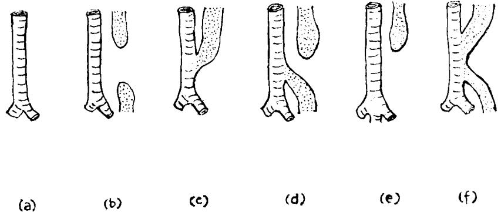 
d型最常见（引自Morson等编《胃肠道病理》第3版．1990）
# （二）食管重复、憩室和囊肿
这三种情况目前认为是同一先天性畸形的不同程度的表现。食管重复是指不同长度的食管完全或部分重复，重复的食管可两端封闭，从而形成重复囊肿（duplication cyst）。
重复囊肿可呈球形或管状，内壁被覆鳞状上皮、柱状上皮、立方上皮或纤毛上皮，囊壁含两层平滑肌。此型囊肿 $60\%$ 见于食管下1/3。支气管源性囊肿（bronchogenic cyst）位于食管前，这也是气管食管分隔不全的一种缺陷。支气管源性囊肿被覆呼吸道纤毛柱状上皮，囊壁内含软骨， $70\%$ 位于食管下1/3。胃囊肿（gastric cyst）具有胃粘膜，可分泌盐酸，囊壁有两层平滑肌。包涵性囊肿（inclusion cyst）被覆呼吸道上皮或鳞状上皮，囊壁不含软骨或完整的平滑肌层。神经肠囊肿（neuroenteric cyst）不是从胃道发生而是由原始脊索发生并伴脊柱不融合。这种囊肿亦常被覆鳞状上皮、纤毛柱状上皮或胃上皮，位于食管背侧。
先天性憩室罕见，有一种是发生在食管与咽连接处（因该处肌层较薄弱）的咽食管憩室。
# （三）组织异位（heterotopia）
胚胎发育过程中食管最早被覆的上皮是纤毛柱状上皮，因此在婴幼儿甚至成人食管的任何部位出现纤毛柱状上皮不能算是真正的异位。食管的胃粘膜异位很少是先天性的，多数是后天性化生即 Barrett 食管。食管中下段可出现皮脂腺异位。
# 二、肌肉运动性疾病及其它病变
# （一）硬皮病
食管硬皮病可以是全身硬皮病的一部分或局限于消化道的硬皮病累及食管。病变食管显示粘膜下层纤维化和非特异性炎反应。纤维化也可累及肌层并取代平滑肌。小动脉显示弹力纤维变性和内膜纤维化。
电镜 毛细血管基底膜增厚和层化(lamination)。食管的纤维化主要是由于血管病变引起缺血所致。
# （二）下段食管弥漫性肌肉肥大
下段食管弥漫性肌肉肥大亦称食管卷曲、螺旋状食管、食管巨大肌性肥大或弥漫性痉挛。成人型无症状，均为尸检时偶然发现。食管所有的肌层包括粘膜肌层均增厚，以环肌增厚最明显，管壁神经纤维和神经节细胞正常。管腔亦不狭窄。男性较多见。儿童型可累及小肠[1]。
# （三）后天性憩室
绝大多数食管憩室为后天性，分二类：①推出性憩室：是由于食管腔内压力增加，使食管壁从肌层薄弱处向外膨出如食管与咽连接处食管壁肌层较薄弱，因此很易形成推出性憩室称为Zenker憩室或咽食管憩室；②牵拉性憩室：是由于食管周围炎症纤维化或粘连的淋巴结牵拉食管壁所致。牵拉性憩室常见于气管分叉处或其下。
膈上憩室是一种推出性憩室。憩室含鳞状上皮粘膜、粘膜下层甚至肌层，常合并炎症。咽食管憩室和膈上憩室可癌变，咽食管憩室的癌变率为 $0.3\%$ 。
最近有报道一种弥漫性食管壁内憩室病（diffuse intramural esophageal diverticulosis）或称假性憩室病（pseudodiverticulosis）。病人有吞咽困难的症状，X线和内窥镜下可见无数 $1\mathrm{mm} - 3\mathrm{mm}$ 烧瓶状憩室，有一针尖大的小口，这些憩室多见于食管上1/3，与食管长
径平行排列。憩室被覆鳞状上皮。这些小憩室可能代表扩张的食管腺导管，腔内可充以粘稠的粘液或炎性渗出物。
# （四）后天性裂孔疝
后天性裂孔疝有三类：①所谓的滑动性疝(sliding hernia)：由于横膈肌缺陷或食管-膈韧带的牵引使裂孔扩大，从而使胃及食管下 $1\mathrm{cm} - 2\mathrm{cm}$ 疝入胸腔。滑动性疝的发生与腹内压增加、肥胖和脊柱后凸等因素有关，有的有家族倾向；②食管旁疝（paraesophageal hernia）：部分胃和肠可沿食管疝入胸腔；③损伤性疝：由于横膈裂口（破裂）所致。
# （五）食管失弛缓症
食管失弛缓症（achalasia）亦称贲门痉挛（cardiospasm）是由于贲门生理性括约肌不能松弛，食管下段痉挛收缩，近段食管扩张，失去正常的蠕动节律。此病多见于60岁以上男性，病人主诉为吞咽困难、疼痛和食物反流。食物反流可导致呼吸道感染。病变主要是肌肉神经丛内神经节细胞减少或完全缺如，有髓鞘的神经纤维脱鞘和断裂，小的神经纤维大量丢失。平滑肌本身无改变。粘膜、粘膜下层和肌层有不同程度的炎性反应。粘膜上皮可发生化生甚至不典型增生。
食管失弛缓症与巨结肠症（Hirschsprung病）有相似之处。其不同点在于食管失弛缓症是神经节细胞的减少或缺如发生在近段扩张的食管壁，而巨结肠症则发生在远端收缩的肠壁。长期的失弛缓症可发生癌变，但发生率极低。
# （六）食管膜（web） 和环（rings）
有些吞咽困难的病人在X线下可观察到食管或环形成。位于上段食管的的妇女常伴缺铁性贫血和萎缩性舌炎，为Plummer-Vinson或Paterson-Kelly综合征的组成部分，亦可位于食管下端。是薄层纤维组织。它的上面和下面均被覆鳞状上皮。食管环发生在胃食管交界处，使管腔呈环形狭窄但不堵塞管腔，环可由横行的粘膜褶构成或由环形增厚的肌层形成，被覆鳞状上皮粘膜或贲门粘膜。
# （七）食管管型
偶尔整个食管鳞状上皮可完整脱落而呕吐出来形成管型。这常常是由于吞饮极热的流质饮食或自然脱落，可伴有食管壁内破裂。
# （八）食管静脉曲张
门脉高压时食管下段和食管一胃交界处静脉曲张呈串珠状结节状，灰蓝色。粘膜和粘膜下层静脉高度扩张，使表面上皮或粘膜破裂，可导致致命性大出血。静脉血滞留和缺氧使粘膜上皮变性坏死更加重了破裂的危险性。上腔静脉被纵隔肿瘤阻塞时食管上段和中段静脉曲张。
# （九）糖原性棘皮症（glycogenic acanthosis）
食管粘膜面有散在白色隆起、不连续的、圆形、表面光滑的斑，直径 $< 3\mathrm{cm}$ ，蒂位于食管粘膜纵褶的表面。
光镜鳞状上皮表浅层细胞增生肥大和空泡性变，这些细胞含丰富的糖原。此病变无临床意义。
# 三、食管炎
# （一）急性食管炎
多种细菌、病毒和霉菌均能引起急性食管炎。较常见的有单纯疱疹病毒（HSV）引起的食管炎、巨细胞病毒（CMV）性食管炎和念珠菌性食管炎。这些多见于免疫缺陷病人。HSV 食管炎初起时食管中下段粘膜多发性水疱，水疱破溃后形成溃疡伴有中性白细胞和大量单核细胞浸润。受累的上皮细胞核肿胀，核染色质沿核膜分布，整个细胞核呈毛玻璃样，有多核的细胞形成。食管刷片如发现这种毛玻璃样细胞有很高的诊断价值。活检中如有大量单核细胞性渗出物可提示疱疹病毒感染[2]。内窥镜下溃疡呈火山状。食管双重对比造影可见弥漫散在的浅溃疡。巨细胞病毒性食管炎可在病变处的内皮细胞、纤维母细胞和上皮细胞内找到 CMV 包涵体。念珠菌性食管炎可为疱疹性、消化性和恶性溃疡的继发感染或发生于免疫缺陷的儿童和成人。食管中下段多见，病变处为多发性脐形出血性斑块。
光镜 溃疡处及周围粘膜中有霉菌菌丝和芽孢，用PAS染色有助于诊断。
吞食高热饮食和腐蚀性液体如酚、煤酚皂溶液、酸及碱液等可造成腐蚀性食管炎(corrosive esophagitis)。严重病例的粘膜可成片脱落，形成粘膜管型。食管显弥漫性急性炎症和溃疡形成。愈合后可造成食管狭窄。一些片剂或胶囊药物如果没有顺利吞入胃内，可滞留在食管内而刺激食管粘膜，造成炎症和溃疡。
# （二）放射性食管炎
胸部放疗可合并放射性食管炎并继发溃疡、纤维化和食管狭窄。
光镜 病变处血管扩张、内皮细胞肿胀、纤维母细胞肥大和奇形怪状。鳞状上皮除变性坏死形成溃疡外亦可出现不典型增生。
# （三）慢性食管炎
结核、结节病、梅毒和克隆病等都可累及食管，但均罕见。由克鲁斯锥虫（TrypanosomaCruz）引起的Chagas病除侵犯心肌外，亦可侵犯消化道，损伤肌内神经丛，使神经丛内神经节细胞显著减少（可减少 $90\%$ ），从而导致巨食管症（megaesophagus）。嗜酸性胃肠炎亦可累及食管。反流性食管炎时食管上皮内亦可出现大量嗜酸性白细胞，所以单就食管活检不能鉴别这二种病变。
# （四）反流性食管炎（refluxesophagitis）
正常情况下由于：①食管下端内括约肌的作用；②贲门与食管下端有一定的角度；③食管贲门交界处附着于横膈裂孔处等的作用防止了胃液反流至食管。但任何情况使上述机制减弱就可引起胃液的反流。例如食管裂孔疝患者胃底部分疝入胸腔，使正常贲门-食管角度消失，胃液遂反流至食管。引起胃液反流的原因还有幽门梗阻和腹内压增加（如妊娠），其它少见的原因有糖尿病性自主神经系统病和硬皮病等。反流性食管炎主要症状为反胃、烧心、胸骨后疼痛和吞咽困难。
【病变】食管鳞状上皮对酸性的胃液较敏感。在长期持续的胃液刺激下，食管下段粘膜发生改变。粘膜最初的反应是鳞状上皮基底细胞增生增厚，上皮内有嗜酸性白细胞和/或中性白细胞浸润，固有膜乳头变长，可伸到上皮的表层下。胃酸的刺激可进一步引起食管下段的消化性溃疡和纤维化或发生柱状上皮化生形成Barrett食管。柱状上皮化生的目的是抵抗胃酸的刺激和消化，因柱状上皮较能耐受胃酸的消化和能较快地修复。
正常食管鳞状上皮基底层厚度约占全层的 $15\%$ ，固有膜乳头伸入上皮达上皮厚度的 $65\%$ 。基底层厚超过 $15\%$ ，乳头深入上皮超过 $65\%$ 以及上皮内出现嗜酸性和/或中性白
细胞都是诊断反流性食管炎的要点。病变可呈灶性分布，以食管下端为重。严重的胃液反流所致的消化性溃疡，其形态与胃及十二指肠消化性溃疡同。溃疡边缘鳞状上皮可呈不同程度增生，溃疡底肉芽组织除大量炎细胞浸润外，有时可有核巨大而深染的纤维母细胞，这些增生的上皮和巨核纤维母细胞很易误诊为恶性肿瘤，特别是活检材料。溃疡愈合可产生纤维化甚至食管狭窄。
# （五）Barrett食管
Barrett食管曾被称为先天性短食管或下段被覆柱状上皮的食管，多数是由于反流性食管炎所引起的食管粘膜柱状上皮化生。近年Takubo等认为可能是一种发育异常，因他们发现 $87.5\%$ 的Barrett食管有双重粘膜肌层即固有膜下有浅粘膜肌层，其下为深固有膜，深固有膜下有一深粘膜肌层，深粘膜肌层的近端与食管正常的粘膜肌层相连，远端与胃的粘膜肌层相连。
Barrett食管的柱状上皮粘膜可成片被覆食管下段或呈岛状散在在鳞状上皮粘膜内。柱状上皮粘膜的组织学形态可象贲门粘膜、胃底胃体粘膜或肠化（常为不完全肠化）的胃粘膜，由于食管鳞状上皮和贲门柱状上皮交界为一齿状交叉线，所以要确诊Barrett食管所取的活检必须是在食管-贲门交界 $3\mathrm{cm}-5\mathrm{cm}$ 以上的食管粘膜。内窥镜下Barrett食管粘膜呈红色天鹅绒状。Barrett食管为癌前病变。上述三种粘膜上皮均可发生不典型增生。不典型增生的上皮象结肠腺瘤上皮，亦可分轻、中、重三级，重度不典型增生为肯定的癌前病变，Barrett食管病人发生腺癌的危险性高于正常人群30倍一40倍[4]。
# 四、食管肿瘤
# （一）食管癌
食管癌是常见的恶性肿瘤之一，遍及世界各地，但其地理分布极不平衡，国内国外都有一些集中高发区和相对高发区。我国是食管癌的高发国，国内高发区主要分布在太行山区、秦岭地区和闽粤交界地区等处。从中国东北经原苏联中亚细亚到土耳其、伊朗北部为一带状高发地带。
我国食管癌好发年龄为40岁～60岁，国外报道为50岁～70岁。男性多见，男女比例从 $2:1\sim 20:1$ 不等，平均 $4:1$ 。病人主要症状为梗噎、吞咽困难、胸骨后或剑突下痛，少数可伴高血钙症。
主要病因因素有：①饮食习惯和食物因素：高发区居民喜食高热、粗糙和质硬的食物，酗酒和吸烟亦有一定的影响；②亚硝胺和霉菌毒素；③其它病因因素有土壤中微量元素如钼、铁、锌、氟、硅等的缺乏以及可能存在的遗传因素等。
【病变】食管癌好发部位为食管中段，其次为食管下段，食管上段最少。国内高发区河南林县用脱落细胞学及X线相结合检查的3633例食管癌，上段426例（11.7%）、中段2301例（63.3%）、下段906例（25%）。
早期食管癌的定义是指癌组织位于粘膜下层以上不管是否有局部淋巴结转移，如癌局限于上皮内称为原位癌或上皮内癌。如癌已侵入肌层则为中期食管癌。晚期食管癌是指癌已侵透肌层达外膜或外膜外组织。
大体 早期食管癌可看不出病变或仅粘膜粗糙，糜烂或呈斑块乳头状隆起，以糜烂和斑块状为多见（图3-2）。
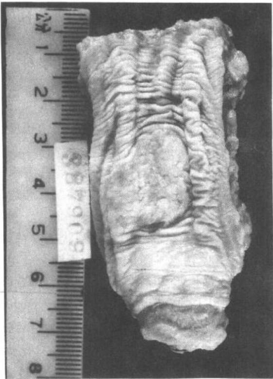 
图3-2 早期食管癌斑块型
中晚期食管癌的大体类型有：①髓样型：肿瘤在食管壁内浸润性生长，使管壁弥漫性增厚，表面可形成浅溃疡，切面增厚的食管壁灰白色、均匀、质软；②息肉囊伞型：肿瘤形成卵圆形或扁平肿块，或呈蘑菇样肿物突入食管腔，表面都有浅溃疡；③溃疡型：肿瘤形成大小不一深浅不等的溃疡，溃疡边缘隆起，底部凹凸不平；④缩窄型：癌组织浸润性生长处伴明显的纤维组织反应，使食管明显变硬，管腔狭窄（环形缩窄），切面肿瘤处食管壁增厚，灰白色，条纹状。以上各型中髓样型最多见，占 $60\%$ 左右，其次为息肉囊伞型和溃疡型，缩窄型最少。
光镜 $90\%$ 的食管癌为不同分化程度的鳞癌。根据分化程度鳞癌可分为高分化、中分化和低分化，高分化鳞癌有明显的角化珠（癌珠）形成，癌细胞胞浆丰富，核分裂少。低分化鳞癌癌细胞分化差，多数已无鳞状上皮
的排列结构，癌细胞异型性明显，核分裂多见。中分化鳞癌的组织形态介于高分化和低分化鳞癌之间。
其他组织学类型的癌：①腺癌：约占食管癌的 $5\% - 10\%$ 。主要发生在 Barrett 食管，而且癌旁的 Barrett 食管粘膜上皮常伴不同程度的不典型增生。腺癌的形态与胃肠道腺癌同；②疣状癌：呈粗大乳头状生长，鳞状上皮分化好，表面有角化不全和角化过度，底部呈膨胀性生长，浸润常不明显，这种癌可误诊为良性；③腺样囊性癌亦称基底细胞样癌（basaloid carcinoma）：是一种恶性度较高的癌，形态与涎腺的腺样囊性癌同；④粘液表皮样癌：其恶性度较低，形态与涎腺的粘液表皮样癌同；⑤腺鳞癌：癌组织具明确的鳞癌和腺癌成分，而且二者混合存在；⑥神经内分泌癌：包括类癌和小细胞未分化癌，食管类癌极罕见，主要为小细胞未分化癌。肿瘤较大，直径 $>4\mathrm{cm}$ ，可位于食管的任何部位，但以中段多见。组织学形态与肺内相应的癌同，瘤细胞可形成菊形团，有腺样或鳞状细胞分化，甚至有灶性粘液分泌。
免疫组化 显示 Chromogranin A、NSE、synaptophysin 等神经内分泌标记均阳性，并可有异位激素如 ACTH、calcitonin、VIP 和 5-HT 等分泌。
电镜 神经分泌颗粒直径 $80\mathrm{nm} - 200\mathrm{nm}^{[5]}$ 。此癌恶性度高。
【癌前病变】食管癌高发区居民的慢性食管炎和食管鳞状上皮不典型增生的发生率亦高。30%的食管癌癌旁有原位癌。约1/4的鳞状上皮重度不典型增生可发展成癌。重度不典型增生和原位癌不是浸润性癌的向侧侧延伸，而是作为癌的原发起点，由此发展
成浸润性癌。
# 【浸润转移】
1. 直接浸润蔓延 食管上段癌可侵入喉、气管、甲状腺和颈部软组织。中段癌可侵犯纵隔大血管、支气管、肺、胸膜、心包和脊椎等。下段癌常累及贲门、横膈和肝左叶等处。直接蔓延以上段癌最多见（60%），下段癌最少（30%）。
2. 淋巴管转移 食管有丰富的淋巴管，所以淋巴结转移率高。根据食管淋巴引流，上段癌常转移至食管旁、喉后、锁骨上、颈深部和上纵隔淋巴结。中段癌转移至食管旁和肺门淋巴结。下段癌转移至食管旁、贲门周、胃左和腹腔淋巴结，亦可通过粘膜下淋巴管转移至胃粘膜下。
图3-3 食管癌肉瘤 
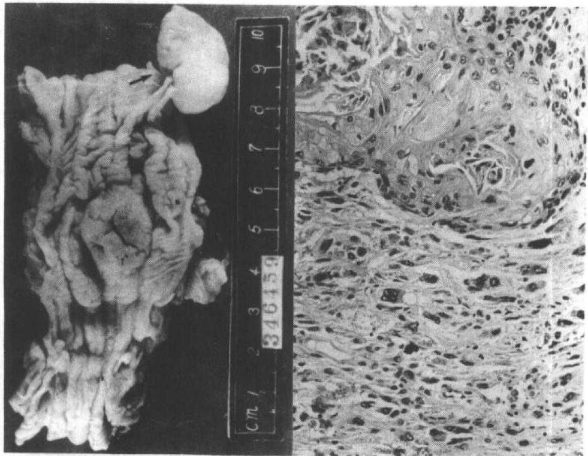 
左图示癌肉瘤大体呈有蒂息肉状（箭头）； 
右图为癌肉瘤的光镜下形态
3. 血行转移 主要见于晚期病人，可转移至全身，但以肝、肺和肾上腺为多见。
【预后】早期食管鳞癌手术后5年存活率可达 $90\%$ ，中晚期癌手术后5年存活率仅 $10\% -30\%$ 。
# （二）食管癌肉瘤（carcinosarcoma）
食管癌肉瘤又称鳞癌伴梭形细胞间质、假肉瘤、梭形细胞癌、息肉状癌。此癌常长成息肉状。有一长短不等的蒂，突向食管腔。肿瘤由肉瘤成分和癌（鳞癌、腺癌或未分化癌）混合而成（图3-3）。肉瘤和癌的比例，不同病例不同。表面常为溃疡面或灶性被覆原位癌或鳞癌。肉瘤成分多数象恶性纤维组织细胞瘤并可向软骨、骨或横纹肌分化。有
关此瘤的性质始终有不同的意见。有人认为此瘤基本上是癌伴肉瘤样间质，因免疫组织化学显示肉瘤成分部分亦为keratin阳性，同时电镜下有些肉瘤细胞有桥粒和张力纤维。有认为此瘤是真正的癌肉瘤，电镜下大部分肉瘤细胞具肌纤维母细胞或其它间充质细胞的超微结构，更重要的是此瘤有与食管癌完全不同的生物学特性：①肿瘤总是呈息肉状生长；②此瘤的转移灶多数为纯肉瘤成分；③预后好，5年存活率达 $50\%$ 以上。
# （三）恶性黑色素瘤
好发于食管中段和下段。老年人多见。肿瘤常呈灰色或黑色息肉状肿物突入食管腔（图3-4）。
光镜瘤细胞呈上皮样、梭形、二者混合或多形性、黑色素一般较多，所以诊断不困难。
电镜 有多量黑色素小体（图3-5）。食管原发性恶性黑色素瘤周围粘膜鳞状上皮常显交界活性或有散在卫星状瘤结节。有些病例瘤周粘膜有灶性或弥漫性黑变（melanosis）。此瘤恶性度高，预后差。
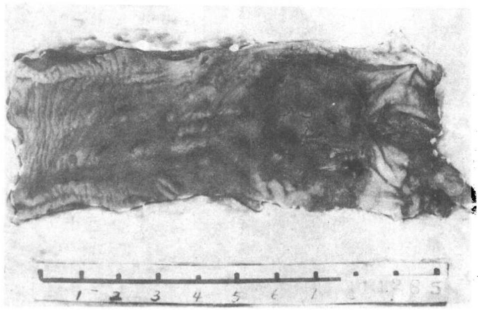 
图3-4 食管恶性黑色素瘤
# （四）平滑肌瘤
平滑肌瘤是食管最常见的非上皮性良性肿瘤。半数病人无症状，有症状者主诉为吞咽困难和胸部不适。下段较上段食管多见。通常为单发亦可多发。肿瘤形成息肉或巨块突入管腔，表面粘膜光滑或有溃疡形成；或成哑铃状部分突入管腔，部分突至食管外；或呈扁平形主要是壁内生长的肿物。肿瘤切面界限清楚，灰白色编织状，常伴钙化。光镜所见与身体其它部位的平滑肌瘤同。食管平滑肌肉瘤少见，体积一般较大，质软。切面常有出血坏死。光镜下瘤细胞密集，核分裂可见或多见。分化好的平滑肌肉瘤与平滑肌瘤有时很难鉴别。由于消化道平滑肌肿瘤的生物学行为较发生于子宫者恶，所以对于食管平滑肌肿瘤核分裂 $>2 / 10\mathrm{HPF}$ 者均应作平滑肌肉瘤处理为妥。
一种罕见的弥漫性平滑肌瘤病（diffuse leiomyomatosis）主要见于青少年，累及食管
的一段，有时可累及食管和胃。病变处食管狭窄。
光镜 食管壁平滑肌弥漫增生，呈漩涡状。增生的平滑肌间夹杂多量纤维组织，神经和血管成分亦增生并有淋巴细胞和浆细胞浸润，使食管壁弥漫性增厚。这种病变可能是一种畸形而非肿瘤。
图3-5 食管恶性黑色素瘤 
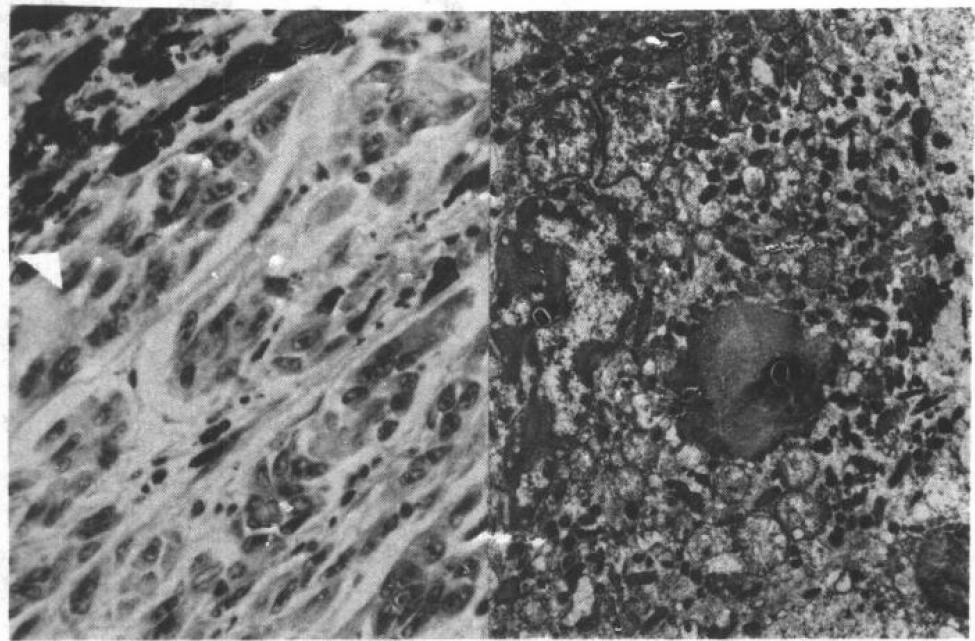 
右图为光镜下形态；左图示电镜下瘤细胞胞浆内大量黑色素小体
# （五）其他肿瘤和瘤样病变
1.鳞状上皮乳头状瘤和腺瘤 两者均罕见。鳞状上皮乳头状瘤为外生性乳头状肿物。
光镜鳞状上皮分化好，无不典型性。由HPV引起的乳头状瘤可见凹空细胞（koilocyte）。腺瘤只见于Barrett食管。腺瘤的大体和光镜形态与发生于胃和肠的腺瘤同。
2. 纤维血管性息肉（fibrovascular polyps）亦称纤维性息肉、炎性纤维性息肉或炎性假瘤。可发生于食管的任何部位，以食管上段多见。体积可很大，致使食管腔显著扩张。息肉有一长蒂附着于食管壁。
大体 息肉呈分叶状，表面粉白色光滑，偶有浅溃疡形成（图3-6）。
光镜息肉由水肿的纤维结缔组织构成。其中含不等量的成熟脂肪组织和丰富的薄壁血管，息肉表面被有鳞状上皮。
3. 颗粒细胞肿瘤（granular cell tumor）胃肠道发生的颗粒细胞肿瘤以食管最多见。肿瘤为单发或多发粘膜下肿物，表面有完整的鳞状上皮粘膜被覆，上皮可呈假上皮瘤样增生。瘤细胞胞浆丰富，嗜酸性颗粒状。瘤细胞排列成索或巢。恶性颗粒细胞瘤很罕见，近年根据电镜和免疫组织化学研究的结果认为颗粒细胞肿瘤来自神经周细胞（perineural cell）[6]。 
4. 其他肿瘤 文献上报道的食管肿瘤还有毛细血管瘤、血管外皮瘤、神经纤维瘤、淋巴瘤、浆细胞瘤、横纹肌肉瘤、滑膜肉瘤、软骨肉瘤和骨肉瘤等。
# （六）转移瘤
食管的转移性肿瘤可由肺、甲状腺、喉和胃的肿瘤直接累及，或经淋巴管血管转移至食管，如来自睾丸、前列腺、子宫内膜、肾和胰的恶性肿瘤，各种白血病和淋巴瘤均可累及食管。
图3-6 食管纤维血管性息肉 
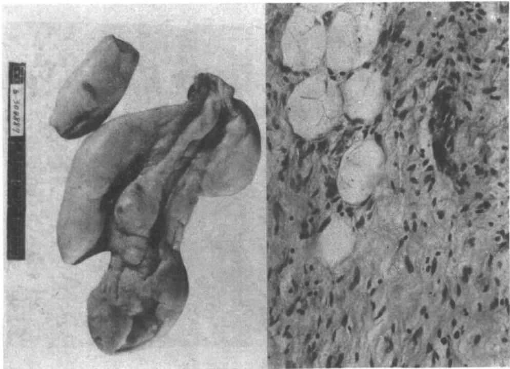 
左图为大体形态；右图示息肉由脂肪细胞、血管及疏松的纤维组织构成
# 五、食管活检
食管内窥镜检查和活检对食管病变的诊断和治疗起了很大的推动作用，如明确食管炎的病因（HSV、CMV、念珠菌或其它），确诊反流性食管炎和Barrett食管和明确肿瘤的性质等。内窥镜活检在诊断鳞状上皮不典型增生和原位癌较其它手段如脱落细胞学、刷片等有更大的优越性。
# 第二节 胃
# 一、先天性畸形
# （一）先天性幽门狭窄（congenital pyloric stenosis）
多见于男孩。症状常在出生后3周-12周出现。特点是呕吐，有时为喷射性呕吐。呕吐物为胃内容，无胆汁。由于呕吐而导致便秘和脱水等。上腹部可摸到硬而光滑的卵圆形肿块。直径 $1\mathrm{cm} - 2\mathrm{cm}$ ，可见胃蠕动波。
大体 胃幽门管由于幽门括约肌高度增生肥大而显著狭窄，有时仅能通过一细的探
针。肥厚的幽门可长达 $2\mathrm{cm}$ ，质硬如软骨，粘膜一般光滑，无溃疡或其它病变。偶尔成人亦可发生幽门狭窄，这多数是由于慢性炎症或消化性溃疡愈合和纤维化引起，并非先天性。
# （二）胃憩室和胃重复
胃憩室罕见，有真假二种。真性憩室含胃壁全层，由于炎症牵引所致，最常见部位为幽门和十二指肠。假憩室为胃粘膜从肌层薄弱处疝出。胃重复罕见，形成球形或圆形中空结构，与胃壁通常是胃大弯相连，与胃共一肌层，被以胃粘膜但与胃腔不通。 $65\%$ 为1岁以内的婴儿，成人的胃重复常常是由于消化性溃疡后伴胃十二指肠瘘，从而形成一双重管道。
# （三）胰腺异位
胃的胰腺异位占消化道胰腺异位的1/4。多见于胃窦，形成半球形结节或肿物。85%位于粘膜下层向胃腔突出，其余的位于肌层内。表面粘膜光滑，结节中央常呈脐形凹陷，切面黄白色。
光镜 异位胰腺多数由胰腺腺泡和导管构成，很少有胰岛。
（四）肌腺瘤（adenomyoma 或肌上皮性错构瘤（myoepithelial hamartoma）
大体 形态与胰腺异位相似。
光镜 主要由平滑肌组织、被覆立方或柱状上皮的导管和Brunner腺构成，无胰腺腺泡或胰岛。
# 二、胃炎
胃炎是胃粘膜的炎症，少数情况下（特别是急性胃炎时）可累及粘膜下层甚至肌层。
# （一）急性肾炎
急性胃炎主要是由于饮食不合适（进食过多、过热、过快和嚼不碎等）、食物过敏、酒精、药物、毒物、腐蚀品、细菌毒素、传染病、败血症、应激、脑损伤、肾衰和循环障碍等引起。急性胃炎由于不适合作活检或手术，因此可供形态学研究的材料很少，多数材料来自临床和尸检资料。
急性胃炎时胃粘膜红肿，表面被以厚层粘稠的粘液，有散在的小的出血性糜烂灶。
光镜 见固有膜充血水肿，大量中性白细胞浸润，白细胞侵入腺上皮进入腺腔。有灶性出血，病变严重时粘膜坏死脱落形成浅溃疡。如病变较轻，当炎症消退后粘膜可完全恢复正常，但一般常伴有粘膜下层不同程度的纤维化。
蜂窝织炎性胃炎时胃壁各层均有大量中性白细胞浸润。酸碱腐蚀性胃炎时胃粘膜甚至胃壁深部组织显广泛出血坏死。
# （二）慢性肾炎
慢性胃炎很常见，多由急性胃炎转变而来，有些急性胃炎很轻，临床无明显症状，但长期可不消退转而成慢性胃炎。有的病人则有明确的急性胃炎史。慢性胃炎好发部位是胃小弯和胃窦，即胃通道（stomach street）部。食物主要通过胃通道到小肠，一些温度高的液体、咬嚼不碎的食物、刺激性佐料等等易刺激胃通道而造成胃炎，慢性酒精中毒和营养不良亦为慢性胃炎常见的病因之一。近年大量研究集中到幽门弯曲菌（campylobacter pylori）与慢性胃炎的关系。多数研究结果认为幽门弯曲菌与慢性胃炎的发生有密切的关系[7]。
# 【分类和病变】
1. 慢性浅表性胃炎 病变粘膜充血、发红、水肿，有时并有点状出血或糜烂。粘膜厚度正常。炎症仅限于粘膜浅层即腺窝（小凹）水平的固有膜内。固有膜充血水肿，有较多的淋巴细胞、浆细胞甚至中性白细胞浸润，表面上皮和腺窝上皮显不同程度的变性、修复和再生。再生的上皮细胞胞浆少，核大而深染。上皮细胞内可有淋巴细胞或中性白细胞侵润。此型胃炎可完全恢复或长期反复发作而成慢性萎缩性胃炎。 
2. 慢性萎缩性胃炎 胃粘膜变薄、平滑、皱襞少或消失。因粘膜变薄，所以胃镜下可清晰见到粘膜下血管。有些病例同时有腺体萎缩和化生腺体的增生以致粘膜厚度正常甚至增厚。
慢性萎缩性胃炎的组织学诊断标准为①胃粘膜固有腺体（胃体胃底腺、幽门腺和贲门腺）不同程度的萎缩或消失；②肠上皮化生或假幽门腺化生；③固有膜弥漫性淋巴细胞浆细胞浸润和淋巴滤泡形成；④粘膜肌层增厚。根据胃固有腺体萎缩的程度，慢性萎缩性胃炎可分为轻、中、重三级。轻度是指固有腺体的1/3萎缩，如2/3以上固有腺体萎缩则为重度，中度介于轻度和重度之间。如胃的固有腺体完全萎缩，代之以广泛化生的腺体，固有膜炎症很轻或无，这种胃粘膜显著变薄，称为胃萎缩（gastric atrophy）。化生程度一般与固有腺体萎缩程度呈正相关，即固有腺萎缩越重，化生腺体亦越多。有些萎缩性胃炎由于化生上皮的增生而使粘膜增厚呈乳头状，称为萎缩性肥厚性胃炎。
肠上皮化生可分为：①完全型化生：又称I型化生、小肠型化生。完全型化生的上皮与小肠上皮相似，含有吸收细胞、杯状细胞和Paneth细胞。吸收细胞的管腔面有特殊的刷毛缘（纹状缘），PAS染色刷毛缘呈强阳性。杯状细胞分泌唾酸粘液；②不完全型化生：又称II型化生，不完全型化生又分为胃型化生（IIa型）和结肠型化生（IIb）。IIa型不完全化生的柱状细胞像胃的腺窝上皮细胞，分泌中性粘液，杯状细胞分泌唾酸粘液，IIb型不完全化生的柱状细胞分泌硫酸粘液，杯状细胞分泌唾酸粘液。II型化生很少有Paneth细胞，一般认为IIb型化生与胃癌的关系密切。胃粘膜内肠化灶可呈斑点状、片块状或弥漫性分布。好发部位为胃窦、小弯及幽门腺胃底胃体腺交界处。肠化随年龄增长而增多。
假幽门腺化生指在胃底胃体腺领域内出现类似正常幽门腺的腺体。假幽门腺化生的意义不清楚，可能是胃粘膜损伤的结果。
慢性萎缩性胃炎分A、B、C三型（表3-1）[8]。
表 3-1 慢性萎缩性胃炎类型 
类型病因发病机制幽门弯曲菌检出率（%）A型?自身免疫6-14B型幽门弯曲菌细菌感染90C型胆汁反流，酒精化学损伤10非甾体类抗炎药物等
A型胃炎又称自身免疫性萎缩性胃炎。胃液及血清内抗内因子抗体阳性，抗壁细胞抗体（抗壁细胞管道的微绒毛上一种脂蛋白的特异性抗原）阳性。胃粘膜分泌功能严重受损，胃酸分泌明显降低，Vit $\mathbf{B}_{12}$ 吸收障碍。血清胃泌素水平高。A型胃炎主要累及胃体，
常伴恶性贫血。B型胃炎胃液及血清抗内因子抗体和抗壁细胞抗体均阴性，血清胃泌素水平低。胃粘膜功能受损轻，胃酸分泌中度降低或正常，很少发生Vit $\mathbf{B}_{12}$ 吸收障碍。B型胃炎主要累及胃窦，多为局灶性，不伴恶性贫血。目前认为B型胃炎与幽门弯曲菌感染密切相关，但幽门弯曲菌是真正的致病菌还是一种条件致病菌或“过路者”还有争议。C型胃炎是由化学物质引起的胃炎包括胆汁反流等因素。形态上与上述萎缩性胃炎改变不同。其特点是腺窝上皮增生、粘膜水肿充血、固有膜平滑肌纤维增多、炎症不明显、腺体呈囊性扩张、变形或萎缩[8]。我国还有一种非A非B型胃炎即介于A型和B型之间的胃炎。
3. 慢性肥厚性胃炎 单纯性慢性肥厚性胃炎的大体特点是粘膜皱襞加深变宽呈脑回状。
光镜腺体变长但结构正常，固有膜有弥漫性炎细胞浸润。整个粘膜层增厚，慢性肥厚性胃炎可原因不明，或伴消化性溃疡，或是Zollinger-Ellison综合征的一种表现[9]。
Menetrier 病又名巨大肥厚性胃炎（giant hypertrophic gastritis）或胃皱襞巨肥症（giant hypertrophy of gastric rug），是一种少见的特殊类型的肥厚性胃炎。临床特点为消化不良、呕血、低蛋白血症（蛋白质从不正常的胃粘膜漏出所致）和低胃酸或无胃酸。多见于中年男性。
大体 胃底胃体部特别是大弯侧粘膜弥漫性肥厚，形成巨大皱襞而呈脑回状，或形成息肉结节状巨块（图3-7），以致X线常误诊为胃癌。胃窦粘膜一般很少累及。
图3-7 胃Menetrier病 
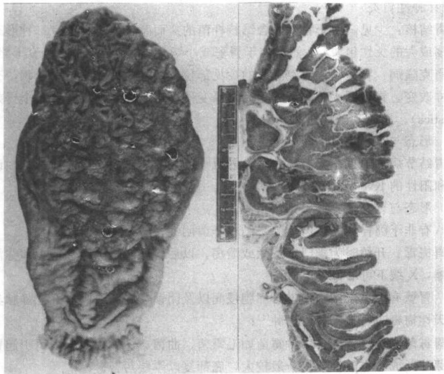 
胃底胃体粘膜粗大皱襞，形成巨大肿块。 
左图为胃粘膜面形态；右图示低倍镜下粘膜显著增厚
光镜 粘膜全层增厚，腺窝变深，腺体变长，腺体中壁细胞和主细胞稍减少而粘液
细胞增多。粘膜深部的腺体呈囊性扩张，向下长入或穿透粘膜肌层。可有假幽门腺化生但无肠化。变长的腺体呈分支状。固有膜水肿，有淋巴细胞和浆细胞浸润。Menetrier病的原因不清楚，由于有些病例合并多发性内分泌腺肿瘤而被认为此病与内分泌失调有关，亦有认为是一种粘膜的错构瘤或自身免疫性改变。最近发现Menetrier病经常合并淋巴细胞性胃炎[10]。
# （三）特殊类型胃炎
1. 淋巴细胞性胃炎（lymphocytic gastritis）胃粘膜的表面上皮和腺窝上皮内有大量成熟的T淋巴细胞，淋巴细胞数可高达 $55.3 \pm 19.5\mathrm{SD}$ （正常为 $3.7 \pm 1.3\mathrm{SD})^{[8,10]}$ 。这种胃炎可能代表一种对局部抗原如幽门弯曲菌的不正常的免疫反应[11]。 
2. 慢性囊性胃炎 粘膜深部的胃体腺或幽门腺呈不同程度的囊性扩张，被覆扁平上皮细胞。这种胃炎可能是一种变性而不是炎症，亦可能是萎缩性胃炎后期的一种变异。 
3. 出血性胃炎和糜烂性胃炎 临床上病人有呕血黑便，但粘膜无明显溃疡。胃粘膜可显萎缩性改变，同时有多数糜烂和粘膜内出血。 
4. 嗜酸细胞性胃炎 胃壁特别是胃窦部胃壁因显著水肿和大量嗜酸性白细胞浸润而显著增厚。原因不明，可能与过敏有关，因 $25\%$ 的病人有过敏史，血嗜酸性白细胞计数和血清 IgE 均升高。由于胃壁显著增厚可出现幽门梗阻症状，如浆膜亦受累可出现嗜酸细胞性腹水。本病可同时累及小肠特别是十二指肠和空肠。
# 5. 肉芽肿性胃炎
（1）胃结核：少见。由于吞咽了含结核杆菌的痰而感染。胃结核有二种形态，形成结核性溃疡或大的炎性包块，后者常位于胃窦或小弯。局部淋巴结肿大，有干酪样坏死； 
（2）胃克隆病：胃是消化道克隆病的少见部位。病变处胃粘膜呈颗粒状，有时亦可见鹅卵石样改变。胃壁因水肿和纤维化而增厚变硬，胃腔变小，严重者整个胃如皮革胃（linitisplastica）。局部淋巴结肿大。
光镜 形态与小肠克隆病同；
（3）胃结节病：罕见。只有在肯定除外胃克隆病和胃结核之后才能考虑。诊断主要依靠临床和阳性的Kveim试验。
大体 形态与胃克隆病或胃结核相似。
光镜 有非干酪样坏死性肉芽肿。结核杆菌阴性；
（4）胃梅毒：开始时为幽门部糜烂或溃疡，以后胃壁皱襞弥漫性增大和弥漫性纤维化，胃收缩，X线下可形似皮革胃。
光镜 胃壁有大量浆细胞和淋巴细胞浸润以及闭锁性动脉内膜炎及全静脉炎。三期梅毒或先天性梅毒时可找到树胶样肿[1]；
（5）胃霉菌和病毒感染：多种霉菌如毛霉菌、曲菌、念珠菌等感染可引起胃霉菌性溃疡或肉芽肿形成。霉菌性溃疡一般较大，底部复以厚层污苔。
光镜 于溃疡底肉芽组织中和周围胃壁内可见霉菌菌丝和芽孢。胃CMV感染见于免疫缺陷病人，多数为全身感染的一部分。
（6）胃软斑（malakoplakia）：灶性胃粘膜病变。病变处有大量嗜酸性颗粒状胞浆的巨噬细胞浸润，胞浆内有 PAS 阳性含铁的钙化小球称为 Michaelis-Gutmann 小体。
# 三、胃溃疡
# （一）急性胃溃疡
一般来说引起急性胃炎的物理、化学和生物因子都可能引起胃的急性溃疡。急性胃溃疡还合并某些严重的内、外科疾病如休克、激素（ACTH或肾上腺皮质激素）治疗后、严重烧伤、脑疾病（脑肿瘤和脑损伤等）、腹部外伤和大手术等合并烧伤的急性胃溃疡又称Curling溃疡。合并脑疾病的急性胃溃疡又称Cushing溃疡。上述这些急性溃疡是病人处于严重应激状态时发生，所以又称急性应激性溃疡（acute stress ulcers）。
【病变】急性胃溃疡常多发，可发生在胃的任何部位。溃疡一般较表浅，界限清楚。周围粘膜水肿。溃疡底无肉芽组织和疤痕组织，仅有散在的淋巴细胞和中性白细胞浸润，由于急性溃疡底部无肉芽组织和疤痕组织，所以容易引起胃穿孔。致病因子消除后溃疡能很快愈合。
# （二）慢性胃溃疡（慢性消化性溃疡）
为胃的常见病之一，慢性消化性溃疡的好发部位以发病率高低为序：十二指肠、胃、食管，胃空肠吻合口的边缘，含异位胃粘膜的美克尔憩室，Z-E综合症之上段空肠。 $98\%$ - $99\%$ 发生在十二指肠球部和胃小弯以及胃窦。
有关慢性消化性溃疡的发病机制有许多学说，主要有：①胃液消化学说：无胃酸的病人如恶性贫血患者从不发生胃溃疡，这说明胃酸在消化性溃疡的形成过程中起重要作用。由于胃酸过多，激活胃蛋白酶原，使之变成胃蛋白酶，从而产生粘膜的自我消化；②粘膜抵抗力降低：局部粘膜抵抗力降低是由于局部解剖学异常，粘膜血流异常，分泌的粘液不正常和粘膜屏障破坏和细胞更新异常等因素所造成；③胃内内分泌细胞功能失调：分泌生长抑素的D细胞减少和分泌胃泌素的G细胞增多，破坏了二种细胞的功能平衡亦可导致溃疡形成；④其它：还有胃蠕动不正常、性激素和皮质激素作用、环境、遗传、药物和精神因素等。可能是不同病人由不同因素起主导作用。
总的说来，慢性消化性溃疡反映了酸-胃蛋白酶的侵袭作用和正常胃粘膜保护性机制之间的平衡失调。胃溃疡可能是由于粘膜抵抗力降低，而十二指肠溃疡则是酸-胃蛋白酶分泌过多所致。
【病变】大多数胃的消化性溃疡发生在小弯和窦部。男性老年人多见。多数为单发，仅 $5\%$ 为多发。典型的溃疡呈圆形或卵圆形，直径 $0.5\mathrm{cm} - 5\mathrm{cm}$ ，多数为 $1\mathrm{cm} - 2\mathrm{cm}$ 。边缘呈凿状或轻度潜行。小溃疡常呈漏斗状，稍大的溃疡其贲门端边缘陡峭而幽门端边缘呈坡状。底部复以白苔，溃疡边缘皱襞呈放射状向溃疡中心集中。消化性溃疡亦可呈线状或巨大，以往认为溃疡直径 $>3\mathrm{cm}$ 和位于大弯侧者多数为恶性。目前这种观点已被抛弃。良性溃疡亦可很大如霉菌性溃疡，恶性溃疡（癌溃疡）亦可很小和位于大弯侧。单凭肉眼观察不能准确的鉴别良恶性溃疡。
光镜 溃疡底由四层构成，由表面向深部为炎性渗出物、坏死组织、肉芽组织和疤痕组织。慢性消化性溃疡一般较深，底部肌层完全破坏为疤痕组织代替，疤痕组织中的中、小动脉显血栓闭锁性动脉内膜炎。这是机体的一种防御机制以防止出血，但血管闭锁后血运障碍亦可影响愈合。溃疡边缘处可见粘膜肌层和肌层融合，溃疡周围的粘膜显不同程度的炎症、肠上皮化生或假幽门腺化生。溃疡愈合时由边缘的粘膜上皮增生，向
溃疡底表面匈行，最终被覆整个溃疡面。日本学者根据溃疡的深度将溃疡分成四级：Ul-1——溃疡底在粘膜层亦即糜烂；Ul-2——溃疡底在粘膜下层；Ul-3——溃疡底在肌层；Ul-4——溃疡底部肌层完全破坏被疤痕组织代替。
# 【并发症】
1. 穿孔 多见于十二指肠前壁和胃前壁溃疡。穿孔处周围浆膜充血，被覆纤维素性渗出物，与周围脏器有轻度纤维素性粘连，通常穿孔处已有大网膜覆盖。溃疡位于后壁者亦可穿孔，穿入胰内形成穿通性溃疡。溃疡穿孔如不急诊手术则能导致弥漫性或局限性腹膜炎，局部、盆腔或膈下脓肿形成。 
2. 出血 几乎所有的溃疡都有不同程度的出血，所以病人常有呕血或便血症状。虽然溃疡底的血管多数呈血栓闭锁性动脉内膜炎，但有时仍能腐蚀一中型动脉而引起大出血，尤其是老年合并动脉硬化和高血压的病人，血管壁的硬化和周围组织的纤维化使动脉腔不能完全闭锁而造成大出血。有时溃疡破入胰腺后可腐蚀脾动脉的分支而造成致命性出血。 
3. 纤维化 位于幽门前区的溃疡和十二指肠溃疡由于疤痕收缩和括约肌痉挛可引起幽门狭窄。位于胃中部的溃疡如溃疡周围的粘膜下层有显著的纤维化，收缩而使胃变形，成沙漏胃（hour-glass stomach）或葫芦形胃。 
4. 食物肉芽肿（food granulomas）溃疡病人的胃下部和十二指肠第一段的壁内和周围组织中有时可见到由食物残渣引起的异物肉芽肿，这种肉芽肿常常是溃疡穿孔或粘膜破裂使胃肠内容物得以逸入胃肠壁和周围组织引起。
光镜 食物残渣周围有上皮样细胞和异物巨细胞围绕，中性白细胞、淋巴细胞和浆细胞浸润，陈旧的肉芽肿可纤维化钙化。
5. 癌变 十二指肠溃疡从不癌变，仅极少数胃溃疡发展成癌。
# 四、胃肿瘤及瘤样病变
# （一）胃腺瘤和息肉
1. 胃腺瘤(肿瘤性息肉）多数位于胃窦，体积较大，单个，广基或有蒂(图3-8)，来自肠上皮化生的腺上皮。外形像结肠的腺管状腺瘤、绒毛状腺瘤或绒毛腺管状腺瘤。
光镜 腺瘤上皮显不同程度的不典型增生，上皮内有散在的神经内分泌细胞。腺瘤可癌变特别是伴重度不典型增生和直径 $>2\mathrm{cm}$ 者易发生癌变，但癌变率较低仅 $3.4\%$ 。
2. 增生性（再生性）息肉 来自增生的腺窝上皮。体积一般较小，直径 $1\mathrm{cm}$ 左右，常为多发，有蒂或广基，表面光滑，略呈分叶状。多发的增生性息肉常集中于胃体胃窦交界处。
光镜息肉表面为增生肥大的腺窝上皮构成的大型腺管，中心部为增生的幽门腺或胃体腺，夹杂血管纤维平滑肌组织，深部腺体常呈囊性扩张。增生的腺体上皮无不典型性。有些增生性息肉中心可见由表面上皮内褶成洋葱皮样结构。增生性息肉无癌变倾向。
3. 混合型息肉 即腺瘤和增生性息肉的混合型。
4. 胃底腺息肉 胃底胃体粘膜形成多发性广基息肉状隆起，直径一般 $< 5\mathrm{mm}$ 。息肉内有被覆胃底腺上皮即含有壁细胞和主细胞的囊肿，表面腺窝短或缺如，这种息肉表面被覆单层腺窝上皮。
5. 炎性纤维样息肉（inflammatory fibroid polyps）又名嗜酸细胞肉芽肿性息肉(eosinophilic granulomatous polyps)。这种息肉少见，好发于胃窦部，直径很少超过 $2\mathrm{cm}$
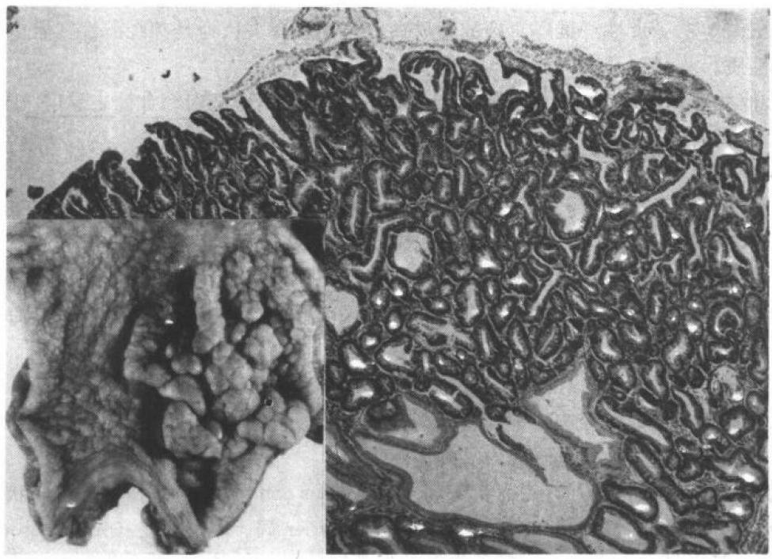 
图3-8 胃腺瘤
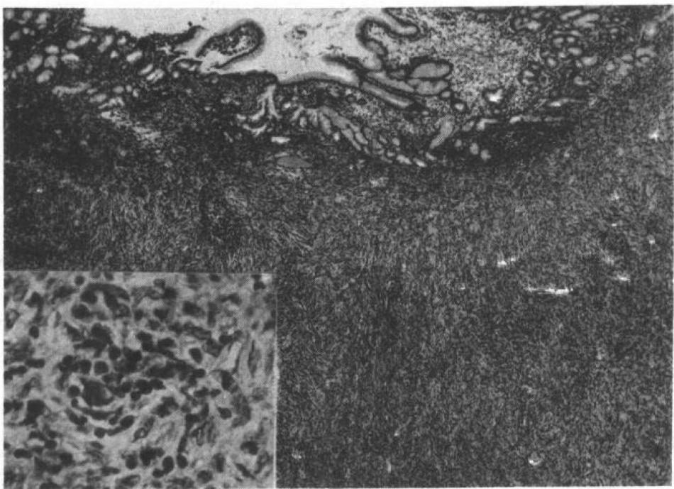 
腺瘤形态与结肠腺管状腺瘤同，左下插入图为此腺瘤的大体形态 
图3-9 胃炎性纤维样息肉 
左下插入图为息肉的高倍
常呈广基的息肉样肿物突入胃腔，表面被覆胃粘膜并可有溃疡形成。
光镜 息肉由许多小血管和纤维母细胞呈漩涡状生长。
电镜 这种细胞具肌纤维母细胞的性质。息肉内有大量嗜酸性白细胞和淋巴细胞浆细胞浸润（图3-9）。炎性纤维样息肉的性质尚有争论，有人认为是神经源性，但多数认为是炎症性质。
6. 其他类型息肉 有幼年型息肉（juvenile polyps），黑斑息肉综合征之息肉（Peutz-Jeghers polyps）和息肉病（polyposis）等。
# （二）胃癌
胃癌是常见的恶性肿瘤之一，在消化道癌中占第一位。主要分布在亚洲、拉丁美洲和中欧，世界范围的高发国有日本、中国、新加坡、智利、哥斯达黎加、委内瑞拉、匈牙利、波兰、德国、冰岛、保加利亚、罗马尼亚和马耳他等。我国胃癌发病率很高，主要高发区在西北、东南沿海各省以及东北和西南局部地区。我国胃癌的发病从沿海向内地方向、从东到西和从北到南有逐渐降低的趋势。
胃癌的病因因素已知的有饮食因素、地理条件、种族因素、遗传因素、血型、霉菌毒素和化学物质如亚硝胺等。其中饮食因素（如高盐饮食、油煎、熏制和粗糙食物等），霉菌毒素和亚硝胺吸引了大量研究人员的注意力。
【癌前状态和癌前病变】癌前状态（precancerous conditions）是指某种临床状态伴有很高的发生癌的危险性如恶性贫血、残胃和Menetrier病。癌前病变（precancerous lesions)是指一些很易发生癌的组织病理学异常如萎缩性胃炎伴肠化、胃粘膜上皮不典型增生、胃溃疡和胃腺瘤。
1. 残胃（gastric stump）因良性病变作胃部分切除后5年以上的病人发生残胃癌的危险性要比一般人群高2倍～6倍，手术后到发生癌的间隔约20年～30年。大多数癌发生在吻合口附近，亦可发生在残胃的其它部分。残胃癌的发生与手术前胃内病变性质、手术方式等均无关。手术后切口附近的粘膜可发生炎症、萎缩性胃炎、腺体囊性扩张、炎性息肉或增生性息肉。约 $7\% \sim 21\%$ 伴不同程度的不典型增生。
2. Menetrier 病和恶性贫血 这二种在我国均很少。国外报道二者均可合并胃癌。
3. 慢性胃溃疡 近年来应用X线和纤维内窥镜动态地观察胃内病变已证实有溃疡病史者合并癌可从溃疡以外的粘膜发生而不一定来自溃疡本身。癌溃疡和良性溃疡一样可以愈合、疤痕化和再反复发作，此外癌组织较正常粘膜容易发生糜烂和溃疡，早期胃癌又可较长时期存在而不进展等等事实都说明胃溃疡在胃癌的组织发生中不是很重要的病变。目前一致认为胃溃疡可以癌变，但癌变率较低，不超过 $5\%$ 。
4. 胃腺瘤 少数直径 $>2\mathrm{cm}$ 的广基腺瘤特别是伴重度不典型增生者可癌变，但腺瘤的癌变率很低，加之胃腺瘤少见而胃癌很常见，二者发生率的差别也说明腺瘤并不是真正的胃癌癌前病变。
5. 萎缩性胃炎 作为癌前病变的依据主要是流行病学显示萎缩性胃炎与胃癌关系密切。国内外流行病学资料均表明胃癌高发区萎缩性胃炎的发病率也高，胃癌低发区萎缩性胃炎的发病率也低。临床随诊萎缩性胃炎10年—20年后约 $8\%$ 病例有胃癌，但还没有动态地观察到从萎缩性胃炎发展成癌的资料。
长期被认为是癌前病变的肠上皮化生实质上是一种半生理现象，因为胃粘膜肠化随
年龄增长而增多，目前认为含硫酸粘液的肠化即Ⅱb型肠化与胃癌的关系密切，不过到底是这型肠化发展成癌呢，还是在癌形成过程中发生肠化还有待进一步证实。
6. 胃粘膜上皮不典型增生 上皮不典型增生可分为轻、中和重度三级（图3-10）。国内外资料均表明胃癌形成的潜力与细胞不典型增生的严重程度成正比，轻度不典型增生不一定是癌前病变但它可发展成中度或重度不典型增生，中度和重度不典型增生可同时存在，二者可合成一组。重度不典型增生细胞的形态与癌细胞相似；在单一的活检标本上，重度不典型增生与癌很难鉴别，甚至不能鉴别。胃癌可从重度不典型增生上皮发生。Serck-Hassen等[12]对一组16例慢性萎缩性胃炎伴重度不典型增生的病人随诊5年，其中10例（62.5%）为癌相关的不典型增生（cancer-associated dysplasia）或癌。轻度不典型增生大多能消退，而中度和重度消退的可能性小。一组134例胃粘膜上皮不典型增生病例，平均随诊18个月，轻度组中66%消退，中度组30%消退，重度组中仅12.5%消退，而75%进展成癌[13]。
图3-10 胃粘膜上皮不典型增生 
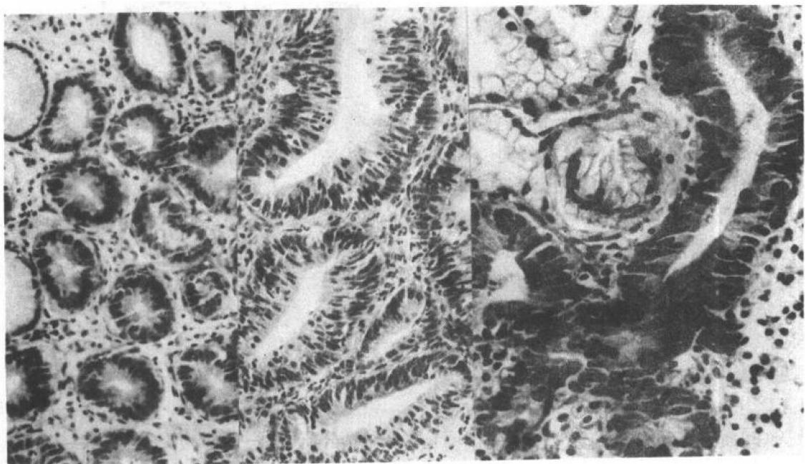 
左图为轻度；中图为中度；右图为重度，不典型增生的腺体与正常腺体界限截然
【病变】胃癌男性多见，胃的任何部位都能发生，好发部位依次为胃窦（包括幽门前区）、小弯、贲门、胃底和胃体。
大体Borrmann（1926年）将胃癌分成I-IV型。I型：肿瘤主要向腔内突起形成巨块、息肉或结节，表面可有糜烂，癌呈膨胀性生长、切面与周围胃壁界限清楚；II型：肿瘤向胃壁内生长，中心形成大溃疡，溃疡边缘隆起呈火山口状，呈膨胀性生长，切面与周围胃壁界限清楚；III型：形态与II型相似但癌的底盘较溃疡大，呈浸润性生长，切面与周围胃壁界限不清；IV型：肿瘤在胃壁内弥漫浸润性生长，切面与周围胃壁界限不清，表面可有糜烂或浅溃疡。此型如累及胃的大部或全部者即为皮革胃。1942年Stout又描述了一型胃癌称为浅表扩散型胃癌（superficial spreading carcinoma）。此型癌的特点是癌组织
主要沿粘膜扩散，不形成突向腔内或侵入胃壁的瘤块，癌的面积明显大于浸润深度。大部分癌组织限于粘膜和粘膜下层，灶性地区亦可深入肌层甚至浆膜或浆膜外（图3-11）。目前国内采用的大体分型不外乎上述五种基本型的改良，如分为巨块型（包括息肉状、结节状、蕈伞状和盘状巨块）、溃疡型、溃疡浸润型、浸润型（根据浸润范围又分成弥漫浸润型和局部浸润二型）、浅表扩散型、混合型和溃疡-癌（ulcer-cancer）。溃疡-癌是指在已存在的慢性胃溃疡基础上发生癌。诊断条件是：①慢性胃溃疡即Ul-4，溃疡底部肌层完全破坏被疤痕组织代替，溃疡边缘的粘膜肌层与肌层融合；②溃疡边缘的再生粘膜中（最好是仅在一侧粘膜内）有小的癌灶，溃疡
图3-11 胃窦部浅表扩散型癌 
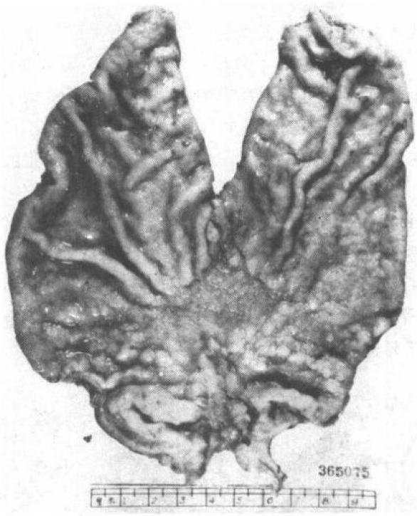 
胃窦部大面积浅表低分化腺癌，仅灶性地区侵入浅肌层
底部绝对不应有癌。这种癌只有在它的早期才能诊断，到晚期时已与一般胃癌不能鉴别。
胃癌绝大部分为腺癌。胃癌的组织学分类种类繁多，主要根据腺体分化程度，间质的量和性质以及分泌粘液的量将胃腺癌分成许多种类型。国内常用的组织学分类：乳头状腺癌，腺癌或称管状腺癌（高分化、中分化、低分化），粘液腺癌，印戒细胞癌、硬癌（间质有多量纤维组织）和未分化癌。
1965年Lauren根据1344例手术切除胃癌的组织结构、粘液分泌和生长方式将胃癌分成肠型胃癌和胃型（弥漫型）胃癌二大类：肠型胃癌来自肠化的上皮，癌细胞形成腺管或腺样结构，粘液分泌主要在腺腔内或细胞外。大体上 $60\%$ 为巨块型， $25\%$ 为溃疡型， $15\%$ 为弥漫型。胃型胃癌来自胃上皮，为粘附力差的小圆型细胞，单个分散在胃壁中，大多数细胞分泌粘液而且粘液在胞浆内均匀分布，少量在细胞外。大体上 $31\%$ 为巨块型， $26\%$ 为溃
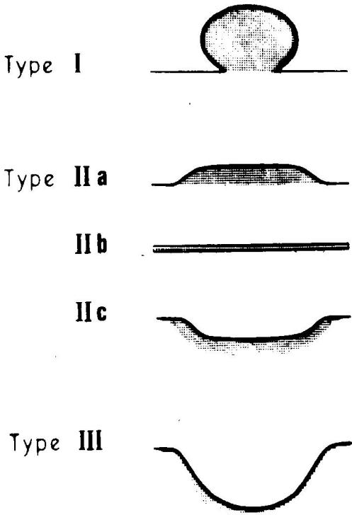 
图3-12 早期胃癌的大体分型
疡型， $43\%$ 为浸润型。肠型和胃型胃癌不仅在形态有区别，在病人年龄、性别和流行病
学等方面都有明显的不同。肠型胃癌多见于老年人，男性多见，胃癌高发区多见，癌周胃粘膜常伴广泛的萎缩性胃炎，预后较好。胃型胃癌多见于青壮年，女性多见，胃癌低发区多见，癌周胃粘膜无或仅有小片萎缩性胃炎，预后差。Lauren分析的1344例中 $53\%$ 为肠型， $33\%$ 为胃型，另有 $14\%$ 不能分类。
# 【早期胃癌】
早期胃癌是指位于粘膜下层以上的癌，不管其面积多大和有无淋巴结转移。诊断早期胃癌的关键是必须把病变部和它周围的胃壁，甚至是全部胃标本作连续切块检查以保证所有的病变均在粘膜下层以上。早期胃癌的大体分型都按照日本内窥镜学会的分型（图3-12）。各型的混合称为复合型如表面凹陷型的中心有溃疡就形成Ic+III型，或表面凹陷型边缘又有表面隆起则成Ic+IIa型（图3-13，3-14）。复合型的命名是把优势的病变写在前面，中间用加号连接。国内外资料都表明早期胃癌以Ic型最多见，其次为Ic+III、III+IIc型、IIa型和其它复合型，IIb型最少见。
图3-13 早期胃癌 
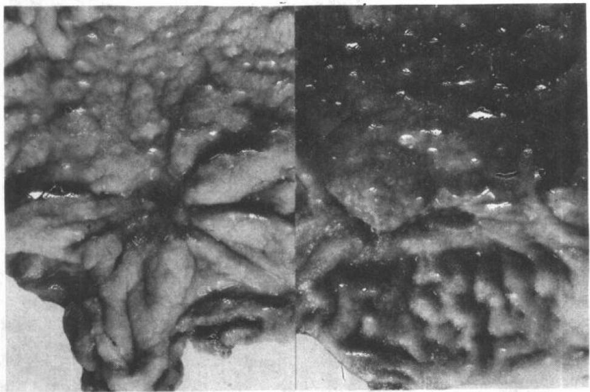 
左图为胃幽门前区 $\mathbb{I}_{\mathrm{c}} + \mathbb{I}$ 型；右图为胃幽门部 $\mathbb{I}_{\mathrm{a}} + \mathbb{I}_{\mathrm{c}}$ 型
早期胃癌的组织学类型与一般胃癌同。限于粘膜内的癌称粘膜内癌，侵至粘膜下层者称粘膜下层癌。最大径 $< 0.5\mathrm{cm}$ 的癌称微小癌。
# 【少见的胃癌】
1. 鳞癌和腺鳞癌 纯鳞癌极罕见。腺鳞癌含不同比例的腺癌和鳞癌成分。电镜下可见到一种既含粘液又含张力纤维的中间型细胞。 
2. 腺癌伴神经内分泌细胞分化 由于免疫组织化学技术的广泛应用，已发现越来越多的胃腺癌中含有多少不等的神经内分泌细胞。 
3. 肝样腺癌 (hepatoid adenocarcinoma) 这种癌含腺癌和肝细胞样分化的癌细胞, $\alpha$ -FP 阳性。常长成结节或巨块状。有广泛的静脉瘤栓（图 3-15）。预后差。 
4. 壁细胞癌（parietal cell carcinoma） 癌细胞有丰富的嗜酸性颗粒状胞浆。
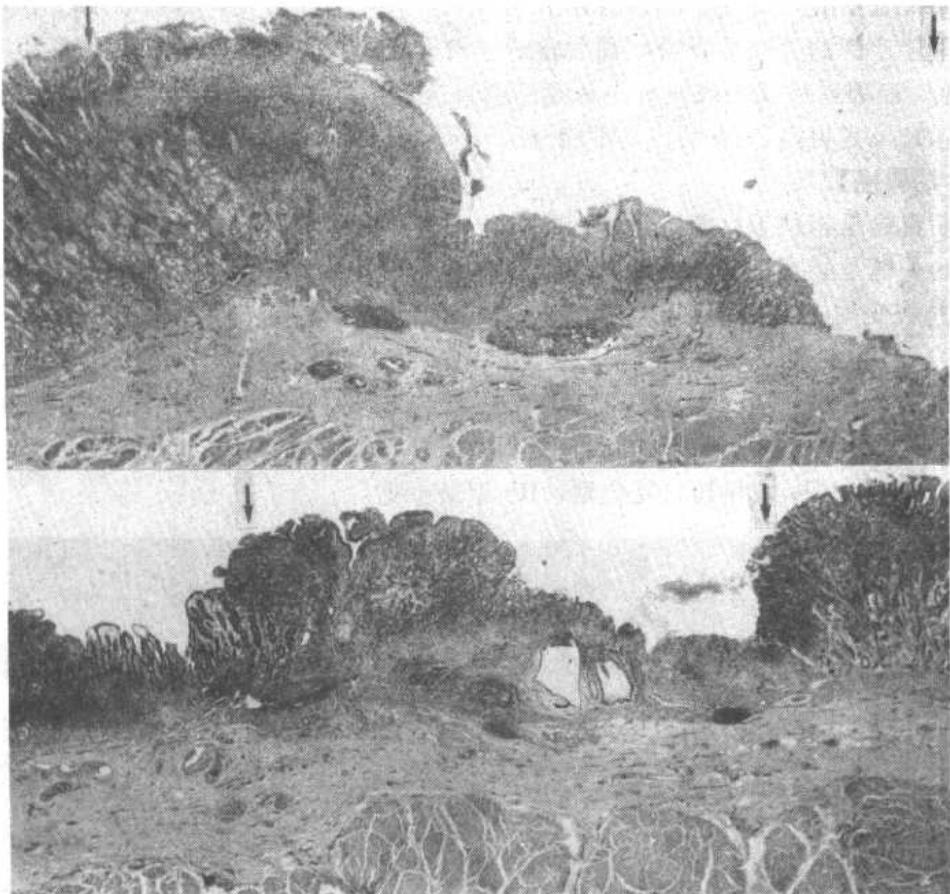 
图3-14 早期胃癌的低倍镜下形态
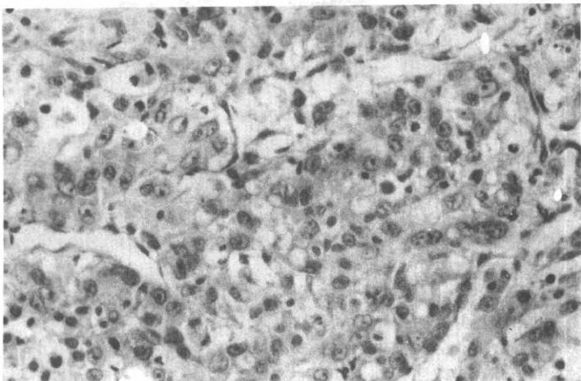 
左图：Ⅱc+Ⅱ型，右图：Ⅱa+Ⅱc型 
图3-15 胃的肝样腺癌（hepatoidadenocarcinoma）
电镜 癌细胞浆内有大量线粒体、管泡、细胞内小管和细胞内腔。
5. 胃绒癌 胃原发性绒癌多见于老年男性，文献报道的胃绒癌中半数为纯绒癌，形态与子宫绒癌同；半数为合并腺癌的混合型。
免疫组化 显示HCG阳性。
# 【胃癌的扩散】
1. 局部蔓延种植 胃癌侵至浆膜外后可沿腹膜种植，在浆膜下淋巴管内播散，使淋巴管形成白色条纹称为癌性淋巴管炎(lymphangitis carcinomatosa)。癌细胞蔓延侵袭邻近脏器如食管、肝、胰、总胆管、横膈、脾、十二指肠和横结肠，癌细胞可经腹腔或腹膜淋巴管转移至双侧卵巢，称为Krukenberg瘤。 
2. 淋巴管转移 胃癌转移至胃周和远处淋巴结的顺序为：①贲门、小弯、大弯、幽门上下和胃左动脉旁；②肝动脉旁、腹腔动脉旁和脾动脉旁；③肝十二指肠韧带内淋巴结；④胰十二指肠后；⑤肠系膜根部；⑥结肠中动脉旁；⑦腹主动脉旁；⑧胸腔和胸导管周围淋巴结；⑨左锁骨上（Virchow淋巴结）。 
3. 血行转移 晚期胃癌可经血行转移至全身，常见部位为肝、肺、骨、肾上腺、肾、脑和皮肤等处。
【预后】早期胃癌预后好，粘膜内癌的5年存活率 $91\% \sim 100\%$ ，粘膜下癌5年存活率 $80\% \sim 90\%$ 。侵及肌层的中期胃癌预后较侵至浆膜或浆膜外的晚期胃癌好，中期胃癌5年存活率 $29\% \sim 88\%$ ，平均 $70\%^{[14]}$ 。晚期胃癌5年存活率仅为 $20\% \sim 30\%$ 。影响预后的因素有浸润深度、淋巴结转移、癌间质反应（间质中有大量淋巴细胞浆细胞或嗜酸性白细胞者预后较好）、癌组织中Langerhan细胞量（有多量Langerhan细胞者预后较好）、组织学类型（肠型胃癌预后好）、大体类型（呈膨胀性生长的BorrmannI和II型预后好）和肿瘤大小。
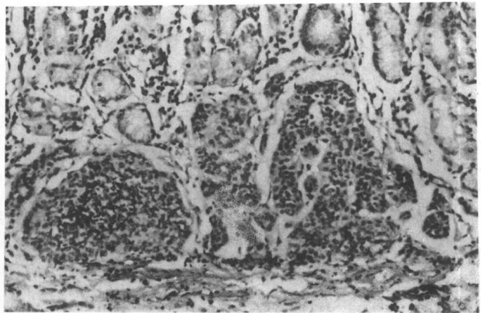 
图3-16 胃类癌 
类癌位于粘膜深部
# （三）胃的神经内分泌肿瘤
胃类癌很少见，仅占消化道类癌的 $5\%$ 。可单发或多发，位于粘膜内或粘膜下层（图3-16）。切面黄色或黄灰色，无包膜。瘤细胞大小一致，立方或低柱状，排列成巢、索、花带、腺样或菊形团样。
免疫组化 显示神经内分泌标记如chromogranin A、NSE、synaptophysin均阳性，并有多种胺和肽类激素如5-HT、VIP、PP、PYY、ACTH等免疫反应阳性。原位杂交可检测出chromograninAmRNA[15]。
电镜 神经内分泌颗粒直径 $200\mathrm{nm} - 300\mathrm{nm}$ 。胃类癌为低度恶性肿瘤，即使有转移预后亦较好。除类癌外胃内亦可发生其它神经内分泌肿瘤如胃泌素瘤。类癌与胃腺癌可同时存在，这种癌的预后与晚期胃癌一样差[16]。
# （四）胃间质肿瘤（gastric stromal tumor）
以往都把胃间质来源的肿瘤归为平滑肌肿瘤。近年来免疫组化和电镜研究的结果认为这些肿瘤的组织发生还不清楚，瘤细胞可表现为平滑肌细胞、纤维母细胞、肌纤维母细胞、Schwann细胞或未分化细胞；因此这些具梭形或上皮样细胞的间质肿瘤不管其良恶性，可能是由向不同方向分化的原始间充质细胞构成[17]。这些分歧主要来自desmin和S-100染色所得出的不同结果，如有的研究发现所谓的胃的平滑肌肿瘤多数为desmin阴性而S-100阳性，所以认为是神经源性肿瘤；但目前多数学者研究的结果认为绝大多数为平滑肌来源，如Hjermstad等研究的91例胃间质肿瘤中仅1例为S-100阳性[18]。
# （五）胃平滑肌肿瘤
平滑肌性肿瘤是胃的非上皮性肿瘤中最常见的一种。好发部位为胃窦。平滑肌瘤直径一般在 $5\mathrm{cm}$ 以下。向腔内突起形成粘膜下肿块或向浆膜外生长或向腔内和浆膜外生长呈哑铃状。粘膜下肿块的表面粘膜光滑，中心常见一至数个溃疡（图3-17）。切面粉白色编织状。
图3-17 胃平滑肌瘤 
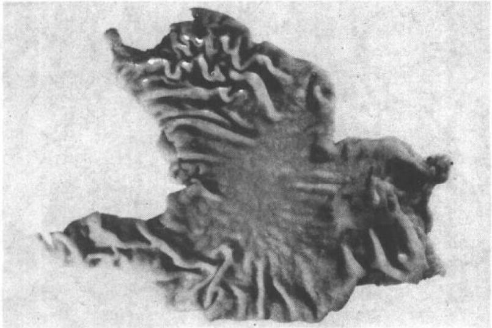 
肌瘤形成粘膜下隆起肿物，粘膜面有数个溃疡（箭头）
光镜 与其它部位的平滑肌瘤同。平滑肌肉瘤体积较大，直径多在 $5\mathrm{cm}$ 以上，大者
可达 $20\mathrm{cm}$ 或更大。切面鱼肉状有出血坏死。分化差的平滑肌肉瘤很容易诊断，但分化好的平滑肌肉瘤与平滑肌瘤很难鉴别。区别良恶性核分裂数各家标准也不一样。一般认为消化道平滑肌肉瘤的诊断标准要比子宫平滑肌肉瘤低，即有少数核分裂（<3/10HPFs）[1]和有轻度核异型性就应考虑为恶性。胃平滑肌肉瘤可腹腔广泛种植并经血行转移到肝和肺等脏器。
上皮样平滑肌肿瘤（epithelioid smooth muscle tumors）又称平滑肌母细胞瘤（leiomyoblastomas）或多形性平滑肌肿瘤（bizarre smooth muscle tumors）较少见。
大体 形态与平滑肌肿瘤同。
光镜 瘤细胞呈圆形或多角形，胞浆空泡状，核异型性较明显，核分裂偶见。PAS、粘液卡红和脂肪染色均为阴性，间质纤维染色显示瘤细胞为网织纤维包绕（图3-18）。
电镜瘤细胞胞浆内有许多空泡，大小如线粒体，有些空泡来自粗面内质网。纯的上皮样平滑肌肿瘤很罕见，多数合并有梭形细胞平滑肌肉瘤。
图3-18 胃平滑肌母细胞瘤 
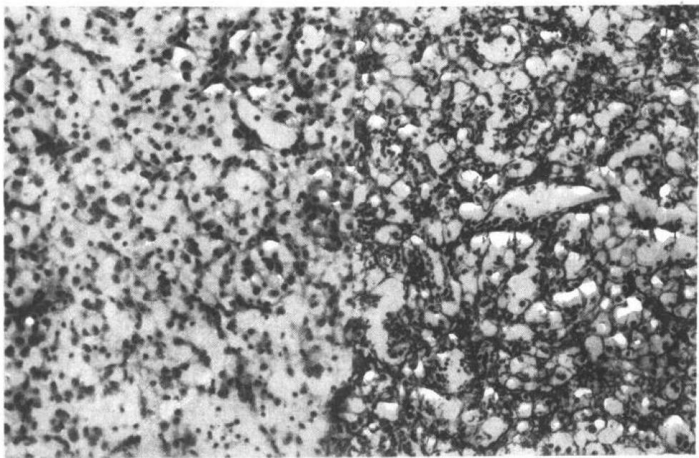 
左图：HE； 右图：网织纤维染色
# （六）胃淋巴瘤
淋巴瘤可原发于胃或为全身淋巴瘤的一部分。胃淋巴瘤占胃恶性肿瘤的 $2\% - 5\%$ ，淋巴结外淋巴瘤的 $24\%$ 。在西方国家胃淋巴瘤占胃肠淋巴瘤的 $61\%$ ，中东国家占 $38\%^{[19]}$ ，北京协和医院手术切除之胃淋巴瘤占胃肠淋巴瘤的 $43.8\%^{[20]}$ 。胃淋巴瘤与胃癌发病率相比约为 $1:50$ 。胃淋巴瘤的好发部位为胃窦和胃体，其次为贲门、小弯、幽门和全胃。
大体分巨块型，溃疡型和形成脑回状巨大皱襞的弥漫浸润型，大小直径 $2\mathrm{cm}-18\mathrm{cm}$ ，多数在 $5\mathrm{cm}-10\mathrm{cm}$ 之间。组织学形态与淋巴结之淋巴瘤同，以B细胞非何杰金淋巴瘤为多见（图3-19）。胃淋巴瘤的预后远较胃癌为佳，5年存活率一般在 $50\%$ 以上。
以往把一种有典型的淋巴滤泡形成, 手术后从不复发的淋巴瘤样病变称为假性淋巴
瘤或称反应性淋巴网织细胞增生。但近年对此病变的反应性性质有很多质疑，目前多数学者认为这是一种低度恶性的B细胞淋巴瘤[19]。
图3-19 胃非何杰金淋巴瘤 
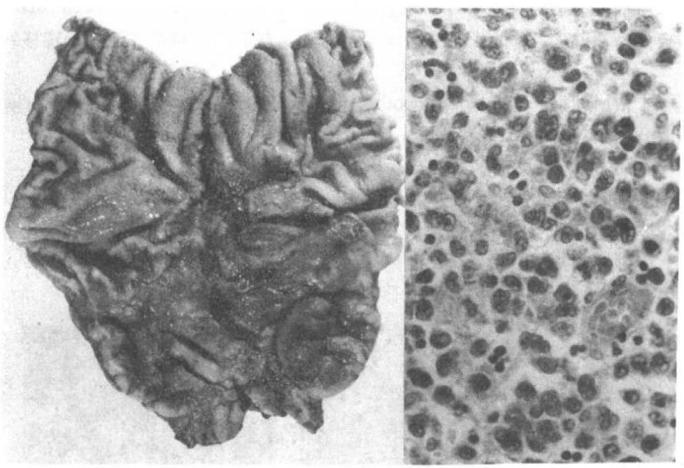 
左图示胃窦及部分胃底正常粘膜皱襞消失，形成粗大皱襞及大小不等斑块；右图：光镜下形态
# （七）胃浆细胞瘤和浆细胞肉芽肿
胃的浆细胞瘤可单发或多发，形成局限或较弥漫的肿物突向胃腔，表面粘膜常有溃疡形成。
光镜 为单一的浆细胞，可浸润胃壁各层或局限于粘膜和粘膜下层。
浆细胞肉芽肿极罕见。
光镜 为成片成熟的浆细胞，细胞内外Russell小体多见，肉芽肿内还有其它炎细胞。浆细胞内免疫球蛋白为多克隆性，而浆细胞瘤细胞内免疫球蛋白为单克隆性。
# （八）胃血管球瘤
胃血管球瘤（glomus tumor）罕见，常位于胃窦，直径 $1\mathrm{cm} - 5\mathrm{cm}$ ，平均 $2\mathrm{cm}$ 左右。胃血管球瘤位于胃肌层内，可突入粘膜下层形成粘膜下肿块，表面粘膜光滑，亦可有溃疡形成。切面灰红色如胎盘组织。无包膜，由周围肥大玻璃样变的平滑肌形成假包膜，肌纤维由此进入肿瘤将肿瘤分隔成不完整的小叶。
光镜 瘤组织由大小一致的血管球细胞构成（图3-20），其间有血管丰富的间质，间质可呈玻璃样变。网织纤维染色可见小簇（ $2\sim 4$ 个）瘤细胞或单个瘤细胞周围有网织纤维包绕。
# （九）胃神经源性肿瘤和其它罕见的肿瘤
胃内可发生神经鞘瘤和神经纤维瘤，有时为全身神经纤维瘤的一部分。肿瘤形态与其它部分的相同。神经鞘瘤和平滑肌瘤因二者都可有栅栏状排列，所以不易鉴别。通常神经鞘瘤有包膜而平滑肌瘤无包膜，有效的鉴别方法除电镜外可用免疫组织化学，神经
鞘瘤为S-100阳性，而平滑肌瘤为desmin阳性。
图3-20 胃血管球瘤 
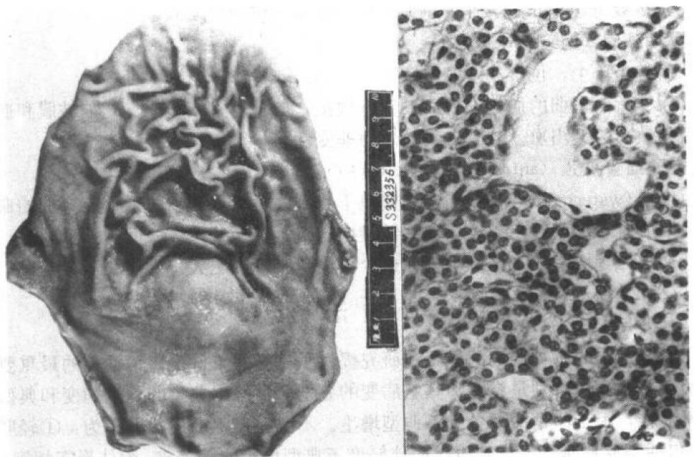 
左图：大体； 右图：光镜下形态
胃的其它罕见肿瘤有脂肪瘤、颗粒细胞瘤、黑色素瘤、内胚窦瘤、畸胎瘤、恶性纤维组织细胞瘤、血管外皮瘤、Kaposi肉瘤、黄色纤维瘤、横纹肌肉瘤和软组织腺泡状肉瘤[21]等。
# （十）转移瘤
胃的转移瘤多数来自乳腺癌和黑色素瘤，但其它恶性肿瘤亦可转移至胃。
# 五、胃的其它病变
# （一）胃结石（bezoar）
结石由异物构成，发球是最常见的一种，其它还有由植物纤维、种子、果皮等构成的植物性结石（Phytobezoar）和摄入虫漆（shellac）类物质凝固成的结石，虫漆遇水成粘稠沉淀，易与其它物质粘在一起凝固而成结石。有些结石由毛发和植物性物质混合而成，称毛发植物结石（trichophytobezoar）。毛发结石多见于小儿，特别是喜欢咬嚼头发的儿童，但更多见于慢性精神病患者。
# （二）胃扭转（volvulus）
急性或慢性扭转常常是继发于胃外疾病如胃大弯附近肿瘤和裂孔疝。胃扭转时胃大弯侧向上，向前和向右扭转，并将横结肠和结肠系膜牵引过去，如此导致贲门和十二指肠第一段梗阻，胃因自身的分泌物储留而扩张。
# （三）胃破裂
成人的胃破裂可以是钝器伤的结果或原因不明，女性较多见，常常是沿着小弯的撕裂，而胃本身无病变。
# （四）胃黄斑（xanthoma）
胃黄斑亦称脂质小岛（lipid island）。病变处粘膜固有膜内有成堆含脂质的泡沫细胞。 $90\% < 3\mathrm{mm}$ ，少数可达 $1\mathrm{cm}$ 。男性老年人多见，好发部位为胃窦和小弯。良性病变。
# （五）胃动脉瘤（Dieulafoy病）
胃动脉瘤常为单个，位于小弯侧粘膜下。
光镜 为一大而弯曲的血管，表面粘膜有缺损，血管可有淀粉样变，如粘膜和血管壁破溃可引起致命的大出血。这是一种畸形而非变性。
# （六）胃囊血管扩张（antralvascularectasis）
亦称西瓜胃（watermelon stomach），内窥镜下胃窦粘膜纵形皱襞的顶部有弯曲的血管和扩张的毛细血管，形成红色条纹。这些皱襞向幽门集中，致使胃表面像西瓜纹。
光镜 粘膜血管增多扩张伴纤维素性血栓形成和肌纤维肥大。
# 六、胃镜活检
纤维内窥镜为胃的各种疾病的诊断和研究提供了良好的条件。胃镜活检的最重要的作用是鉴别良恶性病变特别是胃癌和其它病变的鉴别。活检中典型的良性病变和典型的癌诊断都不困难，困难的是诊断各级不典型增生。不典型增生上皮的形态为：①轻度不典型增生：包括不成熟肠化上皮和再生而伴轻度不典型增生的腺上皮。腺体形态规则，腺上皮为高柱状，核细长，核大小一致，假复层排列，核位于细胞的下1/2，核上部胞浆内含分泌空泡。夹杂在这些细胞之间可见散在的杯状细胞和Paneth细胞，不典型增生腺体与周围粘膜腺体成移行状态；②中度不典型增生：腺体形态稍不规则，有分支，腺体排列较紧密，腺上皮核较大成长圆形棍状，假复层排列。核位细胞的下2/3，有的可顶到腺腔肌。核上部胞浆内分泌空泡少或无。杯状细胞显著减少或消失，无Paneth细胞；③重度不典型增生：腺体形态不规则，有分支，与相邻腺体背靠背，腺上皮为高柱状、低柱状或立方形，核呈假复层或单层排列。核异型性明显，胞浆少，核浆比例明显失常，杯状细胞偶见或无。无Paneth细胞。不典型增生的腺体与周围粘膜腺体界限明显即界限截然。
胃粘膜活检的诊断还要注意鉴别以下病变：①鉴别胃粘膜黄斑的泡沫细胞和印戒细胞癌细胞；可用粘液染色和免疫组织化学染色，如粘液和CEA为阳性则为印戒细胞癌细胞；②鉴别淋巴瘤和未分化癌：可用淋巴细胞标记LCA和CD系列抗体以及CEA、EMA、cytokeratin、NSE和chromogranin A等抗体，LAC和CD系列抗体阳性者为淋巴瘤。活检中有大量淋巴样细胞浸润、明显的淋巴上皮性病变、中度细胞的异型性和出现Dutcher小体者高度提示此病变为淋巴瘤[22]。
# 第三节 小肠
# 一、先天性畸形
# （一）小肠闭锁和狭窄
可发生在小肠的任何部位但多见于十二指肠或回肠。这种畸形可多发并合并其它器官的畸形。多数情况下仅累及一小段肠管。闭锁肠管形成一纤维条索，闭锁或狭窄上方
的肠管扩张，肠壁肌层肥厚，下方肠管萎缩塌陷。
# （二）小肠旋转不良（malrotation）
胚胎5周时小肠疝入胚胎外体腔并开始旋转。约10.周时回到腹腔继续旋转直到转 $270^{\circ}$ 。如肠发育时期旋转不良就能产生种种畸形：①脐部保存疝入的肠管称为腹部肠膨出(intestinal eventration）或脐膨出（exomphalos)；②盲肠、阑尾和升结肠左位，小肠位于右半腹腔；③盲肠未能下降到适当位置；④阑尾位于腹膜后。
# （三）小肠重复
极少见。常累及一小段肠管，特别是回肠，偶尔亦可累及整个空肠和回肠。重复的肠管成球形或管状，可有它们自己的系膜，但多数是与正常系膜相连。重复肠有正常的粘膜、粘膜下层和内环肌，纵行肌常不发育。可有胃腺异位并能继发感染或发生肿瘤。
# （四）胰腺异位
最常发生的部位是十二指肠，特别是壶腹区。异位的胰腺导管和腺泡形成小结节位于粘膜下层或更深部，很少含胰岛。异位的胰腺可发生胰腺炎和肿瘤。
# （五）胃粘膜异位
形成孤立的小结节或广基息肉，多见于十二指肠和回肠。异位粘膜为胃底胃体腺粘膜，含壁细胞和主细胞，可发生增生和肿瘤。
# （六）想室
多数憩室为后天性，常合并吸收不良。小肠最常见的先天性憩室为美克尔憩室（Meckel's diverticulum）。美克尔憩室位于回肠的肠系膜对侧，约在回盲瓣上方 $1\mathrm{m}$ 处（婴儿约在 $30\mathrm{cm}$ 处）。憩室长约 $2\mathrm{cm} \sim 8\mathrm{cm}$ ，直径与所在肠的直径相同。美克尔憩室是卵黄肠导管（vitelline-intestinal duct）近端的残留物，憩室的盲端游离，有时可有一纤维索连接脐部；有时憩室直接开口于脐，这时称为美克尔瘘或回肠脐瘘。如卵黄肠导管的肠端闭锁而脐端开放则形成卵黄窦（vitelline sinus），可分泌少量粘液。另一些情况下导管的两端均闭锁，中段扩张，由于所分泌的粘液的积聚而形成卵黄囊肿（vitelline cyst），亦称肠囊瘤（enterocystomas）。偶尔从卵黄窦或囊肿可发生腺癌，这是脐部极罕见的腺癌来源之一，另一些可来自脐尿管残留物（urachal remnant）。美克尔憩室含正常肠壁四层。粘膜多数为邻近小肠粘膜，亦可是十二指肠或结肠粘膜，粘膜内可有胃粘膜异位，故可发生消化性溃疡；亦可有胰腺异位。憩室可并发急性和慢性憩室炎、套叠、粘液囊肿和良恶性肿瘤。粘液囊肿破裂可导致腹膜假粘液瘤。
十二指肠憩室为单个，位于第二段，体积可很大而造成肠梗阻性黄疸、胰腺炎、瘘、出血和穿孔。有的憩室突入腔内形成息肉，但多数沿胚胎腹胰和背胰融合线突入胰腺。
空肠憩室多数在上段空肠，位于系膜缘，多发，壁薄。有些是先天性，多数是由于空肠肌层缺陷而形成的后天性憩室。憩室底部可有异位胰腺。憩室可并发出血、穿孔、感染和气囊肿等。
# 二、炎症
# （一）十二指肠炎和慢性十二指肠溃疡
十二指肠炎的形态从单纯的淋巴细胞浆细胞增多到绒毛萎缩变形。表面上皮内有中性白细胞浸润，上皮细胞变性坏死形成糜烂。有时表面上皮成合体细胞样或化生成胃粘
膜样，有时可合并急性炎，粘膜侧的Brunner腺增多。十二指肠炎与十二指肠溃疡（消化性溃疡）可能有一定的关系，即在十二指肠炎的基础上加上酸的侵袭就发展成溃疡。近年对幽门弯曲菌的研究结果认为幽门弯曲菌与十二指肠炎有一定关系。正常十二指肠粘膜无幽门弯曲菌，此菌只在胃粘膜化生的十二指肠粘膜上繁殖。在有胃粘膜化生处常可见幽门弯曲菌和中性白细胞浸润[8]。十二指肠溃疡多见于球部，前壁较后壁多见，亦可发生在十二指肠第二段。直径一般1cm左右。主要合并症为穿孔和幽门梗阻。十二指肠溃疡无癌变倾向。
# （二）急性蜂窝织炎性小肠炎（acute phlegmonous enteritis）
多见于空肠，侵犯十二指肠和回肠较少。由化脓菌特别是链球菌感染引起。病变的肠由于显著充血水肿而使肠壁明显增厚。
光镜 肠壁各层特别是粘膜层有大量中性白细胞浸润甚至脓肿形成。粘膜可坏死脱落而形成浅溃疡，浆膜面有纤维素渗出，肠系膜亦可有脓肿形成。淋巴结显急性炎，此病常为重症肝病的合并症。
# （三）耶尔森小肠结肠炎（Yersinia enterocolitis）
小肠病变类似伤寒。此菌主要侵犯肠相关的淋巴组织(GALT)。肠壁B细胞增生，灶性中性白细胞浸润，中心坏死。形成溃疡，溃疡长圆形，底部淋巴组织增生。亦可有小的鹅口疮样溃疡。耶尔森菌可引起小肠结肠炎、急性阑尾炎和/或肠系膜淋巴结炎，感染的淋巴结滤泡发生中心坏死，周围有中性白细胞浸润。
# （四）急性非特异性末段回肠炎和急性非特异性肠系膜淋巴结炎
多数病人是儿童。临床症状像急性阑尾炎，但剖腹探查无急性阑尾炎，仅末段回肠充血水肿，肠系膜和回盲部淋巴结肿大。
光镜 淋巴结和末段回肠均为非特异性炎症。有时末段回肠炎较重而导致局限性腹膜炎和纤维素性粘连，病因不明。
# （五）伤寒和副伤寒
是一种急性传染病，主要累及末段回肠的淋巴组织。伤寒病原菌为伤寒杆菌（Salmonella typhi）。感染后第一周末病人血内出现特异的凝集抗体，其滴定度在第三周末达最高峰，临床用此诊断伤寒，称为Widal反应，由于抗体的出现，经集合淋巴结再吸收的伤寒杆菌在局部发生抗原抗体反应。从而导致粘膜坏死和溃疡。
# 【病变】
按病程小肠病变可分为：
（1）髓样肿胀期：末段回肠的孤立淋巴结和集合淋巴结明显肿胀，突出粘膜而形成圆形或卵圆形结节，质软，灰红色，表面呈脑回状。
光镜 肠壁充血水肿。粘膜淋巴组织和肠壁各层有大量单核细胞浸润，部分单核细胞吞噬有红细胞、淋巴细胞、细胞碎片和伤寒杆菌，这种单核细胞称为伤寒细胞，伤寒细胞聚集成堆称为伤寒小结。除单核细胞外各层尚有淋巴细胞和浆细胞浸润，中性白细胞极少；
（2）坏死期：粘膜淋巴组织表面的粘膜坏死； 
（3）溃疡期：溃疡呈圆形或卵圆形，卵圆形溃疡的长径与肠的长轴平行。
光镜 溃疡底的表层为渗出物和坏死组织，其下为薄层肉芽组织。溃疡底和附近的
肠壁中有大量伤寒细胞、淋巴细胞和浆细胞浸润。伤寒的肠溃疡一般较浅，仅及粘膜下层；有时也可深达肌层或浆膜，从而引起肠穿孔或腐蚀血管引起大出血；
（4）愈合期：溃疡由周围粘膜上皮修复愈合，愈合时很少形成疤痕，因此伤寒性肠狭窄少见。
【合并症】常见合并症为出血和穿孔，亦是伤寒病人死亡的主要原因。其它有急性伤寒性胆囊炎、肠麻痹、肝脾肿大、心肌炎、腹壁肌肉Zenker变性、急性支气管炎、脑膜炎、肾炎、睾丸炎、关节炎和骨炎等，临床恢复后伤寒菌仍可留在胆道（特别是胆囊）和肾内，继续由粪便和尿内排出。这种病人就成为带菌者。
副伤寒由Salmonella paratyphi引起，病变与伤寒同但较轻，限于回肠的一小区域内，合并症少。
# （六）嗜酸性肠炎（eosinophilic enteritis）
有时胃肠同时累及称为嗜酸性胃肠病（eosinophilic gastroenteropathy）。小肠的一段或数段肠壁弥漫性增厚、水肿和大量嗜酸性白细胞浸润。腹膜有纤维素渗出。肠系膜淋巴结肿大，常伴有外周血嗜酸性白细胞增多。原因不明，可能是对某些食物或寄生虫过敏，因 $70\%$ 病人有个人或家族过敏史。
# （七）肠结核
发达国家肠结核已很少见，但第三世界国家仍较多见。
# 【病变】
大体 可分溃疡型和增殖型：①溃疡型肠结核：病变起始于粘膜淋巴小结，使之坏死形成溃疡。病变沿肠壁淋巴管向四周扩散，溃疡逐渐增大，因肠壁淋巴管围绕肠管走行，所以结核性溃疡为环形，其长径与肠长轴垂直，边缘参差不齐如鼠咬状。溃疡底的浆膜面可见白色粟粒状结核结节。肠系膜淋巴结肿大，有干酪样坏死；②增殖型肠结核：肠壁纤维组织增生而增厚。粘膜面有多数炎性息肉形成，亦可伴粘膜大小不等的溃疡，疾病后期由于肠壁增生的纤维组织收缩可形成肠狭窄。狭窄呈环形，可单发或多发。
光镜 肠壁各层均可见有干酪样坏死或无干酪样坏死的结核结节。结核结节边缘有较厚的淋巴细胞套，结核结节常相互融合成片。肠壁各层纤维组织增生，粘膜下层闭锁或变窄。肌层破坏有疤痕形成。粘膜下层和肌层神经纤维增生，粘膜可有幽门腺化生、经抗结核治疗后，肠壁结核可萎缩、玻璃样变甚至消失。局部淋巴结的干酪性结核灶不会因抗结核治疗而完全消失。
【合并症】急性结核性溃疡易穿孔而导致结核性腹膜炎。增殖性肠结核的主要合并症是肠狭窄所引起的肠梗阻。
# （八）克隆病（Crohn's disease）
1932年克隆及其同事报道此病时作为只发生在末段回肠的一种炎症。以后越来越多的临床和病理实践证明克隆病可发生在消化道的任何部位，从口腔到肛门以及消化道外的部位如皮肤和关节，有时消化道病变不明显而主要病变在消化道外。好发部位仍是末段回肠和回盲部。Morson等[1]分析消化道克隆病的分布：小肠 $66\%$ ，大肠 $17\%$ ，同时累及大小肠者 $17\%$ 。协和医院资料：小肠 $15\%$ ，大肠 $7.5\%$ ，同时累及回肠、回盲部及大肠者 $77.5\%$ [23]。
克隆病的病因至今不明，曾研究过的发病因素有遗传、饮食和生活习惯、种族、环
境、损伤、精神因子、生物因子（细菌、原虫、病毒、真菌等）和免疫缺陷等，但均未能充分证实。
克隆病多见于北欧、斯干的那维亚国家、北美和英、法、意大利等国家，非洲、中东、亚洲和南美少见。可发生在任何年龄组，有二个年龄高峰：20岁～40岁和60岁～70岁。男女发病率相近。克隆病为反复发作的慢性进行性炎症。
【病变】 克隆病为非连续性节段性病变。
大体 ①粘膜溃疡：多数为匐行溃疡（serpiginous ulcer），不连续，大小不等，形态不规则，边缘清楚，溃疡之间的粘膜正常。另一种为纵行溃疡（longitudinal ulcer），这种溃疡位于肠系膜附着侧之粘膜面。早期病变为鹅口疮样溃疡（aphthoid ulcer）。这是在粘膜淋巴小结上形成的小溃疡，从针尖大的出血性病灶到小而边缘清楚的浅溃疡，如手术切除缘附近有这种小溃疡则可成为以后复发的病理基础。早期病变可经过若干年发展成有临床和X线特征的病变，但克隆病的早、晚期病变可在一段肠管内同时存在；②肠狭窄：狭窄区长短不一。单个或多发。最典型的狭窄是末段回肠的长管（hosepipe type）狭窄。这种狭窄的长度从数cm到数10cm。狭窄处肠壁弥漫性增厚，管腔狭窄，整段肠如救火用的水管。近年由于诊断技术的提高，这种典型的在疾病晚期才出现的长管状狭窄已很少见；③粘膜卵石样改变（cobblestone appearance）：约1/4病例可见典型的粘膜卵石样改变。这是由于粘膜裂缝（crevices）和裂隙（fissures）之间的粘膜下层高度充血水肿而使粘膜隆起所致（图3-21）。④炎性息肉：形态与慢性增殖性肠结核和溃疡性结肠
图3-21 Crohn病肠大体形态 
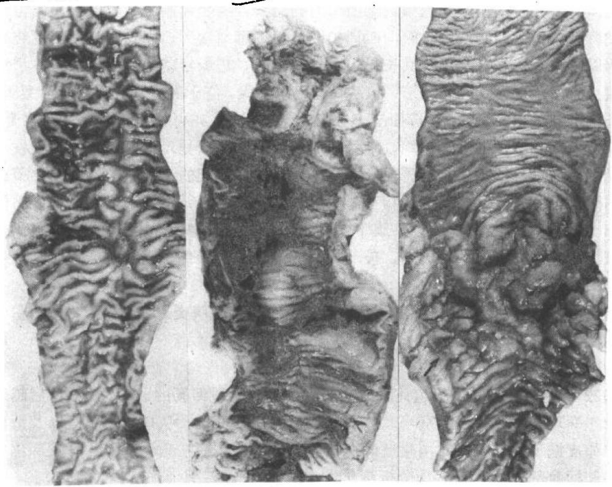 
左图：匈行溃疡；中图：节段性狭窄；右图：鹅卵石样改变（箭头）
炎的炎性息肉同。有些克隆病的肠粘膜面可布满大小不等的炎性息肉；⑤肿块形成：克
隆病肠的浆膜和肠系膜都有炎症和纤维组织增生，常引起肠之间和与邻近脏器粘连，增厚的肠因粘连扭曲而形成“肿块”，特别是回盲部更常见，这种肿块常使临床和X线误诊为肿瘤。
以上病变可单独或混合存在，病变的大体特点为跳跃式不连续病变（skiplesions）。病灶之间的肠壁正常，肠浆膜由于炎症纤维化而与肠周脂肪组织粘连，从而使手术切除的肠标本看起来像脂肪组织增生。肠周脂肪组织由于粘连而增多亦见于慢性肠结核。肠周淋巴结多数肿大。
克隆病的光镜下特点为不连续的全壁炎、裂隙状溃疡、粘膜下层高度增宽、淋巴细胞聚集和结节病样肉芽肿形成。①全壁炎（transmural inflammation）：病变处肠壁全层有淋巴细胞和浆细胞浸润；②裂隙状溃疡（fissuring ulcer）：为刀切样纵行裂隙，深入肠壁，有时可达浆膜。这是克隆病常并发肠瘘的病理基础。裂隙状溃疡有时可呈分支状，溃疡的内壁为炎性渗出物和肉芽组织（图3-22）。裂隙状溃疡的横切面即成壁内脓肿（intramural abscess）。裂隙状溃疡虽也可见于急性溃疡性结肠炎和肠结核，但前者浅后者数量很少，所以裂隙状溃疡对克隆病有诊断价值；③淋巴细胞聚集（lymphoid aggregation）：肠壁各层特别是粘膜下层和浆膜层有大量淋巴细胞，形成结节并有生发中心；④粘膜下层高度增宽：这是由于粘膜下层高度水肿、淋巴管血管扩张、神经纤维及纤维组织增生等使粘膜下层高度增厚，其厚度可数倍于正常；⑤结节病样肉芽肿（sarcoid-like granuloma）：
图3-22 Crohn病 
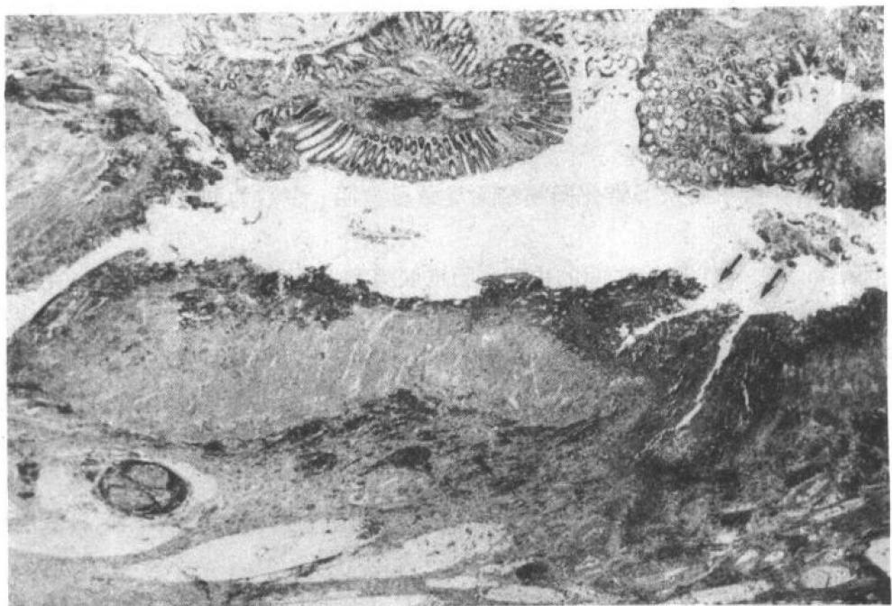 
匈行溃疡，裂隙状溃疡（箭头）及假息肉
即非干酪样坏死性肉芽肿。 $50\% -70\%$ 的克隆病肠壁可找到这种肉芽肿。结节病样肉芽肿与结核结节的区别在于无干酪样坏死、体积小而孤立、周围淋巴细胞套薄而不显（图3-23）。肉芽肿的巨细胞胞浆内常可找到Schaumann小体。小肠和大肠克隆病肉芽肿
少而直肠肛门克隆病肉芽肿较多, 病程长者肉芽肿少, 因此肉芽肿是克隆病的早期改变。直肠或肛门病变常常可能是最早发现的克隆病病变的部位。肛门直肠活检或其它部位活检诊断克隆病须要找到肉芽肿才具有诊断意义。
其它病变有幽门腺化生、神经纤维瘤样增生、血管炎、粘膜下层和浆膜纤维化、肠系膜炎等。肠周淋巴结显非特异性炎，约1/4可找到结节病样肉芽肿。
图3-23 Crohn病 
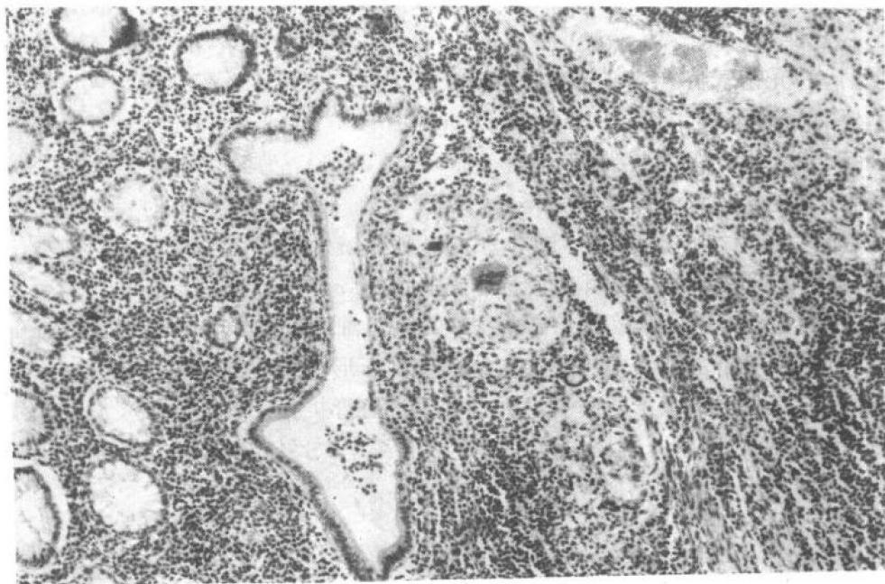 
非干酪样坏死性肉芽肿
# 【合并症】
1. 肠梗阻 由于肠壁纤维化肠狭窄而导致肠梗阻，多数为亚急性梗阻，急性梗阻少见。 
2. 肠瘘 有3种：肠之间的内瘘、肠皮肤瘘和肛门瘘。约 $10\% - 20\%$ 克隆病患者发生内瘘，最常见的是回肠-回肠瘘和回肠-结肠瘘。有时病变肠与盆腔腹膜粘连形成慢性盆腔脓肿，脓肿破入直肠而形成回肠-直肠瘘，偶尔亦可见回肠-膀胱瘘或回肠-阴道瘘。肠皮肤瘘最容易发生的部位是腹部手术切口或手术疤痕处。肛门瘘可发生在肠病变出现之前、之后或同时。有时因为出现肛门瘘而找出潜在的肠克隆病，肛门病变区水肿、灰蓝色。镜下可找到结节病样肉芽肿，无结核杆菌。 
3. 吸收不良 由于肠粘膜广泛炎症和溃疡，从而造成对脂肪、Vit $\mathrm{B}_{12}$ 和蛋白质吸收不良。 
4. 癌变 克隆病小肠癌变的发生率较正常对照高6倍一20倍。大肠克隆病癌变率较正常对照高20倍。小肠癌较多发生在远段，年青人多见。大肠癌则近段较多，多发，亦是年青人多见。食管和胃克隆病亦可癌变但极罕见。 
5. 其它少见的合并症 有关节强直性脊椎炎、多关节炎、眼炎、肝硬化、淀粉样变性和皮肤病变。皮肤病变中常见的是会阴皮肤溃疡，这种溃疡能扩展延伸到腹股沟并累及外生殖器，所以称之为扩展性溃疡（spreading ulcers），多见于肛门手术后。扩展性溃
疡只是在结肠直肠有广泛病变时才出现。此外在结肠造瘘口和回肠造瘘口周围皮肤，当克隆病复发时亦可出现溃疡，但手术治疗后即消失。远离消化道的皮肤如阴茎、乳房下、前腹壁褶痕处、外阴和腋窝等处亦能出现溃疡，这种溃疡称为转移性皮肤溃疡。诊断克隆病皮肤病变必须找到结节病样肉芽肿。其它合并的皮肤病变还有坏疽性脓皮病、结节性红斑和全身性湿疹等。
【鉴别诊断】克隆病主要与溃疡性结肠炎、缺血性肠病和肠结核相鉴别。①溃疡性结肠炎：为连续性病变。从直肠到回盲部，仅 $10\%$ 累及末段回肠。溃疡浅，通常限于粘膜及粘膜下层。有明显的隐窝脓肿、无结节病样肉芽肿；②缺血性肠病：亦为连续性病变，病变肠壁肉芽组织和疤痕组织多，有多量含铁血黄素沉着；③肠结核：肠结核的粘膜下层变狭窄或闭锁，肌层破坏有疤痕形成，肠壁有干酪样坏死的结核结节，结核杆菌阳性。结核结节大、融合、周围淋巴细胞套明显。局部淋巴结有干酪样坏死。
【病程和预后】克隆病是一种慢性进行性炎症，可反复发作和缓解，病程可持续许多年，有些病例肠病变仅导致轻度临床症状，引起病人就医的却是合并症如肠梗阻、内瘘、肛门瘘或吸收不良等。另一些病例临床症状重，近期并有发作，但手术切除之肠仅有已消退的病变。克隆病复发率高，但死亡率不高。
# 三、小肠缺血和梗死
任何原因影响肠血液循环如肠套叠、肠绞窄、肠扭转和肠系膜血管血栓形成或栓子栓塞都能引起肠梗死。梗死为出血性。早期时病变肠高度充血，呈暗黑色至紫红色，浆膜下和粘膜下有大小不等的出血斑。随着病变的发展，肠壁因充血、出血和水肿而增厚。粘膜坏死形成溃疡，肠壁全层出血，肠腔内含血性液甚至血液。浆膜有纤维素性或纤维素脓性渗出物，使浆膜变混浊和颗粒状。
肠系膜血管急性堵塞时发生肠梗死，慢性或不完全堵塞时肠壁呈慢性缺血状态。缺血肠外观色泽可正常或有斑点状紫红色区，肠腔稍扩张，粘膜出血坏死，形成盲行或纵行溃疡。
光镜 早期病变呈斑点状分布，有时仅累及绒毛顶端。粘膜下层显著充血水肿及出血。血管内有纤维素性血栓形成。严重病例肌层亦可出血。后期肠壁纤维组织增生。
# 四、小肠吸收不良 (intestinal malabsorption)
食物在胃内受胃酸-胃蛋白酶的作用分解成巨分子营养物，这些营养物进入小肠在胆汁和多种胰酶的作用下分解成氨基酸、单糖和脂肪酸等。这些小分子营养物被小肠粘膜吸收入血液，运送到全身各脏器和组织。小肠粘膜的绒毛使吸收面积扩大，而吸收细胞腔面的微绒毛又使吸收面积进一步增大。食物的消化分解成营养物、营养物的吸收以及营养物的运送这三个环节中任何一个发生障碍就能产生吸收不良综合征。临床特点是脂肪泻（steatorrhea）、纳差、消瘦和贫血等。
# （一）乳糜泻
乳糜泻（celiac sprue）又名麦胶诱发的小肠病（gluten-induced enteropathy）。此病系对麦胶过敏。临床有严重的脂肪泻。乳糜泻的特点：①对所有营养物均吸收不良；②小肠粘膜有典型的病变；③用不含麦胶的食物后临床有明显改善。
【病变】小肠粘膜呈不同程度萎缩，变扁平。绒毛部分或大部分萎缩，大大减少了吸收营养物质的面积。解剖显微镜下粘膜绒毛呈桥形、脑回状或扁平镶嵌状。完全萎缩的小肠粘膜形如大肠粘膜。
光镜 绒毛变短变宽，隐窝底部核分裂增多，Paneth细胞可增多。固有膜淋巴细胞和浆细胞增多，表面上皮细胞变矮甚至立方形。核形态与排列均不规则。上皮内淋巴细胞明显增多，严重者上皮内淋巴细胞数可与上皮细胞数相等或超过。上皮下有一胶原纤维带形成。病变以空肠上段和十二指肠为重，越往远端病变越轻。儿童和成人病变相同。
电镜 肠细胞的微绒毛显著变形缩短。线粒体大小形态异常，嵴变形，核糖体丰富，肌层有脂褐素沉着。
大量临床随访资料证实乳糜泻易合并恶性肿瘤，特别是淋巴瘤（多数为多形T细胞淋巴瘤）和消化道癌（食管、胃和结肠癌）。从乳糜泻发病到发生恶性肿瘤的时间可长达20年—30年，其它合并症有慢性非特异性溃疡性十二指肠空肠炎。
# （二）热带口炎性腹泻（tropical sprue）
流行于南亚、东南亚、非洲和加勒比海地区，其它热带和亚热带地区亦有散在发病。儿童与成人均能发病，临床特点是脂肪泻和叶酸缺乏性贫血。小肠病变较乳糜泻轻。绒毛部分萎缩，固有膜有多量淋巴细胞和浆细胞浸润。
热带口炎性腹泻原因不明。对不含麦胶的饮食治疗无效，对抗菌素有一定的疗效，因此有人认为是一种细菌感染，也有些病人对叶酸和 $\mathrm{VitB_{12}}$ 有明显疗效。
# （三）Whipple病
1907年Whipple最早描述，是一种较少见的病。多见于中老年男性，男女之比为8：1。临床特点为游走性多关节炎、间歇性慢性腹泻和脂肪泻、吸收不良。病变累及小肠（特别是近端小肠）、肠系膜和主动脉旁淋巴结和全身其它脏器。
光镜 小肠粘膜固有膜内有大量巨噬细胞，许多巨噬细胞胞浆内含颗粒状物。这种颗粒状物脂肪染色阴性，但 PAS 染色阳性。
电镜 巨噬细胞胞浆内 PAS 阳性颗粒状物内有杆菌样小体（bacilliform bodies）。病人经抗生素治疗后这种杆菌样小体消失。小肠粘膜绒毛由于大量巨噬细胞浸润而变钝增粗，病变的小肠粘膜外观像熊毛毡样。上皮细胞扁平，胞浆空泡状，小肠壁增厚。浆膜和肠系膜混浊增厚，浆膜面可见细网状的淋巴管网。除小肠外消化道的其它部位、腹腔淋巴结、肝、脾、肾、心、肺、肾上腺、中枢神经系统和横纹肌均可有上述巨噬细胞浸润。心瓣膜可发生非细菌性心内膜炎。
# （四）无 $\beta$ 脂蛋白血症（abeta-lipoproteinemia或acanthocytosis）
这是一种常染色体隐性基因遗传病。由于不能合成一种蛋白质——apo-LP-ser，所以肠细胞内甘油三脂不能运送到固有膜淋巴管内。空肠粘膜绒毛形态相对正常，绒毛上 $\frac{2}{3}$ 的肠细胞（enterocytes）胞浆呈空泡状，空泡中为中性脂肪。
# （五）小肠淋巴管扩张症（intestinal lymphangiectasias）
小肠固有膜淋巴管扩张，使富含蛋白的液体进入细胞外空间和肠腔，造成蛋白丢失性肠病。
# （六）齐蓝虫病（Giardiasis）
芥蓝虫病由芥蓝虫（Giardia lamblia）感染引起。芥蓝虫感染全世界均有散发。病人
有腹泻，可持续数日至数月，亦有病人无临床症状。芥蓝虫病是患低 $\gamma$ 球蛋白血症（hypogammaglobulinemia）伴肠症状者的最常见原因。十二指肠活检可找到虫体。芥蓝虫常位于粘膜表面或绒毛之间，亦可深入到粘膜内。粘膜绒毛萎缩，上皮扁平，但程度较轻。
# 五、肿瘤和瘤样病变
小肠各种类型的肿瘤均少见。小肠肿瘤约占消化道肿瘤的 $10\%$ ，而其中 $60\%$ 为良性，消化道良性肿瘤中 $25\%$ 发生在小肠，而恶性肿瘤仅 $5\%$ 发生在小肠。
# （一）腺瘤和息肉
小肠的腺瘤和息肉均少见。
1. 十二指肠腺腺瘤(Brunner's gland adenomas) 此瘤罕见。好发于十二指肠第一和第二段交界处的十二指肠后壁。单发，呈息肉状，有蒂。大小不等，自直径 $0.5\mathrm{cm} \sim 6\mathrm{cm}$ 。 
光镜 为大量增生而分化成熟的 Brunner 腺, 其间间以平滑肌纤维, 使腺瘤成小叶状结构 (图 3-24)。腺上皮无异型性。Brunner 腺腺瘤男性多见。各种年龄都能发生, 可引起黑便或十二指肠梗阻。 
2. 炎性纤维样息肉 息肉直径 $2\mathrm{cm} - 13\mathrm{cm}$ ，平均 $4.4\mathrm{cm}^{[24]}$ ，广基，灰色或蓝色。表面粘膜常有溃疡形成，镜下形态与胃内相应息肉相同。常引起肠套叠。 
3. Peutz-Jeghers 息肉（P-J息肉） Peutz-Jeghers 综合征包括三个部分：①胃肠道 P-J 息肉；②常染色体显性遗传；③皮肤粘膜黑色素沉着。P-J 综合征又称皮肤粘膜黑斑息肉病。男女发病
图3-24 Brunner腺瘤 
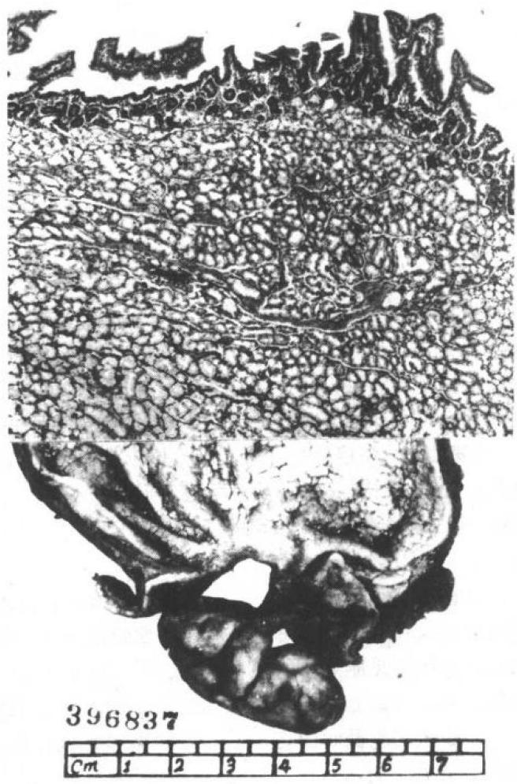 
上图为腺瘤光镜下形态，下图为腺瘤大体，呈有蒂息肉状，位于十二指肠球部
率相等，多见于儿童和青少年。临床特点是唇和口腔粘膜有过多黑色素沉着，有时手指足趾皮肤也有黑色素沉着。息肉最多见于小肠，特别是空肠，其次为胃和大肠。多数病人的息肉为多发性，但少数亦可仅有一个息肉，息肉直径从数 $\mathrm{mm}$ 到 $5\mathrm{cm}$ ，小者无蒂，大者有蒂。外形如大肠腺瘤。
光镜 由粘膜肌层的肌纤维增生形成树枝样结构，其上被覆息肉所在部位消化道正
常粘膜上皮、腺体和固有膜。粘膜与平滑肌核心保持正常的粘膜与粘膜肌层的关系。所以一般认为P-J息肉是一种错构瘤，但有少数报道P-J息肉发生癌变并转移至局部淋巴结。P-J息肉可合并消化道其它部位的癌、卵巢环管状性索瘤、宫颈高分化腺癌（恶性腺瘤）、卵巢粘液性肿瘤和乳腺癌等。
4. 腺瘤 小肠腺瘤可单发或多发，十二指肠和空肠较回肠多见，形态与大肠腺瘤同（详见大肠节）。腺瘤的癌变率与腺瘤大小、类型和上皮不典型增生的程度有关。大腺瘤、绒毛状腺瘤和伴重度不典型增生者易癌变，十二指肠和壶腹区腺瘤易癌变，特别是壶腹区绒毛状腺瘤的癌变率可高达 $86\%$ [25]。
# （二）小肠癌
小肠癌的发病率在消化道癌中不足 $1\%$ ，为什么小肠癌的发病率这样低原因不清楚。小肠癌的好发部位为十二指肠，上段空肠和下段回肠这些部位的癌与腺瘤恶变、乳糜泻和克隆病可能有关。十二指肠癌占小肠癌的 $1/4$ ，其中以壶腹区癌多见。
大体 小肠癌常长成环形引起肠腔狭窄，少数可长成乳头、息肉或结节状。组织学类型绝大多数为不同分化程度的腺癌。其它少见类型有小细胞癌与腺癌混合型和分化不良型癌（肉瘤样癌）。除转移至淋巴结外可种植至腹膜。5年存活率约 $20\%$ 。
# （三）神经内分泌肿瘤
1. 空肠回肠类癌：多见于老年人，年龄高峰60岁-70岁。好发部位为回肠下段，美克尔憩室亦能发生类癌[26]。肿瘤多数为单发，偶尔可多发。生长缓慢，确诊时常常已转移至局部淋巴结和肝。肿瘤所分泌的5-羟色胺的作用常在发生肝转移后才充分表现出来，可能是因为肿瘤长至足够大能分泌相当浓度的5-羟色胺时才能引起临床症状，所以类癌综合征（carcinoid syndrome）被视作长期亚临床病程的终末表现。
【病变】类癌体积一般较小。位于粘膜深部或粘膜下层向肠壁深部生长；或形成有蒂息肉突向肠腔，表面粘膜坏死而形成溃疡。如局部淋巴结已发生转移，则转移灶常较原发灶大。肿瘤质实，经甲醛固定后常呈亮黄色，而手术时原发瘤和继发瘤均为白色。
光镜 典型的类癌为大小一致的多角形细胞或柱状细胞，细胞排列成实性巢或条索，亦可成管状或腺泡样，细胞巢边缘的细胞为柱状，呈栅栏状排列形如基底细胞癌。HE染色切片有时可见胞浆中红色颗粒。银反应为亲银性（argentaffin），银颗粒位于核下部与基底膜之间。瘤细胞可浸润神经鞘或侵犯淋巴管和血管。肿瘤周围常可见肥大的平滑肌纤维。如瘤组织不及时固定可使5-羟色胺氧化或弥散到细胞外，这样使银反应呈阴性。间质纤维组织增生。
免疫组化除一般神经内分泌细胞标记如chromograninA、NSE、synaptophysin等阳性外可分泌5-羟色胺和多种肽类激素。
电镜 神经分泌颗粒核心电子密度高，形态不规则，大小不一，直径约 $300\mathrm{nm}$ 左右（图3-25）。
【类癌综合征】特点为间歇性面部皮肤潮红、阵发性水样泻、哮喘样发作、四肢抽搐、休克、右心功能不全等。颜面潮红很像绝经后的面部潮红。这种潮红特别鲜艳，其诱因常为感情冲动、进食、饮热的饮料或饮酒。一旦潮红持续长时间后受累处皮肤发生永久性改变即毛细血管持续性扩张使局部紫绀和明显的血管扩张，继之以玫瑰疹样改变，
图3-25 回肠类癌 
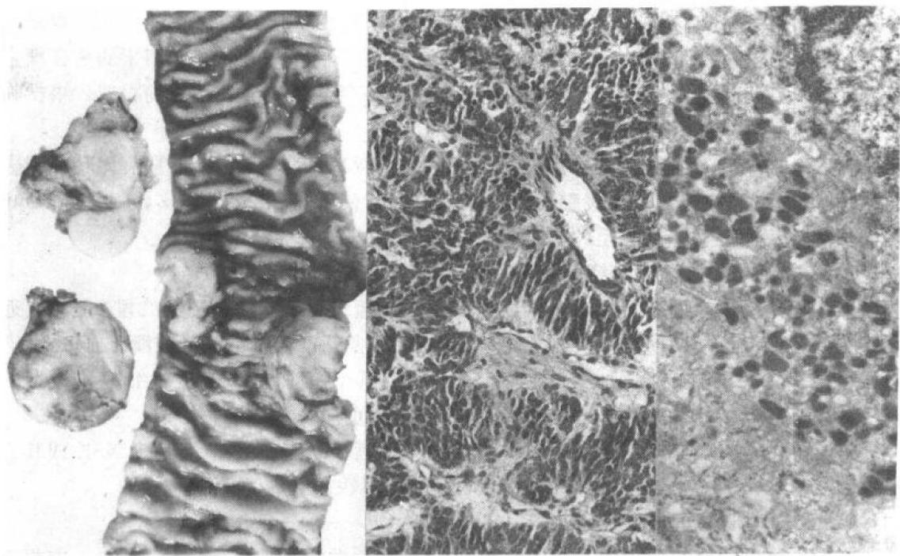 
左图：类癌大体及淋巴结转移；中图：类癌光镜下形态 
右图：电镜下示瘤细胞内大量分泌5-HT神经分泌颗粒
最后成糙皮病样（pellagra-like）。颜面潮红的机制尚不清楚。心脏病变主要累及肺动脉瓣和三尖瓣，瓣膜狭窄或闭锁不全。常常是肺动脉瓣狭窄而三尖瓣闭锁不全，瓣叶的纤维化导致像愈合的风湿性心内膜样改变。右心房心内膜可有纤维化或弹力纤维增生斑，右心室病变较轻。心内膜病变早期为局灶性粘多糖减少和散在肥大细胞、淋巴细胞、浆细胞浸润，后期纤维组织增生。个别病例亦可累及左心。
类癌综合征常发生在肝转移后的一种假说是正常5-羟色胺在肝内氧化灭活。当肝发生转移后，灭活能力下降，从而引起症状。右心病变亦是同样机制，血中5-羟色胺在肺内氧化灭活，所以左心很少受累仅右心受累。
2. 十二指肠类癌 好发部位依次为十二指肠第二段、第一段、第三段。年龄22岁-84岁，平均55岁[27]。男女发病率差别不大。十二指肠类癌是很特殊的一种类癌，常合并Von Recklinghausen病、Zollinger-Ellison综合征和多发性内分泌肿瘤（MEN）。肿瘤大体形态与空肠回肠类癌相似，但肿瘤为灰白色而不是亮黄色。
光镜 瘤细胞主要排列成花带状或腺样。银反应大多数为嗜银性（argyrophilic）。附于壶腹区的类癌常有砂粒体形成。
免疫组化 除一般神经内分泌细胞标记阳性外可分泌多种肽类激素如生长抑素、胃泌素、降钙素、胰多肽和胰岛素等[27]。
电镜 分泌颗粒根据所分泌的激素而异。
十二指肠和壶腹部还可发生杯状细胞类癌（腺类癌）[28]和小细胞神经内分泌癌[29]。杯状细胞类癌又称腺类癌或粘液类癌，其形态特点是散在成簇的杯状细胞内夹杂有内分泌细胞，常常呈嗜银反应阳性。
3. 其它神经内分泌肿瘤 小肠还可发生引起临床 Zollinger-Ellison 综合征的胃泌素瘤，分泌 Somatostatin 的生长抑素瘤，分泌 VIP 的 VIP 瘤和分泌胰高血糖素的高血糖素瘤，甚至罕见的胰岛素瘤。肿瘤为灰白色而不是亮黄色，形态与上述类癌相似，根据临床症状和免疫组织化学可确定其性质。
【转移和扩散】神经内分泌肿瘤很难从形态判断其良恶性，主要依靠有无转移来决定。恶性类癌可经腹膜扩散到腹腔。经血行转移到肝，偶尔可转移至肺、皮肤和骨等。Finn等[30]报道一例回肠类癌转移至卵巢腺癌。
# （四）神经节细胞性副神经节瘤（gangliocytic paraganglioma）
亦称副神经节神经瘤（paraganglioneuroma），此瘤多见于十二指肠第二段（壶腹之近端），偶尔见于空肠或回肠，瘤体小，有蒂。位于粘膜下，表面粘膜可破溃出血。
光镜 像类癌样的瘤细胞排列成巢或小梁，其中有散在的神经节细胞和梭形的 Schwann 细胞和/或支持细胞（sustenta cular cell）。间质可含淀粉样物质。
免疫组化 类癌样瘤细胞为胰多肽和/或生长抑素阳性，神经节细胞为NSE或其它神经标记阳性，Schwann细胞和支持细胞为S-100阳性，此瘤为良性。
# （五）平滑肌肿瘤
关于胃肠道间质肿瘤（stromal tumor）到底是肌源性还是神经源性分歧很大。有报道小肠间质肿瘤为神经源性，因多数S-100阳性；亦有报道大多数小肠间质肿瘤为S-100阴性，因此认为是肌源性[18]。小肠平滑肌瘤和平滑肌肉瘤不如胃和直肠多见。三段小肠平滑肌肿瘤的分布：十二指肠 $10\%$ 、空肠 $37\%$ 、回肠 $53\%$ 。起初是壁内肿瘤，以后突向肠腔，表面粘膜光滑，中心有溃疡，可引起便血。
光镜 形态与胃平滑肌肿瘤同。判断良恶性的标准亦与胃平滑肌肿瘤同。
# （六）淋巴组织增生和淋巴瘤
淋巴组织增生多见于婴幼儿、儿童和青少年。男性多见。好发于末段回肠。常形成单发或多发结节或息肉状物突入肠腔，引起肠梗阻或肠套叠，表面粘膜光滑。
光镜 为有生发中心的淋巴滤泡形成和多种多样的炎细胞浸润。
小肠淋巴瘤有三种：
1. 一般的淋巴瘤亦称西方型淋巴瘤（Western type lymphoma）占胃肠淋巴瘤的 $30\%$ ，小肠恶性肿瘤的 $19\% - 50\%$ ，多见于40岁以上中老年人，男女比例 $1.5:1 - 2:1$ 。以远段回肠多见，其次为空肠和十二指肠。大体形态：
（1）环形浸润或板状肠壁增厚，肠腔狭窄；
（2）形成单个巨块突入肠腔，表面有溃疡，或形成多发性息肉状肿物。
光镜 主要为各种类型的B细胞淋巴瘤，少数为T细胞淋巴瘤，何杰金病极罕见。有人认为这种淋巴瘤来源于肠相关的淋巴组织（gut-associated lymphoid tissue, GALT），亦称粘膜相关的淋巴组织（mucosa-associated lymphoid tissue, MALT）。GALT包括上皮内淋巴细胞、淋巴细胞和浆细胞弥漫分布在固有膜和粘膜、粘膜下淋巴样结节中，最大的是末段回肠的集合淋巴结（Peyer's patch）。这种GALT分布在整个小肠和大肠。
2. 地中海淋巴瘤（Mediterranean lymphoma）中东阿拉伯人、南非黑人和欧洲犹太人的小肠原发性淋巴瘤的发病率很高，占胃肠淋巴瘤的 $50\%$ 以上，小肠恶性肿瘤的 $95\%$ 。这种淋巴瘤多见于年青人（平均年龄21岁）。临床特点腹泻、消瘦、吸收不良、腹
痛和杵状指等。主要累及近段小肠特别是空肠，其次是十二指肠。
大体 粘膜皱襞弥漫增厚，伴或不伴粘膜结节或肿块形成，亦有少部分病例粘膜大体正常。
光镜 粘膜有带状弥漫性致密的淋巴样细胞浸润，包括成熟或未成熟的浆细胞、浆细胞样淋巴细胞、核裂或无核裂细胞和免疫母细胞。可有瘤性滤泡形成。浸润细胞一般限于固有膜，部分可浸透粘膜肌层达粘膜下层，但仍保持带状浸润方式。
腺上皮内有上述瘤细胞浸润称为淋巴上皮性病变（lympho-epithelial lesions）。
肿瘤的镜下形态为一多形性的B细胞淋巴瘤。如累及淋巴结，其形态亦为多形性B细胞淋巴瘤。部分地中海淋巴瘤分泌不正常的α-链免疫球蛋白，血清IgA增高，称为α-链病（alpha-chain disease）。一般认为吸收不良、浆细胞浸润和分泌不正常的α链免疫球蛋白可发生在地中海淋巴瘤出现之前。WHO提出的免疫增生性小肠病（immunoproliferative small intestinal disease, IPSID）包括地中海淋巴瘤、α-链病伴或不伴淋巴瘤和有吸收不良、浆细胞浸润和无血清不正常的α链免疫球蛋白[1]。地中海淋巴瘤腹腔外扩散罕见。因病变广泛所以手术效果不佳，放疗化疗也无明显疗效。早期时用抗生素治疗有效。
3. 淋巴瘤继发于长期乳糜泻或其它吸收不良综合征 这种淋巴瘤亦称肠病相关的 T 细胞淋巴瘤 (enteropathy-associated T cell lymphoma)。多见于空肠。
大体 呈多发性溃疡、狭窄、大斑块、结节和弥漫性增厚。局部淋巴结肿大。
光镜 大多数为多形性T细胞淋巴瘤或伴嗜酸性细胞浸润的T细胞淋巴瘤[19,31]。
# （七）其它肿瘤
小肠可发生脂肪瘤、血管瘤、淋巴管瘤、淋巴管血管瘤、血管球瘤、Kaposi肉瘤、血管肉瘤、神经纤维瘤、神经节瘤、恶性神经鞘瘤、横纹肌肉瘤、脂肪肉瘤、纤维肉瘤、骨骼外骨肉瘤和恶性间充质瘤。
# （八）转移瘤
主要来自黑色素瘤、肺癌、乳腺癌和绒癌等。
# 六、其他病变
# （一）肠气囊肿（gas cysts，pneumatosis intestinalis）
婴儿和成人都能发生肠气囊肿。男性多见。年龄30岁—50岁。空肠最常累及，但胃及大肠亦能发生，病变弥漫分布或仅累及一段或数段不相连的肠管。气囊肿直径自数mm至数cm。多数位于粘膜下层，但亦可在浆膜下，偶尔亦见于肠壁邻近的肠系膜内或淋巴结中。粘膜下层的气囊肿很少超过1cm，突入肠腔形成息肉状隆起。浆膜下和肠系膜的气囊肿可较大，气囊肿之间互不交通。偶尔粘膜下层气囊肿表面的粘膜可溃烂出血，浆膜下和肠系膜气囊肿可破入腹腔引起气腹。多数情况下气囊肿不引起症状，常为X线检查、剖腹探查甚至尸检时偶然发现。气囊肿内气体80%为氮，少部分为氧、二氧化碳、氢和甲烷。
光镜 气囊肿为薄壁囊肿，无上皮，囊内壁被以扁平细胞、组织细胞和多核巨细胞（图3-26）。
# （二）子宫内膜异位
小肠的子宫内膜异位较大肠少见。好发于回肠。主要位于浆膜，亦可见于肌层和粘膜下层。异位的子宫内膜应包括腺体和间质，病灶周围的肠壁常有纤维组织增生，由此
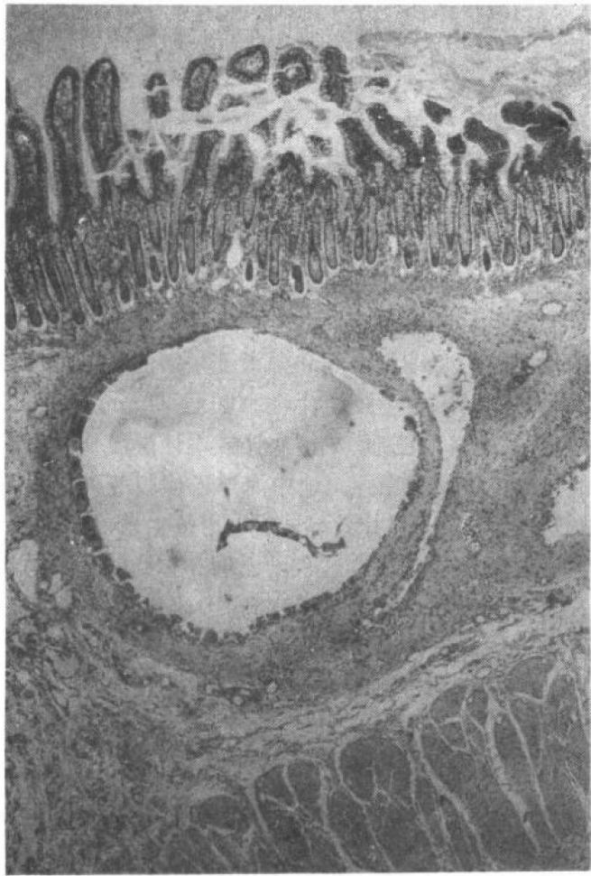 
图3-26 小肠气囊肿
而引起肠粘连、肠扭转和导致肠梗死。
# （三）棕色肠综合征（brown-bowel syndrome）
小肠（有时亦累及胃）外观棕色，这是由于肌层、粘膜肌层甚至小动脉壁肌层的平滑肌细胞内含有金黄色的颗粒。这种颗粒直径 $1\mu \mathrm{m} - 2\mu \mathrm{m}$ ，可能是一种脂褐素的混合物。色素沉着处无炎反应。这是一种由于维生素E缺乏的线粒体性肌病。
# 七、小肠活检
无论是用内窥镜、Crosby 小囊或其它工具取出的小肠活检，一部分组织用扫描电镜观察，另一部分应贴在滤纸上（粘膜面向上）放在生理盐水中经解剖显微镜观察绒毛的形态后，连同滤纸固定，常规制片。切片中绒毛和隐窝应垂直于粘膜肌层上，这样才能正确地测量绒毛高度和隐窝高度。绒毛高度（villous height，
VH）与隐窝高度（crypt height，CH）的比例是诊断营养不良（吸收不良）性疾病的必要依据。正常人小肠 $\mathrm{CH}: \mathrm{VH} = 0.43 \pm 0.1$ ，热带地区人的绒毛高度和隐窝高度均较低， $\mathrm{CH}: \mathrm{VH} = 0.45 \pm 0.13$ 。乳糜泻病人的绒毛萎缩，粘膜变平，但隐窝上皮增生。严重者绒毛完全萎缩，粘膜表面呈脑回或镶嵌状。小肠粘膜内浸润细胞的性质对一些病的诊断也很重要，如Whipple病时绒毛变形，固有膜内有多量巨噬细胞浸润，IgA缺乏时固有膜浆细胞减少等。
十二指肠和壶腹区腺瘤容易癌变。活检组织有时只有表面的腺瘤，这种病例应要求内窥镜医师再取腺瘤基底部组织检查，以明确有无癌变。
# 第四节 阑 尾
# 一、先天性畸形
# （一）阑尾重复
阑尾重复是罕见的畸形，常常并发盲肠重复。阑尾重复可呈双筒状包裹在同一肌层
内，或形成二个完全分隔的发育好的阑尾，或是一个正常阑尾伴有从盲肠长出的另一个发育不全的阑尾。
# （二）先天性阑尾缺如
阑尾缺如十分罕见。较常见的是阑尾发育不全，仅 $1\mathrm{cm} - 2\mathrm{cm}$ 长，宽度不超过 $3\mathrm{mm}$ 。常无粘膜亦无管腔。
# 二、阑尾炎
阑尾炎是常见病。急性发病时有发烧、呕吐、白细胞增多和右下腹痛等。任何原因引起阑尾血液循环障碍，使阑尾缺血就能导致阑尾粘膜损伤，这时如继发细菌感染就可造成阑尾炎。引起阑尾血液循环障碍的因素有：①由于蠕动障碍或血管神经失调引起的阑尾肌层痉挛或血管痉挛；②肠腔被粪石、寄生虫（如蛲虫）、异物、肿瘤、肠外纤维带或儿童和青少年的粘膜增生淋巴组织所堵塞。继发感染的细菌可来自粪便、血液或邻近脏器的炎性病灶。致病菌有大肠杆菌、链球菌和魏氏产气荚膜杆菌（clostridiumWelchii）等。
# （一）急性阑尾炎
1. 单纯性阑尾炎（卡他性阑尾炎）阑尾表面充血，浆膜稍混浊，粘膜糜烂或形成浅溃疡，腔内有中性白细胞渗出。肠壁各层有中性白细胞浸润，血管充血。如浆膜外有白细胞和纤维素渗出即阑尾周围炎。 
2. 化脓性阑尾炎 阑尾表面有灰白色脓性渗出物，腔内充满中性白细胞。各层有大量中性白细胞浸润及充血水肿。肌层可破坏而导致穿孔和局限性或弥漫性腹膜炎。浆膜外有大量纤维素性脓性渗出物。 
3. 坏疽性阑尾炎 常为化脓性阑尾炎继续发展的结果。由于系膜炎症使阑尾静脉血栓形成，从而引起阑尾广泛出血梗死。阑尾呈暗紫红色或发黑，阑尾各层广泛出血坏死和急性炎细胞浸润。肌层出血坏死严重者可引起穿孔。
# （二）亚急性阑尾炎
急性单纯性阑尾炎可转为亚急性。特点是阑尾各层特别是肌层内有嗜酸性白细胞浸润。
# （三）慢性阑尾炎
由急性或亚急性阑尾炎发展而来，亦可一开始就是慢性炎。主要病变为阑尾各层不同程度纤维化和淋巴细胞浆细胞浸润。
急性阑尾炎可自然愈合或反复发作成慢性，最后阑尾管腔闭锁，管壁广泛纤维化使阑尾成一纤维条索。阑尾周围炎愈合时亦可形成纤维带，使周围脏器组织粘连或引起肠梗阻。阑尾近端如发生堵塞，阑尾内容物不能排入盲肠，则可引起阑尾积脓、阑尾积液和粘液囊肿。
# （四）特殊类型阑尾炎
1. 阈尾结核、结节病和耶尔森菌感染 阈尾结核可继发于肺结核、腹膜结核或回盲部结核。阑尾壁内有干酪样坏死性结核结节。如果没有干酪样坏死，则应找到结核杆菌才能确诊。结节病亦能累及阑尾，但罕见。耶尔森（Yersinia）菌感染时可形成耶尔森假结核结节，结节中心坏死，形成小脓肿。有少量郎罕巨细胞。
2. 阈尾克隆病 克隆病患者常有急性或慢性阑尾炎史。阑尾克隆病的病变与消化道其它部位的克隆病相同。 
3. 阈尾寄生虫感染 常见的寄生虫感染有蛲虫、血吸虫和粪类圆线虫（Strongyloides stercoralis）等感染。许多切除的阑尾腔内常见蛲虫、蛔虫和鞭虫等虫卵。血吸虫感染后阑尾各层有大量血吸虫虫卵沉积伴嗜酸性白细胞浸润，嗜酸性脓肿和假结核结节形成。粪类圆线虫感染时有大量嗜酸性白细胞浸润和伴坏死的肉芽肿形成。 
4. 放线菌病 阑尾放线菌病十分罕见。一般呈慢性化脓性炎症，有大量纤维组织形成，并形成窦道通过腹壁开口于皮肤。有些病例在阑尾切除后形成持久的粪瘘，这种病例应考虑有放线菌病的可能。化脓性炎处可找到放线菌。 
5. 病毒感染 病毒感染时阑尾淋巴组织可显著增生，固有膜增宽。淋巴细胞和免疫母细胞浸润，后者可像R-S细胞，麻疹前驱期可出现阑尾炎，阑尾淋巴组织显著增生并有Warthin-Finkeldey型多核巨细胞。
# 三、肿瘤和瘤样病变
# （一）阑尾粘液囊肿和腹膜假粘液瘤
阑尾粘液囊肿是指阑尾腔内充满积存的粘液，使阑尾显著增粗。粘液囊肿可由炎症、粪石等堵塞近端肠腔后远端肠腔扩张而形成的单纯性粘液囊肿，或由阑尾粘液性囊腺瘤或粘液性囊腺癌引起。单纯性粘液囊肿粘膜萎缩，粘膜上皮扁平，无增生或不典型增生。阑尾粘液囊肿可破裂，粘液逸入腹腔形成腹膜假粘液瘤（pseudomyxoma peritonei）。腹膜假粘液瘤亦可来自卵巢粘液性囊腺瘤或囊腺癌破裂。逸入腹腔的上皮细胞（良性或恶性）均能继续分泌粘液，使腹腔脏器广泛粘连。单从形态很难判断假粘液瘤的良恶性，可能许多例子是分化好的粘液腺癌在腹腔内的播散，其中癌细胞被其分泌的大量粘液所掩盖。阑尾的粘液性肿瘤与卵巢粘液性肿瘤形态相同，亦可同时发生。如卵巢肿瘤为双侧性，卵巢表面有粘液和不典型的粘液细胞，则卵巢粘液性肿瘤很可能是继发性[32]。
阑尾粘液球状体病（myxoglobulosis）是粘液囊肿的一种变异，占粘液囊肿的 $10\% - 20\%$ 。特点是扩张的阑尾腔内充有许多直径 $0.3\mathrm{cm} - 1\mathrm{cm}$ 的白色透明珍珠样的小球，部分小球可钙化。小球的中心为含细胞碎片和含铁血黄素的嗜酸性颗粒状物构成的核心，外周为无细胞的层状粘液凝结物。
# （二）息肉和腺瘤
阑尾偶尔发生增生性（化生性）息肉、幼年性息肉和P-J息肉。幼年性和P-J息肉通常是这二种息肉病（polyposis）累及阑尾。
阑尾亦可发生腺管状、绒毛状和绒毛腺管状腺瘤，有蒂或广基，但均罕见。腺瘤形态与大肠腺瘤相同。
# （三）神经内分泌肿瘤
阑尾是类癌的好发部位，阑尾类癌占阑尾肿瘤的 $85\%$ 。多见于青年人，20岁一30岁。男女发病率无差别。最常见的部位是在阑尾的盲端或其邻近。常常是在因阑尾炎切除的阑尾中偶然发现。多数呈局限的结节， $70\%$ 直径 $< 1\mathrm{cm}$ 。银反应有亲银和嗜银二种，前者呈亮黄色，后者灰白色。
光镜 瘤细胞主要排列成实心细胞巢，少数可呈花带、腺样或菊形团样。类癌可侵
入肌层，少数可弥漫浸润阑尾壁达浆膜。电镜 可找到神经分泌颗粒。
免疫组化除一般神经内分泌细胞标记阳性外，可显示多种肽类和胺类激素如 somatostatin、P 物质、PYY、VIP、ACTH、GHRH、enteroglucagon 和 5-HT 等免疫反应性。阑尾可发生杯状细胞类癌（腺类癌、粘液类癌），在成小簇或条索的杯状细胞内夹杂有神经内分泌细胞。这种双向分化的类癌免疫组化显示 CEA 阳性，神经内分泌细胞标记亦是阳性。
电镜 可见粘液颗粒和神经分泌颗粒。
阑尾类癌很少发生类癌综合征，这可能是由于阑尾类癌常合并阑尾炎而容易被发现，另外阑尾类癌很少转移的原因。杯状细胞类癌较一般类癌恶性， $15\%$ 可发生转移[33]。
# （四）腺癌
除盲肠癌累及阑尾或阑尾原发性粘液性囊腺癌外，阑尾原发的腺癌很罕见。症状像阑尾炎或为右髂窝包块。手术时常见阑尾已为癌代替，有些癌已破溃入盲肠。
光镜 形态与各种类型的大肠腺癌同。粘液性囊腺癌与卵巢的粘液性囊腺癌形态相同。有一种印戒细胞癌需要与杯状细胞类癌相区别，前者像皮革胃，浸润广泛，核异型性明显；后者神经内分泌细胞标记阳性。
电镜 可找到分泌颗粒和肿瘤较局限。
# （五）淋巴瘤
常为全身淋巴瘤的一部分。预后远较消化道其它部位的淋巴瘤差。
# （六）其它肿瘤
阑尾平滑肌瘤、脂肪瘤、血管瘤、血管肉瘤、神经纤维瘤（作为单个肿瘤或Von Recklinghausen病的一部分）均极少见。阑尾颗粒细胞瘤应与阑尾非肿瘤性平滑肌颗粒细胞变性相区别，后者PAS强阳性，前者PAS弱阳性。
# （七）转移瘤
阑尾转移瘤主要来自消化道、乳腺和女性生殖器的原发瘤。
# 四、其他病变
阑尾的其他非肿瘤性病变有胃或食管粘膜异位、子宫内膜异位和蜕膜反应、憩室或憩室病和阑尾淋巴组织增生导致阑尾套叠入盲肠。憩室病一般合并囊性纤维化（粘液粘稠症），由于粘稠的粘液堵塞，使阑尾腔内压力增加而形成多数憩室。憩室可继发炎症即憩室炎。
# 第五节 大肠和肛门
# 一、先天性畸形
# （一）肠重复和囊肿
大肠重复和囊肿均极罕见。重复可见于盲肠、横结肠和直肠。重复肠管位于正常肠的系膜侧，有粘膜及粘膜肌层，但肌层不完整。先天性囊肿可能是尾肠（tailgut）的残留物。
# （二）Hirschsprung病（Hirschsprung'sdisease）
Hirschsprung病又名先天性巨结肠或结肠神经节细胞缺如症（aganglionosis）。是一种少见病，发病率为 $1 / 20000 - 1 / 30000$ 活产的新生儿[1]。此病见于婴幼儿和儿童，偶见于成人。男孩比女孩多6倍一9倍，男孩常有家族史。婴幼儿症状为便秘，腹部胀气和反复发作的肠梗阻。较大儿童主要症状为持久性便秘。Hirschsprung病的结肠显著扩张肥大，其下端连接一段狭小的直肠，所以临床检查时肛门正常，而肛管直肠狭小而空虚，直肠以上肠管明显扩张。 $90\%$ Hirschsprung病病人的狭窄段长 $3\mathrm{cm} \sim 40\mathrm{cm}$ 不等。多数仅累及肛管和直肠或直肠和乙状结肠，称为短段（short segment）Hirschsprung病，少数病例狭窄段可很长，甚至包括大部或全部结肠，称为长段（long segment）Hirschsprung病，这样的患儿在出生前就死亡。Hirschsprung病的病理基础是狭窄段肠壁粘膜下和肌内神经丛发育异常，无神经节细胞。由于无神经节细胞，狭窄段长期痉挛收缩，狭窄段以上的肠管扩张。扩张段自降结肠至回盲瓣，肠管直径可达 $15\mathrm{cm} \sim 20\mathrm{cm}$ ，形如一长形气球。肠壁一般肥厚，但肠腔极度扩张者，肠壁可变薄。扩张肥厚的肠管内积有大量的气体、粪便或粪石。粪石的长期压迫侵蚀粘膜可引起粘膜炎症和溃疡形成。检查狭窄段肠壁，粘膜下和肌内神经丛中无神经节细胞，伴以致密波浪状的无鞘神经纤维增多，特别是肌内神经丛中神经纤维增生和变性，Schwann细胞增多。
诊断Hirschsprung病通常用切取或吸取活检，活检必须取自肛门上 $2\mathrm{cm}\sim 3\mathrm{cm}$ ，应包括肠粘膜、粘膜肌层和至少部分粘膜下层，用组织化学方法染乙酰胆碱酯酶（acetylcholinesterase），固有膜和粘膜肌层此酶活性明显增加，免疫组化NSE和S-100效果更好，可显示无神经节细胞和增生肥大的神经纤维。粘膜内分泌细胞减少。
假性Hirschsprung病是指一组具有此病症状但肠壁尚有一定数量的神经节细胞，神经纤维亦不一定增生肥大。假性Hirschsprung病包括少神经节细胞症(hypoganglionosis)、节段性或带状少神经节细胞症(zonal hypoganglionosis)、原因不明性便秘和神经元不典型增生(neuronal dysplasia)。神经元不典型增生是指粘膜下层和肌层神经节细胞增生，形成巨大神经节，偶尔固有膜内亦能见到神经节细胞。
后天性巨结肠见于慢性器质性肠梗阻如因炎症或肿瘤引起的肠梗阻，由于CMV感染或Chagas病引起的肠壁神经丛变性，或由于功能性紊乱如病人有精神因素或长期慢性便秘等，后天性巨结肠肠壁神经节细胞正常，肠管的扩张也不如Hirschsprung病明显。
# （三）先天性肛门闭锁
$75\%$ 先天性肛门闭锁的患儿其直肠为盲端。直肠盲端与体表之间有一很宽的分隔。肛门部仅见一小的皮肤凹陷，肛管和肛门不发育。 $10\%$ 的患儿肛门发育正常，但直肠下部为盲端， $5\%$ 或更少的病例肛门和直肠间有一薄膜分隔（肛门膜），其它都正常。另有 $10\%$ 为单纯性肛门狭窄。
# 二、炎症
# （一）溃疡性结肠炎（ulcerative colitis）
溃疡性结肠炎是一种反复发作和缓解的炎症，与克隆病一起统称为炎性肠病(inflammatorybowel disease)。虽经广泛研究溃疡性结肠炎的病因至今不明，曾考虑过的发病因素有感染、食物因素、免疫缺陷、分泌的粘液异常、基因缺陷和心理性不正常等。
溃疡性结肠炎的发病以北美和欧洲为高，但全世界均有散发，犹太人易患此病，美国白人比黑人发病率高。年龄高峰为20岁～40岁。成人患者中女性多于男性，而14岁以下的儿童则男女发病率相近。
【病变】溃疡性结肠炎的病变特点为连续性弥漫性粘膜和粘膜下层炎症。很少累及肌层和浆膜。炎症为渗出性和出血性，一般不形成肉芽和疤痕组织，所以溃疡性结肠炎不发生肠狭窄。
病变起始于直肠，向近端蔓延至脾曲，亦可累及整个结肠甚至末段回肠。
大体 手术切除之肠管浆膜保持其光滑光泽的外观，血管充血明显，结肠长度缩短，这是由于肌肉痉挛收缩所致而不是由于肠壁纤维化。肠管缩短在远段结肠和直肠为显，直肠缩短可造成骶骨-直肠间距离增宽，这是溃疡性结肠炎重要的X线依据。肠长度缩短的同时可伴肠周径变小。剪开肠管有大量血性液涌出，粘膜呈颗粒状或天鹅绒状，质极脆，粘膜可大片剥脱而暴露肠
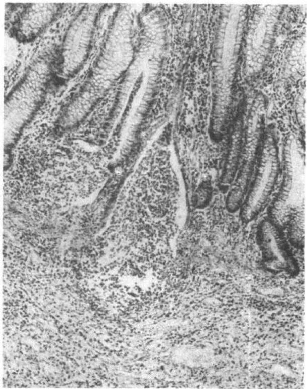 
图3-27 溃疡性结肠炎隐窝脓肿
壁肌层。溃疡一般表浅，呈线状沿结肠带分布或呈斑块状分布。粘膜病变为连续性，溃疡之间的粘膜亦有病变。病变先从直肠或直肠乙状结肠开始，所以有特发性直肠炎之称。病变总是远段重，近段轻；左半结肠重，右半结肠轻，随着炎症的发展，粘膜面可出现许多炎性息肉。炎性息肉是由于粘膜全层溃疡后其周围粘膜潜行隆起并突入肠腔所致。这些炎性息肉大小形态形形色色，并相互粘连成粘膜桥，多发性炎性息肉多见于结肠，直肠较少见。 $10\%$ 可累及末段回肠，回肠病变与结肠病变相连续，回盲瓣变硬、扩大和闭锁不全。 $60\%$ 可累及阑尾。
光镜 粘膜和粘膜下层血管高度扩张充血和水肿，有弥漫性炎细胞浸润。炎症最初限于粘膜，上皮和腺体受损后炎症可蔓延至粘膜下层。肌层和浆膜一般正常。溃疡较表浅，从粘膜浅糜烂到粘膜全层溃疡。溃疡底位于粘膜下层，深者达肌层表面。溃疡底仅有薄层肉芽组织。粘膜隐窝因肠腺开口堵塞而扩张积脓，形成隐窝脓肿（图3-27）。隐窝脓肿亦见于克隆病、细菌性结肠炎、阑尾炎和肠癌继发感染时，但在溃疡性结肠炎特别多见。隐窝脓肿一方面把脓液排入肠腔，另一方面向固有膜和粘膜下层破溃，炎症遂沿粘膜和粘膜下层纵深扩散，使该处组织坏死形成溃疡，周围粘膜潜行并形成炎性息肉（图3-28）。粘膜表面上皮和隐窝上皮增生，核增大深染。杯状细胞减少。溃疡愈合后粘膜萎缩，隐窝不规则分支状，排列紊乱，隐窝底与粘膜肌层表面之间有一空隙，粘膜肌
层增厚。杯状细胞数逐渐恢复正常。
图3-28 溃疡性结肠炎 
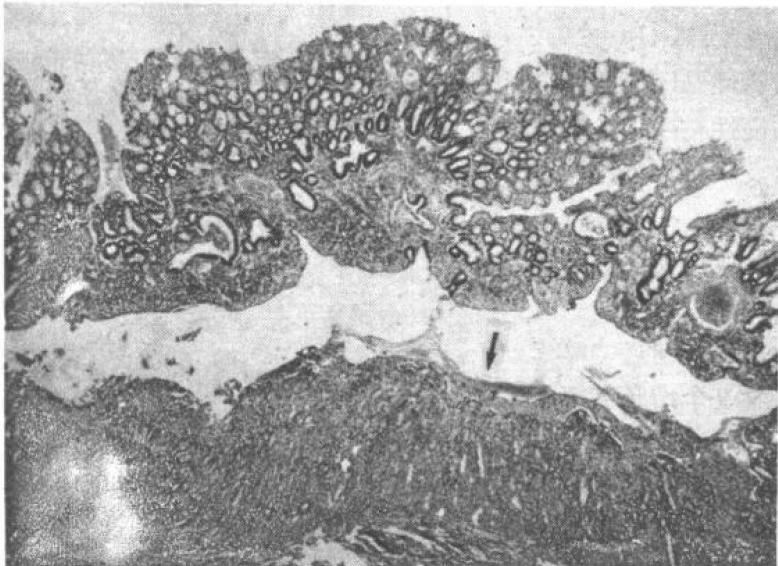 
炎性息肉，箭头所指为溃疡面
# 【合并症】
1. 中毒性巨结肠（toxic megacolon）约 $5\% \sim 13\%$ 溃疡性结肠炎呈暴发型。一段结肠（通常是横结肠）呈急性极度扩张，肠壁变薄而脆，像一张沾湿的滤纸，常伴有自发的或手术引起的单个或多发性穿孔伴以纤维素性或纤维素性脓性腹膜炎，粘膜有广泛溃疡甚至完全剥脱暴露肌层。
光镜 显肠壁全层炎和急性血管炎。中毒性巨结肠如不急症手术可致死，死亡率很高。
2. 癌变 溃疡性结肠炎合并肠癌的发病率比正常人群高5倍～10倍，癌变率与病程成正比。发生癌的危险性病程10年者为 $5\%$ ，20年 $20\%$ ，25年 $40\%$ 以上。不管溃疡性结肠炎发病时的年龄，50岁左右的病人发生癌的危险性最高。全结肠炎比仅限于远段肠的溃疡性结肠炎更易癌变。长期慢性病例比急性反复发作者易癌变。由溃疡性结肠炎发展来的癌有三个特点：①多发性；②病灶呈扁平浸润灶，边缘不清楚，像胃的浸润性癌；③低分化癌和粘液腺癌多见。
光镜 可见上皮不典型增生到原位癌和浸润癌的不同阶段，呈斑点状分布。因此要多作切片或多作活检以检出那些肉眼看不到的小癌灶。癌变与炎性息肉无关，事实上癌更多的是从扁平萎缩的粘膜发生。
3. 其它合并症 肝病（脂肪肝、慢性肝炎、肝硬化和硬化性胆管炎）、皮肤病（结节性红斑和坏疽性脓皮病）、关节病和眼病等。
# （二）克隆病
结肠克隆病形态与小肠克隆病同。
# （三）非特异性细菌性结肠炎
Shigella、Salmonella、Campylobacter、E. coli等均能引起结肠炎，形态与早期溃疡性
结肠炎相似。粘膜有散在匐行溃疡，表面有粘液脓性渗出物。粘膜及粘膜下层水肿充血和急性炎反应。溃疡一般较浅，很少引起肠穿孔。Shigella引起的结肠炎即杆菌痢疾可合并心肌炎、脾炎、肝脓肿和关节积液等。一种暴发型的杆菌痢疾称为中毒性痢疾，患者有严重的全身中毒症状，病情急骤，病人常死于中毒性休克或呼吸循环衰竭。尸检见肠道病变不明显，仅有充血水肿及轻度炎反应。
# （四）阿米巴痢疾
由 Entamoeba histolytica 引起。全世界均有发病，热带比温带多见。盲肠和升结肠较多见。 $5\% \sim 10\%$ 发生穿孔。早期病变是粘膜面出现黄色小的隆起灶，内含半液体状坏死组织，坏死组织中有阿米巴滋养体。这些隆起灶破溃后形成溃疡，阿米巴滋养体继续繁殖并渗入溃疡底和溃疡周围的粘膜下层，从而形成口小底大烧瓶状溃疡。溃疡常呈卵圆形，边缘潜行，底部覆以絮状坏死物质（图3-29），严重病例溃疡可融合成片，残留的粘膜成散在孤立的小岛分布在溃疡之间。
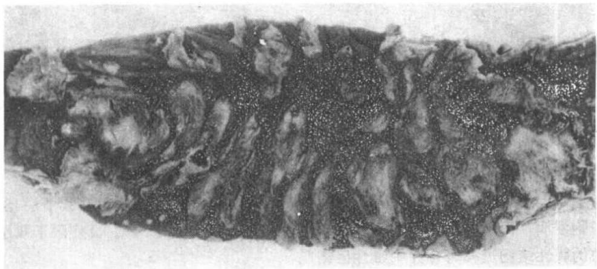 
图3-29 阿米巴性结肠炎
光镜 肠壁充血水肿和白细胞浸润于渗出物中。溃疡周围和溃疡底部坏死组织中可找到阿米巴滋养体，特别是坏死组织和健全组织交界处为多见。肠壁血管内亦能见到阿米巴滋养体。阿米巴滋养体在HE染色切片中呈灰蓝色，较巨噬细胞略大，有 $1\sim 4$ 个核，胞浆内含有被吞噬的红细胞，滋养体PAS和糖原染色均阳性。
阿米巴滋养体可随静脉血回流至肝，在肝内形成单个和多发性阿米巴性肝脓肿。脓肿可破入腹腔，或与横膈粘连后破入胸腔和肺，在肺内形成阿米巴性肺脓肿。亦可随血流至脑、肾、脾等处形成病灶。阿米巴痢疾的其他合并症还有肛门周围阿米巴性溃疡或肉芽肿、多发性关节炎和长期慢性阿米巴痢疾所引起的肠壁纤维化甚至肠狭窄。
# （五）伪膜性结肠炎
伪膜性结肠炎（pseudomembranous colitis）是由厌氧菌clostridium difficile毒素引起，病人的大便经特殊培养基培养，可分离出C. difficile菌及其毒素。病变肠呈暗紫色，肠腔扩张，内含血性内容物。早期病变是粘膜表面有散在黄白色的斑，自针尖大至直径1cm或更大（图3-30）。随着病变的进展，黄白色的斑逐渐扩大融合成片状或桥形的伪膜覆盖在粘膜皱襞的表面。
光镜 在黄白色斑下的粘膜隐窝（肠腺）上皮分泌亢进，分泌大量粘液充塞隐窝腔，隐窝腔因多量粘液和中性白细胞的浸润而明显扩张。随着病变的发展隐窝上皮变性坏死，
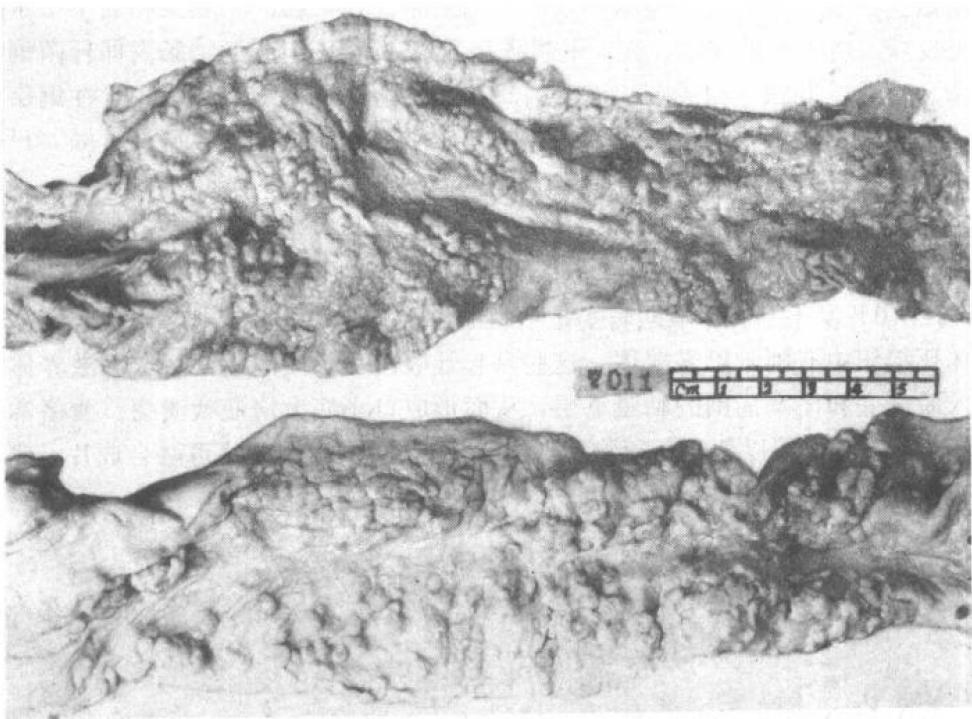 
图3-30 伪膜性结肠炎
随同粘液和中性白细胞一起排至粘膜表面，形成一蘑菇云样覆盖在病变粘膜的表面，病变后期隐窝上皮完全坏死脱落只剩隐窝的轮廓（鬼影）。病变处粘膜及粘膜下层充血水肿和炎细胞浸润，而病变之间的粘膜正常或显轻度炎反应（图3-31）。炎症限于肌层以上。严重的伪膜性结肠炎亦可合并中毒性巨结肠。
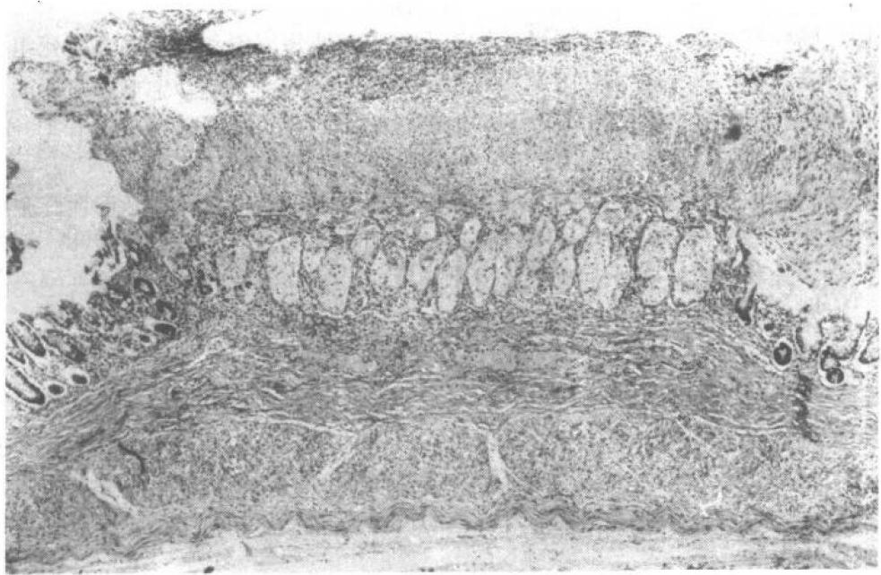 
图3-31 伪膜性结肠炎
病变段肠粘膜腺体高度扩张，腺上皮坏死，表面覆盖伪膜，病变两侧肠粘膜基本正常
# （六）病毒性结肠直肠炎
主要发生在免疫缺陷的病人。巨细胞病毒（CMV）感染的肠粘膜有散在大小不等的溃疡形成。在隐窝上皮细胞、巨噬细胞、纤维母细胞和血管内皮细胞的核和胞浆内可见巨细胞病毒包涵体（图3-32）。单纯性疱疹病毒（HSV）感染主要累及直肠远段 $10\mathrm{cm}$ 的直肠，粘膜脆，有溃疡形成。
图3-32 CMV肠炎 
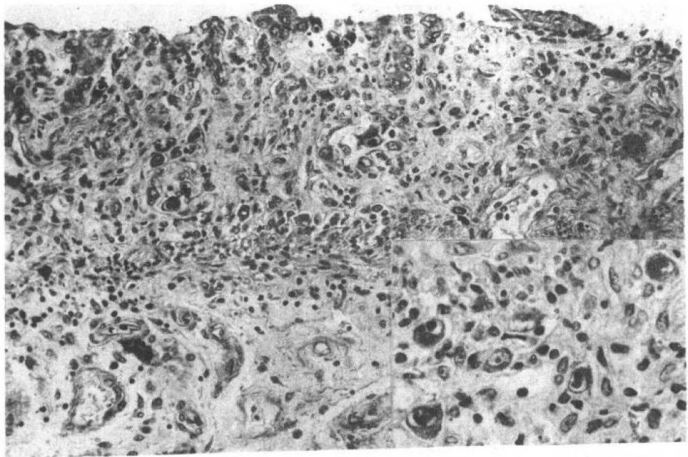 
右下插入图示胞核内和/或胞浆内包涵体
光镜 直肠粘膜内有多核巨细胞、核内包涵体和血管周围淋巴细胞浸润。
# （七）过敏性结肠直肠炎
这是由于食物过敏特别是牛奶过敏引起的肠炎。婴幼儿多见。主要症状为腹泻和直肠出血。
光镜 肠壁特别是上皮和固有膜内有大量嗜酸性白细胞浸润。
# （八）胶原性结肠炎（collagenous colitis）
主要症状为持续性或间断性（可持续数周、数月甚至数年）的肠绞痛。并有长期水样泻，但病人无明显消瘦或脱水。X线及内窥镜检查基本正常。
光镜 上皮下有明显增厚的胶原纤维带。正常上皮下的胶原纤维带厚度 $3\mu \sim 7\mu$ ，胶原性结肠炎时厚度 $10\mu \sim 70\mu$ ，一般均在 $15\mu$ 以上，这种胶原纤维带的增厚以隐窝间的表面上皮下为最明显。胶原纤维带为致密的网织纤维丝构成的网，偏光显微镜下为双折光，淀粉样物染色阴性。胶原纤维带中包裹有一些浆细胞、淋巴细胞、组织细胞和纤维母细胞。粘膜固有膜中有淋巴细胞、浆细胞和肥大细胞浸润，上皮内可有淋巴细胞浸润。
电镜 带内的纤维母细胞实为肌纤维母细胞。
免疫组化 胶原纤维带为Ⅲ型胶原强阳性[34]，而正常的基底膜为Ⅳ型胶原、层素laminin和纤维连接蛋白（fibronectin）。诊断胶原性结肠炎应将胶原纤维带的增厚和炎反应结合考虑，而且标本应避免斜切，这样才能正确测出带的厚度[35]。
# （九）Behcet病
Behcet病的大肠和小肠都可出现病变，主要是粘膜溃疡，单个或多发，溃疡限于一段肠管（主要是回盲部）或弥漫分布，主要累及结肠，溃疡一般较深， $50\%$ 可合并穿孔。亦可见到裂隙状溃疡、鹅口疮样溃疡和长 $3\mathrm{cm} \sim 5\mathrm{cm}$ 的线形溃疡。溃疡之间的粘膜正常（与溃疡性结肠炎不同），也不发生纤维化和肠狭窄（与克隆病不同）。除溃疡外还有淋巴细胞性血管炎，主要累及静脉和小静脉。
# （十）血吸虫病（Schistosomiasis）
亚洲流行的血吸虫为日本血吸虫(Schistosoma japonicum)，埃及血吸虫（S.hematobium）流行于非洲、中东及埃及，梅氏血吸虫（S.mansoni）流行于非洲和中南美洲。
污染水中的尾蚴穿入皮肤后经血液循环至肝，在肝内变成成虫后移居肠系膜静脉，特别是肠粘膜下层静脉，在该处产卵。肠壁病变主要是虫卵引起。在虫卵周围有大量嗜酸性白细胞浸润和假结核结节形成。粘膜可有溃疡形成。慢性期粘膜面有多量炎性息肉。肠壁由于肉芽肿形成和纤维化而引起肠狭窄。
# （十一）肠结核
大肠结核比小肠少见，多数发生在回盲部。形态与小肠结核同。增殖性肠结核有时与克隆病很难鉴别。诊断肠结核的依据是干酪样坏死和有结核杆菌。肠系膜淋巴结的检查很重要，因有些增殖性结核，肠壁病变可以与克隆病完全相同，但肠系膜淋巴结通常有干酪样坏死。
# （十二）耶尔森结肠炎（Yersinia colitis）
耶尔森菌可引起末段回肠炎、阑尾炎、肠系膜淋巴结炎和结肠炎。回肠、阑尾和肠系膜淋巴结病变均为淋巴组织细胞增生和中心有小脓肿的上皮样细胞肉芽肿形成。肠粘膜可发生坏死和溃疡形成。结肠病变主要为深浅不一的溃疡形成和非特异性炎症。
# 三、缺血性结肠炎（ischemic colitis）
多见于50岁以上。常伴有动脉硬化、糖尿病、胶原血管病如硬皮病、类风湿和Wegener肉芽肿以及口服避孕药或其它引起血管收缩的药物。病变部位：右半结肠 $8\%$ ，横结肠 $15\%$ ，脾曲 $23\%$ ，降结肠 $27\%$ ，乙状结肠 $23\%$ ，直肠 $24\%^{[36]}$ 。病变常为节段性，上下均有正常的肠管。病变分二个阶段。
1. 急性缺血性坏死 症状为发作性腹痛和便血。X线见病变肠有典型的指纹症(thumb-printing sign)，这是由于粘膜下层出血水肿所致。肠管病变从轻的粘膜水肿、溃疡到严重的梗死样病变。粘膜有鹅卵石样改变。由于坏死，粘膜显著变薄。粘膜下层因高度水肿出血而显著增宽。血管内有血栓形成。肌层多数正常，有时可有斑点状坏死，但很少发生肌层全层坏死而致肠穿孔者。
2. 缺血性狭窄 上述急性期可毫不察觉地进入狭窄期。
大体 狭窄段肠管呈梭形，长短不一。长的可达数十cm，短的仅数cm。狭窄处两端变细。有时肠壁呈不规则的囊性扩张，这是由于肌层的灶性纤维化所致。粘膜面有散在纵形和匐形溃疡。肠系膜静脉常有机化血栓。
光镜 粘膜全层溃疡，粘膜下层有肉芽组织和疤痕组织形成，炎细胞浸润和多量含铁血黄素沉着。小动脉硬化，管壁增厚，管腔狭窄，溃疡周围血管有时有纤维素样坏死。
纤维化可累及粘膜肌层、粘膜下层和浅表肌层。
# 四、憩室、憩室病和憩室炎
大肠先天性憩室很少见，好发于盲肠和升结肠。先天性憩室具正常肠壁的四层结构。
后天性大肠憩室多见于50岁以上老人。欧美和澳大利亚多见，亚洲、非洲和部分南美少见。左半结肠特别是乙状结肠多见，但大肠各段均能发生。后天性憩室主要是一种推出性憩室。憩室壁只含粘膜层，外包以薄层外纵肌、浆膜和脂肪组织。憩室呈球状，与肠腔交通处为一狭窄的颈。后天性憩室很少单发，多数为多发性即憩室病。憩室病 $80\%$ 发生在乙状结肠，其次为降结肠、升结肠和盲肠，偶尔整个结肠均为憩室病。憩室主要位于肠系膜和肠系膜对侧结肠带之间的肠壁，很少发生在肠系膜对侧两个结肠带之间的肠壁。憩室粘膜自肠壁肌层薄弱处突向肠壁外。打开憩室病的肠管，在肠系膜和它对侧的结肠带之间可见两排憩室口，每一憩室有一窄颈，肠内容常滞留在憩室内并形成粪石。肠壁环肌增厚呈波纹状，肌波之间的肠壁膨出，其尖端突入肠周脂肪组织内即成憩室。结肠带增厚，质如软骨。
憩室病的主要合并症是憩室炎、穿孔、出血、肠梗阻和膀胱结肠瘘等。
# 五、肿瘤和瘤样病变
# （一）息肉和息肉病（polyposis）
多发性息肉称为息肉病。大肠息肉和息肉病有以下几种：
1. 炎性息肉病又称假息肉病。是由于肠粘膜在某些肠炎如溃疡性结肠炎、克隆病和肠结核时形成溃疡，溃疡边缘粘膜潜行、隆起并突入肠腔而成。炎性息肉病的息肉可很多。 
2. 良性淋巴样息肉和良性淋巴样息肉病 淋巴样息肉通常为小圆形广基肿物。多见于直肠的下1/3。常为单个，有时亦可有 $4 \sim 5$ 个。男性较多见，年龄高峰20岁～40岁。无症状，常为体检时偶然发现。直径自数 $\mathrm{mm}$ 至 $3\mathrm{cm}$ 。表面很少破溃。
光镜 为增生的淋巴组织，有淋巴滤泡形成，其形态像正常淋巴结但无包膜和淋巴窦。表面粘膜随息肉的增大而呈不同程度萎缩。淋巴样息肉病很少见。结肠和直肠淋巴组织增生，形成息肉。
3. 增生性（化生性）息肉是一种良性广基扁平的小息肉。多见于直肠和左半结肠，亦见于大肠的其它部位甚至阑尾，息肉随年龄增长而增多。增生性息肉直径自数 $\mathrm{mm}$ 到 $1\mathrm{cm}$ ，多数为 $0.2\mathrm{cm} \sim 0.5\mathrm{cm}$ 。有时可自行消退。常常为多发，尤其是大肠癌周多见，但与癌的发生无关。表面与周围粘膜的色泽相同。
光镜 息肉由变长扩张的隐窝构成，杯状细胞减少，隐窝上皮增多呈假复层排列并形成小乳头突入隐窝腔内，使隐窝腔面呈锯齿状。整个形态像分泌期子宫内膜（图3-33）。隐窝底部和中部核分裂多见。固有膜有淋巴细胞和浆细胞浸润，增生性息肉是隐窝上皮细胞过成熟，向表面移动慢以致许多细胞堆积在一起，形成假复层和小乳头。
4. 性质未定的息肉 这类息肉的性质至今未完全确定，多数认为是错构瘤，亦有认为是炎性、变态反应性或肿瘤性。
（1）幼年性息肉（juvenile polyp）：又名滞留性息肉(retention polyp)。多见于儿童和
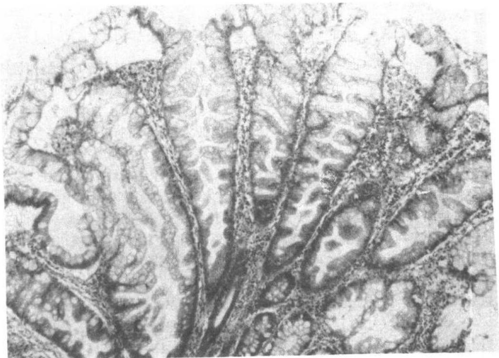 
图3-33 结肠增生性息肉
青少年。约 $10\%$ 可发生在成人。直肠多见，临床特点为便血，有时息肉可自行脱落随粪便排出。
大体 为球形有蒂肿物，表面光滑，切面有多数囊性扩张区。
光镜 息肉内腺体呈不同程度囊性扩张，腺上皮分化成熟无增生或不典型增生，间质丰富，由大量肉芽组织构成，其中有大量炎细胞，特别是嗜酸性白细胞浸润。息肉表面上皮常坏死脱落而形成溃疡面。一般认为幼年性息肉病（juvenile polyposis）可癌变，单个幼年性息肉不会癌变，但协和医院曾遇到一例单个幼年性息肉癌变成印戒细胞癌（图3-34，3-35）并转移到局部淋巴结。息肉的蒂部和周围肠壁均无癌。幼年性息肉可合并腺瘤，形成混合型。
(2）Peutz-Jeghers息肉：与小肠P-J息肉同。
# （二）腺瘤
腺瘤是大肠最常见的良性肿瘤。目前通用的分类为：腺管状腺瘤、绒毛状腺瘤和绒毛腺管状腺瘤。诊断腺瘤的依据是腺瘤上皮应显不同程度的不典型增生。
1.腺管状腺瘤 初起时为广基圆丘状肿物，以后逐渐长大成球形，有蒂。直径 $1\mathrm{cm}\sim 3\mathrm{cm}$ ，有时可 $>5\mathrm{cm}$ 。表面光滑，略成分叶状。此型腺瘤最多见。
光镜 由排列紧密的腺体构成，腺体背靠背，固有膜很少。腺上皮显不典型增生。蒂是由正常的粘膜及粘膜下层构成。
2. 绒毛状腺瘤 广基，体积较大，表面粗糙，由无数指状突起构成。腺瘤边界不如腺管状腺瘤清楚，手术不易切净，所以易复发。
光镜 指状突起中心为粘膜固有膜，表面为增生和不典型增生的腺上皮。指状突起
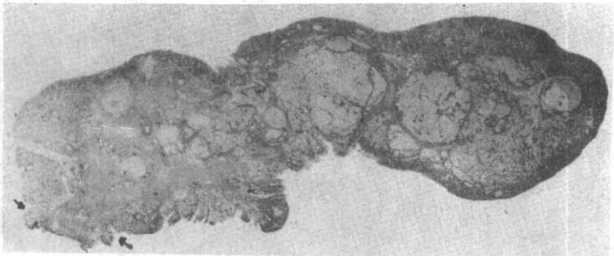 
图3-34 结肠幼年性息肉癌变
图3-35 结肠幼年性息肉病变 
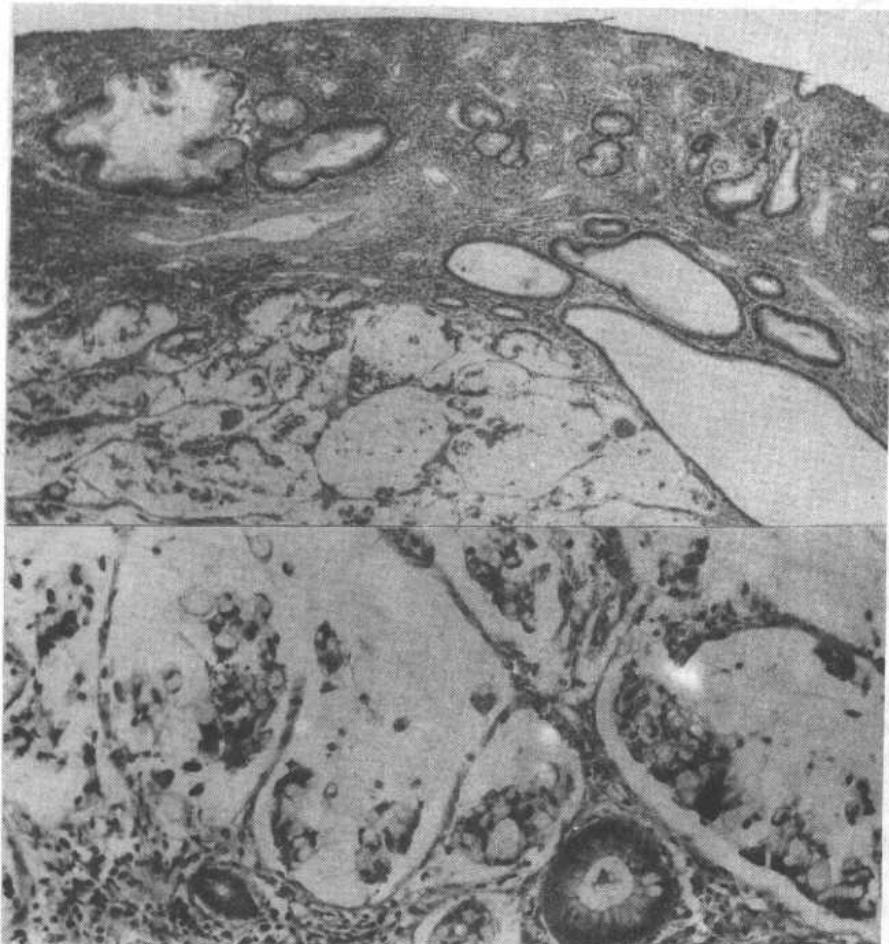 
息肉中央为印戒细胞癌 
上图示息肉表层仍保留幼年性息肉形态 下图示息肉中印戒细胞癌
与粘膜肌垂直，紧贴在粘膜肌层之上。
3. 绒毛腺管状腺瘤 为腺管状腺瘤和绒毛状腺瘤之间的一系列混合型。
图3-36 结肠腺瘤 
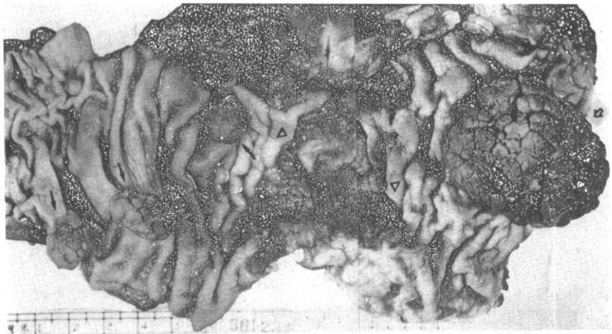 
黑箭头示三个腺管状腺瘤，空心箭头示绒毛腺管状腺瘤，二个△之间为结肠癌
图3-37 结肠腺瘤 
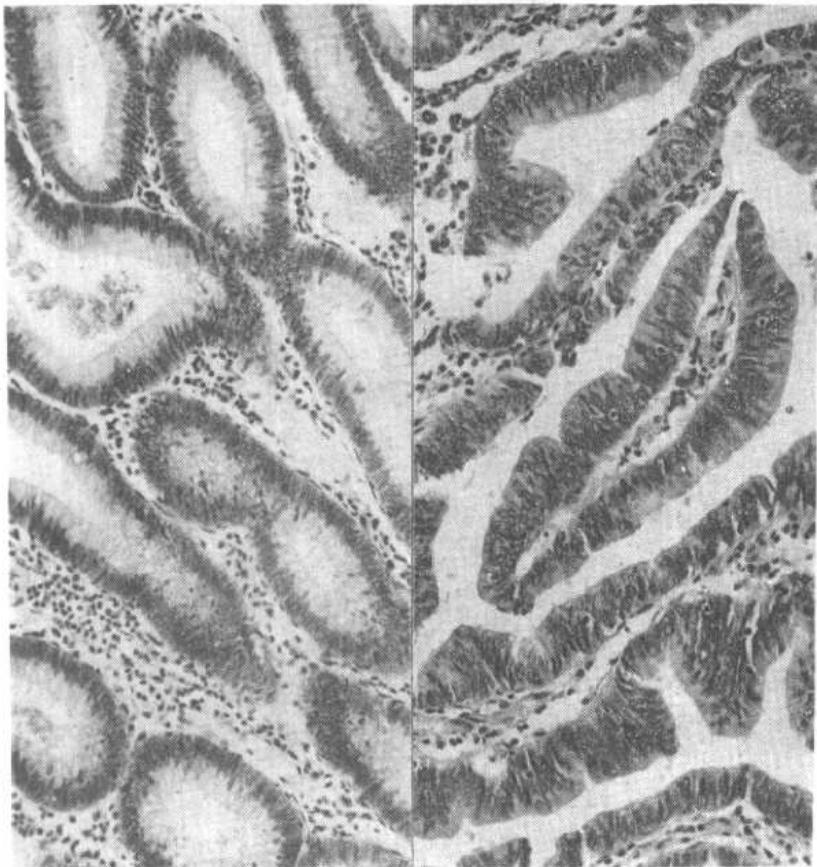 
左图为腺管状腺瘤伴轻度不典型增生；右图为绒毛腺管状腺瘤伴中度不典型增生
光镜 具有腺管状腺瘤和绒毛状腺瘤的结构，但绒毛较短而宽（图3-36，3-37）。腺瘤体积大、广基、伴重度不典型增生者易癌变。绒毛状腺瘤易癌变。
4. 扁平腺瘤（flat adenoma） 体积小，直径 $< 1\mathrm{cm}$ 。
大体 为广基扁平稍隆起的斑块。
光镜 $40\%$ 以上合并重度不典型增生[37]。这种扁平腺瘤可能是小的扁平溃疡型癌的癌前病变。
【假性浸润】腺瘤中不典型增生的腺上皮细胞侵入粘膜下层为真正的腺瘤癌变。有时粘膜下层有不典型增生的腺体，腺体周围有粘膜固有膜包绕并有含铁血黄素沉着或新鲜出血。粘膜下层这些有固有膜包绕的腺体是由于腺瘤的蒂反复扭转出血后异位到粘膜下层的，所以称为假性浸润（pseudoinvasion）。假性浸润多见于有长蒂并较大的腺瘤，特别是乙状结肠的腺瘤由于该处肠肌蠕动活跃，所以最易发生假性浸润。
# （三）家族性腺瘤病
家族性腺瘤病(familial adenomatosis)亦称家族性腺瘤样息肉病(familial adenomatous polyposis）或结肠家族性息肉病(familial polyposis coli)，是由显性基因遗传的遗传病。理论上如父母中的一个受累，则子女中的一半都有可能发病。实际上只有上述的 $8\%$ 发病，所以实际数字要比理论数为少。家族性腺瘤病的整个大肠粘膜可布满大小不等形态不一的息肉。数目从 $150\sim 5000$ 或更多，多数 $500\sim 2500$ 个，平均1000个。诊断家族性腺瘤病，以100为界，超过100个腺瘤为家族性腺瘤病，少于100个者为多发性腺瘤。腺瘤以直肠为多。家族性腺瘤病不累及小肠，如末段回肠有“息肉”则多半是淋巴样息肉而非真性腺瘤。家族性腺瘤病小的腺瘤仅为粘膜粟粒状隆起。
光镜 仅一群甚至单个腺管的腺瘤样变。大腺瘤形成广基或有蒂的各种类型的腺瘤。家族性腺瘤病很易癌变。病人第一次就诊时常常已有2/3的病例合并癌。癌总是从腺瘤体发生，而不从腺瘤之间的粘膜发生。从腺瘤发展到癌一般需10年以上。
# （四）与腺瘤或息肉有关的综合征
1. Cronkhite-Canada 综合征 包括胃肠息肉病（幼年性息肉病）伴外胚层改变如秃发、皮肤色素过多、指甲萎缩、腹泻、吸收不良、大量蛋白质由肠道丢失和电解质紊乱。 
2. Gardner综合征包括大肠家族性腺瘤病、扁平骨多发性骨瘤、多发性上皮样囊肿、软组织肿瘤和腹腔内纤维瘤病。 
3. Turcot综合征包括大肠家族性腺瘤病和中枢神经系统恶性肿瘤，常为胶母细胞瘤型。 
4. Cowden 综合征 包括幼年性息肉病、皮肤错构瘤、乳腺和甲状腺增生性病变。
# （五）大肠癌
西方国家大肠癌发病率高，仅次于肺癌。北美北欧较南美南欧高，亚洲和非洲国家低。白人发病率比黑人高，城市居民比农村居民高。我国大肠癌占消化道癌的第3位。
大肠癌的发生可能与饮食和社会经济状况有关。病因因素有食物中含脂肪量高、肥胖、家族性腺瘤病，腺瘤和溃疡性结肠炎等。年龄高峰我国为30岁～50岁，国外报道50岁～60岁。结肠癌女性较多见，而直肠癌男性较多见。临床症状为腹痛、腹块、便血、便秘或便秘与腹泻交替，大便次数增多、消瘦、贫血和肠梗阻等。
发病部位以直肠最多，向近端逐渐减少，到盲肠又稍增多。1/2的大肠癌发生在直肠
和直肠乙状结肠区。乙状结肠癌占 $1 / 4$ ，其余 $1 / 4$ 分布在盲肠、升结肠、降结肠和横结肠。 $2.8\% \sim 8\%$ 大肠癌为多发性。
【病变】大体形态分：①溃疡型；②巨块息肉型；③浸润型。其中溃疡型最常见。浸润型可使肠管局部狭窄，但很少形成像皮革胃那样的弥漫浸润型癌。
光镜 $80\%$ 为不同分化程度的癌，多数分化较好。 $10\% \sim 15\%$ 为粘液腺癌。纯印戒细胞癌和未分化癌少见。其它罕见的癌有腺鳞癌和鳞癌。年轻病人粘液腺癌和印戒细胞癌较多见。癌组织偶尔可钙化和骨化。钙化灶有时可呈砂粒体样。癌位于粘膜下层以上不管有无局部淋巴结转移均属早期癌范畴。
【影响预后的形态因素】 影响预后的形态因素有：癌的分化程度、浸润肠壁的深度和淋巴结转移率。
高分化的癌淋巴结转移率低，5年存活率高；反之低分化癌如低分化腺癌、印戒细胞和未分化癌淋巴结转移率高，5年存活率低。癌细胞分泌粘液如粘液腺癌和印戒细胞癌预后差。Dukes根据癌浸润壁的深度和淋巴结有无转移将大肠癌分为三期：①A期：占手术病例的 $15\%$ 。癌不超过肌层，无淋巴结转移，校正后5年存活率 $100\%$ ；②B期：占手术病例的 $35\%$ 。癌已侵透肠壁达肠周脂肪组织，但无淋巴结转移，5年存活率为 $75\%$ ；③C期：占手术病例的 $50\%$ 。癌的范围同B期，但已有淋巴结转移，5年存活率仅 $35\%$ 。
【扩散和转移】主要为局部浸润、腹腔腹膜种植和淋巴管转移至局部淋巴结。晚期可转移至远处淋巴结如锁骨上淋巴结。晚期癌可经血行转移至肝、肺、骨、脑、卵巢、脾、肾、胰、肾上腺、乳腺、甲状腺和皮肤等处。
# （六）神经内分泌肿瘤
直肠是消化道神经内分泌肿瘤好发部位之一，但很少发生类癌综合征。大体上有二种形态：①小而硬的粘膜下结节，直径 $1\mathrm{cm}$ ，可形成溃疡、息肉或蕈样肿物，形如恶性肿瘤。
光镜 由小的低柱状细胞排列成花带、条索或腺样，有时可形成实心细胞巢。细胞核圆而规则，无或很少核分裂。间质含平滑肌纤维。肿瘤浸润粘膜和周围的粘膜下层，很少浸润至肠壁深部。大多数直肠类癌亲银和嗜银反应均阴性。免疫组织化学染色除神经内分泌细胞标记阳性外，还有多种肽类激素如Somatostatin、glucagon、substance P、PYY、PP、gastrin、CCK、calcitonin、hCG和PSAP等免疫阳性反应。
分化差的神经内分泌癌，恶性度高，多见于中老年病人，确诊时已有转移。肿瘤体积较大。电镜分泌颗粒直径 $90\mathrm{nm}\sim 280\mathrm{nm}$
免疫组化 显示cytokeratin、EMA、NSE、chromogranin A和synaptophysin阳性。预后较腺癌差，死亡率高。一组24例中 $54\%$ 死于肿瘤[38]。
# （七）平滑肌肿瘤
大肠平滑肌肿瘤较少见。形态与胃和小肠的平滑肌肿瘤同。平滑肌肉瘤多见于直肠。肿瘤形成结节状隆起，表面有完整的粘膜，中心有溃疡。直肠平滑肌肉瘤的特点是分化好，单凭形态特别是小块活检组织不能鉴别良恶性。直肠平滑肌肉瘤易侵入肠壁血管而转移到肝和肺等处，预后差。
# （八）淋巴瘤
大肠淋巴瘤较小肠淋巴瘤少见。好发部位为盲肠，其次为直肠，因这二处有较丰富
的淋巴组织。大肠亦可发生髓外浆细胞瘤。
# （九）恶性黑色素瘤
多数黑色素瘤发生在肛管的上部呈息肉状突入直肠下段肠腔或形成黑色圆形浅溃疡突在肛门口，这时可误诊为血栓栓塞或感染的内痔。半数肿瘤内可找到黑色素。无黑色素或黑色素少的肿瘤可作免疫组织化学，S-100和HMB45呈明显阳性反应。
# （十）肛门区癌
1. 鳞癌 肛门区鳞癌可分为肛门缘鳞癌和肛管鳞癌。①肛门缘鳞癌在不发达国家较多见，几乎和阴茎癌、外阴癌和宫颈癌一样多见。50岁以上的老年人多见。男性与女性比例为 $4:1$ 。肛门缘鳞癌多数从肛管下端鳞状上皮粘膜与肛门周围皮肤交界处发生。形态与生物学行为与唇癌相似即生长慢的角化型鳞癌，晚期可转移至腹股沟淋巴结；②肛管鳞癌在工业发达国家较肛门缘鳞癌高3倍[1]。老年人多见。男女比例为 $2:3$ 。肛管鳞癌多数从齿状线以上的移行带发生，仅1/4来自肛管下部的鳞状上皮粘膜。肛管鳞癌很易向上侵犯直肠，向下则由于内括约肌和齿状线的屏障而受到限制。
光镜 肛管鳞癌主要有二种形态：即非角化的大细胞鳞癌和基底细胞样癌（basaloid carcinoma），亦称一穴肛（泄殖腔）原癌（cloacogenic carcinoma）或非角化小细胞鳞癌。位肛管上部。形态像基底细胞癌，有鳞癌分化。在癌巢中有大片嗜酸性坏死。有时可像膀胱的移行细胞癌。肛管鳞癌临床表现为下段直肠癌，淋巴管转移至骶髂部淋巴结。肛管鳞癌预后较肛门缘鳞癌差。
2. 疣状癌 肛周皮肤发生，广基疣状肿物。
光镜 为粗大外生性乳头状瘤样肿瘤，乳头中心无结缔组织核心。鳞状上皮分化好。癌的底部界限清楚呈膨胀性生长，浸润不明显。生长缓慢，但可转移至腹股沟淋巴结。疣状癌的发生与HPV感染有关。
3. 肛管上皮内肿瘤（anal canal intraepithelial neoplasia，ACIN）和肛周皮肤上皮内肿瘤（peri-anal skin intraepithelial neoplasia，PSIN）像宫颈和外阴的上皮内肿瘤（CIN，VIN）一样肛周亦能发生上皮内肿瘤（ACIN，PSIN），形态及分级与CIN和VIN相同。ACIN和PSIN亦与HPV感染有关。肛门区湿疣、上皮内肿瘤和癌中均检测到HPVDNA[39]。PSIN即Bowen病，患处皮肤呈红色结痂样扁平斑块，边缘不规则。
光镜 上皮增生，极向消失，全层为大小不等的不典型增生细胞和角化不良细胞，核分裂多见。肛周皮肤的Bowen病常为多发中心，易发展成浸润癌。
4. 粘液表皮癌 来自肛管移行上皮，形态与涎腺的粘液表皮癌同。 
5. 基底细胞癌 只发生在肛周有毛的皮肤。其临床与病理和其它部位的皮肤基底细胞癌同。多数病人为男性老人。 
6. 由肛门瘘发生的腺癌和由肛门腺来的腺癌均极少见。前者常为粘液腺癌，后者常为高分化腺癌。 
7. Paget病（原位腺癌） 肛周皮肤的Paget病形态与外阴和乳腺Paget病相同（图3-38）。病变处呈红灰色隆起，有脱屑状湿润区。电镜证实Paget病的异常细胞来自大汗腺导管上皮。这些异常细胞粘液染色和CEA染色阳性，有的还含黑色素。肛周Paget病有较长的浸润前期，如果病人能存活较长时间，则在病变处皮下可找到来自大汗腺的浸润癌。
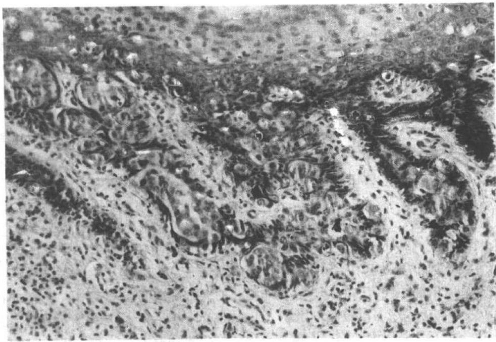 
图3-38 肛门Paget病
# （十一）转移瘤
大肠和肛门转移瘤主要来自肺、肾和前列腺等处的癌。
# 六、其它病变
# （一）寿（hemorrhoid）
痔是肛门和肛周静脉丛静脉曲张，为常见病，据估计约 $5\%$ 的人群患痔。任何能引起持续性静脉充血的病因都能导致痔的发生，其中常见的病因有便秘、妊娠静脉瘀滞和门脉高压等。
光镜 形态像海绵状血管瘤，可有血栓形成，有的血管平滑肌较多。周围组织有出血、表面粘膜增厚或鳞状上皮化生。痔可合并出血或下垂。出血严重者可导致贫血。痔下垂至肛门外可造成痔绞榨、血栓形成、溃疡和继发感染。肛门皮赘是痔血栓机化的结果。肛管痔亦可发生上皮内肿瘤（ACIN），而且 $78\%$ 检出HPV16， $18^{[40]}$ 。
# （二）深部囊性结肠炎（colitis cystica profunda）
好发于直肠。于粘膜下层有异位并囊性扩张的腺体, 使粘膜呈息肉状突入肠腔。
光镜 粘膜下层腺体被以正常大肠腺上皮，囊性扩张的腺体常常无上皮。扩张的腺体或粘液池周围有慢性炎反应和纤维组织增生。固有膜纤维组织增生并有多量由增厚的粘膜肌层来的平滑肌纤维（图3-39）。此病原因不明。常合并粘膜多发或单发溃疡。多见于年轻人。
# （三）肠气囊肿
形态与小肠气囊肿同。
# （四）子宫内膜异位
盆腔子宫内膜异位中 $15\% \sim 40\%$ 可累及直肠。异位的子宫内膜位于肌层，少数在粘
膜下层。异位的内膜周围肌层肥厚，形成结节或息肉状物突入肠腔。
# （五）结肠组织细胞增生症(colonic histiocytosis)
肠活检中常可见到粘膜固有膜内有成堆巨噬细胞，胞浆呈泡沫状（图3-40）。PAS和粘液染色阳性。粘膜形态像Whipple病，但电镜下无杆菌样小体。
# （六）脂肪赞扭转（torsion of appendices epiploicae）
结肠脂肪赘可扭转和梗死，导致急腹症。如不治疗可粘连，形成纤维带或玻璃样变，或脱落形成腹腔游离体。
# （七）放射性肠炎
腹腔和盆腔器官照射后（多数是放射治疗癌后）肠粘膜可出现放射性改变，表现为隐窝上皮细胞核奇形怪状，杯状细胞减少，局部嗜酸性白细胞浸润。放疗停止后 $1\sim 2$ 个月病变消退。
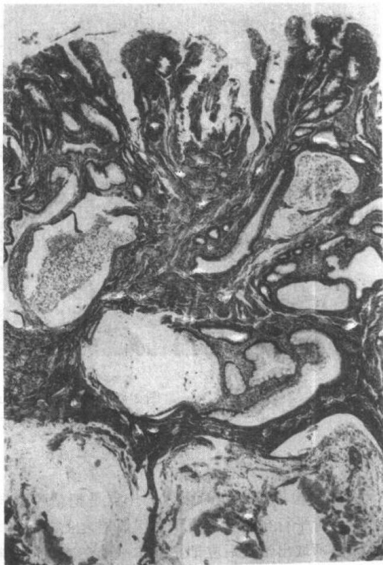 
图3-39 结肠深部囊性结肠炎
# （八）孤立性盲肠溃疡（soli-
tarycecalulcer）和孤立性直肠溃疡（solitaryrectalulcer）
孤立性盲肠溃疡为非特异性溃疡，有些可能是单个憩室发生炎症或憩室周围炎的结果。
孤立性直肠溃疡多见于年青人，溃疡位于直肠前壁或前侧壁。扁平形，界限清楚表浅和不规则形的粘膜溃疡。直径 $0.5\mathrm{cm} - 5\mathrm{cm}$ 。溃疡周围粘膜纤维母细胞和平滑肌纤维增多；淋巴细胞浆细胞减少，粘膜肌层增厚。
# （九）粘膜软斑（malacoplakia）
病变粘膜呈黄色斑块状，周围粘膜充血水肿及炎细胞浸润。软斑由大量巨噬细胞组成，偶尔有多核巨细胞。巨噬细胞有丰富的颗粒状胞浆，PAS阳性。巨噬细胞内外可见层状钙化小体，称为Michaelis-Gutman小体。
# （十）结肠黑变病（melanosis coli）
一段或整个大肠粘膜成棕黑色。
大体 粘膜除棕黑色外，其它都正常。
光镜固有膜内有吞噬色素的巨噬细胞，电镜及组织化学鉴定这些色素具黑色素和脂褐色的特性。黑变病可能与慢性便秘和不适当地服用泻药有关。
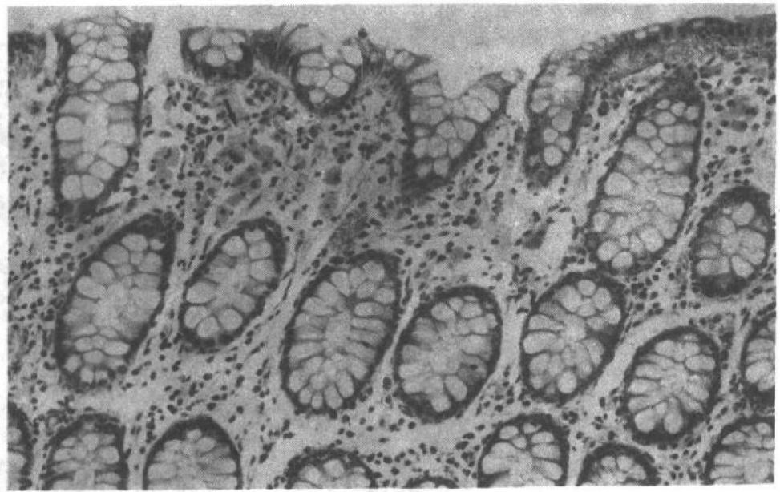 
图3-40 结肠组织细胞增生症固有膜内成堆吞噬粘液的巨噬细胞
# 七、大肠活检
大肠活检标本制作时重要的一点是把粘膜定向包埋，这样切片中的粘膜隐窝（肠腺）呈直管平行排列，垂直于粘膜肌层之上即保持大肠粘膜正常的组织学关系。这就要求临床医师取出活检后立即把标本平铺在滤纸上，粘膜下层向下。活检标本连同滤纸一起固定，这样制片时才能保持粘膜正确的方向。
大肠活检的重要意义是鉴别良恶性病变以及鉴别溃疡性结肠炎和克隆病等特殊炎性病变。活检标本应仔细寻找有无阿米巴滋养体和寄生虫虫卵等传染性肠炎。
内窥镜所取的活检由于术前用过泻药和灌肠，所以正常粘膜亦可出现杯状细胞减少，隐窝上皮增生，核分裂增多和固有膜水肿等的人为改变。
（刘彤华）
# 参考文献
1. Morson BC, et al. in Morson & Dawson's Gastrointestinal Pathology. 3rd Ed. Oxford London Edinburgh Boston Melbourne, Blackwell Scientific Publications, 1990; pp 37, 111, 181, 266, 375, 448, 675 
2. Greenson JK, et al. Prominent mononuclear cell infiltration is characteristic of herpes esophagitis. Hum Pathol, 1991; 22: 541 
3. Takubo K, et al. Double muscularis mucosa in Barrett's esophagus. Hum Pathol, 1991; 22: 1158 
4. Potet F, Duchatelle V. Barrett's esophagus. in Williams GT (ed): "Gastrointestinal Pathology" (Current Topics in Pathology 81). Berlin Heidelberg New York London Paris Tokyo Hong Kong, Springer-Verlag, 1990; pp 43-60 
5. Reyes C, et al. Neuroendocrine carcinoma of the esophagus. Ultrastructural Pathol, 1980; 1:367
6. Buley ID, et al. Granular cell tumors revisited. An immunohistological and ultrastructural study. Histopathol, 1988; 12:263 
7. Axon ATR. Campylobacter pylori. in Pounder R (ed): “Recent Advances in Gastroenterology” No. 7, Edinburgh London Melbourne New York, Churchill Livingstone, 1988; pp 225-244 
8. Dixon MF. Progress in the pathology of gastritis and duodenitis. in Williams GT (ed): “Gastrointestinal Pathology” (Current Topics in Pathology 81), Berlin Heidelberg New York London Paris Tokyo Hong Kong, Springer-Verlag, 1990; pp 2-40 
9. Komorowski RA, Caya JG. Hyperplastic gastropathy. Clinicopathologic correlation. Am J Surg Pathol., 1991, 15:577 
10. Haot J, et al. Menetrier's disease with lymphocytic gastritis: An unusual association with possible pathogenic implications. Hum Pathol, 1991; 22:379 
11. Dixon MF, et al. Lymphocytic gastritis in relationship to Campylobacter pylori infection. J Pathol, 1988; 154:125 
12. Serck-Hassen A, et al. Epithelial dysplasia in the stomach: The size of the problem and some preliminary results of a follow-up study. in Ming SC (ed): “Precursors of gastric cancer”. New York, Praeger, 1984; pp 53-71 
13. Rugge M, et al. Gastric epithelial dysplasia: A prospective multicenter follow-up study from the interdisciplinary group on gastric epithelial dysplasia. Hum Pathol, 1991; 22: 1002 
14. Harrison JC, et al. Adenocarcinoma of the stomach with invasion limited to the muscularis propia. Hum Pathol, 1991; 22:111 
15. Lloyd RV. Endocrine Pathology. New York Berlin Heidelberg London Paris Tokyo Hong Kong, Springer-Verlag, 1990; pp 85-139 
16. Yang GCH, Rotterdam H. Mixed (composite) glandular-endocrine cell carcinoma of the stomach. Report of a case and review of literature. Am J Surg Pathol, 1991; 15:592 
17. Miettinen M. Gastrointestinal stromal tumors: An immunohistochemical study of cellular differentiation. Am J Clin Pathol, 1988; 89:601 
18. Hjermstad BM, et al. Stromal tumors of the gastrointestinal tract: Myogenic or neurogenic? Am J Surg Pathol, 1987; 11:383 
19. Levison DA, et al. The gut-associated lymphoid tissue and its tumors. in Williams GT (ed): “Gastrointestinal Pathology” (Current Topics in pathology 81). Berlin Heidelberg New York London Paris Tokyo Hong Kong, Springer-Verlag, 1990; pp 134-178 
20. 刘彤华，等．108例原发性胃肠恶性淋巴瘤临床病理及免疫细胞化学分析．中华医学杂志，1987，67:492 
21. Yagihashi S, et al. Primary alveolar soft-part sarcoma of stomach. Am J Surg Pathol 1991; 15:399 
22. Zukerberg LR, et al. Lymphoid infiltrates of the stomach. Evaluation of histologic criteria for the diagnosis of low-grade gastric lymphoma on endoscopic biopsy specimens. Am J Surg Pathol, 1990; 14:1087 
23. 刘彤华，等．克隆氏病Ⅱ．60例病理分析．中华内科杂志，1981；20:85 
24. Shimer GR, Helwig EB. Inflammatory fibroid polyps of the intestine. Am J Clin Pathol, 1984; 81: 708 
25. Qizilbash AH. Duodenal and peri-ampullary adenomas. in Williams GT (ed): "Gastrointestinal Pathology" (Current Topics in Pathology 81). Berlin Heidelberg New York London Paris Tokyo Hong Kong, Springer-Verlag, 1990; pp 77-90
26. Moyana TN. Carcinoid tumors arising from Meckel's diverticulum. A clinical, morphologic and immunohistochemical study. Am J Clin Pathol, 1989; 91:52 
27. Burke AP, et al. Carcinoids of the duodenum. A histologic and immunohistochemical study of 65 tumors. Am J Surg Pathol, 1989; 13:828 
28. Jones MA, et al. Adenocarcinoid tumor of the periampullary region: A novel duodenal neoplasm presenting as biliary tract obstruction. Hum Pathol, 1989; 20:198 
29. Zamboni G, et al. Small-cell neuroendocrine carcinoma of the ampullary region. A clinicopathologic immunohistochemical and ultrastructural study of 3 cases. Am J Surg Pathol, 1990; 14:703 
30. Finn WG, Rao MS. Malignant ileal carcinoid with metastasis to adenocarcinoma of the ovary. Hum Pathol. 1991; 22:1173 
31. Salter DM, et al. Immunophenotype analysis of malignant histiocytosis of the intestine. J Clin Pathol, 1986; 39:9 
32. Young RH, et al. Mucinous tumors of the appendix associated with mucinous tumors of the ovary and pseudomyxoma peritonei. A clinicopathological analysis of 22 cases, supporting an origin in the appendix. Am J Surg Pathol, 1991; 15:415 
33. Rodriguez FH, et al. Goblet cell carcinoid of the appendix. Hum Pathol, 1982; 13:286 
34. Flejou JF, et al. Collagenous colitis. Ultrastructural study and collagen immunotyping of four cases. Arch Pathol Lab Med, 1984; 108:977 
35. Lazenby AJ, et al. Pitfalls in the diagnosis of collagenous colitis: Experiences with 75 cases from a registry of collagenous colitis at the John Hopkins Hospital. Hum Pathol, 1990; 21:905 
36. Reeders JWAJ, et al. Ischemic colitis. Boston, Martinus Nijhoff, 1984 
37. Wolber R, Owen DA. Flat adenomas of the colon. Hum Pathol, 1991; 22:70 
38. Gaffey MJ, et al. Neuroendocrine carcinoma of the colon and rectum. A clinicopathologic, ultrastructural and immunohistochemical study of 24 cases. Am J Surg Pathol, 1990; 14:1010 
39. Duggan MA, et al. Human papillomavirus DNA determination of anal condylomata, dysplasias and squamous carcinomas with in situ hybridization. Am J Clin Pathol, 1989; 92:16 
10. Foust RL, et al. Intraepithelial neoplasia of the anal canal in hemorrhoidal tissue: A study of 19 cases. Hum Pathol, 1991; 22:528
# 第四章 鼻腔、鼻窦、鼻咽及喉
# 第一节 鼻腔、鼻窦及鼻咽 118
# 一、感染性病变 118
（一）非特异性感染 118 
（二）特异性感染 118
# 二、其他肉芽肿性病变 119
（一）结节病 119 
（二）Wegener肉芽肿 120 
（三）胆固醇性肉芽肿 120 
（四）激素注射后肉芽肿 120 
（五）特发性肉芽肿 120 
（六）致死性中线肉芽肿 120
# 三、非肿瘤性病变 120
（一）炎性息肉 120 
（二）粘液潴留囊肿 121 
（三）粘膜萎缩 121
# 四、上皮增生性病变 121
（一）上皮增生 121 
（二）假上皮瘤样增生 121 
（三）鳞化 121 
（四）土皮不典型增生 122
# 五良性上皮性肿瘤 122
（一）鳞状上皮乳头状瘤样增生 122 
（二）乳头状瘤 122 
（三）良性涎腺肿瘤 123
# 六 恶性上皮性肿瘤 124
鼻腔、鼻窦的癌 124
（二）鼻咽癌 125 
（三）类癌 126 
（四）转移性肿瘤 126
# 七、淋巴组织肿瘤及瘤样病变 126
（一）浆细胞性肉芽肿 126 
（二）假性淋巴瘤 126 
（三）浆细胞癌 127 
（四）恶性淋巴瘤 127
（五）恶性组织细胞增生症（恶组）或恶性组织细胞瘤 127
# 八、神经源性肿瘤 127
（一）鼻胶质瘤（脑膨出、胶质异位） 127 
（二）脑膜瘤 128 
（三）血体腺瘤 128 
（四）副神经节瘤 128 
（五）外周神经肿瘤 128 
（六）嗅神经母细胞瘤 128 
（七）黑色素细胞肿瘤 130
# 九、皮样囊肿、畸胎瘤 130
# 十、非上皮性肿瘤 130
（一）血管肿瘤 130 
（二）骨癌 131 
（三）纤维异常增殖 132 
（四）骨化性纤维瘤 132 
（五）巨细胞癌 132 
（六）鼻咽孤立性纤维瘤 132 
（七）纤维组织肿瘤 132 
（八）肌源性肿瘤 133 
（九）粘液瘤 133 
（十）脊索瘤 133 
（十一）其他少见肿瘤 134
# 第二节 喉 134
# 一、炎性病变 134
（一）慢性非特异性喉炎 134 
（二）急性喉炎 134 
（三）结核 134 
（四）真菌感染 134 
（五）Crohn病 134 
（六）后联合溃疡 134 
（七）其他少见病变 134
# 二、囊肿 135
（一）袋状囊肿 135 
（二）导管囊肿 135 
（三）嗜酸细胞性囊肿 135 
（四）扁桃体样囊肿 135 
（五）喉潴留 135
# 三、假瘤 135
（一）喉小结 135
（二）假性淋巴瘤 135 
（三）淀粉样物沉着 135
# 四、上皮增生性病变 135
（一）幼年性喉乳头状瘤 135 
（二）成人喉乳头状瘤 137 
（三）寻常疣 137 
（四）上皮增生 137
# 五、恶性上皮性肿瘤 137
（一）鳞癌 137 
（二）症状癌 138 
（三）未分化大细胞癌 138 
（四）未分化小细胞癌 138 
（五）伴肉瘤样间质的鳞癌 139 
（六）涎腺型肿瘤 139 
（七）腺癌 139 
（八）类癌 139 
（九）其他少见癌 140
# 六、神经源性肿瘤 140
（一）神经鞘瘤和神经纤维瘤 140 
（二）颗粒细胞肿瘤 141 
（三）恶性黑色素瘤 141 
（四）副神经节瘤 141
# 七、间叶组织肿瘤 141
（一）血管淋巴管肿瘤 141 
（二）纤维组织肿瘤 141 
（三）肌源性肿瘤 141 
（四）骨软骨组织肿瘤 141 
（五）纤维组织细胞肿瘤 141 
（六）脂肪组织肿瘤 141 
（七）粘液瘤 141 
（八）滑膜肉瘤 142
# 八、淋巴细胞、浆细胞肿瘤 142
# 九、转移性肿瘤 142
# 第一节 鼻腔、鼻窦及鼻咽
# 一、感染性病变
# （一）非特异性感染
在外检中有时遇到临床诊断“鼻窦炎”行刮除的标本，粘膜固有层内见不等量的中性白细胞、嗜酸性白细胞、淋巴细胞、组织细胞及浆细胞的浸润，表面上皮见基底细胞增生、鳞化、不典型增生、溃疡等，分泌腺也有不同程度的炎症改变。
当以成熟的浆细胞为主时，可称为浆细胞性肉芽肿，不要当作浆细胞瘤。其鉴别点在于前者不仅有浆细胞，还有其他炎细胞并存，并且浆细胞为成熟性，Russell小体易见，而浆细胞瘤则以不成熟浆细胞为主，细胞有不典型性，核不一致，核分裂多见，Russell小体少见。
在刮除标本检查中除发现粘膜的炎症外，要仔细寻找有无小片骨组织以及骨组织中有无炎症改变，因为临床上如果发现鼻窦炎症波及骨组织，则有可能累及颅内及眼眶内。
# （二）特异性感染
1. 结核 结核可见于鼻部皮肤、皮肤粘膜交界以及鼻腔粘膜。
光镜 表现为干酪样坏死性肉芽肿或仅为肉芽肿性病变。
2. 麻疯 麻疯（常为瘤型）可累及鼻腔、鼻咽粘膜而出现结节状和破坏性病变。
光镜 为慢性炎细胞浸润中见大泡沫样组织细胞（麻疯细胞），抗酸染色得以证实。
3. 鼻硬结症 鼻硬结症见于鼻腔及鼻咽部粘膜，亦可见于口咽、喉、气管等处。呈结节状，使气道越来越窄。
光镜 仅呈慢性炎改变，主要是淋巴细胞、浆细胞、组织细胞浸润（图4-1）。偶尔以浆细胞为主时会误认为是浆细胞瘤。组织细胞胞浆丰富、泡沫状，称为Mikulicz细胞，数目多少不等，PAS及Gram染色可见胞浆内细菌，为一种革兰氏染色阴性菌。由于有泡沫样组织细胞出现，故应与麻疯鉴别。表面上皮一般完整，可有鳞化及假上皮瘤样增生，固有膜内可见肉芽肿形成。炎症一般不累及骨及软骨。
4. 鼻藻菌病 鼻藻菌病包括毛真菌病及其它几种真菌感染。正常情况下，在鼻腔及鼻窦的粘膜表面的腐生菌中可见到毛真菌属成员。在一定条件下，表面的腐生菌侵入粘膜组织内而导致严重的迅速致死的鼻脑毛真菌感染。常见的促发因素有：①未能控制的糖尿病；②淋巴瘤或白血病；③免疫抑制。
当毛真菌侵入感染时，呈亲血管性生长，尤以小动脉为主，导致血管内血栓形成、组织坏死，粘膜由白变黑（缺血到坏死），从鼻腔扩展至眼眶、颅内，引起眼眶蜂窝织炎及脑膜脑炎，还可累及鼻、眼及上颌部的皮肤发生坏死。
光镜 为大片坏死，要仔细寻找病原体，尤其是在小血管处。当发现广泛坏死及血栓形成时要高度怀疑毛真菌病，PAS、银染等方法有助于发现病原体，其典型形态为宽分支的无分隔的菌丝，自 $6\mu \mathrm{m} \sim 50\mu \mathrm{m}$ 宽、 $100\mu \mathrm{m} \sim 200\mu \mathrm{m}$ 长不等。行根治性切除有可能挽救患者生命。
5.曲菌病[2] 曲菌为生长在腐败蔬菜中的真菌，可由空气中吸入而见于鼻腔鼻窦的
图4-1 鼻硬结症 
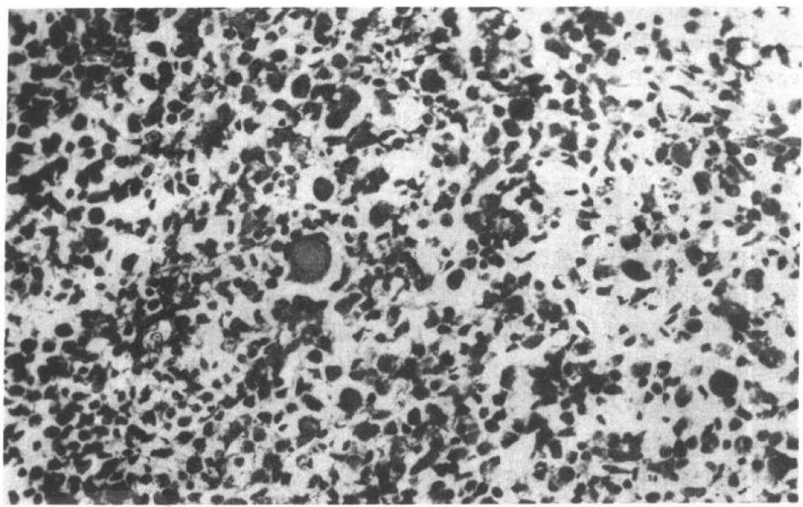 
主要为淋巴细胞、组织细胞及浆细胞
粘膜表面，正常情况下不致病。曲菌菌丝粗细较一致，直径 $3\mu \mathrm{m} \sim 6\mu \mathrm{m}$ 有分隔，分支呈锐角。孢子直径 $30\mu \mathrm{m}$ ，可在自然状态、培养基或含气的空腔中见到，如鼻窦、支气管内。
在慢性鼻窦感染及引流不畅时，曲菌可在窦腔中增殖，形成真菌球，由菌丝组成，有时可见孢子。在免疫抑制状态下，曲菌可像毛真菌一样侵及粘膜组织中，出现大量中性白细胞反应，甚至小脓肿形成。也可出现慢性炎和纤维化，还可见到干酪样及非干酪样肉芽肿及各种巨细胞。故在鼻腔鼻窦的肉芽肿病变中行抗酸染色及真菌染色是必须的。
6. 鼻孢子菌病 鼻孢子菌病（rhinosporidiosis）的真菌孢子较大，直径 $100\mu \mathrm{m} \sim 400\mu \mathrm{m}$ ，壁厚，双层，含有似红细胞大小的内生孢子。临床以鼻腔多发性息肉为主，易出血；广基，可堵塞气道，偶见于鼻咽部。
光镜 在慢性炎的背景中见大量孢子。炎细胞以淋巴细胞、浆细胞为主，也可见组织细胞和多核巨细胞，巨细胞内可见孢子。内生孢子的释放可导致急性炎及小脓肿形成。真菌染色可清楚显示孢子。
7. 肌球病 (myospherulosis) [3] 1977 年 kyriakos 报道 16 例鼻腔鼻窦及中耳的肌球病样病原体感染, 其特征是见到 $5\mu \mathrm{m} \sim 7\mu \mathrm{m}$ 的球体及 $20\mu \mathrm{m} \sim 120\mu \mathrm{m}$ 的“双亲体”, 电镜下呈孢子囊样结构。
# 二、其它肉芽肿性病变
# （一）结节病
在全身性结节病中 $3\% \sim 20\%$ 累及鼻腔，故鼻腔活检有助于全身性结节病的证实，但也偶见无全身表现而仅限于鼻腔的结节病。主要累及鼻中隔、下鼻甲，偶尔还可见于眼眶、嗅区、脑膜。有时鼻粘膜活检中意外发现了肉芽肿性病变后诊断的，鼻粘膜外观可以正常。组织学表现为粘膜组织内非干酪样坏死的上皮样细胞和多核巨细胞形成的肉芽
肿结节，无血管炎表现。
# （二）Wegener肉芽肿[4,5]
Wegener肉芽肿主要累及鼻腔、鼻窦、肺和肾，少见部位有皮肤、眼、耳、关节、神经系统和心脏，上呼吸道占 $60\% \sim 95\%$ 。当病变早期仅累及鼻腔时，表现为鼻堵，仅为弥漫性水肿而无坏死，继而发生坏死，表面结痂，有恶臭，痴下组织脆。常见中隔穿孔。最后可累及上颌窦、筛窦、额窦和蝶窦。
光镜有两个主要特征：一是坏死性肉芽肿性炎，二是血管炎。炎细胞有中性白细胞、嗜酸性白细胞、淋巴细胞、浆细胞、组织细胞及多核巨细胞。肉芽肿可以是无坏死的、纤维素样坏死的、微脓肿形成的。血管炎可以是小动脉和/或静脉，管壁全层出现炎细胞浸润以及纤维素样坏死。当坏死广泛和炎症明显时血管炎病变不好判断，此时行弹力纤维染色有助于识别，尤其是当光镜下为广泛坏死，临床上未提出Wegener肉芽肿诊断时病理医生主动做弹力纤维染色以明确有无血管炎的存在是十分有意义的。要学会鉴别真性血管炎与一般炎症中的血管周炎细胞反应。真性血管炎表现为血管壁全层的炎细胞浸润，弹力纤维破坏，可以是整个管壁中小灶性的弹力纤维破坏。
# （三）胆固醇性肉芽肿
见于鼻窦刮除标本，为大量胆固醇结晶的裂隙及异物性多核巨细胞、肉芽肿形成。常伴有出血。
# （四）激素注射后肉芽肿
对于临床上的“血管运动性鼻炎”、鼻粘膜水肿、鼻息肉等采用皮质激素制剂的粘膜下注射疗法，以后取注射部位组织活检可见异物性肉芽肿形成，其中央为结晶样物，围绕一层栅状排列的组织细胞和异物巨细胞。病理医生认识这种肉芽肿的意义在于与其它肉芽肿病变相鉴别。
# （五）特发性肉芽肿
在鼻腔鼻窦的肉芽肿性病变中，有的难以找到原因，可能与局部免疫反应有关，也可能与平时应用滴鼻药有关。
# （六）致死性中线肉芽肿
致死性中线肉芽肿是一个临床名称，用以命名一组疾病。临床上表现为鼻、鼻腔及附近器官的无痛性坏死性破坏，出现鼻塌陷、中隔穿孔、鼻窦破坏等。病理上则可由许多疾病引起，如多见的Wegener肉芽肿、恶性淋巴瘤、中线恶组等，还见于鳞癌、结核、麻疯、梅毒、骨髓炎、细菌或真菌感染、巨细胞修复性肉芽肿、嗜酸性肉芽肿、糖尿病、天疱疮等，因此，作为病理诊断，不宜采用此名称，因其中诸多原因临床意义不尽一致，治疗及预后亦不同。
# 三、非肿瘤性病变
# （一）炎性息肉
鼻的炎性息肉，也称过敏性息肉，不是真性肿瘤，而是感染、过敏、粘液潴留所致，是上呼吸道最常见的病变。虽可单发，但以多发为主，且多累及双侧鼻窦。过敏性息肉主要见于下鼻甲及嗅区，后鼻孔息肉则以感染为主。
大体 鼻息肉呈大小不等的柔软、半透明状的水肿样组织块。
光镜 为水肿的结缔组织（疏松粘液样基质），固有膜内的胶原纤维被冲散，其间为均质嗜酸性蛋白性液体，其中见炎细胞，有中性白细胞、嗜酸性白细胞、淋巴细胞、浆细胞、散在粘液腺。表面被覆呼吸道纤毛上皮，但常有基底细胞增生、鳞化、萎缩或溃疡形成，偶见上皮的不典型性。水肿常限于分泌腺以上的水平，腺体导管呈囊性扩张，导致潴留性囊肿形成，腺体本身萎缩，偶尔见腺体增生。间质可见纤维化，尤其是伴有感染和溃疡时。有时在间质中见到奇异核的多形性梭形细胞，核深染，可误认为胚胎型横纹肌肉瘤，应注意鉴别。这种细胞为反应性增生的纤维母细胞或组织细胞，见于肉芽组织背景中，核分裂难找。见到这种奇异细胞并不提示息肉会复发或恶变。
约 $5\% \sim 10\%$ 的囊性纤维化（cystic fibrosis）患者出现鼻腔鼻窦的息肉，因此见到儿童的鼻息肉应注意有无此症。这种息肉在组织学上与普通的息肉不同之处在于出现大囊性腺体，腺腔内充满浓缩的分泌物，缺乏嗜酸性白细胞，以中性粘液为主，缺乏粘膜下的透明性变。
许多肿瘤可以在鼻腔鼻窦以息肉形式表现出来，故对于临床上诊断的鼻息肉标本应仔细进行组织学检查，常见的有乳头状瘤病、癌、血管瘤、肌源性肿瘤、纤维组织肿瘤、淋巴瘤、浆细胞瘤等。
# （二）粘液潴留囊肿
上颌窦开口阻塞后，粘液潴留于窦腔，造成渐进性骨壁受压变薄而类似恶性肿瘤，但其本质是一个假性囊肿，囊内为粘液、细胞碎片及炎性渗出物。
# （三）粘膜萎缩
在严重的慢性炎症时，鼻腔鼻窦可出现粘膜萎缩性改变。另在Sjogren综合征，大小涎腺及泪腺出现萎缩的同时还可见于鼻粘膜，临床表现为鼻干。
光镜 见分泌腺内淋巴细胞、浆细胞浸润、腺泡萎缩，小导管上皮增生呈小的实性巢（肌上皮细胞岛）。
# 四、上皮增生性病变
# （一）上皮增生
鼻腔鼻窦炎症时常见上皮的增生，基底细胞增生导致上皮层增厚，但细胞极性仍保存，并逐渐向表面成熟，核可增大，但无多形性及深染。这种增生不要误认为是乳头状瘤病。
# （二）假上皮瘤样增生
多种因素可导致被覆上皮的假上皮瘤样增生。发生在鼻前庭鳞状上皮时可见上皮脚下延、增宽而达粘膜下结缔组织中，需与癌浸润鉴别。前者的上皮脚外形圆、界限光滑，鳞状上皮成熟，无不典型性，而癌的上皮脚不规则，大小不等，细胞有不典型性。
分泌腺导管上皮也可见程度不等的增生，在腔内可完全呈实性，其外形圆、光滑，细胞无不典型性，可以与浸润性癌鉴别。
# （三）鳞化
在鼻息肉和其他慢性炎时常见柱状呼吸道上皮发生鳞化。偶尔，分泌腺的导管和腺泡也可见到鳞化，尤其是粘膜溃疡或坏死后，可由炎症、外伤、缺血或照射所致，称为坏死性涎腺化生。这是一种修复表现，不仅见于口腔，也见于鼻腔鼻窦。容易误认为
癌。
光镜 见正常分泌腺的小叶结构仍保存，增生和化生的鳞状上皮可部分或完全充满腺泡和导管，出现炎症背景下的小巢和分支状条索。细胞呈修复性改变，即核增大，但大小较一致、核形规则、核仁明显，无异形性。反之，浸润性癌则无小叶结构的轮廓，细胞有异型性。
# （四）上皮不典型增生
在鼻腔、鼻窦及鼻咽部上皮增生、化生时常见到不典型增生，细胞有一定的异型性，细胞成熟过程受阻。不典型增生需与原位癌相鉴别，原位癌需上皮增生达6层～10层以上，而且有明显的异形细胞群。
# 五、良性上皮性肿瘤
# （一）鳞状上皮乳头状瘤样增生
发生于鼻前庭的鳞状上皮部分，表现为鳞状上皮明显增生，呈外生疣状，有不同程度的角化过度，细胞无不典型性。可能是一种增生而非真性肿瘤。
# （二）乳头状瘤
鼻腔鼻窦的乳头状瘤是从上呼吸道上皮发生的少见的真性肿瘤，占所有鼻肿瘤的 $0.5\% \sim 5\%$ ，占鼻息肉的 $1 / 25\sim 1 / 50$ 。可单发、多发。
大体呈息肉状。多见于鼻腔侧壁，位于中隔者少。位于侧壁者多为内翻性，中隔者呈外突蘑菇状。一半病例见于一侧鼻腔，一半为一侧鼻腔伴鼻窦（以上颌窦为多）， $10\%$ 为双鼻腔。
乳头状瘤的发生与炎症无关，而与HPV感染有关，原位杂交可证实有HPV6型、11型存在。肿瘤细胞能合成分泌成分（secretory component）、并能摄取IgA，IgM。
光镜 乳头状瘤由多种上皮组成，因而有不少名称：上皮乳头状瘤、内翻性乳头状瘤、鳞状上皮乳头状瘤、柱状上皮乳头状瘤、移行上皮乳头状瘤、乳头状肥大、肥大性乳头状鼻窦炎等。基底细胞增生，导致上皮层增厚，有的区域仍保存纤毛柱状上皮，有的区域则代之以类似于泌尿道的移行上皮，有不同程度的鳞化，但无角化，偶见有分泌粘液的上皮及微囊形成。
内翻性乳头状瘤位于上皮下方的结缔组织中，表现为界限清楚的大块上皮团，应与组织由于斜切面而造成的上皮“内翻”相区别。有时可见分泌腺导管上皮成肿瘤性，以致于可偶尔见到导管中乳头状瘤与正常导管上皮的交界点。肿瘤性上皮团有时可紧贴骨组织而误认为浸润性癌。肿瘤累及导管时其圆形轮廓仍可见，可作为与癌浸润的鉴别点。
肿瘤性上皮不仅可累及鼻腔分泌腺，还可累及鼻窦，并逐渐取代正常的粘膜上皮，故肿瘤不仅向腔内突出，也向四周扩展，这一点可能是乳头状瘤术后易复发的原因。有的病例曾见到肿瘤上皮延及鼻咽、咽鼓管、中耳。乳头状瘤临床上复发率达 $30\% \sim 67\%$ ，如果长期随访还会更高，多数在3年内复发。少数达10年以上。复发病灶中的不典型性、上皮内粘液滴及鼻窦受累增多。外生性乳头状瘤复发率比内翻性低。
多数乳头状瘤无不典型性，少数可见到轻、中、重度不典型性以及原位癌和癌变。大的肿瘤癌变率高。从报道的材料看，原位癌占 $10\% \sim 15\%$ ，浸润癌占 $3\% \sim 10\%$ 。
在诊断乳头状瘤中常见的难题是：
（1）鉴别乳头状增生与乳头状瘤； 
（2）判断乳头状瘤伴不伴原位癌； 
（3）鉴别斜切的上皮团与浸润癌。
由于鼻息肉中常见有上皮的增生，因此要在增生与乳头状瘤之间划一条截然的界限是困难的，有时只能作描述性诊断而不除外乳头状瘤。一般来说，乳头状瘤的上皮细胞在8层～10层以上，而且范围较大。因乳头状瘤也见有水肿、炎细胞浸润，间质改变对鉴别无帮助。不典型增生出现时，只有累及全层才诊断原位癌。对于导管上皮不典型增生在切线位上与浸润癌的鉴别主要是看上皮细胞巢外周是否整齐光滑，因为单从细胞异型性是不好鉴别的。
# （三）良性涎腺肿瘤
鼻腔鼻窦的良性涎腺肿瘤不多见，主要有以下几种：
1. 多形性腺瘤（混合瘤）[7] 多数鼻腔的混合瘤发生于中隔，也可见于侧壁及鼻甲。肿瘤呈膨胀性生长，可扩张至鼻窦。检查可见分叶状圆顶的肿块，表面常有完整粘膜。组织学上与涎腺的混合瘤相同，只是发生在鼻腔者细胞更丰富，以条索及巢状结构为主，管状结构少见，间质成分少于上皮成分。 $10\%$ 术后局部复发。 
2. 肌上皮细胞瘤[8] 鼻腔鼻窦的肌上皮细胞瘤很少见，因而当遇到时常想不到是肌上皮细胞瘤，习惯从梭形细胞去考虑而诊断为神经鞘瘤、平滑肌瘤、纤维瘤或粘液瘤。
电镜 见胞浆内大量微丝，有桥粒连接及基膜。网织染色可见细胞呈巢状，而间叶组织肿瘤则不出现细胞巢。
3. 嗜酸细胞瘤 很罕见 
4. 单形性腺瘤 也很罕见（图4-2）。
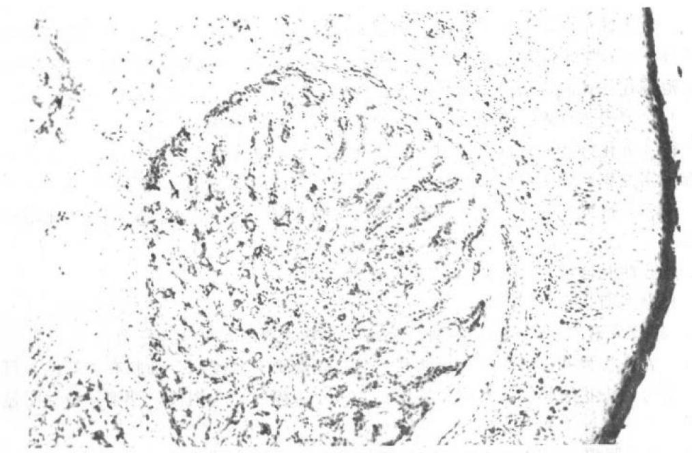 
图4-2 鼻咽部单形性腺瘤
# 六、恶性上皮性肿瘤
鼻腔、鼻窦及鼻咽部的恶性肿瘤不算多见，约占呼吸道恶性肿瘤的 $2.4\%$ 或全身恶性肿瘤的 $0.37\%$ ，其中以鼻咽癌为第一位，其次是上颌窦及鼻腔的癌。
# （一）鼻腔、鼻窦的癌
鼻腔鼻窦癌中 $24\%$ 既往有鼻息肉摘除史，说明与慢性炎症有一定关系。另外，在木工厂及皮革厂工人中发病率高。
1.鳞癌 鼻腔鼻窦癌中以鳞癌最多见，组织学上分为角化型和非角化型，分化程度从高到低均可见到。
（1）角化型鳞癌：癌细胞角化明显，可见细胞间桥和角化珠，细胞核大、深染、多形，呈不规则条索和巢状。须与前面提到过的假上皮瘤样增生、坏死性涎腺炎和乳头状瘤鉴别。 
（2）“非角化”型鳞癌：癌组织呈大小不等的实性巢，外形稍整齐，界限清楚，细胞大小较一致，核大、圆或卵圆，核仁明显，胞浆淡染或嗜双色或空泡状，细胞界限清楚，偶见单个细胞角化而提示是鳞癌。此种鳞癌曾有不少名称，如未分化癌、“移行细胞”癌、“Schneiderian”癌。须鉴别的主要有恶性黑色素瘤、嗅神经母细胞瘤、恶性淋巴瘤、某些腺癌和乳头状瘤，这些都可呈实性巢状结构。与乳头状瘤的鉴别在于癌的细胞巢小，形状不一致，周边不光滑。但在小块活检时鉴别是困难的。
（3）疣状鳞癌：偶见于鼻腔鼻窦。
# 2. 涎腺型癌
（1）腺样囊性癌：这是上呼吸道中最常见的腺癌，而鼻腔鼻窦又是上呼吸道中最好发的部位，以上颌窦最多。组织学上与涎腺发生者相同，呈管状、筛状及实性，以后两者为多。大多数情况下诊断不困难，只是小块活检时不太容易。当只看到实性巢时，会当作未分化癌；当只看到小管状结构时会当作混合瘤。由于此癌容易浸润于神经和骨，因此病变范围往往比临床检查的大小要大。如果切除彻底是可以治愈的。 
（2）粘液表皮样癌：主要发生于上颌窦，其次是鼻腔。
光镜 分化好的癌在腺腔中可见粘液细胞、鳞状细胞和中间细胞。分化差者则仅为鳞状细胞实性巢，如果仅取小块活检可诊断为低分化鳞癌或未分化癌。因此，在实际工作中，应多取材或多切片，以寻找有无粘液细胞成分。有人报道的腺鳞癌可能是粘液表皮样癌。
（3）恶性混合瘤 
（4）腺泡细胞癌：很罕见。
3. 其他腺癌 除了涎腺型癌外，还有一些其它腺癌，可分为三型。
（1）乳头状腺癌：呈多分支乳头状，乳头基底部有微浸润，细胞有多形性，可见核分裂。须与乳头状瘤、乳头状增生鉴别。乳头状腺癌的乳头细长，细胞异型性明显。预后较好。 
（2）无蒂腺癌：这种腺癌组织学上与大肠腺癌相似[9]，复层柱状癌细胞，无纤毛，可见粘液细胞和杯状细胞。 
（3）粘液样腺癌：与胶样腺癌或粘液腺癌相似，可见杯状细胞、印戒样细胞和细胞
外粘液池。
4. 未分化癌[10] 低倍镜下呈巢状、小梁状和片块状，细胞中等大小，核分裂多，坏死广泛，血管浸润明显，预后差。
鼻腔鼻窦癌大多直接侵及邻近组织，诊断时约 $25\%$ 已有颈淋巴结转移。前鼻腔淋巴引流到颌下淋巴结，全鼻腔淋巴引流到咽后及前颈淋巴结。手术、放疗或两者结合治疗5年生存率在鼻腔癌为 $38\% \sim 63\%$ ，上颌窦癌为 $13\% \sim 35\%$ 。
# （二）鼻咽癌
鼻咽癌与鼻腔鼻窦癌在临床、病因及病理上有很大的不同。由于发生在鼻咽部，比较隐蔽，故早期无表现，当患者就医时已扩散至鼻咽以外部位，其中最多见的是颈部淋巴结转移表现的包块。仅 $20\% \sim 30\%$ 有鼻咽部症状， $20\% \sim 30\%$ 有咽鼓管阻塞所致的中耳症状， $10\% \sim 15\%$ 有颅神经受损表现，以Ⅲ、V、VI、IX、X为多见。鼻咽癌好发部位是穹窿顶，其次是隐窝侧壁。鼻咽镜下表现为：隆起、浸润、外生、溃疡。有的病例几乎看不到异常而仅靠随机活检才得以证实。
鼻咽癌以东南亚多见，尤其是中国南部的男性。发病年龄有两个高峰，一是15岁～25岁，二是60岁～69岁。目前发现的致病因素有遗传、环境和EB病毒。抗EB病毒的IgG抗体及EB病毒壳抗原的IgA对诊断有帮助，只是前者有 $30\%$ 和后者有 $9\% \sim 18\%$ 的假阳性，值得注意。
组织学上根据有无角化而分为两大类：即角化型和非角化型。角化型则称为鳞癌，非角化型称为未分化癌，常以梭形细胞出现。角化型仅占极少数；未分化癌则大多数中见有明显的炎细胞浸润，传统上称为淋巴上皮癌。这一名称实质上是不正确的，因为淋巴细胞不是肿瘤成分。除了反应性淋巴细胞外，还有嗜酸性白细胞、浆细胞、上皮样细胞及多核巨细胞。
在肿瘤生长方式上则有两种类型，一种称为Regaud型，即上皮性肿瘤细胞被淋巴细胞和纤维组织清楚分隔成巢或片块；另一种称为Schmincke型，即上皮性肿瘤细胞弥散在炎细胞之间，似大细胞性淋巴瘤。
鼻咽癌的细胞核对诊断是有帮助的，其特点是核呈空泡状，核膜光滑，单个大的红核仁。
鼻咽癌的组织学分型方案较多[11]，国内常用的有①鳞癌（分化高、中、低）；②腺癌（分化高、中、低）；③泡状核细胞癌；④未分化癌。
电镜 见癌细胞有张力原纤维、桥粒、似移行细胞，故可能是来自假复层上皮的基底层细胞。
免疫组织化学 keratin 阳性, EMA 大多数阳性, CEA 少数阳性。可见到 S-100 阳性的树突状细胞。偶尔间质中还见淀粉样物。
由于鼻咽癌转移在淋巴结中呈弥漫分布，故易当作大细胞性淋巴瘤。又因转移灶中常有较多嗜酸性白细胞，加上癌细胞的大红核仁，又易误为Hodgkin病。当见到上皮样细胞反应及坏死时可误认为结核。在鼻咽活检中，大量淋巴细胞背景中仅少许癌组织，此时易将癌组织误为淋巴滤泡的生发中心。这些都值得在病理诊断时重视。
对于放疗的敏感性来说，以伴有大量淋巴细胞浸润者对放疗敏感（图4-3）。
其他类型则各家报道不尽一致。总的意见是：有鳞化者预后差，未分化者、多形性
图4-3 鼻咽癌放疗后 
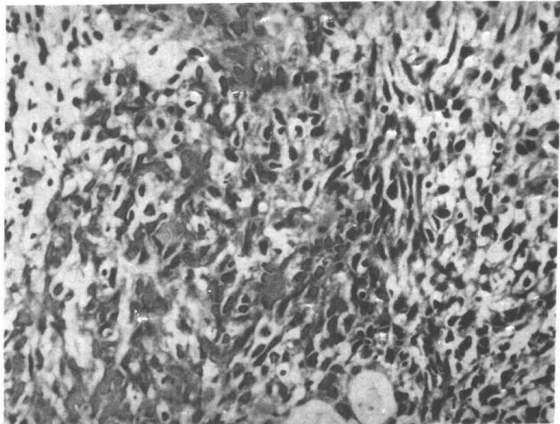 
癌组织退变使形态不典型，易误为炎症性病变
者、缺乏淋巴细胞者预后差。在预后因素中分期是有价值的：限于鼻咽部者预后良好、有颈淋巴结转移者次之、有神经和骨转移者预后差。有一半病人放疗后可治愈。年轻人预后较好。肿瘤的扩散主要是直接浸润和转移。直接浸润见于颅底、翼状窝、鼻窦、口咽；转移则见于颈淋巴结、肺、骨和内脏。
# （三）类癌
- 仅见到少数病例报道。儿童病例中有鼻腔与支气管类癌并发的报道。
# （四）转移性肿瘤
一般只有当全身有恶性肿瘤转移时才见到鼻腔、鼻窦及鼻咽的转移。以上呼吸道为首发转移的肿瘤有肾癌，其次是肺癌、乳腺癌，恶性淋巴瘤和白血病。
# 七、淋巴组织肿瘤及瘤样病变
# （一）浆细胞性肉芽肿
在上呼吸道炎症性病变中有时出现大量浆细胞，甚至全为浆细胞，称为浆细胞性肉芽肿。其本质不是真性肿瘤。与浆细胞瘤的鉴别在于：
（1）病变内大量小血管增生、内皮细胞明显； 
（2）浆细胞为成熟型； 
（3）其他炎细胞可见； 
（4）有较多Russell小体。
# （二）假性淋巴瘤
鼻腔内可呈息肉状的包块，而组织学上为大量增生的淋巴组织，较少见。
# （三）浆细胞瘤
髓外浆细胞瘤最多见的部位是上呼吸道。
大体 呈一出血性突起的包块。
光镜为不成熟的浆细胞组成。临床追随数年乃至10余年后大多数发展成全身多发性骨髓瘤。浆细胞瘤可向颈淋巴结转移。
# （四）恶性淋巴瘤
鼻腔、鼻窦及鼻咽的恶性淋巴瘤是非上皮性恶性肿瘤中最多见的。以往诊断的恶性组织细胞增生症、中线恶网、多形性网状细胞增生症等现证实均为恶性淋巴瘤，主要是T淋巴细胞来源。真性组织细胞来源则十分罕见。此部位的恶性淋巴瘤具有一定的临床病理特点：
（1）大片坏死； 
（2）细胞多形性明显（图4-4）；
图4-4 鼻咽部非何杰金淋巴瘤 
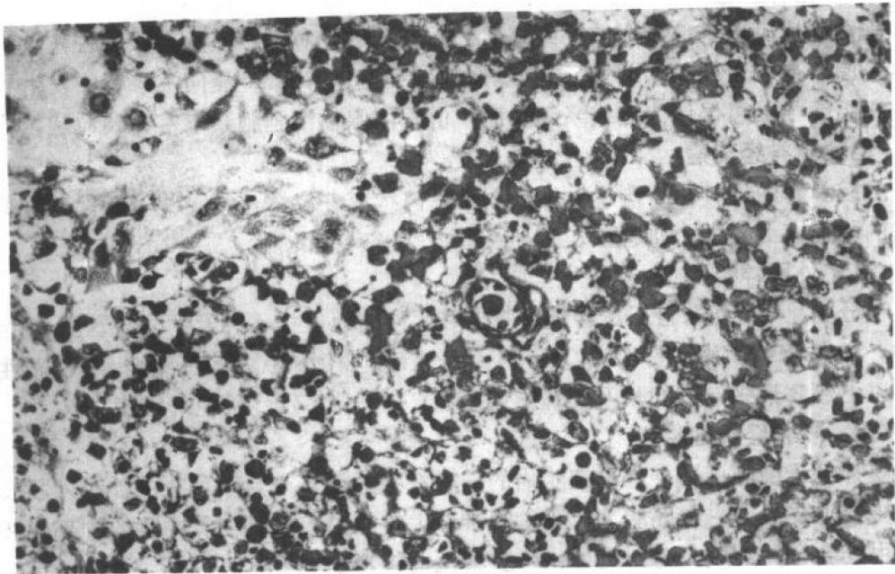 
细胞多形性，以往曾诊断为中线恶性组织细胞增生症
（3）瘤细胞往往不形成瘤块，而是弥漫浸润于固有组织结构之中； 
（4）多数为T细胞性； 
（5）多数为弥漫型； 
(6) 一半病人病变局限于鼻腔、鼻咽, 另有一半患者很快全身扩散致死; 
（7）瘤细胞有亲血管性。
# （五）恶性组织细胞增生症（恶组）或恶性组织细胞瘤
以往诊断的恶组大多数为非何杰金氏淋巴瘤，仅极少数是组织细胞来源。
# 八、神经源性肿瘤
# （一）鼻胶质瘤（脑膨出、胶质异位）
鼻胶质瘤的本质是先天畸形，是脑膨出的一种，与脑膜是相连的，以婴儿为多，也可见于成人。 $60\%$ 呈皮下小硬结， $30\%$ 为鼻腔内包块，常位于鼻腔上部，呈息肉状，偶见于鼻窦及鼻咽部， $10\%$ 同时见于皮下及鼻腔。位于鼻腔者可致鼻阻塞。病变增长较慢，与脑发育成熟的时间相一致。
光镜 由神经胶质组成，星形细胞可见肥胖变，大的星形细胞可类似组织细胞。神经元很少见到。有时多核巨细胞可类似神经元。当临床怀疑是鼻胶质瘤时，最好不要行局部摘除，因肿瘤可与颅内相通。
# （二）脑膜瘤[12]
脑膜瘤在颅外见于鼻腔、鼻窦、中耳、颞骨、眼眶。其组织来源认为是颅骨在发育和融合过程中将蛛网膜细胞带出颅外所致。有少数颅外脑膜瘤仔细检查可发现与之相连的颅内肿瘤，因而又可看作是颅内脑膜瘤的局部颅外浸润。鼻腔鼻窦的脑膜瘤呈息肉状，大体上灰白、坚硬。组织学上与颅内脑膜瘤相同，但以上皮型多见，也可见到砂粒体。
# （三）垂体腺瘤
垂体腺瘤可以局部浸润扩展到蝶窦、后鼻孔、上鼻咽，呈息肉状和占位性病变。也可以是原来异位于颅外的肿瘤，这是垂体前叶细胞以Rathke囊向上移行中发生异位残留所致。组织学上可误认为癌或浆细胞瘤，但垂体腺瘤细胞胞浆丰富、颗粒状。
# （四）副神经节瘤
鼻腔鼻窦的副神经节瘤少见，局部呈息肉状或占位性，可侵及附近骨。组织学上易混淆的肿瘤有上皮性、血管性、嗅神经母细胞瘤或脑膜瘤。
# （五）外周神经肿瘤
十分少见，可能来自三叉神经的眼支和上颌支以及植物神经的分支。在一组20例报道中，15例神经鞘瘤（图4-5）、2例神经纤维瘤、2例丛状神经纤维瘤、1例恶性神经鞘瘤。以上颌窦最多，有的累及到鼻窝或眼眶。2例伴多发性神经纤维瘤。
# （六）嗅神经母细胞瘤
嗅神经母细胞瘤是神经母细胞瘤的一种特殊类型，来自嗅基板的神经外胚成分或嗅膜的神经上皮成分。在胚胎期，正常嗅神经上皮从鼻腔底部向鼻中隔的中部伸展，再向上鼻甲处会合，到成人时，此处由呼吸道上皮被覆。
发病年龄3岁—79岁，中位年龄50岁。
大体 肿瘤呈灰红色、富于血管，息肉状。位于鼻顶部，个别来自鼻咽部、上颌窦及筛窦。
光镜 表现有几种形态。典型者为大小一致的小细胞、核圆、胞浆少，核膜不清楚，有明显的类似于节细胞神经母细胞瘤中的纤维性和网状背景，可见Homer Wright型菊形团，见不到分化成熟的节细胞，可见丰富的纤维血管基质分隔瘤细胞呈簇状。偶尔在瘤细胞胞浆内见到黑色素。须鉴别的有恶性淋巴瘤、浆细胞瘤、横纹肌肉瘤。另一种类型者表现为瘤细胞大，胞浆丰富，成实性巢，同上皮性肿瘤，故应与未分化癌鉴别。有人认为，前者以小细胞表现的称为真性神经母细胞瘤，后者以大细胞表现的称为神经内分泌癌，因为确有腺癌或鳞癌成分出现的。但也有人认为均为神经母细胞瘤，只不过出现两种分化而已。
免疫组化 NSE、chromogranin、neurofilament、keratin 阳性，有的细胞 S-100 阳性，
少数星形细胞性瘤细胞GFAP阳性。
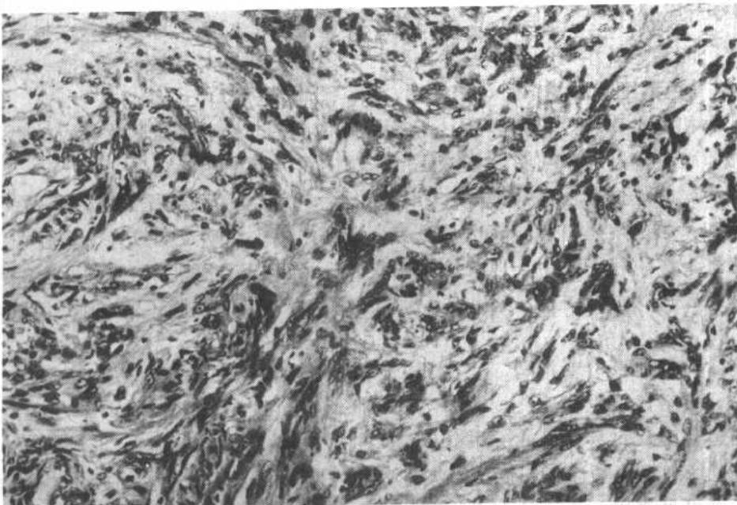 
图4-5 鼻咽部神经鞘瘤
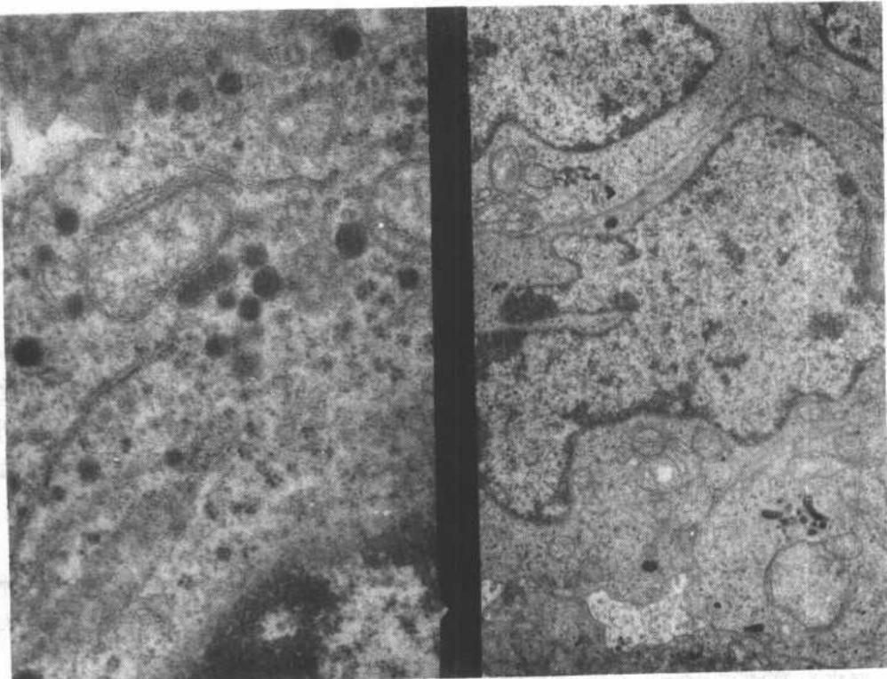 
图4-6 鼻腔嗅神经母细胞瘤 
胞浆中见成簇致密核心颗粒
电镜 可见神经微丝、微管、致密核心颗粒（图4-6）。
肿瘤容易向周围浸润而达鼻窦、鼻咽、上颚、眼眶、颅底及脑，1/5出现远处转移，最常见部位是颈淋巴结、肺。5年存活率为 $50\% \sim 60\%$ ，常见复发。放疗最敏感，手术加放疗有可能治愈。组织学类型与生物学行为之间关系不大。
# （七）黑色素细胞肿瘤
黑变病和色素痣较少见于鼻腔、鼻窦及鼻咽，偶可见于鼻前庭及鼻腔粘膜。在正常情况下的鼻腔鼻窦粘膜中可有神经外胚层来源的黑色素细胞存在。
鼻腔鼻窦的恶性黑色素瘤（恶黑）不算少见[13]，约占头颈部恶黑的 $9\%$ 。在头颈部粘膜的恶黑中，第一位是口腔，其次是鼻腔鼻窦，然后是鼻咽及咽鼓管。鼻腔中以中隔为多，其次是下鼻甲和中鼻甲。但就诊时病变如已经很广泛时则不能明确原发部位了。
临床主要症状是鼻阻塞、鼻出血。检查示息肉状突出，质脆，易出血，色可灰白、褐或黑。
光镜 与其他部位者相同，大多数以大小不等的条索和巢状结构出现，细胞多角形，大小不一，核空，核仁明显。少数病例以梭形细胞为主。黑色素可多可少，有少数病例难以找到黑色素。容易误诊的有未分化癌、低分化鳞癌、移行细胞癌、恶性淋巴瘤、各种肉瘤等。仔细寻找肿瘤组织周边有无交界痣的图像有助于鉴别诊断，在一组病例中15例中有9例可见瘤周交界痣的存在。预后不良，5年存活率约 $10\%$ 。
# 九、皮样囊肿、畸胎瘤
发生在鼻咽部的皮样囊肿（皮样瘤、畸胎样瘤、毛发息肉）不是真性肿瘤，而是两个胚层（外、中胚层）的发育畸形。一般出生时就有。临床见一带蒂的突出物，附着于鼻咽侧壁或软腭，可完全阻塞鼻咽部。组织学上可见到多种组织成分：皮肤、皮肤附属器、纤维、脂肪、平滑肌、骨骼肌、软骨、骨。小涎腺可能是继发性掺入的。
由从三个胚层来的组织成分组成的畸胎瘤很少见[14]。上颌寄生胎属于畸胎瘤，常附着于蝶骨。恶性畸胎瘤仅见一例报道，发生于筛窦。
# 十、非上皮性肿瘤
鼻腔鼻窦及鼻咽的非上皮性肿瘤临床表现与上皮性肿瘤相似（鼻阻塞、鼻出血等），正确诊断只能依赖于病理组织学。非上皮性肿瘤仅占该部肿瘤的 $10\% \sim 20\%$ 。良性非上皮性肿瘤有血管肿瘤、骨软骨肿瘤、纤维骨性肿瘤、纤维瘤、粘液瘤、横纹肌及平滑肌肿瘤、脂肪瘤等。恶性非上皮性肿瘤有恶性淋巴瘤、纤维肉瘤、骨软骨肉瘤、肌源性肉瘤、恶性纤维组织细胞瘤、血管肉瘤、浆细胞瘤、恶性巨细胞瘤、脂肪肉瘤等。
# （一）血管肿瘤
1. 血管纤维瘤 血管纤维瘤是上呼吸道最多见的非上皮性肿瘤，几乎均为男性，主要在10岁～25岁之间，仅个别病例见于老年及女性，由此现象说明鼻血管纤维瘤与男性激素有关，事实也证明在肿瘤细胞中有男性激素受体存在。
肿瘤来自鼻底后侧壁上具有勃起样功能的血管纤维间质。
大体呈息肉状，取活检时出血明显。可大致占据整个鼻腔，并突向软腭游离缘下方、鼻窦、鼻孔外、鼻咽部，甚至达眼眶和颅内。行选择性颈动脉造影对确定肿瘤范围
有帮助。目前采用CT、MRI亦可明确。
光镜 为杂乱的血管和纤维间质混合，间质可疏松、水肿，星状纤维母细胞，大量肥大细胞，也可呈致密无细胞的胶原区。血管大小不一，可从毛细血管到较大静脉，大血管常位于肿瘤基底部，而肿瘤周边部为“生长区”，主要是富于内皮细胞的毛细血管样血管。大的血管可以有不规则或不完全的平滑肌层，但缺乏弹力纤维。与血管瘤的鉴别点在于肿瘤的特定部位、临床特点以及“勃起”性组织间质（图4-7）。
图4-7 鼻咽血管纤维瘤 
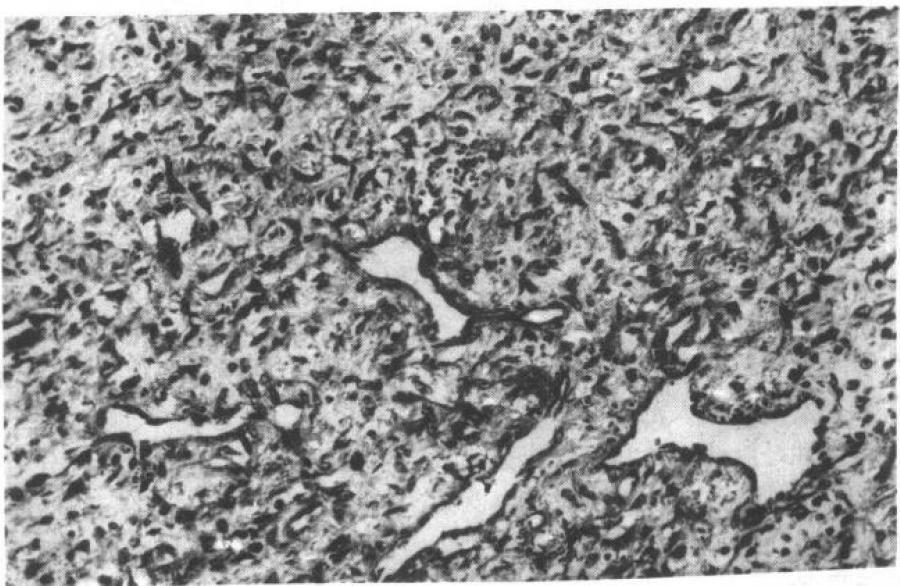 
丰富血管间的星芒状纤维母细胞
电镜 在增生细胞的核内见有明显的电子密度颗粒，由紧密结合的RNA蛋白复合物组成[15]。有的血管纤维瘤间质细胞很丰富而似纤维肉瘤，但异型性不明显，核分裂少见。当血管纤维瘤中血管小，受间质细胞明显挤压时可类似血管外皮细胞瘤，但真正的血管外皮细胞瘤的血管呈裂隙状。
有的病例肿瘤在青春期后可退缩，尤其是外科手术部分切除或放疗后，自行全部消退很罕见。当有症状时，还是应当进行治疗，但对于采取手术还是放疗则有争论。大多数治疗后的复发出现在一年内，少数在放疗后可出现肉瘤变。对于侵袭性肿瘤可考虑化疗。
2. 血管畸形 在鼻腔刮除标本中容易忽略血管畸形。当看到血管数目多、大小不一、形态多样时应考虑血管畸形。
3. 血管瘤 血管瘤多见于前鼻中隔，其次是鼻甲和前庭，以毛细血管瘤最多，其次是海绵状、静脉性血管瘤、血管内皮细胞瘤、血管瘤病。
4. 其他血管肿瘤 血管球瘤、血管外皮细胞瘤、恶性血管内皮细胞瘤（血管肉瘤）偶见于鼻腔鼻窦。还可见到淋巴管瘤、Masson瘤（乳头状内皮瘤）、Kaposi肉瘤。
# （二）骨瘤
骨瘤最多见于上颌窦、额窦,可分为象牙型、成熟型和纤维型三种。由不同比例的
成熟板层骨和成熟纤维组织组成。
# （三）纤维异常增殖
纤维异常增殖（fibrous dysplasia）是一种良性肿瘤或一种错构，其骨成熟过程受阻而停留在编织骨阶段。正常情况下，颅面骨是通过膜内成骨形式成熟的，首先在间质中出现骨样基质，然后发展成编织状纤维骨，最后骨母细胞排列在编织骨的表面，形成骨基质和有规则粘合线的板层骨。纤维异常增殖时，常见不到板层骨，而是骨成熟过程停止在编织骨阶段。
光镜 病变由不同比例的纤维成分和骨成分组成。纤维母细胞成分呈梭形，细胞成分可中度到高度丰富，异型性及核分裂不多见。骨成分为不规则编织状骨小梁，无骨母细胞及粘合线。在偏光显微镜下可见编织骨中有不规则的双折光纤维。大多数病例诊断不困难，只是在病变周边部可见反应性新骨形成，有骨母细胞和粘合线出现。在复发病例也可见到反应性骨而需仔细鉴别。
由于病变生长缓慢，故行保守性手术切除即可。不主张放疗，以免放射后肉瘤的发生。
# （四）骨化性纤维瘤
骨化性纤维瘤在临床及生物学行为上是一个局部进行性生长的肿瘤，可破坏邻近骨，局部切除后常复发而需更大范围的手术切除。
光镜 骨化性纤维瘤由骨和纤维成分组成，以纤维成分为主，细胞成分为中到高度丰富。梭形纤维母细胞的多形性及核分裂少见。骨成分多种多样，可以是灶性骨样沉着，也可以是中心为骨而四周环绕骨样组织的“砂粒体”样骨岛，偶见骨母细胞、粘合线及发育充分的板层骨。
当细胞成分高度丰富时可误为纤维肉瘤，尤其是小块组织活检，因为纤维肉瘤向周围浸润时可引起反应性骨和化生性骨形成。鉴别点在于骨化性纤维瘤的骨形成是均匀分布的。
骨化性纤维瘤与骨肉瘤的鉴别在于前者骨组织相对规则、一致，纤维间质成分异型性不明显。而骨肉瘤的骨小梁不规则，骨及骨样基质不成熟、排列紊乱，间质梭形细胞异型性明显，一般无砂粒体样骨化岛。
与骨纤维异常增殖的鉴别有时是困难的，因两者的纤维间质是一样的，主要是看骨成分的不同。但有少数病例两者可有重叠。一般认为，骨纤维异常增殖必须具有编织骨，出现板层骨仅位于周边的反应性区域，而骨化性纤维瘤则无编织骨，仅以板层骨成分出现。
# （五）巨细胞瘤
良性及恶性巨细胞瘤均有报道。应注意与含有巨细胞的其他病变相鉴别，如巨细胞修复性肉芽肿、甲旁亢的“棕色瘤”、纤维组织细胞瘤。
# （六）鼻咽孤立性纤维瘤
这是鼻咽部发生的一种肿瘤，形态上类似于胸膜的孤立性纤维瘤。
# （七）纤维组织肿瘤
由纤维组织发生的肿瘤有纤维瘤、纤维瘤病、纤维肉瘤。这三种肿瘤与身体其他部位发生者形态上相同，只是发生在鼻腔鼻窦及鼻咽部者应与骨化性纤维瘤、骨纤维异常
增殖等纤维与骨两种成分出现的肿瘤相鉴别，因为这种两种成分肿瘤中有时会以纤维成分为主出现。同时，在许多软组织肉瘤中可出现纤维肉瘤的成分，如骨肉瘤、软骨肉瘤、滑膜肉瘤、恶性纤维组织细胞瘤等，应注意与单纯的纤维肉瘤鉴别。一般认为，真正的纤维肉瘤、纤维瘤中不出现多核巨细胞、奇异核细胞。如出现时，则需仔细寻找其他肿瘤成分（图4-8）。
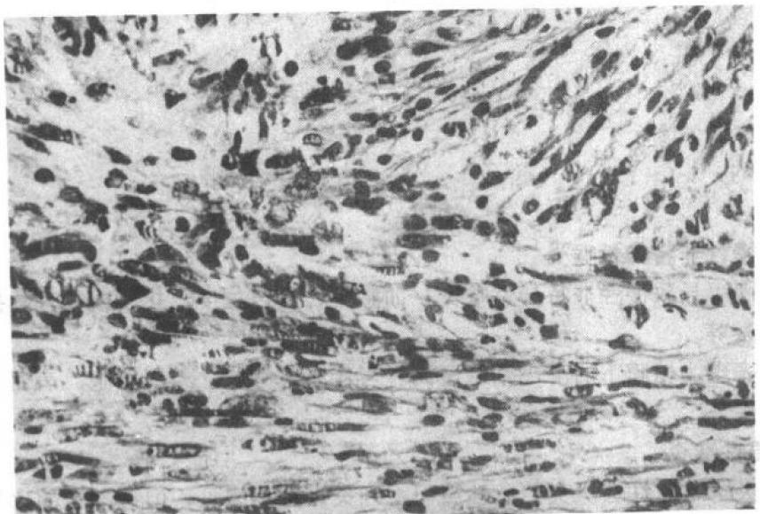 
图4-8 鼻咽癌放射治疗后13年发生的鼻咽部纤维肉瘤
# （八）肌源性肿瘤
平滑肌瘤和横纹肌瘤在鼻腔鼻窦及鼻咽很少见。横纹肌肉瘤则可见于小儿，12岁以后很罕见。发生在鼻腔者可似多发性息肉，组织学上则以胚胎型或葡萄状肉瘤为主，腺泡状及多形型罕见。葡萄状肉瘤特征为上皮下有一肉瘤细胞带，其中瘤细胞呈梭形，常可找到横纹，深部为粘液样或胚胎型肉瘤成分。仅取小块活检组织对于明确诊断是困难的。
# （九）粘液瘤
粘液瘤主要来自骨组织。
大体 呈灰白多结节状，有胶样韧性。
光镜 为无血管的粘液样基质，散在梭形和星芒状细胞，胞核小，卵圆，很深染，胞浆带长尾巴。有的区域纤维间质明显，其中为纤维细胞。
许多上呼吸道肿瘤可出现粘液变性区域，如神经鞘瘤、粘液型脂肪肉瘤、胚胎型横纹肌肉瘤、纤维瘤病、纤维肉瘤、纤维组织细胞瘤、纤维异常增殖、骨化性纤维瘤、软骨肿瘤等，应注意鉴别。
# （十）脊索瘤
脊索瘤主要见于骶尾及蝶枕部，位于蝶枕部者可累及后鼻腔、蝶窦、蝶骨、鼻咽及颅底。
光镜 瘤细胞呈巢状、条索状、常有分叶, 空泡状瘤细胞为其特征, PAS 染色胞浆
内物质呈阳性。多数病例细胞异型性不明显，少数分化差者呈肉瘤样。有的会出现软骨组织而似软骨瘤或分化好的软骨肉瘤，称为软骨样脊索瘤。总的原则是只有见到空泡状瘤细胞时脊索瘤的诊断才能成立。
# （十一）其他少见肿瘤
鼻腔鼻窦及鼻咽部的少见肿瘤有软骨瘤、软骨肉瘤、脂肪瘤、脂肪肉瘤、纤维组织细胞瘤、滑膜肉瘤、骨外Ewing瘤等。这些虽都见有文献报道，其组织形态诊断都与软组织肿瘤相同。
# 第二节 喉
# 一、炎性病变
# （一）慢性非特异性喉炎
很多原因可导致慢性非特异性喉炎，如感染、发声过度、化学或物理的损伤、烟草或酒精的刺激等。
光镜 表现为粘膜下的淋巴细胞浸润，可伴有浆细胞、组织细胞。表面上皮可有一定程度的增生。
# （二）急性喉炎
急性喉炎又称急性会厌炎、急性声门上区炎。虽不多见，但有潜在的致死性。由于大片水肿，可造成急性呼吸道阻塞，以儿童为多，也可见于成人。以细菌感染和嗜血B型流感病毒感染最常见。
大体 表现为声门上区发红、水肿。
光镜 为急性炎细胞浸润伴水肿，并可累及周围软组织。
# （三）结核
喉结核开始于拘后间隙，然后扩展至会厌拘厌皱、声带。喉镜检查类似喉癌。胸片往往可见活动性肺结核。喉活检可见典型肉芽肿，干酪样坏死可有可无。
# （四）真菌感染
在真菌性喉炎中以组织胞浆菌和芽生菌最多见，还可见到曲菌。早期多位于声带和会厌。组织胞浆菌的肉芽肿病变仅位于喉的前部（尤其是会厌），同时伴有口腔病变。曲菌可产生表面上皮的假上皮瘤样增生。
# （五）Crohn病
喉的Crohn病表现为溃疡形成和肉芽肿性炎。尤以会厌为主。
# （六）后联合溃疡
又称接触性溃疡[16]、肉芽肿性溃疡。临床上可当作喉小结，但发生在后联合处、构状软骨的声突部，此处上皮下间质稀少。病变以高度增生的肉芽组织为主，与化脓性肉芽肿（炎症性毛细血管瘤）相似，局部切除后常易复发，很难愈合。仍以保守治疗为主，最终还是可以治愈的。
# （七）其他少见病变
气管内插管可造成双侧枸状软骨的声突部肉芽肿形成而误为肿瘤。由神经损伤导致
的声带麻痹后，为增强声带作用而局部注入Teflon可导致异物肉芽肿。放疗后组织内间质细胞核呈奇异形可误为恶性肿瘤。风湿性关节炎可累及环构关节，表现为纤维素样坏死的肉芽肿病变。喉软斑也见有报道。
# 二、囊肿
# （一）袋状囊肿 (saccular cyst)
喉囊的囊性扩张形成袋状囊肿，常见于喉室内、大而深，内含粘液，被覆呼吸道或鳞状上皮。
# （二）导管囊肿（ductal cyst）
由粘液腺扩张所致，多见于真声带或会厌。小而浅，内含粘液，被覆鳞状或呼吸道上皮。
# （三）嗜酸细胞性囊肿（oncocytic cyst）
由于囊壁部分或全部被覆嗜酸细胞而得名，可能是管状囊肿的一种亚型。常见乳头状皱折。此乳头是由增生或化生所致，不是真性肿瘤性乳头。有时弥漫分布整个喉部，易复发。
# （四）扁桃体样囊肿
由于囊壁被覆鳞状上皮、隐窝样结构、富于淋巴细胞，似扁桃体组织而得名。
# （五）喉膨出（laryngocele）
喉室附件呈袋状扩张，内含气体，与喉腔有狭窄通道相连。
# 三、假瘤
# （一）喉小结
喉小结是患者发声不当出现的一种非炎症性的特殊病变，主要见于声带的前1/3，也称为歌唱家小结、淀粉样瘤、息肉、血管曲张。
光镜 依据病变不同阶段而有不同表现。早期表现为水肿及纤维母细胞增生，然后出现血管扩张、间质透明性变。以血管成分为主时易当作血管瘤。以透明性变为主时过去称为淀粉样瘤。事实上不是淀粉样物而是透明性变的胶原。
# （二）假性淋巴瘤
喉部的假性淋巴瘤与上呼吸道的其他部位假性淋巴瘤相似，表现为淋巴组织大量增生，淋巴滤泡形成，生发中心出现。表面上皮出现过度角化及棘层增生。需与真性淋巴瘤鉴别。
# （三）淀粉样物沉着
常是气管、支气管树淀粉样物沉着的一部分。
# 四、上皮增生性病变
# （一）幼年性喉乳头状瘤
主要见于儿童及青少年。表现为真声带上多发性乳头状瘤，可扩展到假声带、会厌、声门下区，甚至气管和支气管。当病变范围广泛时可造成呼吸困难和致死。通过电镜、免疫组化及核酸分子杂交技术证实为HPV感染所致，以6、11型为主。
光镜 为分化好的鳞状上皮呈乳头状生长，核分裂多见，有一定程度的不典型性及角化不良，可误认为原位癌。上皮下有慢性炎及充血。肿瘤易复发，可长期存在，还可蔓延至气管切开口和软组织中，甚至包绕颈动脉，但形态上仍为分化好的鳞状上皮。这种生长的肿瘤称为侵袭性乳头状瘤病。治疗有激素、药物、接种、烧烙、冷冻、干扰素等，但效果有限。对于范围广泛者，则需行喉切除。有的喉乳头状瘤病伴鳞癌发生，有
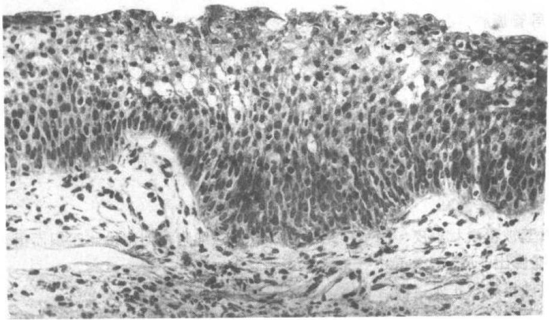 
图4-9 喉粘膜上皮轻度不典型增生
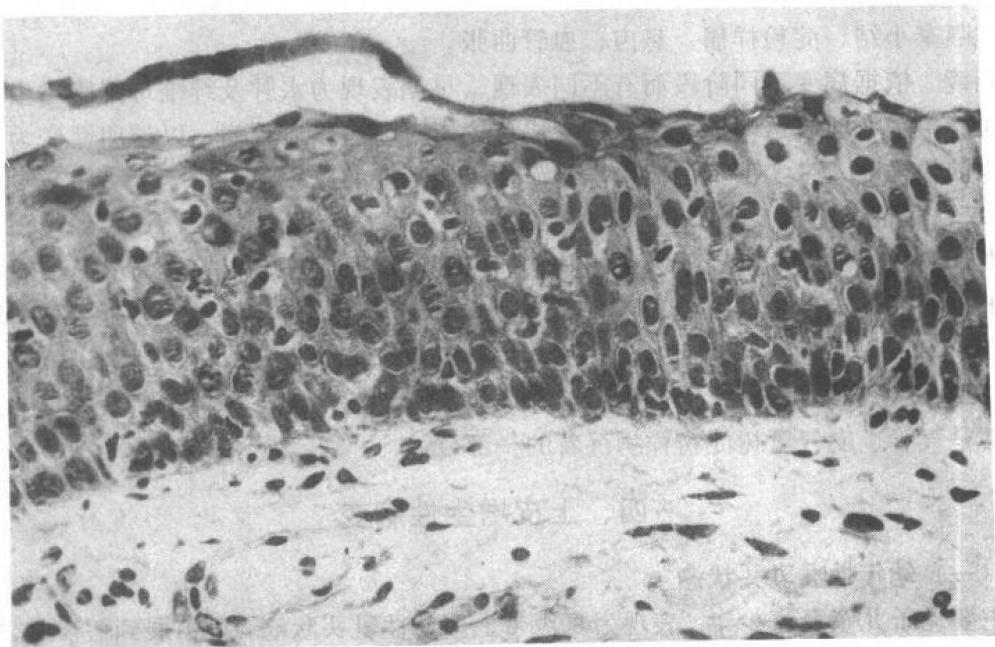 
图4-10 喉粘膜上皮中度不典型增生
的发生于放疗后，有的则无放疗史。
# （二）成人喉乳头状瘤
主要见于男性、单发。炎症反应不明显，不扩散，不易复发。杂交技术可显示HPV DNA。
# （三）寻常疣
也是HPV感染。发生在喉的寻常疣易与鳞癌和疣状癌相混淆。
# （四）上皮增生
喉的上皮增生很常见，尤其是在声带，因容易出现声嘶而受到临床重视，常行活检。病理组织学上可将增生分为：
（1）增生伴角化；
（2）增生伴不典型性：分轻、中、重三度；
（3）原位癌。
增生伴角化在判断上困难不大，即上皮层增厚、表面角化，可以是正常角化，也可以是角化不全。增生伴不典型性以上皮层增厚为基础。轻度不典型增生表现为上皮基底部细胞出现不典型性，即细胞的大小、形状不一，极
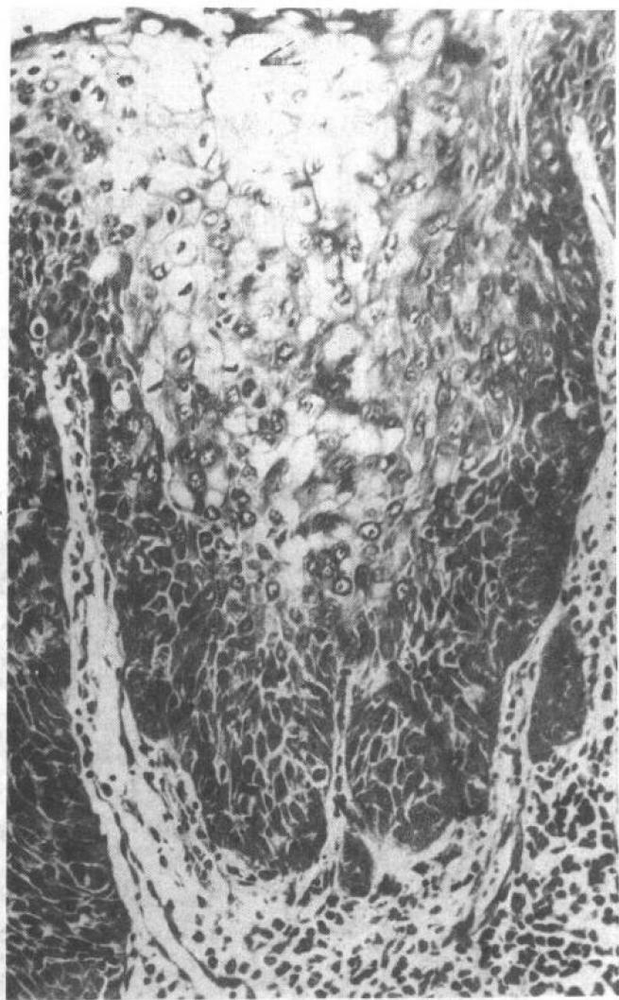 
图4-11 喉粘膜上皮癌变
向紊乱、核深染（图4-9）。中度不典型增生即不典型上皮达全层的一半至2/3（图4-10），此时不一定要等到全层不典型性就可出现基底部的癌变、浸润（图4-11）。重度不典型增生与原位癌是同义词，即全层上皮出现不典型性。在喉部，不象宫颈那样容易见到全层的不典型性，因喉部不典型增生时常出现表面过度角化。从仅有表面角化和上皮增生发展到癌常需很长的时间，在一组84例长达 $8\sim 10$ 年的随诊中，仅3例发展成癌。因此，对于无明显不典型的增生和角化，治疗上应保守一些。在 $75\%$ 的喉浸润癌的癌旁可见到原位癌，也可单独发生。喉镜下仅局部发红。原位癌发展成浸润癌的时间可以很长，常达5年以上。
# 五、恶性上皮性肿瘤
# （一）鳞癌
喉鳞癌是上呼吸道恶性上皮性肿瘤中最多见的。吸烟及酒精与喉鳞癌关系密切。临床上分为四个区域：
（1）声门区，最多见，占 $60\% \sim 65\%$ 
(2）声门上区，占 $30\% \sim 35\%$ 
（3）跨声门区， $5\%$ 以下； 
(4) 声门下区, 不到 $5\%$ 。喉癌转移最多见的部位是局部淋巴结, 其次是肺, 直接侵犯可达甲状腺及颈静脉。
大体常为 $1\mathrm{cm}\sim 4\mathrm{cm}$ 大小，呈灰白、灰红色突出物，常形成溃疡。声带发生者常有角化。组织学上分为高、中、低分化三种，发生在声带者多为高、中分化，而声门下区则多为低分化。一般来说，肿瘤越小，分化越好。当浸润限于浅层时称为浅表浸润癌，尽量不要叫“早期”癌，避免临床医生误解为小灶性癌。
放疗后的鳞癌诊断上有一定困难，因为放疗也可造成细胞的不典型性。癌灶中可见组织细胞吞噬细胞碎片，和有异物巨细胞反应（图4-12）。
图4-12 喉鳞癌放疗后 
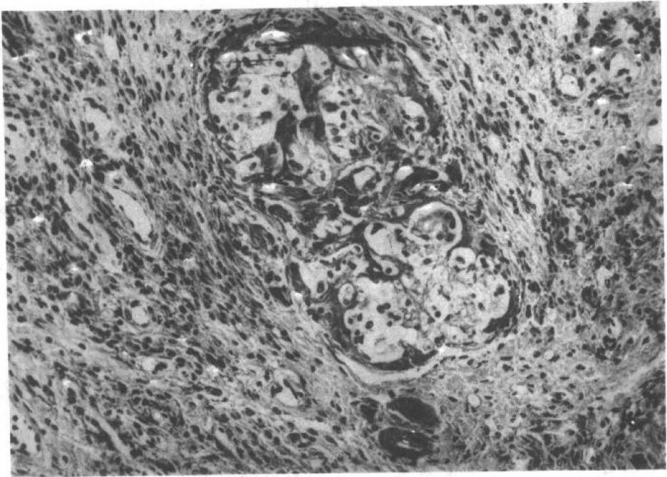 
癌灶中见组织细胞吞噬细胞碎片、异物巨细胞形成
# （二）疣状癌
是鳞癌的一种特殊类型, 特点是呈息肉状外生性生长及细胞分化成熟。同口腔和其他部位的疣状癌一样, 可以局部广泛浸润, 但不转移。已证实肿瘤及周围组织中HPV阳性[17]。疣状癌应与疣状增生鉴别, 两者都呈外生性生长, 大量角化, 只是疣状增生无浸润。在小块活检标本中要鉴别两者是困难的。
# （三）未分化大细胞癌
本质上也是鳞癌的一种，表现为未分化的细胞团块。有人认为似移行上皮，故称移行细胞癌。有人认为其周边部细胞呈栅状排列，细胞核深染，似基底细胞，又称为基底细胞样鳞癌（图4-13）。此种形态还可见于舌、咽、食道等。生物学行为表现为高侵袭性。
# （四）未分化小细胞癌
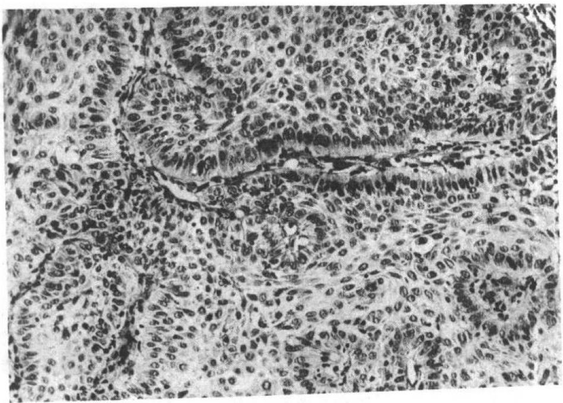 
图4-13 喉基底细胞样鳞癌
光镜 与肺小细胞癌相似。
电镜 有神经内分泌颗粒。淋巴结及远处转移多见，预后差。
# （五）伴肉瘤样间质的鳞癌
又称梭形细胞鳞癌、假肉瘤、癌肉瘤等，组织学上以梭形细胞恶性肿瘤出现，有的见明确的鳞癌成分，有的间质似肉芽组织样或恶性纤维组织细胞瘤样。对于此种肿瘤是肉瘤还是癌肉瘤还是癌仅以肉瘤形态表现出来，文献上一直有争论。可能存在着三种情况：
(1) 浅表或粘膜内鳞癌, 导致了间质的肉瘤样反应, 这种病变呈息肉状、预后好;
(2) 鳞癌呈梭形细胞肉瘤样, 其本质还是鳞癌, 临床上可为息肉状或浸润性, 预后同低分化鳞癌;
（3）真性鳞癌和肉瘤的碰撞，肉瘤可以是多种组织起源的。
# （六）涎腺型肿瘤
喉部最多见的涎腺型肿瘤是腺样囊性癌，其他有粘液表皮样癌、腺泡细胞癌。个别见有良性及恶性多形性腺瘤的报道（图4-14）。另见有喉的腺淋巴瘤、嗜酸细胞腺瘤、嗜酸细胞癌的报道。
# （七）腺癌
很少见，以老年男性为主，见于假声带的前下联合处，此处有浆液粘液混合性腺体，即使手术根治，预后亦不佳。
# （八）类癌
形态与支气管肺的类癌相同（图4-15）。有报道喉类癌细胞呈嗜酸细胞样，也可有不典型类癌出现[18]。
图4-14 喉恶性多形性腺瘤 
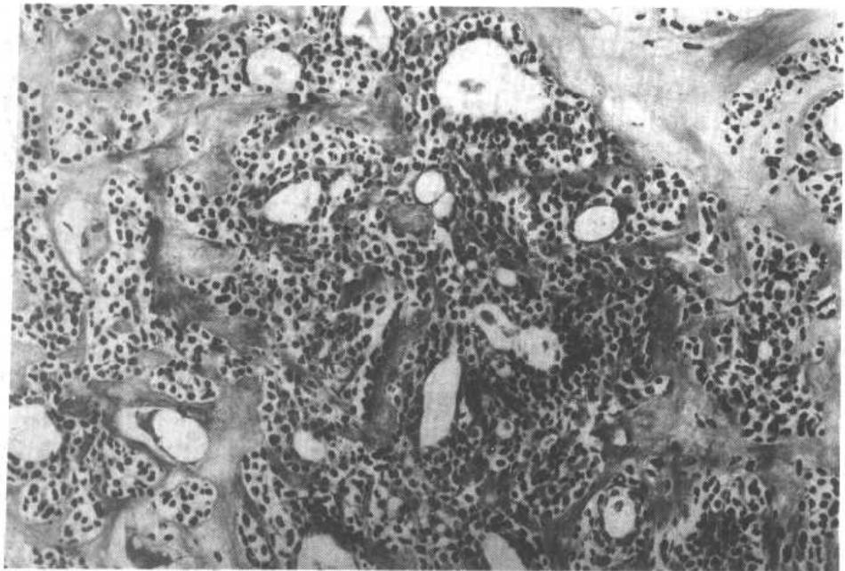 
肌上皮细胞成分呈透明细胞改变
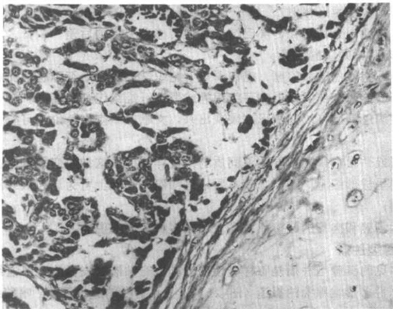 
图4-15 喉类癌浸润于会厌软骨周围
# （九）其他少见癌
喉部的其他少见癌有：巨细胞癌、透明细胞癌、腺鳞癌等。
# 六、神经源性肿瘤
# （一）神经鞘瘤和神经纤维瘤
喉的神经鞘瘤和神经纤维瘤已见有报道。神经纤维瘤病可累及喉部，以声门上区为多，组织学表现与其他部位者同。
# （二）颗粒细胞肿瘤（granular cell tumor）
主要见于声带。尽管对于此肿瘤的细胞来源有争论，如骨骼肌细胞、组织细胞、纤维母细胞、间叶细胞等，但有证据支持是神经鞘来源。胞浆内颗粒PAS阳性。肿瘤表面的鳞状上皮可呈假上皮瘤样增生而误为鳞癌。
# （三）恶性黑色素瘤
在上呼吸道恶性黑色素瘤中，发生在喉的很罕见，诊断时应仔细寻找交界性病变，因为恶性黑色素瘤转移可达喉部。
# （四）副神经节瘤
在声带前端已证实有副神经节的存在，故喉的副神经节瘤并不罕见。肿瘤在取活检时极易出血。临床上吞咽时疼痛症状明显，并可传递到一侧耳部。有时肿瘤很小而不易发现。肿瘤生长缓慢，但可复发甚至发生颈淋巴结转移。
# 七、间叶组织肿瘤
喉部的间叶组织肿瘤不多见，已见于报道的有以下类型。
# （一）血管淋巴管肿瘤
血管瘤主要见于婴幼儿，界限不清，位于真声带下，可发生呼吸道梗阻。有一半病例伴有皮肤血管瘤，有助于诊断。放疗是可取的，必要时再行喉切除。淋巴管瘤十分罕见。血管肉瘤、血管外皮细胞瘤、Kaposi肉瘤可呈息肉状出现，均罕见。
# （二）纤维组织肿瘤
文献见有新生儿喉纤维瘤病造成喉梗阻的报道。纤维瘤则多见于60岁以上老人，但应警惕是否为癌的间质纤维反应。喉的纤维肉瘤 $70\%$ 在50岁以上，男性为主，多位于声带前部。组织学上有分化好与分化差之别。
# （三）肌源性肿瘤
横纹肌瘤组织学上相似于颗粒细胞肿瘤，但能见到横纹而与后者区别，切除不彻底可复发，但不呈恶性表现。横纹肌肉瘤主要为胚胎型。平滑肌瘤及平滑肌肉瘤很少见。
# （四）骨软骨组织肿瘤
喉部未见有骨瘤的报道，但喉软骨中可出现骨化。喉部软骨瘤较多见，位于枸状软骨的后中部，呈光滑的突起性包块，可导致呼吸道梗阻，切除不彻底可以复发。活检取材往往表浅，故不一定能反映肿瘤的主体，即活检时表现尚属良性，切除后呈交界性或低度恶性的软骨肉瘤。骨肉瘤仅见个别病例报道。软骨肉瘤则报道较多。分化好的软骨肉瘤异型性不明显，仅表现出双核软骨细胞。
# （五）纤维组织细胞肿瘤
黄色瘤仅有个例报道。纤维组织细胞瘤主要见于儿童和年轻人，虽为良性，但呈浸润性生长。恶性纤维组织细胞瘤诊断时应先排除癌肉瘤的可能。
# （六）脂肪组织肿瘤
脂肪瘤、脂肪肉瘤仅有个例报道。
# （七）粘液瘤
喉部真性粘液瘤未见报道，只是其他肿瘤出现粘液变性而已，尤其常见的是声带息肉的粘液变。
# （八）滑膜肉瘤
咽下及喉的滑膜肉瘤已有一些报道，大多分化较好，组织化学证实有粘液物质产生，支持滑膜来源。
# 八、淋巴细胞、浆细胞肿瘤
上呼吸道浆细胞瘤有 $10\%$ 见于喉部，以老年男性为多，诊断标准为：浆细胞大片浸润，占据正常组织结构，细胞不成熟，核浆比例大，核仁明显且红染，可见多核浆细胞。有一部分病例追随后发展成多发性骨髓瘤。反之，多发性骨髓瘤可累及喉部。非何杰金氏淋巴瘤、蕈样霉菌病均见发生于喉的报道。急性白血病累及喉导致梗阻的报道也见到。
# 九、转移性肿瘤
喉转移性肿瘤已见到皮肤恶性黑色素瘤、肾癌、乳腺癌、肺癌、结肠癌。甲状腺癌可直接侵犯喉部组织。
（李维华 纪小龙）
# 参考文献
1. Meyer PR, et al. Soleroma (rhinosoleroma). A histologio immunochemical study with bacteriologic correlates. Arch Pathol Lab Med, 1983; 107: 377-383 
2. Katzenstein A-LA, et al. Pathologic findings in allergic aspergillus sinusitis. A newly recognized form of sinusitis. Am J surg Pathol, 1983; 7: 439-443 
3. Travis WD, et al. Immunostaining for hemoglobin in two cases of myospherulosis. Arch Pathol Lab Med, 1986; 110: 763-765 
4. Gephardt GN, et al. Wegener's granulomatosis: Immunomicroscopic and ultrastructural study of four cases. Arch Pathol Lab Med, 1990; 114961-965 
5. Del Buono EA, Flint A. Diagnostic usefulness of nasal biopsy in Wegener's granulomatosis. Hum Pathol, 1991; 22: 107-110 
6. Luna MA, et al. In situ hybridization demonstrating human papilloma virus sinuses. Lab Invest, 1988; 58: 58A 
7. Compagbo J, Wong RT. Intranasal mixed tumors (pleomorphic adenomas). A clinicopathologic study of 40 cases. Am J Clin Pathol, 1977; 68: 213-218 
8. Begin LR, et al. Spindle cell myoepithelioma of the nasal cavity. Am J Surg Pathol, 1991; 15: 184-190 
9. Franquemont DW, et al. Histologic classification of sinonasal intestinal-type adenocarcinoma. Am J Surg Pathol, 1991; 15: 368-375 
10. 纪小龙等．电镜在鼻腔鼻窦未分化肿瘤中的意义．中华耳鼻喉科杂志，1991；26：29-31 
11. Hsu HC, et al. Pathology of nasopharyngeal carcinoma. Proposal of a new histologic classification correlated with prognosis. Cancer, 1987; 59: 945-951 
12. Ho KL. Primary meningioma of the nasal cavity and paranasal sinuses. Cancer, 1988; 46: 1442-1447 
13. Franquemont PJ, Lubsen H. Rhabdomyoblasits in olfactory neuroblastoma. Histopathology, 1991;
19: 182-184 
14. Tharrington CL, Bossen EH. Nasopharyngeal teratomas. Arch Pathol Lab Med, 1992; 116: 165-167 
15. Topilko A, et al. Ultrastructural cytochemistry of intranuclear dense granules in nasopharyngeal angiofibroma. Ultrastruct Pathol, 1984; 5: 221-228 
16. Wenig BM, Heffner DK. Contact ulcers of the larynx. Arch Pathol Lab Med, 1990; 114: 825-828 
17. Abramson AL, et al. Verrucous carcinoma of the larynx: Possible human papillomavirus etiology. Arch Otolaryngol, 1985; 111: 709-715 
18. Dictor M, et al. Moderately differentiated neuroendocrine carcinoma (atypical carcinoid) of the supra-glottic larynx. Arch Pathol Lab Med, 1992; 116: 253-257
# 第五章 气管、支气管和肺
# 第一节 发育异常 147
# 一、隔离肺· 147
（一）肺叶外型 148 
（二）肺叶内型 148
# 二、囊肿性疾病 148
（一）先天性囊肿性疾病 148 
（二）间胚叶囊性错构瘤 149
# 第二节 循环障碍及血管疾病 150
# 一、充血与水肿 150
（一）坠积性充血和水肿 150 
（二）尿毒症肺 150 
（三）休克肺 150 
（四）透明膜病 150
# 二、肺栓塞 150
（一）脂肪及骨髓栓塞 150 
（二）羊水栓塞 151
# 三、肺血管疾病 151
（一）原发性肺动脉高压所致血管损害 151 
（二）先天性心脏病引起的肺血管病变 152 
（三）小动脉静脉瘘 153
# 第三节 炎症性疾病· 153
# 一、慢性支气管炎 153
# 二、支气管扩张症 153
# 三、肺脓肿 154
# 四、病原菌引起的肺炎 154
（一）巨细胞病毒肺炎 154 
（二）单纯疱疹肺炎 154 
（三）腺病毒肺炎 154 
（四）军团病（Legionnaires病） 154 
（五）链球菌肺炎 154 
（六）奴卡菌病 155 
（七）支原体肺炎 155
# （八）Carinii肺囊虫肺炎 155
# （九）艾滋病（AIDS）的肺 156
（十）骨髓移植后肺的变化 156 
（十一）外源性过敏性肺泡炎 156
# 五、间质性肺炎 156
（一）通常的间质性肺炎 156 
（二）剥脱性间质性肺炎 157 
（三）淋巴细胞性间质性肺炎 157 
（四）巨细胞间质性肺炎 158
# 六、其他肺炎 158
（一）机化性肺炎 158 
（二）脂性肺炎 159 
（三）嗜酸性肺炎 159 
（四）风湿性肺炎 159 
（五）类风湿性肺炎 159 
（六）放射性肺炎 159 
（七）肺软斑病 159
# 七、肉芽肿性炎 160
（一）结核病 160 
（二）不典型分支杆菌病 160 
（三）结节病 160 
（四）坏死性结节病样肉芽肿病 161 
（五）铍肉芽肿 161 
（六）Wegener肉芽肿病 161 
（七）支气管中心性肉芽肿病 162 
（八）过敏性肉芽肿病 162 
（九）透明变性肉芽肿 163
# 八、霉菌病 163
（一）曲菌病 163 
（二）毛霉菌病 163 
（三）念珠菌病 164 
（四）隐球菌病 164 
（五）组织胞浆菌病 165
# 九、寄生虫病及原虫病 166
（一）弓形体病 166 
（二）棘球蚴病 166 
（三）阿米巴性肺脓肿 166 
（四）血吸虫病 166
# 十、肺尘埃沉着病 167
（一）炭末沉着病（煤矿工人肺） 167 
（二）砂沉着病（砂肺） 167
（三）石棉沉着病 168 
（四）铁末沉着病 168 
（五）铍沉着病 169
# 十一、其他疾病 169
（一）特发性含铁血黄素沉着病 169 
（二）肺泡蛋白沉着症 169 
（三）淀粉样物质沉着 169 
（四）组织细胞增生症X 169 
（五）子宫内膜异位症 170 
（六）肺泡微结石病 171 
（七）支气管结石病 171
（八）氧中毒 171
# 第四节 肺 癌 171
# 肺癌的病理诊断方法 172
（一）疫细胞学检查 172 
（二）纤维支气管镜活检 172 
（三）经皮肺穿活检 172 
（四）开胸切除活检 172 
（五）电镜检查 172
# 二、肺癌的组织发生 173
（一）支气管表面上皮 173 
（二）肺泡上皮 173
# 三、早期肺癌 173
（一）中央型 174 
（二）周围型 174
# 四、中晚期肺癌的类型 176
（一）大体类型 176 
（二）组织学类型 176
# 五、肺癌的扩散与转移 192
（一）直接蔓延 192 
（二）淋巴道转移 192 
（三）血路转移 192
# 六、影响肺癌预后的因素 192
（一）临床分期 192 
（二）细胞类型与分化程度 193 
（三）DNA倍体及癌基因表达 193 
（四）其他因素 194
# 第五节 肺的其他肿瘤 194
# 一、良性肿瘤及癌样病变 194
（一）上皮性肿瘤 194 
（二）间叶性肿瘤 196 
（三）瘤样病变 198 
（四）其他良性肿瘤 201
# 二、恶性肿瘤 202
（一）肌源性肿瘤 202 
（二）血管源性肿瘤 203 
（三）淋巴造血组织肿瘤及瘤样病变 203 
（四）其他恶性肿瘤 206
# 三、转移性肿瘤 207
1．具有鳞癌组织结构者 208 
2.具有腺癌组织结构者 208 
3.具有透明细胞组织结构者 208 
4．具有乳头状结构者 209 
5．具有梭形细胞结构者 209
气管、支气管和肺是呼吸系统的主要组成部分，是人体最重要的器官之一。它的主要功能是通过呼吸运动和血液循环，进行气体交换，以维持人体正常的生命活动。呼吸系统特别是肺部的许多疾病，都是导致患者死亡的重要原因。
在外科病理及常规尸检工作中，不论婴儿、儿童或成年人，肺部疾病都是最常见的，而且疾病的种类也是多种多样。特别是感染性和非感染性疾病和肿瘤，要比其他器官者更为繁杂和众多。此外，由于肺是全身血液循环必经之地，所以，有关循环障碍的疾病也不少见。虽然肺部疾病的发生、发展及其性质各不相同，或有很大差异，但大多数疾病都可引起不同程度的呼吸功能障碍，并在肺部表现出不同形式的影像学变化，这就有必要从临床、病理两方面对各种肺的疾病进行鉴别诊断，以利于对患者进行正确的治疗。从诊断病理学的角度着眼，可把气管、支气管和肺的疾病，大致分为四大类：即①发育异常；②循环障碍和血管病变；③炎症性疾病；④肿瘤。
在上述各类疾病中，以肺的炎症性疾病和肺癌更为多见。在常规病理诊断工作中，不论活检或尸检，遇到的这类疾病也最多。因此，本章的重点放在肺的炎症性疾病和肺癌的病理学诊断上。
# 第一节 发育异常
# 一、隔离肺
隔离肺是指肺叶的一部分，部分或完全与正常肺组织分离，且与正常支气管树无连接、不相通，病变有来自体循环的异常动脉。可见于从颈到膈的任何水平部位，少数可在膈之上，或在腹腔内。临床上，隔离肺常为一性质不明的肿块而进行开胸探查并手术
切除。根据与肺叶的关系之不同，可分为两型。
# （一）肺叶外型
这块肺组织与肺叶完全分开，呈结节状，表面有其自身的胸膜包裹。其动脉供应通常来自主动脉或其分支，而静脉回流至奇静脉系统。此型隔离肺约 $90\%$ 的病例发生在左侧，大约 $20\%$ 的患者伴有其他先天性畸形，特别是膈疝。有人报告有的伴有羊水过多和水肿。
# （二）肺叶内型
这块肺组织与正常肺叶部分分开，但在同一脏层胸膜内，又与正常肺叶的支气管不相通。多位于下叶内，特别是后基底段内。 $60\%$ 病例发生在左肺。此型隔离肺的动脉供应为一支较大动脉，来自降主动脉及其分支， $75\%$ 发生自膈上，其余来自膈下。静脉回流至肺静脉系统。
大体 隔离部分可为一单个囊肿，或为多数囊肿区，或为一实性肿块。
光镜 可见细支气管常呈囊状扩张，肺组织有慢性炎症及纤维化，血管的闭塞性变化较明显。这种情况的发生尚有争论，有人认为与肺动脉的发育缺陷有关，有人认为是后天性的，与反复发作的慢性肺炎有关。因为此型隔离肺在新生儿及婴儿从未见到过，且伴有其他发育异常也很少见。
# 二、囊肿性疾病
# （一）先天性囊肿性疾病
先天性囊肿性疾病是肺的任何一种囊性病变的通用名称，它在出生时即存在。在囊肿区内无炭末沉着可作为判断是先天性病变的一种标志。根据大体及组织形态的不同，先天性囊肿性疾病包括以下几种。
1. 先天性大叶肺气肿（congenital lobar emphysema）（先天性大叶过度充气 congenital lobar hyperinflation）此病见于新生儿、婴儿及少年儿童，仅累及一侧肺上叶或右肺中叶，双肺受累者少。病理变化主要是一叶肺的肺泡大块性过度膨胀伴邻近肺发育低下，而不伴有组织的破坏；另一种是多数肺泡畸形，即正常肺泡被大量不正常肺泡取代。因此，它不是一种真正的囊肿性病变，也不是肺气肿性病变。 
2. 支气管源性囊肿 此病是由于支气管在发育过程中发生障碍，导致部分支气管闭塞或不畅通，其远端支气管管腔扩张而成。故在肉眼检查时，囊肿与支气管往往不相通。根据囊肿数目的不同，可分为两种。
(1) 单个性囊肿：发生自较大支气管，故以中央型为多见。囊肿直径一般多为 $2\mathrm{cm}$ 左右，囊腔内含有粘液，如有继发性感染，可出现化脓性改变。
大体 与肺脓肿难以区别。
光镜囊肿壁与支气管结构相同，内衬假复层纤毛柱状上皮，囊壁内可见腺体、软骨及少量平滑肌组织。如合并继发感染，可有急性或慢性炎症的改变。
（2）多发性囊肿：多发生于一侧或双侧肺的小支气管，故多为周围型。
大体. 肺切面上有多数小囊肿，直径约 $1\mathrm{cm}$ 。
光镜囊肿壁内衬纤毛柱状上皮或无纤毛上皮细胞，囊壁主要由纤维组织构成，不含腺体，软骨也不多见，壁内无炭末沉着。囊肿之间可互相连通。如合并感染，可形成
多数脓肿，与囊性支气管扩张不易区别。
【鉴别诊断】囊性支气管扩张与多发性支气管源性囊肿的鉴别要点是：①囊性扩张的支气管与支气管相通；②支气管壁内组织结构有破坏，并有炭末沉着；③扩张的与不扩张的支气管均有炎症改变，可为急性炎或慢性炎。
3. 先天性囊性腺瘤样畸形[1] 先天性囊性腺瘤样畸形（congenital cystic adenomatoid malformation）与支气管闭锁有关，通常见于有呼吸窘迫的新生儿，亦可见于较大儿童和成人。它是胚胎肺的一种发育异常，下叶常受累。
大体 可为单个或多个大囊肿（直径 $>2\mathrm{cm}$ ），或为多数小囊肿（直径 $<1\mathrm{cm}$ ），或为巨大非囊性的实性病变。
光镜 大囊肿内衬假复层纤毛柱状上皮，壁内含平滑肌及弹力组织，软骨少见；囊肿之间见相对正常的肺泡；小囊肿者，内衬纤毛立方状到柱状上皮，无粘液细胞，壁内无软骨及腺体，囊肿之间见类似呼吸细支气管及膨胀肺泡的结构（图5-1），此型常伴有其他先天性畸形；非囊肿性者，为被覆以纤毛立方状上皮的细支气管样结构，之间为无纤毛柱状上皮的腺样结构分隔，呈腺瘤样。
图5-1 肺先天性囊性腺瘤样畸形 
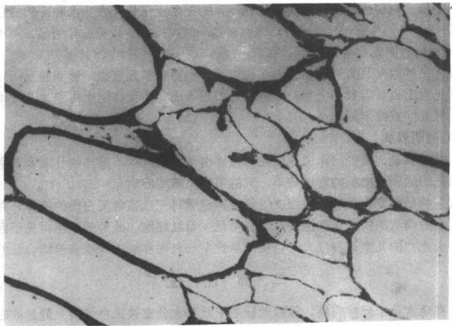 
小囊腔内衬立方状到柱状上皮，之间见膨胀的肺泡
# （二）间胚叶囊性错构瘤（mesenchymal cystic hamartoma）[2]
多见于成年人，为多灶性病变，可累及双肺。
光镜 特征是有小囊肿（直径 $1\mathrm{cm}$ ）形成，由原始间胚叶细胞的生长层（cambium layer）构成，被覆正常的或化生的呼吸上皮。生长缓慢，为良性过程，亦有发生恶性变者。
# 第二节 循环障碍及血管疾病
# 一、充血与水肿
# （一）坠积性充血和水肿
人死后在尸检时，双肺常见坠积性充血和水肿，甚至由于外伤而骤死的健康者，在肺的下坠部分亦见有血液淤积及一定量的浆液渗出至肺泡内。在发生昏迷缓慢死亡的病人，坠积性充血和水肿更为明显。
# （二）尿毒症肺
尿毒症时，可发生严重的慢性肺水肿。在尸检时见肺膨胀如橡皮样感，挤压时，切面上可见泡沫状液体流出。
光镜 见肺泡腔充以多少不等的水肿液，其中含细网状纤维素，并有透明膜形成。长期者肺泡内渗出物可发生机化。
# （三）休克肺
严重创伤、烧伤或其他原因所致休克，肺的主要变化是充血、水肿。肺的重量可增加 $100\% - 200\%$ 。当循环衰竭进展迅速，在数小时内死亡者，充血较明显。而水肿不如24小时或更长时间死亡者重。
光镜 见肺泡壁及支气管粘膜内毛细血管、小静脉扩张充血，肺泡腔及间质组织水肿，并常见有出血，以背部为重；并可见透明膜形成，Ⅰ型肺泡上皮增生及纤维化。晚期则发生继发性或终末期肺炎。
# （四）透明膜病
新生儿特别是剖腹产的未成熟婴儿，可能由于肺血管床不适当的开放及正常可降低肺泡表面张力的脂蛋白膜的形成缺陷，有的可发生透明膜病。
光镜 特征性变化是呼吸性细支气管及肺泡管可充满富含蛋白质的液体，并见浓集成均匀红染的膜状结构被于肺泡表面，亦可见少量红细胞。此种病变也可见于因急性风湿性全心炎死亡的儿童；在成人，可见于急性左心衰竭和成人呼吸窘迫综合征的患者。
# 二、肺栓塞
肺栓塞通常见于尸检病例，除肺动脉主干及其大分支被来自外周大静脉或右心脱落的大血栓栓塞，常引起突然死亡外，在诊断病理学上有意义的尚有以下几种。
# （一）脂肪及骨髓栓塞
一般见于严重骨折或皮下组织损伤，也可见于大的骨科手术（如髋关节置换术等）。如有大量脂肪将肺的毛细血管甚至小动脉广泛栓塞，可引起患者死亡。尸检时，大体并无特征性变化。
光镜 可见肺泡壁毛细血管内除见少量红细胞外，而被小空泡所占据（如不注意观察易被漏诊）。可进一步作脂肪染色证实。我们对一例因做髋关节置换术而发生肺脂肪栓塞死亡的病例，作了饿酸染色，血管内的脂肪滴，呈大小不等的黑色圆球形，清晰易见（图5-2）。
图5-2 肺脂肪栓塞 
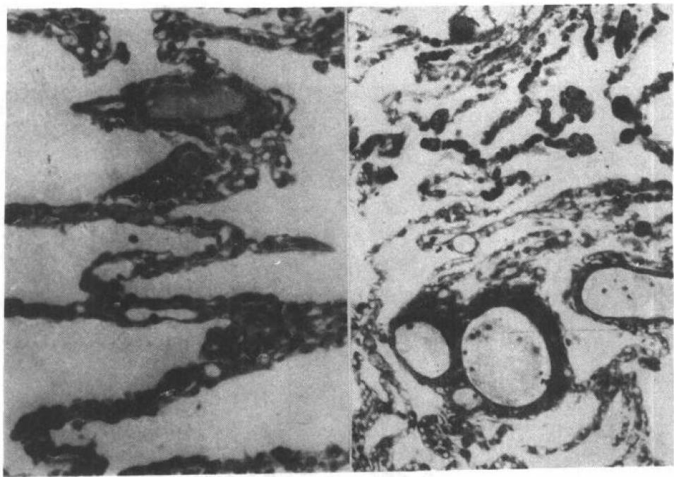 
左：肺泡壁毛细血管内见多量脂肪空泡 
右：肺泡壁毛细血管内脂滴呈黑色、饿酸染色
骨髓栓塞有时见于急救行人工呼吸的患者，因肋骨骨折所致。尸检病例可遇到此种情况，无实际意义。
# （二）羊水栓塞
在分娩时或产后即刻因速发休克而死亡的患者，在尸检时可见肺的羊水栓塞。
光镜 肺的许多小动脉和毛细血管内有多少不等的胎儿皮脂异物存在，包括角化上皮及胎毛，有的病例还可见粘液及胎粪上皮。如检查子宫，在其静脉内亦可见有同样的羊水物质。有些病例，羊水成分不易查见。其他有诊断意义的病变是肺淤血、水肿及左心扩张。在尸检时从下腔静脉及肺动脉流出的血液中，可查见含羊水成分的栓塞物质。
妊娠时或产后不久死亡的妇女，其肺的血管内常见成团的或单个的绒毛膜滋养细胞，并无病理学意义，因其不能继续生长，也不能阻塞肺血管床形成栓塞。如见有此种情况，不要误诊为转移性绒癌。
# 三、肺血管疾病
观察肺的血管疾病时，必须了解肺的动脉有内、外两层弹力膜，而肺的静脉只有单层弹力膜，用弹力-Van Gieson染色可清楚显示。肺的血管疾病主要包括原发性肺动脉高压所致的血管损害，各种先天性心脏病引起的肺血管病变等。
# （一）原发性肺动脉高压所致血管损害
根据对尸检资料的观察，原发性肺动脉高压引起的血管损害有以下几种(3)。
1. 中膜肥厚 在呼吸性细支气管水平的肌型肺动脉，中膜可不同程度增厚，分轻、
中、重三级。轻者中膜厚度占血管外径的 $6\% \sim 15\%$ ，重者超过 $25\%$ 。中膜肥厚也可累及小动脉。肌型动脉还可火见内膜细胞增生直至纤维化或纤维弹力增生（fibroelastosis），可为同心圆性或偏心性（图5-3）。
图5-3 原发性肺动脉高压所致血管损害 
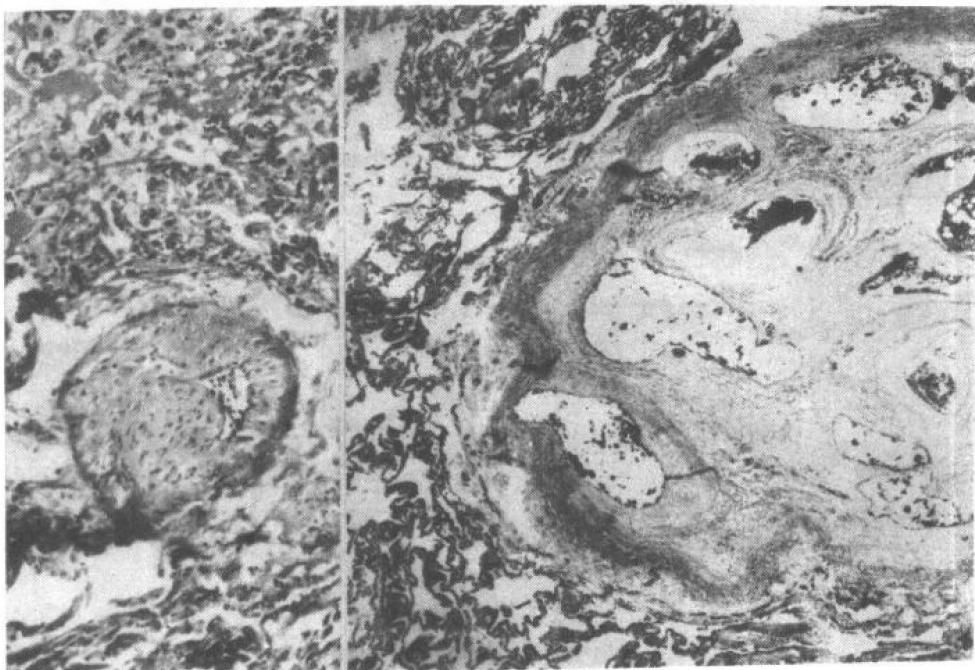 
左：肺动脉中膜偏心性增厚 
右：丛状血管病
2. 血栓栓塞型 此型最常见，在肌型动脉及小动脉可有新鲜或机化的血栓，有的还可见血管再通现象。可伴偏心性内膜增生及纤维化。 
3.丛状血管病型累及小的肌型动脉，特征是明显肥厚的中膜有局灶性裂开及动脉瘤性扩张，内膜增生富于细胞。机化血栓有时类似丛状血管病，其鉴别点是机化血栓可累及各种大小不同的血管，中膜无变形，内膜细胞少而纤维化较著。 
4. 肺静脉高压型 此型较少见，主要病变是内膜纤维化，中膜肥厚及“动脉化”(arterialization）常见且明显。“动脉化”的特征是肺静脉又形成一层外弹力膜，且中膜清楚。它与肺动脉的区别在于它的部位远离支气管分支。 
5. 肺静脉闭塞病型 亦较少见，特征是除偏心性内膜纤维化、中膜肥厚及“动脉化”外，有广泛静脉血栓形成，常机化、再通。
原发性肺动脉高压除可引起上述5种类型的病变外，均可出现肺的微循环障碍，表现为肺泡充血、水肿、出血及含铁血黄素沉着，在肺静脉高压型及肺静脉闭塞病型更为常见。
# （二）先天性心脏病引起的肺血管病变
在国外，进行先天性心脏病如房、室间隔缺损心内修补术时，于术前或术中进行开胸肺活检，检查肺血管病变，对决定手术的可行性及预后的判断有重要意义。国内尚很
少开展这类病例的肺活检，值得提倡。
先天性心脏病引起的肺血管病变，与原发性肺动脉高压所致者大致类同，有内膜增厚（包括细胞增生及纤维化）、中膜肥厚、丛状病变等，此外尚见血管扩张或血管瘤样病变及动脉的纤维素样坏死。Heath等[4]根据病变的严重程度，将其分为6级分类诊断，即I级：单纯中膜肥厚；Ⅰ级：I级加内膜细胞增生；Ⅲ级：内膜变化扩及较大动脉（直径 $500\mu \mathrm{m}$ ），且从细胞增生变为纤维化；Ⅳ级：动脉及小动脉扩张及丛状病变；V级：其他扩张病变，包括血管瘤样及海绵状病变，肺泡巨噬细胞有含铁血黄素沉着；VI级：肌型肺动脉纤维素样坏死。如果肺活检发现Ⅲ级以上病变，术后肺动脉压很难恢复正常；有Ⅳ级以上病变，即使手术很成功，预后也不佳，应视为手术禁忌征[5]。
# （三）小动脉静脉瘘（动脉瘤）
小动脉静脉瘘（arteriovenous fistulas）在放射影像上可辨认，常为多发性，以右肺下叶及中叶常见，它是由小动脉静脉交通的大血管构成。
光镜 血管异常，常显示血管壁内肌层缺乏或过多，以致难以区分是动脉和静脉。由于分流，可出现杂音、紫绀、红细胞增多症及动脉血氧含量降低。
# 第三节 炎症性疾病
# 一、慢性支气管炎
慢性支气管炎是一种常见病，可见于任何年龄，但以老年人多见。在老年尸检中尤为常见，外检中通常是支气管扩张症和肺癌等疾病的伴随病变，也可见于纤维支气管镜粘膜活检组织。
光镜 支气管壁呈慢性非特异性炎症，主要表现是：①呼吸上皮的损伤与修复：杯状细胞可增多，亦可发生鳞状上皮化生；②腺体肥大、增生和退变：粘膜下的浆液腺转化为粘液腺，并肥大、增生；有时腺体萎缩；③粘膜毛细血管增生、充血，管壁水肿，有淋巴细胞、浆细胞浸润；④平滑肌束断离、萎缩，有的（喘息型患者）固有膜及粘膜下的平滑肌束可增生、肥大；⑤管壁的软骨片可退变、萎缩，亦可纤维化、钙化和骨化。
# 二、支气管扩张症
支气管扩张症多见于青少年，左肺较右肺多见，且以下叶为常发部位。左下叶者常波及左肺上叶的舌段，右下叶者则可波及右中叶及右上叶的胸支。
大体胸膜常增厚，肺较正常重，根据支气管扩张的形状，可分为囊泡型、囊肿型及圆柱型。累及支气管以叶支气管为常见，也可累及段支气管或弥漫性。支气管壁不规则增厚，软骨可钙化，粘膜有溃疡。其间肺实质显示不同程度的炎症及纤维化。
光镜 支气管壁炎症以淋巴细胞浸润为主，可有淋巴滤泡形成，特别是年轻患者。溃疡常见，保存的上皮可正常，也可发生鳞化。如进一步发展，固有膜有肉芽组织形成，软骨片可破坏，肌组织可消失或局灶性肥大，粘液腺尚保存；管腔内常见中性白细胞聚集。支气管动脉常增大、扭曲，管壁增厚。囊泡型者肺实质变化不等，从无显著变化到进展性机化性肺炎。另外，有的见有多数由增生的梭形细胞形成的小的实性结节，即Kultschit-
sky型神经内分泌细胞的结节状增生，习惯上称为微瘤（tumorlets）。在组织发生上，它与类癌有关。
# 三、肺 胀 肿
肺脓肿大多发生在吸入异物后或肺癌伴有继发性感染时。来自其他部位的脓毒性栓塞，可引起双肺多数性脓肿。肺脓肿最常见的部位依次是右下叶、右上叶及左下叶，多为单个，大小不等，呈圆球形或不规则多房性，内含脓液。厌氧菌所致者较多见。
慢性脓肿有较厚的纤维组织构成的壁，周围肺组织呈机化性肺炎表现。有时脓肿可与扩张的支气管相通，脓肿壁可见与支气管上皮相连的立方状上皮，亦可伴鳞化。慢性脓肿可合并霉菌感染，如曲菌、毛霉菌。
# 四、病原菌引起的肺炎
这类肺炎，种类较多，除最多见的支气管肺炎、大叶性肺炎外，由病毒、细菌、霉菌及原虫引起的肺炎，各有其组织形态特征，主要有以下十余种。
# （一）巨细胞病毒肺炎
常见于免疫缺陷的病人，如AIDS、器官移植受体、接受细胞毒药物者。放射影像上，表现为位于肺外周的小结节（ $2\mathrm{cm}\sim 4\mathrm{cm}$ ），或为弥漫性间质性病变，也可发生实变。
光镜 间质性者，主要是单核炎细胞浸润，伴肺泡上皮增生及水肿。弥漫型者，还可伴有出血性坏死灶。病毒包涵体可见于大多数病例，位于增大的肺泡上皮细胞的胞核及胞浆内，PAS 及 GMS 染色阳性。
# （二）单纯疱疹肺炎[6]
亦为间质性病变，有单核炎细胞浸润及肺泡上皮增生，或为坏死性支气管肺炎。在坏死区边缘，可见核内病毒包涵体，但数量较巨细胞病毒肺炎者少。
# （三）腺病毒肺炎
光镜 特征性的变化是坏死性支气管炎和细支气管炎，有的支气管上皮增生；肺泡腔内有蛋白性水肿液、纤维素及坏死性颗粒状物质，并有巨噬细胞、淋巴细胞、浆细胞及中性白细胞渗出。肺泡上皮细胞可见有两种核内包涵体，一种呈嗜酸性，较小，周围有亮晕；另一种呈嗜碱性，较大，与核染色质无清楚分界。
# （四）军团病（Legionnaires病）[7]
此病是由一种Gram阴性的短杆菌引起的一种肺炎，在1976年费城流行时从病人肺中首次分离出病原菌Legionella pneumophilia。
光镜 病变特征是肺泡结构保存，腔内充满中性白细胞、巨噬细胞及大量纤维素，与肺炎球菌性大叶肺炎难以区别，但许多病例见炎细胞明显坏死、小血管炎及坏死。Dieterle银浸染色及Giemsa染色均可显示肺泡巨噬细胞内成堆的短杆菌，长 $1.0\mu \mathrm{m} - 3.0\mu \mathrm{m}$ 。肺门淋巴结亦可受累，部分病例可经血播散至其他器官。
# （五）链球菌肺炎
多为继发性感染所致，多见于小儿麻疹、流感时。
光镜 肺实变，呈融合性出血性支气管肺炎，渗出物中纤维素少，主要为血浆、红细胞及中性白细胞。病期延长，渗出物可机化。
# （六）奴卡菌病（nocardiosis）
奴卡菌病是另一种机会性肺部感染，由奴卡菌引起，约1/2病人，曾接受免疫抑制治疗（如器官移植的病人）、类固醇及化疗。开胸肺活检有助于诊断。
光镜 局灶性支气管肺炎，伴有微脓肿及界限不清的肉芽肿形成。Gram染色可见细长、稍呈珠状的丝状杆菌。
# （七）支原体肺炎（mycoplasma pneumoniae）[8]
以前称之为不典型肺炎，突出的特点是细支气管炎，而肺实质的炎性浸润不显著，或为间质性，或为支气管肺炎。局部淋巴结可受累。
光镜 见支气管壁有淋巴细胞、浆细胞浸润，细支气管腔内有中性白细胞聚集，细支气管炎伴上皮鳞化，肺泡Ⅰ型上皮增生。
# （八）Carinii 肺囊虫肺炎
Carinii 肺囊虫肺炎是一种非细菌性机会性感染, 病原体为一种原虫。大多数病例免疫功能低下, 如接受化疗的肿瘤患者或 AIDS 患者, 特别是后者更为多见。
光镜 肺泡腔内充满细泡沫状或蜂窝状物质，呈嗜酸性，并伴有肺泡间质的淋巴细胞、浆细胞浸润和肺泡上皮增生。Weber等报道了此病一些不典型的病变，如上皮样肉芽肿、局灶性多核巨细胞、明显间质纤维化及肺泡腔内大量巨噬细胞浸润。
确定此病的诊断基于在痰涂片或肺活检组织切片上查见病原体。其囊泡呈圆形，直径可达 $5\mu \mathrm{m}$ ，含有单个或成对的囊内小体，大小为 $1\mu \mathrm{m} - 2\mu \mathrm{m}$ ，其周有一空晕。在HE切片上囊泡不甚清楚，PAS染色呈阳性（图5-4），Gomori六胺银染色，更清楚可见[9]。
图5-4 Carinii肺囊虫肺炎 
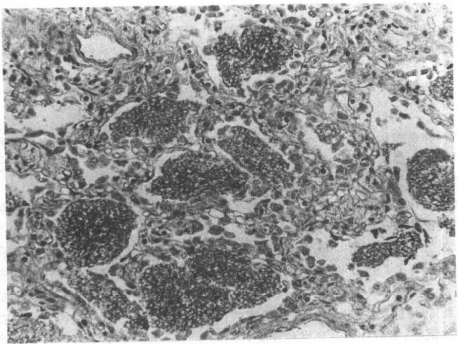 
肺泡腔内充有大量呈囊泡状的病原体，PAS染色阳性
Garinii 肺囊虫肺炎应注意与肺泡蛋白沉着症相鉴别，后者在肺泡内亦充满嗜伊红物
质，呈均匀细颗粒状，PAS染色亦呈阳性，但不呈细泡沫状，也无囊内小体，鉴别无困难。
# （九）艾滋病（AIDS）的肺
AIDS患者的肺部疾病最为常见，经支气管或开胸肺活检，均有助于诊断，最多见的是Carinii肺囊虫肺炎，还有巨细胞病毒肺炎、不典型分支杆菌病、结核病、念珠菌病、弓浆虫病、隐球菌病、组织胞浆菌病、芽生菌病及Kaposi肉瘤。这些疾病常混合存在。有时肺的病变为非特异性炎，可为剥脱性肺炎或淋巴细胞性间质性肺炎[10]。
# （十）骨髓移植后肺的变化
因患白血病进行骨髓移植后死亡的病人，大多数并非因白血病而死亡，而是由于移植物抗宿主病（GVHD）及间质性肺炎。后者的发生率为 $20\% \sim 50\%$ ，死亡率为 $50\% \sim 70\%$ 。最常见的是条件致病菌感染，尤以巨细胞病毒为多。
光镜 可见间质性肺炎伴有巨细胞包涵体或单纯肺泡上皮增生，或肺泡上皮不典型增生。此外，也可因化疗和放射引起的肺损伤有关。GVHD在肺的表现是小气道的病变，早期细支气管壁损伤，上皮可剥脱，接着为闭塞性细支气管炎，炎细胞浸润以中性白细胞和淋巴细胞为主，多在细支气管周围，管腔内可有粘液栓[11]。
# （十一）外源性过敏性肺泡炎
外源性过敏性肺泡炎(extrinsic allergic alveolitis)是指吸入过敏原后发生的一种以肺泡炎为主要病变的炎性疾病，如反复吸入过敏原，可发展为慢性肺疾病。
光镜 表现为间质性及肺泡内肺泡炎，可伴有明显的淋巴细胞浸润、肉芽肿形成及由纤维母细胞和其他间胚叶细胞构成的肺泡内“芽”（intra-alveolar “buds”），有的发生纤维化。
另外，有些疾病如农民肺、鸽子饲养者肺、鹦鹉玩赏者肺、蘑菇采摘者肺等均可包括在这类疾病中。来自空调及加湿器的热生性放线菌也能引起急性肺浸润和慢性肉芽肿性病变。
# 五、间质性肺炎
间质性肺炎亦称间质性肺疾病（interstitial lung disease，ILD）是一通用名称，是指以损伤肺实质和肺泡间质为主要特点的一组慢性疾病，炎性浸润主要分布在肺泡间或间质，并常导致肺纤维化，患者因呼吸衰竭而死亡。
引起间质性肺炎的原因很多，包括病毒性、支原体（mycoplasma）或化学性肺炎；有些是弥漫性肉芽肿病变的终期变化；许多病例见于化疗后，特别是烷基化物（alkylating agents）。如二甲磺酸丁酯（busulfan）、环磷酰胺、博莱霉素及amiodarone；有些病例有家族史，与遗传有关；还有些与免疫介导的疾病有关，如系统性红斑性狼疮、硬皮病、类风湿关节炎、慢性活动性肝炎、Raynaud现象、溃疡性结肠炎、Sjögren综合征及甲状腺疾病等。约 $30\%$ 特发性肺间质纤维化患者的血液中含有抗核抗体。免疫荧光检查肺组织有 $\mathrm{Ig}$ 及C3沉积，多数病例循环性免疫复合物阳性。这表明大多数特发性间质纤维化是免疫复合物肺疾病的一种类型。
间质性肺炎的类型 Liebow根据其形态特征，将间质性肺炎分为以下五型。
# （一）通常的间质性肺炎（usual interstitial pneumonitis，UIP）
亦名传统的间质性肺炎，根据病程的急缓，可分为两期：
1.急性间质性肺炎 特点是弥漫性肺泡损伤（diffuse alveolar damage，DAD）。
光镜 见肺泡坏死，腔内有透明膜形成、纤维素沉积和炎细胞渗出，肺泡间质有炎细胞浸润伴轻微纤维化，肺泡上皮增生，其胞浆内可见 Mallory 小体样结构。肺泡腔内可见“蓝色小体”。有的有细支气管炎。化疗引起者，细支气管及肺泡上皮可出现不典型性及鳞化。
# 2. 晚期间质性肺炎
光镜 见肺泡间质不规则纤维化，胶原增多，平滑肌增生及微囊形成，肺泡腔闭塞。肺泡上皮的不典型增生及鳞状上皮的增生常见。Meyer 及 Liebow 认为这是一种癌前病变。弥漫性间质纤维化伴发癌的病例已有报道。
# （二）剥脱性间质性肺炎（desquamative interstitial pneumonia，DIP）
光镜 特征是肺泡腔内充有多量大的单核细胞，间质变化轻微，仅有少量炎细胞浸润，以淋巴细胞为主（图5-5）。电镜虽然见有肺泡Ⅱ型上皮的增生，但剥脱的细胞是巨噬细胞而非肺泡上皮。
图5-5 剥屑性间质性肺炎 
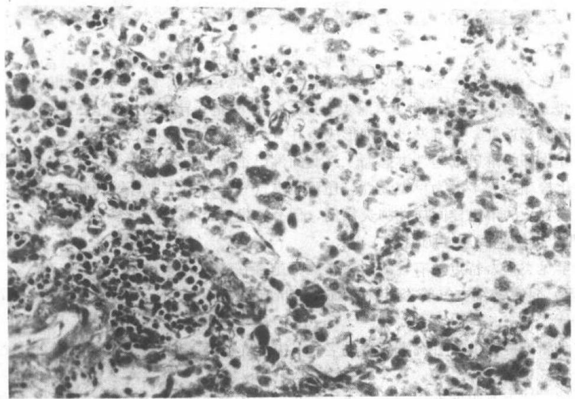 
肺泡腔内充有多量大的单核细胞，肺泡壁有少量淋巴细胞浸润
# （三）淋巴细胞性间质性肺炎 (lymphoid interstitial pneumonitis, LIP)
淋巴细胞性间质性肺炎亦名淋巴样间质性肺炎。
光镜 特征是肺间质有多量淋巴细胞浸润，并有淋巴滤泡形成，常混杂有组织细胞和浆细胞，肺泡腔内常充满大量噬脂泡沫细胞（图5-6）。患者血清免疫球蛋白异常，有的伴有Sjögren综合征。
# 【鉴别诊断】
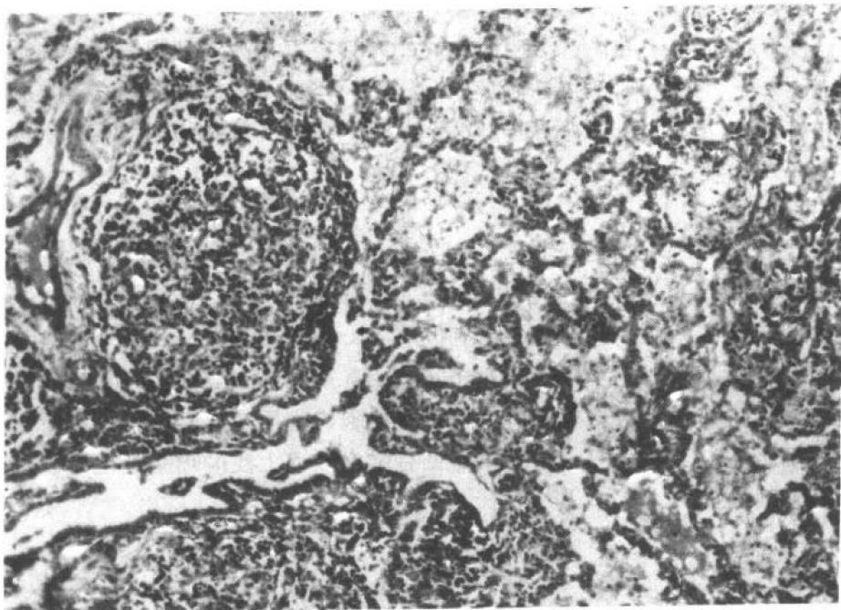 
图5-6 淋巴细胞性间质性肺炎
肺间质有大量淋巴细胞浸润，并有淋巴滤泡形成；肺泡上皮增生，腔内多量泡沫细胞聚积
1. 滤泡性支气管炎和细支气管炎 此病是一种非特异性炎反应，在无慢性阻塞性肺疾病气道的邻近处，见有淋巴滤泡形成，并有反应性生发中心。 
2. 分化好的淋巴细胞性淋巴瘤 浸润的淋巴细胞具有单形性, 可伴有浆细胞样分化, 免疫组化检测, 大多数为单克隆性。还可见支气管软骨、大血管壁及胸膜有瘤细胞侵袭现象。病程长的淋巴样间质性肺炎病例, 偶有并发淋巴瘤者, 则鉴别困难。
# （四）巨细胞间质性肺炎
为罕见类型，特点是有较多的多核巨细胞存在，并混有其他炎细胞。
（五）阻塞性细支气管炎机化性肺炎（bronchiolitis obliterans organizing pneumonia, BOOP)[13]
这是新近提出的一种肺部病变的名称，按传统也归入间质性肺炎。临床上急性发作，伴有发热。
光镜 特点是阻塞性细支气管炎，有肉芽组织堵塞在扩大的小气道腔内，有时延伸至肺泡管内，周围肺实质的间质变化轻微。其预后较通常型间质性肺炎为好。
# 六、其他肺炎
# （一）机化性肺炎
如肺炎不能吸收而代以机化，在肺内即出现阴影，可误为肿瘤。患者出现咳嗽、咯血及体重减轻，可疑为恶性病变。
大体 受累区域境界清楚，甚硬，病变扩展至胸膜，可增厚。
光镜 见肺泡腔内的炎性渗出物中有纤维母细胞长入, 呈不同程度的机化现象。有
时，伴有支气管的坏死性变化。
# （二）脂性肺炎
脂性肺炎可分为外源性及内源性两种，常为衰弱性疾病的一种合并症。
光镜 两型均显示在肺泡腔内含有脂性物质，苏旦Ⅲ、油红0等染色呈阳性，肺泡内巨噬细胞增生，并见炎细胞及肺泡细胞增生，间质可见纤维组织增生及动脉内膜炎。明显增生的肺泡上皮细胞，在细胞学及冰冻切片诊断时，易与恶性细胞混淆，应特别注意鉴别。
# （三）嗜酸性肺炎
不论外周血有无嗜酸性白细胞增多，在肺内有多量嗜酸性白细胞浸润者，除嗜酸性肉芽肿外，均可称为嗜酸性肺炎。可分为两型：急性型的特征是肺浸润伴嗜酸性白细胞增多，病程不超过一个月，亦叫Löffler综合征；慢性型发作亦可急骤，为妇女的一种病，年龄20岁～50岁，临床上有发烧、体重减轻、呼吸困难及嗜酸性白细胞增多。
光镜 最突出的变化是肺泡及间质均有嗜酸性白细胞浸润，也混有浆细胞及组织细胞，可见 Charcot-Leyden 结晶。有的见有轻度血管炎、巨细胞性肉芽肿、细支气管炎伴坏死、粘液栓及机化、纤维化。
# （四）风湿性肺炎
在风湿病的急性期，有些病人可伴有风湿性肺炎，其病变与病毒性肺炎极相似。早期见充血、水肿，肺泡管内有透明膜形成，肺泡及间质均有炎细胞渗出，包括单核细胞、淋巴细胞和浆细胞，中性白细胞稀少。发展至增殖期，肺的病变较局限，在肺泡隔内见有由多形性组织细胞及纤维母细胞形成的小结节，其中混杂有淋巴细胞、浆细胞，并突入肺泡腔。此种结节亦见于血管周结缔组织。血管变化亦较显著，血管炎常见，毛细血管可有透明血栓形成及内皮细胞增生，较大血管外膜有炎细胞浸润。亦可发生纤维化。
# （五）类风湿性肺炎
类风湿性关节炎患者伴有胸膜炎者，有1/3的病人可有肺实质病变，表现为非特异性慢性间质性肺炎，具有特征性的是间质浸润以淋巴细胞、浆细胞为主，常有淋巴滤泡、生发中心形成，可出现间质纤维化。有的肺内亦可见单个或多数类风湿结节，与四肢软组织者结构相同。
免疫组化 肺泡隔间质中有 $\mathrm{IgM}$ 沉积。
# （六）放射性肺炎
临床上对肺癌、乳腺癌、食管癌患者进行大剂量放射治疗后，有的病人有时出现肺的特征性反应，称为放射性肺炎。在接受过放疗的上述癌症患者死亡后进行尸检时，时有发现。
光镜 主要变化是水肿、肺泡壁增厚伴轻到中度纤维化，肺泡上皮剥脱，偶见透明膜，有的见鳞状上皮化生，甚至十分显著。肺泡壁及腔内有中性白细胞浸润。毛细血管内皮细胞肿胀，动脉壁透明变性。病变较重者，可出现广泛的纤维化。
# （七）肺软斑病[14]
肺软斑病极少见，为一慢性炎症过程，其发生与Escherichia coli的感染有关。
光镜 特征性的变化与其它部位者相同。一是在支气管粘膜活检组织中见有von Hansemann组织细胞，其胞浆呈细颗粒状或网状，用甲苯胺兰染色，可见细胞内杆菌，粗
$1\mu \mathrm{m}$ 。二是见有 Michaelis-Gutmann 小体，可位于细胞内或细胞外，呈圆形，大小如同胞核，可呈板层状，von Kossa 钙染色，可清楚显示。
电镜 M-G 小体是胞浆内的吞噬体（phago-lysosome）矿质化的结果，它是组织细胞吞噬、消化细菌后的终末产物。
# 七、肉芽肿性炎
肺的肉芽肿性炎种类较多，其中有些不论在放射影像上或是大体形态上均与肿瘤性病变类似，而且显微镜检查常常难以确定特异的诊断。因此，对每例切片进行分支杆菌和真菌染色是必需的。
# （一）结核病
在外科病理中，有关结核病的材料包括支气管粘膜活检、细针穿刺活检、开胸肺活检及手术切除的肺标本。
1. 支气管结核 在支气管粘膜活检组织中，可见粘膜上皮正常或增生，或有溃疡形成，在粘膜上皮下或固有膜内有结核结节散在，一般干酪样坏死不明显，可有郎罕氏巨细胞，并有淋巴细胞浸润。 
2. 结核瘤 肺部特别是双肺上叶的“钱币样”病灶，经手术切除，大多为结核瘤。
大体多为位于胸膜下的圆球形干酪样坏死灶，直径多在 $2\mathrm{cm} - 4\mathrm{cm}$ 之间，切面黄白色或灰白色，呈同心性分层排列，中央可钙化或有空洞形成。
光镜 几乎全为干酪样坏死组织，有的呈凝固性坏死，尚可见坏死的组织轮廓；其周围常有厚的纤维性包膜。在包膜与干酪样坏死区之间，可见结核结节或散在的Lang-hans巨细胞、上皮样组织细胞及淋巴细胞浸润。干酪样坏死区可查见抗酸杆菌。
3. 结核性空洞 手术切除的结核性空洞形态不一。常见者为慢性空洞，壁较厚。从内向外依次为酪样坏死，结核性肉芽肿及纤维化包膜。经长期抗痨治疗者，空洞壁接近愈合，仅可见肉芽组织、纤维化及星状瘢痕形成。完全愈合者较少见，仅有薄的纤维性壁，内壁光滑，一般无上皮衬覆，除非有支气管进入空洞，其上皮可延伸而内衬于空洞表面，抗酸杆菌染色则为阴性。
# （二）不典型分支杆菌病
不典型分支杆菌病大多见于免疫缺陷的患者。
光镜如同结核病，故二者从病理组织学特征上难以区别，需借助细菌培养来鉴别。在组织切片上，根据抗酸杆菌的形态特点，有助于与结核杆菌相区别。不典型分支杆菌比结核杆菌长（约 $20\mu \mathrm{m}$ ）且粗，呈较粗的珠状，且较弯曲。
# （三）结节病
胸腔内的结节病可表现为三种类型：单纯累及肺门周围淋巴结、单纯肺弥漫性病变及二者相结合。肺部受累时有的可伴有肺间质纤维化，局限性支气管狭窄伴远侧支气管扩张及肺膨胀不全。
光镜 在肺间质中见有散在的非干酪性肉芽肿，主要由上皮样细胞构成（图5-7），也可含有Langhans巨细胞及淋巴细胞（主要是辅助T细胞，且有活化现象）。有些肉芽肿中心可见小灶性呈嗜酸性的“纤维素样”坏死，还可见细胞内及细胞外多种包涵物，如星状体及嗜碱性同心板层状小体，但无特异性。肉芽肿常伴有纤维化及慢性炎细胞浸润，
也可发生透明变性。结节病与结核病的鉴别往往是困难的，特别是与增殖性结核的鉴别有时是不可能的，因后者抗酸染色亦多为阴性。
图5-7 肺结节病 
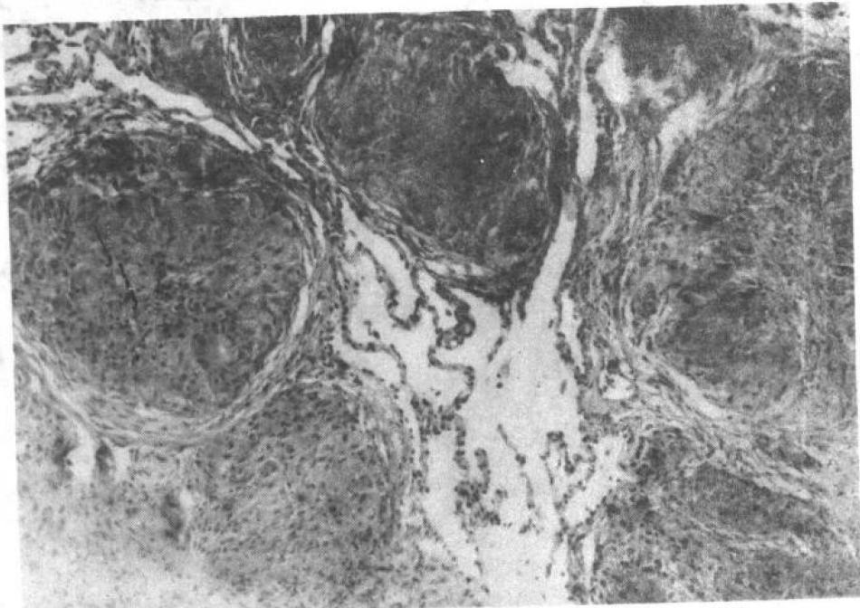 
肺间质中见散在的非干酪性肉芽肿，主由上皮样细胞构成
然而，结节病的肉芽肿多沿淋巴管道分布，在细支气管周围间质多见，因此，经支气管肺活检阳性率可达 $80\%$ 以上。肉芽肿还见于血管周围，甚至出现在肺动脉分支的管壁内。累及胸膜者少见，约占 $10\%$ 。
# （四）坏死性结节病样肉芽肿病
坏死性结节病样肉芽肿病（necrotizing sarcoid granulomatosis）多见于成年妇女，病变弥漫性或局灶性。
光镜 特征是广泛性血管肉芽肿，浸润、破坏或阻塞肺的动脉和静脉，并伴有广泛的肺组织坏死。
此病的性质尚不清，是结节病的一种变型，还是结节病样肉芽肿性血管炎的一种类型，但切除局灶性病变通常可痊愈。
# （五）铍肉芽肿
皱肉芽肿（beryllium granuloma）亦名皱沉积病（berylliosis），是由于吸入含铍的粉尘（如在制造日光灯的工厂里）而引起的一种慢性肉芽肿性疾病。病变特征与结节病相似，亦为在肺实质散在的肉芽肿性结节，晚期可发生纤维化（图5-8）。在病理形态上与结节病难以区别。必须结合患者病史，始可作出皱肉芽肿的诊断。
# （六）Wegener肉芽肿病
根据临床表现，Wegener肉芽肿病可分为两型：
1. 传统的 Wegener 肉芽肿病 它的特征是三联征：即坏死性血管炎、上呼吸道及肺的无菌性坏死及局灶性肾小球肾炎。如不治疗临床过程发展迅速。肺的主要变化是液化
图5-8 肺铍肉芽肿 
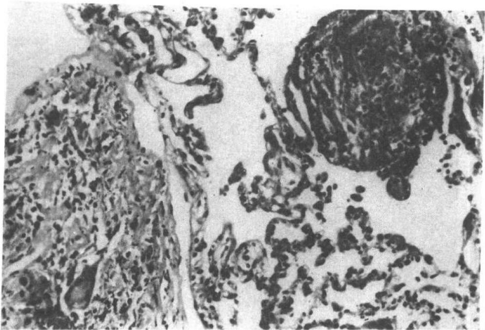 
肺实质内见有肉芽肿结节，左侧者发生纤维化
性及凝固性坏死，大量的嗜酸性白细胞及少量的淋巴细胞、浆细胞浸润，并见多核巨细胞，但一般不形成如同结核病或结节病的肉芽肿。动脉及静脉显示破坏性血管炎，管壁浸润的白细胞溶解[15]。有的以渗出性变化为主，有的则有多量胶原形成。少数病例可伴有弥漫性肺出血。
2. 限制性 Wegener 肉芽肿病 限制性 Wegener 肉芽肿病 (limited Wegener's granulomatosis) 是指病变限制在肺, 病程较长。大体上, 结节呈弥漫性分布, 可为双侧性, 但以下叶为多。
光镜 所见与传统的Wegener肉芽肿不能区别。
必须强调指出，淋巴细胞消减型血管炎（lymphocytic depleted angitis）对诊断 Wegener 肉芽肿病是不可缺少的。在远隔坏死区的部位发现血管炎及大片炎性浸润，应考虑到 Wegener 肉芽肿病的诊断。
# （七）支气管中心性肉芽肿病
支气管中心性肉芽肿病（bronchocentric granulomatosis）是指几乎所有的肉芽肿都集中在支气管和细支气管壁内，可导致支气管破坏。患者多为成人。在X线胸片上，病变区实变或肺膨胀不全，而非散在结节。受累支气管内含有极粘稠的物质。
光镜 见粘稠物质由粘液、中性白细胞及嗜酸性白细胞构成，有时凝集为一致密团块，被管壁内的异物巨细胞所包围[16]。
# （八）过敏性肉芽肿病
过敏性肉芽肿病（allergic granulomatosis）极罕见，其临床表现是系统性血管炎（类似结节性多动脉炎），典型者伴有哮喘史、外周血嗜酸性白细胞增多（可达 $80\%$ ），并常
累及肺。
光镜 肺及肺外病变的特征是明显的嗜酸性白细胞浸润、灶性坏死，有些坏死灶周围有肉芽肿性反应，并见嗜酸性血管炎。
# （九）透明变性肉芽肿
透明变性肉芽肿（hyalinizing granuloma）是一种通常累及双肺的多灶性病变，其发病机理尚不清。Engleman报告有的病例合并硬化性纵隔炎及腹膜后纤维化。Yousem等[17]报告一半以上患者有自家免疫现象，或以前接触过分支杆菌或真菌感染。
光镜 见肺实质内的肉芽肿中心部发生透明变性，并伴有异物巨细胞反应。此种透明变性的结节与结节性淀粉样物质沉着相似。但做淀粉样物质的特殊染色则为阴性，二者可以鉴别。
# 八、霉菌病
在外科病理（活检及手术切除标本）及尸检中，肺的深部霉菌病并不少见，主要是可经呼吸道感染的曲菌病、念珠菌病、毛霉菌病、隐球菌病、组织胞浆菌病和放线菌病等。这些霉菌病，可为急性或慢性过程，常为肺脓肿、其他空洞性病变、慢性疾病或恶性肿瘤患者大量使用抗生素和免疫抑制剂而导致的机会性感染，原发者不多见。它们共同的基本病变是：化脓、组织坏死，肉芽肿形成及慢性炎细胞浸润，但对诊断有决定意义的是在病变区细胞内或细胞外查见霉菌菌丝或孢子。
# （一）曲菌病
曲菌病一般多见于尸检病例，在支气管活检组织中有时也可遇到。
1. 支气管曲菌病 曲菌可在小支气管腔内大量繁殖，形成球状菌落，称为曲菌球。其菌丝向同一方向定向生长密集，之间有散在的孢子。支气管粘膜往往有慢性炎反应，如菌丝侵及粘膜，可使粘膜上皮破坏；有的出现上皮增生现象。 
2. 肺曲菌病 主要病变是化脓、组织坏死液化，表现为急性脓肿，其中见有散在的菌丝及孢子，脓肿壁可见多核巨细胞。另外，亦常表现为急性坏死性脓性肺炎，肺组织呈大小不等的实变区，也可有出血现象。在肺炎坏死区内，可见成丛定向生长的菌丝和孢子。有时，菌丝亦可侵入血管壁，引起真菌性血栓性血管炎。
在组织切片上，曲菌菌丝的形态特点是：菌丝较窄，粗细较一致，一般直径为 $5\mu \mathrm{m}-7\mu \mathrm{m}$ ；菌丝有许多横隔；菌丝可分支，呈锐角，约为 $45^{\circ}$ ，且呈定向排列，如毛刷状；有许多小圆形孢子。偶而在尸检肺病变组织中，还可见到在培养基上生长的形态迥异的顶端孢子（图5-9），它对曲菌的鉴别有特异性。
# （二）毛霉菌病
肺的毛霉菌病不如曲菌病多见。
光镜 其病变与曲菌病相似，一般表现为化脓性坏死，其中可见稀疏散在的菌丝，特点是菌丝较宽，一般为 $10\mu \mathrm{m} - 15\mu \mathrm{m}$ ，最宽者可达 $20\mu \mathrm{m}$ ，无分隔，分支不规则，排列无定向；孢子少见或缺乏，菌丝横切面可呈囊状；菌丝有高度侵袭力，更易侵袭血管壁引起血栓形成，可导致肺梗死。少数病例，病变具有慢性炎反应的特征，有肉芽肿形成，其中心为坏死的嗜酸性碎片，可见异物巨细胞。在坏死组织或巨细胞内，可见退变的、染色不良的薄壁宽菌丝，在肉芽肿周围组织中，可见许多嗜酸性白细胞及中性白细胞浸润，
图5-9 肺曲菌病 
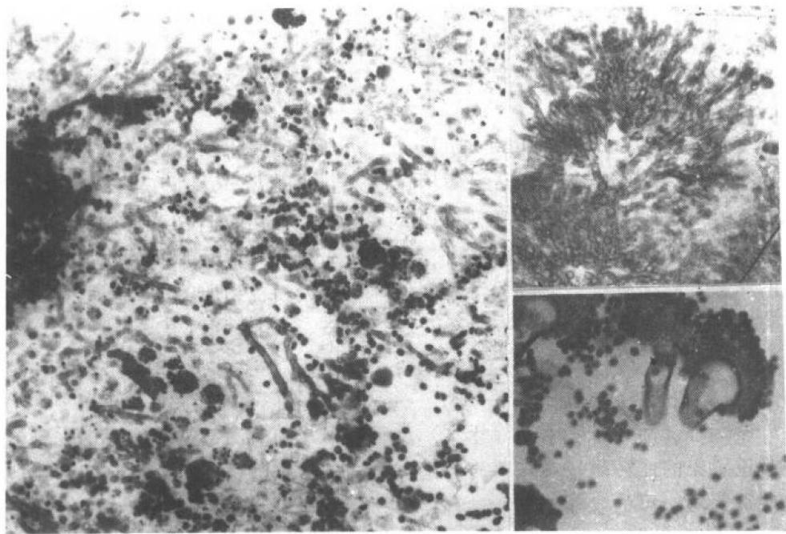 
可见：定向生长的菌丝，分支、有隔 
右下： 顶端孢子
并见增生的纤维母细胞和厚壁的毛细血管。
# （三）念珠菌病
肺念珠菌病多为全身播散性念珠菌病的表现之一，是霉菌血症所致。其病变有两种，一是急性化脓，有小脓肿形成，其中可含有许多芽生孢子及假菌丝。脓肿边缘亦可见多核巨细胞及上皮样细胞。二是慢性肉芽肿，在其巨细胞内可含有许多芽生孢子，在HE染色的切片上即可见，霉菌染色（Gridley法）及Gomori六胺银染色，更芳清楚。在细胞外的芽生孢子常聚集成堆，为圆形或卵圆形，直径为 $3\mu \mathrm{m} \sim 4\mu \mathrm{m}$ ，境界非常清楚，胞浆内常含有空泡，有的变大，呈小囊状，芽生孢子出芽生长，常形成长短不等的假菌丝。假菌丝较曲菌菌丝稍细，不分支，如竹节状，常散在分布无定向。在血管内常见有假菌丝存在。
# （四）隐球菌病
肺的隐球菌病在尸检及外检中均可见，有的在肺内形成占位性病变，临床上有的疑为肺肿瘤甚至肺癌而手术切除。根据病程的急缓，肺隐球菌的病理变化可分为两种。
1. 隐球菌性肺炎 肺组织显示非特异性炎反应，肺泡腔内有中性白细胞、淋巴细胞、单核细胞及纤维素渗出，其间可见多核巨细胞及散在的隐球菌细胞。 
2. 孤立性结节 一般位于胸膜下，直径小于 $1.5\mathrm{cm}$ ，但亦可大至 $7\mathrm{cm}$ ，外有假包膜；有的活动性病例，则为粟粒性结节或粘液瘤样包块。
光镜 不论大结节或小结节，均有大量肉芽肿构成。肉芽肿内主要是单核或多核组织细胞，细胞大小极不等，尤以多核巨细胞多见为其特点，大者直径可达 $60\mu \mathrm{m}$ 以上。肉芽肿内坏死不常见，有的其结构类似结节病，以上皮样细胞为主，多核巨细胞较少见。肉
芽肿之间为少量含有血管的间质，其中有中性白细胞、淋巴细胞浸润；有的间质纤维母细胞增生，可发生纤维化。在HE染色的切片上，在上述病变组织中，隐球菌即可见。因其着色不佳，如不仔细观察，容易漏诊。它的特点是存在于细胞外或细胞内，尤以多核巨细胞内为多，少则数个，多则十多个，呈浅蓝色薄壁圆形或卵圆形小体，大小不一，不包括荚膜，直径一般为 $4\mu \mathrm{m} - 7\mu \mathrm{m}$ ，也可达 $2\mu \mathrm{m} - 15\mu \mathrm{m}$ 。其周围有透亮的晕，为胶样荚膜，厚约 $3\mu \mathrm{m} - 5\mu \mathrm{m}$ （图5-10）。活跃生长者，可见出芽细胞。特殊染色，有助于识别病原体。PAS染色荚膜呈红色，Alcian蓝染色呈浅蓝色，粘液胭脂红染色呈胭脂红色；硷性磷酸酶染色，荚膜内病原体十分清楚呈黑色。这些染色也有助于与组织胞浆菌相鉴别。
图5-10 肺隐球菌病 
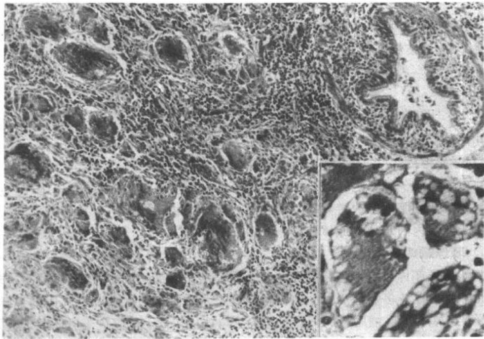 
见有多量多核巨细胞形成的肉芽肿 
右下插图：多核巨细胞内含多量隐球菌，菌体周围有透亮的胶样荚膜
# （五）组织胞浆菌病
组织胞浆菌病是网状内皮系统的一种细胞内霉菌病，多由于吸入组织胞浆菌孢子而受染，首先引起肺组织胞浆菌病，有的可播散到全身各脏器。
肺的组织胞浆菌病，在临床上，根据临床表现，分为原发性急性型（肺内弥漫性或粟粒性病灶）、重型播散型（播散至全身）及慢性空洞型（犹如结核性空洞）三型。
它的病理变化特征是有上皮样细胞肉芽肿形成，可有或无Langhans巨细胞。陈旧病灶中央可坏死或钙化，外周纤维化。在坏死灶附近，在组织细胞及巨细胞内可见无数病原体。在HE染色切片上，细胞内的组织胞浆菌呈圆形或卵圆形，可有出芽，直径为 $1\mu \mathrm{m}-5\mu \mathrm{m}$ ，平均 $3\mu \mathrm{m}$ 。每个霉菌细胞有一小核，外有细胞壁。由于固定所致，在细胞壁外有一透亮空晕，可误认为是未染色的荚膜。PAS染色，病原体特别明显呈红色，而细胞壁外空晕不着色，证明此空隙并非荚膜。六胺银染色，病原体呈棕褐色。此外，在坏死组织
中偶可见菌丝，长 $15\mu \mathrm{m} - 20\mu \mathrm{m}$ ，有的尚可见分支。
【鉴别诊断】 组织胞浆菌细胞在光镜下需与以下各病的病原体相鉴别。
（1）隐球菌：孢子周围有厚层荚膜，HE染色不着色，Alcian蓝染色呈蓝色，而组织胞浆菌因无荚膜则不着色。 
（2）念珠菌：芽生孢子虽可在细胞内，但大多在细胞外聚集成堆，且常见形成的假菌丝，如竹节状。而组织胞浆菌主要在细胞内。 
（3）球孢子菌：在巨细胞内、外见有大量孢子，较组织胞浆菌、隐球菌大得多，直径从 $10\mu \mathrm{m} \sim 80\mu \mathrm{m}$ ，平均 $40\mu \mathrm{m}$ 。孢子圆形，有一厚壁，细胞分裂不是靠出芽，而是大孢子形成内孢子。 
（4）黑热病的leishmania donovani（LD）小体和弓浆体：该体均寄生于组织细胞内，在低倍光镜下与组织胞浆菌形态相似，不易区别。霉菌特殊染色对LD小体及弓浆体均不着色；用Wright染色，弓形体胞浆呈蓝色，核呈红色，染色质清楚，均有助于与组织胞浆菌鉴别。
# 九、寄生虫病及原虫病
在外检及尸检中，肺的寄生虫病较少见，可能遇到的有以下几种。
# （一）弓形体病
肺的弓形体病少见，其主要病变是特征性的间质性肺炎，弓形体多寄生在内皮细胞、组织细胞或其他细胞内，或游离于组织中。弓形体原虫呈半月形、卵圆形或圆形，应注意与寄生于细胞内的其他病原体鉴别。
# （二）棘球蚴病
肺棘球蚴病亦称包虫病，原发性肺包虫病仅次于肝而居第2位，多位于右肺，下叶为多。通常为单发，多发者少见。有时可遇到手术切除的包虫囊肿，其周围为纤维组织形成的囊壁，常有淋巴细胞浸润。囊内的包虫角质层较薄，呈白色半透明状，犹如粉皮。
光镜 在囊内可见头节（图5-11）。有时因包虫囊破裂头节可至肺泡内。较大的包虫囊可压迫周围肺组织使之萎陷，久之肺泡萎缩并纤维化。
# （三）阿米巴性肺脓肿
阿米巴性肺脓肿大多是肝脓肿向肺穿破所致，亦可偶见于直接由肠道病灶的阿米巴原虫随血流入肺者。肺脓肿多为单发性，且往往贯穿横膈与肝脓肿互相连通。脓肿内亦含咖啡色坏死液化物质。有的破入支气管，可形成空洞。患者排出的褐色脓样痰中，可查见阿米巴滋养体。
# （四）血吸虫病
血吸虫病的初期，肺部病变常见，但不易遇到。早期，亦可见由虫卵所致的病变，以中、下叶为多。
大体 与急性粟粒性结核相似，在肺表面及切面上见有直径约 $0.1\mathrm{cm} \sim 0.2\mathrm{cm}$ 的小结节散在。
光镜 除见以嗜酸性白细胞浸润为特征的渗出性肺炎外，亦可见由虫卵引起的假结核结节。晚期，仅可见少数残缺不全的卵壳，似乎肺内的虫卵结节已完全被吸收。有人在尸检材料的肺组织中发现有成虫，但已死亡。
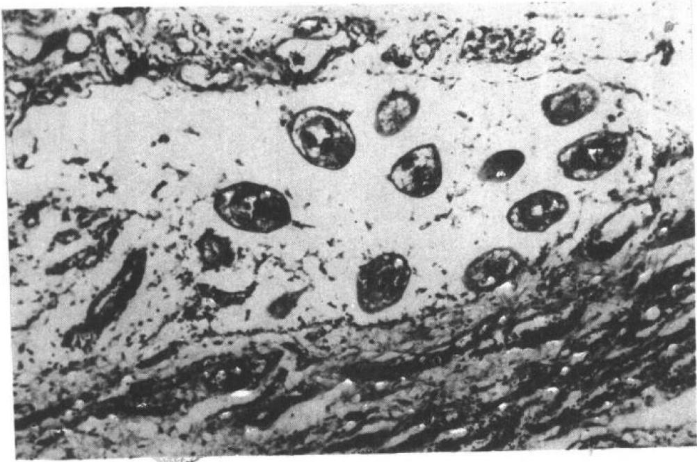 
图5-11 肺棘球蚴病在肺泡内见有多数头节
# 十、肺尘埃沉着病
# （一）炭末沉着病（煤矿工人肺）
城市居民的肺内，均有不同程度的炭末沉着，主要沿淋巴管网分布，特别集中在支气管血管束、小叶间隔和胸膜下，这不是一种病理状态。煤矿工人由于大量吸入炭尘，有过多的炭末沉着在肺内，并引起一些病变，可叫煤矿工人肺。
主要病变是炭末被巨噬细胞吞噬，初期为局灶性，集中沉积在二级呼吸性细支气管及相邻的肺泡壁，平滑肌可萎缩，继而形成网状纤维化，进一步可导致其管腔扩张，发展为局灶性肺气肿。有些病例可进行性发展为大块性纤维化。
# （二）矽沉着病（矽肺）
砂沉着病是由于吸入石英、 $\mathrm{SiO_2}$ 而在肺内沉着所致，最多见于采矿工业如金矿、铁矿及煤矿的工人、石匠及金属研磨工。
砂沉着病的病变特点是在肺组织内沿淋巴管网特别是围绕支气管血管束有大小不等的纤维化结节散布，胸膜增厚并粘连。
光镜 早期病变多在肺外周的胸膜下, 为富于细胞的结节, 主要由纤维母细胞及组织细胞构成, 其间可见多量的矽粒子, 可在组织细胞内, 也可在细胞外。进一步发展, 结节可发生纤维化 (图 5-12), 并扩展至全肺。其特征是结节呈致密板层状纤维性结节, 周围的肺泡受压, 被以立方状上皮。陈旧结节可见有透明变性。小结节亦可相互融合, 形成较大团块, 中央可坏死, 有的形成空洞。小动脉常见内膜及中膜增厚, 或发生透明变性, 也可有血栓形成。
也可有血性形成。组织切片上见到的矽粒子通常很小，一般在 $5\mu \mathrm{m}$ 以下，呈棕黄色，多数矽粒子有双
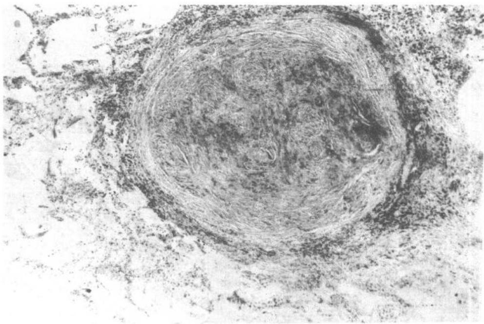 
图5-12 矽肺的纤维化结节
折光性，在偏光显微镜下易于识别。必须强调指出，在肺组织中仅有矽粒子存在，不能作为诊断矽沉着病的依据，还必需伴有具有特征性的纤维化矽结节。
有些患者，易合并结核性感染，即矽沉着病与结核病共存，称为矽结核病。
# （三）石棉沉着病
石棉是一种纤维性矽酸盐，主要是矽与锰和铁的结合。从事石棉工业的工人，可因多量吸入大气中的石棉尘而患此病。小的石棉纤维长 $50\mu \mathrm{m} - 200\mu \mathrm{m}$ ，吸入呼吸性细支气管后随呼吸而至肺泡并穿入肺泡壁，引起明显的巨噬细胞及巨细胞反应，释放出胶体矽。此种纤维不能沿淋巴管转运，故石棉沉着病的特点是无结节形成，而是肺的弥漫性纤维化，并常伴有胸膜增厚。
光镜 早期肺实质表现为间质性肺炎，肺泡上皮增生，在其胞浆内可含有Mallory透明物，对此病并无特异性。晚期肺间质纤维化更为弥漫，可导致蜂窝肺。在下叶基底段受累更为明显。前述这些病变亦无特异性，其诊断需在病变组织中查见石棉小体始可确定。典型的石棉小体是一个细长而对称的串珠状，末端呈球形的物质，一般是直的，亦可弯曲或有分支，其核心呈半透明状，外壳因含铁而呈棕褐色，故铁反应可呈阳性。
# （四）铁末沉着病
铁末沉着病（siderosis）是由于吸入铁或钢尘，或铁的氧化物（主要是氧化铁与低浓度的矽混合而成的赤铁矿）而致病，故此病可见于开采赤铁矿的工人。
大体 肺呈铁锈色，可广泛纤维化。纤维组织多呈粗带状或弥漫性，较石棉肺的纤维化粗大，又比矽肺的纤维化广泛而纤维化结节很少。
光镜 在粗大纤维组织中细胞稀少，而在弥漫性纤维化则细胞较多，其中可见黄褐色颗粒状的赤铁矿色素沉着，大多游离在细胞外，铁反应阴性；在巨噬细胞内者呈阳性。
赤铁矿肺因含有多量的矽，无疑在引起肺纤维化上起着重要作用。因此，有人把此
病亦称为矽-铁末沉着病。
# （五）铍沉着病
详见前述铍肉芽肿（第161页）。
# 十一、其他疾病
# （一）特发性含铁血黄素沉着病
特发性含铁血黄素沉着病（idiopathic hemosiderosis）原因不明，多见于青年人，有咯血及难治性贫血。
光镜 在肺泡腔内见有大量吞噬含铁血黄素的巨噬细胞聚集，常伴有肺泡上皮的增生。铁反应呈阳性。除此之外，肺内未见坏死、血管炎、肉芽肿及淋巴滤泡形成。免疫荧光检查，在肺泡基底膜上无 $\mathrm{IgG}$ 沉积。这有助于与Goodpasture综合征相鉴别。
Goodpasture 综合征 在肺的 HE 染色切片上，所见与上述疾病相似，以肺出血为突出病变，同时也有大量吞噬含铁血黄素的巨噬细胞。但此综合征还伴有肾小球肾炎、循环血中有抗肾小球基底膜抗体，在肾小球及肺泡的基底膜上有线性 IgG 沉积。
此外，在出血性肺疾患的鉴别诊断上，还应包括已知病因能引起继发性肺出血及含铁血黄素沉着的一些疾病，如二尖瓣狭窄、结节性动脉周围炎、红斑性狼疮及其他类型的系统性血管炎。
# （二）肺泡蛋白沉着症
肺泡蛋白沉着症（alveolar proteinosis）是一种病因不甚清楚的弥漫性肺疾病，X线胸片上呈片影，类似肺水肿，以肺门周围性分布为主。
光镜 此病的特征性变化是在肺泡腔内充满嗜酸性（有时呈嗜碱性）、均匀一致无结构的细颗粒状物质，PAS染色呈阳性，主要是磷脂质；同时见I型肺泡上皮增生、剥脱；肺泡间质有淋巴细胞浸润及一定程度的纤维化。此病经支气管肺穿活检，如发现上述变化即可明确诊断，但要注意与Carinii肺囊虫病相鉴别（见前述Carinii肺囊虫病）。
有些病例，偶而与一些机会性感染共存，如隐球菌病、曲菌病、组织胞浆菌病、奴卡菌病，结核病及巨细胞病毒感染（图5-13）。文献中，有结核病伴局灶性肺泡蛋白沉着症的报告，也有些病伴有恶性血液病及淋巴瘤者。
# （三）淀粉样物质沉着
肺的淀粉样物质沉着（amyloidosis）较少见，它也可能是全身性淀粉样物质沉着在肺部的局部表现，根据其在肺组织中沉着部位的不同，可分为四型：①血管型：淀粉样物质沉积在中、小动脉壁内；②支气管结节型：淀粉样物质沉积在支气管粘膜上皮下的固有膜内，呈局灶性结节状；③实质结节型：主要在肺实质呈结节状沉积；④弥漫性肺泡间隔型：广泛地沉积在肺泡壁内，可致肺泡壁增厚。在淀粉样物质沉着处，可见淋巴细胞浸润，有的出现异物巨细胞反应。
在X线胸片上，上述②、③型呈多数结节状分布，可类似结核病或转移性肿瘤。支气管粘膜活检及经支气管肺活检，可有助于本病的诊断，必要时可作淀粉样物质染色，以便和肺纤维化时发生的透明变性相鉴别。
# （四）组织细胞增生症X
肺的原发性组织细胞增生症X（嗜酸性肉芽肿）较罕见，它是Langerhans细胞的一
图5-13 肺泡蛋白沉着症伴巨细胞包涵体病 
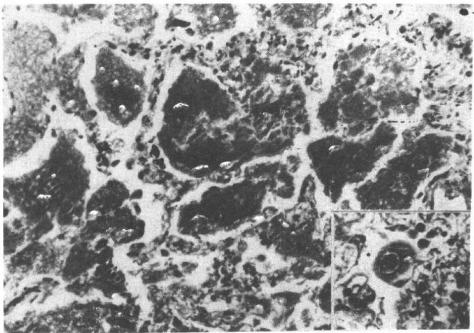 
肺泡腔内充满红染无结构的细颗粒状物质 
右下插图 肺泡壁一个巨细胞，核内有一巨大包涵体
种增生性疾病；有的是组织细胞增生症X累及肺部的表现。常见于 $20\sim 40$ 岁的成人。肺部病变为限局性或弥漫性，多见于两肺上叶，呈结节状，可有空洞形成。晚期具有特征性的变化是肺呈蜂窝状。自发气胸是常见的并发症。大约 $20\%$ 的患者同时伴有肺外病变，如骨及垂体区。
光镜 肺间质有致密的细胞浸润，常以胸膜下为甚，其中有Langerhans细胞、大量嗜酸性白细胞及反应性间皮细胞。Langerhans细胞对诊断此病是非常重要的成分，其形态特征是细胞有丰富的嗜酸性胞浆及泡状核，可见典型的核沟，有的核呈锯齿状。坏死灶及含铁血黄素沉着常见，亦可见血管炎。在愈合期，由于浸润细胞减少，并发生间质纤维化，仅从光镜下形态诊断此病就困难了。免疫组化染色S-100、HLA-DR及OKT6有助于对此病的诊断[18]。
电镜 在Langerhans细胞内可发现具有诊断意义的特征性超微结构——球拍样的Langerhans颗粒，即可确定诊断。
【鉴别诊断】反应性嗜酸性胸膜炎是对胸膜损伤的一种非特异性反应，因其病变组织中亦混合有嗜酸性白细胞及间皮细胞，后者形态上与Langerhans细胞极相似，易于把二者相混淆。但免疫组化及电镜检查，有助于把二者区别开来。
肺嗜酸性肉芽肿的大多数患者，病变可消散或稳定，仅有很少或无残余病灶。少数病人可进行性发展，最终死亡。
# （五）子宫内膜异位症
肺的子宫内膜异位病极少见，患者可有反复的咯血，有的是在常规X线胸片时发现
无症状的结节，或呈支气管源性囊肿样，大多位于右肺。
大体 或为胸膜下灰白色结节，或形成小囊肿。
光镜 呈囊肿者，内衬子宫内膜上皮，囊壁局部增厚，可见屈曲的子宫内膜腺体，腔内有分泌物，腺体间为间质细胞，可有局灶性出血。实性结节者，在子宫内膜间质细胞间可见大小不等的腺体，被覆低柱状和立方状上皮。在妊娠期发现者，间质可有蜕膜变。
# （六）肺泡微结石病
肺泡微结石病（pulmonary alveolar microlithiasis）少见，原因不明。X线胸片上可见密集的粟粒性小结节遍布全肺之大部。1/2患者有家族倾向，发展缓慢。肺活检及细针吸取活检在肺泡内发现微结石存在，即可确诊。
光镜 遍布肺泡腔内的钙化小球（微结石）大小不等，直径 $0.01\mathrm{mm} - 2.8\mathrm{mm}$ ，呈浅蓝紫色洋葱皮样结构，类似前列腺中的淀粉样小体。PAS染色呈强阳性。其周围的肺泡间隔大致正常。晚期，亦有发生间质纤维化者。
# （七）支气管结石病
支气管结石病（broncholithiasis）亦少见，它可能是吸入食物、支气管扩张症或肉芽肿性疾病（特别是结核病、组织胞浆菌病）的并发症。支气管结石是泛指累及支气管的任何钙化物，而狭义的支气管结石是指飘浮在支气管腔内的钙化的组织碎片。如干酪性肺结核时，脱落的坏死组织钙化存留在支气管腔内即是。
# （八）氯中毒
在临床上，患者吸入高浓度氧（超过 $40\%$ 的氧），可导致弥漫性肺泡损伤。
光镜 见支气管粘膜上皮细胞的纤毛丧失，细支气管上皮灶性坏死，肺泡毛细血管扩张、充血。
电镜 见毛细血管内皮细胞下出现空泡，I、I型肺泡上皮破坏，同时见I型肺泡上皮修复、增生，浆内可见板层小体。
# 第四节 肺癌
肺癌是我国最常见的癌瘤之一。近50年来，肺癌的发病率有逐渐增高的趋势，这不仅仅是因为放射摄影、支气管镜及细胞学技术的改进而使其诊断率提高，而确是由于肺癌发生率实际上升。因此，对肺癌发病因素、组织发生、形态学分类及其生物学特性等基础理论的研究，以及对肺癌的诊断与治疗，日益受到病理工作者和临床医生的重视。特别是在临床治疗和预后的判断上，需要一个既能反映其组织发生，又能显示其组织形态特征和生物学行为的分类。近些年来，在肺癌的组织发生和组织学分类方面，根据光镜、免疫组织化学及电镜观察，有了新的进展。
肺癌的一个主要病理形态学表现，是在肺部出现球形结节或包块。在影像学上，这种癌性结节或包块，往往需要与炎性疾病（如结核瘤、隐球菌病等）、炎性假瘤、错构瘤或其他病理情况相鉴别。有时肺癌在胸片上可表现为孤立的限局性包块（“钱币样病变”coin lesion）。在成人大约 $35\% \sim 50\%$ 的肺部钱币样病变则为肺癌，而60岁以上且无钙化病变者百分率更高。肺癌的准确诊断及其组织学类型的确定，只能通过病理学检查来解决。
肺癌的组织学类型与其治疗手段和对预后的判断有密切的关系。因此，除需要开胸探查始可确定是否为癌者外，一般在采取治疗措施前，都要从病理学上确定肺癌的组织学类型。
# 一、肺癌的病理诊断方法
目前确诊肺癌及其组织学类型有以下5种方法。
# （一）痰细胞学检查
简便易行，能对 $80\% \sim 90\%$ 的肺癌患者作出诊断，阳性率随痰检次数而增高，一次痰检阳性率为 $40\% \sim 60\%$ ，五次可提高到 $80\%$ 。可早期发现肺癌，特别是对中央型鳞状细胞癌阳性率较高。痰涂片上的瘤细胞，在多数情况下是容易辨认的，特别是分化好的鳞癌、腺癌和小细胞癌。细胞学和组织学之间的完全符合率可达 $70\% \sim 90\%$ 。而分化差的鳞癌与大细胞癌的鉴别较困难。需要提出的是，在肺梗死、支气管扩张、病毒性肺炎、霉菌病、脂性肺炎及放射性病变时，巨噬细胞或增生的肺泡上皮细胞可误为癌细胞，作出假阳性诊断，应予注意。
痰细胞学诊断报告，可分为5类：①不满意“痰”（唾液）：涂片上未见有肺泡巨噬细胞；②阴性：涂片上未见异常细胞；③良性不典型性：由于炎症支气管上皮细胞增生或鳞化；④可疑恶性，但不能确诊，需再送痰检查；⑤癌细胞阳性（注明癌细胞的类型）。
# （二）纤维支气管镜活检
适用于发生在次段支气管以上的肺癌。活检组织虽小，但一般能确定肺癌类型，并根据活检部位亦可定位，故是一种最可靠的肺癌诊断手段。如为外周型肺癌，则难以达到取材部位。近几年来，开展了纤维支气管镜穿过支气管壁从肺实质取活检的方法。
# （三）经皮肺穿活检
一般要在电视直视下进行，特别适用于外周型肺癌的检查。用细针穿刺经皮穿过胸壁、胸腔至肺，在电视下穿入肺包块内吸取组织作细胞学检查和/或沉渣切片观察。
# （四）开胸切除活检
开胸局部切除球形结节或包块，进行冰冻切片。有些肺癌病人，特别是外周型的病变，术前未能获得肯定诊断。手术时，将其全部完整切除，并附带周围部分正常肺组织，作冰冻切片诊断。如为癌，再扩大切除范围。这种病变亦可以是良性病变，如结核瘤、错构瘤、机化性肺炎、隐球菌性肉芽肿或胆固醇肺炎。在冰冻切片诊断时，需要特别注意，不要把非常富于细胞的炎性病变如机化性肺炎、脂性肺炎或炎性假瘤，误诊为癌。反之，有些分化差的肺癌，也可有明显的炎细胞浸润，不要误诊为非肿瘤性的炎性病变。
# （五）电镜检查
目前，尚未普遍开展，在有条件的单位，对活检组织或手术切除的标本，可及时取材、固定，制作超薄切片，进行电镜观察。这对准确地进行肺癌组织学分类具有十分重要的意义。因为光镜下诊断的肺癌类型，经电镜观察后，二者的完全符合率仅有 $50\%$ 或更低。这说明对肺癌进行电镜观察是必需的，它可更准确地以超微结构的特征为基础，对肺癌进行分类。通过电镜观察，还发现肺癌的一个突出问题——异质性（heterogeneity），即肺癌中有很多不是由单一的一种细胞成分构成，而是由两种以上多向分化的细胞成分
组成（即鳞状细胞分化、腺分化及神经内分泌分化）。这无疑增加了对肺癌分类的复杂性和困难。近些年来文献报道，肺癌中有 $35\% \sim 65\%$ 或更多的病例，是由两种或三种不同的细胞成分构成的。
# 二、肺癌的组织发生
1978年，美国 Trump 根据组织发生提出了能表达细胞特征的肺癌表型分类（phenotypic classification）。它是以正常肺的上皮细胞即支气管表面上皮细胞及肺泡上皮细胞为基础的。
# （一）支气管表面上皮
人体正常支气管上皮有6种细胞，包括：①不分化细胞：为原始型干细胞，数量很少，位于基底部，不显示纤毛及粘液分化迹象，胞浆透亮。②基底细胞：位于柱状上皮下，有二层或二层以上，不到达支气管腔面。③粘液细胞：有两种，一为粘液杯状细胞，另一为小粘液颗粒细胞，在各级支气管中均较多，构成微绒毛被覆上皮的大部分。④纤毛细胞：即纤毛柱状上皮，腔面有纤毛，位于支气管腔表面。⑤纤毛粘液细胞：较少见，为发育良好的含有粘液颗粒的纤毛柱状细胞。⑥神经内分泌细胞（亦名Kulchitsky细胞，简称K细胞）：位于支气管上皮表面或基底层，特征是胞浆内含有神经分泌颗粒(neurosecretory granules，NSG)。其中，小粘液颗粒细胞既可向粘液细胞分化，即杯状细胞化生，也可向鳞状细胞分化，即鳞化。
# （二）肺泡上皮
现已确定，Ⅰ型肺泡上皮起着肺泡上皮干细胞的功能。当受各种刺激时，Ⅰ型肺泡上皮可增生。其特征是胞质内含有多量板层小体，它可分泌表面活性物质。细支气管上皮的 Clara 细胞受损后，可由Ⅰ型肺泡上皮修复。它的特征是胞质内含有致密颗粒。
现已知，人肺能发生肿瘤的细胞只有四种，即基底细胞、粘液颗粒细胞、神经内分泌细胞及I型肺泡上皮（包括Clara细胞）。因此，根据细胞起源和分化特征，肺癌可分为三种类型，即：①来自基底细胞及/或粘液颗粒细胞的肿瘤，具有腺、鳞分化特征；②来自神经内分泌细胞的肿瘤，具有神经内分泌分化特征；③来自Clara细胞或I型肺泡上皮的肿瘤，具有各自分化特征。
# 三、早期肺癌
在临床上，诊断早期肺癌较困难，因在影像学上，早期肺癌常无明显肿块形成，一般不易发现。大多是在查体进行痰细胞学检查，或患者痰中带血进行纤维支气管镜活检时发现，经手术切除后进行全面病理检查确诊的。因此早期肺癌较为少见，且多为鳞状细胞癌。
在致癌因素的作用下，支气管上皮发生癌变的过程一般要经过基底细胞增生、鳞化，进而在基底细胞增生或鳞化的基础上进展为不典型增生、癌变（原位癌），再发展为微浸润癌（microinvasive carcinoma）和浸润性癌。发生的部位一般在段支气管，大多为单灶性的，也可多中心起源。痰细胞学检查对早期鳞状细胞癌的发现效果甚好。早期肺癌从原位癌发展为浸润性癌，有一个长的临床前阶段。我们曾遇到一例痰细胞学检查发现的早期鳞癌，反复查见癌细胞，但因支气管镜活检九次均未发现癌组织，影像学上又无可见
的块影，临床上无法确定手术部位，以致延续10个月之久，最后一次支气管镜活检证实癌位于右肺上叶前段，经手术切除右肺上叶，经全面检查确诊为右肺上叶前段早期肺鳞癌，癌组织仍局限在支气管壁内浸润生长，而未侵及肺实质。这表明从发现癌到手术切除，历经10个月，仍为早期癌，显然其发展是一个较长的过程。
根据癌发生的部位，早期肺癌可分为两型[19]：
# （一）中央型
癌发生在段支气管以上，诊断标准是：一无淋巴结转移，二是癌组织局限在支气管壁内生长，不侵及周围肺实质。中央型早期肺癌，又可分为三种类型：
1. 原位癌 癌组织局限于支气管粘膜上皮内，多由支气管上皮基底细胞增生癌变而来，可见纤毛柱状上皮下的基底细胞数量增多，呈复层，胞核明显增大深染，排列紊乱，极向消失（图5-14），并可见分裂像，其表面尚可见一层纤毛柱状上皮被覆。有的是在鳞化基础上发生癌变。原位癌往往分化较差，很少角化现象。支气管原位癌和人体其他部位的原位癌一样，也可累及腺体，或伴有早期浸润。
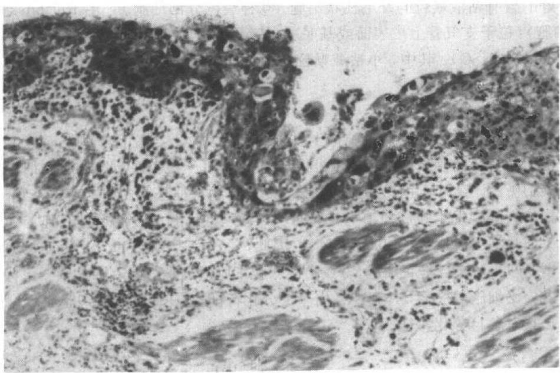 
图5-14 早期肺鳞癌——原位癌 
支气管粘膜上皮全层由鳞癌组织代替
2. 腔内型 支气管表面上皮发生癌变的组织和间质成分，主要向支气管腔内生长，形成乳头状结构，将管腔堵塞（图5-15，16）。
3. 管壁浸润型 伴早期浸润或累及腺体的原位癌，继续向支气管壁深层浸润生长，亦可穿过支气管软骨环，直至外膜，使支气管壁增厚，管腔狭窄（图5-15）。但癌组织不能侵至肺实质。
# （二）周围型
大多由小支气管上皮癌变而来，一般呈结节状，主要在肺实质内生长，与肺组织分界尚清楚，但无包膜。诊断标准是癌结节的直径不能超过 $2\mathrm{cm}$ ，也不能有局部淋巴结转移。
图5-15 早期肺癌 
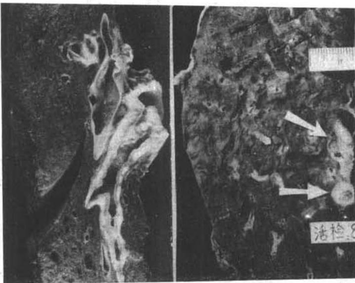 
左：腔内型 癌组织在支气管腔内生长，呈菜花状
图5-16 早期肺癌一腔内型 
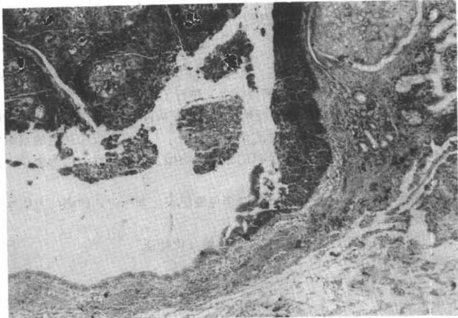 
右：管壁浸润型 箭头示癌组织浸润的支气管壁明显增厚，管腔变小 
支气管粘膜上皮原位癌，鳞癌组织呈乳头状，长入支气管腔内
早期肺癌的治愈率较高，预后较好。有的可复发，或在另一肺叶又发生鳞癌而导致死亡。
# 四、中晚期肺癌的类型
中晚期肺癌是指癌组织在肺内浸润生长，形成的瘤块较大，超过了早期肺癌的范围。在此基础上，癌组织亦可进一步在肺内浸润生长，或在肺内扩散，或向胸膜蔓延，或经淋巴管向支气管旁或肺门淋巴结转移，更晚期者亦可经血路发生远距离转移而至其他脏器。
# （一）大体类型
中晚期肺癌和早期肺癌一样，也可分为中央型及周围型。
中央型肺癌：主要是鳞状细胞癌、小细胞癌、大细胞癌及类癌，部分腺癌（ $34\%$ ）也可是中央型。这些肺癌，一般都可经痰细胞学检查或纤维支气管镜活检在治疗前明确诊断。
周围型肺癌：主要是细支气管肺泡癌（100%）、腺癌（66%），也有鳞状细胞癌、小细胞癌、大细胞癌和类癌。大都表现为孤立的瘤结节。除非癌结节较大，做经皮肺穿活检或细胞学检查明确诊断外，一般痰细胞学检查不易找到癌细胞，故多在术中做冰冻切片诊断。
根据肺癌肿块的大小及范围，在大体形态上，可把肺癌分为4型：①结节型：多在外周部，一般呈球形，直径小于 $5\mathrm{cm}$ ，与周围肺组织分界清楚。②巨块型：较多见，癌块较大，直径超过 $5\mathrm{cm}$ ，以鳞癌为多，常伴有明显坏死，有的甚至可形成空洞。③弥漫型：癌组织在肺内呈弥漫性扩散，可使肺组织发生实变，在影像学上，犹如肺炎，与周围肺组织之间无明显分界，此型一般为细支气管肺泡癌。④支气管内息肉样型：少见，主要是鳞状细胞癌，在腔内呈息肉状生长，而支气管外的扩散轻微。
# （二）组织学类型
关于肺癌的组织学类型，目前国内外公认并广为接受的是世界卫生组织（WHO）提出的方案，在1980年第二届国际肺癌会议上又进行了修订，已为广大肿瘤病理工作者所采用。但随电镜在肺癌诊断上日益广泛地应用，发现WHO提出的分类，完全是以光镜观察为基础的，它是单纯地从肺癌的细胞形态为依据，不能真正反映肺癌的组织发生和分化表型，也就是不能更客观地表达肺癌的组织学类型及其异质性。因为由单一的组织学类型构成的肺癌仅占 $34\%$ 。
根据光镜及电镜对肺癌的观察，并结合免疫组织化学标记，肺癌的组织学类型可按其组织发生及分化表型分类如下：
I 来自支气管表面上皮的癌（具有腺、鳞分化特征）
1. 鳞状细胞癌
a分化好的 
b中化分的 
c 分化差的
2. 腺癌
a 腺癌 
b 实性粘液细胞癌
3. 腺鳞癌
# 4. 大细胞癌
变异：巨细胞癌、透明细胞癌
来自神经内分泌细胞的癌（具有神经内分泌分化特征）
1. 分化好的——类癌 
2. 中分化的一一不典型类癌 
3. 分化差的一一小细胞癌
I 来自细支气管 Clara 细胞和 I 型肺泡细胞的癌——细支气管肺泡癌
1. Clara型 
2. I型肺泡细胞型 
3. 粘液细胞型 
4. 混合型
$\mathbf{N}$ 其他
1. 鳞状细胞癌（简称鳞癌） 肺鳞癌大多（80%）发生在男性，与吸烟有密切关系。多发生在段支气管，在诊断时常较其他类型癌为大，故在放射线胸片上，多为肺门或肺门周围肿块。但也可发生在肺外周甚至胸膜下。近一半病例，可有支气管阻塞体征，如阻塞性肺炎、肺萎陷。较大的癌块，易发生中心坏死及空洞形成，而发生钙化者少见。
光镜 肺鳞癌大多为中等分化或低分化者，分化好者较少见。诊断恶性的依据是细胞的异型性及侵袭性。如癌巢内见有角化现象或形成癌珠，或见有细胞间桥存在，即可确诊为分化好的鳞癌。分化差的鳞癌，无角化现象，癌组织呈实性片块或巢，癌细胞可大可小，如见有单个细胞的角蛋白形成（keratin formation），有助于对鳞癌的诊断。但注意不要把孤立的坏死细胞混淆为角化细胞。如癌细胞较大，又缺乏上述特征，亦可诊断为大细胞癌。如癌细胞较小，有时需要与小细胞癌鉴别。电镜观察及免疫组化有助于对分化差的鳞癌和小细胞癌的鉴别。
电镜鳞癌可随分化程度的不同显示癌细胞胞质内含有多少不等的张力微丝束及细胞间桥粒连接，为其特征。
免疫组化鳞癌对高分子量角蛋白及包壳素（involucrin）呈阳性反应。
梭形细胞癌 为鳞癌的一种特殊类型，特点是癌细胞呈梭形，但实质与间质分界清楚。在本质上，它是分化较低的鳞癌，与鼻咽部较常见的梭形细胞癌类似。
2. 腺癌 腺癌在女性约占肺癌的一半，较男性所占比例为高，但其绝对数男性仍多于女性。大多（65%）发生在肺的外周部，77%的病例在切除时已累及脏层胸膜。腺癌伴有瘢痕形成者较多见，有人称之为“瘢痕癌”。Auerbach 复习 82 例瘢痕癌，其中 72% 是腺癌。究竟瘢痕是在癌之前形成而与癌的发生有关，还是瘢痕是宿主对癌的一种促纤维形成反应，表现为纤维化，一直存在争论。瘢痕中胶原的免疫表型研究提示，癌组织中的瘢痕形成是在癌发展过程中形成的。
大体 腺癌通常为境界不清的包块，呈灰黄色。如癌细胞分泌粘液，则外观呈粘液样。偶而，腺癌亦可和少见的鳞癌一样，在支气管内形成一个大的息肉样肿物。有时，一个小的外周型腺癌，可广泛地扩散至胸膜腔，被于两层胸膜表面，犹如弥漫性间皮瘤。
光镜 腺癌不论分化高低，总能见有腺样结构。分化好者，癌组织多呈腺管状，大小不等，由单层或复层立方状或柱状上皮细胞构成。有的由粘液细胞构成。分化差的腺
癌，常见有实性癌巢。因此，在光镜下要确定是低分化腺癌抑或腺鳞癌往往是困难的，则需要通过电镜检查来确诊。根据组织结构及细胞特征，肺腺癌还可分为以下几种类型：①腺泡性腺癌；②乳头状腺癌；③粘液性腺癌；④实性粘液细胞癌，是由印戒状粘液细胞构成实性癌巢（图5-17），与肺组织有清楚分界。
图5-17 实性粘液细胞癌 
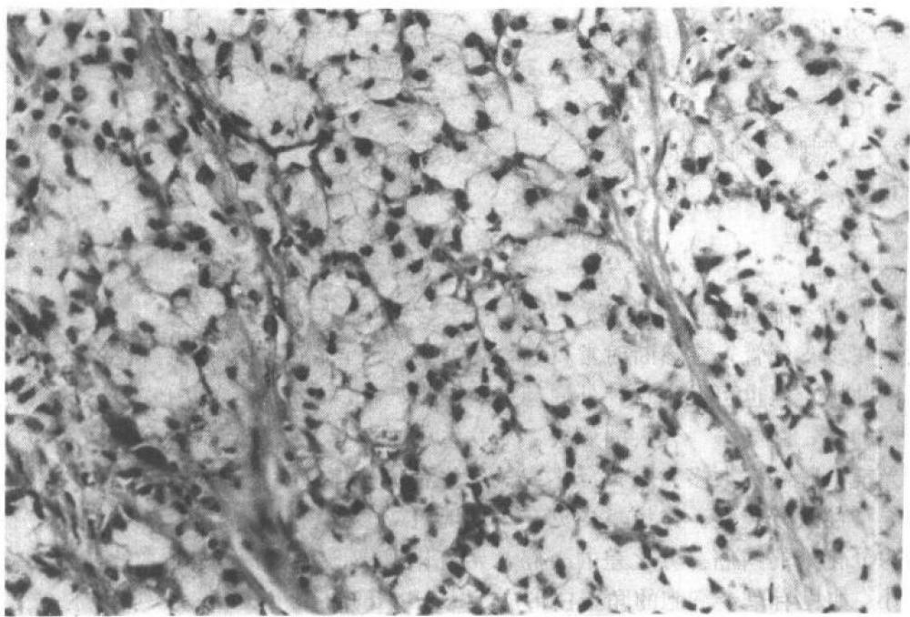 
癌组织由印戒细胞组成，被纤维隔分为实性巢
少数病例，在癌细胞胞浆内可见大小不等的嗜酸性小球（eosinophilic globules）。
电镜腺癌的主要特征是有细胞间及细胞内微腔形成，其表面可见微绒毛；细胞质内有分泌颗粒、或粘液颗粒。随癌细胞分化程度的降低，这些超微结构特征的数量亦减少。细胞间连接可见连接复合体，亦可有桥粒。
免疫组化 对低分子量keratin、EMA、CEA及分泌成分呈阳性反应。有时，可共同表达keratin及vimentin。在间质中，S-100阳性的Langerhans细胞常见。约一半的病例，对表面活性物质阿波蛋白（surfactant apoprotein）呈阳性反应，这对和其他类型的原发性肺癌以及转移性腺癌的鉴别诊断具有意义[20]。另外，肺腺癌还能表达Lewis X和Y血型抗原，也有鉴别诊断价值[21]。
【鉴别诊断】主要是与转移性腺癌相鉴别, 后者常来自结肠、直肠、乳腺及肾等。如果没有临床病史资料, 要鉴别是原发性肺腺癌还是转移性腺癌, 有时较困难。特别是不论原发性或转移性腺癌, 癌细胞均可沿肺泡壁生长, 此种生长形式如同腺体形成, 不能作为鉴别原发性与转移性腺癌的形态学依据。值得强调的一点是, 如果腺癌的间质伴有明显纤维化, 甚至瘢痕形成, 且其中有炭末沉着, 则应考虑是原发性肺腺癌。
3. 腺鳞癌 腺鳞癌是指在同一个肿瘤内，有明确的腺癌及鳞癌的组织结构并存，而且数量上大致相等。如果鳞癌偶见含有产生粘液的细胞，或腺癌中含有小的鳞状分化灶，
则应按其主要成分来命名。因此，光镜下诊断的腺鳞癌并不多见，在肺癌中少于 $10\%$ 。多数病例肿瘤位于外周部，且常伴有瘢痕，故考虑与腺癌的关系密切。
通过电镜观察，发现肺的腺鳞癌远比光镜诊断者为多。我们报道的一组肺癌中，腺鳞癌占 $19.35\%$ [22]。有人报道，腺鳞癌高达 $49\%$ ，这可能与电镜下能清楚区分腺鳞两种分化特征有关。
4. 大细胞癌 主要特征是癌细胞较大，具有多形性，常呈实性片块，无肯定的鳞状上皮或腺样分化的形态学证据。它可能不是一种可独立存在的肺癌类型，而是分化差的鳞癌、腺癌的变型，甚至或许是神经内分泌细胞癌的变型。在电镜下，大细胞癌并无任何可独立存在的超微结构特征，而表现为腺分化（显示细胞内及细胞间微腔，表面有微绒毛）或鳞分化（显示发育良好的桥粒及较多张力微丝束）的特征。有的则为神经内分泌分化。根据超微结构及免疫组化研究，考虑大细胞癌与腺癌的关系较其他类型的癌更为密切。在临床上，有些大细胞癌患者外周血白细胞增多或嗜酸性白细胞增多。
大细胞瘤尚有两种变型：
（1）巨细胞癌：癌细胞更大，可见奇异的瘤巨细胞，可为单核、双核或多核。癌细胞常弥漫成片（图5-18），细胞多形性明显，犹如肉瘤。癌组织中，常见有炎细胞浸润，尤以中性白细胞为著，有的癌细胞内亦见有中性白细胞，多者可聚积成堆。有些病例，可见有腺样分化灶，甚或粘液分泌现象。故有些作者认为此癌为分化差的腺癌变型。超微结构观察发现，巨细胞癌如同大细胞癌一样，亦可显示腺样分化或鳞状上皮分化，以腺样分化者为多。我们在4例巨细胞癌的电镜观察中，发现其中2例具有神经内分泌分化特征，见有典型的神经分泌颗粒。
图5-18 巨细胞癌 
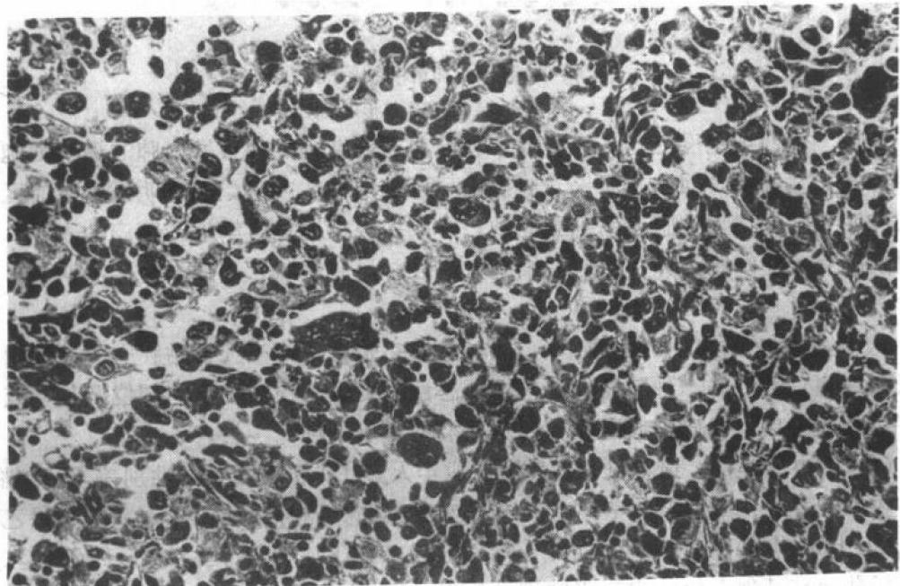 
癌细胞较大，可见多核瘤巨细胞，弥漫分布，无组织结构
免疫组化 癌细胞可显示keratin阳性，有的vimentin亦阳性。
此癌大多位于外周部，当确诊时，多呈巨块。广泛侵袭。患者外周血白细胞增多，预后不佳，常致死。根据光镜下特殊的形态学表现，电镜下的特征，以及预后不良的生物学行为，一些学者把巨细胞癌看作是一种特殊的肺癌类型。
（2）透明细胞癌：指癌组织主要或完全由透明细胞构成。癌组织常呈实性片块，癌细胞亦较大，胞浆呈透明状（图5-19）。组织化学证实，这种透明细胞常含有糖原，也可含有粘液。
图5-19 肺透明细胞癌 
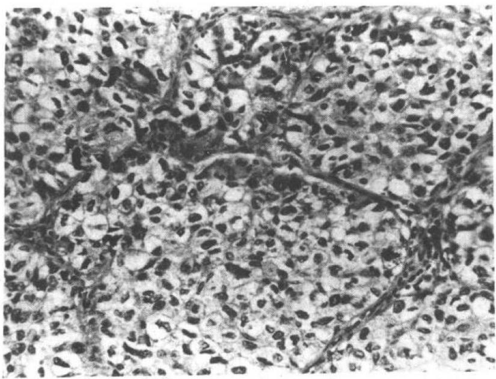 
癌细胞胞浆透亮，核形不规则
光镜 透明细胞癌应与来自肾或甲状腺的透明细胞癌相鉴别。肺的透明细胞癌并非一种特殊类型的癌，因为在鳞癌及腺癌中，可见局灶性或广泛的透明细胞变的区域。故在以透明细胞占优势的肺透明细胞癌中，常或多或少地见有鳞癌或腺癌的表现。而肾的透明细胞癌，癌细胞不如肺的透明细胞大，且常呈腺泡状，核的异型性不明显，间质亦稀少。
5. 类癌 在原发性肺肿瘤中，少于 $5\%$ 。它是由正常支气管粘膜中的神经内分泌细胞（K细胞）发生的一种肺癌，分化好，恶性程度低。根据发生的部位及其特点，肺的类癌可分为中央型类癌、周围型类癌及微瘤型类癌3种。
（1）中央型类癌：最常见，多发生在成年人，亦见于儿童。无性别差异。在临床上，大多数患者并无内分泌异常表现。有些可有典型的类癌综合征，尿中5-羟吲哚乙酸（5-HIAA)升高；有的发现肿瘤可分泌5-羟色氨酸(5-HT)，有的产生ACTH而引起Cushing综合征并伴有其他部位的内分泌肿瘤。
大体 中央型类癌通常发生在大支气管内，呈孤立的息肉状包块，但亦可浸润至支气管壁，并扩展至周围肺实质，甚至有的侵及胸膜或心肌。肿瘤表面被以正常支气管粘膜，少数可发生溃疡。
光镜 典型的类癌诊断无困难，癌细胞较小，大小、形状一致，胞核位于中央，呈圆形或卵圆形，分裂像罕见；胞浆中等量，呈细颗粒状。癌细胞多排列成实性巢、弥漫性实性片块，或实性条索、小梁状，有的可见小的腺样或菊形团样结构，真假乳头状结构少见。间质富于血管，可有明显的透明变性，偶见钙化及骨化。一般不发生坏死。粘液染色通常阴性，但腺腔可呈灶性阳性。在石蜡包埋的切片上，亲银细胞少见，而嗜银细胞（Grimelius 银染法）易见，与发生自其他前肠如胃、十二指肠的类癌相似。
免疫组化 类癌对 Keratin、5-HT、NSE、chromogranin(CgA)、Leu7 及 neurofilaments 等具有不恒定的反应性。其中，NSE、(CgA) 阳性反应，有助于与其他肺癌的鉴别。此外，许多肽类激素，如 somatostatin、bombsin、GRP、gastrin、substance P、pancreatic polypeptide、VIP、ACTH 及 calcitonin 等，在有些类癌可检测到。如果类癌对 CEA 显示阳性反应，则提示此癌具有较强的侵袭性行为，较易发生淋巴结转移[23]。
电镜 类癌细胞的细胞器发达，胞浆内含有较多的神经分泌颗粒，较大，直径 $100\mathrm{nm}-450\mathrm{nm}$ ，并可见微丝、微管，偶而见纤维性包涵体。细胞基底部可见基膜。
根据光镜下形态特征，类癌除上述典型的类癌外，尚有一些特殊形态的类癌，包括以下几种：①嗜酸性细胞类癌（oncocytic carcinoid）：瘤细胞胞浆丰富，呈嗜酸性颗粒状。在超微结构上，除含神经分泌颗粒外，主要特征是胞浆内含有大量线粒体。②梭形细胞类癌：瘤细胞呈梭形，大小较一致。③透明细胞类癌：瘤细胞胞浆透亮为其特征。④粘液细胞类癌。⑤乳头状类癌：瘤组织中乳头状结构较突出（图5-20）。上述特殊形态的类癌，在光镜下难以肯定诊断时，必须借助于免疫组化及电镜观察来明确诊断。
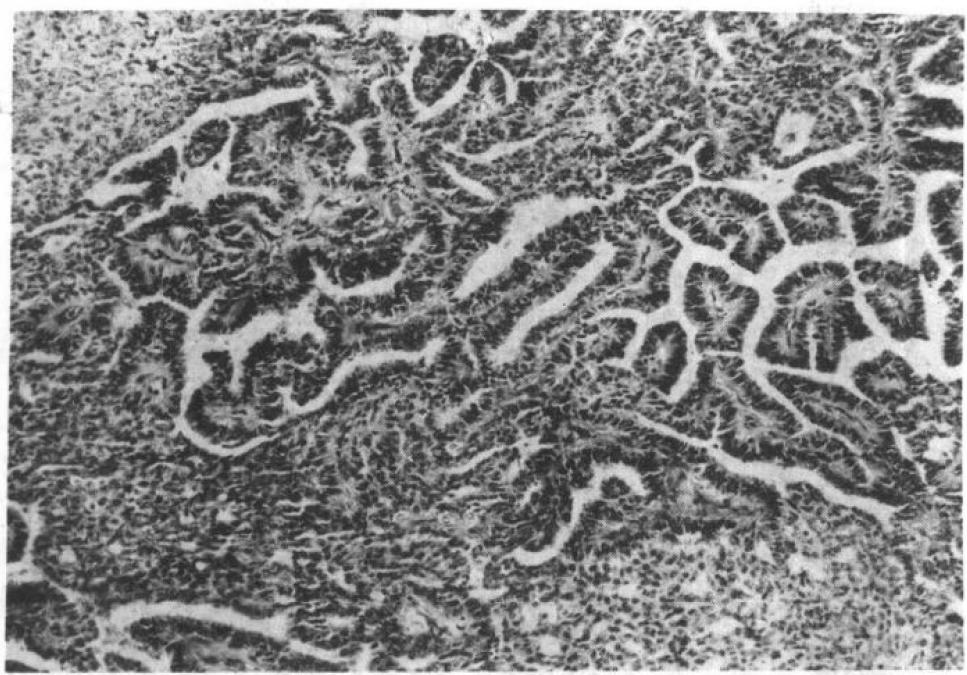 
图5-20 乳头状类癌
（2）周围型类癌：发生于肺的外周部，通常在肺膜下，多为多数性灰白色至黄褐色结节，无包膜。此型类癌有的在肺内呈弥漫性浸润，形成多灶性小结节。
光镜 瘤细胞呈梭形，犹如平滑肌细胞，如不注意鉴别，可能误诊为平滑肌瘤。类癌时，瘤细胞的排列不像平滑肌瘤时排列呈束，纵横交织，而是排列无规律，细胞有一定程度的多形性，偶见分裂像，且主、间质分界清楚，间质较丰富。瘤内可见淀粉样物质沉着及黑色素。后者则需要与转移性黑色素瘤相鉴别，这可借助于免疫组化及电镜观察。周围型类癌的免疫组化显示，calcitonin呈阳性反应，而黑色素瘤S-100阳性，calcitonin阴性。其他免疫组化反应大多与中央型类癌相同。
周围型类癌预后良好，局部淋巴结转移者很少见。
（3）微瘤型类癌（tumourlet）：很少见，一般发生在肺的外周部，常伴有支气管扩张。
光镜 表现为小梭形细胞结节状增生，它与细支气管有关连。故常在光镜下偶然发现。其生物学行为一般为良性，偶见转移者。
微瘤型类癌的细胞，具有与周围型类癌的瘤细胞相同的免疫组化及超微结构特征。但由于瘤体甚小（小于 $5\mathrm{mm}$ ），故可视作为神经内分泌细胞的结节状增生，或为微小类癌瘤。事实上，有时把微瘤型类癌与典型的周围型类癌联系在一起。
6. 不典型类癌 近十年来，在国内外文献中，报道了一种具有神经内分泌分化特征的癌，称之为不典型类癌[24,25]。
如不熟悉其组织形态学特征，往往误诊为低分化的其他类型癌。这种癌未包括在WHO肺癌分类中。
光镜 不典型类癌的特征是癌细胞较小（但比小细胞癌的细胞稍大），常排列呈巢或条索、小梁状，具有器官样结构，常见有菊形团结构（故可误为低分化腺癌）；癌细胞核深染，分裂像多见，癌细胞巢中央常有坏死（图5-21）。细胞巢内有时可见梭形细胞，其边缘细胞亦有呈栅状排列者。间质中可有淀粉样物质沉着。
图5-21 不典型类癌 
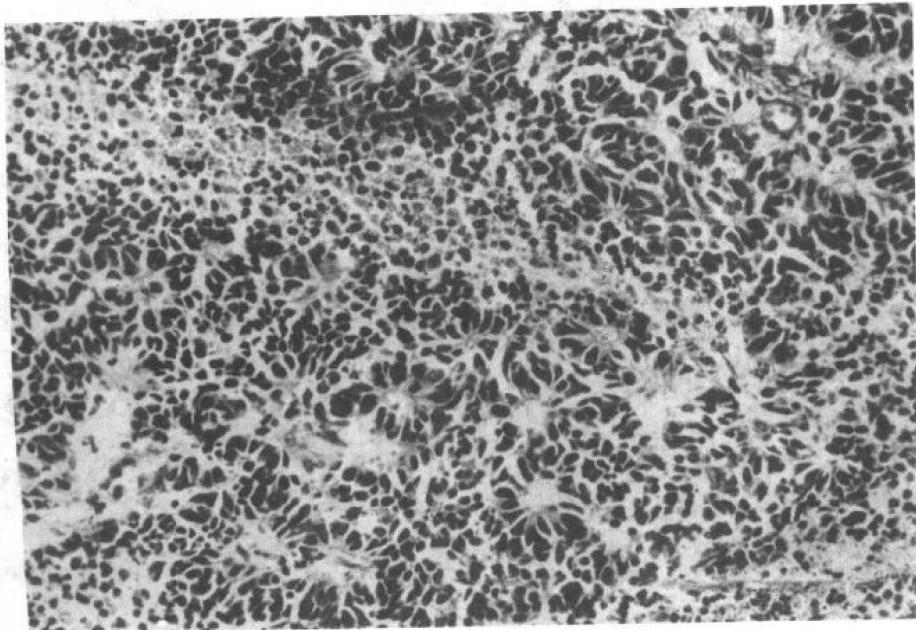 
癌细胞卵圆形，短梭形，有菊形团形成，癌巢中心坏死
免疫组化 有助于与肺的其他低分化癌相鉴别，不典型类癌NSE、（CgA）呈阳性反应，而低分化腺癌与鳞癌均为阴性。
电镜癌细胞亦见有神经分泌颗粒，但数量较典型类癌为少，且分布不均匀，一般在细胞突起内为多，细胞器中等量（图5-22）。
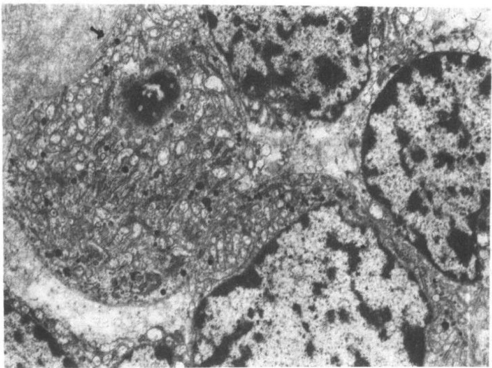 
图5-22 不典型类癌
癌细胞细胞器丰富，含有中等量神经分泌颗粒，见有基膜（↑）
此瘤的恶性程度介于类癌与小细胞癌之间，既与典型类癌不同，又异于小细胞癌。据报道，不典型类癌淋巴结转移的发生率近乎 $70\%$ ，而典型类癌约为 $5\%$ 。另外有人报道，类癌、不典型类癌和小细胞癌患者的五年生存率分别为 $95\%$ 、 $65\%$ 及 $< 5\%$ 。鉴于上述三种癌，同属具有神经内分泌分化特征的癌，故有人统称为神经内分泌癌或K细胞癌，只是三者的分化程度不同而已。类癌是分化好的，不典型类癌是中分化的，而小细胞癌是分化差的。三者有共性，有差别，特别是不典型类癌，不论光镜下组织形态特征，或生物行为、预后均与类癌和小细胞癌有别，故应把它从肺癌分类中区分出来，成为独立的一种类型是有实际意义的。
7. 小细胞癌 占肺癌的 $10\% \sim 20\%$ ，患者 $80\%$ 以上为男性，其发生与吸烟有密切关系， $85\%$ 以上为吸烟者。
小细胞癌一般为中央型，常在段支气管以上的支气管壁内浸润生长，并侵及邻近肺实质，形成巨块，发生坏死常见。往往有支气管旁及肺门淋巴结转移。偶而也可发生在肺外周部，呈孤立结节。中央型者，即使支气管大体无异常发现，纤维支气管镜活检，亦常为阳性。
光镜 根据瘤细胞的形态，小细胞癌可分为三型：①淋巴细胞样或燕麦细胞型：最
多见，占 $42\%$ ，其特征是癌细胞较小，呈圆形或卵圆形，如淋巴细胞，但较小淋巴细胞为大，高倍镜下，核常带棱角。胞核染色极深，胞浆稀少或看不清，分裂像多见。癌细胞常弥漫分布，或呈实性片块，也可如水流，似缓带，呈条索状、小梁状，但无器官样结构。坏死常见。胞核的染色质可弥散至坏死组织，再扩散到血管壁内，使其呈强嗜苏木素性，亦为其特征。在小块活检组织中，人为地受挤压现象极常见，以致胞核拉长、变形，并伴随染色质的弥散，则造成诊断困难或不可能。如果再深切，仔细观察，仍可见小细胞癌诊断特征的蛛丝马迹。必要时，再取材确诊。②梭形细胞型：占 $29\%$ ，大多数癌细胞呈长形，胞核清晰，细胞较大，可与上述人为造成的癌细胞变长相区别。③多角细胞型：占 $29\%$ ，主要由中等大细胞构成，有较丰富的胞浆，故此型常与其他类型肺癌相混淆。但整个结构、电子显微镜所见及其临床生物学行为提示，此型仍属于小细胞癌。
在修订的 WHO 肺癌分类中, 把小细胞癌分为燕麦细胞型、中间细胞型（包括上述梭形细胞及多角细胞型）及混合型。后者指小细胞-大细胞癌与大细胞癌的混合。在少数典型的小细胞癌内, 有时也可见散在的巨大瘤细胞, 在化疗后更为常见。
关于小细胞癌的亚型一直存在分歧，国际肺癌研究病理学会推荐了以下分型[26]：①小细胞癌：包括大部分以前的燕麦细胞型及中间型；②混合性小细胞/大细胞癌，含有典型的小细胞癌直至具有明显核仁的大细胞；③复合性小细胞癌：在典型的小细胞癌成分中，混有分化性的鳞癌或腺癌。这一分型有助于解决常规病理工作中在小细胞癌分型上遇到的实际问题。
免疫组化 小细胞癌对神经性标记如neurofilament、Leu7及NSE等可呈阳性反应。NSE在许多患者血清中升高，可用来作为监测小细胞癌的病情。此癌对keratin也可同时显示阳性反应。
电镜 大多数病例，至少在有些癌细胞内见有少数致密核心神经分泌颗粒，而且颗粒较小，直径 $50\mathrm{nm} \sim 240\mathrm{nm}$ 。胞浆内细胞器亦稀少，偶见小桥粒连接，无基膜。这些也有助于与不典型类癌相鉴别。
我们在肺癌的超微结构研究中发现，有些肺癌如鳞癌、腺癌具有神经内分泌分化的超微结构及免疫组化特征[27]，但缺乏小细胞癌的形态学表现。这种肿瘤应按优势原则，将其命名为鳞癌、腺癌或大细胞癌，伴有神经内分泌分化，作为诊断名称。没有证据表明，这种分化对这些肿瘤的生物行为或预后有影响。在第五届国际肺癌会议（1988年）上有人提出非小细胞肺癌伴神经分泌颗粒者，对化疗有效。
最新的研究，发现小细胞癌的癌细胞中染色体3丢失，令人关注。在癌基因的研究中小细胞癌能检测出c-myc、N-myc、L-myc、L-myb、K-ras和c-erb等癌基因[28]。有人用原位杂交技术研究小细胞癌的myc相关基因表达时，显示了癌基因表达的异质性，即每例标本从一个细胞到另一细胞其表达是不相同的[29]。上述癌基因中，myc原癌基因在肺癌组织中常有扩增，位于癌细胞核内；而ras基因位于癌细胞的细胞器膜，可能与基因点突变有关。初步研究表明，myc癌基因的改变可能与小细胞肺癌（SCLC）的快速生长和浸润能力有关。
8. 细支气管肺泡癌（bronchiolo-alveolarcarcinoma，BAC）细支气管肺泡癌与肺的普通腺癌不同，它具有不同的类型，且与其预后有重要的关系。它的组织发生及其形态
特征，亦具有不同的起源和表现，故应把BAC从WHO分类中的腺癌里分出来，作为肺癌中能独立存在的一种类型。
大体形态分为三型：①单个结节型：均在肺的外周部，位于胸膜下，直径 $0.7\mathrm{cm}-4.5\mathrm{cm}$ ，切面灰白色，圆形或略呈分叶状，一般无坏死。痰细胞学检查常为阴性。②多发结节型：形成大小不等的结节，散布于肺的一叶或多叶，甚至双侧肺，其间仍可见正常肺组织；③弥漫型：癌组织常累及数叶或双肺，质地实，犹如大叶性肺炎，故又称肺炎样型。切面常呈半透明状，伴有粘液样物质产生。后两型痰细胞学检查大多为阳性。
光镜 根据组织结构及细胞形态的不同，BAC可分为四型[30]：
（1）肺泡型：癌细胞分化较好，呈柱状，沿原有肺泡壁生长，形成与正常肺组织相似的肺泡样结构，不侵及间质。 
(2) 乳头状型: 基本上仍保持肺泡结构, 但突出的特点是形成许多大小稍不等的乳头伸入肺泡腔内, 有的乳头尚未分支, 有纤细的纤维血管间质形成轴心 (图5-23)。以上两型, PAS 及奥辛蓝染色, 癌细胞均阴性。
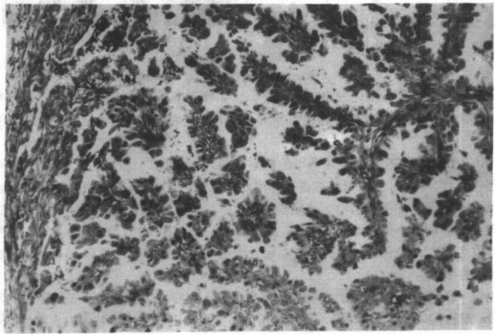 
图5-23 细支气管肺泡癌 
乳头状型
（3）粘液细胞型：为高柱状粘液细胞被覆在肺泡壁上（图5-24），此种癌细胞可广泛分布，也可仅有少数几个细胞，散布于少数肺泡壁上。如肺穿刺标本碰到此种情况，在缺乏经验时要做出BAC的肯定诊断，就会感到困难。但这种类型的BAC，粘液除见于细胞内外，往往也充满肺泡腔内，不论肺泡壁上是否被有瘤细胞。此外，此型癌组织中， $13\%$ 的病例在肺泡内粘液背景上见有砂粒体。这一特点同样可见于转移的癌灶内，有助于鉴别诊断。PAS及奥辛蓝染色，癌细胞及细胞外粘液均呈强阳性反应。
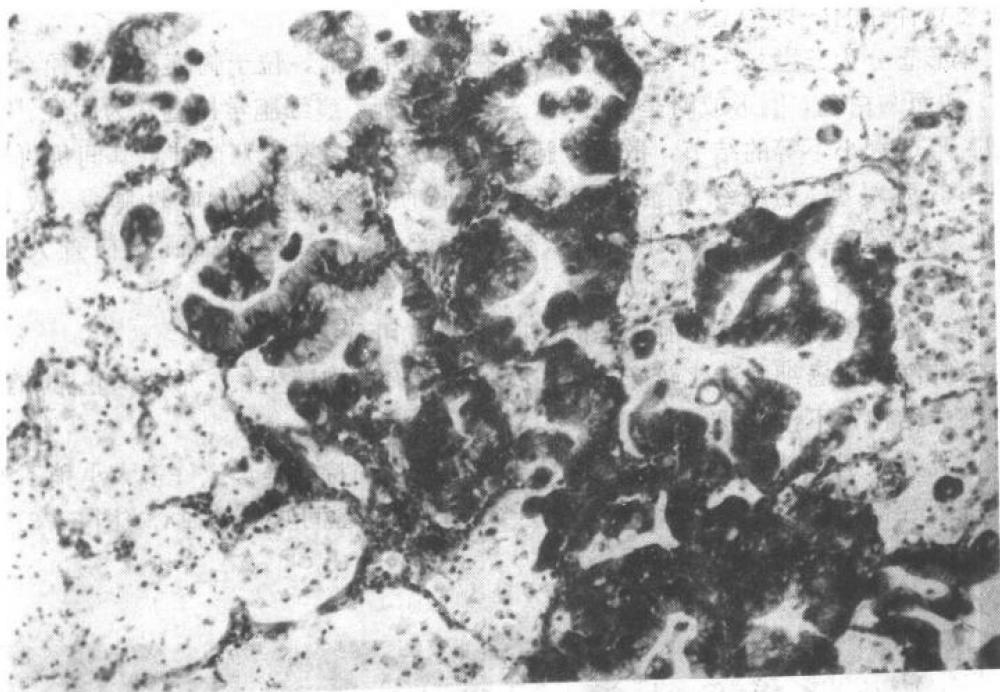 
图5-24 细支气管肺泡癌
# 粘液细胞型
（4）混合型：可为上述三型之间的混合，如肺泡型与粘液细胞型的混合，但亦可见肺泡型与肺泡内呈实性结构的癌组织相混合，其中非粘液细胞 PAS 及奥辛蓝染色均阴性。
BAC 的组织形态, 除见上述各型的基本结构外, 尚见有一些对诊断 BAC 具有特征性的形态学变化。一是可见瘤细胞被覆在肺泡及呼吸性细支气管或肺泡管之间的连续性, 有时可见细支气管上皮不典型增生或癌变的现象。二是部分病例, 癌细胞可见核内包涵体, 呈均匀红染的圆形小体, 位于核中央, 周围有一空晕 (图 5-25)。Macchiavellos 染色包涵体呈鲜红色, PAS 染色阳性。此外, 在癌性肺泡腔内可见多核巨细胞。间质中有较多 S-100 阳性的细胞。
电镜 BAC 是一种异源性肿瘤，大多数病例，肿瘤发生自终末细支气管上皮无纤毛的 Clara 细胞，少数来自 I 型肺泡细胞，还可来自细支气管化生的粘液上皮细胞。故根据超微结构特征，BAC 可按其组织发生分为四型[31]：
（1）Clara 细胞型：特点是瘤细胞表面有微绒毛，胞浆顶端见有单位膜包绕的致密分泌颗粒，直径 $250\mathrm{nm} - 550\mathrm{nm}$ ，核心与界膜之间常见一亮晕。 
(2) I型肺泡细胞型: 特点是大多数瘤细胞胞浆内含有较多嗜饿板层小体 (图5-26) 及其前驱物质-分泌小泡、致密颗粒和多泡小体, 并见向板层小体移行的现象。免疫组化此型癌细胞人肺表面活性物质阿浦蛋白呈阳性反应, 见于胞浆及核内, 后者与光镜下见到的核内包涵体相一致。电镜亦显示核内包涵体呈晶格样结构, 与人和动物的肺表面活性物质的超微结构非常相似。但有人观察到核内包涵体由匐行的和平行的小管构成, 其意义尚不清楚。
图5-25 细支气管肺泡癌肺泡型 
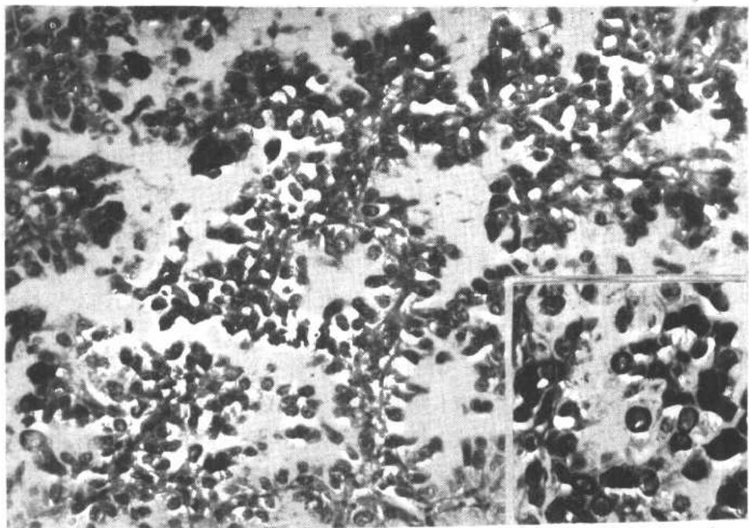 
右下插图：核内包涵体
图5-26 细支气管肺泡癌 
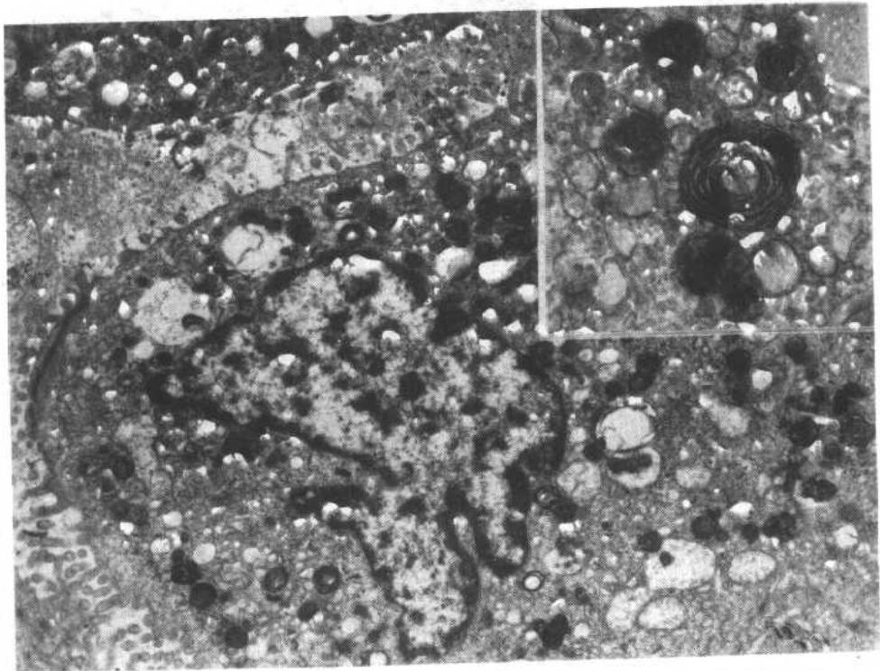 
肺泡 I 型细胞型癌细胞表面有短的微绒毛, 胞质内含有多量发育不同阶段的板层小体右上插图 放大的板层小体
（3）粘液细胞型：瘤细胞胞浆顶端见有大量大小不等的圆形、卵圆形粘液颗粒，直径为 $20\mathrm{nm}\sim 1200\mathrm{nm}$ ，似杯状细胞。细胞表面亦有微绒毛。
（4）混合型：上述各型细胞混合存在。
【鉴别诊断】包括普通型的原发性肺腺癌和转移性腺癌，特别是来自胰腺的分化好的腺癌。有人对BAC及肺腺癌作过比较观察，发现组织结构上常有重叠，如在腺癌组织的周边部，可见典型的BAC结构。更有甚者，在普通腺癌中可见多数小灶性的BAC。遇到这种情况，还是以占优势的癌组织来确定诊断。鉴于BAC主要来自Clara细胞及I型肺泡细胞，故免疫组化技术在鉴别诊断上具有重要意义。 $\alpha \mathrm{LAT}$ 是显示Clara细胞分化的有用标记，而表面活性物质阿浦蛋白对识别I型肺泡细胞具有特异性。借此可把BAC与原发性腺癌或转移性腺癌区别开来。当然，临床资料及光镜下BAC仍基本保持肺泡的结构，间质少亦有助鉴别诊断。
近年来，文献中有个例报道的一种良性肿瘤，称为肺乳头状腺瘤[32]，甚少见。亦发生在肺的外周部，呈境界清楚的结节，需要与单个结节型的BAC相鉴别。乳头状腺瘤由分化好的立方状、柱状上皮细胞构成，排列成乳头状（图5-27），有多少不等的含有血管的纤维轴心。细胞核无异型性，胞浆可呈嗜酸性颗粒状。
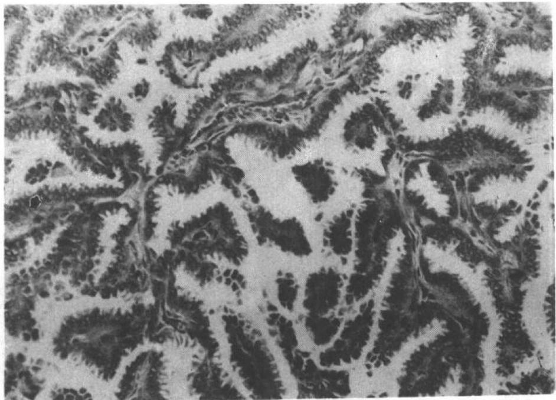 
图5-27 肺乳头状腺瘤 
瘤细胞形成乳头状结构，为分化好的立方状、柱状上皮细胞
电镜下瘤细胞具有向 Clara 细胞及 I 型肺泡细胞分化的超微结构特征。有人亦观察到瘤细胞有核内包涵体，其结构与 BAC 相同，亦由小管构成。此瘤局部切除即治愈。
此外，有的肺炎性假瘤肺泡上皮增生显著，或有乳头状增生，如不全面观察，则易误诊为BAC，特别是有时增生的肺泡上皮较活跃，核增大，具有一定的异型性时，更应注意鉴别。其鉴别要点是：
（1）炎性假瘤的组织像往往较复杂，肺泡上皮增生多以局部较著，且肺泡壁常伴有纤维组织的增生而增宽；而BAC虽可局部有瘢痕形成，但大多保持肺泡的原有结构，肺泡上皮增生为弥漫性的； 
（2）炎性假瘤时，增生的肺泡上皮较规律，异型性不明显，一般无分裂像；而BAC时，增生的肺泡上皮虽然分化较好，但有一定的异型性，大小、形状可不甚规律，可见分裂像； 
（3）炎性假瘤纤维化区常见，可有出血呈海绵状血管瘤样结构；而BAC则罕见； 
（4）炎性假瘤时可见多量泡沫细胞聚积，形成黄色瘤样结构，含铁血黄素沉积亦较常见，偶可见钙化；而BAC时则少见。但需指出，上述肺的炎性假瘤，也有个别少数病例发生癌变者，亦应注意。
关于肺癌的异质性（heterogeneity）问题上述各种类型的肺癌，不仅在光镜观察时，而且更主要的是在电镜观察时，发现某一种肺癌，往往由双向甚至三向分化的细胞（鳞状细胞分化、腺分化及神经内分泌分化）构成，而非由单一的一种分化的细胞成分构成，此即肺癌的异质性。据近年来文献报道，肺癌中有 $35\% - 65\%$ 或更多的病例，是由两种或三种不同的细胞分化成分组成。除腺鳞癌同时具有腺癌和鳞癌的成分外，我们还观察到鳞癌与类癌或不典型类癌并存，腺癌与不典型类癌并存，鳞癌与BAC并存，甚至鳞癌、腺癌与BAC并存或腺癌、BAC及类癌并存于同一个瘤块内的病例。在电镜观察时，在鳞癌组织中发现有成簇的或散在的含有神经分泌颗粒的癌细胞夹杂其间，甚至在同一个癌细胞内，既有鳞状细胞分化的超微结构（成束的张力微丝及桥粒连接），又有神经内分泌细胞的分化特征（神经分泌颗粒）。同样，光镜诊断的类癌、不典型类癌及小细胞癌中，在电镜观察时，在其癌细胞内除见有特征性的神经分泌颗粒外，有的亦含有张力微丝束。有时，小细胞癌与鳞癌并存在同一瘤块内，光镜下即可确定诊断。McDowell等曾发现小细胞癌的单个细胞有显示三向分化的现象，即在同一个癌细胞内见有张力微丝束，以及两种明显不同的颗粒：一致密核心颗粒和粘液颗粒。上述这些现象提示，肺癌的发生难以用来源于不同类型的细胞解释，很可能是各种不同类型的肺癌均来自具有多潜能分化特征的支气管上皮的干细胞，向不同表型分化的结果。特别是具有神经内分泌分化特征的癌细胞，不一定必来自K细胞，也可来自内胚层起源的支气管上皮的干细胞。
根据以上所述，可按照不同情况予以不同的诊断名称。如双向或三向分化的癌细胞成分不均等，则以占优势的成分为主来诊断，而次要的成分则缀其后，用“伴有……分化”或“伴有……癌”来表示。例如：肺鳞癌伴神经内分泌分化，或肺鳞癌伴有类癌成分（光镜下即能辨认者）。如果在同一癌块内，双向或三向分化的癌组织大致均等，无突出优势者，诊断时除已习惯通用的腺鳞癌外，其他不同类型癌并存时，建议用“复合性癌”（combined carcinoma）之名来诊断，并在括弧内注明包括不同类型癌的名称。这样可能更符合实际情况。我们曾遇到一例老年人肺复合性癌，包括鳞癌、腺癌、透明细胞癌。
9. 唾液腺型肿瘤 在肺内也可发生与唾液腺的某些上皮性肿瘤结构类似的恶性肿瘤，可能起源于支气管的粘膜下腺体。分别称之为腺样囊性癌及粘液表皮样癌。过去，把这两种癌和支气管类癌，总称为支气管腺瘤，显然这是不适当的，因为类癌在组织起源上与前两种癌是无关的。
（1）腺样囊性癌：是支气管唾液腺型肿瘤中最常见的一种，大多发生在主支气管内，故纤维支气管镜活检易获阳性结果。
光镜 见癌的形态与发生在唾液腺者可完全相同，癌细胞较小，呈实性条索、腺管或大小不等的筛状结构片块，常在支气管壁内浸润性生长，并可累及气管。转移至局部淋巴结及肺实质者常见。如不作肺切除，对放射治疗亦有明显效果，但不能治愈。一般发展较缓慢，病程较长，其最终预后不佳。
（2）粘液表皮样癌：亦发生于主支气管内，较少见。除成人外，亦可见于儿童。此癌亦为侵袭性生长，根据其构成肿瘤的粘液细胞及表皮样细胞两种成分比例的不同，如同发生在唾液腺者一样，也可分为低度恶性和高度恶性两型。
低度恶性型：在分化较好的表皮样细胞构成的片块中央，有由分化好的粘液细胞被覆的腔隙，主要在局部侵袭生长，故恶性度低，有时亦可广泛侵袭。此型被认为是从支气管的粘液腺起源的。
高度恶性型：主要是表皮样细胞成分，而粘液细胞成分较少，大多数病例与腺鳞癌相当，是从支气管表面上皮起源的。此型侵袭性大，预后极差。
最近有人报道2例具有腺鳞癌特征的肺癌，免疫组化检查S-100阳性，考虑向肌上皮细胞分化，基底膜物质由淀粉样物质构成。
此外，支气管腺体也可发生嗜酸性细胞瘤（oncocytoma），可能为恶性的。
光镜 需要与发生于支气管的嗜酸性细胞性类癌（oncocytic carcinoid）相鉴别，可借助于超微结构或免疫组化检测来区别。
# 10. 癌肉瘤及肺母细胞瘤
（1）癌肉瘤：很少见，它是由恶性上皮成分和间叶成分共同组成。通常见于成年人。为中央型，常在支气管腔内生长呈息肉状包块，亦有位于肺实质内者。
光镜 见癌与肉瘤样成分相互混杂（图5-28）。癌的成分一般为鳞癌。肉瘤样成分呈梭形细胞，类似纤维肉瘤或恶性纤维组织细胞瘤，偶而可有软骨肉瘤、骨肉瘤或横纹肌肉瘤的成分。也可见破骨细胞样巨细胞。支气管镜活检时，可见一种或两种成分，如仅见一种成分，明确诊断就较困难。此瘤恶性度高，可发生远距离转移，预后比普通型的肺癌要差。
（2）肺母细胞瘤：亦名肺胚瘤（embryoma），更为少见。可发生于成人、儿童甚至新生儿，此瘤通常位于肺的外周部，病程长，生长缓慢。
光镜 特征性的表现是在富于细胞的间质背景中，有分化好的腺体存在，间质细胞为未分化的梭形细胞，而腺体由立方状或柱状上皮细胞构成（图5-29），可为单层或复层，少数呈乳头状。全部结构与胚胎期 $2\sim 3$ 个月的肺组织相似，也有些类似Wilm瘤的结构，间质成分也可向横纹肌肉瘤、骨及软骨分化[33]。有些病例见有小肠分化的现象。此瘤的预后，随年龄而异，年龄愈大，预后愈差。
上述这两种肿瘤之间，偶见有过渡型，其超微结构也非常相似，故考虑这两种肿瘤在组织发生上有密切关系。要把这两种肿瘤明确区分开来可能是不可能的，或者没有必要的。
新近有人报告一种肺肿瘤，称之为肺内胚层瘤（Pulmonary endodermal tumor）或胎儿型腺癌（adenocarcinoma of fetal type），其特点是具有与肺母细胞瘤相类似的腺体成分，
图5-28 癌肉瘤 
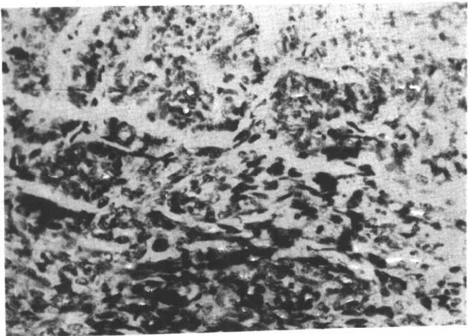 
癌与肉瘤成分相互混杂
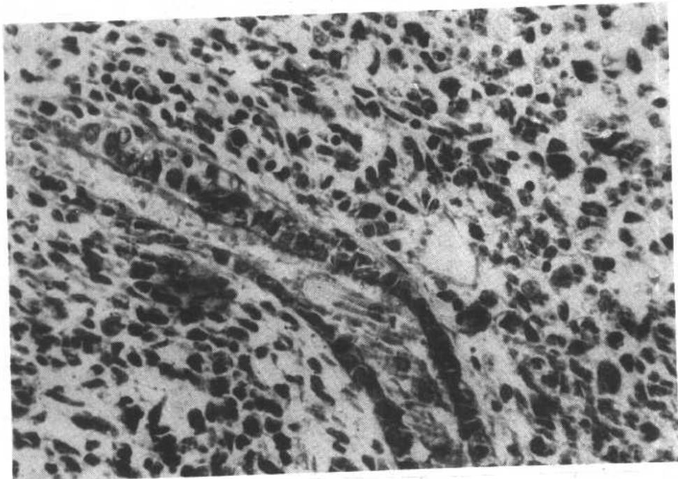 
图5-29 肺母细胞瘤
由未分化的梭形、卵圆形间质细胞构成，其间见分化好的腺体，由立方状、柱状上皮构成而缺乏肉瘤成分。超微结构观察，有些病例瘤细胞内见有内分泌特征。
# 五、肺癌的扩散与转移
肺癌不仅可在原发部位继续生长、扩散，而且也常通过淋巴道或血道转移至身体其他部位。因肺癌的发病常较隐匿，早期常无临床症状，易被忽视。甚至有的已发生远距离转移，仍难以确诊，故了解某些肺癌的转移特征，或许有助于对肺癌的诊断。
# （一）直接蔓延
肺癌可从支气管发生处沿支气管壁浸润生长，直接向近侧或远侧端扩散，可侵至气管隆突平面，亦可穿过支气管壁向肺实质生长，进一步可达纵隔及胸膜。后者可导致两层胸膜的种植性扩散，使胸膜增厚，犹如胼胝。甚者还可侵及胸壁及横隔。
# （二）淋巴道转移
肺癌在早期就有可能发生淋巴道转移。一般小细胞癌要比鳞癌转移要早且多。淋巴道转移首先见于支气管肺淋巴结、肺门淋巴结，气管支气管旁淋巴结。由此可至纵隔淋巴结，或逆行转移至下颈部淋巴结。较少者也可转移至腋窝淋巴结和横膈下淋巴结。肺癌尸检病例约有半数有腹膜后淋巴结转移。
# （三）血路转移
肺癌发生血路转移常见，特别是未分化型肺癌如小细胞癌、大细胞癌可早期发生，鳞癌及腺癌则较晚。血道转移引起的临床症状，有时出现在肺癌症状尚未出现之前，故临床上遇到原发部位不明的远距离转移癌时，应首先考虑有无肺癌转移的可能。有时肺癌细胞侵入肺血管，形成广泛性癌栓并导致肺心病，这一现象在腺癌较常见。肺癌的远距离转移最常见的部位是中枢神经系统、肾上腺、骨及骨髓、肾等，不甚常见的部位有肝、胃、肠道、对侧肺、胰腺、甲状腺、脾、脑垂体、心肌、皮肤及骨骼肌。脑转移以腺癌为多见，也包括细支气管肺泡癌。在最初诊断时已发生远距离转移者，以小细胞癌为多，约占小细胞癌患者的 $84\%$ ，其中 $14\%$ 转移至中枢神经系统， $47\%$ 至骨髓。
# 六、影响肺癌预后的因素
一些资料表明，肺癌的长期存活率较低，预后较差。据国外大宗病例的统计分析，肺癌的5年存活率仅为 $8\%$ ，而手术切除病例为 $21.3\%$ 。近十多年来，由于采用手术与化疗、放疗相结合的综合疗法及其方法的改进，使肺癌的5年存活率有所提高。如小细胞癌的5年存活率早先低于 $2\%$ ，目前已达到 $20\%$ 。
影响肺癌预后的因素很多，包括年龄（40岁以下者预后差）、性别（女性较男性差）、部位（位于肺上沟者预后较好，鳞癌周围型较中央型好）、临床分期（TNM分期是最重要的预后因素）、肿瘤大小（大者比小者差）细胞类型及分化程度、侵袭血管、侵袭胸壁、有无瘢痕（周围型腺癌或大细胞癌有瘢痕者预后差），淋巴结转移、炎症反应（肿瘤周围有明显的淋巴浆细胞反应，或淋巴结显示滤泡增生、生发中心明显者预后好）、DNA倍体数及癌基因表达等。现就其中有重要意义的一些因素略加讨论。
# （一）临床分期
临床上，根据肺癌的TNM的不同情况，可分为三期，即：I期（可手术）；Ⅱ期（可手术）；Ⅲ期（不能手术）。TNM不同分期的定义见表5-1。
表 5-1 肺癌 TNM 不同分期的定义 
分期定义To无原发瘤证据Tx痰细胞学检查有癌细胞,但影像学及支气管镜检查未发现任何癌T1s原位癌T1肿瘤最大直径不超过3cm,支气管镜检查无侵及叶支气管近侧之证据T2肿瘤最大直径大于3cm;或肿瘤不论大小侵及脏层胸膜或伴有肺不张或阻塞性肺炎。支气管镜检查,肿瘤的近侧范围必须在叶支气管内,或至少要远离隆突2cm。无胸膜渗出液。T3任何大小的肿瘤直接蔓延至邻近组织如壁层胸膜或胸壁、横隔,或纵隔;或支气管镜所见肿瘤,累及主支气管而距隆突少于2cm;或任何大小的肿瘤,伴有任何一侧肺的肺不张或阻塞性肺炎,或伴有胸膜渗出液。No局部淋巴结无可证明的转移N1转移至支气管周围淋巴结或同侧肺门区,或直接蔓延至上述两处N2转移至纵隔淋巴结Mo无远距离转移M1远距离转移如颈部或对侧肺门淋巴结,脑、骨、肝或对侧肺。
# （二）细胞类型与分化程度
与肺癌的预后关系密切。肺癌中以鳞癌的存活率最高，有人统计一组长期存活的肺癌，鳞癌约占了一半。而小细胞癌的存活率最低，但其亚型之间也还存在差别，淋巴细胞样型与中间型之间，虽无明显的预后差别，但纯粹的小细胞癌要比小细胞癌/大细胞癌的存活期长。在手术切除的病例中，5年存活率随肿瘤的分化程度而异，分化好者为约 $40\%$ ，中分化者为 $20\%$ ，分化差者为 $7 \%$ 。就神经内分泌癌而言，也是如此，类癌、不典型类癌和小细胞癌的5年存活率分别为 $95\% ,65\%$ 及 $< 5\%$ 。细支气管肺泡癌中，孤立结节型通常来自Ⅱ型肺泡细胞，术后治愈率较高，而弥漫型者均为粘液细胞型，预后不佳。大细胞癌及任何组织学类型的肺癌中有瘤巨细胞出现，预后较差。巨细胞癌发展快，预后差，无治愈者。
# （三）DNA 倍体及癌基因表达
用流式细胞仪测定肺癌的DNA倍体，对判断其预后具有意义。Volm等对187例手术切除的非小细胞癌的新鲜标本作了流式细胞测量术的研究，所有患者至少随访5年。结果显示非整倍体瘤的患者存活时间较二倍体瘤的患者明显为短（ $\mathrm{P} < 0.001$ ），提示DNA倍体数对非小细胞癌患者是一种独立的预后因素[34]。癌基因的初步研究表明，非小细胞癌ras癌基因的表达增强，而小细胞癌至少有三种myc基因扩增。myc基因的改变可能与小细胞癌的快速生长和浸润能力有关。如不典型小细胞癌和典型小细胞癌相比，它具有更强的侵袭生长能力，并对放疗的敏感性降低，其c-myc表达水平大大高于典型小细胞癌。同时治疗后复发的小细胞组织中，c-myc表达水平也高于治疗前。另外，也有报道：小细胞癌中N-myc表达增强，则预后不佳。
# （四）其他因素
新近Nishino等用免疫组化技术研究了肺腺癌相关基底膜上层连蛋白（laminin）的分布，将其分为连续型和非连续型。发现肿瘤相关基底膜上层连蛋白的非连续型，可反映肿瘤的扩散速度，与预后有密切关系[35]。
# 第五节 肺的其他肿瘤
# 一、良性肿瘤及瘤样病变
# （一）上皮性肿瘤
1. 支气管乳头状瘤 此瘤多发生在支气管主干开口处，有的亦可在段支气管，较少见。大多为单个，亦可多发。有的呈弥漫性分布，可累及喉及整个气管、支气管树。单个者呈乳头状，突入支气管腔内，有广基与支气管壁相连；弥漫性者，在气管、支气管粘膜见散在或成簇分布的疣状新生物。支气管乳头状瘤合并喉乳头状瘤者较常见。
光镜 见瘤组织主要由上皮组织构成，呈乳头状结构，有的乳头表面被以复层鳞状上皮，分化良好，可诊断为鳞状上皮乳头状瘤；如发生在成年人，则有恶性变的倾向。有的病例乳头表面被以单层或假复层纤毛柱状上皮（图5-30），其轴心为富含血管的少量间质，此种可称为柱状上皮乳头状瘤。
图5-30 支气管乳头状瘤 
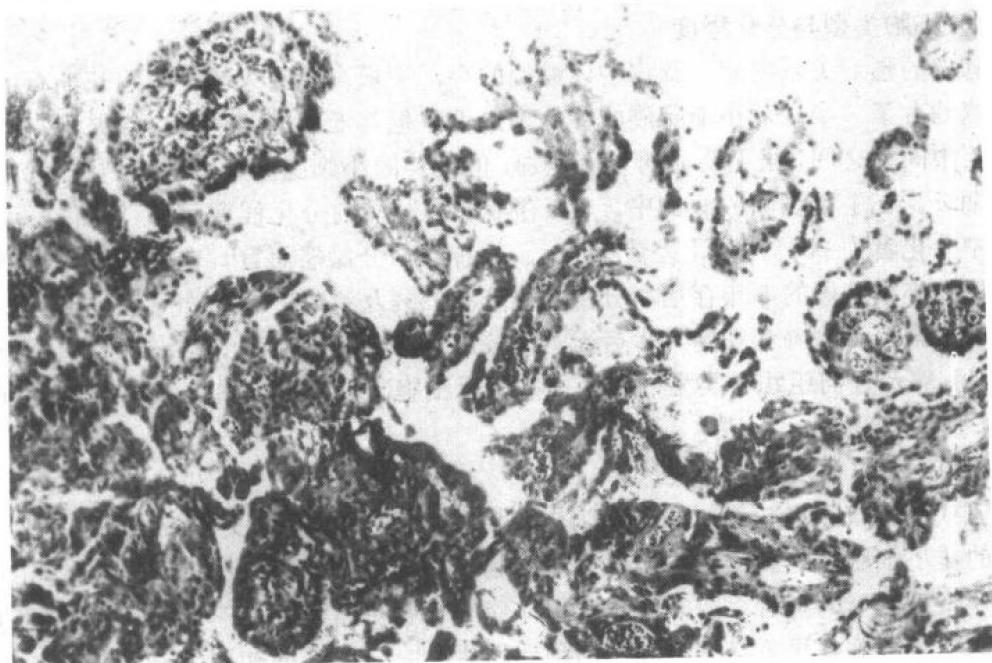 
富含血管轴心的乳头表面，被以单层、假复层柱状上皮
2. 支气管内翻性乳头状瘤 此瘤极罕见，文献中尚未见有报道。发生在主支气管，可将管腔堵塞，其组织结构与发生在鼻腔或膀胱的内翻性乳头状瘤十分相似，而与上述支气管乳头状瘤不同。我们曾遇到一例，男性，36岁，咳嗽、痰中带血5个月，胸片示
左下肺肿物，疑为肺癌行左肺切除。大体见左主支气管距切缘 $2\mathrm{cm}$ 处有灰白色菜花样肿物堵塞，肿物长 $3.5\mathrm{cm}$ ，直径 $1.0\mathrm{cm}$ ，并向上、下叶支气管内扩展，将其完全阻塞。左下叶背段内者大小为 $5\mathrm{cm} \times 5\mathrm{cm} \times 4\mathrm{cm}$ 。远端支气管轻度扩张。光镜下见肿物表面无乳头状生长，与支气管壁有广基的蒂相连，其表面被覆上皮与相邻支气管上皮相同，为假复层柱状上皮，未见纤毛上皮及杯状细胞。表面上皮向深部内翻，形成大小不等，形状不一的腺样结构，上皮细胞大小、形状一致，排列整齐，核分裂像罕见（图5-31）。其间见散在的局灶性鳞化。间质多少不等，为疏松纤维组织。电镜下瘤细胞内未发现神经分泌颗粒，排除了中央型类癌的可能。
图5-31 支气管内翻性乳头状瘤 
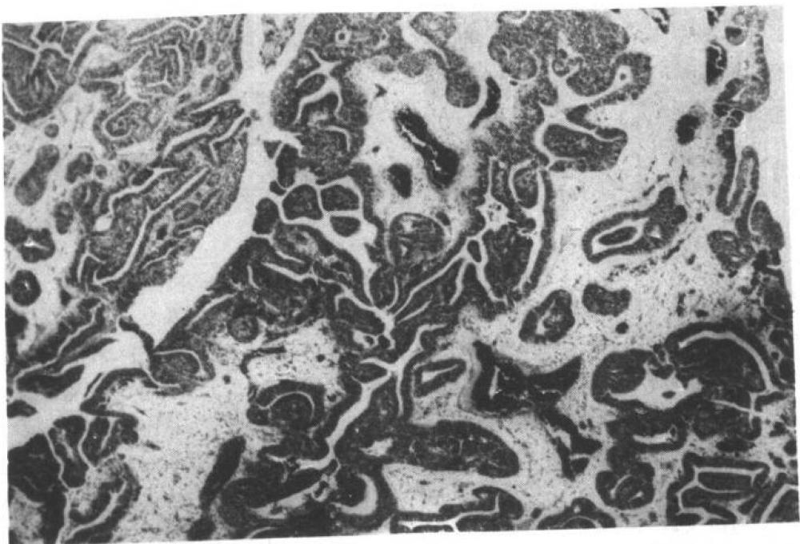 
由假复层柱状上皮形成，其组织结构与发生在鼻腔者很相似
3. 支气管腺瘤 此瘤亦发生在大支气管，更为少见。通常呈息肉状，突入支气管腔内，常引起阻塞症状。光镜（图5-32）根据肿瘤细胞形态的不同，可诊断为不同的名称。瘤体表面一般被以柱状上皮，如瘤组织主要由大小不等的粘液腺构成，可称为粘液腺腺瘤。如腺体为浆液腺，且有的明显扩张呈囊状，可叫囊腺瘤。如构成肿瘤的腺体由呈嗜酸性颗粒状的大细胞组成，可称为嗜酸性细胞腺瘤（oncocytic adenoma）。此种腺瘤应注意与嗜酸性细胞类癌相鉴别。电镜观察有助于二者的鉴别。前者的瘤细胞内虽然也有多量密集的线粒体，但无神经分泌颗粒，是与嗜酸性细胞类癌不同的。
4. 良性混合瘤（多形性腺瘤）此瘤是由支气管壁内的腺体发生的，极少见，其组织形态与唾液腺发生的混合瘤完全相同。 
5. 肺乳头状腺瘤（图5-27）此瘤罕见，为孤立性钱币样结节，位于肺周边部，境界清楚，肿瘤直径为 $1.5\mathrm{cm} - 2.5\mathrm{cm}$ 。患者一般无症状。光镜 肿瘤主由乳头状结构组成，其表面被以大小、形状均一的立方状至柱状上皮，
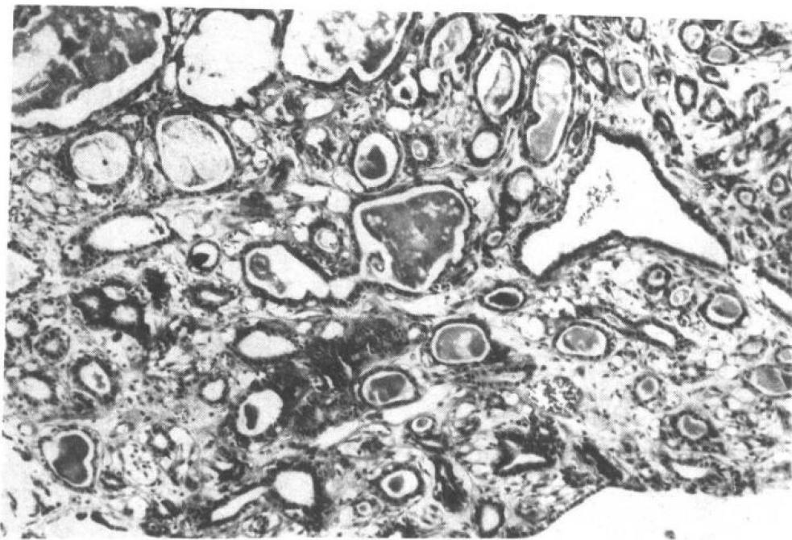 
图5-32 支气管腺瘤
由大小不等的腺体构成，腺上皮立方状，分化好
胞浆呈嗜酸性。乳头轴心为含血管的纤维组织。有些区域可见乳头状结构与富于细胞的实性区相互掺合。瘤内未见有纤毛上皮细胞及核分裂像，亦无出血、坏死。免疫组化（Clara 细胞特异抗体）及电镜所见，表明此瘤来自 I 型肺泡上皮或 Clara 细胞，因瘤细胞内含有板层小体或细胞顶端见电子致密小体[36]。
【鉴别诊断】此瘤为良性肿瘤，切除后不复发，预后好。诊断时应注意与细支气管肺泡癌（乳头型）相鉴别。后者并不少见，癌组织仍保持肺泡结构，肺泡内可有多量呈小乳头状的瘤组织，其表面癌细胞具有异型性。
# （二）间叶性肿瘤
1. 软骨瘤 此瘤发生自大支气管壁的软骨组织，直径一般为 $1 \mathrm{~cm} \sim 2 \mathrm{~cm}$ ，表面较光滑，略呈分叶状，质地较硬，呈灰白色或黄白色半透明状。瘤体与支气管壁紧密相连。
光镜 肿瘤由分化成熟的软骨组织构成，可为透明软骨、纤维软骨或弹力软骨，或各种软骨混合存在。软骨细胞排列稍零乱。瘤组织可发生钙化、骨化，有的伴有粘液瘤样结缔组织及脂肪。
【鉴别诊断】 软骨瘤与发生在大支气管内的错构瘤，有时鉴别困难。软骨瘤由单一的软骨组织构成，而错构瘤往往由多种组织成分构成，包括软骨、平滑肌、脂肪及由增生的呼吸上皮被覆的裂隙，相互混杂。
2. 脂肪瘤 较大的支气管常有脂肪组织存在，位于支气管软骨外。在其他间叶性肿瘤中，常混合有脂肪组织。如肿瘤成分主要是脂肪组织，即可诊断为脂肪瘤。
大体 它和支气管内其他良性肿瘤一样, 为发生在大支气管的带蒂的息肉状包块, 突入腔内。
光镜 肿瘤表面被以假复层柱状上皮, 上皮下为分化成熟的脂肪组织, 其中有时可
见残留的腺体，无包膜。
3. 平滑肌瘤 较少见，多发生于主支气管壁内，可向支气管腔内突出；亦可发生在肺外周实质内，呈孤立性结节。肿瘤一般直径为 $1.5\mathrm{cm}$ 左右。此瘤多见于中年女性。
光镜位于支气管壁内者，瘤的表面被以变薄的呼吸上皮或鳞状上皮；位于肺实质者，常有包膜形成。瘤组织由呈束相互交织的成熟平滑肌细胞构成；肺实质内者，有的见瘤组织内富含仅有内皮细胞的薄壁血管，考虑是由血管的平滑肌发生的。一般无核分裂像。如瘤组织富于细胞，且偶见分裂像，可诊断为富于细胞的平滑肌瘤。文献中有将此类肿瘤作冰冻切片诊断时误诊为纤维肉瘤的报告，故应注意与肉瘤的鉴别。
此外，周围型平滑肌瘤应注意与周围型梭形细胞类癌相鉴别，免疫组化及电镜观察容易将二者区别。
4. 血管肿瘤 肺的血管肿瘤极罕见，可有如下3种。
（1）毛细血管瘤：发生在肺实质内，其特征与其他部位发生的毛细血管瘤相似，无包膜，为孤立性或弥漫多发性，后者可称为血管瘤病，患者可有肺动脉高压的症状和体征。 
（2）血管外皮细胞瘤及血管球瘤：在肺实质内呈圆形结节状，一般直径不超过 $2\mathrm{cm}$ 。光镜下组织形态与软组织发生者相同。 
（3）血管内细支气管肺泡肿瘤 (intravascular bronchiolo-alveolar tumor, IVBAT)[37]：此瘤多见于青年成人， $80\%$ 以上为女性，临床上表现为进行性肺功能不全。典型者为多灶性弥漫性生长的结节。有些病人可死于肺功能不全。
光镜瘤组织由周边部类似上皮细胞、组织细胞、软骨或蜕膜细胞的嗜酸性胖细胞，包绕中央无结构的嗜酸性物质所形成的息肉样结构。有时中心可见透明变性、钙化或骨化。此种息肉样的细胞巢境界清楚，常充满肺泡腔，偶尔见于细支气管腔内。动脉及静脉腔内亦有同样的瘤组织充塞，甚至在远离瘤体的部位亦可见到血管腔充满瘤组织的情况。
最初，将此瘤认为是细支气管肺泡癌的一个亚型，但经电镜及免疫组化观察，显示此瘤由内皮细胞构成，故认为是肺型的上皮样（组织细胞样）血管内皮细胞瘤。此种瘤大多原发于肺，但有些具有同样表现的病例，则可能为身体其他部位，特别是肝的上皮样血管内皮细胞瘤的肺转移。
5. 淋巴管平滑肌瘤病（lymphangiomyomatosis）此瘤为增生性疾病，可弥漫累及双肺，仅见于育龄妇女。有些病人患有结节性硬化及肾血管平滑肌脂肪瘤。此病大多为进行性，可导致呼吸功能不全、自发性气胸及乳糜性胸腔积液，在数年内可致患者死亡。
光镜 见与肺血管有关的平滑肌细胞弥漫性异常增生，并扩展至肺间质，可导致气道、淋巴管、血管阻塞。患者可出现呼吸困难及肺动脉高压。此病亦可累及肺外组织如纵隔、腹膜后淋巴管。有人用免疫组化法检测了瘤组织中孕酮及雌激素受体的分布，发现异常增生的肌细胞孕酮受体呈强阳性表达，雌激素受体呈弱阳性表达。而其他器官包括正常肺、结肠、膀胱、前列腺、子宫等的平滑肌细胞不论雌激素受体或孕酮受体均为阴性。故认为淋巴管平滑肌瘤病是一种平滑肌细胞表达上述两种受体的异常增生[38]。
6. 颗粒细胞瘤（granular cell tumor）此瘤罕见，多见于中年人，发生在气管、大支气管。患者常出现继发性阻塞症状。此瘤的细胞来源尚不清，可能包括纤维母细胞、组
织细胞、原始间叶细胞、骨骼肌细胞、平滑肌细胞及神经鞘细胞。
大体瘤体呈息肉样，突入气管或支气管腔内，阻塞远端肺萎陷及肺炎常见。
光镜 支气管镜活检或痰细胞学可明确诊断，瘤细胞较大呈多角形。胞核圆形、卵圆形，轻度多形性；胞浆呈嗜酸性颗粒状。PAS染色呈阳性反应。
电镜瘤细胞不含肌源性超微结构特征，而充有溶酶体，并含膜性断片。
7. 粘液瘤 极罕见，文献中仅有少数个例报告，一般发生于肺实质内，与支气管不相通，呈结节状，可有薄的包膜。
大体，质地较软，有粘液感。
光镜 与其他部位的粘液瘤相同。
# （三）瘤样病变
肺的瘤样病变较多，其共同的特征是在肺门部或肺外周部形成占位性病变，在影像学诊断上，不易与肺的真性肿瘤相鉴别，甚至有的病例在术前诊断为肺癌而行肺叶切除。这些病变，有的为错构瘤，有的为炎性病变，均非真性肿瘤，但具有肿瘤的占位性特征，故统称为瘤样病变。较常见的有以下几种。
1. 错构瘤 错构瘤为支气管和肺的瘤样畸形，亦可叫软骨样错构瘤或软骨样腺瘤。较常见，一般见于成人，男性为多，往往不引起症状，大多在体检时偶然发现。通常为单个，亦可多发。多位于肺膜下肺实质内，亦可见于大支气管内。胸片上，位于肺膜下的外周型，为境界清楚的圆形阴影。支气管内型，可见支气管阻塞征象。
大体 外周型肿瘤多呈球形，边界清楚，与肺组织之间常有纤维性包膜分隔，故手术时易于完整摘除瘤块。瘤多呈球形，表面略呈分叶状，质地较硬，大小不等，直径可从数毫米到 $15\mathrm{cm}$ ，甚至可占据整个一个肺叶。一般较小，为数厘米。切面上，呈灰白色半透明结节，被界限不清的裂隙分隔。如有钙化区则呈黄白色，富于脂肪组织则呈鲜黄色。偶见发生软化或有微囊腔形成。支气管内型者，可见呈息肉状的瘤块堵塞管腔。
光镜 外周型瘤组织主要由呈岛状分布的成熟软骨组成，其间杂乱地混有脂肪组织、平滑肌组织、粘液样纤维结缔组织，并见由纤毛上皮或无纤毛的呼吸上皮内衬的不规则裂隙或腺样结构。有的可见支气管壁的腺体混杂其中。软骨成分可发生钙化，骨化少见。上述各种成分的异常混合，不论数量、分布是各不相同的。有的瘤内无软骨成分，有的则主要是软骨成分，后者需要与软骨瘤相鉴别（见前述软骨瘤）。错构瘤内无炭末沉着为其特征。
支气管内型瘤组织中，上皮裂隙少，软骨成分亦减少，而脂肪组织增多。
2. 炎性假瘤 此瘤为假瘤还是真性肿瘤，各家意见不一，故诊断名称亦较混乱，除炎性假瘤外，亦有称为硬化性血管瘤、纤维黄色瘤、组织细胞瘤或肺腺瘤等者。这主要是由于此瘤的组织结构复杂，构成肿瘤的细胞成分多样，且由于病程长短不一，发生的继发性变化亦各不相同所致。但从本质上看，此瘤并非真性肿瘤，而是一种由肺内多种细胞成分发生炎性增生所形成的肿块，称炎性假瘤为宜。
大体 为孤立性结节状包块，位于肺的周边部，与肺组织之间多有明显境界，常呈圆形、卵圆形，有时为不规则形，可有假包膜形成。直径多为 $2\mathrm{cm} - 4\mathrm{cm}$ 不等，呈实性。切面上，肿块多呈灰白色、灰黄色，有的富含血液，呈暗红色；也可各种颜色相混杂，质地不等，如纤维化、透明变性较著，则较硬。
光镜 组织形态多种多样为其特征，不仅各个病例不尽相同，而且同一病例的不同区域也各有差异。这些变化包括：①肺泡上皮明显增生，有的呈腺样结构，有的呈乳头状（图5-33）；肺泡腔大小不等，有的因肺泡壁纤维细胞增生肺泡腔变小，有的明显扩大，腔内往往充满大量红细胞，致肺泡上皮受压变扁平，犹如海绵状血管瘤；②纤维组织大量增生，可致局灶性纤维化及透明变性，或粘液样变性，有的纤维化较广泛，其间可见残留的腺样肺泡上皮；③血管增生，管腔扩张，可伴有出血及多少不等的含铁血黄素沉着或铁质沉着；④组织细胞及泡沫细胞大量聚集（图5-34），呈黄色瘤样变化；有的见有胆固醇结晶沉积及多核巨细胞；⑤有的肺泡内炎性渗出物机化，呈机化性肺炎改变；⑥炎细胞浸润多少不等，以淋巴细胞为主，也可有浆细胞、中性白细胞浸润；有些病例，炎细胞浸润较少见；⑦有些病例，见肺泡壁明显增厚，但非纤维组织增生，而为一种胞浆稍透明的细胞所代替，胞核呈圆形或卵圆形，常聚集成群或弥漫分布呈实性片块。此种细胞的性质在光镜下难以确定。经免疫组化染色，NSE呈阳性，有的chromogranin亦阳性。有意义的是在上述这些细胞之间，几乎无例外地均见有多少不等的肥大细胞散在，有的数量甚多。⑧个别病例，瘤组织内可见坏死及钙化。假瘤周围的肺组织多呈受压萎陷表现。
图5-33 肺炎性假瘤 
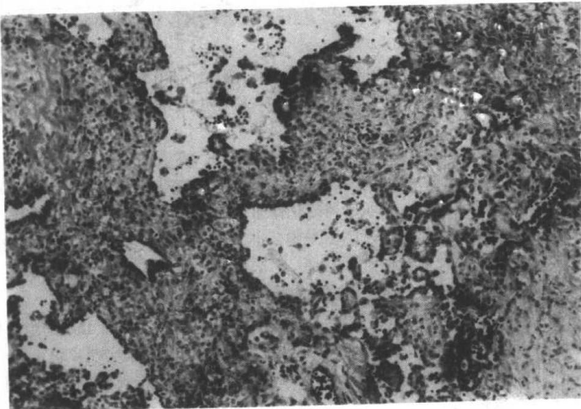 
肺泡上皮增生，有乳头形成
还需指出, 炎性假瘤中, 有时可见肺泡上皮呈异型增生, 细胞增大, 核深染, 犹如恶性变细胞。据文献报道, 也确有少数个例报道, 在炎性假瘤的基础上发生癌变者。
# 【鉴别诊断】
(1) 细支气管肺泡癌: 如炎性假瘤中肺泡上皮增生显著, 并有乳头状增生, 则易误为细支气管肺泡癌。二者鉴别要点见前述第四节细支气管肺泡癌。
(2) 机化性肺炎：受累肺纤维化，变硬，病变区与周围肺组织无明显分界。光镜下
图5-34 肺炎性假瘤 
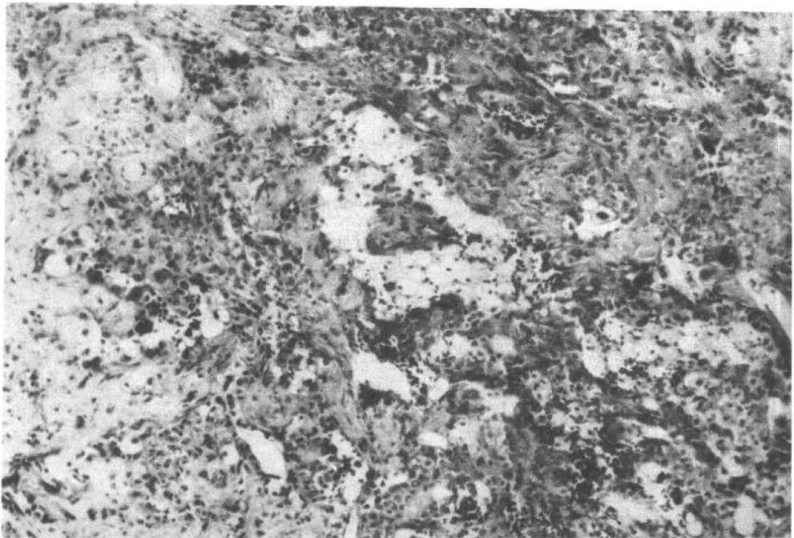 
肺泡间隔纤维组织增生，肺泡腔内大量噬脂泡沫细胞聚积
肺泡结构基本保持，肺泡腔内含机化的渗出物，肺泡上皮增生不明显，肺泡壁有慢性炎细胞浸润。病变较单一，不如炎性假瘤病变多样。
（3）有时还要注意与血管外皮细胞瘤、浆细胞瘤、类癌、淀粉样瘤相鉴别。
3. 所谓硬化性血管瘤 此瘤过去被归入炎性假瘤，现认为是另一种肿瘤，但非血管源性肿瘤。因沿用习惯名称，故叫所谓硬化性血管瘤。此瘤多见于青壮年女性，右肺较左肺常见。肿瘤位于肺的周边部，在X光胸片上，为一无症状的孤立结节，连续照片观察，生长非常缓慢。患者常有咯血史。
大体此瘤境界清楚，但无包膜，呈实性，桔黄色，有时伴有出血区。
光镜 突出的变化是：①肺泡上皮呈乳头状增生，它与细支气管上皮细胞相延续；②致密生长的多角形细胞，有丰富的嗜酸性胞浆，在乳头内排列呈实性片块；③小血管明显增生，管壁透明变性或硬化；④瘤内无炎细胞浸润，是此瘤与炎性假瘤的主要不同点；可有黄瘤细胞聚集及出血。
关于此瘤的组织发生有很大争论，上述多角形细胞被认为是肿瘤性成分，究竟是内皮细胞、组织细胞、间皮细胞还是上皮性细胞，各家意见不一。免疫组化研究表明，肿瘤性细胞Keratin、EMA及表面活性物阿浦蛋白（surfactant apoprotein）均呈阳性表达，提示此瘤来自上皮细胞，特别是I型肺泡上皮，可伴有或不伴有间胚叶成分。因而，可将此瘤命名为乳头状或硬化性肺细胞瘤(papillary or sclerosing pneumocytoma)。此瘤一般为良性，局部切除即可治愈，但文献报告有一例发生肺门淋巴结转移。
4. 浆细胞肉芽肿 此病为一种慢性炎性病变，多见于20岁以下青少年。在X光胸片上，常表现为周围型限局性致密阴影。
大体 随肿块内胶原含量的多少而表现不同，一般呈灰白色实变区，与周围肺组织分界不甚清楚。
光镜 肺的正常结构消失，而被含量不等的纤维母细胞及胶原所代替，其中血管增生明显，最突出的变化是有大量淋巴细胞、浆细胞浸润，其间也有巨噬细胞及泡沫细胞散在；尚可见Russell小体。有时，可见纤维化及硬化。
【鉴别诊断】主要是与浆细胞瘤鉴别，此瘤多位于大支气管壁内，肿瘤成分较单一，几乎全为分化程度不同的浆细胞，亦无Russell小体。
5. 隐球菌性肉芽肿在临床上，有时根据影像诊断将其误诊为肺癌而行肺叶切除。因为隐球菌性肉芽肿可形成较大的实性肿块。大体与肿瘤不易区别，但在光镜下，容易识别，其诊断要点见第四节隐球菌病。
# （四）其他良性肿瘤
1. 透明细胞瘤 本病因瘤细胞胞浆透明而得名，亦名“糖瘤”（sugar tumor）。成人多见，通常位于肺周边部，为境界清楚较小的圆形或卵圆形肿物，无包膜，多数病例无症状，体检时偶然发现，生化分析，瘤组织含有大量己糖。
光镜 瘤组织由胞浆透亮的大细胞构成，细胞呈多角形、圆形或梭形，浆膜清楚，胞浆内含有糖原，PAS染色阳性，不含脂肪；胞核居中，深染，无分裂像。瘤细胞之间富含薄壁血窦（图5-35）。间质纤维结缔组织可有透明变性及钙化灶。此瘤的组织发生尚不清，文献中有包括血管外皮细胞、平滑肌细胞、神经内分泌细胞、上皮性浆液细胞及Clara细胞等之说。
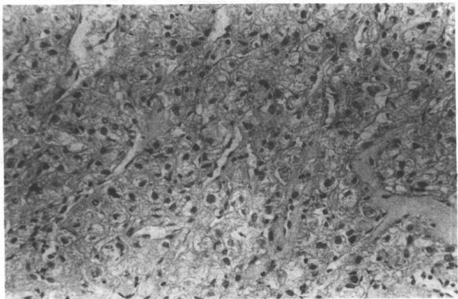 
图5-35 肺透明细胞瘤 
瘤细胞多围绕薄壁血管分布，胞浆透亮或呈嗜酸性颗粒状
电镜 在瘤细胞内有多量糖原颗粒，通常在有膜包绕的溶酶体样细胞器内，并可呈菊形团样排列。近年来，免疫组化及电镜观察，对此瘤的组织发生提出了完全不同的观点。Gaffey等（1991）用免疫组化法显示大多数病例抗黑色素细胞标记HMB-45、HMB-
50 呈强阳性，S-100、NSE、Leu-7 等呈局灶性阳性；而 keratin、EMA、GFAP 及 chromogranin 均阴性。
电镜 部分病例的少数细胞内含有不同发育阶段的黑色素小体，其中1例还含有神经分泌型颗粒。这些发现提示肺透明细胞瘤显示黑色素细胞性分化[39]。这可能在与其他透明细胞肿瘤的鉴别上有重要意义。这也表明良性透明细胞瘤从超微结构上是不同的两种类型。
【鉴别诊断】 要与具有透明细胞特征的原发性癌和转移性癌相区别。
（1）肺透明细胞癌：癌细胞呈片块状，之间无丰富的血窦，细胞有异型性，可见核分裂像。 
（2）转移性肾透明细胞癌：癌细胞排列呈腺泡状，腺样或实性片块，脂肪染色阳性，在超微结构上，除含糖原外，尚含多量脂滴。 
2.副节瘤（Paraganglioma）少见，为孤立性包块，常位于肺外周部。生物学行为良性。组织学上，与其他部位者如颈动脉体瘤的组织结构、细胞形态相同。
【鉴别诊断】主要是与类癌的鉴别，但鉴别较困难或不可能，甚至应用免疫组化及电镜观察。不过，在光镜下仔细观察，掌握其形态特点，并辅以免疫组化，还是可以鉴别的。类癌可见瘤细胞呈花带状、铺石状、腺样排列，并见菊形团。免疫组化Keratin、CEA可阳性。而副节瘤细胞呈巢，富于血窦，在细胞巢周边部有S-100阳性的支柱细胞（sustentacular cells）。
偶尔，颈动脉副节瘤，可出现粟粒性肺浸润，形成无数副节瘤结节，考虑为转移性。但也有可能为多中心生长的多发性肺副节瘤。
3. 肺脑膜瘤 罕见，文献中仅有少数病例报告[40]。一般为无症状的孤立性结节，直径 $2\mathrm{cm} \sim 3\mathrm{cm}$ 。这些病例经临床、放射影像检查均无颅内脑膜瘤征象，排除了颅外转移的可能性。
光镜 瘤组织呈过渡型脑膜瘤结构，有的并可见砂粒体。
免疫组化 神经内分泌标记（NSE、Chromogranin、bombesin）阴性，电镜检查瘤细胞内无神经分泌颗粒，也可排除类癌[41]。
4. 畸胎瘤 极罕见，在确定诊断时，首先要排除肺外如卵巢、睾丸畸胎瘤转移至肺的可能。患者可有咳嗽、咯血等症状，有的甚至咯出豆渣样物和毛发。肿瘤可与支气管相通，呈囊性，囊内可含有毛发、皮脂、脂肪及骨组织等。镜下所见与其他部位者相同。 
5. 其他罕见的良性肿瘤：如神经鞘瘤、神经纤维瘤、节细胞神经母细胞瘤、肺内胸腺瘤等，亦均有报道。
# 二、恶性肿瘤
# （一）肌源性肿瘤
1. 平滑肌肉瘤 肺原发性平滑肌肉瘤甚为少见，国内个别报告至1991年共20余例，可发生在大支气管或肺实质，以单侧单发为多，少数可多发或为双侧性。瘤之直径不等，为 $2.5\mathrm{cm} \sim 15\mathrm{cm}$ ，可有假包膜。如瘤结直径大于 $5\mathrm{cm}$ ，富于细胞，核分裂像 $2 \sim 5 / 10\mathrm{HPF}$ ，伴有坏死及出血，对判断为恶性有重要意义。组织化学Masson三色染色、VG及免疫组化desmin对确定肌源性有很大帮助，myoglobin阴性可排除横纹肌肉瘤[42]。在确定诊断
时，要注意排除转移性平滑肌肉瘤的可能，特别是肺实质内多发性者。
2. 横纹肌肉瘤 更为罕见，据文献报道，发生于成人者为多形性横纹肌肉瘤；小儿者则为胚胎型横纹肌肉瘤，且有意义的是发生在囊性腺瘤样畸形的背景上。
# （二）血管源性肿瘤
1. 血管肉瘤 罕见，仅有个例报告，其特点是瘤组织具有大小、形状不规则的血管腔隙，在肺实质内弥漫浸润。瘤细胞核分裂像易见，可有坏死、出血。此种情况更像转移性血管肉瘤，故在明确诊断时，应排除转移性的可能。 
2. 恶性血管外皮细胞瘤 此瘤并不太少见，我们曾在手术切除的肺肿瘤中见到数例，一般在肺实质内，呈孤立结节，质地较细，呈灰红色。
光镜 所见与发生在软组织者相同，瘤组织富于薄壁血管，有的形状不规则，其周围为密集的圆形、卵圆形细胞，分裂像易见。网织纤维染色对鉴别诊断有意义，瘤内网织纤维丰富，几乎包绕于每个瘤细胞或数个瘤细胞之间，并以血管为中心向周围呈放射状分布。
3. Kaposi 肉瘤 通常为 AIDS 的表现之一，但也可见于免疫缺陷的病人，病变特点是瘤组织沿淋巴管分布，其组织形态与其他部位者相同[43]。
# （三）淋巴造血组织肿瘤及瘤样病变
肺的淋巴增生性病变类型较多，有的为瘤样病变，有的为不同类型的淋巴瘤和白血病。它们之间有的可能存在着由一种发展为另一种的谱系关系。
1. 良性淋巴细胞血管炎及肉芽肿病（benign lymphocytic angitis and granulomatosis, BLAG）此病较 Wegener 肉芽肿或淋巴瘤样肉芽肿病少见，患者平均年龄 57 岁。放射线影像图 $80\%$ 为多数性病灶， $20\%$ 为单个结节或浸润。
光镜 BLAG 有三种病变: ① 淋巴样细胞弥漫浸润, 使正常肺泡结构破坏, 其中包括成熟的小淋巴细胞及少量的浆细胞和浆细胞样淋巴细胞, 偶见较大的活化淋巴细胞, 但无 R-S 细胞样的不典型细胞; ② 在淋巴样细胞浸润区有境界不甚清楚的巨细胞肉芽肿形成, 有时伴有小灶性凝固性坏死; ③ 血管炎可累及较小的动脉和静脉, 淋巴细胞侵入血管壁可导致管腔阻塞, 偶而伴有血栓形成及完全闭锁。
# 【鉴别诊断】
（1）分化好的淋巴细胞性淋巴瘤：细胞成分单一，无肉芽肿形成及血管炎。 
（2）假性淋巴瘤：有淋巴滤泡及生发中心形成，而无血管炎表现。 
（3）淋巴瘤样肉芽肿病：主要特点是有大的不典型淋巴细胞，并累及较大的动脉和静脉。详见下述淋巴瘤样肉芽肿病。
2. 淋巴瘤样肉芽肿病（lymphomatoid granulomatosis LYG）此病多见于中年人，以肺部病变为主，虽然肺外器官如皮肤、中枢神经系统、肾也常受累。以往诊断为中线恶网的病例，可能就是累及上呼吸道的LYG。患者有免疫功能异常，表现为T细胞功能不良。
肺部病变表现为多数结节或包块，直径从数 $\mathrm{mm}$ 到 $10\mathrm{cm}$ 或更大，呈灰褐色伴有广泛坏死，常有空洞形成。
光镜 突出的病变是：①结节中心显示大片凝固性坏死；②浸润细胞包括淋巴细胞、免疫母细胞、组织细胞、浆细胞，偶见嗜酸性白细胞；此外类似R-S细胞的不典型网织
细胞常见；③肺内血管壁有上述细胞浸润，使管壁增厚，管腔狭窄或闭锁；④病变区见有少数肉芽肿（图5-36）。
图5-36 淋巴瘤样肉芽肿病 
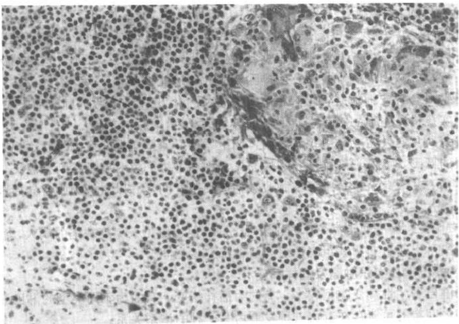 
在淋巴细胞弥漫浸润的背景上有肉芽肿形成（右上）
图5-37 恶性淋巴瘤 
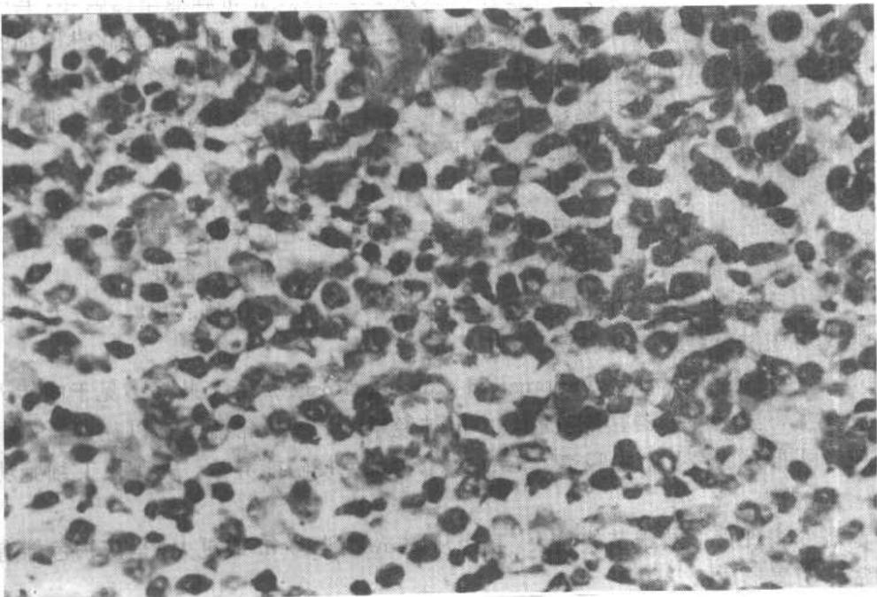 
大细胞性
近些年来，根据对病理形态及临床过程的观察，认为此病为原发性淋巴增生性病变，或者就是恶性淋巴瘤，或者具有转变为恶性淋巴瘤的极大倾向。它对固醇类治疗反应差，但对多种化疗药效果好，约一半病人可完全缓解。瘤内不典型的淋巴样细胞愈多，则预后愈坏。
3. 血管中心性大细胞淋巴瘤（angiocentric large cell lymphoma）此瘤可为孤立性或多发性大包块，甚至可占据一叶肺的大部分，常伴有广泛坏死，有形成空洞的倾向，偶尔，肿块主要生长在支气管内。
光镜 突出的特点是有多量大的单核性不典型淋巴样细胞浸润（图5-37），多数病例属于大无裂细胞或B淋巴免疫母细胞。瘤组织内的血管被大细胞淋巴瘤侵袭的现象十分常见。
4. 分化好的淋巴细胞性淋巴瘤及小裂淋巴细胞性淋巴瘤 一般由单一的淋巴细胞弥漫浸润形成瘤块，或为小淋巴细胞，或为小裂淋巴细胞，有的见有浆细胞样淋巴细胞。瘤细胞可侵及支气管软骨，大血管壁或脏层胸膜，也可见淋巴管炎型浸润。这些均有助于对恶性的判断。间质可有淀粉样物质沉着。
近些年来，对分化好的淋巴细胞性淋巴瘤进行免疫组化检测，大多数病例为单克隆性，也是恶性的指标之一。
5. 假性淋巴瘤 此瘤多见于成人，一般无症状，表现为局限性淋巴细胞性间质性肺炎或孤立结节。
大体 病变呈局限性，但境界不如浆细胞肉芽肿清楚。
光镜 见肺间质有大量成熟的淋巴细胞弥漫浸润，其中杂有不等量的浆细胞，甚者可使部分肺泡实变。有时，伴有淋巴滤泡形成，生发中心可见。核分裂像罕见。
【鉴别诊断】主要是与恶性淋巴瘤的鉴别，常较困难。恶性淋巴瘤瘤细胞较单一，且分化不成熟，浸润更为弥漫，无滤泡及生发中心，可见核分裂。此外，可伴有肺门淋巴结肿大。
6. 浆细胞瘤 浆细胞瘤可发生在肺实质或支气管内。
大体 无特征性表现。
光镜 见瘤组织几乎全由成熟的和不成熟的浆细胞组成。分化差者，以浆母细胞为主，此时浆细胞的特征不明显，核呈圆形，可见核仁及核分裂像。
免疫组化 免疫球蛋白重链或轻链染色，常呈单克隆性，对确定诊断有意义。如发生在支气管，则可见瘤细胞破坏软骨板的现象。瘤组织中，亦可见呈结节状沉积的M-蛋白，呈均匀一致的伊红色。
有些病例，肿瘤性病变亦可同时累及淋巴结及骨。
【鉴别诊断】主要是与浆细胞肉芽肿的鉴别（见前述瘤样病变项下的浆细胞肉芽肿）
7. Hodgkin's 病 纵隔淋巴结发生的 Hodgkin's 病，以结节硬化型为多见，瘤组织可直接侵至肺实质，或肺及淋巴结同时发生，而肺的原发性 Hodgkin's 病少见。此病以老年女性多见，也可见于青年人。X 光胸片上，常表现为肺实质的结节状病灶，境界不清。也可见支气管内者，或呈息肉状包块，或为浸润性斑块。
光镜 典型的结节硬化型Hodgkin's病，诊断并不困难。我们曾遇到一例男性青年，
纵隔淋巴结进行性肿大，经开胸活检病理证实为结节硬化型Hodgkin's病。数月后肺部出现阴影，再次开胸活检，在冰冻切片上，未见典型的结节硬化型病变，而瘤细胞较弥漫散在，有的细胞较大，但无典型的R-S细胞或腔隙型R-S细胞，未能确诊而误诊为癌。经石蜡切片全面观察，仍为结节硬化型何杰金病累及肺（图5-38）。
图5-38 肺何杰金氏病，结节硬化型 
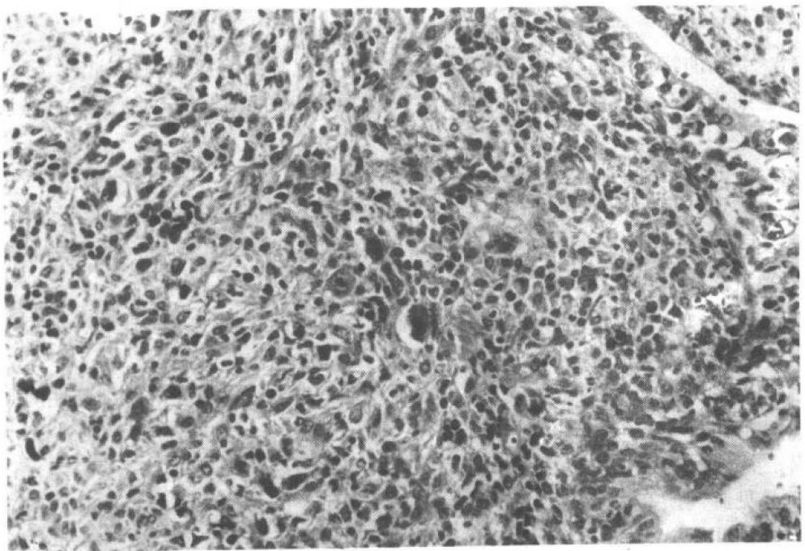 
视野中央见腔隙型R-S细胞，右上、右下角见残留的肺泡
8. 白血病累及肺 各种白血病累及肺在尸检中并不少见。慢性淋巴细胞型有 $30\% - 40\%$ ，慢性粒细胞型有 $15\% - 20\%$ 可出现肺的浸润。成人急性型可超过 $60\%$ ，但大多数病例在临床上并无表现。
大体 各型白血病均可见细结节状的浸润灶及呈淡粉色的实变区，后者在光镜下表现为坏死性及出血性肺炎。白血细胞在肺的浸润，在不同类型的白血病也可有不同的分布。慢性淋巴细胞白血病具有选择性的以细支气管为中心分布的特点。单核细胞白血病浸润广泛，多围绕支气管血管呈放射状分布，严重者可浸润至肺泡间隔。在少数急性粒细胞白血病的病例，可出现广泛性肺结节，称为粒细胞性肉瘤（granulocytic sarcoma）。
9. Letterer-Siwe 病 多见于幼儿, 亦常累及肺。在肺泡间隔有大量不同分化阶段的 Langerhan 细胞浸润, 有的像成熟的巨噬细胞, 有的为未分化型细胞, 胞浆少, 核仁明显, 可见核分裂像。常伴有嗜酸性白细胞浸润。这些细胞也可在肺泡腔内聚积, 或在细支气管粘膜浸润。
# （四）其他恶性肿瘤
除前述各种恶性肿瘤外，肺的原发性肉瘤少见，在诊断时，首先要排除其他部位的原发瘤转移至肺的可能性，也要除外呈肉瘤样表现的原发性肺癌的可能性。文献中报道的有：
1.纤维肉瘤、恶性纤维组织细胞瘤（图5-39）、软骨肉瘤、骨肉瘤及恶性神经鞘瘤。 
2. 恶性黑色素瘤 
3. 绒癌（图5-40）
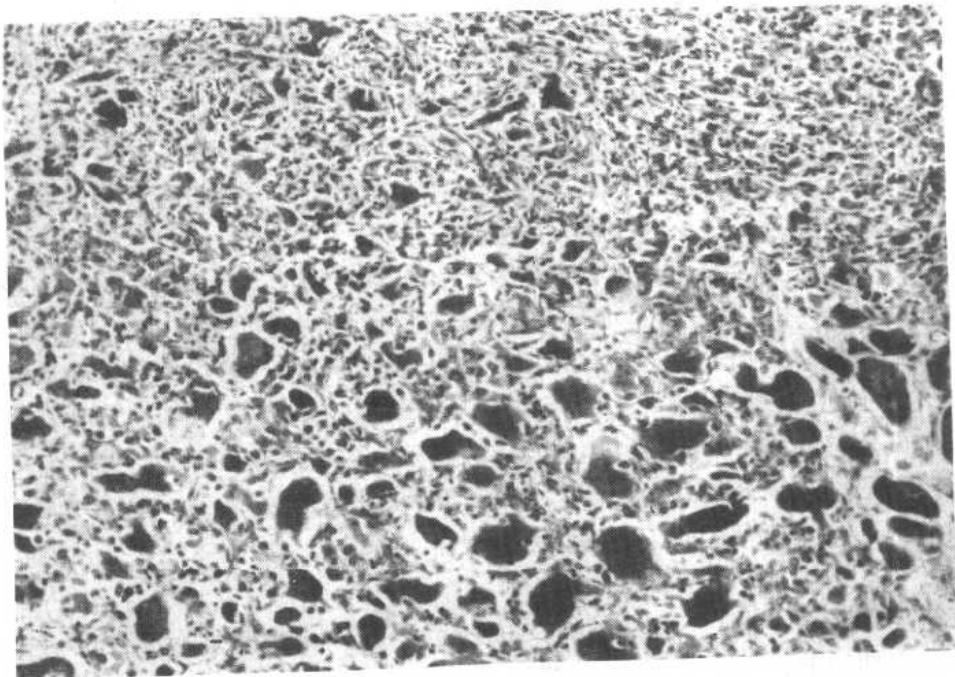 
图5-39 恶性纤维组织细胞瘤，巨细胞型
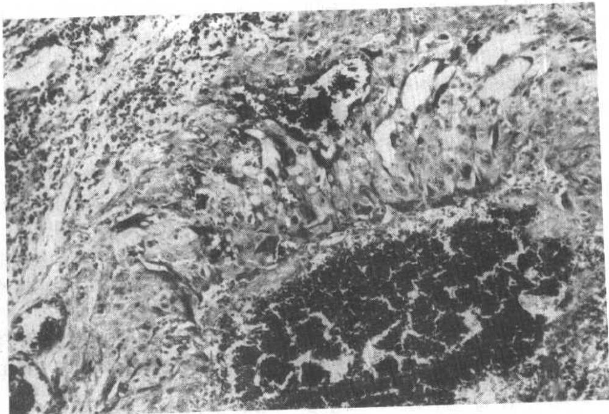 
图5-40 转移性绒癌
癌组织由滋养叶细胞构成，伴有出血及坏死（右下）
# 三、转移性肿瘤
肺是转移性肿瘤最常见的部位。肺的转移性肿瘤在大体形态上可有不同的表现，大致可分为三种类型。
1. 多数结节 最多见，转移性结节多位于肺外周，肺表面清楚可见，境界清楚，呈球形，大小不等。此种生长迅速，特别是来自乳腺及胃的癌结节。 
2. 孤立结节 很像原发性肿瘤。有时，肺实质或淋巴结的转移瘤，侵透大支气管壁，在腔内形成息肉样包块，亦像原发性肿瘤。如睾丸肿瘤、肾癌、直肠癌等可见有此种情况。 
3. 癌组织广泛累及肺淋巴管，而无癌结形成，即所谓的淋巴管癌病(lymphagitic carcinomatosis)。可导致严重呼吸困难和肺动脉高压。此种情况可见于胃癌、乳腺癌、胰腺癌及前列腺癌的转移。还应注意，有许多转移癌特别是腺癌，癌组织衬于肺泡壁生长，犹如细支气管肺泡癌。据报道，此种情况多见于肾癌、胰腺癌、大肠癌及乳腺癌的转移。
在肺的转移性瘤中，除各种不同器官的癌外，各种肉瘤和其它恶性肿瘤也常发生肺转移，较常见的有骨肉瘤、纤维肉瘤、软骨肉瘤、滑膜肉瘤、脂肪肉瘤、平滑肌肉瘤、横纹肌肉瘤等。此外，恶性神经鞘瘤、黑色素瘤、绒癌、恶性间皮瘤、恶性胸腺瘤等均可发生肺转移。
在病理诊断工作中，鉴别肺的原发性肿瘤和转移性肿瘤是十分重要的，特别是肺外周部的孤立性结节，在冰冻切片诊断时，明确是原发瘤还是转移瘤，对进一步治疗具有重要意义。
【鉴别诊断】原发性癌与转移性癌的鉴别是困难的，有时甚至是不可能。根据主要的组织学特征，从以下几方面来鉴别原发性癌和转移性癌是有帮助的。
1. 具有鳞癌组织结构者 肺外鳞癌（食管、宫颈）转移至肺者，常较原发性肺鳞癌有较明显的角化，且癌组织有时可侵蚀支气管壁，沿表面上皮向旁边播散，而上皮基底部无变化。此种现象不要误为原发性癌。如邻近鳞癌的支气管粘膜上皮有不典型增生或原位癌变化，则为原发性鳞癌。 
2. 具有腺癌组织结构者如患者无肺外腺癌的病史，则肺的原发癌可能性大。如有肺外腺癌病史，情况就较复杂。诊断时可复查肺外原发腺癌切片，对鉴别诊断有一定帮助。转移性腺癌均具有与原发性腺癌基本相同的组织学特点。
来自不同器官的转移性腺癌，在组织结构上或多或少都有其各自的某些特征。仔细观察，发现某些形态特点，或许有一定帮助。必要时，可进行免疫组化及电镜观察，对明确诊断具有重要作用。如转移性前列腺癌，免疫组化前列腺特异性抗原（PSA）阳性，甲状腺癌则thyroglobulin阳性。近些年来，文献报道的某些腺癌（如胃等）的肿瘤相关抗原具有一定的特异性。在超微结构诊断上，如转移性腺癌的癌细胞有微绒毛存在，并有核心小根及表面有糖盏小体，可认为是来自胃肠道的[44]。
3. 具有透明细胞组织结构者 首先要考虑转移性肾细胞癌，因肾癌患者中有 $2\%$ 的病例在未发现原发癌前即有孤立的肺转移。当冰冻切片检查时，如见有透明细胞癌成分，可做快速油红（O）染色，如为阳性结果，则支持转移性肾细胞癌的诊断。
但需指出，原发性肺鳞癌亦可见灶性或较广泛的透明细胞成分；或者原发癌即为透
明细胞癌，则需注意鉴别。原发癌中，癌组织成分常不十分单纯，除透明细胞外，或多或少可伴有鳞癌或腺癌成分。当然，免疫组化及超微结构观察，对鉴别诊断亦有帮助。转移性肾癌抗肾小管抗体阳性，电镜下见癌细胞内含有多量脂滴，还有甲状腺的透明细胞癌，thyrogloblin呈阳性反应。
4. 具有乳头状结构者不论肺的原发瘤或转移癌，有乳头状结构者较多，原发瘤中有乳头状类癌、乳头状腺癌、乳头型细支气管肺泡癌、肺母细胞瘤等；转移癌有来自乳腺、结肠、胰腺、前列腺、卵巢、甲状腺及肾的癌，应主要从各种癌的组织结构特点上加以鉴别，也可辅以免疫组化及超微结构观察。 
5. 具有梭形细胞结构者 肺内原发性梭形细胞肿瘤亦不少，有梭形细胞类癌、局限性纤维性间皮瘤、梭形细胞鳞癌、不典型类癌、纤维肉瘤、平滑肌肉瘤及恶性纤维组织细胞瘤等；转移性者有多种肉瘤、癌及恶性黑色素瘤等。亦应根据各自的组织结构特点加以鉴别，必要时进行免疫组化及电镜观察。
（李维华）
# 参考文献
1. Stocker JT, et al. Congenital cystic adenomatoid malformation of the lung. Classification and morphologic spectrum. Hum Pathol, 1977; 8: 155-171 
2. Mark EJ. Mesenchymal cystic hamartoma of the lung. N Engl J Med, 1986; 315: 1255-1259 
3. Hughes JD, Rubin LJ. Primary pulmonary hypertension. An analysis of 28 cases and a review of the literature. Medicine, 1986; 65: 56-72 
4. Heath D, et al. The pathology of hypertensive pulmonary vascular disease. Circulation, 1985; 18: 553 
5. Hawarth GS. Pulmonary vascular disease in ventricular septal defect. J Pathol, 1987; 152: 157- 
6. Graham BS, Snell JD Jr. Herpes simplex virus infection of the adult lower respiratory tract. Medicine, 1983; 62: 384-393 
7. Winn WC Jr. Myerowitz RL. The pathology of Legionella pneumonias. A review of 74 cases and the literature. Hum Pathol, 1981; 12: 401-442 
8. Rollins S, et al. Open lung biopsy in mycoplasma pneumoniae pneumonia. Arch Pathol Lab Med, 1986: 110: 34-41 
9. Schwartz DA, et al. Plastic embedding evaluation of pneumocystis carinii pneumonia in AIDS, simultaneous demonstration of cyst and sporozoite forms. Am J Surg Pathol, 1987; 11: 304-309 
10. Travis WD, et al. Pathology of the lung in the acquired immune deficiency syndrome (AIDS). Am J Clin Pathol. 1988; 89: 431-432 
11. Urbanski SJ, et al. Idiopathic small airways pathology in patients with graft-versus-host disease following allogeneic bone marrow transplantation. Am J Surg Pathol, 1987; 11: 965-971 
12. Kawanami O., et al. Hypersensitivity pneumonia in man. Light and electron-microscopic studies of 18 lung biopsies. Am J Pathol, 1983; 110: 275-289 
13. Katzenstein A-La, et al. Bronchiolitis obliterans and usual interstitial pneumonia. A comparative clinico-pathologic study. Am J Surg Pathol, 1986; 10: 373-381 
14. Hodder RV, et al. Pulmonary malakoplakia. Thorax, 1984; 39: 70-71 
15. Yoshikawa Y, Watanabe T. Pulmonary lesions in Wegener's granulomatosis. A clinicopathologic study
of 22 autopsy cases. Hum Pathol, 1986; 17: 401-410 
16. Koss MN, et al. Brochocentric granulomatosis. Hum Pathol. 1987; 12: 632-638 
17. Yousem SA, Hochholzer L. Pulmonary hyalinizing granuloma. Am J Clin Pathol, 1987; 87: 1-6 
18. Flint A, et al. Pulmonary histiocytosis X. Immunoperoxidase staining for HLA-DR antigen and S-100 protein. Arch Pathol Lab Med, 1986; 110: 930-933 
19. 李维华，吴在东．肺早期鳞状细胞癌的病理学研究．中华医学杂志，1979；59：616-619 
20. Kawai T, et al. Immunohistochemical study of pulmonary adenocarcinoma. Am J Clin Pathol, 1988; 89: 455-462 
21. Jordan D, Jagirdar J. Lewis X and Y blood group expression in malignant mesothelioma and adenocarcinoma (abstract). Lab Invest, 1988; 58: 44A 
22．李维华，等．分化差的肺癌超微结构研究．解放军医学杂志，1986；14：248 
23. Bishopric GA Jr, Ordonez NG. Carcinoembryonic antigen in primary carcinoid tumors of the lung. Cancer, 1986; 58: 1316-1320 
24. Paladugu RR, et al. Bronchopulmonary Kulchitzky cell carcinomas. A new classification scheme for typical and atypical carcinoids. Cancer, 1985; 55: 1303-1311 
25. 李维华. 10 例肺不典型类癌的光镜、电镜及免疫组织化学观察. 中华病理学杂志, 1990; 19: 182-184 
26. Hirsch FR, et al. Histopathologic classification of small cell lung cancer: changing concepts and terminology. Cancer, 1988; 62: 973- 
27. 李维华. 肺鳞状细胞癌伴神经内分泌分化的超微结构及免疫组织化学观察. 中华病理学杂志, 1991; 20: 116-118 
28. Weiner DB, et al. Expression of the neu gene-encoded protein (P185neu) in human non-small cell carcinoma of the lung. Cancer Res, 1990; 50: 421- 
29. Gu J, et al. A study of myc-related gene expression in small cell lung cancer by in situ hybridization. Am J Pathol, 1988; 132: 13- 
30. 阎培莎，李维华．细支气管肺泡癌光镜、电镜及免疫组织化学的比较观察．中华病理学杂志，1988；17：167-169 
31．阎培莎，李维华．细支气管肺泡癌的超微结构研究．中华病理学杂志，1985；14：244-217 
32. Noguchi M, et al. Papillary adenoma of type 2 pneumocytes. Am J Surg Pathol, 1986; 10: 134-139 
33. Heckman CJ, et al. Pulmonary blastoma with rhabdomyosarcomatous differentiation. An electron microscopic and immunohistochemical study. Am J Surg Pathol, 1988; 12: 35-40 
34. Volm M, et al. Five-year follow up study of independent clinical and flow cytometric prognostic factors for the survival of patient with non-small cell lung carcinoma. Cancer Res, 1988; 48: 2923 
35. Nishino T, et al. Prognostic significance of laminin in adenocarcinoma of the lung. J Surg Oncol, 1990; 43: 214 
36. Hegg CA, et al. Papillary adenoma of the lung. Am J Clin Pathol, 1992; 97: 393-397 
37. Dail DH, et al. Intravascular, bronchiolar, and alveolar tumor of the lung (IVBAT). An analysis of twenty cases of a peculiar sclerosing endothelial tumor. Cancer, 1983; 51: 452-464 
38. Colley MH, et al. Immunohistochemical detection of steroid receptors in a case of pulmonary lymphangioleiomyomatosis. Am J Surg Pathol, 1989; 13: 803-807 
39. Gaffey MJ, et al. Clear cell tumor of the lung. Immunohistochemical and ultrastructural evidence of melanogenesis. Am J Surg Pathol, 1991; 15: 644-653 
40. Flynn SD, Yousem SA. Pulmonary meningioma. A report of two cases. Hum Pathol, 1991; 22: 469
-474 
41. Dricek M, et al. Pulmonary meningioma. Immunohistochemical and ultrastructural features. Am J Surg Pathol, 1991; 15: 455-459 
42.赖日权，等．肺原发性平滑肌肉瘤一例报告及国内文献复习．中华病理学杂志，1991；20：164 
43. Purdy LJ, et al. Pulmonary Kaposi's sarcoma. Premortem histologic diagnosis. Am J Surg Pathol, 1986; 10: 301-311 
44. Engstrand DA, et al. Limitation of the usefulness of microvillous ultrastructure in distinguishing between carcinoma primary in and metastatic to the lung. Ultrastruct Pathol, 1987; 11: 53-58
# 第六章 纵隔、胸膜及心包
# 第一节 纵隔 213
# 一、炎性疾病 214
（一）急性纵隔炎 214 
（二）慢性纵隔炎 214
# 二、非胸腺源性囊肿 215
（一）心包囊肿 215 
（二）前肠囊肿 215 
（三）其它囊肿 215
# 三、胸腺疾病 216
（一）囊肿 216 
（二）原发性免疫缺陷 216 
（三）其它非肿瘤性病变 216 
（四）胸腺癌 217 
（五）胸腺类癌和小细胞癌 221 
（六）胸腺脂肪瘤和其它间叶肿瘤 221
# 四、纵隔生殖细胞肿瘤 223
（一）生殖细胞瘤（精原细胞瘤） 223 
（二）成熟性囊性畸胎瘤 223 
（三）未成熟性畸胎瘤 223 
（四）胚胎性癌 223 
（五）内胚窦瘤（卵黄囊瘤） 223 
（六）畸胎瘤 223 
（七）原发性绒癌 224
# 五、纵隔恶性淋巴瘤 224
（一）Hodgkin病 224 
（二）淋巴母细胞性淋巴瘤 224 
（三）大细胞性淋巴瘤 225
# 六、神经源性肿瘤 225
（一）交感神经系统肿瘤 225 
（二）外周神经肿瘤 226
# 七、副神经节瘤 226
# 八、间叶组织肿瘤 226
（一）脂肪组织肿瘤 226 
（二）淋巴管瘤 226
（三）血管源性肿瘤 226 
（四）孤立性纤维瘤 227
# 九、其它肿瘤和瘤样病变 227
（一）巨大淋巴结增生 227 
（二）髓外造血 227 
（三）脑膜瘤 227
# 十、转移性肿瘤 227
# 第二节 胸膜 227
# 一、非肿瘤性病变 227
（一）胸膜疝 227 
（二）胸膜炎 228 
（三）结核 228 
（四）风湿病 228 
（五）子宫内膜异位 228 
（六）淀粉样物沉着症 228 
（七）霉菌感染 228 
（八）石棉沉着 228
# 二、原发性肿瘤 228
间皮瘤 228 
（三）其它原发肿瘤 231
# 三、转移性肿瘤 231
# 第三节 心包· 231
# 一、心包炎 231
（一）感染性心包炎 231 
（二）结缔组织病心包炎 232 
（三）开心手术后及外伤后心包炎 232
# 二、心包囊肿 232
# 三、心包间皮瘤 232
# 四、转移性肿瘤 232
# 第一节 纵 隔
纵隔位于胸腔内，两侧是胸膜腔、前方是胸骨、后为脊柱、上是胸腔入口、下是横膈。由于其间包含有多种器官及组织结构，发生的病变也就复杂多样。
由于大部分纵隔囊肿和肿瘤各自有一特定的好发部位，习惯上人为地将纵隔分为上、中、前、后四部分，其中最常见的见图6-1。
纵隔肿瘤和囊肿患者中有一半左右临床无症状，仅在胸部X线检查时被发现，出现
图6-1 纵隔划分与肿瘤好发部位 
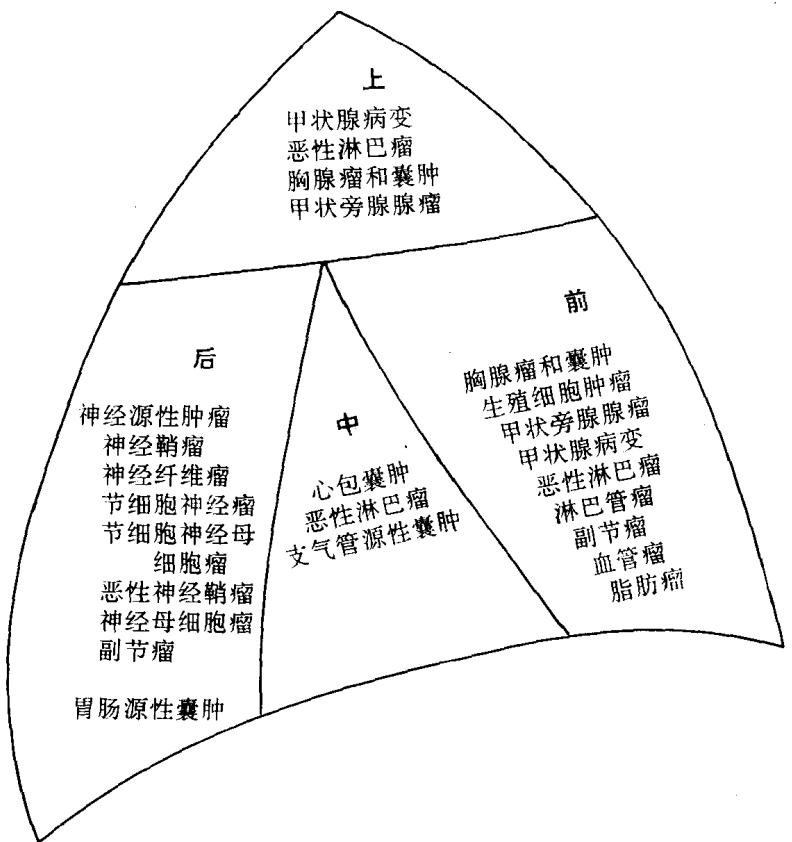 
（引自 Rosai J 着 Ackerman's Surgical Paltology. 7th Ed. 1989, 346）
症状时常为病变压迫或侵及邻近组织所致，常见的有胸痛、咳嗽、呼吸困难等。如出现上腔静脉受压综合征，常以恶性肿瘤可能性大，主要为肺癌转移和恶性淋巴瘤，偶尔也见于良性病变，如纤维性纵隔炎。右心输出道或肺动脉亦可被纵隔肿瘤压迫而出现肺动脉狭窄表现[1]。
虽然根据部位及影像表现，临床上可以提示为某种肿瘤，但多数情况下即使应用高分辨率的CT扫描，许多肿瘤的影像表现仍是相似的，最终要采用开胸探查。一般不提倡术前放疗，因为放疗后可导致病理诊断的困难。细针穿吸活检或细胞学检查已应用于纵隔肿块的诊断，尤其是前上纵隔肿瘤。
# 一、炎性疾病
# （一）急性纵隔炎
常见于外伤性食道穿孔或由颈部感染下行而来。感染主要位于后纵隔，常形成脓肿，需外科行引流治疗。
# （二）慢性纵隔炎
临床上可出现上腔静脉受压而类似恶性肿瘤。主要见于气管分叉之前的前纵隔。组织学上以肉芽肿形成、纤维化或两者并存为主要表现。有的病例可找到霉菌（常为组织胞浆菌）或结核的病原体。组织胞浆菌感染者纤维性包膜很厚，而分支杆菌感染者包膜
很薄。文献中曾有奴卡氏菌引起上腔静脉受压综合征的报道。
在慢性纵隔炎中有许多病例找不到特异的病原体，组织学上呈纤维性纵隔炎（特发性纵隔纤维化）的表现。有时，纤维性纵隔炎可伴有其它部位的特发性纤维化，尤其是腹膜后纤维化[2]。组织学表现主要是富于细胞的纤维组织增生伴炎细胞浸润，以浆细胞、嗜酸性白细胞为主，同时见有静脉炎。值得注意的是与Hodgkin病鉴别，因为Hodgkin病可以出现广泛的纤维化及慢性炎细胞浸润。纤维性纵隔炎治疗上以激素治疗为主，亦可行外科手术治疗。
# 二、非胸腺源性囊肿[3]
# （一）心包囊肿
心包腔是由多个不连接的腔隙融合而成，如果其中的一个腔隙未能与其它的相连，便可形成心包囊肿。以右心膈角处多见。触之柔软、不分叶，附着于心包和膈肌上，有时也可与心包腔相通。发生在心包上方者少见，有时可遇见多发性者。囊内液体清亮，感染后可变混浊。囊肿的血供来自心包。囊内壁被复一薄层间皮。
# （二）前肠囊肿
在胚胎发育过程中前肠的一个小芽或憩室脱离下来，随着肺向胸腔内下降而被带入纵隔形成前肠囊肿。此结构中可含有内胚层和中胚层的两种成分。
1、支气管囊肿 沿气管支气管树发生，好发部位为隆突后，偶见于膈上。X线平片上不易发现，而吞钡检查则容易发现。囊内为清亮或胶状液体。囊不分叶、壁薄、球形，平均直径 $3\mathrm{cm} \sim 4\mathrm{cm}$ 。囊内壁衬以纤毛柱状上皮，可局灶或广泛的鳞化，或上皮受压变薄。囊壁可有透明软骨、平滑肌、支气管腺和神经束组织。 
2、食道囊肿 可能来自食道发育的实心管阶段小泡的残留，多见于下段食道壁内。内衬鳞状上皮、纤毛上皮、柱状上皮或混合性上皮。与支气管囊肿的鉴别困难；如果支气管囊肿也位于食道壁内，鉴别则不可能，唯一鉴别点在于食道囊肿囊壁有两层平滑肌组成。 
3. 胃和小肠囊肿 多见于后纵隔脊柱旁，附于食道壁，甚至埋在食道肌层内。几乎所有病例都伴有脊柱畸形。胃型囊肿其壁如胃，肠型囊肿其壁如小肠，两者混合则称为胃肠囊肿，壁内神经节和神经纤维常见。
此组先天性囊肿不是真性肿瘤，一般不与气管支气管树或食道相通，极少发生恶性变。其临床症状主要依位置和大小而定，如压迫邻近脏器，可出现症状，如咳嗽、反复肺部感染、胸痛、呼吸困难、吞咽困难、咯血等。多数是无症状的，仅在X线检查中发现，但其中的胃型和胃肠型囊肿可因胃粘膜分泌液而导致出血、消化性溃疡或穿孔，故多有症状，严重者可危及生命。
# （三）其它囊肿
从胸导管发生的囊肿可位于纵隔，有些可能是囊性淋巴管瘤。胰腺假囊肿也见有原发于纵隔的报道。
# 三、胸腺疾病
无论何种原因导致的慢性消耗性疾病均可造成胸腺明显的退化，不要将其看作胸腺的原发性病变。正常人在青春期后胸腺开始萎缩，但不会完全消失，在心包前方的脂肪中组织学上总可以找到残留的胸腺组织小岛，主要由淋巴细胞组成时可误认为淋巴结，主要由上皮细胞组成时呈小梁状或菊形团样而可误认为癌或类癌。
# （一）囊肿
胸腺囊肿可见于颈部或纵隔，位于颈部者可从下颌角到胸骨柄的任何一处见到，识别的唯一标记是镜下在囊壁中见到胸腺组织，囊壁内衬鳞状或柱状上皮，常见退变、炎症反应和胆固醇性肉芽肿形成，有时内衬上皮增生明显呈假上皮瘤样增生，可误认为伴发了恶性变。真正从囊肿发生的癌极为罕见。
胸腺囊肿的来源有的是由胚胎第三鳃囊的残余发展而来，另一些则可能是退变性，即哈氏小体（胸腺小体）发生囊性扩张所致，如先天性梅毒之新生儿见到的所谓的Dubois脓肿即为胸腺哈氏小体退变所致。大多数在前上纵隔见到的“非特异性囊肿”也可能是胸腺来源。但在诊断胸腺囊肿时首先应排除并不少见的胸腺瘤囊性变以及Hodgkin病、非Hodgkin淋巴瘤、生殖细胞瘤等所致的胸腺继发性囊性变。
# （二）原发性免疫缺陷
各种类型的原发性免疫缺陷病所致的胸腺形态改变目前所知甚少，因为尸检时的变化已经是严重感染和消耗后的结果。目前已经开展了胸腺活检则可以了解免疫缺陷病人的免疫状态与胸腺形态学变化的关系。最主要的工作是要区别继发性萎缩与原发性发育不良之间的不同。在单纯性萎缩中，是以淋巴细胞减少为主，而小叶结构和哈氏小体可以看到，而胸腺发育不良时，缺乏皮髓质的分化，上皮细胞呈卵圆或梭形，仅有初步的小管和菊形团出现而无中央腔隙的形成，淋巴细胞缺乏。也有报道认为原发性发育不良时可出现皮髓质的分化以及类似重度继发性萎缩的表现，此时要鉴别原发和继发是困难的。
# （三）其它非肿瘤性病变
1. 胸腺异位 见于颈部、胸腔。组织学上为正常胸腺。 
2. 其它组织异位到胸腺 包括甲状旁腺和皮脂腺 
3. 胸腺退化 常见于慢性消耗性疾病。爱滋病时，胸腺退化很明显，同时皮髓质界限消失，淋巴细胞明显减少，有不同程度的浆细胞浸润和纤维化，哈氏小体缺乏或消失。 
4. 真性胸腺增生 真性胸腺增生是指肿大的胸腺超过了正常年龄组的标准，但镜下结构正常（图6-2）。多见于幼儿，少见于成人。也见到在恶性肿瘤化疗后疗效满意病例的胸腺出现真性胸腺增生。 
5. 胸腺滤泡增生 是指胸腺中出现淋巴滤泡，在大多数病例胸腺重量无增加。淋巴滤泡呈反应性增生表现，出现生发中心，主要为B淋巴细胞，含有IgM和IgD。 
$65\%$ 的重症肌无力病例出现胸腺的滤泡增生。其它如甲状腺机能亢进症、Addison病、红斑狼疮和其它自身免疫性疾病也可见到胸腺滤泡增生。在正常胸腺，尤其是婴幼儿期，也可见到少数生发中心的出现，故只有在成人期，胸腺内见到较多的生发中心才能视为异常。
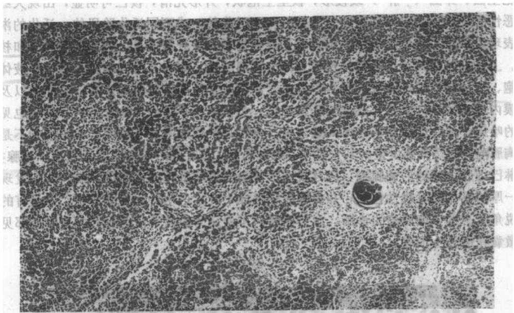 
图6-2 胸腺增生
6. 组织细胞增生症 X 此症在儿童可出现胸腺包块，单独出现或伴有其它部位的病变。形态与其它部位同，预后良好，有重症肌无力伴发本病的报道。
胸腺偶尔还可见到的病变有过敏性血管炎、肉芽肿病、巨大淋巴结增生等。
# （四）胸腺瘤[4-6]
胸腺瘤是指胸腺上皮发生的肿瘤，并不取决于淋巴细胞成分的多少。生殖细胞瘤、类癌Hodgkin病、非Hodgkin淋巴瘤都可以发生于胸腺，这些都看作胸腺肿瘤，但不是胸腺瘤。
几乎所有的胸腺瘤都发生在成人，儿童的胸腺瘤十分少见。实际工作中遇到的儿童胸腺瘤其实是淋巴瘤，有少数证实是胸腺瘤的乃是接近青春期的儿童，其胸腺瘤的表现和生物学行为类似于成人，亦可伴有重症肌无力。有的儿童发生一种具有少见形态特征的高度恶性胸腺瘤，其性质尚未明了。偶见有胸腺瘤家族高发的报道。
胸腺瘤的常见部位是前上纵隔，偶见于后纵隔、颈部、甲状腺内、肺门、肺内[7]、胸膜，发生在胸膜者呈间皮瘤的形态。
X线上胸腺瘤呈分叶状，可见钙化。CT及NMR有助于进一步确诊。细针穿吸检查已成功地应用于胸腺瘤的诊断，诊断胸腺瘤主要是同时见到上皮及淋巴细胞成分。
# 1.病理特征
大体 典型的胸腺瘤几乎全为实性，灰黄色，由结缔组织分隔成小叶状。 $80\%$ 的肿瘤有包膜，手术切除容易。 $20\%$ 则与周围组织有粘连，术中可见浸润于周围组织中。临床上出现症状时，胸腺瘤往往已经很大。近年来由于冠状动脉手术的广泛开展，术中发现了不少无症状的胸腺瘤，瘤体较小。肿瘤较大时容易发生囊性变，当整个肿瘤囊性变时应仔细寻找残留的部分以明确诊断。
光镜 几乎所有的肿瘤都是由肿瘤性上皮和非肿瘤性淋巴细胞混合组成（图6-3）。二种细胞成分的比例各个肿瘤都不一样，甚至在一个肿瘤的不同小叶内也不一样。上皮
细胞呈圆、卵圆（“胖”）或梭形，核呈空泡状，外形光滑，核仁可明显，出现大红核仁是恶性的征象。淋巴细胞可以是成熟的（不活化的）或不同活化阶段的，活化的淋巴细胞表现为核大，异染色质少，出现核仁及核周晕，核分裂多见，但不呈现曲核和核裂细胞。上皮细胞成分为主时常呈现器官样分化的结构，如含有淋巴细胞、蛋白样液体、红细胞、泡沫样巨噬细胞或纤维组织的血管周间隙，无中心腔的菊形团；肿瘤内以及常在包膜内见到的腺样结构，真性腺管很少见；类似哈氏小体的车轮状结构，偶尔也见到典型的哈氏小体。如果哈氏小体大量出现，往往是肿瘤周围原有胸腺的残留或者不是真正的胸腺瘤，而是胸腺发生的其它肿瘤，如淋巴瘤。具有腔的菊形团的出现提示胸腺类癌。遇淋巴细胞占优势的胸腺瘤，应寻找圆形淡染的髓质分化灶以协助诊断。如果发现肿瘤有一厚的钙化的纤维性包膜，并将肿瘤分隔成小叶状，小叶间界限清楚，以及有的小叶呈锐角时有助于胸腺瘤的诊断。血管明显时可误认为血管外皮细胞瘤。有时局部见明显的微囊和假乳头形成。
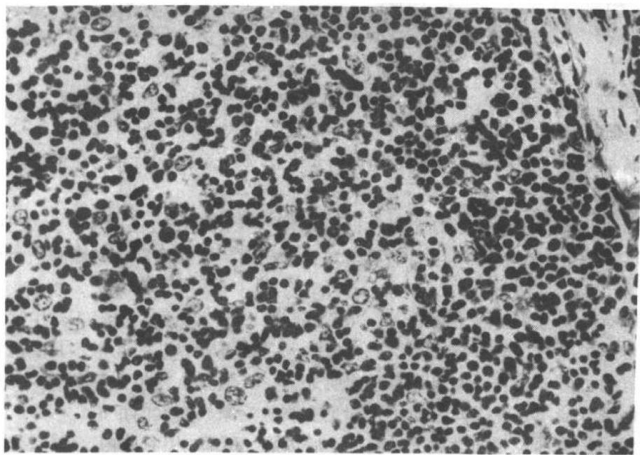 
图6-3 胸腺瘤 
上皮与淋巴细胞混合出现
电镜 肿瘤上皮细胞内可见分支状张力原纤维、桥粒、长细胞突起和基板，这与前上纵隔的其它肿瘤如恶性淋巴瘤、类癌、生殖细胞瘤、纤维性间皮瘤的鉴别是十分有用的。
免疫组化 肿瘤上皮示keratin阳性，也表达Leu-7和CEA；还显示thymulin和Thymosinα1激素阳性，这些是胸腺瘤更特异的标记。
胸腺瘤中的淋巴细胞是T细胞来源，大多数T细胞是不成熟的，即不具有外周T细胞的表型。这些T细胞可表达Ki-67。淋巴细胞表型和胸腺瘤形态之间存在一定的关系。在富于淋巴细胞处，淋巴细胞为皮质胸腺细胞（很不成熟），而在上皮细胞为主的区域，淋巴细胞主要是外周T细胞。应当提出的是胸腺瘤中的淋巴细胞和淋巴母细胞性淋巴瘤
都是不成熟的T细胞，两者用淋巴细胞标记是不能区别的。用T细胞受体（TCR）基因重组技术发现胸腺瘤中的T细胞没有重组，支持胸腺瘤中的淋巴细胞是非肿瘤性的。除了上皮和淋巴成分外，胸腺瘤中还见有S-100阳性的细胞，属非肿瘤性的指突状网状细胞。
2. 分类有许多分类方案。将胸腺瘤分成上皮型、淋巴上皮型、淋巴细胞型、梭形细胞型、菊形团形成型和其它型。是概念上的错误，而且这些分类在实际工作中应用起来较困难，因为大多数病例是混合出现的。近来有人应用一组单克隆抗体检测上皮细胞的表型后提出一种新的分类，但目前看来还不成熟，因为正常胸腺上皮及胸腺瘤上皮免疫表型不很确定[8]。Rosai[9]建议简单地诊断为胸腺瘤但附加说明其形态特点，如：
（1）上皮细胞形态：圆、卵圆、梭形或混合； 
（2）淋巴细胞数目：少、中、多； 
（3）伴随特征：血管周间隙、菊形团、腺样、哈氏小体等； 
（1）分级：A 良性（包膜完整）
B 恶性、I型（浸润性） 
C 恶性、Ⅱ型（胸腺癌）
3. 重症肌无力 重症肌无力与胸腺异常之间存在着明确的内在联系，但这种联系的本质尚未弄清。重症肌无力患者中 $65\%$ 见有胸腺的淋巴滤泡增生、 $10\%$ 有胸腺瘤（伴或不伴淋巴滤泡增生）、 $25\%$ 胸腺正常。反之， $30\% - 45\%$ 胸腺瘤患者出现重症肌无力。有的病例是在检查重症肌无力中发现有胸腺瘤的存在，有的则在胸腺瘤切除后数月或数年才出现重症肌无力的表现。在男性50岁后临床出现重症肌无力时更倾向有胸腺瘤的存在。伴不伴有重症肌无力与肿瘤的良恶性间关系不大，但伴重症肌无力者其胸腺瘤几乎都为胖细胞上皮细胞型。淋巴与上皮细胞的比例与重症肌无力无关。超微结构与免疫组化方面在伴与不伴重症肌无力的胸腺瘤中无差别。实际工作中发现，判断有无重症肌无力发生的最简单可靠的方法是在胸腺瘤内或瘤旁胸腺组织内寻找有无淋巴滤泡。
胸腺切除是重症肌无力的治疗方法之一，也适用于儿童期和症状尚不明显的病例。当没有明显肿块时手术入路可以从颈部进入。当切除的胸腺中发现有淋巴滤泡增生时，其临床效果比仅见正常胸腺或胸腺瘤为好。术后长期疗效与重症肌无力症状的轻重和时间的长短有关，与年龄无关，但文献报道的结果不尽一致。症状不缓解认为是残余胸腺组织中有淋巴滤泡增生的存在。
4. 其它伴发疾病 除重症肌无力外，胸腺瘤还可伴有许多全身性疾病，几乎都是免疫性的，如低 $\gamma$ 球蛋白血症（ $12\%$ ）、红细胞生成不良（ $5\%$ ）、白细胞再生不良、肌炎、心肌炎、皮肌炎、红斑狼疮、类风湿性关节炎、硬皮病、干燥综合征、多发性骨髓瘤、亚急性运动神经元病、抗利尿激素分泌异常、大疱性皮肤病、外周T细胞增多症和T细胞性慢性淋巴细胞性白血病等。另外，胸腺瘤病人的恶性肿瘤发病率增高，包括淋巴瘤。伴有低 $\gamma$ 球蛋白血症和红细胞生成不良患者的胸腺瘤主要是梭形细胞上皮组成，这与重症肌无力者明显不同。 
5. 异位胸腺的错构瘤性病变[10]。胸腺组织异位于下颈部时可发生错构瘤和其它良性肿瘤。多数是由梭形上皮细胞组成，其它成分还有实性鳞状上皮巢和内衬上皮的囊肿。为良性。这种错构瘤性病变尚未见于纵隔内胸腺。
6. 恶性胸腺瘤[11] $70\% - 80\%$ 的胸腺瘤有完整包膜，属良性，其余为恶性的胸腺瘤，可分为两种亚型。
（1）I型恶性胸腺瘤：此型常见，呈侵袭性生长，累及胸膜，可心包种植、远处转移，以纵隔和颈淋巴结、肺（图6-4）、肝和骨为主。曾有临床以锁骨上淋巴结转移为首发症状的报道。局部浸润可以是外科手术时明显观察到，也可以是病理检查时才见到。这型肿瘤曾被称为侵袭性胸腺瘤，单从组织结构和细胞形态上它与包膜完整的良性胸腺瘤不能区别。细胞形态以圆、卵圆形胖细胞为主，核大，核仁明显，但这些并不特异，明确诊断仍以浸润为依据，包括包膜破裂、周围纵隔脂肪中的瘤细胞岛、神经受累等。近来发现ras p21蛋白在恶性胸腺瘤的表达增加。
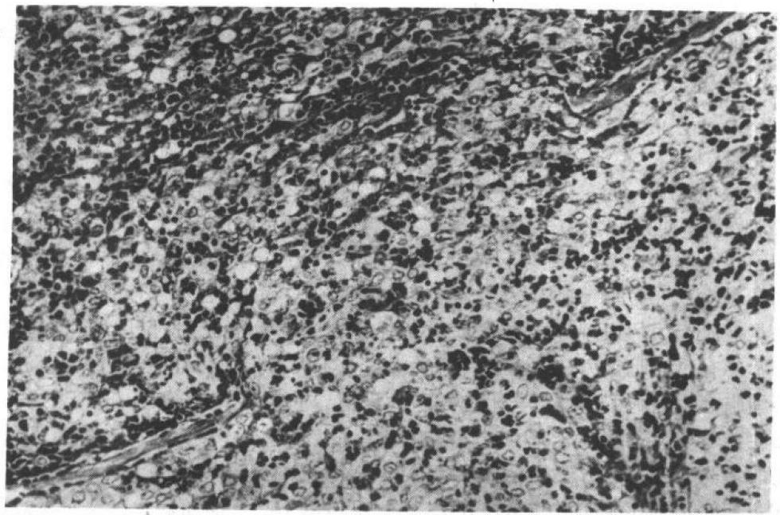 
图6-4 侵犯肺组织的胸腺瘤上皮成分为主
（2）I型恶性胸腺瘤：临床上呈恶性表现，组织学上为胸腺癌，不呈良性胸腺瘤和I型恶性胸腺瘤的形态，无重症肌无力和其它全身表现。尽管少见但各具特点，主要有以下7种类型。
1)鳞癌：形态上与其它部位发生的鳞癌相同，可出现角化，只是分叶状结构较明显，之间为纤维束分隔。诊断胸腺鳞癌前应先除外转移性鳞癌。 
2）淋巴上皮瘤样癌：形态上类似鼻咽癌的淋巴上皮癌，瘤细胞核仁大、嗜酸且边缘清楚，呈圆形，缺乏角化和细胞间桥，但keratin阳性，其间的淋巴细胞为外周T细胞而不是幼稚的T细胞。有报道癌细胞中表达EBVDNA。 
3）肉瘤样癌（癌肉瘤）：组织学上呈梭形细胞弥漫生长而似肉瘤，但可见灶性上皮性肿瘤成分。在肉瘤样区可见软骨、骨骼肌分化。由于良性胸腺瘤可见到骨骼肌分化，故应注意鉴别。还需与生殖细胞瘤和恶性神经鞘瘤（蛛螈瘤）鉴别。 
4）透明细胞癌[12]：瘤细胞富于糖原，胞浆透亮，似肾细胞癌。
5）基底细胞样癌：肿瘤由界限清楚的上皮细胞团构成，四周呈栅状排列。有时为鳞状上皮被复的胸腺囊肿的壁内结节。
6）粘液表皮样癌：肿瘤出现鳞状和粘液腺分化。当粘液出现于细胞外时可引起炎性反应。
# 7）小细胞癌和鳞状小细胞癌
上面列举的胸腺癌特殊类型，均具有明确的上皮的形态特点，对于鉴别诊断是有用的。反之，当看到一个明显恶性的纵隔肿瘤，但又缺乏上述各亚型的形态特征时，则说明不是胸腺癌。
I型恶性胸腺瘤为高度恶性肿瘤，常见侵袭性生长及远处转移，仅其中的基底细胞样癌和粘液表皮样癌预后较好。 
7. 预后 有包膜的良性胸腺瘤手术切除后预后良好，上皮细胞的形态及淋巴细胞的多少与预后关系不大。仅 $2\%$ 的病例有复发，出现纵隔肿块或胸膜种植。有无重症肌无力与预后的关系也不大。I型恶性胸腺瘤的预后主要取决于肿瘤首次切除是否完全，预后因素中浸润程度起决定作用，为此，临床分期有其实用意义，I型恶性胸腺瘤的I期预后与良性胸腺瘤相似，而出现浸润或种植预后则差，出现转移者则更差。II型恶性胸腺瘤的预后差，在一组20例的报道中，16例在5年内死于肿瘤。
# （五）胸腺类癌和小细胞癌
胸腺类癌具有一定的临床病理特征，但过去多年来一直把它混同于胸腺瘤。胸腺类癌是胸腺的神经内分泌细胞来源，其形态特征与生物学行为与身体其它部位的类癌相似，尤其是前肠部位来源的类癌。由于是恶性肿瘤，局部浸润和远处转移常见，有时转移发生很晚。有一组材料中 $73\%$ 出现远处转移。包膜完整者切除后可治愈。胸腺类癌一般无内分泌症状，仅个别病例出现类癌综合征，或伴Cushing综合征[13]。
胸腺类癌还可伴发其它部位的类癌，如支气管、回肠，也可以是多发性内分泌腺瘤病（MEA）I型或Ia型的组成之一。出现类癌症状者肿瘤常为浸润性生长。
大体上，胸腺类癌呈实性，界限清楚，但无包膜；分叶不明显。组织学上，典型者呈带状和彩带状、菊形团、腺样，可见到细胞团的中心坏死和钙化，血管增多，常有淋巴管、血管浸润，而胸腺瘤的特征，如大量淋巴细胞、血管周间隙等则不明显。瘤细胞胞浆呈细颗粒状，染色质稍粗，核分裂多见。如果用支气管发生的类癌标准来衡量，胸腺类癌可列入不典型类癌的范畴。事实上胸腺类癌预后也比支气管类癌为差。
进一步证实类癌诊断的方法很多。有的肿瘤细胞嗜银染色阳性。电镜下可见指突状细胞突起、局灶性基板、很少的连接、无复合桥粒或张力原纤维，胞浆内有致密核心的神经分泌颗粒，有时见核周微丝团（图6-5,6-6）。免疫组化示keratin,NSE,chromogranin以及其它激素标记阳性。
胸腺类癌中可出现梭形细胞形态和伴有黑色素出现，也可见到类淀粉和降钙素，因而与甲状腺髓样癌相似。还有一种胸腺类癌似肺的小细胞癌，以及出现相似于肺的鳞癌及小细胞癌混合。在实际工作中，只有排除肺的小细胞癌转移才能诊断胸腺小细胞癌。
# （六）胸腺脂肪瘤和其它间叶肿瘤
胸腺脂肪瘤包膜完整，可长得很大。在X线上似心脏增大或隔离肺。绝大多数无症状，少数可伴重症肌无力、再生障碍性贫血和甲状腺机能亢进。大体上与一般脂肪瘤同，
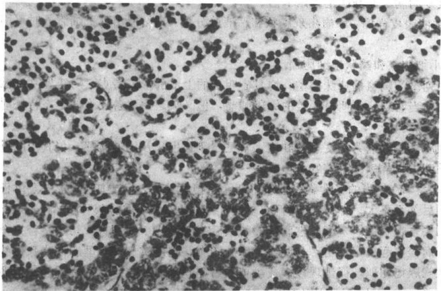 
图6-5 胸腺类癌呈两种细胞形态
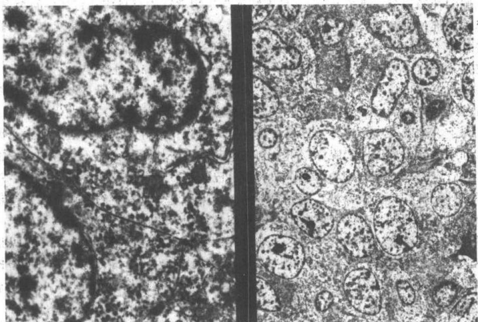 
图6-6胸腺类癌 
瘤细胞胞浆内有致密核心颗粒
但有灶性灰白色区。组织学上为不同比例的成熟脂肪组织和胸腺组织混合而成。文献中曾有胸腺脂肪肉瘤和骨肉瘤的报道。
# 四、纵隔生殖细胞肿瘤
纵隔的生殖细胞肿瘤占纵隔肿瘤的 $20\%$ ，其组织发生如同其它部位的生殖腺外生殖细胞瘤一样，还没有圆满的解释，一般认为是生殖细胞的异位，这是因为胚胎发生过程中生殖细胞迁移的范围很广泛。纵隔的生殖细胞肿瘤常发生在胸腺部位并且在胸腺内，但与胸腺瘤无关。任何纵隔生殖细胞肿瘤应先排除睾丸、卵巢原发的生殖细胞肿瘤转移的可能性。
有的纵隔生殖细胞肿瘤可伴发Klinefelter综合征，其发生率是人群的30倍一40倍。另一现象是纵隔生殖细胞肿瘤与造血系统的恶性病变关系密切。
生殖细胞肿瘤的不同类型与性别有一定关系，精原细胞瘤主要见于男性，胚胎性癌、内胚窦瘤、畸胎癌和绒癌也以男性为主，成熟性囊性畸胎瘤男女发病率无差别。
# （一）生殖细胞瘤（精原细胞瘤）
纵隔的生殖细胞瘤几乎均发生在胸腺，易误认为胸腺瘤。组织学上与睾丸发生者相同。当形态上出现明显的不典型性、核分裂多见时称之为未分化生殖细胞瘤，但其临床意义则不清楚。需鉴别的是胸腺瘤和大细胞淋巴瘤。生殖细胞瘤在组织学上还有以下一些特点：纤维间隔内有较多淋巴细胞、浆细胞浸润，可见上皮样细胞肉芽肿，生发中心多见，瘤细胞胞浆富于糖原，核仁大且呈不规则缠绕状。当肉芽肿反应、滤泡增生、胸腺上皮性囊肿形成、纤维化等明显时不易正确诊断。电镜及免疫组化有助于鉴别。生殖细胞瘤示胎盘碱性磷酸酶、Leu-7阳性，而LCA、keratin阴性。不要把陷于肿瘤内的胸腺上皮当作肿瘤成分。放疗是首选方案，预后较好，10年存活率达 $69\%$ 。
# （二）成熟性囊性畸胎瘤
这是纵隔生殖细胞肿瘤中最多见的，以年轻人为多。肿瘤可达很大体积，常与周围组织粘连。切面呈囊性，壁常有钙化，如果瘤内的皮脂成分破出，可引起黄色肉芽肿性炎性反应，甚至穿破气管支气管，病人可咳出皮脂和毛发。
镜下 与卵巢的囊性畸胎瘤相同，囊内壁有复层鳞状上皮，含有皮脂腺、毛发，还可见神经组织、胃肠道组织、软骨、呼吸道组织、胰腺组织，还可见到胰岛，甚至出现低血糖症。此瘤与周围组织粘连多的原因可能与胰酶的分泌有关。
# （三）未成熟性畸胎瘤
一般是在成熟性畸胎瘤中出现未成熟组织，如上皮、间叶、神经等成分的未成熟，但没有胚胎性癌的成分。由于病例不多，其生物学行为的规律则不清楚。需鉴别的是畸胎癌和成熟性囊性畸胎瘤恶性变，后者十分罕见。
# （四）胚胎性癌
为一种浸润性、大量坏死性肿瘤，组织学上分化差。免疫组化示胎盘碱性磷酸酶和Leu-7阳性。认识纵隔发生这种分化差的生殖细胞来源的肿瘤是很重要的，因为患者一般年轻、化疗有效，而不能仅认为是未分化恶性肿瘤、预后不良而延误了治疗。
# （五）内胚窦瘤（卵黄囊瘤）
也可见于纵隔，预后不良，即使包膜完整手术切除后存活时间也不长。应注意与肺腺癌转移及间皮瘤鉴别。
# （六）畸胎癌
成熟性囊性畸胎瘤与胚胎性癌共存时称为畸胎癌，常含有未成熟畸胎瘤成分，约占纵隔生殖细胞肿瘤的 $5\%$ 。肿瘤生长快，浸润广泛，大体上易见出血和坏死。
镜下 除胚胎性癌之外，还有分化好的区域，还可出现肉瘤成分，如血管肉瘤、横纹肌肉瘤。这些肉瘤成分对化疗不敏感。
# （七）原发性绒癌
多见于30岁左右，常伴男性乳腺肥大（gynecomastia）及血清HCG增高，预后差。诊断时应仔细检查生殖腺，以排除转移。如有报道睾丸原发灶仅 $2\mathrm{mm}$ 而出现纵隔转移的。化疗对于原发和转移灶是一样有效的。
无论生殖腺或生殖腺外，生殖细胞来源的不同类型肿瘤可混合出现，称之为混合性生殖细胞肿瘤，但诊断时应具体写出有哪几种成分的混合。
# 五、纵隔恶性淋巴瘤
纵隔恶性淋巴瘤的好发部位依次为前、上、中纵隔。在中纵隔是最多见的肿瘤，既可以是纵隔原发，也可以是全身性淋巴瘤的一部分。临床及X线可提出可能性诊断。细针吸取活检或经胸骨上入口的小块组织活检可得出正确诊断。然后，大多数还须由剖胸探查明确性质。纵隔的恶性淋巴瘤主要有三种，即Hodgkin病、淋巴母细胞性淋巴瘤和大细胞性淋巴瘤。
# （一）Hodgkin病
纵隔 Hodgkin 病可原发于纵隔淋巴结、胸腺或两者，以青年女性为多。临床主要出现局部压迫所引起的症状（呼吸困难、咳嗽、胸痛），也可由 X 线检查偶然发现。纵隔的 Hodgkin 病几乎均为结节硬化型。发生在淋巴结者组织形态与身体其它部位同，当累及胸腺时，在胸腺内出现厚的包膜，与胸腺瘤有一些不同，可呈多灶性（这在胸腺瘤极少见），可见残余的胸腺组织。触之硬，切面呈结节状，有时结节内有不同大小的囊腔形成，内含清亮或粘稠液体，因而大体上有时与囊性胸腺瘤难以区别。低倍镜下 Hodgkin 病与胸腺瘤可类似，因为两者都呈纤维分隔的结节状，只是胸腺瘤的纤维成分与肿瘤成分界限清楚，瘤结节外形有锐角而不是圆形，反之，Hodgkin 病的纤维分隔与肿瘤部分界限不清。在细胞成分上，Hodgkin 病除诊断性 R-S 细胞及其亚型外，还见中性白细胞、淋巴细胞、浆细胞、嗜酸性白细胞、组织细胞等。这些细胞与被复上皮的囊肿、哈氏小体、胸腺上皮细胞混合存在，过去曾将这种 Hodgkin 病误认为肉芽肿性胸腺瘤。免疫组化检查 LeuM1 和 keratin，可分别显示肿瘤成分与反应性上皮成分。当出现瘤细胞密集及周围坏死时会误认为非 Hodgkin 淋巴瘤 (NHL)、生殖细胞肿瘤或癌。当 Hodgkin 病出现明显纤维化及慢性非特异性炎细胞浸润时，可误认为硬化性纵隔炎，当 Hodgkin 病出现明显淋巴滤泡增生、生发中心形成时会误认为巨大淋巴结增生。出现上述情况，而临床及 X 线疑为恶性时，应再取活检，尤其是取病变中央部位。从纤维化改变来看，Hodgkin 病除了宽厚的纤维带外，有纤细的纤维网陷入瘤细胞之间，甚至单个瘤细胞周围，而胸腺瘤则无此表现，大细胞淋巴瘤有时可有此表现。
# （二）淋巴母细胞性淋巴瘤
淋巴母细胞性（曲核细胞）淋巴瘤好发于胸腺区域，以T细胞为多。典型临床表现为青少年发展迅速的呼吸困难，有时甚至需急诊治疗。
大体 为实性、质软、无包膜形成。早期还保留胸腺轮廓。
光镜 为胸腺实质的浸润，与富于淋巴细胞的胸腺瘤相似，但淋巴细胞不典型（呈母细胞化表现，染色质很细、核扭曲、分裂像多），常侵及周围脂肪、血管。瘤周有残留胸腺小叶和哈氏小体。
有一点值得指出，真正的胸腺瘤极少见于儿童。胸腺的淋巴母细胞性淋巴瘤也可出现纤维化和被复上皮的囊肿形成，但比Hodgkin病少得多。偶尔见到散在的嗜酸性白细胞以及局灶性肉芽肿形成，坏死可十分明显，可以是自发性的或放疗后的。如果整个活检组织均为坏死，临床及X线符合淋巴母细胞性淋巴瘤时，须提出可能诊断，再作活检证实。需与之鉴别的有粒细胞肉瘤（绿色瘤，成髓母细胞瘤）。
# （三）大细胞性淋巴瘤
胸腺的大细胞性淋巴瘤表现为纵隔肿块，淋巴结受累可有可无，以青年女性为多，常以上腔静脉受压出现。肿瘤呈浸润性生长，累及心包、胸膜、肺、胸骨及胸壁。
大体 肿瘤呈实性，常见灶性坏死。
镜下 有时见到宽的纤维带，将肿瘤细胞分隔成片，与癌、生殖细胞肿瘤或内分泌细胞肿瘤相似。此肿瘤容易误诊的另一些因素是：当出现血管周围淋巴细胞积聚时易与胸腺瘤的血管周间隙混淆；由于福马林固定导致的胞浆透亮会误为胸腺上皮；当出现较多组织细胞浸润时可误为真性组织细胞性淋巴瘤。
大细胞性淋巴瘤瘤细胞的特点是：核大、空、形状不规则（有切迹、肾形、多分叶状），侵入胸腺内及胸腺周脂肪、血管壁、胸膜、肺等组织。纤维化时可出现透明性变的条索，并有纤细的纤维伸入瘤细胞间。
免疫组化 LCA 阳性，大部分为 B 细胞来源，少数为 T 细胞性。在临床遇到青年女性的纵隔恶性肿瘤需想到恶性胸腺瘤、生殖细胞瘤和大细胞淋巴瘤时，首先应考虑大细胞淋巴瘤。大细胞性淋巴瘤发病时多限于胸内，放疗及化疗均敏感。可转移到浅表淋巴结，肾脏受累的比率较高。
# 六、神经源性肿瘤
神经源性肿瘤是后纵隔最常见的肿瘤，但亦可见于纵隔其它区域。主要是交感神经系统和外周神经鞘两类。年龄与肿瘤有一定的关系：1岁以内是神经母细胞瘤和节细胞神经母细胞瘤；10岁以前是交感神经系统肿瘤；20岁以后是节细胞神经瘤、副节瘤和神经鞘瘤。X线上，交感神经系统肿瘤呈长形、圆锥形，神经鞘瘤则呈圆形、界限清楚。
# （一）交感神经系统肿瘤
发生在纵隔的交感神经系统肿瘤与腹膜后者相比分化要好一些。神经母细胞瘤在纵隔不多见，主要见于后纵隔，几乎均为儿童。肿瘤呈浸润性生长，伴有坏死、钙化。儿童多见的是节细胞神经母细胞瘤，为中等分化，相似于分化性神经母细胞瘤或不成熟的节细胞神经瘤，大体上比神经母细胞瘤界限清，有时形成包膜。
节细胞神经瘤以年长儿童及成人多见，是交感神经系统肿瘤中最常见的。
大体 有光滑完整的包膜，触之软，切面灰黄色，可含有囊性变、脂肪变，但不易见到新鲜坏死。
光镜 为成熟的节细胞和梭形细胞混合组成。节细胞常多核、成簇。常见局灶性淋
巴细胞积聚，注意不要当作不成熟的神经母细胞。可以是多发性，发生在不同部位，互相间分化程度不一致。
交感神经系统肿瘤的预后与肿瘤分化程度有关，由于胸腔发生者比腹膜后者分化为好，故预后比腹膜后（尤其是肾上腺）好。节细胞神经瘤切除后可治愈，节细胞神经母细胞瘤大部分可以治愈，只有神经母细胞瘤预后不良。
# （二）外周神经肿瘤
外周神经肿瘤有三种：神经鞘瘤、神经纤维瘤和恶性神经鞘瘤。与发生在其它部位无包膜的神经纤维瘤相比，纵隔的神经纤维瘤有包膜，这可能是因为纵隔发生者长得较大的缘故，故有无包膜不能作为纵隔神经纤维瘤的鉴别点。另一特点是肿瘤发生退变十分明显，如脂肪变、出血、囊腔形成，也可能与肿瘤体积大有关。神经鞘瘤出现明显囊性变和其它退变时称为古老神经鞘瘤（ancient neurolemonoma），意指肿瘤已生长很久。多数良性外周神经肿瘤无症状，而是X线检查中偶然发现。当神经鞘瘤细胞丰富时易当作肉瘤，但找不到核分裂是鉴别要点。神经纤维瘤和神经鞘瘤切除后可治愈。
纵隔恶性神经鞘瘤可以是新发生，但较常见的是由神经纤维瘤病恶变而来。早期恶变时，组织学上仅表现为细胞数稍增多，故不易认作恶性。恶变明显时出现异型性，而又难以辨认原来的良性神经纤维瘤背景，此时主要依靠病史提供从神经纤维瘤恶变而来。恶性神经鞘瘤出现腺管分化或横纹肌母细胞特征（蝶腺瘤）时，预后不良。
# 七、副神经节瘤
多数纵隔副神经节瘤发生于有化学感受器的组织部位，故以靠近心脏底部的前上纵隔为多。还可见于主动脉的交感神经节而在脊柱旁的后纵隔出现。形态上与其它部位者相同。
大部分副神经节瘤是无功能性的，但有时（尤其是与交感神经关连时）则出现高血压及肾上腺外嗜铬细胞瘤的表现。目前仍将肾上腺髓质发生的副神经节瘤称为嗜铬细胞瘤，不论其有无功能表现。
传统上认为纵隔的副神经节瘤是良性肿瘤，但通过长期追随观察，发现有一半病人肿瘤呈侵袭性生长，死亡率高。
# 八、间叶组织肿瘤[14]
# （一）脂肪组织肿瘤
纵隔良性间叶性肿瘤中以脂肪瘤为最多，常位于膈上，长得很大，有时可伸展至两侧胸腔而不能切除彻底。应多取材寻找有无胸腺组织以排除胸腺脂肪瘤。另外，还需与脂肪瘤病鉴别，后者为成熟脂肪组织的弥漫堆积，可见于肥胖、Cushing病或应用激素。婴儿则需考虑有无脂肪母细胞瘤的可能。纵隔脂肪肉瘤有时与大腿和腹膜后脂肪肉瘤同时发生。如肿瘤中有胸腺组织，应称为胸腺脂肪肉瘤。
# （二）淋巴管瘤
纵隔常见淋巴管瘤，以儿童前上纵隔多见，常与颈部相连。淋巴管瘤与淋巴管肌瘤病几乎都见于女性。
# （三）血管源性肿瘤
成人血管瘤以海绵状多见，镜下为扩张的管腔衬以扁平的内皮，有纤维间隔，出现灶性血栓形成、钙化和胆固醇性肉芽肿，切除可治愈。儿童的血管瘤则细胞丰富（良性血管内皮细胞瘤）。也可见到血管外皮细胞瘤，但如发生于前上纵隔，则常为胸腺瘤的血管周细胞瘤型。其它还见到组织细胞样（上皮样）血管内皮细胞瘤、血管肉瘤。有的血管肉瘤在恶性生殖细胞肿瘤的基础上发生。
# （四）孤立性纤维瘤
纵隔的孤立性纤维瘤与胸膜的孤立性纤维瘤（也称孤立性纤维性间皮瘤）相同，也可能是从纵隔胸膜发生，但也可以是纵隔（包括胸腺）间质原发。组织学及预后与胸膜者相同。
纵隔的其它恶性间叶组织肿瘤有平滑肌肉瘤、恶性间叶瘤、恶性纤维组织细胞瘤和滑膜肉瘤等。
# 九、其它肿瘤和瘤样病变
# （一）巨大淋巴结增生
好发于纵隔，过去常混同于胸腺瘤，因将其中透明变性的生发中心误认为哈氏小体。以淋巴结多见，但也可见于胸腺内。
# （二）髓外造血
髓外造血可出现纵隔包块，常位于脊柱旁。原发病见于遗传性球形红细胞增多症和地中海贫血。
# （三）脑膜瘤
脑膜瘤可见于后纵隔，与交感神经链相关，可能来自星状神经节（stellate ganglion）。
# 十、转移性肿瘤
有些转移到纵隔的肿瘤在临床和X线上相似于原发性肿瘤，其中最突出的是肺的小细胞癌，可在纵隔表现为巨大肿块而支气管内肿瘤很小，甚至发现不了，它可以直接侵袭至纵隔也可经淋巴结转移到纵隔。其它类型肺癌也见类似表现。
直接浸润到纵隔的还有来自食道、胸膜、胸壁、脊椎和气管的肿瘤。组织学特征与纵隔肿瘤类似的转移性肿瘤可来自乳腺、甲状腺、喉、肾、前列腺、生殖腺及恶性黑色素瘤。转移性肿瘤最初主要累及淋巴结，故以中纵隔为中心（此处淋巴结最多）。
# 第二节 胸膜
胸膜的病理诊断主要有两个目的：一是决定胸水的性质，二是决定胸膜包块的诊断。供病理诊断的标本有三种：胸水、穿刺活检及手术切除。
# 一、非肿瘤性病变
# （一）胸膜疝
胸膜疝主要见于三个部位：以膈后方的胸腹膜孔为最多，左边多于右边，在胸腔内出现含气的肠；其次是膈附着的胸骨和肋骨处出现的胸骨旁疝，可使腹膜的疝囊突入
心包囊内；少见的部位是胸膜突入肋间隙形成含有肺组织的胸膜疝。
# （二）胸膜炎
肺部的任何炎症都可累及胸膜，而当肺的炎症吸收后可遗留下胸膜两层的融合（粘连）、增厚，可达数厘米之厚，其包绕的肺组织可完全正常，仅是肺膨胀受到限制，当剥去增厚的胸膜后，肺功能获得改善。胸腔穿透伤造成血肿后机化则可致胸膜明显增厚，宜在伤后3周一5周行剥脱术。镜下为血肿机化，主要是纤维组织，缺乏弹力纤维，说明间皮下的结缔组织未参与机化过程。
# （三）结核
感染途径可有多种，如肺结核的直接累及或血源性感染等。
# （四）风湿病
风湿病偶尔也见于肺和胸膜，导致胸膜炎及胸腔积液。胸膜活检虽无特异性变化，但当围绕纤维素的栅状梭形细胞出现并垂直于胸膜表面时应想到风湿病的可能。胸水中可见上皮样细胞、巨细胞、胆固醇结晶和大量间皮细胞。
# （五）子宫内膜异位
胸膜和膈可见到子宫内膜异位，以右侧为多，并伴有腹腔内的子宫内膜异位。
# （六）淀粉样物沉着症
全身淀粉样物沉着症可累及胸膜，穿刺活检可获诊断。
# （七）霉菌感染
当机体免疫抑制时可出现胸膜的霉菌感染如隐球菌、曲菌、念珠菌等。
# （八）石棉沉着
石棉是一种水化纤维性硅酸盐，主要用于建筑材料。根据石棉的种类，纤维的大小、接触时间等因素，致病后的表现有所不同。引起胸膜的病变主要是胸膜结节和间皮瘤[15]。
胸膜结节由透明变的纤维组织构成，主要见于壁层胸膜前方及后侧方的肋间处和膈顶。时间长者可钙化。在无石棉接触史中也可见到。长期大量接触石棉的人群中约 $2\% \sim 3\%$ （甚至达 $10\%$ ）发生间皮瘤，潜伏期达20年以上。约1/3的间皮瘤无石棉接触史。
# 二、原发性肿瘤
# （一）间皮瘤[16]
胸膜间皮瘤的瘤细胞与胸膜炎时反应性增生的间皮细胞相似，可见到3种类型：间皮或“上皮”型；双向或混合型；梭形细胞型。
大体分为局限性和弥漫性。局限性呈界限清楚的肿块，切面灰白、坚硬，大的恶性肿块可有坏死。弥漫性间皮瘤弥漫累及脏层和壁层胸膜，充满胸腔，常含有囊腔，质较软，如含纤维成分多时可较硬，色灰白。从大体及组织学角度，可有以下的分类。
# 间皮瘤的类型
恶性
弥漫型
间皮细胞型
双向型
梭形细胞型
良性
局限型
双向型
梭形细胞型
间皮细胞型
# 局限型
# 梭形细胞型
1. 间皮细胞型间皮瘤 间皮细胞型间皮瘤的瘤细胞与反应性增生的间皮细胞相似，胞核居中，染色质较空，有核仁，核形比反应性增生者稍不规则，胞浆嗜酸，量多少不等，可含有透明质酸小泡，细胞呈立方状、多角形，偶呈扁平或低柱状。组织结构上有管状、乳头状、管状乳头状、裂隙状、实性巢状、片块状以及未分化区域。有时在少量疏松的瘤细胞间为丰富的水肿粘液样间质。乳头状结构的轴心为纤维结缔组织，管状结构则为胶原所包绕。可见到淀粉样物以及鳞状化生。瘤细胞主要有两类：
（1）具有中等量嗜酸胞浆的小细胞，核圆或卵圆，核膜明显，染色质分布均细，核仁小。 
（2）弱嗜酸或嗜碱性胞浆的大细胞，核稍大，空泡状，核仁明显。
肿瘤可以以一种细胞为主，也可两种细胞混合或过渡。偶见双核、多核细胞，核分裂少见。在上皮明显处有时可见砂粒体。偶见钙化。上皮型中易见囊腔。
间皮细胞型间皮瘤与腺癌的鉴别十分困难，都可呈实性、管状、乳头状结构，但腺泡结构见于腺癌而不见于间皮瘤。当肿瘤很小时，间皮瘤是向胸膜腔内生长而腺癌是从肺侵及胸膜可作鉴别，当肿瘤较大时要鉴别肿瘤是从肺累及胸膜还是从胸膜累及肺是困难的。组织化学对鉴别有一定帮助，因为腺癌细胞含有粘液，间皮瘤细胞则无粘液，而是含透明质酸。这是一种水溶性物质，酒精固定保存良好，alcian蓝染色呈阳性，用透明质酸酶消化后呈阴性，以此可证实其间皮瘤的性质，因腺癌中的粘液经透明质酸酶消化后仍呈阳性。对于梭形细胞区域出现透明质酸阳性以及消化后呈阴性的结果，不能支持间皮瘤，因正常结缔组织中就含有透明质酸。
电镜间皮细胞有细长微绒毛、细胞间腔、胞浆内细丝、不完整的基膜、胞浆内含均质包涵体或膜与颗粒的混合物，易见桥粒及糖原颗粒。
扫描电镜 呈杂乱粗毛状的微绒毛。
免疫组化 间皮瘤keratin阳性，vimentin，EMA，S-100可阳性，CEA，Leu-M1及分泌成分（secretory component）均阴性，而腺癌除keratin阳性外，EMA，CEA，Leu-M1，分泌成分常呈强阳性。
2. 双向型间皮瘤 弥漫型间皮瘤中有一半病例呈间皮细胞与梭形细胞的混合，在肿瘤的不同部位梭形成分多少不等（图6-7）。见到梭形细胞成分时更易想到间皮瘤。需与肺周边部的癌肉瘤鉴别，在癌肉瘤中常见鳞状上皮成分。双向型间皮瘤与滑膜肉瘤的鉴别是困难的。 
3. 棱形细胞型间皮瘤 发生在胸膜的梭形细胞肿瘤称为梭形细胞型间皮瘤。目前对其是否全为间皮瘤尚有争论，有人认为梭形细胞肿瘤是来自间皮下的结缔组织，不能当作间皮瘤，但也有支持梭形细胞成分是间皮瘤一部分的证据：①梭形细胞成分与间皮细胞成分共存；②梭形细胞间皮瘤与发生在软组织的纤维瘤形态上不一样；③梭形细胞间皮瘤在组织培养中出现间皮细胞分化；④光镜下全为梭形细胞的间皮瘤，电镜下可见向间皮细胞过渡的现象。因此认为，梭形细胞部分是间皮细胞双向分化的表现。
光镜 瘤组织细胞丰富，交织成束，核不典型性，核分裂多见（图6-8）。少数病例见骨、软骨化生。
图6-7 胸膜间皮瘤 
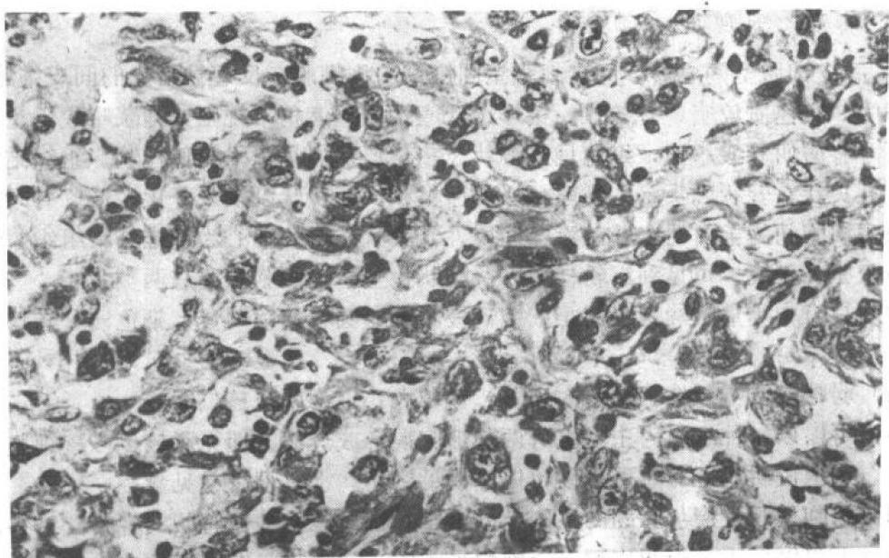 
以上皮细胞为主
图6-8 胸膜间皮瘤 
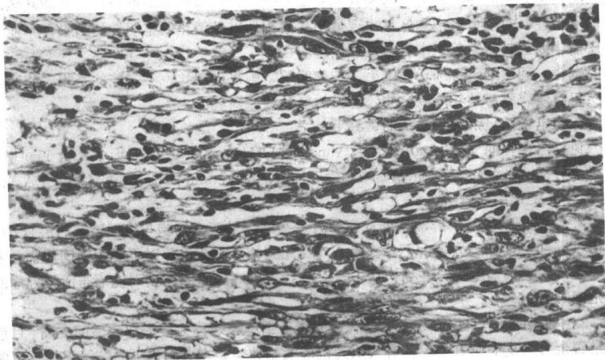 
以纤维性细胞为主
免疫组化 keratin 阳性。
4. 纤维生成型间皮瘤 在有的梭形细胞型和双向型间皮瘤中出现丰富的纤维组织成分，这是恶性间皮瘤的一种特殊类型。应注意与良性纤维细胞间皮瘤鉴别，前者keratin阳性，电镜下有上皮成分的证据。纤维生成型间皮瘤还需与炎性纤维化灶相鉴别，虽然
前者keratin阳性有助于鉴别，但后者可出现增生的间皮细胞陷入炎性纤维化组织之中而亦呈keratin阳性，因此对常规切片的仔细观察是关键，要看到恶性的表现以作鉴别，如核的不典型性、坏死，瘤细胞区有一定排列、浸润性生长等，而炎性纤维化灶中内陷的间皮细胞呈立方状，一致性。
5. 伴有鳞化的恶性间皮瘤又称胸膜鳞状细胞癌，见于慢性脓胸、治疗性气胸的患者，但也有可能是肺鳞癌扩散至胸膜的结果。
胸膜间皮瘤的预后不良，多在诊断后11月-58月间死亡，梭形细胞型比双向型为差，全身化疗结合局部放疗有一定疗效。
6. 单发性纤维性间皮瘤又称良性梭形细胞间皮瘤、胸膜单发纤维瘤。肿瘤界限清楚，有的有蒂，一般无症状，偶有咳嗽、胸痛、呼吸困难，偶见肺性骨关节病（肿瘤切除后迅速消失）。无石棉沉着。大体上呈分叶状的灰白灰黄色硬块，常呈旋涡状，平均直径 $6\mathrm{cm}$ ，与子宫平滑肌瘤相似，一般不出现囊性变。 $80\%$ 粘贴于脏层胸膜，其余见于壁层胸膜、叶间裂，还可见于无胸膜的肺实质内，甚至还见有发生在纵隔、鼻咽部的报道。
光镜 由网状缠绕的纤维母细胞组成，胶原和网状纤维丰富。细胞数有的丰富，有的不丰富，常见血管周细胞瘤样表现，易误认为纤维肉瘤或恶性神经鞘瘤，但缺乏核的异型性，核分裂找不到有助于鉴别。有时在肿瘤的周边部见立方状细胞呈乳头、管状、巢状，可能是内陷的间皮或肺上皮。
$90\%$ 的肿瘤在外科切除后治愈， $12\%$ 可由于胸内广泛性生长而致死。
多年来一直认为此瘤是间皮瘤的一种，但电镜下为纤维母细胞而无间皮细胞的特征，免疫组化表达vimentin，有时见表达actin，但keratin阴性，故有可能是邻近于间皮的间叶细胞来源，因此有人提出更名为间皮下瘤或间皮下纤维瘤。
# （二）其它原发肿瘤
发生在胸膜的其它肿瘤有血管来源的肿瘤，其中有上皮样血管内皮细胞瘤、血管肉瘤。还见到胸膜的胸腺瘤、恶性淋巴瘤、软骨肉瘤。
# 三、转移性肿瘤
胸膜的转移性肿瘤中 $75\%$ 为癌。在日常工作中遇到的胸膜恶性肿瘤中以转移癌为最多，间皮瘤仅占转移癌的1/25。转移癌中又以腺癌最多见，主要是外周型肺腺癌（ $33\%$ ），其次是乳腺癌（ $20.9\%$ ）、胃癌（ $7.3\%$ ）。 $92\%$ 的胸膜转移癌是同侧肺、乳腺、卵巢来源， $46\%$ 的患者以胸水为临床表现。
# 第三节 心 包
# 一、心包炎
# （一）感染性心包炎
心包细菌感染后，最初为浆液纤维素性渗出，然后呈化脓性。病源体以葡萄球菌、链球菌、肺炎球菌为主。化脓性心包炎很少完全吸收，常以肉芽组织及瘢痕形成为结局。
结核性心包炎多为邻近的纵隔淋巴结或肺的结核扩散而来，也可为全身粟粒型结核