# 第一节 对持续性刺激的反应与细胞损伤
细胞承受着来自内外环境改变的各种刺激。对这些刺激的各种反应模式构成了疾病的细胞学基础。若损伤超过了细胞的适应能力，细胞便会死亡。细胞暴露于持续的亚致死性的损伤会有有限的几种反应，其表现可以作为细胞损伤的依据。总之，哺乳动物细胞通过节约资源来适应损伤：减少或终止分化功能，专注于自身的存活。
持续的应激通常会引起细胞的慢性损伤。尽管永久的器官损伤与单个细胞的死亡相关，细胞对持续性亚致死性损伤的反应（无论是化学还是物理因素）反映了细胞对不利环境的适应。并且，在应激去除后，这些改变大部分是可以逆转的。主要的适应性变化包括萎缩、肥大、增生、化生、异型增生和特定内源性或外源性物质的胞内堆积。此外，特定形式的肿瘤形成也反映了适应性变化。
# 一、萎缩是细胞或器官对环境变化的主动反应，最终导致其功能降低和体积缩小
临床上，萎缩通常指一个器官在病理或生理状态下体积的减小或功能的降低。因此，萎缩可以源于骨骼肌的失用或营养信号的缺失而作为正常老化的一部
分。在单个细胞水平上，萎缩可以被视为一种适应性反应——一个细胞适应其周围环境改变而存活下来。但是更常见的情况是，萎缩是有害过程，如一些慢性疾病或衰老等（见下文）的一种结局。一个器官尺寸的减小预示着可逆的细胞萎缩或不可逆的细胞减少。例如，在阿尔兹海默病中脑萎缩继发于广泛的细胞死亡；这种情况，器官的大小是不可恢复的（图1-1）。萎缩发生于以下几种情况：
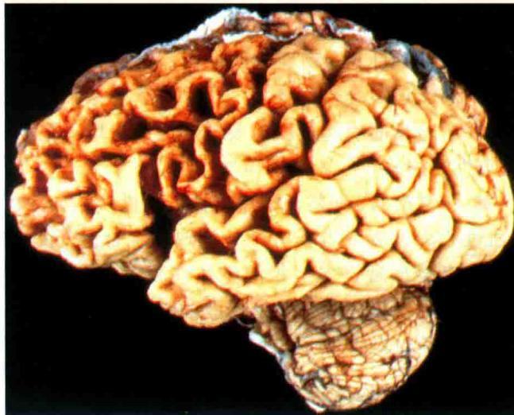 
图1-1 脑萎缩。显示额叶明显萎缩，脑回变窄，脑沟显著变宽
功能需求的减少：例如，肢体石膏固定后，肌细胞萎缩，肌力减弱。当恢复正常活动后，肌肉的大小和功能也逐渐恢复。 
供氧不足：组织血供的减少被称为缺血。尽管氧灌注的完全阻断会导致细胞死亡，但是局部的缺血通常能使细胞存活。这种情况下，在心、脑和肾等这些器官因血管阻塞导致局部缺血性坏死（梗死）的边缘可以看到由于氧灌注不足发生的细胞萎缩。 
■营养不良：饥饿或慢性疾病相关的营养物质不足会导致细胞萎缩，在骨骼肌和脂肪组织中尤为显著。 
■营养信号的中断：许多细胞的功能依赖于化学介质的信号传输，内分泌系统和神经肌肉传输就是最好的例证。内分泌腺体的切除或去除神经会使这种信号丧失并导致靶器官的萎缩。内分泌不足引起的萎缩不只局限于病理状况。例如，更年期后雌激素水平的下降导致子宫内膜萎缩（图1-2）。
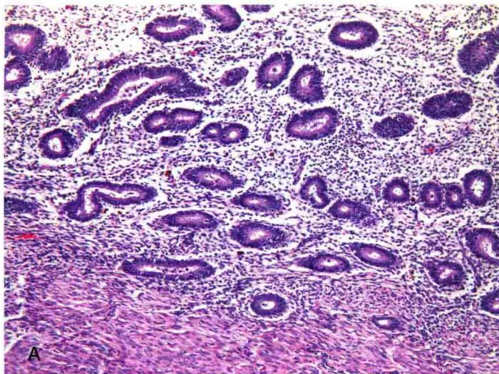 
图1-2子宫内膜增殖。A.图示一位育龄期妇女的子宫在丰富的基质中有由增生腺体组成的较厚的内膜；B.一位75岁女性的子宫内膜较薄，并且仅有少数萎缩的囊性腺体
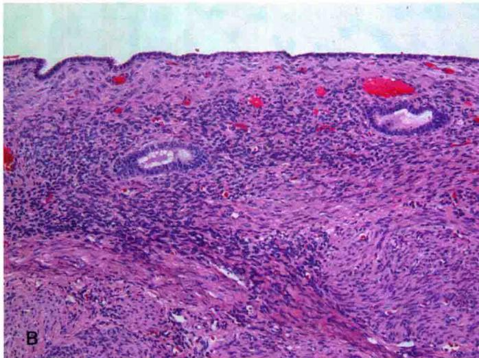
■持续性的细胞损伤：持续性的细胞损伤最常见于慢性炎症伴有持久的病毒或细菌感染或自身免疫性疾病。一个很好的例子就是慢性胃炎引起的胃黏膜萎缩（见第13章）。
■长期的压迫：物理性的损伤，例如不合适的体位长期的压迫，会引起萎缩。长期卧床会导致皮肤的持续性压迫从而引起皮肤的萎缩，最终出现压疮溃疡（压疮性溃疡）。
慢性疾病：通常，罹患慢性消耗性疾病如癌症、充血性心力衰竭或者获得性免疫缺陷综合征（AIDS）等的患者会出现许多组织的整体性萎缩。重要的是，组织萎缩不仅仅归因于热量摄取的减少，同时也反映了细胞因子和其他介质的改变。
# 二、肥大是细胞体积的增大和功能的增强
肥大是一种细胞体积增大的适应性改变以满足机体功能需求或营养信号的增加。在某些情况下，同时还会出现细胞数目的增加（增生，见下文）。在终末分化的细胞组成的器官（例如心脏、骨骼肌），这种适应性变化仅仅是细胞体积的增大（图1-3）。在其他器官（例如肾、甲状腺），细胞数量和细胞体积均会增加。肥大首先伴有并非肥大必需的蛋白质降解的增加，也可进一步产生促进肥大的蛋白质合成的增多。程序性的细胞死亡（凋亡，见下文）会被抑制，因此细胞存活增加。
# 三、不同的刺激引起的肥大机制不同
组织会根据不同功能需求的增加，通过不同的通路发生肥大。例如，增加骨骼肌的耐力需要增加有氧活动（增加氧耗）。相反，增加肌肉阻力（例如举重）会刺激那些不增加氧供的信号通路（图1-4）。同样，心脏的肥大会源于锻炼运动（生理性肥大）或者血管阻力的增加（病理性肥大）。每一种刺激涉及不同的可
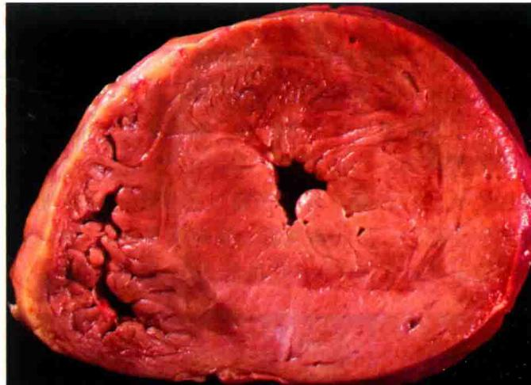 
图1-3 心肌肥大。一位长期患有高血压的患者心脏横切面显示显著的向心性肥大
溶介质，从而激活特定的细胞信号通路，因此产生的结果各异（见第11章）。
# 四、有丝分裂后的细胞可逆转
以往观点认为，神经细胞、心肌细胞和骨骼肌细胞是不能够进行有丝分裂的。这个观点可以阐释为神经元和心肌是不可替代的，因此脑、心脏和骨骼肌不能够通过增加细胞数目来适应细胞减少或需求增加。如今，这个观点被认为仅仅部分正确。虽然神经元和心肌细胞不能够发生有丝分裂，但是最近的研究表明定向祖细胞的存在，可以在细胞死亡和损伤时，或横纹肌细胞功能需求增加的情况下发生增殖和分化。
这些新的理论提出在低比例的细胞丧失和替代之间存在着一个自然的平衡状态，以前被认为是“分裂后”或“终末分化”状态。如果这种平衡倾向于细胞丧失，就会导致器官萎缩，如在心脏、肌肉和大脑衰老时所见。这种平衡也可以向祖细胞活动优势倾斜，例如肌肉发生肥大便是一个例子。
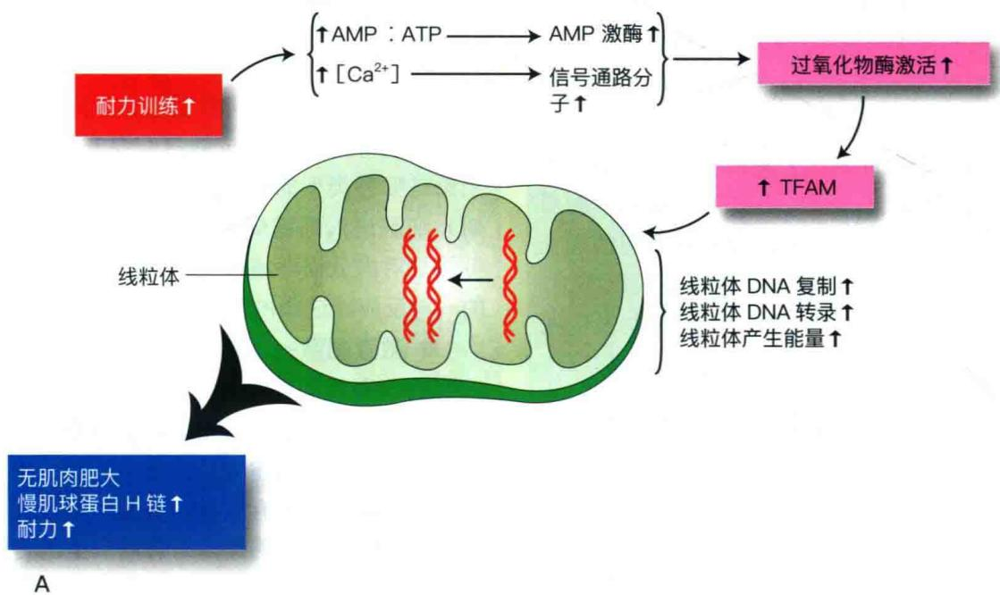
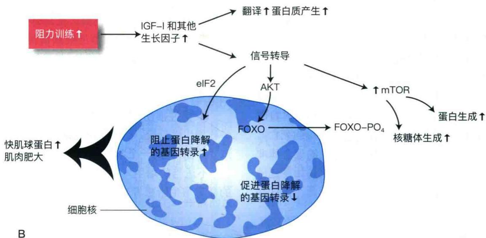 
图1-4 肌肉肥大的机制。A. 耐力训练, 肌耐力的增强需要小负荷的重复性或长时间的训练, 导致 AMP : ATP 比值增大, 引起 AMP 激酶活性增强。这种训练也能增加胞质内钙离子浓度, 从而使许多细胞信号中间产物增加。随后过氧化物酶体的激活能增加转录因子活化的线粒体 (TFAM) 能量的产生。增加的 TFAM 又反过来活化线粒体 DNA 的复制和转录。结果是肌肉慢肌球蛋白重链增加, 肌肉耐力增加, 却不伴有肌细胞肥大。B. 阻力训练, 通过举重的方式, 即负荷增加, 而不是重复次数增加, 导致肌细胞肥大。这是通过增加的胰岛素样生长因子 -1 (IGF-1) 和其他生长因子 (如生长激素) 来调节的, 他们是通过一系列细胞中间产物如转录延长因子 eIF2 , 蛋白激酶 B (AKT) 和哺乳类雷帕霉素靶点 (mTOR) 发挥作用的。这些分子都能调节基因表达和代谢的改变。AKT 使叉头转录因子 FOXO 磷酸化和失活, 将会使其离开细胞核, 并引起参与蛋白降解的基因转录水平下降 (如 Atrogin-1)。同时, eIF2 活性的增加激活抑制蛋白降解的基因的转录。最终增加快肌球蛋白重链, 细胞体积增大 (肥大)
1. 蛋白酶体和细胞内环境稳态 细胞内环境稳态需要细胞有选择性地破坏特定蛋白的机制。虽然有证据表明不止有一条通路参与，但是研究最清楚的细胞靶向清除特定蛋白的机制是泛素-蛋白酶体途径。
蛋白酶体占细胞总蛋白的 $1\% \sim 2\%$ ，这体现出蛋白酶体的重要性。蛋白酶体在进化过程中高度保守，并且在所有真核细胞中表达。突变导致蛋白酶体功能受损是致死性的。
蛋白酶体有两种存在形式。20S 蛋白酶体在氧化
蛋白的降解过程中非常重要。26S蛋白酶体参与泛素结合的蛋白降解。免疫蛋白酶体，是蛋白酶体的一种变异形式，针对细胞产生的干扰素-γ（IFN-γ）而形成。免疫蛋白酶体的重要功能是把蛋白质降解为8-氨基酸多肽或9-氨基酸多肽，与I型组织相容性复合物结合并作为抗原呈递给免疫系统（见第4章）。
2. 泛素和泛素化 将要被降解的蛋白质的特点是泛素分子的短链与之结合，从而表示该蛋白质将被破坏。泛素是含有76个氨基酸的蛋白质，它与其他蛋白
质结合之后如同标签一样表明这些蛋白质将被破坏。泛素结合到蛋白质的过程称为泛素化。泛素化和细胞内特异性蛋白质的减少是细胞对应激损伤的基本变化。泛素化的缺陷可能在几种重要的神经退行性疾病中起着一定作用。例如，一种泛素连接酶parkin的突变，在帕金森病的病因中被提到，未降解的parkin蓄积为Lewy小体（见第28章）。泛素化的进程可能对于肿瘤的发生很重要。例如，与人类宫颈癌关系密切的人乳头瘤病毒（见第5章和第18章）使p53泛素化增加，从而加速p53的降解。泛素化受损也可以参与发生在衰老和一些蓄积性疾病的细胞退行性改变。
# 五、自噬是一个多层面的胞内自我消化系统，对于细胞适应和疾病的发生非常重要
自噬（来自于希腊语，“auto”，自己；“phagy”，吃）包含了将胞质成分转运至溶酶体降解的途径。这一过程，使细胞去除一些物质如错误折叠的蛋白、微生物和损伤的细胞器，是在细胞进化过程中高度保守的程序之一，即将发生自噬的物质聚集在与溶酶体融合形成的囊泡内（自噬小体）。
自噬有三种公认的形式，在图1-5中说明。正常情况下，自噬作为胞内管家发挥功能。当细胞处于应激状态时，其表达上调，并作为细胞生存所需的能量产生和结构重建的营养物质的一种来源。但是，自噬通路也可以被称为杀伤细胞的通路（自噬性细胞死亡）。
自噬对于清除突变或变异蛋白质形成的聚合体非常重要。这种蛋白专门参与神经退行性疾病如亨廷顿病、帕金森病和阿尔茨海默病的发生。因此，在这些
疾病及包括退行性和炎症疾病、肿瘤和衰老等多种情况中，自噬功能的缺陷起着关键作用。
# 六、增生是指器官或组织的细胞数量增多
肥大和增生常常同时发生。不同的组织和细胞类型，其诱导增生的特定刺激和参与的机制各不相同。无论是哪种类型的刺激，增生都需要刺激静止期（ $\mathrm{G}_0$ 期）细胞进入细胞周期（ $\mathrm{G}_1$ 期），然后进行复制。这可能是对内分泌环境改变、功能需求增加或慢性损伤的一种反应。这些内容将在第3章和第5章讨论。
激素刺激：无论是生理或病理因素导致的激素浓度的改变都能减少反应细胞的增生。正常情况下，在青春期或月经周期的早期，雌激素的增加可以导致子宫内膜和间质细胞数目的增多。对于绝经后妇女使用外源性雌激素也有同样的效果。易位性激素的产生也可能导致增生。例如，肾肿瘤产生的促红细胞生成素可能导致骨髓中红细胞增生。
功能需求增加：增生，与肥大相似，可能是对生理需求增加的反应。例如，在高海拔地区，大气层中氧含量较低导致骨髓中红细胞前体的代偿性增生，从而使血液中红细胞含量增加（继发性红细胞增多症）。慢性失血，如月经期出血过多，也会引起红细胞成分的增生。
慢性损伤：长期的炎症或慢性理化性损伤通常导致增生性反应。引起足部皮肤增生（也称为“鸡眼”或“胼胝”）的一个常见原因是穿了不合脚的鞋。
不适当的增生本身是有害的，如银屑病时，皮肤的显著增生给患者带来的不良后果（图1-6）。过度的
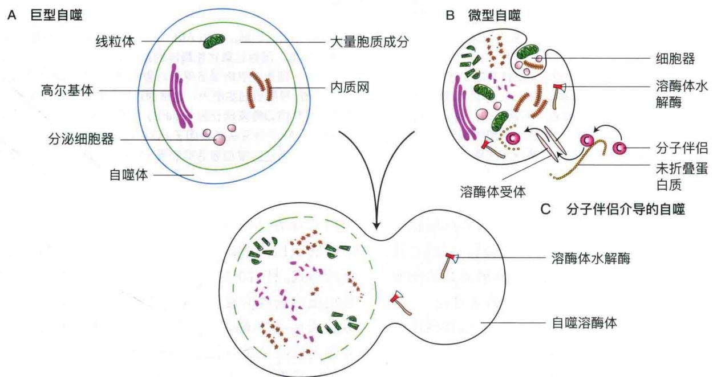 
图1-5 自噬的类型。A.巨型自噬，自噬小体包绕大部分细胞质和胞质细胞器；B.微型自噬，溶酶体选择性地吞噬细胞器或外来物质（如微生物病原菌）；C.分子伴侣介导型自噬，通过分子伴侣蛋白（如hsc70）选择性地将细胞大分子物质转运至溶酶体，被溶酶体受体蛋白如溶酶体相关膜蛋白（LAMP）-2A所识别。随后目标分子被溶酶体降解破坏
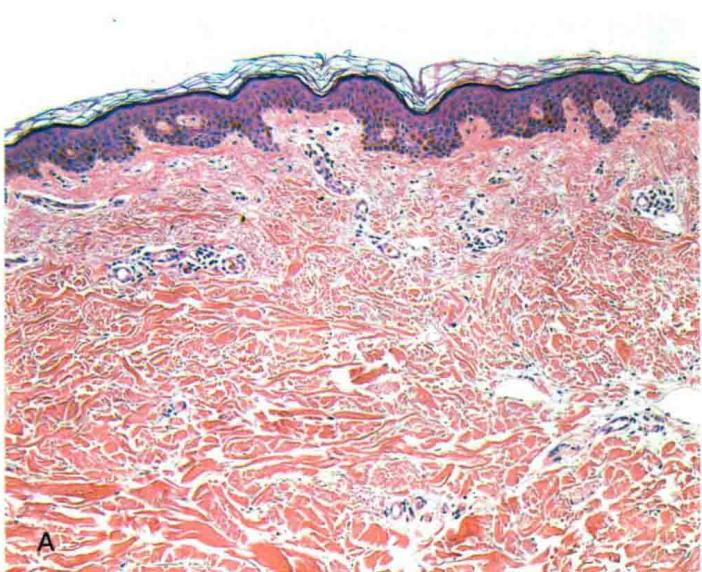 
图1-6增生。A.正常上皮；B.银屑病中的上皮增生，与A图放大倍数相同。由于鳞状细胞数量增加导致上皮增厚
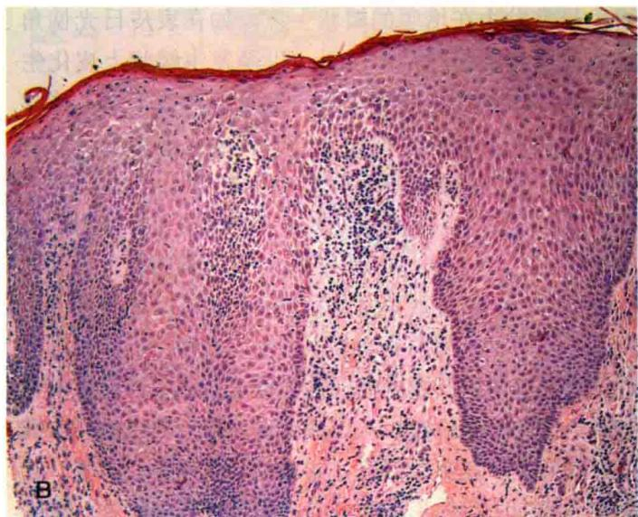
雌激素刺激，无论是内源性还是外源性，都可能导致子宫内膜增生。
增生反应的细胞和分子机制与细胞增殖调控显著相关。这些内容将在第3章和第5章以及第14章“肝脏再生”标题下讨论。
# 七、化生是一种分化成熟的细胞类型转化为另一种细胞类型
化生通常是细胞对慢性持续性损伤的适应性反应。化生时，组织呈现出最有利于避免损伤、保护自身的表型。最常见的是腺上皮被鳞状上皮取代。被覆的柱状细胞或立方细胞可以产生黏液但是却不足以抵御慢性刺激或有害化学物质的作用。例如，支气管上皮长时间暴露于烟草时可以导致鳞状上皮化生。相似的反应也发生在子宫颈内膜的慢性感染时（图1-7）。
这一过程不仅仅局限于鳞状上皮分化。当高酸度的胃内容物慢性反流至低酸度的食管内时，食管的鳞状上皮可以被胃样腺黏膜（Barrett上皮）所取代。这可以被认为是食管为免受胃酸和胃蛋白酶的损伤而采取的适应性反应，因为正常的胃黏膜是可以抵抗这两种物质的。化生还可以包括由其他上皮转化为腺上皮。
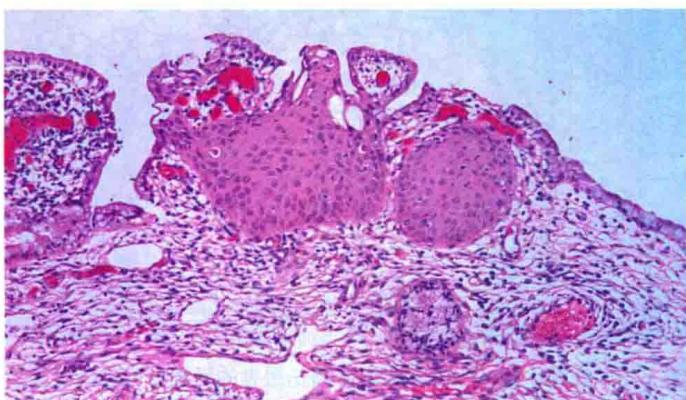 
图1-7 鳞状化生。宫颈管切片显示两侧正常的柱状上皮和中央的鳞状上皮化生
当膀胱发生慢性炎症（腺性膀胱炎）时，移行上皮化生为腺上皮。
虽然化生是适应性变化，但有时也会对机体产生损害。例如，鳞状化生在保护支气管免受烟草损伤的同时，也破坏了黏液生成和气道清理功能。癌变可以发生在化生的上皮；肺癌、宫颈癌、食管癌、胃癌、膀胱癌通常发生在这些区域。化生通常是完全可逆的。如果有害刺激去除之后（如停止吸烟），化生的上皮最终会恢复为正常上皮。
# 八、异型增生是指组织细胞的生长成熟紊乱
正常情况下，组成上皮的细胞大小、形状和核结构具有一致性。而且，它们的排列方式具有一定的规律，例如，鳞状上皮从较大的基底细胞逐渐演变为扁平的表皮细胞。在异型增生时，这种单向有序的表现就被打破，表现为：①细胞大小和形状各异；②核增大、不规则和深染；③上皮内细胞排列紊乱（图1-8）。异型
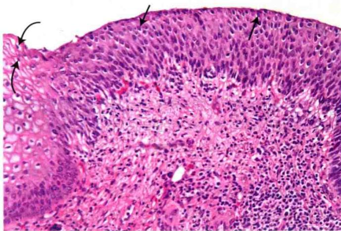 
图1-8 异型增生。宫颈异型增生的上皮缺乏正常极性，单个细胞显示核深染且核浆比例增大。左边是正常宫颈上皮。例如，对比异型增生细胞（直箭）和邻近正常宫颈（弯箭）在同一层次上的细胞核的大小和深染的程度。异型增生时，细胞排列紊乱，从基底层到表面，很大程度上缺乏适当的组织成熟度
增生最常发生在增生的鳞状上皮，如在表皮日光性角化病（由光照引起）中所见，以及发生鳞状上皮化生的区域，如支气管或子宫颈。但是，它并不限于鳞状上皮。溃疡性结肠炎是大肠的一种炎症性病变，通常伴有柱状黏膜细胞的异型性增生性改变。
与化生相似，异型增生也是对持续损伤性作用的反应，通常也会消退，如在停止吸烟或宫颈的人乳头瘤病毒消除之后。但是，异型增生与癌有许多共同的细胞学特征，且两者之间的界限并不明显。例如，很难区分宫颈重度异型增生和早期癌。异型增生是细胞经过多步骤进展为癌的必要阶段，从这点来说，异型增生是癌前病变。实际上，在多个器官（如宫颈、前列腺、膀胱）的上皮内瘤变阶段的形态学分类中包含有异型增生。重度异型增生被认为是激进预防性治疗的指标，包括治疗基础病因、消除致病源或手术切除病变组织。
如同癌症的进展过程（见第5章），异型增生来自于一个增殖细胞群体的顺序突变。换言之，异型增生是生长调控过程中分子紊乱的形态学表现。但是，与肿瘤细胞不同，异型增生细胞不是完全自主性的，在进行干预的情况下，组织表现可能逆转为正常。
# 九、钙化可以作为正常发育过程的一部分或作为异常过程的反应
由于死亡或即将死亡的细胞不能维持细胞内外钙离子的梯度，发生钙离子的内流。除非作为线粒体的内容物，这种细胞内钙化通常不可见。
“营养不良性”钙化指的是钙盐在损伤组织中的宏观沉积。这种类型的钙化反映的不单纯是来自于死亡细胞的钙离子的蓄积，而是代表来自循环或组织间液中钙离子在胞外的蓄积。在很多部位，钙化不影响功能。但是，营养不良性钙化也可以发生在重要部位，如二尖瓣或主动脉瓣，导致血流障碍。“转移性”钙化是指源于细胞损伤产生的钙离子代谢紊乱。转移性钙化与血浆钙离子浓度增高有关（高钙血症）。通常情况下，几乎任何增加血浆钙离子水平的疾病都能导致钙盐在这些部位异常蓄积，如肺泡膜、肾小管和血管。
# 第二节 细胞损伤的机制和形态特征
所有的细胞都有有效的机制来应对环境的变化。例如，离子通道的开放或关闭，有害化学物质被解毒，代谢产物如脂肪或糖原被动员，分解代谢过程可能导致内源性微粒物质的隔离。只有当环境改变超出了细胞维持正常稳态的能力时，细胞损伤才会发生。如果应激条件及时去除或细胞能够承受这种危害时，细胞损伤是可逆性的，能够完全恢复结构和功能的完整性。细胞也可以暴露于持续的亚致死性刺激，如皮肤受到
机械性刺激或支气管黏膜暴露于烟草。在这种情况下，细胞有时间采取多种方式来适应这种可逆性损伤，每种方式都有相应的形态特点。另一方面，如果刺激非常严重，不可逆的损伤将导致细胞死亡。可逆性损伤转为不可逆性损伤的时间点称为“不可回退点”，目前还不能被识别。
# 一、细胞水肿是细胞体积的一种可逆性增加
细胞水肿的特点是大而苍白的细胞质和位置正常的细胞核（图1-9）。细胞体积的增大反映了水含量的增加。细胞水肿反映的是急性的、可逆性的细胞损伤，它可能来源于多种原因，如化学和生物毒素、病毒或细菌感染、贫血、高热或寒冷等。
通过电子显微镜观察，尽管细胞器在体积增大的细胞里显得分散，细胞器的数量并未发生改变。过多的液体优先积聚在明显肿胀的内质网池内，推测是由于离子沉积在这个空间所致（图1-10）。当原因消除后，水样肿胀完全可逆。
细胞水肿是由于细胞体积调节功能受损，这一功能涉及控制胞质离子浓度。这种调节，尤其针对钠离子，有三种成分参与：①细胞膜；②细胞膜钠泵；③ATP的供应。细胞膜构成一个屏障阻止钠离子顺浓度梯度进入细胞内，同样也阻止钾离子顺浓度梯度流出细胞外。但是，针对钠离子的屏障作用是不完善的，这种相对薄弱允许钠离子被动进入细胞内。为了抵消上述作用，能量依赖性胞膜钠泵（ $\mathrm{Na}^+$ -K-ATP酶），由ATP供能，将钠离子泵出细胞外。损伤性因素可能干扰胞膜调节过程，机制如下：①增加细胞膜对钠离子的通透性，从而超出钠泵泵出钠离子的能力；②直接损伤泵；③干扰ATP合成，从而减少了钠泵所需的能量。无论何种
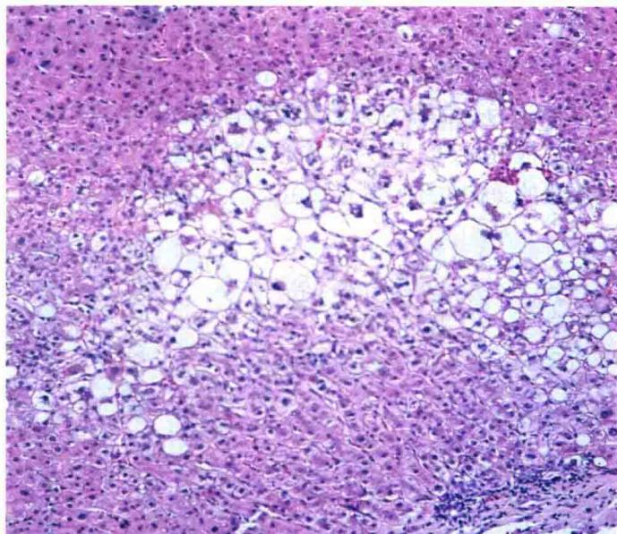 
图1-9 细胞水肿。一位中毒性肝损伤患者的肝细针穿刺活检显示小叶中央区严重细胞水肿。受累的肝细胞表现出中位核及胞质因过多的液体而扩张（气球样变）
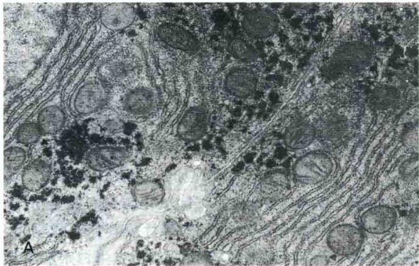 
图1-10 肝细胞水肿的超微结构。A.两邻近的正常肝细胞内含有排列紧密、平行的粗面内质网；B.细胞水肿的肝细胞里内质网池因过多的液体而扩张
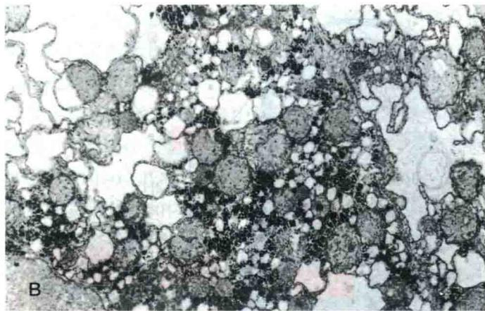
情况，钠离子在细胞内的蓄积都会导致水含量增加以维持等渗状态；之后细胞发生肿胀。
# 二、可逆性受损细胞内发生的亚细胞改变
内质网：当细胞发生水肿时，内质网池被液体充满而肿胀。在有些类型的急性、可逆性细胞损伤中，膜联多核蛋白体可能会发生解聚，并从粗面内质网表面分离。 
线粒体：在一些类型的急性损伤中，尤其是局部缺血，线粒体会发生肿胀。这种肿胀反映能量梯度的损耗和随后的线粒体体积调节功能受损。可能会出现富含磷脂的无定形的致密物，但是在修复时这些反应是完全可逆的。 
■ 细胞膜：细胞膜出泡现象——即有时可看到细胞质的灶状膨出。这些细胞质与细胞膜分离之后进入外部环境但不影响细胞的生存活力。 
■ 细胞核：在细胞核内，可逆性损伤主要体现在核仁的变化。核仁的纤维成分和颗粒成分可能会发生分离。或者，核仁的颗粒成分可能消失，仅留下纤维状核心。
细胞器（图1-11）的这些变化表现为功能紊乱（如蛋白质合成减少，能量生成障碍）。根据定义，当引起可逆性细胞损伤的急性刺激去除之后，细胞又恢复到
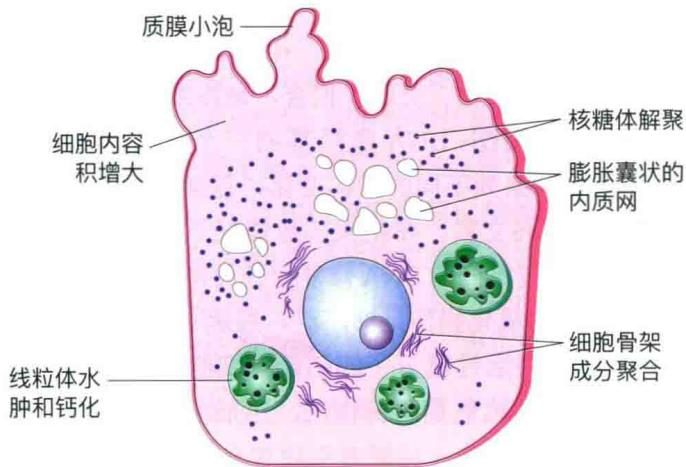 
图1-11 可逆性细胞损伤的超微结构特点
正常状态。
# 三、缺血性细胞损伤通常由血流受阻引起
当组织缺氧时，机体不能通过有氧代谢的方式产生ATP，而是通过效率较低的无氧代谢的方式生成ATP。缺血引起一系列的化学和 $\mathsf{pH}$ 平衡紊乱，同时损伤性自由基的生成增加。短时间的缺血造成的损伤在血液循环恢复后是可逆的。但是，当细胞长时间缺血后，就会发生不可逆性损伤，甚至死亡。细胞损伤的机制将在后面介绍。
# 四、氧化应激导致许多器官的细胞损伤
对人类生活而言，氧气是一把双刃剑。没有氧气，生命无法继续，但是，氧代谢过程也能产生部分还原的氧类物质，其几乎可以与任何接触的分子发生反应。
1. 活性氧 目前认为活性氧可能是许多疾病和其他损伤事件中引起细胞损伤的原因。这些事件包括：
炎症过程（见第2章） 
化学毒性 
电离辐射造成的损伤是水分子（ $\mathrm{H}_2\mathrm{O}$ ）电解直接形成的羟基（ $\cdot \mathrm{OH}$ ）的结果 
化学致癌作用 
衰老（见下文）
ROS也参与正常的细胞信号传导，包括基因调控、MAP激酶的活化、可逆性蛋白修饰（如磷酸化和去磷酸化）等。但是，当病理条件下生成的ROS过多时，将会对信号通路产生严重不利的影响。其中包括凋亡信号通路（见下文）。
当氧浓度超过正常时，也可能会损伤细胞。在这种危险被认识之前，成人肺和早产儿的眼睛（晶状体后纤维组织的增生）一度是这种氧毒性的主要靶点。
通过线粒体电子传递的 $\mathrm{O}_2$ 到 $\mathrm{H}_2\mathrm{O}$ 的完全还原涉及4个电子的转运。有三种部分还原类别，在 $\mathrm{O}_2$ 和 $\mathrm{H}_2\mathrm{O}$ 的中间，代表了不同数量的电子传递（图1-12）。他
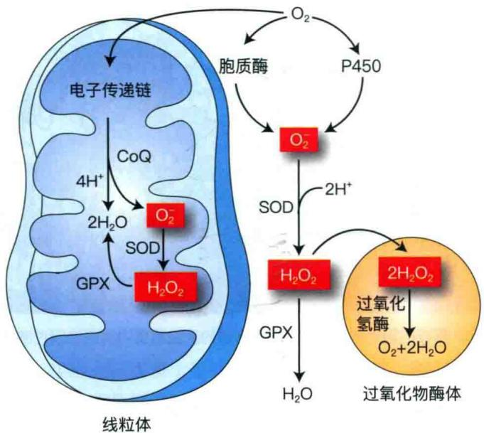 
图1-12 氧分子产生活性氧自由基并被细胞酶类去毒性的机制。CoQ.辅酶Q；GPX.谷胱甘肽过氧化物酶； $\mathsf{H}_2\mathsf{O}$ .水； $\mathsf{H}_2\mathsf{O}_2$ 过氧化氢； $\mathsf{O}_2$ 氧气； $\mathsf{O}_2^-$ 超氧化物；SOD.超氧化物歧化酶
们是 $\mathrm{O}_2^-$ ，超氧阴离子（一个电子）； $\mathrm{H}_2\mathrm{O}_2$ ，过氧化氢（两个电子）和·OH，羟基（三个电子）。在大多数情况下，这些ROS主要是在混合功能加氧酶（P450）系统的协助下，由线粒体电子传递时的渗漏产生。ROS的主要类型列在表1-1。
2. 超氧阴离子 $\mathrm{O}_2^-$ 主要由线粒体电子传递过程中渗漏产生，或作为炎性反应的一部分（见第2章）。超氧阴离子和其他ROS是细胞氧化防御的主要物质，可以破坏病原体、坏死细胞的碎片或其他吞噬物质。它们也可作为信号通路中间物质，引发蛋白水解酶和其他降解酶的释放（见第2章）。
3. 过氧亚硝基 过氧亚硝基（ $\mathrm{ONOO}^{-}$ ）是由两种自由基反应生成，即超氧阴离子（ $\mathrm{O}_2^{-}$ ）和一氧化氮（NO）： $\mathrm{NO} + \mathrm{O}_2^{-} \rightarrow \mathrm{ONOO}^{-}$ 。 $\mathrm{ONOO}^{-}$ 攻击很多具有重要生物学功能的分子，包括脂类、蛋白质和DNA。很多组织中可以产生的一种分子——一氧化氮是一种强效的血管扩张因子和多种重要生物学过程的调节因子。
表 1-1 活性氧 
分 子特 征过氧化氢(H2O2)通过亚铁离子催化的芬顿反应（Fenton reaction）形成自由基弥漫分布于细胞内超氧阴离子(O2-)通过电子传递链渗漏和一些细胞质反应产生生成其他ROS不易在生成处周围扩散羟基(•OH)由H2O2通过亚铁离子催化的芬顿反应（Fenton reaction）形成细胞内的羟基主要攻击大分子过氧亚硝基(ONOO-·)由NO和O2反应生成，损伤大分子脂类过氧基(RCOO·)脂质过氧化过程中产生有机基团次氯酸(HOCI)在呼吸暴发时由巨噬细胞和中性粒细胞产生，协同吞噬作用游离后产生次氯酸根离子（OCl-）
4. 过氧化氢 $\mathrm{O}_2^-$ 阴离子在超氧化物歧化酶（SOD）的分解作用下产生 $\mathrm{H}_2\mathrm{O}_2$ 。 $\mathrm{H}_2\mathrm{O}_2$ 也可以在胞质过氧化物酶体中通过几种氧化酶类直接生成（图1-12）。 $\mathrm{H}_2\mathrm{O}_2$ 本身不具有损伤性，且大部分在胞质和线粒体中通过过氧化氢酶或谷胱甘肽过氧化物酶的作用下分解为 $\mathrm{H}_2\mathrm{O}$ （图1-12）。但是当 $\mathrm{H}_2\mathrm{O}_2$ 生成过多时，将会转化为高活性的羟基。在中性粒细胞中，髓过氧化物酶将 $\mathrm{H}_2\mathrm{O}_2$ 转化为强自由基次氯酸根（ $\mathrm{OCl}^{-}$ ，它对于微生物和细胞都具有致死性。
羟基：羟基（·OH）形成途径如下： $①$ $\mathrm{H}_2\mathrm{O}$ 的电离； $②$ $\mathrm{H}_2\mathrm{O}_2$ 和亚铁离子 $\mathrm{Fe}^{2 + }$ 反应（Fenton反应）； $③$ $\mathrm{O}_2^-$ 和 $\mathrm{H}_2\mathrm{O}_2$ 反应（Haber-Weiss反应）。·OH是ROS中最具有活性的分子，其破坏大分子有几种机制。
脂质过氧化作用：这一过程最终导致不饱和磷脂酸的破坏和细胞膜完整性的丧失。
■ 蛋白质相互作用：由于 $\cdot \mathrm{OH}$ 氧化造成的损害，蛋白质发生片段化、交联、聚合，最终发生变性。
DNA损伤：DNA是羟基的一个重要靶点，使DNA发生一系列不同的结构变化，包括链断裂、碱基修饰以及链间交联。在绝大多数情况下，基因组的完整性可以通过不同的DNA修复途径而得以恢复。但是，如果DNA的氧化损伤足够广泛，细胞就会发生死亡。
5. 细胞对活性氧分子的防御 细胞具有强有力的针对活性氧的抗氧化防御作用，包括多种解毒酶，如SOD、过氧化氢酶、谷胱甘肽过氧化物酶和外源自由基清道夫（图1-13）。
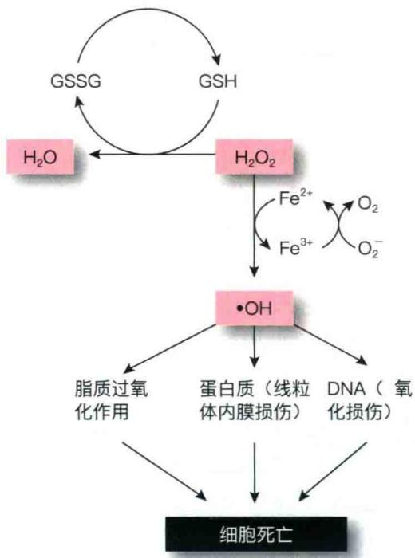 
图1-13由活性氧分子引起细胞损伤的机制。 $\mathrm{Fe}^{2 + }$ 亚铁离子； $\mathrm{Fe}^{3 + }$ 三价铁离子；GSH.谷胱甘肽；GSSG.氧化型谷胱甘肽； $\mathrm{H}_2\mathrm{O}_2$ 过氧化氢； $\mathrm{O_2}$ 氧分子； $\mathrm{O_2^-}$ 超氧阴离子；OH.羟基
# （1）解毒酶
SOD是防御超氧阴离子的第一道防线，它可以将超氧阴离子转化为过氧化氢和氧气（ $2\mathrm{O}_2^- + 2\mathrm{H}^+ \rightarrow \mathrm{O}_2 + \mathrm{H}_2\mathrm{O}_2$ ）。
过氧化氢酶，主要定位于过氧化物酶体，是两种通过将过氧化氢分解，而完成溶解超氧阴离子的酶之一，并且能够有效地转变为羟基。
谷胱甘肽过氧化物酶催化线粒体和细胞质中过氧化氢和脂质过氧化物的还原反应。
# （2）活性氧清道夫
维生素E（α-生育酚）是一个末端电子受体，因此能够阻断自由基链式反应。由于它具有脂溶性，可以在脂类生物膜上发挥活性，从而保护生物膜免受脂质过氧化损伤。
维生素C（抗坏血酸盐）是水溶性物质，能直接与 $\mathrm{O}_2$ 、OH及一些脂质过氧化产物反应。它还有助于重新生成维生素E的还原形式。
维A酸类，维生素A的前体，具有脂溶性，作为破坏链式反应的抗氧化剂而发挥作用。
NO（一氧化氮）是组成型或诱导型氮氧合酶（NOS）的产物。尽管它可以和超氧化物结合形成高活性的过氧硝酸盐，NO也是活性氧分子存在的一种主要形式。此外，NO增加蛋白酶体活性，从而减少由转铁蛋白受体介导的细胞铁摄入的功能，也可能参与其中。
# 五、缺血/再灌注损伤反映氧化应激
缺血/再灌注损伤是发生在梗塞性心血管疾病、感染、休克和许多其他疾病中的一个常见的临床问题。缺
血/再灌注损伤反映了短暂缺血、之后的组织损伤及血液再灌注之后损伤组织暴露于氧的相互作用过程。首先，缺血性的细胞损伤导致自由基的产生。其次，再灌注血流提供充足的氧分子与自由基结合形成活性氧自由基。缺血/再灌注损伤过程也涉及很多其他因子，包括炎症介质（TNF-α、IL-1），血小板活化因子，NOS，NO，细胞间黏附分子和体内钙离子的稳态失衡等。
根据缺血时间的长短，再灌注损伤可以分为三种不同程度的细胞损伤：
短时间的缺血，再灌注（即重新恢复氧供）时能完全恢复细胞结构和功能的完整性。在这种情况下，细胞的损伤是完全可逆性的。 
较长时间的缺血，再灌注时不能恢复细胞的结构和功能，却与细胞的恶化和死亡密切相关。 
在缺血本身的过程中，可以发生致命性的细胞损伤，这种情况下再灌注并不再是影响因素。产生这第三种类型的细胞损伤，需要更长时间的组织缺血。
# 六、细胞内物质的蓄积
这种蓄积的物质可以是正常的（营养物质如脂肪和糖原）或异常的、内源性的或外源性的，有害的或无害的（图1-14）。
变性的磷脂质，来源于内源性生物膜的转化，储存在溶酶体中可以被循环利用或作为不溶性的色素（脂褐素）存储（图1-14D）。 
■不能被代谢的物质在细胞中蓄积。这些物质包括： $①$ 由于某种关键酶缺乏（遗传性储积性疾病）（第6章）导致不能进一步被处理的内源性底物； $②$ 不溶性的内源性色素，如脂褐质（如前所述）和黑色素（图1-14E)； $③$ 正常或异常的蛋白质蓄积； $④$ 外源性颗粒（如吸入的硅和碳颗粒或文身色素）。 
正常机体成分的过量，包括铁、铜和胆固醇，造成很多细胞损伤。 
■非正常蛋白质可能具有毒性，当它们蓄积在细胞内时。例如帕金森病的Lewy小体和肝疾病中突变的 $\alpha_{1}$ -抗胰蛋白酶（图1-14C）。
1. 脂肪 非正常的脂肪沉积在肝最为明显，这一点在第14章中将会详细介绍。当运输至肝的游离脂肪酸增加，如糖尿病，或者当肝内脂肪代谢障碍，如酗酒，会导致三酰甘油在肝细胞中蓄积。在形态上，脂肪肝可以通过胞质中的脂滴识别出来。其他器官，包括心、肾和骨骼肌，也能储存脂肪，还有动脉粥样硬化斑块中的巨噬细胞（图1-14A、B）。通常情况下，脂肪沉积是可逆的，目前没有证据表明过多的脂肪本身能够干扰细胞的功能（尽管这种脂肪沉积可能与疾病相关）。
2.胆固醇 人的机体和胆固醇之间存在着“既爱又恨”的复杂关系。一方面，它是所有细胞膜的重要组成部分。另一方面，当胆固醇储存过量时，则与在西方国家死因中占首位的动脉粥样硬化和心血管疾病密切相关（见第10章）。动脉粥样硬化进展期病变的特点就是胆固醇在细胞外的沉积（图1-14B）。在几种以血胆固醇水平升高为特点的疾病中（如家族性高胆固醇血症或原发性胆汁性肝硬化），巨噬细胞内储积胆固醇。当这些细胞聚集在皮下组织并肉眼可见时，称为黄色瘤（图1-14A）。
3. 脂褐素 脂褐素是一种脂质和蛋白质的混合物，包含一种名为蜡质色素的金棕色色素。脂褐素倾向于通过氧化交联蛋白的累加而发生沉积，且不能被分解。它主要发生在永久细胞（神经细胞和心肌细胞）或者稳定细胞（肝细胞）中（图1-14D）。往往在发生萎缩的器官，脂褐素沉积更为明显。虽然之前认为脂褐质沉积是良性病变，但是越来越多的证据表明脂褐质既是细胞氧化应激的结果又是其原因。它可以影响衰老或功能不良的细胞器中蛋白酶体的功能和溶酶体的降解。
4. 黑色素 黑色素是一种不溶性的，棕黑色的色素，主要见于皮肤基底细胞中，但是也存在于眼睛和其他器官中（图1-14E）。黑色素主要存在于称为黑色素小体的胞内细胞器中，来源于酪氨酸特定氧化产物的聚合作用。黑色素的多少决定了不同种族的人群皮肤及眼睛颜色的差异。由于它能够吸收紫外线，黑色素具有一种保护性的功能。对于白种人，日光浴能增加黑色素的合成（晒黑）。黑色素将在第24章中详细讨论。
5. 外源性物质 碳末沉着病是指碳末颗粒在肺和区域淋巴结的沉积（图1-14F）。几乎所有的城市居民都会吸入由化学燃料燃烧产生的有机碳颗粒。这些颗粒蓄积在肺泡巨噬细胞内，也被运输到肺门和纵隔淋巴结，在这些部位不能被吸收的物质将在巨噬细胞内永久存留。尽管其肺的肉眼形态令人担忧，但碳末沉着病本身基本无害。
文身是不溶性的金属颜料和植物色素进入皮肤的结果，被真皮巨噬细胞吞噬后持续终生。
6. 铁和其他金属 通过肠道对铁吸收的增加，可以导致机体总的含铁量升高，像某些贫血或输注含铁红细胞的治疗。无论哪种情况，多余的铁都将以铁蛋白和含铁血黄素的形式储存在细胞内（图1-14G）。机体总的铁含量的增加会导致含铁血黄素（铁蛋白部分变性的一种形式，容易聚合，在显微镜下呈胞质中的黄褐色颗粒）的逐步累积，这种情况称为含铁血黄素沉着。细胞内铁以含铁血黄素形式的沉积通常不会损
伤细胞。但是，如果机体总的铁含量增加非常显著，我们称之为铁过量综合征（见第14章），在这种情况下，铁沉积过量会损伤重要器官，尤其是心、肝和胰腺。在某些器官过量的铁沉积会增加癌变的风险。在某些金属抛光作业人员中发现的铁尘肺伴有肺癌风险的升高。遗传性血红蛋白沉着症（一种铁吸收的基因异常）可以导致肝癌及肝硬化和心血管疾病的发病率增加。
过量的铅沉积，尤其在儿童，可以引起精神障碍和贫血。在Wilson病（一种遗传性的铜代谢障碍）中，过量的铜在肝脏和脑组织中的沉积可能造成这些器官的严重慢性疾病。
# 第三节 外源性物质如何损伤细胞
电离辐射、化学物质和病毒病原体通过不同的机制损伤细胞，通常通过直接作用并损伤重要的细胞成分。其他物质可能需要代谢活化产生高活性自由基，或者就像电离辐射，直接产生反应性羟基。病毒可能将细胞固有的死亡通路（凋亡，见下文）转化为自身优势或者激发免疫介导的损伤。
# 一、电离辐射通过产生羟基和直接引起基因突变效应而损伤细胞
电离辐射蕴含的能量足以引起水分子的解离，从而直接形成 $\cdot \mathrm{OH}$ 。如前所述， $\cdot \mathrm{OH}$ 与 DNA 相互作用并抑制 DNA 的复制。对于非增殖细胞来说，如肝细胞或神经细胞，由于不能分裂，几乎不受影响。但是对于增殖细胞来说，有丝分裂的受阻是一种灾难性的功能损失。一旦增殖细胞不能再进行分裂，它便会死亡（见下文），这一过程将清除机体中丧失了主要功能的这些细胞。电离辐射对于 DNA 造成的直接基因突变效应也很重要。电离辐射的细胞毒效应具有浓度依赖性。而暴露于大量射线，会损伤在细胞周期的细胞的复制能力，大剂量的射线可能会直接杀伤增殖细胞和静止细胞（见第 8 章）。
# 二、病毒的细胞毒性是直接起作用或由免疫介导
病毒的种类繁多，其引起细胞损伤和死亡的方式也多种多样。与细菌不同，病毒需要一个细胞性的宿主：①为其提供生存场所；②提供酶类、底物和其他供病毒复制的原料；③当成熟病毒颗粒准备向其他细胞播散时，细胞宿主可作为传染源。
直接毒性：病毒可能通过直接破坏细胞的酶类和消耗细胞的营养物质而损伤细胞，从而破坏细胞正常的稳态机制。但是，病毒诱导细胞溶解的作用机制是非常复杂的。
调控凋亡（见下文）：许多病毒活动可以引起细
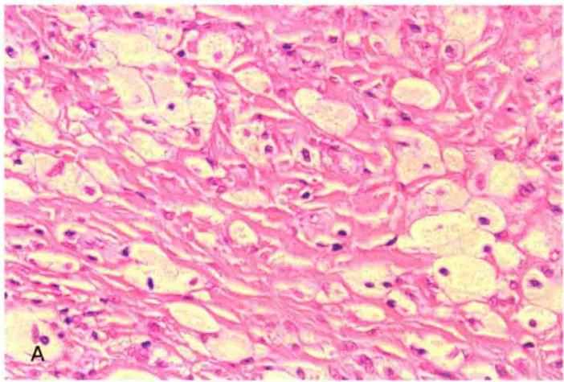
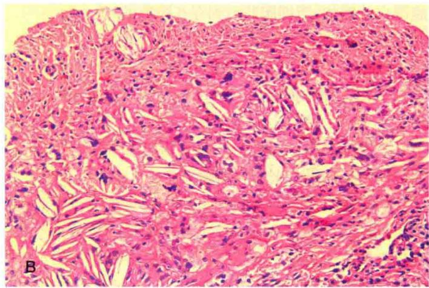
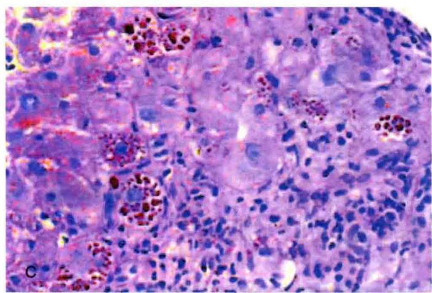
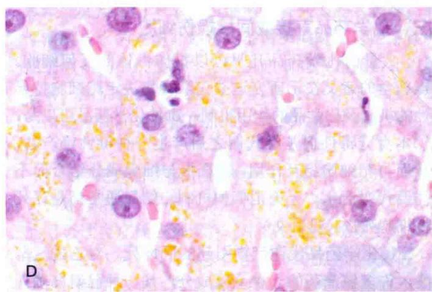
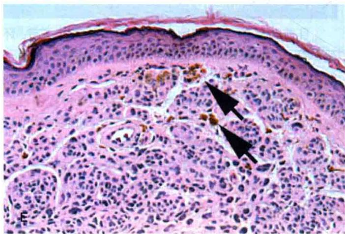
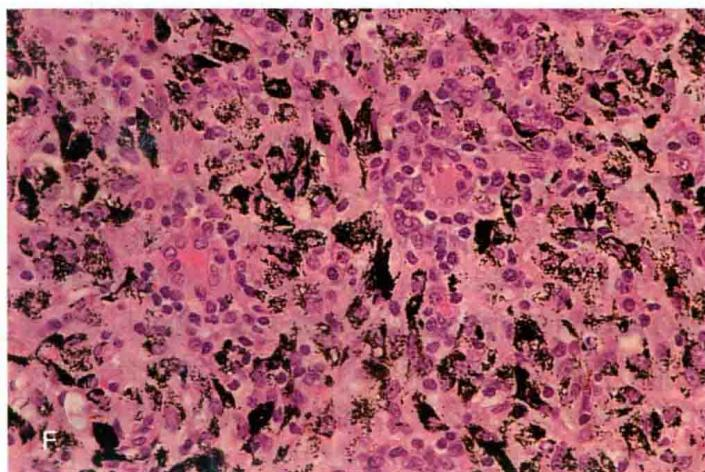
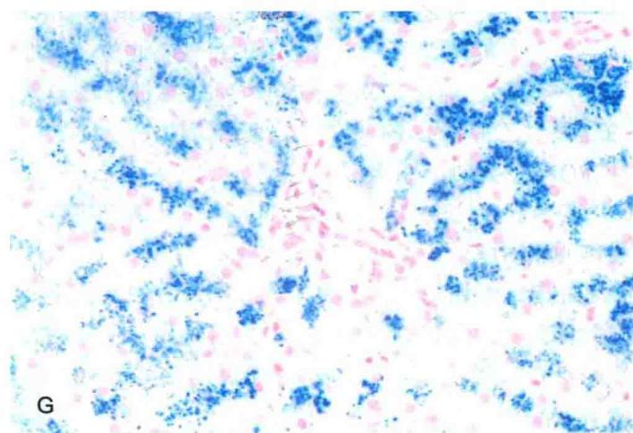 
图1-14 异常的细胞内物质蓄积。A.皮肤黄色瘤中脂质在巨噬细胞中沉积；B.动脉粥样斑块中异常的胆固醇沉积；C.异常的、突变的 $\alpha_{1}$ 抗胰蛋白酶（红色颗粒）在肝中沉积。淀粉酶处理去除糖原后的过碘酸-希氏反应（PAS)；D.来自80岁老年人的肝组织切片显示金色的胞质颗粒，代表溶酶体中脂褐素的沉积；E.黑色素在皮内痣中沉积（箭头处)；F.碳末沉积。一枚纵隔淋巴结，引流肺部淋巴液，可见许多吞噬了黑色矽肺病（碳末）颗粒的巨噬细胞。这种物质吸入后首先沉积在肺部；G.在遗传性血红蛋白沉着病中的铁沉积。肝组织普鲁士蓝染色显示大量的铁沉积在肝细胞溶酶体内
胞凋亡。例如，当细胞监测到存在游离的（染色体外的）DNA复制时就会启动凋亡。由于病毒在产生新的具有感染性的子代之前，必须避免细胞发生死亡，因此病毒在进化过程中逐渐演变出一种通过上调抗凋亡蛋白和抑制促凋亡蛋白这一机制来对抗凋亡反应的机制。也有一些病毒，一旦其子代病毒颗粒释放之后，就会通过编码某些蛋白来诱导细胞凋亡。
免疫介导的细胞毒性：无论是体液免疫还是细胞免疫，都能通过清除感染的细胞来保护机体免受病毒感染的有害影响。免疫系统通过诱导细胞凋亡或补体溶解细胞来清除病毒感染的细胞（见第4章）。
# 三、化学药品直接或间接损伤细胞
大量的化学药品几乎可以损伤机体的任何细胞。毒理学的意义在于研究这些化学毒物决定靶细胞特异性的机制及化学品的作用机制。毒性化学药品可以是：①本身无毒性但是经代谢之后产生一种毒性终产物，从而与靶细胞相互作用；②直接与细胞成分结合而不需要代谢活化。无论是哪种机制，结局通常都是坏死性细胞死亡（见下文）。
1. 化学药品代谢产物引起的肝坏死 对乙酰氨基酚，许多镇痛药的一种重要成分，是一种已研究确切的肝细胞毒素，通过肝细胞多功能的氧化体系代谢引起肝细胞坏死。这种药物在推荐剂量使用时没有细胞毒性，但是当过量使用时，就会对肝产生很大的毒性。大多数对乙酰氨基酚在肝中经过酶转化为无毒性的葡糖苷酸或硫酸盐代谢产物。不足 $5\%$ 的对乙酰氨基酚通过细胞色素P450的亚型代谢转化为NAPQI，一种高活性醌类（图1-15）。但是，当大剂量的对乙酰氨基酚超过葡糖苷酸途径的代谢能力时，就会形成大量毒性的NAPQI。NAPQI与肝蛋白的巯基结合引起广泛的细胞活性丧失及进一步的损伤。同时，NAPQI能够耗竭具有抗氧化活性的谷胱甘肽，使细胞对自由基诱导的损伤更为易感。因此在耗竭谷胱甘肽的状态下，如饥饿时，能增加对乙酰氨基酚的毒性。此外，慢性酒精性消耗也能增加对乙酰氨基酚的毒性，这一效应是通过乙醇诱导P450的3A4亚型增加，从而导致NAPQI产生增加所介导。
其他肝毒性成分（例如CC14）产生代谢产物直接使细胞膜磷脂质发生过氧化损伤。
2. 未经代谢的化学药品 直接细胞毒性药品不经过代谢转化而直接与细胞的成分相互作用。主要的细胞靶点有很多，例如线粒体（重金属和氰化物）、细胞骨架（毒蕈肽类）和DNA（化疗药烷基化制剂）。直接细胞毒化学药物与谷胱甘肽（烷基化制剂）的结合也会减弱细胞的抗氧化能力。
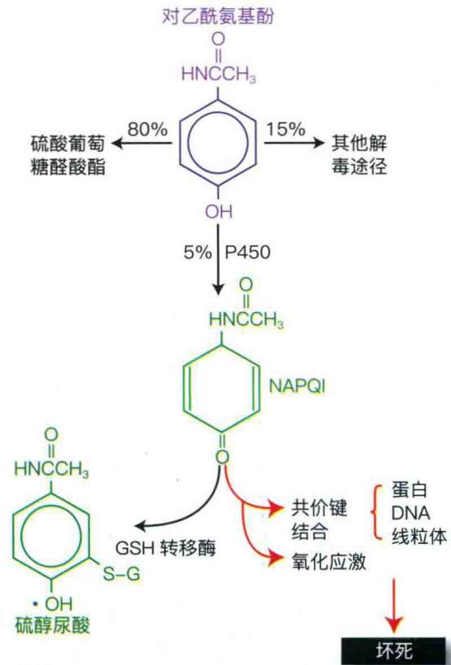 
图1-15 参与对乙酰氨基酚肝毒性的化学反应。GSH.谷胱甘肽；NAPQI.苯醌亚胺
# 第四节 细胞死亡
目前公认的导致细胞死亡的3种主要方式有：坏死、凋亡及最近提出的自噬。坏死通常被定义为由于细胞不能有效地适应恶劣环境而引起的细胞意外和被动死亡。相反，凋亡是细胞主动参与的一种程序性细胞自杀方式。凋亡被认为是一种单个细胞通过利用自身信号系统来牺牲自我（为了胚胎的发育和维持成熟机体的稳态）的机制。自噬性细胞死亡（见上文）也是一种主动的信号过程，当应激环境需要细胞消化自身大分子成分的一部分时出现。
细胞死亡的3种形式并不是截然不同，而是拥有一些共同的效应分子和信号通路。为了叙述清楚，我们将坏死、凋亡和自噬引起的细胞死亡机制分别列出，很重要的一点是要理解这些过程之间互有交叉，信号通路相互关联，彼此合作。
# 一、坏死性细胞来源于外源性的细胞损伤，并有形态学的表现
在细胞水平上，坏死的特点是细胞和细胞器肿胀、ATP耗竭、细胞膜通透性增加、大分子物质漏出，最终引起细胞死亡。这一过程通常发生在急性炎症中。并且炎症本身能产生进一步的细胞损伤（见第2章）。
无论这种致命性损害的本质是什么，一旦发生细
胞膜通透性屏障功能的破坏，则预示着细胞坏死。正常情况下，细胞外钠离子和钙离子的浓度要较细胞内高出好几个数量级，而钾离子则刚好相反。这种离子通透的选择性，依赖于：①足够的能量；②脂质双分子层的结构完整性；③完整的离子通道蛋白；④细胞膜与细胞骨架成分之间的正常联系。当这些因素有一项或多项严重受损时，所导致的内部离子平衡的紊乱则代表受损细胞到了“不可逆的临界点”。
钙离子在细胞死亡发病机制中的作用值得重视。细胞外液体中钙离子浓度范围是（ $10^{-3}\mathrm{mol} / \mathrm{L}$ ）。相反，胞内钙离子浓度要比胞外低10000倍，即 $10^{-7}\mathrm{mol} / \mathrm{L}$ 。细胞的很多重要功能就是通过胞内游离钙离子浓度的微小波动来精细调节的。因此大量的钙离子通过受损的细胞膜内流会引起细胞的死亡。
1. 凝固性坏死 指的是死亡细胞在光学显微镜下的变化（图1-16）。坏死细胞传统上被称为凝固性坏死，是由于它与蛋白质加热之后发生凝固很相似。但是现在看来，这种习惯性命名是可推敲的。
细胞死亡之后短时间内，其轮廓仍然保留。使用常规HE染色发现，坏死细胞胞质嗜酸性明显增强。在细胞核内，染色质首先发生浓集继而沿着核膜分散。坏死具有三种形态学改变，如下所述。
核固缩：细胞核染色质浓聚，使细胞核体积变小，嗜碱性增强。 
核碎裂：固缩的核崩解成许多小碎片，分散于胞质中。 
核溶解：固缩的核可能会被细胞挤出或表现为核染色质染色的进行性丧失。
正在死亡或已经死亡的细胞的早期超微结构变化，反映的是与可逆性细胞损伤有关的变性的进展。除了前面描述的细胞核的变化，死亡细胞的特点还有：①肿胀的内质网；②裂解的核糖体；③肿胀和钙化的线粒
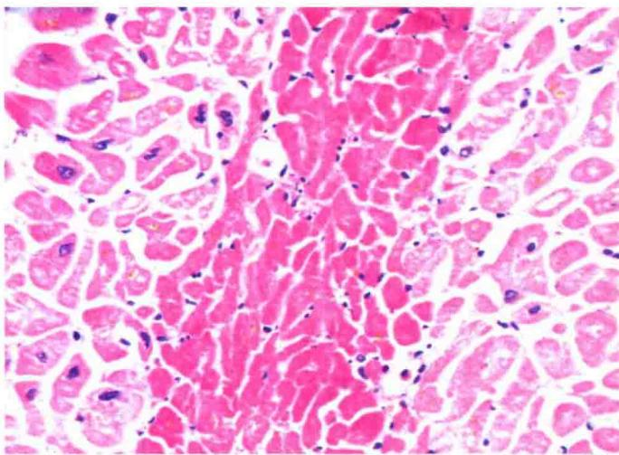 
图1-16 凝固性坏死。图示一位急性心肌梗死患者心脏的显微镜下图片。中间部，嗜酸性明显增强的坏死细胞的细胞核已经消失。坏死区周围是浅染的存活心肌细胞
体；④聚合的细胞骨架成分；⑤细胞膜出泡。
在一段时间以后，时间的长短取决于组织和微环境的情况，死亡细胞在细胞内和细胞外酶的作用下发生溶解，结果导致细胞裂解。坏死细胞引起急性炎症反应就是一个实例（见第2章）。
尽管不同种类的细胞发生单个细胞死亡的形态特征是基本一致的，但组织的反应变化非常大。这种多样性取决于器官和环境，可以用一些能反映特异组织类型的术语来描述。
2. 液化性坏死 当坏死细胞的溶解速率显著快于组织修复的速率时，导致的形态变化称为液化性坏死。急性炎症反应时多形核白细胞含有强力的水解酶，能够溶解死亡的细胞。通常在细菌感染时，这些急性炎症细胞在局部快速聚集，能引起细胞快速死亡和组织溶解。结局往往形成脓肿（图1-17），即在实性组织中由液化性坏死形成的脓腔。最终，脓肿被纤维包裹而局限。
脑梗死之后可能出现脑组织的凝固性坏死，随后又快速被溶解——形成液化性坏死，这种组织坏死不能用急性炎症反应来解释。中枢神经系统发生的大面积液化性坏死可以形成永久存在的真性空腔或囊肿。
3. 脂肪坏死 脂肪坏死特异性地影响脂肪组织，绝大多数情况下发生于胰腺炎或创伤（图1-18）。决定这种类型坏死的独特特征是在脂肪组织中出现甘油三酯酸。当正常时只存在于胰腺导管和小肠的消化酶从受损的胰腺腺泡细胞和导管释放到细胞外时，便开始发生脂肪液化。在细胞外活化后，这些酶开始消化胰腺本身和周围的组织，包括脂肪细胞。胰腺脂肪酶产生的游离脂肪酸结合钙离子后，作为钙皂沉积下来。大体上，脂肪坏死表现为在正常的脂肪组织中出现不规则、灰白色的区域。创伤性脂肪坏死常见于乳腺，容易被误诊为癌。
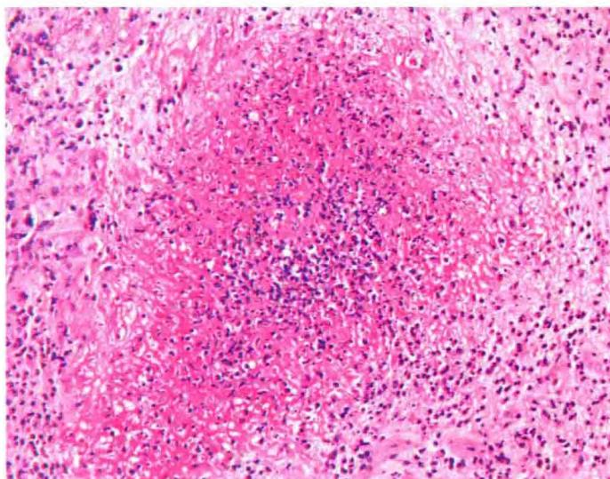 
图1-17 皮肤脓肿中的液化性坏死。脓腔内充满了多形核白细胞
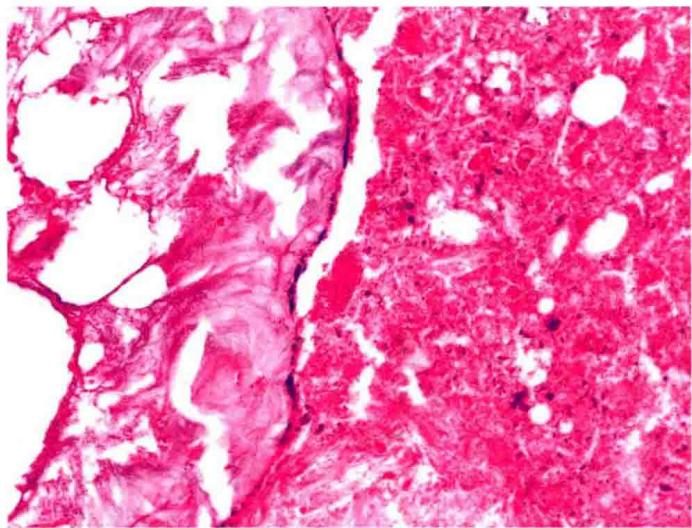 
图1-18 脂肪坏死。图示一位急性胰腺炎患者的胰腺旁脂肪组织的镜下图片，显示急性炎症区域周围坏死的脂肪细胞岛。脂肪酸以钙皂的形式沉积，表现为在不规则的坏死性脂肪细胞岛周围无定形的、嗜碱性的沉积物
4. 干酪样坏死 干酪样坏死是结核病的特征。结核病变部位有大量的巨噬细胞和其他炎症细胞聚集称为结核肉芽肿或结核结节（见第9章和第12章，图12-19）。在这种干酪样肉芽肿的中央，聚集了介导慢性炎症反应的单核细胞以杀灭结核分枝杆菌。坏死细胞无法保持原有的细胞轮廓，但并不发生如同液化性坏死的溶解消失，而是变成无定形、粗颗粒、嗜酸性的细胞碎片持续存在。肉眼观察，细胞碎片呈灰白色、质软、易碎，状似奶酪，故名干酪样坏死。这种特殊的坏死类型的形成主要是由于结核分枝杆菌细胞壁中含有合成的蜡质（多肽糖脂质），具有很强的生物毒性作用。
# 二、坏死通常涉及细胞内损伤的积累
根据坏死的原因、发生器官和细胞类型的不同，坏死引起的细胞死亡过程也不同。研究最清楚的、同时也是临床上最重要的一个例子就是心肌细胞的缺血性坏死，它在西方国家死因中占首位。心肌细胞发生死亡的机制有其独特性，但是涉及的基本过程与其他器官中的细胞坏死相似。坏死时涉及的细胞内事件可以同时发生，也可以按顺序发生。这些复杂的一系列事件总结如下（图1-19）。
血流的中断使氧和葡萄糖的输送减少。
无氧糖酵解导致乳酸生成过量、细胞内 $\mathsf{pH}$ 降低、ATP减少。
由于ATP缺乏导致细胞膜泵的活性失调，加上细胞内酸中毒使得细胞内离子平衡被打破。
■ 细胞内钙离子蓄积。
■细胞内的高钙离子浓度使磷脂酶A2（PLA2）和蛋白酶活化，破坏细胞膜和细胞骨架，从而造成细胞肿胀。
氧的缺乏阻碍了线粒体中电子传递，造成ATP
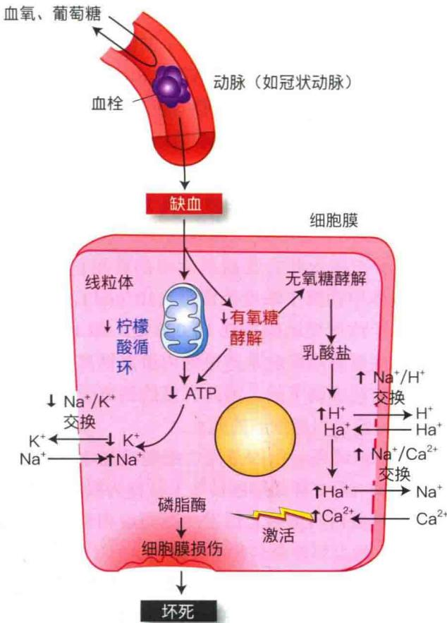 
图1-19 缺血导致细胞死亡的机制。ATP.三磷腺苷; $\mathrm{Ca^{2+}}$ .钙离子； $\mathrm{H^{+}}$ .氢离子； $\mathsf{K}^+$ .钾离子； $\mathrm{Na^{+}}$ .钠离子
合成减少，促进活性氧（ROS）的生成。
线粒体损伤促进细胞色素C（CytC）释放入胞质并启动凋亡级联反应。
■ 细胞死亡。
在有些情况下，坏死性的细胞死亡是通过信号级联反应调节的。例如，已经发现一个病原体识别受体家族，能负责识别多种多样的细菌和其他成分。这种识别作用可以激发损伤线粒体、溶酶体和细胞膜的信号通路，并且不依赖于半胱天冬酶介导的凋亡（见下文）。在缺血性损伤之后使用药物干预参与细胞坏死发生过程的几个事件，能够保存细胞活性。在缺血过程中，增加葡萄糖的摄取及纠正一些离子不平衡可能保持细胞活性。
# 三、凋亡，或程序性细胞死亡，是细胞自杀的信号机制
凋亡是由许多特定的胞外和胞内信号触发的程序性的细胞死亡通路。凋亡是细胞存活和死亡之间平衡的一部分，当一个细胞不再有用或者当它可能会对器官产生危害时，就决定其发生死亡。作为一种细胞自卫机制，感染了病原体的细胞或是基因组已经发生变化的细胞将被破坏。在这种环境下，很多病原体进化出一种机制，能够使凋亡信号级联过程中的关键成分失活。凋亡能检测并破坏许多携带危险突变的细胞，
从而维持基因稳定性并防止肿瘤的发生。相反，如同在感染性疾病中获得抗生素耐药的情况一样，肿瘤细胞中的优势克隆常常能够设计出逃避凋亡的机制。
1.凋亡的形态改变凋亡的细胞可以通过核固缩、核碎裂、突出于背景的正常细胞而得以被识别。重要的是，凋亡通常发生在单个细胞或小灶细胞，而坏死是特征性地累及更大范围的细胞死亡（图1-20）。凋亡细胞的超微结构特征包括： $①$ 核固缩和核碎裂； $②$ 胞质细胞器分割成不同的区域； $③$ 细胞膜出泡； $④$ 膜包被细胞碎片，通常没有核。
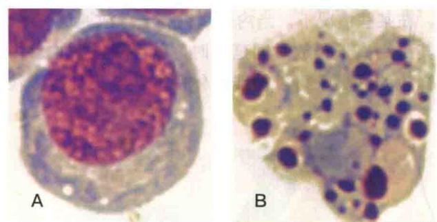 
图1-20凋亡。一个存活的白血病肿瘤细胞（A）和一个凋亡细胞（B）对比，B中细胞核发生固缩和裂解
坏死性死亡的细胞常引起强烈的炎症反应。相反，凋亡细胞附近通常没有炎症。凋亡细胞的细胞碎片通常由单核－巨噬细胞吞噬，而中性粒细胞和淋巴细胞的浸润却不常见（见第2章）。凋亡一旦引起DNA片段化和细胞骨架溶解，仅有凋亡小体残留，最终由组织中的巨噬细胞吞噬。就凋亡的众多发育、生理和防御性功能而言，其不伴发炎症反应显然是对机体有益的。凋亡在正常发育和生理过程中发挥着许多重要的作用，包括：
■ 修剪发育过程中非持久的结构（如手指间的组织）。 
■ 清除在免疫多样性产生过程中的自我反应性克隆。 
清除组织中能够由干细胞持续再生而衰老的细胞（如胃肠黏膜、表皮和造血系统）。 
当营养信号发生改变时，增生的器官发生退化（如绝经后子宫内膜萎缩）。 
当出现不可挽回的DNA损伤后，清除突变的细胞（与p53协同）。
2.凋亡可以作为一种对抗炎症扩散的机制当一个细胞“监测”到附加体（染色体外）DNA复制时，如病毒感染时，就会启动凋亡。这种作用可以看作是在病毒播散之前，清除感染细胞的一种方式。很多病毒已经进化出保护性的机制以调控细胞凋亡。一些病毒基因产物能抑制凋亡，已经发现的包括人类免疫缺陷病毒（HIV）、人乳头瘤病毒（HPV）、腺病毒等。在一些情况下，这些病毒蛋白与细胞内重要的凋亡信号调节蛋白（如p53)结合并使之失活。还有一些情况，
它们可能在激活凋亡的信号通路的不同阶段发挥功能。
3.凋亡的几种信号通路 调亡反映了导致相似结局的几种不同通路。
■外源性凋亡通路体现了特定细胞膜受体与相应的配体结合后的活化（如Fas受体被FASL配体结合激活或TNF-α受体被TNF-α激活）。 
内源性凋亡通路由细胞内多种应激触发，以线粒体为中心作用为特征。 
炎症性和感染性凋亡由细胞内和细胞外的感染因子引起。 
穿孔素/颗粒酶凋亡通路由细胞毒性T细胞与其靶细胞结合引起，当杀伤细胞的颗粒酶B转运至靶细胞后激活。
这些通路并非严格区分。实际上，不同的凋亡通路之间存在交叉和重叠。但是大多数转导凋亡前信号的中间酶属于半胱氨酸蛋白酶家族，称为半胱天冬酶。
# 四、受体-配体在细胞膜表面结合触发外源性凋亡
在细胞膜上启动凋亡的典型例子是TNF- $\alpha$ 与其受体（TNFR）结合及Fas配体（FASL）被其受体Fas识别。TNF- $\alpha$ 绝大多数情况下是一种可溶性细胞因子，而FASL通常定位在某些细胞的细胞膜上，如细胞毒效应淋巴细胞。
TNFR和Fas，称作死亡受体，在与相应的配体结合后就会被激活。这些跨膜蛋白在其胞质尾部具有特异的氨基酸序列，称为死亡结构域，作为其他参与凋亡信号通路蛋白的相应死亡结构域的对接点。激活的死亡受体Fas与一种对接蛋白[Fas相关的死亡结构域（FADD）]及caspase-8前体，共同形成一种死亡诱导信号复合物（death-inducingsignalingcomplexDISC）（图1-21A）。DISC激活下游信号分子，首先是caspase-8前体转变为活化的caspase-8。依次，caspase-8刺激凋亡通路下游的其他caspase级联反应，即caspase-3，-6和-7，这些是效应分子或“刽子手”。caspase-3（最常见的活化效应分子）依次激活负责核碎裂的酶类，如caspase活化的DNA酶（CAD），可以降解染色质DNA。当细胞开始裂解成凋亡小体时，caspase-3使细胞骨架坍塌。
当杀伤性淋巴细胞，主要是细胞毒性T细胞识别某个细胞为异己的时候，Caspase信号也会发生活化。这些淋巴细胞释放穿孔素和颗粒酶B。穿孔素，顾名思义，即在靶细胞膜上穿一个孔，颗粒酶B就通过这个孔进入细胞内直接活化前体caspase-10和前体caspase-3（图1-21B）。颗粒酶A，是细胞毒性T细胞释放入靶细胞的另一种成分，通过活化一种DNA攻击酶触发凋亡，导致细胞基因组DNA发生凋亡性降解。
内源性凋亡和线粒体蛋白 Bcl-2 家族的线粒体蛋白是平衡细胞生存和死亡的关键，根据它们过表达或优势表达后的结局分为两组。它们或者是抗凋亡（如 Bcl-2、Bcl-XL）或者是促凋亡（如 Bad、Bak、Bax）。这些因子之间的平衡决定了细胞的命运。促凋亡蛋白的异质二聚体和抗凋亡蛋白通过封闭促凋亡成分而利于细胞生存。但是，例如 p53 受紫外线照射等刺激活化（见下文）时，促凋亡蛋白生成增加。结果，这些超出的 Bax 和 Bak 就结合到抗凋亡成分如 Bcl-2 和 Bcl-X 上（图 1-21C）。游离的 Bax 和 Bak 接着可能寡聚体化，打开线粒体通透性转换孔（MPTP），允许细胞色素 C（Cyt-c）从线粒体脱离进入细胞质中。
Cyt-C释放进入细胞质是内源性凋亡启动的关键步骤。在Cyt-c和dATP存在的情况下，一种接头蛋白
Apaf-1的无活性单体发生同源性聚合，并与caspase-9前体形成复合物，然后激活caspase-9。Cyt-c、Apaf-1和已经活化的caspase-9有时被称为凋亡复合体。它的形成将caspase-3前体活化为caspase-3（图1-21D），之后再激活降解DNA的酶类。
# 五、内质网钙离子释放可能触发凋亡
配体诱导以及其他因素等导致的细胞内钙离子浓度的变化，是细胞活化和有丝分裂中重要的第二信使。但是，钙离子浓度的变化也可能诱导凋亡。内质网内储存了大量的钙离子，可以在受到各种刺激时释放出来。在某些情况下，当内质网钙离子释放通道被激活，尤其是钙离子释放时间延长时，就会引发凋亡。内质网释放的钙离子可以被线粒体摄取。结果导致线粒体
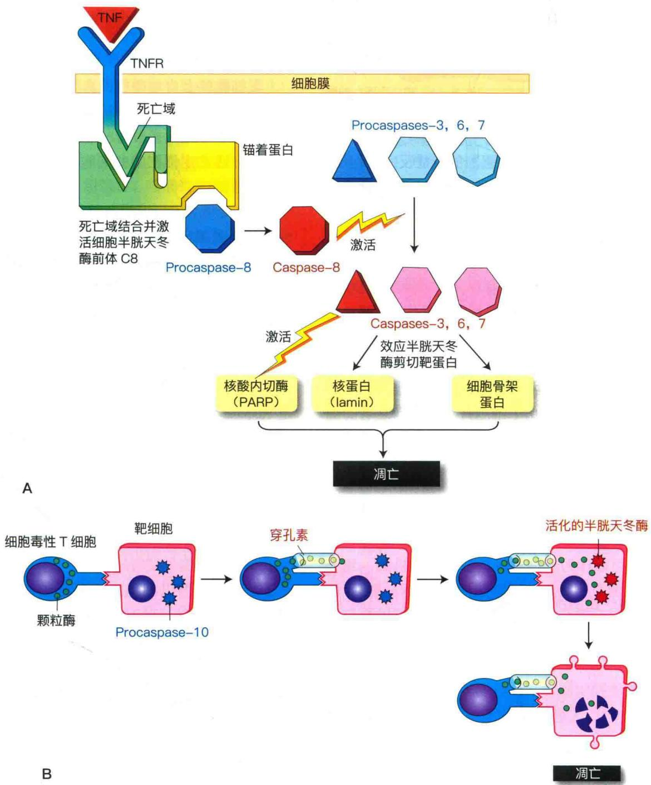
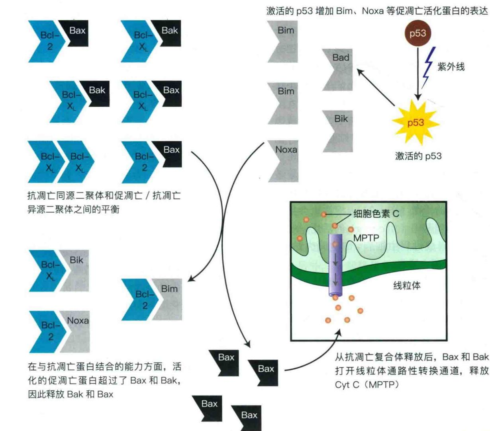
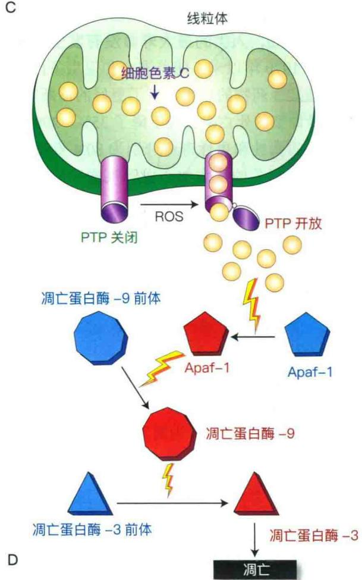 
图1-21凋亡起始、信号传导和执行的机制。A.配体-受体相互作用导致caspase活化。TNF.肿瘤坏死因子；TNFR.肿瘤坏死因子受体。B.免疫反应过程中，细胞毒性淋巴细胞（CTLs）释放颗粒酶引起凋亡。图示caspase-10前体是由颗粒酶B活化的一个例子。C.在Bcl-2蛋白家族中各促凋亡成员与抗凋亡成员之间的平衡，反映了抗凋亡分子与自身结合（同源二聚体）或与促凋亡蛋白Bak和Bax结合。例如p53的活化，增加了Bcl-2家族中促凋亡成员（如Bim、Puma）的产生，这些分子与Bcl-2、Bcl-XL的结合能力超过了Bax和Bak，从而使游离的Bax和Bak打开线粒体通透性转换孔（MPTP)。D.MPTP的打开，导致Apaf-1活化，从而激发了凋亡级联反应。PTP.通透性转化孔；ROS.活性氧类
钙离子浓度升高，引起MPTP开放，伴随CytC的释放和内源性凋亡级联反应的激活（见上文）。
1. p53 激活的凋亡 决定细胞生死的一个关键分子是多功能蛋白 p53。当受损细胞的 DNA 能够被修复时，p53 可以保持细胞的生命力，但是如果出现不可修复的损伤时，就会迫使细胞凋亡（p53 将在第 5 章详细讨论）。当 p53 与 DNA 损伤区域结合之后，就激活相关蛋白质，尤其是能使细胞阻滞在细胞周期 $\mathrm{G}_{1}$ 期的 P21WAF/CIP1，为 DNA 修复赢得时间。p53 还能引导 DNA 修复酶到损伤位点。如果 DNA 损伤不能被修复，p53 激活凋亡机制，主要是通过改变线粒体中 Bcl-2 家族成员之间的平衡（图 1-22）。应激也会导致 p53 的蓄积。某些原癌基因（如 c-myc）的活化、缺氧、核苷酸耗竭及肿瘤形成过程中细胞 - 细胞间失黏附，都能促进 p53 依赖的凋亡通路。
2. 促凋亡和抗凋亡信号之间的平衡 调亡可以被视为一种默认通路，但是，在抗凋亡（促生存）信号持续居于主导地位时，很多细胞可以生存。这些信号转导通过受体与PI3K的结合实现，PI3K是一种能使信号分子PIP2和PIP3磷酸化的酶。通过对抗凋亡，PI3K在细胞生存中起着非常重要的作用。通过这种信号机制发挥作用的一个典型受体就是胰岛素样生长因子1受体（IGF-1R）。PI3K通过胞内介质发挥抗凋亡
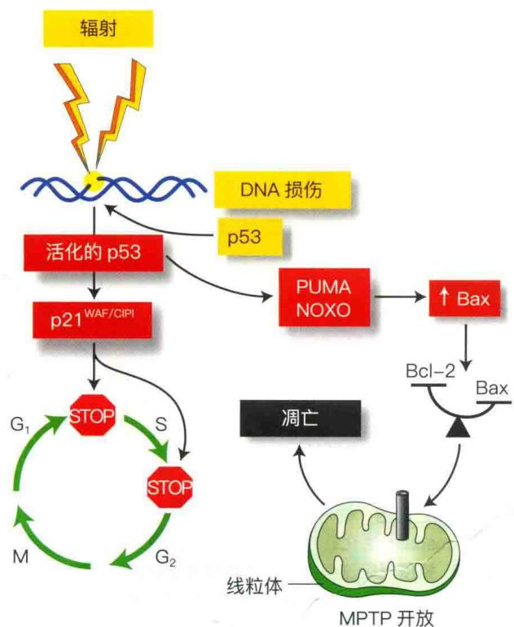 
图1-22 p53介导的凋亡。在受到外部刺激后，p53募集到DNA损伤区域。活化的p53激活p21 $^{\text{WAF/CIP1}}$ ，后者将细胞周期进展阻抑在G $_1$ /S期和G $_2$ /M期的转节点。如果DNA损伤不能被修复，p53激活NOXA和PUMA的转录，这两个分子能够在线粒体膜上改变促凋亡和抗凋亡的Bcl-2家族蛋白之间的平衡，从而利于凋亡的发生。线粒体通透性转换孔（MPTP）开放（图1-21C），导致凋亡
的效应，这种介质通过激活蛋白激酶B（PKB），也称为Akt，而促进细胞生存。后者可以使几种重要的促凋亡蛋白失活。更重要的是，Akt激活核因子- $\kappa$ B，一种重要的转录因子，它能使一种可阻止CytC从线粒体流失的蛋白质表达增加，从而促进细胞生存。
总之，细胞在生存和凋亡之间处于持续的平衡状态；细胞的命运取决于胞内和胞外力量的平衡，有信号通路的持续作用和相互作用。通常，当细胞的存活对器官可能构成损害时，凋亡便作为一种自我保护性的程序性机制诱导细胞主动死亡。有时候，凋亡却是一个能导致很多紊乱的病理过程，尤其是退行性疾病。因此，药物调控凋亡是药物发展的一个前沿问题。
# 第五节 生物老化
生物老化可以被定义为：随着寿命的增加，不可避免地出现有害的功能和结构变化的累积效应。很重要的一点是，老化必须和疾病区分开来。尽管老化的过程中可能会增加对很多疾病的易感性，但它与任何一种具体疾病的病理过程都不同。
# 一、人类的预测寿命仍然保持不变
数百万年前，预测人的自然寿命是70岁，如果精力旺盛的话，可以活到80岁。相反，据推算新石器时代人类的通常寿命是 $20\sim 25$ 年，现在有些地区的平均寿命仅仅较之延长了十几年而已。有趣的是，通过环境保护之后，人类的最大寿命没有发生明显变化。在美国自1970年以来，随着安全和卫生条件的改善，抗生素和其他药物的应用，有了更好的诊断和治疗方法，年龄调整的死亡率已经下降了 $35\%$ 。2007年在出生时预测的女性和男性寿命分别为80.4岁和75.3岁。即使老年人相关的疾病如心血管疾病和癌症减少了，平均预期的寿命也仅见轻度的增加。
# 二、衰老的细胞基础
尽管衰老的生物学基础显而易见，但是普遍认为衰老的根源在细胞水平。目前，关于细胞衰老的理论有很多，但是，每个理论的证据都是间接的。基因控制寿命论的依据来源于对组织培养中细胞复制的研究。这一理论中，正常人的成纤维细胞约经历50代倍增后，将会停止分裂并且不可逆地被阻滞在细胞周期的 $\mathrm{G}_{1}$ 期。这个过程称为复制衰老。并且，对于患有早熟老化综合征，如儿童早熟症患者，其细胞在体外表现出显著的倍增次数减少。但是，如果培养的正常细胞暴露于原癌病毒或某种化学性致癌物质时，细胞将会无休止地持续复制（亦即永生化）。尽管永生化不一定具备致瘤的能力，但这是向癌变迈进的一步（见第5章）。
1. 端粒、端粒酶和衰老 端粒是位于染色体DNA3'末端的一系列短的重复性核苷酸序列。由于DNA酶的作用，DNA从5'端向3'端进行复制，但是不能复制染色体的全部长度，每经历一次细胞分裂，端粒长度缩短一次。基于此，端粒可以被称为“复制钟”（即端粒跟踪监视和限制每个细胞的分裂次数）。
为了克服这种末端复制的限制，很多真核细胞表达出一种核糖核蛋白酶——端粒酶，它能够延长染色体末端端粒的长度，使细胞持续分裂。端粒酶主要表达于频繁进行自我更新的组织中（如胃肠黏膜）。在其他细胞，每经历一次细胞分裂周期，端粒发生缩短，作为一种肿瘤抑制机制，从而限制了体内细胞的分裂能力。人类的很多肿瘤就表现出端粒酶的持续表达（见第5章）。
已经发现，血液中单核细胞端粒的缩短可以作为几种年龄相关疾病如动脉粥样硬化和阿尔茨海默病的标志。但是，现在却无法解释“复制衰老”在老化或肿瘤抑制中的作用。例如，与人类相比，许多物种（如老鼠）拥有很长的端粒，但是其寿命却显然与端粒的长度无关。
2. 热量限制、抗衰老酶和寿命的延长 在啮齿动物和低等动物，限制热量（caloric restriction，CR）
可以增加寿命。不幸的是，几乎没有证据支持限制热量能增加人类寿命，尽管灵长类动物的研究确实显示：限制猴子的热量摄入使得年龄相关疾病的发病率降低。热量限制的啮齿类和非人灵长类表现为：其线粒体产生的ROS逐渐衰减，而正常时线粒体产生的ROS随年龄增长而增加；氧化损伤发生缓慢，可以通过脂质过氧化的减少证明；以及蛋白质的氧化性改变减少。
限制热量产生这些效应，至少部分是因为长寿蛋白的表达增加。这些蛋白是NAD依赖性的去乙酰酶，能通过多种方式抑制凋亡来促进细胞生存。包括通过促凋亡因素来阻止线粒体通透性转换孔的开放以及激活转录因子FOXO1。后者增加DNA修复酶的水平，抑制促凋亡蛋白产生并使p53失活。
另外，限制热量能降低血浆胰岛素和IGF-1的水平，并抑制通过两者各自受体的信号通路。这些活动能减少细胞活化水平（增加代谢率）。限制热量还可以抑制一种关键信号分子——雷帕霉素的哺乳动物靶点（mTOR）的活性，进一步减少细胞活化（图1-23），从而增强这一效应。有趣的是，最近的研究提示雷帕霉素（也能够降低mTOR的活性）可以增加啮齿动物的寿命。
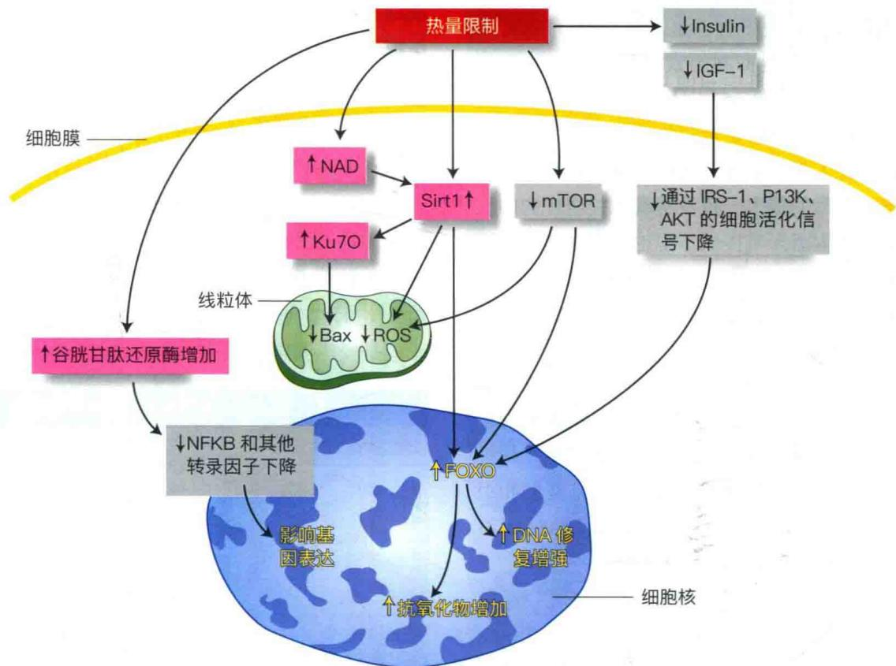 
图1-23 热量限制（CR）对细胞代谢和生存信号的影响。CR促进细胞抵抗应激、抑制凋亡、促进DNA修复并增加细胞抗氧化物的产生。CR能降低血胰岛素样生长因子I（IGF-I）和胰岛素的水平，依次降低通过胰岛素反应底物（IRS-1）、PI3K和AKT介导的这些因子的信号通路。它还能够降低mTOR的活性并提高Sirt1的活性。所有这些功能促进了FOXO的活性，导致DNA修复增强以及抗氧化物产生增多。Sirt1活性的增强还可以通过提高Ku70因此抑制Bax来促进生存。CR使抗氧化性谷胱甘肽（GST）的细胞内储存增加。这样，可能降低NF- $\kappa \mathbf{B}$ 的活性
3. 氧化应激对衰老的影响 一个重要的假说认为衰老的重要特点——功能缺失，是由不可逆性的分子氧化损伤积累所致。这种病变可以用以下几点证明：①膜磷脂的过氧化；②DNA修饰（链断裂、碱基改变、DNA-蛋白质交联）；③蛋白质氧化（巯基和羰基的缺失）。正常细胞的氧化应激并非很轻微，因为总氧耗量中多达 $3\%$ 产生超氧阴离子和过氧化氢。这 $3\%$ 绝大多数代表了线粒体电子传递链的“漏洞”。据估计单个细胞DNA每天要经受ROS袭击约10000次，并且，在任意时间，细胞中有 $10\%$ 的蛋白质分子发生羰基化修饰。因此，抗氧化的防御机制并非完全有效；氧化损伤可能逐渐积累，导致多种细胞功能的损害。氧化损伤与衰老之间的关系进一步体现在衰老动物的脂肪、蛋白质和DNA的氧化损伤增加。但是，需要强调的是，已经有对数十万人给予抗氧化食物补充的很多研究。这些研究未能证明抗氧化物质对人类寿命、疾病发展或死亡有任何显著的影响。
4. 衰老和干细胞 大多数衰老相关的生理改变涉及器官功能的退化（如心、脑），这些器官的主要活动是由永久细胞执行的。如前所述，这些器官的细胞并非分裂惰性，分裂的确可以发生。例如，衰老或受损的心肌细胞由该处的祖细胞取代。但是，随着衰老，这些祖细胞补充缺失细胞的能力也逐渐下降。这种祖细胞再生能力的丧失涉及多种因素，包括：① DNA 修复机制受损；② 有丝分裂抑制因素的积累，如肿瘤抑制因子 p16INK4A、p14ARF 和 p53。人类很多早熟老化疾病涉及 DNA 修复过程中重要蛋白的丢失（见下文）。
5. 早衰病 在人类，亲属之间在寿命上存在一定联系，同卵双胞胎寿命的惊人一致及早衰相关遗传病的表现都为衰老受基因因素影响提供了理论依据。这类基因疾病最典型的代表之一就是Hutchinson-Guilford早衰，这类疾病的整个衰老过程，包括男性型秃顶、白内障和冠状动脉疾病的特征，被压缩在10年以内（图1-24）。这种类型早衰的原因是LMNA基因的突变；其产物是名为核纤层蛋白A的蛋白，这种蛋白的突变形式称为早衰素（progerin）。这种异常蛋白在核内蓄积并从一代细胞传至下一代，从此破坏了细胞核的结构完整性和组成。LMNA基因的许多附加突变（称为“laminopathies”），以及其他基因的缺陷，均与早衰表型相关。
其他罕见的早衰综合征包括Werner综合征（WS），一种罕见的常染色体隐性遗传病，其特征是白内障、脱发、皮肤萎缩、骨质疏松症、动脉粥样硬化症和多种癌症的发生。典型患者常在50多岁死于癌症或心血管疾病。WS是由Werner（WRN）基因的功能缺失造成的，WRN基因可编码一种具有多个DNA依赖性酶活性的蛋白，包括ATP酶、解螺旋酶和外切酶。目
 
图1-24 早衰症。1个10岁的女孩显示早衰的典型特征，与早衰症有关
前认为WS患者癌症发病率的增加可能反映了染色体的改变，但是加速的衰老可能源于端粒功能的失调。Cockayne综合征A型和B型（CSA和CSB）是由于参与转录偶联DNA修复的一对基因中的任何一个缺陷所致（分别是ERCC8和ERCC6）。患有这种疾病的患者过早地停止生长。他们患有脱髓鞘病变，导致过早出现感觉缺失和衰老，同时伴有体质虚弱和恶病质。这种患者的寿命是大约12年。目前认为酶类缺陷是造成这种综合征的原因，导致细胞内不断积累DNA损伤，造成转录缺陷，最终引起细胞死亡。
# 三、老寒假说总结
不同的生命过程决定了不同机体的寿命，并且随着年龄的增长他们生命力的强弱表现也不同（表1-2）。目前还没有达成共识，以证明衰老和长寿是涉及细胞损伤、修复和死亡的很多机制之间相互作用的最终结果。生物衰老的机制仍然难以琢磨。如Maimonides在12世纪时提到“操控人类出生和短暂存在的力量，同样也是操纵其毁坏和灭亡的力量”。
表1-2 增加和降低寿命的因素增加寿命的因素降低寿命的因素p53、p14ARF、p16INK4A等的突变p53活化增加代谢率降低代谢率增加热量限制氧化应激增加增加的Sirt1mTOR活性增加年龄突变细胞周期控制蛋白增加抗氧化防御增加基因因素外部应激基因因素
# 第2章 炎症
炎症是组织和微循环对各种损伤因素的刺激做出的局部或全身反应。炎症的特点是产生炎症介质以及血管中液体和白细胞渗出到血管外周组织。炎症能够局限及清除微生物、损伤的细胞和异物，从而使组织恢复正常的结构和功能。
早在公元前1000年以前，在埃及医学文献中就记载了炎症的临床症状。在公元二世纪，《罗马百科全书》编纂人AulusCelsius将其基本特征总结为四项：红、热、肿、痛。这些特性对应于炎症过程中的血管扩张、水肿和组织损伤。在19世纪，RudolfVirchow提出炎症的第五项特征，即功能障碍，他认为炎症是对组织损伤的反应。
# 第一节 炎症概述
炎症过程可以划分为不同的阶段：
■ 初始阶段，其是一种快速反应，称为急性炎症。急性反应的特点是在损伤组织处，快速渗出液体、凝血因子、细胞因子、化学趋化因子、血小板和炎症细胞，尤其是中性粒细胞（图2-1）。
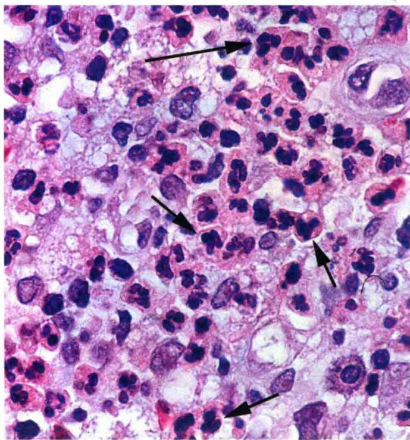 
图2-1急性炎症中密集分布着分叶核中性粒细胞（PMN）（箭头）
放大阶段，其取决于损伤的范围和炎症介质（如激肽和补体）的活化程度。较多的白细胞和巨噬细胞被募集到炎症区域。 
■ 破坏阶段，其通过吞噬作用以及酶或非酶的作用，减少或清除异物和病原体。与此同时，坏死的组织成分被清除，以备后期开始修复。 
终止阶段，炎症反应的终止阶段受内源性抗炎机制调节，防止组织进一步损伤。其可以使组织恢复正常结构及生理功能，或通过瘢痕组织取代正常组织。
有些损伤类型，由于机体不能清除受损组织和外来异物而引发持续的炎症反应。这种持续的炎症反应（通常含有免疫成分）称为慢性炎症。慢性炎症浸润的细胞主要是淋巴细胞、浆细胞和巨噬细胞（图2-2）。急性炎症和慢性炎症浸润的细胞成分通常并存。
# 第二节 急性炎症：血管反应
组织损伤的最早期反应是微脉管系统的解剖结构和功能的改变，促进水肿形成（图2-3）。这些反应如下：1. 短暂的细动脉收缩 对于轻微的皮肤损伤来说，
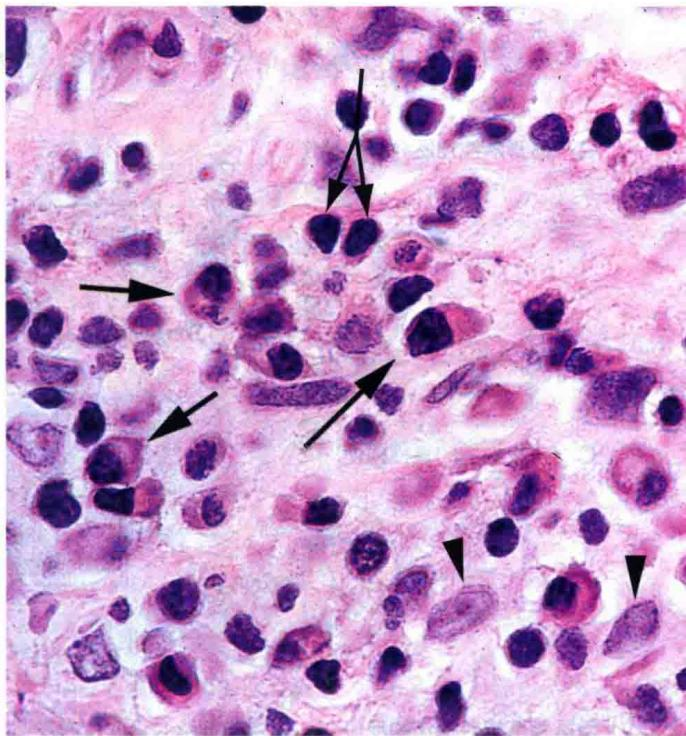 
图2-2慢性炎症。可见淋巴细胞（双头箭头）、浆细胞（箭头）和几个巨噬细胞（箭头头）
这是损伤处最早产生的血管反应。这一过程同时受神经系统和化学介质的调节，通常持续数秒到数分钟。
2.毛细血管前细动脉舒张 其在一氧化氮（NO）、组胺和其他可溶性介质的作用下发生，导致血流增加和毛细血管床扩张。这种状态称为充血，血流增加是组织损伤处发红、发热的原因。 
3. 内皮细胞屏障通透性增加 其导致水肿。这种屏障功能的破坏是急性炎症的一个标志。血液流经毛细血管和细静脉时，液体从血管内渗出，导致局部血流停滞和红细胞堵塞扩张的小血管。这些改变引起的损伤轻微并且是可逆的，历时数分钟到数小时，血管外的液体通过淋巴清除。 
4. 血小板和炎细胞在血管内被激活损伤处组织所释放的可溶性炎症介质，对血小板和血管内的炎细胞产生刺激作用。激肽、补体和凝血系统被进一步活化，从而增加了血管的通透性，促进水肿（图2-4）。
血管对损伤的反应是一个动态过程，涉及一系列有序的生理、病理变化。在组织损伤处，血浆及细胞会产生血管活性介质（图2-4）。这些介质与血管内皮细胞和平滑肌细胞上的特异性受体结合，引起血管收缩或舒张。在毛细血管近端，细动脉舒张，血流量增加，导致大量液体渗漏到组织中。在毛细血管远端，细静脉收缩，毛细血管床流体静压增大，促进水肿形成。相反地，如果细静脉舒张，毛细血管床流体静压减小，
会抑制液体向血管外间隙流动。
损伤发生后，血管活性介质与内皮细胞上的特异性受体结合，引起内皮细胞收缩及细胞间隙形成，其是一个可逆过程（图2-3B）。内皮屏障的破坏导致血管内的液体渗漏到血管外组织间隙。血管内皮的轻微直接损伤引起的反应分为两个阶段：在损伤后30分钟内，发生早期的血管通透性改变；在 $3\sim 5$ 小时后，血管通透性再次增加。若损伤很严重，血管内液体向血管外的渗出将逐渐增加，并在损伤发生后的 $3\sim 4$ 小时达到顶峰。
由烧伤、腐蚀性化学物质等引起的内皮严重直接损伤，可能会导致不可逆性的损害。在这些情况下，内皮从基底膜剥离，导致细胞水泡样变化（在内皮和基底膜之间出现水泡或空泡）。这使基底膜部分区域裸露（图2-3C），破坏血管内外间的屏障。
以下几个术语对于理解炎症的血管成分很重要：
■ 水肿：指液体积聚在血管外的腔室和组织间隙中。 
漏出液：指低蛋白含量（比重 $< 1.015$ ）的水肿液。漏出液的产生通常发生在非炎症性的情况下，内皮屏障保持完整并能阻止脉管系统中大分子物质漏出。例如，右心力衰竭时血管内压力增大，特征性反应就是全身广泛性水肿。 
渗出液：指高蛋白含量（比重 $>1.015$ ）的水肿液，通常含有炎细胞。在急性炎症反应的早期可以观察到。
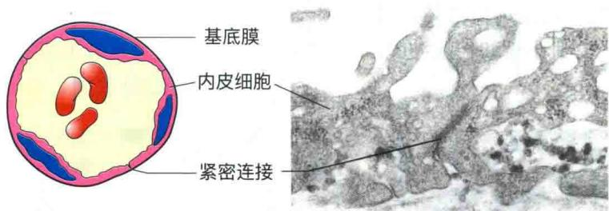 
A 正常微静脉
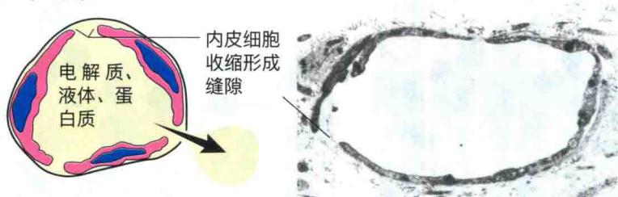 
B 血管活性物质介导的损伤
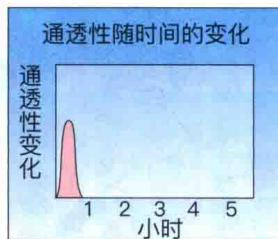
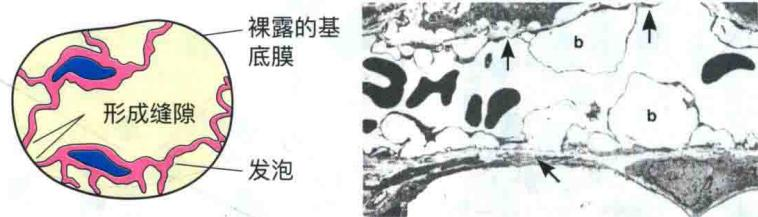 
C 内皮细胞的直接损伤 
图2-3 微脉管系统对损伤的反应。A. 正常微静脉的管壁由内皮细胞间的紧密连接封闭；B. 在血管活性物质介导的轻微损伤中，内皮细胞相互分离，可使血液中液体成分通过；C. 在直接严重损伤中，内皮细胞发泡（b）并从基底膜上剥离。基底膜裸露的区域（箭头）可使微脉管系统的液体成分持续流出
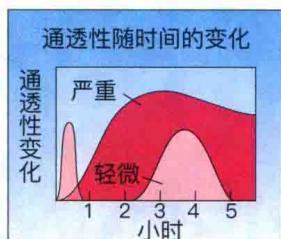
轻微损伤，如日光照射或创伤性水疱，可以产生渗出液。
■ 浆液性渗出液，或浆膜腔积液：呈稻草黄色，细胞成分稀少。
纤维素性渗出液：由于凝血系统被激活而含有大量纤维蛋白。当纤维素性渗出发生在浆膜表面，如胸膜或心包膜，称为“纤维素性胸膜炎”或“纤维素性心包炎”。
脓性渗出液或脓性积液：含有大量的细胞成分。通常与化脓性细菌感染等病理过程相关，主要的细胞类型是中性粒细胞（PMN）。
# 第三节 血浆源性炎症介质
多种化学介质参与炎症过程的起始、放大和终止阶段（图2-4，图2-5）。细胞源性炎症介质和血浆源性炎症介质通过以下途径，协同活化细胞：①与特异性受体相结合；②募集细胞到损伤部位；③刺激释放更多的可溶性炎症介质。这些炎症介质本身寿命较短，或在内源性机制抑制下，可以有效终止炎症反应并使炎症反应消散。细胞源性炎症介质将在后文讨论。
血浆中包含三种主要酶级联反应的构成成分，每种级联反应都由一系列的蛋白酶组成。蛋白酶的依次活化而释放多种重要化学介质。这些相互关联的系统包括：①凝血级联系统和纤溶系统；②激肽系统；③补体系统。凝血级联系统将在第10章和第20章讨论；激肽系统和补体系统在本节叙述。
# 一、哈格曼因子是血管活性介质的主要来源
哈格曼因子（凝血因子VII）产生于血浆内，当接触
带负电荷的表面[如基底膜、蛋白水解酶、细菌脂多糖（LPS）和异物等]时可被激活。这一关键因子触发血浆中炎症相关的其他重要蛋白酶系统的活化，包括：
1.凝血系统（见第10章和第20章）。 
2. 纤溶系统，随着血纤维蛋白溶酶的产生，纤维蛋白被降解。随后，纤维蛋白的降解产物增加血管通透性。血纤维蛋白溶酶还可以分解补体系统的成分，产生生物活性产物，包括C3a和C5a。 
3. 激肽原酶以及激肽的产生。 
4. 补体旁路途径的激活（图2-6）。
# 二、激肽放大炎症反应
激肽是在血浆和组织中形成的强效炎症因子，由丝氨酸蛋白酶（即激肽原酶）作用于特定的血浆糖蛋白-激肽原而产生。缓激肽及其相关肽类调节多种生理过程，包括血压、平滑肌的收缩和舒张、血浆外溢、细胞迁移、炎细胞活化以及炎症介导的疼痛反应等。激肽刺激局部的组织细胞和炎细胞产生多种炎症介质，包括前列腺素、细胞因子（尤其是 $\alpha$ 肿瘤坏死因子、白介素）和NO，放大炎症反应。激肽在激肽酶的作用下迅速裂解为无活性的产物，因此其功能发挥过程迅速且短暂。
# 三、补体通过三种途径活化以及形成膜攻击复合物
补体系统由一群存在于血浆中和细胞表面的蛋白质组成，其主要功能是抵御微生物。补体系统的生理功能包括：
通过调理素作用、趋化作用、激活白细胞以及
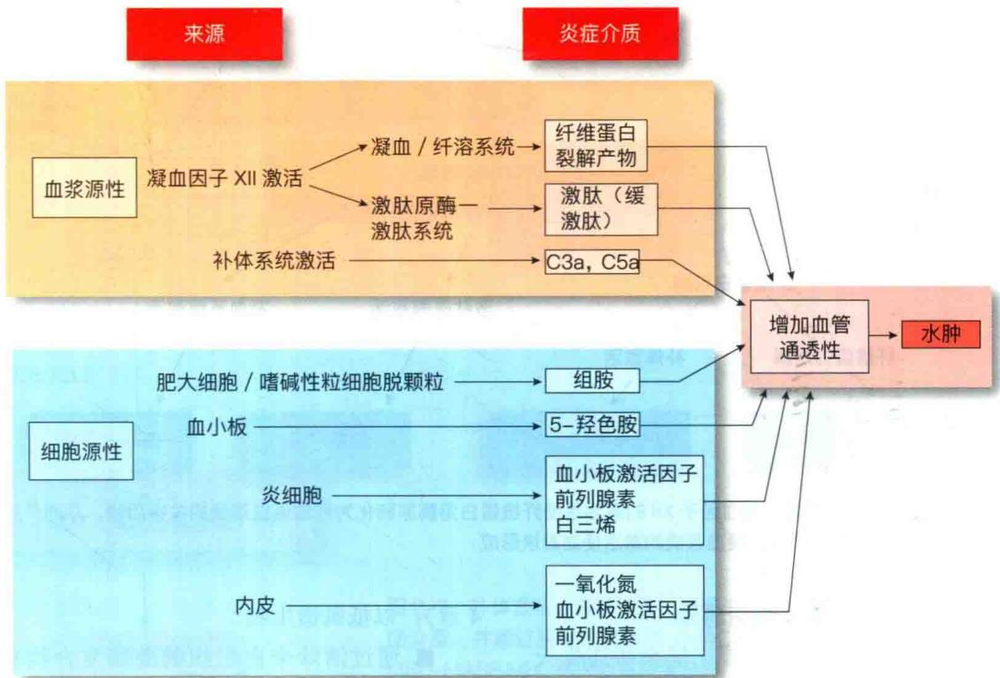 
图2-4 增加血管通透性的炎症介质
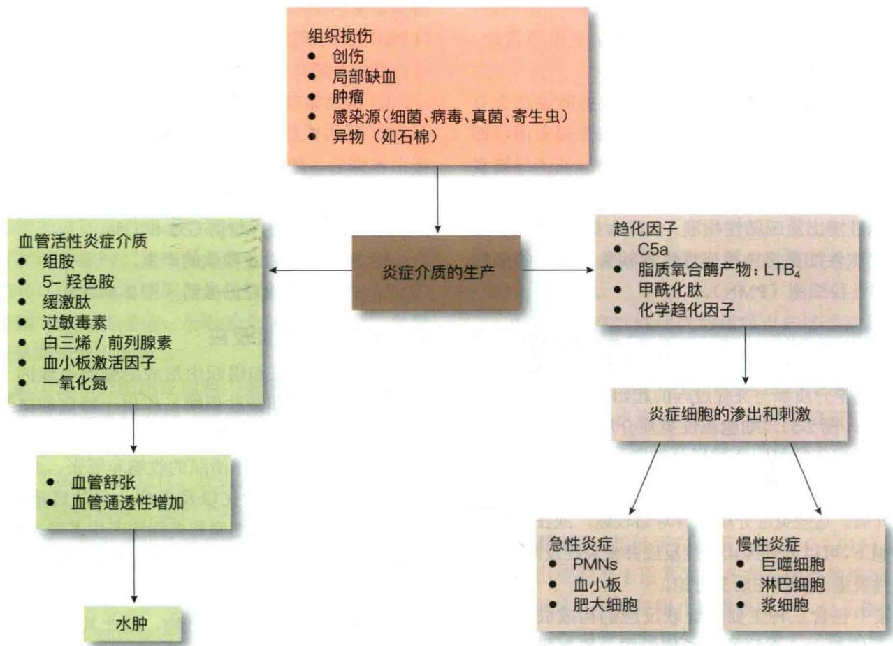 
图2-5炎症介质。组织损伤刺激血浆产生炎症介质并释放入血液循环。其他炎症介质可由组织细胞和炎症细胞产生。这些血管活性介质和趋化因子促进水肿以及白细胞渗出。 $\mathsf{LTB}_4$ 白三烯 $\mathsf{B}_4$ ；PMNs.多形核中性粒细胞
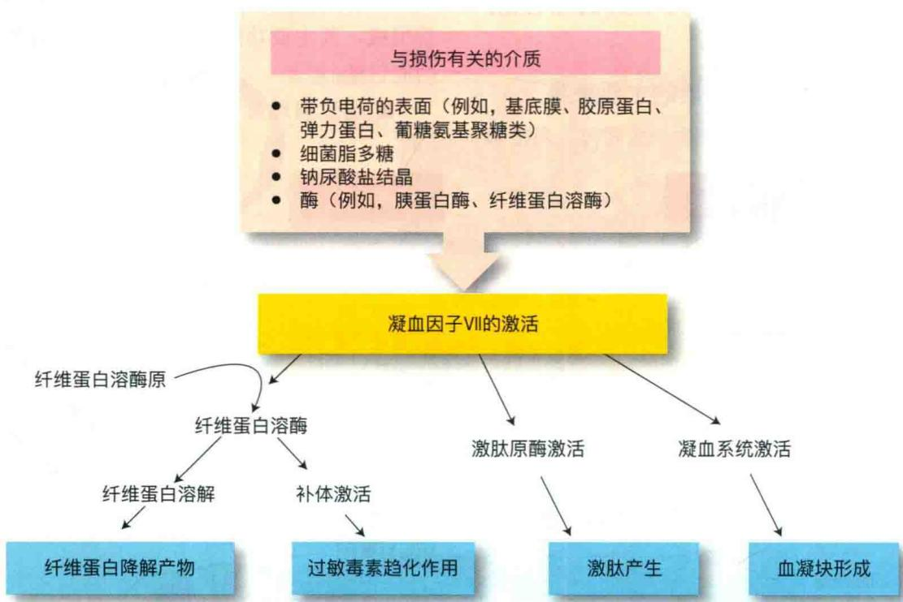 
图2-6凝血因子活化和炎症介质产物。凝血因子XII的激活是使纤维蛋白溶酶原转化为纤维蛋白溶酶的关键步骤，从而产生纤维裂解产物和活性补体。激肽原酶的活化使激肽产生，凝血系统的激活使血凝块形成
溶解细菌和细胞，来抵御化脓性细菌感染。
通过增加抗体反应、加强免疫记忆来桥连先天性（模式特异性）和适应性免疫（抗原特异性，见第
4章），以抵御微生物。
通过清除来自组织的免疫复合物和凋亡细胞，以清理免疫产物和炎症损伤产物。
补体活化的最后一步是形成裂解复合物C5b-9（膜攻击复合物，MAC）及细胞裂解碎片。以下几种裂解产物在各步生成后，又可在下一步反应中起催化作用。此外，它们还具有其他性能，使其成为重要的炎症分子（图2-7）：
■ 过敏毒素（C3a、C4a、C5a）：这些促炎分子调节平滑肌收缩，增加血管通透性（图2-8）。
■调理素（C3b、iC3b）：细菌的调理素作用是一个使特定分子（如免疫球蛋白IgG或C3b）结合到细菌表面的过程。这一过程使吞噬细胞表面的受体（如Fc受体或C3b受体）能够识别并结合调理素化的细菌，从而增强吞噬作用。病毒、寄生虫和转化细胞也通过
类似机制激活补体，最终导致自身灭活或死亡。
促炎分子（MAC、C5a）：这些趋化因子还有如下作用：①活化白细胞和组织细胞，产生氧性氧和细胞因子；②诱导肥大细胞和嗜碱性粒细胞脱颗粒。
补体系统可通过经典途径、甘露糖结合凝集素途径和旁路途径激活（图2-7）。
1.经典途径经典途径的激活剂包括抗原-抗体（Ag-Ab）复合物、细菌和病毒产物、蛋白酶、尿酸盐结晶、凋亡细胞和聚阴离子（多核苷酸）。该途径的参与蛋白是 $\mathrm{C}1\sim \mathrm{C}9$ ，根据蛋白发现的历史顺序依次命名。Ag-Ab复合物激活Cl，启动级联效应，形成MAC，过程如图2-7所示。
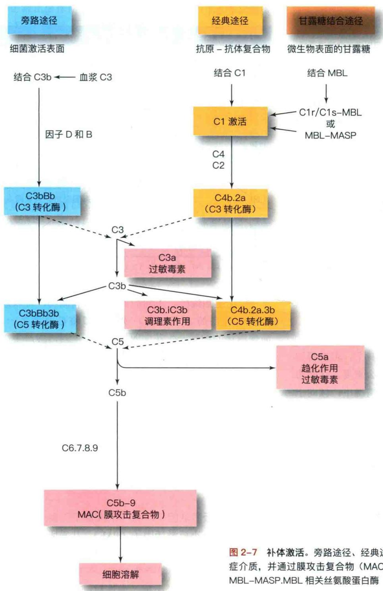 
图2-7补体激活。旁路途径、经典途径和甘露糖结合途径的激活，产生一系列炎症介质，并通过膜攻击复合物（MAC）导致细胞溶解。MBL.甘露糖结合凝集素；MBL-MASP.MBL相关丝氨酸蛋白酶
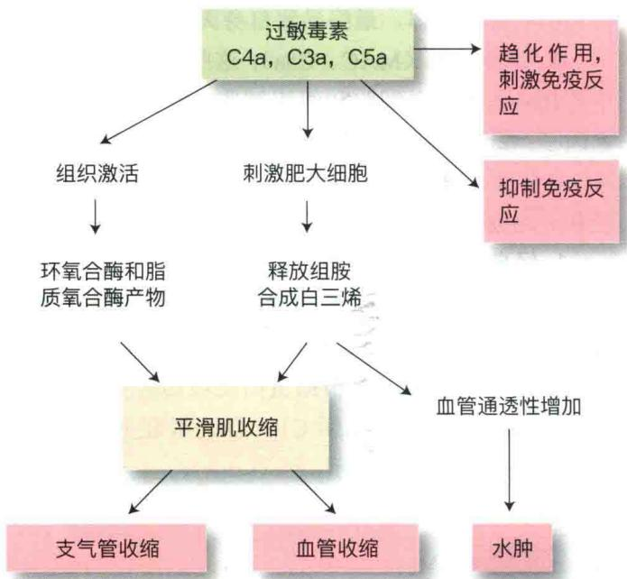 
图2-8 过敏毒素的生物作用。补体激活产物可以调节血管通透性、白细胞渗出以及平滑肌收缩
2.甘露糖结合途径甘露糖结合或凝集素结合途径与经典途径有一些相同的成分。该途径由微生物携带的末端甘露糖集团与甘露糖结合凝集素（MBL）相互作用而被启动，MBL是钙离子依赖性凝集素家族（称为胶原凝集素）中的一员。这种多功能的急性期蛋白MBL具有如下特征：与IgM抗体相似，可以结合到多种寡聚糖结构上；与IgG相似，可以与吞噬细胞受体和C1q相互作用；MBL能与C1r-C1s或MBL相关的丝氨酸蛋白酶（MASP）相互作用，从而激活补体（图2-7）。 
3. 旁路途径 旁路途径由微生物的衍生产物（如细菌内毒素、酵母多糖）、多糖、病毒、肿瘤细胞和异物等启动。旁路途径中的蛋白质称为“因子”，后接一个字母。发生C3水平活化时，旁路途径激活，产生少量C3b。C3b与微生物表面的糖类和蛋白质共价结合（图2-7）。 
4. 补体系统及相关疾病 从患有获得性或先天性特定补体成分或调节蛋白缺陷的患者身上，可以得知一个完整而正常调节的补体系统有多么重要。这些患者对致病因子敏感性增加，并在某些情况下，倾向于发生循环免疫复合物相关的自身免疫性疾病。获得性或先天性缺乏补体早期成分（如C1q、C1r、C1s、C2和C4）极易患系统性红斑狼疮；患者缺乏补体中间成分（C3和C5）更易于发生复发性化脓性感染、膜性增生性肾小球肾炎和皮疹；而缺乏补体晚期成分（C6、C7或C8）则更易感染奈瑟菌属。补体系统调节蛋白的先天性缺陷可导致慢性补体激活，例如，C1抑制剂缺陷可导致遗传性血管性水肿综合征。
# 第四节 细胞源性炎症介质
血小板、嗜碱性粒细胞、中性粒细胞、内皮细胞、
单核/巨噬细胞、组织肥大细胞及损伤组织本身都是血管活性介质的潜在细胞来源。总体上讲，这些炎症介质的来源如下：①来源于磷脂和花生四烯酸的代谢，如前列腺素、血栓素、白三烯、脂质素和血小板激活因子（PAF）；②来源于胞质中的前体颗粒，如组胺、5-羟色胺和溶酶体水解酶；③异常产生了血管功能正常调节因子，如NO。
# 一、花生四烯酸和血小板激活因子来源于膜磷脂
在炎细胞和受损组织的作用下，质膜释放的磷脂以及脂肪酸衍生物等代谢为炎症介质和稳态调节物质。作为复杂调节网络的一部分，前列腺素、白三烯和脂质素（花生四烯酸衍生物）既可促进炎症，又可抑制炎症（表2-1）。
产物生物学作用PGE2, PGD2引起血管舒张、支气管扩张，抑制炎症细胞的功能PGI2引起血管舒张、支气管扩张，抑制炎症细胞的功能PGF2a引起血管舒张、支气管收缩TXA2引起血管收缩、支气管收缩，增强炎症细胞的功能（特别是血小板）LTB4趋化吞噬细胞，刺激吞噬细胞黏附，增加微血管通透性LTC4, LTD4, LTE4引起平滑肌肤收缩、肺气道收缩，增加微血管通透性
LT.白细胞三烯；PG.前列腺素； $\mathrm{TXA}_2$ 血栓素 $\mathbf{A}_2$
1. 花生四烯酸 不同的炎细胞和刺激物，可以通过激活磷脂酶 $\mathrm{A}_2$ （ $\mathrm{PLA}_2$ ）或者磷脂酶C两者之一，而使活化的细胞产生花生四烯酸。花生四烯酸产生之后，将通过两种途径进一步代谢：①环氧合酶途径：代谢为前列腺素和血栓素；②脂质氧合酶途径：形成白三烯和脂质素（图2-9）。
糖皮质激素广泛用于抑制多种炎症性疾病相关的组织损伤。这些药物诱导合成 $\mathrm{PLA}_2$ 抑制剂，并阻止炎细胞释放花生四烯酸。尽管糖皮质激素（如泼尼松龙）广泛用于抑制炎症反应，长期使用对人体有严重副作用，患者易发生感染性疾病、结缔组织损伤和肾上腺皮质萎缩。
2. 血小板激活因子 另一个来源于膜磷脂的强效炎症介质是血小板激活因子（PAF），几乎所有活化的炎细胞、内皮细胞和受损组织细胞均可产成PAF。膜磷脂通过 $\mathrm{PLA}_2$ 途径而产生PAF。在炎症和过敏反应过程中，PAF活化血小板、中性粒细胞、单核/巨噬
细胞、内皮细胞和血管平滑肌细胞。它诱导血小板在组织损伤处聚集并脱颗粒，释放5-羟色胺，从而引起血管通透性发生改变。PAF还是一种强效的血管舒张剂，增加组织损伤部位微血管的通透性。
# 二、前列腺素、白三烯和脂质素是花生四烯酸的生物活性代谢产物
1.前列腺素 花生四烯酸在环氧合酶1和2（COX-1和COX-2）的作用下，进一步代谢产生前列腺素（图2-9)。COX-1在大部分细胞中都有表达，且在细胞活化后表达增加。COX-1是前列腺素合成过程中的一种关键酶，具有如下作用： $①$ 保护胃肠道黏膜； $②$ 调节水/电解质平衡； $③$ 刺激血小板聚集，维持正常止血作用； $④$ 抑制血管内皮细胞表面形成血栓。COX-2的表达水平通常很低或检测不到，但在炎症发展过程中，其表达大幅增加，成为前列腺素的主要来源。COX的这两种亚型都能产生前列腺素H（ $\mathrm{PGH_2}$ ），其进一步代谢产生前列环素（ $\mathrm{PGI}_2$ ）、 $\mathrm{PGD}_2$ 、 $\mathrm{PGE}_2$ 产 $\mathrm{PGF}_{2a}$ 和血栓素 $\mathbf{A}_2$ （ $\mathrm{TXA}_2$ )。炎症过程中前列腺素产生的情况（数量和种类等）部分取决于细胞的种类及其活化状态。 $\mathrm{PGD}_2$ 主要由肥大细胞产生；巨噬细胞产生 $\mathrm{PGE}_2$ 和 $\mathrm{TXA}_2$ ；血小板是 $\mathrm{TXA}_2$ 的主要来源；内皮细胞产生 $\mathrm{PGI}_2$ （表2-1）。阿司匹林、吲哚美辛和布洛芬等非甾体类抗炎药（NSAIDs）的止痛抗炎机制之一，就是通过抑制COX来实现的。NSAID药物通过阻断COX-2诱导的前列腺素合成，从而减轻疼痛和炎症反应。然而，它们同时也抑制COX-1，对胃和肾产生副作用。这一矛盾促使COX-2特异性抑制剂得以发展（图2-9）。
2. 白三烯 过敏反应的慢反应物质一直被认为是平滑肌刺激物和超敏反应的活性介质。实际上，它是白三烯混合物。白三烯是花生四烯酸衍生物中第二大家族（图2-9和表2-1）。脂质氧合酶-5（5-LOX）催化白三烯 $\mathrm{A}_4$ （ $\mathrm{LTA}_4$ ）的合成， $\mathrm{LTA}_4$ 是合成其他几种白三烯的前体物质。 $\mathrm{LTB}_4$ 是中性粒细胞和某些巨噬细胞亚群的主要产物，对中性粒细胞、单核细胞和巨噬细胞有明显的趋化活性。肥大细胞、嗜碱性粒细胞和巨噬细胞等，可产生 $\mathrm{LTC}_4$ 、 $\mathrm{LTD}_4$ 和 $\mathrm{LTE}_4$ ，这三种半胱氨酰白三烯具有如下作用：①刺激平滑肌收缩；②增加血管通透性；③与过敏类反应的临床症状相关，尤其是哮喘。白三烯通过高亲和性的特异性受体发挥作用，这些受体与5-LOX一样，都是抗哮喘药物的重要靶点。 
3.脂质素 脂质素是花生四烯酸的第三类促炎产物，在血管腔内由血小板和中性粒细胞合成（图2-9）。中性粒细胞 $\mathrm{LTA}_4$ 是一种血小板依赖性合成脂质素的前体物质。单核细胞、嗜酸性粒细胞和呼吸道上皮细胞产生15S-羟花生四烯酸（15S-HETE），后者可被中性粒细胞吞噬后转化为脂质素。
# 三、细胞因子是来源于细胞的炎性激素
细胞因子是由细胞分泌的一群低分子量激素样蛋白。许多细胞因子在炎症部位产生，包括白介素、生长因子、集落刺激因子、干扰素和化学趋化因子（图2-10）。产生于组织损伤部位的细胞因子可以调控炎症反应，调控最初的血管通透性改变到炎症消散及最后组织完整性恢复等整个炎症过程。这些分子是炎症性激素，它们具有自分泌（影响自身）、旁分泌（影响周围邻近细
可以抑制COX-1和COX-2的活性.HpETE.5-羟基甘碳四烯酸.jpg) 
图2-9 花生四烯酸代谢过程。花生四烯酸经环氧合酶（COX）途径产生前列腺素（PG）和血栓素（TXA₂），经脂质氧合酶（LOX）途径合成脂质素（LX）和白三烯（LT）。阿司匹林（乙酰水杨酸）可以抑制5-羟基甘碳四烯酸（5-HETE）合成。非甾类化合物的抗炎药物(NSAIDs)可以抑制COX-1和COX-2的活性.HpETE.5-羟基甘碳四烯酸
胞）和内分泌（影响远隔部位其他组织细胞）功能。巨噬细胞通过产生细胞因子，在调节组织的炎症反应中起着关键作用。来源于革兰阴性菌细胞外膜的脂多糖分子(LPS)，是巨噬细胞、内皮细胞和白细胞最有力的激活剂之一（图2-11)。LPS可以直接与特定受体结合而活化细胞，也可以先与丝氨酸LPS结合蛋白(称LBP)结合，再通过特定受体活化细胞。LPS对于TNF-α和白介素(IL-1、IL-6、IL-8、IL-12等）的产生，是一种强有力
的刺激因子。巨噬细胞来源的细胞因子可以调节内皮细胞与白细胞黏附（如TNF- $\alpha$ ），刺激白细胞渗出（IL-8），参与急性期反应（IL-6和IL-1)，还可调节免疫反应（IL-6、IL-1和IL-12）。
IL-1和TNF-α由巨噬细胞及多种细胞产生，对于炎症反应的发生和放大起着核心作用。这些细胞因子激活内皮细胞，使其表达黏附分子并释放细胞因子、化学趋化因子和活性氧族（ROS）（见后文）。TNF-α
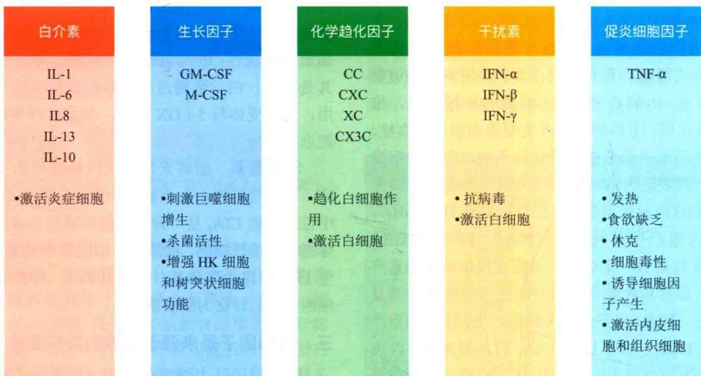 
图2-10炎症反应过程中重要的细胞因子。GM-CSF.粒细胞－巨噬细胞集落刺激因子；IL.白介素；M-CSF.巨噬细胞集落刺激因子；NK.自然杀伤细胞；IFN.干扰素；TNF.肿瘤坏死因子
和IFN-γ激活后，释放炎症细胞因子IL-1和TNF-α。这些细胞因子在调控局部和全身的炎症反应中，发挥重要作用。ACTH.促肾上腺皮质激素.jpg) 
图2-11白介素-1（IL-1）和肿瘤坏死因子-a（TNF-a）在炎症反应中的主要作用。巨噬细胞经脂多糖(LPS)和IFN-γ激活后，释放炎症细胞因子IL-1和TNF-α。这些细胞因子在调控局部和全身的炎症反应中，发挥重要作用。ACTH.促肾上腺皮质激素
能够诱导中性粒细胞活化及聚集。IL-1和TNF- $\alpha$ 可以调节发热、肌肉分解代谢、蛋白质合成以及与炎症状态相关的血流动力学改变等（图2-11）。干扰素 $\gamma (\mathrm{IFN - }\gamma)$ 是另一种能显著刺激巨噬细胞活化并产生细胞因子的强力激活物，由免疫反应过程中的T淋巴细胞亚群产生（见第4章）。
化学趋化因子的结构与功能 化学趋化因子的作用是引导细胞迁移（这个过程称为趋化作用）。炎细胞在组织损伤部位的聚集，首先需要其从血管内迁移至血管外组织中。化学趋化因子是一个大的细胞因子家族（已知成员超过50个），调控白细胞在炎症和免疫过程中的迁移。例如，在急性炎症时，化学趋化因子是中性粒细胞的重要趋化因子（见后文）。
化学趋化因子是一类能与靶细胞表面的G蛋白偶联受体相作用的小分子蛋白。这些分泌蛋白由多种细胞产生，生物学作用广泛而多样。这种功能上的差异取决于何种靶细胞、何种受体类型以及何种细胞内传导信号途径被激活。
根据功能不同，化学趋化因子分为两大类：即炎症化学趋化因子和归巢化学趋化因子。炎症化学趋化因子由多种组织的细胞和白细胞产生，是对细菌毒素和炎症
细胞因子（尤其是IL-1、TNF- $\alpha$ 和IFN- $\gamma$ ）的反应产物。归巢化学趋化因子持续表达，并在疾病状态时表达上调。在免疫反应过程中，它们引导淋巴细胞和树突状细胞归巢至淋巴组织（见第4章）。
化学趋化因子作为能产生趋化梯度的固定或可溶性分子，其通过与细胞外基质（ECM）的蛋白多糖或细胞表面结合而发挥作用。在组织损伤部位保持有高浓度的化学趋化因子。迁移中的白细胞通过其表面的特定受体与结合基质的化学趋化因子以及相关黏附分子结合，使细胞顺着趋化梯度迁移至损伤部位。这种对结合基质的趋化物的反应，称为趋触性。作为可溶性分子，化学趋化因子通过建立一个趋化梯度来调控白细胞在血管外组织中的运动和定位。细胞表面的化学趋化因子受体的种类多样并有多种组合，使其拥有广泛而多样的生物学功能。中性粒细胞、单核细胞、嗜酸性粒细胞和嗜碱性粒细胞具有一些相同的受体，但又表达各自特有的其他受体。因此，特定化学趋化因子的组合可以选择性招募不同类型的细胞。
# 四、活性氧族是信号转导、杀菌和细胞毒性分子
活性氧族（ROS）是来自氧分子的具有化学活性的分子。正常情况下，ROS在产生后迅速失活；但当异常产生时，则具有细胞毒性（见第1章）。ROS通过激活信号传导通路、或与蛋白质、脂类及DNA结合产生氧化应激。白细胞产生的ROS释放到吞噬体内，具有杀菌作用。在炎症反应中发挥重要作用的ROS包括超氧阴离子 $\mathrm{O}_2^-$ 、NO、过氧化氢（ $\mathrm{H}_2\mathrm{O}_2$ ）和羟基（OH）（图2-12）（见后文及第1章）。
# 第五节 炎症细胞
白细胞是炎症反应中的主要细胞成分，包括中性粒细胞、T淋巴细胞、B淋巴细胞、单核细胞、巨噬细胞、嗜酸性粒细胞、肥大细胞和嗜碱性粒细胞。每种细胞都有特定的功能，但这些功能又有交叉，并且随炎症反应的进行而发生变化。此外，局部组织的细胞之间以及它们与炎症细胞之间都有相互作用，从而对损伤和感染做出持续反应。
# 一、中性粒细胞是参与急性炎症的主要细胞
多形核中性粒细胞，或称PMN，是参与急性炎症的主要细胞。它的胞质中富含颗粒，核有 $2\sim 4$ 个分叶。PMN储存于骨髓中，循环于血液中，可迅速渗出到损伤或感染部位（图2-13A）。吞噬物、细胞因子、化学趋化因子及抗原-抗体复合物等，可与PMN胞膜上的特异性受体结合，从而激活PMN。在组织中，PMN吞噬细菌和坏死组织（见下文），然后凋亡，急性炎症消退。
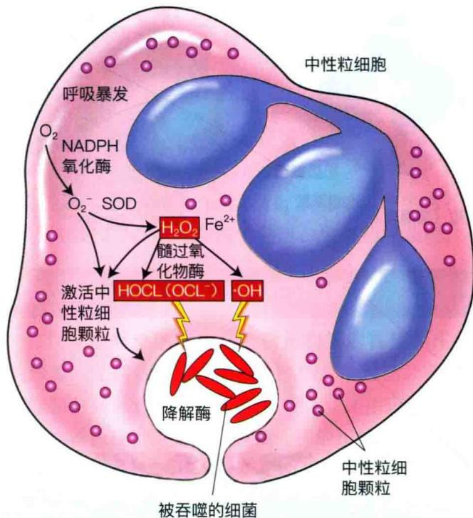 
图2-12中性粒细胞吞噬细菌后，产生活性氧簇的过程。 $\mathrm{Fe}^{2+}$ 亚铁离子； $\mathrm{H}_2\mathrm{O}_2$ 过氧化氢；HOCl.次氯酸；NADPH.烟酰胺腺嘌呤二核苷酸磷酸；OCI.次氯酸根；·OH.氢氧根；SOD.超氧化物歧化酶
# 二、内皮细胞衬覆血管腔
内皮细胞排列呈单层衬覆血管腔，将血管外与血管内的空间分隔开。它们产生的某些物质，可以保持血管开放，并作为血管扩张剂和血管收缩剂来调节血管紧张性。血管壁损伤时，内皮屏障受损，暴露出局部促凝血信号（图2-13B）。
内皮细胞可调控炎症细胞的渗出；它们能够促进或抑制组织灌注以及炎症细胞的流入。缓激肽、组胺、内毒素、细胞因子等致炎因子，可以诱导内皮细胞暴露出黏附分子，这有利于：①锚定和激活白细胞；②呈递主要组织相容性复合体（MHC）分子I和Ⅱ；③形成重要的血管活性介质和炎性介质。形成的炎症介质包括以下几种：
一氧化氮：一氧化氮（内皮衍生舒张因子）是一种低分子量的血管舒张因子，可以抑制血小板聚集，并刺激血管平滑肌舒张，从而调节血管紧张性。 
内皮素：内皮素是低分子量的多肽，可引起血管平滑肌持续收缩。 
■ 花生四烯酸衍生的舒张因子： $\mathrm{TXA}_2$ 的生物拮抗剂，即 $\mathrm{PGI}_2$ ，抑制血小板聚集，引起血管舒张。 
■ 细胞因子：IL-1、IL-6、TNF- $\alpha$ 以及某些炎性细胞因子是由活化的内皮细胞产生的。 
■ 抗凝物质：肝素样分子以及血栓调节蛋白可以抑制凝血的级联反应（见第10章和第20章）。
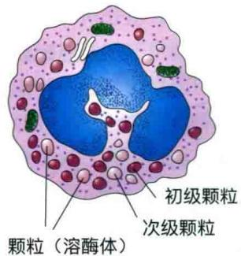 
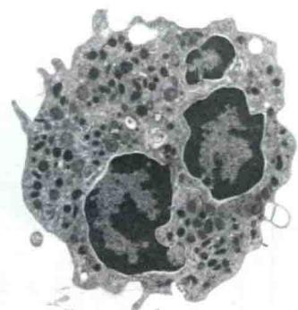
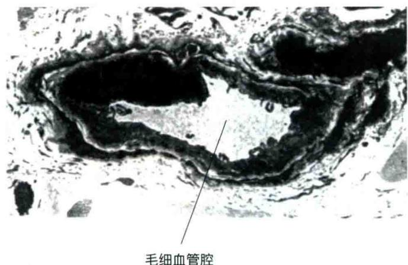 
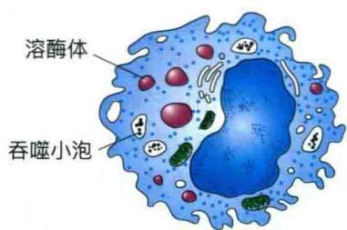 
C
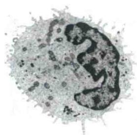
# 中性粒细胞
# 特征和功能
急性炎症反应的重要细胞 
- 吞噬微生物和组织碎片 
·介导组织损伤
# 主要炎症介质
- 活性氧代谢产物 
- 溶酶体颗粒包含物初级颗粒
- 髓过氧化物酶 
·防御素 
- 杀菌性 / 通透性增加蛋白 
- 弹性蛋白酶 
- 组织蛋白酶3 
# 次级颗粒
·乳铁蛋白 
胶原酶 
- 补体激活因子 
CD11b/CD18 
CD11c/CD18 
- 层粘连蛋白
# 三级颗粒
- 白明胶酶 
纤维蛋白溶酶原激活因子 
- 组织蛋白酶 
# 内皮细胞
# 特征和功能
- 维持血管完整性 
- 调节血小板聚集 
- 调节血管收缩和舒张 
- 介导炎症白细胞募集
# 主要炎症介质
- von Willebrand 因子 
- 一氧化氮 
·内皮素 
- 前列腺素类物质
# 单核细胞/巨噬细胞
# 特征和功能
- 调节炎症反应 
- 调节凝血 / 纤溶通路 
- 调节免疫反应（见第4章）
# 主要炎症介质
-IL-1 
-TNF-a 
-1L-6 
- 化学趋化因子（如IL-8， 
MCP-1)
- 溶酶体酶
- 丝氨酸蛋白酶 
- 金属蛋白酶（如胶原酶）
- 阳离子蛋白
- 前列腺素/白三烯 
- 纤溶酶原激活因子 
- 促凝血活性 
- 氧代谢物形成
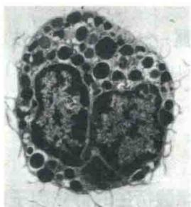 
D 
图2-13 参与炎症反应的细胞：形态和功能。A.中性粒细胞；B.内皮细胞；C.单核细胞/吞噬细胞；D.肥大细胞。CD.分化抗原簇；IL.白介素；MCP-1.单核细胞趋化蛋白-1；TNF-a.肿瘤坏死因子
# 肥大细胞（嗜碱性粒细胞）
# 特征和功能
- 结合 IgE 分子 
- 包含电子致密颗粒
# 主要炎症介质
# 组胺
- 白三烯（LTC，LTD，LTE） 
- 血小板激活因子 
- 嗜酸性粒细胞趋化因子 
- 细胞因子（如TNF- $\alpha$ ，IL-4）
■纤溶蛋白因子：组织型纤维蛋白溶解酶原激活物（t-PA）可以促进纤溶过程。
■ 促凝物质：von willebrand因子促进血小板黏附到血管损伤区域。组织因子激活外源性凝血级联反应。
# 三、单核细胞 / 巨噬细胞在急慢性炎症中都很重要
血液循环中的单核细胞（图2-13C）是单叶核，通常为肾形核。单核细胞来源于骨髓，其能够离开血液循环迁移到组织中，成为定居在组织中的巨噬细胞。在炎症介质的刺激下，它们快速渗出到急性炎病症灶处，吞噬及杀灭细菌。单核细胞/巨噬细胞能够产生强效的血管活性介质，包括前列腺素、白三烯、血小板活化因子和炎性细胞因子。单核细胞/巨噬细胞对维持慢性炎症尤为重要。
# 四、肥大细胞和嗜碱性粒细胞在过敏反应中的重要性
肥大细胞产物在调节血管通透性和支气管平滑肌的紧张性中起着重要作用，在过敏反应中尤为重要（见第4章）。肥大细胞和嗜碱性粒细胞（图2-13D）有IgE的细胞表面受体。肥大细胞可见于结缔组织，尤其常见于肺和胃肠道黏膜表面、皮肤及微脉管系统。嗜碱性粒细胞循环量较少，可以迁移进入组织。
当IgE致敏的肥大细胞或嗜碱性粒细胞再次接触抗原或物理性刺激（如寒冷、创伤和阳离子蛋白）时，其胞质颗粒中的炎性介质即被分泌到胞外组织中。这些颗粒中包含酸性黏多糖（例如肝素）、中性粒细胞和嗜酸性粒细胞的趋化因子、丝氨酸蛋白酶、组胺（一种引起血管通透性快速升高的物质）。组胺与血管壁上特异性的 $\mathrm{H}_{1}$ 受体结合，可引起内皮细胞收缩并形成细胞间缝隙，发生水肿，该作用可被 $\mathrm{H}_{1}$ 受体阻断剂所抑制。肥大细胞和嗜碱性粒细胞受到刺激后，还也产生花生四烯酸的代谢产物及细胞因子（如IL-4和TNF-α）。
# 五、嗜酸性粒细胞在寄生虫防御反应中的重要性
嗜酸性粒细胞在血液中循环，以类似于中性粒细胞的方式渗出到组织中。主要参与IgE介导的反应，如过敏反应及哮喘（图2-14A）。嗜酸性粒细胞含有白三烯、血小板活化因子、酸性磷酸酶以及过氧化物酶。嗜酸性粒细胞表达IgA受体，胞质中的大颗粒包含主要碱性蛋白，二者都参与抗寄生虫反应。
# 六、血小板在正常止血中的作用
血小板在正常止血中起主要作用，引发并调节血凝块形成（见第20章）。血小板可以释放强效的血管活性物质，并产生某些生长因子以调节间质细胞的增殖（图2-14B）。血小板很小（直径约 $2\mu \mathrm{m}$ ），无核，
包含三种不同的物质：
致密颗粒：富含5-羟色胺、组胺、钙和二磷腺苷（ADP）；
a-颗粒：包含纤维蛋白原、凝血蛋白[血小板源性生长因子（PDGF）、多肽及蛋白质]；
■溶酶体：隔离酸性水解酶。
若血管损伤暴露ECM或凝血系统激活产生血栓，血小板接触胶原纤维时会发生黏附、聚集和脱颗粒。
# 第六节 在急性炎症中白细胞的渗出
急性炎症重要的特征之一就是白细胞在受损组织中的聚集，尤其是中性粒细胞（PMN）的渗出。首先，白细胞黏附到血管内皮上被激活；然后，白细胞变得扁平，从血管内皮细胞之间迁移到周围的组织中；到达血管外组织后，PMN摄取异物、微生物和坏死组织。
# 一、黏附分子之间的相互作用使得白细胞黏附到血管内皮上
在致炎因子的作用下，内皮细胞表达的选择素被激活并重新分布于细胞表面。白细胞通过与内皮细胞表面的选择素相互作用，从而被募集于毛细血管后静脉。在此过程中，白细胞贴近内皮细胞，称为边集，其可减慢血流中白细胞的运动速度（图2-15）。然后，白细胞沿着血管内皮细胞表面呈跳跃运动，称之为滚动。随后，PMN牢固地黏附于内皮细胞上的细胞间黏附分子（ICAMs）（称为白细胞捕获）。再后，内皮细胞相互分离，白细胞通过血管壁游出至血管外，并在趋化因子的影响下通过血管外组织迁移到损伤部位。
白细胞渗出的调节过程如下：炎症介质刺激其周围组织的细胞，包括血管内皮细胞；黏附分子表达于血管内皮细胞表面，并与血液循环中的白细胞表面黏附分子相互作用；趋化因子吸引白细胞沿化学梯度到达损伤部位。
1.黏附分子 参与白细胞渗出的4个黏附分子家族：选择素、地址素、整合素以及免疫球蛋白超家族。
（1）选择素：选择素家族（属于C型钙依赖性凝集素家族）包括P选择素、E选择素和L选择素，分别表达于血小板、内皮细胞和白细胞的表面。选择素都有类似的分子结构，由一个跨膜糖蛋白链和一个特异性结合唾液酸化寡糖链的细胞外碳水化合物结合结构域组成。唾液酸化寡糖链是地址素上唾液酸化-LewisX的一部分，其被结合后，可使白细胞迅速黏附于内皮细胞表面并滚动前进。
P选择素（CD62P、GMP-140、PADGEM）其预先合成好，并储存于内皮细胞的帕拉得小体和血小板的 $\alpha$ 颗粒中。在组胺、凝血酶或某些炎性细胞因子的刺
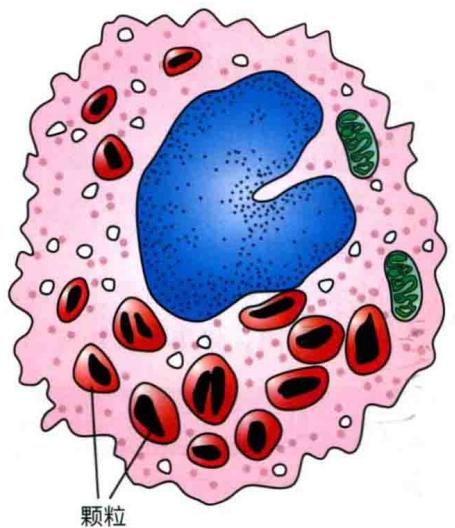 
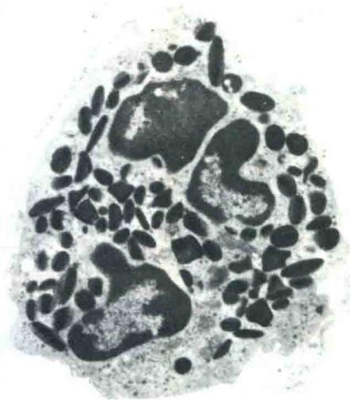
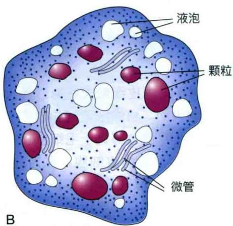 
图2-14炎症中的其他细胞的形态和功能。A.嗜酸性粒细胞；B.血小板.ADP.二磷腺苷
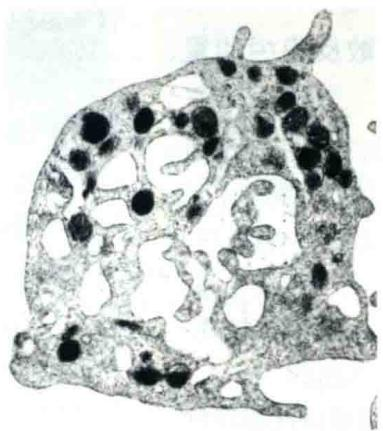
# 嗜酸性粒细胞
# 特征和功能
- 与下列过程相关： 
-过敏反应 
-寄生虫相关炎症反应 
-慢性炎症 
- 调节肥大细胞介导的反应 
- 活性氧代谢物 
- 溶酶体颗粒酶（初级晶体样颗粒） 
- 主要碱性蛋白 
- 嗜酸性阳离子蛋白 
- 嗜酸性过氧化物酶 
-酸性磷酸酶 
-β-葡萄糖醛酸酶 
芳香基硫酸酯酶B 
-组胺酶 
- 磷脂酶D 
- 前列腺素E 
# 血小板
特征和功能
- 血栓形成；促进凝血 
- 调节血管通透性 
- 调节间质细胞的增殖反应 
- 致密颗粒
- 血清素 
$-\mathrm{Ca}^{2+}$ 
-ADP 
a-颗粒 
-阳离子蛋白 
-纤维蛋白原和凝血蛋白 
- 血小板源性生长因子（PDGF） 
溶酶体 
- 血栓素 $\mathrm{A}_{2}$
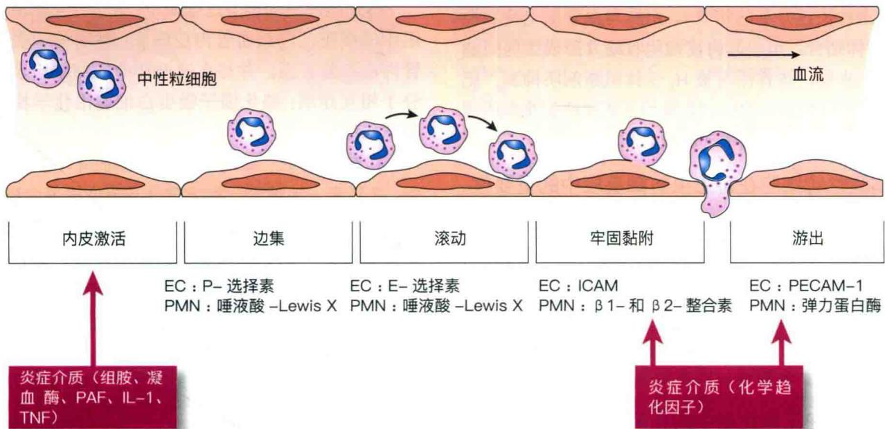 
内皮细胞 
图2-15 中性粒细胞的渗出过程。炎症介质激活内皮细胞，其黏附分子的表达水平增高。中性粒细胞的P-选择素糖蛋白配体1（PSGL-1）和E-选择素配体1（ESL-1）上的唾液酸-LewisX分别结合P-选择素和E-选择素，促进中性粒细胞的边集和滚动。激活的中性粒细胞表达高水平的整合素，后者与内皮细胞上的细胞间黏附分子（ICAM）-1结合，使中性粒细胞牢固地黏附于内皮细胞。内皮细胞（EC）之间的连接断开，于是中性粒细胞从分开的细胞之间通过，进入组织。IL.白介素；PAF.血小板激活因子；PECAM-1.血小板内皮细胞黏附分子；PMN.中性粒细胞；TNF.肿瘤坏死因子
激下，P选择素被很快运输至内皮细胞表面，并与白细胞表面的唾液酸化-LewisX结合。P选择素被快速运输至细胞表面，可使内皮细胞与白细胞之间迅速产生黏附作用。
E选择素（CD62E、ELAM-1）在正常情况下，内皮细胞表面不表达E选择素，但炎症介质（如细胞因子或细菌脂多糖）可以诱导其表达。E选择素通过与含有LewisX或LewisA的分子结合，来调节中性粒细胞、单核细胞及某些淋巴细胞的黏附。
L选择素（CD62L、LAM-1、Leu-8）其表达于多种类型的白细胞表面。它最初被定义为淋巴细胞的“归巢受体”。在淋巴组织中，它将淋巴细胞结合到小静脉的内皮细胞上，从而调节淋巴细胞在该组织中的运输。L选择素结合携带多糖的细胞黏附分子-1（GlyCAM-1）、黏膜地址素细胞黏附分子-1（MadCAM-1）和CD34。
（2）地址素：血管地址素是黏液样糖蛋白，包括GlyCAM-1、P选择素糖蛋白-1（PSGL-1）、E选择素配体1(ESL-1)和CD34。它们含有唾液酸化-LewisX，后者与选择素的凝集素结构域结合。地址素表达于白细胞和内皮表面，调节白细胞亚群的定位，并参与淋巴细胞活化。
（3）整合素：化学趋化因子、脂质介质和促炎分子等均可以激活细胞，使其表达黏附分子整合素（见第3章）。整合素由异源二聚体跨膜 $\alpha$ 链和 $\beta$ 链组成，参与细胞-细胞间相互作用以及细胞与细胞外基质的结合。延迟激活分子（VLA）包括白细胞和淋巴细胞上的VLA-4（α4β1），后者可与内皮细胞上的VCAM-1（一种携带免疫球蛋白结构域的分子）相结合。 $\beta 2$ 整合素（CD18）与 $\alpha$ 整合素链相结合形成分子： $\alpha_{1}\beta_{2}$ （也称为CD11a/CD18或LFA-1）和 $\alpha_{\mathrm{m}}\beta_{2}$ （也称为CR3、CD11b/CD18或MAC-1），两者分别结合到ICAM-1和ICAM-2（也是免疫球蛋白超家族成员）上。白细胞整合素以低亲和态存在，但当白细胞被激活时，其转化为高亲和态。
（4）免疫球蛋白超家族：免疫球蛋白超家族的黏附分子包括ICAM-1、ICAM-2和VCAM-1，它们都与白细胞上的整合素相互作用来介导白细胞渗出。在细胞因子的刺激下，内皮细胞、某些白细胞以及上皮细胞（如肺泡细胞）的表面可以表达这些黏附分子。
2. 白细胞的渗出 边集、滚动以及牢固地黏附于内皮细胞是白细胞从血液循环中渗出到组织的先决条件。一个滚动的细胞若要黏附，首先必须有依赖选择素的滚动速率的减慢。早期滚动的增加依赖于P选择素，而细胞因子诱导的E选择素则引发早期黏附。整合素与选择素相互作用，协同促使白细胞滚动并继而
使其牢固地黏附。白细胞表面的整合素与血管内皮表达的免疫球蛋白超家族配体相结合，进一步抑制白细胞运动，从而延长了每个白细胞在内皮上的暴露时间。同时，黏附分子参与激活细胞内信号转导过程，使得白细胞和血管内皮细胞进一步被激活，继而上调了L选择素与整合素的结合。最终结果是白细胞牢固地黏附于内皮细胞（图2-15）。
# 二、趋化分子指引中性粒细胞到达损伤部位
白细胞必须准确地到达炎症损伤部位，才能实现其生物学功能。为了使白细胞的特定亚群能够及时到达损伤部位，它们必须接收到特定的指引信号。白细胞在引诱剂、排斥剂和黏附分子的复杂引导作用下，穿过血管和血管外组织。趋化作用是一个指引细胞迁移的耗能动态过程。在内皮细胞释放的趋化因子的作用下，血液中的白细胞聚集在一起。然后，白细胞沿着某种趋化因子（其是对远处另一种趋化因子的反应产物）的浓度梯度从内皮迁移到靶组织。在迁移过程中，细胞伪足伸向化学趋化因子浓度升高的方向。在伪足前进的方向，与细胞骨架蛋白的装配和收缩有关的细胞内钙离子水平发生显著变化。这个过程牵拉细胞尾部沿着化学浓度梯度运动。中性粒细胞必须整合不同的信号，以便准时、准确到达相应地点，完成它们的任务。中性粒细胞的重要趋化因子包括：
C5a，衍生自补体；
细菌和线粒体产物，尤其是低分子量N-甲酰化肽（例如N-甲酰－甲硫氨酰-亮氨酰-苯丙氨酸）；
■ 花生四烯酸代谢产物，尤其是 $\mathrm{LTB_4}$
化学趋化因子。
淋巴细胞、嗜碱性粒细胞和嗜酸性粒细胞等的趋化因子，也在组织损伤部位产生，可以由活化的内皮细胞、组织实质细胞或其他炎症细胞分泌。这些趋化因子包括血小板激活因子、转化生长因子β（TGF-β）、中性粒细胞阳离子蛋白和淋巴因子。组织内趋化因子的混合物很大程度上决定了渗出到损伤部位的白细胞类型。细胞到达其目的地之后，必须能够停留在靶组织中。细胞之间的接触、黏附或抑制信号的调节，决定了在特定组织中最终捕获了哪种细胞。
# 三、白细胞穿过内皮细胞屏障到达组织
黏附到血管内皮的白细胞，以细胞旁游出（即从相邻内皮细胞之间通过）的方式迁移。根据趋化因子的浓度梯度，中性粒细胞伸出伪足，从细胞之间逐渐游出血管。血管内皮细胞之间有紧密连接和黏合连接。CD31（血小板内皮细胞黏附分子，PECAM-1）表达于内皮细胞表面，并且相互结合以保持细胞间紧密相连。在炎症介质、黏附分子产生的细胞内信号以及黏
附的中性粒细胞发出的信号作用下，这些连接被断开。中性粒细胞动员弹力蛋白酶到达其伪足膜，从而诱导内皮细胞在中性粒细胞前缘收缩并分离开。中性粒细胞也会诱导内皮细胞内钙离子浓度升高，从而导致内皮细胞相互分离。
中性粒细胞还可通过跨细胞渗出的方式迁移出内皮细胞。除了诱导内皮细胞收缩，中性粒细胞还能从内皮细胞胞质中的小圆形孔隙中挤过。在有孔型微血管的组织，如胃肠黏膜和分泌腺体中，中性粒细胞可穿过内皮细胞上称之为膜孔的薄弱区域，而不会损伤内皮细胞。在非膜孔型的微血管中，中性粒细胞可通过内皮细胞的小凹或胞饮小泡（形成跨越细胞的膜连接小通道）来穿越内皮细胞。
# 第七节 急性炎症中白细胞的功能
# 一、白细胞吞噬微生物和组织碎片
很多炎症细胞（包括单核细胞、组织巨噬细胞、树突状细胞和中性粒细胞）通过吞噬作用来识别、内化和消化异物、微生物或细胞碎片。吞噬作用是指真核细胞对不溶性大颗粒（通常 $>0.5\mu \mathrm{m}$ ）和微生物的摄取过程。这些效应细胞叫作吞噬细胞。复杂的吞噬过程涉及一系列跨膜和细胞内信号事件。
1.识别吞噬开始于吞噬细胞表面的特异性受体对微粒的识别（图2-16）。经血浆成分（调理素），尤其是免疫球蛋白或C3b包裹后（调理素化），能增强多数生物性物质的吞噬过程。吞噬细胞携带特定的调理素受体，包括免疫球蛋白Fcγ和补体成分的受体。然而，很多病原体不断进化，能够逃避白细胞的吞噬。细菌的多糖荚膜、蛋白质A、蛋白质M或肽聚糖等成分都能够阻止补体沉积、抗原识别以及受体结合。 
2. 信号转导 细菌表面结合调理素后，会引起巨噬细胞表面的Fcγ受体聚集。然后，受体的胞质结构域或γ亚基上的免疫受体酪氨酸依赖激活结构域（ITAMs）发生磷酸化，引发细胞内信号转导。吞噬过程中的信号转导需要Fcγ受体相关的酪氨酸激酶参与。 
3. 内化 经Fcγ受体作用的吞噬过程，肌动蛋白直接在吞噬目标下聚集。聚合的肌动蛋白纤维向前推动质膜。然后，质膜重塑以增加表面积从而在异物周围形成伪足，形成“吞噬杯”吞入异物。之后，质膜在调理素化的微粒周围“拉上拉链”，将其封入胞质空泡中，称为吞噬体（图2-16）。 
4. 消化 含有异物的吞噬体与胞质溶酶体融合，形成吞噬溶酶体，溶酶体酶被释放到其中发挥作用。吞噬溶酶体呈酸性 $\mathrm{pH}$ ，有利于激活水解酶，后者能降解吞噬物。有些微生物不断进化，能够逃避中性粒细胞的杀伤作用；能够阻止溶酶体脱颗粒或抑制中性粒
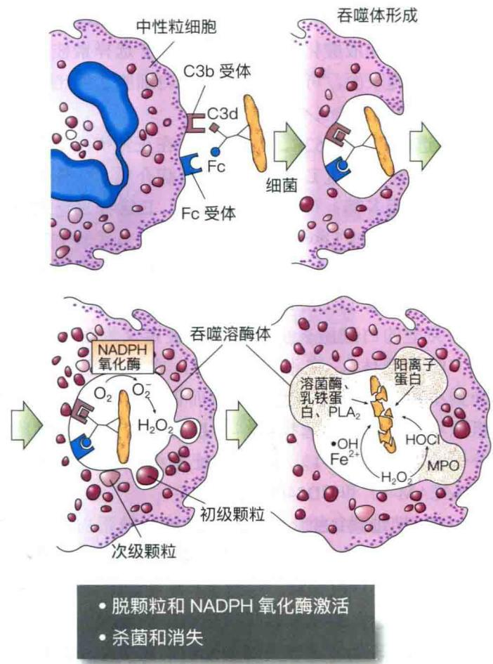 
图2-16中性粒细胞吞噬细菌及杀死细菌的机制。调理素（C3b等）包裹细菌表面，使其被中性粒细胞的C3b受体识别。受体聚集成簇，触发细胞内信号传导以及中性粒细胞内的肌动蛋白组装。伪足包绕细菌，形成吞噬体。溶酶体颗粒与吞噬体融合，形成吞噬溶酶体，并向其内释放溶酶体酶和氧自由基，进而杀死并降解该细菌。 $\mathsf{Fe}^{2+}$ 亚铁离子； $\mathsf{H}_2\mathsf{O}_2$ 过氧化氢；HOCl.次氯酸；MPO.髓过氧化物酶；NADPH.烟酰胺腺嘌呤二核苷酸磷酸； $\mathsf{O}_2$ 氧气； $\mathsf{O}_2^-$ 超氧离子； $\bullet \mathsf{OH}$ 羟基；PLA.磷脂酶 $A_{2}$
细胞的酶。
# 二、中性粒细胞的酶在抗微生物和清理创伤中必不可少
尽管PMN对降解微生物和细胞碎片至关重要，它们同时也可引起组织损伤。损伤部位的PMN释放颗粒是一把双刃剑。一方面，通过蛋白水解作用来清理损伤组织碎片，这是有益的；另一方面，降解酶会损伤内皮细胞和上皮细胞，还会消化结缔组织。
中性粒细胞颗粒：中性粒细胞的胞质颗粒中含有某些物质，其可以合成降解微生物和组织所需要的酶。中性粒细胞中的初级、次级和第三级颗粒在形态和生物学方面都有所不同；每种颗粒都有各自特异的酶谱（图2-13A）。
# 三、炎症细胞的氧化性和非氧化性杀菌作用
PMN和巨噬细胞的杀菌活动，部分由活性氧类物质介导，部分由不依赖氧的机制介导。
1. 活性氧族杀菌作用 在吞噬过程中，炎症细胞
会产生多种氧代谢物（见第1章）。这些产物比氧本身更活跃，有助于杀死吞入的细菌。
$\mathrm{O}_2^-$ ：吞噬作用能够激活PMN细胞膜上的烟酰胺腺嘌呤二核苷酸磷酸（NADPH）氧化酶。NADPH的氧化由多种成分组成的电子运输复合体完成，氧分子被还原为 $\mathrm{O}_2^-$ 。当细胞接触趋化因子或细菌脂多糖，可增强对NADPH氧化酶的激活。NADPH的氧化增加了氧消耗，同时刺激了己糖脱单磷酸。以上的细胞反应称为呼吸暴发，这种现象也能引发NETosis——中性粒细胞中一种新的凋亡通路，与中性粒细胞的细胞外诱捕网（NETs）的释放有关。NET是由染色质和颗粒蛋白形成的网络结构，局部呈现高浓度的抗微生物分子是其特征。
$\mathrm{H}_2\mathrm{O}_2$ ： $\mathrm{O}_2^-$ 在细胞表面以及吞噬溶酶体内的超氧化物歧化酶作用下，很快转化为 $\mathrm{H}_2\mathrm{O}_2$ 。 $\mathrm{H}_2\mathrm{O}_2$ 很稳定，并可作为形成其他活性氧化物的底物。
■次氯酸（HOCl）：髓过氧化物酶（MPO）是一种带强正电荷的中性粒细胞产物，由初级颗粒（嗜天青颗粒）以胞吐形式分泌。在卤化物（通常是氯）存在时，髓过氧化物酶催化 $\mathrm{H}_2\mathrm{O}_2$ 转化成次氯酸。这种强氧化剂是吞噬细胞产生的主要杀菌剂。次氯酸还参与激活中性粒细胞产生的胶原酶和白明胶酶（两者都以惰性酶形式分泌）。同时，次氯酸还能使 $\alpha_{1}$ -抗胰蛋白酶失活。
$\bullet \mathrm{OH}: \mathrm{H}_{2} \mathrm{O}_{2}$ 通过 Haber-Weis 反应还原成高活性的 $\cdot \mathrm{OH}$ 。在生理 $\mathrm{pH}$ 下，这个反应发生缓慢；但当有 $\mathrm{Fe}^{2+}$ 存在时，芬顿反应迅速将 $\mathrm{H}_{2} \mathrm{O}_{2}$ 转化为 $\cdot \mathrm{OH}$ 。 $\cdot \mathrm{OH}$ 可进一步还原形成 $\mathrm{H}_{2} \mathrm{O}$ （见第1章）。
NO：吞噬细胞和血管内皮细胞产生的NO及其衍生物，具有多种生理作用及病理作用。NO和氧自由基相互作用，以平衡它们的细胞毒性和细胞保护作用。NO能和氧自由基反应，形成毒性分子（如过氧亚硝酸盐和亚硝基硫醇）。NO还能清除 $\mathrm{O}_2^-$ ，从而减少有害自由基的数量。
单核细胞、巨噬细胞和嗜酸性粒细胞也可产生氧自由基，这取决于细胞的活化状态以及其所接触的刺激。这些细胞产生的活性氧自由基有助于它们杀伤细菌、真菌以及某些寄生虫。儿童的慢性肉芽肿病显示了杀伤细菌的氧依赖机制的重要性。此病患者NADPH氧化酶遗传性缺乏，不能在吞噬过程中产生 $\mathrm{O}_2^-$ 和 $\mathrm{H}_2\mathrm{O}_2$ ，使患者易反复感染，尤其是感染革兰阳性球菌。携带MPO遗传缺陷的患者，因为不能产生次氯酸，更易感染念珠菌（表2-2）。
2. 非氧化性杀菌作用 吞噬细胞，尤其是PMN和单核细胞/巨噬细胞，有一些抗微生物的作用是不依赖氧的。这些杀菌作用主要依赖胞质颗粒中的杀菌
蛋白，包括溶酶体酸性水解酶以及炎症细胞特有的非酶类蛋白。
■溶酶体水解酶：中性粒细胞的初级、次级颗粒以及单核吞噬细胞的溶酶体中含有水解酶，其包括硫酸酯酶、磷酸酶和多种能够分解多聚糖和DNA的酶。 
■ 杀菌蛋白/通透性增加蛋白：PMN的初级颗粒中的这种阳离子蛋白能够杀死许多革兰阴性菌，但对革兰阳性菌和真核细胞没有毒性。 
■ 防御素：PMN的初级颗粒以及某些单核吞噬细胞的溶酶体中含有这种阳离子蛋白，该蛋白能广泛杀死革兰阳性菌、革兰阴性菌、真菌和部分有包膜病毒。 
■乳铁蛋白：乳铁蛋白分布在中性粒细胞的次级颗粒以及多数分泌性体液中，是一种铁结合糖蛋白。它螯合铁的能力使其能够与细菌争夺铁。它还可以通过增加·OH的生成，从而促进依赖氧的杀菌作用。 
■溶菌酶：这种杀菌酶存在于许多组织和体液、中性粒细胞的初级和次级颗粒以及单核吞噬细胞的溶酶体中。革兰阳性菌细胞壁的肽聚糖对溶菌酶特别敏感，很容易被降解。相反，革兰阴性菌则通常对其抵抗能力较强。 
嗜酸性粒细胞的杀菌蛋白：嗜酸性粒细胞的颗粒中含有多种阳离子蛋白，其中最重要的是主要碱性蛋白和嗜酸性阳离子蛋白。主要碱性蛋白大约占了嗜酸性粒细胞颗粒中总蛋白的 $50\%$ 。这些蛋白都对细菌无效，但对许多寄生虫有强效毒性。
表2-2 以反复性细菌感染为特征的先天性吞噬细胞功能缺陷疾病疾病缺陷LADLAD-1型β₂-整合素表达或功能缺陷(CD11/CD18)LAD-2（岩藻糖功能缺陷，导致与选择素结合缺陷）高-IgE反复性感染，乔布综合征（STAT-3突变）趋化作用弱Chediak-Higashi综合征溶酶体颗粒缺陷，趋化作用弱中性粒细胞特异性颗粒缺陷中性粒细胞无颗粒慢性肉芽肿疾病NADPH氧化酶缺陷，无H₂O₂生成髓过氧物酶缺陷HOCI生成缺陷
CD. 分化抗原簇； $\mathrm{H}_2\mathrm{O}_2$ 。过氧化氢；HOCl。次氯酸；Ig。免疫球蛋白；LAD。白细胞黏附缺陷；NADPH。烟酰胺腺嘌呤二核苷酸磷酸；STAT-3。信号传导与转录激活因子3
3. 白细胞的功能缺陷 当PMN急剧减少或功能缺陷时，急性炎症细胞保护作用的重要性就凸显出来，患者表现为感染的频率和严重程度增加。这类缺陷最常见的是抗肿瘤化疗带来的医源性中性粒细胞减少症。吞噬细胞的功能性障碍，可发生在下述过程中的任何
一个环节：黏附、迁移、趋化或吞噬。这些功能障碍可以是获得性的或先天性的。获得性疾病，如白血病、糖尿病、营养不良、病毒感染和败血症等，常常伴有炎症细胞功能障碍。表2-2给出了一些与吞噬功能障碍相关的先天性疾病。
# 第八节 急性炎症反应的调节
血浆衍生及细胞衍生的可溶性促炎因子，可以放大组织对感染、异物和损伤组织的反应。补体因子、促炎细胞因子和某些情况下的免疫复合物，均可激活调控促炎介质（包括TNF- $\alpha$ 、IL-1、化学趋化因子和黏附分子）基因表达的信号转导通路。分泌的细胞因子随后通过激活其他细胞类型来扩散该反应。多种不同的刺激导致炎症细胞发生一系列的功能性反应，称为刺激－反应偶联。尽管细胞内信号通路很复杂，并且随着细胞类型和刺激而变化，常见的细胞内通路与可溶性介质介导的炎症细胞激活有关，例如G蛋白、TNF受体和JAK-STAT通路的激活。
# 一、G蛋白通路
许多化学趋化因子、激素、神经递质和炎症介质，通过鸟苷酸结合蛋白（G蛋白）来传导信号（图2-17）。G蛋白的细胞内结构域的连接蛋白不同。在大多数情况下，配体与细胞膜上的受体结合后，可导致G蛋白的细胞内结构域激活，继而激活磷脂酶C和磷脂酰肌醇-3-激酶（PI3K）。最后，胞质游离钙浓度的升高、蛋白激酶C及其他蛋白激酶的激活，导致炎症反应相关的基因转录。
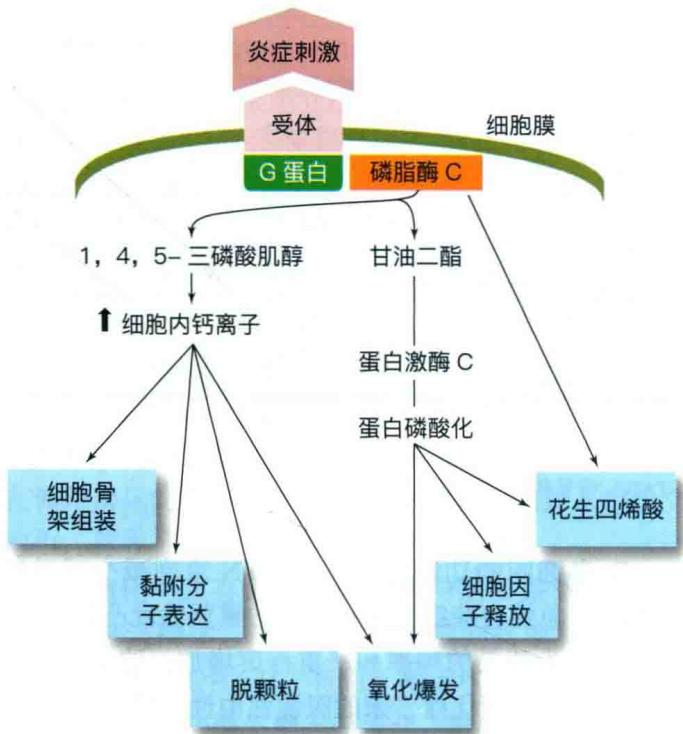 
图2-17 炎症刺激所引发的G蛋白细胞内信号传导通路
# 二、肿瘤坏死因子受体通路
肿瘤坏死因子（TNF）对炎症及其临床症状的发生至关重要。它诱导肿瘤细胞凋亡，并调节免疫功能。TNF和相关蛋白与两种细胞表面受体相互作用，在细胞膜上形成多蛋白信号复合体。这个复合体能够触发：①凋亡相关的酶，即半胱天冬酶；②凋亡抑制因子；③激活核转录因子核因子-κB（NF-κB），这是炎症时TNF介导的重要调节步骤。
# 三、JAK-STAT通路
该通路是一条直接信号传导通路，可使细胞外多肽（如生长因子）或细胞因子（如干扰素、白介素）信号通过细胞膜受体而到达细胞核内的基因启动子。配体-受体的相互作用，可以产生JAK-STAT转录复合物。STAT蛋白移位至细胞核，在核内与炎症相关的重要基因启动子相互作用。
1. 模式识别受体 模式识别受体（PRRs）家族可以识别：①病原相关微生物模式（PAMPs）；②危险（细胞损伤）相关分子模式（DAMPs）。这些活动可以激活主要的细胞内信号通路，促进1型干扰素和促炎细胞因子的产生，从而驱动针对感染物质或损伤细胞的炎症反应。
2.Toll样受体（TLRs）存在于免疫细胞、炎症细胞和组织细胞中，例如单核细胞、内皮细胞和上皮细胞。细胞表面的TLRs可以识别细菌的细胞壁成分和病毒。例如，TLR4通过对革兰阴性菌的细菌脂多糖的识别而引起炎症反应。TLR3、TLR7和TLR9定位于内质网，并识别病毒RNA。尽管TLR可以激活对抗微生物的细胞内通路，但这个效应也可能导致细胞因子过度的级联激活，从而引发脓毒性休克。
3. 核苷酸结合和寡聚结构域样受体 是细胞内的可溶性蛋白，也可作为微生物（PAMPs）和细胞损伤（DAMPs）的感受器。它们形成称为炎性复合体的大分子复合物，参与促炎细胞因子的蛋白水解激活。
# 四、急性炎症的负调节
当致炎因子被清除以及炎症细胞发生凋亡时，急性炎症过程开始自然消退。促炎介质产生减少且抗炎介质表达增多，可中断炎症过程。损伤组织和细胞碎片的清除促使组织愈合。炎症的负调节因素包括如下：
促炎基因的转录抑制及持续的基因沉默，如TNF- $\alpha$ 、IL-1β和其他促炎基因。抗炎因子（如IL-1受体拮抗剂、TNF- $\alpha$ 受体、IL-6和IL-10）同步表达增多，可减轻炎症反应。
某些白介素的合成增加，如IL-6和IL-10，其通过减少强效促炎细胞因子TNF- $\alpha$ 的产生来限制炎症反应。
糖皮质激素表达增高，下丘脑-垂体-肾上腺
轴受刺激后释放，可导致炎症反应基因的转录抑制和转录后抑制。
TGF-β的表达增高，凋亡的中性粒细胞激发其表达。TGF-β的作用如下：①抑制促炎细胞因子和化学趋化因子的表达；②诱导花生四烯酸衍生的炎症介质转化为脂质素；③促使巨噬细胞识别并清除凋亡细胞及碎片；④刺激抗炎细胞因子产生和纤维化过程。
# 第九节 急性炎症的结局
由于机体对炎症的调节作用以及中性粒细胞短寿的特点，急性炎症反应通常具有自限性，随后，组织恢复正常结构和生理功能（消退）。消退包括：①凋亡细胞的清除；②急性反应细胞的消除；③间质的重建。然而，炎症反应还可以导致其他结局：
■ 瘢痕：如果组织被不可逆地损伤，即使初始的致病因素已被消除，其正常组织结构也通常会被瘢痕组织取代。 
脓肿：如果急性炎症的区域被炎症细胞及纤维化组织包裹，中性粒细胞的产物破坏组织，形成脓肿。 
淋巴结炎：局部急性炎症和慢性炎症可继发引起淋巴管的炎症（淋巴管炎）以及淋巴结的炎症（淋巴结炎）。皮肤中发炎的淋巴管表现为红色条线，淋巴结变大，并且有疼痛感。显微镜下，淋巴结表现为淋巴滤泡增生，淋巴窦中单核吞噬细胞增生（窦组织细胞增生症）。 
■持续的炎症：当无法消除致病因子或炎症不能消退时，炎症反应会持续存在。持续的炎症可见于由于中性粒细胞不断渗出以及组织破坏而拖延的急性炎症反应，但更常见于慢性炎症。
# 一、慢性炎症
急性炎症没有消退或者炎症过程紊乱，会导致慢性炎症，表现为炎症细胞持续存在、间质增生、组织损伤以及瘢痕形成，从而导致器官功能障碍。这个过程可以是局部病变，但更常见的是发展为功能性疾病，如慢性肺病、风湿性关节炎、哮喘、溃疡性结肠炎、肉芽肿病、自身免疫性疾病和慢性皮炎。急性炎症和慢性炎症都是动态、连续过程，有以下共同形态学特征：①均可见慢性炎症细胞的不断渗出；②延长的炎症反应会导致组织损伤；③均可见组织修复过程紊乱。导致慢性炎症反应放大的机制，在以下几个方面与急性炎症反应类似：
特定的触发机制，微生物产物或损伤触发了该反应。 
化学性介质，其介导炎症细胞的渗出、激活及其相互作用。凝血级联和补体级联激活产生的小片段
肽，可延长炎症反应。细胞因子（尤其是IL-6等）可调节化学趋化因子的表达，引导单个核细胞到达特定部位。之后，其他细胞因子（如IFN-γ）促进巨噬细胞增生和激活。
炎症细胞从血液中渗出。淋巴细胞、巨噬细胞、树突状细胞和成纤维细胞之间的相互作用，产生了抗原特异性反应。 
间质细胞激活和细胞外基质重塑发生，都可影响细胞的免疫反应。纤维化的程度取决于组织损伤的程度、病理性刺激及炎症反应的持续时间。
慢性炎症并非同义于慢性感染，但是，如果针对感染物质（包括细菌、病毒，特别是寄生虫）的炎症反应不能消除该微生物，感染就会持续。慢性炎症还可能与许多非感染性疾病状态有关，包括：
创伤：过度的组织损伤可释放能够诱导广泛炎症反应的介质。 
癌症：慢性炎症细胞，尤其是巨噬细胞和T细胞，可能是对恶性细胞免疫反应的形态学表现。化疗会抑制正常的炎症反应，因而增加感染概率。 
■免疫因素：很多自身免疫性疾病（如风湿性关节炎、慢性甲状腺炎和原发性胆汁性肝硬化）是以受累组织中的慢性炎症反应为特征的。炎症反应可能与抗体依赖的及细胞介导的免疫机制的激活有关（见第4章），可能是受累器官损伤的原因。
# 二、来自血液循环以及受累组织的细胞都在慢性炎症中发挥作用
单核细胞/巨噬细胞、淋巴细胞、浆细胞（见第4章）以及急性炎症中涉及的细胞，都在慢性炎症中发挥作用。来自受累组织的细胞（包括成纤维细胞和血管内皮细胞）（见第3章），也参与慢性炎症过程。
1. 单核细胞 / 巨噬细胞 激活的巨噬细胞及其细胞因子，对炎症的起始以及导致慢性炎症反应至关重要（图2-13C）。巨噬细胞产生炎症介质和免疫介质，并调节炎症反应，从而导致慢性炎症。它们也可调节淋巴细胞针对抗原的反应，并分泌一些调节因子来调控成纤维细胞和内皮细胞的增生及其活化。
单核吞噬系统包括血液中的单核细胞和不同类型的组织巨噬细胞（例如，肝的库普弗细胞）。在IFN-γ和细菌内毒素等趋化因子的刺激下，组织中的巨噬细胞被激活并增生，血液循环中的单核细胞渗出并分化为组织巨噬细胞（图2-18）。
在不同的组织中，定居的巨噬细胞的酶谱以及对局部炎症信号的反应不同。这些酶的活性对慢性炎症中的组织损伤至关重要。例如，在肺气肿中，肺组织的巨噬细胞产生蛋白酶[尤其是促弹性组织分解的基
质金属蛋白酶(MMPs)]，损坏肺泡壁，促使血液单核细胞渗出到达肺部。巨噬细胞的其他产物包括ROS、趋化因子、细胞因子和生长因子等。
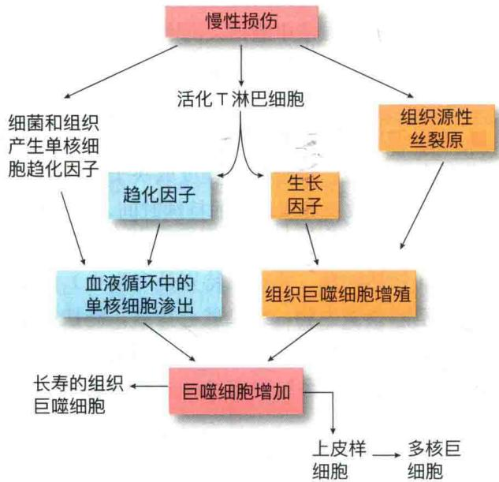 
图2-18 慢性炎症中巨噬细胞聚集的机制
2. 淋巴细胞和浆细胞 在对损伤组织中的病原体和异物的适应性免疫反应中，淋巴细胞和浆细胞起着重要作用（在第4章详细讨论）。
3. 成纤维细胞 成纤维细胞的寿命长，存在广泛，其主要功能是产生 ECM 的成分（图 2-19）。它们也能分化为其他结缔组织细胞，包括软骨细胞、脂肪细胞、骨细胞和平滑肌细胞。成纤维细胞是组织的“建筑工人”，重建细胞外基质的骨架，这样，组织才能得以重建。
成纤维细胞不仅能对诱导其增生和激活的免疫信号做出应答，还积极参与免疫反应。成纤维细胞与炎症细胞（尤其是淋巴细胞），通过彼此的细胞表面分子和受体而相互作用。例如，当成纤维细胞的表面受体CD4与淋巴细胞上的配体结合，两个细胞均被激活。激活的成纤维细胞产生细胞因子、化学趋化因子和前列腺素，形成一个组织微环境，能够进一步调节炎症细胞在损伤组织中的行为。成纤维细胞和再生的血管内皮细胞均在伤口愈合中发挥重要作用。二者都将在第3章中进一步阐述。
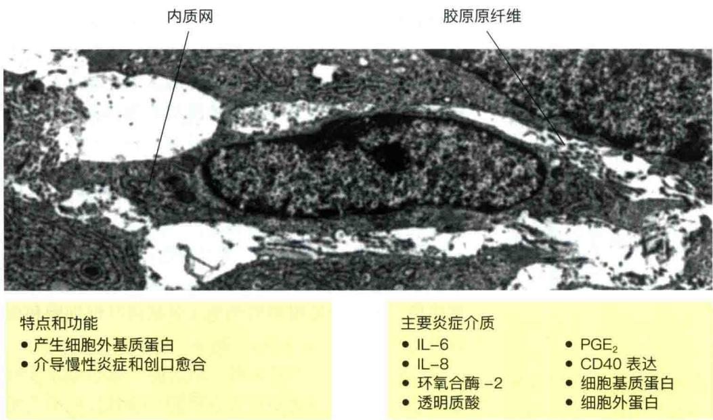 
图2-19 成纤维细胞的形态和功能。CD.分化抗原簇；IL.白介素； $\mathsf{PGE}_2$ 前列腺素 $\mathsf{E}_2$
# 第十节 慢性炎症中的损伤和修复
慢性炎症可以由免疫和非免疫机制共同介导，并且经常与修复反应（即肉芽组织和纤维化）共存。中性粒细胞的产物（如蛋白酶和ROS），通过参与抗微生物防御反应以及清除损伤组织来保护宿主。然而，如果调节紊乱，同样的产物可能会拖延组织损伤过程，并促进慢性炎症反应。由炎症细胞引起的持续性组织损伤在多种疾病的发病机制中起重要作用，例如，肺气肿、类风湿关节炎、特定的免疫复合物疾病、痛风和成人呼吸窘迫综合征。
# 第十一节 肉芽肿性炎
肉芽肿是一种对慢性感染（真菌感染、结核病、麻风病、血吸虫病）或对外来物质（如缝线或滑石粉）的保护反应。它可以限制由急性期反应中未被有效消化的外来物质引起的炎症，并防止其播散，因此保护了宿主组织。有些自身免疫性疾病（例如，类风湿关节炎）、克罗恩病和结节病（一种病因不明的神秘疾病）也与肉芽肿相关。
与肉芽肿性炎相关的主要细胞是巨噬细胞和淋巴细胞。巨噬细胞是在血管外结缔组织中持续迁移的活
动细胞。如果巨噬细胞的吞噬物不能被消化，巨噬细胞将失去运动能力，聚集在损伤部位，转化为上皮样细胞，并呈结节状聚集在一起，形成肉芽肿（图2-20A，B）。多核巨细胞由巨噬细胞胞质融合而成。当多核巨细胞的胞核以马蹄形排列在细胞边缘，则被称为朗汉斯巨细胞。如果一个异物（如二氧化硅或组织胞浆菌芽胞）或其他不易消化的物质出现在多核巨细胞胞质内，则该细胞被称作异物巨细胞。肉芽肿按照是否存在坏死，进一步进行组织病理学分型。某些感染物（如结核分枝杆菌）特征性地产生干酪样肉芽肿，坏死中心是组织碎屑、死亡微生物和细胞等无定型物质。其他疾病，如结节病，其特征则是不伴坏死的肉芽肿。
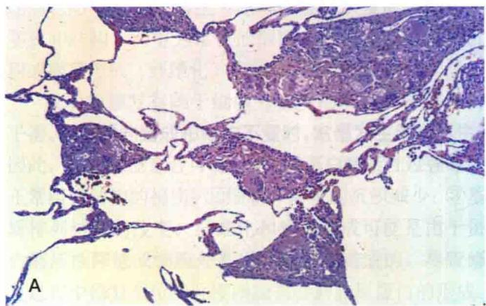
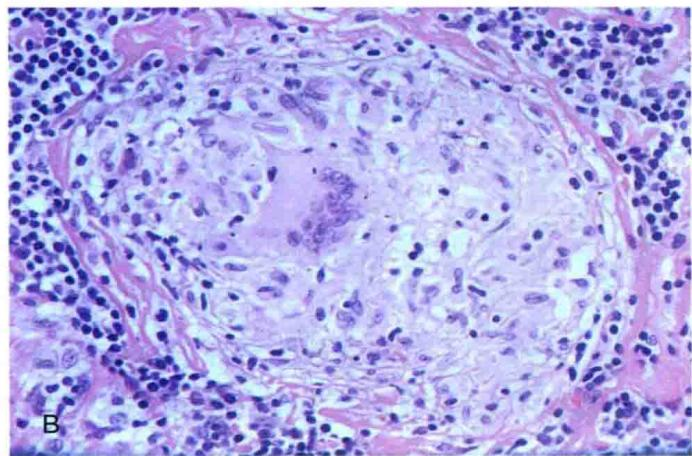 
图2-20 肉芽肿性炎。A.结节病患者的肺组织，可见很多肉芽肿；B.高倍镜下观察上述患者淋巴结的一个肉芽肿，在大量上皮样细胞中可见一个多核巨细胞。薄薄的一圈纤维化将肉芽肿与淋巴结中的淋巴细胞分隔开
# 第十二节 炎症的全身表现
在某些情况下，局部损伤可能导致明显的全身反应。例如，病原体进入血流可能会产生全身反应，这种情况称为败血症。与炎症相关的全身症状（如发热、肌痛、关节痛、厌食和嗜睡）可由细胞因子引起，包括IL-1α、IL-1β、IL-6、TNF-α和干扰素。炎症最显著的全身表现是白细胞增多、急性期反应、发热和休克，称为全身炎症反应综合征（SIRS）。
1.急性期反应是对相关细胞因子水平升高的一种全身反应急性期反应是一种可调控的生理反应，出现在IL-1、IL-6和TNF-α水平升高的炎症反应中。它的临床特点是发热、白细胞增多、食欲下降、睡眠作息改变以及显著的特定急性期蛋白血浆水平的改变急性期蛋白（表2-3）最初由肝合成，在炎症时释放入血的量增加，因此，可以作为炎症反应的标志物。例如，急性期蛋白增加可导致红细胞沉降速度加快，这在临床上用来定量监测多种炎性疾病的活动性。
表 2-3 急性期蛋白蛋白质功能甘露糖结合蛋白调理作用/补体激活作用C反应蛋白调理作用α1-抗胰蛋白酶丝氨酸蛋白酶抑制因子结合珠蛋白结合血红蛋白A血浆铜蓝蛋白抗氧化剂;结合铜纤维蛋白原凝血血浆淀粉样蛋白-A载脂蛋白α1-巨球蛋白抗蛋白酶半胱氨酸蛋白酶抑制因子抗蛋白酶
2. 发热是炎症的临床标志 细菌、病毒或受损细胞释放的致热原（引起发热的分子）可直接影响下丘脑的体温调节机制。更重要的是，它们刺激产生内源性致热原，即细胞因子（IL-1α、IL-1β、TNF-α、IL-6）和干扰素，引发局部和全身效应。IL-1刺激下丘脑体温调节中枢，合成前列腺素，从而改变调控体温的“恒温器”。环氧合酶抑制因子（如阿司匹林）通过抑制IL-1刺激的 $\mathrm{PGE}_2$ 合成过程来抑制发热反应。寒战（对冷的感知）、僵直（伴随寒战和竖毛反应的深度寒战）以及出汗（使得热量散失）都是伴随发热而出现的症状。 
3. 休克以心失代偿为特征 在大量组织损伤或感染播散至血液（脓毒血症）的情况下，大量的细胞因子，尤其是TNF- $\alpha$ 及其他炎症介质将出现在血液循环中。这些炎症介质的持续存在，会对心脏和外周血系统产生作用，从而引起心血管的失代偿，这一过程称为休克。全身性反应包括广泛的血管舒张、血管通透性增加、血管内血容量减少、心肌抑制，伴发心排血量下降、甚至死亡（见第7章）。重症者，凝血通路的激活可产生遍及全身的微血栓，由于消耗凝血因子，后续产生出血倾向，这种情况被称为弥散性血管内凝血（见第20章）。最终导致多器官功能障碍综合征（MODS）和死亡。
# 第3章 修复、再生和纤维化
创伤愈合涉及多种细胞、基质蛋白、生长因子和细胞因子间一系列复杂的相互作用，生长因子和细胞因子在整个愈合过程中起着调控作用。良好的愈合能维持组织功能，并能修复组织屏障，防止失血和感染。理想状态下，通过再生来完成修复，恢复原有组织的基质和结构。而更为常见的情况是，通过胶原蛋白沉积或瘢痕形成（纤维化）来达到愈合。
成功的修复有赖于细胞外基质的沉积和降解间的平衡。当基质的组成和结构不变时，常易发生组织再生。因此，创面未能愈合可能反映：①蛋白酶活性过强导致正常组织结构的损伤；②细胞外基质的沉积减少；③基质排列结构的改变。纤维化和瘢痕形成可能是由于蛋白酶活性降低或细胞外基质沉积过多造成的。尽管修复过程中修复部位的强度增加需要新胶原蛋白的形成，但慢性纤维化是损伤性疾病的一个重要组成部分。
# 第一节 愈合的基本过程
创伤愈合必需的三个关键性细胞机制：
细胞的迁移 
■ 细胞外基质的机化、重组和重塑 
■ 细胞增生
# 一、细胞的迁移启动修复过程
1.损伤部位的细胞 细胞向创伤部位的迁移和局部细胞的活化过程是由化学介质启动的，这些介质有的是由局部细胞从头合成后释放的，有的是由血小板和嗜碱性粒细胞储存颗粒中释放的。这些介质的作用包括： $①$ 调控血管中液体和细胞的渗出； $②$ 降解受损的组织； $③$ 启动修复的级联过程（见第2章）。
■血小板：当局部内皮细胞受损后，内皮下胶原纤维暴露，血小板暴露于vonWillebrand因子（vWF），促使血小板黏附于胶原纤维上而被活化；血小板不断粘集成血小板粘集堆，与纤维蛋白交联结合，限制血液的丢失。活化的血小板能够释放血小板源性生长因子（platelet-derived growth factor，PDGF）和其他的促修复因子（图2-14B）。
肥大细胞：肥大细胞颗粒内肝素和其他物质的
释放能够促进血管形成（血管生成）。肥大细胞一般存在于小血管附近（图2-13D）。 
常驻巨噬细胞：结缔组织中的常驻巨噬细胞可分泌化学介质，这些介质不仅参与损伤的早期反应，而且可延长反应时间。巨噬细胞的不断增殖以及在创伤部位的聚集，使得巨噬细胞的数目不断增加（图2-13C）。 
2. 迁移到创伤部位的细胞 炎症刺激（见第2章）和创伤部位活化的细胞可分泌炎症介质，启动以下细胞向创伤部位迁移（图3-1）： 
■多形核白细胞：创伤首日，多形核白细胞迅速从骨髓中被动员出来，并与活化的内皮细胞结合进而趋化至创伤部位。多形核白细胞可释放胞质颗粒物质，降解并破坏非活性组织（图2-13A）。小片段肽类化学引诱物（趋化因子）家族能够限制或吸引某些类型的白细胞（见第2章）。 
■单核细胞/巨噬细胞：继中性粒细胞之后，单核细胞/巨噬细胞迅速到达创伤部位，并且可保持数日或更长时间。单核细胞/巨噬细胞通过分泌细胞因子和趋化因子来吞噬细胞碎片、配合修复组织（肉芽组织）的形成。 
成纤维细胞、肌成纤维细胞、血管周细胞和平滑肌细胞：皮肤创伤的第3天或第4天，在生长因子和基质降解产物的趋化下，这些细胞被招募到达创面。这些细胞能增加胶原蛋白的合成（纤维增生）、促进结缔组织基质的合成、参与组织重构、促进伤口收缩和增加（间接性地）伤口的强度。 
内皮细胞：在生长因子的作用下，内皮细胞形成新生毛细血管。皮肤创伤3天后可见到新生毛细血管。毛细血管的形成对于气体交换、营养吸收和炎症细胞的趋化都是必需的（图2-13B）。 
上皮细胞：表皮层的上皮细胞向皮肤创面延伸，穿过临时性基质（见下文），并在间质胶原蛋白上迁移。间质的胶原蛋白表面包被有血浆糖蛋白、纤维蛋白原和纤维粘连蛋白。 
干细胞：来自骨髓的干细胞（图3-1A）和毛囊外根鞘隆突部及表皮基底层的皮肤祖细胞（图3-1E）
为表皮和真皮细胞提供了可再生资源，参与细胞的分化、增殖和迁移。适当的条件下，干细胞分化形成新生毛细血管和上皮细胞，重塑皮肤结构，如毛囊和皮脂腺。
3. 细胞迁移的机制 细胞的迁移有赖于细胞对化学信号细胞因子及细胞外基质中不溶性底物的反应。迅速迁移的白细胞依靠宽大的、波浪状、细胞膜延伸形成的板状伪足来完成运动。缓慢运动的细胞，如成
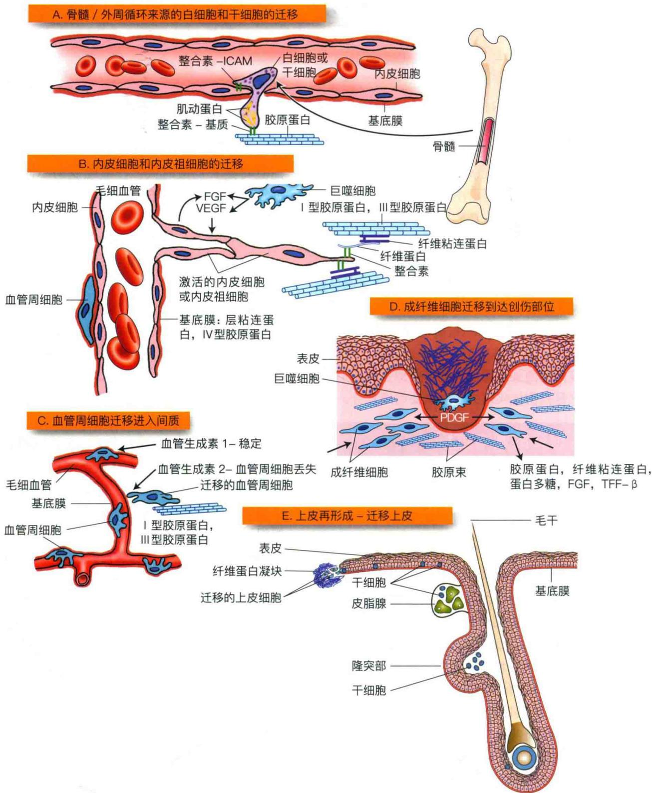 
图3-1 常驻细胞和迁移的细胞启动修复和再生。A. 细胞因子激活毛细血管内皮细胞后，白细胞和骨髓源性的循环干细胞附着在毛细血管内皮细胞上，并在内皮细胞间迁移；在趋化信号的作用下，穿透基底膜，进入间质。B. 在血管源性因子的影响下，毛细血管内皮细胞失去与基底膜间的连接，并穿入间质迁移，形成新的毛细血管。血管周细胞和基底膜对于新形成的和现有的毛细血管结构的稳定是必需的。C. 血管周细胞脱离毛细血管内皮细胞和基底膜，迁移进入间质。D. 在生长因子[如血小板源性生长因子（PDGF）和转化生长因子（transforming growth factor-β，TGF-β）]的作用下，成纤维细胞和含有平滑肌肌动蛋白的肌成纤维细胞两极化，并穿过间质到达损伤部位。E. 上皮再形成期间，基底的角化细胞群延伸越过复层表皮和基底膜，在受损真皮上面的纤维蛋白痂和肉芽组织间迁移。FGF. 成纤维细胞生长因子；ICAM. 细胞间黏附分子；VEGF. 血管内皮细胞生长因子
纤维细胞，依靠的是延伸较窄的、指状、膜突出形成的丝状伪足。生长因子和细胞因子与细胞表面特定受体的结合介导细胞的极化和细胞膜的延伸。肌动蛋白原纤维发生聚合并在细胞前缘形成网状结构，从而驱使板状伪足和丝状伪足向前运动，同时通过附着在细胞外基质上来发挥牵引作用。肌动蛋白相关蛋白可加速肌动蛋白的组装，同时许多肌动蛋白结合蛋白的作用类似于分子修补工具，能够迅速构建、稳定和破坏肌动蛋白的网状结构。
细胞膜的前缘侵入细胞外基质，并通过跨膜的黏附受体即整合素，附着在基质上（见第2章），整合素能识别基质成分如胶原蛋白、层粘连蛋白和纤维粘连蛋白。结缔组织基质与整合素的细胞外域结合，使两者间发生局部接触。这种局部的接触锚定了肌动蛋白张力纤维，而与之对抗的是，肌球蛋白可牵拉细胞以延伸或收缩细胞体。随着细胞的向前运动，后方较陈旧的黏着作用变弱或失去稳定性，使得细胞后缘回缩。整合素的胞质域是引发锚定肌动蛋白张力纤维的蛋白级联反应的触发器。鸟苷三磷酸酶（GTP酶、Rho、Rac、Cdc42）的Rho家族作为分子开关，与细胞表面
受体相互作用，调控细胞外基质结构、形成黏着斑和构建肌动蛋白细胞骨架。
整合素也能够将胞内信号传递给细胞，调节细胞的存活、增殖和分化。细胞骨架连接涉及细胞-细胞间、细胞-基质间连接，这些连接决定着上皮细胞、内皮细胞和其他细胞的形状和分化。
# 二、细胞外基质支撑修复过程
细胞外基质有基底膜、临时性基质、结缔组织（间质基质）三种类型，影响着正常组织和创伤组织的结构、物理特性和功能。
1. 基底膜 基底膜，又被称为基膜，是一种薄层、界限明确的特化性细胞外基质，将合成它的细胞与结缔组织隔离开。特化的基底膜有以下分布特点：①在不同的上皮层下方形成，并围绕上皮性导管、皮肤和器官的小管结构，以及包绕在脂肪细胞周围；②覆盖平滑肌细胞、骨骼肌细胞和周围神经施万细胞；③包绕着毛细血管内皮细胞及其相关联的血管周细胞。
基底膜由细胞外基质分子构成。这些分子与层粘连蛋白、IV型胶原蛋白网状结构自我组装成“三明治”样结构（表3-1）。
表3-1 基底膜的组成和结构基底膜的成分链分子结构分子联系基底膜聚合形式串珠素(硫酸乙酰肝素蛋白多糖)1条蛋白核心,3条硫酸乙酰肝素GAG链GAG链层粘连蛋白,IV型胶原蛋白,生长因子(VEGF、FGF),趋化因子细胞膜上的整合素受体层粘连蛋白16种异构体,由α、β、γ链组成的异源性三聚体,5条α链,3条β链,3条γ链βαγ各种细胞(上皮细胞、内皮细胞、肌细胞、施万细胞、脂肪细胞等)上的整合素、肌营养不良蛋白聚糖和其他受体形成自关联的非共价网络结构,组成基底膜层粘连蛋白、巢蛋白/内功素、串珠素、集聚蛋白,纤连蛋白巢蛋白/内功能含有2个成员的家族单体IV型胶原蛋白、层粘连蛋白、串珠素、纤连蛋白通过与层粘连蛋白和IV型胶原蛋白间的网络关联而稳定基底膜IV型胶原蛋白≥3个成员的家族异源性三聚体从2个、3个或6个独特的α-链中选出的链3个单链形成胶原区的α-螺旋尾和3个球形区的关联许多细胞上的整合素受体共价自关联的网络形式IV型胶原蛋白、串珠素、巢蛋白/内功能、SPARC
FGF. 成纤维细胞生长因子；GAG. 黏多糖；SPARC. 富含半胱氨酸的酸性分泌蛋白；VEGF. 血管内皮生长因子
在不同组织及其发育过程中，IV型胶原蛋白和层粘连蛋白家族的各独特亚型的表达，赋予了基底膜的多样性以及基底膜支撑的结构、功能的多样性。
创伤后，在表皮细胞的迁移中，基底膜充当过滤器、细胞锚定器和移动平面。基底膜决定着细胞形状、促进细胞形态发育，最重要的是提供了生长因子和趋化因子的储备库。
层粘连蛋白构成了生物学上具有多种功能的基底膜糖蛋白家族。它们的十字形结构由三个相关基因亚家族构成，形成 $\alpha$ 、β、γ链异源性三聚体（表3-1）。在某种程度上，层粘连蛋白通过与膜硫酸糖脂或跨膜整合素受体结合，支持细胞的黏附。不同组织中层粘连蛋白各异构体的表达，构成了组织形态和功能的异质性。层粘连蛋白的适当形成，对维持正常表皮的功能和创面的上皮再生起着关键性作用。
2. 临时性基质 临时性基质是一个术语，用于描述那些聚集在损伤部位的血浆源性基质蛋白和组织源性成分的暂时性的细胞外结构（如透明质酸、细胞黏合素、纤维粘连蛋白）。这些分子与已有的细胞外基质相关，有阻断血流和体液丢失的作用，同时支撑着单
核细胞、内皮细胞、表皮细胞和成纤维细胞向创伤部位的迁移。血浆源性的临时性基质蛋白包括纤维蛋白原、纤维粘连蛋白、血栓黏合素和玻连蛋白。这些蛋白质通过与间质的基质结合，以及在组织源性和血浆源性谷氨酰胺转胺酶的作用下形成交叉链接，变为不溶性蛋白。
3. 间质的基质（间质结缔组织）结缔组织使不同组织成分（如上皮细胞、神经和血管）间形成一个统一体，并通过抗压缩或抗拉伸为组织提供机械性保护。结缔组织间质对细胞迁移也有重要作用，同时也是生物活性蛋白质存储和交换的媒介。
结缔组织包括细胞外基质成分和合成基质的单个细胞。这些细胞主要来自间充质，包括成纤维细胞、肌成纤维细胞、脂肪细胞、软骨细胞、骨细胞和内皮细胞，也存在一些骨髓源性细胞（如肥大细胞、巨噬细胞、一过性白细胞）。
结缔组织的细胞外基质，也被称为间质或间隙组织，可依据从胶原分子大家族中选出的胶原纤维的类型来命名（表3-2）。基质的另一个重要结构成分是弹性纤维，它主要赋予皮肤、大血管和肺组织以弹性。
表3-2 胶原蛋白的分子组成和结构类型大分子关联聚合形式由原纤维构成交错阵列中的自关联I型和II型原纤维I型II型(软骨)III型V型, XI型A.由非原纤维构成VI型 二聚体 四聚体串珠状单纤维(非胶原蛋白域间隔)VI型IX型(软骨,也是一种蛋白多糖)XII型XV型和XVIII型(也是蛋白多糖)由网状结构构成7S IV NC1 7SIVIV型(基底膜)VIII型X型(肥厚性软骨)锚定(上皮)VII型跨膜XVII型(BP180, BPAG2)VII XVII Ⅶ二聚体半桥粒和基底膜 Col VII原纤维间质中的锚定斑真皮乳头中的锚定原纤维
弹性纤维包含弹性蛋白核心，其周围包绕着微原纤维蛋白质，如原纤维蛋白。所谓的间质基本物质（基质）代表着多种分子，包括黏多糖（GAGs）、蛋白多糖、细胞外基质蛋白和纤维粘连蛋白。这些分子除了有支撑、调控细胞黏附的作用外，还为结缔组织提供许多重要的生物学功能。
（1）胶原蛋白：胶原蛋白是动物界最丰富的一种蛋白质，是保证组织和器官结构完整性所必需的物质。当胶原蛋白合成减少、延迟或合成异常时，都会引起创伤愈合不良，如在坏血病中所见。纤维状胶原蛋白的突变可导致多种骨（成骨不全）、软骨（软骨生成）、皮肤、关节和血管（Ehlers-Danlos综合征）的疾病（第6章和第26章）。胶原蛋白过度沉积可导致纤维化。纤维化是几种结缔组织疾病的基础，也是多种器官，包括肾、肺和肝慢性损伤所伴发的组织功能丧失的基础。胶原蛋白可分为三种类型（表3-2）：
■纤维状胶原蛋白包括I、Ⅱ、Ⅲ、V和XI型，其中I、Ⅱ、Ⅲ型胶原蛋白最为丰富。I型胶原蛋白是骨组织的主要成分。I型和Ⅲ型胶原蛋白在皮肤中较明显，而软骨中主要是Ⅱ型胶原蛋白。纤维性胶原蛋白更新缓慢，一般难以被蛋白酶水解。
■非纤维状胶原蛋白包含球状结构域，阻止纤维状胶原蛋白的形成。它们在半桥粒中充当跨膜蛋白（XVII型胶原蛋白），半桥粒有助于表皮细胞黏附在基底膜上；它们也可充当纤维状的锚定器（V型胶原蛋白），在皮肤组织中将半桥粒和基底膜与其下方的基质连接起来。
■网状胶原蛋白有助于基底膜胶原蛋白（IV型胶原蛋白）“铁丝网”状结构及其他组织中有序的六角结构（VIII、X型胶原）的形成。IV型胶原蛋白的突变可导致肾小球基底膜异常，见于Alport综合征。
（2）间质的非胶原蛋白性基质成分：间质的非胶原蛋白性基质成分包括相关联的多种蛋白质：糖蛋白、弹性纤维和蛋白多糖（表3-3）：
■ 弹力蛋白属于非糖化的基质蛋白，它的存在使皮肤、子宫、韧带、肺、弹性软骨和主动脉等可变形的组织能被拉伸、弯曲和反弹。弹力蛋白以原纤维的形式被沉积下来，与几种糖蛋白（微原纤维），如原纤维蛋白，形成复合物。原纤维蛋白装饰着弹性纤维的边界（表3-3）。在皮肤和肺的修复过程中，弹性纤维很难被替代，它对于几种重要组织的功能至关重要。
弹性纤维降解困难和更新缓慢，可抵消由皮肤和肺受损后引起的功能性弹力蛋白缺乏、结构受损或沉积过慢。尽管如此，年龄和日光照射对弹力蛋白也会有损伤，导致年龄相关的真皮柔韧性的丧失进而引起皮肤下垂。一旦弹力蛋白发生突变，异常原纤维蛋白可导致Marfan综合征。Marfan综合征具有多种表现，如主动脉夹层动脉瘤（第6章）。
基质糖蛋白构成了基底膜和纤维结缔组织的重要生理功能。基质糖蛋白一般分子量较大（ $150000\sim 1000000\mathrm{kD}$ ），是多聚体蛋白，具有多个结构域，它的长臂可与其他基质分子结合，支撑或调控着细胞黏附。它们参与以下功能：①构建组织外貌；②支撑细胞迁移；③细胞定位；④诱导细胞功能。间质结缔组织的主要基质糖蛋白是纤维粘连蛋白。纤维粘连蛋白的特定结构域可与细菌、胶原蛋白、肝素、纤维素、纤维蛋白原以及细胞基质受体整合素结合。层粘连蛋白是基底膜的主要糖蛋白。特定组织中不同层粘连蛋白异构体的表达，影响着组织形态和功能的异质性，在某种程度上，通过与膜硫酸糖脂或跨膜整合素受体结合，支撑着细胞黏附。表皮层粘连蛋白的恰当形成，对于维持表皮正常功能和创面的上皮再形成有重要作用。表皮的完整性受半桥粒的影响，半桥粒是由基底膜层粘连蛋白与上皮整合素和V型胶原蛋白结合形成的结构。
GAGs，或称为黏多糖，是特定双糖重复序列的长线性多聚体（根据多聚体的名字命名）。透明质酸（唯一一种不与蛋白质结合的GAG）可结合大量水分子，形成黏性凝胶，导致基质肿胀，润滑关节和基质。透明质酸分子在细胞周围的积聚，有助于细胞迁移穿过细胞外基质。透明质酸在胚胎发育过程中广泛存在于基质中，早期即可加入到临时性基质中。
蛋白多糖由不同数目的GAG构成，如乙酰肝素、硫酸软骨素和硫酸角质素，与特定的核心蛋白相连。它们参与基质的组成、结构完整性和细胞黏附。尽管核心蛋白本身经常具有生物活性，但几种蛋白多糖的特性很大程度上由GAG链本身调节。基底膜中硫酸肝素与GAG链相结合，细胞相关性的蛋白多糖调节着肝素结合生长因子的有效性和功能，如血管内皮细胞生长因子（VEGF）、成纤维细胞生长因子（FGF）、肝素结合性表皮生长因子（HB-EGF）。
表3-3 间质的非胶原基质成分间质的结缔组织成分链分子结构分子关联组织结构纤维粘连蛋白二聚体蛋白从一个基因的约20个剪接变异体中选出的链纤维 肝素 胶原 肝素细胞 RGD许多细胞的整合素受体(RGD结合位点)血浆纤维粘连蛋白是可溶性的细胞粘连蛋白可与细胞表面的原纤维自联,并结合胶原、肝素、核心蛋白聚糖、纤维蛋白、某些细菌(调理素)、LTBPs细胞质细胞膜上的整合素受体胶原蛋白或纤维蛋白弹力蛋白单体,有几个剪接变异体,1个基因弹力蛋白交联形成纤维自联合形成交联的无定形纤维在微原纤维多聚体支架上形成弹性纤维与微原纤维多聚体原纤维蛋白大的糖蛋白-最常见的是微原纤维,组建弹性纤维之必需形成串珠状聚合物其他的微原纤维蛋白:LTBP、纤连蛋白、弹联蛋白、MAGP1和MAGP2、赖氨酰氧化酶多能聚糖(透明质酸结合蛋白)4个相关基因家族在软骨中发现的聚集蛋白聚糖(aggrecan)核心蛋白点缀有10~30个硫酸软骨素和硫酸皮肤素的GAG链CS与透明质酸通过连接蛋白形成非常大的复合结构的蛋白多糖透明质酸核心蛋白多糖(小的富含亮氨酸的蛋白多糖)1个核心蛋白,1个基因1条硫酸软骨素或硫酸软骨素GAG链二聚糖和纤维调节素结构上相关,遗传学上不同I型和II型胶原蛋白、纤维粘连蛋白、TGF-β、血栓黏合素I型或II型胶原蛋白
GAG.黏多糖；LTBPs.潜在的转化生长因子β结合蛋白；MAGP.微原纤维相关生长蛋白；RGD.精氨酸-甘氨酸-天冬氨酸；TGF-β.转化生长因子β
# 三、基质重塑对修复至关重要
随着修复的进行，炎症细胞数量减少，同时完成了毛细血管的构建。重塑过程中，胶原蛋白沉积与降解的平衡得以恢复。尽管中性粒细胞蛋白酶和丝氨酸蛋白酶也会起作用，但基质金属蛋白酶是主要的重塑酶。
基质金属蛋白酶（MMPs）是创伤修复的重要成分。在损伤部位，它们通过降解基质蛋白促使细胞穿过基质迁移，从而使组织重组。MMPs同时也参与细胞与细胞间的沟通联系和生物活性分子（如基质碎片和生长因子）的激活与灭活，它们对细胞生长及凋亡同样有影响。MMPs可以中断细胞与细胞间的黏附，促使储存在细胞基质中的生物活性分子的释放、激活或灭活。在修复过程的晚期，炎症细胞数量减少，毛细血
管构建完成。损伤部位的基质重塑最终形成了物理性能上强大而成熟的瘢痕组织，这表明胶原蛋白的沉积与降解已得到恢复。
一旦MMP被分泌出来，它与特定的蛋白酶抑制剂结合后，即被灭活。除了重要的血浆源性蛋白酶抑制剂—— $\alpha-$ 巨球蛋白，同时还存在着内源性的组织金属蛋白酶抑制剂（TIMPs）家族。
# 四、细胞因子与基质诱发细胞的增殖
受损组织的一个早期突出特点是细胞密度的一过性增加，以替代受损的细胞。细胞增殖也可启动肉芽组织的形成，并使其继续下去。肉芽组织是一种特殊的血管组织，在修复过程中一过性形成（讨论见下文）。
肉芽组织从不稳定的细胞群体中集聚细胞，包括循环白细胞和基底上皮细胞，同时也从稳定细胞，如毛细血管内皮细胞、常驻间叶细胞（成纤维细胞、肌成纤维细胞、血管周细胞和平滑肌细胞）中集聚细胞。局部干细胞和骨髓源性的干细胞或定向祖细胞，也可能填充伤口，并在此分化为内皮细胞和成纤维细胞群。常驻于心脏的干细胞有助于心脏再生。然而，终末分化的细胞（如心肌细胞、神经元）并不参与修复或再生。
生长因子和小分子趋化肽（趋化因子）为细胞增殖、分化和迁移提供可溶性的自分泌和旁分泌信号。可溶性因子和细胞外基质发出的信号同样可共同作用，影响细胞的生物学行为。
# 五、整合分子信号调节细胞的增殖和分化
在创伤愈合中的细胞行为——增殖、迁移和基因表达改变——主要是由三个受体系统启动的，这3个受体系统拥有共同的整合信号通路。
多肽生长因子通过蛋白质酪氨酸激酶受体起作用 
趋化因子及其他因素通过G蛋白偶联受体发挥作用 
细胞外基质通过整合素受体发挥作用
多种复杂的信号机制调节着细胞的生长、存活和增殖，同时涉及多种活化和抑制分子的整合，以及不同传导通路之间的相互作用。进一步的解释已超出了当前讨论的范畴，在此不再赘述。
# 第二节 修复
# 一、损伤的结局包含有修复和再生
修复和再生的发展伴随着炎症反应的减弱（第2章）。一过性的急性炎症可完全恢复，且局部受损的实质成分可再生，不形成瘢痕。举例说明，中度晒伤后的修复过程中，在太阳晒伤的表皮下方，少量急性炎症细胞与一过性的血管扩张在短时间内伴随出现。相比之下，持续性的急性炎症，将出现以巨噬细胞为主的炎症反应，是瘢痕形成和纤维化相关的修复和胶原蛋白加工的前驱表现。
# 二、创伤愈合具有一系列的特定过程
创伤愈合导致的瘢痕形成，仍然是修复的主要形式。由于皮肤和四肢的创伤较为常见，皮肤和四肢的创伤愈合过程已作为模型广为接受。尽管空腔脏器和体腔的愈合研究存在一定困难，但是这些部位的愈合与皮肤创伤的愈合过程大致相同（图3-2～图3-4）。
1.止血创伤部位的血栓（血凝块）形成主要是血浆纤维蛋白原转化为纤维蛋白。血栓中也富含纤维粘连蛋白。纤维蛋白和纤维粘连蛋白很快在XⅢ因子
（一种转谷氨酰胺酶）作用下发生交联，以增强局部的抗拉强度和止血功能。血小板含有收缩了的血小板，是生长因子的主要来源。在皮肤，暴露的血凝块表面干燥后形成痂或焦痂，构成了入侵微生物的一个屏障。随着时间的推移，血凝块被蛋白水解后，再生的上皮长入。结痂然后脱落。
2.炎症局部组织的破坏程度不同，修复各异。例如，手术切除轻微的皮肤损伤组织后，仅留下很少的失活组织，甚至没有失活组织残留。中等范围的心肌梗死，局部伴有界线清楚的坏死出现。相比之下，大面积的不规则坏死灶是大范围三度烧伤的一个特征急性中性粒细胞为主的炎症反应首先会液化坏死组织急性的炎症反应有必要尽可能长时间的持续存在，因为坏死组织不被液化清除，就无法进行修复。血浆源性纤维粘连蛋白与胶原蛋白和细胞膜的结合有利于细胞发挥吞噬作用。纤维粘连蛋白和细胞碎片能够对巨噬细胞和成纤维细胞产生趋化作用（图 $3 - 4\mathrm{B}\sim \mathrm{D})$ 巨噬细胞作为主要细胞出现在损伤部位，预示着修复过程的开始。巨噬细胞可摄取中性粒细胞的蛋白水解产物，分泌胶原酶，因此可进一步促进液化过程。巨噬细胞还可以分泌生长因子，刺激成纤维细胞的增殖、胶原蛋白的分泌和新血管的形成。
成纤维细胞也是损伤的早期反应细胞，可分泌胶原蛋白，参与创伤修复的炎症期、修复期和重塑期（图3-4E）。成纤维细胞能进一步分化为具有收缩功能的肌成纤维细胞。
3. 肉芽组织 肉芽组织是一种暂时性的特殊的修复组织，可取代临时性基质。大体检查时，肉芽组织看似简单，外观闪闪发光，呈鹅卵石样（图3-5）。显微镜下，成纤维细胞和红细胞首先出现，随后发展为临时性基质，出现显而易见的毛细血管，成纤维细胞和炎症细胞围绕毛细血管周围。
单核细胞受趋化因子和损伤的基质碎片的趋化作用被吸引到损伤部位，是肉芽组织形成过程中的一个关键步骤。随后浆细胞增多，甚至成为主要细胞。活化的巨噬细胞通过释放生长因子和细胞因子而协调肉芽组织的发展，这些生长因子和细胞因子的作用包括：①直接刺激血管生成（见下文）；②激活成纤维细胞而生成新的间质；③继续降解和清除临时性基质（图3-3）。然而，巨噬细胞可能并不是创伤修复所必需的。研究发现，在成熟巨噬细胞缺乏的小鼠，功能性中性粒细胞可正常修复皮肤伤口且不留瘢痕。肉芽组织中充满液体，同时它的细胞成分能够提供抗菌的抗体和生长因子。肉芽组织对于细菌感染具有高度抵抗性，这样才使外科医师能够在结肠这种有菌的部位进行吻合术。
4. 成纤维细胞增殖和基质聚集 肉芽组织的临时性的早期基质包含有蛋白聚糖、糖蛋白和Ⅲ型胶原蛋白（图3-2～图3-4E、F）。受损组织的某些特定细胞分泌释放细胞因子引起出血，并吸引炎症细胞到达损伤部位。损伤后 $2 \sim 3$ 天，即能检测到激活的成纤维细胞和毛细血管出芽。随着胶原蛋白的形成和其他基质蛋白（如纤维粘连蛋白）的合成，创伤部位的成纤维细胞由椭圆形变成双极性细胞。细胞外基质内新合成的胶原蛋白发生交联，可逐渐增加伤口的强度。 
5. 生长因子和纤维组织形成 最初发现的表皮生长因子（EGF）及随后鉴定的其他至少20种生长因子，可以解释修复和再生过程中发生的许多快速变化的事件。生长因子、其他细胞因子和MMPs间的相互
作用参见图3-6。在修复过程中，每一种因子都发挥着重要作用。创伤早期表达的生长因子[VEGF、FGF、PDGF、EGF和角化细胞生长因子（KG）]在纤维组织形成、上皮再形成和血管形成过程中，对于细胞的迁移、聚集和增殖有支持作用。稍后达到表达峰值的生长因子[如转化生长因子β（TGF-β）和胰岛素样生长因子（IGF-I)]维持着肉芽组织的成熟期和改建。组织再生同样受信号网络的驱动，并与基质组织合作，支持着干细胞的自我更新、完善和分化。
在修复初始和进展过程中，虽然对于生长因子作用的理解很合理，但是究竟是何种事件限制和终止了生长因子的作用尚不清楚。随着修复的进展，缺氧逐渐减轻，对修复过程的抑制可能起关键性作用。修复
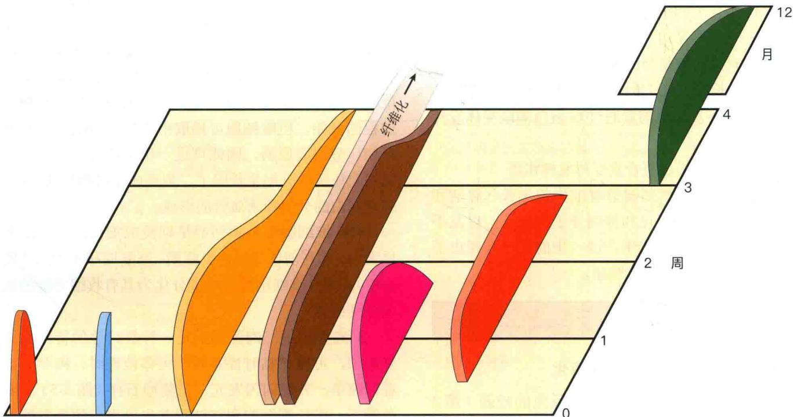
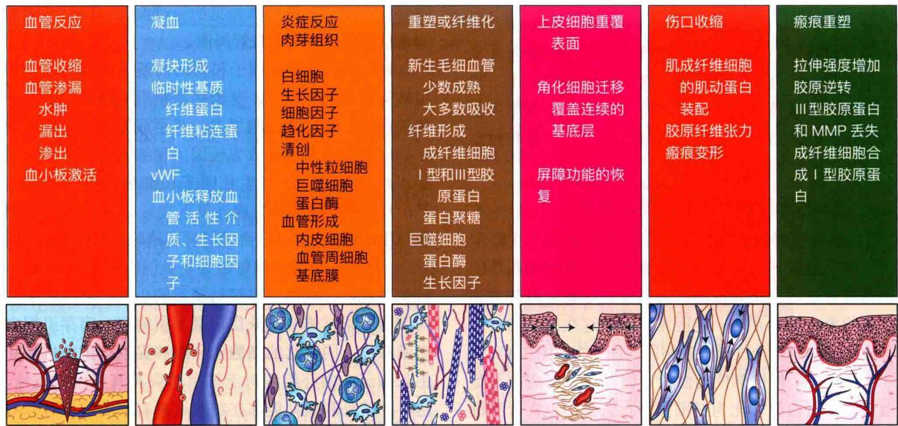 
图3-2 愈合过程的连续阶段
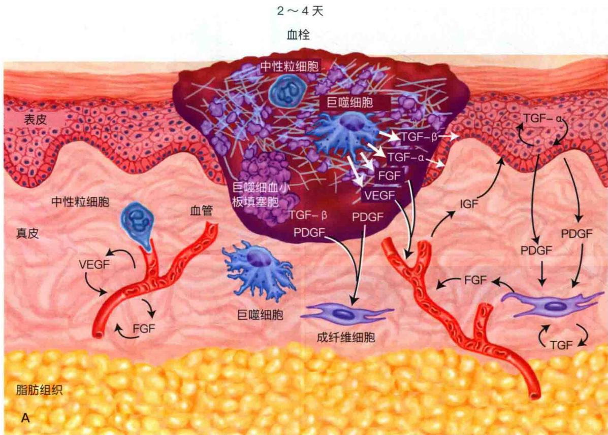
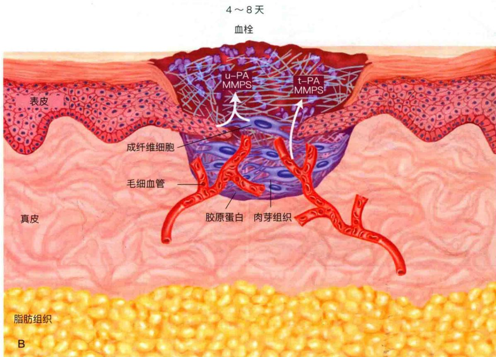 
图3-3皮肤创伤愈合。A.第 $2\sim 4$ 天。图示生长因子调控着细胞的迁移。创伤部位存在着大量的多余组织，没有任何一种生长因子是速率受限的。大多数的因子有多种作用。生长因子信号首先来自血小板，但活化的巨噬细胞、常驻组织的细胞和基质本身也可释放复杂的相互作用信号而相互影响；B.第 $4\sim 8$ 天。毛细血管增生，同时表皮的角化细胞横向穿过血栓下方的肉芽组织。上方，无细胞部分将成为焦痂或痂。成纤维细胞是形成富含胶原蛋白性基质的保证。FGF.成纤维细胞生长因子；IGF.胰岛素样生长因子；MMPs.基质金属蛋白酶；PDGF.血小板源性生长因子；TGF- $\beta$ .转化生长因子- $\beta$ t-PA.组织纤溶酶原激活物；u-PA.尿激酶型纤溶酶原激活物；VEGF.血管内皮生长因子
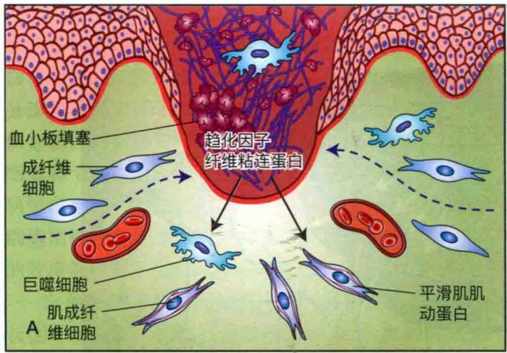
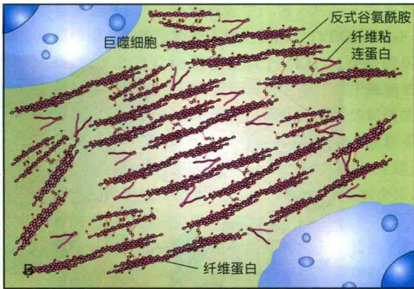
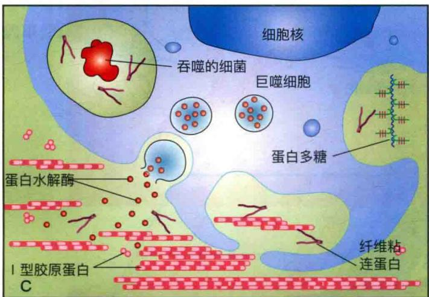
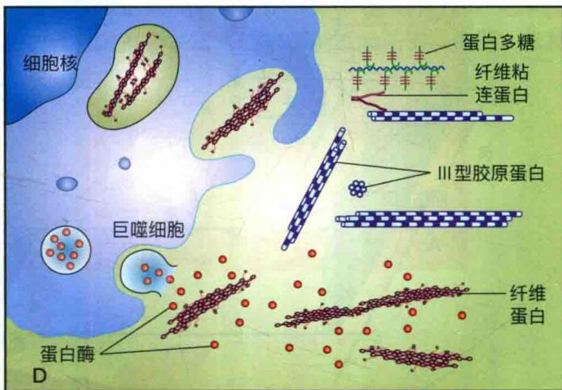
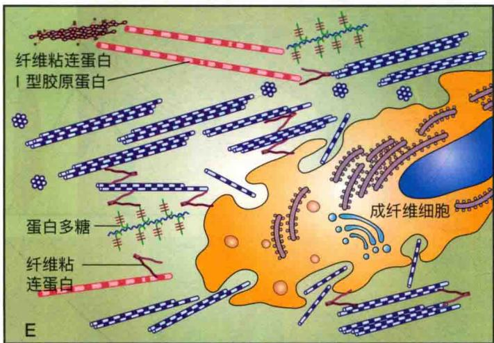 
图3-4愈合过程概述。A.炎症细胞迁移。创伤部位的低倍观描绘了巨噬细胞、成纤维细胞和含有平滑肌肌动蛋白的肌成纤维细胞的迁移，它们从创伤周围组织迁移进入临时性的基质中。纤维粘连蛋白、生长因子、趋化因子、细胞碎片和细菌产物对于被招募到创伤部位的各种细胞而言都是化学引诱剂（2～4天）。修复反应的初始阶段，通常发生组织出血。B.一个纤维蛋白凝块由血浆和血小板形成，填补了创伤所造成的缺口。渗出的血浆纤维粘连蛋白结合纤维蛋白、胶原蛋白，以及其他细胞外基质成分，这些细胞外基质成分在纤维蛋白中通过谷氨酰胺转胺酶（凝血因子XIII）发生交联，这种交联使创伤获得了临时性机械性的稳定（0～4小时）。中性粒细胞迅速渗出并到达有细菌存在或受损的组织。C.巨噬细胞被招募到创伤区域，进一步处理细胞残余和受损的细胞外基质。纤维粘连蛋白结合细胞膜、胶原蛋白、蛋白多糖、DNA和细菌（调理作用）等，促进这些巨噬细胞发挥吞噬作用，有助于组织碎片的清除（1～3天）。D.修复反应的中间阶段，在创伤部位，被募集而来的成纤维细胞可分泌一种新的细胞外基质，主要是较小的III型胶原蛋白，而在细胞外蛋白水解酶和吞噬作用的共同作用下，最初形成的纤维蛋白凝块被溶解（2～4天）。E.纤维蛋白被巨噬细胞清除的同时，成纤维细胞不断地产生暂时性的基质，包括蛋白聚糖及聚合的细胞性纤维粘连蛋白和III型胶原蛋白所富含的纤维等糖蛋白（2～5天）。整合素受体的作用是形成纤维粘连蛋白聚合物，整合素和纤维粘连蛋白有助于胶原纤维的形成。F.修复反应的最后阶段。渐渐地，成纤维细胞转变为产生I型胶原蛋白中所富含的粗大纤维，而暂时性的较小的III型胶原蛋白所富含的纤维发生逆转，导致更强的最终基质的形成（5天至数周）
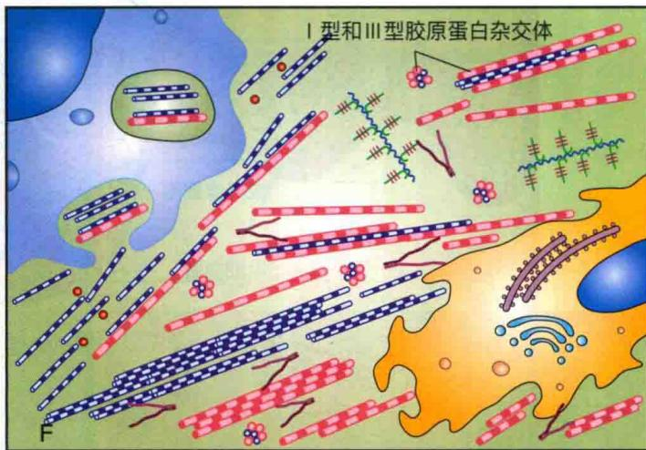
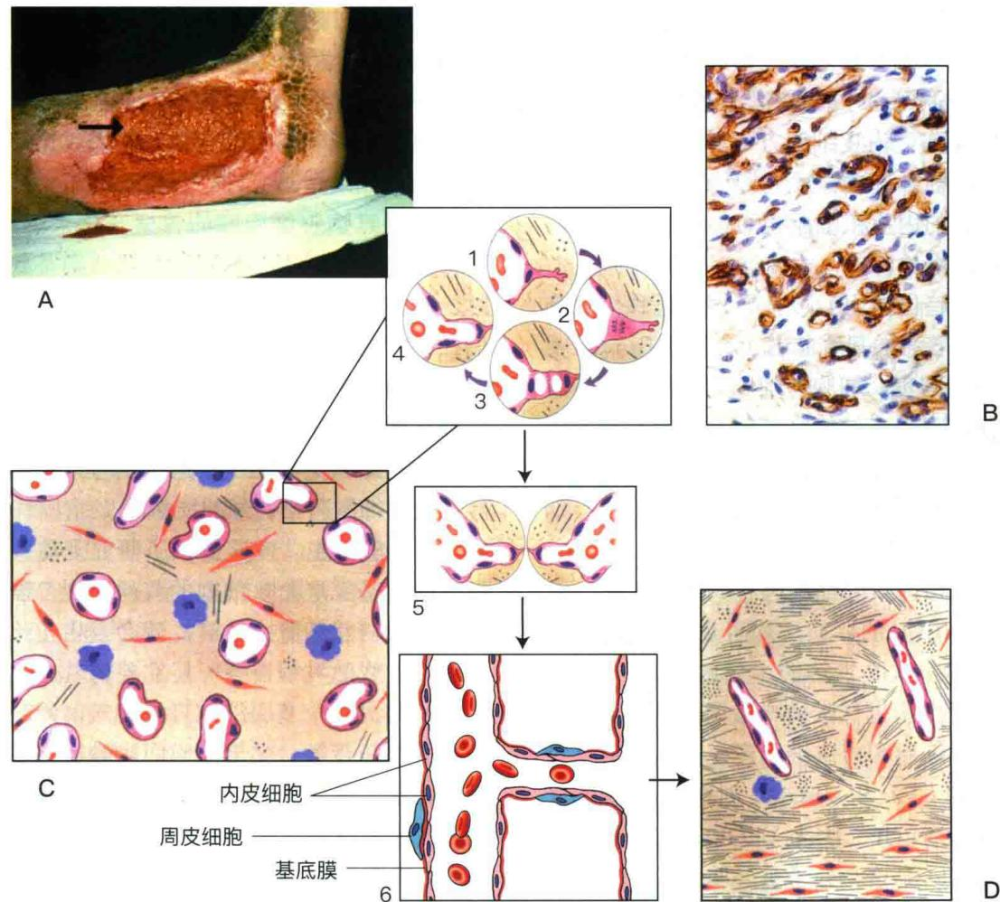 
图3-5 肉芽组织。A. 腿部静脉淤滞性溃疡，图示暴露的肉芽组织。B. 肉芽组织的显微图片，基底膜胶原蛋白的免疫组化染色，显示薄壁毛细血管的出芽。毛细血管穿插生长于疏松结缔组织基质间，其中含有间质细胞和少数炎症细胞。C. 肉芽组织主要由两种成分组成：间质细胞和增生的毛细血管。首先，肉芽组织中毛细血管的出芽是一个重要特征，毛细血管在疏松的基质间生长，同时伴有成纤维细胞、肌成纤维细胞和巨噬细胞的存在。巨噬细胞来源于单核细胞，迁移到创伤部位。成纤维细胞来源于邻近组织或循环纤维细胞；肌成纤维细胞来源于成纤维细胞、间充质干细胞或血管周细胞，而在血管生成的过程中，毛细血管的出现主要是从邻近血管的内皮细胞分裂而来（步骤 $1 \sim 6$ ）。内皮细胞伸出伪足，扩展细胞，向创伤部位生长。细胞质的增多使伪足增大，最终发生细胞分裂。子代细胞中形成的空泡最终融合产生一个新的管腔。整个过程一直持续到毛细血管芽与另一个毛细血管芽相遇，两者连接起来。在顶峰时期，肉芽组织是人体中血管最丰富的组织。D.一旦修复完成，大多数的新生毛细血管被吸收，留下一个苍白的、无血管的、富含胶原蛋白的瘢
过程同样可因细胞外基质的转化减少而终止。最近的证据提示，与CXCR3受体结合的细胞因子，可能对于肉芽组织的退化和限制瘢痕形成具有重要作用。最后，生长因子的储存增加与释放减少可能稳定基质，随后传递机械信号来减少生长因子的作用。随着损伤后数周内胶原蛋白合成与降解间达到平衡，肉芽组织最终转变为瘢痕组织。在损伤部位，成纤维细胞仍然保持活性，因此在随后的数年内瘢痕的密度会增加。
# 6. 血管生成
（1）毛细血管的生长：在顶峰时期，与任何其他组织相比，每单位体积中，肉芽组织都含有更多的毛细血管，毛细血管负责给细胞运送氧气和营养物质。通过血管生成形成新的毛细血管（如已有的微静脉内皮细胞出芽）（图3-5），出现颗粒状外观，肉芽组织因此而得名。少数情况下，新血管的形成由血管母细胞（内皮祖细胞）从头合成而来，其过程被称为血管生成，这种状况主要与发育过程有关。
在创伤修复过程中，血管生成是受严密调控的。局部释放的细胞因子和生长因子可使静止的毛细血管
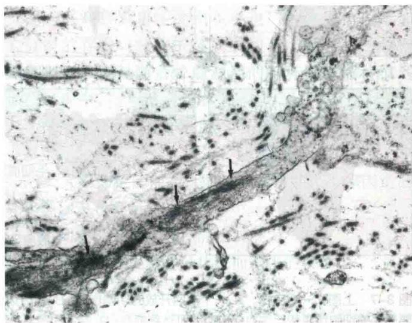 
图3-6 电镜下的肌成纤维细胞。肌成纤维细胞在修复反应中有重要作用。这些细胞的特点介于平滑肌细胞和成纤维细胞之间，细胞质中存在分散的肌原纤维束（箭头所示）
内皮细胞激活。内皮细胞和血管周细胞以基底膜为界，在这些细胞迁移进入临时性基质之前，基底膜必须被局部降解。需要血纤维蛋白溶酶原激活剂（MMP和整合素受体）的协作，内皮细胞方可通过基质。血管内皮细胞的增殖和融合支撑着新生毛细血管的生长（图3-5）。来源于骨髓的内皮祖细胞也可能短时间内被募集过来支持血管的生长。
可溶性配体（趋化作用）可介导细胞迁移至创伤部位，并沿着有附着力的基质前进（趋化性）。一旦毛细血管内皮细胞被固定，细胞与细胞相互接触，在新生毛细血管的外侧将形成结构完整的基底膜。与血管周细胞的关系以及从血管生成素I、TGF-β和PDGF传递来的信号，促使成熟血管表型的建立，同时有助于不泄漏的毛细血管的形成。
在体内，缺氧和过多的细胞因子、生长因子，及各种刺激或调节VEGF的脂质，均可启动血管生成。转录因子Hif-1a是VEGF表达的主要触发器，Hif-1a的稳定性是受组织中的氧气张力严格调控的。活化的肉芽组织中，巨噬细胞和内皮细胞产生基本的成纤维细胞生长因子（βFGF）和VEGF。创伤部位的KGF导致表皮细胞释放VEGF。因为VEGF的主要靶点是内皮细胞，因此VEGF这一分子是胚胎的血管发育和血管生成的关键性调节剂，协调内皮细胞的生存、分化和迁移。血管源性生长因子与硫酸乙酰肝素GAG链的结合是血管生成的重要特征，同时通过以下途径影响着生长因子的可用性、功能以及血管的形成：①在毛细血管基底膜创建一个VEGF和βFGF的储存
库；②利用细胞表面的蛋白多糖受体去调节VEGF和BFGF受体的集聚以及信号的传递和信号强度。
（2）整合素和血管生成：细胞表面的整合素受体可以感知细胞外基质的变化，并通过调节细胞对生长因子的反应来做出应答。与生长因子不同，整合素受体可以通过调整细胞膜的骨架变化来驱动细胞移动。当内皮细胞暴露于生长因子时，或当基底膜结构丧失时，静止的内皮细胞会表达新的整合素，从而影响它们在临时性基质蛋白上的移动。虽然毛细血管网的存活和空间组织受到其他整合素（如 $\alpha \nu \beta 3$ ）的调节，但毛细血管的出芽主要依赖的是β1型整合素。如果没有合适的基质或足够的生长因子信号来控制，内皮细胞容易受到细胞凋亡信号的损伤。
7. 上皮再生 皮肤提供了研究上皮修复最好的范例。通过基底层角化细胞的有丝分裂，表皮不断自我更新。当鳞状细胞成熟时，就会发生角化，移向表面并脱落。成熟过程需要一层完整的基底细胞，一个基底细胞与另一个基底细胞直接接触，同时基底细胞与基底膜直接接触。如果细胞间接触被破坏，基底上皮细胞将通过有丝分裂与其他基底细胞再发生接触。在裸露的表皮中，毛囊成为再生上皮的主要来源。图3-1与图3-7中描述了上皮细胞的再生。一旦上皮细胞恢复，上皮屏障将痂与新覆盖的伤口分开，提供了一个保护性屏障，以防止感染与液体损失。当上皮连续性再次重建后，表皮可恢复其正常的成熟和脱落循环。
在皮肤上皮的再生过程中，上皮细胞的基底层，也称作表皮细胞或角化细胞，为愈合的启动提供了重
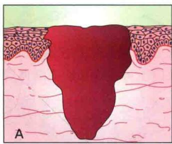
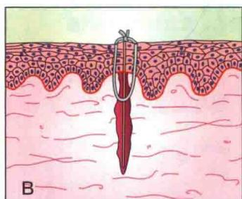 
一期愈合（伤口边缘对合）
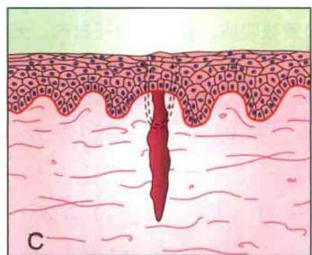
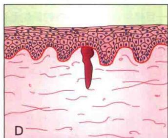
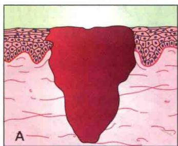 
图3-7 上图。一期愈合。A. 一个初期开放的切割伤口；B. 伤口边缘对合严密，已缝合，组织损失最小；C. 肉芽组织减少。这样的伤口只需要最少的细胞增殖和新生血管形成即可达到愈合；D. 愈合的结果是形成一个窄的线状瘢痕。下图。二期愈合。A. 一个深凿的伤口，留下开放的缺损需要愈合，伤口边缘仍相距甚远，其中有大量的组织缺损；B. 愈合过程需要经历伤口收缩、广泛的细胞增殖、基质积聚和新血管形成（肉芽组织）；C. 上皮从边缘向伤口中心增生、覆盖伤口，同时胶原纤维沉积，遍及肉芽组织；D. 肉芽组织最终被吸收，留下的是一个大的胶原瘢痕，无论是功能上还是外观方面都不完美
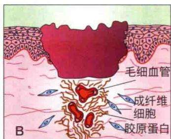 
二期愈合（伤口边缘分开）
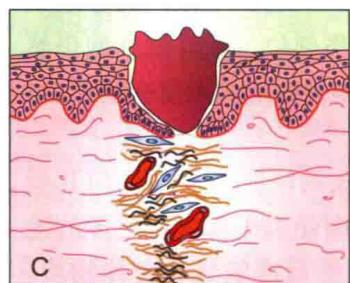
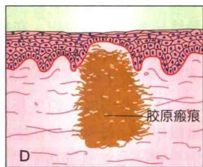
要的细胞因子[如白介素（IL）-1、VEGF、PDGF、TGF-α和TGF-β]。为了开始迁移，在伤口上方形成新的覆盖上皮细胞之前，角化细胞必须经过细胞分化。通常情况下，这些细胞借助含有α6β4整合素的半桥粒蛋白复合体附着在其下方基底膜的层粘连蛋白上。胶原纤维与半桥粒相关联，包括XVII型和VII型胶原纤维，也被称为锚定原纤维（表3-1）。这些锚定原纤维将半桥粒基底膜复合体与真皮结缔组织胶原纤维连接在一起。
上皮细胞间通过细胞侧边的紧密连接和由钙黏素受体组成的黏附连接相互连接在一起。钙黏素是钙离子依赖型的整合膜蛋白，可形成细胞外的细胞-细胞间连接，同时固定细胞内的细胞骨架连接。黏附连接中的钙黏素，将稳定的肌动蛋白束与 $\alpha \beta \gamma$ 连环蛋白的胞质复合体相连接。环绕上皮细胞胞质的肌动蛋白层可产生横向拉力和强度，被称为黏附带。细胞骨架与基底膜连接及细胞间连接的张力，决定着相连接的上皮细胞片的形状和强度。
细胞迁移是伤口表面上皮再生的主要手段。迁移的上皮细胞来源于伤口边缘、毛囊或汗腺。如果基底膜丢失，细胞会接触到不熟悉的基质或临时性基质成分，可刺激细胞运动和蛋白酶的表达。黏附斑是由一个整合素受体构成的，肌动蛋白纤维在黏附斑处的装配可促使上皮细胞运动性的激活，引导细胞沿着存活的皮肤边缘迁移。在真皮内的运动，穿过交联的纤维蛋白，也需要纤维蛋白溶酶原活化为纤维蛋白溶酶，以降解纤维蛋白。纤维蛋白溶酶也有助于一些特殊MMPs的激活。在局部的黏着接触部位，间质I型、III型胶原蛋白和层粘连蛋白被蛋白水解作用裂解后，可解除接触，或促使角化细胞迁移。迁移的角化细胞在重新汇合并附着在它们新形成的基底膜后，最终恢复它们的正常表型。
8.伤口的收缩 在伤口愈合的过程中，开放的伤口会在肌成纤维细胞（肉芽组织中的一种特殊细胞）的作用下发生收缩、变形。肌成纤维细胞可来源于成纤维细胞、血管周细胞或干细胞，在传统的光学显微镜下很难将其与分泌胶原蛋白的成纤维细胞区分开。与成纤维细胞不同，肌成纤维细胞表达 $\alpha$ -平滑肌肌动蛋白（SMA）、结蛋白（desmin）和波形蛋白（vimentin）。肌成纤维细胞也对药物有反应，引起平滑肌的收缩或松弛。总之，肌成纤维细胞是一种成纤维细胞，但其反应却类似于平滑肌细胞。肌成纤维细胞负责伤口收缩以及被称为伤口挛缩的变形的病理过程。通常大约在伤口愈合的第3天，会突然出现收缩力，这与肌成纤维细胞的外观有关，然后经过几周，收缩力逐渐减弱。肌成纤维细胞持续存在于增生性瘢痕组织中，尤其是
烧伤瘢痕中。
9. 伤口的强度 皮肤切口和外科空腔脏器的手术吻合口，其强度最终发展到未受损部位的 $75\%$ 。虽然伤口的抗拉强度在第 $7 \sim 14$ 天周增长迅速，但到2周末时，伤口处仅能获得最终强度的 $20\%$ 。愈合伤口的强度主要来源于I型胶原蛋白分子间的交联。尽管2个月前的切口已经愈合，但切口线和缝合痕迹仍然很明显，富含血管，颜色泛红。1年后，伤口变白，无血管，但通常仍可辨识。随着瘢痕的进一步消退，伤口线在皮肤牵拉的作用下缓慢变形，变为不规则的线。
愈合过程的顺序时间表已总结在图3-2。
# 第三节 再生
再生是指受损组织或其损伤的附属器恢复到原有的状态。再生需要一群具有自我更新能力的干细胞和具有分化和复制潜能的前体细胞。干细胞通过不对称性的细胞分裂进行自我更新，产生新的干细胞和子代细胞；子代细胞短时间内具有增殖和分化的能力。与干细胞不同，祖细胞的自我更新能力很小或缺如。
成人机体由几百种分化良好的细胞类型构成，但它保持着明显的重建自己和愈合自身的潜能，机体通过补充垂死的细胞来重建自己，而通过招募或激活细胞，使受损组织得以修复或再生，从而愈合自身。人体组织擅长治愈损伤，但很不幸的是，成体组织的再生能力很有限。在骨髓、表皮、肠道和肝中存在的独特细胞，保持着足够的生长发育的可塑性，来协调组织特异性的再生。组织再生潜能来自少量的非特异性细胞或干细胞，干细胞自我更新的能力是独一无二的。
# 一、成体干细胞是再生的关键
在多种的成体组织中，成体干细胞仍可继续生存，这些细胞可无限制的分裂，没有终末分化，甚至在不能观察到再生的组织中也已经被鉴定出有细胞分裂的存在。这些成体干细胞可能存在于一些特殊组织中，或是随着骨髓源性的循环细胞被种植到那些组织中。
一般而言，可将干细胞定义为具有某些共同的特征，包括：
■无限分裂的能力，防止衰老，并维持基因组的完整性（自我更新） 
间歇性分裂或保持静止的能力 
通过自我更新和分化进而增生的特性 
缺乏谱系标记 
在某些情况下，定位在某些特定的解剖部位 
与未明确分化的细胞具有同样的通用型生长和转录标记
# 二、干细胞的分化潜能
胚胎干细胞（embryonic stem cell，ES）追溯到胚胎植入前的胚囊，可分化为成体的各种细胞（如，它们是全能干细胞）。受精卵的万能干细胞可分化为多种类型的细胞，但它们不是全能的，如神经嵴细胞。多能干细胞在有机体的整个生命历程中必须自我更新，在某一个细胞谱系中或在单一胚层的衍生物中能分化成几种类型的细胞。举例来说，造血干细胞是谱系限制性的多能干细胞，能够形成血中的所有细胞；骨髓基质细胞（也被称为间充质干细胞）是来自中胚层这一单一细胞谱系的多能干细胞，在体外可被诱导分化为多种细胞类型，包括内皮祖细胞、脂肪细胞、软骨细胞、成骨细胞和肌母细胞。
祖细胞属于稳定细胞，因为缺乏明显的自我更新能力而有区别于干细胞，但它们保持着分化和快速增生的潜能。祖细胞有时也被称为单能干细胞，例如皮肤基底层角化细胞，虽然有些细胞可能是多能干细胞或寡能干细胞。
骨髓中含有造血干细胞、间充质干细胞和内皮干细胞，提供了多方面的再生能力。骨髓干细胞自胚胎发育过程中预留下来，可补充造血群体。骨髓源性的内皮干细胞参与组织的血管生成，同时在血管再生过程中能补充内皮细胞的增生。此外，在身体的其他部位，骨髓源性的间充质干细胞可填充修复组织。
如果创伤未破坏表皮基底膜或毛根，皮肤和毛囊的上皮细胞可从干细胞再生。肠道上皮细胞更新迅速，由存在于 Lieberkühn 隐窝中的干细胞来补充。部分情况下，肝细胞再生是一种误称，因为部分肝切除术后，肝再生实际上是分化成熟的肝细胞的一种增生反应，在大多数情况下，不涉及干细胞。然而，有证据表明，当病毒性肝炎或毒素导致肝细胞受损时，会发生干细胞驱动的肝再生。
# 三、根据增殖潜能可将细胞进行分类
机体细胞的分裂速率不同。一些成熟细胞不能分裂，一些细胞只有在某些特定的条件下才能分裂，而其他细胞每 $16\sim 24$ 小时就完成一个细胞周期。
1. 不稳定细胞 不稳定细胞在组织中处于不断更新的状态。无论任何时候，组织中均有超过 $1.5\%$ 的细胞处于有丝分裂期，那么这种组织是由不稳定细胞构成的。然而，在这些组织中，并非所有的细胞都处于不断的交替中。快速自我更新（不稳定）组织通常是那些在人体与外界环境间形成物理屏障的组织，这些组织包括胃肠道、皮肤、眼角膜、呼吸道、生殖系统和泌尿系统的上皮组织。骨髓和淋巴器官的造血细胞参与免疫防御也构成不稳定组织。多形核白细胞是终
末分化的细胞但能快速更新的最好实例。在适当的条件下，由不稳定细胞构成的组织，创伤后可再生，有足够的干细胞可参与再生。
2. 稳定细胞 由稳定细胞构成的组织通常更新很慢，但它含有祖细胞，能在组织受到损伤后较快地进行更新。肝细胞和近端肾小管是稳定细胞的典型实例。稳定细胞构成的组织中，仅有不足 $1.5\%$ 的细胞处于有丝分裂期。这些组织（例如内分泌腺、内皮、肝）中没有明显的干细胞，相反，这些组织中的细胞需要适当的刺激才能分裂。一个器官的再生能力是由复制潜能决定的，而不是取决于稳态有丝分裂的实际数量。
3. 永久细胞 永久细胞是终末分化的细胞，失去了所有的再生能力，不能进入细胞循环。传统意义上，中枢神经系统的神经元、心肌细胞和晶状体细胞被认为是永久细胞。近期研究证实，心肌细胞和神经元一旦遭到破坏，可由祖细胞替代，而不是从现有的心肌细胞或成熟神经元分裂而来。虽然永久细胞不分裂，但大多数细胞确实能更新它们的细胞器。眼晶状体是永久细胞的极端实例。每一个晶状体细胞都是在胚胎发育过程中产生的，出生后在成年期一直保持不变，它的组成不会更换。
# 第四节 影响修复的因素
# 一、局部因素可能影响愈合
1.创伤的部位 除了创伤的大小和形状之外，创伤的部位也会影响愈合。有的部位皮肤覆盖着骨，其间很少有其他组织，如胫骨前，这些部位不能收缩。发生在这些部位的损伤，尤其是烧伤，由于损伤边缘不能对合，常常需要植皮。存在并发症或感染，或接受电离辐射等其他处理，也可延缓修复过程。 
2. 血液供应 糖尿病患者，尤其是糖尿病相关血管病变的患者，下肢末端创伤常常愈合不良，甚至需要截肢。在这种情况下，晚期动脉粥样硬化和微血管病变影响腿部的血液供应，阻碍修复。腿部静脉曲张延缓了静脉回流，同时也可引起溃疡和创伤不愈合。压疮（压疮性溃疡）是由长时间局部压迫所致，局部压迫既可减少动脉血流，也可减少静脉血流。关节软骨大部分都没有血管，扩散能力有限，常常也不会发生严重的炎症反应，因此，关节软骨常常修复不良，通常这一状况（骨关节炎）随着年龄的增长而越发严重。 
3. 全身因素 尽管有研究表明随着年龄的增长，干细胞的储备减少，但单独年龄一个因素对创面愈合的影响尚无定论。90岁老年人的皮肤表现为胶原蛋白和弹性蛋白减少，可能愈合缓慢，但其白内障摘除术或结肠切除术后却能正常愈合，原因是年龄对肠道和
眼睛几乎没有影响。医源性因素如治疗相关的糖皮质激素的应用，可通过抑制胶原蛋白和其他蛋白质的合成，及发挥抗炎症的作用，从而延缓愈合。
4. 纤维化和瘢痕对比 成功的创面修复过程很短暂，并非是一个慢性过程，形成局限性的瘢痕，使局部损伤得以消除。相反，许多慢性疾病中，出现持续的炎症反应，修复反应不断进展，导致弥漫性纤维化和细胞外基质蛋白，尤其是胶原蛋白的过度沉积。例如，吸烟和二氧化硅颗粒吸入引起肺部的反复炎症，最终导致肺纤维化。持续的损伤和炎症是由单核细胞和淋巴细胞间的相互作用来介导的，由此导致细胞因子、生长因子和局部损伤性酶如MMPs的持续性的高水平产生。无论什么原因，实质脏器（如肺、肾、肝）的长期纤维化均会破坏正常的组织结构，降低器官功能。慢性纤维化通常是不可逆的，需要采取措施以阻止与病因的接触，或进行相应的治疗以限制炎症过程。纤维化应当被视为持续损伤修复的一种病理结果，最终导致器官功能的丧失。然而，瘢痕也常常对机体是有益的，如手术部位的瘢痕虽然表面上不美观，但可聚拢皮肤。
越来越多的证据表明，纤维化过程的消除不仅仅有赖于刺激信号的减少或拉伸强度和弹性的适度发展。细胞因子CXCL3家族成员，包括干扰素 $\gamma$ 诱导蛋白IP-9和IP-10，主要是由其他细胞间的成纤维细胞和上皮细胞分泌的。这些蛋白水平的增加与纤维化减少相关，而它们的缺乏可导致瘢痕扩大。
# 二、特定部位显示不同的修复模式
1.皮肤皮肤愈合包括修复（主要是皮肤瘢痕）和再生（主要是表皮和血管）。一期愈合和二期愈合的主要特点见图3-7。
一期愈合：外科医师将伤口边缘严密缝合时，会发生一期愈合。肌成纤维细胞作用很小。而由于表皮细胞仅需要迁移很小的距离，表皮的再生条件达到最佳。
二期愈合：当外科手术不能将大范围的出血和坏死清除时，会发生二期愈合。在这种情况下，肌成纤维细胞收缩伤口，随后瘢痕修复缺损。
烧伤创面的愈合成功与否及愈合方式，取决于烧伤的深度。如果烧伤表浅或未超过真皮浅层，汗腺和毛囊的干细胞会使表皮再生。如果烧伤累及真皮深层，再生需要的基本成分被破坏了，为减少瘢痕和挛缩，需要进行手术和植皮以覆盖或治愈伤口。
2.肝尽管正常的肝几乎完全缺乏有丝分裂能力，同时几乎所有的肝细胞都处于细胞周期的 $\mathrm{G}_0$ 期，但肝有非常强大的再生能力。手术切除后，肝细胞通过代
偿性增生而达到肝再生。
急性化学性损伤或暴发性病毒性肝炎引起广泛的肝细胞坏死。但是，如果没有很快地出现致命性肝衰竭，同时结缔组织基质、血管和胆管仍幸存的话，肝的正常结构和功能可完全恢复。Hering管的小细胞，被称为卵圆细胞，兼具肝细胞（α-甲胎蛋白和白蛋白）和胆管细胞（γ-谷氨酰转移酶和胆管细胞角蛋白）的特征，这些细胞被认为是在损伤时负责肝再生的干细胞。相反，病毒性肝炎或酗酒的慢性损伤与肝实质中的广泛胶原瘢痕形成有关，最终导致肝硬化（图3-8）。肝细胞形成再生结节，其中缺乏中央静脉。再生结节的扩大会阻塞血管、引起胆汁淤积。虽然有足够数量的再生肝细胞，但肝细胞间无关联，会发生门脉高压和黄疸。
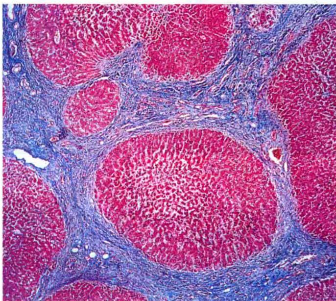 
图3-8 肝硬化。慢性肝损伤的后果是纤维条带分隔形成肝细胞再生结节。组织学切片显示结缔组织带（蓝色）围绕在再生结节（红色）周围
3.肾尽管肾的再生能力有限，一侧肾切除（肾切除术）后，另一侧的残存肾可发生代偿性肥大。若肾损伤的范围不大，且细胞外基质结构没有被破坏，肾小管上皮细胞可再生。然而，在大多数肾疾病中，细胞外基质结构均有一定程度的破坏，那么肾的再生不完全，最常见的结局就是形成瘢痕。肾组织中，皮质肾小管的再生能力最强，其次是髓质肾小管，肾小球无再生能力。最近的数据表明，肾小管的修复是由内源性的肾祖细胞的增殖完成的。
4. 肺 当上皮下的细胞外基质结构没有被破坏时，呼吸道被覆上皮细胞在一定程度上能再生。气管和支气管上皮的浅表损伤由邻近上皮再生后愈合。肺泡损伤后的结局可以是结构和功能上的完全再生，也可以发生纤维化（图3-9）。
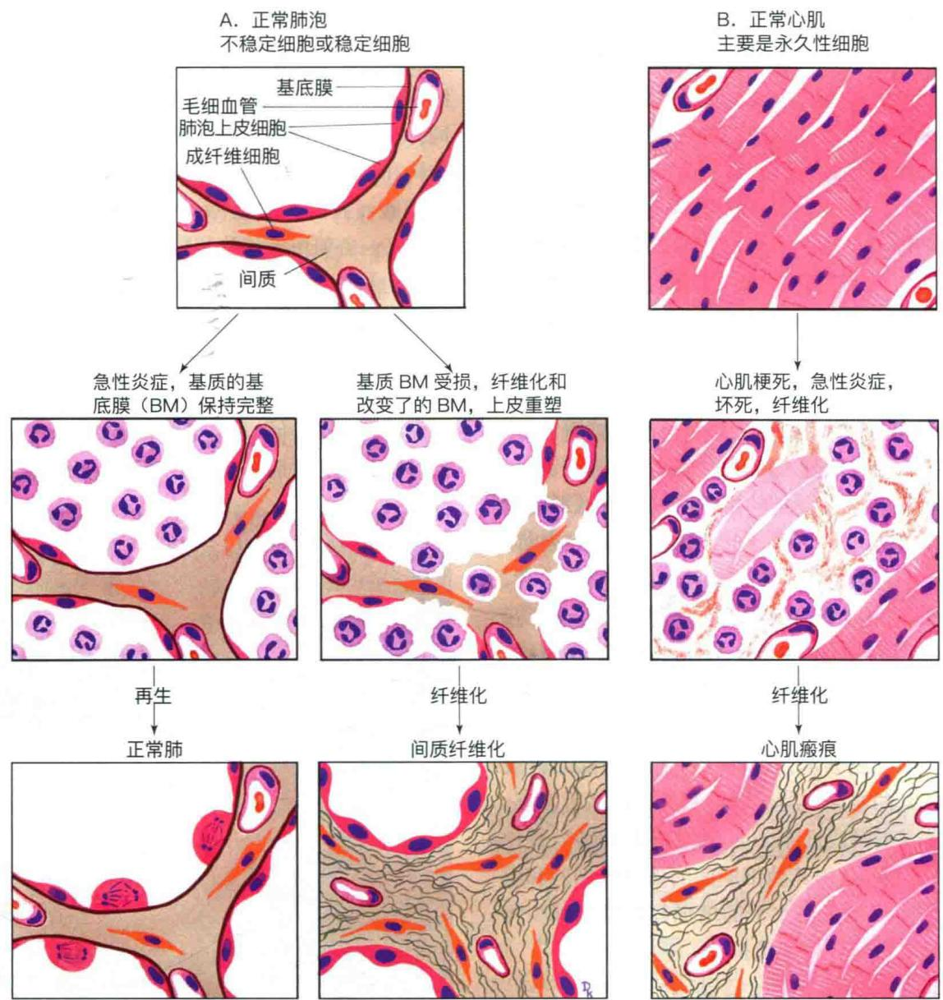 
图3-9纤维性修复和再生性修复举例。A.肺的肺泡腔表面衬以I型和II型上皮细胞（肺泡上皮细胞），上皮细胞坐落在基底膜上。肺损伤后如果基底膜保持完整，上皮将快速再形成，恢复正常的肺结构。如果基底膜被破坏，II型上皮细胞在其下方的细胞外基质上增殖，成纤维细胞和成纤维细胞被动员起来，分泌富含胶原蛋白的基质，最终导致纤维化。B.虽然发现心脏中存在少量的干细胞，但很少能看到心肌再生。总的来说，心肌细胞是终末分化状态的细胞，不能更新。由于梗死和急性炎症造成的心肌损伤，最终导致纤维化和瘢痕性修复，增加了发生心律失常和心力衰竭的概率
当损伤未累及肺泡基底膜时，肺泡可完全再生。Ⅱ型肺泡上皮细胞（肺泡储备细胞）迁移到损伤暴露区、进行有丝分裂，其细胞特征介于I型和Ⅱ型肺泡上皮细胞之间。当这些细胞覆盖肺泡表面时，与其他上皮细胞间将建立联系，随后有丝分裂停止，同时细胞分化成I型肺泡上皮细胞。若肺泡基底膜大量受损，则会发展为瘢痕和纤维化。在巨噬细胞产物的刺激下，肺泡间隔的间质细胞增生，并分化为成纤维细胞和肌成纤维细胞。这些细胞迁移进入肺泡腔，分泌I型胶原蛋白和蛋白多糖，从而促进肺纤维化。最常见的慢性肺疾病是肺气肿，涉及气腔的扩大、肺泡壁的破坏和无功能性弹力蛋白的取代，导致组织弹性和功能的不可逆性损伤。
5. 心心肌细胞一直被认为是永久性的、不分裂
的终末分化细胞。最近有证据表明，虽然心肌细胞不能将受损心肌完全修复，但它具有非常低的再生率。祖细胞存在于心肌间，或从骨髓迁移而来。实际上，无论什么原因导致的心肌坏死都是以形成肉芽组织来进行修复，最终形成瘢痕（图3-10）。不仅仅是心肌瘢痕导致收缩成分的丧失，同时纤维化组织也降低了存活心肌的收缩效果。
6. 神经系统 成熟神经元被称为永久性的、分裂后细胞，最近研究表明，神经元可能有再生能力，但公认的神经系统损伤后的修复结果并不能被改变。创伤后，只有存活的神经元细胞发生再生和重组，才能建立神经连接。虽然外周神经系统中轴突有再生能力，但是中枢神经系统缺乏再生能力。脑或脊髓的任何损伤都会导致毛细血管增生和神经胶质增生（星形细胞
和小胶质细胞增生）。中枢神经系统的神经胶质增生相当于其他部位的瘢痕形成，一旦形成，将是永久性的。
外周神经系统中的神经元轴突可以再生，理想情况下，外周神经断裂损伤后，其功能将完全恢复。但是，如果断端对齐不良，或由于炎症或瘢痕影响到轴突连续性的建立，可引起创伤性神经瘤（图3-11）。这一球状病变由杂乱无章的轴突及增生的施万细胞和成纤维细胞构成。
7. 瘢痕的影响 尽管瘢痕是大多数损伤修复的基础，但实质脏器的瘢痕改变了脏器的复杂结构，却没有改善任何功能。例如，在心，心肌梗死的瘢痕，可防止薄弱的心脏壁破裂，但使收缩性组织减少。如果瘢痕形成的范围足够大，可能导致充血性心力衰竭或形成室壁瘤（第11章）。心包的持续性炎症可导致炎性渗出物的机化，同时沉积的纤维蛋白转化为胶原蛋白，有可能造成心包的纤维性粘连，最终引起缩窄性心包炎和心力衰竭（图3-12）。
肺泡纤维化可导致呼吸衰竭。腹膜感染，甚至是手术探查，都有可能最终导致腹膜粘连和肠梗阻。肾小球的免疫性损伤后，可由胶原瘢痕取代，如果损伤
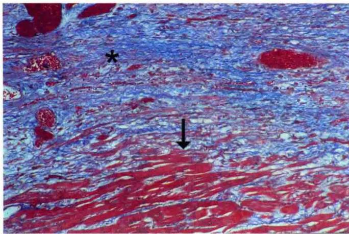 
图3-10心肌梗死。心肌梗死愈合后的切片显示，成熟的纤维化（星号）和破坏的心肌纤维（箭头）
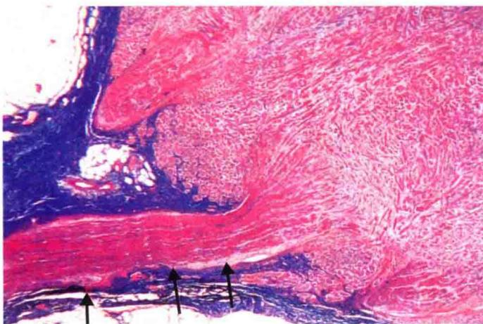 
图3-11外伤性神经瘤。在这幅显微照片中，原来的神经（箭头）长入神经瘤中。致密胶原组织围绕神经周围，三色染色显示胶原组织呈深蓝色
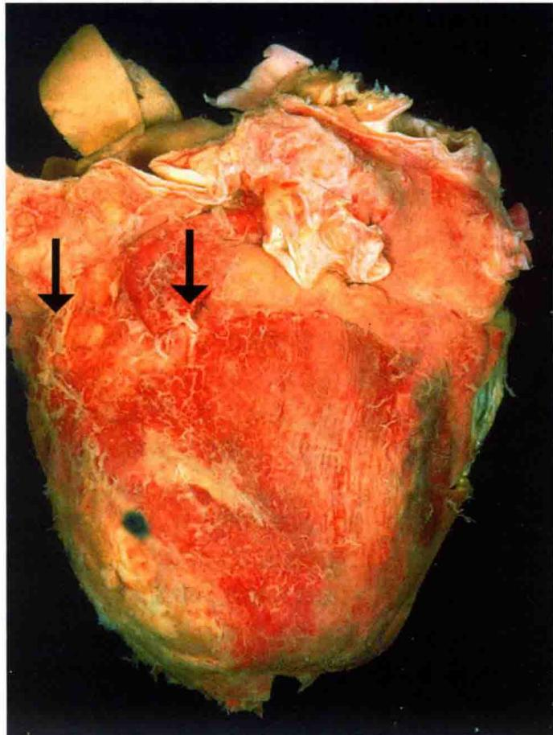 
图3-12 缩窄性心包炎，图示胶原蛋白的机化带
范围广泛，可引起肾衰竭。烧伤或手术切除病变后的皮肤组织，由于瘢痕形成可使美容效果不满意，或更严重者，因伤口收缩可导致肢体功能缺陷。
# 三、创伤修复常常是不理想的
损伤修复的三个过程——修复、收缩和再生，任何一个过程的异常均可导致修复失败或创伤愈合时间延长。外科医师的技能往往是至关重要的。
1. 瘢痕形成缺陷 肉芽组织的形成缺陷或无法形成合适的细胞外基质，可导致瘢痕形成不足，并可出现并发症，如伤口撕裂（压力增大时裂开）和手术部位的切口疝。全身易感因素包括代谢缺陷、低蛋白血症和常常伴随转移癌而出现的营养不良。 
2. 溃疡 创伤愈合过程中，当自身的血液供应不充足，或缺乏毛细血管生成时，往往会形成溃疡。例如，伴有静脉曲张或严重的动脉粥样硬化的患者，其腿部伤口常伴有溃疡形成。由于持续性的创伤，在感觉缺失的部位也可出现伤口的不愈合。这种营养性或神经性溃疡往往见于糖尿病性外周神经病。糖尿病也可使细胞对细胞因子的反应性减低，使细胞因子很难发挥促进愈合过程的作用。 
3. 瘢痕形成过度 细胞外基质在伤口部位的过度沉积，可引起增生性瘢痕，主要是过量的胶原蛋白的沉积。瘢痕疙瘩是一种增生旺盛的增生性瘢痕，其病
变常常可进展，超出初始伤口部位的边缘，同时切除后可复发（图3-13）。组织学上，增生性瘢痕和瘢痕疙瘩这两种类型的瘢痕均显示有广泛的和不规则的胶原纤维束；同时，与相同年限的瘢痕组织相比，含有更多的毛细血管和成纤维细胞。瘢痕疙瘩的定义比增生性瘢痕的定义更加清晰，胶原蛋白的合成速率、Ⅲ型胶原蛋白与I型胶原蛋白的比率，以及可还原的交联数目仍保持较高水平。这种情形表明了在伤口成熟过程中的一种“成熟抑制”，或阻滞。瘢痕疙瘩非常不雅观，用手术来试图修复也常出现问题，其结局可能是形成一个更大的瘢痕疙瘩。与浅色皮肤的人种相比，深色皮肤的人种更易发生瘢痕疙瘩，而且这种易感性有时具有遗传性。与之相比，增生性瘢痕与皮肤颜色或遗传性无关。
4.过度收缩 伤口体积的缩小取决于： $①$ 肌成纤维细胞的存在； $②$ 细胞-细胞间接触的发展； $③$ 持续的细胞收缩。这些进程的夸大被称为挛缩，将导致伤口及其周围组织的严重畸形。有趣的是，那些通常显示轻微伤口收缩的部位（如手掌、脚掌和前胸）最容易发生挛缩。在严重烧伤的愈合中，挛缩非常显著，并且可以严重到使关节运动受损。在消化道，挛缩（狭窄）可以导致食管中的食物通过阻塞或限制肠内容物的流动。
一些疾病以浅筋膜的痉挛和不可逆的纤维化为特征，包括Dupuytren挛缩（手掌挛缩）、Ledderhose病（足底挛缩）和Peyronie病（阴茎海绵体挛缩）。这些疾病中，尽管其基本进程与创伤愈合中的挛缩相似，但并无已知的损伤发生。
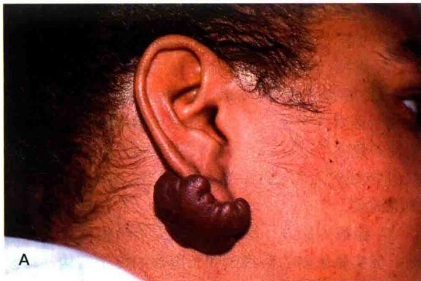
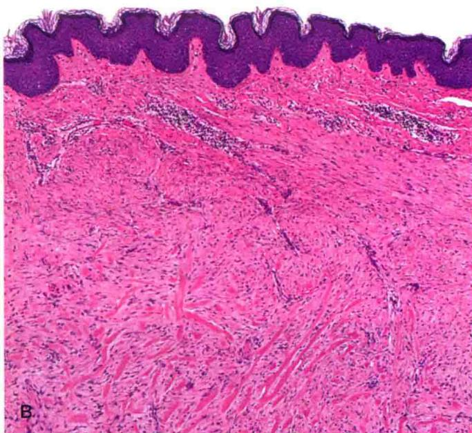 
图3-13 瘢痕疙瘩。A. 一名皮肤微黑的女性，由于耳垂穿孔后的反应过度发展形成的瘢痕疙瘩；B. 显微镜下，真皮明显增厚，胶原纤维束增生、排列紊乱，细胞较丰富
（梁晓彦 刘翠苓）
# 第4章 免疫病理
免疫系统保护宿主免受异物和潜在性有害物质的侵犯。作为宿主防御系统的组成部分，免疫应答具有如下特点：①具有识别“自己”和“非己”的能力；②可以辨别不同的潜在性入侵者（特异性）；③产生免疫记忆并可放大免疫反应（例如可以回忆起先前经历过的抗原刺激并引发强化的记忆性免疫应答）。可以引发免疫应答的物质（称为抗原）多种多样，包括感染性物质（细菌、病毒、寄生虫）、化学物质、毒素、药物和移植物。具有抗原特异性和免疫记忆性的免疫应答被称为适应性免疫。固有免疫（已在第2章讨论）不具有免疫记忆性，而且也不具备适应性免疫可以识别特异性抗原的能力（虽然固有免疫也可以识别有害物质的模式和类别，如细菌的细胞壁成分）。形成急性炎症反应的宿主防御体系包括细胞表面相关系统、可溶性介质系统（例如补体和凝集素系统）和各种吞噬细胞（最重要的是定居于组织中的巨噬细胞）。上述各系统是固有免疫必不可少的组成部分。
适应性免疫反应对宿主的生存起了十分关键的作用，其缺陷将导致严重的感染性疾病。从艾滋病对机体致命性的破坏中我们可略窥一斑。虽然适应性免疫反应可以导致宿主的损伤（例如对移植器官的免疫排斥），将其归为宿主的防御反应仍是贴切的。缺少适当的适应性免疫和适应性免疫反应过度均可导致相关疾病，对此的研究则构成了免疫病理学。
# 第一节 免疫系统的生物学
# 一、组成免疫系统的细胞来源于造血干细胞
抗原特异性或“适应性”免疫系统由淋巴细胞、浆细胞、抗原呈递细胞（APCs）、特异性效应分子（例如免疫球蛋白Igs）和大量的调节性介质构成。
免疫系统的细胞成分来源于多能造血干细胞（HSCs）（图4-1）。在胚胎发生的近第一个月末，HSCs出现在胚外卵黄囊附近的血岛中。第6周，造血成分从胚外血岛迁移到胚胎肝，然后迁至骨髓。迁至骨髓的过程从胚胎第2个月开始，到第6个月完成。在孕8周，来源于造血干细胞的淋巴样祖细胞沿血液循环到达胸腺，在此分化成为成熟的T淋巴细胞。而
将来发育成B细胞的淋巴样干细胞则首先在胚胎肝脏（第8周），然后在骨髓（第12周）中进行分化。造血干细胞首先分化为淋巴样祖细胞和髓样祖细胞，前者最终分化为T淋巴细胞、B淋巴细胞和NK淋巴细胞，而后者则分化为粒细胞、红细胞、单核细胞、树突状细胞和巨核细胞。对淋巴造血系统发育中的和成熟的细胞之命名主要取决于细胞表面的标记物，而这些标记物是以分化簇（CD）的编码指定的。目前，大约有300种不同的分子被赋予了CD编码。
1. 淋巴细胞 淋巴细胞的3种主要类型分别是T细胞、B细胞和NK细胞，大约占外周血白细胞的 $25\%$ 。外周血淋巴细胞中T细胞占 $80\%$ ，B细胞占 $10\%$ ，NK细胞占 $10\%$ 。淋巴细胞在外周血、中枢淋巴器官和周围淋巴器官中的相对比例是可以变化的。与外周血不同的是，脾和骨髓中T淋巴细胞只占 $30\% \sim 40\%$
（1）T淋巴细胞：根据功能属性、细胞表面的CD分子，有时还需结合形态学特点把T淋巴细胞分为几种亚群。分化为T细胞、巨噬细胞和树突细胞的造血干细胞离开骨髓迁移至早期胸腺，胸腺由第三鳃裂和第四咽囊的内、外胚层发育而来。在胸腺中，前体T细胞经历了一系列复杂的多步骤成熟过程，最终完成了三个目标：
1）完成编码T细胞受体（TCR） $\alpha /\beta$ 或 $\gamma /\delta$ 异源二聚体的抗原结合区域的基因片段的重组（图4-2）。 
2）形成具有不同功能的T细胞亚群，即辅助性T细胞（ $\mathrm{CD4^{+}}$ ）和细胞毒性/抑制性T细胞（ $\mathrm{CD8^{+}}$ ）。 
3）通过胸腺的阳性选择和阴性选择筛选出能够识别自身抗原和主要组织相容性抗原而不会产生自身免疫的T细胞亚群。
发育过程中，T细胞从胸腺的被膜下区（此处含有最幼稚的T细胞）向髓质区转移，成熟的处女T细胞在髓质区被释放入外周血液循环。在此过程中，不成熟的T细胞与胸腺上皮细胞（皮质区）及树突状细胞（皮髓质交界区）相互作用并经历了下述的成熟过程：
胸腺的被膜下区：T细胞的标记为 $\mathrm{CD4}^{-}$ ， $\mathrm{CD8}^{-}$ （双阴性T细胞）。开始TCR基因重排。 
胸腺的皮质区：T细胞的标记为 $\mathrm{CD4^+}$ ， $\mathrm{CD8^{+}}$ （双阳性T细胞）。阳性选择是胸腺细胞与皮质上皮细胞
表达的主要组织相容性复合物（MHC）等分子相互作用的过程。
胸腺的皮髓质交界区：T细胞的标记为 $\mathrm{CD4}^+$ 或 $\mathrm{CD8^{+}}$ （单阳性T细胞），这取决于与之优先结合的是MHCI类分子还是MHCII类分子。 
胸腺的髓质区：能与髓质树突状细胞表达的MHC分子和自身抗原肽强烈反应的T细胞将被阴性选择而发生凋亡，此过程能清除与自身抗原发生反应的T细胞。 
成熟的单阳性处女T细胞进入外周血液循环。
T淋巴细胞离开胸腺后加入到外周淋巴组织中。在胸腺中，抗原特异性TCRs形成并与CD3共表达于T细胞，后者是一种必需的辅助分子。近 $95\%$ 的循环T淋巴细胞表达 $\alpha /\beta \mathrm{TCR}s$ 。同时，循环的 $\alpha /\beta \mathrm{T}$ 细胞也表达CD4或CD8。少部分（ $5 \%$ ）T细胞表达 $\gamma /\delta \mathrm{TCR}s$ 和CD3，但是不表达CD4或CD8。
T淋巴细胞可以识别特异性抗原，这些抗原通常是蛋白质，或是结合了蛋白质的半抗原。 $\mathrm{CD4^{+}}$ 和
$\mathrm{CD8^{+}}$ 的T细胞亚群具有多种效应功能和调节功能。效应功能包括分泌促炎因子和杀伤表达异源性抗原和变异的膜抗原的细胞。调节功能则包括通过分泌辅助性或抑制性细胞因子来启动或抑制免疫应答。
总之， $\mathrm{CD4^{+}}$ 的T细胞可以促进抗体产生和炎症反应。这些T细胞识别抗原建立在与抗原呈递细胞自身表达的MHCⅡ类分子结合的基础上。还可以依据各自分泌的细胞因子的不同对 $\mathrm{CD4^{+}}$ 的T细胞进一步分类。1型辅助性T细胞，即Th1细胞，可以分泌干扰素 $\gamma$ （IFNγ）和白介素2（IL-2），而2型辅助性T细胞，即Th2细胞，则可以分泌IL-4、IL-5和IL-10。Th1细胞与细胞介导的反应相关，而Th2细胞则与B细胞活化和过敏反应相关。
相比而言， $\mathrm{CD8^{+}}$ 的T细胞则执行抑制功能和细胞毒功能。 $\mathrm{CD8^{+}}$ 的T细胞识别抗原建立在与MHC I类分子结合的基础上，而MHC I类分子可以表达于多种细胞。抑制性T细胞抑制了免疫反应的活化阶段；细胞毒性T细胞可以杀伤表达特异性抗原的靶细胞。
，T淋巴细胞和B淋巴细胞的前体细胞。B淋巴细胞可以分化成浆细胞。CD.分化决定簇；CFU-GEMM.粒系、红系、单核树突系和巨核细胞系集落形成单位；HLA.人类白细胞抗原.jpg) 
图4-1多能造血干细胞分化成淋巴样干细胞和髓样干细胞，髓样干细胞进而形成谱系特异性集落形成单位（CFUs）。在合适的微环境作用下，CFUs可以分化为不同的细胞类型。淋巴样干细胞是自然杀伤细胞(NK)，T淋巴细胞和B淋巴细胞的前体细胞。B淋巴细胞可以分化成浆细胞。CD.分化决定簇；CFU-GEMM.粒系、红系、单核树突系和巨核细胞系集落形成单位；HLA.人类白细胞抗原
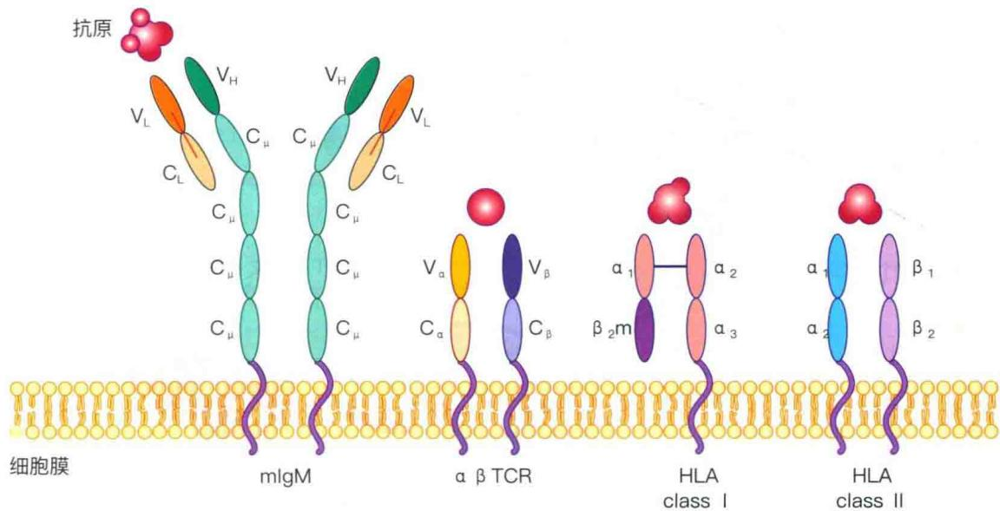 
图4-2 T细胞受体(TCRs)的抗原结合部位和膜型免疫球蛋白(mlg)是由两条肽链的N端可变区组合而成。每个可变区都是由VJ(TCR)或V(D) J(lg)基因片段随机重排转录而成。主要组织相容性复合物分子(MHC)的抗原结合是由I类分子的 ${\alpha }_{1}$ 和 ${\alpha }_{2}$ 结构域组合而成,或由II类分子的 ${\alpha }_{1}$ 和 ${\beta }_{1}$ 结构域组合而成。C为恒定区, ${\beta }_{2}\mathrm{m}$ 代表 ${\beta }_{2}$ 微球蛋白,后者是完整的人类白细胞抗原(HLA) I 类分子的组成成分
与宿主组织不相容的I类和Ⅱ类异源性分子（例如，移植物的组织相容性抗原）本身就是潜在的免疫原，可以被宿主的T细胞识别。这就是为什么人体组织移植时需要检测供者和受者的人类白细胞抗原（HLA）是否匹配。除了需要MHC分子呈递的外来肽段与TCR复合物结合之外，还需要其他几种受体-配体相互结合才能最大限度地活化淋巴细胞。请参见图4-3，该图总结了 $\mathrm{CD4^{+}}$ 的辅助性T细胞和APCs细胞之间最关键的几种相互作用。
（2）B淋巴细胞：在骨髓中分化成为能分泌抗体的终末细胞，即浆细胞。与T细胞发育相似，胚胎肝和骨髓的微环境对B淋巴细胞的发育都是十分关键的。在这两个部位，只有存活下来的B细胞才能依次通过多个必需的步骤，最终合成表面免疫球蛋白。尽管，当表面免疫球蛋白与自身抗原结合过于紧密时，发育中的B细胞将被阴性选择而清除。
与T细胞相似，B淋巴细胞表面也表达一种抗原结合受体，即膜型免疫球蛋白（ $\mathrm{mIg}$ ）， $\mathrm{mIg}$ 与终末分化的浆细胞所分泌的可溶性 $\mathrm{lg}$ 具有相同的抗原结合特异性（图4-3）。
成熟的B淋巴细胞最初以静息状态存在，等待外来抗原的激活。B细胞激活需要： $① \mathrm{mIg}$ 受体与辅佐性细胞呈递的抗原相互交联； $②$ 通过一种被称为同源性T细胞B细胞互助的机制与辅助性T细胞膜表面分子结合（图4-3）。初始刺激引起B细胞增生并发生克隆性扩增，后者是由辅佐细胞和T细胞共同分泌的细胞因子产生的放大效应。如果不再有附加的信号，增生的B细胞将回归静息状态并进入记忆细胞库。这些事件多发生于淋巴组织的生发中心。在生发中心，B细胞可以进一步发生体细胞基因重排，从而产生多种
免疫球蛋白同种型及亚型。对整个免疫反应的复杂过程的总结请参见图4-4。
同种型（isotype）用于定义免疫球蛋白分子重链的类型。因此，每种免疫球蛋白的同种型都显示有一
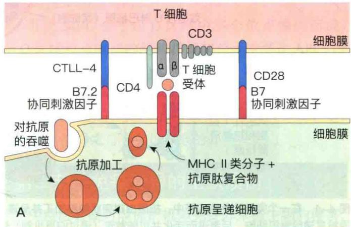
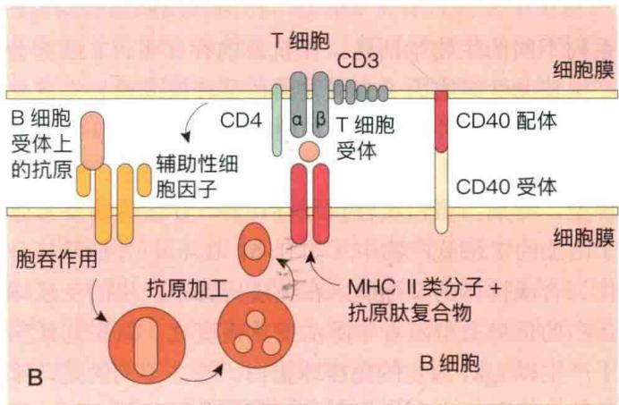 
图4-3T淋巴细胞的活化。A.在Ⅱ类主要组织相容性复合物分子（MHC）与TCR结合的基础上，经过吞噬加工的抗原肽被呈递至TCR，从而激活了T淋巴细胞；T细胞的活化同时还需要来自CTLL-4或CD28的辅助性或协同刺激信号。B.相似的过程同样适用于B细胞和T细胞的相互作用。B淋巴细胞的抗原受体是膜上的免疫球蛋白
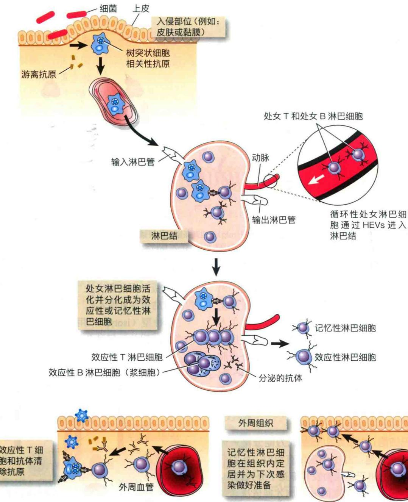 
图4-4在一个完整的免疫应答中，抗原由树突状细胞加工并呈递，树突状细胞通过输入淋巴管进入区域性淋巴结。在区域性淋巴结内，抗原被呈递给淋巴细胞，后者进而活化并可能游走（通过归巢机制）到特定的外周部位。HEVs.高内皮静脉
系列不同的生物学活性。在抗原的存在下，T细胞会产生辅助性细胞因子去引发同种型转换或诱导先前就存在的产生某种特定的同种型免疫球蛋白的B细胞亚群增生。例如，IL-4诱导了免疫球蛋白转换至IgE同种型。特别当蛋白质性抗原存在时，B细胞需要暴露于附加的T细胞产物中（如IL-5，IL-6），才能最终分化为合成抗体的浆细胞。在免疫应答中产生的免疫球蛋白的优势类型随着年龄的变化而变化。新生儿倾向于产生以 $\mathrm{IgM}$ 为主的免疫球蛋白。与之不同的是，年长的儿童和成人在抗原刺激的初期主要生成 $\mathrm{IgM}$ ，随后快速转向合成 $\mathrm{IgG}$
2.自然杀伤细胞（NK细胞） 被认为在胸腺和骨髓均可发生的NK细胞，通过抗原不依赖的机制识别靶细胞。NK细胞既不表达功能性TCR也不表达表面
免疫球蛋白。它们表达多种MHC I类分子的受体，与配体结合时可抑制NK细胞分泌溶细胞性产物的能力。某些肿瘤细胞和病毒感染的细胞表达的MHC I类分子的数量减少，因此不能抑制NK细胞。NK细胞就可以与病毒感染的细胞或肿瘤细胞结合并分泌补体样溶细胞性蛋白（穿孔素）、粒酶A和B以及其他溶细胞性因子。NK细胞还可以分泌颗粒溶素，这是一种可以诱导靶细胞凋亡的阳离子蛋白。它们还可以通过抗体依赖的细胞毒性反应（ADCC）来溶解靶细胞。在ADCC反应中，NK细胞通过其Fc受体与IgG的Fc结构域结合，而IgG则与靶细胞表面的抗原特异性结合。与T细胞和B细胞相似，NK细胞也表现出一定程度的异质性。
3. 单核吞噬细胞、抗原呈递细胞和树突状细胞 单
核吞噬细胞，主要是单核细胞，占循环白细胞的 $10\%$ 血液循环中的单核细胞定居于组织则成为巨噬细胞，包括库普弗细胞（肝脏），肺泡巨噬细胞（肺）和小胶质细胞（脑）等。单核细胞和巨噬细胞表达一系列对宿主防御功能至关重要的特殊的细胞表面分子，这些分子包括：
MHC II类分子 
CD14（一种能与细菌的脂多糖结合的受体并能触发细胞活化） 
多种类型的免疫球蛋白Fc受体 
Toll-like受体 
黏附分子 
一系列参与调节单核细胞/巨噬细胞功能的细胞因子受体。
活化的巨噬细胞可产生多种参与宿主防御的细胞因子和可溶性介质（例如，IFN-γ、IL-1β、肿瘤坏死因子和补体成分）。
就它们能表达Ⅱ类组织相容性抗原的属性来说，巨噬细胞是非常重要的辅佐细胞。它们可以吞噬、加工抗原，并将其和MHCⅡ类分子一起呈递给T细胞。随后的T细胞反应又进一步被巨噬细胞分泌的细胞因子所放大。最具特征的细胞因子是IL-1，其促进T细胞表达IL-2受体，从而促进了IL-2驱动的T细胞增生。IL-1在其他组织的众多功能之一就是为机体与感染抗争做好准备。例如，IL-1可以导致发热并促进分解代谢（第2章）。
巨噬细胞的功能活性与它们合成的分子谱系受到外界因素的调节，如T细胞源性的细胞因子。巨噬细胞暴露在这样的因素下会被活化，然后会产生各种参与宿主防御的活性氧代谢产物、细胞因子和可溶性介质（例如，IFN-γ、IL-1β、TNF-β和补体成分）。巨噬细胞既是固有免疫又是适应性免疫的重要组成部分。
APCs因其功能而被命名。它们来源于HSCs。APCs在细胞因子驱动下上调了MHCII类分子的表达后，在组织相容性的基础上，获得了向辅助性T淋巴细胞呈递抗原的能力（图4-3)。单核细胞、巨噬细胞、树突细胞及在某些情况下的B淋巴细胞、内皮细胞和上皮细胞均可充当APCs。在某些部位，APCs的功能可以高度特化。例如，在淋巴结和脾富于B细胞的淋巴滤泡内，滤泡树突细胞可以引导记忆性B细胞的生成，这对记忆性免疫应答（免疫记忆）非常重要（图4-4）。
树突状细胞是一种特化的APCs，被命名为树突是因为它们具有像蜘蛛一样的形态学特点。它们位于淋巴滤泡中富于B细胞的区域、胸腺髓质和多处外周淋巴组织内，后者包括肠的黏膜固有层、肺、泌尿生殖
道和皮肤。表皮的Langerhans细胞即是外周APC的一种。与抗原相遇时，Langerhans细胞会吞噬抗原，通过输入淋巴管游走到区域淋巴结并进一步分化成为更加成熟的树突状细胞。Langerhans细胞来源的树突状细胞表达高密度的MHCI类和Ⅱ类分子并向T淋巴细胞高效呈递抗原（图4-4）。
# 二、主要组织相容性复合物对免疫细胞间相互作用的协调功能
人类的MHC被命名为HLA复合物，在免疫应答所必需的多种细胞之间的相互作用中起到调节作用。这些抗原是组织中最主要的免疫原，是移植排斥反应中被最先识别的靶标。MHC包括I类、Ⅱ类和Ⅲ类抗原（Ⅲ类抗原代表特定的补体成分，本身并不是组织相容性抗原）（图4-5）。
I类MHC分子由MHC基因A、B、C区域中高度多态性的片段编码而成（图4-5）。实际上，这些位点所编码的结构相似的分子在所有组织中均有表达。由于这些等位基因的协调表达，组织同时携有来自于父母双亲的I类抗原。在移植物排斥反应和T淋巴细胞介导杀伤病毒感染的细胞等过程中，这些分子将被细胞毒性T细胞识别。
II类MHC分子由D区域中多个位点编码而成。由D区域位点编码的结构相似的分子主要在APCs细胞表达，包括单核细胞、巨噬细胞、树突状细胞和B淋巴细胞。II类抗原也被称为Ia抗原（免疫相关性抗原）。与I类分子相似，D区域的等位基因协调表达，组织同时携有来自于父母双亲的II类抗原。
# 第二节 免疫介导的组织损伤
免疫应答既可以保护机体免受外来微生物的侵害，也可以导致组织的损伤。在许多炎症性疾病中免疫系统攻击了机体自身的组织，这都是“误伤”的例子。广义上，导致组织损伤或疾病的免疫反应均被称为超敏反应。由免疫反应或超敏反应介导的疾病很常见，包括的病种有麻疹（荨麻疹）、哮喘、枯草热、肝炎、肾小球肾炎和多种类型的关节炎。
根据免疫机制的不同可以对超敏反应进行分类（表4-1）。I型、Ⅱ型和Ⅲ型超敏反应均需要形成针对外源性（异物性）或内源性（自身性）抗原的特异性抗体。这些抗体的类型是决定组织损伤机制的关键因素。
在大多数I型或速发型超敏反应中，生成的是IgE抗体，这些抗体通过其Fc结构域与肥大细胞和（或）嗜碱性粒细胞上的高亲和性受体结合。继而，抗原与这些细胞上的IgE交联触发了细胞产物的迅速释放，导致了像荨麻疹、哮喘和过敏反应等疾病的典型症状。
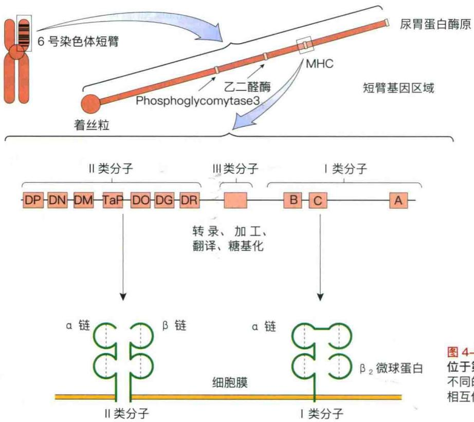 
图4-5 编码主要组织相容性抗原的高度多态性的位点位于第6号染色体的短臂。I类和Ⅱ类分子虽然显示有不同的结构，但是每种分子都参与到至关重要的T细胞相互作用之中
在Ⅱ型超敏反应中，生成的是 $\mathrm{IgG}$ 或 $\mathrm{IgM}$ 抗体，其针对的抗原通常是位于细胞表面的蛋白质。少数情况下，这些抗原是细胞外基质固有的结构成分（例如，基底膜的某些成分）。这些抗原-抗体的结合激活了补体，继而导致细胞的裂解（细胞毒作用）或细胞外基质的损伤。在一些Ⅱ型反应中，其他抗体介导的效应也起到一定的作用。
在III型超敏反应中，引起组织损伤的抗体通常也是IgG或 $\mathrm{IgM}$ ，但是导致组织损伤的机制有所不同。在血管中往复循环的抗原与抗体结合，形成的免疫复合物沉积在组织中。抗原-抗体复合物在沉积的部位
激活补体，继而触发了白细胞募集，后者进一步导致了组织的损伤。在一些III型反应中，抗原在原位与抗体结合。
IV型反应，也被称为细胞介导的迟发型超敏反应，抗体并不参与其中。事实上，通常是在巨噬细胞的帮助下，抗原激活了T淋巴细胞，促使后者释放细胞内产物，从而导致了组织的损伤。
许多免疫性疾病是由多种类型的超敏反应介导的。对吸入的真菌性抗原发生过敏反应而导致的过敏性肺炎，即是由I型、Ⅲ型和IV型超敏反应共同导致了肺的损伤。
表 4-1 超敏反应之 Gell 和 Coombs 分类修订版 
类型机制举例I型超敏反应(过敏反应):速发型超敏反应IgE抗体介导的肥大细胞活化及脱颗粒枯草热、哮喘、荨麻疹、过敏症非-IgE介导的物理性荨麻疹II型(细胞毒型):细胞毒性抗体针对细胞表面抗原形成细胞毒性抗体(IgG、IgM);通常包括补体的参与自身免疫性溶血性贫血,肺出血肾炎综合征针对细胞表面受体的非细胞毒性抗体Graves病III型(免疫复合物型):免疫复合物病针对外源性或内源性抗原形成抗体(IgG、IgM、IgA);补体和白细胞(中性粒细胞和巨噬细胞)经常参与其中自身免疫性疾病(SLE,风湿性关节炎),多种类型的肾小球肾炎IV型(细胞介导):迟发型超敏反应单个核细胞(T淋巴细胞、巨噬细胞)生成白细胞介素和淋巴细胞因子肉芽肿性病变(结核,结节病)
# 一、I型或速发型超敏反应由IgE结合于肥大细胞而触发
速发型超敏反应的表现是，先前致敏的个体再次暴露于该种抗原或“变应原”的几分钟内即可发生局部或
全身的反应。该过敏反应的临床表现取决于暴露于抗原的部位及致敏的程度。例如，当过敏反应累及皮肤时，特征性的局部反应表现为“红斑-风团反应”，或被称为荨麻疹（麻疹）。当速发型超敏反应局部累及了上呼
吸道和结膜时，则可导致喷嚏和结膜炎，即是我们所说的枯草热（过敏性鼻炎）。最严重的全身性速发型超敏反应表现为气管收缩、气道阻塞和循环衰竭，见于过敏性休克。I型超敏反应具有高度的遗传易感性。
I型超敏反应以 $\mathrm{IgE}$ 抗体为特征，后者是通过 $\mathrm{CD4}^+$ 、Th2和T细胞依赖的机制形成的。这些抗体与肥大细胞和嗜碱性粒细胞上的Fc受体迅速而密切的结合。IgE这种具有高度亲和力的抗体被称为嗜细胞性抗体。一旦暴露于可以诱导IgE产生的特定的变应原中，个体将被致敏。再次暴露于此变应原则引发速发型超敏反应。IgE生成后，重复性暴露于此抗原通常诱导生成更多的IgE抗体，而不会生成IgM或IgG等其他类型的抗体。
肥大细胞和嗜碱性粒细胞的独特之处在于IgE可以与其Fc受体持续性结合许多年。在随后的再次暴露中，可溶性抗原或变应原与偶联于Fc受体的IgE结合，从而激活了肥大细胞或嗜碱性粒细胞。此过程释放了高效的炎性介质，导致了I型超敏反应的特征性表现。如图4-6所示，抗原（变应原）通过其Fab位点与IgE抗体结合。抗原需要与一个以上的IgE抗体交联才能激活细胞。图4-6显示，补体来源的过敏毒素性肽段，C3a和C5a，可以由不同的受体介导直接激活肥大细胞。这些细胞激活后触发了其内储存的颗粒性成分的释放及其他介质的快速合成与释放。
多种高效的炎症介质在几分钟内被加工并从颗粒中释放出来，随后产生了速发型生物学效应（图4-6）。
组胺：该物质主要通过 $\mathrm{H}_{1}$ 受体诱导：①血管源
性和非血管源性平滑肌的收缩；②微血管扩张；③微静脉通透性增加。其生物学效应包括：皮肤荨麻疹、支气管痉挛、血管淤血和肺水肿。
中性蛋白酶，例如胰蛋白酶、糜蛋白酶、羧肽酶、酸性水解酶和肝素。 
■中性粒细胞和嗜酸性粒细胞的趋化因子（嗜酸性粒细胞是速发型超敏反应的标志性细胞）。
巨噬细胞的活化也可以导致多种其他高效性炎症介质的合成，这些介质对速发型超敏反应的迟发相反应非常重要。
■ 细胞因子，对促进混合性炎细胞浸润起到一定作用。 
■ 花生四烯酸的代谢产物，包括：①前列腺素和白三烯（C4、D4和E4）；②过敏反应的慢反应物质（SRS-As），可以引起过敏反应的迟发性气管收缩相；③白三烯B4，是中性粒细胞、巨噬细胞和嗜酸性粒细胞的高效趋化因子。 
血小板活化因子（PAF），是血小板活化、中性粒细胞趋化和多种吞噬细胞活化的强有力的诱导因子。
活化的T细胞，特别是Th2型细胞，可以生成在过敏反应中起重要作用的细胞因子。活化的Th2细胞亚群产生IL-4、IL-5和IL-13，促进IgE的生成并增加肥大细胞和嗜酸性粒细胞的数量。过敏易感体质人群体内的IFN-γ水平降低，后者可以抑制Th2克隆的发育及后续IgE抗体的产生。导致人类对速发型超敏反应（过敏）易感的因素非常复杂，包括环境与多个遗传位点的相互作用。
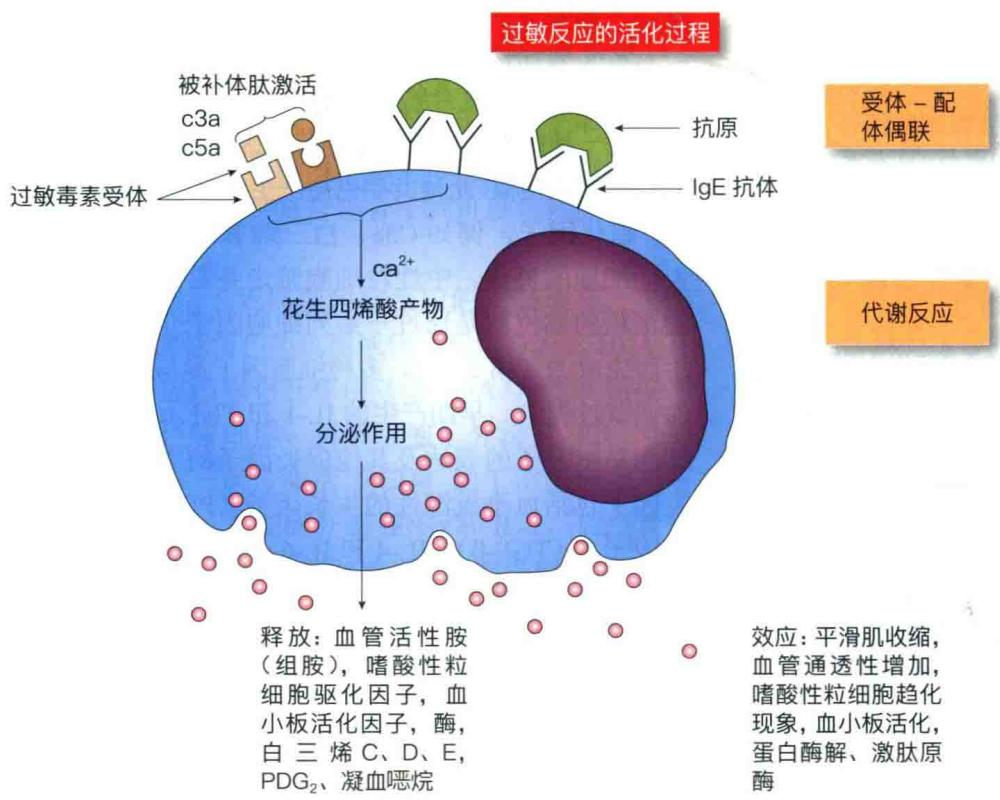 
图4-6在I型超敏反应中，变应原与肥大细胞或嗜碱性粒细胞表面的嗜细胞性IgE抗体结合触发了细胞的活化及促炎介质的级联性释放。这些介质导致了平滑肌的收缩、水肿的形成和嗜酸性粒细胞的募集。 $\mathrm{Ca^{2 + }}$ .钙离子； $\mathrm{PGD_2}$ 前列腺素 $\mathbb{D}_2$
# 二、Ⅱ型超敏反应由针对特定的细胞内抗原或细胞外抗原的抗体介导
II型反应通常由IgG和IgM介导。这些抗体的重要特点是它们可以通过IgFc结构域激活补体。当IgG或IgM抗体与细胞表面（例如红细胞的细胞膜）的抗原结合时，上述反应就开始发生了。当达到足够的密度时，结合的Ig通过C1q途径和经典途径（第2章）导致补体的结合。一旦被激活，补体可以通过以下几种方式破坏靶细胞：
将膜攻击复合物插入到红细胞的细胞膜上，从而导致靶细胞溶解。 
■ 调理作用，用 $\mathrm{Ig}$ 或C3b将靶细胞包被起来，随后由含有这些分子的受体的吞噬细胞（包括中性粒细胞和巨噬细胞）将其吞噬（图4-7）。
这些补体依赖的机制导致了血型不合相关性输血反应及某些自身免疫性溶血性贫血。
如前所述，抗体依赖的细胞介导的细胞毒作用（ADCC）是指溶细胞性白细胞攻击由抗体包被的靶细胞（抗体通过靶细胞上的Fc受体与之结合）。如此，ADCC并不需要补体的参与。吞噬细胞和NK细胞也可以作为ADCC的效应细胞。某些自身免疫性疾病（如自身免疫性甲状腺炎）的发病机制中可能也有ADCC的参与。
在某些Ⅱ型反应中，抗体与特定的靶细胞受体的结合并不引起细胞的死亡，而是改变了细胞的功能。自身免疫性疾病如Graves病和重症肌无力的特征是生成了抗细胞表面激素受体的自身抗体。在Graves病，生成了直接针对甲状腺细胞上的甲状腺刺激激素（TSH）受体的自身抗体，这些抗体模拟了TSH的功能，因此刺激了甲状腺素的产生，进而导致了甲状腺功能亢进（第21章）。相反，重症肌无力，位于神经肌肉终板的乙酰胆碱受体的自身抗体或者阻断了乙酰胆碱的结合，或者介导了受体的内吞及降解。因此，有效的神经突触传递被抑制了（第27章）。于是重症肌无力患者饱受肌肉松弛无力的折磨。抗胰岛素、泌乳素、生长激素和其他信使分子的调节性自身抗体也曾被报道过。
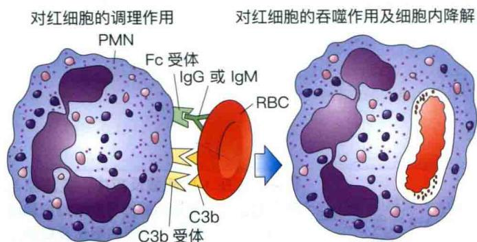 
图4-7在Ⅱ型超敏反应中，抗体或补体分别通过Fc受体或C3b受体介导的调理作用导致细胞吞噬的发生。Ig.免疫球蛋白；PMN.多形核中性粒细胞；RBC.红细胞
某些Ⅱ型超敏反应是由直接针对结缔组织的某种成分的抗体引起的。经典的例子就是肺出血肾炎综合征，抗体直接与Ⅳ型胶原结合，后者是肺和肾小球基底膜的主要结构性成分。局部补体的激活将中性粒细胞募集到此处，继而导致了组织损伤，肺出血或肾小球肾炎。直接由补体介导，通过形成的膜攻击复合物造成肾小球和肺泡基底膜损伤的机制可能也参与其中。
# 三、Ⅲ型超敏反应中，免疫复合物沉积或原位免疫复合物形成引发了补体结合及炎症反应
$\mathrm{IgG}$ 、 $\mathrm{IgM}$ ，偶尔也会是 $\mathrm{IgA}$ ，这些抗体与循环中的抗原或是沉积在组织中的抗原结合导致了III型反应的发生。免疫复合物的理化性质，例如大小、电荷、溶解性及 $\mathrm{lg}$ 的同种型，决定了免疫复合物能否在组织中沉积或能否与补体结合。免疫复合物通过激活补体，使中性粒细胞和单核细胞趋化并募集到其所在部位而引发炎症反应。活化的吞噬细胞可以释放导致组织损伤的介质，例如蛋白酶和活性氧的中间产物。
多种人类疾病均有免疫复合物的参与（图4-8）。最有说服力的病例是那些在损伤的组织中既能检测到免疫复合物的存在，又能证实这些免疫复合物确与损伤的发展密切相关的病例；因为在另外一些疾病中，血浆中虽然可以检测到免疫复合物的存在，但是缺乏其可致组织损伤的证据。可明确归于免疫复合物沉积导致的疾病是胶原-血管性自身免疫性疾病，例如，系统性红斑狼疮（SLE）、风湿性关节炎、某些类型的血管炎（包括SLE和过敏性紫癜中见到的血管炎）和多种类型的肾小球肾炎。
免疫复合物一旦在组织中沉积，就可能触发炎症反应。局部免疫复合物激活的补体导致了C5a的形成，后者是一种高效的中性粒细胞趋化因子。与非免疫介导的急性炎症相似，此种炎症也会产生多种效应（第2章）。
趋化因子，例如C5a、白三烯B4和IL-8介导了炎症细胞的募集。中性粒细胞游走并黏附于免疫复合物沉积的部位就是通过一系列细胞因子介导的黏附作用而完成的（第2章）。多种细胞因子参与到炎症反应的调节过程中。早期产生的IL-1和TNF-α上调了内皮细胞黏附分子的表达及其他促炎因子的生成。这些促炎因子包括血小板源性的生长因子（PDGF）、转化生长因子β（TGF-β）、IL-4和IL-6，它们可以调节白细胞和成纤维细胞的活化。一旦中性粒细胞抵达沉积部位，它们就通过结合或吞噬免疫复合物而活化。活化的白细胞释放多种炎症介质，包括蛋白酶、活性氧中间产物和花生四烯酸产物，这些介质一起导致了组织的损伤。
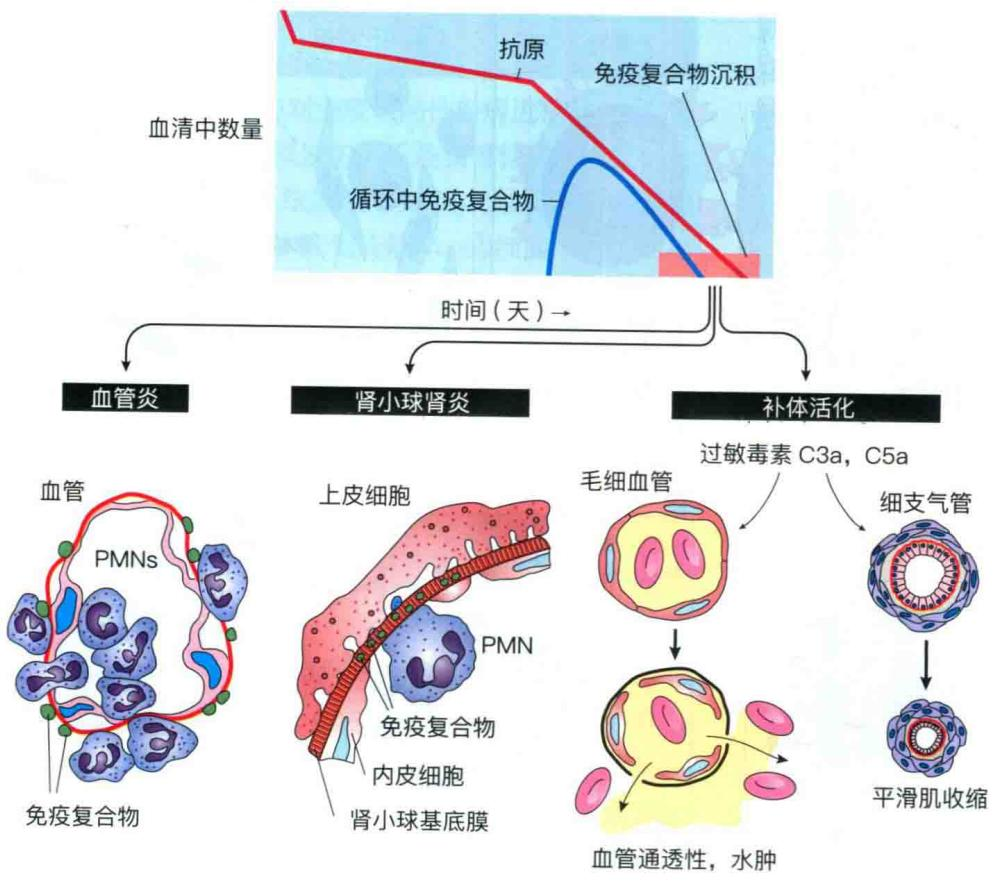 
图4-8在III型超敏反应中，免疫复合物的沉积可以激活补体，并募集炎症细胞进而导致组织损伤。免疫复合物介导组织损伤的能力取决于复合物的大小、溶解性、净电荷数及与补体结合的能力。PMN.多形核中性粒细胞
# 四、IV型超敏反应，或细胞介导的超敏反应是不涉及抗体的细胞性免疫反应
该类型反应包括迟发型细胞性炎症反应和细胞介导的细胞毒性效应。IV型反应经常与抗体依赖性反应同时发生，从而使这个过程变得难于分辨。组织应答的类型很大程度上取决于刺激物的性质。
经典的迟发型超敏反应是组织针对可溶的蛋白性抗原的一种反应，主要由淋巴细胞和单核吞噬细胞参与，在引发反应后的 $24\sim 48$ 小时达到最高峰。IV型反应的经典范例就是常春藤毒素导致的接触性过敏反应。虽然常春藤毒素（例如漆酚）中的化学配体不是蛋白质，但是它们可以与细胞中的蛋白质共价结合形成半抗原，随后这种复合物分子就可以被抗原特异性的淋巴细胞识别。
图4-9总结了迟发型超敏反应的发展进程。在初始阶段，外源性蛋白质抗原或化学配体与表达HLAⅡ类分子的辅佐细胞相互作用（图4-9A）。这些辅佐细胞（例如，巨噬细胞、树突细胞）分泌IL-12，与加工呈递的抗原一起，激活了 $\mathrm{CD4^{+}}$ 的T淋巴细胞。随后，活化的 $\mathrm{CD4^{+}T}$ 细胞分泌IFN-γ和IL-2，后二者分别激活更多的巨噬细胞并触发了T淋巴细胞的增殖（图4-9B）。蛋白质抗原在巨噬细胞的吞噬体内被积极的加工，随后与MHCⅡ类分子一起被呈递到细胞表面。具有MHC限制性、抗原特异性的 $\mathrm{CD4^{+}T}$ 细胞识别了加工呈递的抗原后被激活并合成一系列的细胞因子（图4-9C）。这些活化的CD4细胞被称为Th1细胞。随后，
这些细胞因子招募并活化淋巴细胞、单核细胞、成纤维细胞和其他炎症细胞。如果抗原刺激被清除，反应大约在48小时后自动终止。如果刺激持续存在（例如，难以生物降解的支原体细胞壁成分），机体则会试图隔离这些刺激物而产生肉芽肿反应。
T细胞（特别是 $\mathrm{CD8^{+}T}$ 细胞）介导组织损伤的其他机制是直接溶解靶细胞（图4-10）。这些免疫机制对破坏和清除病毒感染的细胞、移植物和潜在的肿瘤细胞非常重要。图4-10总结了T细胞介导的细胞毒性反应。与迟发型超敏反应相比，细胞毒性 $\mathrm{CD8^{+}T}$ 细胞是在I类MHC分子的基础上特异性识别靶抗原的。在病毒感染的细胞和肿瘤细胞中，异源性抗原与自身的MHC抗原一起被积极的呈递出来（图4-10A，B）。在移植物排斥反应中，异源性MHC抗原本身即是高效的 $\mathrm{CD8^{+}}$ 细胞的激活剂。一旦被抗原激活，细胞毒性细胞即在辅助性细胞和可溶性生长因子，如IL-2的促进下开始增殖（图4-10C）。如此则产生了一群扩增的抗原特异性的细胞毒细胞。真正的细胞杀伤包括多种机制（图4-10D）。溶细胞性T细胞（CTLs）分泌穿孔素在靶细胞的细胞膜上形成小孔，通过这些小孔将粒酶B引入细胞内并激活caspase，从而导致了细胞凋亡。CTLs还可以通过与FAS配体结合而杀伤靶细胞。FAS配体与FAS相互作用触发了表达Fas的细胞的凋亡（参见第2章）。多种自身免疫性疾病中的慢性炎症，包括糖尿病、慢性甲状腺炎、干燥综合征和原发性胆汁淤积性肝硬化，均由IV型超敏反应所致。
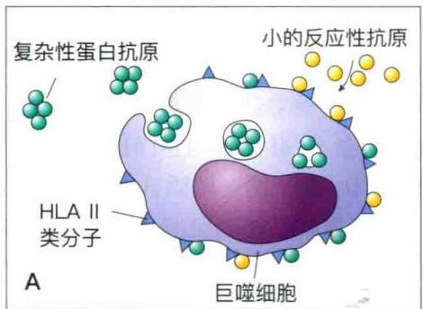 
图4-9在IV型（迟发型）超敏反应中，复杂性抗原被巨噬细胞吞噬、加工并与Ⅱ类主要组织相容性（MHC）抗原一起呈递于巨噬细胞的细胞膜上。A.抗原特异性、组织相容的细胞毒性T淋巴细胞与呈递的抗原结合并被激活。B，C.活化的细胞毒性T细胞分泌细胞因子进一步放大反应。BV.血管
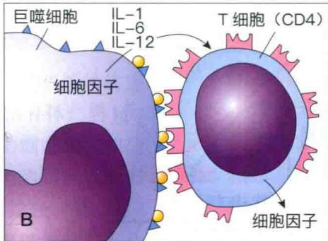
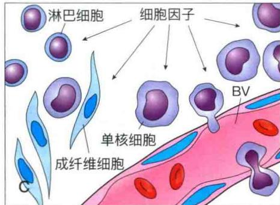
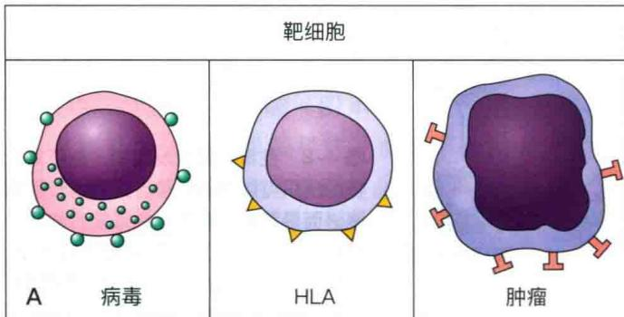
# 靶抗原：
- 病毒编码的膜抗原 
·异源性或修饰过的组织相容性抗原 
肿瘤特异性膜抗原
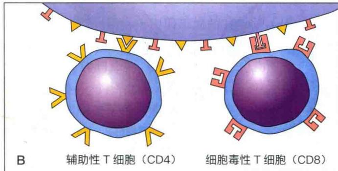
# T细胞识别抗原
- 辅助性 T 细胞识别抗原和 II 类分子 
- 细胞毒性 T 细胞 / 杀伤细胞识别抗原和 I 类分子
;B.细胞毒性T淋巴细胞在人类白细胞抗原(HLA)I类分子的基础上识别异源性抗原。C,D.活化的T细胞分泌溶细胞性复合物(例如穿孔素和其他介质)和能进一步放大反应的细胞因子,最终导致凋亡的发生(杀伤靶细胞)。Ca²⁺.钙离子;CD.分化决定簇;IL.白细胞介素;K⁺.钾离子;Na⁺.钠离子.jpg) 
图4-10A.在T细胞介导的细胞毒性反应中,潜在的靶细胞包括:病毒感染的宿主细胞、恶性宿主细胞和异源性细胞(组织相容性移植物);B. 细胞毒性T淋巴细胞在人类白细胞抗原(HLA)I类分子的基础上识别异源性抗原。C,D.活化的T细胞分泌溶细胞性复合物(例如穿孔素和其他介质)和能进一步放大反应的细胞因子,最终导致凋亡的发生(杀伤靶细胞)。Ca²⁺.钙离子;CD.分化决定簇;IL.白细胞介素;K⁺.钾离子;Na⁺.钠离子
;B.细胞毒性T淋巴细胞在人类白细胞抗原(HLA)I类分子的基础上识别异源性抗原。C,D.活化的T细胞分泌溶细胞性复合物(例如穿孔素和其他介质)和能进一步放大反应的细胞因子,最终导致凋亡的发生(杀伤靶细胞)。Ca²⁺.钙离子;CD.分化决定簇;IL.白细胞介素;K⁺.钾离子;Na⁺.钠离子.jpg)
# 杀伤靶细胞
- 细胞毒性 T 细胞 / 杀伤细胞与靶细胞结合 
- 释放杀伤性信号分子——穿孔素,靶细胞失去膜的完整性 
- 靶细胞溶解
# 激活和放大效应
·辅助性T细胞活化、增生并释放辅助性细胞因子（如IL-2） 
- 细胞毒性 T 细胞 / 杀伤细胞在辅助因子的作用下增生
# 第三节 免疫缺陷病
根据以下两个特点对免疫缺陷性疾病进行分类：①免疫缺陷是先天性的（原发的）还是获得性的（继发的）；②宿主的哪种防御系统发生了缺陷。原发性免疫缺陷被分为：①B细胞或体液免疫缺陷；②细胞或细胞免疫缺陷；③吞噬细胞缺陷；④补体系统异常。绝大多数原发性免疫缺陷是由遗传基因决定的。补体系统的异常和吞噬细胞的先天性缺陷将在其他章节讨论（第2章和第20章）。与发病率较低的先天性免疫缺陷相比，获得性免疫缺陷，例如HIV-1感染导致的AIDS病，则比较常见。全世界数以千万计的患者感染了AIDS病。
# 一、原发性抗体缺陷的特点是某些特殊的抗体生成障碍
抗体缺陷患者的某种或所有免疫球蛋白同种型均低于正常血清水平，容易反复发生细菌感染和一些特殊类型的病毒感染（例如BrutonX染色体连锁的无丙种球蛋白血症患者患有中枢神经系统的艾柯病毒感染）。各种免疫球蛋白的同种型或亚型的缺陷包括免疫球蛋白重链的选择性缺失和轻链的表达缺失。而且，虽然某些患者的免疫球蛋白水平正常，但是他们不能生成针对某些特定抗原（通常是多糖）的特异性抗体。这类疾病的临床表现多种多样，有些患者患有致命性的细菌感染，可以是脑膜炎，也可以是黏膜感染；但是有些患者可能根本没有症状。
1.Bruton X染色体连锁的无丙种球蛋白血症BrutonX染色体连锁的无丙种球蛋白血症（XLA）是先天性疾病，通常发生在 $7\sim 9$ 个月大的男性婴儿。在这段时期内，来自母体的抗体水平下降了；但是也有多达 $10\%$ 的XLA患者是青少年。患者反复发生黏膜感染、脓皮病、脑膜炎、败血症和严重的涵盖所有免疫球蛋白同种型的低丙种球蛋白血症。偶尔，患者也会发生中枢神经系统的慢性肠病毒感染。接种脊髓灰质炎的减毒活疫苗可以导致瘫痪性脊髓灰质炎。大约1/3的BrutonX染色体连锁的无丙种球蛋白血症患者患有难以解释的某种类型的关节炎，其中某些病例可能由肠病毒或解脲支原体引起。

【发病机制】患者外周血中缺乏成熟的B细胞，淋巴组织中缺乏浆细胞。但是仍可检测细胞。X染色体长臂的突变（Xq21.22）使B细胞酪氨酸激酶的基因失活，这种激酶对细胞的成熟非常关键。
2.选择性IgA缺陷 选择性IgA缺陷是最常见的原发性免疫缺陷综合征，其特点是血清IgA和分泌性IgA的浓度均有降低。欧洲的发病率为1：400，日本
则比较少见（约为 $1:18000$ ）。虽然患者通常没有症状，但偶尔也会发生不同程度的呼吸道或胃肠道感染。他们也会对过敏性疾病和胶原血管病表现出较高的易感性。而且，这类患者输血时对血液制品中的 $\mathrm{IgA}$ 有发生过敏反应的高危险性。

【发病机制】IgA缺陷患者的外周血B细胞仍然可以表达表面IgA，虽然水平有所降低。
这种缺陷会导致终末B细胞分化障碍而不能合成和分泌IgA。普通变异型免疫缺陷病可能有共同的病因（见下文）。某些病例与药物暴露（例如，苯妥英钠、D-青霉胺）相关，某些病例则携带有18号染色体的基因缺失或缺陷。
3. 普通变异型免疫缺陷病（CVID）普通变异型免疫缺陷病（CVID）是一组异质性疾病，其特点是显著的低丙种球蛋白血症。CVID患者的许多亲属都患有IgA缺陷。受累的患者表现为反复发生严重的化脓性感染，特别是肺炎和腹泻，后者通常是感染贾第鞭毛虫所致。单纯疱疹的反复感染也很常见，1/5的患者发生带状疱疹。患者于出生几年或几十年后发病，首发年龄平均25岁。发病率在 $1:50000\sim 1:200000$ 。该病有多种遗传模式。其囊括了多种免疫系统的成熟缺陷和调节缺陷。CVID患者发生恶性肿瘤的概率升高，其中胃癌发病率升高了50倍。有趣的是，患有此种免疫缺陷的女性患者发生淋巴瘤的概率比男性患者高300倍。继发于淋巴组织增生和炎症性肠病的吸收不良比普通人群常见。CVID患者更容易发生自身免疫性疾病，包括溶血性贫血、中性粒细胞减少症、血小板减少症和恶性贫血。
# 二、原发性T细胞免疫缺陷病通常导致反复发生的或迁延不愈的病毒和真菌感染
1. DiGorge 综合征 完全型 DiGorge 综合征是最严重的 T 淋巴细胞免疫缺陷性疾病之一。存活过新生儿期的婴儿患有反复发生的或慢性的病毒、细菌、真菌和原虫感染。该疾病是由第三和第四咽囊的胚胎性发育缺陷导致的，第三、四咽囊发育为胸腺和甲状旁腺，可能还会影响心脏圆锥动脉干的发育，该病患者的上述脏器可能均会受累而发育异常。

【发病机制】大多数患者携有22号染色体长臂的点突变（22q11）。由于胸腺缺如，T细熟过程被阻断在前T细胞时期。这种免疫缺陷过移植胸腺组织而纠正。大多数受累的患者患型DiGorge综合征，仍然保留有小部分胸腺随着时间的延长，这部分患者即使不予治疗，T功能也可以慢慢恢复。部分携有22q11突变只有心脏圆锥动脉干的缺陷而无免疫缺陷。
2. 慢性皮肤黏膜念珠菌病 皮肤黏膜念珠菌病，是一种酵母菌感染，是先天性T细胞功能缺陷导致的。其特点是容易发生念珠菌感染，而且常伴有内分泌病（甲状旁腺功能减退症、Addison病、糖尿病）。虽然大多数T细胞的功能是完好的，但对念珠菌抗原的反应却存在缺陷。

【发病机制】导致慢性皮肤黏膜念珠菌病免
疫缺陷的原因是T细胞发育过程中的一系列
缺陷, 引起了对念珠菌抗原的异常反应。与正常反应中由 1 型 (IL-2/IFN- $\gamma$ ) T 细胞主导并有效控制念珠菌感染不同, 受累的患者发起了 2 型 (IL-4/IL-6) 辅助性 T 细胞的应答, 后者对抵抗微生物感染是无效的。
# 三、重度联合免疫缺陷病
严重联合免疫缺陷病（SCID）包括一大组与T细胞和B细胞发育和功能缺陷相关的异质性疾病。患儿在出生后几个月就反复发生严重的感染、腹泻，难以存活。真正的T细胞完全性缺失可与重度低丙种球蛋白血症伴发。多数患儿淋巴组织的体积重度减少，而且不成熟的胸腺中也缺乏淋巴细胞。由于这些SCID患者的T细胞和B细胞功能的严重缺陷，他们对多种病原体，包括巨细胞病毒（CMV）、水痘-带状疱疹病毒、肺囊虫、念珠菌和多种细菌，均具易感性。

【发病机制】SCID 的标志即为 T 细胞
的发育和（或）功能缺陷。在某些类型的
SCID 中, B 细胞的发育也会受累。因为 B 细胞需要 T 细胞源性的信号才能产生最优质的抗体, 所以大多数患者同时有细胞免疫和体液免疫的缺陷。NK 细胞的发育和功能也会有不同程度的受累。因此, 本病可以分为 4 种类型: ① T-B+NK-SCID ; ② T-B+NK+SCID ; ③ T-B-NK-SCID ; ④ T-B-NK+SCID 。
T-B+NK-SCID是美国最常见的SCID类型（占病例的 $50\%$ ）。本病由X染色体连锁的IL2RG基因突变引起。IL2RG编码细胞因子受体的共同 $\gamma$ 链，后者是IL-2、IL-4、IL-7、IL-9、IL-21受体的共同组成成分。该基因的缺陷导致了（ $90\%$ 的病例）T细胞和NK细胞的完全性缺失，而B细胞的数目是正常的。由于T细胞的缺陷，免疫球蛋白的产生受到了严重影响。由共同 $\gamma$ 链组成的IL受体的下游信号通路需要JAK3酪氨酸激酶的激活，从而使携有该基因突变的 $\mathrm{T - B + NK - SCID}$ 患者被识别出来。
$\mathrm{T - B + NK + SCID}$ 可以由十几种分子异常引起。例如，编码TCR相关性CD3复合物的3个亚基（8，
$\varepsilon$ ， $\gamma$ ）的相应基因（CD3D，CD3E，CD3G）的突变已经被报道了。虽然这些患者的临床特点各不相同，但是都表现有T淋巴细胞的功能缺陷。另一组 $\mathrm{T - B + NK + SCID}$ 患者则发生了与各种MHCⅡ类分子表达缺陷相关的 $\mathrm{CD4 + T}$ 细胞异常。
T-B-NK-SCID是由编码腺苷脱氨酶（ADA）和嘌呤磷酸化酶（PNP）的基因突变引起的，它们是嘌呤核苷补救途径中的酶。美国 $15\%$ 的SCID患者ADA缺乏。PNP缺乏则很少见。
T-B-NK+SCID是编码DNA结合蛋白的基因发生了一系列罕见突变的结果，这些DNA结合蛋白参与了Ig和TCR基因重排。一部分患者除了有免疫缺陷外，还对放射高度敏感。
# 第四节 自身免疫和自身免疫性疾病
# 一、自身免疫性疾病包含了对自身抗原发生的免疫应答
自身免疫意味着免疫系统不再能识别某些自身抗原和非自身抗原。以前，它被视为异常的免疫反应，因为它总能引起疾病。但是现在已经清楚，自身免疫是普遍存在的，而且对于免疫系统的调节是必需的。当这些调节机制被破坏时，自身抗体不受调控的源源产生或异常的细胞间识别形成就会引起组织的损伤。识别特异性的自身抗体可能对自身免疫性疾病的诊断有所帮助，但表明自身免疫反应（不管是细胞性还是体液性）直接与疾病过程相关仍然是必需的。自身免疫性疾病可以是器官特异性的，也可以是全身性的。目前，只有几种疾病（Hashimoto甲状腺炎、1型糖尿病、SLE）适用于这个严格的标准。
1. 自身免疫的理论 对自身抗原发生异常的免疫反应意味着失去了免疫耐受；免疫耐受是指对特定抗原（通常是自身抗原）不发生可以检测到的（或产生临床后果的）免疫应答的状态。免疫耐受的诱导和维持是通过一系列的机制始终在进行的免疫活动。因此，免疫耐受是一种免疫应答被阻断或阻止的主动状态。目前，对自身免疫性疾病失去免疫耐受的解释有多种理论。
（1）隔离的自身抗原：最简单的关于自身免疫性疾病失去免疫耐受的假说指出，正常情况下与免疫系统隔离的自身抗原暴露后引发了免疫反应。某些类型的组织损伤导致了细胞内的抗原释放，实时，引发了免疫反应。这型反应包括在相应靶器官损伤后，对释放的精子、晶状体和髓鞘等产生抗体。虽然，针对正常情况下隔离的抗原也可以形成自身抗体，但是缺少这些抗体可以致病的依据。
（2）异常的T细胞功能：有假说认为自身免疫反应是由T淋巴细胞系统的异常所导致。大多数免疫反应需要T细胞的参与来激活抗原特异性B细胞。因此，当辅助性T细胞或更重要的抑制性T细胞的数量或是功能活性有所改变时，将会影响机体引发免疫反应的能力。据报道，多种自身免疫性疾病，包括SLE、原发性胆汁性肝硬化、甲状腺炎、多发性硬化、重症肌无力、风湿性关节炎和硬皮病等，均发现有抑制性T细胞的功能异常。但也有报道，某些T细胞异常的人群没有任何患病的证据。因此，这些抑制性细胞的功能改变是否可以导致疾病，还是只代表了某些表象，仍是一个悬而未决的问题。
自身免疫性疾病中辅助性T细胞的功能异常也值得研究。辅助性T细胞是根据其在抗原特异性B细胞活化中的作用而命名的。低剂量的抗原通过这些细胞来维持辅助性T细胞的耐受状态。在这个基础上，辅助性T细胞逐渐对自身抗原发生了反应。诱导DNA低甲基化的药物和试剂可以通过不依赖抗原的机制导致B细胞的活化。药物诱导的狼疮病变就获得了对自身抗原的反应性并丧失了抗原特异性。自身抗原的改变也可导致辅助性T细胞的活化并触发了自身反应性B细胞的克隆性增生。一些风湿性疾病是以自身抗体的形成为重要特征的，这些自身抗体主要针对部分性降解的结缔组织蛋白，例如胶原蛋白或弹力蛋白。在某些药物诱导的溶血性贫血中，当药物与红细胞膜结合并使其发生改变时，针对药物的抗体则会导致溶血的发生。
（3）分子模拟：导致辅助性T细胞失去耐受的另一个机制是针对外来抗原产生的抗体亦可与自身抗原发生交叉反应。这时，辅助性T细胞的功能是“正常”的，它并不诱导自身抗体的形成。但是免疫反应的传出通路出了问题。例如，在风湿性心脏病中，针对链球菌抗原产生的抗体与自身心肌细胞的抗原发生了交叉反应，这种现象被称为分子模拟。
（4）多克隆性B细胞活化：免疫耐受的丧失也可能与多克隆性B细胞活化相关，这时，B淋巴细胞被含有多个抗原位点（例如细菌的细胞壁和病毒）的复合物直接激活。风湿性关节炎中的类风湿因子（一组对自身IgG产生反应的混合性IgM抗体），红斑狼疮中的抗DNA抗体和其他自身抗体都是出现在细菌、病毒和寄生虫感染之后。这些现象提示对共同自身抗原的主动耐受的丧失可能是多克隆性B细胞活化时无意导致的结果。
2. 自身免疫性疾病中组织的损伤 传统上，自身免疫性疾病被认为是免疫复合物（包括或是循环中形成的、或是组织中形成的免疫复合物）性疾病的原型。
这样，Ⅱ型（细胞毒性）和Ⅲ型（免疫复合物型）超敏反应被认为是在大多数自身免疫性疾病中引起组织损伤的因素。虽然这些超敏反应似乎可以解释大多数自身免疫性组织损伤，但事实更为复杂。在某些自身免疫性疾病中，自身抗原（例如自身免疫性甲状腺炎中的甲状腺球蛋白）致敏的T细胞可以直接导致组织损伤（IV型反应），只是所致组织损伤的程度仍不能确定。
但是，并非所有自身抗体都是通过细胞毒性作用引起疾病的。在形成抗受体的抗体性疾病中，例如Graves病和重症肌无力，抗体与受体结合，但是疾病的进程与受体的活化或非活化并不相关。在黑色棘皮病和毛细血管扩张性共济失调中检测到抗胰岛素的抗体，其中的一些患者则发生了一种对胰岛素极度抵抗的糖尿病。
Ⅲ型超敏反应可以解释某些类型的自身免疫性疾病中的组织损伤。这类疾病的原型是SLE，该疾病在血液循环中（或局部）形成了DNA-抗DNA复合物并沉积至组织中，并在沉积部位引起了炎症和损伤，导致了血管炎和肾小球肾炎等病变。其他例子包括风湿性关节炎、硬皮病、多发性肌炎/皮肌炎和干燥综合征。所有这些以免疫现象为特征的疾病均被归在胶原血管病的类别中。这些疾病的临床表现是系统性的，通常累及多个器官和多种组织。相比而言，大部分细胞毒性（Ⅱ型反应介导）自身免疫反应则是器官特异性的。
# 二、系统性红斑狼疮是系统性免疫复合物疾病的原型
SLE是一种慢性、自身免疫性、多系统性、炎症性疾病，几乎可以累及所有器官，但以累及肾、关节、浆膜和皮肤为特征。可以形成多种抗自身抗原的抗体，包括：①血浆蛋白（补体成分、凝血因子）；②蛋白-磷脂复合物；③细胞表面抗原（淋巴细胞、中性粒细胞、血小板、红细胞）；④细胞内的胞质成分（微丝、微管、溶酶体、核糖体、RNA）；⑤细胞核成分（DNA、核糖核蛋白和组蛋白）。SLE中最具诊断意义的疾病相关性自身抗体是抗核抗原的抗体，特别是针对双链DNA和一种可溶性核抗原复合物的抗体，后者抗原是剪接体的一部分，被称为Sm（Smith）抗原。这两种抗核抗体（ANAs）的高滴度是SLE的诊断性特征，但是它们并不直接引起细胞毒性作用。抗原-抗体复合物沉积在组织中，导致了特征性血管炎、滑膜炎和肾小球肾炎。因此，SLE是III型超敏反应的原型。偶尔，也会直接生成细胞毒性抗体，特别是抗白细胞和红细胞表面抗原的抗体。有证据表明，细胞介导的免疫反
应也参与其中。
全世界SLE的发病率变化较大，在北美和北欧，发病率为40/100000。在美国，黑人和西班牙裔更常受累，病变也更严重。 $80\%$ 以上的患者是育龄期妇女，这个年龄的人群发病率可高达1/700。

【发病机制】SLE的病因不明。大量自身抗体，特别是抗核抗体的出现，提示免疫
监视机制的破坏和免疫耐受的丧失。SLE 组织损伤引起的临床表现是由免疫复合物介导的血管炎导致的。其他症状（例如血小板减少症或继发性抗磷脂综合征）是由抗血清成分或细胞膜分子的自身抗体引起的。多种因素构成了个体对 SLE 的易感性（图 4-11）。
发病率显著的女性优势提示内分泌性因素即雌激素促进了病变的形成。 
■ 单卵双生子高发病率（约 $20\% \sim 30\%$ ）的一致性支持了遗传因素的作用，当然不一致性也提示了非遗传因素、环境因素的重要性。 
■MHCII类抗原（HLA-DR和HLA-DQ）显示了非常关键的作用。表达某些特定的HLAII类抗原的人群中SLE（和其他自身免疫性疾病）的发病率是升高的。 
某些补体成分的缺乏，特别是C2、C4和C1q，与该病发病率升高相关。编码这些早期补体成分的基因位于HLA区域内，与D/DR位点相邻。
SLE的特点是对多种抗原产生自身抗体，但是关于B细胞高反应性的确切机制仍未阐明。目前有两种假说。一种假说把疾病归因于非特异性的、多克隆性的B细胞活化，尽管对刺激的本质仍有疑问。第二种假说认为SLE中形成的抗体代表了对特异性抗原刺激的反应，对此理论的支持来自于长期的观察，即SLE中的抗体显示有基因重排和突变，这些都是典型的抗原驱动的反应。

【病理和临床特征】有充足的理由相信狼疮中大部分组织的损伤是由抗自身抗原，特别是抗

DNA的循环免疫复合物沉积所导致：①循环中出现了包含核抗原的免疫复合物；②损伤的组成了这些免疫复合物；③从包含核抗原的组织到了免疫复合物。循环免疫复合物几乎可以在织中沉积，因此，事实上，机体的每个器官都累。
皮肤受累（第24章）在SLE中非常常见，表现为阳光暴露的部位出现了红斑性皮疹，双颊的“蝴蝶形”皮疹是最具特征性的。显微镜下，皮肤表现为血管周淋巴细胞浸润和基底细胞的液化性变性。免疫荧
光研究显示免疫球蛋白和补体沉积在真皮-表皮结合处（“狼疮带”）。
关节病是SLE最常见的症状；多于 $90\%$ 的患者患有多关节痛。该病可以引起滑膜炎，但是不像风湿性关节炎，其关节的破坏并不常见。
肾病，特别是肾小球肾炎，使3/4的SLE患者饱受折磨。包含有DNA和抗双链DNA IgG抗体的免疫复合物在肾小球沉积并产生了肾小球肾炎（第16章）。
浆膜在SLE中常受累及。多于1/3的患者患有胸膜炎和胸腔积液。心包炎和腹膜炎也可发生，但比较少见。
呼吸系统疾病在SLE中也很常见。临床表现多种多样，包括胸膜疾病、上呼吸道病变和肺实质的病变。
心脏受累（第11章）亦常见于SLE，虽然充血性心力衰竭比较罕见，但是心肌炎常与其相关。心的各层均可受累，而心包炎则是最常见的。Libman-Sacks心内膜炎，以在心瓣膜上形成小的非细菌性赘生物为特点，其临床症状通常并不显著。
CNS 疾病是 SLE 可以危及生命的并发症。血管炎是常见的基础病变，可以导致致命性的脑出血和脑梗死。
抗磷脂抗体出现于1/3的SLE患者。这种自身免疫现象使患者容易发生血栓栓塞性并发症，包括卒中、肺栓塞、深静脉血栓形成、门静脉血栓形成和自发性流产。
SLE患者的临床进程充满变数，通常会有恶化或缓解。由于采用了免疫抑制治疗、对轻型病变有了更好的辨识及改良了抗高血压治疗，患者的10年生存率已接近 $90\%$ 。患有严重的肾疾病、CNS疾病和收缩期高血压的患者预后最差。
# 三、Sjögren综合征（干燥综合征）以唾液腺和泪腺为靶器官
干燥综合征（SS）是一种自身免疫性疾病，其特点是干燥性角膜结膜炎（眼干）和口腔干燥（口干），而不伴有其他结缔组织疾病。这个定义将原发性SS与继发性SS区别开来，后者间或与其他自身免疫性疾病伴发，例如SLE、风湿性关节炎、硬皮病和多发性肌炎。SS也常累及其他器官，包括甲状腺、肺和肾。
原发性SS是继SLE之后的最常见的结缔组织病，高达 $3\%$ 的人群患有该病。像多数自身免疫性疾病一样，其主要发生于 $30\sim 65$ 岁的女性患者。原发性SS与某些特殊的MHC类型有强烈的相关性；可以出现家族聚集现象，这些家族也表现有其他自身免疫性疾病高发病率。
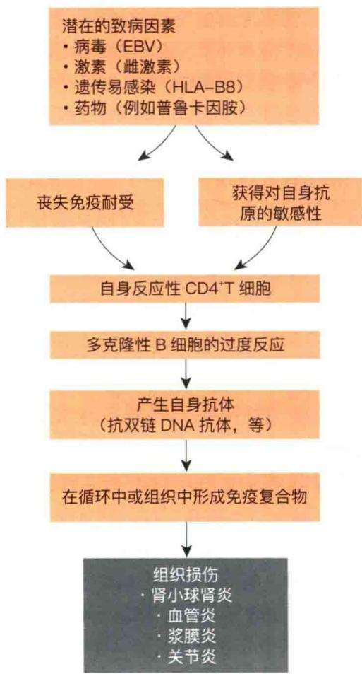 
图4-11系统性红斑狼疮的发病机制多因素性的。CD.分化决定簇；EBV.Epstein-Barr病毒；HLA.人类白细胞抗原

【发病机制】SS的病因不明。SS患者通常可以产生自身抗体，特别是抗DNA或非组
蛋白性蛋白的抗核抗体（ANAs）。在 $50\%$ 的原发性SS患者体内可以检测到针对核内可溶性非组蛋白性蛋白[特别是SS-A（Ro）和SS-B（La）抗原]的自身抗体，这些患者通常有更严重的腺内和腺外表现。抗DNA或组蛋白的自身抗体比较罕见，它们的出现提示该病是与狼疮相关的继发性SS。器官特异性的自身抗体（例如抗唾液腺抗原的抗体）非常罕见。像SLE一样，SS的自身抗体是主要来自于多克隆性B细胞活化还是必须由特定抗原驱动还存在争议。
SS逐渐成为研究病毒源性的自身免疫性疾病的原型。Epstein-Barr病毒（EBV）和人类T细胞白血病病毒-1（HTLV-1）可能发挥的作用被给予了特别的关注。虽然很难明确EBV在SS发病机制中的作用，有证据表明机体对这种病毒的反应可能与该疾病的持续存在、多克隆性B细胞活化及淋巴瘤的发生相关。在日本，SS患者HTLV-1的血清阳性率为 $23\%$ ，而美国随机抽取的血样的阳性率只有 $3.4\%$ 。反之亦然，HTLV-1血清阳性的人群中，超过3/4的个体显示出患有SS的证据。
【病理和临床特征】SS的特点是唾液腺与泪腺中可见密集的淋巴细胞浸润，主要是 $\mathrm{CD4^{+}}$ 的丁淋巴细胞和少量B细胞。淋巴细胞浸润破坏了腺体和导管，在疾病的晚期，腺体萎缩，并可以被纤维化和玻璃样变的组织取代。由于缺乏泪液，角膜变得干燥、容易开裂，还可能形成溃疡。唾液的缺乏可以导致口腔黏膜的萎缩、炎症和裂开。唾液腺和泪腺的病理学改变在第25章有更详尽的描述。
SS还常累及腺外的部位。大多数患者会发生肺的病变，特别是支气管腺体的萎缩并伴随着淋巴细胞的浸润。这将产生黏稠的分泌物、局灶肺不张、反复发生的感染和支气管扩张症。胃肠道也会受累，许多患者会发生咽下困难（吞咽困难）。食管的黏膜下腺体中可见淋巴细胞浸润。而且，萎缩性胃炎会继发于胃黏膜的淋巴细胞浸润。肝疾病，特别是原发性胆汁性肝硬化，会发生在 $5\% \sim 10\%$ 的SS患者，这些患者会发生肝内胆管的破坏和结节性淋巴组织浸润（第14章）。间质性肾炎和慢性甲状腺炎偶尔与该疾病伴发。SS患者发生淋巴瘤的危险性升高了40倍，这可能与B细胞的克隆性扩增相关。
# 四、硬皮病（进行性系统性硬化症）是结缔组织的自身免疫性疾病
硬皮病的特征性病变是血管病变和过多的胶原沉积在皮肤和内脏器官，例如肺、胃肠道、心和肾。女性的发病率是男性的4倍，大部分患者于 $25\sim 50$ 岁发病。家族性发病率升高已被报道。该病特征性自身抗体的产生与HLA-DQB1相关。
【发病机制】硬皮病患者显示有体液免疫和细胞免疫系统的异常。虽然循环中的B淋巴细胞数目正常，但是正如高丙种球蛋白血症和冷球蛋白血症所证实，这些B细胞的功能亢进。ANAs很常见，但是其滴度通常低于SLE。硬皮病的常见抗体包括：①核仁的自身抗体（主要是抗RNA多聚酶的抗体）；②抗Scl-70（一种非组蛋白性核蛋白拓扑异构酶）的抗体；③抗中心体的抗体，这些抗体与钙质沉着症、雷诺现象、食管运动功能障碍、指端硬化症和本病的毛细管扩张症（CREST）变异型（见下文）相关。Scl-70自身抗体在弥漫型硬皮病中最常见，也是最特异的，可以在 $60\%$ 的患者中出现。类风湿因子常可见于硬皮病，直接针对其他组织（例如平滑肌、甲状腺和唾液腺）的自身抗体偶尔也可见到。抗I型和IV型胶原的抗体也被报道过。
细胞免疫的紊乱也常见于进行性系统性硬化的患者。循环中 $\mathrm{CD8^{+}}$ 的抑制性 T 细胞数量减少，T 细胞活化及由 IL-1、IL-2 和可溶性的 IL-2 受体介
导的功能改变均可以出现在活动性病变中。IL-4、IL-6水平的升高亦有报道。组织中单个核细胞主导的活动性炎症加速了血管病变和纤维化的进程，这是该病的典型特征。进行性系统性硬化患者发生其他自身免疫性疾病（例如甲状腺炎和原发性胆汁性肝硬化）的概率是升高的。在发病前几年曾产下男婴的许多女性硬皮病患者，其循环血液中及血管壁上仍可检测到男性胎儿细胞。这提示这些患者发生硬皮病的过程与移植物抗宿主疾病（GVHD）有相似之处。进行性系统性硬化的特点是过多的胶原广泛沉积。虽然病因不明，但是越来越多的证据显示成纤维细胞成纤维性克隆的扩增和活化参与其中。多种因素导致了成纤维细胞的活化。在硬皮病中，黏附在成纤维细胞上的 $\gamma \delta +T$ 细胞可能通过生成的细胞因子来激活它们。这些患者组织中TGF-β、IL-1和IL-4的水平升高，这些因子共同刺激了成纤维细胞的增生和胶原的生物合成。

【病理】硬皮病患者的皮肤开始表现为水肿，后来表现为硬化。增厚的皮肤表现为；①真皮
网状层中胶原纤维显著增多；② 表皮变薄，表皮脚消失；③ 皮肤附属器萎缩；④ 细动脉玻璃样变性伴管腔闭塞；⑤ 主要由 T 细胞组成的多种单个核细胞浸润。硬化阶段既可以进展至萎缩，也可以恢复至正常。过多的胶原沉积也可以发生在滑膜、肺、胃肠道、心和肾。
动脉、小动脉和毛细血管的病变非常典型，可能是某些病例中最先表现出来的该病病理学变化。最初，纤维素在血管内膜下沉积，随后血管壁纤维化、增厚，内弹力膜或是增厚复层化、或是崩解。受累的血管可以变得非常狭窄，以至于限制了血流运行；也可以被血栓阻塞。可以发生纤维化、血管损伤和坏死的器官系统包括；肾（第16章）、肺、心和胃肠道。

【临床表现】硬皮病表现为2种不同的临床分
型：一种是全身型（进行性系统性），一种是局限型。进行性系统性硬化（弥漫性硬皮病）的特点是； $①$ 皮肤病变严重且发生恶化； $②$ 大部分或所有相关性内脏病变发病早，且进展快。首发症状通常是雷诺现象，即阵发性发作的手指缺血，特点是苍白、感觉异常和疼痛。这些症状可伴发或继发手和手指的水肿，皮肤的增厚和紧绷，多发性关节痛和某些内脏器官受累后导致的不适。典型的全身型硬皮病的患者表现为“石头脸”，是由面部皮肤紧绷和口部运动受限导致的。全身型硬皮病中肾血管的受累可以导致所谓的硬皮病性肾危象；突发的恶性高血压，进行性肾功能不全，且
经常伴有微血管病性溶血性贫血。该综合征反映了肾的缺血性损伤，且通常发生在患病的最初几年。其特点是循环血中肾素水平显著升高。
所谓的局限型硬皮病要比全身型硬皮病缓和。通常，这些患者表现有皮肤的受累，特别是面部和手的皮肤。局限型硬皮病谱系中的一个亚型是CREST综合征。CREST综合征的特点包括钙质沉着症、雷诺现象、食管运动功能障碍、指端硬化症和毛细血管扩张症。局限性亚型在疾病早期通常不会有严重的系统性受累，但是晚期，疾病也可进展，主要表现为弥漫性肺间质纤维化。局限型硬皮病患者循环血中通常可以检测到抗着丝粒的抗体。
# 五、混合性结缔组织病同时显示有SLE、硬皮病和皮肌炎的特点
混合性结缔组织病（MCTD）的发病率还不清楚。大约 $80\% \sim 90\%$ 的患者是女性，而且大多数是成年人（平均年龄37岁）。其症状包括典型的SLE症状：皮疹、雷诺现象、关节炎和关节痛。也包括典型的硬皮病的症状：双手肿胀、食管动力不足和肺间质性疾病。某些患者也可发生风湿性关节炎样的症状。据报道，MCTD患者对皮质类固醇治疗反应良好，虽然也有研究对此结论有所质疑。

【发病机制】对MCTD的发病机制知之甚少。患者往往有被高丙种球蛋白血症和类风湿因
子阳性等检测结果所证实的B细胞活化。也可检测到ANAs，但是这些抗体不像在SLE中那样直接针对双链DNA。最独特的ANA是直接针对一种可提取的核抗原——富于尿苷的核糖核蛋白（U1-RNP）的抗体。
引起RNP抗体形成并使其维持于高滴度的原因还不清楚。但是，其与HLA-DR4和HLA-DR2基因型的相关性提示了T细胞在自身抗体的形成中起到一定作用。目前没有直接证据显示这些抗体诱导了各种器官的特征性病变。至今还不清楚MCTD到底是一种独立的疾病，还是患者体内几种胶原血管病的症状的简单叠加。
# 第五节 对移植组织的免疫反应
6号染色体MHC基因编码的抗原是引发移植组织排斥反应的关键性免疫原性分子。因此，只有当供体和受体的组织相容性抗原高度匹配时，移植物才能以最佳状态存活。事实上，HLA的完全匹配非常难得，可能仅见于同卵双生子之间的移植和 $25\%$ 的兄弟姐妹之间的移植。因此，移植后，需要对移植物功能状态
进行严密监测，并实施免疫抑制性治疗。尽管存在不同程度的组织相容性问题，近年来治疗上的进展（例如环孢素和他克莫司等免疫抑制剂的应用）在很大程度上提高了移植的成功率。当发生了宿主抗移植物的免疫反应（排斥），任何免疫应答的组合都会引起移植物的损伤。

# 【发病机制】T细胞介导的反应和抗体介导
的反应在移植物排斥的病理生理过程中都起
到了重要作用。移植物中供者的抗原呈递细胞携带的异源性MHC分子可以被宿主的CD8+的细胞毒性T细胞识别，后者介导了组织的损伤。另外，宿主CD4+的辅助性T细胞促进了抗体的产生，诱导了IFN-γ的生成并激活了巨噬细胞。IFN-γ的生成则加强了MHC的表达从而放大了组织的损伤反应。宿主APCs也可以加工来自供者的异源性抗原，引发CD4+T细胞介导的迟发型超敏反应。
根据免疫反应临床进展的速度和所涉及的病理生理学机制，通常把移植排斥分为“超急性、急性和慢性”排斥。但实践中会出现疾病特点互相重叠和诊断模棱两可的情况。免疫抑制药物的毒性作用和潜在的机械性问题（如血管内血栓形成）或原有疾病的复发导致必须再次移植（例如某些类型的肾小球肾炎）等问题，使得免疫排斥的诊断变得更为复杂。下一部分论述了肾移植的排斥反应。其他组织的移植也会出现类似的反应，当然各种组织类型都会有其各自独特的特点。
# 一、超急性排斥反应发生于移植后的数分钟至数小时内
肾的超急性排斥反应临床表现为尿液生成突然终止，伴随发热和移植部位疼痛。这种类型的排斥是由先前形成的抗HLA抗体和补体活化产物介导的，后者包括趋化因子和其他炎性介质。这种速发型排斥反应是灾难性的，需要立即进行外科手术切除肾。移植的肾中超急性排斥反应的组织学特点表现为血管充血、毛细血管内纤维素血小板性血栓形成，中性粒细胞性血管炎伴纤维素样坏死，显著的间质水肿伴中性粒细胞浸润（图4-12A）。这型排斥反应是由宿主先前形成的抗HLA抗体介导的，该抗体与供者组织发生了反应。幸运的是，如果在移植前进行了适当的抗体筛查，则超急性排斥反应并不常见。
# 二、急性排斥反应发生于移植后的数周或数月内
肾急性排斥反应的特点是突然发生氮质血症和少尿，可以伴随发热和移植物疼痛。急性排斥导致的组织损伤通常包括了细胞介导和体液介导两种机制。需要通过穿刺活检来对急性排斥反应和急性肾小管坏死
或免疫抑制剂导致的毒性反应作出鉴别诊断。结果各异，主要取决于是由细胞免疫还是由体液免疫介导了排斥反应。由细胞免疫介导的排斥反应镜下表现包括，间质内可见淋巴细胞和单核细胞浸润、水肿，淋巴细胞性肾小管炎和肾小管坏死（图4-12B）。由体液免疫
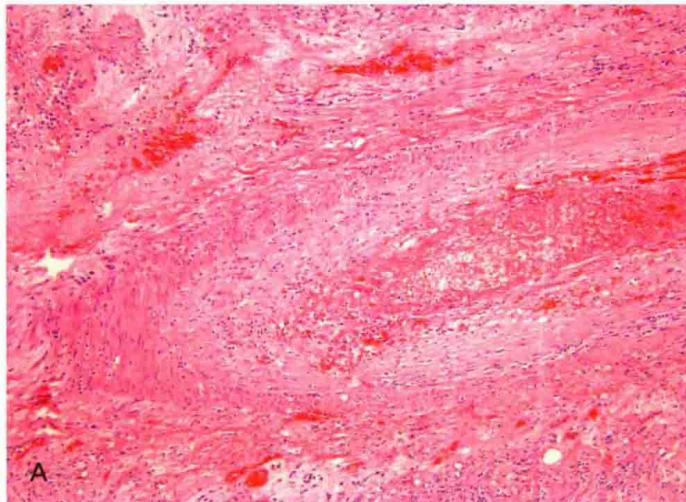
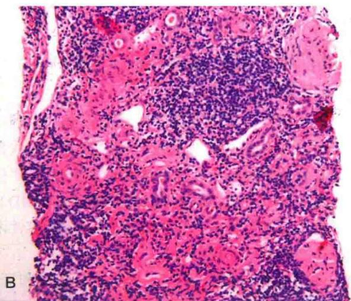
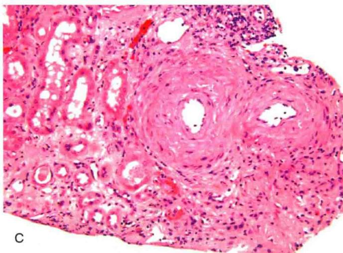 
图4-12肾脏移植排斥反应主要表现为三种类型。A.超急性排斥发生于移植后的数分钟至数小时内，其特点部分表现为中性粒细胞性血管炎、血管内纤维素性血栓形成和中性粒细胞浸润；B.急性细胞性排斥发生于移植后的数周至数月内，特点是肾小管破坏和单个核白细胞的浸润；C.慢性排斥出现于移植后的数月至数年内，特点是肾小管萎缩，间质内斑片状单个核细胞浸润和纤维化。本例显示，动脉内膜纤维性增厚
介导的类型，有时被称为排斥性血管炎，特点是血管的损伤，表现为动脉炎、纤维素样坏死和血栓形成。血管受累是预后不良的征象，因为这通常意味着该排斥反应将对治疗发生耐受。如果可以在早期检测到，则急性排斥可以被免疫抑制治疗所逆转。
# 三、慢性排斥反应出现于移植后的数月至数年内
在移植肾的慢性排斥反应中，患者会在几个月的时间内发生渐进性的氮质血症、少尿、高血压和体重增加。主要的组织学特点表现为动脉和小动脉内膜增厚，导致血管腔狭窄、闭塞，肾小球动脉壁增厚，肾小管萎缩及间质纤维化（图4-12C）。间质中常可见散在的单个核细胞浸润，肾小管内可见蛋白管型。慢性排斥可能是反复多次发作的细胞性排斥的终末结果，临床症状可以不明显，也可以非常明显。这种损伤到了晚期对治疗没有反应。与临床诊断相似，急性排斥和慢性排斥的组织学特点也可以互相重叠，或只有程度的差别，因此在肾活检中也许并不能作出明确的鉴别。
# 四、当供者淋巴细胞与受者组织反应时则发生移植物抗宿主疾病
对先前治疗发生耐受的恶性血液病或其他疾病的患者一旦移植了同种供者提供的骨髓，就可以再次接受治疗了。移植骨髓中具有免疫活性的T细胞可以“排斥”宿主组织，从而发起移植物抗宿主疾病（GVHD）。当患有严重免疫缺陷的患者输入含有HLA不相容性淋巴细胞的血液制品时，也可以发生GVHD。
GVHD的主要受累脏器包括皮肤、胃肠道和肝。皮肤和肠道表现为单个核细胞的浸润和上皮细胞坏死。肝表现为汇管区炎症、胆管破坏和肝细胞损伤。临床上，急性GVDH表现为皮疹、腹泻、腹部绞痛、贫血和肝功能异常。慢性GVHD的特点是皮肤硬化、干燥综合征（泪腺和唾液腺的慢性炎症导致的眼干和口干）和免疫缺陷。对GVHD的治疗有赖于免疫抑制疗法来调节供者细胞的免疫反应。这些患者，特别是慢性GVHD患者患有机会性感染的概率升高。在某些病例中，轻度GVHD可能会对患者有益，因其可以帮助抑制宿主体内的肿瘤细胞。
# 第六节 HIV和AIDS
AIDS是全世界最常见的免疫缺陷性疾病，主要由HIV-1引起，但一小部分主要分布于西非的患者由HIV-2感染所致。HIV-1感染的患者表现有多种免疫缺陷，其中最致命的是细胞免疫的丧失，如果不实施适当的抗病毒治疗，该病变将持续进展。如果患者得不到及时治疗，严重的机会性感染实际上是不可避免的。
HIV感染的持续性进展目前被认为是从开始的无症状状态到后来患者出现明显的AIDS免疫耗竭状态，这种持续性状态即时通常所指的HIV/AIDS。其基础病变是HIV感染了 $\mathrm{CD4^{+}}$ 的T淋巴细胞，从而导致该细胞亚群的耗竭和继发的免疫功能损伤及调节紊乱。就疾病的结局来说，与其说AIDS患者死于HIV感染本身，倒不如说患者死于机会性感染。这些患者发生恶性肿瘤，主要是B细胞淋巴瘤和Kaposi肉瘤的概率也明显升高。最后，HIV感染中枢神经系统经常可以引起小到轻度认知障碍或运动神经元功能失调，大到痴呆的一系列的症状。
# AIDS的免疫学
HIV-1所致的 $\mathrm{CD4^{+}T}$ 细胞的破坏是导致整个免疫系统瘫痪必不可少的环节，因为该淋巴细胞亚群对细胞免疫和体液免疫都发挥着关键的调节作用和效应功能。因此，在典型的AIDS患者中，免疫系统所有的组成成分，包括T细胞、B细胞、NK细胞和单核/巨噬细胞等最终都被破坏了。
$\mathrm{CD4^{+}T}$ 细胞的两个功能亚型[例如辅助型细胞和扩增型（或诱导型）细胞]中，HIV感染后最早累及的是扩增型细胞亚群。最终，所有的 $\mathrm{CD4^{+}T}$ 细胞的计数降至500个 $/ \mu l$ 以下，而且辅助型T细胞与抑制型T细胞的比值从正常的2.0降至0.5。 $\mathrm{CD8^{+}}$ 细胞（细胞毒型/抑制型）的数目变化不一；尽管在AIDS中，该亚群的大部分细胞是细胞毒型细胞。
T细胞的功能缺陷在皮肤实验中表现为对多种抗原的应答缺陷（迟发型超敏反应），在体外实验中表现为对有丝分裂原和抗原诱导的增生反应低下。更重要的是， $\mathrm{CD4^{+}T}$ 细胞的缺乏导致了IL-2的水平的降低，该细胞因子与特定抗原结合后可以激活细胞毒性T细胞的杀伤效应。因此，AIDS患者不能生成用于清除病毒或其他感染的抗原特异性细胞毒性T细胞。
AIDS患者的体液免疫通常也是异常的。针对特异性抗原刺激产生的抗体显著降低了，通常降至正常水平的 $10\%$ 以下。在体外，B细胞对有丝分裂原和抗原的刺激所显示的增生反应也是低下的。但是，AIDS患者的血清中却通常显示有高水平的多克隆性抗体、自身抗体和免疫复合物。这种看似矛盾的现象可能是导致多克隆性B细胞活化的病毒（例如EBV或CMV）反复感染引起的，这些病毒持续性刺激B细胞产生非特异性免疫球蛋白。 $\mathrm{CD4^{+}T}$ 细胞的缺乏削弱了细胞毒性T细胞的增生，而后者正常情况下可以清除B细胞里感染的EBV。
NK细胞的活性在AIDS患者体内也严重降低了。因为它们负责杀伤病毒感染的细胞和肿瘤细胞，所以这些细胞的缺陷可能是这些患者容易患有恶性肿瘤和
病毒感染的原因。NK细胞活性受抑与NK细胞数量减少和IL-2水平降低有关，这是 $\mathrm{CD4^{+}}$ 细胞缺乏导致的结果。
HIV-1往往以单核/巨噬细胞为攻击靶点，而且这些感染的巨噬细胞又可以作为病毒播散的仓库。有趣的是，某些巨噬细胞表面会表达CD4。HIV感染的巨噬细胞通常能存活下来，而不像T淋巴细胞那样被HIV杀死。AIDS患者的巨噬细胞表现出对免疫复合物和调理颗粒的吞噬功能减弱，趋化性降低和对抗原刺激的反应减弱。关于HIV-1的病理学及发病机制请详见第9章。
B 细胞性淋巴组织增生性病变常见于 AIDS 患者。慢性免疫缺陷患者的淋巴瘤表现为侵袭性多克隆性 B 细胞增生或单克隆性 B 细胞淋巴瘤。许多患者的血清学显示有 EBV 的感染的证据，而且可以在淋巴瘤细胞中检测到 EBV 病毒的基因组。
B细胞增生和淋巴结肿大可以发展为恶性淋巴组织增生性病变。与其他免疫缺陷病情形相似，HIV相关性淋巴瘤通常是大细胞亚型，当然有时也可以见到小细胞性淋巴瘤。AIDS相关性淋巴瘤的一个显著特点是好发于淋巴结外的部位，特别是脑的原发性淋巴瘤。而且，胃肠道、肝和骨髓的淋巴瘤也很常见。
（王玉湘）
# 第5章 肿瘤
肿瘤（neoplasm，希腊语，neo，新，plasma，事物形成）是指逃脱了对细胞增殖的正常限制的组织自主生长，并表现出与其前体不同程度的相似度。肿瘤细胞与其起源细胞在位置和结构上的相似性，常使我们得以判断其来源和可能的行为。根据其占位的特点，实体瘤被称为肿瘤（tumors，希腊语，膨胀物）。仅限于局部的肿瘤被认为是良性肿瘤，而那些扩散到远隔部位者被称为恶性肿瘤或癌。肿瘤发生的过程不仅使细胞不断增殖，而且也使肿瘤细胞分化异常，以及在有些情况下，发生程序性细胞死亡（凋亡）的异常。
癌症的发病率随年龄而增长，随着现代社会寿命的延长，人群的发病风险必然地增加。如果从统计数据中去除所有因吸烟引发癌症导致的死亡，在过去的半个世纪里，男性经年龄调整后的总的癌症死亡率并没有增长，女性则持续下降。但特定癌症的年龄调整后发病率在此时间段内存在波动。
通常肿瘤的发生是不可逆的，而且多数情况下，其生长具有自主性。几个重要的现象是：
肿瘤起源于保持正常增殖能力的细胞。因此，成熟的神经元及心肌细胞不发生肿瘤。 
肿瘤可以表现出不同程度的分化，从类似正常组织的相对成熟的结构，到形态上过于原始以至于不能识别起源的细胞都可能存在。 
不能明确导致不可控性增殖的刺激物究竟是什么。 
肿瘤源自调节细胞生长、凋亡或DNA修复的基因发生突变。
# 第一节 良恶性肿瘤比较
根据定义，良性肿瘤不会穿透（侵袭）相邻的组织边界，也不会扩散（转移）到远隔部位。它们保持在其起源的位置上局部过度生长。一个基本的规律是良性肿瘤比恶性肿瘤的分化程度更高，即它们与其起源的组织更为相近。相比之下，恶性肿瘤或癌症，具有侵袭周边组织及转移到远隔部位的属性，在这些部位，恶性细胞可定植、再次生长并再次侵袭。
通常，良性和恶性的定义是指肿瘤的总体生物学
行为，而非其形态学特征。在大多数情况下，恶性肿瘤可能致死，而良性肿瘤对宿主并不致命。然而，所谓良性肿瘤如果生长在关键部位也可能是致命的。例如，良性的颅内脑膜肿瘤（脑膜瘤）可引起颅压升高而致死。左心房的良性间质肿瘤（黏液瘤）可能会阻塞二尖瓣瓣口导致突然死亡。在某些部位，良性平滑肌细胞肿瘤的侵蚀会导致严重出血，例如胃壁的间质肿瘤引起的消化性溃疡。在极少数情况下，一个功能性、良性内分泌腺瘤可以危及生命，例如胰腺的胰岛瘤可引起突发低血糖，或分泌肾上腺素的肾上腺髓质嗜铬细胞瘤可引起高血压危象。相反，某些类型的恶性肿瘤非常惰性，不会立即威胁生命。许多乳腺癌和前列腺癌属于这一类型。
某些类型的肿瘤，其生物学行为并不一定能够反映其组织学形态或与之有关联。在某些情况下，表现出恶性肿瘤的组织学特征的肿瘤可能不会转移或者致患者死亡。最众所周知的例子是皮肤基底细胞癌，这是一种组织学上的恶性肿瘤（局部浸润），但通常不转移至远隔部位。相反，尽管一些肿瘤从组织学上来看是良性的，但可能致命。侵袭性脑膜瘤是非转移性的良性肿瘤，但在局灶侵袭到重要结构时也可能会导致死亡。
# 第二节 肿瘤的分类
肿瘤的分类可能会令人困惑，因为它反映了历史上的概念、技术术语、部位、起源、描述性修饰词和生物学行为的预测。尽管肿瘤分类的语言既不严格地合乎逻辑，也非完全一致，但它仍然是一个合理的交流方式。
# 一、良性肿瘤携带后缀“瘤”
良性肿瘤的主要描述词是其发源细胞或组织的名字，加上后缀“瘤”。例如，一个类似软骨细胞的良性软骨肿瘤，被称为“软骨瘤”（图5-1）。如果肿瘤类似软骨细胞的前体，则被称为软骨母细胞瘤。
上皮来源的肿瘤根据其最突出特点，被赋予不同的名称。因此，鳞状上皮的良性肿瘤可能被简单地称为上皮瘤，而当其出现分支并向外突出时，则被称为
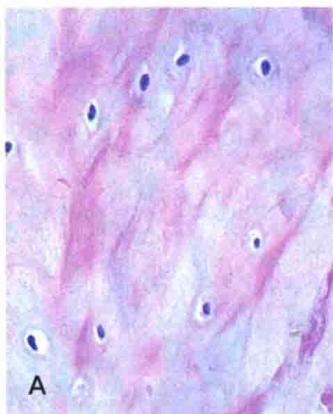 
图5-1 良性软骨瘤。A.正常软骨；B.与正常软骨极为相似的良性软骨瘤
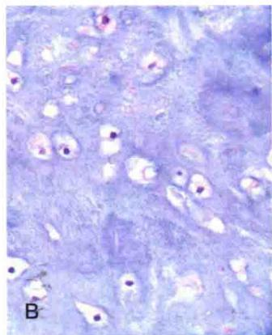
乳头状瘤。腺上皮发生的良性肿瘤，例如结肠或内分泌腺，被命名为腺瘤。由此，我们也可以联想到甲状腺腺瘤或胰岛细胞瘤。在一些情况下，占据主导特征的是大体外观，例如结肠的腺瘤性息肉。
由生殖细胞发生、具有不同胚层结构的良性肿瘤，称为畸胎瘤。这些肿瘤主要发生在性腺，偶尔发生在纵隔，并通常包含各种各样的结构，如皮肤、神经元、神经胶质细胞、甲状腺滤泡、肠道上皮细胞和软骨。胚胎发育时，局部的无序分化导致错构瘤，即正常组织成分构成的杂乱无章的结构。这些肿瘤并不是严格意义上的肿瘤，它包含不同比例的软骨、导管、支气管、结缔组织、血管和淋巴组织。正常组织的异位岛被称为“迷离瘤”，也会被新手误认为真正的肿瘤。这些小病灶的代表性病变是胃壁或肠上的胰腺组织、肾被膜下的肾上腺、腹膜腔内的脾组织结节。某些被临床认为是肿瘤的良性增生，并非真正的肿瘤，而是代表正常组织成分的过度生长。例如声带息肉和皮赘。
# 二、恶性肿瘤多数是癌或肉瘤
一般而言，良性肿瘤所对应的恶性肿瘤通常具有相同的名称，但后缀“癌（carcinoma）”适用于上皮癌而“肉瘤（sarcoma）”适用于间充质来源的肿瘤。例如，胃恶性肿瘤被称为胃腺癌或胃的腺癌（图5-2）。鳞状细胞癌是一种皮肤或其他被覆鳞状上皮器官发生的浸润性肿瘤（例如食管）。支气管化生的鳞状上皮或子宫颈也可发生鳞状细胞癌。移行细胞癌是一种膀胱或输尿管的恶性肿瘤。软骨肉瘤（图5-3）或纤维肉瘤是另外一种类型肿瘤。有时肿瘤的名字能够反映出其起源的组织，如成骨肉瘤。有些肿瘤可以含有不同细胞类型的肿瘤成分，但并非生殖细胞肿瘤。例如乳腺纤维腺瘤，由上皮和间质成分组成，是良性的，反之，顾名思义，子宫或肺部的腺鳞癌是恶性的。一种罕见的混有癌及肉瘤样成分的恶性肿瘤，被称为癌肉瘤。
特定的历史时期，使用的名词术语有一些混乱。
肝的肝瘤、皮肤的黑色素瘤、睾丸的精原细胞瘤和淋巴组织增生性肿瘤——淋巴瘤，都是高度恶性的。造血系统肿瘤是一个特例，因其与血液的关系，所以用后缀“血病”表示，所以白血病是指白细胞的恶性增殖。
第二类描述（同样具有不一致性）参考某种肿瘤的形态学或功能上的特征。例如，乳头状一词描述一种叶片状结构(图5-4)。髓样是指一类质软、富于细胞、几乎没有结缔组织间质的肿瘤，而硬化性或促结缔组织增生性则指致密的纤维间质（图5-5）。胶样癌分泌大量黏液，癌细胞岛漂浮于其中。粉刺样癌是一种乳腺导管内肿瘤，坏死物质可以从导管内挤出。可以依据肿瘤细胞分泌物的某些特征对其分类，例如，产生黏液或浆液。还可以依据囊性包块的大体外观，给予进一步的命名描述。综合所有这些，就产生了卵巢乳头状浆液性囊腺癌、唾液腺腺样囊性癌、胃息肉样腺癌和甲状腺髓样癌等常见的术语。最后，对某些组织发生了解甚少的肿瘤，往往以人名命名，例如霍奇金病、骨的尤因肉瘤或卵巢勃勒纳瘤。
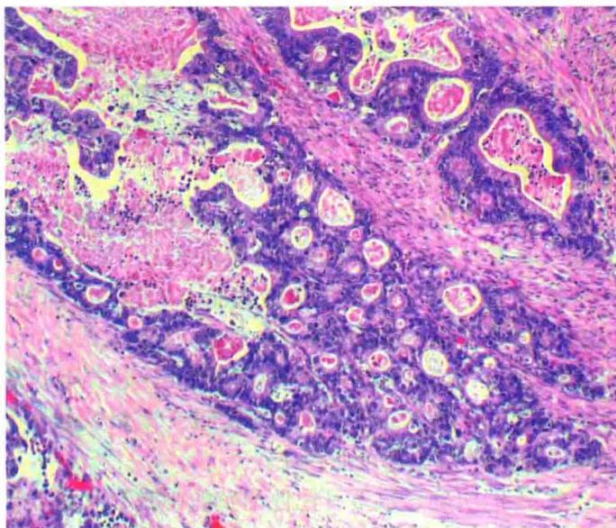 
图5-2 胃腺癌。不规则的肿瘤性腺体浸润胃壁
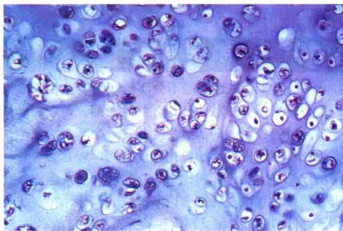 
图5-3 骨的软骨肉瘤。肿瘤由恶性软骨细胞构成，肿瘤细胞外形奇异、有不规则深染核且埋在软骨基质中。与图5-1比较
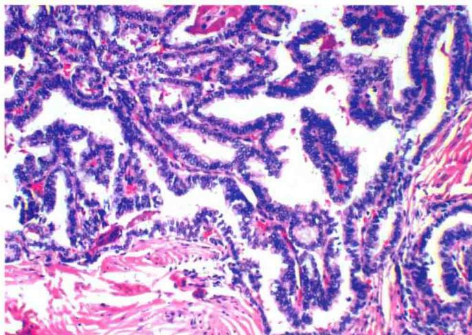 
图5-4 甲状腺乳头状癌。肿瘤显示大量被覆恶性上皮细胞的叶片状结构
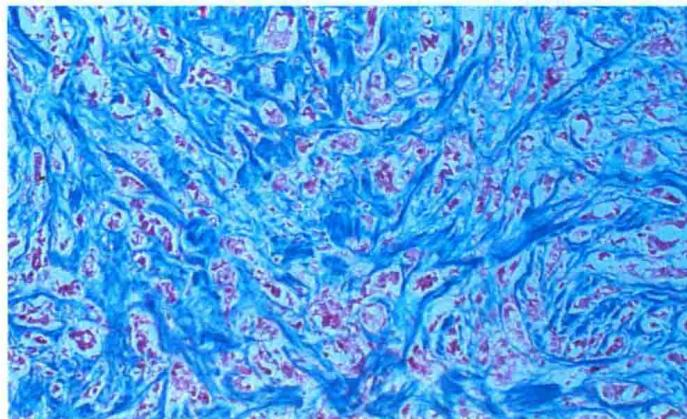 
图5-5 乳腺硬癌。三色染色显示肿瘤细胞巢（红色）嵌在致密的纤维间质中（蓝色）
# 第三节 恶性肿瘤的组织学诊断
尚没有可靠的恶性肿瘤分子指标，诊断癌症的“黄金标准”仍然是常规显微镜检查。实际工作中，区分良性和恶性肿瘤是病理学家所面临的最重要的挑战。在大多数情况下，鉴别两者不是问题；在少数情况下，在准确诊断前必须仔细研究。重要的是，仍然有些肿瘤对任何病理学家的诊断技巧和经验都具有挑战性。在这种情况下，必须等待临床结果才能作出正确诊断。事实上，评估任何肿瘤的真正生物学性质的标准都不是基于科学原理，而是建立在组织和细胞形态与临床预后的回顾性相关性研究。尽管有公认的诊断恶性肿瘤的一般标准，但在特殊情况下应小心使用。遇到这种情况，病理学家的日子就不那么愉快了。例如，被称为结节性筋膜炎的结缔组织细胞反应性增生，其组织学表现比许多纤维肉瘤更令人担忧，可能被误诊而造成不必要的手术。相反，许多高分化的内分泌腺癌与良性腺瘤在组织学上无法鉴别。
# 一、良性肿瘤类似其起源组织
良性肿瘤往往在组织学及细胞学上，与其起源组
织相似。例如，脂肪瘤，看似由正常脂肪细胞组成，只是具有分叶状的大体外观（图5-6）。纤维瘤具有成熟的成纤维细胞和胶原基质的特征。软骨瘤中的软骨细胞散布于软骨基质中。甲状腺腺瘤形成腺泡并产生甲状腺球蛋白。然而，良性肿瘤的大体结构可能偏离正常并形似乳头状或息肉状形态，如在膀胱或皮肤的乳头状瘤及结肠腺瘤性息肉。需要记住的是，良性肿瘤的定义建立在其不可转移的基础上。
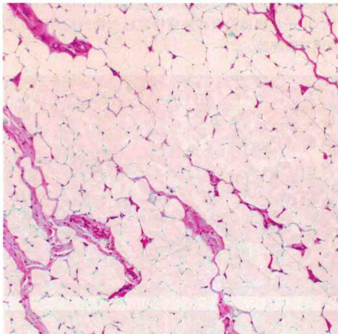 
图5-6 脂肪瘤。该皮下结节状脂肪细胞肿瘤在显微镜下与正常脂肪细胞无区别
# 二、恶性肿瘤与其起源组织在形态和功能上都有差异
尽管恶性肿瘤与其起源组织具有组织学差异，对其来源的准确识别不仅要依据肿瘤发生位置，还要依据它与正常组织形态学的相似性。倾向恶性的组织学特征包括以下几点：
间变或细胞非典型性：这些名词是指癌细胞缺乏分化的现象。一般来说，间变的程度与肿瘤的侵袭性有关。间变的细胞学证据包括：①细胞大小及形态的变化（多形性）；②核增大深染，染色质粗糙、团块状，核仁明显；③不典型核分裂；④包括瘤巨细胞在内的奇异形细胞（图5-7）。这些特征中许多都会在癌前上皮不典型增生阶段出现，在这种情况被称为原位癌（见第1章）。
核分裂活性：大量的核分裂象是许多恶性肿瘤的特征，但不是必要条件。然而，在某些情况下（例如平滑肌肉瘤），即使有极少的核分裂象也会作出恶性肿瘤的判定。 
■ 生长方式：如同很多良性肿瘤一样，恶性肿瘤常无序且随机生长，可能表现为均匀成片的细胞，围
绕血管排列，乳头状结构，漩涡，菊形团等。恶性肿瘤的生长常超过血液供给能力而出现缺血性坏死。
■侵袭性：可通过侵袭性来证明肿瘤为恶性，特别是侵犯血管及淋巴管。某些情况下（如子宫颈的鳞状细胞癌或发生在腺瘤性息肉基础上的癌），恶变的判断是建立在局部浸润的基础之上的。 
转移：出现转移即可判断该肿瘤为恶性。对临床尚未发现原发肿瘤的转移性疾病，肿瘤的来源并不一定能通过形态特征显而易见地看出来。在这种情况下，电子显微镜检查和肿瘤特定标志物的检查可以正确地判断起源。
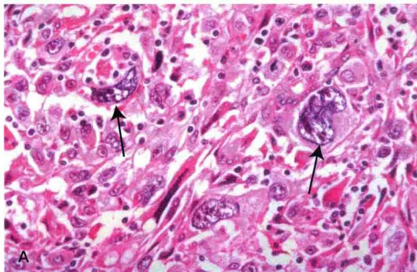
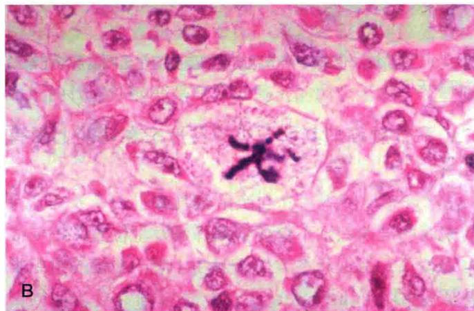 
图5-7恶性肿瘤的间变特征。A.该间变性癌的细胞具有高度多形性（即瘤细胞大小和形状各不相同）。细胞核深染，核浆比增大。可见多核瘤巨细胞（箭头）；B.该分裂中期的恶性细胞出现了异常的核分裂象
# 三、免疫组织化学肿瘤标记物是提示肿瘤起源的抗原
肿瘤标记物是恶性肿瘤的产物，可以在细胞自身及体液中检测到。理想的肿瘤标记应能够明确区分良性和恶性细胞，但不幸的是，不存在这样的标记物。然而，一些标记物通常被用于识别转移细胞的来源或低分化原发肿瘤的起源。在这种情况下，转移肿瘤可能在显微镜下呈未分化组织学形态，甚至连是上皮还是间充质起源都难以区分。肿瘤标记物依据祖细胞所
保留的特征或肿瘤细胞合成的特殊蛋白质来对其进行区别。确定未分化肿瘤的细胞来源不仅仅是个学术训练，准确识别它们是决定治疗的基础。例如，癌通常涉及手术治疗，而恶性淋巴瘤则使用放射治疗和化学治疗。在这些有用的诊断标记物中，可以采用免疫组织化学技术检测的种类多种多样，例如免疫球蛋白、胎儿蛋白质、酶、激素、颗粒、细胞骨架成分和膜蛋白。
除了用于识别恶性肿瘤的谱系，肿瘤相关抗原也用于其他方面。在原发性肿瘤接受治疗后，血液肿瘤抗原的水平有助于跟踪转移瘤的发生和进展。代表性的例子包括用于胃肠道肿瘤的癌胚抗原（CEA）、用于卵巢癌的癌抗原CA125和用于前列腺癌的前列腺特异抗原（PSA）。一些肿瘤抗原也有助作出重要的治疗决策。例如在乳腺癌中应用的雌激素/孕激素受体和HER2/neu，肺癌的表皮生长因子受体（EGFR）和胃肠道间质肿瘤的c-kit。肿瘤抗原也可能是有用的治疗靶点，如乳腺癌的HER2/neu及B细胞淋巴瘤的CD20。
以下是应用免疫组织化学方法进行肿瘤诊断的代表例子：
癌一致性表达细胞角蛋白（CKs），这种中间丝属于多基因家族的一个蛋白。谱系相关的标记物通常有助于明确低分化癌的起源。例如，前列腺癌一致性表达糖蛋白PSA。大多数结肠癌表达CEA和CK20。 
■ 神经内分泌肿瘤与其他癌症一样呈CKs阳性。然而，可以通过其表达的嗜铬素（一类在神经内分泌颗粒中被发现的蛋白家族）或突触素被分辨出来。 
■ 恶性黑素瘤可能不含色素，并且类似于其他低分化癌。这种癌症表达HMB-45和S-100蛋白，但与大多数癌不同，它们CKs都不呈阳性。 
软组织肉瘤会表达中间丝波形蛋白（vimentin）。因为这个标志也存在于许多非间叶性肿瘤中，故其表达只有在与其他标记物和形态学标准联系起来时才有意义。 
■ 恶性淋巴瘤通常白细胞共同抗原（CD45）呈阳性。淋巴瘤及白血病的标记物按照所谓的CDs分组，目前数目已经超过200种。CD抗原的标记物有助于区别T和B淋巴细胞、单核细胞、粒细胞以及各种成熟与不成熟的上述细胞和一些非淋巴细胞。 
血管肿瘤来源于内皮细胞，包括血管瘤和血管肉瘤，可通过VIII因子相关抗原抗体（CD31）或与其结合的凝集素来辨认。 
增殖细胞表达ki-67及增殖细胞核抗原(PCNA)。虽然不能仅仅根据增殖细胞的存在而确定恶性肿瘤的诊断，但在正常情况下缺乏细胞生长的部位出现周期内细胞通常提示为癌。 
表5-1列出了多种常用的肿瘤标记物。
表5-1 识别肿瘤的常用标记物标记物靶细胞上皮细胞细胞角蛋白（CKs）癌，间皮瘤CK7许多非胃肠道腺癌CK20胃肠道癌和卵巢癌、尿路上皮癌、默克尔细胞瘤上皮膜抗原（EMA）癌、间皮瘤、一些大细胞淋巴瘤Ber-Ep4大部分癌，但不包括间皮瘤B72.3（肿瘤相关）许多腺癌，但不包括间皮瘤癌胚抗原（CEA）许多内胚层起源的腺癌，但不包括其他（如肾、间皮瘤）间皮细胞CK5/CK6间皮瘤波形蛋白间皮瘤HBME间皮瘤、甲状腺肿瘤钙网素间皮瘤黑色素细胞HMB-45恶性黑色素瘤S-100蛋白恶性黑色素瘤、神经胶质细胞Mel A恶性黑色素瘤神经内分泌及神经细胞嗜铬素，特别是嗜铬素A神经内分泌肿瘤突触素神经内分泌肿瘤CD57神经内分泌肿瘤、T细胞及NK细胞、施万细胞神经胶质细胞神经胶质原纤维酸性蛋白（GFAP）星形细胞瘤和其他神经胶质肿瘤间充质细胞波形蛋白大多数肉瘤结蛋白所有肌源性肿瘤肌肉特异性肌动蛋白肌源性肿瘤、肌成纤维细胞瘤CD99尤因肉瘤、原始神经外胚层肿瘤（PNET）、急性淋巴细胞和粒细胞白血病特殊器官前列腺特异抗原（PSA）前列腺癌前列腺特异性碱性磷酸酶（PSAP）前列腺癌甲状腺球蛋白甲状腺癌甲胎蛋白（AFP）肝细胞癌、卵黄囊瘤HepPar-1肝细胞癌WT1肾母细胞瘤，一些间皮瘤胎盘碱性磷酸酶（PLAP）精原细胞瘤、胚胎性癌人绒毛膜促性腺激素（hCG）滋养细胞肿瘤CA19-9胰腺和胃肠道癌CA125卵巢癌、子宫内膜癌，一些其他非妇科肿瘤（胰腺，间皮瘤）降钙素甲状腺髓样癌
续表 
标记物靶细胞CD 标记物CD1一些T细胞白血病,朗格汉斯细胞增生症CD2T 细胞、T 细胞恶性肿瘤CD3T 细胞、T 细胞恶性肿瘤CD4T 细胞、T 细胞恶性肿瘤、单核细胞、单核细胞恶性肿瘤CD5T 细胞,一些B细胞恶性肿瘤CD8抑制性T细胞,一些T细胞恶性肿瘤CD10(ALL共同抗原,CALLA)急性淋巴细胞性白血病,一些B细胞淋巴瘤,肾细胞癌CD15R-S 细胞,一些T细胞,一些髓性白血病,多种腺癌,但不包括间皮瘤CD19B 细胞、B 细胞恶性肿瘤CD20B 细胞、B 细胞恶性肿瘤CD30霍奇金病、间变性大细胞淋巴瘤CD33髓系白血病CD34急性髓细胞或淋巴细胞白血病,一些梭形细胞肿瘤CD117(c-kit)慢性粒细胞白血病、胃肠道间质瘤、精原细胞瘤及肺、乳腺、子宫内膜、膀胱的肿瘤非CD 白血病/淋巴癌标记物κ轻链B 细胞恶性肿瘤λ 轻链B 细胞恶性肿瘤TdT急性淋巴细胞性白血病Bcl-1 及细胞周期蛋白D1套细胞淋巴瘤内皮标记物血浆血管因子(vWF)血管肿瘤CD31血管肿瘤、内皮细胞CD34骨髓干细胞、血管肿瘤(血管内皮细胞)凝集素血管肿瘤CD43几乎所有白细胞CD56NK 细胞
CA.癌抗原；CD.抗原分化簇；NK.自然杀伤细胞；TdT.末端脱氧核苷酸转移酶
# 第四节 侵袭及转移
肿瘤细胞特有的两个属性分别是局部侵袭和转移到其他部位的能力。这些特性是癌症导致死亡的主要原因，而原发性肿瘤本身通常可以通过手术根除。
# 一、直接蔓延损伤受累器官及其邻近组织
大多数癌在刚发生时仅局部生长，局限在其来源的上皮层。只要这些早期癌未穿透上皮所附着的基底膜，即称原位癌（carcinoma in situ）（图5-8）。不幸的是，在这个阶段虽然原位肿瘤完全可以治愈，但它是不引起临床症状的。一旦原位肿瘤获得了侵袭的潜能并直接穿过其下方的基底膜，就可以威胁到邻近的组
织。更值得注意的是淋巴管和血管的侵犯，这是转移的前兆。如果癌起源于无基底膜的细胞时，例如结缔组织细胞、淋巴细胞、肝细胞，则其原位阶段尚无明确定义。
恶性肿瘤特征性地在其起源的组织中生长，并不断增大和浸润正常结构。它们也可能直接蔓延并累及邻近组织。有时，癌的生长非常广泛，甚至取代了正常组织并导致器官的功能不全。这种情况在原发性肝癌中并不少见。脑部肿瘤，例如星形细胞瘤，会侵犯大脑直至危及重要部位。恶性肿瘤在器官内的直接蔓延，因其所处位置的关系也可能是致命的。一个常见的例子是结肠癌导致的肠梗阻。
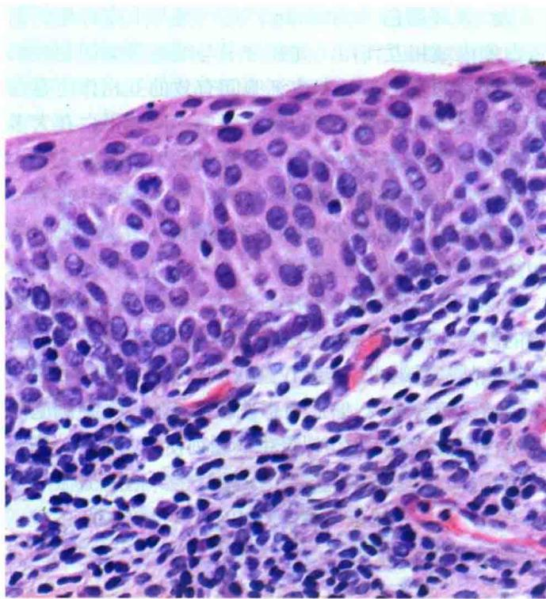 
图5-8 原位癌。一例宫颈癌的切片显示肿瘤性鳞状细胞占据上皮全层，并被基底膜局限在黏膜层
癌的浸润性生长方式往往导致其直接扩散到起源组织之外，在这种情况下，肿瘤可能继发性损害相邻器官的功能。宫颈鳞状细胞癌的生长经常超出生殖道范围，形成膀胱阴道瘘并阻塞输尿管。未妥善治疗的乳腺癌病例常伴发广泛的皮肤溃疡。即使很小的肿瘤也可能在其侵入重要结构时造成严重的后果。小肺癌侵蚀血管时可以导致大出血。胰腺癌直接扩散到腹腔神经丛可以导致难以忍受的疼痛。到达浆膜腔（如腹膜或胸膜）的肿瘤细胞可以很容易地通过直接蔓延播散，或被体腔液体携带至浆膜上新的位置。最常见的例子是某些类型卵巢癌的腹腔种植。
# 二、转移播散是癌症致死最常见的原因
转移（metastasis，希腊语，移位），指恶性细胞从一个位置迁移到另一个不连续的位置。以同样的方式，它们可以侵袭实质组织，也可以穿透血管、淋巴管并通过它们播散到远隔部位。一般来说，转移瘤组织学上类似于原发性肿瘤，但有时因间变显著而难以明确其起源细胞。
1. 血行转移 肿瘤通常侵袭毛细血管和小静脉，而壁较厚的小动脉和动脉则对侵袭相对有抵抗性。在能形成有活力的转移灶之前，循环肿瘤细胞必须在转移区域的血管床上定植下来（图5-9）。推测它们在此处附着于血管壁的内皮细胞或裸露的基底膜上。对于多种肿瘤来说，这一系列事件可以解释为何肝及肺是转移瘤的好发部位。由于腹腔肿瘤播种到门静脉系统，导致肝转移；另外一些肿瘤穿透至体循环静脉并依次
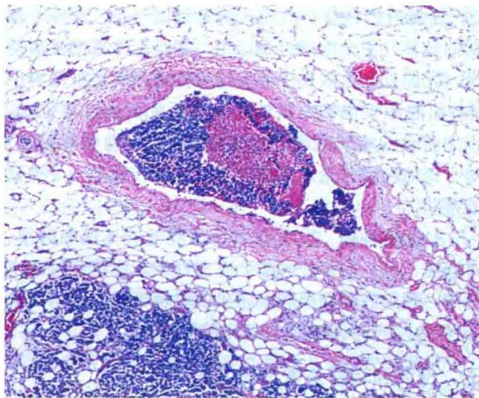 
图5-9 肿瘤的血行播散。恶性肿瘤（下方）已侵犯脂肪组织并穿透进入小静脉
汇入腔静脉，继而到达肺。一些肿瘤细胞被释放到静脉系统，并成功通过微循环并被运输到更远的器官。例如，癌细胞可能成功通过肺微循环并由动脉播散到大脑、骨骼和其他器官。在微循环中停滞的肿瘤细胞具有在转移部位穿透血管壁的趋势。
2.淋巴结转移在富含淋巴网的组织（如乳腺）发生的肿瘤常通过这一途径转移，尽管特定肿瘤的特殊属性可能在播散途径的选择中发挥作用。基底膜只围绕大的淋巴管；而淋巴毛细管是缺乏基底膜的。因此，与血管相比，侵袭性的肿瘤细胞可能更易于侵入淋巴管。一旦进入淋巴管，细胞会被运送至区域引流淋巴结；在这里，它们会首先定植在边缘窦，随后蔓延至整个淋巴结。转移瘤沉积在淋巴结时可能会导致淋巴结增大到超过正常数倍，常常超过原发病灶的直径。淋巴结切面的颜色和质地通常类似原发肿瘤，也可能表现出原发肿瘤中常见的坏死和出血（图5-10）。
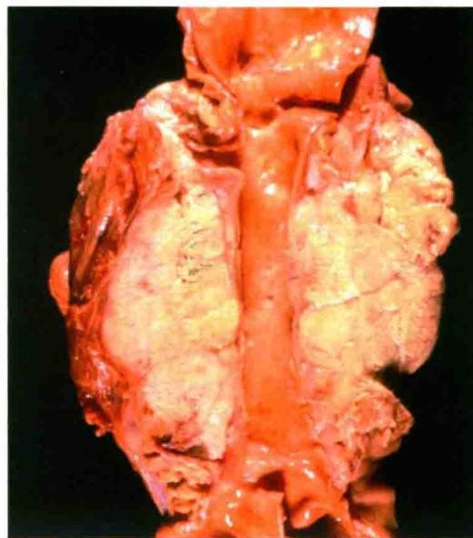 
图5-10 腹主动脉旁淋巴结转移癌。主动脉已打开，淋巴结被剖开
区域淋巴转移扩散模式的典型例子是乳腺癌。最初的转移几乎全部通过淋巴道，并具有重要的预后意义。乳腺外侧象限发生的癌特征性地播散至腋窝淋巴结；而起源于内侧象限的则引流至乳内胸壁淋巴结。识别游走的癌细胞最先到达的淋巴结（前哨淋巴结）对于评估肿瘤是否已经通过淋巴系统转移是一个重要的帮助。
3.体腔种植发生在邻近体腔器官（例如卵巢、胃肠道、肺）的恶性肿瘤会有恶性细胞脱落到这些空间中。腹膜腔和胸膜腔是常见的种植部位，偶尔可见心包腔、关节间隙和蛛网膜下腔的种植。
# 三、侵袭和转移是多步骤过程
恶性细胞需要经过数个步骤才能发生转移。这个过程可以看作是经过竞争，原发癌内最适应的细胞亚群最终以转移的方式胜出（图5-11）：
肿瘤侵袭其下方基底膜 
■移动经过细胞外基质 
穿透血管或淋巴管 
在循环血或淋巴结中存活并滞留 
离开循环系统进入一个新的组织 
存活并生长成转移瘤
1. 侵袭 恶性肿瘤的内在本质是具有侵袭周围组织的能力。在上皮性肿瘤中，侵袭需要破坏和穿透下方的基底膜并通过细胞外基质。同样，试图形成转移灶的循环肿瘤细胞也需要经过这些步骤离开血管或淋巴管腔，并在远隔部位定居。
（1）黏附分子：整个转移过程，从最初肿瘤细胞与下方的细胞外基质结合到其在远隔部位的生长，需要恶性细胞表达许多种黏附分子。这些表面分子表达的差异取决于以下几点：①肿瘤的类型；②克隆个体（肿瘤的异质性）；③恶性进展的阶段；④在转移过程的具体哪一步。下面列出了一些在侵袭过程中活化的重要细胞黏附分子：
整合素是直接介导细胞与细胞、细胞与基质间相互作用，并间接促进细胞分裂、迁移和存活的跨膜受体。他们通过结合并靶向基质金属蛋白（MMPs）如胶原酶等为转移细胞铺路。 
免疫球蛋白超家族，例如ICAM-1，与一系列肿瘤的转移潜能及侵袭性呈正相关。 
钙黏素是一类依赖钙离子、与细胞间跨膜运动有关的黏附分子。上皮细胞钙黏蛋白在所有上皮细胞表面表达并通过拉链作用介导细胞之间黏附。从钙黏素在大多数癌细胞中表达缺失这一点来看，它似乎具有抑制转移的能力，而其缺失使恶性细胞得以离开肿块。
连环蛋白（catenins）是一类与上皮细胞钙黏蛋白胞内域相互作用，并在分子与细胞骨架间创建机械性连接的蛋白，对上皮细胞间有效的互相作用存在重要意义。如同上皮细胞钙黏蛋白，连环蛋白在大多数癌细胞中的表达也会减少乃至消失。有趣的是，β-连环蛋白与腺瘤性息肉病（APC）的基因产物结合。APC基因或β-连环蛋白基因中的任意一方突变都可参与结肠癌的发生（见后及第13章）。 
（2）蛋白水解酶：上皮与其下方间充质之间的基底膜的破裂，是肿瘤细胞侵袭的第一个步骤。基底膜由多种细胞外基质组成，包括IV型胶原、层粘连蛋白和蛋白多糖（见第3章）。癌症的恶性肿瘤细胞、炎症细胞以及癌性间质细胞，均可以产生一系列使基底膜成分降解的蛋白酶。这些酶中包括了尿激酶型纤溶酶原激活剂(u-PA）、基质金属蛋白酶（MMPs）以及胶原酶。
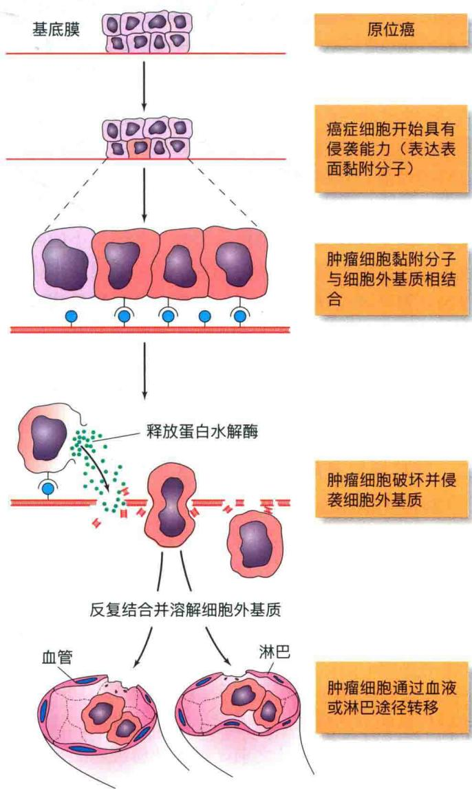 
图5-11 肿瘤侵袭和转移的机制。恶性肿瘤最初穿透基底膜以及随后侵入周围细胞外环境的机制涉及多个步骤。首先，肿瘤获得与细胞外基质成分相结合的能力。这种相互作用由多种黏附分子介导。之后，肿瘤细胞释放蛋白水解酶，细胞外基质被降解。在通过了细胞外基质后，侵袭的癌症细胞以同样的机制穿透进入血管及淋巴管
u-PA可以将血浆纤溶酶原转变为纤溶酶，后者是一种可以降解层粘连蛋白并激活IV型胶原酶原的丝氨酸蛋白酶。u-PA的活性由纤溶酶原激活抑制物（PAI）来平衡；在多种癌症中，有关于u-PA、u-PA受体及PAI表达异常的报道。
MMPs包含一个对组织特异性抑制剂敏感的锌依赖性内肽酶家族。MMPs包括间质胶原酶、间质溶解素、明胶酶及膜型分子。这些酶由正常基质细胞在生理性组织重构，如伤口愈合及胎盘植入时合成并分泌。在这些情况下，MMPs及MMPs抑制剂之间的平衡是被严格控制的。与之相反，癌细胞的侵袭性和转移性则是因这种平衡失调的表现。在许多癌症中观察到MMPs表达的增加与肿瘤细胞侵袭能力或转移潜能的增强直接相关。MMP活性失调使癌细胞得以进入并穿透细胞外基质。
2.转移 侵袭周围组织后，恶性肿瘤细胞会通过若干个步骤扩散到其他器官：
（1）侵入循环系统：在侵入间质细胞后，恶性细胞进入淋巴管或血管。在淋巴结中，淋巴管和静脉之间的交流，使肿瘤细胞得以进入体循环。多数肿瘤细胞在血流中不能存活下来，只有少于 $0.1\%$ 的细胞能够生存并形成新的病灶。
（2）从循环中脱离：循环肿瘤细胞可能机械性地被阻滞在毛细血管和小静脉中，并在此黏附于血管内皮细胞。这种附着会使内皮收缩，从而暴露肿瘤细胞附着处下方的基底膜。循环肿瘤细胞也可能在小动脉滞留，并在血管腔内生长。两种情况下，恶性细胞都会最终通过与局部浸润相似的机制从脉管中溢出。
（3）局部生长：在利于生长的位置，溢出的癌细胞在自分泌、血管生成及可能由宿主细胞产生的局部生长因子的作用下生长。肿瘤生长到直径超过 $0.5\mathrm{mm}$ 时必须有新的血供。因此，许多肿瘤会分泌多肽[例如成纤维细胞生长因子（FGF）、血管内皮生长因子（VEGF）、转化生长因子 $\beta$ （TGF-β）、血小板衍生生长因子（PDGF）]，共同启动和调节血管生成过程（见下文）。转移灶可以再次转移，既可在同一器官内也可转移至远处。
众所周知，转移可能在原发肿瘤被切除后几年甚至几十年后又在临床上出现。这一点在乳腺癌及恶性黑色素瘤中尤为明显。同样已经明确的是，一些原发肿瘤在临床确诊之前可能已经潜伏存在了许多年。肿瘤休眠（tumordormancy）是指已有癌存在，无论是原发或是转移，但尚未增大到临床可检测的程度。对这一现象的发生机制知之甚少，但免疫因素可能起了重要作用。休眠肿瘤出现的生长停滞，可能是细胞内及细胞外信号调控的结果，或是细胞死亡和细胞增殖
出现平衡。休眠细胞的觉醒可能表明破坏性的干扰刺激使平衡向有利于细胞增殖的方向倾斜。
（4）转移性病变的靶器官：在一个多世纪前就已经公认，乳腺癌转移灶的分布不是随机的。在1889年，佩吉特提出：肿瘤细胞播散至特定继发部位，取决于肿瘤细胞（种子）与继发部位适合的微环境（土壤）间的匹配性。相反，另一些人则认为转移扩散完全取决于解剖因素和流向器官的血流。现有证据表明，这两种机制均发挥作用，这取决于肿瘤的类型，例如，乳腺、前列腺和甲状腺的癌症常转移至骨，这种趋向性提示有适当的“土壤”；相反，尽管体积较大并具有丰富的血液循环，脾和骨骼肌都不是常见的转移部位。然而对于许多癌症来说，血管的解剖结构毫无疑问地影响了转移扩散的模式。胃肠道的恶性肿瘤通常转移到其所遇到的第一个毛细血管床，即肝。同样，肺癌通常扩散至脑。另外一个控制恶性细胞归巢的因素可能是由癌症细胞或其寄宿器官分泌的互补的黏附分子。
# 第五节 癌症的分级与分期
为了预测恶性肿瘤的临床行为并建立治疗标准，许多癌症根据以下指标进行分类：①细胞学及组织学分级体系；②描述蔓延程度的分期方案。
# 一、癌症的分级反映了肿瘤的组织和细胞学特征
低级别的肿瘤分化良好；高级别肿瘤往往为间变性（即缺乏能够表明其起源组织的分化特征）。细胞学及组织学分级取决于间变的程度及增殖细胞的数量，这种分级必然是主观的，充其量也不过是半定量的。间变的严重程度取决于细胞的形态和规则性，以及鲜明的分化特性，比如腺癌中的功能性腺样结构或鳞状细胞癌中的角化珠。这些特征的存在可以将肿瘤区分为高分化或低分化。相比之下，低分化的恶性细胞与其对应的正常细胞没有什么相似之处。快速或异常增生的证据表现为：①大量的有丝分裂；②不典型核分裂；③核多形性；④肿瘤巨细胞。多数方案根据恶性程度由低至高将肿瘤分成三或四级（图5-12）。细胞学等级和癌的生物学表现之间的总体关系并非一成不变：有许多细胞学级别低的肿瘤表现出高度恶性的例子。
# 二、癌症分期指扩散程度
手术方法或治疗方式的选择更多依据的是癌症的分期而非其细胞学分级。此外，大多数关系到癌症生存的统计数据也是建立在肿瘤分期的基础上。临床分期独立于细胞学分级。不同器官用于分期的主要参数不同。常用的标准包括：
肿瘤大小 
局部生长的范围，在器官内还是器官外
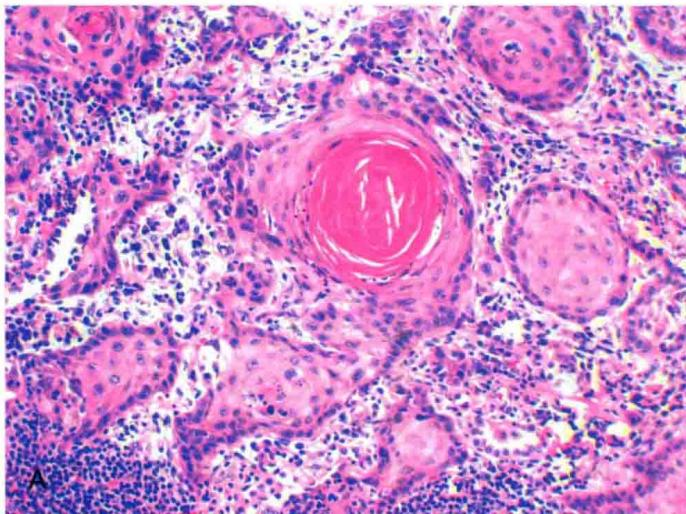
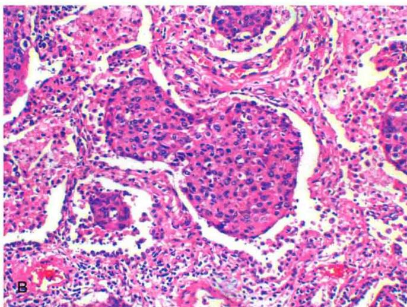 
图5-12 肺鳞状细胞癌的细胞学分级。A.高分化（1级）鳞状细胞癌，肿瘤细胞与正常鳞状上皮细胞相似且可以合成角蛋白，有明显的角化珠；B.低分化（3级）鳞状细胞癌。很难识别恶性细胞为鳞状上皮来源
淋巴结转移的证据 
远处转移的存在
这些标准已经被编纂在国际TNM癌症分期系统中，其中，“T”指原发肿瘤的大小，“N”指区域淋巴结转移，“M”指远处转移的存在及程度。T、N、M数值评分（例如 $\mathrm{T1}\sim \mathrm{T4}$ ， $\mathrm{N}1\sim \mathrm{N}3$ ）的定义随具体肿瘤类型的不同而异。
肿瘤大小和局部扩散的程度影响预后和治疗。例如，直径小于 $2\mathrm{cm}$ 的原发性乳腺癌可以采用局部切除治疗及放射治疗；大一点的肿块则通常采用乳房切除术。根据结直肠癌的Dukes分期，穿透肠壁肌层和浆膜的肿瘤与较浅表的肿瘤相比，预后更差。很明显，存在淋巴结转移的肿瘤比无转移者需要更积极的治疗，而存在远处转移的肿瘤除了姑息手术外一般禁止手术治疗。
# 第六节 肿瘤的生长
# 一、大多数肿瘤为单克隆起源
对人类及实验性肿瘤的研究，为大多数肿瘤起源
于单一转化的细胞提供了强有力的证据。这一理论曾在造血系统增生性疾病中得到过彻底验证。细胞表面标记物曾被用于证明许多恶性造血系统疾病的单克隆起源。例如，B细胞淋巴瘤由单一表达细胞表面 $\kappa$ 或 $\lambda$ 轻链的细胞组成，而炎症性多克隆淋巴细胞增生时同时存在两种细胞。单克隆性同样被证实在一些实体瘤的各个转移灶中存在。关于肿瘤的单克隆起源的一项早期研究，源自对体内含有葡萄糖-6-磷酸脱氢酶的AB两型同工酶的杂合子女性的观察（图5-13）。这些同工酶编码基因位于X染色体上。因为一个X染色体随机灭活，这些基因中只有一个可以在任意给定细胞中表达。因此，尽管所有细胞的基因型是相同的，
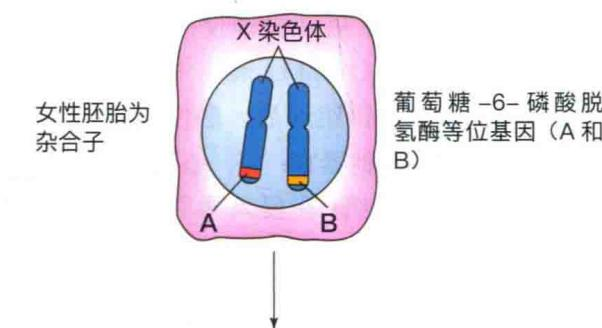 
两种成熟表型。成熟细胞只表达一种G6PD同工酶
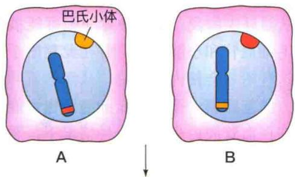 
成熟组织是表达A或B细胞组成的嵌合体
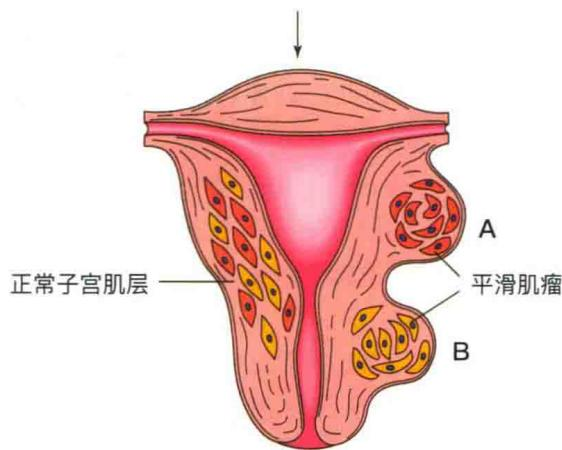 
肿瘤是 A 或 B 细胞的克隆, 表明了其单克隆起源 
图5-13人类肿瘤的单克隆起源。一些女性是位于X染色体长臂上的葡萄糖-6-磷酸脱氢酶（G-6-PD）的两个等位基因的杂合子。在胚胎早期，每个体细胞中的一个X染色体会随机灭活，并出现细胞学上附着在核膜上的巴氏小体。结果，组织成为既有表达A型G-6-PD同工酶又有表达B型G-6-PD同工酶的细胞的嵌合体。子宫平滑肌瘤只含有一种（A型或B型）同工酶而非两种均有，这一发现证明了肿瘤的单克隆起源
它们的表现型也会因表达同工酶A或B而有所不同（即为该同工酶的镶嵌体）。一项关于良性子宫平滑肌瘤的实验发现：单个肿瘤的所有细胞都只表达A或B型同工酶而非二者同时表达，这表明每一个肿瘤都源自于同一前体细胞。尽管有报道存在寡克隆肿瘤，但是十分少见。
# 二、多数肿瘤的外观及细胞成分具有异质性
尽管几乎所有肿瘤都源自单个肿瘤细胞克隆，随着它们的生长，细胞会表现出相当大的遗传和表型上的变异。这种现象被称为肿瘤的异质性（tumor heterogeneity）。肿瘤群体中细胞的差异性对于肿瘤进展、播散，以及对化疗的反应和对这些药物的耐药性的发生都具有广泛影响。有几种互不排斥的理论推测肿瘤细胞多样性的原因：
克隆演变学说认为肿瘤细胞在增殖时逐步累积新的突变。许多处于细胞分裂期的肿瘤可以随着时间的推移产生一系列遗传上具有差异的细胞（图5-14A）。达尔文式的选择，调控着哪些亚克隆可以存活哪些会死亡，哪些转移，哪些留在本地。 
肿瘤干细胞，像体细胞干细胞一样，具有自我更新和分化的能力。至少在造血系统恶性肿瘤中，这种干细胞可能由正常造血系统干细胞或定向造血祖细胞转化而来。在后一种情况下，转化后的细胞仍会重现至少一部分正常干细胞的程序（图5-14B）。 
表观遗传可塑性，例如癌细胞能够开启或关闭修饰核组蛋白的蛋白质表达，使得肿瘤细胞群体能够在缓慢分裂和快速分裂之间进行转变。此外，肿瘤细胞无须进一步突变即可获得这种转变（见下文及图5-14C）。
# 三、肿瘤生长速率
肿瘤细胞并不一定比其对应的正常细胞增长更为迅速。肿瘤生长同样取决于一些因素，如生长分数（周期内细胞的比例）以及细胞死亡率。肿瘤生长的主要决定因素显然是在一定时间内产生的细胞多于死亡的细胞。这种情况既可以是细胞增殖超过了程序性细胞死亡的数量，也可以是细胞更新速率正常而凋亡减少。
内脏的癌症在其大小达到约 $1\mathrm{cm}^3$ （1g）前通常不会被查出，即相当于 $10^{8}\sim 10^{9}$ 个细胞。大多数肿瘤的单细胞起源意味着其体积至少倍增了30次才能达到这个尺寸。如果癌症未被发现并继续增大到惊人的 $1\mathrm{kg}$ 大小时，即可含有 $10^{12}$ 个细胞。然而，从 $1\mathrm{g}$ 增大到 $1\mathrm{kg}$ （假设没有细胞死亡）仅通过10次群体倍增就可以实现。因此，当癌症在临床被首次检出时，它们其实已经存在很久了。因为肿瘤细胞死亡率的不定性及细胞周期动力学的不同，实际上人类肿瘤的倍增时间
是非常难以预测的。从临床实践角度看，根据肿瘤被发现时的大小并不能合理估算出恶性肿瘤的病史。据估算，在人类皮肤肿瘤中，多达 $97\%$ 的增殖细胞会自
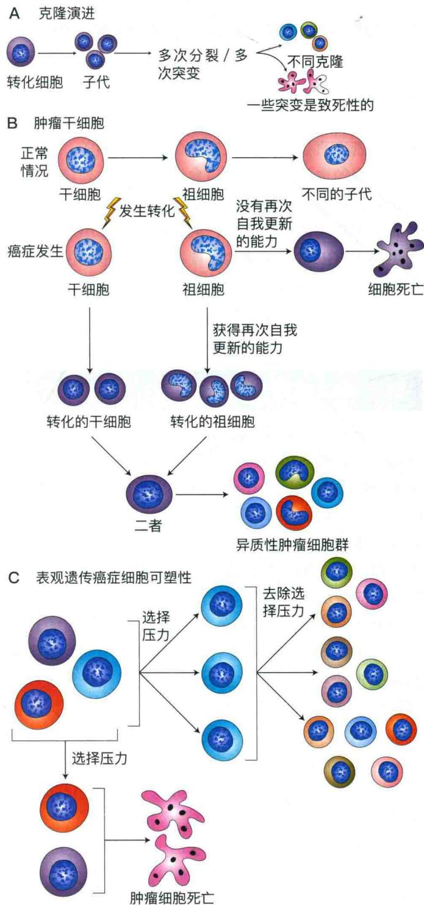 
图5-14肿瘤异质性示意图。A.克隆演进。增殖的肿瘤细胞最终会发生各种突变，不同细胞个体获得的突变不同，导致肿瘤细胞群体出现异质性。有些突变不利于细胞生存，另一些则有利于癌症进展；B.肿瘤干细胞。正常（上图）干细胞产生定向祖细胞。这些细胞最终成为分化细胞。致癌因素刺激干细胞（下图）可能导致恶性转化干细胞的大量出现。这些细胞即为肿瘤干细胞（CSCs）。另外，致癌刺激可能影响到定向祖细胞。如果后者重现自我更新的程序，所得的转化祖细胞可能会成为CSC。如果其不激活自我更新程序，则将导致后代分化并最终死亡。CSCs可以由干细胞转化或定向祖细胞转化而来，并可能由此成为一个异质性恶性细胞群体的前身。C.不可遗传的表观遗传学修饰。细胞群中的表观遗传改变可能导致肿瘤进展或细胞死亡
发地死亡。肿瘤细胞死亡的原因尚未明确，但可能包括以下几个因素：①程序性细胞死亡（凋亡）；②血液供应不足导致缺血；③缺乏营养；④被宿主的特异性及非特异性防御系统损伤。
# 四、肿瘤血管生成是指萌生出新的毛细血管
在缺乏新血管提供营养及清除废物的情况下，恶性肿瘤生长直径不会超过 $1\sim 2\mathrm{mm}$ 。在这种情况下，原发肿瘤（例如乳腺癌、前列腺癌和结肠癌）内的毛细血管密度直接与转移及宿主生存期短相关。重要的是，肿瘤的血管生成与伤口愈合和其他生理情况下发生在非肿瘤组织中的血管生成类似（见第3章）。有几种因子可以刺激血管生成，其中，因肿瘤组织缺氧而产生的VEGF以及FGF-2，被认为是最重要的。许多内源性和合成的血管生成因子抑制剂所导致的实体瘤的生长抑制，证实了这些血管生成因子的作用，其中一些制剂已经被应用于临床。
# 第七节 肿瘤分子遗传学
癌细胞失控的生长能力，是由于控制细胞生长、分化、凋亡或者维持基因组完整性的基因在体细胞水平上不断获得突变。相似的变化也出现在遗传性恶性肿瘤易感者的胚系水平。基因突变可以由环境中的致突变因素引起，例如化学致癌物质或射线（见下文），或者源自正常细胞的代谢产物，特别是在活性氧引起的氧化应激反应（见第1章）。
DNA的复制并不完美，在每次细胞分裂的过程中，每 $10^{9}$ 个核苷酸中就有1个与原先不同。最常见的突变形成机制可能就是DNA在复制和修复过程中随机发生的错误。假设每个核苷酸发生一次突变的可能性大约为 $2.5\times 10^{-8}$ ，人类每繁衍一代就会获得 $100\sim 200$ 个突变。因此，每个人都必然在许多遗传位点上是嵌合体。另外，基因组的一些特定区域具有明显的突变倾向和不稳定。这些区域包括如下几种：
1. 端粒 位于染色体 $3^{\prime}$ 端的一段DNA重复序列，它会在每次成功的有丝分裂后缩短（见第1章）。端粒的损耗会导致非特异性的DNA不稳定性，这种情况往往会引起细胞的死亡。然而，在少数情况下，端粒酶可被激活，从而保持端粒的长度不发生改变，进而导致细胞永生化，至少在实验室水平，这就可能引起细胞的恶性转化。
2. 微卫星 是最多由 6 个碱基对构成的短序列, 可以被重复 100 次之多。这些区域特别容易发生突变, 包括重复次数的改变。这些突变在多数情况下会被 DNA 错配修复酶 (见下文) 校正。然而, 一些发生在生殖细胞或者是体细胞中的突变, 偶尔躲过了修复机
制的校正，因而与恶性肿瘤的发生有关。
当突变涉及调控生长或是稳定基因组的基因时，就会使部分细胞的克隆表现出异于其邻近正常细胞的生长优势。类似基因的连续突变引起变异克隆的增多，直至细胞的恶性表型最终显现。从某种意义上讲，可以将恶性肿瘤的发生看作是一个进化过程，我们只能够看到其中存活的克隆。
# 第八节 正常细胞周期调节的作用
恶性肿瘤的发生可能源于调节正常细胞分裂周期的限制点（R点）的缺失，因为大多数恶性肿瘤细胞缺乏R点。在正常分裂的细胞中，DNA的复制发生在S期，之后进入 $\mathbf{G}_2$ 期，最终进入有丝分裂期（M期）。细胞完成有丝分裂后，直接从M期进入到 $\mathrm{G}_{1}$ 期。细胞从一个期向另一个期的转换在三个检控点上受到调控，即： $①$ 从 $\mathbf{G}_1$ 期进入S期时； $②$ 当DNA开始在S期复制时； $③\mathrm{G}_2$ 期到开始有丝分裂前。因此，从 $\mathbf{G}_1$ 期进入S期的检控发生在一个特殊的R点。通过R点受周期素调控，因其在细胞周期中表达和降解而得名。
细胞周期调节蛋白激活相关的蛋白激酶家族，周期素依赖性激酶（CDKs）可以驱使或限制细胞通过R点。CDKs2,4,6磷酸化视网膜母细胞瘤蛋白（pRb）家族，后者可释放E2F家族转录因子。E2F随即驱使细胞通过R点。其他周期素和CDKs调节细胞从S期向 $\mathbf{G}_2$ 期以及从 $\mathrm{G}_2$ 期向M期的转换。除周期素外，CDKs也受到周期素依赖性激酶抑制剂（CKIs）的调节，这类蛋白的表达可由衰老、接触抑制、细胞外抗丝裂原因子（如TGF-β）和最著名的肿瘤抑制蛋白p53诱导。在相关的酶感知到DNA损伤后，p53可被相应的蛋白激酶[ATM(突变型共济失调性毛细血管扩张症)和ATR(ATM及Rad3相关)]激活。它的作用是通过调节 $\mathrm{G}_1 / \mathrm{S}$ 以及 $\mathrm{G}_2 / \mathrm{M}$ 的转换，阻滞细胞周期，直至损伤被修复。一旦DNA修复失败，p53则促使细胞凋亡（图5-15）。
癌细胞缺乏R点提示其通过某些机制逃避了细胞周期调控，例如： $①$ 周期素或CDKs的扩增或过度表达； $②$ CKIs的缺乏； $③$ p53和pRb蛋白的突变失活。
# 一、DNA修复失败以及基因组的不稳定性导致癌的发生
为了保持和保护基因组的完整性，细胞进化会有专门的机制来不断地修复DNA损伤。这一机制涉及多种酶家族，从开始识别错误到修复不同类型的损伤。这些酶也与细胞周期检控点的调节因子有关，以确保细胞发生的突变最终不会传给子代细胞（见上文）。细胞DNA修复机制的缺失，常常与癌症的发生有关。用于修复DNA损伤的主要机制是由损伤的类型所决定：
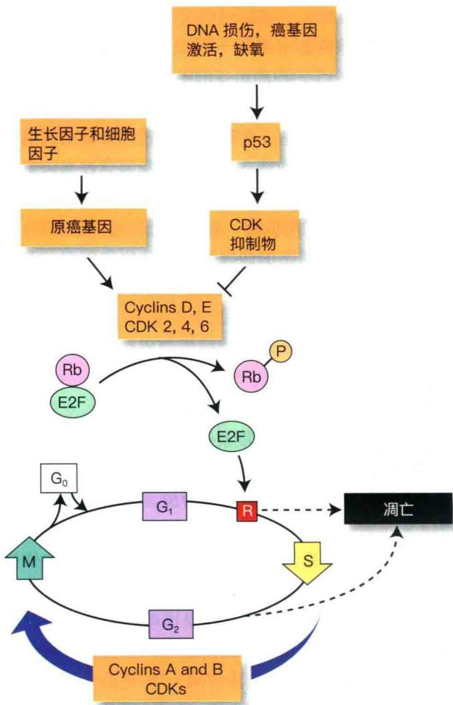 
图5-15 细胞周期调控。原癌基因活化后产生生长因子及细胞因子，刺激细胞从 $G_{0}$ 期向 $G_{1}$ 期转化。细胞从 $G_{1}$ 期向S期转化时的关键节点为限制点（R）。视网膜母细胞瘤蛋白（Rb）被周期素依赖性激酶（CDKs）磷酸化是此过程中的主要调控事件，激活后的Rb蛋白继续激活转录活性因子E2F。CDKs受到由p53调节的CDK抑制因子（CKIs）的抑制。肿瘤抑制蛋白大多在 $G_{1}$ 期抑制细胞周期的进行。 $G_{1}$ 期和 $G_{2}$ 期的细胞周期进程阻遏，可导致细胞进入预设的凋亡途径。S期、 $G_{2}$ 期及M期也受周期素、CDKs和CKIs的调节。
错配修复：这种途径主要用于修正DNA复制过程中出现的错误，包括单个碱基的错配，或是因DNA复制过程中出现滑链而导致的较大片段的错配。例如，患有遗传性非息肉病性结肠癌（HNPCC，Lynch症）的患者，绝大多数存在错配修复基因的缺陷，这使得其一生中罹患结肠癌的风险达 $75\%$
■核苷酸碱基切除修复：这类途径主要用于因内源性因素（如ROS）或者是外源性因素（如紫外线、化学物质）引起的大量的DNA损伤。以互补链作为模板，损伤区域被剪切掉并替换。着色性干皮病（XP）是一种对紫外线高度敏感及易发生皮肤癌为特点的遗传性疾病，它就是由于缺乏核苷酸切除修复（NER）酶而引起的。在一些常见类型的散发性肺癌患者中，多数表达核苷酸切除修复的突变蛋白。
双链断裂（DSB）修复：DNA双链断裂是严
重威胁细胞基因组完整性的一种情况，它能够造成显著的细胞遗传学异常，包括缺失、扩增和染色体易位。DBS的修复需要一系列复杂的蛋白参与，涉及同源重组或是不同染色体、不同区域DNA的末端连接。参与DSB修复的酶突变，发生恶性肿瘤的概率增高。
由于癌症的发病机制涉及多个遗传学事件的参与，基因组的不稳定性对于多发突变的产生至关重要。在许多肿瘤中发现存在三种遗传学不稳定的机制，即： $①$ 染色体不稳定，可能与DSB修复缺陷及有丝分裂分离缺陷有关； $②$ 微卫星不稳定，这常常是DNA错配修复异常的结果； $③$ DNA甲基化异常，将在下文中讨论这一表观遗传学现象。这几种机制中，最重要的可能是染色体不稳定，以下几种可能与之相关：
■非整倍性：染色体数目的不平衡。 
基因扩增：基因拷贝数的增加。 
■杂合性丢失（LOH）：成对等位基因中的一个丢失。LOH可能与所研究基因的缺失或是失活有关。如果一个等位基因发生了突变或是丢失，那么相应的正常等位基因的缺失或突变会形成纯合型的异常位点（即LOH）。
# 二、癌基因是正常基因的相对应基因
将来自人类肿瘤细胞的特定基因（癌基因）通过病毒载体转染啮齿动物细胞后，可导致受体细胞发生转化。研究发现，这些转化基因是控制细胞生长的正常基因的突变体，被称为原癌基因。病毒性致癌基因称作病毒癌基因，其在细胞内的对应基因（c-）是正常基因（如，c-myc，c-jun，c-src）。
1. 激活细胞癌基因的机制 原癌基因激活为癌基因，通常有以下三种机制：
原癌基因的激活突变导致异常蛋白的构成性（失调的）表达。此类突变包括：①点突变；②缺失；③染色体易位。 
原癌基因的过度表达可能导致产生过量的正常基因产物。 
原癌基因的激活受到众多的自主抑制机制的调节，这些机制作为保护措施可防止不恰当的活化。因此，许多原癌基因的突变导致其对正常自主抑制以及调节限制的抵抗。
（1）通过突变激活：不论是激活还是获得功能，原癌基因的激活常常是发生在体细胞而非生殖细胞。作为细胞生长发育过程中的重要调控因素，发生在子宫中的原癌基因胚系突变通常是致死性的。有一些例外的情况，例如，c-ret基因被认为是某些遗传性内分泌癌发生的基础，而编码肝细胞生长因子受体的c-met基因，与一种遗传性肾癌有关。
（2）通过染色体易位激活：染色体易位（即一条染色体的一部分转移到另一条染色体上）与某些人类白血病和淋巴瘤的发病机制（见第20章）有关。最早并且最为人所知的通过获得性染色体易位引起人类癌症的例子是费城染色体，见于 $95\%$ 的慢性髓性白血病患者（图5-16A，B）。通过易位形成的异常融合蛋白激活了c-abl原癌基因（一种非受体型激酶）。融合形成的BCR/ABL癌基因具有非常高的酪氨酸激酶活性，可产生有丝分裂和抗凋亡信号。在Burkitt淋巴瘤中（一种B细胞淋巴瘤；见第20章），参与细胞周期进程的c-myc原癌基因被易位至控制免疫球蛋白轻链或重链转录的基因附近，因而引起正常产物产生过多。正常c-myc基因产物的过量可能与其他基因突变共同促进了一种占优势地位的B细胞克隆的出现，并最终增殖为一种单克隆性肿瘤。尽管上述恶性病变始于染色体易位，但在许多癌症的发生过程中会发生多种染色体的异常（易位、断裂、非整倍体等）。 
（3）通过基因扩增激活：染色体突变引起的基因拷贝数大量增加（即基因扩增），最初是在人类实体瘤中发现的。某些情况下，原癌基因可以发生基因扩增。例如，erbB原癌基因扩增见于1/3的乳腺癌和卵巢癌患者。erbB2基因（即HER2/neu）所编码一种酪氨酸激酶受体与EGFR在结构上具有相似性。乳腺癌和卵巢癌患者中erbB2基因的扩增，可能与总体生存率低
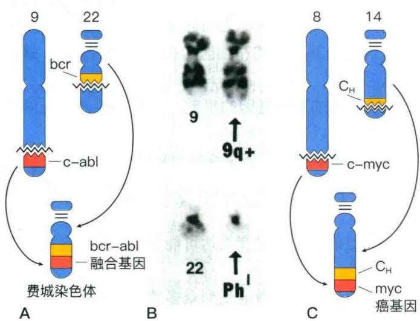 
图5-16通过染色体易位而激活癌基因。A.慢性髓性白血病。9号和22号染色体长臂末端损伤并发生互换。9号染色体上的c-abi原癌基因易位至22号染色体的断裂点区（bcr癌基因）。最终形成了费城染色体（ $\mathrm{Ph}^1$ ），其包含新的融合基因编码杂交癌基因蛋白质（bcr-abi），它可能参与了慢性髓性白血病的发病。B.这是一名患有慢性髓性白血病患者的染色体核型，显示9号和22号染色体发生了互换易位。费城染色体（ $22q - \cdot$ ）较正常的22号染色体小。一条9号染色体（ $9q + \cdot$ ）较正常的9号染色体大。C.Burkitt淋巴瘤。本病中，染色体的断裂涉及8号和14号染色体的长臂。8号染色体上的c-myc基因易位至14号染色体上，并邻近于编码免疫球蛋白重链稳定区域的基因。由于其与活跃转录的免疫球蛋白基因启动子/增强子区域相关，所以c-myc表达增多
及复发时间短相关。在这种情况下，现在对过度表达该蛋白的乳腺癌患者采用一种靶向HER2/neu的抗体（曲妥珠单抗）作为辅助治疗的手段。N-myc原癌基因在神经母细胞瘤中最高可扩增700倍，并且是进展期肿瘤预后较差的标志。在肺小细胞癌、肾母细胞瘤及肝母细胞瘤中也发现myc家族原癌基因通过基因扩增的方式激活。
2.癌基因的作用机制 根据其对应的正常基因（原癌基因）在生化通路中调控生长或分化的作用，可将癌基因进行分类。包括以下几种（图5-17）：
■ 生长因子 
细胞表面受体 
■ 细胞内信号转导通路 
■ DNA 结合核蛋白（转录因子） 
■ 细胞周期蛋白（周期素和周期素依赖性蛋白激酶） 
调亡抑制剂（bcl-2）
突变导致的突变基因活性增加，被称为功能获得性突变。
（1）细胞癌基因和生长因子：可溶性的细胞外生长因子与其特异性受体结合并激活信号通路，使细胞进入有丝分裂周期。少数原癌基因编码了可刺激肿瘤细胞生长的生长因子。某些情况下，生长因子能够作用于产生它的细胞（自分泌作用）。其他的生长因子与邻近细胞的受体结合发挥作用（旁分泌作用）。
PDGF是 $c$ -sis基因的蛋白质产物，同时也是一种有效的成纤维细胞、平滑肌细胞和神经胶质细胞的促分裂因子。肉瘤和胶质母细胞瘤（恶性胶质细胞瘤）的细胞分泌PDGF样多肽；但相应的正常细胞并不分泌。因此，一个能够编码某种生长因子（PDGF）的正常人类基因，只有在组成性表达于能够应答该信号的
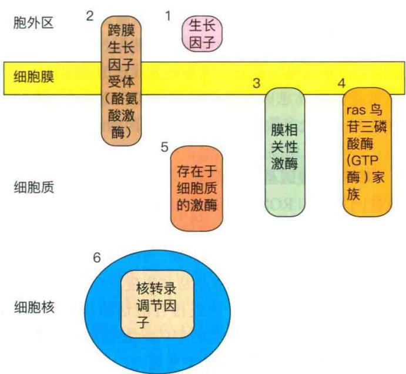 
图5-17 癌基因或原癌基因产物在细胞中存在的区域
细胞时，才使细胞获得了转化能力。
（2）癌基因和生长因子受体：调节对生长因子的功能应答，包括细胞增殖、分化和存活，主要依赖于种类繁多的生长因子受体的表达和相对平衡。当配体结合于受体的细胞外结构域时，可激活受体细胞内结构域本身所具有的激酶活性，继而使细胞内信号分子的酪氨酸残基磷酸化。因此，由于生长因子受体能产生有效的促有丝分裂信号，所以他们本身具有潜在的致癌性，当其被激活时就有可能使信号通路的正常调控发生失控。
在正常情况中，生长因子暂时结合于相应的受体，并引起其胞质酪氨酸激酶结构域的激活，完成这一过程后，生长因子受体转入静止状态。生长因子受体的某些突变，包括细胞外或细胞内结构域的截短突变、点突变和丢失，使得受体无须依赖配体的结合就可无限制地（结构性）活化，并促进生长失控。例如，c-ret的胚系点突变引起受体结构性活化，与多发性内分泌肿瘤（MEN）综合征和家族性甲状腺髓样癌的发病机制有关（见第21章）。
人类癌症中具有重要意义的是表观遗传学改变，其导致生长因子和相应的受体合成增多。Her2/neu的扩增产生自分泌激活作用，该作用由Her2/neu过表达所介导。这种异常情况见于多种人类恶性肿瘤（如：乳腺癌、卵巢癌、胃癌）。
（3）ras癌基因：ras基因（Ha-ras，Ki-ras或N-ras）的激活是人类癌症最常见最主要的突变。Ras作为一种信号转导通路的效应分子，与生长因子受体的激活一起导致核基因转录的改变。ras原癌基因编码的产物p21属于细胞质内小分子蛋白家族（G蛋白），并可以与鸟苷三磷酸（GTP）和鸟苷二磷酸（GDP）结合（图5-18）。p21蛋白与GTP结合时为活化状态。与之结合的GTP能被p21自身的GTP酶转变为GDP，该酶活性被GTP酶激活蛋白（GAP）所激活。自身的GTP酶活性是该分子的“关闭”键。ras基因的点突变可直接引起p21GTP酶活性下降或者是p21对GAP无反应，最终引起ras的相关作用不可控性激活，这是由于p21被锁定在“开启”状态。
（4）癌基因和核调节蛋白：原癌基因编码的一些细胞核蛋白，直接地调控细胞增殖和分化的基因依次表达。这些蛋白大部分可与DNA结合并调控其他基因的表达。某些原癌基因的一过性激活，对细胞通过周期中的特殊调控点是很必要的。原癌基因（如 $c$ -myc, $c$ -fos, $c$ -jun）在细胞周期的早期发挥作用，使得细胞能够接收有丝分裂的最终信号，因而被称为感受态基因。感受态基因参与以下过程：①细胞从 $\mathrm{G}_1$ 期进入S期；②基因组的稳定性；③细胞凋亡；④对细胞成熟的
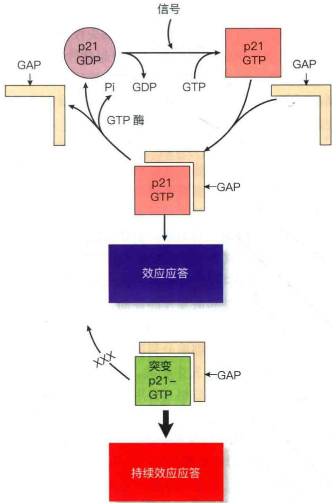 
图5-18 ras原癌基因的作用机制。A.正常。ras基因的蛋白产物p21存在两种构象状态，处于何种状态取决于其与鸟苷二磷酸（GDP）还是鸟苷三磷酸（GTP）结合。正常情况下，绝大多数的p21处于非活化的GDP结合状态。外来的刺激或是信号引起GTP替换GDP，使得p21转变为活化状态。活化的p21结合于质膜上，并与来自胞质的GTP酶激活蛋白（GAP）相结合。与GAP的结合会产生两种结果。在其他细胞质膜组分的参与下，启动效应分子应答。同时，GAP结合于p21GTP复合体上促使p21自身的GTP酶活性增强约100倍，进而促使GTP水解为GDP和p21恢复至非活化状态。B.突变的ras蛋白只能处于活化的GTP结合状态，这是因为其自身的GTP酶对GAP的不敏感或是自身GTP酶活性的缺乏。最终，效应分子应答反应增强，细胞发生转化
促进或者抑制作用。但在这些基因表达之后，细胞并未完全进入分裂程序，而是进入S期，并且只有在一些其他因素，如表皮生长因子（EGF），胰岛素样生长因子-I（IGF-I）（进展因子）等的进一步刺激下，细胞才会进入有丝分裂期。
c-Myc是一种可与多种其他蛋白以及DNA结合以调节基因转录的细胞核蛋白。这些蛋白中包括像p53和鸟氨酸脱羧酶这样的靶标。如上所述，Burkitt淋巴瘤特异的易位持续激活c-Myc的表达。在许多人类恶性肿瘤中都存在c-Myc的过表达（如肺和乳腺的腺癌）。
# 三、肿瘤抑制基因对细胞生长具有负调控作用
原癌基因的概念是强调基因变异导致的细胞增殖加速在肿瘤的发生过程的重要性。基因异常导致肿瘤
发生的第二个机制，是突变导致正常的基因产物（肿瘤抑制因子）出现缺陷（即“功能缺失性突变”），这些基因产物在控制细胞增长过程中起负性调控作用，并因此能够抑制肿瘤形成。这些基因编码多种负转录调控因子，调控肿瘤发生的多个步骤，从细胞分裂到浸润和转移的每个步骤。
由于肿瘤抑制基因的两个等位基因都必须失活时，才能产生允许肿瘤发生的机体缺陷，故而正常的抑制基因在功能上占据优势地位。在这种情况下，杂合子的状态就足以保护机体远离癌症。肿瘤抑制基因杂合性丢失（LOH）的个体，如果存留的正常等位基因丢失或突变，该个体易患肿瘤（见上文）。
癌发生过程中肿瘤抑制基因的作用 肿瘤抑制基因参与人类遗传性和散发性癌症的发生。两种这类基因已经得到了充分的研究。Rb基因和p53基因产物在许多组织中发挥限制细胞分裂的作用，它们的缺乏或是失活与恶性肿瘤的发生相关。致癌DNA病毒编码的产物与这些抑制蛋白相互作用，进而使抑制蛋白的功能失活。因此，与某些肿瘤发生机制相关的胚系突变、体细胞突变和DNA病毒感染，均涉及相同的基因产物。
（1）视网膜母细胞瘤基因（Rb基因）：视网膜母细胞瘤这种罕见的儿童恶性肿瘤，是肿瘤抑制基因（Rb基因，位于第13号染色体长臂）失活导致人类肿瘤的典型。大约 $40\%$ 的病例与胚系突变有关，其余的则为散发性。散发性视网膜母细胞瘤患者最初在所有体细胞中均有两个正常的Rb等位基因，但是视网膜的Rb基因均因体细胞突变而失活。鉴于Rb基因的体细胞突变并不常见，所以散发性视网膜母细胞瘤的发生率非常低（1/30000）。
遗传性视网膜母细胞瘤的患者，所有的体细胞均携带一个丢失或者突变的 $Rb$ 等位基因。这种杂合性状态下视网膜见不到任何病变，这可能是因为 $50\%$ 的 $Rb$ 基因产物已经足以阻止疾病的发生。如果剩余的正常 $Rb$ 基因因丢失或是突变（LOH）失去活性，那么 $Rb$ 基因产物的缺乏会造成视网膜母细胞瘤的发生，肿瘤中所有瘤细胞的 $Rb$ 基因的两个等位基因均失去活性。因此， $Rb$ 基因发挥了肿瘤抑制作用，而且遗传性视网膜母细胞瘤的发生与两次遗传事件相关（Knudson的“两次打击”假说）（图5-19)。遗传了一个突变 $Rb$ 基因的儿童，在青年时发生间叶性肿瘤的风险也高于正常儿童200多倍。已经报道20多种癌症与 $Rb$ 基因异常有关，其中骨肉瘤是最常见的。染色体分析表明 $Rb$ 基因位点的异常见于 $70\%$ 的骨肉瘤以及许多小细胞肺癌、乳腺癌、膀胱癌、胰腺癌和其他一些人类肿瘤中。
$Rb$ 基因调控细胞周期中最为关键的检控点。 $Rb$
基因失活后，细胞能够逃避 $\mathrm{G}_1$ 期R点并继续进入到 $\mathrm{G}_{1}$ -S期（见上文以及图5-15)，从而导致不可控的细胞增殖。另外，人类DNA病毒的某些产物（如人乳头瘤病毒，HPV）通过与 $Rb$ 基因结合而致其失活，从而引起不可控的细胞生长。
（2）p53基因家族：p53肿瘤抑制基因是调控生长阻滞、衰老和凋亡的重要调节因子。因此，p53功能丧失与癌症有关并不令人意外。在DNA损伤、其他蛋白或其他应激条件（如组织缺氧）造成癌基因激活时，p53表达水平升高。p53数量的增多，促进CDKIs合成和CDK复合物的失活，从而引起细胞阻滞在 $\mathrm{G}_1 / \mathrm{S}$ 检控点。因此，细胞不能进入到细胞周期的S期。这些被阻滞的细胞要么修复DNA的损伤，要么发生凋亡。此外，p53基因能刺激DNA修复基因的转录。因此，p53功能如下： $①$ 当具有异常DNA的细胞可能进行增殖时，限制这种不可控的细胞增殖； $②$ 促进DNA修复，承担着“基因组卫士”的角色。
$p53$ 基因位于第17号染色体的短臂上，它的蛋白产物几乎存在于所有正常组织中。该基因的丢失或突变可见于 $75\%$ 的结直肠癌病例，也常见于乳腺癌、小细胞肺癌、肝细胞癌、星形细胞瘤和多种其他肿瘤。事实上， $p53$ 基因的突变似乎是人类癌症中最常见的遗传学改变。许多人类癌症表现出两个 $p53$ 等位基因全部丢失，这类病例的癌细胞不含有 $p53$ 基因产物。反之，在某些癌症中，恶性肿瘤细胞具有一个正常的 $p53$ 等位基因和一个突变型。这种情况下，突变的 $p53$ 蛋白和正常 $p53$ 蛋白形成复合物并使得正常抑制基因的功能失活。当突变的等位基因使正常等位基因失活时，前者被称为负显性基因。理论上，含有一个突变 $p53$ 基因（即杂合子）的细胞，具有强于正常细胞的生长优势，这种情况使得处于 $\mathsf{p}53$ 二次突变风险中的细胞数量增多，结果导致癌症发生。
鉴于 $p53$ 基因在细胞存活和死亡中均具有重要作用，我们就不难理解它的活性和蛋白表达水平均受着严密的调控。p53的负性调节主要是通过与MDM2结合来完成的，后者抑制p53的活性并降解相应蛋白。继而，MDM2通过与ARFp14结合而受到抑制。MDM2的过度表达或者ARFp14的表达缺乏引起p53活性的丧失。因此，大多数人类癌症表现出 $p53$ 基因失活突变或者调节 $p53$ 活性的蛋白的异常。
Li-Fraumeni综合征是指由于p53基因的胚系突变，造成对多种器官发生的肿瘤的遗传易感性。患病个体携带一个胚系突变的p53等位基因，但是，只有当两个等位基因都发生了突变时才产生肿瘤。这种情况与遗传性视网膜母细胞瘤相似，是二次突变假说（图5-19）和杂合子缺失的另一个例子。
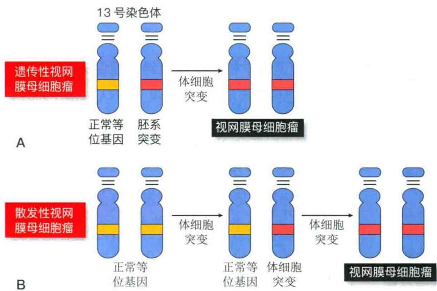 
图5-19视网膜母细胞瘤的“二次突变”起源。A.遗传性视网膜母细胞瘤的儿童在出生时即携带有Rb基因的一个等位基因的胚系突变，该基因位于13号染色体长臂。发生在视网膜的体细胞再次突变，导致功能性Rb等位基因的失活，继而引起视网膜母细胞瘤的发生；B.散发性视网膜母细胞瘤中，儿童出生时携带两个正常的Rb等位基因。这就需要两次独立的体细胞突变才能灭活Rb基因的功能，并引起肿瘤性克隆的出现
（3）其他肿瘤抑制基因：具有肿瘤抑制活性的基因数目非常庞大。某些胚系突变与临床综合征相关，具有易发恶性肿瘤的倾向。以下例举几个典型的例子。
■APC：该基因与结肠家族性腺瘤性息肉病和大多数的散发性结直肠癌的发病机制有关（见第13章）。野生型的APC基因产物引发 $\beta$ -连环蛋白的降解，后者位于细胞内，可转导表面黏附分子E-钙黏蛋白的信号。 $\beta$ -连环蛋白可以上调促进细胞周期进程的多种基因。因此，无功能的APC基因产物引起过度的细胞增殖。APC基因和 $\beta$ -catenin同时发生突变也可见于其他的恶性肿瘤，包括恶性黑色素瘤和卵巢癌。
肾母细胞瘤基因1（WT1）：WT1基因在某些情况下作为肿瘤抑制基因发挥作用，在有些情况下则作为原癌基因，其过度表达的最终结果取决于整体情况。WT1是肾母细胞瘤中第一个被发现的肿瘤抑制基因，但是只有约 $15\%$ 的散发性儿童肾肿瘤存在WT1基因突变。然而，大多数的肾母细胞瘤（以及许多其他种类的肿瘤）常常产生较多的正常WT1蛋白。WT1的原癌基因活性至少部分是通过其抗凋亡作用体现的。
乳腺癌基因1（BRCA1）和BRCA2：BRCA1和BRCA2是肿瘤抑制基因，编码的蛋白在DNA修复中起重要作用。这些作用包括DSBs（见上文）、细胞周期检控点控制以及特定的有丝分裂期调节。发生于这些基因的胚系突变引发乳腺和卵巢细胞的基因组不稳定性。至70岁时，具有遗传性BRCA1突变的女性，乳腺癌累积患病风险达 $80\%$ 和卵巢癌达 $35\%$ 。存在BRCA2胚系突变的女性，一生中乳腺癌的累积患病风险为 $50\%$ ，卵巢癌为 $10\% \sim 15\%$ （见第19章）。
绝大多数具有BRCA1和BRCA2基因胚系突变的女性为胚系杂合子，而乳腺癌和卵巢癌患者是其剩下的正常等位基因发生了体细胞突变（即LOH，见上文）。
■ 磷酸酶和张力蛋白同源物基因（PTEN）：PTEN为位于10号染色体上的重要肿瘤抑制基因，在人类肿
瘤中的突变频率仅次于 $p53$ 基因。正常的PTEN对于染色体稳定性的保持具有重要意义，它的丢失会引起染色体的显著改变。PTEN的重要性体现在抑制散发性（即非遗传性）肿瘤的发生。PTEN单个等位基因的丢失或突变可普遍见于多种肿瘤中，包括脑组织肿瘤、乳腺癌、结肠癌、肺癌和前列腺癌。PTEN纯合性突变在多种肿瘤中也常见，特别是子宫内膜癌和胶质母细胞瘤。
PTEN蛋白具有多种功能，包括对DNA损伤、细胞凋亡、细胞周期进程、老化、趋化性和血管形成的影响。正常情况下，PTEN使磷脂酰肌醇三磷酸肌醇（PIP3，一种脂质信号中间物）去磷酸化，激活大量的靶分子。PTEN活性的降低使得PIP3发生累积并因此组成性激活多种信号转导通路。这些通路包括AKT和mTOR通路，它们与细胞增殖和存活有关，并且在肿瘤发生中具有关键作用。
由此产生的信号通路激活，提高了细胞代谢能力并引起葡萄糖和氨基酸的细胞受体增加，因此更易满足肿瘤细胞生物合成的需要。
■ 神经纤维瘤病基因（NF）-1：1型神经纤维瘤病与NF-1基因的胚系突变有关，NF-1编码ras基因的负性调控因子神经纤维瘤蛋白（neurofibromin）。NF-1的失活使ras基因功能失去拮抗，因此促进细胞增殖。1型神经纤维瘤病患者发生神经源性肉瘤的危险性增高。
von Hippel-Lindau基因（VHL）：VHL基因胚系失活与同名的综合征相关。VHL综合征包括一系列特征性的肿瘤，包括肾细胞癌、胶质母细胞瘤、嗜铬细胞瘤、胰腺胰岛细胞肿瘤等。通过突变或是启动子甲基化（见下文）致使VHL基因的一对等位基因均失活的情况，也可见于散发性的肾细胞癌。
VHL蛋白是一种泛素连接酶，其作用是降解转录因子缺氧诱导因子（HIFs）。与VHL失活相关的肿瘤
发生，主要是通过HIF的促肿瘤生长作用。有趣的是，相似的HIF激活常常发生在许多缺乏VHL基因突变的肿瘤中心缺氧区。正常的VHL蛋白还具有不依赖HIF的肿瘤抑制活性，包括：①促进细胞凋亡；②通过与基质蛋白黏附，增加细胞的不可移动性；③抑制特定细胞的活化反应。
前述的肿瘤抑制基因只是数量庞大的该类基因的典型代表。它们在肿瘤发生的过程中，特别是细胞增殖中起负性调控作用。
# 四、多数肿瘤中端粒酶被激活
随着细胞持续性的分裂，染色体末端的端粒逐渐缩短（见第1章）。最终，DNA双链的缩短引起关键性编码序列的丢失。在细胞DNA修复机制的作用下，这种结果使染色体末端通过末端-末端重组而产生非整倍染色体。大多数正常人类细胞并不表达端粒酶，端粒酶的功能是识别染色体的末端，并在末端增加重复序列以保持端粒的长度。不足为奇的是：终生都需要分裂的细胞（如定向造血干细胞、胃肠道上皮细胞及干细胞），能够表达端粒酶。
推测作为一种对基因组不稳定性的保护性适应，癌细胞重新激活了端粒酶，并且 $80\%$ 的人类肿瘤表现出端粒酶活性增高。该酶的表达实际上通过抑制进一步发生致死性的染色体不稳定而保护癌细胞。因此，
端粒酶的激活允许肿瘤发生，但不是直接引起肿瘤（图5-20）。
# 五、表观遗传学机制既能阻碍也能促进肿瘤发生
表观遗传学被定义为不依赖于DNA碱基序列的基因表达改变，它在肿瘤发生的过程中发挥了重要的作用。下面我们讨论一些表观遗传因素：
■ DNA甲基化是最广为人知的表观遗传因素。甲基化的水平，不论低甲基化还是过度甲基化，在癌发生中均十分重要。
超甲基化：很多癌具有明显的CpG岛（富含胞嘧啶-鸟嘌呤碱基序列的区域）甲基化。这些序列位于肿瘤抑制基因如Rb、VHL和BRCA1的启动子区中。这些基因通过超甲基化而被抑制，可能是二次打击的一种形式，造成基因功能的杂合性缺失。
低甲基化：大多数癌组织与相应的正常组织相比，表现出总体的低甲基化。此种改变会随着从良性增生到恶性肿瘤的恶性发展过程而增加。DNA甲基化不足，会使DNA结构不稳定，并在有丝分裂过程中趋向于重组，容易发生缺失、移位、染色体重排及非整倍性，所有这些改变均会促进细胞的恶性转化。
组蛋白修饰，通过甲基化、乙酰化或其他机制进行的组蛋白修饰，可影响很多基因的活性（如转录、DNA修复及DNA复制）。组蛋白乙酰化修饰通常与
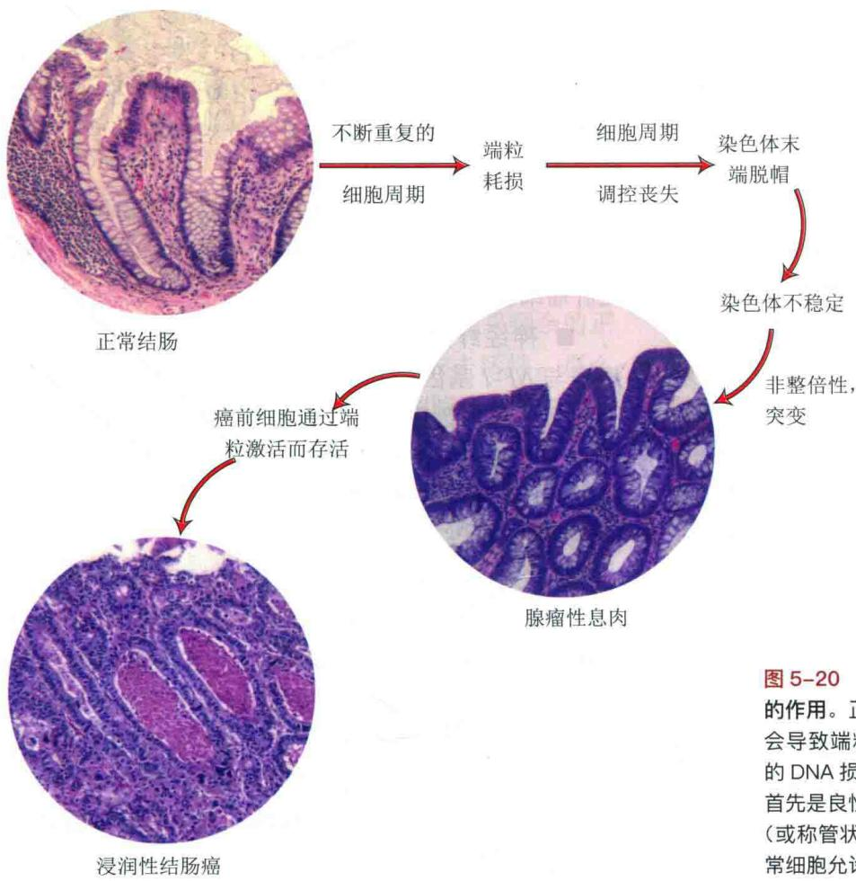 
图5-20 端粒耗损及后续的端粒激活在癌症发生过程中的作用。正常结肠黏膜具有上皮细胞持续更新的特点，这会导致端粒的缩短，继而引起染色体末端的脱帽。累积的DNA损伤可能影响细胞周期调控，从而引发多种突变。首先是良性的结肠上皮细胞堆积生长（即腺瘤性结肠息肉）（或称管状腺瘤，见第13章）。通过端粒激活而保存的异常细胞允许更多的突变发生，并最终发生恶性转化
转录激活相关，反之，组蛋白去乙酰化修饰则与转录沉默相关。组蛋白修饰和DNA甲基化的结合构成了一个复杂的调控网络，如被破坏则倾向发生肿瘤。
■微小RNA（miRNA）与癌。许多非编码DNA可被转录为不参与翻译过程的RNA，这类RNA在基因表达中发挥调节作用。微小RNA是一种具有双链结构的长度为22个碱基对的RNA，目前已被记录的有1000多种。微小RNA与mRNA相关，两者互补。两者结合会引起转录本的剪切或是降解。现已发现miRNA对于一些人类肿瘤的发生和生长具有重要意义，包括肺、结肠、乳腺、胰腺和造血系统的肿瘤。与其他的表观遗传因素一样，miRNA可以具有癌基因或是肿瘤抑制功能，这取决于其靶基因。
# 六、程序性细胞死亡的失调在肿瘤发生中起关键作用
任何器官的细胞总数反映出细胞分裂和细胞死亡的一种平衡状态，当这种平衡受到干扰时可引起肿瘤的发生。程序性细胞死亡存在两种重要的机制，即细胞凋亡和自噬（见第1章）。这一过程的失调被认为与肿瘤的发生有关。
人类癌症中抑制细胞凋亡作用最突出的例子，是B细胞肿瘤中抗凋亡蛋白bcl-2的水平上调。滤泡性B细胞淋巴瘤（见第20章）存在一种特征性的染色体易位——t（14；18），此时位于18号染色体的bcl-2基因处于免疫球蛋白轻链启动子的转录调控下，因此引起bcl-2的过表达。由于bcl-2的抗细胞凋亡特性，从而引起受累淋巴结的肿瘤性克隆的累积。bcl-2表达增多也可见于某些其他类型的肿瘤，如肺癌和非霍奇金淋巴瘤。
自噬过程伴随着大量细胞组分的降解（见第1章）。某些癌基因的表达产物，如ras，容易刺激自噬的发生并最终导致细胞衰老或死亡。自噬因而成为另一种程序性细胞死亡通路，可以阻止癌症的发生。例如，某些肿瘤抑制蛋白持续促进自噬过程，如PTEN，反之，一些癌基因蛋白可抑制该过程（如Akt、Bcl-2、mTOR）。
# 第九节 病毒和人类肿瘤
尽管有病毒癌基因的存在，人类肿瘤中明确地与病毒感染有关的肿瘤数量有限。然而，据估计病毒感染大约与 $15\%$ 的人类癌症有关。病毒感染和人类癌症发生的关系最密切的是：
人T细胞白血病病毒-I（HTLV-I）与T细胞白血病/淋巴瘤 
HPV与宫颈癌 
乙型肝炎病毒（HBV）及丙型肝炎病毒（HCV）
与原发性肝细胞肝癌
■Epstein-Barr病毒（EBV）与特定类型的淋巴瘤及鼻咽癌 
人疱疹病毒8（HHV8）与卡波西肉瘤
全世界病毒相关的肿瘤中 $80\%$ 因单纯感染HBV、HCV或HPV所致。
# 一、人T细胞白血病病毒-I具有嗜淋巴性
成人型T细胞白血病是与一种RNA反转录病毒感染紧密相关的人类恶性肿瘤，日本南部和加勒比海为其流行地区，其他地区为散发。病原体HTLV-I对 $\mathrm{CD4^{+}T}$ 淋巴细胞具有亲嗜性，并被认为与一些神经系统疾病的发生有关。据估计，不足 $5 \%$ 的HTLV-I感染人群发生白血病，并且这些人群在白血病发生前可有长达40年的潜伏期。HTLV-I对机体的致癌刺激主要通过病毒蛋白tax所介导，后者能够增加来自它自己的病毒基因组的转录并促进参与细胞增殖的基因的激活。
# 二、DNA病毒编码的蛋白质与调节蛋白相结合
4种DNA病毒（HPV、EBV、HBV和HHV8）被认为是某些人类肿瘤发生的原因。致癌DNA病毒的转化基因与细胞内基因不具同源性，而RNA反转录病毒（癌基因）来源于并且同源于它们的细胞内对应基因（原癌基因）。如上所述，致癌DNA病毒具有可编码蛋白产物的基因，可与特殊的宿主蛋白（肿瘤抑制基因产物如 $Rb$ 、 $p53$ ）相结合并致后者失活，从而参与细胞增殖和凋亡的调节。
1.人乳头瘤病毒HPV引起人体的病变会逐渐进展为鳞状细胞癌，这些病毒表现出对上皮组织的显著亲嗜性，并且它们完整的生命复制周期仅发生在鳞状细胞内。至少20种HPV类型与宫颈癌相关，特别是HPV-16和HPV-18（见第18章）。HPV编码的主要致癌蛋白为E5、E6和E7。E6结合于p53并促进其降解。E7结合于Rb蛋白并因此阻断其抑制细胞周期进程的作用。E5激活EGFR。
2.Epstein-Barr病毒 EBV是一种广泛传播的人类疱疹病毒，世界上 $95\%$ 的成人体内存在其抗体。EBV感染B淋巴细胞并将其转变为拥有无限生存期限的淋巴母细胞。少数初次EBV感染者中，这种淋巴母细胞样的转化可表现为传染性单核细胞增多症（见第9章），后者为一种暂时性淋巴细胞增生性疾病。然而，EBV也与某些人类肿瘤的发生密切相关。
在体外，B淋巴细胞被EBV感染后可获得无限增殖的能力。一些 $EB$ 病毒基因与这种淋巴细胞永生化相关，包括EB核抗原（EBNAs）和潜在感染相关膜蛋白（LMPs）。游离型EBNAs可修复EBV基因组，
并激活病毒和细胞基因的转录。LMP1与某些细胞内蛋白反应，后者在正常情况下传导来自肿瘤坏死因子（TNF）受体的信号，这是淋巴细胞激活以及增殖的关键途径。EBNAs和LMPs均可在大多数EBV相关的癌中检出。包括下列肿瘤：
（1）伯基特（Burkitt）淋巴瘤：非洲伯基特淋巴瘤是一种B细胞肿瘤，肿瘤性的淋巴细胞中无一例外地含有EBV的DNA并表达EBV相关抗原（见第20章）。在非非裔人群中也可以发生Burkitt淋巴瘤，但是只有 $20\%$ 的患者其肿瘤细胞中包含EBV基因组。Burkitt淋巴瘤好发于赤道附近的非洲地区的原因尚不清楚，但普遍认为疟疾流行造成的对免疫系统的长期刺激是引起这一现象的关键原因。如上所述，非洲Burkitt淋巴瘤存在一种染色体的易位，为 $c$ -myc原癌基因被易位至邻近免疫球蛋白启动子的区域，因而造成 $c$ -myc基因的失调。最终引起B淋巴细胞恶性克隆的无限增殖。
（2）免疫缺陷状态下的多克隆性淋巴组织增生症：先天性或获得性免疫缺陷状态，可并发由EBV引起的B细胞增殖性疾病。这些损害在临床上及病理上可能与真正的恶性淋巴瘤难以区分，但是它们的不同点在于前者中大多数为多克隆性。免疫抑制状态的肾移植接受者，患淋巴瘤的风险为正常人的 $30\sim 50$ 倍。器官移植相关的淋巴组织增生症的所有患者中，肿瘤组织中存在EBNA或者EBV基因组物质。相似的B细胞增殖性疾病可见于一些其他的获得性免疫缺陷状态，最著名的就是艾滋病。
（3）鼻咽癌：鼻咽癌是世界范围发生的具有多种亚型的鳞状细胞癌，尤其在非洲和亚洲的某些区域高发。EB病毒的DNA和EBNA可见于患有该疾病的所有患者中。鼻咽癌的发病机制可能与患者在幼年时期感染EB病毒相关，在患者 $40\sim 50$ 岁时，EB病毒会重新激活，并在这之后 $1\sim 2$ 年发生肿瘤。幸运的是， $70\%$ 的鼻咽癌患者仅通过放射治疗即可治愈。
3. 乙型肝炎病毒（HBV）和丙型肝炎病毒（HCV）流行病学研究表明，HBV和HCV的慢性感染（慢性肝炎及肝硬化）与原发性肝细胞肝癌的发生密切相关（见第14章）。有两种理论可用来解释病毒相关性肝癌的肿瘤发生机制。一种理论认为，持续性的肝细胞增殖伴随着慢性肝损害并最终引起细胞的恶性转变。另一种理论认为病毒编码蛋白（HBx基因产物，可使p53失活）参与了HBV引起的肝细胞肝癌的发生，对其机制仍有争议需进一步研究。
4.人疱疹病毒-8 卡波西肉瘤为一种血管肿瘤，最初报道发生在东欧老年男性，之后发现也存在于中非黑人中（见第10章）。目前卡波西肉瘤是最常见的
艾滋病相关肿瘤。该肿瘤细胞含有一种新的疱疹病毒HHV8的序列。有趣的是，HHV8也可以见于HIV阴性的卡波西肉瘤患者的样本中。如同其他的DNA病毒，病毒基因组编码的蛋白可干扰p53和Rb的抑癌途径。
# 第十节 化学物质致癌
化学物质致癌的研究领域起源于200年前对一种职业病的研究。英国内科医师佩西瓦尔·波特发现烟肉清扫工阴囊癌高发与一种特殊的化学物质，即烟尘接触相关。今天我们知道，有机物燃烧产生的某些物质，人为地造成了肺癌在吸烟者中的流行。
化学物质引起癌的实验可追溯至1915年，日本研究者将煤焦油涂在兔子的皮肤上产生皮肤癌模型。此后，有机致癌物及非有机致癌物的名单以指数方式增长。然而有一个已存在多年的奇怪的悖论。许多已知为潜在性致癌物质的复合物在化学反应中为相对惰性的。这个谜题在20世纪60年代早期得到了解答，即大多数（尽管不是全部）的化学致癌物在它们与细胞组分发生反应前需要代谢活化。在实验观察以及致突变性与致癌性密切相关的基础上，在10年后建立了埃姆斯实验，其是一种利用沙门菌生物来检测潜在的化学致癌物的实验。随后，大量的基因毒性分析方法被建立，并且至今仍被用于检测化学物质和新型药物的潜在致癌性。
# 一、化学致癌物质通常为致突变剂
致突变剂是一种可以永久改变细胞基因结构的试剂。大约 $90\%$ 的已知致癌物在一系列的体外试验系统中可以导致突变，包括在细菌、繁育的动物和培养的人体细胞中。此外，绝大多数但并非所有的致突变剂都具有致癌性。因为都会对DNA造成损伤，所以致癌性和致突变性间可能存在密切联系。尽管并非绝对，体外诱变分析实验已经被证明是检查化学物质是否具有致突变性的很有价值的方法。
# 二、化学致癌是一个多阶段的过程
化学致癌被普遍理解为一个涉及大量突变的多步骤过程。这一过程可以概括为化学致癌的四阶段：
1. 启动阶段 可能表现为单一细胞的突变。 
2. 促进阶段 反映了启动阶段中突变细胞的克隆扩张，突变使得细胞获得生长优势。在促进阶段中，发生基因突变的细胞仍然需要促进生长的刺激剂持续存在。刺激剂可以是外源性的化学因素或者物理因素，或是反映了某种内源性机制（如乳腺和前列腺的激素刺激）。 
3.进展阶段是自主生长阶段（即不依靠致癌剂或促进剂）。至此，细胞已经积累了足够的变异而具有
永生化的能力。
4. 癌症阶段 是整个过程的最后一个阶段，此时细胞已经具有了侵袭和转移的能力。
以皮肤、子宫颈和结肠为例的上皮组织中的形态学变化，是反映人类癌症发生多阶段过程的最好例证。尽管在启动阶段没有可见的形态学变化，但是在促进阶段、进展阶段可以依次表现出增生、异型增生和原位癌。
# 三、化学致癌物通常经过代谢活化
大约有75种化学物质被认为是人类致癌物。化学物质可直接引起，或者更多见的是通过代谢活化后引起癌症。直接产生作用的致癌物，具有与细胞内大分子共价结合的活性。而大多数有机致癌物需要通过转化，最终成为更具活性的复合物。这种转化是通过酶催化并且绝大多数是通过细胞内参与药物代谢和解毒作用的系统来完成的。机体内的许多细胞，特别是肝细胞，具有将致癌物前体转变为其活性形式的酶系统。然而每一种致癌剂都有自己的靶标组织谱，通常仅限于一种器官。化学致癌物质的器官特异性机制尚未充分了解。
多环芳烃：多环芳烃是研究最广泛的物质之一。这种物质有广泛的靶器官，而且在实验模型中通常在其应用部位引起癌症，包括皮肤、软组织和乳腺。因其存在于香烟烟雾中，所以被认为与肺癌发生关系密切。多环芳烃可被细胞色素P450依赖的多功能氧化酶代谢为亲电环氧化物，后者可依次与蛋白质和核苷酸发生反应。例如，氯乙烯这种被用于合成广泛使用的聚氯乙烯塑料的简单双碳分子，可被代谢为具有致癌性的环氧化物。暴露在含有氯乙烯单体环境中的工人会发生肝血管肉瘤。
烷化剂：许多化疗药物（如环磷酰胺、顺铂、二甲磺酸丁酯）是将烷基（甲基、乙基等）转移至大分子物质上的烷化剂，其中也包括DNA中的鸟嘌呤。尽管这些药物可通过损伤DNA来杀死癌细胞，它们也同时损伤了正常细胞。因此，采用烷化剂化疗，显著增加日后发生实体瘤和血液系统恶性肿瘤的风险。
黄曲霉素：黄曲霉素B1作为黄曲霉菌落的一种自然产物，是现今认识到的最有效的致肝癌物质之一。与多环芳烃一样，黄曲霉素B1可被代谢为一种环氧化物，后者以共价键形式结合于DNA。由于黄曲霉菌的普遍存在，暴露于温暖潮湿环境中的花生和谷物的黄曲霉菌污染，可导致大量的黄曲霉素B1的形成。现已表明，除HBV和HCV外，富含黄曲霉素的食物也可能与非洲和亚洲的某些地区肝癌的高发病率相关。令人感兴趣的是，在饮食中富含黄曲霉素的地区所发
生的人类肝癌，很多携带有特异性的 $p53$ 基因的失活突变（249位密码子的 $\mathrm{G}:\mathrm{C}\rightarrow \mathrm{T}:\mathrm{A}$ 转换）。
芳香胺类和偶氮染料：与多环芳烃不同，芳香胺类和偶氮（氨基苯）染料通常不在使用部位致癌。但职业性的偶氮染料接触可引起膀胱癌。芳香胺类和偶氮染料都主要在肝中被代谢并形成羟胺衍生物，后者再通过与葡萄糖醛酸结合而被解毒。在膀胱中，葡萄糖醛酸化物水解释放出有活性的羟胺。
亚硝胺：因其被怀疑在胃肠道和肺的肿瘤以及其他癌症的发生中可能起作用，所以亚硝胺的致癌性得到广泛研究。亚硝胺是灵长类动物的潜在致癌物，但在人类缺乏明确的诱发癌症依据。然而，中国河南食管癌的极高发病率（较其他区域高约100倍）与其饮食中的高亚硝胺含量相关。亚硝胺可能也与其他胃肠道肿瘤相关，因为通常为保存加工肉类和其他食物而添加的亚硝酸盐可能会与食物中的其他成分发生反应而形成亚硝胺。烟草特有亚硝胺也被认为具有相同的作用。亚硝胺通过羟基化被激活并形成有活性的烷基化碳离子。
金属：一些金属或者金属复合物可引起癌症，但是其致癌机制尚未明确。二价金属阳离子如镍离子、铅离子、镉离子、钴离子和铍离子具有亲电性，因而能够与大分子发生反应。大多数金属诱导的癌症与职业接触有关（见第8章）。
# 四、内源性因素和环境因素影响化学致癌作用
化学致癌在实验动物中的作用需要考虑多种因素，包括遗传因素、种类和品系、年龄和性别、激素状态、饮食以及药物代谢系统诱导剂和促癌剂的存在或缺乏。这些因素在人类的相似作用已经依据流行病学研究而得到推测，但其细节仍不清楚。
# 第十一节 物理致癌作用
这里讨论的具有致癌作用的物理因素为紫外线、石棉和异物。放射性致癌作用将在第8章进行讨论。
# 一、紫外线可引起皮肤癌
深褐色肤色作为现今的时尚不仅带来了面部皮肤化妆品行业的恶化，也带来了常见的皮肤癌发病率升高。由于日光照射而导致的癌主要发生在白种人，包括基底细胞癌、鳞状细胞癌和黑素瘤。有色人种的皮肤可通过增加能吸收紫外线的黑色素的浓度来进行保护。在白种人中，日光暴露部位的皮肤最易发生皮肤癌。此外，完全的日光暴露与皮肤癌的发病率之间存在直接相关性。
紫外线谱中只有一部分与组织损伤相关，而且只
有 $290\sim 320\mathrm{nm}$ 波长的紫外线具有致癌作用。紫外线对细胞的作用包括灭活酶、抑制细胞分裂、致突变、引起细胞死亡和癌变。紫外线最重要的生物化学作用是形成DNA嘧啶二聚体，这与任何其他致癌物质引起的DNA损伤均有区别。二聚体的形成产生环丁烷环，后者使每个二聚体区的双螺旋磷酸二酯骨架发生扭曲。除非被核苷酸切除修复途径有效地去除，否则紫外线造成的基因组损伤具有致突变性和致癌性。
着色性干皮病是一种常染色体隐性遗传病，该病验证了DNA修复在对抗紫外线损伤时的重要作用。在这种罕见的疾病中，患者对日光高度敏感并伴发高的皮肤癌发病率，包括基底细胞癌、鳞状细胞癌和黑素瘤。着色性干皮病的皮肤肿瘤性疾病和非肿瘤性疾病，均由紫外线损伤DNA的切除缺陷引起。
# 二、石棉引起间皮瘤
肺石棉沉着症和石棉沉着相关性肿瘤将在第12章进行讨论。石棉是一种广泛应用于建筑业、绝缘体和制造业的材料，包括了具有不同物理形式的相关硅酸盐纤维家族。
与石棉暴露相关的特征性肿瘤是胸膜腔和腹膜腔的恶性间皮瘤。这种肿瘤在正常人群中极其罕见，而在重度暴露的工人中其发病率据报道达 $2\% \sim 3\%$ （某些研究中甚至更高）。潜伏期（即暴露与肿瘤发生的间隔时间）通常为20年，但也可以是这个数据的2倍。合理的解释是胸膜和腹膜的间皮瘤是这些膜结构与通过淋巴网转运来的石棉纤维发生密切接触的结果。尽管石棉相关的间皮瘤的发病机制尚不清楚，但它对公共健康的显著危害已经被充分认识，并且引起了人们对这种材料使用的极大关注。
# 第十二节 肿瘤免疫学：动物和人类的抗肿瘤免疫防御
免疫系统具有区分自己和非己分子的方法，并且该方法已被证实在抗感染时非常有效。肿瘤作为非己结构，携带有特殊的肿瘤特异性抗原，后者能够引起保护性的免疫应答，这点已经在实验动物得到广泛证实。然而，这些研究与人类肿瘤的关系仍然未被证明。可将与致癌病毒无关的肿瘤抗原分类如下：
肿瘤特异性抗原（TSAs）：TSAs是指体细胞突变或变异造成的肿瘤所特有的蛋白质（或其他）改变。因此，机体对其没有预先存在的免疫耐受性。理论上，这些蛋白质或抗原片段因此被提呈至免疫系统，并被作为免疫标靶。然而，大多数TSAs倾向于特异表达在某些患者的肿瘤，而对肿瘤的类型没有特异性，使得免疫靶向治疗复杂且高度个体化。
肿瘤相关性抗原（TAAs）：TAAs是指正常蛋白质的产生过量或是出现了不同于正常表达的情况。由于TAAs原则上被免疫系统识别为“自己”，因此机体对其具有免疫耐受性，不会引起有效的免疫应答。然而，某些抗原（如CEA、血清甲胎蛋白）可以作为患者肿瘤发生和进展的标记物。
截至目前，人类通过免疫介导机制（免疫监视）对肿瘤进行自然调控的证据很少。这一领域的很多研究兴趣被导向可能应用于治疗的研究。因肿瘤可能通过某些机制来逃避免疫介导的破坏，使得发展有效的肿瘤免疫治疗方法变得复杂。逃避免疫攻击的途径包括产生免疫抑制因子，抵抗细胞毒性淋巴细胞的溶解作用，抑制细胞凋亡信号以及改变抗原性。有趣的是，有明确的证据表明突变的p53通过避免由细胞毒性T淋巴细胞（CTLs）引起的颗粒酶介导的细胞凋亡（见第1章）来保护癌细胞。
# 第十三节 癌对宿主的全身性影响
在大多数情况下，癌症的症状与原发性肿瘤或者其转移灶的局部作用有关。但是，对于少数患者来说，癌症会产生远隔效应，这些效应并不是由肿瘤侵袭或转移引起的，而是与肿瘤产生的具有生物活性的化合物相关。这类影响被统一称为副肿瘤综合征。尽管这些症状很少会带来致命的影响，但是在某些情况下，它们是临床上的主要症状。副肿瘤综合征也具有诊断上和治疗上的意义。
一般的全身性影响包括：
■ 发热：癌症患者首先表现为不明原因的发热症状是很常见的，这种发热不能用感染性疾病来解释。癌症引发的发热：①与肿瘤的生长相关；②会在治疗后消退；③随着癌症复发会再次出现。这可能与肿瘤或相关的间质炎症细胞释放的致热源有关。
■食欲缺乏及体重下降：对于癌症患者来说，食欲缺乏、体重下降和恶病质是非常常见的副肿瘤综合征，通常在恶性肿瘤尚不明显之前就已出现。产生这一现象的机制不是很清楚，不过可能会和一些细胞因子的产生有关，包括TNT-α、干扰素和IL-6。
内分泌综合征：恶性肿瘤可能会产生一些在正常调节过程中不会分泌的多肽激素。绝大多数这样的激素通常出现在大脑、胃肠道和内分泌器官。它们的非正常分泌会造成一系列的影响。库欣综合征（见第21章）、抗利尿激素分泌异常、高钙血症和低钙血症、促性腺综合征以及低血糖都是由于肿瘤异常分泌的激素引起。
■ 神经系统和神经肌肉综合征：神经疾病常见于癌症患者之中，通常是由转移瘤或是内分泌或电解质
紊乱引起的。血管性、出血性和感染性等情况对神经系统的影响也非常常见。然而，恶性肿瘤还有很多其他的神经系统并发症，许多症状在肿瘤被发现之前就已表现出来，这种情况很多是由自身免疫机制所介导的。例如，患有小细胞肺癌（见第12章）的患者可出现多种类型的神经肌肉性的副肿瘤综合征，后者由一种抗RNA结合蛋白Hu的循环抗体所致。
■神经肌肉接头障碍：最常见的就是胸腺瘤。大约 $15\%$ 的重症肌无力患者都患有胸腺瘤，而大约 $50\%$ 的胸腺瘤患者都患有重症肌无力。针对烟碱型乙酰胆碱受体的自身抗体是导致这一症状的主要原因。EatonLambert综合征是一种罕见的肌无力疾病，与小细胞肺癌有密切关系。尽管这些症状表面上与真正的重症肌无力相似，但肌肉力量会因锻炼而改善，而抗胆碱酯酶治疗却收效甚微。
■造血系统综合征：肿瘤性疾病引起的最常见的造血系统并发症，是由直接浸润骨髓或化疗所致。然而，在现代化疗和放射疗法出现之前，造血系统副肿瘤综合征就已经有详细描述。红细胞数量增多（红细胞增多症）、贫血、白细胞和血小板缺陷的病因可能与副肿瘤综合征有关（也可能是自身免疫）。
■ 高凝血状态：早在一个世纪之前，就有关于癌症与静脉血栓之间联系的记载。自那时起，高凝血状态引发的其他异常（如弥散性血管内凝血，DIC）和无菌性血栓性心内膜炎）就已经被人们所认识。引发这种血液高凝状态的原因依旧备受争议。静脉血栓和胰腺癌具有最显著的联系，胰腺癌患者的这种并发症的发生率升高了50倍。在胃肠道分泌黏液的腺癌和肺癌中也很常见。DIC（见20章）常见于急性早幼粒细胞性白血病和腺癌。无菌心内膜炎（纤维蛋白和血小板沉积于左心瓣膜）见于癌症患者，特别是非常衰弱的患者（见第11章）。在这种情况下，患者发生脑栓塞和少见的冠状动脉栓塞的危险极大。这类心脏并发症常见于实体肿瘤，但偶尔也可见于慢性白血病及淋巴瘤。
# 一、癌也会影响许多其他器官系统
癌症既可以通过癌细胞生长的直接作用也可以通过肿瘤伴随作用，影响许多其他器官系统。常见的受影响器官系统包括：
胃肠道系统：对多种食物成分吸收不良是偶见的肿瘤伴随症状， $50\%$ 的癌症患者发生小肠的组织学异常，尽管肿瘤可能并未直接累及肠道。
■肾脏：肾病综合征是癌症常见的并发症，这是肾静脉血栓或淀粉样变的结果。肾病综合征这种副肿瘤性并发症也可以表现为微小病变的形式，特别在霍
奇金淋巴瘤中。也可发生膜性肾小球肾炎，通常与消化道和肺部的腺癌相关。
■皮肤：一些色素性病变和角化病是已经熟知的副肿瘤性作用。黑色棘皮病是一种以过度角化和腋下、颈部、褶皱部位以及生殖器处的色素沉着为标志的皮肤病变。令人感兴趣的是，超过一半的黑色棘皮病患者患有癌症。黑色棘皮症可在癌症检出前、同时或检出后发生。超过 $90\%$ 的病例患有消化道癌，其中胃癌占 $1 / 2 \sim$ 到 $2 / 3$ 。某些淋巴瘤和霍奇金病在肿瘤没有累及任何皮肤的情况下，偶尔会伴发剥脱性皮炎。
# 二、癌症的全身作用可能会引起淀粉样变性
大约 $15\%$ 的淀粉样变病例都和癌症有关，多发性骨髓瘤和肾细胞癌中尤其多见，但也见于其他实体瘤和淋巴瘤（见第23章）。淀粉样变的出现提示预后不良，发生淀粉样变性的骨髓瘤患者中位生存期为14个月。
# 第十四节 癌症流行病学
因癌症而死亡的人数占美国死亡人口总数的1/5，仅次于心脑血管疾病和卒中，位居死因的第二位。在美国，大多数癌症的死亡率在半个多世纪的时间中大部分保持平稳，但也有某些明显的例外（图5-21）。男性肺癌的死亡率自1930年至今出现了明显的上升，而在当时尚属少见肿瘤。现在，肺癌已经成为男性癌症死亡的最常见原因。正如第8章所讨论，肺癌死亡的流行应完全归结于吸烟。对于女性来说，吸烟在第二次世界大战之后才开始流行。把从开始吸烟到发展为肺癌的时间差考虑进来的话，那么1965年以后女性死于肺癌的比例才有所增加就并不奇怪了。在美国，女性死于肺癌的比例已经超过了乳腺癌，像男性一样成为最常见的癌症致死原因。相反，出于难以解释的原因，胃癌作为1930年之前男性中最常见的癌症，同时在女性中也比乳腺癌更常见，如今发病率却表现出显著和持续的下降。类似地，子宫体癌和宫颈癌的死亡率也有明显的下降，这可能是因为有了更好的检查、诊断技术和治疗手段。总之，经过几十年的平稳上升，包括所有癌症在内的年龄调整后死亡率目前处于平稳状态。美国男性和女性所患癌症种类及其发生率的排名见表5-2。
每种癌症都具有其相关年龄谱，但对于大多数人，年龄的增长就意味着患癌概率的增加。年龄依赖性最明显的例子就是前列腺癌， $50\sim 85$ 岁男性的患病概率会增加30倍。某些肿瘤表现出不同的年龄相关的发病高峰，如急性淋巴母细胞性白血病好发于儿童，睾丸癌好发于青年中。
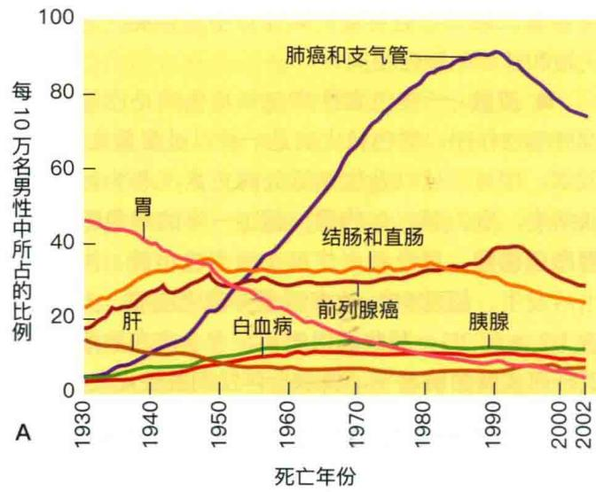
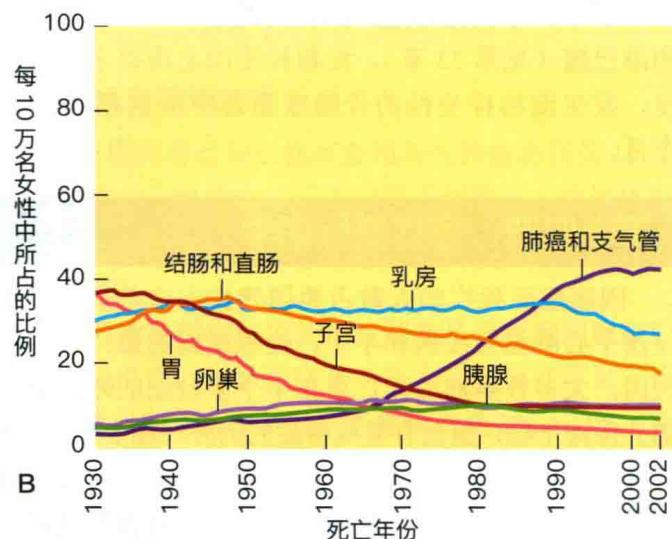 
图5-21 美国的癌症死亡率， $1930\sim 2002$ 年，在男性（A）和女性（B）中
# 一、地域及种族差异影响癌症发生率
很难找到一种癌症在不同种族和地域之间的发生率没有明显差别的，并且很难对这样的差异做出解释。部分原因可能是：基于人群的研究的复杂性、人群中潜在的遗传和环境的多样性以及将动物实验数据运用于人类时的不确定性等。有些假说试图解释为何某些类型的癌症在不同人群中存在发病率上的差异，并已获得了一定程度的认可。包括：
肝癌：原发性肝癌的发病率与HBV和HCV的流行之间有着密切的联系。其流行地区包括非洲撒哈拉以南的大部分地区、亚洲的大部分地区、印度尼西亚和菲律宾。需要注意的是，许多高危地区的主要饮食中黄曲霉素B1的含量较高。
皮肤癌：皮肤癌的发病率与肤色以及日光暴晒有关。因此，澳大利亚北部地区的发病率尤其高，该地区日晒强烈并且现居人口中的绝大多数都源自不列颠群岛（皮肤白皙）。尽管数据尚不充分，肤色偏深的澳大利亚原著居民患皮肤癌的概率较低。在美国西南部的白人中，皮肤癌的发病率高也引人注目。患病比例
最低的是皮肤含有色素的人群（如日本人、中国人和印度人）。非洲黑人尽管肤色较深，但因为脚掌和手掌黑色素瘤的发病率较高，所以偶尔会比亚洲人具有更高的皮肤癌发病率。
表 5-2 男性和女性中最常见的癌症种类及其发生率 
肿瘤类型发病率 (%)男性前列腺33肺和支气管14结直肠11膀胱6黑色素瘤4非霍奇金淋巴瘤4肾3口腔3白血病3胰腺2所有其他部位17女性乳腺32肺和支气管12结直肠11子宫体9卵巢4非霍奇金淋巴瘤4黑色素瘤3甲状腺3胰腺2膀胱2所有其他部位20
前列腺癌：亚洲人口前列腺癌的发病率非常低，特别是日本人，相反美国黑人的发病率最高，比亚洲人高约25倍。美国和欧洲白人的发病率居中。
睾丸癌：睾丸癌的特殊之处在于它在黑人之中非常少见。有意思的是，尽管美国黑人的发病率仅为白人的1/4，但这仍比非洲黑人的发病率高很多。
宫颈癌：宫颈鳞癌的发病率随种族和社会经济水平的不同而差别显著。例如，以色列的北欧犹太人的发病率非常低，与德克萨斯州西班牙人口中高于其25倍的发病率形成鲜明对比。一般来说，社会经济地位较低的群体相对于富裕和受过良好教育的人来说，具有更高的宫颈癌发病率。这种癌症与过早的性行为和多产有直接关系，在没有性生活的女性如修女中很少发
病。丈夫切除包皮的女性也很少患病。宫颈癌和HPV感染的密切联系已经被证实，故它应该被归为性传播疾病。因此，不同的发病率与性行为以及安全套的使用相关。
伯基特淋巴瘤：伯基特淋巴瘤是一种儿童疾病，在乌干达被首次发现，占当地所有儿童肿瘤的 $50\%$ 。随后在其他的非洲国家也观察到本病的高发病率，特别是在高温潮湿的低洼地区。值得注意的是，疟疾在这样的地区也同样流行。慢性疟疾感染和EB病毒之间可能存在相互作用（见上文）。其他热带地区像马来西亚和新几内亚也属高发地区，但欧洲和美洲只有散发的病例。
# 二、对移民的研究为癌症发生提供线索
尽管关于人类癌症病因的设计性实验的可行性较差，某些人口从一个环境迁至另一个环境无意间进行了这样的实验。起初，至少这些人保持了相同的遗传特征，但是新环境会在气候、饮食、感染源和职业等方面有所差别。因而，关于移民的流行病学研究提供了很多可能影响癌症发病的线索。美国作为一直以来最大的移民目的地，是这一领域最重要的数据来源。
胃癌：一项关于夏威夷日本移民的研究表明，来自日本地区的具有罹患胃癌高风险的移民，在夏威夷仍然表现出很高的风险。相反，他们出生在夏威夷的后代就具有同美国白人相同的发病率。尽管饮食因素，如腌菜咸鱼，被推测是日本的发病率高和夏威夷发病
率低的原因，但尚无确切证据支持这一论点。最近的研究表明，在日本胃癌高风险人群中，伴肠上皮化生的慢性萎缩性胃炎也高发，这种损害被认为是胃癌的癌前病变。有趣的是，当来自这些地区的人迁移至低风险地区时，他们仍旧保持了肠上皮化生的高发生率。因此，胃癌相关的环境因素可能不具有直接致癌性，而是与萎缩性胃炎和肠上皮化生有关。
结直肠癌、乳腺癌、子宫内膜癌、卵巢癌和前列腺癌：对移民的结直肠癌发病率的研究呈现出与胃癌相反的态势。来自欧洲和日本低风险地域的移民在美国却表现出结直肠癌发病风险的增加。而且，他们的后代会持续保持高患病风险，并且达到普通美国人口的风险水平。结直肠癌的这一规则同样适用于乳腺癌、子宫内膜癌、卵巢癌和前列腺癌。
肝癌：如上所述，原发性肝癌在亚洲和非洲很常见，在这些地方原发性肝癌与HBV、HCV相关。然而，对于美籍黑人和亚裔，肿瘤发病率同美国白人一样少见这可能反映出慢性病毒性肝炎在美国呈低流行状态。
霍奇金病：在欠发达国家，儿童型霍奇金病是最常被报道的类型。相反，在西方发达国家，这一疾病在青年人中更为常见。尽管没有证据可以表明感染是霍奇金病的病因，但该现象是某些病毒感染的特征性表现。这一普遍规律在日本出现例外，在这样一个发达国家中，青年患病极其少见。有关环境影响的进一步证据是：日裔美国人的霍奇金病发病率高于日本。
（张坤 宋卿卿 石雪迎）
# 第6章 发育和遗传疾病
从基因水平上对遗传性疾病的认识在后人类基因组时代发生了巨大的变化。人类基因组的研究资料，对人类疾病的遗传学基础、易感性和预防提供了很大的帮助。在20世纪90年代早期，每年鉴定出的基因相关性人类疾病不足200种，2005年人类基因组计划开始后，每年可鉴定的疾病约为2000种。到2011年，在约3000种可疑孟德尔遗传性疾病中，已证实有 $1/3\sim 1/2$ 的疾病与特定基因相关。然而，尚不清楚在疾病中人类变异的多方面作用。
围生期胎儿疾病的发病原因可能有以下几种：①胎儿的环境因素；②基因异常；③基因缺陷和环境之间的相互作用。苯丙酮尿症（phenylketonuria，PKU）就是由胎儿基因缺陷和所处环境之间相互作用最终导致疾病的例子。PKU是一种遗传代谢性疾病，由体内苯丙氨酸代谢异常导致。苯丙氨酸是人体生长和代谢所必需的氨基酸，摄入体内的苯丙氨酸一部分用于合成蛋白质，另一部分通过苯丙氨酸羟化酶作用转变为酪氨酸，发挥功能。苯丙酮尿症患儿体内苯丙氨酸羟化酶基因缺失（phenylalanine hydroxylase，PAH），不能将苯丙氨酸转变为酪氨酸。因此，当患儿饮食中存在苯丙氨酸时，会导致苯丙氨酸及其旁路代谢产物苯丙酮酸、苯乙酸和苯乳酸显著增加，最终引起脑损伤而发病。
发育和遗传疾病可分为以下几类：
形态学发生异常 
染色体异常 
■单基因缺陷 
■多基因遗传病
胎儿也可能受到由宫内创伤或分娩经胎盘传递的不良因素的损伤。出生后，胎儿和儿童获得的疾病也是导致发病率和死亡率的重要原因。
# 第一节 发育和遗传疾病的重要性
在美国，每年出生的胎儿中，大约有12万胎儿存在出生缺陷。世界范围内，胎儿出生缺陷的发病率约为 $6\%$ ，其中有300万患儿会面临终身残疾。然而目前大约 $50\%$ 的出生缺陷病因不明。其中在所有的出生缺陷中，仅有不足 $6\%$ 的出生缺陷可以归因于：①子
宫因素；②母体异常，如妊娠期代谢失衡和感染；③其他环境风险（如药物、化学因素和射线）。其余的大部分出生缺陷反映基因缺陷，包括遗传特征或自发突变，或较小数量的染色体异常。虽然有 $50\%$ 的出生缺陷目前仍原因不明，但是新技术的应用将会进一步阐明遗传疾病的机制，特别是那些涉及多种基因和环境因素相互作用的出生缺陷。
染色体异常在胎儿出生缺陷中所占的比例仅仅为一小部分,但是在妊娠早期自发性流产中染色体异常可达 $50\%$ 。在流产胎儿中,特定数目的染色体异常高于足月胎儿,表明大多数这种特定的染色体异常是致命的。因此,只有一小部分遗传学异常的患儿可以活着出生。
在西方国家，发育和遗传缺陷占婴儿和儿童死亡人数的 $50\%$ 。在欠发达国家， $95\%$ 的婴儿死亡是由于环境因素所致，如传染病和营养不良。在工业化国家，为进一步减少出生缺陷需采取的措施包括：遗传咨询、早期产前诊断、识别高危妊娠和避免潜在的环境致畸剂。
# 第二节 畸胎学原理
畸胎学是一门研究发育异常的学科。致畸剂是指能引起发育异常的化学、物理和生物制剂。目前已明确的人类致畸剂有很多，包括大多数的细胞毒性药物、酒精、某些抗癫痫药物、香豆素抗凝血剂、异维甲酸和萨力多胺。然而，许多药物和化学物质对动物来说是致畸剂，因此也应该当作对人类有潜在危险的制剂。
畸形是指形态学缺陷或是由于形态学发生紊乱引发的全部器官、部分器官或器官解剖学部位异常。目前的研究表明，接触致畸剂可以但并不一定会导致机体畸形。根据目前的研究结果，形成了畸胎学的总体原理：
人对于致畸剂的敏感性是可变的。目前的研究推测这种可变性的主要决定因素是胎儿及其母亲的基因型。 
在不同阶段，胎儿对于致畸剂的易感性具有特异性。在发育过程中，大多数致畸剂仅仅在特定的时期具有致畸性（图6-1）。
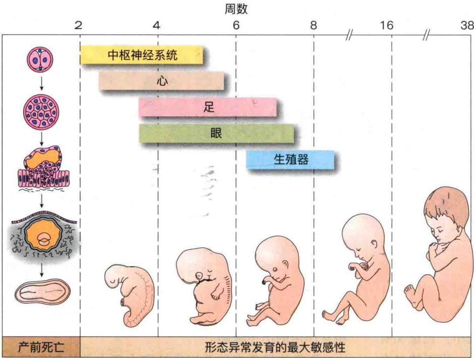 
图6-1在人类胚胎形成的关键时期，特定器官对于特定致畸剂的敏感性。胚胎发育过程中，在受精卵植入子宫内膜前和植入后的早期阶段，不良因素的暴露会导致胎儿出生前死亡。尽管在胚胎发育过程中，不同器官和系统对于致畸剂最敏感的时期不相同，但是大部分都在妊娠前8周之内
■不同致畸剂的致畸机制不同。致畸的药物可以抑制正常形态学发生过程中的关键代谢步骤。很多药物和病毒可以作用于并影响特定的组织（例如：亲神经性、亲心脏性），因此，相比于其他器官，这些药物更容易损害相应的发育器官。
致畸剂的致畸作用具有剂量依赖性。尽管致畸剂的致畸作用存在阈值，但是因为不能预测每一个妊娠妇女的绝对安全剂量。因此，从实用的角度来看，在怀孕期间所有现已明确的致畸剂都应避免使用。
致畸剂引起死亡、生长迟缓、畸形及功能障碍。最终产生的结果取决于致畸因素、母体和胎儿-胎盘单元之间的交互影响。
# 第三节 形态学发生异常
一般来说，外源性毒素作用于胚胎的胚胎植入前的阶段，不会导致形态学发生异常和畸形（图6-1）。在胚胎植入前阶段的接触毒素最常导致的结果是胚胎死亡，这常常会被忽视或被认为是推迟的大量经期出血。受精卵在受精后的 $8\sim 10$ 天受损可能会导致胚叶细胞的不完整分离，最终导致连体双胞胎（“连体婴”）出现。
受精卵的损害如果发生在胚泡植入和早期器官形成时，会发生影响到多个器官系统的最复杂的发育异常。在初始器官和系统发育阶段，胚胎对于致畸剂是最敏感的，许多重大发育异常可能反映缺陷基因的活动或外源性毒素的影响（图6-1）。形态学发生异常可能在以下水平产生相应的后果：①细胞和组织；②器官和器官系统；③解剖学部位。
妊娠3个月后，胎儿接触致畸剂也很少会导致
形态学发生重大异常。然而，妊娠中晚期接触外源性致畸剂，依然会对胎儿在儿童期相应器官或系统的形态发育，尤其是功能产生影响。尽管在妊娠3个月末期，胚胎的各个器官已形成，但是为了适应宫外环境，大多数器官依然需要经历重塑和成熟的过程。不同器官功能成熟所需时间不同；中枢神经系统功能需要在出生后几年的时间才能达到成熟，因此，中枢神经系统在出生后的一段时间内对于不良外源因素依然敏感。
■发育不全（agenesis）是指器官始基发育潜能的缺失。可以表现为：①器官整体缺失，如肾缺失；②器官部分缺失，如大脑胼胝体发育不全；③器官内组织和细胞缺失，如没有睾丸生殖细胞的先天性不育（“Sertoli cell only”综合征）。 
■ 不发育（aplasia）是指一个器官持久以原基或雏形存在，没有成熟的器官。因此，在肺不发育中，主支气管末端盲目地终止在普通组织中，组成导管的雏形和结缔组织组成。 
■发育不良（hypoplasia）是指由于全部或者部分器官的发育的不完整导致的器官体积减小。例如：小眼畸形（microphthalmia）、小颌畸形（micrognathia）和小头畸形（microcephaly）。 
融合异常（dysraphic anomalies）是指相同结构无法融合导致的出生缺陷。例如：脊柱裂，椎管不完全闭合，上覆骨骼和皮肤不融合，导致脊柱中线缺陷。 
退化失败（involution failures）是指应在胚胎发育的特定阶段消失的胚胎及胎儿结构的持续存在。如：甲状腺管的持续存在就是连接舌根和发展中甲状腺的管腔不完全退化的结果。
■分离失败（division failures）是指当某个过程取决于细胞程序性死亡时，胚胎组织的不完全分裂导致。如，手指和足趾是通过损失肢体远端包含软骨的原基之间的细胞，进一步形成趾芽，最终形成。 
■闭锁（atresia）是指一个腔的形成不完整。许多空腔脏器起源于细胞条带和细胞条锁，这些条带和条索的中心通过发生程序死亡来产生中心的管腔。 
■非典型增生（dysplasia）是指组织或细胞的组成异常，最终导致组织发生异常的情况（这不同于第1章和第5章描述上皮癌前病变的“异型增生”）。结节性硬化症是非典型增生的一个明显例子，此病的特点是大脑的异常发育，病理特点是正常发育的细胞聚集并排列成大体可见“块茎”。 
■异位（ectopia or heterotopia）是指一个器官位于其正常解剖位置以外的一种异常表现。因此，异位心不在胸腔。异位甲状旁腺可以在胸腺内前纵隔。 
迁移异常（dystopia）是指特定的器官由于迁移能力不足，依然位于其发育过程的某个部位，而不是迁移到其应位于的正确位置。例如，肾最初位于骨盆腔，然后再迁移出骨盆向头部移动。迁移异常的肾依然位于骨盆腔。迁移异常睾丸滞留于腹股沟管内，而未能下降到阴囊（隐睾症）。
# 第四节 临床上重要的胎儿畸形
■ 畸形综合征（anomalad or complex anomaly）是指与一种发育异常或一种与病理机制相关的病理缺陷模式，即不同的因素通过相同路径导致相同的病变。在Potter综合征中（图6-2），肺发育不全，宫内胎儿窘迫的外部表象和羊膜形态学变化都与羊水过少有关（一种羊水量的严重减少）。不管羊水过少的原因如何，羊膜腔内羊水过少都会导致胎儿出现Potter综合征的一些特征。 
■发育综合征（developmental syndrome）是指与病态基因相关的多种畸形。综合征是指单一因素引起的不同器官畸形，这些器官畸是由其关键发育阶段的同一损害因素导致。很多这样的综合征是由染色体异常或单基因缺陷所致。 
■ 畸形（deformation）是指由机械力量造成的身体某一部分的形成、外形或位置的异常。大多数妊娠中晚期的解剖学畸形属于此范畴。相关的不良机械力可以是外源性的（如子宫羊膜带），也可是内源性的（如中枢神经系统损伤引起的胎儿能动性减少）。
# 一、胎儿酒精中毒综合征
胎儿酒精综合征（fetal alcohol syndrome）是由于妊娠期母体大量饮用含酒精液体所致的一种复杂的胎
儿畸形，包括生长迟缓、中枢神经系统障碍和颜面部畸形。由于不是所有胎儿都会因受到母体酗酒的不利影响，而发生上述畸形，因此胎儿酒精综合征也称之为胎儿酒精效应（fetal alcohol effect）。
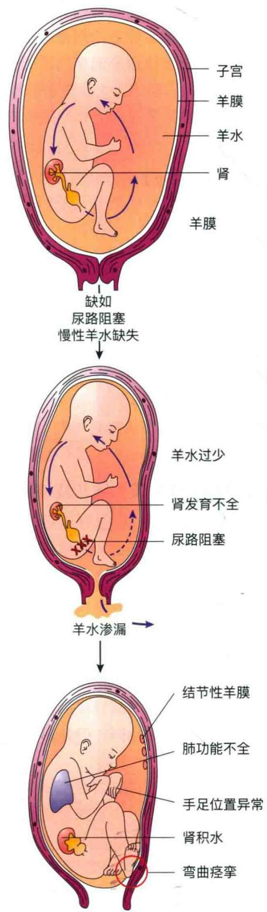 
图6-2Potter综合征。通常胎儿在宫腔内，通过吞咽羊水和排泄尿液维持羊膜腔内羊水的正常容量。羊水过少可引起典型的Potter综合征，其典型表现为胎肺发育不全、扁平鼻、耳大位置低、泌尿系统发育不全以及铲形手和弓形腿等。羊水过少最常见的病因是由于肾疾病（如肾畸形或泌尿系统阻塞）或羊水泄漏，从而使羊水体积减少。虽然羊膜囊外观呈结节状样，但不是Potter综合征的一部分，泌尿系统阻塞以及先天性肾积水的胎儿其羊膜囊有相同的外观畸形

【流行病学和发病机制】在美国和欧洲，胎儿酒精综合征的发病率是 $1 / 1000 \sim 3 / 1000$ 。然而，在酗酒率及高的人群中，发病率可达 $20 / 1000 \sim 150 / 1000$ 。目前研究认为与酒精
效应相关的胎儿畸形，特别是轻度智力缺陷和情感障碍，比完全显性的胎儿酒精综合征更为常见。目前关于能对胎儿造成损害的最低酒精剂量还不清楚，但完全显性的胎儿酒精中毒综合征的患儿其母亲通常是慢性酗酒者。因此，妊娠前期母体大量酗酒是非常危险的。另外，仍不清楚酒精是通过什么机制造成的胎儿发育损害。

【病理和临床特征】临床观察发现，酗酒母体内的胎儿常表现为生长迟缓，且会持续至出生后。

同时，这些患儿还可能表现为小颅畸形，内眦、颧、颧皮折叠，短睑裂缝，上颌发育不全、上唇薄、下唇形和人中发育不全。心脏室间隔缺损患儿多达，同时也可能会发生四肢和关节的微小畸形。
胎儿酒精中毒综合征是胎儿获得性智力发育迟缓的一种常见病因。酒精中毒综合征患儿的IQ值测试，1/5患儿低于70分， $40\%$ 患儿在 $70\sim 80$ 分之间。即使有些患儿IQ测试值在正常范围内，他们日常生活也表现为记忆力差、行为冲动和情绪不稳定（见第8章）。
# 二、营养不良相关性先天无脑儿及神经管缺陷
无脑儿（anencephaly）是指胎儿颅骨与脑组织的先天性缺失，偶见于颅骨低部的脑组织残基。发生该畸形的原因是神经管闭锁不全所致。正常情况下，神经管闭合方向是从颅骨向尾骨方向，因此该闭合过程发生缺陷会导致脊柱畸形。
脊柱裂（spina bifida）是指部分椎管或脊椎未完全闭合，其缺损多在后侧。脑脊膜从脊柱骨缺损处突出，表面皮肤包裹呈囊状，称为脑脊膜膨出。脑脊髓脊膜膨出与脑脊膜膨出的情况相同，但是膨出的疝囊内容物中有脊髓存在。
妊娠期叶酸补给可以降低神经管缺陷的发生率。尽管基因缺陷在神经管畸形中发挥着重要的作用，但是自1998年在孕妇食品中强制性补充叶酸后，胎儿神经管缺陷的发生率显著下降。神经管缺陷将在第28章仔细讲解。
# 三、胎儿或新生儿感染可能导致的畸形
TORCH综合征：TORCH一词是由数种导致孕妇患病，并能引起胎儿感染，甚至造成新生儿出生缺陷的病原微生物英文名称的首写字母组合而成。其中T指弓形虫（Toxoplasma），R指风疹病毒（rubella），C指巨细胞病毒（cytomegalovirus），H指单纯疱疹病毒
(herpes simplex virus), O指其他病毒(others)包括梅毒、结核、李氏杆菌、钩端螺旋体病、水痘-带状疱疹病毒、EB病毒、人类免疫缺陷病毒（HIV）和人乳头瘤病毒(B19)感染（图6-3）。
在美国新生儿中，TORCH感染率为 $1\% \sim 5\%$ ，是新生儿病死亡的主要原因。TORCH感染后会导致胎儿发生严重且不可恢复的损害，因此重在预防。然而，目前在胎儿和母体内通常检测不到针对TORCH感染的血清学抗体，同时目前尚不清楚TORCH综合征的病因。
弓形虫病（toxoplasmosis）：无症状的弓形虫病比较常见，约 $25\%$ 的生育期女性体内存有针对弓形虫的抗体。然而，在妊娠期仅仅有 $0.1\%$ 的女性会发生弓形虫宫内感染。
■风疹病毒（rubella）：在美国接种风疹疫苗基本上清除了风疹病毒的先天性感染，目前每年报道例数不足10例。
巨细胞病毒（cytomegalovirus，CMV）：在美国，2/3的育龄女性体内存有巨细胞病毒抗体，约 $2\%$ 的新生儿可先天性感染该病毒。由于大多数胎儿可从母体内获得该病毒的抗体，巨细胞病毒可通过尿培养进行诊断。
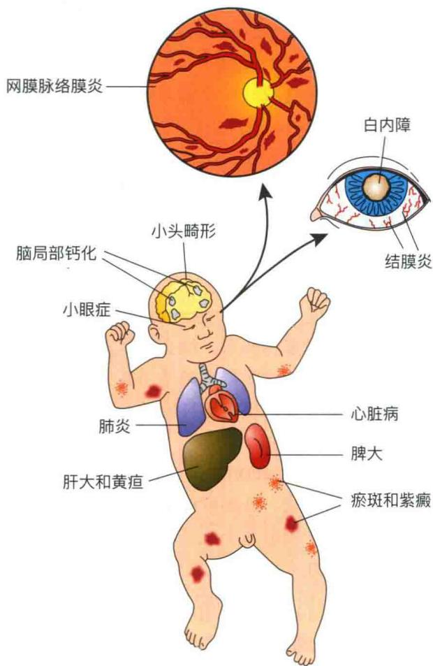 
图6-3TORCH综合征。胎儿在宫腔内感染弓形虫、风疹病毒、巨细胞病毒、单纯疱疹病毒后表现为非常相似的后果
疱疹病毒（herpesvirus）：宫腔内Ⅱ型单纯疱疹病毒感染并不常见。新生儿感染该病毒的途径主要是经产道感染。Ⅱ型疱疹病毒感染诊断的建立需要依靠临床上对胎儿母体的检查，胎儿典型病变的皮肤外观和血清学的检测及培养。对于产前存在活动性生殖器病变或服用抗病毒药物的母体，预防其胎儿患先天性疱疹病毒感染的主要方式是剖宫产。引起TORCH综合征的特定病原体将在第9章中详细讨论。
TORCH综合征病理特点：有症状的TORCH综合征患儿，其临床表现和病理结果复杂多变。只有少数呈现出多系统疾病的全面异常。TORCH综合征患儿可表现为生长迟缓和大脑、眼睛、肝、造血系统和心脏畸形（图6-3）。
# 第五节 染色体异常
细胞遗传学是研究染色体及其异常的一门学科。
# 一、染色体结构异常可能出现在体细胞分裂（有丝分裂）或在配子形成（减数分裂）期间
在有丝分裂期间，发生在体细胞的染色体结构改变可导致以下后果：①保持沉默，不影响细胞的基本功能；②干扰一个或多个关键的细胞活动和导致细胞死亡；③改变关键细胞功能（如有丝分裂活动增加），虽然此改变可对细胞功能产生影响，但不会引起细胞死亡。这样的变化可能与正常细胞向肿瘤转换相关（见第5章）。
配子发育中出现的染色体结构异常非常重要，因为配子细胞中异常的染色体会被传递到所有子代体细胞中，并最终导致遗传疾病发生。在正常的减数分裂过程中，同源染色体（如两个1号染色体）配对，称为二倍体。一个正常的互换过程，最终导致这些染色体进行部分交换和每个染色体遗传成分的重排。
一个正常的易位过程，会导致两个非同源染色体之间遗传成分的互换（如3号染色体和21号染色体）。染色体移位的形式有两种：相互易位和罗氏易位（图6-4）。
1. 相互易位（reciprocal translocation）是指两条染色体发生断裂后相互交换无着丝粒断片后，重新形成两条新的衍生染色体。由于相互易位无遗传物质的丢失，对个体发育一般无严重的影响。但这种易位传递给配子（精子或卵子）时，其所有子代体细胞将含有异常染色体结构。平衡易位一般不与基因缺失或至关重要的基因位点中断相关，因此大多数这种易位携带者表型上是正常的。然而，平衡易位携带者的后代，会因该易位导致严重的核型不平衡和表型异常。在新生儿中，相互易位发病率为 $1 / 625$ 。尽管大多数平衡易
位携带者无明显症状，约 $6\%$ 的携带者与以下疾病相关，比如自闭症、减少知识能力和先天性异常。这些异常可能是由于与这些疾病相关的基因位于易位断点的原因。
2. 罗伯逊易位（robertsonian translocation）也称之为着丝粒融合，是指发生于近端着丝粒染色体的一种易位形式。当两个非同源染色体在着丝粒附近被发生断裂时，它们可能交换两臂形成一个大的具有中
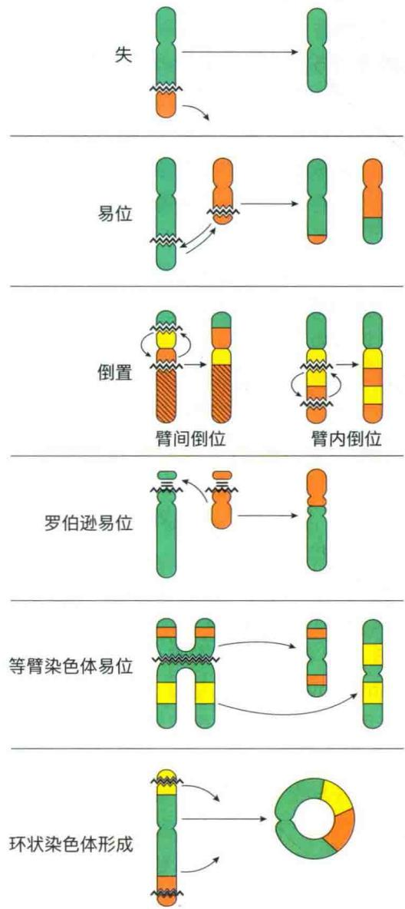 
图6-4 人类染色体结构异常。染色体的一部分缺失会导致遗传物质的损失和染色体缩短。相互易位是指两条染色体发生断裂后相互交换无着丝粒断片形成两条新的衍生染色体。染色体倒位的形成则需要在同一条染色体上发生两次染色体断裂，若一染色体臂内发生二次断裂后，所形成的中间片段旋转 $180^{\circ}$ 重接，即形成臂内倒位，若一条染色体的长臂和短臂各发生一次断裂后，形成的臂间倒位称之为臂间倒位。罗氏易位是指发生于近端着丝粒染色体的一种易位形式。因其断裂点常发生于着丝粒处，两个近端着丝粒染色体发生断裂后，常在着丝粒处重接，故这种易位也称着丝粒融合。等臂染色体是指在细胞有丝分裂中期，连接二姐妹染色单体的着丝粒，不是正常地进行纵裂并形成两条具有长、短臂的染色体，而是发生横裂，结果形成两条各具有同样短臂或长臂的等臂染色体。环状染色体是指一条染色体的长、短臂同时各发生一次断裂后，含有着丝粒节段的长、短臂的断端相接，即形成环状染色体
间着丝粒的染色体和一个染色体的小片段。形成的染色体小片段由于缺少中间着丝粒，在随后的分裂中通常会发生丢失。同相互易位一样，若罗伯逊易位过程中没发生遗传物质的丢失，该易位也是一种平衡易位。该易位的携带者通常表型是正常的，但通常会导致不孕不育。然而，如果携带者不孕，他或她的配子会产生不平衡易位，在这种情况下其后代可能患有先天畸形。13号染色体和14号染色体的罗伯逊易位是最常见的人染色体重排，在新生儿中发生率为 $0.1\%$ 。女性罗伯逊易位携带者，流产发生率高。
3. 染色体缺失（chromosomal Deletions）是指染色体某一部分的丢失，包括末端缺失和中间缺失。生殖细胞进行减数分裂过程受到干扰或体细胞进行有丝分裂过程形成的染色单体断裂时可能导致染色体片段的形成，该片段不纳入任何染色体内，因此在随后的细胞分裂过程中丢失（图6-4）。
配子缺失既可以与正常发育有关，也可与异常发育有关。猫叫综合征（cri-du-chat综合征）就是配子缺失后导致发育异常的一个例子，该综合征中5号染色体的短臂缺失。人类很多癌症都与染色体缺失相关，包括一些家族遗传性的癌症。例如，一些家族性成视网膜细胞瘤与13号染色体长臂的缺失有关（见第5章）。肾母细胞瘤综合征（Wilms tumor aniridiasyndrome）与11号染色体的短臂缺失相关。男性不育可能和Y染色体缺失相关。
4.染色体倒位（chromosomal inversion）是指一条染色体在两个位置发生断裂，断裂形成的q片段反转后再植入染色体的一个过程。臂内倒位（pericentric inversions）是指一染色体臂内发生二次断裂后，所形成的中间片段旋转 $180^{\circ}$ 重接形成，臂间倒位（pericentric inversions）是指一条染色体的长臂和短臂各发生一次断裂后形成（图6-4）。当细胞发生减数分裂时，携带倒位片段的同源染色的单体之间，不会像正常染色体一样比较容易地通过交联发生染色体片段的交换，因为染色体倒位干扰了染色单体之间的配对。尽管这对后代表型的影响较小，但在进化方面可能是非常重要的，因为它可能导致一定的遗传特性的集群。
5. 环状染色体（ring chromosomes）是指一条染色体的长、短臂同时各发生一次断裂后，含有着丝粒节段的长、短臂的断端相接，即形成环状染色体（图6-4）。这种染色体结构畸变的后果主要取决于因基因断裂导致的遗传物质的丢失量。这种染色体异常可能阻碍正常的减数分裂，但在大多数情况下，这种染色体异常不会对机体造成任何影响。环染色体与癫痫（20号染色体）、精神发育迟滞和颜面部畸形（13和14号
染色体）、精神发育迟滞、侏儒症和小头畸形（15号染色体）以及Turner综合征（X染色体）有关。在一些恶性肿瘤中，也可见到环状染色体。
6. 等臂染色体（isochromosome）是由于着丝粒分裂发生异常所致。一般情况下，在细胞有丝分裂中期，连接姐妹染色单体的着丝粒进行纵裂并形成两条具有长、短臂的染色体。如果着丝粒发生横裂，就会形成两条各具有同样短臂或长臂的等臂染色体。一对与染色体短臂对应的片段连接到着丝粒的上半部分和染色体长臂相对应的片段连接到着丝粒的下半部分（图6-4）。
# 二、尚不完全清楚导致染色体数目异常的原因
有几个重要概念在理解与染色体数目异常相关的关发育缺陷非常重要。
■单倍体（haploid）：自然界二倍体生物的每一正常配子即正常精子或正常卵子的全部染色体（人类 $22 + \mathrm{X}$ 或 $22 + \mathrm{Y})$ ，称为一个染色体组（n），即为单倍体。
■二倍体（diploid）：两个染色体组（2n）称为二倍体（人类染色体数目为46）。
■ 整倍体（euploid）：染色体数目整组地增加（从n到8n）。例如，许多正常的肝脏细胞有二倍体体细胞二倍的DNA（4n），因此，是整倍体，或确切地说，是四倍体。三倍体及以上的细胞称为多倍体。
■非整倍体（aneuploid）：如果体细胞中的染色体不是整倍数，而是比二倍体少或是多，这样的细胞或个体即称为非整倍体。
■单体（monosomy）：体细胞内同源染色体的一条染色体缺失，另外一条染色体即构成单体。例如：Turner综合征患者体内只有一条X性染色体。
■ 三体（trisomy）：正常成对的染色体额外多出一条，多出的一条染色体便构成三体。例如：21三体综合征（Down syndrome）患者体内多出一条21号染色体。
1. 染色体不分离（nondisjunction）是指在有丝分裂或减数分裂后期，配对染色体或染色单体的分离和向相反的两极纺锤体移动失败所致。染色体数目出现异常主要来自染色体不分离。如果只有一对染色体不发生分离或导致非整倍体的出现。如果所有染色体都不发生分裂，同时聚集到一个子细胞内，将形成多倍体。非整倍体和多倍体现象的出现均与染色体数字异常有关。
染色体不分离在染色体结构异常的患者发生减数分裂中更为常见。这可能是因为结构异常的染色体在形成配子时，不能像正常染色体一样成对或分离。
在一些染色体不分离综合征中，母体年龄也是
一个关键因素，特别是在21三体综合征中。
2. 染色体异常的后果 大多数染色体异常是致死性的。超过 $35\%$ 的自发性流产与染色体异常有关。妊娠期间，发生重要的遗传物质丢失的胚胎（如：常染色体单倍体）很少能存活。X染色体的单倍体（45，X）胚胎可以存活，但是超过 $95\%$ 这样的胚胎在妊娠期间会丢失。但是体内没有任何X染色体（45，Y）一定会导致早期自然流产。
常染色体的三倍体最终会导致几种发育异常。受影响的胎儿通常在妊娠期间或是出生后很短的时间内死亡。21 三体综合征是个例外，该综合征患儿可以存活好多年。X 染色体三体会引起发育异常但不会造成致死性结果。
3.染色体异常的命名法则 在所有存活的新生儿中，染色体数目和结构异常的发生率为 $0.3\%$ ，且大部分为无症状的平衡易位。染色体异常的模式图详见表6-1。
常染色体命名1 - 22性染色体\( \mathrm{X},\mathrm{Y} \)整条或部分染色体增加+整条或部分染色体缺失-嵌合体(例如：46/47)/染色体短臂 (较小端)p染色体长臂q等臂染色体\( \mathrm{i} \)环转染色体r缺失del插入ins易位t衍生染色体(携带易位)Der染色体末端ter典型的核型21 三体男性 (Down 综合征)47, XY, + 2114 号染色体和 21 号染色体融合易 位的女性携带者45, XX, -14, -21, \( + \mathrm{t}\left( {{14}\mathrm{q}{21}\mathrm{q}}\right) \)猫叫综合征(男性)携带 5 号染色 体短臂缺失46, XY. del (5p)携带 9 号环转染色体男性46, XY, r (19)Turner 综合征 (仅有单倍 X 染色体)45, X马赛克综合征46, XY/47, XXY
# 三、常染色体数目异常的患儿均为三体性
可导致临床疾病的染色体结构异常包括易位、缺失和染色体断裂（表6-2）。
表6-2 常染色体异常临床综合征的临床特征综合征特征三体综合征21号染色体
(Down 综合征 47, XX
或 XY, +21:1/800)内眦赘皮、虹膜斑点、扁平鼻、先天性心脏病、掌猿线、先天性巨结肠、白血病患病风险增加18号染色体(47, XX 或 XY, +18:1/8000)女性居多、小颌畸形、先天性心脏病、马蹄肾、手指畸形13染色体(47, XX 或 XY, +13:1/20 000)持续性胎儿血红蛋白、小头畸形、先天性心脏病、多囊肾、多指畸形、掌猿线缺失综合征5p-综合征(猫叫综合征, 46, XX或XY, 5p-)猫叫样哭声、出生体重低、小头畸形、内眦赘皮、先天性心脏病、手脚短小、掌猿线11综合征
(46, XX 或 XY, 11 p-)虹膜缺失、Wilms 肿瘤、成性腺细胞瘤、男性特征不明显13q综合征(46, XX 或 XY, 13q-)出生体重低、小头畸形、视网膜母细胞瘤、先天性心脏病
这些综合征都与智力低下有关
1.21 三体综合征（Down Syndrome）21 三体综合征是引起患儿先天智力低下最常见的原因。此外，存活婴儿只是有该缺陷胚胎中的一小部分；2/3 的胚胎会发生自发流产或胎死宫内。同时，该患者的平均寿命也较短。感染、先天性心脏缺陷和白血病是该综合征患者的主要死因，近年来随着医疗手段的进步，该综合征患者的平均寿命得到了相应延长。

【发病机制】21号染色体是人体内最小的正常染色体，携带 $2\%$ 的人类DNA。此染色体端着丝粒结构，且所有已知功能的基因（除体RNA）都位于该染色体长臂（21q）。21体上引起唐氏综合征表型的染色体区域位于2.2带，这是一段长为4Mb的DNA区域，唐氏综合征关键区（Down syndrome critical DSCR）。位于DSCR区的基因可能参与了合征中核因子转录因子的编码过程，该转录可以激活参与体细胞发育的T细胞(NFAT)成员。在体细胞内，3个21号染色体可能通过三种机制引起唐氏综合征发病：
■染色体不分离（nondisjunction）：由第一次减数分裂形成配子时，21号染色体不分离引起的21三体综合征患者，占所有21三体综合征患者的 $92\% \sim 95\%$ 。约 $93\%$ 的21三体综合征患儿，多
出的一条21号染色体来源于母体。几乎所有母体染色体不分离源于在第一次减数分裂的事件（减数分裂i期）。
■染色体易位（translocation）：约 $5\%$ 的21三体综合征患者属于此型。多出的一条21号染色体易位到另一近端着丝粒染色体上合成一条，患者的染色体总数仍为46条，称假二倍体。 
■ 嵌合型（mosaicism）：该型是在胚胎发育早期的卵裂过程中，21号染色体不分离的结果。约 $2\%$ 的21三体综合征患儿属于此型。
在以下两种情况下一个额外的21号染色体易位会引发21三体综合征。一种是患儿父母当中可能有一个表型正常的平衡易位的携带者，另外一种情况是在配子形成时发生了易位。如果易位是从父母体内遗传获得，那么父母体内的平衡易位传给胎儿就会变成一种不平衡易位。
21 三体综合征的发病率随母亲年龄的增大而增高。35 岁左右的女性，生育 21 三体综合征患儿的固定风险值是 $1 / 1000$ 。到 45 岁时，风险值急剧从 $1 / 1000$ 增加到 $30 / 1000$ 。不管母亲的年龄多大，女性生育第二个患有唐氏综合征孩子的风险是 $1\%$ ，除非该综合征与 21 号染色体的易位相关。然而，约 $80\%$ 的 21 三体综合征患儿的母亲年龄都小于 35 岁，原因是该年龄段女性整体妊娠率较高。
目前还不太清楚为什么随着母体年龄增长，21三体综合征发生率也会增加。分子研究表明，母体年龄与在减数分裂期母体染色体不分离事件相关。与该综合征相关的染色体易位和嵌合型染色体与母体年龄无关联。
 
（图6-5）。
【病理和临床特征】唐氏综合征通常需要观察
出生后婴儿的弛缓性状态和外观特征得出诊断。该诊断需要进一步的细胞遗传学确诊。随着患儿的发育，会出现该综合征典型的畸形
■智力发育状态：绝大部分该综合征患儿都有不同程度的智力发育障碍。IQ得分值随着年龄增加持续下降。1岁之前，患儿的平均IQ得分值是70分，在随后的10年里，IQ平均得分值会下降到30分。 
■颅面部特征：出生时即有特殊的面容：颜面部和枕骨扁平，鼻梁低平，瞳间距宽和双眼外眦上斜。典型东方人的外观：内眦赘皮，术语称之为先天愚型。虹膜上出现一个称为Brushfield的斑点。耳大畸形。舌大缺乏中央裂、常张口伸舌。 
心脏：1/3的21三体综合征的患儿患有心脏畸形。 
■ 骨骼：由于该综合征患儿的肋骨、骨盆和四肢
骨短于正常同龄儿童，因此体型往往较小。该患儿的手外观为短宽型，表现出一种“猴折痕”，也就是说，一个折痕横跨整个手掌。中间指骨的第五根手指发育不全且向内弯曲。
■生殖系统：21三体综合征的男性患者由于精子生成障碍，均为不育。少部分21三体综合征的女性患者可以生育，但是 $40\%$ 的后代患有21三体综合征。
■血液疾病：所有年龄段的唐氏综合征患者，发生白血病的风险都特别高。患有唐氏综合征小于15岁的儿童，其白血病的发病风险是正常同龄儿童的15倍以上。
■ 神经系统疾病：半个多世纪之前发现，21 三体综合征与阿尔茨海默病（Alzheimer disease）相关。该患者35岁时，阿尔茨海默病的病变特点是普遍存在的，包括：①颗粒空泡变性；②神经元纤维缠结；③和老年斑；④神经元损失（见第28章）。痴呆出现在 $1/4 \sim 1/2$ 的老年21 三体综合征患者，逐步丧失许多知识。
■ 寿命：该患者如果心脏正常，只有约 $5\%$ 会在10岁之前死亡，但是如果该患者患有心脏疾病的话，10岁之前死亡率会达到 $25\%$ 。对于那些存活年龄超过10岁的患者，其死亡年龄一般也较正常人提前20年，据估计这些患者死亡年龄大约是55岁。只有 $10\%$ 的该患者达到70岁。
2.染色体缺失综合征 整条常染色体缺失（如：
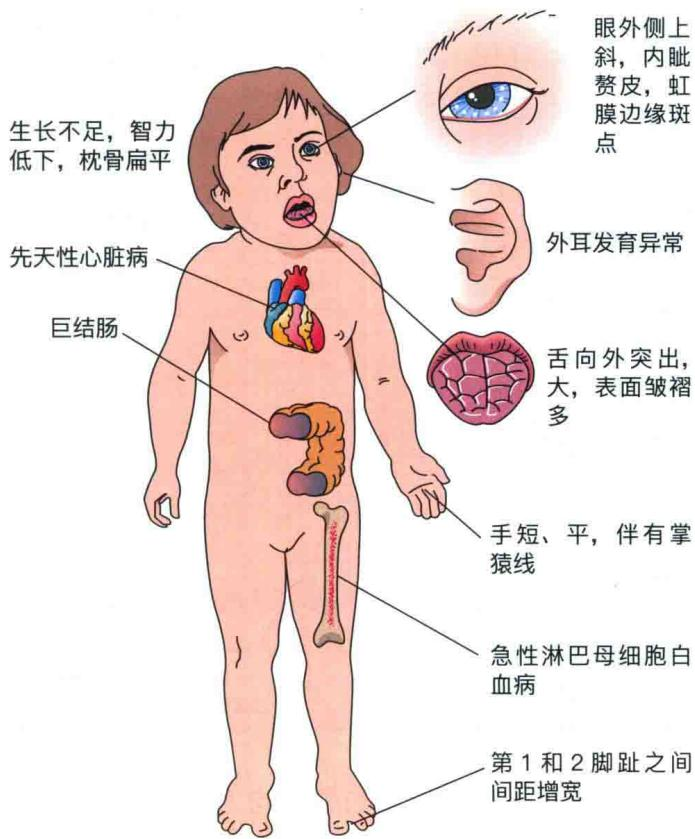 
图6-5 21三体综合征的临床特点
单倍体）通常是致死性的。然而，染色体的部分缺失会导致一些综合征的发生（表6-2）。在大部分病例中，先天综合征是散发的，但是在小部分病例中，其父母体内存在相互易位。几乎所有的这些染色体缺失综合征的特点是：出生体重低、精神发育迟滞、小头畸形、颅面和骨骼异常。心脏和泌尿生殖系统异常也比较常见。最常见的染色体缺失综合征，5p-综合征。由于该染色体异常的患儿哭声像猫叫声，因此，也称为猫叫综合征（cri-du-chatsyndrome)。尽管该染色体缺失在大多数情况下散发出现，也有一些在父母体内存在相互易位的报道。
# 四、与常染色体数目增加相比，性染色体数目增加导致的疾病病变较轻
原因尚不完全清楚，为什么额外的性染色体引起严重的临床表现不如额外的常染色体，并且很少扰乱发育的关键阶段。大多数X三体综合征的患者外表正常，这可能与莱昂化作用（lyonization）有关，即：X染色体除1个以外全部被随机灭活的过程。
X和Y染色体之间存在着很大的差别。X染色体是一个较大的染色体，包含所有DNA的 $6\%$ ，但是相比之下Y染色体非常小。目前已明确在X染色体上的基因超过1300个。相比之下，Y染色体上的基因较少，不足400个，其中之一是睾丸决定基因(sex-determining region Y，SRY，也称为TDF)。
1.Y染色体在人类中，Y染色体上的基因是性别表型的关键决定因素。因此，XXY综合征（Klinefelter综合征）的患者，表型是男性（见下文），那些缺乏Y染色体（XO，特纳综合征）的患者表型是女性。睾丸决定基因（SRY）是一个位于Y染色体的短臂末端附近的内因子稀少基因，编码一个有DNA结合域的小型核蛋白质。这种蛋白质和另一种蛋白（SIP-1）结合，进而形成一个复合体。该复合体是一个常染色体基因的转录活化分子可以控制男性表型的发育。这个基因突变会导致XY核型患者出现女性表型，而将该基因易位到一个X染色体内，会导致XX核型患者出现男性表型。
2.X染色体 男性仅携带一个X染色体，但却能像女性一样产生相同数量的X染色体基因产物。这种表观上的矛盾可由莱昂化作用（lyonization）解释：
对于女性个体，在其胚胎发育早期，两个X染色体中的一个会发生不可逆转的随机灭活。灭活的X染色体在细胞间期时，沿核膜内面有一块深染的染色质，即巴尔小体（Barr body）。
整条X染色体几乎全部失活。然而，仅有相当少量的X染色体相关基因逃脱失活，由两个X染色体
继续表达（见下文）。
父亲或母亲来源的X染色体随机灭活。 
X染色体的失活是永久性的并且会传播给子代细胞。因此，父体或母体来源的X染色体可以进行克隆性繁殖。因此，所有女性都是由父亲和母亲来源X染色体的嵌合体。 
X染色体的短臂的一部分（假体染色体区）逃避了X失活。该区域和Y染色体短臂的一个区域是同源的。在男性和女性染色体的这个位置上均出现了两个功能基因。因此，Turner综合征（45，X）患者的这些基因的表达量比正常人体少一半，而Klinefelter综合征（XXY）患者这些基因的表达量较正常人体内多一倍，从而解释了这些疾病的表型异常特征。 
3.Klinefelter综合征（47，XXY）Klinefelter综合征，又称为先天性睾丸发育不全。该综合征患者的核型为47，XXY。这是临床上最常见的涉及性染色体三倍体的异常（图6-6），同时5r是一个导致男性性腺功能减退和不孕的突出原因。
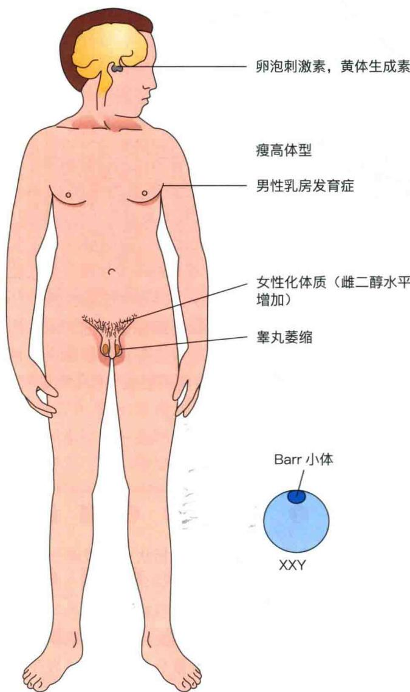 
图6-6 Klinefelter综合征的临床特点

# 【发病机制】大多数（80%）的Klinefelter
综合征患者的核型为47，XXY。也有一小者的核型为嵌合型（46，XY/47，XXY）或以上的X染色体（48，XXXXY）。如前所述，加X染色体数量为几条，Y染色体决定男性表型。尽管增加的X染色体失活，但数量增染色体依然与异常表型相关。据推测，在健体内逃脱失活的相同基因，在Klinefelter综者体内也依然执行功能。
在所有出生的男性新生儿中，Klinefelter综合征的发病率大体上与21三体综合征一致，为 $1 / 1000$ 。有趣的是，1/2的该综合征配体在孕期会因自发性流产而丢失。1/2的该综合征患者的发病原因是，在父体减数分裂I期时染色体不分离，导致产生的精子内同时包含X和Y染色体。一个正常的卵母细胞和这样一个精子受精后产生47，XXY核型。

# 【病理学表现】青春期后，不正常的睾丸对促
性腺激素刺激无应答，同时显示出逐渐退化的细精管显示萎缩，透明样变化和管内纤维化。子和Sertoli细胞缺失，最后小管变成致密的胶绳索。睾丸间质细胞（Leydig cells）数量增加，的功能受损，表现为低水平睾酮和高水平促黄同时存在。

# 【临床表现】Klinefelter综合征的诊断通常是在青春期后，虽然该综合征患者的平均IQ得分
往往会有所降低，但总体来说，智力发育低下比较罕见。Klinefelter综合征患儿呈瘦高体型，腿明显长于正常人（无辜丸者身体体质）。青春期前不发生睾丸生长和男性化，睾丸和阴茎仍然很小。但是会出现女性的一些特征，包括高音、男子女性型乳房和女性的阴毛模式。精子缺乏会导致不育。所有这些变化都是由于性腺功能减退和雄激素缺乏。血清睾酮水平低于正常值，但促黄体激素（LH）和促卵泡激素水平（FSH）非常高，说明垂体功能正常。雌二醇循环水平增高，增加了确定女性化程度的雌二醇和睾酮比例。尽管睾酮治疗可以使这些患者发生男性化改变，但不能恢复其生育能力。
4. Turner 综合征（45，X）指从完全或部分 X 染色体单体的（XO）一系列染色体异常，该综合征患者的外观表型为女性。每年该综合征在所有女性婴儿中的发病率约为 1/5000。3/4 的该综合征患者的单一 X 染色体来源于母体，这表明减数分裂异常往往发生在父体，该综合征的发病率与母体的年龄无关，同时生产第二个女婴儿时患此综合征的风险也不会增加。
45，X染色体核型是在人类孕体中，最常见的一种染色体的非整倍体异常，但几乎所有的配体都因自然流产而丢失。事实上， $2\%$ 的流产显示这种异常。只有大约1/2的女性Turner综合征患者体内缺乏一个完整的X染色体（X单倍体）。剩余的该综合征患者女性的染色体为嵌合型或有X染色体结构异常（如：长臂的等臂染色体、易位和缺失）。 $15\%$ 的该综合征患者为嵌合型，其核型为45，X/46，XX，此种核型倾向于更温和的Turner综合征表型，甚至有可能不孕。

# 【病理和临床特征】Turner综合征的临床特点是性发育幼稚、原发性闭经和不孕（图6-7）。

# 在大多数情况下，直到患儿月经初潮未至就医时，才会发现该异常。几乎所有的该综合征的
女性患者身高低于152cm（5英尺）。其他临床特征包括：踝颈、发际线低后、肘外翻、乳头肥大、胸部宽大和高凸的指甲。1/2的患者泌尿系统造影显示异常，最常见的是马蹄肾和肾旋转不良。许多患者会出现面部畸形，包括：小下颌，耳朵突出和内眦赘皮。听力和视力缺陷也很常见，有多达 $20\%$ 的患者会出现智力障碍。色素痣随着患者年龄的增长逐渐突出。Turner综合征的女性患者患自身免疫性甲状腺炎和甲状腺肿的风险升高，但目前原因未明。
约1/2的Turner综合征患者会伴有心血管异常。 $15\%$ 的患者伴有主动脉缩窄。在一些患者中也伴有原发性高血压发生，动脉瘤夹层有时也会是这些患者死亡的原因。
Turner综合征胎儿的卵巢内刚开始发育时含有卵母细胞，但卵母细胞随后迅速丢失，到患儿2岁时卵巢内便不再有卵母细胞存在。卵巢退化成为纤维条索，
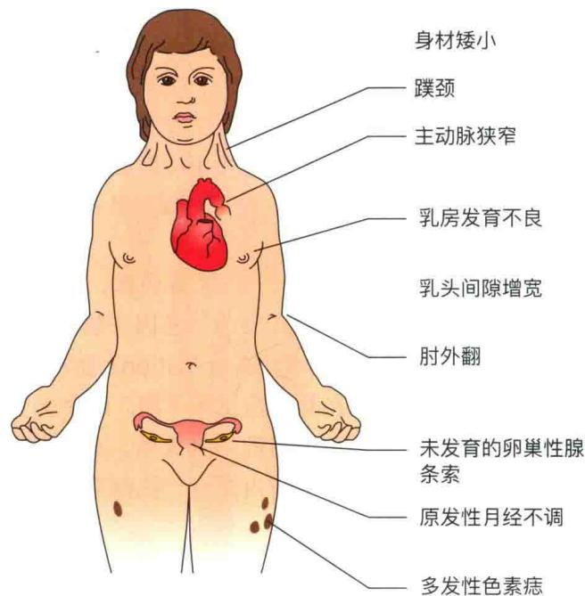 
图6-7 Turner综合征的临床特征
然而子宫、输卵管和阴道却正常发育。可以说Turner综合征的患儿在正常女孩子初潮时间之前经历了更年期阶段。
# 五、单基因异常具有家族遗传性的特点
以孟德尔方式遗传的遗传性特征具有以下的遗传模式：
1. 常染色体显性遗传病 遗传基因位于常染色体中的某一对上，这种基因是显性的，只要有一个致病基因存在就可以发病，这样的遗传方式就叫作常染色体的显性遗传。同时表明该疾病的患者具有杂合性的特点。 
2. 常染色体隐性遗传病 遗传病是由于位于常染色体上的隐性致病基因控制的疾病，只有含有隐性纯合子的个体才发病。由于致病基因为隐性，则杂合子及显性纯合子的个体均表现为正常。 
3.性连锁显性遗传病是指位于X性染色体上的一对同源染色体的一对等位基因中只要有一个致病基因存在就可以发病。由于性连锁显性遗传疾病比较罕见，同时也没有什么实际意义。 
4.性连锁隐性遗传病 在雌性个体中，位于X性染色体上的一对同源染色体的一对等位基因均为致病基因才可以发病；由于雄性个体只携带一个X染色体，因此，只要X染色体上携带该致病基因即可导致发病（如：血友病）。 
5. 共显性 是指在一对杂合基因中，两个等位基因都存在的情况两个基因完全表达（如AB血型基因）。
# 突变
基因突变（mutation）是指基因组DNA分子中发生的稳定且可遗传的改变。基因突变可造成各种各样的后果，其中，一部分突变不会引起任何功能的改变，然而，另一部分突变可能是致命的，并且可以遗传给下一代。在这者之间广泛的DNA改变，会导致各物种间基因的多样性。在人类基因组中，约有1/1000的碱基对具有多态性；在漫长的历史长河中，进化是基于物种为适应其生存环境而发生的日积月累的微小的非致死性的基因体变。对于人类疾病的遗传学研究主要着眼于损害蛋白功能的基因突变。导致人类疾病的详尽基因突变参考文献可以从人类孟德尔遗传疾病在线网站获取（
点突变（point mutations）：是指DNA中的一对碱基被另一对碱基替代。在编码区发生的①同义突
变（synonymous mutation），最终编码的氨基酸还是同一种；②错义突变（missense mutation），最终编码不同的氨基酸；③无义突变（nonsense mutation），是指碱基替换后，编码的氨基酸为终止密码子，使多肽链的合成提前终止，最终产生了一种截短的蛋白。
移码突变（frameshift mutations）：是指由于基因组DNA链中发生一对碱基删除或插入，从而使插入或缺失点下游的DNA编码全部改变的突变。该突变的结果会使变动部分以下的多肽链氨基酸种类和顺序发生改变，同时也可以改变基因转录、剪切和mRNA成熟的过程。
■大片缺失（large deletions）：当基因组DNA中的一个较大片段缺失时，基因编码区会全部缺失，在这种情况下会导致蛋白编码产物的缺失。另一方面，大片段基因缺失可能会导致邻近基因编码区域的并置，形成一个编码杂交蛋白的融合基因，紧随该蛋白的一部分或全部的是另一蛋白的部分或全部。
■ 不稳定三核苷酸重复序列的扩张（expansion of unstable trinucleotide repeat sequences）：人类基因组包含相互毗邻的较高频率的三核苷酸重复序列（称之为串联重复）。在不同个体之间，这种三核苷酸重复的数量有所不同。一般来说，当三核苷酸重复的数量低于某一阈值时，在有丝分裂或减数分裂过程中数量不会改变，而超过这个阈值后，三核苷酸重复的数量可以扩张或收缩，其中扩张更加普遍。在人类疾病中，已经鉴定出了几个不同的三核苷酸扩张，包括亨廷顿疾病、脆性X综合征（精神发育迟滞最常见的原因）和肌强直性营养不良，最常见的常染色体肌肉营养不良（见第27章）。
# 六、常染色体显性遗传病在杂合子中表达
当只有一个缺陷基因（即突变等位基因）存在，而与其配对同源染色体上的等位基因是正常时，会发生常染色体显性遗传疾病（图6-8）。
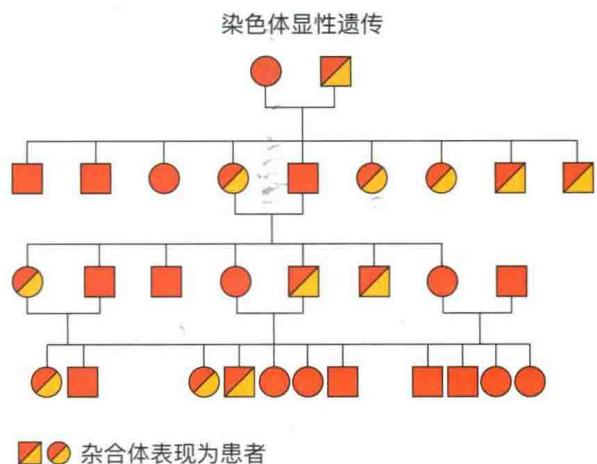 
图6-8 常染色体显性遗传。致病基因由患病亲代传给子代，杂合子的表现为有症状的个体。男女患病机会均等
根据定义，该突变的基因位于常染色体上，因此，男性和女性都同样的影响。所以，显性特征在男行和女性中都可以传递。 
■突变基因编码的显性特征可以传递给后代（除非该疾病干扰生殖能力）。 
患者双亲中有一方患病，未患病的家族成员不会将显性症状传递给后代，除非发生了该症状的新突变。 
患者生育的子代中患病和正常的概率相等，然而患者正常的兄弟姐们体内不含有缺陷基因。 
人类常染色家系图内部和家系图之间的关系非常复杂。通常，常染色体显性遗传特征的外显率不同（即是否一个等位基因的遗传突变导致可检测的疾病）。在外显率上，家系也会不同程度地影响外现率的表达程度（即疾病的严重程度）。
在人类疾病中，有超过1000种疾病是常染色体显性遗传病，尽管大部分的发病率很低。这些疾病的例子见表6-3。
表 6-3 典型的常染色体显性遗传疾病 
疾病频率染色体家族型高胆固醇血症1/50019pVon Willebrand 病1/800012p遗质性球形红细胞增多症（主要形式）1/500014,8遗质性椭圆形红细胞增多症（所有形式）1/25001,1p, 2p,14成骨不全症（I~IV型）1/1000017q,7qEhlers-Danlos 综合征，III型1/5000?Marfan 综合征1/1000015qI 型神经纤维瘤病1/350017q亨廷顿舞蹈病1/150004p视网膜母细胞瘤1/1400013qWilm 瘤1/1000011p家族性息肉病1/100005q急性间歇性卟啉病1/1500011q遗传性淀粉样变性1/10000018q成人型多囊肾疾病1/100016p
# 七、结缔组织的遗传性疾病是杂合子，主要遗传方式为常染色体显性遗传
这个讨论仅限于两个最常见和研究最深入的疾病，即马方综合征（Marfan syndrome）和埃勒斯当洛斯综合征（EDS）。即使在这些认识很清楚的疾病中，其临床症状也往往存在交叉。
1. 马方综合征 马方综合征是一种结缔组织的常染色体显性遗传疾病，其特点是多器官发生的一系列
异常，包括心、主动脉、骨骼、眼睛和皮肤。其中有1/3的患者为散发型的基因突变。在美国，该疾病的发病率为1/10000。

【发病机制】该综合征的病因是位于15号染色体长臂编码原纤蛋白（fibrillin-1，
FBN1）的基因发生了错义突变。原纤蛋白是一个胶原样结缔组织蛋白家族，该家族现在拥有12个成员。超过100个突变是已知的。原纤蛋白以纤维系统（也称微纤维）的形式，广泛分布在许多组织内，纤维系统在器官内形成棒状、片状和交错的网络。在胚胎发育阶段，这些微纤维形成弹性蛋白沉积的支架，随后它们被弹性组织吸收。在马方综合征患者体内可见所有组织内都存在微纤维异常。

【病理和临床特征】马方综合征患者通常（但不是总是）身材较高，下半身段（耻骨到足底）

比上半身段长。体瘦，表明患者皮下脂肪缺乏。四肢细长，俗称蜘蛛脚样指（趾）。以下是该的其他缺陷的。
临床表现：
■ 骨骼系统：马方综合征患者的颅骨的典型特征是头骨长（长头），且额骨突出。肋骨异常也很明显，表现为产生漏斗胸和鸡胸。韧带、肌腱和关节囊薄弱，导致关节过度伸展，脱臼，疝和脊柱后侧凸。 
■心血管系统：马方综合征患者最重要的血管异常是主动脉，主要病变是主动脉中层薄弱。薄弱的中膜会导致升主动脉不同程度的扩张，同时增加动脉瘤的发生率。动脉瘤，通常发生于升主动脉，可能破裂入心包腔或扩展到主动脉，进一步破裂到腹膜后间隙。主动脉瓣环扩张会导致主动脉瓣反流，可以引发心绞痛和充血性心力衰竭等严重的后果。心血管疾病是马方综合征患者最常见的死亡原因。 
眼：马方综合征患者，其眼部变化也是比较常见的。这些变化包括晶状体异位，由于眼睛拉长导致严重的近视和视网膜脱离。
未经治疗的马方综合征男性患者，死亡年龄通常是 $30\sim 40$ 岁，未经治疗的女性患者死亡年龄通常是 $40\sim 50$ 岁。然而，随着抗高血压治疗和主动脉假体移植替代治疗的出现，该综合征患者的生存期限可以接近正常人。
2.Ehlers-Danlos 综合征（EDS） EDS 是罕见的常染色体显性遗传的结缔组织紊乱性疾病，其特点是皮肤的弹性增强和脆性增高，关节活动性高和出血体质。该综合征的临床特征和遗传方式具有异质性，目前已明确的 EDS 类型有 10 多种。不同形式的 EDS 类型可以常染色体显性或隐性（常染色体或 X 连锁）遗传，
遗传的类型取决于特定的突变。

【发病机制】已明确的10种EDS的类型。
在胶原蛋白中，它们都存在共同的缺陷，
包括该蛋白的结构、合成、分泌和退化的异常。参与 EDS 的突变，可能发生在编码如下蛋白的基因：① 胶原蛋白链；② 一种与形成稳定胶原蛋白交叉连接所必需的酶；③ 所胶原蛋白加工必需的蛋白酶；④ 腰生蛋白 X 分子，参与胶原纤维形成的结缔组织组件；⑤ 参与蛋白多糖合成的基因。根据 EDS 的分型，这些分子病变与皮肤、关节、动脉和内脏器官明显薄弱的支撑结构相关。

【病理和临床特征】所有类型的EDS患者的典
型特点均为松软、脆弱和高扩张度的皮肤。该
综合征的患者通常可以使得他们的皮肤拉伸很
多厘米，微小的损伤会引起严重的伤口。缝合
线固定不牢固，所以手术切口裂开比较常见。关节的高活动性导致其可有异常的扩展和弯曲。EDS IV型是该综合征最危险的类型，因为该型患者的大血管、肠和妊娠子宫倾向于自发破裂。发生这些并发症的患者其死亡年龄在 $30 \sim 40$ 岁。
EDS VI型的主要并发症，包括严重脊柱后侧凸，视网膜出血引发的失明（或全球破裂）和主动脉破裂导致的死亡。EDS III型患者，牙周组织疾病比较严重，在 $20\sim 30$ 岁时会发生牙齿脱落。EDS IX型患者的特点是在儿童时期发生的膀胱憩室，有发生膀胱破裂和骨骼畸形的危险。
很多人的临床表现提示为EDS，但却不符合该综合征任何类型的临床表现，这种情况强调需要进一步扩大EDS的分类。
# 八、神经纤维瘤病包括两种不同的常染色体显性遗传疾病，即周围神经功能良性的肿瘤
神经纤维瘤病特点是多个肿瘤（纤维瘤）的发生，这些肿瘤是指来源于周围神经的良性施万（Schwann）细胞肿瘤（见第28章）。这些异常包括所有来源于神经嵴的细胞，包括黑色素细胞、施万细胞和神经内膜成纤维细胞。因此，1型神经纤维瘤病（NF-1）的标准诊断包括色素障碍以及神经肿瘤。
1.1型神经纤维瘤病（vonRecklinghausenDisease）NF-1的典型特点是： $①$ 外观不规则的纤维瘤； $②$ 皮肤牛奶咖啡斑（café-au-laitspots)； $③$ 2个或更多个青色虹膜错构瘤（Lischnodules）。该疾病是最常见的常染色体显性遗传疾病之一，在所有种族中的发病率为1/3500。NF-1基因的突变率非常高，且该疾病1/2的患者为散发突变，而不是家族性遗传。

【发病机制】该疾病的发生是由于位于第17
号染色体长臂上的NF-7基因的胚系突变，
包括缺失、错义突变和无义突变。正常的基因产物，神经纤维瘤蛋白，属于GTP酶活化蛋白（GAP）家族，该蛋白可以灭活ras蛋白（见第5章）。在这个意义上，NF-1是一个经典的肿瘤抑制基因。GTP酶活化蛋白活性的缺失会引起ras不受控制的激活，这可能会导致纤维瘤的形成。

【病理和临床特征】NF-1的临床表现高度可变，且完全靠单个基因缺陷解释比较困难。NF-1的典型特征包括：
■神经纤维瘤：超过 $90\%$ 的NF-1患者在儿童后期和青春期会发生皮下和黏膜下神经纤维瘤。这些皮下肿瘤，总数可超过500个，临床表现为软的带蒂包块，通常直径约 $1cm$ 。然而，有时，肿瘤的直径可能达到 $25cm$ ，为患者主要的外观表现。皮下纤维瘤表现为沿着周围神经分布的质软结节。丛状纤维瘤只发生在NF-1中，且只有在NF-1条件下诊断。神经纤维瘤的显微镜下表现将在第28章讨论。NF-1的一个主要并发症是神经纤维瘤向神经肉瘤的恶化转变，通常发生在大的丛状纤维瘤，发生率为 $3\% \sim 5\%$ 。NF-1通常和其他神经源性肿瘤的高发生率相关，包括脑膜瘤、视神经胶质瘤和嗜铬细胞瘤。
Café-au-lait spots：尽管正常的人的皮肤也可能偶尔出现浅棕色的斑点，但是超过 $95\%$ 的NF-1患者皮肤上会出现6个或更多这样的病变。这些病变在青春期前，大于 $5\mathrm{mm}$ ，青春期后，大于 $1.5\mathrm{cm}$
■Lisch结节：超过 $90\%$ 的NF-1患者的虹膜上存在由大量的黑色素细胞组成的色素结节。这些病变被认为是错构瘤。
■骨骼病变：NF-1患者中，会频繁发生几种骨骼病变。这些病变包括蝶骨畸形和长骨皮质的变薄，这些病变最终会导致驼背、胫骨假关节、骨骼囊肿和脊柱侧凸的形成。
■智力状态：NF-1的患者发生轻度智力障碍比较频繁，但该综合征患者不会发生严重的智力障碍缺陷。
白血病：在NF-1儿童患者中，恶性骨髓疾病的发病风险是正常儿童的 $200\sim 500$ 倍。在一些患者的白血病细胞中，NF-1基因的一对等位基因均灭活。
2. II型神经纤维瘤病（中央型神经纤维瘤病）Ⅱ型神经纤维瘤病（NF-2）是指第8脑神经（听神经瘤）的双侧肿瘤和普通型的脑膜瘤和胶质瘤综合征的一个定义。NF-2不如NF-1常见，发生率为 $1 / 50000$ 。大多数NF-2患者患有双侧听神经瘤，但如果只存在一
侧的第8对脑神经肿瘤，并且与以下任意两种情况同时存在时，NF-2的诊断也可以成立，包括：纤维神经瘤、脑膜瘤、神经鞘瘤，神经胶质瘤或青少年后晶状体的透明度。

【发病机制】尽管NF-1和NF-2表面上具有相似性，但它们不是相同疾病的不同类
型。事实上，它们拥有不同的基因起源。NF-2基因位于22号染色体长臂。与NF-1相比，NF-2的肿瘤经常显示22号染色体中杂合DNA标记物的缺失或丢失。NF-2基因编码一种称为merlin或schwannomin的肿瘤抑制蛋白，该蛋白是链接细胞膜和细胞骨架的细胞膜蛋白超家族。merlin在大多数已分化组织中，包括施万细胞中，可以检测到。
# 九、家族性高胆固醇血症是最常见的一种常染色体显性遗传病
家族性高胆固醇血症是一种常染色体显性遗传疾病，其特点是：①血液中存在高水平的低密度脂蛋白（LDLs）；②胆固醇沉积于动脉、肌腱和皮肤。这是最常见的一种常染色体显性遗传疾病，在美国成年人中以杂合子形式发病的概率为1/500。以纯合子形式发病的概率是 $1 / 1000000$ 。对这种疾病的兴趣源于明显增加的动脉粥样硬化及其并发症（见第10章）。

【发病机制】家族性高胆固醇血症的病因是19号染色体长臂的LDL受体基因异常。该
基因编码将 LDL 从血液中吸收至细胞内的细胞表面受体。目前已经知道的不同基因突变有 750 多种。 LDL 受体的合成过程如下: ①内质网中合成; ②转移至高尔基体; ③转运至细胞表面; ④与 LDL 结合后, 在内陷小窝部位参与受体介导的内吞作用下内化。以上每一步的基因缺陷都已经被证实。
肝细胞是表达LDL受体的主要细胞类型。在LDL与其受体结合后，被内化，随后在溶酶体内降解，同时释放胆固醇进行进一步代谢。LDL受体功能缺乏，血液中高水平的LDL一方面被组织巨噬细胞摄取形成富含巨噬细胞的斑块和结节（黄色瘤），另一方面在动脉壁内沉积，形成闭塞性动脉斑块（动脉粥样化）（见第10章）。

【临床表现】杂合子和纯合子家族性高胆固醇血症是两种截然不同的临床综合征，表现出
明显的基因-剂量效应（gene-dosage effect）。杂合子患者出生时，其血液中的胆固醇水平就高于正常人（平均胆固醇水平 $350\mathrm{mg / dl}$ ，正常人胆固醇水平： $200\mathrm{mg / dl})$ 。其中一半的患者在30岁之前发展为肌腱黄色瘤，在40岁之前经常发生冠心病的症状。纯合
子患者，血液中胆固醇达到天文水平（ $600\sim 1200mg/dl$ ），几乎所有患者在童年时就患有肌腱黄色瘤以及广义的动脉粥样硬化。未经治疗的纯合子患者通常在30岁之前死于心肌梗死。“他汀类”药物的发展显著改善了患者预后。
# 十、常染色体隐性疾病在纯合子的人群中产生的症状
大多数遗传代谢性疾病表现为一种常染色体隐性继承的模式（图6-9，表6-4）。这些疾病一些重要的特征包括：
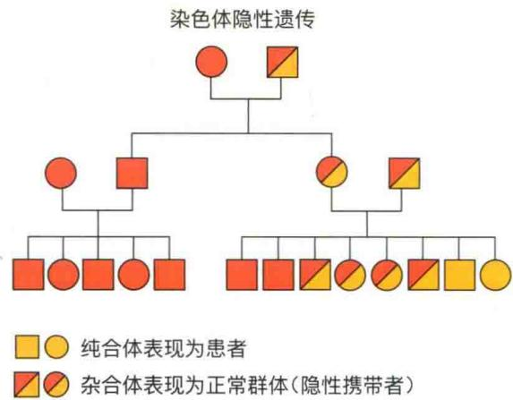 
图6-9 常染色体隐性遗传。只有在纯合子的男性或女性个体中才会出现相应疾病的临床表现。杂合子的个体表现为无症状的携带者。有症状的纯合子个体是无症状的杂合子的婚配结果
表6-4 典型的常染色体隐性遗传性疾病疾病频率染色体囊性纤维化1/25007qα-地中海贫血高16pβ-地中海贫血高11p镰状细胞贫血高11p髓过氧化物酶缺乏症1/200017q苯丙酮尿症1/10 00012qGaucher 病1/10001q家族性黑蒙性白痴症1/400015q黏多糖增多症候群1/100 00022PIa 糖原蓄积症（von Gierke 病）1/100 00017Wilson 病1/50 00013q遗传性血色素沉着病1/10006Pα₁-抗胰蛋白酶缺失1/700014q眼皮肤白化病1/20 00011q黑尿酸尿症&lt;1/100 0003q异染性脑白质营养不良1/100 00022q
在一般人群中，基因突变越罕见，患者从父母遗传得到突变基因的概率就越高。罕见的常染色体隐
性障碍往往来自近亲结婚。
■患者双亲通常为临床表现无异常的携带者。 
■平均来说，在两个杂合的携带者婚后所生的子女中，将有1/4的个体是该病患者，1/2的个体是无症状的杂合携带者，1/4的个体是不携带突变基因。 
常染色体隐性遗传的特征在男女中患病机会均等。 
常染色体隐性疾病状与常染色体显性疾病症状相比，其变化通常较低。 
■许多常染色体隐性遗传疾病的变异的临床表现为，酶受影响后，其残存的功能表现。
在一般人群中，许多与常染色体隐性疾病相关的基因突变是罕见的。但是，相反，一些致命的常染色体隐性疾病却很常见，例如，镰状细胞贫血和囊性纤维化（cystic fibrosis，CF）。镰状细胞病的杂合子个体可能会通过增加抵抗疟疾休眠期，来获得一个生物的优势。
典型的常染色体隐性疾病的发病原因是由于相关酶的缺陷所致，而非结构性的蛋白质缺陷。杂合子个体中，单个导致酶灭活的基因突变通常不会导致临床异常表现发生，因为大多数细胞酶在底物浓度远低于饱和时仍可维持细胞的正常功能。因此，酶正常量的一半可能已经足够维持其正常功能，或酶缺陷可以通过增加底物的数量来纠正。相比之下，两个等位基因损失的纯合子个体中，酶活性完全丧失，不能通过以上机制纠正该情况。
# 十一、囊性纤维化（CF）是白人中最常见的致命常染色体隐性遗传病，其本质是一种离子通道病
CF的典型特点是： $①$ 慢性肺疾病； $②$ 胰腺外分泌功能缺陷； $③$ 黏液在一些器官内蓄积导致的其他的并发症，包括黏液蓄积于小肠、肝和生殖系统。该疾病的病因主要是由于氯通道的缺陷，该通道是CF跨膜传导的调节子（CFTR）。

【流行病学】在白种人中，CF是最常见的致死
性常染色体隐性遗传病。 $95\%$ 以上的病例为白
种人。在白种人中，该基因的杂合载体者约为1/25，而该疾病在所有新生儿中的发病率为1/2500。CF的发生率与地理位置有很大的差别。在北欧凯尔特人群中，如爱尔兰和苏格兰人中，该病的发病率是最高的，但是在欧洲南部，其发病率比较低。

【发病机制】CFTR基因位于第7号染色体
的长臂，编码一种蛋白，该蛋白是膜转运蛋
白——三磷腺苷（ATP）结合盒式家族的一个成员。
在多数上皮细胞中, 它的功能作为一个氯化物的转
运体。分泌黏液的上皮细胞通过同时分泌 $\mathrm{Cl}^{-}$ , 进一步控制其液体的分泌, 最终影响黏液的黏度。在正常分泌黏液的上皮细胞中, 单磷酸腺苷 (cAMP) 激活蛋白激酶 A, 该蛋白进一步磷酸化 CFTR 的调节区域, 导致离子通道的开放。在白种人中, 最常见 (70%) 的基因突变是 3 个碱基对的缺失, 这种缺失最终导致一个苯丙氨酸残基 $\left(\mathrm{DF}_{508}\right)$ 的丢失。其次, 最常见的突变只占所有变异的 $2 \%$ 。

【病理学表现】CF对很多有外分泌作用的器官
有影响。所有CF的病理结果均可归因于异常
黏厚的黏液，该黏液阻碍了空气流动的空腔，胰腺和胆道管道和胎儿肠管，同时会损害呼吸道黏膜纤毛的功能。基因型（超过1000突变已知）和CF的临床严重程度之间的关系很复杂，并且并不总是一致。其中该疾病与胰腺功能不全的相关性最好。一般情况下， $85\%$ CF病例的严重症状通常在胰腺癌功能不全的患者中发现，而在病情较轻的CF病例中，胰腺功能被保留。
呼吸道：CF的病死率大多数与肺部疾病相关。早期呼吸道病变主要表现为：黏液阻塞细支气管，进一步继发细支气管壁的感染和炎症。反复发作的呼吸道阻塞和感染会导致慢性细支气管炎和支气管炎，且其严重程度随着疾病进展而增加。支气管黏液腺体进一步肥大和增生，呼吸道管腔随着黏厚分泌物的蓄积而进一步扩张。在患者10岁或更早些时候，会发生广泛的支气管扩张。在该疾病的后期阶段，大支气管囊肿和肺脓肿较常见。慢性支气管炎可能并发肺动脉高压。
胰腺：大多数（85%）的CF患者会有慢性胰腺炎的一种表现，慢性CF患者，胰腺外分泌功能很少或根本不存在。在胰腺导管内，浓缩的分泌物会导致胰腺远端导管的继发性扩张和囊性改变（图6-10）。复发性胰腺炎会导致腺细胞的丢失的和广泛胰腺纤维化。在解剖上，胰腺病变通常表现为包含胰岛组织的单纯的囊性纤维脂肪组织。
肝：浓缩在肝内胆道系统的黏液分泌物，阻碍受影响导管引流区域的胆汁流动，同时会引发继发性胆汁性肝硬化，这种病变在1/4的患者尸检中可以见到。显微镜下，在肝内的胆管和胆小管中可见到黏液的浓缩物、门脉系统慢性炎症和间隔纤维化。有时，肝损伤非常广泛会导致胆汁性肝硬化的临床表现。
胃肠系统：正常新生儿出生后不久，会有排泄在宫腔内蓄积的肠腔内容物。CF患者最常见的肠管病变是小肠梗阻，在CF新生儿中发病率是 $5\% \sim 10\%$ ，俗称胎粪性肠梗阻（meconiumileus），此病变是指患儿
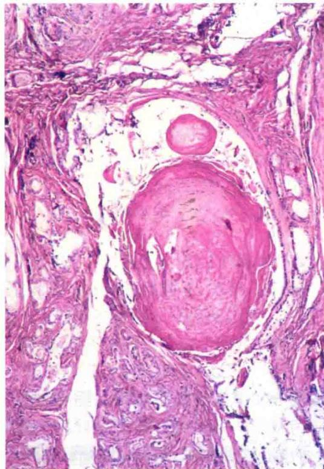 
图6-10囊性纤维化患者胰腺。胰腺导管内凝固物和腺细胞萎缩
在出生后的特定时间内未能排出肠腔内容物。此并发症可能是由于胰腺不能分泌消化胎粪的消化液，进一步使小肠分泌物的黏液黏度增加所致。
生殖系统：几乎所有的CF男性患儿，其生殖系统管道（包括输精管、附睾和精囊）都会存在不同程度的萎缩或纤维化。这些病变的发病机制与儿童早期或胎儿期浓缩的黏液分泌物阻塞生殖系统管腔有关。最终，只有 $2\% \sim 3\%$ 的男性CF患者可以有生育能力，大多数患者体内无精子生成。只有一小部分的女性CF患者有生育能力，大多数患者由于长期营养不良和慢性感染，体内无卵子生成。更为重要的是，女性患者宫颈黏液栓的厚度和黏度也表现为异常。
【临床表现】CF的确诊需要通过以下两点：①汗液中电解质浓度增加；②遗传学研究证明存在引起该病变的基因突变。CF患者氯离子的电导特性降低，可导致汗腺导管细胞对氯离子的重吸收障碍，从而增加汗液中氯化钠的浓度（图6-11）。CF患儿被描述为“tasting salty”，甚至在剧烈出汗后皮肤表面会出现一层盐晶体。
CF患者的肺部症状刚开始的表现为咳嗽，咳大量黏稠的脓痰。随后反复发作的支气管炎和支气管肺炎进一步进展，最终，表现为呼吸短促。最终发展为呼吸衰竭和肺动脉高压引起的心脏并发症（肺心病）。在CF患者中，感染呼吸系统的最常见微生物为葡萄球菌和铜绿假单胞菌。随着疾病的进展，铜绿假单胞菌可能成为肺内感染的唯一细菌。事实上，一旦铜绿假单
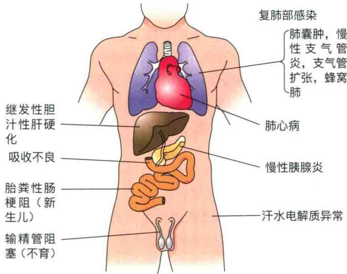 
图6-11囊性纤维化的临床特征。CF的临床进程高度可变。有些患者可能在胎儿期死于胎粪性肠梗阻，也有些患者可以存活至50岁。随着医疗护理的改善和对CF轻度病变患者的识别，CF患者的平均寿命可延长到37岁
胞菌出现在慢性肺部疾病的患儿中，特别是在肺部黏液较多的情况下出现，基本上可以诊断为CF。感染洋葱伯克霍尔德菌（Burkholderia cepacia）与cepacia综合征相关，该综合征是一种严重的肺部感染，通常对抗生素治疗高度耐药并且是致死性的。
目前该疾病的主要治疗方法包括：体位管腔引流、抗生素治疗和补充胰酶治疗。CF的产前分子诊断的准确率为 $95\%$ 。肺移植也可能成为终末肺部疾病的治疗手段。
# 十二、溶酶体储存疾病的特征是未代谢的正常物质蓄积
通过细胞内吞作用或吞噬作用进入细胞内的胞外大分子以及细胞内倾向于自噬的成分，最终通过自噬溶酶体消化。最终消化产物可能经过溶酶体膜被运输进入细胞保质，重新合成新的大分子。
几乎所有的溶酶体疾病是由于编码溶酶体水解酶的基因发生突变。40多种酸性水解酶中的任意一种酶功能缺陷，都可能导致溶酶体对该酶对应的正常底物大分子的水解能力缺失。最终，未被消化的底物在溶酶体内蓄积，导致细胞内溶酶体的体积扩张。溶酶体体积扩张通常是由于细胞内一些关键组分的丢失，特别是在大脑和心，可导致细胞功能的丧失。
溶酶体蓄积性疾病可依据溶酶体内包含的内容物进行分类。因此，当溶酶体内包含的内容物为鞘脂时，称之为鞘脂沉积病；黏多糖的蓄积称之为黏多糖沉积病（mucopolysaccharidoses，MPS）。目前已知30多种不同的溶酶体蓄积积病，但我们只讨论一些比较重要的疾病（图6-12）。
1.Gaucher病 Gaucher病的典型表现是葡萄糖神经酰胺在巨噬细胞溶酶体内蓄积。
图6-12 在多种鞘脂沉积症中脂质代谢的紊乱 
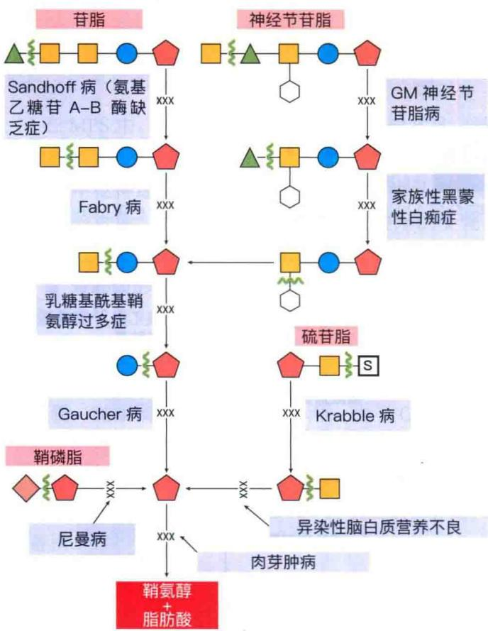 
$\triangle \mathrm{N}-$ 乙酰氨基半乳糖 
磷脂质 
乙酰神经氨酸 
磷酰胆碱 
S 硫酸盐化 
酶促作用 
xxx 代谢阻断

【发病机制】Gaucher症的异常在于葡糖脑苷脂酶，一种溶酶体酸性β- 葡糖苷酶的缺失。
这种酶缺乏症可以追溯到位于1号染色体长臂的β-葡糖苷酶基因中的一系列不同的单碱基突变。该疾病三种临床类型的任何一种类型在该基因上均表现为杂合突变。
来自衰老白细胞分解代谢葡糖神经酰胺，在脾、肝、骨髓和淋巴结内蓄积。这些器官的细胞膜富含脑苷脂，当这些细胞的退化因葡糖神经酰胺酶的缺陷阻断后，导致其中间代谢物、葡糖神经酰胺积累。在大脑中Gaucher细胞中的葡糖神经酰胺被认为来源于中枢神经系统细胞的胞膜神经节甘脂翻转。

【病理学表现】该疾病的典型病理学表现为组
织中出现 Gaucher 细胞，该细胞是一种吞噬脂
质的巨噬细胞，尽管认为该细胞可出现在任何器官，但其主要出现的器官和部位分别是脾红髓、肝血窦、淋巴结、肺和骨髓。这些细胞来源于相应器官中的常驻巨噬细胞，例如：肝中的Kupffer细胞和肺中的肺泡巨噬细胞。
Gaucher 细胞较大, 直径为 $20 \sim 100 \mu \mathrm{m}$ , 胞质透亮, 核偏心 (图 6-13)。在光学显微镜下, 胞质表现为典型的纤维样外观, 如同被皱缩的餐巾纸, 过碘酸
雪夫时染色强阳性（periodic acid-Schiff stain，PAS）。
在Gaucher患者中，几乎都会出现脾大。在成人型（I）患者中，可发生巨脾，脾的重量可达 $10\mathrm{kg}$ 。肝由于血窦内Gaucher细胞的蓄积，通常也表现为肝大，但是肝细胞不受影响。在一些病变严重的病例中，最终可能发生肝纤维化和肝硬化。骨髓受影响的程度变化较大，但可以导致 $50\% \sim 75\%$ 的病例放射异常。

【临床表现】Gaucher 疾病是所有溶酶体蓄积
症中最常见的类型。基于发病年龄和神经系统
受累程度可分为3种不同的亚型。成人型（I型）为本病最常见类型，犹太民族（Ashkenazi-Jewish）中多见，其发病率是 $1 / 2500 \sim 1 / 600$ 。该综合征的发病年龄和严重程度高度可变，一些病例在胎儿期就可得到诊断，然而有些人可存活至70岁。该病的初始表现通常为脾大，或是脾功能亢进的相关并发症（例如：贫血、白细胞减少症和血小板减少症）。临床上脾大比较常见，然而肝的疾病较少见。该疾病累及骨骼时，或导致疼痛和病理性骨折，是导致该疾病患者残疾的主要原因。大多数I型Gaucher患者的平均寿命是正常的，且此类型Gaucher患者可通过静脉内注射修饰后的酸性葡萄糖脑苷酶成功治愈。Gaucher疾病的罕见变异出现在婴儿期，与神经退化和过早死亡有关。
2. 家族性黑蒙性白痴症（Tay-Sachs Disease）（神经节苷脂沉积症，1型）Tay-Sachs是GM2神经节苷脂沉积症的一种的灾难性的幼儿形式，在该病变中由于溶酶体降解的失败，导致神经节苷脂沉积在中枢神经系统的神经元内。Tay-Sachs的遗传方式是常染色体隐性遗传，在犹太人中比较常见，犹太人新生儿中基因携带者的概率是1/30，自然状态下新生儿纯合子的发病率1/4000。目前，通过程序性筛查，在该人种中本疾病的发病率已经减少了 $90\%$ 。这种疾病在一些非犹太人群中的发生概率也很高，包括：来自魁北克东部的法裔加拿大人和来自南部路易斯的卡真人。相比
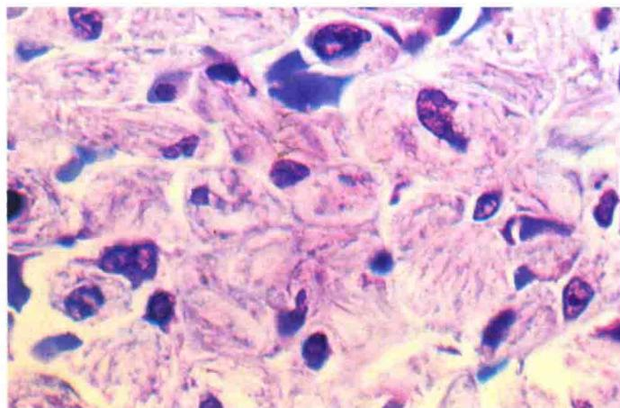 
图6-13 脾脏内的Gaucher细胞。典型的Gaucher细胞质呈泡沫状，胞核位于细胞一侧
之下，Tay-Sachs在非犹太美国人群中的发病率不到1/100000。其他的神经节苷脂沉积症极其罕见。

【发病机制】神经节苷脂由一个神经酰胺和一个包含乙酰神经氨酸的寡糖链组成。它们
存在于动物细胞质膜的外膜，尤其是在大脑神经元内（图6-12）。Tay-Sachs（也称为己糖苷酶α-亚单位缺陷）是由于位于15号染色体上编码己糖苷酶Aα-亚单位的基因发生的75个不同的基因突变所致，导致这种酶的合成发生缺陷。

【病理学表现】在Tay-Sachs疾病中，GM2神经节苷脂会在所有器官的溶酶体中蓄积，但其
主要蓄积在大脑神经元与视网膜细胞中。患者早期表现为大脑萎缩，然而病程超过1年的患者大脑重量可达原来的2倍。显微镜下观察，内由于脂质阳性物质的蓄积，神经元体积明显增大。电镜下观察，神经元内塞满了由同心螺环组成的层状结构，膜胞质小体。随着疾病的进展，神经元缺失，在大脑皮质的灰质内出现大量富含脂质的巨噬细胞。最后，大脑白质内出现明显的神经胶质，髓鞘和神经元缺失。

【临床表现】Tay-Sachs病通常在患者在 $6\sim$
10个月时发病，其典型特点是进展性虚弱、退和注意力下降。患者疾病的进展和精神状态
恶化，常常伴随全面的癫痫发作。视力严重受损。检眼镜检查可发现视网膜神经节细胞受累，表现为视网膜上可见樱桃红斑。这个特点表明受影响细胞变苍白，进一步使中央凹底层血管更加明显。大多数Tay-Sachs孩子在4岁之前死亡。
# 3.黏多糖蓄积症（Mucopolysaccharidoses，MPS）
MPS是溶酶体储存疾病的一种，其特点是黏多糖在多种器官内的蓄积。所有类型的MPS的遗传方式均为常染色体隐性遗传，除了亨特综合征，该综合征遗传方式为X连锁遗传。这些罕见疾病是由溶酶体内分解GAGs的10种酶中的任意1种缺陷所致（图6-14）。目前已经描述的异常表型有6个，并且每个表型都伴随不同的酶缺陷。

【发病机制】GAGs（黏多糖，也称为氨基葡聚糖）是由糖醛酸和N-乙酰己糖胺或其黏
多糖病硫酸酯组成的双糖单位的重复序列大分子，是多阴离子多聚体的糖胺多糖。在黏多糖蓄积症中蓄积的GAGs（硫酸皮肤素、硫酸肝素、硫酸角质素、硫酸软骨素和透明质酸）均来源于蛋白聚糖的裂解产物，蛋白聚糖为细胞外基质的成分。GAGs通过去除糖苷和硫酸盐而逐步发生降解。因此，任何一种糖苷酶或硫酸盐酶发生缺陷，最终会导致未降解
GAGs蓄积。GAGs蓄积的一个典型的例子，N-乙酰氨基转移酶缺陷导致C型Sanfilippo病中硫酸肝素沉积。

【病理学表现】尽管在MPS中，病变的严重程度和部位与特定的酶缺陷有关，大多数这些
综合征又具有相同的特征。未降解的GAGs一般倾向
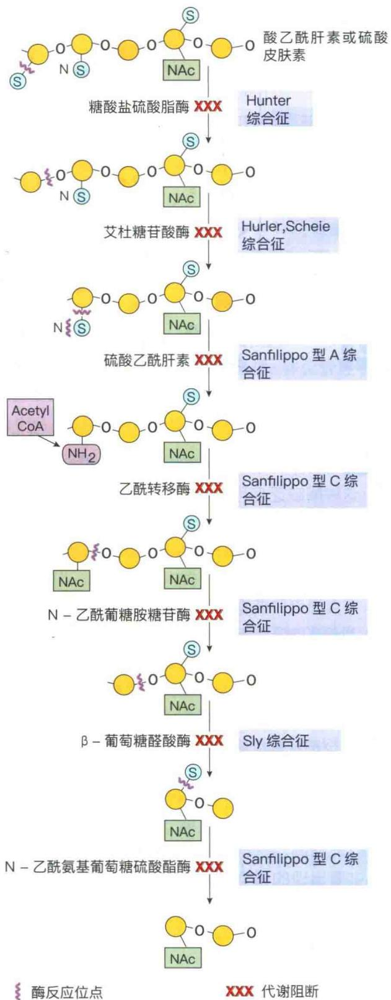 
图6-14各黏多醸沉积症中物质代谢受阻，进一步影响硫酸乙酰肝素和硫酸皮肤素的降解
于在结缔组织、单核－巨噬细胞（包括库普弗细胞）、上皮细胞、神经元细胞和肝细胞中蓄积。受损细胞变肿胀、透亮，细胞异染性确定细胞内GAGs存在。
在MPS中，尽管肝脾大和角膜混浊比较常见，最重要的病变在于中枢神经系统、骨骼和心。
■中枢神经系统：最初只有GAGs的蓄积，但随着疾病的进展，中枢神经内会出现皮质萎缩的变化：①神经元大量丢失；②神经胶质过多症。 
■骨骼畸形：由于GAG在软骨细胞内蓄积，最终导致正常软骨内的骨化过程发生异常。常见的骨骼畸形包括：异位骨化和编织骨畸形。 
■ 心脏病变：心脏病变往往比较严重，常伴有心脏瓣膜、腱索及心内膜增厚和畸形。由于GAG在平滑肌细胞内沉积导致冠状动脉内膜增厚，管腔变窄。 
肝脾肿大：肝脾肿大继发于肝脏内库普弗细胞和肝细胞的膨胀，以及富含GAGs巨噬细胞在脾脏内的蓄积。

【临床表现】Hurler 综合征 (MPS IH), 是
MPS 最严重的临床类型，依然是所有综合征的
原型。在6个月到2岁的儿童当中，Hurler综合征的症状明显。表现为：骨骼畸形、肝脾大、面具脸和关节僵硬。
Hurler 综合征患儿发育延迟、听力丧失、角膜混浊和进展性智力退化。多数患者在 10 岁之前死于反复发作的肺部感染和心脏并发症。
4. 糖原蓄积症 糖原蓄积症是一组至少包括10种遗传方式完全不同的糖原蓄积疾病，糖原蓄积的部位主要在肝、骨骼肌和心。每种疾病中都存在参与糖原代谢的特异性酶的缺陷（图6-15）。除了磷酸激酶缺陷以X连锁遗传外，其余所有的糖原蓄积疾病的遗传方式均为常染色隐性遗传。糖原蓄积症比较罕见，发病率为 $1 / 1000000 \sim 1 / 100000$
糖原是一种大的葡萄糖聚合物（每个糖原分子有 $20000\sim 30000$ 个葡萄糖单位），储存于大多数器官的细胞内，特别是肝和肌肉，在空腹状态下为机体提供能量。糖原的合成和降解需通过一系列酶的参与，任何一种酶的缺陷均会导致糖原的蓄积。
尽管每种糖原蓄积疾病均中存在糖原蓄积，但是特定酶缺陷后，主要的受累器官却不相同。一些主要影响肝，而其他主要引起心和骨骼肌功能障碍。重要的是，糖原蓄积疾病的症状可以表现为糖原本身积累（如Pompe病、Andersen病），由于葡萄糖通常来自糖原降解，也可以表现为葡萄糖缺乏，（如vonGierke病、McArdle病）。在已知的糖原蓄积症中，我们只讨论几个典型代表。
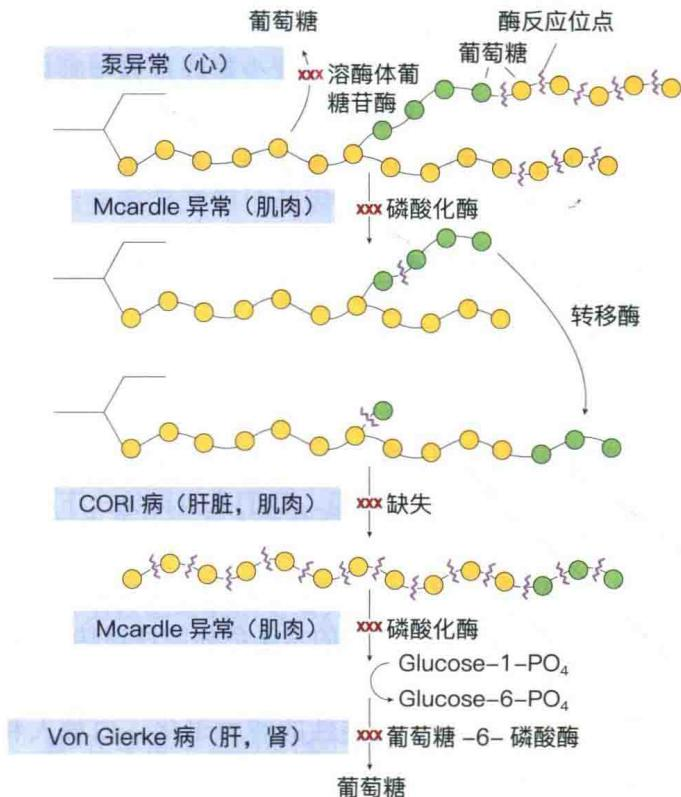 
图6-15在不同的糖原蓄积疾病中，糖原分解代谢的顺序和缺陷酶。糖原是一种长链有分支的葡萄糖残基聚合物，在该聚合物中，除了分支点上的两个葡萄糖残基是通过a-1，6位碳原子链接外其余葡萄糖残基之间均是通过a-1，4位碳原子链接。糖原磷酸化酶只能分解a-1，4-糖苷键，对a-1，6-糖苷键无作用，当糖链上的葡萄糖基逐个被水解至距离点约4个葡萄糖基时，由于空间位阻，磷酸水解酶不能继续发挥其作用。此时，这三个葡萄糖被有双重酶活性的a-1，6-葡萄糖苷酶，转移到邻近糖链末端，再次以a-1，4-糖苷键与之相连。随后，a-1，6-葡萄糖苷酶水解与原糖链以a-1，6-糖苷键相连的葡萄糖残基。产生的一条线状的a-1,4链，由磷酸化酶逐步降解，产生1-磷酸葡萄糖。随后，1-磷酸葡萄糖转变为6-磷酸葡萄糖，由葡萄糖-6-磷酸酶水解成葡萄糖释放入血。一小部分的糖原是靠溶酶体内的a-糖苷酶完全降解（红色的×指示代谢障碍）
（1）von Gierke 病（I a 型糖原蓄积症）：von Gierke 病是由于葡萄糖-6-磷酸酶缺陷所致，特点为：糖原在肝脏蓄积。肝大和贫血引起的临床症状表现为肝不能将糖原分解为葡萄糖。此疾病通常在胎儿或儿童早期比较明显。患者如一般存在发育不良，但是如果合理治疗，其智力发育的预后和平均寿命较好。 
（2）Pompe病（Ⅱ型糖原蓄积症）：Pompe病是一种溶酶体储存疾病，几乎涉及所有器官。患儿一般在2岁之前死于心脏衰竭。青少年和成年发病不常见，且预后较好。Ⅱ型糖原蓄积症是由于溶酶体内的一种α-葡萄糖苷酶缺陷所致，最终导致很多不同细胞溶酶体内糖原无法降解而蓄积。有趣的是，由于病者体内糖原合成和降解的主要代谢途径完好无损，因此，其不患有低血糖。 
（3）McArdle病（V型糖原蓄积症）：McArdle病的特点是由于肌细胞磷酸水解酶缺乏，导致糖原在肌
细胞中蓄积。磷酸水解酶的作用是水解糖原，释放葡萄糖-1-磷酸酶。患者一般在青少年或是成年时期出现症状，在活动时出现肌肉抽搐和痉挛的表现。有时，患者也会出现肌溶解和肌红蛋白尿。避免运动可减轻该疾病的症状。
# 十三、先天性氨基酸代谢异常及其伴随的多种严重症状
许多氨基酸代谢的遗传疾病已被证实。有些疾病在儿童早期阶段便具有致死性；另一些是没有临床意义的无症状的生物化学缺陷。在相关章节里有些疾病会进一步详细讲述。在这里，我们重点讨论一下与苯丙氨酸代谢异常的两个例子（图6-16）。
1. 苯丙酮尿症（phenylketonuria，PKU）PKU是由于肝酶PAH缺陷导致的常染色体隐性遗传疾病。该疾病的特点是血液中苯丙氨酸水平高，从而导致患者在儿童时期发生进展性的智力退化。白种人和亚裔人种，PKU的整体发病是1/10000，但是地理差异较大。

【发病机制】苯丙氨酸是一种只能从食物中获得的必需氨基酸。进入体内后进一步在肝
内被PAH氧化成酪氨酸。PAH的编码基因位于12号染色体长臂。PAH缺陷最终导致高苯丙氨酸血症和苯丙氨酸通过转氨基作用形成苯丙酮。苯丙酮酸及其衍生物从尿液中排出，但是该疾病引起中枢神经系统损害的物质是苯丙氨酸本身，而非其代谢产物。因此，高苯丙氨酸血症这个词实际上是比PKU更合适的一个名称。
目前，在婴儿期，与高苯丙氨酸血症型导致的神经毒性的确切机制还不清楚，但其可能干扰了如
下的一些进程： $①$ 竞争性干扰大脑中的氨基酸运输系统； $②$ 抑制神经递质的合成； $③$ 干扰其他代谢过程。这些影响可能导致神经元发育不足和髓磷脂的合成缺陷。

【临床表现】PKU阐明了在疾病的发病机制中“遗传”和“环境”之间的相互关系。该疾病的基因缺陷，但其是否发病取决于饮食中摄入的酸。患儿出生时外边正常，但是出生后的几个出现明显的智力低下。未经治疗的患儿1岁时，严重的智力低下。PKU患儿皮肤白皙，头发金睛蓝色。因为无法将苯丙氨酸转化为酪氨酸，色素的合成减少。他们浑身散发出“鼠臭”味，乙酸存在的特殊气味。
PKU的治疗包括限制饮食中的苯丙氨酸的量， $250\sim 500\mathrm{mg / d}$ ，这通常需要一个半合成公式。目前对于应该限制多长时间苯丙氨酸的摄入是有争议的。然而，随着新生儿中PKU筛查项目的成功开展和低苯丙氨酸饮食机构的迅速建立。目前，很多PKU纯合子患儿可以正常生活。
2. 白化病（albinism）白化病是指一组因基因缺陷导致黑色素的生物合成缺失或减少的遗传性疾病，至少包括10种疾病。此病在所有物种中均存在（从昆虫到人类）。最常见的类型是眼皮肤白化病（oculocutaneous albinism，OCA），以家族性的常染色体隐性遗传。OCA的临床特点是皮肤、毛囊和眼睛黑色素合成缺陷或完全消失。在美国，OCA在白种人中的发病率为1/18000，在黑种人中的发病率为1/10000。酪氨酸是生物合成通路中将酪氨酸转化为黑色素的第一种酶，根据患者体内酪氨酸酶是否存在，
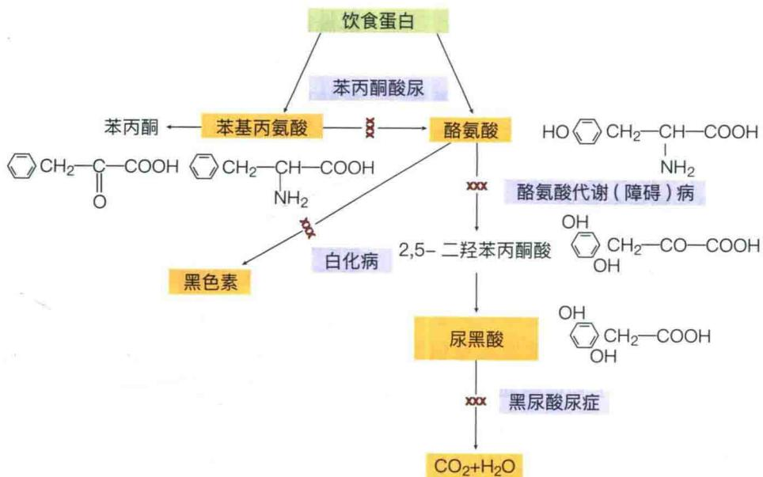 
图6-16 苯丙氨酸和酪氨酸代谢紊乱引起的疾病
OCA可分为两种不同的类型（图6-16）。
酪氨酸阳性OCA：在所有黑种人和白种人中，此型是最常见的白化病类型。患者刚出生时，通常全身呈现为白化病，但随着年龄的增长，临床上可检测到少量的色素积累。位于15号染色体（q11.2-q13）的 $P$ 基因目前认为可编码酪氨酸转移蛋白，该基因缺陷，会引起黑色素合成障碍。
酪氨酸阴性OCA：在白化病中，此类型仅次于酪氨酸阳性OCA。其特点是患者体内酪氨酸和黑色素完全缺失。患者体内有黑色素细胞存在，但是包含无色素的黑色小体。此型患者的呈毛发发白，皮肤呈淡粉色，同时由于视网膜色素缺乏，其虹膜呈蓝色、瞳孔呈明显的红色。另外，此类患者一般都存在严重的视力障碍，包括畏光、斜视、眼球震颤及视敏度降低。
所有白化病患者皮肤对光线高度敏感。暴露于阳光下的皮肤需要涂抹强有力的防晒乳液。这些患者暴露于阳光下皮肤的基底细胞，其发生鳞状细胞癌的风险大大增加。
# 十四、致病基因位于X染色体上时，表现为X连锁遗传
在男性和女性群体中，X连锁遗传的疾病的表达不同。女性体内有两个X染色体，针对某一性状可有纯合子或杂合子两种基因型。因此，女性的临床表现特征是可变的，这取决于此性状对应的突变基因是显性的还是隐性的。相反，男性体内只有一条X染色体，被称为半合子（hemizygous）。因此，在男性个体中，不管临床性状是显性还是隐性遗传，其表现型都是一成不变的。
在所有X连锁遗传疾病中，临床性状不存在男性向男性的传递。临床上有症状的父亲只能将一条Y染色体上的基因遗传给其男性后代。相反，他X染色体上的异常基因只能传给其女性后代，这样其女性后代便成为该临床症状的隐性携带者。因此，该种疾病临床表现为交叉遗传。
1.X连锁显性遗传病由于在男性中的半合子状态不能区分显性遗传和隐性遗传之间的差别，X连锁显性遗传性状仅仅指女性群体中特定性状的表现型。目前，被阐述清楚的X连锁显性遗传病只有少数，
其中包括家族性低磷酸盐血症佝偻病和鸟氨酸氨甲酰基转移酶缺乏症。在这些疾病中，女性个体中的表型变化，通过Lyon效应（即随机的一条X染色体失活）至少在某种程度上可以得到解释。这种随机失活导致突变等位基因嵌合体形成，导致该特征存在可变性。
2.X连锁隐性遗传病 大多数X连锁遗传病遗传方式为隐性遗传；也就是说，临床上杂合子的女性不会发病（图6-17）。该种遗传疾病的特点包括以下几点：
女性携带者的儿子中，遗传该疾病的概率为 $50\%$ ；其女儿均为无症状者，然而， $50\%$ 的女儿将会是携带者。
■男性患者的所有女儿均为无症状携带者，但是其儿子均不会患此疾病，且不会将此疾病传递给自己的后代。
在非常罕见的情况下，如果一个男性患者与一个无症状的女性携带者婚配，其后代可产生纯合子的有症状女性。或者，在极端情况下，lyonization可能优先灭活正常的X染色体，也会导致一个杂合子的女性携带者表达X染色体隐性特征。
表6-5列出了一系列X连锁隐性遗传病的典型例子。
表6-5 典型的X连锁隐性疾病脆性X综合征1/2000血友病甲（VIII因子缺乏）1/10 000血友病乙（IX因子缺乏）1/70 000杜显贝克肌肉萎缩症1/3500葡萄糖-6-磷酸脱氢酶缺失可达30%莱施-奈恩综合征（HPRT缺失）1/10 000慢性肉芽肿病不罕见X-连锁的血中丙球蛋白贫乏不罕见X染色体连锁重度联合免疫缺陷病罕见Fabry病1/40 000亨特综合征1/70 000肾上腺脑白质营养不良1/100 000门克斯病1/100 000
HPRT. 次黄嘌呤鸟嘌呤磷酸核糖转移酶
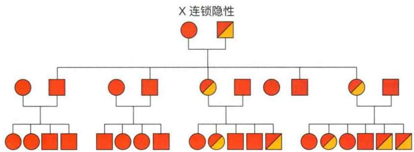 
图6-17X连锁隐性遗传病只有男性表现为患病个体；男性患者的女性后代均为无症状的携带者。无症状的男性不会遗传该表型。临床上，该疾病遗传方式为隔代遗传

男性患者

女性杂合子（隐性携带者）
3.X连锁的肌营养不良（Duchenne型和Becker型）肌营养不良是一种毁灭性的肌肉疾病。多数是X连锁隐性遗传病，仅有小部分是常染色体隐性遗传病。X连锁的肌营养不良是人类最常见的遗传性疾病，在男性中的发病率为1/3500，与CF发病率相似。Duchenne型肌营养不良（DMD），是最常见的类型。该型表现为患儿4岁前出现的一种肌肉致死性的进展性退化。Becker型肌营养不良（BMD）与DMD是一对等位基因，但是其临床发病率较后者低，病情也较后者缓和。肌营养不良将在第27章中讨论。 
4. 血友病A（第八因子缺乏症）血友病A是一种X连锁的隐性遗传疾病，患该疾病的患者由于缺乏凝血因子VIII，表现为凝血功能障碍，皮肤出血可形成皮下血肿，尤其是关节、肌肉和内脏出血。该疾病将会在第20章讨论。 
5. 脆性X综合征 脆性X综合征是遗传性智力低下最常见的形式，是由于Xq27脆性位点的三核苷酸（CGG）重复序列的增加所致。在遗传原因导致的智力低下中，其仅次于先天愚型（唐氏综合征）。该疾病在男性中的发病率为1/250，在女性中的发病率为1/2500。

# 【发病机制】在所有与遗传相关的智力低下
患者中，大约有 $20\%$ 的患者与 X 连锁基因
缺陷疾病相关。同时，1/5的智力低下患者与单基因缺陷相关，也就是指，Xq27的一个脆性位点。
脆性位点代表染色体上容易发生断裂的一个特殊位点，或是条带。Xq27的脆性位点的典型突变特征是CGG三核苷酸重复序列的扩大。
在脆性X家族中，个体是否患病取决于在家系中的位置；个体在家系中的位置越靠后，其患病的概率就越大（谢尔曼悖论或基因预测）。如果染色体上重复序列次数超过52，那么该染色体即可进一步增加重复序列次数，称之为扩张。小范围的扩展，称之为前突变，一般无任何症状，只是染色体的变大，尤其是在女性减数分裂期。这种前突变与该突变体后代中更大的染色体扩张相关。特定序列重复数量超过200次的扩张与智力迟缓相关，代表完全突变。只有在女性个体配子形成期间，才会发生前突变向完全突变的转变。因此，前突变的男性携带者，其女性后代不会出现临床症状，但是男性携带者的姐妹们，其女性后代有可能为患者。由于脆性X染色体的遗传方式为隐性遗传，男性携带者的大多数女性后代，其生育的男性个体中患智力低下的概率为1/2。这些考虑可以解释在脆性X家族中，各个个体后代患此病的风险（图6-18）。
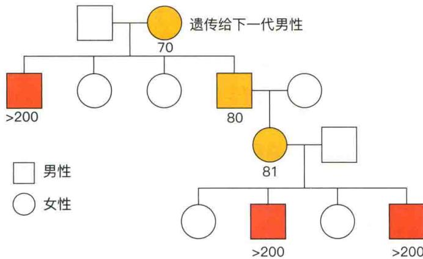 
图6-18 脆性 $\mathbf{x}$ 综合征遗传模式。在该家系中各个患病个体下面标记出了三核苷酸重复序列（CGG）的克隆数。扩张主要发生在女性个体减数分裂期。当（CGG）的重复数量超过200次时，个体会呈现出临床症状。家系图中橘黄色阴影的个体代表前突变的无症状个体

# 【临床表现】男性 $\times$ 脆性综合征患儿，出生时
外观无明显异常。但随着年龄的增长，在儿童
期，患儿会呈现出典型的临床表现，包括头围增大，颜面部粗化，关节伸展过度，睾丸增大和心脏瓣膜异常。智力低下明显，IQ评分一般在 $20\sim 60$ 的范围内。有趣的是，相当一部分男性 $\times$ 脆性综合征患儿有孤独症的表现。在女性携带者中，智力障碍的严重程度轻者表现为中度的学习能力障碍，重者表现为严重的智力低下。
# 十五、非孟德尔遗传的遗传性疾病
线粒体疾病（mitochondrial diseases）：线粒体呼吸链的大多数蛋白是由核基因编码，只有一小部分是由线粒体基因组编码。然而，大多数线粒体功能缺陷来自线粒体基因组的突变。所有脊椎动物的线粒体的遗传与母体卵子遗传两种方式互不干扰。由于线粒体内含有多克隆的线粒体DNA（mtDNA），因此，任何含有许多线粒体的细胞中含有成千上万的mtDNA。但mtDNA突变，会导致突变的mtDNA和正常的线粒体基因组混合。与mtDNA突变相关的表型受以下方面的影响：严重的基因突变、基因组中突变的比例和组织对ATP的需求程度。线粒体基因组突变导致的遗传性疾病较为罕见，主要影响神经系统、心和骨骼肌。所有这些疾病的功能缺陷均可追溯到线粒体的氧化磷酸化不足。基于前文的讨论，所有线粒体疾病的临床症状的表现存在变化。Leber遗传性的视神经病变是发现的第一种人类染色体疾病，其临床表现为进展性的视神经缺失。目前已知多种线粒体疾病，包括肌肉疾病、肥厚性心肌病和脑肌病等（见第11章和第27章）。
基因印记（genetic imprinting）：基因印记是指根据遗传的等位基因来自母方还是父方，观察一些表型
是否随着基因的改变而变化。印迹是指父方或母方来源的一个等位基因维持在一种失活的状态。如果非印迹（活化）等位基因由于突变被扰乱，印记等位基因不能进行补偿，进而导致疾病的发生。印记可以导致遗传疾病的发生，这些遗传疾病的表型取决于双亲来源的突变等位基因。典型的例子为Prader-Willi综合征（PWS）和Angelman综合征（AS）。两种疾病都与15q11-q13区域的染色体缺失有关。PWS中，缺失发生在母体来源的染色体，因此，母体染色体上本区域一些重要基因的表型沉默。相反，在AS中，染色体缺失或突变发生在父方染色体的相同区域，因此，父方染色体上对应区域的一些重要基因的表型沉默。这些疾病的临床表型非常不同。PWS患者的临床表现为张力减退、肥胖、性腺功能减退、智力低下和特殊面容。另一方面，AS患者的临床表现为极度活跃、非正常大笑、痉挛和特殊面容（与PWS患者不同）。
基因印证也参与了一些其他的人类相关疾病。例如，在一些儿童癌症，包括Wilms肿瘤、骨肉瘤、双侧视网膜母细胞瘤和胚胎期的横纹肌肉瘤中，目前被认为具有抑癌作用的母系来源的等位基因缺失，父系来源的等位基因依然存在于染色体上。
单亲遗传（uniparental inheritance）：单亲二倍体（uniparental disomy）是由于一对染色体的中的两条均来自于母方或是父方。单亲二倍体较为罕见，但却涉及一些意想不到的遗传性状的遗传模式。例如，正如在小部分CF患者和甲型血友病患者中观察所见，具有单亲二倍体的患儿，当其父母双方只有一人为携带者时，可表现为隐性遗传特点。约 $30\%$ 的PWS患者是来源于母系的单亲二倍体。这样的患者在母体来源的15号染色体上存在两个相同的活化区域。
# 第六节 多因素遗传
多因素遗传是指由多个基因缺陷和环境因素导致疾病的过程。人类大多数正常的表型的表达非常复杂，不是简单的通过孟德尔显性或隐性遗传方式表达。例如，多因素遗传的决定个体身高、肤色和身体体质。同样，成年人当中最常见的慢性疾病，糖尿病、动脉粥样硬化、许多形式的癌症、关节炎和高血压都是多因素遗传疾病，同时也具有明显的家族遗传性。许多出生缺陷的遗传方式也是多因素作用导致（如唇腭裂、幽门狭窄、先天性心脏病）。
多因素遗传的概念是基于这样一种观念，即一个个体的多个基因之间的相互作用和基因与环境因素相互作用导致疾病。这样的遗传方式具有家族聚集性，不简单地服从孟德尔遗传定律。
# 一、关于基因多态性的多基因遗传生物学基础
多基因遗传的生物学基础基于一种现象，即超过1/4的人类正常的基因位点包含有等位基因的多态性（如等位基因表现出的遗传变异）。这种基因异质性为许多疾病不同的易感性变化提供了研究背景。这种基因异质性是由基因与环境因素之间的相互作用所致。
症状的表现型与突变基因的数量成正比。同卵双胞胎之间，突变基因的表达数量相等的概率是最高的。 
■ 环境因素影响症状的表现型。因此，只有1/3同卵双生双胞胎中，疾病的表现型一致。 
直系亲属（父母、兄弟姐妹、子女）中发病风险是相同的，为 $5\% \sim 10\%$ 
患者后代中某种表型的表达概率受到其已出生后代该表型表达的影响。如果一个多基因缺陷患者有一个或更多的孩子出生，那么该疾病在随后的后代中复发的概率增加一倍。相比之下，对于简单的孟德尔性状而言，患者兄弟姐妹之间发病与否的概率相互独立。 
患者缺陷越严重，传给后代的风险越高。越严重的患者，其体内可能有更多的缺陷基因。因此，其后代遗传该疾病的概率就会更大。 
一些多因素遗传导致的畸形具有一定的性别倾向。这种疾病不同的易感性被认为是在不同的性别体内，存在突变基因表达的不同阈值。
# 二、多因素遗传的典型疾病 唇裂和腭裂
在妊娠的第35天，额隆与上颌突融合形成上唇。这个过程在许多基因共同调控下完成，此时一旦因遗传或环境因素干扰基因表达，终会导致融合过程异常和导致唇裂，伴或不伴有腭裂（图6-19）。
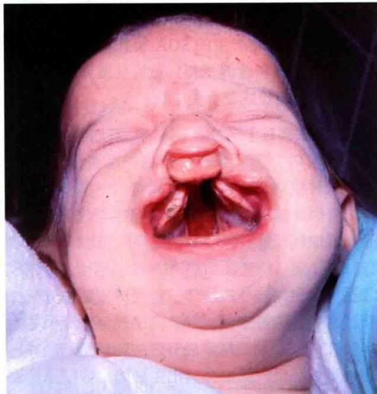 
图6-19 唇腭裂患儿
唇裂（伴或不伴有腭裂）的发生率为1/1000，腭裂的发生率为1/2500。如果某个体的第一个胎儿出生时表现为唇裂，那么其第二个胎儿发生唇裂的概率为 $4\%$ 。如果某个体的前两个胎儿均为唇裂患者，那么其第三个胎儿发生唇裂的概率为 $9 \%$ 。唇裂缺陷表现越严重，其遗传给后代的可能性越大。然而， $75\%$ 的唇裂患者为男性患儿，唇裂女性的男性后代发病率是唇裂男性的男性后代的4倍。
# 第七节 胎儿和儿童性疾病
患儿的发病率和死亡率，在新生儿期与婴儿期和儿童期是非常不同的。婴儿和孩子并不仅仅是“小成年人”，他们可能患其年龄段所特有的一些疾病。
# 第八节 早熟和宫内发育迟缓
正常妊娠持续的时间为 $38\sim 42$ 周，大多数新生儿体重为 $2700\sim 3900\mathrm{g}$ 。国际卫生组织对早产的定义是：妊娠龄少于37周（从最后一次月经的第1天算起）。低出生体重胎儿是指天儿出生时体重低于 $2500\mathrm{g}$ ，被称为： $①$ 适合孕龄胎儿（AGA）； $②$ 小胎龄胎儿（SGA）。
在美国，在所有出生的婴儿中，约 $1\%$ 的婴儿出生体重不到 $1500\mathrm{g}$ ，称之为极低出生体重胎儿。这些胎儿占新生儿死亡人数的一半，其生存与否取决于出生体重。如果早产新生儿能得到新生儿重症医疗单位的照顾， $90\%$ 超过 $750\mathrm{g}$ 的婴儿可以生存。 $500 \sim 750\mathrm{g}$ 的胎儿，存活率为 $45\%$ ，其中一半以上的胎儿发育正常。
容易引起胎儿AGA早产的因素包括：①孕产妇疾病；②子宫无能；③胎儿疾病；④胎盘异常。很大一部分的AGA胎儿，其早产的原因是未知的。与宫内生长迟缓和由此产生的SGA胎儿相关联的障碍包括：①母体健康和营养受损；②胎盘循环或功能受干扰；③胎儿的成长或发育受干扰。
【临床表现】通常，在早产本身的并发症AGA和宫内发育迟缓SGA两者之间有很大的重叠。然而，每种疾病又有自己特定的特点。早产通常与以下情况有相关性： $①$ 严重的呼吸窘迫； $②$ 代谢紊乱（如高胆红素血症、低血糖、低钙血症）； $③$ 循环异常（如贫血、低体温、低血压）； $④$ 脓毒症。相比之下，SGA胎儿是一个更为异质的群体，包括许多婴儿先天性畸形和在宫内感染性疾病。除了会出现与早产相关的许多问题外，SGA胎儿常常患有围生期窒息，胎粪、坏死性小肠结肠炎、肺出血（出生缺陷）或继承代谢相关的疾病。
# 一、胎儿疾病是器官发育不成熟的原因之一
早产儿的器官成熟情况与足月儿不同，尽管许多器官的成熟需要出生后的一段时间，例如：肺成熟出生后需要几天，大脑成熟需要出生后几年。
肺：低出生体重胎儿最常见和威胁最大的疾病是肺发育不成熟。直到妊娠晚期胎儿肺泡内的衬里细胞才可分化成I型和Ⅱ型肺泡壁细胞。胎儿出生时，肺泡内填充的羊水从肺内向外引流。胎肺不成熟胎儿可表现为呼吸运动缓慢无力，因此，不能完全排除肺内填充的羊水。有时称为羊水吸入综合征，这种情况实际上表示羊水在胎肺中潴留。这种患儿，呼吸通道包含脱屑鳞状细胞（鳞屑）、胎儿皮肤脱落的胎毛和富含蛋白质的羊水。
肝：早产儿的肝除了有明显的骨髓造血作用外，其形态学类似于成人器官。然而，肝细胞功能不成熟。胎儿肝因缺乏葡萄糖醛酸转移酶，导致其不能与胆红素结合，经常会导致新生儿黄疸。胎儿肝细胞迅速被破坏的过程会增加胆红素的供应，该过程会导致葡萄糖醛酸转移酶酶缺陷进一步恶化。
脑：虽然不成熟的新生儿的大脑于成年人的形态学和功能不同，但这种差异很少是致命的。另一方面，中枢神经系统发育不完整往往表现为血管舒缩性功能低下、低体温、喂养困难和反复发作的呼吸暂停。
# 二、新生儿呼吸窘迫综合征是由于表面张力素缺陷
新生儿呼吸窘迫综合征（RDS）是导致早产儿发病率和死亡率最主要的疾病，在美国，占新生儿死亡人数的1/2。其发病率与胎儿出生时胎龄和体重成反比。因此，28周之前出生的新生儿，患RDS的人数超过一半。相比之下，在 $32\sim 36$ 周出生的新生儿患RDS的概率只有 $20\%$

【发病机制】新生儿RDS的发病原因与表面张力素的缺陷明显相关（图6-20）。
新生儿开始呼吸时，Ⅱ型细胞释放表面张力素。表面张力素可以减少表面张力；即，该物质可以减少肺泡表面之间的亲和力。当肺泡处于开放的状态时，胎儿呼出气体的同时减少再次肺泡重新充气的阻力。如果表面张力素不足，当胎儿呼出气体时肺泡塌陷，同时肺泡再次充气时阻力增加，最终导致肺泡损害。肺泡损害后，可引起血浆向肺泡腔内渗入。血浆成分（例如：纤维蛋白原、白蛋白）与表面张力素结合同时损害其功能，最终导致呼吸功能不全恶化。许多肺泡被血液灌注后，没有空气流动，会导致患儿缺氧、酸中毒和Ⅱ型肺泡表面细胞生产
表面活性剂的能力减弱。此外，缺氧会引起肺动脉血管收缩，从而通过开放性动脉导管、卵圆孔和肺内本身增加从右到左的分流。由此产生的肺缺血进一步加剧肺泡上皮和肺毛细血管内皮的损害。
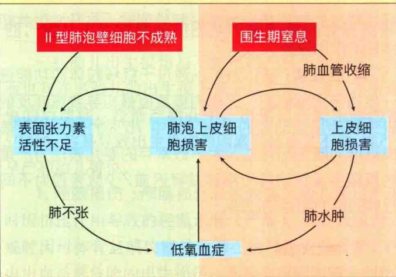 
图6-20 新生儿呼吸窘迫综合征的发病原因。胎肺发育不成熟和围生期窒息是两个主要的致病原因

【病理学表现】肺大体外观，呈暗红色，质实。肺泡塌陷，肺泡导管和呼吸细支气管扩张并
包含细胞碎片、蛋白质水肿液和红细胞。在肺泡导管的表面布满了明显的嗜酸性、纤维素样、非晶态的结构，称之为透明膜（hyaline membranes），因此，新生儿RDS最初的术名为透明膜病（hyaline membranedisease）（图6-21）。倒塌的肺泡壁厚，毛细血管充血和淋巴管充满了蛋白质的物质。
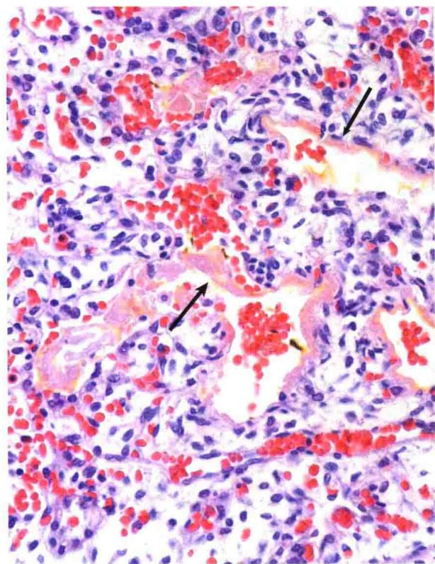 
图6-21 新生儿呼吸窘迫综合征的肺部表现。肺泡膨胀不全，肺泡扩张导管内衬富含纤维素的透明膜（箭头）
【临床表现】大多数会发生RDS的新生儿出生时外观正常。通常在出生后1小时内出现首发症状，表现为呼吸动度增加，肋间肌收缩加强和颈部肌肉参与呼吸运动。呼吸频率每分钟超过100次，患儿皮肤发绀。在严重的病例，婴儿症状逐渐减轻、肌肉无力。胎儿呼吸暂停发生很长一段时间后，最终死于窒息。如果在妊娠早期存在发生RDS的潜在威胁，母体注射糖皮质激素可促进胎肺成熟，从而降低早产儿的RDS发生率。
此外，使用动物表面活性物质联合改善通气的治疗极大地提高了RDS患儿的生存率。目前，即使是在非常小的早产儿中， $85\% \sim 90\%$ 的生存率是很常见。RDS的主要并发症为缺氧和酸中毒。
胎肺成熟度可以通过各种各样的检查进行评估。肺表面活性物质可释放到羊水中，因此，可以通过羊膜穿刺术抽样评估胎儿肺成熟度。若卵磷脂和鞘磷脂比率为2:1，提示胎儿无发展为RDS的风险。35周后，羊水中出现磷脂酰甘油是胎儿肺成熟的最好证据。
# 三、胎儿成红细胞增多症是因母体内存在抗胎儿红细胞的抗体导致的溶血性疾病
胎儿成红细胞增多症（Erythroblastosis fetalis）是胎儿和新生儿的一种溶血性疾病，该疾病是由于母体内针对胎儿红细胞的抗体透过胎盘所致。只有RhD抗原，Kell1抗原，Rhc抗原和ABO系统抗原的抗体可以引起明显的溶血性疾病，其中RhD抗体目前最为常见。不同的人种中，RhD抗原的分布不同。在美国白人群体中， $15\%$ 为RhD抗原（一），然而在黑人群体中，只有 $8\%$ 为RhD抗原（一）。日本、中国和美国土著群体中基本上不存在RhD抗原（一）个体。

【发病机制】在由Rh不兼容导致的成红细胞增多症胎儿中， $90\%$ 的患儿是由胎儿D
抗原的抗体所致。分娩时，Rh（+）的胎儿红细胞（>1ml）进入Rh（-）的母体血液循环中，母体内RhD抗体与相对应的抗原发生反应（图6-22）。因为只有在分娩时，一定量的胎儿体内的血细胞才可以进入母体循环系统，使母体产生免疫应答反应，所以胎儿成红细胞增多症通常不影响第一个孩子。然而，当已发生制敏的母体再次怀有一个Rh（+）胎儿时，少量的胎儿D抗原就可引起母体抗体滴度的增加。与免疫球蛋白（Ig）M相比，（Ig）G抗体可以穿过胎盘导致胎儿溶血。这种恶性循环在多产妇中会进一步恶化，胎儿成红细胞增多症的严重程度随着怀孕次数的增加，逐渐进展。
在接触过大量 $\mathrm{Rh}(+)$ 胎儿红细胞的 $\mathrm{Rh}(-)$ 女性中，也有很多人不会发生明显的免疫反应。事实上，在多次
怀孕后，只有 $5\%$ 的Rh（一）妇女会分娩胎儿成红细胞增多症患儿。产妇致敏的第二种潜在来源是输血。

【病理和临床特征】胎儿成红细胞增多症的程度轻者表现为轻度溶血，重者可表现为致死性贫血。最终的病理结果取决于溶血性疾病的程度。

■ 胎死宫内：是此疾病发生的最极端后果，在临产倒中，分娩时可见严重的浸渍。在内脏器官中毒、感染的不完全自溶红细胞。
■ 胎儿水肿：是活产新生儿中最严重的成红细胞增多症的形式。特点是：继发于贫血性心力衰竭的严重水肿。若不向患儿体内输注大量的Rh（一）红细胞来纠正贫血状态和改善溶血性疾病，患儿通常会死亡。
核黄疸：也称为胆红素脑病，由于胆红素沉积
在基底神经节、脑干神经核而引起的脑损害。核黄疸（Kernicterus来自德语，kern，核）本质上是指新生儿体内的严重的非结合高胆红素血，通常与成红细胞病有关。胆红素一方面来自破坏的红细胞，另一方面由于不成熟的肝内缺乏葡糖醛酸基转移酶，红细胞破坏后释放的血红蛋白发生分解代谢时，与肝发生共轭结合的作用较弱。
胆红素：被认为可以通过干扰线粒体的功能进一步损伤大脑细胞。严重的核黄疸最初导致惊吓反射丧失和手足徐动症的发生，其中 $75\%$ 的新生儿可最终进展为嗜睡和死亡。大多数幸存的婴儿表现为严重的舞蹈手足徐动症和精神发育迟滞；少数表现为不同程度的智力和运动缺陷。
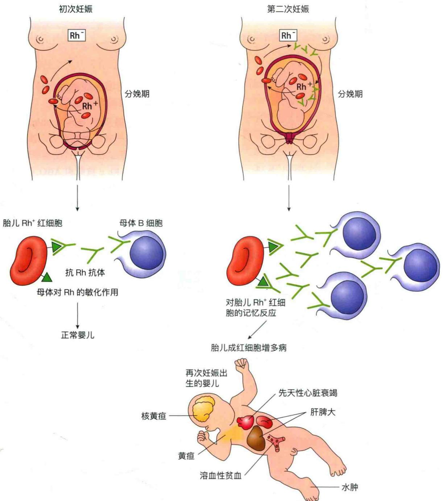 
图6-22由于母胎Rh不兼容引起的胎儿成红细胞增多症的发病机制。初次妊娠时，Rh（一）的母体和Rh（+）的胎儿发生免疫反应，形成针对Rh的免疫球蛋白（Ig）G抗体。当母体再次妊娠时，这些抗体可通过胎盘，对Rh（+）的胎儿造成损害
近年来，在分娩后72小时内使用人类抗-D球蛋白（RhoGAM），继发于Rh不相容的胎儿成红细胞增多症的发病率明显降低，Rh（一）女性的发病率 $< 1\%$ 。RhoGAM可以综合在分娩期进入母体的胎儿血细胞抗原性，预防母体内Rh-D抗体产生。
# 四、胎儿出生损伤的范围从机械创伤到缺氧损害
一些胎儿出生损伤与不规范的产科处理相关，然而也有许多胎儿的出生损失是分娩常规处理后不可避免的后遗症。在活产胎儿中，出生损伤发生率约为5/1000。容易导致出生损伤的因素包括头盆不称、难产、早产和胎儿臀位。
1.颅脑损伤颅脑损伤轻者表现为胎儿通过产道时因挤压作用导致的轻微水肿（产瘤）；重者表现为分娩时因母体骨盆或仪器导致潜在的严重头骨骨折。颅内出血是最危险的出生损伤，其发生原因可能是创伤、继发于窒息或胎儿本身为潜在的出血素质个体。创伤性颅内出血发生在如下情况： $①$ 严重的头盆不相称； $②$ 急产； $③$ 胎儿臀位； $④$ 产程延长； $⑤$ 不恰当地使用产钳。这些创伤可以导致硬膜下或蛛网膜下腔出血（subdural or subarachnoid hemorrhage）。颅内出血新生儿的预后取决于其出血程度。迅速大量出血往往是致命的。幸存患儿可能完全恢复，也可能存在长期的功能障碍。
# 2. 周围神经损伤
（1）臂丛神经麻痹（brachial palsy）：是由于在分娩时过度牵引头部和颈部或肩部所致，伴随着不同程度的上肢瘫痪。如果是因神经切断导致的肩麻痹，该损伤可能为永久性。如果是因水肿和出血引起的肩麻痹，其功能可能在产后数月内恢复。一侧膈肌的膈神经和相关神经的麻痹可能与臂麻痹有关，最终导致呼吸困难。这些症状通常在几个月内自然恢复。
（2）面部神经麻痹（facial nerve palsy）：通常表现为在妊娠或分娩期间，尤其是使用产钳时，单侧颜面部弛缓性麻痹由第7脑神经损伤引起。严重情况下，受影响的一侧面部完全瘫痪，眼睑甚至不能闭合。预后情况取决于神经损伤的程度。
# 五、未知原因的婴儿猝死综合征
婴儿猝死综合征（sudden infant death syndrome, SIDS），也被称为“Crib Death”是指婴儿或较小儿童的突然死亡，但是无可能引起猝死的病史，同时尸检结果也未能找到患儿死亡的充分依据。尽管通过排除其他具体的胎儿突然死亡的原因，可得出婴儿猝死综合征这一诊断。该综合征仍然被认为是一个独特的临床病理的实体。
通常，SIDS患儿是一个看似健康，处于熟睡状态且没有任何疾病迹象的小婴儿。临床上，婴儿在正常的
睡眠间歇不能被唤醒。尸检并不确定死因，如肺炎、食品吸入、败血症或脑出血。这个悲惨的事件已经引起许多公众的关注，因为它必须与故意杀人区分，已经证明此综合征是一些事故中儿童神秘死亡的真正原因。
【流行病学】新生儿期以后，SIDS婴儿第一年内死亡的主要原因，占此阶段所有死亡婴儿人数的 $20\% \sim 25\%$ 。在美国，在活产婴儿中此综合征的发病率是0.5/1000。绝大多数（ $90\%$ ）的患儿在出生后6个月内发生此综合征。大多数婴儿在冬季死于SID，但呼吸道感染和婴儿死亡之间没有特定的联系。死亡通常发生在夜间或睡眠时间。近年来，突发性婴儿死亡综合征的报道明显减少。这是归因于“Backto Sleep”活动，鼓励父母在让婴儿在睡觉时处于仰卧位。
【发病机制】婴儿猝死综合征的发病机制仍然不清楚，同时也存有争议。三倍的风险模型提示：婴儿内源性的心脏和呼吸控制异常之间的相互作用，自我稳态机制脆弱性的关键时期，外在压力因素在该时期中发挥重要作用。
有 $10\% \sim 20\%$ 的SIDS患儿与细胞膜的离子通道异常有关。心脏传导系统的离子通道异常会导致胎儿猝死的发生。由于SIDS和胎儿睡姿之间的相关性在很大程度上已经被排除，孕期母亲酗烟仍是婴儿猝死综合征最重要的一个的病因学因素，估计有 $80\%$ 或更多的婴儿猝死症死亡与母体孕期酗烟有关。正如SIDS患儿存在明显的神经生理功能异常一样，一些死于SIDS的婴儿的大脑内可见明显的畸形。当实验动物在子宫内暴露于尼古丁时，可观察到类似的畸形。并且该畸形与高碳酸血和缺氧导致的通气低下相关联。
【病理学表现】尸检过程中，可发现SIDS患者体内存在几种形态学改变，但是仍不清楚这些改变和病因学及发病机制之间的相关性。脑干神经胶质过多症可以证明慢性缺氧，两者发生之间存在一定的规律性。据报道大多数死于SIDS的婴儿肺、心、胸膜和胸腺表面的瘀点，有可能是终末事件的表现。目前被归因于患儿过度用力呼吸导致的胸廓内的负压。
# 第九节 胎儿和儿童相关性肿瘤
$1\sim 15$ 岁的儿童，尽管恶性肿瘤的发病不常见，但癌症仍然是导致这个年龄段儿童死亡疾病的主要原因。在儿童中， $10\%$ 的儿童死亡是由于恶性肿瘤，另外大部分儿童死亡是由于意外事故。成年人的大多数癌症来源于上皮细胞（如肺癌、乳腺癌、胃肠癌），与
成年人不同，儿童恶性肿瘤主要来源于造血系统、神经元和软组织（图6-23）。区分儿童肿瘤和成人肿瘤的另外一个特征是许多儿童肿瘤都是发育异常综合征的一部分。例子有Wilms肿瘤与无虹膜畸形相关，生殖泌尿系畸形和智力缺陷（WAGR综合征）相关，Wilms肿瘤和偏身肥大相关，肝胚细胞瘤和肾上腺癌和结节性硬化症与肾肿瘤和心脏横纹肌瘤相关。一些肿瘤在子宫内发育，在出生时表现明显。此外，异常发育的器官，持续性器官原基状态和器官静息状态丢失都容易导致向肿瘤转换。
# 一、良性肿瘤和肿瘤样改变包括多种组织畸形
1. 错构瘤 这些病灶代表局灶性、良性增生的一种或多种正常组织成熟细胞成分，通常以一种细胞成分为主。许多错构瘤提示为单克隆来源且确定存在DNA重组，因此可以归类为真正的肿瘤。 
2. 异位种植 是指正常组织的成分在非正常部位形成的微小聚合物。它们不是真正的肿瘤。例子：包括胰腺癌种植在胃肠道器官管壁和肾上腺组织在肾皮质种植。 
3.肝血管瘤 在儿童当中，不同大小和不同位置的肝血管瘤是最常见的肿瘤。它们是否为真正的肿瘤
仍不清楚，但有一半是先天性的，且大多数随着患儿年龄的增长逐渐退化。
形状大且生长迅速的肝血管瘤偶尔可以发生严重病变，尤其是当它们生长在患儿的头部或颈部。葡萄酒色斑是患者脸上皮肤和头皮的一种先天性毛细血管血管瘤，通常足够大到可以导致患儿毁容，在血管瘤生长区域呈现出暗紫色的。与许多小肝血管瘤不同，它们可以持续终身且不容易治疗。
4. 淋巴管瘤 也称为囊性水囊瘤，患儿出生时，淋巴管瘤和水肿较难区分，但此后淋巴管瘤的大小会迅速增加。大多数淋巴管瘤发生在头部和颈部，但不常发生于口腔底部、纵隔和臀部。目前这些肿瘤的分类不精确，一些研究人员认为它们是一种发育畸形或错构瘤，另一些研究人员则认为它们属于肿瘤的一种。淋巴管瘤为一种单室或多室的囊肿，囊肿壁薄且透明，囊液呈淡黄色。显微镜下可见，由纤维隔膜分割的无数扩张淋巴通道。与肝血管瘤不同，这些病变不会发生自然退化，应该切除。 
5. 骶尾部畸胎瘤 尽管该生殖细胞肿瘤罕见，但却是在新生儿中最常见的实体瘤，在活产婴儿中其发生率为1/40000。至少有 $75\%$ 的骶尾部畸胎瘤发生在
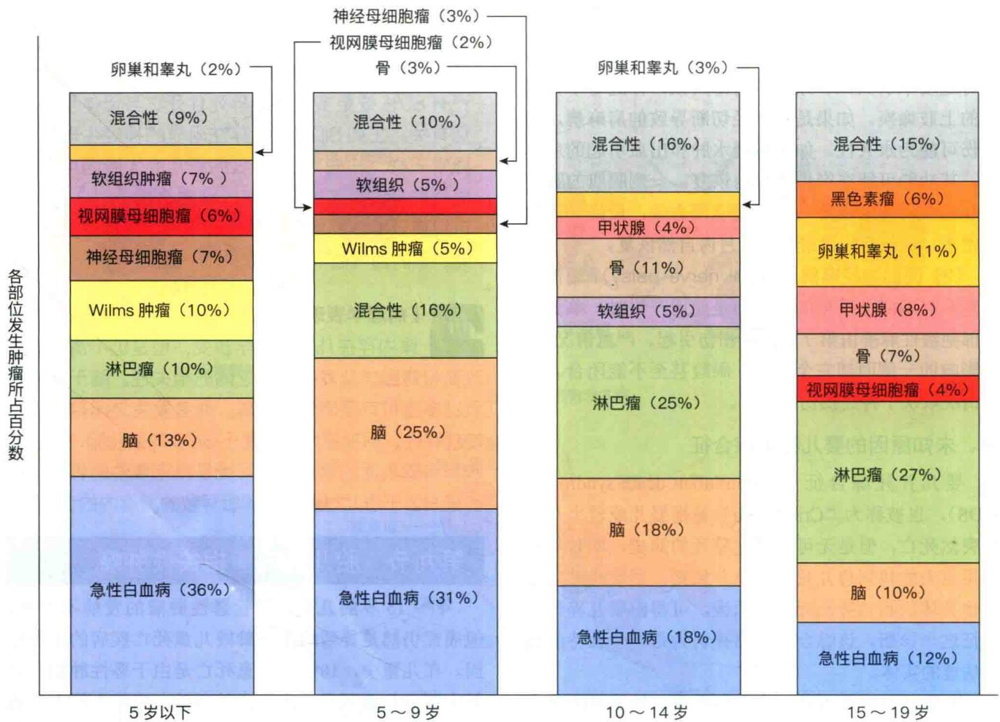 
图6-23 依据年龄和原发部位的儿童肿瘤分布
女性患儿中，并且有相当大的一部分发生在双胞胎。通常在患儿出生时，此肿瘤表现为骶骨部和臀部区域的一个巨大的肿物。该肿物一般较大，呈分叶状，大小通常和胎儿头相当。1/2的肿物呈外生性生长，通过一个小的蒂与患儿的躯体相连。一部分肿物既可向外生长也可向盆腔内生长，然而也有一小部分完全在盆腔内生长。显微镜下见，骶尾部畸胎瘤由多种组织组成，尤其是神经来源组织。在2个月以内发现的骶尾部畸胎瘤，大多数（ $90\%$ ）为良性，但是在中老年时期发现的骶尾部畸胎瘤，一半以上表现为恶性。该肿瘤通常与脊椎、生殖泌尿系统和结直肠的先天发育异常有关。该病变应尽快手术切除。
# 二、儿童恶性肿瘤较为罕见
在小于15岁的儿童中，每年恶性肿瘤的发生率是
1.3/10000。尽管患儿死亡率与肿瘤的固有特征和其对治疗的反应有明显的变化，但是总体来说，患儿死于癌症的概率为 $1 / 3$ 。在15岁以下的患儿中，大约有1/2的恶性肿瘤是急性白血病和淋巴瘤（见第20章）。白血病，尤其是急性淋巴母细胞白血病，占所有儿童恶性肿瘤的1/3。大多数其他的恶性肿瘤神经母细胞瘤、大脑肿瘤、Wilms肿瘤、视网膜母细胞瘤、骨癌和多种软组织肉瘤将会在相关章节分别讲解。
目前研究比较透彻的基因异常引发的儿童发育肿瘤的例子包括：Wilms肿瘤、视网膜母细胞瘤和骨肉瘤。在儿童和成人恶性肿瘤的发生过程中，基因突变和环境之间相互作用的关系在第5章中讨论。
（王丽丽）
# 第7章 血流动力学障碍
血流动力学障碍是可导致器官和细胞损伤的灌注障碍。器官和细胞的代谢取决于一个既能连续运输氧、营养物质、激素、电解质和水，又能去除代谢废物和二氧化碳的完整循环系统。细胞水平上的运输和清除受制于血管内、间质之间、细胞和淋巴管之间的交换。
# 第一节 灌注障碍
# 一、充血
器官血液含量的增多称为充血。充血可由两条途径引起：①动脉输入血量增多（主动充血）；②静脉血液回流受阻（被动充血或淤血）。
# （一）主动充血
1. 生理性充血 主动充血通常是对功能性需求增加的一种生理反应，如运动时的心和骨骼肌充血。发热时皮肤充血是用来散热。运动时骨骼肌血流量（供氧量）可提高20倍。它主要表现为小动脉扩张和毛细血管灌注量增多。 
2.炎症性充血最显著性主动充血与炎症有关（见第2章），常见于细菌感染。炎症也可以破坏内皮细胞，增加毛细血管通透性，因此炎症性充血通常伴有水肿和局部红细胞渗出。 
3. 反应性充血 反应性充血发生在血液供应暂时性中断后（缺血）。血流再通后可发生主动性充血，可能是由缺血组织损伤、组胺等炎症介质释放引起。充血的程度和持续时间与血流中断时间成正比，直至充血反应达到最高峰。
# （二）被动充血（淤血）
被动充血或淤血是器官静脉血液淤积的结果。临床上，急性被动性淤血见于急性左/右心室衰竭。急性左心室衰竭导致肺静脉充血形成肺水肿，或者肺泡腔充满漏出液。急性右心室衰竭可引起肝严重性淤血。在许多器官中，如肝、脾、肾、静脉压的增高（一般来源于慢性心力衰竭）导致血流减慢，血容量也随之增加。淤血性心力衰竭是被动性淤血的常见原因，它可继发于冠状动脉疾病、高血压和肺疾病引起的右心力衰竭。
被动淤血也可因静脉引流的局部阻塞而局限于某
个肢体或器官，如腿部静脉的深静脉血栓形成，造成下肢末端水肿和肝静脉血栓形成，称之为Budd-Chiari综合征，它以肝慢性被动性淤血为特征。
1. 肺 慢性左心室衰竭阻碍静脉血液从肺流入到心，引起慢性被动性肺淤血。肺静脉充血造成肺泡毛细血管压力增高。这种效应有四大后果：
渗漏性出血导致红细胞释放到肺泡腔，进而被肺泡巨噬细胞吞噬和降解，降解后释放的铁以含铁血黄素形式存在于巨噬细胞，这种细胞称“心衰细胞”（图7-1）。
液体被迫从血液进入到肺泡腔（肺水肿），可干扰肺内气体交换，造成严重呼吸短促（呼吸困难）（图7-2）。
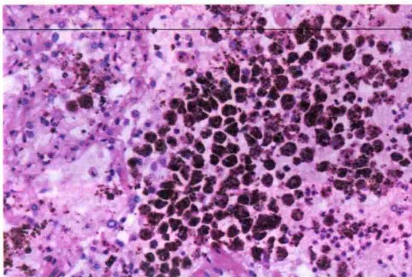 
图7-1 被动性肺淤血。充血性心脏衰竭患者肺内含铁血黄素的巨噬细胞
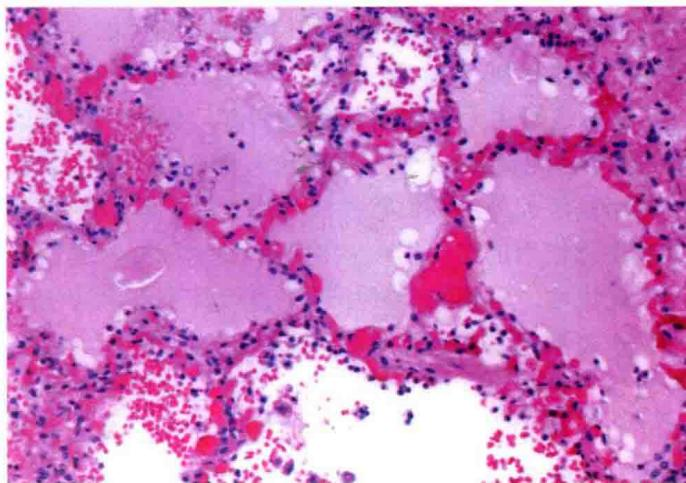 
图7-2 肺水肿。充血性心脏衰竭患者肺泡内的粉染液体
肺间质内纤维化加重，纤维化和铁的存在足以被视为肺褐色硬化（褐色硬结）。
肺动脉高压发生在压力从肺静脉系统播散到肺动脉系统时，可导致右心力衰竭，进而发展为全身性体循环静脉淤血。
有关慢性被动性肺淤血的形态学改变详见第12章。
2.肝因为血液可从肝静脉立即进入下腔静脉，肝对急性或者慢性淤血特别敏感（第14章）。肝小叶中央静脉扩张，增高的静脉压播散到血窦，血窦也随之扩张，中央小叶肝细胞受压后萎缩。肉眼观，切面显示中央小叶淤血区呈深色，未受影响的小叶周边区域为苍白色，致使形成一个类似槟榔横截面的网状结构（槟榔肝）（图7-3）。 
3. 脾 心力衰竭或者肝内血液回流受阻（如肝硬化）可引起肝血管内压力升高，脾静脉压力随之升高形成脾淤血。脾大，切面渗出暗红色血液，若长期得不到缓解，可发展为弥漫性纤维化。陈旧出血灶机化后可形成含铁纤维化的钙化灶，称Gamma-Gandy小体。相比正常时的脾重量 $150\mathrm{g}$ ，此时的脾重量为 $250\sim 750\mathrm{g}$ 。肿大的脾有时表现为功能过度活跃，称脾亢进，其特点为贫血、白细胞减少和血小板减少。 
4. 水肿和腹水 静脉充血阻碍血液流经毛细血管，静水压力升高，水肿形成（机制讨论如下）。心力衰竭时，水肿液的累积在身体相应的部位组织表现得特别明显，如可自主活动患者腿部与脚部和卧床患者背部。腹水位于腹腔，反映出（在其他因素下）组织通透性增加，这时没有外部压力可抵消血管内的静水压。
# 二、出血
出血是指血液从血管腔隙的流出。
血液能从循环系统流到体外或者进入非血管性体腔，最常见于外伤。严重的动脉粥样硬化可损坏腹主动脉壁，形成动脉瘤，瘤体破裂后血液进入到腹膜后腔隙（见第10章）。位于颅内颈动脉系统分叉处的先天性动脉瘤破坏后可引起蛛网膜下腔出血（见第28章）。某些感染（如肺结核）和侵袭性肿瘤可能会损害血管，发生出血。
出血也可由毛细血管的损伤引起。例如，钝伤造成毛细血管的破裂是瘀伤（瘀斑）的初始事件；静脉压的增高引起肺毛细血管血液外渗。维生素C缺乏导致起支撑作用的结缔组织结构缺陷使毛细血管脆性增加引起出血。对正常运转中的小血管和毛细血管的微小创伤需要完整的凝血系统以防止出血。因此，血小板数量严重减少（血小板减少症）或者凝血因子的缺乏（如A型血友病因子VIII）与无明显外伤时身体多部位自发性出血有关（见第10章和第20章）。
血液也可以进入内部体腔，如消化性溃疡或者食管静脉曲张导致消化道出血（前者为动脉出血，后者为静脉出血），此时，整个胃肠道填满了新鲜血液，血液进入浆膜腔可导致大量血液淤积，甚至可使患者失血过多。以下是一些概念：
血肿：出血后，血液进入软组织，肌肉挫伤时患者可只出现疼痛，如果位于颅内可能是致命的。
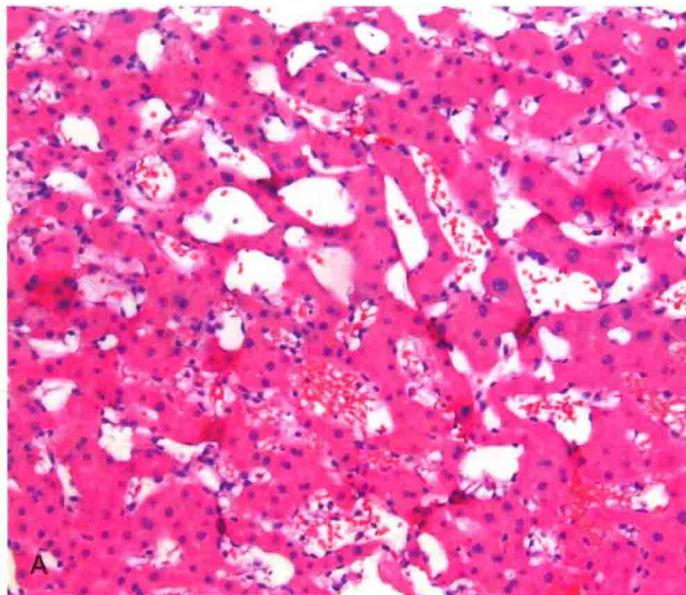
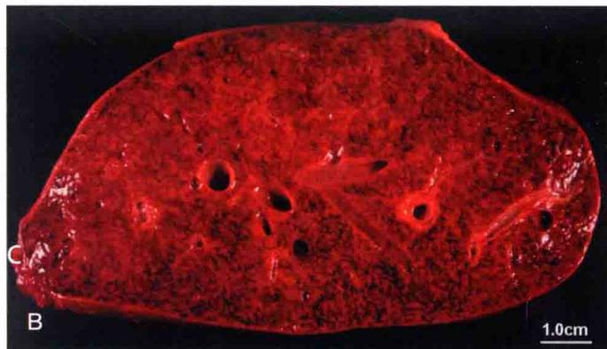
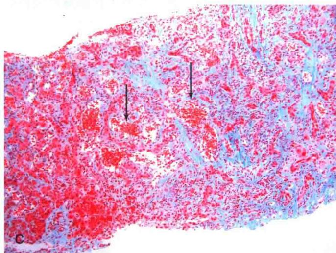 
图7-3肝淤血。A.显微镜下图像显示扩张的肝中央小叶血窦，受损的肝板呈现压力性萎缩；B.肝的大体显示槟榔样形态，反映出充血性右心室衰竭；C.慢性淤血后期变化，扩张的血窦（箭头）和纤维化（注意三种染色中蓝色部分为胶原）
血胸：出血后，血液进入到胸腔 
心包积血：出血后，血液进入心包腔。 
腹腔积血：出血后，血液进入腹腔。 
关节血肿：出血后，血液进入关节腔。 
■紫癜：皮肤弥漫性浅表出血，直径可达 $1\mathrm{cm}$ 
瘀斑：皮肤较大表浅出血（黑色与蓝色标记） 
瘀点：通常发生在皮肤或眼结膜的针点状出血，这些病变代表着毛细血管或小动脉的破裂，伴随着凝血性疾病或血管炎；瘀斑也可来源于因感染性心脏瓣膜（细菌性心内膜炎）产生的微栓子。
# 第二节 血栓形成
血栓形成是指在血管腔中包含血小板、纤维蛋白和细胞成分的凝血块的形成。血栓附着于血管内皮，只在凝血级联反应激活时才形成，不同于简单的血块；它也可在体外或者死亡后形成。同样，血栓不同于血肿，血肿是出血后在血管外形成的凝血块。血栓形成和凝血级联反应将在第10章和第20章详细讨论。
# 一、动脉系统的血栓形成
动脉系统的血栓通常是由动脉粥样硬化引起的。
【病因】动脉粥样硬化形成动脉血栓的最常见血管是冠状动脉、颅内动脉、肠系膜动脉、肾动脉和下肢动脉。其次，动脉血栓可发生在其他疾病，包括动脉炎症、外伤和血液疾病。血栓常见于大动脉及主要分支的动脉瘤（内腔的局部扩张），血流不畅及合并的固有的血管疾病促进了血栓形成。其他风险因素包括代谢综合征，如肥胖、高血糖、胰岛素抵抗、血脂异常和高血压（见第22章），也包括年龄大、吸烟、已有血栓和癌症。
动脉血栓的发病机制主要包含三个因素：
血管内皮损伤：几乎都归因于动脉粥样硬化，血管内皮损伤扰乱了血管壁的抗凝血特性，并成为血小板聚集和纤维形成的靶点。 
血流的改变：动脉瘤或者动脉分叉处都有利于血栓形成。缓慢的血流在狭窄的动脉容易形成血栓。 
■ 血液凝固性增加：这一现象在真性红细胞增多症或一些癌症中可见，它也促进了血栓形成。

【发病机制】在人群中尚未发现能引起动脉血栓的主要遗传危险因素。这可能是由
于动脉粥样硬化过程中多基因和多因素的复杂性。某些凝血因子（如因子VII和纤维蛋白原）、纤溶因子、炎症介质和低密度脂蛋白（LDL），特别是载脂蛋白（a）之间与动脉血栓的联系还不明确。
【病理】附着于血管壁的动脉血栓最初是柔软的、脆弱的和暗红色的，含淡黄色血小板层和纤维蛋白层，称Zahn线（图7-4）。一旦形成，动脉血栓有几种可能的结局：
溶解：血液潜在的溶栓活性所致。 
■播散：即体积上的增大，因一个小栓子的形成可作为进一步血栓形成的核心。 
机化：它发生在修复的最终阶段，由结缔组织形成（见第3章），血栓开始坚硬并变成灰白色。 
■ 再通：在机化的血栓中，内皮细胞长入形成新的血管（图7-5）。 
栓塞：当部分或者全部血栓脱落，进入循环系统并在距离血栓形成位点一定距离的血管处停留。
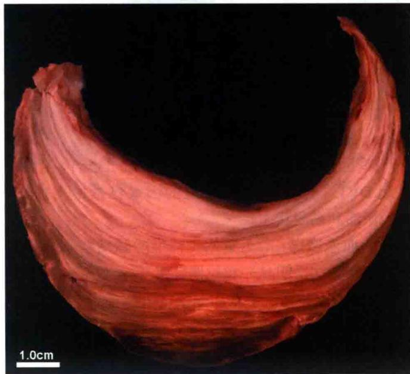 
图7-4 动脉血栓。主动脉瘤的血栓大体显示由纤维蛋白层和血小板层组成的Zahn线
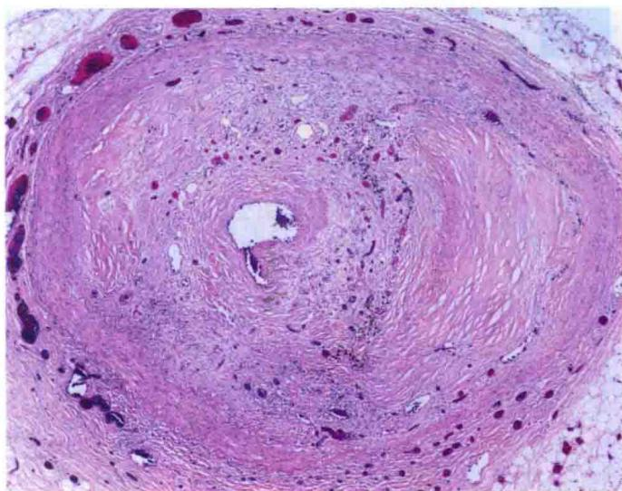 
图7-5 血栓再通。冠状动脉前降支显微镜图像显示严重的动脉粥样硬化和再通
【临床表现】在西方工业化国家，动脉血栓是仅次于动脉粥样硬化的最常见死亡原因。由于大部分动脉血栓堵塞血管，它们往往会引起由动脉供血的组织缺血性坏死（即梗死）。因此，冠状动脉或者脑动脉的血栓形成可分别导致心肌梗死（心脏病发作）或者脑梗死（卒中）。受动脉粥样硬化影响的其他末端动脉及常形成的血栓包括肠系膜动脉（肠梗阻），肾动脉（肾梗死）和腿部动脉（坏疽）。
# 二、心内膜的血栓形成
在动脉系统，心内膜损伤和心脏血流改变可引起附壁血栓（即附着于心脏内壁的血栓）。心肌梗死常与附着到左心室的附壁血栓相关。附壁血栓的形成也与房颤、心肌病和心内膜炎有关，心内膜炎引起的血栓是心脏瓣膜上的小血栓（赘生物）（更多介绍详见第11章）。在心脏任意位置的血栓主要并发症是栓子脱落并定位到远处血管（栓塞）。
# 三、 静脉系统的血栓形成
静脉系统血栓最常见的为腿部深静脉系统血栓（deep venous system of the legs, DVT）。
【病因】引起动脉和心脏血栓形成的因素同样也可引起DVT。有利于DVT发展的因素包括内皮损伤、血液淤滞和高凝状态。
血液淤滞：心力衰竭、慢性静脉功能不全和术后固定患者（最明显）和长期卧床 
损伤：外伤、手术和分娩 
■ 高凝状态：口服避孕药、妊娠后期、癌症和遗传易栓症（见第20章） 
年龄大：静脉曲张和静脉硬化 
■镰状细胞病：见第20章

【发病机制】遗传因素占DVT风险因素的
60%。与静脉血栓形成相关的最常见基因
变异是因子VLeiden突变，它对激活蛋白C有较差的灭活特性和抗凝反应，尽管只存在于 $3\%$ 的人群，它却占静脉血栓 $20\% \sim 40\%$ 的病例，使它成为静脉血栓形成最常见的遗传因素。在杂合子突变中，因子VLeiden的突变增加了静脉血栓形成7倍的风险；而在纯合子突变中，则为80倍。口服避孕药、妊娠、雌激素治疗、糖尿病、恶性肿瘤、肥胖和固定使风险进一步增高。静脉血栓形成另一个常见风险因素是凝血酶原G20210A突变。在DVT $5\% \sim 10\%$ 病例中，蛋白质C和S缺陷和抗凝血酶III是较强的风险因素。

【病理】大多数（>90%）静脉血栓发生在腿
部深静脉血栓，其余的通常涉及骨盆静脉。绝
大多数始发于小腿静脉，频繁发生在静脉瓣膜窦上。类似于之前讨论过的动脉血栓，在小腿静脉瓣膜窦上，静脉血栓也有几个潜在影响。血栓可以溶解，对健康不构成威胁，或者它可以播散到更大的髂股静脉；血栓可以脱落（栓塞）并运送到肺形成肺栓塞，肺栓塞可能是一种致命的并发症。

【临床表现】在小腿静脉的小血栓通常是无症
状的，在髂股系统的更大血栓可不表现出症状部位有压痛。股骨或髂静脉闭塞性血栓可导致重充血、水肿和发绀。因此，慢性深静脉缺陷（即流不畅）是不可避免的。如果病变局限在小部脉系统，可能是无症状的。然而，出现色素沉着、腿部皮肤硬结表示着病变范围扩大。其他地方血栓也可能是危险的：肠系膜静脉血栓可引起小肠梗死，脑静脉血栓可能是致命的，肝静脉成（Budd-Chiari综合征）可能会破坏肝。
# 第三节 栓塞
栓塞是指可停留在血管并阻塞血流的任何物质突然堵塞了静脉或动脉循环。最常见的栓子是血栓栓子，也就是说，血栓形成并脱离血管壁后游走到血管另外一个地方。
# 一、肺动脉栓塞
肺动脉栓塞较常见并且具有潜在致命性。
在美国，每年因肺动脉栓塞而住院的估计有300000人，死亡人数达 $50000\sim 100000$ 不等。据报道，有 $50\%$ 以上尸体解剖为肺血栓栓塞。此外，这种并发症发生在 $1\% \sim 2\%$ 40岁以上术后患者。术后发生肺动脉栓塞的风险随着年龄大、肥胖、手术时间长、术后感染、癌症和预先存在的静脉疾病而增加。大部分肺栓塞（ $90\%$ ）来自下肢深静脉，致命性栓塞倾向于在髂股静脉形成（图7-6）肺栓塞的临床特征主要由栓子大小决定。急性肺栓塞可分为以下几类症状： $①$ 无症状的肺小栓子； $②$ 不伴随其他症状的短暂性呼吸困难和呼吸急促； $③$ 伴随胸痛、咯血和胸腔积液的肺梗死； $④$ 心血管性虚脱和猝死。
# （一）大面积肺栓塞
对于住院患者而言，最为不幸的灾难之一是发生在看似顺利康复过程中的猝死。原因往往是大量下肢深静脉血栓的释放导致大面积肺栓塞。一般来说，术后患者死于首次下床时。肌肉的活动驱逐长期卧床导致血液淤滞而形成的血栓脱落。除外手术相关的死亡，肺栓塞是骨科大手术后最常见死因，也是产后死亡中最常见的非产科死因。它也是慢性心脏病和肺部疾病
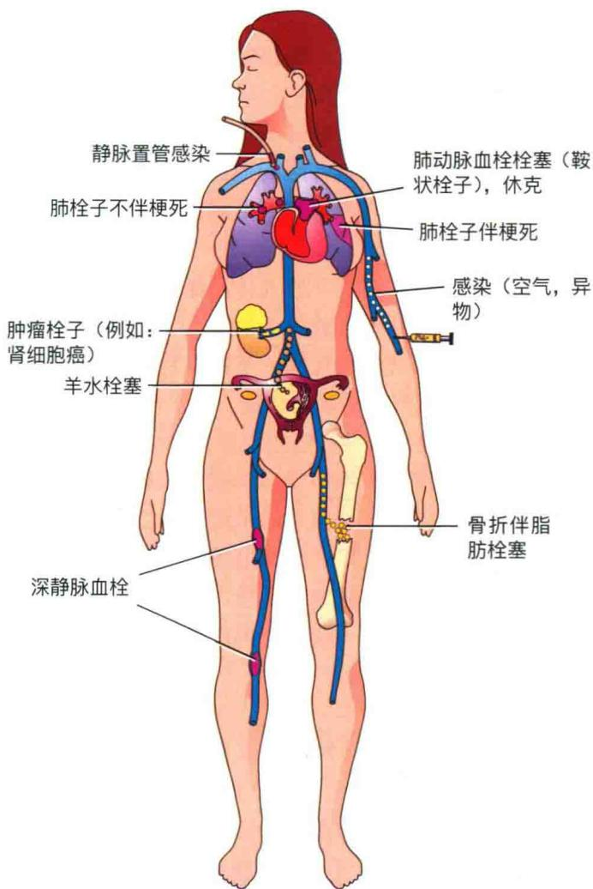 
图7-6 静脉血栓的来源和影响
患者和长期肢体固定患者特别常见的死因。航空相关的长期身体姿势的固定也可导致静脉血栓形成（“经济舱综合征”），偶尔会猝死于肺栓子。
大的肺栓子常常停留在肺动脉主干的分叉处，因此，血液无法流至两肺（图7-7）。大的致死性栓子也可能发生在左、右肺动脉第一分支。有时多个小血栓堵塞二级血管分支也可致命。 $50\%$ 以上的肺动脉分支发生急性梗阻后，患者经常会突然发生严重低血压（或休克）并在几分钟内死亡。
大面积肺栓塞的血流动力学后果是血液流出突然受阻后发生的急性右心室衰竭，随之左心室排血量明显减少，患者则会突然出现严重低血压。
# （二）肺梗死
肺小栓子倾向在周边肺动脉定位，通常并不致命。临床上，肺梗死通常伴随着充血性心力衰竭或慢性肺病，因为正常情况下，肺部双循环系统通常保护组织免受缺血性坏死。因为支气管动脉向坏死区供给血液，所以当出现肺梗死时，也有出血倾向。梗死区通常呈锥体形，胸膜表面为锥体底部。患者出现咳嗽、胸膜刺痛感、呼吸短促和偶尔的咳血。胸腔积液也常见并且呈血性。随着时间的增长，梗死区的血液重新被吸收，
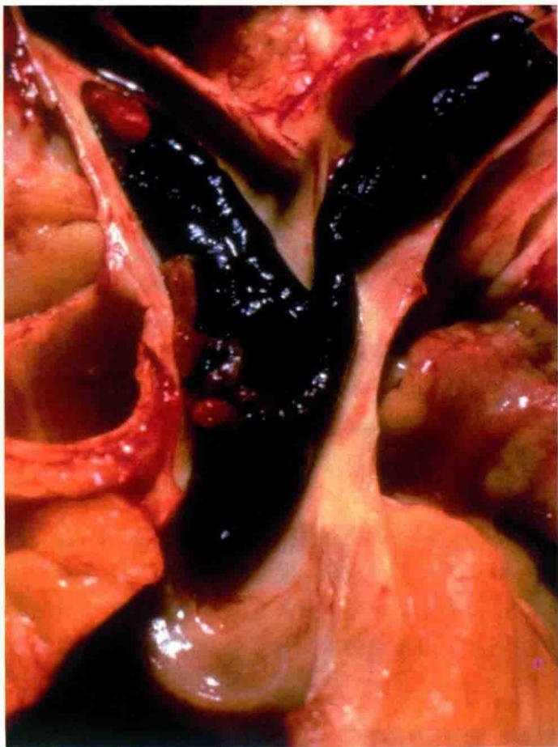 
图7-7 肺栓塞。肺动脉主干及分支显示一个大的鞍状栓子
中心也变得苍白。梗死区周边形成肉芽组织，之后机化并形成纤维瘢痕。 $50\%$ 的肺血栓栓子被重吸收，在8周内机化，血管并不狭窄。
# 二、体循环动脉栓塞
体动脉栓塞常引起梗死。
# （一）血栓栓塞
心脏是动脉血栓栓子最常见的来源部位（图7-8），栓子通常来源于附壁血栓或易患病的瓣膜（见上文）。这些栓子往往在血管管腔突然变窄的地方停留（如在分叉处或在动脉粥样硬化斑块区）。受动脉血栓栓塞影响最多的器官包括：
脑：动脉栓子进入大脑可引起缺血性坏死（卒中）。 
肠：在肠系膜循环中，栓子可导致肠梗死，表现为急腹症并需要立即手术。 
■ 肢体末端：腿部动脉栓塞可引起突然疼痛、无脉冲和肢体寒冷。在某些情况下，必须截肢。 
肾：肾动脉栓塞可使整个肾梗死，但更常见的是导致外周部分梗塞。 
心：冠状动脉栓塞可导致心肌梗死发生，但很少发生。
动脉栓子造成的梗死更常见于图7-9中所总结的部位。
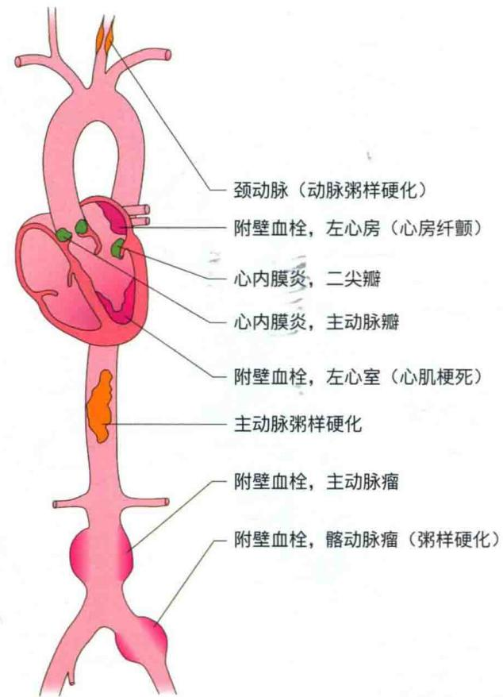 
图7-8 动脉栓子的来源
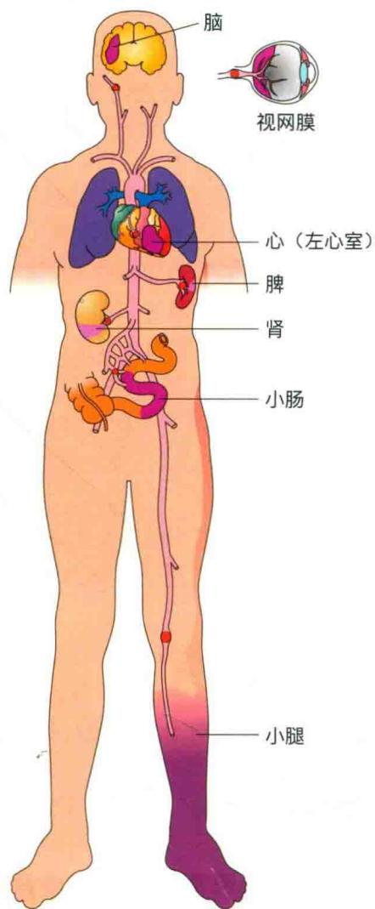 
图7-9 动脉栓子引起的梗死常见部位
# （二）空气/气体栓塞
空气通过颈部伤口、胸腔穿刺或大静脉穿刺进入到静脉循环。在循环系统中，以气泡形式存在的少量空气并无影响，但是 $100\mathrm{ml}$ 或 $100\mathrm{ml}$ 以上空气可导致猝死。气泡倾向于聚集并阻碍血流进入右心、肺循环和脑。组织学上，气泡以空白形式出现在肺的毛细血管和小血管。
暴露在较高大气压下的人体，如潜水员、水下工作（如隧道、钻井平台建设）的工人，易患以气体栓塞为独特表现形式的减压病。下降过程中，大量惰性气体（通常为氮气）溶解在体液。潜水员上升过程中，溶解的气体游离出来并被呼出。但是，如果上升过快，气泡在循环系统和组织中得以形成，阻碍血液流动并直接损伤细胞。空气栓塞是潜水运动第二大最常见死因（溺水排在第一位）。急性减压病，也称“弯曲症”，因为组织中小血管的阻塞，所以，以短暂性肌肉和关节疼痛为特征。但是，脑血管的严重受累可致患者昏迷甚至死亡。
# （三）羊水栓塞
含有胎儿细胞和碎片的羊水可通过开放的子宫和子宫静脉进入母体循环。它是分娩产妇的一种罕见并发症，但一旦发生可能是灾难性的。它通常发生在分娩结束时，这时的肺栓子由羊水中的实性上皮成分（鳞屑）组成。如果产妇能度过这种急性发作的疾病，那么她可能死于由羊水中具有高促凝血酶原激酶引起的弥散性血管内凝血。
# （四）脂肪栓塞
脂肪栓塞是指含脂肪组织受到严重外伤后，特别是伴随骨折时，多脂肪的骨髓栓子释放到受损的血管。在大多数情况下，脂肪栓塞在临床上表现并不明显。但是，在严重受伤后 $1\sim 3$ 天，它可导致脂肪栓塞综合征，发展到最严重情况时，是可致命的。综合征是以呼吸衰竭、精神改变、血小板减少症和广泛淤血为特征。在尸检时，无数的脂肪球出现在肺和大脑和（或）其他器官的微血管。肺通常表现为急性呼吸窘迫综合征（见第12章）。脑的病变包括脑水肿、小的出血，偶尔也有微梗死。
# 第四节 梗死
梗死是指闭塞动脉的末梢发生凝固性坏死的过程。坏死区即为梗死区。像心、脑和肠等重要器官的梗死难以治疗并且是发病和死亡的主要原因。如果患者幸存，梗死区域愈合并留下伤疤。部分动脉闭塞（即狭窄）偶尔会引起坏死，但更多的是导致慢性缺血相关的萎缩性改变（见第1章）。例如，在心，这些改变包括心肌细胞的空泡变性、萎缩、肌细胞肌原纤维减少和间
质纤维化。

【病理】梗死的肉眼和显微镜表现取决于它的位置和持续的时间。一旦动脉闭塞，血管供血
区域迅速肿胀并变成深红色。显微镜下，血管扩张充血，偶尔也可观察到间质出血。接着，在肉眼下可观察到梗死的几种类型。
苍白梗死常发生在心、肾和脾（图7-10）。大体检查时，最初充血1天或2天后，梗死开始变柔软、界线清楚和呈浅黄色（图7-11）。边界往往是暗红色的，这反映出血液进入周围活性组织。显微镜下，苍白梗死表现为均一性凝固性坏死。
红色梗死可能来自动脉或静脉闭塞，也是以凝固性坏死为特点。但是区别于苍白梗死的特征是，来自相邻动脉和静脉的血液可进入坏死区。红色梗死主要发生在有双重供血的器官，如肺，或者那些具有广泛侧支循环的器官，如小肠和脑。在心，闭塞的血栓自发裂解或治疗上诱导裂解后，可发生梗死区再灌注，这时出现红色梗死。肉眼观，红色梗死有明显界线、较坚固、颜色从深红变化到紫色（图7-12）。几天后，来自活性组织的急性炎症细胞填充坏死区，之后演变为肉芽组织，最后愈合并形成瘢痕（见第3章）。在大
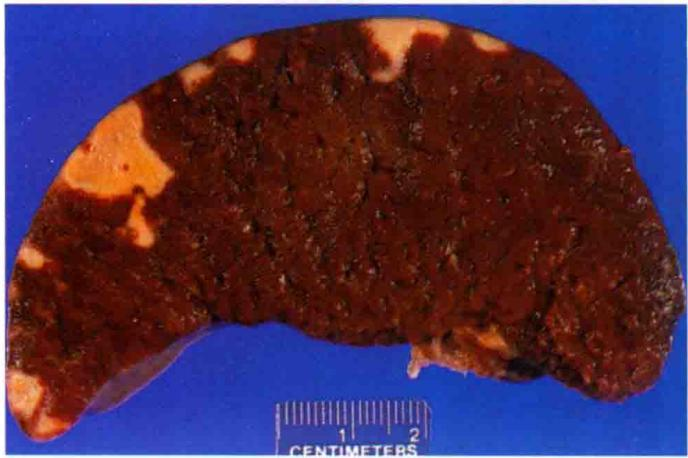 
图7-10 脾梗死。脾切面显示被膜下多个苍白、楔形梗死
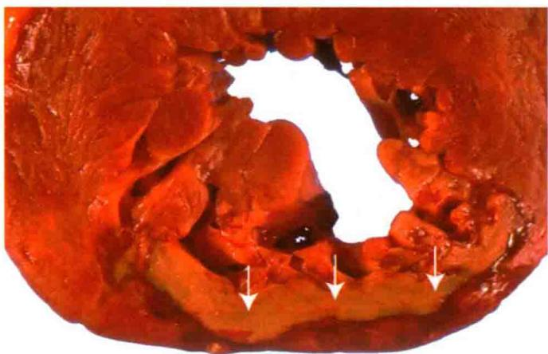 
图7-11急性心肌梗死。左心室横截面显示在后游离壁有一个明显界线化的、柔软的、黄色坏死区
脑中，梗死通常有液化性坏死，可形成含液体的囊，称为囊性梗死（图7-13）。肺梗死形成（肺梗死，见上文）、心脏梗死（心肌梗死，见第11章）、脑梗死（见第28章）和肠道梗死（见第13章）需要立即治疗，它们都显著提高了人群的发病率和死亡率。发生在特定器官的梗死发病机制和临床特征将在相应章节中讨论。
# 第五节 水 肿
水肿是指过量的液体积聚在组织间隙，可以是局限性的也可是广泛性的。液体可积聚在体腔，如胸膜腔（胸腔积液）、腹腔（腹水）或心包腔（心包积液）。在许多情况下，炎症的血管反应导致局部水肿（见第2章）。静脉或淋巴管的阻塞导致肢体局部水肿，通常表现在腿部。
影响内脏器官和躯干与手足皮肤的弥漫性水肿反射出体液和电解质代谢紊乱，最常见于心力衰竭。肾疾病使血清蛋白进入尿液（肾病综合征，见第16章）造成血液渗透压力减少及肝硬化使血清蛋白的产生受损也可引起弥漫性水肿。
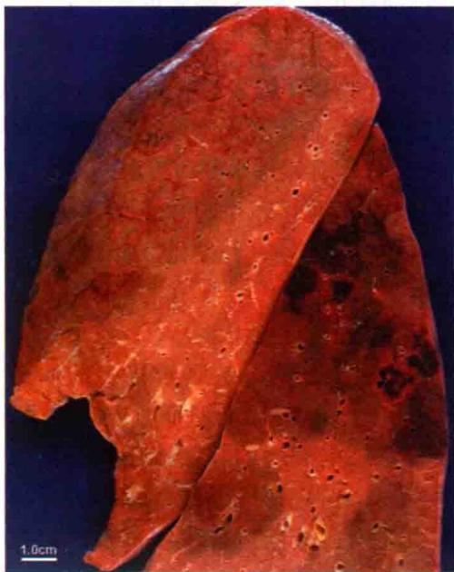 
图7-12 红色梗死。肺的矢状切片显示下叶上段出血性梗死
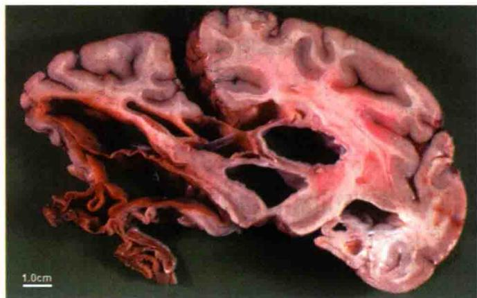 
图7-13囊性梗死。大脑额叶横截面显示了已愈合的囊性梗死
全身性水肿是极度弥漫性水肿，以体液突然聚集在皮下组织、内脏器官和体腔为特征。
# 一、水肿形成的机制——改变血管和间质之间的液体平衡
# （一）正常的毛细血管滤过
正常组织液的生成和保持取决于毛细血管水平上的过滤和重吸收。在动脉端的毛细血管内部或静水压力为 $32\mathrm{mmHg}$ ，在中间段为 $20\mathrm{mmHg}$ 。因为组织间隙静水压只有 $3\mathrm{mmHg}$ ，所以液体会以 $14\mathrm{ml} / \mathrm{min}$ 的流速从血管内向外流。由于静水压与血浆渗透压（ $26\mathrm{mmHg}$ ）作用方向相反，在毛细血管的静脉端会以 $12\mathrm{ml} / \mathrm{min}$ 流速进行重吸收。因此，组织间隙液体以 $2\mathrm{ml} / \mathrm{min}$ 的速率形成并被淋巴系统重吸收。平衡状态时，在组织间隙没有净液体流入或流出。
# （二）钠和水分代谢
水占体重的 $50\% \sim 70\%$ ，分为细胞外和细胞内水分。细胞外液体又分为组织间隙和血管内液体。组织间隙液体占胞外成分的 $75\%$ 。因为钠是细胞外液的主要阳离子，所以总钠量是细胞外液量的主要决定因素。换言之，总钠量升高会引起细胞外液增多以保持恒定的渗透压。细胞外液量很大程度上取决于肾钠排泄的调节。这种调节由以下因素影响：①心房钠尿肽；②肾小球旁器的肾素-血管紧张素系统；③交感神经系统活动（见第10章）。弥漫性水肿和腹水导致肾性钠潴留，进一步引起总钠量增多。引起弥漫性水肿最常见的疾病包括充血性心力衰竭、肝硬化、肾病综合征，有时也包括慢性肾功能不全。
# （三）静水压增加导致水肿
无拮抗的静水压的升高导致更多的体液流进组织间隙形成水肿，失代偿心脏病时表现得尤为突出，因为继发于左心室衰竭的肺回流压力导致急性肺水肿和右心衰竭，促进形成系统性水肿。同样，下肢静脉阻塞引起的血液回流导致腿部水肿。肝硬化时流向门静脉的血液受阻，也可引起腹部液体（腹水）的形成。
# （四）渗透压力减少导致水肿
血管内和组织间隙之间的压力差主要由血浆蛋白（特别是白蛋白）浓度决定。不论是肾病综合征时的蛋白尿还是肝硬化或严重营养不良时白蛋白合成减少，任何可以降低血浆白蛋白水平的条件都能促进弥漫性水肿形成。
# （五）淋巴管阻塞导致水肿
在正常情况下，进入组织间隙的液体量多于重吸收到血管内的液体量，多出来的组织间隙液体由淋巴管清除。因此，淋巴管的阻塞可造成局部水肿。淋巴
通道可以被以下因素阻塞：①恶性肿瘤；②炎症或辐射造成的纤维化；③外科消融。由于乳腺癌患者根治性乳房切除术中需要去除腋窝淋巴结和淋巴系统，手臂淋巴水肿有时使手术更复杂。
图7-14和表7-1总结了水肿及相关病症的机制。
1. 正常在毛细血管系统的动脉末端，静水压和渗透压之间的差值使液体以约 $14\mathrm{ml} / \mathrm{min}$ 速度渗入到组织间隙；在静脉末端，液体又以 $12\mathrm{ml} / \mathrm{min}$ 速度被重吸收；毛细淋巴管以 $2\mathrm{ml} / \mathrm{min}$ 速度排出组织间隙液体。组织间隙的蛋白质通过淋巴系统被排出。
2. 静水性水肿如果毛细血管系统静脉端的静水压升高，重吸收量则减少。只要淋巴系统可以排出多余液体，水肿不会发生，但如果淋巴系统超负荷运行，则液体积聚形成水肿。
3. 渗透压性水肿如果白蛋白缺失导致血管床渗透压下降，重吸收量则减少，水肿液积聚。
4.炎症性和创伤性水肿如果内皮细胞损伤后，血管床开始渗漏，可引起局部或者系统性水肿。
5. 淋巴水肿淋巴管堵塞后，重吸收量下降及蛋白清除发生缺陷（提高了组织间隙液的渗透压），引起组织间隙液的积聚。
表7-1 水肿相关的疾病静水压增高动脉扩张炎症发热静脉压增高静脉血栓充血性心力衰竭肝硬化（腹水）姿势性不活动（如长时间站立）高血容量钠潴留（如肾功能降低）渗透压下降低蛋白血症肾病综合征肝硬化蛋白丢失性胃肠病营养不良毛细血管渗透压增高炎症烧伤急性呼吸窘迫综合征淋巴阻塞癌症术后淋巴水肿炎症
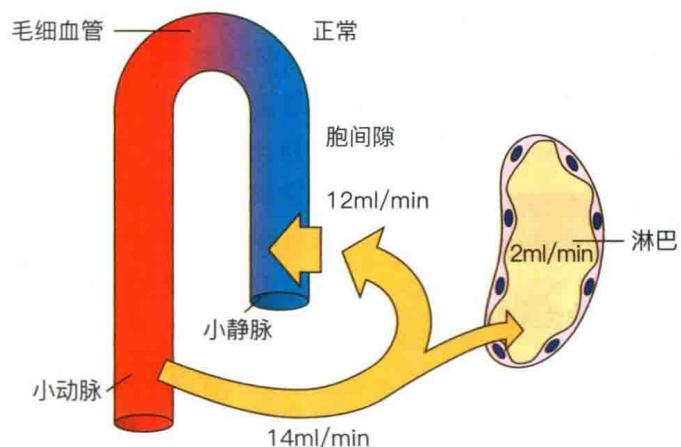
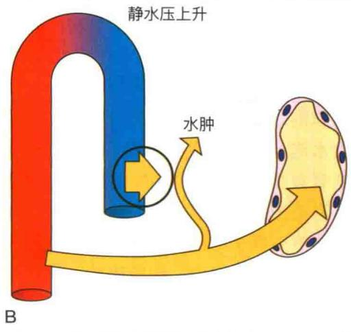 
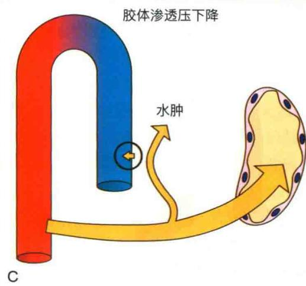
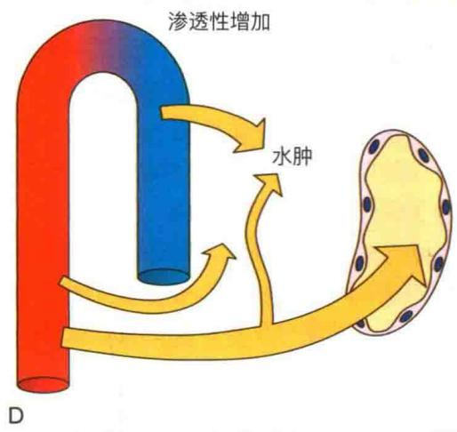 
图7-14 毛细血管系统和水肿形成机制
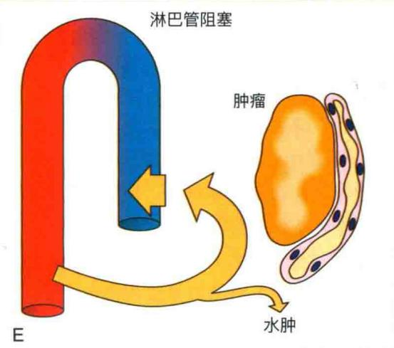
# 二、充血性心力衰竭——心排血量不足的后果
当心脏代偿机制无法提供充足的血液供应到外周组织时，充血性心力衰竭就发生了。在美国，尽管几乎所有慢性心脏病最终可能导致充血性心力衰竭，但最常见于缺血性心脏病（见第11章详细讨论）。
【病因】心力衰竭对水钠平衡上的作用：充血性心力衰竭时，心排血量不足导致肾小球渗透量减少、肾素分泌增加，肾素激活血管紧张素后刺激醛固酮释放。再者，变缓的肝血流损伤了醛固酮的分解代谢，进一步提高了血液中醛固酮浓度。血量增多后心房的扩张促进了具有增强肾钠排泄作用的心房钠尿肽的释放。
当代偿机制不起作用时，血浆容量的进一步扩大与增大的肺和体静脉压力相关，后者可使各自的毛细血管床静水压增高。毛细血管压力的增高与血浆渗透压的降低共同导致充血性心力衰竭的水肿。
【病理】左心室衰竭主要与肺淤血和肺水肿相关（图7-15）。当它们演变成慢性后，可引起肺动脉高压，最终为右心室衰竭。右心室衰竭的特征是广泛性皮下水肿（身体低位最明显）、腹水和胸膜腔积液。肝、脾等内脏器通常是充血状态。在尸检时，心脏增大、心腔扩张。
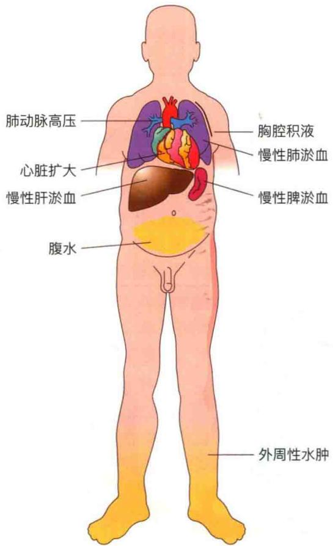 
图7-15 毛细血管系统和水肿形成机制。慢性充血性心力衰竭病理性后果

【临床表现】患者可能抱怨呼吸短促（呼吸困难）和卧位时的（端坐呼吸）。他们可能因呼
吸急促突然发作而从睡眠中醒来（夜间阵发性呼吸困难）。体格检查通常提示颈静脉扩张、腿部凹陷性水肿和增大有压痛感的肝。当存在腹水时，腹部鼓起。并发肺水肿的充血性心力衰竭患者有噼啪样的呼吸音（啰音），这是由充满液体的肺泡扩张引起的（见下文和第11章）。
# 三、肺水肿——以肺泡和肺间质之间液体增多为特点
肺水肿是指肺泡和肺间质之间液体增多。它减少了肺内气体交换，引起缺氧和二氧化碳潴留（高碳酸血症）。
【病因和病理】肺是没有太多结缔组织支撑的疏松组织，因此，需要一定的条件预防水肿的发展。具有保护作用的因素有：
右心室压力低导致肺毛细血管低灌注压；
■处于微负压的淋巴管能容纳10倍的正常淋巴液，所以淋巴系统使肺间质之间有效排液；
内皮细胞之间紧密的细胞连接能控制毛细血管通透性。
如果这些保护机制被扰乱，就会产生肺水肿。肺
水肿最常见原因涉及心脏血流动力学的改变，这种改变使肺毛细血管灌注压增高并阻止了有效淋巴引流。这些原因包括左心室衰竭（最常见的原因）、二尖瓣狭窄和二尖瓣关闭不全。毛细血管渗透性受损，作为急性肺损伤时发生肺水肿的原因，可导致弥漫性肺泡损伤（diffuse alveolar damage，DAD），临床上称急性呼吸窘迫综合征。有毒气体的吸入、胃内容物误入呼吸道、病毒感染和尿毒症都可以引起DAD（见第12章）。
肺水肿发生在间质或肺泡。最初，过多的体液滤过导致间质性水肿。淋巴管扩张、体液积聚在小叶间质和静脉、支气管血管束周围。水肿引起血液从肺底向上方肺叶分流，支气管血管树的分流引起通气阻力增加。在早期阶段，患者常不表现出症状。
当组织间隙无法容纳积聚的体液时，体液溢出进入肺泡，称为肺水肿。患者有急性呼吸困难，并可听到水泡音。在严重病例中，体液被咳出或涌出气管。低氧血症可表现为发绀。水肿的肺在显微镜下显示，肺泡毛细血管严重充血和通过气泡渗透的均匀、粉染的体液充满了肺泡（图7-2）。如果肺水肿是由肺泡损伤引起，在肺泡中，细胞碎片、纤维和蛋白形成一种膜状蛋白质物质，称为透明膜。

【临床表现】肺部含积液的患者刚开始可能没症状，但最终会出现明显的呼吸困难和咳嗽。
如果水肿比较严重，大量粉红色泡沫痰会被咳出。积聚在组织间隙的液体降低了肺顺应性（即它使肺更硬），所以肺功能因严重充血和间质性肺水肿而受限。因此，为了保持供氧，呼吸增强。增厚的肺泡壁使氧和二氧化碳的交换更困难。二氧化碳交换受影响的程度较小，导致缺氧时，二氧化碳水平却接近正常。供氧（下降）和灌注（持续存在）之间的不匹配导致肺水肿患者发生以发绀为表现的低氧血症。
# 四、肝硬化性水肿——通常是肝硬化的晚期表现
肝硬化经常伴有腹水和外周水肿（见第14章）。肝硬化阻碍门静脉血流，产生门脉高压并提高了内脏循环中的静水压。再者，肝功能异常造成肝脏合成白蛋白减少。此外，肝包膜淋巴液漏出增加进一步加重腹水。
# 五、肾病综合征——表现为大量蛋白尿
在肾病综合征，尿中大量蛋白质丢失速率超过了肝生成蛋白质速率（见第16章）。血浆蛋白质浓度下降，特别是白蛋白，减低了血浆渗透压从而促进了水肿。血浆量减少刺激了能促进尿潴留的肾素-血管紧张素-醛固酮系统。水肿比较广泛但优先出现在软结缔组织、眼睛、眼睑和皮下组织。腹水和胸腔积液也会表现出来。
# 六、脑水肿——经常引起颅内压致命性增高
坚硬的颅骨几乎没有空间容纳膨胀的器官，因此，脑水肿是很危险的。水肿导致颅内压增高危及大脑血液供应，损坏大脑总体结构，并干扰中枢神经系统功能（见第28章）。在尸检中，水肿的脑较柔软、沉重，脑回变平，脑沟变窄。由于脑功能改变，脑水肿患者表现出呕吐、神志不清和抽搐。严重的脑水肿可导致脑疝。
# 七、体腔积液——组织间隙液积聚的后果
# （一）胸腔
胸腔积液（胸腔内的液体）是包含少数细胞（主要是脱落的间皮细胞）的淡黄色、低比重漏出液，在像肾病综合征、肝硬化和充血性心力衰竭的疾病中，液体通常趋向于聚集而形成水肿。胸腔积液也常见于肺或胸膜表面的炎症或肿瘤。
# （二）心包腔
心包内的液体（心包积液）可见于出血（心包积血）或心包的损伤，心包积液也见于心包感染、心包转移性肿瘤、尿毒症和系统性红斑狼疮。它偶尔发生于心脏手术后（心包切开后综合征）或癌症放疗后。心包内液体可能会快速积聚（如梗死的心肌破裂出血、主动脉夹层动脉瘤或外伤）。在这些情况下，心包腔内压力升高超过了心脏充盈压，称心脏压塞。它所导致的心排血量的急剧下降常是致命性的。如果心包积液快速蓄积，容纳上限可能只有 $90\sim 120\mathrm{ml}$ ，但如果这个过程循序渐进可容纳更多液体。
# （三）腹膜
腹水是肝硬化、腹部肿瘤、胰腺炎、心衰、肾病综合征和肝静脉阻塞（Budd-Chiari综合征）的合并症。癌性胸导管阻塞可以引起乳糜性腹水，它外观呈乳汁样，脂质含量高。肝硬化性腹水的发病机制已在前节
讨论。重度腹水的病人可以积聚数升的液体，使腹部高度膨隆。腹水的合并症包括压食、呕吐、反流性食管炎、呼吸困难、腹壁疝和腹水漏入胸腔，其产生原因在于腹压升高。
# 第六节 休克
休克以严重的血流动力学和代谢紊乱为条件，以维持微循环血液供应的循环系统衰竭，造成重要器官灌注不足为特征。术语休克包括所有应对这些紊乱的反应。在无代偿反应的休克时，循环衰竭的快速发生导致细胞代谢受损和死亡。但是，在很多情况下，补偿机制能维持患者生命，至少能有一段时间。当补偿机制不起作用时，休克变得不可逆转。
【病因】休克时，心排血量减少最常见的结果是灌注量减少。这种效应归因于心脏无法泵出正常的静脉回流量或血流量减少和随之而来的静脉回流量减少。两种休克主要类型中的两种发生机制：心源性和低血容量。伴或不伴血管通透性的增加，全身性血管舒张可导致其他类型的休克，如感染性休克、过敏性休克或神经源性休克（图7-16）。
心源性休克提示心肌泵衰竭。它通常出现在大规模心肌梗死后，但也见于心肌炎。“阻塞性”休克可能是由肺栓塞、心脏压塞和（罕见）心房黏液瘤引起。
低血容量性休克是继发于从血管腔隙流失的液体导致的血容量或血浆量的明显减少。出血、严重烧伤造成的液体丢失、腹泻、尿量过多、排汗与创伤是液体丢失的主要机制，这种丢失可导致低血容量性休克。烧伤或创伤时，直接受损的微循环增加了血管通透性。
感染性休克可由严重全身微生物感染而引起。它的发病机制比较复杂，在之后会被详细讨论。
过敏性休克是系统性I型超敏反应造成的，这种
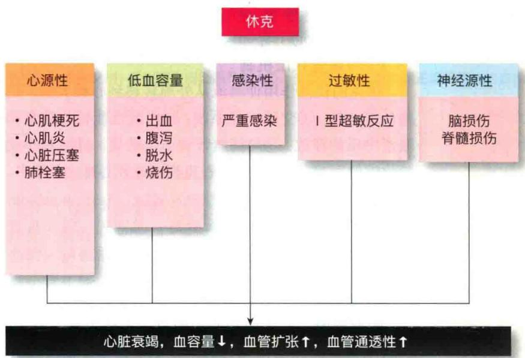 
图7-16 休克的分类。A. 心脏不能泵出足够血液（心源性休克）；B. 严重血液量或血浆量减少造成有效血容量减少（低血容量性休克）；C. 广泛性血管扩张造成有效血容量减少（感染性、过敏性或神经源性休克）血管通透性增加可通过减少有效血容量使血管扩张更严重
超敏反应可导致广泛的血管舒张和血管通透性增加（见第4章）。
神经源性休克可见于脑或脊髓受到急性损伤后，因为后者可以损害控制血管紧张度的神经并引发全身血管扩张。对于过敏性休克和神经源性休克，不论是否伴有血管通透性的增高，本应到外周的血液都会重新分布，因此减少了有效循环血量和血浆量。这种效应最终导致与低血容量性休克同样的后果。
在低血容量和心源性休克，较少的心排血量及随之而来较少的组织灌注量是休克从可逆性发展到不可逆性的关键步骤。细胞缺氧是组织灌注初期下降的常见结果。尽管这种变化最初并不造成不可逆损伤，但组织灌注量减少及进一步缺氧的恶性循环损伤了内皮细胞，心肌细胞和其他器官可进展直至死亡。
# 一、全身炎症反应综合征——休克的特征
全身炎症反应综合征（systemic inflammatory response syndrome，SIRS）是局部免疫或炎性反应的放大性和全身性表现，它常是致命性的。SIRS是一种高代谢状态，在已知炎症因素下，以全身性炎症的两种或更多表现为特征，如发热、心动过速、呼吸急促、白细胞增多或白细胞减少。被定义为临床型SIRS的感染性休克（见上文）很严重，以致造成器官功能障碍和低血压，并常进展为多器官功能障碍综合征（multiple organ dysfunction syndrome，MODS），MODS通常用来描述危重患者无法解释的器官功能异常。
SIRS定义的大面积炎症反应是由于许多细胞因子的全身性释放。

【发病机制】SIRS定义的大面积炎症反应是由于细胞因子全身性释放，最重要的因子是
肿瘤坏死因子 (TNF)、白介素 (IL)-1 和血小板活化因子 (PAF)。多于 30 种 SIRS 内源性介质已经被鉴定, 这些因子之间的相互作用可能在发病机制中扮演重要角色。
革兰阴性微生物导致的败血症是感染性休克最常见原因。入侵的细菌释放内毒素、毒性部分在脂质A的脂多糖（LPS）。进入循环后，LPS与LPS结合蛋白连接，该复合体结合到单核细胞/巨噬细胞表面上的分化抗原簇（CD）14，它是包含toll样受体（TLR）家族蛋白质和肽聚糖识别蛋白（PGRPs）在内的识别复合体的一部分。TLRs是先天性免疫系统主要感染器，可识别细菌、真菌和原生动物。结合到TLR-4的LPS通过中间步骤介导信号通路，激活核因子B（NF-B）转录因子刺激单核巨噬细胞分泌大量细胞因子，如TNF、IL-1、IL-6、IL-8、IL-12、巨噬细胞抑制因子和其他因子。TNF激活
诱导型 NO 合酶（iNOS）后使 NO 合成增加，是败血症期间血压下降的主要原因。TNF 在非内毒素症相关的休克（如心源性休克）发病机制起关键作用。中毒性休克综合征的毒素 -1、肠毒素、分枝杆菌、真菌、寄生虫和病毒抗原和补体激活产物的抗原都促进了 TNF 的释放。
单核细胞/巨噬细胞分泌的TNF通过损伤膜通透性、诱导内皮细胞凋亡显示出对内皮细胞的直接毒性作用。TNF还间接性地通过以下途径：①发起其他介质的级联反应来扩大毒害效应；②促进中性粒细胞黏附到内皮表面；③激活外源性凝血途径。感染性休克进展机制见图7-17。
多种细胞因子、细胞表面受体和其他循环标志物如TLR-4和TNF- $\alpha$ 的基因突变被发现与患者对脓毒血症易感性的个体差异相关，并有助于解释为什么患者对不同传染性病原体反应不同。
# 二、多器官功能障碍综合征——休克最终结果
多器官功能障碍发生在1/3的感染性休克、外伤或烧伤及1/4的急性胰腺炎患者。不论是什么原因，MODS的临床恶化是由SIRS组织损伤共同机制导致的。SIRS/MODS死亡率超过 $50\%$ ，是无冠状重症监护室内最常见的死亡原因。对败血症的急性反应特征是促肾上腺皮质激素释放（ACTH）、皮质醇、肾上腺素和去甲肾上腺素、抗利尿激素、胰高血糖素和生长激素的释放。最终结果是非重要系统关闭，机体处于全面分解代谢状态。
抗炎因子在一些患者中也起重要作用，结果是代偿性抗炎反应综合征（compensated anti-inflammatory response syndrome，CARS），即免疫系统的瘫痪导致患者预后较差。在SIRS与CARS两种状态之间相互转换的脓毒症患者更容易死亡。这种SIRS和CARS并存的状态被称为“混合抗炎反应综合征”（mixed anti-inflammatory response syndrome，MARS）。
# （一）血管代偿机制
休克的代偿作用使血流从外周转移到心和大脑。这些反应包括：①交感神经系统；②内源性血管收缩素和激素物质的释放；③局部血管调节。结果，动脉和小动脉收缩的同时，心率增加、心肌收缩导致心排血量增多。

【病理】休克和器官的特定改变相关（图7-18），这些改变包括心力衰竭、肝和肾的衰竭，急性迫综合征和受抑制的宿主防御机制。
# （二）心
败血症时，心外膜和心内膜显示点状出血。镜下，心肌中显著的收缩带和坏死灶从单纤维损失到大面积
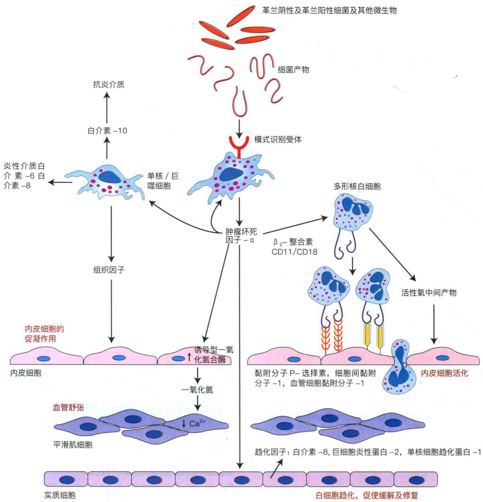 
图7-17 内毒素性休克的发病机制。败血症主要是由革兰阴性细菌和诸如内毒素[脂多糖（LPS）]类的细菌产物引起的，细菌产物进入循环系统并结合单核细胞/巨噬细胞表面上模式识别受体，刺激大量肿瘤坏死因子 $-\alpha$ （TNF- $\alpha$ ）释放。TNF- $\alpha$ 通过以下机制引起感染性休克：①刺激多种促炎和抗炎介质的释放；②组织因子诱导内皮促凝，引起血栓形成、局部缺血；③对内皮细胞的细胞毒作用；④内皮细胞活化后增强中性粒细胞黏附；⑤刺激内皮细胞产生NO、血管舒张；⑥吸引促进组织修复的白细胞的趋化因子释放。 $\mathrm{Ca}^{2+}$ 钙离子；CD.分化抗原簇
坏死变化不等。
# （三）肾
临床上称为急性肾衰竭的急性肾小管坏死（acute tubular necrosis，ATN）是休克主要并发症。ATN时，肾是大的、肿胀的，虽然肾皮质可能显苍白但肾是充血的。横截面显示外髓纹的血池。镜下，ATN显示近端小管扩张、细胞局灶性坏死。管状管腔里的色素沉着表明血红蛋白或肌红蛋白的溢出。远端肾单位和远曲小管出现粗“黏稠”物。间质水肿主要在皮质，单核细胞聚集在小管和周围间质。ATN将在第16章进
行详细讨论。
# （四）肺
休克严重持续长时间后，肺泡壁的损伤可导致肺休克，肺休克是急性呼吸窘迫综合征的原因。包括间质水肿、内皮细胞和肺泡上皮细胞坏死、血管内微血栓和肺泡表面的透明膜形成在内的损伤顺序由中性粒细胞调控。该过程将在第12章进行更充分的讨论。
# （五）胃肠道
休克常导致弥漫性消化道出血。胃黏膜糜烂和肠道浅表性缺血性坏死是出血的常见原因。肠屏障功能
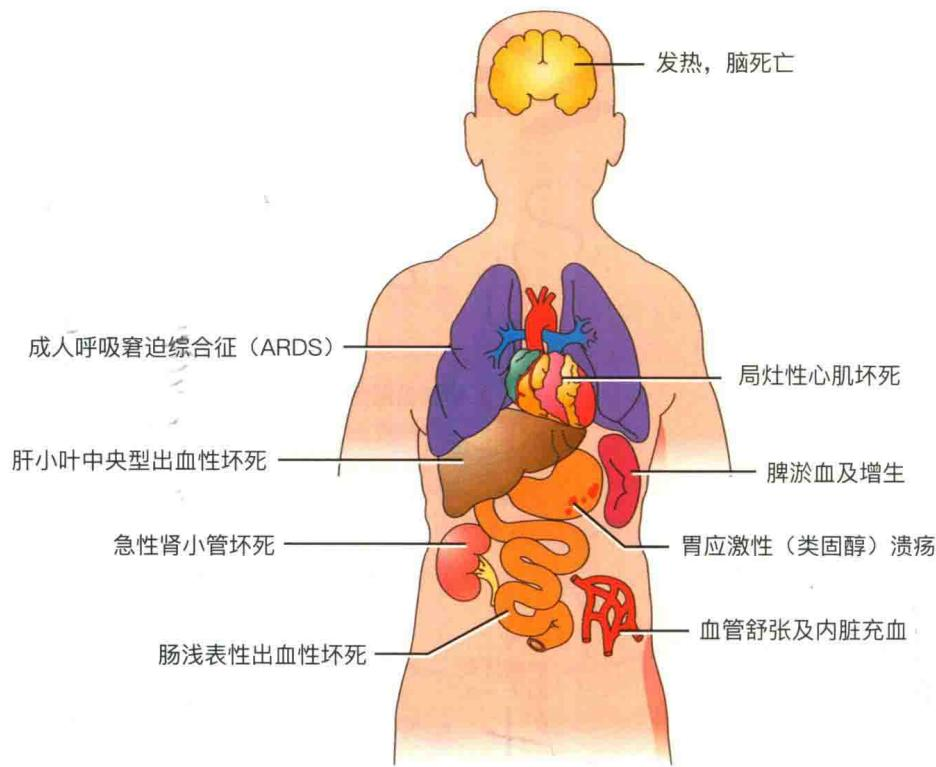 
图7-18 休克的并发症
的损伤可导致败血症。更严重的坏死性病变促使休克进入晚期恶化阶段。
# （六）肝
死于休克的患者肝大，切面的斑点反映出小叶中央血液淤积，最显著的组织学病变是小叶中央充血及坏死（见第14章）。
# （七）胰腺
休克期间，供给胰腺血液的内脏血管易受到受损的循环系统的影响。胰腺外分泌部缺血性损伤可释放出活性催化酶，引起可进一步促进休克的急性胰腺炎并发症（见第15章）。
# （八）肾
在严重性休克中，肾上腺皮质层有显著性出血。虽然出血常是点状的，它也可以是块状并伴随整个腺
体的出血性坏死，这在华-弗二氏综合征中也可看到（图7-19），华-弗二氏综合征通常与暴发型脑膜炎双球菌性败血症有关（见第21章）。
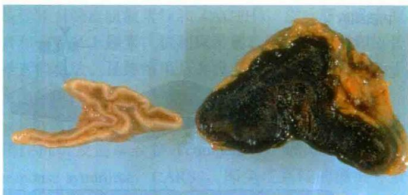 
图7-19 华－弗二氏综合征。标本来自一位死于脑膜炎球菌感染而引起的休克患者，左边是正常的肾上腺，右边是广泛出血而肿大的肾上腺
（段焕利）
# 第8章 环境和营养病理学
环境病理学是一门研究由于接触外源性的有毒物质和缺乏生命必需物质而引起的疾病。在这一章里，我们主要讲述由以下原因导致的疾病：①接触有毒物质；②物理损伤；③营养物质缺失。
# 第一节 吸烟
在美国，烟草的使用是唯一可大规模预防的死亡原因，每年超过400000人的死亡（约占美国每年死亡人数的1/6）是由吸烟导致。据报道在吸烟人群中，由吸烟导致死亡的主要疾病依次为：冠状动脉心脏病、肺癌和慢性阻塞性肺疾病。目前估计，由烟草导致的癌症死亡人数占癌症总死亡人数的 $11\% \sim 30\%$ ，心血管死亡人数的 $17\% \sim 30\%$ ，肺部疾病的 $30\%$ 和低出生体重儿发生率的 $20\% \sim 30\%$ 。吸烟者的寿命缩短，同时总体死亡率与吸烟的量和持续时间成正比，通常用“包-年”来表示吸烟数量（图8-1）。在美国，几乎所有与吸烟有关的肺癌死亡人数，超过了由结肠癌、乳腺癌、胰腺癌和前列腺癌四种主要癌症总共的死亡人数。戒烟15年后，戒烟者的死亡率与从未吸烟者的死亡率相当。
# 一、心血管疾病是吸烟的一个主要并发症
吸烟是心肌缺血的一个主要独立危险因素，也与其他危险因素协同作用，例如：血压升高和血液中胆固醇水平（图8-2）。吸烟沉淀物引发的心肌梗死，会增加第二次心脏病发作的风险和减少心脏病发
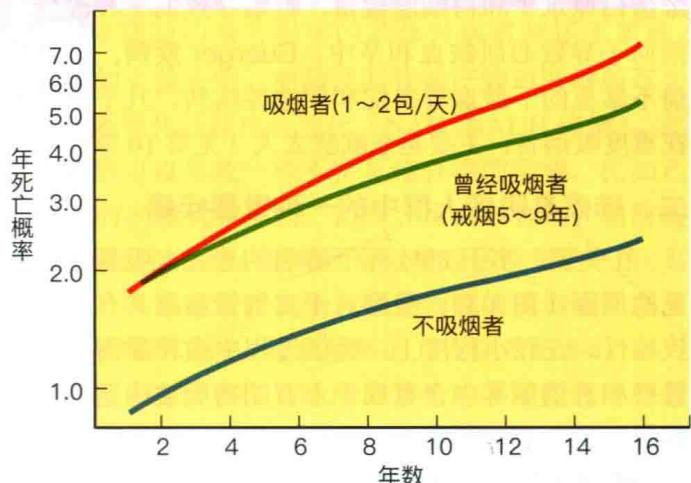 
图8-1 吸烟者和不吸烟者的死亡风险。图中每个个体每年死亡的概率用纵坐标表示，是一个对数刻度。吸烟1年的个体死亡的概率是不吸烟个体的2倍，而那些吸烟超过15年的个体其死亡的可能性相比于不吸烟个体超过3倍
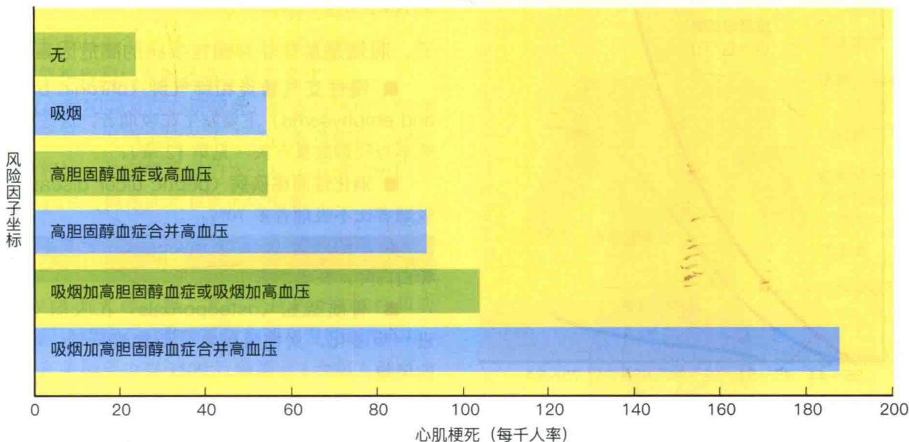 
图8-2 吸烟人群中缺血性心肌梗死的风险。吸烟是一个独立的危险因素，如同高血压和高胆固醇血症一样，吸烟也可以单独引起相同水平的心肌缺血。吸烟可以增加高血压和高胆固醇血症的不良效应
作后的生存期。吸烟也会增加心脏性猝死的发生率：心脏性猝死的原因为动脉粥样硬化斑块不稳定和侵蚀，进一步可能导致心肌缺血、心律失常和缺血性卒中。它是缺血性卒中（ischemic stroke）的一个独立的危险因素。该风险和吸烟数量相关，在戒烟后降低。吸烟也会增加某些形式的颅内出血（intracranial hemorrhage）的风险。在30岁以上的女性中，同时吸烟和口服避孕药会以一种年龄相关性的方式更进一步增加心肌梗死和卒中的可能性。
相比于不吸烟人群，吸烟人群中冠状动脉和主动脉粥样硬化更严重和广泛，并且硬化程度存在剂量相关性。因此，吸烟是主动脉瘤和周围性血管疾病的一个强大的危险因素。尼古丁本身和一氧化碳吸入的药理学作用可降低血浆高密度脂蛋白水平，增加血浆纤维蛋白原水平和白细胞数量。吸烟导致的三种改变均倾向于导致心肌缺血和卒中。Buerger疾病，一种目前不常见的下肢血管炎症和闭塞性疾病，几乎只发生在重度吸烟者，主要是东欧犹太人（见第10章）。
# 二、肺癌是吸烟人群中的一种重要疾病
在美国，多于 $85\%$ 死于肺癌的患者，吸烟是最常见的原因（图8-3）。吸烟对于支气管黏膜具有毒性和致癌性。在较小程度上，吸烟过程中微粒黏附于支气管壁和香烟烟雾中含有成千上万的物质被确定为致癌物质、促肿瘤物质和细胞毒性物质。
吸烟也是诱导职业相关性肺癌的一个重要因素。在一般人群中，重度吸烟者患肺癌的危险约为不吸烟
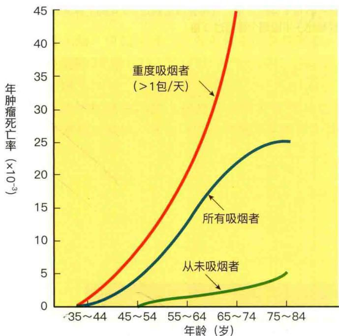 
图8-3 从肺癌死亡率在吸烟者和非吸烟者。不吸烟者表现出小，线性增加肺癌的死亡率从50岁开始。相比之下，那些每天吸烟超过一个包一个指数的年死亡率增加肺癌从35岁左右开始。70岁，重度吸烟者有20倍的肺癌死亡率比不吸烟者
者的20倍，然而，肺部存在纤维化且重度吸烟的石棉工人患肺癌的风险值，相比于普通人群中不吸烟者为 $40\sim 60$ 倍。
■唇、舌和口腔癌（cancers of the lip，tongue and buccal mucosa）：唇、舌和口腔黏膜的癌症主要（>90%）发生在吸烟人群中。所有形式的吸烟（纸烟、雪茄、烟斗和咀嚼烟草）都会导致口腔暴露在有毒化合物中。在许多吸烟人群中会有人乳头瘤病毒的感染(hpv)，也为吸烟与hpv诱导癌症之间存在一定联系提供了一定的依据。
■ 喉癌（cancer of the larynx）：喉癌同样也与吸烟有关。一些大型的研究表明，白种人男性吸烟者死于喉癌的可能性是非吸烟者的 $6 \sim 13$ 倍。
■ 食管癌（cancer of the esophagus）：据估计在美国和英国， $80\%$ 的食管癌患者是吸烟所致。
- 膀胱癌（cancer of the bladder）： $30\% \sim 40\%$ 的膀胱癌患者是吸烟所致。
肾腺癌（adenocarcinoma of the kidney）：吸烟人群中，肾腺癌的发病率增加2倍。肾盂癌的发生率也有中等程度增加。
胰腺癌（cancer of the pancreas）：吸烟人群中，胰腺癌的发生率明显增高，至少该现象部分与吸烟相关。在男性吸烟者人群中，胰腺癌的发生风险是非吸烟人群的 $2\sim 3$ 倍，同时存在剂量相关性。
宫颈癌（cancer of the uterine cervix）：在女性吸烟患者的人群中，宫颈癌的发生率明显增高（约 $30\%$ ），支持在吸烟增加hpv诱导癌症的说法。
■急性髓性白血病（acute myelogenous leukemia，AML)：AML与吸烟相关；在男性中，吸烟会导致AML发生的风险增加2倍。
# 三、吸烟是某些非肿瘤性疾病的高危因素
■ 慢性支气管炎和肺气肿（chronic bronchitis and emphysema）主要发生在吸烟者。这些疾病的发病率与吸烟数量有关（见第12章）。
■ 消化性溃疡疾病（peptic ulcer disease）男性吸烟者比不吸烟者多 $70\%$
眼部疾病（ocular diseases），尤其是黄斑变性和白内障，在吸烟者中更常见。
■ 骨质疏松（osteoporosis）在吸烟女性中会进一步恶化。女性吸烟者骨质密度降低，增加骨折的风险。
甲状腺疾病（thyroid diseases）与吸烟相关。最明显的是与Graves病之间的联系，特别是当甲状腺功能亢进症并发眼球突出。
更年期提前（Earlier menopause）女性吸烟
者会发生更年期提前，可能是由于烟草影响雌二醇的新陈代谢。
# 四、胎儿烟草综合征与小于胎龄儿相关
母体吸烟会损害胎儿的发育。这些婴儿不是早产儿出生，但是在怀孕的每个阶段发育都小于胎龄。事实上， $20\% \sim 40\%$ 的低出生体重胎儿可以归因于母体吸烟。吸烟者的后代中，围生期死亡率较高，在每天吸烟超过1包的女性的所有后代中，几乎可达 $40\%$ 。前置胎盘、胎盘早剥、子宫出血和胎膜早破裂的发生率都增加。孕期这些吸烟的并发症通常在胎儿无法存活或是在宫内高度危险时发生（例如：怀孕 $20 \sim 32$ 周）。最令人关注的是孕期吸烟母体后代发生突发性胎儿死亡（SIDS）的概率增加。据报道吸烟女性的后代患呼吸系统疾病的易感性增加，包括肺部感染和中耳炎。大量的证据表明吸烟女性会给后代带来持久的损害，包括机体损伤、认知和情感发育障碍。研究表明孕期母体吸烟可导致胎儿出生后患某种特殊形式的注意缺陷和多动障碍风险增加几倍。孕期吸烟会导致患儿出现认知和听力功能相关的问题，这些问题可能会持续很多年，甚至持续至青少年期。
# 五、环境中存在的烟草烟雾可能导致非吸烟人群发生多种疾病
环境烟草烟雾（environmental tobacco smoke，ETS，代表无意识的接触烟草烟雾的环境，据报道，该环境在不吸烟人群中是一些疾病的危险因素。
如：
肺癌：据报道肺癌在吸烟人群的非吸烟配偶人群中发生率增加了 $20\% \sim 30\%$ 
呼吸道疾病和住院治疗：在吸烟父母的婴儿中，呼吸道疾病和住院治疗增加。在吸烟者的孩子中，轻微的肺功能损伤和已有的哮喘会发生恶化。 
■冠心病和突发性心脏猝死：两者与环境中的烟雾和烟草有关。发病风险的大小存在剂量依赖，同时与吸烟者相比，与烟雾暴露的水平相比不成比例的增加。减少ETS可降低此类事件的发生率。
# 第二节 酗酒
酗酒是指对乙醇成瘾，其特性是具有依赖性和戒断症状，最终酒精会对身体导致急性和慢性毒性作用。据估计，在美国至少有1500万酗酒者（全部人群中约 $10\%$ 为高危人群）。在其他国家酗酒者的比率更高。某些少数民族，如印第安人、爱斯基摩人酗酒率高，而另一些，比如中国和犹太的人，酗酒率较低。虽然男性酗酒更常见，但女性酗酒者人群却一直在增加。
慢性酒精中毒被定义为规律的酒精摄入量，这些量足够对一个人社会、心理上或身体上造成伤害。虽然目前没有硬性规定，但对于大多数人而言，每天摄入酒精的量应少于 $45\mathrm{g}$ ，每天摄入酒精达 $100\mathrm{g}$ 或更多可能是危险的（ $10\mathrm{g}$ 酒精 $= 10\mathrm{z}$ 或 $30\mathrm{ml}$ 的 43 度烈酒）。
急性酒精中毒会导致严重的不良后果。在美国2009年的交通事故中，大约1/3的机动车死亡事件与酒精中毒有关，几乎有11000人死亡。酗酒也是发生致命家庭意外的一个主要因素，如火灾死亡和自杀。许多与酗酒有关的慢性疾病会导致营养不良和营养缺失，如硫胺素缺乏症（韦尼克脑病）或叶酸缺乏症（巨成红细胞性贫血）。然而，大多数酗酒者有足够的饮食，同时酒精依赖的大部分应该归功于酒精的毒性作用。
# 一、酒精摄入会对机体器官和组织造成影响
酒精诱导的器官损害的具体发病机制还不明确。一系列的实验表明，酒精及其代谢产物对肝细胞有损伤，包括氧化还原电位变化（NAD/NADH比例）。此外，乙醇可以导致一些不常见化合物的形成，比如乙醇氧化的初级代谢产物，乙醛、蛋白加合物、脂肪酸乙酯和磷脂酰乙醇。酒精还可以增加活性氧的产生（见第1章）并且将活性氧插入到生物膜的磷脂中间从而干扰其生物学功能。慢性酗酒的并发症见图8-4。
1. 肝酒精肝作为酗酒最常见的并发症已经有数千年的历史了，在发达国家，肝硬化大部分由酒精肝造成。如果引用过度，不管哪种酒精饮料都会引发肝硬化，包括啤酒、葡萄酒、威士忌、苹果酒等。只有减少酒精饮料的摄入才能降低得肝硬化的概率。
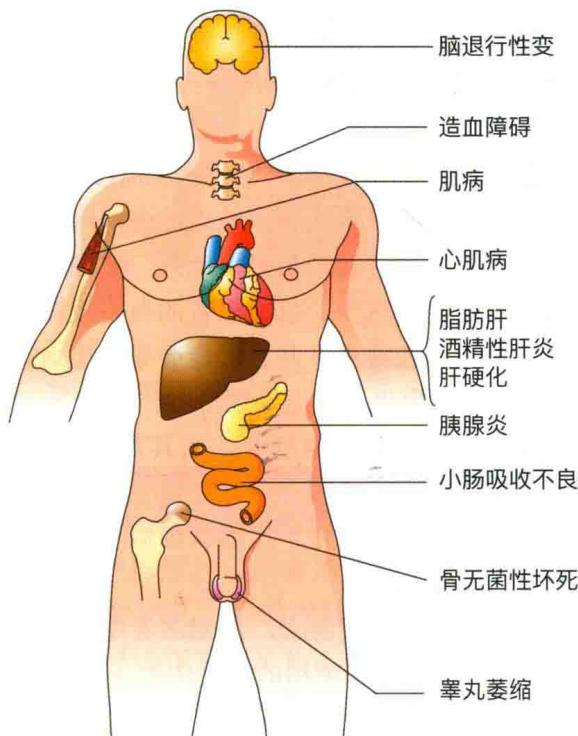 
图8-4 慢性酗酒的并发症
2.胰腺急性和慢性胰腺炎都是酗酒的并发症（见第15章）。慢性钙化性胰腺炎无可争议是由酗酒导致的，同时酗酒也是导致胰腺剧烈疼痛、胰腺功能不足和胰腺结石的一个主要原因。
3. 心 酒精相关的心脏疾病是扩张型心肌病的一种，叫作酒精性心肌病，这种疾病会导致低心排血量的充血性心力衰竭（见第11章）。酗酒者更容易罹患心律失常，并且许多酗酒者的猝死都极有可能是该并发症导致。讽刺的是，适量的饮酒对冠心病和心肌梗死有明显的保护作用。相似的，与戒酒者相比，适量饮酒者罹患缺血性卒中概率更低。
4. 骨骼肌 肌肉无力，尤其是近端肌肉，在酗酒者中比较常见。在慢性酗酒者中，骨骼肌病变程度不一，从轻度肌无力到严重的、伴有肌纤维退化和弥漫性纤维化的慢性肌无力。急性酒精性横纹肌溶解（肌纤维坏死和肌红蛋白释放入血液循环）并不常见，但由于继发于肌红蛋白尿的肾衰竭可能是致死性的。
5.内分泌系统 男性酗酒者女性化，性欲和性功能减退较常见，也会出现男性乳房发育、体毛丢失和阴毛女性化分布。这些改变部分可归咎于慢性肝病引起的雌激素代谢障碍，但是更多归咎于睾丸萎缩，甚至功能缺失。这可能是由垂体性腺轴功能紊乱导致循环中睾酮水平降低造成的，而这种情况有可能因肝脏中激素的加速代谢加重。另外酒精对睾丸有直接的毒性作用。
6. 胃肠道 酒精对食管和胃黏膜有直接的毒性作用。这种损害作用是由于酒精刺激导致胃酸高分泌所致。胃食管反流病（reflux esophagitis）可能尤其疼痛，并且在酗酒者中胃溃疡较常见。剧烈呕吐可能导致胃食管连接部撕裂（Mallory-Weiss syndrome），有时甚至导致活动性出血。
7. 血液系统 在酗酒者中，巨幼细胞贫血较常见。原因一方面是酗酒患者饮食中缺乏叶酸，同时在人体内酒精是叶酸的一种弱拮抗剂。此外，在酗酒者体内由小肠吸收的叶酸减少。急性短暂的血小板减少症在急性酒精中毒后较常见，并且可能会导致出血。酒精也会干扰血小板聚集，从而导致出血。
8. 骨骼系统 慢性酗酒者，尤其是绝经后妇女，会增加骨质疏松症的风险，尽管加速骨质流失的确切机制尚不清楚。有趣的是，适度饮酒似乎可以发挥抗骨质疏松的作用。
9. 神经系统 一般而言，在酗酒者中大脑皮质萎缩很常见，可能反映了酒精的毒性作用（见第28章）。相反，在酗酒者中，大多数脑部疾病的特点可能是营养不良的结果。
■韦尼克脑病（Wernicke encephalopathy）是
由维生素 $\mathbf{B}_{1}$ 缺乏引起的，表现为精神错乱、共济失调、眼球运动异常和多发性神经病，这些病变反映出了间脑和脑干的病变。
柯萨可夫精神病（Korsakoff psychosis）表现为记忆减退和虚构症状。这种疾病曾经被认为是慢性酒精中毒的特异性症状，但是后来在几种器质性精神综合征中也见到了这种疾病，所以并不是特异性的。
■酒精性小脑退化（alcoholic cerebellar degeneration）不同于其他获得性或家族性的小脑退化，这种疾病并没有统一的临床症状，而是可能表现为进行性的步态不稳、共济失调、运动不协调和深部腱反射减弱。
脑桥中央髓鞘溶解症（central pontine myelinolysis）是酗酒者脑部的另一个特征性病变，通常是由电解质紊乱引起的。在这种脱髓鞘病变中，进行性的延髓肌的无力最终会导致呼吸麻痹。
■多发性神经病变（polyneuropathy）在慢性酗酒者中很常见。这种疾病通常是与维生素 $\mathbf{B}_1$ 和其他B族维生素的缺乏有关，同时酒精的直接神经毒性也起了一定作用。最常见的主诉包括麻木、感觉异常、疼痛、无力和共济失调。
# 二、孕期酒精滥用会产生胎儿酒精综合征
怀孕期间过度饮酒女性分娩的婴儿可能会表现出一系列的发育异常，这些异常统称为胎儿酒精综合征。这种疾病详见于第6章。
# 第三节 药物滥用
药物滥用被定义为“脱离了正常的医学、社会和或法律允许范围的任意药品的使用”。这种反复的违法药物使用，会使人产生欣快感，减轻压力或逃避现实。因此，药物滥用的范围通常是改变人情绪和感觉的药剂。包括：①阿片类衍生物（海洛因、吗啡）；②抑制药（巴比妥类药物、镇静药、酒精）；③兴奋药（可卡因、安非他命），大麻和迷幻药［苯环己哌啶（PCP），麦角酸酰二乙氨（LSD）]；④吸入药（亚硝酸戊酯，比如胶内的有机溶剂）。据估计，在美国每年非法毒品的使用约导致38000人死亡。
# 一、非法药物的使用会引发许多病理综合征
1. 海洛因（heroin）海洛因（乙酰吗啡）是一种比较常见的非法阿片类制剂，通常通过皮下或静脉注射诱导人体产生欣快感。常规剂量的海洛因，药效可维持5小时。过量可导致机体出现低体温、心动过缓和呼吸抑制。其他的阿片类制剂滥用包括吗啡和双氧吗啡，但这些制剂基本上被羟考酮和芬太尼取代。羟考酮是一种阿片类制剂生物碱，同时具备使机体兴奋
和镇痛的属性。芬太尼是一种与吗啡相似的麻醉药，但药效是吗啡的100倍。
2. 可卡因（cocaine）可卡因是来自南美古柯叶的一种刺激性生物碱。可卡因的毒性非常强，通常被裂解成小片段后抽吸。可卡因在血液中的半衰期约为1小时。据报道，使用可卡因者表现为极度欣快感，并且对一系列的刺激敏感性增加。然而，成瘾后，会发生偏执状态和明显的情绪多变。可卡因的作用机制与其干扰神经递质多巴胺的重新摄取，进一步增加突触间隙神经递质浓度有关。
可卡因过量会导致焦虑和谵妄，有时也会发生癫痫。心律不齐和其他心脏疾病会导致外观正常的机体发生猝死。慢性可卡因滥用有时也会导致特征性的扩张型致死性的心肌病产生。抽吸可卡因时，烟雾从鼻孔呼出会导致鼻腔和鼻中隔穿孔中线发生破坏性的病变。
3. 安非他命类制剂（amphetamines）安非他命类，主要是甲基安非他命，是拟交感神经药物。药理作用和可卡因有关，但是其药效持续时间较长。甲基安非他命通常被称为“冰毒”，可比较容易地通过非处方咳嗽药麻黄碱或伪麻黄碱的氢化作用获得。甲基安非他命通常在美国国内实验室制造，是美国的一个主要的公众健康问题。滥用安非他命最严重的并发症是癫痫、心律不齐和高体温。据报道滥用安非他命可导致大脑血管炎、蛛网膜下和大脑内出血。 
4. 致幻剂（hallucinogens）致幻剂是一组可改变机体知觉和感觉体验的非化学相关的药物。
苯环己哌啶（phencyclidine，pcp）是一种有迷幻或致幻作用的麻醉剂。作为一种消遣性药物，它被称为“天使粉”，可经口或鼻摄入，也可抽吸。pcp的麻醉属性导致机体对疼痛的感知能力减弱，因此，可用于自伤和创伤患者。除了该药物的行为效应，pcp通常可产生心动过速和高血压。高剂量可导致深度昏迷，癫痫发作，有时甚至出现去大脑强直状态。
麦角酸酰二乙氨（lysergicaciddiethylamide，lsd）是一种致幻剂。在19世纪60年代末，该药物的流行达到了顶峰状态，今天基本上不再使用。lsd会导致机体发生对感知发生曲解，逻辑思维混乱，时间感知改变和人格解体。“坏旅行”的特点是焦虑和恐慌和客观的拟交感神经作用，包括心动过速、高血压和高体温。剂量过于过量导致昏迷、抽搐和呼吸停止。
（大麻（marijuana）是最常使用的非法的药物。据报道，在美国高中生中，曾经至少 $40\%$ 有一次吸食该药物的经历， $23\%$ 多次吸食。大麻的作用是由活性剂 $\delta -9-$ 四氢大麻酚介导。大麻结合机体大脑中的大麻素受体，导致机体发生感知能力改变，协调能力丢失和其他的精神症状。长期慢性使用大麻会导致机体产
生与吸烟相似的一系列肺部疾病，这些疾病很有可能与吸烟产生的油渍有关。长期吸食大麻也会对机体学习能力和社会性行为产生影响。 
5.有机溶剂（organic solvents）休闲性的有机溶剂吸入较为流行，尤其是在青少年中。多种商品化有机溶剂制剂可用于吸入机体，包括指甲油、胶水、塑料水泥和打火机液。有机溶剂的活性成分是苯、四氯化碳、丙酮、二甲苯和甲苯。这些化合物都是中枢神经系统抑制剂，尽管有些化合物早期可能表现为兴奋效应。有机溶剂急性中毒与酒精中毒相似。大剂量可产生恶心、呕吐、幻觉，甚至昏迷。随后发生呼吸抑制和死亡。长期接触或滥用有机溶剂可造成大脑、肾、肝脏、肺和血液系统损伤。例如：苯具有骨髓毒性，与急性髓细胞性白血病的发生相关。
# 二、静脉药物滥用可导致多种医疗并发症
除了滥用药物本身的药理和生理作用以外，最常见的并发症（ $15\%$ 的直接药物相关的死亡）是由肠外途径导致的微生物感染所致。大部分发生在注射位点，包括皮肤脓肿、蜂窝织炎和溃疡（图8-5）。经静脉感染的细菌可导致内脏器官发生败血症的并发症，例如：细菌性心内膜炎。使用同一注射器的静脉药物滥用者是获得性免疫缺陷病（AIDS）、乙肝和丙肝及其许多并发症的高危人群。
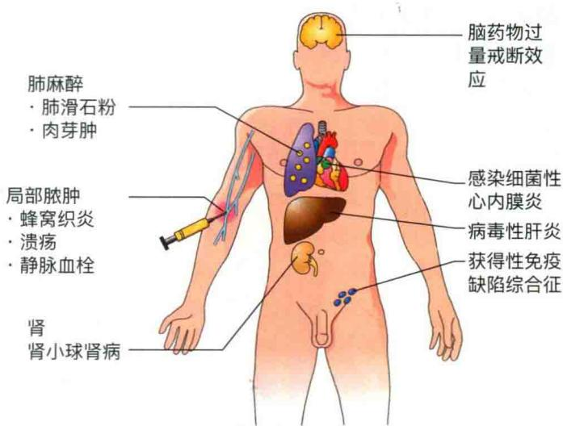 
图8-5 静脉药物滥用的并发症
# 第四节 激素类避孕药
在发展中国家，口服激素避孕药（OCs）是目前最常用的控制胎儿出生的方法。除了口服制剂以外，激素避孕药可也作为皮肤补丁和积存注射或植入。目前最为常用的制剂是由人工合成的雌激素和孕激素样活性的类固醇结合而成，尽管有时也会使用单一的孕激素“小片”。它们通过在月经中期周期性抑制促性腺
激素激峰值，从而防止机体排卵或者通过改变子宫内膜的增殖阶段放置胚囊植入。大部分口服避孕药的并发症涉及血管系统或生殖器官（图8-6）。
■ 血管并发症：深静脉血栓和血栓栓塞的概率会增加 $2\sim 3$ 倍。女性肥胖者、吸烟者或同时存在血栓形成倾向者发生血管并发症的风险更高（见第20章）。口服OCs女性，动脉血栓事件的发生率也会增加。因此，心肌梗死和血栓性卒中的报道率也增加。 
女性生殖系统肿瘤：在 $50\%$ 口服OCs的女性中，女性生殖系统肿瘤的发病风险降低。 
■ 良性肝腺瘤：良性肝腺瘤是一种罕见的肝脏肿瘤新生物，在口服OCs的女性中发生率明显增加，尤其在口服OCs超过5年以上的女性中。 
乳腺癌：在口服OCs的女性中，乳腺癌的发病率仅有小幅度增加。在停用OCs后，增加风险会持续10年之久。
在考虑使用OCs潜在的不良效果时，必须正确认识其对机体有利的方面。除了使用OCs可明显降低卵巢癌和子宫内膜癌的发病风险外，使用OCs也可降低盆腔炎症疾病、子宫平滑肌瘤、子宫内膜异位症和乳腺纤维囊性的疾病的发病率，同时也可大大减少皮肤粉刺的严重程度。
# 绝经后激素替代治疗会增加一些癌症的发病风险
激素替代治疗是为了减轻女性绝经后绝经综合征的症状、降低其发生心肌梗死和骨质疏松的风险。激素替代治疗制剂包括单一雌激素制剂和雌激素与孕激素的混合制剂。研究表明这些制剂在减低骨折发生率
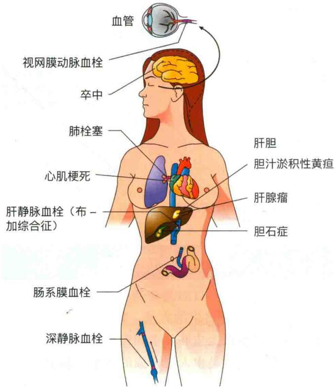 
图8-6 口服避孕药的并发症
及缓解与激素缺失相关的多种疾病有明显疗效。然而，绝经后激素替代治疗具有明显的风险。在使用激素替代治疗的第一年，无论是单一孕激素制剂还是雌孕激素混合制剂都会导致机体发生血栓形成的可能性轻微地增加，随后发生率降低。目前资料表明使用雌孕激素混合制剂的女性，其乳腺癌发生的概率明显增加，然而使用单一孕激素制剂的女性，其乳腺癌发生率仅轻度升高，或者不是全部升高。子宫内膜癌和卵巢癌的发生率降低。在避免患者死于心脑血管疾病方面，两种制剂都具有保护作用。
# 第五节 环境中的化学物质
在人类生活环境中，化学物质被添加到食物、水和空气中，或被认为是其中的污染物。毒性制剂发挥效应需要几个重要机制，包括毒性物质的吸收、分布、代谢和排泄。环境粉尘和致癌原是人类接触的最重要的化学危害。矿物质和有机粉尘吸入主要发生在职业环境中（例如，采矿、工业制造、农业），并且有时也会因特殊情况导致（例如，鸟贩子）。吸入矿物质微粒会导致肺部疾病，也称之为尘肺，然而有机粉尘可以导致高敏感性肺炎（hypersensitivity pneumonitis）。以前尘肺较为常见，但是通过改造制造业技术、改善空气处理和使用面具控制工作场所的粉尘暴露后，这些疾病的发生率明显减少。由于这些疾病非常重要，尘肺和高敏感性肺炎将在第12章中详细讲解（表8-1）。
致癌物或职业发病部位砷肺癌石棉间皮瘤（胸膜及腹膜）肺癌（吸烟者）芳香胺膀胱癌苯白血病、多发性骨髓瘤双（氯甲基）醚肺癌铬肺癌家具厂及制鞋业鼻咽癌赤铁矿肺癌镍肺癌，鼻旁窦癌炼焦及炼油工业肺、胃肠道、膀胱及皮肤的癌症氯乙烯肝血管肉瘤
# 毒性作用不同与高敏感反应性
许多物质在各种动物物种中引起疾病存在剂量依赖的方式，具有规律的时间延迟和一种可预测的目标器官的反应。此外，受伤组织的形态学变化是固定和
可再生的。相反，另外一部分试剂在导致疾病产生时具有明显的可变性，表现为：①不确定性其产生疾病的能力；②发生明显受伤之前，不规则的滞后时间；③无剂量依赖；④缺乏再生性。一般而言，可预测的剂量依赖反应是指化合物或其代谢物对某种组织的直接反应（例如，毒性作用）。第二种，药物不可预测的反应被认为是一种“高敏感性”，可能是一种免疫应答或个体特异质副反应。
记分卡域名（
# （一）挥发性溶剂和蒸汽
挥发性溶剂和蒸汽被广泛使用在工业领域的各个方面。除了极少数外，接触这些化合物都是因工业因素或意外，且表现为短期危险而非长期毒性。大多数情况下，接触有机溶剂是通过吸入而非食入，虽然也有异常发生。
■氯仿（ $\mathrm{CHCl}_3$ ）和四氯化碳（ $\mathrm{CCl}_4$ ）：尽管这些溶剂对中枢神经系统、心脏和血管系统具有麻醉（镇静）作用，但它们被广泛称为肝毒素。大剂量会导致急性肝坏死、脂肪肝和肝衰竭。即使短期接触 $\mathrm{CCl}_4$ 也会导致临床上肝损伤；因此，不可能长期接触。
■三氯乙烯（ $\mathrm{C_2HCl_3}$ ）：一种广泛使用的工业溶剂，高浓度的三氯乙烯可以抑制CNS，但是肝毒性较小。该溶剂被认为是一个可能的致癌物质，但流行病学证据薄弱，因此，需要更多的研究。
甲醇（ $\mathrm{CH}_3\mathrm{OH}$ ）：因为甲醇与乙醇不同，不征税，一些贫困的酗酒者把它作为乙醇的一个替代品使用。它能产生与乙醇相似的陶醉感，但随后可出现胃肠道症状、视觉障碍、癫痫、昏迷和死亡。甲醇的主要毒性被认为源自其新陈代谢，先是生成甲醛和然后生成甲酸。摄入甲醇后，代谢性酸中毒比较常见。甲醇毒性最显著的特征性病变是视网膜神经节细胞的坏死和随后的视觉神经的退化。严重的中毒和可能在产生壳核和苍白球产生病变。
■ 乙烯乙二醇（HOCH2CH2OH）：因为其蒸汽压力低，乙二醇的主要毒性源自摄入的过程。多年来，它一般用于防冻剂和慢性酗酒者代替乙醇的一种替代品。孩子和动物误食是因为它的甜味，虽然现在该产品中故意加入了苦味添加剂。乙二醇的毒性主要是由于它的代谢产物，特别是草酸，发生在摄入后的几分钟内。可见代谢性酸中毒、CNS抑郁、恶心、呕吐和低钙相关性心脏毒性。常见草酸晶体和草酸尿，可能导致肾衰竭。
汽油和煤油：这些燃料是脂肪族碳氢化合物和支链、不饱和芳烃化合物的混合物。通过吸入发生慢
性接触。尽管加油站服务员和汽车修理工长期接触汽油，但是没有证据表明，长期吸入汽油特别有害。
■苯（ $\mathrm{C_6H_6}$ ）：芳香族碳氢化合物的原型是苯，苯必须与汽油区别开来，后者是一种脂肪族碳氢化合物的混合物。在工业流程中，由于苯是无数化合物合成的起点和溶剂，因此它是一种广泛使用的化合物。它也是燃料的一种组成成分，在汽油中的比率为 $3\%$ 。几乎所有的急性和慢性苯中毒发生在工业暴露。急性苯中毒主要影响中枢神经系统，并且死于呼吸衰竭。然而，慢性接触时，骨髓是主要的靶器官。血液系统异常患者典型表现为骨髓的发育不全或不发育和全血细胞减少症。当工人正在接触高浓度苯时，通常表现为不发育贫血症。在大量的苯诱导性贫血病例中，可发生骨髓增生异常综合征和（或）急性髓系白血病（见第20章）。总体来说，在接触于高浓度苯的工人中，白血病的风险增加了60倍。苯的毒性作用与其代谢物相关，这些代谢产物是由细胞色素P450降解苯所产生。
# （二）农药
杀虫剂、杀菌剂、除草剂、熏蒸剂和有机化肥是现代农业成功的核心。然而，许多这些化学物质持续存在于土壤和水中，可能会造成潜在的长期危害。急性接触工业浓度的农药或无意中被的污染食物，可以引起严重的急性疾病。儿童对农药特别敏感，并且可能误食家庭园艺的农药。
中毒症状是与毒素相关的作用模式。例如，有机磷杀虫剂是乙酰胆碱酯酶抑制剂，很容易吸收通过皮肤。因此，人类有机磷急性中毒主要引起神经肌肉功能异常，如视觉障碍、呼吸困难、黏液分泌过多和支气管狭窄。患者发生死亡的主要原因是呼吸衰竭。在美国，每年有 $30\sim 40$ 人死于急性杀虫剂中毒。长期接触产生的综合征和急性中毒相似。有机氯杀虫剂，如DDT（二氯二苯二氯乙烷）、氯丹和其他杀虫剂，目前已经引起关注，因为它们可在土壤和人体组织中积累，分解非常缓慢，可能会对环境产生有害的影响。急性接触高剂量的任何这样的农药都会对人体有害，但是最让人感兴趣的是长期慢性接触农药和农药在机体内的累积。许多这些化合物有弱雌激素的作用，但目前尚未发现与该活性相关的有害作用。目前的证据表明DDT等有机氯化合物如奥尔德林和狄氏剂可能是致癌物质的说法依旧是模棱两可的。大多数有机氯杀虫剂的毒性作用与中枢神经系统有关。
人体接触除草剂并不罕见。在其中最著名的是毒性试剂百草枯。职业百草枯接触通常是通过皮肤，虽然也有误食和误吸的报道。该化合物腐蚀性很强，一旦接触会导致烧伤或溃疡。主动转移至肺，损伤肺上皮细胞，产生水肿，甚至呼吸衰竭。肺纤维化可能最
终导致死亡。肺毒性可能与氧化还原循环和过氧化反应有关。
# （三）芳香族卤化碳氢化合物
引起相当大关注的卤代芳烃包括：①多氯联苯(PCBs)；②氯酚（五氯苯酚，用作木材防腐剂）；③六氯酚，以前在肥皂中作为抗菌剂使用；④二噁英TCDD(2、3、7、8-四氯苯并二噁英)，合成除草剂、六氯酚的副产品，因此，是这些制剂的一种潜在的污染物。慢性接触TCDD似乎并不产生显而易见的毒性。长期接触TCDD会产生严重的后果，尤其是其致癌潜力，虽然世界卫生组织将该复合归类为致癌物质。环境中多氯联苯存在的问题类似于农用化学品：以表明该化合物有明显的长期动物毒性，但在接触该化合物的工人中，癌症或其他疾病的发病率未见明显增加。六氯酚和五氯苯酚也存在相同的情况。
# （四）空气污染物
对空气污染的精确定义比较难懂，因为目前还没有“纯净空气”的定义。然而，为了此处的讨论的目的，最重要的污染物是指那些在工业和农业等过程中燃烧产生的化石燃料。作为参与人类疾病的因素中，最重要的空气污染物有刺激物二氧化硫（ $\mathrm{SO}_2$ ）、氮氧化物、一氧化碳（CO）、臭氧以及悬浮微粒和酸性气溶胶。空气污染里最常见的化学成分主要是刺激物，并且研究表明这些刺激物可导致机体，或使机体倾向于一些呼吸道疾病的发生，但在发达国家很少直接导致机体死亡。剖析这些化学物质与其他空气污染物相比的特殊作用，特别是颗粒（见下文），是很困难的。许多关于空气污染对健康的影响研究主要专注于微粒。许多大型短期和长期的流行病学研究表明，微粒造成的空气污染与死亡率增加有关，包括整体死亡率及心血管疾病和癌症死亡率。美国癌症协会估计，平均每年接触的微小微粒每增加 $10~\mu \mathrm{g} / \mathrm{m}^3$ ，肺疾病的总体死亡和肺肿瘤死亡分别增加 $4\%$ 、 $6\%$ 和 $8\%$ 。短期研究表明接触高浓度的空气污染微粒可导致急性心肌梗死明显增加。此外，实验研究表明，接触微粒可能会增加动脉粥样硬化、血压、心率、血液凝固性和炎症介质水平。
# （五）一氧化碳
CO是由有机物质不完全燃烧产生的一种无味、无刺激性的气体。它可以与血红蛋白结合形成碳氧血红蛋白，与血红蛋白的亲和力是氧气的240倍。CO与血红蛋白结合也会增加其余的血红蛋白和 $\mathrm{O}_2$ 的亲和力，抑制其从组织中离解。因此，CO中毒导致的缺氧远远大于可以归因于单独的携氧能力的损失。
大气中的CO主要来自汽车尾气排放，不会造成健康问题。在吸烟者中，碳氧血红蛋白浓度低于 $10\%$
是较常见的，并可能加速劳累型心绞痛的发生和导致缺血性心脏病吸烟者的心电图发生变化。室内燃烧，尤其是空间加热器，可产生有害的浓度的CO。碳氧血红蛋白浓度高达 $30\%$ 通常只引起头痛和中等程度的劳力性呼吸困难。更高浓度可导致精神错乱和嗜睡。浓度达 $50\%$ 以上，昏迷和抽搐接踵而来。浓度大于 $60\%$ 通常是致命的。致命的CO中毒，其典型特征是皮肤呈现樱桃红颜色，该表现是由浅表毛细血管中的碳氧血红蛋白所致。从严重的CO中毒中恢复后可能会导致脑损伤，这可能表现为轻微的识字能力丧失，记忆丧失或锥体外系症状（如帕金森病）。急性CO中毒的治疗，如那些企图自杀或被困在大火的患者，主要是 $100\%$ 的氧气持续通气。
# （六）金属
金属是环境化学物质的一个重要群体，在人类从远古时代到目前可导致疾病产生。
1. 铅（lead）在工业化国家的环境中，铅是一种比较常见的重金属。在20世纪 $50\sim 60$ ，对慢性接触铅有广泛的认识之前，铅中毒的典型症状最常见于儿童和成人。在美国，铅中毒是一个与异食癖相关的主要的儿童问题。异食癖是指儿童有咀嚼婴儿床、玩具、家具和木制品和吃画画石膏和脱落油漆片的习惯。这些从含铅汽油的燃烧来源的铅，以灰尘的形式给大气增添了一个沉重的铅负担。住在铅污染点源（如冶炼厂）附近环境儿童和成人，可能会受到更高水平的铅接触。
在成人，职业接触铅主要发生在那些从事铅冶炼和汽车电池生产和回收的人群。偶尔发生的意外中毒事件，与使用含铅釉的陶器，改造含铅油漆的旧住宅和最近玩便宜的新奇珠宝和其他生产铅或装饰着含铅颜料的物品有关。
【发病机制】铅一般通过肺吸收，很少的一部分也可经胃肠道吸收。它可较容易通过血脑屏障，在大脑、肝、肾和骨髓的蓄积，直接与其毒性作用相关。铅结合巯基，并且干扰锌依赖酶和参与合成类固醇和细胞膜酶的活性。
【病理学表现】在今天的美国很少见到典型的铅中毒，它会对很多器官造成影响，但其主要毒性包括：①神经系统；②肾；③造血系统（图8-7）。在儿童中，大脑是铅毒性的靶器官；成年人通常表现为周围神经病变。儿童铅脑病（血铅水平为 $120\mathrm{mg / ml}$ ）典型表现为易怒和共济失调。他们可能发生抽搐或从困倦到深度昏迷的意识状态改变。儿童血铅水平较低时，表现为轻度中枢神经系统症状，如笨拙、易怒和多动症。
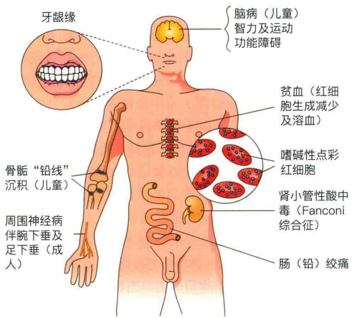 
图8-7 铅中毒的并发症
铅性脑病（leadencephalopathy）是指大脑水肿的一种状态，且表现为脑回扁平和心室压缩。可能有钩回疝小脑扁桃体疝。显微镜下可见充血、出血性瘀斑和神经元点状坏死。在大脑灰质和白质中，也可能伴随有弥漫性星形增生。大脑的血管病变尤为突出，表现为毛细管扩张和增生。
周围运动神经病变（peripheral motor neuropathy）是成人中最常见的铅神经毒性的表现形式，通常影响桡神经以及腓神经的功能，分别导致腕垂症（wristdrop）和足下垂（footdrop）。铅诱导的神经病变也可能表现为突发胃肠疼痛，也称为铅绞痛。
贫血（anemia）是铅中毒的一个主要迹象。铅会通过抑制从头合成血红蛋白的第二个酶，8-氨基酮戊酸脱氢酶，从而干扰骨髓中成红细胞合成血红蛋白的过程。它也抑制催化亚铁和铁卟啉环结合的亚铁螯合酶活性。铅中毒表现为类似缺铁性贫血的小细胞贫血。铅中毒导致的贫血特点也表现为与核糖体聚集相关的明显嗜碱性点彩红细胞。红细胞的寿命缩短；因此，铅中毒导致的贫血是由于无效造血作用和红细胞铁周转率加速所致。
铅性肾病（lead nephropathy）反映了铅对肾近端小管细胞的毒性作用。由此产生的功能障碍的特点是氨基酸尿、糖尿和高磷酸盐尿（Fanconi综合征）。这样的功能变化伴随着近端小管细胞的细胞核内特征性包涵体的形成。
铅中毒用螯合剂治疗，比如：单独使用乙二胺四乙酸钙（EDTA），或和二巯基丙醇联合应用（BAL）。铅中毒导致的血液系统和肾的临床表现通常都是可逆的，但是中枢神经系统改变一般是不可逆的。
长期接触低剂量铅的后果：由于汽油中铅的去除、
住房条件的改善和油漆的重制，环境中铅水平已经明显下降：在美国总体人群中，血液中铅水平大幅下降，导致儿童铅相关的死亡和脑病几乎消除。然而，儿童接触低水平铅，虽然不产生可识别的症状，但可能会永久地降低认知能力。目前血液中铅水平超过 $10\mu \mathrm{g}/$ dl 的儿童，需要通过监管机构采取措施，尽管目前尚没有建立最低的安全铅水平。血液中高浓度的铅是一些贫穷，主要是城市儿童面临的问题，并且通过剧烈运动来解决这种情况是比较合理的。
2.汞（mercury）自史前时代以来，无机汞金属便一直被使用着，且至少自中世纪以来，已经知道其职业相关的风险。近年来，人们认识到有机汞对人类的健康可能有着更大的风险。虽然汞中毒仍然发生在一些特殊的职业中，然而，几个众所周知的甲基汞中毒暴发导致的许多生态系统的污染，其带来的潜在健康危害实在令人担忧。汞释放到环境中可以产生生物聚集效应和进入食物链。海湾和海洋中的细菌可以将工业废物中的无机汞化合物转变为高度神经毒素的有机汞。这些化合物然后转移到食物链内，最终聚集在大食肉鱼类体内（如金枪鱼、梭子鱼），该鱼类是许多国家的饮食的一部分。
尽管无机汞无法有效的由胃肠道吸收，但是有机汞化合物由于其脂溶性特征较容易吸收。无机汞和有机汞都倾向于在肾蓄积，并且甲基汞也可在大脑内分布。肾是无机汞毒性主要的靶向器官，但是大脑损害主要由有机汞所致。据报道疫苗中的汞防腐剂会导致自闭症和其他神经并发症的产生，然而该说法仍需要进一步的研究。
（1）肾毒性（nephrotoxicity）：氯化汞曾经被作为一种防腐剂广泛应用，且该化合物的急性中毒更为常见。当今，大多数中毒事件都是工业事故。在氯化汞中毒的情况下，会出现伴随少尿性肾衰竭的近端小管坏死。在慢性汞中毒的患者中，蛋白尿较常见，且更严重的肾毒性可能会发生肾病综合征。病理学表现为，膜性肾小球肾炎伴有上皮下电子致密物质沉积，该电子致密物提示免疫复合物沉积。 
（2）神经毒性（neurotoxicity）：汞的神经毒性表现为视野缩小、感觉异常、共济失调、发音障碍和听力丧失。病理学表现为大脑和小脑萎缩。显微镜下见，小脑颗粒层萎缩，不伴有视觉和其他皮质区的浦肯野细胞丢失和海绵样软化。 
3. 砷（arsenic）砷的毒性特征，在几百年之前已经认识清楚。含砷化合物曾经被作为杀虫剂、除草剂、木材防腐剂和燃料广泛应用。砷化合物也可以通过自发形成的富含砷的岩石或土壤中的含砷污染物，进一步污染土壤和渗入地下水。与汞相似，食物链中也存
在砷的食物富集。
急性砷中毒大多是由于意外事件或是误食含砷化合物。机体死亡原因是由于中枢神经系统中毒。慢性砷中毒会对很多器官产生影响。初始症状无特异性，表现为精神萎靡和疲惫感，随后会出现胃肠道、心血管和血液系统功能障碍。也会同时产生脑病和周围神经疾病，后者表现为感觉异常、运动麻痹和疼痛性神经炎。流行病学调查表明，皮肤、呼吸系统和胃肠道癌症都与工业和农业中的砷接触有关。在世界上的一些地区，尤其是孟加拉地区，稻田工人长期接触砷与皮肤角化异常和癌症相关。然而，在美国，几乎没有癌症的发生是因接触砷导致。
4. 镐（cadmium）镉在合金生产中的使用量不断增加（有时用于儿童廉价的人造珠宝），生产充电电池、电镀和色素。镉在人体内蓄积，其半衰期超过20年，同时因其很少再回收使用，在工业中该金属使用量的增加引起了极大的关注。一般人群，接触该金属的主要途径是误食和误吸。植物和动物来源的食材都可能含有高水平的镉。
短期的镉吸入会刺激气管和支气管，最严重的后果会伴有肺水肿。在较小程度上，肺、肾、骨骼肌和血管系统是慢性镉中毒主要的靶器官。反映肾小管损伤的蛋白尿，在所有肾损害的镉工人中是一致的。
5. 铬（chromium）铬（Cr）被广泛应用在一些工业中，包括金属电镀和某些类型的制造业。尽管其存在多种氧化状态，但铬（Ⅲ）和铬（VI）是在工业中较常用。铬中毒主要是因误吸所致，并且接触铬导致的后果取决于特定铬盐的溶解度。尽管急性中毒已经明确，但是尚不清楚慢性接触铬的相关问题。
$\mathrm{Cr}$ （VI）具有高度遗传毒性。长期吸入含有六价铬盐的机体，其肺癌和其他肿瘤的发病风险增加。不溶性铬酸盐通常更强的肺致癌物质，尤其是锌铬酸盐。
6. 镍（nickel）镍是一种在电子、硬币、钢合金、电池和食品加工中广泛使用的金属。皮炎（“镍痒症”），接触镍最常见的后果，可发生在直接接触含镍金属后，例如硬币和人造珠宝。该皮炎是一种致敏反应；在镍离子渗入表皮后，机体对体内形成的镍耦合蛋白发生的反应。流行病学研究表明，从事接触镍化合物工作的工人，其肺癌及鼻腔癌症发生率增加。
# 第六节 体温调节功能障碍
# 一、低体温是指机体的体温低于 $35^{\circ}C$ （95°F）
体温过低会导致机体系统性或局部损伤，后者的例子有战壕脚。在局部体温过低的类型，实际上组织不发生冻结。冻伤，相比之下，涉及组织水分的冻结。
1. 全身性低体温 低体温可在很多情况下发生，包括在冷水中浸泡和暴露于极度寒冷的气温中，尤其是在服用损害体温调节制剂（如酒精和一些药物）之后。或许引起体温过低原因最好的研究是冷水浸泡。在 $4 \sim 10^{\circ} \mathrm{C}$ （ $39.2 \sim 50^{\circ} \mathrm{F}$ ）水中急性浸泡会减少血管中央血流。精神混乱是由于机体核心温度降低和冷却的血液灌注大脑所致。因发生手足抽搐而不能继续游泳。迷走神经的放电增加导致心室过早收缩、室性心律失常甚至颤动。30分钟以内，机体热损失量超过热生产量，核心温度开始下降。体温低于 $35^{\circ} \mathrm{C}$ ，呼吸率、心率和血压下降。如果长时间体温过低，降低的体温会改变脑血管功能。当机体核心温度达到 $32^{\circ} \mathrm{C}$ （ $89.6^{\circ} \mathrm{F}$ ），人变得反应迟钝、冷漠和孤僻。当机体体温低于 $28^{\circ} \mathrm{C}$ （ $82.4^{\circ} \mathrm{F}$ ），脉搏和呼吸减弱和随后发生昏迷。导致死亡的最重要因素是心律失常或突发性心脏骤停。这些观察结果已经被确认和进一步扩展，很大程度上是由于一些接受心脏直视手术的患者会诱导低体温的出现。事实上，如果仔细控制低体温的药物使用，长时间的低体温可实现无危害残留。虽然死于体温过低的个体，其外观没有特异的形态变化，皮肤呈现红色和紫色，耳朵和手肿胀和不规则血管收缩和血管舒张。可见部分心脏区域存在心肌溶解。肺可表现为肺水肿及肺泡间、支气管内和间质出血。
2.局部低体温 局部组织温度降低，尤其是皮肤，与局部血管收缩有关。如果血液循环不足应对持续的热损失，组织中的水分就会发生冻结。当凝固缓慢发生时，组织细胞内和间质空间会有冰晶的形成。与此同时，富含电解质的凝胶不形成冰晶。细胞器的损伤反映了其所在细胞内环境离子浓度的剧烈变化。随着冰晶的形成，大分子发生变性和细胞膜发生物理性破坏。细胞损伤最重要的生理意义在于毛细血管和小静脉的内皮细胞，这些细胞可改变小血管渗透性。这些损伤会导致血浆外渗，局部水肿和水疱形成和炎症反应。浸泡足（战壕足）是由于组织温度的长时间降低至一个点，但是该点又不足以导致组织中的水分形成冰晶所致。该冷却过程导致细胞破坏和内皮细胞损伤，后者会导致局部血栓形成和血管通透性改变。血管阻塞经常发生坏疽。
# 二、高体温是指机体体温升高
组织对高体温的应答反应和冰冻损伤的应答反应在一些方面相似。在两种情况下，血管内皮细胞损伤都会导致血管通透性改变，发生水肿和水疱。损伤程度取决于温度升高的范围和速度。小范围的体温升高可导致代谢率增加。然而，超过某个临界值，会发生酶变性、其他蛋白沉淀和细胞膜脂质层“溶解”。
1. 系统性高体温 系统性高体温也成为发热，是指机体核心温度升高。其发生原因如下：①产热增加；②机体热量消耗减少（提示体温调节中枢异常）；③体温调节中枢本身紊乱。从严格意义上说，系统性高体温是指由于机体散热量减少，核心温度超过体温设定值所致。机体温度超过 $42.5^{\circ} \mathrm{C}$ （ $108.5^{\circ} \mathrm{F}$ ）会引起严重的功能紊乱，包括广泛性血管舒张，心脏功能不足和呼吸改变，最终发生死亡。仅仅只有很少明确的病理变化和单一的发热有关。物理研究结果包括心率和呼吸频率增加，外周血管扩张和出汗，都认可热调节机制。中枢神经系统可能表现为易怒、不安和（尤其在儿童）抽搐。夜间温度升高与“夜汗”是肺肉芽肿感染的一个特征（特别是肺结核），也可以在淋巴增生性疾病中观察到。长时间的温度升高可以导致机体消瘦，主要是因为机体代谢率增加。
恶性体温过高是一种体温改变，伴有高代谢状态并且经常有横纹肌溶解。横纹肌溶解发生在易感人群吸入麻醉剂后。这种常染色体显性疾病和肌浆网鱼尼丁受体基因的突变相关。
热休克是高体温的一种，在机体周围环境温度非常高的情况下可以发生，并且不受内源性致热源的调节。该现象提示体温调节制冷反应损坏，并且经常发生在婴儿、较小的儿童和特定的年龄阶段。此种功能障碍通常与以下因素相关：①潜在的慢性疾病；②使用可影响下丘脑体温调节中枢的药物，如利尿剂和镇静剂；③使用抑制出汗的药物。另外一种形式的热休克常发生在健康男性不规律的剧烈运动时。乳酸性酸中毒、高钙血症和横纹肌溶解可能是严重的症状，并且1/3的劳力性热休克患者会出现肌红蛋白尿性肾衰竭。热休克使用常规的解热药治疗无效，只能使用物理降温、体液和电解质替换治疗。
2.局部体温过高：烧伤（local hyperthermia：burns）皮肤烧伤是局部体温过高最常见的形式。温度升高的程度和速度决定组织的反应。 $50^{\circ}\mathrm{C}$ （ $120^{\circ}\mathrm{F}$ ）的温度可能会持续10分钟或更久也不会发生细胞死亡，然而， $70^{\circ}\mathrm{C}$ （ $158^{\circ}\mathrm{F}$ ）或更高的温度，会在几秒钟内导致整个表皮的坏死。目前皮肤烧伤分为全层烧伤（以前的三度烧伤）和部分皮肤层烧伤（之前的一度和二度烧伤）（图8-8）。
■ 部分皮肤层烧伤（partial-thickness burns），例如轻度阳光灼伤，可表现为充血和疼痛，但是没有坏死。轻度内皮细胞损伤会导致血管扩张，血管通透性增加和轻微水肿。更严重的部分皮肤层烧伤会导致表皮坏死，但是真皮坏死较少见。临床上，这些烧伤表现为大水疱，表皮和真皮分离。
全皮肤层烧伤（full-thickness burns），表皮
和真皮全部烧焦。组织学上，表皮和真皮全部炭化和细胞结构丢失。
皮肤的最重要功能是保留液体和避免传染性病原体感染。广泛的皮肤烧伤所致的一个最严重的系统性紊乱是体液丢失。许多严重烧伤的患者，尤其是全身 $70\%$ 皮肤全层烧伤者，会发生休克和肾脏的急性肾小管坏死，死亡率极高。严重烧伤患者其体表发生致死性感染和菌血症的风险极高。即使是正常的皮肤腐生菌可导致烧焦组织感染，并且为治疗提供了另外的困难。
皮肤烧伤的治疗和组织烧伤范围相关。轻度的部分皮肤层烧伤，根据其定义，很少有细胞坏死，治疗只需要修复或替代受损的内皮细胞。更严重的部分皮肤层烧伤因其表皮中可再生上皮细胞的基底细胞依然保留，治愈后也不会留瘢痕。皮肤全层烧伤，表皮全层受损，导致产生一系列问题。如果皮肤附属物尚存，可重新发生上皮化。破坏皮肤附属物的深度烧伤需要在烧伤部位移植新的表皮或培养的自体角质细胞，从而建立有功能的皮肤表层。没被移植物置换的烧伤皮
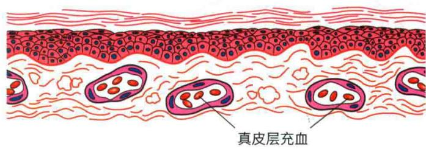 
部分皮层烧伤（轻度）
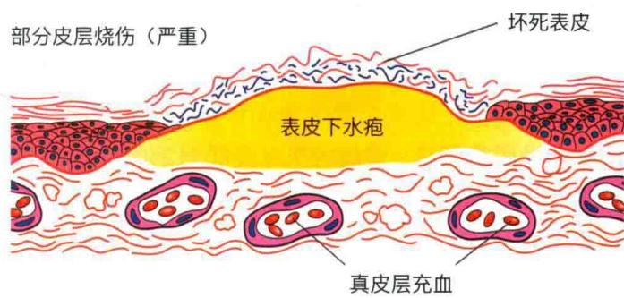
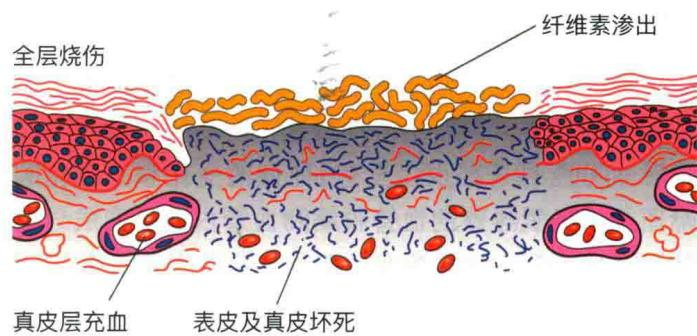 
图8-8皮肤烧伤的病理。轻度的部分皮肤层烧伤仅仅表现为真皮血管扩张。严重的部分皮肤层烧伤表现为表皮坏死和表皮下水肿在坏死表皮下形成大水疱。全皮肤层烧伤表现为表皮和真皮全部坏死
肤痊愈后表现为致密的瘢痕。由于瘢痕组织缺乏正常皮肤的弹性，瘢痕挛缩可能会最终导致运动受限。
吸入性烧伤：接触高温气体和高温雾化易燃材料可导致吸入性烧伤。吸入这些有害的烟气会造成从口腔到肺泡的呼吸道上皮细胞损伤。如果患者在急性吸入性烧伤事件后存活，可能随后会发生潜在性的致死性呼吸衰竭综合征（见第12章）。
电烧伤：当电流遇到组织电阻时，电能向热能转变会产生电烧伤。由于电能有干扰心脏电生理系统的潜能，其经常因引发室颤导致机体死亡。皮肤电烧伤反应电压、特定区域电传导和电流持续时间。非常高电压的电流会导致组织烧焦，产生全皮肤层烧伤。当电流一定时，接触的皮肤范围越大，产生的损害越小。
# 第七节 高度相关性疾病
人类存活对其生活环境所处的高度有特定的极限值，超过该极限值后人的寿命就不能较长时间维持。安第斯山脉的群体适应了 $4000\sim 4300$ 米（13124～14108英尺）的高度。居住者在发育过程中通过提高血细胞比容和形成肺容量增加的“桶状胸”来适应低气压和氧气的利用能力。即使居住在该地区的居民也不能在超过 $5500\sim 6000$ 米（18045～19686英尺）的高度存活。长期在此高度生活会导致体重下降，入睡困难和昏睡，可能是因为生存细胞能量发生了重新定位。例如，在6000米高度时，只有在努力吸气的情况下，可用氧才可达到 $75\% \sim 90\%$ 之间。与高度相关的一些小的不良反应有系统性水肿、视网膜出血和胃肠胀气。最严重的非致死性疾病是急慢性高原病和高山衰竭。随后可能会发生致死性的高原性肺水肿和高原性脑病。
■急性高原病：该疾病在海拔低于2500米时比较少见，但是在海拔为 $3000\sim 3600$ 米时，几乎每个人都会发生不同程度的急性高原病。初始症状表现为头痛、疲倦、厌食、虚弱和入睡困难。潜在的病理生理部分与低氧和血浆向细胞间质流动相关。
■高原性肺水肿和脑水肿：严重的高原问题，包括肺水肿和脑水肿，当机体快速上升超过2500米的海拔高度时可发生，尤其在较高海拔有入睡困难的人群中较容易发生。会发生心动过速，右心室负荷过大和动脉氧分压显著减少，没有 $\mathsf{pH}$ 值的变化和二氧化碳潴留。由低氧导致的血管收缩和血管内血栓形成导致的肺动脉高压，比较常见。最终，发生肺间质和肺泡水肿。尸检结果包括严重的肺水肿、蛋白质样肺泡渗出液和肺透明膜形成。
■高原性脑病：其特点为思维混乱、反应迟钝和昏迷。尸检可见脑水肿和血管充血。该疾病的发病机
制可能是严重的脑组织缺氧可抑制钠泵的功能，发生细胞外水肿。
# 第八节 物理损伤
机械性创伤的后果与如下因素相关：①传递到组织的力；②发生转移的速率；③力转移到表面的部位；④发生创伤的机体部位。撞击空腔脏器因其空间内液体或气体压缩，可导致该器官发生破裂；位于皮肤下的脏器，例如肝，很容易破裂。直接撞击心脏上方部位有时甚至会引起心脏电生理系统发生紊乱。根据病原学的依据，损伤可能也有固定的模式。可重复的损伤（损伤模式）可能是特定有害环境下的特征性表现。司法病理学家对这些结果非常感兴趣，因为他们必须确定死者死亡的原因和方式，例如，是自然死亡还是意外死亡，是自杀还是谋杀？
# 一、挫伤是一种伴有灶性出血的局部机械损伤
有足够能量的外力可仅仅通过物理作用干扰器官内的毛细血管和小静脉。造成的后果可能非常局限，唯一的组织学表现是血管腔外的组织间隙出血。组织内血管外的不连续的血池被称之为血肿或瘀斑。最初，挫伤部位因缺氧血存在，皮肤表现为蓝色到深蓝色，如经典的“黑眼圈”。巨噬细胞摄取红细胞，将其血红蛋白转化为胆红素，因此，挫伤部位皮肤颜色从蓝色变为黄色。巨噬细胞对色素的转移和胆红素的进一步代谢导致黄色逐渐褪色为黄绿色，然后消失。
# 二、磨损伤是通过切向力造成的皮肤缺失
破坏力可为微生物入侵机体提供一个门户，因为该破坏力可导致表浅（有时更深）的上皮细胞损害或缺失。
# 三、撕裂伤是由皮肤撕裂导致
撕裂伤最常见于骨骼突出部位，且伤口边缘不规则。当撕裂伤伤口伴有挤压的边缘时，被称之为磨损撕裂伤。利器一般不会产生撕裂伤。
# 四、伤口机械性破坏组织的完整性
切口是指用一种切器故意切开皮肤，例如外科医师的手术刀。切口有锐利的边缘，更重要的是，组织损伤程度切口明显不同于伤口。由高速投射物，如子弹，导致的深部穿透伤，其伤势表现通常具有隐蔽性，因为当子弹穿过身体时释放能量的部位在子弹入口的远端部位。子弹轴向旋转但不下跌，会生产一个具有特征性的且通常为圆形的枪伤入口。然而，一旦子弹进入肉体，它可能分解为片段，下跌或者是爆炸，导致相当大的组织损伤和一个大型、粗糙的枪伤出口（图8-9）。
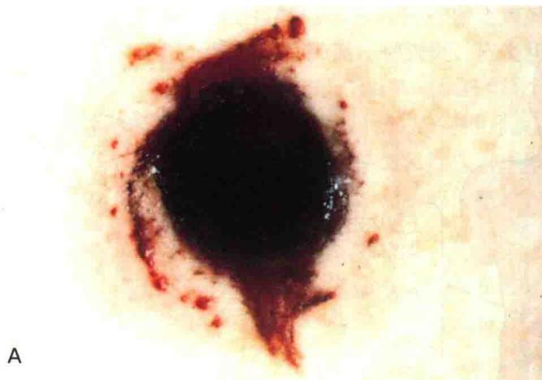
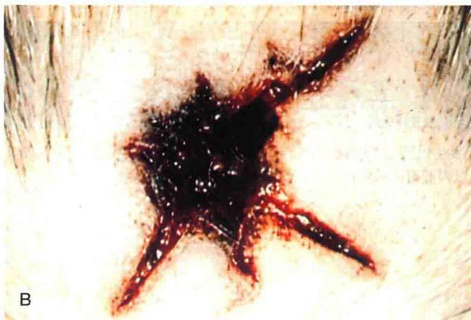 
图8-9子弹枪伤。A.枪伤入口明显的打孔样表现；B.枪伤出口不规则伴有特征性的星形样撕裂伤
# 第九节 辐 射
射线是指通过电磁波传播能量，且可由放射活性元素通过某种带电粒子（ $\alpha$ 和 $\beta$ 粒子和中子）释放能量。高能量辐射， $\gamma$ 或 X 射线的形式，介导大多数此处讨论的生物效应。在这里，我们没有考虑紫外线辐射的效应；紫外线辐射效应在第 5 章和第 24 章节进行讨论。
射线可用多种方式量化：
拉德(rad)是指被组织吸收的能量，用尔格(ergs)表示。1 rad 相当于 $100\mathrm{erg / g}$ 组织。 
格雷（Gy）1Gy相当于100rads（1J/kg组织），1厘格雷（cGy）等于1rad。 
西弗特（Sv）是格雷通过一个恰当的量化因子Q成倍增加后的剂量单位，因此，在生物学效应上，1Sv的射线大约等同于1Gy的 $\gamma$ 射线。
西弗特测量组织里的射线效应，然而格雷测量的是组织吸收的射线。例如，每年背景辐射平均约为3毫西弗特（mSv），并且3Sv会导致 $50\%$ 接触的人群死亡。不同的国家有不同的法规限度。在美国，每年公众接触量必须低于 $5\mathrm{mSv}$ ，工业接触量必须低于 $50\mathrm{mSv}$ 。在最近的福岛核事故中，约有150个现场工人被暴露于 $100\sim 250\mathrm{mSv}$ 的射线中。厂外辐射率与
工厂的方向及距离具有高度相关性，但是每年辐射率约为 $100\sim 250\mathrm{mSv}$ 的地区，很有可能很多年都不适合居住。此处为了讨论辐射诱导的病理学，rad、Gy和 $\mathrm{Sv}$ 被认为是等同的，其中1Gy或1Sv等于100rads。
【发病机制】在细胞水平, 射线一般有两种效应: ①与急性细胞死亡相关的体细胞效应; ②基因损伤。射线诱导的细胞死亡是由射线分解水分子的急性效应和活性氧自由基生成导致（见第 1 章）。细胞的基因损伤（不论是 DNA 吸收能量直接导致还是 DNA 和氧自由基反应间接导致）表现为突变或再生障碍。突变和再生障碍都会导致细胞死亡延迟, 并且突变参与了射线诱导的肿瘤形成过程 (见第 5 章)。
不同组织对射线的敏感性不同。组织对辐射诱导损伤的脆弱性取决于其增殖的速度，反过来，也与组成细胞的自然寿命相关。例如，肠道和骨髓造血系统相比于骨骼和大脑等组织更容易受到辐射损害。长期存活且非增殖细胞的DNA损伤不一定会损害其功能和生存能力。相反，短期存活且增殖细胞，例如，肠道隐窝细胞或造血干细胞，一定会被分裂成的子细胞快速取代。如果射线诱导的DNA损伤的细胞不发生有丝分裂，发生DNA损伤的细胞就不能被新细胞取代，组织也就失去了功能。只有在非常高剂量的射线时才会发生快速的体细胞死亡，例如超过1000cGy。相反，细胞复制能力不可逆性的损伤需要更低剂量的射线，可能只有50cGy。
# 一、全身辐射会导致很多器官损伤
我们对全身辐射的大多数信息源于对日本原子弹幸存者的研究和在切尔诺贝利核电站事故中暴露人员的研究，更多的信息可能来自未来对日本福岛事故的研究（图8-10）。
300cGy：该剂量辐射下，2周内会发生以造血功能衰竭为特征的综合征，导致机体出血、贫血和感染。感染是常见的死亡原因，发生在一半的暴露人群中。 
10Gy：辐射量接近该计量时，导致机体死亡的主要原因与胃肠系统相关。该剂量下，3天内会导致机体胃肠道上皮细胞损伤，而绒毛和隐窝细胞正常的生活周期也是3天。因此，会导致胃肠道的液体平衡紊乱，随后发生严重的腹泻和脱水。此外，肠道系统的上皮屏障破坏；肠道细菌入侵，全身播散。导致机体发生菌血症和休克。 
20Gy：在全身辐射剂量达到或超过 $20\mathrm{Gy}$ 时，在几个小时内CNS损伤便会导致机体死亡。在多数病
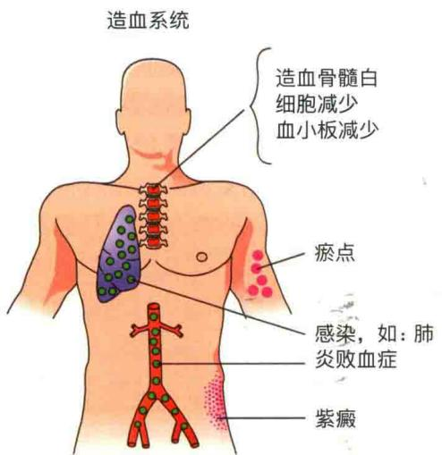
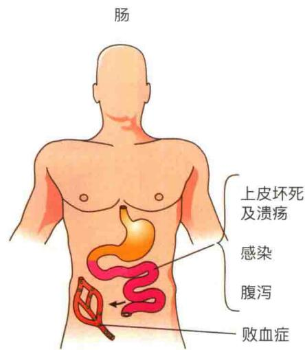
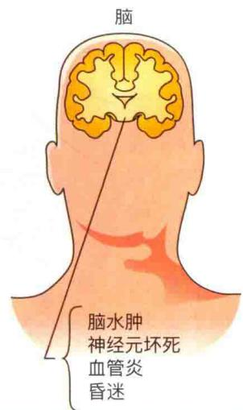
剂量（拉德）30010002000潜伏期2周3天1小时死亡3周2周1天
例中，由于上皮损伤导致的大脑水肿和大脑屏障的完整性缺失较明显。在极高剂量时，可导致机体发生发射性神经元坏死。随之发生抽搐、昏迷和死亡。
胎儿副作用：在对广岛核爆炸幸存者的研究中报道了全身辐射对人类胎儿的影响。接触射线剂量达到或者超过 $25\mathrm{cGy}$ 的孕妇，其分娩的胎儿表现为头偏小，总体身长缩短和精神发育迟滞。辐射对宫内胎儿造成的副作用包括脑积水、小眼、脉络膜视网膜炎、失明、脊柱裂、腭裂、马蹄足和生殖器畸形。实验和人类研究数据高度提示，在怀孕14天后，接触辐射剂量低于 $20\mathrm{cGy}$ 时，几乎不可能发生重要的先天畸形。然而，低剂量的射线也可产生较轻微的不良后果，例如，智力下降。为了防止这种可能性的发生，已确定了可能接触射线孕妇的胎儿最大容许剂量，该剂量远低于致畸剂量。
遗传效应：多数预测人类遗传效应的数据是基于实验数据和对核爆炸幸存者的分析。长期随访后发现，即使是广岛和的长崎幸存者的患先天性异常或遗传性疾病子孙中，也没有证据表明他们体内存在遗传损伤。因此，由辐射导致的可遗传性基因损伤的风险比较小。
# 二、局部照射引起的伤害会导致肿瘤的放射治疗复杂化
恶性肿瘤行放射治疗时，难免会照射到一些正常组织。尽管几乎所有的器官都可能会受到射线的损伤，皮肤、肺、心、肾、膀胱和肠管都对射线比较敏感且较难防护（图8-11）。局部照射对骨髓的损伤几乎不会有功能性影响，由于造血系统有巨大的储备功能。
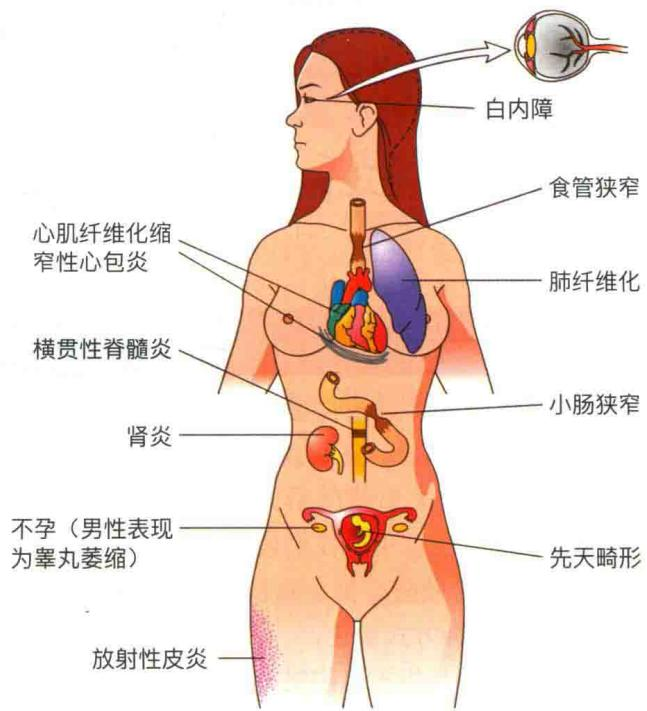 
图8-10急性放射综合征。全身辐射的剂量约为300rads时，2周内会发生以造血功能衰竭为特征的综合征。在剂量约为1000rads时，3天内即可出现胃肠道综合征。在剂量达到或超过2000rads时，1小时以内即可出现中枢神经系统症状，随后机体迅速发生死亡 
图8-11 辐射的非肿瘤性并发症

【病理学表现】组织暴露于射线的持续损伤可归咎于：①血液供应减少；②畸形坏死和慢性
缺血的纤维修复反应。放射诱导的组织损伤主要影响小动脉和细动脉的功能。内皮细胞是最敏感的血管成分，在短期内，表现出肿胀和坏死。此后，由于上皮细胞增生和胶原及结缔组织在血管壁内膜下沉积导致血管壁增厚。内膜细胞发生典型的空泡化，也称之为泡沫细胞。在小动脉中可见血管壁弹性层断裂、平滑肌细胞缺失、中膜瘢痕形成和外膜发生纤维化。常见有大细胞核的奇异成纤维细胞，可能是射线诱导DNA损伤的反应。
【临床表现】辐射导致的急性坏死可表现为如下功能障碍，如放射性肺炎、膀胱炎、皮炎和肠炎性腹泻。慢性疾病的特征是心和肺间质纤维化、食管、小肠狭窄和缩窄性心包炎。慢性放射性肾炎，与恶性肾硬化相似，主要表现为一种血管疾病可导致严重的高血压和进展性肾功能不足。局部放射影响的其他部位如下： 
皮肤：放射性皮炎可能发生在治疗射线穿过皮肤的部位。在此部位可能发生，伤口不愈合或裂开或溃疡持续存在，往往需要全层皮肤移植。 
性腺：放射诱导的血管损伤和射线对持续分裂细胞的直接损伤，会导致性腺进展性萎缩和生育功能丧失，伴随正常的激素水平。 
■其他部位：如果眼睛位于射线束通过的路径上时，机体会产生白内障（晶状体混浊）。脊髓照射时，由于血管损伤和局部缺血，机体可发生横向脊髓炎和截瘫。
# 三、高剂量射线会导致癌症
许多来源的证据表明，辐射会导致癌症是无可争议的。在日本核弹爆炸中的幸存者罹患许多种癌症。他们患白血病的概率增加了10倍以上，发病高峰在接触射线后的第5年，然后在随后的30年发病率几乎降至非接触人群的水平，尽管在接触射线的30年后的发病风险明显超过非接触人群。尽管实体肿瘤的发病率不如白血病高，但是在乳腺、肺、甲状腺、胃肠道和泌尿道中有明显的增加。在1986年切尔诺贝利核灾难污染的地区，甲状腺癌的发病率有明显的增高，在儿童中至少导致1000人患病。这种增加也与该事故中释放放射性碘同位素有关。实体肿瘤的发病风险，尤其是乳腺癌，在儿童期因霍奇金病接受胸部辐射治疗的成年女性中发生率尤其高。接受过辐射治疗的儿童霍奇金病的长期幸存者，由于辐射原因发生第二种肿瘤的风险将近增加20倍。
低剂量射线和癌症：目前需要回答的关键问题是，现实中是否存在一个辐射的阈值，低于此阈值时癌症的发生率不会增加；还是任何的射线接触都有重大风险。现有数据显示，癌症风险在低辐射剂量时非常低，虽然风险值不为零。目前人们普遍担心在 $\gamma$ 射线剂量为 $5\sim 10~\mathrm{cGy}$ 时，与癌症风险增加有关。尽管可能DNA损伤的发生和接触的 $\gamma$ 射线剂量成正比，但是在低辐射剂量和剂量率时，DNA修复机制的保护程度依然有相当大的不确定性。
氢：调查发现美国的一些民宅内含有来自天然铀238（ ${}^{238}\mathrm{U}$ ）衰变而来的氡，铀见于一些土壤里和岩石形成时，该发现引起了关注。尽管氡本身是一种惰性
元素，它的放射性裂解产物，包括放射性核素的铋、铅和钋，具有化学活性可以结合到微粒和肺组织中。可释放 $\alpha$ 粒子的放射性核素钋218半衰期是103年。居住在含有高浓度氡气房屋的人群，肺癌的发生率明显增加。对于吸烟者和非吸烟者，肺癌发生的相对风险差别非常大。然而，最近的研究表明从不吸烟者肺癌的发生风险也有部分增高。使地下室空间通风来防止氡累积进而改善这个问题。
# 第十节 营养失调
# 一、蛋白质卡路里不足性营养不良
消瘦症（marasmus）是用来表示所有形式热量缺乏的术语。夸希奥科病（Kwashiorkor）是儿童营养不良的一种形式，主要由饮食中蛋白质不足导致。
1. 消瘦症 整体饥饿，是指饮食中所有元素的缺失，导致消瘦症。这种情况常见于非工业化国家，尤其是当没有哺乳经验，并且婴儿必须以热量不足的饮食维持生命时。病理变化与那些挨饿的成年人类似，包括体重减少、皮下脂肪减少、腹部突出、肌肉萎缩和脸部布满皱纹。萎缩和脂褐质色素增加可见于大多数脏器，特别是心和肝。脉搏、血压、体温低、腹泻常见。因为免疫应答受损，儿童会患多种感染性疾病。消瘦症导致的一个重要后果是生长不足，无法发挥达到成人身高的全部潜力。在儿童早期阶段，严重的消瘦症伴有缺铁性贫血，在大脑发育阶段，可能导致永久性的识字能力丧失。
2. 夸希奥科病（Kwashiorkor）夸希奥科病（图8-12）是由于饮食中缺乏蛋白质且糖类的含量相对较高导致。在非工业化国家，这是一个最常见的婴儿和儿童疾病。与消瘦症一样，该病通常发生在婴儿断奶后喂养饮食中蛋白含量不足所致，饮食中主要是糖类。患者普遍存在生长不足和肌肉萎缩，与消瘦症患者一样，但皮下脂肪正常，因为有足够的热量摄取。患者表现为极度冷漠，与消瘦症患者不同，其可能表现为警觉性高。另外与消瘦症不同，该疾病患者表现为明显水肿，肝脾大和皮肤脱色。皮肤病表现为干燥、过度角化的“片状颜料”病变，发生在颜面部、四肢和会阴。头发变为淡茶色或微红色；在蛋白严重缺失期，头发可出现特征性的线状色素缺失（“标志特征”）。由于腹部肌肉松弛，肝大和低蛋白血症性腹水导致腹部膨胀。肠绒毛萎缩可能会干扰营养吸收。腹泻常见。贫血普遍存在，但是不会危及生命。该疾病对生长、脉搏、体温和免疫系统的非特异性影响与消瘦症相似。与消瘦症相似，该疾病也可能对智力发育产生影响，但此观点需要进一步的研究。

【病理】显微镜观，夸希奥科病患者的肝脏明显脂肪化。脂质在肝细胞胞质内的蓄积，取代
细胞核的位置导致核在细胞内偏位。膳食中充足的糖类为肝细胞提供脂质，但是蛋白质存储不足导致从肝中转移脂质的脂蛋白载体合成不足。这些改变，除了智力发育迟缓，当蛋白供应充足时可以完全逆转。事实上，在儿童早期阶段以后，脂肪肝是可以逆转的，即使膳食中依旧缺乏蛋白质。
# 二、维生素是一种可从正常代谢和膳食中获得的有机催化剂
一个物种中的维生素不一定是另一物种的必需维生素。例如，人类自身不能合成抗坏血酸（维生素C），因此，为了防止发生坏血病，需要从膳食中提供维生素C。相反，多数低等动物可以合成维生素C，但是不把它当伴维生素使用。
# （一）维生素A
维生素A是一种脂溶性物质，该物质对于骨骼成熟，维持特殊的上皮层细胞和细胞膜结构非常重要。另外，它是视网膜中光敏感色素的一种重要组成成分。维生素A通常以类维生素A或其前体， $\beta-$ 胡萝卜素的形式存在。维生素A前体（胡萝卜素）来源于植物中，主要是树叶、绿色蔬菜。鱼肝本身富含维生素A。有
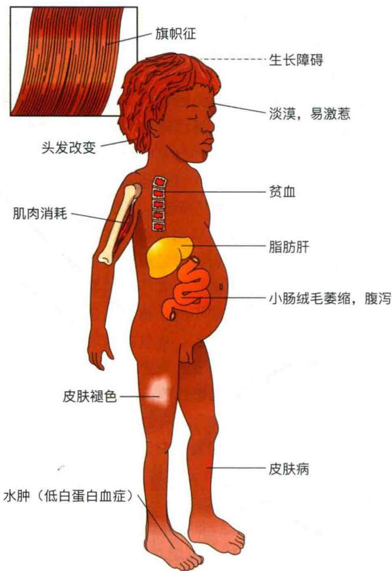 
图8-12 夸希奥科病的并发症
时当脂质吸收受损（如腹泻），维生素A吸收减少。
维生素A缺乏症：尽管在发达国家维生素A缺乏症并不常见，但在世界上一些贫穷地区却是一个重大的健康问题。

【病理学表现】维生素A缺乏主要导致鳞状上皮化生，尤其是在腺上皮细胞中（图8-13）。
因此，角蛋白碎片阻断汗腺和累腺体的分泌，引发毛囊性角质化过度症。鳞状上皮化生常见于气管和支气管，支气管肺炎是死亡的常见原因。随着维生素A储存的进一步减少，结膜和泪腺导管上皮发生鳞状上皮化生，导致干眼病发生（角膜和结膜干燥）。角膜变软（角膜软化症），易形成溃疡和细菌感染，可导致失明。
维生素A过量具有毒性。中毒可能是由于过分热衷的给孩子补充维生素制剂。常见肝和脾大；显微镜下，这些器官中存在富含脂质的巨噬细胞。停止过量食用维生素A可逆转全部或者大部分病变。大量的临床研究报道表明，过量摄入维生素A会导致骨矿物质密度减少，从而增加骨折的发生率。视黄酸衍生物（用来缓解严重的痤疮）和高饮食摄入量的预成维生素A两者在怀孕期间都极其危险，因为它们是强有力的致畸剂。摄入过量的胡萝卜素是良性的，仅仅是皮肤变为黄色，这可能会被误认为是黄疸。
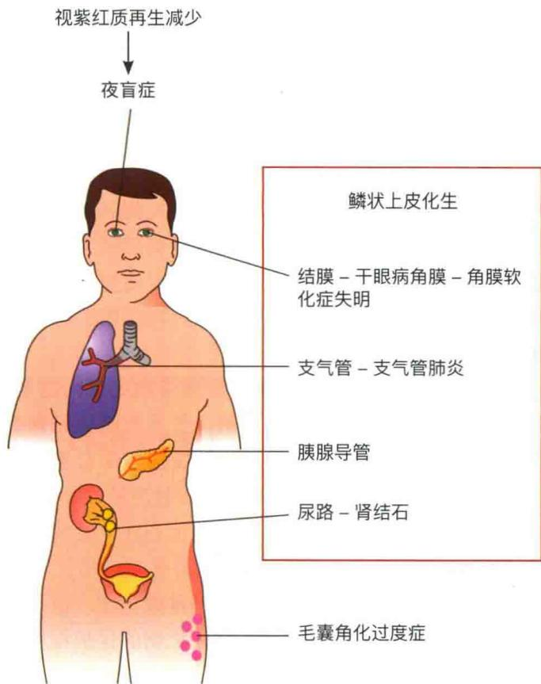 
图8-13 维生素A缺乏症的并发症

【临床表现】维生素A缺乏症最早期的症状经常表现为在昏暗的灯光下视觉减退。维生素A色素的组成部分，在光传导时活化。维生素A是发展中国家可预防儿童失明的主要原因。
# （二）维生素B复合物
水溶性的B族维生素共有12种，编号从 $1\sim 12$ 但是多数不清楚是否为维生素。目前认为是真正维生素的复合物成员有维生素 $\mathbf{B}_1$ （硫胺素）、 $\mathrm{B}_{3}$ （烟酸）、 $\mathrm{B}_{2}$ （核黄素）、 $\mathrm{B}_{6}$ （吡哆醇）和 $\mathrm{B}_{12}$ （氰钴胺）。除了只源于动物的维生素 $\mathrm{B}_{12}$ ，B族维生素主要存在于绿叶、绿色蔬菜、牛奶和肝脏中。
1. 硫胺素（ $\mathsf{B}_1$ ）硫胺素是B族维生素中最早描述的活性成分，是从米糠中提取的水溶性物质用来治疗脚气病（临床上的硫胺素缺乏症）。一般来说，此病常见于亚洲，该地区的主食是去掉米壳的大米，在去大米外壳的过程中导致硫胺素的丢失。在西方国家，该疾病发生在酗酒者，被忽视整体营养不良者与食品时尚者当中。硫胺素缺乏症的基本症状是多发神经病、水肿和心脏衰竭。维生素 $\mathbf{B}_1$ 缺乏综合征通常分为干燥性脚气病，伴有神经肌肉系统症状和湿性脚气病，其中心力衰竭的表现占主导地位。

【发病机制】干燥性脚气病的患者表现为感觉异常，反射能力低下且微弱，四肢肌肉萎缩性脚气病的特征表现是全身性水肿，提示严重输出型充血性心力衰竭。基本病变是不受控于广泛的血管舒张和明显的外周动静脉分流。合并会导致心排血量代偿性增加，且最终发生心脏扩张和充血性心力衰竭。

【病理学表现】硫胺素缺乏症在慢性酗酒患者中
可表现为 CNS 受累的 Wernicke 综合征，突出
的表现为进展性的痴呆、共济失调、眼肌麻痹（眼外肌肉麻痹）。一个典型的改变是髓鞘退化，通常从坐骨神经开始发生，然后累及其他周围神经，有时也会累及脊髓本身。Wernicke脑病中最明显的病变是乳头体和邻近第三脑室的周围区域萎缩。显微镜下，大脑内可见神经节细胞退化和缺失，小血管破裂和环状出血。
心脏无特征性改变。大体上，心脏松弛、扩张和重量增加。该过程可能对心脏左侧或右侧产生影响，或者对两者都有影响。显微镜下的改变无明显特征，包括水肿、不一致的纤维肥大和偶发的局部纤维变性。
# 2.核黄素（ $\mathbb{B}_2$ ）

【发病机制】核黄素, 一种来源于多种动植物的维生素, 在黄素核苷酸合成过程中非常黄素核苷酸在电子传递和其他重要的能量传
输反应中是重要的。核黄素缺乏症的临床症状不常见，仅见于患有多种疾病的患者和营养缺乏的酗酒者中。

【病理学表现】核黄素缺乏主要表现为面部皮肤和角膜上皮的损伤。唇干裂，表现为嘴角裂是一种典型表现。脂溢性皮炎表现为皮肤油腻、主要发生在面颊和耳后皮肤。通过显微镜则会化过度和轻微的单核细胞浸润。由于黏膜萎缩，滑而略带紫色。最严重的损伤是间质性角膜炎，角膜浑浊，最终形成角膜溃疡。核黄素缺乏病位不能很好地做出生化意义上的解释。
3. 烟酸 $\left(\mathrm{B}_{3}\right)$ 烟酸指两种不同的化合物，尼克酸和烟酰胺。这两种物质来源于饮食或色氨酸的生物学合成。烟酸在烟酰胺腺嘌呤二核苷酸（NAD）和它的磷酸盐（NADP）的形成中起关键作用。来源于猪肉、鸡蛋和牛奶里的动物蛋白富含色氨酸，是内生性合成烟酸的良好原料。盐酸本身见于多种谷物。糙皮病是烟酸缺乏的临床表现。这种病在今天不常见，主要见于并发其他疾病的体质虚弱的患者或者营养不良的酗酒者。

【病理学表现】糙皮病一般在以玉米为主食的地区流行，因为玉米中的烟酸一般为聚合物，能利用。玉米同时也缺乏色氨酸。这种疾病通常分为烟酸缺乏的三个“Ds”：皮炎、腹泻和痴呆。此外的部位比如面部和手，和受力比较大的部位是关节和肘关节，表现为粗糙有鳞的皮炎。如果累，则会呈现出“手套样皮炎”。在显微镜下，硬度、血管形成和慢性皮肤炎症是特征性的表现。可见到皮下组织纤维化和瘢痕形成。相似的病变包括皮肤和口腔黏膜。在口腔中，慢性炎症和水肿、舌舌头变大、变红并且有裂隙。慢性水样腹泻是疾病的典型症状，而原因可能是整个消化道特别是口腔的黏膜萎缩和溃疡。
痴呆表现为精神病样的异常思维，这主要由于大脑皮质神经节细胞的退化造成的。脊髓神经束髓鞘的退化类似于维生素 $\mathsf{B}_{12}$ 缺乏引起的亚急性的退化。
4. 吡哆醇（ $\mathsf{B}_6$ ）维生素 $\mathbf{B}_6$ 的活性体现在三个相关的、自然生成的化合物中：吡哆醇、吡哆醛和吡哆胺。为了方便，它们都被归类于吡哆醇下。蔬菜和动物类食物都富含这几种化合物。

【发病机制】吡哆醇被转化为吡哆醛磷酸盐，作为许多酶的辅酶，包括氨基转移酶和羧酶。
吡哆醇的缺乏很少由于饮食不当引起。吡哆醇缺乏
通常由于长期用药引起，比如异烟肼、环丝氨酸和青霉胺。另外，吡哆醇缺乏还常见于酗酒者。

【临床表现】吡哆醇缺乏并没有特征性的临床表现。其他B族维生素缺乏引起的皮肤病也见
于吡哆醇缺乏。吡哆醇缺乏的最主要表现在中枢神经系统，因为吡哆醇参与神经递质GABA合成中吡哆醇依赖的脱羧酶的合成。在婴儿和孩子中，腹泻、贫血和癫痫发作比较常见。吡哆醇缺乏引起的贫血是低血红蛋白小红细胞性的，通常和缺铁性贫血混淆。大剂量补充吡哆醇对这种贫血治疗效果较好。
5. 维生素 $\mathsf{B}_{12}$ 和叶酸缺乏 关于维生素 $\mathbf{B}_{12}$ 和叶酸的缺乏详见第20章和第28章。在孕妇中，叶酸缺乏可能和胎儿的脊柱裂和其他发育异常有关，而这可以通过叶酸的补充而避免。
# （三）维生素C（抗坏血酸）

【发病机制】在许多氧化还原反应和质子传递中，抗坏血酸是一种强力的生物还原剂。
在硫酸软骨素的合成过程和羟化脯氨酸合成胶原蛋白的羟基脯氨酸的过程中维生素C均起关键作用。
创伤恢复和免疫功能也需要维生素C。维生素C最好的食物来源是柑橘类水果、绿色蔬菜和西红柿。坏血病就是由于维生素C缺乏引起的。坏血病现在通常发生于饮食欠佳的慢性患者、被忽视的老年人和营养不良的酗酒者。受凉、受热、发热或者外伤都会导致维生素C需求量的增长。第一年的新生儿如果只喂奶则可能导致坏血病的发生。

【病理学表现】大多数与维生素C缺乏相关的
事件，是形成缺乏抗拉强度的异常胶原蛋白所到(8-14)。 $1\sim 3$ 个月，骨膜下出血导致骨骼和软骨痛。瘀斑性出血、瘀斑和紫癜常见，尤其是在创伤后或压力点的部位。毛囊周出血是坏血病特有型的皮肤表现。在进展性病例中，牙龈肿胀、出血多种典型的表现。牙槽骨吸收导致牙齿脱落。伤损不良及先前愈合伤口裂开。贫血原因有长期出血的吸收受损或叶酸缺乏。儿童中，维生素C缺乏会导致生长不足和富含胶原结构，例如牙齿、骨骼血管，发育异常。有学者认为抗坏血酸可助于预防呼吸道感染，但是缺乏确实的证据。
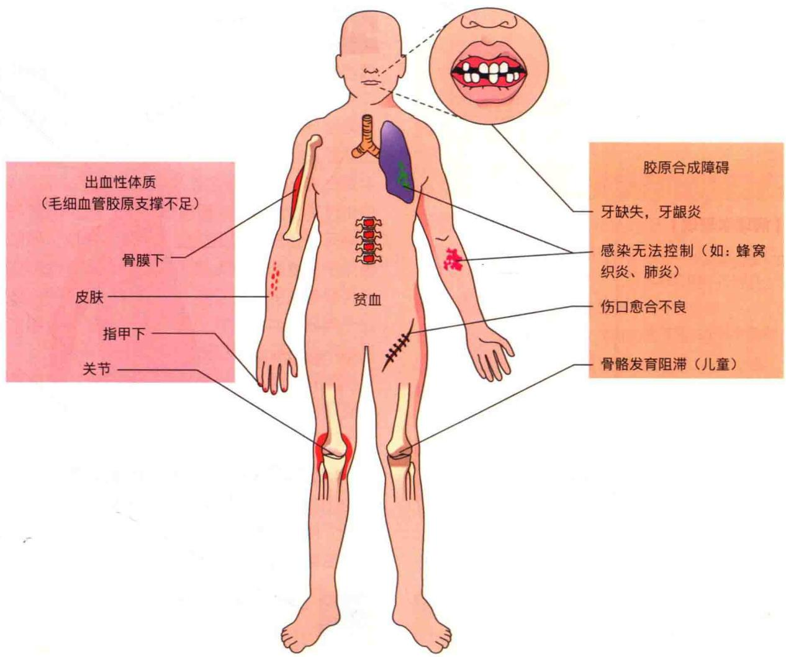 
图8-14 维生素C缺乏症的并发症（坏血病）
# （四）维生素D
维生素D是一种脂溶性类固醇激素，目前发现其有两种存在形式：维生素 $\mathrm{D}_3$ （胆钙化固醇）和维生素 $\mathrm{D}_2$ （钙化醇），两者在人类中都具有生物潜能。维生素 $\mathrm{D}_3$ 在皮肤中合成，然而维生素 $\mathrm{D}_2$ 来源于植物中的麦角固醇。该维生素与脂肪一起在空肠吸收，随后转运至血液中与 $\alpha$ -球蛋白（维生素D结合蛋白）结合。为了实现其生物潜能，维生素D必须在肝和肾内经过羟化作用转变为其活性代谢产物。维生素D的活性形式可以促进小肠钙和磷的吸收，且可能直接影响成骨作用。
# 维生素D缺乏综合征

【发病机制】在儿童阶段，维生素D缺乏可导致佝偻病；在成人，可发生骨软化。维生
素D缺乏综合征病因有：①饮食中维生素D缺乏；
②由于很少晒太阳导致皮肤合成的维生素D缺乏； 
(3)从饮食中吸收的维生素D不足（如脂肪吸收不良综合征）；④维生素D向其活性代谢产物转化异常。
最后的原因常见于肝疾病和慢性肾衰竭。

【临床表现】几个世纪之前已经认识到，在儿
童维生素D缺乏的骨骼病变（佝偻病），该疾
病在西方工业化国家曾经较常见。在牛奶和许多加工食品中添加维生素D，为儿童注射维生素制剂和营养水平的普遍改善使得佝偻病在工业化国家较为罕见（见第26章）。
维生素D过量对身体有害，可引发高钙血症。高钙血症会引起非特异性的症状，例如虚弱、头痛和最终发生肾结石或肾钙沉积（肾钙质沉着症）。可见其他
器官内的异位钙化。婴儿尤其容易受到过量维生素D的影响，可能出现过早动脉硬化，主动脉瓣上狭窄和肾性酸中毒。
# （五）维生素E
维生素E是一种抗氧化剂，（至少从实验上）可保护膜磷脂抗由细胞代谢形成的氧自由基介导的脂质氧化。在多种饮食成分可见脂溶性维生素的活性，主要是在 $\alpha$ -生育酚中。玉米和大豆尤其富含维生素E。饮食中维生素E缺乏比较罕见，且没有与其相关的明确可定义的综合征。在早产儿中，曾有维生素E缺乏的溶血性贫血、血小板减少和水肿。目前有很多关于维生素E有益效果的说法，但是证据的效力未经证实。
# （六）维生素K
维生素K，一种脂溶性物质，有两种存在形式：植物来源的维生素 $\mathbf{K}_1$ 和主要由肠道细菌合成的维生素 $\mathrm{K}_{2}$ 。绿叶蔬菜富含维生素K，肝脏和奶制品中也有小部分存在。在美国，膳食中维生素K缺乏罕见；多数病例与其他疾病相关。然而，由于维生素不能通过胎盘传输，且新生儿肠管不存在产生维生素K的细菌，因此，新生儿可出现维生素K缺乏综合征。维生素K赋予某些蛋白结合钙的属性，同时对于一些凝血因子的活性也是很重要的。因此，该维生素缺乏可导致灾难性的出血（见第20章）。肠外维生素K治疗快速有效。
# 三、人体必需的微量元素是酶和辅酶的主要成分
人体必需的微量元素包括铁、铜、碘、锌、钴、硒、锰、镍、铬、锡、钼、钒、硅、氟。饮食中缺乏这些微量元素，有重要临床意义的是铁缺乏和碘缺乏。这些将在第21章和第22章中讨论，这两章分别讲解血液和内分泌疾病。
（王丽丽）
# 第9章 感染病及寄生虫病
细菌及病毒性腹泻与肺炎、结核、麻疹、疟疾、乙型肝炎，以及破伤风每年在世界范围内带走的生命多于癌症与心血管疾病之和。感染病在欠发达国家中肆虐。逾百万患者，其中大部分为不足5岁的儿童，死于本可以治愈或者预防的感染病。即使在工业化的欧洲及北美国家，感染病的患病率及死亡率也相当高，并带来巨大的经济损失。在美国，感染病每年导致超过200000人死亡及逾5000万个住院日。最近，感染病受到的关注骤然增加。这表明感染病确实有可能对人类的生存造成潜在的威胁。人类不可能消灭动物感染源，因此我们永远不能降低警惕。最后，将感染性疾病原体作为战争武器的尝试将使我们笼罩在这些病原体的威胁之下。
# 第一节 感染性与毒力
感染性微生物可以侵入人体及传播，导致组织的功能障碍，最终造成疾病。毒力指的是病原体造成机体感染，导致疾病或死亡的综合属性。微生物必须：①接触人体；②躲开多重的宿主防御机制；③在体内生长；④完成寄生。毒力既反映入侵的病原体自身的固有结构，也反映其与宿主防御机制的相互作用。
# 第二节 宿主防御机制
宿主防止或遏制感染的方法称为宿主防御机制（表9-1）。机体上有针对感染的主要解剖学屏障，主要是皮肤及上呼吸道的空气动力学过滤系统，这些结构足以阻止大部分的微生物进入人体。呼吸道的纤毛黏液毯也是基本的防御结构之一，该结构可以排出已进入呼吸系统的微生物。寄居于消化道及孔窍的正常菌群与外来微生物竞争宿主体内的营养及结合位点。体表的孔穴也受到分泌物的保护，这些分泌物具有非特异（例如溶菌酶及干扰素）及特异[例如免疫球蛋白A(IgA)]的抗微生物的特性。另外，胃酸及胆汁以化学的方法将摄入的微生物分解。
表9-1 宿主的感染防御机制皮肤眼泪正常菌群胃酸胆汁唾液腺及胰腺分泌物鼻咽过滤系统黏液纤毛毯支气管、宫颈、尿道及前列腺分泌物中性粒细胞单核细胞补体固定单核吞噬系统免疫球蛋白细胞免疫
# 一、宿主的遗传差异影响毒力
感染的第一步通常是入侵的微生物上的结合分子与宿主的受体分子的特异的相互作用。如果宿主缺乏合适的受体，微生物将无法结合到靶点上。一个例子是间日疟原虫。间日疟原虫是疟疾的其中一种病原体，它通过把细胞表面的杜菲（Duffy）血型决定簇作为受体感染人类红细胞。许多个体，特别是黑色人种缺乏这些决定簇而不易被间日疟原虫感染。因而间日疟在非洲的大部分地区少见。
# 二、年龄影响感染结局
年龄对感染结局的影响从宫内感染中可见一斑。一些发生在胎儿时期的微生物感染造成的后果比在儿童期或成人期更为严重。巨细胞病毒（CMV）、风疹病毒、细小病毒 $\mathbf{B}_{19}$ ，以及刚地弓形虫的宫内感染影响胎儿发育。胎儿的保护依赖母体可以穿过胎盘的IgG抗体。未免疫的孕妇若遭受急性感染，该病原体则有
可能感染胎儿。这样的感染通常在母亲身上不表现或者仅有轻微的临床症状，但可能导致胎儿的先天异常或者死亡。
年龄也影响常见疾病的病程，例如众多病毒性或细菌性腹泻。在较大的儿童或者成人身上，这些感染仅仅造成不适或不便，而甚少导致严重疾病。但对于小于3岁的儿童而言，结局可能完全不同。后者的机体无法代偿严重腹泻带来的容量减少。在2009年，根据世界卫生组织的估算，每年有150万名儿童死于急性腹泻。
老年人对几乎所有感染的耐受程度都比青年人差。普通的呼吸道疾病例如流感或者肺炎球菌肺炎在超过65岁的患者更容易导致死亡。
# 三、人的行为与感染原暴露息息相关
人的行为与感染的关系在性传播疾病上体现得尤为明显。性行为的形式及次数对患病风险有深远影响。
除此之外，其他行为也影响者罹患感染的风险。布鲁菌病及Q热原来是农场驯养动物的细菌感染，人们接触感染动物后可患该病。这些感染可在农场工人、牧人、屠宰场工人身上发生。布鲁菌病更可在任何饮用未经高温消毒的牛奶的人身上发生。一部分寄生虫病的传染受到行为的强力影响。血吸虫的水生幼虫穿透易感宿主的皮肤而引起血吸虫病。此病主要见于在被幼虫污染的水体中工作的农民。钩虫及粪圆线虫的幼虫生活在湿润的土壤中，并可穿过赤足行走的人的下肢皮肤。鞋子的普及可能是迄今为止降低经土壤传播的线虫感染的患病率的最重要的单一因素。由细菌毒素引起的肉毒杆菌中毒及食物中毒的因素有：①摄入了含有毒素的罐头食品；②摄入了梭菌孢子，途径通常是蜂蜜、昆虫；③来自接种于伤口的孢子，孢子随后生长并使组织失去活力。
# 四、防御功能受损使机体易受感染
任何一种宿主防御机制的损害或缺如将导致感染次数及严重程度的上升。烧伤及创伤引起的上皮表面的损害常常导致侵袭性的细菌或真菌感染。气道的黏液纤毛装置如果受损，例如在吸烟或者流感的情况下，可导致无法清除吸入的微生物，并增加细菌性肺炎的患病机会。先天性补体成分C5、C6、C7或者C8缺失导致无法形成功能完整的攻膜复合物，导致播散性的，并且经常是反复的奈瑟菌感染（见第2章）。例如糖尿病这样的疾病及化疗药可干扰有功能的中性粒细胞的制造，增加细菌感染或者深部真菌感染的机会（见第20章）。
主要导致防御机制缺陷的宿主的疾病的微生物被称为机会性病原体。这些微生物很多是人类正常内生菌群或者环境微生物群落的一部分。当宿主防御受损
时，它们趁虚而入并导致严重后果。
# 第三节 病毒感染
病毒由RNA或者DNA包裹在一个蛋白质外壳而构成。一部分病毒由脂膜包裹。病毒无法独立代谢或者复制，因此必须寄生于活的细胞内以进行复制。侵入细胞后，病毒使细胞的生物合成及代谢向病毒编码的核酸及蛋白转移。
病毒常常通过杀死被感染的细胞致病，但也有许多例外。例如，轮状病毒，一个腹泻的常见病因，是通过干扰感染的肠上皮细胞的功能而致病的，病毒并不马上杀死细胞。轮状病毒使肠上皮细胞无法合成从肠腔转运分子的蛋白质，从而导致腹泻。
病毒也可以促使引起炎症及免疫应答的化学介质的分泌。普通感冒的症状就是由感染细胞释放的缓激肽引起的。还有一些病毒导致细胞增殖并形成肿瘤。例如，人类乳头瘤病毒（HPVs）导致鳞状细胞增殖的病变，引起从寻常疣到宫颈癌的一系列疾病。
一些病毒感染并持续存在于细胞中，然而并不干扰细胞的正常功能，这一行为称为隐性感染。隐性感染的病毒可以在初次感染多年后才发病。机会性感染通常由已经造成隐性感染的病毒引起。CMV及单纯疱疹病毒可能是最常见的机会性病原体，因其常常造成隐性感染，并在细胞免疫受损的患者身上致病。
最后，一些病毒可能以整合进细胞基因组或者以附加的形式在胞内停留，并引起肿瘤发生。例如EB病毒可引起非洲地方性的Burkitt淋巴瘤，并在不同的条件下导致其他疾病。另一个例子是人类T细胞白血病病毒I型（见第5章），该病毒导致一种T细胞淋巴瘤。
本节将不对有高度器官特异性的病毒进行详细展开，其相关内容请参见各受累器官的对应章节（例如乙型肝炎及丙型肝炎）（见第14章）。
# 第四节 RNA病毒
众多重要的致病性RNA病毒[例如人类免疫缺陷病毒（HIV）-1，丙型肝炎病毒]与DNA病毒的不同之处在于RNA病毒聚合酶并不对正在合成的RNA链进行校验。这就导致了两个重要结果：其一，其突变率及随之而来的耐药性极高。其二，无活性的子代病毒体比例增高。
# 第五节 呼吸道病毒
# 一、普通感冒是最常见的病毒性疾病
普通感冒（伤风）是一种急性自限性的上呼吸道疾病，可由多种RNA病毒，包括超过100种不同的
鼻病毒及数种冠状病毒引起。从分布上讲，感冒在世界范围内高发，在人与人之间通过接触被感染的分泌物而传播。感染在冬季有空调的室内及热带地区的雨季容易发生，因人多密集的室内有助于疾病传播。在美国，一个儿童每年通常会患 $6\sim 8$ 次感冒，而成人则为 $2\sim 3$ 次。

【病因病机】病毒感染鼻腔呼吸道上皮细胞，导致黏液分泌增加及水肿。鼻病毒及冠状病
毒对呼吸道上皮有亲和性，而且最佳增殖温度远低于 $37^{\circ} \mathrm{C}$ （98.6°F）。因此，感染局限于上呼吸道温度较低的部分。被感染的细胞释放化学介质如缓激肽，普通感冒的相关症状，如卡他、鼻塞及咽鼓管堵塞等多由后者引起。分泌物的聚积容易诱发继发的细菌感染，并引起细菌性鼻炎及中耳炎。鼻病毒及冠状病毒并不破坏呼吸道上皮，也不造成可见的改变。临床上，普通感冒的特征为鼻溢、咽炎、咳嗽、低热以及身体不适，症状可持续约1周。
# 二、流行性感冒是具有高度接触性的流行病
流行性感冒是一种急性，通常为自限性的上呼吸道及下呼吸道感染，由流感病毒引起。该病毒为有包膜的单链RNA病毒。

【流行病学】目前已发现有三种截然不同的流
感病毒——甲型、乙型及丙型，可引起人类
疾病，但甲型流感病毒最为常见，且引起的疾病最为严重。在美国，每年有1000万～4000万流感病例发生，导致超过35000例死亡。流感具有高度接触性，常常在世界范围内流行。新的毒株通常来自动物储主，在某些人与动物密切接触的地区引起感染后在世界范围内迅速播散。流感病毒的毒株按型（甲、乙、丙）及其红细胞凝集素（H）与神经氨酸酶（N）的血清型命名。因此，2003年出现且至今仍在全球不断传播的禽流感病毒毒株被命名为甲型H5N1流感病毒。2009年，一种新型的甲型流感病毒H1N1（“猪流感”）在墨西哥的韦拉克鲁斯出现，然后迅速在全球范围内造成大流行。在首例H1N1病例被发现的短短7个月内，H1N1流感病毒在美国造成超过10000人死亡，显示了该毒株的潜在严重性及传播速度。该甲型流感毒株在儿童及孕妇中的死亡率明显增高。由于流行中的流感病毒抗原频繁改变，在前一次流行中建立起来的宿主免疫甚少能在下一次流行时提供有效保护。

【病因病机及病理】流感通过含有病毒的呼吸道飞沫及分泌物在人与人之间传播。当抵达呼吸道上皮细胞表面后，病毒与细胞膜融合，从而与细胞结合并进入细胞。该过程由病毒糖蛋
白（红细胞凝集素）与人呼吸道上皮细胞的唾液酸残基结合而接触到。一旦进入细胞，病毒即令细胞产生子代病毒并引起细胞死亡。流感病毒感染通常累及上呼吸道及下呼吸道。病毒导致呼吸道纤毛上皮脱落及坏死，并且引起大量的淋巴细胞性浸润。感染一旦蔓延至肺，则可导致肺泡上皮细胞的脱落及坏死，组织学表现为病毒性肺炎。纤毛上皮的破坏导致黏液纤毛毯的损害，并使宿主易于感染细菌性肺炎，尤其是金黄色葡萄球菌及肺炎链球菌肺炎。

【临床表现】流感表现为急性起病的发热、寒战、
肌痛、头痛、虚弱及干咳。症状主要与上呼吸
炎或气管炎、支气管炎及肺炎的类似。流感流行
死亡的主要原因既有疾病本身也有其并发症，在此
者或有潜在心血管病的人中尤甚。针对流行毒
# 三、呼吸道合胞病毒（RSV）导致婴儿支气管炎
RSV是1岁以下儿童支气管炎及肺炎的主要病因，多数儿童在学龄前曾被感染过。该病毒通过呼吸道气溶胶及分泌物传播，感染常在医院或者日托中心发生。

【病因病机及病理】病毒表面蛋白与宿主呼吸
道上皮的特异性受体结合，随后与细胞膜融合。
呼吸道合胞病毒造成支气管，细支气管及肺泡
上皮坏死及脱落,并引起淋巴细胞为主要成分
的炎性浸润。受累组织中有时可见多核的合体细胞。

【临床表现】婴幼儿若患呼吸道合胞病毒支气
管炎或肺炎，可出现喘鸣、咳嗽及呼吸窘迫
有时伴有发热。本病通常有自限性，症状在 $1\sim 2$ 周
内缓解。在较大的儿童及成年人身上，呼吸道合胞病
毒造成的症状轻微。在没有基础病变的幼儿中，呼吸
道合胞病毒造成的死亡率很低，但在有先天性心脏
或免疫抑制的儿童中死亡率可提高至 $20\% \sim 40\%$
# 四、严重急性呼吸道综合征（SARS）是一种可导致肺炎暴发性流行的急性病毒感染
2002年初，一种严重的肺炎疫情在中国的广东省流行。从中国香港、越南及新加坡到美国、加拿大及欧洲，该病通过国际航班迅速席卷全球。导致本病的是一种新型的冠状病毒，被命名为SARS相关性冠状病毒（SARS-CoV）。该病病毒来源于非人类生物，目前认为最有可能源自蝙蝠。SARS是一种致死性的病毒性呼吸道疾病，潜伏期通常为 $2\sim 7$ 天，也可长达10天。目前已知的患病人数超过8000人，其中多达800名患者死亡，病死率达 $9.6\%$ 。尽管最后一例人类感染发生在2003年中，SARS-CoV并未被完全消灭，仍存在死灰复燃的可能。

【病理】死于SARS患者的肺部可见弥漫性的肺泡损毁（见第12章）。也可见无病毒包涵体合体细胞。

【临床表现】临床上，SARS起病时表现为发热、热及头痛，随后迅速出现咳嗽及呼吸困难。卡诺尼少见而常伴有腹泻。常见淋巴细胞减少，转氨酶升高。部分患者发展为急性呼吸窘迫综合征（3，见第12章），这部分患者发生并发症及死亡率很高。多数患者可以痊愈，但在老年患者及有呼吸道系统疾病的患者中死亡率可达 $15\%$
# 第六节 病毒疹
# 一、麻疹是一种高度接触性的，致死性的病毒感染
麻疹病毒是一种有被膜的单链RNA病毒，可引起急性的上呼吸道症状、发热及皮疹。该病毒通过呼吸道气溶胶及分泌物传播。在未进行免疫接种的人群中，麻疹主要在儿童中发生。

【病因病机及病理】病毒首先感染鼻咽及支气管的黏膜，导致呼吸道上皮坏死，引起主要以淋巴细胞组成的炎性浸润。两种表面糖蛋白，分别为“H”及“F”糖蛋白介导病毒与呼吸道
上皮细胞的附着与融合。病毒蔓延至区域淋巴结，随后进入血流，广泛播散并主要累及皮肤及淋巴组织。淋巴组织增生在颈部及肠系膜淋巴结、脾及阑尾最为显著。在淋巴组织中，病毒有时可以引起被感染的细胞的融合，形成多核巨细胞，有时核数可多达100个，并可见胞质内及核内包涵体。这些融合的多核巨细胞也称Warthin-Finkeldey巨细胞，是麻疹的特殊表现。麻疹病毒在皮肤小血管引起T细胞介导的血管炎并形成皮疹。

【临床表现】麻疹以发热、流涕、咳嗽及结
膜炎起病，随后出现特征性的黏膜及皮肤损害。疹造成的黏膜损害称为“Koplik斑”。Koplik现在后方的颊黏膜，为灰白色小点，周围有红斑，损首先出现在脸部，为红色斑丘疹，随后通常至躯干及四肢。皮疹在 $3\sim 5$ 天后消失，症程渐减退。麻疹时常引起继发细菌感染，特别是炎及肺炎。在幼儿，有基础疾病的人及营养不良的人中，感染可导致严重后果，死亡率高达 $2\% \sim 25\%$ 。亚急性硬化性全脑炎（SSPE）是一个最常见的起病缓慢的慢性神经退行性病变，通过疹感染数年后发生。SSPE的病理生理学机制尚明。减毒活疫苗对于预防麻疹及降低SSPE的非常有效。
# 二、宫内风疹病毒感染与先天畸形相关
风疹病毒是一种有包膜的单链RNA病毒，可引起轻微的、自限性的全身疾病，通常伴有皮疹，经呼吸途径传播。多数感染因症状太轻而未被注意。然而在孕妇中，风疹（作为TORCH综合征的一员）则是一种对胎儿有毁灭性的病原体（见第5章）。早孕感染可引起胎儿死亡，早产及先天畸形，包括耳聋、白内障、青光眼、心脏缺陷以及智力障碍。现有的减毒活疫苗可有效预防风疹并在很大程度上在发展中国家中消灭了这一疾病。

【病因病机及病理】风疹病毒感染呼吸道上皮并通过血流及淋巴管道播散至多器官。风疹的

皮疹被认为是机体对播散的病毒产生免疫应答的结果，通常在3天内消退，并发症罕见。多
达 $30\%$ 的感染完全没有症状。胎儿感染因在母体的病毒血症期病毒穿过胎盘引起。胎儿一旦被感染则会保持持续感染的状态，其体液中含有大量病毒，直至出生。怀孕20周后的母体感染通常并不导致明显的胎儿畸形。
# 第七节 腮腺炎
腮腺炎病毒是一种有包膜的单链RNA病毒，具有高度接触性，可导致急性，自限性的全身症状，特点为腮腺肿大及脑膜脑炎。腮腺炎病毒分布在世界各地，通常造成儿童疾病。该病毒通过呼吸途径传播。该病毒具有高度接触性， $90\%$ 暴露其中的易感人群会被感染，但只有 $60\% \sim 70\%$ 的人表现出临床症状。

【病因病机及病理】腮腺炎病毒首先感染呼吸道上皮。患者以发热不适起病，随后出现唾液腺的肿大及疼痛，通常是在一侧或双侧的腮腺。接着病毒通过血行及淋巴道播散至其他位置，
最常见的有中枢神经系统（CNS）、胰腺及睾丸。病毒导致被感染细胞的坏死并引起淋巴细胞为主的炎性浸润。受累的唾液腺肿大，导管上皮细胞坏死，间质淋巴细胞浸润。超过 $50\%$ 的病例发生CNS受累，在约 $10\%$ 的病例中引起相关症状。 $30\%$ 青春期后的男性可发生睾丸附睾炎。腮腺炎病毒引起的附睾炎通常是单侧的，因而甚少导致不育。现有的减毒活疫苗可有效预防腮腺炎病毒感染并在很大程度上在发展中国家中消灭了这一疾病。
# 第八节 肠道病毒感染：轮状病毒及诺瓦克病毒
轮状病毒感染是在世界范围内严重腹泻的最常见
病因。该病毒引起大量水泻，若不治疗可导致脱水及死亡。该双链RNA病毒通常感染幼儿。轮状病毒在人间经粪-口途径传播。感染在儿童中最为常见，其粪便中可含大量病毒。其兄弟姐妹、玩伴以及家长，还有饮水乃至周围环境的表面都极有可能遭受污染。

【病因病机及病理】轮状病毒影响小肠上段肠上皮细胞，导致糖、脂肪及多种离子的吸收紊乱。渗透压的紊乱导致体液进入肠腔，并引起大量水泻及脱水。被感染的细胞从小肠绒毛上
剥脱，而再生的上皮一开始其吸收能力并不完全。轮状病毒的病理改变大部分局限于十二指肠及空肠，可见小肠绒毛变短，伴有中度的中性粒细胞及淋巴细胞浸润。

【临床表现】轮状病毒感染表现为呕吐、发热、腹痛及大量水泻。呕吐通常持续 $2\sim 3$ 天，但持续 $5\sim 8$ 天。若补液不足，腹泻可引致幼儿
# 诺瓦克病毒及其他胃肠道病毒经常引起腹泻暴发流行
除了轮状病毒外，其他病毒也可引起腹泻。人们了解最多的是诺瓦克病毒家族，一个无包膜的RNA病毒家族。1/3的腹泻暴发流行为该家族引起。它们可导致儿童及成人的胃肠炎，引起自限性的呕吐及腹泻，症状与轮状病毒相似。诺瓦克病毒感染小肠上端的细胞并引起与轮状病毒相似的病理改变。
# 第九节 病毒性出血热
病毒性出血热有至少20种不同的病原体，引起不同程度的出血、休克，有时可导致死亡。在世界的不同地区可以出现相似的病毒性出血热，大部分都以其首次报道的地区命名。病毒性出血热的病原体主要为以下四个病毒家族的成员：布尼亚病毒科、黄病毒科、沙粒病毒科及丝状病毒科。基于传播途径，媒介及其他流行病学特征的不同，病毒性出血热被分成四组（表9-2）：经蚊传播、经蜱传播、经动物传播以及马堡出血热，后者传播途径未知。
# 一、黄热病可导致暴发性肝衰竭
黄热病是一种急性出血热，有时可引起广泛的肝细胞坏死及黄疸。该病的病原体是虫媒传播的黄病毒，是一种由包膜的单链RNA病毒。其储主通常为树栖的猴，病毒在林冠中经由蚊子在猴间传播。该病毒在猴子身上并不引起疾病，因此猴子可以作为该病的自然储主。人类进入丛林，被受感染的伊蚊叮咬后可被传染。当其回归村庄或城市，这些受害者便成为了黄
热病流行的储主。黄热病见于非洲及南美洲的城市，埃及伊蚊是传播的媒介。
表9-2 病毒性出血热媒介病毒热蚊黄热病Rift 山谷热登革热基孔肯雅热蜱鄂日斯克出血热克里米亚出血热Kyasanur 森林热啮齿类Lassa 热玻利维亚出血热阿根廷出血热肾综合征出血热果蝠埃博拉病毒性疾病

【病因病机及病理】被受感染的蚊子叮咬后，病毒迅速在组织及血管内皮扩增，随后通过血运播散。该病毒对肝细胞有倾向性，因此可导致广泛的急性肝细胞损害。坏死首先发
生于肝小叶中央的细胞，并朝中央静脉及门管区蔓延。在最严重的情况下，整个肝小叶都可能坏死。一些坏死的肝细胞胞核消失，而变成高度嗜酸性的Councilman小体（现在被认为是坏死小体）。黄热病的黄疸由肝损害引起。广泛的小血管内皮损伤导致血管完整性丢失，从而引起出血及休克——为黄热病的标志性表现。
# 二、埃博拉出血热是非洲的一种致死性疾病
埃博拉病毒是属于丝状病毒科的一种RNA病毒。该病毒导致出血性疾病，在非洲疫情严重的地区死亡率很高。除此之外仅有一种丝状病毒能导致人类疾病，即马堡病毒，所致疾病为马堡出血热。
这两种疾病在撒哈拉以南的非洲不断有零散的暴发。埃博拉（扎伊尔毒株）以及马堡病毒感染在多数情况下病死率可达 $80\% \sim 90\%$ ，而埃博拉（苏丹毒株）感染的死亡率较低，约 $50\%$ 。在野生情况下，埃博拉病毒可感染人类、大猩猩及黑猩猩。近来的田野调查发现的证据显示，几种果蝠可能是埃博拉病毒的自然储主，但马堡病毒的自然储主仍不清楚。目前已有医护人员及患者亲属在照顾患者或者在入殓死亡患者时遭受感染的病例。该病毒可通过患者的分泌物，血液及使用过的针头传播。

【病因病机及病理】埃博拉病毒导致所有出血热病原体中最广泛的破坏性皮损。该病毒在内皮细胞、单核吞噬细胞及肝细胞中大量复制。在肝、肾、性腺、脾及淋巴结中可见严重坏死。
特征性的肝脏改变包括肝细胞坏死、库普弗细胞增生、康西耳曼小体（Councilman，嗜酸性，坏死）及小泡性脂肪变性。肺出血常见，点状出血可见于皮肤、黏膜及内脏器官。微血管损伤及血管内皮通透性增加是休克的重要成因。多器官功能障碍综合征常见并经常导致患者死亡（见第7章）。
# 三、西尼罗病毒（WNV）通过蚊子媒介及鸟类传播

【流行病学】该病毒为黄病毒科的一个成员。通过受感染的候鸟及越洋航班上运输的节肢动
物的传播，其地理上的分布日趋广泛。本病自1999年首次在西半球被发现，在纽约引起一次脑膜脑炎（西尼罗热）暴发以来，迅速传播至地中海及欧洲气候温和的地区。目前该病在全美皆有出现。在2011年，全美共报道712例WNV感染并导致43例死亡。WNV也正在成为血制品安全的一个潜在威胁。

【病理】中枢神经系统受累的患者的脑部可见单核细胞性脑膜脑炎或脑炎。脑干，特别是延
髓可广泛受累，在某些病例中，脑神经根可见神经内单核细胞性炎症，不同程度的灰质神经元坏死，神经退行性变及噬神经细胞现象。

【临床表现】多数人类WNV感染为亚临床感染，
仅有 $1\%$ 的感染出现明显症状。引起的症状通常包括发热，常伴皮疹、淋巴结肿大及多发性关节病变。严重病例可出现急性化脓性脑膜炎或脑炎，伴抽搐及昏迷。出现严重症状的机会随患者年龄增长而增加。中枢神经系统感染死亡率为 $4\% \sim 13\%$ ，在老年患者中最高。
# 第十节 人类免疫缺陷病毒及获得性免疫缺陷综合征
AIDS是一种分布广泛的疾病，主要由慢病毒亚家族的一员，一种有包膜的RNA反转录病毒HIV-1引起。一小部分患者，主要在西非，其疾病由HIV-2，一种类似但不同的病毒感染引起。

【流行病学】尽管AIDS最有可能起源于撒哈
拉以南的非洲，由于国际旅行日趋简单，人口流动性增加，目前该病已成为全球性的流行病。目前，超过4000万人被HIV感染。世界卫生组织估计，自其流行开始以来，AIDS已经在全世界夺走超过25000000条生命并继续导致每年2000000人
死亡。尽管在撒哈拉以南的非洲地区患病率最高，HIV-1在世界的每个国家都有出现。在2010年，美国有估计约50000例新发感染及18000例死亡。在美国，男同性恋者曾经是HIV阳性者的最主要群体，且该群体至今仍构成逾 $60\%$ 的新发病例。其余病例主要发生在静脉成瘾者及其性伴侣中。在美国，AIDS患者主要为男性，但女性HIV-1感染的患病率持续上升。
约 $1\%$ 的白种人为纯合的无症状CCR5基因主要缺失，而该基因为病毒入胞所必需（见下文）。这类人即使在密切接触HIV后也不会被感染。即使是杂合的突变型CCR5等位基因亦可对HIV感染提供部分保护，并且就算发生感染，其疾病进展也较为缓慢。有趣的是，突变型的等位基因见于多达 $20\%$ 的白种人，但在黑人或亚裔中则没有。
# 一、HIV通过血液及特定的体液接触传输
除了静脉成瘾者及接受输血者，AIDS主要通过性行为传输，包括同性性行为及异性性行为。在发展中国家，通过母乳向婴儿的传输方式也值得关注。目前已经从血液、精液、阴道分泌物、母乳及脑脊液中分离出大量病毒。除了最后一个以外，HIV在上述体液中既可以出现在淋巴细胞中，也可以以游离病毒的形式出现。
在未做保护措施的肛交中，受者被HIV感染的风险尤其高。病毒由精液通过直肠黏膜的裂伤传输，可直接感染上皮细胞。在异性性行为中，由男性向女性传输的机会更多，而非相反，这可能是由于精液中HIV浓度较阴道分泌物为高。生殖系统病变，通常由其他性传输感染例如梅毒及HPV可以帮助HIV病毒进入细胞并导致特别高的AIDS患病风险。可能是由于包皮的角质化程度较阴茎其余部分的皮肤更低，且含有更多的皮肤树突状细胞（朗格汉斯细胞），在已行包皮环切术后的男子中HIV感染率较低。
HIV-1并不能通过与感染者非性行为的普通接触传输。在一个包含了成百上千的经针刺或者其他与AIDS患者血液的意外暴露的医疗工作者的前瞻性研究中，真正感染了HIV-1的不足 $1\%$ 。目前提倡在暴露后迅速使用抗反转录病毒治疗进行预防以防止HIV-1感染[详细的建议参见疾病控制与预防中心(CDC)网站。见

【病因病机】HIV-1的特异性靶细胞为 $\mathrm{CD4^{+}}$
的辅助T淋巴细胞及单核吞噬细胞，但
HIV-1亦可感染其他细胞，例如B淋巴细胞、星形细胞、内皮细胞及肠道上皮细胞。游离的HIV或者受感染的淋巴细胞可以将病毒传输至未感染的细胞。HIV包膜糖蛋白，gp120，不管在游离病毒还
是在受感染细胞的表面，与辅助T淋巴细胞以及其他细胞表面的CD4分子，以及一个属于β- 趋化因子受体家族的分子结合。在这些趋化因子受体中，最重要的一个为CXCR4（在T淋巴细胞上）及CCR-5（在多种吞噬细胞上）。通过与上述两种受体的结合，病毒壳体、基因组以及感染周期早期所必需的酶得以进入胞内。HIV-1反转录酶（RT）有数种功能，同时也是抗反转录病毒治疗的关键靶点。该酶将HIV-1的RNA反转录为互补的DNA链（cDNA）。在此过程中，RNA模板被此酶消化。RT随后作为一种DNA依赖的DNA聚合酶合成与第一条cDNA互补的第二条DNA链。这样形成的HIV-1基因组的双链DNA被称为前病毒。这种多功能的RT缺少了一种重要功能，即编辑能力。因而在整个过程中错误率非常高。前病毒DNA利用一种病毒整合酶蛋白整合进宿主细胞的基因组中，因而在得以在细胞的整个生命周期中持续存在。由于记忆T细胞的生命周期很长，一些专家估计，即使我们可以完全压制HIV-1的复制，被感染的T细胞需要超过60年方能灭绝。
从HIV感染到AIDS临床症状出现有一段漫长的间隙，这与受感染的T淋巴细胞数目较少及病毒潜伏相关。仅有 $10^{-5}\sim 10^{-4}$ 的循环单核细胞显示出可被检测到的病毒信使RNA，但约 $1\%$ 的循环T细胞含有前病毒DNA。在隐性HIV-1感染中，病毒复制的开始依赖T细胞活化过程中的蛋白的诱导。病毒转录可由多种单核／巨噬细胞产生的T细胞有丝分裂原及细胞因子激活，包括肿瘤坏死因子（TNF）-a及白介素（IL）-1。除此之外，也可由其他病毒感染患者而激活，例如疱疹病毒、EBV、腺病毒以及CMV。因此，免疫系统被各种感染原激活可能促进HIV复制。HIV复制活动及增高的病毒载量使得这些患者更容易传输疾病。新合成的病毒载紧邻包膜的胞质中组装，并扩散至其他靶细胞中。这个过程通过一个受感染的细胞与一个未受感染的细胞融合，或受病毒体从细胞质膜中出芽完成（详见图9-1）。

【病理及临床特征】新近感染HIV-1的患者可能出现一种急性的，通常为自限性的流感样症状，名为急性反转录病毒综合征。临床表现上，HIV-1感染类似于传染性单核细胞增多症。这

些症状在 HIV 暴露 $2 \sim 3$ 周后，在抗 HIV 抗体出现前出现。发热、肌痛、淋巴结肿大、咽痛及斑片状皮疹等常见。以上症状通常在 $2 \sim 3$ 周消失，但发热与肌痛可持续数月。血清转换在急性症状出现 $1 \sim 10$ 周
后发生。因此在感染的初期，依赖抗-HIV-1抗体的常规HIV-1酶免疫测定（EIA）在感染的初期为阴性。
当患者的免疫系统开始识别出新感染的时候，病毒载量下降，而在强有力的细胞毒性T细胞反应的作用下， $\mathrm{CD4^{+}T}$ 细胞计数开始上升，然而也有一小部分的患者直接进展为AIDS。在最初的急性症状之后，多数新近感染的人进入一个潜伏期，伴随缓慢的免疫功能下降，直至感染者到达严重免疫功能低下的状态。这一过程平均约为10年。在这一过程中，病毒持续复制，但受到免疫应答的限制。然而，随着 $\mathrm{CD4^{+}T}$ 细胞数量的下降，病毒的复制总体上是呈一个上升的状态的。非特异的全身症状以及机会性感染在 $\mathrm{CD4^{+}}$ 淋巴细胞降至 $500 / \mu l$ 的时候开始出现。若未能及时诊断及治疗，后果将是暴发性免疫缺陷及其致命的并发症（图9-2）。当 $\mathrm{CD4^{+}T}$ 细胞降至 $350 / \mu l$ 以下时，患者将极易发生原发性结核或结核分枝杆菌再活化，并可迅速进展，甚至引起死亡。一旦 $\mathrm{CD4^{+}}$ 细胞水平降至 $150 / \mu l$ 且 $\mathrm{CD4:CD8}$ 之比小于0.8，本病将迅速进展。多种细菌、病毒、真菌及原虫袭击免疫低下的患者。可出现Kaposi肉瘤（KS）以及淋巴增生性疾病，神经系统疾病常见。中枢神经系统功能障碍出现在1/3的AIDS患者中，尸检则发现中枢神经系统病变出现在超过3/4的病例中。HIV被认为在其进入体内后不久即通过被感染的血液单核细胞入脑。随后病毒在脑部的小胶质细胞及血管旁的巨噬细胞内停留。HIV神经元感染并不常见，但由受感染的大脑吞噬细胞产生的HIV基因产物对神经元有极高的毒性，并通过数种不同机制导致神经凋亡。
多种感染性病原体可袭击AIDS患者，但这不在本节的讨论范围之内，因此仅列举一部分由代表性的例子（图9-2）。但有一点需要注意的是，尽管多数免疫功能正常的患者一次仅会发生一种病原体的感染，但对于被HIV-1感染的患者来说，严重的多重感染是有可能的。
# 二、AIDS患者中常见机会性感染，特别是多重感染
多数HIV-1/AIDS患者会罹患机会性的肺部感染，尽管预防性地使用抗生素使得其并发症大量减少。在晚期HIV-1患者中可发生耶氏肺孢子虫肺炎。而CMV，鸟-胞内分枝杆菌及军团菌造成的肺部感染较为少见。
超过 $75\%$ 的AIDS患者出现腹泻，通常意味着同时感染了多种病原微生物。最常见的致病微生物为原虫，包括隐孢子虫、贝氏等孢子虫以及贾第鞭毛虫。鸟-胞内分枝杆菌及沙门菌属为最常见的细菌性病原体。CMV胃肠道感染在CD4计数小于 $50 / \mu l$ 的患者身上可以表现为伴有水泻的结肠炎。
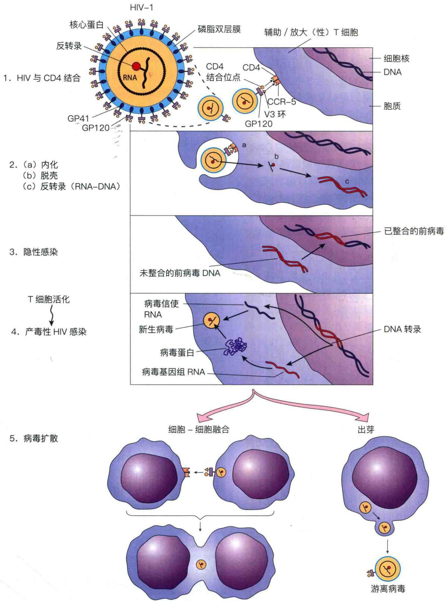 
图9-1 人类免疫缺陷病毒-1（HIV-1）生命周期的多个步骤
隐球菌脑膜炎是一种极为痛苦的并发症，占据所有AIDS机会性感染的 $5\% \sim 8\%$ 。中枢神经系统的并发症包括大脑弓形虫病；原发性中枢神经系统淋巴瘤；单纯疱疹病毒、带状疱疹病毒或者CMV导致的脑炎以及进行性多灶性脑白质病，后者由JC病毒引起。
几乎所有AIDS患者都会出现不同形式的皮肤病变。金黄色葡萄球菌为最常见的病原体，导致大疱性脓疱病、深部的化脓性病变（深脓疱病）及毛囊炎。
慢性的皮肤黏膜单纯疱疹病毒感染几乎为AIDS所特有，因而被视作一个诊断指标。HIV/AIDS患者最常见的死亡原因之一为丙型肝炎（见第14章）。AIDS患者，尤其是男同性恋者，罹患Kaposi肉瘤（KS）的风险极高（见第24章）。事实上，在年龄小于60岁，没有其他基础疾病的身上如果出现KS，则强烈提示AIDS。在AIDS患者身上，KS通常具有较高的侵袭性，常常累及内脏例如胃肠道或者肺。KS肺部侵犯常常导
致死亡。一个名为人类疱疹病毒8（HHV8）的疱疹病毒毒株被认为是导致所有KS，包括AIDS相关的KS的罪魁祸首。HHV8同时也被认为是一种与AIDS相关的特别的淋巴瘤（原发性渗出性淋巴瘤）及AIDS
相关性Castleman病的病因。
B淋巴细胞增生综合征在AIDS患者中常见，随后可出现EBV诱导的高级别B细胞淋巴瘤。
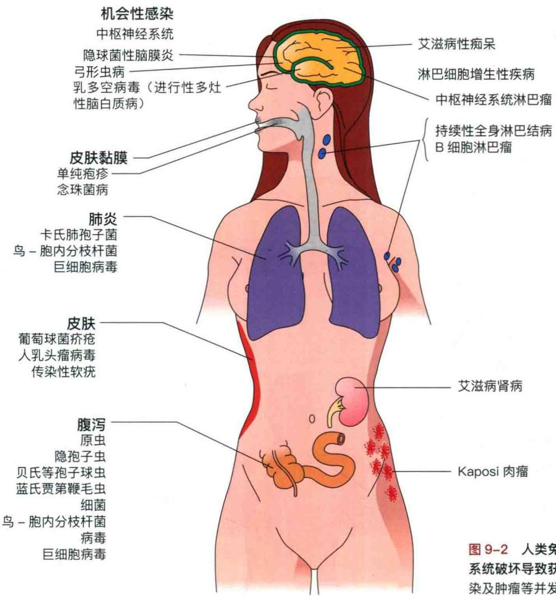 
图9-2 人类免疫缺陷病毒-1（HIV-1）介导的细胞免疫系统破坏导致获得性免疫缺陷综合征（AIDS）。AIDS的感染及肿瘤等并发症实际上可以影响每一个器官系统
# 第十一节 DNA病毒
# 一、疱疹病毒
疱疹病毒科包括多种有包膜的DNA病毒，其中许多可以感染人类。几乎所有疱疹病毒都表达一些共同的抗原决定簇，许多则形成A型核内包涵体（嗜酸性小体，外周围有晕圈）。在疱疹病毒中，最重要的人类病原体有水痘-带状疱疹病毒、单纯疱疹病毒、EB病毒、人类乳头瘤病毒6（HHV6，玫瑰疹的病原体）以及巨细胞病毒。近来，有研究显示HHV8可能为HIV感染者Kaposi肉瘤的发病原因。这个家族的病毒同时以其长期潜伏的能力著称。
1. 水痘-带状疱疹病毒感染 导致水痘及带状疱疹。首次暴露于水痘-带状疱疹病毒（VZV）引起水痘，一种急性全身性疾病，主要特征为全身皮肤小泡样皮疹（图9-3）。随后病毒潜伏。此后当在神经节细胞内
的病毒再活化时，导致带状疱疹。该病毒沿感觉神经下行至单一皮节，随后感染相应的表皮，形成局灶的、疼痛的小泡样皮疹。
VZV仅在人类宿主间传播，主要通过呼吸途径。病毒也可经由与皮损的分泌物的接触传播。该病毒在全世界范围都存在，且具有高度接触性。过去在美国大部分的儿童在学龄早期便已被感染，但目前由于有效的疫苗，该病的患病率已经下降。一种成人的VZV疫苗被证明可降低带状疱疹的患病概率。

【病因病机及病理】VZV一开始感染呼吸道或结膜上皮细胞，并在上述细胞中复制，经血液及淋巴系统播散。在病毒血症期多器官可被感染，但主要表现为皮损。皮损首先表现为斑丘
疹，然后迅速发展成水疱而后形成脓疱，后者很快形成溃疡并结痂。病毒从毛细血管内皮播散至表皮，在表皮大量复制，破坏基底细胞。因此表皮上层与基底
层分离，形成充满中性粒细胞的小泡，而后迅速溃烂而形成浅表溃疡。在被感染的细胞中，VZV产生特征性的致细胞病变效应，包括胞核同质化及核内包涵体(Cowdry A型)。包涵体较大，呈嗜酸性，外周围有一透明区（晕圈）与核膜相隔。多核细胞常见（图9-4）。
在原发感染时，VZV在背根神经节的神经周围卫星细胞中形成隐性感染。病毒基因在潜伏期继续转录，病毒DNA在首次感染数年后仍可被检测出。当病毒在神经节细胞内完全复制，并从单一皮节沿感觉神经下行时，带状疱疹即可出现。随后病毒感染相应表皮，形成局灶性的痛性小疱状皮疹。疼痛可持续至皮疹消退后数月。感染者发生带状疱疹的风险随年龄增大，许多病例发生在老年人中。细胞免疫功能受损同样可以提高水痘－带状疱疹病毒再活化的风险。水痘的皮疹与带状疱疹的相同，也与单纯疱疹病毒（HSV）的相似（见下文）。
2. 单纯疱疹病毒（HSV）可在多个部位造成坏死性感染 单纯疱疹病毒是一种常见的人类病毒性病原体，常常导致皮肤及黏膜反复的、疼痛的水疱样皮疹（表9-3）。HSV在人间通过直接接触受感染的分泌物或者开放伤口传播。两种在抗原性及流行病学特征上完全不同的HSV可引起人类疾病（图9-5）。皮肤或黏膜成簇的疼痛的溃疡性水疱样病变为HSV最常见的临床表现。这些病变持续 $1\sim 2$ 周随后消退。
HSV-1在口腔分泌物中传输，通常导致“腰部以上”的病变，包括口腔、面部及眼。 
HSV-2在生殖器分泌物中传输，通常引起“腰部以下”的疾病，包括生殖器溃疡及在经过受感染的产道时获得的围生期疱疹病毒感染。

【病因病机及病理】原发性HSV疾病在病毒初次接种的部位出现，例如口咽、生殖器黏膜或
者皮肤。病毒感染上皮细胞，产生子代病毒并破坏鳞状上皮的基底细胞，形成水疱。细胞坏
死引起炎症反应，一开始以中性粒细胞为主，随后淋巴细胞浸润。细胞的改变与VZV所致的相似（图9-4）。原发感染在针对该病毒的体液及细胞免疫建立起来后消退。隐性感染的形成则与VZV的机制相似。当病毒再活化，HSV从神经下行至该神经节支配的上皮部位，并再次感染上皮细胞。有时这种继发感染导致溃疡性水疱样的皮损。在其他情况下，继发感染并不导致可见的皮肤损害，但是接触性的子代病毒可从感染部位传出。HSV-1及HSV-2都可在免疫功能受损的宿主身上导致严重的，迁延不愈的，播散性的疾病。
疱疹性脑炎是HSV-1感染的一种罕见的（在HSV感染患者中的发生率为十万分之一）但极其严重的临
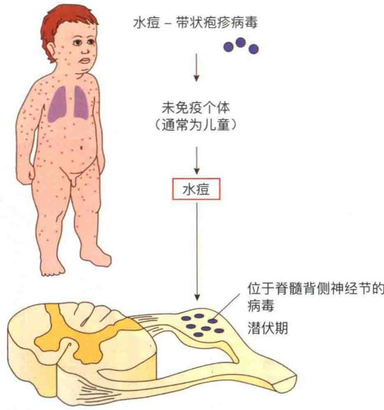
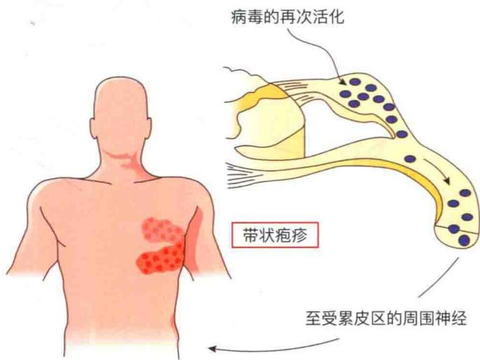 
图9-3 水痘及带状疱疹。飞沫中的水痘－带状疱疹病毒（VZV）被未免疫的个体（通常为儿童）吸入，初期导致鼻咽的“沉默”感染，然后进展为病毒血症，固定巨噬细胞出芽，VZV播散至皮肤（水痘）及内脏。VZV在脊髓背侧神经节中停留，并可蛰伏多年。当潜伏的VZV再活化后，便可从神经节沿感觉神经到达皮节的周围神经，导致带状疱疹
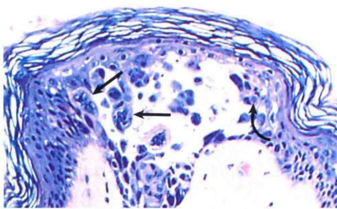 
图9-4水痘水痘患者皮损镜下图像，镜下见一表皮内水疱。可见多核巨细胞（直箭头）及核内包涵体（弯箭头）
床表现，当潜伏在神经节中的病毒再活化并逆行至脑部的时候出现。然而，疱疹性脑炎也可出现在没有“唇疱疹”（见第28章）病史的患者身上。疱疹性肝炎也同样罕见，可出现在免疫功能受损的患者身上，但也可出现在无基础性疾病的年轻人孕妇身上。
围生期疱疹是母亲生殖器疱疹引发的严重并发症。病毒自受感染的产道（通常是宫颈）传输至胎儿，然后迅速在未受保护的新生儿体内播散。该疾病在出生后 $5\sim 7$ 天开始起病，表现为易激惹，嗜睡及皮肤与黏膜的水疱样皮疹。感染迅速扩散并累及多个器官，包括大脑。受感染的新生儿可出现黄疸、出血倾向，呼吸窘迫、抽搐及昏迷。对于严重的HSV感染，使用阿昔洛韦通常有效，但新生儿疱疹的死亡率仍然很高。因此患有生殖器疱疹病毒感染的孕妇通常选择剖宫产。
表9-3 单纯疱疹病毒所致疾病病毒种类常见临床表现不常见临床表现HSV-1口-唇疱疹结膜炎，角膜炎脑炎疱疹性甲沟炎食管炎a肺炎a播散性感染aHSV-2生殖器疱疹围生期感染a播散性感染a
这些表现通常出现在免疫功能受损的宿主身上
# 二、EB病毒（EBV）是传染性单核细胞增多症的病因
传染性单核细胞增多症是一种病毒性疾病，特征为发热、咽炎、淋巴结肿大及循环淋巴细胞增多。大多数人在成年以前曾被EBV感染。发生在幼儿时期的EBV感染通常不引起症状，但在青春期或成年早期才首次感染者2/3会发展为传染性单核细胞增多症。EBV也与数种癌症相关，包括非洲Burkitt淋巴瘤，在免疫受抑患者中的B细胞淋巴瘤以及鼻咽癌（图9-6）。这些肿瘤性的并发症在第5章，第20章及第25章讨论。
EBV主要通过受感染的口腔分泌物在人间传播。一旦进入人体，EBV将终身存在。这与其他疱疹病毒的隐性感染相似。少数人（10%～20%）间断性地排出病毒。病毒传输需要通过与感染者密切接触。因此EBV在儿童聚集并且拥挤的情况下传播尤为迅速，因为在这种情况下大量口腔分泌物在不经意间被“交换”。这种情况下造成的EBV感染通常在3岁以前出现，因而甚少引起传染性单核细胞增多症。在发达国家，许
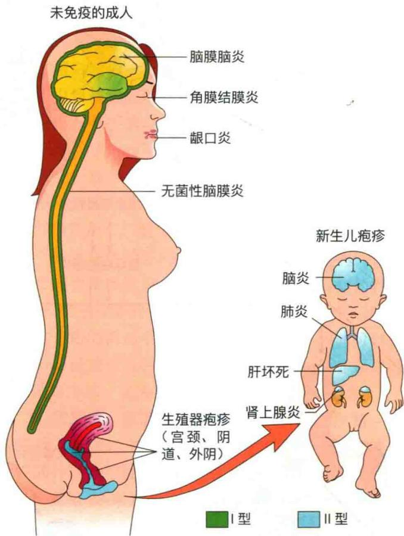 
图9-5疱疹病毒感染。单纯疱疹病毒1（HSV-1）感染未免疫的成人，导致龈口炎（“热病性疱疹”或“唇疱疹”）、角膜结膜炎、脑膜脑炎及无菌性脑脊髓膜炎。HSV-2感染未免疫成人的生殖器，累及宫颈、阴道及阴唇。HSV-2在胎儿经受感染的母亲的产道娩出时将其感染。婴儿没有成熟的免疫系统，导致HSV-2的播散性感染。这种感染通常是致命性的，累及肺、肝、肾上腺及中枢神经系统
多人直至青春期或者成年早期才被感染。2/3的这种儿童期后的新近感染会出现有明显临床症状的传染性单核细胞增多症。

【病因病机及病理】病毒首先结合并感染鼻咽细胞，随后结合感染B细胞，后者将病毒带至全身，造成全身淋巴组织及脾的感染。导致的不对称淋巴结肿大在颈部最为明显。显微镜下，
总体的淋巴结结构被保留。由于免疫母细胞的增殖，生发中心增大且边界不清。淋巴结中有时可见深染的多叶核细胞，与Reed-Steinberg细胞相似。事实上，淋巴结的镜下改变很难与霍奇金病或其他淋巴瘤区分（见第20章）。因为红髓增生，脾大而质软，且容易破裂。免疫母细胞富余，浸润脉管管壁、小梁及被膜。肝几乎都会被累及，肝血窦及门管区可见不典型淋巴细胞。
传染性单核细胞增多症的一个显著特征是伴有异型淋巴细胞的淋巴细胞增多。异型淋巴细胞（特征为分叶的异型细胞核及含空泡的胞质）为活化的T细胞，参与抑制及杀伤多克隆刺激、被EBV感染的B淋巴细胞。
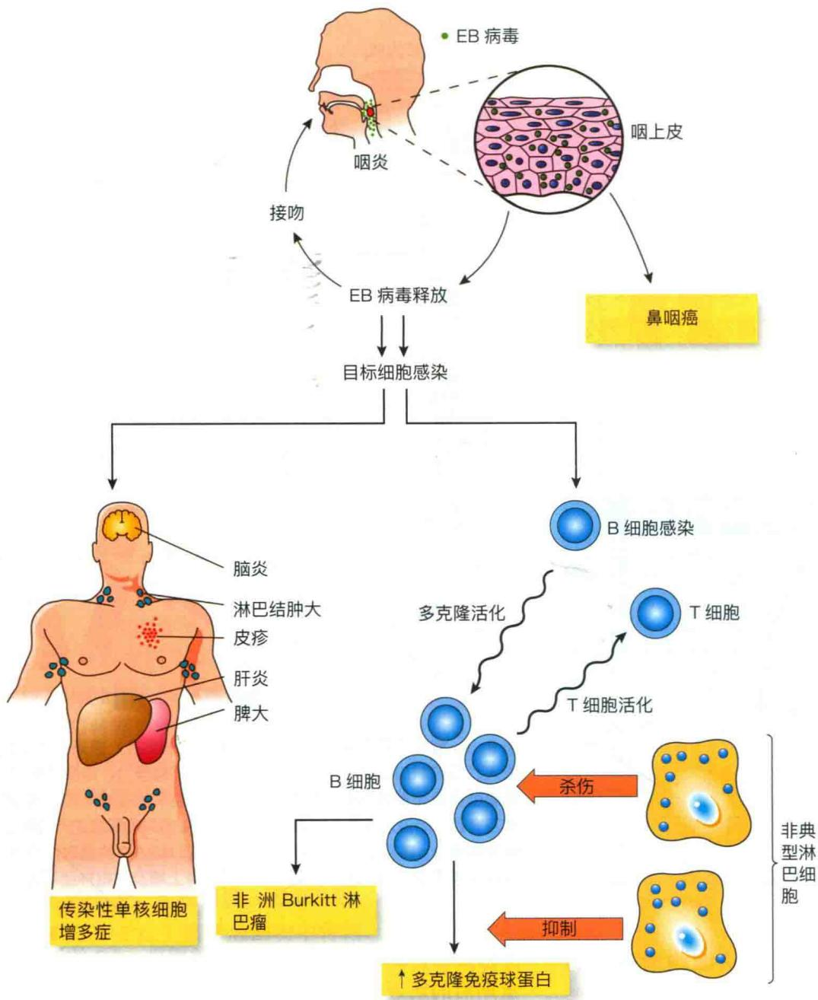 
图9-6EB病毒（EBV）在传染性单核细胞增多症、鼻咽癌及Burkitt淋巴瘤中的角色。EBV侵犯唾液腺或咽上皮细胞，在其内复制并排入唾液及呼吸道分泌物中。在一些人身上，该病毒可转化咽上皮细胞，导致鼻咽癌。在未从儿童期暴露中获得免疫的个体身上，EBV导致传染性单核细胞增多症。EBV感染B淋巴细胞，后者发生多克隆活化。这些B细胞刺激不典型淋巴细胞的产生，后者杀死被病毒感染的B细胞并抑制免疫球蛋白的产生。一些被感染的B细胞转化为Burkitt淋巴瘤中不成熟的恶性淋巴细胞
# 三、巨细胞病毒（CMV）感染人数众多但甚少致病
CMV是一种先天性及机会性的病原体，通常引起无症状感染。然而，在胎儿及免疫功能受损的个体中，CMV感染的后果是毁灭性的。CMV（TORCH综合征的一员）穿过胎盘，感染所有胎儿中的 $0.5\% \sim 2.0\%$ 的个体并在 $10\% \sim 20\%$ 的被感染者中造成损害，因此CMV是最常见的先天性病原体。脑、内耳、眼、肝及骨髓为最常见的受损器官（见第6章）。CMV在人间通过接触受感染的分泌物及体液传播，并穿过胎盘传输至胎儿。病毒在青春期及成年个体间的传输则主要通过性接触完成。

【病因病机及病理】CMV感染人类多种细胞，包括上皮细胞、淋巴细胞及单核细胞，并在白细胞中潜伏。正常的免疫应答迅速控制CMV感染；感染者甚少出现症状，但可周期性地通
过身体分泌物释出病毒。与其他疱疹病毒类似，CMV可终身潜伏。显微镜下，胎儿CMV感染病变部位可见细胞坏死及胞核增大，胞核及胞质内可见包涵体。巨核通常为单个，中央可见巨大的包涵体，周围有空晕包绕（图9-7）。胞质内的包涵体较不明显。

【临床表现】当孕妇被感染，CMV可传给胎儿
此时胎儿未受母体来源的抗体保护，病毒侵入
胎儿细胞时几乎没有引起任何免疫应答，引起广泛坏死及炎症。CMV在免疫受抑的患者中引起多种临床表现，例如视力减退（脉络膜视网膜炎）、腹泻或消化道出血（结肠溃疡）、精神状态异常（脑炎）、呼吸短促（肺炎）或各种其他症状。
# 第十二节 人乳头瘤病毒
HPV导致鳞状上皮的增生性病变，包括寻常疣、
扁平疣、跖疣、肛门生殖器疣（尖锐湿疣）及喉乳头状瘤病。一些血清型的HPV导致鳞状上皮细胞异型增生及女性生殖道的鳞状细胞癌（见第18章）。
HPV为无包膜的双链DNA病毒。目前已知有超过100种HPV病毒，不同的亚型导致不同种类的病变。因此，HPV1，2及4型导致寻常疣及跖疣。HPV6，10，11及 $40\sim 45$ 型导致肛门生殖器疣。16，18及31型与女性生殖道的鳞状细胞癌相关。最近的研究表明，在大多数的喉癌及许多肺癌病例中均有HPV16型出现。HPV感染传播广泛，在人间主要通过直接接触传输。但导致生殖器病变的亚型通过性接触传输。

【病因病机及病理】HPV首先在复层鳞状上皮接种，并进入基底细胞的胞核。部分被感染的细胞显示特征性的致细胞病变效应，名为挖空细胞样变，特征为巨大的上皮细胞，胞核挛缩
并被包裹在巨大的胞质空泡中（挖空细胞）。感染刺激鳞状上皮增生，导致多种HPV-相关性增生性病变。随着快速生长的鳞状上皮一起复制的还有无数的子代病毒，后者从退行性变的表面细胞中释出。许多HPV病变可自行消退，但细胞免疫受抑则可导致病变持续并扩散。HPV参与恶变的机制已在第5章中讨论。
寻常疣是一种质硬，呈圆形，隆起性，表面粗糙的病变，通常在容易受伤的机体表面部位出现，例如手部。跖疣为类似的鳞状上皮增生性病变，见于足底，在站立及行走时被压至朝内。
肛门生殖器疣（尖锐湿疣）为一种质软，隆起性，肉状的病变，主要见于阴茎、女性外阴、阴道壁，宫颈或肛周区域。由某些亚型的HPV所导致的扁平疣可发展为鳞状细胞的恶性增殖。HPV，宫颈上皮内瘤变及侵袭性鳞癌之间的关系将在第18章中讨论。
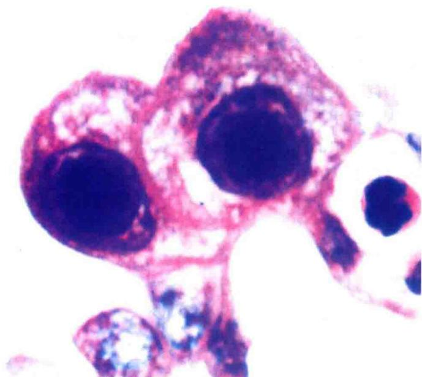 
图9-7 巨细胞病毒性肺炎。二型肺泡上皮细胞显示增大的胞核，核内间单个包涵体，周围有空晕包绕
# 第十三节 胀粒
在最近的数十年中，人们已经清楚认识到感染可仅通过蛋白质传输并繁衍，而不需要核酸的参与。这样的蛋白质被称为朊粒。目前已知的由朊粒引起的疾病为中枢系统疾病，库鲁病为其中的典型。该病在新几内亚名为“Fore”的部落中通过食人的习俗传输，现已灭绝。朊粒从本质上而言是错误折叠的蛋白质，在中枢神经系统聚积，导致进行性的神经退行性变，并最终导致死亡。朊蛋白（PrP）有一种正常的异构体，也有一种致病性的异构体，后者可以传输疾病。该致病的形态聚集成朊蛋白杆，构成这种罕见疾病的特征性改变。特别重要的是，这种感染原的污染是持久性的，并且对普通的消毒手段有极强的耐受力，因此可以通过外科器械或植入神经组织的电极传输，除非采取特殊的消毒方法。更为人所知的两种朊粒性疾病为：
■散发性、家族性及医源性克罗伊茨菲尔特－雅各布病（sCJD，fCJD及iCJD）：CJD是一种快速进行性的神经退行性疾病，特征为肌阵挛、行为改变及痴呆（见第28章）。sCJD可能为最常见的人类胚粒性疾病，患病率为一百万分之一。iCJD则较为罕见，主要通过移植的组织例如角膜及硬脑膜传输。fCJD与编码胚蛋白的PRNP基因的多种突变相关。
■新变种的克罗次菲尔特－雅各布病（vCJD）：近数十年来一种鲜为人知但增长快速的感染性疾病。vCJD及牛海绵状脑病，俗称疯牛病，喻示着动物与人感染原的内在关联。在驯养的有蹄类的饲料中添加的特定的动物性产品引起朊粒病的流行，首先是在英国的牛群中，随后在许多其他国家被发现。近150人感染了这种不治之症，推测原因可能为食用了受感染动物的肉。直至今日，所有患者编码朊蛋白的PRNP基因的129密码子为纯合的甲硫氨酸。这种情况占所有欧洲人的 $40\%$ 。同样的纯合子氨基酸残基出现在大部分（但并非全部）的sCJD病例中。sCJD的平均发病年龄为65岁，vCJD则主要在年轻的成年人中出现，平均发病年龄26岁。vCJD的主要表现也是精神性的体征及症状。vCJD的病理改变与牛海绵状脑病的极为相似，但与散发型的有一定区别。
# 第十四节 细菌感染
细菌，直径为 $0.1\sim 10\mu \mathrm{m}$ ，是最小的活细胞。细菌按被膜结构特点分类。最简单的被膜是支原体的被膜，仅为磷脂-蛋白双层膜。然而大多数的细菌有刚性的细胞壁包裹着细胞膜。根据革兰染色特点，细胞壁可以分为两类。革兰阳性细菌的染色呈深蓝色，细胞壁含磷壁酸及一层很厚的肽聚糖。革兰阴性细菌染
色呈红色，具有一个含有脂多糖成分，即内毒素的外膜层。内毒素为休克的强力媒介（见第7章）。两种细菌外周都可有一层额外的多糖或蛋白凝胶包裹(荚膜)，可增加细菌毒力。因此，细菌也可按有荚膜或无荚膜分类。细胞壁赋予细菌刚性，并让我们可以通过形状及在培养皿中的生长方式区分。圆形或卵圆形的为球菌。成簇生长的称为葡萄球菌，排列成链状的称为链球菌。狭长的细菌是杆菌（rods或bacilli），成弧形的为弧菌。一些螺旋状的细菌被称为螺旋体。
# 化脓性革兰阳性球菌
1.金黄色葡萄球菌 导致化脓性感染。金黄色葡萄球菌是一种革兰阳性的球菌，通常成簇生长，是最常见的细菌性病原体之一。正常情况下，该菌在皮肤上存在，通过直接接触传播，容易进入深部组织并接种。金黄色葡萄球菌是皮肤、关节、骨的化脓性感染的最常见病原体，同时也是感染性心内膜炎的最主要病因。金黄色葡萄球菌可通过凝固酶试验与其他毒力较弱的葡萄球菌相鉴别。该菌通过与有集落生长的表面或个体直接接触传播。多数人的皮肤表面不时有金黄色葡萄球菌的集落生长。该菌可在非动物性的表面长期存活。

【发病机制】多数金黄色葡萄球菌感染以皮
肤或皮肤附属器的局限性感染起病，造成蜂
窝织炎及充满脓液及细菌的脓肿。该菌具有破坏性的酶及毒素，有时可不局限于原发感染部位，通过血流及淋巴管道传播至体内几乎所有的部位。骨、关节及心脏瓣膜是最常见的转移性金黄色葡萄球菌感染。该菌亦可通过被携带至远处部位的毒素引起多种不同的疾病。

【临床表现】金黄色葡萄球菌所致疾病的临床表现根据其感染部位及种类有所不同。
■ 疖（疡肿）、睑腺炎、痈：深部金黄色葡萄球菌感染通常在鼻腔带菌者的毛囊内及毛囊周围出现。疗一开始为毛囊根部的结节，随后形成小脓疱，出现疼痛，红肿症状，持续数日。顶端可形成黄色脓头，中央为质软的坏死物形成的脓栓。疖破裂或切开可缓解疼痛。睑腺炎（麦粒肿）为累及眼睑皮脂腺的疗。痈则由多个疖融合而成，形成引流窦道。
■烫伤样皮肤综合征：该病主要出现在婴儿及小于3岁的儿童，表现为晒伤样的皮疹，首先在脸部出现，随后扩散至全身。大疱开始形成，轻轻揉搓便可使大片表皮剥脱。病情在 $1\sim 2$ 周后，皮肤再生后缓解。表皮剥脱为特定外毒素的全身效应，通常来自于部位不明的感染。
■ 骨髓炎：急性葡萄球菌性骨髓炎通常发生在腿
骨，通常见于 $3 \sim 10$ 岁的男孩，其中大部分有感染或创伤病史。若未正确治疗骨髓炎可转为慢性。超过50岁的成人更易患椎体的骨髓炎，可由皮肤、尿道、前列腺手术及骨折内固定术后葡萄球菌感染发展而来。
呼吸道感染：葡萄球菌性呼吸道感染最常见于小于2岁的婴儿，特别是小于2个月的婴儿。其特征为上气道溃疡，散在的肺炎病灶、胸腔积液、脓胸及气胸。在成人身上，金黄色葡萄球菌性肺炎可继发于流感病毒感染。流感病毒破坏支气管表面的纤毛上皮，使人容易出现继发感染。
细菌性关节炎：金黄色葡萄球菌为超过一半的化脓性关节炎的病原菌，通常在 $50\sim 70$ 岁的患者身上致病。类风湿关节炎及糖皮质激素治疗为常见的易感因素。
脓毒血症：金黄色葡萄球菌导致的脓毒血症通常见于抵抗力较差的、因为其他原因而住院的个体。粟粒状脓肿及心内膜炎为其严重并发症。
细菌性心内膜炎：细菌性心内膜炎为金黄色葡萄球菌性脓毒血症的常见严重并发症。静脉注射吸毒为常见的易感因素（见第11章）。
中毒性休克综合征：该病常见于经期的妇女，表现为高热、恶心、呕吐、腹泻及肌痛。数天后可进展为休克，伴晒伤样皮疹。该病与高吸水性卫生棉相关，因为后者可以提供一个金黄色葡萄球菌繁殖及毒素作用的部位。但该病也可出现在非卫生棉使用者身上。中毒性休克综合征甚少在儿童及男性身上出现，一旦出现，通常意味着隐性的金黄色葡萄球菌感染。
葡萄球菌性食物中毒：葡萄球菌性食物中毒通常在餐后6小时内出现。表现为突然发作的恶心呕吐，通常在12小时内缓解。该病由进食时食物中已经存在的毒素导致。
2.抗生素耐药的金黄色葡萄球菌带来日益严峻的临床挑战对于金黄色葡萄球菌，临床上面临的最重要的问题是60年来其不断提升的对抗生素的耐药性。今天，耐甲氧西林的金黄色葡萄球菌（MRAS）感染成了最可怕的院内感染种类之一。根据疾控中心的数据，在 $1995\sim 2004$ 年，重症监护病房中MRSA的患病率几乎增加了一倍，由略高于1/3增加到接近2/3。然而，最近的趋势显示，得益于有效的预防措施，这种感染的发病率明显下降。近来，社区获得性MRSA使得人们开始关注耐药性在葡萄球菌及其他细菌中的播散。该细菌可以在学校及健身房传播，并引起皮肤及软组织感染。
3. 化脓性链球菌引起化脓性疾病，毒素相关性疾病及免疫应答 化脓性链球菌又称A群链球菌，是最
常见的人类细菌性病原体之一，导致多个器官系统的疾病，从急性自限性的咽炎到重大疾病如风湿热等（图9-8）。化脓性链球菌是一种革兰阳性球菌，通常为皮肤及口咽的内生菌群的组成部分。
化脓性链球菌导致的疾病可分为两大类，分别为化脓性及非化脓性疾病。前者在细菌侵入人体的部位发生，导致组织坏死，通常伴有急性的炎症反应。化脓性链球菌的化脓性感染包括咽炎、脓疱病、蜂窝织炎、肌炎、肺炎及产后败血症。与此相反，非化脓性疾病发生在远离细菌侵入部位的地方。化脓性链球菌导致两种主要的非化脓性并发症：风湿热及急性链球菌感染后肾小球肾炎，前者在第11章讨论，后者在第16章有叙述。
化脓性链球菌产生数种外毒素，包括红疹毒素及细胞裂解毒素（链球菌溶血素O及S）。红疹毒素导致猩红热的皮疹。链球菌溶血素S溶解细菌原生质层（L型）并可能在中性粒细胞吞噬细菌后将细胞破坏。链球菌溶血素O使抗体滴度长期升高，可作为诊断化脓
性链球菌感染及其并发症的标志物。
（1）链球菌性咽炎：化脓性链球菌是咽炎的常见病原体，引起发热、不适、头痛及白细胞计数升高。该菌在人间通过与口腔或呼吸道分泌物直接接触传播。链球菌性咽喉炎在全世界都有出现，主要见于儿童及青春期个体。若未及时使用青霉素治疗，链球菌性咽炎可引起风湿热或急性链球菌感染后肾小球肾炎。

【病因病机】化脓性链球菌与上皮细胞表面的纤维连接蛋白结合。该菌可产生溶血素，
DNA酶，透明质酸酶及链激酶，破坏并侵入人体组织。一种名为M蛋白的细胞壁成分与细菌毒力相关，并可阻止细菌完全沉积，因此可以使细菌免于被吞噬。另一种表面蛋白可破坏C5a，阻断后者调理作用，阻止细胞吞噬。该菌侵入人体后可引起急性免疫应答，在扁桃体隐窝内形成以中性粒细胞为主的渗出液。
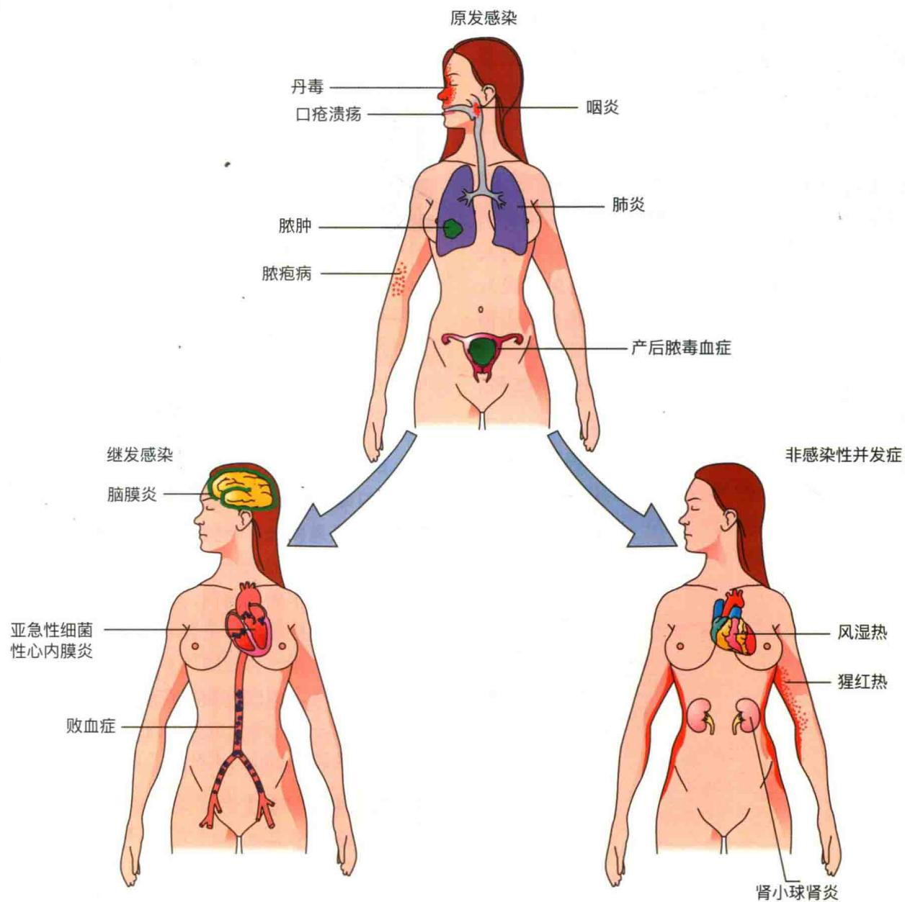 
图9-8 链球菌所致疾病
（2）猩红热：猩红热形容一种皮肤黏膜点状的红疹，可见于一部分的链球菌性咽炎及某些其他的化脓性链球菌感染。这种皮疹与细菌产生的红疹毒素相关。
（3）丹毒：丹毒是一种主要由化脓性链球菌感染导致的皮肤红斑状肿胀。皮疹通常首先出现在面部，随后迅速扩散。表皮及真皮弥漫性的，水肿性的急性炎症反应蔓延至皮下组织。炎性浸润以中性粒细胞为主，在血管及皮肤附属器周围尤为严重。皮肤微小脓肿及坏死小灶常见。
（4）脓疱病：脓疱病（脓皮病）是一种局限性的皮肤表皮内感染，有化脓性链球菌或金黄色葡萄球菌导致，最常见于儿童。导致脓疱病的化脓性链球菌菌株其抗原性及流行病学特征与引起咽炎的菌株完全不同。小型的伤口或昆虫叮咬使细菌在皮肤内接种，随后在表皮内形成脓疱，破裂后流出脓性渗出液。
（5）链球菌性蜂窝织炎：化脓性链球菌引起真皮深层疏松结缔组织内扩散迅速的感染。这种化脓性的感染由创伤性的细菌皮肤接种引起，常见于淋巴回流受阻的肢体。感染沿筋膜平面扩散至皮下组织深层，造成进展迅速且高度破坏性的坏死性筋膜炎，该病常被大众媒体误称为“食肉菌感染”。这种广泛的组织损伤是外毒素造成的，具有直接的破坏力，并可进一步导致血管堵塞、缺血及组织坏死。
4.肺炎链球菌感染是大叶性肺炎的主要病因，肺炎链球菌是一种需氧的革兰阳性双球菌，常简称为肺炎球菌，可引起化脓性感染，通常累及肺（肺炎）、中耳（中耳炎）、鼻窦（鼻窦炎）及脑膜（脑膜炎）。该菌为最常见的人类细菌性病原体之一，世界上大部分的儿童在5岁以前至少会发生一次肺炎球菌感染性疾病（通常为中耳炎）。肺炎链球菌为口咽的共生菌，几乎存在于所有人中。
【病因病机】当肺炎球菌抵达本来无菌的，通常靠近它们在口咽寄居地的部位时，便可引起疾病。肺炎球菌性鼻窦炎及中耳炎通常有前驱的病毒性疾病，例如普通感冒。后者可损伤具有保护功能的纤毛上皮，并使受累的空腔充满液体。肺炎球菌便在这些富有营养的组织液中迅速繁殖。鼻窦或中耳的感染可扩散至邻近的脑膜。肺炎球菌性肺炎通常在病毒性、吸烟或饮酒相关性的黏液纤毛毯损伤后，咳嗽使细菌得以进入下呼吸道的情况下发生。一旦进入肺泡，细菌增殖并引发急性炎症反应。当细菌迅速增殖并充满肺泡后，便可扩散至其他肺泡。肺炎球菌的多聚糖荚膜壳可以避免补体通过替代途径激活，阻断了调理性C3b的产生。结果，细菌可以在体内增殖并不受吞噬细胞的阻碍地扩
散, 直至机体产生相应抗体。在肺部, 细菌迅速扩散, 累及整个甚至多个肺叶 (大叶性肺炎)。与金黄色葡萄球菌引起的肺炎不同, 肺炎链球菌引起的肺炎通常不导致肺组织破坏, 并可完全消退。如果患者有基础疾病, 例如慢性吸入性肺炎、糖尿病或酒精滥用, 或者当患者的细菌调理功能受损时, 肺炎球菌感染性疾病可以扩散。脾切除的患者发生快速的暴发性的感染性休克及死亡的风险颇高。肺炎链球菌感染性疾病的病因病机及临床特征在第12章中详述。
# 第十五节 儿童期的细菌感染
# 一、白喉是一种坏死性的上呼吸道感染
白喉杆菌，一种需氧的、多形性的革兰阳性杆菌，可通过产生毒素造成心脏及神经功能紊乱。人类为目前已知的唯一储主。白喉杆菌在人间通过呼吸道飞沫或口腔分泌物传播。在发达国家，白喉疫苗使该病几乎已被消灭，但在没有大规模预防接种的地区，该病仍持续蔓延。

【病因病机及病理】白喉杆菌进入咽部并增殖，通常位于扁桃体，形成特征性的假膜。假膜是由剥落的上皮、坏死的细胞碎片、中性粒细胞、纤维蛋白及细菌黏附在受累呼吸道壁上形成
的。这一假膜下黏膜上皮的炎性过程经常导致周围软组织水中，在严重的情况下可导致呼吸困难。部分菌株产生的白喉毒素被吸收，作用于全身组织，其中心、神经及肾最易受损。当心脏受累，心肌出现心肌细胞内脂肪滴及局灶性坏死。当神经受累时，周围神经可出现脱髓鞘病变。
# 二、百日咳的特点是使人极度虚弱的发作性咳嗽
百日咳（Pertussis，whooping cough）是一种迁延性的上呼吸道疾病，持续 $4\sim 5$ 周。其特征为发作性的咳嗽，继而深长吸气，伴有高调的鸡鸣样吸气声。百日咳杆菌为本病致病菌，是一种短小的革兰阴性球杆菌，有高度接触性，主要通过受感染者的呼吸道气溶胶在人间传播。百日咳主要见于小于 $5\sim 6$ 岁的儿童，然而在成人中的发病率在逐渐升高。疫苗是有效的保护手段，但每年全世界仍有超过5000万的新发病例，并导致超过100万人死亡，在婴儿中尤为严重。

【病因病机】百日咳杆菌附着于呼吸道上皮细胞的纤毛，引起感染。随后细菌产生毒素，
导致上皮细胞坏死及急性炎症反应，引起广泛的气管支气管炎。随着纤毛黏液毯的失效，吸入的口腔
细菌引起肺炎的风险增加。咳嗽发作及呕吐增加了吸入性肺炎的风险，继发的细菌性肺炎有时可导致死亡。
# 三、流感嗜血杆菌引起幼龄儿童的化脓性感染
流感嗜血杆菌感染累及中耳、鼻窦、面部皮肤、会厌、脑膜、肺及关节，是2岁以下儿童脑膜炎的最主要病原体。该菌为主要的儿童细菌性病原体，其所致严重疾病的发病率在 $6\sim 18$ 月龄时达到最高峰。该菌为一种需氧的多形性革兰阴性球杆菌，通过呼吸道飞沫及分泌物在人间传播。其无包膜的菌株（a型）通常导致局限性的感染，而有包膜的菌株，即b型的毒力更强，超过 $95\%$ 的侵袭性细菌感染由该型引起。流感嗜血杆菌仅在人间传播，主要途径为呼吸道飞沫及分泌物。该菌为 $20\% \sim 50\%$ 的健康人鼻咽正常菌群的一部分。多数寄居的菌株为无包膜的，但是 $3\% \sim 5\%$ 为b型流感嗜血杆菌。对婴儿进行疫苗接种大大减少了b型流感嗜血杆菌引起的疾病，特别是儿童的脑膜炎。

【病因病机】无包膜的流感嗜血杆菌通过从正常的寄居部位向邻近的无菌区域局部扩
散，例如从鼻窦扩散至中耳。细菌增殖并引发炎症反应，损伤局部组织但最终使感染局限。无包膜的菌株通常不引起菌血症。b型流感嗜血杆菌可侵入组织并引发剧烈的急性炎症反应。b型细菌的荚膜多聚糖使其得以逃脱免疫吞噬，因而菌血症常见。菌血症性感染可导致会厌炎、面部蜂窝织炎、化脓性关节炎及脑膜炎。

【临床表现】流感嗜血杆菌性脑膜炎的主要特征为急性的炎性软脑膜浸润，有时可累及蛛网。
■流感嗜血杆菌性肺炎通常并发于慢性肺疾病。在约 $50\%$ 的患者中，该病继发于呼吸道病毒感染。肺泡中充满吞噬了菌体及纤维蛋白的中性粒及巨噬细胞。 
■ 流感嗜血杆菌性会厌炎主要在 $2 \sim 7$ 岁儿童身上致病。特点为会厌、枸会厌皱襞及梨状窦的肿大和急性炎症。若引起上呼吸道阻塞可导致死亡。
# 四、脑膜炎奈瑟菌导致化脓性脑膜炎及休克
脑膜炎奈瑟菌，俗称脑膜炎球菌，引起播散性经血传播的感染，经常伴有休克及严重的凝血功能混乱。该菌为需氧菌，为成对的豆状革兰阴性球菌，在人间主要通过呼吸道飞沫传播。该菌为 $5\% \sim 15\%$ 人群的鼻咽共生菌。脑膜炎球菌性疾病可以为散发，也可引起流行，还可以群聚感染（后者最常见于密集的群居地，
例如军营以及院校宿舍）。在美国，每年约有1000例脑膜炎球菌性脑膜炎，其中有 $10\% \sim 14\%$ 的病例死亡。然而，在较不发达国家，死亡病例较为常见。对特定的高危人群（如大学新生、新兵等）进行疫苗接种有效降低了该病流行的风险。

【病因病机及病理】当寄居于上呼吸道时，脑膜炎奈瑟菌以菌毛附着在无纤毛的呼吸道上皮

上。若细菌在保护性免疫产生以前入血，则可在未受保护的人体组织中大量增殖，引起暴发
性脑膜炎球菌性疾病。感染可局限于中枢神经系统，表现为软脑膜及蛛网膜下腔中性粒细胞浸润及潜在的脑实质肿胀和充血。该菌亦可播散至全身（败血症），导致弥漫性的小血管内皮破坏，伴皮肤及脏器广泛的瘀点及紫癜。
脑膜炎球菌性疾病的众多全身症状由细菌外膜脂多糖成分的内毒素引起，后者促进巨噬细胞产生TNF，同时激活补体及凝血瀑布。随后可骤然发生弥散性血管内凝血，纤维蛋白溶解及休克。血管炎及血栓形成在 $3\% \sim 4\%$ 的患者中导致双侧肾上腺的出血性坏死，名为Warehouse-Friderichsen综合征。脑膜炎球菌性疾病曾经是不治之症，但现在抗生素治疗使死亡率下降至低于 $15\%$
# 第十六节 细菌性性传播疾病
# 一、淋病仍是一种可导致不育的常见疾病
淋病奈瑟菌，又名淋球菌，可引起淋病，一种生殖道的急性化脓性感染，在男性表现为尿道炎，在女性则表现为子宫内膜炎。该菌为需氧的，豆状的革兰阴性双球菌。该菌可沿女性生殖道逆行，引起宫颈黏膜炎，输卵管炎及盆腔炎性疾病。淋病是最古老的，并且仍然是最常见的性传播疾病之一，2010年全美共有300000病例被报道。新生儿感染主要源自患有淋病的母亲的产道，表现为结膜炎，但有时可见播散性感染。除了围生期传输以外，该病基本上通过性行为传播。

【病因病机及病理】淋病为一种化脓性感染，

通常首先感染尿生殖道的黏膜（图9-9）。细
存在一种蛋白酶，可溶解黏膜上的IgA，因此易化了细菌与尿生殖道柱状上皮及移行上皮的附着。附着之后，细菌侵入表浅部位，引起急性炎症，产生大量的脓液及黏膜下脓肿。男性可出现脓性尿道分泌物及尿痛，若不治疗，可导致尿道狭窄，同时感染
可在尿生殖道中蔓延。在约 $50\%$ 的受感染女性中，淋病可以没有症状。有症状的女性首先表现为宫颈黏膜炎，伴阴道分泌物、阴道出血或尿痛。感染经常蔓延导致急性或慢性输卵管炎并最终导致盆腔炎性疾病。输卵管肿胀、化脓，导致急性腹痛。若炎性粘连阻塞输卵管可致不育。
# 二、梅毒
梅毒（syphilis或lues）是一种慢性的全身性的性传播疾病，病原体为苍白密螺旋体，该病将在螺旋体所致疾病的部分讨论。
# 第十七节 致肠病的细菌感染
# 一、大肠埃希菌
大肠埃希菌是最常见，也是最重要的人类细菌性病原体，是腹泻及尿路感染的常见致病菌，导致超过 $90\%$ 的尿路感染及世界范围内的众多腹泻性疾病。该菌也是主要的机会致病菌，常常在免疫功能受抑的宿主中引起肺炎及脓毒血症，在新生儿中则可导致脑膜炎及脓毒血症。
大肠埃希菌为一组需氧的（兼性厌氧），革兰阴性的细菌。多数菌株为肠道共生菌，可以在人类肠道中
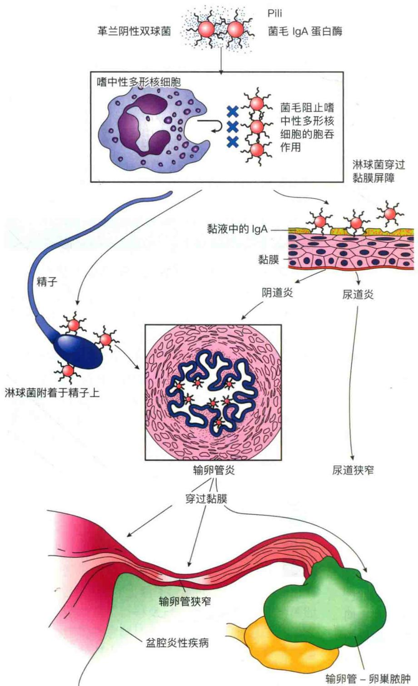 
图9-9 淋病球菌的病因病机。淋病奈瑟菌为一种革兰阴性的双球菌，表面有菌毛，构成抵抗中性粒细胞吞噬的屏障。该菌的菌毛含有一种IgA蛋白酶，可消化尿道，宫颈管及输卵管管腔黏膜表面的IgA，从而易化细菌附着。淋病球菌引起宫颈黏膜炎、阴道炎及输卵管炎。在男性身上，淋病球菌附着于尿道黏膜，导致尿道炎，有时可引起尿道狭窄。淋病球菌亦可附着于精子头部，并被携带至输卵管。该菌若穿透黏膜可导致输卵管狭窄，盆腔炎性疾病（PID）或输卵管卵巢脓肿。IgA.免疫球蛋白A；PMN.多形核中性粒细胞
与宿主和平共存。然而，当细菌进入本来无菌的部位，如尿路、脑膜或腹膜时，具有相当大的侵袭性。引起腹泻的大肠埃希菌菌株有特殊的毒力，这种毒力通常由质粒传播，传递致肠道疾病的能力。
1.大肠埃希菌性腹泻 四个不同的大肠埃希菌菌株可导致腹泻，其中两种在发达国家引起严重疾病。
肠出血型大肠埃希菌：肠出血型大肠埃希菌（血清型O157：H7）导致血性腹泻，有时可发展为溶血尿毒综合征（见第16章）。感染源通常为受牛粪污染的肉、奶、蔬菜或其他食品。牛粪为该血清型的菌株的常见来源。肠出血型大肠埃希菌黏附于结肠黏膜并产生内毒素，事实上这种毒素与志贺毒素相仿（见下文）。该毒素可破坏上皮细胞。受O157：H7大肠埃希菌感染的患者可出现痉挛性腹痛，低热，有时可见血性腹泻。在非常年轻或者年老的患者中偶尔发生死亡，通常与溶血尿毒综合征相关。
肠侵袭型大肠埃希菌：该菌导致经食物传播的痢疾，临床上及病理上难以同由志贺杆菌所致的痢疾区分。该菌侵入并破坏远端回肠及结肠的黏膜细胞。如在志贺菌病中一样，远端回肠及结肠黏膜可见急性炎症反应，局灶糜烂，有时可见炎性假膜覆盖。患者出现腹痛、发热，里急后重及血性腹泻。
2.大肠埃希菌尿路感染 大肠埃希菌引起的尿路感染最常见于性生活丰富的女性及尿路结构或功能异常的男性或女性。这种感染非常常见，在所有人中的患病率超过 $10\%$ ，而且常常反复致病。
【病因病机】大肠埃希菌从远端尿道上行而进入无菌的近端尿道。因女性尿道较短，其机械屏障不如男性的有效，因此较男性更易出现尿路感染。致尿路感染的大肠埃希菌菌毛上有特殊的黏附因子，帮助细菌与尿道上皮结合。尿路感染首先引起感染部位的急性炎性浸润，随后可上行至肾导致肾盂肾炎（见第16章）。
3.大肠埃希菌脓毒血症（革兰阴性菌脓毒血症）大肠埃希菌是肠道革兰阴性菌脓毒血症最常见的病原体，但其他革兰阴性杆菌，包括假单胞菌、克雷伯菌及肠杆菌属的细菌可引起相同的疾病。以下对革兰阴性菌脓毒血症进行大致讨论。
【病因病机】大肠埃希菌脓毒血症通常为机会性感染，在有易感因素的个体上发生，例如中性粒细胞减少症、肾盂肾炎或肝硬化，以及住院患者。细菌偶尔入血，在中性粒细胞减少或者肝硬化的患者身上，因其无法清除即使是少量的进入循环的细菌，可引起大肠埃希菌性脓毒血症。而腹腔器官破裂或者急性肾盂肾炎的患者则由于大量细
菌入血，超出正常防御机制能力而引起革兰阴性菌脓毒血症。血流中的大肠埃希菌通过内毒素刺激巨噬细胞释放TNF，最终导致感染性休克。感染性休克的更多讨论请见第7章及第20章。
# 二、沙门菌小肠结肠炎及伤寒都是肠道的感染
沙门菌属由超过1500种抗原性不同但生化性质及遗传相关的革兰阴性杆菌组成，导致两种重要的人类疾病：沙门菌小肠结肠炎及伤寒。
沙门菌小肠结肠炎：沙门菌小肠结肠炎是一种急性自限性的（ $1\sim 3$ 天）胃肠道疾病，表现为恶心、呕吐、腹泻及发热。该病常因摄入被非伤寒沙门菌株污染的食物引起，因而常被称为沙门菌食物中毒。该菌在小肠内增殖并侵犯远端小肠及结肠的肠上皮细胞。非伤寒沙门菌可产生多种毒素，引起肠道细胞功能紊乱。回肠及结肠的黏膜出现急性炎症反应，有时可出现浅表溃疡。一旦感染人体，该菌可通过粪-口途径在人间传播。粪-口传播在成人间少见但在日托中心或家中的幼童常见。沙门菌小肠结肠炎仍然是欠发达国家儿童死亡的主要病因。
伤寒：伤寒是伤寒沙门菌引起的急性全身性疾病。该病的主要感染原为受感染的患者或者慢性携带者，通过摄入受污染的食水致病。伤寒沙门菌附着并侵入回肠Peyer斑上方的区域，并导致Peyer斑增生。在一些情况下，伴发的毛细血管栓塞引起上方黏膜的坏死，形成特征性的沿肠道纵轴延伸的溃疡。这些病灶经常发生出血，有时可以穿孔，导致感染性腹膜炎。该菌可阻断巨噬细胞的呼吸暴发并在胞内增殖，通过血流及淋巴管道播散至全身。伤寒特征性的长时发热，不适及消瘦由IL-1及TNF引起。伤寒的治疗需要抗生素及支持治疗。多达 $20\%$ 未经治疗的患者死亡，常见死因为继发的并发症如肺炎。但只要在发热3天内及时治疗，患者通常可以痊愈。
# 三、志贺菌病为一种急性细菌性痢疾
志贺菌病特点为远端小肠及结肠坏死性的感染。该病可由四群需氧的革兰阴性杆菌中的任一群引起。在这四群中，痢疾志贺菌为毒力最强的一群。志贺菌病是一种自限性疾病，表现为腹痛、黏液血便。志贺菌属为毒力最强的肠道致病菌之一，仅需摄入 $10\sim 100$ 个细菌即可致病。该菌在小肠中迅速增殖，并与肠上皮细胞结合，在胞质中复制。快速复制的细菌杀伤受感染的细胞并传播至邻近细胞及固有层，形成片状的炎性假膜。假膜由中性粒细胞、纤维蛋白及坏死的肠上皮组成。该菌也产生强力的外毒素，即志贺毒素，可干扰结肠的水分吸收，引起严重的水泻。结肠上皮可在 $10\sim 14$ 天迅速再生。
# 四、霍乱是一种通常由摄入被污染的水引起的流行性肠炎
霍乱是一种严重的腹泻性疾病，由霍乱弧菌产生的肠毒素引起。霍乱弧菌是一种需氧的，弯曲的革兰阴性杆菌。该菌可在小肠肠腔内增殖，导致大量水泻，迅速脱水，若没有及时治疗，可在症状出现24小时内发生休克及死亡。该病由摄入霍乱弧菌引起，后者通常来自于被粪污染的食水。霍乱在世界上大部分地区常见，影响成千上万人的大流行曾在南美洲暴发，目前则出现在撒哈拉以南的非洲地区。在印度及孟加拉的河流三角洲地区，该病仍为当地的地方病，每年造成500000人死亡。在美国，零星的病例主要由食用贝壳类引起。

【病因病机】经历了胃酸的洗礼后仍然存活
的细菌在小肠的黏膜层迅速繁殖扩增。这些
细菌本身并不侵入黏膜，而是产生一种强力的外毒素，即霍乱毒素。霍乱毒素可以激活肠上皮细胞的腺苷酸环化酶，因此而迅速累积的环腺苷酸（cAMP）引起肠上皮细胞向肠腔大量分泌水和盐（图9-10）。霍乱弧菌几乎不引起肠道的可见性改变，因而肠道大体上正常或仅有轻微充血。未经治疗的霍乱死亡率为 $50\%$ 。充分的补液为简单有效的治疗手段，可以通过口服补充糖盐水来完成。
# 五、空肠弯曲杆菌是发达国家细菌性腹泻的最常见病原体
空肠弯曲菌导致一种急性自限性的炎性腹泻。该菌为一种微需氧的，弯曲状的革兰阴性杆菌，形态上与弧菌相似。该菌在世界范围内均有分布，在美国每年引起超过200万人发病。该菌在发展中国家是儿童死亡的主要病因，同时也是许多“旅行者腹泻”病例的病因。
空肠弯曲菌感染由摄入被动物排泄物污染的食水引起。未煮过的牛奶及未充分煮熟的禽肉是常见的疾病来源。空肠弯曲菌也可通过粪口途径在人间传播。摄入的空肠弯曲菌在小肠上段的碱性环境中增殖。该菌可在末端回肠及结肠引起浅表性的小肠结肠炎并分泌数种有毒性的蛋白质。在成人中该病通常为自限性。
# 第十八节 革兰阴性细菌导致的肺部感染
克雷伯菌、军团菌及假单胞菌导致的肺部感染在第12章讨论。
# 第十九节 梭菌病
梭菌属为一群革兰阳性，有芽胞，专性厌氧的杆菌。这种细菌繁殖体可见于食草动物及人类的胃肠道。
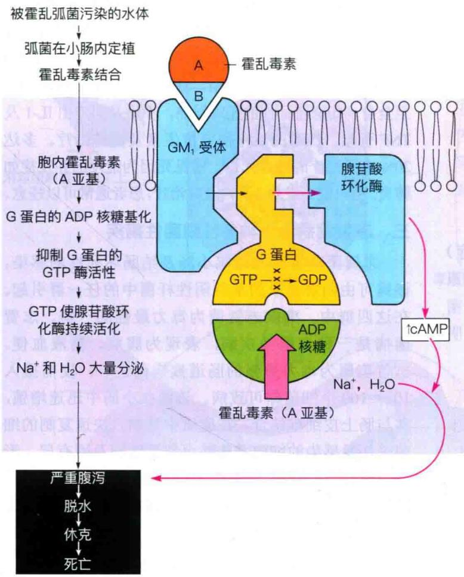 
图9-10霍乱。感染来自被霍乱弧菌污染的水或使用被污染的水制作的食物。霍乱弧菌通过胃进入小肠并繁殖。该菌并不侵犯肠黏膜，而是产生一种强力的毒素，引起大量水及电解质的流失。严重腹泻（“米汤样便”）导致脱水及低血容量休克
该菌在厌氧条件中倾向于以繁殖体的形式存在，而富氧条件则促使芽胞形成。芽胞可在动物粪便中传递，污染土壤及植物，并可在不利的外界条件下存活。在厌氧条件下，芽胞可恢复成繁殖体，完成其生命周期。在芽胞形成过程中，繁殖体细胞降解，不同菌种中的质粒产生多种特定的毒素，导致不同疾病（图9-11）。
# 一、梭菌性食物中毒是常见而且自限性的
产气荚膜梭菌是世界上最常见的引起食物中毒的病原体之一。特征为急性的，通常为自限性的不超过24小时的腹泻。该菌在周围环境中普遍存在，可污染土壤、水、空气样品、衣物、灰尘及肉类。其芽胞能耐受烹煮温度，并发育成繁殖体，后者在肉、肉汤、酱汁等食物较长时间常温存放时可大量繁殖。繁殖体的梭菌形成芽胞时，产生一系列的外毒素，后者对肠上皮细胞有细胞毒性，导致细胞内离子丢失，细胞内液进入肠腔。
# 二、气性坏疽可并发于贯通伤
气性坏疽（gas gangrene，clostridialmyonecrosis）是一种坏死性的、产气性的感染，首先出现于污染伤口，随后迅速扩散至邻近组织。该病可在发病数小时内致死。产气荚膜梭菌为气性坏疽最常见的致病菌，但其他梭菌有时也可引起该病。

【病因病机及病理】产气荚膜梭菌进入组织后，
在厌氧环境下引起气性坏疽。该菌的生长需要广泛失活的组织，如在贯通伤、战伤及感染性流产中。该菌产生肌肉毒素，为一种可以破坏
肌肉细胞、白细胞及红细胞细胞膜的磷脂酶，引起原本健康的肌肉组织坏死。受累组织迅速呈现斑驳状并坏死。因皮下软组织水肿产气，覆于其上的皮肤紧绷。镜下可见广泛组织坏死，细胞溶解。有一个特点是肌肉毒素破坏中性粒细胞，导致中性粒细胞缺如。病变部位释出浓稠的血性浆液，有恶臭，有时有气泡。可

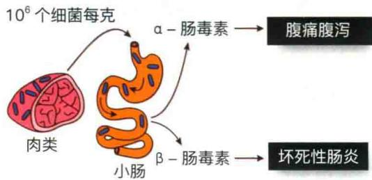
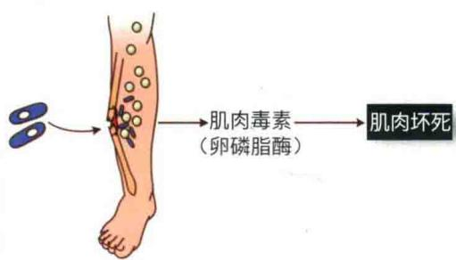
$。当食用被污染的肉类时，A型及C型产气荚膜梭菌在形成芽胞时在小肠产生a肠毒素，导致腹痛及腹泻。C型产气荚膜梭菌还可产生β肠毒素.jpg) 
图9-11 梭菌病。梭菌属的繁殖体（杆菌）在人类及动物的胃肠道中寄居。芽胞在粪便中传递，污染土壤及植物食材，被摄入人体或进入贯通伤的创口。在厌氧条件下，芽胞恢复成繁殖体。繁殖体中的质粒编码引起多种梭菌病的毒素。食物中毒及坏死性肠炎。在常温下放凉的荤菜中长有大量梭菌 $(>10^{6} / g)$ 。当食用被污染的肉类时，A型及C型产气荚膜梭菌在形成芽胞时在小肠产生a肠毒素，导致腹痛及腹泻。C型产气荚膜梭菌还可产生β肠毒素
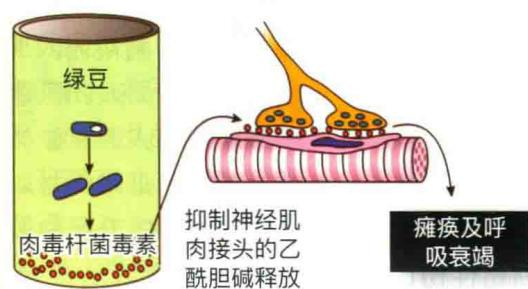
出现溶血性贫血，低血压及肾衰竭，在疾病末期，可发生昏迷、黄疸及休克。
# 三、破伤风的特点为痉挛性肌肉收缩
破伤风由破伤风梭菌污染伤口并在其中增殖，释放神经毒素导致。在发达国家，通过使用灭活的破伤风毒素进行免疫接种，已基本消灭了该病。然而，该病在发展中国家仍然是常见的致死性疾病。

【病因病机】坏死的组织及脓性分泌物给破伤风杆菌创造了富有养分的厌氧环境，
使其芽胞发育为繁殖体。当后者自溶时，释放毒素。这种强力的神经毒素（破伤风痉挛毒素）从脊神经前根逆行至脊髓前角细胞，并与前角神经元的突触前末梢上的受体结合，从而阻断了抑制性神经递质的释放，使神经刺激不受拮抗，骨骼肌持续收缩（强直）。痉挛性强直通常从面部肌肉开始，形成所谓的“牙关紧闭症”，随后蔓延至其他面部肌肉，引起痉笑（“苦笑面容”）。背部肌肉强直引起角弓反张。长时间的呼吸肌及喉部肌肉痉挛最终导致死亡。
# 四、肉毒杆菌中毒是一种由肉毒杆菌神经毒素引起的麻痹性疾病
肉毒杆菌的芽胞分布广泛，对干燥及煮沸有极强的耐受能力。在美国，这种毒素主要出现在家中自制不良且常温储存的罐头中。这种环境为细菌繁殖体的生长提供了良好的厌氧条件，使其能够产生神经毒素。肉毒杆菌中毒也可以由自制火腿、其余肉制品或者非酸性的蔬菜制品，如在常温下放置数天的胡萝卜汁。另外，该病还可以由摄入在婴儿肠道中增殖的细菌产生的毒素（成人婴儿型肉毒素中毒）或更为罕见的，由在污染伤口中生长的细菌所产毒素（伤口型肉毒中毒）引起。婴儿型肉毒素中毒常常是通过摄入被儿童污染的蜜糖或玉米糖浆而引起。

【发病机制】摄入的肉毒神经毒素在近端小肠被吸收入血。当毒素抵达神经肌接头的胆
碱能神经末梢时，可抑制乙酰胆碱释放。肉毒中毒的特点是下行性麻痹，首先累及脑神经，引起视物模糊、畏光、口干及构音障碍。随着病程进展，颈部、四肢肌肉、膈肌及辅助呼吸的肌肉也被累及。呼吸肌无力可以迅速进展，导致完全的呼吸停止及死亡。抗毒素治疗使死亡率降低至 $25\%$ 。肉毒毒经常被用于各种形式的肌张力异常的治疗，也是颇受欢迎的美容药品，用于暂时性地减轻皱纹（保妥适）。
气性坏疽。梭菌分布极广，可污染创伤性伤口或
手术创口。A型产气荚膜梭菌产生一种肌肉毒素（α毒素），为一种α卵磷脂酶，可破坏细胞膜，改变毛细血管通透性并可导致静脉注射后严重的溶血。该毒素导致健康肌肉坏死。破伤风。破伤风杆菌的芽胞存在于土壤中，在意外受伤时进入伤口。创口内的坏死组织令芽胞恢复成繁殖体（杆菌）。繁殖体的自溶释放破伤风毒素。该毒素在神经末梢中运输并沿轴突逆行至脊髓前角细胞。该毒素可以阻断突触抑制，并导致被破坏的突触内乙酰胆碱聚积，导致骨骼肌僵直及痉挛（强直）。
# 五、艰难梭菌结肠炎继发于抗生素治疗
艰难梭菌结肠炎是一种末段小肠及结肠的急性坏死性感染，占抗生素相关性腹泻的很大一部分（ $25\% \sim 50\%$ ）并可以致死。艰难梭菌结肠炎也称假膜性肠炎，但艰难梭菌感染并非假膜性肠炎的唯一病因（见第13章）。
# 第二十节 具有动物储主及昆虫媒介的细菌感染
# 一、布鲁菌病是一种来源于驯养动物的慢性发热疾病
布鲁菌病是一种由四种布鲁菌属的细菌引起的人畜共患病。人类布鲁菌病既可表现为急性全身性的疾病，也可以表现为慢性感染，后者特征为波浪热，体重减轻及乏力。布鲁菌属的细菌为细小、需氧的革兰阴性杆菌，在人类主要感染单核巨噬细胞。每个生物种的布鲁菌都有其各自的动物储主。羊布鲁菌：绵羊及山羊；牛布鲁菌：牛；猪布鲁菌：猪；犬布鲁菌：狗（人类感染罕见）。
布鲁菌病在全世界都有发生。该菌在人类身上致病的机制有数种，包括：①接触受污染的血或组织；②摄入被污染的肉类或奶类；③吸入受污染的气溶胶。布鲁菌病是农场主、牧人、兽医及屠宰场工人的职业病。宰杀被感染的动物并对驯养动物进行疫苗接种降低了布鲁菌病在许多国家的发病率，包括美国，尽管后者每年仅有100例的病例报道。然而，该病在世界上的其他许多地方仍为一种常见病。

【病因病机及病理】布鲁菌病为一种全身性感染，可以累及多个器官系统。其特征为身体多种不适，例如发热、出汗、纳差、乏力、体重减轻及抑郁。该菌通过皮肤擦伤处、结膜、口
咽或肺进入血液循环。随后沿血流散布到肝、脾、淋巴结及骨髓，并在巨噬细胞内增殖。全身巨噬细胞的增生引起淋巴结及肝脾大。被牛布鲁菌感染的患者肝、
脾、骨髓及淋巴结可见明显的非干酪样肉芽肿。细菌周期性地从巨噬细胞中释放可能为本病特征性的发热的成因，若不进行治疗，可反复出现发热及消退，持续数周之数月（称波浪热）。布鲁菌病最常见的并发症累及骨及关节，包括腰椎脊柱炎及大关节积脓。心内膜炎罕见，但一旦发生可以致死。多西环素及利福平治疗通常有效。
# 二、鼠疫耶尔森菌导致腺鼠疫，即中世纪的“黑死病”
鼠疫是一种细菌性的，经常为致死性的感染，通常伴有痛性的区域淋巴结肿大（淋巴结炎）。历史上，鼠疫曾经大规模流行，并收割了大部分感染者的生命。鼠疫耶尔森菌是一种革兰阴性的短小杆菌，两端着色较深（例：两极染色）。鼠疫耶尔森菌感染在世界的许多地方，包括美洲、非洲及亚洲都是一种地方性的人畜共患病。该菌在野生的啮齿类，如老鼠、松鼠及草原土拨鼠上都有发现。该菌通过跳蚤在动物间传输，大多数人因被感染的跳蚤叮咬而感染。部分感染者出现肺鼠疫，可通过其呼吸道分泌物的气溶胶排放大量细菌而导致人间传播。在美国，每年发生 $30\sim 40$ 例鼠疫，地点通常在西南的四角区（利桑那、科罗拉多、新墨西哥及犹他四州边界在此处交汇，称为四角区）及加利福尼亚的南部-中央地区。

【病因病机】鼠疫耶尔森菌在皮肤接种后，被中性粒细胞及巨噬细胞吞噬。被中性粒细
胞吞噬的细菌被杀死，但是被巨噬细胞吞噬的细菌可以在胞内存活并增殖。细菌被带到区域淋巴结并继续繁殖，引起广泛的出血性坏死。被感染的淋巴结肿大并可活动，亦称为“腺炎”。细菌从区域淋巴结沿血流及淋巴道播散，引起感染性休克及死亡（腺鼠疫）。在肺部，鼠疫耶尔森菌可引起坏死性肺炎，细菌被释放至肺泡及气道。这些细菌在咳嗽时排出，使该病得以通过呼吸道传播（肺鼠疫）。败血症型鼠疫由细菌直接入血引起，不出现肿大淋巴结。
若不治疗，所有类型的鼠疫都有很高的死亡率 $(50\% \sim 75\%)$ 。链霉素及庆大霉素为推荐的治疗药物。
# 三、土拉菌病是一种来自野兔的急性发热性疾病
土拉菌病的病原体是土拉弗朗西斯菌，一种细小的革兰阴性球杆菌。该人畜共患病的病原体最重要的动物储主为野兔及啮齿类。人类通常因为与受感染的动物（基本上就是野兔）接触或被受感染的昆虫（最常见的为蜱虫）叮咬而感染。该病每年约有200例新发感染，感染率的下降可能与捕猎行为的下降有关，
因后者在此前一直是感染的主要来源。这些病例主要出现在阿肯色州及密苏里州。由于该菌有可能被作为生物恐怖袭击的病原体，已经引起新的警觉。

【病因病机】图拉弗朗西斯菌在接种部位复制，首先形成一个化脓性溃疡。随后该菌扩
散至区域淋巴结。血液播散导致转移性感染，可累及单核－巨噬细胞系统，甚至肺、心及肾。图拉弗朗西斯菌可在巨噬细胞内存活，直至细胞被针对该菌的细胞免疫激活。播散的病变发生中央型坏死，并被一圈肉芽肿性反应环绕，形成与结核类似的改变。最严重的感染可并发继发性肺炎及内毒素休克，预后很差。链霉素为优先选择的治疗药物。经治疗的病例死亡率低于 $1\%$ 。
# 四、炭疽若在体内播散可迅速致死
炭疽是一种由炭疽芽胞杆菌引起的坏死性疾病。炭疽杆菌是一种菌体较大的，可以形成芽胞的革兰阳性杆菌。该病为人畜共患病，主要储主为山羊、绵阳、牛、马、猪及狗。芽胞在土壤及动物尸体中形成，可以耐热、耐干燥及化学消毒并存活数年。芽胞可通过皮肤裂口、呼吸道及消化道进入人体引起感染，也可以通过污染动物副产品，比如动物皮革、羊毛制品、毛刷或者骨粉接触人体而致病。在北美，人类感染极为罕见（过去数年中每年仅一例），通常因接触进口动物产品致病。然而，随着2001年邮递含有炭疽芽胞的信件的生物恐怖行为导致22例炭疽病的发生，使人们对此病的警觉大大提高。在该22例炭疽病例中，11例为肺炭疽，导致5人死亡。

【病因病机】炭疽芽胞杆菌的芽胞进入人体后形成繁殖体细菌，在体内增殖并释放强力
的坏死毒素。在 $80\%$ 的皮肤炭疽病例中，感染局限，病原体最终可被宿主免疫应答清除。皮肤炭疽的病灶为溃疡性的，内有大量细菌并被黑色焦痂覆盖。在感染部位出现广泛皮肤坏死，但仅有少量的中性粒细胞浸润。肺部感染导致坏死性出血性肺炎，伴有纵隔淋巴结出血性坏死及细菌广泛播散，后者常常致命。
# 五、李斯特菌病是一种死亡率较高的全身多器官感染
李斯特菌病由单核细胞增生性李斯特菌引起。该菌为一种短小的，有活动能力的革兰阳性球杆菌，在环境中分布广泛。该菌在冰箱的温度中生长，既往的暴发由饮用或食用未经高温消毒的牛奶、乳酪及奶制品引起。
【病因病机】单核细胞增生性李斯特菌的生命周期奇特，并使其得以逃避细胞内及细胞外的抗菌防御机制。当被宿主细胞吞噬后，细菌进入吞噬溶酶体，其内的酸性环境激活李斯特菌溶血素O，一种可以破坏溶酶体膜，使得细菌可以进入胞质的外毒素。细菌增殖后利用宿主细胞骨架的收缩元件形成可以伸出的突出，后者被邻近细胞吞噬。这样，李斯特菌就在不暴露于细胞外环境的情况下在细胞间传播。

# 【病理及临床特征】孕妇李斯特菌病包括围生

期及产后感染。母亲若在早孕期感染，可导致自发流产或早产。被感染的婴儿迅速出现呼吸窘迫，肝脾大，皮肤黏膜丘疹，白细胞减少及
血小板减少。宫内感染累及多个器官及组织，包括羊水、胎盘及脐带。胎儿多个器官可见脓肿。惊吓，坏死灶及脓液中可见大量细菌。陈旧病灶可见肉芽肿样病变。神经系统后遗症常见，即使立刻使用抗生素治疗，新生儿李斯特菌病的死亡率仍然很高。
慢性酗酒，癌症患者或正在使用免疫抑制剂的患者，以及AIDS患者较普通人更容易发生李斯特菌感染。脑膜炎为该病在成人中最常见的形式。败血症型李斯特菌病是一种严重的发热性疾病，最常见于免疫缺陷患者。该病可导致休克及弥散性毛细血管内凝血，易被误诊为革兰阴性脓毒血症。全身性李斯特菌病的死亡率为 $25\%$
# 第二十一节 由分枝的丝状细菌引起的感染
# 一、放线菌病的特点为脓肿及窦道形成
放线菌病是一种缓慢进展的、化脓性的、纤维增生性感染，累及下颌、胸部及腹部。该病由数种厌氧或微需氧的放线菌引起，最常见的致病菌为以色列放线菌。这些细菌为分支的丝状的革兰阳性杆菌，通常以腐生的形式寄居于口腔、胃肠道及阴道，在正常的情况下不引起疾病。

# 【病因病机及病理】放线菌在正常情况下没有

毒力。该菌以腐生的形式寄居于人体，并不引起疾病。放线菌科的细菌仅在接种于无氧的深部组织时才能致病。创伤可导致组织坏死，并
形成绝佳的厌氧培养基供放线菌生长，同时还可使该菌接种在平时为无菌的组织中。放线菌病可在四个不同的部位发生：
■颈面部放线菌病由下颌受伤、拔牙或牙科操作引起。
胸部放线菌病由吸入被放线菌污染的牙科碎屑引起。 
腹部放线菌病继发于肠，特别是阑尾的创伤或外科手术。 
盆腔放线菌病与宫内节育器的长期放置有关。
放线菌病一开始，增殖中的细菌形成小巢，引发急性炎症反应。该小脓肿生长缓慢，并发展为多个以窦道相连的脓腔，窦道可以穿过正常的组织屏障并掘进相邻器官。最后窦道可穿破体表或黏膜，形成引流窦道。在脓腔及窦道中主要为脓液及菌落。菌落形如坚硬的黄色谷物，因形如硫黄而得名硫黄颗粒。组织学上，颗粒为圆形的嗜碱性菌落，边界呈齿状，嗜酸性（图9-12A，B）。青霉素G为首选治疗药物，有时需要辅以手术清创。毁容或死亡病例罕见。
# 二、诺卡菌病是免疫功能受损的宿主的化脓性呼吸道感染
诺卡菌属的细菌为需氧的、革兰阳性的丝状分枝菌，在土壤中分布广泛。人类通过吸入或接种经土壤传播的诺卡菌而得病。感染首先发生在肺，并常播散至脑及皮肤。诺卡菌病最常见于免疫功能受损的患者，特别是细胞免疫受损者。器官移植、长期糖皮质激素治疗、淋巴瘤、白血病或其他使人衰弱的疾病为诺卡
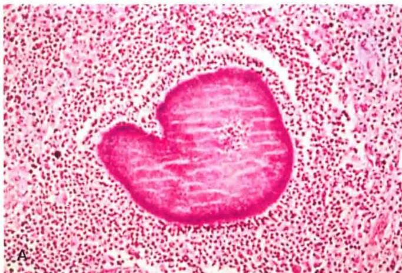
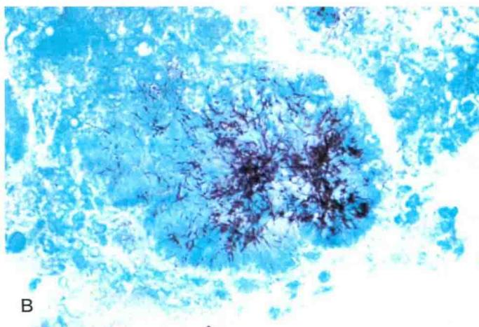 
图9-12放线菌病。A.脓腔中的典型硫黄颗粒；B.以色列放线菌的菌丝（银染）
菌感染的易感因素。

【病因病机】诺卡菌通常经呼吸道进入人体，迅速引起中性粒细胞浸润，并以缓慢进展
的化脓性肺炎起病。在免疫功能受损的患者身上，诺卡菌造成肺脓肿，脓肿常多发并相互连通。若感染直接蔓延至胸膜、气管及心脏或通过外周循环转移至脑或皮肤则预后不良。若不治疗，诺卡菌病通常致命。持续数月的磺胺类或相关抗生素治疗通常有效。
# 第二十二节 螺旋体感染
螺旋体为细长柔软的螺旋状细菌，特殊的包膜使其可以屈曲或螺旋前进。尽管螺旋体的细胞壁具有革兰阴性细菌的基本结构，该菌不能被革兰染色法良好染色。
螺旋体中的三个属，密螺旋体属、疏螺旋体属及钩端螺旋体属可以导致人类疾病（表9-4）。螺旋体擅长逃脱宿主炎症及免疫防御，所有由螺旋体引起的疾病都是慢性或反复发作的。
# 一、梅毒
梅毒是一种慢性全身性感染，几乎仅通过性接触或母婴（先天梅毒）传输。病原体为苍白密螺旋体，一种细长的螺旋体（图9-13）。

【病因病机及病理】梅毒的人间传输需要黏膜
或生殖器、直肠、口腔、手指或乳头的擦伤的
皮肤直接接触大量螺旋体（例如开放性病变）。
螺旋体在接种的部位繁殖，传递至区域淋巴结，
进入全身循环并在全身播散。尽管苍白密螺旋体可引起炎症反应并被吞噬细胞吞噬，但仍可存活并繁殖。慢性感染及炎症导致组织破坏，有时可持续数十年。梅毒的病程通常可被分为三期（图9-14）。
1. I期梅毒的特点为下疳 I期梅毒的典型病变为下疳（图9-15），是一种特征性的溃疡，出现在苍白密螺旋体侵入的部位。在接触病原体1周至3个月后出现，通常质硬。螺旋体常聚集于血管壁或溃疡周围的表皮。血管表现为特征性的“梅毒性血管炎”，即内皮细胞增生肿胀，血管壁因淋巴细胞浸润及纤维组织增生而增厚。下疳迅速溃烂形成特征性的无痛性溃疡，愈后不留瘢痕。在某些部位例如宫颈、肛管及口腔的病灶可能在被发现之前便已愈合。下疳出现 $3\sim 12$ 周，常伴腹股沟淋巴结肿大。
2.Ⅱ期梅毒的特点为病原体的全身播散 在Ⅱ期梅毒患者身上，苍白密螺旋体播散至全身并繁殖，并在皮肤、黏膜、淋巴结、脑膜、胃及肝引起病变。病灶
中可见血管周围淋巴细胞浸润及闭塞性动脉内膜炎。Ⅱ期梅毒最常见的表现为红斑状或斑丘疹样皮疹，累及躯干四肢，通常包括手掌及足底。皮疹在下疳愈合2周至3个月后出现。口腔及生殖器黏膜表面的皮损名为黏膜斑，内含大量病原体并有高度感染性。淋巴结，特别是滑车上淋巴结的特征性改变包括包膜增厚，淋巴滤泡增生，浆细胞及巨噬细胞增多及梅毒性血管炎。Ⅱ期梅毒的淋巴结中含有大量螺旋体。
3.Ⅲ期梅毒导致神经及血管疾病 Ⅱ期梅毒之后可以有一段长达数年的无症状期。然而，在这段时期螺旋体仍持续复制，1/3未治疗的患者可发展为Ⅲ期梅毒。出现在任何器官或组织上的树胶肿为Ⅲ期梅毒的标志。尽管树胶肿可出现在身体任何部位，但最常见于皮肤、骨及关节。树胶肿为一种肉芽肿性病变，中央区域为凝固性坏死及上皮样巨噬细胞，偶尔可见巨细胞及纤维组织环绕。树胶肿通常为局限性的病变，并不参与疾病进程。Ⅲ期梅毒造成破坏的机制更多为闭塞性动脉内膜炎引起的缺血性坏死。苍白密螺旋体引起单核细胞炎性浸润，主要成分为淋巴细胞及浆细胞。这些细胞浸润小动脉及微动脉，引起特征性的闭塞性血管病变（闭塞性动脉内膜炎）。小动脉发炎，其内皮细胞肿胀，并被向心性的增生的成纤维细胞层层包绕，形成“洋葱皮”样改变。
梅毒性主动脉炎由滋养血管破坏引起，最终导致动脉中膜坏死，动脉壁逐渐变薄并越来越脆弱，最后破裂，导致猝死。梅毒性动脉瘤为囊形，累及升主动脉。大体上，动脉内膜粗糙，凹凸不平（树皮样外观）。升主动脉的破坏及瘢痕形成也经常导致主动脉环扩张，引起瓣膜尖分离及血液通过主动脉瓣反流（主动脉瓣关闭不全）（见第10章）。神经梅毒为缓慢进展型感染的结果，累及脑膜、大脑皮质、脊髓、脑神经或眼。
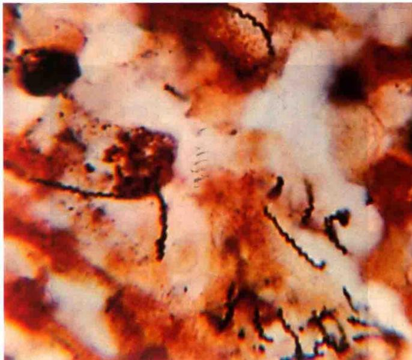 
图9-13 梅毒。苍白密螺旋体，先天性梅毒患儿眼部，银浸染
中枢神经系统的Ⅲ期梅毒可根据受累组织的不同进一步细分成脑膜血管型梅毒（脑膜）、脊髓痨（脊髓）及麻痹性痴呆（大脑皮质）（见第28章）。
4.先天性梅毒影响胎儿 在先天性梅毒中，螺旋
体在胎儿组织中播散。繁殖中的病原体本身及其引发的炎症反应引起胎儿组织损伤。胎儿感染导致死产，新生儿疾病或死亡或出生后的疾病。组织学上，先天性梅毒的病变与成人梅毒一致。
表9-4 螺旋体感染病名病原体临床表现地理分布传输方式密螺旋体梅毒苍白密螺旋体见正文世界范围内常见性接触、先天性非性病梅毒地方性密螺旋体(苍白密螺旋体的地方亚种)黏膜、皮肤及骨损害中东口-口接触雅司病极细密螺旋体(苍白密螺旋体的极细亚种)皮肤及骨热带皮肤接触品他病品他密螺旋体皮损拉丁美洲皮肤接触疏螺旋体莱姆病伯氏疏螺旋体见正文北美、欧洲、俄罗斯、亚洲、非洲、澳洲蜱虫叮咬回归热回归热疏螺旋体及有关生物种反复流感样症状世界范围蜱虫叮咬,虱叮咬钩端螺旋体钩体病问号钩端螺旋体流感样症状,脑膜炎世界范围动物尿液接触
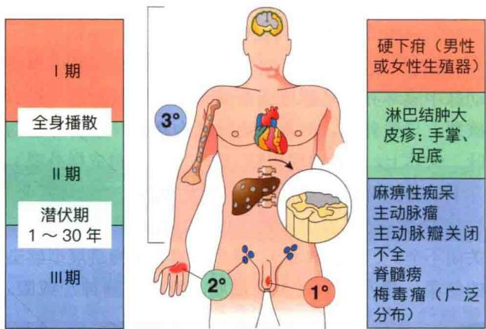 
图9-14 不同分期的梅毒的临床症状
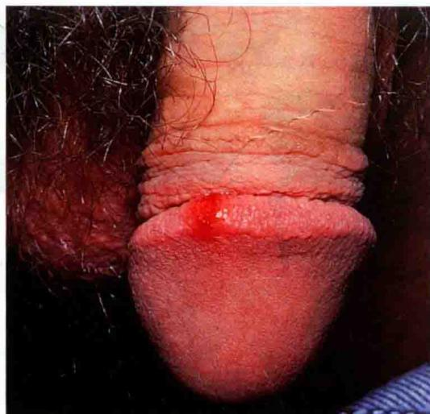 
图9-15 梅毒下疳。I期梅毒患者阴茎见一个隆起的红斑
# 二、莱姆病
莱姆病为一种慢性全身性感染，以特征性的皮损起病，随后出现心脏、神经或关节功能异常。该病的病原体为伯氏疏螺旋体，一种较大的，微需氧的螺旋体，自动物储主经由细小的硬蜱向人传输。硬蜱平时寄生于老鼠或鹿身上。莱姆病已经成为美国最常见的蜱传疾病，经估计每年约有35000例，主要集中于从马里兰州到马萨诸塞州之间的东海岸地区，以及中西部的明尼苏达和威斯康星州。该病亦见于欧洲、澳洲及亚洲。

【病因病机，病理及临床特征】伯氏疏螺旋体在接种部位局部繁殖，传播至区域淋巴结并在血流中播散至全身。与其他螺旋体病类似，莱姆病是一种慢性疾病，病程可分为数期，出现缓解及加重。伯氏疏螺旋体引起慢性炎性浸润，主要由淋巴细胞及浆细胞组成。该病可分为3期：

1期：特征性的皮损-慢性游走性红斑-出现在蜱咬部位。该皮损为一种红斑状的斑疹或丘疹，在蜱咬部位出现，继而扩大为红色斑块，外周鲜红而中央苍白，呈圆环状。此环状皮损见于 $50\%$ 患者，可长时间持续存在。在本期的患者主要表现为长时间不适、乏力、头痛及发热。并间歇性地出现脑膜刺激征、游走性肌痛、咳嗽、全身淋巴结肿大及睾丸肿大。
■2期：该期在皮损出现数周至数月后开始，特征为游走性肌肉骨骼痛加重，伴心脏及神经系统异常。
$10\%$ 的病例可出现传导异常，尤其是心肌炎引起的房室传导阻滞。神经系统异常最常表现为脑膜炎及面部神经麻痹，见于 $15\%$ 的患者。
■3期：莱姆病的3期在初次感染数周到数年后方才开始，表现为关节、皮肤及神经系统异常，后者包括针刺感、缓慢进展性脑脊髓炎、横贯性脊髓炎、器质性脑综合征以及痴呆。关节异常见于超过 $50\%$ 的感染者，可出现大关节如膝关节的严重关节炎。被累及的关节的组织学改变与类风湿关节炎基本上无法区分，包括滑膜绒毛状增生及滑膜下单核细胞浸润。使用四环素或红霉素治疗对早期莱姆病有效，晚期则必须使用长期大剂量静脉注射青霉素G及其他联合抗生素方案进行治疗。
# 第二十三节 衣原体感染
衣原体为严格胞内寄生的微生物，体型小于绝大多数的细菌。因其缺乏产生ATP的能力，所以只能依靠宿主细胞的代谢机构繁殖。衣原体在其生命周期里可呈现两种不同的形态：网状体及原体。前者代谢活跃，占用宿主细胞的代谢机构以进行繁殖。网状体可快速分裂，形成子代原体并破坏宿主细胞。原体为更小的、代谢不活跃的形态，可在胞外存活。原体附着于适宜的宿主细胞并诱导入胞，形成小泡，随后转化为更大的，代谢活跃的网状体。坏死碎片引起炎症及免疫应答，进一步破坏被感染的组织。衣原体感染广泛分布于鸟类及哺乳动物，多达 $20\%$ 的人被感染。导致人类感染的衣原体有三种：沙眼衣原体、鹦鹉热衣原体及肺炎衣原体。
# 一、沙眼衣原体感染
沙眼衣原体有多个菌株，引起三种不同的疾病：①生殖器及新生儿疾病；②性病淋巴肉芽肿；③沙眼。
1. 生殖器疾病 沙眼衣原体引起的生殖器上皮感染为现今北美最常见的性病。衣原体感染引起中性粒细胞及淋巴细胞浸润。感染部位可见淋巴样聚集，有时见生发中心。在男性身上，衣原体感染导致尿道炎，有时可引起附睾炎或直肠炎。在女性，衣原体感染通常以宫颈炎起病，后者可进展为子宫内膜炎、输卵管炎及盆腔附件的广泛感染（盆腔炎性疾病）。
2.新生儿疾病 当新生儿通过受感染的产道时，可发生围生期的沙眼衣原体传输，在约2/3遭受暴露的新生儿中引起结膜炎。受感染的结膜上皮内常常可见特征性的胞质空泡样包涵体，称包涵体性结膜炎。衣原体肺炎在出生后第2或第3个月出现，表现为呼吸急促及阵发性咳嗽，发热少见。
3.性病淋巴肉芽肿 是一种通过性行为传输的
感染，起病时为一处生殖器溃疡，扩散至淋巴结并可导致局部瘢痕形成。在发达国家该病并不常见，但在热带及亚热带地区是当地的地方病。病原体通过皮肤破口进入人体。经过 $4\sim 21$ 天的潜伏期，溃疡出现，好发部位为阴茎、阴道或宫颈。该病原体通过淋巴系统运输至区域淋巴结，引起坏死性淋巴结炎及脓肿形成。脓肿呈肉芽肿样，中央可见中性粒细胞及坏死碎片，周围有栅栏状的上皮样细胞、巨噬细胞，有时可见巨细胞围绕。最外围是淋巴细胞、浆细胞及纤维组织。淋巴结原本结构消失，发生纤维化。强烈的炎性进程导致严重瘢痕，后者有时可引起慢性淋巴管阻塞、瘢痕上覆结构缺血性坏死或狭窄及粘连。
4. 沙眼 该慢性眼部感染引起结膜及角膜进行性瘢痕形成。沙眼在全世界都有发生，常见于贫困地区，在非洲、亚洲及中东干旱沙尘暴频发的地区发病率最高。在该病盛行的地区，感染通常发生在幼童时期，转化为慢性感染并最终导致失明。该病原体在结膜上皮繁殖，引起混合的急性及慢性炎性浸润。当沙眼进展，淋巴样聚合增大，结膜瘢痕形成，局灶肥大。角膜被血管及成纤维细胞侵犯，形成布状的瘢痕残余（即拉丁文中的“血管翳”）并最终变得不透明（见第29章）。进展性的瘢痕使眼睑变形，容易擦伤角膜及引起继发细菌感染。最终，慢性炎症、感染、瘢痕形成及角膜擦伤导致失明。
# 二、鹦鹉热（鸟疫）
鹦鹉热是一种自限性的肺炎，由鸟向人传输。致病病原体为鹦鹉热衣原体，通过受感染鸟类的排泄物、尘土及羽毛传播给人。有效治疗及对进口热带鸟类进行检疫限制了该病的传播，每年在美国报道的鹦鹉热病例不足50例。
【病理】鹦鹉热衣原体首先感染肺部的巨噬细胞，被其带至肝脾中的吞噬细胞，并在这些细胞内繁殖。随后病原体随血流播散，引起全身感染，肺部广泛受累。肺炎主要是间质性的，可见淋巴细胞炎性浸润及Ⅱ型肺泡上皮增生，其内可见特征性的衣原体胞质内包涵体。感染播散可出现特征性的肝脾小灶坏死以及心脏、肾及脑单核细胞弥漫浸润。通过多西环素治疗后本病甚少致死。
# 第二十四节 立克次体感染
立克次体为细小的、革兰阴性的球杆菌（注：国内教科书一般不把立克次体定义为细菌，本书将其定义为球杆菌，此处忠于原文）严格胞内寄生，在宿主体外无法繁殖。该病原体通过靶细胞介导入胞并在宿
主细胞内繁殖。立克次体具有如革兰阴性细菌一样的细胞壁结构，但革兰染色法难以着色。人类为大部分立克次体的偶见宿主。该病原体寄生于动物及昆虫，其延续不依赖人类。多种立克次体引起不同的人类疾病，通常有地域性（表9-5），但人类立克次体感染有
其共同特点。所有立克次体的人类靶细胞为毛细血管及其他小血管的内皮细胞，病原体在这些细胞内繁殖并将其杀死，形成坏死性血管炎。人类立克次体感染传统上分为“斑点热群”及“斑疹伤寒群”。
表9-5 立克次体感染病名病原体地理分布传输方式斑点热组(立克次体属)落基山斑点热立氏立克次体美洲蜱昆士兰热澳大利亚立克次体澳洲蜱南欧热、肯尼亚蜱传斑点热康氏立克次体地中海、非洲、印度蜱北亚蜱传斑点热西伯利亚立克次体西伯利亚、蒙古蜱立克次体痘小蛛立克次体美国、俄罗斯、中亚、韩国、非洲螨斑疹伤寒属虱传斑疹伤寒(流行性斑疹伤寒)普氏立克次体拉丁美洲、非洲、亚洲人虱鼠型斑疹伤寒(地方性斑疹伤寒)斑疹伤寒立克次体世界各地鼠虱恙虫病恙虫病立克次体南太平洋、亚洲螨Q热贝纳科克斯体世界各地吸入
# 一、落基山斑点热
落基山斑点热是一种急性的，潜在致命性的全身性血管炎，通常表现为头痛、发热及皮疹。致病病原体为立氏立克次体，通过蜱咬在传输给人。病原体在蜱的亲子代间传递而不将其杀死，因而蜱成为人类感染的自然储主。在美国每年约有2500例感染，主要发生在自东海岸（乔治亚州之纽约州）至德克萨斯州、俄克拉荷马州际堪萨斯州一带。本病在落基山脉一带并不多见，但因其在爱达荷州被发现而得名。

【病因病机及病理】立氏立克次体存在于蜱的唾液腺中，在其吸食的过程中进入皮肤。该微生物通过淋巴系统及小血管播散至体循环及肺循环，附着于内皮细胞并被其吞噬，随后在胞
内繁殖并释放至血管及淋巴管道。血管内皮细胞破坏导致全身性血管炎。血管壁初期见中性粒细胞浸润，随后出现淋巴细胞及浆细胞浸润。微小梗死及血液溢出至周围组织常见。血管损害最显而易见的全身表现为皮疹，但可最终发展为弥散性血管内凝血及休克。肺部毛细血管破坏可造成肺水肿及急性肺泡损伤。
落基山斑点热表现为发热、头痛及肌痛，随后出现皮疹。皮损开始时为斑丘疹，但迅速出现瘀斑，自四肢至躯干向心性分布（图9-16）。若不治疗，多达 $50\%$ 感染者可在 $8\sim 15$ 日死亡。及时诊断并使用多西环素抗生素治疗可以挽救生命，目前在美国该病死亡率低于 $5\%$
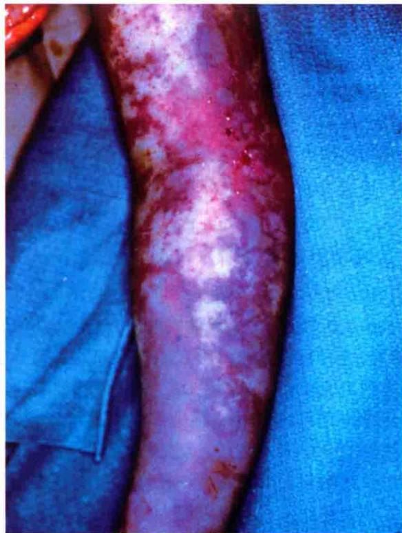 
图9-16 落基山斑点热。该死亡患者手臂见严重瘀斑及紫癜
# 二、流行性（虱传）斑疹伤寒
流行性斑疹伤寒为一种急性的全身性血管炎，通过被感染的人虱叮咬传输。该病的病原体为普氏立克次体，其生活史经历人－虱－人的过程（图9-17）。叮咬被感染的人后，人虱自身被感染。人虱再次叮咬别的个体，造成人间传播。在过去，斑疹伤寒的大规模
流行与社会压力，例如战争或饥荒有关。这些惨剧导致人虱在人群中横行。当前，该病仅见于亚洲山区及南美洲安第斯山脉地区，在美国罕见。

【病因病机及病理】人虱被立克次体污染的排泄物通过皮肤擦伤或抓伤进入人体，或当人吸入空气中的立克次体时造成人类感染。该病以毛细血管内皮细胞局部感染起病，进展为全身
性血管炎，过程与落基山斑点热有众多相似之处。虱传斑疹伤寒与其他立克次体病的不同之处在于普氏立克次体可造成隐性感染并在原发感染多年后复发（Brill-Zinsser病，复发型斑疹伤寒）。可见局灶性坏死，肥大细胞、淋巴细胞、浆细胞及巨噬细胞常围绕在微动脉及毛细血管周围形成伤寒小结。
# 第二十五节 支原体感染：支原体肺炎
支原体的最长径小于 $0.3\mu \mathrm{m}$ ，为可自由生活的最小原核生物。支原体缺少更复杂的细菌上的细胞壁结构。支原体肺炎为一种急性自限性的下呼吸道感染，主要发病人群为儿童及年轻人。此种微生物通过气溶胶传输，主要见于经常密切接触的小人群中。肺炎支原体引起的肺炎常有肺下叶单个肺段的斑片状实变。受累气道黏膜水肿，可见单核细胞为主的炎性浸润。肺泡以间质改变为主，见反应性肺泡内衬细胞（I型及Ⅱ型肺泡上皮细胞）及单核细胞浸润。肺部改变常并发细菌性二重感染。支原体肺炎症状常较其他细菌性肺炎轻微，有时被称为“轻度肺炎”。
# 第二十六节 分枝杆菌感染
分枝杆菌是一类相当特别的微生物，长 $2\sim 10\mu \mathrm{m}$ 细胞壁结构与革兰阳性细菌类似，但同时含有大量脂质。分枝杆菌结构上而言为革兰阳性的，但实际上常规染色难以着色。细胞壁上的蜡脂使分枝杆菌具有“抗酸性”（即石炭酸品红着色可抵抗酸性酒精脱色）。
分枝杆菌生长速度较其他致病菌慢，引起慢性的、缓慢进展的疾病。多数致病性的分枝杆菌在单核/巨噬细胞谱系的细胞内繁殖，引起肉芽肿性炎症。分枝杆菌感染的结局很大程度上取决于宿主通过迟发型超敏反应及细胞介导的免疫应答遏制病原体的能力。
两种主要的致病性分枝杆菌为结合分枝杆菌及麻风分枝杆菌，这两种分枝杆菌仅对人致病，并无环境储主。
# 结核
结核是一种慢性传染性疾病，肺是主要受累器官，但任何器官都可能被感染。该病主要由人结核分枝杆
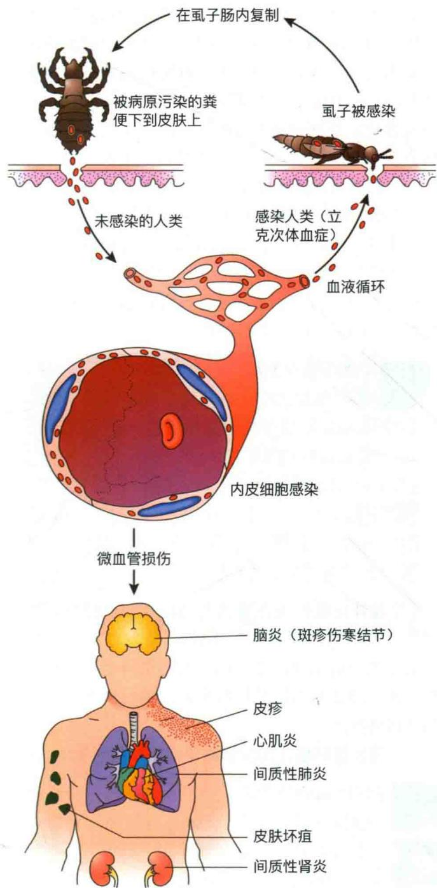 
图9-17 流行性斑疹伤寒（虱传斑疹伤寒）。普氏立克次体的生命周期为人－虱－人。该微生物在上皮细胞内繁殖，导致其脱落、破裂并释放病原体至血液循环（立克次体血症）。人虱吸食该感染者血液后也被感染，立克次体进入其中肠的上皮细胞并繁殖，导致细胞破裂，将立克次体释放至人虱肠腔。人虱将粪便排泄至下一个宿主的皮肤或衣物上，立克次体便可通过皮肤伤口或呼吸道进入人体。随后立克次体进入该宿主的肠上皮，繁殖并致其破裂，完成一个循环
菌（郭霍杆菌）引起，但偶尔也可由牛分枝杆菌引起。特征性的病变为球形的肉芽肿，中央干酪样坏死。结核分枝杆菌为一种专性需氧、细长的、串珠样的、无活动能力的抗酸杆菌。
结核是最重要的人类细菌性疾病之一，全世界1/3的人口被感染。世界卫生组织估计每年每100000人中约有128例结核新发病例及15例死亡病例。与此相对，美国每年发病率为3.6例/100000人，死亡率为0.2例/100000人，且 $60\%$ 的病例发生在非本土出生人士。
这个数据显示了在过去的50年中，美国结核病发病率降低了10倍。HIV感染者、无家可归者及贫困地区的营养不良者，例如来自结核流行地区的移民为高度易感人群。在美国，结核最常见于老年人，在大于65岁的人群中，患病率为每5.5例/100000人，占所有结核患者的 $20\%$ 。这个情况主要是由于在疾病盛行的年代发生的感染再活化导致。
结核分枝杆菌通过飞沫气溶胶在人间传输。咳嗽、鼻涕及交谈都可产生飞沫气溶胶。在通常的情况下，飞沫被汽化，剩下的微生物（飞沫核）被带到空气中。结核病也可由密切相关的牛分枝杆菌引起，通过饮用病牛未经高温消毒的牛奶致病。

【病因病机】结核的病程取决于感染者的年龄及免疫力，还有总细菌载量（图9-18）。
部分患者仅出现惰性的无症状感染，另一部分患者则可发生破坏性的播散性疾病。大部分结核分枝杆菌感染者不出现临床症状。因此需要明晰感染及活动性结核的概念。结核感染指细菌在人体内生长，可以出现临床症状也可以是无症状的。活动性结核则指一组破坏性的且有症状的结核感染。
原发性结核出现在首次与结核杆菌接触时，可引起惰性或激进的病程（图9-18）。继发性结核在原发感染很久以后出现，通常由原发感染再活化引起，但也可因暴露于外源性结核杆菌而致病。所有继发结核都是活动性的。
# 1. 原发性结核在初次暴露于结核杆菌时发生

【病因病机及病理】被吸入的结核分枝杆菌在肺泡内沉着，随后被肺泡巨噬细胞吞噬，但可抵抗巨噬细胞的杀伤作用。结核分枝杆菌的脂质细胞壁可明显阻断吞噬小体及溶酶体的融
合，因此结核杆菌得以在巨噬细胞内繁殖。部分巨噬细胞将结核杆菌从肺带至区域淋巴结（肺门淋巴结及纵隔淋巴结），并从这些地方通过血流播散。尽管吞噬了结核杆菌的巨噬细胞无法将其杀伤，但可引起超敏反应及细胞介导的免疫应答，可最终遏制感染。被感染的巨噬细胞将分枝杆菌抗原提呈至T细胞。致敏的T细胞克隆增生，产生γ-干扰素并活化巨噬细胞，提高其内裂解酶的浓度，增强了其对分枝杆菌的杀伤能力。针对分枝杆菌抗原的淋巴细胞的产生引发了针对结核杆菌的IV型超敏反应，活化的巨噬细胞大量出现，吞噬并破坏结核杆菌。该过程需要3～6周方能起效。
如果被感染的个体免疫功能完整，可产生强有力的肉芽肿性反应。镜下，典型的结核病变为干酪样肉芽肿（图9-19），可见质软的，半固态的芝士样（干酪）
核心，周围见上皮样巨噬细胞、朗汉斯巨细胞、淋巴细胞及外周纤维组织包绕。尽管干酪样坏死并非总是由结核分枝杆菌引起，但该病变与结核联系性很强，因此若在组织中发现该病变应怀疑结核。原发性结核的肺部病变被称为Ghon病灶，出现在下叶上段或上叶下段的胸膜下区。开始时，该病灶为一小型的，边界不清的炎性实变灶，随后引流至肺门淋巴结。Ghon病灶加上受累的纵隔或肺门淋巴结称为Ghon综合征。
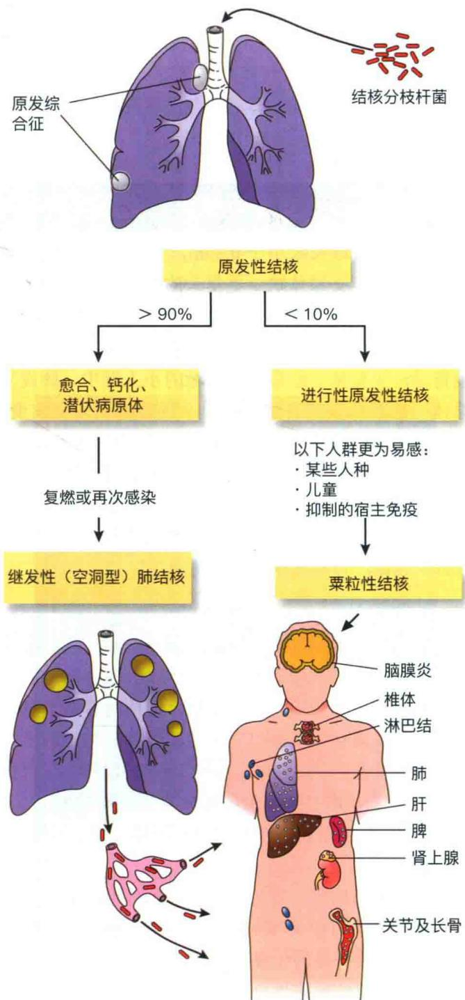 
图9-18结核分期。原发性结核（在此前未曾感染或对此产生免疫反应的个体）。进行性原发性结核出现在不足 $10\%$ 的被感染的正常成人中，但在儿童或免疫功能受抑患者中发生率较高。继发性结核（空洞型结核）由蛰伏的内生性结核杆菌再活化或外源性结核杆菌再感染引起。粟粒性结核指结核杆菌播散至远处器官，形成多个细小的黄白色病灶（形似粟种）
在超过 $90\%$ 的正常成人中，原发性结核感染是自限性的。在肺及淋巴结，Ghon综合征愈合，发生皱缩、纤维瘢痕形成及钙化-后者可以在X射线下显示。小部分分枝杆菌可以保有活力多年。若之后感染者免疫机制减弱或衰竭，休眠的杆菌可以增殖并暴发，引起严重的继发结核。
在免疫功能尚未成熟的个体（幼童）或免疫功能受抑的患者中，肉芽肿难以形成或根本不形成，感染在肺的原发部位、区域淋巴结或播散的多个部位进展。这一过程导致进展型原发结核，患者免疫应答无法控制结核杆菌，Ghon病灶增大，有时甚至可侵蚀支气管树。在某些病例中，淋巴结感染灶侵蚀至气道，将分枝杆菌播散至全肺。
粟粒性结核为感染播散造成，在数个器官形成多个细小的黄色结节状病灶（图9-20）。“粟粒”一词指病灶与粟种形似。双肺、淋巴结、肾、肾上腺、骨髓、脾及肝为粟粒性结核的好发部位。进行性的疾病可累及脑膜，导致结核性脑膜炎。
2. 继发性（空洞型）结核 由被遏制的感染“松绑”引起。引起继发性结核的既可以是陈旧肉芽肿中蛰伏的分枝杆菌（多数情况），也可以是新感染的分枝杆菌。多种情况，包括癌症、抗肿瘤化疗、免疫抑制治疗、AIDS及年老，都是体内蛰伏的结核分枝杆菌再活化的易感因素。继发结核甚至可在原发感染数十年后出现。

【病因病机及病理】任何部位都可能被累及，但肺是继发性结核最为常见的部位。在肺部，结核首先发生在上叶尖后段，该处为原发感染的常见播种部位。结核杆菌在此处增殖，引发
炎症反应，导致局部实变。随后，已对分枝杆菌抗原产生免疫记忆的T细胞介导的免疫应答引起组织坏死，并形成结核空洞（图9-21）。空洞内为坏死物，内含大量细菌，洞壁见肉芽肿性反应。
继发性结核的肺部病变可并发多种继发效应：①瘢痕形成及钙化；②扩散至别处；③胸膜纤维化及粘连；④干酪样病灶破裂，结核杆菌溢出至胸膜腔；⑤侵蚀支气管，播种至细支气管、支气管及气管；⑥结核杆菌咽部定植，导致声嘶及吞咽痛。结核杆菌可通过淋巴管道及血流在全身播散，形成粟粒性结核。结核将在第12章详述。
# 第二十七节 麻风病
麻风病（Hansen病）是一种慢性的、进展缓慢的破坏性过程，累及周围神经、皮肤黏膜。病原体为麻风分枝杆菌，是一种细长的弱抗酸杆菌。麻风病通常
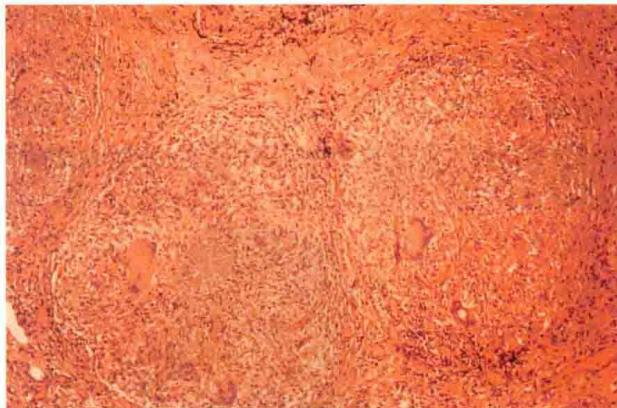 
图9-19 原发性结核。镜下，肺门淋巴结见结核性肉芽肿，中央为干酪样坏死
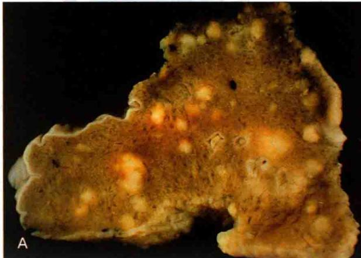
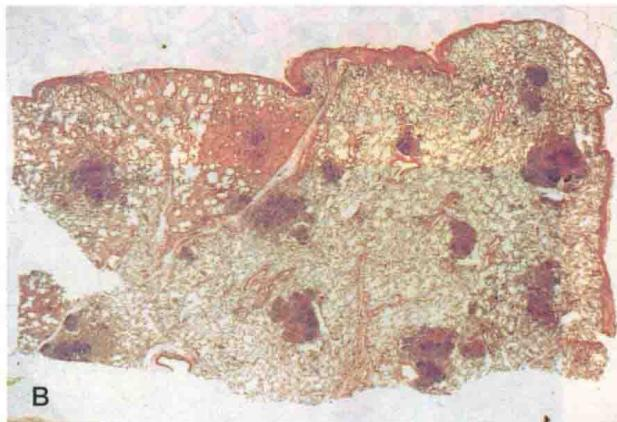 
图9-20粟粒性结核。A.肺切面见多个大小均一的白色结节；B.低倍镜下见多个肉芽肿性炎症病灶
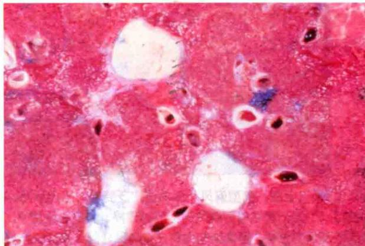 
图9-21 继发性肺结核。肺横切面见结核空洞，空洞内充满坏死的干酪样物质
需要多年的密切接触方能传给他人。感染模式尚不明确，但可能为通过呼吸道或开放伤口接种感染。在发达国家麻风病现已少见，但在全世界每年报道的新发感染有50万例，主要集中在热带地区，包括热带非洲、
巴西及东南亚（图9-22）。致力于发现即治疗麻风病的国际援助计划成功降低了发病率。在美国，每年约诊断100例麻风病，患者主要为来自于该病盛行地区的移民。
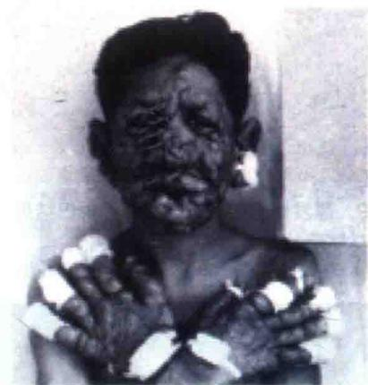 
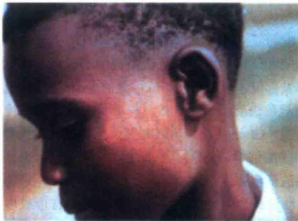 
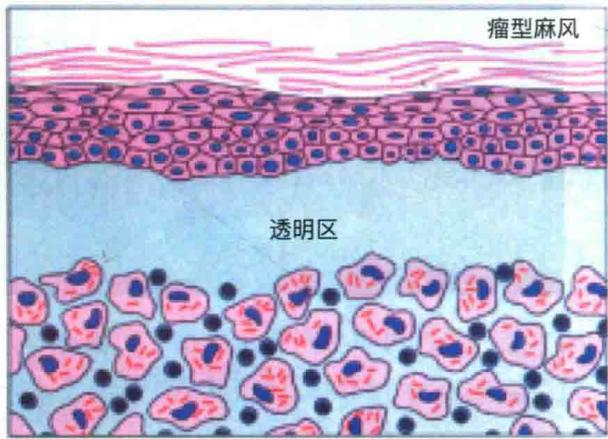
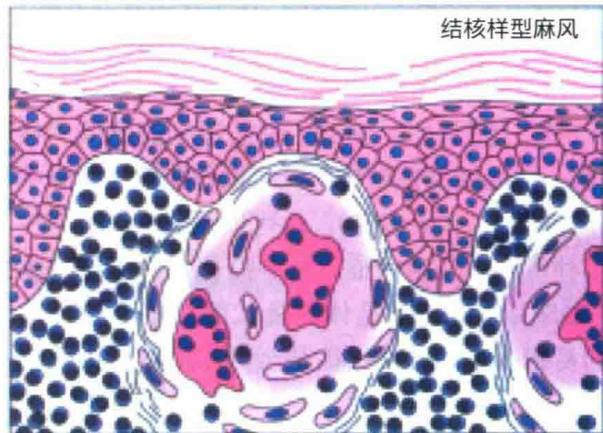
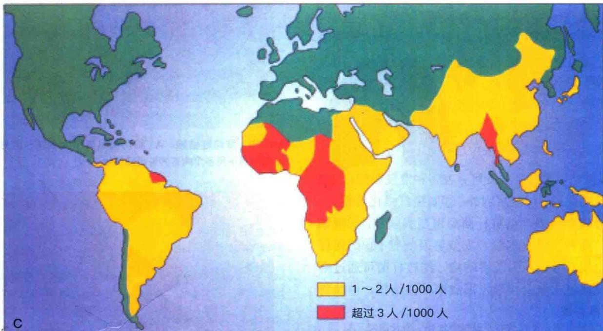 
图9-22A.（上图）瘤型麻风。多部位广泛受累，出现狮面、眼睑及睫毛缺失以及结节性变形，特别见于面部、耳、前臂及双手等温度较低的部位（下图）晚期瘤型麻风的结节样皮损。表皮肿胀变平（表皮突消失）。未受累及的真皮层形成特征性的“透明区”，将表皮与肿瘤样聚集的巨噬细胞分隔。巨噬细胞内含大量麻风杆菌（麻风分枝杆菌）。B.（上图）面颊结核样型麻风，皮损为浅色斑块，边缘隆起。中央区可感觉过敏或感觉缺失（下图）结核样型麻风的斑块状皮损。位于隆起的“浸润性”斑块边缘的皮肤内为分立的肉芽肿，可扩展至表皮基底层（无透明区）。肉芽肿内主要为上皮样细胞、朗汉斯巨细胞，伴淋巴细胞及浆细胞。麻风杆菌罕见；C.麻风的地理分布。患病率最高的为非洲、亚洲及拉丁美洲的热带地区

【病因病机及病理】麻风分枝杆菌的最佳繁殖温度低于人体核心温度，因此病变常出现在身体温度较低的部位（如双手及面部）。麻风病的临床表现及病理特征多种多样。麻风病的表
现从结核样型麻风的微小的、不明显的自愈性斑疹到瘤型麻风的弥散性、毁容性甚至致死性病变都有可能。差异极大的临床表现可能反映了个体不同的免疫应答。绝大部分（95%）个体对麻风分枝杆菌有天然的免疫力，就算长期密切接触患者亦可不被感染。易感个体的免疫异常可从免疫无反应至免疫超反应，并且可发生全身感染。免疫无反应的个体抵抗力较弱或几乎没有，发展为瘤型麻风。而免疫超反应的个体抵抗力强，表现为结核型麻风。多数患者处于这两种极端情况之间，发展为界线类麻风。
■结核样型麻风特点为单个或数处皮损，常见于面部、四肢或躯干。镜下，病变为圆形的皮肤非干酪样肉芽肿，伴上皮样巨噬细胞、朗汉斯巨细胞及淋巴细胞。皮损为界线清楚的浅色或红色、干燥无毛发的斑块，边缘隆起，皮肤感觉障碍。结核型麻风的病变仅轻微影响外貌，无感染性。
瘤型麻风患者皮肤、双眼、睾丸、神经、淋巴结及脾可出现多个瘤样病变。结节状或弥散性的泡沫（巨噬）细胞容纳大量麻风杆菌，通过抗酸染色可见杆菌聚集，谓之“麻风球”。皮肤浸润缓慢扩张，使面、耳、四肢及上气道毁形，并破坏双眼、眼睑与眼睫毛、神经及睾丸。累及上气道时引起鼻溢及声音改变。
使用利福平、二氨二苯砜及其他药物多药联合治疗非常关键，因单药治疗会导致耐药。
# 鸟 - 胞内分枝杆菌复合体
鸟分枝杆菌及胞内分枝杆菌为两种相似的分枝杆菌，引起相同的疾病，因而统称为鸟-胞内分枝杆菌，或MAI。MAI导致两种疾病：①在免疫功能完备个体上导致一种罕见的缓慢进展型肉芽肿性肺病；②在AIDS患者身上引起进行性的全身疾病。MAI感染是美国的AIDS患者中排名第3的常见机会性感染。人类可能通过吸入受污染的水源形成的气溶胶患病。
■ 肉芽肿性MAI是一种不常见的肺部疾病，在老年人（ $50\sim 70$ 岁）中发生。临床上及病理上，MAI疾病与结核相似但进展非常缓慢。MAI感染导致肺结节、空洞及干酪样肉芽肿。
■进行性全身性MAI于多达 $50\%$ 的AIDS患者尸检时可见。在这些患者身上，尽管巨噬细胞吞噬了病原体，但无法将之杀死。分枝杆菌在巨噬细胞内大量繁殖并充满胞质，首先传播至别的巨噬细胞，随后随血流或淋巴系统全身播散。最终，淋巴结、脾及骨
髓可几乎完全被聚集的巨噬细胞取代，肠壁的病变侵蚀入肠腔。进行性的小肠受累导致吸收不良及腹泻，经常伴有腹痛。
# 第二十八节 真菌感染
在已知的逾100000种真菌中，仅有一小部分能引起人类疾病。其中大部分为“投机者”，即它们仅感染免疫功能受损的人。因此，糖皮质激素治疗、抗肿瘤治疗以及先天性或获得性的T细胞缺陷是真菌感染的诱因。
真菌较细菌大，且更为复杂。其大小从 $2\sim 100\mu \mathrm{m}$ 均有，并且为真核细胞，意味着它们具有核膜及细胞器，例如线粒体及内质网。
# 一、伊氏肺孢子菌肺炎
伊氏肺孢子菌（前称卡氏肺孢子菌）在细胞免疫受损的个体上引起进行性的，通常为致命性的肺炎，为AIDS患者中常见的机会性病原体。伊氏肺孢子菌在世界各地均有分布。该菌很可能是普遍存在的，证据是 $75\%$ 的人口在5岁之前体内便已存在抗肺孢子菌的抗体。在细胞免疫功能完好的个体中，感染被迅速遏制，不表现临床症状。然而， $80\%$ 的AIDS患者在被给予先进的抗真菌药物之前便出现肺孢子菌肺炎。

【病因病机】伊氏肺孢子菌紧贴I型肺泡上皮细胞繁殖，因此活动性疾病局限于双肺。
若感染过程不被宿主免疫系统或抗真菌治疗阻断，被感染的肺泡将被真菌和富含蛋白的液体充满。镜下，肺泡内见泡沫样的嗜酸性物质，主要成分为肺泡巨噬细胞及伊氏肺孢子菌的孢子囊及滋养体。可见透明膜及明显的Ⅱ型肺泡上皮细胞（图9-23）。肺泡进行性填塞阻碍气体充分交换，患者缓慢窒息。本病可用复方磺胺甲噁唑、喷他脒及阿托伐醌或其他抗真菌方案治疗。
# 二、假丝酵母菌
假丝酵母菌属由超过20种真菌组成，包括最常见的机会性病原体。多种假丝酵母菌为人体内生性菌群，适应体表或体内的生长条件。当宿主防御机制受损时，这些真菌可引起疾病。尽管假丝酵母菌在皮肤上栖居，若无诱发的皮肤损害，假丝酵母菌不能导致皮肤疾病。最常见的真菌感染诱因为皮肤浸渍，或者皮肤软化及破损。长期温暖潮湿的部位，例如指蹼及趾蹼，皮肤皱褶间及被尿布包裹的部位易于发生浅表假丝酵母菌感染。
假丝酵母菌病的各种形式严重程度不一，多数为局灶性的浅表性疾病，局限于一个特定部位的皮肤黏膜，例如口腔感染（鹅口疮）、食管炎、外阴阴道炎等。
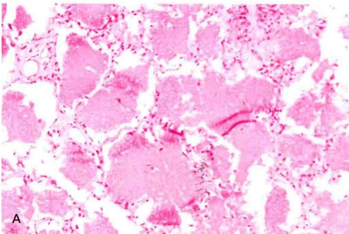 
图9-23 伊氏肺孢子菌肺炎。A. 肺泡内可见泡沫状嗜酸性物质，内含肺泡巨噬细胞、伊氏肺孢子菌的孢子囊及滋养体；B. 银染色见萎陷及退行性变的新月形微生物，其中部分可见特征性的菌壁黑点
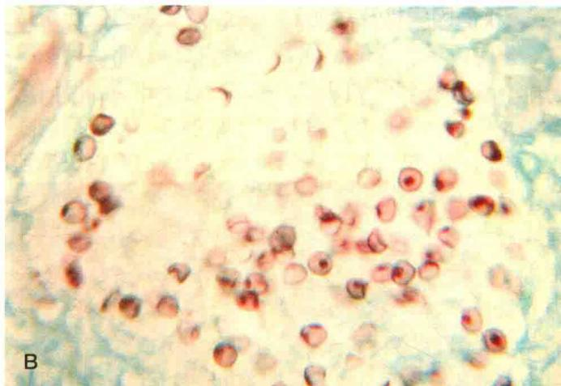
浅部感染可由正常菌群被杀死引起（例如抗生素治疗），因为这些正常菌群在对假丝酵母菌的宿主防御机制中发挥重要作用。伴脓毒血症及播散的深部组织假丝酵母菌感染仅见于免疫功能受损个体，常常致命。最常见的假丝酵母菌属的病原体为白假丝酵母菌，少量存在于口咽、胃肠道及阴道。超过 $95\%$ 的假丝酵母菌感染由其引起。特定器官的假丝酵母菌感染在第13章及第25章详述。
# 三、曲霉菌病
曲霉为常见的机会致病性环境腐生真菌，其感染常累及双肺。在曲霉中，烟曲霉为最常见的人类致病真菌。肺曲霉菌病有三种：①过敏性支气管肺曲霉菌病；②曲霉菌在先前存在的肺空洞中定植（曲霉肿或真菌球）；③侵袭性肺曲霉菌病。在组织中，曲霉具有有隔菌丝，直径 $2\sim 7\mu \mathrm{m}$ ，分枝形成锐角。
■ 过敏性支气管肺曲霉菌病：该病由吸入环境中广泛分布的孢子引起。气道及肺泡暴露于真菌抗原，随后在易感个体中引起过敏反应。支气管及细支气管见淋巴细、浆细胞及数量不等的嗜酸性粒细胞浸润。气道可被黏液及真菌菌丝挤压。本病几乎只在哮喘患者中出现，在哮喘患者中发生率为 $20\%$
曲霉肿：曲霉肿在事先存在肺部空洞（常常是陈旧性结核空洞）或支气管扩张患者中出现。被吸入的孢子在这些空腔内温暖潮湿的环境中生长繁殖，产生大量非侵袭性的菌丝将空腔填满。
■侵袭性曲霉菌病：当中性粒细胞数量不足或功能不全时可发生侵袭性曲霉菌病（如大剂量糖皮质激素或者细胞毒性治疗或急性白血病患者）。被吸入的孢子生发出菌丝，并穿破肺泡侵入肺实质并广泛播散。曲霉菌可轻易侵犯血管并形成栓子。镜下，曲霉菌的菌丝在血管周围呈放射状排列，并穿破血管壁。急性曲霉菌病亦可始于鼻窦并扩散至面部、眼眶及脑。
# 四、隐球菌病
隐球菌病为新生隐球菌引起的全身性真菌病，主要累及脑膜及双肺（图9-24）。该真菌的主要来源为鸽粪，当被吸入后到达终末细支气管。
隐球菌几乎只感染细胞免疫功能受损的患者。尽管隐球菌分布广泛，暴露也经常发生，但在没有易感因素的情况下感染罕见。隐球菌病见于AIDS、淋巴瘤（尤其是霍奇金病）、白血病、结节病患者及使用大剂量糖皮质激素治疗的患者。
【病因病机】在免疫功能完整的个体上，中性粒细胞及肺泡巨噬细胞可杀死新生隐球菌，不引起疾病。与此相反，在细胞免疫功能缺陷的患者身上，隐球菌可存活，开始局部繁殖，随后播散。尽管隐球菌常经肺进入人体，但 $95\%$ 的隐球菌感染累及脑膜及脑。若出现脑膜脑炎，因具有厚荚膜的隐球菌浸润，全脑肿大、软化，软脑膜增厚呈胶状。炎性反应严重程度不一，通常轻微，伴大量隐球菌浸润组织。因隐球菌荚膜较厚，常规苏木素伊红染色着色不良，在组织切片上呈现为空泡或孔洞（图9-25A）。未经治疗的隐球菌性脑膜炎病例几乎全部死亡，因此必须长期应用全身抗真菌药治疗。
# 五、组织胞质菌病
组织胞质菌病由荚膜组织胞质菌引起。该菌在全世界分布广泛，为一种双相菌，在室温中为丝状菌落，在体内则为酵母型菌落。该病常自限，但可引起全身性肉芽肿性疾病。尽管多数组织胞质菌病不引起症状，免疫功能受损个体可出现进行性播散性感染。组织胞质菌病由吸入荚膜组织胞质菌引起（图9-24），其来源主要是鸟及蝙蝠粪便和土壤。该病为美国中部及东部俄亥俄河及密西西比河谷区域的地方病，亦可见于美国其他地区。
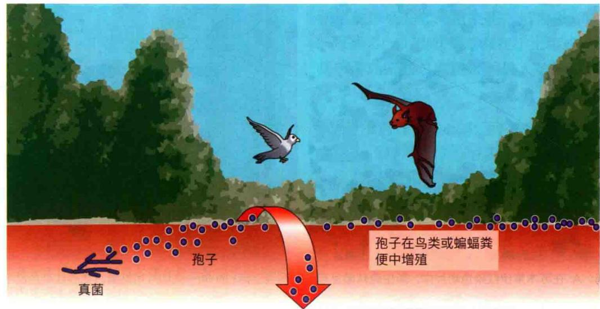
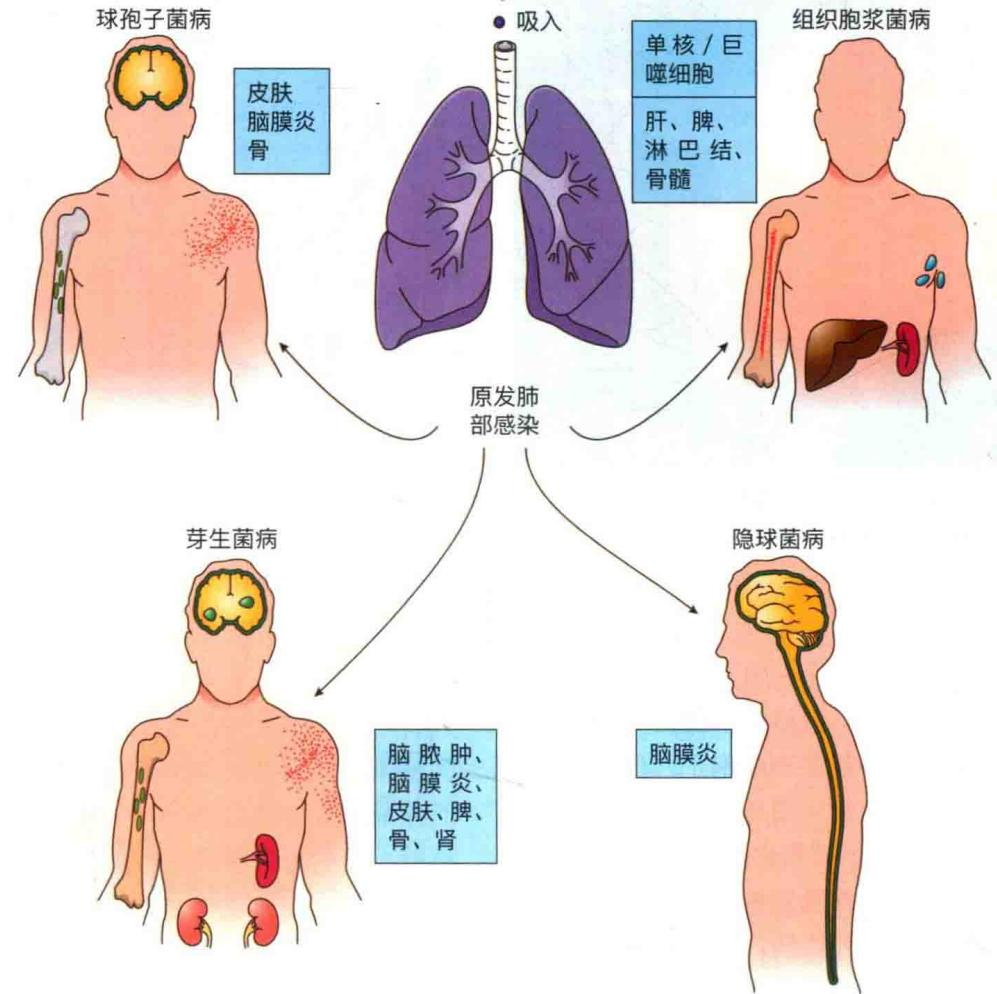 
图9-24 肺部及播散型真菌感染。真菌在土壤、空气及鸟和蝙蝠粪便中生长，产生孢子，其中一些有感染性。当被吸入人体，孢子导致原发性肺部感染。在一部分患者中，感染可播散。组织胞浆菌病。原发感染位于肺部。在易感患者中，真菌播散至靶器官，主要为单核/巨噬系统（肝、脾、淋巴结及骨髓）及舌、口腔黏膜及肾上腺。隐球菌病。肺部原发感染播散至脑膜。芽生菌病。肺部原发感染广泛播散。主要靶器官为脑、脑膜、皮肤、脾、骨及肾。球孢子菌病。肺部原发感染广泛播散，常见累及器官为皮肤、脑膜及骨

【病因病机及病理】自限型组织胞浆菌病在许多方面与结核病相似。其特征为肺、纵隔及肺门淋巴结、脾及肝的坏死性肉芽肿。酵母形态的荚膜组织胞浆菌可见于干酪样物质中的巨噬
细胞内。肉芽肿中的细胞成分最终消失，干酪样物质钙化，形成“纤维结节”（图9-26A）。播散型组织胞浆菌病见于无法对组织胞浆菌引发有效的免疫应答的个体。特征为进行性的器官巨噬细胞浸润，其内有荚
膜组织胞浆菌菌体（图9-26B）。婴儿、AIDS患者及使用糖皮质激素治疗的患者易患。多数感染无症状，但多处广泛受累，患者出现发热、头痛及咳嗽。尽管播散性感染可持续数年，但严重的免疫缺陷可导致疾病迅速进展，患者出现高热、咳嗽、全血细胞减少及精神状态改变。播散型组织胞浆菌病可使用全身抗真菌药物治疗。
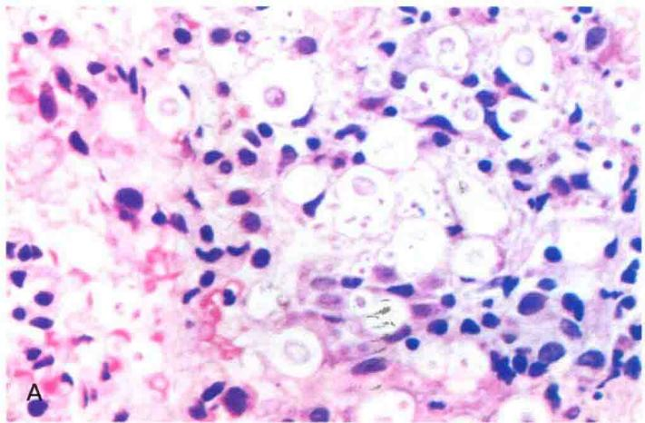 
图9-25 隐球菌病。A.在苏木素伊红染色切片中，新生隐球菌表现为孔洞或空泡；B.同一张切片用黏蛋白胭脂红染色显示新生隐球菌荚膜
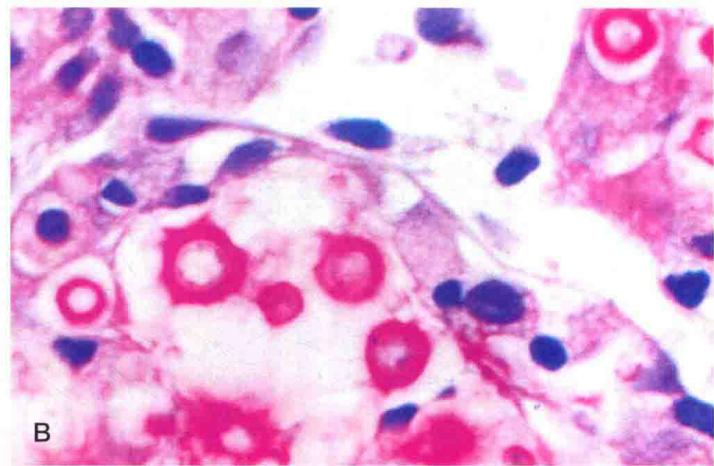
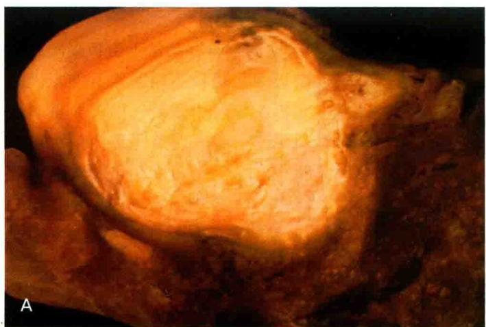 
图9-26组织胞质菌病。A.切面见胸膜下有包膜的纤维干酪结节；B.播散型组织胞质菌病患者肝脏见吞噬了多个酵母菌形态的荚膜组织胞质菌的库普弗细胞（过碘酸－雪夫反应，PAS染色）
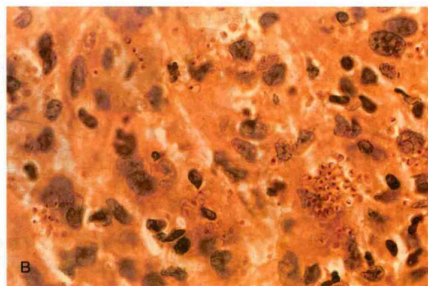
# 六、球孢子菌病
球孢子菌病是一种慢性坏死性的真菌感染，其临床及病理特征与结核病相似。粗球孢子菌为一种双相真菌，在土壤中长成丝状菌落并形成孢子。孢子被吸入后到达肺泡及终末细支气管（图9-27），长成小球，并成熟形成孢子囊，后者逐渐被内生孢子填满。最后，孢子囊破裂，内孢子释放，并重复该循环。感染可导致以局灶性肺炎起病的一系列疾病。多数情况下病情轻微无症状，且局限于双肺及肺门淋巴结。偶尔粗球孢子菌可扩散至肺外引起致命性疾病。
粗球孢子菌只在特定气候环境下的土壤中出现，要求少雨，夏天炎热而冬天温和，如加利福尼亚州、亚利桑那州、新墨西哥州及德特萨斯州大部。球孢子菌病在加利福尼亚州的圣金华河谷尤为常见，在当地被称为“溪谷热”。沙尘暴及地震可造成孢子在空气中传播，因此球孢子菌病的流行常与此二者相关。该病无传染性。

【病因病机】多数球孢子菌病病例由该菌在免疫功能正常的个体接种引起，表现为急性病程。该病以芽胞沉积部位的局灶性支气管
肺炎起病。受累肺泡内可见中性粒细胞及巨噬细胞浸润（图9-27）。与结核病及组织胞质菌病一样，只有当炎性细胞免疫激活后宿主方能控制粗球孢子菌感染。坏死性肉芽肿随着特异性超敏反应的开始而逐渐形成。随后细胞介导的免疫应答杀死或遏制真菌，最后肉芽肿愈合。球孢子菌病的病程与真菌的载量及宿主免疫状态相关。广泛的胸部受累及暴发性疾病可在来自非盛行地区的个体暴露于大量球孢子菌时出现。
播散型球孢子菌病在免疫功能受损患者中出现，可为原发感染或旧疾复发。播散型疾病可累及几乎所有的部位并可表现为单个胸腔外病变或广泛分布的病变，包括皮肤、骨、脑膜、肝、脾及尿生殖道病变。特定人种，如菲律宾人、其他亚洲人及黑人特别易感播散型球孢子菌病，可能原因是某种特异性免疫缺陷。孕妇若在孕期的后半段发生原发感染亦容易发生播散性疾病。即使长期使用两性霉素B治疗，急性播散型球孢子菌病预后不良，但是某些新型唑类抗真菌药的有效率颇高。
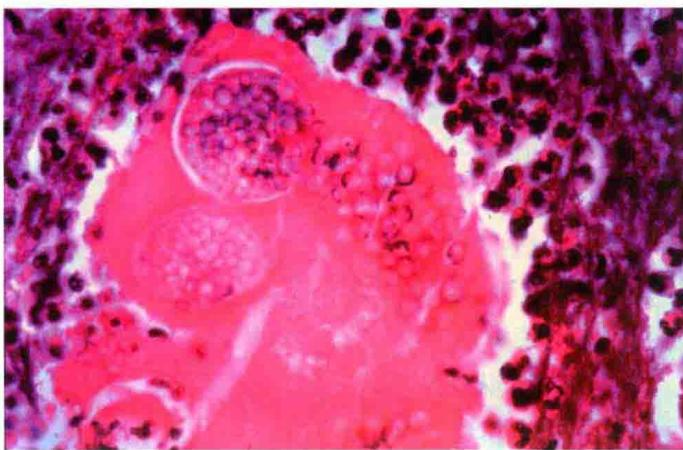 
图9-27球孢子菌病。镜下见急性球孢子菌病患者肺部急性炎性浸润，球孢子菌小球内见内生孢子
# 七、芽生菌病
芽生菌病是一种慢性肉芽肿性及化脓性肺病，常继发播散至身体其他部位，主要为皮肤及骨。病原体为皮炎芽生菌，一种双相真菌，在温暖湿、富含腐烂植物的土壤中长成丝状菌落。在北美，该菌分布于密西西比河、俄亥俄河、大湖区及圣劳伦斯河流域。对土壤的扰动，例如建筑工程或打猎、野营等休闲活动都可促使含有真菌孢子的气溶胶形成。

【病因病机及病理】被吸入的皮炎芽生菌生长繁殖并长成酵母相，通过出芽繁殖。宿主通过混合性的化脓性及肉芽肿性炎症反应应对不断繁殖的真菌，引起局灶性的支气管肺炎。受感
染的区域含有大量酵母相的皮炎芽生菌，菌体呈球形，直径为 $8\sim 14\mu \mathrm{m}$ ，可见母体广基突起及多个胞核。在苏木素伊红染色下，该菌呈圆形，有清晰可见的较厚的细胞壁。该菌可见于上皮样细胞、巨噬细胞或多核巨细胞内，也可游离生长于小脓肿内。皮炎芽生菌在体内存活直至特异性超敏反应及细胞介导的免疫应答出现，活化的中性粒细胞及巨噬细胞将其杀死。该菌引起的肺部疾病通常为自限性的，以瘢痕形成的方式愈合，但少数患者出现进行性的粟粒样病变或空洞。皮肤及骨为最常见的肺外侵犯器官。全身性急性感染以流感样症状起病，伴发热、关节痛及肌痛。进行性肺疾病的特征为低热、体重降低、咳嗽，胸部X线片可见明显上肺叶渗出。
# 八、皮肤癣菌感染
皮肤癣菌指引起角化组织如皮肤、毛发及指（趾）甲局灶性浅表感染的真菌，约有40个种，分属3个属：毛癣菌属、小孢子菌属及表皮癣菌属。皮肤癣菌感染根据累及部位命名[如头皮感染称头癣，双足感染称足癣或“脚气”，指（趾）甲感染称甲癣，腹股沟对磨部位的感染称股癣（tineacruris或“jock itch”）。皮
肤癣菌感染并非严重疾病，但为患者就医率最高的皮肤疾病之一。皮肤癣菌存在于土壤或动物及人类身上，其感染通常通过直接接触他人被污染的毛发或皮屑引起。
【病理】表皮癣菌在浅表角化组织内繁殖，从接种部位向心性扩散，形成圆形的不断扩张的皮损，边界清晰。此种外形的病灶曾被认为由蠕虫引起，因而得英文名ringworm（环虫）及tinea（来自拉丁文tinea，意为“蠕虫”）。感染导致鳞状上皮增厚，角化细胞数量增多。菌丝及芽胞仅出现在皮肤、毛发及指（趾）甲无生命力的部分。
# 第二十九节 原虫感染
原虫通过多种机制导致人类疾病。其中一些，如溶组织内阿米巴，为胞外寄生虫，可消化并侵入人体组织。其他的如疟原虫，为转性胞内寄生虫，在人类细胞内复制并将其杀死。还有一些，如锥虫，主要通过引发炎症及免疫应答破坏人体组织。部分原虫（如刚地弓形虫）可引起隐性感染，并在宿主免疫功能受损时再活化。
# 一、疟疾
疟疾是一种经蚊子传播的溶血性发热疾病，每年超过2亿人发病，超过500000人病死，超过 $90\%$ 的死亡病例来自非洲幼童。4个种的疟原虫引起疟疾：恶性疟原虫、间日疟原虫、卵形疟原虫及三日疟原虫。疟原虫感染并破坏人类红细胞，导致寒战、发热、贫血及脾大。恶性虐的病情较其余三种更为严重，为疟疾死亡的最主要类型。据估计，全球 $40\%$ 的疟疾集中于热带及亚热带地区的人口，特别是非洲、南美洲、中美洲、印度及东南亚受该病威胁。尽管疟疾在发达国家已被消灭，美国每年仍有超过1500例疟疾被上报，几乎所有病例都来自回国游客或移民。恶性疟及卵形疟为非洲主要的疟疾类型，而间日疟在当地罕见，因为多数黑人缺乏感染所需的红细胞表面受体。

【病因病机】疟原虫的生活史复杂，因此人类疟疾需要人类及按蚊两种宿主（图9-28）。
按蚊将子孢子体接种至人类的血流，疟原虫侵入红细胞，并在其内生长繁殖。在 $2\sim 4$ 天，大量疟原虫从被感染的红细胞内破体而出，感染其他红细胞，开始另一个红细胞寄生的循环。破裂的红细胞释放致热原并导致特征性的反复阵发性的寒战及高热。这种反复发作持续数周，随着宿主免疫应答的建立而缓解。每次发作意味着下一循环的受感染的红细胞破裂及子代病原体的释放。贫血的原因既有受感
染的循环红细胞的破坏，也有增大的脾中固定单核吞噬细胞对红细胞的隔离。肝、脾、淋巴结由于大量充满含铁血黄素及疟色素（疟原虫消化血红蛋白的终产物）的巨噬细胞颜色变深。
恶性疟原虫导致恶性疟，最严重的一种疟疾。恶性疟原虫改变受感染红细胞的流体特性及黏附属性，使其黏附于小血管内皮细胞。小血管堵塞经常引起脑、肾及肺的缺血，可能为恶性疟原虫毒力中最重要的因素。死于脑型疟疾的患者其脑部见白质小血管充血及
血栓，周围水肿及出血（“环状出血”）（图9-29）。肾血管堵塞导致急性肾衰竭，而血管内溶血则可引起血红蛋白尿性肾病（黑尿热）。在肺部，肺泡毛细血管破坏导致肺水肿及急性肺泡损伤。缺血性脑损害导致从嗜睡、幻觉及行为改变到抽搐及昏迷的一系列症状。中枢神经系统疾病死亡率为 $20\% \sim 50\%$ 。治疗手段据疾病类型及疟原虫的耐药性不同而有所区别。现行治疗指南见《美国疟疾治疗指南》，从疾病预防及控制中心的网站上可以下载到（http：//
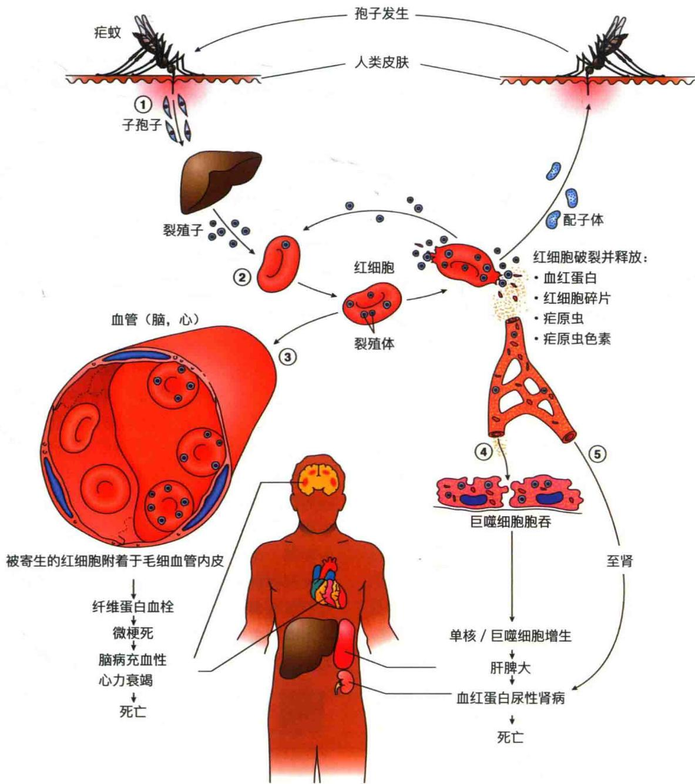 
图9-28 疟原虫的生活史。按蚊叮咬感染者, 吸取含有小配子体及大配子体 (有性生殖形态) 的血液。在蚊子体内, 唾液腺中的有性生殖 (孢子生殖) 产生有感染力的子孢子体: ① 在蚊子叮咬的过程中, 子孢子体接种于脊椎动物宿主的血流。部分子孢子体离开血管进入肝细胞, 并进行有性生殖 (红细胞外期裂殖体) 并形成成千上万个裂殖子。② 破裂的肝细胞释放裂殖子, 裂殖子进入红细胞成为滋养体, 随后分裂形成多个裂殖体 (红细胞内期裂殖体)。裂殖体再次分裂形成多个裂殖子, 撑破红细胞并释放入血, 进入其他红细胞, 开始新的循环。数个循环后, 不同亚群的裂殖子发育为小配子体及大配子体, 被其他蚊子吸入体内, 完成这一循环。③ 被寄生的红细胞堵塞脑、心、肾及其他深部器官的毛细血管。被寄生的红细胞黏附于毛细血管内皮细胞, 引起纤维蛋白血栓形成, 导致微小梗死。以上病理生理过程导致脑病、充血性心力衰竭, 肺水肿并常常导致死亡。破裂的红细胞释放血红蛋白、红细胞碎片及疟色素。④ 胞吞作用导致单核 / 巨噬细胞增生及肝脾大。⑤ 血红蛋白的释放导致血红蛋白尿性肾病, 可以致死
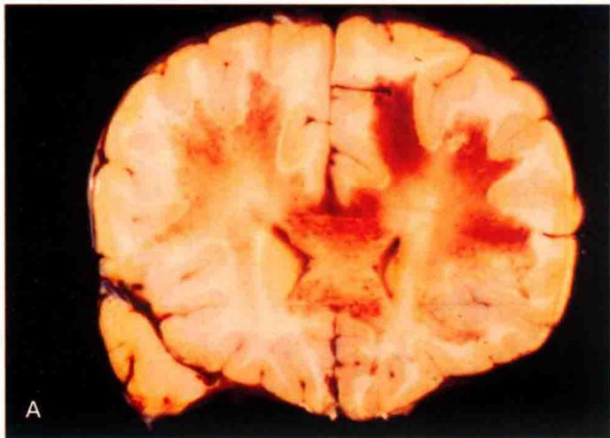
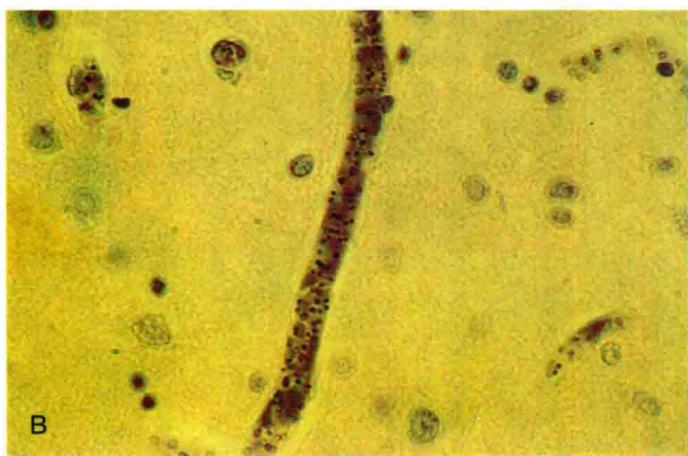
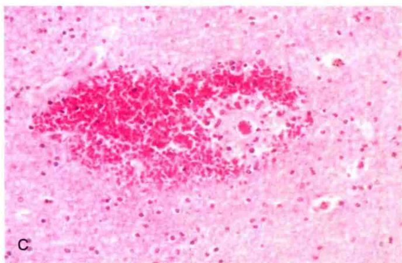 
图9-29 大脑急性恶性疟。A.脑白质严重弥散性淤血及局灶出血；B.A图中脑组织切片显示充满了被寄生的红细胞的毛细血管；C.A图中脑组织的另一张切片显示血栓栓塞的毛细血管周围环状出血，纤维蛋白血栓中含有被寄生的红细胞
# 二、弓形虫病
弓形虫病是一种见于世界各地的感染病，由一种原生动物刚地弓形虫导致。多数感染无症状，但若感染胎儿或免疫功能受损患者可导致严重的坏死性疾病。刚地弓形虫暴露常见。在美国约 $20\%$ 的青春期及成年人有曾被弓形虫感染的血清学证据。刚地弓形虫的生活史极为复杂。终宿主为猫，通过接触受感染的老鼠、鸟、人或其他中间宿主摄入弓形虫的包囊。弓形虫在猫的肠上皮细胞内增殖，排放至粪便内。人类因摄入
未完全煮熟的被病猫粪便污染（例如通过垃圾箱或花园土壤）的肉类（特别是猪肉、羊肉及鹿肉）及母婴传播感染（见第6章）。
【病因病机】在急性感染时，迅速繁殖的弓形虫从肠道通过淋巴管道传播至区域淋巴结，并经血道传播至肝、肺、心、脑及其他器官。在多数感染中，几乎不见明显组织破坏，活动期感染迅速受到免疫应答的控制。因此被感染的个体几乎不表现出临床症状，其中最常见的临床表现为淋巴结肿大，有时可伴发热、咽痛、肝脾大及外周血中见异型淋巴细胞。受累淋巴结的组织学改变特别，大量上皮样巨噬细胞包围并逐渐渗入生发中心。然而，刚地弓形虫可通过在部分感染的细胞中形成蛰伏的组织包囊造成隐性感染，病原体可在宿主体内存活数十年。一旦感染者细胞免疫功能丧失，病原体从包囊出现，再次造成破坏性的感染。
1.先天性弓形虫感染主要累及脑 刚地弓形虫感染在胎儿中造成的破坏远大于产后感染（见第6章）。
【病因病机】最严重的胎儿疾病由早孕时的感染引起，常造成妊娠终止及自然流产。发育中的脑及眼极易被感染，且胎儿并不具备可遏制感染的免疫力。中枢神经感染导致坏死性脑膜脑炎，在最严重的情况下导致脑实质缺失，大脑钙化及严重脑积水（图9-30）。眼球感染导致脉络膜视网膜炎（即脉络膜及视网膜坏死及炎症）。
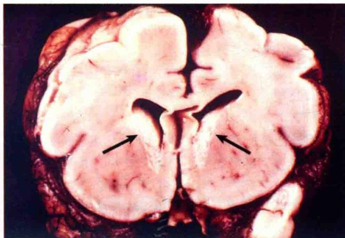 
图9-30先天性弓形虫病。未成熟的胎儿的脑部见室管膜下坏死，钙化呈现为双侧对称的白色褪色区域（箭示）
2.弓形虫病在免疫功能受损的宿主中导致脑炎发生在细胞免疫受损的个体（如AIDS患者或正在接受免疫抑制治疗的患者）身上的刚地弓形虫感染是毁灭性的。在大多数情况下，该病为隐性感染的再活化。脑为最常见的受累器官，刚地弓形虫感染在脑内引起
多灶坏死性脑炎。脑炎患者症状有麻痹、抽搐、视力改变及精神状态改变。若无有效抗原虫治疗，免疫功能受损患者的弓形虫脑炎致命。
# 三、阿米巴病
阿米巴病的病原体为溶组织内阿米巴，主要累及结肠，有时可累及肝。溶组织内阿米巴因其可溶解组织而得名。肠道感染种类从无症状的定植到伴血性腹泻的严重侵袭性感染皆有。溶组织内阿米巴目前已知的唯一储主是人，在结肠内繁殖。阿米巴病在卫生条件差的发展中国家发病率最高，常见于旅行者、移民及男性同性恋者（图9-31）。

【病因病机及病理】侵袭期的溶组织内阿米巴（滋养体）附着于结肠上皮细胞从而引起结肠炎。该病原体通过分泌细胞溶解性蛋白破坏细胞膜而杀死靶细胞。进行性的黏膜细胞坏死形

成数个坏死灶并进展为溃疡（图9-32A）。溃疡边缘的侵蚀及不断扩张的溃疡相互融合形成不规则的黏膜脱落。溃疡底部呈灰色坏死样，可见纤维及细胞碎片。渗出液使被侵蚀的黏膜隆起，形成慢性阿米巴溃疡，形如烧瓶或瓶颈。滋养体见于溃疡表面、渗出液及溃疡口部（图9-32B），也常见于黏膜下层、黏膜固有层、浆膜层及黏膜下层的小血管。早期阿米巴性溃疡中炎性反应轻微，但随着溃疡增大，急性和慢性炎症细胞聚集。肠阿米巴病的表现从完全无症状至严重痢疾性疾病皆有。恶心、呕吐、恶臭的肛门排气及间歇性的便秘为典型症状。可排含血性黏液的水样便（多至25次/天），但腹泻持续时间短，脱水罕见。阿米巴性结肠炎可持续数月或数年，患者憔悴并有贫血。该病通过阿米巴包囊经粪传输，包囊可在环境中存活。有症状的肠阿米巴病可先用针对滋养体的甲硝唑或替硝唑，然后使用能杀灭包囊的安特酰胺、巴龙霉素或双典喹啉治疗。
阿米巴性肝脓肿为阿米巴病一个主要的并发症，在滋养体侵入结肠黏膜下静脉，进入门脉循环并入肝时可发生。在肝内，阿米巴杀死肝细胞，形成一个缓慢扩张的坏死空洞，其内充满深褐色的无臭的半固态物质。腔内中性粒细胞少见，滋养体见于洞壁，附着于肝细胞上（图9-33）。阿米巴肝脓肿可扩张并破裂，穿破包膜蚀入腹膜、横膈膜、腹腔、肺或心包。
# 四、隐孢子虫病
隐孢子虫病为一种隐孢子属的原虫导致的肠道感染，可引起腹泻。该病表现从在免疫功能完好个体上的自限性胃肠道感染到免疫功能受损患者身上的潜在致死性疾病皆有。人通过摄入受感染的人或动物的粪
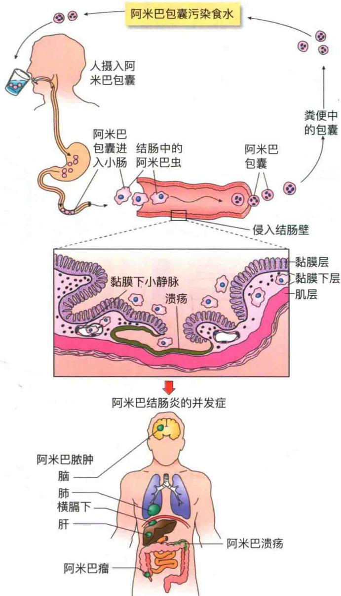 
图9-31 阿米巴性结肠炎及其并发症。阿米巴病由摄入被阿米巴包裹污染的食水引起。在结肠内，阿米巴穿破肠黏膜，在黏膜及黏膜下层形成烧瓶状溃疡。阿米巴可侵入黏膜下层微静脉，从而播散至肝及其他器官。肝脓肿可以扩张并累及邻近结构
便中的隐孢子虫卵囊获病。许多驯养的动物体内有此种原虫寄生，为人类感染的一大储主。经水传播的暴发曾感染大量人口。

【病因病机】隐孢子虫的卵囊可耐受极其恶劣的外部环境，在通过胃后仍然存活，并释着于小肠微绒毛上的子孢子。在此处子孢子细胞一起形成一个复杂结构。隐孢子虫在从肠的管腔表面繁殖，其子代亦附着于胃肠道在小肠（感染最常见的部位），固有层可有重度的炎症反应及与病原体密度直接相关的缩。在免疫功能完好的个体上，感染进程被应终止。AIDS患者及一些先天性免疫缺陷患遏制寄生虫感染而发展为慢性感染，有时可散并累及胆囊及肝内胆管。
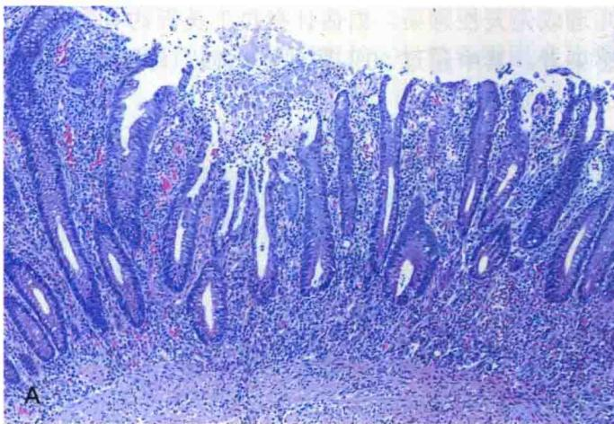
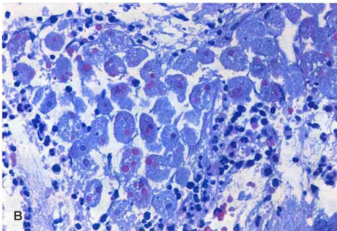 
图9-32 肠阿米巴病。A.结肠黏膜见浅表溃疡，溃疡上部见一簇溶组织内阿米巴滋养体。黏膜固有层见大量急性及慢性炎细胞，包括嗜酸性粒细胞；B.高倍镜下，肠腔渗出液中见大量滋养体
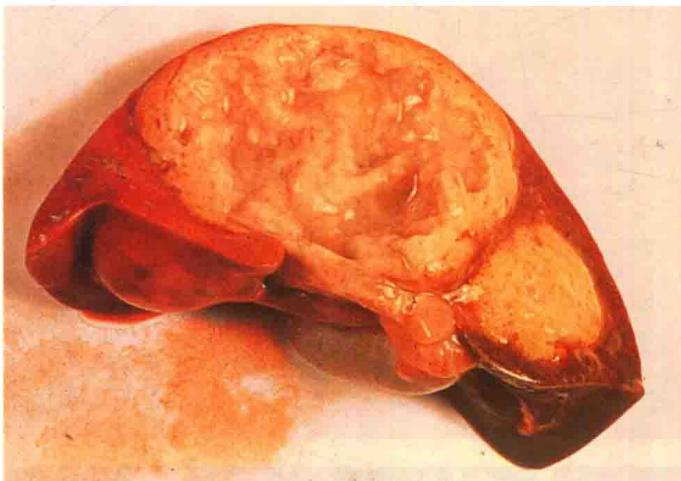 
图9-33 阿米巴性肝脓肿。肝脏切面示多发性脓肿，内含“鱼酱”样物质
隐孢子虫病的临床症状为大量水泻，有时可伴有痉挛性腹痛或低热。腹泻可造成大量液体丢失，因此需要大量补液。免疫功能完好的患者腹泻在 $1\sim 2$ 周后自发性缓解。对于免疫功能受损的患者，腹泻一直持续并且可导致死亡。
# 五、贾第虫病
贾第虫病为一种小肠的有鞭毛的原虫感染，由蓝氏
贾第鞭毛虫引起，临床特点为腹部痉挛性痛及腹泻。该病原体分布于世界各地。贾第虫病由摄入患者或被感染的动物粪便中的蓝氏贾第鞭毛虫包囊导致，并在人间通过直接接触被污染的食水传播。贾第虫属的寄生虫通常存在于野外水体中，受感染的河狸或熊是其储主。
【病因病机】贾第虫属的包囊可耐受胃酸，在到达十二指肠及空肠后破裂并释放滋养体。后者附着于小肠上皮微绒毛上并繁殖。贾第虫病并不形成肉眼可见的病变。镜下，小肠绒毛表面及隐窝内可见贾第虫滋养体，黏膜改变轻微。贾第虫在向结肠运动的过程中形成包囊，并随粪便排出。急性贾第虫病起病骤急，表现为腹部痉挛及频繁排恶臭便。部分患者的症状在 $1\sim 4$ 周后自发缓解，而另一部分患者病程迁延。在儿童中，慢性贾第虫病导致吸收不良、体重减轻及生长迟缓。多种抗生素，包括甲硝唑对贾第虫感染有效。
# 六、利什曼病
利什曼属为通过白蛉传输的原虫。该属的原虫感染临床表现多样，从惰性的自愈性的皮肤溃疡到致命的播散性疾病皆可出现。利什曼属有多个种，其自然栖息地及所致疾病不一。在许多亚热带及热带地区，利什曼感染为动物的地方病。狗、地松鼠、狐狸及豺为储主及人类感染潜在的感染源。该病主要见于人与动物宿主及白蛉媒介密切接触的欠发达国家。然而该病偶尔也出现在地中海地区，包括西班牙、法国、意大利及马耳他。利什曼病与HIV感染日益相关。据估计，全世界约有1200万人曾被利什曼原虫感染，每年新发感染200万例。
【病因病机】白蛉叮咬人体，将利什曼原虫接种至皮肤，被单核吞噬细胞吞噬。利什曼原虫在巨噬细胞内繁殖，将其胀破，在接种部位感染其他巨噬细胞。在此局部感染之后的病程因宿主的免疫力及利什曼原虫的生物种的差异而各不相同。利什曼病主要有三种不同的临床类型：①局灶的皮肤利什曼病；②黏膜皮肤利什曼病；③内脏利什曼病。
1.皮肤利什曼病是一种溃疡性疾病。数种利什曼原虫引起局灶的皮肤利什曼病，也称“东方疗”或“热带疗”，主要见于阿富汗、沙特阿拉伯、叙利亚、伊朗及巴西。

【病因病机及病理】局灶的皮肤利什曼病开始为瘙痒的单发丘疹，随后溃烂形成浅溃疡，边缘锐利、隆起。溃疡直径可达 $6\sim 8cm$ 。随着细胞免疫的逐渐激活，巨噬细胞活化并杀死胞
内利什曼原虫。皮损逐渐变成成熟肉芽肿样，可见上皮样巨噬细胞、朗汉斯巨细胞、浆细胞及淋巴细胞。在历时数月的病程后，皮肤溃疡自行愈合。
弥漫性皮肤利什曼病在缺乏对利什曼原虫的特异性细胞免疫应答的患者身上发生。该病起初为单发结节，随后周围慢慢出现卫星结节，最终累及大部分皮肤。这种病变与瘤型麻风极为相像因而一些患者被误诊为麻风。弥漫性皮肤利什曼病由大量充满利什曼原虫的巨噬细胞导致。
2.黏膜皮肤利什曼病是皮肤利什曼病的晚期发并发症，由巴西利什曼原虫感染导致。多数病例发生在玻利维亚、巴西及秘鲁，啮齿类及树懒为储主。

【病因病机】黏膜皮肤利什曼病的早期病程及病理改变与局灶性的皮肤利什曼病相似。
原发病灶愈合多年后，黏膜皮肤连接处如咽、鼻中隔、肛门或外阴出现溃疡。该黏膜病变逐渐增大，具有高度破坏性及毁形性，侵蚀黏膜表面及软骨。黏膜皮肤利什曼病需要使用全身抗原虫药物治疗。
3. 内脏利什曼病（黑热病）是一种单核/巨噬细胞系统潜在致命性的感染。黑热病由数种杜氏利什曼原虫的亚种引起，见于孟加拉、印度、尼泊尔及巴西，储主及易感年龄段在世界不同地区并不一致。幼儿及营养不良个体尤其易感。由于其内的巨噬细胞内充满了繁殖中的利什曼原虫，肝（图9-34A）、脾及淋巴节肿大。正常器官结构逐渐被成片的被寄生的巨噬细胞取代（图9-34B）。最后，这些巨噬细胞可在其他器官聚积，包括心及肾。内脏利什曼原虫病患者表现为持续的发热、进行性的体重减轻、肝脾大、贫血、血小板减少及白细胞减少。浅肤色的个体皮肤变黑，印地语中，利什曼病被称为黑热病，意思为“黑色的疾病”。在数月的病程中，内脏利什曼病患者出现严重恶病质及肝脾大。若不治疗该病可以致命。治疗上使用全身抗原虫药。
# 七、恰加斯病（美洲锥虫病）
恰加斯病是一种经昆虫传输的动物源性疾病。该病由枯氏锥虫引起，造成人类全身感染，出现心脏及胃肠道的急性临床表现及长期后遗症。枯氏锥虫存在于野生动物及驯养动物（如鼠、狗、山羊、猫及犰狳）的身上，通过锥蝽（也称猎蝽或“接吻虫”）传输，是中美及南美洲的地方病。锥蝽藏匿于失修房屋的裂缝或使用植物搭建的屋顶，在夜间出没，在受害者入睡后吸食其血液，并排放含有感染形态的枯氏锥虫的粪便。该感染形态从叮咬部位或其他皮肤擦伤处或穿透眼及唇黏膜进入人体。枯氏锥虫也可从母亲传给胎
儿造成先天性感染。据估计在拉丁美洲约有1000万感染者，其中超过 $50\%$ 居住在巴西。每年该病共造成10000例死亡。

【病因病机】枯氏锥虫进入人体后，以二分
裂方式繁殖，形成局灶性的炎性结节病变，锥虫肿。枯氏锥虫也可侵入其他部位，包括胞及脑。在宿主细胞内，枯氏锥虫分化并分破宿主细胞后进入血流，并可被吸入昆虫媒氏锥虫血症及广泛的细胞感染引起急性恰加全身症状。细胞介导的免疫缓解了急性症状，组织损伤可继续进展。在急性感染发生数年出现感染部位细胞的破坏，特别是心脏、食肠，导致器官功能障碍。抗原虫药物治疗对加斯病有效，但对其慢性后遗症无效。
急性恰加斯病通常临床症状轻微，但若发生广泛心肌破坏可以致命。大量枯氏锥虫在心脏中导致心肌炎，心肌纤维中见假包囊，心脏广泛慢性炎性浸润，在死亡病例中心脏增大，扩张，心肌苍白，局灶出血。 
慢性恰加斯病见于 $10\% \sim 40\%$ 急性感染者。血液或组织中无枯氏锥虫存在。但受累器官因慢性进行性的炎性进程受损，导致慢性心肌炎。心脏见广泛间质纤维化、肌纤维肥大、局灶淋巴细胞浸润。进行性心脏纤维化导致节律失常或充血性心力衰竭。食管
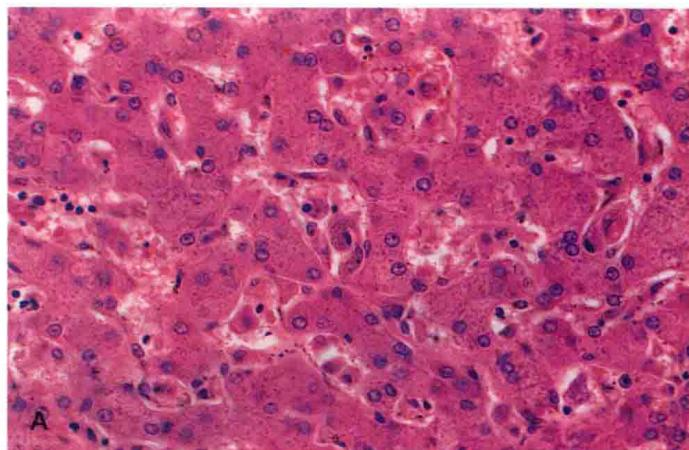
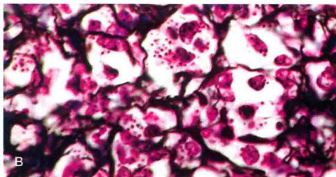 
图9-34 内脏利什曼病。A. 肿大的肝内见被利什曼原虫的无鞭毛体撑大的库普弗细胞；B. 银浸染的骨髓切片示巨噬细胞内充满繁殖中的利什曼原虫无鞭毛体
下段及肠肌层神经丛的副交感神经节破坏导致巨食管及巨结肠。食管及结肠的严重扩张导致吞咽困难及严重便秘。
先天性恰加斯病见于部分有枯氏锥虫血症的孕妇。胎盘及胎儿感染导致自然流产。活产少见，且患儿在出生后数天或数周内死于脑炎。
# 八、非洲锥虫病
非洲锥虫病俗称睡眠病，是布氏冈比亚锥虫及布氏罗得西亚锥虫的感染。该病通过舌蝇属的数种吸血的采采蝇传输并导致可威胁生命的脑膜脑炎。该病呈片状分布，与舌蝇的栖息地密切相关。冈比亚锥虫病是一种慢性感染，常迁延超过一年，人类可能是唯一储主。与此相对，东非（罗得西亚）锥虫为一种快速进行性的感染，在 $3\sim 6$ 个月患者即可死亡。用作狩猎的动物及驯养的动物为罗得西亚锥虫的自然储主。因此，边远地区从事畜牧业及农业的群体得病风险较高（图9-35）。

【病因病机】舌蝇叮咬人体后，布氏锥虫在接种部位繁殖，形成局灶性的结节性病变，
称为“原发下疳”。早期可见全身淋巴结及脾受累。随后锥虫播散至骨髓及组织液，导致全身疾病。部分最终侵入中枢神经系统并繁殖，引发破坏性的血管炎，导致睡眠病特征性的进行性精神衰退。在布氏罗得西亚锥虫感染中，病原体可侵犯心脏供血血管，导致暴发性心肌炎。病原体入血的临床表现为阵发性的发热，可反复达一周，常伴脾大及局部或全身淋巴结肿大。虫血症的高峰表现为反复不规则热发热、头痛、关节痛、昏睡及肌量减少。两种锥虫引起的睡眠病的区别主要在于时间的尺度，尤其是脑部侵犯的时间方面。罗得西亚锥虫病出现特征性临床症状较早（数周或数月），而冈比亚锥虫病则较晚（数月或数年）。脑部侵犯的特点为淡漠、日间嗜睡及偶尔昏迷。锥虫可通过周期性地改变虫体表膜糖蛋白抗原而躲过哺乳类动物的免疫攻击。抗原的变异为选择性地表达相关基因而非突变所致。从而每一波入血的锥虫锥鞭毛体都表达与上一波不同的抗原，并在与宿主免疫应答的对抗中占得先机。
# 第三十节 蠕虫感染
蠕虫（Helminth或worm）是最常见的人类病原体之一。在任何时期，世界上 $25\% \sim 50\%$ 的人口至少携带一种蠕虫。多数感染几乎不造成损害，但是一小部分可引起明显疾病。譬如，血吸虫病为全球发病率
及死亡率最高的疾病之一。
蠕虫是能在人体内生活的最大最复杂的生命体。大多数蠕虫与人体寄生环境相适应，仅引起局限的甚
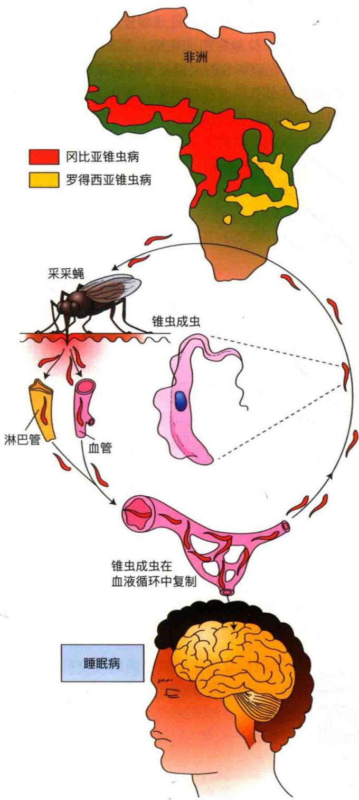 
图9-35非洲锥虫病（睡眠病）。冈比亚锥虫病及罗得西亚锥虫病的分布与其昆虫媒介采采蝇（东非舌蝇）的栖息地相关。采采蝇叮咬被感染的动物或人而摄入锥虫锥鞭毛体。锥鞭毛体在采采蝇体内繁殖并转变为感染性的循环后期锥鞭毛体。采采蝇叮咬另一个体时，循环后期锥鞭毛体进入下一宿主的淋巴及血液循环。叮咬部位可见原发下疳（1a期）。锥鞭毛体在血液及淋巴液中进一步繁殖，导致全身感染（1b期）。粗短型锥鞭毛体被另一只采采蝇叮咬，开始下一个循环。在2期，锥鞭毛体侵入中枢神经系统，导致脑膜脑炎及相关症状，包括淡漠及日间嗜睡。感染罗得西亚锥虫的患者可在数月内死亡
至不引起宿主组织损害。蠕虫可经口摄入、直接穿透皮肤或由昆虫叮咬而进入人体。一般而言，蠕虫在体内不进行繁殖，因而单个虫体并不能导致严重感染。蠕虫通过不同的方式引起人类疾病。一部分与人类宿主竞争特定的营养成分，另一部分虫体生长阻塞重要结构，通过占位效应引起疾病。然而大多数情况下，蠕虫通过引起破坏性的炎症及免疫应答导致功能障碍。例如破坏性最强的血吸虫感染，其病态是由组织中的虫卵引起的肉芽肿性反应导致的。嗜酸性粒细胞包含基本的对蠕虫有毒的蛋白质，是蠕虫感染引起的免疫应答中主要的炎症细胞。
圆虫（线虫）是一类修长的圆筒形的生物，具有管状的消化道。 
■ 扁虫（吸虫）是一类腹背扁平的生物，消化道末端为盲端。 
带虫（绦虫）是一类分节的生物，有独立的头节及躯体节片。绦虫没有消化道，靠虫体外壁吸收营养。
# 一、丝虫
1. 淋巴丝虫病 导致严重淋巴性水肿（象皮肿）。淋巴丝虫病（班氏丝虫和马来丝虫）是一种淋巴管道寄生虫性感染，由班氏吴策线虫和马来布鲁线虫引起。成虫在淋巴管道内寄生，最常见于腹股沟、滑车上及腋窝淋巴结以及睾丸和附睾，导致急性淋巴管炎。少数感染者的淋巴管道阻塞导致严重淋巴性水肿，其中最严重的类型被称为象皮腿（图9-36）。人类是丝虫唯一明确的宿主，可通过逾80种蚊子的叮咬传播。班氏吴策线虫广泛分布于南亚、太平洋、亚洲及南美洲局部。马来布鲁线虫分布于南亚海岸地区及西太平洋岛屿。全世界范围内估计有一亿两千万人被感染，其中四千万人出现严重疾病。

【病因病机及病理】蚊子通过叮咬将感染性的幼虫传输至宿主的淋巴管道及淋巴结。数月后寄生虫发育为成虫并交配，其后雌虫产出微丝蚴，后者进入淋巴管道及血液循环。被成虫寄
生的淋巴管道扩张，内皮细胞增厚。
2. 盘旋尾丝虫病（“河盲症”）可引起失明，是一种皮肤、眼及淋巴系统的慢性炎性疾病，由盘旋尾丝虫引起。该病是世界上最主要的导致失明的原因之一，据估计有1800万人被感染，其中50万人失明。人类为目前唯一明确的宿主。水中滋生的黑蝇叮咬人类，将感染性的幼虫传输至人体。因此盘旋尾丝虫病常沿河流及溪流分布（因而得名“河盲症”）。约 $90\%$ 的病例发生在热带非洲，其余见于墨西哥南部、中美洲及南美洲。
 
图9-36 班氏丝虫病。阴囊及下肢见大量淋巴性水肿（象皮肿）
【病因病机】成虫在深筋膜及皮下组织内盘旋纠缠成线球状，逐渐被纤维瘢痕包绕，在该处形成独立的，直径 $1\sim 3cm$ 的盘旋尾丝虫结节。这些结节在颅骨、肩胛骨、肋骨、髂嵴、大转子、骶骨及膝盖等骨性突出上方形成。镜下，结节外面有纤维层包绕，中央为炎性浸润，从化脓性炎症到肉芽肿性炎症皆有可能。结节不造成组织损害或引起炎症反应，但受孕的雌虫可生产成百上千万的微丝蚴，后者可移行至皮肤、淋巴结及深部器官，引起相应的盘旋尾丝虫病。眼球盘旋尾丝虫病由微丝蚴移行至全眼导致，累及从角膜到视神经乳头的所有区域。微丝蚴死亡后可引发强烈的炎症及免疫应答，特征为含有嗜酸性粒细胞的慢性炎症。角膜、脉络膜及视网膜的炎性损害导致部分性失明或全盲。全身抗蠕虫治疗，特别是伊维菌素对盘旋尾丝虫有效。大规模灭蝇行动已经有效减少地方病的发生。
# 二、肠道线虫
数种线虫的成虫（表9-6）寄生于人类肠道但几乎不导致有症状的疾病。临床症状主要出现在寄生虫载量非常大或者免疫功能受抑的个体。但是必须强调的是，经土壤传输的线虫感染（特别是蛔虫病、鞭虫病及钩虫病）从人口的意义上讲，是发展中国家儿童营养不良、生长停滞及认知障碍重要成因。人是所有肠道线虫的唯一或主要宿主。寄生虫通过粪便中或产于肛周的虫卵或幼虫在人间传播。在没有洗手的习惯及卫生的粪便处理设施的情况下感染尤为容易发生。许多肠道线虫的感染形态需要湿热气候方能在体外存活。因此这些肠道线虫是热带及亚热带地区的地方病。肠道线虫对二咪唑类药物，例如甲苯咪唑、阿苯达唑高度敏感。
表9-6 肠道线虫种俗名成虫寄生部位临床表现似蛔蛔线虫圆虫小肠移行至肺可出现超敏反应;肠梗阻十二指肠钩口线虫钩虫小肠皮肤接种或移行至肺出现超敏反应;肠道出血美洲板口线虫钩虫小肠皮肤接种或移行至肺出现超敏反应;肠道出血毛首鞭形线虫鞭虫大肠腹痛及腹泻;直肠脱垂(少见)粪类圆线虫蛲虫小肠腹痛及腹泻;免疫功能受损患者可出现肠外扩散蠕形住肠线虫蛲虫盲肠,阑尾肛周及会阴瘙痒
1.蛔虫病 通常是无症状的小肠感染。蛔虫病是体型巨大的似蛔蛔线虫感染。该病是人类身上最常见的蛔虫感染，影响发展中国家 $10\%$ 的人口，通常不出现临床症状。然而，严重的蛔虫感染每年导致60000儿童死亡。蛔虫在世界各地都有分布，但最常见于气候温和且卫生条件差的地区。

【病因病机】成虫在小肠内寄生，受孕的雌虫排放虫卵，并通过粪便传递。宿主摄入虫
卵并将其孵化，蛔虫幼虫在小肠内大量繁殖，穿透肠壁并通过静脉循环移行至肺，进入肺泡腔随后沿支气管上行至声门，被再次吞咽而再次进入小肠。在小肠中蛔虫成熟，以成虫的形态在肠腔中生活 $1\sim 2$ 年。成虫（ $15\sim 35cm$ ）通常不引起病理变化。严重感染可能引起呕吐、营养不良，偶尔可以引起肠梗阻。排至肝或其他组织的虫卵引起组织坏死、肉芽肿性炎症及纤维化。蛔虫性肺炎在大量幼虫移行至气腔所致，可以致命。
2. 鞭虫病 鞭虫病是一种侵入大肠肠壁浅层的感染，由一种肠道线虫毛首鞭形线虫导致的感染（“鞭虫”）。鞭虫在世界各地均有分布，感染超过7亿人口。寄生最常见于温暖潮湿，卫生条件较差的地区，包括美国南部及部分移民人群。儿童尤其易感。成虫在盲肠及结肠上段，雌虫在此处产卵并在粪便中传递。在湿润土壤中，虫卵经过3周后具有感染性。人类通过摄入被污染的土壤或食水而被感染。

【病因病机】小肠中的虫卵孵化出幼虫并大量繁殖，移行至盲肠及结肠，成虫前端钻入
黏膜表面，导致黏膜轻微糜烂、局部活动性炎症及持续性少量失血。鞭虫大量寄生可导致慢性结肠炎，与炎性肠病相似，患者出现痉挛性腹痛、频繁血便、体重减少及贫血。
3. 钩虫 可导致肠道失血及贫血。美洲板口线虫及十二指肠钩口线虫（分别为美洲及欧洲大陆人所指的“钩虫”）为感染人类小肠的肠道线虫，可撕裂肠黏膜，导致肠道失血。在寄生虫载量大时可引起临床症状。钩虫感染在潮湿温暖的温带及热带地区出现，带来严重的公共卫生问题，全世界约有7亿感染者。该病曾在美国东南部盛行，但目前已基本被消灭。

【病因病机】钩虫幼虫可直接穿透人体表皮，如裸足的足底进入静脉循环，随后移行至肺，
在肺泡毛细血管内寄生。幼虫穿破毛细血管壁进入肺泡，沿支气管上行至声门并被再次吞咽。在十二指肠，幼虫经历蜕皮，用其牙齿状的颊板附着于肠壁黏膜，可钳下小肠绒毛吞食而不引起炎症。广泛的蠕虫感染造成的失血可以引起临床症状。该种寄生虫是世界上慢性贫血最重要的病因。钩虫进入皮肤可导致一种瘙痒的皮疹（“地痒疹”），幼虫在肺中移行的过程中偶尔可导致一种哮喘样症状。
4. 粪类圆线虫 在免疫功能受损的宿主身上可引起播散性感染。粪类圆线虫病是一种线虫的小肠感染，病原体为粪类圆线虫（“蛲虫”）。尽管多数病例不出现临床症状，该感染在免疫功能受损的个体上可发展为致命的播散性疾病。粪类圆线虫感染常见于气候温暖潮湿、卫生条件较差的地区。然而，在美国仍存在粪类圆线虫小区域的流行。该病在新移民，尤其是来自苏丹的人群中常见。

【病因病机】雌性成虫藏身于十二指肠或空肠隐窝，不造成可见改变。幼虫经粪被排至
土壤中，形成丝状蚴，为该虫的侵袭期，可穿透人的皮肤造成感染。粪类圆线虫经血流移行至肺，随后到达小肠，方式与钩虫类似。与其他肠道蠕虫不同，粪类圆线虫可引起一种自感染，即某种情况下幼虫在宿主肠道内即具有感染性，再次穿透肠壁或肛周皮肤，在同一个宿主体内即可完成一个新的感染循环。
多数被感染的个体完全不表现出临床症状，但中度的嗜酸性粒细胞血症普遍。播散性粪类圆线虫病或高度感染综合征在免疫功能受抑患者中出现，尤其为正在使用糖皮质激素治疗的患者。在这些患者中，自感染的机会大大增加而且大量丝状幼虫侵入肠壁并播散至远处器官。肠道可见溃疡、水中及严重炎症，并可继发脓毒血症。若不治疗，播散性粪类圆线虫病是致命的，即使立刻接受治疗，也仅有1/3的患者生还。
# 三、组织线虫病：旋毛虫病
旋毛虫病（Trichinellosis或trichinosis）是一种由
旋毛形线虫引起的肌炎，人类通过食用受感染的杂食性的野生动物（如野猪、鼠、熊、海象等）或驯养动物（主要为家猪）（图9-37）被感染。旋毛形线虫感染在世界各地都可发生。许多发展中国家的人在食用未充分煮熟的含有旋毛形线虫的囊包幼虫的家猪肉后致病。在美国，感染通常发生在打猎活动中，但每年报道的旋毛虫病例不足40例。

【病因病机】在小肠，旋毛形线虫的幼虫钻出组织囊包，并藏身于肠道黏膜，逐渐发育为
成虫。成虫交配后，雌虫娩出幼虫。后者穿透肠壁，进入血液循环。幼虫可以侵入几乎所有组织，但只能在横纹肌组织中生存。在横纹肌中，幼虫形成囊包并可保有活力数年。引起的肌炎在膈肌、眼球外肌、舌、肋间肌、腓肠肌和三角肌尤为明显。有时中枢神经系统或心脏可受累，发生炎症，导致脑膜脑炎或心肌炎。肌细胞被幼虫感染后，可出现嗜碱性变性及肿胀。早期肌细胞感染引发大量炎性浸润，可见丰富的嗜酸性粒细胞及巨噬细胞。幼虫可生长至原来的10倍，自行卷曲并形成囊包。囊包形成后，炎症渗出消退。数年后幼虫死亡，囊包钙化。有症状的旋毛虫病通常是
自限性的，患者数月内可痊愈。若摄入大量囊包，大量幼虫侵袭小肠可引起腹痛及腹泻。主要症状常出现在数天后，幼虫侵入骨骼肌时。患者出现剧痛，受累肌肉压痛，发热、虚弱。可出现严重嗜酸性粒细胞血症（占所有白细胞的逾 $50\%$ ）。
# 四、吸虫（trematode或fluke）
# （一）血吸虫病引起肝及膀胱病变
血吸虫病（裂体吸虫病）是人类最重要的蠕虫性疾病，在人体中引起强烈的炎症及免疫应答，损害肝、肠道及膀胱。三种裂体吸虫，即曼氏血吸虫、埃及血吸虫及日本血吸虫是血吸虫病的病原体。血吸虫病的发病率及死亡率较其他蠕虫感染都要高。该病波及全世界约 $10\%$ 的人口，为仅次于疟疾的致残性疾病。这三种裂体吸虫由于作为各自特异性宿主的钉螺的分布不一致而有着截然不同的地理分布。曼氏血吸虫分布于热带非洲大部、西南亚局部、南美洲以及加勒比岛屿。埃及血吸虫分布于热带非洲的大部分地区以及中东局部。日本血吸虫见于中国部分地区、菲律宾、东南亚以及印度。
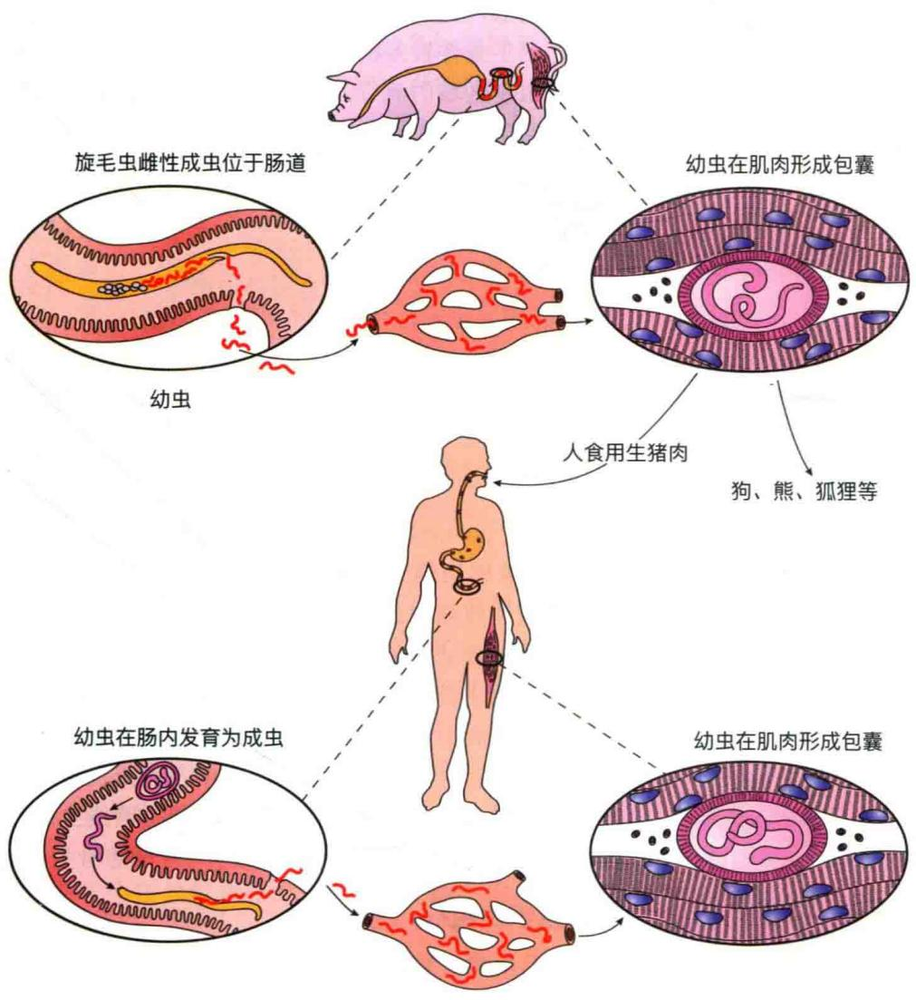 
图9-37 旋毛虫病。旋毛形线虫的囊包被猪吞食后，囊包在猪的胃肠道被消化，释放出幼虫，后者随后发育为成虫。幼虫被雌虫产出后穿透肠壁进入血液循环并在横纹肌内寄生，并形成囊包。当人类食用未充分煮熟的猪肉，上述循环在人体内重复，引起旋毛虫病特征性的肌肉病变

【病因病机及病理】裂体吸虫有着复杂的生活史，在无脊椎生物宿主（钉螺）体内的无性世代和脊椎生物宿主体内的有性世代间转换（图9-38）。裂体吸虫卵：①在淡水中孵化；②孵出
可以游动的幼虫（毛），后者钻入钉螺体内；③发育为幼虫的最后阶段（尾）；④从螺体内逸出进入水体，钻入人类宿主的皮肤。童虫在组织内移行，穿透血管并被血供带至肺和肝。在从门静脉至肠道微静脉的旅途中，童虫成熟，在肠道微静脉形成合抱的雄虫和雌虫。曼氏血吸虫及日本血吸虫的雌虫将虫卵产于肠道微静脉，而埃及血吸虫的雌虫则将虫卵产至膀胱。基本的病变为被肉芽肿或嗜酸性粒细胞及中性粒细胞浸润包绕的虫卵，该病变是宿主对虫卵抗原产生反应的结果。早期肉芽肿中经常见到大量嗜酸性粒细胞。在较为陈旧的肉芽肿内，上皮样巨噬细胞及巨细胞明显，而最老的肉芽肿内则见致密的纤维化。虫卵引起的肉芽肿可阻塞微血管的血供并导致邻近组织出现缺血性损伤。其结果为进行性的瘢痕形成及受累器官功能障碍。
雌虫可在长达 $5\sim 35$ 年的时间段内每天生产成百上千乃至上万个虫卵。多数感染者体内雌虫不超过10条。然而若大量寄生，大量虫卵引起的肉芽肿性反应可带来严重问题。不同种的裂体吸虫具有不同的组织亲性，因而累及不同的部位。
■曼氏血吸虫寄生于肠系膜下静脉分支，因此主要引起远端结肠及肝损伤。 
■埃及血吸虫寄生于引流直肠、膀胱及盆腔器官血供的静脉。 
日本血吸虫主要将虫卵产在肠系膜上静脉分支，因此主要引起小肠、降结肠及肝损伤。
肝病：曼氏血吸虫及日本血吸虫引起肝病。该病以门静脉周围肉芽肿性炎症起病（图9-39），随后发展为致密的门脉周围纤维化（干线性纤维化）（图9-40）。在严重的肝血吸虫病例中，这一效应导致门脉血流梗阻及门脉高压。曼氏血吸虫及日本血吸虫也可通过肉芽肿性反应形成炎性息肉及黏膜和黏膜下层的纤维化病灶等肠道损害。
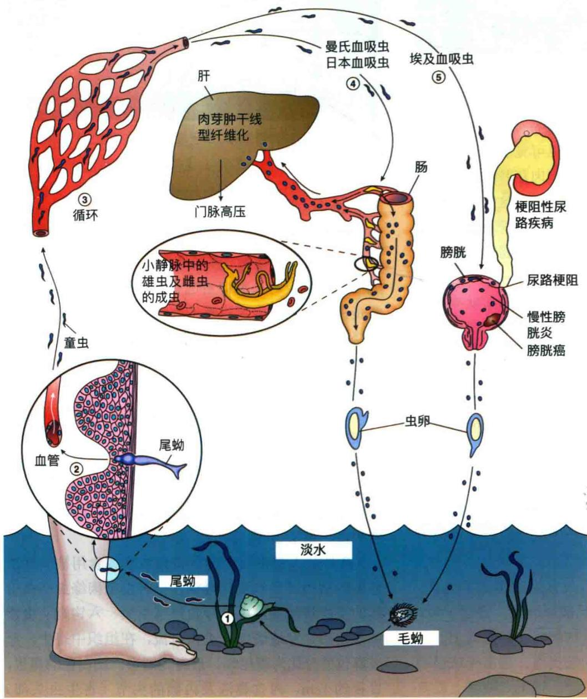 
图9-38 裂体吸虫的生活史及血吸虫病的临床特征。裂体吸虫的虫卵在淡水中孵化，毛蚴逸出，钻入钉螺体内，经历两个胞蚴阶段的发育成为幼虫的最后形态，即尾蚴：①尾蚴从钉螺体内逸出进入水体，“游动”中若遇上人类宿主则可钻入皮肤。②尾蚴脱去其带萼的尾部形成童虫，在组织中移行，穿透血管并被带至肺。③随后入肝。在肝门静脉内童虫性成熟，雌、雄虫合抱，雌虫躺在雄虫的抱雌沟内。血吸虫导致肝多种病变，包括肉芽肿、门静脉（“干线性”）纤维化及门静脉高压。④雌虫将未成熟的虫卵产于肠道及肛门微静脉（曼氏血吸虫及日本血吸虫）或膀胱（埃及血吸虫）。⑤膀胱感染导致梗阻性尿路疾病，尿路梗阻、慢性膀胱炎及膀胱癌。当虫卵在组织中移行时，其内的胚胎逐渐发育，虫卵穿过肠壁或膀胱壁时幼虫成熟。进入水中的虫卵孵化，毛蚴逸出，完成一个循环
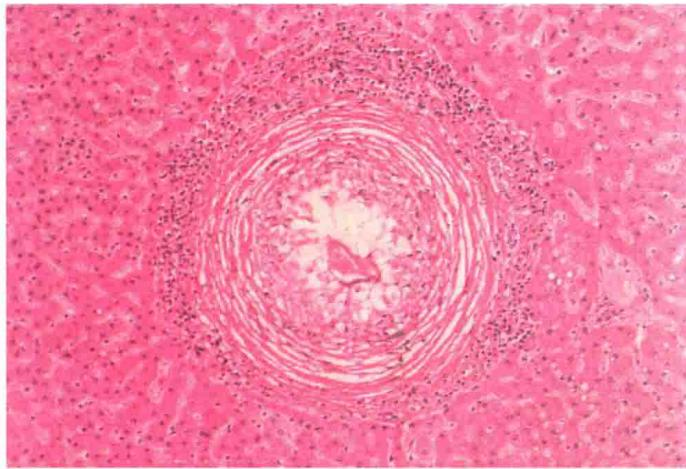 
图9-39 肝血吸虫病。肝内肉芽肿包绕降解的曼氏血吸虫卵
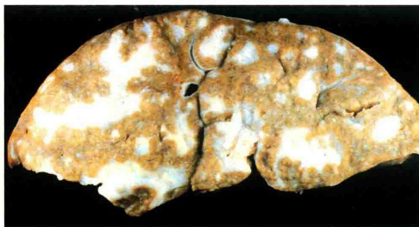 
图9-40肝血吸虫病。日本血吸虫引起的肝慢性感染形成特征性的“干线性”纤维化
尿生殖道疾病：埃及血吸虫感染特征为膀胱、输尿管及精囊中大量虫卵，但是虫卵也可见于肺、结肠及阑尾。膀胱及输尿管中的虫卵引起肉芽肿性反应、炎性突起及黏膜和黏膜下层小块纤维化。这些病变可阻塞尿流，从而导致继发性的膀胱、输尿管及肾的炎性损害。埃及血吸虫病引起的膀胱疾病是膀胱癌的一个主要高危因素。
尽管裂体吸虫可以被全身抗蠕虫药物如吡喹酮等有效杀死，但是寄生虫导致的广泛的纤维化及瘢痕形成等结构改变无法逆转。
# （二）华支睾吸虫病引起胆道梗阻
华支睾吸虫病是中华肝吸虫，即华支睾吸虫引起的肝内胆管系统感染。人主要因食用未煮熟的被感染的淡水鱼患病。尽管此种吸虫通常仅造成轻微症状，但有时亦可引起胆道结石、胆管炎及胆管癌。华支睾吸虫病为东亚的地方病，从越南至韩国都有分布。在中国，近来由于淡水养殖业的发展，该病的患病人数翻了3倍，达到1500万。

【病因病机及病理】当人食用被感染的鱼肉，华支睾吸虫在十二指肠破卵而出，通过Vater壶腹进入胆总管，在远端胆管发育为成虫。在胆管中的华支睾吸虫引起炎症，后者无法遏制
感染但可导致胆管扩张及纤维化。镜下，被覆上皮首
先增生，随后出现化生。周围间质纤维化。继发细菌感染常见，并可引起化脓性胆管炎。产在肝实质中的虫卵被纤维组织及肉芽肿性反应包绕。大量虫卵可堵塞在胆管中并引起胆管炎。有时华支睾吸虫在肝内胆管引起结石形成，导致胆道梗阻。成虫可在胆道中生存十数年，长期的感染与胆管上皮的癌症（胆管癌）发病风险增高相关。在严重的华支睾吸虫感染中，肝可增大至正常体积的三倍。透过包膜可以看到扩张的胆管，肝切面不平，内见管壁变厚的胆管（图9-41）。胰管亦可受累，被覆上皮化生，最终被瘢痕组织包绕。全身抗蠕虫药物治疗对华支睾吸虫有效。
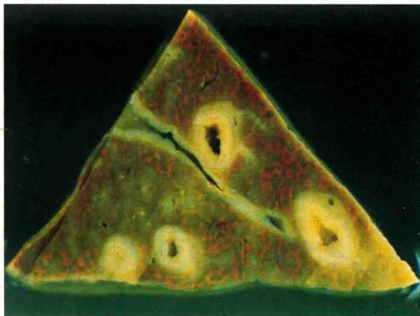 
图9-41 肝华支睾吸虫病。由于成虫（华支睾吸虫）感染，胆管明显增厚并扩张
# 五、绦虫：肠道带虫
肥胖带绦虫、链状带绦虫及曼氏迭宫绦虫为三种可以感染人类的绦虫，在肠道内发育为成虫（表9-7）。成虫本身甚少对人类宿主造成损害。肠道带虫感染主要是由于摄入未完全煮熟的被幼虫污染的牛肉（肥胖带绦虫）、猪肉（链状带绦虫）或鱼肉（曼氏迭宫绦虫）引起。在发达国家，肉牛及肉猪的养殖产业的现代化加上肉检在很大程度上消灭了牛肉及猪肉中的带虫，但在发展中国家带虫感染仍然常见。鱼肉带虫感染在有食用生鱼、腌鱼或半生的鱼肉的习惯的地区高发。带虫感染常常不出现临床症状，但部分虫体随粪便排出时感染者可感到痛苦。鱼肉带虫（曼氏迭宫绦虫）与宿主竞争维生素 $\mathbf{B}_{12}$ ，一小部分感染者（ $2\%$ 出现恶性贫血，见第20章）。
意外从人粪中摄入链状带绦虫卵或食用被其幼虫感染的猪肉可导致囊尾蚴病，一种由猪肉绦虫幼虫引起的全身性感染，可以导致严重后果。六钩蚴从虫卵中逸出后，穿透肠壁，进入血流，在组织中寄生，形成囊包并分化为囊尾蚴。后者为圆形，奶白色的囊包，直径约 $1\mathrm{cm}$ ，内含囊液及内翻的头节（寄生虫头部）
及双折的小钩。囊包可长期保有活力而且不引起炎症，而是在生长的过程中挤压周围组织。症状通常由降解中的囊包引起。降解中的囊包附着于组织上并引起大量嗜酸性粒细胞、中性粒细胞、淋巴细胞及浆细胞的炎性浸润。脑囊尾蚴病（脑囊虫病）表现为头痛或癫痫，具体症状根据受累部位的不同而不同。若大量囊尾蚴入脑可导致抽搐及死亡。
导致更多囊包的形成。肝内或其他腹部器官的棘球蚴创伤性破裂可引起弥漫性疼痛，与腹膜炎表现相仿。寄生于肺的囊包破裂可导致气胸及脓胸。更严重的是，若囊包破裂，内容物进入某个体腔可引起致命的超敏反应。棘球蚴病的治疗常常需要通过手术仔细移除囊包。在引流或摘除囊包时应首先用甲醛处理以防术中过敏性休克。
虫种人类疾病人类感染源肥胖带绦虫带虫成虫寄生于肠道牛肉链状带绦虫带虫成虫寄生于肠道；囊尾 蚤病猪肉；人类粪便阔节裂头绦虫带虫成虫寄生于肠道鱼肉细粒棘球绦虫包虫病狗粪
棘球蚴病：棘球蚴病（包虫病）是一种动物源性感染，由棘球属的幼虫导致。其中最常见的致病生物种为细粒棘球绦虫，引起棘球蚴病。细粒棘球绦虫感染在绵羊、山羊及牛，还有牧羊犬中常见。犬类可将感染性的虫卵带至犬舍（及主人身上）。人类在不注意的情况下摄入了虫卵后被感染。其导致的棘球蚴病见于世界各地，主要感染者为与犬及牧群密切接触的牧人。在美国，棘球蚴病见于移民及西南部牧羊的原住民。

【病因病机及病理】人类摄入被绦虫卵污染的物质后被感染。幼虫从虫卵中逸出，穿透肠壁，
进入血流并播散至深部器官中。缓慢生长的棘球可能被偶然中发现或当其大小及位置影响
到结构的正常功能时被察觉。若囊包寄生于肝可压迫肝内胆管（图9-42）并导致阻塞性黄疸。寄生于肺部的囊包通常不引起临床症状，而是在胸部射线检查时意外发现。
若囊包破裂，主要的并发症为邻近组织的播种，
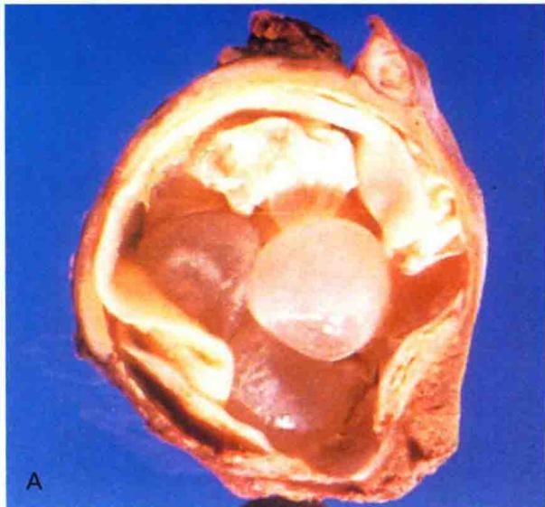
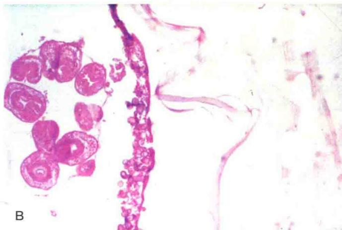 
图9-42 棘球蚴囊包。A.从细粒棘球绦虫患者肝中切除的棘球蚴囊包，内见子囊；B.囊壁（从右至左）由无胞核的角皮层和有核的生发层组成，囊腔内见成群的生发囊附着及多个头节
（陆俊良）
# 第10章 血管
血管曾一度被认为只是供应器官血液的被动管道。但是，对血管疾病——西方社会发病率和死亡率最常见的病因的重视，导致作为动力学系统的血管也得到显著性认识。大多数血管疾病是由内皮细胞、平滑肌细胞的功能障碍和它们与血液循环因子之间的相互作用造成的。
# 第一节 止血和血栓形成
止血是对出血的制止，是一种血管损伤反应。该过程涉及局部血管收缩、组织肿胀、凝血、血小板黏附、黏集和激活，这导致损伤部位的血管内外止血栓子的扩大。在体外试管内，通过凝血级联反应的激活诱导凝血形成。在体内，止血涉及：①活化型和失活型酶分子形成的网络；②来自不同细胞和组织的辅酶因子，其中，一些是循环性因子，一些是局部产生的因子（表10-1）。止血的具体疾病将在第20章中详细讨论。
血栓形成是一种在循环中可引发血凝块或血栓子形成的病理过程。血栓是包括血小板、纤维蛋白、白细胞和红细胞的凝固性血块。它的形成涉及凝血因子和抗凝血因子之间的相互作用，当抗凝血系统不能够抗衡促血栓形成过程时，血栓即可形成。血栓的形成涉及：① 血小板的活化；② 凝血途径的顺序性激活；③ 单核细胞/巨噬细胞系统的参与；④ 血管壁内皮细胞的主动参与。该主题将在第7章中进一步讨论。
# 一、凝血发生在纤维蛋白原转化为纤维蛋白时
凝血意味着血浆可溶性纤维蛋白原转化成不溶性纤维状聚合物，即纤维蛋白，该反应是由蛋白水解酶一凝血酶催化完成。它涉及一系列步骤，每个步骤由多个凝血因子介导完成（表10-1），其中，一些步骤会被特定抑制剂所抑制。凝血级联反应使初始信号放大，直至对血栓形成和稳定具有关键作用的凝血酶产生。尽管以前凝血级联反应被划分为“内在”途径，现在则被称为接触活化途径，“外在”途径现被称为组织因子途径。这种划分不能准确反映凝血的内在机制。
表 10-1 凝血因子名称因子标准名称I纤维蛋白原II凝血酶原III组织因子IV钙离子V促凝血酶原VII凝血酶原VIII抗血友病因子IX血浆促凝血酶原激酶X凝血酶原激酶原XI血浆凝血激酶前质XII接触因子XIII纤维蛋白稳定因子-激酶释放酶原-高分子量激肽原
当下对凝血（图10-1）的认识是突出组织因子（tissue factor，TF）的重要性，TF是一种膜结合糖蛋白，正常情况下不发挥作用。
① 当活化型因子VII（VIIa）在血管损伤部位遇到TF时，止血过程开始。少量的因子X和IX被激活成为Xa和IXa。 
②因子VIIa-TF复合物和组织因子途径抑制物（TF pathway inhibitor，TFPI）之间的动态联系对血栓形成的调控很重要。TFPI结合到Xa，TFPI-Xa-TF-VIIa四元复合物抑制VIIa-TF复合物介导的Xa和IXa的进一步形成。因此，内皮细胞表面的TFPI调节了活化过程但不会阻止凝血的启动。 
③ 因子VIII a 和 IXa 促进大量的因子 X 活化为 Xa。 
④凝血酶催化并激活因子XI，因子XIa反过来促进IX因子转化为IXa。IXa和VIIa的复合物促使更多因子X转化为Xa，Xa结合Va，在血小板膜磷脂上形成凝血酶原酶复合物。
⑤凝血酶原酶复合物使非活化型凝血酶原转化为凝血酶。 
⑥凝血酶使纤维蛋白原转化成纤维蛋白单体，后者形成聚合物。凝血酶也促使因子XIII活化为XIIIa，形成交联纤维蛋白链以稳定血块。
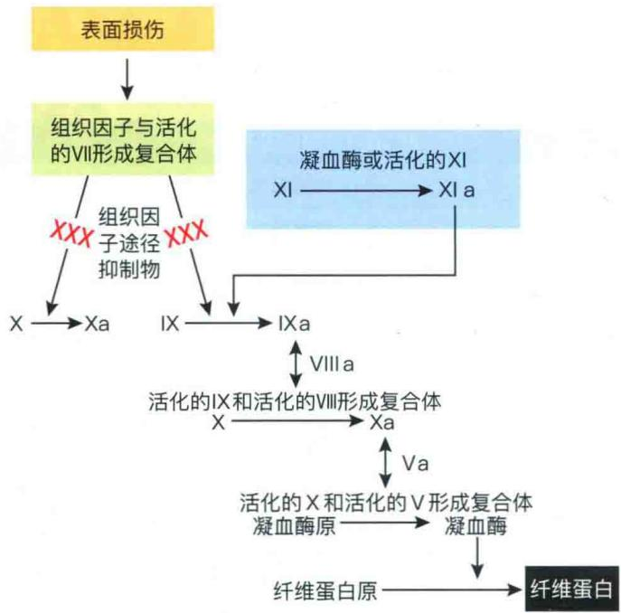 
图10-1凝血级联系统。内皮损伤后释放TF，凝血级联被启动。TF结合因子VIIa形成复合物，进一步激活少量的X为Xa，IX为IXa。复合物IXa和VIIIa进一步激活X。Xa和Va复合物催化凝血酶原为凝血酶，之后，纤维蛋白原形成纤维蛋白
除了在凝血和血小板黏集上的作用，凝血酶还扮演着以下角色：
① 参与纤维蛋白溶解； 
②调节生长因子和白细胞黏附分子； 
③通过结合血栓调节蛋白、之后启动蛋白C活化，发挥抗凝血作用。活化的蛋白C调节因子Va和VIIa的活性； 
④ 增加内皮细胞通透性。
# 二、血小板黏附和黏集——发生在血管损伤后
正常情况下，循环的血小板并不发生黏附。损伤促使血小板黏附，之后，血小板相互作用形成血小板血栓，即活化的血小板黏集体。血小板黏附和黏集的障碍将在第20章中讨论。
血管损伤和内皮细胞层完整性缺失后，血小板活化，该过程涉及以下多个有序步骤（图10-2）：
① 血小板黏附通过特定的血小板表面糖蛋白（glycoprotein，GP）受体，血小板黏附到暴露的内皮下基质蛋白，如胶原蛋白和血管性血友病因子（von Willebrand factor，vWF）。GPIb/IX结合vWF和整合素受体 $\alpha_{2}\beta_{1}$ ，GPVI结合胶原蛋白。
(2) 形状变化血小板形状从盘状球形变为星状, 反
映出肌动蛋白微丝的重组。
③ 血小板颗粒内容物的分泌内容物包括二磷酸腺苷、肾上腺素、钙、vWF和血小板衍生的生长因子，作用是促进血小板黏附和黏集。 
④ 血栓素A2：它是通过环氧酶1产生。 
⑤膜变化：P-选择素和促凝血阴离子磷脂，如磷脂酰丝氨酸的暴露。
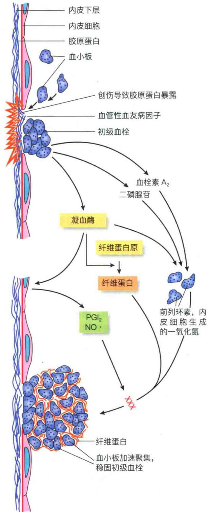 
图10-2 血栓形成中血小板的作用。随着血管壁的损伤和血流的改变，血小板黏附并聚集。伴随着凝血酶的生成，分泌的二磷腺苷和血栓素 $\mathrm{A}_2$ 募集更多血小板，增大团块。不断生成的血小板血栓通过纤维蛋白得以稳定。包括白细胞和红细胞在内的其他元素也并入血栓。内皮细胞分泌的前列环素和一氧化氮调节抑制血小板黏集过程
⑥ 血小板黏集通过纤维蛋白原与受体GP II b/III a的交联，血小板发生黏集。
上述每一步骤都产生特定效果。初始的黏附信号促进血小板活化；血小板颗粒内容的分泌和血栓素A2通过表面受体促进其他血小板活化；活化的血小板呈星状，有利于促凝膜表面和活化的GPⅡb/Ⅲa受体/纤维蛋白原伸到凝血因子和其他血小板相互作用的部位。因此，活化的血小板表面是促使包括凝血酶原酶复合物在内的凝血因子复合物聚集的最佳部位。产生的凝血酶有多种作用（见前面），尤其能促进血小板进一步活化。最后，P-选择素参与白细胞的结合并使它们和白细胞与血小板分泌物，如PDGF，共同参与愈合。这些步骤相互协同，最终活化的血小板形成一个牢固的初始栓头，之后与血小板-纤维网形成黏集体，以止血并启动愈合。
# 三、内皮因子——抗凝及凝血双向调节过程
大部分血栓形成的主要原因是易使内皮处于血栓前状态的内皮损伤（图10-2）。内皮细胞合成vWF，从而有利于在内皮表面上发生凝血。最后，包括单核细胞释放的细胞因子在内的炎症物质促进完整内皮细胞表面TF表达。因此，血栓在以下情况时可形成：①内皮功能改变；②内皮连续性缺失；③血流异常，如湍流或静止。
内皮在控制血栓形成上发挥积极作用（表10-2）。内皮主要的抗血栓机制是抑制血小板黏集的前列环素的分泌。内皮型一氧化氮也是一种有效的抗血小板黏集和黏附于血管的抑制剂。内皮细胞代谢作为血栓形成强启动子的二磷腺苷，生成具有抗凝性的代谢产物。内皮的管腔表面覆有硫酸乙酰肝素，后者可结合多种凝血因子，包括抗蛋白酶 $\beta_{2}$ 巨球蛋白，也可激活抗凝血酶III，从而抑制凝血因子IIa，IXa和Xa。内皮细胞也可通过纤溶酶原/纤溶酶激活物/纤溶酶系统溶解一些血块。内皮细胞有几种其他抗凝血活性。蛋白C和血栓调节蛋白（见前面）的合成都是由内皮细胞完成的。TF和TFPI（图10-1）的合成和分泌是由内皮细胞以及其他血管细胞完成的。
# 四、血块溶解——一种调节机制
血栓的结局有几种，包括：①溶解；②生长和播散；③栓塞；④机化和再通。黏集的血小板和凝固血被活化的纤维蛋白水解酶-纤溶酶所溶解（图10-3）。在血凝块形成过程中，未活化的纤溶酶原结合到纤维蛋白，因此它是形成血小板团块整体的一部分。内皮细胞合成纤溶酶原激活物，后者转换纤溶酶原为活化的纤溶酶。相反，通过消化纤维蛋白，纤溶酶溶解凝块并破坏血栓。内皮细胞也合成纤溶酶原激活物抑制剂-1，
纤维蛋白被 $\alpha -2$ 抗纤溶酶抑制。因此，该区域的纤溶平衡取决于纤溶酶原激活与抑制的比率。
血栓可能发生机化和并进入血管壁。该过程类似于伤口愈合过程（见第3章），可导致血栓重塑，与它自己的新血管形成纤维状结构。再血管化过程被称为再通。
表10-2 内皮细胞表面凝血的调节下调凝血酶失活抗凝血酶III血栓调节蛋白APC途径血栓调节蛋白的合成和表达蛋白S的合成和表达血栓调节蛋白介导的蛋白C的活化APC-S蛋白复合体使因子Va和VIIa失活组织因子途径抑制纤溶组织纤溶酶原激活物和尿激酶纤溶酶原激活物和纤溶酶原激活物抑制剂1的合成谷氨酸纤溶酶原转化成赖氨酸纤溶酶APC介导的强化不饱和脂肪酸代谢物的合成脂肪氧合酶代谢产物——13-HODE环氧化酶代谢产物——PGI2和PGE2促凝血途径组织因子（促凝血酶原激酶）、因子V、血小板活化因子的合成和表达凝血因子IX/IXa,X的结合（凝血酶原复合物）APC途径的下调纤溶酶原激活物抑制剂的合成增加15-HETE的合成
APC. 活化的蛋白 C；13-HODE. 13-羟基十八碳二烯酸；HPETE.氧化氢基二十碳四烯酸； $\mathrm{PGE}_2$ 前列腺素 $\mathbf{E}_2$ ； $\mathrm{PGI}_2$ 前列环素
（段焕利）
# 第二节 动脉粥样硬化
动脉粥样硬化发生时，炎细胞、免疫细胞、平滑肌细胞、脂质和结缔组织逐渐聚集并累及大动脉、中等动脉平滑肌内膜下。在典型的动脉粥样硬化中，病变经过数十年可进展为纤维炎性脂质斑块（粥样斑块）。病变继续进展，粥样斑块逐渐侵犯动脉中膜，使得管腔狭窄（详见表10-3）。本病的流行病学特点及随后出现的局部缺血性心脏病将在第11章中进行讲述。
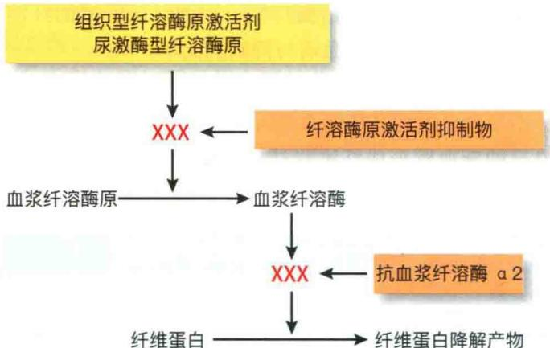 
图10-3 纤溶机制。来自于纤溶酶原的纤溶酶溶解纤维蛋白，纤溶酶原到纤溶酶的转化和纤溶酶本身的活性被特异性抑制剂抑制
表10-3 动脉粥样硬化的形成纤维炎性脂质斑块的发生和发展是一个动态的慢性进展过程，多种急性事件叠加其中危险因素加速了病变的进展发病机制是多种因素的，因此特定的遗传和环境因素的相对重要性，因人而异血管壁基质成分，细胞间血清、淋巴细胞、血小板及外力等各种因素的相互作用都参与调控纤维炎性脂质斑块的形成
# 一、动脉粥样硬化发病机制基于统一假说
动脉粥样硬化的发病机制有一系列假定顺序。该假说可以分为三个阶段：①起始和形成期；②适应期；③临床表现期（详见图10-4～图10-7）。这些过程早在胎儿时期或出生不久，伴随内膜细胞团的形成就可出现，随后脂纹逐渐形成。然而，经过长达 $20\sim 30$ 年的发展，临床特征不典型的早期病变可进展为特征性病变。一旦出现特征性病变，就可引发严重的急性并发症，动脉粥样硬化病变经过多年进展也会诱发某些复杂病变。
# （一）起始和形成期
1. 循环中内膜病变的起始部位一般位于血流剪切力较低但波动迅速的部位，如动脉分叉和分支开口处。内皮功能紊乱或内皮下平滑肌细胞蓄积常发生于上述部位，冠状动脉尤甚。在粥样斑块好发部位，内皮细胞通过增生使得促炎基因表达，产生血管黏附分子（VCAM-1）和细胞间黏附分子（ICAM-1）。上述过程为病变部位募集单核细胞移动至血管壁间的重要机制。单核巨噬细胞的蓄积是动脉粥样硬化病变的早期事件之一，其通过黏附和迁移等多个过程参与病变形成。 
2. 病变发生时，内皮细胞完整形态遭到破坏，脂质通过功能紊乱的内皮细胞和细胞间隙在内皮下聚集。低密度脂蛋白（LDL）携带脂质进入内皮下。oxoLDL使
内皮细胞活化，巨噬细胞黏附其表面，然后携带脂质成分迁移入内膜。巨噬细胞来源的泡沫细胞坏死后可释放大量脂质。平滑肌细胞合成的基质蛋白多糖类型发生改变，通过结合和捕获脂质使得内膜下脂质不断蓄积。脂质外溢减少也是造成脂质蓄积的原因之一。
3. 巨噬细胞除了参与脂质聚集，还释放生长因子，从而促进平滑肌细胞的进一步迁移聚集。氧化修饰脂蛋白可诱导组织损伤和巨噬细胞的进一步聚集。单核巨噬细胞合成PDGF、FGF、肿瘤坏死因子（TNF）、白介素-1（IL-1）、干扰素-α（IFN-α）、转化生长因子β（TGF-β），这些物质均可刺激或抑制平滑肌细胞和内皮细胞的生长。巨噬细胞和内皮细胞的结合可促进血管表面的抗凝成分转化为促凝成分。 
4. 随着损伤进展，内膜表面附壁血栓形成，会刺激PDGF释放，后者又可促进平滑肌增生及基质成分分泌增加。 
5. 增厚的内膜深部缺乏养分，从而出现坏死，这些损伤都会促进斑块内血管新生。 
6.纤维炎性脂质斑块包括中央坏死物质、纤维帽，后者将管腔中的血液与坏死成分分隔开来。炎症细胞和免疫细胞浸润，其间还掺杂有平滑肌细胞，沉积的脂质成分和大量无定型基质。 
7. 动脉粥样硬化的形成也有免疫系统的参与。内皮细胞和平滑肌细胞表达HLA-DR抗原，该抗原的产生是由其相邻的活化T细胞刺激所致，后者可分泌干扰素（INF）-γ刺激HLA-DR抗原表达。活化T细胞对oxoLDL的作用可反映自身免疫应答的情况，这对于动脉粥样硬化病变进展十分重要。
# （二）适应期
由于斑块突入管腔（如冠状动脉处），为了维持一定的管腔口径，动脉管壁会发生相应的重建。当隆起占管腔口径一半时，管壁重建已不能代偿，则会引起管腔狭窄。若重建的管壁可维持血流量，这时斑块为静止状。然而，即使很小的斑块在该期也有可能发生破裂，引发灾难性后果，这在下文会进行讨论。
# （三）临床表现期
斑块坏死区域的新生血管发生破裂后可引起斑块内出血，斑块内出血使得损伤区域体积增大，阻塞管腔而引起供血不足。
进展期斑块可引起一系列并发症，包括表面溃疡、纤维化、钙化及动脉瘤。斑块继续进展则会导致管腔出现严重的狭窄甚至闭塞。斑块破裂（纤维帽破裂）引发的血栓和梗死可导致如急性心肌梗死等致命性病症。
动粥样硬化假说机制在疾病各期进展的情况如图10-4所示。
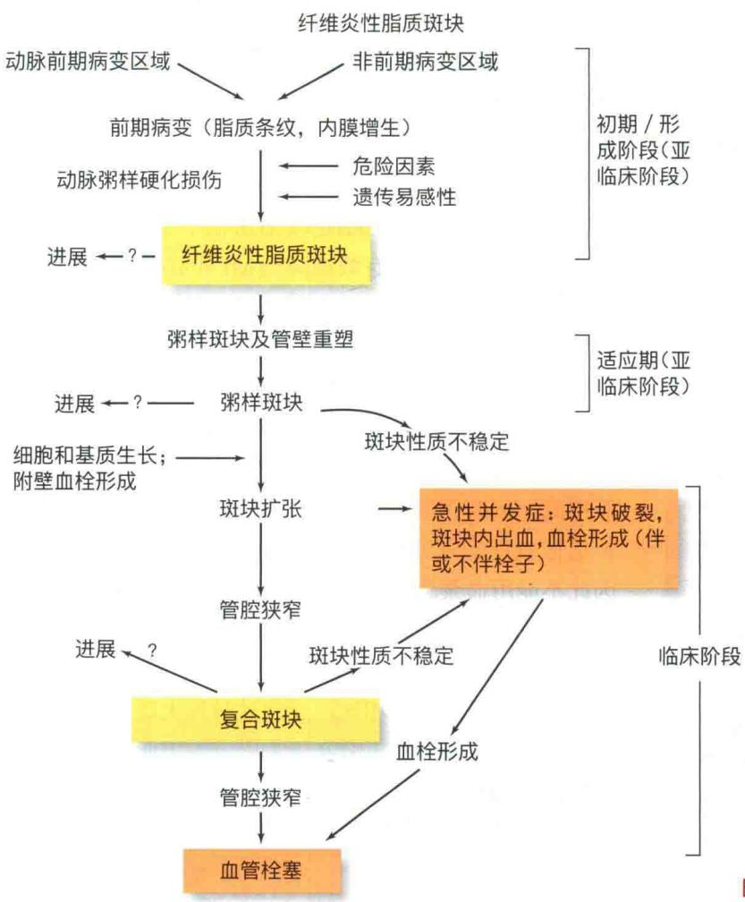 
图10-4 动脉粥样硬化统一假说的发病机制
# （四）动脉粥样硬化的早期病变

【病理变化】在典型动脉粥样硬化斑块出现后，可见两种不同的病变形式。
■ 脂纹：脂纹呈扁平状或稍突入管腔，内膜下含有富含脂滴的巨噬细胞（泡沫细胞）（图10-4，图10-5）及胞外脂质的聚集。在平滑肌中也可见脂质蓄积但量较少。儿童期的动脉树中，已经明显可见大量脂纹，但与成人的动脉粥样硬化病变在分布上有明显不同。此外，许多学者认为脂肪浸润是动脉粥样硬化的前期病变，脂纹发展到临床上明显的动脉粥样硬化斑块还有其他因素参与。
内膜细胞团：它也可作为动脉粥样硬化的一种早期病变形式，白色增厚区域常位于动脉管壁分支处。光镜下，富含平滑肌细胞和结缔组织但无脂质。这些病变被称为“垫子”，它们出现的位置主要是动脉分支处，亦即随后粥样硬化出现的位置。
# （五）动脉粥样硬化的特征性损伤
纤维脂质斑块的形成是动脉粥样硬化的特征性病变。单纯性斑块病变集中，微隆起，淡黄色，表面光滑，形状不规则，但边界清晰。纤维脂质斑块（图10-6）为进展性病变，椭圆形，直径 $8\sim 12\mathrm{cm}$ 。光镜下，初期粥样硬化斑块表面覆盖有内皮细胞，常伴内膜，少
有间质成分（图10-6B）。管腔和坏死区域之间、纤维帽，其中含有平滑肌细胞，巨噬细胞、淋巴细胞、泡沫细胞（富含脂质的巨噬细胞和平滑肌细胞构成）和结缔组织等成分。动脉粥样硬化的中心区域含有坏死状碎片。坏死和纤维组织中可能含有胆固醇结晶，泡沫细胞和异物巨细胞。斑块中也可见到大量的炎细胞和免疫细胞，尤其是T细胞。新生血管是斑块体积增大的主要原因，并有可能导致后续并发症的发生（图10-7）。由于新生血管管壁薄弱，因此容易引发斑块内出血而导致斑块急剧膨胀。斑块中还可见到富含铁血黄素的巨噬细胞灶，这可能提示远处存在斑块内出血。
# （六）复杂的动脉粥样硬化斑块
复杂的脂质瘢痕病变主要包括以下几种情况：斑块表面糜烂、溃疡或破裂；斑块出血；附壁血栓形成；钙化和动脉瘤（图10-6C，D，图10-8）。由单纯的纤维脂质瘢痕进展而来的复杂病变常发于 $50\sim 60$ 岁的中老年人，但也可见于30岁左右的青年人中。动脉粥样硬化进展过程中的细胞间相互作用情况如下图10-9所示。
钙化可发生于坏死区域及斑块的其他部位。
■附壁血栓形成由斑块处血液湍流等原因造成，斑块突入管腔导致上皮层细胞受损及抗凝作用减弱，从而引发附壁血栓。因此，血栓常形成于纤维帽表面的糜烂和破溃处。
■不稳定性动脉粥样瘢痕常导致急性的冠脉综合征，会引发附壁血栓形成、纤维帽破裂或斑块内出血等其他症状。斑块一旦破裂，其内的坏死性物质释放至管腔，组织因子TF发挥作用，促进血栓形成，这有可能引起闭塞性血栓形成。炎症循环标志物水平的升高（如C反应蛋白和纤维蛋白原）提示多种促凝介质在该过程中发挥作用。
■斑块破裂后动脉管壁胶原纤维暴露，血液中的促凝成分在此聚集形成血栓，其为闭塞性血栓形成的原因。大多数斑块破裂发生于管腔口径小于 $50\%$ 的狭窄处，超过 $95\%$ 的破裂发生于口径小于 $70\%$ 的狭窄处。斑块破裂常发生于斑块肩部，主要原因为纤维帽边缘抗血流剪切力的能力较弱。如果破裂的斑块不经修复，内皮损伤处则会进展为斑块糜烂，纤维帽愈加脆弱，其也可促进更多斑块成分暴露于血液。
# （七）动脉粥样硬化的并发症
动脉粥样硬化病变位置分布、大小不同其相应的并发症和病程也有所不同（详见第11章）。
# 二、动脉粥样硬化的危险因素可预测缺血性病症的发生
以下几点危险因素与双重或高级别的缺血性心脏
病发生相关：
■高血压：高血压始终与MI的发生高度相关。之前认为MI的风险仅与心脏舒张相关，但近期有证据表明心脏收缩在其中也起到重要作用。收缩压 $120\sim 139\mathrm{mmHg}$ ，舒张压 $80\sim 89\mathrm{mmHg}$ 的人群（高血压前期）发生MI的比率是收缩压低于 $120\mathrm{mmHg}$ 人群的3倍。控制血压可有效地降低MI和脑卒中的发生率。
血胆固醇水平：缺血性心脏病的发生与血浆胆固醇水平直接相关。对于地理分布不同的冠状动脉硬化性心脏病而言，血浆胆固醇似乎是该病发生最为重要的决定因素。在无遗传性脂质代谢疾病的情况下（详见下文），血中胆固醇含量与饮食摄入的饱和脂肪酸量高度相关。服用降胆固醇药物可有效降低MI的发生率。胆固醇的转运依赖促动脉粥样硬化和抗动脉粥样硬化的脂蛋白，因此不能用血浆总胆固醇含量用来预测患者患缺血性心脏病的风险。因此，常用LDL胆固醇值来决定治疗策略
■ 吸烟：吸烟与该病发生相关（详见第8章）。吸烟人群与不吸烟人群相比，冠状动脉和大动脉粥样硬化斑块的病变更加严重，分布更加广泛。因此，吸烟可以明显增加MI，缺血性脑卒中，腹主动脉瘤的发生率。
糖尿病：糖尿病可增加多器官患闭塞性动脉粥
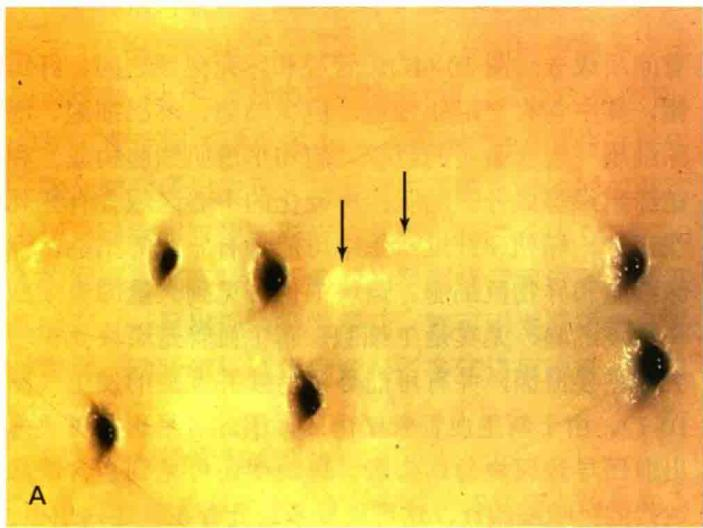
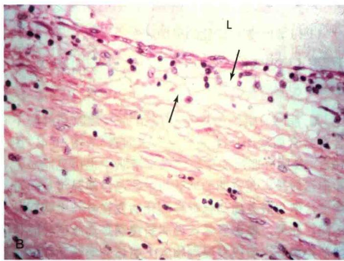
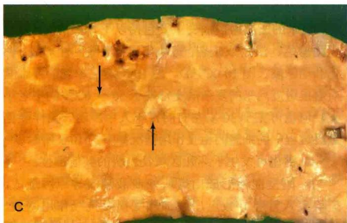 
图10-5 脂纹及动脉粥样硬化。A.脂纹，胸主动脉脂纹肉眼图片（箭头处）；B.脂纹，脂纹的显微结构，可见内皮下泡沫细胞（箭头处），L为管腔；C.纤维炎性脂质斑块，胸主动脉内皮下斑块隆起；D.纤维炎性脂质斑块，纤维帽（星号处）管腔（L处）中心坏死区域（竖线区间）
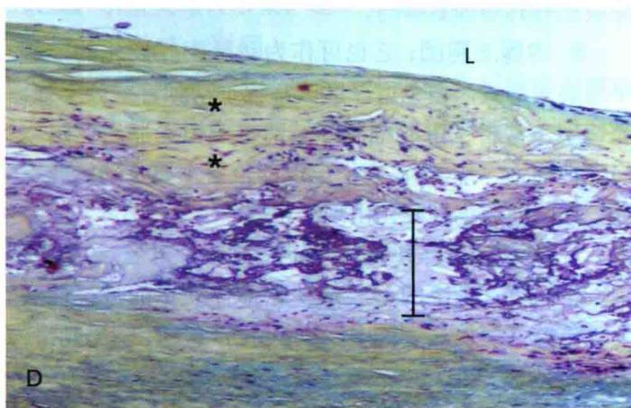
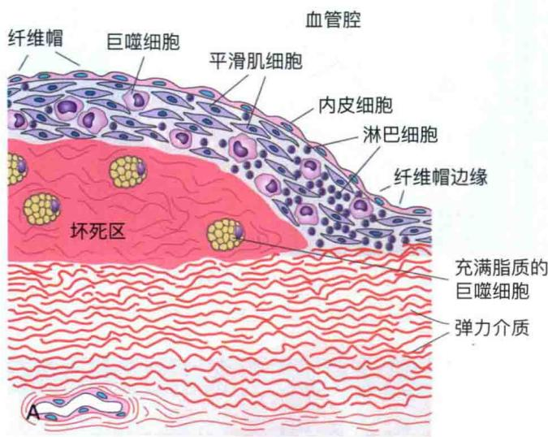
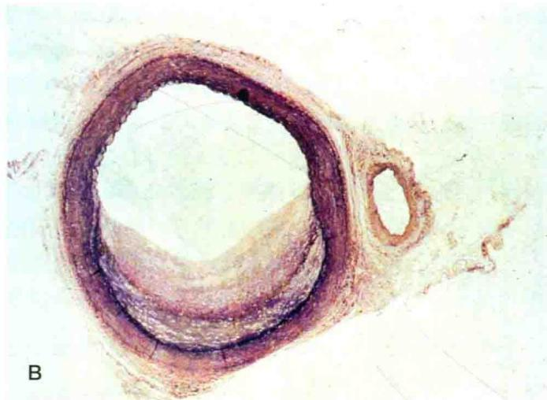
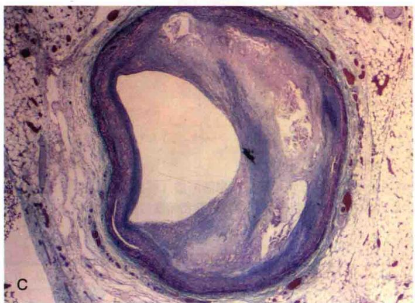 
图10-6 动脉粥样硬化的纤维脂质斑块。A. 充分进展的脂质斑块中，可见富含脂质的巨噬细胞及坏死的碎片状平滑肌细胞；纤维帽大部分是由平滑肌细胞构成，后者可产生大量胶原蛋白，少量的弹性蛋白及黏多糖。坏死灶内可见巨噬细胞和淋巴细胞浸润，值得注意的是在纤维帽表面经常可见完整的内皮细胞。B. 粥样硬化斑块和血管壁膨胀在适应期可以维持必要的血流量。斑块上方是正常管壁。C. 冠状动脉的粥样硬化斑块。D. 分离的主动脉可见隆起的褐色斑块，明显的斑块溃疡病灶
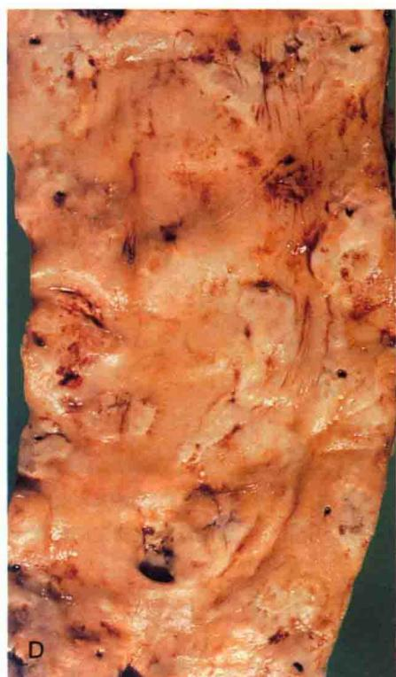
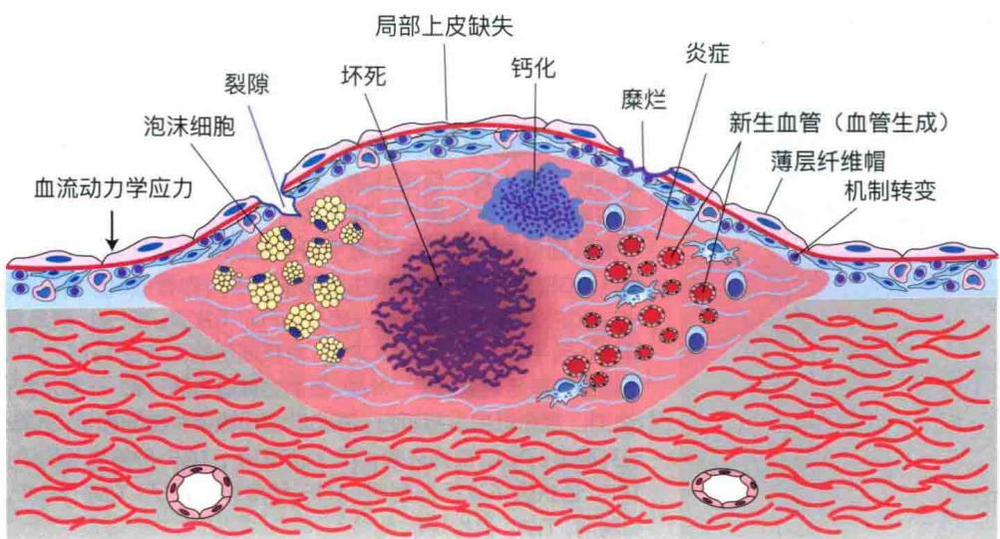 
图10-7 动脉粥样硬化的复杂性病变在腹主动脉和髂总动脉管腔表面可见数量不等的纤维斑块及隆起的溃疡损伤，其内含有质脆的粥样硬化碎片。在主动脉处，其末端部位可见小的主动脉瘤膨出
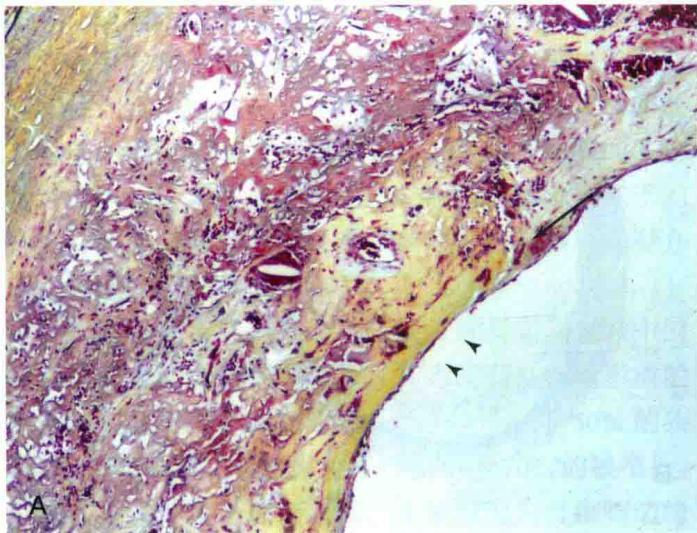
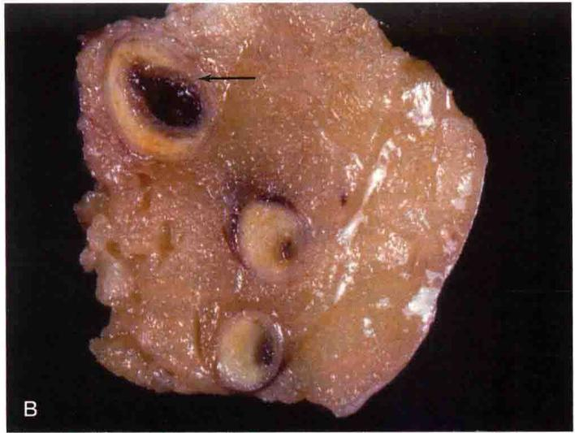
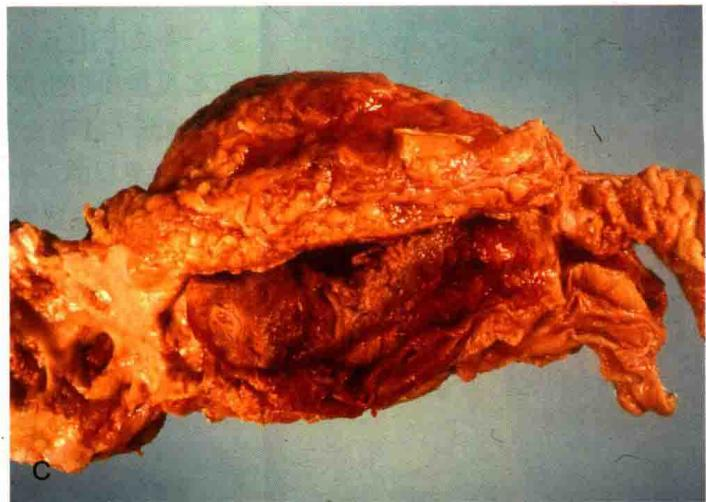 
图10-8 动脉粥样硬化的并发症。A.纤维炎性脂质斑块，斑块侵蚀的显微特点（箭头状符号所指）裂隙形成（箭头所指）；B.纤维炎性脂质斑块伴闭合腔隙血栓形成（箭头所指）；C.腹主动脉处的主动脉瘤伴血栓；D.粥样硬化的冠状动脉纤维帽破裂和闭塞腔隙血栓形成（箭头所指）
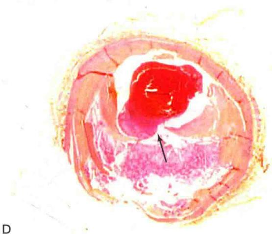
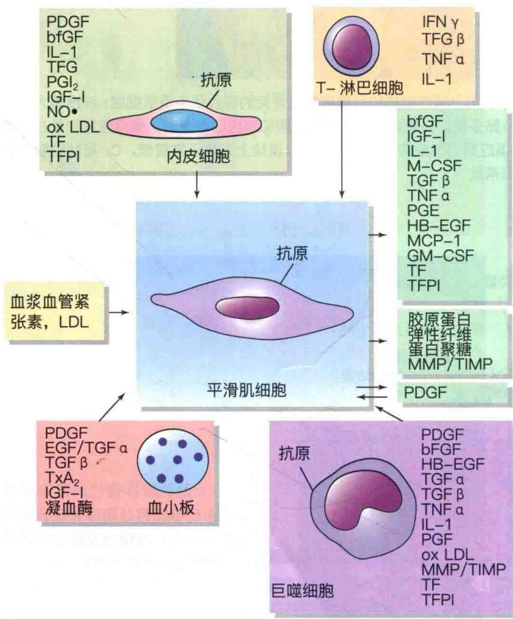 
图10-9 动脉粥样斑块进展过程中的细胞间相互作用。A. 内皮细胞、血小板、巨噬细胞、T细胞、平滑肌细胞可分泌大量细胞因子、生长因子等其他成分。上图阐述了上述因子对平滑肌细胞的作用。B. 促进平滑肌细胞增殖的细胞间相互作用，bfGF. 碱性成纤维细胞生长因子；EGF. 血管内皮生长因子；HB-EGF. 肝素结合表皮生长因子；IFN. 干扰素；IGF-1. 胰岛素样生长因子；IL. 白介素；MCP-1. 单核细胞趋化蛋白1；M-CSF. 巨噬细胞集落刺激因子；MMP. 基质金属蛋白酶；NO. 一氧化氮；oxLDL. 氧化低密度脂蛋白；PDGF. 血小板衍生生长因子；PGE. 前列腺素；PGI2. 前列环素；TF. 组织因子；TGF. 肿瘤生长因子；TFPI. 组织因子途径抑制剂；TNF. 肿瘤坏死因子；TIMP.MMPs 抑制剂；TXA2. 血栓烷素 A2
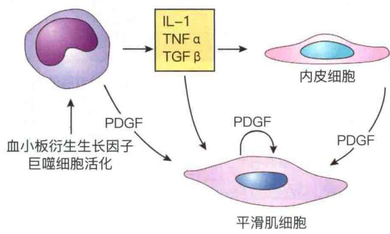
样硬化血管疾病的风险。然而，自身细胞糖类不耐受，晚期糖基化终末产物和血脂的继发性改变对于粥样硬化疾病的具体影响方式还不确定（详见第22章）。
■年龄增长和男性：这两项因素与MI发病风险高度相关，但是与其他危险因素的累积效应相比，这两者的影响较小。 
缺乏运动和生活压力：两者都被认为与缺血性心脏病的风险增加相关，但与动脉粥样硬化病变进展的确切关系还未阐明。 
同型半胱氨酸水平：高半胱氨酸尿症是一种罕见的常染色体隐性疾病，由编码胱硫醚激酶的基因突变引起。该病可引起早产和严重的动脉粥样硬化。正常人群中，血浆同型半胱氨酸水平常轻微升高，其也是冠状动脉硬化和其他大动脉硬化的独立危险因素之一。
C反应蛋白：C反应蛋白是肝脏来源的急性时相反应蛋白，是一种全身性炎症标志物，它的产生与MI和缺血性脑卒中的风险增加相关。上述发现及粥样硬化斑块中的C反应蛋白，都说明系统性炎症可能促进动脉粥样硬化的发生。 
感染：血清流行病学研究发现，某些传染病的病原体与动脉粥样硬化的发生相关。肺炎衣原体，巨细胞病毒的研究最为多见，也有针对幽门螺杆菌、疱疹病毒等其他微生物的相关研究。
# 三、脂质代谢在动脉粥样硬化发生中起主要作用
不可溶胆固醇和其他脂质的转运依赖于一系列的脂蛋白微粒协助（表10-4）。
表10-4 载脂蛋白载脂蛋白近似分子量主要密度分级人体主要合成部位脂蛋白代谢中的主要功能A I28 000HDL肝，肠道活化卵磷脂胆固醇酯酰转移酶A II18 000HDL肝，肠道A IV45 000乳糜微粒肠道B-100250 000VLDL, IDL, LDL肝与肝的 LDL 受体结合B-48125 000乳糜微粒，IDL，VLDL肠道C I6500乳糜微粒，HDL，VLDL肝活化卵磷脂胆固醇酯酰转移酶C II10 000乳糜微粒，HDL，VLDL肝活化脂蛋白酯酶C III10 000乳糜微粒肝抑制肝细胞摄取脂蛋白D20 000HDL胆固醇酯交换蛋白E40 000乳糜微粒，HDL，VLDL肝，巨噬细胞与E系统的受体结合
HDL. 高密度脂蛋白；IDL. 中等密度脂蛋白；LDL. 低密度脂蛋白；VLDL. 极低密度脂蛋白
根据密度大小将脂蛋白微粒进行分类：
■ 乳糜微粒 
极低密度脂蛋白 
低密度脂蛋白 
高密度脂蛋白
每种脂蛋白微粒都由脂质核心和相关蛋白（载脂蛋白）构成，如表10-4所示。脂蛋白的代谢途径包括两种载脂蛋白B（apoB），一种来源于肠道，另一种来源于肝脏（图10-10）。
外源性途径：食物来源的脂肪酸（同甘油结合形成甘油三酯）和胆固醇经肠道吸收后，组装入乳糜微粒，该微粒含有肠道来源的apoB-48。乳糜微粒中富含甘油三酯，其可将脂质由肠道转运至肝。乳糜微粒分泌后，迅速结合来源于HDLs的apoCⅡ和apoE。ApoCⅡ可激活毛细血管表面的脂蛋白酯酶，该酯酶可水解乳糜微粒中的甘油三酯。经过上述过程甘油三酯被水解，使得乳糜微粒转化为残余物质，最终转化
为中等密度脂蛋白（IDLs）。乳糜微粒的残余物质通过肝细胞中apo-E介导的（残余）受体途径除去。
内源性途径：参与的有富含甘油三酯的脂蛋白，该脂蛋白含有肝分泌的apoB-100。HDL中的apoCⅡ和apoE一经分泌，就同肝来源的VLDL相结合。然后VLDL中的甘油三酯可被上述部位的脂蛋白酯酶水解。上述水解产物为含apoB-100的脂蛋白，其首先转化为IDL，最终转化为LDL，以上过程在一定程度上是由肝脂蛋白酯酶完成的。大多数apoCⅡ和apoE首先与HDL微粒分离，然后再与HDL结合。以上过程中的脂蛋白酯酶具有甘油三酯水解酶的功效，但其更重要的作用为磷脂酶活性。含有apoB-100的LDL，与其高亲和力受体相互作用，该受体存在肝细胞、周围细胞，如平滑肌细胞、成纤维细胞、肾上腺细胞（图10-10)。该受体与LDL相互作用后介导细胞的内吞作用，然后启动LDL的分解代谢。
HDL:HDL主要来源于肠道和肝及含apoB的脂
蛋白水解后脂质和载脂蛋白转运体成分。HDL的有两种主要功能： $①$ 蓄积载脂蛋白，以apoCII和apoB为主； $②$ 与动脉壁表面和循环中细胞相互作用，将肝外来源的胆固醇转运入肝，最终代谢清除。后者又称为胆固醇的逆向转运。胆固醇转运出细胞后，大多以游离形式存在，卵磷胆固醇脂酰转移酶迅速将其酯化转化为胆固醇酯。胆固醇酯运至脂蛋白核心，其会被VLDL和LDL所替代。胆固醇酯在脂蛋白之间的相互转运主要通过某些特异性转运蛋白，如胆固醇酯转运蛋白。若胆固醇酯转运和交换功能发生障碍时则会导致异常脂蛋白血症，细胞内胆固醇酯蓄积和早期动脉粥样硬化。根据缺血性心脏病的发生与HDL胆固醇水平之间的关系推测，HDL为一种对人体有益的胆固醇类型。
然而近期的人口和药物干预研究表示其两者的关系还有待考证。
LDL：LDL胆固醇对内皮细胞，平滑肌细胞和单核/巨噬细胞可产生多种影响。例如，在体外可调控前列环素的合成，动脉粥样硬化病变中的上述细胞均可使其氧化，生成oxoLDL.氧化的LDL有利于巨噬细胞清道夫受体识别，促进巨噬细胞对其吞噬。动脉粥样硬化患者的血浆和斑块中存在针对oxoLDL的自身抗体，该自身抗体可能在粥样斑块的发生中起到重要作用。对管壁细胞而言，oxoLDL存在细胞毒性，其会破化内皮细胞的完整性，也有可能导致粥瘤中细胞碎片的聚集。oxoLDL对于巨噬细胞有趋化作用，会进一步促进巨噬细胞在粥瘤中的聚集。尽管如此，
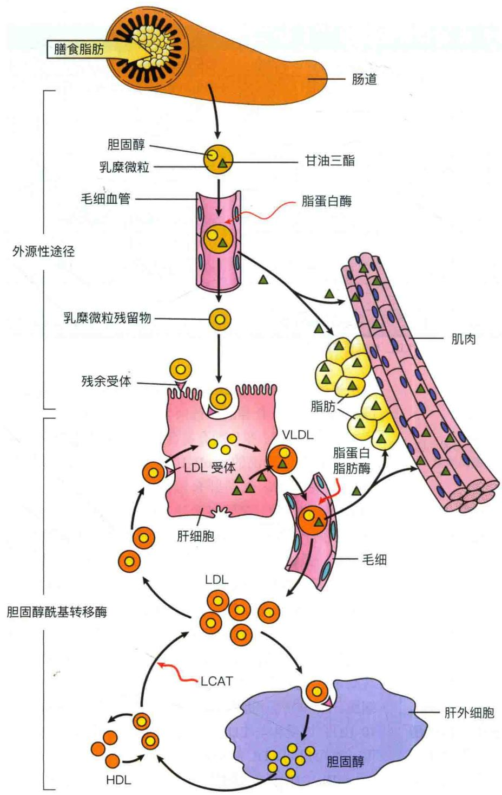 
图10-10 胆固醇转运的外源性和内源性途径。外源性途径中，食物来源的胆固醇和脂肪酸经肠道黏膜吸收。脂肪酸链与甘油结合形成甘油三酯。甘油三酯和胆固醇打包入乳糜微粒，后者经淋巴入血。多种酶类可促进脂质与蛋白相结合，如微粒体转运蛋白复合体。毛细血管中（主要为脂肪组织和肌肉组织处的毛细血管，还有其他部位组织），脂蛋白酯酶水解甘油三酯中的酯键，去掉脂肪酸后得到富含胆固醇的脂蛋白残余物质。该残余物质可与特异性残余物受体相结合后被肝细胞摄取。残余物胆固醇有两种来源，一为主要形式胆汁酸，分泌入肠腔，其次源于极低密度脂蛋白（VLDL），其分泌后入血。这是内源性途径的第一步。脂肪和肌肉组织中的甘油三酯被脂蛋白酯酶水解，使得其与VLDL分离。中等密度脂蛋白（IDL）始终存在于循环当中（图中未示）。肝细胞可通过对apoB/E的LDL受体调节，将I部分IDL迅速摄入胞内。循环中剩余的IDL要么被非肝细胞摄取，要么转化为LDL。大多数LDL与肝细胞或其他细胞相结合从循环中被清除。高密度脂蛋白（HDLs）从细胞中摄取胆固醇。卵磷脂胆固醇酯酰转移酶可将胆固醇酯化，其后被转运至LDL，然后由细胞摄取
在利用抗氧化剂预防缺血性心脏病的临床试验中并未发现其对机体的保护作用。
# 四、现公认的几种遗传性异常脂蛋白血症
如表10-5所示的家族聚集性缺血性心脏病。
表10-5 异常脂蛋白血症的分子缺陷疾病遗传缺陷临床特点载脂蛋白缺陷ApoA I缺陷ApoA I基因断裂或者重排（11q23）HDL缺乏，严重的动脉粥样硬化ApoA I变异ApoA I基因点突变（11q23）HDL量少，动脉粥样硬化的情况变化不一无β脂蛋白血症（出现在apoB100缺陷，也可出现在动脉粥样硬化和apoB48缺陷）微粒体甘油三酯蛋白突变（4q22-24）共济失调，营养不良，肉眼可见溶血性贫血ApoB100缺失未知突变（2p24）轻微的共济失调，营养不良，不见动脉粥样硬化ApoC II缺陷ApoC II基因突变（19q13.2）I型高脂血症；严重的高甘油三酯血症，动脉粥样硬化病变不一ApoE变异ApoE基因（19q13.2）3型高脂血症：甘油三酯水平升高，早期动脉粥样硬化病变酶缺陷脂蛋白酯酶缺陷脂蛋白脂肪酶基因突变（8p22）1型高脂血症；严重的高甘油三酯血症肝脂肪酶缺陷肝脂肪酶基因突变（15q21-23）IDL和HDL值升高，严重的动脉粥样硬化LCAT缺陷LCAT基因突变（16q22.1）轻微的高甘油三酯血症，HDL值下降，角膜浑浊，动脉粥样硬化病变不一受体缺陷家族性高胆固醇血症LDL受体基因突变（19p13.2）2型高脂血症：LDL严重升高，早期动脉粥样硬化病变
Apo.载脂蛋白；HDL.高密度脂蛋白；IDL.中间密度脂蛋白；LCAT.卵磷脂-胆固醇酰基转移酶；LDL.低密度脂蛋白
家族性高胆固醇血症：LDL受体为一种细胞表面糖蛋白，该受体通过调节细胞内吞作用和apoE循环来调控血浆中胆固醇水平，是一种主要的血浆胆固醇转运蛋白。LDL受体基因突变会导致家族性高胆固醇血症，其具体情况会在第6章进行讨论。
载脂蛋白E（apoE）：现发现多种载脂蛋白的基因突变与LDL水平变化相关，其中可见apoE基因多态性和apoA I和apoA II的变异型。约 $20\%$ 的血清胆固醇变化与载脂蛋白E基因多态性相关。男性人群中，apoE3/2表型与apoE3/3表型相比，胆固醇水平低 $20\%$ ，而第2种表型更为常见。相反，E4等位基因与血浆胆固醇水平升高相关。有趣的是， $80\sim 89$ 岁的老年男性人群中，E2等位基因表达量增加，而E4等位基因表达量却有所下降。E4等位基因是迟发型阿尔茨海默病的主要危险因素之一。罕见的异常脂蛋白血症归纳于表10-5。
脂蛋白（A）[Lp（a)]：冠状动脉和脑部血管处，循环中高水平的Lp（a）与该处动脉粥样硬化病变风险增加相关。血浆富含胆固醇脂蛋白的水平与遗传相关，波动幅度较大（140\mathrm{mg / dl}$ ），并且不与LDL水平相平行。动脉粥样硬化病变中可检测到Lp(a)特异性蛋白-apo（a）的存在，高血压患者的靶器官受
损与Lp（a）水平升高有关。编码apo（a）的基因位于6号染色体（6q2.7），该基因与编码纤溶酶原的基因相毗邻，两者高度同源。Lp（a）可促进胆固醇运转至受损血管，抑制纤溶酶的生成，促进平滑肌细胞增生。因此，动脉粥样硬化和血栓形成中存在重要联系，一部分的原因是前者可能影响栓子溶解过程。
# 第三节 高血压病
20世纪初，世界范围内高血压病发病率出现了显著性上升。高血压病患病率超过美国人口总数的 $30\%$ 。超过 $50\%$ 的心肌梗死，脑卒中和慢性肾脏病患者会合并出现高血压病。它和高血糖症、胰岛素抵抗、血脂异常和肥胖一起被包括在“代谢综合征”（见第22章）中。
$95\%$ 以上的主动脉夹层或破裂患者存在高血压病。和白人相比，黑人高血压病患病率和严重并发症的发生率更高。至少有3/4的夹层主动脉瘤，脑出血或心脏破裂患者有高血压病。
高血压的定义取决于对一般人群血压的收缩压和舒张压分布的统计估算。收缩压和舒张压在评估心血管疾病，特别是动脉粥样硬化风险中起着同样重要的作用。血压值差异很大，取决于年龄、劳累程度、情
绪状态、时间点和其他仍知之甚少的因素等。常用临床指南中定义正常血压为收缩压 $\leqslant 120\mathrm{mmHg}$ 且舒张压 $\leqslant 80\mathrm{mmHg}$ 。高血压病定义为收缩压 $\geqslant 140\mathrm{mmHg}$ 和（或）舒张压 $\geqslant 90\mathrm{mmHg}$ 。血压介于这些范围之间的被认为是高血压前期（如前所述）且发生冠状血管疾病和高血压病的风险增加。
$95\%$ 高血压病患者病因未完全明了。因此，大部分高血压病患者属于特发性或原发性高血压病。不论病因如何，高血压病能延长寿命。
【病因】血压取决于心排血量和体循环周围血管阻力，且深受肾功能和钠平衡影响。最盛行的学说认为原发性高血压病是这些机制相互作用失衡的结果（图
10-11)。
肾素-血管紧张素系统是一个复杂的内分泌轴。肾动脉闭塞或饮食中限制盐摄入会导致肾脏肾素分泌量上调。肾素剪切血管紧张素为一个十肽的血管紧张素I，血管紧张素I经内皮细胞表面的血管紧张素转化酶（ACE）作用转而生成血管紧张素Ⅱ。血管紧张素Ⅱ导致血管收缩和影响大脑中枢控制交感神经兴奋并且刺激肾上腺分泌醛固酮。醛固酮作用于肾小管促进钠的重吸收，这一级联作用会导致全身总体液量增加。因而，肾素-血管紧张素系统会通过以下3个机制升高血压：①增加交感神经兴奋性；②增加盐皮质激素分泌；③直接收缩血管。
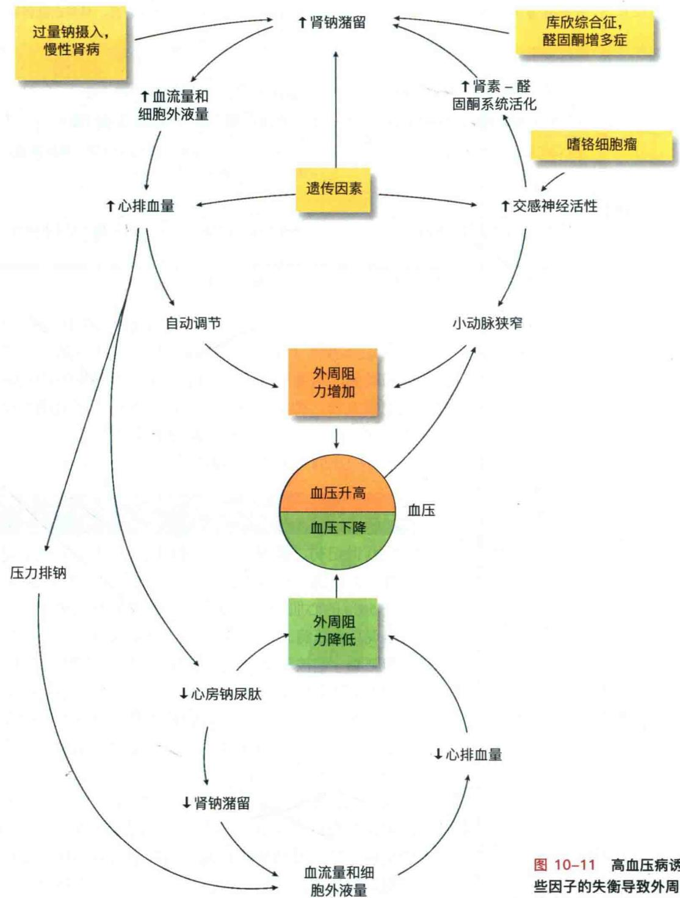 
图10-11高血压病诱因和下调血压的共调节因子这些因子的失衡导致外周阻力上升是许多原发性高血压病的原因，注意外周阻力的核心作用
心房特异的细胞分泌的心房利尿肽（ANF）对这一反应轴有拮抗作用。ANF和肾脏特异性受体结合后增加尿液中钠盐的排出，因而对抗血管紧张素Ⅱ诱导的血管收缩效应。ANF的分泌或受心房扩张容量增加调控有关，或和尚未被发现的内分泌相互作用有关。
通过应用交感神经拮抗剂（ $\beta$ 肾上腺素受体拮抗剂）和ACE抑制剂有效的治疗高血压说明，激素机制在高血压病血压调节中起着重要的作用。在肾素-血管紧张素轴中仍未发现明显缺陷，部分是因为血管系统组织能够对血流动力改变进行及时的自我调节。无论如何，高血压病中自我调节的最终结果是外周阻力的增加。许多高血压病产生于心排血量改变，盐代谢或ANF的释放。

【病因学】从对高血压病家族和双胞胎研究中发现特发性高血压有明显的遗传因素。尽
管高血压病受多基因遗传影响，有研究发现血管紧张素原基因普遍的多态性在其中起着重要的作用。一系列由稀有单基因缺陷引起高血压病和帮助调控血压相关基因的研究已有报道。所有和遗传性高血压病有关的突变皆增加肾钠重吸收。相反，基因突变导致的钠丢失综合征和严重低血压的发生密切相关。因此，这些遗传因子相关疾病阐明了水钠平衡在决定血压中的中心作用。
# 高血压病的获得性因素
高血压病的获得性因素在一小部分病例中能够被识别出来，这些因素包括肾动脉狭窄、慢性肾疾病（包括糖尿病）、醛固酮水平升高（原发性醛固酮增多症）、库欣综合征、嗜铬细胞瘤、甲状腺功能亢进、主动脉狭窄和肾素分泌瘤。此外，严重的动脉粥样硬化患者收缩压高常和主动脉硬化不能有效吸收脉搏波动能有关。在部分病例中，肾血管性高血压也很常见。

【病理】控制通过毛细血管网和肾血流的血管阻力抵抗是许多高血压病的关键病变。这些小
肌性动脉和微动脉管腔会因管壁的主动收缩和管壁肿块的增大而受限。和正常管壁相比，管壁增厚会导致管腔狭窄。随着时间的推移，慢性高血压会导致全身小动脉和微动脉产生反应性改变被称为动脉硬化。慢性高血压病使得肾脏出现弥漫颗粒状外观且镜下常能观察到肾小管和肾小球的改变，详细内容将在第16章中阐述。
良性动脉硬化：常出现在缓进慢性高血压病，主要表现为动脉壁厚度不同程度的增加（图10-12A）。在小动脉和微动脉中，病损主要为细动脉透明样变和动脉硬化。“透明”指的是显微镜下可见血管玻璃样、均
质改变。动脉壁因血管基底膜基质沉积和血浆蛋白的蓄积而变厚（图10-12B）。小肌型动脉硬化表现为内膜弹性纤维倍增和结缔组织增生。良性动脉硬化的血管病变特别反应于肾脏，导致肾实质萎缩，被称为良性肾硬化。
恶性（急进性）高血压：严重且经久的血压升高会导致血管急速损伤，从而引起脑、心脏或肾相应症状和损伤。经管恶性高血压不能按照血压上升级别严格划分，其血压常高于 $160 / 110\mathrm{mmHg}$ 。现今抗高血压治疗使得恶性高血压成为一种罕见的疾病。
恶性高血压引发微血管显著性病理性改变，这些改变可通过眼底镜检查诊断。如果血压急剧升高，视网膜小动脉可见微血管瘤、局灶出血和视网膜瘢痕。缺血性坏死和视网膜水肿在眼底镜下显示为“棉絮状”（第29章）。这些视网膜改变是其他阻力血管血压急剧上升时的典型表现。在恶性高血压中，小肌型动脉由于平滑肌细胞坏死表现出节段性扩张。这些区域内膜完整性丧失，血管通透性增加促使血浆蛋白进入血管壁和纤维素沉积，因而被命名为纤维素样坏死。急性损伤期中紧接着平滑肌增殖，并形成数量惊人的由平滑肌细胞构成同心轴样结构被称为洋葱皮样改变（图10-13）。总之，根据受损血管大小，这些改变可认为是恶性动脉硬化与动脉硬化的标记。在肾中，恶性高血压病变被称为恶性肾硬化。
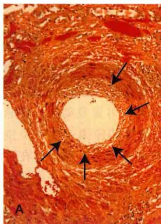 
图10-12 良性动脉硬化。A.横截面显示肾小叶动脉内膜异常增厚（箭头示）；B.肾动脉可见透明小动脉硬化
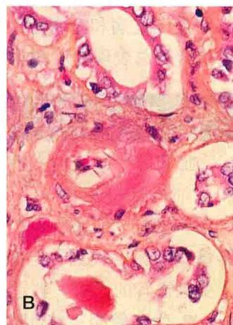
# 第四节 Monckeberg动脉中层硬化
Mönckeberg 动脉中层硬化指的是大的或者中等肌性动脉的中膜变性、钙化。这种改变常见于老年人，多发生在上、下肢动脉。

【病理】病变动脉变硬且膨胀。显微镜下可见
中膜平滑肌局灶被苍白染色，无细胞的透明纤
维组织及同轴的营养不良性钙化灶所取代。钙化区偶
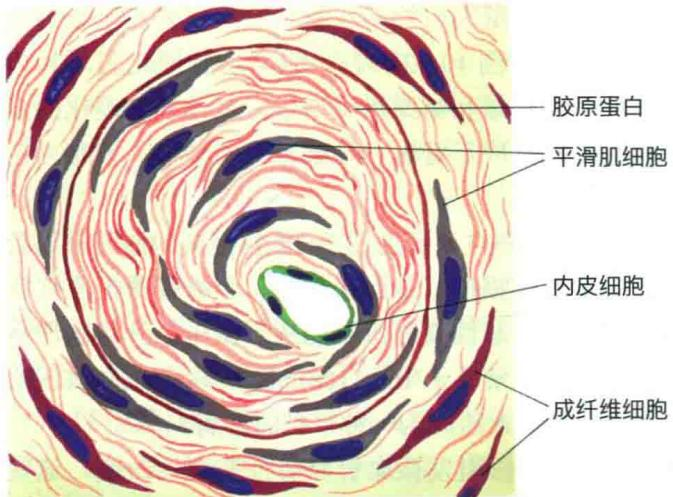 
图10-13 小动脉硬化。在恶性高血压病中，小动脉平滑肌细胞增生且细胞间胶原和葡糖氨基葡聚酶数量增加，导致“洋葱皮”样改变。大量平滑肌细胞增生和相关因素会导致血管管腔固定因而限制小动脉的扩张
可见骨化生。Mönckeberg动脉中层硬化和动脉粥样硬化不同，一般不会导致临床疾病。
# 第五节 雷诺现象
雷诺现象指双侧手指或足趾，耳朵或鼻子出现间歇性局部缺血。常以受损伤灶出现严重苍白，伴随感觉异常和疼痛为特征性表现。症状由遇冷和情绪刺激引发，加热后缓解。雷诺综合征可独立发生或伴随一系列的结缔组织系统性疾病（胶原血管疾病）存在，特别是硬皮病和全身性红斑狼疮。不论诱因如何，雷诺综合征总表现为皮肤动脉血管痉挛。
# 第六节 血管炎
血管炎指血管的炎症及坏死，可累及动脉、静脉和毛细血管（表10-6）。血管损害的原因可能有免疫机制、感染、机械性创伤、辐射或毒素。然而，在许多情况下无法找到特定的病因。血管炎的分类主要基于受累血管的大小（教堂山共识会议分类系统）：
大血管炎：主动脉及其主要分支的慢性肉芽肿性炎症 
■ 中血管炎：中等大小血管的坏死性炎症 
小血管炎：小动脉、细动脉、微静脉和毛细血管的坏死性炎症

【发病机制】免疫机制，包括：①免疫复合物沉积；②循环抗体对血管的直接攻击；
(3)抗中性粒细胞胞质抗体 (ANCA); (4)中性粒细胞脱粒; (5)多种细胞介导的免疫应答等被认为参与了血管炎综合征的发生发展。
病毒性抗原可引起血管炎。例如，慢性乙型肝炎
病毒感染与部分结节性多动脉炎（PAN）相关。这是由于循环中的病毒抗原-抗体复合物在血管病灶中沉积所致。
ANCA与小血管炎相关[ANCA-相关性血管炎(AAV)]（表10-6)。ANCA通过活化中性粒细胞损伤血管内皮。P-ANCA主要与髓过氧化物酶结合，而C-ANCA则主要与蛋白酶3结合。这两种ANCA可以通过患者血浆中的抗体与中性粒细胞的抗原结合情况来区分。被细胞因子活化的中性粒细胞表面同时表达髓过氧化物酶及蛋白酶3，ANCA与这些分子结合后引起中性粒细胞脱粒作用，补体活化（主要通过替代途径）并导致血管损伤。
表10-6 血管炎性疾病教堂山共识会议分类系统大血管炎巨细胞动脉炎大动脉炎（Takayasu arteritis）中血管炎结节性多动脉炎川崎病小血管炎（免疫复合物相关）过敏性紫癜（Henoch-Schönlein purpura）冷球蛋白血症血管炎小血管炎[ANCA-相关性血管炎（AAV）]显微镜下多血管炎变应性肉芽肿血管炎（Churg-Strauss综合征）肉芽肿性多血管炎（既往称Wegener肉芽肿）
ANCA. 抗中性粒细胞胞质抗体
# 一、大血管炎与肉芽肿性炎症相关
巨细胞动脉炎是最常见的血管炎，仅依靠组织病理难以与大动脉炎相鉴别。前者主要见于老年人，而后者在50岁以后少见。
1. 巨细胞动脉炎（颞动脉炎，肉芽肿性动脉炎）巨细胞动脉炎是一种灶性的肉芽肿性炎症，主要见于颞动脉。该病也可累及其余颅内动脉、主动脉及其分支，有的情况下可累及其他动脉。可出现主动脉瘤及主动脉夹层。平均发病年龄70岁，在50岁之前罕见。

【发病机制】巨细胞动脉炎的病因目前尚未阐明。可能与HLA-DR4相关。在患者一等
亲中的发病率提示其发病机制有一定遗传背景。其形态学改变，包括可见活化的 $\mathrm{CD4 + }$ 辅助T细胞及巨噬细胞，还有巨细胞动脉炎与特异性多形性ICAM-1的相关性都提示免疫应答的存在。
【病理】在巨细胞动脉炎中，受累血管呈条索状并结节样增厚。管腔缩窄成狭缝或被血栓堵塞（图10-14A）。镜下可见外膜、中膜及内膜肉芽肿性炎症，内有巨噬细胞、淋巴细胞及浆细胞聚集，伴不同程度的嗜酸性粒细胞及中性粒细胞浸润。巨细胞数量不一，常见于内弹性膜，后者常肿胀，破碎甚至消失（图10-14B）。纤维素样坏死少见。
【临床表现】巨细胞动脉炎预后良好，常为自限性。症状通常维持 $6\sim 12$ 个月。患者出现头痛及颞部跳痛，病灶上覆皮肤呈红色，伴浮肿、压痛。视觉方面的症状见于几乎 $50\%$ 外患者，可出现暂时性的乃至永久性的单眼盲或双眼盲，部分病例进展迅速。一般而言糖皮质激素治疗对本病非常有效，症状可在数天内缓解。
2.大动脉炎本型动脉炎见于世界各地，主要发生在女性身上（ $90\%$ ）。大部分女性患者小于30岁。目前本病病因仍然未知，但有研究者认为可能和自身免疫因素相关。
【病理】大动脉炎按照主动脉受累的节段分类。有时肺动脉亦可受累，而视网膜血管的受累则是本病的一个显著特点。在大体上，动脉壁因内膜灶性斑块形成而增厚。主动脉分支常常可见节段性狭窄
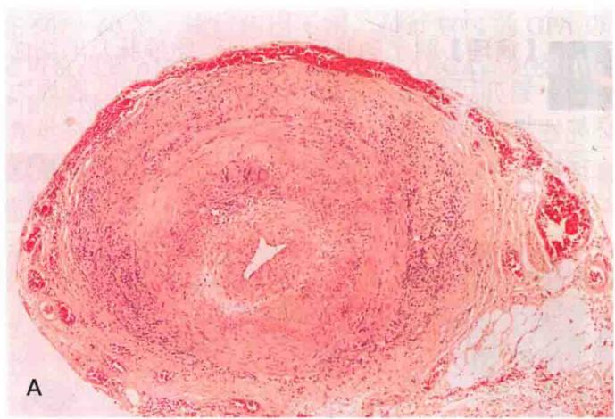
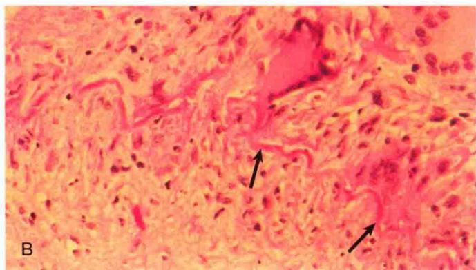 
图10-14 颞动脉炎。A. 颞动脉镜下图示血管壁全层慢性炎症，可见巨细胞。中膜严重增厚导致管腔狭窄；B. 高倍镜下见破碎的内弹性膜旁的巨细胞（箭头示）
或梗阻，早期病变主要发生在主动脉及其分支的中膜，可进展为急性全动脉炎，伴中性粒细胞、单核细胞及有时可见朗汉斯巨细胞浸润。晚期病变为纤维化及严重中膜增生。
【临床表现】早期大动脉炎患者主要表现为全身症状，包括头晕，视物模糊，呼吸困难，偶尔出现晕厥。随着病情进展，心血管症状加重，可出现阵发性的上肢无力或间歇性跛行。可出现双侧血压明显不对称，一侧肢体的脉搏偶尔消失，即所谓的“无脉症”。视力障碍从视野缺损到全盲均可发生。多数患者最终出现充血性心力衰竭。早期大动脉炎对糖皮质激素反应良好，但晚期则需要手术重建。
# 二、中血管炎特征为坏死性血管炎
结节性多动脉炎（PAN）及川崎病累及中等大小的动脉，并以此与其余主要为微静脉、毛细血管及细动脉受累的坏死性血管炎相区分。
1. 结节性多动脉炎（PAN） PAN 累及中等大小或稍小的肌肉动脉，偶尔可见于大动脉。在男性身上稍微更常见。
【发病机制】PAN的发病机制不清，但与病毒感染，特别是乙型肝炎病毒感染有很强的相关性。有学者认为免疫复合物可能参与了PAN的病理过程。
【病理】PAN的病灶成斑片状分布。最明显的形态学特征为纤维素样坏死区域，中膜肌层及邻近组织融合为无结构的嗜酸性物质，染色似纤维蛋白。病程初期，强烈的急性炎症反应将坏死区域包裹，通常累及动脉外膜全层并通过其他包被血管的结构蔓延（图10-15）。早期中性粒细胞位主要浸润称谓，随后为不同比例的淋巴细胞、浆细胞及巨噬细胞。常见嗜酸性粒细胞。受累动脉节段可见血栓，其供血的器官发生梗死。若稍大一点的动脉受累，可出现小动脉瘤（假性动脉瘤，直径（0.5cm），特别是肾动脉、冠状动脉及大脑动脉的分支，因而命名为“结节性”。若患者数月后仍存活，其血管病变可出现愈合的征象，在使用糖皮质激素治疗的患者身上尤为明显。ANCA在PAN中不常见，若ANCA阳性则提示为小血管炎如显微镜下多血管炎（见下文）。
【临床表现】PAN的临床表现差异很大，与病变的器官分布相关。肾、心、骨骼肌、皮肤及肠系膜为最常见的受累器官，但病变可出现在几乎所有器官，包括肠、胰腺、肺、肝及脑。全身症状如发热及体重下降常见。PAN-样病变可见于病毒感染，
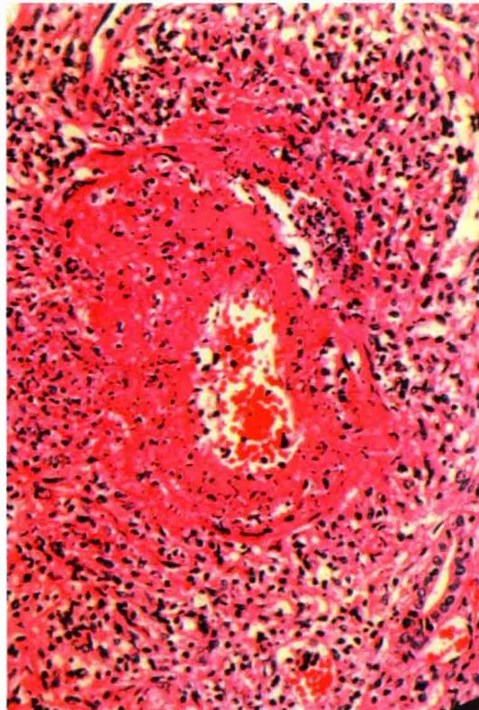 
图10-15 结节性多动脉炎。大量炎细胞的动脉壁及其周围的结缔组织浸润与纤维素样坏死及血管壁破坏相关
包括乙型及丙型肝炎病毒感染，还有人类免疫缺陷病毒（HIV）感染。若不治疗，PAN通常是致命的，但抗炎药及免疫抑制剂如糖皮质激素及环磷酰胺等的治疗可挽救大部分患者的生命。
2.川崎病（皮肤黏膜淋巴结综合征）川崎病为一种婴儿期及幼儿时期的急性坏死性血管炎，特征为高热、皮疹、结膜及口腔损害以及淋巴结肿大。在约 $70\%$ 的患者中，血管眼累及冠状动脉并引起冠状动脉瘤（图10-16），病死率为 $1\% \sim 2\%$
【发病机制】川崎病常为自限性。尽管发现了一些感染性的因素，但没有一种病原体被确切证实导致本病。细小病毒B19感染或纽黑文冠状病毒被认为与部分病例相关，另外也有证据表明多种细菌感染，包括葡萄球菌、链球菌及衣原体可能与本病相关。比较公认的推测为细菌或病毒超抗原引起免疫系统大规模的非特异性活化。针对内皮细胞及平滑肌细胞的自身抗体在部分患者身上被发现。
# 三、小血管炎可分为免疫复合物型或“微量免疫”型
一部分小血管炎的管壁上可见免疫复合物沉积，例如过敏性紫癜及冷球蛋白血性血管炎。该类小血管炎将在第16章简要介绍。这两种疾病中都可见皮肤白细胞破碎性血管炎（指破碎的中性粒细胞胞核碎片）、皮肤血管炎或皮肤坏死性小静脉炎（强调主要受累的血管为微静脉）。无证据表明有免疫复合物沉积的小血管炎[例如：显微镜下多血管炎，肉芽肿性多血管炎GPA，既往称Wegener肉芽肿及Churg-Strauss综合征（变应性肉芽肿）]通常与循环ANCA免疫反应性相关，并因此统称为ANCA相关性血管炎。
1. 显微镜下多血管炎 显微镜下多血管炎的受累器官与PAN中的大致一样，但多数病变不仅局限在小动脉及细动脉。
【病理】除了动脉受累之外，微静脉及毛细血管亦可受累。肺部及肾的病变常见，表现为坏死性肾小球肾炎及肺泡毛细血管炎。节段性纤维素样坏死首先与中性粒细胞浸润相关，随后可见单核细
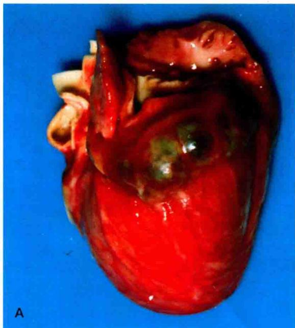 
图10-16川崎病。A死于川崎病的患儿心脏，见明显的冠状动脉瘤；B同一名患者的冠状动脉切面，可见内弹性膜层两处巨大的缺损（箭头示），形成两个小动脉瘤，内见血栓
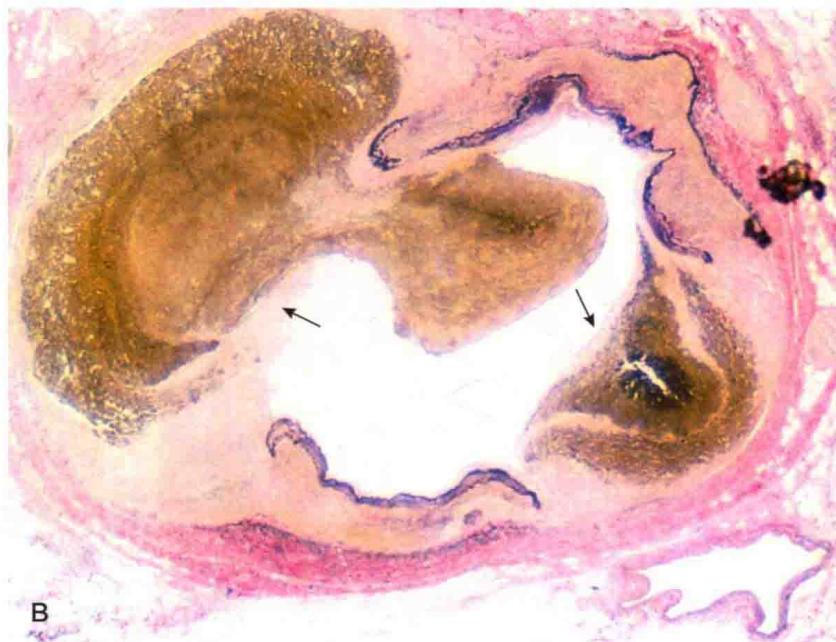
胞、巨噬细胞及淋巴细胞浸润。该病与P-ANCA和C-ANCA活性存在很强的相关性。

【临床表现】全身症状，例如发热、体重减少
及肌肉痛常见。皮肤受累表现为皮疹伴“可触
及的紫癜”。肺部症状包括咳嗽、呼吸困难及咯血。显
微镜下多血管炎最可怕的并发症为肾损害，特征为快速进行性肾小球肾炎及肾衰竭（见第16章）。
2.Churg-Strauss综合征（变应性肉芽肿性血管炎）Churg-Strauss综合征发生在年轻患者身上，特征为哮喘及嗜酸性细胞血症。

【病理】肺、脾、肾、心、肝、中枢神经系统
及其他器官广泛的中小动脉、细动脉及静脉
坏死性病变。这些病变呈肉芽肿性且管壁及血管周围大量嗜酸性粒细胞浸润。引起的纤维素样坏死、血栓及血管瘤形成可与PAN类似，但Churg-Strauss综合征的本质与PAN完全不同。肾小球肾炎可以出现，但病情较其余小血管炎中的轻。2/3的患者可检测到P-ANCA或C-ANCA。若不治疗患者预后不良，但糖皮质激素治疗几乎 $100\%$ 有效。
3. 肉芽肿性多血管炎（GPA） 肉芽肿性多血管炎，既往称为Wegener肉芽肿病，是一种全身性的坏死性血管炎，病因不明。特征为鼻、鼻窦及肺的肉芽肿性病变与肾小球疾病。男性患者较为多见，发病年龄常在 $50\sim 60$ 岁。该病病因不明。超过 $90\%$ 的GPA患者可检测到ANCA，其中 $75\%$ 为C-ANCA。免疫抑制剂治疗对该病有效，提示本病的免疫学基础。

【病理】GPA肉芽肿的病变特征为实质坏死、血管炎及有中性粒细胞、淋巴细胞、浆细胞、
巨噬细胞及嗜酸性粒细胞浸润的肉芽肿性炎症。血管炎累及细动脉、微静脉及毛细血管，可在全身各处出现，但主要见于呼吸道、肾及脾（图10-17）。小血管炎主要特点为慢性炎症，但急性炎症、坏死性或非坏死性肉芽肿性炎症及纤维素样坏死也经常出现。肺部最明显的改变为持续性的双侧肺炎，伴结节性的炎细胞浸润，随后形成空洞，与结核空洞相仿（但机制完全不同）。慢性鼻窦炎及鼻咽黏膜溃疡常见。肾首先出现局灶坏死性肾小球肾炎，随后进展为新月体性肾小球肾炎（见第17章）。

【临床表现】多数患者（>90%）出现呼吸道
症状，特别是肺炎及鼻窦炎。肾小球病变可发
展为肾衰竭。在未治疗的GPA病例中，多数个体 $(80\%)$ 在发病后1年内死亡，中位生存期为 $5\sim 6$ 个月。使用环磷酰胺治疗在大部分患者身上可获得完全缓解及稳定的无疾病生存期。
# 第七节 动脉瘤
动脉瘤是动脉血管的局部扩张，通常因为先天或后天性的血管中层薄弱所致。这种疾病并不少见，发病率随着年龄增长而增加。主动脉和其他动脉的动脉瘤在尸检中的检出率为 $10\%$ 。动脉瘤的壁由动脉壁的拉伸部分构成。
动脉瘤种类根据位置、结构和发病原因划分（图10-18）。发病位置指血管的类型-动脉或静脉-和受累的特定血管，比如主动脉或膈动脉。动脉瘤的大体形态揭示了其不同的病理学特点。
梭形动脉瘤是平行于血管长轴的卵圆形突起。 
囊状动脉瘤指动脉壁薄弱处的空泡样突起。 
夹层动脉瘤是指解剖上的血肿，血管中层的出血将管壁分层。 
■ 动静脉留指动脉和静脉的直接连通。 
细菌性动脉瘤指跟感染有关的动脉瘤。
# 一、腹主动脉瘤是动脉粥样硬化的并发症
腹主动脉瘤指血管直径扩张至少 $50\%$ 。这是最常见的动脉瘤，通常50岁以后发病，跟严重的动脉粥样硬化有关。男性主动脉瘤的发病率远高于女性， $50\%$ 患者有高血压。少见的情况下，动脉瘤也可发生于升主动脉、主动脉弓、降主动脉、髂动脉和腘动脉。
虽然腹主动脉高发于动脉粥样硬化，但这种疾病被认为是多因素的，家族聚集发病也揭示了这种病的
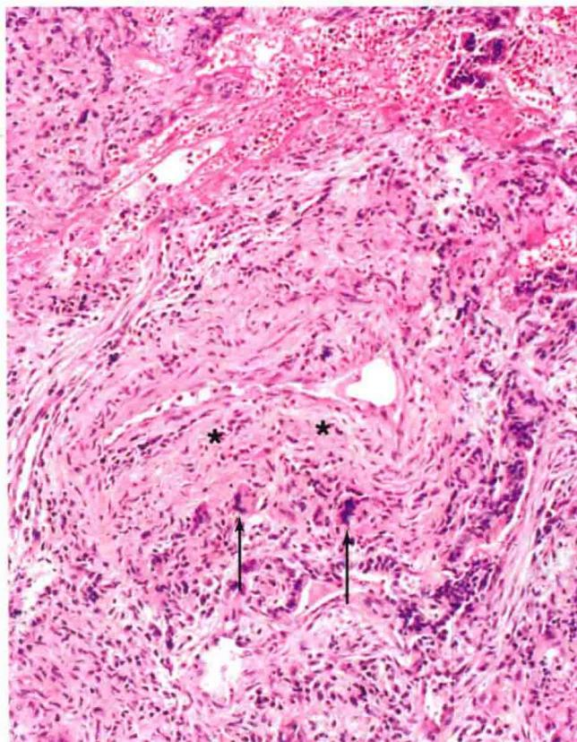 
图10-17 肉芽肿性多血管炎。镜下见肺动脉血管炎。管壁可见慢性炎细胞及朗汉斯巨细胞（箭示），动脉中膜增厚（星号示）
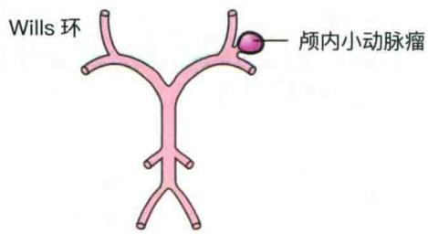
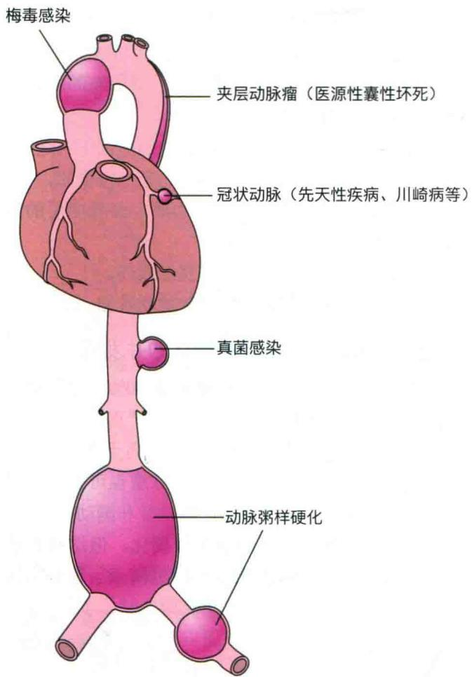 
图10-18 动脉瘤的位置。梅毒性动脉瘤常见于升主动脉，后者常幸免于粥样硬化。粥样硬化性动脉瘤可以发生在腹主动脉或肌性动脉，包括冠状动脉、膈动脉和其他动脉。浆果样动脉瘤见于基底动脉环，主要在分叉点；破裂会导致蛛网膜下腔出血。细菌性动脉瘤可以发生在细菌感染的任何血管壁
遗传因素。腹主动脉瘤的发病机制包括动脉壁的细胞外基质改变，细胞介导的免疫应答改变，血流动力学改变，特别是高血压。促炎性细胞因子也与腹主动脉瘤的发病机制有关。动脉瘤壁中趋化因子和生长因子表达升高，这些因子都可以调节动脉壁的重建。

【病理】大部分的主动脉瘤距离肾动脉较远，
邻近主动脉权（图10-19）。通常是梭形，囊
性比较少加。有症状的动脉瘤通常直径大于 $5\sim 6cm$ 肾动脉以上的动脉瘤可能会堵塞肠系膜上动脉和腹腔动脉的起始处。大部分的腹主动脉瘤都与凸起、溃疡性、钙化（复杂性）的粥样硬化病损有关。腹主动脉瘤可能会包含不同程度的附壁血栓，部分血栓会脱落到外周动脉。
少见的情况下，血栓本身会增大到管腔大小。显微镜下，复杂的粥样硬化病损表现出正常管壁破损并被显微组织替代。也可以观察到正常管壁的残余部分，粥样硬化的病损深度不同。由于严重粥样硬化的炎性反应，动脉外膜增厚。

【临床表现】许多腹主动脉瘤没有症状，仅仅
通过腹部触诊或放射学检查发现。在有些病患者由于腹痛就医，这往往反映了动脉瘤的扩壁血栓栓子脱落造成的外周动脉的突然闭塞会（肢的局部缺血。最严重的并发症是破裂和腹膜（胸腔）出血，患者表现为剧痛、休克和腹部的包块。这种情况属于急症，即使迅速手术干预，患者还是会死亡。因此，即使没有症状，大的血管也需要手术处理，用器官样复合血管替代或旁路。腹主动脉瘤破裂的风险与动脉瘤大小有关。小于 $4\mathrm{cm}$ 的动脉瘤很少破裂 $(2\%)$ ，而直径大于 $4\mathrm{cm}$ 的动脉瘤的患者有1/3会在发现的5年内破裂。
# 二、大脑动脉瘤导致蛛网膜下腔出血
最常见的大脑动脉瘤是囊性的，也被叫作浆果样动脉瘤，因为类似于附属在动脉树上的浆果。浆果样动脉瘤的发生是由于动脉壁分叉点的先天性缺陷，通常发生在基地动脉环的分支或者动脉连接点。最常见的位置是：①大脑前动脉和前交通动脉之间；②颈内动
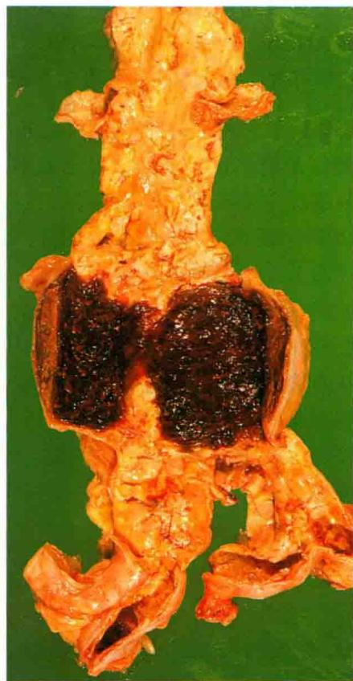 
图10-19 腹主动脉的粥样硬化性动脉瘤。动脉瘤沿长轴剖开，可见到管腔内的大的附壁血栓。主动脉和髂动脉可见到动脉粥样硬化的复杂病损
脉和后交通动脉之间；③大脑中动脉起始分支和颈内动脉分叉点之间（见第28章）。
# 三、夹层动脉瘤是大动脉壁的血肿
大动脉壁的出血沿着血管的长轴蔓延，将动脉壁分层（图10-20）。夹层实际上是动脉壁里的假腔。虽然这种病损一直被称为动脉瘤，但实际上是血肿。夹层动脉瘤通常影响升主动脉和主动脉的分支。胸部的夹层可能仅包含升主动脉（A型）或包含毗邻升主动脉的远端动脉（B型）。这种病的发病率根据尸检估计高达1/400，男性发病率是女性的3倍。夹层动脉瘤可发生于任何年龄，最常见于 $60\sim 80$ 岁之间。大部分患者有高血压病史。

【发病机制】夹层动脉瘤的发病基础是大动脉中层的薄弱。这种改变被称为囊性中央环
死，这是因为动脉中间层的弹性纤维和肌纤维的缺失产生了充满异染性黏液物质的囊性空隙。这些空隙并不是真的囊，而是细胞和组织产生的基质的堆积。动脉中间层退化的机制还不明确。
有些是马方综合征的并发症（见第6章）。老化也会造成动脉的轻微退化性改变，表现为弹性蛋白的缺失和动脉中膜纤维化。总而言之，这表明这种疾病的共同因素是动脉结缔组织的退化。

【病理】触发动脉中膜夹层的起始事件存在争议。超过 $95\%$ 的病例有内膜的横向撕裂。通
常认为内膜的自发撕裂使血液能从管腔进入中膜并使之形成夹层。另一种可能，血管滋养层的出血进入已经囊性中央坏死的中膜，压迫内膜从而造成了内膜的撕裂。大部分的内膜撕裂发生在升主动脉，主动脉环上 $1 \sim 2 \mathrm{~cm}$ 。中膜的夹层随后发生，将动脉的内2/3和外层分开。
还可发生于冠状动脉、颈部和肾的大血管、肠系膜动脉和髂动脉。由于夹层动脉瘤假腔的外壁很薄弱，往血管外腔，包括心包腔、纵隔腔、胸膜腔和腹膜后腔的出血往往会致死。在 $5\% \sim 10\%$ 的病例中，夹层中的血液通过远端的撕裂重新进入血管腔形成了双腔主动脉。在相当比例的病例中，夹层血液的重新进入血管腔产生了主动脉和其他大动脉（髂动脉最常见）
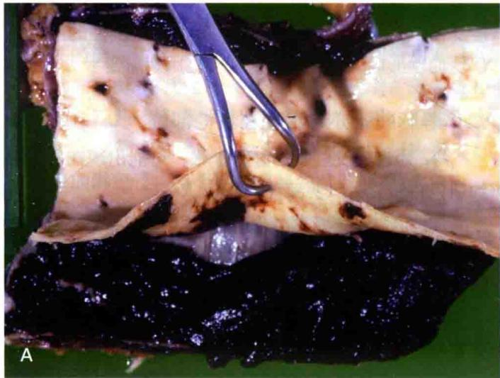
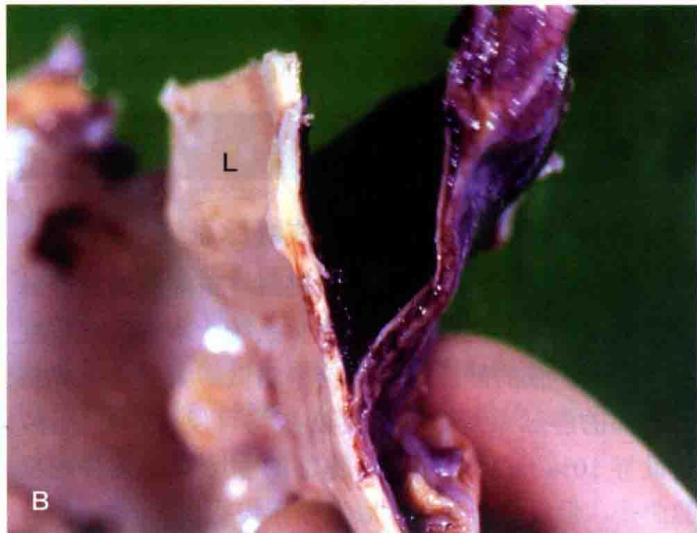
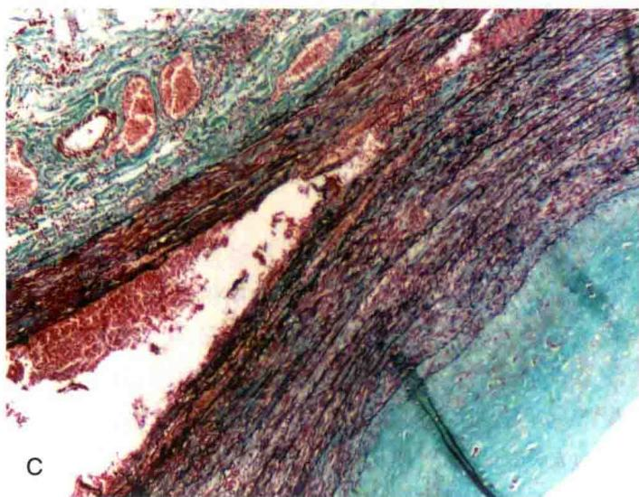 
图10-20夹层主动脉瘤。A.胸主动脉可见夹层和陈旧性的血肿；B.胸主动脉沿长轴剖开，可见血管夹层中的陈旧血液；C.粥样硬化性主动脉夹层沿血管外1/3分布；D.主动脉壁醛复红染色可见充满了易染性物质，这些物质是由于囊性中央坏死造成
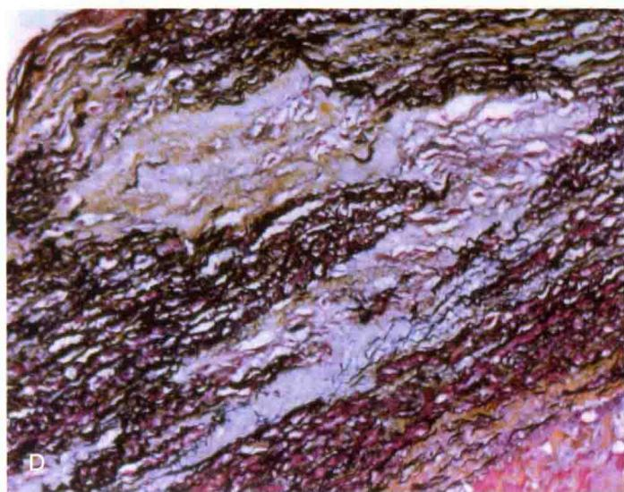
的连通。
【临床表现】典型的主动脉夹层患者表现为急性发病，前胸撕裂样痛，有时候被误诊为心肌梗死。通常会有一次或多次的动脉搏动缺失，主动脉回流的杂音也很常见。许多患者有高血压，高血压是不良的预后因素，是破裂的高危因素。心脏压塞或者充血性心力衰竭可能会发生。手术干预，控制高血压可以将总体死亡率降至 $20\%$ 以下。
# 四、梅毒性动脉瘤反映了主动脉血管滋养层炎症
梅毒曾经是主动脉瘤最常见的原因，但是随着梅毒感染的减少，梅毒性血管疾病也减少了，包括主动脉炎和主动脉瘤。梅毒性动脉瘤主要影响升主动脉，显微镜检可见到血管滋养层的动脉内膜炎和动脉外膜炎（详见第9章）。
# 五、细菌性（感染性）动脉瘤继发于血管壁的微生物感染
细菌系动脉瘤有破裂和出血的倾向。这种疾病可发生于败血症患者的主动脉壁或脑血管壁，通常由于细菌性心内膜炎引起。肠系膜、脾和肾动脉也经常发病。细菌性动脉瘤还可见于结核病灶和细菌性脓肿附近。
# 第八节 静脉
# 一、静脉曲张主要累及腿部浅静脉系统
静脉曲张指静脉的扩张和扭曲。腿部的表浅静脉曲张非常常见，主要累及隐静脉系统。本病严重程度不一，从扩张的静脉形成的一个略微膨大的小结到整个腿部的静脉系统致残性的膨胀均可发生。据估计，全世界 $10\% \sim 20\%$ 的人口腿部的静脉存在某种程度的曲张，但仅有一部分人表现临床症状。

# 【发病机制】静脉曲张有如下危险因子：
■年龄：静脉曲张的患病率随着年龄而增加超过50岁的人群中可能达到 $50\%$
性别：在 $30\sim 50$ 岁的个体中，女性患静脉曲张的可能性较男性高，特别是经产的女性。 
■遗传因素：静脉曲张存在非常明显的家族性因素，可能是由于遗传的静脉壁或静脉瓣的构造或结构性的脆弱部位引起。 
■姿势：直立时，腿部静脉压为卧位时的 $5\sim 10$ 倍。因此，静脉曲张的及其并发症的发病率在某些从事要求长时间站立的职业的人群中较高。 
肥胖：体重过高可导致静脉曲张发病率增高，
原因可能是腹压的增高或皮下脂肪对静脉壁的支撑不足。
其余可以提高腿部静脉压的因素亦可引起静脉曲张，包括盆腔肿瘤、充血性心力衰竭及主要大腿或盆腔主干静脉的血栓堵塞。
目前尚不清楚静脉瓣关闭不全或静脉扩张哪一个是静脉曲张的首要发病机制。无论何者为首要，这两种因素是相互促进的。静脉的长度和直径不断增加，从而逐渐变得迂曲。一旦这一进程开始，曲张将进行性地累及整条静脉。
【病理】镜下，曲张的静脉可见管壁厚度不一，一部分管壁因静脉扩张而变薄，另一部分则因平滑肌肥大、内膜下纤维化以及血栓与管壁的整合而增厚。斑片状的钙化常见。可见静脉瓣增厚、缩短及卷曲等畸形。 
【临床表现】多数静脉曲张不表现出临床症状而仅仅影响美观。表现出来的主要临床症状为腿部疼痛，站立时加重，抬腿可缓解。严重的静脉曲张可导致其引流区域的皮肤改变，名为淤积性皮炎。若曲张静脉上覆的皮肤出现溃疡或患者出现自发性的出血或广泛血栓形成（可能发展为肺栓塞）则需要手术治疗。
# 二、静脉曲张亦可出现在其他部位
痔：为直肠及肛管的静脉扩张，可能出现在肛门括约肌以内或以外（见第13章）。
食管静脉曲张：为门脉高压的一个并发症，主要由肝硬化引起（见第14章）。食管曲张静脉破裂出血为肝硬化的一个常见死亡原因。
精索静脉曲张：阴囊的一个可以触及的包块，为精索蔓状静脉丛的曲张。
# 三、深静脉血栓形成主要累及腿部静脉
血栓性静脉炎为小静脉的炎症及继发性血栓形成，偶尔也见于稍大的静脉，通常是细菌感染引起的其中一个局部反应。
静脉血栓专门指在没有前驱感染或炎症的情况下形成的静脉血栓。
深静脉血栓形成现在为血栓性静脉炎和静脉血栓的统称。多数深静脉血栓形成的病例与感染或炎症无关，而更常见于长期卧床、心排血量减少或其他高凝状态，例如，蛋白C或抗凝血酶Ⅲ缺陷等情况。该病最常见于腿部深静脉，可以引起肺栓塞而威胁生命（最广为人知的是术后离床活动时猝死的现象）。深静脉血栓形成在第7章中有详细叙述。
# 第九节 淋巴管道
# 一、淋巴管炎为淋巴管道的感染及炎症
当感染性的物质被运送至淋巴结后引起结内炎症，称淋巴腺炎。炎症病灶周围可见扩张的淋巴管内充满液性渗出、细胞、细胞碎片及细菌。几乎所有有毒力的病原微生物都可以引起急性淋巴腺炎，但B群溶血链球菌（化脓性链球菌）为最常见的病原体。引流的淋巴结红肿。痛性的皮下红纹，常伴区域淋巴结压痛为急性淋巴腺炎的临床特征。
# 二、淋巴管道堵塞阻导致淋巴水肿
淋巴管道被瘢痕组织、管腔内肿瘤细胞、寄生虫堵塞或受周围肿瘤组织挤压时可出现梗阻。因为淋巴管道的侧支循环丰富，通常只有当主干被堵塞时才会发生淋巴水肿（即组织被淋巴液胀大）。本病最常见于腋窝或腹股沟。例如，目前常规的乳腺癌根治术中会清扫腋窝淋巴结，这一操作常常导致区域淋巴回流受阻，引起上肢的淋巴水肿。长期的淋巴管道堵塞将引起淋巴管扩张及纤维组织过度生长。象皮肿一词指整条肢体因淋巴水肿而增大。在热带地区，象皮肿一个最重要的病因是丝虫病，由寄生虫侵袭淋巴管引起（见第9章）。Milroy病是一种遗传性的淋巴管扩张，在出生时即出现。该病通常只有一个肢体受累，但也可多处受累。部分病例累及眼睑及唇。受累组织内可见严重扩张的淋巴管，整个区域呈蜂窝状或海绵状。
# 第十节 血管良性肿瘤
# 一、血管瘤是血管常见的良性肿瘤
血管瘤常见于皮肤也可见于内部器官。

【发病机制】虽然血管瘤是良性的，但是他们的来源并不确定。它们表现为真正的肿瘤，
或者是错构瘤（特定器官成熟但是错乱的细胞或组织团块）。支持错构瘤的证据包括：①病损出生时即存在；②它仅在身体其他部分生长的时候生长，并且体积有限；③生长停止以后，如果没有创伤、血栓或出血，它通常保持不变。现在，血管瘤通过组织类型或位置划分。

# 【病理】
毛细血管瘤：这种病损由正常大小和结构的毛
细血管组成。毛细血管瘤可以存在于任何组织中。最常见的位置是皮肤、皮下组织、口唇黏膜和内脏，包括脾、肾和肝。毛细血管瘤直径从几毫米到数厘米不等。根据血液的氧化程度，表现为鲜红色到蓝色。在
皮肤上，毛细血管瘤被当作胎记或红斑。唯一的坏处在美容方面。
幼儿血管瘤：又叫草莓状血管瘤。这种良性的病损见于新生儿的皮肤上。在出生的前几个月，幼儿血管瘤迅速生长， $1\sim 3$ 岁时开始褪色，到5岁的时候大部分病例会萎缩。幼儿血管瘤包含成团的由组织基质分隔的毛细血管。衬有内皮的血管充满了血液。
海绵状血管瘤：这种病损由大的血管组成，同时间杂着小的毛细血管。发生在皮肤上的海绵状血管瘤被称为葡萄酒色痣。海绵状血管瘤还可以出现在黏膜表面和内脏器官，包括脾、肝和胰腺。偶尔还可见于脑中，在脑中它们会慢慢变大并引起神经症状。海绵状血管瘤表现为红蓝色，柔软，海绵状，直径可达数厘米。与毛细血管瘤不同，海绵状血管瘤并不会自发萎缩。虽然这种病损界限清晰，但并不是包裹性的。瘤内充血的空间由稀疏的连接组织分隔。海绵状血管瘤会经历一系列变化，包括血栓形成、纤维化、囊变和囊内出血。
多发血管瘤综合征：在单一组织中可能发生多个血管瘤。两个或多个组织可能受累，比如皮肤和神经系统，或者脾和肝。林道综合征是一种罕见的疾病，在这种综合征中海绵状血管瘤发生在小脑或脑干和视网膜。斯威综合征包含脑和皮肤的血管发育异常。
# 二、血管球瘤是一种令人痛苦的小动脉静脉融合疾病
血管球瘤是血管球体的一种良性肿瘤。血管球体是对温度和小动脉血流敏感的正常的神经肌动脉球。血管球体广泛分布在皮肤上，尤其是在指和趾的末梢。血管球瘤也经常发生在这些位置，要是发生在指甲下会有敏锐性的疼痛。

【病理】这种病损很小，通常在直径 $1\mathrm{cm}$ 以下，
许多小于几毫米。在皮肤上，这种病损微微的皮肤，圆形，红蓝色并且坚实（图10-21）。当损的两种主要组织学成分包括结缔组织基质、支血管和成团的血管球细胞。后者是规则的、凸方形的细胞，在电镜下表现出典型的平滑肌特点。
# 三、血管内皮瘤有部分恶性肿瘤的特点
血管内皮瘤是内皮细胞的血管瘤，介于良性血管瘤和恶性血管肉瘤之间。这种上皮样或组织细胞样变呈现出内皮细胞的特点，拥有嗜酸性的、空泡样的细胞质。血管腔很明显并且几乎没有有丝分裂。这种肿瘤可发生在所有的位置。手术切除是有效的，但是约1/5的患者会发生转移。梭形细胞血管内皮瘤主要发生
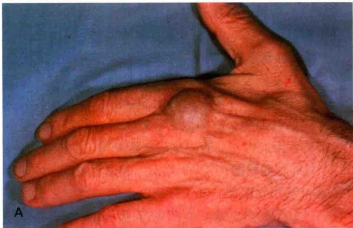 
图10-21血管球瘤。A.手背上第3指近端可见一个突出的瘤结节；B.图（A）的显微照片可见巢样的血管球瘤细胞分布在纤维血管基质中
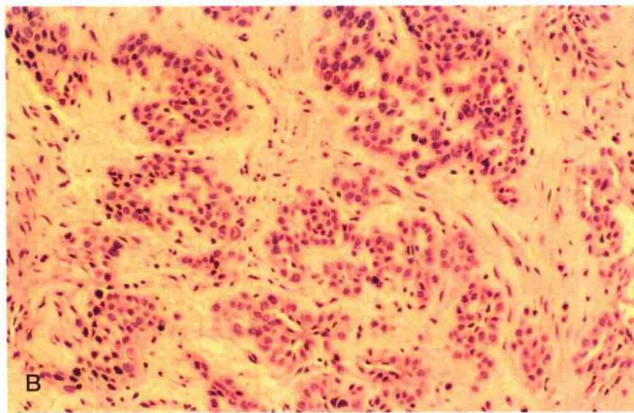
于任何年龄的男性，通常在四肢末端的皮肤或皮下组织。这种肿瘤的腔内有乳头样突起。虽然这种病损在切除后可能复发，但很少转移。
# 第十一节 血管恶性肿瘤
恶性血管肿瘤很少见，有时候继发于先前存在的良性肿瘤。
# 一、血管肉瘤是一种少见的，恶性程度很高的内皮细胞肿瘤
这种病损可以发生在任意性别和年龄。刚开始这种病损呈现出无痛，界限清楚的红色小结。最常见的位置是皮肤、软组织、乳腺、骨、肝和脾。最终，大部分的病损会增大，变为灰白色、鱼肉样，没有包膜。通常，这种肿瘤会发生中心坏死，软化并有出血。

【病理】血管肉瘤表现出不同程度的分化，从
明显的血管样成分到未分化，无血管结构的肿
瘤。后者表现为频繁的有丝分裂，多形性，巨细胞样，更具侵袭性。约 $50\%$ 患有血管肉瘤的患者都死于这种疾病。
肝血管肉瘤很特殊，因为它和环境致癌物关系密切，特别是三氧化二砷（一种农药成分）和氯乙烯（用于塑料生产）。肝血管肉瘤和二氧化钍的应用有关，这是1950年以前放射科医师应用的一种放射性造影剂（钍造影剂）。在暴露于化学品或放射性核素和肝血管
肉瘤发生之间有很长的潜伏期。最早的可检测到的改变是肝血窦细胞的不典型弥散的增生。这种肿瘤通常是多中心的并且可发生于脾。肝血管肉瘤高度恶性并且有局部侵袭和转移特性。
# 二、Kaposi 肉瘤是艾滋病的一个并发症
Kaposi 肉瘤是起源于内皮细胞的一种恶性血管增生性肿瘤。

【流行病学】Kaposi肉瘤并不常见，与AIDS和免疫抑制疾病有关。人疱疹病毒8（HH-8），
又叫Kaposi肉瘤相关性病毒，也跟这种肿瘤有关。仅仅很小比例的感染HH-8的患者会发生Kaposi肉瘤。东欧和地中海血统的中老年男性也有散发病例。一种地方性的Kaposi肉瘤发生于非洲AIDS血清反应阴性的患者。

【病理】Kaposi 肉瘤始于疼痛的紫色或棕色皮
肤结节，直径1mm到1cm。通常发生于手或
足部，但可发生于任意部位。组织学表现多变。一种表型类似于单纯的血管瘤，含有密集簇状的毛细血管和散在的富有含铁血黄素的巨噬细胞。其他表型富含更多的细胞，血管腔不显著。
这种病损与纤维肉瘤很难区分，但是这种病损内皮细胞的特点可以通过免疫化学和电镜区分。
虽然Kaposi肉瘤是一种恶性肿瘤并且在身体内广泛播散，但是这仅是致死的一种原因。
（陆俊良 汪莉 段焕利 王丽丽 刘旭光）
# 第11章 心脏
心脏形状上像人的一个拳头大小，但是在人的一生中能持续不断地泵血90年以上。根据需求，它可以成倍的增加输出量，在一定程度上是由于冠状动脉循环可以增加正常血流量的10倍以上。根据心脏的斯塔林定律，心室扩张也可应对短期的心脏负荷。当负荷增加持续时间较长（如原发性高血压），则引起左心室肥大，以增加心脏工作能力。然而，当这种代偿机制达到其极限，心脏对周围组织不能提供充足的血供，则可导致充血性心力衰竭。缺血性心脏病引起心肌的损伤，可以限制左心室的泵血能力，最后也可导致心力衰竭。
# 第一节 冠状动脉对心脏的供血
左、右冠状动脉起源于主动脉瓣的主动脉窦，或从其上方发出。左主冠状动脉起源处 $1\mathrm{cm}$ 之内分叉出左前降支（LAD）和左旋支冠状动脉。左冠状动脉旋支附着于左房室沟，主要为左心室侧壁供血；左冠状动脉前降支位于前室间沟，主要供血于：①左心室前壁；②相邻的右心室前壁；③室间隔的前2/3；在心尖区，左前降支动脉主要为心室周围供血。
右冠状动脉沿右房室沟走行，主要滋养右心室和左心室后壁（图11-1），包括室间隔的后 $1/3 \sim 1/2$ （也被称为“下壁”或“膈壁”）。根据这三个主要心外膜冠状动脉的分布位置，可以预测因冠状动脉闭塞所致的心肌梗死进行定位。心外膜冠状动脉通常呈所谓的右侧冠状动脉-优势分布，主要是由右侧冠状动脉为冠状动脉后降支供血。另有 $10\%$ 的人的心脏显示为左侧冠状动脉-优势分布，主要是左旋支冠状动脉为冠状动脉后降支供血。
在心肌内，血流量从心外膜流向心内膜。因此，当心外膜冠状动脉受损引起缺血时，心内膜最易受到影响。一些小的心肌内的冠状动脉分支可以深入到室壁内供血；另一部分无分支血管则维持较大直径并且穿过心肌在心内膜表面分布。由于从贯通动脉发出的毛细管网并不互联，冠状动脉阻塞引起心肌梗死后，在梗死心肌与正常心肌之间形成明显的界限。每个冠状动脉的心外膜部分在收缩期表现为充盈和膨胀，在
舒张期表现为流空和狭窄。心肌内的动脉则相反，心肌收缩时动脉表现为狭窄。因此，心肌的血流量，尤其是心内膜下心室区域，在收缩期表现为减少或缺乏。
# 第二节 心肌肥大和心力衰竭
在正常心脏中，心室在心房压降低时表现为舒张和充盈。在收缩期，心室收缩并射出心室中 $60\%$ 的血液（射血分数）。当心脏受损时，无论什么原因引起心功能不全，其临床结果都是相似的。如果初始损伤即很严重，心排血量不能维持代偿性的变化，其结果可导致急性的危及生命的心源性休克。
当心功能受损较轻，代偿机制（见下文）通过增加心室舒张压和舒张末期容积维持心排血量。这种情况可表现为充血性心力衰竭的症状和体征。由于心脏的代偿能力，充血性心力衰竭往往可以持续多年。心脏适应损伤的能力与增加心排血量适应压力增加的机制是相同的。这种基本的代偿机制被称为Frank-Starling机制：即心脏的每搏输出量是心肌纤维长度（心室舒张末期容积，EDV）的函数，而且在一定范围内，正常心脏将尽可能地泵出所有静脉回心血量。每搏输出量是一个衡量心室功能的指标，心房充盈压增加造成心室舒张末容积增加，提高每搏输出量。心力衰竭最显著的特征是相对于每搏输出量，心房充盈压异常的增高。但在衰竭的心脏，每搏输出量和心脏输出的绝对比值依然可以维持较好。

【发病机制】心肌肥大是一种适应性反应，以增强心肌收缩力。它的产生是对血流动力
学负荷的一种代偿反应，其发生与慢性高血压或心脏瓣膜狭窄（压力负荷过大）、心肌损伤、心脏瓣膜关闭不全（体积负荷过大）以及其他一些增加心脏负荷压力的因素相关。此时需区分高强度训练的运动员的生理性肥大和由于损伤与负荷增加引起的病理性肥大。虽然导致这些不同形式的肥大的分子机制有相同之处，还它们之间还是有区别的，因为运动员的心脏扩大是高效的，而患病的心脏则在结构和功能上均存在缺陷。造成这些差别的原因还不
是很清楚，可能由于锻炼是间歇性的，而这些疾病的发生（例如，慢性高血压）则是连续的。心肌肥大表现为心肌细胞的增大，后者通过组装新的肌节而实现。心肌肥大曾被认为不存在心肌细胞数量的增加，直到最近发现心脏前体细胞，它的存在有可能导致细胞增生、增长（见下文）。肥厚的最初是代偿性的和可逆的，但如果持续施加压力，心肌将出现不可逆转的心脏扩大与扩张。
通过自分泌和旁分泌的途径，由刺激触发、受体介导的一些事件促使了心肌肥大。收缩细胞应对机械刺激（如拉伸），通过激活受体介导的信号通路产生肥
大（图11-2）。重要的配体激活包括如下途径：①血管紧张素Ⅱ（ANGⅡ）；②内皮素-1（ET-1）；③去甲肾上腺素（NE）；④各种生长因子，包括胰岛素样生长因子-1（IGF-1）和转化生长因子（TGF-β）。这些介质可能同时作用于心脏的间质成纤维细胞，促进细胞外基质沉积合成。这些配体结合并激活G蛋白偶联受体和酪氨酸激酶受体，从而激活细胞内的各种信号转导通路。通过 $\mathrm{Ca^{2+}}$ /钙调素依赖性蛋白激酶（CaMK）途径调节细胞的钙水平。以下是一个关于肥大反应的配体、信号转导通路、下游靶点和机制之间相互作用的简短的描述（也可参见第1章）。
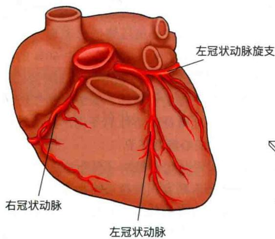
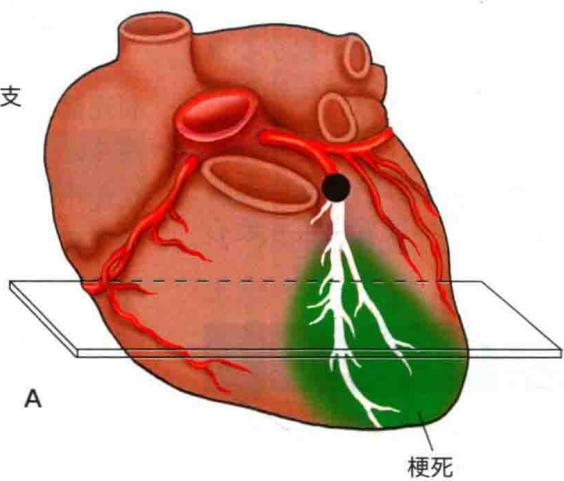
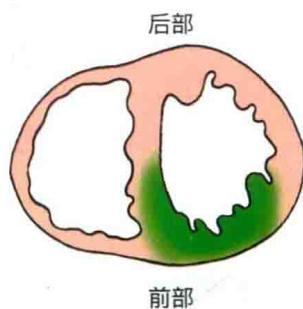

梗死区域

冠状动脉阻塞
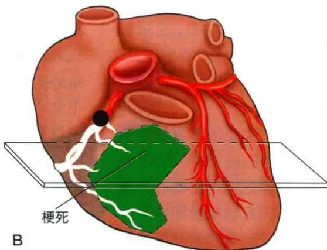 
图11-1三个主要冠状动脉阻塞导致的左心室梗死的位置。A.前部梗死，是指左冠状动的前降支（左前降支，LAD）阻塞所致。梗死灶位于前壁和室间隔的前2/3。并累及心尖周围的心室壁。B.后部梗死（“次要”或“隔膜”）是指右冠状动脉闭塞引起的后壁梗死，包括室间隔后1/3和在1/2心室基底部的后乳头肌。C.后外侧梗死，是指左旋支闭塞导致后外侧壁梗死
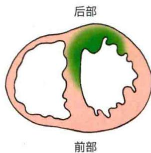
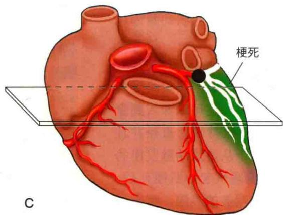
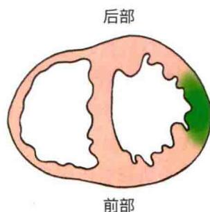
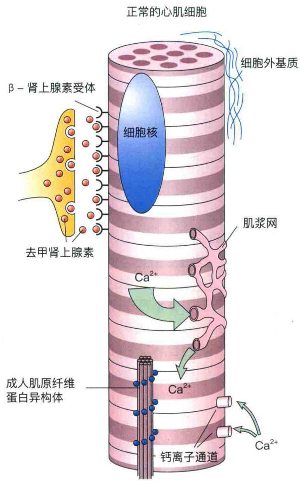 
图11-2 心肌肥厚和充血性心力衰竭的生化特性
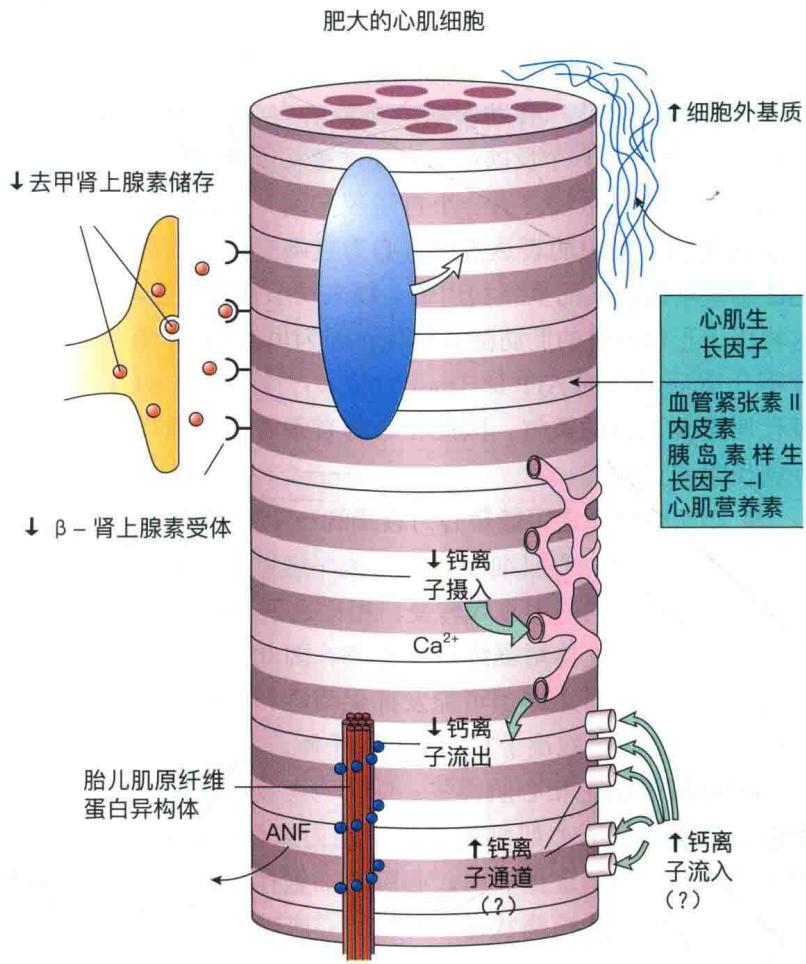
■血管紧张素Ⅱ：肾素-血管紧张素系统的所有成分存在于心肌细胞和心肌的间质成纤维细胞中。血管紧张素Ⅱ通过自分泌和旁分泌机制局部释放，促进心肌细胞蛋白质合成和心肌肥大，以应对压力和刺激。它还可以刺激成纤维细胞增殖，使细胞外基质分泌。用血管紧张素转化酶（ACE）抑制剂治疗心肌肥大，可以使心脏恢复正常大小。 
内皮素：ET-1是一种强力的血管收缩剂，多种细胞（包括内皮细胞和心肌细胞）均可产生。它也是心肌细胞的一种有效的生长因子。 
胰岛素样生长因子-1：IGF-I在大多数组织中均可合成，是一种促生长肽。 
■ 细胞外基质：间质纤维化是肥大反应的典型特征，几乎见于所有形式的心脏衰竭。通过TGF- $\beta_{1}$ 和血管紧张素Ⅱ对心脏成纤维细胞的刺激，可导致基质蛋白沉积。心肌梗死后，纤维化是替代坏死的心肌细胞和防止心脏破裂的重要方式。然而，当它发生弥漫性心肌纤维化，可影响心肌舒张功能，并影响氧和营养物质的吸收。它也能导致心脏电传导通路的重塑，这也是心律失常（如心房颤动、室性心动过速）发生的主要因素。 
丝裂素活化蛋白激酶通路：丝裂素活化蛋白激酶级联，通过促进心肌细胞的生长及存活或病理性重
塑及凋亡，来调节心肌肥厚反应以应对压力负荷。
■ 磷脂酰肌醇-3激酶途径：特定PI3K亚型的激活可促进心肌细胞的存活和生理性肥大，抑制心肌纤维化和病理性肥大。相比之下，其他亚型PI3K的激活则产生不利的影响，如 $\beta$ -肾上腺素能受体的内化和/内质网 $\mathrm{Ca^{2+}}$ -ATP酶（SERCA）活性受到抑制，从而导致心脏舒张功能受损。 
- 肾上腺素能信号和脱敏：肾上腺素能受体受去甲肾上腺素（NE）激活后，可以增强心肌收缩力。慢性心力衰竭患者对儿茶酚胺类药物反应不敏感，反映出肾上腺素能受体对增加循环血液中去甲肾上腺素的水平的适应性脱敏。脱敏导致衰竭的心脏运动过缓。虽然 $\beta$ -肾上腺素能受体在心力衰竭患者中是脱敏的，但应用该受体阻断剂治疗心力衰竭能降低死亡率，并提高心肌的收缩功能。虽然看似矛盾，但大量的证据表明， $\beta$ -肾上腺素能受体能调节去甲肾上腺素的心脏毒性，这些毒性包括适应不良的心肌细胞肥大和凋亡、间质纤维化、心肌收缩功能障碍和猝死。 
钙平衡：各种形式的钙失衡均可见于心肌肥厚和心力衰竭中。心肌细胞中重要的钙调节蛋白的表达和功能的改变，可导致收缩功能和舒张功能障碍。 
■胎儿的基因表达：多个蛋白异构体在胎儿心脏中表达，但出生后正常心脏不表达。因血流动力学负
荷导致的心肌肥厚，却使许多基因再表达。例如，左心室肥大时，心房利钠因子（ANF）和B型尿钠肽（BNP）等大量蛋白再表达，有助于减少血流动力学超负荷。因此，血BNP是一个反映心力衰竭严重程度水平的非常重要的生物标志物。另一个自适应基因开关发生在能量代谢相关蛋白的表达方面。心力衰竭时将重新表达胚胎型基因，从而重新利用葡萄糖来调节能量代谢，这将优于正常心脏的脂肪酸β氧化。因为虽然1mol葡萄糖代谢后产生的ATP比1mol脂肪酸产生的少，但糖代谢需要更少的氧气，因此在心力衰竭时更易表现为糖代谢方式。
心肌细胞凋亡可能是心力衰竭的一个重要因素。病理性肥大通常与心肌细胞凋亡有关，这可能导致心脏由代偿性肥厚向心力衰竭转变。相比之下，PI3K信号可通过IGF-1受体增强细胞生存率。因此，在心肌肥大中的各种信号通路都可能发挥促凋亡和抗凋亡的作用，最终的结果取决于它们之间的平衡。
■ 心脏干细胞和心肌再生：心脏一直被认为是一个静态器官，缺乏心肌细胞再生的能力来修复损伤。现在有令人信服的证据表明，心脏干细胞存在于成年人，他们在健康或疾病状态下对维持心脏功能均具有重要作用（见第1章）。例如，一个接受女性心脏的男性的移植受体者，可表现出完全分化的含Y染色体的心肌细胞。固有的心脏干细胞和骨髓来源的干细胞可以重新填充实验性心肌损伤区，虽然他们是否可以分化为功能齐全的心肌细胞，以及是否能改善临床结果仍不清楚。

【病理】任何持续增加心脏的工作负荷或产生
结构损伤的因素都可能会导致充血性心力衰
竭。缺血性心脏病是最常见的原因，超过 $80\%$ 心脏疾病死亡患者是因缺血性心脏病导致的。其余部分死亡原因是由非缺血性心肌疾病（心肌病）和先天性心脏病（CHD）。除一些特殊病种的特征性形态改变（例如，缺血性心脏病或心脏淀粉样变性）外，心脏衰竭的形态学表现是非特异性的。
在慢性心力衰竭的情况下，均可见到心室肥大。最初，可能只有左心室肥大，如代偿性高血压性心脏病。但当左心室功能受损，右心室工作负荷增加，则产生右心室肥大。大多数在临床上表现出明显心力衰竭的患者，心室明显扩张。终末器官的受累则取决于是左侧心力衰竭还是右侧心力衰竭。
左侧心力衰竭：最常见的原因是心脏损伤（例如，缺血性心脏病和高血压），主要影响左心室。为了弥补左心室衰竭，左心房和肺静脉压力增加，导致肺被动充血。肺泡间隔的毛细血管充盈并破裂致使红细胞逸
出。因此, 肺泡内可见多量含铁血黄素的巨噬细胞 (称为心力衰竭细胞)。此外, 如果毛细血管静水压力超过血浆渗透压, 液体从毛细血管进入肺泡, 肺泡被“淹没”在漏出液中, 引起严重的肺水肿。如果充血时间较长, 则可引起肺间质纤维化（见第 7 章和第 12 章）。
右侧心力衰竭：常与左侧心力衰竭伴发，也可以继发于肺实质疾病或肺动脉高压，这些疾病造成了通过肺部的血流阻力增加。继而右心房压力和全身静脉压力增加，导致颈静脉扩张，下肢水肿以及肝和脾充血。心力衰竭造成的肝淤血将在第14章讨论。
舒张性心力衰竭：超过1/3的老年患者具有明显的舒张性心力衰竭。随着心脏的年龄增大，心室逐渐变得僵硬，需要更大的填充（舒张压）压力。尽管一些患者的心脏大小正常，并且表现出正常的收缩功能，但症状和体征均具有心力衰竭表现。这些患者不易耐受血液流量的增加，而且容易发生肺水肿。显微镜下，心脏通常表现出典型的间质纤维化，这也可能导致心肌顺应性降低。

【临床表现】左侧心力衰竭的症状包括呼吸困
难，端坐呼吸（当躺着时呼吸困难）和阵发性呼吸困难（呼吸窘迫，于睡眠中突然憋醒）。劳力困难反映了伴随着左心房和左心室舒张未期高的肺充血增加。端坐呼吸及夜间阵发性呼吸反映了平卧时胸部血容量增加。
虽然心力衰竭的大多数临床表现可以通过静脉淤血来解释（反向衰竭），但还有部分原因是重要器官动脉灌注不足（正向衰竭）。大部分左侧心力衰竭患者由于肾脏血流灌注减少、肾小球过滤率降低、肾素-血管紧张素-醛固酮系统激活，出现钠水潴留（水肿）（见第7、10章）。大脑灌注不足可导致昏迷，记忆力减退，定向障碍。骨骼肌疲劳和无力则与循环减少有关。
# 第三节 先天性心脏病
先天性心脏病是一种胚胎发育缺陷的结果，表现为结构异位（例如，大动脉转位）或者正常的结构从早期向成熟阶段发展过程中出现了一些阻滞（例如，房间隔缺损）。
典型的先天性心脏病约占新生儿的 $1\%$ 。这并不包括某些常见的非功能性缺陷，如由于左心房瓣膜覆盖功能关闭所致的解剖学上的卵圆孔未闭。在这种情况下，只要左心房压力高于右心房，卵圆孔仍然可以关闭。两叶式主动脉瓣也很常见，它常与钙化性主动脉瓣狭窄相关，直到成年才出现症状。对特定的心血管异常发生率的估计也各不相同，这取决于许多因素（表11-1）。
表 11-1 典型的先天性心脏病患者的相对发病率 
室间隔缺损25% ~ 30%房间隔缺损10% ~ 15%动脉导管未闭10% ~ 20%法洛四联症4% ~ 9%肺动脉瓣狭窄5% ~ 7%主动脉缩窄5% ~ 7%主动脉瓣狭窄4% ~ 6%完全性大动脉转位4% ~ 10%永存动脉干2%三尖瓣闭锁1%

【发病机制】先天性心脏病的病因通常是不
确定的。大多数缺陷都反映了多种遗传和环
境的影响。在多基因遗传疾病中（见第6章），患者的兄弟姐妹发病的风险也增加。此外，一个婴儿的母亲患有先天性心脏病，该婴儿患有心脏缺陷的风险也增加。
单基因综合征是先天性心脏病少见的原因。人类Csx/Mkx2-5突变与先天性心脏畸形相关。染色体异常与先天性心脏异常的发生率增加有关，包括唐氏综合征（21号染色体三体），其他染色体三体，特纳综合征和DiGeorge综合征。然而这些疾病病例总数不超过先天性心脏病的 $5\%$ 。发生在孕妇子宫内的先天性心脏缺陷，早期的风疹病毒感染（尤其发生在最初4周的妊娠）是最有力的证据。孕妇如果使用酒精、苯妥英钠、安非他明、锂、雌激素类固醇和沙利度胺等这些药物，则和妊娠性糖尿病一样都可增加先天性心脏病的风险。根据血液分流的模式，目前先天性心脏缺陷的分类见表11-2。
# 一、早期的左向右分流，左侧压力高于右侧
1.室间隔缺损室间隔缺损是最常见的先天性心脏病变（表11-1），可以单独存在或与其他心脏病变伴发。

【发病机制】胎儿的心脏发育开始于一个单
室，直到妊娠第五周，从心内膜垫长出的房
间隔、室间隔以及房室瓣将单室分割。肌性的室间隔从心脏的顶部向底部生长（图11-3）。然后和自下生长的膜性的室间隔汇合，从而分离左、右心室。最常见的室间隔缺损与间隔的膜部未全部或部分形成有关。

【病理】空间隔缺损：①发生在膜部的一个小洞；
②大的缺损超过膜性部分（膜部缺损）；③在肌
间隔的肌性部分多处缺损（前部是比较常见的部位），
但也可以发生在肌间隔其他部位，；④肌间隔完全缺损（留下一个单心室等）。
表11-2 先天性心脏病的分类起始左向右分流室间隔缺损房间隔缺损动脉导管未闭永存动脉干肺静脉异位引流左心发育不良综合征右向左分流法洛四联症三尖瓣闭锁无分流完全性大血管转位主动脉狭窄肺动脉狭窄主动脉瓣狭窄冠状动脉起源于肺动脉三尖瓣畸形完全性心脏传导阻滞心内膜弹性纤维增生症

【临床表现】一个小间隔缺损不会引起太大功
能上的改变，实际上当孩子长大后可能会自动
关闭。闭锁则是通过相邻心肌的肥大或三尖瓣小叶粘连造成的。患儿室间隔缺损较大时，左心室压力高，则发生左向右分流。左心室扩张和充血性心力衰竭是分流常见并发症。如果缺损较小，生存时间一般会延长，此时血液分流入右心室，致使肺血流量增加，并最终导致肺动脉管壁增厚和肺血管阻力增大。当肺血管阻力增大到一定程度，可引起从右到左的分流(Eisenmenger综合征)。患者常常表现为迟发性发绀、右心室肥大和右侧心力衰竭。室间隔缺损其他的并发症还包括：①缺损处的感染性心内膜炎；②逆行栓子（从右心房通过未闭合的卵圆孔逆向运行至左心房）；③主动脉瓣叶脱垂（导致主动脉瓣关闭不全）。婴儿期室间隔缺损较大可通过手术进行修补。
2.房间隔缺损 房间隔缺损在临床变化多样，从临床无明显症状到慢性的威胁生命的情况均可见到。

【发病机制】房间隔在胚胎发育中是按照一
定规律进行的，只有这样，在胎儿出生之前
才能使富含氧气的胎盘血持续的从右心通过卵圆孔
流向左心。从妊娠期的第5周开始，最初的间隔从心房的顶部向下延伸与心内膜垫连接，称之为第一房间孔（图11-3A）。在完整关闭之前，房间隔中部出现一开口或第二房间孔，可导致血液持续的左向右分流。第6周，第二房间隔（继发隔）开始发育，从心房顶部向心内膜垫延伸（图11-3B）。这个过程中在房间隔中部位置出现一个卵圆形的孔，称为卵圆孔。出生后直到原发隔和继发隔融合之前，该缺损依然存在，当闭合之后被称为卵圆窝。

【病理】房间隔缺损可能发生在如下部位（图11-3）。
卵圆孔未闭：原发隔位于卵圆孔的左侧与卵圆孔的边缘融合，功能上像一个阀门一样密封卵圆孔开口。 $25\%$ 的健康成人可出现卵圆孔未完全闭合，通常不引起大的问题。但当如肺栓塞等原因引起右心房压力增加，右侧循环产生的血栓会经右向左分流直接进入体循环。这些逆行的栓子可经动脉循环引起多个部位梗死，常见于脑、心、脾、肠、肾和下肢。
■房间隔缺损，继发孔型：最常见的房间隔缺损类型，占所有房间隔缺损病例的 $90\%$ 。这是一个真正的房间隔缺损，不应与卵圆孔未闭混淆。一个继发孔型房间隔缺损发生在间隔的中部，包括卵圆孔的微小的开放和卵圆窝的巨大缺损。一个小的缺损通常不引起大的问题，但大的缺损可能使血液从左向右分流，导致右心房扩张和右心室肥厚。在这种情况下，肺动脉的直径可以超过主动脉。
Lutembacher 综合征（鲁登巴赫综合征），继发孔型房间隔缺损的一个变异类型，是继发孔房间隔缺损伴发先天性或风湿性二尖瓣狭窄。表现为二尖瓣狭窄使左心房压力增加，加重心房血液通过房间隔从左向右分流。
■静脉窦缺损：静脉窦缺损可发生在房间隔上部，卵圆窝以上及上腔静脉入口附近部位。它通常伴随着右肺静脉引流入右心房或上腔静脉。 $5\%$ 的房间隔缺损病例可表现有静脉窦缺损（图11-3C）。
■房间隔缺损，原发孔型：这种情况涉及心内膜垫的相邻区域，约占房间隔缺损病例的 $7\%$ （图11-3D）。通常伴有二尖瓣前叶裂和三尖瓣隔叶破裂，这些病变也可能伴随相邻的室间隔缺损。
■ 房室共道永存：房室共道的形成是由于心房、心室间隔共同缺损导致。虽然疾病比较罕见，但在唐氏综合征患者中可经常见到。心房、心室间隔的不完全缺损也可见到（图11-3E）。
【临床表现】儿童房间隔缺损通常是没有症状，虽然有时候他们可能会诉说容易疲劳和呼吸困难。成年以后，肺血管的改变可能使血流通过缺损产生右向左分流。在这种情况下，则会产生发绀和杵状指。房间隔缺损的并发症包括房性心律失常、肺动脉高压、右心室肥大、心力衰竭、逆行栓塞和细菌性心内膜炎等。有症状患者可经手术治疗或经皮植入闭合装置。
3. 动脉导管未闭（PDA）动脉导管连接降主动脉弓与肺动脉之间。在胎儿时期，肺动脉的大部分血液经动脉导管流入主动脉。出生以后，动脉导管收缩以增加动脉血氧含量并纤维增生封闭管腔，最终形成动脉韧带。

【发病机制】持续的动脉导管未闭是一种最常见的先天性心脏缺损，常见于孕妇在妊娠
早期感染了风疹病毒后而产出的婴儿。足月儿出现动脉导管未闭，常表现为动脉导管内皮细胞和血管壁中膜异常，而且这种动脉导管很少能自动闭合。

【临床表现】动脉导管未闭的管腔直径变化很
大。小的分流对心脏的影响不大，然而大的分流表现为大量血液从主动脉进入肺动脉。严重情况下，为确保心排血量需求，可出现左心室肥大和左侧心力衰竭。肺循环中血容量和压力的增加可导致肺动脉高压和其他并发症。感染性动脉内膜炎便是一种常见的动脉导管未闭的并发症。PDA可以通过手术或心导管插入术来治疗。也可通过前列腺素合成抑制剂（例如，吲哚美辛）滴注，使动脉导管收缩及闭合。
4. 永存动脉干 永存动脉干是指主动脉、肺动脉和冠状动脉起源于一个共同的主干。这是由于螺旋形隔板未将原始动脉干分隔成主动脉和肺动脉。永存动脉干总是骑跨在室间隔缺损上，并接受两侧心室供血。几种变异结构已经被发现，其中最常见的（1型）是由一个单一的主干，连接着肺动脉和升主动脉。

【临床表现】大多数存在永存动脉干的婴幼儿
肺血流量大，容易造成心力衰竭、呼吸道反复感染、常在早期即可引起死亡。发生在儿童时期可出现肺血管疾病，在这种情况下，则出现发绀、红细胞增多症和杵状指等表现。在肺血管产生明显病变之前，心脏手术是一种有效的治疗方法。
# 二、法洛四联症（显著地右向左分流），发绀型先天性心脏病最常见的类型
法洛四联症，在年龄较大的儿童和成人中是最常见的发绀型心脏疾病，约占所有先天性心脏病的 $10\%$
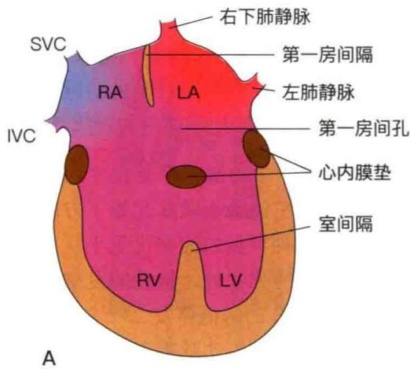
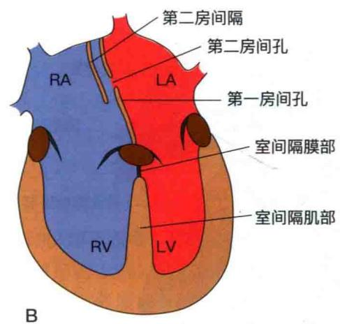
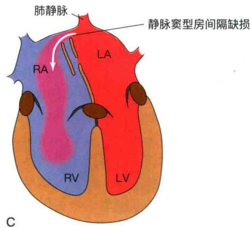
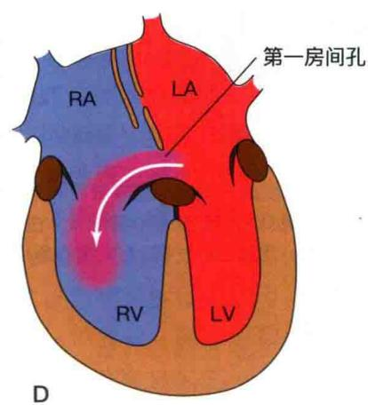
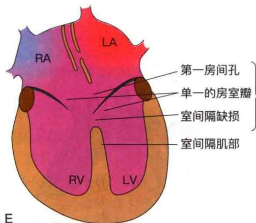 
图11-3室间隔和房间隔缺损的发病机制。A.第一房间隔将心房分隔为左心房和右心房（RA和LA）。由于第一房间隔尚未与心内膜垫结合上，因此形成第一房间孔。心室腔则被肌性室间隔分为左心室、右心室（LV和RV)。SVC，上腔静脉；IVC，下腔静脉。B.第一房间隔与心内膜垫结合后，同时在其中部形成一开口（第二房间孔）。第二房间隔往下延伸，覆盖部分第二房间孔，形成卵圆孔。同时，膜部和肌部室间隔连接在一起，心室完全分离。C.静脉窦型房间隔缺损，最常见位于头侧区和邻近的右肺静脉血流开口处，一般指右心房。D.原发孔型房间隔缺损，多发生在房室交界处瓣膜环的上方，有时发生在完整的瓣膜环上。它也可能表现为缺损的瓣膜环与室间隔结合处形成一个房室窦道，如E所示。这种常见的开放使心房和心室之间血液自由流动。F.房间隔缺损的位置。依据发生的频率依次为：1.继发孔型房间隔；2.原发孔型；3.静脉窦型；4.冠状静脉窦型
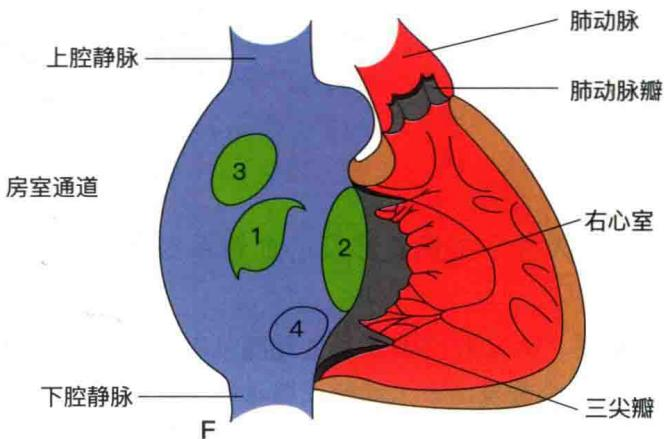

【病理】法洛四联症的定义需要有如下四个解剖学变化（图11-4）：肺动脉狭窄、室间隔缺损、右心房骑跨在室间隔缺损区、右心室肥厚。
法洛四联症患者的心脏肥大，形状上像一个靴子。几乎 $50\%$ 的法洛四联症患者心脏出现异常，包括继发孔型房间隔缺损，动脉导管未闭和左上腔静脉和心内膜垫发育异常。约 $25\%$ 法洛四联症出现主动脉弓右位。
动脉导管未闭实际上是一种保护机制，因为它可以为肺血管床提供血液供应。

【临床表现】在重度肺动脉狭窄时，右心室的
血液通过室间隔缺损分流至主动脉，从而导致
动脉血氧饱和度降低及发绀。通常在2岁之内进行手
术可以矫正。如果儿童时期无法纠正，劳力性呼吸困
难就表现得特别明显，而患病的孩子往往蹲着才能缓
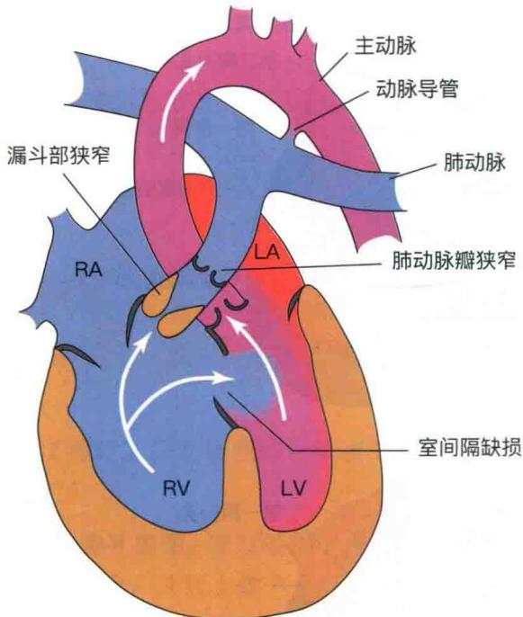 
图11-4 法洛四联症。漏斗部肥厚及肺动脉瓣狭窄导致肺动脉狭窄。室间隔缺累及膜隔区。主动脉右移位和右心室肥大。由于肺动脉阻塞引起血液从右到左分流，患者出现发绀。LA.左心房；LV.左心室；RA.右心房；RV.右心室
解急促的呼吸。身体发育上则表现为弱智。由于患者具有红细胞增多症，脑血栓也往往是其并发症。患者具有患细菌性心内膜炎、脑脓肿等风险。如果没有手术干预，法洛四联症的预后往往很差。然而，目前可以通过开胸手术进行全面矫正，并使死亡率降低至小于 $10\%$ 。如果手术成功，患者的症状会消除，并且会有较好的预后。
# 三、无分流的先天性心脏病，涉及心血管系统各部位
1.大动脉转位 大动脉转位是指主动脉从右心室发出，肺动脉从左心室发出。主动脉在肺动脉的前面然后绕向其右侧（又称“D”或“右向”转位）。研究发现男性多见，特别是患糖尿病母亲所生的后代中更常见。1岁以内婴儿因发绀型心脏病死亡患者中，约 $50\%$ 以上是由于大动脉转位造成的。

【发病机制】由于大动脉转位时血液从右心
流向主动脉,含氧的血液从肺部返回到肺动
脉, 因此全身出现两个独立并行的血液循环线路（图11-5）。只有在这两个血液循环之间出现相互沟通，患者才有可能存活。几乎所有的大动脉转位的新生儿都伴有房间隔缺损，约 $50\%$ 的患者伴有室间隔缺损，2/3 的患者伴有动脉导管未闭。

【临床表现】如果不进行手术治疗，患大动脉
转位的新生儿前景很不乐观——90%的患者
在一岁之内便死亡。目前在新生儿出生2周之内可
通过大动脉转换手术来矫正，治疗后的总生存率可达 $90\%$ 。当患者只患有大动脉转位时，手术治疗可使其达到临床康复，然而，很多情况下大动脉转位合并其他心脏畸形，这就需要更加个体化的治疗措施。
2.主动脉缩窄 主动脉缩窄是指主动脉局限性的缩窄，常常发生于左锁骨下动脉起始下方的动脉导管处（图11-6）。一种罕见的缩窄可见于从主动脉弓一直延伸到腹主动脉的分岔处。男性的发病率约是女性的 $2\sim 5$ 倍，且2/3的病例伴发二叶主动脉瓣。二尖瓣畸形、室间隔缺损、主动脉瓣下狭窄也可伴主动脉缩窄。主动脉缩窄可伴发一些特殊疾病，如特纳综合征，伴发颅内小动脉瘤也很常见。

【临床表现】主动脉缩窄的临床特点是上下肢
的血压之间的差异出现异常。由于缩窄所产生的压力梯度，导致狭窄近心端的血管压力升高，这部分的主动脉也可扩张。身体上班部分的血压高可导致左心室肥大，并产生头晕、头痛及流涎，缩窄部位远端的血管产生低血压，表现为乏力、脸色苍白、下肢寒冷。胸部X线检查显示，肋骨明显扩张可导致肋骨内表面因压力增加出现，大多数主动脉缩窄的患者在40岁之前便死去，他们能控制好并发症，包括：①心力衰竭；②夹杂动脉瘤破裂（继发于主动脉中层囊性坏死）；③感染动脉内膜炎。
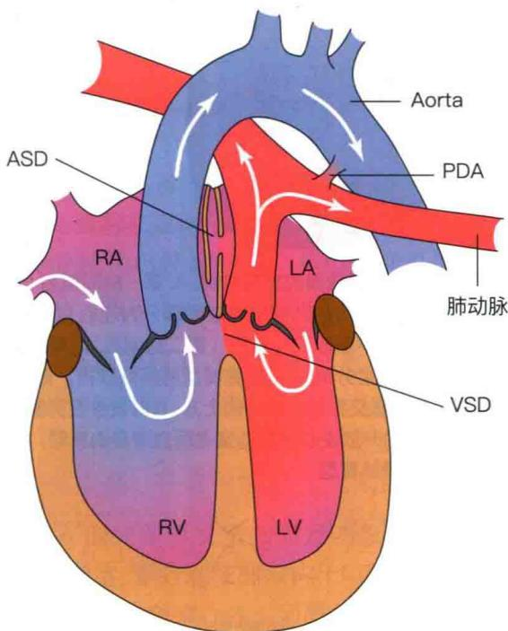 
图11-5 完全性大动脉转位，普通型。主动脉瓣从右心室发出在肺动脉瓣的右前方走行。心房或心室连接缺乏或动脉导管未闭，这种解剖结构与人体正常结构不符。流经心内和未闭合动脉导管的血流量大小和方向取决于压力的程度，在病变早期阶段可能会表现出多种形式。LA.左心房；LV.左心室；RA.右心房；RV.右心室；PDA.动脉导管未闭；ASD.房间隔缺损；VSD.室间隔缺损
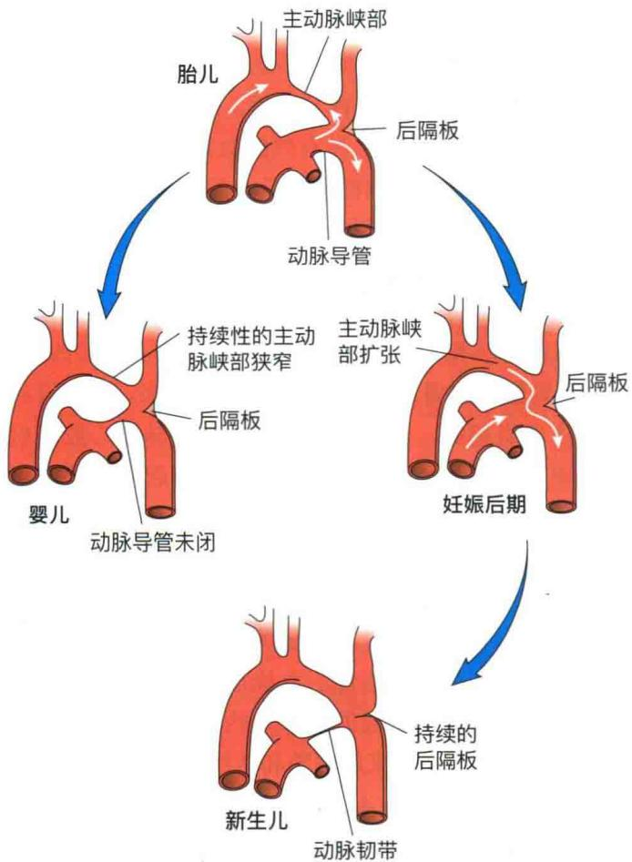 
图11-6主动脉缩窄的发病机制。在胎儿，导管血通过主动脉后隔板将血流入方向分为上行和下行。在胎儿晚期，由导管孔调节下行血流量的升高和峡部的扩张。出生后，如果隔板不发生退化，导管口闭塞则阻止血流自由流动，造成血液不能从邻近闭塞处流向远端。在出生之前，如果主动脉峡部不扩张，导致婴儿型或导管前缩窄。在这种情况下，动脉导管通常主动脉表现为持续性的缩窄
3. 肺动脉狭窄 单纯肺动脉狭窄通常累及瓣膜，使肺动脉瓣狭窄形成一个倒锥形或漏斗形（单纯肺动脉瓣狭窄）。狭窄远端的动脉可能经过数年后而继发扩张。在严重的情况下，婴儿表现出右心室和心房肥大。如果在患有卵圆孔未闭病变的基础上，可出现右向左分流型发绀、继发性红细胞增多症和杵状指。通过心导管检查、球囊扩张狭窄的瓣膜可获得良好的效果。心脏其他的发育畸形也可能导致肺动脉狭窄，其中包括肺动脉周围的动脉狭窄。 
4.先天性主动脉瓣狭窄 先天性主动脉瓣狭窄包括3种类型：瓣膜狭窄、瓣膜下狭窄和瓣膜上狭窄。
主动脉瓣二瓣化畸形：主动脉瓣二瓣化畸形是最常见的先天性主动脉瓣狭窄畸形，常因心内膜垫发育异常而产生。先天性主动脉瓣二瓣化畸形更易发生于男性（男：女 $= 4:1$ ）， $20\%$ 的病例与心脏其他异常（例如主动脉狭窄）伴发。典型的特征是三个瓣膜融合成两个（与右冠状动脉瓣两个瓣膜的其中一个融合）。
 
【临床表现】许多主动脉瓣二瓣化畸形的儿童并无明显症状，多年以后，通常在成年期当瓣
膜增厚、发生钙化时可出现症状。先天性主动脉瓣狭窄的一些更严重类型在早期便可出现症状，包括瓣膜连接不全或未连接。患者可表现为劳力性呼吸困难、心绞痛。由于室性心律失常导致的猝死，是对患者生命的严重威胁。有时也可伴发细菌性心内膜炎。在患者出现症状时，可用主动脉瓣膜切开术进行成功治疗，虽然有时候需要瓣膜置换。
主动脉瓣下狭窄：主动脉瓣下狭窄占所有先天性主动脉瓣狭窄的 $10\%$ 。狭窄的形成是由于左心室流出道主动脉瓣下方隔膜或纤维环的形成。发病率男性约为女性的2倍。在许多主动脉瓣狭窄的患者中，可出现主动脉瓣增厚、发育不全以及轻度主动脉瓣关闭不全。细菌性心内膜炎可加重血液反流。主动脉瓣下狭窄的手术治疗可以切除隔膜或纤维嵴。
主动脉瓣上狭窄：这种类型的狭窄比另两个更常见的，与弹性蛋白基因突变有关，或作为威廉姆斯综合征的一种表现。威廉姆斯综合征是一种累及多系统的先天性疾病，由第7号染色体片段缺失造成，其中缺失的片段包括弹性蛋白基因。该综合征的特征是特发性婴儿高钙血症、精神迟滞、主动脉、肺动脉以及其他大中型动脉狭窄。
# 5.先天性心脏传导阻滞

【发病机制】先天性完全性心脏传导阻滞通常是与其他心脏异常伴发。因此，传导系持续性的中断可能是由于伴发的心脏异常引起，经发现在心脏结构缺陷性疾病中，先天性心律阻滞与孕产妇结缔组织病相关，尤其是系统性狼疮（SLE）。如果不治疗，胎儿的死亡率可 $20\%$ ，然而治疗后生存率接近 $95\%$

【病理与临床表现】常常发现先天性心脏传导阻滞患者的心房肌和房室结之间缺乏连续性。另外，该缺陷还可能是因为在房室结和心室传导纤维存在一个纤维性分隔。虽然患者心率异，单纯的心脏传导阻滞很少出现功能上的障碍。者可出现心肌肥厚，阿-斯综合征（头晕和意），心律失常和心力衰竭等。
6. 心内膜弹性纤维增生症 心内膜弹性纤维增生症（EFE）的特征是左心室的心内膜增厚，这也可能影响到瓣膜。心内膜弹性纤维增生症包括原发性和继发性，后者更常见。
继发性心内膜弹性纤维增生症：这类疾病患者常具有潜在的心血管异常，通常因为无法满足心肌对氧的需求增加而导致左心室肥大。因此，继发性心内膜弹性纤维增生症是先天性主动脉瓣狭窄（包括左心室发
育不全综合征）及主动脉缩窄的一种常见并发症。据推测，心内膜损伤是其发病机制之一。

【病理】大体检查，左心室心内膜表现为形状不规则、不透明的、灰白色斑块，心脏瓣膜上
也可出现。显微镜下，这些斑块是由于心内膜纤维弹性组织的增厚，常伴有心内膜下相邻心肌细胞的变性。瓣膜也显示出胶原增生、变厚。
原发性心内膜弹性纤维增生症：无明确原因引起的心内膜纤维弹性组织增生，这种疾病现在非常罕见。常发生于 $4\sim 10$ 个月的婴儿。尽管在兄弟姐妹中也可发生，却没有明确的遗传模式。最近的证据表明，原发性心内膜弹性纤维增生症与腮腺炎感染有关，这也许可以解释为什么这种情况现在很少见。

【病理】左心室常常是扩张的，但偶尔也可出现缩小以及肥厚。弥漫性内膜增厚常累及大部
分左心室、主动脉瓣和二尖瓣。增厚的内膜往往使其下方的心肌小梁特征不明显，并使腱索乳头肌增厚、变短。并常伴发附壁血栓形成。婴儿原发性心内膜弹性纤维增生症往往进展为心力衰竭。该疾病预后差，心脏移植是其治疗的唯一希望。
7.右位心 右位心是沿心脏的底-顶为轴，向右旋转。它经常与正常的左侧心脏位置和形态成为镜像。心室的位置是由胚胎心肌环的方向来确定。如果环向右，右心室在将来发育在右侧，左心室则占据其应有的位置；如果环向左，发生正好相反。

【病理】当右位心的发生不伴有内脏器官（内脏）位置异常时，往往与严重的心血管异常相
关，包括完全性大动脉转位、各种心房和心室间隔缺损、肺静脉异位引流和许多其他病变。当右位心伴有内脏的异位时，心脏功能往往是正常的，尽管轻微的异常并不少见。
# 第四节 缺血性心脏病
在大多数情况下，缺血性心脏病是由冠状动脉粥样硬化导致的。当血流量不足以满足心脏的氧气需求，缺血性心脏病就会发生。在美国和其他发达国家，至少 $80\%$ 心脏病死亡病例是由缺血性心脏病导致的，至今它仍然是导致死亡的首要原因。相比之下，动脉粥样硬化性心脏病在发展中国家较为少见。缺血性心脏病主要引起心绞痛、心肌梗死、充血性心力衰竭和猝死。
心绞痛：定义是指由心肌缺血导致的疼痛。它通常发生在胸骨后并可放射至左手臂、下颌和上腹部。心绞痛是缺血性心脏病最常见的症状。冠状动脉粥样硬化患者，只有受累血管管腔的横截面面积减少 $75\%$ 以
上时才出现症状。典型的心绞痛患者出现反复发作的胸痛，通常由于体力活动增多或情绪激动引起。疼痛的持续时间（1～15分钟）较短，通过减少体力活动或舌下含服硝酸甘油（一种有效的血管扩张剂）可缓解。虽然严重的冠状动脉粥样硬化是心绞痛最常见的原因，但其他情况也可导致冠状动脉血流量下降引起心绞痛，包括冠状动脉血管痉挛、主动脉瓣狭窄或主动脉重构等。只要缺血性发作的持续时间和严重程度不足以导致心肌细胞坏死，心绞痛在解剖学上不会有明显改变。
变异型心绞痛：是一种不典型的心绞痛，是由冠状动脉痉挛引起的，休息时也可发生。变异型心绞痛机制尚不完全清楚，但内皮细胞功能障碍起着重要的作用。虽然可以导致急性心肌梗死的发作和影响梗死灶的范围，但冠状动脉痉挛通常不是梗死的主要原因。
不稳定型心绞痛：和稳定型心绞痛不同，不稳定型心绞痛与有无活动没有明显关系。它可能在休息或睡眠时发生，与非阻塞性的血栓形成相关，而不是动脉粥样硬化的斑块引起的。在一些不稳定型心绞痛病例中，胸痛发作会越来越频繁和持续时间会越来越长，有时持续时间达 $3\sim 4$ 天。心电图变化也不是梗死的表现，血清心肌特异性蛋白水平，如MB-CK、肌钙蛋白T或I（心肌坏死的证据）也均保持正常。不稳定型心绞痛，也称为梗死前心绞痛，加速性心绞痛或“渐进性”心绞痛。如果没有应用药物或机械干预使狭窄的冠状动脉“开放”，很多不稳定型心绞痛会进展导致心肌梗死。
心肌梗死：心肌梗死表现为不连续的心脏缺血性坏死灶。这个定义可将与由药物、毒素或病毒引起的斑片状坏死区分开来。梗死的发展与缺血时间、缺血组织的代谢率相关。实验研究发现，冠状动脉结扎至缺血20分钟后，坏死灶形成，并且缺血时间越长坏死灶越广泛。
慢性充血性心力衰竭：目前因急性心肌梗死引起的早期死亡率还不到 $5\%$ ，许多缺血性心脏疾病的患者存活时间可以很长，因此后期可发展为慢性充血性心力衰竭。由于早期出现的心肌梗死和存活的心肌发生低灌注引起不可逆的心肌细胞损失，可导致这些患者出现收缩功能障碍，进而导致慢性心功能不全。许多患者也会出现猝死，尤其是那些收缩功能损害并不严重的患者。另外一些患者会出现泵衰竭和多器官功能衰竭而死亡。
猝死：在一些患者中，发病1小时内的猝死是缺血性心脏病首发并且唯一出现的临床表现，往往是由于出现自发性室性心动过速，而后出现心室颤动导致的。大多数病例都存在冠状动脉粥样硬化。在许多情况下，致命性心律失常可能引发心脏急性缺血，但没有明显的心肌梗死，但愈合期的梗死或心室肥厚，可增加因急性缺
血而引发危及生命的室性心律失常的风险。

【流行病学】冠状动脉疾病的主要危险因素：
(1)全身性高血压；②吸烟；③糖尿病；④血胆固醇
醇水平升高。其中任何一个因素都能显著地增加心肌梗死的风险，但多因素共存时，心肌梗死的风险增加7倍（见第8章）。
1950年，美国心肌梗死的标化死亡率为226/100000/年，50年以后，为150/100000/年。造成这种转变的因素很多，包括减少吸烟，降低饮食中的饱和脂肪、新的药物控制高血压，降低胆固醇和溶解冠状动脉血栓等。多个研究证实，血清低密度脂蛋白（LDL）增加心肌梗死的风险，而高水平的高密度脂蛋白（HDL）降低风险。总胆固醇/高密度脂蛋白胆固醇比率似乎比单独检测血清胆固醇水平能更好地预测冠状动脉疾病风险。除了血脂水平，还有其他更重要的独立影响因素。一个血压为 $160 / 95\mathrm{mmHg}$ 的患者比血压为 $140 / 75\mathrm{mmHg}$ 的患者患缺血性心脏病的风险高2倍以上。缺血性心脏病患病的风险随着吸烟的数量增多而升高。参与血栓形成或溶栓作用的血浆凝血因子水平升高，如纤维蛋白、纤溶酶原激活物抑制药-1、同型半胱氨酸水平与纤溶活性降低，均可导致心肌梗死风险升高。炎症的血清标记物水平（如C反应蛋白）也是缺血性心脏疾病的预测因子。
在过去的几年中，美国的2型糖尿病发生率明显增加，这也体现在肥胖人群数量的增加（见第22章）。缺血性心脏病是包括1型和2型在内的糖尿病的后果之一，其发病率是非糖尿病患者的 $2\sim 3$ 倍。反之，动脉粥样硬化性心血管疾病（心肌梗死、脑卒中/周围血管疾病）在糖尿病患者的死亡病例中占 $80\%$
其他缺血性心脏病的危险因素包括：
肥胖：在一个大规模、纵向研究（Framingham心脏研究）中，肥胖是心血管疾病的独立危险因素，肥胖人群的患病风险相对于较瘦的人群高 $2\sim 2.5$ 倍。 
■年龄：随着年龄的增长梗死的风险也越高，这种趋势可以持续长80岁。 
性别：男性更易发生缺血性心脏病， $60\%$ 的冠状动脉疾病可见于男性。患有心绞痛的男性也比女性更常见，年龄小于50岁的男女比例是4：1，60岁时是2：1。 
■ 家族史：一项控制了其他危险因素的研究显示，缺血性心脏病患者的亲属患有冠状动脉疾病的风险增加 $2\sim 4$ 倍。这种遗传基础的危险因素可能与其他危险因素交互作用。 
■ 使用口服避孕药：35岁以上吸烟和使用口服避孕药的女性，心肌梗死发生率也会增加。
久坐不动的生活习惯：规律的锻炼可能通过增加高密度脂蛋白的水平，从而减少心肌梗死的风险。在一项研究中，利用运动检测，不常运动的人患心肌梗死的风险是那些经常运动的6倍。
# 一、影响心脏血供一些情况
心脏是一个需氧的器官，需要通过氧化磷酸化为收缩提供能量。当极限体力活动不足以维持心脏收缩时，骨骼肌可以通过无氧糖酵解提供能量。缺血性心脏病是由于心肌需求和含氧血液的供氧之间的不平衡引起的。当心脏负荷增加，心脏对氧气的需要也增加。如运动或怀孕，会使血压和心排血量升高，心肌对氧需求的增加，这可能会导致器官的受损，发生心绞痛或心肌梗死。这类疾病包括心脏瓣膜病（二尖瓣或主动脉瓣不全，主动脉瓣狭窄）、感染和高血压，主动脉缩窄和肥厚型心肌病等。甲状腺功能亢进患者出现代谢率增加和心动过速，也伴随着对氧的需求增加以及心脏的工作负荷增加（表11-3）。
表11-3 缺血性心脏病的原因氧气供应减少影响血液供应的因素动脉粥样硬化和血栓形成血栓冠状动脉痉挛侧支血管血压，心排血量和心脏率其他：动脉炎（如结节性动脉炎），夹层动脉瘤，梅毒性主动脉炎，冠状动脉起源异常，冠状动脉心肌桥影响血液中氧气供应的因素贫血血红蛋白氧解离曲线的移位一氧化碳氰化物氧需求增加（如心脏负荷增加）高血压瓣膜狭窄或缺陷甲状腺功能亢进症发热维生素B1缺乏症儿茶酚胺类
动脉粥样硬化和血栓形成：动脉粥样硬化的发病机制，在第10章已经详述。在这里主要对缺血性心脏病的特殊重要性的特点进行讨论。冠状动脉是电导血管；是因为它有一个明显的肌性动脉内弹力层。一个
正常的心脏，大的冠状动脉对心脏供血几乎没有血流阻力。心外膜冠状动脉主干在动脉粥样硬化晚期，其管腔狭窄且狭窄远端的血压降低。为了弥补灌注压力降低，动脉壁内微血管扩张，从而保持正常的血流量。因此，大多数冠状动脉粥样硬化患者在休息时不出现缺血或心绞痛表现。然而，运动时心肌需氧量超过供应量，会导致缺血和心绞痛的发生。
冠状动脉粥样硬化者，若管径闭塞在 $75\%$ 以下时（将冠状动脉造影时管径 $50\%$ 闭塞作为评估标准）对心肌供血的最大血流量没有影响。管腔闭塞不超过 $90\%$ 时，静息血流量并不减少。长期心绞痛患者，侧支循环的程度和分布对急性心肌梗死的风险具有重要的影响。虽然心肌梗死常发生在体力活动时（如跑步或铲雪），但许多梗死也可出现在休息或睡眠时。因此，对大多数人来说，冠状动脉粥样硬化可以无临床症状，但一旦转化为心肌梗死将是一个突发的灾难性事件，表现为心肌血流量明显减少，伴或不伴有心肌耗氧量增加。目前公认的冠状动脉血栓形成可以促使急性心肌梗死发生。血栓形成可导致动脉粥样硬化斑块的破裂，通常在一个区域可见大量的炎性细胞浸润和薄的纤维帽形成，可在斑块内或斑块下发生出血。
# 二、心肌梗死可以主要发生在心内膜下或者是透壁性

# 【病理】
1. 梗死灶的位置
两种类型的梗死之间存在明
显区别。心内膜下心肌梗死影响内 $1 / 3\sim 1 / 2$ 的左心室。它既可以发生在一个心外膜冠状动脉主干供血范围内，也可以是圆形的，累及多个冠状动脉分支供血的心内膜下区域。心内膜下心肌梗死的发生通常由于心脏缺血引起。它既可以由某一条冠状动脉粥样硬化引起，也可能因心肌血流量受限（如主动脉瓣狭窄、失血性休克或体外循环低灌注）引起。大部分心内膜下心肌梗死与闭塞性冠状动脉血栓无关。全心低灌注引起的心内膜下心肌梗死，也不一定存在冠状动脉狭窄。由于坏死仅局限于心内层，一些透壁性梗死的并发症（如心包炎和心室破裂）在心内膜下心肌梗死中并不会出现。
透壁性心肌梗死累及左室壁全层，且伴随冠状动脉的闭塞，典型的透壁性心肌梗死通常累及以下三个主要冠状动脉的分布区域之一（图11-1）。
■ 右冠状动脉：右冠状动脉近端阻塞导致左心室后基底区域及室间隔后 $1/3 \sim 1/2$ 发生梗死（“下部”梗死）。
LAD 冠状动脉：该动脉阻塞导致心尖部、左心室的前壁和前间隔的心肌梗死。
左冠状动脉旋支：该动脉阻塞是心肌梗死最常
见的原因，常导致左心室侧壁梗死。
心肌梗死不会瞬间发生。相反，它首先影响心内膜下心肌，并从心内膜下心肌逐渐波及心外膜下心肌，这个过程常常需要数小时。短暂的冠状动脉阻塞可引起心内膜下心肌坏死，持续性阻塞可最终导致透壁性心肌坏死。冠状动脉介入治疗的目标（药物或机械溶栓）就是阻止病变发展和限制心肌坏死。
梗死累及左心室比累及右心室更加普遍和广泛。这种差异可能是由于全身血管阻力和左心室壁的厚度较大致使左心室负荷更重。虽然局限性右心室梗死非常罕见，但右心室肥大（如肺动脉高压）可使右室心肌梗死的发生率增加。
2.心肌梗死的大体表现 缺血时间为 $20\sim 30$ 分钟时，出现可逆性发绀和收缩期膨出。大体检查，急性心肌梗死在前12小时无明显变化
梗死后24小时，心室切面颜色苍白。 
■ 梗死后 $3\sim 5$ 天，梗死区出现斑点，切边界清楚，中央苍白，色淡黄，坏死区周边为充血区（图11-7）。 
■ 梗死后 $2 \sim 3$ 周，梗死区质软具有折光性，外观如凝胶状。 
几个月后，愈合后的梗死区质硬、收缩和出现灰白色的瘢痕组织（图11-8）。
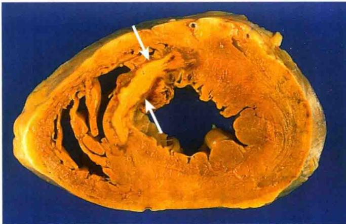 
图11-7急性心肌梗死。以剧烈胸痛发作起病、数天后死亡的患者心脏横切面观，可见左心室前壁区（左前降支冠状动脉供血区域）的透壁性心肌梗死。坏死的心肌质软、色灰黄，边界明显（箭头）
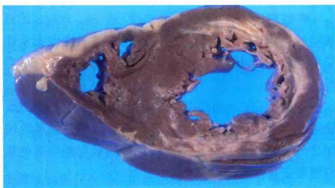 
图11-8 陈旧性心肌梗死。长期患有心绞痛和心肌梗死的男性患者心脏的横切面，显示左心室周围瘢痕形成
3.心肌梗死的镜下表现 前24小时，缺血性损伤的早期形态学特征需要电镜下辨别。缺血时间超过 $30\sim 60$ 分钟，心肌细胞损伤已不可逆转，表现为线粒体肿胀、崎紊乱和无定型的基质聚集；核染色质边集、肌膜局部破坏。细胞膜的完整性受损，导致细胞内的蛋白质（如肌红蛋白、LDH、CK和肌钙蛋白I和T）释放。非梗死的缺血心肌细胞表现为拉伸与收缩，光镜下形成“波浪状的纤维”。24小时后，细胞明显的嗜酸性（图11-9）、表现为凝固性坏死的特征性改变（第1章）。然而，心肌细胞的细胞核完全消失则需要几天的时间。
$2\sim 3$ 天：多形核白细胞（PMN）诱使心肌细胞坏死。 $2\sim 3$ 天后，梗死周围血流量达到最大且浓度最高，因此中性粒细胞积聚在梗死周边（图11-9，图11-10)。间质水肿和灶状出血也可能出现。心肌
细胞明确的坏死，细胞核消失和波浪状纤维变得模糊。一些区域中性粒细胞聚集，核碎出现。
$5\sim 7$ 天：多形核白细胞减少，梗死边缘区巨噬细胞浸润并吞噬坏死的心肌细胞、成纤维细胞开始增殖、新的胶原沉积；淋巴细胞和巨噬细胞明显浸润。从第5天开始，瘢痕组织开始在梗死周边逐渐向中心扩展，替代坏死的肌肉组织。
$1\sim 3$ 周：炎细胞浸润逐渐消退、胶原沉积、新生的毛细血管逐渐闭塞。 
4周以后：纤维组织致密，坏死组织逐渐消失，随着瘢痕形成，细胞数目逐渐减少（图11-11）。
在评估大的梗死灶的发生时间时，根据梗死灶周围边缘区域，而不是中心区域的形态来判断将更为准确。事实上，一些大的梗死灶与其说是被消除了，不如说是心肌细胞被无限地“木乃伊”化。
 
正常
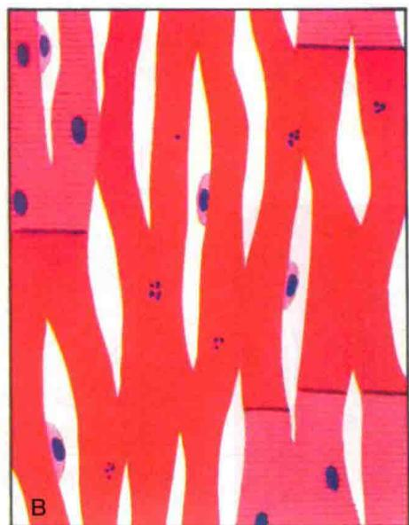 
$12\sim 18$ 小时
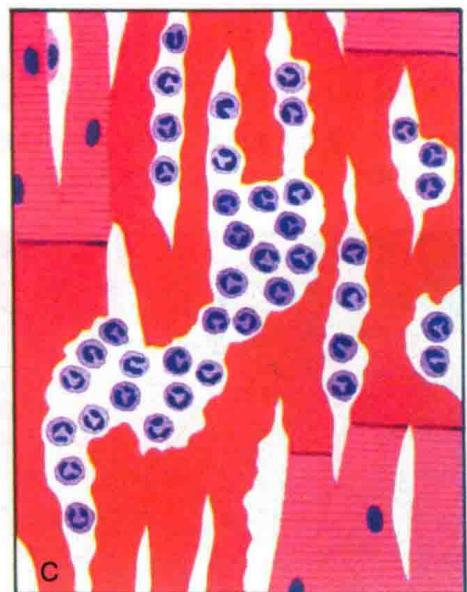 
1天
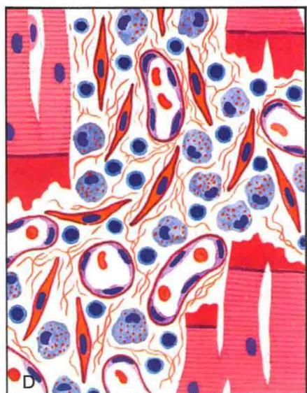 
图11-9 心肌梗死的发展。A. 正常心肌；B. $12 \sim 18$ 小时后，HE切片染色显示心肌梗死区细胞嗜酸性变（红染色）；C. 约24小时后，梗死心肌周围中性粒细胞浸润；D. 大约3周后，梗死灶的周围可见由新生的毛细血管、成纤维细胞、淋巴细胞和巨噬细胞组成的肉芽组织形成，该区域的坏死碎片消失、少量胶原纤维增生；E. 3个月以上，梗死区被瘢痕组织替代
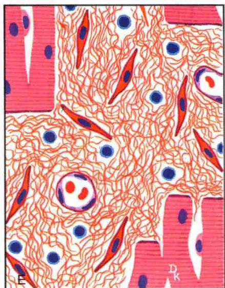
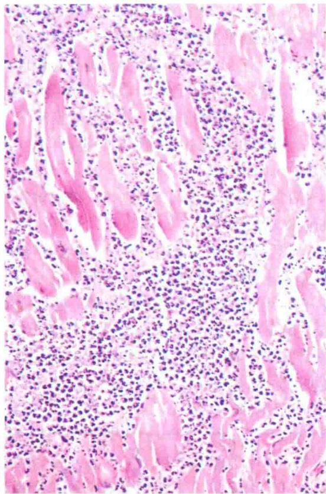 
图11-10急性心肌梗死。坏死的心肌纤维嗜酸性变，心肌横纹和细胞核消失，伴急性炎症细胞弥漫性浸润
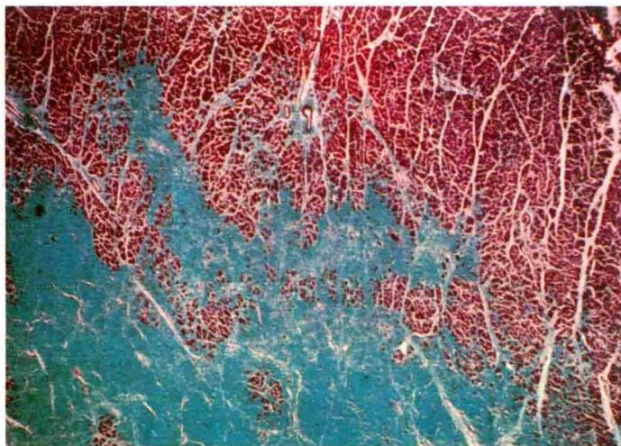 
图11-11 陈旧性心肌梗死。胶原染色显示陈旧性心肌梗死的边缘胶原基质致密、无细胞成分，并与周围心肌细胞界限明显
4. 心肌缺血再灌注 通过自发性溶栓、药物反应或机械性开放闭塞的冠状动脉，可使血液重新流入到梗死区（见第1章）。当这种情况发生时，心肌梗死的大体和镜下表现将发生变化。心肌梗死再灌注（不像那些持续性闭塞）典型的表现是出血，这是由于血流通过破坏的微血管造成的。心肌梗死再灌注最典型的变化之一是收缩带坏死。收缩带增厚、形状不规则，在坏死的心肌细胞处出现一条嗜酸性横带。电镜下观察，这些收缩带与肌节Z线形成高度收缩、杂乱无章的小团块状。收缩带形成是由于氧自由基导致细胞膜损伤，使大量 $\mathrm{Ca}^{2+}$ 灌注进入心肌细胞。
# 【临床表现】三、急性心肌梗死的临床诊断可能因为“无症状”而变的非常复杂
急性心肌梗死突然发病，常伴有严重的、剧烈的胸骨后或心前区疼痛。这些症状可能伴有出汗、恶心、呕吐和呼吸急促。在某些情况下，不稳定型心绞痛持续数天后可引起急性心肌梗死。 $1 / 4\sim 1 / 2$ 的非致死性心肌梗死可无任何症状，只有梗死后由心电图检测到或尸检确定。这些“无症状”的梗死，特别常见于自主神经功能紊乱的糖尿病患者和去神经支配的心脏移植患者中，血清中检测到一些心脏的蛋白质（如CK-MB和肌钙蛋白T）是心肌坏死的证据。
# 四、心肌梗死的临床并发症
急性心肌梗死早期死亡率（30天内）已经从20世纪50年代的 $30\%$ 下降到今天的不到 $5\%$ 。因此，急性心肌梗死后的临床过程可能主要以其功能性或机械性的并发症为主。
心律失常：几乎所有心肌梗死的患者都会在发病过程中出现心律失常。虽然冠心病监护病房和除颤器的应用大大降低早期死亡率，但仍有 $50\%$ 的缺血性心脏病死亡病例是由心律失常引起的。
左心衰竭及心源性休克：心肌梗死后发展成左心衰竭是一个不祥的征兆，这通常表明肌肉发生大范围损失。幸运的是，由于限制梗死范围（溶栓治疗，血管成形术）或协助受损心肌（主动脉内球囊泵）技术的发展，心源性休克发病率已小于 $5\%$ 。心肌梗死早期易发生心源性休克；当左心室损失达 $40\%$ 或更多，患者死亡率高达 $90\%$
梗死范围扩大：超过 $10\%$ 的急性心肌梗死患者在第 $1\sim 2$ 周时可出现梗死范围扩大。这种情况患者死亡率将增加1倍。
心肌游离壁破裂：心肌破裂可能发生在急性心肌梗死3周内的任何时间，但最常见于第1天和第4天，这个时期心肌梗死壁薄弱、质软、组织坏死、炎细胞刺激蛋白酶降解细胞外基质，而新的基质沉积尚未发生。一旦瘢痕组织形成，则很少发生破裂。游离壁破裂是心肌梗死的并发症。其余毗邻梗死区域存活的心肌收缩产生机械压力，可以沿梗死传播，导致中性粒细胞积聚的外侧缘破裂。左心室游离壁破裂最常导致心包积血和心脏压塞而致死亡。急性心肌梗死住院患者出现心肌破裂约占死亡人数的 $10\%$
其他形式的心肌破裂：少数心肌梗死患者累及室间隔，可导致室间隔破裂，破裂长度在 $1\mathrm{cm}$ 左右或更长，结果导致左到右分流。因此，室间隔破裂的长度与预
后相关。部分乳头肌破裂可导致二尖瓣关闭不全。在某些情况下，乳头肌完全断裂导致的严重的二尖瓣关闭不全可能是致命的。
动脉瘤：左心室动脉瘤伴发于 $10\% \sim 15\%$ 的透壁性心肌梗死。1/3的患者在急性心肌梗死后，受累的心室壁会在心脏收缩时向外膨胀。心肌梗死区局部心室壁变薄、拉伸被称为“梗死膨胀”，但实际上是一个早期动脉瘤（图11-12）。这样一个动脉瘤是由坏死心肌和胶原组织形成的一个薄层，在心脏每次收缩时都会膨胀。由于动脉瘤中纤维组织较多，其拉伸强度也会增加。但动脉瘤随着每次的心跳都会不断的膨胀，因此会“偷走”部分左心室排血量和增加心脏负荷。附壁血栓常常伴随着动脉瘤发生。另外还要区分“真性”动脉瘤（如上所述）和“假性”动脉瘤。假性动脉瘤由心包瘢痕组织包绕部分破裂左心室壁形成。因此，一个假性动脉瘤壁是由心包和瘢痕组织，而不是左室心肌组成。
附壁血栓和栓塞：死于心肌梗死的患者死后尸检发现，有 $50\%$ 病例在梗死区域伴有附壁血栓。这种情况尤其常见于梗死累及心尖部。反过来，有全身性栓塞证据的患者中， $50\%$ 会伴有卒中和内脏梗塞病变。
心包炎：透壁性心肌梗死累及心外膜，导致 $10\% \sim 20\%$ 的患者患心包炎。心包炎临床表现为胸痛、也可产生心包摩擦音。约1/4急性心肌梗死的患者，特别是大范围梗死、充血性心力衰竭，常引起心包积液，伴或不伴心包炎。
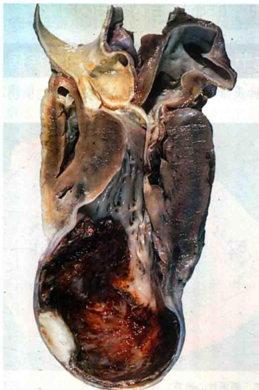 
图11-12 心室动脉瘤。心肌侧壁梗死并发巨大室壁瘤患者的心脏。心尖处肌壁变薄和动脉瘤扩张
心肌梗死后综合征（Dressler综合征，德雷斯勒综合征）：是指梗死 $2\sim 10$ 周后延迟形成的心包炎。心脏手术后可能会出现类似的病症。在这些患者中出现心肌抗体，糖皮质激素治疗可改善病情，这表明德雷斯勒综合征具有免疫学基础。
# 五、治疗性干预，限制梗死范围
由于心肌坏死的数量是发病率和死亡率的重要预测因子，因此任何能限制梗死范围的治疗应该是有益的。虽然许多干预措施可以延缓缺血损伤，但恢复动脉血流量仍然是挽救心肌细胞缺血的唯一途径。目前已经有多种方法可以恢复被阻塞的冠状动脉所供应的心肌区域。
■溶栓酶如组织型纤溶酶原激活剂（tPA）或静脉滴注链激酶可使阻塞的血块溶解。 
经皮腔内冠状动脉成形术是将球囊导管扩张使冠状动脉狭窄病变处扩张，以改善心肌血供。此外置入支架也可使冠状动脉保持通畅。 
■ 冠状动脉旁路移植术可以使近端闭塞的冠状动脉的远段恢复血流。
恢复血流的干预必须尽快进行，最好在出现症状后的最初几个小时即实施。大多数心肌缺血超过6小时则不可能被挽救。
# 六、慢性缺血性心脏病可以导致心肌病
少数重度冠状动脉粥样硬化患者，大体上无明显梗死，但心肌收缩力受损，这种情况通常表现为缺血心肌功能异常、弥漫性纤维化和多发性的小的愈合后的梗死灶共存；然而有些患者出现左心室衰竭伴有心脏功能障碍，但也无明显梗死的表现。这些患者被认为患有缺血性心肌病。在一些患者中，心肌缺血导致心肌功能异常，进而导致心肌细胞的退行性变化，其特征主要是肌原纤维的丢失。通过手术重建血运对这类病例可能是有益的。
# 第五节 高血压性心脏病
# 一、高血压对心脏的影响
世界卫生组织对高血压的定义是：全身血压持续增加，收缩压大于 $140\mathrm{mmHg}$ 或（和）舒张压大于 $90\mathrm{mmHg}$ （见第10章）。在美国高血压是引发冠状动脉和心肌疾病最常见的和最重要的原因。慢性高血压导致压力超负荷导致代偿性左心室肥厚，并最终可引起心力衰竭。排除其他因素，由高血压引起的心脏扩大被称之为高血压性心脏病。
匀和向心性增厚（图11-13）；心脏重量增加，男性大于375克，女性大于350克。镜下，心肌纤维变粗，细胞核增大、深染成矩形（“货车车厢”样）（图11-14）。

【临床表现】心肌肥厚明显增加心脏应对工作
负荷的能力。然而当心肌肥厚到一定程度，则
不能起到代偿作用。心肌肥大的上限可能体现在间质和每条肌纤维中心之间的扩散距离；如果距离太远，将不能提供充足的血氧供应。
高血压引起的最常见的功能异常是舒张功能障碍，其本身便能够导致充血性心力衰竭。心肌肥厚会出现间质的纤维组织增生，这更加剧了左心室僵硬的程度。高血压也与冠状动脉粥样硬化严重程度相关。心脏的负荷增加（收缩功能障碍）、舒张功能障碍合并冠状动脉狭窄则使心肌缺血、心肌梗死和心力衰竭的风险加大。
# 二、高血压患者死亡的原因
充血性心力衰竭是未经治疗的高血压患者最常见的死亡原因；脑出血也常引起死亡；冠状动脉粥样硬化和心肌梗死、主动脉夹层动脉瘤和颅内小动脉瘤破裂
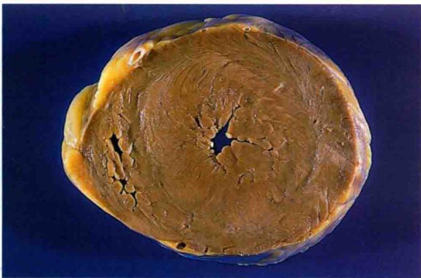 
图11-13 高血压性心脏病。心脏的横切面显示左心室心肌明显肥大，心室腔不扩张。右心室的大小正常
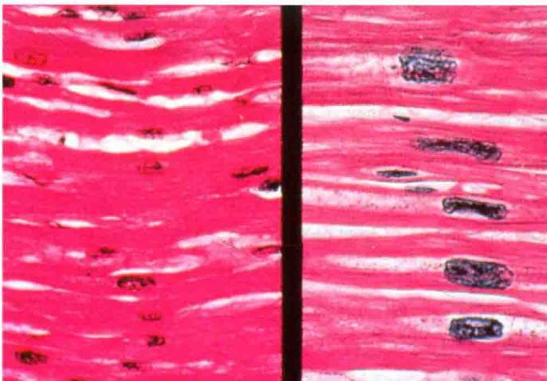 
图11-14高血压性心脏病伴心肌肥大（左侧）正常心肌（右侧）肥大的心肌显示心肌纤维增厚，细胞核增大、浓染、成矩形
也可能导致死亡；高血压加重肾损害，导致肾衰竭也是致死原因。
# 第六节 肺源性心脏病
肺源性心脏病是指继发于肺动脉高压的右心室的肥厚和扩张。肺实质的病变或心血管系统的原发性疾病都可使肺循环压力增加（例如原发性肺动脉高压、小的肺栓塞）。
急性肺源性心脏病最常见的原因是由于突然发生大面积肺栓塞引起肺动脉高压。这种情况会导致严重的急性右心衰竭。尸检发现大多数出现右心室扩张，严重时可出现右心房扩张。
慢性肺源性心脏病是一种常见的心脏病， $10\% \sim 30\%$ 的心力衰竭病例由慢性肺源性心脏病引起。这个比例也与常常由吸烟导致的慢性阻塞性肺疾病的发病率相关。

【发病机制】慢性肺心病可由任何影响或阻碍肺血管呼吸力学和气体交换的肺部疾病引
起。慢性肺源性心脏病最常见的原因是慢性阻塞性肺疾病和肺纤维化。除了肺部血管的闭塞，这些疾病也会导致肺小动脉血管收缩，这使得在没有破坏血管的情况下也能降低肺血管床的有效面积。缺氧、酸中毒和高碳酸血症能直接引起的肺血管收缩。

【病理】慢性肺心病患者的特点是明显的右心室肥厚（图11-15），厚度超过 $1\mathrm{cm}$ （正常范
围是 $0.3 \sim 0.5 \mathrm{~cm}$ ，右心室和右心房扩张。
# 第七节 获得性瓣膜及心内膜疾病
各种炎症、传染病和退行性疾病都能损伤心脏瓣
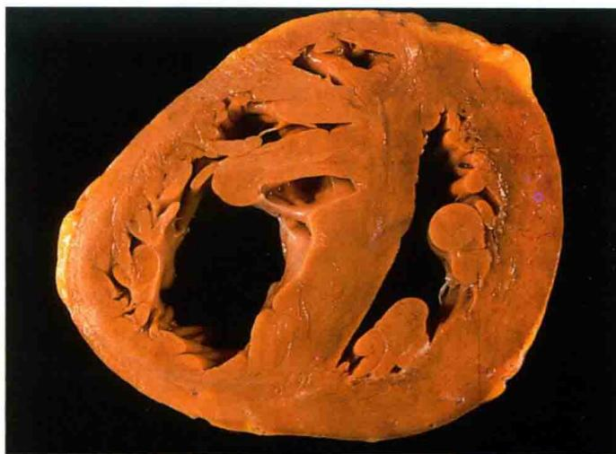 
图11-15 肺源性心脏病。原发性（特发性）肺动脉高压患者心脏横切面显示右心室明显肥大（左侧）。右心室游离壁厚度与左心室壁相似。右心室扩张。室间隔变直失去向左心室凹曲的生理结构，也表现为肺源性心脏病的一种变化
膜并使其功能受损。瓣膜通常是菲薄的弹性膜，能起到密封作用防止血流回流。当它们受损时，出现瓣膜增厚、融合等致使瓣膜狭窄，不能起到防止血液回流的作用。当病变破坏瓣膜组织可引起血液逆流，称为瓣膜反流或不全。在许多情况下心脏瓣膜产生狭窄和关闭不全，一般会以某一种病变为主。
心脏瓣膜导致狭窄近端（根据血液流动方向）处的心肌肥厚。一旦代偿机制失衡，最终可导致瓣膜病变近端的心肌扩张和压力超负荷。因此，二尖瓣狭窄导致左心房肥大和扩张。当左心房不能通过代偿来限制通过狭窄的二尖瓣回流的静脉血，则会引起肺充血，然后引起右心室肥厚和肺心病。同样，主动脉瓣狭窄可导致左心室肥厚和左心衰竭。
瓣膜反流或不全也可由于容量负荷导致瓣膜近端的肥大和扩张。当出现主动脉瓣关闭不全时，由于左心室不再能够容纳反流的血液、提供足够的心排血量，首先会出现左心室肥大，然后出现左心室扩张。此外，二尖瓣关闭不全也会因容量负荷引起左心房和左心室的肥厚与扩张。
# 一、风湿性心脏病包括急性心肌炎和残存瓣膜畸形
1.急性风湿热 风湿热（风湿热）是继发于链球菌感染的多系统受累的疾病，儿童多见，特点是心脏、关节和中枢神经系统等出现炎症反应。
【流行病学】风湿热是急性化脓性链球菌（也称为A组β型溶血性链球菌）感染的一种并发症，几乎总是以咽炎起病（即“链球菌”咽炎）（见第9章）。在一些链球菌性咽炎流行区域，风湿热的发病率高达 $3\%$ 。风湿热主要发生于儿童，中位发病年龄为 $9\sim 11$ 岁，但有时也可见于成年人。尽管在发达国家发病率已经明显下降，但在一些欠发达国家，风湿热是导致 $5\sim 25$ 岁心脏病患者的主要死亡原因。

【发病机制】急性风湿热的发病机制涉及三
个方面：①遗传易感宿主；②A组β型溶血
性链球菌；③异常的宿主免疫反应。MHC-II等位基因对疾病的易感性发挥作用，大部分假说认为：B细胞和T细胞与链球菌抗原发生交叉反应，导致风湿性心脏炎症。研究表明，自身免疫性因素与所谓的分子模型的关系如下（图11-16）。
细菌碳水化合物N-乙酰- $\beta$ D氨基葡萄糖(GlcNAc)与肌球蛋白和层粘连蛋白产生抗原抗体反应，破坏瓣膜内皮细胞。 
内皮损伤导致内皮细胞上的细胞黏附分子VCAM-1表达上调，造成早期炎症及T细胞浸润。 
心脏组织中的克隆性T细胞与细菌M5蛋白
和肌球蛋白产生免疫反应。
尽管存在这些因素，一些链球菌对心肌的直接毒性作用也不能被排除。

【病理】急性风湿性心脏病是一种累及整个心脏，包括心脏三层结构（心内膜、心肌和心包）
的炎症。
心肌炎：在最早的阶段，心脏扩张并出现非特异性炎症，其中以淋巴细胞和巨噬细胞浸润为主，有时也可见少数中性粒细胞和嗜酸性粒细胞浸润。早期阶段，出现胶原纤维蛋白样变性表现为纤维肿胀，断裂和嗜酸性变。在病变严重的情况下可引起少数患者死亡。
风湿小体是风湿性心肌炎的肉芽肿性病变（图11-17），在发病数周后出现。该结构最初由血管周围的纤维素肿胀并在周边围绕数量不等的淋巴细胞、吞噬细胞及浆细胞组成；随后，呈慢性肉芽肿表现；中央是纤维素样坏死物质，周边围绕淋巴细胞、浆细胞、巨噬细胞和巨细胞。最后，风湿小体被瘢痕组织所取代。Anitschkow 细胞是风湿小体中的一种不常见的细胞类型，特点是细胞核内可见染色质形成的中央带（图11-17）。这些细胞是巨噬细胞，通常数量不多，但可在心脏的炎症时逐渐聚集而表现明显。Anitschkow 细胞如果形成多核，则称为Aschoff 巨细胞。
心包炎：风湿热的急性炎症期，在心包表面可见不规则的纤维蛋白沉积于脏层和壁层。这些沉积物像两片错开的涂黄油的面包的表面（“面包和黄油心包炎”）。心包炎在临床上可闻及到摩擦音，但一般不出现功能异常，通常也不会导致缩窄性心包炎。
感染性心内膜炎：风湿性心脏炎急性期，瓣膜发炎和水肿，四个瓣膜都受影响，但左侧瓣膜最易受累。其结果是瓣膜闭锁缘的内皮细胞局灶性缺失，并导致纤维蛋白结节沉积，形成与瓣膜粘连的疣状赘生物（所谓的急性风湿热疣状心内膜炎）。

【临床表现】风湿热没有特异的检测指标，根
据琼斯标准：符合两个主要条件、或符合一个
主要条件与两个次要条件时，即可临床诊断风湿热急性风湿热的主要条件包括心肌炎（心脏杂音、心脏肥大、心包炎和充血性心力衰竭）、多发性关节炎、舞蹈症，风湿性环状红疹，皮下结节。风湿热的次要条件：关节痛、发热史、实验室检查证实炎症过程及心电图变化。
风湿热的急性症状通常在3个月内消退，但患有严重心脏炎时，临床症状可持续6个月以上。急性风湿性心脏炎的死亡率较低，虽然瓣膜功能障碍也可能发挥了作用，但主要的死亡原因是心肌炎引起的心力衰竭。风湿热反复发作与患者以前没有感染过A组-β
型溶血性链球菌相关。患者近期患有风湿热，其复发率高达 $65\%$ ，然而链球菌感染10年后，只有 $5\%$ 才复发。提示用抗生素治疗链球菌咽炎能有效预防风湿
热的发生，或至少能预防风湿热的复发。虽然糖皮质激素、水杨酸等一些药物对缓解风湿热的症状是有帮助的，但目前还没有具体的治疗方法。
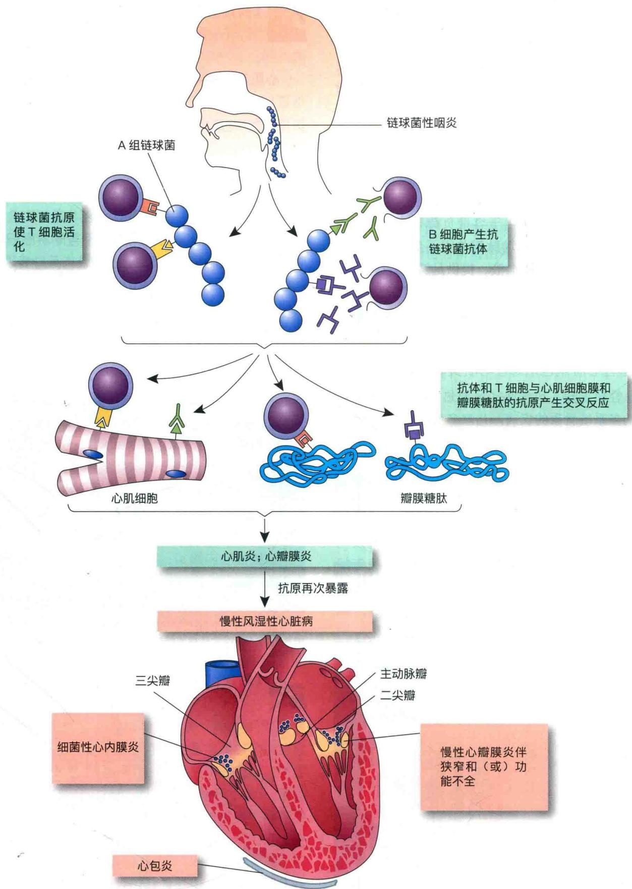 
图11-16风湿性心脏病的生物学因素。图示上部分说明喉咙感染β-溶血性链球菌后，链球菌抗原进入体内，并可能激活细胞毒性T细胞。这些抗原导致机体产生抗链球菌各抗原成分的抗体，并与心脏抗原产生交叉反应，部分抗体可能来源于心肌肌膜和瓣膜的糖蛋白。这可能是急性风湿热的心脏炎症发生的机制，包括所有的心肌层（心内膜炎、心肌炎和心包炎）。2～3周潜伏期后炎症症状明显。急性瓣膜的炎症可能最终导致慢性心瓣膜狭窄或开放不全。按照发病频率，这些病变可累及二尖瓣，主动脉、三尖瓣和肺动脉瓣
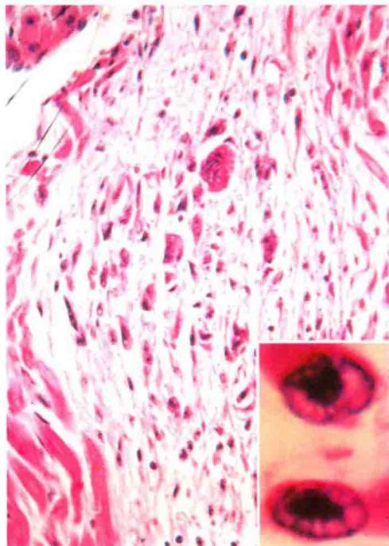 
图11-17 急性风湿性心脏病。风湿小体位于心肌间质。注意胶原变性、淋巴细胞和多核Aschoff巨细胞（插入的图片）Anitschkow细胞的细胞核，横截面呈“枭眼”、纵切面呈“毛虫”形态
# 2. 慢性风湿性心脏病

【病理】风湿性全心炎包括心肌炎和心包炎，通常治疗后不产生后遗症。相比之下，风湿热
的急性瓣膜炎往往引起长期的结构和功能的改变。严重的心脏瓣膜瘢痕可在急性风湿热的数月或数年后出现。急性风湿热反复发作也很常见，可逐渐加重心脏瓣膜的损坏。在慢性风湿性疾病中，二尖瓣是最常见和影响最严重的瓣膜。慢性二尖瓣瓣膜炎的特点是，瓣膜不规则增厚和钙化，经常与腱索粘连、融合（图11-18）。病变严重时，瓣膜口缩小、狭窄，从心室角度看呈“鱼口”状改变（图11-19）。二尖瓣狭窄主要是功能性病变，但这种瓣膜也可导致血液反流。慢性反流产生一种“喷气机”样的血流指向左心房后方，损害心房内膜。
主动脉瓣是风湿性心脏病第二常被累及的瓣膜。瓣膜的弥漫性增厚、变硬与腱索融合导致瓣膜狭窄。随着年龄的增加，瓣膜逐渐钙化、狭窄，导致供血不足。如果风湿热反复发作，可出现三尖瓣变形，但几乎总是与二尖瓣和主动脉瓣病变伴发，肺动脉瓣则很少受累。
# 3. 慢性风湿性心脏病的并发症
细菌性心内膜炎往往具有菌血症的致病因素（如牙科手术）。风湿性心脏病的瘢痕瓣膜为细菌的生长提供一个有利的环境。 
附壁血栓形成 $40\%$ 的风湿性心瓣膜病患者的心房或心室中会产生血栓，引起各种器官梗死。 
充血性心力衰竭可能是二尖瓣和主动脉瓣风湿性心脏病的并发症。
# 二、胶原血管疾病同时影响心脏瓣膜和心肌
1. 系统性红斑狼疮（SLE）系统性红斑狼疮往往累及心脏，但心脏症状与其他症状相比并不突出。

【病理】心脏病变最常见的是纤维素性心包炎，常伴有心包积液。心肌炎在系统性红斑狼疮是主要的临床表现，但心肌炎的出现常反映出器官已经发生严重的病变。显微镜下常见到小血管纤维素样坏死和间质组织局灶变性。感染性心内
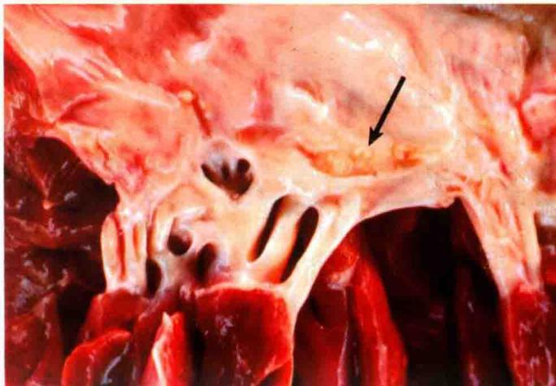 
图11-18 慢性风湿性心瓣膜炎。二尖瓣瓣叶增厚和局灶性钙化（箭头所示），局部瓣膜融合。腱索变短、增厚、融合
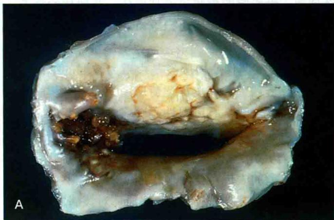
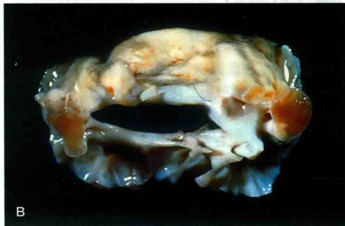 
图11-19 慢性风湿性心瓣膜炎。手术切除的风湿性二尖瓣：左心房（A）和左心室（B），表现为瓣膜变硬、增厚、融合及狭窄，呈风湿性二尖瓣狭窄的特异的“鱼嘴”样的外观。注意乳头肌的顶端（图B）直接与二尖瓣的下方相粘连，导致腱索明显缩短、融合
膜炎是系统性红斑狼疮最显著的心脏病变，在心内膜表面出现直径达4mm的疣状赘生物，称为Libman-Sacks心内膜炎。这些疣状赘生物在二尖瓣最常见。通常，Libman-Sacks心内膜炎愈合不产生瘢痕，因此一般不引起功能上的障碍。
2. 硬皮病（系统性硬化症）在硬皮病引起死亡的病例中，心脏受累是仅次于肾脏受累的第二大致死原因。硬皮病的心肌具有小的动脉内膜硬化，导致小梗死和斑片状纤维化，结果导致充血性心力衰竭和心律失常。继发于肺间质纤维化和高血压心脏病（肾脏损害引起）的肺源性心脏病也可见到。 
3. 结节性多动脉炎 超过 $75\%$ 的结节性多动脉炎与心脏有关。冠状动脉分支的坏死性病变造成心肌梗死、心律失常或心脏传导阻滞。继发于肾血管性高血压的心脏肥大和心力衰竭也常见。
# 三、细菌性心内膜炎指的是心脏瓣膜感染
在抗生素出现之前，细菌性心内膜炎是无法治愈和致命的。根据临床感染的病程分为急性或亚急性心内膜炎。
急性细菌性心内膜炎是由高致病性化脓性细菌感染正常心内膜所致，通常是金黄色葡萄球菌和化脓性链球菌。受影响的瓣膜迅速被破坏，在现代治疗方式之前，患者通常在6周内死于急性心力衰竭或严重的败血症。
亚急性细菌性心内膜炎是由毒力较弱的细菌（例如草绿色链球菌和表皮样葡萄球菌）感染引起的心内膜结构异常，通常有风湿性心脏病二尖瓣变形。通常患者存活6个月或更长时间，其并发症并不常见。
抗菌药物治疗改变了细菌性心内膜炎的临床表现，和上述典型的表现不同，现在的疾病都是不典型的病变。因此目前根据解剖位置和病原体对该病进行分类。

【流行病学】现在最常见引发细菌性心内膜炎
的致病因素是先天性心脏病，风湿性心脏病引
起的儿童细菌性心内膜炎不超过 $10\%$ 。细菌性心内膜炎的流行病学在成人中也发生了改变。成人患者中，二尖瓣脱垂与先天性心脏病是引起细菌性心内膜炎最常见的原因，少数是因为风湿性心脏病。尽管如此，超过 $50\%$ 的细菌性心内膜炎并不引起心脏病变。其他诱发细菌性心内膜炎的条件包括：
静脉毒品滥用病原微生物随着毒品注射进入体内。在这些患者中， $80\%$ 没有潜在的心脏病变，但 $50\%$ 的病例出现三尖瓣感染。静脉注射毒品者最常见的细菌来源部位是皮肤，超过 $50\%$ 的感染来源于皮肤上的金黄色葡萄球菌。
人工瓣膜在所有成人心内膜炎感染中占 $15\%$ 人工瓣膜的患者 $4\%$ 出现并发症，约 $50\%$ 的感染是由葡萄球菌引起，其余的大部分是由革兰阴性菌引起的。另一个医源性因素是留置导管导致细菌植入。
一过性的菌血症任何因素导致的一过性菌血症均可导致感染性心内膜炎。包括牙科操作、导尿、胃肠内镜和产科手术等。遇到这些情况，可以建议具有细菌性心内膜炎风险的患者（如有风湿热或心脏杂音的病史）预防性使用抗生素。 
老年人心内膜炎的风险也会增加。随着年龄增大，心脏瓣膜可出现退行性变化，包括钙化性主动脉瓣狭窄、二尖瓣环钙化，将增加患感染性心内膜炎的风险。

【发病机制】毒力强的细菌，如金黄色葡萄
球菌，可以感染正常的瓣膜，但这种细菌植
入的机制尚不清楚。毒力弱的细菌感染已经受损瓣
膜的发病机制可能和如下相关：①血流动力学因素；
②初期无菌性的血小板纤维蛋白血栓的形成；③微
生物的黏附能力。一个关键的特征是在瓣膜受损的
条件下出现血流量异常，进而促进瓣膜内皮表面损
伤,导致血小板和纤维蛋白沉积,为细菌植入和生
长提供有利的环境（图11-20）。微生物在该环境
下植入, 细菌菌落迅速增殖, 可达 $10^{10}$ / 每克组织。

【病理】细菌性心内膜炎最常累及二尖瓣、主
动脉瓣或两者同时累及。引起细菌性心内膜炎
最常见的先天性心脏病变包括动脉导管未闭、法洛四
联症、室间隔缺损、二叶式主动脉瓣。二叶式主动脉
瓣是被公认的危险因素，尤其在60岁以上的男性。
赘生物由血小板、纤维蛋白、细胞碎片和大量细菌菌
落组成。瓣膜组织下出现水肿、炎症，可能造成瓣膜
穿孔，引起反流。螯生物的体积可大小不一，表现为
从一个小的表面的沉积物到大的赘生物。感染可能会
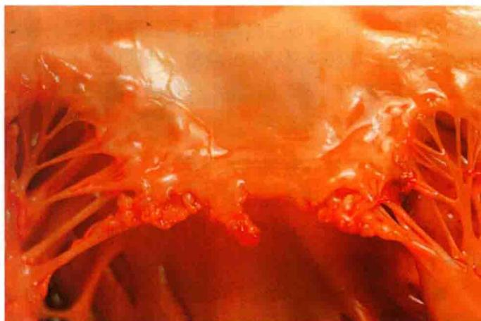 
图11-20 细菌性心内膜炎。二尖瓣上显示破坏性的赘生物，使瓣膜的游离缘破坏
局部播散，涉及瓣膜环、相邻的心内膜壁和腱索，感染性血栓可随血流留到各个部位，从而导致包括脑、肾、小肠和脾等多器官的梗死或脓肿。

【临床表现】许多患者在细菌性心内膜炎发作
的1周之内即出现早期症状，几乎2周内表
现出所有症状。这种疾病开始为非特异的症状：低热、乏力、厌食和体重减轻。心脏杂音的产生几乎总是随着病情的发展而不断变化。6周以后，患者出现脾大、瘀斑、杵状指等。1/3的患者可出现全身性栓塞。1/3的患者因脑栓塞而出现神经功能障碍。
抗菌治疗是控制细菌性心内膜炎的发病率和死亡率的有效措施。大多数患者的发热在1周内会得到控制。然而，预后取决于侵入的微生物和感染治疗的阶段。1/3的金黄色葡萄球菌心内膜炎仍然是致命的。细菌性心内膜炎最常见的严重并发症是充血性心力衰竭，通常是由于瓣膜破坏所造成的。感染性心内膜炎的瓣膜置换术是存在危险的，该手术死亡率很高。
# 四、无菌性血栓性心内膜炎，是消耗性疾病的并发症
无菌性血栓性心内膜炎（NBTE），也被称为“消耗性心内膜炎”（来自希腊词汇marantikos，指“消耗殆尽”），是指在心瓣膜上形成无菌性血栓性疣赘物，几乎总是在与癌症或其他消耗性疾病伴发。无菌性心内膜炎累及二尖瓣和主动脉瓣的概率相同。大体表现与感染性心内膜炎相似，但它不破坏瓣膜，并在显微镜下没有明显的炎症或细菌出现。无菌性血栓性心内膜炎的原因目前知之甚少，但这却是腺癌（特别是胰腺和肺）和血液系统恶性肿瘤常见的并发症。
# 五、钙化性主动脉瓣狭窄，反映了瓣膜的慢性损伤
钙化性主动脉瓣狭窄是指由于钙沉积在瓣膜尖和瓣膜环导致的主动脉瓣口狭窄。

【发病机制和病理】钙化性主动脉瓣狭窄主要有三个原因：

■风湿性主动脉瓣病变，它的特点是瓣膜尖弥漫性纤维性增厚、瘢痕形成、粘连、融合
和钙沉积，所有这些表现均可以使瓣膜口缩小和限制了瓣膜运动。由于风湿热患病率降低及手术治疗的介入，风湿性主动脉瓣病变现在已非常罕见。
■退行性（衰老）钙化狭窄常出现在老年患者瓣膜退行性变的过程，主要累及正常对称的三尖瓣。与风湿性瓣膜病变不同，瓣膜虽然变硬及钙化，但没有粘连及融合。
先天性二叶式主动脉狭窄往往随着年龄增大而病变加重，瓣膜没有粘连及融合（图11-21）。
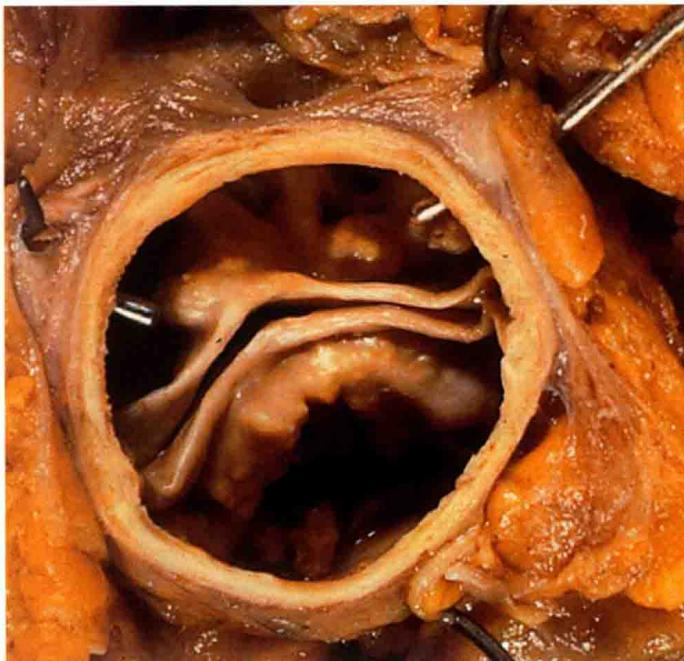 
图11-21 先天性二叶式主动脉瓣钙化性主动脉瓣狭窄。两个瓣膜严重钙化，但没有粘连、融合
在先天性畸形瓣膜与正常的瓣膜均可出现钙化性主动脉瓣狭窄，可能与常年的畸形瓣膜周围血流异常导致的创伤，并长期的累积效应有关。所有类型的钙化性主动脉瓣狭窄，钙化结节都主要沉积在瓣膜的底部或下半部分，很少累及瓣膜游离缘。主动脉瓣钙化不是纯粹的坏死组织被动钙化过程，事实上，瓣膜钙化是一个主动的过程，它涉及瓣膜间质细胞向成骨细胞表型的修饰和新基因的表达，导致细胞介导的细胞外基质钙化形成。心脏瓣膜钙化的相关机制和危险因素与动脉粥样硬化相似。然而，尽管相似，如采用像预防动脉粥样硬化那样的措施（如他汀类药物），并不能防止心脏瓣膜钙化。

【临床表现】严重主动脉瓣狭窄往往都会导致
向心性左心室肥大，进而导致心脏扩张和心力
这种疾病在心脏功能不可逆之前通过外科瓣膜
术可以成功治疗 (5年生存率 $85\%$ )，治疗后肥胖
左心室也能恢复到正常大小。
# 六、二尖瓣脱垂（MVP）是瓣膜置换术最常见的适应证
二尖瓣脱垂是由于二尖瓣小叶增大和隆起、腱索变薄和细长，在心室收缩期脱入左心房（向左房侧膨出）（图11-22A），常伴有二尖瓣关闭不全，也被称为“二尖瓣脱垂综合征”，外科瓣膜置换术可进行治疗。多达 $5\%$ 的成年人经超声心动图证实患有二尖瓣脱垂，但大多数不会有严重的反流而需要手术干预。

【发病机制】二尖瓣脱垂与遗传有关，大部
分病例表明二尖瓣脱垂似乎是一种常染色体
显性遗传，虽然没有找到特定的致病基因。原发性二尖瓣脱垂患者发现在瓣膜的中心出现显著的黏液样的结缔组织堆积（图11-22B）。据推测，在心动周期压力升高的条件下，细胞外基质的缺陷使瓣膜和腱索扩大和延伸。

【病理】大体检查，二尖瓣隆起、变形（图11-22A）。横截面上，由于酸性黏多糖的积累，
瓣膜透明、呈胶冻状（图11-22B）。瓣膜和腱索的黏液变性也增加脱垂及反流程度。虽然二尖瓣通常是唯一受累的瓣膜，黏液样变性可以在其他的心脏瓣膜出现，尤其在马方综合征患者， $90\%$ 的患者具有二尖瓣脱垂。

【临床表现】大多数二尖瓣脱垂患者没有症状，然而这些患者存在猝死的风险，这可能是由于
二尖瓣脱垂患者发生室性心律失常的风险是正常人的2倍，对反流的二尖瓣脱垂进行修复可以降低这种风险。细菌性和非细菌性心内膜炎有时可并发二尖瓣脱垂，在这种情况下常常发生脑栓塞。 $15\%$ 的二尖瓣脱垂患者在二尖瓣置换术后 $10\sim 15$ 年可出现明显的二尖瓣关闭不全。
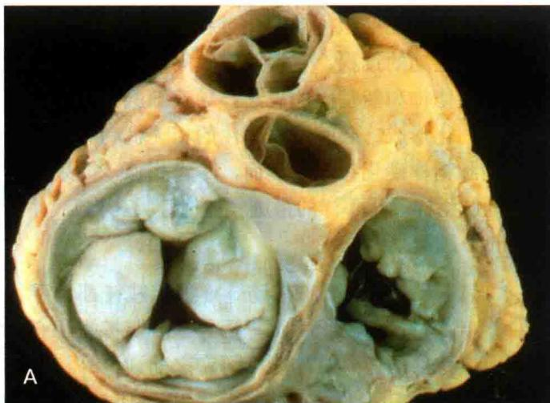
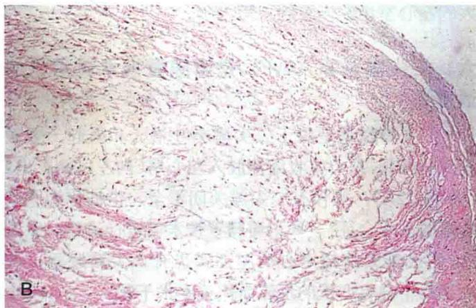 
图11-22 二尖瓣脱垂。A.图示膨出和畸形的二尖瓣脱垂进左心房；B.显微镜下显示在二尖瓣小叶的中心出现明显的黏液性结缔组织
# 七、类癌性心脏病影响右侧瓣膜
类癌性心脏病很少见，特征性地累及右心而产生三尖瓣反流和肺动脉狭窄。多发生于源于小肠并转移到肝的类癌患者。

【发病机制】类癌相关心脏病的发病机制尚不完全清楚。瓣膜及心内膜病变被认为是肝
肿瘤产生高浓度的 5-羟色胺等血管活性胺和肽造成。CHD病变多发生于右心，可能与肺可以灭活血管活性物质有关。研究发现，使用抑制食欲的药物（如“fen-phen”）和麦角生物碱，如二甲麦角新碱、麦角胺（用来治疗偏头痛），除了左侧瓣膜病变外，其引起的心脏病症状与类癌综合征相似。因为这些药物干扰羟色胺代谢和信号，所以目前认为药物相关的心脏病与类癌心脏病的发病机制是一致的。

【病理】三尖瓣、肺动脉瓣和右心室的心内膜表面可见密度较高、色灰白的纤维斑块沉积。
显微镜下观察，这些斑块附着在瓣膜小叶上，一般不伴有炎症或明显的瓣膜结构损伤。然而，当瓣膜小叶变形，表面面积减少，可导致三尖瓣叶被“卡在”相邻的右心室内膜壁上，造成三尖瓣关闭不全或狭窄。肺动脉瓣膜和瓣环收缩导致肺动脉狭窄。
# 第八节 心肌炎
心肌炎是指心肌的炎性病变伴随心肌细胞的变性及坏死，这个定义不包括缺血性心脏病。心肌炎可以发生在任何年龄，但在 $1\sim 10$ 岁的儿童中最常见的。这是为数不多的可以引起平素健康的儿童、青少年或年轻人发生急性心力衰竭的心脏疾病。严重的心肌炎可以引起心律失常，甚至猝死。
# 病毒性心肌炎可能难以证实
在美国北部，多数不明原因的心肌炎都被认为是病毒引起的，然而这些诊断缺乏聚合酶链反应（PCR）实验的直接证据。常见引起的心肌炎的病毒见表11-4。

【发病机制】病毒性心肌炎的发病机制体现
在病毒对受感染的心肌细胞的直接的细胞毒
性和细胞介导的免疫反应两方面。病毒性心肌炎最常见的两种病毒是柯萨奇病毒和腺病毒，两种病毒都可以与心肌细胞表面受体——柯萨奇腺病毒受体（CAR）相结合，该受体在儿童体内较多，这也许可以解释为什么在这一年龄组的病毒性心肌炎很常见。一旦进入细胞，柯萨奇病毒产生蛋白酶，能分解心肌细胞蛋白并促使病毒的复制和释放，蛋白酶也可导致心肌功能障碍。病毒性心肌炎的临床和病
理表现多种多样, 这取决于病毒进入体内的动态过程, 包括病毒的复制和释放以及宿主的免疫反应机制 (先天免疫和 T 细胞介导)。
【病理】心肌炎患者在炎症急性期可发生心力衰竭，造成双心室扩张，并造成心肌运动功能减退。尸检显示病变的心脏呈松弛和扩张状态。病毒性心肌炎病理改变因临床疾病的严重程度而异。大多数情况下，显示斑片状或弥漫性间质炎细胞浸润，主要是单核细胞，还可有T淋巴细胞和巨噬细胞（图11-23），多核巨细胞也可能出现。炎性细胞往往围绕单个心肌细胞，造成局灶性心肌细胞坏死。在修复阶段，成纤维细胞增殖和胶原沉积占主导地位。大多数病毒心肌炎可引起心包炎。
【临床表现】多数患者可能是无症状的，如出现症状，也通常发生在感染后数周。大部分急性心肌炎患者可以恢复，但仍有少数死于充血性心力衰竭或心律失常。这种疾病可能在婴儿和孕妇更为严重。尽管病毒性心肌炎的炎症可在早期既得到控制，但所造成的轻微的功能障碍可能会持续多年，而且有证据显示可以进展为明显的心肌病。目前还没有特异的方法来治疗病毒性心肌炎，通常采用支持措施即可。除了病毒，其他微生物和寄生虫进入血液也可引起心肌炎。非感染性病因也可能导致心肌炎（表11-4）。
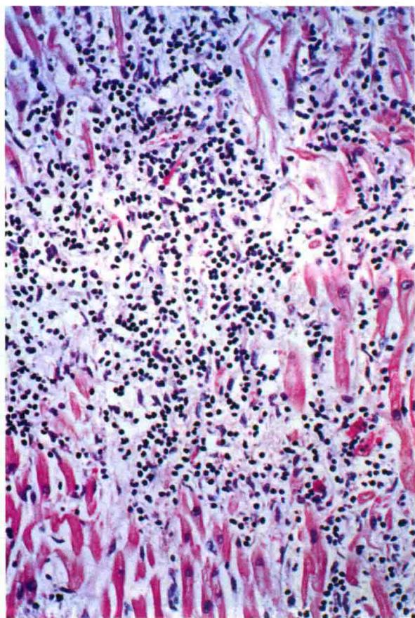 
图11-23 病毒性心肌炎。心肌间质可见明显的淋巴细胞和巨噬细胞浸润，心肌纤维被破坏
表11-4 心肌炎病因特发性传染因素■病毒：柯萨奇病毒、腺病毒、埃可病毒、流感病毒、HIV和其他■立克次体：斑疹伤寒立克次体、落基山斑疹热■细菌：白喉、金黄色葡萄球菌、链球菌、脑膜炎球菌、莱姆病和钩端螺旋体感染■真菌和原生动物寄生虫：南美锥虫病、弓形虫病、曲霉菌病、隐球菌和念珠菌感染■后生动物寄生虫：细粒棘球绦虫、旋毛虫非传染因素■过敏与免疫相关的疾病：风湿热、系统性红斑狼疮、硬皮病、药物反应（例如青霉素或磺胺类）和类风湿关节炎■辐射■其他：结节病，尿毒症
# 第九节 心脏的代谢性疾病
1. 甲状腺功能亢进症引起的高输出量心力衰竭 甲状腺激素对心脏有直接的正性肌力和变时作用。甲状腺功能亢进导致明显的心动过速，增加心脏负荷，由于外周阻力下降，心排血量增加。它最终可能导致心绞痛和高输出量心力衰竭。 
2. 维生素 $\mathsf{B}_{1}$ 缺乏（脚气病）心脏病与甲状腺功能亢进症 在美国，维生素 $\mathbf{B}_{1}$ 缺乏（脚气病）偶尔在酗酒者或补充维生素 $\mathbf{B}_{1}$ 量不足的人群中见到（见第8章）。维生素 $\mathbf{B}_{1}$ 缺乏心脏病会导致外周血管阻力下降、心排血量增加，并产生类似甲状腺功能亢进的症状。尸检观察，心脏扩张，显微镜下并无特异改变。 
3. 甲状腺功能减退性心脏病，减少心排血量 重度甲减患者（黏液性水肿）心排血量降低、心率降低（心动过缓）和心肌收缩力受损，表现与甲状腺功能亢进相反。黏液性水肿患者的心脏肌肉松弛和扩张，心肌细胞肿胀，嗜碱性变（黏液）常见，间质纤维化也可能出现。尽管有这些变化，黏液性水肿在没有其他心脏疾病的情况下并不产生充血性心力衰竭。
# 第十节 心肌病
心肌病特指一种原因不明的心肌原发性疾病。根据临床病理特点，通常将原发性心肌病分为扩张型心肌病（DCM），肥厚型心肌病（HCM），致心律失常性右室心肌病（ARVC）和限制性心肌病（RCM）。扩张型心肌病是心肌病中最常见的类型，特点是双侧心室扩张，心肌收缩功能受损，进而导致充血性心力衰竭。扩张型心肌病可能在其他致病因素对心肌细胞损害的基础上发生（继发性扩张型心肌病），也可能是特发性
（原发性扩张型心肌病）。
# 一、特发性扩张型心肌病的特点是心脏收缩功能受损

【发病机制】众多因素被认为与特发性扩张型心肌病有关，可能通过遗传因素、表观遗
传因素和环境因素相互作用引起。目前认为，遗传因素在扩张型心肌病发病机制中起着重要作用。在特发性扩张型心肌病患者中，至少1/3有家族病史。大多数家族性病例似乎是常染色体显性遗传，但常染色体隐性遗传、X连锁隐性和线粒体遗传模式都被报道过。特发性扩张型心肌病与编码细胞骨架蛋白的基因如LaminA/C、desmin和metavinculin发生突变有关。另外还有一些基因如参与编码细胞骨架和膜锚定的细胞外基质的肌聚糖和抗肌萎缩蛋白发生基因突变。目前的假说认为，在传导受阻导致心脏扩张、心脏收缩减低。有趣的是，一些蛋白质（如肌动蛋白、肌钙蛋白T与β-或α-肌球蛋白重链）发生基因突变，既可以产生扩张型心肌病，也可以产生肥厚型心肌病（HCM），不同的表型可能取决于它们是造成了力生成的缺陷（如肥厚型心肌病）或是力传导的缺陷（如DCM）。虽然力传导的假设是成立的，但并不是所有的突变都与DCM相关，另外还涉及心脏钠通道等机制。
虽然原因还不清楚，病毒性心肌炎可能最终导致扩张型心肌病。然而，利用PCR检测技术发现心脏中病毒基因组的持续存在与左心室功能的进行性损害有关，而功能的改善可特征性地使病毒自发消除。
包括细胞免疫和体液免疫等免疫异常已被确认与心肌炎和特发性扩张型心肌病有关。心脏自身抗体的抗原已经确定，包括多种线粒体抗原、肌球蛋白和 $\beta-$ 肾上腺素能受体。然而，免疫机制的具体作用仍有待证实。

【病理】不论是原发性或继发性扩张型心肌病，该疾病的病理变化一般都是非特异性的和相似
的。在尸检中发现，心脏均是增大的，左、右心室明显肥大，心脏的重量可以是正常心脏重量的3倍以上（>900g）。尽管心室比心房受累更严重，然而诊断标准规定，必须所有心腔均扩张（图11-24）。心肌松弛，颜色苍白，心内膜下偶见心肌瘢痕。尤其在前端（未显示）的左心室心内膜往往是增厚的，可见附壁血栓。
【镜下】特发性扩张型心肌病特点是心肌纤维的萎缩和肥大。尤其是心内膜下的心肌细胞，常表现出退行性变，具体特征表现为肌原纤维的损失，细胞空泡
变性。心肌间质和血管周围纤维化明显，尤其以心内膜下最为突出。

【临床表现】原发性和继发性心肌病的临床特
征是相似的。这种疾病开始无症状，慢慢的出
现代偿性心室肥大和左心室扩张。通常，最初的运动不耐受会发展为明显的充血性心力衰竭， $75\%$ 的患者在症状出现后5年内死亡。虽然支持治疗有一定作用，但心脏移植或心室辅助装置是治愈的唯一的选择。
# 二、继发性扩张型心肌病有很多原因
几乎100种不同的心肌疾病都可以导致扩张型心肌病。因此，继发性扩张型心肌病被认为是任何毒性作用、代谢或传染性疾病直接损伤心肌细胞后的继发性病变。酒精滥用、高血压、妊娠与病毒性心肌炎均可引起继发性扩张型心肌病。糖尿病和吸烟也与这种疾病发病率增高相关。
1.中毒性心肌病许多化学品和药物引起的心肌损伤。下面对几个比较重要的物质进行讨论：
酒精：酒精性心肌病在美国和欧洲是最常见的能够引起扩张型心肌病的病因。酒精滥用可导致慢性、渐进性心功能障碍，这可能是致命的。典型的患者是 $30\sim 55$ 岁，至少有10年大量饮酒史。虽然酒精对心肌细胞的短期作用是可逆的，但长期累积最终可成为不可逆的损伤。
儿茶酚胺：高浓度的儿茶酚胺可引起局灶性心肌坏死。嗜铬细胞瘤患者可发生中毒性心肌炎，也见于那些需要高剂量的正性肌力药物维持血压和头部外伤的患者。多种机制导致心肌损伤，但最重要的是成肌细胞的钙通量提高。
葱环类药物：多柔比星和其他葱环类药物是有效的化疗药物，但它们的使用却因为累积的、剂量依赖性的心脏毒性而受到限制。在临床上，主要是由于慢性的心肌细胞不可逆的变性，导致心肌细胞收缩性减低。
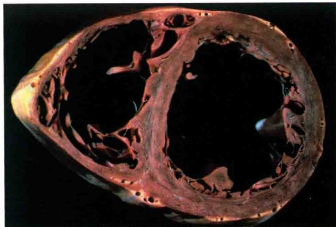 
图11-24 特发性扩张型心肌病。增大的心脏横切面显示双侧心室明显扩张。虽然心室壁变薄，但心脏重量增加提示心脏肥大
病理改变包括心肌纤维空泡变性和肌纤维丢失。严重变性可导致顽固性充血性心力衰竭。葱环类药物对心脏损伤的机制主要是氧自由基的形成。
可卡因：频繁的使用可卡因与胸痛和心悸相关。真正的扩张型心肌病是一种罕见的可卡因滥用并发症，但可卡因滥用可导致心肌炎、局灶性坏死和心肌内的冠状动脉增厚。与使用可卡因相关的心肌缺血或梗死已有报道，主要是为了满足心肌对氧的需求，使冠状动脉血管收缩。猝死主要是因自发性室性心律失常引起的，可卡因潜在的致心律失常作用包括血管收缩、交感神经活性、过敏反应和直接的毒性。
2. 妊娠性心肌病 扩张型心肌病的一种特殊类型，一般发生在妊娠最后3个月或产后6个月。该疾病在美国罕见，但在非洲的一些地区 $1\%$ 的怀孕妇女可发生。妊娠性心肌病多见于黑种人、多胎、年龄超过30岁的女性。该病的病因不清，但可能与泌乳素的过量有关。一些患者在有症状的阶段进行心肌活检，发现有炎细胞的浸润，这一现象符合免疫失调可能与疾病进展相关的假说。与其他大多数类型的扩张型心肌病不同， $50\%$ 的妊娠性心肌病的患者能自发地恢复正常的心脏功能，另 $50\%$ 会出现持久的左心功能不全或明显的充血性心力衰竭以及早期死亡。
# 三、肥厚型心肌病，引起和血流动力学负荷不成比例的肥大
肥厚型心肌病的发生没有明显的生理原因，大多
数患者可能是由基因决定的， $50\%$ 的患者被确定为常染色体显性遗传。肥厚型心肌病现在比以前更常见：在美国的患病率约为 $1 / 500$

【发病机制】肥厚型心肌病通常是编码肌节蛋白基因的显性突变所造成的。与扩张型心
肌病不同，没有单一的基因突变导致该病， $80\%$ 的肥厚型心肌病患者其遗传基础可以确定有两个基因突变：编码 $\beta-$ 肌球蛋白重链的基因和编码肌球蛋白结合蛋白C的基因。编码心肌肌钙蛋白T，心肌肌钙蛋白I和α-原肌球蛋白1（肌钙蛋白复合体的成分）等蛋白的基因突变是另外 $29\%$ 的肥厚型心肌病的致病原因。突变蛋白与肌节蛋白相结合，造成心肌功能受损。该机制提示肥厚型心肌病与肌节功能缺陷改变有关，肥大是一种代偿反应。

【病理】肥厚型心肌病的心脏增大，在不同的
遗传形式中肥厚的程度不同。左心室壁厚，心
室腔小, 有时会减少到一个狭缝。乳头肌和肉柱突出并侵占心室腔。超过 $50\%$ 的病例显示室间隔非对称性肥厚, 间隔的厚度是左心室游离壁的 1.5 倍以上 (图 11-25A)。肥厚型心肌病最显著的病理特征是肌纤维混乱, 与正常的平行排列的肌细胞束不同, 而是相邻的肥厚心肌细胞垂直方向排列 (图 11-25B), 通常伴有间质细胞增生, 并导致冠状动脉管壁增厚 (图 11-25C)。
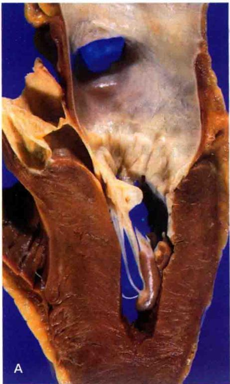 
图11-25 肥厚型心肌病。A. 心脏切开后显示明显的不对称性左心室肥大。室间隔厚度大于左心室游离壁，从而直接影响位于流出道的二尖瓣前叶的位置；B. 心肌镜下特征显示肌纤维杂乱无章和间质细胞增生；C. 小的心肌内的冠状动脉增厚，动脉中层内细胞增生。这种类型的冠状动脉血管重塑可能引起一些肥厚型心肌病患者产生类似心绞痛的症状
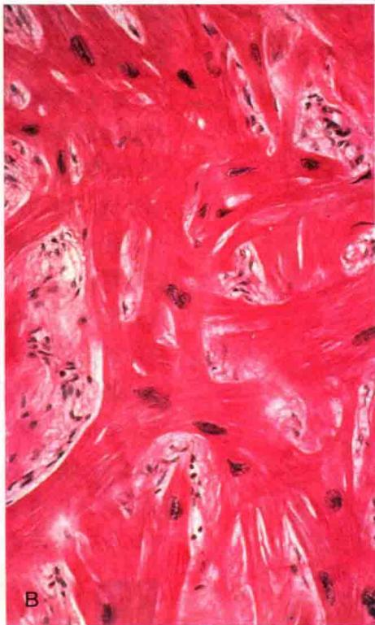
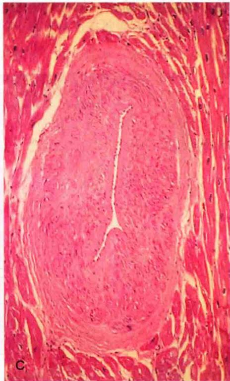
【临床表现】大多数的肥厚型心肌病患者几乎没有任何症状，通常是因为某家庭成员患病后对整个家庭筛查时作出诊断。尽管缺乏症状，这些人可能具有猝死的风险，特别是在重度劳累后。事实上，通过尸检，常常在猝死的年轻运动员中发现患有肥厚型心肌病。肥厚型心肌病可发生于任何年龄，经常在 $30\sim 50$ 岁，但也可在老年人见到。肥厚型心肌病患者出现心脏症状时，表现为呼吸困难、心绞痛及晕厥。虽然病情可保持长时间稳定，但多年后仍可发展为充血性心力衰竭。
# 四、致心律失常性右室心肌病（ARVC）是一个细胞桥粒疾病，伴有猝死高风险
ARVC的患病率是1/5000。它最常见于地中海地区，是年轻人（ $< 35$ 岁）猝死的首要原因。

【发病机制和病理】ARVC与严重心律失常和猝死相关，这可以发生在疾病早期，在心肌结构

重塑和收缩功能障碍出现之前即可发生。虽然可影响两侧心室壁（左侧为著），但典型病变
是影响右心室游离壁。病理特征是不同程度的心肌细胞的退变，被脂肪和纤维组织替代（图11-26）。致心律失常性右室心肌病通常是常染色体显性遗传，桥粒是一种相邻细胞连接的结构，在 $50\%$ 的患者中可以观察到桥粒蛋白编码基因的突变。但桥粒突变引起ARVC的机制尚不清楚。
# 五、限制型心肌病，舒张功能受损
限制型心肌病包括一组疾病，这组病变表现为心肌或心内膜异常，从而限制了舒张期充盈，而收缩功能保持正常。它是西方国家最少见的一类心肌病，但在一些欠发达地区（例如，赤道非洲、南美国和亚洲的部分地区），寄生虫感染相关的心内膜心肌损害可以导致限制型心肌病。
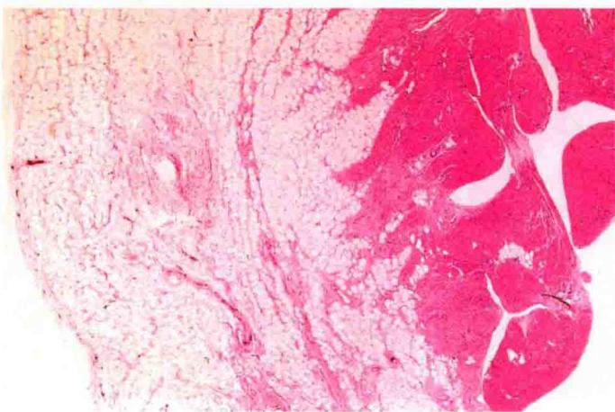 
图11-26 致心律失常性右室心肌病。右心室游离壁显示大部分心肌被成熟的脂肪组织和纤维组织代替，只能在心内膜下见到少许心肌肌纤维束

【发病机制和病理】限制型心肌病的病因包括：
①淀粉样蛋白，转移癌和结节病肉芽肿浸润间质；②心内膜疾病导致显著的内膜纤维性增厚；③贮积病，包括血红蛋白沉着症；④间质纤维组织明显增多。许多限制型心肌病是特发性的，间质纤维化是唯一的组织学异常。这种疾病几乎总是发展到充血性心力衰竭，10年生存期仅 $10\%$
1.淀粉样变性 心脏受累见于大多数淀粉样变性疾病（见第23章）。事实上，限制型心肌病是伴有浆细胞病的AL型淀粉样变最常见的死亡原因。

【病理结果】淀粉样蛋白沉积在心脏造成心脏
似。心室壁通常增厚、坚韧、有弹性。显微镜下，淀粉样蛋白沉积在间质、血管周围和心内膜区。心房的内膜是常见的累及部位，结节状坚硬的物质沉积在心内膜使心内膜表面纹理不清。淀粉样蛋白沉积也可引起心脏瓣膜增厚。

【临床表现】心脏淀粉样变性是最常见的一种
限制型心肌病，主要症状是右心衰竭。传导系统因沉积受损可以导致心律失常，心源性猝死并不少见。心脏肥大是突出的特点。其预后不佳，大多数患者一旦出现症状，多在1年以内死亡。
老年性心脏淀粉样变性：老年心脏淀粉样变性是前白蛋白密切相关蛋白（TTR）沉积在老年人的心脏（见第23章）。某种程度上，该疾病可以出现在 $25\%$ 的80岁以上的老年人。老年性心脏淀粉样变性的功能性改变较小，而且通常是在尸检中的偶然发现。
2.心内膜疾病 心内膜疾病根据发病地理位置的不同分为两型：
心内膜心肌纤维化：这种情况在非洲赤道地区尤为常见，占心脏病死亡的 $10\% \sim 20\%$ 。偶尔在世界其他热带和亚热带地区也可看到。多见于儿童和年轻人，但也有报道见于70岁的老年人。心内膜心肌纤维化导致进展性的心肌衰竭，尽管有报道患者存活12年，但总体预后较差。
嗜酸性心内膜疾病（吕弗勒心内膜炎）：常见于温带，特征是嗜酸细胞增多症（50000U/μl）。它常发生在 $50\sim 60$ 岁的男性，并且常伴有皮疹；虽然使用糖皮质激素可能会提高生存率，但该疾病通常进展为充血性心力衰竭和死亡。

【发病机制】心内膜心肌纤维化和Loffler性
心内膜炎曾经被认为是两种不同的疾病，但
越来越多的共识表明它们可能代表了同一种疾病的
不同表现形式。心内膜疾病被怀疑是由心脏毒性颗
粒介导的嗜酸性粒细胞造成的心肌损伤而引起的。在热带地区，一过性高嗜酸性粒细胞血症常由寄生虫感染导致；在温带地区，特发性嗜酸细胞增多则是持续性的。

【病理】尸检显示：内膜增厚、色灰白，范围从
左心室尖延伸到乳头肌后部和二尖瓣后瓣，邻
近左心室流出道。心室切面显示心内膜纤维化，蔓延到室壁的 $1 / 3 \sim 1 / 2$ 。附壁血栓在各个阶段均可见到。当累及右心室，整个腔都会表现出心内膜增厚，甚至会渗透到心外膜。显微镜下，纤维化的心内膜只含有少量的弹性纤维。肌纤维被增生的胶原纤维包绕，并表现为非特异性的变性。
3. 贮积症 各种溶酶体贮积症已在第6章中详细讨论。现只对心脏表现进行综述。
糖原贮积症：糖原贮积症的类型包括：Ⅱ型（Pompiedisease），Ⅲ型（Coridisease）和Ⅳ型（Andersendisease）。最常见和最严重损害心脏的是Ⅱ型。婴儿患有这种疾病，心脏将明显增大（7倍）； $20\%$ 的患者可发生心内膜弹性纤维增生症。大量糖原贮积将导致心肌细胞空泡化。其功能改变是限制型心肌病的表现，通常的死亡原因是心力衰竭。
黏多糖贮积症：是由于人体细胞内的溶酶体降解黏多糖异常，使黏多糖不能被降解代谢，最终贮积在体内而发生的疾病。在一般情况下，出现心室假性肥大、收缩力逐渐减小。冠状动脉因内膜和中膜增厚而变的管腔狭窄，在Hurler和Hunter综合征中，心肌梗死常见。
鞘脂类代谢障碍：Fabry病可能导致心脏中鞘糖脂的积累，功能和病理变化与黏多糖贮积症相似。
血红蛋白沉着症：是一种多器官疾病，与组织中过多的铁沉积相关（见第14章）。铁沉积在心脏的程度可以不同于其他器官，而且两者之间的相关性也较小。心脏受累的表现是同时具有扩张和限制型心肌病的特点，包括收缩和舒张功能受损。1/3血红蛋白沉着症患者可出现充血性心力衰竭。尸检表现：心脏扩张、室壁增厚，心脏因心肌细胞铁沉积呈棕色；间质纤维化程度不一，但与铁的积累程度不相关，但心肌功能障碍的严重程度似乎与铁沉积的数量成正比。
# 第十一节 心脏肿瘤
心脏的原发性肿瘤非常罕见，一旦发生则可能导致严重的后果。
# 一、心脏黏液瘤，最常见的心脏原发性肿瘤
心脏黏液瘤占所有原发性心脏肿瘤的 $50\%$ 。通常散发，但约 $7\%$ 是家族性常染色体显性遗传综合征的
一种表现，这种综合征除了心脏黏液瘤，还包括皮肤色素性病变、肾上腺皮质增生等，这些病例与编码cAMP依赖的蛋白激酶（蛋白激酶A）调节亚基的基因突变有关，该基因被认为是一个控制细胞增殖的肿瘤抑制基因。

【病理】大多数黏液瘤（75%）发生在左心房，
但也可以发生在其他心腔或瓣膜。肿瘤通常直
径为 $5 \sim 6 \mathrm{~cm}$ , 表现为短蒂的息肉样肿物、具有光泽的凝胶状 (图 11-27), 它可以非常灵活地活动并可阻塞二尖瓣口。显微镜下, 心脏黏液瘤的疏松黏液样基质含有丰富的蛋白多糖, 可见单个或簇状的星芒状细胞分布于基质中。

【临床表现】超过 $50\%$ 的左心房黏液瘤患者具
有二尖瓣功能障碍。虽然肿瘤不发生转移，但
在引起栓塞。1/3的左心房或左心室黏液瘤患者
可出现脑栓塞导致死亡。多数情况下通过手术可成功
切除肿瘤。
# 二、横纹肌瘤，是一种儿童肿瘤
横纹肌瘤是婴儿和儿童最常见的心脏原发性肿瘤，在心肌内形成结节状肿块，但实际上这可能是一种错构瘤而非真性肿瘤。1/3的患者伴发结节性硬化症，结节性硬化症是由TSC1和TSC2基因的突变引起的家族性病变。TSC1和TSC2基因作为肿瘤抑制基因，可调节胚胎和新生儿心肌细胞的生长和分化。几乎所有的横纹肌瘤都是多发的，常累及两个心室，1/3患者也可见累及心房。约 $50\%$ 的病例可见肿瘤突入并阻塞心腔和瓣膜孔。
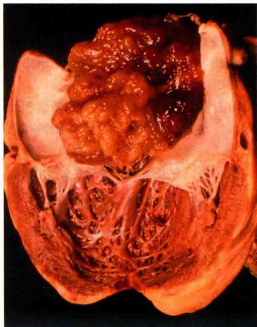 
图11-27 心脏黏液瘤。左心房内见一个大的、息肉样肿物突入二尖瓣口

【病理】大体检查，心脏横纹肌瘤颜色苍白，
直径从 $1 \mathrm{~mm}$ 至数厘米不等。镜下, 肿瘤细胞
核较小，中位，胞质透亮、富于糖原，肌节纤维可辐射到细胞边缘（称为“蜘蛛细胞”）。一些心脏横纹肌瘤可被成功切除。
# 三、心脏转移性肿瘤，可表现为限制型心肌病
心脏的转移性肿瘤主要见于一些常见癌症的患者，如肺癌、乳腺癌或胃肠道肿瘤。但仍然只有很少数的癌症患者会出现心脏转移。淋巴瘤和白血病也可能累及心脏。所有肿瘤中最有可能转移到心脏的是恶性黑色素瘤。心肌的转移性肿瘤可以表现为限制型心肌病，特别是如果肿瘤伴有广泛的纤维化。
# 第十二节 心包疾病
# 一、心包积液会引起心脏压塞
心包积液是指心包腔内液体（无论是漏出液或渗出液）的聚集。心包内通常含有不超过 $50\mathrm{ml}$ 的润滑液。如果心包慢慢扩张，可容纳2L的液体且无明显血流动力学的改变。然而，快速聚集 $150\sim 200\mathrm{ml}$ 的心包液或血液可能会显著增加心包内压力，并使心脏尤其是右心室舒张受限。心脏压塞是由心包液快速聚集产生的综合征，使心脏充盈受限。
■ 浆液性心包积液常是细胞外液量增加的并发症，如充血性心力衰竭和肾病综合征，液体的蛋白质含量低，细胞数较少。 
■ 乳糜性积液（液体含有乳糜微粒）是由心包腔和胸导管相互沟通所致。通常继发于肿瘤或感染造成的淋巴管梗阻。 
心包出血血液直接进入心包腔。最常见的原因是心室游离壁心肌梗死部位的破裂。不常见的原因包括心脏穿透伤、主动脉夹层动脉瘤破裂或由肿瘤浸润血管造成的出血。
血流动力学从轻微症状到心血管破裂和死亡。心包压力增加，达到并超过了中心静脉压后将限制血液回流到心脏。除非通过穿刺或手术使心包液减少、压力消除，否则急性心脏压塞几乎总是致命的。
# 二、急性心包炎，可能源于病毒感染
心包炎是指心包脏层或壁层发生的炎症。

【发病机制】心包炎的原因与病毒性心肌炎
相似（表11-4）。在大多数情况下，急性心
包炎的病因不明，常被归于无法明确诊断的病毒感染。细菌性心包炎在抗生素应用之后已不常见。转移性肿瘤（最常见的是乳腺癌和肺癌）可累及心包、
引起恶性心包积液。心肌梗死及风湿热引起的心包炎在前文已讨论过。

【病理】根据心包表面和液体的大体和镜下特
征，急性心包炎可分为纤维素性心包炎、化脓
性心包炎及出血性心包炎。最常见的是纤维素性心包炎，外观光滑的心包表面变得粗糙，可见颗粒样富含纤维蛋白的渗出（图11-28）。炎性心包表面粗糙的质地造成了听诊时特征性的摩擦音。纤维素性心包炎积液富含蛋白质，心包膜有以单核细胞为主的炎细胞浸润。
细菌感染会导致化脓性心包炎，心包表面被一层脓性渗出物覆盖，并伴有大量的中性粒细胞浸润。侵袭性感染、肿瘤或凝血缺陷可导致心包腔出血，引起出血性心包炎。

【临床表现】急性心包炎的最初表现是突然的、
剧烈的胸骨后疼痛，有时也出现背、肩或颈部
疼痛。临床特点是容易听到心包摩擦音。特发性或病毒性心包炎是一种自限性疾病，但偶然也会导致缩窄性心包炎，治疗可选择使用糖皮质激素。其他类型急性心包炎的治疗方法因病因的不同而异。
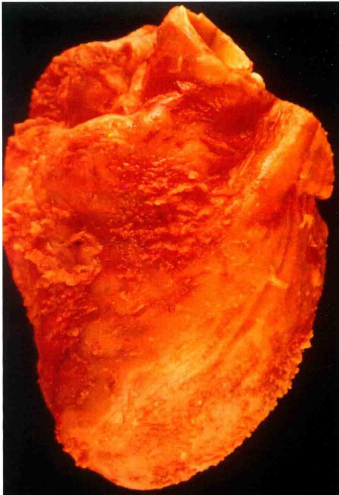 
图11-28纤维素性心包炎。死于尿毒症患者心脏显示毛茸茸的，心包脏层被纤维素性渗出物覆盖
# 三、缩窄性心包炎，症状类似右心衰竭
缩窄性心包膜炎是心包慢性纤维化的疾病，可以使心脏受压、血流受限。

【发病机制和病理】缩窄性心包炎指急性心包损伤后出现修复愈合反应，致使心包腔内纤维素性渗出物与心包脏层和壁层粘连，心脏被由致密、僵硬的纤维组织构成的增厚心包（3cm）
包绕，并使腔静脉孔变窄（图11-29）。纤维包膜中有时可能含有钙沉积。在发达国家，缩窄性心包炎已非常罕见，主要是特发性的，其中约1/3曾有纵隔的放射治疗和心脏手术史；在欠发达地区，结核感染依然是导致心包炎的主要原因。

【临床表现】缩窄性心包炎患者心脏变小、静脉流入受限，硬化的心包决定了心脏舒张末期
的容积。这些患者静脉压升高、心排血量降低，脉冲压力变小、液体潴留和腹水以及外周性水肿。全心包切除是首选的治疗方法。
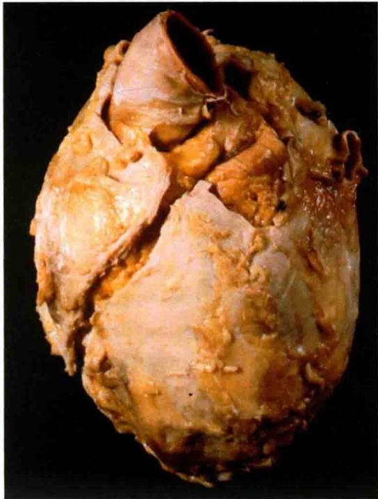 
图11-29 缩窄性心包炎。心包腔被破坏，心脏被纤维化、增厚的心包所包裹
（王雷明 滕梁红）
# 第12章 呼吸系统
肺部疾病对于个人及公众卫生都很重要。肺癌，大多与吸烟有关，是所有癌症中最常见的死亡原因。在美国，每年超过16万人死于肺癌，超过12万人死于慢性阻塞性肺疾病。每年有15万人患急性呼吸窘迫综合征（ARDS）。甚至最微不足道主要呈良性和自限性过程的呼吸道感染，也是最常见的影响日常工作的原因。日益增多的呼吸道感染引起了公众的关注，包括结核耐药问题、SARS复发的潜在性以及新的流感类型流行的威胁，这些都突出了呼吸系统疾病的重要性。
# 第一节 肺
# 一、先天异常
肺发育不全：指肺发育不全或不完善。由于肺泡数量减少或肺泡体积变小，病变的肺组织比正常肺小。肺发育不全是最常见的肺先天性疾病，在新生儿尸检中占 $10\%$ 。大多数病例 $(90\%)$ 常合并其他先天性异常，后者常常影响胸腔。如果发生在妊娠早期，比如先天性膈疝，病变可能伴随支气管或肺血管发育不全。

【发病机制】导致肺发育不全的主要因素主
要包括如下三种：①肺压缩，通常由先天性
膈疝引起，典型病例常发生于左侧肺叶，由于胸腹膜管闭合不全导致；②羊水过少，往往由于泌尿生殖系统畸形引起，是肺发育不全的主要因素（见第6章）；③呼吸减弱，实验已经证实可导致肺发育不全，可能是由于缺少对肺的牵拉所致。
先天性囊性腺瘤样畸形：常见病变包括大小不等、分布不均的异常细支气管样结构。大多数病例见于小于2岁的婴幼儿。病变通常累及一侧肺叶，镜下表现为多个囊腔，囊内被覆细支气管上皮，囊腔之间散在疏松结缔组织（图12-1）。一些先天性囊性腺瘤样畸形患者会伴有其他先天性异常。最常见症状是呼吸性窘迫和发绀。治疗应采取手术切除。
支气管源性囊肿：孤立的肺外囊性肿物，囊内衬覆呼吸道黏膜上皮，囊壁可见平滑肌及软骨组织。最常见发病部位是中纵隔。在新生儿可能会压迫气管导致呼吸性窘迫。老年患者继发感染可能会导致出血和穿孔。很多患者没有症状，偶然在常规体检胸部X线片
中发现。
叶外型肺隔离症：叶外型肺隔离症表现为位于脏层胸膜外的肺组织包块，与正常支气管树不相通。通常由起源于大动脉的异常动脉供血。

【发病机制】该病起源于前肠，由前肠外翻
后游离形成。男性发病率是女性的 $3 \sim 4$ 倍。
并且2/3的患者伴随其他异常。

【病理】大体检查，叶外型肺隔离症是锥体
形或圆形病变，表面被覆脏层胸膜，最大径
$1 \sim 15 \mathrm{~cm}$ 。镜下表现为细支气管、肺泡管、肺泡扩张。
感染或梗死可改变组织学形态。

【临床表现】新生儿期时，叶外型肺隔离症常
常在出生后第1天表现为呼吸困难及发绀。在
能会因为反复发生的支气管肺感染而就诊。手
术切除可治愈。
叶内型肺隔离症：叶内型肺隔离症是位于脏层胸膜内的肺组织所形成的病变，与正常支气管树不相通，由系统动脉提供血液供应。该病曾经被认为是一种先天性畸形，现在认为至少一些病例是由慢性炎症和反复感染而后天获得的。

【病理】叶内型肺隔离症大多发生在肺下叶，
多累及一侧肺叶，累及双侧肺叶极为罕见。大
体检查隔离肺组织呈慢性肺炎改变，表现为纤维组织
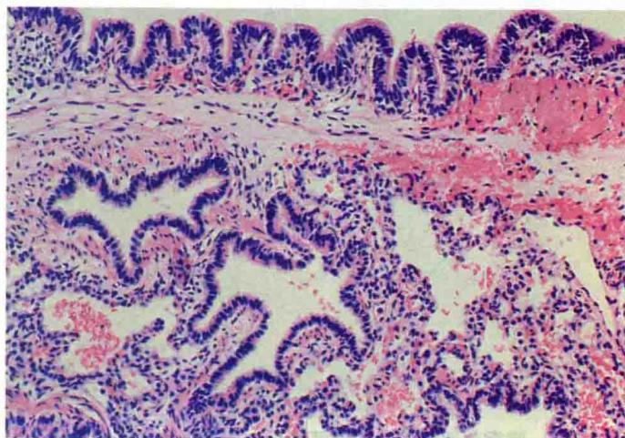 
图12-1先天性囊性腺瘤样畸形。多个内衬细支气管上皮的囊腔
增生伴有蜂窝状囊性改变。囊腔最大直径可达5cm，伴囊壁周围纤维组织增生。显微镜下，囊腔大部分被覆立方形或柱状上皮，囊内可见泡沫状吞噬细胞及嗜酸性粒细胞。肺间质表现为慢性炎、淋巴组织增生，常可见淋巴滤泡形成。也可见急性肺炎或机化性肺炎。

【临床表现】大多数患者就诊时为青少年，临床表现为咳嗽、咳痰及反复发生的肺炎。
# 二、支气管及细支气管病变
大多数支气管及细支气管病变需要处理急性期病变和后遗症。慢性支气管炎将与慢性阻塞性肺疾病（COPD）一起讨论。
1. 呼吸道的感染由多种病原生物引起 引起肺部感染的病原体已在第9章详细描述。许多感染性的病原体累及肺内支气管，进而引起周围更多的呼吸道感染（支气管炎）。经典的例子即腺病毒、呼吸道合胞病毒（RSV）和麻疹。有营养不良以及不常暴露于这些病原体的人群更严重。这些病原体引发的严重疾病症状更常见于婴幼儿和儿童。症状包括：咳嗽、胸闷，极少的情况下引起呼吸困难，甚至发绀。
流感：是气管支气管炎的典型例子，偶尔会导致患者死亡。在死亡患者尸检标本中，支气管肉眼病变非常明显，表现为支气管黏膜面呈红色、肿胀，表明有黏膜充血和急性炎症。
腺病毒感染（RSV）：腺病毒感染可导致的最严重并发症包括细支气管的广泛炎症（图12-2）及愈合后发生纤维化。细支气管可能会因为增生的纤维组织导致闭塞（闭塞性细支气管炎）。
RSV: RSV感染可能在幼儿园流行。通常是自限性，致死病例较罕见。RSV可引起儿童和成人（少见）的医院内感染。组织学上，表现为细支气管周围炎症和上皮结构的紊乱。有些严重的肺组织过度膨胀却没有伴明显的细支气管阻塞，可能是由于细支气管表面活
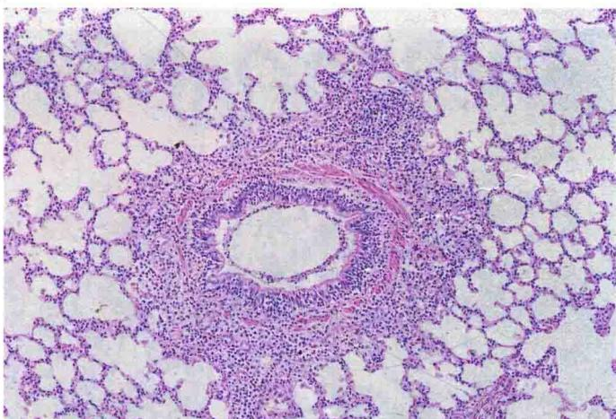 
图12-2 腺病毒感染导致的支气管炎。细支气管壁表现为慢性炎细胞弥漫浸润，局灶浸润至支气管周围组织
性物的缺失引起。
麻疹：麻疹曾经是导致细支气管炎的主要致病因素，但是由于麻疹疫苗的广泛应用，该病目前很少在发达国家发生。与腺病毒类似，麻疹可能会导致患者出现细支气管阻塞及支气管扩张症。
博德特菌：这种细菌通常引起呼吸道感染，是百日咳的病因。随着百日咳疫苗的出现，该病在美国已较罕见，但是对于未接种的人群，仍然需要重视。最近在美国，这种疾病的发病率增加可能与失败的疫苗接种有关，引进这种新的疫苗，虽然副作用更低，但产生的免疫力也有限。临床上，典型的百日咳症状是发热、严重的持久性阵发性咳嗽及咳嗽末伴有特殊的吸气吼声。一些死亡病例中发现患者具有严重的支气管和细支气管感染。百日咳偶尔会导致支气管扩张。
2. 来源于空气污染和工业事故的刺激性气体 大气中最常见的刺激性气体包括氧化物（臭氧、氮氧化物）和二氧化硫 $\left(\mathrm{SO}_2\right)$ 。氧化物来源于机动车排放的尾气，并且这些氧化物对主要的城市区域的温室效应起到了一定作用。 $\mathrm{SO}_2$ 主要来源于燃烧的矿物燃料。低浓度的刺激性气体对普通人的影响不能确定，但是对于慢性肺疾病的人群而言，情况就有所不同。空气污染可能会加剧哮喘以及有呼吸系统疾病患者群的症状。而对于高浓度的刺激性气体，例如，遭遇工业意外，刺激性气体则会对人体产生严重的形态学和功能上的影响。
$\mathrm{NO}_2:\mathrm{NO}_2$ 通常见于工业环境中，包括焊接、电镀、金属清洗及爆破。 $\mathrm{NO}_2$ 也可在腐烂的粮食中聚集。料仓工人吸入高浓度的气体引起的肺部损伤，即被称为仓填料病。在这种情况下，呼吸道症状在咳嗽和呼吸困难后，可能会延迟长达30小时。大多数患者可以恢复，但是一些患者发展成闭塞性细支气管炎，并且可能死于呼吸衰竭。
$\mathrm{SO}_2$ ：对人类而言，暴露于高浓度的 $\mathrm{SO}_2$ 与发生细支气管炎有关。
氯和氨：高浓度的工业事故中常释放出高浓度的这类气体。吸入之后，会产生严重的支气管和细支气管黏膜损伤。继发性损伤可能导致广泛的支气管扩张，部分是由于细支气管闭塞，部分是由于支气管的直接损伤造成。
3. 支气管中央性的肉芽肿通常是对感染产生的过敏反应 支气管中央性肉芽肿指的是在支气管或细支气管中央形成的非特异性肉芽肿。由于这种组织学上的改变可以见于多种临床疾病，因此这并不是一个明确的临床疾病实体。支气管中央性肉芽肿可以是两组患者的主要的肺部病理学改变，分别是伴有结核或真菌（如荚膜组织胞浆菌）感染的哮喘和非哮喘患者。支气管中央性肉芽肿也是类风湿关节炎、强直性脊柱
炎及 Wegener 肉芽肿的表现之一。不论过敏或非过敏性肉芽肿患者，对皮质类固醇治疗反应均良好。
4. 缩窄性细支气管炎可能会损坏气道 缩窄性（闭塞性）细支气管炎是一种罕见的疾病，最初是由支气管的炎症造成，进而导致支气管瘢痕形成及纤维化，引起气道缩窄，最终完全堵塞。

【发病机制】支气管炎是一种慢性炎症，引起数量不等的黏膜下纤维化。这些病变通常，因此难以辨认。弹力染色可协助明确形成细支气管。细支气管炎和黏液栓常常见于邻道。周围肺组织一般无异常。

【临床表现】由于严重的肺功能受损，患者可发生呼吸困难和喘鸣。这种类型的纤维化可出
现在多种情况下，包括：①骨髓移植（移植物抗宿主病）；②肺移植（慢性排斥反应）；③胶原血管疾病（特别是类风湿关节炎）；④感染后疾病（尤其是病毒感染）；⑤毒素吸入后（ $\mathrm{SO}_2$ 、氨）；⑥摄入特定药物（青霉素）。它也可以是一种自发性的疾病。大多数患者有一个渐进的临床病程。一般都采用类固醇治疗，但是目前仍然没有有效的治疗方法。
5.支气管阻塞导致肺不张成年人发生支气管阻塞通常是由原发性肺肿瘤在支气管内的生长阻塞管腔所致，尽管黏液栓、胃的内容物或异物的吸入也可引起，尤其是在儿童患者。对于部分阻塞的病例，残留的空气可能导致远端支气管过度膨胀，完全阻塞导致肺不张。阻塞的远端也易发生肺炎、肺脓肿及支气管扩张（见下文）。
肺不张指的是扩张的肺组织发生萎陷（图12-3）。如果空气供给受阻，肺泡内的气血交换受限，导致受影响部位的萎陷。肺不张是腹部手术的一个重要术后并发症，原因如下：①支气管的黏膜阻塞；②术后疼痛引起呼吸运动减弱。通常无症状，但当恶化时，会导致低氧血症。肺不张通常是由于支气管阻塞引起，但也可由来源于肺的直接压力造成（例如，胸腔积液或气胸）。在这种情况下可损害肺功能，并导致纵隔向对侧移位。对于长期肺不张的患者，肺萎陷会引起纤维化及支气管扩张，部分原因是由于阻塞远端的感染引起。最后会导致永久性的支气管扩张（支气管扩张症）。
6. 支气管扩张症 是由于支气管壁中的肌性和弹性成分受损造成的支气管不可逆性扩张。

【发病机制】支气管扩张症分阻塞性和非阻塞性。阻塞性支气管扩张常位于远端肺，由变引起，包括肿瘤、吸入异物、黏液栓形成（哮及肿大的淋巴结压迫造成的中央支气管的机
械性阻塞。非阻塞性支气管扩张通常是由于呼吸系统感染或保护气道免受感染的防御机制缺陷所引起的并发症，可以是局灶的也可以是广泛性的。局灶的非阻塞性支气管扩张曾经较为常见，常由儿童时期支气管肺感染造成。由于抗生素及儿童免疫制剂的应用，发病率降低，但是仍有 $1 / 2 \sim 2 / 3$ 的病例伴发有支气管感染。目前，腺病毒及呼吸道合胞病毒感染是引起小儿支气管扩张的常见原因。
在大多数情况下，广泛的支气管扩张是继发于先天性的宿主防御机制受损或后天的一些状况允许病原微生物进入气道。容易患支气管扩张的后天因素包括：①神经系统疾病损害意识、吞咽及咳嗽反射；②食管括约肌功能障碍引起胃液反流；③鼻胃管插管；④慢性支气管炎。与广泛的支气管扩张有关的遗传性因素主要是囊性纤维化、纤毛运动障碍综合征及免疫球蛋白（Ig）G缺失。Kartagener综合征是纤毛运动障碍综合征的一种，表现为特征性的三联症：右位心（伴或不伴内脏转位）、鼻窦炎和支气管扩张。主要是由于纤毛内部和外部的运动蛋白壁结构的缺陷。其他纤毛运动障碍综合征包括径向轮辐缺陷（“Sturgess综合征”）以及纤毛中央成对体的缺如。在这些疾病中，全身各部位的纤毛都有缺陷，从而可导致男性和女性的不育。在呼吸道，纤毛的缺陷导致反复的上、下呼吸道感染继而肺感染，进而发展为支气管扩张。

【病理变化】广泛性支气管扩张通常累及双叶、肺，最常见的是下叶肺。左肺比右肺多见。局支气管扩张可出现在任何有阻塞或感染的地方。
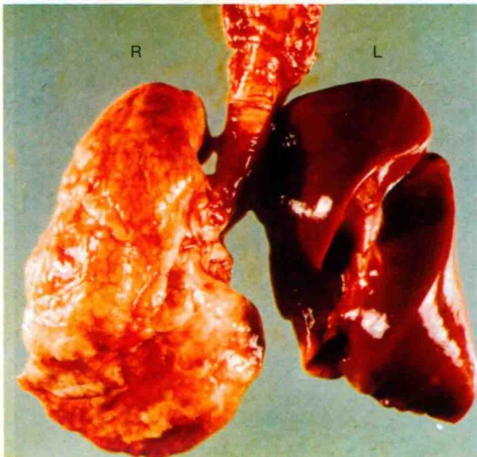 
图12-3 肺不张。婴儿的右（R）肺呈灰色，充满气体而膨胀；左（L）肺萎陷
支气管扩张并可见白色或黄色的增厚的支气管壁，管腔内常常伴有浓厚的脓性分泌物（图12-4）。
镜下，严重的支气管和细支气管炎症导致支气管壁受到破坏。远端支气管的肺实质的萎陷，受损的支气管扩张。中央气道的炎症导致黏液分泌及表面上皮细胞异常增生，包括鳞状上皮化生和杯状细胞增生。支气管壁内可见淋巴滤泡，远端支气管及细支气管瘢痕纤维化，进而失去功能。
【临床表现】支气管扩张症常伴慢性咳嗽，每天咳出数百毫升的黏液浓痰。由于支气管炎症侵蚀相邻支气管动脉壁，因此咯血常见。呼吸困难及喘息多变，取决于疾病的严重程度。肺炎是一种常见的并发症，慢性迁延不愈的患者可并发慢性缺氧和肺动脉高压。急性期，可逆性支气管扩张可因细菌或病毒感染引起，且需要数月才能使支气管恢复正常。对于局灶性支气管扩张，手术切除可能是必要的，但对于广泛性支气管扩张，手术治疗与其说是治愈的手段不如说是为了缓解症状。
# 三、细菌感染
肺部感染的细节在第9章讨论。接下来将主要讨论肺的病变，重点是病理学特征。
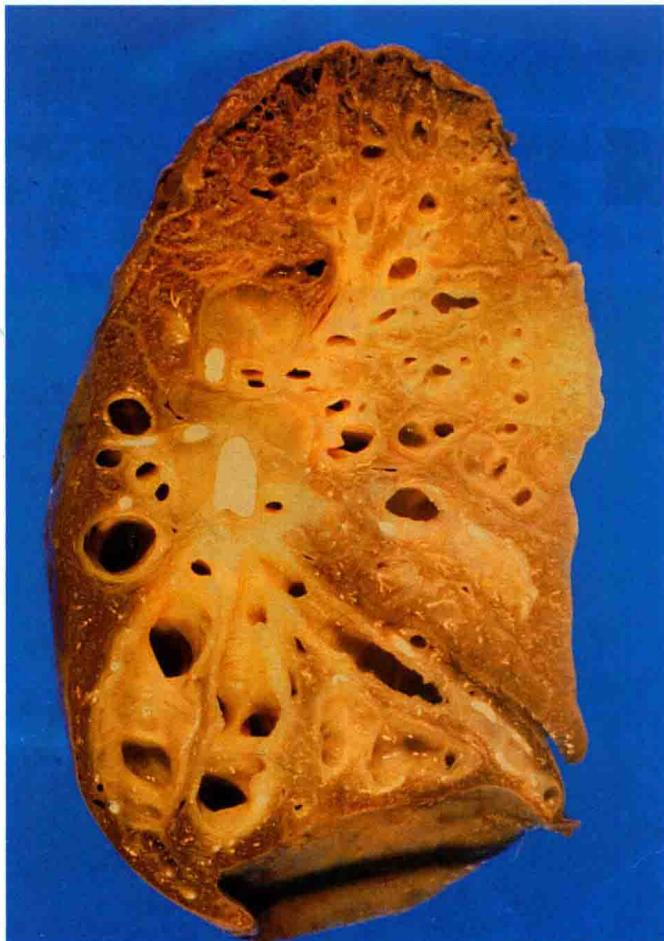 
图12-4 支气管扩张。切除的上叶标本可见广泛的支气管扩张，支气管壁增厚，肺实质塌陷和纤维化
# （一）细菌性肺炎包括炎症和肺实变
旧的术语指的是大叶性肺炎或支气管肺炎，但是这些术语与临床关系不大。一般来说，大叶性肺炎通常累及整个肺叶（图12-5），而支气管肺炎是在同一肺叶或多个肺叶出现多发性实变病灶（图12-6）。
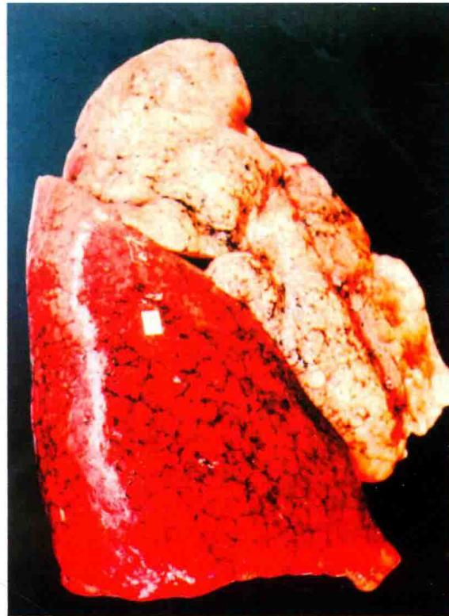 
图12-5大叶性肺炎。红色肝样变期整个左肺下叶实变。上叶正常扩张
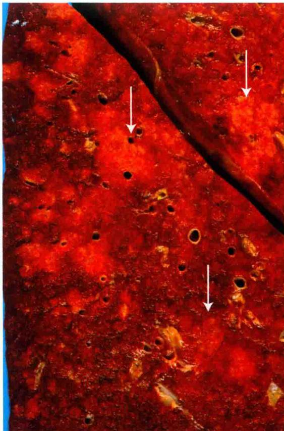 
图12-6 支气管肺炎。实变病灶（箭头）以支气管和细支气管为中心
大叶性肺炎主要是由肺炎链球菌引起，但是由于抗生素的使用，通常不会累及一个完整的肺叶，更多的是累及多个肺叶。相反，支气管肺炎却仍是常见的死亡原因，主要见于终末期患者，常见于肺的下叶和背侧。肺炎病灶不规则，主要集中在终末细支气管和呼吸道支气管，表现为支气管炎伴有多形白细胞渗出到邻近的肺泡。

【发病机制】引起肺炎的大多数细菌是宿主口咽部和鼻咽部的正常菌群，随着吸入的分
泌物到达肺泡。其他感染途径包括来自从环境中吸入、身体其他部位感染灶的血行播散，以及很少情况下的邻近部位的细菌感染。在医院内的患者免疫功能低下时，口咽部正常菌群转变为致病性生物后可引起肺炎，院内获得性肺炎发生率约为 $25\%$ 。在宿主防御功能低下时，许多条件可诱发感染，包括吸烟、慢性支气管炎、酒精中毒、严重营养不良、消耗性疾病及糖尿病控制不佳。
1.肺炎链球菌性肺炎尽管由于抗生素的广泛应用，由肺炎链球菌引起的肺炎仍然是一个显著问题。常见于中青年人，儿童及老年人少见，男性多于女性。

【发病机制】肺炎链球菌性肺炎是呼吸道防御屏障发生改变的结果。一般情况下，病毒
引起上呼吸道感染（例如：流感）后因病毒感染刺激，引起支气管产生的分泌物为肺炎链球菌的繁殖提供了温床。肺炎链球菌是鼻咽部的正常菌群，稀薄的水样分泌物携带这些微生物进入肺泡，从而启动炎症反应。这种非常严重的急性炎症伴发广泛的水肿，表明免疫机制有可能参与。肺炎链球菌的吸入同样和会厌反射受损（包括受寒、麻醉及酒精中毒）有关。由充血性心力衰竭以及刺激性气体引起的肺损伤也具有较高的易感性。

【病理】在肺炎链球菌早期，大量含蛋白质的水肿液渗入并充满肺泡。显著的毛细血管充血
引起中性粒细胞的渗出和肺泡内出血（图12-7）。由于受累的肺形似肝脏，故这个阶段称为“红色肝样变期”（图12-8）。两天或几天后（取决于治疗的效果），进入下一阶段，包括多形核白细胞减少，巨噬细胞出现，吞噬中性粒细胞等炎性碎片。在这个阶段，肺充血减轻，但肺质地仍较韧，称“灰色肝样变期”（图12-8）。接下来，肺泡内的渗出物被清除，肺组织将逐渐恢复正常。
肺炎可引起多种并发症：
胸腔积液：常见，疼痛明显，因为肺炎很容易累及胸膜。
脓肿：胸腔积液感染后导致脓肿，愈合后可引
起广泛的纤维化。
■ 胀胸（脓液被纤维性的壁包裹）：常继发于经久不愈的脓肿。 
■菌血症：发生于 $25\%$ 以上的早期肺炎链球菌性肺炎患者，可能导致心内膜炎或脑膜炎。脾已经切除的患者可能死于菌血症。

【临床表现】肺炎链球菌肺炎发病急骤，常伴发热、恶寒。胸膜受累后常见胸痛。咯血常见，
呈典型“铁锈色痰”。抗生素治疗对肺炎链球菌肺炎有效。虽然对抗生素治疗效果很好，但达到影像学上的缓解仍需要几天时间。
2.肺炎克雷伯菌肺炎 除肺炎链球菌肺炎之外，肺炎克雷伯菌是唯一能引起大叶性肺炎的病菌。然而，却只占社区获得性肺炎的不到 $1\%$ 。这种肺炎通常与酗酒有关，常见于中年男性，糖尿病和慢性肺疾病的患者风险增加。

【病理】肺炎克雷伯菌肺炎常形成厚壁的、胶状囊腔，使肺组织形成特征性的黏液外观。另
一个显著特点是受累肺叶体积增大，使得叶间隙“凸”向未受累的区域。这易导致组织坏死，并形成脓肿。严重的并发症是支气管胸膜瘘形成（即支气管管腔与胸膜之间的沟通）。肺炎克雷伯菌性肺炎不像肺炎链球菌性肺炎的病程那么具有戏剧性，但是前者危险更大。在抗生素使用之前，肺炎克雷伯菌性肺炎的死亡率介于 $50\% \sim 80\%$ 。即使及时使用抗生素治疗，死亡率仍较高。
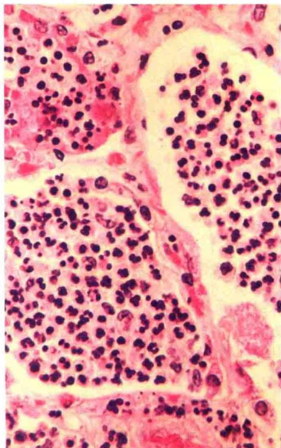 
图12-7 肺炎链球菌肺炎。肺泡中挤满了多形核白细胞，偶尔有巨噬细胞
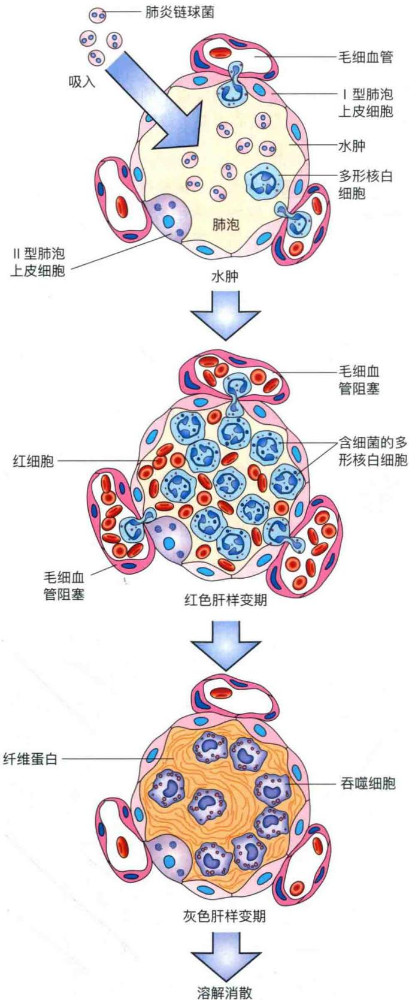 
图12-8肺炎链球菌性大叶性肺炎。肺炎双球菌在肺泡中迅速繁殖并引发广泛水肿。引起急性炎症反应，其中多形核白细胞浸润为突出特征，并且伴有显著充血（红色肝样变期）。随着炎症过程进展，巨噬细胞取代多形核白细胞并摄取碎片（灰色肝样变期）。这个过程通常可以自愈消散，但并发症也可能会随之而来
3.金黄色葡萄球菌肺炎社区获得性金黄色葡萄球菌肺炎罕见，仅占所有细菌感染的 $1\%$ 。然而，金黄色葡萄球菌肺炎感染是流感及其他病毒性呼吸道感染后常见的二重感染。囊性纤维化的患者常发生金黄
色葡萄球菌肺炎反复发作。医院内葡萄球菌性肺炎常见于老弱、长期慢性病以及气管插管的患者中。
【病理】跟其他部位的葡萄球菌感染相同，金黄色葡萄球菌肺炎的特点是产生很多小脓肿。对婴儿及少部分成人而言，当脓肿破裂进入气道可导致肺膨出（衬覆肺组织的薄壁的囊性区域）。金黄色葡萄球菌肺炎的并发症是气胸及胸腔积液，但脓胸少见。金黄色葡萄球菌肺炎需要积极治疗，因为金黄色葡萄球菌容易产生耐药。
4.军团菌肺炎因1976年美国退伍军人协会在费城集会时暴发流行而得名。很快命名为军团菌肺炎，由嗜军团杆菌引起。该菌在培养时需要特殊的条件，在有水的环境滋生，肺炎疫情暴发的源头常可追溯到空调冷却后污染的水、蒸发式冷凝器以及建筑工地中。人与人之间不传播，且不存在人与动物的携带者。
【病理】军团菌肺炎死亡的病例中，多数表现出支气管肺炎。镜下，肺泡中含有纤维蛋白和炎细胞，伴中性粒细胞或吞噬细胞。炎症坏死较广泛。1/3的患者并发脓胸。吞噬细胞内或周围可见丰富的军团菌，但需要特殊染色才能观察到。
【临床表现】军团菌肺炎起病急，有全身乏力发热、肌肉酸痛及腹痛症状。咳嗽常见，胸膜炎可导致胸痛，但少见。死亡率较高（ $10\% \sim 20\%$ ），尤其是免疫功能障碍的患者更易死亡。
5. 由革兰阴性菌引起的获得性肺炎 由革兰阴性菌引起的肺炎常见于免疫抑制和细胞毒疗法的患者，一般采用广谱抗生素治疗。最常见的细菌是大肠埃希菌和铜绿假单胞菌，后者更常见于纤维囊性变的患者中。
6.炭疽性肺炎和肺鼠疫近期世界上发生的一些重大事件，使大家开始重新专注可被生物恐怖主义者利用成为潜在武器的生物体。其中最主要的就是鼠疫杆菌及炭疽。炭疽病原体是一种革兰阳性产芽胞杆菌。炭疽可发生于多种家畜，人类感染少见，最常见的是农业工人的非致命性的皮肤感染。炭疽孢子耐高温及干燥，吸入后被转运到纵隔淋巴结，在纵隔淋巴结中炭疽杆菌迅速播散。在肺组织中引起出血性支气管炎，并可以融合形成出血性肺炎，死亡率较高。炭疽杆菌对抗生素治疗敏感。鼠疫杆菌，即鼠疫的病原体，可产生三种形式的感染：腺鼠疫、肺鼠疫及败血症型鼠疫（少见）。对于肺鼠疫，病原体可直接被吸入，而不需要节肢动物媒介。鼠疫可在人与人、人与动物（例如猫）之间传播。肺部表现是广泛的出血性支气管肺炎、胸膜炎及纵隔淋巴结肿大。未经治疗的情况下，病情
进展迅速，而且往往是致命的。
# （二）肺炎支原体引起非典型肺炎
与大叶性肺炎相比，非典型肺炎的发作较隐蔽，不出现外周血白细胞增多或仅轻度增多，且病程较长。呼吸道症状可轻可重。感染引起中性粒细胞渗出，淋巴细胞、浆细胞浸润支气管壁，从而导致支气管炎（图12-9）。红霉素治疗有效，感染很少致命。
# （三）经典的肉芽肿性感染：结核
结核由结核杆菌感染引起，结核分为原发性和继发性结核。结核感染已在第9章中详细讨论过。
# （四）机会性真菌感染
肺组织的真菌感染包括组织胞质菌病、球孢子菌病、隐球菌病及曲霉菌病，这些疾病已在第9章详细讨论过。
# （五）肺的病毒感染引起弥漫肺泡损伤或间质性肺炎

【病理】病毒感染最初影响肺泡上皮，肺间质中可见浆细胞浸润（图12-10）。I型肺泡上
皮细胞坏死和透明膜的形成可以和其他原因引起的肺泡损伤相鉴别（见下述）。在一些情况下，肺泡的损伤不明显，主要表现为Ⅱ型肺泡上皮的增生和间质的炎症，伴有明显的淋巴细胞浸润。这种表现不同于大多数细菌性感染，后者肺泡腔内渗出为主，仅偶尔累及肺间质。
巨细胞病毒引起一种特殊的肺炎，表现为肺间质内大量的淋巴细胞浸润。肺泡腔内再生的Ⅱ型肺泡上皮细胞填补了坏死的I型肺泡上皮留下的缺损，感染的肺泡细胞变得非常大，有一个深染、嗜碱性的核内包涵体，核周空泡形成，并可见多个胞质模糊的嗜碱性包涵体（图12-11）。
更高倍（图12-11插图）显示被感染的肺泡细胞内单个的嗜碱性核内包涵体伴有核周晕，以及胞质内的多个境界不清的嗜碱性包涵体。
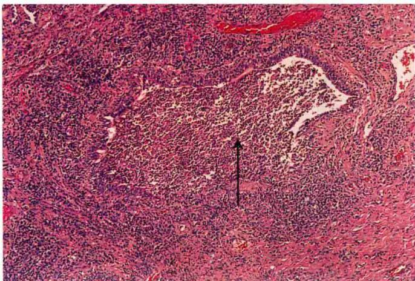 
图12-9 支原体性肺炎。慢性支气管炎伴有气管腔内的中性粒细胞渗出（箭头）
麻疹感染，通常累及气管和肺实质，特点是常见多核巨细胞（ $100\mu \mathrm{m}$ ），可见核内包涵体和胞质内的大的嗜酸性包涵体。尽管间质性肺炎是麻疹病毒感染最常见的并发症，但除非是免疫缺陷或之前从未暴露过的人群，该病一般不致命。
水痘感染：（包括水痘和带状疱疹）会发生播散性的、局灶坏死性病变，以及间质性肺炎。病变累及肺部通常无症状，但对于免疫缺陷的人来说可能是致命的。受病毒感染的细胞内有嗜酸性的、有折光性的核内包涵体、通常伴有明确的核周空晕。多核细胞也可见。
单纯疱疹病毒：可引起坏死性支气管炎以及弥漫性肺泡损伤。病毒包涵体特点与水痘感染相似。
腺病毒性肺炎：特点是坏死性细支气管炎和支气管肺炎。可产生两种核内包涵体：嗜酸性核内包涵体，通常围绕透明的空晕，另外一种被称为“污点细胞”，表现为多个境界不清的嗜碱性的核内包涵体充满整个核，周围仅围绕一薄层染色质。
流感病毒：通常表现为间质性肺炎和细支气管炎，类似于其他病毒性肺炎。组织学上病变不典型。镜下表现可以是间质性肺炎、细支气管炎和弥漫性肺泡损伤，某些情况下，会产生广泛出血。对于大多数流感病毒菌株，伴发细菌的二重感染并不少见。
# 四、肺脓肿
肺脓肿是指脓液的局部聚集伴有肺实质（包括肺泡、气管和血管）的破坏。病变通常由口咽部的厌氧菌引起。通常是多种微生物感染，但梭形杆菌和类杆菌属常常除外。

【发病机制】大量的细菌导致肺脓肿需要两
个条件：首先口腔中必须存在大量厌氧菌，
例如口腔卫生差或有牙周疾病的人。此外，咳嗽反射或气管支气管的排痰功能受损。酗酒是引起肺脓肿最常见的原因。其他高风险因素还包括用药过量、癫痫和神经功能障碍。坏死性肺炎、支气管阻塞、感染性肺栓塞、肺穿透伤等也可以引起肺脓肿。

【病理】肺脓肿直径一般为 $2\sim 6cm$ ， $10\% \sim$
20% 的病灶含有多个囊腔。其内含有大量的多
形核白细胞，以及根据病变的时期不同，可见多少不等的巨噬细胞。可以见到坏死组织的碎片。脓肿被出血、纤维素和炎细胞围绕。随着脓肿时间的延长，脓肿边缘发生纤维化，脓肿腔内可含有气体、坏死物及炎性渗出（图12-12），故在X线上形成一个液平面。

【临床表现】几乎所有肺脓肿患者表现为咳嗽、
发热，产生大量恶臭痰。许多患者伴发胸痛
20% 的患者出现咯血。肺脓肿的并发症包括脓肿破裂
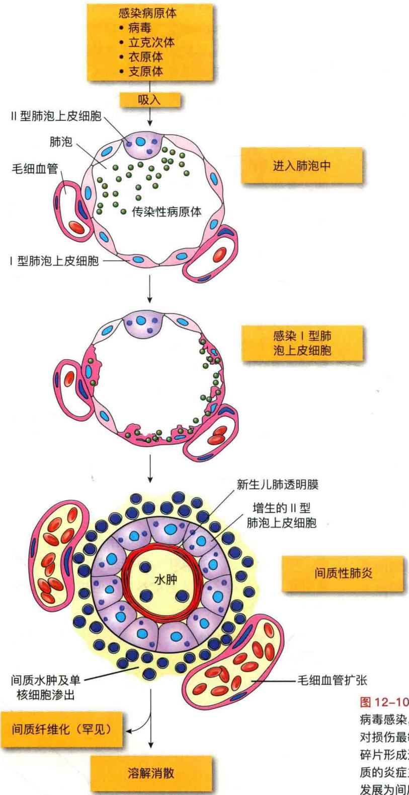 
图12-10 间质性肺炎的发病机制。引起间质性肺炎最常见原因是病毒感染，其他生物体也可能引起间质性炎症。I型肺泡上皮细胞对损伤最敏感，完全丧失导致肺泡内水肿形成。蛋白质渗出和细胞碎片形成透明膜，而Ⅱ型肺泡上皮细胞增生并沿着肺泡壁生长。间质的炎症主要是单核细胞浸润。本病一般可以完全消散，但偶尔会发展为间质纤维化
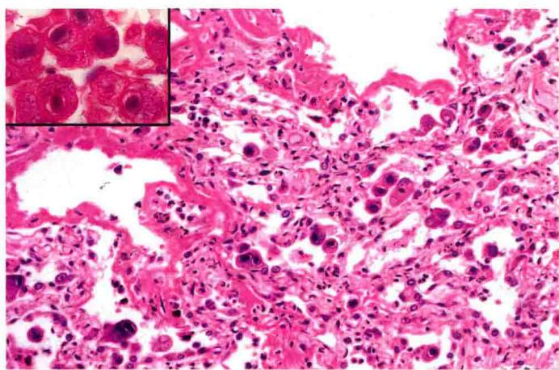 
图12-11 巨细胞病毒性肺炎。受感染的肺泡上皮细胞增大，可见典型的深蓝色核内包涵体
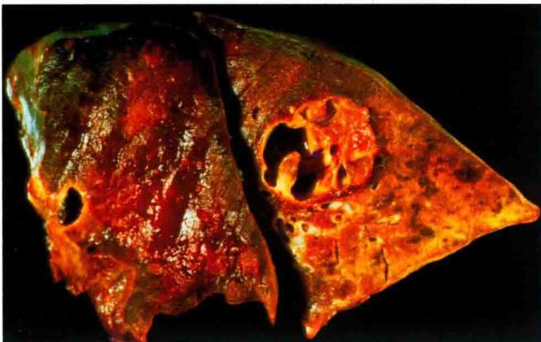 
图12-12 肺脓肿。一个大的脓肿含有脓性渗出物，并被纤维性囊壁包绕。周围的肺实质呈肺炎改变
进入胸膜腔，造成脓胸及严重咯血。脓肿进入支气管腔后，可播散到其他肺叶。针对厌氧菌可进行局部抗生素治疗，但是肺脓肿的死亡率仍保持在 $5\% \sim 10\%$
# 五、弥漫性肺泡损伤[急性呼吸窘迫综合征（ARDS）]
弥漫性肺泡损伤（DAD）指肺泡上皮细胞和内皮细胞的急性损伤。DAD的临床特点对应的即为ARDS。对于这种疾病，患者经历肺损伤后，迅速发展为进行性呼吸衰竭。DAD的总体死亡率达 $50\%$ 以上，对于60岁以上的患者，高达 $90\%$

【发病机制】DAD是大多数肺损伤最终的病理学改变。引起肺损伤的因素主要包括了呼
呼吸道感染、败血症、休克、胃内容物摄入、吸入有毒气体、溺水、放射性肺炎和药物及化学物品的过量摄入。这些因素都可损害肺泡的上皮细胞和内皮细胞，从而导致DAD的发生。因此，DAD的明确发病原因不能单纯依靠肺形态学，除非有明确的感染因子。部分患者伴有特发性DAD，临床上称为急性间质性肺炎。内皮细胞的损伤使得蛋白质从肺泡毛细血管漏入间质内（图12-13）。I型肺泡细胞的缺失导致液体进入肺泡腔中，渗出的血浆蛋白沉积导致了在损伤的肺泡壁上形成了含有纤维素的透明膜。尽管I型肺泡细胞脱落，肺泡基底膜仍保持完整，使II型肺泡细胞可以以此为支架增生替代正常的肺泡上皮细胞。作为对DAD损伤的反应，炎症细胞可聚集在间质内。
导致DAD肺损伤的机制目前还不完全清楚。活化补体（例如革兰阴性菌败血症中的内毒素）导致中性粒细胞的聚集及活化。反过来，中性粒细胞释放氧自由基和水解酶，损伤肺的毛细血管内皮细胞。但是，ARDS也可发生在中性粒细胞减少症的患者。由于吸入毒气或溺水导致的DAD，损伤主要发生在肺泡上皮
细胞表面，肺泡上皮间连接通常非常紧密，上皮的损伤破坏了这些连接，使得液体和蛋白从间质渗入到肺泡腔。

【病理】随着病情的发展，DAD由最初的渗出阶段进入机化阶段。
DAD的渗出阶段：肺损伤后的第1周，出现功能性水肿、血浆蛋白渗出、炎细胞聚积和透明膜的形成（图12-14）。肺泡损伤最早表现为内皮细胞和I型肺泡上皮的退行性变。之后是I型肺泡细胞脱落，只剩下肺泡基底膜。间质和肺泡水肿发生在第1天，随后好转；第2天开始出现透明膜，这是 $4\sim 5$ 天之后渗出期最典型的形态学特点。这些嗜酸性透明膜包含血浆蛋白，以及来自脱落上皮细胞的细胞质和核碎片。间质的炎症包括淋巴细胞、浆细胞和巨噬细胞的浸润，这些细胞在早期出现，1周之后达到高峰。第一周末到之后
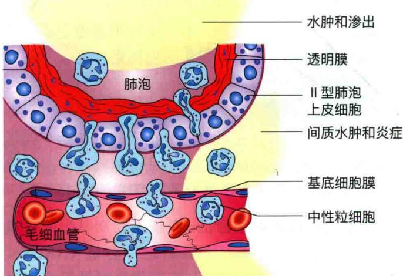 
图12-13 弥漫性肺泡损伤（急性呼吸窘迫综合征，ARDS）。在ARDS，弥漫性肺泡损伤导致I型细胞凋亡，继而出现肺泡水肿，之后形成由蛋白质渗出物和细胞碎片组成的透明膜。在急性期，肺部显著充血及重量增加。II型细胞沿着肺泡表面增生。间质炎症是特征性的，病变可以完全治愈或进展为间质纤维化
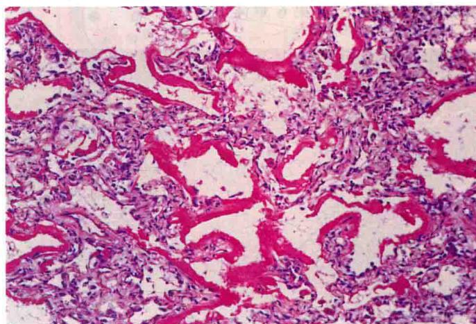 
图12-14 弥漫性肺泡损伤，急性（渗出）阶段。该阶段肺泡间隔由于水肿和散在的炎性浸润而变宽。肺泡表面见嗜酸性的透明膜形成
的机化期，柱状的Ⅱ型肺泡上皮细胞沿着肺泡上皮细胞已经脱落的肺泡隔依次排列（称为鞋钉样细胞）。肺泡毛细血管和肺小动脉内可出现纤维蛋白血栓。死亡的DAD病例尸检可见肺脏重量增加、水肿，几乎没有通气功能。
DAD的机化阶段：肺损伤后的第2周，显著特点是肺泡壁出现成纤维细胞增生（图12-15）。间质性炎症和增生的Ⅱ型肺泡上皮仍然存在，但是透明膜消失。肺泡内的巨噬细胞吞噬了残余的透明膜和其他细胞碎片。疏松的纤维化使肺泡隔增厚，在较轻的患者，这些纤维化可以最终被吸收。没有恢复的患者，DAD可进展成终末期纤维化，导致肺组织内产生多个囊腔（蜂窝肺）。这些囊腔相互分隔，内衬Ⅱ型肺泡上皮、支气管上皮细胞或鳞状细胞。
【临床表现】发展成ARDS的患者在最初肺损伤之后，有几个小时的无症状间隔期，之后出现典型的呼吸急促和呼吸困难发作。随着ARDS的发展，呼吸困难加重，患者发生发绀。X线显示有弥漫性、双侧的肺泡和肺间质浸润。这一阶段患者由于动脉低氧血症，故不能单纯性的吸氧，提高氧分压，必须要进行机械通气。死亡的患者通常伴有肺泡通气不足、进行性低氧血症以及二氧化碳分压升高。发生ARDS后存活下来的患者通常可以恢复正常的肺功能，但是对于严重的病例，可能肺组织内会遗留瘢痕，出现呼吸功能障碍，甚至在某些情况下，产生肺动脉高压。
新生儿呼吸窘迫综合征：在新生儿期发生的呼吸窘迫综合征称为新生儿呼吸窘迫综合征（NRDS）。NRDS，又称为肺透明膜病，指在出生时肺发育不成熟，缺乏肺泡表面活性物质引起，常见于早产儿。表面活性物替代治疗以及改进通气技术可提高周数较大的早产儿的存活率，减少并发症的发生。但是周数较小的早产儿仍可能发展为支气管肺发育不良（BPD）。NRDS和BPD已在第6章详细讨论。
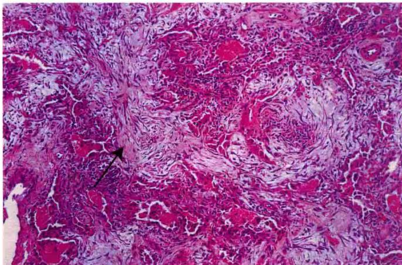 
图12-15 弥漫性肺泡损伤，机化阶段。肺泡壁因纤维维母细胞和疏松结缔组织（箭头）而增厚
# 六、弥漫性肺出血综合征
弥漫性肺泡出血可发生在不同的临床疾病中（表12-1）。组织学上，这些疾病的特点表现为急性出血（肺泡内出现红细胞）或慢性出血（含铁血黄素沉着）。几乎所有这些疾病的肺泡壁中都有中性粒细胞浸润（中性粒细胞毛细血管炎），这与其他器官如皮肤中出现的白细胞碎裂性血管炎相似。这种病变往往在出血综合征伴有“肉芽肿性血管炎”（GPA，之前称为Wegener肉芽肿）或系统性红斑狼疮时更为显著。一些弥漫性肺出血综合征可以出现特有的免疫荧光模式。抗基底膜抗体引起的疾病或Goodpasture综合征中可见线性荧光。颗粒型荧光见于免疫复合物相关性疾病，如系统性红斑狼疮。免疫反应缺乏型只显示很少或不显示免疫荧光，主要包括了抗中性粒细胞胞质抗体（ANCA）相关性疾病（如GPA、显微镜下的多血管炎或特发性肺出血综合征）（表12-1）。详细内容参见第10章和第16章。
表12-1 肺出血相关疾病疾病免疫机制免疫荧光模式Goodpasture综合征抗基底膜抗体线性系统性红斑狼疮免疫复合物颗粒型混合冷球蛋白血症过敏性紫癜IgA病Wegener肉芽肿抗中性粒细胞胞质抗体不显示或只显示很少特发性肾小球肾炎特发性肺出血无免疫标记
# 七、慢性阻塞性肺疾病
几种不同的疾病，包括慢性支气管炎、肺气肿及哮喘，还有支气管扩张和囊性纤维化，均属于阻塞性肺疾病，因为这些疾病在肺组织中均引起通气障碍。慢性阻塞性肺疾病（COPD）包括慢性支气管炎和肺气肿，表现为用力呼气量（可通过肺活量测定仪检测）的减低。在肺组织中，支气管狭窄导致通气阻力增加，而弹性反冲的缺失导致压力减弱。气道狭窄发生于慢性支气管炎、哮喘，而肺气肿缺少弹力反冲。
1. 慢性支气管炎 指咳嗽、咳痰连续2年以上，每年超过一半的时间。慢性支气管炎主要发生于吸烟者（见第8章）的疾病，患者中吸烟者占大约 $90\%$ 。对于慢性支气管炎患者，发生急性呼吸道感染的严重程度和发病频率均增高。感染被认为是一种病因并与疾病的进展相关。慢性支气管炎常见于生活在空气污
染环境中的城市居民或暴露于被排放出来的有毒气体中的工人，然而吸烟的影响远远超过了这些因素。

【病理】慢性支气管炎的主要形态学特点是支
气管中分泌黏液的组织结构的体积增加（图12-17）。黏液腺主要包括两种细胞：黏液性细胞，更浆液性细胞，嗜碱性，颗粒状胞质。慢性支气管炎特点就是黏液细胞的增生及肥大，黏液细胞与血管的比例增加。因此，每个单独的腺泡和整个病变会增大（图12-17）。其他慢性支气管炎的形成还包括：
由于黏液腺扩张、水肿，导致支气管壁增厚，进而使支气管腔狭窄 
中央和外周气道的黏液分泌过多 
支气管上皮的杯状细胞数量增多 
支气管平滑肌束增多，表明支气管具有高反应性 
支气管上皮发生鳞状上皮化生，因吸烟损伤上皮所致，这种变化可以在其他形态学改变不存在的情况下单独存在

【临床表现】慢性支气管炎常伴有肺气肿（见
下文)。按照临床表现，有时很难分辨这两种间的因果关系。一般情况下，慢性支气管炎患咳嗽咳痰多年，在冬季更严重。随着疾病转为咳嗽变得更常见，劳力性呼吸困难、发绀以及都随之而来。
继发于肺心病的发绀和水肿使这些患被称为“青
紫型”。晚期慢性支气管炎患者发生急性呼吸衰竭，表现为进行性低氧血症和高碳酸血症。
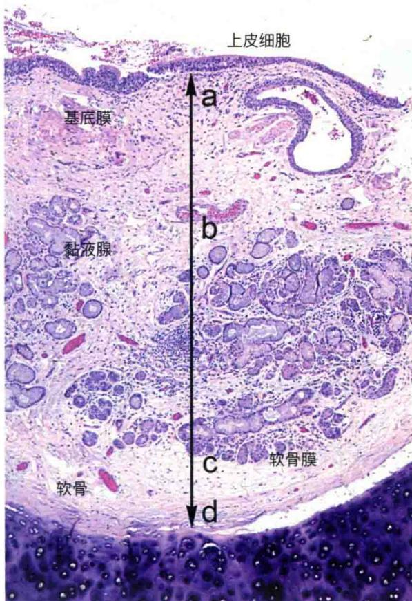 
图12-16 慢性支气管炎。支气管黏膜下层因黏膜下腺增生而增厚，增生的黏膜下腺超过了 $50\%$ 的支气管壁厚度。Reid指数等于支气管黏膜下黏液腺最大厚度（ $\mathrm{b}\sim \mathrm{c}$ ）与支气管壁的厚度（a～d）之比
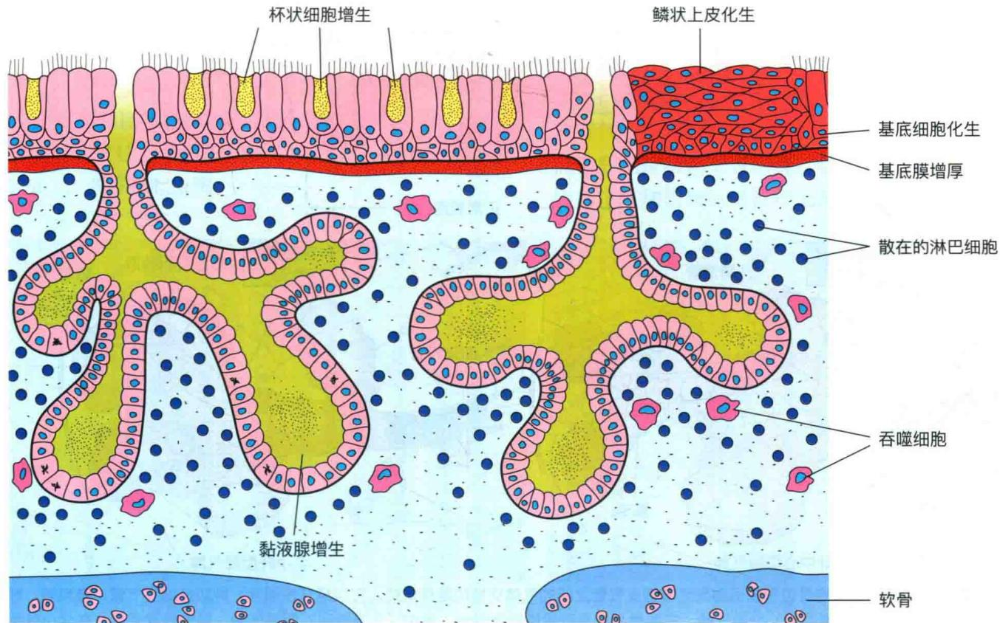 
图12-17 慢性支气管炎。慢性支气管炎的形态学变化
2. 肺气肿 可导致吸烟者的肺组织通气过度。肺气肿是一种慢性肺疾病，特点是终末支气管的扩张，肺泡壁破坏，不伴有纤维化。尽管肺气肿按照解剖结构来分类，但是肺气肿的严重性比分型更重要。

【发病机制】肺气肿的主要病因是吸烟，中-重度肺气肿罕见于非吸烟患者（见第8章）。
正常情况下，肺组织中弹性蛋白的合成和分解代谢保持着平衡。当促弹性蛋白分解的活性增加，或抗弹性蛋白分解的活性降低时将导致肺气肿。吸烟者的支气管肺泡灌洗液中发现含有弹性蛋白酶和其他蛋白酶的中性粒细胞数量的增加。吸烟通过氧化分子内的蛋氨酸残留物而干扰α1- 抗胰蛋白酶（α1-AT）的活性。因此，促弹性蛋白分解的活性的增加使得远端肺组织的弹性组织受破坏，从而损害弹力反冲。
a1-AT缺乏：a1-AT是由Pi（蛋白酶抑制剂）位点编码，遗传性的a1-AT缺陷，仅占所有COPD患者的 $1\%$ ，但是大多数40岁以下的肺气肿患者均存在这种缺陷。a1-AT，是肝中产生的一种糖蛋白，是多种蛋白酶的主要抑制剂，包括弹性蛋白酶、胰蛋白酶、胰凝乳蛋白酶、凝血酶以及细菌性蛋白酶。事实上，这种蛋白占了血中抗蛋白酶活性的 $90\%$ 。在肺组织中，它可以抑制中性粒细胞的弹性蛋白酶，而这种酶可以消化肺泡隔的弹性蛋
白以及其他组成成分。
最严重的异常与PiZZ等位基因有关，发生于 $5\%$ 的患者中。这在斯堪的纳威亚血统人群中更普遍，但在犹太人群、黑种人以及日本血统中罕见。由于肝脏分泌这种异常蛋白的能力较差，PiZZ纯合子α1-AT的含量只有正常血浆浓度的 $15\% \sim 20\%$ 。这种人群患肝硬化（见第14章）和肺气肿的风险升高。事实上，不吸烟的PiZZ纯合子患者的平均发病年龄在 $45\sim 50$ 岁，而吸烟的患者发病年龄在35岁左右。然而，2/3的不吸烟PiZZ纯合子患者不发生肺气肿。

【病理】肺气肿根据病变在腺泡中的位置进行形态学分类（图12-18）。小叶中心型肺气肿有腺泡近端（细支气管）被选择性的累及，而典型肺气肿是整个肺泡都累及。
小叶中心型肺气肿：这种形式的肺气肿最常见，通常有症状并与吸烟有关。小叶中心型肺气肿的特征是肺叶中央的支气管树末端的终末细支气管簇会遭到破坏（图12-19A）。扩张的呼吸性细支气管形成增大的空腔，相互之间分隔，并且通过正常的肺泡管和肺泡和小叶间隔分隔。随着病变的进展，细支气管距离肺气肿部位的近端出现炎症及狭窄（图12-19B）。发生在上叶和下叶前段小叶中心型肺气肿更严重。
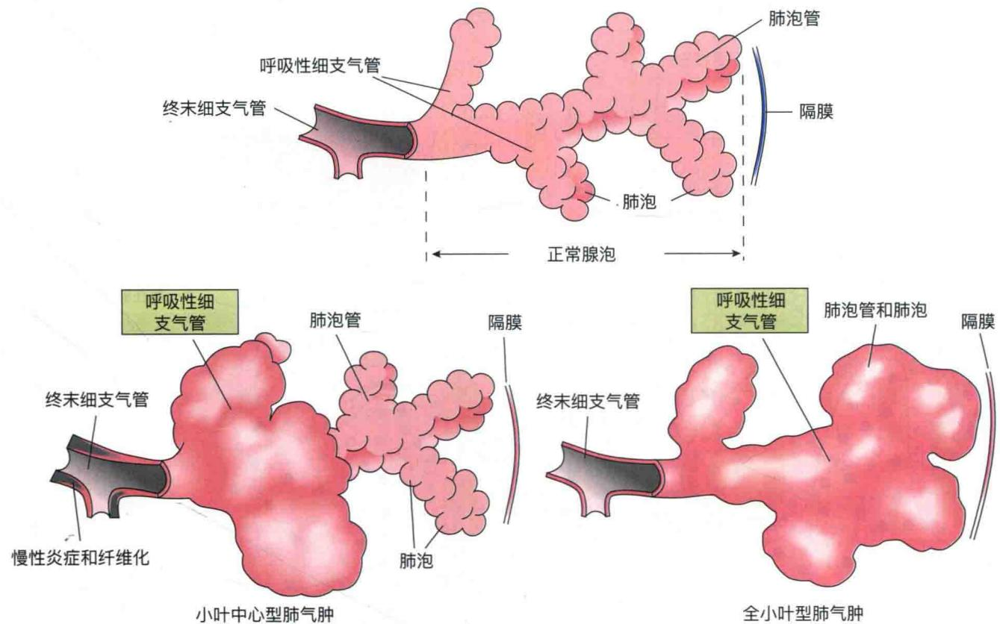 
图12-18 肺气肿的类型。腺泡是位于肺远端到终末细支气管之间的气体交换的结构单位。它包括（按顺序）呼吸性细支气管、肺泡管、肺泡囊和肺泡。在小叶中心（近端腺泡）型肺气肿，主要参与的是呼吸性细支气管。周边（远端腺泡）型肺气肿，肺泡最常受累。在全小叶型肺气肿，整个腺泡均匀受累
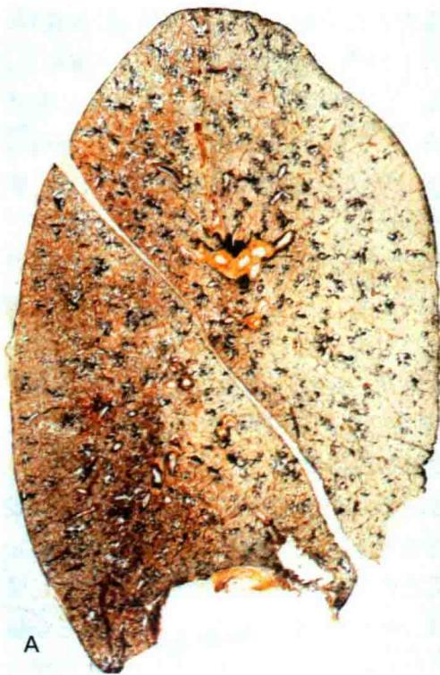
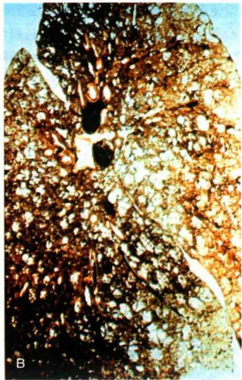 
图12-19 小叶中心型肺气肿。A. 一名患有轻度肺气肿的吸烟者的肺组织大切片，显示扩张的管腔遍布两叶肺，表明肺小叶中央部的终末细支气管受损，而这些异常的囊腔被未受累的肺实质围绕。B. 小叶中心型肺气肿进展加重后，肺组织受损加重，出现增大的不规则囊腔
全小叶型肺气肿：肺泡均受累，从中央到周围的肺泡均遭到破坏。组织学上肺泡隔缺失证实是由于α1-AT的缺乏引起（图12-20）。在终末阶段，全小叶型肺气肿形成纤维性间隔（cotton-candy肺）。弥漫性全小叶型肺气肿与α1-AT酶缺失相关，但是小叶型肺气肿通常与吸烟有关。在这种情况下，全小叶型肺气肿常见于肺下端，而小叶中央型肺气肿常见于肺上端。
局限型肺气肿：之前称为“间隔旁型肺气肿”，特点是肺泡破坏，导致肺气肿形成，病变只累及一个或最多数个局灶部位。其余肺组织一般正常。病变可见于肺叶的任何部位，例如胸膜下，但是肺上叶尖端最常见。尽管临床表现不严重，但是局限型肺气肿破裂后容易发生自发性气胸（见下文）。局限型肺气肿进展后可发生较大范围的受损，称为肺大疱，小者直径2cm，大者可引起血胸。
【临床表现】大多有症状的肺气肿患者是60岁以上的长期劳力性呼吸困难患者伴有轻微的干咳。呼吸急促和呼气延长是典型的表现。最突出的影像学异常是肺过度充气，体现在肺体积增大，横膈膜受压，胸腔前后径增加（桶状胸）。由于这些患者的呼吸频率较高，每分钟通气量增加，可使动脉血红蛋白饱和度维持在接近正常的水平。因此称为非发绀型肺气肿“pink puffers”。与慢性支气管炎患者不同，肺气肿患者发生反复肺部感染的风险较小，不易发展为肺心病。肺气肿的临床过程是不可抗拒的呼吸功能下降以及进行性呼吸困难，因此有效的治疗是必须的。
3. 哮喘的特征是痉挛性气道阻塞 哮喘患者通常伴有气喘发作、呼吸困难以及咳嗽。哮喘急性发作可能会和无症状期交替出现，也可以在慢性气道阻塞的情况下叠加出现。对治疗无反应的严重的急性被称为
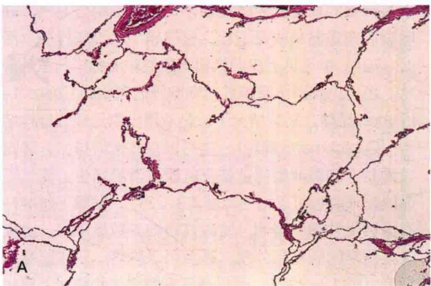 
图12-20全小叶型肺气肿。A.患者是α1抗胰蛋白酶缺乏症，显示大的、不规则的空腔，肺泡壁数量减少；B.在相同倍数视野下，减少的肺泡壁（A）和正常肺组织的对比
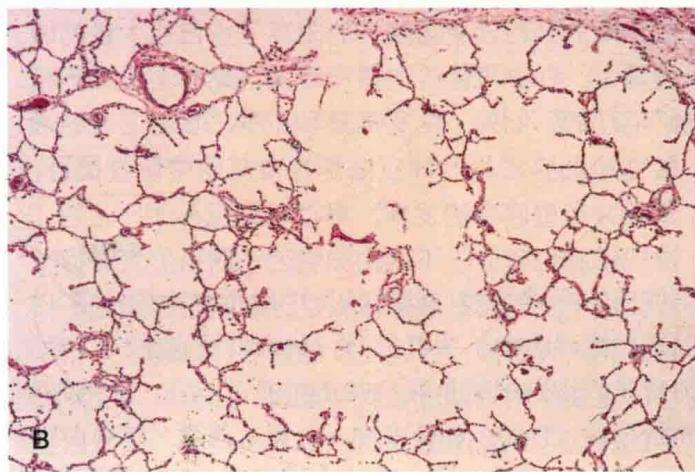
哮喘持续状态。大部分哮喘患者，即使表面看上去很好，也会有一定程度上的持续性气流阻塞及形态学改变。在美国，支气管哮喘发生在 $10\%$ 儿童，为 $8\%$ 成人。不知为何，美国哮喘的患病率自1980年以来已经翻番。尽管初次发病可以发生在任何年龄，但一般出现在小于10岁的儿童中，男孩发病率是女孩的2倍。到了30岁左右，哮喘患者男女发病率均等。

# 【发病机制】哮喘根据诱发原因，从传统上
分为外源性（过敏性）和内源性（特应性哮大类。目前公认的原因是由于气道高反应性炎症反应。暴露于一些刺激因子（如过敏原、寒冷、运动）后，由活化的巨噬细胞和肥大嗜酸性粒细胞以及嗜碱性粒细胞释放的炎症诱发支气管收缩、血管通透性增加及黏液分且还可以吸引其他效应细胞。支气管壁的炎能损伤上皮细胞，刺激神经末梢和神经反射，加重支气管痉挛。
目前引起哮喘最常见的原因，研究最为透彻的就是过敏原的吸入。对于致敏人群，过敏原的吸入可与 $\mathrm{T}_{\mathrm{H}}2$ 细胞以及IgE抗体结合，结合在肥大细胞表面，然后散布在支气管黏膜上皮细胞中（图12-21）。结果是， $\mathrm{T}_{\mathrm{H}}2$ 细胞和肥大细胞释放I型（速发型）超敏反应的介质，包括组胺、缓激肽、白三烯、前列腺素、血栓素A2、血小板活化因子（PAF）以及细胞因子，如IL-4和IL-5。炎症介质可引起：①平滑肌收缩；②黏液分泌；③血管通透性增加和水肿。每种因素都会强有力（尽管是可逆性的）地造成气道阻塞。IL-5在骨髓中可促进嗜酸性粒细胞的终末分化。趋化因子，包括白三烯B4以及中性粒细胞和嗜酸性粒细胞的趋化因子可以将中性粒细胞、嗜酸性粒细胞和血小板吸引到支气管壁。反过来，嗜酸性粒细胞释放白三烯B4和血小板活化因子，从而加重支气管收缩和水肿。嗜酸性粒细胞释放出来的颗粒含有嗜酸性的阳离子蛋白和大量的碱性蛋白，在支气管腔内进一步损伤黏膜上皮细胞和纤毛功能。此外，白三烯B4和PAF吸引更多的嗜酸性粒细胞和其他效应细胞等参与这个恶性循环，延长并加重哮喘的发作。最近有证据表明，活性T淋巴细胞也有助于不同的细胞因子网络扩大炎症反应。由于支气管黏膜是吸入性过敏原和感染因子接触的第一道屏障，因此上皮细胞在哮喘的发病机制中的重要作用近期已经受到重视。目前认为上皮细胞的损伤可以刺激黏膜组织的末梢神经，引发自主神经放电，加重气道狭窄和黏液分泌。
过敏性哮喘：这是最常见的哮喘类型，常见于儿童。
$1 / 3\sim 1 / 2$ 的哮喘患者有明确或可疑的过敏原，如花粉、动物毛发、粉尘以及螨虫。过敏性哮喘皮试反应强阳性。
感染性哮喘：儿童哮喘的一个常见诱因是儿童病毒性呼吸道感染。2岁以下儿童中，呼吸道合胞病毒（RSV）感染常见，较大一些的儿童鼻病毒、流感、副流感是常见的感染原。
运动性哮喘： $50\%$ 以上的哮喘患者运动时会诱发支气管痉挛。有些患者，运动是唯一的诱发因素。运动诱发的哮喘与呼吸道上皮热量或水分缺失的程度有关。通气（大量运动）越快、呼吸的空气越寒冷和干燥，越容易诱发哮喘的发作。发作可能是气道在复温后，介质释放或血管充血的结果。
职业性哮喘：超过 $80\%$ 的不同职业暴露与哮喘发生有关。在某些情况下，这些物质诱发IgE相关的超敏反应引起过敏性哮喘。例如，动物管理员、面包师以及暴露于木材、植物粉剂、金属盐、药剂和工业化学品的人员。另外一些情况，职业性哮喘可能接触一些致敏原后直接释放一些平滑肌收缩介质引起。如这种机制见于棉尘肺（“褐色肺”），一种发生在棉花工人中的职业性肺病。
药物性哮喘：药物诱发的支气管痉挛多发生于已知的哮喘患者。最知名的药物是阿司匹林，但其他非甾体类抗炎药也有可能。据估计超过 $10\%$ 的成人哮喘患者对阿司匹林过敏。
空气污染：大规模的空气污染，通常伴有气温的逆转，和哮喘患者及其他一些肺部疾病的患者的支气管痉挛有关。相关的环境污染物主要包括二氧化硫、氧化氮和臭氧。
情绪因素：在 $50\%$ 的哮喘患者中，心理压力都会引起或加重支气管痉挛。目前认为由迷走神经传出的刺激是潜在的发病机制。

【病理】目前大多数对哮喘的病理学描述来自死于哮喘持续状态的患者的尸检，因此只能看
到最严重的病变。大体检查可见肺组织明显充气，呼吸道内布满黏稠的黏液栓。显微镜下，这些栓子（图12-22A）中可见上皮细胞和嗜酸性粒细胞排列呈条索状。也可见起源于嗜酸性粒细胞膜的磷脂的Charcot-Leyden晶体。某些情况下，黏液渗出物形成气旋样结构（Curschmann螺旋），并可以在咳嗽时排出。哮喘持续状态的最典型特征是支气管平滑肌增生。支气管黏膜黏液腺也可以增生（图12-22A）。黏膜下水肿并有多种炎性细胞浸润，嗜酸性粒细胞数量不等。上皮失去正常的假复层外观，甚至可以脱落，只残留基底细胞（图12-22B），可见基底细胞增生和鳞状上皮化生。杯状细胞增生也很明显。上皮细胞基底膜特征性的增厚。
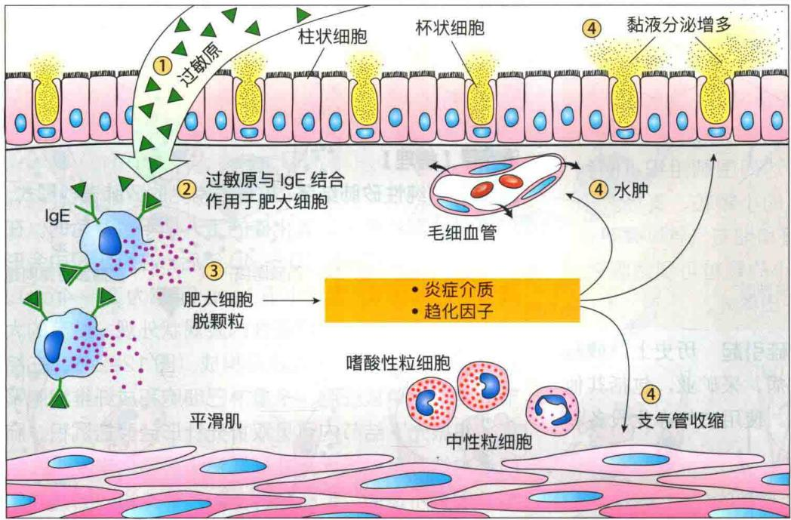 
A 速发反应
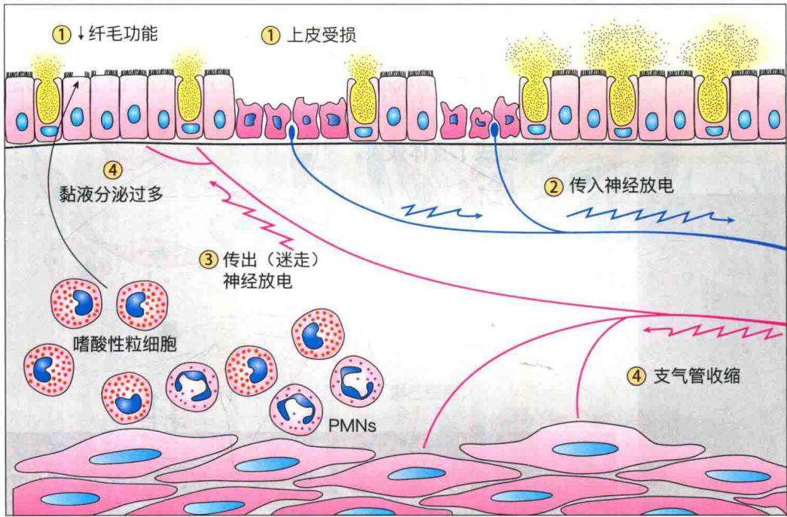 
B迟发反应 
图12-21 哮喘的发病机制。A. 免疫介导的哮喘。过敏原与肥大细胞上的免疫球蛋白E（IgE）相互作用，无论是在上皮表面或黏膜下层（当上皮通透性异常时）释放介质，并通过迷走神经介导的反射或局部发生反应；B. 嗜酸性颗粒释放进一步损害上皮细胞的纤毛功能。上皮细胞损伤刺激黏膜的神经末梢，引发自主神经放电，加重气道狭窄和黏液分泌。PMNs，多形核中性粒细胞
【临床表现】典型的哮喘发作的起始症状是胸闷和干咳。接着吸气和呼气急促、呼吸频率增加，最终发展为呼吸困难，呼气相特征性的显著延长。剧烈咳嗽以及咳出黏稠的Curschmann螺旋、嗜酸性粒细胞和Charcot-Leyden晶体的出现往往预示着发作结束。哮喘持续状态是指严重的支气管收缩，药物干预也不能终止的急性发作。这种情况非常严重，需要住院治疗。哮喘持续状态的患者会发生低氧血症和高碳酸血症，特别严重的情况下可能会导致患者死亡。治疗哮喘的药物包括β-肾上腺素激活剂，吸入糖皮质激素、色甘酸钠、甲基黄嘌呤和抗胆碱
能药物。系统性的类固醇激素治疗可以用于哮喘持续状态或耐药的慢性哮喘的患者。吸入支气管扩张剂可显著缓解症状。
# 八、尘肺
粉尘吸入肺组织中引起尘肺。大多数吸入的粉尘无害，只是沉积在肺部。然而其中一些会导致严重的肺部疾病。有些特殊类型的尘肺是按照被吸入的物质（例如矽肺、石棉、滑石）来命名的，或者，有些致病因素不明，可以按照职业命名，如“电焊肺”。
【发病机制】引起尘肺最重要的因素是吸入粉尘，刺激发生纤维化（图12-23）。少量的二氧化硅可能产生广泛纤维化，而煤、铁物质只能引起轻微的纤维化。在一般情况下，尘肺由无机粉尘引起，并取决于到达肺组织的剂量和颗粒的大小。最危险的是那些可以到达周围肺组织（即到达最小的细支气管和腺泡）的小颗粒。直径大于 $10\mu m$ 的颗粒可沉积在支气管和细支气管，并可被的黏膜的纤毛清除出去。更小的颗粒可到达腺泡，最小的颗粒可表现为气体被呼出体外。
1. 矽肺是由吸入的二氧化硅引起 历史上，矽肺曾被认为是和喷砂机相关的疾病。采矿业，包括其他一些职业也会有二氧化硅暴露。使用空气净化设备和面罩可大大减少矽肺的发生率。
【发病机制】二氧化硅颗粒的生物学效应取决于许多因素，一些是由于颗粒本身，另外一些和宿主反应相关。 $0.2\sim 2.0\mu \mathrm{m}$ 的颗粒最危险。通过酸去除颗粒的可溶性的表层，或通过喷砂重新构建新的表层都可以增强二氧化硅颗粒的生物活性。二氧化硅颗粒被吸入后，被肺泡的巨噬细胞摄入。颗粒表面的羟基基团与磷脂和蛋白质之间形成了氢键，这种相互的作用被认为破坏了细胞膜，从
而杀死巨噬细胞。死亡的细胞释放出游离二氧化硅颗粒和促纤维化的因子。释放的二氧化硅颗粒可以被巨噬细胞重新摄取，重复以上过程，使产生的效应不断放大。

# 【病理】
单纯性矽肺结节：这是最常见的矽肺表现形式，而且对长期暴露于二氧化硅的工人是不可避免的。在首次暴露于二氧化硅 $10\sim 40$ 年后，在肺组织中会形成含有硅的结节，直径小于 $1cm$ （通常为 $2\sim 4mm$ ）。组织学检查可见一个特征性的漩涡状外观，结节的大部分由同心圆性排列的胶原构成（图12-24）。在结节外周可见单核细胞、多量淋巴细胞和成纤维细胞聚集。偏振光下结节内可见双折光针形硅酸盐沉积。肺门处的结节可以增大，并形成钙化，钙化常发生在结节外周（所谓的“蛋壳样钙化”）。单纯的矽肺病通常不引起显著的呼吸功能障碍。
进行性的大块纤维化：进行性的大块纤维化是指影像学上在单纯性矽肺的背景下，出现直径大于 $2\mathrm{cm}$ 的结节。这些病灶通常是小结节融合而成的。大多数病变在 $5\sim 10\mathrm{cm}$ ，好发于双肺的上部（图12-25）。形态上，常形成中央空洞。由于结节对肺组织结构的破坏，造成了身体残疾。
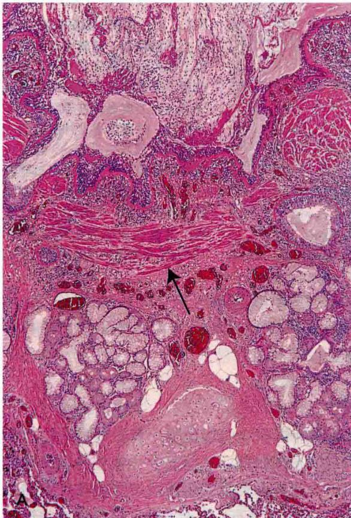 
图12-22 哮喘。A. 一例死于哮喘持续状态患者的尸检，显示了支气管腔内的黏液栓，黏膜下腺体增生和支气管平滑肌增生（箭头）；B. 高倍镜下显示上皮下基底膜增厚，支气管壁炎症明显，伴大量嗜酸性粒细胞浸润。黏膜炎症及上皮化生（箭头）。局部黏膜上皮细胞脱落（短箭头）
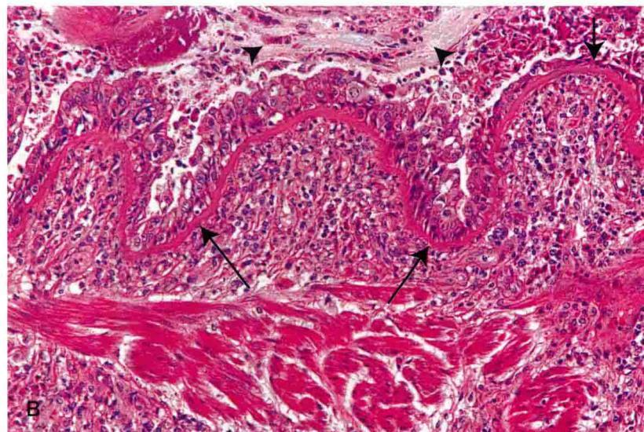
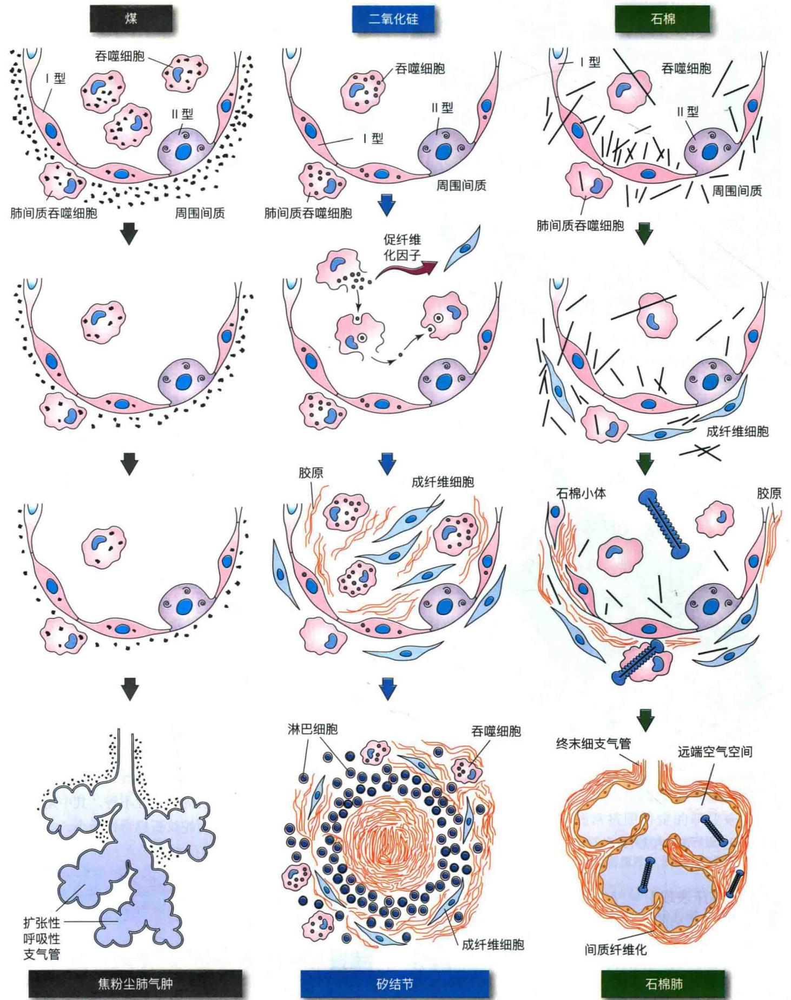 
图12-23 尘肺的发病机制。三种最重要的尘肺。在单纯的煤工尘肺中，大量粉尘被吸入并被巨噬细胞吞噬。巨噬细胞进入肺间质，并聚集在呼吸性细支气管周围。接着，细支气管扩张。在矽肺中，对巨噬细胞来说，二氧化硅颗粒是有毒，可以杀死巨噬细胞，并释放出游离二氧化硅颗粒和促纤维化的因子。释放的二氧化硅颗粒可以被巨噬细胞重新摄取，其结果是形成致密的纤维化结节，即矽结节。石棉沉着症有小的粉尘引起，间质纤维化明显，石棉小体是其形态特征
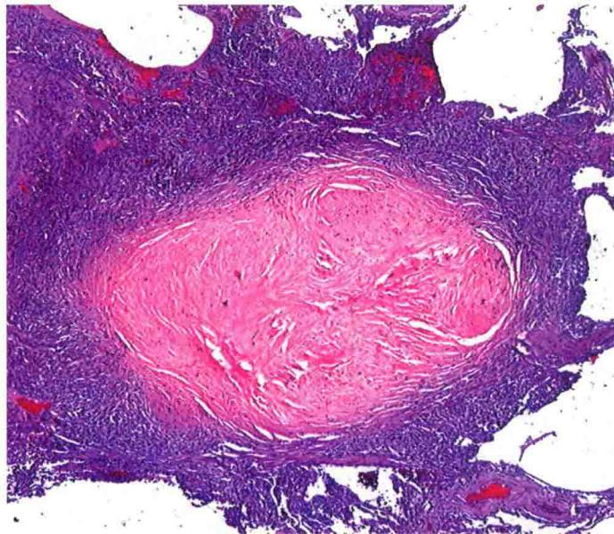 
图12-24 矽肺。矽肺结节是由致密的、含细胞成分较少的胶原蛋白形成的同心圆漩涡。在结节的边缘含有碳和二氧化硅粒子形成的粉尘沉积物
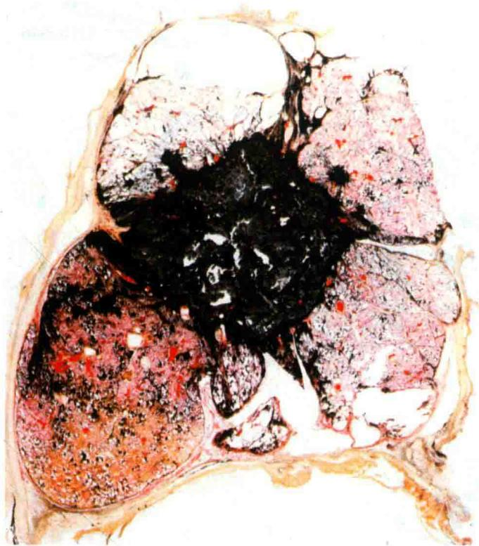 
图12-25 进行性的大块纤维化。一个煤矿工人的矽肺肺组织，显示大范围的致密纤维化中包裹着碳颗粒

【临床表现】单纯性矽肺影像学通常无显著表现。最初的劳力性呼吸困难发展到静息状态也
会出现呼吸困难提示出现了进行性大块纤维化或矽肺的其他并发症。众所周知，矽肺患者中结核病发病率比一般人群中更高。矽肺患者不会诱发肺癌。
# 2. 煤矿工人尘肺（CWP），吸入煤炭引起

【发病机制】煤炭粉尘是无定型碳和其他成分组成，包括不同含量的二氧化硅。无定型
碳本身无法杀死肺泡的巨噬细胞，引起纤维化。但二氧化硅可引起肺组织发生高度纤维化。所以吸入煤炭粉尘也可造成尘肺。

【病理】CWP一般分为单纯性CWP和复杂性CWP（也称为进行性大块纤维化）。单纯性
CWP肺部病变的特点包括不能触及的碳末的沉积和可以触及的碳末结节。两者都是分散在整个肺组织中的 $1\sim 4mm$ 的黑色病灶。显微镜下，碳末沉积中可见大量吞噬了碳末的吞噬细胞，围绕着远端的呼吸性细支气管，可以扩散到邻近的肺泡腔和支气管周围的肺间质。有时伴随着呼吸性细支气管的轻度扩张（局灶性粉尘肺气肿），这可能是平滑肌萎缩所导致。
碳末结节一般呈圆形或不规则形状，可能或可能不与细支气管相关，可以见到吞噬碳末的吞噬细胞伴有纤维化的间质。一般发生在吸入的碳末混合有能促纤维形成的粉尘（如二氧化硅）时，而且更适合称为矽肺病。虽然单纯性CWP曾一度被认为会导致严重的残疾，但现在已经清楚即使在最坏的情况下，单纯性CWP也只引起轻微的肺功能障碍，当煤矿工人出现严重的气流阻塞时，通常是由于吸烟造成。复杂性CWP是指在单纯性CWP的背景下，病灶 $\geqslant 2.0\mathrm{cm}$ 。复杂性CWP的患者可能有显著的呼吸障碍。
3. 石棉相关的疾病：反应性增生或肿瘤 石棉，包括一组纤维状的硅酸盐矿物，呈细纤维状。它被用于各种不同的用途已经有4000多年的历史。近年来，用于绝缘、建筑材料和制动衬片中。石棉在自然界有6个类型，可以分为两个矿物学组，蛇形和角闪石。蛇纹石棉（白石棉）占商业使用石棉的大多数。如果煤炭是粉尘为主，纤维化不明显的经典例子，那么石棉则是粉尘较少但纤维化明显的范例（图12-23）。接触石棉会导致一些并发症，包括良性胸腔积液、胸膜瘢痕形成、弥漫性胸膜纤维化、肺不张和间皮瘤。石棉的毒性不等，其中角闪石石棉（蓝石棉）最危险，而蛇纹石棉毒性最小。
石棉沉着症：石棉沉着症是由吸入石棉纤维而引起弥漫性间质纤维化。石棉沉着症的发展需要大量石棉的接触史，这种石棉类型历史上常见于石棉绝缘体和工厂工人（角闪石）。

【发病机制】石棉纤维沉积于远端气道和肺泡，特别是在肺泡管的分支处。最小的颗粒
被巨噬细胞吞噬，但许多较大的纤维素会渗入肺间质中。和石棉暴露直接相关的首发的病变是石棉接触引起的肺泡炎。活化巨噬细胞释放的炎性介质和肺间质的游离石棉纤维的促纤维形成的特性都会促进肺间质的纤维化。
【病理】石棉沉着症的特点是发生于双叶肺（图12-26），引起弥漫的肺间质纤维化，肺组织内可见石棉小体。早期阶段，纤维化发生于肺泡管和呼吸性细支气管内及其周围，以及肺泡外周。
当石棉沉积在细支气管和呼吸性细支气管，可以引发促纤维化反应，导致轻度慢性的呼吸道阻塞。因此，石棉可产生肺的阻塞以及限制性缺陷。随着病情的进展，纤维化发展到周围的细支气管，最终导致“蜂窝”肺形成。石棉沉着症通常在肺的下部更加严重。
石棉小体通常位于细支气管壁或肺泡腔内，由肺泡巨噬细胞吞噬所成。石棉颗粒具有鲜明的形态学特征，包括一个清晰，薄的石棉纤维（ $10\sim 50\mu \mathrm{m}$ 长），由串珠铁蛋白外壳包绕。显微镜下呈现为金黄色（图12-26），普鲁士蓝染色为强阳性。巨噬细胞只能吞噬部分纤维，因为对于单个的吞噬细胞，纤维的体积太大。巨噬细胞用蛋白质、蛋白聚糖和铁蛋白覆盖在石棉纤维表面。暴露于石棉也可导致其他的一些并发症。
良性胸腔积液：观察发现 $3\%$ 的重度暴露与石棉的工人10年内可发生胸腔积液。
胸膜斑：胸膜斑通常出现在肺的顶端和膈胸膜，一般石棉暴露史超过20年。在一般人群中， $15\%$ 也可发现有胸膜斑，并且 $50\%$ 在尸检中发现胸膜斑的患者，并没有石棉接触史。大体检查，胸膜瘢痕斑呈灰白色，表面光滑或呈结节状。它们通常位于双侧肺组织，直径大于 $10\mathrm{cm}$ ，可能伴有钙化。组织学上，由富于细胞的、致密的、透明的纤维组织组成，平行排列，伴有大量的空隙，形成所谓的“编织篮图案”。胸膜斑不是石棉沉着症的预测因子，和间皮瘤的发生也无关。
间皮瘤：目前，石棉暴露与恶性胸膜间皮瘤之间的关系已十分明确。有时甚至暴露是间接和轻微的，例如，洗自己丈夫衣服的石棉工人的妻子。更多情况下，间皮瘤出现于大量暴露于石棉的工人中。此疾病与胸膜疾病将在下面讨论。
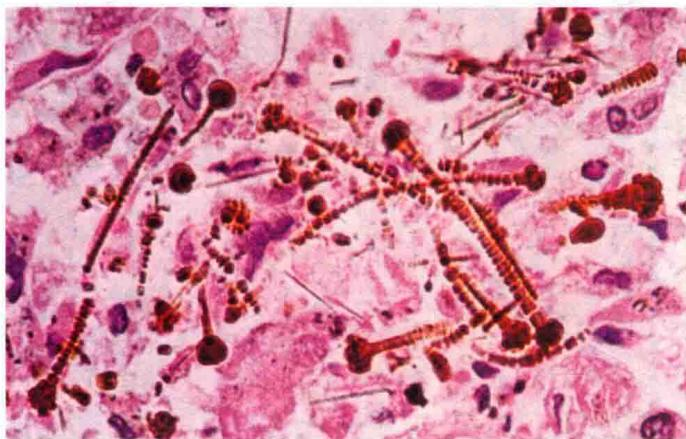 
图12-26 石棉小体。这些含铁的小体呈金棕色，串珠样，中间含有一个无色的非双折光性的纤维核心。石棉小体表面被蛋白质和铁包裹
肺癌：吸烟的石棉工人中肺癌的发病率是不吸烟人群的很多倍，和吸烟者相比也高出近3倍。石棉和肺癌之间关系被认为需要有石棉的参与（弥漫性间质纤维化）。
4. 铍中毒引起的非干酪性肉芽肿 铍中毒是指吸入铍引起的肺疾病。现如今这种金属主要用在航空航天工业的结构材料中，以及在制造工业陶瓷和核反应堆中。铍暴露也可发生在那些开采和提取铍矿石的工人中。
【病理】铍中毒可引起急性化学性肺炎或慢性尘肺病。在急性肺炎中，吸入金属颗粒后几小时或几天内会出现症状，病理表现为弥漫性肺泡损伤。所有急性铍肺炎的患者中 $10\%$ 可进展到慢性疾病，尽管多数慢性铍中毒的工人并没有急性中毒史。慢性铍中毒不同于其他类型的尘肺，暴露量可以很少或持续时间很短。因此怀疑铍中毒是一种过敏反应。病理学上，肺的病变难以和其他类型的结节病区分（见下文）。多个非干酪肉芽肿沿胸膜、肺间隔及支气管血管束分布。病情进展可导致终末期肺纤维化和蜂窝肺形成。慢性铍中毒起进展缓慢，初始暴露后15年内逐渐出现进行性的呼吸困难。该疾病似乎与肺癌的风险增加相关联。
# 九、间质性肺疾病
是一大组肺部疾病的总称，共同特征是肺间质的炎性浸润，并有相似的临床和影像学特征。可以被分成间质性、浸润性或限制性。可以倍分为：①急性或慢性；②已知或未知病因；③从轻微症状到严重的功能失能以及致命性的间质纤维化改变。限制性肺疾病的特征在于肺容积减少，氧弥散功能降低。
1. 过敏性肺炎（外源性过敏性肺泡炎）是对吸入抗原的反应。许多抗原的吸入会产生过敏性肺炎（即，急性或慢性肺间质炎症）。大部分抗原是在职业环境中遇到的，并且这些疾病通常按照特定的职业来命名。所以，“农民肺”发生于暴露于发霉的干草的农民，“甘蔗渣尘肺”是暴露于霉变甘蔗产生的甘蔗热放线菌，“剥枫树皮工人病”是暴露于发霉的枫树皮产生的一种真菌（皮质隐子座菌），以及“鸟类爱好者肺”常发生于鸟类饲养员，因为它们长时间暴露在鸟类的羽毛、血和粪便中含有的蛋白质。生长在空调冷凝水、游泳池、按摩浴缸和集中供热单位中的真菌也会诱发过敏性肺炎。在许多情况下，尤其是迟发型过敏性肺炎，诱发的抗原常无法确定。
 
【发病机制】过敏性肺炎是免疫复合物介导（Ⅲ型）和细胞介导的（IV型）过敏反应的
组合，但每型所起作用的确切机制还不清楚。重要的是，大多数吸入某种抗原的人会产生抗体，但并没有发生针对该暴露的过敏性肺炎，这一事实表明了宿主遗传易感性的重要性。

【病理】急性过敏性肺炎的特征是肺泡以及呼吸性细支气管中可见中性粒细胞浸润。大多数
情况下，针对抗原，血清IgG会促成产生相应的抗体。慢性过敏性肺炎的主要镜下特征包括细支气管中心型间质性肺炎、形成不充分的非干酪性肉芽肿和机化性肺炎（图12-27A、B）。细支气管中心型的间质浸润包括淋巴细胞、浆细胞和巨噬细胞，嗜酸性粒细胞并不多见，程度可以从轻微到非常严重。不典型的非干酪性肉芽肿见于2/3的患者，机化性肺炎也如此（图12-27B）。在终末阶段，间质的炎症消退，残留肺纤维化，类似于普通型间质性肺炎（UIP；见下文）。

【临床表现】过敏性肺炎依据抗原暴露程度及
频率可被分为急性、亚急性或慢性。过敏性肺炎“原型”是“农民肺”。典型的例子是，一个农场工人存放作为冬季饲料的干草的谷仓后 $4\sim 6$ 小时，工人迅速发生呼吸困难、咳嗽及轻度发热。症状持续 $4\sim 48$ 小时会减轻，但随后再次暴露，随着时间的病情逐渐转为慢性。慢性过敏性肺炎的患者有特异性表现，包括缓慢进展的呼吸困难发作和呼吸。去除环境因素中的抗原是唯一有效的长期治疗性肺炎的方法。对于急性发作和一些长期受影响者，类固醇治疗有效。
2.结节病是一种病因不明的肉芽肿性疾病。肺是结节病最常见的受累器官，其次还可发生于淋巴结、皮肤、脾、肝和眼睛。

【流行病学】结节病是一种世界性疾病，可见于所有种族的男性及女性。种族和族裔群体中
的发病率的差异显著。在北美，结节病黑种人比白种人更常见，据报道比例高达10:1。与此相反，本病罕见于热带非洲地区。小儿发病率在美国东南部黑种人中特别高。

【发病机制】尽管结节病的发病机制仍不清楚，但是目前的共识是认为这是辅助性T淋
巴细胞对外源性或内源性抗原的过度反应。这些细胞聚集在受累器官，分泌淋巴因子和吸引巨噬细胞参与非干酪性肉芽肿的形成。结节性肉芽肿内的 $\mathrm{CD4}^+$ 与 $\mathrm{CD8}^+$ T细胞的比例是10:1，而未受累组织内的比例是2:1。辅助/诱导性T淋巴细胞异常聚集的机制尚不清楚。此外，肿瘤坏死因子(TNF)的分泌增加，也可使疾病症状加重。在活动性的结节病，有一个特征是可出现高球蛋白血症，这被认为是通过辅助性T细胞造成的B细胞的非特异性的多克隆性活化。

【病理】肺结节病最常累及肺及肺门淋巴结，但也可以只发生在单一部位。组织学上，多个
结节病肉芽肿分布在肺（图12-28）间质中。沿胸膜、小叶间隔及周围支气管血管束分布（图12-28A），结节病肉芽肿发生在支气管或支气管黏膜下的频率很高，使得支气管活检可以有极高的诊断率（ $90\%$ ）。肉芽肿的周围可见纤维化，可以表现为围绕巨噬细胞的洋葱皮样的层状纤维化。开胸肺活检证实2/3的结节病患者中可存在血管炎。星芒状小体（星形的结晶）和Schaumann小体（小的层状状钙化）（图12-28B），可见于大多数肉芽肿病变中。

【临床表现】结节病常发生于青壮年。急性结节
病发病急骤，通常在2年内可自发缓解，对类
固醇治疗反应性很好。慢性结节病起病隐袭，而且常常病情持续或逐渐进展。黑种人患者往往有更严重的葡萄
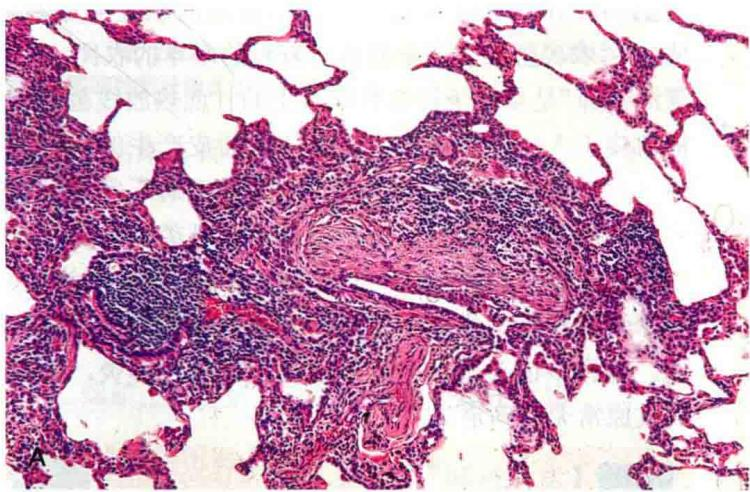 
图12-27 过敏性肺炎。A.肺活检标本，细支气管周围间质慢性炎细胞浸润，伴有巨灶的腔内纤维化；B.肺活检标本内见肺组织内散在不典型的非干酪性肉芽肿
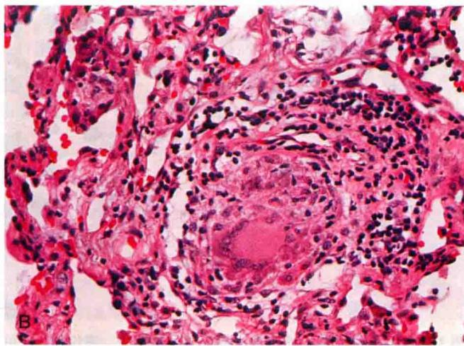
膜炎、皮肤疾病和泪腺疾病。咳嗽和呼吸困难是常见的主诉。目前还没有特异性的结节病的实验室检测。2/3的活动性结节病患者血管紧张素转化酶的血清水平升高，24小时尿钙也会增高。结合实验室检查、临床和影像学证据，可以高度可疑诊断结节病。肺结节病中有 $60\%$ 的可以有结节的溶解，但该疾病仍有 $10\%$ 的直接死亡率。皮质类固醇治疗对于活动性结节病有效。
3. 寻常型间质性肺炎（UIP）指临床上的特发性肺纤维化。UIP是间质性肺炎最常见的类型之一，每年的发病率是 $(6\sim 14.6) / 100000$ 。男性稍多，平均发病年龄为 $50\sim 60$ 岁。临床上常被称为特发性肺纤维化或隐源性纤维化肺泡炎。遗传性的UIP又被称为家族性肺纤维化（FTP）。

【发病机制】UIP的病因未知，但病毒、遗传、环境和免疫因素可能都发挥了作用。认
为病毒感染可能的病因是因为有些UIP患者有流感的病史；而对遗传因素的认识是通过家族性UIP的病例以及发现在一些遗传性疾病，如神经纤维瘤病和Hermansky-Pudlak综合征患者和UIP样疾病之间的相关性。最近有证据表明，家族性和特发性UIP在许多情况下，都与黏蛋白5B基因的一个常见变异型有关，基因的突变导致蛋白表达和对疾病的易感性增加。免疫因素的提出主要是因为 $20\%$ 的UIP病例中伴有胶原血管疾病，如类风湿关节炎、系统性红斑狼疮和进行性全身性硬化症。UIP也可伴发其他一些自身免疫性疾病，患者外周血中常可检出自身循环抗体（例如，抗核抗体和类风湿因子）。虽然抗原尚未确定，但在外周血、肺泡壁和支气管灌洗液中也检测到了免疫复合物。据推测，肺泡巨噬细胞通过吞噬免疫复合物而被激活，从而释放细胞因子和吸引中性粒细胞，反过来又损害肺泡壁，引发一系列事件并发生间质纤维化。
【病理】已证实UIP作为一种组织学形态可以见于各种临床疾病中，包括胶原血管病、慢性过敏性肺炎和药物毒性反应。大体上，纤维化呈斑片状形成致密的瘢痕和蜂窝状的囊性病变（图12-29A）。UIP的组织学特点是斑片状的慢性炎症和间质纤维化（图12-29B），纤维化周围可见正常肺组织。纤维化有不同的时相，被称为“时间异质性”。致密的胶原周围可见疏松的成纤维细胞围绕（图12-29C）。纤维化瘢痕导致肺组织重塑，从而导致肺泡壁塌陷和囊腔形成（图12-29A）。这些囊腔通常内衬细支气管上皮或立方上皮，含有黏液、巨噬细胞或中性粒细胞，若病变广泛，被称为“蜂窝肺”，偶尔可见到淋巴组织浸润，有时会含有生发中心，特别是在伴发类风湿关节炎的UIP病变中常见。广泛的血管改变，尤其是内膜纤维化和中膜增厚，可能和肺动脉高压有关。
【临床表现】UIP起病隐匿，随着病情不断发展，通常经过 $1\sim 3$ 年后可逐渐发生劳累性呼吸困难和干咳。典型的听诊发现是吸气末爆裂音，肺底部有细啰音形成。呼吸急促，静息时发绀和肺心病逐渐接踵而至。预后较差，中位生存期一般是 $4\sim 6$ 年。患者可采用糖皮质激素和环磷酰胺治疗，但肺移植通常是治愈的唯一希望。
4. 机化性肺炎的特征 是组织息肉栓充满细支气管腔和围绕肺泡腔。机化性肺炎以前称为“闭塞性细支气管炎-机化性肺炎（BOOP）”，这种炎症没有特定的病原体，而病因也不能从形态学表现来判断。该病可出现在许多临床过程中，包括呼吸道感染（特别是病毒性细支气管炎）、吸入有毒物质、服用一些药物和几种其他炎症（如胶原血管疾病）。重要的是，有相当数量的特发性肺炎被称为隐源性机化性肺炎（特发性或闭塞性细支气管炎-机化性肺炎）。
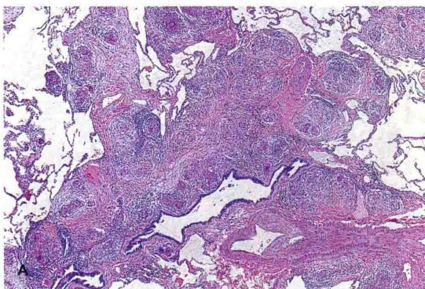 
图12-28结节病。A.沿着支气管血管间质可见多个非干酪性肉芽肿；B.非干酪性肉芽肿由成簇的上皮样吞噬细胞和多核巨细胞组成。可见星芒状小体（箭头）
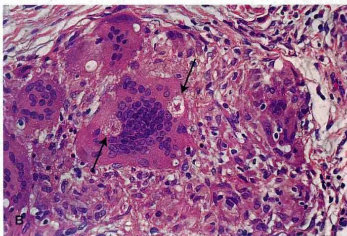

【病理】组织学上，机化性肺炎的特点是斑片状的疏松机化纤维组织和在邻近正常肺组织的末端的慢性炎症。机化的成纤维细胞组织阻塞细管（闭塞性细支气管炎）、肺泡管和周围肺泡（机泡炎，图12-30）。病变以斑片状的肺泡机化性为主，而闭塞性细支气管炎可能不会在所有情况得到。肺结构仍保存，不会出现肺结构的重塑或
UIP样的蜂窝状的肺组织。如果远端气道闭塞造成闭塞性细支气管炎，会见到泡沫样的吞噬脂质的吞噬细胞，被称为阻塞性或内源性脂质性肺炎。

【临床表现】机化性肺炎通常出现在50多岁。发病急，有发热、咳嗽和呼吸困难。许多患者约 $4\sim 6$ 周有类似流感样疾病的病史。如上所
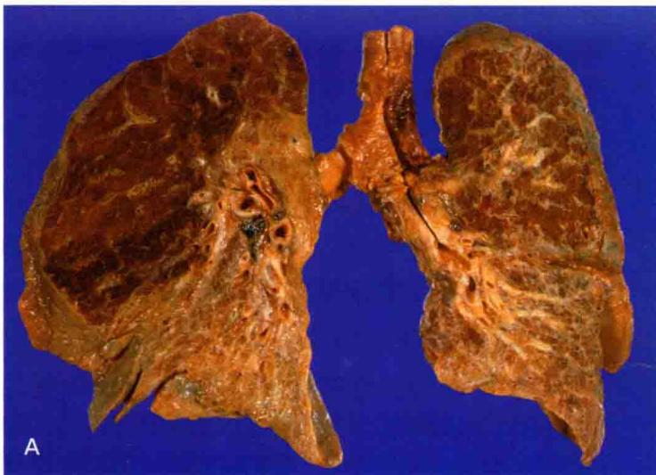
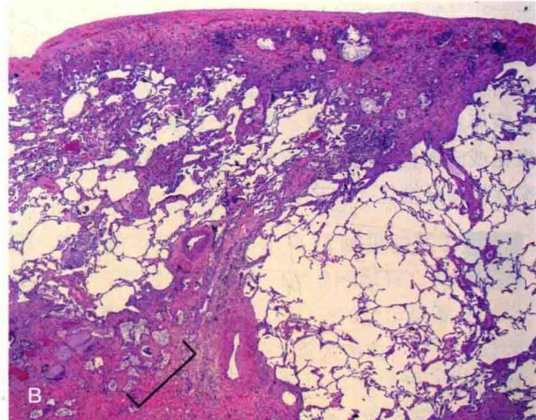
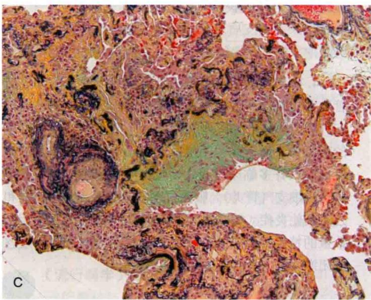 
图12-29 寻常型间质性肺炎。A. 肺大体标本可见致密的瘢痕和蜂窝状的囊性变，主要累及下叶。该患者同时患多发性肌炎。B. 显微镜下可见斑片状的胸膜下纤维化，以及蜂窝状的纤维化（括号）。致密纤维化破坏正常肺组织，导致肺组织重塑。C. 弹力染色显示成纤维细胞，呈绿色，与之对比的是染成黄色的致密的胶原纤维和黑色的弹性纤维
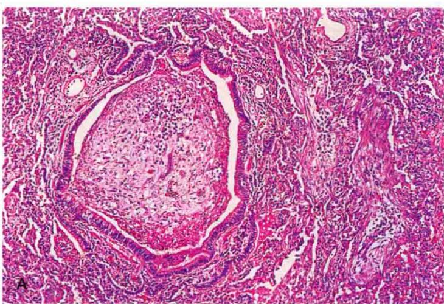 
图12-30 机化性肺炎。A.疏松纤维组织息肉栓阻塞细支气管，周围见肺泡管及肺泡；B.肺泡腔内含有类似的疏松的机化的纤维组织栓子（箭头）
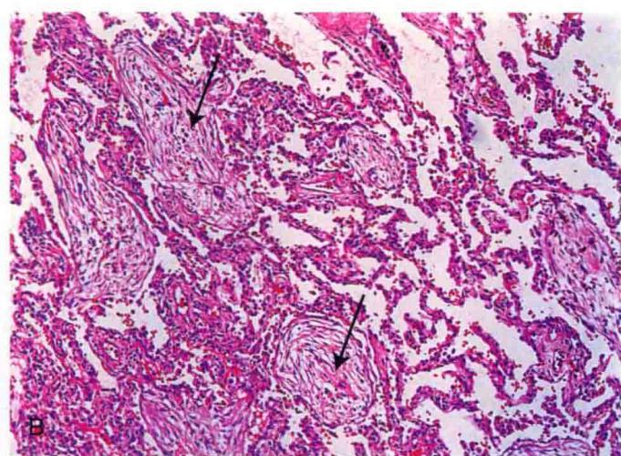
述，一些患者具有一些诱发因素。糖皮质激素治疗有效，有些患者甚至不用治疗，在数周到数月内可以康复。
# 十、血管炎和肉芽肿
许多肺部疾病可导致血管炎，其中大部分是继发于其他炎性病变，例如坏死性肉芽肿感染。只有很少的特发性血管炎综合征会影响肺组织，包括：①肉芽肿性血管炎（GPA，以前称为Wegener肉芽肿）；②过敏性肉芽肿（又称Churg-Strauss肉芽肿）；③坏死性结节病样肉芽肿病（一种罕见的疾病，特征是结节融合成结节病样的肉芽肿）。血管炎已在第10章中详细讨论。
# 十一、肺动脉高压
胎儿期的肺动脉壁很厚，并且肺动脉压也相当高。血液是通过胎盘，而不是肺进行氧合，因此，胎儿的肺动脉高压阻挡了右心室的输出，而使血液通过动脉导管进入体循环，从而有效地绕过了肺部。出生后，肺部将负责给静脉血供氧，动脉导管正常关闭。因此肺组织必须适应接受整个的心排血量，这种情况下就需要一个成熟肺组织所具有的高容量、低压力系统。因此，出生后3天左右，肺动脉扩张，管壁变薄和肺动脉压下降。
肺动脉高压定义为在静息状态时，平均肺动脉压超过 $25\mathrm{mmHg}$ 。增加肺血流量或血管阻力增高均可导致肺动脉压增高。不管因为什么原因，肺动脉高压均可导致特征性的形态学异常（图12-31）。等级1、2和3通常是可逆的；4及以上通常不可逆。
1级：肌性肺动脉的中膜肥厚，肺小动脉壁出现平滑肌。
2级：内膜增生伴中膜肥厚。 
3级：肌性肺动脉的内膜纤维化，小动脉可闭塞（图12-32A）。 
4级：丛状病变的形成伴有肺动脉的扩张、变薄。这些结节性病变是由不规则的交错血管构成，并且进一步阻塞肺循环（图12-32B）。
5级：丛状病变伴有扩张的血管瘤样病变，扩张的薄壁血管破裂，肺实质内出血和含铁血黄素沉积也可见到。
6级：肺动脉和小动脉的纤维素性坏死。
当肺动脉压力正常时，即使很轻微的动脉粥样硬化在肺动脉的也很少见。然而，随着肺动脉高压的不断加重，最大的肺动脉也可发生动脉粥样硬化、肺循环的压力增大，最后导致右心室肥大（肺源性心脏病）。
1. 肺动脉高压可分为毛细血管前或毛细血管后肺动脉高压。肺循环血流量或阻力增加的初始原因，无论是肺毛细血管床近端或远端的，都可以用于理解肺动脉高压的病理生理学。毛细血管前的肺动脉高压的原因包括左心到右心分流，以及原发性肺动脉高压、血栓性肺动脉高压、纤维化性的肺疾病以及低氧血症。而毛细血管后肺动脉高压是肺静脉闭塞性疾病、左心疾病（如二尖瓣狭窄和主动脉缩窄）的并发症（第11章心脏疾病中的肺动脉高压。） 
（1）原发性肺动脉高压：原发性肺动脉高压是一个罕见的肺动脉内压增高的特发性疾病。病因不明，目前倾向于称之为“特发性肺动脉高压（IPAH)”。可发生在所有年龄段，但最常见于二三十岁的女性。该病表现为起病隐匿的呼吸困难，最初体征及影像学特征均轻微，但随着时间推移症状可逐渐加重。重度肺动脉高压不可避免，患者最终死于肺源性心脏病。尽管治疗效果欠佳，但目前通过使用前列环素类似物、内皮素受体拮抗剂和磷酸二酯酶抑制剂，使5年存活率提高到约 $30\%$ 。推荐进行心肺移植。 
（2）复发性肺栓塞：来自于体循环的小栓子的一过性的脱落导致了小的肺血管内的多发的血栓栓塞。病变逐渐影响了肺循环并会导致肺动脉高压。有些患者有外周静脉（常见腿部静脉）血栓形成的证据，或者是存在能诱发静脉血栓形成的先兆因素，如果发现了这种先兆因素的存在，可以在下腔静脉放置过滤器，来预防进一步的栓塞。
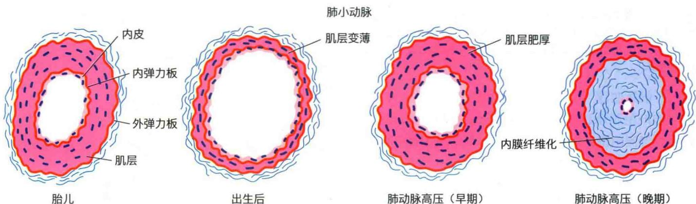 
图12-31 肺动脉高压的组织病理学。在妊娠后期，肺动脉壁较厚。出生后，血管扩张，管壁变薄。轻度肺动脉高压的特征在于中膜增厚。当病变加重后，出现广泛的内膜纤维化和肌层增厚
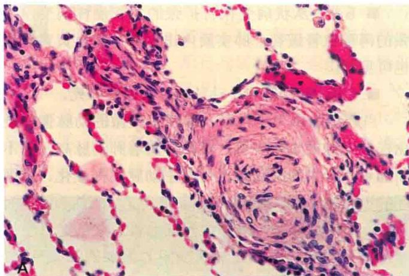
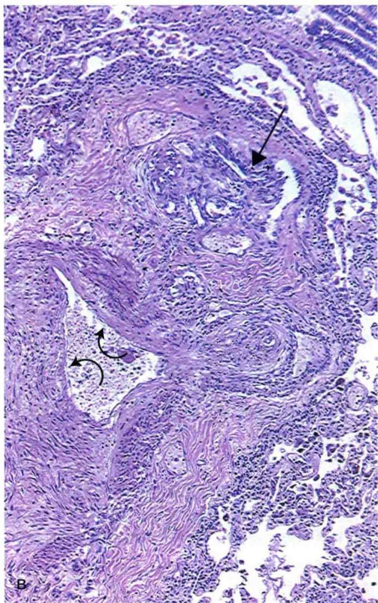 
图12-32 肺动脉高压。A.肺小动脉因内膜纤维化和增厚的中膜而几乎闭塞；B.丛状病变（箭头）的特点是薄壁的血管肾小球样增生，相邻的动脉显示出明显的高血压改变，包括内膜纤维化和中膜增厚（弯曲箭头）
2. 低氧血症 引起肺小动脉的缩窄及肺动脉高压。有可能产生肺动脉高压相关性低氧血症的先兆因素包括慢性气流阻塞（慢性支气管炎）、浸润性的肺疾病以及长期高原生活。严重的脊柱后侧凸或极度肥胖（匹克威克综合征）可能会机械性地干扰通气，并导致肺动脉高压。
3. 心脏疾病 也可导致肺动脉高压。左心衰竭使
肺静脉压增高，并在一定程度上增加肺动脉压。相比之下，二尖瓣狭窄会产生严重的肺静脉高压和肺动脉高压。在这种情况下，肺部将同时表现出肺动脉高压和慢性肺充血（见第7章）。
# 十二、肺癌

【流行病学】直到1945年之前，肺癌还一直
被视为是一种罕见的肿瘤，但目前肺癌是世界上最常见的癌症相关死亡原因。在美国，肺癌在男性和女性中都是最常见的癌症相关性死亡原因。约 $85\% \sim 90\%$ 的肺癌发生于吸烟者（见第8章）。肺癌的高峰年龄是 $60\sim 70$ 岁，大部分患者都在50和80岁。由于妇女吸烟人群的增加，男性患者的主导地位正在下降。吸烟人群可发生非小细胞型(NSCLC)和小细胞型（SCLC）肺癌，而大多数的不吸烟患者常发生腺癌。NSCLC亚型的分布见表12-2。
表 12-2 非小细胞型肺癌亚型分布 
亚型吸烟人群非吸烟人群鳞状细胞癌4233腺癌3935细支气管肺泡癌410类癌716其他86

【发病机制】肺癌中有多种遗传学改变，很可能是由于从正常细胞进展到恶性细胞是一
个逐步发展的过程。已经很明确，烟草中的致癌物参与了这一过程。一些与肺癌有关的较常见的遗传改变如下：
■K-ras基因：基因突变的发生率：腺癌（25%），大细胞癌（20%）和鳞状细胞癌不常见（5%）。基因突变与吸烟有关，且预后不良。
myc基因：该基因的过表达发生在 $10\% \sim 40\%$ 的小细胞癌患者中，其他类型中罕见。
Bcl-2: 表达于 $25\%$ 的鳞状细胞癌和 $10\%$ 的腺癌中。
■Rb和p53：这两种重要的肿瘤抑制基因被发现在 $80\%$ 的小细胞癌中。NSCLC中少见。
3号染色体短臂（3P）缺失：所有类型的肺癌中经常发现这种缺失。
PTEN：该抑癌基因调节细胞存活信号，通过若干机制引发非小细胞肺癌（杂合度、突变、甲基化等）。PTEN缺失与预后不良和耐药相关。
表皮生长因子受体（EGFR）：该基因的酪氨
酸激酶结构域的活化是目前肺腺癌的研究热点，因为针对酪氨酸激酶区域的相应靶向药物，如吉非替尼和厄洛替尼治疗效果良好。EGFR突变多见于非吸烟的肺腺癌患者，亚洲人、女性常见。在美国，肺腺癌中EGFR突变发生率为 $10\% \sim 15\%$ ，而东亚人群研究显示的突变率则为 $40\% \sim 60\%$ 。
■人类乳头瘤病毒（HPV）：尽管统计数据的差异很大，在许多地区都有证据显示非小细胞肺癌存在HPV感染。据报道，在美国报道的发生率平均为 $15\%$ ，在东亚要高很多。有趣的是，HPV感染的宫颈癌患者发生非小细胞肺癌的风险也增加。
1.肺癌的一般特点在临床上，鳞状细胞癌、腺癌和大细胞癌都属于“非小细胞癌”，非小细胞癌的治疗方法类似，但不同于小细胞癌。历史上，如果可能，非小细胞癌尽量采取手术治疗，但对化疗的反应不一致。而小细胞癌则首先要采取化疗。此外，由于腺癌EGFR突变更常见，腺癌和鳞状细胞癌的区别已变得越来越重要。而且发生突变的肿瘤更可能对某些特定的药物有反应，如EGFR酪氨酸激酶抑制剂。因此，肺癌的分子分型已经变得越来越重要。
【临床表现】在过去的20年，所有肺癌患者总的5年生存率一直保持在 $15\%$ 。所有分期的总的5年生存率分别是：细支气管肺泡癌为 $42\%$ ，腺癌为 $17\%$ ，鳞状细胞癌为 $15\%$ ，大细胞癌为 $11\%$ 小细胞癌为 $5\%$ 或更低。肿瘤的分期仍然是最重要的一个独立的预后因素。
局部效应：大多数中央型的支气管内的肿瘤会产生支气管阻塞的症状，如咳嗽、呼吸困难、咯血、胸痛、阻塞性肺炎和胸腔积液。而发生在肺周围的肿瘤无论是在常规胸部X线片上或当肿瘤进展，累及胸壁而导致胸痛、上腔静脉综合征和神经卡压综合征后，都更容易被发现。
肺癌（通常为鳞状细胞癌）在肺尖部可能会扩散，累及第8颈椎和第1及第2胸神经，导致肩部放射性疼痛，引起Pancoast综合征。Pancoast肿瘤也可能导致颈交感神经麻痹而引起Horner综合征，其特征包括患侧：①眼球运动受抑制（眼球内陷）；②上眼睑下垂；③瞳孔收缩（瞳孔缩小）；④没有出汗（无汗）。
转移：肺癌最常见的转移部位是区域淋巴结，特别是肺门和纵隔淋巴结，也可以转移到脑、骨和肝。淋巴结外转移的最常见部位是肾上腺，但显著的肾上腺皮质功能减退少见。
# 2.肺癌的组织学类型
（1）鳞状细胞癌：在美国，鳞状细胞癌占肺癌的
$30\%$ 。在支气管上皮受损（如吸烟）后，支气管黏膜的多能干细胞层再生，并发生鳞状上皮化生。非典型增生、原位癌和浸润性肿瘤在鳞状上皮化生的基础上形成，形态与正常被覆鳞状上皮的部位如宫颈或皮肤发生的鳞癌相似。

【病理】大多数鳞状细胞癌发生于肺中央部的左上位，即位于主或段支气管，周围肺的发生率是 $10\%$ ，肉眼通常为质韧、灰白色， $3\sim 5cm$ 大小的溃疡病变，可以通过支气管壁侵及邻近的肺实质（图2-8A)，中心形成空洞常见。有时中央型的鳞状细胞癌可以表现为一个支气管腔内的肿物。
镜下，鳞状细胞癌的形态差异很大。高分化鳞状细胞癌常有“角化珠”，是嗜酸性的角蛋白被同心圆排列的（“洋葱皮”样）的鳞状上皮细胞层包围而形成（图12-33B）。单个细胞也会发生角化。高分化鳞状癌常见细胞间桥，也就是相邻细胞之间由细胞质发出的细线相连形成的间隙结构。与此相反，一些鳞状细胞癌分化较差，没有角化珠形成，而且难以与大细胞癌、小细胞癌或其他类型的肺癌区分。痰标本中可能含有肿瘤细胞，在这种情况下可通过脱落细胞学涂片诊断。
（2）腺癌：在许多国家中，包括美国，腺癌发病率已超过鳞状细胞癌，成为肺癌最常见的亚型，最常见于女性患者。常发生在周围肺，通常引起胸膜纤维化和胸膜下瘢痕，这可能会导致胸膜皱缩。在非吸烟者肺癌患者中，腺癌所占的比例更大。非典型腺瘤样增生（AAH）是腺癌的癌前病变。AAH一般小于 $5\mathrm{mm}$ ，上皮细胞沿肺泡间隔出现非典型增生。类似于结肠癌的“腺瘤”，目前认为肺腺癌是由AAH不断进展到细支气管肺泡癌，然后是侵袭性更强的混合型腺癌。

【病理】腺癌最初的表现常常是不规则的结节，直径为 $2\sim 5cm$ ，但有时肿物也会非常大，占
据整个肺叶。切面为灰白色，质地取决于黏液成分的多少。中央型的腺癌以主要在支气管腔内生长并侵犯支气管软骨。根据世界卫生组织的分类，腺癌包括四个主要亚型（图12-34）：①腺泡型；②乳头型；③实体型，伴黏液形成；④细支气管肺泡癌。然而，组织学上常常是多种亚型混合存在。细支气管肺泡癌较独特，下面将专门进行讨论。肺腺癌的形态可以反映出整个呼吸道各部位（从大支气管到最小的细支气管）黏膜的结构和细胞的形态。肿瘤细胞的形态可以类似于纤毛或无纤毛的柱状上皮细胞、杯状细胞、支气管腺细胞或Clara细胞。腺癌最常见的组织学类型是腺泡型，特征是由衬附立方或柱状细胞（图12-34A)的规则腺管构成。乳头型腺癌是单层细胞被覆于纤维血管结缔组织（图12-34B）轴心。实体型腺癌伴黏
液形成是低分化的腺癌，可以通过黏蛋白与胭脂红或PAS染色法（图12-34C）证实黏液的组成，从而和大细胞癌鉴别。I期腺癌患者接受手术完全切除后，5年生存率为 $50\% \sim 80\%$
（3）细支气管肺泡癌：细支气管肺泡癌是腺癌的一种特殊亚型，沿着肺泡壁生长，占全部肺肿瘤的 $1\% \sim 5\%$ 。不能明确其与吸烟的关系。支气管黏液中含丰富的黏蛋白是细支气管肺泡癌的显著标志，但仅出现于不到 $10\%$ 的患者中。大体检查中，细支气管肺泡癌可表现为一个单一的周围型结节或硬币样病变（大于 $50\%$ 的病例）、多发结节、或难以与肺炎区分的弥漫性浸润（图12-35）。2/3肿瘤是非黏液型，由Clara细胞和Ⅱ型肺泡上皮细胞组成，立方细胞沿肺泡壁生长（图12-36）；剩下1/3是黏液性肿瘤，含充满黏液的杯状细胞（图12-36B）。细支气管肺泡癌患者的预后良好，但是多个结节的病变或弥漫性肺组织受累的预后可能较差。 
（4）小细胞癌：小细胞癌（“燕麦细胞癌”）是指具有神经内分泌特征的高度恶性的肺上皮性肿瘤。占
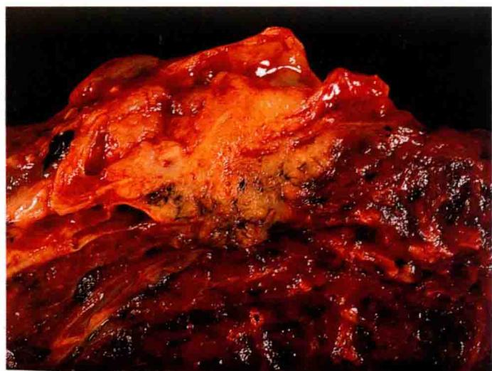 
A 2,3 4. $\begin{array}{llllllll} {5}_{1} & 6 & 7 & 8 & 9 & {10} \end{array}$
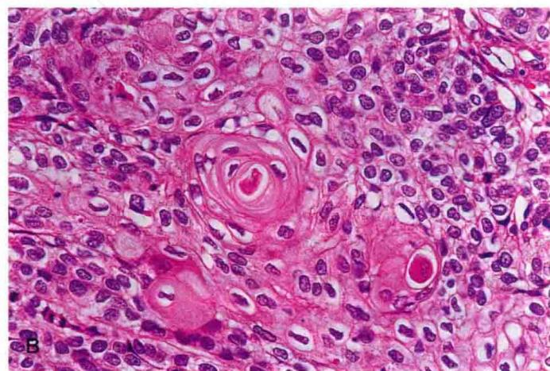 
图12-33 肺鳞状细胞癌。A.肿瘤长在支气管管腔内并侵袭邻近的肺内淋巴结；B.显微镜下的高分化鳞状细胞癌，角化珠由嗜酸性胞质的细胞组成
所有肺癌的 $20\%$ ，并且与吸烟（ $95\%$ 的病例）有关。男性与女性的比例为 $2:1$ 。肿瘤生长和转移迅速， $70\%$ 的患者发现时已经处于晚期。小细胞癌可特征性的伴发各种副肿瘤综合征，包括尿崩症、异位促肾上腺皮质激素（ACTH，促肾上腺皮质激素）综合征和伊顿-兰伯特(肌无力)综合征（与下肢肌肉无力有关）。

【病理】小细胞癌常表现为肺门周围的肿块，经常有广泛的淋巴结转移。切面细腻、灰白色，
但常常有显著出血和坏死。肿瘤一般沿支气管在黏膜下和周边进行播散。组织学上，小细胞癌的肿瘤细胞
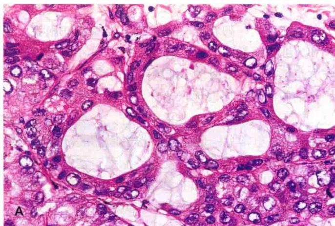
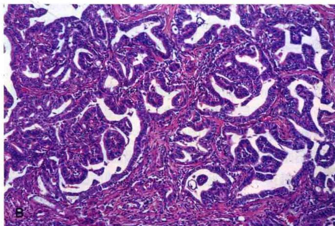
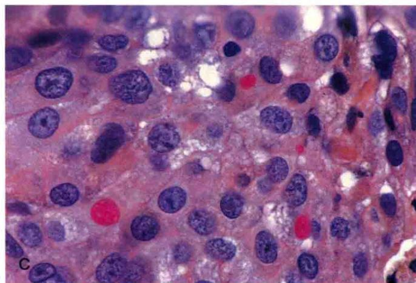 
图12-34 肺腺癌。A.腺泡型的腺癌，由恶性上皮细胞组成的腺体；B.乳头状腺癌，恶性上皮细胞沿着薄壁纤维血管轴心生长；C.实体型腺癌伴黏液形成，几个胞质内的黏液滴，黏卡染色阳性
体积较小、圆形或椭圆形，胞质较少；细胞核染色质呈细颗粒状，核仁不明显（图12-37）；核分裂象多见，平均每10个高倍视野有 $60\sim 70$ 个；常见坏死。罕见情况下，可见小细胞癌合并非小细胞癌的患者，其生物学行为和临床特点与小细胞癌相似。不像其他肺癌，小细胞癌对化疗敏感性较高，5年生存率小于 $15\%$
（5）大细胞癌：大细胞癌是排除性诊断，该类肿瘤没有鳞状或腺样分化的特征，而且已被证明不是小细胞癌（图12-38）。这种类型的肿瘤占所有侵袭性肺肿瘤的 $10\%$ 。细胞大、细胞质丰富，核仁明显，染色质呈空泡状。一些大细胞癌中可见多形性的巨细胞或梭形细胞。 
（6）类癌：类癌被认为来源于正常支气管上皮中的神经内分泌细胞，包括两种神经内分泌肿瘤。类癌占所有原发性肺癌的 $2\%$ ，无性别差异，与吸烟没有明显的关系。虽然神经肽在肿瘤细胞中常见，但大多数是无功能的。一部分病例可伴发内分泌相关性疾病，如库欣综合征伴有肿瘤细胞异位分泌ACTH。类癌综合征（第13章），发生在 $1\%$ 的病例中，通常有肝转移。

【病理】类癌的特征是器官样生长方式和较为一致的细胞学特征，包括嗜酸性的细颗粒状胞及细胞核细颗粒状染色质（图12-39）。

【临床表现】类癌生长缓慢， $50\%$ 患者无症状。通常是胸片中发现了肺部的肿块。典型类癌患者良好，手术后5年存活率为 $90\%$ 。非典型类癌患者典型类癌更具侵袭性，手术后患者的5年生存率 $70\%$
3. 肺的转移性肿瘤 比原发性肿瘤更常见。在1/3的癌症死亡病例尸检中可以见到肺转移。实际上，转移性肿瘤是最常见的肺恶性肿瘤。转移性肺肿瘤通
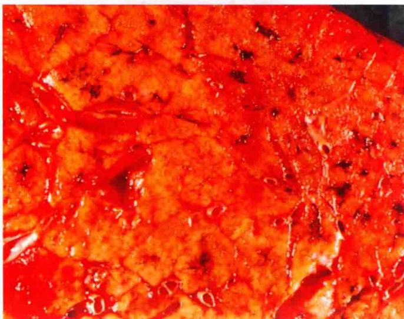 
图12-35 细支气管肺泡癌。肺的切面呈实性、反光的黏液外观，反映出了镜下的弥漫性肿瘤浸润
常多发且境界清楚，当影像学中见到大结节的时候，被称为“炮弹样”转移（图12-40）。大多数转移到肺的肿瘤的组织学外观类似于原发肿瘤。偶然情况下，
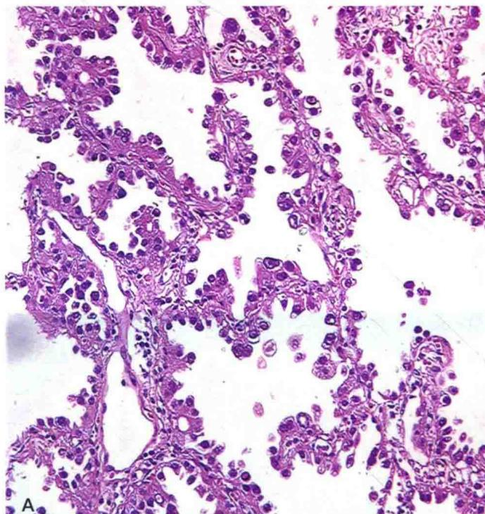
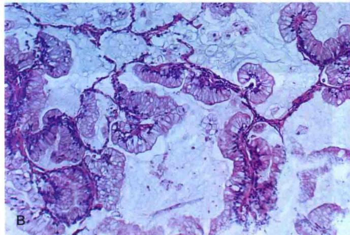 
图12-36 细支气管肺泡癌。A.非黏液型细支气管肺泡癌，具有异型性的立方或低柱状细胞沿仍保存的肺泡壁增生；B.黏液型细支气管肺泡癌由胞质内充满黏液的高柱状细胞沿肺泡壁生长
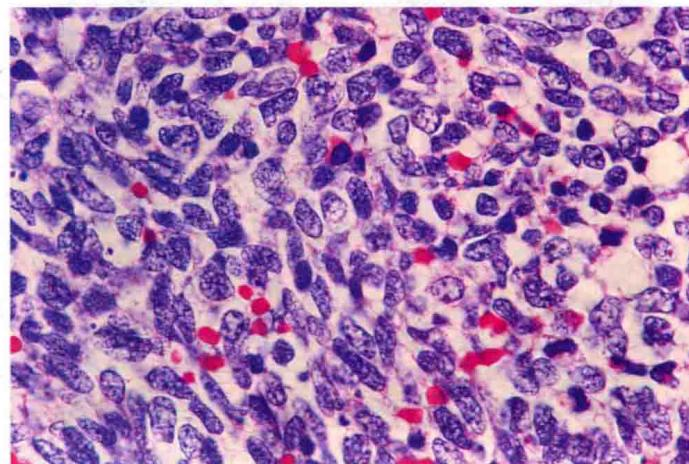 
图12-37 肺小细胞癌。肿瘤细胞椭圆形或梭形，胞质少、细颗粒状的核染色质，核分裂象常见
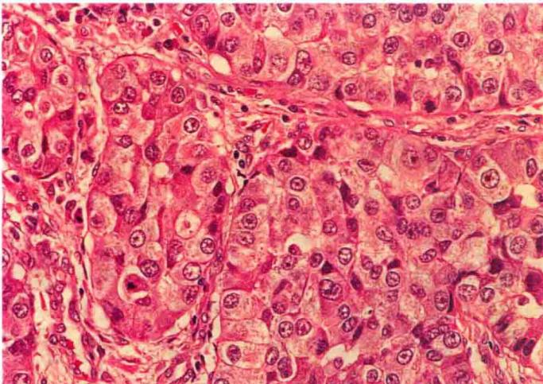 
图12-38 肺大细胞癌。分化差的肿瘤呈片状排列，细胞大，胞质丰富，核仁明显
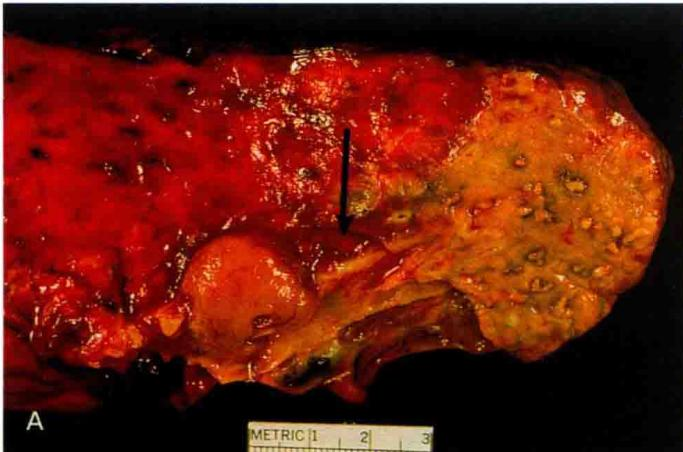
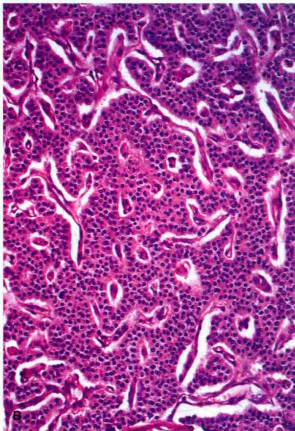 
图12-39 肺类癌。A.中央型类癌（箭头），突入主支气管的管腔。由于肿瘤压迫支气管，引起远端肺实质阻塞性肺炎（右）；B.显微镜下显示血管间质中的缎带状排列的肿瘤细胞
转移性肿瘤可能类似于细支气管肺泡癌，这种情况通常原发肿瘤是胰腺或胃。在淋巴管转移癌时，转移性肿瘤沿肺淋巴道广泛播散，形成包绕支气管树和静脉的肿瘤鞘。临床上，患者出现咳嗽和气短，胸片呈弥漫性结节状。肺转移性肿瘤常见的原发部位是乳腺、胃、胰腺和结肠。
# 第二节 胸膜
# 一、气胸
气胸的定义是胸膜腔中存在空气。可因胸膜外伤穿孔发生，或者“自发”形成，原因包括胸壁的穿透伤（例如，刺伤或肋骨骨折）。创伤性气胸是最常见的医源性气胸，可出现在胸膜（胸腔穿刺）引流、胸膜或肺活检后以及经支气管活检和正压辅助通气之后。
自发性气胸常见于青壮年。例如，高大的年轻男子剧烈活动时出现急性胸痛和呼吸短促。胸片显示疼痛一侧的肺部塌陷，和胸膜腔的大量积气。这种情况通常是由于胸膜下肺大疱破裂造成的。在大多数情况下，自发性气胸可以自身消退，但是一些患者需要气体抽吸。
张力性气胸指单侧的严重性气胸可推挤纵隔到对侧并压迫对侧肺组织。这种情况是致命的，必须立即进行气体抽吸。
# 二、胸腔积液
胸腔积液是指胸膜腔内聚集过多的液体。通常，胸膜腔内仅有少量液体，用于肺和胸壁之间的润滑。分泌的液体由脏层胸膜吸收。胸腔积液的严重程度可
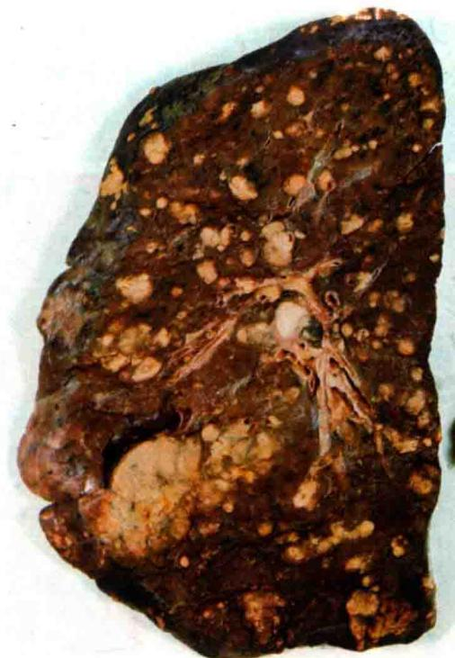 
图12-40 肺转移性癌。肺的大体切面上有多个转移癌结节，对应于影像学中的“炮弹”性转移
以从仅几毫升到大量聚集的液体足以使纵隔和气管向对侧移位。
胸腔积液：这个术语是指渗出的水样的积液，可以被看作和其他部位的水肿一样。这可能是由于患者发生心力衰竭或因任何原因产生全身或肺水肿时，毛细血管内液静压增加所致。
脓胸：含有多量多形核白细胞的混浊积液，常常由胸膜感染而导致。偶尔，也可能因外部贯通伤，使病原体进入胸膜腔化脓引起。更常见的是波及胸膜表面的细菌性肺炎的并发症，典型的例子就是肺炎链球菌性肺炎。
积脓：是脓胸的一种特殊类型，浓稠的脓液在胸膜腔内聚集，并可形成小的囊腔和纤维化。
血胸：创伤或破裂导致血液进入胸膜腔中（例如，夹层主动脉瘤）。
乳糜胸：乳糜胸是指乳糜样富含脂质的液体在胸膜腔内聚集，是胸膜腔淋巴阻塞的结果。出现乳糜胸是一个不好的预兆，因为淋巴阻塞往往提示后纵隔淋巴结的疾病。
# 三、胸膜肿瘤：恶性间皮瘤
恶性间皮瘤是间皮来源的肿瘤，最常见于胸膜，但也可发生于腹膜、心包和睾丸鞘膜。

【流行病学】美国每年约2000人患此肿瘤。大多数美国、英国及南非的患者有石棉暴露史。
接触石棉到发展成恶性间皮瘤的时间平均为20年，范围在 $12\sim 60$ 年。

【病理】肉眼观胸膜间皮瘤经常包绕和压迫肺组织，肿瘤沿着叶间隙和叶间隔生长，被称膜壳”（图12-41A)。一般肿瘤仅侵犯邻近胸实质，淋巴结容易受累。显微镜下，经典间皮双向性分化，包括上皮和肉瘤样成分（图12类似于腺癌的腺体和小管结构中混杂着类似肉形细胞。有些肿瘤是单向分化的，称为肉瘤样样。
免疫组织化学对于区分腺癌和间皮瘤必不可少。两者都是角蛋白阳性；但腺癌常表达（但不绝对）癌胚抗原和其他一些间皮瘤不表达的抗体。相反，间皮瘤通常表达钙网蛋白、WT-1、D2-40（podoplanin），而这些腺癌常阴性。用于诊断间皮瘤的其他有用指标包括缺乏黏蛋白，含有透明质酸（阿尔辛蓝染色阳性），电子显微镜下可见长的纤细的微绒毛。

【临床表现】间皮瘤患者的平均年龄为60岁。
首发的症状常常是胸腔积液、胸膜肿块、胸痛等异性症状如体重减轻和不适。胸膜间皮瘤倾向到室内局部播散，侵袭和压迫胸腔内的主要结构。例如到肺实质和纵隔淋巴结，以及其他胸外器官，包括骨骼、腹膜和肾上腺。治疗基本无效，预后较差，患者诊断后可存活超过18个月。
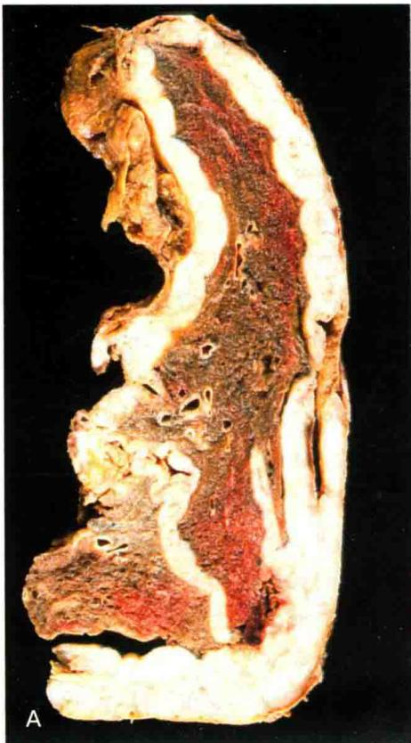
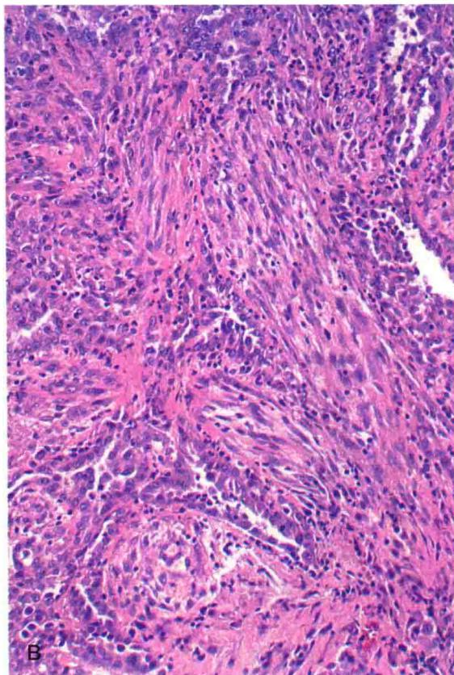 
图12-41 恶性胸膜间皮瘤。A. 肺组织被沿叶间裂延伸的致密胸膜肿瘤包裹，但并未累及其下方的肺实质；B. 间皮瘤，双向性分化，包括上皮和肉瘤样成分
# 第13章 胃肠道
# 第一节 食管
# 一、先天性异常
1.气管食管瘘 气管食管瘘是最常见的食管异常，新生儿发生率约为1/3000（图13-1）。常合并某些形式的食管闭锁。有些病例中，伴有一种复杂的畸形，称为“Vater综合征”[vertebral defects（脊椎缺陷），anal atresia（肛门闭锁），（tracheoesophageal fistula）气管食管瘘，（renal dysplasia）肾脏发育不良]。食管闭锁和瘘常与先天性心脏病相关。

【病理】在 $90\%$ 的气管食管瘘，上部分食管末端形成盲端囊袋，下段的顶端与气管相通（图
13- 1A)。在这型闭锁，上部分盲袋很快充满黏液，导致婴儿吸入。外科纠正是可行的，虽然比较困难。其余 $10\%$ 的瘘，最常见的是近段食管和气管相通；下段食管盲袋与胃相通（图13- 1B）。这种情况的婴儿出生后立即发生吸入。另一种类型，称为“H型瘘”，位于完好的食管和完好的气管中间。有些病例（图13- 1C），只到成年才引起症状，由于反复的肺部感染而被引起重视。
# 2. 导致吞咽困难的环和网
（1）食管网：有时可见薄的黏膜突入食管腔称为食管网。食管网通常单发，也可以多发，可发生于食管任何部位。可以用大的橡胶探头扩张治疗；有时可通过内镜下活检钳切除。 
（2）Plummer-Vinson（Paterson-Kelly）综合征：这个异常的特征为：①颈部食管网；②口腔和咽部黏膜病变；③缺铁性贫血。吞咽困难，常伴有吞咽时吸气，是最常见的临床表现。90%的病例发生在女性。已经认识到鼻咽癌和上段食管癌是其并发症。 
（3）Schatzki环：这种下段食管狭窄常见于胃食管交界处。黏膜环的上方表面为复层鳞状上皮，下方为柱状上皮。在钡剂检查中 $14\%$ 都可以查出Schatzki环，通常并无症状。伴有狭窄的Schatzki环的患者可有间断的吞咽困难。
# 3. 食管憩室常反映运动功能障碍
（1）食管真憩室：是向外突出的管壁，含有食管
壁全层。如果一个囊没有肌层，为假憩室。食管憩室发生在咽下区上食管括约肌上方，中段食管和紧挨下食管括约肌的近侧。 
（2）Zenker 熬室：Zenker 熬室是一种少见病变，发生于上段食管，多见于男性。通常认为这种假憩室的发病机制有关环咽肌群的功能异常。多数来就诊的患者为60岁以上，提示为获得性憩室。典型症状为之前进食（有时是几天前）的食物反流，无吞咽困难。反复的吸入性肺炎为严重的并发症。当症状严重时，应进行外科干预。 
（3）牵拉憩室：牵拉憩室主要见于中段食管。这种憩室的命名因为与附近的纵隔结核淋巴结相连，但现在已经很难见到。现在认为这种囊袋主要反映了食管运动功能的异常。中段食管的憩室一般有宽孔，其囊袋常高于孔口。因此，它们不存留食物或分泌物，不易有症状，很少有并发症。 
（4）膈上憩室：这种憩室紧挨横膈之上。食管运动功能异常（如贲门失弛缓，弥漫性食管痉挛）见于
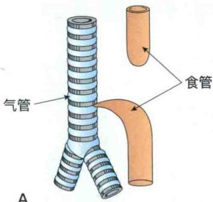
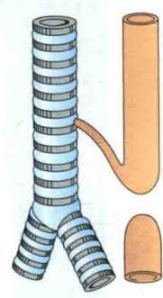
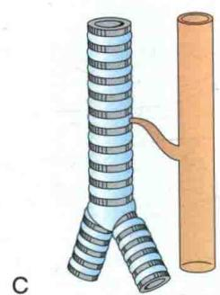 
图13-1 先天性气管食管瘘。A. 最常见类型（85%的病例）是气管和下段食管相通，上节段食管末端成盲端囊袋；B. 一些病例近段食管与气管相通；C.H型瘘无食管闭锁；D. 气管瘘既与近段食管相通又与远段食管相通
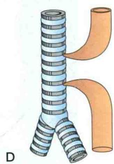
2/3这种真性憩室的患者。反流性食管炎可能在发病机制中有一定作用。不像其他憩室，膈上憩室见于年轻患者。典型表现为日间存在憩室内的大量液体夜间反流。当症状严重时，外科治疗直接针对运动功能异常的矫正（如肌切开术）。
# 二、运动功能异常
吞咽时肌肉运动的自动协调是一种运动功能，使食物顺利通过食管。运动异常的标志是难以吞咽下食物，即“吞咽困难”。吞咽困难是感到一团食物不能向下运送，本身并不疼痛。吞咽时感到疼痛称“吞咽痛”。运动功能异常可因为：①食管或系统性横纹肌功能缺陷；②神经疾病影响传入神经；③糖尿病或酒精中毒相关的外周神经病。
1. 贞门失弛缓 是下食管括约肌功能受损的特点。 贞门失弛缓，曾称为贲门痉挛，特点为下食管括约肌不能针对吞咽发生反应性松弛，食管蠕动波消失。这种既影响流出道又影响食管脉动功能的缺陷的结果是食物存留于食管，食管显著肥大和扩张（图13-2）。贲门失弛缓与食管肌间神经丛神经节细胞消失有关。在拉丁美洲，贲门失弛缓是Chagas病的常见并发症，神经节细胞被克氏锥虫损伤。贲门失弛缓的症状也可见于淀粉样变，结节病和浸润性恶性肿瘤。吞咽困难，有时吞咽痛和食管内存留物反流是贲门失弛缓的常见症状。食管鳞癌是并发症之一。治疗可用气囊扩张或外科下食管括约肌切开，但肌切开可导致胃食管反流。
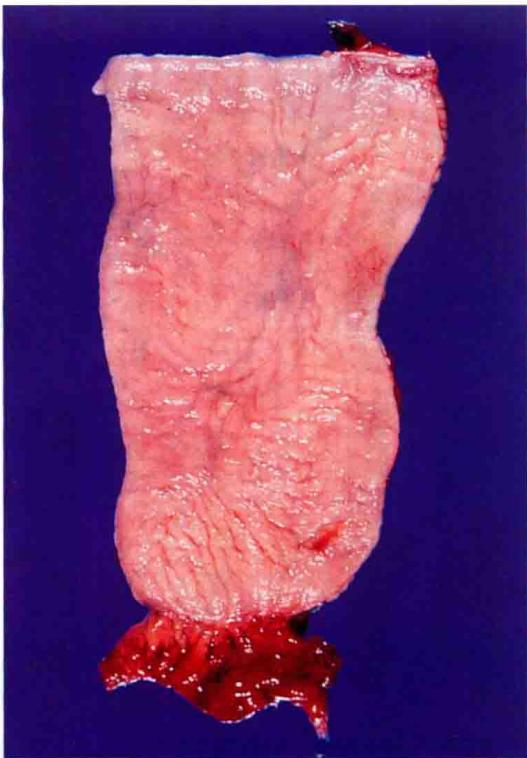 
图13-2一位晚期贲门失弛缓患者的食管和上段胃。下食管括约肌的位置，胃食管交界处以上，食管明显扩张。食管黏膜粗大，有增生的鳞状上皮
2. 硬皮病 导致食管壁纤维化。硬皮病（进展性系统性硬化）导致多器官纤维化，可致食管肌层功能的严重异常（第4章）。疾病主要累及下食管括约肌，严重受损可导致下段食管和上部分胃无功能性差别，看起来也形成单个空腔。不仅如此，硬皮病还可以引起整个食管的蠕动消失。
显微镜下，可见食管平滑肌纤维化及非特异性炎症改变。开始常见小动脉和细动脉的纤维化，可能对管壁纤维化的发病有一定作用。临床上，患者有吞咽困难和胃灼热症状，胃灼热由胃酸反流导致的消化性食管炎导致（见下文）。
# 三、食管裂孔疝
食管裂孔疝是胃通过增大的食管裂孔疝入纵隔。可见两种基本的食管裂孔疝（图13-3）。
滑动疝：横膈裂孔增大及环周结缔组织松弛使得一部分胃可以向上移动到膈上。这种情况比较常见。多数滑动食管裂孔疝的患者无症状；仅 $5\%$ 的患者有胃食管反流的症状而通过影像学诊断。
食管旁疝：这种不常见的食管裂孔疝的特征是一部分胃底在食管旁疝入，通过横膈结缔组织膜的缺陷，即食管裂孔。疝会逐渐增大，食管裂孔也逐渐增宽。在极端的病例，大部分胃都疝入了胸腔。

【临床表现】食管裂孔疝的症状，尤其是胃灼热和食物回流，主要因为胃内容物的反流，根是下食管括约肌的功能不全。经典的表现是患时症状加重，因为躺卧促进胃酸反流。吞咽困难，疼痛和有时的出血都令人苦恼。大的疝有引起或胸腔内胃扩张的危险。滑动疝一般不需要外，症状常可以药物治疗。与之相对，增大的食应外科治疗，即使无症状。
# 四、食管炎
1. 反流性食管炎的原因 是胃内容物反流（胃食管反流疾病）。反流性食管炎是目前最常见的食管炎，常见于合并滑动性食管裂孔疝，尽管有时发生于下食管括约肌无力而没有明显解剖学的病变。

【发病机制】胃内容物反流入食管的主要屏障是下食管括约肌。短暂的反流是正常事件，
尤其在餐后。当这种发作过于频繁和持续，引起食管炎。减低下食管括约肌作用的因素（如酒精、巧克力、脂肪类食物、吸烟）也和反流有关。一些中枢神经系统抑制剂（如吗啡、地西泮），妊娠，雌激素治疗和带鼻胃管也可以引起反流性食管炎。酸损伤食管黏膜，但混合酸和胃蛋白酶尤其具有损伤
性。不仅如此，胃液内常含有十二指肠反流的胆汁，对食管黏膜有损。酒精、热饮和辛辣食物也直接损伤黏膜。

【病理】反流区常见表浅的黏膜糜烂和溃疡，常形成直立的线状条纹。显微镜下，鳞状上
皮轻损伤表现为细胞肿胀（水样变）。由于反应性增生，上皮基底层增厚，固有膜乳头伸长，向表面延伸。乳头内毛细血管常常扩张。鳞状上皮内淋巴细胞增多，也出现嗜酸粒细胞和中性粒细胞（图13-4）。溃疡持续或损伤食管壁深达固有膜的患者可能逐渐发生食管狭窄。这种情况下，反应性纤维增生致食管腔狭窄。
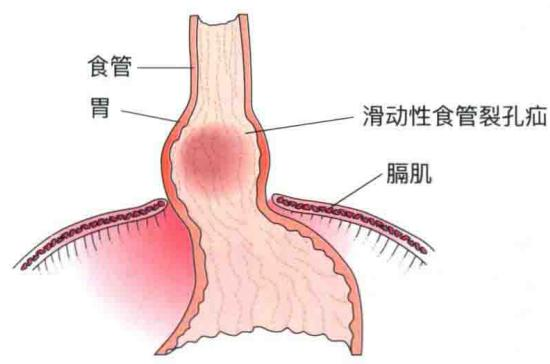
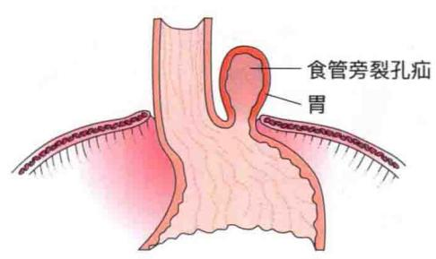
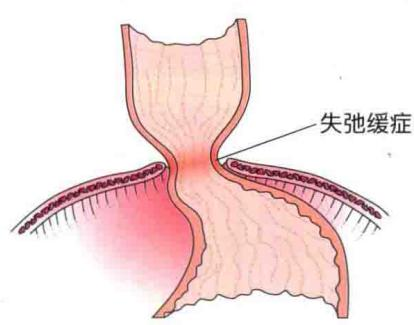
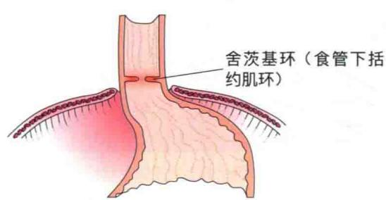 
图13-3 食管流出道异常
【临床表现】胃肠道反流疾病（GERD）常发生在30岁后，可呈非糜烂性的，糜烂性的或Barrett食管累及（见下文）。胃灼热和吞咽困难是最常见的就诊症状，通常可用减少胃酸的药物（如组胺-2受体拮抗剂或离子泵抑制剂）控制。在糜烂性的GERD，可发生溃疡，吐血和狭窄。
2.Barrett食管是食管鳞状上皮被柱状上皮取代。Barrett食管是慢性GERD的结果。它的发病率近年来增高，特别是在白种人男性，这其中原因并不清楚。Barrett食管发生在下段食管，但也可以扩展到高处。Barrett食管患者参加规律的检测计划，以检测异型增生黏膜的早期显微镜下迹象。
【病理】化生的Barrett上皮可累及短节段的部分环周，或食管下段全周（图13-5A）。显微镜下，Barrett食管的必要条件是出现一种特殊的上皮，称为“特化的上皮”。内镜下，这种上皮有特征性的三文鱼－粉色，含有混合的肠样上皮（有形成完好的杯状细胞）和胃小凹上皮（图13-5B）。完全性肠化，伴有潘氏细胞和吸收细胞，有时可见。炎症改变常与上皮改变重叠出现。少部分患者发生异型增生（图
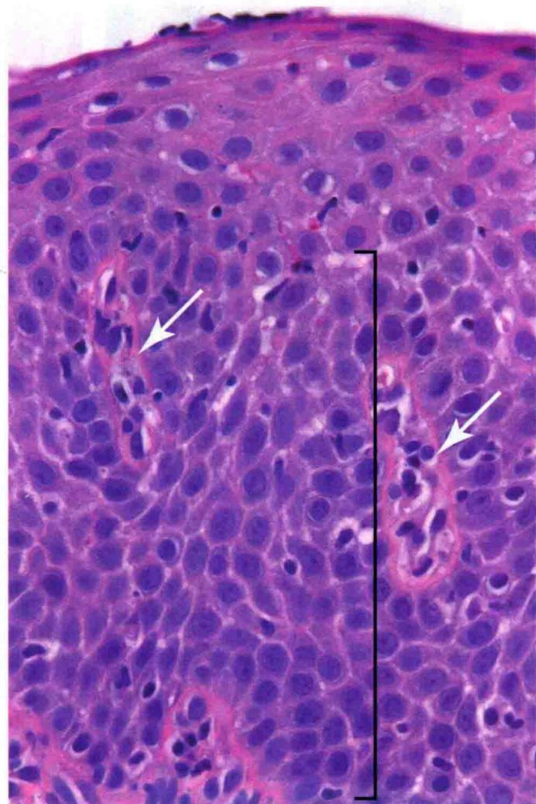 
图13-4反流性食管炎。一位长期胃灼热的患者的活检。注意基底细胞增生（括号）和乳头（箭头），鳞状上皮增生和炎症
13-5C)。Barrett食管可以转化为腺癌，其风险与受累食管长度和异型增生程度有关。Barrett食管（异型增生）现在分为无、不确定、低级别和高级别。高级别异型增生的细胞和结构异常与黏膜内腺癌重叠，明确诊断后者需见到浸润固有膜（图13-5D）。
【临床表现】Barrett食管的诊断建立在内镜伴活检的基础之上，通常有GERD的症状。男性常见（3：1），患病率随年龄增加，多数患者在60岁后诊断。吸烟者患Barrett食管的风险是不吸烟者的2倍。Barrett患者密切随诊以检测早期的显微镜下异型增生黏膜。许多病例，尤其是低级别异型增生，在药物抑制胃酸后退缩。但是，高级别异型增生和明确的黏膜内癌需要干预。
3. 嗜酸性食管炎与反流性食管炎不同 嗜酸性食管炎可能在病因上有过敏的因素。患者常有感觉吞咽时有食物“黏着”，并常与特定的食材有关。患者常在
标准的抗反流治疗无效后获得确诊。他们还常有遗传过敏性，外周血嗜酸粒细胞轻度增高。

【病理】嗜酸性食管炎的内镜表现常具特征性，可见横向的脊（像气管）和小的白斑。上皮内细胞增多，典型者达到每高倍视野20个或更多，向于在表浅处成簇。
# 4. 感染性食管炎与免疫抑制相关
念珠菌食管炎：随着免疫功能低下的患者越来越多，真菌感染日渐多发。食管念珠菌病也见于糖尿病患者，抗生素治疗的患者和少数没有明确背景疾病的患者。常见吞咽困难和吞咽时明显疼痛。

【病理】念珠菌的轻症病例，中或下1/3食管黏膜可见突起的白色斑点围以充血区。严重的充血和水肿的黏膜表面见融合的假膜。显微镜下，有时仅累及鳞状上皮的表层。念珠菌假膜含有
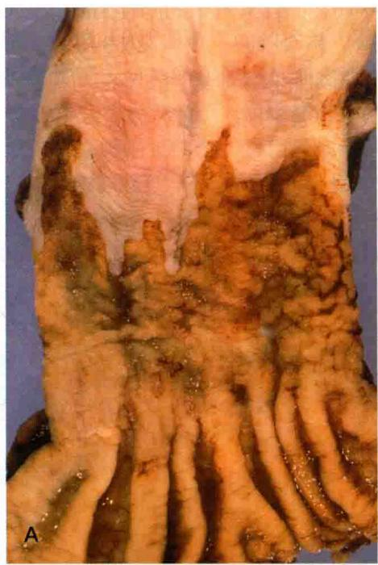
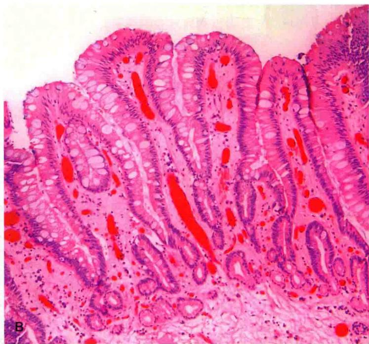
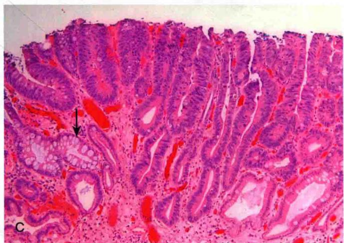 
图13-5 Barrett食管。A.棕褐色的舌状上皮突入近端鳞状上皮是Barrett食管的典型表现；B.特化的上皮呈绒毛状结构，被覆上皮有胃小凹型上皮和肠杯状细胞；C.高级别异型增生，明显异型增生的腺体，细胞核深染，早期结构紊乱，可见肠化，非异型增生的腺体（箭头）；D.黏膜内腺癌，恶性腺体限于黏膜，没有浸润的证据
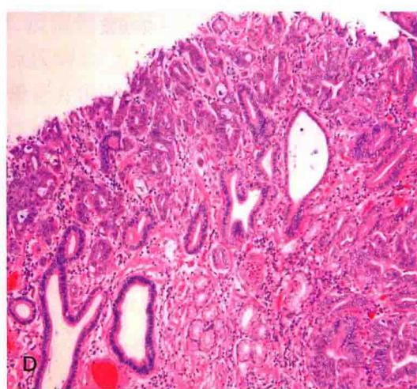
菌丝、坏死碎片和纤维素。食管壁深层受累可导致播散性念珠菌病或纤维化，有时太严重形成狭窄。
疱疹性食管炎：食管感染疱疹病毒I型最常见于淋巴瘤和白血病，表现为吞咽痛。但是，有时也发生于其他健康状况良好的患者。

【病理】充分发展的疱疹性食管炎的肉眼表现
和念珠菌食管炎类似。显微镜下，病变表浅
上皮细胞有典型的核内疱疹包涵体，有时多核。感染的细胞坏死形成溃疡，念珠菌和细菌的双重感染会形成假膜。
# 五、食管静脉曲张
食管静脉曲张是紧挨黏膜下的静脉扩张，可破裂和出血（见第14章）。发生于食管下1/3，基本上都是肝硬化或门脉高压患者。食管下段的静脉通过胃食管的交通支和门脉系统相连。如果门脉系统的压力超过了一定水平，这些交通支在胃底和食管下段变得明显。当静脉曲张超过直径 $5\mathrm{mm}$ ，容易破裂，导致危及生命的大出血。反流性损伤和感染性食管炎可促使静脉曲张出血。
# 六、肿瘤
# 1.食管癌有地域和组织类型的差异

【流行病学】世界范围内，多数食管癌为鳞状细胞癌，但在美国现在腺癌更为常见（见下文）。
食管癌发病的地域差异是显著的。有一个食管癌的带状延伸横跨亚洲，从伊朗北部的里海区域，通过中亚和蒙古，到达中国北方。在中国的部分地区，男性食管癌的死亡率是美国的70倍。在美国食管癌较少见，仅占癌症死亡的 $2\%$ 。但是美国黑种人的发病率高于白种人。

【发病机制】即使在相对一致的人群，存在食管癌的地域差异，提示环境因素对其发生
有重要作用。但是，没有单个因素能够独立致病。
吸烟增加食管癌发病风险 $5\sim 10$ 倍。吸烟数量与食管异型增生的发生率相关。
过量饮酒在美国是主要危险因素，即使将吸烟考虑在内。
人乳头瘤病毒（HPV）感染已在一些高危区域的病例检测到。
亚硝酸盐和苯胺染料可使动物发生食管癌，但缺乏导致人类食管癌的直接证据。
Plummer-Vinson 综合征，乳糜泻和贲门失弛缓，与食管癌发生率增加有关，原因不清。
慢性食管炎在一些食管癌高发的地域与其相关。
化学损伤伴食管狭窄是危险因素。吞入碱液后食管狭窄的患者， $20\sim 40$ 年后 $5\%$ 发生食管癌。食管网，环和憩室有时与食管癌有关。

【病理】大约 $50\%$ 的食管癌累及食管下1/3；
其余发生于中段和上段食管。大体肿瘤分3型：
① 溃疡型（图13-6A）；② 息肉样，突入管腔；③ 浸润型，肿瘤主要生长在壁内。大的息肉样肿瘤早期易梗阻，而溃疡型多数较小，易于出血。浸润型肿瘤环周生长，逐渐使管腔狭窄。肿瘤局部扩展入纵隔是常见的表现。
显微镜下，肿瘤性鳞状细胞可呈高分化，伴有上皮“角化珠”，或分化差的肿瘤，缺乏鳞状分化的证据。有时肿瘤以梭形肿瘤细胞为主（化生性癌）。食管丰富的淋巴引流提供了多数转移路径。转移至肝和肺常见，但几乎各个器官可以受累。

【临床表现】最常见的临床表现是吞咽困难，
但这时，多数肿瘤已经不可切除。食管癌患者
几乎都是恶病质的，因为厌食、吞咽困难和恶性肿瘤的长期作用。外科手术和放疗可缓解症状，但预后仍不乐观。许多患者不能手术，经过手术的患者，5年存活率也仅 $20\%$
2.食管腺癌随着近期发病率的增高，美国食管腺癌（ $60\%$ ）比鳞癌更为常见。基本上所有腺癌发生于Barrett食管的背景之上（图13-6B），虽然少数病例可源于黏膜下腺体。许多分子事件促使Barrett食管向腺癌转化，最常见的是INK4A/CDKN肿瘤抑制基因p16失活（见第5章）。其他包括 $p53$ 缺失，RB失活，非整倍体和细胞循环相关基因的扩增。内镜下对腺癌的监测应用于Barrett食管患者，特别是伴有异型增生者。食管腺癌的症状和临床过程和鳞癌类似。
# 第二节 胃
# 一、先天性异常：先天性幽门狭窄
先天性幽门狭窄是幽门括约肌的向心性增大，幽门管狭窄，胃流出道梗阻和婴儿喷射性呕吐。这个异常是6月龄内腹部手术最常见的原因。男孩发病率是女孩的4倍，首个婴儿常见于后续婴儿。白人新生儿幽门梗阻发生率1/250，但在黑人和亚洲人中少见。

【发病机制】先天性幽门狭窄有遗传基础；有
家族聚集倾向，并且相比于异卵双胞胎，更
易见于同卵双胞胎。也发生于Tumer综合征，18三体和食管闭锁。与风疹病毒感染相关的胚胎疾病和母亲服用沙利度胺（反应停）也与先天性幽门狭窄有关。
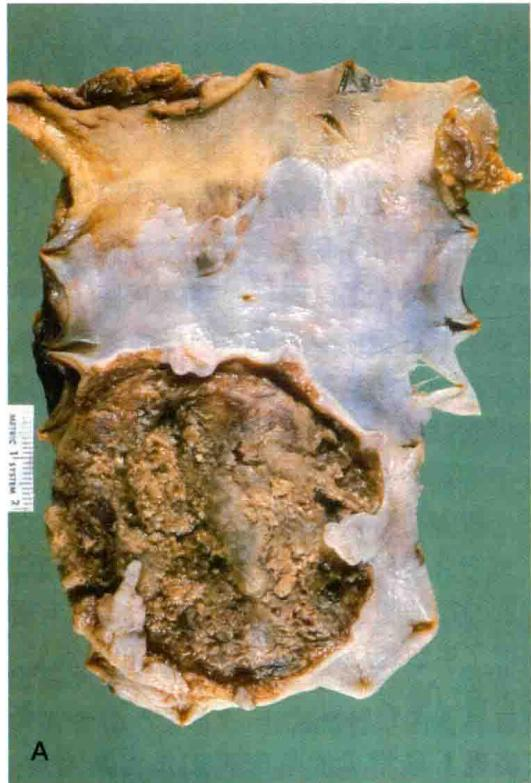
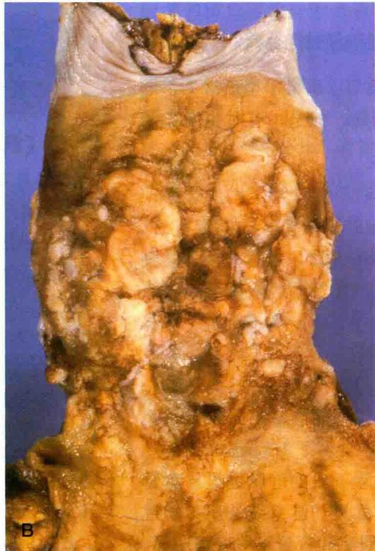 
图13-6 食管癌。A.鳞状细胞癌。鳞状上皮黏膜上可见大的溃疡型肿物，有正常鳞状上皮黏膜在癌和胃之间。B.腺癌。一个大的外生溃疡型肿物紧靠胃食管交界。高分化的腺癌与最近的鳞状上皮被灰褐色区域分开，是Barrett食管

【病理】肉眼检查胃呈向心性幽门增大和幽门管狭窄。仅可见的显微镜下异常为环形肌的明。幽门肌切开术后，病变消失，有时存留小包块。

【临床表现】喷射性呕吐是最主要的症状，常见于第一个月。1/3 婴儿继发盐酸丢失导致低钠中毒。常可触及幽门病变和见到蠕动波。外科较大的幽门肌可治愈。
# 二、胃炎
1.急性出血性胃炎与药物和刺激相关 急性出血糜烂性胃炎的特征是黏膜坏死。黏膜糜烂可扩展至深层组织形成溃疡。坏死伴有急性炎症反应和出血，有时严重得流血致死。

【发病机制】急性出血性胃炎最常见于服用阿司匹林，其他非甾体抗炎药(NSAIDs)，
过量饮酒和缺血损伤。这些因素直接损伤胃黏膜，作用局限于胃黏膜。口服糖皮质也可以并发急性出血性胃炎。任何严重的疾病伴有显著生理学改变，要求大量药物和外科干预的情况，都会使胃黏膜更容易发生急性出血性胃炎，因为黏膜缺血。各种导致急性出血性胃炎的原因，共同的因素是破坏黏膜屏障，继而胃酸形成损伤。
应激性溃疡和糜烂发生在严重烧伤的患者(Curling 溃疡)，常致出血。溃疡可以足够深以致胃穿孔。患者有时同时罹患胃和十二指肠溃疡。
中枢神经系统创伤，无论事故或外科所致（Cushing 溃疡），也可引起应激性溃疡。这些病变
也可以发生在食管和十二指肠，特点是较深，有潜在穿孔的危险。
严重的创伤，尤其伴有休克，持续败血症和慢性虚弱疾病的丧失行动能力者，易于发生急性出血性胃炎。
胃酸分泌过多被认为在急性出血性胃炎的发病机制中有作用，但具体角色尚不清楚。虽然如此，胃酸有允许的作用，因为胃酸抑制剂（如组胺受体拮抗剂）保护不发生应激性溃疡。
休克和败血症导致的胃微循环的改变提示缺血性损伤对急性出血性胃炎的发病有作用。胃黏膜防御机制的损伤也似乎有作用。例如，NSAIDs抑制前列腺素合成所致前列腺素缺乏被假设降低了胃黏膜对胃内容物的抵抗。激素和NSAIDs都可以直接减少黏膜分泌。在出血性休克时减低胃黏膜腔内pH具有保护作用，支持酸在一些糜烂中的致病作用。

【病理】急性出血性胃炎的肉眼观特征是胃内任何部分的广泛分布的出血淤斑，由融合的黏
膜或黏膜下出血造成。病变 $1\sim 25\mathrm{mm}$ 大小不等，有时形成突出的溃疡。显微镜下，灶状黏膜坏死，可伸展至黏膜下层，见于正常黏膜旁边。固有膜纤维素性渗出、水肿和出血见于早期病变。少数病例，穿透性溃疡可达浆膜。

【临床表现】急性出血性胃炎的症状可以从模糊的腹部不适到大量的危及生命的出血和胃穿
孔的临床表现。阿司匹林和其他 NSAIDs所致胃炎可
因未查出的慢性出血导致小细胞低色素性贫血。抗酸和组胺受体拮抗剂治疗有效。
2. 慢性胃炎指胃的慢性炎症 慢性胃炎可以从胃黏膜轻度表浅受累到严重萎缩。这些多样化的异常显示明显的胃内解剖分布差异，病因差异和特征性并发症的差别。主要症状是异型增生。此疾病也常见于常规内镜筛查的无症状人群。
（1）幽门螺杆菌胃炎：幽门螺杆菌胃炎是胃窦和胃体的慢性炎症性疾病，由幽门螺杆菌，或少见的海尔曼螺杆菌引起。在美国，是最常见的慢性胃炎类型。幽门螺杆菌也与胃、十二指肠消化性溃疡，黏膜相关淋巴组织（MALT)淋巴瘤和胃癌有很大关联（见下文）。

【发病机制】螺杆菌种是小的，广泛分布的，弯曲的，革兰阴性杆菌（变形菌纲），有端
鞭毛和螺旋形运动方式。其患病率随年龄增高：60岁时，世界 $50\%$ 人口有血清学感染证据。感染开始于儿童期，在发展中国家的感染率明显高于美国。这种差异可能在于环境卫生和清洁水源供应。双胞胎研究显示了对幽门螺杆菌易感的遗传学因素。幽门螺杆菌感染的家庭内聚集提示细菌可以从人传播到人。2/3感染幽门螺杆菌的患者显示慢性胃炎的组织学证据。
幽门螺杆菌被认为是胃窦慢性胃炎的病原体，而非已损伤胃黏膜生长的共生微生物。这个概念反映了以下事实：① 健康人摄入这细菌后发生胃炎；
② 幽门螺杆菌黏附于慢性胃炎处上皮而不见于未受累胃黏膜；③ 钾剂和抗生素根除感染后治愈胃炎； 
④抗幽门螺杆菌抗体可在慢性胃炎患者体内检测到；⑤幽门螺杆菌感染率随年龄增加，与慢性胃炎患病率增加一致。幽门螺杆菌的侵袭性与其基因组
内cag毒力岛有关。这个毒力标志推定与十二指肠溃疡和胃癌相关。基因组内一个分离区域含有空泡毒素（vacA）的基因，与十二指肠溃疡有关。宿主对感染的反应主要由辅助T细胞介导，Th1和Th2细胞都参与。伴胃炎的感染患者的胃黏膜含高水平的TNF和许多白细胞介素。

【病理】幽门螺杆菌的弯曲杆菌上皮细胞的表面黏液和胃小凹（图13-7B），不向更深处侵犯。
活动性胃炎表现为多形核白细胞在腺体和腔内，同时固有膜淋巴细胞和浆细胞增多（图13-7A）。常见淋巴样增生伴生发中心，是MALT淋巴瘤发生的起点。幽门螺杆菌相关胃炎有非萎缩和萎缩模型。慢性萎缩性胃炎的腺体数量减少和肠化，包括胃窦限制性萎缩性胃炎和多灶性萎缩性胃炎（MAG）。
（2）多灶萎缩性胃炎（环境性化生性萎缩性胃炎）：MAG典型地累及胃窦和胃体附近区域。疾病本质不是自身免疫性疾病，明显多于自身免疫性萎缩性胃炎（见下文）。MAG特征性地减少胃酸分泌（胃酸过少）。胃分泌缺乏（胃酸缺乏）和恶性贫血常见。

【发病机制】MAG的年龄和地域分布平行于胃癌，并且此型胃炎似乎是一种癌前状态。
一些人群，尤其是亚洲，斯堪的纳维亚和部分欧洲和拉丁美洲，不成比例地受累。环境致病因素包括幽门螺杆菌和饮食。

【病理】自身免疫性（见下文）和多灶萎缩性
胃炎的病理类似，只是自身免疫性者严格限于胃底和胃体，而MAG主要在胃窦和胃体。萎缩性胃炎的固有膜显示慢性炎症。有时，淋巴样细胞滤泡被误诊为淋巴瘤，尤其在幽门螺杆菌感染患者。胃腺体
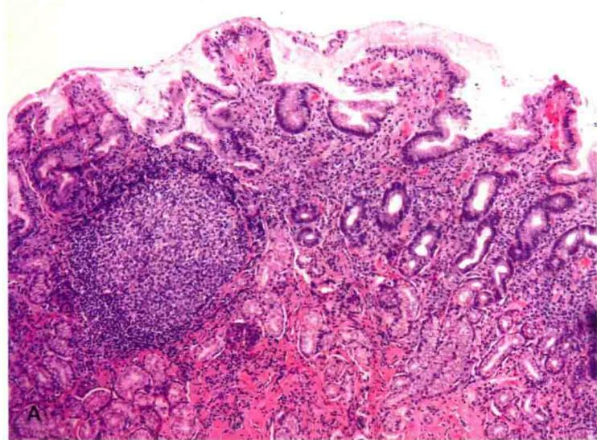 
图13-7幽门螺杆菌相关胃炎。A.胃窦见致密的淋巴细胞和浆细胞浸润，固有膜表浅部分显得更重；B.微生物在银染下显示为小的，弯曲的杆菌在胃黏膜表面
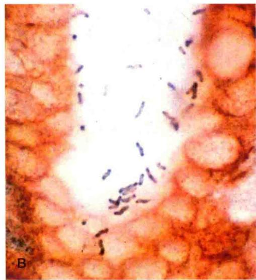
受累导致上皮细胞退变，最后腺体数量显著减少（萎缩性胃炎名称由此而来）。逐渐地，炎症消退，仅剩薄的萎缩性黏膜，可用名词胃萎缩来形容。
肠化：这种改变是常见而重要的特点，既在自身免疫性胃炎又在多灶性萎缩性胃炎。对于胃黏膜损伤，正常上皮被肠型细胞取代。许多含黏液的杯状细胞和肠细胞衬覆于隐窝样腺体。潘氏细胞，正常时不见于胃，此时可见。可形成肠型绒毛。化生细胞也含有肠特征的酶而不是胃特征的（如碱性磷酸酶、氨基肽酶）。
（3）萎缩性胃炎和胃癌：自身免疫（见下文）或多灶性萎缩性胃炎患者发生胃癌的风险增高。恶性贫血患者，必然有萎缩性胃炎，有3倍的胃腺癌风险和13倍的类癌（神经内分泌）肿瘤风险。胃窦发生的癌是胃体癌的几倍多，提示胃窦胃炎与癌的发生有关。
胃的肠上皮化生是癌前状态因为：① 胃癌发生在这种化生的区域；② $50\%$ 胃癌为肠型；③ 许多胃癌有氨基肽酶活性，正如肠化区所见。异型增生，从低级别到原位癌，在化生性肠上皮区明显，被认为是浸润性癌的癌前病变。
3. 胃是结外淋巴瘤最常见的部位 多数胃淋巴瘤是低级别的B细胞性MALToma（黏膜相关淋巴组织淋巴瘤），发生于慢性幽门螺杆菌病胃炎伴淋巴样增生。抗生素治疗根除幽门螺杆菌后，一些MALToma退缩。胃原发性淋巴瘤约占 $5\%$ 的胃恶性肿瘤和 $20\%$ 的所有结外淋巴瘤。临床和影像学，类似胃腺癌。MALToma的分子特征在第20章讨论。
自身免疫萎缩性胃炎和恶性贫血：自身免疫萎缩性胃炎是一种胃的慢性，弥漫性炎性疾病，限于胃体和胃底。这种异常典型的有以下表现：
胃体和胃底弥漫萎缩性胃炎，胃窦无或很少受累 
有针对壁细胞和内因子的抗体。 
胃分泌明显减少或消失，包括胃酸。 
血浆胃泌素增高，因为胃窦G细胞增生。 
肠嗜铬样细胞增生继发于胃泌素刺激。
恶性贫血是一种巨幼细胞贫血，由内因子缺乏，维生素 $\mathbf{B}_{12}$ 吸收不良所致。多数恶性贫血的病例是自身免疫性胃炎的并发症。自身免疫性胃炎也与其他自身免疫性疾病有关，如慢性甲状腺炎、Graves病、Addison病、白癜风、1型糖尿病和重症肌无力（见第20章）。和慢性萎缩性胃炎一样，自身免疫性胃炎也是发生异型增生和腺癌的危险因素。达 $40\%$ 的恶性贫血患者有多发性无蒂息肉，其中少数有异型增生。胃酸缺乏导致高胃泌素血症，刺激肠嗜铬细胞增生，从而增加类癌发生风险。
【发病机制】自身免疫性胃炎如此命名是因为有自身抗体以及与其他有类似发病机制的疾病有关。针对壁细胞的循环抗体，其中一些有补体依赖的细胞毒作用，在 $90\%$ 的恶性贫血患者。重要的是，60岁以上者， $20\%$ 有壁细胞抗体，即使有些没有恶性贫血。多数患者也有内因子抗体，影响维生素 $\mathsf{B}_{12}$ 吸收。而且，常见抗甲状腺抗体。
# 三、消化性溃疡
消化性溃疡指胃黏膜和小肠，主要是十二指肠黏膜的局部破坏，由胃的分泌所致。西方工业化国家约 $10\%$ 的人口在一生中发生这种溃疡。近30年来，十二指肠溃疡的发病率和患病率逐渐下降，原因不清。
1. 胃和十二指肠溃疡有独特的表现 实际上，消化性溃疡累及远段胃和近段十二指肠。许多临床和流行病学表现区别于胃和十二指肠溃疡；它们共同之处是胃分泌的盐酸和幽门螺杆菌感染。
【流行病学】近50年来消化性溃疡的发病高峰年龄逐渐增加。十二指肠溃疡，现在常见于 $30\sim 60$ 岁人群，以前则发生于各年龄段甚至婴儿。胃溃疡累及中老年人多于年轻人。十二指肠溃疡多见于男性，而胃溃疡男女相当。

【发病机制】许多致病因素在消化性溃疡的发病中起作用, 但没有单一因素可以独自
# (1) 致病因素
幽门螺杆菌感染：几乎所有的十二指肠溃疡患者的胃窦可分离出幽门螺杆菌。反之则不然，即携带幽门螺杆菌的患者，只有少数有十二指肠溃疡。因此，对于消化性十二指肠溃疡，幽门螺杆菌感染是必要的，但不是充分的。治疗幽门螺杆菌后，这种溃疡比较快速愈合，很少复发。
但是幽门螺杆菌如何促使十二指肠溃疡还没完全明确。针对感染反应的炎症细胞产生的细胞因子刺激胃泌素分泌和抑制生长抑素分泌。其结果，与杆菌自己释放的组胺代谢物一起，可以刺激基础胃酸分泌。十二指肠球酸化导致十二指肠胃黏膜化生，见于很多消化性溃疡的患者。幽门螺杆菌感染生的上皮可使黏膜更易受到消化损伤（图13-8）。幽门螺杆菌在胃溃疡的发病过程中大概也起重要作用，因为幽门螺杆菌是胃溃疡的背景疾病慢性胃炎的原因。约 $75\%$ 的胃溃疡患者有幽门螺杆菌。其余 $25\%$ 的病例可能与其他类型的慢性胃炎有关。被认为与十二指肠溃疡发病机制可能相关的许多胃
和十二指肠的因素总结见图13-9。
盐酸分泌：胃酸过多，盐酸分泌增多，对于胃和十二指肠形成和持续溃疡是必需的。这可以由以下证实：① 所有十二指肠溃疡患者和几乎所有胃溃疡患者是胃酸分泌者；② 胃酸过多分泌见于许多但不是全部的十二指肠溃疡患者（没有证据显示仅是酸的过多产生可以解释十二指肠溃疡）；③ 外科和药物治疗减少胃酸产生使消化性溃疡愈合。
饮食：缺乏证据支持某些食品或饮料，包括咖啡和酒精，促进消化性溃疡的发生和持续。
药物：阿司匹林，其他NSAIDs和止痛剂是消化性溃疡的重要的促进因素。
吸烟：吸烟是十二指肠和胃溃疡的明确的危险因素，尤其是胃溃疡。
遗传性因素：十二指肠和胃溃疡患者的一级亲属，发生溃疡的风险增高3倍，仅在同一部位。同卵双胞胎有 $50\%$ 的一致性，提示环境因素也有关。遗传性因素进一步认为有意义是通过血型抗原与消化性溃疡有关的事实。十二指肠溃疡有 $30\%$ 更多见于O型血患者，相比其他血型。这在胃溃疡中并不适用。唾液和胃液中不分泌血型抗原的人群有 $50\%$ 更高的十二指肠溃疡风险。既是血型O型又不分泌的人（ $10\%$ 的白种人）十二指肠溃疡增多2.5倍。
胃蛋白酶原I：高循环水平胃蛋白酶原I的人有5倍于正常的十二指肠溃疡的风险。胃蛋白酶原I升高见于 $50\%$ 的溃疡病儿童，归结于常染色体显性遗传。
# (2) 十二指肠溃疡的生理因素
胃排空加快见于十二指肠溃疡患者。这种情况可以导致十二指肠严重酸化。但是，如同其他因素，与正常情况有交叉。正常情况下，十二指肠球酸化抑制进一步胃排空。多数十二指肠溃疡患者，这种抑制机制缺失；十二指肠酸化仍持续的，而非延迟的，胃排空。
十二指肠球pH反映了胃酸分泌和对其中和的胆、胰及十二直肠分泌的平衡。溃疡患者，餐后十二指肠的pH降到低水平并持续降低的时间比正常人长。这种十二指肠胃酸过多反映了上述胃的因素。
受损的黏膜屏障已认为与消化性溃疡有关。这些黏膜因素，包括前列腺素功能，可能与保护胃黏膜类似。
（3）胃溃疡的生理因素：胃溃疡几乎都是发生于幽门螺杆菌或化学性胃炎所致的上皮损伤。慢性胃炎易于形成胃溃疡的机制尚不清。多数胃溃疡患者分泌胃酸少于十二指肠溃疡患者，甚至少于正常
人。同时有胃溃疡和胃分泌减少提示: ① 胃黏膜不知为何对低浓度的酸特别敏感; ② 有些非酸因素可以损伤黏膜, 如 NSAIDs ; ③ 胃黏膜长时间暴露于潜在损伤因素。胆汁反流（尤其是脱氢胆酸和溶血卵磷脂）和胰腺分泌也提示是胃溃疡的原因。
# 2. 一些疾病与消化性溃疡相关
肝硬化：肝硬化患者十二指肠溃疡的发生率是正常人的10倍。
慢性肾衰竭：终末期肾病血液透析增加消化性溃疡的风险。肾移植患者也有继发的消化性溃疡以及其并发症，如出血和穿孔的发生率增高。
遗传性内分泌综合征：多发性内分泌肿瘤I型（MEN1）患者的消化性溃疡发生率增高（见第21章）。Zollinger-Ellison综合征，导致严重的消化性溃疡，特征为胰腺产生胃泌素的胰岛细胞腺瘤引起胃的高分泌。
α1-抗胰蛋白酶缺乏：其中约1/3患者有消化性溃疡，如果患者有肺疾病，发生率甚至更高。不仅如此，α1-抗胰蛋白酶杂合性突变的人群消化性溃疡增多。
慢性肺疾病：长期的肺功能增加明显增高溃疡风险，估计1/4患有消化性溃疡。反之，消化性溃疡患者的慢性肺疾病增高 $2\sim 3$ 倍。
# 3. 胃和十二指肠溃疡镜下表现相似

【病理】多数消化性溃疡发生在胃小弯侧、前壁和幽门前区以及十二指肠第一段。
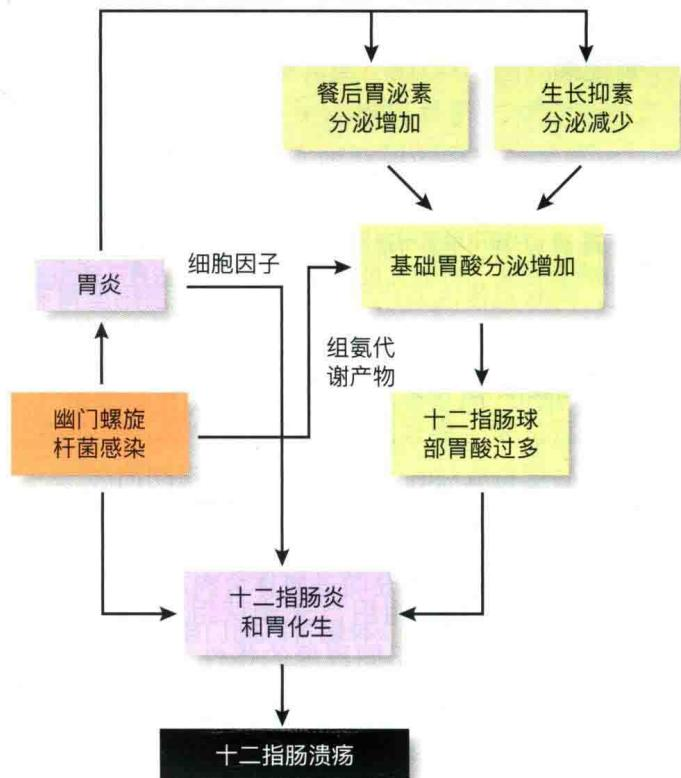 
图13-8 与幽门螺杆菌感染相关十二指肠溃疡的可能发病机制
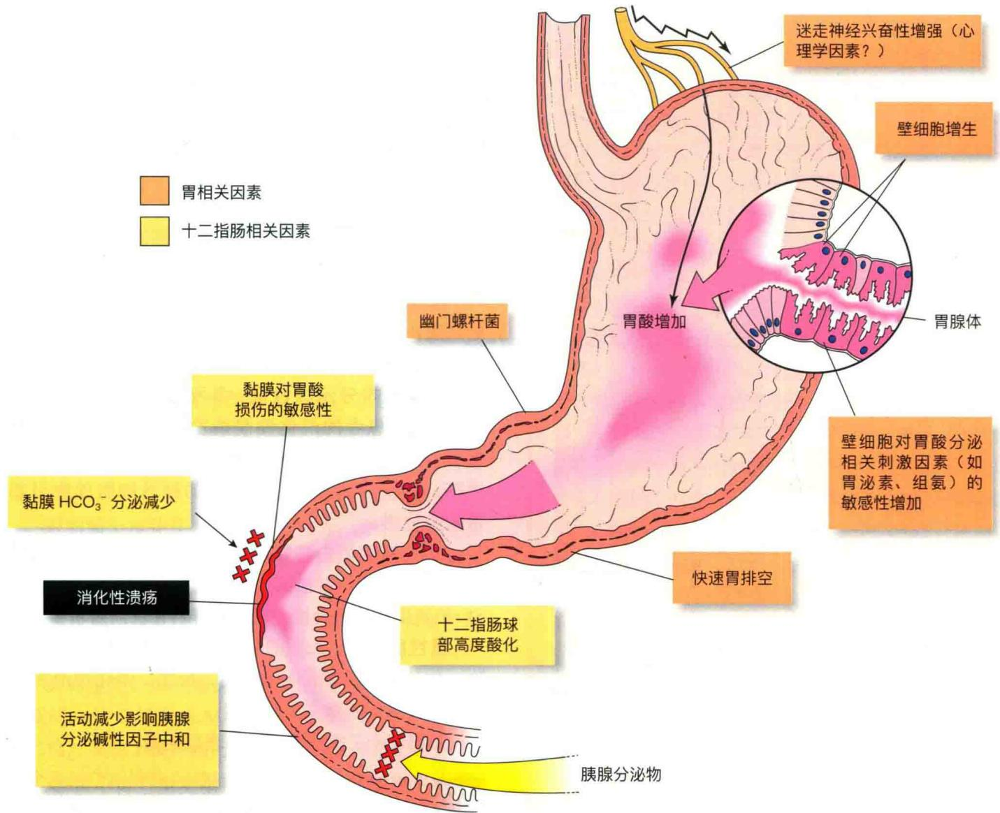 
图13-9 十二指肠溃疡发病机制中的胃和十二指肠因素
胃溃疡（图13-10）：通常单发，直径小于 $2\mathrm{cm}$ 。小弯侧溃疡常与慢性胃炎有关，而大弯侧溃疡常与NSAIDs有关。溃疡边锐利地冲压状下陷，伴有悬出的边缘。深部穿透性溃疡产生浆膜渗出，可造成胃和周围结构的粘连。幽门前区溃疡瘢痕严重时可导致幽门梗阻。肉眼观慢性消化性溃疡可以很像溃疡型胃癌，显微镜检查常没有类似相像。
十二指肠溃疡（图13-11）：通常在十二指肠第一段的前壁或后壁，靠近幽门。溃疡常单发，但也并不少见前、后壁有成对的溃疡，被称为“接吻溃疡”。
显微镜下，胃和十二指肠溃疡类似（图13-12）。从腔面向外，可见以下形态：①表浅区纤维素脓性渗出物；②坏死组织；③肉芽组织；④溃疡基底的纤维组织，显示不同程度的慢性炎症。溃疡可穿透肌层，愈合后瘢痕组织中断肌层。溃疡边的血管常有血栓形成。边缘的黏膜增生；溃疡愈合后，黏膜从溃疡区表面长上，形成单层上皮。十二指肠溃疡常伴消化性十二指肠炎，Brunner腺增生和胃
黏液细胞化生。

【临床表现】胃和十二指肠溃疡的症状非常相像，以至于二者通过病史和体检一般无法分辨。经二指肠溃疡特征为餐后 $1\sim 3$ 小时上腹痛或夜痛醒。碱性物和食物都可以缓解症状。消化不良
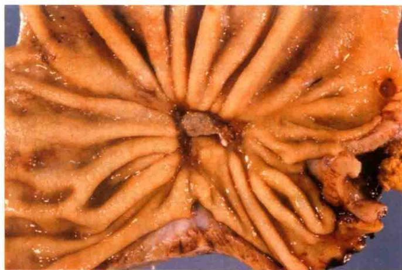 
图13-10 胃溃疡。可见特征性锐利的边缘，伴放射性胃黏膜皱襞。溃疡底呈灰色是因为纤维素沉积
症状常与胆囊疾病相关，包括脂质食物不耐受、腹胀和嗳气，也见于 $50\%$ 消化溃疡患者。消化性溃疡的主要并发症是出血和穿孔，后者可继发腹膜炎和梗阻。
出血：消化性溃疡最常见的并发症是出血，约发生在 $20\%$ 的患者。出血常为隐袭性，没有其他症状，可致缺铁性贫血或大便隐血。大量的危及生命的出血是活动性消化性溃疡的著名的并发症。
穿孔：穿孔是消化性溃疡的严重的并发症，发生于 $5\%$ 的患者。其中1/3没有前驱的消化性溃疡的症状。十二指肠溃疡比胃溃疡更易出现穿孔，常见于十二指肠前壁。穿孔有高的死亡率。胃溃疡穿孔的死亡风险为 $10\% \sim 40\%$ 是十二指肠溃疡（ $< 10\%$ )的 $2\sim 3$ 倍。穿孔有时伴发出血。虽然休克，腹胀和疼痛是常见症状，但有时穿孔在尸检时才首次诊断，特别是被收容的老年患者。
幽门梗阻（胃流出道梗阻）：幽门梗阻发生在多达 $10\%$ 的溃疡患者，消化性溃疡是成人最常见的原因。附近的消化性溃疡致幽门腔狭窄可因为肌痉挛，水肿，瘢痕组织收缩和肌肥大，或者最常见的，这几个因素共同作用。
良性溃疡的恶性转化：十二指肠溃疡的恶性转化非常少见。虽然发生在良性消化性溃疡基础的癌不足胃恶性肿瘤的 $1\%$ ，这些肿瘤被很好地记录下来。
治疗：消化性溃疡现在的治疗是抗生素根除幽门螺杆菌和用组胺受体阻断剂和离子泵抑制剂阻断胃酸分泌。
# 四、良性肿瘤
1. 胃的胃肠道间质瘤倾向于非侵袭性 胃肠道间质瘤（GISTs）发生在胃、小肠和大肠，以及很少一部分在胃肠道外部位。

【发病机制】几乎所有的GISTs源于Cajal起搏细胞，正常嵌在胃肠道肌层组织。
GISTs 占全胃肠道间质来源肿瘤的主要部分。起搏细胞和肿瘤细胞表达 c-kit 癌基因 (CD117), 编码一种酪氨酸激酶, 促进细胞增生。约 $80\%$ 的 GISTs 在 c-kit 有功能激活突变。约 $10\%$ 有血小板源生长因子受体（PDGFR）的活化突变。许多胃的 GISTs, 无论大小, 倾向于非侵袭性, 不像小肠和大肠的肿瘤, 常常是恶性的。
胃GISTs常在黏膜下，表面被覆良好黏膜，或者向外突出，表面被覆腹膜。切面漩涡状。显微镜下，肿瘤细胞疏密不等，梭形细胞，伴胞质空泡，嵌于胶原性间质中。细胞倾向于漩涡状排列，交错成束。良性肿瘤常见奇异形核和巨核。除少数例外，GISTs被认为是低度恶性潜能的肿瘤。治疗主要是手术切除和应用伊马替尼，一种抑制c-kit和PDGFR酪氨酸激酶活性的药物。
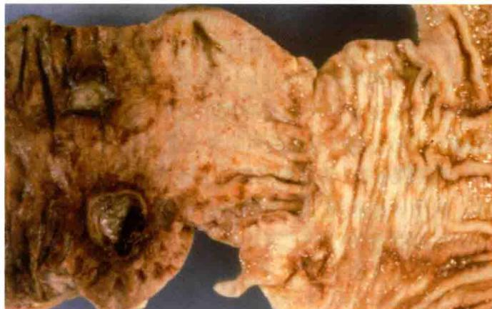 
图13-11十二指肠溃疡。有2个锐利边界的十二指肠溃疡围以炎性十二指肠黏膜。胃十二指肠交界处在图片中央
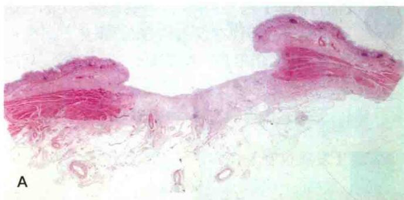
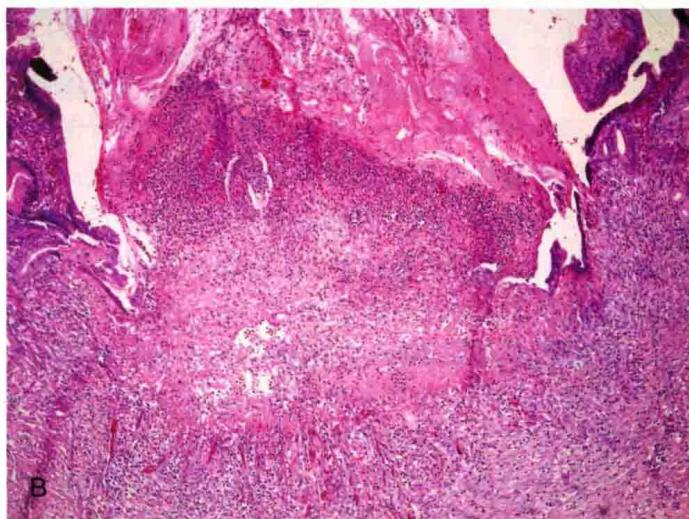 
图13-12 胃溃疡。A.胃肌层全层被结缔组织取代；B.消化性溃疡的图片显示表浅炎性渗出物，深处依次为坏死，肉芽组织和纤维化
# 2. 上皮性息肉可以是增生性或肿瘤性
增生性息肉：是胃息肉中最常见的。可单发或多发，表现为不同大小的有蒂或广基的病变。增生性息肉常见于胃底体盐酸分泌黏膜，在自身免疫性化生性萎缩性胃炎患者，也发生于幽门螺杆菌胃炎的患者的胃窦。显微镜下，息肉含有伸长的分支的腺窝，被覆小凹上皮，其下存在幽门腺和胃腺体。它们代表对损伤的反应，上皮没有异型增生。胃增生性息肉没有恶性潜能。
腺管状腺瘤（腺瘤性息肉）：它们是真性肿瘤，常见于胃窦。其直径从小于 $1\mathrm{cm}$ 到颇具大小，平均 $4\mathrm{cm}$ 。多数腺瘤广基，单发。显微镜下，腺瘤呈腺管状或混合
绒毛和腺管状结构。腺管常被覆异型增生上皮，有时肠化。腺瘤有恶性潜能，不同的报道有 $5\% \sim 75\%$ 。这个风险随息肉增大而增加，大于 $2\mathrm{cm}$ 者尤其增加。异型增生也发生于平坦的胃黏膜。家族性腺瘤性息肉病（FAP）患者发生胃腺癌的风险显著升高。
胃底腺息肉：胃底腺息肉的特点是扩张的产酸的腺体，被覆壁细胞和主细胞及黏液细胞化生。最常见于离子泵抑制剂治疗的患者。这些息肉不认为是癌前病变，不增高胃癌风险。
# 五、恶性肿瘤
# 1. 胃癌与很多环境因素相关

【流行病学】约50年前，胃癌是最常见的癌症死亡原因，但现在仅占约 $3\%$ 。胃癌发病率在
日本和智利等国家仍很高，是美国的 $7 \sim 8$ 倍。从高危地区到低危地区的移民显示胃癌发病率的降低（见第5章），强烈提示胃癌发病机制中的环境因素。

【发病机制】虽然许多因素已证实相关，但胃癌的原因仍难以捉摸。
幽门螺杆菌：幽门螺杆菌感染可能是胃癌致病因素中最重要的，累及约2/3的病例。血清学研究显示胃癌查出前很多年即有广泛的幽门螺杆菌感染。在血清检查后 $1\sim 24$ 年，血清幽门螺杆菌阳性的人群是阴性人群发生胃腺癌的3倍。胃癌高危人群的儿童期幽门螺杆菌感染率较高，而低危人群感染率不高。但是胃癌仅发生于小部分感染的患者，也有肿瘤发生于未感染的患者。
饮食因素和亚硝胺：胃癌更常见于进食大量淀粉，烟熏或腌制的鱼肉和腌菜的人群。苯并芘，一种实验证实的强致癌物质，在烟熏食物中可以检测到。特别是亚硝胺，在动物中有强致癌作用但在人类尚不明确致癌作用，也提示是一种重要因素。饮食中的硝酸盐和亚硝酸盐转化为亚硝胺。食用全脂奶和富含维生素C的新鲜蔬菜与胃癌发生成反比。
吸烟：吸烟是胃癌发生的危险因素。发生胃癌的相对危险随吸烟量和持续时间增高。风险增加的数量级约 $50\%$ ，相比较远段胃、贲门癌增高更明显。
遗传因素：遗传因素被认为在多数胃癌中不起重要作用，但在遗传性非息肉病性结直肠癌（HNPCC）综合征患者，胃癌发病率高。
年龄和性别：胃癌在30岁以下人群少见，超过50岁有一个陡峭的发病高峰。高发国家，男女比约为2:1，但美国仅有轻微的男性为主。
萎缩性胃炎、恶性贫血、胃大部切除术和胃腺瘤性息肉是胃癌的高风险因素，已在前面讨论过。

【病理】胃恶性肿瘤中超过 $95\%$ 为胃腺癌。形成两种主要但有交叉的类型，称为弥漫型和肠
型。多数肠型胃癌在肠化的区域发生。分化差的弥漫型胃癌更多起源于胃腺体颈部，不伴肠化。癌多见于远段胃，胃窦小弯侧和幽门前区。腺癌可以发生在任何部位，但少见与胃底。
进展期胃癌：多数西方国家的胃癌在诊断时已穿透黏膜下层浸润固有肌层，甚至穿透浆膜。在与良性疾病鉴别和评估播散情况时，这些进展期癌的肉眼表现非常重要。
进展期胃癌分为3个主要的大体类型（图13-13）。
息肉样（蕈伞型）腺癌占进展期癌的1/3。肿瘤呈实性包块，通常直径有几厘米，突入胃腔。表面部分溃疡，深部组织可有或无浸润。
■ 溃疡型腺癌占另1/3胃癌。这型有大小不等的浅溃疡。周围组织质硬，隆起结节状。特征性地，溃疡外侧边缘不规则，基底不平。这些表现与常见的良性消化性溃疡相对，后者有刀切样边缘和平滑基底。
■弥漫型或浸润型腺癌占1/10胃癌。见不到真正的肿瘤包块，而是胃壁增厚僵硬。如果整个胃受累，被称作皮革胃。在弥漫型胃癌，浸润的肿瘤细胞引起黏膜下和肌层广泛纤维化。因此胃壁僵硬且可超过2cm厚。
显微镜下，进展期胃癌的组织学表现从有腺管结构（肠型）的高分化腺癌到无腺体的低分化癌。息肉样型典型地含有分化好的腺体，皮革胃通常分化差。溃疡型癌，肿瘤细胞可排列成索状或小灶。肿瘤细胞可含有胞质黏液，挤压细胞核到细胞周边，因其形态称为“印戒细胞”（图13-14）。
早期胃癌：早期胃癌定义为肿瘤限于黏膜和黏膜下层。早期胃癌是一个严格的病理诊断，基于浸润深度；这个名词并不涉及疾病发生时间、大小、症状、没有转移和治愈可能。高达 $20\%$ 的早期胃癌在检查到时已有淋巴结转移。直观认为早期胃癌是进展期胃癌的前驱病变，但并不总是这样。早期胃癌有时是一种和进展期胃癌不同的疾病，更良性和可治愈，因为它们内在不够侵袭。外科治疗后的进展期胃癌10年存活率为 $20\%$ ，相比早期胃癌为 $95\%$ 。而且，早期胃癌的发病年龄年轻于进展期胃癌，而且这早期类型显示显著的地理分布。
胃癌转移主要通过淋巴道到区域淋巴结：小弯侧、大弯侧、肝门和幽门下区。远处淋巴结转移也会发生，最常见的是增大的锁骨上淋巴结，称为Virchow淋巴结。血行播散可到达任何器官，包括肝、肺或脑。直接扩散到邻近器官常见。肿瘤也播散到卵巢，常引起促纤维反应，称为Krukenberg瘤。
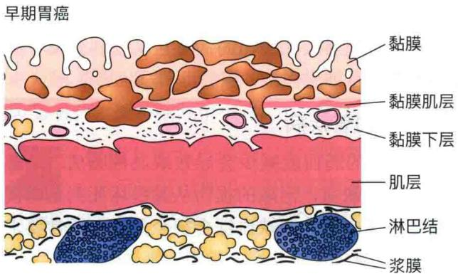
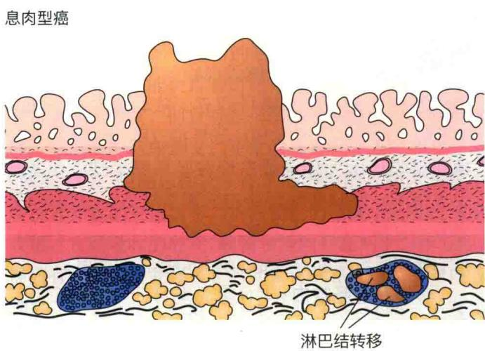
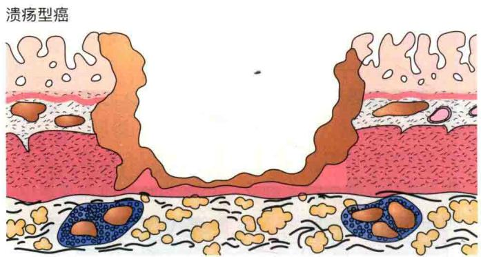
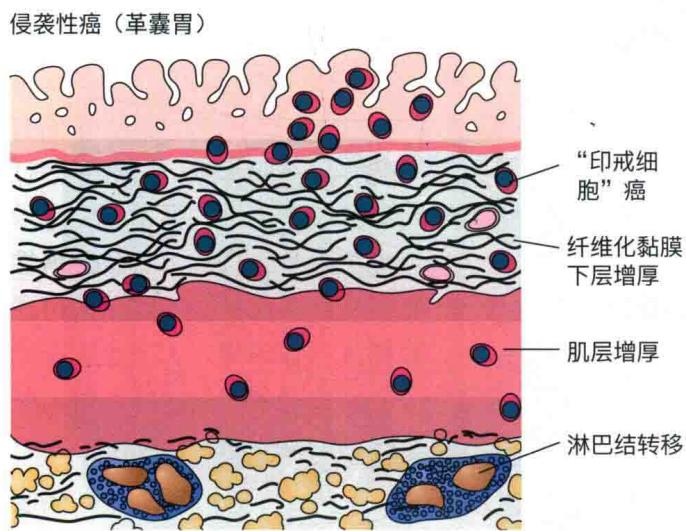 
图13-13 胃癌主要类型

【临床表现】在美国和欧洲，多数胃癌患者在首次检查时已有转移。最常见的初始症状为体
，常伴食欲缺乏和恶心。多数患者有上腹痛和
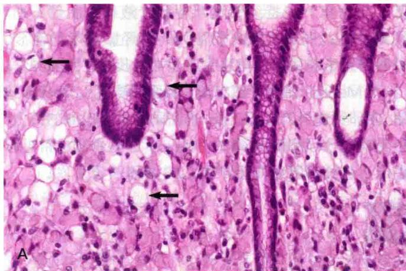
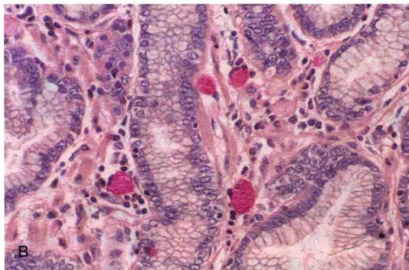 
图13-14 浸润型胃癌。A.许多印戒细胞（箭头）浸润存留隐窝间的固有膜；B.黏液染色显示肿瘤细胞内的黏液
背痛，与良性溃疡相同，并常可以用抗酸药和 $\mathrm{H}_{2}$ 受体阻断剂缓解。但是，随着疾病进展，药物治疗不能缓解症状。胃流出道梗阻可发生于胃窦或幽门前区的大肿瘤。大量出血少见，但慢性出血常导致贫血和粪便内隐血。肿瘤累及胃食管交界处可造成吞咽困难，类似贲门失弛缓和食管癌。
2. 胃神经内分泌瘤（类癌）是低级别恶性肿瘤。胃黏膜内分泌细胞可发生肿瘤，统称类癌（神经内分泌瘤，NETs）。可复发或转移。转移与肿瘤大小更相关而非组织学形态。胃NETs常无激素活性，但有时分泌5-羟色胺，转移可引起类癌综合征。
# 第三节 小肠
# 一、先天性异常
# 1. 闭锁和狭窄导致新生儿肠梗阻
闭锁：闭锁定义为肠腔完全闭塞，可表现为：①薄的腔内隔膜；②近段盲端和远段囊袋有条索连接；③不连接的盲端。
狭窄：是不完全的闭锁，肠腔狭窄但不闭塞。狭窄也可以由不完全隔膜形成。常在婴儿时就引起症状，但中年人才显出症状并见于报道。诊断肠闭锁和狭窄
基于生命第一天持续性呕吐含胆汁液体。胎便不通。梗阻的胎儿肠道扩张充满液体，可经影像学检测到。外科纠正常能成功，但这些患儿常有其他并发的异常。
2.Meckel 熬室导致出血，梗阻和穿孔 Meckel 熬室，由卵黄囊导管存留引起，是回肠肠系膜对侧的突出，位置在成人回盲瓣上 $60 \sim 100\mathrm{cm}$ 。这是小肠最常见和临床上最鲜明的先天性异常。2/3 患者小于 2 岁。

【病理】成人的Meckel憩室约5cm长，略窄于回肠。有一个纤维条索附于憩室尖端，有时
与脐相连。此病变是真性憩室，正常小肠全层都突出黏膜类似于附件回肠。多数Meckel憩室无症状，在尸检或因其他原因手术时偶然发现。少数可有症状，约 $50\%$ 含有异位的胃，十二指肠，胰腺，胆道或结肠组织。

【临床表现】Meckel憩室的潜在并发症包括出血、穿孔、梗阻和憩室炎，最后者可表现与阑法分辨的症状。
3. 胎粪性肠梗阻 是囊性纤维化的早期并发症。囊性纤维化的新生儿肠梗阻是因为坚硬的胎粪累积在小肠内。异常的胎粪质地反映了胰酶缺乏和肠黏液的高黏度。 $50\%$ 受累的婴儿，胎粪性肠梗阻并发：①肠扭转；②穿孔伴胎粪性腹膜炎；③肠闭锁。
# 二、小肠感染性疾病
1. 细菌性痢疾 是世界范围死亡的一大原因。感染性痢疾在不发达国家的婴儿尤其易于致死。在环境卫生差的国家，儿童期痢疾的死亡人数是惊人的；每年因痢疾死亡的5岁以下儿童达150万，超过 $80\%$ 在非洲和南亚。正常小肠含有少量细菌（ $< 104 / \mathrm{ml}$ ），多数是厌氧菌，一般不在小肠内大量繁殖。感染性痢疾由于细菌的集落性生长，如大肠埃希菌的产毒株和霍乱弧菌。感染性痢疾的最明显表现是因细菌毒性和肠激素所致肠分泌增多。吸收减少和蠕动增加对腹泻作用小些。
感染性痢疾的病原体传统上分为产生毒素的病原体，如霍乱弧菌和大肠埃希菌的某些菌株，以及黏附性和侵犯性细菌，包括志贺菌、沙门菌和大肠埃希菌的一些菌株，耶尔森菌和弯曲菌是最广泛认知的，感染性痢疾的独立因素已在第9章讨论。
2. 在美国，轮状病毒和诺瓦克病毒是引起病毒性胃肠炎最常见的原因
轮状病毒：轮状病毒感染是婴儿腹泻的常见原因。2岁以内住院患儿，约 $50\%$ 是因为急性腹泻。轮状病毒已证明在十二指肠活检标本，与表面上皮损伤和长达2个月的肠吸收功能不良有关。
诺瓦克病毒：这种病毒引起美国1/3的病毒性胃肠炎的流行。病毒针对上段小肠，导致斑片状黏膜病变
和吸收不良。常见呕吐和腹泻，症状在2天内缓解
其他能引起感染性腹泻的病毒包括艾科病毒、柯萨奇病毒疹、巨细胞病毒、腺病毒和冠状病毒。
# 三、小肠的血管疾病
任何原因的肠血流减少会导致缺血性肠病。最常见的是急性肠缺血，形成的损伤从黏膜坏死到全壁梗死，程度不等。慢性肠缺血综合征少见些，通常要求2个或更多动脉的严重狭窄，常因为粥样硬化。
# 1. 肠系膜上动脉的闭塞是急性肠缺血的最常见原因

# 【发病机制】
动脉闭塞：大动脉因血栓或栓子突然闭塞导致小肠梗死先于侧支循环建立。依动脉大小不同，梗死可节段性或几乎全部小肠坏疽（图13-15）。肠梗死最常见因为栓子或血栓致肠系膜上动脉闭塞。少见情况，肠缺血性坏死由血管炎导致，血管炎常累及小动脉。除内在血管病变外，肠扭转，肠套叠和疝囊内肠绞窄都可导致动脉和静脉同时闭塞。
非闭塞性肠缺血：非闭塞性肠坏死可范围广泛，见于低氧患者，不同原因休克继发心排血量减少，包括出血、败血症和急性心肌梗死。休克导致血流重新分配到脑和其他致命器官。细动脉的灌注压彻底降低导致其崩溃，从而加重缺血。
肠系膜静脉血栓形成：肠系膜静脉血栓形成的原因包括高凝状态，淤滞和炎症（门静脉炎）。几乎所有的血栓累及肠系膜上静脉，仅 $5\%$ 累及肠系膜下静脉。肠系膜上静脉分布区的侧支血流常足以避免肠梗死。

【病理】梗死的肠管呈水肿和弥漫青紫。梗死
区和正常组织的分界常很清楚，而静脉闭塞常有较弥漫的表现。黏膜及黏膜下层广泛出血，特别是在静脉闭塞时（如肠系膜静脉血栓形成）。黏膜表面有不规则的白色坏死物，肠壁薄，肠管扩张，气泡（积气）可见于肠壁和系膜静脉。浆膜表面浑浊，覆以炎性渗出物。平滑肌组织功能不良影响肠蠕动，导致麻痹性肠梗阻，近段肠管扩张，充满液体。肠内病原体可通过损伤的肠壁，引起腹膜炎或败血症。如果患者能坚持过这种低关注损伤，肠管会完全恢复，或伴有肉芽组织和纤维化的愈合，逐渐形成狭窄。

【临床表现】肠系膜动脉闭塞以突然发生的腹
痛为标志。常见血便、呕血和休克。在未治疗的患者，常见穿孔。随着梗塞进展，系统性表现逐渐严重（多器官功能衰竭综合征）。在肠系膜上动脉近段梗阻造成的广泛梗死，几乎全小肠需要被切除，这种情况是难以存活的。
2. 慢性肠缺血导致复发性腹痛 主要的内脏动脉粥样硬化狭窄产生慢性肠缺血，并与间断腹痛有关，称为肠（腹）绞痛。这种疼痛的特征是开始于进食后30分钟内，能持续几个小时。

【病理】慢性小肠缺血可导致纤维化和狭窄，
后者可导致肠梗阻，有时会有淤血及细菌过生
长而吸收不良。黏膜下层增厚，纤维化伴肉芽组织，
并可累及肌层。
# 四、吸收不良
吸收不良是一个通用的名词描述一系列临床状态，重要的营养素不能被胃肠道充分吸收。虽然有些营养素在胃和结肠吸收，但只有在小肠，特别是近段小肠吸收的，有重要的临床意义。正常的肠吸收分为腔期和肠期（图13-16）。腔期包括发生在小肠腔内的过程，改变了多种营养素的生化状态，从而使它们能被小肠吸收细胞收集。在肠吸收的腔期，胰酶和胆酸分泌到十二指肠腔，需要有合适的量并且在正常的生化状态（如调节胃内容物以足够高的 $\mathsf{pH}$ 状态流入十二指肠）。肠期包括发生在肠壁细胞内和转运通道发生的过程。
1. 腔期吸收不良 常反映胆酸或胰酶的不足。
胃十二指肠手术（胃切除术，胃窦切除术，幽门成形术）术后发生远端胃和十二指肠正常连续性打断
慢性胰腺炎，胰腺癌或囊性纤维化导致胰腺功能障碍。
胆盐缺乏或失效有三个可能原因
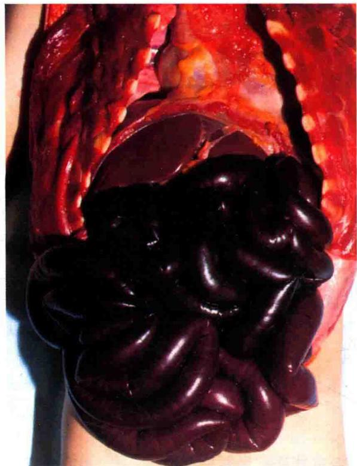 
图13-15 小肠梗死。这个婴儿在严重的腹痛和休克后死亡。尸检证实小肠扭转压闭了肠系膜上动脉。整体小肠扩张，坏疽和出血
（1）肝脏疾病导致胆汁分泌不足。 
（2）胃运动障碍导致细菌过度生长。这种情况可见于盲袢综合征、小肠多发憩室或肠壁神经缺陷（如淀粉样变、硬皮病、糖尿病肠病）。当胃肠道运动障碍时，过多的细菌群落造成胆盐去结合，因而不能形成微胶粒，而微胶粒是甘油单酯和游离脂肪酸吸收的基础。 
（3）末段回肠缺失或旁路造成胆盐缺乏，可因为外科切除、手术吻合口、瘘或回肠疾病（如克罗恩病、淋巴瘤）。 
2. 肠期吸收不良 常反映特异性酶缺陷或转运受损。肠期4个成分的任何一个异常都会导致吸收不良，一些疾病还会累及多于1个成分。图13-16总结了吸收不良的主要原因。

# 【发病机制】
微绒毛: 肠二糖酶和寡肽酶完整地结合在微绒毛膜。二糖酶是糖吸收的基础, 因为只有单糖能被肠上皮吸收。微绒毛的功能异常可能是原发的 (如原发性二糖酶缺陷) 或者是继发的, 在绒毛损伤的时候, 如乳糜泻。多种酶缺陷（如乳糖酶）表现为对应的二糖不耐受。
吸收区域：小肠可观的长度和通过小肠皱襞扩增了的表面，提供了巨大的吸收区域，这个区域的明显减少会导致吸收不良。吸收面积可因以下原因减少：① 小肠切除（短肠综合征）；② 胃结肠瘘（小肠旁路）；③ 继发于多种小肠疾病（乳糜泻、热带口炎腹泻、Whipple 病）的黏膜损伤。
吸收细胞的代谢功能：营养素是否能后续转运入血，依赖于在吸收细胞内的代谢。甘油单酯和游离脂肪酸重新组合成甘油三酯，并包被蛋白（载脂蛋白）从而形成乳糜和脂蛋白微粒。β脂蛋白缺乏是一种代谢功能缺陷，吸收细胞不能合成载脂蛋白，不能装配脂蛋白和乳糜。针对小肠上皮细胞的非特异性损伤见于乳糜泻、热带口炎性腹泻、Whipple病和胃泌素瘤的胃酸过多。
转运：营养素从肠上皮通过毛细血管和淋巴管转运出肠壁。这些管道的转运障碍也可能是重要的吸收不良的原因，与Whipple病、肠淋巴瘤和先天性淋巴管扩张有关。

【临床表现】吸收不良可以是特定的或广泛的。
■特定的或分离的吸收不良指明确的分子缺陷导致对单种营养素的吸收不良。这组疾病的例子有二糖酶缺陷（显著的乳糖酶缺陷）和胃内因子缺陷，造成维生素 $\mathsf{B}_{12}$ 缺乏和继而发生恶性贫血。 
广泛的吸收不良时，几种或全部营养素的吸收都受到影响，导致营养不良。
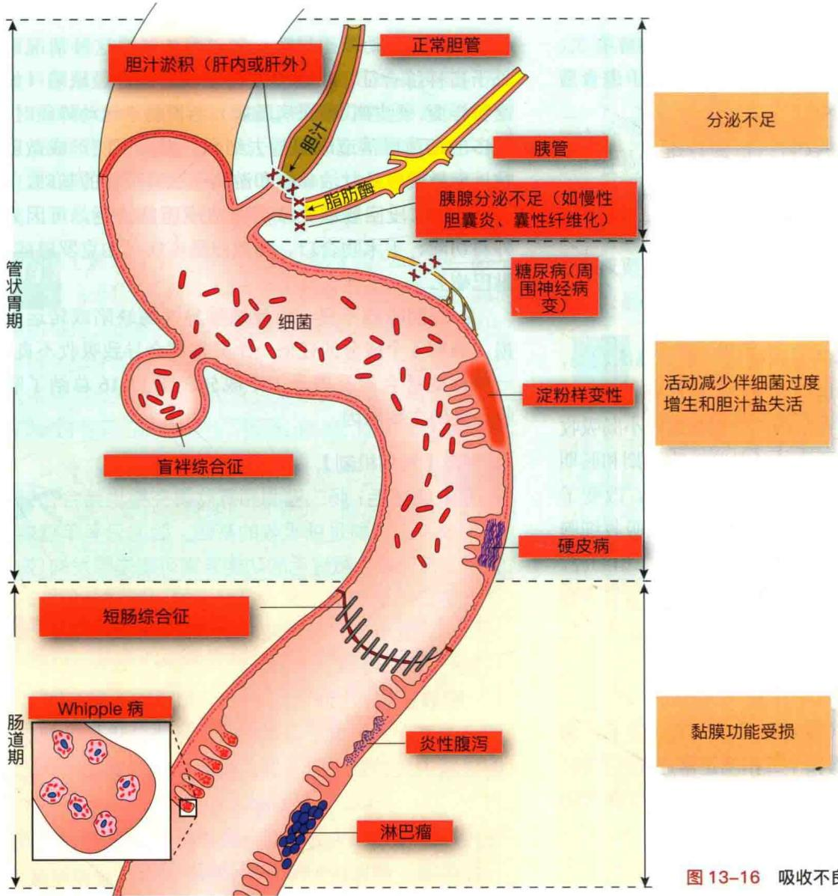 
图13-16 吸收不良的原因
3. 乳糖酶缺陷 导致对乳制品不耐受。肠上皮刷状缘含有二糖酶，对于碳氢化合物的吸收非常重要。作为奶和其他乳制品的主要组成部分，乳糖是饮食里最常见的二糖之一。典型者乳糖酶缺陷的症状开始于青春期，患者进食乳制品后有腹胀、肠胀气和腹泻。乳糖消除牛奶和制品缓解症状。损伤肠黏膜的疾病（如乳糜泻）也可以导致获得性乳糖酶缺乏。
4. 乳糜泻 反映了对谷类麸质的免疫反应。乳糜泻（口炎性腹泻，麦胶敏感性肠病）的特征是：①广泛吸收不良；②小肠黏膜病变；③消除含麸质食物后有明显的临床和组织学反应。全世界各种族都有乳糜泻的发病。女性略多，1.3：1。多数患者在儿童期诊断。任何时候食物内有谷物即可有症状。虽然多数患者在儿童期诊断，也有临床症状在70多岁时才表现。

【发病机制】遗传素质麸质暴露是乳糜泻发生的必需因素。
谷物蛋白的作用：静止的乳糜泻患者摄入含麸质的谷物如小麦、大麦或黑麦面粉会导致临床和组
织学活动性疾病。麦胶蛋白，麸质的乙醇可溶性片段，也有相同的作用。
遗传因素：一级亲属的乳糜泻共同发生率有 $8\% \sim 18\%$ ，而在同卵双胞胎高达 $70\%$ 。约 $90\%$ 的乳糜泻患者有HLA-B8，HLADQ2和DQ8也有类似的频率。
免疫因素：乳糜泻的肠病变特点是上皮细胞损伤，上皮内明显CD8+T淋巴细胞增多，固有膜浆细胞增多。治疗后乳糜泻患者的麦胶蛋白刺激局部免疫球蛋白合成。几乎所有患者有血浆麸质和平滑肌内膜组织转氨酶的IgA抗体，是乳糜泻的诊断特征。这些抗体因为大的麸质分解的肽而产生，富含脯氨酸和谷氨酰胺，能抵抗肠道蛋白酶。组织转氨酶与麸质肽有交叉链接，促进产生针对这个酶的自身抗体。虽然如此，在这个疾病发病机制中抗体的作用仍不明确。
与疱疹样皮炎的关系：乳糜泻与疱疹样皮炎有关，后者为皮肤血管病变，典型者累及伸展肌表面
和身体暴露部位。几乎所有的疱疹样皮炎患者有乳糜泻类似的小肠黏膜病变，仅 $10\%$ 有明显的吸收不良。也可以检测到基底膜 IgA 沉积和组织转氨酶的抗体。严格的无麸质饮食可以同时改善胃肠道和皮肤症状。
乳糜泻的吸收不良也和肠黏膜表面积减少（因为绒毛和微绒毛钝缩）有关，以及被破坏的细胞的受损的细胞内代谢。

【病理】疾病很早期时的小肠活检可显示上皮内淋巴细胞浸润隐窝和表面上皮，在正常形态
的绒毛。完全发展的乳糜泻显示平坦的黏膜，伴有： $①$ 绒毛钝缩或完全消失； $②$ 黏膜表面上皮细胞损伤伴多量上皮内淋巴细胞（T细胞）； $③$ 固有膜浅层浆细胞和淋巴细胞增多（图13-17）。未治疗的病例组织学异常常在十二指肠和近段空肠表现最严重。病变表现
到远段肠管渐轻，有时回肠黏膜大致正常。临床表现的严重程度与受累肠管的长度相关。吸收细胞变扁平，比正常嗜碱，细胞核的基底极向消失。上皮内和固有膜多形核白细胞和嗜酸粒细胞也可以增多。

【临床表现】完全发展的乳糜泻发生广泛吸收
不良。广泛吸收不良的症状和表现常开始于大便和成人。生长迟缓更常见于小儿。检测抗麦胶组织转氨酶的IgA抗体提示乳糜泻比原来认为的一些病例的晚期并发症包括溃疡性空肠炎，小细胞淋巴瘤和其他胃肠道恶性肿瘤。严格的无麸症可带来完全缓解。
5.Whipple病是小肠的一种少见感染。Whipple病的最明显表现是吸收不良。白种人男性 $30\sim 40$ 岁最常见。疾病为系统性的，其他表现包括发热、皮肤色素沉着、贫血、淋巴结肿大、关节炎、心包炎、筋膜炎、
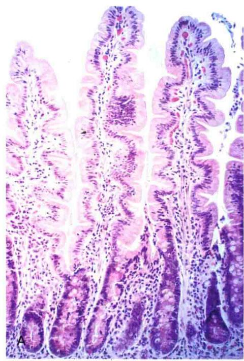
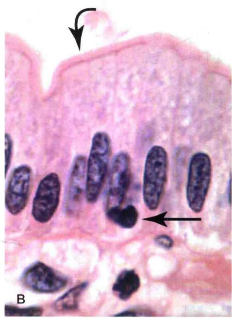
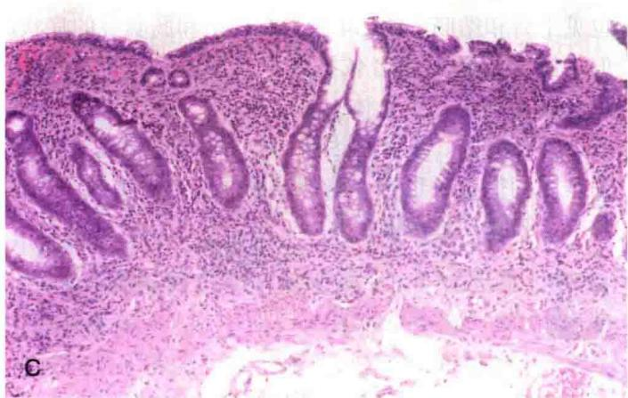 
图13-17 乳糜泻。A. 正常近段小肠显示高, 细绒毛, 隐窝位于基底; B. 正常表面上皮显示少量上皮内淋巴细胞（直箭头）和完好的刷状缘（弯箭头）; C. 晚期乳糜泻患者的黏膜活检，显示绒毛完全消失伴固有膜淋巴细胞和浆细胞浸润，隐窝高度增加; D. 高倍镜，表面上皮明显损伤，伴多量上皮内淋巴细胞和刷状缘消失
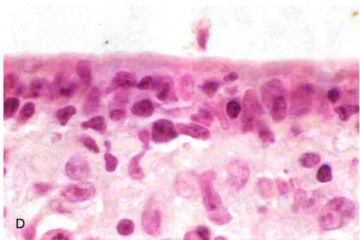
心内膜炎和中枢神经系统受累。

【发病机制】Whipple病的典型表现是小肠黏膜巨噬细胞浸润，胞质内包裹小的，杆状
细菌。致病病原体是放线菌的一种，Tropheryma whippelii。许多研究提示了宿主的易感性，可能是丁淋巴细胞功能缺陷，可能是致病的重要因素。Whipple病患者的巨噬细胞对细胞内微生物的降解能力下降。抗生素治疗可致显著的临床缓解。

【病理】肠壁增厚和水肿，系膜淋巴结常增大。
绒毛扁平，增厚，固有膜广泛浸润大的泡沫状巨噬细胞（图13-18A），胞质内充满大的糖蛋白颗粒，PAS染色强阳性。这些颗粒是包裹了不同退变阶段的细菌的溶酶体（图13-18B）。其他固有膜正常的细胞成分（即浆细胞和淋巴细胞）减少。黏膜和黏膜下层淋巴管扩张，并且常见大的脂滴在淋巴管内和细胞外间隙，提示淋巴管梗阻。与绒毛明显的结构异常不符，上皮细胞仅显示灶性异常，包括微绒毛变薄和胞质内脂滴。肠系膜淋巴结引流影响的小肠节段也显示类似的显微镜下改变。特征性的含细菌的巨噬细胞也可以在其他器官见到。Whipple病可用抗生素成功治疗。
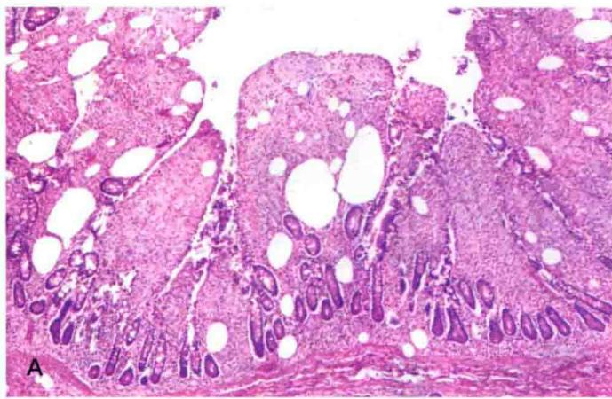
反应显示大量的巨噬细胞与胞质颗粒状材料。C.电子显微图显示了巨噬细胞小杆菌。.jpg) 
图13-18 惠普尔疾病。A.部分空肠黏膜的显微照片显示了绒毛的失真。固有层富含大,pale-staining巨噬细胞。扩张黏膜淋巴管是突出的。B.定期acid-Schiff(PAS)反应显示大量的巨噬细胞与胞质颗粒状材料。C.电子显微图显示了巨噬细胞小杆菌。
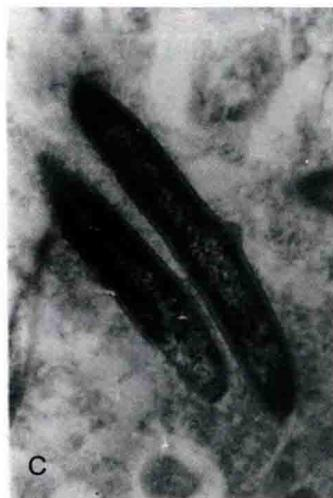
# 五、机械性肠梗阻
肠内容物被机械性地梗阻，原因可能：①管腔肿物；②肠壁固有病变；③外部挤压。
肠套叠：在这种腔内小肠梗阻，一段肠管（套入部）向远处伸入一段包绕的外部肠管（鞘部）。肠套叠常发生在婴儿或年幼幼儿，原因不清。在成人，肠套叠的诱导病灶常为肠壁的病变，如Meckel憩室或肿瘤。一旦诱导病灶陷入鞘部，肠蠕动促使套入部向前。除了引起急性肠梗阻，肠套叠还压闭套入部的血供，形成梗死。如果梗阻不能自发缓解，需要外科治疗。
肠扭转：这是一个肠梗阻的例子，也是急腹症的一个原因，是一段肠管从肠系膜处扭转，扭曲缠绕肠管且常影响血供。在许多病例，肠扭转远侧小肠会缺血坏死。肠扭转常提示潜在的先天性异常。
粘连：以前的手术或腹膜炎造成的纤维瘢痕引起梗阻，可通过瘢痕使肠管扭曲或成角，或直接挤压肠腔。
疝：肠袢会嵌顿在腹股沟疝或股疝，此时，肠腔梗阻，血供受累。
# 六、肿瘤
胃肠道肿瘤不足 $5\%$ 发生在小肠。
# （一）良性肿瘤包括腺瘤，Peutz-Jeghers息肉和间质肿瘤
1. 腺瘤 小肠腺瘤与结肠者相似。依据其主要成分，小肠腺瘤样息肉可分为腺管状，绒毛状或绒毛腺管状（见后面息肉和结直肠）。绒毛状腺瘤在小肠少见，多数发生在十二指肠，尤其是壶腹周围区。腺瘤，特别是绒毛状腺瘤，可恶性转化。腺瘤常无症状，但有时并发出血和肠套叠。
2.Peutz-Jeghers综合征 Peutz-Jeghers 综合征是一种常染色体显性遗传病，特征为肠错构瘤性息肉和黏膜皮肤黑斑，尤其在脸、颊黏膜、手、足及肛周和外周生殖器区。除了颊黏膜黑斑以外，雀斑样黄斑病变常在青春期消退。息肉多发生在近段小肠，有时也见于胃和结肠。约1/4患者有梗阻和肠套叠的症状，但多数无症状的患者依据色素斑即提示诊断。Jeutz-Jeghers 综合征与染色体 $19\mathrm{p}$ 上的一个基因（LKB1）的灭活突变有关，这个基因编码一种蛋白激酶。这个缺陷基因的携带者也有一些部位癌症的风险增高，包括乳腺、胰腺、睾丸和卵巢。

【病理】Peutz-Jeghers息肉是错构瘤，连接黏膜肌的平滑肌纤维分支呈网状，支持息肉的腺一般认为Peutz-Jeghers息肉是良性的，但 $3\%$ 发生腺癌，虽然有些并不发生在错构瘤息肉中。
3. 胃肠道间质瘤（GISTs） GISTs 发生于全小肠，但最多见于空肠。它们为壁内包块，表面被覆完好的
黏膜，与其他部位者一致。肠梗阻不常见，但可并发肠扭转。相比于胃的GISTs，小肠GISTs的行为更为侵袭。
# （二）小肠的恶性肿瘤少见
# 1. 腺癌

【流行病学】虽然小肠腺癌在胃肠道肿瘤里占很小一部分，它们占小肠恶性肿瘤的 $50\%$ 。多
数位于十二指肠和空肠。大多数发生在中年患者，中等男性优势。小肠克罗恩病是腺癌的一个危险因素。FAP，遗传性非息肉病性结肠癌（HNPCC）综合征（Lynch综合征）和乳糜泻也是危险因素。

【病理和临床表现】小肠腺癌可为息肉样、溃疡或环状和狭窄。除了造成肠梗阻，息肉样肿

瘤还可以是肠套叠的诱导病灶。腺癌源于隐窝上皮，而非绒毛，所以像结直肠癌。小肠腺癌
的症状常与进展性肠梗阻有关。潜在出血常见并常导致缺铁性贫血。如果十二指肠腺癌累及Vater乳头，称为壶腹癌。这样的肿瘤引起梗阻性黄疸或胰腺炎。在患者出现症状之前，多数患者已经转移到局部淋巴结，总体5年存活率不足 $20\%$
2. 原发性肠淋巴瘤 原发性淋巴瘤源于MALT结节，正常时存在于黏膜和表浅黏膜下层。在工业化国家，淋巴瘤是小肠第二多见的恶性肿瘤，约占 $15\%$ 小肠恶性肿瘤。在欠发展国家，另外类型的原发性淋巴瘤占小肠恶性肿瘤的2/3还多。后者首先在地中海人口中有描述，但现在分布于全世界的贫困地区。这两型淋巴瘤有明显的流行病学，临床和病理学表现的差异，被分别称为西方型和地中海淋巴瘤。第三型原发性小肠淋巴瘤发生在乳糜泻的环境，被称作肠病型肠T细胞淋巴瘤（EITCL）。
EITCL：如其命名所述，这肿瘤常伴有乳糜泻，尤其是难治性腹泻，对限制裁质摄入不反应。这肿瘤在诊断时常已广泛播散。
地中海淋巴瘤：地中海淋巴瘤典型地发生在贫困国家的低社会经济状态的年轻人；因此，被认为有环境因素致病。这肿瘤与 $\alpha$ 重链病有关，是一种肠B淋巴细胞的异常增生，分泌IgA重链而无轻链。地中海淋巴瘤和 $\alpha$ 重链病被认为是一个疾病，称为免疫增生性小肠病。
地中海肠淋巴瘤主要累及十二指肠和近段空肠。一段较长的小肠，甚至全小肠，可受累。典型者，弥漫浸润浆样淋巴细胞或浆细胞在黏膜和黏膜下层。黏膜的淋巴瘤性浸润导致黏膜萎缩和严重的吸收不良。
西方型肠淋巴瘤：这种异常常累及40岁以上成人和10岁以下儿童。易于发生节内淋巴瘤的一些因素也
使肠淋巴瘤的风险增高，特别是免疫抑制药物造成的免疫缺陷。最常见于空肠，表现为：① 蕨伞状肿物突然肠腔；② 隆起溃疡性病变；③ 肠壁节段性弥漫增厚；④ 斑片样黏膜结节。肠梗阻、肠套叠和穿孔是重要并发症。潜在出血常见，肿块引起急性出血也可以发生。常进行化疗治疗。
慢性腹痛、腹泻和杵状指是小肠淋巴瘤的最常见的临床征象，腹泻和体重减轻反映了存在吸收不良。
3. 神经内分泌肿瘤（类癌）类癌这一名称已广泛地被神经内分泌肿瘤（NETs）所取代。这些肿瘤都被认为是恶性的，但通常转移潜能较低。NETs约占小肠恶性肿瘤的 $20\%$ 。重要的参数包括原发部位、大小、浸润深度、激素反应和有无功能。阑尾是最常见的胃肠道发病部位，随后是直肠。这些部位的肿瘤通常较小，很少有侵袭性。再次常见的是空肠，常为多发且更侵袭。NETs也可以与多发性内分泌肿瘤（MEN）综合征有关，通常是MEN1型。

【病理】大体观，小的类癌呈现为黏膜下结节，被以完好的黏膜。大的NETs可长成息肉样，
壁内或环形（图13-19A）并常有继发溃疡。肿瘤长大浸润肌层和突破浆膜，常引起显著的促纤维增生反应。纤维组织可造成腹膜粘连、肠管扭转、肠梗阻。显微镜下，肿瘤呈巢状、索状和菊形团，细胞一致，小，圆形（图13-19B）。有时也见腺样结构。核明显不规则，核分裂极少见。丰富的嗜酸性胞质含有神经内分泌颗粒。NETs先转移至区域淋巴结。继而，血行播散导致远处部位的转移，特别是肝。

【临床表现】类癌综合征是一种少见的临床表现
因不同的活性肿瘤产物释放导致。多数NETs有不同程度的功能，而这个综合征主要见于广泛肝转移的患者。经典的症状包括腹泻（常是最痛苦的症状）、不定期潮红、支气管痉挛、发绀、毛细血管扩张和皮肤病变。50%患者有右侧心血管疾病。纤维斑块在三尖瓣和肺动脉瓣，右侧心腔的心内膜、腔静脉、冠状窦和肺动脉。瓣膜异常导致肺动脉狭窄和三尖瓣反流。
4. 转移性肿瘤 最常见的小肠肿瘤是从其他部位的转移肿瘤。附近器官（如胃、胰腺、结肠）可直接侵犯到小肠。肺、女性生殖系统和皮肤（黑色素瘤）是最常见的小肠转移肿瘤的原发部位。系统性淋巴瘤的小肠受累可以发展为转移癌
# 第四节 大肠
# 一、先天性异常
1.先天性巨结肠（Hirschsprung病）反映了节
段的神经节细胞缺失。先天性巨结肠是先天性神经节细胞缺失导致的结肠扩张，缺失的神经节细胞常在直肠肠壁（图13-20）。约1/4的病例，在结肠更多部位也会出现神经节细胞缺失。这种异常的活产胎儿发生率估计为 $1 / 5000$ ， $80\%$ 的患者为男性。

【发病机制】先天性巨结肠的发病机制可追
溯到支配结肠的细胞从神经嵴向尾侧迁移的
正常过程被打断。鉴于直肠内括约肌在这个迁移的远端，这种无神经节细胞的节段总是开始于直肠。因为没有松弛刺激，无神经节细胞的直肠（有时是附近的结肠）持续收缩，排泄物不能进入这段狭窄区域，其近侧肠管扩张。
多数先天性巨结肠散发，但 $10\%$ 的病例是家族性的。 $50\%$ 家族性病例和 $15\%$ 散发病例有染色体 $10q$ 的RET受体酪氨酸激酶基因灭活突变（见MEN2综合征，第21章）。有些病例有突变见于内皮素-B受体或编码RET受体配体和内皮素-B受体的基因。唐氏综合征的先天性巨结肠的发病率升高10倍。

【病理】先天性巨结肠的大肠有一段收缩痉挛
的节段，对应无神经节区域。这个区域近侧，
肠壁非常扩张。确定诊断在于直肠活检标本缺失神经
节细胞 (图13-20B)。黏膜下层和肌间也可有明显的
无髓鞘胆碱能神经纤维增多（神经增生）。

【临床表现】先天性巨结肠是最常见的先天性
肠梗阻的原因。临床征象为胎便排放延迟和出
生前几天呕吐。在直肠短节段缺乏神经节细胞和部分
肠梗阻的患儿，便秘、腹胀和复发性粪便嵌塞是其症状。
先天性巨结肠的最严重并发症为小肠结肠炎，此时坏
死和溃疡影响扩张的近侧段结肠并可延至小肠。先天
性巨结肠的治疗是外科切除无神经节的节段。
2.肛门直肠畸形是常见的发育缺陷
陷从小的狭窄到严重的复杂的缺陷，都是胚胎前6周
肠道尾部区域发育受阻所致。畸形包括肛门直肠发育
不良或狭窄和肛门闭锁。变形区和膀胱、尿道、阴道
或皮肤间的瘘管可发生于各型肛门直肠畸形。
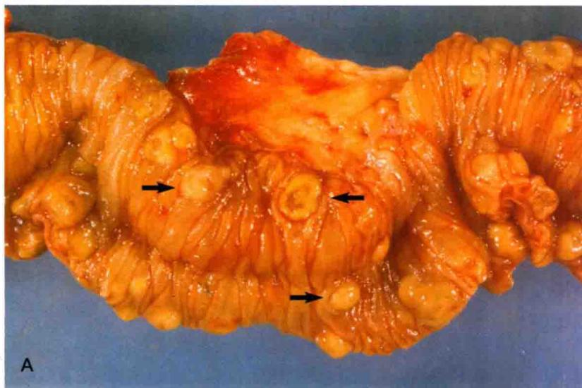 
图13-19 小肠神经内分泌肿瘤。A.一段末段回肠显示多发性神经内分泌肿瘤（箭头）；B.图片A中的病变，显示索状一致的小，圆细胞
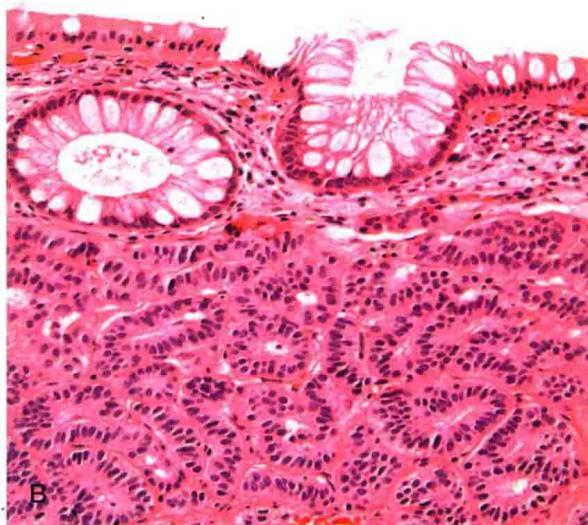
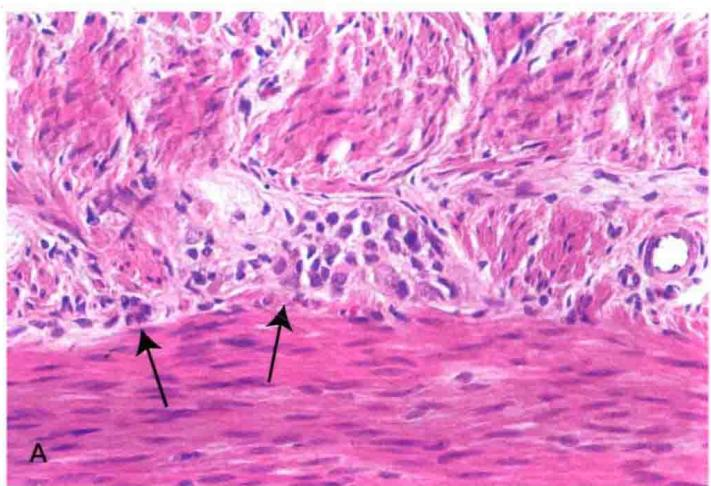 
图13-20先天性巨结肠。A.直肠壁内的神经节细胞；B.一位先天性巨结肠的直肠活检标本显示无髓鞘神经纤维在系膜丛且无神经节细胞
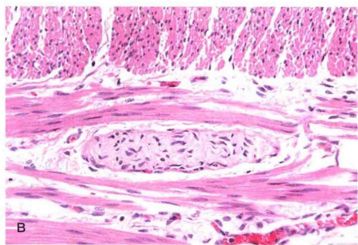
# 二、大肠的感染性疾病
结肠的主要感染，包括结核和阿米巴，已在第9章讨论，或前面小肠感染性腹泻部分。其余的感染多数经性传播，累及肛门直肠区域，常见于男性同性恋者，包括淋病、梅毒、性病淋巴肉芽肿、肛门直肠疱疹和性病疣（尖锐湿疣）。免疫抑制患者有较高的结肠感染概率（如阿米巴和志贺菌）。骨髓移植患者常在胃肠道感染巨细胞病毒和疱疹病毒。
1. 假膜性肠炎 常在抗生素治疗后发生。假膜性肠炎是以结肠黏膜渗出性斑块为特征的炎性疾病的通称。

【发病机制】难辨梭状芽胞杆菌, 与新生儿
坏死性肠炎也有关，是常见的抗生素治疗相
关的致病病原体。此微生物并无侵袭性但产生毒素损伤结肠黏膜。其致病的机制尚未完全明确，但抗生素导致肠道菌群改变是有作用的。仅 $2\% \sim 3\%$ 正常成人有这种微生物，而近期应用抗生素的患者 $10\% \sim 20\%$ 感染。 $95\%$ 抗生素相关的假膜性肠炎患者大便内可分离出这种细菌。

【病理】大体观察，结肠，特别是直肠乙状
结肠区域，出现隆起的黄色斑块，可达直径
2cm，黏附在其下黏膜（图13-21）。中间黏膜充血水肿但无溃疡。严重病例，斑块融合成广泛的假膜。表面上皮坏死被认为是最初的病理改变。继而，隐窝破坏，被黏液和中性粒细胞充满扩张。假膜含有坏死上皮的碎屑、黏液，纤维素和中性粒细胞。假膜有时也发生在其他肠道感染：金黄色葡萄球菌、念珠菌、侵袭性细菌和产生志贺样毒素的大肠埃希菌。

【临床表现】抗生素相关的难辨梭状芽胞杆菌
感染基本上总是伴有腹泻，但多数病例并不进
展为结肠炎。有假膜性肠炎的患者，在腹泻基础上还有发热、白细胞增高和腹部绞痛。在应用抗生素之前，
很多这样结肠炎的患者因痉挛性肠梗阻和无法纠正的休克在几小时或几天内死去。现在，虽然仍是很重的疾病，但通常可以通过恰当的抗生素和支持性补液及电解质治疗而控制。
2. 新生儿坏死性小肠结肠炎 使早产儿病情复杂。坏死性小肠结肠炎是最常见的新生儿获得性外科急症之一。它特别常见于经口营养的早产儿，似乎与累及肠道黏膜的缺血有关。缺血继发细菌定植，常有难辨梭状芽胞杆菌。病变表现可从典型的假膜性肠炎到肠道坏疽和穿孔。
# 三、憩室疾病
憩室疾病指两种情况：一种叫憩室病，另一种炎症并发症称为憩室炎。
1. 瞿室病反映环境和结构因素 瞿室病是一种获得性的黏膜和黏膜下层组织经过结肠肌层突出（憩室）。

【流行病学】憩室病有明显的地理分布差异，常
见于西方社会，少见于亚洲、非洲和发展中国家。
患病率随年龄增加。在西方国家，约 $10\%$ 的人口受累。

【发病机制】明显的憩室病患病率差距提示
环境因素是主要的致病因素。西方人进食精
细加工的碳水化合物和肉类，替代粗糙的谷物。广泛接受的观点是缺乏难消化的纤维诱发易感人群的憩室形成。在这方面，摄入高纤维饮食者形成的粪块大些，减小了结肠的自发运动和腔内压力，后者被认为是肠壁突出的重要因素。除压力之外，结肠壁缺陷也是憩室形成必需的。在滋养血管穿入的地方，结肠环形肌被结缔组织裂打断。随年龄增加，这些结缔组织的顺应性逐渐缺失，从而逐渐失去抵抗升高的腔内压力的能力。

【病理】憩室病的异常结构严格讲是假憩室，
即仅有黏膜和黏膜下层通过肌层突出向外。真
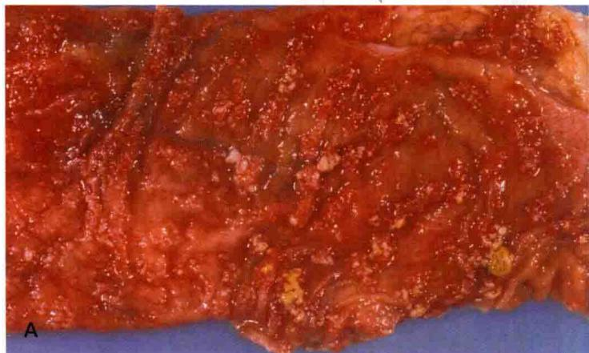 
图13-21 假膜性肠炎。A.结肠显示不同的受累表现，从红斑到黄绿色假膜区域；B.显微镜下，假膜（箭头）含有纤维素、黏液和炎细胞（多数是中性粒细胞）
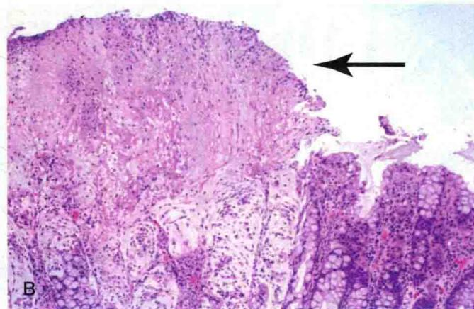
性憩室累及肠壁全层。虽然憩室病可影响任何节段的结肠，包括盲肠，但是 $95\%$ 的患者影响乙状结肠。憩室的数量可以是几个，也可以上百。多数在系膜和外侧结肠带间平行排列成行（图13-22A）。憩室深度可达 $1\mathrm{cm}$ ，与肠腔相连处有不同长度和口径的颈部。受累结肠的肌壁增厚。
显微镜下，憩室特征性地呈烧瓶样结构从肠腔通过肌层向外突出（图13-22B）。憩室壁与表面黏膜相连续，因此含有上皮和黏膜下层。憩室的基底由浆膜结缔组织形成。

【临床表现】憩室壁多数无症状， $80\%$ 的受累者保持无症状。许多患者有偶发的腹部绞痛。
既可发生便秘又可腹泻，有时交替，肠胀气常见。结肠憩室突然的，无痛性严重出血是老年人严重的下消化道出血的原因之一，发生于 $5\%$ 的憩室患者。慢性失血可致贫血。
2. 瞿室炎 指憩室基础上的炎症。推测憩室炎由滞留的粪便刺激导致。 $10\% \sim 20\%$ 有憩室的患者，有时会发生憩室炎。

【病理】憩室炎在憩室壁发生炎症，从而可致穿孔和释放粪便细菌到憩室周组织。所致脓肿
常包裹肠脂垂和结肠周组织。少见情况，游离穿孔致弥漫性腹膜炎。反复发作的憩室炎造成的纤维反应可压迫肠腔，导致肠梗阻。瘘管可形成，在结肠和附近脏器间，包括膀胱、阴道、小肠和腹部皮肤。其他并发症有门静脉炎和肝脓肿。

【临床表现】憩室炎的最常见症状常在憩室有显微镜下或大体穿孔之后，表现为持续的下腹疼
痛和发热。大便习惯改变，腹泻与便秘交替常见，排尿困难提示有膀胱刺激。多数患者有左下腹疼痛，并可触及包块。必然出现白细胞增多。抗生素和支持治疗常能缓解急性憩室炎，但约 $20\%$ 的患者还需外科干预。
# 四、炎性肠病
炎症性肠病是描述两种疾病的词：克罗恩病和溃疡性结肠炎。虽然这两种疾病有不同的临床过程和自然病程，并常能明确区分，但它们有很多共同之处。
1.克罗恩病表现为肠管慢性、节段性、透壁性炎症。克罗恩病主要发生在远段小肠但可以累及消化道任何部分，甚至消化道外组织。结肠，特别是右侧结肠，也常受累。病因不清。但是，流行病学，临床和动物研究都提示改变的免疫反应和细菌与肠上皮相互作用异常损伤黏膜。

【流行病学】克罗恩病全世界都有发病，年发病数为 $(0.5\sim 5)$ /10万。不同国家的报道在过去的30年间发病率显著升高。起病常在青、中和年轻成人，常见于欧洲裔，在犹太人中有明显慢性发病率。有轻度的男性好发（1.6：1）。

【发病机制】虽然克罗恩病的发病机制不清，但双胞胎和兄弟姐妹共患强烈提示有遗传易克罗恩病患者比溃疡性结肠炎患者更易有炎的家族史。克罗恩病推定的可疑位点在16电体的着丝粒区，与NOD2/CARD15有关。编码一个细菌肽聚糖的细胞内受体，用来触免疫。提出克罗恩病是肠道免疫介导的损伤： $①$ 其炎症的慢性复发性的性质； $②$ 其与提高免疫疾病的系统性临床表现相关。最新的免疫集中在细胞介导的细胞毒的可能作用。克罗恩患者的体外黏膜细胞产生TNF- $\alpha$ 增多。抗抗体制剂对克罗恩病患者可有效地引起短期缓解。
粪便流是克罗恩病发病机制的重要因素，由以下证实：①外科改道的有益效果；②端-侧吻合的吻合口前复发；③早期炎症性病变（阿弗他溃疡）在与黏膜淋巴组织有关的上皮常见。
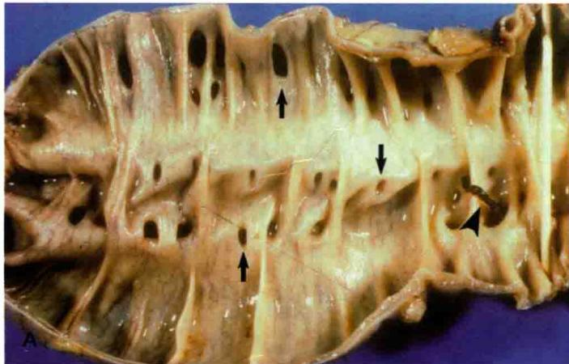 
图13-22结肠憩室病。结肠经甲醛溶液固定。A.许多憩室的开口见于结肠带间（带柄箭头）。从一个憩室开口见一个凝血块伸出（箭头）。这是大量出血的源头。B.切片显示黏膜和黏膜下层通过肠壁缺陷向外突出，形成憩室
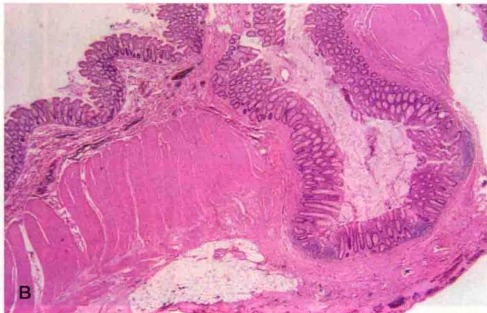
【病理】克罗恩病有2个特点将其和其他胃肠道炎症分开。①炎症通常累及肠壁全层，因此称为透壁性炎性疾病；②肠管受累是不连续的，即炎症组织节段被大致正常的肠管分隔。
可以很方便地把克罗恩病的大体表现分为4大类。疾病累及： $①$ 约 $50\%$ 病例主要累及回肠和盲肠； $②$ $5 \%$ 仅累及小肠； $③$ $20\%$ 仅累及结肠； $④$ $15\%$ 主要累及肛管直肠区域。患肛管直肠克罗恩病的女性，炎症可扩散累及外生殖器。
克罗恩病的大体和显微镜下表现差异很大。大体观，肠壁及系膜增厚水肿，系膜脂肪常包绕肠管（“匍匐脂肪”）。系膜淋巴结常增大，质硬和粘连在一起。肠腔狭窄缘于水肿和纤维化共同作用。结节状肿胀，纤维增生和黏膜溃疡导致“铺路石样”表现（图13-23A）。早期病例，溃疡可为阿弗他溃疡或匍行溃疡；晚期，溃疡更深，表现为线状裂隙或瘘（图13-23B）。
肠病切面显示疾病透壁的表现，全层增厚，水肿，
纤维化。受累肠袢常互相粘连，在这些节段间的瘘管常见。瘘管还可能从肠管穿透入其他器官，包括膀胱、子宫、阴道和皮肤。远段直肠和肛门的病变可形成肛周瘘，很常见的表现。
显微镜下，克罗恩病表现为慢性炎症性过程。疾病早期，炎症可限于黏膜和黏膜下层。可见小的，表浅的黏膜溃疡（阿弗他溃疡），伴有黏膜和黏膜下层水肿，淋巴细胞、浆细胞和巨噬细胞增多。黏膜结构的破坏，隐窝有再生性表现，和绒毛扭曲常见。晚期，长、深、裂隙样溃疡可见，血管玻璃样变和纤维化逐渐明显。
透壁的淋巴细胞聚集，伴有黏膜肌的增生性改变及黏膜下和肌间的神经丛，是特征性的（图13-24A）。分离的，非坏死性肉芽肿，主要在黏膜下层。虽然出现肉芽肿是倾向于克罗恩病比较强的支持，只有不足 $50\%$ 的病例显示这种病变（图13-24B）。克罗恩病的病理表现综合见图13-25。
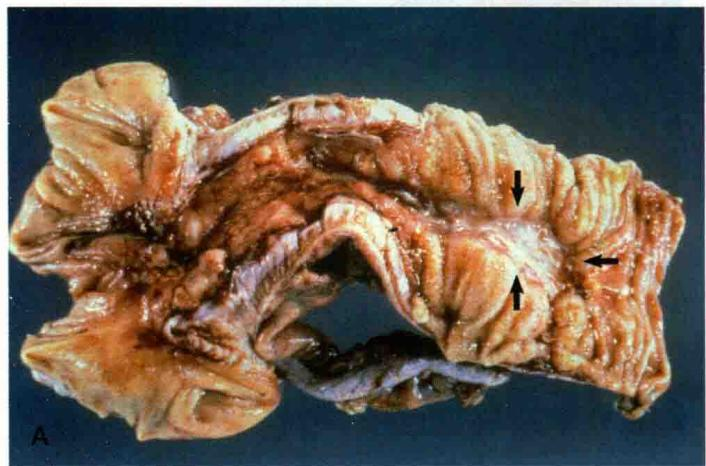 
图13-23克罗恩病。A.末段回肠显示远端肠壁明显增厚，伴回盲瓣扭曲。可见一个纵行溃疡（箭头）。B.此段回肠见另一段纵行溃疡。大的圆形水肿黏膜区呈现“铺路石”表现。右下方部分黏膜未受累
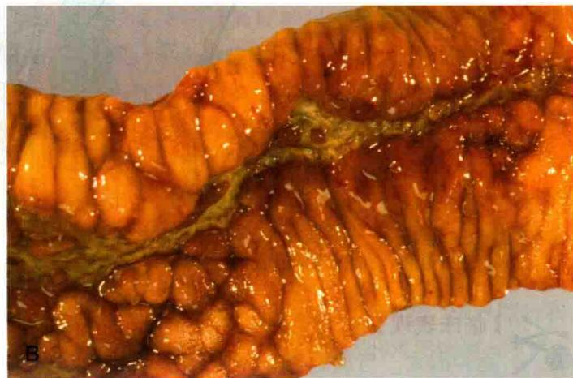
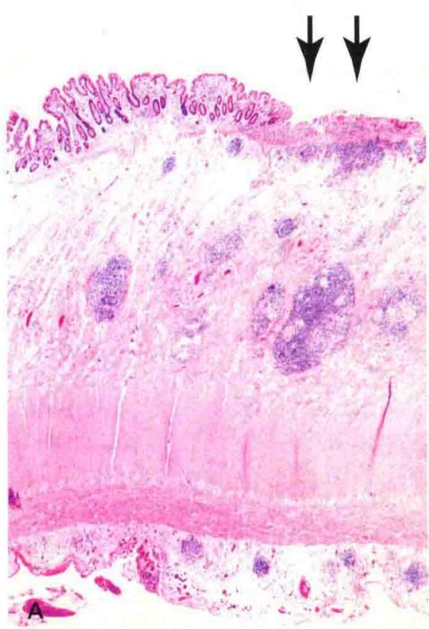 
图13-24 克罗恩病。A.克罗恩病累及结肠显示一处黏膜溃疡（箭头），增宽的黏膜下层伴淋巴细胞聚集，以及许多淋巴细胞聚集在浆膜下组织，紧邻肌层外侧；B.克罗恩病的黏膜活检显示一个小的上皮样细胞肉芽肿（箭头），在2个正常隐窝之间
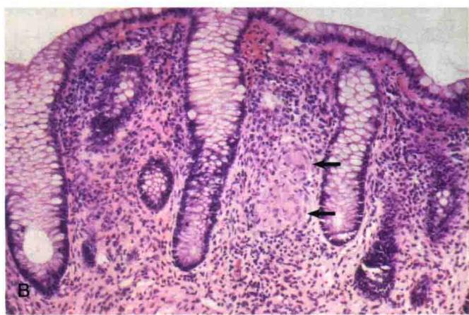
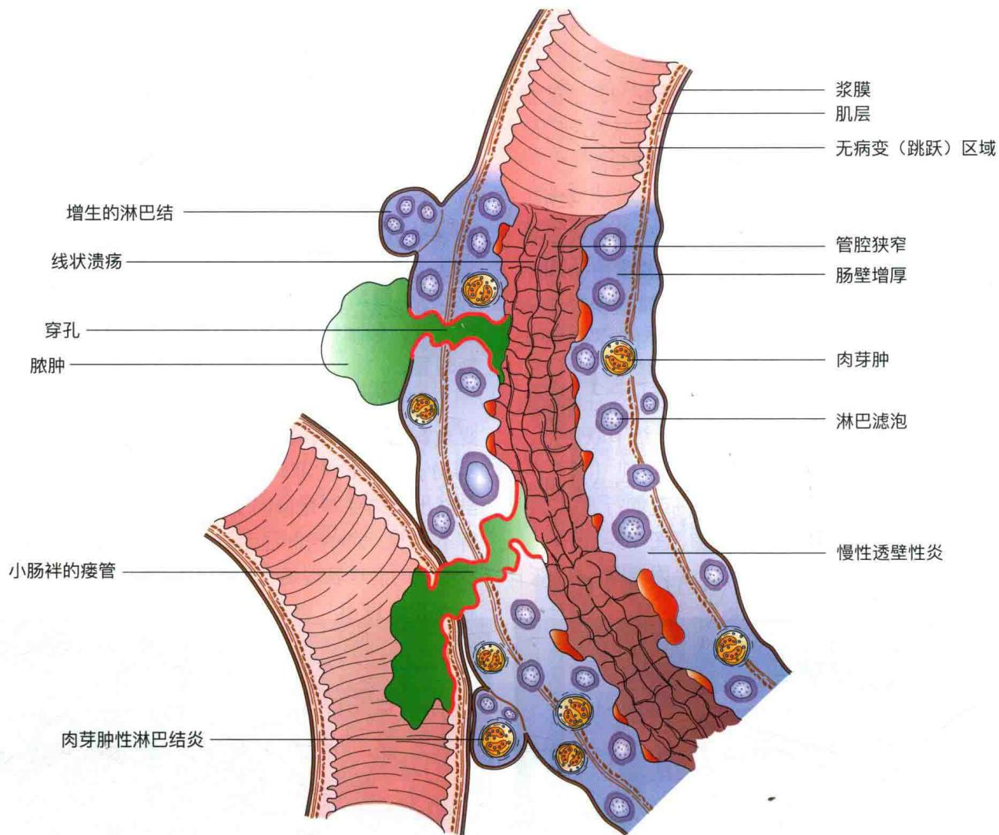 
图13-25 克罗恩病。示意图显示小肠克罗恩病的主要表现

【临床表现】克罗恩病的临床表现和自然病程
差异很大，与疾病累及部位有关。最常见的症
状是腹痛和腹泻，见于超过 $75\%$ 的患者， $50\%$ 的患
者反复发热。当小肠弥漫受累时，吸收不良和营养不
良可能是主要表现。结肠克罗恩病导致腹泻和有时结
肠出血。一些患者，主要的受累部位是肛管直肠区域，可表现复发性肛管直肠瘘。
肠梗阻和瘘是克罗恩病最常见的并发症。有时，
发生肠管游离穿孔。克罗恩病患者至少3倍易发小肠
癌, 也易于发生结直肠癌。系统性并发症包括肝疾病(硬
化性胆管炎)、胆石症、肾草酸盐结石和淀粉样变。最
常见的肠外炎症性表现发生在眼(巩膜炎和色素膜炎),
中等大关节（关节炎）和皮肤（结节性红斑）。
克罗恩病无法治愈。许多药物抑制炎症反应，包
括糖皮质激素、柳氮磺胺吡啶、甲硝唑、6-巯基嘌呤、
环孢菌素和抗TNF抗体。常常需要外科切除梗阻区或
肠管严重受累区和引流瘘管导致的脓液。
2. 溃疡性结肠炎 是结肠和直肠的慢性表浅性炎
症。溃疡性结肠炎的特征是慢性腹泻和直肠出血，发
作和缓解交替，可能伴发严重的局部和系统性并发症。

【流行病学】在欧洲和北美，溃疡性结肠
炎的发病率为 $4 \sim 7 / 10$ 万例，患病率为
$40 \sim 80 / 10$ 万例。常发生于年轻成人，发病高峰在
20多岁。但也发生在儿童和老年人。在美国，白种人
比黑种人更易受累。

【发病机制】溃疡性结肠炎的原因不清。有
报道在一些家庭多达6个人患此疾病，也有
胞胎共患的报道。但是可获得的家系研究不
明确的遗传模式。
一种已被深入研究的可能原因是异常的免疫
反应。有丰富的淋巴组织弥漫在结肠，且溃疡性
结肠炎可发生在自身免疫样的情况，例如眼色素
膜炎、结节性红斑和血管炎。可有增多的循环抗
体针对结肠上皮细胞抗原和肠细菌交叉反应的抗
原。抗中性粒细胞胞质抗体见于 $80\%$ 的溃疡性
结肠炎患者。但是，这些异常既不是溃疡性结肠
炎独特的也不是疾病发生的必要因素。实际上，
部分或所有这些免疫因素都可以是黏膜损伤的结
果，而非原因。

【病理】溃疡性结肠炎的3个主要的病理表现帮助其与其他炎症性病变鉴别开来：
■ 溃疡性结肠炎是一种弥漫性疾病。它常从最远段直肠向近段延伸不同的长度（图13-26）。直肠无受累和单独右侧结肠受累非常少见，提示其他疾病可能，如克罗恩病。 
■ 溃疡性结肠炎的炎症常限于结肠和直肠。它极少累及小肠、胃或食管。 
■ 溃疡性结肠炎基本上是黏膜疾病。深层很少受累，主要见于暴发性病例，并常与中毒性巨结肠有关。
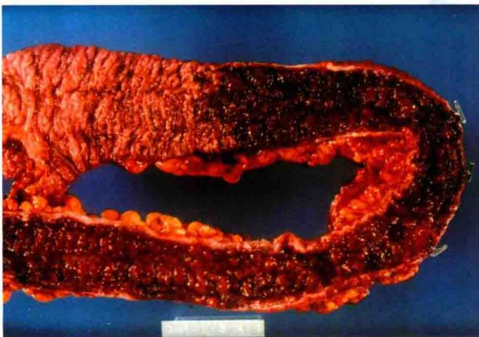 
图13-26 溃疡性结肠炎。结肠明显的红斑和溃疡开始于升结肠，在直肠乙状结肠最严重
以下形态学次序可迅速发生或经过几年的过程。
早期结肠炎：疾病发生早期，黏膜表面擦伤样，红色和颗粒状。肠管常被覆黄色渗出物和易于出血。晚点可出现小的，表浅的糜烂或溃疡。它们有时会融合形成不规则，表浅的溃疡区，围绕正常黏膜岛。
早期溃疡性结肠炎的显微镜下表现包括：①黏膜充血，水肿和显微镜下出血；②固有膜弥漫的慢性炎症浸润（图13-27A）；③结直肠隐窝的损伤和扭曲，常被中性粒细胞围绕和浸润。隐窝上皮的化脓性坏死形成特征性的隐窝脓肿，表现为扩张的隐窝充满中性粒细胞（图13-27B）。
进展性结肠炎：疾病持续，黏膜皱襞消失。隐窝脓肿向外扩张及融合可破坏黏膜底部，导致溃疡区附近悬挂的黏膜片段。这些黏膜赘生物称为炎性息肉。黏膜剥脱区生长肉芽组织。重要的是，克罗恩病特征的狭窄是没有的。显微镜下，结直肠隐窝扭曲，分支及晚期变短（图13-27C），黏膜可弥漫萎缩。
晚期结肠炎：病史长的患者，大肠常缩短，尤其是左侧。黏膜皱襞不明显，被颗粒状或光滑的黏膜所取代。显微镜下，晚期溃疡性结肠炎的特征是黏膜萎缩和慢性炎细胞浸润在黏膜及表浅黏膜下层。潘氏细胞化生常见。
【临床表现】临床过程和表现差异很大。多数患者（70%）有间歇性发作，发作间部分或完全缓解。少量患者（<10%）在首次发作后有很长时间的缓解期（长达数年）。其余20%症状持续无缓解。
轻症结肠炎：溃疡性结肠炎患者的 $50\%$ 有轻度疾病。他们的主要症状是直肠出血，有时伴有里急后重（直肠压力和不适）。这些患者的病变多限于直肠但也可以延伸至乙状结肠。肠外并发症少见，并且这组患者的多数，终身能保持较轻的疾病。
中症结肠炎：约 $40\%$ 的患者为中症结肠炎。他们常常间断性地拉稀血便、痉挛性腹痛和常常发低热，持续几天或几周。中度贫血是慢性血便失血的常见结果。
重症结肠炎：约 $10\%$ 的患者有重症或暴发性溃疡性结肠炎，常有突然的活动。他们可以有每天 $6 \sim 20$ 次的血便，常伴发热和其他系统性表现。血液和体液的流失可迅速导致贫血，脱水和电解质缺乏。大量的出血是危及生命的。一种特别危险的并发症是中毒性巨结肠，特征为结肠高度扩张和穿孔的高风险。暴发性溃疡性结肠炎是急症，要求立即的，加强的药物治疗，并且在有些病例，需要迅速的结肠切除术。约 $15\%$ 的暴发性溃疡性结肠炎患者死于此病。
溃疡性结肠炎和克罗恩病的差异的基础是不同的解剖部位和组织病理（表13-1）。溃疡性结肠炎的药物治疗基于受累部位和炎症严重程度。5-对氨基水杨酸基础的化合物是治疗轻-中症溃疡性结肠炎的主要药物。糖皮质激素、免疫抑制剂和免疫调节药物（硫唑嘌呤和巯基嘌呤）及TNF抑制剂用于重症和难治病例。
表 13-1 溃疡性结肠炎和克罗恩病的结肠病理表现比较 
病变克罗恩病溃疡性结肠炎大体肠病增厚典型不常见管腔狭窄典型不常见“跳跃性”病变常见无右侧结肠为主典型无裂隙和瘘管常见无局部溃疡常见无融合的线状溃疡常见无假息肉无常见显微镜下透壁炎症典型不常见黏膜下纤维化典型无裂隙典型少见肉芽肿常见无隐窝脓肿不常见典型
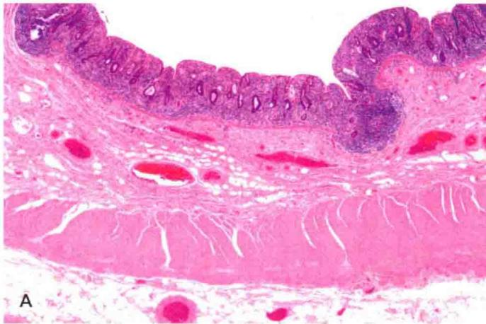
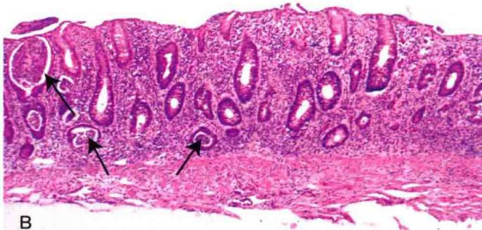
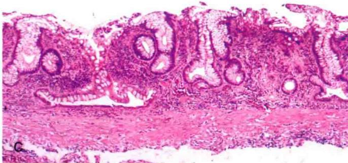 
图13-27 溃疡性结肠炎。A. 一张溃疡性结肠炎手术切除结肠的全层切片显示炎症累及黏膜，而黏膜下层和肌层不受累；B. 溃疡性结肠炎患者的黏膜活检显示固有膜增宽和几个隐窝脓肿（箭头）；C. 慢性溃疡性结肠炎显示明显的隐窝扭曲和萎缩
（1）肠外表现：关节炎见于 $25\%$ 的溃疡性结肠炎患者。眼部炎症（通常是色素膜炎）和皮肤病变发生在 $10\%$ 的患者。最常见的皮肤病变是结节性红斑和坏疽性脓皮病；后者是一种严重的非感染性异常，以皮肤深在的、化脓的、坏死溃疡为特点。肝脏疾病发生在约 $4\%$ 的患者，最常见的是原发性硬化性胆管炎。血栓栓塞，通常为下肢深静脉血栓形成，发生在 $6\%$ 的溃疡性结肠炎患者。
（2）溃疡性结肠炎和结肠癌：长期溃疡性结肠炎患者患结直肠癌的风险高于普通人。高级别结直肠上皮异型增生反映发生结直肠癌的明显的危险，若经活检证实，是结肠切除术的强指征。
# 五、血管疾病
1.结肠的缺血性损伤和小肠属于同一种类型 不
像小肠，结肠的广泛梗死是不常见的，而是慢性节段性疾病。缺血性结肠炎最常见的原因是主要肠动脉的粥样硬化，常见于50岁以上患者。最易受累的区域是邻近动脉分布区之间，如脾曲，被称为分水区。
【病理】多数患者不需要立即的外科处理，因为急性征象常稳定。内镜下，可见多发溃疡，出血的结节样病变或假膜。活检显示肠壁缺血性坏死的特征是黏膜溃疡、隐窝脓肿、水肿和出血。这些患者可完全恢复，也可能发生结肠狭窄。
【临床表现】直肠乙状结肠区缺血性疾病典型表现为腹痛、直肠出血和大便习惯改变。单从临床表现，缺血性结肠炎通常难以和一些感染性结肠炎、溃疡性结肠炎区别。
2.血管发育不良（血管扩张）可导致肠出血。血管发育不良（血管扩张）指局部的动静脉畸形，主要在盲肠和升结肠，可导致低位肠出血。表现症状的平均年龄60岁。年轻患者倾向于在其他部位有病变，包括直肠、胃和小肠。诊断困难，常需要选择性系膜动脉造影或结肠镜检查。外科切除受累节段可治愈。
【病理】切除标本显示小的，常多发的血管病变，一般直径小于 $0.5\mathrm{cm}$ 。显微镜下，黏膜下静脉和毛细血管迂曲，薄壁而扩张。推测血管壁变薄是易于出血的原因。
3. 痔与直肠出血有关 痔是直肠肛门丛的扩张静脉，因肛垫向下位移所致。内痔发生于齿状线上方的上直肠肛门丛，而外痔源于齿状线下方的下直肠肛门丛。痔在西方国家常见，不同程度地影响至少 $50\%$ 50岁以上的人群。痔在妊娠期常见，因为腹压增高。
【病理】痔切除术标本的显微镜检查显示扩张的血管腔隙伴管壁平滑肌增多。不同程度的出血和血栓形成常见。
【临床表现】除了痒和痛，痔的突出临床表现是出血。慢性失血可导致缺铁性贫血。直肠脱垂常发生。脱垂的痔不能回复时导致疼痛的绞窄性痔。血栓形成在外痔极其疼痛，需要排出血管内血栓。
# 六、结肠和直肠息肉
胃肠道息肉定义为突入管腔的肿物。息肉依据以下情况分类：①附着于肠壁的状态（如广基或有蒂的）；②组织病理学表现（如增生性或腺瘤性）；③肿瘤潜能（如良性或恶性）。息肉本身很少引起症状，其临床重要性在于发生恶性转化的潜能。
1. 腺瘤性息肉是癌前病变 腺瘤性息肉（腺管状腺瘤）是结肠上皮发生的肿瘤。它们含有肿瘤性上皮
细胞，生长迁移到表面，积聚起来超过细胞更新的需要，从而突然管腔。

# 【流行病学】结肠腺瘤性息肉的发病率在工业
化国家最高。正如在憩室病，饮食是被认识的
唯一稳定的环境因素在高危和低危人群中不同。在美国， $50\%$ 成人至少有一个腺瘤性息肉，大于65岁人群中则超过2/3有腺瘤性息肉。有轻度的男性为主（1.4：1），黑种人更易有右侧腺瘤和癌。 $25\%$ 的患者多发息肉。

# 【病理】在美国，约 $50\%$ 结肠腺瘤性息肉位于
直肠乙状结肠区，因此可经直肠指检和乙状结
肠镜检查到。剩余 $50\%$ 均匀分布在其余结肠。腺瘤的肉眼表现变化多，从仅能可见的结节或小的，带蒂的腺瘤，到大的广基（扁平）的病变。腺瘤按结构分为腺管状腺瘤，绒毛状腺瘤和绒毛腺管状腺瘤。
腺管状腺瘤：占2/3良性大肠腺瘤。腺管状腺瘤典型的表面光滑的病变，一般直径小于 $2\mathrm{cm}$ ，常有蒂（图13-28A，B）。有些腺管状腺瘤，特别是小的，是广基的。显微镜下，腺管状腺瘤显示密集排列的腺管状上皮，可一致或不规则甚或过度分支（图13-28C）。腺管衬覆于纤维血管间质，类似于正常固有膜。虽然多数腺管状腺瘤显示少量的异型增生，1/5（尤其是大者）有异型增生表现，由轻度核异型性到浸润性癌不等（图
13-29)。高级别异型增生时，腺体拥挤，大小和形状高度不规则。乳头状或筛状（筛子样或孔状）生长方式常见。因为异型增生灶限于黏膜，病变可经切除息肉治愈。浸润性癌的风险与腺管状腺瘤的大小有关。小于 $1\mathrm{cm}$ 的腺管状腺瘤仅 $1\%$ 在切除时有浸润性癌； $1\sim 2\mathrm{cm}$ 者， $10\%$ 为恶性；大于 $2\mathrm{cm}$ 者， $35\%$ 有癌。
绒毛状腺瘤：这些息肉约占结肠腺瘤的1/10，主要见于直肠乙状结肠区域。典型者较大，广基，隆起的病变，有粗糙的，菜花样表面（图13-30A），但也有小的有蒂的。多数直径大于 $2\mathrm{cm}$ 。显微镜下，绒毛性腺瘤由细、高指样突起组成，表面类似小肠绒毛。绒毛被覆肿瘤上皮细胞，由纤维血管结缔组织轴心支持，相当于正常黏膜的固有层（图13-30B）。
绒毛状腺瘤的异型增生的组织病理学与腺管状腺瘤类似。但是，绒毛状腺瘤比腺管状腺瘤更易含有癌灶。在不足 $1\mathrm{cm}$ 的息肉，发生癌的风险是相应大小腺管状腺瘤的10倍。更重要的是， $50\%$ 的绒毛状腺瘤大于 $2\mathrm{cm}$ ，隐含有浸润性癌。鉴于多数绒毛状腺瘤的最大径超过 $2\mathrm{cm}$ ，多于1/3的切除的绒毛状腺瘤含有浸润性癌。
绒毛腺管状腺瘤：许多腺瘤性息肉既有腺管又有绒毛的结构。息肉有多于 $25\%$ 和少于 $75\%$ 的绒毛状结构称为绒毛腺管状腺瘤。这些腺瘤的分布和大小倾向于腺管和绒毛状腺瘤之间， $1/4 \sim 1/3$ 大于 $2\mathrm{cm}$ 。绒毛
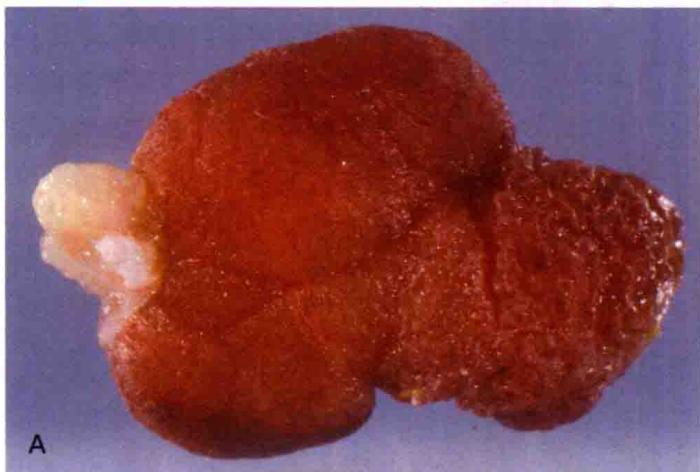
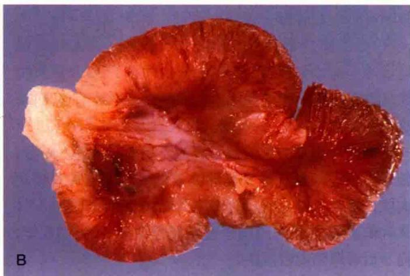
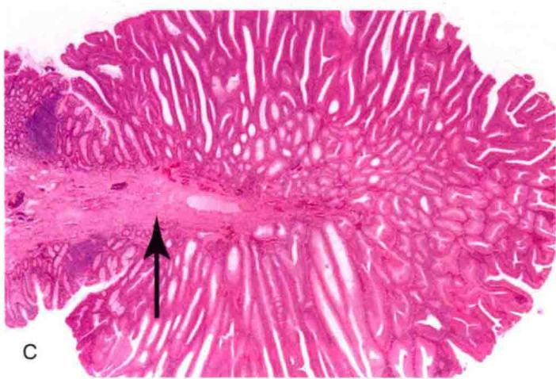 
图13-28结肠腺管状腺瘤。A.腺瘤显示特征性的蒂部和突起的表面。B.从中切开的腺瘤显示蒂部表面被覆腺瘤性上皮。灰白的颜色是息肉切除术烧灼的切缘。C.显微镜下，腺瘤显示重复的表现，主要为腺管状。蒂（箭头）与结肠黏膜下层连续，没有受累，表面被覆正常结肠黏膜
。因为距切缘超过$1mathrm{mm}$，息肉切除术已充分治疗.jpg) 
图13-29癌发生在有蒂的腺瘤性息肉。A.显示既有低级别异型增生又有高级别异型增生。后者特征为筛状结构和增加的核多形性（箭头）。B.三色染色显示肿瘤浸润（直箭头）蒂部（蓝色，弯箭头)。因为距切缘超过 $1\mathrm{mm}$ ，息肉切除术已充分治疗
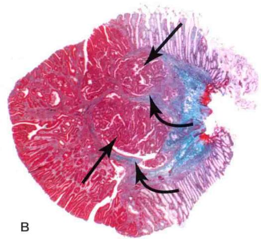
腺管状腺瘤发生浸润性癌的风险也位于腺管和绒毛状腺瘤之间。

【发病机制】结直肠腺瘤的发病机制涉及隐
窝上皮的肿瘤性改变，包括：①凋亡减少；
(2) 持续的细胞复制; (3) 当上皮细胞向隐窝表面迁移时不能成熟和分化（图13-31）。正常时, 当细胞到达隐窝上1/3时, DNA合成停止此后它们成熟,迁移到表面, 逐渐变老。然后它们进入程序性死亡过程或只是脱落到肠腔。腺瘤时在这个正常程序出现局部中断。核分裂不仅在隐窝全长可见, 而且还见于黏膜表面。病变时, 细胞增生超出了凋亡和脱落, 细胞开始在隐窝上部和表面聚集。逐渐地, 黏膜表面的积聚细胞形成腺管状或绒毛状结构, 与间质成分相对应。
腺瘤性息肉和结直肠癌：结肠癌源于腺瘤性息肉，这个观点由以下支持：
腺瘤性息肉和结直肠癌的发生率在地理上一致。相比于低发地区，结直肠癌高发的区，腺瘤性息肉更大些，更常见绒毛状，有更多的高级别异型增生。 
腺瘤性息肉趋向于在结肠癌之前 $10\sim 15$ 年，提示后者跟随前者发生。 
可见癌发生在腺瘤中，一些癌在外周可见腺瘤性残留。 
■ 在家族性腺瘤性息肉病（见下文），无数的腺瘤性息肉开始都是良性的，但结直肠癌必定会在年长时发生。
预防性息肉切除术能明显降低后面发生癌的风险，也强烈支持多数结直肠癌发生于腺瘤性息肉。
2. 增生性息肉常见于直肠 增生性息肉是小的，无蒂的黏膜赘生物，显示增生的隐窝结构。它们是最常见的结肠息肉样病变，最常见于直肠。增生性息肉占40岁下年轻人直肠标本的 $40\%$ ，在老年人则占 $75\%$ 。在有腺瘤性息肉的结肠和结直肠癌高风险的人
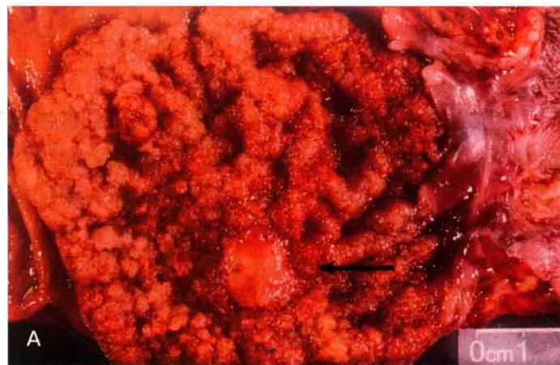
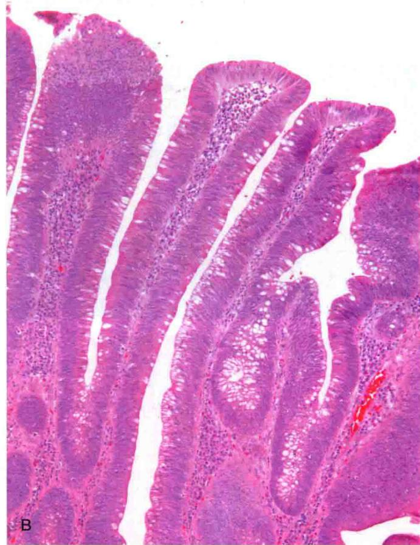 
图13-30 结肠绒毛状腺瘤。A.结肠含有大的，宽基底，隆起的病变，有菜花样表面。靠近中央有一个质硬区，经组织学检查为腺癌。B.显微镜检查显示指样突起，纤维血管轴心被覆深染核
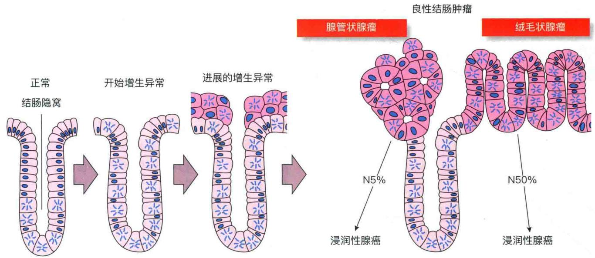 
图13-31结肠腺瘤性息肉的组织发生。开始结肠黏膜异常增生，隐窝核分裂区扩张，导致黏膜细胞积聚。腺癌发生于腺瘤性息肉（见正文）
群中，增生性息肉也更常见。

【发病机制】增生性息肉的发生被认为是正常黏膜上皮的增生和成熟过程中的一种缺
陷。在增生性息肉，增生发生在隐窝基底，而细胞向上迁移减慢。所以，上皮细胞分化和获得吸收功能在隐窝较低处。而且，细胞在表面持续存在更久的时间。

【病理】增生性息肉是小的，无蒂，突出于黏膜的结节，直径0.5cm，有时也大些。常多发。
组织学，增生性息肉的隐窝伸长，可有隐窝扩张。上皮含有杯状细胞和吸收细胞，无异型增生。表面上皮细胞伸长，显示成簇的表现，使得靠近表面的腺体呈锯齿状轮廓（图13-32）。“经典增生性息肉”的患者没有发生腺癌的风险增高。但是有增生性息肉的亚型有腺瘤样表现（锯齿状息肉，腺瘤性息肉和增生性腺瘤性混合性息肉），与发生腺癌的风险增高有关。
3. 家族性腺瘤性息肉病（FAP）是一种常染色体显性遗传，必然导致癌的发生。FAP又称作结肠腺瘤
性息肉病（APC），占结直肠癌的不足 $1\%$ 。原因是5号染色体长臂（5q21-22）上APC基因的突变（见下文）。多数病例是家族性的，但 $30\% \sim 50\%$ 反应为新突变。FAP的特征是成百上千的腺瘤铺满结直肠黏膜，有时占据全长，但最常见于直肠乙状结肠区域。腺瘤多数是腺管状亚型，绒毛腺管状和绒毛状的也有。显微镜下腺瘤，有时仅累及一个隐窝，非常多见。一些息肉在10岁前即出现，但出现症状的平均年龄为36岁，此时癌常以及存在。结直肠癌不可避免，发生的平均年龄为40岁。癌发生之前行全结肠切除是治疗性的，但一些患者有小肠和胃的腺管状腺瘤，也有和结肠相同的恶性潜能。对FAP的遗传学检测是已可行，但突变仅发现在 $75\%$ 的家族性病例。Gardner综合征是FAP的一种表型亚型，由结肠外病变确定，包括骨瘤和视网膜色素上皮先天性肥大。
4.非肿瘤性息肉是获得性病变 非肿瘤性息肉是多种完全不同的疾病，被放在一起只是因为它们的大体表现都是结肠黏膜隆起的病变。
（1）幼年性息肉（潴留性息肉）：幼年性息肉是结
小,广基和色浅。附近有更小的增生性息肉。B.显微镜下,近表面呈现“锯齿状”表现(箭头).jpg) 
图13-32 增生性息肉。A.这个增生性息肉(箭头)小,广基和色浅。附近有更小的增生性息肉。B.显微镜下,近表面呈现“锯齿状”表现(箭头)
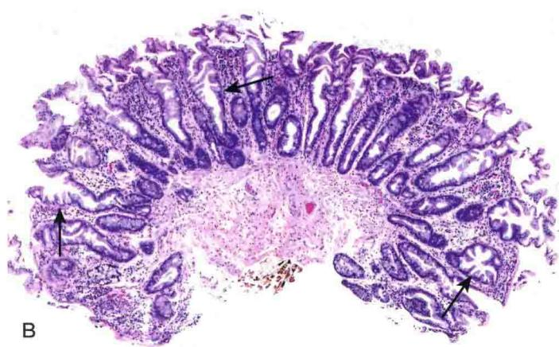
肠黏膜错构瘤性增生。最常见于小于10岁的儿童，虽然1/3发生在成人。

【病理】幼年性息肉单发或（少见）多发。最常见于直肠，但可在小肠或大肠任何节段发生。
大体观，多数是有蒂的病变，可达直径 $2\mathrm{cm}$ 。表面光滑，圆形，不像腺瘤性息肉的小裂隙状表面。显微镜下，扩张和囊性的上皮腺管充满黏液（因此有“潴留性息肉”的名称），嵌入纤维血管的固有膜。表面上皮糜烂常见，反应性上皮增生明显，但上皮一般无异型增生。患者有多于5个幼年性息肉，结肠外的幼年性息肉或有家族史的，高度可疑为家族性幼年性息肉病的综合征。这个综合征由SMAD4突变引起，SMAD4编码一种TGF- $\beta$ 通路的细胞内信号蛋白。这些患者胃肠道癌发生的风险增高，发生的癌不一定源于息肉，甚至不一定在息肉所在的那段肠管。
（2）炎性息肉：炎性息肉并非肿瘤，而是炎症再生的上皮隆起结节。它们最常见与溃疡性结肠炎和克罗恩病有关，但也见于阿米巴结肠炎和细菌性痢疾。显微镜下，炎性息肉含有不等量的扭曲和炎症的黏膜腺体，常混有肉芽组织。随着愈合过程进展，上皮再生，特征性的大而嗜碱性上皮细胞修复黏膜的结构。虽然这些病变不是癌前病变，它们发生在慢性炎性疾病，与癌的高发生率有关（如溃疡性结肠炎），因此必须和腺瘤性息肉鉴别。
# 七、恶性肿瘤
# （一）结直肠腺癌是多步骤致癌变化的结果
在西方国家，结直肠癌是与烟草应用无直接关系的癌症死亡最常见的原因。约 $5\%$ 的美国人在一生中发生结直肠癌。虽然结直肠癌这个词的广泛应用提示有相同的生物学，结肠癌和直肠癌却有比部位更根本的差别。例如，结肠癌在美国明显比日本常见，而这两个人群的直肠癌发病率相当。不仅如此，结肠癌有轻度的女性多见，而直肠癌更多见于男性。
病因学因素：多数结肠和直肠癌发生于腺瘤性息肉；因此，与这些息肉发生有关的因素也是结直肠癌的好发因素。提出环境因素的可能作用是因为高发病率在工业化国家，以及低位地区到高危地区的移民中。饮食富含动物脂肪和缺乏不吸收纤维被认为是危险因素，而高硒饮食认为是保护因素。但是，多数试图确定致结肠癌的特定饮食的努力都不成功，还需适当存有怀疑的态度。
1. 结直肠癌的分子遗传学 约 $85\%$ 的结直肠癌病例，估计至少有 $8 \sim 10$ 个突变事件的累积，在有转移潜能的浸润性癌发生之前。这个过程起始于组织学正常的黏膜，通过一个腺瘤性的前体阶段，结果为浸润
性腺癌（见第5章）。
最重要的突变事件列于图13-33，包括：
■APC基因：如上所述，推定的肿瘤抑制基因，APC（大肠腺瘤性息肉病）的生殖系突变，导致FAP。正常APC是β-catenin的负调控因子。突变的APC允许β-catenin在核内积聚，从而作为转录因子活化关键增殖基因（如，cyclin D1和MYC）。APC突变见于多数散发性结直肠癌。一些APC正常的肿瘤有β-catenin基因突变。一种特异性APC突变（密码子1307的异亮氨酸变为赖氨酸）见于 $6\%$ 的德系犹太人，结直肠癌的风险增加 $10\% \sim 20\%$ 。APC突变见于散发腺瘤发生前的正常结肠黏膜。这些数据都提示APC在结直肠肿瘤发生中的早期作用。
■ Ras癌基因：ras原癌基因的活化突变发生在结肠腺管状腺瘤的早期。
“结肠癌缺失”（DCC）基因：一种推定的肿瘤抑制基因，DCC，位于18号染色体，常在结直肠癌中缺失。
p53基因：在结肠最常见的腺癌类型，p53突变参与了腺瘤到腺癌的过程，是癌变过程中的晚期事件。
错配修复（MMR）基因：在 $15\%$ 的结直肠癌，DNA修复受损，导致自发复制错误的修复缺陷，尤其是在简单重复序列（微卫星）。MMR缺陷可通过2种机制发生。在遗传性Warthin-Lynch综合征（HNPCC；见下文），MMR基因中的一种有生殖系突变，造成杂合性缺失。在散发病例，编码一种MMR蛋白的MLH1基因的启动子甲基化，使这个基因的转录失活。
2.危险因素 年龄增加可能是结直肠癌单个最重要的危险因素，对于一般人群。风险在40岁以前很低，稳定地增加直到50岁，此后每10年风险增加1倍。慢性炎性肠病，既往结直肠癌，饮食和遗传因素都是危险因素（如前面讨论）。有2个或以上一级或二级亲属有结直肠癌的人群占所有患者的 $20\%$ 。 $5\% \sim 10\%$ 的结直肠癌患者按常染色体显性的规律遗传。

【病理】大体观结直肠癌类似于消化道其他部
位的腺癌。它们呈息肉样伴溃疡或浸润性，可
环形和缩窄（图13-34A）。息肉样癌更常见于右半结肠，尤其在盲肠，此处结肠宽大的肠腔允许不受阻的腔内生长。环形缩窄的肿瘤更常见于远段结肠。肿瘤溃疡常见，无论生长方式。结直肠癌的主要类型是腺癌（图13-34B），显微镜下类似于消化道其他部分的腺癌。 $10\% \sim 15\%$ 分泌大量黏液，称为黏液腺癌。分化程度影响预后：分化好的肿瘤倾向于有好的前景。
结直肠癌的播散通过直接扩散或血管/淋巴管侵犯。浆膜的结缔组织对于肿瘤播散有微弱的阻拦作用，肿瘤细胞常见于脂肪和浆膜，与原发肿瘤有一段距离。
腹膜有时受累，此时腹腔内可有多发沉积。结直肠癌侵犯淋巴管，最开始累及肿瘤下方的淋巴结。静脉侵犯导致血行转移，在多数转移患者累及肝。结直肠癌的预后更多地与肿瘤扩散到肠壁程度相关，比大小和组织学特征更为密切。
目前结直肠癌的分期应用TNM分期（肿瘤，淋巴结，转移）。在这个系统，T1期肿瘤浸润黏膜下层；T2期肿瘤浸润到，但没穿透固有肌层；T3期肿瘤侵犯浆膜下脂肪组织；T4其肿瘤突破浆膜或累及邻近器官。N指有或无淋巴结转移，M指有或无淋巴结外转移。
【临床表现】初始时，结直肠癌无明显临床表现。随肿瘤进展，当肿瘤在近段结肠，最常见的症状是大便潜血。如果病变在远段结直肠，大便内隐血和鲜红血都可以发生。左半结肠癌，因为肠腔较小，大便更硬，常缩窄肠腔，导致梗阻性症状。可表现为大便习惯改变和腹痛。有时，结直肠癌早期穿孔引致腹膜炎。相比而言，右侧结肠，尤其是盲肠，肠腔宽大，大便内容物为液体的。所以，肿瘤可以长得很大而不引起梗阻症状。在这种情况下，慢性无症状的出血可导致缺铁性贫血，常是结直肠癌的首发征象。定期的纤维结肠镜和大便隐血检查提升了结直肠癌的预后，因为这些手段常在早期阶段检测出肿瘤。
唯一能治愈结直肠癌的治疗是手术切除。小息肉在内镜下可容易地被切除；大的病变要求节段切除。
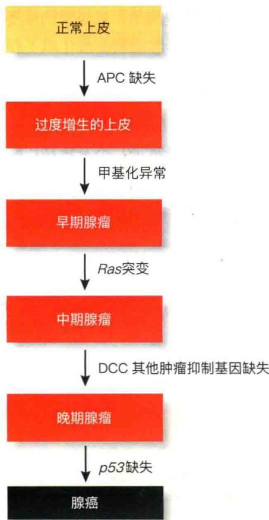 
图13-33结肠癌发病过程中一些遗传学改变的模型。APC.大肠腺瘤性息肉病；DCC.“结肠癌缺失”
靠近肛管边缘的肿瘤常需要腹一会阴切除和结肠造口术，即使新的外科切除技术可保留括约肌。直肠癌手术前应用新辅助化疗和放疗可改善预后。
3. 遗传性非息肉病性结肠癌 NPCC，或 Warthin-Lynch 综合征，是一种常染色体显性遗传疾病，占全部结直肠癌的 $3\% \sim 5\%$ 。它的特征是：① 发生结直肠癌时年轻；② 少量腺瘤（所以称为“非息肉病性”）；③ 高比例（ $70\%$ ）的癌在脾曲之前；④ 同时或异时的多发结直肠癌；⑤ 结肠外癌，包括子宫内膜和卵巢癌；胃、小肠和肝胆系统腺癌；及肾盂和输尿管移行细胞癌。

【发病机制和病理】HNPCC的发生是因为DNA错配修复基因的生殖系突变，继而第二个体突变（杂合性缺失）。错配修复基因最常见的是染色体2p上的hMSH2（人MutS同系物2）和3p
上的和hMLH1（人MutL同系物1）。这些突变导致广泛的基因组不稳定，尤其是简单重复序列（微卫星序列），特别容易出现复制错误。组织学，HNPCC-相关的结直肠癌特征为常见黏液性，印戒细胞和实性（髓样）癌。
# （二）肛管癌是表皮样癌
肛管癌，占大肠癌的 $2\%$ ，可以发生在齿状线或其上方。男女都可以发病但更常见黑人女性。
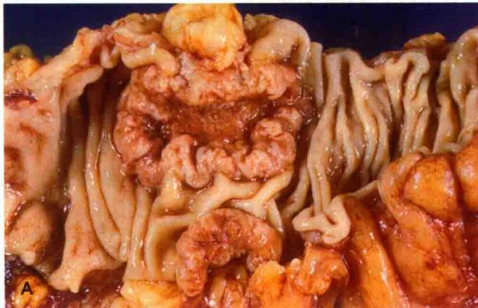
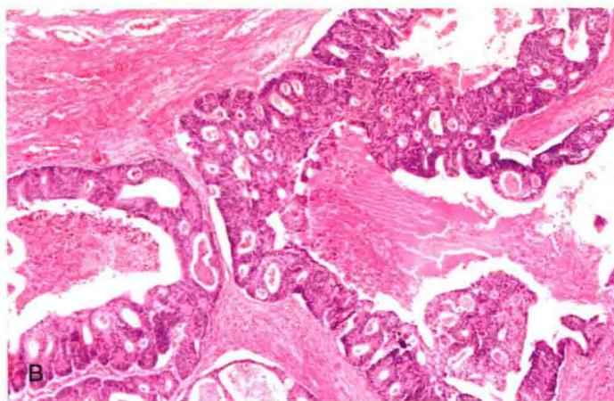 
图13-34结肠腺癌。A.切除的结肠显示溃疡性肿物，带大的，硬，卷起的边缘；B.显微镜下，这例结肠腺癌含中分化腺体，伴明显的筛状结构和多见的中心坏死

【病理】肛管癌有不同的组织学表现，如鳞癌、基底样癌或黏液表皮样癌。但是，不同的肿瘤表现为相似的临床行为，所以全归为表皮样癌。lowen病是原位鳞癌，而此部位的乳腺外Paget皮内腺癌（可以是原发于此处黏膜或转移的）。直接侵犯周围组织，包括内和外括约肌、肛周、前列腺和阴道。

【临床表现】HPV感染和肛门慢性炎性疾病（如性病）、瘘和外伤易于发生肛门癌。与生殖器的因素，卫生不良，有多个性伴侣和生殖器疣门癌的发生有关。
肛门癌的通常症状包括出血、疼痛和肛门或直肠肿物。常出现的情况是，肿瘤在临床上不显示为恶性病变，仅在痔切除术标本中发现。联合化疗和放疗是常见的治疗，虽然有时做腹-会阴切除手术。超过 $50\%$ 的患者能够存活至少5年。
# 第五节 阑尾
# 一、阑尾炎
急性阑尾炎是蠕虫状阑尾壁的炎性疾病，可导致透壁性炎和穿孔及腹膜炎。这是阑尾最常见的疾病和急腹症最常见的原因。虽然发病高峰在 $10\sim 30$ 岁，急性阑尾炎可发生在任何年龄。

【发病机制】急性阑尾炎与其开口阻塞，继而管腔扩张和细菌侵犯管壁有关。由粪石
或盲肠内实性粪块导致的机械性梗阻仅见于1/3病例。有时肿瘤，寄生虫（如蛲虫）或异物是原因。细菌或病毒感染（如沙门菌和麻疹）所致淋巴样增生也可以堵塞管腔，导致阑尾炎。但是，多达 $50\%$ 阑尾炎患者没有梗阻，这些患者的疾病原因不清楚。
当分泌物积聚于梗阻的阑尾腔，腔内压力升高并逐渐超过静脉压。这导致静脉淤血，缺血和肠内细菌的侵犯。中性粒细胞聚集形成微脓肿。有趣的是，阑尾切除术保护患者不易得溃疡性结肠炎，但无关克罗恩病。

【病理】阑尾堵塞，张力高，被覆纤维素性渗出物。腔内常含脓液。有时有明显的粪石（图
13-35)。显微镜下，早期病例显示黏膜微脓肿和腔内脓性渗出物。随感染进展，整个管壁被中性粒细胞浸润，逐渐到达浆膜。管壁穿孔释放腔内容物到腹腔。阑尾炎的主要并发症都与穿孔相关，发生于1/3儿童和年轻成人。几乎所有2岁以内的儿童在手术时已有穿孔，而超过60岁的患者3/4有穿孔。

【临床表现】急性阑尾炎典型表现为上腹部或脐周绞痛，疼痛弥漫或逐渐限制于右下腹。此间内，发生恶心、呕吐、低热和中度白细胞增痛转移到右下腹，总有定点压痛(McBurney点)。经超声检查或CT扫描。因为穿孔比腹腔镜手显高的死亡风险，可以进行早期外科干预，即阑尾炎的诊断并不完全确定。
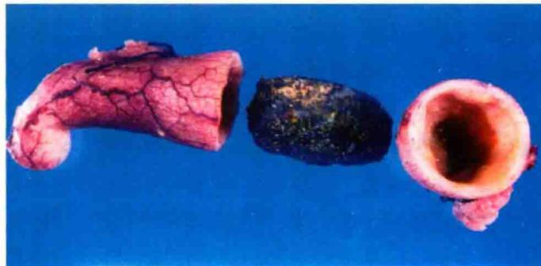 
图13-35急性阑尾炎。这个急性炎症的阑尾腔扩张，含有一个大粪石
# 二、阑尾肿瘤
1. 黏液囊肿 黏液囊肿是一个大体描述的名词，形容扩张的充满黏液的阑尾，既可能是肿瘤又可能是非肿瘤的疾病过程。在非肿瘤时，慢性梗阻导致黏液在阑尾腔内积聚。
多数黏液囊肿与肿瘤性上皮有关。扩张的阑尾被覆绒毛状腺瘤的黏膜或广基锯齿状腺瘤的上皮。腔内黏液量变化很大。非浸润的，低级别的病变通常称为黏液性囊腺瘤；明确恶性被覆上皮伴或不伴侵犯称为黏液性囊腺癌。侵犯性的阑尾腺癌组织学上与结肠的相应病变相似。穿孔可导致腹膜假黏液瘤——即黏液分泌的肿瘤细胞种植于腹膜。
2. 类癌 阑尾类癌常见，不常转移，除非有直径超过 $1.5\mathrm{cm}$ 的少数病例。
# 第六节 腹膜
# 一、腹膜炎
细菌性腹膜炎常由肠道细菌引起，形成急腹症，伴严重的腹痛和压痛。恶心、呕吐和高热常见，在重症病例，弥漫性腹膜炎、麻痹性肠梗阻和感染性休克接连发生。有时，穿孔被“包围”，导致腹腔脓肿。

# 【发病机制】
穿孔：细菌性腹膜炎最常见的原因是腹部脏
器的穿孔（如炎症的阑尾、消化性溃疡或结肠憩室）。即使应用抗生素处理、外科引流、清创和支持治疗，弥漫性腹膜炎仍造成大量死亡，特别在老年人。
腹膜透析：当今慢性腹膜透析是细菌性腹膜炎的常见原因，由器械或透析液污染造成。
自发性细菌性腹膜炎：这个名词用于腹膜感染缺乏明确的原因，如穿孔的脏器。最常见的成人自发性细菌性腹膜炎的背景疾病是肝硬化伴发门脉高压和腹水（见第14章）。在儿童，自发性细菌性腹膜炎可伴发于肾病综合征。多数儿童自发性腹膜炎的病原体为革兰阴性细菌，源于泌尿系感染。即使应用抗生素治疗，致死率为 $5\% \sim 10\%$
结核性腹膜炎：这种感染在工业化国家已经非常少见，但在发展中国家可并发于结核。

【病理】大体观，细菌性腹膜炎类似于其他部
位的化脓性感染。纤维素脓性渗出物覆盖在肠
道表面。机化后，纤维素和纤维粘连在肠袢之间，肠袢互相牵连。这些粘连可逐渐被溶解，或形成肠扭结和肠梗阻。细菌性输卵管炎，通常为淋球菌性的，可导致盆腔腹膜炎和粘连，即盆腔炎症性疾病。
# 1. 化学性腹膜炎常源于内源性因素
胆汁性腹膜炎发生在胆汁进入腹腔时，常从穿孔的胆囊而来，但有时因为肝穿刺活检。这种突然的损伤可致休克。 
盐酸或出血从胃或十二指肠消化性溃疡穿孔可引发腹膜的炎性反应。 
■在急性胰腺炎，活化的脂肪溶解性和蛋白溶解性酶释放，导致严重的腹膜炎伴脂肪坏死。常见休克
且可致死，除非有效地治疗。
■异物由外科操作（如滑石粉）或创伤导致，是化学性腹膜炎的常见原因。 
漏尿可致腹水。
2. 家族性地中海热（家族性阵发性多浆膜炎）导致腹膜炎和淀粉样变性。族性地中海热（FMF）是一种遗传性常染色体隐性疾病，复发性发作无菌性腹膜炎，发热和腹痛。由16号染色体短壁上的基因（MEVF）突变导致，这基因编码脓素（pyrin），可抑制炎症。 $50\%$ FMF首发症状为腹膜炎， $25\%$ 为关节炎， $5\%$ 为胸膜炎。但是，几乎所有的患者逐渐都会患腹膜炎，超过 $50\%$ 病程中会有关节炎和胸膜炎。这疾病常见于西班牙系犹太人和其他地中海人群。没有并发症的话预后较好。不幸的是，淀粉样变性是常见的并发症（见第23章）。
# 二、腹膜肿瘤
1. 间皮瘤是最常见的原发性腹膜肿瘤 1/4 的间皮瘤发生在腹膜。如同胸膜间皮瘤，多数这种恶性肿瘤与石棉暴露有关。腹膜间皮瘤的病理特征与发生于胸膜者一致（见第12章）。 
2. 原发性腹膜癌像卵巢癌 原发性腹膜癌表现为肿瘤包块累及网膜和腹膜。形态学与卵巢浆液性癌一致，只是卵巢正常。 
3. 转移性癌是腹膜最常见的癌 卵巢、胃和胰腺癌特别容易种植到腹膜，实际上任何腹内癌都可播散到腹膜。
（周炜洵 高巍 滕梁红）
# 第14章 肝胆系统
肝小叶为多面体结构（图14-1），经典表现为六面体。门管三联（或汇管区）位于多边形成角的边缘处，之所以冠以此名因其含有肝内三个分支：①胆管；②肝动脉；③门静脉。但从功能上讲，肝小叶应该被看作是以汇管区为中心的腺泡结构（图14-1）。这个概念考虑的是小叶内部功能的梯度变化。胶原化的汇管区被一圈相连的肝细胞围绕称为界板。中央静脉（也称为终末肝小静脉）位于肝小叶中央。单细胞厚度的肝板自其放射状伸展至小叶周边，再与其他小叶肝板相连。肝板间为肝窦，内衬内皮细胞，Kupffer细胞和星状细胞。
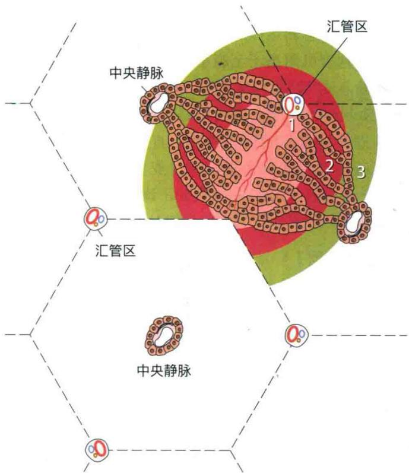 
图14-1 肝小叶的形态及功能概念
经典的肝小叶显示为六边形边缘连接处为汇管区，中央是终末肝小静脉的形态结构。功能性的肝小叶可理解为依肝窦血流形成的氧气和营养物质梯度分布的腺泡。这种体系下，中央的汇管区含有最丰富的氧气和营养物质（区间1）。离汇管区最远的区域（区间3）围绕终末肝小静脉含有的氧气和营养物质最少。
# 第一节 肝脏
肝脏功能可大致分类为代谢、合成、储存、降解和分泌功能。
代谢功能：肝脏是维持葡萄糖动态平衡的中心器官，依赖肝糖原的分解和合成维持血糖水平。
合成功能：大部分血浆蛋白包括白蛋白和凝血因子由肝脏合成。此外，补体、其他急性期反应物、铁或铜和维生素A结合蛋白也由肝合成。
储存功能：肝是葡萄糖、甘油三酯、铁、铜和脂溶性维生素的重要存储器官。
降解功能：内源性物质包括激素、血浆蛋白由肝脏降解以维持产生和清除的平衡。也是对外来化合物（毒物）进行解毒的基本器官。氨基酸代谢产生的氨主要由肝进行清除。
分泌功能：肝主要分泌产物是胆汁，它是结合了胆红素、胆酸、磷脂、胆固醇和电解质的水样混合物。胆汁不仅为亚铁血红素代谢产物提供了储存地，而且对小肠吸收脂肪也至关重要。胆汁的正常形成对环境毒物、致癌物质、药物及其代谢物清除起到关键作用。
# 一、胆红素代谢和黄疸成因
# （一）胆红素是亚铁血黄素的代谢终产物
约 $80\%$ 的胆红素来自衰老的红细胞，由脾、骨髓和肝的单核巨噬细胞将其自血液循环中移除。其他来自如细胞色素P450同工酶、肌红蛋白、骨髓中红系未成熟的血红蛋白崩解后亚铁血黄素的降解。此外，胆红素并无生理功能。循环中的胆红素与白蛋白结合转运至肝。
胆红素自血液转运至胆汁经历如下4步。
1. 摄取 白蛋白-胆红素复合物解离，胆红素被跨肝血窦侧内膜转运。这看起来部分是被动摄取但也依赖于各机体转运蛋白的参与。 
2. 结合 肝细胞内，胆红素与一些被统称为谷胱甘肽-S-转换酶（也称为配体蛋白）的胞质蛋白结合。 
3. 配体 为了分泌，胆红素与葡萄糖醛酸通过尿苷二酸葡萄糖醛酸转换酶系统（UGT）形成复合物。生成水溶性的胆红素二葡萄糖苷酸和一些（小于 $10\%$ ）
单葡萄糖苷酸。
4. 分泌 结合胆红素自细胞质弥散至胆小管，然后经能量依赖的，转运体介导过程分泌至素总体经肝转运过程的限速步骤。
高胆红素血症是指血液中胆红素浓度增加（大于 $1.0\mathrm{mg / dl}$ ），并可能如下相关。
黄疸出现黄色皮肤或巩膜（图14-2），循环中胆红素浓度升至2.0或 $3.0\mathrm{mg / dl}$ 时颜色会变得很明显。
胆汁淤积是指扩张的胆小管中浓聚的胆汁堵塞，肝细胞可见胆色素。
胆汁淤积性黄疸是指组织学上胆汁淤积和高胆红素血症。
如图14-3所示，多种情况可以出现高胆红素血症。胆红素产生过多，肝细胞摄取或细胞内胆红素代谢受扰、胆道分泌受损都可以成为高胆红素血症的原因（图14-3）。
# （二）大量产生胆红素可以导致间接高胆红素血症
大量红细胞的破坏（如溶血性贫血）或无效造血可以导致胆红素升高。少见情况下，大血肿（如创伤后）中的红细胞崩解也可以产生大量胆红素。
单纯溶血性疾病引起的高胆红素血症主要是间接胆红素升高，如果是肝实质性疾病，会导致直接和间接胆红素均升高。虽然在成人因溶血导致的间接高胆红素血症临床意义较少，但在新生儿却很严重，最终因间接胆红素浓度过高出现核黄疸而损害婴儿的中枢神经系统（见第6章）。核黄疸胆红素浓度一般超过 $20\mathrm{mg / dl}$ ，但稍低浓度的胆红素会出现轻微精神运动障碍。
# （三）胆红素的肝摄取下降是黄疸的常见原因
肝摄取间接胆红素受损可导致高胆红素血症。这种情况见于广泛的肝细胞受损如病毒性肝炎。一些药物（如利福平、丙磺舒）影响了肝细胞摄取胆红素，可能导致轻度间接性高胆红素血症。
# （四）胆红素结合下降可见于一些遗传性综合征中
1.Crigler-Najjar综合征 I型Crigler-Najjar综
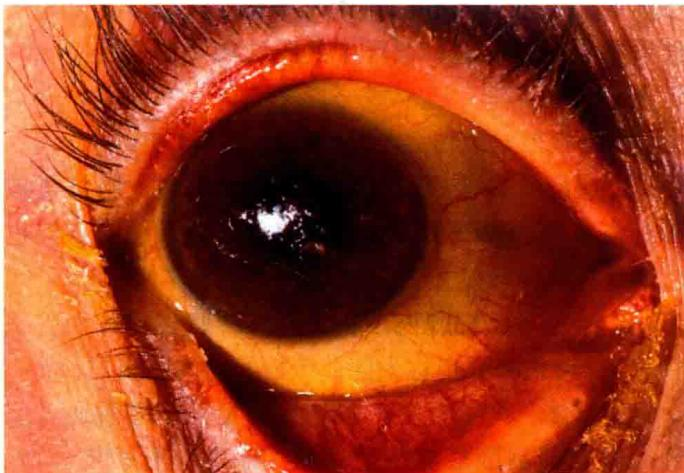 
图14-2 黄疸肝衰竭患者出现黄色巩膜
综合征是一种罕见的阴性遗传性疾病，表现为完全缺乏肝脏UGT活性的慢性、严重的间接性高胆红素血症。UGT基因多种突变合成了完全失活的酶。胆道是无色的，其内不含直接胆红素和极少的间接胆红素。肝大体形态正常。I型Crigler-Najjar综合征的婴儿出现不同的胆红素脑病，一般如果不进行肝脏移植会在1岁以内死亡。Ⅱ型Crigler-Najjar综合征与I型相似但是程度较轻，UGT仅部分失活。几乎所有Ⅱ型Crigler-Najjar综合征可正常发育，但少数出现类似核黄疸的神经病学改变。
2.Gilbert综合征Gilbert综合征是除去功能性或结构性肝疾病，因胆红素清除下降导致的一种遗传性，轻度，慢性间接高胆红素血症（<6mg/dl）。该疾病为常染色体隐性遗传，UGT基因表达减少（常常但不是绝对与启动子突变相关）。Gilbert综合征很常见，在 $5\% \sim 10\%$ 人群发病。男性多于女性，于青春期后被发现。除了可能的药物代谢改变该病一般无影响。
# （五）直接胆红素转运下降常与多药耐药蛋白家族突变相关
多药耐药蛋白（MRPs）是介导有机铁跨膜转运的分子，包括直接胆红素、胆酸、磷脂。这些蛋白和其他一系列小管转运体的改变降低了肝细胞分泌葡糖苷酸和其他有机阴离子至胆小管内的功能。由于突变的异质性，该病严重程度不同，轻者无影响，重者致死。
Dubin-Johnson 综合征：是一种良性、常染色体隐性遗传疾病，表现为慢性、直接高胆红素血症和肝显著的黑色素样色素沉积。亚型取决于位于编码MRP2蛋白的ABCC2基因突变。该病罕见，但是一些家族群体，如伊朗犹太人群有相对高的发病率。

【病理】除了主要位于小叶中央区的肝细胞和
Kupffer细胞可见粗糙，不含铁，深棕色的颗
粒以外，Dubin-Johnson综合征肝镜下表现完全正常。
电镜下，色素位于扩大的溶酶体。大体上，因细胞内色素沉着，而表现为色素性的或“黑色”肝。
【临床表现】大部分Dubin-Johnson综合征患
者除了轻中度黄疸没有其他症状，虽然非特异
性主诉常见。50%患者出现黑尿。血清胆红素波动在
$2 \sim 5 \mathrm{mg} / \mathrm{dl}$ , 偶有一过性升高。
# （六）发生在大部分新生儿的新生儿（生理性）黄疸
缺乏特异性疾病的新生儿高胆红素血症被称为生理性黄疸。

【发病机制】新生儿肝在结合及分泌能力完
全发育负责胆红素的清除。不仅如此，在此
期间循环中红细胞破坏增加也加大了对肝的需求。
因此， $70\%$ 的正常新生儿出现一过性间接高胆红素血症。这种生理性黄疸在早产儿中更常见，一方面肝清除胆红素能力不足，另一方面红细胞的破坏较足月儿明显。肝胆红素结合能力在出生后2周达到成人水平，配体水平需要时间更久。随着肝发育成熟，血浆胆红素水平迅速下降至成人水平。间接胆红素吸收光可产生水溶性胆红素异构体。因此，在新生儿黄疸常规进行皮肤光疗。
# （七）小胆管引流受阻和可见的胆色素（淤胆）提示肝外或肝内胆道阻塞
功能上，淤胆是小胆管胆汁引流下降和肝分泌水、胆红素、胆酸减少。淤胆可因内在肝疾病也称为肝内淤胆（图14-4），或者大胆道的阻塞也称为肝外淤胆导致。总之，淤胆因为跨胆小管膜的胆汁转运受损。
如不能向胆小管分泌胆酸会引起血浆和肝细胞胆酸水平升高。胆酸因其清洁功能和直接诱发凋亡而损
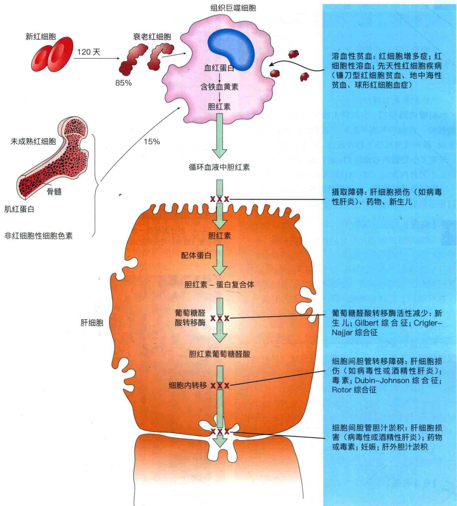 
图14-3 肝细胞水平的高胆红素血症发病机制：胆红素主要从循环中衰老的红细胞（RBC）而来，少部分从骨髓红细胞降解成分、球蛋白和额外的血红蛋白而来。高胆红素血症和黄疸因胆红素过量生成（溶血性贫血），异常红系造血及胆红素的摄取或肝代谢缺陷导致。肝细胞中胆红素代谢通路特殊阻断部位见图示
伤细胞。这些疏水分子是强的肝毒素，在肝细胞内的聚集导致肝细胞受损并促进淤胆相关的纤维化。血清胆酸升高导致严重瘙痒。
肝外胆道系统可被一些病灶阻塞。包括结石自胆囊管嵌顿至胆道，胆管或周围组织癌（胰腺或Vater壶腹），肝门肿瘤性淋巴结增大所致的外源性压迫（如霍奇金病），良性（术后瘢痕或原发性硬化性胆管炎）或先天性胆道闭锁。

【发病机制】淤胆的生化基础不完全明确。
在肝外胆道阻塞，首先是胆道压力增加，早
期，胆小管水平的生化和形态改变与肝内淤胆相似，包括易于出现在小叶中央的小胆管胆栓（图14-4）。淤胆患者血液中的胆汁成分提示结合胆红素自肝细胞反流至血液。淤胆时肝清除间接胆红素是正常的。
一些淤胆机制被提出：
小胆管内膜受损：小胆管内膜是钠和水分泌入胆汁的部位。药物和其他可影响结构的物质抑制 $\mathrm{Na}^{+} / \mathrm{K}^{+}$ ATP酶，膜的改变减低了胆汁流速，并引起形态学改变。
改变了小胆管的收缩能力：胆汁因为肝细胞蠕动收缩而在小胆管内流动。抑制这种蠕动的因素会导致淤胆。
小胆管渗透性改变：一些导致淤胆的因素如雌激素可以使小胆管内膜渗透性增强导致胆汁成分反向渗透。

【病理】淤胆显著的形态学表现为在扩张的小
胆管或肝细胞内出现棕色的胆色素（图14-4）
小胆管扩张。肝细胞内，胆汁淤积在大的含胆汁的溶酶体中。如果胆汁淤积持续，会显现其他形态异常。散在肝细胞坏死可能反映了细胞内胆汁过量的毒性反应。在肝窦内，巨噬细胞和Kupffer细胞含有胆色素和细胞碎屑。虽然早期淤胆仅仅累及中央区，慢性淤胆也会在小叶周边区出现胆酸。
肝外胆道阻塞时，肝肿胀，颜色加深。起初，中央区淤胆伴有汇管区水肿。随着淤胆继续，单核炎症细胞浸润至汇管区。小胆管扭曲扩张增生，衬以高度立方上皮（图14-5）。被破坏的肝细胞含有：①大量胆汁；②水肿弥漫，包含胆色素；③网状结构。此三联征被称为羽毛样退变。扩张的胆道可能会破裂，形成胆汁湖（图14-6），表现为局灶的，金黄色的被退变肝细胞包绕的沉积物。胆道内和增生的胆管中，胆汁样物质明显可见。

【临床表现】淤胆不论其原因常常表现为黄疸。
瘙痒常见，常顽固难治。皮肤胆固醇沉积为黄
瘤。长期的淤胆可能发生胆汁分泌减少继发的小肠吸收不良。
# 二、肝硬化
肝硬化是慢性肝病的终末期，纤维间隔包绕再生的肝细胞结节从而破坏了正常肝结构。这种形态学类型是持续性肝细胞坏死的不变的结局。进展期的肝硬化表现相似，常常难以仅凭组织学检查确定原因。然而，在疾病早期，病因的特征性表现可能明显，例如，脂肪和Mallory小体是酒精性肝损害的典型表现，而慢性肝炎则表现为慢性炎及门静脉周围坏死。
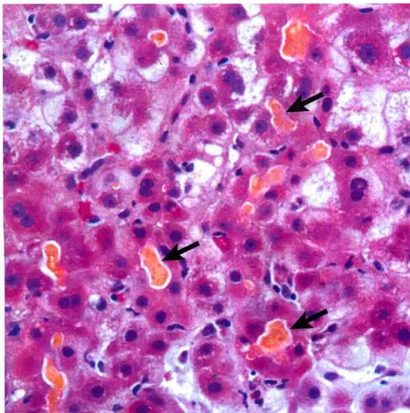 
图14-4 胆汁淤积在一例药物导致淤胆的显微照片中显示扩张的胆小管（箭头）可见明显的胆栓。无炎性表现，该病灶可被称为“单纯淤胆”
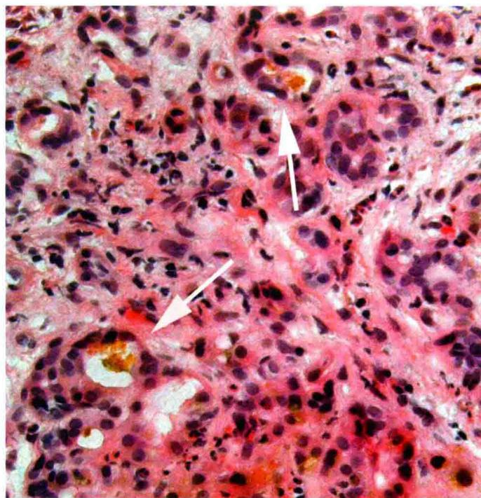 
图14-5 肝外胆道受阻汇管区因增生的胆管和急性及慢性炎而扩张。一些胆管内被胆汁阻塞（箭头）
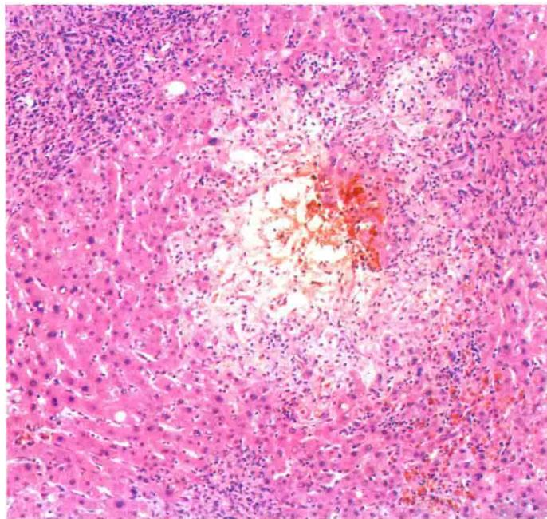 
图14-6胆汁湖。肝外胆汁受阻患者的肝脏显微照片显示该区域坏死及溢出淤积的胆汁
肝硬化中定义了结节类型。一种是微小结节型肝硬化，常常见于疾病早期。另一种是疾病晚期常见的大结节型。之间是两者特性兼有者。实践中，肝硬化的不同外观不如病因重要。
微小结节肝硬化：微小结节肝硬化的结节很少大于一个小叶，直径小于 $3\mathrm{mm}$ 。微小结节缺乏小叶结构中的汇管区及中央静脉。分隔结节的结缔组织通常较薄，局部不规则的实质细胞塌陷可能出现较宽的间隔。在肝硬化活跃期，在间隔中有大量单核炎细胞和胆管增生。微小结节肝硬化典型的是酒精性肝硬化，但多种其他因素导致的肝硬化也会出现此型表现。
大结节性肝硬化：大结节性肝硬化最长见于慢性肝炎。肝肉眼切面可见粗糙的，不规则结节，组织学上可见大小不一的大结节，被纤维条带包绕（图14-7）。大结节性肝硬化中的纤维结缔组织分隔较宽，含有原有的汇管区，单核炎细胞及增生的胆管。微小结节肝
硬化经持续的重构和结节扩张后可转变成大结节性肝硬化。对劝服酗酒者戒酒更是如此。

【发病机制】与肝硬化相关的疾病见表14-1。
除了均伴随持续的肝细胞坏死, 这些疾病缺少共性。大部分病因为酒精性和病毒性。尽管诊断方法进步, 大约 $15\%$ 病例病因不明而被归类为病因不明的肝硬化。非酒精性脂肪性肝炎现今被认为是相当一部分病因不明的肝硬化的病因 (见下文)。肝硬化也会导致门脉高压等并发症 (见下文)。
表 14-1 肝硬化的主要病因 
酒精性肝病非酒精性脂肪肝慢性肝炎慢性病毒性肝炎自身免疫性肝炎药物胆道疾病肝外胆管阻塞原发性胆汁性肝硬化硬化性胆管炎代谢性疾病血色病Wilson病α1抗胰蛋白酶缺乏酪氨酸血症糖原累积病遗传性果糖不耐受遗传性累积病半乳糖血症隐源性
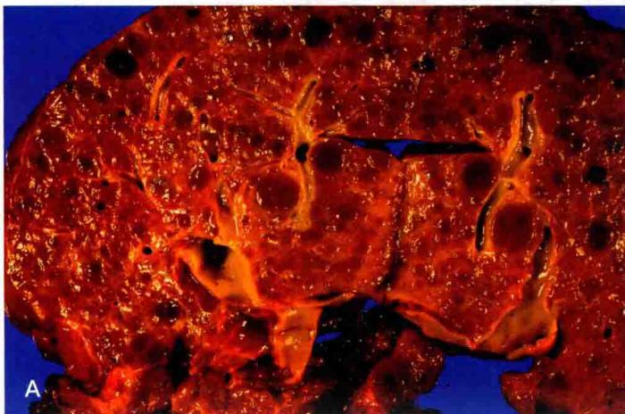 
图14-7大结节性肝硬化。A.肝形态怪异，切面可见不规则结节和不同宽度的结缔组织分隔；B.镜下图片显示不同大小的结节和不规则的纤维分隔
# 三、肝衰竭
肝衰竭是当肝细胞及功能不能维持机体存活所需而出现的临床综合征。肝衰竭可以急性发展，大部分是暴发性病毒性肝炎或毒性肝损害。反之，慢性肝病如慢性病毒性肝炎或肝硬化会导致隐匿发生的肝衰竭。急性或慢性肝衰竭的结局见图14-8，与最常见的原因肝硬化的并发症相关。虽然支持治疗已有进步，但急性肝衰竭死亡率高于 $50\%$
# （一）胆红素肝清除不足导致黄疸
肝衰竭因为肝病导致胆红素清除不足总会出现黄疸。与肝衰竭相关的高胆红素血症，大部分是直接胆红素升高，虽然间接胆红素也由升高趋势。有时红细胞破坏增加也会升高间接性高胆红素血症而加重黄疸。
# （二）肝性脑病指的是肝衰竭的神经症状和体征
在慢性肝衰竭或门脉循环分流的患者肝性脑病从睡眠障碍和易怒（I期）到昏迷（IV期）。病程迁延数月或因暴发性肝炎数天、数周内迅速发展。

【发病机制】肝性脑病发病机制复杂。部分因为自小肠吸收的有害物质，这些未经肝解
毒的物质是因为肝细胞功能下降或结构或功能的血管分流而产生的。后者在为缓解门脉高压进行门体吻合术后更明显，因此被称为门体脑病。
导致肝性脑病相关物质如下：
血氨：正常时，血氨在肝代谢，但是，急性肝衰竭或肝硬化时，大量血氨进入血液循环。
肝性脑病患者的血液及脑部血氨水平常常升高。脑将血氨合成谷氨酸及谷氨酰胺而解毒。这些分子增多会改变神经传递及脑渗透压。然而，血氨升高和肝性脑病严重性之间的关系尚不明确。
GABA：在肝性脑病中，因苯重氮基盐样分子水平升高而出现的由氨基丁酸-苯重氮基盐受体复合体介导的神经抑制不容忽视。
其他物质：包括结肠含硫氨基酸降解产生的硫醇，肝衰竭患者呼吸的味道称为肝病性口臭，反映了唾液腺存在硫醇。血液中芳香族氨基酸水平升高可以导致正常神经递质（如去甲肾上腺素）合成减少，而假性神经递质（如对羟基苯乙醇胺）合成增加，这也会在肝性脑病中起一定作用。

【病理】在急性肝衰竭患者，脑水肿是大部分
病例主要死因。这种水肿不仅仅是一个简单的
终末事件，更是肝性脑病的一个特殊病变部位。在因慢性肝病肝性脑病死亡的患者，最显著的改变在星形细胞。这些细胞数量和大小均增加，细胞核肿胀增大及核内包涵体，类似阿尔茨海默Ⅱ型星形细胞（见第28章）。脑皮质深层及皮质下白质、基底神经节和小脑出现薄层坏死及海绵样改变。
# （三）凝血因子减少常导致出血
肝合成凝血因子减少及血小板减少是肝衰竭止血功能下降的主要原因。凝血因子生成减少（纤维蛋白原、凝血素、凝血因子V、VII、IX、X）反映了肝蛋白合
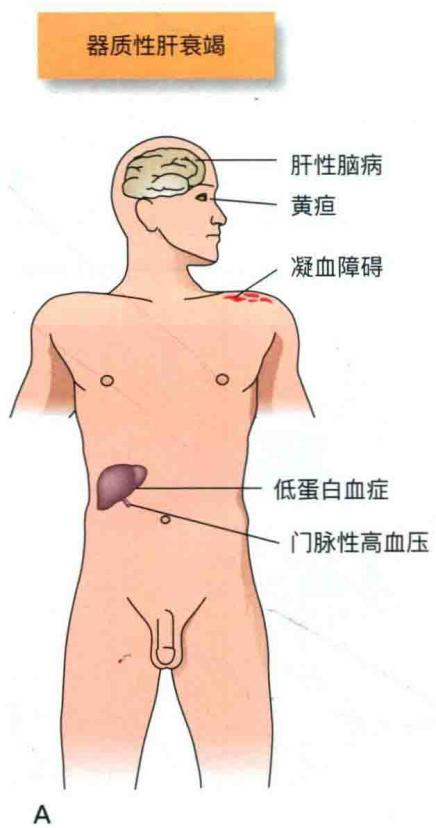 
图14-8肝硬化和肝衰竭的并发症肝细胞功能衰竭临床表现。A.内分泌紊乱；B.门脉高压；C.基于发病机制，这些临床表现有较多重叠
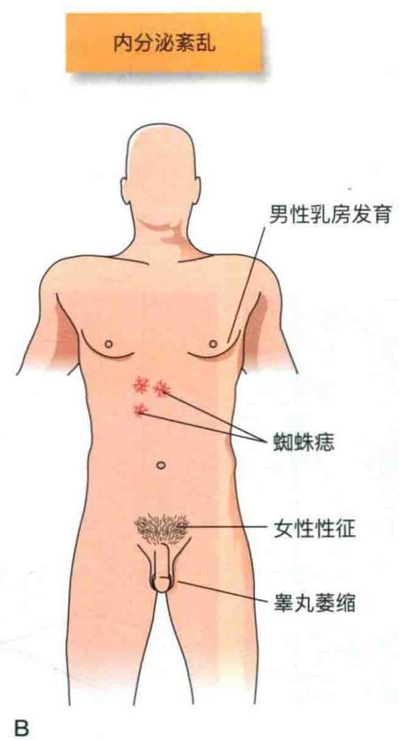
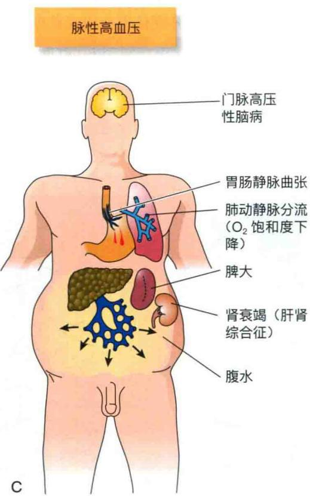
成功功能下降。但是，同时也伴随有抗血栓蛋白C水平的下降。
血小板减少（ $< 80000 / \mu l$ ）在肝衰竭中常见，伴有血小板功能性异常。其减少由于：①脾功能亢进；②骨髓抑制：③循环中血小板因血管内凝血而消耗。
弥散性血管内凝血在肝衰竭中常见。其诱发因素有：①肝细胞坏死；②因细菌毒素诱导组织因子在内皮细胞上表达；③循环中抗凝血蛋白减少；④肝对循环中激活的凝血因子清除减少。
# （四）肝衰竭并发低白蛋白血症
肝合成白蛋白功能受损会继发循环中白蛋白水平下降，也是水肿重要的发病机制之一，也慢性肝病情况常会复杂化。
# （五）肝肾综合征是继发于肝衰竭的肾衰竭
肝肾综合征指肾低灌注，即少尿、氮质血症和血浆肌酐水平升高。该综合征常常发生在肝硬化中，提示预后不良。有趣的是，肾保持功能正常。从死于肝肾综合征的患者移植到慢性肾衰竭的受者的肾脏功能正常。反之，肝肾综合征患者行肝移植可以恢复肾功能。
该综合征与肾血管极度收缩有关，而后者与血管一氧化氮的释放致动脉血管舒张部分相关。肝硬化患者血管改变促成了肝肾综合征的发生。在肝硬化早期，肾小球滤过压因系统性动脉舒张而受到肾内前列腺素调节的保护。随着小动脉扩张渐渐严重，肾内因素不
再起效，肾动脉血管收缩加剧，肾小球灌注和滤过下降，最终导致临床肾功能不全。
# （六）肝硬化出现内分泌并发症
区分开究竟是作为肝病常见原因之一的酒精滥用的直接反应还是肝功能不全的改变很重要。男性慢性肝功能不全会导致女性化，男性乳房发育、女性体态和女性体发分布。此外，雌激素过多的血管表现常见，表现为分布在上腔静脉引流区域（脸部和上肢）的蜘蛛痣和肝掌（图14-8）。女性化是由于肝对雌激素代谢下降，雄激素水平下降造成的。雄激素（雄烯二酮和脱氢表雄酮）在外周会转变为雌激素复合物，因此加重了循环中雌激素的负担。
# 四、门脉高压
门脉高压指的是门静脉压力绝对值升高常常至 $8\mathrm{mmHg}$ 以上或者门静脉和肝静脉压力差值在 $5\mathrm{mmHg}$ 或以上。门脉高压缘于门脉循环某处血流受阻。门脉压力升高导致侧支循环开放，出现胃食管静脉曲张出血、腹水、脾大及肝肾疾病（图14-9）。为方便起见，门静脉血流受阻图示为： $①$ 肝窦前，在血流入肝之前； $②$ 窦性或肝内性，流经汇管区及小叶； $③$ 肝窦后，流出小叶后。
# （一）窦性或肝内性门脉高压常因肝硬化引起
在肝硬化纤维扭曲肝窦结构之前，血管平滑肌细
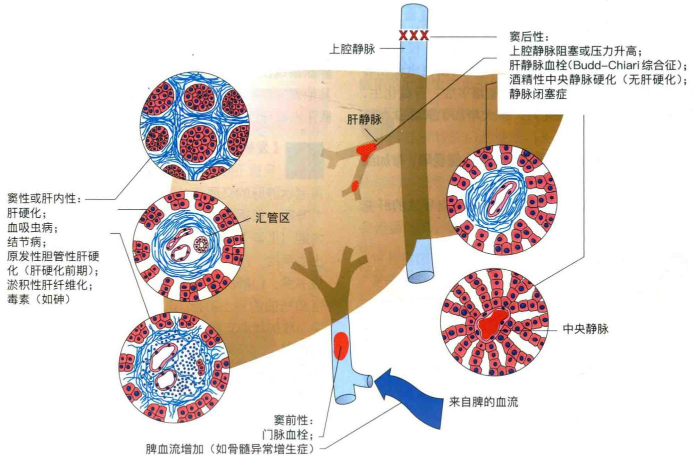 
图14-9 门脉高压的原因
胞活跃的收缩已开始阻止门脉血流入肝。可能与刺激炎症的因素，如酒精性肝炎或病毒性肝炎有关。纤维化发展后，肝窦结构逐渐扭曲。肝硬化再生结节挤压肝静脉，因此阻止血流自周边流向小叶。肝静脉和小静脉被包绕，挤压也常常消失在汇管区瘢痕中。而且，自肝动脉血流增加，小动静脉交通开放，因此，门脉压力进一步升高。
肝硬化时，肝内和系统性循环中内皮细胞功能下降，肝内血管进一步收缩。随着入肝血流阻力增加，肠系膜动脉血管扩张增加了门静脉血量。这种血管扩张是因为肠系膜静脉巨大剪切力损伤内皮细胞而产生NO造成的。门脉高压同时出现肠系膜动脉血管扩张，结果系统循环功能下降（系统动脉扩张，有效动脉血流量下降）。这种有效动脉血流量下降与门脉高压临床表现有关，包括腹水、肝肾综合征（见上文）和肝肺综合征。
全球范围上，肝血吸虫病是肝内门脉高压的主要病因（详见第9章）。这种情况下，肝功能保持正常，但是因血吸虫感染导致的肝内窦前血管受阻可出现严重的门脉高压。
特发性门脉高压指的是偶发的一些没有任何肝内或肝外疾病出现的门脉高压及脾大。在某些国家（如英国、日本）特发性门脉高压占到需要手术减压患者总数的 $15\% \sim 35\%$
# （二）肝窦前性门脉高压常因门静脉血栓引起
门静脉血栓最常发生在肝硬化中。其他原因包括：肿瘤、感染、高凝状态、胰腺炎或外科创伤，一些病因尚不明确。原发性肝细胞性肝癌（HCC）侵蚀到门静脉分支偶尔阻塞门静脉主干。门脉高压也出现在各种原因的脾大者，包括真性红细胞增多症、骨髓化生、慢性髓系白血病。肝硬化时，脾大增加了脾静脉血流会加重门脉高压。
# （三）窦后门脉高压是肝小叶后血流受阻：布加综合征
布加综合征是由于肝静脉及分支受阻导致的肝充血性疾病。

【发病机制】布加综合征的主要原因是各种原因导致的肝静脉血栓，如真性红细胞增多
症（ $10\% \sim 40\%$ 的病例）和其他髓系增殖性异常、恶性肿瘤引起的高凝状态、口服避孕药、妊娠、细菌感染、阵发性睡眠性血红蛋白尿、肝转移性或原发性肿瘤和外科创伤。 $20\%$ 的病例未找到特殊病因。血栓在肝静脉紧邻出肝处及下腔静脉肝内段最常见。
肝小静脉闭塞病是布加综合征的一种变异型，因中央静脉和肝静脉小分支受阻引起。大多数可追溯到
吸收了野百合千里光、聚合草中含有的毒性吡咯里西啶生物碱，有时是用作草药茶的形式（在欧洲和北美最常见为紫草科植物）。也见于某些抗肿瘤性化疗药物或肝放疗的患者。在骨髓移植患者中也有报道，可能是移植物抗宿主病的表现。

【病理】在肝静脉血栓急性期，肝水肿，包膜紧张
切面呈斑驳颜色及血液渗出。慢性期，切面苍白，
肝因结缔组织增生而致密。镜下，肝静脉可见从新鲜血凝块到机化再通的血栓不同阶段的栓子。
在布加综合征和肝小静脉闭塞病的急性期，中央区血窦扩张并被红细胞填塞。肝板受压，并出现小叶中央肝细胞坏死。长时间肝静脉淤血，中央区纤维化逐渐发射至小叶周边变得愈加明显。肝窦扩张，中央至中间部分肝细胞出现压力性萎缩。最后，结缔组织间隔连接相邻中央区，形成中央仅有唯一汇管区的结节，称为反向小叶。纤维化严重性常常不够诊断为肝硬化。

【临床表现】肝静脉完全栓塞表现为急性腹痛、
肝大、腹水和轻度黄疸。常迅速进展至肝衰竭状态。大多数情况下，肝静脉栓塞为不完全性，症状持续时间可为一个月至数年。多于 $90\%$ 的布加综症患者出现严重腹水，多于 $30\%$ 的患者出现脾大、胆石患者最后死于肝衰竭或门脉高压并发症。肝移植者愈该病有效。
# （四）门脉高压可导致系统性并发症
1. 食管静脉曲张 食管静脉曲张是为适应缓解门静脉系统压力而开放的门体侧支循环所致。肝硬化或其他原因门脉高压患者的最常见死因之一是食管静脉曲张出血导致的上消化道出血。

【发病机制】大部分有临床意义的侧支位于
食管下段及胃上部的黏膜下，也是门静脉和
胃冠状静脉的交通支。这些侧支开放后血流速和压力升高，邻近食管胃交界处黏膜下静脉扩张并突入内腔（见第13章）。虽然曲张静脉直径升高提升了出血风险，门静脉压力升高和静脉曲张风险并无直接关系。门静脉后压力也被传导至其支流，包括扩张和扭曲的痔上静脉（肛直肠静脉曲张）。以脐为中心放射状侧支静脉形成海蛇头。

【临床表现】出现食管静脉曲张出血的患者预
后差，急性期死亡率达 $40\%$ 。肝硬化患者在初
期有静脉曲张出血而存活下来者，因再出血高风险及肝功能恶化而长期存活率低。外科重建门体分流可达到门脉循环压力永久性解除，肝移植也是分流手术之外的另一选择。
2. 脾大 门脉高压患者的脾脏明显增大并常常出现脾亢的表现，即终身全血成分下降，因此导致循环中数目下降（全血细胞减少）。脾亢是因为通过增生的脾脏时间延长，所以红细胞、白细胞、血小板清除增加。 
大体上，脾质硬增大，达 $1000\mathrm{g}$ ，切面呈规则的深红色伴不明显的白髓。镜下，脾窦扩张，窦壁被纤维组织增厚，并被增生的内皮细胞和巨噬细胞勾勒。局灶出血导致纤维化及铁沉积的结节，称为GammadGandy小体。 
3. 腹水 腹水是指腹膜腔液体聚积。常与门脉高压伴发，积聚液体量足够大（常为数升）不仅使腹部增大还影响呼吸。肝硬化腹水预后差。

【发病机制】在门脉高压早期，心率和心排血量增加以维持动脉压力。然而，外周动
脉血管扩张加重，心排血量不能维持自身平衡。内源性血管活性机制被激活，包括增加肾素- 血管紧张素系统活性，激活交感神经系统。这些最终导致肾钠水潴留而形成腹水。除此之外，肝窦压力升高导致流体及静脉压及淋巴自肝窦至窦周间隙的压力升高。这些液体流入腹膜腔形成腹水。白蛋白合成减少导致血管内胶体渗透压下降而使液体流向腹膜腔。腹水形成机制见图14- 10。
4.自发性细菌性腹膜炎 自发性细菌性腹膜炎（SBP）是肝硬化伴腹水患者重要的并发症。感染极其
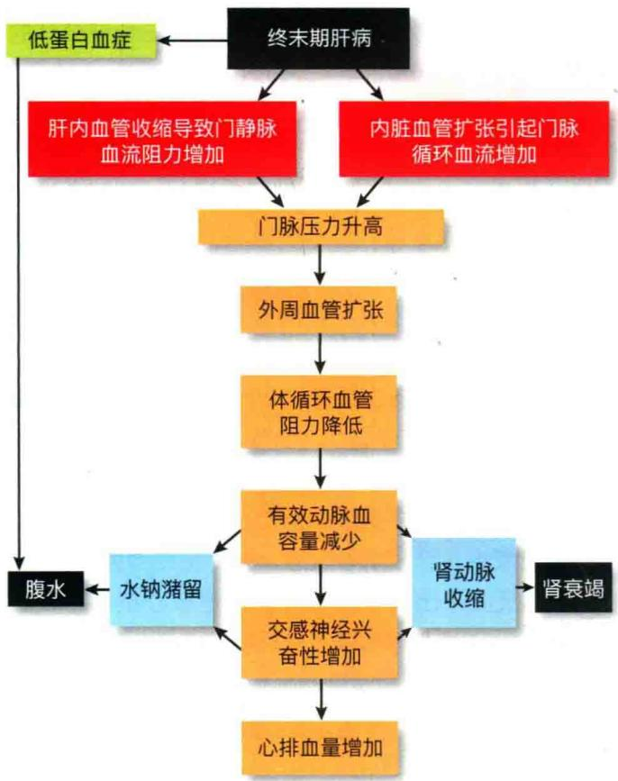 
图14-10 腹水的发病机制
凶险，即使使用抗生素治疗病死率仍高。可能是因为腹水被血液、淋巴或穿过肠道的细菌种植。如未得到恰当治疗，死亡率在 $80\%$ 。即使及时治疗，急性炎症消退，1年死亡率达 $70\%$ 。因此，SBP是肝移植的指征。
# 五、病毒性肝炎
病毒性肝炎是肝细胞受感染出现肝的坏死及炎症反应。许多病毒和其他感染因素可导致肝炎和黄疸（表14-2），但在工业化国家，多于 $95\%$ 的病毒性肝炎源自有限几种肝炎病毒，自A型至G型。F型肝炎病毒可能是B型肝炎病毒的变种。G型肝炎病毒与C型肝炎病毒 $25\%$ 同源，但并不导致急性或慢性肝炎。
表14-2 导致肝炎的感染性因素A型肝炎病毒单纯疱疹病毒B型肝炎病毒巨细胞病毒C型肝炎病毒除HAV以外的肠病毒E型肝炎病毒钩端螺旋体（钩端螺旋体病）黄热病毒溶组织内阿米巴（阿米巴肝炎）Epstein-Barr病毒（传染性单核细胞增多症）Lassa, Marburg和Ebola病毒
# （一）A型肝炎病毒是急性肝炎最常见的原因
A型肝炎病毒（HAV）是一种微小RNA病毒属（包含脊髓灰质炎病毒）的含小RNA的肠道病毒。肝细胞是病毒复制的首要场所，虽然胃肠道上皮细胞也同样被感染。复制的子代病毒脱落至胆汁出现在排泄物中。HAV不直接损伤细胞，肝细胞受损是由于对病毒感染的肝细胞的免疫反应。
【流行病学】HAV唯一宿主是急性感染期的人，主要经粪口途径经一系列阶段在人和人之间传播。HAV的流行发生在拥挤和卫生条件较差的情况下，如战时，或者被粪便污染的水和食物。在被污染的水源中的贝壳类食物聚集了病毒，如果未被彻底烹煮则会传播感染。在美国，20岁以下的人群中 $10\%$ 血清中有既往感染HAV的证据。表明大部分HAV感染是隐匿的，并未被发现。A型病毒在日看中心和国际旅行者、男同性恋中常见。但是，所有病例的 $50\%$ 找不到感染源。疫苗可产生长期保护。在美国，广泛的接种疫苗明显减少了急性HAV感染。
【临床表现】经历 $3\sim 6$ 周潜伏期，HAV感染者出现非特异性症状，包括发热、不适、厌食。同时，血清转氨酶升高是肝受损的证据（图14-11）。一般 $5\sim 10$ 天后血清转氨酶开始下降时，出现黄疸。平均较明显地持续10天，也可能达个月余。在大多数病例，在黄疸消退时转氨酶水平恢复正常。A型感
染病毒从不出现慢性病程。也没有携带状态，感染后出现终身免疫。婴儿暴发性肝炎罕见，几乎所有患者都能恢复，无后遗症。
# （二）B型肝炎病毒是急性及慢性肝病的主要病因
B型肝炎病毒（HBV）是一种嗜肝DNA病毒。HBV的DNA主要是双股结构，由包含一个含有所有基因组的长的环形股和一个较短的占前者长度 $50\% \sim 85\%$ 股组成。基因组包含4个基因：
核心基因（C）：病毒核心包含核心抗原和e抗原，两者都是C基因的产物。
表面基因：HBV核心被包含在表达B型肝炎表面抗原的被膜里。被膜被感染的肝细胞不依赖于病毒核心独立地合成，并被大量分泌入血。表面抗原颗粒有免疫原性，但无感染性。完整的有感染性的病毒也是在肝细胞内合成（戴恩颗粒）。
聚合酶基因：P基因编码了病毒DNA聚合酶。
X基因：小X蛋白激活了病毒转录，可能在慢性HBV感染相关肝细胞肝癌的发病机制中起一定作用。

【流行病学】据估计世界上约有3亿5000万
HBV慢性携带者，组成了大量的宿主。携带率
自 $0.3\%$ （美国和西欧）波动至 $20\%$ （东南亚、撒哈拉以南地区和大洋洲），这些地方较高的携带率是因为自携带者母亲垂直传播给新生儿。
在美国，据估计至少有100万慢性HBV携带者，
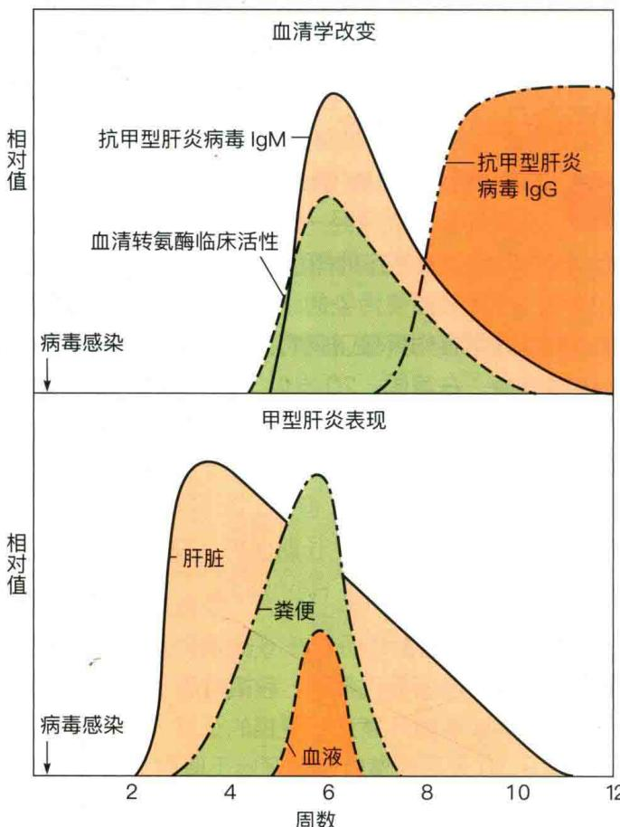 
图14-11 A型肝炎病毒（HAV）相关的典型血清学变化
每年大约25万新发感染病例。在过去20年保护性疫苗已经降低了 $90\%$ 的美国HBV发生率。在新病例中，仅1/4因黄疸被临床确认。每年因暴发性HBV感染导致 $250 \sim 300$ 人死亡。常规HBV血液检查基本杜绝了输血后感染的风险。
虽然不足 $10\%$ 的成人HBV感染者称为携带者，一般来说，如果出生时没有新生儿HBV免疫预防，就会出现持续感染。在美国，慢性HBV携带者在药物成瘾和男性同性恋中特别常见。人类是HBV唯一明确的宿主。与HAV不同，HBV不经粪口途径传播，也不会污染水和食物。虽然，HBV在多种分泌物中被发现，仅认为在血液、唾液和精液的病毒有感染性。HBV经共用血液（常常是药物滥用者）和目前更多见的性接触传播。
由重组B型肝炎表面抗原或免疫性表位组成的B型肝炎的合成疫苗能有效地提供终身免疫，大大降低了疾病的流行。

【发病机制】HBV不直接破坏细胞。无症状
的慢性携带者能数年大量病毒负荷但不出现
肝细胞被破坏的功能或生化异常。细胞毒性 T 细胞 $\left(\mathrm{CD8}^{+}\right)$ 直接针对多个 HBV 表位是肝细胞被破坏和出现后续临床肝病的主要介导因素。虽然完整的基因组没有被完整整合到宿主 DNA 中, 但基因片段被积极整合后产生了多种病毒抗原。因此, 尽管血液传染性在下降, 慢性肝炎还在持续。

【临床表现】与HBV感染相关有三个被公认的
病程。
急性B型肝炎：大部分患者出现急性、自限性、与HAV类相似的肝炎，但A型肝炎可痊愈并终身免疫。大部分B型肝炎症状也与A型肝炎相似，尽管急性期较严重些。一般来说，直到暴露后 $2\sim 3$ 个月才出现症状，但潜伏期可偶可出现短至6周，长至6个月的情况。许多患者包括几乎所有婴儿或儿童无症状，所以无临床表现。
B型肝炎表面抗原是最早出现在急性B型肝炎患者血清的标记物，在暴露后1周至2个月可被检出（图14-12）。在迅速恢复的患者康复阶段迅速消失。与B型肝炎表面抗原消失同时或稍后，B型肝炎表面抗体出现在血液中。这预示着痊愈，并产生终身免疫。
核心抗原不出现在血液中，但是核心抗体在表面抗原不久后出现。核心抗体并不能清除病毒或以免感染。虽然是HBV先期感染的标记物
e抗体是B型肝炎第二出现的循环抗体，在表面抗原出现之后，临床疾病之前出现。一般在2周内消失，但B型肝炎表面抗原仍存在。血浆e抗原与密集病毒
复制和患者最大传染性相关。e抗体在抗原消失后不久出现，在肝炎治愈后2年或更久可被检出。
暴发性肝炎：急性B型肝炎很少出现暴发性病程。表现为广泛肝细胞坏死、肝衰竭、病死率高。历史对照显示核苷酸类似物明显改善了暴发性B型肝炎的预后。如有可能，肝移植存活高。
慢性肝炎：慢性肝炎指的是长于6个月的肝坏死及炎症。 $5\% \sim 10\%$ 的B型肝炎患者，表面抗原血症不能缓解，这些患者感染会持续而发展为慢性B型肝炎。慢性B型肝炎病毒感染者持续出现肝细胞炎症或
坏死，更有可能发生肝硬化及肝细胞性肝癌。男性较女性更可能发生慢性肝炎。其他危险因素如年龄大于40岁、HBV高病毒血症和其他重要因素。
慢性B型肝炎患者血液中不能检出表面抗体，虽然一些有循环表面抗原抗体复合物。这些免疫复合物导致一系列肝外表现如血清病样综合征（发热、皮疹、风团、急性关节炎），多动脉炎、肾小球肾炎、冷球蛋白血症。实际上， $1/3 \sim 1/2$ 的结节性多动脉炎是HBV携带者。慢性B型肝炎发生肝癌危险性明显升高将在后述。HBV感染的可能结局总结在图14-12，图14-13。
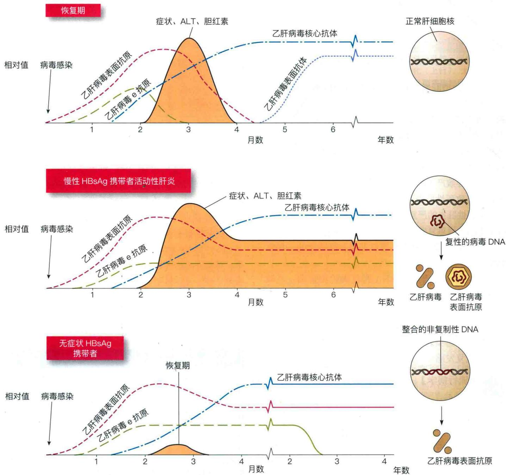 
图14-12 B型病毒性肝炎3中不同结局的典型血清学变化（第一行）大多数病例，HBsAg抗体的出现（抗HBs）证明痊愈。病毒DNA从肝细胞核消失（第二行）在大约 $10\%$ 的B型病毒性肝炎，由于缺少抗HBs，HBs抗原血症会持续超过6个月。病毒复制活跃的患者，血液中HBeAg维持高水平，为发展为活动性肝炎的证据。这些病例中，病毒基因在细胞核中持续出现但未整合至宿主DNA（第三行）病毒活动性复制停止或下降者，血液中HBeAg消失，为发展为无症状携带者证据。这些病例中，B型肝炎病毒（HBV）基因片段整合到宿主DNA中，但未见附加体DNA。
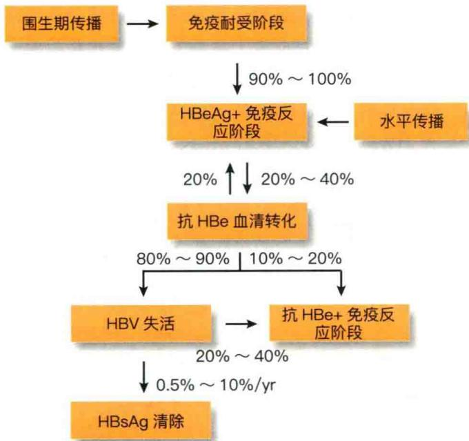 
图14-13 B型肝炎病毒（HBV）感染后可能的结局
# （三）D型肝炎病毒是一种可检测的RNA病毒
肝HDV病毒需要以B型肝炎表面抗原为前提。因此，HDV感染限于感染或HBV的患者，或者与HBV感染同时出现（同时感染）或出现于其后（重复感染）。HDV和B型肝炎表面抗原一起被清除，临床过程一般与通常的急性B型肝炎无差别。但是，在一些患者，同时感染会导致严重的暴发性肝炎，特别在静脉药物滥用者常常是致死性肝炎。HBV携带者重复感染HDV一般会加重慢性肝炎的严重性。实际上， $70\% \sim 80\%$ 的B型肝炎表面抗原重复感叹HDV会出现慢性肝炎。
# （四）C型肝炎病毒是慢性肝炎和肝硬化的一种常见原因
HCV是一种含单股RNA有包膜的黄病毒。经确认有6个不同但相关的HCV亚型：1，2，3型最常见（ $75\%$ 在美国和西欧）。2和3亚型较1型抗病毒治疗反应好。单个患者而言，许多变异的HCV出现后可能出现多种感染表现，包括抗HCV IgG抗体清除感染或持续或复发感染（慢性肝炎）。

【流行病学】HCV的流行各异，在美国为 $1\%$
在埃及 $15\%$ 。估计全世界感染者有1亿5000
万。HCV是最常见的肝移植指征，占等待名单上 $50\%$ 患者。HCV感染因接触感染者血液特别是静脉药物滥用或高危性行为（尤其是在男性同性恋者间）而传播。由于检测血液中抗HCV抗体，因输血的风险已基本被完全消除。自感染的母亲垂直传播给新生儿并不多见（约 $5\%$ ），而感染HIV的母亲为其 $4\sim 5$ 倍。一小部分患者危险因素未知。

【发病机制】HCV并不直接损伤肝细胞，因为许多慢性携带者常常没有肝细胞受损证
据。虽然激活的体液免疫及细胞免疫直接针对所有病毒蛋白，大部分患者出现持续的病毒血症。肝细胞损伤归因于针对病毒感染肝细胞的细胞毒 T 细胞反应。HCV 持续存在的机制不清。

【临床表现】HCV的潜伏期和HBV相似。血清
转氨酶升高（图14-14）常常发生在暴露于病毒 $1\sim 3$ 个月（2～26周）。血清中HCVRNA在感染2周内可被聚合酶链式反应检测出来。抗HCV抗体常出现在HCV感染后7～8周，在慢性感染期间持续。急性HCV感染临床病程极轻微，罕见有暴发性肝炎。实际上，仅 $10\% \sim 20\%$ 的患者在急性期出现黄疸。
与HCV相关的最主要后遗症是慢性疾病（图14-15）。持续HCV感染或慢性肝炎可能至少达 $80\%$ 甚至更高。不仅如此， $50\% \sim 70\%$ 感染者继发慢性肝炎。大部分患者临床发病轻微，存活至少10年，许多至20年或更久。重要的是，约 $20\%$ 慢性C型肝炎患者最终发展为肝硬化。在明确肝硬化的患者，达每年 $5\%$ 的患者发展为肝细胞性肝癌。
对于C型肝炎肝外表现认识充分。联系最密切的是混合性冷球蛋白血症，是一种因循环免疫复合物沉积在微血管导致的系统性血管炎。冷球蛋白血症累及器官包括皮肤、唾液腺、神经系统和肾。后者表现为膜增生性肾小球肾炎。在慢性C型肝炎患者中较常见B细胞非霍奇金淋巴瘤。
因为急性C型肝炎常无症状所以未引起临床注意。慢性C型肝炎一般联合注射干扰素-a和口服病毒唑治疗。使用这个方案， $40\% \sim 50\%$ 型患者和 $75\% \sim 80\%$ 2,3型患者达到HCV病毒血症持续清除。新的疫苗在初步试验中能有效产生交叉免疫。
表 14-3 比较了常见肝炎病毒的主要表现。
表14-3 常见的病毒性肝炎特征比较A型病毒性肝炎B型病毒性肝炎C型病毒性肝炎基因RNADNARNA潜伏期3~6周6周~6个月7~8周传播途径经口胃肠外胃肠外血液否是是排泄物是否否垂直传播否是5%暴发性很罕见是罕有肝坏死慢性肝炎无10%80%携带状态否是是肝癌否是是
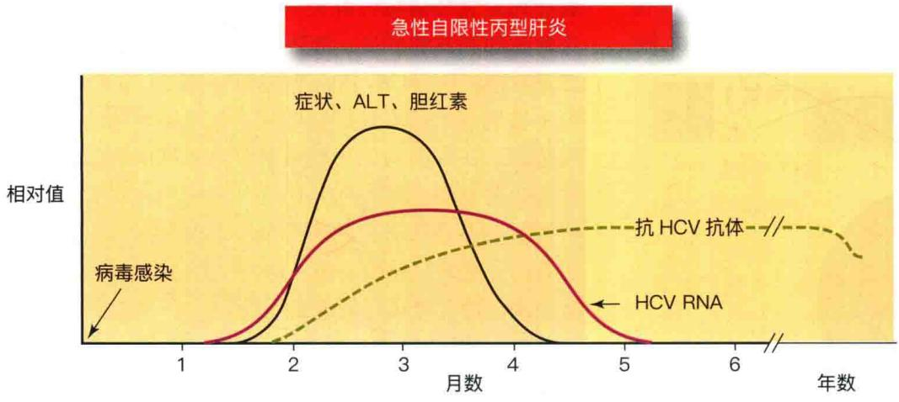
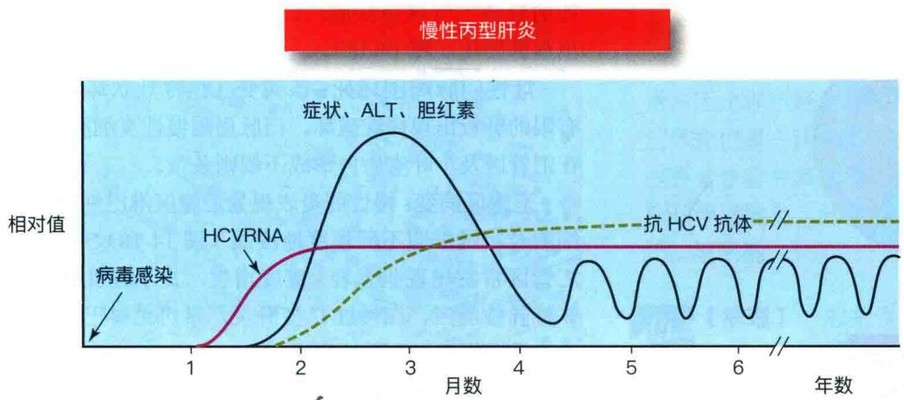 
图14-14 C型病毒性肝炎的临床过程两种不同结局的血清学变化（上行），大约 $20\%$ 的急性C型病毒性肝炎为自限性感染，数月后自愈。抗HCV在病程末期出现并保持（下行）其他C型病毒性肝炎的患者发展为慢性病程，临床症状进展与缓解交替。抗HCV的出现不影响临床转归。慢性肝炎最终发展为肝硬化。ALT.丙氨酸氨基转移酶
# （五）E型肝炎病毒是不发达国家肝炎流行的主因
HEV是肠道的肝炎病毒科的单股RNA病毒，经粪口途经传播。常常经水传播，在世界贫穷地区年轻到中年人急性病毒性肝炎的 $50\%$ 因此引起。在印度、尼泊尔、缅甸、巴基斯坦、前苏联、非洲和墨西哥曾暴发大流行。这些大流行发生在大雨没有足够的污物处理后。HEV感染也经动物传播（特别是食用生的、未煮熟的被感染的野生动物如猪、野猪或鹿的肉）、胃肠外和垂直传播。HEV类似猪病毒，提示后者可能是感染的宿主。
大多数时候，与黄疸性、自限性、急性A型肝炎类似。黄疸、肝大、发热和关节痛常见，一般在6周缓解。然而，一些患者出现急性肝衰竭，病死率在 $1\% \sim 4\%$ 孕妇会更高，在妊娠期第 $6\sim 9$ 个月可达 $20\%$ 。每年全球因HEV死亡大约7万人。在有免疫力的患者没有出现慢性病程或携带状态，但是在实性脏器移植受者有慢性肝炎被报道。中国已经研制了疫苗但还未被广泛应用。
# 六、病毒性肝炎病理
# （一）所有类型病毒性肝炎在急性肝炎时形态学类似

【病理】急性病毒性肝炎主要特点是肝细胞死亡（图14-16）。在肝小叶内，可见单个细胞
散在坏死或小灶肝细胞坏死。一些凋亡的肝细胞表现为小的，深红染小体（Councilman或者嗜酸小体）。有时含有固缩核物质，会从肝板突入到肝窦。虽然嗜酸小体是病毒性肝炎的特征，但是在其他肝病中也可见到。在急性病毒性肝炎，许多细胞外观正常，但有的不同程度水肿，形状大小及染色质量不一。同时，退变的肝细胞有增大的染色质浓染的核，并见增加的嗜碱性胞质。不规则的肝板成为不规则小叶。
1. 在急性肝炎中的慢性炎细胞 慢性炎细胞主要是淋巴细胞在小叶中弥漫浸润，围绕单个坏死肝细胞或聚集在灶性坏死区。而且，巨噬细胞可能较明显，嗜酸性粒细胞或分叶核中性粒细胞不少见。典型的，淋巴细胞浸润在中央静脉和肝板间，成为静脉炎。常出现中央静脉肿大和增生的内皮细胞（静脉内膜炎）。Kupffer细胞增大，突入到窦腔内，含有脂褐质色素和吞噬细胞碎屑。胆汁淤积常见，如果严重时称为胆汁淤积性肝炎。汇管区淋巴细胞聚集并形成滤泡，特别多见于C型肝炎。围绕汇管区的仅存的肝板常常排列紧密。恢复期病理改变逐渐逆转，完全保有正常的肝结构。
2. 融合性肝坏死 融合性肝坏死指的是各种急性病毒性肝炎或其他病因导致的特别严重的坏死，以地
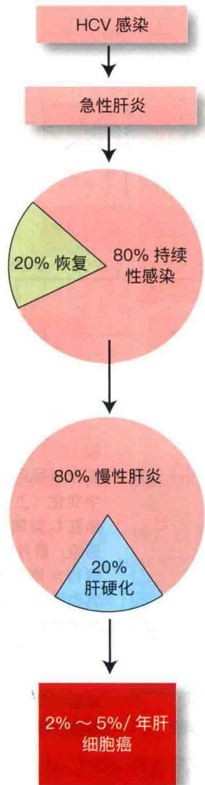 
图14-15 C型肝炎病毒（HCV）感染后可能的结局
图样分布大量坏死的肝细胞为特征，甚至在某些病例，几乎所有肝细胞均坏死（广泛肝坏死）。最常见的病因是急性B型肝炎，其他肝炎病毒感染导致的融合性肝坏死仅为少数。重要的是，病变不仅限于病毒性肝炎，也可能与暴露于各种药物、肝毒性物质及自身免疫性肝炎有关（见下文）。与大多数常见的急性病毒性肝炎的随机和斑块状肝细胞坏死不同，典型的融合性肝坏死累及整个肝小叶。融合性肝坏死的特殊亚型包括如下：
桥接坏死：位于疾病谱轻微的一端，坏死条带（桥接坏死）位于相邻汇管区及相邻中央静脉或汇管区及中央静脉间（图14-17）。相邻肝板坏死导致结缔组织的胶原间质崩解，网状纤维染色最易见。当这些纤维条带围绕片状肝细胞形成结节状时，可能与肝硬化相似。
次广泛融合性肝坏死：此型急性肝炎是更为严重的一型，整个小叶坏死或数群相邻小叶坏死。临床上，患者表现为严重肝炎，迅速出现肝衰竭，临床上被称为暴发性肝炎。
广泛肝坏死（急性黄色萎缩）：虽然不常见，广泛
肝坏死是急性病毒性肝炎最可怕的类型，因为是一种必致死的暴发性肝炎。肉眼上，肝萎缩至 $500\mathrm{g}$ （正常肝重1/3）。包膜起皱，颜色斑驳，红-褐色实质柔软松弛镜下发现几乎所有肝细胞坏死，仅见肝小叶周边的胶原边界，在许多病例出现崩解。巨噬细胞、红细胞及坏死碎屑充填在肝窦间。广泛肝坏死不管在实质中或汇管区都不引起丰富的炎性反应，但原因未明。重要的是，一些病例起因不明（特发性）。肝移植是治疗严重的融合性肝炎坏死的重要手段。
# （二）慢性肝炎是B型及C型肝炎及一系列代谢性及免疫性疾病的并发症
慢性肝炎的形态学谱系从伴少许或不伴肝细胞坏死的轻微汇管区炎症到广泛炎症\坏死，纤维化最终出现肝硬化（图14-18）。
灶性门脉周围坏死：该病变（也称灶状坏死）为有限的肝板出现局灶破坏。门脉周围慢性炎细胞浸润，在汇管区及小叶实质内形成不规则条带。
汇管区病变：慢性肝炎表现为汇管区淋巴细胞、浆细胞及巨噬细胞不同程度地浸润（图14-18）。扩张的汇管区常常出现胆管轻-重度增生，提示慢性肝损伤非特异性反应。在慢性C型肝炎，常可见淋巴细胞增生或具有生发中心的滤泡形成。
小叶内病变：实质内局灶坏死及炎性反应为典型慢性肝炎表现。常可见散在嗜酸小体，肝窦内可见增大的Kupffer细胞（图14-16）。慢性B型肝炎的肝常见散在含有大量颗粒状胞质的肝细胞，为大量B型肝炎表面抗原（毛玻璃样肝细胞）。
门脉周围纤维化：门脉周围肝细胞细胞进行性受损导致胶原沉积，使汇管区呈现卫星样外观。随时间推移，纤维化可能伸展至邻近汇管区或至小叶内，指向中央静脉，最终发展为肝硬化（图14-18B）。
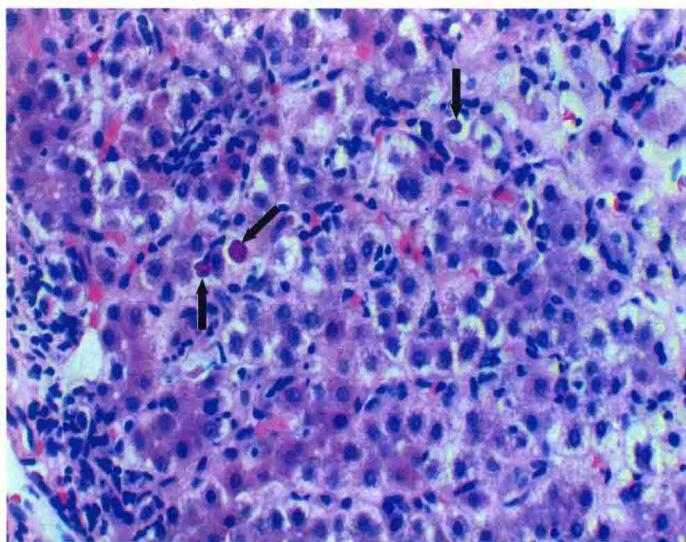 
图14-16急性病毒性肝炎镜下图片，显示肝板紊乱，肝细胞水肿（气球样变）和淋巴细胞及散在单核炎症细胞浸润。其余坏死的肝细胞伸入肝窦，看起来像嗜酸小体（Councilman小体）（箭头所示）
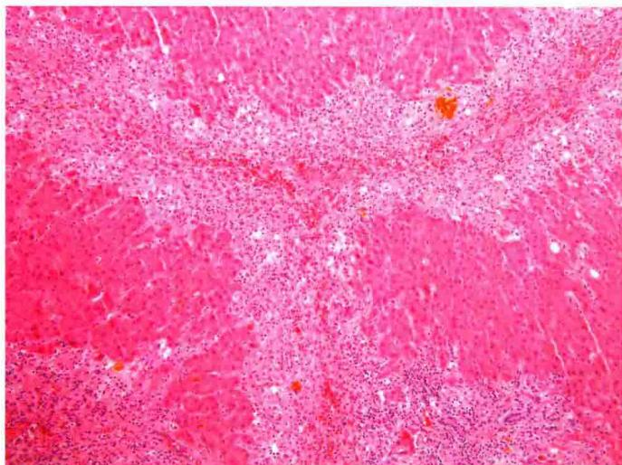 
图14-17 融合性肝坏死出血坏死区连接了相邻中央静脉和汇管区（桥接坏死）
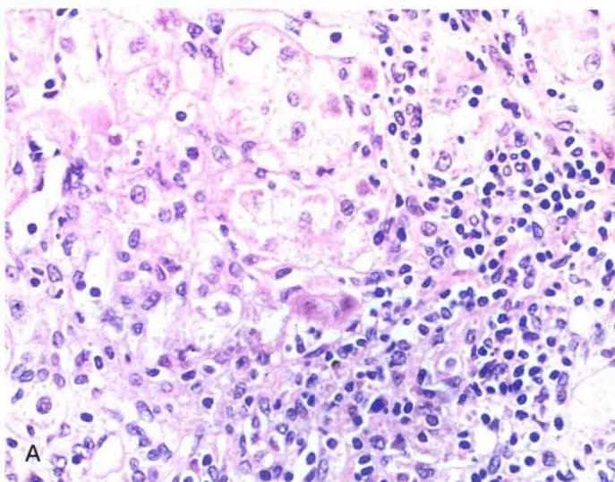
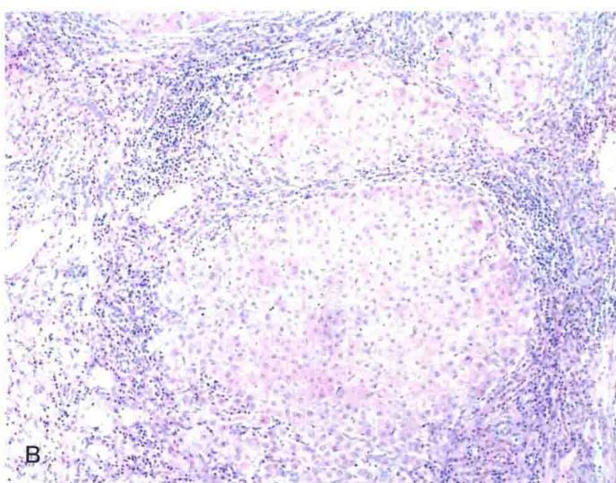 
图14-18 重度慢性肝炎。A. 镜下图片显示在扩张的汇管区可见单核炎细胞浸润（低倍）。炎症渗入肝板并围绕在汇管区周边的肝细胞周围。B. 慢性肝炎伴肝硬化。长期慢性C型病毒性肝炎患者肝活检镜下图片显示桥接坏死及结节转化
# 七、自身免疫性肝炎
自身免疫性肝炎是病因未知的一种严重的慢性肝炎，与循环中自身抗体及高水平的血清免疫球蛋白相关。虽然主要发生在年轻女性，达1/3的患者为男性
并可在各年龄中出现。在美国，自身免疫性肝炎影响到20万人， $6\%$ 的肝移植与之相关。

【发病机制】自身免疫性肝炎分两种不同类型。
I型自身免疫性肝炎是该病最常见的形式(80%的病例)，伴抗核抗体及抗平滑肌抗体。大约70%发生在小于40岁的年轻女性，其中1/3存在其他自身免疫性疾病，包括甲状腺炎、风湿性关节炎和溃疡性结肠炎。抗核抗体及抗肌动蛋白抗体常见。然而，抗肝细胞膜去唾液酸糖蛋白受体抗体是首要的抗体依赖、细胞介导细胞毒作用的靶位。重要的是，1/4的患者出现肝硬化，提示该病常有较长的隐匿病程。HLA-DRB1基因与易感性有关。
Ⅱ型自身免疫性肝炎基本发生在 $2\sim 14$ 岁儿童，因出现抗肝肾微粒体抗体而诊断。然而，自身抗体靶位是一种P450药物代谢酶（CYP2D6）。这些患者也存在其他自身免疫性疾病特别是I型糖尿病和甲状腺炎。此型自身免疫性肝炎的基因背景不如I型明确。

【病理】一般来说，自身免疫性肝炎组织学表现与慢性病毒性肝炎相似，虽然小叶炎症和坏严重。浸润炎细胞中有较多浆细胞是一个重要特征。增高的球蛋白血症是该病的特征。
# 八、酒精性肝病

【流行病学】在人均消耗酒精高的国家肝硬化发病率也高。虽然仅有少数慢性酗酒者发展为肝但是终生酒精摄入量（酒精日消耗量和持续暴露和肝硬化之间的剂量反应关系已经得到证实。
据估计，在美国大约 $10\%$ 的成年男性存在酒精滥用（ $15\%$ 为大肆饮酒），且在其他国家可能更高。大约 $15\%$ 酗酒者可发展为肝硬化，这些人中大部分死于肝衰竭或肝硬化的肝外并发症。实际上，在许多有较高酒精摄入的美国城区，肝硬化是年龄小于45岁男性的第3或第4死因。
导致慢性肝病需要的酒精剂量差异较大，取决于体重、年龄、性别和种族，最小剂量大约为 $80\mathrm{g / d}$ ，相当于86酒精标准强度（ $43\%$ ），4瓶8盎司（240ml）白酒或6瓶12盎司啤酒。一般超过10年的酗酒者出现肝硬化，也有少数严重酗酒者短期内出现肝硬化。女性更易受到酒精的毒性侵害。女性对酒精更敏感原因不明，可能与男性不同的乙醇代谢率和较低的体重有关。
酒精性肝病涵盖3种主要的形态及临床疾病：脂肪肝、急性酒精性肝炎和肝硬化。虽然这些病变续贯发生，但也可任意联合发生，似为独立性疾病。
# （一）几乎在所有慢性酗酒者中均可见脂肪肝

【发病机制】几乎所有慢性酗酒者都在肝细胞中出现脂肪聚集（脂肪变性）。脂肪肝的发病机制未被详细了解，可能不同通路起到不同作用，取决于摄入酒精量、饮食中脂肪含量、体脂量、血压水平及其他。总之，聚集的脂肪显然与酒精有关，停止酒精摄入可以完全迅速地逆转。
大部分慢性酒精摄入导致的肝脂肪沉积来源于食物。乙醇加速脂类分解并将自由脂肪酸转运至肝。在肝细胞内，乙醇：①增加脂肪酸合成；②减少脂肪酸的线粒体氧化；③增加甘油三酯的生成；④减少脂蛋白释放。总之，这些代谢步骤导致了脂肪肝。

【病理】在酗酒者，肝颜色变黄、增大，有时明显增大甚至达正常重量的3倍。镜下，脂肪一些肝细胞胞质中散在的脂滴（微多孔脂肪变大部分肝细胞整个胞质被融合脂滴占据（大泡变性）（图14-19）。
酗酒者肝微粒体功能增加加强了对肝毒物的代谢，因此增加了如对乙酰氨基酚等药物产生的风险。与增加微粒体功能的慢性酒精摄入不同，急性酒精摄入的乙醇抑制了多功能氧化酶活性并急性减少机体对药物的清除率。

【临床表现】非复杂性酒精性脂肪肝患者令人惊讶地仅有少许肝病症状。虽然镜下改变严重，脂肪肝是一种可完全逆转的病变，但独自不会更严重的疾病。脂肪肝虽然是酗酒者的特征，不仅限于此种情况，还见于非酒精性脂肪肝病（下文）和C型病毒性肝炎，某些药物、肥胖、
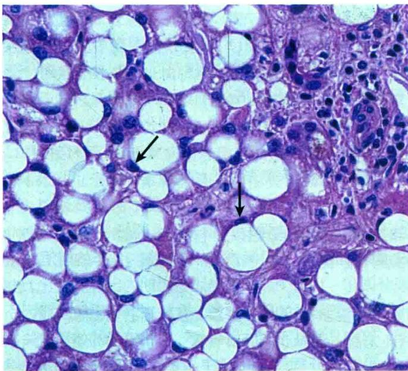 
图14-19 酒精性脂肪肝镜下图。显示几乎所有肝细胞胞质被脂肪扩张，将细胞核挤至周边（箭头所示）
糖尿病或许多其他疾病。
# （二）酒精性肝炎是一种急性坏死性疾病
酒精性肝炎是一种急性坏死性病变表现为：①肝细胞坏死，主要在中央区；②肝细胞内胞质透明透明包涵体（Mallory小体）；③中性粒细胞浸润；④静脉周纤维化（图14-20）。酒精性肝炎发病机制不明。酗酒者可以出现轻微脂肪肝多年，不改变饮酒习惯突然进展为急性酒精性肝炎。

【病理】肝结构基本紧密，汇管区及中央静脉关系正常。肝细胞水样变性，由此出现各不相表现。单个坏死和小团聚集的肝细胞出现固缩核破裂。散在的肝细胞出现Mallory小体（酒精性小体）（图14-20）。这些常见于可见被损伤的水样细胞内胞质包涵体，表现为常位于核周的，不均匀一束或嗜酸性物质或固态的嗜酸性团块。电镜中等纤维（角蛋白）聚集而成（图14-20C）。病变损伤的，气球样变的肝细胞尤其是含有Mallory小体被中性粒细胞围绕，虽然小叶内也可见弥漫的血泡浸润。胆汁淤积可以从轻-重，见于1/3的病例。急性肝炎常叠加出现脂肪肝，虽然并无证据表明脂肪肝就倾向或有助于发生酒精性肝炎。
胶原沉积是酒精性肝炎的常见表现，特别是在中央静脉周围（终末肝小静脉）。慢性酒精暴露刺激肝卫星细胞（lto细胞）沉积肝窦内胶原。在严重病例，静脉或静脉周围肝窦被厚的纤维组织吞蚀包绕，被称为中央透明坏死。
在酒精性肝炎的汇管区各不相同。一些病例中基本正常，但另一些会扩张并单核细胞浸润及胆管增生。汇管区伸出纤维组织长入小叶内。

【临床表现】酒精性肝炎出现不适、厌食、发热、右上区腹痛和黄疸。轻度白细胞增多。血清转别是天冬氨酸转氨酶中度升高，但未达到病毒的水平。血清碱性磷酸酶常升高。
酒精性肝炎患者的预后与肝细胞受损严重程度相关。一些患者迅速进展为肝衰竭并死亡。酒精性肝炎急性期病死率约 $10\%$ 。存活下来并戒酒的患者大部分康复。但是，继续饮酒者， $70\%$ 最终出现肝硬化。对酒精性肝炎并无特殊治疗方法，虽然泼尼松、饮食补充疗法、支持疗法可能会改善长期生存。
# （三）酒精性肝硬化是反复肝损伤、纤维化及重构的结果
在 $15\%$ 的酗酒者，肝细胞坏死、纤维化及重构最终导致了肝细胞结节周围的纤维分隔，这是诊断肝硬化的两个特征（图14-21）。其他酒精性肝病病变一称
为脂肪肝和急性或持续性酒精性肝炎一常常但不是必须见于肝硬化中。酒精性肝硬化患者预后在戒酒者中
明显较好。无论如何，许多患者进展为终末期肝病，酒精性肝病也是肝移植的指征。
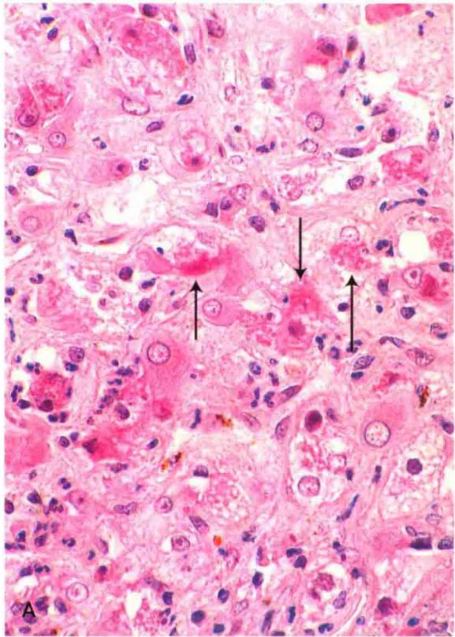
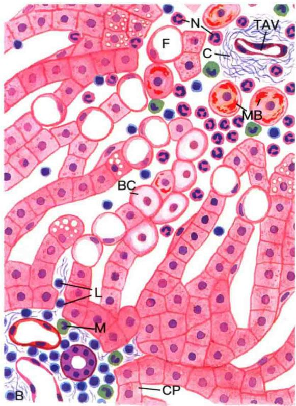
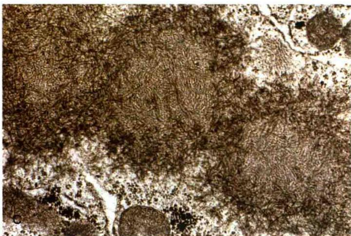 
图14-20 酒精性肝炎。A.镜下图片显示肝细胞坏死及退变，受损肝细胞胞质内可见Mallory小体（嗜酸性包涵体）（箭头所示）和中性粒细胞浸润；B.酒精性肝炎主要病理改变示意图病变主要为小叶中心性，包含坏死及肝细胞减少，气球样变肝细胞（BC）和在受损肝细胞胞质中的Mallory小体（MB）。炎症浸润主要包含中性粒细胞（N），也可见一些淋巴细胞（L）和巨噬细胞（M）。中央静脉或终末肝小静脉（THV）被纤维结缔组织包绕（C）（中央性硬化）。载脂肝细胞（F）在小叶中明显可见。汇管区可见中度慢性炎症，界板（LP）部分被破坏。C MB的超微图片。在肝细胞质中可见致密的、编织束状角蛋白丝
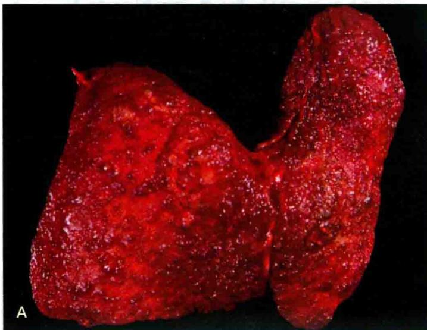 
图14-21酒精性肝硬化。A.肝表面可见无数小而规则的结节；B.镜下图片显示小结节被规则的纤维间隔包绕
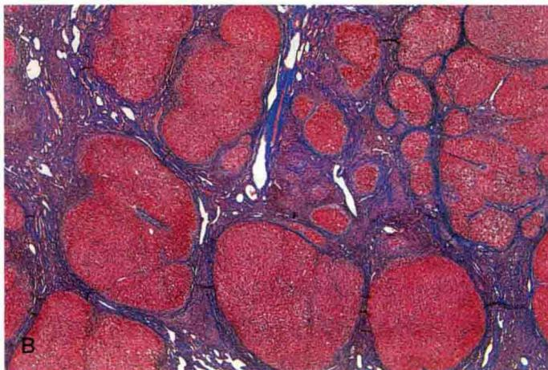
# 九、非酒精性脂肪肝病
非酒精性脂肪肝病是因为与酒精性肝病极相似。肝损伤从伴或不伴肝炎（非酒精性脂肪变性肝炎）的单纯脂肪变性到桥接坏死或肝硬化。危险因素包括肥胖、Ⅱ型糖尿病和高脂血症（见第22章）。同时严重肥胖伴糖尿病的 $50\%$ 患者会出现非酒精性脂肪变性肝炎，这些人中的1/5会出现肝硬化。非酒精性脂肪肝病的组织学表现与酒精性肝病基本相同。因此，非酒精性脂肪肝病是许多所谓隐源性肝硬化可能的原因。
# 十、原发性胆汁性肝硬化
原发性胆汁性肝硬化（PBC）是一种表现为肝内胆管破坏的免疫介导的，慢性进行性淤胆性肝病（非化浓性破坏性胆管炎）。胆道消失导致胆汁分泌受损，淤胆极肝细胞损害。
PBC主要发生在中年妇女（10：1女性为主）。肝硬化在此处会产生一定程度误导，实际上是本病一种迟发的并发症。因肝硬化死亡人数的 $2\%$ 由PBC引起。PBC患者家族中发病率比普通人群要高，提示存在遗传易感性。在单卵孪生子（非双卵）可见较高的一致性发病率。组织相容性复合体编码基因的DRB1*008家族与PBC相关，然而，该疾病少见于携带DRB1*11和DRB1*13的人群中。

【发病机制】PBC与许多免疫异常有关，因此被认为是一种自身免疫性疾病。多数
(85%)PBC患者至少还有另一种自身免疫病,大约40%有两种或更多。这些疾病包括慢性甲状腺炎、类风湿关节炎、硬皮病、Sjögren 综合征和系统性红斑狼疮。超过95%的患者出现循环中抗线粒体抗体 (AMA),为诊断PBC时常有的线索。AMA与线粒体丙酮酸脱氢酶复合物相关表位结合。除了特异性结合,AMA不影响线粒体功能,在发病机制及疾病紧张中作用未明。其他常被检测到的循环自身抗体包括抗核抗体、抗甲状腺抗体、抗血小板抗体、抗乙酰胆碱受体抗体和抗核糖核蛋白抗体。补体系统也被慢性激活。围绕和浸润受损胆道的细胞主要是抑制性/细胞毒 $(\mathrm{CD8^{+}})$ 淋巴细胞,提示在介导了对胆管上皮的破坏。

【病理】在PBC演变的病理阶段为胆管病变、瘢痕和肝硬化。
I期：胆管病变：早期PBC为独特病变，称为慢性毁损性胆管炎，累及肝内小-中等大小胆管（图14-22）。胆管损伤为节段性，因此在组织学切面上表现为局灶性。胆道主要被淋巴细胞围绕，也可见浆细胞及巨噬细胞。特征性的，胆管上皮不规则并增生。
上皮细胞复层，偶尔呈乳头状生长。汇管区常见不连续的上皮样肉芽肿，可能会挤压胆管。小叶内实质细胞尚正常。
II期：瘢痕：小胆管几乎消失，中等大小的胆管瘢痕化常见。常见汇管区的胆管增生并可旺炽性生长。自汇管区伸出的胶原间隔深入小叶实质内，开始围绕一些小叶。如有淤胆可能会很严重并且位于汇管区的周边。 
III期：肝硬化：PBC终末阶段是肝硬化，表现为胆汁染色的深绿色结节状。镜下，小胆管罕见，中等大小胆管数量显著减少。在纤维间隔和小叶实质内炎症轻微。

【临床表现】PBC受累人群的 $90\% \sim 95\%$ 通
常是 $30\sim 65$ 岁之间的妇女。大量PBC患者在疾病早期没有症状。疲乏和瘙痒是最常见的初始症状。一些患者长期无症状预后尚好，另一些最终发展至肝硬化及其并发症。随着疾病进展，大多数患者会出现血浆胆红素水平明显升高。血清氨基转移酶活性仅中度升高。血清胆固醇水平明显升高。吞蚀胆固醇的巨噬细胞在皮下组织中聚集，看起来像原位发生的黄色瘤。胆汁分泌至小肠受损常导致脂肪吸收障碍而出现严重的脂肪泻。由于维生素D及钙吸收障碍，骨软化及骨质疏松成为PBC重的要并发症。约1/3的患者出现胆结石。最终发展为肝硬化的患者最终死于肝衰竭或门脉高压并发症。PBC通常病程缓慢，可长达 $20\sim 30$ 年。在终末期PBC行肝移植十分有效。
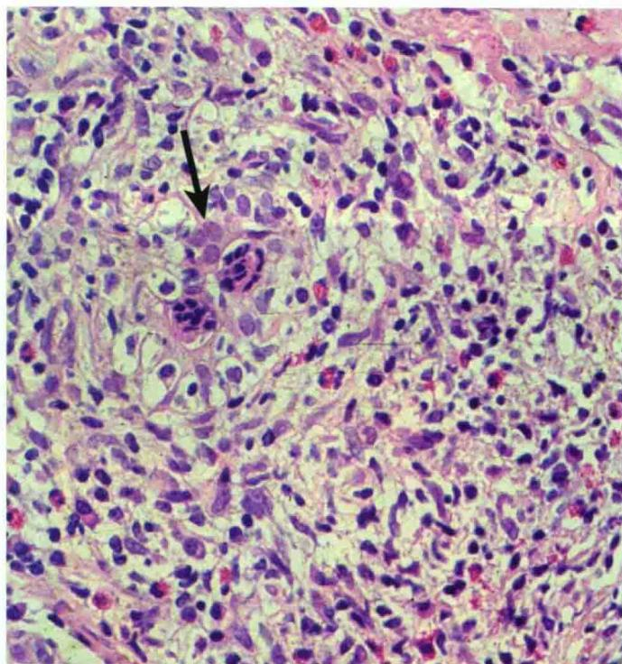 
图14-22 原发性胆汁性肝硬化（PBC），I期。镜下图片显示汇管区被淋巴细胞、浆细胞和巨噬细胞组成的炎症浸润扩张。胆管（箭头所示）被炎症破坏
# 十一、原发性硬化性胆管炎
原发性硬化性胆管炎（PSC）是一种病因未明的慢性胆汁淤积性肝病，炎性和纤维性过程导致肝内外胆道狭窄最终出现闭塞。虽然PSC的原因不明，2/3的患者也患有溃疡性结肠炎。 $70\%$ 的患者为男性，平均年龄40岁，发生率为14人/10万。进行性胆汁淤积典型地导致持续性阻塞性黄疸，最终出现继发性胆汁性肝硬化。

【发病机制】基因及免疫因素与PSC发病机制有关。该病偶见于家族性，与某种HLA
单体型相关，包括HLAB8及DR3。高球蛋白血症常见，如：①循环中抗中性粒细胞胞质抗体（核周或P-ANCAs）（见第16章）；②血浆中免疫复合物；③经典途径补体系统激活。汇管区T细胞数量明显增加。

【病理】PSC相关肝病可分为3个组织学阶段：
■I期：起初病变为汇管区管周炎症和纤维化。
■Ⅱ期：许多胆管闭塞，纤维间隔深入至实质中。 
III期：最终发展为继发性胆汁性肝硬化。
相似的炎性及纤维化改变可见于大的肝内或肝外胆道，均可出现阻塞。病变倾向于节段性，增强影像学可见特征性的肝内胆道系统串珠样改变，具有诊断意义。

【临床表现】PSC预后不佳，出现症状后平均生存时间 $8\sim 9$ 年。据报道 $20\%$ 的PSC患者管癌。肝移植可治愈，但复发不少见。
# 十二、铁过剩综合征
一些疾病是因为体内铁过多聚集引起（铁质沉着症）。基于体内铁含量升高的原因可见铁过剩分为两种主要类型。遗传性血红蛋白沉着症（HH）因调控小肠铁吸收一种常见的基因改变引起。继发铁过剩因为：①并发于某些血液疾病；②与静脉铁过剩相关，来源于多次输血或使用静脉铁；③因大量饮食摄入。单独继发性铁过剩很少引起肝疾病。
# （一）遗传性血红蛋白沉着症是铁代谢常见疾病
遗传性血红蛋白沉着症表现为铁吸收过多，铁积聚造成实质细胞毒性，特别是肝、心和胰腺。在此病，体内约 $20\sim 40\mathrm{g}$ 铁（例如：达正常量10倍）。没有方法将过剩的铁从体内移除，HH中过剩的铁仅存在于储存处。进展期HH临床特征表现为肝硬化，糖尿病，皮肤色素沉着及心力衰竭。患者常常为 $40\sim 60$ 岁，男性发病率10倍于女性。这种明显的男性倾向可能归因于女性月经期可丢失铁。然而，如果有充足的时间吸收额外铁，绝经期女性也有发生血红蛋白沉着
症的风险。虽然每日铁最大吸收量为 $4\mathrm{mg}$ ，每日吸收 $8\sim 10\mathrm{mg}$ 铁与有症状的血红蛋白沉着症相关。

【发病机制】HH是一种常染色体隐性遗传性疾病，小肠铁吸收增加甚至发生在体内铁含
量过多时。HH大多数常见的基因突变为HFE，位于6号染色体短臂并编码一种与主要组织相容性复合物I分子相似的跨膜蛋白。在欧洲人中，杂合子发生率大约 $10\%$ ，1/ $(200\sim 400)$ 为纯合子。然而，不是所有的纯合子一定出现临床疾病，HFE多个等位基因突变、修饰基因及宿主变化（如性别）均调控发病起重要作用。HFE蛋白调节铁转运至胞质，最可能是与转铁蛋白受体TfR1结合，调控与转铁蛋白相互间作用。HFE存在于多种组织，包括消化道，与十二指肠腺窝细胞高度结合。
铁调素是铁代谢关键的调节因子，是肝产生的一种激素。铁调素通过肠上皮细胞及巨噬细胞下调铁释放。HFE调节铁调素表达的机制不清。各种HH的铁调素水平低，所以产生过多的转铁蛋白，该蛋白可将铁从小肠黏膜细胞转运至循环中。跨黏膜细胞铁转运的加速可导致血液中非转铁蛋白结合铁水平升高，并在实质器官中聚集。如第1章所说，由活性氧介导的细胞损伤中铁是一种基础因素。细胞中过量的铁可能使细胞更易受氧损伤。
铁调素基因（HAMP）变异及更常见的铁调素调节蛋白基因与少年血色病相关，此病铁过剩的症状发生在第一个10年到第三个10年间。

【病理】HH病理表现为多个器官及组织实质细胞中大量的铁沉积。
肝：HH常累及肝脏，终末阶段铁含量超过0.5g铁/100g肝组织肝脏增大，棕红色，小结节性肝硬化，随时间推移可变成大结节型。肝细胞及胆管上皮细胞充填铁颗粒。大量细胞内铁主要以铁离子形式储存在溶酶体。疾病后期，因吞蚀坏死肝细胞许多Kupffer细胞沉积了大量铁。在纤维间隔中，铁明显聚集在增生的胆道和巨噬细胞。最终被大结节性肝硬化取代。
皮肤：HH的患者皮肤典型地出现色素沉着，但仅 $50\%$ 患者皮肤铁沉积增加。大多数患者基底黑素细胞黑色素增加。
胰腺：糖尿病是HH常见的并发症之一，因铁沉积在胰腺中引起。肉眼上，呈锈色及纤维化。外分泌细胞及内分泌细胞均含过量铁，腺细胞退变，Langerhans细胞小岛数量减少。HH患者色素沉着的皮肤和血糖不耐受可认为是青铜色糖尿病。
心脏：充血性心力衰竭是HH患者常见死因。心肌纤维出现铁色素沉着，心室较心房广泛。心肌细胞坏
死伴肠道纤维化常见。
内分泌系统：HH累及大量内分泌腺体，包括垂体、肾上腺、甲状腺及甲状旁腺。但是，除了垂体促性腺激素分泌受损，其他器官组织受损并不常见。睾丸萎缩见于1/4的男性患者，即便没有睾丸铁沉积。垂体-性腺轴紊乱表现为性欲下降，女性闭经、男性阳痿及体毛稀疏。
关节：关节病以手指及手部最严重，见于约1/4的HH患者。如累及大关节，例如膝关节，可严重致残。
【临床表现】系统性器官受累一般出现在经典HH的中年时期，但在青少年会早得多。HH的肝脏病变一般病程缓慢迁延，在未治疗患者，1/4最终死于肝性脑病或胃肠道出血。HCC是HH导致的肝硬化的显著的终末期并发症。在肝硬化患者，10年累积发展为肝癌的可能性高达 $30\%$ 。相反，HH非肝硬化患者没有发生HCC的风险。
基于反复放血的HH的治疗有效。在没有肝硬化和糖尿病的纯合子，放血可达到普通人群的预期生存。相反，诊断后未经治疗的HH10年生存率仅为 $6\%$
# （二）继发性铁过剩综合征发生在不伴有HH基因改变的患者

【发病机制】一定限制下，吸收的铁与消化的铁量有关系。例如，低铁饮食使发生血色
病的可能性小。许多继发铁过剩的患者（达 $40\%$ ）有长期酗酒史，认为酒精可增加铁聚集及相关的细胞损伤。
大量铁过剩见于溶血性贫血的患者，如镰状细胞性贫血、重型地中海贫血及其他与无效造血相关的贫血。即使转铁蛋白饱和铁吸收依然增加，血管内溶血释放的铁也会增加铁负荷。地中海贫血患者不管是否接受输血都常会出现继发性铁过剩。仅多次输血一般不足以造成铁过剩。在这些患者，铁主要聚集在单核巨噬细胞内，罕见肝硬化。

【病理】继发性铁过剩导致的肝硬化表现为不同程度的铁聚集，但是肝铁聚集一般不如HH
广泛并局限在结节周边。输血或其他类型的铁沉着表现为规则的，初始沉积于Kupffer细胞，最终沉积至肝细胞。
# 十三、与肝硬化相关的遗传性疾病
# （一）Wilson病（肝豆状核变性）是一种罕见的铜代谢异常
Wlison病（WD）是一种常染色体隐性遗传病，过量的铜沉积在肝和脑。携带者为1/150，临川疾病发生率为1/30000新生儿。突变的基因全球广泛分布。

【发病机制】饮食中摄入的铜通常超过需求，
肝将过多的铜分泌至胆汁。除了胆汁分泌，与肝细胞中血浆铜蓝蛋白结合，以复合体形至血液。WD发病基因为ATP7B，编码一种赖的跨膜阳离子通道，在铜被分泌之前在肝运送铜。ATB7突变使铜转运无效，使得胆铜及与铜蓝蛋白结合效率低下。
WD最常表现为血清铜蓝蛋白水平显著下降。然而，这种不足被认为是继发于肝铜过量。过量铜导致肝细胞死亡，将铜释放入血后沉积于肝外组织。过量铜导致的细胞损伤机制不明。如同铁，铜可以催化过氧化物阴离子及普通氧代谢产生的过氧化氢生成强效氧化剂。因此，铜可以取代Fenton反应中的铁，其中亚铁和过氧化氢产生羟自由基。

【病理】WD的肝病从轻度到重度慢性肝炎，肝
硬化即使在儿童患者也可迅速发生。门静脉周
围肝细胞常常含有Mallory透明小体，胆汁淤积不少见。
最初的小结节肝硬化最终发展为大结节型。

【临床表现】 $50\%$ WD患者在青春期发病，其
余常在成人早期发病。50%患者出现慢性肝病
症状，1/3患者初始症状为神经主诉，1/10因精神症状起病。
肝：肝病起病隐匿，无特殊症状，可发展为慢性肝炎和肝硬化，结果出现黄疸及门脉高压，肝衰竭。与血色病不同，WD不增加发生原发性肝癌的危险。
脑：神经疾病起于轻微不协调及震颤。未经治疗的患者出现吞咽困难和构音障碍，终末期出现肌张力障碍及强制痉挛。
眼：眼科表现不同程度地与精神症状伴随。Kayser-Fleischer环是一种金棕色，双侧角膜变色，围绕虹膜边缘，肌肉类型模糊。提示铜在Descemet膜上沉积。
肾：蛋白尿提示肾小球和肾小管功能下降、低肾小球滤过、氨基酸尿和高磷酸盐尿常见。这些异常继发于肾小管的铜沉积。
使用铜螯合剂治疗WD不仅防止铜在组织中聚集，而且将已经沉积的铜提出。中枢神经系统异常及肝症状在治疗后常得以逆转。在尚未出现症状的患者，使用锌维持治疗，可有效组织小肠吸收铜。肝移植可用于治疗WD。
# （二）囊性纤维化可以导致胆汁淤积
囊性纤维化患者胆道阻塞是由于黏稠黏液的聚集阻塞了肝内胆道，可出现在出生后的最初数周内。在存活至青春期的儿童，约 $15\%$ 的患者出现肝病临床症
状，超过25岁的患者中 $10\%$ 出现继发性胆道纤维化。详见第6章。
# （三）α1抗胰蛋白酶不足导致肝硬化
α1抗胰蛋白酶不足是一种常染色体隐性遗传，最初被描述为肺气肿的病因之一（见第12章）。此后，一些伴或不伴肺部病变的肝病例被报道。是肝病最常见的遗传性因素，也是肝移植最常见的遗传性病因。虽然α1抗胰蛋白酶不足发生在1/2000新生儿，仅 $10\% \sim 15\%$ 的患者出现肝病表现。
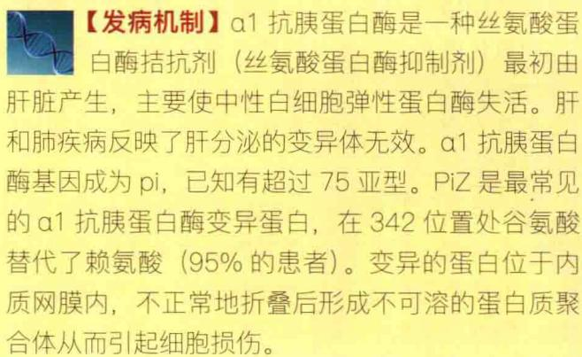
【病理】α1抗胰蛋白酶缺乏患者肝特征性表现为胞质内微弱嗜酸，PAS染色阳性的小滴（图14-23）。α1抗胰蛋白酶缺乏是新生儿肝炎病因之一（见下文）。这些儿童2～3岁时出现微结节肝硬化，最终可能转变为大结节性肝硬化。
【临床表现】α1抗胰蛋白酶缺乏患者肝病临床表现明显各异，从新生儿致死性暴发性肝炎到无肝功能不全表现。10%ZZ亚型的婴儿发展为新生儿淤胆性黄疸（结合性高胆红素血症）。大多数婴儿在6个月内恢复，10%～20%发展为永久性肝病。肝硬化的儿童常常在10岁之前因肝衰竭或其他并发症死亡。但是，肝移植可治愈。α1抗胰蛋白酶缺乏发生HCC概率升高。
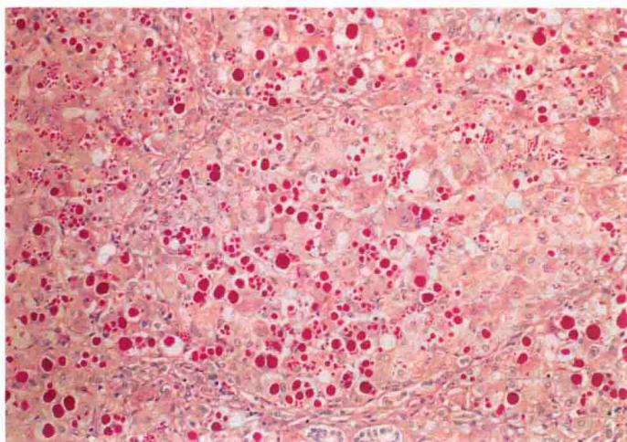 
图14-23 a1抗胰蛋白酶缺乏镜下图片。显示淀粉酶消化去除糖原的PAS染色的肝，显示肝细胞内大量胞质小球
# （四）先天性糖代谢异常影响肝
1. 糖原贮积症 糖原贮积症的生化基础已在第6章讲述。仅IV型糖原病（分支酶缺乏，Andersen病）常常合并肝硬化。婴儿出现严重的肝大常因肝硬化在4岁前死亡。III型糖原病（脱支酶缺乏，Cori病）可缓慢发生肝硬化但并不必然发生。I糖原病（葡萄糖6磷酸酶缺乏，VonGierke病）与显著的肝大相关，II型糖原病（酸性糖苷酶缺乏，Pompe病）肝大轻微。I和Ⅱ型不会合并肝硬化。
2.半乳糖血症 半乳糖血症是一种常染色体隐性遗传疾病，因催化半乳糖转化为葡萄糖的第二步的磷酸转尿苷酰酶缺乏引起。因此，半乳糖及代谢产物在肝脏及其他器官聚集。患此病的婴儿如用牛奶喂养会迅速出现肝脾大、黄疸及低血糖症。白内障及智力低下常见。
镜下，在生后2周内，肝脏可见广泛一致的脂肪聚集并可见汇管区内及周围显著的胆管增生。胆汁淤积常出现在胆小管及胆管中。许多肝细胞排列成中空结构，在假腺样结构中充填胆栓。6周后，纤维化从汇管区伸展至小叶，6个月内发展为肝硬化。去半乳糖饮食可以改善病情，大部分形态学改变得以逆转。
3. 遗传性果糖不耐受 遗传性果糖不耐受是一种常染色体隐性遗传性疾病，因果糖-1-磷酸酶醛缩酶缺乏引起。如果婴儿早期喂食果糖会出现肝大、黄疸及腹水。脂肪聚集明显看起来类似半乳糖血症。进行性纤维化直至肝硬化。
酪氨酸血症：酪氨酸血症是常染色体隐性遗传病，影响了酪氨酸向延胡索酸及乙酰乙酸酯的转化。因乙酰水解酶（FAH）基因突变导致肝乙酰水解酶不足而出现此生化异常。对肝和肾的损伤因琥珀酰丙酮和琥珀酰乙酰乙酸酯引起，这两者是强效的亲电体，可以与谷胱甘肽和蛋白质的巯基反应从而导致损伤。
急性酪氨酸血症在出生后数周或数月后发生，表现为肝脾大、12个月以前肝衰竭或死亡。肝外观与半乳糖血症极为相似，包括向肝硬化的发展。
慢性酪氨酸血症出生后第1年内发生，表现为生长迟缓、肾病及肝衰竭。常在10年内死亡。慢性酪氨酸血症者HCC发生率显著升高。可行肝移植治疗。
# 十四、药物引起的肝损害
药物引起的肝损害可类似于任何类型的肝病。严重度从无症状的转氨酶升高到肝衰竭。实际上，在美国药物是急性肝衰竭最常见的原因。第1章包含了关于毒物引起肝坏死可能的机制的讨论。关于免疫介导的损伤机制参见第4章。
药物导致的肝损害分可预测及不可预测。前者呈
剂量依赖性，后者发生率低，不论剂量且没有明显倾向（异质性反应）。
可预计的肝毒性导致的肝损伤特征如下：
足够高剂量时，常导致肝细胞坏死。 
肝损伤范围为剂量依赖性。 
在不同动物种类中导致同样病变。 
肝坏死常为但并非仅仅带状，小叶中心性。 
在毒物应用和发生肝细胞坏死关系明了。
大多数治疗性药物反应不可预测，似乎为异质性事件或为剂量相关副作用导致的特殊敏感性。对药物生物转化及免疫反应的基因变异以及代谢产物、被药物改变的肝细胞起一定作用。而且，一些药物会触发肝的免疫反应（自身免疫性肝炎）。可惜的是，没有特别的诊断方法用以预测或诊断药物导致的肝毒性。
# 药物导致的肝病组织学类型非常广泛
药物可以出现几乎所有非药物导致的肝病的病理类型。但是，某种药物常常有特殊的肝毒性表现。
1. 带状肝细胞坏死 小叶中心性的坏死可能反映了中央区药物代谢酶较高的活性。产生类似损伤的例子为：四氯化碳、对乙酰氨基酚（图14-24）及毒伞蕈蘑菇的毒素。在受累区，肝细胞凝固性坏死，水肿及不等量的脂肪变性。炎性反应轻微。如果肝毒物剂量足够大，坏死可能会累积全小叶，仅剩围绕数量不等的肝细胞和汇管区薄的边缘。患者死于急性肝衰竭或完全恢复不留后遗症。在美国，对乙酰氨基酚导致的肝毒性是最常见的导致急性肝衰竭的原因，也常见于自杀。于吞服后迅速出现反应。 
2. 胆汁淤积 小叶内和小叶间胆管损伤是一种常见的，不可预测的药物反应。一旦发生，胆汁聚集在肝细胞和胆小管内（图14-4）包括雌激素和一些抗生素（如磺胺甲噁唑）可导致单纯胆汁淤积。 
3.急性或慢性肝炎 在许多不能预料的肝毒性药物反应中炎性反应常见。完全范围的急性肝损伤从轻度无黄疸肝炎到急性致死性广泛肝坏死可见于暴露于
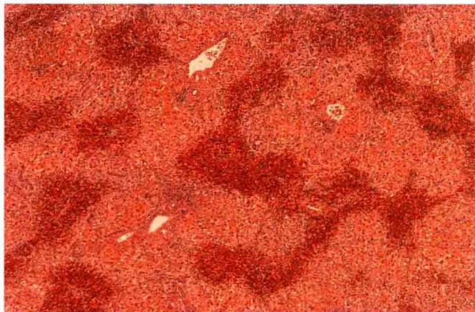 
图14-24 毒性小叶中心性坏死一例。对乙酰氨基酚过量尸检病例显示所有肝小叶明显的中央区出血坏死
多种药物后（如异烟肼、抗生素）。炎性反应原因多样，常常是对细胞损伤和坏死的一般反应，与各种病因相似。炎症也可能反映药物介导的自身免疫性肝炎。主要的，药物导致的肝炎和肝酶升高会在药物撤退时消除。
4. 脂肪肝 肝细胞内甘油三酯聚集（如肝脂肪变性或脂肪肝）的发生一般可预测。出现两种较多重叠的形态：大泡脂肪变性及微泡脂肪变性。
（1）大泡脂肪变性：光镜下见肝细胞胞质被脂肪取代，大的透明区使细胞扩张将胞核挤到周边，除了与慢性酒精摄取相关，还与暴露于一些直接肝毒性物质如四氯化碳和某些蘑菇的毒性成分相关。类固醇激素及一些抗代谢物如甲氨蝶呤也会出现大泡脂肪变性。脂肪本身不会造成肝细胞损伤，但是反映了潜在的肝细胞受损。 
（2）微泡脂肪变性：与大泡脂肪变性不同，临床上看似不合理，但常常与严重的甚至是致死的肝病相关。小的脂肪微泡满布在肝细胞胞质内，细胞核仍在中位。微泡脂肪变性很重要，不在于它自身，而是反映了主要在线粒体的亚细胞结构严重代谢损伤。
Reye综合征：这种儿童罕见的急性病表现为微泡型脂肪变性，肝衰竭及脑病。脑部出现水肿及脂肪聚集。症状通常以发热性疾病开始，通常是感冒或水痘，据说与使用阿司匹林有关，但发病机制不明。Reye综合征现今少见，可能是因为儿童使用阿司匹林减少的缘故。
5.血管性疾病 肝静脉受阻（Budd-Chiari综合征）据报道出现在使用口服避孕药之后，可能与使用这些激素导致的高凝状态有关。肝紫癜是一种特殊的肝病变，表现为血液充填在没有被覆内皮细胞的囊状腔隙。合成代谢性激素、避孕药及抗雌激素他莫昔芬有时会导致该疾病。 
6. 肿瘤性病变 肝腺瘤是使用口服避孕药和（不常见）合成激素后出现的一种少见的良性肿瘤。肝血管肉瘤和慢性暴露于常以杀虫剂形式存在的无机砷、工业中吸入氯乙烯、之前用以肝造影的放射活性剂氧化钍有关。
# 十五、血管病变
1. 充血性心力衰竭 是肝充血的主因。在持续性充血性心力衰竭时，外周静脉循环压力上升，因此肝静脉回流受阻引起慢性被动充血。慢性充血性肝体积缩小。切面小叶结构明显，颜色浅区和深区交替出现斑驳样外观（图14-25A），成为槟榔肝。在严重病例，在小叶中央的终末静脉及周围肝窦明显扩张并充填红细胞，此区因压力萎缩而肝板变薄（图14-25B）。如果有长期严重的右心衰竭，慢性被动充血会产生不同
程度的肝纤维化（图14-25C）。纤细的纤维束包绕终末静脉，纤维间隔自小叶中央放射状伸出。纤维间隔可连接相邻的中央静脉，因此产生“颠倒小叶”。肝慢性被动充血病理表现比临床表现突出因为对肝功能影响小。
2. 休克导致肝灌注下降 任何原因导致的休克常导致小叶中央区肝细胞梗死性坏死（3区，见图14-1）。镜下，小叶中央肝细胞凝固性坏死伴发大量出血。 
3. 因为双重血供和肝血窦的解剖学结构，肝梗死不常见 肝动脉及分支的急性阻塞不常见但是可因栓
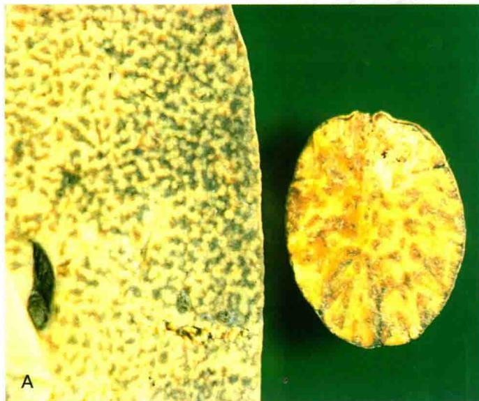
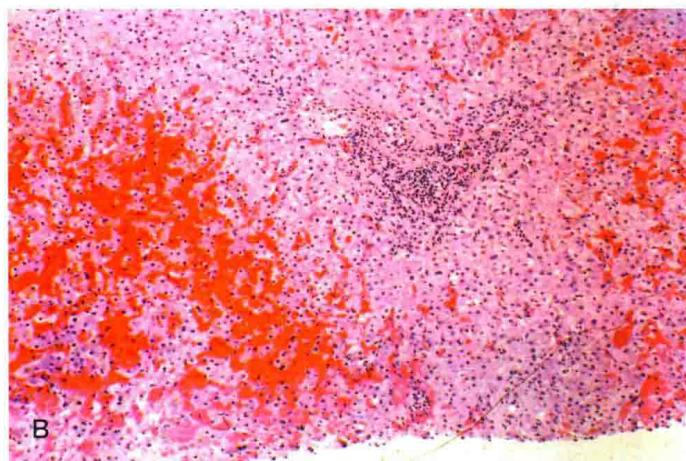
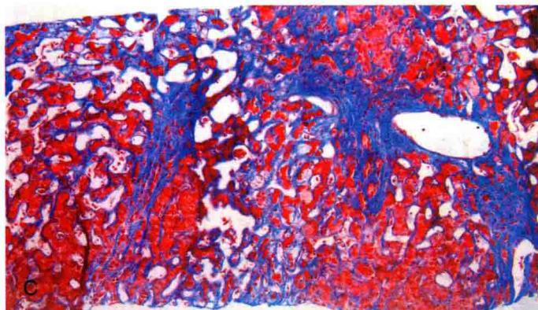 
图14-25 肝慢性被动性充血。A.固定的肝表面显示为明显的小叶结构，类似于槟榔（右）；B.中央窦淤血扩张；C.三色胶原染色显示显微（蓝色）自中央静脉发射状发出
塞、多动脉炎或手术结扎引起。这些情形下，常被充血区包围的不规则的灰白区反映了隐匿的缺血性坏死。
# 十六、细菌感染
在工业化国家，细菌感染不是肝病的常见原因，大部分是其他部位感染的并发症。特征表现为肝肉芽肿、脓肿和弥漫性炎症。其他部位肉芽肿性感染（如结核、兔热病、布氏杆菌病）也可引起肉芽肿性肝炎。
肝脓肿由葡萄球菌、链球菌及革兰阴性肠道菌引起（特别是厌氧类杆菌属），经动脉或门脉或胆道入肝。败血症时，病原体经动脉从远处播散至肝。
门静脉脓肿因腹腔内化脓引起，如腹膜炎或憩室炎，病原体经门静脉达肝。曾经门静脉炎是肝脓肿最常见的病因，但是抗生素控制了腹部败血症使这种途径变得少见。
肝内胆管脓肿是现今西方国家肝脓肿最常见的形式。任何原因导致的胆道阻塞常合并胆道感染，称为上行性胆管炎。胆道逆行输送病原体（常为大肠埃希菌）导致胆管脓肿。
【临床表现】肝脓肿患者常表现为高热、迅速体重下降、右上腹疼痛和肝大。1/4患者出现黄疸，尽管血清碱性磷酸酶水平往往升高。实体脓肿需要外科引流和抗生素治疗，多发脓肿引发治疗难题。死亡率即使在经治疗的病例也较高，为 $40\% \sim 80\%$
# 十七、寄生虫感染
肝寄生虫感染是一个严重的世界范围的公共卫生问题，在工业化国家不多见。这类疾病已在第9章讨论。
# 十八、婴幼儿淤胆综合征
婴幼儿迁延的淤胆和黄疸疾病提示原发于肝细胞或胆道系统阻塞性疾病。
# （一）新生儿肝炎病因多样
新生儿肝炎表现为迁延的淤胆及肝细胞受损及炎症的形态学表现。
【发病机制】在 $50\%$ 的新生儿肝炎，病因可辨（表14-4），约 $30\%$ 是单独因α1抗胰蛋白酶缺乏引起。其他原因明确的病例大多数是因为B型肝炎病毒引起或其他感染因素如TORCH病毒（弓形体病、风疹、巨细胞病毒和疱疹）引起。一些病例肝损害与代谢缺陷如半乳糖血症及果糖不耐受。偶尔与Down氏综合征及其他染色体异常相关。剩下的 $50\%$ 患者病因未明。
【病理】新生儿肝炎病变特征性表现为肝细胞向巨细胞转化。因此之前称为巨细胞肝炎（图14-26）。巨细胞含有多达40个细胞核，在肝板中看
起来与其他细胞分离。苍白膨胀的胞质含有大量糖原和铁。巨细胞数目随时间推移而减少，在大于1岁的儿童很少见。在胆小管和肝细胞可见明显的胆色素沉积。肝细胞气球样变、腺样转化、嗜酸小体也是新生儿肝炎的典型表现。髓外造血也很显著。在汇管区和小叶实质细胞中可见慢性炎细胞浸润。不论单个还是成群退变的肝细胞周围纤维化常见，纤维间隔自汇管区向外延伸。
胆道闭锁是指胆道系统缺乏管腔。
表14-4 新生儿肝炎的原因特发性特发性新生儿肝炎迁延性肝内淤胆肝动脉发育异常（Alagille综合征）不伴特殊症状的肝内胆管减少Zellweger综合征（脑肝肾综合征）Byler病肝内胆管机械性阻塞先天性肝纤维化Caroli病（肝内胆道囊性扩张）代谢性疾病糖代谢缺陷半乳糖血症遗传性果糖不耐受IV型糖原病脂质代谢缺陷Gaucher病Niemann-Pick病Wolman病酪氨酸血症（氨基酸代谢缺陷）α1抗胰蛋白酶缺乏囊性纤维化胃肠外营养肝炎B型病毒性肝炎TORCH（弓形体病、风疹、巨细胞病毒和疱疹）水痘梅毒ECHO病毒（埃可病毒）新生儿败血症染色体异常Down综合征18三体肝外胆道阻塞
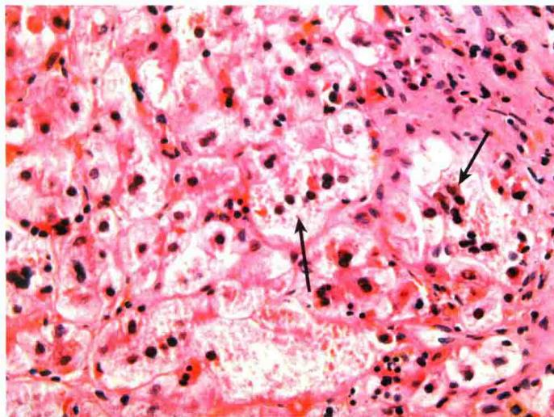 
图14-26 新生儿肝炎镜下图片。显示严重的肝细胞水肿（水样变），肝多核巨细胞（箭头所示），轻微的慢性炎性浸润和纤维化（右上箭）
# （二）肝内外胆道闭锁常与新生儿肝炎形态学相关
1.肝外胆道闭锁 肝外胆道闭锁是一种是肝外胆道部分或全部闭塞的新生儿淤胆性疾病，与胆道结石、肿瘤及破裂无关。虽然不常见，估计发生率在1/10000新生儿，该病是儿童肝移植最常见的适应证。可因各种情况引起，如先天异常，妊娠期或围生期病毒感染。其他器官包括心脏、肠道及脾在 $20\%$ 的患者中存在畸形。

【病理】肝外胆道闭锁可累及全部肝外胆道或局限于部分近段或远端胆道。胆囊常闭锁。一
极表现为明显的急性或慢性管周炎症，坏死的上皮或细胞碎屑使管腔阻塞或狭窄。另一极表现为原始管腔已经完全被成熟的纤维结缔组织取代，可见极少或不见炎症反应。组织学上，淤胆及门静脉周围胆道增生明显。少数患者可出现与新生儿肝炎类似的多核巨细胞。虽然肝内胆道初始表现正常，但逐渐会被持续淤胆阻塞。最终会导致继发性胆汁性肝硬化。
2.肝内胆道闭锁 肝内胆道闭锁指的是肝内胆道缺乏。作为Alagille综合征（一种少见的常染色体显性发育性疾病）的一部分其发生与新生儿肝炎的已知病因相关（见上文），或一种特发性病变。许多观察认为新生儿肝炎、肝内胆道闭锁及肝外胆道闭锁都因为共同的炎性进程而发病。

【病理】肝内胆道闭锁的主要组织学表现是肝内胆道减少。淤胆、巨细胞转化及胆管增生常是肝硬化不多见。

【临床表现】大部分单纯新生儿肝炎的患者恢复后无后遗症。反之，肝内胆道闭锁合并新生血管预后差，许多儿童会发展至肝硬化。虽然在一些外科学上可获益的患者行外科手术纠正有效，大多数
部分肝内或肝外胆道闭锁的患者仅能依靠肝移植治愈。
# 十九、良性肿瘤和肿瘤性病变
# （一）肝腺癌
肝腺瘤是肝细胞的良性肿瘤，主要发生在女性。肝腺瘤在口服避孕药应用前极少见，随其应用，许多这类肿瘤被报道。雌激素和孕激素新的合剂使用后该病发病率下降。

【病理】肝腺瘤常为孤立、界限清楚的结节，直径可达40cm，重可达3kg（图14-27A）。
在1/4病例，可见多个小腺瘤。大体上，肿瘤有包膜，比周围实质细胞颜色要浅。镜下，肿瘤性肝细胞与正常相似，但没有结节样结构（图14-27B）。也不见汇管区及中央静脉。组成腺瘤的细胞可以很大而嗜酸，或充满糖原，使胞质透明样。肿瘤有包膜，较周围正常组织色浅。其中的小动脉可作为腺瘤与正常实质鉴别的线索。
# （二）局灶结节性增生
局灶结节性增生（FNH）是一种与肝硬化相似的局灶病变，表现为多个纤维化再生结节。病灶可达 $15\mathrm{cm}$ ，重达 $700\mathrm{g}$ 。偶尔，会突出肝包膜，甚至可能有蒂。切面见纤维间隔放射状的瘢痕。肝细胞结节被纤维包绕，伴许多扭曲的胆管和单核炎细胞。结节内不见结节样结构。间隔中可见大动脉及静脉但出血少。FNH可见于各种性别及年龄，但多见于年轻女性。该病不属于肿瘤且与口服避孕药无关。
# （三）肝血管瘤
肝血管瘤是最常见的肝肿瘤。肝良性血管瘤发生在各年龄和性别，在 $7\%$ 的尸检标本中可发现该病变。一般小且无症状，虽然也有报道大的肿瘤导致腹部症
状甚至腹腔出血。大体上，肿瘤常孤立，小于 $5\mathrm{cm}$ 虽然也有多个病灶及巨大病变者的报道。镜下，肝血管瘤和其他部位海绵状血管瘤相似。
# 二十、肝恶性肿瘤
# （一）肝细胞肝癌是一种起源于肝细胞或前体细胞的恶性肿瘤

【流行病学和发病机制】HCC可能是人类最常见的恶性肿瘤。在世界各地发生，但存在显著的地域差异。在西方工业国家少见，但近20年发病率翻倍，与C型病毒性肝炎发病率升高危险因素包括以下：
B型肝炎：HBV和HCC紧密难分。超过 $85\%$ 的HCC病例发生在慢性HBV感染高发的国家。持续HBV感染使发生HCC的风险升高200倍。出生时或临近出生时感染慢性B型肝炎有1/4最终发展为HCC。男性HBsAg和HBeAg阳性发生HCC4倍于仅有HBsAg阳性者。大多数（大于 $80\%$ ）HBV感染发展为HCC的病例有肝硬化，虽然还是有很多发生在不伴有肝硬化的B型肝炎患者。
HBV基因整合到细胞DNA中并表达可能是HCC发病机制的关键因素。因此，HBV的X基因编码一种病毒蛋白而使肿瘤抑制蛋白失活并反式激活一些原癌基因。预防HBV的疫苗大大降低了HBV相关HCC的发生。
C型肝炎：HCV在世界范围内较HBV少见，但是现今大多数欧洲和北美的HCC病例与HCV相关。在美国， $50\%$ 的HCC为HCV感染者。与HBV一样，大多数感染HCV发展为HCC的患者有隐匿的肝硬化。在HCV导致的肝硬化患者累积发生HCC的概率
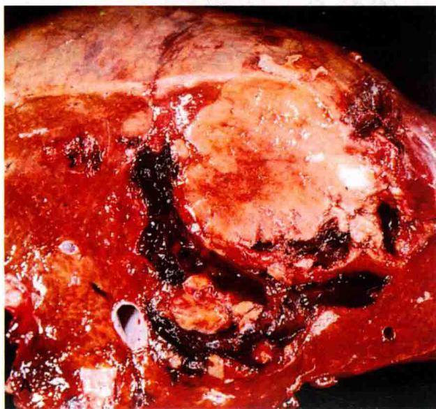 
图14-27 肝腺瘤A外科部分肝切除显示肝被膜下棕红色、结节样肿物。肿瘤破裂后出现实质内及被膜下出血。患者为一服用避孕药数年的妇女，突然出现腹膜下出血。B镜下，腺瘤样肝细胞与正常肝细胞无异，没有可识别的小叶结构，注意缺乏汇管区
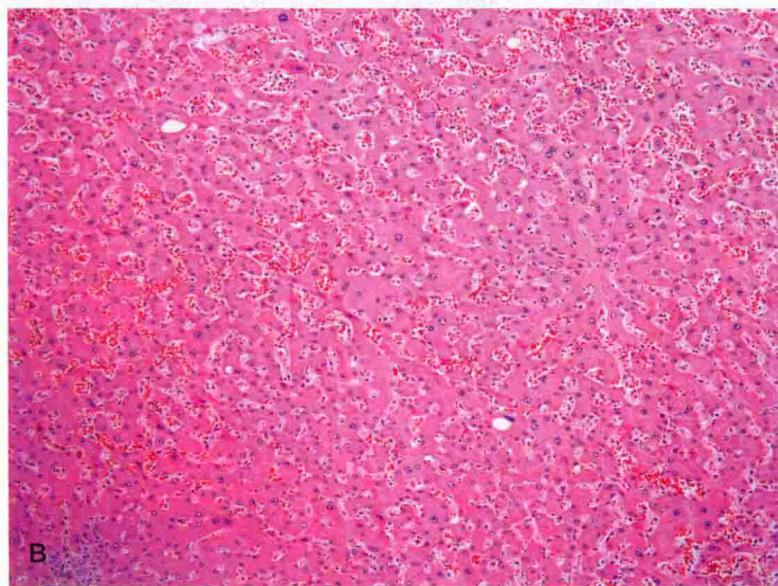
15年后高达 $70\%$ 。两者合并感染使得发生肝癌的概率是单独发生任何一种的3倍。HCV致癌机制不明，但是HCV核心蛋白和各种细胞蛋白之间的作用可能是关键。
肝细胞肝癌的其他原因：酒精性肝硬化可发生HCC，但概率不高，机制不明。因为很多酗酒者同时感染HCV和HCV，所以在HCC发病中单独评价酒精的作用有困难。
血色病及 $\alpha_{1}$ 抗胰蛋白酶缺乏症发生HCC的风险高。但是，自身免疫性慢性肝病和肝硬化、WD、PBC发生HCC的概率并不升高。这些数据进一步表明肝硬化本身并不导致肝癌。
黄曲霉毒素 $\mathbf{B}_1$ 是一种见于多种食物的真菌污染，大部分在不发达国家并导致HCC。在人类发生肝癌的概率与饮食中黄曲霉素含量粗略相关。尿液中出现黄曲霉毒素 $\mathbf{B}_1$ 的代谢产物与发生HCC概率3倍升高有关。黄曲霉毒素导致的HCC常与p53一种特殊的突变有关。

【病理】HCC大体上表现为肝内质软、红棕色结节（图14-28）。偶尔可为绿色，提示胆汁
染色。在一些病例，大的孤立性肿瘤占据肝一部分，另一些病例中，可见许多小肿瘤。HCC倾向于门脉内生长甚至经肝静脉长至腔静脉或右心房。转移广泛，最常见的部位是肺和门静脉淋巴结。
HCC组织学各异，从与正常肝组织难以区分的分化好的肿瘤到间变或未分化型。组织学各型得到确认，但与预后无关。大多数HCC为“小梁状结构”，肿瘤细胞像正常肝一样小梁状或带状排列。肝板被内皮细胞被覆的血窦分隔。第2个组织学特点称为“假腺样
结构”（图14-28B）。这种情况下，肿瘤性肝细胞像腺体围绕管腔排列。管腔内可含有胆汁。这些腺样结构并非真正的腺体，不应与腺癌混淆。
纤维板层性肝细胞癌是一种少见类型，有独特的组织学表现，背景为正常肝，主要发生在青少年和年轻的成年人。肿瘤由大的嗜酸性肿瘤性肝细胞呈巢团状排列，围绕以纤细的胶原纤维。预后可能较大部分HCC要好，虽然最近的数据对此提出疑问。

【临床表现】HCC常表现为肝疼痛性增大的包
块。预后差，患者死于恶液质、灾难性的腹腔肝硬化并发症。HCC可与一系列的副肿瘤综合（如红细胞增多、低血糖症、高血钙），是肿瘤位激素分泌的结果。甲胎蛋白常升高（也可见肿瘤性或非肿瘤性肝病或一些肝外疾病）。
# （二）胆管细胞性肝癌（胆管癌）起源于胆管上皮
胆管细胞性肝癌起源于胆道的任何部位，从肝门的肝内大胆管到肝小叶周边最小的胆管。主要发生在男性或女性老年人群，平均发病年龄为60岁。虽然全世界都可见，但在亚洲某些肝吸虫（华支睾吸虫）病为地方病的区域特别常见。原发性硬化性胆管炎（PSC）和胆管细胞癌有强的关联。PSC在移植时有1/4的肝出现胆管细胞癌。

【病理】外周胆管细胞癌由排列成管状或腺样
的小立方形细胞组成。伴大量纤维化，肝活检与转移性硬化性乳腺癌或胰腺癌混淆。可以出的肝外转移,比HCC更易出现肝门淋巴结转移。很少能根治肿瘤。经PSC发展而来的胆管癌预
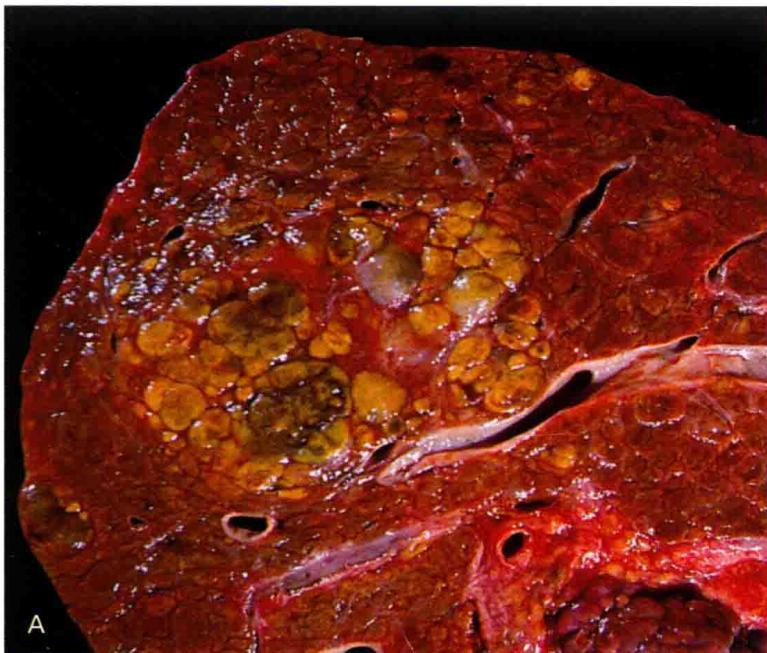 
图14-28 肝细胞性肝癌。A. 肝硬化肝横切面可见边界不清，黄色结节区，部分出血的肝细胞性肝癌；B. 肿瘤镜下图片显示小梁状排列的恶性肝细胞。许多细胞排列成腺样，包围浓缩凝固的胆汁
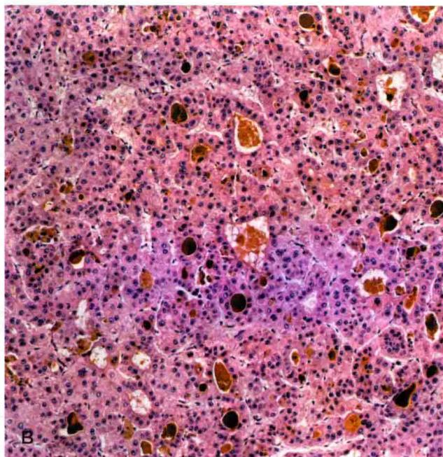
# （三）转移癌是肝最常见的恶性肿瘤
1/3转移癌累及肝， $50\%$ 来源于胃肠道、乳腺和肺。其他特征性地转移到肝的肿瘤有胰腺癌及恶性黑色素瘤，虽然几乎所有肿瘤都可以转移到肝。肝脏可以有单个的转移结节，也可以全被转移癌取代（图14-29）达 $5\mathrm{kg}$ 以上。实际上，肝转移癌是最常见的肝弥漫肿大的原因。肝转移癌常见的早期发现是体重下降。可以出现门脉高压、脾大、腹水、胃肠道出血。如患者生存期够长则常会发生肝衰竭。血清碱性磷酸酶无法解释的升高常常是肝转移肿瘤的第一提示。大多数患者在诊断肝转移后1年内死亡。但是，肝孤立转移灶切除常有帮助，现已普遍。
# 第二节 胆囊和肝外胆道
# 一、解剖
胆囊的基础功能是储存、浓缩及分泌胆汁。胆囊管长 $3\mathrm{cm}$ ，引流胆囊并与肝管汇合。稀薄的胆汁自肝管引流至胆囊，在此胆汁浓缩之后流入胆总管。胆囊壁由黏膜、肌层、外膜组成，并被反折的脏层腹膜覆盖。柱状上皮黏膜和疏松纤维结缔组织的固有层折叠成皱褶，伸入胆囊壁成为黏膜憩室（Rokitansky-Aschoff窦）。
# 二、胆石症
胆石症定义为在胆囊或肝外胆管腔内出现结石。工业化国家3/4结石主要是胆固醇结石，剩下的是钙胆色素和其他钙盐（色素性结石）。然而，热带地区和亚洲主要是色素性结石。结石一般无症状，但因压迫胆囊或胆总管可引起轻、重度疼痛。
# （一）胆固醇结石是最常见的胆结石
胆固醇结石圆形或多面型，黄色至棕色，单个或多个。最大径 $1\sim 4\mathrm{cm}$ （图14-30）。超过 $50\%$ 的结石由胆固醇组成，剩下的由钙盐和黏液组成。

【流行病学】大约超过75岁的 $20\%$ 的美国男
性和 $35\%$ 的女性在尸检时偶然发现结石。然
而，在生育期的妇女发生胆固醇结石的概率是男性3倍，在口服避孕药及多次妊娠的妇女更高。

【发病机制】胆固醇胆结石的发生是多因素
的结果，包括胆汁的理化特性及胆囊自身
的局部因素（图14-31）。胆固醇结石患者的胆汁较正常个体有较多胆固醇及较少的胆盐，过饱和的胆固醇沉淀为盐晶体及结石（致结石胆汁）。在肥胖者，肝分泌胆固醇增多，更增加了胆汁中胆固醇的饱和度。
# （二）胆固醇结石形成提示胆汁胆固醇增多，胆盐减少或胆汁流出受阻
绝经前妇女高的结石发生率是由于雌激素刺激肝生成致结石的胆汁。雌激素增加了肝胆固醇的分泌，减少了胆盐的分泌。孕激素是孕期主要的激素，会抑制胆囊流出胆汁。这一机制也可用以解释口服避孕药者发生结石的概率增加。
其他引起胆固醇结石的主要危险因素可被分为与胆汁胆固醇分泌增加有关、与胆盐及卵磷脂分泌减少有关、与两者均相关。
与胆汁胆固醇分泌增加有关的危险因素包括如下：年龄增加、肥胖、特定种族、家族倾向、高卡路里和胆固醇饮食、与高血胆固醇相关的代谢异常（如糖尿病、高脂蛋白血症及原发性胆汁性肝硬化）。
胆盐及卵磷脂分泌减少见于发生结石的非肥胖白种人。影响胆酸肝肠循环的胃肠吸收疾病（如继发于囊性纤维化或克罗恩病的胰腺功能不全）也会减少胆盐分泌而促进结石形成。
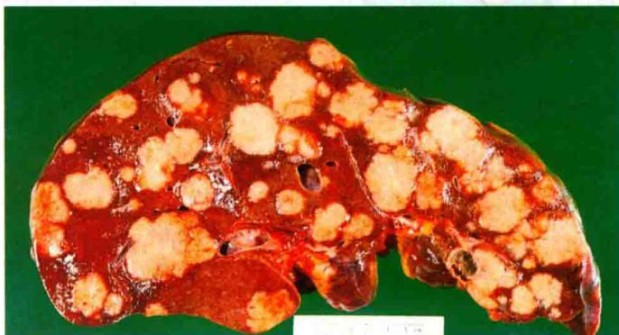 
图14-29 肝转移癌肝切面可见许多结肠癌转移的质硬，苍白结节
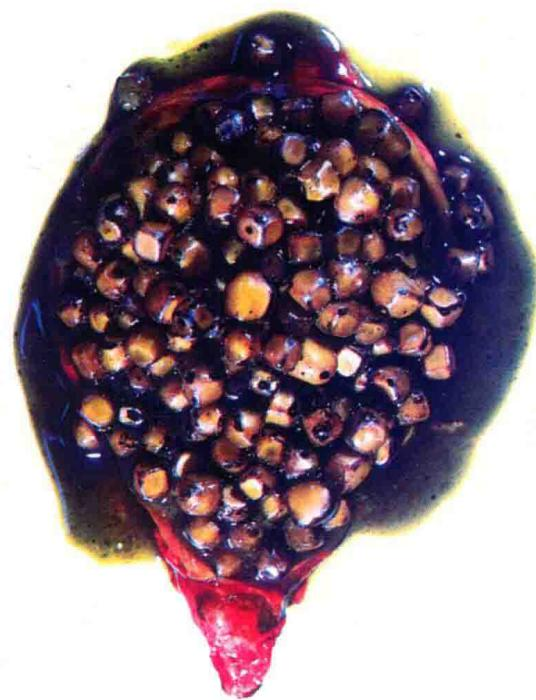 
图14-30 胆固醇结石胆囊被打开，可见许多黄色的胆固醇结石
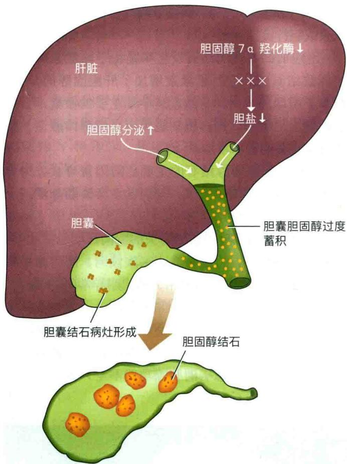 
图14-31 胆固醇结石的发病机制
# （三）色素性结石为黑色或棕色结石
1. 黑色素结石 黑色结石不规则，小于 $1\mathrm{cm}$ 。横切面上，切面光滑。黑色结石包含钙胆色素、胆色素聚合物、钙盐及黏液。

【发病机制】黑色素结石在老年人及营养不
良者发生概率增加，但与性别、种族或肥胖
无关。如发生在镰状细胞性贫血及地中海贫血的慢性溶血更易发生黑色素结石。不管由于导致溶血增加或因为肝细胞受损导致的肝硬化也有高的黑色素结石发生率。然而，大多数病例，黑色素结石的形成并无特殊原因，同时胆汁中间接胆红素浓度升高明显。
2. 褐色素结石 褐色结石质软片状，主要包含钙胆色素与胆固醇及脂肪酸钙皂的混合物。与其他类型结石不同，褐色素结石较胆囊更多见于肝内外胆管。

【发病机制】褐色结石几乎常与细菌性胆管
炎有关，大肠埃希菌是主要病原体。西方国
家少见或罕见，亚洲不少见，几乎全部发生在感蛔虫或华支睾吸虫人体中，寄生虫可以侵入胆道。
褐色素结石的发病机制也与胆汁中非结合胆红素浓度升高有关，结合胆红素可经细菌B葡萄糖醛酸酶或其他水解酶水解为非结合胆红素。
# （四）胆石症临床症状常与胆道阻塞有关
胆石症可以在胆囊中“静止”多年，极少有患者死于胆石病本身。无症状结石出现胆痛或其他并发症15年累积可能性不足 $20\%$ 。如今最常见的治疗方法是腹腔镜胆囊切除术。
大多数胆石症并发症与胆囊管或胆总管被阻塞有关。结石进入胆囊管常常但非总是严重胆绞痛，可导致急性胆囊炎。反复急性胆囊炎可致慢性胆囊炎。后者也可仅由结石造成。结石可进入胆总管（胆总管结石病），可造成梗阻性黄疸、胆管炎或胰腺炎。实际上，对非酗酒者，结石是急性胰腺炎最常见的病因。伴或不伴急性胆囊炎的胆囊管阻塞，胆囊内胆汁被重吸收，被胆囊上皮分泌的清亮黏液取代。“胆囊积水”（黏液囊肿）用来称扩张可触及的胆囊，可继发感染。
# 三、急性胆囊炎
急性胆囊炎是胆囊一种弥漫的炎症，常常因胆囊出口阻塞而继发。

【发病机制】大约 $90\%$ 的急性胆囊炎病例与
结石相关。剩下的病例（无结石胆囊炎）发
生与败血症、严重外伤、伤寒沙门菌、结节性多动
脉炎有关。细菌感染常继发于胆道阻塞而不是原发
性疾病。

【病理】急性胆囊炎的外表面有充血及纤维素
渗出。胆囊壁因水肿明显增厚，黏膜鲜红或紫
色。腔内常见结石，常见其一阻塞胆囊管。罕见情况下，当胆囊管被完全阻塞，细菌侵入胆囊，腔内可被云絮状脓液充填，成为化脓性胆囊炎。镜下，胆囊壁水肿出血明显，伴有急性或慢性炎症。继发的细菌感染引起化脓。黏膜可出现局灶溃疡，严重者出现广泛坏死，称为坏疽性胆囊炎。胆囊穿孔是一种可怕的并发症，常位于基底，可因继发的细菌感染引起。胆汁流入腹腔造成胆汁性腹膜炎。周围炎症形成胆囊周围脓肿以此限制胆囊内容物穿孔后播散。

【临床表现】急性胆囊炎的初始症状是右上腹
痛，大多数患者已经经历数次胆痛。因结石
导致轻度黄疸和胆总管水肿可见于 $20\%$ 的患者。大
多数病例1周内消退，但持续性疼痛、发热、白细
胞升高、寒战提示急性胆囊炎进展需要胆囊切除。
炎症消除后，胆囊壁纤维化，黏膜修复。但是，胆
囊功能常受损。
# 四、慢性胆囊炎
慢性胆囊炎是胆囊最常见的疾病，是一种几乎总是与结石相关的胆囊壁持续性慢性炎症反应。慢性胆
囊炎也可由于急性胆囊炎反复发作导致。后者发病机制可能与胆囊上皮的慢性刺激及化学损伤有关。
【病理】肉眼上，慢性炎性胆囊壁增厚变硬，浆膜面可能因之前反复急性胆囊炎而与周围组织纤维粘连。腔内常见结石，胆汁内常含有泥沙样结石（如结石类物质的细沉淀物）。 $50\%$ 患者胆汁被大肠埃希菌类微生物感染。黏膜可局灶溃疡萎缩或保持完整。镜下，胆囊壁纤维化，常有Rokitansky-Aschoff腺体伸入。各层可见不同程度的慢性炎症。在长期的慢性胆囊炎者，胆囊壁可出现钙化（陶瓷样胆囊）。
【临床表现】许多慢性胆囊炎患者出现腹部的非特异症状，且不完全肯定这些症状与胆囊疾病相关。另一方面，常为短暂的右季肋部疼痛是其典型症状。胆囊切除术是明确的治疗手段。
# 五、肿瘤
# （一）腺癌是胆囊最常见的肿瘤
胆囊腺癌不罕见，在行胆囊切除手术患者中发生率为 $2\%$ 。由于该肿瘤常与胆石症及慢性胆囊炎相关，因此在女性较男性更为常见。而且，胆石症高发的人群如美国本土人，发生胆囊癌的危险性也较高。钙化
胆囊（陶瓷样胆囊，见上文）尤其易于发生胆囊癌。
【病理】胆囊癌可发生在胆囊各部位但最常见的是在基底部。肿瘤表现为浸润性、分化好的腺癌。因常有促纤维增生，故胆囊壁增厚如皮革样。间变性、巨细胞和梭形细胞样胆囊癌也有报道。胆囊丰富的淋巴丛为最常见的转移通道，虽然血管转移及直接扩散到肝及周围组织也有发生。
【临床表现】胆囊癌引起的症状与胆结石引起的症状相似。然而，直到肿瘤症状明显时几乎不可治愈，5年生存率低于 $3\%$
# （二）胆管癌及Vater壶腹癌表现为梗阻性黄疸
肝外胆管癌几乎总是腺癌。可以发生在胆管的任意部位，包括左右肝管融合形成肝总管处。较胆囊癌少见，也不像胆囊癌有女性发病率高的倾向。受累者常发现胆结石，与结肠感染性疾病相关。在亚洲，胆管癌与胆道受华支睾吸虫病感染相关。预后差，但由于在疾病早期即出现症状，预后要稍好于胆囊癌。Vater壶腹腺癌也可以阻塞胆道。初始症状也表现为黄疸，虽然有些患者表现为胰腺炎。与胆管癌相反，外科手术治疗Vater壶腹癌5年生存率为 $35\%$
（毕娅兰）
# 第15章 胰腺
胰腺是由两部分在结构和功能上截然不同的“器官”组成的，即内分泌胰腺和外分泌胰腺。胰腺的外分泌部可以分泌大约20种不同的消化酶，多数是以无活性的酶原形式存在，而胰腺的内分泌部则可以释放许多重要的激素，这些激素可参与血糖的调节和其他新陈代谢活动，其中的一些激素直接或间接的参与体重的调节。临床上重要的外分泌胰腺疾病包括急性、慢性胰腺炎以及癌症。胰岛β细胞功能紊乱可导致糖尿病（详见第22章）。在本章讨论中，胰岛也是各种功能性肿瘤发生的起始部位。
# 第一节 急性胰腺炎
急性胰腺炎由胰腺外分泌酶类的异常释放导致，并不是一种真正的炎症性疾病，而是一个与外分泌酶类释放有关的多灶性，局部或系统性病变。由于一些未知的病因，在过去几十年中急性胰腺炎的发病率增长了10倍。
急性胰腺炎的严重程度差别很大。其中最轻的一种病变仅表现为温和的、自限性，伴随急性炎症反应、间质水肿，腺泡坏死极少见。急性出血性胰腺炎则为最为严重的一种类型，有时可致人死亡，以大量腺泡坏死为特点。通常会引发全身系统性表现，如休克、急性呼吸窘迫综合征、急性肾衰竭和弥散性血管内凝血。急性胰腺炎反复发作可进展为慢性胰腺炎，其特征表现为反复发作的腹部疼痛作和进展性的纤维化，最终导致胰腺功能不全。然而，临床上，约一半的慢性胰腺炎病例无急性发作的表现。

【发病机制】腺泡细胞损伤和导管阻塞是急
性胰腺炎发病的主要原因。病变导致活化的
消化酶异常的细胞外渗，从而导致胰腺和胰腺外组织自身消化。
胰酶活化：在各种胰腺炎中，胰腺分泌的酶原均可被异常活化中。腺泡细胞免受其自身分泌消化酶（蛋白酶、核酸酶、淀粉酶、脂肪酶和磷脂酶A）的破坏的机制，主要通过以下三个方面：
1. 消化酶通过胞内复杂的内质网、高尔基复合体、酶原颗粒薄膜生理性细胞质相隔离。
2. 许多消化酶合成时都是非活性形式（例如，糜蛋白酶原、弹性蛋白原、前磷脂酶、胰蛋白酶原）。 
3. 一些特殊的酶抑制因子可以保护胰腺不受损害。
蛋白酶抑制剂可以抵抗胰腺酶原的异常激活，该现象还可在许多体液和组织中观察到。血浆蛋白酶抑制剂包括α1-抗胰蛋白酶、α2-巨球蛋白、C1酯酶抑制剂和胰分泌性胰蛋白酶抑制剂。胰蛋白酶本身并不会导致胰腺细胞的坏死，但是其可以引起胰腺分泌的其他无活性酶原激活，如前磷脂酶A2和弹性蛋白酶原。因此胰蛋白酶在急性胰腺炎的发病机制中起着至关重要的作用。
分泌物阻塞导管：由腺泡细胞分泌的消化酶会被释放至导管系统，进而进入十二指肠。当胰管管腔变窄或外分泌物外溢导致管腔受损时，管内压力和消化酶管道外扩散都会增加。这可能会导致消化酶原异常激活。暴饮暴食会导致胰促分泌素的释放，从而使得胰酶分泌增加。解剖结构异常和赘生物（壶腹部和胰腺肿瘤，包括导管内赘生物生成的过程）也可分别引起导管功能不足或阻塞，导致急性胰腺炎的发生。
胆结石：胆结石可导致胰腺导管阻塞。几乎一半的急性胰腺炎患者都伴有胆石症。约 $5\%$ 的胆结石患者会发生急性胰腺炎，胆结石患者同时发生急性胰腺炎的风险是普通人群的25倍。然而，只有不到 $5\%$ 的急性胰腺炎患者在其Vater壶腹处可发现有结石嵌顿，至今胰腺炎与胆石症之间关系还不甚明了。
乙醇摄入：尽管只有 $5\%$ 的长期酗酒者会发展成为该病，但是长期饮酒占急性胰腺炎患者的1/3。乙醇被认为是一种化学毒物，但是其并不会对造成胰腺腺泡和导管的严重损伤。饮酒会导致Oddi括约肌痉挛或急性水肿，尤其在大量饮酒之后。饮酒也会刺激小肠分泌物的增加，分泌物会刺激胰腺外分泌部胰液的分泌。当已经阻塞的导管内再聚集大量的分泌物时，则会产生十分严重的后果。
其他导致急性胰腺炎发生的因素：在肥胖人群
中，患重症胰腺炎的风险明显增加。胰脂肪酶局部释放后，大量的胰周脂肪可引起更加广泛的脂肪坏死。其他罕见的急性胰腺炎原因包括病毒感染（例如腮腺炎病毒、柯萨奇病毒、巨细胞病毒），治疗药物（例如咪唑硫嘌呤），钝挫伤，高血脂和高血钙。然而，特发性胰腺炎占全部胰腺炎例数的 $10\% \sim 20\%$ ，为该病的第三位发病形式。急性出血性胰腺炎发病机制所涉及的因素请见图15-1。

【病理变化】当发生急性出血性胰腺炎时，胰腺组织最初表现水肿、充血。1天内出现苍白、
灰色病灶，病变部位迅速转变为质脆，出血样组织（图15-2A）。在严重的病例中，病灶范围增大，数目增多，以至于大部分的胰腺组织转化为大范围腹膜后血肿，其中正常胰腺组织几乎不能分辨。黄白色的脂肪坏死
区域包绕着胰腺周围，其中包括相邻的肠系膜组织（图15-2B）。其结节状脂肪坏死区域呈现一致的灰白色，随着钙皂和镁皂增加，该结节变得越发坚硬，形如粉笔。皂化是指活化的脂肪酶作用于脂肪细胞中甘油三酯使其分解产生游离脂肪酸，阳离子（钙离子或镁离子）与游离脂肪酸作用导致。
显微镜下急性胰腺炎最明显的表现为：①腺泡细胞坏死；②严重的炎症反应；③灶性脂肪细胞坏死（图15-3）。坏死常为碎片状，极少涉及整个腺体。在痊愈的急性胰腺炎中可见胰腺的不规则纤维化，偶见不规则钙化。
在急性胰腺炎幸存患者中，多达 $50\%$ 患者有进展为胰腺假性囊肿的风险。该囊肿的特点为结缔组织包裹，内含降解的血液成分、坏死的胰腺组织碎片和富含大量胰酶的液体。假性囊肿可以进一步增
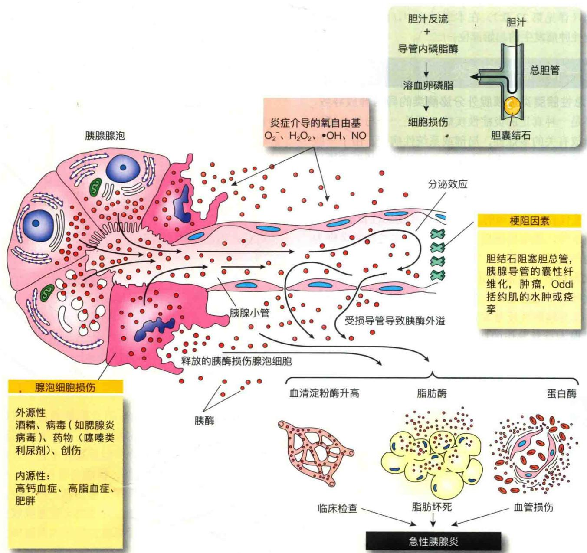 
图15-1急性胰腺炎的发病机制。导管及腺泡细胞损伤，导致胰酶释放。脂肪酶和蛋白酶会损伤组织，从而引起急性胰腺炎。血浆淀粉酶可作为急性胰腺炎发生时的检测指标
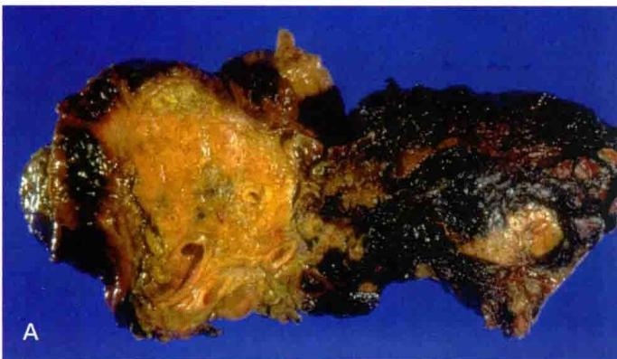
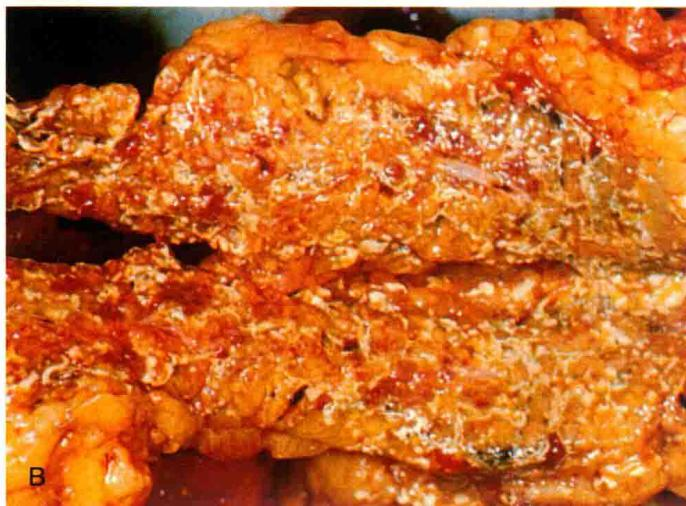 
图15-2急性出血性胰腺炎。A.大片胰腺组织严重出血；B.症状稍轻或者病变进展后期的胰腺切面，与A相比可见大量的黄白色脂肪坏死病灶
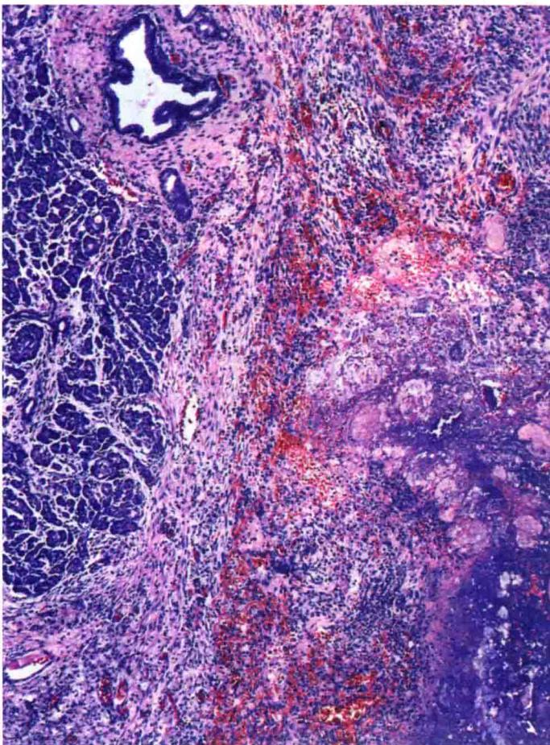 
图15-3急性出血性胰腺炎。胰腺显微照片显示：腺泡细胞坏死，出血，脂肪组织坏死区域（右下角）。左侧可见到完整的胰腺小叶
大压迫十二指肠。其可引发继发感染形成脓肿。假性囊肿破裂是一种罕见的并发症，会导致化学性或感染性腹膜炎。
【临床表现】当急性胰腺炎发作时，患者表现为剧烈的上腹部疼痛，伴随后背上部牵涉痛，同时合并有恶心、呕吐。继而数小时内引发灾难性的外周血管损伤甚至休克。如果休克严重且持续存在，在发病1周内可继发成人急性呼吸窘迫综合征和急性肾竭。在疾病早期，受损的腺泡细胞释放消化性胰酶进入血液和腹腔。 $24\sim 72$ 小时血浆中淀粉酶和脂肪酶水平升高，可用于急性胰腺炎的诊断。在 $50\%$ 的急性胰腺炎患者中，坏死胰腺感染是由肠道革兰阴性细菌导致，该并发症大大增加了死亡率。
# 第二节 慢性胰腺炎
慢性胰腺炎是指胰腺间质进展性损伤，伴不规则纤维化和慢性炎症。临床上，本病常表现为反复发作或持续性腹痛，或仅仅表现为胰腺外分泌部或内分泌部功能不全。

【发病机制】大部分导致急性胰腺炎的因素也会导致慢性胰腺炎的发生。慢性胰腺炎的
特征表现为间歇性急性，这种表现提示其有可能由急性胰腺炎的反复发作进展而来。但是将近 $50\%$ 的患者并无急性胰腺炎的病史。
长期酗酒是导致慢性胰腺炎发生的主要原因，占成人患者病因的 $80\%$ 。生前无症状的慢性酗酒者中，有近 $50\%$ 在尸检中发现该病。长期酗酒导致慢性胰腺炎的发病机制仍存在争议。乙醇是胰腺的一种促分泌素，因此早期慢性胰腺炎的特征表现为腺泡细胞过量分泌蛋白酶，但是同时不伴液体分泌增多。因此，导致大量蛋白栓堆积和阻塞在胰腺小导管分支，仅导致轻微的急性胰腺炎。纤维化可导致大量蛋白质栓的形成，导致碳酸钙结石的产生，这增加了严重急性胰腺炎日益发生的风险。由于只有少数严重酗酒者出现临床慢性胰腺炎，因此其他因素可能也发挥了作用。畸形或突变（例如，囊性纤维化基因）可能会使一些酗酒者发展为慢性胰腺炎。
胰管阻塞有时可导致慢性胰腺炎的发生。然而，急性的胆结石阻塞可导致急性胰腺炎，而不进展成为慢性胰腺炎。
慢性腺泡细胞损伤，如血清沉着病，与胰腺纤维化和萎缩相关。
自身免疫性慢性胰腺炎（淋巴浆细胞性硬化性胰腺炎、管道破坏性慢性胰腺炎等）常与其他的自身免疫和硬化性疾病相关（如慢性硬化性唾液腺炎
和腹膜后纤维化)。该疾病在男女中无差异，常发生青年期。
囊性纤维化（CF，详见第6章）可能表现为慢性胰腺炎。在囊性纤维化的患者，管内分泌物异常黏稠，导致囊肿性纤维化。浓缩的黏液栓阻塞胰管导致其囊状扩张，最终引起慢性胰腺炎和胰腺外分泌部功能底下。
特发性慢性胰腺炎在人群中表现为双峰式分布：在青年人中以25岁为中位年龄，老年人为60岁。 $10\% \sim 30\%$ 的患者发现存在CFTR基因突变，但却缺乏其他CF的临床症状。
遗传性胰腺炎是一种罕见的常染色体显性遗传病，其外显率为 $80\%$ 。其显著特征为反复的腹部剧烈疼痛并且常发生于儿童时期。大部分是由于点突变导致，点突变使得胰蛋白酶原自身激活从而导致胰蛋白酶活化。阳离子胰蛋白酶基因（丝氨酸蛋白酶1，PRSS1，染色体7q）和丝氨酸蛋白酶抑制基因的点突变（SPINK1）与该疾病发生相关。

【病理】慢性胰腺炎在出现临床症状时，通常病变已较严重。慢性钙化性胰腺炎是最常见的
类型，占慢性胰腺炎病例的 $90\%$ 。胰腺实质质硬，切面分叶不清（图15-4A）。由于导管内蛋白质分泌物、管内结石和狭窄而导致胰腺导管及其分支呈不同程度的扩张。常见假性囊肿或脓肿。光镜下见：胰腺大片区域不规则纤维化，内分泌部和外分泌部成分在数目和大小上都有不同程度的减少（图15-4B）。纤维化区域可见活化的成纤维细胞，相邻区域特别是残存的胰腺小叶周围可见大量淋巴细胞，浆细胞和巨噬细胞的浸润。导管上皮细胞可萎缩、增生，有时还可见鳞状上皮化生。

【临床表现】半数的慢性胰腺炎患者有急性胰
腺炎反复发作发作的表现。1/3的病例以连
续的或间歇性疼痛逐渐起病，无急性发作表现。还有部分患者最初并无疼痛，而表现为糖尿病或者吸收不良。患者常见明显的体重减轻，不能缓解的上腹部疼痛，向背部放射致使患者行动不便。每年的死亡率在 $3\% \sim 4\%$ ，在过去的 $20 \sim 25$ 年，死亡率将近 $50\%$ 。1/5 的患者死于急性胰腺炎发作相关的并发症。
# 第三节 胰腺外分泌肿瘤
# 一、成人患者中大部分（约 $85\%$ ）胰腺肿瘤是浸润性导管癌。
由于胰腺腺癌占据了胰腺癌的大多数，因此通常
胰腺癌即指胰腺腺癌。美国男性中，胰腺癌死亡率居恶性肿瘤所致死亡的第四位，女性为第五位。本病预后不良，5年存活率仅为 $6\%$ 。胰腺癌的发病率在许多国家有所上升，在过去的50年内美国胰腺癌的发病率上升3倍。

【流行病学】全球各地均可见胰腺癌的发生。
在青年人中男性发病明显高于女性（男女比大
于3：1）而老年人中男女发病率几乎相等。在美国每年新发胰腺癌约44000例，死亡37000例，与白种人相比，印第安人和黑种人胰腺癌的发病率仅占其 $50\%$ 。尽管胰腺癌多发于60岁以上的老年人群，但30岁前发生癌变者并不罕见。

【发病机制】与胰腺癌发生相关的因素还并不明确。流行病学研究表明自身因素和环境
因素可能参与了胰腺癌的发生发展过程。
吸烟：约 $25\%$ 的胰腺癌患者有吸烟史，在吸烟人群中胰腺癌的发病风险增加 2 倍以上。
体重指数和饮食因素：多肉、高脂饮食和硝酸盐摄入都会增加胰腺癌的发病风险。然而，其他混杂因素也可能会增加胰腺癌的发病风险如烹饪方式（如油炸、水煮、烧烤）。多水果蔬菜和高维生素C的饮食则会降低胰腺癌的发病机会。目前还没有直接证据证明咖啡和适量饮酒与胰腺癌发病是否相关。体重指数（BMI）的升高可能增加罹患胰腺癌
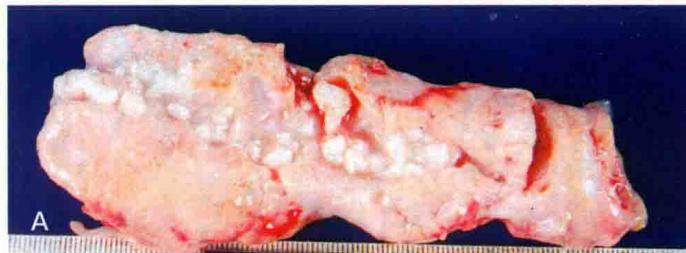
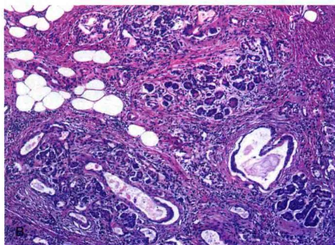 
图15-4 慢性钙化性胰腺炎。A.胰腺萎缩纤维化，导管不同程度增宽伴数枚结石；B.腺泡细胞萎缩，其周围被密集的纤维结缔组织包绕，有大量淋巴细胞浸润。胰管不同程度膨大，内含大量蛋白质成分
的风险。
糖尿病：糖尿病患者患胰腺癌的风险大大增加。多达 $80\%$ 的胰腺癌患者在诊断癌症时发现糖尿病指征。糖尿病5年及以上的患者患胰腺癌的风险是普通患者的2倍。
慢性胰腺炎：慢性胰腺炎是胰腺腺癌发病的危险因素，而仅有少量酒精性胰腺炎患者与胰腺癌相关。遗传性胰腺炎和热带钙化性胰腺炎与胰腺癌的关系更为明确。由于慢性胰腺炎偶尔表现较温和，同时临床上呈静止状，因此对胰腺癌的发生和进展作用常被低估。
家族性胰腺癌：遗传因素是胰腺癌发病的危险因素之一，并且几种遗传相关疾病都与胰腺癌相关（表15-1，可详见第5章）。然而，现在已知基因突变的病例仅占全部胰腺癌的一小部分，即使是受到多个因素影响的家族成员间，也不一定表现出同一种遗传综合征。

【发病机制】浸润型导管癌可呈现出一系列基因改变，部分基因改变出现在大部分病例中，
而有些则发生于罕见病例当中。可通过导管内增生性癌前病变的形态学检查，从而支持遗传相关肿瘤进展模型的建立，即胰腺上皮内瘤变（PanIN），这也是导管内发育不良最近才有的命名。胰腺上皮内瘤变的病变特点为管内普通上皮被黏液样上皮替代。根据细胞形态结构和基因表型异常将PanIN分为三级。肿瘤发生早期可见端粒区缩短和Kras原癌基因突变激活，该突变可发生在 $95\%$ 的导管腺癌中。肿瘤发生后期会发生肿瘤抑制基因的失活和缺失突变，包括p53 $(50\% \sim 75\%)$ ，p16/CDKN2A（ $95\%$ ）和MAD4/DPC-4（胰腺癌中缺失，4号染色体， $55\%$ ）。18号染色体上基因的缺失突变会发生在 $90\%$ 的胰腺癌中。还可见到几种生长因子及其受体的过表达或过度活化，其中包括表皮生长因子（EGF）及其受体，转录生长因子 $-\beta$ （TGF- $\beta$ ），成纤维细胞生长因子（FGF）及其受体和HER2/neu。在 $7\%$ 的胰腺癌中会出现BRCA-1失活，其片段存在DNA错配修复基因的缺失。PanIN由正常上皮进展至浸润癌的过程，不同阶段最常见的基因突变如图15-5所示。
表 15-1 家族性肿瘤综合征和胰腺癌发病相关风险 
综合征染色体突变基因胰腺癌相关风险Pentz-Jeghers 综合征19q13STK11/LKB1132 折叠遗传性胰腺炎7q35PRSS150 ~ 80 折叠家族性非典型性多发性痣和黑色素瘤综合征（FAMM）9p21P16 (CDKN2A)9 ~ 38 折叠遗传性乳腺-卵巢肿瘤综合征（HBOC）13q12-13BRCA23.5 ~ 10 折叠遗传性非息肉病性大肠癌（HNPCC）3p21, -2p22hMLH1, hMSH2不清楚
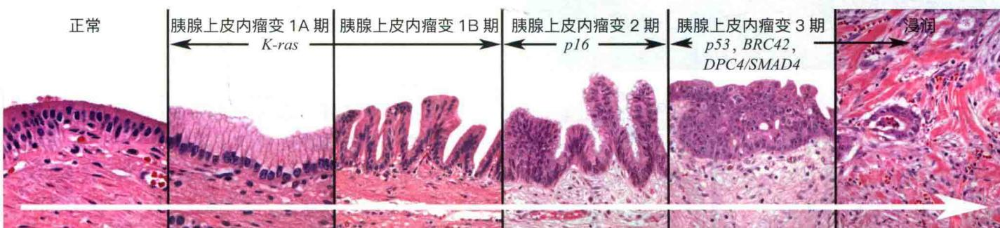 
图15-5胰腺上皮内瘤变（PanIN）。从左到右为正常导管上皮发展到浸润性癌的变化过程，显示了PanIN不同阶段的常见突变基因

【病理】导管腺癌在胰腺的任何部位都可发生，最常发生部位为胰头 $(60\%)$ ，其次是胰体 $(10\%)$
和胰尾 (5%)。剩余 25% 为多发病灶。胰头癌会压迫 Vater 壶腹和胆总管引起黄疸和胆道梗阻。因此相比胰体部和胰尾部癌症, 胰头癌可能在体积较小时得到诊断,发生局部淋巴结转移和远处转移更局限。
肉眼观察, 胰腺癌为质地硬韧, 灰白色, 与周围组织分界不清的多结节状肿块 (图 15-6), 肿块嵌于
致密结缔组织当中。常累及胰周组织和该部位其他结构，胆总管和十二指肠肠壁常受累。肿瘤可阻塞主胰管，从而导致胰体和胰尾萎缩。胰尾肿瘤可扩散至脾、横结肠或胃。常发生局部淋巴结和肝转移。其他常见转移部位还包括腹膜、肺、肾上腺和骨——大多数情况下远处转移手术不能清除。
光镜下,超过 $75 \%$ 的浸润性导管癌呈中度分化（图15-6B），其特征为可见单个分布的形态规则的管状腺
体，内含可产生黏液的分泌薄壁细胞。细胞核异型性显著，但腺体恶性程度不高，难与非肿瘤性的导管相鉴别。肿瘤腺体周围有明显的黏液形成。该肿瘤还可侵及神经，这也是肿瘤在早期引起持续性疼痛的原因。一些导管腺癌及其变异的发生与某些癌前病变相关，如黏液囊性肿瘤和导管内乳头状黏液性肿瘤（见下文）。
【临床表现】胰腺癌患者常表现食欲不振，明显的体重下降，上腹部绞痛并向背部放射。胰头癌患者近 $50\%$ 伴有黄疸表现，但黄疸在胰体和胰尾部肿瘤中少见。胰头癌压迫胆总管导致阻塞，黄疸进行性加深，胆囊显著肿大，但无压痛的一种急性症状称库瓦希耶征，近1/3的胰腺癌患者该征可能为首发症状。 $10\%$ 的胰腺癌患者会出现游走性血栓静脉炎（深静脉血栓形成或陶瑟征），以胰体和胰尾部肿瘤尤为多见，其亦是潜在恶性的首要表现。因胰腺癌早期症状缺乏典型性，所以早期诊断困难。大多数病例在诊断时已经发生转移，手术难以根除。病情持续恶化，伴随顽固性疼痛，恶病质进而死亡。 $50\%$ 患者确诊后6个月内死亡，5年生存率小于 $6\%$
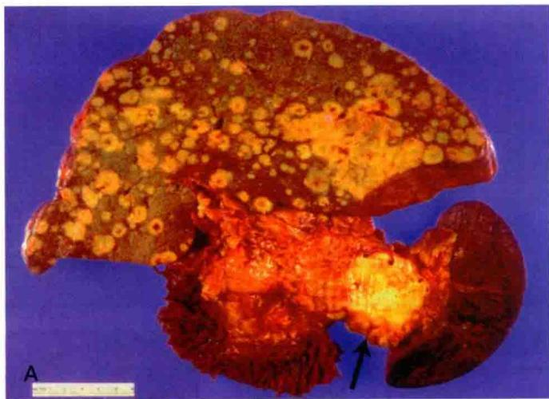
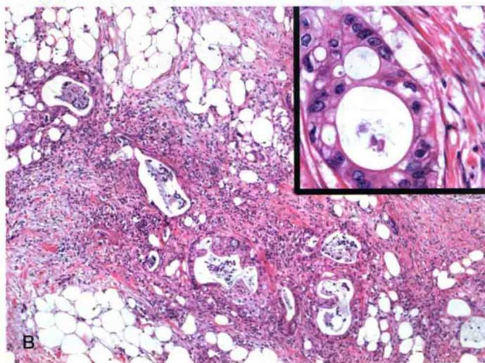 
图15-6浸润性胰腺导管腺癌。A.尸检标本所示胰尾部可见大块肿瘤（箭头所指）及广泛的肝转移；B.可见恶性腺体侵及纤维结缔组织包绕的脂肪组织。右上角所示为高倍下的恶性腺体结构
# 二、腺泡细胞癌
腺泡细胞癌较罕见（仅占胰腺癌的 $1\% \sim 2\%$ ），同时与正常的胰腺腺泡细胞相似，肿瘤细胞也可产生外分泌酶。70岁的老年患者高发，儿童也有报道。由于大量的脂肪酶进入血浆，一些患者会出现皮下脂肪坏死，多关节疼痛和嗜酸性粒细胞增多的副肿瘤综合征表现。腺泡细胞癌预后差，但不如导管腺癌致死迅速。腺泡细胞癌的分子发病机制与导管腺癌不同，因为导管腺癌所发生的典型基因突变在腺泡细胞癌中常不发生。
# 三、胰腺囊性肿瘤
腹部自由成像增加了对胰腺囊性肿瘤的认知。该肿瘤多发于 $50\sim 70$ 岁女性，体积大呈多房囊性结构。肿瘤分为浆液性和黏液性两种，后者恶性程度高。
浆液性囊腺瘤：浆液性囊腺瘤是一种良性肿瘤，其囊壁由均匀分布的富含糖原的立方状上皮构成。常发生胰体或胰尾部。Hippel-Lindau综合征的患者患该病风险增加。大多数患者会出现与局部肿块相关的非特异性症状，但约有1/3患者无明显症状。镜下观察可见大的星状瘢痕，有时伴有微小钙化灶，在影像学上表现为“旭日”征。
导管内乳头状黏液性肿瘤（IPMN）：导管内乳头状黏液性肿瘤内可见扩张的胰管（ $>1\mathrm{cm}$ ），导管表面内衬肿瘤黏液性上皮，管腔中充满黏液。多数的乳头状分支突入管腔。IPMNs好发于胰头部，老年人群多见，常无意间发现于慢性胰腺炎的患者中。镜下观察，部分IPMNs主胰管的病变，而其余类型则表现为分支胰管和假包囊的病变。根据上皮的异型性不同，可将IPMNs由低到高分级。高达1/3的患者为浸润性腺癌。其分子发病机制同典型PanIN和胰腺导管腺癌相同。
胰腺黏液性囊腺瘤（MCN）：MCN呈单房或多房状，被覆分泌黏液的高柱状上皮细胞，下方卵巢样基质，该病特发于中年女性。肿瘤好发于胰体和胰尾部，不与胰腺导管系统相通。与IPMNs类似，该肿瘤有不同程度的上皮异型性，有时与浸润性癌发生相关。若能彻底手术切除，MCN（非浸润性）的预后良好。其分子发病机制与PanIN和侵袭性胰腺导管腺癌相类似。
# 第四节 胰腺内分泌
# 一、胰腺的内分泌部胰岛
胰岛在胰腺组织中广泛分布，内含丰富的血管球样团块，该团块由大的上皮样细胞团构成。六种不同细胞类型与特定的激素相关（表15-2）。
表 15-2 不同胰岛细胞分泌产物及其生理作用 
细胞分泌产物生理作用α细胞胰高血糖素刺激糖原分解促进糖异生，升高血糖β细胞胰岛素促进合成代谢，促进糖原合成，脂 和蛋白质的生成，降低血糖δ细胞生长抑素抑制α，β，D1和腺泡细胞的分泌D1细胞血管活性 肠肽（VIP）同胰高血糖素的作用类似，调节胃肠 道平滑肌收缩，促进胃肠蠕动，促 进肠上皮细胞环腺苷酸（cAMP）循 环，从而调节代谢PP细胞胰多肽促进胃蛋白酶分泌，抑制肠道蠕动和 胆汁分泌
# 二、胰腺的神经内分泌肿瘤（PanNETs）占胰腺肿瘤的 $5\%$
胰腺的神经内分泌肿瘤（PanNETs，之前称为胰岛细胞瘤）有其特殊的形态特征：瘤细胞形态上与胰岛细胞和某些分化程度较好的神经内分泌肿瘤细胞相似，如类癌。PanNETs可分泌多种激素而导致副肿瘤综合征，也有些为无功能性肿瘤。功能性PanNETs包括胰岛素瘤、胃泌素瘤、高血糖素瘤、生长抑素瘤、血管活性肠肽瘤及其他罕见型肿瘤（图15-7）。PanNETs体积较小时，可通过手术将其彻底清除，但肿瘤较大时则有可能发生不可治愈的转移。该肿瘤具有体积大，增殖能力强，以及侵袭性强，易复发的特点，但通过上述特点还是很难预测其临床生物学行为。即使PanNETs发生了远处转移，但其通常生长缓慢，患者仍可生存数年甚至数十年。若功能性PanNETs不能通过手术根除，其分泌的激素会引起严重临床综合征。大多数PanNETs为无功能性肿瘤，但在功能性肿瘤当中，又以胰岛素瘤最为多见。胰岛素瘤可发生于任何年龄阶段，但其高发年龄为 $40\sim 60$ 岁，男女相等。常见功能性PanNETs的相关症状见图15-7，其详情会在后文进行讨论。

【发病机制】1型多发性内分泌肿瘤综合征
(MEN1详见第21章）包括垂体瘤、甲状
旁腺瘤和某些罕见的器官内分泌肿瘤，PanNETs就是其中之一。患者通常发生多个胰腺内分泌微腺瘤和PanNETs，但至少一个为功能性肿瘤。Von Hippel-Lindau综合征的患者也会发生无功能性PanNETs。引起MEN1和VHL综合征的基因及其抑制基因都已经证实，遗传性的PanNETs中存在双等位基因失活，而散发PanNETs的相关分子发病机制还未得到确证。
功能性胰腺神经内分泌肿瘤可产生副肿瘤综合征
胰岛素瘤为最常见的功能性PanNETs，可持
续分泌胰岛素从而导致患者低血糖。该肿瘤通常体积较小（ $75\%$ 小于 $2\mathrm{cm}$ ），但其症状严重，包括低血糖对中枢神经系统的直接影响和间接引起的儿茶酚胺反应。患者表现为出汗、视物模糊、恍惚、紧张和饥饿感，其可进一步发展为意识丧失、嗜睡甚至惊厥或昏迷。这些异常的症状会使医生误认为患者患有精神疾病。胰岛素瘤常发于胰尾部。尽管 $30\%$ 的 MEN1 患者，其功能性 PanNETs 为胰岛素瘤，但只有 $5\%$ 的胰岛素瘤出现在 MEN1 中。与其他的 PanNETs 相比，胰岛素瘤常表现出良性的临床进程，这可能与其被发现时体积较小有关。
■ 高血糖素瘤与一系列症状相关：①轻度糖尿病；②坏死性游走性红斑；③贫血；④腹泻；⑤深静脉血栓。同时还会出现精神紊乱的表现。高血糖素瘤占功能性PanNETsD的 $8\% \sim 13\%$ ，好发年龄 $40\sim 70$ 岁，女性较多。同其他功能性PanNETs类似（胰岛素瘤除外）， $50\% \sim 70\%$ 的高血糖素瘤为恶性肿瘤。
■ 生长抑素瘤较罕见，由于生长抑素对于胰岛细胞，胃肠道神经内分泌细胞的抑制作用，可导致轻度糖尿病、胆结石、脂肪泻、胃酸分泌不足、贫血和体重减轻等综合病症。因此相应的血液中胰岛素和胰高血糖素处于低水平状态。
胰腺胃泌素瘤是一种功能性的PanNETs，由G细胞组成，可分泌胃泌素，该蛋白质类激素可刺激胃酸分泌。由于分泌胃泌素的细胞通常不在胰岛，所以该肿瘤在胰腺的位置并不固定。胰腺胃泌素瘤可引起Zollinger-Ellison综合征，该综合征主要表现为：①顽固性胃酸分泌过多；②十二指肠和空肠的严重消化性溃疡；③血中高胃泌素。在功能性PanNETs中，胃泌素瘤的发病率仅次于胰岛素瘤，两者是MEN1患者最常见的功能性肿瘤。胃泌素瘤好发年龄为 $30\sim 50$ 岁，男性较多。多数胰腺标本显示其好发于胰头部。
■血管活性肠肽瘤是一种功能性的PanNETs，可分泌血管活性肠肽（VIP）。同胃泌素类似，VIP通常并不来源于非肿瘤性的胰岛细胞团，而主要来自于神经节细胞和胰腺、肠道、大脑中的神经纤维。VIP可诱导肝糖原分解，升高血糖，调节胃肠道上皮细胞水和电解质的分泌，血管活性肠肽瘤可引起Verner-Morrison综合征，其主要表现为暴发性水样泻，低血钾，胃酸缺乏（也称为WDHA综合征或胰腺霍乱）。血管活性肠肽瘤罕见（占PanNETs的 $3\% \sim 8\%$ ，占功能性PanNETs的 $10\%$ ），通常体积较大，单发。
PanNETs极少分泌如促肾上腺激素（ACTH）、甲状旁腺激素、降钙素、抗利尿激素等非胰腺自身的激素（异位激素）。这些异位激素可单独分泌也可伴随胰腺本身正常激素共同分泌。
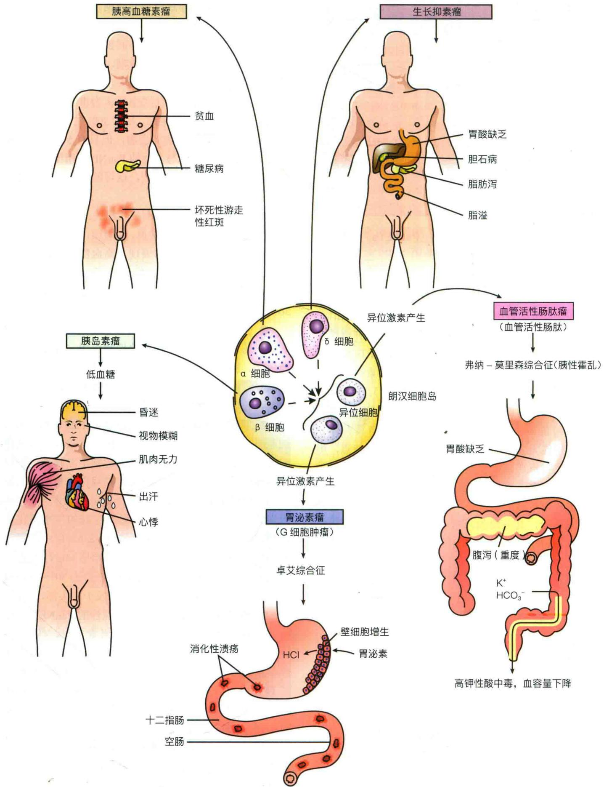 
图15-7 胰岛细胞肿瘤相关的综合征
【病理】除了胰岛素瘤体积较小外，功能性和非功能性PanNETs大体相似。该类肿瘤常单发，边界清楚，包膜成粉红或棕黄色，质软（图15-8）。镜下观察可见，PanNETs细胞表现出独特的排列模式，如巢状、索带状、腺管状和类似菊形团样排列（图15-9）细胞核形态一致，染色质粗颗粒状，增殖速度缓慢。为验证肿瘤的内分泌属性，可用免疫组织化学方法，即用嗜铬颗粒蛋白抗体和突触素抗体与肿瘤细胞反应来加以判断（图15-9）。通常，功能性PanNETs也可通过其分泌激素引起相应的临床综合征进行诊断。
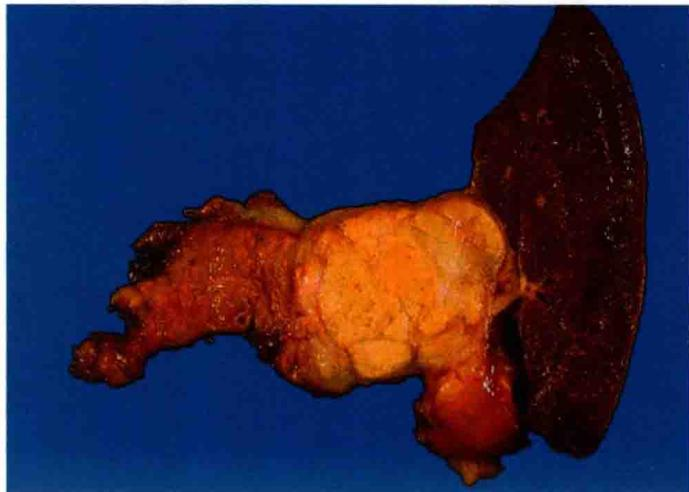 
图15-8 胰腺神经内分泌肿瘤。肿瘤组织呈结节状，紧邻脾，位于胰尾部，边界清楚
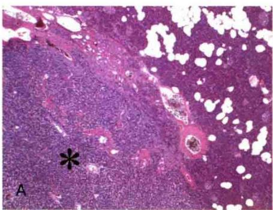 
图15-9胰腺神经内分泌肿瘤。A.低倍镜下可见边界清楚的肿瘤组织（星号处）；B.高倍镜下，肿瘤细胞成条索样排列；C.在相邻胰腺组织中，嗜铬颗粒蛋白对肿瘤和胰岛（箭头处）运用免疫组织化学的方法进行染色
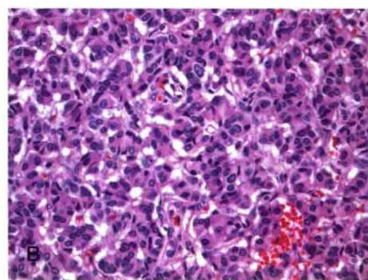
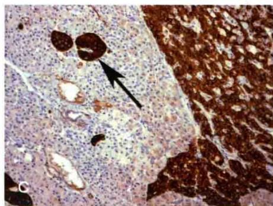
（刘旭光）
# 第16章 肾脏
肾脏主要负责调节身体体液和电解质的代谢，这是通过复杂的肾小球滤过机制和肾小管选择性重吸收来完成的。肾还有分泌肾素的内分泌功能，它可以调节钠盐代谢和血压；还有促红细胞生成素，是刺激骨髓的红细胞生成的激素。肾单位是执行肾功能的基本
单位，包括肾小球和它所属的肾小管，后者连接于集合管系统（图16-1）。
肾的解剖包括肾小球、血管、肾小管和肾间质（图16-1）。很多肾疾病与相应的结构关联，并引起相应的功能障碍。
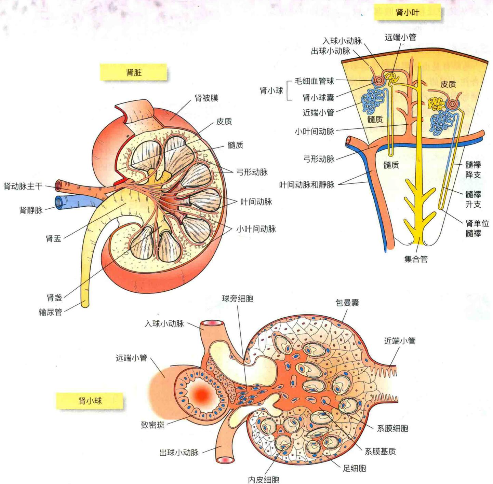 
图16-1 肾的大体和组织学