# 第一节 先天异常
# 一、肾缺如是肾组织完全缺失
大多数双侧肾缺如的胎儿都是死胎，有Potter序列（见第6章）。双侧肾缺如常常合并其他的先天异常，特别在泌尿道其他部位和下肢。单侧肾缺如并不是严重的事，假如没有其他相关的异常因为单侧肾可以充分代偿以维持正常肾的功能。但是，生命的晚期因为肾单位的过度工作会增加发展为进行性肾小球硬化的危险性（继发性的局灶节段性肾小球硬化症）。
# 二、肾异位是正常肾在异常位置
异位肾常位于盆腔。通常这种情况是因为胎儿肾脏从盆腔迁移到侧腹窝失败。肾的异位可以累及一个或者两个肾。
# 三、马蹄肾是指单个、巨大位于中线的器官
马蹄肾是由于婴儿出生时双侧肾脏常常在下极是融合在一起的。这种异常通常没有临床的症状，但可以增加梗阻和肾盂肾炎的危险性，因为子宫可能横亘于双侧肾下极融合处。
肾发育不良是发育障碍：肾发育不良是指原始的间叶组织包绕不分化的小管结构，有时可见异位组织，例如软骨组织，异常的小管可以形成囊肿。

【发病机制】肾发育不良是由于多种遗传和躯体的原因导致的后肾分化的异常。一些家
族型的发育不良可能是由于异常的分化信号影响了输尿管胚基和后肾胚基之间的相互诱导作用。很多形式的发育不良都伴随着其他泌尿道的异常，特别是引起尿流的梗阻。这种关联暗示泌尿道的梗阻可以引起发育不良。

【病理】肾发育不良的组织学的标志为被覆了立方状和柱状上皮的未分化的小管和导管。这
些结构被未分化的间质，包绕（图16-2）间质中有时包含平滑肌和软骨岛。可能存在未发育的肾小球和囊性扩张的小管和导管。肾发育不良可以一侧或两侧，累及的肾可以异常增大或减小，包含很多囊。

【临床表现】大多数有囊形成的肾发育不全的患者，出生后不久即可发现侧腹部可触及的包
块，虽然一些小的多囊肾不明显，直到多年以后被发现。单侧多囊肾发育不全是最常见的新生儿腹部包块，治疗是切除受累的肾。婴儿双侧肾脏发育不良可引起羊水过少，导致波特（Potter）序列和威胁生命的肺发育不全。
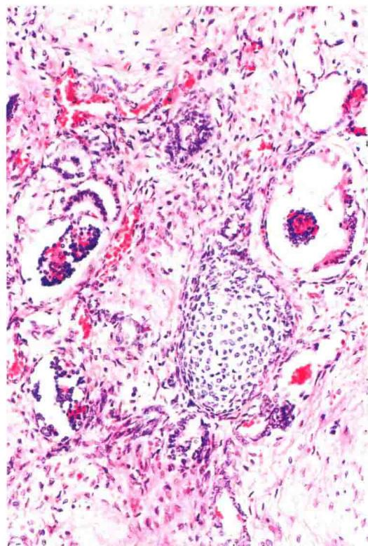 
图16-2 肾发育不良。疏松、未分化的间叶组织围绕着不成熟的肾小球、小管和软骨
# 第二节 先天性多囊性肾病
先天性多囊性肾病是一组不同的基因异常疾病，特点是肾实质形成很多畸形的囊。这类疾病的发病年龄、严重程度和遗传方式和囊的结构都不同。
# 一、常染色体显性遗传的多囊性肾病（ADPKD）的特点是增大的多囊性肾
ADPKD是最常见的一组肾实质内有多个囊为特点的遗传性疾病（图16-3）。在美国发病率是 $1:400\sim 1:1000$ 。ADPKD占所有需要透析或者肾移植患者的 $5\%$ 。只有糖尿病或者高血压导致的终末期肾脏病多于ADPKD。

【发病机制】大约 $85\%$ 的ADPKD是由于多囊性肾疾病基因1（PKD1）的突变， $15\%$
的患者由于多囊性肾疾病基因 2 (PKD2) 的突变。这些基因的产物 polycystin-1 和 polycystin-2，存在于：①小管上皮细胞的纤毛；②细胞和细胞粘连复合体，可以感觉细胞外环境，包括尿量、调节细胞内的钙量、小管上皮增生和凋亡。此类蛋白的缺失打断了来自纤毛的正常抑制肾小管生长的钙信号。
这些囊源自肾小管的某些节段，由一些增生异常的细胞发展而来。小管壁由一些未分化的高核浆比例和仅有少数的微绒毛的未分化的上皮覆盖。最终，大部分的囊不再与肾小管相连。囊液最初是由肾小球的滤液聚集形成的，后来的液体是由上皮分
泌的。多囊来源于小于 $2\%$ 的肾单位；而且，不仅是正常组织被拥挤的扩张的囊占据，而是失去了有功能的肾组织。

【病理】ADPKD的肾是双侧显著增大，每一侧
可重达 $4500\mathrm{g}$ （图16-4），肾的表面可由多个
直径大到 $5\mathrm{cm}$ 的囊构成，其内充满了草绿色的液体。显微镜下，囊壁由立方状和柱状上皮衬覆。实际上它们是由肾单位的任意点发展而来，囊之间可见正常肾实质。
1/3 ADPKD 的患者也合并肝的多囊，衬覆的上皮类似胆管上皮。1/5 的患者合并脑动脉瘤，颅内出血占据了 $15\%$ 的 ADPKD 患者的死因。有趣的是许多 ADPKD 的患者还患有结肠憩室。

【临床表现】许多ADPKD的患者没有临床表
现直到40岁以后，虽然也有小部分患者童
年时发病。症状包括腰部的沉重感，双侧侧腹或腹部的包块和尿中的血块。高血压是最早最常见的表现之一，最后可以发展为血尿、少量蛋白尿和进行性肾功能不全。
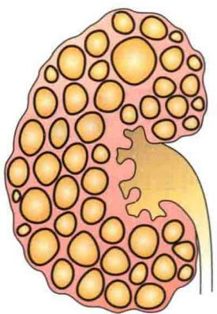 
常染色体显性遗传多囊性肾病
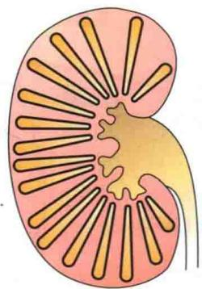 
常染色体隐性遗传多囊性肾病
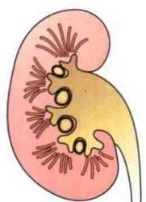 
髓质海绵肾
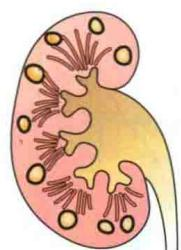 
复杂性髓质囊性肾病
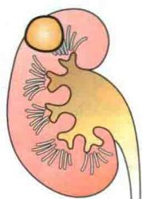 
单纯性囊肿 
图16-3 肾的囊性疾病
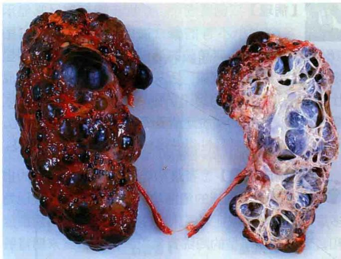 
图16-4成人多囊性肾病，肾脏增大，实质几乎被大小不等的囊完全替代
# 二、发生于婴儿的常染色体隐性遗传的多囊肾病 (ARPKD)
ARPKD的特征是集合管的囊性变。与ADPKD相比罕见，发病率在活婴中为 $1 / 6000\sim 1 / 40000$ 。1/4的这种婴儿死于围生期，常由于羊水过少引起的肺发育不全（Potter序列）。度过了新生儿期的患者进展为肾功能不全的发病年龄和的比率各异，和伴随门脉高压的肝纤维化。ARPKD是由于PKHDI基因的突变。此基因的产物——纤维囊性因子，可以在肾、肝和胰腺发现，在细胞增殖和黏附调节中起作用。PKHDI的突变也可以导致胰腺的多发囊肿、肝和胆管的发育不全和纤维化。

【病理】与ADPKD不同，婴幼儿期ARPKD的肾外表面是光滑的。病变常常累及双侧。多囊
是皮质和髓质的集合管纺锤形扩张形成的，并且垂直于肾包膜放射状排列。间质纤维化和小管的萎缩很常见，特别是那些晚些发病的儿童。肝常常显示先天的肝纤维化。
# 三、海绵肾 - 髓质囊性肾病复杂的表现为小管间质损伤和髓质的多囊

【发病机制】海绵肾和髓质囊性疾病都导致病理上相似的进行性髓质小管间质性疾病，
但是它们有不同的遗传原因和遗传模式。海绵肾是常染色体隐性遗传疾病，婴儿期、儿童期或者青春期发病。它是由NPHP基因的突变引起的（迄今为止已鉴定了NPHP1-NPHP9），它们的产物，肾囊性因子位于初级纤毛。髓质囊性疾病是常染色体显性遗传疾病，青春期发病、成年后肾衰竭，是由MCKD1或MCKD2基因缺失引起的。

【病理】双侧肾缩小，切面皮髓交界区常显示多个大小不等的囊（最大的可达1cm）（图。囊起源于肾单位的远端。萎缩的小管有明显分层状的基底膜，丢失的肾小管与肾小球不成是此病早期的组织学特点。最后，皮髓交界区成，残留的实质逐渐萎缩。继发性肾小球硬化、维化和非特异性炎性浸润是晚期的组织学改变。

【临床表现】患者最初表现为肾小管功能的损伤，例如受损的浓缩功能或排钠功能，表现为多饮和遗尿症（尿床）。接着是进行性氮质血症竭。幼年型的海绵肾常见，占儿童终末期肾脏 $15\% \sim 10\%$ 。症状开始于 $4\sim 6$ 岁，10年内终末期肾病。髓质的囊性疾病的特点是40多肾衰竭，常出现多尿。高尿酸和痛风可能是伴
# 第三节 获得性肾囊性疾病
超过50岁的人群中 $50\%$ 患有单纯性肾囊肿，常在尸检时偶然发现，很少有临床症状除非囊非常大。可以是单发或者多发，充满的液体位于皮质外侧，使肾包膜扩张。单纯性囊肿较少位于髓质。显微镜下，有一层扁平的上皮衬覆。
长期透析的患者常在皮质和髓质形成多发性囊肿。囊肿最初被覆扁平或立方状上皮，但是可以发生上皮的增生和瘤样增生。 $5\%$ 的患有获得性囊性疾病者的患者可以发展成肾细胞癌。
# 第四节 肾小球疾病
肾小球是由特殊的毛细血管网形成的卷曲的肾小球簇，覆盖着上皮细胞，由特化的平滑肌细胞称为系膜细胞支撑着（图16-5，图16-6，图16-7）。
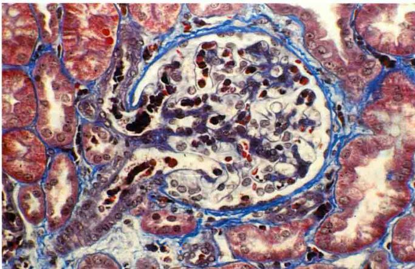 
图16-5 正常肾小球光镜。Masson三色染色显示肾小球毛细血管簇拥有纤细的蓝染的毛细血管壁基底膜，少量蓝染的基质围绕着系膜细胞，肾小球门部位于图左侧，入球小动脉在下方进入，出球小动脉位于上方
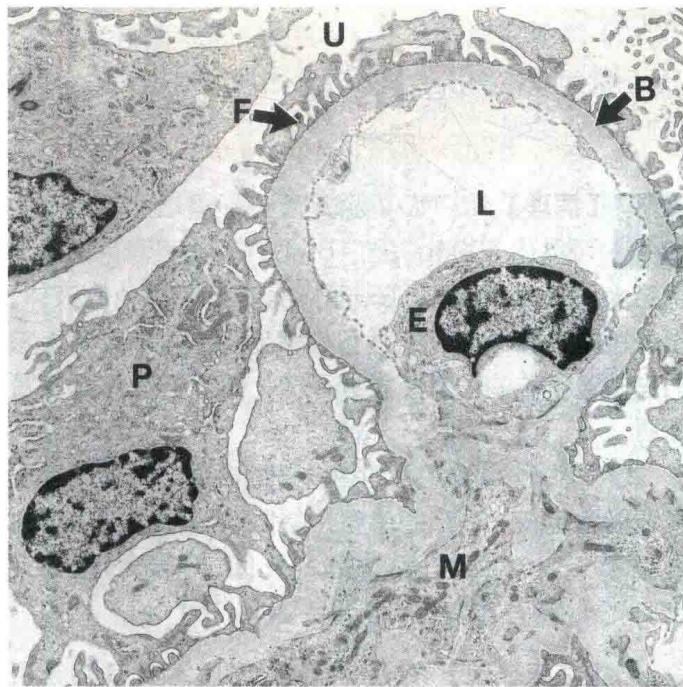 
图16-6 正常肾小球。这幅电镜照片可见一个毛细血管和邻近的系膜区，（L）是指毛细血管，由内皮细胞胞体（E）延伸出来形成的单层有窗孔的内皮细胞胞质组成。内皮细胞的胞体直接与系膜区相连，后者包括系膜细胞（M）和周围的基质。基底膜的外侧由足细胞（P）形成的足突（F）覆盖，足细胞被覆在尿囊（U）表面，与图16-7比较
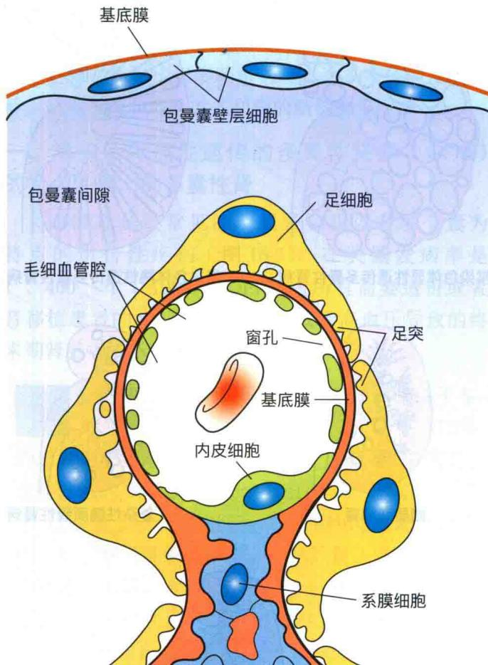 
图16-7 正常肾小球。用一个肾小球袢显示不同类型肾小球内细胞与基底膜和系膜基质的关系。完整表面是肾小球基底膜（BM）（周边袢和茎干）被覆着脏层上皮细胞（足细胞）的足突。有窗孔的内皮细胞衬覆在基底膜的内表面，而中心部分与系膜细胞及基质连接
肾小球毛细血管衬覆着有窗孔的内皮细胞被覆在基底膜上。基底膜的外侧表面被覆着特殊的上皮细胞称为足细胞或者脏层上皮细胞。足细胞衬覆于包曼囊间隙的一侧，另一侧则衬覆着壁层上皮细胞。
很多肾疾病都是由于肾小球的损伤。肾小球可能是唯一且重要疾病损伤之所在（原发性肾小球疾病；比如IgA肾病），或者可能是一个影响多脏器的系统性疾病的一部分（继发性肾小球疾病；如狼疮肾炎）。
# 一、肾病综合征的特点是严重的蛋白尿
肾病综合征是以严重蛋白尿（3.5g/24h）、低白蛋白血症、水肿、高脂血症和脂肪尿为特点的疾病。蛋白尿的主要发病机制是由于肾小球毛细血管袢通透性增加，允许蛋白丢失，从血浆滤过入尿液（图16-8）。糖尿病性肾小球硬化症是成年人最常见的继发性肾病综合征。表16-1列出了成人和儿童原发性肾病综合征的原因和大约频率。表16-2详细列出了这些疾病中的一些种类的病理特点（讨论见后文）。
成人和儿童产生肾病综合征的特殊肾小球疾病的比率有明显不同。比如，微小病变型肾小球病是儿童原发肾病综合征的最主要原因（ $70\%$ ），但是成人仅占 $15\%$ 。但是，成人最常引起原发性肾病综合征的膜性肾小球肾病和局灶节段肾小球硬化症。
# 二、肾炎综合征（肾小球肾炎）是一种炎性疾病
肾炎综合征的特点是血尿（不论显微镜下或肉眼），不同程度的蛋白尿和肾小球滤过率减少。它可以引起血中尿素氮和肌酐的升高、少尿、水钠潴留、水肿和高血压。肾炎综合征相关的蛋白尿和血尿是由于肾小球的炎性改变引起的，比如白细胞浸润、肾小球细胞增生、毛细血管的损伤，甚至严重时的坏死。炎症损伤可以减少肾小球的滤过率，导致肾功能不全和高血压。肾炎可以分为：
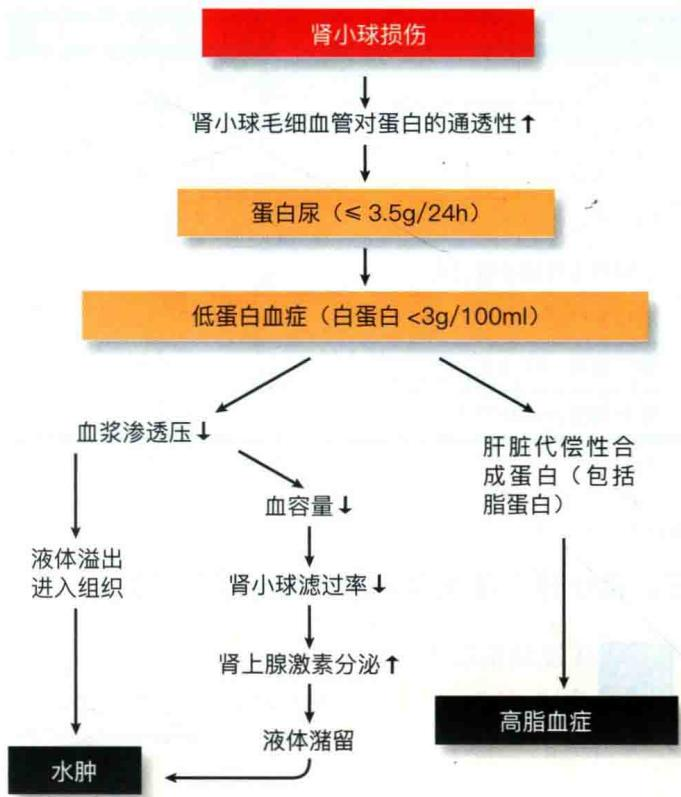 
图16-8 肾病综合征的病理生理
急性肾小球肾炎：发病迅速，是可逆的。
急进性肾小球肾炎：需要采取积极治疗的措施
慢性肾小球肾炎：可以持续数年，缓慢进展为肾衰竭。
表16-1 成人和儿童由原发性肾小球疾病引起的肾病综合征的原因和频率病因儿童(%)成人(%)微小病变型肾病7515膜性肾病530局灶节段性肾小球硬化症1030I型膜增生性肾小球肾炎55其他肾小球疾病a520
a.包括其他系膜增生或增生性肾小球肾炎，如IgA肾病，它常常引起肾炎综合征
表16-2 引起肾病综合征主要原因的病理学特点微小病变型肾病局灶节段性肾小球硬化症膜性肾病膜增生性肾小球肾炎光镜无病损局灶节段肾小球增生硬化弥漫性肾小球毛细血管壁增厚毛细血管壁增厚和毛细血管内增生免疫荧光无免疫复合物沉积无免疫复合物沉积弥漫性免疫球蛋白沿毛细血管壁沉积弥漫性补体沿毛细血管壁沉积电镜无电子致密物沉积无电子致密物沉积弥漫性上皮下电子致密物沉积内皮下电子致密物沉积（I型）膜内电子致密物沉积（II型）
某些肾小球疾病倾向引起肾病综合征，而另外一些引起肾炎综合征（表16-3）。但是，可能需除外微小病变型肾病（它几乎总是引起肾病综合征）。所有的肾小球疾病常常产生混合性的肾炎和肾病表现导致临
床诊断的混乱。虽然临床和实验室检查对特定的疾病提供可能的证据，但是肾穿刺活检诊断常常是明确肾小球疾病的唯一途径。
表 16-3 肾小球疾病表现为肾炎综合征和肾炎综合征的趋势 
疾病肾病肾炎微小病变型肾病++++-膜性肾病+++++局灶节段性肾小球硬化症+++++系膜增生性肾小球肾炎a++++膜增生性肾小球肾炎++++增生性肾小球肾炎++++新月体性肾小球肾炎+++++
a这些组织学表型可以有许多类型的肾小球疾病引起，包括IgA肾病、感染后性肾小球肾炎、狼疮肾小球肾炎、ANCA相关肾小球肾炎和抗GBM病
# 三、肾小球炎症主要是由免疫机制介导的

【发病机制】抗体介导和细胞介导的免疫过程在产生肾小球炎症过程都有作用。但是，
抗体介导的三种机制被认为是导致大多数肾小球肾炎的主要发病机制（图16-9）。
1. 原位免疫复合物形成 包括循环抗体与固有抗原结合或者在肾小球内的外来抗体，导致炎症损伤（见第4章）。例如，抗肾小球基底膜自身抗体结合在IV型胶原α4链的一个特殊表位上。在肾小球毛细血管壁的免疫复合物吸引白细胞、活化的补体和体液炎症介质，导致炎症损伤。 
2. 循环免疫复合物沉积 在肾小球激起的炎症类似于原位形成的免疫复合物。例如，循环抗体可以和由细菌或病毒感染释放到循环中的抗原结合，产生免疫复合物。假如这些复合物逃脱了细胞吞噬，它们可以沉积在肾小球，引起炎症。 
3. 抗中性粒胞质抗体 可以引起严重的肾小球肾炎，而在肾小球免疫荧光染色中没有或者很少有免疫球蛋白。这些患者常常有针对中性粒细胞胞质抗原的循环自身抗体。最常见的是抗-髓过氧化物酶（MPO-ANCA）或抗蛋白酶3（PR3-ANCA），它们可以通过激活中性粒细胞来介导肾小球炎症。比如在病毒感染过程中增加的循环中的细胞因子可以轻度刺激中性粒细胞和单核细胞，引起它们表达表面的MPO和PR3，就可以与ANCA相互作用。这种相互作用进一步附着在微血管的内皮细胞上，特别是肾小球毛细血管袢，进一步引起肾小球肾炎、动脉炎静脉炎等血管炎症。

【病理】许多特殊的肾小球疾病都有独特的病理特点，以及不同的自然病程和适当的治疗方确的肾小球疾病病理学诊断需要评价肾穿刺组镜、免疫荧光和电镜，还要整合临床信息。表
16-4列出了诊断肾小球疾病的有用的病理特点。图16-10显示了病理怎样和临床资料整合诊断特异的肾小球疾病。
急性炎症的病理特点，比如：毛细血管内和毛细血管外的细胞增生、白细胞浸润和坏死，是肾炎比肾病更为常见的特点。肾小球新月体形成（毛细血管外上皮细胞增生）不是特殊的肾小球炎症的特别原因。新月体的形成作为严重的快速进展损伤的标志，是由于肾小球毛细血管广泛的破坏，向包曼囊释放炎症因子，导致巨噬细胞浸润和上皮的增生。
表 16-4 肾小球疾病的诊断特点 
I. 光镜下特点A. 细胞数增加白细胞浸润（例如，中性粒细胞、单核细胞、吞噬细胞）毛细血管内增生（又称内皮细胞和系膜细胞）毛细血管外增生（又称上皮细胞）（新月体形成）B. 细胞外基质增加免疫复合物形成聚集肾小球基底膜增厚或双层胶原基质增加（硬化）血浆蛋白蓄积（玻璃样变）纤维素样坏死淀粉样物沉积Ⅱ. 免疫荧光的特点A. 沿肾小球基底膜线样沉积抗-GBM抗体多种血浆蛋白（例如，糖尿病肾小球硬化）单克隆轻链沉积B. 颗粒状免疫复合物染色系膜区（例如，IgA肾病）毛细血管壁（例如，膜性肾病）系膜区和毛细血管壁（例如，狼疮肾炎）C. 不规则（松散）染色单克隆轻链沉积（AL 淀粉样物）AA 蛋白（AA 淀粉样物）Ⅲ. 电镜特点A. 电子致密物（免疫复合物）沉积系膜区（例如，IgA肾病）内皮下（例如，狼疮肾炎）上皮下（例如，膜性肾病）B. GBM 增厚（例如，糖尿病肾小球硬化）C. GBM 双层（例如，膜增生性肾小球肾炎）D. 胶原基质增生（例如，局灶节段肾小球硬化）E. 纤维丝沉积（例如，淀粉样物）
IgA.免疫球蛋白A；GBM.肾小球基底膜
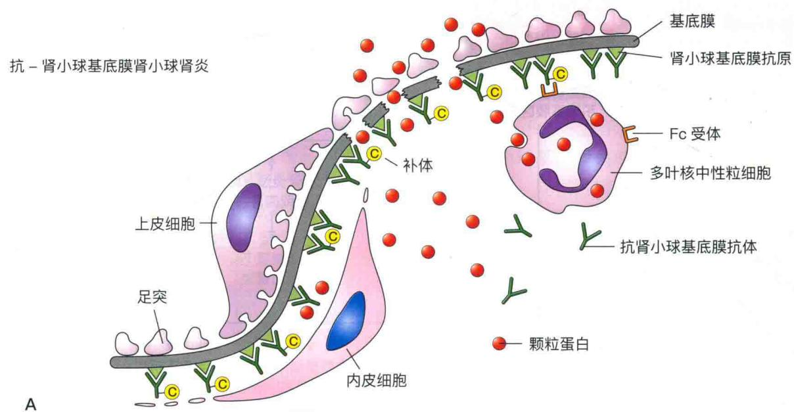
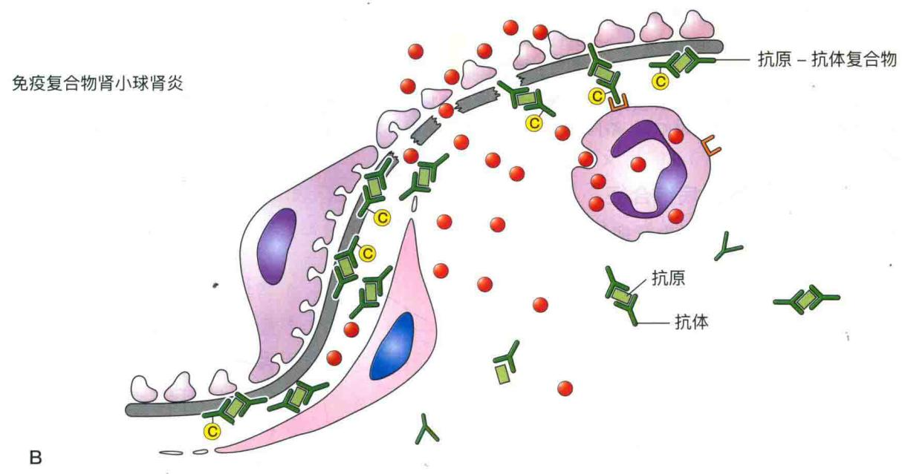
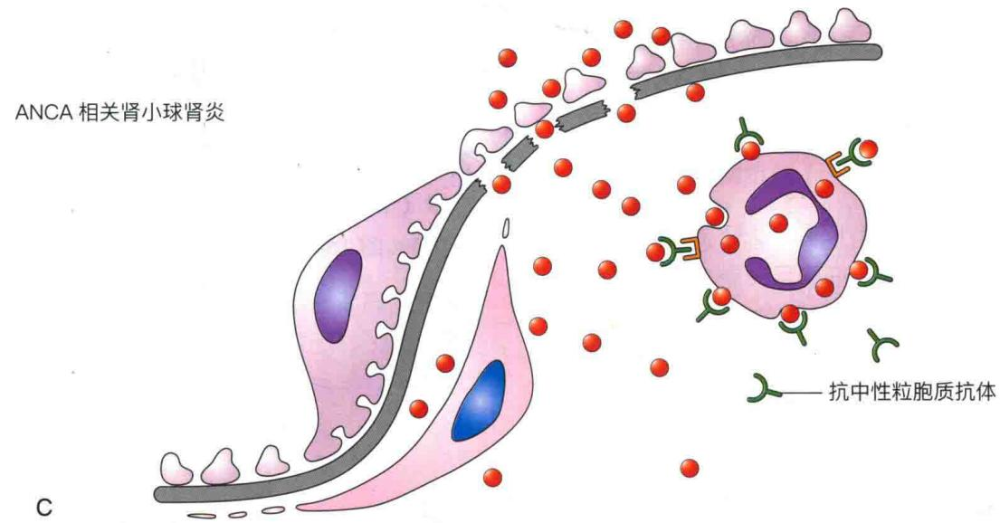 
图16-9自身抗体介导的肾小球肾炎。A.抗肾小球基底膜抗体是通过原位结合基底膜抗原引起的肾小球肾炎，激活补体并募集炎细胞。B.循环中的免疫复合物沉积也激活补体和募集炎细胞。C.抗中性粒胞质抗体通过Fc受体与白细胞的ANCA抗原结合激活白细胞引起炎症
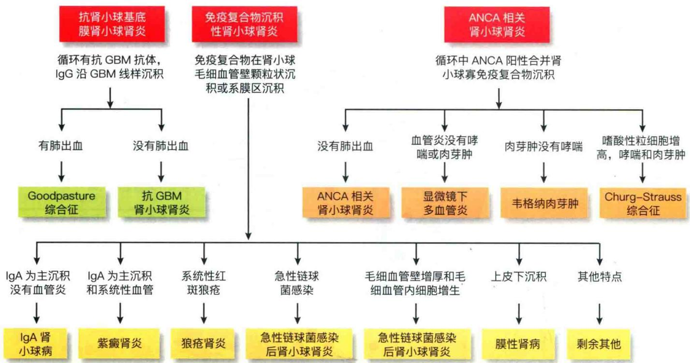 
图16-10流程图显示整合病理表现和临床资料来诊断原发性和继发性肾小球肾炎。注意初级重要分类是抗肾小球基底膜（GBM）病，免疫复合物沉积或者抗中性粒胞质抗体（ANCA）肾小球肾炎。一旦确立这种分类方法，特殊分类依赖临床和病理观察
# 四、微小病变型肾病引起肾病综合征
微小病变型肾病的临床表现为肾病综合征，病理特征为足细胞的足突融合。

【发病机制】微小病变型肾病的发病机制未知。有涉及免疫系统的假说是因为当使用激
素时，疾病常常可以缓解，而且因为它的发生可以与过敏疾病相关。偶尔与霍奇金淋巴瘤（与T淋巴细胞功能障碍相关）和T细胞淋巴瘤相关也导致了此病可能由于T淋巴细胞功能紊乱的推测，可能是由于它产生的细胞因子增加了肾小球的通透性。微小病变型肾病的大量蛋白尿伴随着基底膜上多聚阴离子的丢失，它容许阴离子蛋白，特别是白蛋白通过肾小球基底膜更加容易。

【病理】光镜下显示肾小球病变轻微基本是正常的。电镜下脏层上皮细胞足突融合消失（比
较图16-6和图16-11)。这种足突的消失融合并非是微小病变型肾病特有的，它可以发生在所有肾病蛋白尿的患者。尿里蛋白的丢失产生低蛋白血症和代偿性肝分泌脂蛋白增加而导致高脂血症。通过肾小球丢失的脂蛋白引起近端肾小管上皮细胞胞质脂质聚集，反映在组织学上就是小管上皮细胞胞质内的玻璃（透明）小滴，也可以发生在引起肾病综合征的其他疾病。免疫荧光显示免疫球蛋白和补体常常是阴性的，有时偶尔IgM和C3在系膜区有弱阳性。

【临床表现】蛋白尿通常是选择性的（白蛋白 $\gimel$
球蛋白), 这种情况比其他引起肾病综合征的
疾病多见。但是这种选择性有太多重叠，不能作为一条诊断标准。患有微小病变型肾病的 $90\%$ 的儿童和很少的成人在激素治疗后8周内蛋白尿缓解。激素撤药后，大部分患者10年内可以间断复发。如未出现并发症，微小病变型肾病的患者长期的预后与普通人群没有区别。诊断了微小病变型肾病的患者发展成氮质血症可能意味着诊断错误。
# 五、局灶节段性肾小球硬化症（FSGS）是多种疾病进程的特点
FSGS是指肾小球的实变只影响一部分（局灶），而不是所有肾小球；而且只累及一个肾小球的部分毛细血管（节段）。实变的部分常常包含增加的胶原基质（硬化）（图16-12）。FSGS分为原发性和继发性。

【发病机制】FSGS是指多种不同的肾小球
疾病，有不同的病因、病理、治疗反应和预
后。FSGS可作为原发疾病出现，也可以继发于另一些疾病。多种原因导致足细胞的损伤可能是所有FSGS共同的特点。下面一些情况带来的紊乱容易损伤足细胞。
1. 足细胞蛋白遗传基因的异常 比如 podocin, α-actinin-4 和瞬时感受器电位阳离子通道 6。 
2. 肾小球数量的减少 可以是遗传性的（双侧发育不全）或者获得性的（反流性肾病，见后文）。
3. 过度使用 由于肥胖或缺氧（比如镰刀细胞性贫血或先天性发绀性心脏病）。
FSGS的病因与病毒、氨羟二磷酸二钠和血清因子也有关。HIV的感染，特别是黑种人，与静脉内药物滥用与FSGS一个亚型，塌陷型有关，可能是与病毒损伤了足细胞有关。血清通透因子在某些FSGS的患者可以检测到，支持对肾小球的损伤是系统性原因。肾移植患者复发FSGS，特别是那些有通透性因子的患者是对这个概念更大的支持。

【病理】光镜下，不同数量的肾小球显示节段性毛细血管袢由于基质增加或者细胞聚集或者
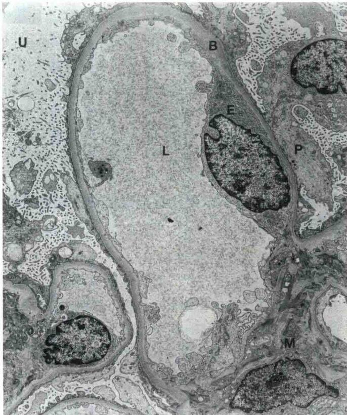 
图16-11 微小病变型肾病。这张电镜照片，足细胞（P）显示足突的广泛消失，很多微绒毛掉在尿囊里（U）。B.基底膜；E.内皮细胞；L.毛细血管腔；M.系膜细胞
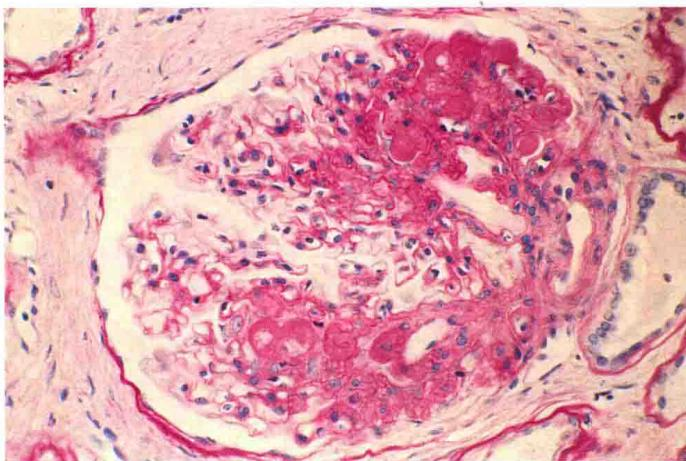 
图16-12局灶节段性肾小球硬化症。过碘酸雪夫染色（PAS）显示门部节段性硬化并与包曼囊壁粘连
两者兼有消失了（图16-12）。病变处血浆蛋白和脂质蓄积引起玻璃样变，叫透明变性。硬化性病变与包曼囊壁粘连。未被累及的肾小球可以显示完全正常，虽然轻度系膜细胞增生有时也会出现。
电镜下，FSGS显示上皮足突弥漫性消失，局灶足细胞与肾小球基底膜丢失或分离。基质增加，基底膜折叠和增厚，硬化区域毛细血管瓣塌陷。塌陷型可见硬化性节段的足细胞增生和肥大是典型的HIV相关性肾病，也可以发生在静脉药物滥用患者，或者氨羟二磷酸二钠导致的疾病及特发性疾病。
免疫荧光显示除了IgM和C3在硬化性和透明区域沉积外没有免疫复合物沉积。IgG，C4和C1q在硬化性节段很少发现。非硬化节段没有染色或者系膜区染色，通常是IgM和C3。缺乏免疫复合物。

【临床表现】 $30\%$ 的成人原发肾病综合征是
FSGS，而儿童只占 $10\%$ 。美国黑人比白人更
不知什么原因，在过去的数十年间，它的发病
增加。最常见的临床表现就是隐匿出现的无症状。
，常常进展为肾病综合征。很多患者有高血压，
尿也常见。
大部分 FSGS 的患者有持续的蛋白尿，进行性的肾功能下降。许多患者 $5 \sim 20$ 年进展为终末期肾病(ESRD)。有些患者而不是全部患者通过激素治疗有效。虽然肾移植对于治疗 ESRD 是首选的，FSGS 的患者在移植后 $50\%$ 复发。塌陷型的预后更加不良， $50\%$ 的患者在 2 年内进展为终末期。FSGS 继发于肥胖或者肾单位减少的患者病程相对惰性，这些患者使用血管紧张素转化酶（ACE）抑制剂治疗可获益。
# 六、膜性肾病是一种免疫复合物性疾病
成人的肾病综合征最常见的原因就是膜性肾病，是由免疫复合物在肾小球毛细血管袢上皮下聚集引起的。

【发病机制】免疫复合物位于上皮下区（在
脏层上皮细胞和 GBM 之间), 大部分似乎
是免疫复合物在原位形成的，也可能由于循环免疫
复合物沉积。大部分患有原发性膜性肾病的患者
循环中有抗足细胞跨膜受体的自身抗体 $(\mathsf{PLA}_2\mathsf{R})$ 。
$\mathrm{PLA}_2\mathrm{R}$ 和抗 $\mathrm{PLA}_2\mathrm{R}$ 可以从免疫复合物中分离出来，
支持原位上皮下免疫复合物形成。下面是膜性肾
病的病因：①特发性（原发性）膜性肾病；②抗
PLA $_2$ R自身抗体；③继发性膜性肾病；④ 自身免
疫性疾病（系统性红斑狼疮、甲状腺疾病）；⑤感
染性疾病（乙肝、疟疾、梅毒、血吸虫病）；⑥治
疗因素 (青霉胺、氯化钠); ⑦肿瘤 (肺、前列腺
和胃肠道癌）。

【病理】肾小球通常细胞数目正常。根据疾病的不同时期，毛细血管袢的壁可以正常或者增（16-13）。电镜下，免疫复合物作为电子致密在毛细血管壁（图16-14）。随着疾病的进程，管腔逐渐狭窄，肾小球最终硬化。膜性肾病晚不能和其他慢性肾小球疾病区分。肾小管的萎质的纤维化与肾小球的硬化平行。
免疫荧光显示IgG和C3沿毛细血管壁颗粒状阳性（图16-15）。包括膜攻击复合物在内的终末补体成分强烈染色，参与和诱导了肾小球的损伤，特别对足细胞。

【临床表现】膜性肾病是美国的成年白人和亚裔最常见的引起肾病综合征的原发性肾小球疾
病（第二常见的就是糖尿病肾小球硬化）膜性肾病发展经过有很大的不同。 $25\%$ 的患者在20年内自发缓
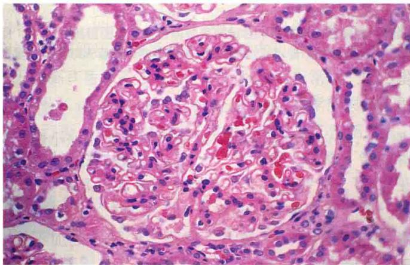 
图16-13 膜性肾病。肾小球轻度增大，毛细血管壁弥漫性增厚，没有细胞数目增多
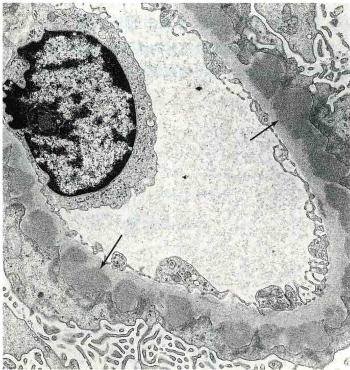 
图16-14 II期膜性肾病。电镜显示电子致密物沉积（箭头），中间插入突出的纤细的基底膜物质
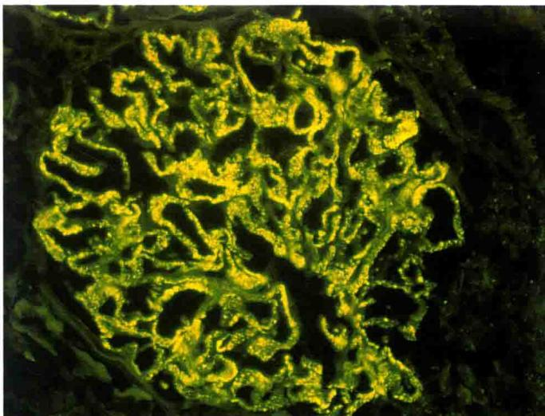 
图16-15 膜性肾病。免疫荧光显示IgG沿着肾小球毛细血管袢颗粒状沉积
解，10年肾脏的存活率大于 $65\%$ ，如果患者为男性，年龄大于50岁，蛋白尿大于 $6\mathrm{g / d}$ ，肾小球硬化广泛伴有慢性小管间质疾病可能肾脏存活率更低。患者如果表现为进行性肾功能不全可使用激素或免疫抑制剂治疗，或者两者都用。儿童的预后较好，具有更高的持续缓解率。
# 七、糖尿病性肾小球硬化症导致蛋白尿和进行性肾衰竭

【发病机制】肾小球硬化症是糖尿病血管疾病的一部分，可以累及全身小血管（见第。糖尿病微血管普遍的增加合成基底膜样物。患者有不到 $50\%$ 发展为肾小球硬化，其他作用使得一部分患者而不是所有患者发展为硬化。

【病理】最早期的糖尿病性肾小球硬化症表现为肾小球增大、基底膜增厚和系膜区基质增生。
轻度的系膜区细胞增生也可以出现。随着疾病进展，基底膜的增厚以及系膜区基质的增多可以在光镜下可见。明显的糖尿病肾小球硬化症有弥漫性基底膜增厚和系膜区基质扩张伴有硬化性病变称为Kimmelstiel-Wilson结节（图16-16）。肾小管基底膜也是增厚的。硬化和insudative的改变也可以发生于出球小动脉和入球小动脉，引起透明样变的小动脉硬化。肾脏普遍的小动脉硬化常常出现血管腔狭窄、血流减少导致髓质诱发乳头坏死和肾盂肾炎。
电镜显示基底膜致密层 $5\sim 10$ 倍的增厚，系膜基质增多，形成结节样。Insudative病变类似电子致密块包含脂质碎片。免疫荧光显示弥漫性、无免疫复合物沉积，线样IgG、白蛋白、纤维蛋白原和其他血浆蛋白网罗在基底膜上。
【临床表现】糖尿病性肾小球硬化症是美国终末期肾脏病的首位死因，占慢性肾衰竭的1/3。1型和2型糖尿病都可以发生。最早的表现为微量白蛋白尿（蛋白尿轻度增加）。发生糖尿病以后一般 $10\sim 15$ 年出现明显的蛋白尿，常常可以严重到引起肾病综合征。随着时间的发展，糖尿病性肾小球硬化症进展为肾衰竭。严格管理血糖减少糖尿病性肾小球硬化症的发病率并可以延缓进展。控制高血压和控制饮食中的蛋白含量也可以减慢疾病的进展。
# 八、淀粉样变性引起的肾病综合征和肾衰竭
肾病常分为AL和AA型淀粉样变性（见第23章）。

【病理】从组织学来看，淀粉样物是嗜酸性的无定型的物质（图16-17）。特点是刚果红染振光显微镜下呈现苹果绿颜色。嗜酸性物质沉在系膜区，后期可以延伸到毛细血管壁，可以细血管腔（图16-17）。晚期的淀粉样变性肾结构完全阻塞，呈现巨大的嗜酸性球体。
淀粉样物质由不分支的纤维丝构成，直径大约 $10\mathrm{nm}$ 。这些纤维丝大部分在系膜区但是常常延伸到毛细血管壁，特别在晚期。覆盖基底膜的上皮足突消失。
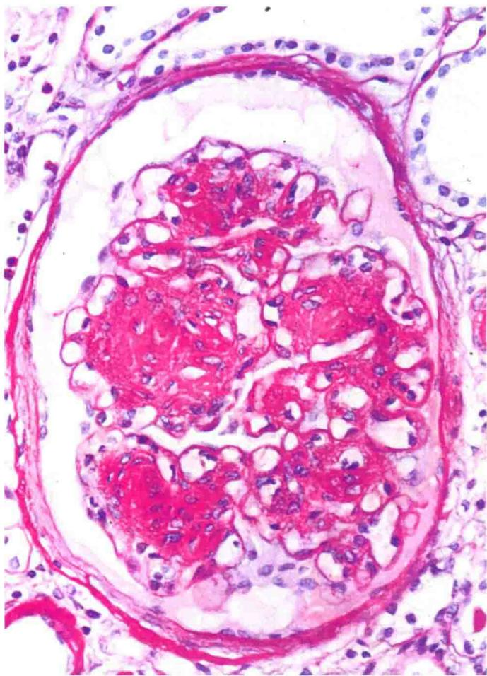 
图16-16 糖尿病性肾小球硬化症。过碘酸雪夫（PAS）染色显示系膜区基质明显增多，形成若干个结节样病变。肾小球毛细血管袢扩张明显，一些毛细血管基底膜是增厚的
【临床表现】大部分系统性AL和AA型淀粉样变都有肾累及。蛋白尿常是最初的表现。常常是非选择性（也就是白蛋白和球蛋白都在尿里出现）， $60\%$ 的患者出现肾病综合征。最后，肾小球和血管大量的淀粉样物浸润导致肾衰竭。AL型淀粉样变性可以使用化疗类似于多发性骨髓瘤。AA型淀粉样变性，特别是由于家族性地中海热，可以通过秋水仙碱的治疗来改善。
# 九、遗传性肾炎（Alport综合征）表现为基底膜异常的IV胶原沉积
遗传性肾炎是肾小球增生和硬化性疾病，常常伴随着耳朵和眼睛的缺陷，由于IV型胶原的突变引起。Alport综合征伴随着耳朵的缺陷。

【发病机制】各种各样的基因突变会引起基底膜分子缺陷，这样导致的肾损伤称为遗传。最常见的突变，也占遗传性肾炎 $85\%$ 的连锁的IV型胶原a5链的突变（COL4A5基遗传性肾炎的患者如果行肾移植有发展出抗植GBM自身抗体的危险性。
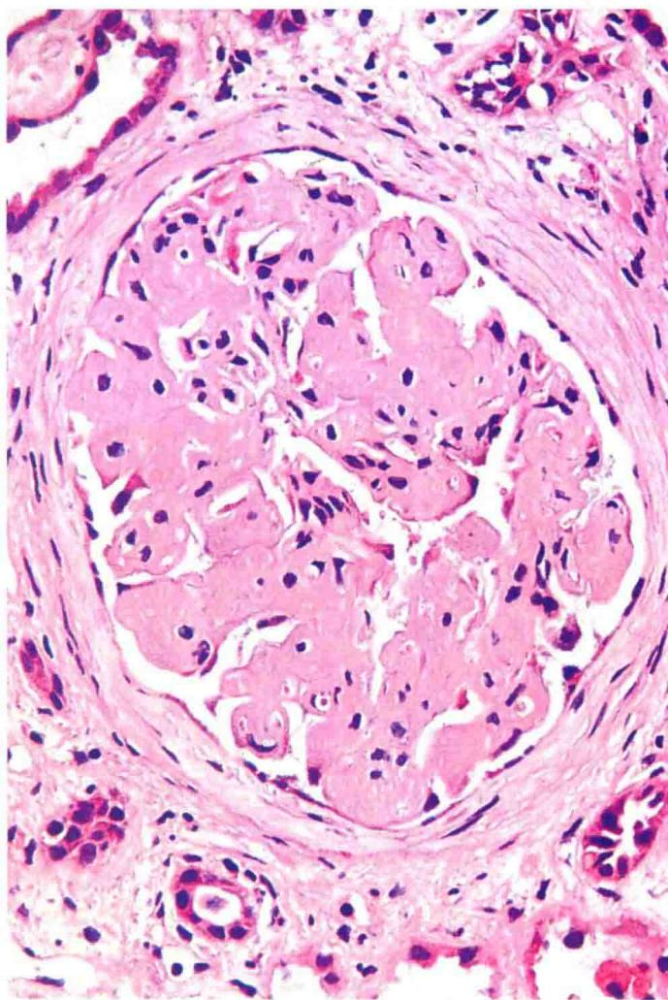 
图16-17 淀粉样变性肾病。无定型无细胞的物质在系膜区扩展，阻塞了肾小球的毛细血管。淀粉样物的沉积可以呈现结节性，有些类似糖尿病性肾小球硬化症（图16-16）。但是淀粉样变性PAS阴性，可以用刚果红染色证实

【病理】早期遗传性肾炎表现为系膜轻度细胞增生和基质增多。随着肾病的进展，会增加局
灶和最后弥漫性的肾小球硬化。晚期肾小球病变伴随着小管萎缩，间质纤维化和小管间质中出现泡沫细胞。最多见的形态学诊断改变是在电镜下看见GBM不规则增厚，致密层分裂交错的层状结构围绕着低电子密度区。

【临床表现】患有X-连锁的遗传性肾炎的男性早在儿童期就可以出现镜下血尿，通常伴随着
蛋白尿，到 $20\sim 40$ 岁时进展为肾衰竭。女性患者的表现普遍较轻，症状进展得更为缓慢，可能与突变的X染色体随机失活的程度有关。感觉神经、高频听力损失可以影响 $50\%$ 的男性患者。
# 十、薄肾小球基底膜肾病表现为良性血尿
薄基底膜肾病，也称为良性家族性血尿，是一种常见的GBM遗传性疾病，典型表现为显微镜下或肉眼血尿。此疾病和IgA肾病是无症状肾小球性血尿患者最主要考虑的两种诊断。患有薄基底膜肾病的患者通常不会进展为肾衰竭，或出现大量的蛋白尿。光镜下，肾小球的病变不明显。电镜下显示GBM变薄（ $150\sim 300\mathrm{nm}$ 正常是 $350\sim 450\mathrm{nm}$ ）。这类疾病是最常见的常染色体显性遗传疾病。基因COL4A3和COL4A4的杂合突变导致了薄基底膜疾病。纯合子突变产生Alport综合征隐性变异型。
# 十一、急性感染后性肾小球肾炎是儿童发生的免疫复合物疾病
急性感染后性肾小球肾炎通常发生在A组 $\beta$ 溶血性链球菌感染后，由免疫复合物沉积在肾小球引起。

【发病机制】急性感染后性肾小球肾炎最常见于由致肾炎菌株A组β溶血性链球菌引
起。偶尔由葡萄球菌感染引起（如急性葡萄球菌性心内膜炎、葡萄球菌性脓肿），罕见由病毒（如乙肝）或者寄生虫（如疟疾）感染。感染引起肾小球炎性改变的确切机制还不能完全解释。感染性肾小球肾炎似乎是由抗体加细菌、病毒或寄生虫的抗原组成的免疫复合物沉积在肾小球局部造成。链球菌感染后引起的肾小球肾炎从感染病原菌到发生肾小球肾炎有 $9 \sim 14$ 天的潜伏期。位于肾小球的免疫复合物可以从血液循环或者原位形成，当细菌抗原结合循环抗体陷落于肾小球。特定的致肾炎因子链球菌抗原还没有被最终鉴定出来。肾小球内的免疫复合物通过激活补体启动炎症，还有其他体液和细胞的炎性介质。补体激活很广泛，超过 $90\%$ 的患者都会出现低补体血症。炎症介质激活和吸引中性粒细
胞和单核细胞刺激系膜和内皮细胞增生。导致了肾小球明显细胞增生，被定义为弥漫性增生性肾小球肾炎。

【病理】感染后性肾小球肾炎急性期的特点是弥漫性肾小球增大和细胞增生，定义为急性、
弥漫增生性肾小球肾炎。增生的细胞主要是内皮细胞和系膜细胞以及浸润的中性粒细胞和单核细胞。新月体不常见。间质水肿伴有轻度单核白细胞浸润与肾小球的病变平行。
急性期开始于致肾炎因子感染后 $1\sim 2$ 周，超过 $90\%$ 的患者在几周后缓解。大部分患者所有的组织学改变可以完全消失。急性感染后性肾小球肾炎最显著的超微特点是上皮下电子致密物沉积，形似驼峰状（图16-18）。系膜区和内皮细胞下也伴有沉积，也许发现困难但是可能对发病机制的解释十分重要，因为这些沉积物更像从血液炎症介质系统来的。在疾病最初的几周，免疫荧光显示典型的IgG和C3颗粒状沿基底膜沉积，位于驼峰区。疾病后期，C3存在而IgG消失，可能因为免疫复合物包括IgG在感染清除后不再聚集在肾小球了（图16-19）。

【临床表现】急性链球菌感染后肾小球肾炎比过去少见了，但仍然最常见于儿童肾脏疾病。
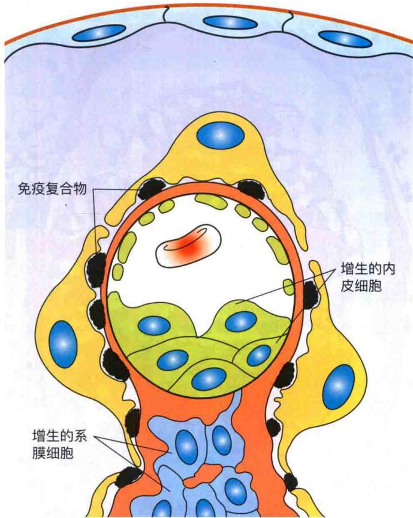 
图16-18感染后性肾小球肾炎。上皮下免疫复合物聚集成驼峰样结构是它的特点，内皮细胞下很少有明显的免疫复合物沉积，内皮细胞增生，毛细血管通透性增加，管腔狭窄。系膜细胞增生和基质增多导致系膜柄增宽是常见的
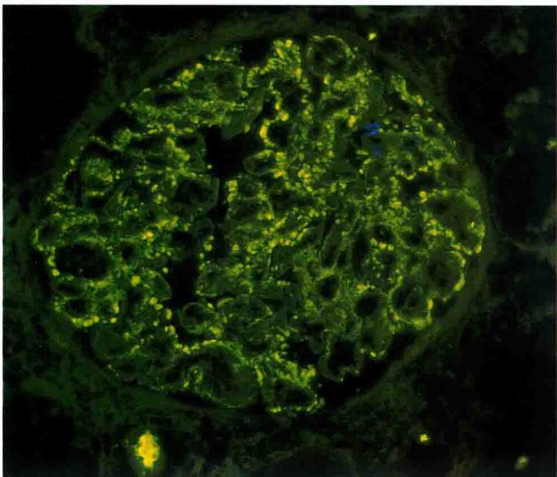 
图16-19急性感染后性肾小球肾炎。免疫荧光显示C3在毛细血管壁和系膜区颗粒状阳性
突然出现的肾炎综合征伴随少尿、血尿、面部水肿、高血压。血清C3在急性期下降，但在 $1\sim 2$ 周时间回到正常。几周后明显的肾炎缓解，虽然血尿，尤其是蛋白尿可以持续几个月。少数患者在急性发作后可以尿沉淀异常持续几年，罕见患者（特别成年人）进展为肾衰竭。
# 十二、I型膜增生性肾小球肾炎（MPGN）是一种慢性免疫复合物疾病
I型MPGN的特点是细胞增生、毛细血管壁增厚。系膜区和内皮下免疫复合物沉积导致系膜增生病插入内皮下区。

【发病机制】I型MPGN是由位于系膜和毛
细血管壁内皮下区的免疫复合物引起的。大
部分患者导致肾炎的抗原未知，但还有些患者伴随的疾病有类似抗原的缘由。消除疾病比如细菌性心内膜炎、骨髓炎导致肾小球肾炎消退，支持两者之间的因果关系。导致I型MPGN的原因可以引起持续隐匿的感染相关的慢性抗原血症。这种情况致使慢性肾小球免疫复合物的沉积，并进一步导致细胞增生和基质重塑。

【病理】I型MPGN的肾小球弥漫性增大，明
显系膜细胞增生，导致肾小球呈分叶状改变（过
度分叶）（图16-20）。 $20\%$ 的患者有新月体，通常只累及少数肾小球。毛细血管壁增厚，银染显示GBM双轨或者复杂的分层。电镜显示毛细血管壁增厚系膜区增生病插入到内皮下区域，新的基底膜物质沉积在系膜细胞质和内皮细胞之间（图16-21，图16-22）。内皮下和系膜区电子致密物对应的免疫复合物沉积，有可能刺激系膜区。可以看到不同数目的上皮下电子
致密物。免疫荧光显示免疫球蛋白和补体在肾小球毛细血管袢和系膜区颗粒状沉积。

【临床表现】I型MPGN大多发生在大儿童或
者年轻的成年人。可以表现为肾病综合征、肾
征或者两者兼具。I型MPGN大约占几童和成
人的肾炎综合征的 $5\%$ ，在慢性感染高发的发展中国
家更为常见。I型MPGN是持续的但是缓慢进展的疾
病， $50\%$ 患者10年后进展为晚期肾病。
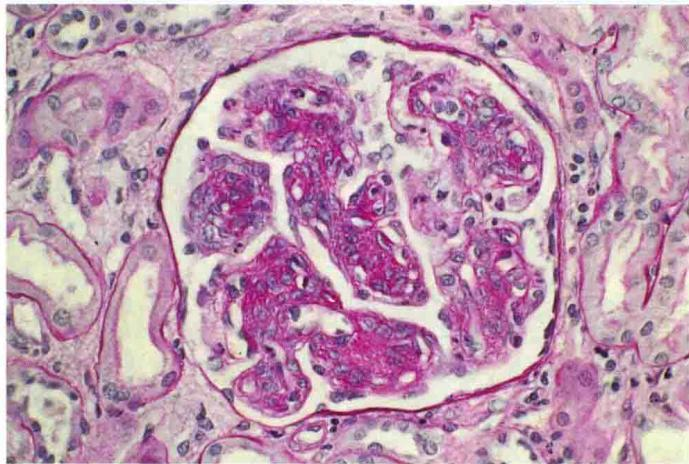 
图16-20 I型膜增生性肾小球肾炎。肾小球明显呈分叶状，系膜区细胞和基质增生，毛细血管壁明显增厚
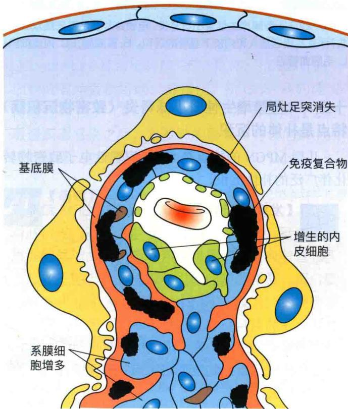 
图16-21 膜增生性肾小球肾炎。I型：此型疾病的肾小球增大，细胞增生呈丛状，毛细血管腔狭窄或阻塞。内皮下大块免疫复合物沉积并沿基底膜内侧缘延伸。系膜细胞增生并移行入毛细血管。基底膜物质在内皮细胞下线样堆积平行于原基底膜。在内皮细胞和原来的基底膜之间插入系膜细胞和基底膜物质形成双轨改变。系膜细胞和基质堆积成丛状致使毛细血管腔狭窄。系膜细胞的增生和基底膜物质的堆积也使系膜区增宽。这些都可使肾小球发生分叶状改变，还有内皮细胞的增生和局灶足突的消失
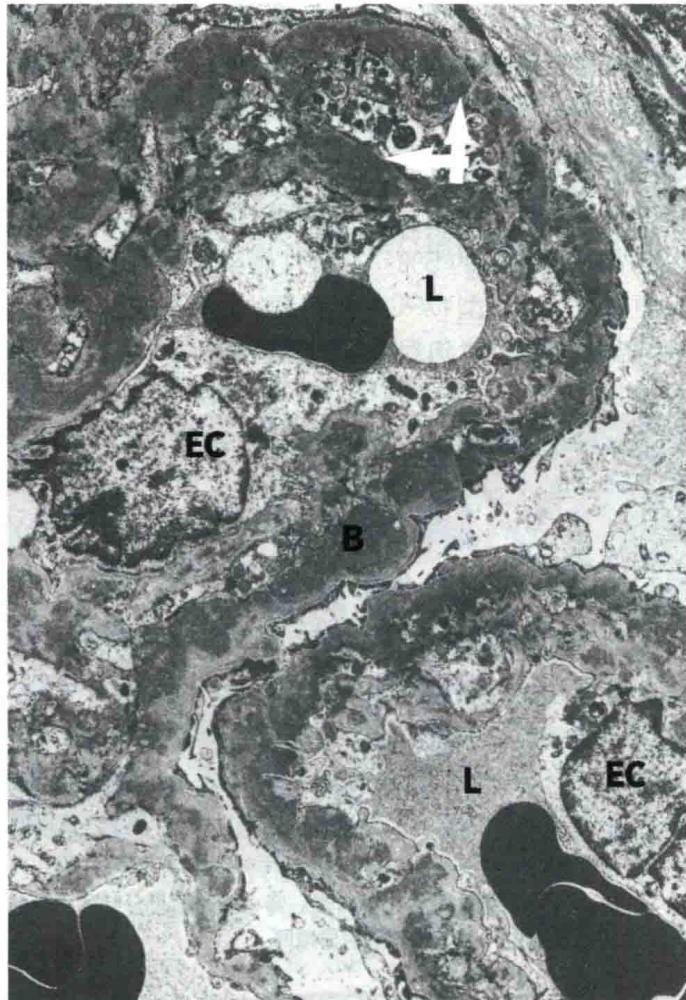 
图16-22 I型膜增生性肾小球肾炎。电镜照片显示基底膜双轨（箭头）伴有系膜区插入和内皮下显著的沉积。B. 基底膜；EC. 内皮细胞；L. 毛细血管腔
# 十三、II型膜增生性肾小球肾炎（致密物沉积病）特点是补体的沉积
II型MPGN的特点是GBM病理性电子致密物转化伴广泛的补体沉积。

【发病机制】补体广泛沉积在GBM和系膜
区，缺少明显的免疫球蛋白沉积，支持补体
通过替代途径激活是相关疾病结构和功能异常的重要介质。通常会提到选择补体途径调节因子的缺乏或者突变（比如H因子）。而且，大部分患者存在血清IgG的自身抗体，称为C3肾炎因子，它可以稳定激活C3的补体旁路途径的转化酶（C3bBb）。这些现象暗示疾病的发病机制与补体旁路途径的调节失常有关。

【病理】Ⅱ型MPGN的组织学改变可以与I
型相似，毛细血管壁增厚和不同程度的细胞
增生。特征性的缎带样增厚的GBM的中间区密度增加和系膜基质相应的改变成为致密物沉积病。免疫荧光显示毛细血管壁C3线样沉积，免疫球蛋白很少或没有染色。

【临床表现】II型MPGN罕见，临床表现和过
程除了常出现低补体血症外与I型类似。预后
更差一些。目前还没有经过验证的有效治疗方法。
# 十四、狼疮肾小球肾炎包括免疫复合物沉积的不同的类型
系统性红斑狼疮（SLE）是一种自身免疫性疾病，特点是全身的调节失常，B细胞的过度活化，针对各种核和非核的抗原产生自身抗体，包括DNA、RNA、核蛋白和磷脂类（见第4章）。肾炎综合征是SLE最常见合并症之一，在肾小球免疫复合物沉积有一系列的沉积方式。系膜区免疫复合物沉积引起少量的炎症，内皮细胞下沉积更易受循环影响。上皮下的沉积引起蛋白尿但是不会引起明显的肾小球炎症反应。

【发病机制】凋亡的缺陷和清除染色体碎片
的受损可以促成抗细胞核自身免疫反应，提
导致肾炎免疫复合物的靶抗原形成。位于肾小球
免疫复合物可以来自血液循环或原位形成（包括
原，比如结合在GBM或系膜区DNA)。肾小球
免疫复合物激活补体并启动炎症损伤。狼疮患者
免疫复合物沉积在肾的其他部位可以引起小管间
炎症。

【病理】狼疮患者的病理和临床表现因为免疫
复合物堆积的不同模式在不同患者和相同患者
的不同时段有很大差异。
I型（系膜区轻微病变性狼疮肾炎）：免疫复合物局限在系膜区，光镜下没有病变。
II型（系膜增生性狼疮肾炎）：免疫复合物局限在系膜区，产生不同程度的系膜细胞增生和基质增多。
III型（局灶增生性狼疮肾炎）：免疫复合物堆积在
内皮细胞下区域和系膜区刺激炎症形成，伴随系膜区
和内皮细胞的增生和中性粒细胞、单核细胞滞留（图
16-23)。肾小球明显炎症反应但是仅累及 $< 50\%$ 的肾
小球称为局灶增生狼疮肾小球肾炎。
IV型（弥漫增生性狼疮肾炎）：此型病理改变类似
Ⅲ型，但是累及的肾小球超过 $50\%$
V型（膜性狼疮肾炎）：免疫复合物大多聚集在上
皮下区域，但是可能并存Ⅲ型或IV型。甚至单纯的V
型狼疮肾炎在电镜下可检测出系膜区的电子致密物。
VI型（晚期硬化性狼疮肾炎）：此型大多是严重的
慢性病变。
电镜显示电子致密物在系膜区、内皮细胞下和上
皮细胞下不同程度的沉积。大约 $80\%$ 的标本可见内皮
细胞内的管网状包涵体。常见这种病变的肾脏疾病就
是狼疮肾炎和HIV相关肾病。
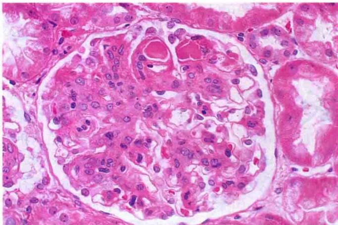 
图16-23 增生性狼疮肾炎。可见节段性毛细血管内增生伴有基底膜增厚
免疫荧光，上皮下免疫复合物是颗粒状的，内皮下沉积的像颗粒状或带状。免疫复合物常IgG染色强阳性，IgA和IGM也几乎都出现，包括C3、C1q和其他补体成分。沿肾小管基底膜和间质血管颗粒状阳性的超过 $50\%$ 的患者。

【临床表现】SLE $70\%$ 的患者发展成肾病，是发病和死亡的主要原因。SLE和相关的肾病在
黑种人妇女最常见。临床表现和肾病预后各种各样，依赖于潜在的肾脏病变的病理改变。Ⅲ型和IV型的狼疮肾炎预后最差，需要尽可能积极治疗，通常使用大剂量的皮质激素和其他免疫抑制剂。目前，小于 $20\%$ 的IV型患者在5年内达到晚期肾病。
# 十五、IgA肾病（Berger病）的特点是IgA免疫复合物沉积

【发病机制】虽然IgA为主的免疫复合物的沉积引起IgA肾病，但是抗原成分和堆积
的机制并不知道。患有 IgA 肾病的患者常常有血清 IgA 水平的升高和检测到循环中包含 IgA 免疫复合物。IgA 肾病的恶化常见于呼吸道和消化道的感染。已经有证据表明 IgA 肾病与主要组织相容性复合物的易感性相关，可能通过 IgA 调节失常介导免疫应答。异常的 IgA 铰链区的糖基化是许多 IgA 肾病患者的重要患病因素。这些患者，血清 IgA1 比正常人有更少的末端半乳糖苷化。可以产生针对这些异常铰链区的自身抗体。这些异常的 IgA1 缺少受体结合。这种结果导致循环中清除 IgA 复合物减少，增加了 IgA 在血里的集结。最后可以沉积在系膜区，在异常的 IgA1 和自身抗体 IgG 之间形成针对异常的 IgA 的免疫复合物，或者这些过程组合起来。包含 IgA 的免疫复合物沉积在系膜区可能激活补体旁路途径，由于在 IgA 沉积区有 C3 和备解素，但是没有 C1q 和 C4 的沉积，这个观念因而得到支持。

【病理】免疫荧光对诊断IgA肾病是基本的。系
膜区 IgA 更强烈，或者等同于 IgG 和 IGM 的染色判断标准。常常几乎都伴随 C3 的染色阳性。根据小球炎症的严重性和持续性，IgA 肾病表现为一种组织学改变：① 光镜下轻微病变；② 局灶或者弥散小膜区细胞增生；③ 局灶或者弥漫性增生性肾小管炎；④ 慢性硬化性肾小球肾炎。这一系列的病理特征类似于狼疮肾炎，但是没那么严重。

【临床表现】IgA肾病是世界上最常见的肾小球肾炎。在美国 $10\%$ 发病率，美国土著有更高的
发病率，黑人罕见。最常见于年轻男性， $15\sim 30$ 岁为发病高峰。临床表现各异，可能反映了各种不同的病理严重程度。此病完全缓解罕见，呈缓慢进展过程， $20\%$ 的患者10年后进展为晚期肾病。如果患者肾移植，IgA可以沉积在异源性移植物，虽然移植肾功能不会受损。
# 十六、抗肾小球基底膜肾小球肾炎常见的肺出血
抗GBM肾小球肾炎不常见，但进展十分迅速，可以限于肾或合并肺出血（Goodpasture综合征）。

【发病机制】抗GBM肾小球肾炎是自身免疫反应针对GBM的成分IV型胶原α3链非
胶原结构域。因为目标抗原也在肺泡毛细血管基底膜表达， $50\%$ 的患者也合并肺出血和咯血，有时严重到有生命危险。假如肺和肾都累及了，称为Goodpasture综合征。抗GBM抗体，抗GBM的T细胞或者两者都可能介导损伤。抗GBM病的遗传易感性与HLA-DRB1相关。此病的启动常在上呼吸道病毒感染之后。累及肺的患者常有其他损伤因素的暴露，比如吸烟。

【病理】抗 GBM 肾小球肾炎病理诊断的标志是 IgG 弥漫性线样沿 GBM 阳性染色，显示自身
抗体结合在基底膜上（图16-24）。 $90\%$ 的患者有新月体（新月体肾小球肾炎）（图16-25，图16-26），通常累及超过 $50\%$ 的肾小球。局灶肾小球纤维素样坏死常见。累及肺有明显的肺泡内出血。

【临床表现】抗GBM肾小球肾炎典型的表现为急性肾衰竭和肾炎综合征。此病约占急进性肾
小球肾炎的 $10\% \sim 20\%$ 。治疗包括大剂量的免疫抑制治疗和血浆置换。假如进展到终末期肾病，常可行肾移植，如果在抗GBM自身抗体已经消失后行移植术，移植肾脏很少复发肾小球肾炎。
# 十七、抗中性粒胞质自身抗体（ANCA）肾小球肾炎是由中性粒细胞介导的快速进展性疾病
ANCA相关肾小球肾炎是一类快速进展的中性粒细胞
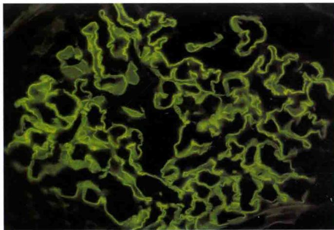 
图16-24 抗肾小球基底膜肾小球肾炎。免疫荧光可见IgG呈线样沿GBM沉积。比较免疫荧光染色沿毛细血管壁线样沉积和颗粒状沉积方式（图16-18）
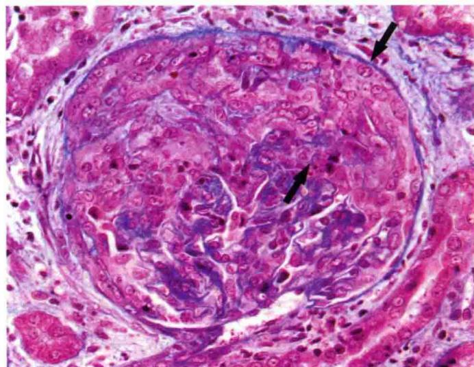 
图16-25 新月体性抗肾小球基底膜肾小球肾炎。细胞性新月体占满了包曼囊（箭头之间）。损伤的肾小球瓣在基底部（Masson三色）
细胞介导的疾病，特点是肾小球坏死和新月体形成。

【发病机制】ANCA相关的肾小球肾炎曾被称为特发性新月体性肾小球肾炎，因为肾
小球没有抗GBM自身抗体或免疫复合物沉积的证据。发现 $90\%$ 有这种肾小球损伤的患者有循环中ANCA存在导致证实了这种自身抗体引起疾病。ANCA是针对中性粒细胞和单核细胞胞质的蛋白的特殊抗体，通常是髓过氧化物酶（MPO-ANCA）或者蛋白酶3（PR3-ANCA）。自身抗体激活中性粒细胞黏附于内皮细胞，释放毒性氧化物、脱颗粒、杀死内皮细胞。由ANCA激活的中性粒细胞也会激活补体旁路途径，进一步放大炎症反应。经胎盘转移的MPO-ANCA可以引起新生儿的肾小球肾炎和肺出血，进一步支持ANCA是致病原的说法。

【病理】大于 $90\%$ 的ANCA相关肾小球肾炎的患者有局灶肾小球的坏死（图16-27）和新月
体形成。许多患者，大于 $50\%$ 的肾小球出现新月体。
没有坏死的节段可以正常或者轻度中性粒细胞浸润和轻度毛细血管内细胞增生。免疫荧光表明缺少或者少量免疫球蛋白和补体阳性。
【临床表现】ANCA相关肾小球肾炎最常见的临床表现是快速进展性肾衰竭，合并肾炎综合征的症状和体征。此病占超过60岁患者急进性（新月体性）肾小球肾炎的 $75\%$ ，中年人的 $45\%$ 和年轻人以及儿童的 $30\%$ 。1/3ANCA相关肾小球肾炎的患者有系统性小血管炎（见后文），可以有许多表现，包括肺出血。此病比Goodpasture综合征更常发生肺-肾血管炎综合征。如果不治疗，超过 $80\%$ 的患者在5年内进展为终末期肾病，免疫抑制治疗可以使5年内进展为终末期肾病减少 $25\%$ 。但是，患者有复发的危险。
# 第五节 血管性疾病
# 一、肾脏血管炎可以累及各种尺寸的血管
许多类型的系统性血管炎都可以累及肾（表16-5）。从某种角度来说，肾小球肾炎是影响肾小球毛细血管的局限性血管炎。肾小球可以是血管炎症唯一累及的位置，肾脏疾病也可以是系统性血管炎的一部分。
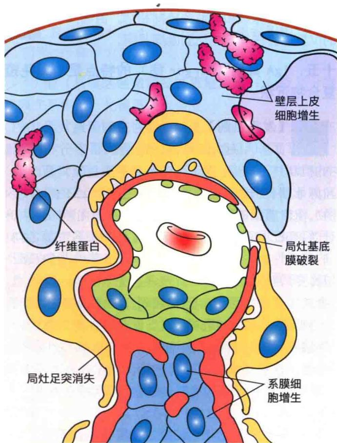 
图16-26 新月体性（快速进展性）肾小球肾炎。各种不同的病理机制破坏肾小球毛细血管壁引起新月体形成。这会导致血浆成分进入包曼囊，包括凝血因子和炎症介质。纤维蛋白形成刺激壁层上皮细胞增生和吞噬细胞的浸润，导致新月体形成
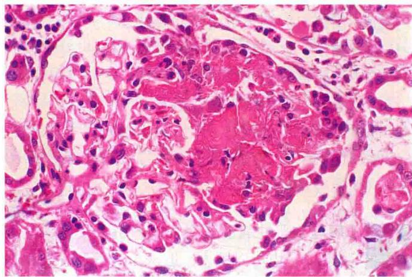 
图16-27 抗中性粒胞质自身抗体肾小球肾炎。图示局灶纤维素坏死，这种病变刺激新月体形成
1. 小血管炎 小血管炎影响小动脉、微动脉、毛细血管和静脉。肾小球肾炎、紫癜、关节痛、肌痛、周围神经病和肺出血常常是小血管炎的一部分。免疫复合物、GBM自身抗体和ANCA（表16-5）可以引起小血管炎。详细的肾外疾病见第10章。
过敏性紫癜是最常见的儿童性血管炎，由以 $\mathrm{IgA}$ 为主的免疫复合物沉积在血管壁引起。肾的损伤与 $\mathrm{IgA}$ 肾病一样。
冷球蛋白血症性血管炎引起增生肾小球肾炎，通常是I型膜增生性肾小球肾炎。光镜下，冷球蛋白聚集物（透明血栓）常可在血管腔看见。
ANCA相关血管炎的患者除了患有ANCA相关肾小球肾炎外有 $75\%$ 累及肾外血管（图16-10，第10章，也标注了最近对于小血管炎命名的改变）。除了引起坏死和新月体性肾小球肾炎，ANCA相关小血管炎常见其他肾血管的坏死性炎症，比如小动脉、微动脉和髓质小管周围毛细血管。
2. 中等尺寸和大血管炎 中等尺寸血管炎比如结节性多动脉炎（成人）和川崎病（主要儿童发生）影响动脉，但不是小动脉、毛细血管和小静脉。大血管炎，比如巨细胞性血管炎和高安动脉炎，影响主动脉和它的主要分支，可以通过累及肾动脉主干或是主动脉分叉处引起肾血管性高血压（见第10章）。
表16-5 累及肾脏的血管炎类型血管炎类型肾脏主要的目标血管肾脏主要表现小血管炎免疫复合物性小血管炎过敏性紫癜肾小球肾炎冷球蛋白血症性血管炎肾小球肾炎抗GBM血管炎Goodpasture综合征肾小球肾炎ANCA相关血管炎韦格纳肉芽肿病肾小球、微动脉、小叶间动脉肾炎显微镜下多血管炎肾小球、微动脉、小叶间动脉肾炎Churg-Strauss综合征肾小球、微动脉、小叶间动脉肾炎中等尺寸血管炎结节性多动脉炎叶间和弓形动脉梗死和出血川崎病叶间和弓形动脉梗死和出血大血管炎巨细胞血管炎肾动脉主干肾血管性高血压高安动脉炎肾动脉主干肾血管性高血压
ANCA. 抗中性粒胞质自身抗体；GBM. 肾小球基底膜
# 二、高血压性肾硬化（良性肾硬化）肾小球废除

【发病机制】持续的心收缩压超过 $140\mathrm{mmHg}$ 、
舒张压超过 $90\mathrm{mmHg}$ 普遍认为可以诊断高
血压（见第10章）。轻度到中度高血压引起 $15\%$ 的患者有典型的高血压性肾硬化，因此不是真正的良性。

【病理】肾脏小于正常（萎缩）通常影响双侧。
皮质表面呈细颗粒状（图16-28），但是偶尔大的瘢痕。切面，皮质变薄。显微镜下，很多显得正常，其他显示不同程度缺血性改变。最小球毛细血管壁增厚，皱缩、基底膜塌陷。肾的细胞进行性丢失，胶原和基质在包曼囊内沉终，肾小球袢由致密的嗜酸性球状团块阻塞形
成瘢痕。肾小管萎缩，是肾小球丢失的结果，伴随间质的纤维化和慢性炎细胞的浸润。硬化的肾小球及周围萎缩的小管常在被膜下区域成簇状，邻近区域可见肾小球和肾小管（图16-29）。这些特点形成了硬化性肾脏颗粒状表面的基础。
肾脏血管改变的模式依赖血管的尺寸。弓形动脉以上尺寸的动脉内膜出现纤维性增厚，多层弹力板由纤维组织部分取代了平滑肌。小叶间动脉和小动脉可以出现中层增生。小动脉呈现管壁同心圆状透明性增厚，伴随平滑肌细胞的消失和（或）移位至周边。微动脉的改变成为透明性小动脉硬化。
【临床表现】虽然高血压性肾硬化不常导致肾功能显著异常，仍有些“良性”高血压的患者发展为进行性肾衰竭，最终导致终末期肾病。因为良性高血压很常见，小部分患者发展为肾功能不全，总计1/3的患者发展为终末期肾病。良性肾硬化在黑人中更为流行和进展迅速。实际上，在美国黑人中，没有任何证据有恶性期的高血压是终末期肾病的首要原因。
# 三、恶性高血压性肾病有致命的危险性

【发病机制】没有特定的血压定义为恶性高
血压，但是舒张压高于 $130\mathrm{mmHg}$ ，视网
膜血管出现改变，视盘水肿和肾功能不全是常见的诊断标准。大约 $50\%$ 患者有良性高血压的历史，很多患者有许多不同疾病导致的慢性肾损伤的背景。偶尔，恶性高血压可以发生在表面上健康的个人，特别是年轻男性黑人。血管损伤的发病机制不
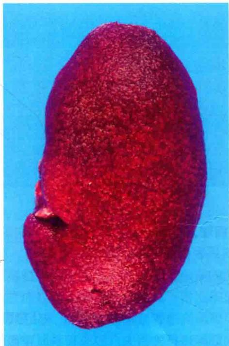 
图16-28 高血压性肾硬化。肾的尺寸减小，皮质表面呈现细颗粒状
清楚，但是可以起因于血流冲击狭窄小血管引起内皮细胞损伤。在血管受损的部位血浆成分漏出到损伤的小动脉管壁引起纤维素样坏死。它们可以侵入动脉内膜，引起内膜水肿性增厚。当到达肾小球毛细血管壁内皮下区域时，产生肾小球的实变。这些血管损伤的部位，血栓形成可以导致局灶肾皮质坏死（梗死）。

【病理】恶性高血压肾病的肾脏大小各异，可以减小，也可以增大，取决于先前存在的良性
高血压持续的时间。表面是红、黄相间，偶尔出现小
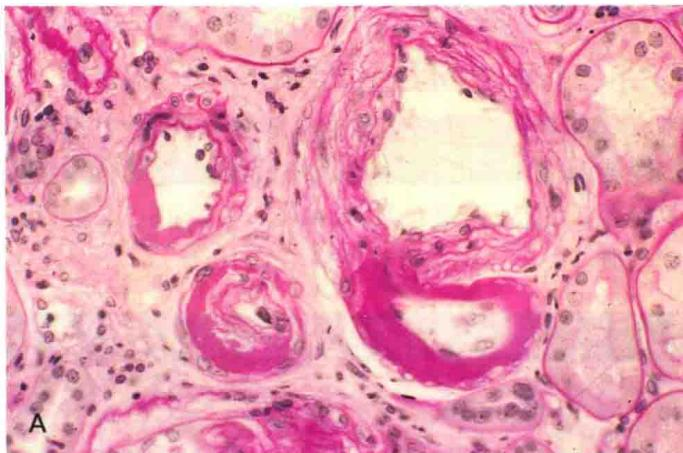
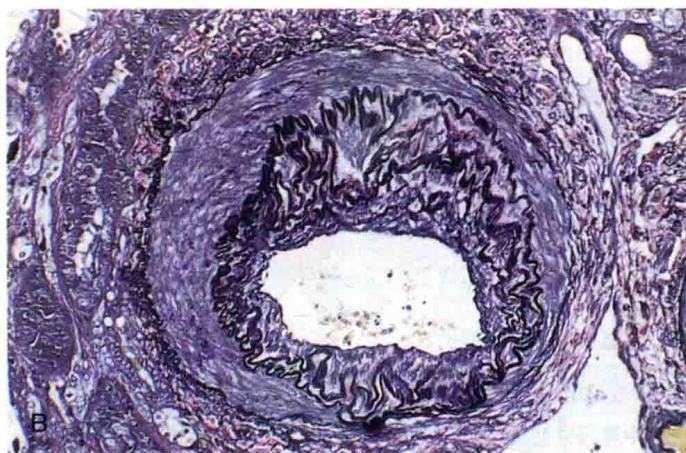
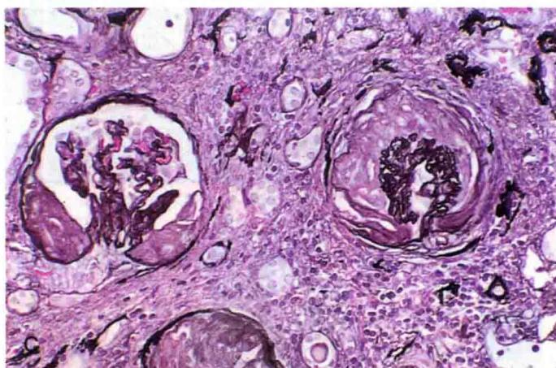 
图16-29高血压性肾硬化。A.3个小动脉透明性硬化（PAS染色）；B.弓形动脉内膜纤维性增厚引起管腔狭窄（银染）；C.一个球性硬化的肾小球和一个节段性硬化。注意小管萎缩、间质纤维化和慢性炎症（银染）
的皮质梗死。显微镜下，恶性高血压性肾病常重叠在良性高血压肾硬化的背景上，有水肿（黏液样的）动脉内膜增厚，小动脉纤维素样坏死。肾小球的改变各种各样，从毛细血管充血到实变到坏死（图16-30）。严重的病例引起血栓形成和皮质梗死。病理表现与血栓性微血管病（见后文）类似。
【临床表现】发生恶性高血压的男性比女性多见，典型的40岁左右。患者有头痛、头晕、视力障碍，还以可以发展成明显的脑病。血尿和蛋白尿是常见的，假如恶性高血压持续可以进展为肾功能恶化。积极的降血压治疗常可以控制疾病。
# 四、肾动脉狭窄引起的肾性高血压

【发病机制】肾动脉狭窄的患者，高血压是
由于肾素、血管紧张素和醛固酮的增多。大 $95\%$ ）患者是由于动脉粥样硬化，这也可以什么男性发病率是女性的2倍，主要在老年生。纤维肌性发育不良，特点是肾动脉纤维滑肌增生狭窄，血管炎总体来说是不常见的但是儿童最常见的原因。

【病理】不管是什么原因引起的肾动脉狭窄，
肾实质的病变都是相同的。肾尺寸减小。肾小
球形似正常但是彼此更为靠近因为中间插入的小管显示缺血萎缩，并且没有间质的纤维增生。许多肾小球失去了所属的近曲小管。小球旁器显示增生和颗粒增加而更为明显。

【临床表现】肾血管性高血压特点是轻度-中
度血压增高，肾动脉区可听见杂音。诊断需要
一些成像技术，比如血管造影术。超过 $50\%$ 的患者，可行外科手术血管重建、血管成形术或肾切除可以治疗高血压。
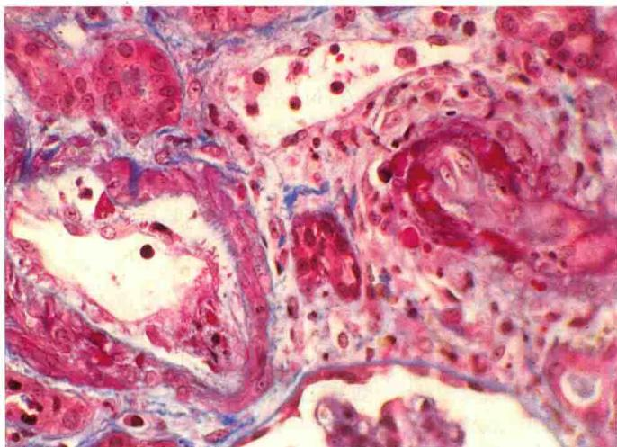 
图16-30 恶性高血压肾病。恶性高血压患者的病变，右侧小叶间动脉可见壁的红色纤维素样坏死和左侧可见明显的内膜水肿
# 五、血栓性微血管病引起溶血性贫血和肾衰竭

【发病机制】血栓性微血管病可以由各种原因引起，至少有两种不同的致病途径。一
条途径引起典型或者不典型的溶血性尿毒症综合征（HUS）产生内皮损伤。结果导致血浆成分渗入动脉内膜、小动脉壁和肾小球毛细血管的内皮细胞下区域，血管腔狭窄，引起缺血。损伤的内皮细胞表面促进血栓形成，进一步加重缺血，可以引起局灶缺血坏死。典型的HUS出现在感染产毒素细菌引起的腹泻之后，大多数是进食了大肠埃希菌（通常是O157:H7菌株）污染的食物。毒素损伤肾小球毛细血管的内皮细胞，启动了上面描述的过程。不典型的HUS与腹泻无关，由不同的机制引起，包括补体调节蛋白（大多是H因子，也有I因子和膜辅因子蛋白）的基因异常，补体调节蛋白的自身抗体（抗H因子）或者两者都有。血液通过血管流动中被HUS导致非免疫性溶血性贫血（Coombs阴性）伴随畸形和破裂的红细胞（裂红细胞）和血小板减少。这种血液综合征称为微血管病性溶血性贫血（MAHA）。血栓性溶血性紫癜（TTP）也表现MAHA但是通过不同的机制（见第20章）。

【病理】肾脏的病理改变可以类似恶性高血压性肾病，它就是一种血栓性微血管病的形式。

【临床表现】临床表现和病因不同允许识别血栓性微血管病的不同类型。各种临床异常分为：
① 微血管病型溶血性贫血；② 血小板减少症；③ 高血压；④ 肾功能衰竭。虽然这些表现程度有所不同。患有MAHA的患者，可以伴随一些疾病过程（如血性腹泻、SLE、系统性硬化）或者进行了一些治疗[如丝裂霉素、顺铂、血管内皮生长因子（VEGF）抑制剂]可能是引起血栓性微血管病的原因。
1.溶血性尿毒症综合征 溶血性尿毒症综合征（HUS）的特点是微血管溶血性贫血和急性肾衰竭，没有或者几乎没有肾外的显著血管疾病。HUS是儿童最常见的引起急性肾功能衰竭的原因。主要引起HUS的原因是大肠埃希菌产毒菌株，可以通过摄入污染的食物比如烹饪不足的汉堡包或者近期与污染的动物接触（常由于儿童的宠物乐园）。毒素损伤了内皮细胞，启动了上述过程导致血栓性微血管病。患者出现血性腹泻和进行性肾衰竭，这就甚至需要透析，正常肾功能通常可以在几周内恢复。但是，超过 $50\%$ 的患者，在 $15\sim 25$ 年后再度出现肾功能受损。
2. 血栓性血小板减少性紫癜（TTP） TTP 表现为系统性微血管血栓形成，临床特点是血小板减少、紫癜、
发热和精神神经病变。
# 六、继发于严重缺血的皮质坏死和分散的髓质坏死
皮质坏死可以是部分的也可以是全部的。梗死通常是指由于动脉阻塞影响某个区域或者一些区域，而皮质坏死暗示着更广泛的缺血性坏死。

【发病机制】肾皮质坏死可以是与血容量减少或内毒素休克相关的复杂情况，经典的
情形是由妊娠后期早产儿的胎盘剥离造成的（见第18章）。所有形式的休克都可导致肾前或肾内的可逆性缺血，可以领先于不可逆的皮质坏死出现。供应髓质的血液通过直小血管是由近髓的出球动脉延伸来的，近端连接供应外髓的血管。这样，外髓血管闭塞，比如痉挛、血栓或血栓性微血管病可以引起皮质坏死和分散的髓质坏死。

【病理】皮质坏死的范围从斑驳状到融合的（图
(16-31)。在多数累及的区域，所有的实质表
现为凝固性坏死。近曲小管有不同程度的坏死，也累及大部分的远端小管。邻近存活的皮质区域、肾小球和远曲小管通常不受影响，但是多数近曲小管有缺血性损伤，比如上皮的扁平和坏死。伴随大片坏死，皮质明显苍白。广泛的皮质坏死，可以残留被膜下和皮髓交接区由被膜和髓质网状血管分别供应的薄片组织。皮质坏死存活下来的患者可以在坏死区出现显著的营养不良性钙化。
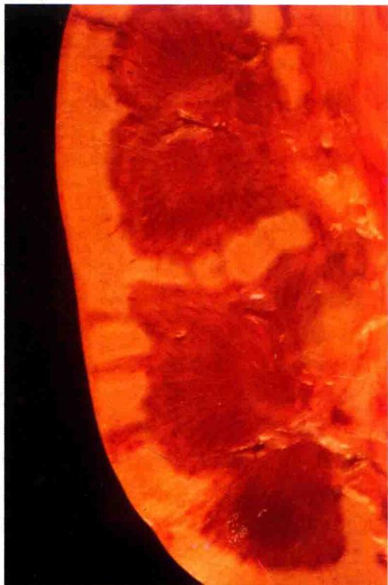 
图16-31 肾皮质坏死。肾脏皮质由于弥漫性坏死呈现浅黄色、质软
【临床表现】严重的皮质坏死表现为急性肾衰竭，最初可能与急性肾小管坏死难以区别。是否能痊愈取决于疾病的范围，存活者高血压的发病率显著。
# 第六节 肾小管和间质疾病
急性血清肌酐升高称为急性肾衰竭（ARF）。分为由于肾血流减少引起的肾前性ARF，肾实质损伤产生肾内ARF，现在又称为急性肾损伤（AKI），继发于尿路阻塞称为肾后性ARF。最常见的肾内AKI是缺血性急性肾小管损伤。
# 一、急性小管坏死（ATN）引起急性肾衰竭
ATN很严重，但是可以恢复，肾衰竭是由于肾小管上皮细胞缺血或毒性损伤致功能受损。因为坏死常见但不是ATN显著特点，有称为急性肾小管损伤(ARI)。大部分缺血性急性肾小管损伤没有广泛的肾小管上皮细胞的坏死，因此，似乎ATN使用不当。

【发病机制】缺血性ATN是由肾灌注减少
引起的，通常与低血压相关。肾小管上皮
很多高的能量代谢消耗活性和数目众多的细
对低氧和缺氧十分敏感。某些临床上典型的
ATN患者肾小管上皮细胞可以单层（扁平）但并没
有坏死。扁平化是由于尖端的胞质脱落进入尿液，
导致尿液里可见颗粒色素管型形成。
肾中毒性ATN是由上皮细胞的化学损伤引起
的。肾小管上皮细胞由于重吸收和浓聚毒物是最先
的损伤的目标。上皮细胞的高能消耗率也使它们对
毒物损伤很敏感，扰乱了氧化和其他代谢途径。当
血红蛋白和肌红蛋白高浓度的出现在尿液里，作为
内源性的毒物可以导致ATN（色素性肾病）。
ATN的病理生理学涉及的部分或者全部的紊乱
在图16-32中列出，不同组合可以导致肾小球滤
过率减低，肾小管上皮功能障碍。

【病理】缺血性ATN特点是肾肿胀，有苍白的
皮质和充血的髓质。肾小球和血管没有病理改
变。肾小管的损伤是灶性的，最明显的是近曲小管和髓袢在外髓的粗支。近端小管显示上皮细胞扁平，管腔扩张，刷状缘脱落（上皮扁平化）。缺血性ATN的特点是缺少广泛的小管上皮细胞的坏死，在某些近端和远端小管内可见单个坏死的细胞。这些单个坏死的细胞和少量存活的细胞脱落到管腔内，导致局灶肾小管基底膜裸露（图16-33）。间质水肿常见，外髓的直小血管充血，常见有核细胞，主要是单核白细胞。
中毒性ATN显示小管上皮的广泛坏死，比缺血性
的ATN明显（对比图16-33和图16-34）。但是多数病例，坏死局限在某段对特殊毒物最敏感的小管。损伤最常见的部位是近端小管。由于血红蛋白和肌红蛋白的释放导致ATN，也可见很多由于血红素被染色的红褐色的管型。
在ATN的恢复期，小管上皮细胞再生，出现核分裂象，细胞和细胞核增大，细胞拥挤。存活者最终可以完全恢复正常肾结构。
【临床表现】ATN是引起急性肾衰竭的首要原因。表现为快速升高的血肌酐水平，常伴随尿液减少（少尿）。尿液分析显示变性的上皮细胞和“肮脏的褐色的”颗粒管型（急性肾衰竭管型），细胞碎片里富含细胞色素。患有ATN的患者肾衰竭持续时间取决于许多因素，特别是病因的本质和可逆性。假如损伤启动后病因可以立即清除，肾功能常在 $1\sim 2$ 周恢复，虽然也可以延迟数月。
# 二、肾盂肾炎是指肾脏的细菌感染
# 1.急性肾盂肾炎
【发病机制】粪便中的革兰阴性细菌，最多见的是大肠埃希菌，引起 $80\%$ 的急性肾盂肾炎。大肠埃希菌引起泌尿道感染（尿致病性大肠埃希菌），加强了细菌毒力，不仅引起泌尿道感染而且也导致肾盂肾炎。这方面最好的研究表明它们附着在伞部（菌毛），由肾盂肾炎相关的菌毛基因编码（PAP）。尿致病性大肠埃希菌的菌毛附着在尿路上皮细胞和肾的上皮细胞黏附素结合位点。通过泌尿道向上感染到达肾，这个过程依赖以下因素：①泌尿系感染细菌；②感染的尿液反流通过输尿管达到肾盂和肾盏；③细菌通过乳头进入肾实质。
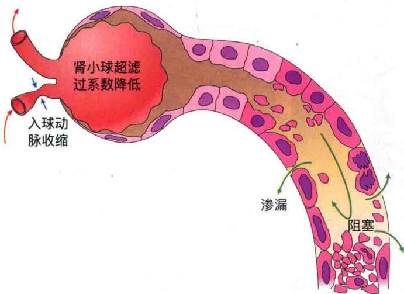 
图16-32急性肾小管坏死的发病机制。上皮细胞的坏死和坍塌导致了管型形成，管型的出现导致堵塞和腔内压的增加，可以减少肾小球的滤过率。入球动脉血管收缩，部分是由管球间反馈引起，导致肾小球毛细血管滤过压减低。小管损伤和腔内压增加引起液体从管腔外渗进入间质
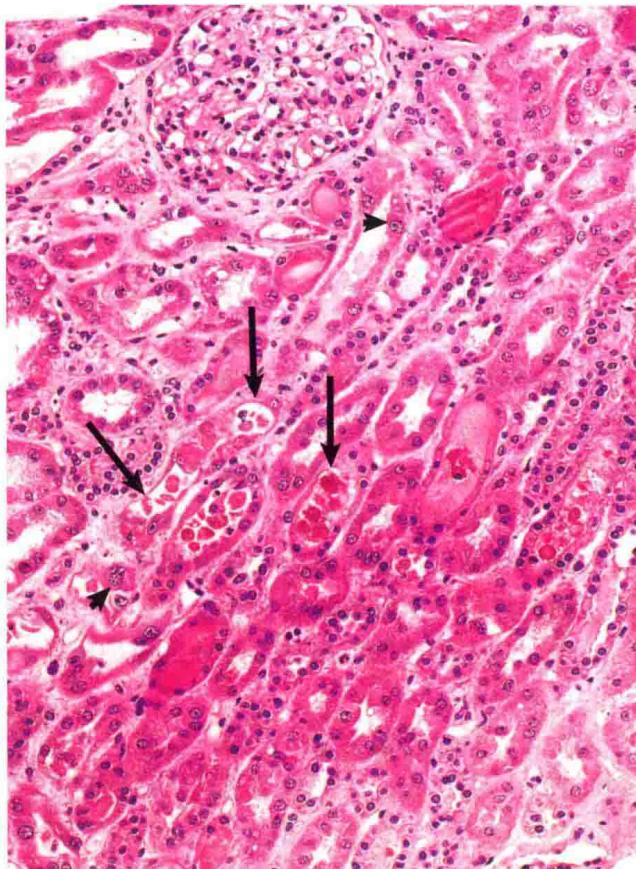 
图16-33 缺血性急性肾小管坏死。从局灶小管基底膜剥脱（长箭头）的和出现在某些小管腔内单个坏死的小管上皮细胞是明显的，某些增大的，再生性的上皮细胞也可见（短箭头）。注意缺少明显的间质炎症
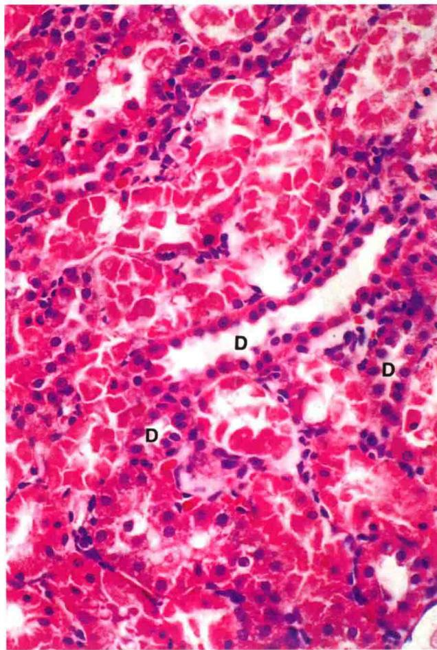 
图16-34由汞中毒引起的中毒性急性肾小管坏死。有广泛的近端小管上皮细胞坏死，间杂着远端和集合管（D）。间质炎症轻微
膀胱感染先于急性肾盂肾炎出现。因为女性尿道短、缺乏抗细菌的前列腺分泌物、性交易于细菌的迁移使得女性更易发生急性肾盂肾炎。
在某些情况下，残余尿量（正常 $2\sim 3\mathrm{ml}$ ）增加（比如前列腺阻塞或弛缓性膀胱）。因此，膀胱内容物不能充分稀释肾来的无菌尿以防细菌滋生。糖尿病排泄的糖尿，为细菌生长提供了丰富介质也易诱发感染。
在膀胱尿液里的细菌通常不能到达肾。输尿管嵌入膀胱壁时都是以陡峭的角度（图16-35），并且大部分远端平行于膀胱壁行走在黏膜和肌层之间。由排尿产生的膀胱内压力封闭了远端输尿管口，防止尿液反流。许多个体对肾盂肾炎特别敏感，有在膀胱壁侧异常短的输尿管通道，还伴随插入角度更加垂直于膀胱黏膜表面。这样排尿时，没有封闭输尿管腔，反而膀胱内压使尿进入开放的输尿管。这种反流足够强大使尿进入肾盂和肾盏。
肾盏中心单纯的乳头是凸出的，不能存留反流的尿液（图16-35）。相反，周围混合乳头是凹形的，易于通过到达集合管。但是，假如压力延长，就是梗阻性尿路病，甚至单纯的乳头最终影响尿液逆行进入。细菌可以从集合管进入间质和肾其他的小管。
除了通过尿液逆行，细菌和其他病原可以通过循环进入肾实质。例如，革兰阳性细菌，例如葡萄球菌可以从感染性细菌性心内膜炎的瓣膜播散到肾脏形成感染灶。粟粒性结核时肾常被累及。真菌，例如曲霉菌在免疫力降低的宿主可以感染肾。肾血行性感染优先影响皮质。
【病理】肾的急性肾盂肾炎在被膜下表面和切面形成小灶白色脓肿。肾盂和肾盏尿路上皮可以充血，覆盖脓性分泌物。急性肾盂肾炎常是灶性的，肾的大部分呈现正常。多数感染仅累及少数乳头系统。显微镜下，虽然血管和肾小球优先保存，但肾实质，特别是皮质，显示出典型的炎症灶性延伸性破坏。浸润的炎细胞主要是中性粒细胞，常常充满了小管，特别是集合管（图16-36）。严重的急性肾盂肾炎，可以发生乳头尖部坏死或者感染超越肾被膜以外引起周围脓肿。
【临床表现】急性肾盂肾炎的症状包括发热、寒战、出汗、全身乏力、胁腹痛和肋脊角压痛。白细胞增多伴随中性粒细胞增多常见。区分上还是下泌尿道感染临床上常常很困难，但是如果在尿里发现了白细胞管型就会支持肾盂肾炎的诊断。
# 2. 慢性肾盂肾炎
【发病机制】慢性肾盂肾炎是由于继发于泌尿道梗阻反复发生和持续细菌感染，尿液反流或者两者兼有。慢性肾盂肾炎由于反流或梗阻，反复急性和慢性炎症使髓质组织和附近的皮质首先受损。进行性萎缩和瘢痕形成，伴随累及的乳头尖部收缩（坍塌假如有乳头坏死）覆盖的皮质变薄。此过程导致特征性的大体改变，皮质深层宽大的纤维化和覆盖在扩张的肾盏以上的萎缩（肾盏扩张）（图16-37）。

【病理】慢性肾盂肾炎是许多引起显微镜下损伤模式——慢性小管间质性肾炎的原因之一。
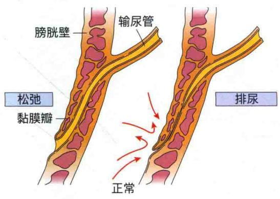
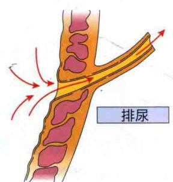 
膀胱内短输尿管
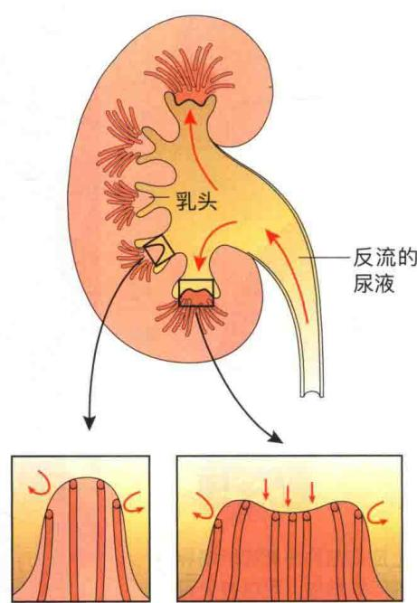 
单一乳头 
图16-35 膀胱和肾的解剖特点通过输尿管膀胱反流引起肾盂肾炎。正常膀胱，输尿管在膀胱内的远侧部行走在黏膜和肌层之间，形成黏膜瓣。排尿时，增加的膀胱内压压迫瓣膜靠在膀胱壁，这样压闭了管腔。患有先天性膀胱内短输尿管的个人因为输尿管进入膀胱的角度接近直角没有黏膜瓣，这样排尿时的压力促使尿液反流回输尿管。在肾盂、肾盏中心单一乳头是凸出的不能容许尿液反流。另一方面，周围混合型乳头是凹进去的，允许反流的尿液进入
慢性肾盂肾炎的大体观察更有特点，仅有慢性肾盂肾炎和镇痛剂肾病产生肾盏扩张和覆盖其上的皮髓质瘢痕的组合。显微镜下，瘢痕是萎缩扩张的小管围绕着纤维化的间质和慢性炎细胞的浸润（图16-38）。最大的特征性的小管改变是严重的上皮萎缩（但不是特异的），伴随弥漫性、嗜酸性和透明管型。这些小管收缩在一起，球形洁面，与包含胶质的甲状腺滤泡类似，
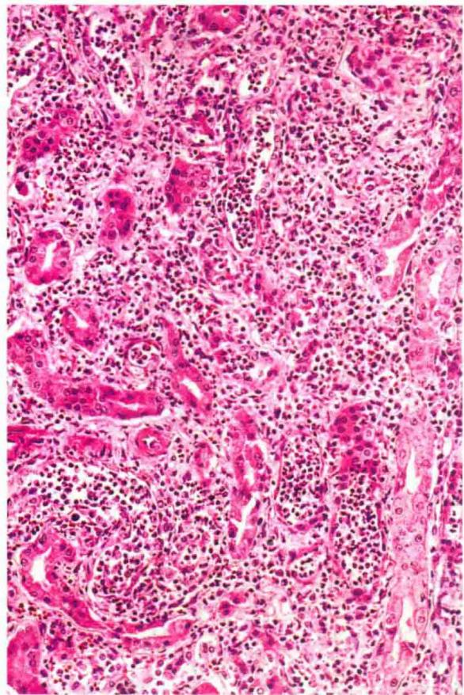 
图16-36 急性肾盂肾炎。广泛的中性粒细胞渗出出现在集合管和间质内
这个模式称为“甲状腺样变”，肾小球可以完全不累及，可以显示小球周围纤维化或者可以硬化。
【临床表现】许多患有慢性肾盂肾炎的患者有间断的尿路感染症状或者急性肾盂肾炎，比如回归热和胁腹痛。有些患者病程隐匿直到终末期肾脏病出现。尿液分析可见白细胞，影像学显示肾盏扩张和皮质瘢痕。
# 三、镇痛剂肾病由长期过度服用镇痛剂引起
典型的镇痛剂肾病患者服用了超过 $2\mathrm{kg}$ 的镇痛剂混合物，常常混合使用，例如阿司匹林和醋氨酚。醋氨酚貌似比阿司匹林或其他非甾体类抗炎药物（NSAIDs）更容易导致肾病。镇痛剂肾病的基础并不清楚。可能包括直接肾毒性或由于药物导致的血管改变而出现的缺血性损伤，或者两者兼备。
【病理】最早期镇痛剂肾病出现的是乳头坏死引起的髓质受损，接着出现萎缩、慢性炎细胞浸润和附近的皮质瘢痕化。早期实质改变局限在乳头和内髓，包括小管和毛细血管壁基底膜增厚，间质纤维化和局灶凝固性坏死。最终，整个乳头出现坏死（乳头坏死），常常只保留一个位置，无组织结构的。坏死乳头出现营养障碍性钙化是常见的。附近的皮质继发小管萎缩，间质纤维化和慢性炎症。
【临床表现】症状和体征仅在晚期镇痛剂肾病出现，包括尿浓缩功能丧失、远端肾小管酸中毒、血尿、高血压和贫血。坏死乳头尖部脱落入肾盂通过输尿管时可以导致肾绞痛。逐渐发展为进行性肾衰导致终末期肾病。
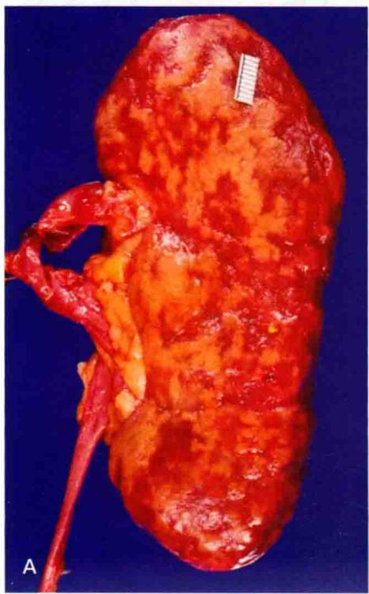
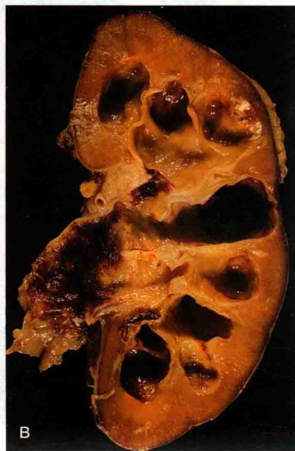 
图16-37 慢性肾盂肾炎。A. 皮质表面可见许多不规则、深在的瘢痕（红色区域）；B. 肾盏明显扩张（肾盏扩张）因为炎症破坏乳头引起，伴随皮质的萎缩和瘢痕形成
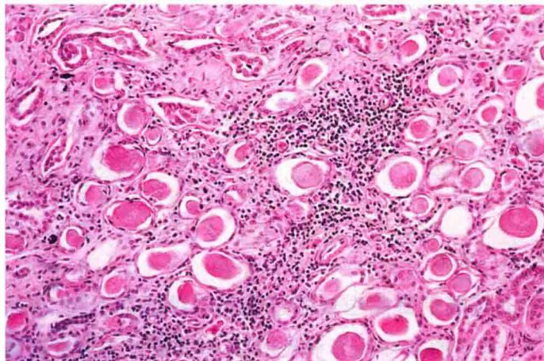 
图16-38 光镜显示肾小管扩张和萎缩，伴随很多小管内包含嗜酸性透明管型类似甲状腺滤泡的胶质（所谓的甲状腺样变）。间质瘢痕形成，包含慢性炎细胞浸润
# 四、药物诱导（过敏性）的急性小管间质性肾炎是细胞介导的免疫反应

【发病机制】急性药物诱导的小管间质性肾炎的组织学特点是激活的T淋巴细胞和嗜酸胞浸润，整个模式提示是IV型细胞介导的免。最常牵涉的药物包括NSAIDs、利尿药和生素，特别是β- 内酰胺抗生素类，比如合霉素类和头孢菌素类。

【病理】显微镜下，皮质局灶和更少范围的髓质有淋巴细胞和少量嗜酸性粒细胞（占组织中
白细胞的 $5\% \sim 10\%$ 。中性粒细胞罕见，如果出现应该怀疑是否为肾盂肾炎或者血源性细菌感染，也可以出现局灶肉芽肿性炎，特别在疾病的晚期。局灶近端和远端小管有白细胞浸润（小管炎）。肾小球和血管没有炎症，但是由NSAIDs药物诱导的小管间质性肾炎可以出现微小病变型肾病。

【临床表现】急性小管间质性肾炎通常表现为急
性肾衰竭，典型的在使用药物2周后开始。尿
里包括红细胞、白细胞（有嗜酸性粒细胞）和白细胞管型。小管功能损伤常见，排钠、糖尿、氨基酸尿和肾小管酸中毒。发热、皮疹等系统性过敏性症状也可以出现。大部分患者在停药后数周或数月后完全恢复。
# 五、轻链管型肾病可能合并多发性骨髓瘤
轻链管型肾病是由于尿中出现单克隆免疫球蛋白轻链引起肾损伤，产生小管上皮细胞损伤和众多的管型。

【发病机制】.轻链管型肾病是最常见的与多发性骨髓瘤相关的肾病形式，表现了肾小球
可滤过循环中的轻链。在标准尿的酸性 $\mathrm{pH}$ 情况下, 轻链与 Tamm-Horsfall 糖蛋白结合, 这种蛋白由远
端小管上皮细胞分泌，形成管型。由于游离轻链对小管上皮细胞的毒性作用和管型的堵塞可以导致肾功能不全。轻链的分子结构决定了是否引起轻链管型肾病、AL淀粉样变性或者轻链沉积病等不同疾病。偶尔患者可以同时表现好几种肾病。

【病理】小管病变的特点是在远端小管和集合
管出现众多的致密透明管型，这些管型强嗜酸
性、玻璃样，常有折痕和边缘成角。还可以出现结晶物。管型可以引起异物反应，有吞噬细胞和多核巨细胞。间质慢性炎细胞浸润，伴随小管病变还有间质水肿。间质纤维化和小管萎缩显示更多慢性病损。纤维化的间质和小管可见局灶钙盐沉积（肾钙沉积症）。

【临床表现】轻链管型肾病可以表现急性或慢
性肾衰竭，通常出现蛋白尿，虽然不到肾病范
围，大多包含显著的免疫球蛋白轻链。假如患者有肾病范围内的蛋白尿合并多发性骨髓瘤，AL淀粉样变性或轻链沉积病似乎比轻链管型肾病更常发生。
# 六、尿酸性肾病的特点是小管及间质内可见尿酸盐结晶
血中尿酸盐水平增高可以引起尿酸盐肾病。这类疾病典型的慢性表现是原发性痛风（见第26章）。

【发病机制】由痛风引起的慢性尿酸盐肾病
的特点是小管和间质有尿酸单钠结晶沉积。
急性尿酸盐肾病可以由增加的细胞更新引起。例如，恶性肿瘤的化疗引起大量癌细胞坏死导致血中突然增加的尿酸盐（肿瘤溶解综合征）。急性肾衰竭是由于沉淀出的尿酸盐的结晶堵塞了集合管，在酸性pH的尿液中可以增加尿酸盐的浓度。出现干扰尿酸盐排泄的情况可以导致高尿酸血症（如习惯性摄入某些利尿药）。

【病理】急性尿酸盐肾病，肉眼可见在乳头区
出现的黄色条纹是集合管内沉淀的尿酸盐。组
织学上, 小管内的沉淀是无定型的, 但是在冷冻切片中, 可见双折射结晶物。阻塞的小管近端是扩张的, 尿酸盐结晶可以穿透集合管引起异物巨细胞反应。慢性尿酸盐肾病的基础疾病过程与急性形式类似, 但是漫长的时间导致更多的坚实尿酸盐结晶沉积在间质, 出现间质纤维化和皮质萎缩。

【临床表现】急性尿酸盐肾病引起急性肾衰竭，
而慢性尿酸盐肾病引起慢性肾小管功能不全。
虽然有慢性痛风的大多数人都存在肾组织学的病损，但小于 $50\%$ 的患者可以出现显著的肾功能损伤。
# 第七节 肾结石（肾结石和尿路结石）
肾结石和尿路结石是在肾的收集系统内发现了石头（肾结石）或者在其他的泌尿道收集系统（尿路结石）。肾盂和肾盏是结石形成和聚集的常见部位。不知什么原因，肾结石男性比女性更常见。石头尺寸各异，从砂砾（直径 $1\mathrm{mm}$ ）到巨大的石头膨胀在整个肾盂。
虽然有些可以被耐受，在另外一些病例，可以导致严重的肾积水和肾盂肾炎，还可以腐蚀黏膜形成血尿。石头排到输尿管可以引起剧烈的腹痛，称为肾绞痛。一直到目前，大部分的肾结石仍然需要外科手术，超声碎石（碎石术）和内镜摘除是有效的。
1.碳酸钙结石 大部分（ $75\%$ ）的肾结石是草酸盐或磷酸盐的钙复合物或者是这些阴离子的混合物。 
2.感染性结石 大约 $15\%$ 的结石是由感染引起的。这些结石大多伴随临床症状。分裂尿素的细菌，通常是变形杆菌属和普罗威登斯菌属，导致碱性尿特别是磷酸铵镁（鸟粪石）的沉淀和磷酸钙（磷灰石）。这些石头从很坚硬到柔软或者易碎。感染性结石偶尔布满肾盂和肾盏，形成这些空间的铸型，被称为鹿角样结石（图16-39）。 
3.尿酸盐结石 这些石头发生在 $25\%$ 高尿酸盐和痛风的患者，但是多数尿酸盐结石患者没有以上两种情况（特发性尿酸盐结石）。 
4. 胱氨酸结石 仅有 $1\%$ 的石头是这种类型，但是代表了相当多的儿童结石和专有的遗传性胱胺酸尿症的结石。
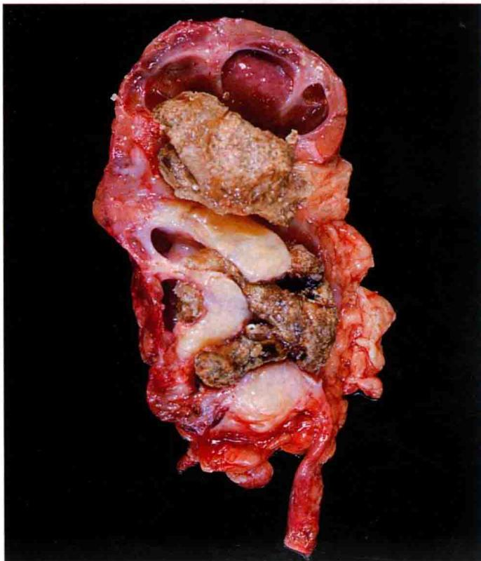 
图16-39 鹿角状结石。肾显示为肾盂积水和扩张的肾盏中的结石
# 第八节 尿路梗阻性疾病和肾盂积水
梗阻性尿路病是因为尿路结构和功能的异常阻碍了尿液的引流，可以引起肾功能障碍（梗阻性尿路病）合并收集系统的扩张（肾积水）。引起尿路梗阻的原因将在第17章详细讨论。

【病理】早期肾积水显微镜下最显著的表现是集合管扩张，接着引起近曲和远曲小管的扩张。
最终，近端小管变得明显扩张，小管消失是常见的，而肾小球散在。大体上可见进行性扩张的肾盂和肾盏，跟着发生肾实质的萎缩（图16-40）。出现肾积水，肾更易患肾盂肾炎，可以加重损伤。

【临床表现】双侧急性尿路梗阻导致急性肾衰竭（肾后性急性肾衰竭）。单侧梗阻常无症状。
不经治疗，梗阻的肾发生萎缩。双侧梗阻导致慢性肾衰竭。
# 第九节 肾移植
肾移植是多数终末期肾疾病患者的治疗选择。主要的障碍是免疫排斥，毁坏原来肾脏的疾病复发和免疫抑制药物的肾毒性也可以损伤移植肾。详见第4章。
# 第十节 肾脏的恶性肿瘤
# 一、Wilms瘤（肾母细胞瘤）由胚胎成分组成
Wilms瘤是胚胎性有生肾成分的恶性肿瘤，由胚芽、间质和上皮组织混合组成。它是儿童最常见的腹部实体瘤，发病率1/10000。

【发病机制】多数患者（90%）Wilms瘤是散发、单侧的。大约 $10\% \sim 20\%$ 的散发
病理与WT1的缺陷相关，Wilms瘤基因位于11号染色体（11p13）。WT1是DNA结合转录因子，在
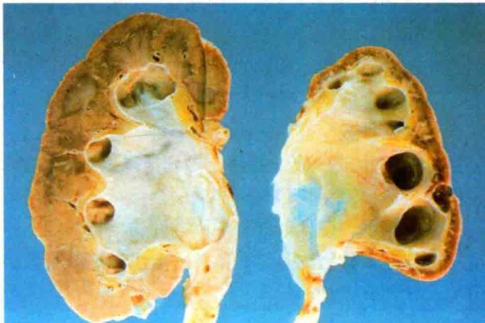 
图16-40 肾积水。双侧尿路梗阻导致显著的输尿管、肾盂和肾盏扩张。右侧肾显示严重的实质萎缩
肾和性腺表达，调节若干其他基因的转录，包括IGF2和PDGF。据推测，存在生殖细胞的突变和丢失WT1基因座的杂合性与肿瘤形成相关与遗传性视网膜母细胞瘤的发病机制类似（见第5章）。但是有 $5\%$ 的Wilms瘤的发生作为三个不同类型的先天综合征的一部分，所有这些都会增加在早年发展成此癌症的危险性（常为双侧）：
WAGR综合征—Wilms瘤，无虹膜，生殖泌尿道异常，智力低下。 
Denys-Drash 综合征 (DDS) —Wilms 瘤,两性异常, 肾小球系膜硬化。 
■ Beckwith-Wiedemann 综合征（BWS）—Wilms瘤，过度生长从巨人症到偏侧肥大，内脏肥大和巨舌。
WAGR 综合征是由于删除了 11 号染色体的短臂，影响基因包括无虹膜基因（PAX6）和 WT1。不同于 WAGR 综合征的删除，在 DDS 的 WT1 的突变被认为是优势阴性突变。
仅有 $10\% \sim 20\%$ 散发Wilms瘤的患者显示WT7基因座的异常，表明还有其他基因在肿瘤发生上发挥作用。第二个基因WT2，邻近但不同于WT7的基因座，参与一些散发肿瘤。 $\beta$ -catenin（CTNNB1）基因获得功能性突变，是重要的发育WNT信号通路的一员可能也被注意到了。Beckwith-Wiedemann综合征（BWS）也与WT2基因座的缺陷相关。WT2基因座的遗传学缺陷是复杂的，可能涉及基因组的印迹。某些BWQ的病例已经证明父系单亲二倍性（见第6章）。而且 $20\% \sim 30\%$ 的Wilms瘤在X染色体上的W7X基因突变，WTX可以作为肿瘤抑制基因下调WNT/ $\beta$ -catenin信号。

【病理】Wilms瘤被发现时一般较大，球形，浅褐色，切面可见表面一层薄的肾皮质和被膜（图
16-41)。组织学上, 肿瘤的组成成分相似于正常胎儿组织 (图 16-42), 包括: ①后肾胚芽; ②不成熟的间质 (间叶组织); ③不成熟的上皮成分。
虽然多数Wilms瘤以不同比例包含三种成分，偶尔仅包含两种成分或者甚至只有一种。胚芽成分由小卵圆形细胞组成，极少胞质，排列成巢状或小梁状。上皮成分像小管结构。有一些病例，可见类似不成熟的肾小球组织。在其他成分中间的间质由梭形细胞组成，多数是未分化的有时显示有平滑肌或成纤维细胞分化。

【临床表现】 $85\%$ 儿科肾肿瘤是Wilms瘤，通常发病在 $1\sim 3$ 岁， $98\%$ 的病例发生在10岁
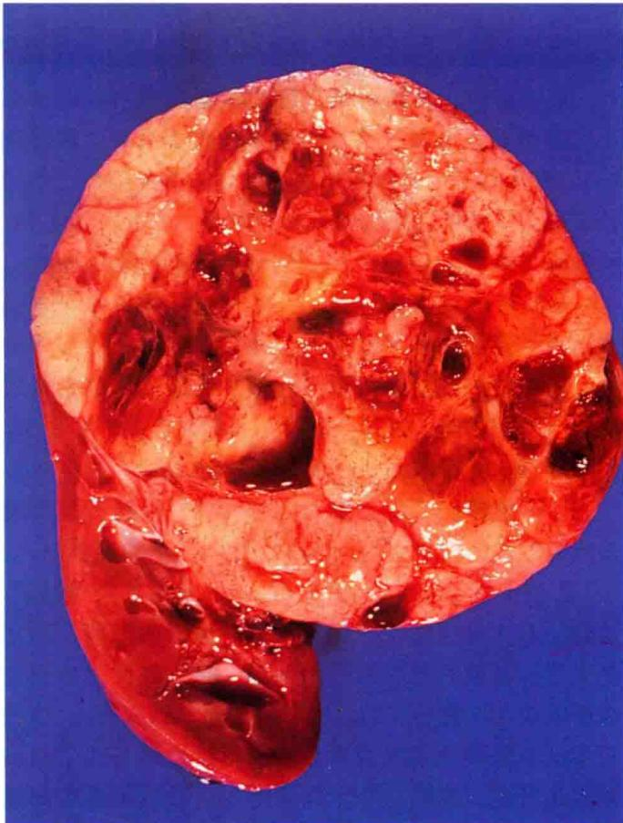 
图16-41 Wilms瘤。横截面可见肿瘤呈浅褐色，附着在残留的肾上
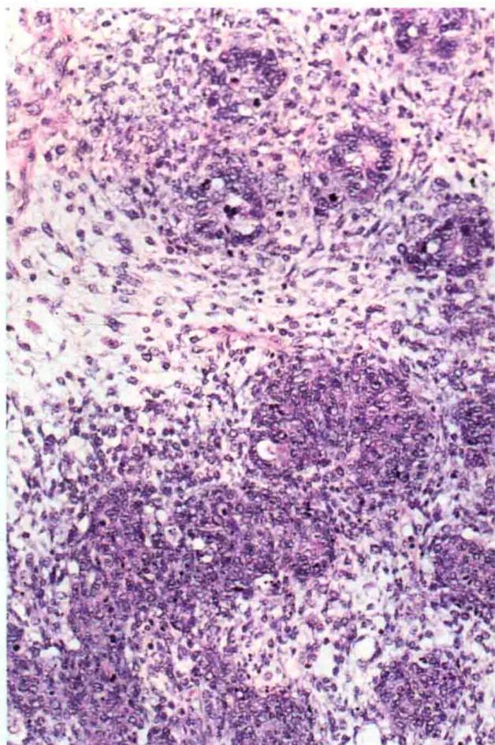 
图16-42 Wilms瘤（肾母细胞瘤）。显微镜下可见肿瘤细胞高度丰富的区域由未分化的胚芽组成，疏松的间质包括未分化间叶组织和不成熟的小管
以前。常见是在因腹部肿瘤就诊后得以发现并确诊，另外其他临床表现包括腹痛、肠梗阻、高血压、血尿和创伤性肿瘤破裂。许多组织学和临床参数已经不同程度地应用并成功预测了Wilms瘤行为。小于2岁的患者倾向有更好的预后。化疗和放疗合并外科手术，奇迹般地改善了此类肿瘤患者的预后，据报道长期存活率达 $90\%$
# 二、肾细胞癌（RCC）是最常见的肾原发癌症
RCC是肾小管或导管上皮的恶性肿瘤。它占 $80\% \sim 90\%$ 肾脏癌症，美国每年有超过30000例患者发病。

【发病机制】多数RCC是散发的，但是约 $5\%$ 是遗传的。遗传的RCC发生在以下三种不合征。
1. von Hippel-Lindau (VHL) 综合征, 一种常染色体显性遗传的癌症综合征, 合并小脑的血管母细胞瘤、视网膜血管瘤和透明细胞 RCC (40% 的所有 VHL 病), 嗜铬细胞瘤和各种器官的囊肿。 
2. 常染色体显性遗传的RCC，透明细胞肿瘤是最主要的表现，发生在 $50\%$ 有遗传异常频临危险的患者，就像VHL综合征。 
3. 遗传性的乳头状RGC，是一种常染色体显性遗传癌症，特点是多发的双侧乳头状肿瘤。
遗传的比散发的 RCC 更倾向于多灶、双侧和年龄轻。有 RCC 的家族史的人群，发生 RCC 的危险性增加了 $4 \sim 5$ 倍。各种易位包括 3 号染色体的断裂，导致功能性 VHL（3p25-26）肿瘤抑制基因的丢失，在 VHL 综合征和常染色体显性遗传的 RCC 已经经过验证。事实上 $98\%$ 的散发透明细胞 RCC 丢失了一个 VHL 等位基因，超过 $50\%$ 的这些肿瘤可见基因的突变。因此，证据强烈支持丢失 VHL 肿瘤抑制功能在透明细胞 RCC 的发病机制里是一个重要事件。
不像透明细胞 RCC，遗传性乳头状 RCC 与 VHL 基因无关。在 7q31 的 C-met 原癌基因的突变涉及遗传性乳头状 RCC 的发展。
吸烟或咀嚼与增加RCC的危险性相关，1/3的患者与烟草相关。肾的遗传性和获得性的囊性疾病都可以合并RCC的发生，特别是乳头状RCC，镇痛剂肾病也可以发生癌症。

【病理】RCC不同的病理类型预示着组织发生的不同和预后的差别。
透明细胞 RCC，是最常见的类型，起源于近端小管上皮细胞。典型的是黄色－橘色的，常显示明显的
出血和坏死（图16-43）。肿瘤细胞是实性的，局灶呈囊性。肿瘤细胞胞质透明（图16-44），反映胞质富含脂质和糖原在组织制片过程中被去除了。肿瘤细胞常排列成圆形或者狭长巢状被纤细的血管网分割。很少可见细胞和细胞核的多形性。
乳头状RCC，包含有纤维血管轴心的肿瘤细胞。I型乳头状RCC有小的嗜碱性细胞，II型有巨大的嗜酸性细胞。后者侵袭性更强，预后更差。这个肿瘤起源于远端小管上皮细胞。

【临床表现】RCC的发病高峰在60岁，男性
是女性的2倍。经典的临床三联征是血尿、侧
腹痛以及可触及的腹部包块仅发生在小于 $10\%$ 的患者。血尿是单个最常见的表现。RCC患者最初表现常是由于转移出现的症状。RCC作为“伟大的仿制” 被知道，常产生发热和副肿瘤综合征。RCC的预后由许
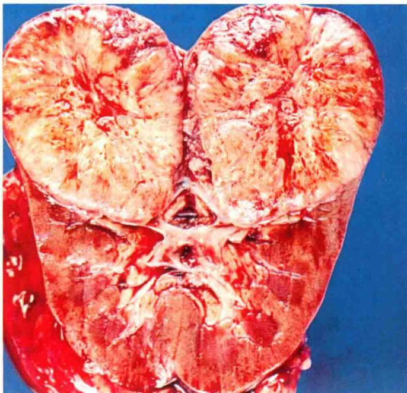 
图16-43 透明细胞肾细胞癌。肾包含一个巨大的不规则的拥有五彩切面的肿瘤。黄色部分对应着富含脂质的细胞
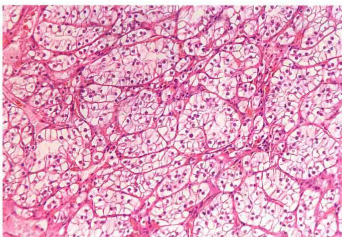 
图16-44 透明细胞肾细胞癌。显微镜下示肿瘤细胞排列成岛状，拥有丰富的透明的胞质
多因素影响，包括肿瘤尺寸、浸润的范围和是否转移、组织学类型和核的级别。透明细胞 RCC 肾切除后 1 年生存率是 $50\%$ 。肿瘤的分期是最重要的预后因素。假如 RCC 没有延伸超过肾被膜，5 年生存率是 $90\%$ 。假如有远处转移生存率降到 $30\%$ 。肿瘤最常播散到肺
和骨。
# 三、移行细胞癌
肾原发肿瘤的 $5\% \sim 10\%$ 是发生于肾盂和肾盏的移行细胞癌（见第17章）。
（方芳）
# 第17章 下尿道及男性生殖系统
输尿管、膀胱和尿道，也被称为下尿道-形成泌尿系统的流出道部分。男性的下尿道与生殖系统密切相关。
# 第一节 肾盂及输尿管
# 一、先天性疾病
肾盂及输尿管发育异常在正常人群的发生率为 $2\% \sim 3\%$ 。通常没有临床症状，但有时可能会诱发梗阻及尿路感染。最重要的发育异常包括发育不全（与肾发育不全相关，参见第16章）、异位、重复、梗阻和扩张。
肾盂及输尿管发育不全：这种发育异常罕见，通常与相应的肾脏发育不全有关。单侧发育不全通常没有症状。双侧输尿管和肾脏发育不全无法适应子宫外生活，是Potter综合征的一个特征（第16章）。
异位输尿管：在胚胎发育过程中输尿管芽可能出现在异常的解剖部位。异位输尿管的开口可以出现在许多异常的解剖部位，如膀胱的中部、精囊、尿道或输精管。
输尿管重复：单个或多个输尿管芽可能在胎儿膀胱的侧面出现重复。通常有两个平行的输尿管，每个都有所属的肾盂和彼此分隔的膀胱开口。双歧输尿管（被隔膜分开）及其许多变异都可以出现，但大多数没有临床意义。
输尿管肾盂结合部梗阻：形成婴幼儿肾积水通常是由于先天性输尿管肾盂结合部梗阻，其原因是输尿管肾盂结合部的平滑肌细胞的异常分层排列或是平滑肌细胞的纤维化。这些患儿的尿路梗阻通常是单侧的。这种形式的肾积水通常与其他泌尿道发育异常相关，有些病例与对侧肾发育不全相关。
肾盂或输尿管扩张：先天性巨输尿管是整个输尿管扩张，可能为单侧或双侧。这种输尿管走行迂曲、缺乏蠕动。所导致的尿滞留（输尿管积水）通常与进展性肾积水相关，最终导致肾衰竭。
# 二、输尿管炎和输尿管梗阻
输尿管炎是输尿管的炎症。如果有膀胱输尿管反流，
它是肾脏下行性或上行性感染的一种并发症。输尿管炎往往与内源性或外源性输尿管梗阻相关（图17-1）。
输尿管梗阻也可能由膀胱、前列腺和尿道的疾病引起，例如，发生在输尿管口或膀胱颈附近的膀胱癌、神经源性膀胱和前列腺增生症。
近端因素引起的输尿管梗阻往往是单侧的，而远端因素如前列腺增生引起的输尿管梗阻会导致双侧肾积水，若不处理可能导致肾衰竭。
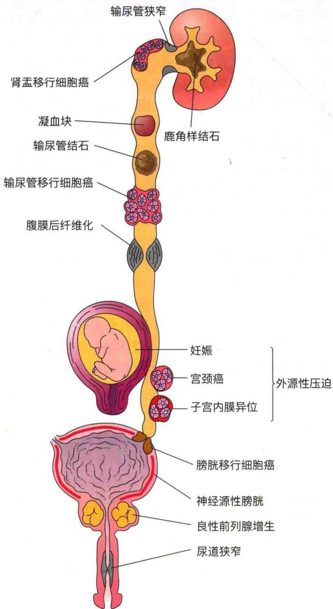 
图17-1 输尿管梗阻最常见的原因
# 三、肾盂和输尿管肿瘤
肾盂和输尿管肿瘤与膀胱肿瘤类似，只是比膀胱肿瘤要少见。大多数（ $90\%$ ）组织学上是尿路上皮细胞癌。与肾盂和输尿管上皮性肿瘤相关的发病因素与膀胱癌（见下文）相似。
患者最常出现的症状有 $60\sim 70$ 岁出现的血尿（ $80\%$ ）和腰部疼痛（ $25\%$ ）。输尿管或肾盂的尿路上皮细胞癌需要进行根治性肾切除。预后与诊断时的肿瘤分期有关。
# 第二节 膀胱
# 一、先天性疾病
膀胱外翻：这种发育异常的特征是膀胱前壁和一部分前腹壁的缺如。其发生率大概为每50000例娩出婴儿中1例。在部分男性婴儿与尿道上裂（即阴茎尿道形成不完全）相关。
膀胱外翻导致膀胱壁向外暴露，使膀胱成为杯状的器官，不能容纳尿液。膀胱后壁因机械性损伤，会伴有鳞状或腺上皮化生，因而很容易出现频繁感染。虽然膀胱外翻可以通过手术修复，但是化生黏膜恶变的风险增加。事实上，在膀胱外翻手术修复后的 $50\sim 60$ 岁人群中，膀胱癌的发病率甚至还有增加。
脐尿管残余：脐尿管（即连接膀胱和脐的胎儿尿囊柄）可能无法完全消退。如果完全保留，会形成膀胱-脐瘘。脐尿管残余的柱状上皮可能会发生腺癌。脐尿管残余部位只占膀胱癌发病部位的 $0.2\%$ ，但占膀胱腺癌的1/3。
膀胱－输尿管阀的先天性不全：这种异常是由输尿管膀胱交界处的异常引起，会导致膀胱－输尿管反流（VUR）（第16章）。VUR年轻女孩比男孩更常见，往往是家族性。 $75\%$ 的VUR病例是无症状的，但可能会导致反流性肾盂肾炎。先天性VUR要与妊娠期或在膀胱肥厚相关的获得性反流相鉴别。
# 二、膀胱炎
膀胱炎是膀胱的炎症，可以是急性或慢性。它是最常见的尿路感染，并且是住院患者一种常见的院内感染。

【发病机制】在大多数情况下，膀胱炎继发于下尿路感染。膀胱感染的相关因素包括患
者的年龄和性别、膀胱结石、膀胱出口梗阻、糖尿病、免疫缺陷、仪器放置或导尿、放疗和化疗。
因为女性尿道短，膀胱炎的风险增加，尤其在妊娠期。前列腺增生导致膀胱出口梗阻的男性易患膀胱炎。
大肠型细菌是膀胱炎最常见的病因，主要是大
肠埃希菌、普通变形杆菌、铜绿假单胞菌和肠杆菌属。在埃及血吸虫很流行的北非和中东地区，血吸虫病是膀胱炎的常见原因（第9章），但在西方世界几乎不为人所知。

【病理】急性膀胱炎的特点为间质水肿，出血
和不同程度的中性粒细胞浸润。点片状黏膜出
血（出血性膀胱炎）通常见于急性细菌性膀胱炎（图17-2）。炎症反应不消退是慢性炎症的标志，包括淋巴细胞浸润占优势和固有层的纤维化。膀胱炎的黏膜中偶然可有大量的淋巴滤泡（滤泡性膀胱炎）或嗜酸性粒细胞密集浸润（嗜酸性膀胱炎）。

【临床表现】几乎所有的急性或慢性膀胱炎患
者都会出现尿频、尿痛（排尿困难）和下腹部
或盆腔不适的症状。尿液检查通常可发现炎症细胞，病原体可通过尿培养来鉴定。大多数情况下，膀胱炎对抗生素治疗的反应良好。
# （一）慢性间质性膀胱炎是一种特殊形式的膀胱炎
慢性间质性膀胱炎是一种原因不明的疾病，通常发生在中年女性，特点是膀胱壁的透壁性炎症，并偶尔与黏膜溃疡（Hunner溃疡）相关。黏膜及肌层通常可见慢性炎症，包括肥大细胞的数量增加以及纤维化。Hunner溃疡是严重的急性炎症反应。慢性间质性膀胱炎最常见的症状是长期的耻骨上疼痛、尿频和尿急，伴或不伴血尿。尿培养通常是阴性的。这种疾病通常迁延不愈而且对各种治疗没有反应。
# （二）软斑病是以巨噬细胞为特征的一种少见形式的膀胱炎
软斑病是特征性巨噬细胞聚集的一种病因不明的少见炎性病变。这种病变最初在膀胱中发现，现在已经在包括泌尿道和泌尿道之外的许多其他位置发现。软斑病可以出现在所有年龄段中，高发年龄在 $50\sim 70$ 岁。发病有明显的女性优势，而无论其发病部位。软斑病常与大肠埃希菌引起的尿路感染有关，但直接的因果关系尚未确定。常有免疫抑制、慢性感染或癌症的临床背景。

【病理】软斑病特点是出现在膀胱黏膜表面软的黄色斑块（图17-3）。组织学上，最显著的
特征是慢性炎症细胞浸润，其中主要是具有丰富的嗜酸性胞质大的巨噬细胞，胞质中包含PAS阳性颗粒。这些巨噬细胞部分可发现层叠状含有钙盐的小体称作Michaelis-Gutmann小体。超微结构下，颗粒充满含有细菌的碎片溶酶体，这表明软斑病可能存在溶酶体降解的获得性缺陷。软斑病的临床症状与其他形式的慢性膀胱炎完全不同，治疗无效。
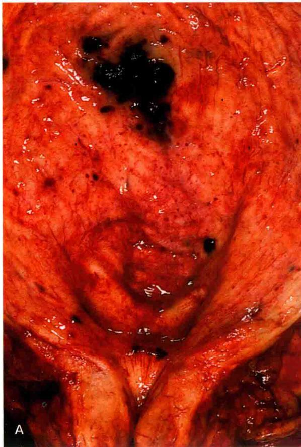
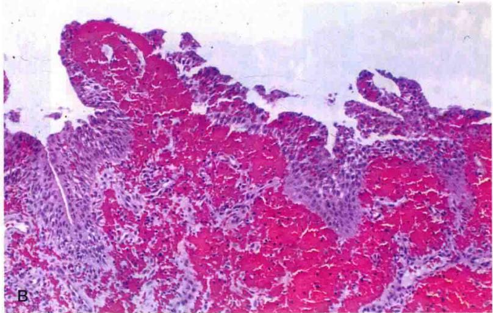
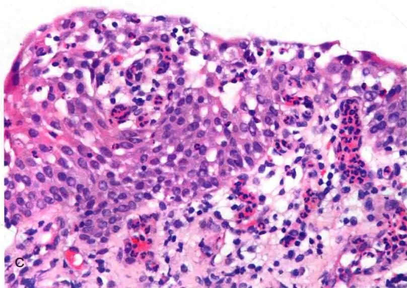 
图17-2急性膀胱炎。患者手术后2天死亡，留置导管导致的膀胱炎非常明显。A.充血膀胱黏膜可见几处出血灶；B.黏膜出血病；C.急性膀胱炎。黏膜内分叶核白细胞浸润
膀胱和（少见的）膀胱外翻相关。缺乏炎症时也会偶尔出现良性增生性改变。
■ Brunn芽和巢是表面尿路上皮延伸到固有层的巢或球形内陷。在 $85\%$ 以上的膀胱中可以出现，被认为是尿路上皮的正常变异（图17-4C）。 
膀胱的囊性病变（囊性膀胱炎）表现为充满液体、成簇分布的囊性Brunn巢，内衬正常的移行上皮。类似的囊可以出现在尿道或输尿管（囊性尿道炎、囊性输尿管炎）。囊性膀胱炎比较常见，会在 $60\%$ 的正常膀胱中出现。 
腺性膀胱炎是一种有腺体结构的黏膜病变，腺体衬覆黏液分泌的柱状上皮细胞，病变常出现在Brunn巢和囊性膀胱炎附近（图17-4D）。 
鳞状上皮化生是慢性损伤和炎症的一种反应，特别是与结石相关（图17-4E）。多达 $50\%$ 的正常成人女性和 $10\%$ 的男性可以出现。 
肾源性化生是移行上皮转化成类似肾小管上皮的病变（图17-4F）。最常见于膀胱，但在尿道和输尿管也可出现。大量小管成簇出现在固有层形成乳头状外生性结节。有时可能会导致输尿管梗阻，需要手术治疗。
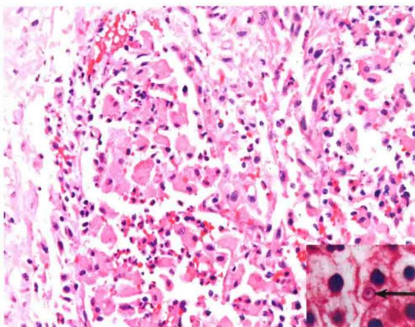 
图17-3 软斑病。炎细胞主要是巨噬细胞，伴少量的淋巴细胞（插图）高倍放大的一个Michaelis-Gutmann小体（箭头）（PAS染色法）
# 三、良性增生性及化生性尿路上皮病变
良性增生和膀胱上皮化生的病变多半发生在膀胱，但也有可能在整个泌尿道出现。这些非肿瘤性病变的特征是增生或是增生和化生混合性病变（图17-4A、B）。它们大多与引起尿路感染的慢性炎症、结石、神经性
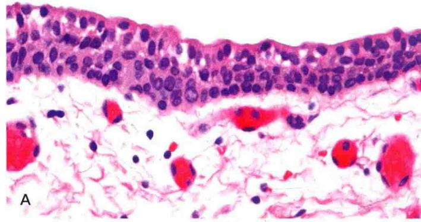
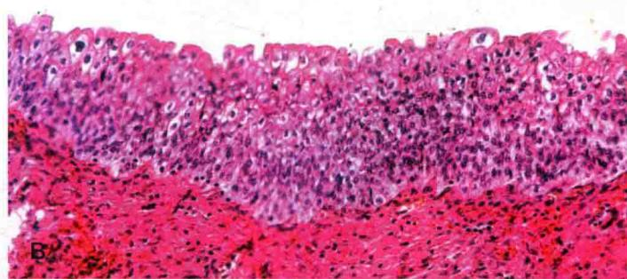
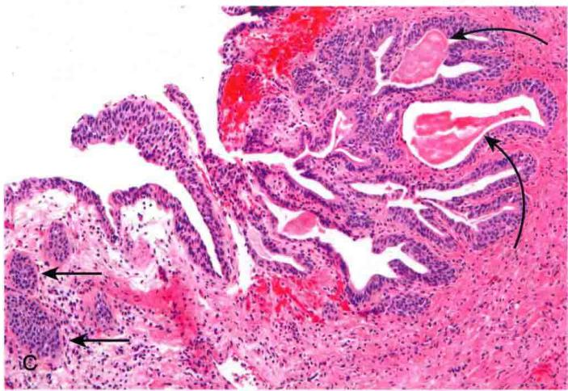
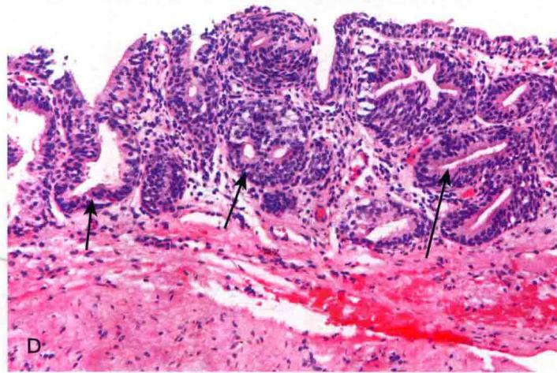
和囊（弯箭头）插入黏膜固有层。D.腺性膀胱炎，箭头突出显示的是化生腺体的黏膜。E.鳞状上皮化生，注意表面上皮的角化层。F.肾源性上皮化生。与肾小管类似的腺体结构的增殖（箭头）.jpg) 
图17-4 膀胱的增殖和化生。A. 正常膀胱黏膜。B. 增生, 注意已超过正常上皮的 $6 \sim 7$ 层尿路上皮细胞。C. 囊性膀胱炎。Bruun 巢(直箭头)和囊（弯箭头）插入黏膜固有层。D. 腺性膀胱炎，箭头突出显示的是化生腺体的黏膜。E. 鳞状上皮化生，注意表面上皮的角化层。F. 肾源性上皮化生。与肾小管类似的腺体结构的增殖（箭头）
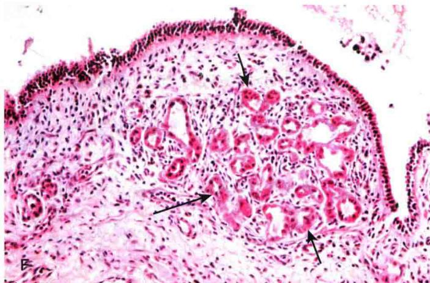
【临床表现】增生和化生性尿路上皮病变的临床意义有限，但不能与癌症混淆。然而伴有这些病变的患者罹患膀胱尿路上皮癌的风险更大，腺性膀胱炎的患者罹患腺癌的风险也更大。但没有证据表明这些病变本身是癌前病变。
# 四、膀胱肿瘤
有关膀胱癌最重要的特征如下：
膀胱是泌尿道肿瘤最常见的部位。 
■ 大部分膀胱肿瘤好发于老年患者（中位年龄65岁），50岁以下的人罕见。 
■ 男性罹患肿瘤是女性的3倍。 
■显微镜下，大多数肿瘤（90%）是尿路上皮癌（以
前称为移行细胞癌）。鳞状细胞癌、腺癌、神经内分泌癌和肉瘤罕见。
肿瘤通常是多灶的，并且可以发生于从肾盂到后尿道任何部分的衬覆移行上皮的泌尿道。 
局部治疗经常会有肿瘤复发。 
肿瘤有固有肌层侵犯的5年存活率显著降低。

【流行病学】在美国，每年诊断出约74000的
新发膀胱癌病例，占所有癌症相关死亡的比例
男性为 $3\%$ ，而女性小于 $1\%$ 。在世界范围，膀胱癌有明显的地域和性别差异。美国和西欧的城市白人男性人群发病率最高，而日本和美国的黑人人群的发病率较低。由于血吸虫病的流行，埃及、苏丹和其他非
洲国家的膀胱鳞状细胞癌的发病率很高。膀胱癌可出现在任何年龄，但大多数患者（ $80\%$ ）在 $50 \sim 80$ 岁之间。男性发病是女性的4倍。膀胱癌已知的最重要的风险因素是：①吸烟（风险增加4倍）；②工业暴露偶氮染料；③血吸虫病；④药物，如环磷酰胺和镇痛剂；⑤放射治疗（宫颈癌，前列腺或直肠癌）。

# 【发病机制】香烟是当前膀胱癌最重要的危
险因素，在美国死于该癌症男性和女性可能分别占到约 $50\%$ 和 $30\%$ 。多种工业化学品和染料，最值得注意的是芳香胺，也与膀胱癌有关。此类化学品的代谢解释了它们的器官特异性。芳香胺在肝脏与葡萄糖醛酸结合，结合物经尿液排泄。 $\beta$ 葡萄糖醛酸酶在膀胱酸性 $\mathsf{pH}$ 的尿液中水解葡萄糖醛酸结合物，从而产生反应性芳香胺离子，其结合DNA中的鸟嘌呤而成为诱变剂（第5章）。已经发现 $50\%$ 的膀胱癌存在特异的细胞遗传学异常。最常见的包括第9号染色体或其短臂或其长臂（9p-或q-)的缺失和11p、13p、14q或17p的缺失。包含肿瘤抑制基因p16基因染色体9p的缺失，是唯一同时出现在低级别乳头状肿瘤和扁平型原位癌的染色体缺失。包含p53基因的位点17p缺失，导致细胞周期的调节紊乱和随后的细胞周期蛋白依赖性激酶抑制剂（例如，p16基因/INK4a）的突变或肿瘤抑制基因RB1的缺失。这些缺失经常出现在侵袭性膀胱癌中（图17-5）。

# 【病理】上皮性肿瘤占所有膀胱肿瘤的 $90\%$ 以
上，其中大部分是尿路上皮癌。膀胱黏膜发生
的肿瘤性尿路上皮病变包含一个谱系，一端包括良性乳头状瘤和低级别外生性乳头状癌，另一端包括侵袭性的移行细胞癌和高度恶性的肿瘤（图17-6）。
# （一）尿路上皮（移行细胞）乳头状瘤是一种良性病变
膀胱尿路上皮乳头状瘤罕见，常常偶然发现或在无痛性血尿后发现。乳头状瘤占膀胱肿瘤不到 $1\%$ 最常出现在年龄超过50岁的男性。
外生性乳头状瘤特点是衬覆正常尿路上皮的乳头状结构。虽然认为乳头状瘤是良性的，但有些可能复发或进展到癌，应该定期随访。在大多数情况下，“复发”代表在膀胱其他部位的新发肿瘤。内翻性乳头状瘤罕见，通常为发生于膀胱三角区的结节性黏膜病变。内翻性乳头状瘤被覆正常尿路上皮，移行上皮条索从表面向下生长至固有层。这些病变在男性更为常见，发病高峰在 $60\sim 80$ 岁。临床表现常常是近期发生的血尿。内翻性乳头状瘤是良性肿瘤，单纯切除通常可以治愈。
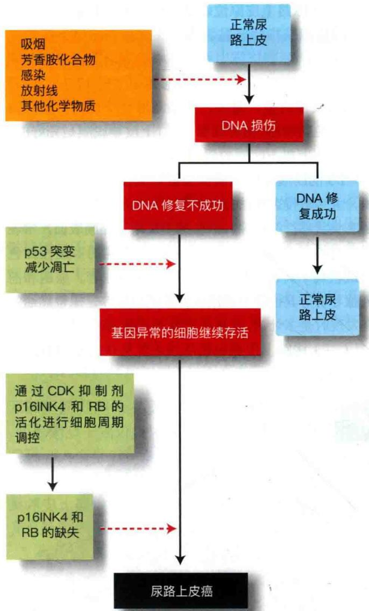 
图17-5 尿路上皮肿瘤的分子模型假说。从正常尿路上皮到癌的转变要逐步经历几个步骤
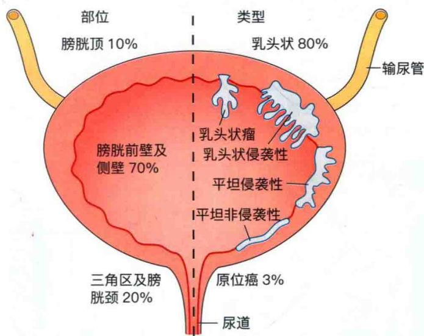 
图17-6 尿路上皮肿瘤。大多数肿瘤发生在膀胱，组织学上为移行细胞癌（TCC）。输尿管和后尿道也衬覆移行上皮，可以产生TCC。TCC可以是平坦型、乳头状、乳头状浸润型和单纯浸润型。良性移行细胞乳头状瘤罕见
# （二）尿路上皮原位癌是一种扁平型上皮内病变
原位癌是指膀胱黏膜非乳头状扁平尿路上皮的全层恶变。病变的特征为不同厚度的尿路上皮出现从基底层到表面整个黏膜层的细胞异型（图17-7）。核异型包括极性消失、增大、深染、形状不规则、核仁明显和染色质增粗。值得注意的是，上皮基底膜是完好的，并且没有上皮下间质的侵犯。
1/3的膀胱原位癌病例会进展到浸润性癌。反过来说，大多数侵袭性移行细胞癌由原位癌发展而来，而不是乳头状移行细胞癌。原位病变局限于黏膜表面，常表现为外生性乳头状移行细胞癌附近出现的多灶性红色丝绒状扁平斑块（见下文）。膀胱或输尿管、尿道和前列腺导管等其他部位常出现伴发的原位癌。原位癌通常在发现时是多灶的，或是在发现不久就出现类似的病变。
# （三）尿路上皮癌包括从浅表乳头状肿瘤到有深部侵犯的癌

【病理】乳头状癌最常发生于膀胱侧壁或后壁。膀胱镜下，肿瘤可以是仅限于黏膜表面、
小而纤细、级别低的乳头状病变，或是更大、级别更高的常常伴有溃烂的实性浸润性肿块（图17-8）。乳头状癌分级为低度恶性潜能乳头状尿路上皮肿瘤(PUNLMP）和乳头状尿路上皮癌。低级别和高级别乳头状尿路上皮癌都可以是侵袭性的。
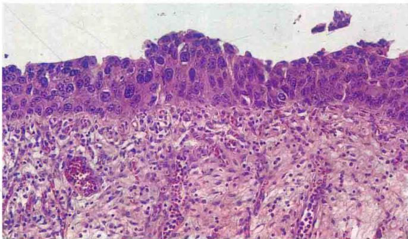 
图17-7 尿路上皮原位癌。尿路上皮黏膜显示全层的核异型、缺乏极性、缺乏成熟的证据
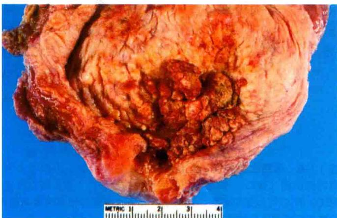 
图17-8 膀胱的尿路上皮癌。一个大的外生性肿瘤位于膀胱颈的上方
低度恶性潜能的乳头状尿路上皮肿瘤：这些肿瘤被认为是良性上皮乳头状瘤和低级别乳头状尿路上皮癌之间的中间形态。虽然较前者大，但是它们不表现后者的结构和细胞学异型性。PUNLMP可能复发或偶尔进展到更高级别的肿瘤。
低级别乳头状尿路上皮癌：低级别肿瘤有乳头状分叶状结构，衬覆有最小程度的结构和细胞学的异型性的肿瘤性尿路上皮（图17-9A、B）。大约 $10\%$ 的病例出现固有层或膀胱深部肌肉的侵犯。
高级别乳头状尿路上皮癌：这些肿瘤表现出显著的核深染和核异型。上皮排列是杂乱的（图17-9C、D），所有层均可出现核分裂。约 $80\%$ 的高级别肿瘤会出现固有层侵犯，并且会侵犯肌层或整个膀胱壁。大约 $50\%$ 侵袭性肿瘤患者有区域淋巴结的转移。
■浸润性尿路上皮癌：这些高度恶性的肿瘤可以从先前存在的乳头状病变或扁平原位癌发展而来。大多数情况下，浸润性癌在组织学上是高级别肿瘤。膀胱壁的侵犯深度或侵出膀胱壁，确定患者的预后。
膀胱癌的分期是根据世界卫生组织（WHO）的肿瘤淋巴结转移（TNM）分类系统（表17-1）。膀胱癌的转移部位按发生率排序为区域淋巴结和主动脉周围的淋巴结、肝、肺和骨骼。
表 17-1 膀胱尿路上皮癌的 TNM 分期 
T-原发性肿瘤T0=无肉眼可见的肿瘤Ta=非浸润性乳头状癌Tis=原位癌T1=黏膜固有层的侵犯T2=固有肌层的侵犯T2a=肌层浅层的侵犯(内1/2)T2b=深肌层的侵犯(外1/2)T3=膀胱周围组织的侵犯T4=膀胱邻近器官的侵犯及远处转移N-区域淋巴结N0=无淋巴结的累及N1=单一淋巴结转移N2,N3=更多淋巴结的转移M-远处转移M0=无转移M1=远处转移

【临床表现】膀胱尿路上皮癌一般表现为突发血尿和排尿困难的减少。膀胱镜检查发现单个肿瘤。在初次就诊时，85%的肿瘤局限于膀胱，
15%有区域或远处转移。仅限于黏膜（T0期）或固有层（T1期）的乳头状病变通常可以进行经尿道切除术的保守治疗。对有肌层侵犯和有些晚期肿瘤的患者采用根治性膀胱切除。不论复发的次数，非浸润性或表层侵犯的低级别尿路上皮膀胱肿瘤总的10年生存率在95%以上。只有10%的低级别肿瘤会进展到更高级别的肿瘤，预后也较差。保守治疗包括肿瘤电灼、用卡介苗（BCG）或常规化疗的膀胱内灌注。肿瘤侵犯膀胱肌层有25%～30%的总死亡率。
# （四）非尿路上皮的膀胱癌罕见
膀胱鳞状细胞癌由鳞状上皮化生发展而来，通常是由于血吸虫病。几乎所有这种肿瘤的患者一开始就伴有膀胱壁的侵犯，也因此预后不良。
腺癌只占膀胱所有恶性肿瘤的 $1\%$ 。它起源于腺性膀胱炎、肠上皮化生或在膀胱顶的脐尿管上皮残余。大部分膀胱腺癌在首次发现时就已经出现深部浸润，
而且不可治愈。
# 第三节 阴茎、尿道和阴囊
# 一、先天性疾病
尿道下裂：是指一种先天畸形，尿道从阴茎的下侧（腹面）打开，以致尿道位于正常腺体位置的近端。在 $90\%$ 的情况下，尿道下裂位于阴茎头或冠状沟的下侧。在较少的情况下，尿道下裂位于阴茎的中段，或者位于阴囊，甚至位于会阴部。这是由泌尿生殖窦的尿道皱襞闭合不全引起的。尿道下裂发病率是每350名男性新生儿中1例。大多数病例都是散发的，但是已经发现有家族性病例。尿道下裂也与其他泌尿生殖道畸形和复杂的多系统的发育综合征有关联。手术修复通常不复杂。
尿道上裂：这是一种罕见的先天性异常，尿道从阴
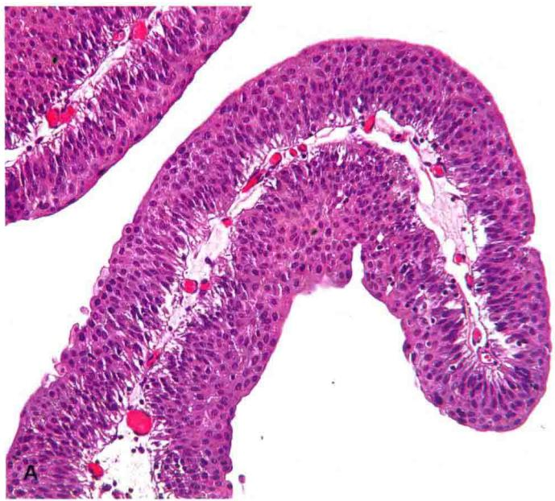
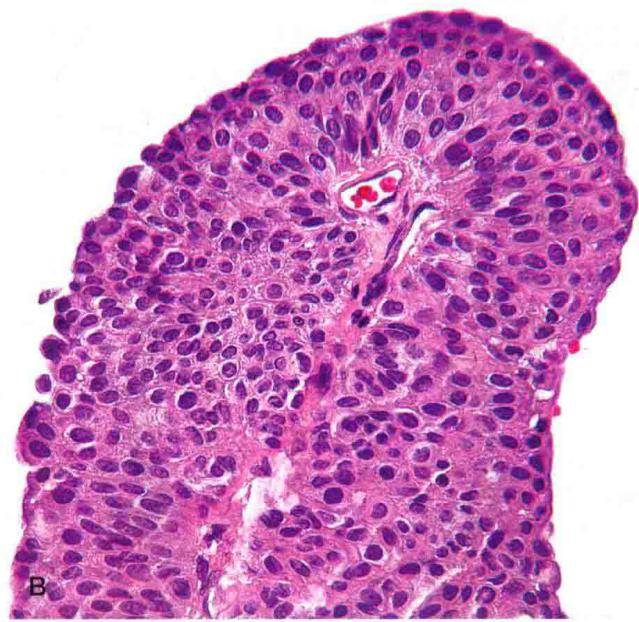
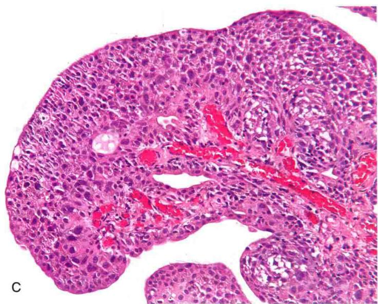 
图17-9 膀胱的尿路上皮肿瘤。A.低级别乳头状尿路上皮癌由外生性乳头状结构组成，中心为结缔组织轴心，衬覆排列轻度紊乱的移行上皮；B.低级别乳头状尿路上皮癌在高倍镜下显示轻度结构和细胞学的异型性；C.高级别乳头状尿路上皮癌显示上皮明显的结构紊乱，伴有多形而深染的核；D.侵袭性高级别乳头状尿路上皮癌由侵入肌层深染的不规则细胞巢组成
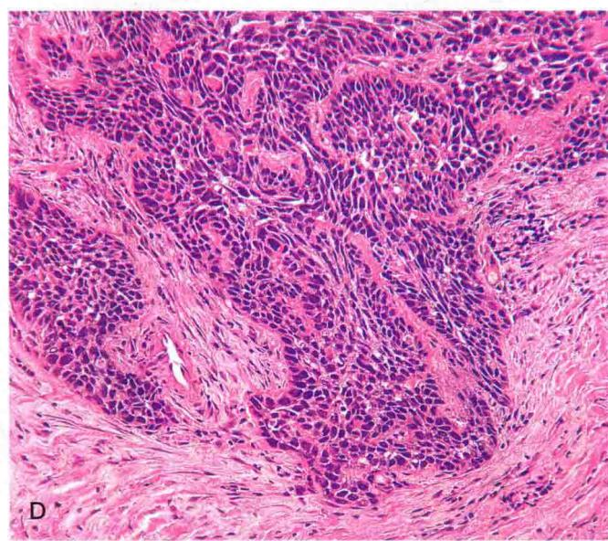
茎上的上侧（背侧表面）打开。尿道上裂最常见的形式是整个阴茎的尿道沿着长轴打开。严重的尿道上裂可能与膀胱外翻有关。
该缺陷最轻的情况是局限在腺尿道。尿道上裂的手术治疗比尿道下裂的更为复杂。
包茎：包皮的开口可能过于狭窄无法使阴茎头回缩。包茎易患阴茎感染。如果狭窄的包皮被强制回纳，可能会绞窄阴茎头和妨碍静脉血液流出，这种情况被称为嵌顿。先天性包茎必须与获得性包茎鉴别，后者通常是由于复发感染或是未包皮环切的人的包皮创伤的引起的。包皮环切术可以治疗包茎和嵌顿。
# 二、阴囊肿块
导致阴囊肿胀或肿大的阴囊肿块和病变往往反映睾丸、附睾和阴囊发育异常。与这些病理状况的临床问题最常发生于儿童，但也可在成人中发现（图17-10）。
鞘膜积液：该术语指的阴囊内两层鞘膜之间浆液性液体的聚集。腔面内衬间皮细胞。鞘膜积液可能是先天性（在婴儿阴囊的最常见的原因肿胀）或获得性的，后者是感染、肿瘤或创伤的结果。鞘膜积液一般都是良性的，但长期的疾病会导致睾丸萎缩或附睾压迫。
如果液体被感染，可能会导致睾丸鞘膜炎。
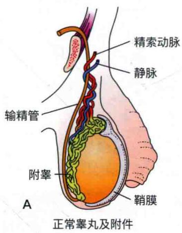
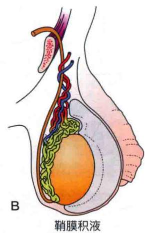
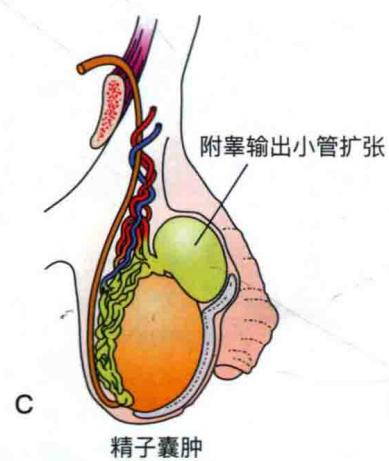 
图17-10阴囊肿物。A.正常睾丸；B.鞘膜积液；C.精液囊肿；D.精索静脉曲张
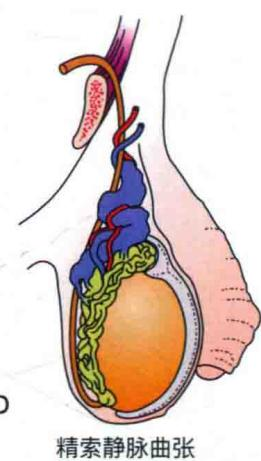
积血：可能因外伤或出血进入鞘膜积液后血液在鞘膜层之间聚积。睾丸肿瘤和感染也可能导致积血。
精液囊肿：是由睾丸网或附睾中增宽的输出小管的突起而形成的囊肿。它表现为一个位于睾丸门部的充满乳白色液体的结节或波动性肿块。囊肿内衬立方上皮，其中包含不同阶段的生精上皮。
精索静脉曲张：睾丸静脉扩张在阴囊侧方出现结节。大多数没有症状，在对不育男性的体检中发现。精索静脉曲张被认为是不孕和少精症的常见原因。睾丸萎缩罕见，只出现在长期的病患中。精索内静脉结扎的手术切除通常可以提高生育功能。
# 三、炎性病变
影响阴茎最重要的炎性病变：①性传播疾病；②非特异性感染；③病因不明的疾病，闭塞性干燥性阴茎头炎；④皮肤病（第24章）；⑤皮炎累及阴茎和阴囊的轴。性传播疾病详见第9章。
# （一）阴茎头炎是阴茎头的炎症
未做包皮环切的男性阴茎头炎通常是从阴茎头延伸至包皮，被称为阴茎头包皮炎。多数情况下，是由细菌感染引起的，但在免疫抑制和糖尿病患者中，也可以由真菌引起。阴茎头炎通常是由卫生条件差造成的。慢性阴茎头包皮炎显著的并发症有尿道口狭窄、包茎和嵌顿。
闭塞性干燥性阴茎头炎：这种不明病因的慢性炎性疾病特征是皮下结缔组织的纤维化和硬化。阴茎头的受累部分是白色硬结。纤维化使尿道口收缩或导致包茎。这相当于硬化性苔藓等女性外阴萎缩性病变（第18章）。
# （二）阴茎硬结病是阴茎的纤维性硬结
阴茎硬结病是一种病因不明的阴茎体局灶不对称的纤维化。阴茎弯曲导致勃起时疼痛。阴茎体出现界限不清的硬结，而其上皮肤没有异常。显微镜下表现为密集的纤维化及散在的非特异性慢性炎症。局灶海绵体隔膜肌肉被胶原纤维替代。阴茎硬结病在40岁以上男性的发病率为 $1\%$ ，但大多数情况下症状轻微，不影响性功能。已发现其与慢性酒精中毒的相关。
# 四、尿道炎及其相关病变
尿道炎是尿道的炎症，可以是急性或慢性炎症。
性传播尿道炎：尿道炎是男性性病最常见的表现形式，通常表现为尿道分泌物。女性很少注意区分尿道分泌物而通常主诉为阴道分泌物。淋球菌和非淋菌性尿道炎可以有急性发作，并与最近的性生活相关。非淋菌性尿道炎主要由沙眼衣原体或解脲支原体所致，但是也可以与其他多种病原体相关。详见第9章。
非特异性感染性尿道炎：尿路病原体如大肠埃希菌
和假单胞菌可引起尿道炎。通常情况下感染与膀胱炎有关，但也可能与其他疾病（如前列腺增生或尿路结石）相关。在男性，感染性尿道炎可以是前列腺炎的唯一表现；在女性，则有可能是阴道炎和外阴炎的一种并发症。
尿道肉阜：尿道肉阜是女性尿道口附近的息肉样炎性病变，可以有疼痛和出血。病变只发生在女性，而且大多是绝经后妇女。其病因和发病机制尚不清楚；尿道黏膜的脱垂和相关慢性炎症已被建议作为原因。尿道肉阜表现为经常溃烂的外生性息肉样肿块，直径 $1\sim 2\mathrm{cm}$ ，位于尿道口或在其附近。显微镜下，表现为急性和慢性的炎性肉芽组织，以及溃疡和移行细胞或鳞状上皮的增生。治疗方法是手术切除。
Reiter综合征：这是尿道炎，结膜炎和关节炎的三联症，后者累及负重关节（如膝关节、骶髂及椎关节）。其他一些症状是不同比例地出现男性环状阴茎头炎（伴有阴茎头环形或线性斑块样脱色），女性的宫颈炎和皮疹。Reiter综合征往往在组织相容性抗原HLA-B27的年轻成年人中出现。症状通常在衣原体尿道炎或志贺菌、沙门菌和弯曲杆菌引起的肠道感染后几周出现。因此认为这代表了一种不适当的对未知微生物抗原的免疫反应。症状通常在 $3\sim 6$ 个月后自发消失，但关节炎会在 $50\%$ 的患者中复发（第26章）。
# 五、阴茎癌
源自阴茎头和尿道口附近的鳞状上皮黏膜或者包皮及覆盖阴茎的皮肤。肿瘤多发生在未行包皮环切的男性。

【流行病学】在美国，阴茎侵袭性鳞状细胞癌
是一种罕见的肿瘤，占男性所有癌症的 $0.5\%$
以下。然而，非洲和亚洲的某些地区是普通发病率的20倍。这种地域差异归因于包皮环切的差异。大多数阴茎癌患者自小有包茎，提示包皮垢和阴茎上皮的长时间接触可能发挥一定的作用。人类乳头瘤病毒（HPV）的16和18型也是阴茎癌的发病因素，推测在这种癌症流行地区居住的男孩，其HPV免疫会有潜在作用。

【病理】阴茎癌可以有浸润前状态（原位癌）和浸润型。
1.鳞状细胞原位癌阴茎原位癌两种： $①$ Bowen病，其表现为阴茎体上边界清楚的红斑或灰白色斑块； $②$ Queyrat红斑，表现为阴茎头及包皮上单发或多发的有光泽、质软的红色斑块。这两种形式的镜下表现均为类似于在其他部位的鳞状细胞原位癌。病变显示表皮全层的角质细胞异型，伴有角化不全或角化过度；乳头状瘤样增生，伴有广泛表皮乳头样结构和颗粒层变薄。根据定义，非典型角质细胞不侵犯真皮浅层，其进展到侵袭性鳞状细胞癌的概率小于 $10\%$
2.阴茎鲍温样丘疹病 由HPV感染引起，常见于性生活频繁的年轻人。与鲍温病的孤立性病变相反，鲍温样丘疹病表现为多发性褐色或紫色丘疹，其与正常表皮分界明显，与HPV感染相关的疣类似。病变表皮显示表层的分层和成熟，可以出现有多核的有非典型核的巨大角质细胞。 $80\%$ 的患者有HPV16型感染的证据。事实上，鲍温样丘疹病的所有病变可以自然消退，不发展为浸润癌。
3. 浸润性鳞状细胞癌 肿瘤表现为：① 溃疡；② 火山口样硬结；③ 质脆的出血性肿块；④ 外生性、蕈伞型、乳头状肿瘤。鳞状细胞癌通常累及阴茎头或包皮，而并不常累及阴茎体。在一些被忽视的病例中可以发现阴茎组织包括尿道口的广泛破坏。显微镜下，它通常是分化良好、有灶性角化的鳞状细胞癌。浸润性肿瘤通常在真皮有密集的慢性炎症细胞浸润。
邻近表皮常可见发育不良。肿瘤可侵犯阴茎体深部，并蔓延到腹股沟淋巴结，之后到髂淋巴结，最终到远处器官。
4. 疣状癌 这种肿瘤要与其他阴茎癌分开，因为其细胞学表现为良性，但临床上是恶性的外生性鳞状细胞癌。它在大体表现和细胞学上与尖锐湿疣（HPV感染相关的良性阴茎疣）类似，但与这种疣不同的是，疣状癌有局部浸润。这种低级别的鳞状细胞癌通常不会转移，手术切除有效。

【临床表现】大多数鳞状细胞癌在病变初期局限于阴茎内，但偶尔转移至腹股沟淋巴结的情
况并不少见。浅层浸润性癌5年生存率为 $90\%$ ；有腹股沟淋巴结转移5年生存率减少为 $20\% \sim 50\%$ 。通常阴茎切除是必要的。
# 第四节 睾丸、附睾及精囊腺
# 一、隐睾
隐睾，临床上称为睾丸未降，是一种先天性异常，是一个或两个睾丸不在其阴囊的正常位置。 $5\%$ 的足月出生和 $30\%$ 的早产男性新生儿睾丸不在阴囊内或容易回缩。这些婴儿中的大多数在1周岁以内睾丸会降至阴囊。因此从1岁至成年，隐睾的发病率只有 $1\%$ 隐睾通常是单侧，但 $30\%$ 是双侧。

【发病机制】睾丸下降不全的原因通常不明，但理论上可能与下列情况相关：①性腺发育
异常；②内分泌因素：③防止胎儿睾丸穿过腹股沟管的机械因素。

【病理】睾丸下降时可以从腹腔到阴囊上部的任何时候被中止（图17-11）。隐睾甚至在早
期就小于正常睾丸，而且这种差异随着年龄增长变得更加突出。因为间质纤维化病变睾丸变得坚硬。隐睾的组织学随年龄变化。在婴儿期和幼儿期，病变睾丸的生精小管体积比正常的小，生殖细胞比正常的少。青春期之后也比正常的所含生殖细胞要少，只在少数的小管中有精子发生。可见小管基底膜的玻璃样增厚和突出的间质纤维化（图17-12）。最终小管缺乏生精细胞及完全玻璃样变性。无论在儿童期或是在青春期之后行睾丸固定术（将睾丸放置到阴囊的手术）都不能防止生精上皮和小管的丢失。
【临床表现】隐睾的临床意义在于其与不孕及生殖细胞肿瘤的发病率增加有关。所有双侧隐睾的男性有无精症及不育。单侧隐睾与 $40\%$ 的少精症相关，其定义为精子数量低于2000万 $/ \mathrm{ml}$ 。大多数泌尿科医生建议在6个月到1年之间行睾丸固定术，但目前尚不清楚这种治疗是否提高了最终的精子数量。
隐睾与睾丸癌风险的相关性要比正常高出 $20\sim 40$ 倍。腹腔内睾丸比保留在腹股沟管的风险较高；相应的，腹股沟睾丸比阴囊高位睾丸的风险较高。
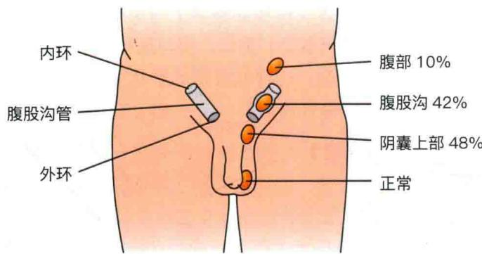 
图17-11 隐睾。在大多数情况下，睾丸位于阴囊上方或保留在腹股沟管内
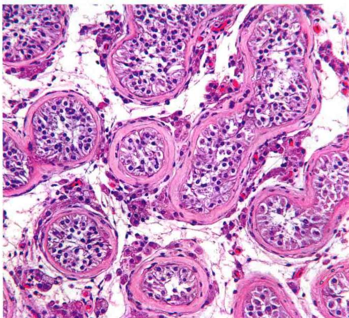 
图17-12 隐睾。青春期之后男性的睾丸显示明显增厚曲细精管和透明变性的基底膜，这表明没有精子生成的迹象
对侧正常下降的睾丸也有风险，但其癌症发病率只有正常男性的4倍。不幸的是，睾丸固定术不降低罹患癌症的风险。
# 二、附睾炎
附睾炎是附睾的急性或慢性炎症，通常是由细菌引起的。在青年男性中，附睾炎常常是急性炎，作为一种淋病的并发症或是一种性传播性衣原体感染出现。感染以化脓性炎症为特征。
在老年男性，最常见的病原体是与尿路感染相关的大肠埃希菌。患者表现为阴囊痛及压痛，伴或不伴有发热。淋病性附睾炎是男性不育症的常见原因。精子肉芽肿是精子以某种方式进入附睾组织间隙所导致的强烈炎性反应。精子外渗的原因往往不明，但附睾管的外伤性破裂可能起一定作用。患者表现为阴囊疼痛和肿胀，经常持续数周或数月。显微镜下，附睾可见混杂的炎性细胞浸润和大量外渗精子碎片，以及精子被巨噬细胞吞噬。最终，炎症导致间质纤维化，导管阻塞和不育。
# 三、睾丸炎
睾丸炎是睾丸的急性或慢性炎症。它可能是附睾睾丸炎的一部分，通常由上行感染引起，或者可能是一个孤立的睾丸的炎症。革兰阴性细菌睾丸炎是该病的最常见形式。它往往是继发于尿路感染，并且通常与附睾炎相关。感染也可能表现为睾丸内脓肿或睾丸周围化脓和纤维化。梅毒和流行性腮腺炎可引发睾丸炎，虽然免疫可降低腮腺炎的发病率。原因不明的肉芽肿性睾丸炎是中老年男性的罕见疾病，急性发病表现为睾丸疼痛性肿大或隐匿的睾丸硬结。显微镜下的特点为非干酪性肉芽肿，且没有找到可能是病因的病原体或精子残余。
# 四、精索扭转
精索扭转，如果是完全性的，会在几小时内产生严重的疼痛和睾丸生殖细胞的梗死。这种疾病通常发生在剧烈的运动之后，并且可能与使睾丸过量活动的某种先天性异常有关。突然发病的阴囊疼痛及肿胀往往伴有精索扭转。肿胀的睾丸显示出血性梗死的大体和显微镜下特征。6小时内扭转缓解通常会导致完全恢复，但是延迟 $12\sim 24$ 小时缓解可能导致睾丸活力的严重或完全丧失。
# 五、睾丸肿瘤
睾丸肿瘤占成年男性所有恶性肿瘤的 $1\%$ 以下。睾丸肿瘤根据其细胞来源在组织学上分为几组（表17-2）。这些肿瘤超过 $90\%$ 的是恶性的，为生殖细胞来源，但病因未知。这种肿瘤欧洲裔美国人是黑人的5倍。睾丸
肿瘤中发现的唯一一致的细胞遗传学异常是12号染色体的附加片段（等臂染色体p12）。如上所述，睾丸肿瘤有据可查的危险因素仅仅是隐睾和性腺发育不全。
表17-2 睾丸肿瘤生殖细胞肿瘤:90%精原细胞瘤(40%)非精原细胞性生殖细胞肿瘤胚胎性癌(5%)畸胎癌(35%)绒癌(&lt;1%)混合性生殖细胞肿瘤(15%)畸胎瘤(1%)精母细胞性精原细胞瘤(1%)幼年型卵黄囊瘤(2%)性索细胞肿瘤:5%Leydig 细胞瘤(60%)Sertoli 细胞瘤(40%)转移:5%
【发病机制】可能早在胎儿发育过程中出现生殖细胞的恶性转化。然而，由于生殖细胞肿瘤青春期以前很少发生，恶性转化可以在围青春期出现，受累的精原细胞被激素刺激而增殖和分化成精母细胞。生殖细胞肿瘤通过两种途径进展（图17-13）。最常见的是一个原位癌阶段，也被称为曲细精管内睾丸生殖细胞肿瘤形成（ITGCN），在浸润癌之前发生并进展为浸润癌（见下文）。ITGCN不发生在青春期前的睾丸畸胎瘤或婴儿期的卵黄囊瘤中，这些肿瘤直接从生殖细胞发展而来，不经历原位癌阶段。
ITGCN的肿瘤细胞与精原细胞或胎儿的生殖细胞相似，但具有更大的多倍体核（图17-14）。与胎儿生殖细胞类似，它们在其表面表达胎盘样碱性磷酸酶。有隐睾病史的不育男性，ITGCN可以在获取侵袭性和发生浸润性恶性肿瘤的前 $5\sim 10$ 年保持不变。具有精原细胞表型特征的恶性细胞可发生精原细胞瘤。另外，肿瘤性生殖细胞也可分化成为恶性胚胎细胞（胚胎癌）。
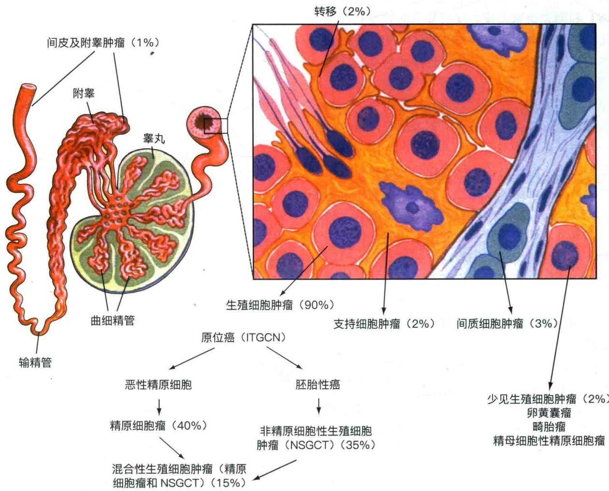 
图17-13睾丸、附睾和相关结构的肿瘤。大多数睾丸肿瘤起源于生殖细胞，之前在原位癌阶段被称为曲细精管内生殖细胞肿瘤生成(ITGCN)。成人睾丸的生殖细胞肿瘤可分为精原细胞瘤（40%），或非精原生殖细胞肿瘤（NSGCTs）（35%）。在15%的病例，精原细胞瘤成分与NSGCT混杂形成混合性生殖细胞肿瘤。一些生殖细胞肿瘤（儿童卵黄囊瘤，儿童畸胎瘤和精母细胞性精原细胞瘤）不经由侵袭前的ITGCN阶段进展而来。性索间质细胞（睾丸间质和支持细胞瘤）来源肿瘤、附睾肿瘤、鞘膜间皮衬里的肿瘤（腺瘤样瘤）和转移性肿瘤罕见
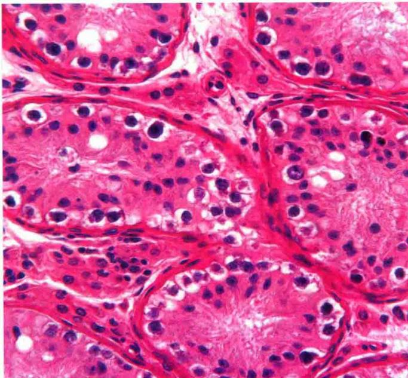 
图17-14曲细精管内生殖细胞肿瘤生成（ITGCN）。曲细精管无精子生成的迹象，而被与小管内原位癌相符的非典型大细胞所替代
在一些情况下，胚胎癌的细胞以未分化形式增殖。其他情况下，它们分化成三个胚层（外胚层、中胚层、内胚层），或是分化成形成胎膜和胎盘的胚外组织。胚胎癌细胞的胚外衍生物引起绒毛膜上皮（细胞滋养细胞和合体）和卵黄囊状上皮。这些复杂的肿瘤包含恶性未分化的胚胎癌细胞及其体细胞衍生物和胚外衍生物，被称为畸胎癌或恶性畸胎瘤。当胚胎癌细胞增殖而没有进一步分化并显示出一个单一的组织学类型，肿瘤被简单地称为胚胎性癌。在极少数情况下，畸胎癌的胚外成分会过度生长并破坏所有其他成分。这类肿瘤由一个单一肿瘤类型组成，可以归类为卵黄囊癌或绒毛膜癌。由于临床目的，所有伴胚胎性癌作为恶性细胞来源的生殖细胞肿瘤被称为非精原细胞生殖细胞肿瘤（NSGCTs），以便与精原细胞瘤区分。该分组还包括成人睾丸单纯性卵黄囊癌和绒毛膜癌。 $15\%$ 的生殖细胞肿瘤同时包含精原细胞瘤和非精原细胞瘤成分。这种混合性生殖细胞瘤在临床上被视为非精原细胞瘤。
# （一）曲细精管内生殖细胞肿瘤形成（ITGCN）是睾丸原位癌
ITGCN因其发生的背景被认为是生殖细胞肿瘤浸润前的形式。ITGCN可以在下列情况出现：①在 $2\%$ 的隐睾或因不孕而行的睾丸活检中有孤立的灶性组织学变化；②与侵袭性生殖细胞瘤相邻的播散性原位癌；③ $5\%$ 的睾丸生殖细胞肿瘤睾丸切除术患者的对侧睾丸。

【病理】ITGCN以斑片状生长方式累及睾丸，通常累及 $10\% \sim 30\%$ 的小管。ITGCN累及
的曲细精管有厚的基底膜而且没有精子。正常生殖细胞被广泛附着于基底层的肿瘤性生殖细胞所取代（图
17-14)。肿瘤细胞比正常的精原细胞大。核大,有纤细分散的染色质和明显的核。细胞核位于中心,有丰富透明的含有大量糖原的胞质所包围。核 DNA 含量增加,提示该细胞是三倍体。胞膜清晰,胎盘碱性磷酸酶 (PLAP) 的抗体可以着色。可以用免疫组织化学方法检测到的转录因子 OCT3/4 是这类细胞的可靠标志物。

【临床表现】ITGCN是浸润癌的前体状态，它以不可预知的速度在进展。 $50\%$ 有ITGCN的5年之内进展为浸润性癌，7年之内有 $70\%$ 的浸润性癌。睾丸活检诊断为ITGCN的提示需要行睾丸切除术。
# （二）精原细胞瘤包含类似的精原细胞单一形态的细胞

【流行病学】精原细胞瘤是最常见的睾丸癌，占所有的生殖细胞肿瘤的 $40\%$ 。发病高峰是40岁。除了那些有性腺的发育异常的，精原细胞不发生在青春期前的儿童。

【病理】大体检查肿瘤是实性、硬韧的肿块。肿瘤组织通常与被挤压、萎缩和纤维化的正常组织截然分界。精原细胞瘤切面上表现为分叶状，棕褐色或浅灰黄色（图17-15）。坏死或出血区不明显，但可能会在较大的肿瘤中出现。
显微镜下，精原细胞瘤相当于女性卵巢无性细胞瘤（第18章）。肿瘤特征为一致的单一多边形细胞，有位于中央的泡状核。其胞质丰富，在常规组织学切面上表现为浅染、嗜酸或透明，因为其中含有大量的糖原和部分脂肪。肿瘤细胞排列成有纤维分隔的巢状或片状，纤维分隔中有淋巴细胞，浆细胞和巨噬细胞浸润。偶尔分隔中有巨细胞肉芽肿。肿瘤细胞侵犯睾丸实质，同时也通过输精管进入睾丸网。附睾侵犯在疾病后期出现，通常在腹腔淋巴结播散之前发生。与胎儿精原细胞和原始生殖细胞类似，精原细胞瘤的细胞膜表达PLAP。虽然有少量PLAP入血，但它不能被用作诊断。精原细胞瘤细胞也表达c-Kit（CD117）和转录因子OCT3/4，它们是这种肿瘤可靠的标记物。

【临床表现】精原细胞瘤表现为逐渐增长的阴囊肿块，通常在诊断时仍然可以通过睾丸切除，可以伴或不伴腹腔淋巴结清扫术。这些肿瘤线高度敏感，放疗在无法通过单纯手术治愈时作用。在晚期播散阶段，化疗通常可以成功治疗。织学类型的精原细胞瘤治愈率大于 $90\%$
# （三）非精原细胞瘤性生殖细胞肿瘤（NSGCTs）起源于胚胎细胞
睾丸NSGCT包括几个病理类型，大多数是以下两个类型：①单纯胚胎性癌；②畸胎癌，也被称为恶性
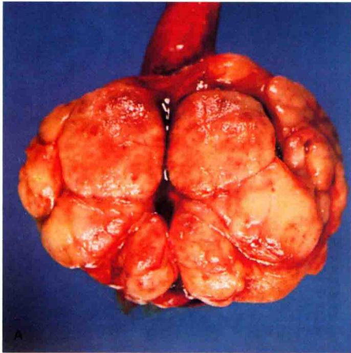
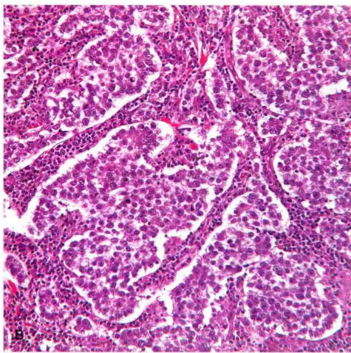 
图17-15 精原细胞瘤。A.结节状的肿瘤切面棕褐色、凸出表面，提示肿瘤质实而硬韧；B.肿瘤细胞巢由淋巴细胞浸润的纤维分隔包围。肿瘤细胞具有泡状核，比淋巴细胞的小圆形核大得多
畸胎瘤或混合性生殖细胞肿瘤。成人睾丸的单纯绒毛膜癌和单纯卵黄囊癌是少见NSGCT。混合性生殖细胞肿瘤是NSGCT伴有精原细胞瘤成分。NSGCT占所有睾丸生殖细胞肿瘤的 $55\%$ ，畸胎癌占NSGCT的2/3。与精原细胞瘤类似，NSGCT发病高峰在 $25\sim 40$ 岁年龄组。这些患者在诊断时通常比精原细胞瘤稍为年轻。

【病理】非精原细胞瘤性肿瘤大小和形状不一，
可以是实体或部分囊性。实性区的颜色不一，
从白色（未坏死）黄色（坏死）到红色（出血）（图17-16）。
NSGCT的组织学变化很大。单纯胚胎性癌单一由
类似于植入前期胚胎细胞的未分化胚胎性癌细胞组成（图17-17）。肿瘤细胞胞质少，因此其深染、不成比例的大核看起来有重叠。胚胎性癌的细胞排列成宽的实性片状、条索状、腺样的小管和腺泡，有时甚至有乳头状结构。核分裂多见和细胞凋亡是其特点。胚胎性癌可以侵犯睾丸、附睾和血管，转移至腹腔淋巴结、肺及其他脏器。
胚胎性癌细胞是畸胎癌（恶性畸胎瘤）的干细胞，分化的体细胞成分（例如，在各种器官的正常组织和胚外成分，包括卵黄囊细胞和滋养细胞）是畸胎癌的特征。因而显微镜下这种非精原细胞瘤性肿瘤会出现胚胎性癌病灶和多种其他组织成分（图17-18）。然而，一个类似的肿瘤也包含精原细胞瘤的细胞，被称为混合性生殖细胞瘤。
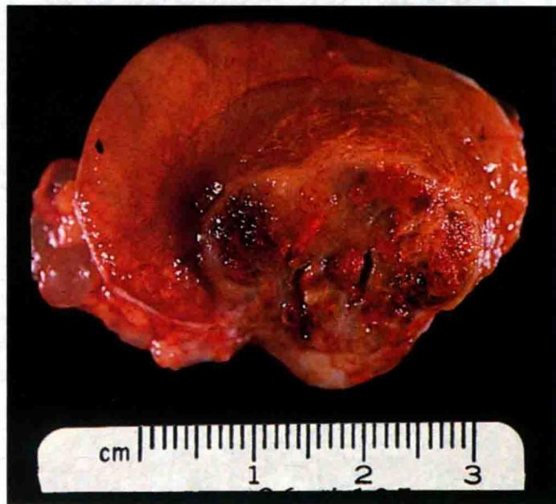 
图17-16 睾丸非精原细胞生殖细胞瘤。这种小的睾丸肿瘤的切面显示明显的异质性，颜色从白色到暗红色
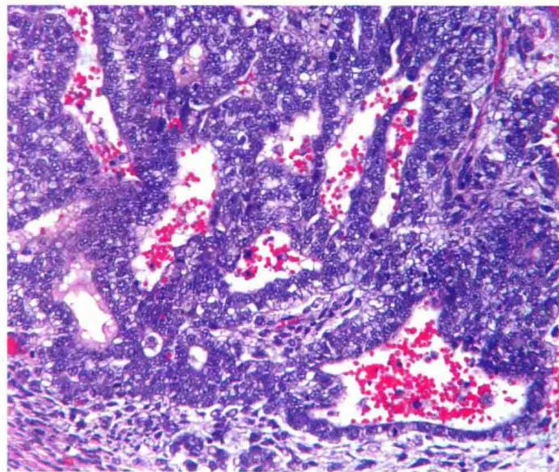 
图17-17 染的核使肿瘤呈现深蓝色。核拥挤相互重叠。细胞形成条索和片状，周围包绕充满红细胞的扩张的血管
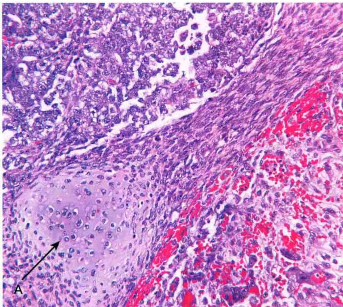
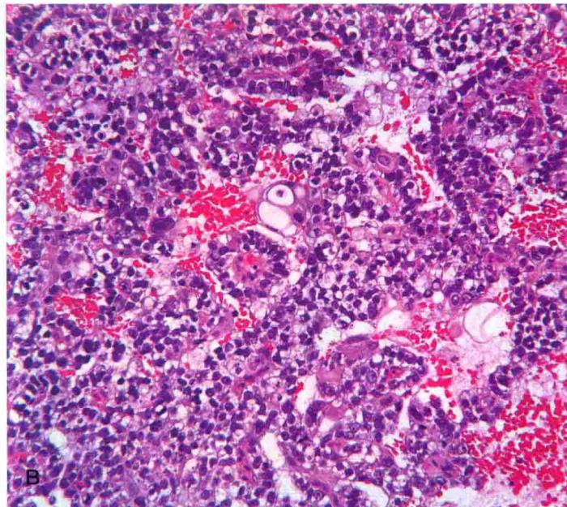
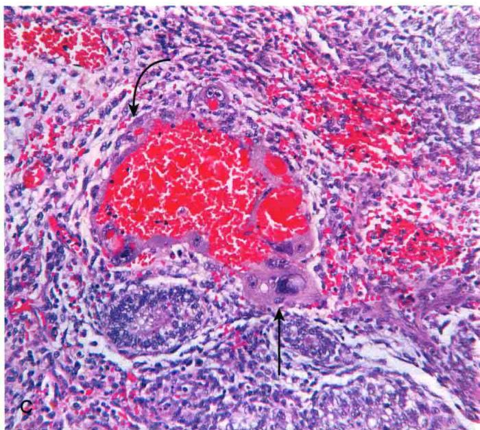 
图17-18 睾丸非精原细胞生殖细胞瘤（NSGCT）。A.这种肿瘤的体细胞成分包括分化良好的软骨（箭头）和难以归类的结缔组织，它们将胚胎性癌（左上角）与出血性绒毛膜癌（右下角）分隔开；B.卵黄囊成分由被疏松间质分隔的上皮细胞条索组成，类似于早期的卵黄囊；C.NSGCT的绒毛膜癌成分有多核合体滋养层细胞样巨细胞（直箭头）和单核细胞滋养层细胞（弯箭头）。滋养细胞的浸润性生长通常与出血有关
NSGCTs可产生高度恶性的细胞滋养层细胞和合体滋养层细胞的克隆，其长满其他元素。
肿瘤完全由恶性绒毛膜上皮组成被称为绒毛膜癌。同样，恶性卵黄囊上皮细胞的克隆产生卵黄囊癌。
青春期之前的睾丸畸胎瘤是良性的，由成熟的体细胞组织组成。睾丸切除术甚至睾丸保留手术治疗有效。一些青春期之后的年轻男性组织学上良性的畸胎瘤可具有恶性的临床过程，尽管它们似乎是唯一成熟的非增殖性体细胞成分而没有胚胎成分。这些肿瘤在临床上被称为畸胎瘤增长综合征。在其他情况下，畸胎瘤组织保持未分化状态，类似胚胎器官或胚胎肿瘤如神经母细胞瘤。这些未成熟畸胎瘤也是潜在恶性的。

【临床表现】大部分NSGCT表现为睾丸肿物。
它们往往比精原细胞瘤增长更快，更容易和
更广泛地转移。因此对于一些 NSGCT，转移可能是该疾病的首发症状。
与精原细胞瘤相比，NSGCT常含有卵黄囊成分和合体滋养层细胞。卵黄囊细胞分泌 $\alpha-$ 胎球蛋白（AFP），这是一种在血液中异常出现的胎儿血浆蛋白。合体滋养层细胞释放人绒毛膜促性腺激素（hCG），这是一种妊娠激素，尚未在男性中检测到。 $70\%$ NSGCT的患者有AFP或hCG血清水平的升高，因而是术后随访可靠的肿瘤标志物。AFP或hCG血清水平升高的患者治疗后可恢复正常，但随后在复发转移时会回升。
NSGCT的治疗包括切除原发肿瘤的睾丸切除术、铂类为基础的化疗以及有手术指征的腹部淋巴结清扫术。化疗通常能消除转移的胚胎性癌细胞，但由它们起源的分化组织对化疗抵抗。这种组织不生长，也不太可能危及生命。仅仅在30年前，NSGCT患者的5年生存率只有 $35\%$ 。与此相比，目前完全治愈的记录超过 $90\%$ 的病例。
# （四）性腺间质/性索肿瘤类似睾丸支持或睾丸间质细胞
性素间质肿瘤占睾丸肿瘤的 $5\%$
1.睾丸间质细胞瘤 这是由类似睾丸间质（Leydig）细胞组成的一种罕见肿瘤。它们有激素活性，可分泌雄激素、雌激素或两者都分泌。Leydig细胞肿瘤可发生于任何年龄，有两个明显的峰值，儿童时期和 $30\sim 60$ 岁。青春期之前男孩睾丸间质细胞瘤的雄激素作用能促使身体和性发育的早熟。相比之下，一些有这种肿瘤的成年人会出现女性化和男性乳房发育。尽管大多数（ $90\%$ ）Leydig细胞肿瘤是良性的（只有 $10\%$ 是恶性的），但是很难由组织学来预测其生物学行为。儿童和几乎所有的成年人的睾丸间质细胞瘤都可以行睾丸切除术而治愈。
2. 支持细胞瘤 由肿瘤性睾丸支持细胞组成的一些睾丸/性索肿瘤。大部分（ $90\%$ ）的肿瘤是良性的，几乎不产生任何激素症状。多数睾丸支持细胞瘤的患者在40岁以下，由于阴囊肿块而就医。睾丸切除术治疗有效。
# 第五节 前列腺
# 一、前列腺炎
前列腺炎是指前列腺的炎症，它可以是急性和慢性炎症。它经常是由类大肠埃希菌的尿路病原体引起的，但往往无法明确病因。
1.性前列腺炎 通常是其他泌尿道感染的并发症急性前列腺炎是感染尿液回流入前列腺的结果。急性炎症浸润出现在前列腺腺泡和间质。这种疾病会导致强烈的排尿不适感，经常发热，发冷和会阴部疼痛。大多数患者对标准的抗生素治疗反应良好。
慢性细菌性前列腺炎；这种持续时间较长的感染可能会伴有或不伴有间断的急性前列腺炎。大多数的慢性前列腺炎患者的症状是排尿困难和尿道口灼热感。也可以有耻骨、会阴和腰背疼痛或不适和夜尿。尿液中一般含有细菌。尿液回流、前列腺结石和局部前列腺管阻塞可促使慢性细菌性前列腺炎进展。显微镜下，通常为淋巴细胞、浆细胞和巨噬细胞的浸润。通常选用而并不必须选用的长期抗生素治疗是有效的。
2.非细菌性前列腺炎 这是一种没有明确致病微生物的慢性前列腺炎。非细菌性前列腺炎通常在50岁以上的人群发病，但几乎所有的年龄段均可发生。据推测，一些病例可能是由沙眼衣原体、支原体、解脲脲原体或阴道毛滴虫引起。然而在实践中，它是一个排除诊断。最常见的组织学形态腺体扩张，充满中性粒细胞和泡沫样巨噬细胞，周围环绕慢性炎症细胞。
它可以是无症状的，也可以引起类似于慢性细菌性前列腺炎的症状。在大多数情况下，没有特定的有效治疗。
【临床表现】如上所述，慢性前列腺炎的症状表现多样，并且临床处理相当棘手。最重要的是，慢性前列腺炎可引起血清前列腺特异性抗原（PSA）升高，会增加前列腺恶性病变的诊断风险。因此经常需要进行活检来诊断以排除癌。
# 二、结节性前列腺增生症
结节性前列腺增生症，也称为良性前列腺增生（BPH），是一种常见的疾病，临床上表现为前列腺增大和尿道流出道梗阻，病理表现为腺体和间质的增生。
【流行病学】前列腺增生在西欧和美国最常见，亚洲较少见。在美国这种疾病的发病率黑人比白人更高。临床前列腺病态（干扰排尿的严重的前列腺增生）的峰值在 $70\sim 80$ 岁。事实上，80岁以上的老年男性 $75\%$ 都有一定程度的前列腺增生。年龄小于40岁的男性很少出现。
【发病机制】青春期之前睾丸切除会防止BPH的发展。在成年男性，外源性睾酮不诱导增生性变化，甚至不刺激萎缩的腺体。无论伴有和不伴有BPH，男性年龄的增长与循环睾酮可比性降低有关。此外，BPH患者中血清中双氢睾酮（DHT）及睾酮的活性雄激素无变化，但循环睾酮和DHT的比例可以低于正常。药物阻断5α-还原酶以阻止睾酮转换为DHT（例如，非那雄胺或度他雄胺）会减小BPH患者前列腺的尺寸。
【病理】早期结节性增生始于近端尿道（移行区）的黏膜下层。增大的结节压迫位于中心的尿道腔，更多地压迫位于边缘的正常前列腺（图17-19）。切面每个结节由纤维假包膜包绕，分界清楚（图17-20B）。继发性改变有膀胱出口梗阻（图17-21）。
【组织学】BPH是腺泡和小管上皮细胞、平滑肌细胞和间质成纤维细胞不同程度的增生。典型的纤维腺肌瘤样结节是大小不一的前列腺增生腺泡随机散在分布在基质中。上皮（腺瘤）成分由双层细胞构成，高柱状细胞覆盖在基底层细胞上（图17-20C）。腺上皮乳头状增生是其特征。增生结节常表现非特异性前列腺炎，在腺体间和腺体内的出现急性和慢性炎症细胞浸润。腺泡内经常出现淀粉样小体（嗜酸性层状凝结物）。 $20\%$ 不同年龄的病例可以出现局灶性梗死。梗死周边常常出现导管上皮细胞的鳞状上皮化生。
【临床表现】前列腺尿道部的压迫和随后的膀胱出口的梗阻（图17-22）导致了结节性增生
的临床症状。经常会有尿流的活力下降和尿频增加的病史。直肠检查发现实性、增大的结节状前列腺。如果严重阻塞的持续时间延长，回流压力导致输尿管积水、肾积水以及最终的肾衰竭和死亡。
BPH经典的治疗是手术。目前，通常用抑制5α-还原酶的药物来减少前列腺的大小。α-肾上腺素受体阻滞剂可以减少前列腺肌张力，改善尿路梗阻的症状。如需外科处理，经尿道射频消融和冷冻治疗已经取代了传统的手术方法。
# 三、腺癌及癌前病变

【流行病学】在美国每年有估计24万新发病例
确诊为前列腺癌。每年有大约28000名美国
男性死于这种恶性肿瘤，这个数字相当于大肠癌的死亡数字。前列腺癌主要是老年男性的疾病， $75\%$ 的诊断病例年龄是 $60 \sim 80$ 岁。肿瘤的真实发生率远比其临床发病率高。尸检发现前列腺癌的发病率随着年龄的增长而增加，从 $40 \sim 50$ 岁不到 $10\%$ 到超过70岁的 $70\%$ 以上。
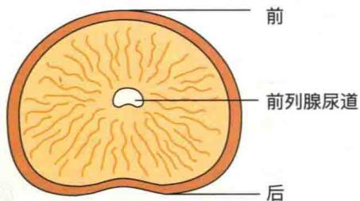 
正常前列腺
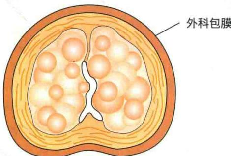 
前列腺结节状增生
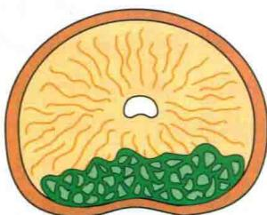 
前列腺癌
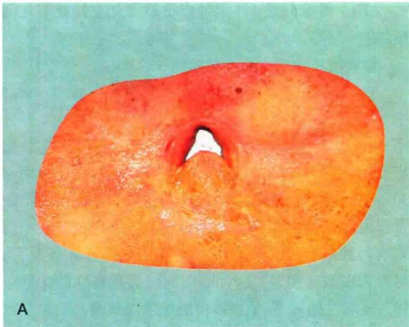
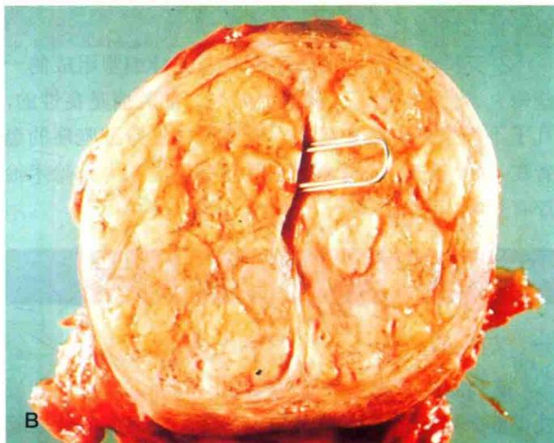
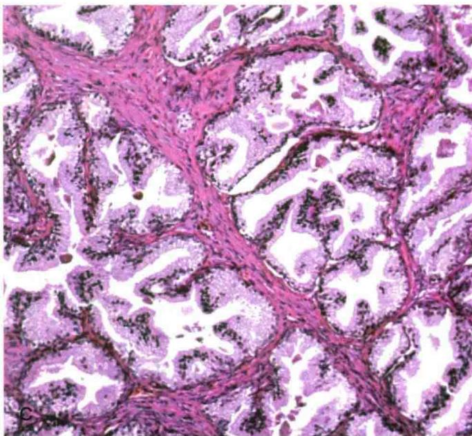 
图17-19 正常的前列腺、结节状增生和腺癌。前列腺增生症主要累及腺体的尿道周围部分，增生的结节使尿道受压及扭曲。中央前列腺腺体的增生使周围部分受压和纤维化，导致所谓外科包膜的形成。前列腺癌通常发生于周围区腺体，尿道压迫是一个晚期临床事件 
图17-20前列腺结节状增生。A.正常前列腺；B.因结节状增生而增大的前列腺切面显示被假包膜包围的大量界限清楚的结节，尿道前列腺部（回形针）已被压成一个狭窄的缝隙；C.结节状增生中增生的前列腺腺体。腺泡内衬的柱状上皮包括两层细胞：衬覆在腺泡腔面有极向的透明立方细胞和插入立方状腺泡细胞和间质之间扁平的基底细胞。乳头状突起衬覆增生的细胞，突向腺泡的腔面
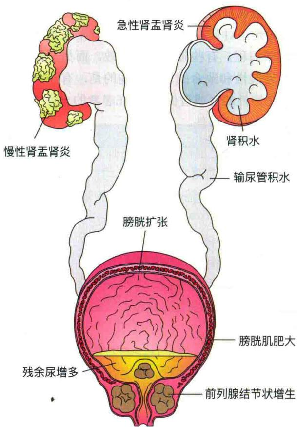 
图17-21 结节状前列腺增生的并发症
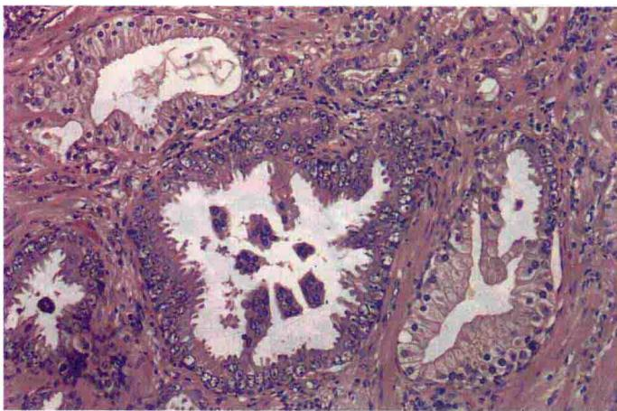 
图17-22 高级别上皮内瘤（PIN）。中央的大导管衬覆有核大、核仁明显的非典型细胞。与其相邻可见两个正常导管
世界范围的前列腺腺癌年龄相关死亡率有相当明显的地域差异；最高的是美国和斯堪的纳维亚国家，最低的是墨西哥、希腊和日本。世界范围的前列腺癌死亡率美国黑人最高，比美国白人高出1倍。移民研究表明，美国日本移民的后裔这种癌症的发生率高于日本。同样的，美国黑人男性前列腺癌的死亡率超过非洲黑人。除了地域、种族和年龄差异，遗传和饮食也可能会影响前列腺癌的风险。1/10的病例有家族倾向，第一级亲属中患有这种恶性肿瘤的人患病风险显著增加。

【发病机制】前列腺癌的病因尚不清楚，但研究的主要焦点是内分泌的影响。正常前列
腺生长的雄激素控制以及前列腺癌对睾丸切除和外源性雌激素的反应说明雄性激素的作用。但是，前列腺癌患者的血清雄激素水平通常不高。多个基因座的变异与前列腺癌的易感性有关。男性的BRCA1和BRCA2基因（与乳腺癌相关的一个关键基因），以及HOXB13基因（前列腺发育中重要的转录因子）的突变使前列腺癌的发病率增加。人类的雄激素（AR）基因在外显子1的CAG重复数量显示了相当大的差异。AR CAG重复序列较少的男性罹患前列腺癌的风险可能更大，但这些研究结果仍然存在争议。
【病理】没有证据表明前列腺癌起源于增生结节。目前的共识是导管不典型增生上皮增生，称为前列腺上皮内瘤（PIN），是前列腺癌的癌前病变。PIN是指固有前列腺导管衬覆细胞学具有非典型的腺上皮细胞和同时减少的基底细胞。高级别PIN是指具有腔内乳头状突起的扩张分枝状腺体内衬非典型细胞。细胞核增大，有核仁并表现出明显的拥挤（图17-23）。
大量证据表明，PIN病变是癌前病变可以进展到癌。高级别PIN会在大多数侵袭性癌的附近出现。这种病变可能比浸润癌提前出现多达20年，并且随着年龄的增长更为严重。许多初次针穿活检仅有高级别PIN患者在随后几周到几个月的随访活检中发现了浸润癌。
腺癌占绝大多数的原发性前列腺肿瘤，通常为多中心，超过 $70\%$ 的病例位于外周区。前列腺切面可见不规则黄白色包膜下的质硬结节。
浸润癌的组织学特征：大多数前列腺腺癌是腺泡起源的，表现为小到中等大的缺乏组织结构和在间质中浸润的腺体。分化好的肿瘤表现为由内衬单层肿瘤上皮细胞的中等或小的腺体。恶性腺泡缺乏基底细胞，
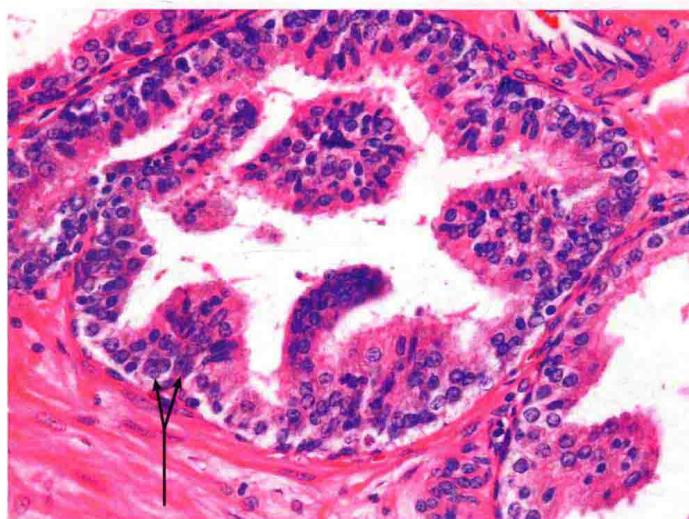 
图17-23 高级别上皮内瘤（PIN）。中央的大导管衬覆有核大、核仁明显的非典型细胞（箭头）
而且不再以小叶方式生长。前列腺腺癌肿瘤分化的渐进性丧失表现在：①腺体大小和结构的异型增加；②乳头和筛状结构；③不成熟的（或没有）腺体形成，而只有浸润性肿瘤细胞的实性条索。
分级：前列腺腺癌最常用的分类是Gleason分级系统（图17-24），它是基于肿瘤腺体形成和浸润的五种组织学形态而制定。考虑到肿瘤形态的异质性，Gleason评分是占多数形态加少数形态的等级（ $1\sim 5$ ）总和。分化最好的肿瘤Gleason评分为2（ $1+1$ ），而分化非常差的癌得分为10（ $5+5$ ）。大多数肿瘤评分为 $4\sim 7$ （ $2+2$ ， $3+4$ 或 $4+3$ ）。Gleason评分系统与肿瘤分期相结合有预后价值：评分较低的预后较好。
侵袭与转移：前列腺腺癌的包膜侵犯与肿瘤的包膜下位置相关。前列腺内及周围组织的神经周围肿瘤侵犯经常可见。因为外周神经缺乏神经周围淋巴管，此模式的浸润说明肿瘤是沿阻力最小的组织间隙中连续扩散。
精囊腺的累及基本都是前列腺癌的直接蔓延。转移最早到闭孔淋巴结，随后转移到髂淋巴结和腹主动脉旁淋巴结。肺转移是通过淋巴道播散。骨转移特别是脊柱肋骨和骨盆骨骼的转移很常见，而且很痛苦的，临床难以处理。肿瘤的广泛播散（癌病），经常伴随终
末期肺炎或败血症，是最常见的死亡原因。
不幸的是，目前在许多情况下我们无法预测前列腺癌的临床病程。有些肿瘤治疗有效，而另一些即使干预也是侵袭性和致命的。最有趣的是，有一大类的前列腺癌是惰性的（或潜伏癌），在患者的一生中可能永远不会成为临床事件。
【临床表现】目前前列腺癌筛查方案是使用直肠指检结合血清PSA水平，可以检测出大多数恶性肿瘤，但最近常规筛查PSA水平的效用受到质疑。血清PSA水平升高的患者要进行进一步穿刺活检。术前PSA水平与肿瘤体积是相关的。少见的情况下，前列腺癌患者表现为膀胱出口梗阻或转移性肿瘤的症状。有成骨细胞的骨转移的患者，血清碱性磷酸酶水平升高，因为此酶是在转移部位新骨形成时由成骨细胞释放的。
前列腺癌的治疗极具争议，因为最近的研究表明许多肿瘤可能最好不要治疗。区分出有可能从治疗中获益的那些肿瘤有相当大的困难。前列腺癌的治疗取决于肿瘤的分期（表1-7-3）。T1期和T2期的肿瘤患者可以进行前列腺癌根治术、射频消融术、低温治疗或放射治疗。放射治疗结合去势治疗是T3期肿瘤的治疗选择，其中有 $50\%$ 具有隐匿性盆腔淋巴结转移
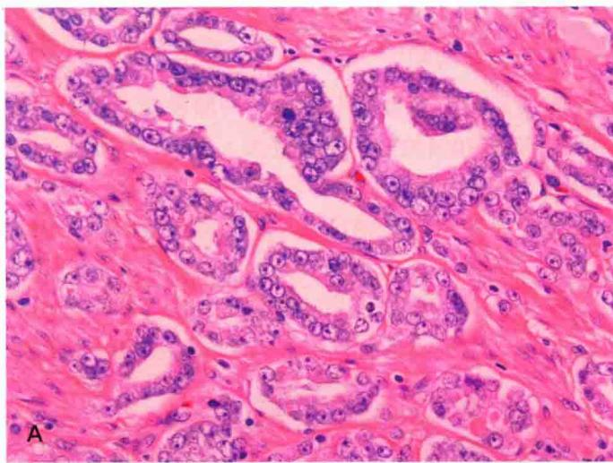
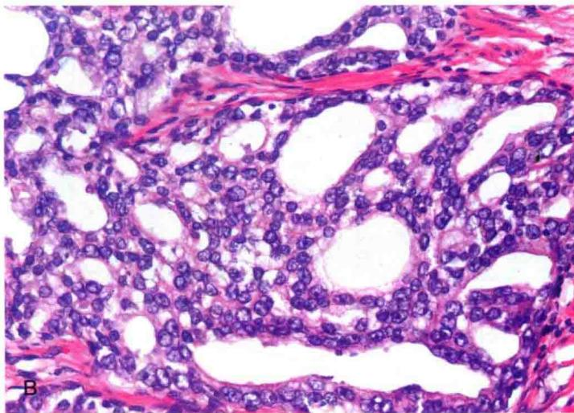
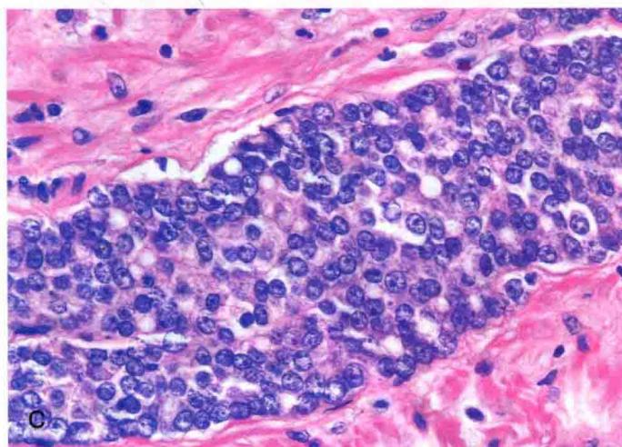 
图17-24Gleason分级系统。A.Gleason3分；B.Gleason4分；C. Gleason5分
的患者（可能会进一步系统性播散）不能由外科手段进行治疗。低级别、低容量肿瘤的患者可以只选择积极监测。肿瘤局限于前列腺内的5年生存率在 $90\%$ 以上，在有转移的情况下，这个数字下降到 $40\%$ 甚至 $10\%$ ，这取决于肿瘤的分期。
表17-3 前列腺癌的TNM分期T-原发性肿瘤T1:无临床可检测的肿瘤T1a:组织学的肿瘤占检测组织少于等于5%T1b:组织学的肿瘤占检测组织大于5%T1c:肿瘤经穿刺活检证实T2:肿瘤局限于前列腺T2a:肿瘤累及前列腺一叶的一半或更少
T2b:肿瘤累及前列腺一叶的一半以上T2c:肿瘤累及前列腺两叶T3:肿瘤突破前列腺包膜T3a:仅有前列腺包膜外侵犯T3b:肿瘤侵犯精囊腺T4:肿瘤侵犯精囊腺以外的邻近器官N-区域淋巴结N0=无区域淋巴结的累及N1=区域淋巴结转移M-远处转移M0=无转移M1=远处转移
（张伟）
# 第18章 女性生殖系统
女性生殖道宽广的疾病谱是该系统复杂功能解剖结构关系的反映。它是性病和其他感染性疾病病原侵入的门户。月经周期的维持需要卵巢和其他内分泌器官的相互作用。女性生殖器官可以发生上皮性、间叶性和生殖细胞源性肿瘤，包括良性和恶性肿瘤。对病毒病原学的了解和早期宫颈癌的成功检测，代表了我们对疾病病理发生机制探索的成功典范，它在公共卫生领域具有无比巨大的价值。
# 第一节 总论：生殖系统感染
# 一、性传播生殖系统感染
女性生殖系统感染常见，由多种病原微生物（表18-1）所引起，该内容在第9章也有讨论。多数累及
女性生殖道的重要感染性疾病为性传播疾病。
# （一）细菌感染
1.淋病 淋病由淋病奈瑟菌（一种需要复杂营养的革兰阴性双球菌）所引起。此种细菌的感染是性输卵管炎和盆腔感染性疾病（PID）的常见原因（图18-1）。

【发病机制和病理】微生物通过宫颈上行进入宫腔，引起急性子宫内膜炎。细菌附着在输卵管黏膜细胞表面，引起急性炎症反应，病变局限在黏膜表面（急性输卵管炎）。通过输卵管腔，
炎症扩散并累及卵巢，有时可引起输卵管－卵巢脓肿。炎症波及盆腔和腹腔可导致膈下和盆腔脓肿的形成。当修复过程破坏输卵管皱襞或致其扭曲变形，常引起不孕症。
表18-1 女性生殖道感染性疾病微生物疾病诊断要点性传播疾病革兰阴性杆菌和球菌肉芽肿荚膜杆菌腹股沟肉芽肿杜诺万小体（Donovan body）阴道加德菌加德菌感染线索细胞软性下疳嗜血杆菌软性下疳淋病奈瑟菌淋病革兰阴性双球菌螺旋体苍白密螺旋体梅毒梅毒螺旋体支原体人型支原体非特异性阴道炎尿素分解尿素原体非特异性阴道炎立克次体D-K型沙眼衣原体各种类型 PIDL1-3型沙眼衣原体性病淋巴肉芽肿病毒人乳头瘤病毒（HPV）尖锐湿疣/扁平湿疣，瘤变潜能挖空细胞6, 11, 40, 42, 43, 44, 57型低度危险性16, 18, 31, 33, 35, 39, 45, 51, 52, 56, 58, 66型高度危险性单纯疱疹病毒，2型生殖器疱疹核内均质化和核内包涵体的多核巨细胞巨细胞病毒（CMV）巨细胞病毒包涵体球形核内包涵体
微生物疾病诊断要点传染性软疣软疣病毒感染软疣小体原虫阴道滴虫滴虫病毛滴虫选择性非性传播疾病放线菌和相关微生物以色列放线菌PID（多种微生物之一）硫黄颗粒结核分枝杆菌结核坏死性肉芽肿真菌白色念珠菌念珠菌病念珠菌
PID. 盆腔感染性疾病
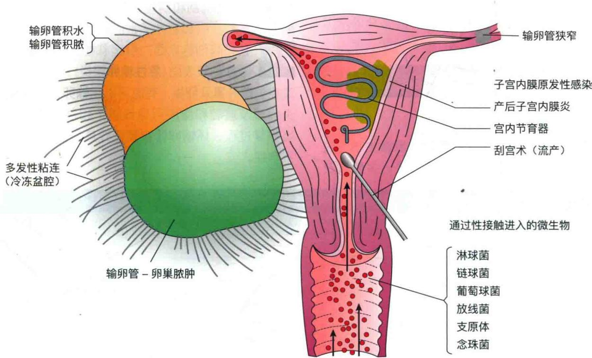 
图18-1 盆腔感染性疾病
2. 梅毒 梅毒由螺旋体（苍白密螺旋体）所引起，详细讨论见第9章。 
3. 衣原体感染 沙眼衣原体是一种革兰阴性细胞内寄生微生物，是一种常见的性传播微生物。该微生物见于约 $8\%$ 的无症状女性以及 $20\%$ 的表现出下生殖道感染症状的女性的生殖道。衣原体感染容易与淋病混淆，因为两者症状相似（第9章）。

【病理】感染时，宫颈黏膜重度发炎，宫颈管和化生的鳞状细胞可见小包涵体。细胞学上，
衣原体感染表现为具有清晰界限的核周胞质内包涵体和胞质内球状体。子宫内膜、输卵管和卵巢上行性感染可以引起输卵管梗阻和不孕。衣原体还可感染巴氏腺引起急性尿道炎。婴儿可经阴道生产时由母亲传染
而发生结膜炎、中耳炎和肺炎。
# （二）病毒感染
1.人乳头瘤病毒（HPV）HPV是一种DNA病毒，可以感染许多皮肤和黏膜表面而引起疣状病变，称作疣和湿疣(图18-2)。目前已知超过100种HPV血清型，其中1/3可以引起生殖道病变。在美国，多达2/3的大学毕业女性有生殖道HPV的感染，来自于同感染者的性接触。美国目前有大约2000万人感染HPV。在超过 $80\%$ 的肉眼可见湿疣的患者中检测到HPV6和11型病毒的感染。某些株系的HPV是女性生殖道鳞癌的主要病原学因子。1618，31和45型HPV常与上皮内瘤变和浸润癌相关（下面宫颈部分）。
多数HPV感染病例通过巴氏染色涂片得到诊断，
但是直接检测HPV DNA的方法在临床上使用日益广泛。尽管HPV感染的治疗并不充分，多数感染可自发消退。美国食品和药品监督管理局（FDA）批准的疫苗可用于预防6，11，16和18血清型HPV的感染，
这四种血清型的HPV是 $70\%$ 的宫颈癌和 $90\%$ 的宫颈疣的致病因素。常规的疫苗接种被推荐用于 $11\sim 12$ 岁的所有女性。
2. 疤疹病毒 单纯疱疹病毒，2型，是一种双链DNA病毒，是性传播生殖道疾病常见的常见原因。经过 $1\sim 3$ 周的潜伏期，外阴、阴道和宫颈出现小水疱，随后发生糜烂和溃疡。邻近上皮内水疱的上皮细胞显示气球样变性，很多细胞含有增大的细胞核并有核内嗜酸性包涵体（第9章）。
生殖器疱疹倾向于变为潜伏状态，在潜伏期，病毒存在于骶神经节。如果病毒在妊娠时再度激活，新生儿在经产道生产时可发生致命性疱疹感染。基于此原因，分娩时发生活动性生殖道疱疹病变或外阴有复发征兆的患者，为施行剖宫产的指征。对妊娠超过36周的患有复发性生殖器疱疹的女性采用阿昔洛韦治疗可以减少对剖宫产的需要。
3. 滴虫病 阴道滴虫是一种体积较大的梨形的具有鞭毛的原虫，通常会引起阴道炎。该病为性传播疾病， $25\%$ 感染的妇女为无症状携带者。感染表现为重度、灰黄色、黏稠的泡沫状分泌物；伴有明显的瘙痒、性交困难（性交痛）和排尿困难（尿痛）。本病的诊断可以通过制作湿涂片，可以观察到运动的滴虫。也可以通过巴氏涂片观察到滴虫。 
4. 盆腔感染性疾病（PID）PID是指病原微生物通过宫体播散到盆腔而引起盆腔器官的感染性炎症（图18-1）。复发性感染的上行发展可以引起双侧急性输卵管炎、输卵管积脓和输卵管-卵巢脓肿。淋病奈瑟菌和衣原体是引起PID的主要微生物，但多数感染由多种微生物所引起。PID的发生率在有多个性伴侣的女性要远多于那些有单一性伴侣的女性。偶尔，PID发生于子宫内膜炎之后，或者是子宫内膜刮除术的合并症。
典型的PID患者表现为下腹部疼痛。PID的合并症包括： $①$ 输卵管-卵巢脓肿破裂，可以引起危及患者生命的腹膜炎； $②$ 由于愈合的输卵管皱襞瘢痕形成而引发不育症； $③$ 异位妊娠的发生率升高； $④$ 纤维条索和粘连引发肠梗阻。
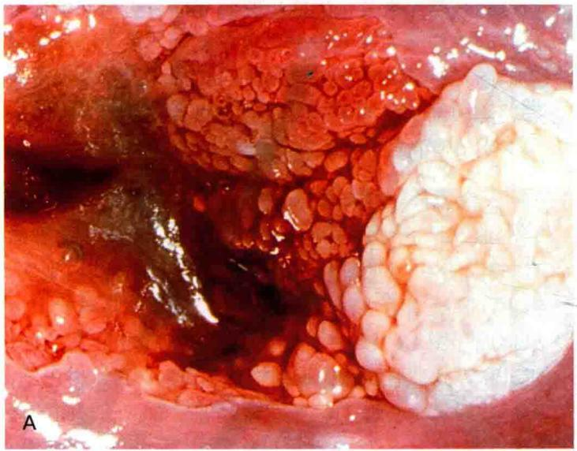
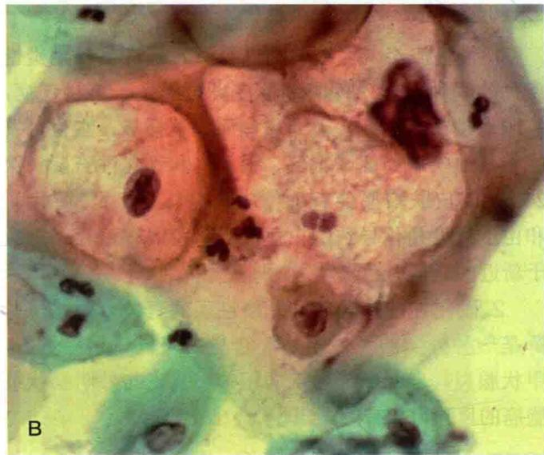
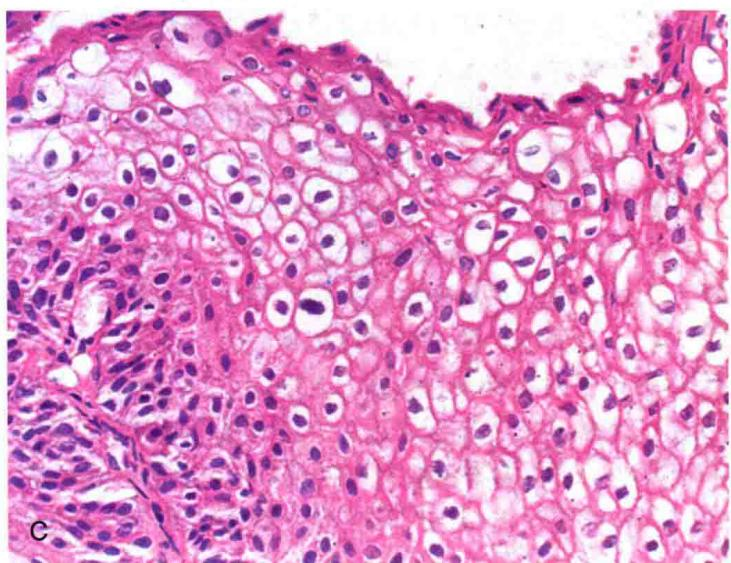 
图18-2人乳头瘤病毒引起的湿疣感染。A.宫颈尖锐湿疣，肉眼可见的菜花状赘生物；B.宫颈涂片显示特征性的挖空细胞，伴有核周空晕和皱缩的细胞核，其中含有病毒颗粒；C.湿疣活检显示挖空细胞、核周空晕和显著的细胞核的多形性，以及深染的染色质
# 二、毒性休克综合征同阴道葡萄球菌感染有关
毒性休克综合征是一种急性、有时为致死性的疾病，表现为发热、休克和脱屑性红斑疹。此外，呕吐、腹泻、肌痛、神经症状和血小板减少常见。某些株系的金黄色葡萄球菌可释放一种外毒素，称作毒性休克综合征毒素-1。此毒素可改变单核吞噬细胞的功能，进而损害其他潜在毒性物质的清除作用，例如内毒素。除了休克特征性的病理改变之外，弥散性血管内凝血（DIC）通常显著（第20章）。由于认识到阴道卫生棉条的使用时间过长为金黄色葡萄球菌的集落生长的原因，毒性休克综合征的发生率得以显著下降。
# 第二节 外 阴
# 一、巴氏囊肿
成对的巴氏腺位于紧靠阴道口的后外侧，它可以分泌清亮的黏液，不断地润滑前庭表面。它的导管易于发生阻塞，并形成囊肿。进而，囊肿感染可发展到形成脓肿。葡萄球菌、衣原体和厌氧菌是常见的感染原因。治疗方法包括切开、引流、开窗减压术和使用抗生素。
# 二、皮肤病。
1. 慢性皮炎（慢性单纯性苔藓）是许多外阴炎性疾病的晚期阶段 外阴慢性皮炎可继发于多种疾病，临床上常在活动期表现为瘙痒而反复搔抓。它也可发生于其他疾病如扁平苔藓、银屑病和硬化性苔藓（第24章）。皮肤增厚伴有增厚的皮肤标记（“苔藓化”）和由于过度角化导致的白色外观。鳞屑普遍存在，由于新近的搔抓而经常看到脱屑现象。 
2. 硬化性苔藓同自身免疫性疾病有关 硬化性苔藓是一种外阴的炎性疾病，它与白癜风、恶性贫血、甲状腺炎等自身免疫性疾病相关。它也与外阴鳞状细胞癌的风险增加有关。

【病理】硬化性苔藓表现为白色斑块和萎缩性皮肤，呈现羊皮纸状或皱纹外观，偶尔，可有
外阴组织明显挛缩。组织学表现包括角化过度、表皮突消失、表皮变薄、钉突变平、基底层的细胞质空泡化和真皮上部的均质化、无细胞区。带状浸润的慢性炎细胞包含淋巴细胞及少数浆细胞，通常位于硬化带下方。瘙痒是最常见的症状，另外，常见性交疼痛。该病发展缓慢并具进展性。有症状的硬化性苔藓妇女有 $15\%$ 的概率发展为鳞状细胞癌。
# 三、恶性肿瘤和前驱病变
1.外阴上皮内瘤变（VIN）是浸润性癌的前驱病变 外阴癌占所有女性生殖器癌的 $3\%$ ，主要发生于
超过60岁的妇女。鳞状细胞癌是最常见的类型（ $86\%$ ）。这些肿瘤被分为两组：角化性鳞状细胞癌，同HPV无关（ $>70\%$ 病例）和疣状及基底细胞样癌，同高危型HPV相关（ $<25\%$ 病例）。同宫颈病变相似（宫颈上皮内瘤变[CIN]），VIN是外阴鳞状细胞癌的前驱病变。
【病因】角化性鳞状细胞癌常发生在老年妇女（平均年龄76岁），有时发生在长期存在的硬化性苔藓基础上。癌前病变称作分化型VIN或单纯型VIN。癌在“白斑”（白色斑块，非特殊性，描述性词语）基础上发展为结节或肿块。相反的，不常见的HPV相关的疣状癌和基底细胞癌从称作未分化型或经典型VIN发展而来。自1980年以来，在40岁以下的女性，经典型VIN，特别是同HPV16相关的VIN，发生率有 $5\sim 10$ 倍的增长。除了老年人或免疫抑制的妇女，同HPV相关的VIN病变进展为浸润性癌的风险较低（ $6 \%$ ）。

【病理】VIN病变可为单发或多发、斑丘疹或斑片状。组织学分级标记为VIN I、II和III，分别
对应于轻度，中度和重度异型增生。VIN III，包含鳞状细胞原位癌（CIS），是最常见的类型。分化型VIN表现为基底层细胞重度的核异型性，但在表层细胞有显著的成熟。未分化的或经典的VIN分级标准类似于那些用于宫颈病变的标准（见下文）。VIN，即便是局部切除，也经常复发（25%），其中，部分病例可进展为浸润性鳞状细胞癌（6%）。患有VIN的女性可能在下生殖道的其他部位有类似的鳞状上皮肿瘤。 
2. 继发于VIN的鳞状细胞癌 角化性鳞状细胞癌通常继发于分化型VIN（单纯型VIN）。较大的肿瘤有2/3为外生性（图18-3A）；其余为溃疡性和内生性。镜下，肿瘤由中央角化珠形成的浸润性恶性鳞状上皮巢构成（图18-3B）。肿瘤生长缓慢，向相邻的皮肤、阴道和直肠扩展。它们最初转移到表浅腹股沟淋巴结，然后腹股沟深、股动脉旁和盆腔淋巴结。长时间的瘙痒通常是首发症状，此后可出现溃疡、出血和继发感染。肿瘤的外观与疾病分期和淋巴结状态相关。外阴癌预后通常较好，总体5年存活率达 $70\%$ 
3. 疟状癌为鳞状细胞癌的独特亚型 外阴疣状癌是一种独特的鳞状细胞癌亚型，它表现为一个大型的蕈伞型肿块，酷似一个巨型尖锐湿疣。HPV，通常为6型或11型，常常可被检测到。肿瘤分化非常好，由大的鳞状细胞巢所构成，鳞状上皮细胞胞质丰富，细胞核小而温和。鳞状角化珠常见，而分裂象罕见。肿瘤以宽大的舌头突起向深部浸润，但很少发生转移。扩大局部手术切除是首选的治疗方法，但其他治疗方式（冷冻手术和维甲酸）已经成功地用来治疗疣状癌。 
4.外阴佩吉特病同乳头部的表现相似 外阴佩吉
特病被命名是因为它同乳头和乳腺外部位例如腋窝和肛周区肿瘤具有相似的表现。这种罕见的疾病，通常发生在老年女性的大阴唇。患有外阴佩吉特病的女性常常抱怨持续多年的外阴瘙痒或有烧灼感。

【病理】佩吉特病的病变通常较大、红色、湿润、边界清晰。诊断细胞（佩吉特细胞）被认为来
源于表皮中或表皮来源的附属器结构。佩吉特细胞有苍白的空泡状胞质、含有丰富的糖胺聚糖；它们PAS染色或黏液卡红染色阳性，并表达癌胚抗原。异常的肿瘤细胞常表现为大的单个细胞，或者，在少见情况下，以细胞团的形式存在于表皮内，这些细胞之间缺乏细胞间桥。与乳腺佩吉特病不同的是，乳腺佩吉特病总是其下乳腺导管癌在皮肤的反应，乳腺外佩吉特病常为表皮的疾病，而多不与下方潜在的腺癌相关。因此，治疗只需要局部广泛切除或单纯外阴切除术即可。
# 第三节 阴道
# 恶性肿瘤
原发性阴道恶性肿瘤是罕见的，仅占所有生殖道肿瘤的 $2\%$ 。大多数（ $80\%$ ）阴道恶性肿瘤为继发性转移瘤。最常见的症状是阴道排液和性交出血，但晚期癌症可以引起盆腔或腹部疼痛以及双腿水肿。
1.鳞状细胞癌（SCC）为最常见的原发性阴道恶性肿瘤 SCC通常是老年妇女的疾病，发病高峰在
$60\sim 70$ 岁之间。它大多见于阴道上1/3的前壁，通常表现为外生性肿块。阴道上皮内瘤变（VAIN）往往先于浸润癌出现。通常，阴道SCC的发生于宫颈癌或外阴癌数年之后，提示存在于下生殖道的致癌场效应，它同HPV感染有关。对于局限于阴道（I期）的肿瘤患者的5年生存率为 $80\%$ ，然而，对于广泛播散的病例（Ⅲ/IV期），5年生存率只有 $20\%$
2. 胚胎性横纹肌肉瘤（葡萄状肉瘤）是一种儿童肿瘤 胚胎性横纹肌肉瘤是一种罕见的阴道肿瘤，它表现为汇聚在一起的息肉状肿物，看上去像一串葡萄，因此命名为葡萄状肉瘤（来自希腊语，一串葡萄）。它几乎均发生在4岁以下的女孩。该肉瘤起源于阴道的固有层，由原始梭形横纹肌母细胞所构成，其中某些细胞可见横纹。肿瘤被发现常因为在孩子的尿布上出现血渍。肿瘤在 $3\mathrm{cm}$ 以下常为局限性病变，通常可以通过手术切除和化疗得到治愈。较大的肿块可能侵犯邻近结构，转移到区域淋巴结或血行播散到远处部位。即使是晚期病例， $50\%$ 患者可通过根治手术和化疗而存活。
# 第四节 宫颈
# 一、宫颈炎
宫颈炎症常见，同持续暴露在阴道中的菌群相关急性和慢性宫颈炎同多种微生物的感染有关，特别是
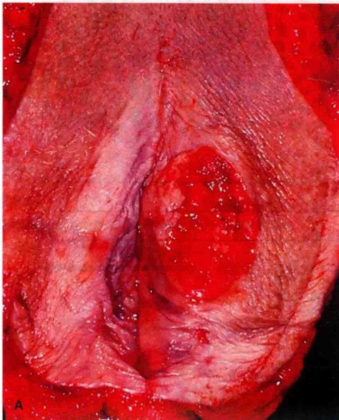 
图18-3外阴鳞状细胞癌。A.肿瘤位于硬化性苔藓（白色）明显累及的区域；B.肿瘤性鳞状细胞巢，某些区域可见角化珠，在此高分化肿瘤中有典型表现
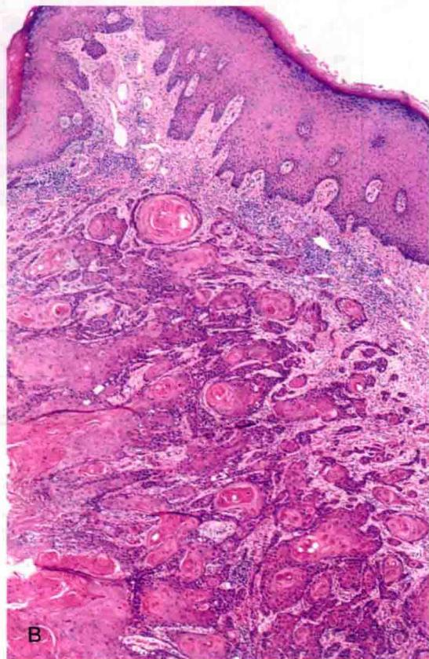
链球菌、葡萄球菌和肠球菌。其他特殊的微生物包括沙眼衣原体、淋病奈瑟菌，以及偶尔2型单纯疱疹病毒。有些病原微生物性传播；另一些则可以由异物带入，如卫生棉条和阴道栓剂的残留物等。

【病理】在急性宫颈炎，宫颈肉眼呈红色、肿胀和水肿，有大量脓液从宫颈外口“滴落”。显
微镜下，组织显示重度多形核白细胞浸润和间质水肿。
在慢性宫颈炎，这是比较常见的，宫颈黏膜充血，有真性上皮糜烂。镜下，间质可见单个核细胞浸润主要是淋巴细胞和浆细胞。移行区鳞状上皮细胞化生（见后文）可以累及宫颈管腺体，形成细胞团，必须同癌进行鉴别。
# 二、宫颈管息肉通常为良性
宫颈息肉是最常见的宫颈增生性病变。它们表现为单个光滑或分叶状肿物，通常 $3\mathrm{cm}$ 以下。典型息肉
表现为阴道出血或排液。被覆上皮为黏液性，伴有不同程度的鳞状上皮化生，在有症状的女性可有糜烂和肉芽组织形成。简单的切除或刮除术可治愈。癌很少发生在宫颈息肉（仅占 $0.2\%$ ）。
# 三、鳞状细胞肿瘤
50年前，宫颈癌是美国女性癌症死亡的首要原因。在美国，现在是女性第六大最常见的癌症类型，死亡率已经下降了超过 $70\%$ 。然而，在世界范围内，宫颈癌依然是女性第二常见癌症。
# （一）宫颈上皮内瘤变（CIN）是浸润性癌前驱病变
CIN被定义为上皮内改变的频系，从上皮轻度异型增生进展为更加显著的上皮内异常，一直到发展为浸润性鳞状细胞癌（图18-4）。术语CIN、异型增生、CIS和鳞状上皮内病变（SIL）在使用过程中通常可以互换。宫颈上皮细胞的异型增生本身意味着恶性转化
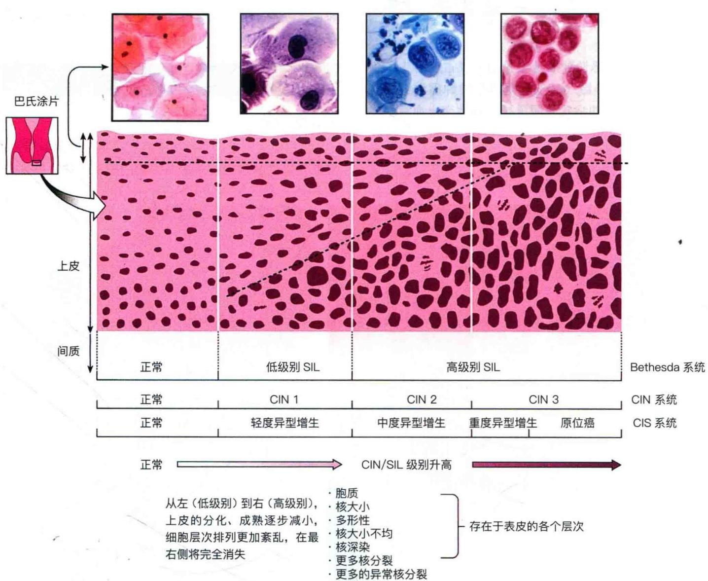 
图18-4宫颈癌前病变命名系统的相互关系。这个复杂的图表将宫颈癌前病变复杂的各个方面整合到一起。它列出了宫颈癌前病变在发展过程中那些可以定性和定量的特点。它同时也说明了病变发展过程中所出现的变化，以及提供了异型增生/原位癌（CIS）系统、宫颈上皮内瘤变（CIN）系统和Bethesda系统之间的相互对应关系。最后，该图也说明了取自上皮最表层脱落细胞的相对应的细胞涂片特点，指出即使是最轻微的疾病状态，异常细胞可以到达上皮表面并脱落。SIL.鳞状上皮内病变
的风险（图18-4～图18-6）。CIN的概念强调异型增生和CIS在疾病发展谱中的不同阶段，而不是作为独立的实体。
CIN的分级如下：
CIN-1：轻度异型增生 
CIN-2：中度异型增生 
CIN-3：重度异型增生和原位癌
“宫颈/阴道细胞学诊断报告 Bethesda系统”对这些病变的分组略有不同（图18-4）。低级别SIL（LSIL）反映的病变很少进展为重度，常可消退（CIN-1，轻度异型增生）。高级别SIL对应着更严重的组织学病变（CIN-2和CIN-3），它倾向于进展，因而需要进行治疗。

【流行病学和发病机制】CIN和浸润癌的流行病
学特点是相似的。宫颈癌通常发生于 $40\sim 60$ 岁（平均年龄，54岁），但CIN病变一般发生在40岁以下。其中的关键因素是HPV感
染，这同多个性伴侣和在初次性交年龄早有关。因此，CIN在本质上属于性传播疾病。吸烟会增加宫颈癌的发病率，但机制不明。
HPV感染引起CIN和宫颈癌（图18-5）。越来越多的证据表明，所有类型HPV感染的早期阶段均显示游离病毒的复制，从而引起LSIL细胞学的改变。
大量的病毒拷贝积聚在细胞的细胞质中，形成挖空细胞，可在显微镜下观察到（图18-2B）。同非致癌性HPV类型相关的病变通常只引起LSIL而不会进一步进展，因为游离的病毒复制将导致细胞死亡。相比之下，HPV的致癌类型（如HPV16）整合到人细胞基因组中，并导致这些细胞单克隆性过度增生，病进展到高等级SIL（第5章）。在HPV整合到宿主DNA后，病毒衣壳变得过剩。作为一个结果，整个病毒拷贝并不产生积累，挖空细胞并不出现在很多重度异型增生的病例和所有的浸润癌。大约 $85\%$ 的低级别CIN病变有低危型HPV的感染。许多宫颈的生殖器疣（尖锐湿疣）含有HPV6或11，这被视为低风险的HPV类型。相比之下，高级别CIN细胞通常表现出高风险的HPV类型16和18,这见于 $70\%$ 的浸润性癌；其他高危型占其余的 $25\%$

【病理】子宫颈的表面在宫颈管部位被覆“腺性”
柱状上皮，并不同程度的延伸大搜宫颈外口的
表面，而其余部分同阴道一样被覆非角化型鳞状上皮。腺和鳞状上皮的交界处称为鳞柱交界（SCJ）。在青春期，激素诱导的宫颈柱状上皮发生外翻，因此柱状上皮的一个额外区域暴露在宫颈阴道的酸性环境里。在生理条件下，外翻的柱状上皮发生良性鳞状上皮化生，在化生的鳞状上皮和柱状上皮之间形成一个新的SCJ。
这个“旧的”SCJ和“新的”SCJ之间的区域称作移行区。CIN几乎总是发生在移行区或宫颈管化生性鳞状上皮的一种疾病。移行区的大小决定了宫颈暴露部分CIN以及宫颈癌的分布和范围。
宫颈鳞状上皮的正常成熟过程被CIN所干扰，其形态学改变包括细胞密度、细胞分化、极性、细胞核特点和核分裂活性。从CIN-1到CIN-3的组织学变化顺序在图18-6中有说明。
CIN-1（轻度异型增生）：最明显的变化是在上皮细胞的基底 $1 / 3$ 。显著的细胞质分化依然存在，异常细胞迁移到上皮上 $2 / 3$ ，但是上皮上部的细胞核依然显示出形态学的异常。因此，脱落的细胞可以在巴氏涂片中检测到异常。
CIN-2（中度异型增生）：异常的细胞存在于整个厚度的上皮中。然而，多数细胞学的异常存在于中、下2/3。细胞分化发生在上皮的上1/3，而且其程度要小于CIN-1。
CIN-3（重度不典型增生和CIS）：上皮表层（上部）的细胞显示出一些（尽管是轻微的）分化，然而CIS则没有任何分化发生。
对于CIN-1和CIN-2而言，女性发展为CIN的
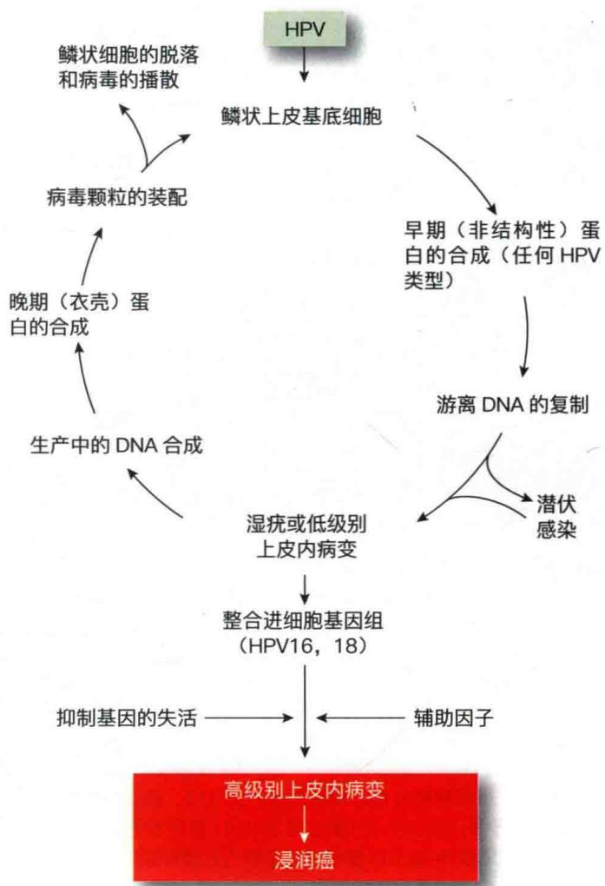 
图18-5 人乳头瘤病毒（HPV）在宫颈肿瘤发生中的作用
平均年龄介于24岁和27岁之间，而对于CIN-3而言，则在 $35\sim 42$ 岁。基于形态学的标准， $50\% \mathrm{CIN - 1}$ 病例可以消退， $10\%$ 进展为CIN-3，小于 $2\%$ 的病例进展为浸润性癌。各级异型增生进展为CIS的平均时间约为10年。至少 $20\%$ 的CIN-3病例在该时间段内进展为浸润性癌。
【临床表现】患有CIN-1的女性往往需要随访（即，重复巴氏涂片+密切随访）。高级别的病变，根据病变的程度进行处理。宫颈电环切除术（一种电灼手术），可在门诊进行，是常用的治疗方式。在某些情况下，宫颈锥切术（围绕宫颈外口的圆锥状组织切除）、冷冻手术以及（很少采用的）子宫切除术是可选择的手术方式。随访涂片和临床检查应该持续终身，因为阴道或外阴鳞状细胞癌在以后或许会发生。目前的指南建议，65岁以上的妇女如果在之前的20年里没有发生CIN-2或更高级别的病变，不需要继续进行筛查。
# （二）微小浸润性鳞状细胞癌是浸润性鳞癌的最早阶段
微小浸润性癌以轻微浸润间质的肿瘤细胞为特征。大约有 $7\%$ 的因CIS而切除的标本显示有局灶性微小浸润癌。间质中小细胞团或实性病变具有以下特点：
■浸润基底膜下深度小于 $3\mathrm{mm}$ （1A1期）或 $5\mathrm{mm}$ （1A2期） 
7mm最大水平宽度 
缺乏血管侵犯 
没有淋巴结转移
最早的浸润性改变（“早期间质浸润，或ESI）表现为在CIN-3基部出现的细小的不规则的上皮芽（图18-7）。这些小的（<1mm）肿瘤上皮细胞的舌状突起不影响CIN-3病变的预后，因此，都可以进行类似的保守手术治疗。宫颈锥切术或单纯子宫切除术通常用于治疗小于 $3\mathrm{mm}$ 深度的微小浸润癌。
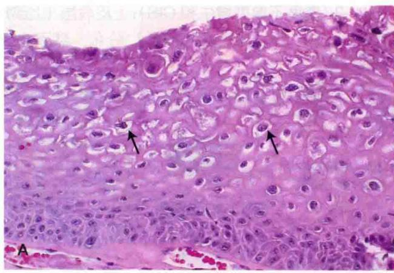
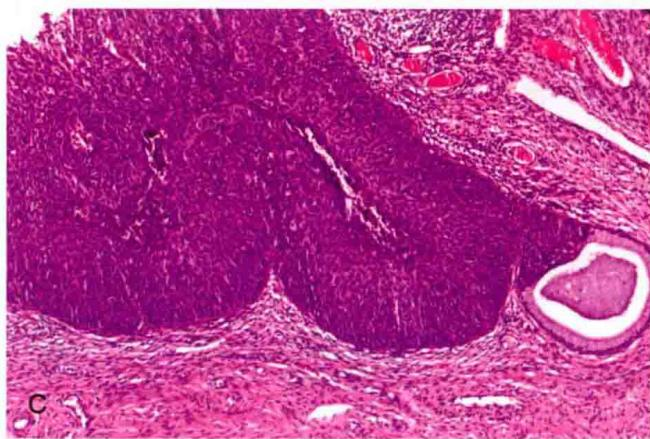 
图18-6宫颈上皮内瘤变（CIN）。A.CIN-1：宫颈上皮在基底部1/3显示有显著的细胞异型性。上皮上2/3的某些细胞显示有异常的细胞核，提示有HPV感染（箭头），但这些细胞有细胞质的分化；B.CIN-2到CIN-3：下2/3的上皮显示显著的细胞异型性。尽管胞质分化出现在上皮的上1/3，但这种分化没有CIN-1显著；C.CIN-3（原位癌[CIS]）：肿瘤细胞分布到上皮的全层；D.CIN-3：CIS部分或完全取代宫颈管腺体的柱状上皮（箭头）
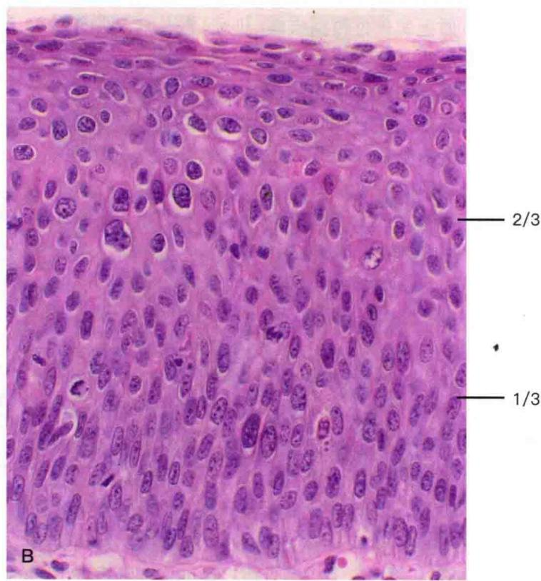
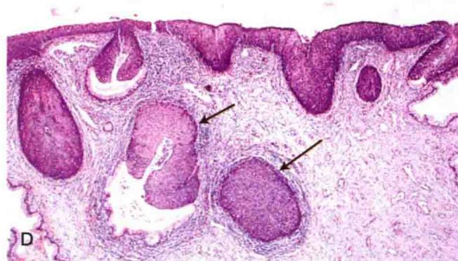
# （三）浸润性鳞状细胞癌在世界范围内依然常见
【病原学】SCC是目前宫颈癌最常见的类型。即使在美国，每年依然有约12000例的新发病例及4000例死亡病例。然而，在细胞学筛查还未实行的发展中国家，宫颈鳞状细胞癌是癌症死亡的主要原因。HPV疫苗可以降低 $97\%$ 的宫颈癌风险。

【病理】宫颈癌的早期阶段往往表现为界限不清的、颗粒状的、糜烂性病变或结节状和外生性
肿块（图18-8A）。显微镜下检查，多数肿瘤表现为非角化型生长方式，以大的恶性实性鳞状细胞巢为特点。偶尔，鳞状细胞癌表现为角化细胞巢，以同心漩涡为中心排列，称作所谓的角化珠（图18-8B）。鳞状细胞癌少见的类型为小细胞癌，这是宫颈癌最具侵袭性的类型，预后最差。它是由许多呈浸润性生长的、体积小的、有黏附性的、非角化的恶性肿瘤细胞构成的肿瘤。
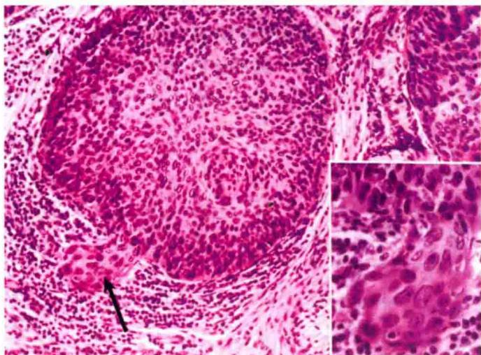 
图18-7 早期间质浸润。宫颈切片显示累及宫颈腺体的原位癌突破基底膜（箭头）侵犯间质（插图）早期浸润灶的高倍观
宫颈癌的扩散主要通过直接蔓延和淋巴道转移，极少情况下，通过血行转移。局部侵犯周围组织（子宫旁结缔组织）可引起输尿管挤压，最终可引起肾衰竭，是死亡的最常见原因（50%病例）。膀胱和直肠受累可合并瘘管形成。区域淋巴结转移包括宫颈旁、髂内动脉和髂外淋巴结。

【临床表现】巴氏涂片检测宫颈癌仍然是最可
靠的筛查手段。在宫颈癌的早期阶段，患者抱
怨最多的是性交后或冲洗后阴道出血。宫颈癌的临床分期是最好的预后指标。总体5年生存率为 $60\%$ ，而广泛播散的病例则下降到 $10\%$ 。根治性子宫切除术适用于局限性肿瘤，尤其是年轻女性；放射治疗或两者结合适用于更晚期的病例。
# （四）宫颈腺癌占宫颈癌的1/5
据近来报道，宫颈腺癌发生率在增加，平均发病年龄56岁。多数肿瘤属于宫颈细胞（黏液）型，而且各亚型对总体生存率意义不大。腺癌同宫颈SCC有相通的流行病学因素和相似的播散途径。肿瘤常与原位腺癌相关，并常感染HPV16和18亚型。宫颈腺癌通过局部浸润和淋巴道转移播散，但总体生存率比SCC略差。两种类型宫颈癌的治疗类似。
# 第五节 子宫
# 一、月经周期
正常的子宫内膜经历一系列的连续变化，以支持植入受精的卵细胞（受精卵）的生长（图18-9）。如果受精没有发生，子宫内膜将脱落和再生以支持在下一周期的受精卵着床。
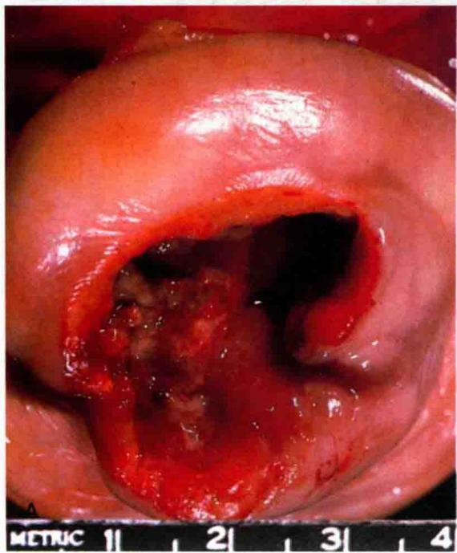 
图18-8 鳞状细胞癌。A.宫颈因外生性、溃疡性鳞状细胞癌而变形；B.角化型鳞状细胞癌显示角化细胞漩涡（“角化珠”）（箭头）
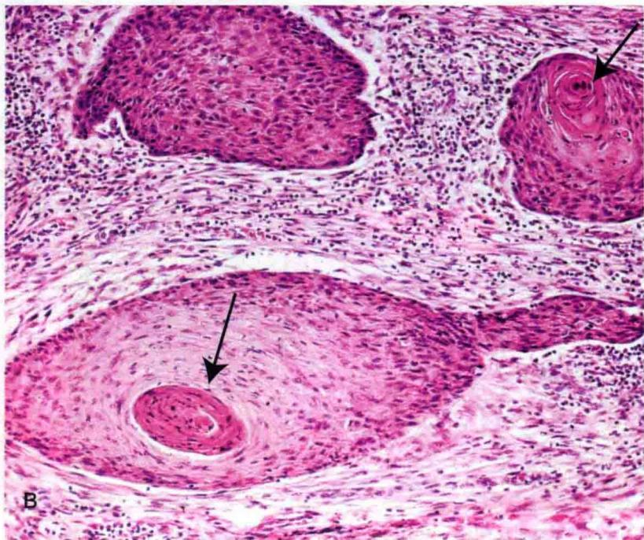
增生期：月经周期的第 $3\sim 15$ 天，子宫内膜在雌激素的刺激下，表现为小管状到螺旋化的腺体，并由富于细胞的、单形性的间质细胞提供支持（图18-9A）。当增生过程进行的时候，腺体被覆的柱状细胞由单层变为假复层，且核分裂变得活跃。腺体产生水样的碱性分泌物，有助于精子通过子宫腔进入输卵管。间质也具核分裂活性。螺旋动脉狭窄，多数不明显。
分泌期：上次月经后大约14天，出现排卵。然后，已排出卵细胞的格拉芙卵泡变成黄体。黄体的颗粒细胞开始分泌孕激素，使子宫内膜从增生期变成分泌期（图18-9B、C）。
■第 $17\sim 19$ 天：子宫内膜腺体增大、扩张，变得更加螺旋化。被覆细胞发展成含有丰富糖原的核下空泡。在接下来的几天里，这些细胞产生大量的分泌物，可以支持一个受精卵发育出早期绒毛以能侵入子宫内膜。
■第 $20\sim 22$ 天：子宫内膜显示出显著的腺体分泌和间质水肿。腺体扩张，变得更为迂曲。
■第 $23\sim 27$ 天：间质细胞体积增大，表现为具有大的、圆形的泡状核和丰富的嗜酸性胞质。这些改变通常最先出现在螺旋小动脉周围（“血管套袖”），是
妊娠蜕膜细胞的前驱改变。到第27天，间质的全层已经“初始蜕膜化”。管状腺体继续扩张，并发展为锯齿形的轮廓。
月经期：在没有怀孕的情况下[即，无囊胚产生人类绒毛膜促性腺激素（hCG)]，黄体的颗粒细胞和卵泡膜细胞将退化。当黄体退化时，孕激素水平下降，子宫内膜变得干燥，螺旋动脉崩溃和间质分解。月经在第28天开始，持续 $3\sim 7$ 天，引起大约 $35\mathrm{ml}$ 的出血。裸露的表面通过残留的腺上皮的延伸而重新被覆上皮。
萎缩性子宫内膜：绝经后，腺体的数目和间质的数量逐渐降低。剩下的腺体通常平行于表面，间质内含有丰富的胶原。萎缩的子宫内膜腺体常常显著扩张，称作子宫内膜的老年性囊性萎缩。
妊娠的子宫内膜：妊娠黄体的维持依赖于由胚胎发育中的胎盘滋养叶细胞分泌的hCG的持续刺激。滋养叶细胞大约在第23天的时候开始发育。在hCG的影响下，黄体增大了孕激素的分泌，从而刺激了子宫内膜腺体液体的分泌。妊娠高分泌的子宫内膜显示高度扩张的腺体，其被覆的上皮含有丰富的糖原。这些特点可以在分娩后持续长达8周。
周期天数第14天前15~16171819~222324~2526~2728+排卵后天数1~2345~8910~1112~1314+周期阶段增生期间期早分泌期中分泌期晚分泌期月经期主要特点分裂象分裂象和核下空泡最大核下空泡有核下空泡间质水肿螺旋小动脉周围局灶性蜕膜化斑片状蜕膜化广泛蜕膜化间质塌陷功能区镜下特点间质疏松间质分裂象与增生期相似疏松间质,少核分裂疏松间质间质水肿局灶螺旋小动脉周围的蜕膜化,水肿显著各部均出现蜕膜化,有些水肿广泛蜕膜化,显著颗粒淋巴细胞间质塌陷,出血腺体直到螺旋小腺管分裂象某些核下空泡,其他同增生期广泛核下空泡扩张腺体,有些核下空泡扩张腺体有不规则的外形,腔内分泌物锯齿状腺体显著锯齿状腺体破碎的腺体,分泌耗竭,再生性上皮表现
图18-9正常月经周期子宫内膜的主要组织学特点。A.增生期，直管腺埋入富于细胞的单形性间质中；B.分泌期，第24天，位于初始蜕膜化的间质中的扩张迁曲的具有锯齿状外观的腺体；C.月经期子宫内膜，破碎的腺体、溶解的间质和多量中性粒细胞浸润
# 二、子宫内膜炎
子宫内膜炎，或发炎的子宫内膜，以子宫内膜内异常的炎细胞浸润为特点。它必须与在月经期正常存在的多形核白细胞和其他时间存在的少量的淋巴细胞进行鉴别。在大多数情况下，子宫内膜炎为非特异性，很少能指向特定的病因。
急性子宫内膜炎：这种情况定义为子宫内膜的多形核白细胞的异常存在。大多数情况下，由宫颈的上行感染所引起，例如，在宫颈屏障被流产、分娩或医疗仪器操作所破坏的情况下。
慢性子宫内膜炎：淋巴细胞和淋巴滤泡偶尔可出现在正常子宫内膜，子宫内膜中的浆细胞对于慢性子宫内膜炎具诊断价值。本病同宫内节育器（IUD）、流产或妊娠残留物相关。本病通常是自限性的。
# 三、腺肌病
子宫腺肌症是指子宫肌层内出现子宫内膜腺体和间质。累及肌壁越深，越可能在临床上表现出症状当月经期腺肌病因出血而增大，会出现疼痛。所有子宫切除的标本中，有1/5存在子宫腺肌病。

【病理】子宫可能增大，尽管并非总是如此。
子宫肌层显示有小的，质地软，暗褐色的区域，
其中有些为囊性。显微镜检查显示衬以轻度增生或不活跃的子宫内膜腺体，周围有子宫内膜基质包绕，并伴有不同程度的纤维化。可见腺体不同程度的增生，偶尔，增生性的表面子宫内膜延伸入腺肌病病灶中。

【临床表现】许多子宫腺肌病患者是无症状的，
其他可有不同程度的盆腔疼痛，以及功能失调
性子宫出血，痛经和性交疼痛常见。子宫腺肌病的原因尚不清楚。
# 四、子宫内膜异位
子宫内膜异位症是指良性的子宫内膜腺体和间质出现在子宫外。它在育龄妇女中的发病率为 $5\% \sim 10\%$ ，在自然或人为造成的绝经后，可以消退。最常见的部位是卵巢（ $>60\%$ ），其他子宫附件（子宫韧带/直肠阴道隔、道格拉斯陷窝）以及覆盖子宫、输卵管、膀胱和直肠乙状结肠的盆腔腹膜（图18-10）。子宫内膜异位症可以更加广泛，偶尔可累及宫颈、阴道、会阴、膀胱和脐。

【发病机制】关于子宫内膜异位症的组织发生，
有三种理论，它们不是相互排斥的：①月经子
宫内膜碎片通过输卵管到达并种植到异位部位（最广泛接受的理论）；②多潜能体腔腹膜上皮的化生；
(3)在接触脱落的子宫内膜释放的某种物质后, 经异位部位的未分化间充质诱导形成。

【病理】大体检查，子宫内膜异位症病灶的颜色存在差异。如果子宫内膜异位病灶局限于呈黄－红色污渍，是血液成分分解的反映，常是最早检出的病变。红色病灶是子宫内膜异位病变的早期阶段，反映了异位灶的活跃生长（图1A）。随着出血和纤维化的反复发生，受累的血会形成瘢痕，出现肉眼可见的褐色色素沉着（“火红”）。有时，瘢痕产生肠梗阻等并发症。在卵巢，出血可导致子宫内膜异位灶形成囊肿，最大直径达 $15\mathrm{cm}$ ，其中含有浓缩的巧克力色的物质（“巧克力肿”）。镜下，子宫内膜异位症表现为异位的动脉腺体和间质（图18-11B）。偶尔，治愈的动脉异位症病灶可以仅由纤维组织组成，并可吞噬铁血黄素的巨噬细胞，这些特点本身不具有价值。

【临床表现】子宫内膜异位症的症状和体征取决于种植的部位。最常见的主诉是痛经，由植管骶骨韧带所引起。这些病变月经期间迅速肿胀，盆部疼痛。事实上， $50\%$ 有痛经的妇女有子宫内膜异位症。1/3患有子宫内膜异位症的妇女的主诉为（图18-12）。通过保守手术恢复盆腔的解剖结构，只有子宫内膜异位症的妇女最终可以怀孕。发生宫内膜异位症病灶基础上的恶性肿瘤发生率大约 $4\% \sim 2\%$ 。透明细胞癌和子宫内膜样肿瘤（见下文）常见的类型。
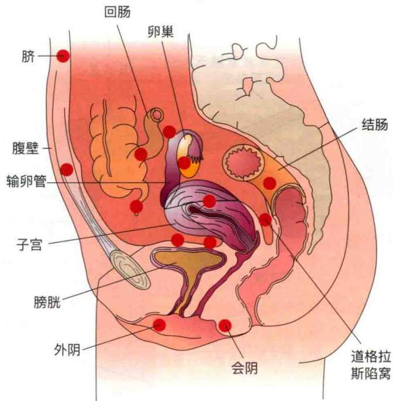 
图18-10 子宫内膜异位的位置
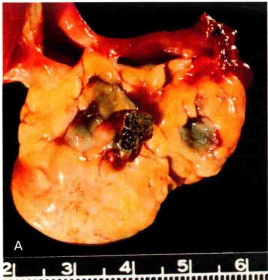 
图18-11子宫内膜异位。A.卵巢子宫内膜异位种植，表现为蓝红色的结节；B.镜下可见卵巢中的子宫内膜腺体和间质
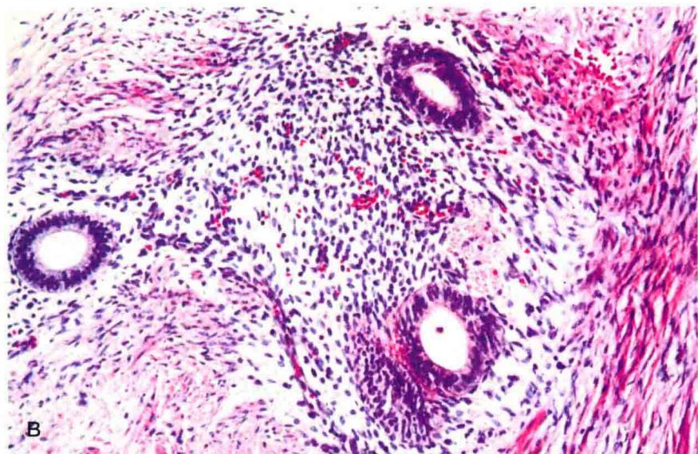
# 五、激素的影响
# 功能失调性子宫出血反映子宫外的异常
功能失调性子宫出血是育龄妇女最常见的妇科疾病，但依然知之甚少。多数情况下同内分泌紊乱有关，它涉及下丘脑-垂体-卵巢轴的一个方面。卵巢功能障碍常见，特别是在有排卵障碍时。子宫内在原因所引起的月经不规则，不能归于功能失调。这包括： $①$ 肿瘤（例如：癌、子宫内膜上皮内瘤变、黏膜下肌瘤和息肉）； $②$ 炎症（例如：子宫内膜炎）； $③$ 妊娠（例如：宫内或异位妊娠的并发症）； $④$ 宫内节育器的影响（表18-2）。无排卵性出血是一个由多种原因引起的复杂综合征，表现在育龄期缺乏排卵。最常见于育龄期的两端（即月经初潮和绝经期）。
# 六、子宫内膜肿瘤
# （一）子宫内膜息肉是良性间质肿瘤
这些肿瘤主要发生在围绝经期。息肉是染色体易位引起的子宫内膜间质细胞的克隆性增生，并继而诱导腺上皮的多克隆性增生。子宫内膜息肉的间质细胞和腺体对激素刺激反应差，在月经时不脱落。它不发生于月经初潮前。

【病理】多数子宫内膜息肉发生于宫底，尽管它们可以起源于子宫腔内的任何部位。它们的几毫米到充满整个子宫腔的肿物。多数息肉都发的，但约 $20\%$ 病例为多发。镜下，息肉的核排列成分组成：①子宫内膜腺体，常有囊性扩张
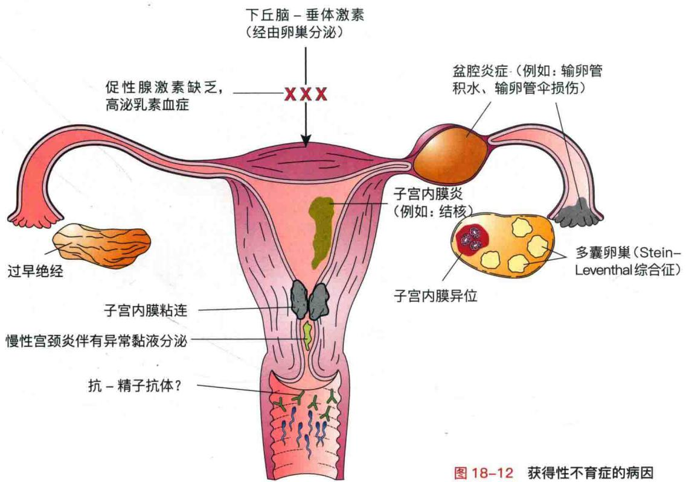 
图18-12 获得性不育症的病因
和增生；②纤维性的子宫内膜间质；③厚壁、迂曲的扩张血管，该血管来自正常情况下供应子宫内膜基底层的直动脉。一层子宫内膜上皮细胞覆盖在息肉表面。腺上皮细胞通常同邻近的正常的子宫内膜。
表 18-2 异常子宫流血的原因（包括子宫和子宫外原因） 
新生儿母亲雌激素儿童医源性（外伤、异物、阴道感染）
阴道肿瘤（葡萄状肉瘤）
卵巢肿瘤（功能性）青春期下丘脑发育不成熟精神和营养问题黄体功能不足生育期无排卵
中枢：精神性、应激
系统性：营养和内分泌疾病
性腺：功能性肿瘤
终末器官：良性子宫内膜增生妊娠：异位妊娠、胎盘滞留、流产、水泡状胎块排卵
器官：肿瘤、感染（PID）、平滑肌瘤
月经频繁：卵泡或黄体期短
医源性：抗凝剂、IUD绝经不规则脱落绝经后癌、EIN、良性增生、息肉、平滑肌瘤癌、EIN、息肉、平滑肌瘤
EIN.子宫内膜上皮内瘤变；IUD.宫内节育器；PID.盆腔炎
# 不在周期的同一阶段

【临床表现】子宫内膜息肉通常表现为月经间期出血，它由息肉表面溃疡或出血性梗死所引
起。因为老年妇女出血可能是由于子宫内膜癌，因此必须对此体征进行彻底的评估。子宫内膜息肉通常不是癌前病变，但多达 $0.5\%$ 的病例可合并腺癌。
# （二）良性子宫内膜增生是由于过度的雌激素刺激引起
良性子宫内膜增生是指由于异常雌激素刺激引起的一系列子宫内膜的广泛的变化，具有随机分布的结构和细胞学改变。雌激素刺激子宫内膜超过正常月经周期的增生期2周时间，可以引起同子宫内膜癌风险提高 $2\sim 10$ 倍有关的一系列变化。最早的变化常被命名为“持久增生性”或“无序增生性”子宫内膜，它以缺乏显著腺体密度异常的、散在的、孤立的增生性腺体的囊性扩张为特点。向良性子宫内膜增生的形态过渡是渐进性的，其定义是武断的，但当腺体密度变得不规则，在一些区域，腺体的数量超过间质的时候，可以说已经变为良性子宫内膜增生。

【病理】良性子宫内膜增生影响到子宫内膜的
所有区域，腺体和间质的重构形成不均一密度
混杂的囊性、轻度分支和管状的腺体。至少在某些部位，腺体面积应超过间质面积，而且拥挤部位的腺体具有与其他部位腺体相同的细胞学特点。
■单纯性增生：这种增生性病变显示轻度的腺体的复杂性、腺体密度轻度升高，细胞无异型。上皮通常为单层，腺体之间的间质丰富。 $1\%$ 的子宫内膜单纯性增生病例进展为腺癌
■复杂性增生：这种变异型显示腺体有显著的复杂性和拥挤度，但无细胞学异型（图18-13）。腺体数量增多，大小可存在差异。腺体之间的间质成分少。 $3\%$ 的患者进展为腺癌。
■非典型增生：病变显示细胞异型性和显著拥挤的腺体，腺体常见背靠背结构。腺体可有复杂的结构，包括突入腺腔的乳头状排列或间质内的腺体出芽。上皮细胞核增大、深染，具有突出的核仁，核质比增大。1/4病例进展为腺癌，几乎均为子宫内膜样型。

【临床表现】良性子宫内膜增生可由无排卵周
期、多囊卵巢综合征、分泌雌激素肿瘤、治疗雌激素或肥胖所引起。在这种情况下，针对主动进行治疗可缓解雌激素刺激。假如没有EIN，子宫内膜增生进展为子宫内膜癌的短期风险很低。过增生的长期风险需要持续的评估。
# （三）子宫内膜上皮内瘤变（EIN）是腺癌的前驱病变
“子宫内膜增生”包含两类不同的病变实体：由雌激素效应所引起的良性子宫内膜增生（见上文）和EIN。在此概念中，EIN由发生遗传学改变的单克隆增生的肿瘤性细胞所构成，进展为子宫内膜样腺癌的风
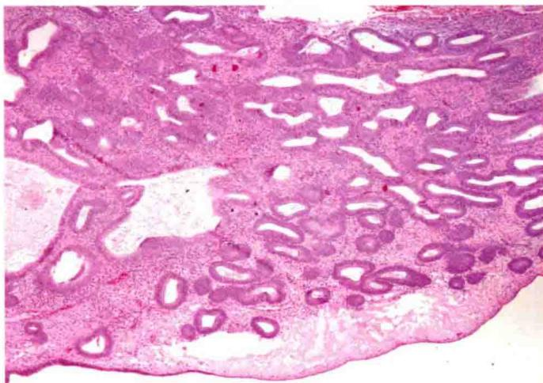 
图18-13 良性子宫内膜增生。增生性子宫内膜腺体分布不规则，部分腺体随机出现扩张。腺体密度多少不一，但拥挤区和非拥挤区腺体有相似的细胞学特点。这是由于雌激素过度刺激所引起的良性子宫内膜增生
险大大增加。EIN和良性子宫内膜增生在许多病例中可以共存，但是有不同的组织学特点。全身内分泌因素同两者均相关，它成为EIN病变中突变细胞的阳性或阴性选择因子。
1.子宫内膜上皮内肿瘤EIN是指易于发生恶性转化的子宫内膜上皮细胞的克隆性肿瘤性增生。

【发病机制】EIN病变是肿瘤性子宫内膜腺体的聚集体，细胞学和结构的改变可以使其
与良性病变能够进行鉴别。与良性子宫内膜增生不同，良性子宫内膜增生在开始即累及所有子宫内膜，而EIN病变在开始为局灶性，只是随着以后的发展，而蔓延至整个内膜。激素调节PTEN抑癌基因的功能缺失克隆性的出现在2/3的EIN病例中，当进展为子宫内膜癌时，PTEN出现功能缺失的比例增加（图8-14B）。

【病理】一旦发生EIN，它将从病变的中心部位向周围扩展，同正常的腺体交杂在一起。它
们由紧密排列的单个可辨认的腺体所构成：①细胞学上不同于背景子宫内膜；②腺体面积超过间质；③单一部分的大小超过1mm（图18-14）。当腺体变成实性、筛状或迷路样排列等特征性腺癌结构的时候，提示EIN发生恶性转化。

【临床表现】新诊断为EIN的妇女有 $40\%$ 的机会在1年内发展为子宫内膜癌，这表明在多数
情况下，癌在初次活检时已经存在。排除那些伴发癌的妇女（即只统计那些在1年无癌的病例），EIN阳性的患者有45倍进展为子宫内膜癌的风险。如果患者没有生育方面的考虑，一般施行子宫切除术进行治疗。那些想要更多孩子或有较高认识风险的患者，可用孕激素治疗并同时进行监测。
# 2.子宫内膜腺癌

【流行病学】在美国，子宫内膜癌是第四大最常见的癌症类型，也是最常见的妇科癌症。
2012年，美国大约有8000人死于子宫内膜癌（占女性所有癌症死亡的 $3\%$ ）。为缓解更年期症状，雌激素在20世纪70年代的使用最初导致与疾病相关的发病率明显增加，后来通过降低雌激素的剂量和结合孕激素（雌激素拮抗剂）改善了治疗方案。子宫内膜癌的发生随年龄变化。40岁的女性发病率为每100000人中12例，但在60岁的妇女，则达到其7倍。3/4的子宫内膜癌发生在妇女绝经后，诊断时的中位年龄为63岁。
子宫内膜癌分为两种不同的类型（图18-15，表18-3）。I型肿瘤（约占 $80\%$ ）是子宫内膜样癌，通
常要经过一个EIN的前驱病变前体，它与雌激素刺激有关。风险因素包括绝经前或围绝经期状态、肥胖、高脂血症、无排卵、不孕和绝经晚。大多数内膜样癌局限于子宫和遵循良好的病程。相反，Ⅱ型肿瘤（占 $10\%$ 为乳头状浆液性癌，偶尔发生自子宫内膜息肉或来源于萎缩性子宫内膜的癌前病变。Ⅱ型肿瘤同雌激素刺激或增生无关，易于侵犯子宫肌层和血管，是高度致命性的。子宫内膜样癌的分子改变（I型）不同于非子宫内膜样肿瘤（Ⅱ型）。在有密切关系的女性，子宫内膜癌的发生与较高的乳腺癌和卵巢癌的发病率有关，提示存在遗传易感性。它也是遗传性非息肉病性结肠癌综合征最常见的肠外肿瘤，这个综合征存在DNA错配修复方面的缺陷，它也同乳腺癌和卵巢癌相关。

【发病机制】正常子宫内膜细胞通过复制错误，即所谓的“微卫星不稳定性”，和后续的
基因突变的积累，转化为子宫内膜样癌。对于非子宫内膜样癌，p53突变和数条染色体的杂合性缺失（LOH）驱动恶性转化（图18-16）。如同EIN一样，肿瘤抑制基因PTEN也在子宫内膜癌发生中发挥作用
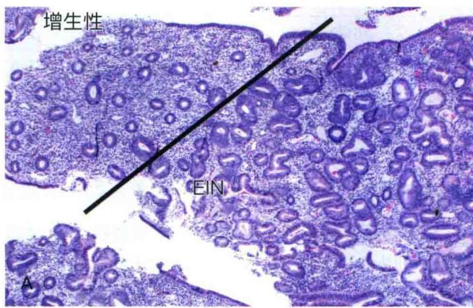
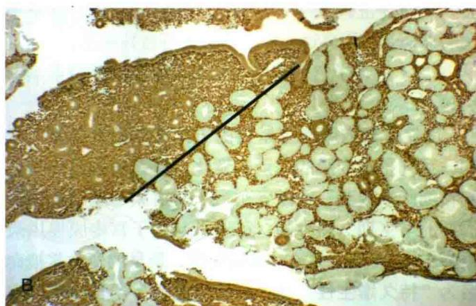 
图18-14子宫内膜上皮内瘤变（EIN）。A.该图重点显示：EIN表现为细胞学发生改变的肿瘤性子宫内膜腺体具有丰富的胞质和圆形的核（右）紧密排列与背景的子宫内膜（左）发生明显偏移。此简单小管状腺体的聚集区域周长超过 $1\mathrm{mm}$ ，缺少筛状结构、迷宫样或实性结构等腺癌的结构特点.B.EIN影响的腺体缺少免疫组化PTEN的表达（棕色染色的缺失）
用（图18-15，图18-16）。在2/3的病例，存在PTEN的失活缺失、突变或启动子的甲基化。相比之下，大多数Ⅱ型非子宫内膜样癌显示p53突变。
表 18-3 子宫内膜癌临床病理特点 
I型:子宫内膜样癌II型:浆液性癌年龄绝经前和围绝经期绝经后未对抗的雌激素有无增生前驱病变有无级别低高肌壁侵犯表浅深生长行为稳定进展性遗传改变微卫星不稳定性,PTEN, PIK3CA,β-连环蛋白p53突变,杂合性缺失(LOH)

【病理】子宫内膜癌呈弥漫性或外生性生长（图18-15）。不管它起源部位如何，它常常累及域。大的肿瘤通常有出血、坏死。
子宫内膜子宫内膜样腺癌：这种类型的子宫内膜癌完全由腺上皮细胞构成，是最常见的组织学亚型（占
$80\% \sim 85\%$ 。肿瘤根据腺体和实性区域的比例，分为三个级别，后者意味着低分化。子宫内膜腺癌的细胞核可为温和或明显的多形性，通常有明显的核仁。核分裂象丰富，在分化差的肿瘤，可见异常核分裂。实性区的肿瘤细胞通常为低分化和高级别（图18-15）。
子宫内膜样腺癌，伴鳞状分化：1/3的子宫内膜癌除了腺癌成分之外，还含有鳞状细胞成分。如果鳞状成分为高分化，不超过轻度异型性，肿瘤被称作高分化腺癌伴鳞状分化。如果鳞状成分为恶性，则称为低分化腺癌伴鳞状分化（也称腺鳞癌）。这两变异型分别占子宫内膜癌的 $22\%$ 和 $7\%$
子宫内膜样腺癌，分泌型：这种肿瘤，通常发生在绝经前妇女，是子宫内膜样腺癌的一个变异型，具有核下含有糖原的空泡。这种肿瘤分化极好，比任何类型子宫内膜样腺癌预后都要好。
其他类型（非子宫内膜样）子宫内膜癌：非子宫内膜样型子宫内膜癌较为少见，同雌激素暴露无关。因为作为一组肿瘤类型更具侵袭性，组织学分级没有临床价值。这些肿瘤包括浆液性和透明细胞腺癌及癌肉瘤，后者呈现出混合性上皮和间叶分化。
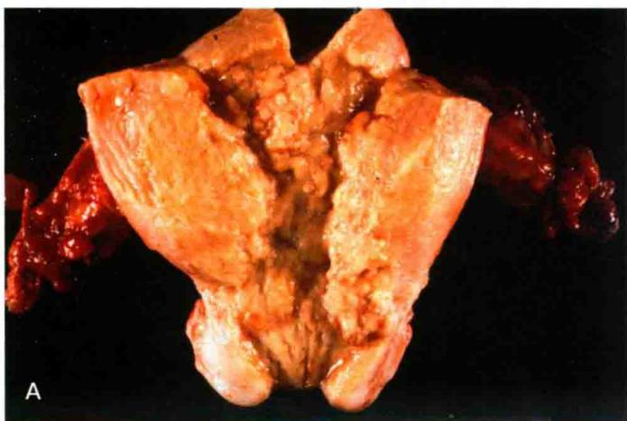
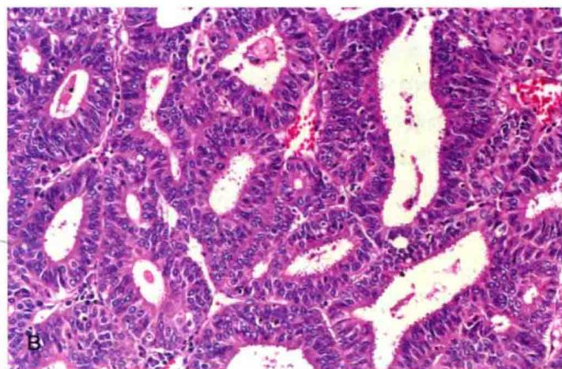
腺癌。肿瘤性腺体与正常子宫内膜腺体相像。C、D.非子宫内膜样癌。大的出血性和坏死性肿瘤有深部肌层浸润。浆液性癌（重度细胞异型性）显示间变性肿瘤细胞的复层排列和异常核分裂.jpg) 
图18-15子宫内膜腺癌。A、B.子宫内膜样腺癌。息肉样肿瘤仅有表浅肌层侵犯。高分化(I级)腺癌。肿瘤性腺体与正常子宫内膜腺体相像。C、D.非子宫内膜样癌。大的出血性和坏死性肿瘤有深部肌层浸润。浆液性癌（重度细胞异型性）显示间变性肿瘤细胞的复层排列和异常核分裂
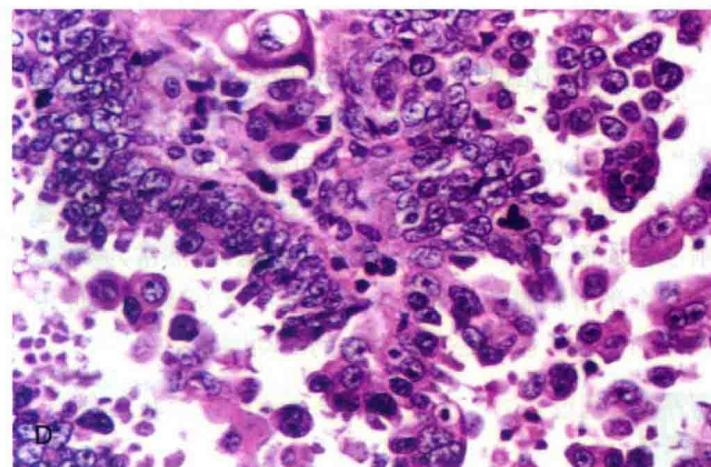
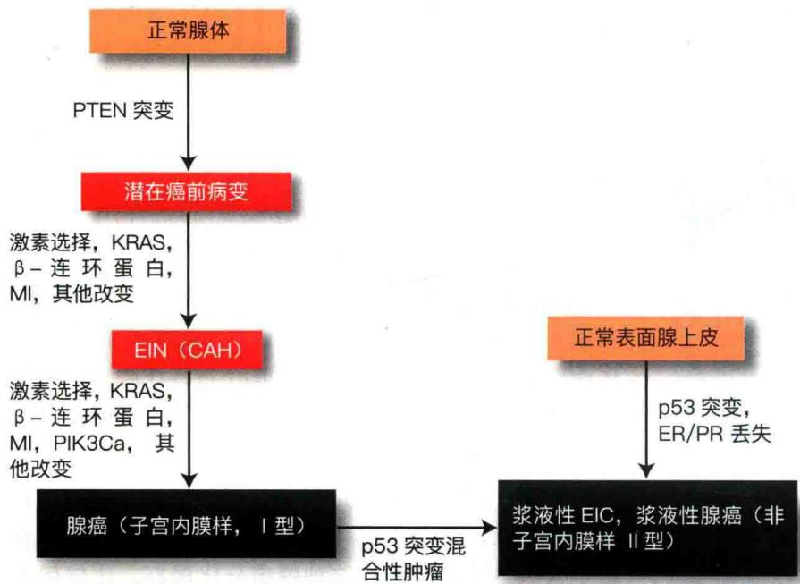 
图18-16 从子宫内膜增生到子宫内膜样腺癌：分子和遗传学事件。MI.微卫星不稳定
【临床表现】子宫内膜癌的主诉是常见的异常子宫出血，尤其是在肿瘤生长的早期阶段（即，局限于子宫内膜）。不幸的是，宫颈细胞学筛查不适合子宫内膜癌的早期检测。经阴道超声检查是一种有价值的诊断方式；子宫内膜超过 $5\mathrm{mm}$ 厚度被认为高度可疑。不同于宫颈癌，子宫内膜癌可直接转移到腹主动脉旁淋巴结，从而跳过盆腔淋巴结。晚期癌症患者也可发展为肺转移（ $40\%$ 病例出现转移）。局限于子宫内膜的高分化癌患者通常可通过单纯子宫切除术治疗。如果出现下列情况，可采用术后放疗：①肿瘤为低分化或非子宫内膜样型；②子宫肌层侵犯较深；③累及宫颈；④淋巴结有转移。
子宫内膜癌的生存率同下列因素有关：①分期和分级；②年龄；③其他可检测的危险因素，譬如激素受体活性。
肿瘤高水平的雌激素和孕激素受体和肿瘤低水平的增殖活性与较好的预后有关。所有子宫内膜癌患者经治疗后的生存率，在第2年后为 $80\%$ ，而10年后则下降到 $65\%$ 。
# （四）平滑肌瘤是女性生殖道最常见的肿瘤
平滑肌瘤，为平滑肌起源的良性肿瘤，被称为“肌瘤”或“fibroid，子宫肌瘤”。如果极小的肌瘤也包含在内，子宫肌瘤见于 $75\%$ 的30岁后的妇女。20岁之前子宫肌瘤罕见，大多数在绝经后消退。虽然常为多发，但每个平滑肌瘤都是单克隆的（第5章）。雌激素促进肌瘤的生长，但不是它们发生的启动因素。

【病理】大体上，肌瘤为质硬的，淡灰白色的，
漩涡状，无包膜的肿物（图18-17，图18-
18)。它们的大小从直径 $1 \mathrm{~mm}$ 到超过 $30 \mathrm{~cm}$ 。肿瘤切面凸起, 并且边界平滑与邻近肌层边界清晰。多数子
宫肌瘤是肌壁内的，但有些是发生在黏膜下和浆膜下，或者有蒂。很多肌瘤，尤其是较大的，可显示退行性玻璃样变性，与邻近正常子宫肌层有清楚分隔。具有低核分裂活性（ $\leqslant 4$ 个/10HPF）及缺乏核异型性和地图状坏死的平滑肌瘤，很少或没有恶性潜能。核分裂活跃的平滑肌瘤表现为活跃的核分裂活性，但一般体积较小，与周围正常肌层组织分界清晰，缺乏地图状坏死和明显的细胞异型性。它们通常被认为是良性的。显微镜下，子宫肌瘤表现为形态一致的梭形细胞排列成编织束状，其细胞核细长，两端钝圆（图18-18B）。胞质丰富，嗜酸性，纤丝状。平滑肌瘤的肌细胞和子宫肌层肌细胞细胞学上不存在区别。
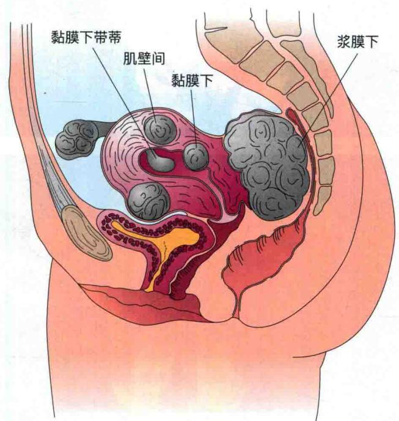 
图18-17子宫平滑肌瘤。子宫平滑肌瘤可为肌壁间、黏膜下（有蒂者类似子宫内膜息肉）和浆膜下（图中显示挤压膀胱，也可挤压直肠）
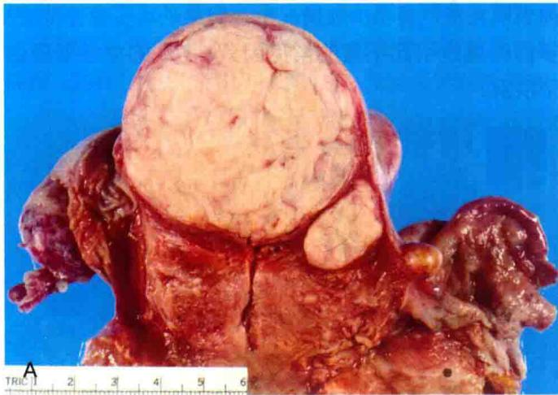
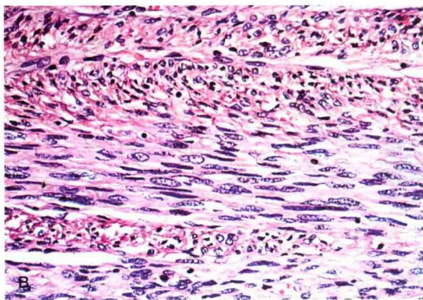 
图18-18子宫平滑肌瘤。A.对半切开的子宫显示一个突出的、边界清楚的肉质的肿瘤；B.显微镜下，平滑肌细胞相互交织束状排列，其中部分纵切（长形核）和其他为横切
【临床表现】由于表面受压变薄的子宫内膜溃疡形成，黏膜下肌瘤可引起出血。有些黏膜下肌瘤有蒂，可突出宫颈口，引起绞痛。因为体积太大，许多肌壁间平滑肌瘤会有症状，大者可以影响肠道或膀胱功能或导致难产。子宫肌瘤通常生长缓慢，但偶尔也会在妊娠时迅速增大。大的有症状的子宫肌瘤可通过子宫肌瘤剔除术或子宫切除术切除。
# （五）平滑肌肉瘤罕见
平滑肌肉瘤是一种来源于平滑肌的恶性肿瘤，其发病率为良性平滑肌瘤的1/1000。它只占子宫恶性肿瘤的 $2\%$ 。其确切的发病机制尚不清楚，但至少有一些似乎来自于平滑肌瘤。平滑肌肉瘤；平均年龄要比平滑肌瘤大10年（50岁以上），恶性者相比于良性者体积更大（ $10\sim 15\mathrm{cm}$ vs $3\sim 5\mathrm{cm}$ ）。

【病理】如果一明显的平滑肌肿瘤质地软、肉眼检查显示有坏死、边界不规则（浸润邻近的
肌层)、或者当切开时, 不突出于切面, 应怀疑平滑肌肉瘤的可能。核分裂活性、细胞异型性和地图状坏死是最好的诊断标准。大小是一个重要特征, 因为直径
小于 $5 \mathrm{~cm}$ 的肿瘤几乎不复发。然而，大多数平滑肌肉瘤体积大、检查时分期晚，在这种情况下，它们通常是致命的，尽管采用手术、放疗和化疗复合治疗。
# 第六节 输卵管
# 一、输卵管炎
输卵管炎是输卵管的炎性疾病，通常是由于下生殖道的上行性感染所引起。最常见的致病微生物是淋病奈瑟菌、大肠埃希菌、衣原体和支原体。通常是多种微生物感染。输卵管炎的急性发作（特别是那些同衣原体感染相关的输卵管炎）可以无症状。之前感染损伤的输卵管特别容易再次感染。在大多数情况下，慢性输卵管炎多发生在急性输卵管炎反复发作之后。

【病理与临床表现】急性输卵管炎，显微镜下
检查发现显著分叶核白细胞浸润，伴明显水肿
及黏膜皱襞充血。慢性输卵管炎时，浸润的炎症细胞包括淋巴细胞及浆细胞，水肿、充血不
明显。在炎症终末阶段，输卵管可能闭塞，管腔因为脓液（输卵管积脓）或渗出液（输卵管积水）而扩张。
下生殖道的微生物上行感染，可通过输卵管进入腹腔，引起腹膜炎及盆腔炎症性疾病（PID）。邻近的卵巢也可能受累，有时引起输卵管－卵巢脓肿。
输卵管自身的破坏可能引起一些并发症。上皮的破坏或输卵管黏膜纤维素沉积可以形成纤维性桥接，使黏膜皱襞间相互粘连。慢性输卵管炎引起的损伤使输卵管运动及传输精子的能力减弱，引起不孕。慢性输卵管炎也是引起异位妊娠的常见原因，因为相互粘连的输卵管黏膜皱襞形成的陷窝可使受精卵陷入其中。
# 二、异位妊娠
异位妊娠是指受精卵在子宫内膜以外的部位着床。在过去的20年间，美国异位妊娠的发生率增加了3倍，占妊娠的 $1.5\%$ 。然而，死亡率却迅速下降。超过 $95\%$ 异位妊娠发生于输卵管，最常见于输卵管远端及中1/3位置。

【病理】异位妊娠是受精卵在输卵管中输送过
程受阻而引起，例如，输卵管黏膜粘连、继发
于炎症或子宫内膜异位所致的输卵管运动异常。滋养叶细胞很容易穿透黏膜及输卵管壁，血液从输卵管管壁着床部位进入腹腔，引起腹痛。输卵管管壁较薄处常常在妊娠12周时发生破裂。管壁破裂可能因为快速出血而有威胁生命的可能。异位妊娠必须迅速进行外科处理或化疗干预。
# 第七节 卵巢
# 一、卵巢囊性病变
囊肿是引起卵巢体积增大的最常见原因。表层上皮内陷所致（浆液性囊肿）的囊肿非常常见。剩余的几乎均来源于卵巢滤泡。
1. 倾向于无症状的滤泡囊肿 滤泡囊肿为薄壁、充满液体的囊肿，囊内壁衬覆粒层细胞，囊外壁为卵泡膜内层细胞。它可以发生于任何年龄一直到绝经期，单房性囊肿，可以单发或多发，可以单侧卵巢或双侧卵巢同时发生。滤泡囊肿发生于卵巢滤泡，可能与垂体促性腺激素释放异常相关。

【病理】滤泡囊肿最大径很少超过 $5\mathrm{cm}$ ，在无刺激的状态下，囊肿的颗粒层细胞呈一致的寡核圆形形态特点，卵泡膜细胞较小、呈梭形。
偶尔，囊肿各层细胞可以出现黄素化，此时囊肿腔内的液体雌激素及孕激素水平较高。如果囊肿持续存在，激素释放在儿童可能引起性早熟，而在成年人则引起月经不规律。轻度的腹腔内出血是唯一显著的症状。
2. 可能出血的黄体囊肿 黄体囊肿的形成是因为黄体中心的腔消退延迟所引起。黄体囊肿持续合成孕激素引起月经紊乱。黄体囊肿破裂可引起腹腔内的轻度出血。典型的黄体囊肿为单房性，大小 $3 \sim 5\mathrm{cm}$ 囊壁为黄色。囊内容物可以是血性浆液或为血凝块。显微镜下观察可见多量体积较大、黄素化的粒层细胞。黄体囊肿为自限性。
3. 与高促性腺激素水平相关的卵泡膜黄素囊肿卵泡膜黄素囊肿也被称为高反应黄体，常为多发性，并且为双侧卵巢发生。卵泡膜黄素囊肿与循环中高水平的促性腺激素水平有关（例如，妊娠、水泡状胎块、绒毛膜癌以及外源性促性腺激素治疗），或者排卵障碍（严重的粘连、卵巢皮质纤维化）。过多的促性腺激素刺激卵泡膜细胞，使大量的囊肿形成。

【病理】双侧卵巢被多发薄壁、充满清凉液体的囊肿所替代。显微镜下，这些囊肿表现为显
著黄素化的卵泡膜内层细胞层。卵巢间质水肿、间质细胞灶性黄素化。偶尔继发于囊肿蒂扭转或破裂引起腹腔内出血时，需要外科干预。
# 二、多囊卵巢综合征
多囊卵巢综合征也被称为Stein-Leventhal综合征，描述为：①临床症状与雄激素过度分泌相关；②持续无排卵；③卵巢包涵许多被膜下小囊肿。这个综合征最初被描述为继发闭经、多毛症及肥胖。然而现在认为临床症状变异较大，包括闭经的妇女可能其他方
面表现正常，甚至少数情况下，卵巢缺乏多囊性特征。多囊卵巢是引起不育的常见因素， $7\%$ 的女性罹患这个疾病。

【发病机制】多囊卵巢综合征的主要异常为：
伴有促黄体激素水平增高的功能性卵巢高雄增多症。尽管这种激素量的增加可能是卵巢碍的一种结果而不是一种原因（图18-19）。卵巢雄激素在局部引起：①卵泡闭锁过早；性滤泡囊肿；③持续无排卵状态。卵泡成熟损引起孕激素分泌降低。在外周，雄激素增起女性多毛症、痤疮、男性式（雄激素依赖）女性多囊卵巢综合征患者出现显著的外周胰抗，部分是由于肥胖。高胰岛素血症的结果加了卵巢分泌雄激素，并直接刺激垂体促黄的产生。

【病理】大体检查，双侧卵巢体积均增大。由
于缺乏排卵，卵巢表面光滑。切面卵巢皮质增
厚，并见多量卵泡膜黄素化型囊肿，常常囊肿大小在直径 $2\sim 8\mathrm{mm}$ 。这些囊肿呈周围型排列，围绕一个致密的间质核心，或者呈散在分布在增生的卵巢间质中。显微镜下，有如下的特点：①多量发育早期阶段的滤泡；②滤泡闭锁；③间质增加，偶尔可见黄素化细胞（卵泡膜细胞增生症）；④缺乏排卵的形态标志（厚、光滑的卵巢被膜，缺少黄体及白体）。许多被膜下囊肿显示较厚的卵泡膜内层区域，并且一些细胞出现黄素化。

【临床表现】在美国几乎3/4的无排卵不孕症
妇女是多囊卵巢综合征。患者常常在20多岁出现肥胖、月经问题及多毛症。50%患多囊卵巢女性无月经，其他多为月经周期不规律。其中患病妇女是不孕症患者，提示一些患者偶尔有排卵为没有对非周期性雌激素活性的抵抗，是子宫内生及腺癌的发生率增加。多囊卵巢综合征患者就是依靠激素进行治疗，用于直接阻断持续分泌、雄激素。
# 三、卵巢肿瘤
尽管在美国，卵巢癌是继子宫内膜癌后第二大常见女性生殖系统恶性肿瘤，但是卵巢癌的死亡率却高于所有其他女性生殖系统癌症的总和。在美国，每年有20000卵巢癌新发病例，超过15000女性死于该疾病。卵巢肿瘤主要发生于60岁以后的妇女，但是年轻有家族史的女性也可发生。不幸的是，卵巢癌在其发生、尚可治愈早期较难发现，当诊断时，超过3/4患者肿瘤已转移至盆腔或腹腔。
卵巢肿瘤是依据肿瘤来源细胞的类型进行分类（图
18-20)。最常见的肿瘤起源于表层上皮，被命名为常见上皮肿瘤（大约 $60\%$ ）。其他重要的类型包括生殖细胞肿瘤（ $30\%$ ）、性索/间质肿瘤（ $8\%$ ）及卵巢转移性肿瘤。
# （一）卵巢上皮性肿瘤占卵巢恶性肿瘤的 $60\%$ 以上
卵巢常见上皮源性的肿瘤大致可被分为：①良性；②交界恶性（也被称为低度恶性潜能）；③恶性。

【病因、发病机制和流行病学】常见上皮肿瘤与卵巢表层上皮反复破裂及修复相关，部分因周期性排卵而所致。因此，该类肿瘤最常累及未经产妇女，相反，少见于曾被抑制排卵的女妊娠或口服避孕药)。
在研究卵巢癌病因时，有时会涉及卵巢癌的家族史问题。一级亲属罹患卵巢癌的女性患同种疾病的危险性增高3.5倍。有卵巢癌病史的患者患乳腺癌的危险性增大，反之亦然。修复基因的缺陷与遗传性乳腺癌相关，BRCA1及BRCA2基因，同时与家族性卵巢癌相关。携带BRCA1基因突变女性卵巢癌患者比散发卵巢癌发病年龄更趋于年轻，但是BRCA1基因相关肿瘤预后较好。如前所知，遗传性非息肉病性结肠癌（HNPCC）患者患卵巢癌的危险性增大。最常见的上皮性肿瘤，特别是浆液性癌，发生于卵巢表面上皮
或浆膜。其中一些，如Brenner瘤，则发生于卵巢其他部位。在卵巢发育过程中，表层上皮陷入卵巢间质，从而形成腺体或囊肿，其中部分成为肿瘤性病变。
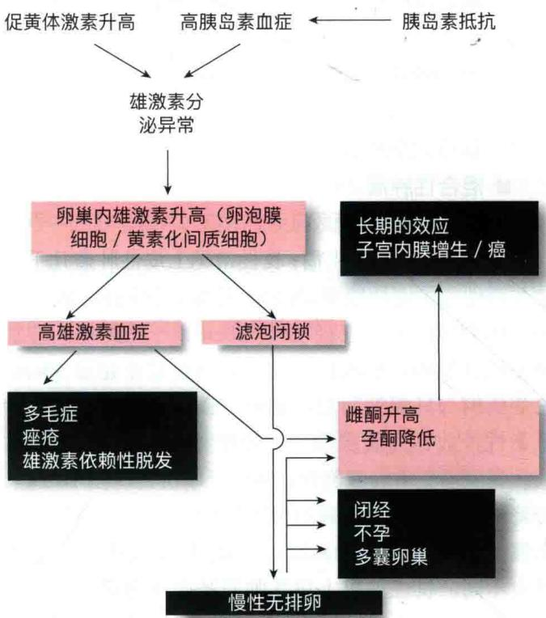 
图18-19 多囊卵巢综合征的发病机制
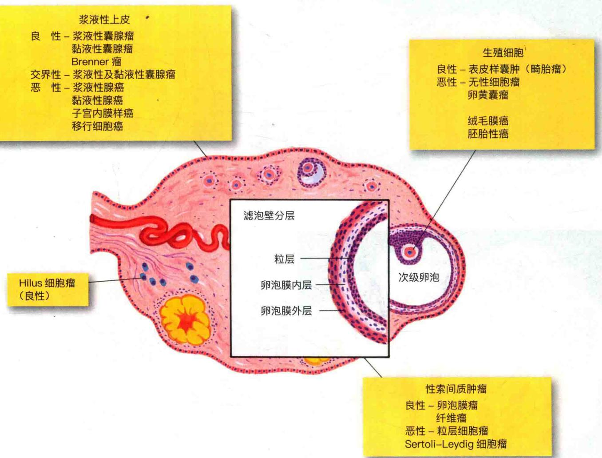 
图18-20 根据细胞来源的卵巢肿瘤分类

# 【病理】常见上皮性肿瘤的发病率按依次递减的顺序分别为：
■ 浆液性肿瘤与输卵管上皮相似。 
黏液性肿瘤与宫颈黏膜相似。 
子宫内膜样肿瘤与子宫内膜腺体相似。 
透明细胞肿瘤显示糖原丰富的细胞，与妊娠期的子宫内膜腺体相似。 
移行细胞肿瘤与膀胱黏膜相似 
混合性肿瘤
# 1. 良性上皮性肿瘤
浆液性与黏液性腺瘤：良性常见上皮性肿瘤几乎总是浆液性或黏液性腺瘤，倾向于发生于 $20\sim 60$ 岁女性。肿瘤体积常较大，直径 $15\sim 30\mathrm{cm}$ 。一些肿瘤，特别是黏液性腺瘤，形成巨大肿物，直径甚至超过 $50\mathrm{cm}$ 这些病例与妊娠期间表现相似。良性上皮性肿瘤常常呈囊性，故称为囊腺瘤。浆液性囊腺瘤（ $15\%$ ）比黏液性囊腺瘤更常为双侧性，倾向于单房性（图18-21）。与浆液性肿瘤相比，黏液性肿瘤的特征是出现数百个小囊（子囊腔）（图18-22）。与恶性浆液性及黏液性肿瘤不同，良性卵巢上皮性肿瘤倾向于薄壁、缺乏实性区域。镜下表现，囊内壁衬覆一层高柱状上皮。当
出现乳头时，可见被覆单层高柱状上皮的纤维血管轴心，并与囊内壁衬覆的上皮相同。
移行细胞肿瘤（Brenner肿瘤）：典型的Brenner肿瘤为良性，可发生于任何年龄， $50\%$ 肿瘤发生于50岁以上女性。肿瘤大小可以为显微镜下结节，也可以为直径 $8\mathrm{cm}$ 或更大的肿瘤。组织学表现，Brenner肿瘤显示移行细胞样的实性细胞巢（尿路上皮样）分布在密集纤维间质中。最表层上皮可能显示黏液性分化。
2.交界性肿瘤（低度恶性潜能肿瘤）“交界性肿瘤”是指以上皮细胞增生、显示核异型性，无间质破坏性浸润为特点的一组卵巢肿瘤。尽管组织学提示侵袭性特点，但是这些肿瘤预后良好。卵巢交界性肿瘤常常发生于 $20\sim 40$ 岁女性，但少数病例可见于老年女性。如果肿瘤局限于卵巢内，几乎均能通过手术治愈。甚至当肿瘤播散至盆腔或腹腔时，尽管晚期复发率增加，但5年存活率为 $80\%$
交界性浆液性肿瘤（ $35\%$ ）较黏液性（ $5\%$ ）或其他类型卵巢肿瘤，双侧发生率更高。尽管交界性黏液性肿瘤可出现巨大肿瘤（ $100 + \mathrm{kg}$ ），但总的来说交界性肿瘤在体积上变化较大。交界恶性浆液性肿瘤，常见乳头状突起，囊内壁可见纤细、较高乳头，或葡萄样簇状生
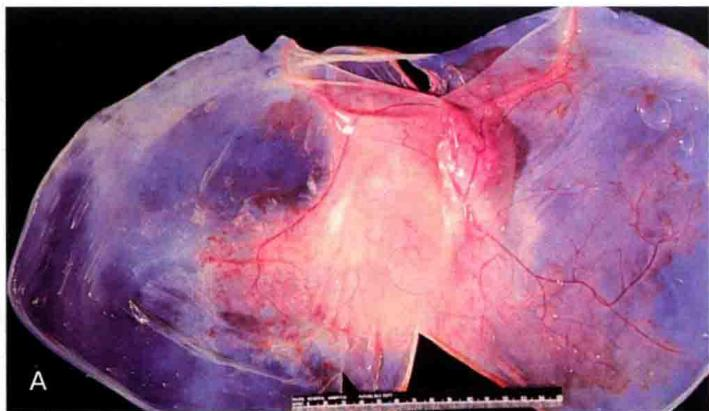 
图18-21卵巢浆液性囊腺瘤。大的单房性浆液性囊腺瘤内的液体成分已经流出。囊壁薄且呈半透明状。显微镜下观察：囊壁内衬单层纤毛柱状上皮
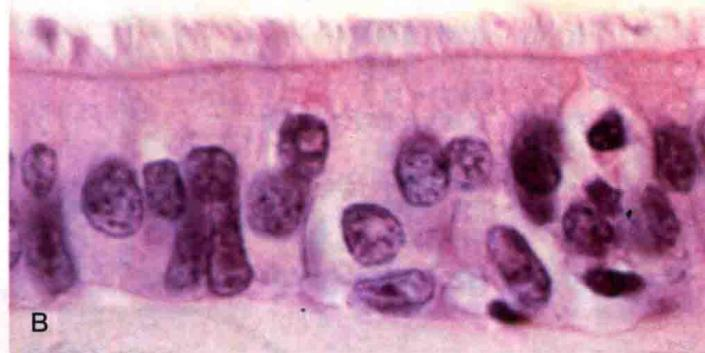
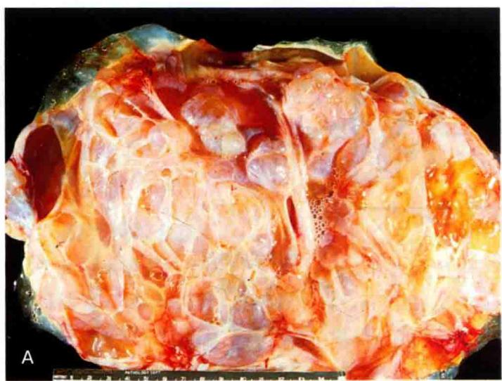 
图18-22 卵巢黏液性囊腺瘤。A.肿瘤可见为数众多、充满黏稠液体囊腔；B.囊内壁衬覆单层黏液性上皮
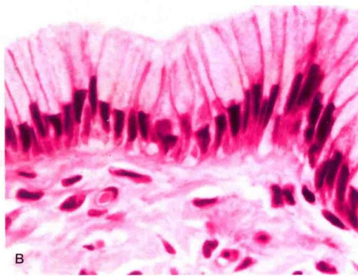
长的乳头状结构。显微镜下，这些结构与良性囊腺瘤的乳头状分支相似，但这些改变之间的鉴别点包括：①上皮复层；②中度核异型；③核分裂。虽然交界性黏液性肿瘤乳头状突起不太明显，但这些鉴别的标准也适用。局部微浸润被定义为卵巢间质内分散浸润的上皮细胞巢团，浸润范围小于 $3\mathrm{mm}$ 。这个形态特点被认为是低级别浸润性浆液性癌，而不是一个交界性肿瘤。然而交界性肿瘤可伴淋巴结转移或者腹膜种植，不论浸润或非浸润性，仍认为是“交界性”，因此反映了即使这种情况下也比普通性腺癌预后好得多的事实。
3. 恶性上皮性肿瘤 卵巢恶性上皮性肿瘤最常发生于 $40 \sim 60$ 岁，35岁以下少见。当卵巢癌肿块达到 $10 \sim 15\mathrm{cm}$ 时，常常播散到卵巢外并种植于腹膜。根据显微镜及分子遗传学检查，卵巢癌分为五个主要亚型（表18-4）。从发病率由高到低排序为：高级别浆液性癌（>70%）、子宫内膜样癌（10%）、透明细胞癌（10%）、黏液性癌（3%~4%）以及低级别浆液性癌（<5%）。这些亚型涵盖了98%卵巢癌，可被重复诊断，并存在流行病学、遗传危险因子、前驱病变、播散方式、在肿瘤发生过程中的分子事件、对化疗反应及预后差异的不同疾病。
表 18-4 卵巢癌主要亚型 
低级别浆液性高级别浆液性透明细胞子宫内膜样黏液性通常诊断时肿瘤的分期早期或进展期进展期早期早期早期推定的组织起源/前驱病变浆液性交界性肿瘤输卵管或卵巢表面上皮包涵囊肿输卵管化生子宫内膜异位症,腺纤维瘤子宫内膜异位症,腺纤维瘤腺瘤-交界性肿瘤-癌顺序;畸胎瘤遗传性风险?BRCA1/2?HNPCC?显著分子异常BRAFp53和pRB通路HNF-1BPTEN,B-cateninK-rasK-RASK-rasMI增生低高低低中等基本化疗反应26%~28%80%15%?15%预后好差中等好好
HNPCC. 遗传性非息肉病性结肠癌
# （1）浆液性腺癌

【发病机制】卵巢低级别及高级别浆液性癌
基本上是2种不同的肿瘤。然而低级别肿瘤
常与低级别交界性浆液性肿瘤相关，存在KRAS及BRAF基因突变，高级别浆液性癌似乎起始发生，没有可证明的前驱病变，并且存在高频率的p53基因，而不是KRAS及BRAF基因突变。有意思的是，发生于携带BRCA1及BRCA2基因胚系突变患者发生的癌（遗传性卵巢癌）几乎均为高级别浆液性类型，并常伴有p53基因突变。

【病理】低级别浆液性癌为以小而紧密的肿瘤
细胞巢在卵巢不规则浸润为特点，伴有不同程
度的促纤维增生反应（图18-23）。肿瘤细胞核的一致性是鉴别低级别及高级别浆液性癌的主要标准，低级别浆液性癌的细胞核大小变化不超过3倍。低级别浆液性癌很少进展为高级别肿瘤。
高级别浆液性癌（常被称为囊腺癌）大部分为实性、多结节肿块，常伴有坏死及出血（图18-24A）。当肿瘤大小达到 $10\sim 15\mathrm{cm}$ 时，常常播散到卵巢外并发生腹膜种植。2/3浆液性癌发生卵巢外播散为双侧性。高级
别浆液性癌常显示显著的间质浸润。大部分肿瘤出现高级别细胞核，伴有不规则分支、高度富于细胞性乳头，少量或无间质支持，裂隙样腺腔伴有多量实性区域（图18-24B），可见多量核分裂象，砂砾体（微钙化灶）常见。
# （2）黏液性腺癌

【发病机制】卵巢黏液性肿瘤常常有异质性，
良性、交界性、非浸润性及浸润性癌成分可
见于同一个肿瘤中。这种形态学上的连续性提示了渐进性肿瘤进展的过程，随着肿瘤级别从癌瘤到浸润性
近性肿瘤进展的过程。随着肿瘤级别从腺瘤到浸润性癌增加，KRAS基因突变频率也增加支持了这个假说。

【病理】黏液性癌常体积较大、单侧、多房或
单房囊性肿物，囊内包含黏液。常见乳头及实
性区域，这些区域可能较软、黏液样或质地较硬、伴有出血及坏死。恶性程度不同的成分可以共同存在于一个标本中，所以卵巢黏液性肿瘤应该充分取材。分化较好的黏液性肿瘤包含肿瘤性腺体，腺体由高柱状、产生黏液的细胞构成，常可见实性及筛状区域（图18-25）。分化差的黏液性腺癌，肿瘤细胞排列为不规则的巢状、条索状，核分裂象多见。存在间质浸润，并常见浆膜侵犯。
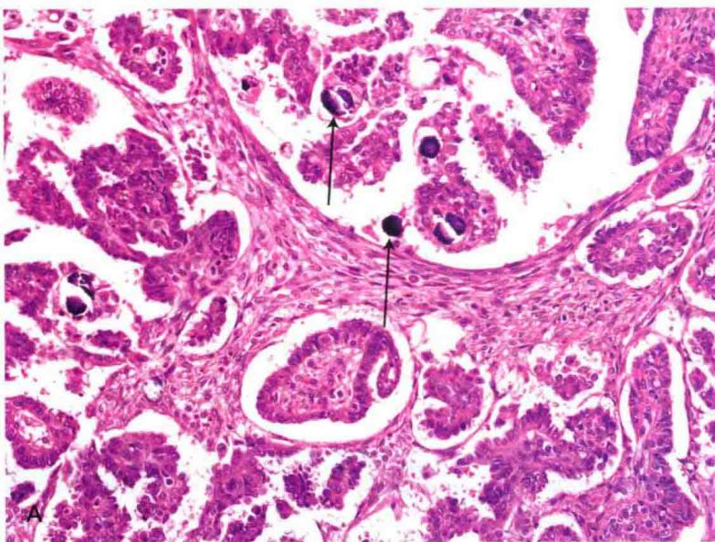 
图18-23低级别浆液性癌。A.肿瘤细胞巢排列紊乱，癌巢周围可见裂隙。与高级别浆液性癌相比，核呈低级别。可见砂砾体（箭头）。B.高倍镜下可见砂砾体呈层状结构
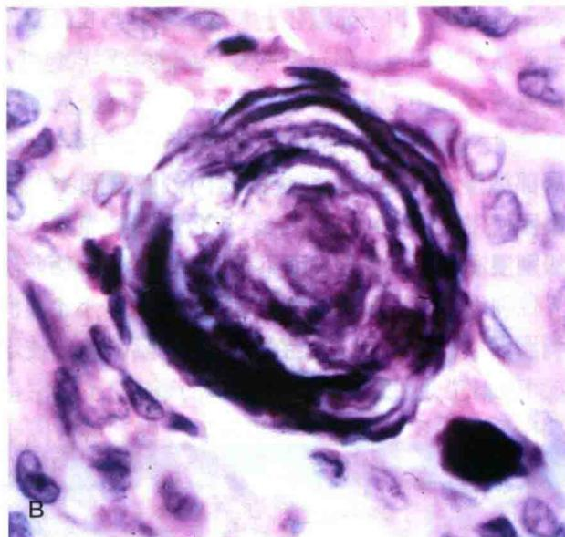
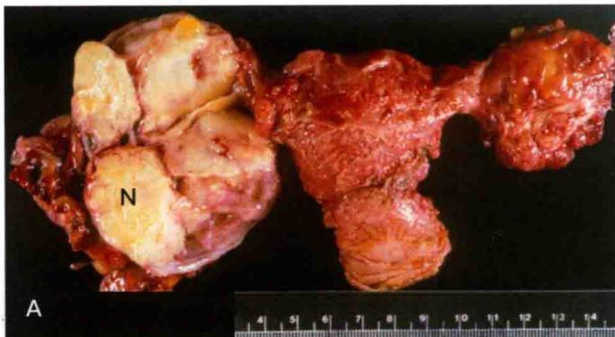
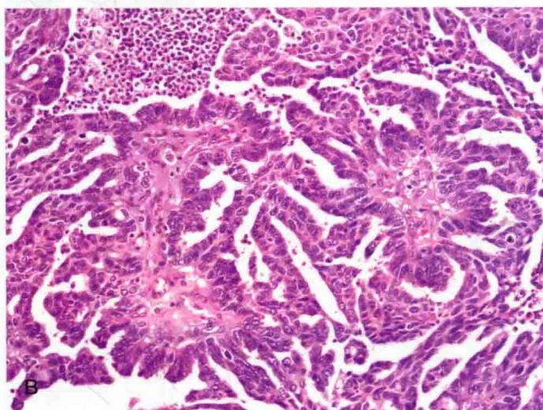 
图18-24高级别浆液性囊腺癌。A.除了囊之外（左），卵巢体积因实性肿物而增大，并显示广泛坏死（N）；B.显微镜下观察显示：复杂的乳头，被覆不典型性的核，形成肾小球样结构
（3）子宫内膜样腺癌：卵巢子宫内膜样腺癌与子宫内膜的子宫内膜样腺癌相似，被认为来源于卵巢子宫内膜异位症的恶性转化。卵巢子宫内膜样腺癌发病频率仅次于浆液性腺癌，占卵巢癌的 $10\%$ 。最常见于绝经后妇女。与浆液性及黏液性肿瘤不同，大部分子宫内膜样肿瘤为恶性，其中部分病例可见鳞状分化区域， $50\%$ 以上的病例为双侧卵巢发生。
大体检查，卵巢子宫内膜样癌体积大小变化较大，从 $2\mathrm{cm}$ 到超过 $30\mathrm{cm}$ 。尽管可能为囊性，但大多数肿瘤主要为实性区域，并伴有坏死。显微镜下观察，按照应用于子宫内膜样腺癌的方案进行分级， $15\% \sim 50\%$ 卵巢子宫内膜样癌患者同时伴有子宫内膜癌。同其他卵巢恶性上皮性肿瘤一样，预后根据肿瘤分期的情况而定。
（4）透明细胞腺癌：卵巢透明细胞腺癌与子宫内膜样腺癌密切相关，并且常与子宫内膜异位症有关。透明细胞腺癌常发生于绝经后妇女，占卵巢恶性肿瘤 $5\% \sim 10\%$ 比例。肿瘤直径 $2\sim 30\mathrm{cm}$ ， $40\%$ 为双侧性。大部分肿瘤可为部分囊性，实性区域见坏死及出现。尽管常常为I期或Ⅱ期患者，但与其他低临床分期卵巢癌相比，透明细胞腺癌显示预后较差。显微镜下观察，卵巢透明细胞腺癌显示胞质透明的恶性肿瘤细胞呈条带状或管状排列。呈管状排列时，恶性细胞常呈球状核，
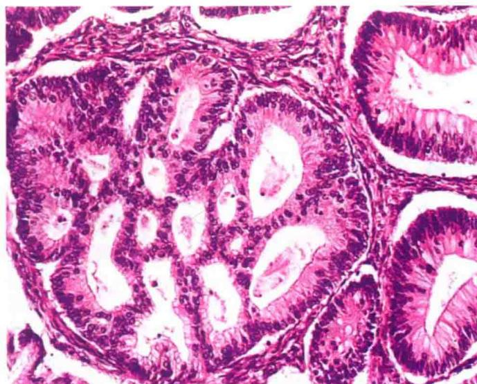 
图18-25 黏液性囊腺癌。恶性腺体排列成筛状结构，由产生黏液的柱状细胞构成
并突出于腺腔（“鞋钉样细胞”）。临床过程与卵巢子宫内膜样腺癌相似。
【临床表现】大部分卵巢肿瘤为无功能性，无激素分泌。然而，如果应用抗体在血清中检测出CA-125抗原，那么 $50\%$ 的上皮性肿瘤来源于卵巢，其中 $90\%$ 已经存在肿瘤播散。结合经阴道超声检查，这项检测的特异性是最高的。
卵巢肿块在体积变大之前较少引起临床症状。肿块使腹部膨隆，并引起疼痛、盆腔压迫感或挤压周围器官。当卵巢癌被诊断时，许多病例已发生盆腔、腹腔脏器、膀胱、膈肌、直肠窝及网膜表面的转移（种植）。恶性肿瘤细胞通过淋巴道播散首先发生于主动脉旁淋巴结。另外一些转移癌引起特异性的症状，腹水、乏力、体重减轻及恶病质。总的来说，卵巢恶性肿瘤患者的生存常常较差。5年生存率仅有 $35\%$ ，因为 $50\%$ 以上的患者在发现时已发生腹腔或其他部位的播散。手术是控制卵巢癌的基本方法，切除原发肿瘤、作出诊断、评估肿瘤播散的范围，新辅助化疗用于远处隐匿播散病灶的治疗。
# （二）成人倾向于良性、儿童可能为恶性的生殖细胞肿瘤
来源于生殖细胞并占所有卵巢肿瘤1/4比例的一组肿瘤。对于成年女性，实际上所有生殖细胞肿瘤均为良性（成熟性囊性畸胎瘤、皮样囊肿），而在儿童或年轻女性，则大部分为恶性。儿童卵巢癌最常见的类型是生殖细胞肿瘤（ $60\%$ ），在绝经后罕见。肿瘤性生殖细胞可沿着数种分化方向中的其中一种进行分化，引起肿瘤，与男性睾丸发生该类肿瘤的情况相似。
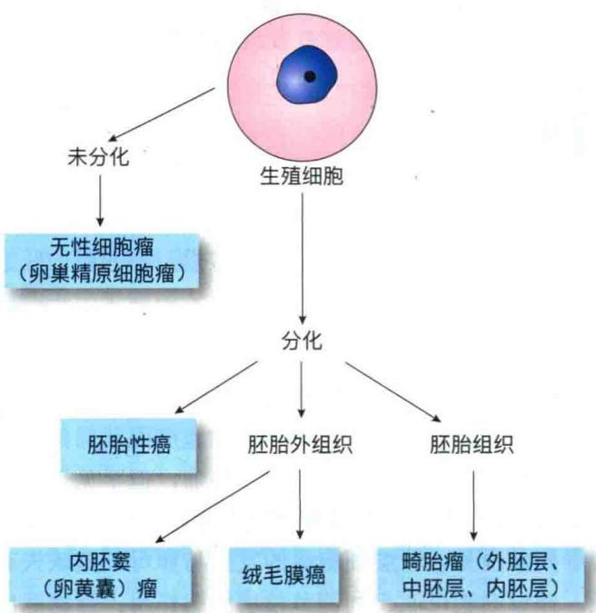 
1.无性细胞瘤 卵巢无性细胞瘤与睾丸的精原细 
图18-26 卵巢生殖细胞肿瘤分类
胞瘤相对应，由原始生殖细胞组成。无性细胞瘤占所有卵巢肿瘤比例不足 $2\%$ ，但在 $< 20$ 岁女性卵巢恶性肿瘤中占 $10\%$ 。大部分患者年龄在 $10\sim 30$ 岁之间， $15\%$ 的病例为双侧性。
【病理】大体检查，无性细胞瘤常体积较大，实性，肿瘤表面凸凹不平。切面质地软而有光泽。显微镜下表现：形态上一致的肿瘤细胞呈大的团巢状排列，肿瘤细胞胞质富于糖原，细胞核一致、居中、核形不规则。肿瘤内可见纤维间隔，并见淋巴细胞浸润。无性细胞瘤通过手术治疗，肿瘤I期患者5年存活率为 $100\%$ 。因为肿瘤对放疗高度敏感，并对化疗也有反应，即使更高肿瘤分期的患者5年存活率也超过 $80\%$
# 2. 畸胎瘤 畸胎瘤是一种向体细胞结构分化的生殖细胞来源肿瘤。大多数畸胎瘤含有至少2胚层组织，常包含3胚层的组织。
成熟性畸胎瘤（成熟性囊性畸胎瘤、皮样囊肿）：这种良性肿瘤在卵巢肿瘤比例中占1/4，发病率高峰在 $30\sim 40$ 岁之间。成熟性畸胎瘤是由单性生殖发展而来。单倍体（减数分裂后）生殖细胞通过核内复制形成双倍体，遗传学上为女性，肿瘤细胞核型（46，XX）。
【病理】成熟性畸胎瘤为囊性，超过 $90\%$ 病例含有皮肤、皮脂腺及毛囊（图18-27）。 $50\%$ 病例可见平滑肌、汗腺、软骨、骨、牙齿及呼吸道上皮。消化道、甲状腺及脑组织较少见到。卵巢甲状腺肿是指主要由甲状腺组织组成的囊性病变（占成熟性囊性畸胎瘤比例的 $5\% \sim 20\%$ 。罕见由于卵巢甲状腺肿出现甲状腺功能亢进的病例。
皮样囊肿病例发展为恶性非常少见（1%）。常常在老年女性发生，并与身体其他不同分化组织来源的肿瘤相似。所有皮样囊肿恶性转化形成的癌中，鳞状细胞癌占3/4比例，其余的组织学类型包括类癌、基底细胞癌、甲状腺癌、腺癌及其他类型。发生成熟性囊性畸胎瘤恶性转化患者预后与肿瘤分期密切相关。
不成熟畸胎瘤：卵巢不成熟畸胎瘤包含来源于3胚层的成分。然而与成熟性囊性畸胎瘤不同，不成熟成分包括胚胎组织。20岁以下女性所有部位恶性肿瘤中，不成熟畸胎瘤占 $20\%$ ，在年长的女性中逐渐减少。
【病理】不成熟畸胎瘤主要为实性和分叶状，伴有数量较大的小囊。实性区域可能包含大体可以明显识别的不成熟骨及软骨。显微镜下观察，常可见多种肿瘤成分，包括神经（神经上皮菊形团及不成熟的神经胶质）、腺体及其他在成熟性囊性畸胎瘤可见的结构。生存与肿瘤分级相关。分化好的不成熟畸胎瘤通常有较好的预后，但是高级别的肿瘤（主要为胚胎组织）预后较差。
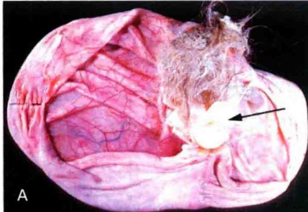
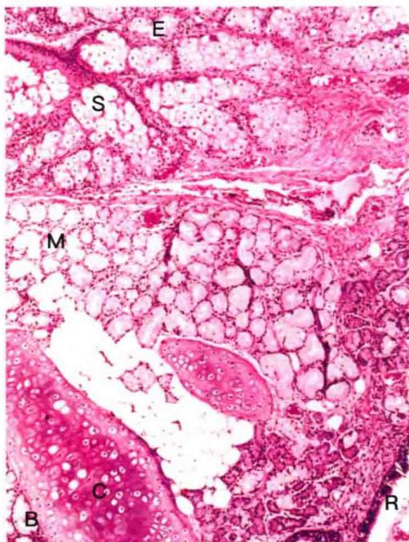 
图18-27 卵巢成熟性囊性畸胎瘤。A.被剖开的成熟性囊性畸胎瘤，显示一个实性结节（箭头），毛发从此处长出；B.实性结节的镜下所见：表皮及呼吸性成分。与皮肤相似的组织显示了表皮（E）带有其下皮脂腺（S）。呼吸性组织由黏液腺（M）、软骨（C）及呼吸上皮（R）组成
3.卵黄囊瘤 卵黄囊瘤是一种女性高度恶性肿瘤，发生于30岁以下年龄，组织学上与原始卵黄囊的间充质相似。卵黄囊瘤是第二大最常见的生殖细胞肿瘤，几乎总为单侧发生。

【病理】典型病例常常体积较大，伴有广泛坏死及出血。显微镜下显示，多种形态特点，最
常见的表现为衬覆原始细胞相互交通的网状、蜂巢状结构。Schiller-Duval小体在一些肿瘤中可少量出现，但却为特征性改变。Schiller-Duval小体为凸向被覆肿瘤细胞小囊的乳头结构，与肾小球的Bowman囊相似，乳头被覆着胚胎细胞，有纤维血管轴心及中央血管。
卵黄囊瘤分泌α-甲胎蛋白，并进入血液，此为有用的诊断及监测疗效的指标。以前，该肿瘤几乎总是致死性的，但进行化疗后，I期患者的5年生存率超过80%。
4. 绒毛膜癌 卵巢绒毛膜癌是一种与被覆胎盘绒毛的上皮，即细胞滋养层及合体滋养层形态相似的一
种罕见肿瘤。肿瘤发生于青春期前，被假定来源于卵巢生殖细胞，并可能混合其他生殖细胞肿瘤成分。生育期妇女，卵巢绒毛膜癌可能为子宫内妊娠肿瘤转移所致。年轻女孩生殖细胞来源绒毛膜癌出现性早熟、月经紊乱或迅速乳腺增大症状。

【病理】绒毛膜癌为单侧发生，实性，伴有广泛出血。显微镜下，可见混合存在恶性细胞滋
养层及合体滋养层成分（见胎盘，绒毛膜癌）。合体滋养层细胞分泌hCG，这就是为什么妊娠检测常呈阳性的原因。连续的血清hCG检测是有用的诊断及随访的指标。虽然肿瘤有高度的侵袭性，但对化疗反应良好。
# （三）临床功能性的卵巢性素/间质肿瘤
性索及间质肿瘤来源于性索或发育中性腺的间质。性索/间质肿瘤占卵巢肿瘤 $10\%$ 的比例，从良性到低度恶性。性索及间质肿瘤既可以向女性（粒层或卵泡膜细胞）也可以向男性（Sertoli及Leydig细胞）结构分化。
1. 卵巢纤维瘤 卵巢纤维瘤在卵巢间质肿瘤占 $75\%$ ，并在所有卵巢肿瘤的 $7\%$ 。卵巢纤维瘤可见于所有年龄，发病率在围绝经期达到高峰，并且几乎总是良性。

【病理】卵巢纤维瘤为实性、质地硬，切面为
白色。显微镜下观察：肿瘤细胞与正常卵巢皮
质内的间质细胞相似，呈现为分化较好的梭形细胞，
周围见不等量的胶原。 $50\%$ 体积较大的肿瘤可出现腹
水，但腹水伴有胸腔积液的情况少见（Meigs 综合征）。
2.卵泡膜瘤 卵泡膜瘤是卵巢功能性肿瘤，发生
于绝经后妇女，几乎总为良性。卵泡膜瘤与纤维瘤密
切相关，但又含有不等量的类固醇生成细胞，在很多
病例中，这些细胞产生雌激素或雄激素。

【病理】卵泡膜瘤为实性肿瘤，常常大小直径
$5 \sim 10 \mathrm{~cm}$ 。因为存在许多富含脂质的细胞,
肿瘤切面呈黄色。显微镜下观察，这些细胞椭圆形、
圆形,富含脂质的泡沫样胞质。玻璃样变的胶原束分
(2) 割卵泡膜细胞。由于肿瘤产生雌激素, 卵泡膜瘤在绝经
经前期妇女引起不规则月经周期及乳房增大。子宫内
膜增生及子宫内膜癌是其常见的并发症。
3. 粒层细胞瘤 粒层细胞瘤是典型分泌产生雌激素
素的卵巢功能性肿瘤。卵巢粒层细胞瘤因其局部播散
的潜在可能性，应被认为是恶性肿瘤，但罕见远处转移
移的情况。大部分粒层细胞瘤发生于绝经后（成人型），
青春期前少见。粒层细胞瘤的发生与卵母细胞缺失有
关，卵母细胞可能起到调节粒层细胞作用，当滤泡出
现调节紊乱或闭锁时，肿瘤可能发生。幼年型粒层细
胞瘤，发生于儿童或年轻女性，特点为雌激素过多症肌及青春期前性早熟。

【病理】与其他大多数卵巢肿瘤相同，成人型
粒层细胞肿瘤体积较大，局部呈囊性到实性改变。肿瘤切面显示黄色的区域，代表着富于脂质的黄色的粒层细胞。白色区域，局部可见出血。显微镜观察，粒层细胞肿瘤显示了不同的排列方式：①弥散（肉瘤样）；②岛样（细胞岛）；③条索状（粒层内相互吻合的条带）。偶尔由于核排列极向及中央变性间隙，形成特征性滤泡状结构（Call-Exner小体）。细胞特征性的呈梭形，常见核沟，核呈长形（咖啡色）。

【临床表现】3/4粒层细胞肿瘤分泌雌激素。
因此，良性子宫内膜增生是常见的表现，如果
粒层细胞肿瘤一直未被发现，容易罹患EIN及子宫内膜腺癌。 $90\%$ 被临床发现的粒层细胞瘤均局限于卵巢(I期)。这些患者的10年生存率 $>90\%$ 。肿瘤累及盆腔及下腹部预后较差。手术切除后 $5\sim 10$ 年晚期复发不常见，但常为致死性。
4. 支持-间质（Sertoli-Leydig）细胞肿瘤 卵巢支持-间质细胞肿瘤（睾丸母细胞瘤或男性母细胞瘤）是少见的具有低度恶性潜能的间质肿瘤，与胚胎睾丸相似，是典型分泌雄激素的卵巢肿瘤。支持-间质细胞肿瘤可发生于任何年龄，但以生育期年轻女性最多见。

【病理】支持-间质细胞肿瘤为单侧发生，肿
瘤大小常在 $5 \sim 15 \mathrm{~cm}$ 。肿瘤倾向于分叶状,
切面为实性，棕色到黄色。显微镜下改变：支持一间质细胞肿瘤从高分化到低分化表现不同，部分可见异源性成分（如黏液性腺体，甚至可见软骨）。最具特征性的特点是体积较大的Leydig细胞，有丰富的嗜酸性胞质、居中的圆到卵圆形的核及显著的核仁。肿瘤细胞混合于肉瘤样间质中，常可见分化成胚胎时期Sertoli细胞的不成熟实性小管结构。

【临床表现】几乎 $50\%$ 的支持-间质细胞肿瘤
患者显示了雄激素的作用。开始，表现为女性
特征消失（乳房萎缩、无月经、缺少臀部脂肪），接着表现为男性化，包括多毛症、男性面容、阴蒂增大、声音低沉。肿瘤切除后，这些症状减轻或消失。高分化肿瘤常能手术治愈，分化差的肿瘤可能发生转移。
# （四）与原发肿瘤相似的卵巢转移性肿瘤
大约 $3\%$ 的卵巢癌来源于其他部位，发生频率由高至低：最常见的原发部位包括乳腺、大肠、子宫内膜及胃。肿瘤的体积变化较大，可以仅在显微镜下发现，
或为较大肿块。卵巢转移性肿瘤体积较大时，可引起临床症状，以结肠源性的转移性肿瘤最常见。转移性肿瘤细胞常常刺激卵巢间质分化成有激素活性细胞（黄素化间质细胞），因此诱导产生雄激素、有时为雌激素引起的症状。Krukenberg瘤是卵巢转移性肿瘤，在富于细胞性的卵巢间质中可见呈巢状排列、细胞内充满黏液的印戒细胞团。 $75\%$ 病例的原发部位为胃，除此最常见Krukenberg瘤的原发部位为结肠。
# 第八节 胎盘与妊娠疾病
# 一、感染
# 上行感染所致的羊膜绒毛膜炎
羊膜绒毛膜炎是指羊膜、绒毛膜及胎盘外膜的炎症。感染的病原体几乎均为细菌，通过母亲产道上行感染，经宫颈管外口，感染蜕膜及胎盘组织。最常见引起羊膜绒毛膜炎的细胞是链球菌B属、其他链球菌属、大肠埃希菌、葡萄球菌属、革兰阴性杆菌、类杆菌属、支原体人型、尿素支原体。

【病理】病原体上行至子宫腔，可引起母体的
急性炎症反应。在羊膜及绒毛膜内发现中性粒
细胞可确定羊膜绒毛膜炎。羊水常出现浑浊，羊膜壁可轻度不透明、有恶臭味或水肿。如果感染持续一段时间，胎儿也将出现对感染的急性炎症反应，表现为：中性粒细胞向脐带血管（急性脐带炎）及胎盘表面大的胎儿血管（急性绒毛膜血管炎）管壁肌层浸润。

【临床表现】在 $10\%$ 胎盘中可见急性羊膜绒毛
膜炎，与早产、羊膜早破、胎儿及新生儿感染、
宫内缺氧相关。羊膜绒毛膜炎对胎儿造成为危险包括：①吸入感染的羊水后引起肺炎；②直接接触带有病原菌的羊水造成皮肤及眼部感染；③吞入感染的羊水引起新生儿胃炎、肠炎及腹膜炎。主要的危险是引起母体的产时发热、产后子宫内膜炎、伴有静脉栓塞的盆腔脓肿。
# 二、先兆子痫及子痫
妊娠高血压病变，被称为先兆子痫或子痫，并定义了一种综合征，包括：高血压、蛋白尿、水肿，最严重的症状为惊厥。 $6\%$ 妊娠3个月后的孕妇可发生先兆子痫，特别是初产妇。当发生惊厥时，就发展为子痫。每年世界范围内，因先兆子痫死亡的孕妇约为50000人。

【发病机制】先兆子痫最主要的发病机制是
胎盘缺血，但是许多分子机制的细节尚不清
楚。在正常妊娠时，因为增强血管内皮依赖的血管
舒张，以及减弱血管收缩激动剂的血管反应性，使许多血管、血流动力学和心血管系统出现改变。在发生先兆子痫的女性，不会发生这些正常的血管、血流动力学改变。最终，胎盘缺血促进了如肿瘤坏死因子 $-\alpha$ （tumor necrosis factor- $\alpha$ ，TNF- $\alpha$ ）及白介素-6（interleukin-6, IL-6）细胞因子的释放。
总得来说，先兆子痫的基础被认为是与供给胎盘富含养母体血液的子宫螺旋动脉错误改型有关。免疫及遗传因素被激活以及血管反应性改变、内皮细胞损伤及凝血异常。先兆子痫特征（图18-28）：
因为蜕膜组织中母体螺旋动脉的正常改型过程未发生，使母体流向胎盘的血流显著较少。 
肾的受累是产生高血压及蛋白尿的原因。 
■ 先兆子痫可以发生弥散性血管内凝血，肝、脑及肾可见纤维素性血栓。 
首次妊娠发生先兆子痫的危险性比以后妊娠的概率高很多倍。 
■子痫是脑血管异常，出现惊厥、高血压恶化、
脑水肿。子痫常是先兆子痫的首发症状，但并不是必然从子痫开始。
胎盘的病理改变反映了母体血流到子宫胎盘单位减少。先兆子痫的主要因素是因为子宫胎盘床没有充分扩张的螺旋动脉。在正常妊娠的早期，胎儿的细胞滋养层细胞向下延伸，进入蜕膜及子宫，并侵入子宫螺旋动脉、渐渐取代了母体源性的血管内皮、血管中层的弹性纤维组织、平滑肌及神经组织。在妊娠第 $2\sim 3$ 个月的末期，早孕期、正常狭窄的螺旋动脉扩张，血管腔被衬胎儿源性的细胞滋养叶细胞，构成低阻力的动脉循环，可以供应胎儿发育所需要对氧和营养。 $50\%$ 以上先兆子痫患者的螺旋动脉并未发生血管内滋养叶组织浸润，因此血管未见扩张。先兆子痫的女性螺旋动脉常显示急性动脉粥样硬化（纤维素样坏死伴富含脂质的吞噬细胞聚集）、血栓及局部胎盘梗死，并引起血流不足、胎盘缺血及绒毛发育不良及胎儿缺氧。
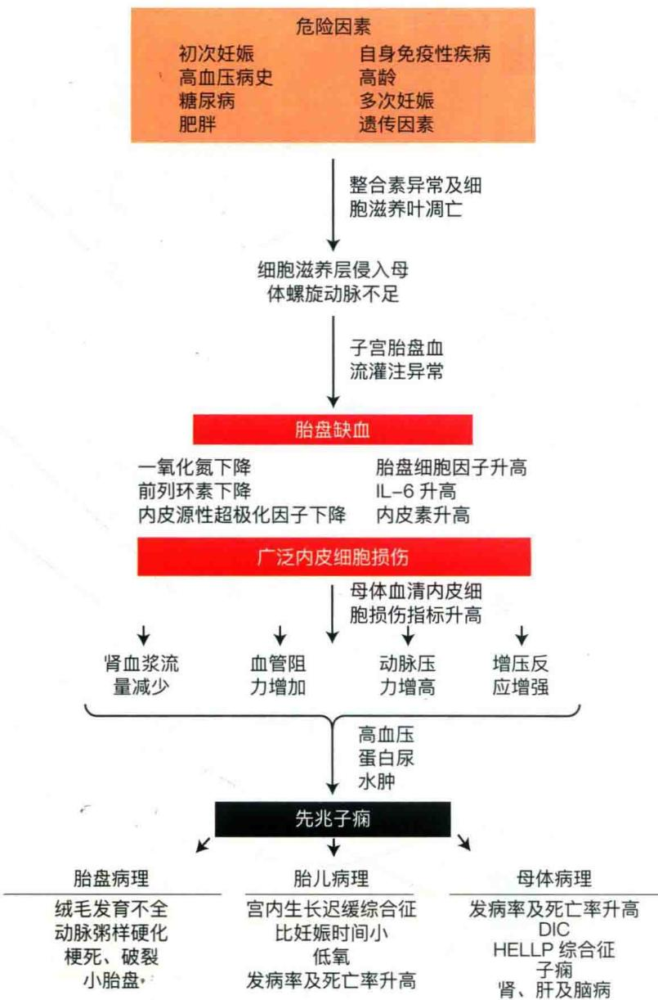 
图18-28 先兆子痫发病机制
【病理】患重度子痫妇女，几乎1/3出现广泛胎盘梗死。 $15\%$ 的患者出现胎盘后出血。绒毛显示慢性母体血流低灌注（例如：缺血萎缩及变性绒毛区域）。另外，胎盘检测发现母体血管低灌注常见，包括绒毛黏着、纤维蛋白增加、胎盘部位巨细胞增加、合体滋养层细胞增生以及膜小动脉壁增生。
母体肾脏常显示肾小球改变。肾小球增大，内皮细胞肿胀、构成典型的先兆子痫的“无血”肾小球（肾小球内皮细胞增生）。内皮细胞及肾小球毛细血管基底膜间可见纤维素。惯常伴系膜细胞增生。这些母体肾的改变在治疗和分娩后是可逆的。子痫的致死病例常出现从瘀斑到大量出血的脑出血。 $60\%$ 先兆子痫死亡的妇女出现肝异常，包括汇管区纤维素沉积及坏死。
【临床表现】先兆子痫常常比较隐匿，在妊娠20周以后： $①$ 由于液体潴留身体过重； $②$ 母体血压升高； $③$ 蛋白尿。在先兆子痫从轻度进展为重度时，舒张压持续超过 $110\mathrm{mmHg}$ ，蛋白尿超过 $3\mathrm{g / d}$ ，肾功
能减退。并可能并发DIC。抗血压及抗血小板药物用于治疗先兆子痫，但确切的治疗是希望通过正常分娩移除胎盘。
# 三、妊娠滋养叶疾病
妊娠滋养叶疾病是一个谱系，包括滋养叶增生、成熟过程的异常，以及来源于滋养叶的肿瘤。
# （一）无胚胎的完全性水泡状胎块
完全性水泡状胎块胎盘表现为葡萄串样重度水肿的绒毛，伴有不同程度的滋养叶细胞增生。绒毛增大，常超过直径 $5\mathrm{mm}$ （图18-29）。
【发病机制】完全性水泡状胎块是无母源性DNA的无核空卵受精所致。最常见的情况是，单倍体的父系染色体（23，X）单精入卵复制成46，XX核型，双精46，XX及46，XY胎块也可见到。在胎盘血液循环已经建立之前，几乎无绒毛发育成血管，因为胚胎在妊娠很早时期就死
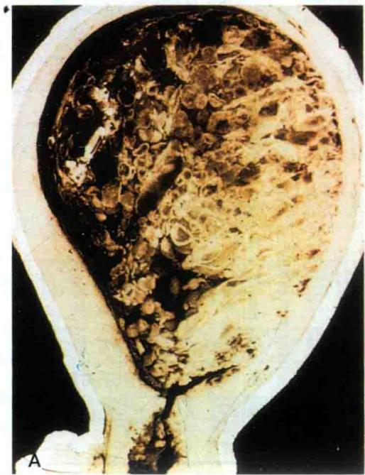
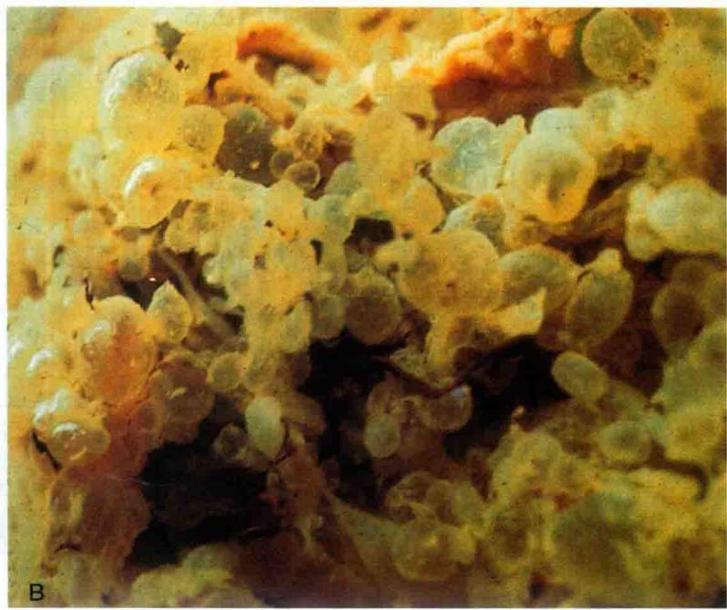
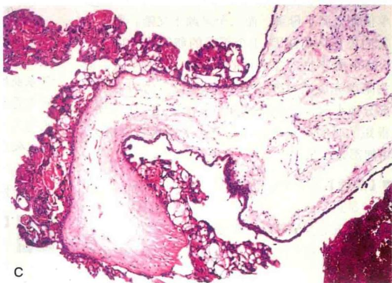 
图18-29 完全性水泡状胎块。A.完全性水泡状胎块标本整个子宫腔内充满水肿绒毛；B.绒毛的直径在 $1\sim 3\mathrm{mm}$ ，呈葡萄状；C.单个绒毛可见中央水池，呈腔状，显示显著的滋养叶增生及不典型增生。绒毛血管萎缩及消失
亡，故胚胎部分缺失。发生水泡状胎块的危险性与母亲的年龄相关，有2个发病高峰期。小于15岁的年轻女孩罹患水泡状胎块的概率比 $20\sim 50$ 岁的女性高20倍。而大于40岁妇女患病的危险性持续增加。年龄大于50岁患该病妇女危险性比 $20\sim 40$ 岁女性高200倍。亚洲女性的发病率比白人女性的高许多倍。与普通人群相比，以前发生过水泡状胎块的妇女以后妊娠时发生该病的危险性也将增高20倍。

【病理】胎块体积较大，由肉眼可见显著肿胀
的绒毛构成（图18-29A、B）。显微镜下，许
多绒毛出现水池，位于绒毛中央，为无细胞并充满液体的间隙，缺乏间质细胞（图18-29C）。滋养层细胞增生，由合体滋养层、细胞滋养层及中间滋养层细胞组成。明显的细胞异型性可见。

【临床表现】罹患完全性水泡状胎块的患者常
在妊娠 $11 \sim 25$ 周时出现临床症状，包括子
增大及子宫不正常出血。排除的组织碎片常见
萄状。血清 hCG 浓度显著升高,并可在短时间
内迅速升高。
完全性水泡状胎块的并发症包括：子宫出血、DIC、子宫穿孔、滋养层细胞栓塞及感染。最重要的并发症是进一步发展为绒毛膜癌，在对胎块组织进行清宫后，有 $2\%$ 的患者可发展为绒毛膜癌。
治疗包括子宫抽吸刮宫术、后续检测血清hCG水平。有 $20\%$ 的患者需要辅助化疗进行维持治疗，并评估稳定或升高hCG水平来进行评价。通过这些措施，使完全性水泡状胎块生存率接近 $100\%$
# （二）以三倍体细胞为特点的部分性水泡状胎块
与完全性水泡状胎块不同，部分性水泡状胎块为一种独立的疾病，不会进展为绒毛膜癌（表18-5）。部分性水泡状胎块细胞有69条染色体（三倍体），其中一个单倍体来源于母亲，而二个来源于父亲。引起这个异常的染色体的原因：1个正常的卵细胞（23，X）被2个每个携带23个染色体的正常精子受精所致，或者因为未能完成减数分裂携带46条染色体的单个精子。部分性水泡状胎块的胚胎常在妊娠10周后死亡，之后很短的时间内流产。与完全性水泡状胎块相比，胚胎可能部分存在。

【病理】部分水泡状胎块有两部分绒毛，一部
分是正常绒毛，另一部分则为水肿增大、显示
中央水池的绒毛。滋养叶细胞增生呈局灶性，不像完全性水泡状胎块那么明显。绒毛内可见血管，并见有核红细胞。
# （三）浸润子宫肌层的侵袭性水泡状胎块

【病理】侵袭性水泡状胎块的绒毛可能仅累及
浅表的子宫肌层或侵犯子宫甚至阔韧带。胎块
倾向于侵入肌层内扩张的静脉管腔，1/3的病例可出现远处播散，大部分为肺部。与绒毛膜癌不同（见下面内容），侵袭性水泡状胎块远处播散的成分不会侵破、局限于血管壁，在血管内寄居并死亡。临床鉴别侵袭性水泡状胎块及绒毛膜癌常比较困难。
【组织学改变】侵袭性水泡状胎块水肿改变常比完全性水泡状胎块轻。滋养叶细胞增生比较显著。子宫穿孔是主要的并发症，但只发生于少部分病例。因为hCG刺激，卵泡膜黄素化囊肿可以发生于任何一种的滋养叶疾病，但以侵袭性水泡状胎块最多见。
表 18-5 完全型及部分型水泡状胎块特征比较 
特征完全性胎块部分性胎块核型6XX7XXY或47XXX单倍体基因组来源2个均为父系来源1 母源性 2 父源性术前诊断胎块流产显著阴道出血3+1+子宫大小血hCG高轻度升高绒毛水肿全部部分滋养叶增生弥漫局部不典型性弥漫轻度组织中hCG3+1+有无胚胎无部分血管无常见有核红细胞无有时可见初次治疗后持续存留20%7%绒毛膜癌2% 继发于胎块无
hCG.人类绒毛膜促性腺激素
# （四）妊娠绒毛膜癌是一种衍生于胚胎滋养叶细胞的恶性肿瘤
在美国，绒毛膜癌的发生率为妊娠的1/30000，但在东亚地区，绒毛膜癌的发病率远高于这个比例。发病率看起来与异常妊娠有关。肿瘤发生于正常妊娠的比例为1/160000，而在自发流产为1/15000，异位妊娠发病率为1/5000，在完全性水泡状胎块妊娠的发生比例为1/40。虽然完全性水泡状胎块转化为绒毛膜癌的危险性仅为 $2\%$ ，但已经比正常妊娠高了很多倍。

【病理】绒毛膜癌子宫的病变从显微镜下局灶
病变到体积较大的坏死、出血肿瘤。不像其他
大多数肿瘤，绒毛膜癌缺乏真正的肿瘤血管，所以存
活的肿瘤组织常局限在肿瘤边缘。组织学改变：肿瘤细胞包括细胞滋养叶细胞及合体滋养叶细胞两种形态，并见不同程度的中间滋养叶细胞。从定义上讲：肿瘤包含着各种绒毛结构，转移后可能被认为是水泡状胎块，而不是绒毛膜癌。绒毛膜癌可通过静脉窦侵犯子宫肌层。通过血道转移，肿瘤则广泛转移至肺（90%）、脑、胃肠道、肝及阴道。

【临床表现】异常阴道出血是最常见的早期提示绒毛膜癌的临床症状。偶尔，首发症状与转
移到肺或脑引起。一些病例，在最后一次妊娠后10年、甚至更长时间临床症状才变得明显。
目前可获得的化疗、对危险因素的认识（高hCG水平、与前次妊娠间隔时间延长）、早期治疗，使大部分患者可以被治愈，甚至已经发生肿瘤转移的患者生存率也超过 $70\%$ ，如果肿瘤局限，实际上期待着 $100\%$ 的肿瘤缓解。观察连续血清中hCG水平，对治疗效果进行监测。
（杨重庆）
# 第19章 乳腺
对乳腺疾病的认识贯穿人类历史，这也是提高婴儿存活率的需要。埃及发现的公元1600年前记录了外科手术的纸莎草可能是最古老的医学文件，它描述了一个可能为癌症的乳腺肿瘤。希腊内科医生Soranus详细叙述了在哺乳期如何预防乳头脓肿的乳腺护理。Celsius认识到乳腺对于“癌”特别敏感。一位女性患者的乳腺医疗记录提示在罗马医学中就已经存在乳腺病专科医生。尽管现在是否使用乳腺的自然功能，或者说哺乳，已经成为人们生活方式的一种选择，对于女性而言，乳腺在癌症相关的死亡原因中仅次于肺。因此，弄清楚恶性肿瘤以及同增加的癌症风险相关的因子的生物学特点是重要的。
# 第一节 良性上皮性病变
良性上皮性病变可基于发展为浸润癌的风险进行分类。同升高的相对风险性无关的病变指的是那些非增生性乳腺改变（例如：纤维囊性改变）。无异型增生的增生性疾病在 $5\sim 15$ 年后进展为癌的相对危险性提高 $1.5\sim 2$ 倍，被简单分类为增生性乳腺疾病。增生性病变伴有异型增生的患者相对危险性为 $4\sim 5$ 倍，需要临床密切随访。
# 一、纤维囊性（非增生性）乳腺改变可能代表一种加重的生理反应
纤维囊性改变（FCC）包括大体和镜下的囊肿、大汗腺化生、轻度上皮增生和纤维间质的增多。FCC影响到超过2/3的 $20\sim 50$ 岁的女性，并随着绝经而发病率下降。多数患病妇女无症状，但有些人会表现为偶尔伴有疼痛的结节。FCC一般表现为多灶性和双侧性。

【病理】乳腺组织大体上由质硬的纤维脂肪组
织构成，其中可见多发透明的囊肿或“蓝色
圆顶”状囊肿, 囊中含有深色的稀薄液体, 使未剪开的囊肿呈现蓝色的外观 (图 19-1A)。囊肿直径从 $1 \sim 2 \mathrm{~mm}$ 到数厘米, 囊壁可能缺乏上皮被覆, 或者衬以变平的上皮和肌上皮细胞 (图 19-1C)。上皮常常包含大汗腺型细胞, 含有丰富的颗粒状嗜酸性胞质和位于基底部的细胞核 (图 19-1D)。周围的间质常
呈硬化性改变，并可见由囊肿破裂而引起的炎细胞反应。轻度“普通型”上皮增生（下面内容）常见，基底膜上皮层次不超过 $3\sim 4$ 层（图19-1E）。腺泡数量增加，体积增大，被覆柱状上皮细胞（柱状细胞改变），常见钙化。
# 二、增生性乳腺病增加浸润癌的风险
1. 普通型上皮增生 导管内或小叶内普通型上皮增生通常以相对于基底膜的细胞数量增加为特点（图19-1E，F）。细胞层次可超过4层，常形成横跨导管腔的桥状结构。增生性上皮细胞在大小、形状和定位方面有轻微差别。细胞核可定向排列形成流水状结构（图19-1F）。次等腔隙呈不规则裂隙状，多位于导管周边。腔面上皮细胞和基底上皮细胞均有增生，后者表达高分子量（“基底”）细胞角蛋白。 
2. 硬化性腺病 在硬化性腺病（SA），终末导管小叶单位（TDLU，图19-1B）显示紊乱的上皮、肌上皮和间质成分。SA病变可以是显微镜下的病灶，也可以形成肿块，从而可以被触摸到，因而，临床或影像有时可误认为癌。SA常可钙化，可进行组织芯活检。它不是浸润癌的癌前病变，但可归入不伴有异型增生的增生性病变以对其进行风险评估。

【病理】SA病变显示导管、小管和小叶内间质细胞无序的增生，导致小叶增大和变形，并堵
塞管腔（图19-2）。小叶中心性结构仍然保留，这在低倍镜下观察得更清楚。对于那些同浸润癌难以鉴别的病例，可借助于免疫组化来显示扭曲的导管周围保留的肌上皮细胞（见下文）。
3. 放射状瘢痕/复杂性硬化性腺病 放射状瘢痕是一种有中心纤维弹力瘢痕和周围放射状排列的导管和小叶的良性硬化性病变。显微镜下，放射性瘢痕可见特征性的中心纤维弹力核心，其中，可见陷入并扭曲的小导管。在外周，放射状排列的导管和小叶显示各种类型的良性改变。放射状瘢痕乳腺癌风险提高2倍，对于伴发有或无异型增生的增生性疾病的妇女，风险更高。
4.导管内乳头状瘤 乳头状瘤可以为孤立性或多
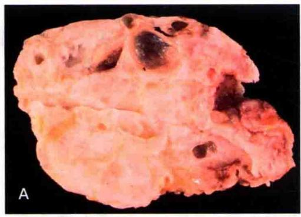
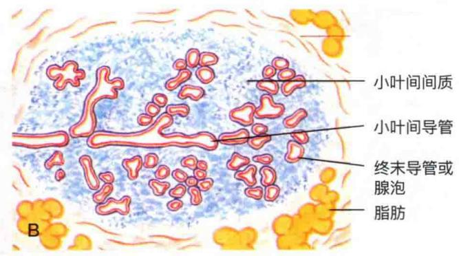 
终末导管小叶单位
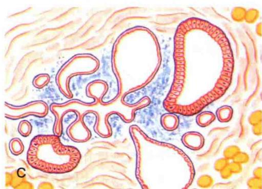 
非增生性纤维囊性病变
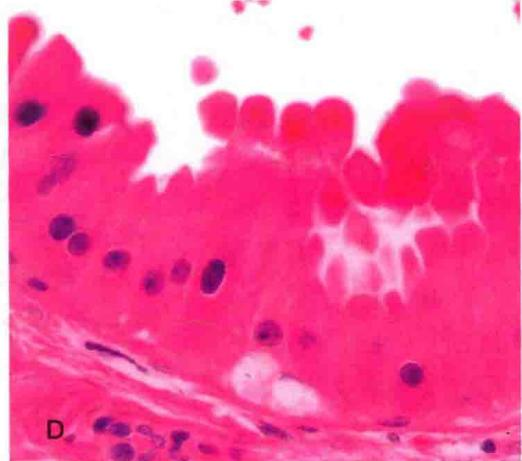 
图19-1纤维囊性病变。A.不同大小的多个囊肿散布在致密的纤维结缔组织中，有些囊肿体积大；含有陈旧性出血着染的蛋白性碎屑；B.正常终末导管小叶单位；C.非增生性纤维囊性病变包含囊性扩张的终末导管、上皮不同程度的大汗腺化生及增多的纤维间质；D.大汗腺化生，上皮细胞有大汗腺特点，胞质嗜酸性；E.增生性纤维囊性病变。终末导管扩张，并有导管内上皮增生；F.普通型旺炽性上皮增生，导管内上皮增生几乎充满导管腔，可见残留的“次等”腔隙表现为外周的裂隙状结构。胞质边界不清晰，细胞核圆到卵圆，常相互重叠形成流水状结构
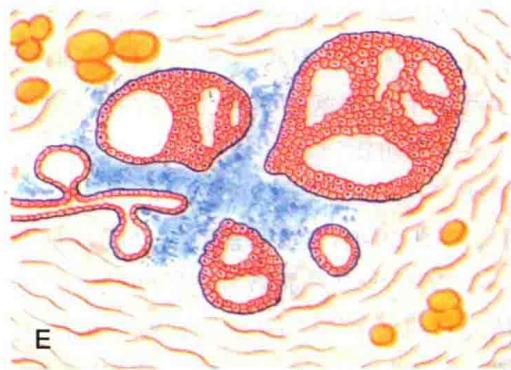 
增生性纤维囊性病变
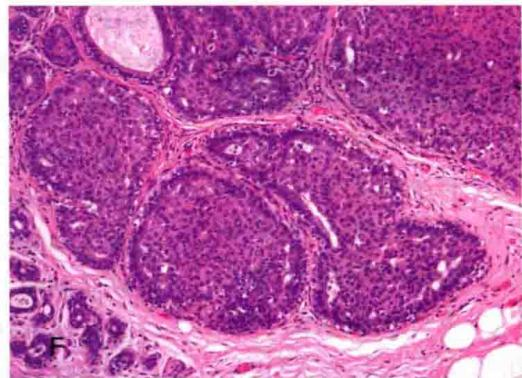
发性，可位于中心，也可位于外周。患者常有血性乳头溢液或者表现为团块状病变。乳头状瘤可为显微镜下的病变，也可达数厘米，较大的病变常有灶性出血或坏死。显微镜下，扩张的导管腔含有分支的乳头，纤维血管轴心衬以单层肌上皮细胞，其上为单层或多层上皮细胞。有时，可见普通型旺炽性上皮增生或不典型导管上皮增生（ADH），常伴有大汗腺化生。孤立性乳头状瘤的患者发生乳腺癌的相对风险为2倍，多发性乳头状瘤则为3倍。如果病变中存在异型增生，其相对风险则分别为5倍和7倍。
# 三、伴有异型增生的增生性疾病是癌的高危癌前病变
# 1.非典型导管上皮增生（ADH）

【病理】ADH是一种由两种细胞群构成的导管内上皮细胞增生，它包括低级别肿瘤性上皮细
胞，以及伴普通型上皮增生的正常细胞或上皮细胞（图
19-3)。非典型细胞群由单形性小细胞组成，这些细胞均匀分布，细胞界限清楚，圆形深染、大小一致的细胞核。它们可以形成微乳头、僵硬的细胞桥、杆状、实性片状或筛状结构，非典型细胞排列在导管腔中形成的次等腔隙的周围。

【发病机制】 $1 / 3\sim 1 / 2$ 的ADH病例无遗传学异常。其余病例存在同低级别导管原位癌
(DCIS) 类似的遗传学改变 (见下文)。ADH 病例发生乳腺癌的相对风险提高 $4 \sim 5$ 倍。
# 2.非典型小叶增生

【病理】非典型小叶增生（ALH）的细胞同小叶原味癌（LCIS）中的细胞无法区别（见下文），
但它累及终末导管小叶单位的程度和范围要小。累及腺泡的数量较少，受累的腺泡膨大的程度小（图19-4A）。同LCIS一样，ALH的细胞也可佩吉特样累及导管（图19-4B）。
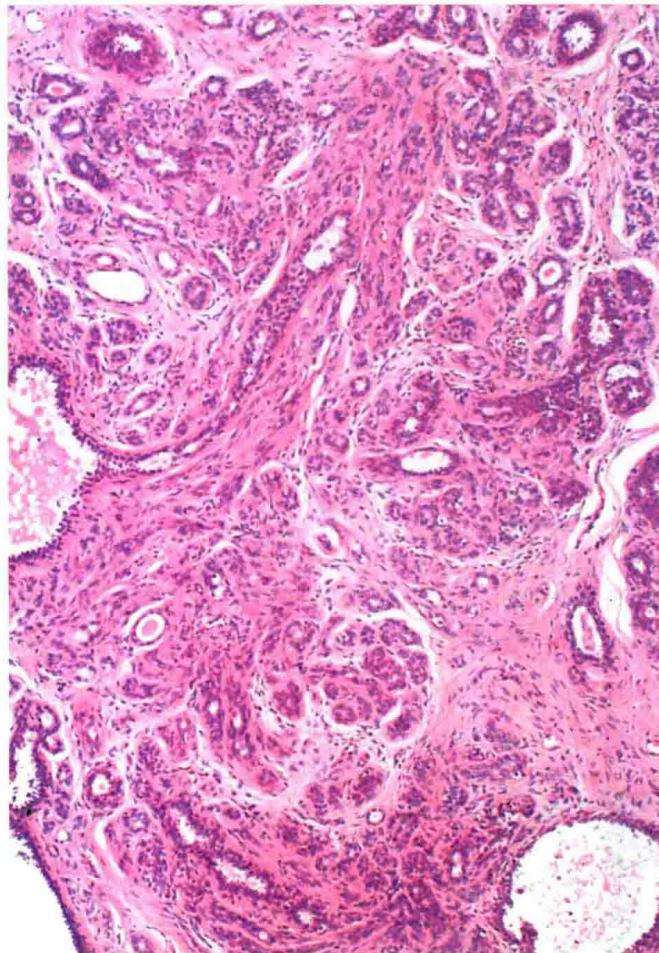 
图19-2 硬化性腺病。本病以小的、发育不全的、管状结构增生为特征，增生的肌上皮细胞向周围扩展，使它所在的小叶结构变形。病变界限清楚，这一点不同于恶性病变
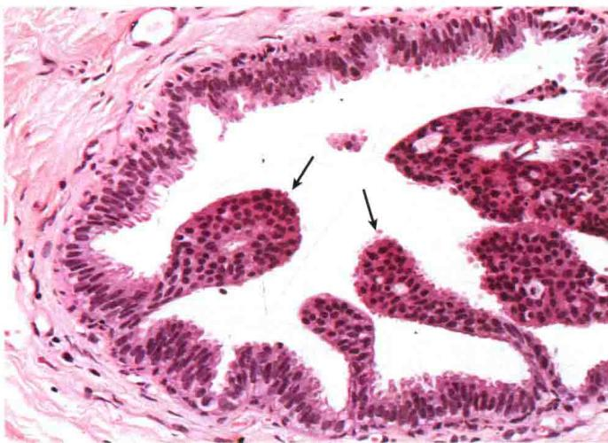 
图19-3非典型导管增生（ADH）。微乳头（箭头）突入导管腔，它由核质比增大、核深染的细胞所构成。部分区域衬以残留的良性柱状细胞
# 第二节 纤维上皮性病变
它来源于小叶内间质，含有间质和上皮性成分。
# 一、纤维腺瘤是一种含有上皮和间叶成分的良性肿瘤
纤维腺瘤常见，为活动的、无痛性和界限清楚的乳腺肿块，它多见于 $20\sim 35$ 岁的女性。影像上，纤
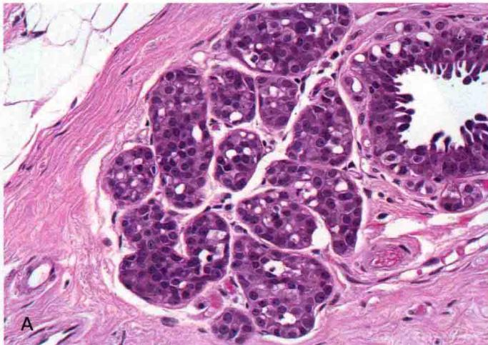
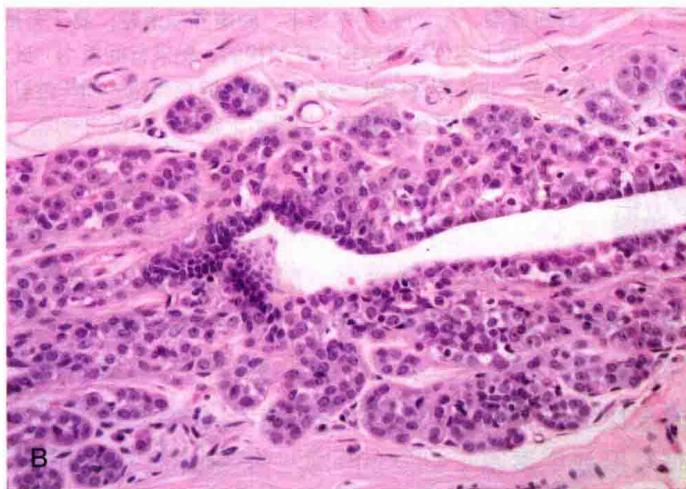 
图19-4A.非典型小叶增生（ALH）。小叶腺泡轻度膨大，细胞形态一致，可见胞质内腔，细胞核圆形，含小核仁；B.佩吉特播散，小叶肿瘤性细胞累及终末导管。导管腔面上皮细胞萎缩，其下可见非典型细胞。病变细胞极向消失。结构的复杂性不是ALH的特点
维腺瘤界限清楚，可见钙化。多为孤立性病变，可以多发和双侧发生。
【病理】纤维腺瘤圆形或卵圆形，有弹性（图19-5A），与周围乳腺组织界限清楚。多数直径小于 $3\mathrm{cm}$ ，但有时，发生于青春期的病变可以很大。镜下，肿瘤含有两种成分：间质和上皮（图19-5B）。间质通常由梭形细胞构成，细胞密度大小不一，一般细胞密度小。年轻患者，间质常黏液样，随着年龄的增长，可呈玻璃样和出现钙化。上皮成分来源于正常的终末导管小叶单位；上皮细胞和肌上皮细胞保留。上皮细胞常有增生，特别是在年轻女性。罕见情况下，ADH小叶瘤变（LN）或导管原位癌可出现在纤维腺瘤中。复杂性纤维腺瘤显示良性病理改变，包括上皮钙化、SA、乳头状大汗腺改变或超过 $3\mathrm{mm}$ 的囊肿。
# 二、叶状肿瘤显示良性的上皮成分和肿瘤性的间质成分
叶状肿瘤占乳腺肿瘤的比例少于 $1\%$ 。可以发生在任何年龄组，但多见于 $50 \sim 60$ 岁。它们表现为迅速生长的乳腺肿块，乳腺造影显示边界清楚或呈分叶状。
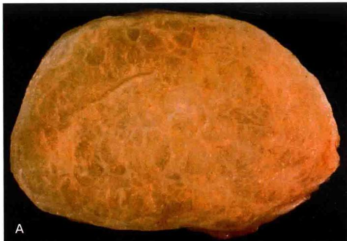 
图19-5 纤维腺瘤。A. 外科手术标本。肿瘤界限清楚，易于与周围组织剥离。切面为特征性的有光泽的浅棕色、白色，分叶状外观。B. 镜下切片。变长的上皮性导管结构位于疏松的、黏液样间质中，此病变同乳腺癌风险升高有关，而且对于那些一级亲属中有乳腺癌家族史的患者，风险更高。非复杂性纤维腺瘤不增加乳腺癌风险。幼年性纤维腺瘤最常见于青春期，生长迅速，大小可达 $20\mathrm{cm}$ 。组织学上，本病与纤维腺瘤相似，但间质更富于细胞。如果出于临床或影像的考虑，纤维腺瘤可予手术切除，但可复发
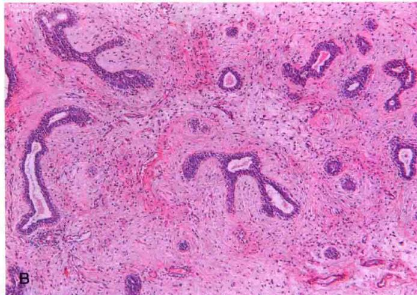
【病理】叶状肿瘤大小不一，从数厘米到 $20\mathrm{cm}$ 不等。大体上，良性叶状肿瘤边界非常清楚，质硬，切面灰白色，有光泽。恶性病变可呈浸润性边缘。镜下，富于细胞性间质的叶状体突入囊性腔隙，使之呈树叶状（图19-6）。这些囊性腔隙被覆呈双层的良性上皮和肌上皮细胞。多数叶状肿瘤为良性，伴有轻度或中度富于细胞的间质，细胞异形性不明显，并可见少数核分裂。恶性叶状肿瘤的间质显著富于细胞，有明显的多形性和丰富的核分裂（>10/10HPF）和间质的过度增生。可见恶性异源性成分，例如：骨、软骨或脂肪。良性叶状肿瘤的风险是局部复发而不是转移。恶性叶状肿瘤的复发更常见（高级别病变可高达 $25\%$ ）。转移性病变仅见间质成分，总体上很罕见。
# 第三节 乳腺癌

【流行病学】乳腺癌的发病率于1999年缓慢达
到峰值，然后迅速下降，最大可能是同绝经后
激素治疗的应用下降有关。目前，乳腺癌发病率明显下降，而在过去的25年中，随着早期检测和治疗的改进，死亡率降低。美国妇女在一生中有1/9的概率发生乳腺癌，而患有乳腺癌的妇女，有1/5将死于该病。乳腺癌35岁之前不常见。然而，年龄别发病率在40岁后迅速上升， $75\sim 80$ 岁达到平稳状态。西方工业化国家乳腺癌的发病率是欠发达国家的 $4\sim 5$ 倍。提示饮食习惯、环境和生活方式似乎是乳腺癌的危险因素，但均未得到证实。然而，那些出生在低发病率国家移民到西方国家的孩子，其后代发生乳腺癌的风险升高。男性发生乳腺癌罕见，但它同样可引起患者死亡（见下文）。很明显，常规乳腺X线成像筛查可检查到很大比例的不会引起临床疾病的肿瘤。乳腺癌的
一项重要挑战是寻找一种能够将那些需要治疗的肿瘤与那些无须治疗的肿瘤鉴别开的方法。

【发病机制和病因】已经明确乳腺癌的多种危
险因素，有些可以改变，有些则不能（表19-
1)。不能改变的危险因素包括:年龄、种族（非西班牙裔白种人最高）、家族史、遗传因素
(BRCA1或BRCA2胚系突变)、乳腺密度和月经初潮早。可改变的危险因素存在争议，它包括：初次生产年龄晚、饮食、高体重及外源性激素的使用。
表19-1 乳腺癌发生的危险因素不可改变的可改变的年龄体重指数BRCA胚系突变肥胖家族史饮酒胸部辐射外源性雌激素人种/种族体育锻炼体重吸烟初潮年龄生育史绝经年龄首次足月分娩年龄乳腺密度哺乳期乳腺活检存在异型增生
散发性乳腺癌：只有大约 $25\%$ 的散发性乳腺癌可以找到危险因素。
雌激素：可以促进多数的乳腺癌生长；因此，雌激素终生累积接触量决定乳腺癌的危险水平。因此，初潮早（小于11岁）、绝经晚和晚孕增加乳腺癌风险。抗雌激素药物（例如三苯氧胺）可降低雌激素受体阳性的乳腺癌的风险。激素替代治疗（HRT）可以轻度增加乳腺癌的风险（ $1.2\sim 1.7$ 倍），但口服避孕药则不然。
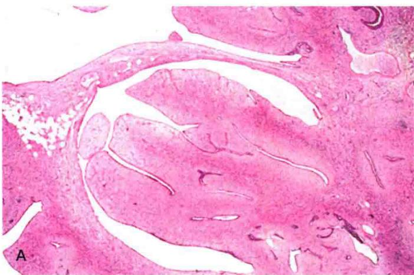 
图19-6叶状肿瘤。A.树叶状结构的息肉样肿瘤导致导管扩张；B.邻近导管上皮的间质成分与纤维腺瘤相似，但更富于细胞。残存的导管结构为良性
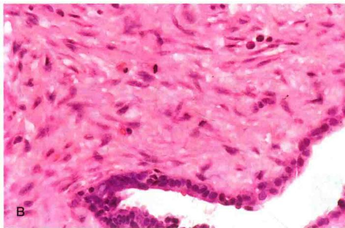
■辐射增加了乳腺癌的发病风险。在生命早期（比如儿童或青少年时期）造成的危险最大，40岁以后暴露不能增加发病率。 
■ 饮食相关的肥胖证明是一个危险因素。有限的研究资料表明饮食中的脂肪可能增加绝经后乳腺癌的发病率，但情况属实，那产生的影响可能很小。 
■ 饮酒在没有足量的叶酸摄入的情况下，也与乳腺癌的高发生率相关，但还需资料进一步证实。 
超重或者极度肥胖的绝经后妇女患乳腺癌的风险更大。有趣的是，超重的绝经前妇女患乳腺癌的风险却很小。 
乳腺密度高（比如密度 $>75\%$ ）使乳腺癌的发病率增加 $4\sim 5$ 倍。腺体的密度受年龄、产次、体重指数和绝经时状态这些因素的影响，而遗传因素也起着非常重要的作用。 
■异型增生或不典型增生的乳腺疾病分别增加 $4\sim 5$ 倍和 $1.5\sim 2$ 倍癌症发病的相对危险度。罹患乳腺癌的女性任一乳腺发生第二个原发肿瘤的概率增加了10倍。抗雌激素治疗能够降低这一风险。
家族性乳腺癌：家族性疾病大概占乳腺癌的 $10\%$ 风险增加最强的关联因素是乳腺癌的一级亲属有家族史。两个高风险的常染色体显性遗传的乳腺癌易感基因BRCA1和BRCA2，占这种增加风险的 $20\% \sim 50\%$ 家族性乳腺癌少数是由于其他基因的基因突变，如p53（Li-Fraumeni综合征），PTEN（Cowden综合征）和ATM（共济失调性毛细血管扩张症）。
BRCA1（17q21上）参与DNA修复、转录调控、染色质重构和蛋白质泛素化。BRCA1基因的胚系突变使患终生乳腺癌发病风险从 $35\% \sim 40\%$ 增加到70岁 $85\%$ 的概率。而且超过一半的这类癌症的发生年龄在50岁之前。大约有 $0.1\%$ 的人存在BRCA1胚系突变，但该概率在东欧犹太人和法裔加拿大人更高。由胚系突变进展来的乳腺癌通常是高级别导管癌。大多数这
些乳腺癌都是ER、PR和人表皮生长因子受体2（HER2/neu基因）阴性（三阴）。
BRCA2（13q12）的胚系突变与乳腺癌 $30\% \sim 40\%$ 的终生风险相关。携带BRCA2突变基因的男性也具乳腺癌风险，这些患者大多进展为非特殊类型的高级别浸润性导管癌。与BRCA1相关的乳腺癌不同，那些与BRCA2相关的大多是ER和PR阳性。同时，与BRCA1相关乳腺癌类似，大多数BRCA2相关乳腺癌为HER2/neu阴性。
$p53$ 基因突变见于Li-Fraumeni综合征（见第5章），几乎所有的年轻女性都会发生乳腺癌。 $p53$ 胚系（遗传）突变占40岁以下女性乳腺癌患者的 $1\%$ 。 $p53$ 体细胞突变在散发性乳腺癌中也很常见。
# 一、导管原位癌是浸润性癌的前驱病变
乳腺癌可以是原位（局限于乳腺导管基底膜内）或浸润性（恶性细胞已突破基底膜浸润邻近乳腺间质）；基于形态学、免疫组织化学和分子表达谱可进一步区分亚型。活检证实为DCIS且没有经过进一步治疗的女性， $20\% \sim 30\%$ 会最终进展为浸润癌。
1.导管原位癌 导管原位癌（DCIS）是一组异质性的病变，正如自然病程一样，在组织结构和细胞学特征上变化很大。这些病变被认为是浸润性癌非必需的前驱病变，发展到浸润癌的概率随着组织学亚型、级别和病变范围的不同有所变化。乳房摄影筛检的应用使原位癌的发病率骤然增加。之前它仅占乳腺癌的约 $5\%$ ，而现在其比例在筛查人群中占到 $25\%$ 。

【发病机制】不同水平的证据支持DCIS是
浸润性乳腺癌前驱病变的概念。然而，涉及
DCIS进展为浸润性癌的机制了解得还不多。
DCIS 经常被发现与浸润性癌共存。 
■ 非浸润性肿瘤和与它们对应浸润性肿瘤显示相似的细胞学表现及核级别。
DCIS与浸润性癌同时具有显著的分子及细胞遗传学改变。
分子学分析证明低、中、高级别DCIS具有不同的数目及类型的染色体改变。低级别和高级别DCIS以及低级别和高级别浸润性癌本质上是完全不同的疾病实体，不会相互转化。可能有多条通路涉及癌症的发生和进展。

【病理】主要累及导管但可以扩展到小叶，其特
征是恶性上皮细胞增生，并显示出一系列组织
学改变。生长方式可以是筛状、微乳头、乳头、实性及粉刺状，多种组织学结构可以同时存在一个病变中。具有更重要的预后意义的是核的级别分为低、中、高级别。
高级别的DCIS由大的、多形性的伴有明显不同的大小和形状的肿瘤细胞组成。这些细胞具有丰富的胞质、不规则的细胞核、明显的核仁以及粗颗粒状的染色质。核分裂象显著且导管内坏死常见（图19-7C），后者大体上表现为扩张的导管包含白色坏死物，因此称之为粉刺样坏死。细胞性坏死碎片经常伴有营养不良性钙化，乳腺影像学上表现为线状、分支状钙化。恶性细胞局限于导管内，但可以出现导管周围慢性炎症，伴有管周新生血管及促纤维增生反应（成纤维细胞增生及继发性纤维化）（图19-7B、C）。DCIS通过导管系统扩散，经常超出临床检测到的边界，因此难以获得干净的切缘。伴有高级别核的肿瘤细胞可以出现在任何以上提到的生长方式中。
低级别DCIS：位于组织学谱系的另一端，低级别DCIS的细胞学特征是由大小一致且小的细胞呈均匀分
布，伴有圆形、染色质均质的核（图19-8）。核分裂少见。主要是微乳头或筛状生长方式，实性型少见。
中级别DCIS：中级别DCIS位于高级别DCIS和低级别DCIS之间。细胞显示中度多形性但保留一定极向。典型的是实性及筛状生长方式。
微小浸润性癌：这种模式定义为出现一灶或多灶浸润性癌，其中每灶直径不超过 $1\mathrm{mm}$ 。典型的病变出现在高级别DCIS背景中。

【临床表现】DCIS在乳腺影像学上常见钙化而
易于检测到病变。然而少数患者以肿块或乳头为病为症状出现。DCIS患者关键的预后因素包括年龄、组织学亚型、级别、肿物是否完整切除以及受体状态。治疗DCIS依靠外科切除病变。当复发，通常为原来手术部位复发并有 $50\%$ 的病理浸润。不足 $1\%$ DCIS患者淋巴结出现转移。前瞻性临床研究显示抗激素治疗能降低表达ER或PR的肿瘤的复发及进展风险。
2. 小叶原位癌 小叶瘤变包括 ALH（见上文）和 LCIS。这两种疾病实体都是黏附性差的上皮细胞异型增生，但是每一种疾病实体在发展成乳腺癌的相对危险性上都具有显著差异。

【流行病学】LCIS通常没有症状。估计发病率
在 $1\% \sim 4\%$ 。伴有LCIS的患者终生发生乳
腺癌的危险性为 $30\% \sim 40\%$ ，其中患浸润性小叶癌的危险性会不成比例地增高。此外，LCIS 和浸润性小叶癌经常同时显示相同的遗传学改变，提示至少一些LCIS是浸润性癌的前驱病变。
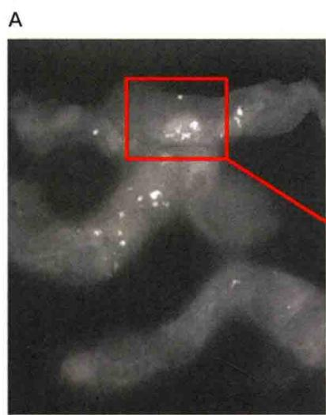
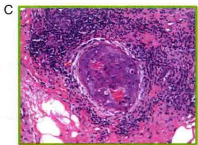
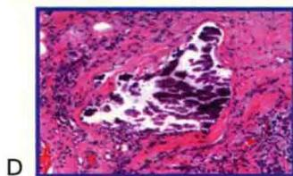
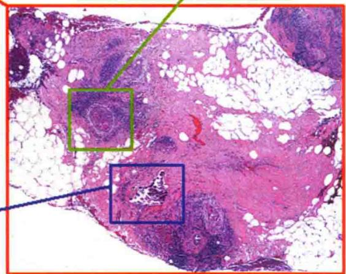 
图19-7导管原位癌。A.粗针穿刺活检标本影像学显示线状和点状不典型钙化，高度怀疑癌；B.低倍镜显示高级别导管原位癌；C.高倍镜显示导管原位癌沿导管扩张；D.高倍镜显示钙化
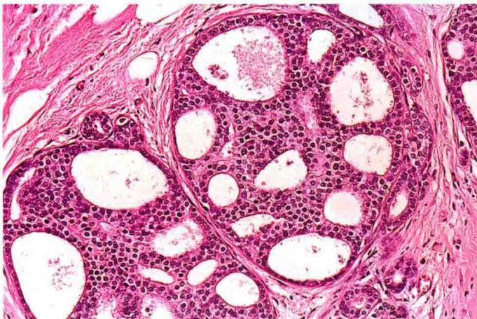 
图19-8 非粉刺型导管原位癌。肿瘤细胞呈明显的筛状排列

【发病机制】在LCIS中，具有重复性CDH1丢失，这是一种编码Ecadherin蛋白的基因，
而 Ecadherin 在细胞黏附和经 $\beta$ -catenin/Wnt 通路周期细胞调节中起着关键的作用。伴有 CDH1 胚系突变的患者具有发展为乳腺小叶癌和胃印戒细胞癌的高风险。

【病理】通常不见大体病变。镜下，细胞一致的小细胞伴有规则的圆形核伴小核仁，但也可以
以伴有明显核仁的大细胞为主（图19-9）。胞质内黏液空泡可以被明显的空晕围绕。不像DCIS，LCIS的细胞不形成复杂的模式，而是形成实性细胞簇填充小叶腺泡并使之扩张。可以通过腺泡填充和扩张的程度来鉴别ALH和LCIS。在LCIS中，至少有一个小叶单位的 $50\%$ 的腺泡被累及，任何不足这个标准的病变即为ALH。肿瘤细胞的生长方式为疏松黏附或失黏附，每个细胞间可见间隙，这反映了细胞与细胞间黏附性的缺失。在LCIS中通常可见小叶肿瘤细胞的Paget样播散，可见肿瘤细胞沿着固有导管上皮细胞底部蔓延。LCIS与低级别实性型DCIS鉴别是困难的，免疫组化显示LCIS中Ecadherin染色缺失可能会有帮助。

【临床表现】通过粗针穿刺活检发现的LCIS
其处理是有争议的。传统上，在切除活检中见
S，一般认为没必要进一步进行外科处理，通常
考虑进行辅助激素治疗和建议终身随访。
3.Paget病 乳头Paget病是指乳头和乳晕表皮内出现恶性腺上皮细胞。其总是合并表皮下方的DCIS，伴或不伴浸润性导管癌。Paget病罕见，发病率占乳腺癌的 $1\% \sim 4\%$ 。这种疾病表现为在乳头或乳晕的红斑或湿疹样改变。可见乳头皱缩，超过一半的患者可以合并可触摸到的肿块。镜下，表皮内可见恶性腺上皮细胞单个或呈小团状出现。Paget细胞胞体大、胞质丰富，具有多形性核并伴有明显的核仁。Paget细胞的胞
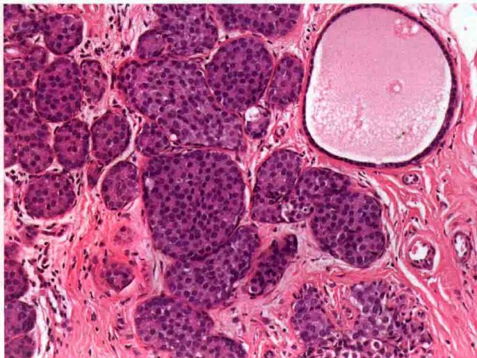 
图19-9 小叶原位癌。终末导管小叶单位管腔被肿瘤细胞填充变形，肿瘤细胞圆形，可见小核仁。小叶原位癌癌细胞比导管型体积小且胞质少
质内可见黏液小球。Paget病的预后与其下方的导管癌相关。
4.囊内乳头状癌 原位乳头状癌比DCIS或LCIS少见得多。这些病变的真正性质（即是否它们是真正的原位病变或可能是浸润性的）还不清楚。这些肿瘤生物学行为为惰性，转移很罕见。大体上境界清楚，部分为囊性，常伴出血，可见到实性肿块。镜下，可见囊性扩张的导管，其内可见纤维血管轴心覆有一层或多层恶性上皮细胞，但纤维轴心与恶性上皮细胞层间没有肌上皮层。肿瘤边缘具有平滑的推挤性边界，没有间质浸润的证据。
# 二、浸润性乳腺癌
浸润性乳腺癌是源于TDLU的恶性上皮性病变。可以发生在乳腺的任何部位，最常见于外上象限。患者最常见的表现是界限不清的乳腺肿块，其可以与皮肤或其下方的肌肉组织粘连。目前的分类系统大部分基于病理表现。大多数乳腺癌可以分为导管癌，非特殊类型（NST）和特殊类型或混合的形态学类型。
1. 浸润性导管癌，非特殊类型 此型浸润性乳腺癌所占比例为 $50\% \sim 70\%$ 。乳腺影像学或超声可见到一个不规则、致密的肿块（图19-10A）。大体上，肿瘤界限从大致清晰到界限不清，结节状或星状，切面实性至质硬（图19-10B）。镜下，肿瘤细胞排列成小梁状、片状、巢状和腺样结构（图19-10C）。核多形性和核分裂象不等。肿瘤周围间质可见促纤维生成到胶原硬化的改变；高级别肿瘤可以见到肿瘤坏死。大多数肿瘤（ $70\% \sim 80\%$ ）ER阳性， $15\% \sim 20\%$ 的肿瘤为HER2/neu阳性。总体上，这些肿瘤10年生存率为 $35\% \sim 50\%$ ，主要依靠分级、分期和是否出现脉管浸润。
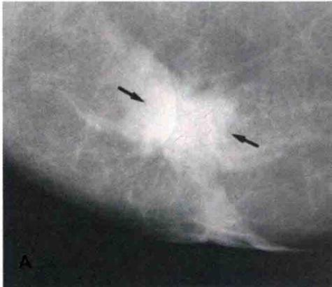 
图19-10乳腺癌。A.乳腺影像学。显示乳腺内不规则、致密肿块（箭头所示），其他均为脂肪成分；B.乳腺切除标本。显示脂肪组织围绕一不规则、灰白实性肿块；C.镜下显示不规则条索状和巢状浸润性导管癌细胞浸润间质
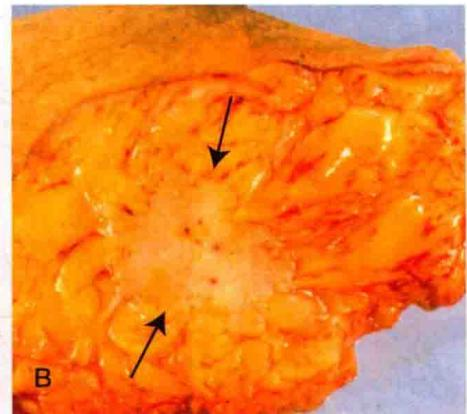
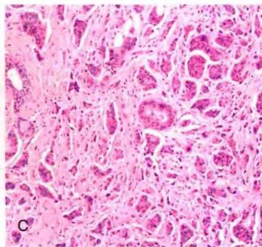
2. 浸润性小叶癌 浸润性小叶癌是第二常见的浸润性乳腺癌，占所有浸润性乳腺癌的 $5\% \sim 15\%$ 。间质纤维化可以较轻，所以患者经常表现为很难确定的乳腺增厚或临床上没有症状。肿瘤可以为界限清楚或界限不清的实性肿块。小叶癌的特点是恶性上皮细胞群松散，弥漫浸润于间质中，通常没有促纤维生成改变（图19-11）。细胞通常排成单排，可以显示围绕导管周围的“靶心”样排列。它们不形成管腔，但可以排列成实性片状、小梁状或巢状。典型的肿瘤细胞类似于LCIS中见到的肿瘤细胞（图19-9）。浸润性小叶癌比非特殊型导管癌更常见ER阳性（尽管高级别的肿瘤可以ER阴性），HER2/neu阳性。Ecadherin通常低表达或缺失（见上文）。小叶癌显示特别的转移模式，具有播散到腹膜、后腹膜、卵巢和子宫、软脑膜和胃肠道的趋势。小叶癌在无病生存率和总体生存率上与非特殊型导管癌预后类似。
3. 乳腺癌的少见类型 还有一部分少见类型的浸润性乳腺癌，主要根据肿瘤的生长模式定义。如下所述。
小管癌，占浸润性乳腺癌的 $1\% \sim 2\%$ 。镜下，肿瘤几乎完全由开放成角的管腔构成。肿瘤细胞由轻度多形性的上皮细胞排列成单层，经常伴有明显的胞质顶泌突起，在正常小叶间散在分布，并可以延伸入
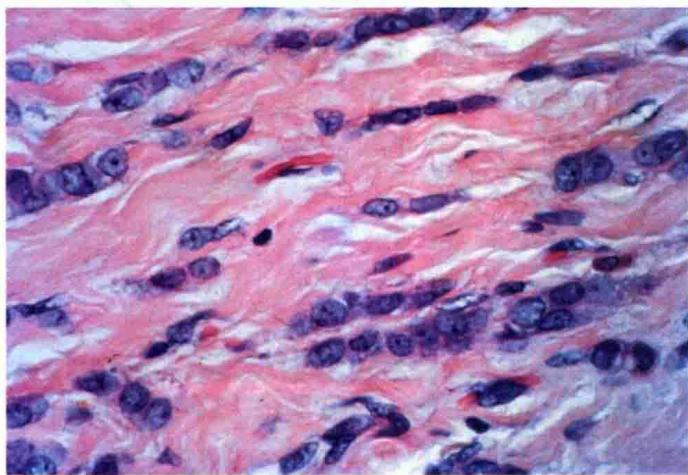 
图19-11 小叶癌。浸润性小叶癌。与浸润性导管癌相比，小叶癌的肿瘤细胞趋于单个细胞或单行排列浸润于胶原纤维之间。肿瘤细胞形态与小叶原位癌的细胞类似
脂肪组织。此型乳腺癌罕见转移，预后很好。
黏液癌通常发生在老年患者，占乳腺癌的 $1\% \sim 6\%$ 。可见低级别的恶性上皮细胞构成腺泡状、巢状或小梁状结构，漂浮在细胞外黏液湖中。不见恶性上皮细胞的直接间质浸润。单纯的黏液癌具有良好的预后。 
髓样癌是一种非常少见的癌，它不成比例的出现在BRCA1胚系突变的患者中。这类肿瘤具有 $2\sim 3$ 级的核；界限清楚，伴推挤性边缘；具有合体样生长方式；中到重度淋巴浆细胞浸润，且无腺管形成。它们通常ER、PR和HER2/neu阴性（“三阴”）。预后尚不明确，但一般要好于高级别的非特殊型导管癌。 
■ 微乳头状癌在不合并非特殊型导管癌情况下，非常罕见。镜下，恶性上皮细胞巢或腺泡围绕于透明间隙之间。这类肿瘤淋巴结转移非常常见。 
化生性癌是一种具有异质性成分的肿瘤伴有恶性梭形细胞、鳞状细胞癌或异源性成分，比如骨或软骨。这类肿瘤通常ER和HER2/neu是阴性的。
# 三、尚待明确的乳腺癌分型
乳腺癌遗传表达模式研究明确了5种分子亚型，这有助于预测临床预后和对治疗的反应（表19-2）。
管腔A型：管腔型（A和B）的特点是类似正常乳腺管腔上皮的遗传学表达模式。管腔A型的肿瘤通常为低级别，并有很好的预后。 
管腔B型：这类肿瘤与管腔A型相比，通常为高级别，显示高度增殖活性指标并且预后较差。 
■ HER2型：这类肿瘤过表达HER2，遗传学上与HER2通路相关并且ER阴性。这类肿瘤侵袭性强但是对抗HER2/neu受体的人源化单克隆抗体（曲妥珠单抗：trastuzumab）治疗有效，这种靶向药物对患者治疗的效果明显。 
基底样型肿瘤表达类似乳腺基底细胞或肌上皮细胞的遗传学模式。这类肿瘤具有高度侵袭性，通常ER和HER2/neu阴性。大部分起源于BRCA1胚系突变患者的癌是基底样型。
表 19-2 乳腺癌分子亚型 
分子亚群ERPRHER-2增殖指数其他预后治疗管腔A型++-低CK8/18好激素治疗管腔B型++-/+中等CK8/18中等激素治疗和化疗HER2型--+高AR差曲妥珠单抗和蒽环类基底样型---非常高CK5/6, CK14, Vimentin, EGFR, c-kit差铂类联合蒽环类基础的化疗 PARP 抑制剂
+.阳性；一.阴性；一/十.有时阳性；AR.雄激素受体；EGFR.表皮生长因子受体；ER.雌激素受体；HER-2.人类表皮生长因子受体2;PARP.多（腺苷二磷酸核糖）多聚体；PR.孕激素受体
1. 乳腺癌分期 乳腺癌预后与TNM肿瘤分期密切相关。乳腺癌通过直接扩展蔓延（例如侵至胸壁）；经淋巴管至腋窝、内乳、锁骨下和锁骨上淋巴结；经血行至远隔部位转移。
（1）肿瘤大小（T）：肿瘤大小与预后相关：肿瘤大者与预后差相关。因此，乳腺筛查程序应该针对早期触摸不到的乳腺癌。在评价肿瘤大小时，应当仅考虑浸润的部分。
（2）淋巴结转移情况（N）：是否出现腋窝淋巴结转移是提示患者预后情况的关键因素，因此乳腺癌患者必须评价手术切除的淋巴结。为了降低术后复发率的危险，应做前哨淋巴结活检。定位的过程包括用染色示踪淋巴引流，显示被染色的前哨淋巴结，它是最可能包含转移性乳腺癌的淋巴结。如果前哨淋巴结是阴性的，则能够安全地避免清扫腋窝淋巴结。
（3）远处转移（M）：发生远处转移提示预后差。骨是最常被累及的部位，占出现远处转移性乳腺癌病例的 $25\%$ 。少部分的患者发展为肺、肝、中枢神经系统、皮肤和肾上腺的转移。
（4）肿瘤分级：乳腺组织病理学分级是做出治疗决策的重要组成部分。根据管腔的形成、核多形性和核分裂的综合评分将其分别纳入1级、2级、3级或低级、中级、高级的乳腺癌。1级的肿瘤总体上预后显著好于2级或3级肿瘤。
# （5）其他预后因素
ER和PR：激素受体蛋白表达在良性乳腺上皮和 $70\% \sim 80\%$ 的乳腺癌中。乳腺癌激素受体状态对内分泌治疗具有预测作用；ER/PR阴性的肿瘤患者对抗雌激素治疗没有反应。
HER2/neu: $15\% \sim 20\%$ 的新发乳腺癌有HER2/neu过表达和（或）基因扩增。不论淋巴结是否有转移，HER2/neu阳性是一个预后不良的因素。但是，这些患者可以用HER2/neu的单抗或激素受体抑制剂进行治疗（见上文）。
# 第四节 男性乳腺
# 一、男性乳腺发育往往和雌激素/雄激素失衡有关
男性乳腺发育是指由于雄激素的相对减少或雌激素相对增加引起的良性男性乳腺增大。由于脂肪组织增多导致的乳腺增大叫作假性男性乳腺发育。生理性男性乳腺发育最常发生于新生儿，是母体或胎盘的雌孕激素进入胎儿循环，作用于乳腺组织引起的。此外，一过性男性乳腺发育可出现于超过半数的青春期男孩，因为雌激素的分泌高峰早于睾酮。导致非生理性男性乳腺发育的原因包括：①药物或导致低睾酮水平的内分泌紊乱；②睾酮对雌激素的高转换率；③高雌激素水平和高性激素结合球蛋白水平（会导致游离睾酮水平降低）。男性乳腺发育可见于甲状腺功能亢进、肝硬化、肾衰竭、慢性肺疾病和一些产生激素的肿瘤（包括性索间质肿瘤、睾丸生殖细胞肿瘤和肝癌、肺癌）中。能导致男性乳腺发育的药物包括洋地黄、西咪替丁、螺内酯（安体舒通）、大麻和三环类抗抑郁药。没有男性乳腺发育与乳腺癌发病危险增加相关的证据。单侧或局灶男性乳腺增大不是男性乳腺发育，它通常是活检的一个原因。
# 二、男性乳腺癌非常少见
男性乳腺癌占美国乳腺癌的 $1\%$ 。平均发病年龄为65岁。乳腺癌在高雌激素状态危险性增加。Klinefelter综合征的男性发生乳腺癌的危险性是正常人的60倍（见第6章）。继发于去势和应用大剂量的雌激素的男-女变性者和应用雌激素治疗的前列腺癌患者同样患男性乳腺癌的危险性增加。伴有遗传性BRCA2胚系突变的男性显示至80岁累积患乳腺癌的危险性达到 $7\%$ 。这种危险性在BRCA1的男性携带者要少些。大部分的男性乳腺癌为导管癌，非特殊型；然而，乳头状癌也会在男性非均衡性发生。小叶癌罕见。 $90\%$ 的癌ER和PR阳性。雄激素受体通常可见阳性。男性乳腺癌的处理多数依据女性乳腺癌的临床研究结果。

# 第20章 血液
血液和淋巴器官的细胞组成负责若干重要功能，包括 $①$ 氧的运输； $②$ 防御微生物和寄生虫； $③$ 保护血管的完整性。这些细胞从骨髓单一的多能干细胞池中衍生出来，产生了两种不同类型的多能干细胞。包括： $①$ 淋巴干细胞（CFU-L淋巴前体细胞），迁移到淋巴器官； $②$ 多能造血干细胞（CFU-GEMM)，保留在骨髓中并形成成熟骨髓中红细胞、粒细胞-单核细胞和巨核细胞系三个祖系（图20-1）。
# 第一节 红细胞
# 一、贫血
贫血是循环的红细胞减少，通过血红蛋白，血细胞比容（HCT）或红细胞（RBC）计数减少来诊断。贫血导致血液运输氧气减少，最终组织缺氧。

【临床表现】机体应对贫血通过以下代偿机制增强氧气输送到组织中。
增加心排血量 
加快呼吸频率 
血液分流提高重要器官组织灌注 
血红蛋白-氧亲和力降低 
■ 骨髓红细胞增多是促红细胞生成素（EPO）升高的结果
临床症状和体征（心动过速，气短呼吸及收缩期杂音）可发展成代偿过程的继发性改变。如果贫血很严重，可能出现更多的临床表现包括易疲劳、头晕、心绞痛和劳力性呼吸困难。
# （一）贫血的形态学或病理生理学分类
贫血的形态学分类是靠全自动血液计数器和显微镜观察血涂片。红细胞大小由平均血细胞体积决定（MCV），可将贫血分为三类：①小细胞型（MCV减小）；②正常细胞型（正常MCV）；③大细胞型（MCV增大）（表20-1）。贫血也可分为正常色素（红细胞血红蛋白含量正常）或低色素型（红细胞血红蛋白的含量减少）。血涂片分析可见形态异常的红细胞（异形红细胞），普遍存在于多种贫血中。特定大小类型和形状不规则性可以帮助诊断（图20-2）。
贫血的病理生理学分类包括四大类（表20-2）：①急性失血；②干细胞或祖细胞缺陷导致骨髓红细胞生成减少；③无效造血使骨髓红细胞释放减少；④骨髓红细胞释放后血管内、外破坏增加。
红细胞破坏或损失增加的贫血通常以网织红细胞循环数量增多为特征（网织细胞增多症），与其他种类不同。
表20-1 贫血形态学分类巨细胞型营养缺乏饮酒肝病小细胞型缺铁地中海贫血铁幼粒细胞正常细胞型慢性疾病及炎症性贫血肾病性贫血急性失血甲状腺功能低下网织红细胞增多症原发性骨髓疾病
# （二）急性失血导致正常细胞型和正常色素型贫血

【病理和临床表现】急性贫血为血管内失血，
表现为血容量丧失和组织灌注减少。因为红细
胞和体液两者都丧失，贫血的严重程度最初可
能被忽视。在 $24 \sim 48$ 小时内，体液从血管外
进入血管内以恢复血容量。此时，由于红细胞还不能被EPO驱动的骨髓红系增生来补充，贫血显著。血涂片未见红细胞异常，但恢复期可见多色素性细胞增多症。
# （三）红细胞生成减少通常是红细胞前体发育受损
1. 缺铁性贫血 缺铁会干扰正常血红素（血红蛋白）的合成并导致红细胞生成障碍和贫血。缺铁是世界范围内贫血最常见的原因。
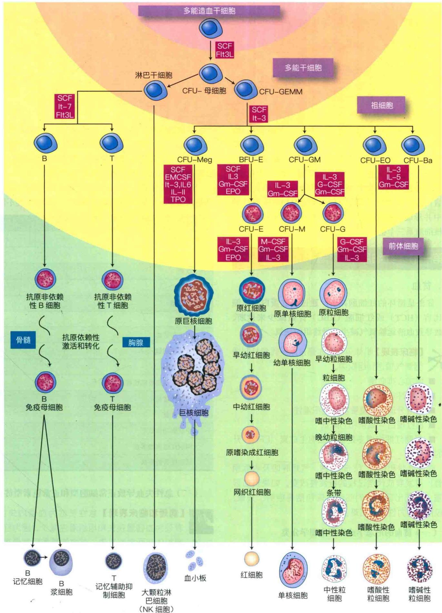 
图20-1造血系统淋巴系和髓系成分的细胞分化和成熟。光学显微镜只能观察骨髓的前体细胞（母细胞和成熟的细胞）。Ba.嗜碱性粒细胞；BFU.爆发集落形成单位；CFU.集落形成单位；E.红系；EO.嗜酸性粒细胞；EPO.促红细胞生成素；G.多形核白细胞；GM.粒单系；IL.白细胞介素；GM-CSF.粒细胞巨噬细胞集落刺激因子；M.单核/巨噬细胞；Meg.巨核细胞；NK.自然杀伤细胞；SCF.干细胞因子；TPO.血小板生成素

【发病机制】许多潜在原因导致缺铁。在婴幼儿和儿童，生长和发育所需的膳食铁不足。
孕期和哺乳期铁的需要量增加。成人缺铁最常见的原因是慢性失血，少见原因是血管内溶血。生育期妇女，妇科失血（经期、分娩、阴道出血）是缺铁最常见的原因。绝经后的妇女，原因不明的缺铁要检查胃肠道肿瘤或血管病变的可能性，因为这是慢性出血最常见的部位。

【病理】缺铁性贫血以小细胞低色素性贫血为特点（图20-3）表现为红细胞大小和形状（不
均性红细胞异形）差异。因为缺陷发生在骨髓内，没有相关的网状细胞增多症。骨髓显示红系增生，普鲁士蓝染色显示储存铁降低或消失。由于铁缺乏，血清
铁和铁蛋白水平下降而总铁结合能力增加（由于血清转铁蛋白水平升高）。结果是转铁蛋白的饱和度百分比明显降低（通常小于 $5\%$ ）。

【临床表现】缺铁的症状一般来说和贫血相同。疾病晚期，可能出现平滑光亮的舌头（萎缩性和口边缘慢性炎症（口角炎），以及指甲的勺状反甲）。缺铁治疗包括纠正慢性失血来源和口服补铁。
2. 慢性病性贫血 慢性病性贫血的发生与慢性炎症和恶性肿瘤相关。

【发病机制】慢性疾病使骨髓储存的巨噬细胞不能利用铁，导致功能性缺铁，尽管铁储常的，甚至有增加。其他造成贫血的因素包
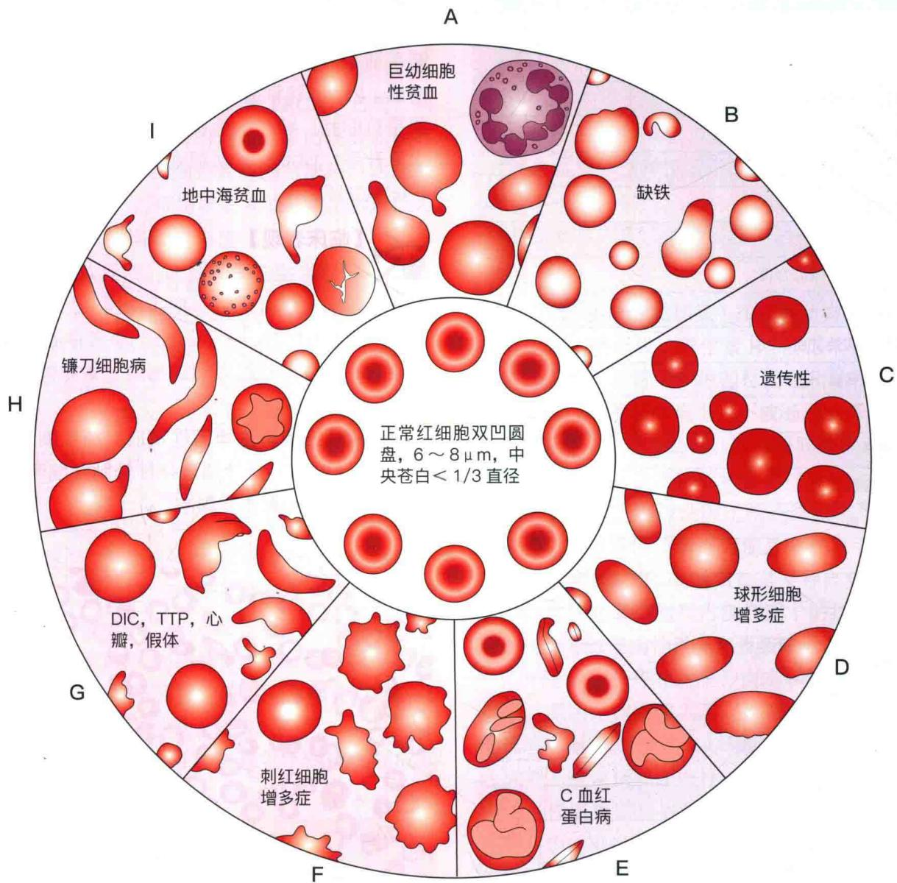 
图20-2 与各种类型贫血相关的异常红细胞形态。正常红细胞的形态显示于中央。A. 巨幼细胞性贫血（干扰DNA的合成，最常见的原因是维生素 $\mathrm{B}_{12}$ 或叶酸缺乏）；B. 缺铁（干扰血红蛋白合成；缺铁）：低色素型，小细胞型红细胞；C. 遗传性球形红细胞增多症（膜缺损）：球形红细胞中央苍白缺乏；D. 遗传性椭圆细胞增多症（膜缺损）：椭圆红细胞；E. 血红蛋白C病（异常的球蛋白链）：靶细胞，菱形晶体。F. 棘红细胞增多症（膜脂质缺陷，如无β脂蛋白血症）：不规则的毛刺；G. 微血管病性溶血[机械损伤红细胞；弥散性血管内凝血（DIC），血栓性血小板减少性紫癜（TTP），人工心脏瓣膜后遗症]：裂红细胞/片段。H. 镰状细胞病（异常球蛋白链）：镰状细胞。I. 地中海贫血（干扰血红蛋白合成）：低色素型，小细胞型红细胞；异形红细胞症；嗜碱性点彩；靶细胞
括红细胞的寿命降低，组织缺氧使肾EPO反应迟钝和骨髓EPO反应受损。炎症细胞因子[乳铁蛋白，白细胞介素（IL）-1，肿瘤坏死因子α（TNF-α）和干扰素]可能会干扰铁的流通。

【病理】轻度至中度的慢性疾病性贫血，红细胞往往正常，甚至可以是小红细胞。普鲁士蓝
染色显示铁的储存正常或增加。血清铁水平降低。然而，与缺铁性贫血不同，总铁结合力降低。成功治疗潜在的疾病可以恢复正常血红蛋白水平。
3. 再生障碍性贫血 再生障碍性贫血是多潜能干细胞的异常导致骨髓衰竭。这种疾病的特点是低增生性骨髓相和全血细胞减少（循环的全血细胞减少）。
表 20-2 贫血病理生理分类急性失血生成减少干细胞和祖细胞缺陷再生障碍性贫血纯红细胞发育不良阵发性血红蛋白尿白血病骨髓异常增殖综合征骨髓侵犯慢性疾病性贫血肾病性贫血缺铁无效造血巨幼细胞性贫血地中海贫血破坏增多小体内膜缺陷酶缺陷血红蛋白病小体外免疫性自主免疫性同种免疫性非免疫性机械性脾功能亢进感染化学性

【发病机制】再生障碍性贫血是骨髓造血干
细胞受损,多数病例为特发性,没有特别始
发诱因。干细胞损伤机制主要有两个：第一是可预测的剂量依赖性毒性损伤，典型损伤包括暴露于某些化疗药物，化学品和电离辐射为。另一机制是与剂量无关的免疫损伤，如特发性疾病、服用某些药物后或病毒感染。极少数情况下，再生障碍性贫血（例如，范科尼贫血）可以遗传。取决于病因，干细胞的损伤有的是可逆的，有的不可逆。某些再生障碍性贫血的干细胞存在内在异常，通过随后演变出克隆性干细胞疾病[阵发性睡眠性血红蛋白尿症(PNH)，脊髓发育不良，急性白血病]得以提示。

【病理】再生障碍性贫血的骨髓细胞成分根据
疾病的临床分期，呈现各式各样的减少，与相应的脂肪成分增加（图20-4）。髓系、红系和巨核细胞系细胞数量减少，而骨髓的淋巴细胞和浆细胞相对增加。因此，这种疾病的特征是贫血，白细胞减少（主要是粒细胞）和血小板减少。尽管促红细胞生成素的水平升高，但没有网状细胞增生症，这显示出潜在的干细胞缺陷。

【临床表现】患再生障碍性贫血的体征和症状
归结为全血细胞减少，即无力、疲劳、感染和出血。如果再生障碍性贫血不治疗，预后不佳，中位生存期 $3\sim 6$ 个月。只有 $20\%$ 的患者存活期超过1年。免疫抑制治疗一般可以暂时缓解，骨髓或干细胞移植有可能治愈。
4. 纯红细胞再生障碍性贫血 纯红细胞再生障碍性贫血（PRCA）是骨髓选择性抑制红细胞前体细胞。白血细胞和血小板不受影响。
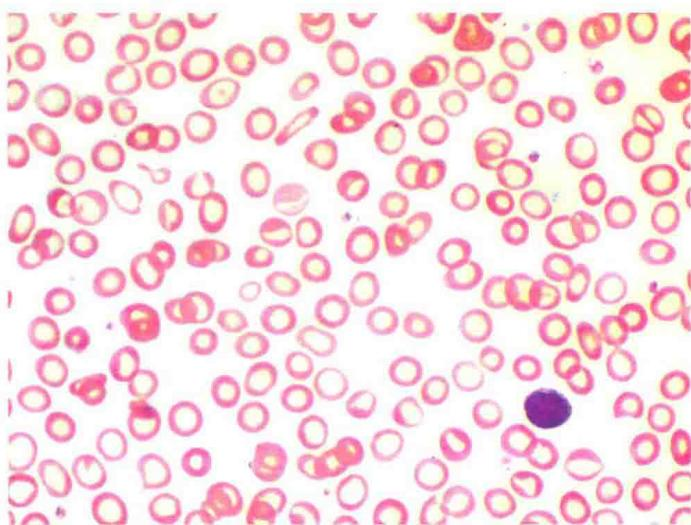 
图20-3 缺铁导致小细胞低色素型贫血。红细胞（RBCs）都比小淋巴细胞的细胞核显著减小，并且它们的中央苍白都增加了（正常的中央苍白大约占红细胞直径的1/3）
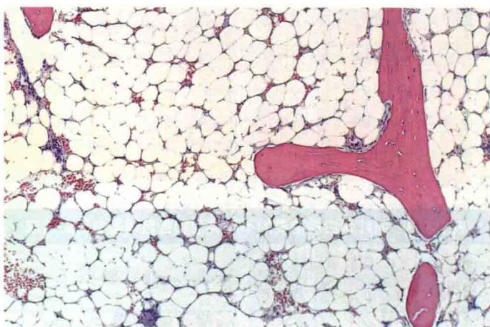 
图20-4再生障碍性贫血。骨髓主要由脂肪细胞组成，缺乏正常的造血活动

【发病机制】PRCA 最常见于免疫抑制红细胞产生，原因不明。有时，它继发于病毒感染
染（细小病毒B19）或胸腺病变（如胸腺瘤、胸腺增生）。
秋-布二氏综合征是一种遗传性PRCA，它与一些核糖体蛋白突变相关。发病的开始两年出现贫血伴有或无身体异常，并且伴红细胞前体细胞缺陷。这些细胞对EPO反应减低，红细胞破裂降低，集落形成能力降低。

【病理】PRCA的骨髓整体细胞量正常，但选
择性红系前体细胞缺乏或幼红细胞阶段停止
发育。粒细胞和巨核细胞系数量充足、成熟。患者
PRCA发展中度至严重贫血，常伴有大红细胞增多症，
尽管EPO的水平增加，但没有网状细胞增多症。

【临床表现】获得性PRCA表现为急性自限性
疾病或慢性复发病程。急性自限性PRCA通常
是细小病毒B19引发。这种情况可能临床症状不显著，
除非患者有潜在慢性溶血性贫血（例如，遗传性球形，
镰状细胞性贫血）。这种病例，可能伴有所谓再生障碍
性危机（即突然加重贫血）而更加复杂。免疫功能低
下的患者不能清除细小病毒感染，贫血可以延长。慢
性复发性PRCA可以是特发性或与胸腺病变相关。这
种情况下，胸腺切除术可更正贫血。
5.肾病性贫血 慢性肾功能不全导致EPO生成减低性贫血。

【发病机制】各种原因导致的肾脏疾病伴有
EPO生成减低和后续贫血发生。贫血的严
重程度与潜在的肾功能不全成正比。治疗选择服用重组EPO。

【病理】慢性肾病性的贫血为正常细胞型和正
常色素型贫血。在一些情况下，红细胞可见扇
贝状细胞膜 (Burr 细胞)。如果肾功能不全继发于恶性高血压，可见红细胞破碎形成裂红细胞。
6. 铅中毒性贫血 铅中毒导致贫血是通过干扰参与血红素合成的酶（见第8章）。
# （四）无效红细胞的产生特点：几乎没有循环红细胞
由于无效造血，各种贫血表现为异常红细胞的产生。与干细胞或前体细胞的病变不同，骨髓红细胞前体细胞增加。因此，骨髓有足够的红细胞前体细胞，但红细胞不能进入血液循环。
1. 巨幼细胞性贫血 巨幼细胞性贫血是DNA合成受损造成的，通常是由于维生素 $\mathbf{B}_{12}$ 或叶酸缺乏。

【发病机制】DNA合成受损造成核发育异
常，进而引起红细胞无效成熟和贫血。某些
化疗药物（甲氨蝶呤，羟基脲）或抗反转录病毒药（5- 氮杂胞苷）也可能引起巨幼细胞性贫血。少见情况包括遗传性嘌呤或嘧啶代谢缺陷。叶酸和维生素 $\mathrm{B}_{12}$ 对正常 DNA 合成至关重要。四氢叶酸通过甲基转移酶和维生素 $\mathrm{B}_{12}$ 作为辅因子，从甲基四氢叶酸转化而来。DNA 合成缺陷，核发育受损，而细胞质正常成熟。这种情况形成大的、分叶核的红细胞前体细胞（巨幼红细胞），其中大部分都不够成熟，不能被释放入血，而是被髓内消灭。循环红细胞是大红细胞。
维生素 $\mathbf{B}_{12}$ （氰钴胺素）在多种动物性食物中可见，并由肠微生物合成。维生素 $\mathbf{B}_{12}$ 的正常吸收发在回肠远端，需要其在胃中和内源性因子相结合，这是由胃壁细胞合成的并保护维生素不被肠道酶降解。多种原因可导致维生素 $\mathbf{B}_{12}$ 缺乏。饮食摄取维生素 $\mathbf{B}_{12}$ 不足是罕见的，通常只在严格的素食者（素食主义者）中出现。最常见的是内源性因子缺乏导致维生素 $\mathbf{B}_{12}$ 的吸收障碍。内源性因子缺乏可能是先前胃手术将胃的壁细胞团切除造成的。恶性贫血是一种自身免疫性疾病，患者产生针对壁细胞和内源性因子的抗体。抗壁细胞抗体也会导致萎缩性胃炎和胃酸缺乏。
叶酸存在于有叶蔬菜、肉类和鸡蛋。叶酸缺乏的最常见原因是饮食摄入不足，最常发生在饮食不平衡的患者（酗酒、吸毒者）。叶酸缺乏也可发生在妊娠期、哺乳期、快速增长和慢性溶血性过程。原发性肠道疾病（炎性肠病，口炎性腹泻）可能干扰叶酸的吸收。各种药物也可损害叶酸的吸收（苯妥英钠）或代谢（甲氨蝶呤）。

【病理】叶酸或维生素 $\mathrm{B}_{12}$ 缺乏的血液学表现在
骨髓和血液是相同。虽然骨髓似乎细胞量增多，
因为无效造血，血液表现为全血细胞减少。骨髓前体细胞各系可见巨幼红细胞，其特征是细胞增大，细胞
核与细胞质异步成熟（图20-5）。贫血的程度各异，但可能很严重。红细胞是大细胞型，可能是椭圆形的。不均性红细胞异形通常很突出，泪滴细胞可见。循环血液中的中性粒细胞常表现出核过度分裂（超过5个分叶瓣）。无网织红细胞增多。

【临床表现】一般情况下，叶酸缺乏（月）比
维生素 $\mathrm{B}_{12}$ 缺乏（年）发展更加迅速。维生素
$\mathrm{B}_{12}$ 缺乏也可能发生神经症状，继发于脊髓后、侧支脱髓鞘，包括感觉和运动两者缺乏。如果没有适当和及时治疗，神经症状可能是不可逆的。而叶酸缺乏不会发生这些神经症状。
2.地中海贫血地中海贫血是先天性贫血，由血红蛋白的球蛋白链亚基合成障碍形成。根据受影响的球蛋白链，分为β地中海贫血（β链产生缺陷），α地中海贫血（α链产生缺陷）和δ/β地中海贫血。基本缺陷是球蛋白链减少或不生产。由于α、β链通常配对形成四聚体血红蛋白，缺少一种蛋白链使正常血红蛋白链无法配对。β地中海贫血，造成蛋白链沉淀在细胞膜上，导致红细胞极易受损和骨髓内红细胞破坏。α地中海贫血，有过量的β链（子宫外），产生血红蛋白只有β链组成。在宫内，过多链使血红蛋白仅由γ链构成，在这两种情况下，溶血引发过度的红细胞破坏。

【流行病学】虽然地中海贫血在地中海周围最
常见，尤其是在意大利和希腊，它可以在疟疾
流行任何地区出现（中东、印度、东南亚和中国）。一个杂合状态的地中海贫血可提供一定的保护作用，抵御疟疾，从而可以解释地中海贫血症的持续性。

【发病机制】有 4 个 $\alpha$ 基因, 成对出现在每
一个16号染色体上。每个11号染色体上
有两个 $\gamma$ ，一个 $\delta$ 和一个 $\beta$ 基因。胚胎球蛋白基因
zeta (ζ) （等同于 $\alpha$ ）和epsilon（ε）（非等同与α）
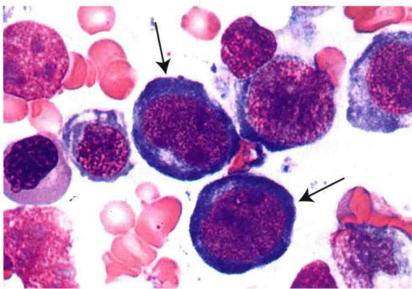 
图20-5 巨幼细胞性贫血。维生素 $\mathsf{B}_{12}$ 缺乏的（恶性贫血）患者的骨髓穿刺显示突出的巨幼红细胞前体细胞（箭头）
在16号和11号染色体。血红蛋白最重要的不同类型和各自球蛋白链的组成见表20-3。地中海贫血一般根据受影响的球蛋白链来分类。临床最显著的两类包括α和β链缺乏。地中海贫血涉及β和γ链合成也有报道，但不常见。
表 20-3 血红蛋白最重要的不同类型和各自球蛋白链的组成 
αβγδζA22出生后重要的正常血红蛋白(&gt;总数95%)A222通常&lt;3%血红蛋白总数,但在β地中海贫血略上升F22宫内大部分血红蛋白正常,产生常终止于婴儿早期;6个月之后HbF大部分不可测。β地中海贫血中持续存在H4主要在α地中海贫血中,α链缺乏导致血红蛋白由β链四聚体组成。负责形成Heinz小体Bart4α地中海贫血的婴儿可见。Heinz小体可见Portland22血红蛋白在胎儿很早期存在。在严重的α地中海贫血中可持续存在
（1）β地中海贫血：β地中海贫血具有异质性，通常由β球蛋白基因点突变引起。突变可以是在基因的启动子区域，一个剪接位点或其他编码区域，或者可以导致不适当的终止密码子。结果导致转录基因完全（ $\beta^0$ ）或部分（ $\beta^{+}$ ）抑制。偶尔，突变还可能影响相邻的δ球蛋白基因，导致β-δ地中海贫血。

【病理和临床表现】纯合性 $\beta$ 地中海贫血（库

素型贫血（图20-6）。α链明显增多，形成不
稳定的四聚体 $(\alpha_{4})$ ，沉淀在发育的红细胞前体细胞的胞质中。 $\beta^{0}$ 型，虽然血红蛋白A2的水平增加了 $5\% \sim 8\%$ ，但大部分血红蛋白为胎儿血红蛋白，也存在。 $\beta^{+}$ 型的情况下，可以检测到一些血红蛋白A（取决于潜在缺陷的性质），血红蛋白A2轻度增加。血红蛋白A2适度增加是所有 $\beta$ 地中海贫血的特征，因为疾病中 $\delta$ 球蛋白基因表达上调。
除了小细胞和低色素，血涂片显示了显著的不均性红细胞异形（不均细胞的大小和形状）和靶细胞、嗜碱性点彩和循环的幼红细胞（尤其是脾切除后）。增加EPO导致明显的骨髓红系增生。骨髓空间扩大，造成脸部和颅骨畸形。髓外造血可导致肝脾肿大和软组
织肿块的形成。过多的红细胞生造成铁的吸收增加，连同反复输血，造成铁超载。在组织中过量铁沉积是地中海贫血患者发病和死亡的主要原因，需要积极的整合疗法。β地中海贫血的发病机制总结于图20-7。
杂合性 $\beta$ 地中海贫血伴有小细胞和低色素。小细胞的程度与贫血的严重程度不成比例，贫血一般轻微或缺如。经常有伴随的红细胞增多（RBC计数增加），但红细胞大小不均、靶细胞，嗜碱性点彩不明显和血红蛋白A2轻微上升。大多数患者完全无症状。
# (2) a 地中海贫血

【发病机制】与 $\beta$ 地中海贫血不同，a地中海贫血最常见的是由于基因缺失引起。临床多的综合征，因为一定数目（最多4个）的白基因可能受影响。多种a地中海贫血的遗图20-8。a地中海贫血伴过多的β或γ链，
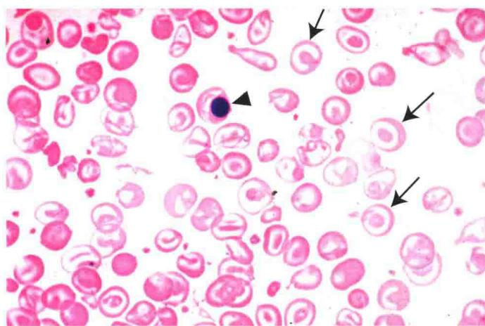 
图20-6地中海贫血。外周血红细胞呈现低色素和小细胞型并显示不均性红细胞异形、频繁的靶细胞（箭头）和循环的有核红细胞（箭头头部）
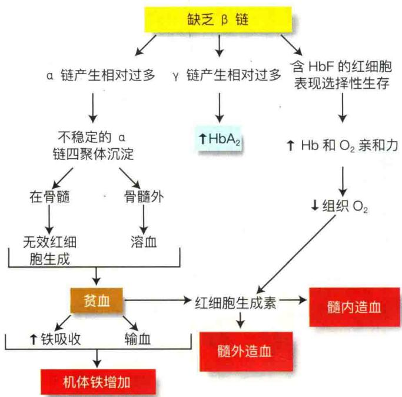 
图20-7 $\beta$ -地中海贫血的发病机制
形成四聚体血红蛋白 $\mathrm{H}\left(\beta_{4}\right)$ 和 Bart 血红蛋白 $\left(\gamma_{4}\right)$ , 这两者都是不稳定的, 在细胞质中沉淀形成 Heinz 小体。而且, 它们有较高的氧亲和性, 造成组织供氧下降。这些四聚体血红蛋白的相关数量取决于涉及的 $\alpha$ 基因数量及患者的年龄。因为潜在的血红蛋白合成障碍, 循环红细胞通常是小细胞和低色素型。

# 【病理和临床表现】

a 地中海贫血隐性携带者（一个基因受影响）难以诊断，因为患者唯一的血液异常只有少量 Bart 血红蛋白，只在婴儿期检测到。没有贫血，症状。
a地中海贫血特征（两个基因受影响）伴有温和的小红细胞型贫血。婴儿期最高可见 $5\%$ 的Bart血红蛋白。 
H血红蛋白病（三种基因受影响）伴有温和的小红细胞型贫血。Bart血红蛋白升高（在婴儿期高达 $25\%$ ），可检测到各种H血红蛋白水平。 
同源性 $\alpha$ 地中海贫血（4个基因受影响），又称胎儿水肿，不能生存。受影响的婴儿死在宫内或出生后很快死亡伴有严重贫血，差别显著的细胞大小和形态及大量Bart血红蛋白。女性怀有Bart血红蛋白的胎儿产科并发症风险增加，包括子痫和产后出血。
# （五）溶血性贫血特征：红细胞破坏增加
循环红细胞成熟前被破坏导致溶血性贫血，根据红细胞被破坏的地点来分类。血管外溶血，波及脾的单核/巨噬细胞系统和肝脏较小程度受累。血管内溶血，红细胞在循环中被破坏。
溶血性贫血以补偿性红细胞的产生和释放增加为特征。在血液中表现为多色素型细胞增多症，因为网织红细胞增多。与溶血相关的其他实验室检查常见：
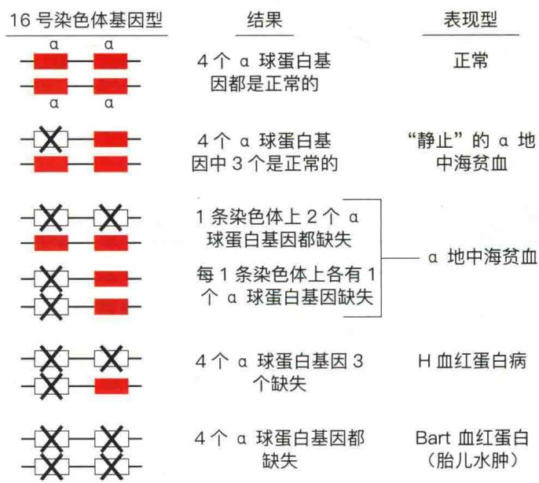 
图20-8 a球蛋白缺乏的遗传学和表现
$①$ LDH增加（尤其是同工酶1）； $②$ 非结合（间接）胆红素增加； $③$ 肝球蛋白下降； $④$ 血液和尿中游离（细胞外）血红蛋白； $⑤$ 尿胆原和尿含铁血黄素增加。
1.红细胞膜缺陷 红细胞膜任何部分的改变可以降低其正常的可塑性，改变红细胞溶血易感性。
（1）遗传性球细胞增多症：遗传性球细胞增多症（HS）是异质性红细胞细胞骨架遗传性疾病，其特征在于膜收缩蛋白或其他细胞骨架成分（锚蛋白，4.2蛋白，带3）缺乏。

【发病机制】HS中细胞骨架蛋白的缺乏直接导致红细胞膜的缺陷，脂质双层从细胞骨架
上解偶联。导致膜的表面积渐进性缺失和球细胞形成。这些不正常的红细胞更僵硬，不能轻易穿越脾，在那里它们变成“受限的”，失去多余的表面，最终血管外溶血。大多数HS具有遗传性常染色体显性的特点。罕见的隐性病例都涉及膜收缩蛋白的亚单位。

【病理】HS患者最常见中度、正常红细胞型贫血。明显的球形红细胞呈高色素性（没有中央是典型的表现，伴多色素性细胞增多症和网状多症（图20-2）。骨髓显示红系增生。

【临床表现】多数患者由于慢性血管外溶血有脾大。他们可能会出现黄疸，以及高达 $50\%$ 发生胆伴色素（胆红素）性胆结石。HS患者可以通过脾效地治疗，尽管球形红细胞仍然持续在循环。
（2）遗传性椭圆形红细胞性贫血：遗传性椭圆形红细胞性贫血（HE）是一种异质性累及红细胞骨架的遗传性疾病。

【发病机制】HE以细胞骨架异常为特点。HE常见类型包括膜收缩蛋白、膜收缩蛋白-锚
蛋白结合蛋白 4.1 和血型糖蛋白 C 自组装配缺陷,尽管有潜在的分子生物学异常, 大部分循环红细胞是椭圆形或卵圆形。它们仍然有中央苍白的区域,因为脂质双层（如在 HS 看到的）没有损失。大多数形式的 HE 是常染色体显性遗传。

【病理和临床表现】HE通常表现仅有轻度的正常红细胞性贫血，许多患者无症状。血涂片显示大量椭圆形红细胞，伴很少的网织细胞增多症（图20-2）。偶尔，严重溶血患者可能需要

。
（3）棘红细胞增多症：棘红细胞增多症是红细胞膜的脂质双层缺陷引起的，以表面刺状突起为特征，可以伴发溶血。
最常见的原因是慢性肝病，使增加的游离胆固醇
在细胞膜沉积。棘红细胞（棘细胞）也是β脂蛋白血症的明显特征，这是常染色体隐性疾病伴有脂质膜的异常。这种异常使血细胞变形，表面形成不规则棘突和中央致密的胞质（没有中央苍白）（图20-2）。棘红细胞增多症中溶血和贫血温和。
2.酶缺陷：葡萄糖-6-磷酸的缺陷 葡萄糖-6-磷酸缺乏是X染色体相关疾病，异常红细胞对氧化压力敏感，表现为溶血性贫血。糖酵解酶通路遗传性缺陷使循环红细胞更易溶血。最常见的酶缺陷包括葡萄糖-6-磷酸脱氢酶（G6PD），其催化葡萄糖-6-磷酸向6-磷酸葡糖酸转化。临床上，这些缺陷会导致不同程度的贫血，被指定为遗传性、非球状细胞性贫血。G6PD缺陷最普遍的地区是疟疾历史上流行区，尤其是非洲和地中海区域，因为这些突变对抗疟疾提供一定保护。G6PD的A型见于 $10\% \sim 15\%$ 的美国黑人，并且伴有酶活性的降低（正常的 $10\%$ ）。

【发病机制和病理】由于G6PD有助于回收还原谷胱甘肽，红细胞这种酶的缺陷易产生氧化应激，并因感染和某些药物而加重。蚕豆的摄入（地中海饮食的一种主食）可能会导致致命
的溶血 (蚕豆病)。血红蛋白氧化使其沉淀于细胞质形成 Heinz 小体, 细胞僵硬度增加, 并最终溶血。通过脾传代, 循环红细胞可能有一部分膜消失, 形成所谓的咬细胞。
3. 血红蛋白病 大多数临床相关的血红蛋白病是由 $\beta$ 蛋白链的基因点突变引起的。
（1）镰状细胞病：镰状细胞病，一种异常的血红蛋白，血红蛋白S，将红细胞脱氧时转变成镰刀形状。

【流行病学】血红蛋白S最常见于祖籍非洲的黑人人群，尽管地中海、中东和印度人群也可见这种血。 $10\%$ 的美国黑人是杂合体，每650人中有一个纯合体。血红蛋白S杂合体一定程度上防止恶化感染的红细胞选择性镰刀状，在循环中被脾脏巨噬细胞消灭，有效地摧毁了寄生虫。

【发病机制】血红蛋白S，β球蛋白链基因的点突变在第六号氨基酸让缬氨酸替代谷氨
酸。这种单一的变化产生结构异常的分子，在脱氧条件下聚合。血红蛋白S的聚合，细胞质转变成僵化丝状凝胶，形成难以变形的镰红细胞。这种效应导致镰状细胞病的两种主要表现：①阻塞的微循环，随后多器官组织缺氧和缺血性损伤；②循环过程中通过脾更易被破坏（溶血），产生慢性血管外溶血性贫血。
【病理】纯和性患者（血红蛋白SS）患严重的正常细胞型或大细胞型贫血。大细胞增多症是因为继发于慢性溶血，网织细胞增多。血涂片检查发现明显的不均性红细胞异形和多染性红细胞增多。经典的镰状细胞和靶细胞，以及多种其他形状异常的红细胞可见（图20-9）。在大多数非儿童患者中可见Howell-Jolly小体，代表核残余，反映脾组织的缺血性损伤造成脾功能低下。
【临床表现】血红蛋白S纯合子的人群镰状细胞病临床表现完整。患者终身溶血，但大多数人并不需要定期输血。取而代之的是，临床表现以反复血管闭塞性疾病的后遗症为主导。因此，镰状细胞贫血症是一种系统性疾病，最终为大多数器官系统和组织功能受损负责（图20-10）。镰状细胞病患者发展为周期性、疼痛性缺血危机，可以被各种刺激（例如，潜在的感染，酸中毒或脱水）引发。
再生障碍危象：在再生障碍性危机（最常见与细小病毒B19感染有关），骨髓不能代偿高水平的红细胞损失。血红蛋白水平迅速下降，并且没有网织红细胞的反应。
隔离危机：突然的红细胞聚集，特别是在脾，导致循环血液容量降低和血红蛋白水平降低。该病因还不十分清楚，但它最常见于年幼的儿童，仍有一个功能正常的脾。这一并发症后跟低血容量性休克，是引起早期死亡最常见的原因。
■心脏：心排血量增加的慢性需求可导致心脏扩大和充血性心脏衰竭。心肌缺血可能是冠脉微循环阻塞引发的。心肌细胞功能也因过量的铁沉积受到损害，是由于慢性溶血和反复输血。
■ 肺：高达1/3的镰状细胞性贫血的患者呼吸功能迅速下降，胸部X线伴有肺浸润。这种急性胸部综合
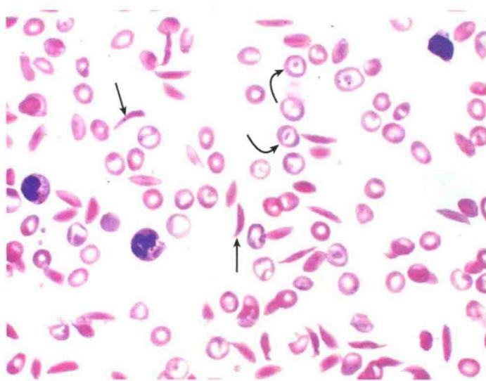 
图20-9 镰状细胞性贫血。镰状细胞（直箭头）和靶细胞（弯曲箭头）是很明显的
征可能是致命的。肺梗死可能会发生，镰状细胞的患者更容易患各种肺部感染。
■ 脾：虽然脾大在儿童期经常出现，重复脾梗死造成功能性自主脾切除。在大多数成年人中，只有一小部分纤维性脾残余存在。无脾状态使患者容易感染胶囊细菌，特别是肺炎球菌。
脑：患镰状细胞贫血的患者会发生与血管阻塞相关的神经并发症，包括短暂性脑缺血发作，明显脑卒中和脑出血。视网膜微血管阻塞可能引发视网膜出血和脱离，增生性视网膜病变和失明。
肾：因为缺氧、酸中毒和高渗环境通常存在，镰状红细胞通常发生在肾髓质。并发症包括：不能形成浓缩尿，肾梗死和乳头坏死。
肝：由于任何形式的慢性溶血性贫血，镰状细胞贫血的患者非结合（间接）胆红素水平增加这容易好发色素沉着性胆红素性胆结石。也可见肝大和肝铁沉积增加。
四肢：下肢皮肤溃疡常见，特别是靠近脚踝的，反映出真皮毛细血管的阻塞。镰状细胞病也与骨髓炎的发病率增加有关，尤其是鼠伤寒沙门菌，可能与脾功能的基本障碍相关。S血红蛋白杂合子（镰状细胞特征）通常不发育成镰状红细胞，并且临床上正常。罕见例外是极端条件下，如高海拔飞行，在越来越大的压力下深水潜水、极限或长时间的运动，特别是在脱水条件下。
（2）C血红蛋白病：C血红蛋白病是纯合性遗传一个结构上异常的血红蛋白，导致红细胞僵硬度增加和轻度慢性溶血。
【发病机制】C血红蛋白病，赖氨酸在β球蛋白第6个氨基酸取代谷氨酸。纯合子的患者，血红蛋白C沉淀在红细胞质，导致细胞脱水，变形性减小，脾清除能力增加。这些效应导致轻度正常红细胞性贫血和脾大。C血红蛋白病出现在S血红蛋白病的同一种群，尽管S血红蛋白病的发病率较低。2%~3%的美国黑人都是血红蛋白C杂合子并且无症状（血红蛋白C特征）。
（3）其他血红蛋白病：已有几百种额外血红蛋白变异型报道，是由于 $\alpha$ 或 $\beta$ 球蛋白基因突变导致。这些突变可能导致结构异常或血红蛋白分子功能紊乱。
4.免疫和自身免疫性溶血性贫血 免疫性溶血性贫血中红细胞的破坏（溶血）是抗体引起的，它可以是同种免疫或自身免疫起源，对抗红细胞表面抗原。红细胞本身是正常的，但成为免疫介导的攻击目标。溶血的位置可能是血管外或血管内。自身抗体可以分类为热或冷抗体两种。
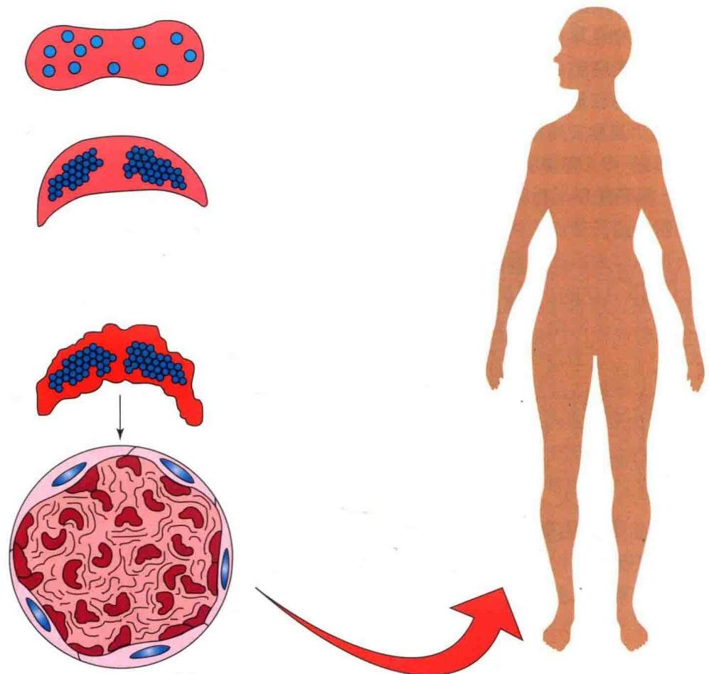 
图20-10 镰状细胞贫血血管并发症的发病机制。缬氨酸对谷氨酸的取代导致血红蛋白分子表面电荷的改变。脱氧时 $(-O_{2})$ ，镰状血红蛋白（HbS）四聚体聚集形成难溶的多聚体。红细胞从双凹圆盘改变形状为HbS多聚体的镰刀形。这个过程最初通过复氧 $(+O_{2})$ 是可逆的，但伴随脱氧复氧的重复循环，红细胞变为不可逆的镰刀状。不可逆的镰状红细胞膜的外侧和内侧单层之间的磷脂重排，特别是外层的氨基磷脂增多。钾（ $\mathrm{K}^{+}$ ）和水（ $\mathrm{H}_{2} \mathrm{O}$ ）从细胞中丢失。红细胞再不能变形，更易和血管内皮细胞黏附，这些特性好发小血管血栓形成。由此产生的血管闭塞导致大面积的缺血性并发症
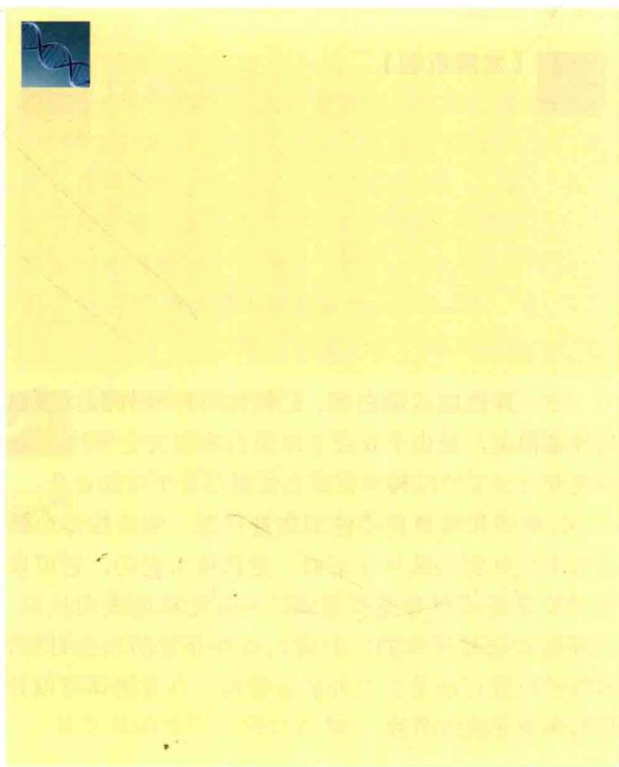
,支原体]或淋巴增生性疾病。.jpg)
染 [Epstein-Barr 病毒 (EBV), 支原体] 或淋巴增生性疾病。

【病理和临床表现】冷凝集素患者发生显著溶血是罕见的。患者暴露在寒冷中更容易有外周血管症状（雷诺现象），因为红细胞凝集。冷凝集素存在于许多健康人中；致病性与抗体滴高或热幅度宽广有相关性。
（3）冷溶血病：冷溶血素（多纳特，兰茨泰纳抗体）通常是 $\mathrm{IgG}$ 并且针对红细胞的P抗原系统。冷溶血素具有双相活性，并且是AIHA的少见原因。在低温时抗体和红细胞结合并固定补体。因为该抗体是 $\mathrm{IgG}$ 抗体，红细胞不凝集。气候变暖时，冷溶血素保持附着，补体被激活，发生血管内溶血。与冷溶血素相关的临床综合征是阵发性冷性血红蛋白尿（PCH）并常伴随病毒性疾病。PCH患者可能发展为严重贫血，结合球蛋白水平下降和继发于血管内溶血的血红蛋白尿。免疫抑制治疗和脾切除术通常是无效的。避免寒冷和支持疗法是必需的。 
（4）新生儿溶血症：新生儿溶血症是母亲和她的发育中的胎儿之间的血型不兼容。母亲产生抗体对抗它。见第6章详细描述。 
5.非免疫性溶血性贫血 机械红色细胞碎片综合征（微血管溶血性贫血）红细胞碎片综合征，本质上正常的红细胞在循环血液（血管内溶血）中被机械破坏。

【发病机制】在微血管病性溶血性贫血，红细
胞机械性破碎是因为与异常表面接触引起的
（例如，假体心脏瓣膜；人造血管移植术）或小血管的内皮改变引起。这种效应导致纤维蛋白沉积和血小板聚集，毛细血管血栓形成。当红细胞通过这些受损的血管，被网状分布的纤维素破坏（图20-2）。经典的微血管溶血包括弥散性血管内凝血（DIC），血栓性血小板减少性紫癜（TTP）和溶血性尿毒综合征（见第16章及下文）。在恶性高血压或血管炎综合征中血流的改变，也可能造成红细胞的机械损伤。长距离跑步或行走（“行军性血红蛋白尿”）或长时间剧烈运动可引起红细胞反复创伤导致溶血。

【病理】不管内在病因，微血管溶血性贫血的实
验室所见是相似的。贫血轻度至中度，可见适
当的网织红细胞反应。血涂片显示支离破碎红细胞（裂红细胞）和多染（色）性细胞增多症（图20-11）。
DIC以凝血异常和血小板减少为特征，血小板减少和von Willebrand因子（wWF）可见于TTP病例（见下文）。
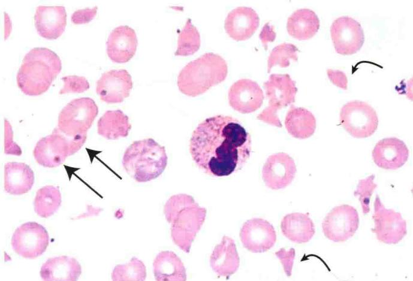 
图20-11 微血管病性溶血性贫血。弥散性血管内凝血患者的血涂片可见不规则的，破碎的红细胞（裂红细胞；弯曲箭头），还可见Howell-Jolly小体（直箭头）
阵发性睡眠性血红蛋白尿症（PNH）：是一种获得性克隆干细胞疾病以阵发性血管内溶血性贫血为特征。PNH是由于红细胞对补体介导的溶解感性增加导致的。

【发病机制】PNH 潜在缺陷涉及体细胞磷脂酰肌醇聚糖类A（PIG-A）基因突变。在造
血干细胞, 它位于 X 染色体上的短臂 (Xp22.1)。PIG-A 基因突变引起糖基磷脂酰肌醇 (GPI) 的合成受损, 正常状态它可将许多蛋白固定到红细胞膜上。包括衰减加速因子 (CD55) 和更重要的活性溶解膜抑制剂 (CD59)。红细胞表面这些因子的缺失使细胞补体介导的溶血易感性增加。从异常的干细胞衍生的白细胞和血小板失去 GPI 连接的膜蛋白。PNH 可以原发或从预先存在的再生障碍性贫血演变而来。因为缺陷是克隆性的, 它可进展为骨髓异常增生症或明显急性白血病 (见下文)。

【病理】溶血发作时，患者出现严重的正常红细胞型或大细胞型贫血，伴适当的网织红细胞
反应。由于血管内溶血，血红蛋白尿的存在，一段时间之后尿中反复铁流失可造成缺铁。经常可见白细胞和血小板减少，对补体的敏感性可能会产生不恰当的血小板活化。

【临床表现】患者发生间歇性血管内溶血，尽
管只有少数病例夜间发生。静脉和动脉血栓形成，特别是布加综合征（肝静脉血栓形成）在PNH增加，因为补体介导的血小板活化。血小板减少可能会导致出血。治疗是维持性的，骨髓移植才能治愈。一种单克隆抗体抑制补体成分5（依库珠单抗）的激活可延长患者的5年存活率使之与未受影响的人一样。
# 二、红细胞增多症
红细胞增多症（红细胞）指的是红细胞量增加。

# 【发病机制】只要HCT在男性大于54%和
在女性大于 $47\%$ 就可定义为红细胞增多症。
HCT大于 $50\%$ 以上，血液黏稠度成倍增加，心脏功能及外周血流可能会受损。HCT在 $60\%$ 以上，血流可能受到影响，造成组织缺氧。
红细胞增多症根据总体红细胞量可以进一步分为相对和绝对增多。
相对红细胞增多症，以脱水为特点，其特征是血浆容量降低和红细胞量正常。 
绝对红细胞增多症，是红细胞数量的真正升高，可以分为原发性和继发性。 
■原发红细胞增多症，或真性红细胞增多症（PV），是自主性，与EPO无关的红系增生，反映出获得性克隆性造血干细胞疾病。PV是一种慢性骨髓增生性疾病，讨论如下。 
■ 继发性红细胞增多症，源于EPO依赖刺激红细胞生成，通常作为一般组织缺氧的补偿反应。组织缺氧的原因包括慢性肺疾病、吸烟、居住在高海拔地区，心脏存在一个右至左的分流和高氧亲和力的异常血红蛋白。继发性红细胞增多症也可以在与一般性组织缺氧无关的某些情况下发生。肿瘤伴副肿瘤综合征可能会产生异位EPO，尤其是肾细胞癌、肝细胞癌、小脑血管母细胞瘤和子宫肌瘤。肾囊肿肾积水可对肾直接施加压力，从而产生局部缺氧和EPO生产增加。
# 第二节 止血性疾病
# 一、止血障碍
血小板，内皮细胞和凝血因子参与止血。止血通常是由血凝块形成来实现。最初，血小板黏附在血管内皮细胞，随着凝血机制被激活，随后聚集通过纤维素稳固。血栓可以通过纤维蛋白溶解系统溶解（见第10章）。
保持血液在无损的血管中流动的系统缺损分为两类：止血疾病和血栓性疾病。凝血系统不能恢复受损血管的完整性导致出血。无法维持血液流动导致血栓形成。
与止血系统的每个组成异常相关的出血的临床表现是各不相同的。血小板异常导致皮肤和黏膜出现瘀斑和紫癜两种情况。凝血因子缺陷导致相关肌肉、内脏和关节腔出血。血管异常通常会造成紫癜。
# （一）血管止血障碍反映血管外或血管组织功能障碍
1.血管外功能障碍导致止血缺陷 血管外组织功能障碍临床显著性是有限的。坏血病（维生素C缺乏）的特点是干扰胶原合成，常伴有紫癜，这是由于皮肤毛囊周围出血（见第8章）。老年性紫癜的特点是表浅、
边界清晰，前臂和其他太阳暴露区域持久的紫癜性斑点。它是由年龄相关的支持结缔组织的萎缩造成的。
2.血管功能障碍致使止血缺陷 血管功能障碍和相关的止血缺陷如下：
（1）内在的基因缺陷：遗传性出血性毛细血管扩张症（任督－奥斯勒-Weber综合征）是一种常染色体血管壁显性疾病（静脉和毛细管），这导致血管曲张和扩张（毛细血管扩张）。该病症是转化生长因子β（TGF-β）家族成员，内皮糖蛋白（SCH）或活化素受体样激酶1（ALK1）突变形成。遗传性出血性毛细血管扩张症的患者有反复自发出血或小创伤后出血。尽管可能会在任何病变的部位出现出血，80%以上的患者在幼年就有反复鼻出血。以后的生活中，胃肠道出血可能是主导症状。肺、大脑和视网膜的动静脉瘘可带来很多麻烦并导致出血或临床显著血液分流。反复出血可限制患者的活动，但死于出血罕见。
（2）血管炎：过敏性紫癜（过敏性紫癜）是一种血管疾病，导致的血管壁免疫学损害（见第16章）。组织学上，过敏性紫癜的特点白细胞碎裂性血管炎，血管周围中性粒细胞和嗜酸性粒细胞浸润，血管壁纤维素坏死和血管内血小板栓子形成。IgA和补体复合物在血液中循环并经常出现在血管壁上。在儿童中，它常跟随病毒感染并且是自限性的。在成人中，它与多种药物曝光相关，可能是慢性的。如果肾脏受累，可能伴随肾衰竭。
（3）血管壁 $\lg$ 片段的沉积：淀粉样变性病，冷球蛋白血症和副蛋白血症可能都会造成血管系统的损害（见第 $16\sim 23$ 章）。某些类型的动脉炎也伤害血管壁，并可能导致出血（见第10章）。
# （二）血小板紊乱导致止血缺陷
血小板紊乱患者的血小板病症可以很容易有瘀伤或危及生命的出血。出血可以发生在任何损坏的血管床，但皮肤黏膜出血，包括牙龈出血、鼻出血和月经过多是常见的。更为严重的表现是胃肠道、泌尿生殖道和脑出血。瘀斑，它们是血小板紊乱的特性，是无分支的红色病变，尺寸小于 $2\mathrm{mm}$ 。它们通常发生在下肢、身体相关区域、颊黏膜、软腭和压力点（腰带或手表带）。瘀斑也可发生在血管性疾病。血小板紊乱包括：①产量下降；②破坏提高；③功能受损。
1. 血小板减少症 血小板减少症是根据血小板计数小于 $150000 / \mu l$ 。血小板计数越低，外伤性出血、围术期出血风险越大。患者血小板小于 $10000 / \mu l$ ，自发性出血的风险增加（表20-4）。

【发病机制】血小板产生减少可导致多种先天或后天巨核细胞生成的缺陷，包括：①疾
病一般性影响骨髓；②异常选择性破坏血小板的生产；③缺陷导致无效的巨核细胞生成。白血病细胞骨髓浸润、转移性癌、患者的再生障碍性贫血骨髓衰竭，放疗或化疗产生全血细胞减少，包括血小板减少。某些病毒感染，例如巨细胞病毒和艾滋病及某些药物损害血小板生成。巨幼细胞贫血和骨髓增生异常可能会导致严重的血小板减少，是由无效的巨核细胞生成。
May-Hegglin异常是先天性血小板减少症，特点是血小板生产减少，是一组遗传性血小板减少症，现在所谓的肌球蛋白重链9（MYH9）相关血小板紊乱的最常见的类型。这是由于MYH9基因突变的结果，它编码非肌肉肌球蛋白重链IIA（NMMHC-IIA），是细胞骨架蛋白。血小板破坏增加可能反映免疫介导的损害，如特发性血小板减少性紫癜和药物引起的血小板减少症中循环的血小板去除。此外，血管内血小板聚集可能导致血小板减少症（例如，在TTP）。
表20-4 血小板减少的主要原因生成减少再生障碍性贫血骨髓侵犯（肿瘤、纤维化）药物或放射线导致骨髓抑制无效生成巨幼细胞性贫血骨髓发育不良破坏增加免疫性（特发性、HIV、药物、同种免疫、输血后、紫癜、新生儿）非免疫性（DIC、TTP、HUS、血管畸形、药物）隔离增加脾大稀释性血、血浆输血
DIC. 弥散性血管内凝血；HIV. 人免疫缺陷病毒；HUS. 溶血性-尿毒症综合征；TTP. 血栓性血小板减少性紫癜
2.免疫性血小板减少性紫癜 免疫性血小板减少性紫癜（ITP）是血小板在血液中的减少，是由抗血小板或巨核细胞抗原的抗体造成的。ITP发生有两种形式：一种为急性，自限性，发生在儿童的出血性综合征和发生在青少年和成人的慢性出血性综合征。抗体常针对血小板膜糖蛋白，糖蛋白IIb/IIIa受体或Ib/IX，该分子参与血小板的黏附和血凝块的形成。
【发病机制】像AIHA，ITP是抗体介导的血小板或其前体的破坏。在大多数患者中，这些自身抗体是IgG类的，虽然IgM的抗血小板抗体偶有发生。
急性ITP通常出现在病毒性疾病之后任何性别的儿童，有可能是由病毒诱导的血小板抗原改变产生自身抗体。表面结合的补体引起血小板在血液中溶解或被脾和肝的巨噬细胞吞噬和破坏。
慢性ITP主要发生在成人，并且可能与胶原血管性疾病（例如，系统性红斑狼疮）或恶性淋巴增生性疾病，特别是慢性淋巴细胞性白血病（CLL）相关联。它也常见于艾滋病病毒感染者。
【病理】急性ITP，血小板计数通常小于20000/μl。慢性成人ITP，血小板计数从几千到100000/μl。外周血涂片显示大量的巨大血小板，反映出积极参与血小板生成的骨髓加速释放年轻的ECT。因此，骨髓检查显示巨核细胞代偿性增加。
【临床表现】儿童急性ITP经历瘀斑和紫癜突然发病，或无症状。超过 $80\%$ 的病例6个月内自发恢复，是不需要治疗的。但疾病严重时，服用糖皮质激素及静脉免疫球蛋白是必要的。成人慢性ITP表现为阵发出血，例如鼻出血、月经过多或瘀斑，但危及生命的出血罕见。大多数成人慢性ITP给予糖皮质激素及静脉γ球蛋白，对药物治疗 $2\sim 3$ 个月没有反应的患者，则做脾切除术，可使疾病完全或部分缓解。
3. 药物引起的血小板减少症 已经知道许多药物可导致免疫介导的血小板破坏：奎宁、奎尼丁、肝素、磺胺类、金盐、抗生素、镇静剂、安眠药和抗惊厥药。药物经常与血小板相关蛋白形成复合物产生新的表位引发抗体产生。与此相反，化学治疗剂、乙醇和噻嗪类药物通过抑制血小板生成造成血小板减少症。
肝素诱导的血小板减少症（HIT）是指两种独特类型的药物性血小板减少症。I型HIT25%的患者在治疗的第 $2\sim 5$ 天有轻度、短暂的血小板减少症，是自限和非免疫来源的。Ⅱ型HIT是免疫介导的，是获得性IgG抗体针对血小板因子4-肝素复合物造成的。 $1\% \sim 3\%$ 的患者发生在经过肝素治疗的 $7\sim 10$ 天。这些个体发展为明显的消耗性血小板减少症、血小板活化，形成高凝状态。血小板凝聚使动脉和静脉易发生血栓栓塞，这可能是致命的。
4. 血栓性血小板减少性紫癜 血栓性微血管病（的TMA）代表一组具有共同特点的异质性综合征，包括血小板减少、微血管病性溶血性贫血、神经系统症状、
发热和肾功能损害。这些障碍包括：TTP和溶血性尿毒症综合征（HUS）。这些疾病的病理是广泛血小板凝聚和微循环透明血栓沉积的结果。

【发病机制】TTP的发病机制是血浆中出现异常的大的VWF多聚体，它可能是受伤的
内皮细胞释放的，内皮细胞介导血管内血小板聚集。在家族性TTP中，裂解WWF的蛋白酶(ADAMTS13)发生基因缺失或缺陷，并在特发性TTP中被自身抗体灭活。尽管大多数情况下其他方面健康的人群也会出现，TTP可能发生在自身免疫性胶原血管疾病（全身性红斑狼疮、类风湿关节炎、干燥综合征）和药物诱发的过敏反应中而使疾病更复杂。后天获得型患者采用血浆置换，更换缺失的ADAMTS13是治疗首选。

【病理】TTP的形态学标志是PAS阳性的透明
微血栓在全身动脉和毛细血管沉积，主要在心
脏、大脑和肾。这些微血栓由血小板聚集、纤维素和一些红细胞及白细胞组成。与免疫介导的血管炎不同，TTP没有炎症。外周血涂片中破碎的红细胞（裂解红细胞）总是很明显，网织红细胞也很多。

【临床表现】TTP几乎可以发生在任何年龄，
但最常见于40岁和50岁的女性。这可以是
经年累月慢性病和复发性的，急性、暴发性疾病更常见，往往是致命的。大多数患者有神经症状，包括癫痫发作、局灶性无力、失语及意识状态的改变。广泛紫癫经常存在，阴道出血也可能发生。贫血是一个恒定的特性，血红蛋白水平往往低于6g/dl。溶血性黄疸可能很严重。肾功能障碍往往显著，一半的患者有氮质血症。TTP患者一半以上血小板计数低于20000/μl。尽管有血小板聚集，激活的凝血步骤没有出现。急性TTP以前是致命的，但用血浆灌注和血浆去除可以治愈80%的患者。
5.溶血性尿毒症综合征HUS是血栓性微血管病，类似于TTP，但两种综合征的发病机制不同。HUS的特征是血小板减少、微血管溶血和急性肾衰竭。经典HUS发生在儿童，通常在肠杆菌菌株O157：H7或志贺痢疾杆菌引发的急性感染性出血性胃肠炎后发生。志贺样毒素破坏内皮，启动血小板活化，随后引发血小板聚集。HUS中聚集的血小板血栓主要存在于肾的微血管。主要临床特点是肾衰竭而不是神经系统异常。
6. 血小板遗传性疾病 血小板遗传性疾病不常见，包括膜糖蛋白受体或血小板颗粒定量或定性的缺陷。最显著特点包括以下内容。
（1）巨大血小板综合征（巨血小板综合征）：具有
罕见的常染色体隐性遗传特点，膜糖蛋白复合物缺陷[GPIB/IX（CD42)]，此复合物的突出作用是帮助受伤的内皮下组织中正常血小板与vWF粘连。巨大血小板综合征在婴儿期或儿童期发病特点包括异常血小板功能的出血模式，即瘀斑、鼻出血和牙龈出血。在成人中表现为外伤出血、消化道出血和月经过多。
（2）血小板无力症：该病为一种常染色体隐性血小板聚集缺陷，糖蛋白IIb/IIIa复合物（CD41/61）定量或定性异常。在正常的血小板，这种复合物通过血小板黏附被激活，并作为纤维蛋白原和vWF受体，调解血小板聚集，血块凝缩和固体栓子的形成。缺乏聚集和血凝块的回缩，尽管血小板计数正常，也会损害止血和导致出血。本病出生后不久发病，老年患者可能在遭受外伤或手术后发生意外出血。
（3）阿尔法存储池疾病（灰色血小板综合征）：本病是一种罕见的遗传病，以缺乏可识别形态的血小板α颗粒为特点。常见血小板减少症、血小板大而苍白。出血素质往往不严重。
（4）Delta存储池病：疾病有异质性并影响血小板的致密颗粒。出血表现轻度至中度。
7. 获得性血小板定性障碍 各种后天疾病和药物可能不利于血小板功能（表20-4）。
■药物：多种药物可影响血小板功能。阿司匹林不可逆地乙酰化环氧化酶，主要的是COX-1，从而阻断血小板凝血恶烷A2的产生，它在血小板聚集起重要作用。血小板不能合成环氧合酶，因此阿司匹林的效果可以持续在血小板的整个寿命（7～10天）。非甾体镇痛药，如吲哚美辛或布洛芬，损害血小板功能，但其抑制环氧化酶的作用是可逆的，它们对血小板的作用是短暂的。
肾衰竭：终末期肾病常伴定性血小板缺陷导致出血时间延长和出血倾向。血小板异常具有异源性，因尿毒症而加重。
心肺转流：心脏搭桥手术中由于血小板活化和碎裂发生体外循环血小板功能障碍。
血液系统恶性肿瘤：在慢性骨髓增殖性疾病和骨髓增生异常综合征（MDS）中，血小板功能障碍是由于血小板的内在缺陷。在异常蛋白血症中，血小板受损是因为它们被覆血浆副蛋白。
# （三）凝血由凝血因子缺陷或异常引起
所有凝固因子定量和定性的障碍已经发现。这些障碍可以是遗传性或后天的。因子V（A型血友病），因子IX（B型血友病）和vWF的遗传性缺陷是最常见的。
血友病是血液凝固的X染色体相关的隐性遗传疾病，导致自发性出血，尤其是关节内、肌肉和内脏器官的出血。经典血友病实际上是两个不同的疾病，由
VIII因子（A型血友病）或IX因子（B型血友病）基因突变造成。
# 1. 血友病 A (VIII因子的缺陷)
【发病机制】A型血友病是最常见的性别相关遗传性出血性疾病（每 $5000\sim 10000$ 名男性中有一位）。致病的突变位于X染色体长臂（Xq28）尖端非常大的V基因子基因，包括缺失、倒置、点突变和插入突变。
【临床表现】血友病患者有轻度、中度或重度出血倾向，一般与VIII因子活动性相平行。一半患者几乎没有VIII因子活动性，常遭受自发性出血。1/5的患者超出正常水平的 $10\%$ ，只有明显外伤或手术才会出血。A型血友病最常见的并发症是多发关节反复出血引起变形性关节炎。虽然现在少见，脑出血是以前最常见死亡原因。用VIII因子治疗，保持这一凝血因子的水平一般可以控制出血。现在筛选献血者和人重组VIII因子的使用避免了感染艾滋病和病毒性肝炎的并发症。
# 2.B型血友病
【发病机制】B型血友病是X染色体相关IX因子缺陷的遗传性疾病。在20000名出生男性有1名，B型血友病不常见，比A型血友病少4倍，占所有血友病病例的 $15\%$ 。IX因子是维生素K依赖性蛋白质，由肝脏产生。许多不同的突变，从单碱基替代到大体缺失，与B型血友病相关。

【临床表现】B型血友病出血与A型血友病相似，治疗依赖于纯化或重组蛋白输液。
3.血管性血友病 血管性血友病（血友病）是一种异质性复杂的遗传性出血性疾病，与vWF的异常和缺陷相关。简单分为三类。血友病很可能是最常见的遗传性凝血障碍，影响 $1\% \sim 2\%$ 的人口。
vWF是内皮细胞和巨核细胞产生的黏附分子，作为 $250\mathrm{kD}$ 的单聚体聚合形成多聚体可达数以百万计的分子量。内皮损伤后，内皮下vWF与血小板糖蛋白受体结合（GPIB/IX或CD42），促进血小板黏附和愈合内皮损伤。vWF还可以和GPⅡb/Ⅲa受体（CD41/61）结合促进血小板聚集。在血浆中，vWF结合并保护VIII因子，它的缺失与受损的VIII因子活性相关。
【发病机制】血友病是一种常染色体疾病，影响男性和女性。该基因WWF位于12号染色体，大而复杂（180kb，有52个外显子）。已知疾病有三种类型，每一种都是异质性的。
I型vWD：这种类型占所有vWD病例的 $75\%$
是遗传性常染色体显性遗传病，具有可变外显率和表现。I型血友病vWF定量缺陷，其中所有多聚体的水平减少，尽管相对浓度保持不变。
■II型vWD：Ⅱ型的特点是vWF的定量缺陷，占vWD的 $20\%$ 。Ⅱ型病变中vWF和血管壁之间的相互作用缺陷。vWF和VIII因子两者的血浆活性低。在Ia型，血小板和血浆缺乏高分子量多聚体。Ib型是由于异常vWF的合成增加了与血小板的亲和力，可伴有血小板减少症。
III型vWD：这种严重的疾病是vWD中最少见的，可能代表每个染色体上（疾病无论是纯合子或复合杂合子）都存在突变的等位基因。vWF缺乏活性，血浆中VIII因子的水平小于正常 $10\%$
【临床表现】大多数情况下，除Ⅲ型外，vWD只有轻微的出血。与血友病出血不同，vWD患者表现即刻皮肤黏膜出血，如易瘀青、鼻出血、胃肠道出血和（女性）月经过多。外伤或手术后往往出现出血过多的症状。Ⅲ型vWD的患者肠道出血可危及生命。关节积血像血友病一样并不少见。所有vWD的出血倾向可以通过vWF的浓缩或冷沉淀成功治愈。在I型和某些形式的Ⅱ型vWD中，加压素类似物去氨加压素（DDAVP）是治疗的选择，因为它增加了预制的vWF由内皮存储池的释放。现在可使用DDAVP鼻腔喷雾剂。
4. 肝病 许多凝血因子在肝中产生。严重肝疾病可能会导致这些蛋白质的分泌受损，作为一般蛋白质合成缺陷的表现。在这种情况下，多种肝合成的凝血因子的水平可以是低的。
5. 维生素K缺乏 肝源性凝血因子Ⅱ、Ⅶ、Ⅸ和X依赖维生素K作为关键伴随因子，将谷氨酸残基羧基化到 $\gamma$ 羧基谷氨酸（GLA）残基。分泌的蛋白质只有Gla残基存在才有功能。因此，维生素K缺乏，上述因子活性都降低。Warfarinlike抗凝药（例如，华法林）抑制维生素K依赖性修饰反应并且导致这些蛋白质的活性降低。
【临床表现】维生素K水平在新生儿生理性偏低，新生儿服用维生素防止出血性疾病是标准治疗。在成人中，维生素K缺乏并不常见，可能反映出膳食摄入量不足。因为结肠细菌产生的维生素K是最好吸收的，长期服用抗生素或大肠切除可能导致维生素K缺乏。
6. 弥散性血管内凝血（DIC）DIC是指广泛血管内凝血物质激活，产生凝血酶、微血管纤维血栓和随后纤维蛋白溶解。这些效果伴随血小板和凝血因子的消耗并且有出血素质。DIC是一种严重的，往往是致
命的疾病，通常发生在大面积创伤，众多的生物败血症和产科急诊引发的休克并发症。它也和转移性癌、造血系统恶性肿瘤、心血管和肝脏疾病以及许多其他条件相关。

【发病机制】DIC开始启动是由组织损伤、内皮损伤或两者同时发生导致血管内凝血级联随后生成大量凝血酶（图20-12），伴发中和的天然抑制机制初始失败，引发DIC。随之而管内凝血无法控制，凝血和纤维蛋白溶解之妙平衡被打乱。这导致凝血因子，血小板和白原的消耗以及随之而来的出血素质。
在多种情况下损伤后凝血组织因子（TF）被释放到循环中，包括直接外伤、脑外伤和产科意外（例如，胎盘过早分离）。细菌内毒素也刺激巨噬细胞释放TF。某些肿瘤细胞通过释放TF引起DIC。凝血级联的激活，血管内纤维素微血栓沉积在最小的血管。通过纤维素
刺激纤维蛋白溶解系统产生纤维素分裂产品，它们具有抗凝血特性，并有助于出血素质。
内皮损伤常常在DIC发病机制中起着重要作用。内皮细胞（图20-13）的抗凝血功能被广泛不同地破坏，其中包括： $①$ 在革兰阴性败血症中的TNF； $②$ 其他炎性介质，如活化的补体，IL-1或中性粒细胞蛋白酶； $③$ 病毒或立克次体感染； $④$ 创伤（例如烧伤）。

【病理】全身的小动脉、毛细血管和小静脉由纤维素和血小板组成的微血栓栓塞。微血管阻塞
伴发广泛缺血性改变，特别是在脑、肾、皮肤、肺和胃肠道。这些器官也常出血，如果脑和肠出血可以致命。红细胞通过血管内纤维素网而变得支离破碎（裂红细胞），从而导致微血管病性溶血性贫血。激活血小板消耗导致血小板减少症，在出血的状态使凝血因子比如血浆纤维蛋白原和VIII因子枯竭。纤维蛋白肽A和D二聚体升高（分别作为凝血和纤维蛋白溶解激活的标志物）。
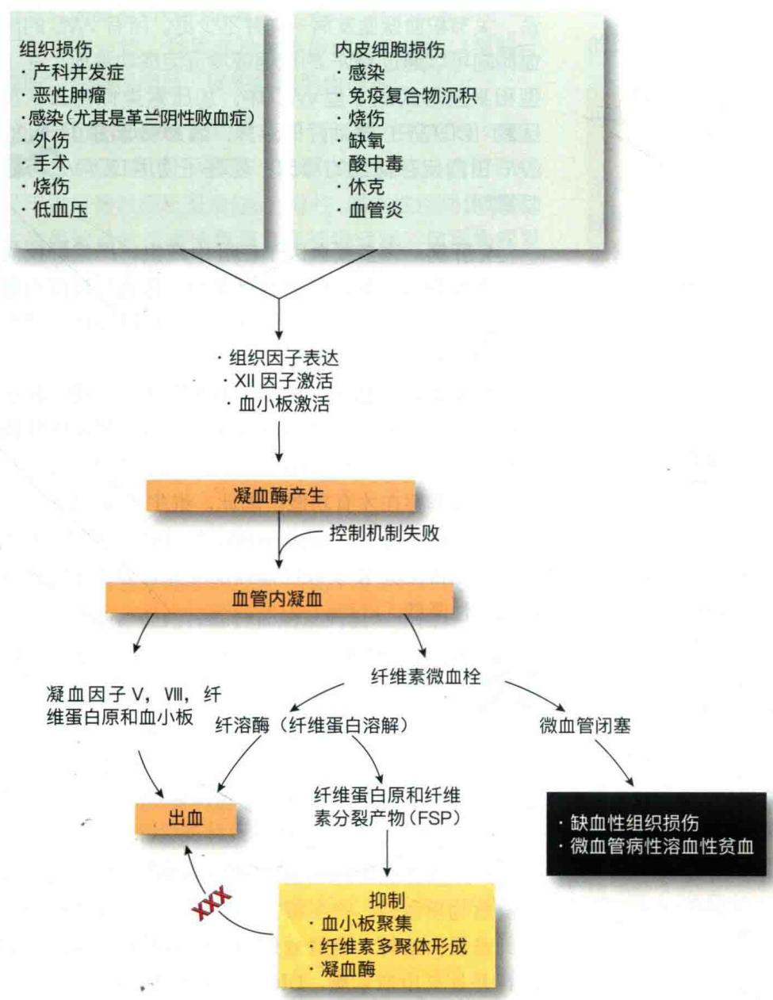 
图20-12 弥散性血管内凝血（DIC）的病理生理学。DIC综合征是由组织损伤，内皮细胞损伤或二者共同诱发的。这些伤害触发细胞表面组织因子的表达增多以及凝血因子（包括XII和V）和血小板的活化。正常控制机制的失败和凝血酶生成导致血管内凝血
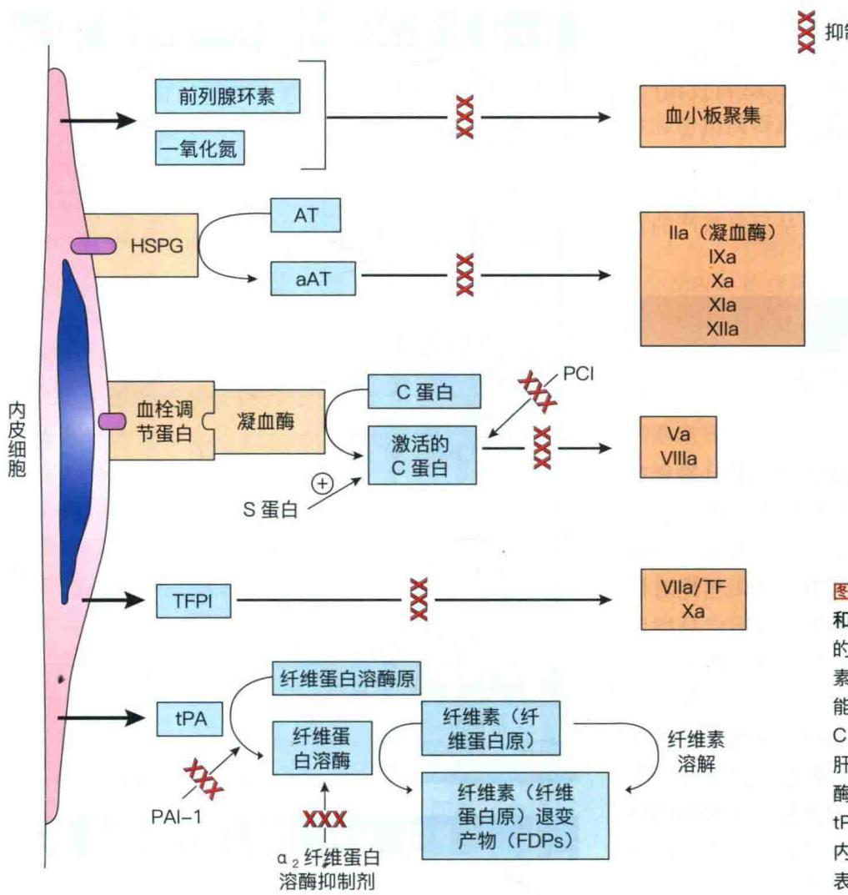 
图20-13 内皮细胞在抗凝、抑制血小板和溶栓的作用。内皮细胞在抑制凝血机制的各种组成中发挥中心作用。硫酸乙酰肝素蛋白多糖增强抗凝血酶（AT）活化的效能达15倍。血栓调节蛋白通过凝血酶刺激C蛋白的活化达30倍。HSPG.硫酸乙酰肝素蛋白多糖；NO.一氧化氮；PAI-I.纤溶酶原激活物抑制剂I；PCI.蛋白C抑制剂；tPA.组织纤维蛋白溶酶原活化剂。箭头，内皮细胞分泌产物；短棍.分子结合至细胞表面；+.增强；XXX.抑制
【临床表现】DIC的症状表现在微血管血栓形成和出血倾向。大脑出血性表现为癫痫发作和昏迷。根据DIC的严重程度，肾的症状范围从轻微氮质血症到暴发性急性肾衰竭。出血素质由脑出血、瘀斑和血尿证实。DIC患者接受： $①$ 肝素抗凝治疗中断血管内凝血周期； $②$ 置换的血小板和凝血因子来控制出血。
# （四）高凝状态可能导致广泛血栓形成
高凝状态是指对健康的人来说不会引起血栓的情况下血栓形成的风险增加。该病症可遗传性或后天获得。血栓疾病升高也有其他情况（见第7章、10章和第11章）。
1. 遗传性高凝状态 遗传性高凝状态是由影响天然抗凝剂机制的基因突变造成的。血栓形成的遗传性倾向，无论其来源，被称为血栓形成倾向。
激活的蛋白C抵抗-V因子莱顿：V因子基因的点突变（V因子Leiden）活化蛋白C使蛋白水解抵抗力改变（图20-13）。抵抗活化的蛋白C是与高凝状态相关的最常见的遗传性疾病，它在静脉血栓患者中的发病率，据报道可高达 $65\%$ 。在美国V因子Leiden突变的频率在白人 $(5\%)$ 最高，黑人 $(0.5\%)$ 和亚洲人 $(1\%)$
低得多。与健康人相比，深静脉血栓形成的风险在杂合子增加了7倍，在纯合子则增加了80倍。
■抗凝血酶缺陷：这一常染色体显性遗传疾病，有不完全外显率，在一般人群中发生率 $0.2\% \sim 0.4\%$ 并可能定量或定性地影响抗凝血酶。在不同的家族，血栓形成的风险（通常静脉）在 $20\% \sim 80\%$ 的范围。
C蛋白和S蛋白缺陷：C蛋白纯合子缺陷导致危及生命的新生儿血栓形成伴暴发性紫癜。一般人群中高达 $0.5\%$ 的人有C蛋白杂合子缺陷，但这些人大多数无症状。C蛋白和S蛋白缺乏的临床表现和ATIII缺乏相似。
■其他导致血液高凝状态的原因：凝血酶原在 $3^{\prime}$ mRNA的非翻译区域也有一个已知的遗传变异体（G20210A）与血栓形成相关。异常高水平的纤维蛋白原，凝血V因子和V因子与血栓形成相关，尽管升高的分子基础尚待阐明。一些异常纤维蛋白原血症也与血栓形成有关。
2. 获得性高凝状态 伴随长期卧床和充血性心力衰竭的静脉淤血促进高凝状态。骨髓增殖性疾病HIT和TTP患者的凝血倾向很有可能是由于血小板活性增加。
3. 抗磷脂抗体综合征 针对几个带负电荷的磷脂的抗体与抗磷脂抗体综合征的发生相关。这种自身免疫性疾病特点：① 动脉和静脉血栓形成；② 自发流产；③ 免疫介导的血小板减少症或贫血。抗磷脂抗体综合征是血栓形成的重要后天性血液病因。假定基质包括血小板活化，内皮细胞活化和膜上凝血因子组成的改变。子宫胎盘血管系统血栓形成可能是反复流产的发病基质。
# 第三节 白细胞
读者参考第二～四节讨论白血细胞的结构和功能。
# 一、非恶性疾病
1. 中性粒细胞减少症 是指中性粒细胞计数绝对值低于 $1800 / \mu l$ ，大多数中性粒细胞减少症的患者有足够的中性粒细胞数量防御微生物。当数量下降到 $1000 / \mu l$ 时，患者容易受到微生物的感染，当绝对值低于 $500 / \mu l$ 则面临严重威胁。粒细胞缺乏症是指边集池和骨髓储备两者耗尽而引起中性粒细胞的完全消失。 
中性粒细胞减少是嗜中性粒细胞生产减少或破坏增加（表20-5）。大多数情况下，中性粒细胞减少症没有症状且不明原因，术语可用慢性良性中性粒细胞减少症。在一些情况下，总粒细胞量是正常的，但过度的中性粒细胞存储在骨髓或边集在血管。辐射或化疗药物通过抑制骨髓细胞的生产干扰中性粒细胞的生产。某些药物，如吩噻嗪类、保泰松、抗甲状腺药物和吲哚美辛，可导致特发性骨髓抑制。病毒感染和饮酒也可抑制骨髓细胞生成。中性粒生产减少也可以发生在罕见的遗传性疾病，包括Kostmann综合征和婴儿遗传性粒细胞缺乏症。HAX基因突变，是调控细胞凋亡的基因突变，已在Kostmann综合征中发现。中性粒细胞弹性蛋白酶基因突变是导致先天性粒细胞缺乏的最常见形式。 
外周中性粒细胞的破坏增加可能发生在：①无法抵抗的感染；②脾功能亢进；③抗体介导的过程，往往涉及药物例如磺胺类、保泰松和吲哚美辛。 
2.中性粒细胞增多症是指中性粒细胞计数绝对值大于 $7000 / \mu 1$ ，中性粒细胞增多有多种原因（表20-6）和表现： $①$ 中性粒细胞从骨髓存储中移出增加； $②$ 外周血边池释放增加； $③$ 刺激骨髓粒细胞的生成。急性感染性中性粒细胞增多症可以很明显，以致被误认为是白血病，特别是慢性粒细胞性白血病（CML），在这种情况下，称为类白血病反应。 
3. 中性粒细胞的定性疾病 是指中性粒细胞伴有功能受损，如果粒细胞功能障碍，尽管粒细胞计数正常，但对感染的易感性可能会增加。
表20-5 中性粒细胞减少症的主要原因产生减少辐射药物导致（长期和短期）病毒感染先天性周期性无效生产巨幼细胞性贫血骨髓异常增生综合征破坏增加新生儿异体免疫自主免疫特发性药物诱导Felty综合征系统性红斑狼疮透析（补体激活诱导）脾隔离周边化增多
感染主要为细菌性免疫性炎症风湿性关节炎风湿热血管炎肿瘤出血药物糖皮质激素类菌落刺激因子锂遗传性CD18缺陷代谢性酸中毒尿毒症痛风甲状腺危象组织坏死梗死外伤烧伤
许多粒细胞罕见的遗传性疾病已如前所述（见第2章），包括慢性肉芽肿性病、髓过氧化物酶缺乏和Chediak-Higashi综合征。后者是一种罕见的常染色体隐性疾病，其特征为白细胞和许多其他细胞存在异常巨溶酶体。Chediak-Higashi综合征的患者饱受复发性细菌和真菌感染。
4. 嗜酸性粒细胞增多症 在过敏反应和恶性肿瘤中出现，嗜酸性粒细胞是对肥大细胞生产的趋化物质的反应或由持续性抗原-抗体复合物诱导，如发生在慢性寄生虫性皮肤病和过敏性疾病中的嗜酸性粒细胞。嗜酸细胞增多症的特发性或与以下因素相关：① 肥大细胞疾病（见下文）；② 霍奇金淋巴瘤（HL），或非霍奇金淋巴瘤（NHL）；③ 骨髓增生性疾病。无论嗜酸细胞增多的基础是什么，组织中嗜酸性粒细胞的积聚常导致坏死，特别是在心肌，在那里它产生心内膜病（见第11章）。神经功能障碍也可能发生。未经治疗的特发性高嗜酸性粒细胞增多症预后差；只有 $10\%$ 的患者能存活3年。随着采用皮质类固醇的激进治疗， $70\%$ 的患者可以生存5年以上，甚至包括心脏受累的患者。
5. 嗜碱性粒细胞增多症 和过敏症及慢性骨髓增生性肿瘤有关，嗜碱性粒细胞增多症（即循环中嗜碱性粒细胞增多）在即时性过敏症最常见，并和慢性骨髓增生性肿瘤（MPNS）相关。 
6. 单核细胞增多症 见于恶性和炎症性疾病，单核细胞增多症的主要原因主要包括血液恶性肿瘤、免疫性和炎性疾病、传染病和实体癌症。外周血单核细胞增多症至少有一半以上是血液恶性肿瘤造成的。在这种情况下，它们形态正常或不成熟或发育不良。单核细胞增多症可能是作为一种补偿机制，常在中性粒细胞减少的状态下发生。外周血单核细胞增多症也可能伴随恶性淋巴瘤、霍奇金淋巴瘤或非霍奇金淋巴瘤。 
7. 肥大细胞增生性疾病释放炎症性介质 肥大细胞疾病是异质性的，包括广谱良性和恶性疾病。认识良性的、非肿瘤性反应性肥大细胞疾病并和恶性综合征区分是重要的。肥大细胞增生症是由炎性介质的释放所致（见第2章），其中包括潮红、皮肤瘙痒和荨麻疹。肝素的分泌也导致鼻咽或胃肠道出血。反应性肥大细胞增生症是一个非恶性过程，在即刻和迟发型超敏反应和引流恶性肿瘤的淋巴结中发生。肥大细胞增生症还见于Waldenstrom巨球蛋白血症、绝经后骨质疏松症的女性骨髓、在MDS和白血病化疗后。
# 二、白血病和骨髓增生异常综合征
恶性白血病细胞既可以起源于骨髓细胞，也可以
起源于淋巴细胞。恶性增生的骨髓细胞都起源于骨髓细胞，表现为MDS或者MPNs。然而，恶性淋巴细胞则可以发生在任何有淋巴细胞的地方。世界卫生组织（WHO）分类（2008修改版）是建立在传统的形态学标准、免疫表型、细胞遗传学和分子异常基础上制定的。
# （一）骨髓增殖性肿瘤是克隆性干细胞疾病
MPNs是克隆性造血干细胞疾病，伴有一系或多系骨髓（粒细胞、红细胞和巨核细胞）无调节异常增生。四种已被大家接受的类型为：①慢性粒细胞性白血病，BCR-ABL1阳性（CML，BCR-ABL1阳性）；②真红细胞增多症（PV）；③原发性骨髓纤维化（PMF）；④原发性血小板增多症。
MPNs典型侵袭 $40\sim 80$ 岁的人。MPNs相对少见，每年的发病率为 $6\sim 10 / 100000$ 。尽管有报道发病与辐射或苯接触密切相关，具体原因仍不清楚。所有亚型的特点包括骨髓增殖伴有效造血、红细胞、粒细胞和血小板数量增加。MPNs常伴有骨髓纤维化。特异性肿瘤基因突变或易位在某些MPNs的诊断中有价值（见下文）。
1. 慢性粒细胞性白血病 慢性粒细胞性白血病（CML）起源于异常的骨髓多能干细胞，导致中性粒细胞明显增多，贯穿整个粒系成熟过程。发现费城染色体，或分子生物学证实BCR/ABL融合基因的存在，是诊断之必需。慢性粒细胞白血病是最常见的MPN，占所有白血病病例的 $15\% \sim 20\%$
【发病机制】大多数患者慢性粒细胞白血病的病因不详。白血病细胞转化的主要代表细胞分化的多潜能干细胞。在 $95\%$ 的慢性粒细胞白血病患者中，可以通过常规的细胞遗传学及荧光原位杂交（FISH）来证明（图20-14），t（9：22）（q34：Q11）相互易位，形成费城染色体。22号染色体上的BCR（断点簇区）基因与9号染色体上的ABL基因融合。BCR/ABL融合基因编码融合蛋白，P210，是一个组成活化酪氨酸激酶中心区，在肿瘤发病机制起作用。这种活化的酪氨酸激酶导致肿瘤蛋白自身磷酸化，并随后活化涉及细胞增殖、分化、存活和黏附的下游信号通路。少数病例含有其他染色体异常。RT-PCR可用于确定在白血病细胞内特异性BCR/ABL融合，以及定量融合产物，这有助于监测患者对治疗的反应。

【病理】慢性粒细胞白血病可分为：慢性期、加速期或急变期。
表20-7 骨髓增殖性肿瘤慢性粒细胞性白血病，BCR-ABL1阳性真红细胞增多症原发性骨髓纤维化原发性血小板增多症临床特征年龄峰值（岁）25 ~ 6040 ~ 6050 ~ 7050 ~ 70脾大90%75%100%30%(轻度)肝大50%40%80%40%(轻度)急性白血病转化80%5% ~ 10%5% ~ 10%2% ~ 5%中位生存率(年)3 ~ 4年135&gt;10骨髓组织病理学全髓增殖
(主要为粒细胞)全髓增殖
(主要为红细胞)全髓增殖
伴纤维化簇状增殖的大巨核细胞M : E比值10:1~50:1≤2:12:1~5:12:1~5:1纤维化&lt;10%15% ~ 20%90% ~ 100%&lt;5%实验室发现血红蛋白轻度贫血&gt;20g/dl轻度贫血轻度贫血RBC形态轻度不等和异形红细胞轻度不等和异形红细胞未成熟红细胞和异形红细胞低色素小细胞粒细胞中度到明显增多
见各阶段成熟粒细胞正常到轻度增多，可以见到一些未成熟的细胞正常到中度增多，可见一些未成熟的白细胞正常到轻度增多血小板正常到中度增多正常到中度增多增多到减少明显增多伴异形血小板基因费城染色体：BCR-ABL 基因重排JAK2 激活突变JAK2 激活突变JAK2 激活突变
注解。其他骨髓增殖性肿瘤包括慢性中性粒细胞白血病、慢性嗜酸性粒细胞白血病、肥大细胞增生症和骨髓增殖性肿瘤，未分类。M：E比值.粒红比值；RBC.红细胞
；B.荧光原位杂交（FISH）显示慢性粒细胞白血病患者，具有t（9;22）（费城染色体）阳性。一个正常的细胞包含两个分离的bcr（22号染色体）和abl（9号染色体）基因（右）。一个白血病细胞具有融合bcrabl信号，残留abl信号和分别来自正常9号染色体和22号染色体（左）的正常的abl和bcr基因.jpg) 
图20-14慢性粒细胞白血病。A.显示费城染色体der（22)；B.荧光原位杂交（FISH）显示慢性粒细胞白血病患者，具有t（9;22）（费城染色体）阳性。一个正常的细胞包含两个分离的bcr（22号染色体）和abl（9号染色体）基因（右）。一个白血病细胞具有融合bcr/abl信号，残留abl信号和分别来自正常9号染色体和22号染色体（左）的正常的abl和bcr基因
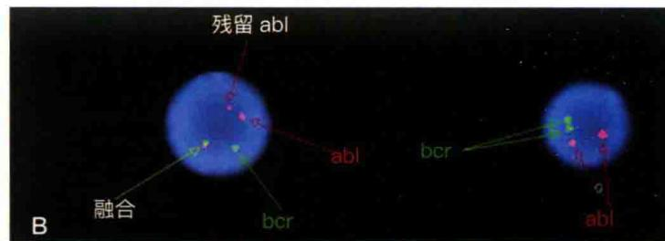
■ 慢性期：CML慢性期的特征是明显的白细胞增多，以成熟中性粒细胞为主。根据定义，母细胞数少于循环血中白细胞的 $10\%$ 。骨髓活检显示细胞增生，全部消失的骨髓腔主要由髓系细胞和它们的前体细胞所替代（图20-15）。
■加速期：表示疾病恶化，通常发生在慢性期后。这可能与以下因素相关：①在血液或骨髓中出现 $10\% \sim 20\%$ 的原粒细胞；②血中嗜碱性粒细胞超过 $20\%$ ；③持续性血小板减少或增多，并对治疗反应迟钝；④脾大；⑤白细胞计数升高，对治疗反应迟钝；⑥伴有其他的染色体异常。
急变期：是发展到急性白血病的最终结果，它的特点：①在骨髓中至少有 $20\%$ 原粒细胞；②原粒细胞髓外增殖（皮肤、淋巴结、脾、骨、脑）；③骨髓活检中
见簇状原粒细胞。急变期预示预后很差。在大多数情况下（ $70\%$ ），白血病细胞在急变期表现髓细胞系的形态和免疫表型；在 $30\%$ 的病例中，它们类似于淋巴母细胞，通常表达B前体细胞免疫表型。在 $80\%$ 病例中，转化到加速期或急变期伴随其他染色体的改变，如额外的费城染色体，8号、19号染色体三体或等臂染色体 $17q$ 。
【临床表现】慢性粒细胞白血病的发病高峰在 $50\sim 60$ 岁，有轻微的男性优势。患者自述疲劳、厌食、体重减轻和由于肝脾大引起的模糊的腹部不适。轻度到中度的贫血、白细胞增多和绝对嗜碱性粒细胞增多。外周血嗜中性粒细胞明显增多，并可见各阶段嗜中性粒细胞。临床病情恶化往往预示病程到达急变期。
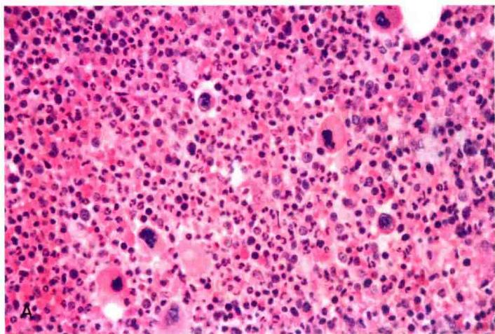 
图20-15 慢性粒细胞白血病。A.因为粒细胞前体细胞、成熟粒细胞和巨核细胞的增多骨髓呈现显著增生；B.同一患者骨髓穿刺涂片显示很多不同发展阶段的粒细胞
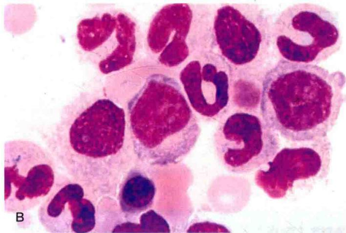
CML是具有明确的细胞遗传学异常的恶性肿瘤并可用特殊的靶向药物治疗的范例。药物伊马替尼阻断在BCR/ABL酪氨酸激酶上ATP结合位点，从而抑制它。应用伊马替尼治疗CML，生存率从 $70\%$ 改善到 $90\%$ 。然而，在ATP结合域带有点突变的亚克隆导致耐药的结果已有越来越多的报道。为了治愈此病，一些CML患者也采用异基因骨髓移植治疗。
2. 真红细胞增多症（PV）是一种骨髓增生性疾病，起源于克隆性的造血干细胞，其特征是不受促红细胞生成素（EPO）调节而自主产生的红细胞。它是一种克隆性增生。在骨髓中，不仅红细胞，而且巨核细胞和粒细胞也增生。

【发病机制】PV是来自一个红系定向造血干细胞的恶性转化。肿瘤性克隆增殖主要发生
在骨髓, 但可能涉及一些髓外部位, 如脾、淋巴结和肝 (髓样化生)。在 PV 患者血清 EPO 水平正常或低下, 不像继发性 (功能性) 的红细胞增多, 其 EPO 水平是升高的。
超过 $95\%$ 的PV患者发生体细胞Janus激酶2（JAK2V617F）突变，该突变偶尔在其他MPNs发生。这一获得性功能突变，发生在造血干细胞，在全系造血细胞都可以发现，其造成造血细胞过度生成生长因子和细胞因子，包括促红细胞生成素。约 $20\%$ 的PV患者还发现细胞遗传学染色体异常，最常见的是8号染色体和（或）9号染色体三体，以及 $20q$ 、 $13q$ 和（或） $9p$ 缺少。然而，在PV患者中没有发现费城染色体或BCR/ABL融合蛋白。

【病理】在 PV 骨髓是全髓增殖（表 20-1）。不
同于慢性粒细胞白血病，其以红细胞前体细胞
增生为主，粒细胞与红细胞比例的小于 $2: 1$ 。PV 患者红细胞的成熟是正常的（幼红细胞），粒细胞系也显示正常成熟。巨核细胞在数量和大小明显增加，并有
簇状聚集的倾向。脾特征性地增大，在红髓和窦内红细胞有明显的蓄积。在病程晚期，在肝、淋巴结和脾中髓样化生是常见的。尽管如果有铁缺乏，血红蛋白过少和小红细胞症可见，外周血涂片以依然显示红细胞正常。铁缺乏症贫血在PV常见，主要是因为储存铁转移到增加的红细胞容量。可能出现高尿酸血症和继发性痛风，二者与快速的细胞更新相关。

【临床表现】在北美国家，PV每年发病率是
(8～10)/100万。诊断的平均年龄是60岁，发病不清楚，并且没有特殊症状，有代表性的是包容量增加。早期发现包括多血症（血管内细胞和脾大。头痛、头晕和视觉问题是大脑和视网管紊乱的结果。或许还可以观察到心绞痛、继发状动脉血流量减慢和由下肢血流缓慢引起的间歇行。20%的患者发生重要器官血栓并发症，包括和心肌梗死。
PV的临床病程往往有一系列的阶段。多血前期以红系细胞的增殖和红细胞容量增加为特征，但不足以诊断PV。后来，当红细胞容量绝对增加，就到达明显多血期阶段。有 $10\%$ 的病例，疾病的发展到多血后期（消耗期），红细胞过度增殖停止，导致红细胞的容量减低和贫血。另外 $10\%$ 的病例进展为多血后期伴骨髓纤维化及髓外造血。多达 $15\%$ 的PV患者发生AML或骨髓异常增生，部分原因可能与用32p治疗或烷化剂治疗有关。
PV患者中位生存率为13年。与疾病本身死亡相关的特别原因包括：血栓形成、出血和AML。重复放疗或者化疗减少了红细胞数量，在多数患者是有效的治疗手段。
3. 原发性骨髓纤维化（PMF）是克隆性骨髓增殖性肿瘤（MPN），骨髓纤维化伴有明显的巨核细胞和粒系细胞增生，疾病充分发展期可出现髓外造血。

【发病机制】像其他骨髓增生性疾病一样，
接触苯或辐射曾经被指与慢性骨髓纤维化、恶性巨核细胞产生的血小板源性生长因子（ $\mathrm{TNF}$ ）和 $\mathrm{TGF}-\beta$ ，都是强大的成纤维细胞的有丝裂原。虽然成纤维细胞不是克隆性干细胞疾病的一部分，但最终，整个骨髓腔被纤维结缔组织取样数 PMF 患者有 JAK2 V617F 突变，这在本病发病机制是很重要的。少数患者发生 MPL 突变，编码血小板生成素（TPO）受体的基因。

【病理】大多数原发性骨髓纤维化患者在诊断
时处于纤维化期，但有 $25\%$ 的患者第一诊断
在细胞期。纤维化期的特征：骨髓增生活跃，以中性粒细胞、巨核细胞增生明显。巨核细胞的成簇排列，具有非典型分叶核。在纤维化期，血中白细胞减少或者白细胞显著增多；髓样前体细胞和有核红细胞（骨髓病性贫血）通常存在。红细胞表现出红细胞畸形和泪滴红细胞（图20-16A）。骨髓中有明显纤维化因而得名（图20-16B）。在细胞期，许多非典型巨核细胞存在。髓外造血导致脾大、肝大和淋巴结肿大，并且可能在其他器官。

【临床表现】特发性骨髓纤维化每年发病率估
计在（0.5～1.5）/100000。它是一种老年疾病，发病高峰在70岁。1/4的患者在诊断时没有血小板体检时发现脾大、检查见泪滴状红细胞或血小板增多而发现本病。早期的临床症状是非特异性的，如疲劳、低热、盗汗和体重减轻。血小板功能可能与患者显示血小板聚集增多和血栓形成或血小板减少低伴出血体质。大约 $20\%$ 的患者向AML转化率（表-7）。
4. 原发性血小板增多症 是一种罕见的造血干细胞肿瘤性疾病，特征是巨核细胞无控制地增生。血液
循环中血小板明显升高（ $>600000 / \mu l$ ），伴有反复发作的血栓形成和出血。这种疾病在中年人发生，男性较女性稍多见（表20-7）。

【发病机制】原发性血小板增多症是一种起
源于单个造血干细胞恶性转化的克隆性疾
病，主要发生在巨核细胞系，但并不唯一。本病的特点是明显的巨核细胞增殖，产生15倍或更多的血小板。 $50\%$ 的患者患有JAK2V617F突变或其他功能类似的异常。

【病理】诊断特发性血小板增多症的需要排除其
他慢性MPNs。血小板功能异常在原发性血小
板增多症是常见的。反复发作的动脉或静脉血栓形成是由于严重的血小板增多，出血反映血小板功能缺陷。骨髓增生正常或者明显活跃，脂肪细胞减少和巨核细胞增多，簇状或片状排列。1/3病例骨髓中网状纤维增加，但明显的纤维化是罕见的。储存铁正常或低下。

【临床表现】原发性血小板增多症的临床过程
是漫长的，其中位生存率超过10年。在未经
治疗的病例中，大动脉和静脉血栓是常见的，特别是在腿、心、小肠和肾。出血通常是温和的、不致命的。
高达 $5\%$ 的患者会并发AML。该病的治疗采用血小板去除和骨髓抑制性化疗。
# （二）骨髓增生异常综合征是导致无效造血的克隆
# 性疾病
MDS的特征是外周血细胞减少，骨髓衰竭和系或多系髓系细胞发育异常。本病在老年人最常见的。由于无效造血和骨髓细胞凋亡增加的原因，外周血中细胞缺乏和骨髓内显著增生之间有偏差。MDS亚型的分类是复杂的，超出了本章的范围。所有亚型表现的难治性贫血或其他血细胞减少。与上面讨论的MPNS不同，MDS不显示红细胞、白细胞或血小板增多。细
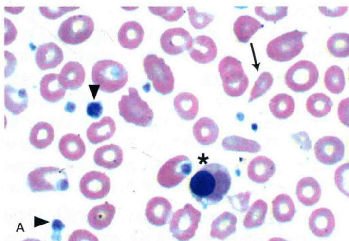 
图20-16 慢性特发性骨髓纤维化。A.外周血涂片显示红细胞大小不等（不同大小的红细胞），红细胞畸形，有泪滴红细胞（箭头）和有核红细胞（星号），也可见巨大血小板（无杆箭头）；B.骨髓切片显示骨髓胶原纤维增生、硬化和许多异常的巨核细胞
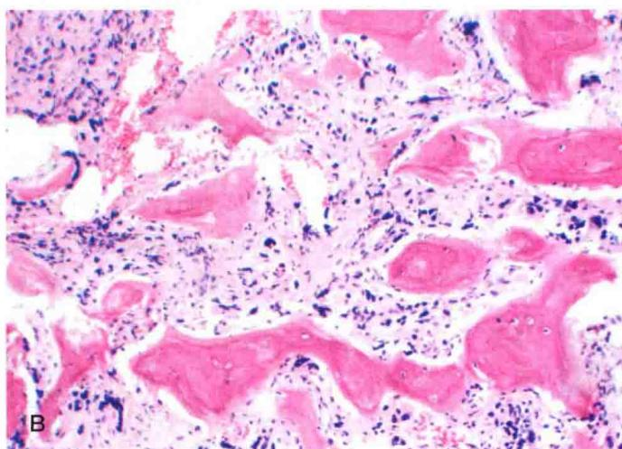
胞遗传学和分子生物学的研究是诊断和判定MDS预后所必不可少的。在 $50\%$ 的病例中确定有克隆性异常，染色体异常越多，预后越差。MDS常表现与外周血细胞减少相关的症状：贫血引起的虚弱，嗜中性粒细胞减少致反复感染和血小板减少症导致出血。MDS进展到AML（即从骨髓衰竭进展为增殖状态）发生在 $30\% \sim 40\%$ 的患者，一般与遗传不稳定性相关（白血病前期综合征）。一些低级别MDS的亚型有一个较稳定的临床过程，进展到AML的概率低。
# （三）急性粒细胞白血病是骨髓原始细胞的一种克隆性增生，开始在骨髓，随后发生在血液和组织中
诊断急性粒细胞白血病需要骨髓中含有超过 $20\%$ 的原始细胞。在所有的急性白血病中， $70\%$ 是急性粒细胞白血病。对于具有细胞遗传学异常的AML类型，以上诊断标准被放宽。该类型AML的诊断不依赖原始细胞计数。原始细胞计数达不到诊断标准的被归入MDS或MPN分类中。AML被分为6个不同型（表20-8)。在所有的急性白血病中， $70\%$ 是急性粒细胞白血病。剩下的是淋巴母细胞性白血病（在下面恶性淋巴瘤中讨论）。AML多见于成人，发病时平均年龄60岁。

【发病机制】大多数AML患者病因不明，但在少数病例，与辐射、细胞毒化学治疗或接
触苯有关。例如，在日本广岛和长崎原子弹爆炸后（见第8章），AML患者数量增加；吸烟导致AML的风险增加一倍。

【病理】AML中恶性原始细胞白血病在骨髓中
检测到，但在很多情况下是在血液检测到。典型的恶性肿瘤细胞塞进骨髓中取代正常的造血细胞（图20-17）。骨髓原始细胞为中等到大的细胞，有圆形或稍不规则的核。根据不同的AML亚型，Auer小体可能存在于细胞质中（图20-18）。这些包涵体是髓系特有的，可以除外淋巴母细胞性白血病的诊断。
应用流式细胞仪和细胞遗传学研究免疫表型分型AML正确分类所必不可少的。髓系抗原经常表达有CD13，CD33，CD34和CD117（c-kit）。AML伴巨核细胞分化可以表达血小板/巨核细胞标记CD41和CD61（血小板糖蛋白GPⅡb/Ⅲa复合物）。虽然细胞化学标记，包括髓过氧化物酶、苏丹黑和非特异性酯酶（NSE）在过去是诊断AML的关键，但流式细胞仪鉴定是目前诊断和分型的首选。

【临床表现】与AML相关的主要问题是反映骨
髓中未成熟髓细胞逐步积累，缺乏进一步分化成熟的潜能，导致粒细胞减少、血小板减少和贫血。
虽然白血病原始细胞的复制速度低于正常造血前体细胞，其凋亡的频率也低于正常。异常的白血病细
胞扩大范围侵犯骨髓抑制正常造血。感染，特别是条件致病菌（例如，真菌）是常见的，如皮肤出血（瘀点和瘀斑）和内脏浆膜出血。
未经治疗的AML预后令人沮丧。化疗会导致超过 $50\%$ 的患者缓解，但总的5年生存率低于 $30\%$ 。骨髓移植是一种治疗高危型和复发型AML的常见方法。AML的分类是复杂的，对临床和治疗很重要，但超出了本文的范围，这里只是简单总结。当前分类方案是以WHO分类系统为基础的（表20-8）。
表20-8 WHO急性粒细胞白血病（AML）肿瘤分类AML伴重现性遗传学异常AML伴t(8;21)(q22;q22);RUNX1-RUNX1T1AML伴异常骨髓嗜酸细胞inv(16)(p13q22)或t(16;16)(p13;q22);CBFβ/MYH11AML伴t(15;17)(q22;q12)(PML/RARα和变形(M3)AML伴t((9;11)(p22;q23)MLLT3-MLLAML伴t(6;9)(p23;q34);DEK-NUP214AML伴inv(3)(q21q24.2)或t(3;3)(q21;126.2);RPN1-EVI1AML(原巨核细胞性)伴t(1;22)(p13;q13);RBM15-MKL1AML伴骨髓增生异常相关变化AML由先前MDS或MDS/MPNs演化而来AML先前没有MDS病史的治疗相关性髓系肿瘤烷化剂相关的拓扑异构酶II抑制剂相关的(一些可能是淋巴的)其他类型AML不能分类AML微分化型(M0)AML无成熟型(M1)AML有成熟型(M2)AML(M4)急性粒-单核细胞白血病(M5)急性红白血病(M6)急性巨核母细胞白血病(M7)髓系肉瘤Down综合征相关骨髓增殖症
PML. 前髓细胞性白血病；RAR. 视黄酸受体；WHO. 世界卫生组织
# 选择性急性粒细胞白血病亚型
急性粒细胞白血病伴复发性基因异常：有很多种基因异常与AML分类相关（表20-8）。AML伴t（15；17）（q22;q12）也称急性早幼粒细胞白血病（APL），主要影响中年患者，占所有AML的 $5\% \sim 10\%$ 。APL定义染色体异位所涉及的是在染色体15q22上的早幼粒细胞白血病1染色体（PML1）基因和在染
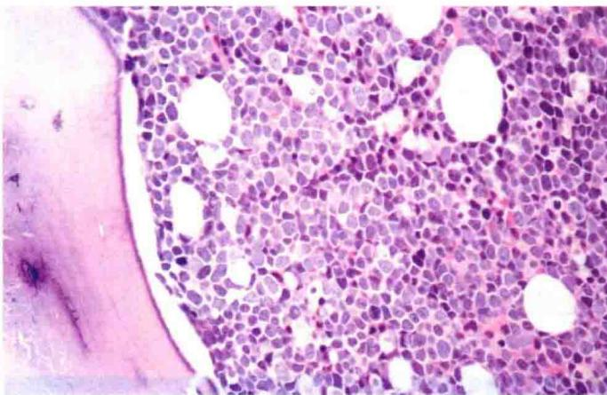 
图20-17急性髓细胞性白血病。骨髓切片因为原始粒细胞破坏正常骨髓结构，显示增殖活跃
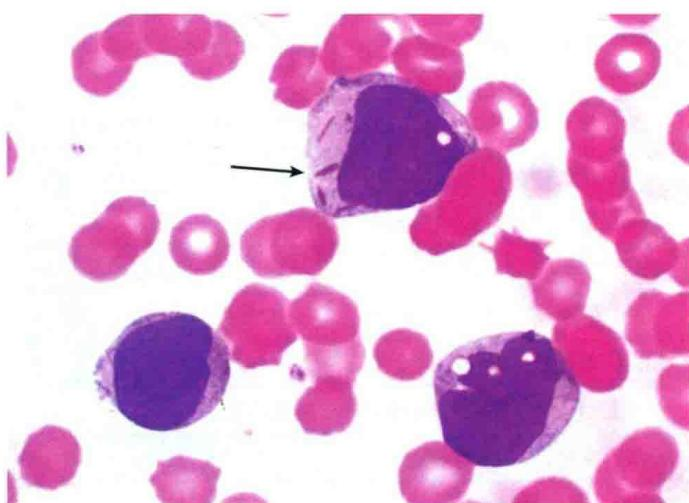 
图20-18 急性早幼粒细胞白血病。奥氏小体明显可见（箭头）
色体17q12上的视黄酸受体（RAR）基因。染色体异位的结果导致PML/RARα融合基因编码一个功能性视黄酸受体。在APL，骨髓腔被肿瘤细胞填充，肿瘤细胞具有早幼粒细胞的形态学特征。Auer小体可能丰富多见的。白血病细胞对髓过氧化物酶和苏丹黑反应强烈。衰老的白血病细胞脱颗粒，激活凝血链反应，常导致弥散性血管内凝血（DIC）。APL的预后优于所有其他所有类型AMLs。使用维甲酸衍生物治疗诱导肿瘤细胞的成熟并能防止脱颗粒和DIC的发生。
治疗相关的髓系肿瘤：细胞毒性化疗或放射治疗对已有的恶性肿瘤可诱发突变，导致治疗后几年内发生淋巴造血系统肿瘤。属于此分类的是治疗相关性AML，MDS和骨髓增生异常肿瘤/MPNs。烷化剂和辐射常引起骨髓增生异常并经过 $5\sim 10$ 年后续发展到 $\mathrm{AML}_{\text{一}}$ 相比较，拓扑异构酶Ⅱ抑制剂可导致明确的AML，潜伏期为 $1\sim 5$ 年。
急性髓细胞性白血病，非特定分类：此组白血病不符合任何其他亚型的AML的特征，因此根据原来的法国-美国-英国（FAB）分类法归入WHO分类表（表20-8）。
# 第四节 淋巴系统疾病
# 一、淋巴增殖系统良性疾病
# （一）淋巴细胞增多意味着外周血淋巴细胞计数的升高
正常成人淋巴细胞计数的上限是 $4000 / \mu l$ ，而儿童是 $7000 / \mu l$ ，婴儿是 $9000 / \mu l$ 。淋巴细胞在良性淋巴组织增生中往往表现为反应性的，形态上有异质多样性，但也可以出现不典型淋巴细胞（变异性淋巴细胞）（图20-19）。淋巴细胞增多是病毒感染的特征性表现，特别是在传染性单核细胞增多症。此时大多数淋巴细胞是T细胞系列（ $\mathrm{CD8^{+}}$ ，细胞毒性/抑制细胞）。其他病毒的感染也可产生类似表现（如巨细胞病毒）。还有其他少见原因包括百日咳、慢性细菌感染，如结核及布鲁斯菌病、压力和吸烟。
# （二）淋巴细胞减少通常反映在T辅助细胞的疾病中
外周血中淋巴细胞减少定义为成人血中淋巴细胞少于 $1500 / \mu l$ ，儿童血中淋巴细胞少于 $3000 / \mu l$ 。因为血中主要淋巴细胞是T辅助细胞（ $\mathrm{CD4^{+}}$ ），所以淋巴细胞减少通常为T辅助细胞的减少。淋巴细胞减少通常见于：①先天性和获得性免疫缺陷疾病以及一些淋巴瘤（如霍奇金淋巴瘤）；②淋巴细胞破坏性增加的疾病（通常为药物或者病毒感染所致）；③淋巴细胞减少通常伴有小肠淋巴管的破坏。
# （三）淋巴结反应性增生是对感染、炎症及肿瘤的反应应答
淋巴结可以出现所有细胞成分的增生，或者是出现B细胞、T细胞和单核吞噬细胞不同比例地混合增生，以应答不同类型的感染、炎症和肿瘤（图20-20）。淋巴结的组织病理形态和淋巴结增大的程度反映了：①患者的年龄（儿童较成人趋于产生更多的免疫反应性）；②患者的自身免疫能力；③传染源或者炎症反应类型。
急性化脓性或坏死性淋巴结炎发生于淋巴结引流区的急性细菌性感染。化脓性淋巴结快速增大是由于水肿和充血，淋巴结质软是由于淋巴结被膜的膨胀。显微镜下，突出表现为淋巴滤泡增生，多核白细胞浸润淋巴窦及间质。淋巴结病的解剖位置经常为诊断提供线索，因为感染肿大的淋巴结一般回流区域内的感染，全身淋巴结病可能为全身感染、甲状腺功能亢进、药物反应和胶原血管病。
1. 滤泡增生 二级淋巴滤泡增生（生发中心）和髓索内浆细胞增多表示B淋巴细胞的免疫反应性。在非特异性反应性滤泡增生，滤泡增生主要发生在淋巴结皮质（图20-20，图20-21）。淋巴滤泡圆形或不规则形，可以出现融合。滤泡内的反应B细胞从小的裂
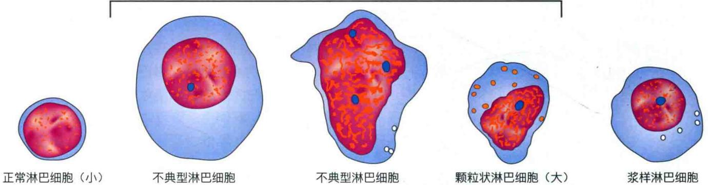 
多样的淋巴细胞 
图20-19 淋巴细胞形态学。“多样的淋巴细胞”包括不典型淋巴细胞和大的颗粒状淋巴细胞。不典型淋巴细胞体积大，具有深蓝到灰白色胞质，它们通常见于良性反应性增生过程。大颗粒淋巴细胞为中等到大细胞，具有粉染细胞质颗粒。它们是抑制T细胞，一些具有自然杀伤（NK）功能，可以在良性和恶性疾病时增多。浆样淋巴细胞具有丰富的蓝色胞质，见于一些反应性疾病中
核细胞到大的免疫母细胞，众多的核分裂象反映出B淋巴细胞快速的增生活性，散在的良性巨噬细胞富于淡染胞质，细胞质内吞噬的有细胞核及细胞质的碎片，呈现良性反应性滤泡特征性的“星空”现象。正常的小B淋巴细胞界线清楚地包绕着淋巴滤泡外套层，十分明显地将淋巴滤泡于滤泡间区区分开。尽管病毒、药物或者炎症血常被怀疑为病因，非特异性反应淋巴滤泡增生的原因通常不清楚。
反应性淋巴结病（局部的或者全身性的）引起的淋巴滤泡增生常见于风湿性关节炎，也见于HIV感染。
2. 滤泡间区的增生 淋巴结深部皮质区或者副皮质区的增生（滤泡间区或者弥漫性增生）特征性表现为T淋巴细胞的免疫反应。
非特异性滤泡间区增生（图20-20）通常由于病毒感染所致的免疫反应。尽管确切的原因通常不能确定，但病情能快速解除：淋巴结滤泡间区增生通常见于病毒感染性疾病，包括传染性单核细胞增多症、水痘-疱疹带状病毒感染、麻疹和巨细胞病毒感染所致的淋巴结炎。系统性红斑狼疮通常伴有淋巴结肿大，此时淋巴结特征性表现为滤泡间区的增生，伴有明显的免疫母细胞、浆细胞和坏死。小动脉炎，动脉管壁的纤维素性坏死，也常被发现。
3. 淋巴结反应性增生的混合型模式 一些感染疾病会出现淋巴结增生混合性的模式，即滤泡和滤泡间区窦增生为其特点。如弓形虫病，既可以看到明显的淋巴滤泡增生，又可以见到淋巴滤泡间区的上皮样肉芽肿反应（图20-10）。
# （四）窦组织细胞增生表示巨噬细胞增多
窦组织细胞增生症表示淋巴结被膜下窦和梁间窦内巨噬细胞（组织细胞）增多（图20-20）。窦组织细胞起源于血中的单核细胞，通常在淋巴结内调节引流癌细胞，有时也引流炎症性和感染性病原菌。巨噬细胞胞质内的吞噬碎片有助于区分窦组织细胞的来源。例如：肺碳尘常见于纵隔淋巴结内的巨噬细胞。当患
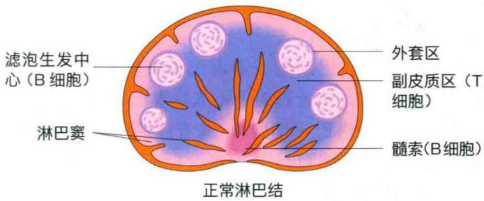
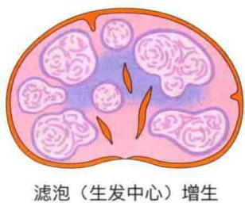
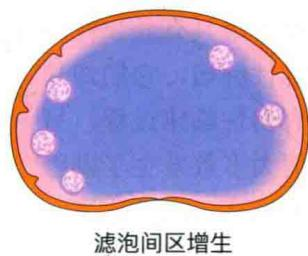
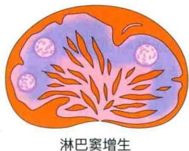
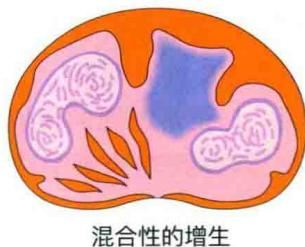
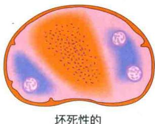 
图20-20 淋巴结反应性肿大模式图。淋巴结反应性增生主要类型与正常淋巴结结构的对比。滤泡性增生，表现为淋巴滤泡数量增多和不规则形，以B细胞免疫反应为特征。滤泡间区增生，表现为滤泡间区的扩大，以T细胞免疫反应为特征。淋巴窦增生模式，以淋巴窦扩张为代表，窦内温和的巨噬细胞增生，此模式可见于窦内单核-巨噬细胞系统反应性增生。混合性模式，即淋巴滤泡，滤泡间区及淋巴窦均增生，常见于多种类型的复杂的免疫反应。坏死性淋巴结炎，淋巴结内可见可变的坏死灶，伴有或不伴有中性粒细胞的出现。簇状聚集的巨噬细胞及偶见的多核巨细胞是肉芽肿炎性反应模式的特点
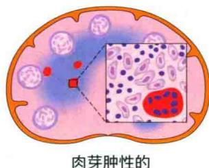
有自身免疫性溶血性贫血时巨噬细胞内可见到红细胞和含铁血黄色。
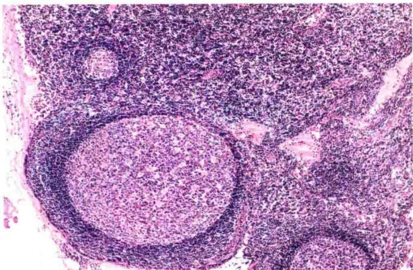 
图20-21 淋巴结反应性滤泡增生。切片中显示增生的淋巴结内明显增大的滤泡（生发中心）内含有很多具有淡染胞质的巨噬细胞
# 二、恶性淋巴瘤
淋巴瘤是淋巴细胞或者淋巴母细胞的恶性增生。由于起源不同，或者起源于不成熟淋巴细胞（起源于前体细胞，即淋巴母细胞），或者起源于成熟淋巴细胞（起源于效应细胞），B细胞、T细胞和自然杀伤细胞（NK细胞）被进一步分类。恶性淋巴瘤是人类肿瘤中最具有异质性的肿瘤之一。尽管所有淋巴瘤都是恶性肿瘤，它们却具有多种多样的临床表现，一些具有惰性临床过程，另一些却表现为侵袭性行为。淋巴瘤大多数发生于淋巴结，但也可发生于一些结外组织和器官（如消化道、甲状腺、肝、皮肤、肺、脑及生殖腺）。当淋巴瘤累及外周血或者骨髓时，就被称为白血病或者外周性病变。在被粗分为B细胞型、T细胞型和NK细胞型以后，淋巴瘤根据肿瘤细胞的假定来源、与正常细胞的相似程度、免疫表型、分子/基因改变、临床特点和形态学特点等被进一步细分类（图20-22，图20-23）。另外，区别霍奇金淋巴瘤和非霍奇金淋巴瘤的分类继续被应用。基于以上所有参数综合考虑的WHO淋巴瘤分类方法现在统一被临床医生和病理医生所应用。公认的B细胞淋巴瘤、T细胞淋巴瘤及NK细胞淋巴瘤的主要分型见表20-9，表20-10。我们挑选部分类型在下文中讨论。
# （一）前体B细胞急性淋巴母细胞白血病/淋巴瘤是一种非成熟淋巴细胞的恶性肿瘤
前体B细胞急性淋巴母细胞白血病（B-ALL）和B细胞淋巴母细胞淋巴瘤（B-LBL）中的恶性淋巴细胞是一种非成熟淋巴细胞（前体细胞），即淋巴母细胞。
不同的病名意味着不同的肿瘤发生部位。前者发生在骨髓或者外周血，后者则发生在髓外组织（即淋巴结）。

【发病机制】前体B细胞急性淋巴母细胞性白血病（B-ALL）是儿童最常见白血病类型。
尽管此病可以发生在所有年龄段，但多于 $75\%$ 的病例发生在低于6岁的儿童。不同于前体T细胞急性淋巴母细胞性白血病（T-ALL），在临床表现上，B-ALL表现为白血病多于淋巴瘤。染色体数量和结构异常发生在大多数B细胞急性淋巴母细胞性白血病（B-ALL）病例中。染色体异位常见，包括9号和22号染色体异位（基因型BCR/ABL融合，费城染色体），染色体11号在混合性白血病（MLL）基因位点（11q23）。含有增多染色体（超二倍体）的患者比含有少于正常染色体数量（低二倍体）的患者具有比较好的预后。
【病理】恶性淋巴母细胞在骨髓中至少占 $20\%$ 细胞总量，细胞小到中等大小，核浆比例升高，核染色质细腻，核仁不明显（图20-24）。B-ALL免疫表型反映出B细胞分化成熟的不同阶段（图20-22），其表达B细胞最早期分化阶段抗原：CD10，CD19和TdT，而B细胞肿瘤表面抗原在前驱白血病中不表达。
【临床表现】B细胞急性淋巴母细胞性白血病（B-ALL）细胞取代正常骨髓成分导致贫血、血小板减少症和嗜中性白细胞减少症，巨脾和中枢神经症状常见。白血病细胞在骨髓中快速生长导致骨痛和关节痛。儿童B细胞急性淋巴母细胞性白血病（B-ALL）化疗后具有很好的预后，完全缓解率达到 $90\%$ 以上。然而，当患者小于1岁或大于12岁时；具有多种染色体异位，如t(9;22)，t(1;19)和t(4;11)；及具有混合性白血病基因位点都提示预后不良。
# （二）前体T细胞急性淋巴母细胞性白血病/淋巴瘤是未成熟T细胞的肿瘤
前体T细胞急性淋巴母细胞性白血病（T-ALL）和T细胞淋巴母细胞性淋巴瘤（T-LBL）都是未成熟T细胞肿瘤，选择应用术语白血病还是淋巴瘤带有主观性，主要考量与在B-ALL中的描述相似。

【发病机制】前躯T细胞急性淋巴母细胞性白血病（T-ALL）可见于任何年龄组，T-ALL
大约占所有儿童ALL的 $15\%$ ，成人ALL的 $25\%$ 。青春期的年轻人较低龄儿童易患病，男性较女性多见。相比较B细胞急性淋巴母细胞性白血病，T-ALL更可能具有淋巴瘤表现，并伴有纵隔淋巴结肿大，特别是处于青春期的男性患者。基因编码的T细胞受体链与转录基因经常参与染色体异位，破坏转录调节。

【病理】T淋巴母细胞形态学表现与B淋巴母细胞相似（图20-24）。T-ALL抗原表达反映了
正常T细胞在骨髓和胸腺的分化和成熟，像B-ALL那样，T-ALL同样表达TDT阳性（图20-23）。

【临床表现】血液和骨髓是T-ALL最常见累及部位，白细胞计数通常增高，肿瘤细胞经靶周围淋巴结、脑、性腺、脾和肝。在儿童，T-ALL较B-ALL预后更差，但在成人，则预后稍逊B-ALL。
# （三）成熟（外周）B细胞淋巴瘤是西方国家最常见类型的淋巴瘤
成熟B细胞淋巴瘤起源于外周B细胞的单克隆增生。因为B细胞从幼稚B细胞到成熟浆细胞需要经历很多阶段分化成熟，在整个过程中的每一个阶段都可以发生淋巴瘤（图20-22）。
【流行病学】在全世界范围内占超过 $90\%$ 以上的淋巴瘤是成熟B细胞淋巴瘤，在发达中国家更为常见。在美国，B细胞淋巴瘤的发病率为26/100000人。不同类型的B细胞淋巴瘤在世界各地的发生率各不相同，例如，伯基特淋巴瘤（BL）是在赤道非洲（在那里最常见儿童恶性肿瘤）的地方性疾病，而在美国和西方国家只占全部淋巴瘤的 $1\% \sim 2\%$ 。在世界范围内，不计霍奇金淋巴瘤和浆细胞骨髓瘤（PCM）的话，最常见的淋巴瘤是滤泡性淋巴瘤（FL）和弥漫大B细胞淋巴瘤（表20-11）。除了纵隔B细胞细胞淋巴瘤和伯基特淋巴瘤，大多数成熟B细胞淋巴瘤发病年龄在60岁和70岁；而除了伯基特淋巴瘤和大B细胞淋巴瘤以外，外周B细胞淋巴瘤发生在儿童是明显不多见的。
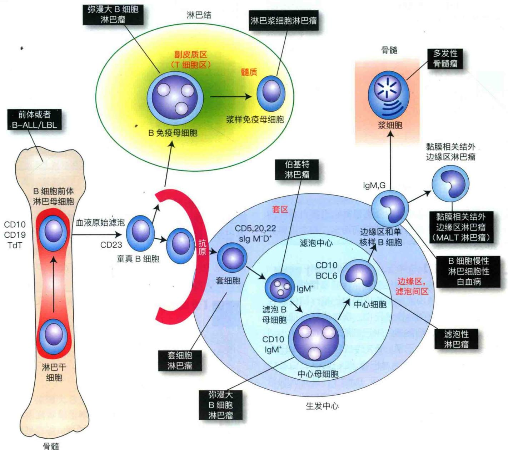 
图20-22B细胞分化途径及所对应的B细胞淋巴瘤。随着经历原始阶段过后，B细胞成熟进入童真B细胞阶段。生发中心免疫应答代表免疫球蛋白可变区基因突变重要的转化，免疫球蛋白重链转换和分化到浆细胞和记忆细胞。抗原决定簇（CD）标记物有对应显示。B免疫母细胞和浆样免疫母细胞分别存在于T细胞丰富的副皮质区和髓质区。边缘区B细胞归巢黏膜相关淋巴组织（MALT）部位及骨髓。肿瘤性转化发生在B细胞分化的各个阶段。ALL/LBL.急性淋巴性白血病/淋巴瘤；B-CLL.B细胞慢性淋巴细胞白血病；Ig.免疫球蛋白
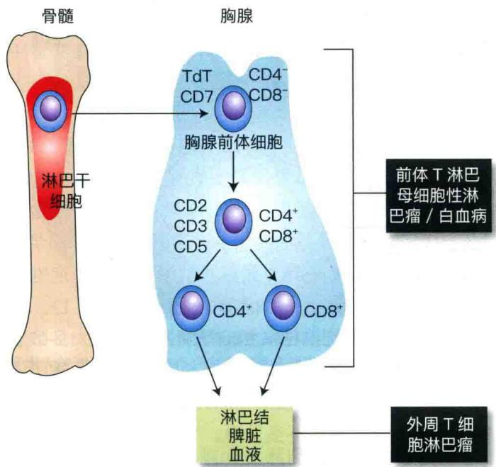 
图20-23 T细胞分化发展路径及对应的淋巴瘤。CD.抗原决定簇；TdT.末端脱氧核苷酸转移酶

【发病机制】大多数外周B细胞淋巴瘤发病
没有明显的原因。然而，免疫系统的损伤和
某些传染源可以引起恶性淋巴瘤。导致B细胞淋巴瘤的危险因素包括：①免疫系统异常，像免疫缺陷（如艾滋病、医源性免疫抑制）；②自身免疫疾病（如桥本氏甲状腺炎、Sjögren综合征）；③某些传染源（例如EB病毒、丙型肝炎、幽门螺杆菌和衣原体）；④环境暴露（可能与除草剂和农药有关）。
如上所述，目前淋巴瘤分类根据它们各自相应的正常淋巴细胞的发展和分化阶段而命名，相关内容见图20-22。

【临床表现】总体上，成熟B细胞淋巴瘤由小
淋巴细胞构成的淋巴瘤通常伴随着惰性临床过
程，反之，大多数由大细胞构成的淋巴瘤伴随侵袭性病程，如果不治疗则会快速死亡。惰性成熟B细胞淋巴瘤的例子包括B细胞慢性淋巴细胞性白血病/小细胞淋巴瘤和滤泡性淋巴瘤；侵袭性成熟B细胞淋巴瘤的例子包括弥漫大B细胞淋巴瘤（DLBCL）、伯基特淋巴瘤（BL）和套细胞淋巴瘤（MCL）。具有讽刺意味的是，尽管惰性淋巴瘤伴随较长的临床过程，它们通常不能治愈。相反，侵袭性淋巴瘤虽然进展迅速，但通过常规治疗后，很多可以治愈。从临床角度看，不是所有淋巴瘤都可以毫不含糊地归为以上两类中的一类。例如，胃黏膜相关淋巴瘤（MALT）与幽门螺杆菌感染有关，是惰性淋巴瘤，但通过局部放疗和抗生素治疗有时可以治愈。
表 20-9 WHO B 细胞肿瘤组织学分类 
前体B细胞肿瘤前体B淋巴母细胞型白血病/淋巴瘤成熟B细胞肿瘤慢性淋巴细胞性白血病/小淋巴细胞淋巴瘤B细胞幼淋巴细胞白血病淋巴浆细胞淋巴瘤脾脏边缘区淋巴瘤毛细胞白血病浆细胞骨髓瘤意义未定的单克隆γ病孤立性骨浆细胞瘤骨外浆细胞瘤原发性淀粉样变性重链病结外黏膜相关边缘区B细胞淋巴瘤（MALT）结内边缘区淋巴瘤滤泡性淋巴瘤套细胞淋巴瘤纵隔（胸腺）大B细胞淋巴瘤血管内大B细胞淋巴瘤原发性渗出性淋巴瘤Burkitt 淋巴瘤
WHO.世界卫生组织
1. 套细胞淋巴瘤 套细胞淋巴瘤（MCL）是GD5阳性的成熟B细胞淋巴瘤，其由单一的小到中等大小淋巴细胞组成，细胞核形不规则，像围绕在滤泡中心外套层的正常淋巴细胞。此型肿瘤占所有B细胞淋巴瘤不足 $10\%$ ，成人发病，中位年龄为60岁，男性是女性患病人数的2倍。

【发病机制】最主要的基因改变是t（11；
14) (q13; q32) 染色体相互异位, 这几
乎发生在所有套细胞淋巴瘤病例中，并导致Bcl-1（PRAD1）基因过表达，其编码cyclinD1，最终导致活化转录因子，促进G1期到S期细胞周期进程（具体细节见第5章）。

【病理】套细胞淋巴瘤累及淋巴结表现为弥漫
性或模糊的结节性淋巴细胞浸润，肿瘤细胞为
小到中等大小的 B 细胞, 细胞核形不规则。此类细胞可能与慢性淋巴细胞性白血病/小细胞性淋巴瘤（见下文）细胞无法鉴别。套细胞淋巴瘤的特点是肿瘤细胞惊人的一致, 在其他 B 细胞淋巴瘤中见到大的转化
细胞或中心母细胞，在套细胞淋巴瘤中见不到或极少。散在的上皮样巨噬细胞和小血管内皮透明样变是MCL典型表现。MCL表达B细胞系抗体CD19和CD20，并有轻链限制性。重要的，MCL表达cyclinD1阳性，这可以用以鉴别其他惰性小B细胞淋巴瘤。
表 20-10 WHO T 细胞和 HK 细胞肿瘤组织学分类 
前驱T细胞肿瘤前驱T淋巴母细胞性白血病/淋巴瘤成熟T细胞肿瘤白血病/弥散性的T细胞幼淋巴细胞性白血病T细胞大颗粒淋巴细胞性白血病侵袭性NK细胞白血病成人T细胞白血病皮肤蕈样真菌病Sézary综合征原发性皮肤间变大细胞淋巴瘤大细胞淋巴瘤淋巴瘤样丘疹病其他淋巴结外的结外NK/T细胞淋巴瘤，鼻型肠病型T细胞淋巴瘤肝脾T细胞淋巴瘤皮下脂膜炎样T细胞淋巴瘤淋巴结的血管免疫母细胞性T细胞淋巴瘤外周T细胞淋巴瘤，非特指型间变大细胞淋巴瘤未明系列和分化阶段的肿瘤母细胞性NK细胞淋巴瘤
NK.自然杀伤；WHO.世界卫生组织

【临床表现】多数套细胞淋巴瘤患者是高分期，患者，1/3患者诊断时外周血已受累。尽管形式是小细胞性淋巴瘤，但套细胞淋巴瘤临床表现较急性，通过标准的化疗被认为不能治愈此病。
2.弥漫大B细胞淋巴瘤弥漫大B细胞淋巴瘤是一组具有异质性的侵袭性肿瘤，但具有潜在的治愈可能性。它可能是新形成的肿瘤，或者是从一种惰性淋巴瘤转化而来的B细胞淋巴瘤。尽管此病发生在 $60\sim 70$ 岁最常见，但可以在任何年龄发病。DLBCL最常累及淋巴结，也经常出现在结外组织，如胃肠道就是常见结外发生部位。
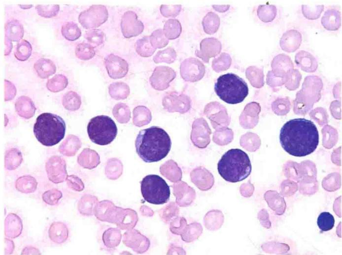 
图20-24急性淋巴母细胞性白血病。淋巴母细胞在外周血中具有锯齿状不规则细胞核，染色质细腻，核仁可见，嗜碱性胞质多少不等
表20-11 B细胞淋巴瘤及T-/NK细胞淋巴瘤的发生率诊断总病例 (%)弥漫大B细胞淋巴瘤30.6滤泡性淋巴瘤22.1黏膜相关淋巴组织结外边缘区淋巴瘤7.6成熟T细胞淋巴瘤（除外间变大细胞淋巴瘤）7.6慢性淋巴细胞性白血病/小淋巴细胞性淋巴瘤6.7套细胞淋巴瘤6.0纵隔大B细胞淋巴瘤2.4间变大细胞淋巴瘤2.4伯基特淋巴瘤2.5淋巴结内边缘区淋巴瘤1.8前驱T淋巴母细胞性淋巴瘤1.7淋巴浆细胞性淋巴瘤1.2其他类型7.4

【发病机制】DLBCL发病原因未明，但免疫抑制作用和伴随病毒感染如：EB病毒，人类免疫缺陷病毒（HIV）和少见人类乳清毒8（HHV-8）都可以诱发起病。BCL6基质α27）（一个正常生发中心形成所需的转录调制或其启动子区）重排，见于 $30\%$ 的DLBCL。 $1\sim 30\%$ 的病例证明具有滤泡性淋巴瘤特征性（4；18）异位（见下文）。

【病理】DLBCL的特点是大B肿瘤细胞弥漫，增生（图20-25）。肿瘤细胞大约是正常淋巴的2倍，有的具有多形性或者间变性，就像在其性肿瘤中所见到的那样，如癌、黑色素瘤或者精母瘤。DLBCL不定表达多种B细胞抗原，包括Ig和BCL-6，提示其生发中心细胞分化。
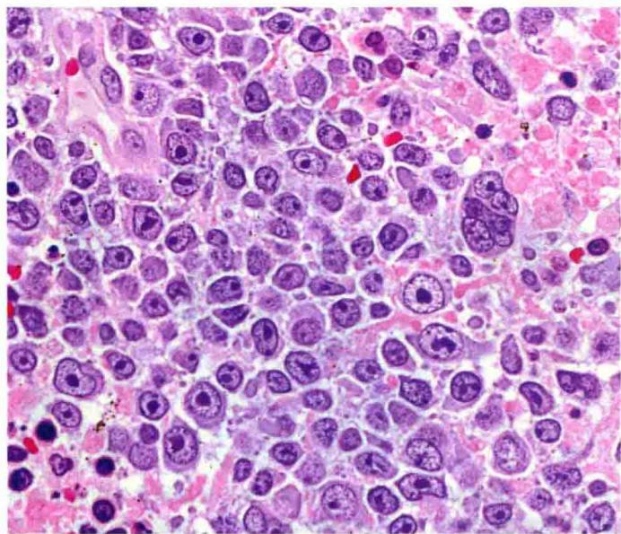 
图20-25 弥漫大B细胞淋巴瘤。成片的大的淋巴瘤细胞，具有明显的核仁
【临床表现】大多数DLBCL患者表现为淋巴结内或者结外部位肿瘤快速长大，局部或多个部位可以受累，但半数患者临床表现为低分期。总之，DLBCL是侵袭性肿瘤，如果不治疗可快速致命。它们对化疗药物敏感， $60\% \sim 80\%$ 的患者可以达到完全缓解。
3. 伯基特（Burkitt）淋巴瘤 伯基特（Burkitt）淋巴瘤是生长速度最快的恶性肿瘤之一，它被定义具有8q24染色体异位，即隐藏MYC肿瘤基因（见第5章）。地方性伯基特淋巴瘤是中非儿童最常见的恶性肿瘤，其发病率峰值在 $4\sim 7$ 岁。散发性伯基特淋巴瘤主要侵袭西方国家的儿童和年轻人，占所有淋巴瘤的 $1\% \sim 2\%$ 。在地方性伯基特淋巴瘤中，男性较女性多发。免疫缺陷相关性伯基特淋巴瘤主要发生在HIV病毒感染患者，可以以艾滋病首发症状出现。
【发病机制】所有伯基特淋巴瘤都与8号染色体的c-MYC基因异位有关。位于14号染色体的免疫球蛋白重链（IgH）基因是c-MYC基因的常见参与者。免疫球蛋白轻链也会包含在内，导致t（2；8）（k轻链）与t（8；22）（λ轻链）相互异位。EB病毒实际上存在于所有地方性伯基特淋巴瘤病例中，但在散发性和免疫缺陷相关型伯基特淋巴瘤中检出率不足 $30\%$ 。EB病毒阳性的散发性伯基特淋巴瘤患者与社会经济地位低有关，很多患者因为细菌、病毒或者（在美洲）寄生虫感染（如疟疾）（见第5章）而经历多克隆B细胞激活的前驱期。

【病理】伯基特淋巴瘤典型的特征是发生在结外多于淋巴结内，并有侵犯中枢神经系统的高
风险性。典型的地方性伯基特淋巴瘤破坏下颌骨或其他面骨（图20-26A）。散发性伯基特突出表现为腹部肿块。所有类型都可以累积卵巢、肾和乳腺。
显微镜下，肿瘤细胞中等大，缺乏细胞异型性。组织切片中可见大量核分裂象，证明肿瘤高度增殖活性。凋亡肿瘤细胞碎片被巨噬细胞清除，在低倍镜下散在分布，呈现“星空”现象（图20-26B）。Wright-Giemsa 复染的抽吸涂片证明在肿瘤细胞深染嗜碱性胞质中有很多脂质空泡（图20-26C）。肿瘤细胞表达表面球蛋白IgM，对泛B细胞抗体（CD19、CD20、CD22）阳性，表达CD10、BCL6，因而被认为是生发中心来源。克隆性IgH基因重排在重链基因和轻链基因中都可见到。
【临床表现】大多数伯基特患者表现为短时间内出现结外巨大肿块，对强烈的化疗有反应。无论是地方性还是散发性伯基特淋巴瘤，高达 $90\%$ 的低分期患者可以治愈，对高分期的患者治愈率可以达到 $80\%$ 的。
4. 滤泡性淋巴瘤 滤泡性淋巴瘤是由滤泡中心B细胞（生发中心细胞）组成的成熟B细胞肿瘤，相比弥漫大B细胞淋巴瘤，滤泡性淋巴瘤至少部分含有滤泡结构才符合诊断标准。滤泡性淋巴瘤是在美国最常见的非霍奇金淋巴瘤，占成人淋巴瘤的 $20\%$ 。此病发病高峰年龄在60岁，女性较男性患病略多。

【发病机制】t（14：18）（q32；q21）染色
体异位是滤泡性淋巴瘤的特征，在高达 $90\%$
的低-中级别滤泡性淋巴瘤病例可发现此变化，此转录将18号染色体上的BCL2基因和14号染色体上的IgH基因并置，导致过表达Bcl-2蛋白。Bcl-2蛋白是凋亡的抑制剂，从而保证淋巴瘤细胞的生存优势。

【病理】低倍镜下，病变淋巴结（或其他组织）
具有清楚的结节状（滤泡）模式或者结节性与弥漫性组合模式（图20-27）。肿瘤性滤泡呈现高密度，常见背靠背排列，滤泡间仅有极少的副皮质区插入。滤泡中心小细胞和大细胞混合存在，核形不规则（中心细胞/有核裂细胞），并且散在中心母细胞，其核圆，具有多个核仁。组织学分级（由中心母细胞的多少而界定）是滤泡性淋巴瘤决定预后的指征之一。滤泡性淋巴瘤表达大多数泛B细胞抗原，并且通常证明具有表面免疫球蛋白表达和轻链限制性。另外，滤泡性淋巴瘤也表达生发中心细胞标记物CD10和Bcl-6，这正如预期的那样说明了肿瘤细胞的来源。不管怎样，滤泡性淋巴瘤不像套细胞淋巴瘤和慢性淋巴细胞性白
血病/小淋巴细胞淋巴瘤那样表达CD5。超过 $90\%$ 以上的滤泡性淋巴瘤表达BCL-2蛋白，此特点与鉴别良性滤泡反应性增生非常有用。

【临床表现】大多数滤泡性淋巴瘤患者表现为全身淋巴结肿大，结外可以发生，但非常少见。
大多数滤泡性淋巴瘤患者伴随惰性临床过程，因为此病通常不能治愈，所以在诊断后不是都要马上进行治疗。总的中位生存率为 $7\sim 9$ 年，大剂量化疗并不能大幅度提高生存率。不管怎样，应用抗CD20抗体（利妥昔单抗）已经有效提高了生存率。多达 $50\%$ 的患者发展或转化到更具侵袭性疾病。
5.B细胞慢性淋巴细胞性白血病/小淋巴细胞性淋巴瘤B细胞慢性淋巴细胞性白血病/小淋巴细胞性淋巴瘤（B-CLL/SLL）是 $\mathrm{CD5^{+}}$ 的成熟B细胞淋巴瘤，它由单一的小淋巴细胞组成，这些细胞核圆到轻度不规则形，并混有少量的大细胞，大细胞具有圆的细胞核和单个嗜碱性核仁，即在外周血中被叫作前淋巴细胞。当肿瘤性B细胞累及外周血或者骨髓，此病就叫
作慢性淋巴细胞性白血病；当淋巴结或者结外部位受累时，则叫作小淋巴细胞性淋巴瘤。尽管如此，慢性淋巴细胞性白血病和小淋巴细胞性淋巴瘤被认为是一种疾病。慢性淋巴细胞性白血病/小淋巴细胞性淋巴瘤一般具有惰性临床病程（不像套细胞淋巴瘤，其也是表达 $\mathrm{CD5^{+}}$ 的成熟B细胞淋巴瘤），是典型的老年人惰性恶性淋巴瘤（年龄中位数为65岁），占全部非霍奇金淋巴瘤的 $7\%$

【发病机制】绝大多数的慢性淋巴细胞性白
血病 / 小淋巴细胞性淋巴瘤病例具有可测定
的细胞遗传学异常，最常见的是缺失13q12- 14,11q和17p(p53)，以及12三体。半数慢性淋巴细胞性白血病/小淋巴细胞性淋巴瘤在可变区未经历体细胞突变并且倾向不明原因的伴随较具侵袭性的临床病程。

【病理】慢性淋巴细胞性白血病/小淋巴细胞
淋巴瘤侵犯淋巴结，肿瘤性小淋巴细胞使淋
巴结结构全部消失，呈现含糊的结节（假滤泡）模
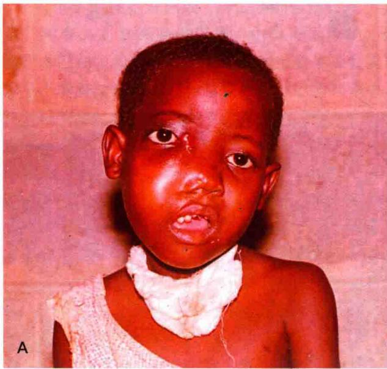
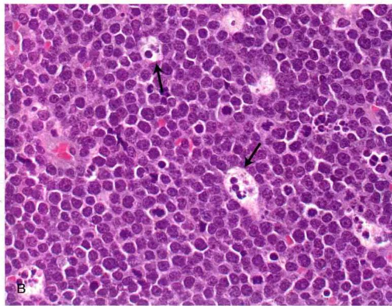
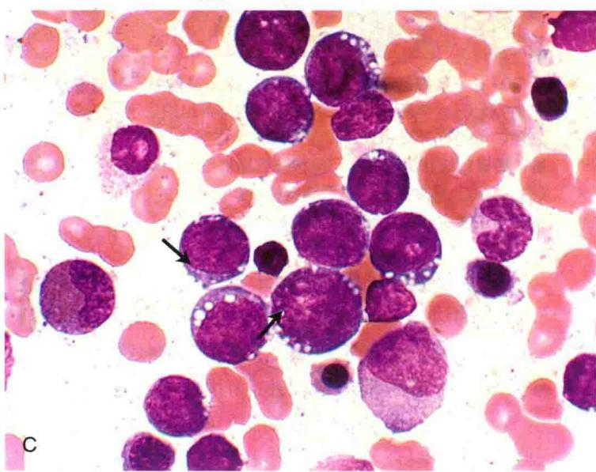 
图20-26 伯基特淋巴瘤。A.下颌骨的肿瘤扭曲了孩子的脸；B.伴有几个星空巨噬细胞（箭头）的肿瘤细胞破坏了淋巴结正常结构；C.骨髓抽吸涂片显示典型的伯基特淋巴瘤的细胞学特点。注意深染的嗜碱性胞质和脂质空泡（箭头）
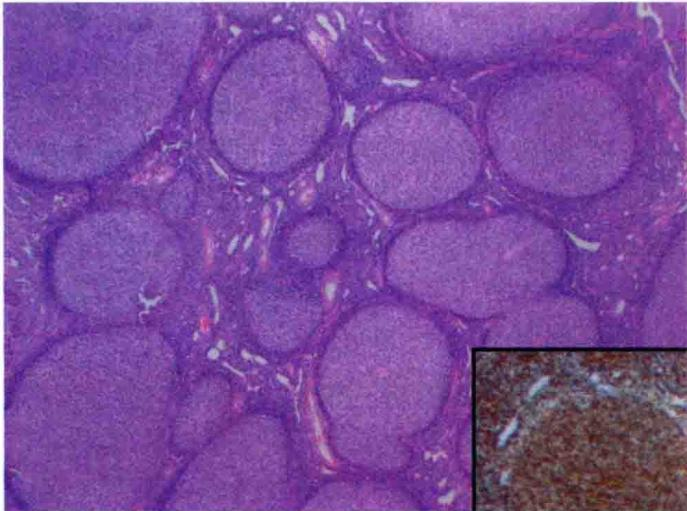 
图20-27 滤泡性淋巴瘤。正常的淋巴结结构被恶性淋巴滤泡替代，呈现背靠背模式（插图）应用BCL2免疫组化染色，恶性淋巴滤泡生发中心可以与正常/反应性生发中心鉴别
式（图20-28）。CLL患者外周血表现为淋巴细胞绝对增多，肿瘤性淋巴细胞小而一致，细胞核圆形到轻度不规则形，并具有少的灰蓝色胞质（图20-28B）。外周血涂片也可见大量断裂细胞（破碎细胞，见图20-28B）。骨髓受累时可以表现为骨髓腔全部被肿瘤细胞取代到呈多灶性分布。B细胞慢性淋巴细胞性白血病/小淋巴细胞淋巴瘤的免疫表型是独特的，肿瘤细胞既表达泛B细胞抗原，包括CD19、CD20、CD22和CD79，也表达CD5，CD23，还有轻链表面球蛋白。

【临床表现】大多数CLL/SLL是无症状的，许
多患者是被偶然诊断为此病。通常，发现血细
胞计数不正常是此病的首发提示。单克隆B细胞计数最低 $5000 / \mu l$ 就必须确定CLL诊断。
免疫缺陷常见，主要是B细胞，还有T细胞。导致B细胞功能障碍的原因不清。疾病过程中， $50\% \sim 75\%$ 的患者发生低丙种球蛋白血症，导致传染性并发症。B细胞慢性淋巴细胞白血病也表现为外周血T细胞增生（大于 $3000 / \mu l$ ），导致 $\mathrm{CD4^{+} / CD8^{+}}$ 降低。最常见传染性并发症是细菌感染，随后伴有病毒和真菌感染。
CLL/SLL中位生存率为 $4\sim 6$ 年，但疾病进程和预后非常多样性。 $15\% \sim 30\%$ 的患者转化到幼淋巴细胞性白血病；大约 $10\%$ 的患者转化至弥漫大B细胞淋巴瘤，被称为里奇综合征（Richtersyndrome）。很多患者经历转化到幼淋巴细胞性白血病或里奇综合征后存活率不足1年。多药物化疗或人化单克隆抗体（如利妥昔单抗）用于治疗高分期患者或侵袭性患者，但总体上此病不可治愈。无症状且白细胞计数稳定的CLL/SLL患者可以不必治疗。
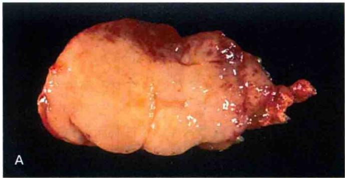
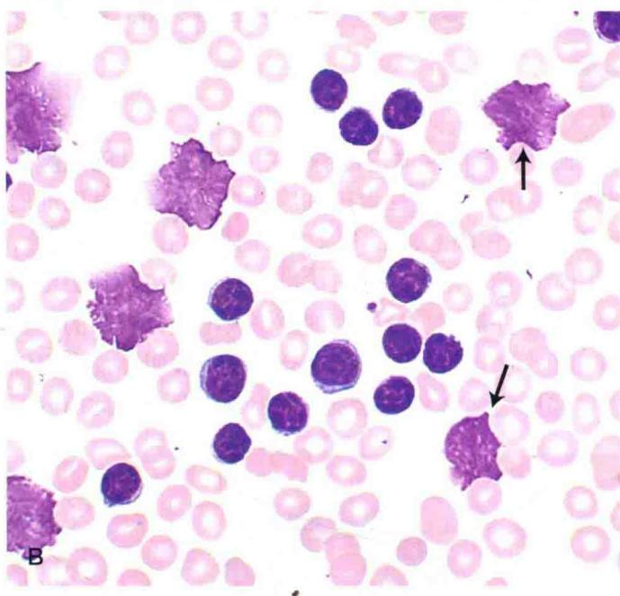
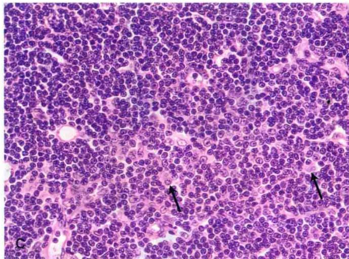 
图20-28B细胞小淋巴细胞性淋巴瘤/慢性淋巴细胞性白血病。A.肿瘤切开大体图片，增大的淋巴结内肿瘤组织显示特征性的均质、白色、鱼肉样外观；B.外周血图片显示很多小－中等大小的淋巴细胞，具有粗块状染色质。可见散在煤球样细胞（渗透压下易碎细胞）（箭头）；C.显微镜下，淋巴结结构被弥漫增生的小淋巴细胞及少量散在于生发中心的大细胞即副免疫母细胞（箭头）取代
6. 边缘区淋巴瘤（MALT淋巴瘤）MALT淋巴瘤是典型的边缘区淋巴瘤，由一组异质性的成熟B细胞组成的肿瘤，无论是发生在淋巴结、脾还是结外淋巴组织，其形态学都类似。肿瘤细胞假定来源于淋巴滤泡的边缘区，归属记忆B细胞。MALT淋巴瘤是惰性淋巴瘤，由混合的小B细胞和散在像中心母细胞样的
大细胞组成。肿瘤发生于淋巴结外部位，如胃肠道、唾液腺、眼附属器、肺和皮肤。免疫增生性小肠病（IPSID），也叫作 $\alpha$ 链病或者地中海淋巴瘤，是MALT淋巴瘤的一个亚型，其产生 $\alpha$ 重链（见第13章）。

【发病机制】MALT淋巴瘤占B细胞淋巴瘤的 $5\% \sim 10\%$ ，是胃淋巴瘤的最常见类型。
大多数发生在成人，中位年龄是60岁。具有轻度女性发病优势，部分原因是与自身免疫疾病相关。MALT淋巴瘤起于慢性炎症，多数因为自己免疫或者感染。疾病开始于良性多克隆反应，随后在B反应细胞获得基因突变或染色体损害。典型的感染驱动的MALT淋巴瘤是胃淋巴瘤伴有幽门螺杆菌相关性胃炎（见第13章）。早期胃黏膜相关淋巴瘤缺少染色体异位，应用抗生素治疗可消退。出现附加基因病变后，肿瘤就会播散到远处和（或）转化到弥漫大B细胞淋巴瘤。大多数MALT淋巴瘤累及胃或者其他黏膜部位，包括呼吸道，倾向伴随惰性临床过程。
7. 淋巴浆细胞淋巴瘤 淋巴浆细胞淋巴瘤（LPL）是一种少见的B细胞淋巴瘤，由小淋巴细胞、浆细胞样淋巴细胞和浆细胞组成。此病主要累及骨髓，偶尔见于脾脏和淋巴结，与黏膜相关淋巴瘤有重叠。多数淋巴浆细胞淋巴瘤与大量单克隆血清副蛋白（通常为IgM型）有关。部分淋巴浆细胞淋巴瘤（有时是黏膜相关淋巴瘤）发展成为临床Waldenstrom巨球蛋白血症，其与高黏滞综合征相关。此病通常发生在 $50\sim 60$ 岁成人，男性轻度优势发病。淋巴浆细胞淋巴瘤为惰性，伴有进展性病程，中位生存率为 $5\sim 10$ 年。像其他小B细胞淋巴瘤一样，淋巴浆细胞淋巴瘤通常是不能治愈的，疾病过程中可以发生向弥漫大B细胞淋巴瘤转化，预后差。
8. 浆细胞肿瘤 浆细胞肿瘤是一组关于B细胞末端分化的（浆细胞）恶性疾病，其中浆细胞骨髓瘤或者多发性骨髓瘤是最常见的（占 $90\%$ ）。此病特点是恶性浆细胞多灶浸润骨髓。表现骨特征性的多发性骨破坏病变（溶骨性）或者弥漫脱钙。在大多数浆细胞肿瘤病例中，肿瘤细胞分泌同种的全部或者部分免疫球蛋白分子，称M成分或副蛋白，尤以IgG或者IgA多见。

【发病机制】多项浆细胞瘤的危险因素已被确认。
■遗传素质：直系亲属中患有浆细胞瘤的患者，遗传素质被认为是增加多发性骨髓瘤发病的原因，多发性骨髓瘤在黑人中高发。
电离辐射：被认为是浆细胞瘤的病因，广岛、长崎遭原子弹轰炸后长期幸存者中多发性骨髓瘤发病率增加了5倍。
慢性抗原刺激：可能构成危险因素。一些多发性骨髓瘤患者跟慢性感染有关，像HIV和骨髓炎，以及慢性炎性疾病（如风湿性关节炎）。二次打击假说提出：①抗原刺激引起反应，B细胞多克隆增生；②后续发生突变事件建立恶性单克隆系。
（1）意义未定的单克隆 $\gamma$ 病：在大于50岁的人群中，约 $3\%$ 发现有意义未定的单克隆 $\gamma$ 病（MGUS），在大于70岁的人群中，有大约 $5\%$ 的发现MGUS。它的定义为：①血清单克隆副球蛋白低于 $3.0~\mathrm{g / dl}$ ；②骨髓中浆细胞量低于 $10\%$ ；③缺少终末器官损害；④除外其他已知可产生单克隆副蛋白（M蛋白）B细胞肿瘤或疾病。MGUS被认为是瘤前状态，具有一定概率进展为明显的浆细胞肿瘤（如多发性骨髓瘤），受累者一生中转化的概率是每年大约 $1\%$ 。
（2）浆细胞骨髓瘤：浆细胞骨髓瘤（PCM）是浆细胞恶性肿瘤，伴有血清和（或）尿中M蛋白升高。此病最初发生在骨髓且趋向多发。临床疾病表现从惰性无症状到白血病高度侵袭。浆细胞肿瘤占所有恶性血液疾病的 $10\%$ ，男性较女性多发，黑人发病率是白人的2倍。浆细胞瘤发病率随着年龄增加而增高，诊断多发性骨髓瘤的平均年龄是70岁，40岁以前少见。

【病理】浆细胞骨髓瘤在全身各处骨骼中产生
多灶性骨破坏,在影像学上具有溶骨性或者“弹
射”状表现。脊椎骨、肋骨、头骨、盆骨、股骨、锁骨和肩胛骨是最常见受累部位。当浆细胞肿瘤充满骨髓腔、侵蚀骨松质并最终破坏骨皮质，发生病理性骨折。大体上，受累骨含有胶冻样红色软组织肿块，与周边正常组织分界清楚（图20-29）。
骨髓检查是诊断浆细胞骨髓瘤所必要的。骨髓活检切面中可以见到骨髓腔内清晰的结节状或者融合成片的浆细胞，浸润的浆细胞超过骨髓容量的 $30\%$ 则强烈支持诊断浆细胞骨髓瘤。浆细胞免疫组化染色（如CD138）对评估骨髓被浸润程度和模式非常有用。骨髓瘤中浆细胞可以与正常浆细胞相似：具有偏心性细胞核，染色质呈现钟面样，缺少可见的核仁并具有丰富的嗜碱性胞质（图20-30A）。在另外一些病例中，恶性肿瘤细胞显示未成熟浆母细胞样或者多形性（图20-30B），超过半数的病例可见肾形核。
浆细胞骨髓瘤中的浆细胞表达B淋巴细胞标记物CD79a，浆细胞标记物CD38、CD138和单型性细胞质免疫球蛋白。在多数病例中，单克隆副蛋白重链是IgG和IgA。85%的病例产生完备的免疫球蛋白，剩
余的 $15\%$ 的病例只产生轻链（轻链病）。有一些病例则没有分泌功能。超过 $90\%$ 的病例应用FISH检测可以发现染色体改变。异位，通常包括 $\lg H$ 基因和各种癌基因在 $40\%$ 的病例中被发现。应用FISH技术，半数病例中13号染色体发现单倍体或者部分缺失，这被认为是浆细胞瘤的早期基因事件。
【临床表现】诊断浆细胞骨髓瘤依赖一系列临床病理发现。需要考虑的最重要的与浆细胞骨髓瘤鉴别诊断的疾病是MGUS，它是一个常见病，具有症状的浆细胞骨髓瘤以终末器官的损害为特征(CRAB：血钙过多过多、肾功能不全、贫血、骨病变)，患者血清或尿中出现M蛋白，并且在骨髓中出现浆细胞克隆群。在 $70\%$ 的患者放射影像学发现溶骨性病变。这些病变经常与骨痛和血钙过多相关。病理性骨折可成为浆细胞骨髓瘤的临床表现。多发性骨髓瘤中骨破坏是侵袭性肿瘤生长和恶性浆细胞分泌破骨细胞活化因子的共同结果。 $97\%$ 的患者血或者尿中发现M蛋白。IgG是浆细胞骨髓瘤中最常见M蛋白，占全部病例的 $50\%$ 。PCM仍然是难以治愈的疾病，但是，对发病机制了解的近期发展和采用新的治疗方案表明预后有改善趋势。本病中位生存率大约3年，但有很大变数：从不足6个月到超过10年。死亡通常是由于感染或者肾衰竭。
# （四）外周T细胞淋巴瘤和自然杀伤细胞淋巴瘤不良预后
成熟（外周）T细胞和NK细胞恶性淋巴瘤起源于胸腺后T细胞，在胸腺外淋巴组织产生（图20-23）。世界范围内，T细胞恶性淋巴瘤占非霍奇金淋巴瘤的 $12\%$ 。T细胞和NK细胞恶性淋巴瘤在亚洲较西方国家多见。在日本，许多T细胞恶性淋巴瘤是由于感染人类T细胞白血病病毒1型（HTLV-1）引起的。

【病理】成熟T细胞淋巴瘤的特征是表达表面CD3，和不同数量的其他泛T细胞抗原，如
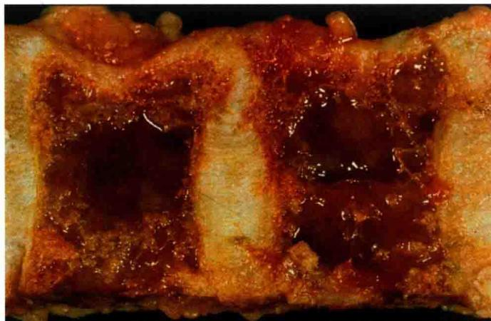 
图20-29 浆细胞骨髓瘤。脊椎骨内多灶溶骨性病变，这样的骨很容易发生病理性骨折
CD2，CD5和CD7，CD4或者CD8，以及或者α、β，或者γ、δ等T细胞亚单位。大多数外周T细胞淋巴瘤是α、β型。不同于未成熟T细胞受体（如T细胞淋巴母细胞性淋巴瘤），成熟T细胞肿瘤不表达TdT。NK细胞淋巴瘤缺乏表面CD3表达，但表达其他T细胞相关标记物，包括CD2、CD7和CD8，以及CD16和CD56。
【临床表现】T细胞和NK细胞肿瘤在临床上被分为白血病、淋巴结内、淋巴结外和皮肤的恶性肿瘤。它们通常表现为广泛播散，因此，它们一般较B细胞肿瘤更具侵袭性。它们治疗采用用以治疗B
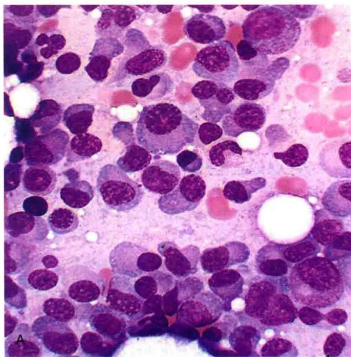
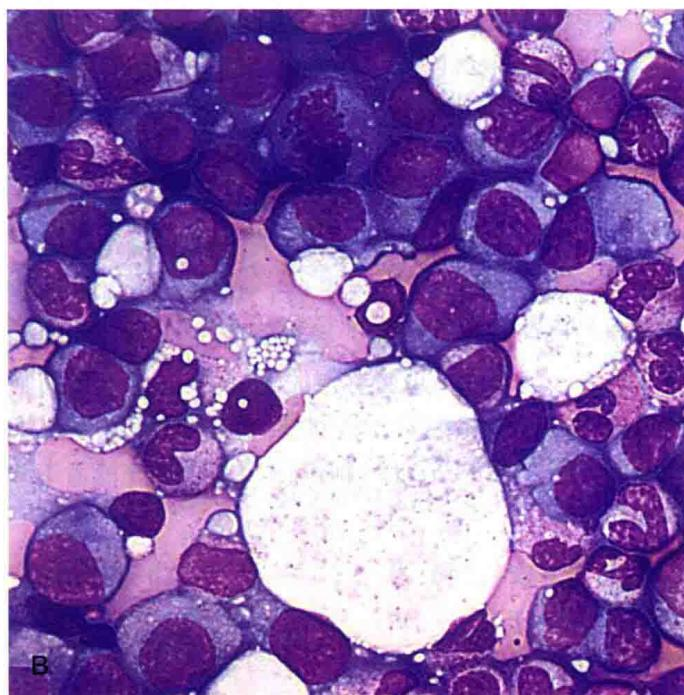 
图20-30 浆细胞骨髓瘤（PCM）。肿瘤性浆细胞表现多种细胞学特点，从正常浆（A）到浆母细胞（B）细胞总量、克隆性和临床病理学所见均有助于浆细胞骨髓瘤与其他浆细胞增生疾病的鉴别
细胞肿瘤标准化疗方案，很多T细胞肿瘤对治疗反应差，总体5年生存率在 $20\% \sim 30\%$
1. 成人T细胞白血病/淋巴瘤 成人T细胞白血病/淋巴瘤（ATLL）由人类反转录病毒HTLV-1引起。ATLL肿瘤细胞是成熟活化的 $\mathrm{CD4^{+}}$ 的T细胞。另外，除了日本西南部，在加勒比海和中部非洲的部分地区，ATLL是地区流行性疾病。全球统计，ATLL大约占全部成熟T细胞肿瘤的 $10\%$ 。此病具有长潜伏期，尽管患者早年即感染病毒，但只是成人发病，平均年龄是58岁。HTLV-1可以通过乳汁、血液及血液制品传播。
【病理】ATLL大多表现为起病广泛，常见受累部位包括淋巴结、脾、骨髓、外周血和最常见的皮肤。肿瘤性淋巴细胞形态表现多样，最常见的，它们显示突出的细胞核脑回状和分叶状，被描写为花样外观（花样细胞）。肿瘤细胞表达T相关抗原，包括：CD2、CD3和CD5，但通常缺少CD7。肿瘤细胞显示克隆性T细胞受体基因重排模式，并且阳性表达克隆性整合HTLV-1。在受HTLV-1病毒感染的淋巴细胞中，P40tax病毒蛋白导致许多基因的转录激活。然而，从淋巴细胞病毒感染进展到恶性肿瘤需要其他基因病变参与。
【临床表现】ATLL是系统性疾病伴多系统症状和外周血白细胞增多。分为急性型、闷燃型和慢性型。急性ATLL预后差，大多数患者即使进行全身系统性化疗存活也不足一年。死亡往往发生在患者感染并发症后，例如见于HIV感染的患者，慢性型和闷燃性患者预后相对较好。
2. 蕨样真菌病和Sézary综合征 蕨样真菌病（MF）是最常见的原发性皮肤T细胞淋巴瘤（CTCL）。蕈样真菌病名称由来源于肿瘤隆起状、真菌样生长的蘑菇样外观。MF的特点是恶性 $\mathrm{CD4^{+}}$ 的T细胞（辅助T）浸润表皮，T细胞具有显著的折叠核。Sézary综合征与蕈样真菌病有重叠，其包括三联征，即红皮病、全身淋巴结肿大和外周血中出现肿瘤细胞（Sézary细胞）蕈样真菌病主要成年人和老年人发病，男性患病是女性的2倍。
【病理】在初期斑片期可见到真皮内表浅带状浸润（苔藓样的），淋巴细胞具有早期亲表皮性。斑块期的诊断标志着异形淋巴细胞显著的表皮内浸润（亲表皮性），浸润细胞为小到中等大小的淋巴细胞，具有不规则细胞核形（脑回样核）。
Pautrier微脓肿，指表皮内的淋巴瘤细胞聚集巢，在很多病例里被发现。瘤块期的特征是弥漫的真皮内浸润，由小的、中等大的或者大的淋巴瘤细胞组成，此时缺少表皮内浸润。在患者外周血涂片中Sezary细
胞特征性的脑回样细胞核有助于被识别（图20-31）。蕈样真菌病肿瘤细胞具有T辅助细胞的免疫表型，通常表达CD2、CD3、CD5、CD4和T细胞受体(TCR)-α、β，但是泛T细胞抗原CD7异常丢失。克隆性T细胞受体基因重排常见，这有助于鉴别蕈样真菌病微小病变与炎症性皮肤病。
【临床表现】蕈样真菌病是惰性淋巴瘤。临床分期特点根据皮肤肿瘤而定，多数位于面部和身体皮肤皱褶处，经常形成溃疡并继发感染。
3.其他不常见外周T细胞淋巴瘤间变大细胞淋巴瘤（ALCLs）是成熟T细胞肿瘤，由大的多形性淋巴细胞组成，瘤细胞表达淋巴活化标记物CD30，并累及淋巴结和结外部位（皮肤多见）。在一些病例中，特别是那些发生在儿童和年轻人的病例其位于2号染色体的间变性淋巴瘤激酶（ALK）基因和5号染色体的核仁磷蛋白基因发生异位。这类患者预后相对较好，其5年生存率达到 $80\%$ ，而ALK阴性的肿瘤患者只有 $48\%$
血管免疫母T细胞淋巴瘤（AILT）是一个侵袭性外周（成熟）T细胞淋巴瘤。肿瘤性T细胞浸润淋巴结副皮质区并使之扩大，还与毛细血管后微静脉显著增生有关。几乎所有病例都能检测到EB病毒，但EB病毒存在于B细胞，而不是在肿瘤性的T细胞。肿瘤细胞显示为滤泡内T辅助细胞亚型，在大多数病例中发现其具有T细胞受体的克隆性重排。
血管免疫母T细胞淋巴瘤患者中位生存率不足3年，死亡通常与感染并发症相关。
# （五）霍奇金淋巴瘤
特征是霍奇金细胞和瑞德-斯坦伯格细胞（R-S细胞）映衬在炎症细胞的背景中。霍奇金淋巴瘤分为两型：经典型霍奇金淋巴瘤（CHL）和结节性淋巴细胞为主型霍奇金淋巴瘤（NLPHL）。不同于上述的非经典霍奇金淋巴瘤，霍奇金淋巴瘤常常发生于单个淋
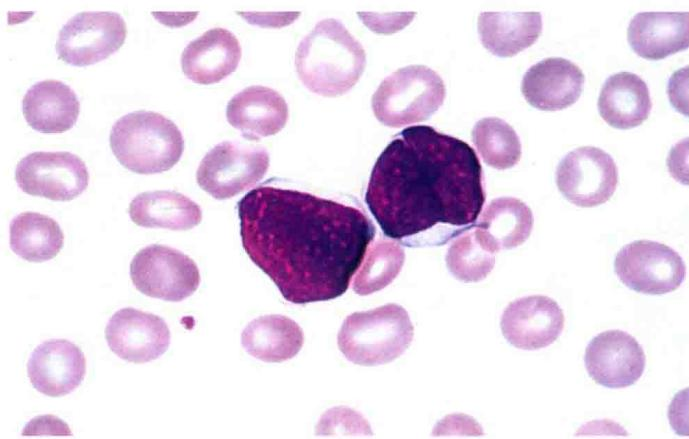 
图20-31 Sézary细胞。典型的Sézary细胞为中到大细胞，具有显著的扭曲细胞核，形成其脑回样的外观。这代表皮肤T细胞淋巴瘤，即蕈样真菌病的白血病期
巴结或一串淋巴结，并且连续传播。霍奇金淋巴瘤大部分发生于年轻人。病变中突出表现为混合性的炎细胞为主的背景中仅有少量的肿瘤细胞。大而不典型性的单核细胞或者多核细胞即霍奇金细胞和瑞德-斯坦伯格细胞是诊断性的标志细胞（图20-32）。在大多数病例中，两种类型的霍奇金淋巴瘤均起源于B细胞分化的生发中心的淋巴细胞。R-S细胞通常不足 $1\%$ 的细胞总量，因而霍奇金淋巴瘤突出的特征是肿瘤中具有大量的良性反应性组织成分。

【流行病学】霍奇金淋巴瘤是 $10\sim 30$ 岁的美国
人中最常见的恶性肿瘤。每年有8000多的病例
报道,发生率为3/100000人,男性略多于女性(4:2.5),白人比黑人多见(3.5:2)。在发达国家其发病率呈明显的双峰年龄分布,一个高峰是在近30岁,在 $40\sim 50$ 岁年龄段时有所降低,50岁以后发病率又逐渐增高。

【发病机制】霍奇金淋巴瘤可能与EB病毒感染相关。年轻人患有EB病毒感染（即传
染性单核细胞增生症）发展为霍奇金淋巴瘤的风险是未感染者的3倍，霍奇金/瑞德- 斯坦伯格细胞（HRS细胞）也经常被检测出EB病毒基因。其中 $70\% \sim 80\%$ 的混合细胞型经典霍奇金淋巴瘤与EB病毒相关，而在结节硬化型中则不足 $40\%$ 。遗传因素与自身免疫状况在疾病易感性中起到重要作用。霍奇金淋巴瘤患者中具有组织相容性白细胞共同抗原（HLA）亚型，特别是HLAB18型者较常人为高。并且，同父母的兄弟姐妹中患霍奇金淋巴瘤的风险增高7倍，而在同卵双生双胞胎中则增高到100倍。霍奇金淋巴瘤也多见于患有免疫缺陷或者自身免疫疾病的患者，如风湿性关节炎。
1. 经典型霍奇金淋巴瘤 经典型霍奇金淋巴瘤是一种在反应性炎性细胞背景中含有少量散在的单核霍奇金细胞和多核瑞德-斯坦伯格细胞的B细胞淋巴瘤。
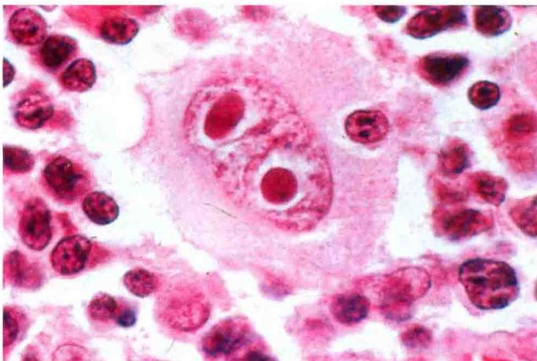 
图20-32 经典瑞德-斯坦伯格细胞（R-S细胞）：镜影细胞含有大的嗜酸性核仁
其炎症细胞背景主要由小淋巴细胞（大多数为T细胞）、浆细胞、淡染巨噬细胞和嗜酸粒细胞组成（如图20-33），常伴有增生不等的成纤维细胞或明显的胶原纤维。根据炎细胞和成纤维细胞的背景以及霍奇金细胞的形态，经典型霍奇金淋巴瘤分为四型：①结节硬化型；②混合细胞型；③淋巴细胞丰富型；④淋巴细胞消减型。所有四种亚型都具有相似的免疫表型和基因学改变，应用当前的放疗和化学治疗方案后，各型预后基本上一样。

【病理】经典型霍奇金淋巴瘤累及淋巴结表现
为结构破坏，数量不等的HRS细胞散在于混
合性的炎细胞和多少不等的纤维化（硬化）背景中（图20-34）。典型的RS细胞是大的，具有至少两个分叶核或多核，并且有丰富的淡蓝色胞质（图20-32）。此外，HRS细胞核形不规则，具有显著的嗜酸性核仁和核周空晕，赋予HRS细胞独特的“鹰眼”样或核内包涵体样外观。尽管如此，因为HRS细胞只占受累组织细胞总量的 $1\% \sim 3\%$ ，在密集的反应性炎症细胞背景中HRS细胞可能仍然难以被发现。
几乎在全部HD病例中HRS细胞都表达淋巴细胞活化因子标记物CD30。此外， $85\%$ 的病例表达巨噬细胞/单核细胞标记物CD15。不同于非霍奇金B细胞淋巴瘤，肿瘤性HRS细胞不表达B细胞常用抗原CD20和CD79a，并且，CD45（白细胞共同抗原）也是阴性。多于 $98\%$ 的HRS细胞表现免疫球蛋白的基因重排证明其为生发中心B细胞来源。HRS细胞产生多种细胞因子从而产生特有的组织效应：白介素5（IL-5）与嗜酸细胞活化趋化因子（eotaxin）共同作用诱导出嗜酸性细胞，白介素6(IL-6)诱导浆细胞，转化生长因子 $\beta (TGF - \beta)$ 活化成纤维细胞可以解释结节性纤维化的原因。
（1）结节硬化型霍奇金淋巴瘤：结节硬化型霍奇金淋巴瘤（NSHL）的特征是淋巴结被膜纤维性增厚，纤维硬化带延伸至淋巴结皮质，导致结节形成（图20-
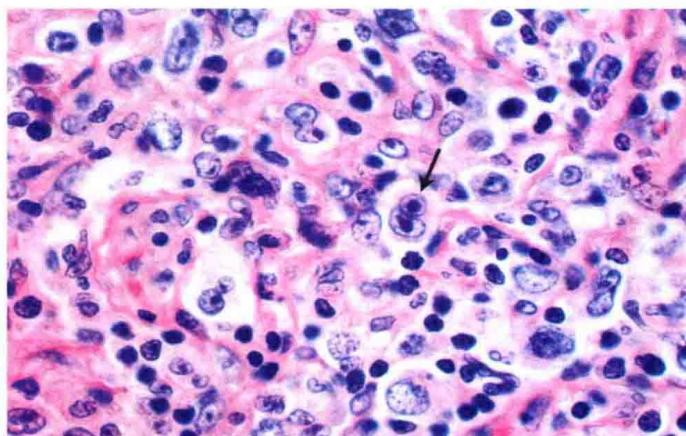 
图20-33 混合细胞型霍奇金淋巴瘤。显微镜下显示淋巴结内在含有很多小淋巴细胞（T细胞）的混合性炎症背景中经典的双核和单核RS细胞（箭头）。注意其缺少纤维化条带，这有助于区分混合细胞型和结节硬化型经典霍奇金淋巴瘤
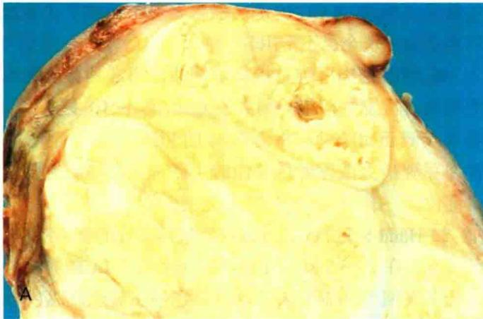
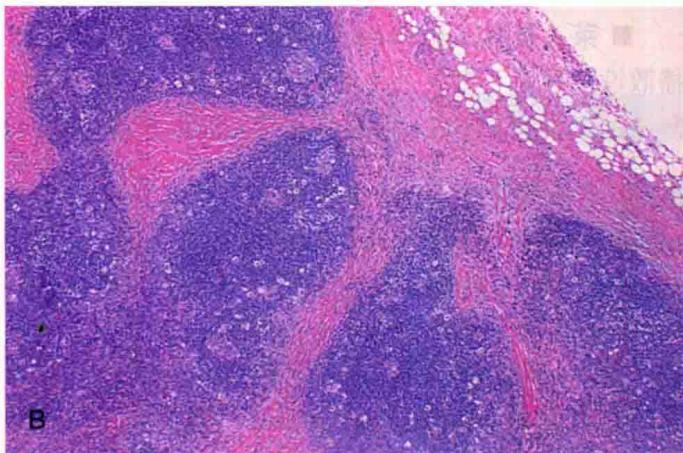
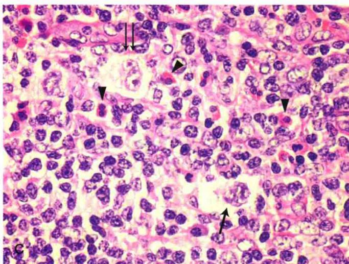 
图20-34结节硬化型霍奇金淋巴瘤（NSHL）。A.大体照片显示增大的淋巴结包膜增厚，增宽的纤维带将实质分成明显的结节状，有明显的多灶坏死（红-褐色变色）；B.低倍镜下显示纤维化宽带，并有密集的炎性背景，R-S细胞罕见；C.高倍显微镜下，NSHL显示在混合性炎性背景中有嗜酸性粒细胞（无杆箭头），R-S细胞（双箭头）和陷凹细胞（箭头）
34A）。陷窝细胞是由组织甲醛固定后收缩造成的人工假象（图20-34C）。结节由混合性的炎细胞和数量不等的经典HRS细胞和陷窝细胞组成（图20-34C）。结节硬化型霍奇金淋巴瘤占经典型霍奇金淋巴瘤的 $70\%$ 大多数发生在 $15\sim 30$ 岁年龄组。 $80\%$ 多的患者累及纵隔。
（2）混合细胞型霍奇金淋巴瘤：混合细胞型霍奇金淋巴瘤（MCHL）中HRS细胞见于由嗜酸细胞粒
细胞、中性粒细胞、巨噬细胞和浆细胞组成的混合性的炎细胞背景中（图20-33），但缺少结节硬化型中出现的结节性纤维化。MCHL占经典型霍奇金淋巴瘤的 $25\%$ ，常见于 $40\sim 50$ 岁年龄组。颈部淋巴结是最常见初发部位，不同于NSHL，MCHL纵隔累及不多见。
（3）淋巴细胞丰富型霍奇金淋巴瘤：淋巴细胞丰富型霍奇金淋巴瘤的特征是经典HRS细胞出现在结节性的（或者少量弥漫性的）淋巴细胞浸润背景中。浸润的淋巴细胞主要为小B淋巴细胞，但缺少嗜酸性粒细胞、中性粒细胞和纤维化。此型少见，仅占经典型霍奇金淋巴瘤的 $5\%$ ，倾向发生于老年患者。 
（4）淋巴细胞消减型霍奇金淋巴瘤：淋巴细胞消减型霍奇金淋巴瘤（LDHL）在经典型霍奇金淋巴瘤中的最为少见，不足总数的 $1\%$ 。组织学上，HRS细胞明显易见，缺少淋巴细胞的背景（图20-35）。大多数患者为男性，中位年龄在 $30\sim 40$ 岁，偏爱累及腹膜后淋巴结（其他亚型罕见）、腹腔脏器及骨髓。
【临床特点】霍奇金淋巴瘤通常表现为无痛性外周淋巴结肿大，受累淋巴结常为单个或一组淋巴结，半数以上的病例累及颈部和纵隔淋巴结，前纵隔也常受累。最初，霍奇金淋巴瘤主要经由输出淋巴管累及相邻淋巴结。临床“B”症状包括：①低热，偶尔出现回归热（佩-埃二氏热）；②盗汗；③体重减轻超过 $10\%$ （40%的HD患者）。尽管即使到病程晚期体液免疫仍正常，T淋巴细胞功能缺陷仍是霍奇金淋巴瘤的特点。
霍奇金淋巴瘤的预后主要依靠患者的年龄及病变累及范围（即分期）。预后好一般与以下因素相关：①年纪轻；②分期早（局部病变）；③缺乏“B”症状体征。霍奇金淋巴瘤并发症包括伴随肿瘤进展重要器官的功能受损及继发感染所致的迟发性过敏反应以及治疗后
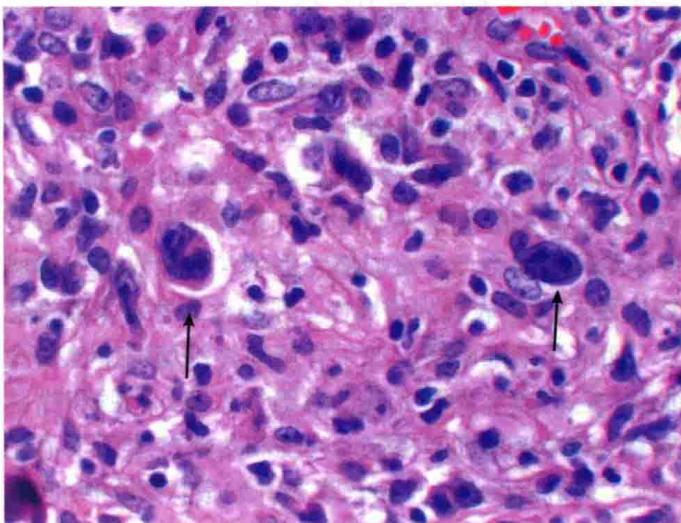 
图20-35 淋巴细胞消减型霍奇金淋巴瘤。可见两个H/R-S细胞（箭头），在纤维化的背景中反应性淋巴细胞数量明显减少，此类病例需要与大细胞淋巴瘤进行鉴别诊断
的免疫抑制效应。治疗后发生第二种肿瘤的情况值得特别注意，因为超过 $15\%$ 的霍奇金患者治疗后出现这种情况。
2. 结节性淋巴细胞为主型霍奇金淋巴瘤 此型霍奇金淋巴瘤不同于上述经典型霍奇金淋巴瘤。尽管分类归属于霍奇金淋巴瘤，相对于经典霍奇金淋巴瘤，结节性淋巴细胞为主型霍奇金淋巴瘤的免疫表型和临床病理更加类似于惰性B细胞非霍奇金淋巴瘤。它的特征性肿瘤细胞是霍奇金细胞的变异体，根据其组织学表现，称L&H（淋巴细胞和组织细胞样）细胞，或者称“爆米花细胞”。像经典霍奇金淋巴瘤一样，结节性淋巴细胞为主型霍奇金淋巴瘤的肿瘤细胞数量在受累组织中只占少数，但是它们表达B细胞系抗原（包括CD20、CD79a和表面免疫球蛋白），而不表达CD15和CD30。几乎所有病例中都发现克隆性基因重排，与可变区体细胞突变的高度一致性都提示肿瘤细胞很可能起源于生发中心B细胞。
NLPHL 约占霍奇金淋巴瘤的 $5\%$ ，主要发生在 $30\sim 50$ 岁年龄组，也可以发生在年轻人，包括儿童。颈部、腋窝或者腹股沟淋巴结是肿瘤常发部位。不同于经典霍奇金淋巴瘤，NLPHL累及纵隔、脾和骨髓少见，并且，NLPHL倾向跳跃性累及淋巴结（不像经典霍奇金淋巴瘤那样连续性传播）。NLPHL伴随惰性病程，很少致命。分期低的患者10年生存率超过 $80\%$ 而进展期患者则预后不佳。NLPHL并发症中较为常见的包括肿瘤复发，其中 $3\% \sim 5\%$ 的病例进展为弥漫大B细胞淋巴瘤。
# （六）组织细胞肿瘤是起源于巨噬细胞或者树突细胞的少见的肿瘤
因为对此类肿瘤缺乏认识并且是最近才被定义，此类肿瘤真实发生率不清楚。其临床病理特点很宽泛，表现从惰性到侵袭性都有。此类肿瘤中有多种疾病，在此只讨论朗格汉斯组织细胞增生症。
# （七）朗格汉斯组织细胞增生症指的是主要发生在儿童的朗格汉斯细胞肿瘤性增生
朗格汉斯组织细胞增生症（langerhans cell histiocytosis，LCH）是朗格汉斯细胞不常见的克隆性增生谱系。此病表现不一，从局部无症状（例如发生在骨或者淋巴结），到表现为进展性、系统性、并有多器官受累。朗格汉斯细胞是起源于骨髓前体细胞的单核吞噬细胞，它们通常见于皮肤、淋巴结、脾、胸腺和黏膜组织。朗格汉斯细胞摄取、处理和传递抗原到T淋巴细胞。在淋巴结内，朗格汉斯被称为指状突网状细胞。
LCH病因学和发病机制尚不清楚。根据此病经常表现为克隆性增生，其本质倾向为肿瘤。其发生于婴儿、儿童和年轻人多见。病变范围及疾病进展速率与患者
年龄呈负相关。LCH的不同临床表现包括如下（尽管以人名命名现今已不常用）：
■ 嗜酸性肉芽肿是指局限性的，通常具有自限性的疾病，常发生在年龄稍大的儿童（5～10岁）和年轻人（低于30岁）。将近 $75\%$ 的LCH患者发现嗜酸性肉芽肿，男性患者是女性的4倍。骨及肺是主要受累部位。
■ Hand-Schüller-Christian 疾病是多灶的惰性疾病，经常发生在 $2\sim 5$ 岁的儿童，发病率约占LCH的1/4。骨的多发病变为主要表现，尽管也可主要表现为内分泌腺的受累。
■莱－赛病(Letterer-Siwe)罕见（低于 $10\%$ ），急性、播散性，多见于婴儿及2岁以下的儿童，没有性别倾向性。皮肤病变及内脏和造血系统累及为其特点。
【病理】尽管临床表现不一，LCHs具有共同的组织学发现：朗格汉斯细胞大（直径 $15\sim 25\mu m$ ），具有圆形到锯齿状细胞核，细致泡状的染色质及多个小的核仁。电镜发现具有特征性的杆状或管状的胞质包涵体，其核心致密并具有双层外壳，即博贝克颗粒（Birbeck granule）。博贝克颗粒一端经常是球状的，类似网球拍。识别上皮样朗格汉斯细胞的特征性免疫标记包括S-100蛋白和CD1a。
【临床表现】LCH的临床表现反映在受累部位。皮肤受累，主要表现为Letterer-Siwe病亚型，造成皮脂腺或者湿疹样的皮炎，大多发生在头皮、面部和躯干，中耳炎常见。无痛性的局部或者全身淋巴结肿大和肝脾大常见。溶骨性改变可引起压痛和触痛。眼球突出（眼球前突）可能为眼眶受累的并发症。尿崩症发生在下丘脑-垂体受累时。典型三联征：尿崩症、突眼症和骨膜破坏只发生在 $15\%$ 的Hand-Schuller-Christian病亚型中。LCH的预后主要根据是患者发病年龄。总之，在老人，此病是自限性的良性病变（嗜酸性粒细胞肉芽肿），而在低于2岁的儿童（Letterer-Siwedisease）预后不良。侵袭性病程少见，且不能与恶性朗格汉斯组织细胞增生鉴别。LCH的治疗方法尚未很好的确立，但有一些药物治疗有效的报道。
# 第五节 脾脏
# 一、脾脏疾病——脾大
脾脏是淋巴增殖系统和单核吞噬系统的重要成员。脾大多见于多种不相关的功能性、感染性和浸润性的进程中（表20-12）。
# （一）反应性脾大与炎症相关
脾急性炎症是多种血液传染的结果。脾特征性的
表现为充血，伴有红髓及白髓内中心粒细胞及浆细胞的浸润。多数情况下，脾中等度增大（400g）。大约半数的传染性单核细胞增多症患者有脾大，脾大偶尔伴有致命性的外伤性脾破裂。脾支持结构系统的减弱是因为淋巴细胞浸润脾脏被膜、小梁及血管所致。在慢性免疫炎症性疾病中，脾白髓的增生导致脾大。在风湿性关节炎中，淋巴滤泡增生是主要表现，而红髓中表现为巨噬细胞、免疫母细胞、浆细胞及嗜酸性粒细胞的增多。
系统性红斑狼疮特征性表现为脾被膜及脾小梁纤维素性坏死，以及脾笔毛动脉和白髓中央动脉的同心圆形或洋葱皮样变性增厚。
感染急性亚急性慢性炎性免疫性疾病费尔蒂综合征红斑狼疮结节病淀粉样变性甲状腺炎溶血性贫血免疫性血小板减少症脾静脉高压肝硬化脾或者门静脉血栓形成或者狭窄右心衰竭原发或者继发性肿瘤白血病淋巴瘤霍奇金淋巴瘤骨髓增殖综合征肉瘤癌症贮积性疾病戈谢病尼曼-匹克病黏多糖累积病
# （二）充血性脾大经常伴发门静脉高压
慢性脾淤血引起脾大和脾功能亢进。这种情况多见于门脉高压患者，而后者往往因为肝硬化、门脉血
栓或者脾静脉血栓形成，或者右心衰竭引起的。
# （三）镰状细胞性贫血中的脾
脾中等度增大（ $300\sim 700\mathrm{g}$ ），局部被膜纤维性增厚，具有“糖衣脾”外观。反复缺氧和梗死的结果导致脾皮质纤维化，红髓细胞过少。陈旧性出血灶形成铁质沉着性小结（Gamma-Gandy body），即在胶原和弹性纤维上形成的含有铁和钙盐的纤维变性结节。白髓倾向萎缩。
# （四）浸润性脾大可能与细胞增生或者细胞外物质增多有关
脾增大可能因为细胞量增加或者因为细胞外物质沉积，例如淀粉样变性。脾巨噬细胞增多见于慢性感染、溶血性贫血和各种贮积病，如戈谢病即是典型（见第6章）。脾大也可因血液系统恶性肿瘤细胞的浸润引起，如白血病及淋巴瘤。脾原发性肿瘤非常少见，脉管肿瘤是造血系统肿瘤以外最常见累及脾的肿瘤，此类肿瘤包括血管肉瘤及良性肿瘤（即血管瘤和淋巴管瘤）。
# 第六节 胸腺
历史上将胸腺定为是内分泌器官的理论基础是不足信的，尽管如此，我们知道胸腺产生一些因子（胸腺激素），在免疫系统成熟和免疫耐受性的发展过程中起关键作用。基于此，在本章里我们将讨论某些与胸腺异常相关的某些疾病。
# 一、发育不全和发育异常
胸腺改变多种多样，从完全缺失（发育不全）或者严重发育不全到虽然胸腺很小但具有正常胸腺结构而不同。一些小的胸腺出现胸腺发育不全，特征性表现为胸腺细胞缺失，没有或者仅有少量哈氏小体和上皮成分。各种不同的发育异常都于免疫缺陷相关（见第4章），其中染色体22q11.2缺陷综合征（迪乔治及相关综合征，DiGeorge and related syndromes）最为常见。
# 二、胸腺增生
胸腺增生意味着胸腺中淋巴滤泡的出现而无关胸腺体积的大小。胸腺的总重量通常在正常范围之内，当然也可以增加。淋巴滤泡包括生发中心，主要由B细胞组成，含有IgM和IgD。淋巴滤泡往往占领和破坏胸腺髓质区。
最被熟知的与胸腺增生相关的疾病就是重症肌无力（见第27章），2/3的重症肌无力患者存在胸腺异常。有趣的是，胸腺上皮和肌样上皮细胞含有烟酰乙酰胆碱受体蛋白，提示它们是直接拮抗此受体并产生抗体的潜在来源。胸腺淋巴滤泡增生也可见于其他自身免疫性疾病包括：毒性弥漫性甲状腺肿
(Graves disease)、肾上腺皮质功能减退症（艾迪生病，Addison disease），系统性红斑狼疮、硬皮病以及风湿性关节炎。
# 三、胸腺瘤
胸腺瘤是胸腺上皮细胞肿瘤，此类肿瘤几乎总是发生在成年人，且大多数（ $80\%$ ）为良性。

【病理】尽管一些胸腺组织在其他部位，比如在颈部、中纵隔、后纵隔，以及肺门被发现，
但大多数胸腺瘤位于前上纵隔。良性胸腺瘤是形状不规则肿块，直径从几厘米到 $15\mathrm{cm}$ ，甚至更大。肿瘤具有包膜，质硬，切开呈灰黄色，被纤维组织分隔呈小叶状。
显微镜下检查（图20-36），胸腺瘤由肿瘤性的上皮细胞与非肿瘤性淋巴细胞混合组成，两种成分比例各异，甚至在同一肿瘤的不同小叶也不相同。上皮细胞卵圆形或者梭形，具有泡状核。在上皮细胞为主的肿瘤里，可以出现器官样分化，包括血管周间隙含有淋巴细胞和巨噬细胞，肿瘤细胞呈菊形团和旋涡状排列，提示流产型胸腺哈氏小体形成。
重症肌无力： $15\%$ 的重症肌无力患者患有胸腺瘤。相对应的， $1 / 3 \sim 1 / 2$ 的胸腺瘤患者发展成为重症肌无力。具有重症肌无力的胸腺瘤患者多见于50岁以后的男性。
其他相关疾病：胸腺瘤还经常与其他免疫疾病相关。超过 $10\%$ 的患者患有低丙种球蛋白血症， $5 \%$ 患有红细胞发育不良。其他与之相关的疾病包括心肌炎、皮肌炎、风湿性关节炎、红斑狼疮、硬皮病、Sjogren综合征（Sjogren syndrome）。还有一些恶性肿瘤也与胸腺瘤相关，包括T细胞白血病、淋巴瘤和多发性骨髓瘤。
1. 恶性胸腺瘤局部浸润还可广泛转移 1/4 的胸腺瘤患者没有包膜，表现恶性特征。

【病理】I型恶性胸腺瘤是胸腺最常见恶性肿瘤，实质上其组织形态学不能够与具有包膜的
良性胸腺瘤进行区分。然而，I型恶性胸腺瘤会侵犯包膜和胸膜或者心包表面种植，并且出现淋巴结、肺、
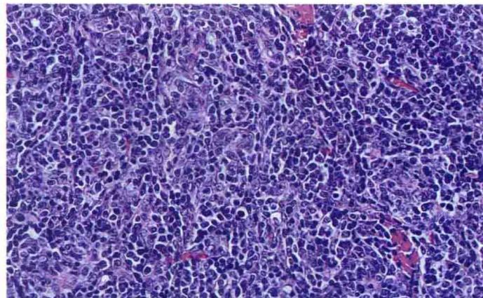 
图20-36 胸腺瘤显微镜下特点。肿瘤由肿瘤性上皮细胞和非肿瘤性淋巴细胞混合组成
肝及骨转移。
II型恶性胸腺瘤，是一种罕见的侵袭性肿瘤，也被命名为胸腺癌。形态学上多种多样，像鳞癌、淋巴上皮样癌（与口咽部淋巴上皮样癌相同），肉瘤样变异（癌肉瘤），以及一些少见类型。这些类型具有不同的上皮样形态，如果纵隔肿瘤缺少这种特征一般不是胸腺癌。

【临床表现】恶性胸腺瘤应行外科手术切除及
放疗，当出现远处转移时加以化疗。良性胸腺
瘤的预后很好，伴有或不伴有重症肌无力症状，没有预后评判价值。对于I型恶性胸腺瘤，预后与病变范围相关。大多数II型胸腺瘤在诊断后5年内死亡。
2. 纵隔肿瘤中 $20\%$ 是胸腺生殖细胞肿瘤 胸腺生殖细胞肿瘤可能起源于胚胎发育中残留的生殖细胞。纵隔生殖细胞肿瘤组织形态学类似于性腺生殖细胞肿瘤（见第17、18章）。成熟性囊性畸胎瘤最为常见，精原细胞瘤、胚胎性癌、内胚窦瘤、畸胎癌、不成熟畸胎瘤和绒毛膜癌都可以发生，混合性生殖细胞肿瘤常见。纵隔生殖细胞肿瘤有时会混有体细胞型恶性成分，如肉瘤、癌及血液系统恶性肿瘤。除了成熟性囊性畸胎瘤在两性发生率相仿以外，其他肿瘤大多数发生在男性，并且胸腺精原细胞瘤只发生在男性。除了纵隔的非精原细胞的生殖细胞肿瘤更具侵袭性以外，肿瘤的预后与发生于性腺的肿瘤相当。
（李雪）
# 第21章 内分泌系统
内分泌系统最主要的功能是通讯。虽然内分泌系统在产生可溶性介质及功能方面与神经系统有某些重叠，但其关键要素在于可以运用可溶性介质进行远距离沟通。荷尔蒙(hormone)一词用于指由“无导管”（如内分泌）腺体分泌入血液循环的化学物质，进而被运送到靶器官。多种激素如甲状腺素、皮质类固醇和垂体激素符合这一定义。相比之下，一些传统上公认的激素如儿茶酚胺类由多个部位产生，在局部或通过血液循环起作用。其他介质的功能仅限于局部循环；例如下丘脑激素仅作用于垂体，它不进入系统循环而是通过门脉系统到达垂体。最后，多种激素作用于产生该激素的同一组织，如苗勒管抑制物质。图21-1总结了这些形式多样的化学介导的细胞与细胞间的通信方式。化学信使必须结合细胞表面或内部的受体才能被称为激素。激素作用于终末效应靶腺或其他腺体，进而产生另一种激素。内分泌系统疾病可导致激素产生过多或不足。另外，靶组织敏感性低所导致的影响类似激素产生不足的相关情况。
# 第一节 垂体
# 一、垂体功能减退症
垂体功能减退症是指一种或一种以上垂体激素分泌不足，有许多病因和多种临床表现。最常见的是一种或几种垂体激素不足，偶尔会发生垂体功能全面衰竭（全垂体功能减退症）。垂体功能减退的结果随：①激素缺失程度；②具体受累激素；③患者年龄的变化而不同。一般而言，症状与甲状腺、肾上腺及生殖系统功能不足有关。对儿童来说，还有生长发育迟缓和青春期延迟（图21-2）。
垂体肿瘤：半数以上的成人垂体功能减退症由垂体肿瘤引发，通常是垂体腺瘤。肿瘤本身可以是功能性的，但垂体功能减退症的症状常常是由肿瘤压迫周围组织造成的。
Sheehan综合征：罕见情况下，全垂体功能减退综合征由垂体缺血坏死引发，而后者常常是由产后出血导致的严重低血压所致。严重后果包括无乳、闭经、甲状腺功能减退及肾上腺皮质功能不全。
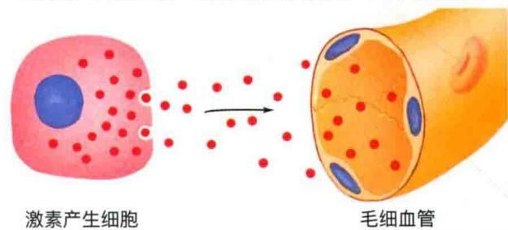 
内分泌（如胰岛素、促肾上腺皮质激素、甲状旁腺激素）
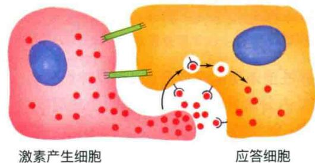 
旁分泌（如生长激素抑制素、蛙皮素）
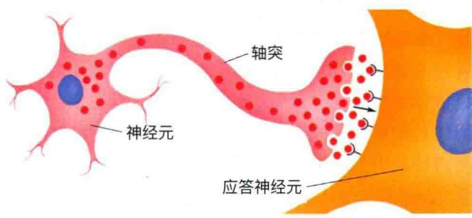 
突触（如乙酰胆碱、多巴胺）
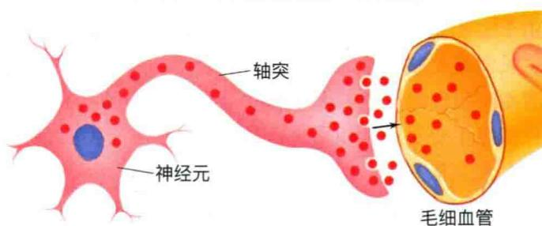 
神经内分泌（如抗利尿激素、肾上腺素） 
图21-1 化学介导的细胞间通信机制。除了通过血液循环的经典内分泌途径，生物信息可通过其他机制传送，这些机制包括旁分泌、突触及神经内分泌通信模式
垂体卒中：出血或梗死可发生于正常垂体，但至少半数病例的发生与无内分泌活性腺瘤有关。垂体卒中偶尔可引起垂体功能减退症，但通常无内分泌效应。
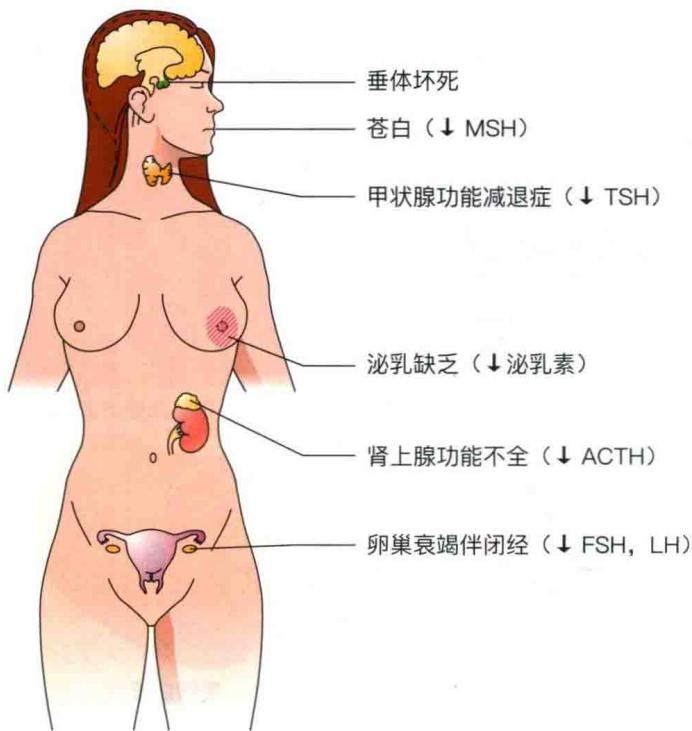 
图21-2全垂体功能减退症的主要临床表现。ACTH.促肾上腺皮质激素；FSH.卵泡刺激素；LH.黄体生成素；MSH.促黑素细胞激素；TSH，促甲状腺激素
医源性垂体功能减退症：放疗或神经外科操作时常引发神经内分泌异常，包括垂体功能减退症。
创伤：创伤性脑损伤是垂体腺的一个重要危险因素，与糖尿病、垂体功能减退症及其他内分泌病变的潜在发生有关。
垂体的遗传异常：先天性生长激素缺乏可单独发生（单纯性生长激素缺乏，IGHD）或伴随其他腺垂体、神经垂体激素缺乏。IGHD可为家族性或散发性。常染色体遗传形式与人生长激素基因相关或在基因中编码生长激素释放激素受体。另外，胚胎发育中的多个靶向转录因子的突变导致垂体异常发生，包括多种激素合成缺陷。
生长激素不敏感（Laron综合征）：Laron侏儒症是一种少见的、短小身材的常染色体隐性遗传病，是由于生长激素受体（GHR）异常和随之发生的极端的生长激素抵抗。临床上，患者易肥胖，伴高水平的血清GH和低浓度的胰岛素样生长因子-1（IGF-1）。这种情况主要见于地中海地区的人们，尤其是西班牙系犹太人。有趣的是，非洲俾格米人也有相同病变。
孤立性性腺激素缺陷（Kallmann综合征）：Kallmann综合征以促性腺激素分泌不足的性腺功能减退（由于促性腺激素释放激素，GnRH缺乏）和嗅觉丧失症（丧失嗅觉）为特征。唇腭裂和其他异常也可能出现。Kallmann综合征通常于青春期由于第二性征的出现延迟而诊断。男性更常见，是女性（1：8000）的 $3\sim 5$ 倍。大多数病例是散发的，尽管是X染色体连锁、常染色体隐性及显性家族性遗传疾病也有描述。
空碟鞍综合征：这原本是一个放射学术语，用以描述扩大的蝶鞍基底部内含一薄而平坦的垂体。空碟鞍综合征继发于先天性缺陷或蝶鞍隔缺失，这使得脑脊液压力被传递到鞍内。内分泌紊乱一般不严重，包括高催乳素血症、月经量过少或闭经、明显垂体功能减退、肢端肥大症、尿崩症及Cushing综合征。
# 二、垂体腺瘤
垂体腺瘤是腺垂体的良性肿瘤，常与垂体激素过度分泌及相应内分泌功能亢进有关。大多数病例为散发性，但 $5\%$ 有家族史。男女均可发生，成人更常见，仅 $2\%$ 的垂体腺瘤发生于儿童。泌乳激素腺瘤在儿童和成人都是最常见的分泌激素的肿瘤。小的非功能性垂体腺瘤偶见于 $25\%$ 的成人尸检。

【发病机制】垂体腺瘤病因尚不清楚，发病机包含激素因素和遗传因素。在少数病例有其发生可能有以下背景：
多发性内分泌肿瘤1型（MEN-1）是一种有遗传倾向垂体腺瘤、甲状旁腺增生或腺瘤、胰岛细胞瘤（见第15章）。然而，MEN1基因在垂体肿瘤中并未下调，且散发性垂体腺瘤无MEN1突变的证据。
Carney综合征是一种由黏液瘤、色素沉着和包括垂体腺瘤在内的内分泌功能亢进组成的综合征。常与蛋白激酶A型α调节亚单位(PRKAR1A)基因突变有关。患者可因分泌生长激素和泌乳激素的垂体腺瘤发生肢端肥大症。
■ 家族性孤立性垂体腺瘤（FIPAs）发生于年轻患者， $15\%$ 有芳香烃受体相互作用蛋白基因(AIP)突变。伴AIP突变的垂体腺瘤患者临床过程似乎更具侵袭性。
散发性垂体腺瘤最常与gsp癌基因激活突变有关，gsp癌基因是激活腺苷酰环化酶的Gs蛋白的激动亚单位。该突变见于 $40\%$ 分泌生长激素的垂体腺瘤。细胞内cAMP水平升高可刺激生长激素过度分泌及细胞增殖。

【病理】垂体腺瘤现根据其产生的激素进行分类。肿瘤大小不一，从不增加垂体大小的微小
病变到侵蚀蝶鞍、侵犯邻近脑组织的膨胀性肿瘤。通常， $10\mathrm{mm}$ 以下腺瘤被称为微腺瘤。较大的肿瘤称巨腺瘤。如不分泌激素，微腺瘤不引发症状。由于肿瘤体积较大，巨腺瘤易于引发局部压迫症状及全身表现。

【临床表现】垂体巨腺瘤产生肿块效应，压迫视交叉，导致严重头痛、双颞侧偏盲及中枢性视。肿瘤侵犯海绵窦时发生动眼神经麻痹。大的腺：①侵犯下丘脑；②干扰正常的下丘脑向垂体的③引起体温调节丧失、饮食过量及激素综合征。
# （一）高催乳素血症是垂体腺瘤引起的最常见内分泌疾病
几乎半数垂体微腺瘤含催乳素，但似乎很少分泌这种激素。虽然产生催乳素的肿瘤在年轻女性常常为症状性的，一半以上的产生催乳素的巨腺瘤发生于男性。通常，腺瘤越大分泌的催乳素越多。随机尸检催乳素腺瘤在两性的发生率相似。

【病理】催乳素腺瘤染色往往呈嫌色性，内含球形细胞核，有一个突出的核仁。虽然会出现性淀粉样蛋白（见第23章）及砂粒体（钙盐但不能因此而确诊该病。

【临床表现】女性功能性催乳素腺瘤引发闭经、溢乳及不孕。持续血PRL水平升高会抑制女性必需的垂体促黄体生成素高峰。男性往往有性及阳萎。多巴胺受体激动剂（溴隐亭）可抑制泌、成功治疗功能性催乳素微腺瘤，而巨腺瘤要外科手术。
# （二）生长激素细胞腺瘤分泌生长激素（GH）
显著改变源自生长激素过度分泌。发生于骨骺未闭合的儿童或青少年的生长激素腺瘤导致巨人症。相比之下，发生于长骨骨骺融合、已达成人身高后的生长激素细胞腺瘤导致肢端肥大症。大多数肿瘤是巨腺瘤，并因肿块效应而导致垂体功能减退。

【病理】 $75\%$ 的巨人症患者有一个生长激素巨噬腺瘤。其余多数有微腺瘤。孤立性生长激素细胞性变型包括由嗜酸性细胞组成的颗粒密集型（图1）和具嫌色细胞特征的颗粒疏松型。

【临床表现】肢端肥大症不常见，年发病率为3/1000000。多年后，肢端肥大症患者会逐渐出现粗陋面容(图21-4)，下颌骨及上颌骨过度生长，使牙齿间隙增宽及鼻端增厚。手和脚常增大，患者的尺寸增加。肢端肥大症具严重并发症，包括增生血管性、脑血管性及呼吸性疾病所致死亡。
生长激素细胞腺瘤常见治疗手段是经碟垂体腺瘤切除术，术后生长激素水平可在数小时内降至正常水平。手术禁忌时可选择放射治疗。长效生长抑素类似物，一种生长激素拮抗剂，是有效的辅助治疗。
# （三）促肾上腺皮质激素细胞腺瘤产生促肾上腺皮质激素（ACTH）
ACTH过量诱发肾上腺皮质激素分泌过多进而导致库欣综合征（见下文）。在大多数病例，肿瘤为强嗜碱性微腺瘤，过碘酸希夫反应（PAS）阳性。免疫组织化学显示ACTH及相关多肽，如脑啡肽及促脂解素。少数功能性促肾上腺皮质激素细胞腺瘤为嫌色细胞性，
比嗜碱性者更具侵袭性。
# （四）促性腺激素细胞腺瘤分泌黄体生成素（LH）和卵泡刺激素（FSH）
大多数促性腺激素细胞腺瘤是巨腺瘤，无激素活性，偶然或因压迫症状被发现。临床症状包括头痛、视觉障碍及垂体功能减退。通常，促性腺激素细胞腺瘤为嫌色性且 PAS 染色阴性。肿瘤细胞 FSH、LH 免
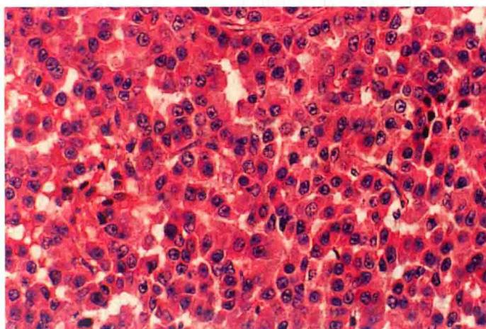 
图21-3来自一患肢端肥大症男性患者的生长激素细胞腺瘤。肿瘤细胞呈细条索及缎带样排列
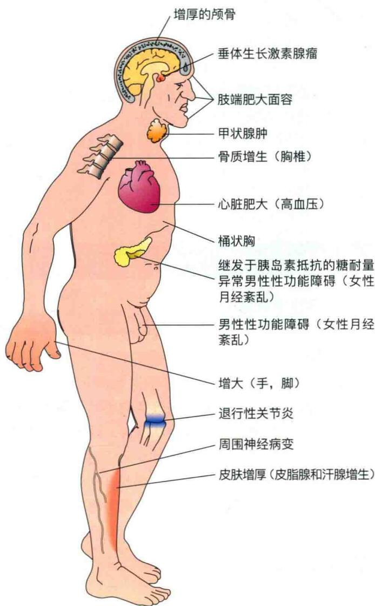 
图21-4 肢端肥大症的临床表现
疫染色均强阳性。治疗为手术切除
# （五）促甲状腺激素细胞腺瘤产生甲状腺刺激素（TSH）
促甲状腺素细胞腺瘤是最少见的垂体腺瘤，因甲状腺功能亢进、甲状腺肿症状或垂体肿块就诊。循环 TSH 和甲状腺激素水平通常升高，这是该肿瘤独有的。促甲状腺激素细胞腺瘤为嫌色性，多边形或柱状细胞围绕血管形成衣领状。肿瘤 $\alpha-$ 或 $\beta-\mathrm{TSH}$ 着色。长期甲状腺功能减退的患者因甲状腺激素反馈抑制不足，继发垂体促甲状腺细胞（甲状腺缺乏细胞）增生。
# （六）非功能性垂体腺瘤不引发内分泌病
1/4外科切除的垂体腺瘤不过度分泌激素。非功能性垂体腺瘤见于年长患者，为生长缓慢的巨腺瘤，因肿瘤肿块效应（压迫）就诊。
# 三、神经垂体
中枢性尿崩症（图21-5）是神经垂体相关唯一重要疾病。该病以不能尿浓缩及进而导致的慢性水利尿（多尿症）、口渴和抗利尿激素（ADH，血管紧张素）缺乏导致的多饮为特点。1/3中枢性尿崩症患者病因不明，或可归因于散发或家族性抗利尿激素-神经垂体素运载蛋白Ⅱ基因突变。抗利尿激素V2-受体（Xq28）及抗利尿激素敏感性、水通道-2、水通道基因突变或缺失在肾源性尿崩症也已有记述。
1/4中枢性尿崩症与脑肿瘤有关，尤其是颅咽管瘤。该肿瘤源于蝶鞍上方残余Rathke囊，浸润、压迫邻近组织。其余大多数尿崩症归因于创伤和因腺垂体肿瘤所行垂体切除术。神经垂体素粉末或抗利尿激素鼻吸剂或许可控制多尿症。
# 第二节 甲状腺
# 一、非毒性甲状腺肿
甲状腺肿指甲状腺结节性或弥漫性肿大，根据功能可分为两类。
非毒性甲状腺肿（来自拉丁语guttur，“咽喉”）指无功能性、炎症性及肿瘤性改变的甲状腺肿大，也称单纯性、胶样或多结节性甲状腺肿。因此，非毒性甲状腺肿的患者甲状腺功能正常，无任何形式的甲状腺炎（见下文）。女性患者远多于男性（8：1）。弥漫性甲状腺肿常发生于青春期或妊娠期，而多结节性甲状腺肿往往见于50岁以上人群。

【发病机制】在非毒性甲状腺肿，甲状腺产生甲状腺激素的能力受损导致甲状腺肿大
以维持正常甲状腺功能。甲状腺激素分泌减少的病
因不明。单纯性结节性甲状腺增大倾向家族性发生，提示该疾病与遗传因素有关。在一些罹患单纯性甲状腺肿的家族中已经检测到甲状腺球蛋白基因突变。甲状腺肿可发生于接受多种药物疗法的患者，如磺胺类药物或用碘过量。

【病理】非毒性甲状腺肿甲状腺大小可从正常甲状腺（40g）的两倍到重达数百克的巨大甲
状腺 (图21-6)。
弥漫性非毒性甲状腺肿是该疾病的早期特征。甲状腺弥漫性肿大，显微镜下可见增生、肥大的滤泡上皮细胞。滤泡上皮偶呈乳头状。该阶段滤泡内胶质含量减少。
多结节非毒性甲状腺肿反映了该病为慢性疾病。肿大的甲状腺逐渐变成结节状，切面特征性地布满大量不规则结节。当这些结节内含大量胶质时，甲状腺趋向红色、有光泽、质地柔软。显微镜下，结节大小、
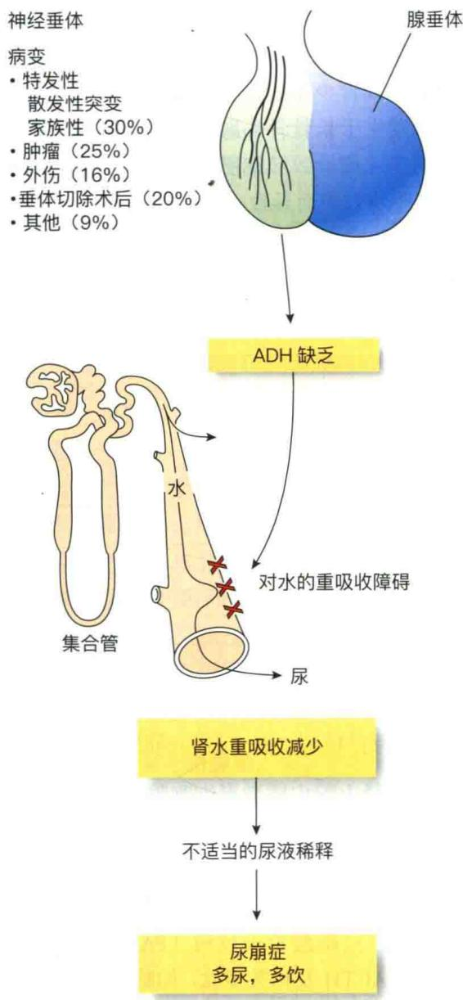 
图21-5 尿崩症的机制
形状变化很大。有些结节因内含胶质而膨大，有些结节塌陷。内含胶质的大滤泡可融合形成更大的“胶质囊肿”。内衬上皮细胞为扁平或立方状，偶尔排列成乳头状突入滤泡腔。单个或成组滤泡被致密的纤维化和营养不良性钙化分隔。出血和慢性炎症常见。
【临床表现】非毒性甲状腺肿患者常无症状，甲状腺素（ $\mathsf{T}_3$ 、 $\mathsf{T}_4$ ）及TSH（通常）血液浓度正常，因颈部肿块而就诊。大的甲状腺肿肿块可因压迫食管和气管而导致吞咽困难和吸气性喘鸣。压迫颈部静脉导致头面部静脉充血。压迫喉返神经可致声嘶。偶尔，结节或囊腔内出血引起局部疼痛。非毒性甲状腺肿最常用甲状腺素治疗来降低TSH水平，从而减小对甲状腺生长的刺激。许多非毒性甲状腺肿患者最终发展为甲状腺功能亢进症，这些病例被称为毒性多结节性甲状腺肿（见下文）。
# 二、甲状腺功能减退症
甲状腺功能减退指甲状腺素缺乏的临床表现，是以下三个普遍进程的结果：
甲状腺素合成缺陷，伴代偿性甲状腺肿（甲状腺肿性甲状腺功能减退症）。 
甲状腺实质功能不足，常由于甲状腺炎、外科切除甲状腺或放射碘治疗。
垂体或下丘脑促甲状腺释放激素（TRH）引起的TSH分泌不足。
隐匿发展的甲状腺功能减退症状反映了循环甲状腺素减少（图21-7）。首要表现常为乏力、嗜睡、畏寒、注意力不集中。多器官系统受影响，均为功能低下。甲状腺素可有效治疗甲状腺功能低下。
皮肤：在临床表现明显的甲状腺功能低下患者几乎普遍存在皮肤变化。蛋白聚糖在细胞外基质内聚集并与水结合，导致一种特殊的水肿，称为黏液水肿。黏液水肿的患者面部潮湿，眼睑水肿、手足水肿、舌头肿大。皮肤苍白、发冷反映了皮肤血管收缩。因皮脂腺、汗腺分泌不足皮肤干燥、粗糙。因毛细血管脆性增加常见瘀斑。皮肤伤口愈合慢。
神经系统：妊娠期甲状腺功能减退严重影响胎儿神经系统，表现为出生后呆小症（见下文）。成人甲状腺功能减退表现为无精打采、嗜睡、记忆力丧失及反应迟钝。精神症状突出，偏执妄想症和抑郁症常见。可发展为重度兴奋（黏液水肿性躁狂症）。
心脏：在未治疗的甲状腺功能减退症，黏液水肿性心脏以心脏扩张和心包积液为特征（见第11章）。
胃肠道：便秘常见，因肠蠕动减少导致，严重时可导致粪便嵌塞（黏液水肿性巨结肠）。
生殖系统：甲状腺功能减退症女性出现排卵障碍、
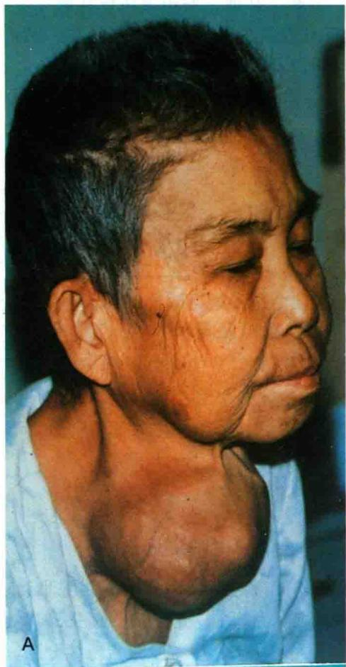 
图21-6非毒性甲状腺肿。A.一个患结节性甲状腺肿的中年女性，甲状腺增大形成明显的颈部肿块；B.肿大甲状腺的冠状切面，显示大量不规则结节，有些结节伴有囊性变及陈旧性出血；C.一个大体可见结节的镜下观察，显示滤泡大小变化明显
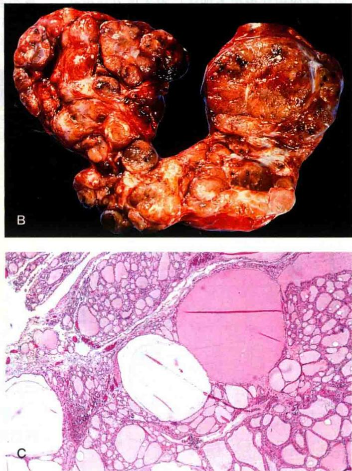
孕酮缺乏、经血不规则或经血过多。男性常见勃起功能障碍和少精液症。
# （一）原发性（特发性）甲状腺功能减退症常为自身免疫性
原发性甲状腺功能减退症最常见于 $40\sim 60$ 岁，与大多数甲状腺疾病一样更常见于女性。3/4患者外周血内有抗甲状腺抗原抗体，提示这些病例代表了自身免疫性甲状腺炎的终末期（见下文）。非甲状腺肿性甲状腺功能减退症也可因TSH或TSH受体被抗体阻断而未激活甲状腺引起。有些原发性甲状腺功能减退症是自身免疫性多腺体综合征（MEN）的部分表现，综合征包括胰岛素依赖型糖尿病、恶性贫血、甲状旁腺功能减退症、肾上腺萎缩和性腺功能减退症（见下文）。
# （二）甲状腺肿性甲状腺功能低下反映了甲状腺素分泌不足
在一些情况下甲状腺肿大（甲状腺肿）和甲状腺功能减退有关。甲状腺肿性甲状腺功能减退的病因包括碘缺乏、抗甲状腺物质（药物或饮食性致甲状腺肿原）、长期服用碘及一些先天性甲状腺素合成缺陷。甲状腺肿性甲状腺功能减退的进展与之前讲过的非毒性甲状腺肿类似。
1.地方性甲状腺肿 地方性甲状腺肿是由于疾病高发区饮食碘缺乏导致的甲状腺肿性甲状腺功能减退症。碘盐的广泛应用使得很多地区已消灭地方性甲状
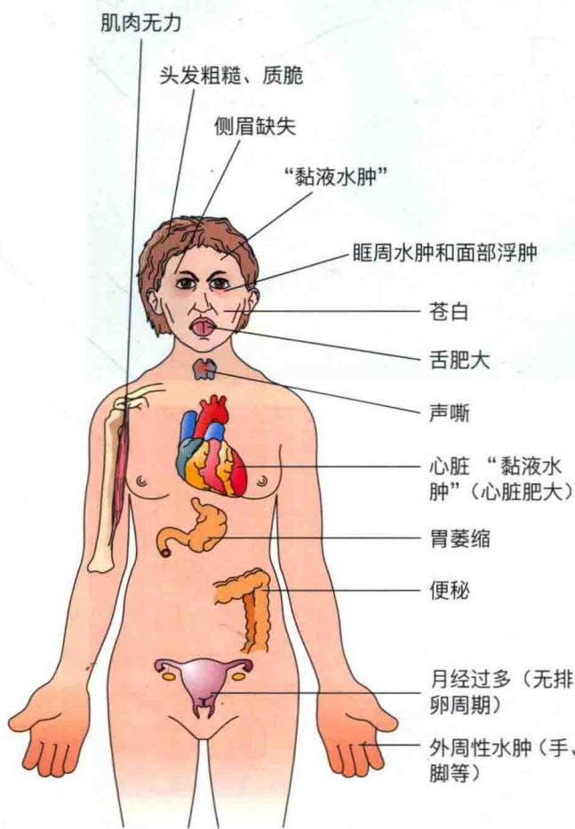 
图21-7 甲状腺功能减退症的主要临床表现
腺肿。然而，全世界有超过2亿的人依然罹患该疾病。地方性甲状腺肿的病理进展与非毒性甲状腺肿相似（见上文）。但是，与后者不同，地方性甲状腺肿罕见引起甲状腺功能亢进症。服用碘可逆转地方性甲状腺肿的早期、弥漫增生期，但对已完全发展为多结节性甲状腺肿的效果甚微。该疾病是甲状腺素替代疗法适应证，产生局部症状时可能需行外科切除术。
2. 抗甲状腺物质和碘诱发的甲状腺肿 一些药物和食物中自然产生的化学物抑制甲状腺素合成因而具有致甲状腺肿性。这些甲状腺肿可能与甲状腺功能减退相关或不相关。常见的致甲状腺肿的药物包括锂（用于治疗双极神经细胞障碍）、保泰松（phenylbutazone）、p-氨基水杨酸。某些十字花科植物（大头菜、油菜、木薯）内含甲状腺肿原，摄入这些蔬菜可使饮食碘缺乏进而引起甲状腺肿性甲状腺功能减退症。甲状腺肿和甲状腺功能减退症也可发生于摄入大量碘的人群，如医药成分（碘化钾含祛痰剂）或尤其富含卤化物的食物（如日本的海藻）。
# （三）先天性甲状腺功能减退症也称呆小症
呆小症可为地方性、散发性或家族性，患病女孩是男孩的2倍。在呆小症流行区大量病例反映了饮食碘缺乏，尤其是内陆和山区（见上文）。在非地方性流行的地区， $90\%$ 的病例由甲状腺发育缺陷（甲状腺发育不全）引起。其他主要由遗传性代谢障碍引起，包括编码TRH及其受体、TSH及其受体、钠碘转运体、甲状腺球蛋白及甲状腺氧化酶的基因突变。
【临床表现】先天性甲状腺功能减退症症状发生于出生后数周内。婴儿表情淡漠、反应迟钝，腹部膨隆，常见脐疝。体温常低于 $35^{\circ}C$ $(95^{\circ}F)$ ，皮肤苍白、冷。难治性贫血和心脏扩张常见。先天性甲状腺功能减退症的临床症状在6个月龄时充分显露。精神发育迟滞、生长发育迟缓（因骨质成熟障碍）及特征性面容明显。血清T4、T3水平低，TSH水平高（除非问题与TSH本身分泌缺乏有关）。需迅速甲状腺激素替代治疗以阻止精神发育迟滞、生长发育迟缓。虽然治疗可阻止侏儒症，其对精神发育的影响多变。早在新生儿筛查时就检测出甲状腺功能减退症的儿童对甲状腺激素治疗反应好，精神状态正常。延迟治疗与不可逆性脑损伤有关。
# 三、甲状腺功能亢进症
甲状腺功能亢进症是循环内甲状腺激素过多的临床后果。通常，甲状腺功能亢进的症状和体征反映了靶组织的高代谢状态。甲状腺激素持续分泌过可因子： $①$ 异常甲状腺刺激物（Graves病）； $②$ 甲状腺内在疾病（毒性多发结节性甲状腺肿或功能性腺瘤）； $③$ 因垂体
瘤导致 TSH 产生过多（罕见）。
# （一）Graves病是年轻人甲状腺功能亢进症最常见病因
Graves病，也称弥漫性毒性甲状腺肿，是一种以弥漫性甲状腺肿、甲状腺功能亢进、突眼症（图21-8）、行动过速、体重减轻及皮肤病为特点的自身免疫性病症。该病是美国最普遍的自身免疫性疾病， $0.5\% \sim 1\%$ 的40岁以下人群患病。

【发病机制】Graves 病的病因尚不完全明确,似乎是免疫机制、遗传、性别之间相互作用,可能还包括精神因素。
免疫机制：Graves患者有结合到TSH受体的IgG抗体，TSH受体位于甲状腺细胞膜上。该抗体作为激动剂刺激TSH受体，从而激活腺苷酰环化酶、增加甲状腺激素的分泌。在这种持续刺激下，甲状腺弥漫增生、血管丰富。Graves自身抗体有不同种类抗体组成，那些刺激甲状腺激素分泌的仅是其中一部分。其他抗体似乎是细胞毒性抗体，可能引发了继长期Graves病之后的甲状腺衰竭。这些抗体包括抗甲状腺球蛋白抗体、抗甲状腺过氧化物酶抗体及抗钠碘转运体抗体，它们可能也参与了慢性淋巴细胞性甲状腺炎（桥本甲状腺炎，见下文）的发病。
遗传因素：Graves病的最大危险因素是有家族史。遗传不是独立的因素，该疾病在单卵双胞胎的一致率仅为 $30\% \sim 50\%$ ，而在双卵双胞胎的一致率仅为 $5\%$ 。因而，遗传和环境因素可能
 
图21-8Graves病。一个患甲状腺功能亢进症的青年女性，显示颈部肿块及突眼
都与其发病有关。组织相容性Ⅱ类分子（如HLA-DR3, HLA-DQA1）使Graves病相对危险性增加到4倍。Graves病也与细胞毒性T淋巴细胞抗原-4（CTLA-4）多态性有关，表明了自体反应性T细胞的重要性。Graves病患者和他们的亲属发生其他自身免疫性疾病（包括恶性贫血和桥本氏甲状腺炎）的概率明显高于普通人群。
性别：如其他自身免疫性疾病，Graves病女性患者远多于男性（约为其 $7\sim 10$ 倍）。
情感影响：内分泌学家长期观察发现Graves病常发生在一段情绪压力期后，但缺乏定量数据。
吸烟：吸烟使发生 Graves 病的危险性加倍，并且加重了发生眼病患者的眼部病症。
眼病：虽然突眼（眼球突出）是Graves病的常见并发症（图21-8），但其发生及严重性与甲状腺激素水平相关性差。T淋巴细胞和B淋巴细胞均可被甲状腺滤泡细胞-眼眶成纤维细胞共同抗原致敏。这些细胞通过细胞因子合成或抗体介导受体激活作用，刺激眼眶成纤维细胞增生、产生胶原和葡萄糖胺聚糖。

【病理】Graves病甲状腺对称性增大，常为
$35 \sim 100 g$ 。切面质韧、暗红色。反映正常用
状腺胶质储存的半透明黄褐色显著消失。显微镜下，腺体弥漫增生、血管丰富。上皮细胞呈高柱状，常排列成乳头状突入滤泡腔。胶质趋向衰竭，在滤泡周边呈扇贝样及“虫蚀样”外观（图21-9）。间质内B、T淋巴细胞及浆细胞散在浸润，甚至可聚集形成有生发中心的滤泡。
突眼由眶内眼外肌黏液水肿增大、成纤维细胞聚集、淋巴细胞浸润所致。眼眶增加成分替代眼球将其推向前方（突出）。
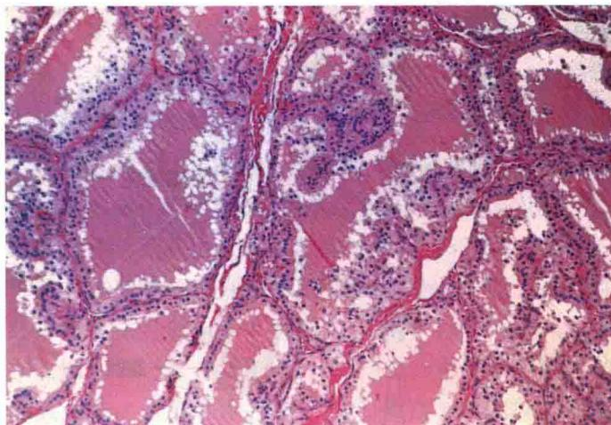 
图21-9Graves病。滤泡内衬增生的高柱状细胞。胶质粉染，在邻近滤泡细胞的边缘呈扇贝样
【临床表现】Graves病患者逐渐出现精神过敏、情绪不稳定、震颤、虚弱及体重减轻（图21-10）等非特异症状。他们不能耐热、向往较冷的环境、易于多汗，并可有报道所述的心悸。过多甲状腺激素减小了系统性血管抵抗，增强了心脏收缩，增加了心率。对之前有心脏疾病的患者可继发充血性心力衰竭。女性可发生月经量少，进而可进展为闭经。
体格检查显示对称性甲状腺增大，常伴可闻杂音及可触震颤。突眼及眼睑收缩使得巩膜上缘暴露。皮肤湿暖，有些患者有Graves皮肤病，一种由液体及葡萄糖胺聚糖聚积所导致的特殊胫骨前水肿。如摄取甲状腺放射活性碘增加、血清T4、T3水平升高及TSH水平很低则可确立Graves病的诊断。
Graves 病病程以时轻时重为特点。病症治疗包括使用抗甲状腺药物如硫代异氰酸酯，用放射活性碘破坏甲状腺组织及皮质类固醇、肾上腺素能拮抗剂辅助治疗。外科切除不常用。不幸的是，尽管甲状腺功能亢进可成功缓解，但突眼症状常持续存在，甚至加重。
# （二）毒性多发结节性甲状腺肿是源于功能自主性甲状腺结节
许多的非毒性多结节性甲状腺肿患者，年龄常超过50岁，最终发展为毒性甲状腺肿。类似其前驱疾病，毒性甲状腺肿女性患者10倍于男性。

【发病机制及病理学】毒性多结节性甲状腺肿功能自主性的机制尚不清楚。在有些患者，碘摄入弥漫且不受甲状腺激素的影响。显微镜下，甲状腺显示成簇增生的小滤泡与其他大小
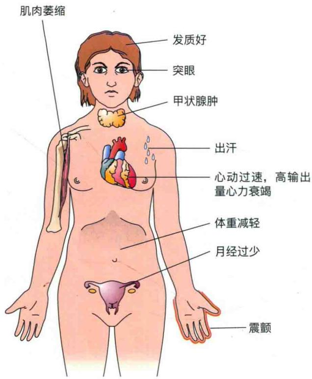 
图21-10 Graves病的主要临床表现
不一、似无活性的结节混合。另一类型以放射示踪碘在一个或多个结节中积聚为特点。这些结节功能亢进，抑制了其余甲状腺组织的功能。组织学上，功能性结节与非活性区界线清楚，内含增生的大滤泡，因而类似腺瘤。
【临床表现】毒性多结节性甲状腺肿患者甲状腺功能亢进症状的严重性常低于Graves病患者，且绝不会发生突眼。因为毒性甲状腺肿患者趋向为年长者，其心脏并发症，包括动脉纤维性震颤及充血性心力衰竭，可作为其主要临床表现。血清T4和T3水平往往只有极微升高，放射性示踪碘吸收可能正常或轻微升高。抗甲状腺治疗后使用放射性示踪碘治疗是最常用治疗方式。
# （三）毒性腺瘤是功能性肿瘤
毒性腺瘤是一个孤立、良性、高功能、滤泡性的肿瘤，发生于其他方面正常的甲状腺，是甲状腺功能亢进症的不常见原因。这种肿瘤：①显示自主性功能；②不依赖TSH；③给予甲状腺激素不会被抑制。毒性腺瘤功能亢进最终抑制其余甲状腺组织，导致其萎缩。基于上述，13I闪烁扫描显示极微碘摄入背景上的一个孤立性碘摄入中心（“热结节”）。许多但非全部毒性腺瘤，显示多种TSH受体基因体细胞激活突变。

【临床表现】毒性甲状腺腺瘤最常发生于 $30 \sim 50$ 岁。由于正常甲状腺组织被抑制，毒作用行放射性示踪碘有效治疗。大的结节可行外科
# 四、甲状腺炎
甲状腺炎描述了一组不同种类的甲状腺炎症性病变，包括由自身免疫机制和感染因素所致。
# （一）慢性自身免疫性甲状腺炎（Hashimoto 甲状腺炎，桥本甲状腺炎）是美国甲状腺肿性甲状腺功能减退症最常见原因
尽管任何年龄都可发生桥本甲状腺炎（HT），但该病主要发生于 $30\sim 50$ 岁女性。患者甲状腺弥漫增大伴轻度甲状腺功能亢进或甲状腺功能低下。该病可累及几个家庭成员，他们也常罹患自身免疫性疾病，如系统性红斑狼疮、Graves病、动脉炎及硬皮病。

【发病机制】HT的发病机制包括细胞免疫和体液免疫、遗传因素及环境因素。
■ 细胞免疫：HT的自身免疫过程始于CD4（辅助性）T淋巴细胞被甲状腺抗原致敏激活。辅助性T淋巴细胞激活可能始于病毒或细菌感染，导致自体反应性细胞毒性（ $\mathrm{CD8^{+}}$ ）T细胞增殖，损伤甲状腺细胞。 $\mathrm{CD8^{+}}$ 细胞分泌的γ干扰素引发甲状腺细
胞表达主要组织相容性复合体Ⅱ类分子，甲状腺细胞进而被损伤失。
体液免疫：活化的CD4细胞还能动员自身反应性B细胞产生抗甲状腺抗原的抗体。包括抗甲状腺微粒体过氧化物酶抗体（ $95\%$ ），抗甲状腺球蛋白抗体（ $60\%$ ）及抗TSH受体抗体。不同于Graves病中作为激动剂的抗TSH受体抗体，HT中的该抗体阻断甲状腺功能。这些免疫作用导致自身免疫性甲状腺炎患者的甲状腺内淋巴细胞明显聚集。
■遗传因素：HT患者半数一级亲属有抗甲状腺抗体，并且这些家庭成员有患Graves病和自身免疫性甲状腺炎的情况。患者及其亲属高发其他自身免疫性疾病，包括2型MEN综合征、1型糖尿病、恶性贫血、Addison病和重症肌无力，证明HT发病有家族倾向性。此外，自身免疫性甲状腺炎在Down综合征人群高发。
■环境因素：HT最常发生于碘摄入量最大的地区，如日本、美国。在碘缺乏地区，补充给碘使甲状腺慢性炎症的患病率和甲状腺自身抗体检出率显著增加。

【病理】大体观察，HT患者的甲状腺弥漫增
大、质韧，重 $60 \sim 200 \mathrm{~g}$ 。切面浅褐色、有肉
质感，呈模糊的结节样结构（图21-11）。包膜完整，周围甲状腺组织未受累。显微镜下，腺体显示：①明显的淋巴细胞和浆细胞浸润；②甲状腺滤泡萎缩、破坏；③富于线粒体的滤泡上皮细胞呈嗜酸性化生（Hürthle或Askanazy细胞）。可见淋巴滤泡，常伴有生发中心。

【临床表现】H $\dot{\mathsf{T}}$ 主要累及 $30\sim 50$ 岁女性，虽
然任何年龄均可受累。患者显示弥漫甲状腺肿
大，伴轻度甲状腺功能亢进或甲状腺功能低下。最终， $1/3 \sim 1/2$ 患者进展为明显的甲状腺功能低下，男性患者的危险性要明显高于女性患者。目前HT通过检测循环抗甲状腺抗体（见于 $95\%$ 的患者）、抗甲状腺球蛋白抗体及抗细胞膜抗体来确诊。患者T4水平低，血清TSH升高。许多患者无须治疗。甲状腺激素用于缓解甲状腺功能减退症及减少甲状腺大小。手术治疗用于对抑制性激素治疗无反应或有严重压迫症状的患者。
# （二）亚急性甲状腺炎（deQuervain，肉芽肿性，巨细胞性甲状腺炎）由病毒感染引起
亚急性甲状腺炎，也称肉芽肿性、deQuervain或非化脓性甲状腺炎，是一种自限性、少见病，以肉芽肿性炎为特征。该病常发生于上呼吸道病毒感染后，如流感病毒、腺病毒及柯萨奇病毒。有些病例由流行性腮腺炎病毒引起。deQuervain甲状腺炎主要累及 $30\sim 50$ 岁女性。
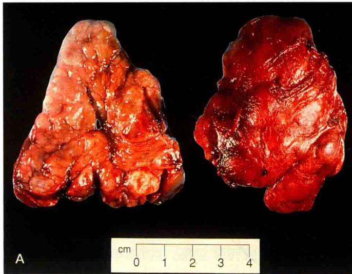
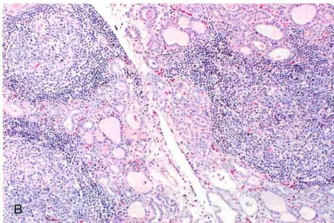 
图21-11 慢性自身免疫性（桥本）甲状腺炎。甲状腺对称性增大及粗糙结节。A.右叶甲状腺冠状切面示不规则结节及完整包膜；B.甲状腺镜下切面显示明显的慢性炎症浸润及许多萎缩的甲状腺滤泡。炎细胞形成明显的伴有生发中心的淋巴滤泡

【病理】甲状腺增大至 $40 \sim 60 \mathrm{~g}$ , 切面苍白、质韧。整个甲状腺呈急性炎症, 常伴微小脓肿, 淋巴细胞、浆细胞、巨噬细胞呈斑片状浸润。滤泡导致胶质释放, 继而引发显著的肉芽肿反应。可致异物性多核巨细胞, 内常含胶质。虽然炎症反应后可发生纤维化, 但正常甲状腺结构常可恢复。

【临床表现】亚急性甲状腺炎患者特征性地颈前疼痛或放射到下颌部，有时伴发热、不适及体格检查显示甲状腺中度增大，极软。亚急性炎常在数月内消退，无任何临床后遗症。
# （三）木样（Riedel）甲状腺炎导致甲状腺纤维化
称Riedel甲状腺炎为“甲状腺炎”其实是一种误称，因为这种罕见病也累及甲状腺外的颈部软组织。而且，该病常与其他部位包括腹膜后、纵隔、眼眶的进行性纤维化有关。Riedel甲状腺炎主要发生于中年人，男女比例为 $1:3$ 。病因不明，但似乎与其他类型的甲状腺炎无关。患者逐渐发病，呈无痛性甲状腺肿，表现为甲状腺硬块。可压迫气管（喘鸣）、食管（吞咽困难）、喉返神经（声嘶），需行外科手术。
# 五、甲状腺滤泡性腺瘤
滤泡性腺瘤是显示滤泡分化的良性克隆性增生的肿瘤，是甲状腺最常见的肿瘤，典型地发生于甲状腺功能正常的人，表现为孤立性“冷”结节，即肿瘤不摄取放射性示踪碘。滤泡性腺瘤单发、有包膜，肿瘤细胞排列成滤泡，类似正常的甲状腺组织或胚胎发生期甲状腺。多发性腺瘤也可发生。滤泡性腺瘤最常发生于 $30\sim 50$ 岁，男女比例1：7。

【病理】滤泡性腺瘤为一界线清楚的孤立性结节，直径 $1\sim 3cm$ ，突出于甲状腺表面，由
一薄层纤维包膜完整包裹。肿瘤切面质软，比周围甲状腺组织颜色浅。常见出血、纤维化及囊性变。图21-12举例说明了几个特征性的组织学类型。虽然这些亚型无特殊临床意义，识别它们的重要性在于将其与甲状腺癌鉴别。不典型腺瘤是以核分裂、细胞密集、核异型或可疑包膜浸润为特征但不能明确诊断为癌的滤泡性肿瘤。这些良性病变应与滤泡癌(见下文)鉴别，后者常有厚的包膜。确立诊断必须仔细评估包膜和血管浸润情况。恶性肿瘤的发生可与良性甲状腺结节相关，也可发生于良性甲状腺结节内。
# 六、甲状腺癌
恶性甲状腺肿瘤占美国癌症致死的 $0.3\%$ 。如今
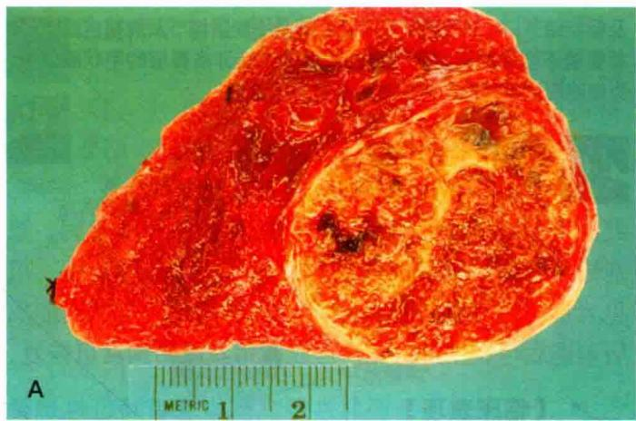
甲状腺癌在男性和女性都是数目增长最快的恶性肿瘤，每年大约有5.6万新发病例。临床和病理的主要关注点在于非肿瘤性病变、良性肿瘤和甲状腺癌之间临床鉴别上的困难。 $1\% \sim 10\%$ 的人会有甲状腺结节，但甲状腺恶性肿瘤仅占所有癌症的 $1\%$ 。单发结节有 $12\%$ 的可能是恶性的，如果结节可被触及，其恶性可能性明显降低（约 $3\%$ )。大多数甲状腺癌发生于 $20\sim 70$ 岁之间，虽然儿童也可发生。女性发生该病的概率比男性多3倍。多数病例行结节细针穿刺活检即可诊断。肿瘤形态可提示预后，从非常惰性的临床过程到迅速死亡都有可能，所幸的是，后者不常见。
# （一）甲状腺乳头状癌（PTC）是最常见的甲状腺癌
PTC占美国甲状腺癌散发病例的 $90\%$ 。 $20\sim 50$ 岁最常发生，男女比例1：3。然而，PTC可发生于任何年龄，也是儿童和青少年最常见甲状腺肿瘤。PTC在老年男性预后不良。

【发病机制】虽然PTC的病因仍未确立，一些相关因素已被识别。
用碘过度：在地方性甲状腺肿地区，饮食中加碘致使甲状腺癌形态上显示乳头的比例与滤泡相比增多。
放射线：颈部经受过外来放射线儿童和成人
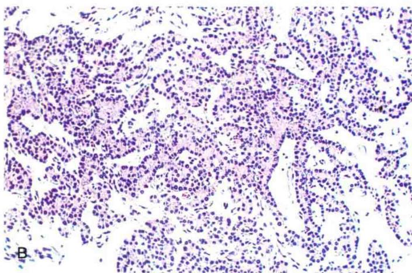
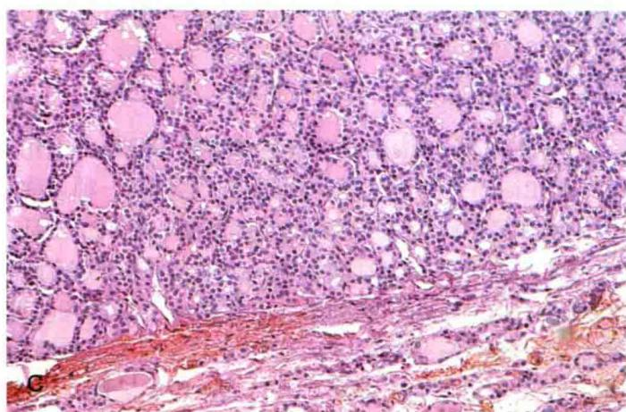 
图21-12 滤泡性腺瘤。A.胶质腺瘤，有包膜的肿块切面显示出血、纤维化及囊性变；B.胚胎型腺瘤，肿瘤呈小梁状结构，滤泡形成差，滤泡内含（如果有）少量胶质；C.胎儿型腺瘤，可见规则的小滤泡结构；D.嗜酸细胞腺瘤。肿瘤由有小而核规则的核和丰富嗜酸性胞质的细胞构成
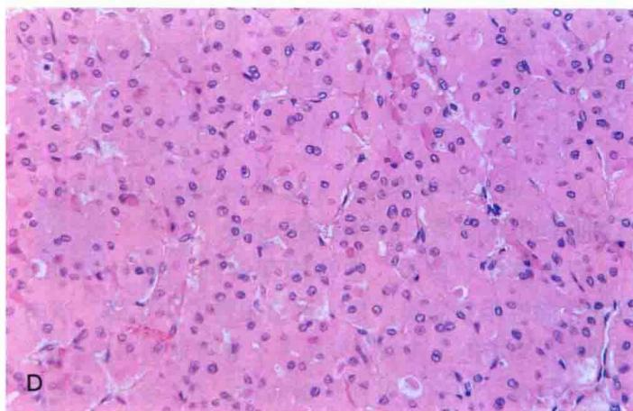
日后PTC的发生率增加。切尔诺贝利核灾难地区使放射活性的碘同位素泄露，周围污染区生活的儿童PTC的发生率升高100倍。
■遗传因素：流行病学研究报告PTC患者一级亲属发生PTC的危险是普通人群的 $4\sim 10$ 倍。单卵双胞胎发生PTC的一致性已被描述。家族性PTC约占所有病例的 $5\%$ ，但相关基因尚未确定。
体细胞突变：位于10号染色体（10q11.2）的RET原癌基因重排在PTC常见，暴露于切尔诺贝利核事故的该肿瘤患儿 $60\%$ 显示该基因突变。这些重排将RET基因的酪氨酸激酶区连接到各种其他基因，产生了RET/PTC融合基因。高达 $70\%$ 的PTC中可检测到B型Raf激酶（BRAF）基因点突变。该突变似乎与特定的临床病理特点相关，预示肿瘤的行为和发展。BRAF突变仅发生于PTC及PTC衍生的间变性甲状腺癌。

【病理】PTC肿瘤大小从微小病变到比正常甲状腺还大的肿瘤不等。对尸检取材、看似正常
的甲状腺进行连续切片，显示了高比例的、横径小于 $1\mathrm{mm}$ 的乳头状癌，但在这些病例中淋巴结转移罕见。乳头状癌可发生于甲状腺任何部位，包括峡部。PTC呈实性、灰白－浅黄色，有不规则、浸润性边界。病变可多发，偶有包膜（图21-13A）。
显微镜下，分支状乳头由中央的纤维血管轴心和被覆的单层或复层的立方至柱状细胞组成（图21-13B）。不规则或管状肿瘤性滤泡在肿瘤中常见，但乳头和滤泡成分的比例多变。核异型是个重要的诊断特点，包括透明的（毛玻璃样）核、嗜酸性假包涵体（胞质向核内内陷形成）及核沟。许多乳头状癌可见致密纤维化。钙球体（砂粒体）提示乳头状癌诊断，可见于半数病例。乳头状癌典型地浸润淋巴系统、扩散至区域颈淋巴结。淋巴结转移瘤大小从在其他方面正常的淋巴结内的极微小灶到令原发灶相形见绌的大肿块不等。1/4的PTC病例癌组织直接扩散至颈部软组织。血行转移比其他类型甲状腺癌中少见，但有时会发生，主要转移至肺。

【临床表现】PTC表现为：①在其他方面正常
的甲状腺内无痛性、可触及的结节；②结节伴
颈部淋巴结肿大；③颈部淋巴结病，无可触及的甲状腺结节。大于0.5cm的肿瘤在甲状腺闪烁扫描中可被检测到为冷结节。通常，PTC预后极好，预期寿命与普通人群相差甚微。术时颈部淋巴结转移不影响预后，少于 $10\%$ 的转移患者会死于该肿瘤。在PTC的致死性病例中，死亡主要由肺或脑转移或气管、食管堵塞引起。治疗包括手术（甲状腺叶切除或甲状腺全切），
伴或不伴颈部淋巴结清除术，跟随放射性碘治疗。
# （二）甲状腺滤泡性癌（FTC）很少是致命的
FTC是纯粹的滤泡性恶性肿瘤，无乳头及其他成分，约占甲状腺肿瘤的 $15\% \sim 20\%$ 。多数患者大于40岁，男女比例 $1:3$ 。FTC在地方性甲状腺肿地区未接受碘添加物的人群中高发。不过，在食盐中加碘的地区，例如美国，FTC并不常见，仅占所有甲状腺癌的 $5\%$

【发病机制】 $20\% \sim 45\%$ 的FTC有RAS
癌基因点突变和PAX8/PPARG (paired box
8/peroxisome proliferators-activated receptor-y)
重排。PPARG基因重排在伴血管侵犯的低级别肿
瘤和侵袭性滤泡癌中更常见。

【病理】滤泡癌大小不一，呈黄褐色，有一白
色的纤维性厚包膜。出血坏死区及灶状囊性变
常见。FTC进一步分为微小浸润和广泛浸润亚型。
微小浸润型FTC大体上边界清楚、有包膜。切面，
质软、淡褐色至粉红色，自包膜内膨出。显微镜下，
多数病例类似滤泡性腺瘤，尽管它们更趋向显示为微
滤泡或小梁状型。核分裂常见是区分滤泡性癌和良性
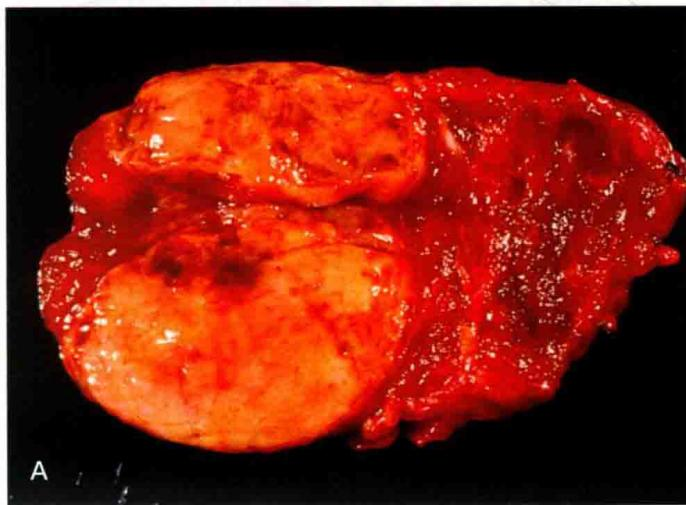
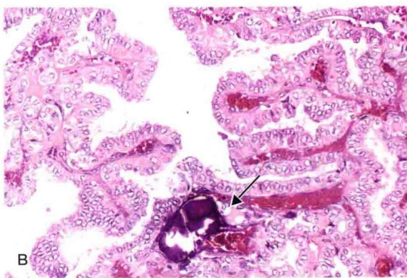 
图21-13 甲状腺乳头状癌。A. 手术切除的甲状腺切面显示界线清楚的浅褐色肿块伴灶状囊性变；B. 分枝状乳头衬覆着肿瘤性柱状上皮，细胞核透明。钙化球，或砂砾体明显（箭头）
腺瘤的一个特点。和腺瘤鉴别的关键点是肿瘤浸润或侵透包膜。
浸润性型FTC常易于诊断，因为肿瘤穿透包膜或显示血管侵犯（图21-14），常位于包膜内或邻近包膜。肿瘤也可蔓延至周围软组织。FTC不同于甲状腺乳头状癌，它主要通过血行转移而不是淋巴道，且主要转移至肩胛骨、骨盆带、胸骨及颅骨。

【临床表现】多数滤泡癌临床表现为孤立的可
触结节或增大的甲状腺。与生存率大约 $50\%$
的广泛浸润型滤泡癌相比，微小浸润型滤泡癌治愈率至少达 $95\%$ 。FTC治疗采取单侧甲状腺叶切除。转移病例可行放射性碘治疗。
# （三）甲状腺髓样癌（MTC）起源于甲状腺C细胞
MTC起源于鳃囊，分泌降钙素及其他多肽如5-羟色胺、ACTH及生长抑素。占所有甲状腺癌的不到 $5\%$

【发病机制】该疾病发生有散发性和家族
性两种形式，后者占病例的 $20\%$ 。家族
性髓样癌患者常有MEN型2A和2B，它们包括肾上腺嗜铬细胞瘤、甲状旁腺增生或腺瘤。在MEN2B患者，肿瘤发生于婴儿期，而在MEN2A发生于青少年。散发病例见于晚年。女性患者稍多(1.5:1)。在家族性病例中，遗传特性为常染色体显性遗传，性别分布均等。RET原癌基因体细胞突变已在 $25\% \sim 70\%$ 的散发性MTC病例中检测到。MTC患者平均年龄50岁，但家族性病例发生更早（平均年龄20岁）。

【病理】大体观察，MTC易发生于甲状腺上部
该部位最富于C细胞。肿瘤无包膜，但通常界
线清楚。切面质韧、灰白色。典型情况下，多边形、颗粒状瘤细胞呈实性排列，被明显的血管间质分隔（图21-15）。然而，肿瘤细胞的排列方式及细胞形态多变。间质淀粉样物是一个显著特点，是原降钙素沉积所致
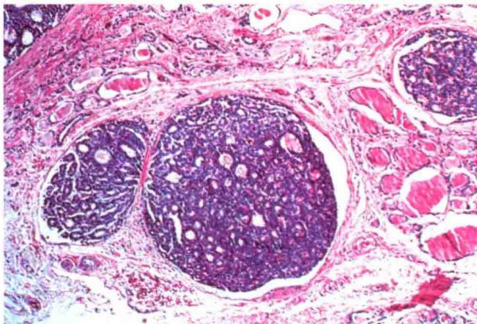 
图21-14 甲状腺滤泡癌。微小滤泡性肿瘤侵犯甲状腺实质内静脉
（图21-15C）。肿瘤细胞巢嵌在玻璃样变的胶原框架中。灶状钙化常见并可大到被放射检查发现。除了淀粉样物，髓样癌内也可含黏液和黑色素。几乎所有肿瘤都表达癌胚抗原。许多肿瘤也表达ACTH、5-羟色胺、P物质、胰高血糖素及人绒毛膜促性腺激素(HCG)。
MTC扩散方式包括直接侵犯软组织和转移至区域淋巴结及肺、肝、骨。有时，转移病灶可能是首发表现。转移瘤类似原发肿瘤，也常含淀粉样物。
MTC的家族性亚型的前驱病变是C细胞增生。因而，MEN型2A和2B（见肾上腺髓质章节）患者有发生MTC的危险性，可通过定期测量血清降钙素、癌胚抗原或嗜铬素来监测。当这些指标升高时，患者要行甲状腺全切术。

【临床表现】MTC患者常有分泌内分泌的相关
症状，包括类癌综合征（5-羟色胺）和库欣
综合征 (ACTH)。基于肿瘤分泌血管活性肠肽、前列腺素和一些激肽，1/3患者会发生水样腹泻。家族性MTC病例，由于嗜铬细胞瘤分泌儿茶酚胺患者可发生甲状旁腺功能亢进症、一过性高血压及其他症状。
MTC治疗方法为甲状腺全切术，但1/3患者肿瘤局部复发。预后取决于年龄（年轻及女性患者预后更好）、肿瘤大小及分期。其他预后指标包括组织学类型、核分裂数、坏死及降钙素的量。5年生存率 $60\% \sim 75\%$
# （四）甲状腺未分化癌常常是致命的
甲状腺未分化癌主要发生在60岁以上的女性（女男比约4：1）。约占甲状腺癌的 $10\%$ ，并且常见于地方性甲状腺肿好发地区。事实上，至少一半患者有长期甲状腺肿病史。此外，部分患者还有低级别甲状腺癌病史。所以，未分化亚型的发生似乎代表由良性或低级别甲状腺肿瘤向分化更差及更具侵袭性的甲状腺癌转化过程。p53肿瘤抑制基因突变在未分化癌中常见，而目前还没有发现RET基因活化。

【病理】甲状腺未分化癌表现为甲状腺内大的、
边界不清结节，常见侵及颈部软组织。切面灰
白色、质硬。最常见组织学形态为呈肉瘤样增生的异型梭形及巨细胞，多倍体核、易见核分裂象、可见坏死及间质纤维化（图21-16）。常见静脉及动脉浸润，可引起血管闭塞及肿瘤内局部梗死灶。

【临床表现】未分化癌压迫并破坏局部组织结
构。肿瘤表现为迅速增大的颈部肿物，伴随吞
咽困难、声音嘶哑、呼吸困难等症状，颈部淋巴结肿大。
预后差，常见广泛转移。患者5年生存率不到 $10\%$
放射治疗及化学治疗效果有限。
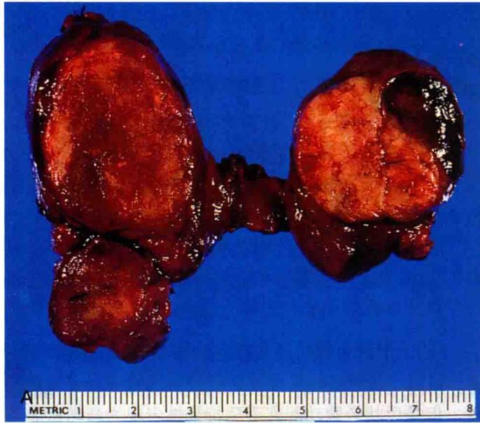
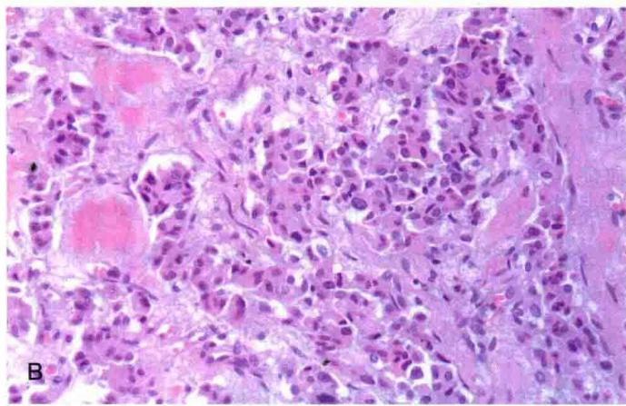
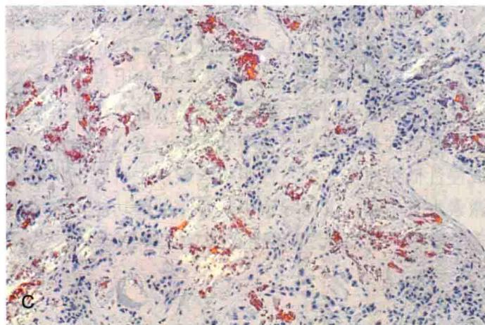 
图21-15 甲状腺髓样癌。A.完整切除甲状腺的冠状切面，显示一质韧、淡染肿物累及两侧；B.肿瘤以嵌入胶原框架的多边形细胞巢为特征。结缔组织间隔内含嗜酸性淀粉样物；C.切片行刚果红染色，在偏振光下观察，显示浅绿色双折光淀粉样物
# 第三节 甲状旁腺
# 一、甲状旁腺功能减退症
甲状旁腺功能减退症主要由甲状旁腺激素分泌减少（PTH）或者由于先天性或获得性的终末器官不敏感（假性甲状旁腺功能减退症）引起。该疾病临床特征性表现为低钙血症及高磷血症。
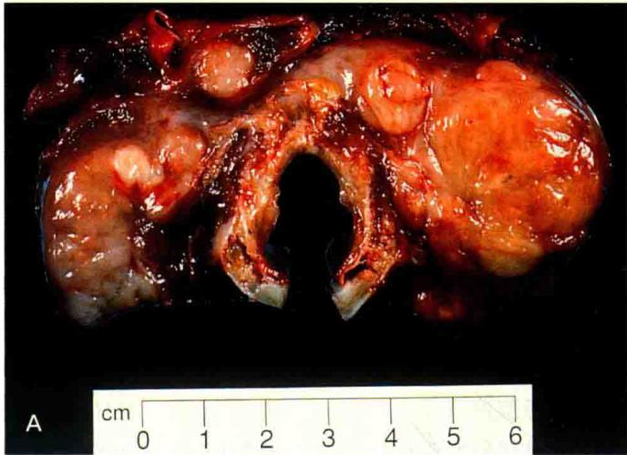
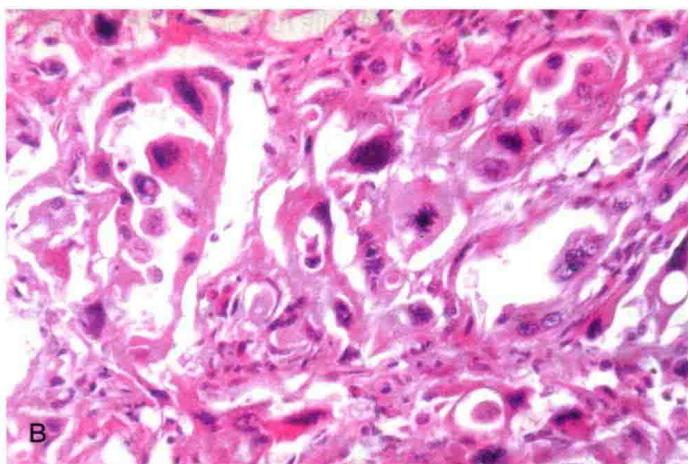 
图21-16 甲状腺未分化癌。A.肿瘤横切面部分区包绕气管，并侵及周围软组织；B.肿瘤由梭性细胞和巨细胞组成，并见多形性核及大量核分裂象
# （一）甲状旁腺功能减退症常常因为甲状腺切除手术同时切除甲状旁腺
甲状腺旁腺功能减退的症状与低钙血症有关。神经肌肉兴奋性增加可以引起手脚轻微刺痛感，严重的肌肉痉挛，手足抽搐，喉喘鸣及痉挛。神经精神病学表现包括抑郁症、偏执狂及精神病。脑脊液压力升高和视神经乳头水肿使其类似于脑肿瘤。各种原因引起的甲状腺功能减退症患者都可以通过补充维生素D以及钙获得满意的治疗。
家族性孤立性甲状腺功能减退症是十分罕见的代谢紊乱疾病，遗传形式多变，表现为PTH分泌缺陷。此种代谢紊乱是多种腺体症候群的一部分，还包括肾上腺功能不全、黏膜与皮肤念珠菌病。原发性甲状旁腺功能减退症发生于少见的异质性群体中，散发或者家族性，都表现为PTH分泌缺陷。甲状旁腺发育不全是迪乔治综合征（DiGeorge syndrome）的一部分（见第4章）。
# （二）假性甲状旁腺功能减退症表现为靶器官对PTH敏感性减低
是一组以低钙血症为特征的遗传性疾病，是20号染色体长臂GNAS1基因突变的结果。基因突变导致
Gs活性减低，Gs蛋白和激素受体结合激活腺苷酸环化酶。因此，在肾小管上皮中，对应PTH的cAMP产物减低，进而减少钙从肾小球滤过液中的重吸收。患假性甲状旁腺功能减退症的患者也常对其他cAMP-结合激素产生抵抗，包括TSH、胰高血糖素、FSH及LH。
# 二、原发性甲状旁腺功能亢进症
原发性甲状腺功能亢进症是一种持续性PTH产生，缺乏肠道及肾脏甲状旁腺激素刺激。可以由甲状旁腺腺瘤（ $80\% \sim 90\%$ ）、甲状旁腺增生（ $10\% \sim 15\%$ ）或甲状旁腺癌（罕见， $1\% \sim 5\%$ ）导致。PTH可以是散发性或部分家族性综合征例如MEN-1和MEN-2A。
# （一）大部分甲状旁腺功能亢进症是由甲状旁腺腺瘤引起
甲状旁腺腺瘤约占所有原发性甲状旁腺功能亢进症的 $85\%$ 。这种肿瘤出现在散发性或作为MEN-1一部分（ $20\%$ ，见下文）。腺瘤发生在任何年龄，但主要在50岁以后。

【病理】甲状旁腺腺瘤界线清楚、红褐色、实性肿物，直径 $1\sim 3cm$ ，重 $0.05\sim 200g$
常见出血区，囊性变偶见。显微镜下，在丰富的血管网内肿瘤性主细胞片状增生，细胞核多形性常见。腺瘤包膜外围绕正常甲状旁腺组织，从而可以区别腺瘤和甲状旁腺增生。未受累的腺体常常萎缩。外科切除肿瘤常可缓解甲状旁腺功能亢进症引起的临床症状。
# （二）原发性甲状旁腺增生偶尔引起甲状旁腺功能亢进症
大约 $15\%$ 甲状旁腺功能亢进症的病例是由原发性甲状旁腺增生引起。其中约 $75\%$ 发生在女性， $20\%$ 与家族性甲状旁腺功能亢进症或MEN综合征（MEN1型和2A型）相关。1/3散发性原发性甲状旁腺增生是单克隆性，提示为肿瘤性增生。在这种情况下，同一腺体中可见主细胞增生及多发小腺瘤。与散发性甲状旁腺功能亢进症相关因素有外部辐射及锂摄入。

【病理】大体上，4枚甲状旁腺均增大，总重量
从小于 $1 \sim 10 g$ 。约半数患者, 一个腺体显著
大于其余腺体，造成与甲状旁腺腺瘤鉴别困难。显微镜下，正常腺体脂肪组织被增生排列成片状、梁状或腺泡状的主细胞替代。增生与腺瘤最大区别为前者缺乏多形性。
# （三）甲状旁腺癌约占甲状旁腺功能亢进症的 $1\%$
甲状旁腺癌十分罕见，主要发生在 $30\sim 60$ 岁男性及女性。它是一种功能性肿瘤，大多数患者有甲状旁腺功能亢进症表现。该肿瘤病因不明，但颈部放射
及有甲状旁腺腺瘤病史的遗传性综合征是危险因素。

【病理】甲状腺旁腺癌体积比腺瘤大，分叶状、质硬、浅褐色、无包膜肿块，常与周围软组织显微镜下，肿瘤大部分呈小梁状排列，有明显个裂象和厚的纤维条索。偶见包膜及血管侵犯。但是，在腺瘤中常见的细胞非典型性在甲状旁腺是罕见。
手术切除后，局部复发常见；约1/3.患者有局部淋巴结、肺、肝和骨转移。10年生存率约 $50\%$ ，死因多与甲状旁腺功能亢进症有关。
# （四）甲状旁腺功能亢进症的临床特点多种多样
虽然一些患者缺乏症状，仅因常规外周血液检查发现，但是甲状旁腺功能亢进症特征性表现为高钙血症及低磷血症。另一些为多种系统性表现，肾和骨骼疾病（图21-17）。过多PTH导致骨骼中钙流失，增加钙在肾小管重吸收。PTH刺激肾小管产生活化维生素D，使肠道对钙吸收增加。PTH对肾作用与高钙血症导致低磷血症。常见症状为呕吐、恶心、乏力、体重下降、厌食症、多尿、多饮。多数患者可触及颈部肿块。甲状旁腺功能亢进症引起的经典骨骼损害是囊性纤维性骨炎，发生于少数患者且加速疾病进展。肾、神经系统及胃肠道系统也常受累。具体内容详见第26章。
# 三、继发性甲状旁腺功能亢进症
继发性甲状旁腺增生主要见于慢性肾功能衰竭患者，但也与维生素D缺乏、肠道吸收障碍、范科尼综合征（Fanconi syndrome）、肾小管性酸中毒相关。肾脏保磷、肾病引起维生素D缺乏、骨骼对甲状旁腺激素拮抗等因素导致代偿性甲状旁腺激素分泌增加，造成慢性低钙血症。继发性甲状旁腺增生引起甲状旁腺激素水平增高，进而导致甲状旁腺继续功能亢进症相关骨表现，称为肾性骨营养不良（见第26章）。
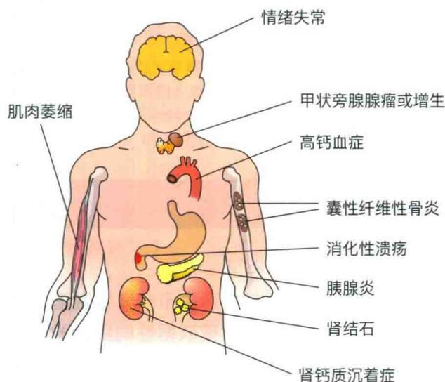 
图21-17 甲状旁腺功能亢进症的主要临床表现
# 第四节 肾上腺皮质
# 一、先天性肾上腺皮质增生症
先天性肾上腺皮质增生症（congenital adrenal hyperplasia，CAH）由一些常染色体隐性遗传性酶缺陷造成胆固醇合成皮质醇过程障碍所致。缺陷程度从轻微到完全性缺乏。总体来说，皮质醇合成缺乏导致无法拮抗ACTH作用，进而肾上腺皮质增生。CAH在男性及女性中发病概率相同，也是新生女婴两性畸形的常见原因（图21-18A）。

【病理】肾上腺增大，重量可达30g（见图21-18B）。切面质地软、黄褐或棕褐色、弥漫
性或结节性增大。显微镜下：球状带与髓质之间皮层增宽。增生区为排列紧密、颗粒状、嗜酸性细胞。大多数病例中，球状带也增生，虽然不像其他区域尤其是束状带那么显著。
# 二、21-羟化酶（P450c21）缺陷症
编码 $\mathrm{P450}_{\mathrm{C21}}$ （CYP21）的基因与六号染色体短臂（6p21.3）上MHC基因连接，与HLA-B， $C4A$ 和 $C4B$ 互补基因关系密切。此种基因突变与 $90\%$ 以上的CAH相关。白种人发病率约 $1 / 10000$ ，阿拉斯加爱斯基摩人约 $1 / 500$ 。 $\mathrm{P450}_{\mathrm{C21}}$ 是一种微粒体酶，它促使17-羟孕酮转化为11-去氧皮质醇。此种酶活性缺陷造成皮质醇合成受损，聚集的前体物质转换为雄激素。

【临床表现】皮质醇刺激或积聚的类固醇多种合成途径引起相应临床表现。CAH有多种形式：
$①$ “经典型”； $②$ “非经典型”，白种人常见，与经典型相比发病迟缓、症状轻； $③$ “隐匿型”，有生物化学改变，但是无症状。 $\mathrm{P450}_{\mathrm{C21}}$ 缺乏引起的经典型CAH表现为
几种遗传学上完全不同的综合征。下文所述亚型见于新生儿。
单纯男性化CAH：此种CAH是由基因突变引起21-羟化酶非完全灭活，酶活性减低至 $2\%$ 。皮质醇前体转化为肾上腺雄激素的增加，是由于ACTH-依赖性肾上腺体积增大。女性新生儿在宫腔里就暴露在过量肾上腺雄激素中，表现为假两性畸形，出生时阴唇融合、增大的阴蒂及泌尿生殖窦让人误以为是阴茎尿道（图21-18A）。性别模糊可导致女婴被误认为成男性。男婴性器官无异常，但会出现性早熟。最终，高水平肾上腺雄激素导致骨骼早闭合及身材矮小。患CAH的成年女性无生育能力，但男性有生育能力，但是部分表现为无精症。
失盐型CAH：基因突变导致21-羟化酶完全失活引起失盐型 $\mathrm{CAH}_{\circ}21$ 羟化酶缺乏导致醛固酮合成受损。低醛固酮血症发生在约2/3新生儿出生前几周内，临床表现为低钠、高钾、脱水、低血压及肾素分泌增加。如果不予治疗可以迅速致命。这两种由 $\mathrm{P450}_{\mathrm{C21}}$ 缺乏引起的CAH亚型可应用糖皮质激素和盐皮质激素抑制ACTH及类固醇替代治疗。外科重建手术对于有两性生殖器的男性化女童是必要的。
迟发型先天性肾上腺皮质增生症：非经典型21羟化酶缺乏的患者出生时无异常，但是青春期可出现男性化表现。年轻女性迟发型CAH患者与多囊卵巢综合征鉴别困难。多数男性患者无明显症状。此种CAH与比经典型CAH常见，尤其在阿什肯纳兹犹太人、意大利人及巴尔干半岛南部人群多见。
# 三、 $11\beta-$ 羟化酶缺陷症引起 $5\%$ 先天性肾上腺皮质增生症
在一般人群中此种代谢紊乱不常见，但是在阿什
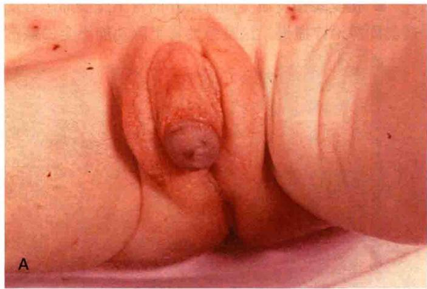 
图21-18先天性肾上腺皮质增生症。A.女婴可见明显的男性性征，过度增大的阴蒂和部分融合的阴唇皱褶；B.7周男婴，死于严重失盐的先天性肾上腺增生。尸检，双侧肾上腺明显增大
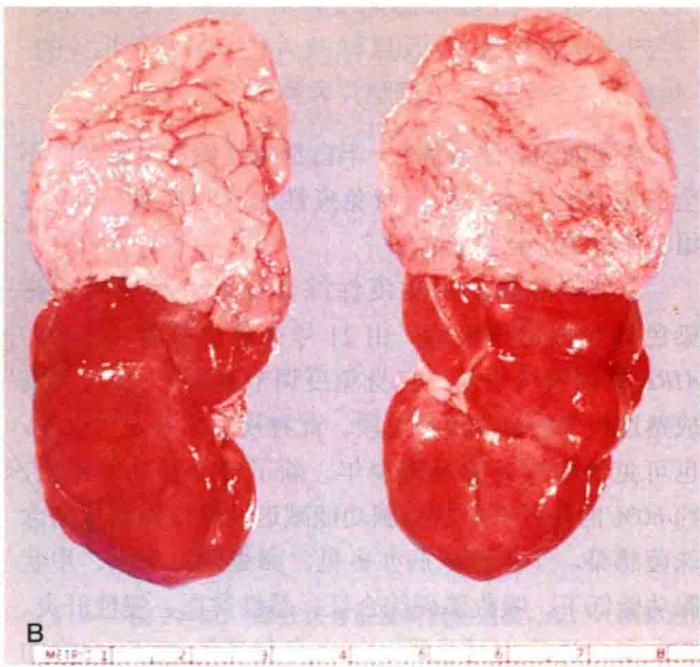
肯纳兹犹太人及在以色列摩洛哥血统人群中是最常见的CAH病因。 $11\beta$ -羟化酶的基因（位于8号染色体）催化皮质醇合成过程中末端羟化。它的缺乏引起高水平的11-脱氧皮质醇，略增高的盐皮质激素。因此，除了雄激素增高相关症状外，盐皮质激素活性增高引起钠潴留及其伴随高血压。
# 四、肾上腺皮质功能不全
肾上腺皮质激素产生缺乏由以下引起：①肾上腺组织破坏；②垂体或下丘脑功能缺陷引起ACTH合成减少；③长期皮质类固醇治疗。
# （一）原发性慢性肾上腺功能不全（Addison病）常表明肾上腺的自身免疫性破坏
Addison病是一种由于肾上腺产生糖皮质激素、盐皮质激素和雄激素功能丧失导致的致命性代谢障碍。它可以引起虚弱、体重减轻、消化道症状、低血压、电解质紊乱和过度色素沉着。
【发病机制】西方国家，自身免疫占肾上腺功能不全病因的 $75\%$ ，虽然从世界范围来看结核病是最常见的原因。自身免疫性肾上腺炎也许是一种独立的或两种不同的自身免疫性多内分泌腺病综合征的一部分。有证据表明散发性病例也许是自身免疫性多内分泌腺病综合征Ⅱ型的亚型（见下文）。其他原因引起的肾上腺破坏，包括转移癌、淀粉样物质沉积、出血、结节病和真菌感染。在特发性Addison病，常见肾上腺脑白质营养不良生物化学缺陷（详见第28章）。罕见由先天性肾上腺发育不全或家族性糖皮质激素缺乏症（ACTH受体缺陷）引起的肾上腺功能不全。大多数肾上腺功能不全的自身免疫性发病机制的证据如下：①肾上腺中淋巴细胞浸润；②循环血液中可以检测到针对肾上腺抗原的抗体；③细胞免疫异常；④其他自身免疫性内分泌疾病有关；⑤具有HLA位点的基因相关的疾病。腺体破坏常由细胞介导免疫反应造成。
多腺体内分泌疾病：一半自身免疫性肾上腺功能不全的患者合并有其他自身免疫性内分泌疾病。分为2组多腺体内分泌综合征。
I型多腺体自身免疫性综合征是一种罕见的常染色体隐性遗传疾病，由21号染色体长臂（21q22）AIRE基因突变引起（自身免疫调节基因），参与免疫成熟过程中的自身选择阶段。此种疾病略好发于女性，也可见于较大儿童及青少年。除了肾上腺功能不全，约 $60\%$ 的患者有甲状旁腺功能减退及慢性黏膜皮肤念珠菌感染。I型糖尿病亦多见。卵巢发育不全、甲状腺功能低下、吸收障碍综合征、恶性贫血、慢性肝炎、脱发和白斑病也可见到。与自身免疫性Addison病的
常见形式相似，I型多腺体疾病患者血清学可检测到类固醇合成自身抗原及其他指标。
II型多腺体自身免疫性综合征（Schmidt综合征）比I型多见，常常包括肾上腺功能不全。女性发病率是男性2倍。常见于 $20\sim 40$ 岁。多达半数是家族性，且已明确多种遗传形式。2/3患者有自身免疫性甲状腺炎、偶发桥本甲状腺炎和Graves病。胰岛素依赖性糖尿病和卵巢发育不全常见。此种疾病被认为是多基因疾病且与HLA-DR3相关。
【病理】表现慢性肾上腺功能不全之前，大于 $90\%$ 的肾上腺已被破坏。自身免疫性肾上腺炎导致组织苍白、不规则腺体萎缩、重量在 $2\sim 3g$ 或更低。髓质完整但被纤维组织包裹，其中有成岛状萎缩的皮质细胞(图21-19)。随着疾病进展的不同阶段，不同程度以T细胞为主的淋巴细胞浸润。
【临床表现】通常，Addison病首发症状是轻微虚弱，可以严重到患者卧床不起。始终存在的厌食症及体重减轻。皮肤可见广泛的棕褐色色素沉积黏膜面可见黑色斑块。皮肤广泛色素沉着与垂体前促黑激素激活皮肤的黑素细胞刺激激素（melanocytes-stimulating hormone，MSH）有关。血压低，通常在80/50mmHg范围内波动。各种消化道症状，包括呕吐、腹泻及腹痛，可出现于大多数患者，并且常以此为主诉就诊。Addison患者常表现出明显的人格改变甚至脑器官性综合征。应用糖皮质激素及盐皮质激素替代治疗，患者可以过上正常生活。
# （二）急性肾上腺功能不全是危及生命的急症，
急性肾上腺功能不全，或肾上腺危象表现为肾上腺皮质功能突然消失。症状与盐皮质激素缺乏相关性多于糖皮质激素不足。肾上腺危象发生在以下3种情况：
接受长期皮质类固醇治疗的肾上腺萎缩患者皮质类固醇治疗撤退。这是急性肾上腺功能不全的最常
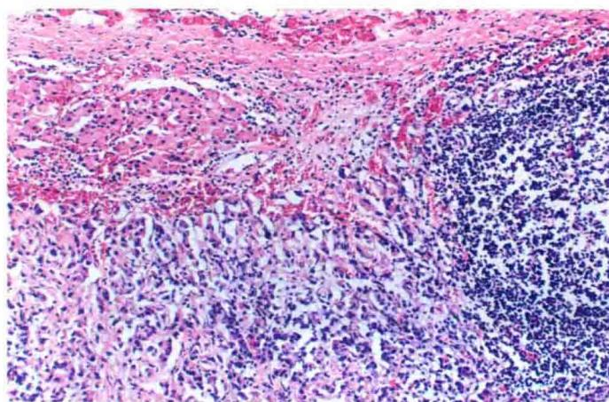 
图21-19 自身免疫性肾上腺炎。一位Addison病患者的肾上腺切片，显示皮质慢性炎症及纤维化，呈岛状分布的萎缩皮质细胞及完整的髓质
见原因。
慢性肾上腺功能不全患者可能由于感染及外科手术后，导致急剧恶化。 
■华－弗综合征是一种急性、双侧肾上腺皮质出血性坏死，常继发于脑膜炎双球菌或铜绿假单胞菌败血症（见第7章）。

【临床表现】肾上腺危象最初表现常为低血压
和休克。非特异性症状通常包括虚弱、呕吐、
腹部疼痛及昏睡，昏睡可逐渐发展成昏迷。典型的华-弗综合征患者表现为一个年轻患者突发低血压和休克，同时伴随腹部及背部疼痛，发热和瘀斑。肾上腺危象几乎总是致命的，除非患者能及时得到积极的类固醇皮质激素及相关支持治疗。
# 五、肾上腺皮质功能亢进
肾上腺增生或肿瘤引起类固醇皮质激素分泌过多（图21-20）。这种高功能状态常表现为 $1\sim 2$ 种形式，分别为皮质醇增多症（库欣综合征）、醛固酮增多症（Conn综合征），代表了两种肾上腺类固醇激素分泌紊
乱的主要类型。
临床特点包括肥胖、多毛症、闭经，这些表现反映了高水平的糖皮质激素。综合征可以由以下4种情况引起：①垂体高功能状态；②肾上腺腺瘤或癌；③异位产生的ACTH；④肿瘤或医源性皮质类固醇应用导致促肾上腺皮质激素释放激素。任何原因引起的皮质醇增多症都被称为库欣综合征，而Cushing病则是垂体的促肾上腺皮质激素细胞肿瘤分泌过多ACTH引起。由垂体肿瘤导致分泌过ACTH的量常常是肾上腺肿瘤导致皮质类固醇分泌增多的5倍。在美国，库欣综合征最常见的病因是长期应用皮质类固醇治疗免疫及炎症疾病所引发。第二常见病因是非垂体肿瘤产生ACTH相关的副肿瘤综合征。
# （一）垂体及异位源性ACTH依赖性肾上腺皮质功能亢进症

【发病机制】女性常见，多见于 $25\sim 45$ 岁
进展为Cushing病是男性的5倍。过多
ACTH分泌导致肾上腺皮质增生。ACTH依赖性肾
图21-20 库欣综合征发病机制通路。ACTH依赖通路 
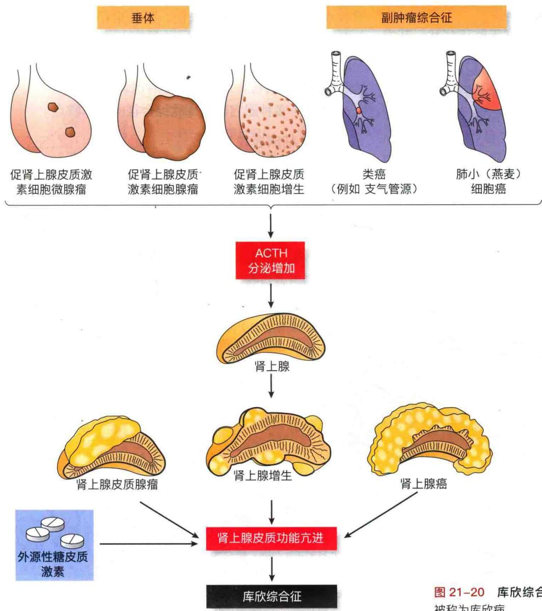 
被称为库欣病
上腺皮质功能亢进症由以下原因引起。
垂体引起原发性ACTH分泌增多（Cushing病）。此种疾病由垂体促肾上腺皮质激素细胞微腺瘤或由垂体促肾上腺皮质激素细胞增生引起。 
■ 异位ACTH大多数由恶性肿瘤引起ACTH依赖性肾上腺皮质功能亢进。肺癌，尤其是小细胞肺癌，引起一半以上异位ACTH综合征。 
下丘脑外肿瘤引起肾上腺激素释放激素异常分泌，导致继发性垂体ACTH高分泌。

【病理】Cushing病表现为双侧，弥漫性（75%）
或结节状（25%）肾上腺增生。每个腺体重量
通常为 $8 \sim 10g$ ，偶尔最高可达 $20g$ 。所观察到的增生可能是弥漫性或结节性。
# （二）肾上腺肿瘤引起的ACTH非依赖性肾上腺皮质功能亢进
成年人肾上腺癌发病高峰40岁，腺瘤发病推迟10年左右。儿童肾上腺癌占库欣综合征约一半； $15\%$ 由肾上腺腺瘤引起。总体来讲，女性与男性发病率比约 $4:1$
1.肾上腺腺瘤 肾上腺皮脂腺瘤可产生激素，主要产生类固醇及醛固酮。由于常常无临床症状，其发病率尚不清楚。腺瘤常见于综合征如MEN-1。

【病理】肾上腺皮质腺瘤少见。典型腺瘤包膜
完整, 实性, 黄色, 略呈分叶状, 直径约 $4 \mathrm{~cm}$ (图
21-21)。重 $10\sim 50g$ ，记载最重者达 $100g$ 。切面斑驳状黄色和棕褐色，偶尔因脂褐素沉积呈黑色。肿瘤周围见薄层被推挤的正常腺体。坏死及钙化可见，即使在小的腺瘤中。显微镜下，腺瘤由透明细胞及富含脂质细胞（束状带型）排列成片状或巢状，常伴有紧密排列的少脂质、嗜酸性细胞（网状带型）周围非肿瘤皮质及对侧腺体广泛萎缩。
2. 肾上腺皮质癌 肾上腺皮质癌是一种罕见、侵
袭性肿瘤，每年发病率1/1000000。多种遗传性肿瘤综合征与良性及恶性肾上腺肿瘤相关，包括李-佛美尼症候群（Li-Fraumeni syndrome，LFS）、贝克威思-威德曼症候群（又称脐膨出-巨舌-巨体综合征，Beckwith-wiedemann syndrome，BWS）及MEN-1。 $80\%$ 肾上腺皮质癌是功能性。更常见于女性且预后差。肿瘤常见转移至肺、肝及淋巴结，局部复发常见。

【病理】肿瘤重达100g以上，质软，界线清楚
分叶状，体积大。切面呈多彩状，间杂粉色、黄色，常见坏死、出血及囊性变。局部浸润常见，常肾上腺腺体难以辨认。显微镜下，有透明细胞细胞两种细胞，可见不同程度的核多形性。核分坏死及血管侵犯可能明显或不明显。功能性癌中，上腺皮质萎缩。大多数肾上腺皮质癌无法完全切使手术切除，多数患者只能存活1～3年。
# （三）长期皮质类固醇激素治疗引起的ACTH非依赖性库欣综合征
很多免疫性或炎症性疾病都需要糖皮质激素治疗，构成库欣综合征目前为止最常见的病因。通常使用的合成激素（例如：地塞米松、甲泼尼松）仅有糖皮质激素的活性，很少或没有盐皮质激素或雄激素作用。因此，高血压及多毛症更常见于肾上腺增生或肿瘤引起的库欣综合征，而不见于这种医源性病变。
# （四）多种器官都有库欣综合征的临床特点

【临床表现】库欣综合征的临床表现（图21-
22）取决于过量皮质类固醇激素水平高低及时
，也与肾上腺雄激素及盐皮质激素水平有关。
肥胖：典型的患者从脸部肥胖（满月脸）开始逐渐进展为颈部肥胖（水牛背），躯干及腹部肥胖。四肢很少受累，甚至消瘦。约 $70\%$ 的患者为女性，不倒 $20\%$ 的患者青春期前发病。
皮肤：皮肤萎缩，皮下脂肪减少。腹部增大以及其
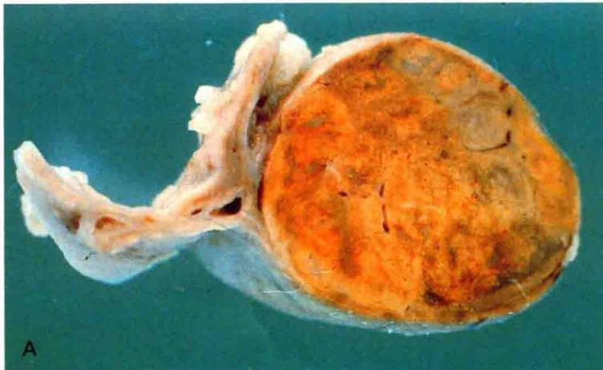 
图21-21 肾上腺腺瘤。A.库欣综合征患者的肾上腺腺瘤切面呈斑驳状黄色，周围有薄层被挤压的正常肾上腺组织；B.显微镜下可见透明细胞及富含脂质细胞呈巢状排列
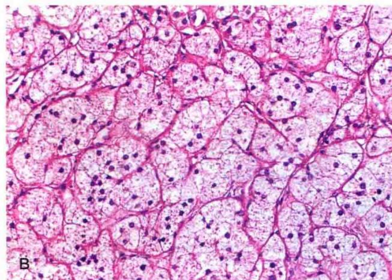
他部位脂肪沉积拉伸薄层皮肤，静脉血管透过变薄的真皮显现，使腹部皮肤出现紫色条纹。
骨骼肌肉系统：骨吸收增加导致骨质疏松。背痛常见，约1/5库欣病患者有脊柱压缩性骨折的影像学表现。近端肌肉萎缩（类固醇性肌病）引起无力，严重时可以导致患者无法站立或爬楼梯。
心血管系统：高血压常见，反映出过度的盐皮质激素活性。老年人，充血性心力衰竭是常见结局。
第二性征：女性库欣综合征患者常有男性特征，脸部毛发增多、头皮头发稀疏、痤疮和月经稀发。过多盐皮质激素引起男性患者性功能障碍，包括性欲过高及减退。
葡萄糖不耐症：糖皮质激素增加糖异生引起葡萄糖不耐症及高胰岛素血症。15%的患者可发展为糖尿病，多见于那些有家族性糖尿病史的患者。
心理上改变：多数库欣综合征患者，包括内源性及医源性，都有不同程度人格改变。包括易怒、情绪不稳定、抑郁及偏执狂。心理状态极度紊乱的患者甚至选择自杀。
所有类型库欣综合征都特征性地表现为糖皮质激素水平升高。地塞米松抑制试验可以辨别ACTH依赖及ACTH非依赖性库欣综合征。地塞米松抑制垂体ACTH分泌，如果为激素依赖性库欣综合征则出现皮质醇增多症。然而，此实验对肾上腺肿瘤无效。
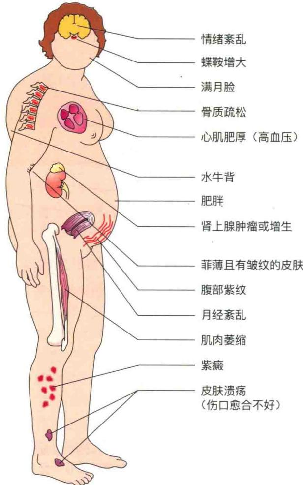 
图21-22 库欣综合征的主要临床表现
库欣综合征治疗方法：①垂体，肾上腺或异位产ACTH肿瘤的摘除（手术或放疗）；②停止皮质类固醇治疗；③应用肾上腺酶抑制剂（例如鲁米特、酮康唑、甲吡酮）。与恶性肿瘤无关的库欣综合征治愈率很高。
# （五）原发性醛固酮增多症（Conn综合征）引起高血压和低血钾
肾上腺腺瘤或增生引起醛固酮分泌增加。分泌醛固酮的腺瘤女性常见，男女比约 $1:3$ ，且常发生在 $30\sim 50$ 岁之间。

【发病机制】大约 $75\%$ 原发性醛固酮增多症患者由孤立性肾上腺腺瘤（醛固酮瘤）引起。
1/4的患者与肾上腺增生相关。其余为双侧肾上腺球状带增生引起。只有极少数原发性醛固酮增多症由肾上腺癌引起。
有三种家族性醛固酮增多症。I型（糖皮质激素可抑制性），是一种常染色体显性遗传病。11β-羟化酶基因的ACTH反应启动子调节区与醛固酮合成酶基因融合成产生杂交醛固酮的基因。此种异位重组融合基因激活束状带，造成双侧肾上腺束状带增生。通过抑制ACTH释放，糖皮质激素可改善I型症状。相反的，II型家族性醛固酮增多症与肾上腺皮质腺瘤相关，并且（因此）糖皮质激素无法改善。III型家族性醛固酮增多症最近被描述，严重高血压为首发症状。此种疾病基因缺陷是十分罕见的胚系编码钾离子通道亚单位基因（KCNJ5）显性突变。
醛固酮分泌过多增加肾小管钾离子重吸收，从而增加体内钠含量。高血压不仅因为钠潴留导致持续性血容量扩增，而且与外周血管阻力增加有关。低血钾反映了醛固酮诱导的肾远曲小管钾离子丢失。

【病理】多数分泌醛固酮的腺瘤直径小于 $3\mathrm{cm}$ 重量通常小于6g，黄色。但大小变化可以很大
至今报道最大者达50g。显微镜下，肿瘤主要由富于脂质的透明细胞构成，类似于球状带细胞，排列成索状、腺泡状。核多形性不明显。与产生皮质醇激素腺瘤相反，醛固酮增多症肾上腺的非肿瘤性皮质不萎缩，因为醛固酮不抑制腺垂体分泌ACTH。

【临床表现】多数原发性醛固酮增多症患者是在发现无症状舒张期高血压后才得以确诊。骨
髂肌中钾离子耗竭导致肌无力及虚弱。多尿和多饮缘于肾脏浓缩功能障碍，可能继发于低血钾。代谢性碱中毒及碱性尿常见。腺瘤引起原发性醛固酮增多症可通过外科手术切除肿瘤而治愈。Conn综合征的双侧肾上腺增生可通过醛固酮拮抗剂治疗，在糖皮质激素抑制性高醛固酮血症患者可用地塞米松治疗。
# 六、转移癌
肾上腺转移癌通常来自肺、乳腺及原发于皮肤的恶性黑色素瘤。单侧或双侧腺体极度增大，可达 $20\sim 45\mathrm{g}$ 。肾上腺大部分被肿瘤组织替代，常见坏死及出血。通常情况下，需要保留足够功能性肾上腺皮质才能保证Addison病不发展，要优先考虑到这些患者有限的生存期。
# 第五节 肾上腺髓质和副节瘤
# 一、肾上腺嗜铬细胞瘤是罕见的泌儿茶酚胺性肿瘤
嗜铬细胞瘤是分泌儿茶酚胺的肾上腺髓质嗜铬细胞的肿瘤。如果发生在肾上腺外则称之为副神经节瘤。任何年龄都可发生，包括婴儿，但是60岁以后不常见。常见症状是持续性或阵发性高血压。其他症状包括苍白、焦虑、心律失常。虽然嗜铬细胞瘤仅占高血压患者不到 $0.1\%$ ，但是对任何高血压患者都应该考虑到该肿瘤。如果发现早，肿瘤可以通过外科手术顺利切除，但是延误治疗，患者可能死于长期高血压引起的并发症。

【发病机制】嗜铬细胞瘤常散发。少数具有遗传性，单独发病或作为遗传性综合征中一
部分,例如多发性内分泌肿瘤综合征2A型(MEN2A)及2B型(MEN2B)、von Hippel-Lindau病、神经纤维瘤病I型(NF1)及McCune-Albright综合征。
常染色体显性MEN综合征特点如下（图21-23）：
■ MEN1型（Werner综合征）与嗜铬细胞瘤无关，但是绝大多数与：①垂体腺瘤；②甲状旁腺增生或腺瘤；③胰腺的胰岛细胞肿瘤（胰岛素瘤、胃泌素瘤）。此种疾病由MEN1肿瘤抑制基因突变引起（染色体11q13），此基因编码一种称为
menin 的蛋白。
■ MEN2型综合征患者几乎都发生甲状腺髓样癌，约一半患者发生嗜铬细胞瘤。MEN2型综合征与位于染色体10q11.2上的RET原癌基因有关。RET基因编码跨膜酪氨酸激酶受体，它结合胶质细胞源性生长因子（glia-derived growth factor）和神经营养因子（neurturin）。RET基因突变检测被用来确诊MEN2型患者及确诊家族遗传性的无症状患者。要对携带RET基因突变的6～35岁人群进行甲状腺癌、嗜铬细胞瘤和甲状旁腺功能亢进症筛查，并提供预防性甲状腺切除术。
MEN2A（SIPPLE综合征）：约 $95\%$ MEN-2型患者是2A。除了甲状腺髓样癌及嗜铬细胞瘤，1/3患者有继发于甲状旁腺增生或腺瘤的甲状旁腺功能亢进症。不同种类的神经源性肿瘤也可见于MEN2A型，包括胶质瘤、胶质母细胞瘤和脑膜瘤。先天性巨结肠症也与MEN2A型相关。
MEN2B：与 MEN2A 相似，但发生早 10 年左右。甲状旁腺疾病不常见。黏膜神经瘤综合征（结膜、口腔、喉及胃肠道的神经节细胞瘤）是 MEN2B 临床表现。黏膜神经瘤常见，但仅一半患者表现完整表型。
在 $10\% \sim 20\%$ 的散发嗜铬细胞瘤患者中发现RET基因体细胞突变。另外，一些散发病例有vonHippel-Lindau（VHL）基因及1型神经纤维瘤病(NF1)基因突变。
有报道认为一些 MEN2A 和 MEN2B 患者发生肾上腺髓质增生早于嗜铬细胞瘤。大体上，增大的肾上表现为腺髓质膨大。嗜铬细胞比正常时大，并排列成明显的巢状或索状。
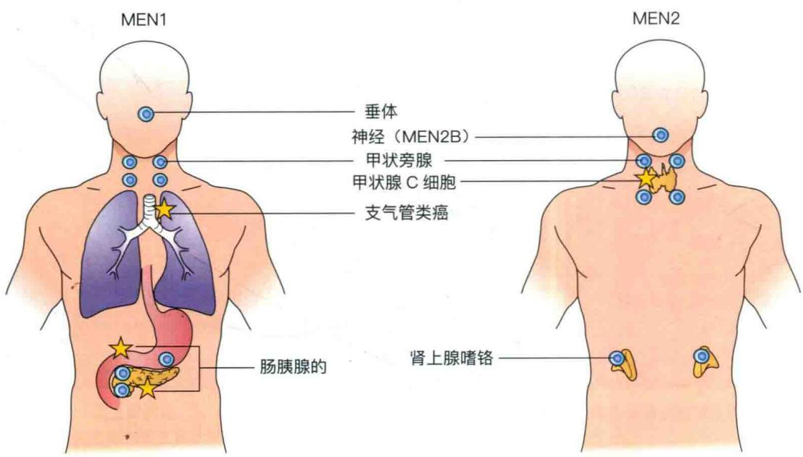 
图21-23 多发性内分泌肿瘤综合征。显示遗传性MEN综合征1型和2型最常见内分泌肿瘤的位置
【病理】散发性嗜铬细胞瘤中 $80\%$ 为单侧， $10\%$ 双侧， $10\%$ 肾上腺外。 $10\%$ 恶性， $10\%$ 发生在儿童。相反，发生在上文提到的MEN综合征中的嗜铬细胞瘤有2/3是双侧。嗜铬细胞瘤常常有包膜，质软，淡红色肿块，有明显中央瘢痕、出血及灶状囊性变（图21-24A）。组织学表现多样。典型者肿瘤细胞排列成巢状，呈器官样（zellballen）。少数排列呈梁状或实性。肿瘤细胞呈多边形或梭形，有颗粒状，嗜双色性或嗜碱性胞质和空泡状核，胞质内常见嗜酸性小球。细胞多形性明显，可见多核瘤巨细胞（图21-24B）。免疫组织化学染色证实肿瘤的神经内分泌特性，表现为NSE、CgA、Syn阳性。肿瘤富含毛细血管。 $5\% \sim 10\%$ 病例为恶性嗜铬细胞瘤，可能高于发生于肾上腺外的肿瘤。恶性只能从嗜铬细胞瘤的生物学行为来确定（也就是转移），从组织学无法判断。良性和恶性嗜铬细胞瘤都可有核分裂象、细胞多形性、包膜或血管侵犯和坏死。转移常见于区域淋巴结、骨、肺和肝。
【临床表现】典型表现，阵发性分泌儿茶酚胺引起突然发作或连续几小时危象，伴有严重搏动性头痛、出汗、心悸、心动过速、腹痛和呕吐。血压可升高，常为急剧升高。腹腔内容物（包括肿瘤）压力增加可导致突然发作，例如锻炼、举重、弯腰或用力腹部触诊。超过 $90\%$ 嗜铬细胞瘤患者发生过高血压，其中2/3长期发作的患者与原发性高血压相似。1/3阵发性高血压的患者可转变为长期性甚至恶性高血压。心绞痛和心肌梗死可发生在无冠状动脉疾病患者。心脏并发症归因于高水平儿茶酚胺引起的心肌坏死（儿茶酚胺心肌病）。
尿中儿茶酚胺代谢物增高，尤其是香草扁桃酸(VMA)，肾上腺素和非儿茶酚胺结合物，可用以诊断嗜铬细胞瘤。外科手术切除是其治疗方法。β肾上腺素能阻滞剂用来控制高血压危象，β肾上腺素能受体拮抗剂作为辅助治疗。
# 二、副神经节瘤是发生于肾上腺外的嗜铬细胞瘤
副神经节瘤可发生于任何部位的副神经节，包括腹膜后、颈部、后纵隔和膀胱。膀胱副神经节瘤症状特异，表现为排尿时头痛和突然发作的高血压。肿瘤也可以发生于颅底、颈部、迷走神经或主动脉体或任何有副神经节组织的器官，例如喉及小肠。大部分（90%）头颈部副神经节瘤为良性，而发生在腹膜后者多为恶性。主动脉体瘤是副神经节瘤起源于颈动脉分叉处原型副神经节瘤，常形成颈部可触及的肿块。有趣的是，颈动脉体瘤发生在高海拔地区人群比在海平面地区人群高10倍，提示肿瘤为颈动脉体对长期缺氧
的增生性反应。
# 三、神经母细胞瘤
神经母细胞瘤（neuroblastoma，NB）是一种神经嵴来源的胚胎性恶性肿瘤，由神经母细胞组成，发生在肾上腺髓质，脊柱旁交感神经节和交感神经副神经节。神经母细胞瘤是儿童最常见的颅外实体瘤，占儿童所有癌症的 $10\%$ ，占因癌症死亡儿童的 $15\%$ 。总体发病率1/7000，3岁之前为发病高峰。
神经母细胞瘤在一些患者中为先天性，甚至可见
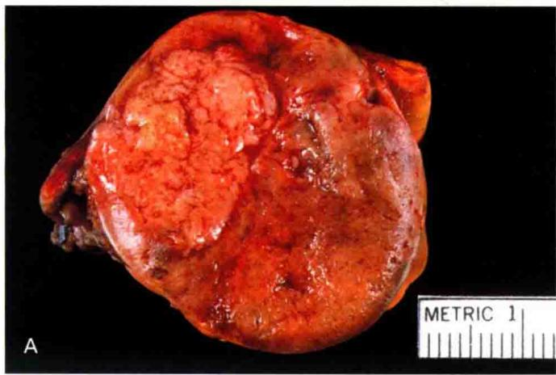
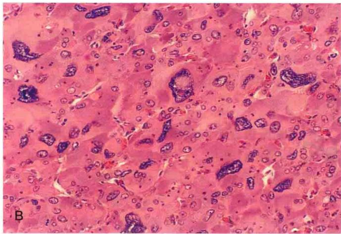
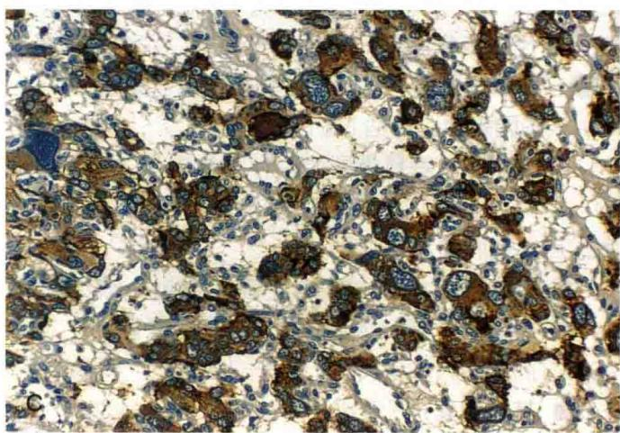 
图21-24 嗜铬细胞瘤。A. 一位阵发性高血压患者肾上腺肿瘤切面红褐色，显著纤维化，局灶出现和囊性变；B. 肿瘤显微照片显示多边形肿瘤细胞，胞质内充满细颗粒；C. 大多数肿瘤细胞 $\mathrm{CgA}$ 染色免疫组织化学染色阳性，神经内分泌来源鉴别指标
于早产死婴。事实上，约一半神经母细胞瘤在出生后一个月之内即确诊。青春期及成年人中可见偶发病例。虽然神经母细胞瘤为散发性，但仍有少数家族性病例报道。神经母细胞瘤可出现在神经纤维瘤病1型（NF1），脐膨出-巨舌-巨体综合征，先天性巨结肠中。

【发病机制】肾上腺髓质和可能其他部分交感神经系统的胚胎发育会持续到出生后一年
之内。胚胎结构的持续性和转化也许和NB的发病机制相关。1号染色体缺失（1p35-36）和N-myc基因扩增是神经母细胞瘤的特征基因改变，后者决定神经母细胞瘤侵袭性。现认为1号染色体编码抑制N-myc扩增的基因。

【病理】NBs 可以发生于任何具有神经嵴来源细胞的部位（即从颅后窝到尾骨）。1/3 肿瘤
发生于肾上腺，另1/3见于腹腔内，后纵隔约 $20\%$ 。NBs大小可从微小几乎无法看到结节到从腹壁就可轻易触及的肿瘤。肿瘤呈圆形，不规则分叶状，重量为 $50\sim 150g$ ，或更重（图21-25A）。切面质地软，易碎，斑驳红褐色。常见坏死、出血，钙化及囊性变。NBs由密集成片的、圆形到梭形的小细胞组成，细胞核深染，胞质极少，核分裂象常见。可见特征性的HomerWright菊形团，表现为外周深染肿瘤细胞围成一圈，中央为纤维状轴心（图21-25B）。肿瘤常浸润周围结构，并转移到区域淋巴结、肝、肺、骨和其他部位。

【临床表现】肿瘤症状多变，取决于原发肿瘤
及转移灶部位。最早体征多为儿童腹部增大。
物理检查发现质硬、不规则、无压痛肿块。肝转移表现为肝增大，可引起腹水。呼吸困难见于胸部大肿物，盆腔肿物常引起肠道或输尿管梗阻。肿瘤分泌的血管活性肠肽（VIP）引起严重腹泻。NB患者尿中儿茶酚胺及其代谢产物水平几乎总是升高的。尿中去甲肾上腺素、香草扁桃酸、高香草酸和多巴胺含量增加。
一些因素用以评估NB的预后。
■年龄：年龄是重要的生存指标之一。处于疾病同一阶段患者，1岁以下儿童预后好于年龄稍大的患者，自发性肿瘤消退常见。 
部位：肾上腺外发生的肿瘤分化较好，很少侵袭。 
■ 分期：I期（肿瘤局限于原发器官）生存率 $90\%$ ，而IV期（广泛转移）低于 $3\%$ 。 
■其他因素：低级别肿瘤和缺乏N-myc扩增的提示较好预后。
局部NBs仅外科手术切除治疗。肿瘤发生扩散患者应用化疗，有时需放射治疗。
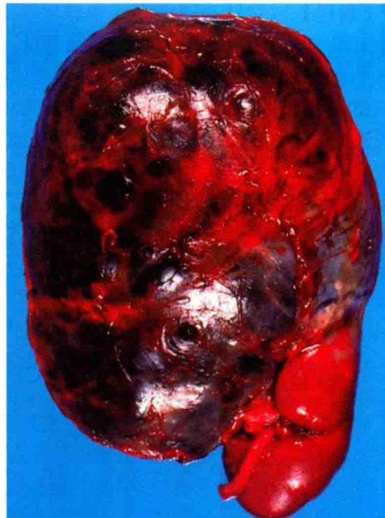 
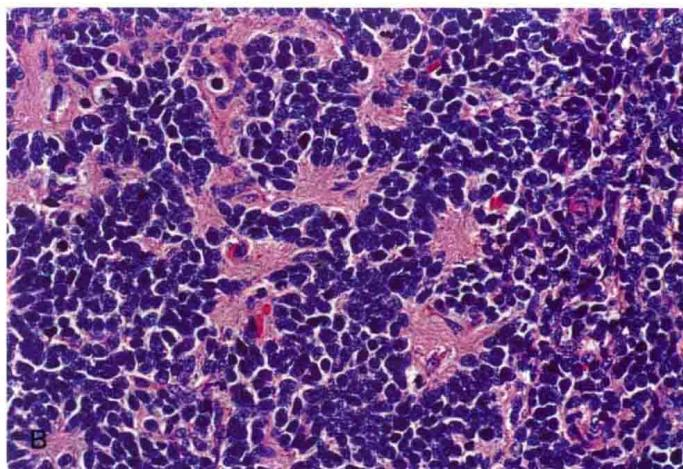 
图21-25 神经母细胞瘤。A.来自一名因腹部肿块就诊儿童的附着于肾上极的肿瘤，呈分叶状，出血及囊性变；B.镜下图片显示特征性菊形团，小而规则且深染的肿瘤细胞围绕中心央淡染纤维状轴心排列
# 四、神经节细胞瘤
与神经母细胞瘤相似，神经节细胞瘤也起源于神经嵴。发生于年长儿童及青少年。神经节细胞瘤是一种良性肿瘤，来源于交感神经节，尤其后纵隔。多达 $30\%$ 肿瘤发生在肾上腺髓质。神经节细胞瘤没有神经母细胞瘤特征性的染色体异常。

【病理】神经节细胞瘤包膜完整，切面黏液样，
发亮。显微镜下，肿瘤表现为分化成熟的节细
胞、相关的梭形细胞以及疏松、丰富的纤维状基质。纤维状基质是从肿瘤细胞胞体发出的。节细胞胞质中有神经分泌颗粒，可形成突触连接。也可检测到神经内分泌物质，例如神经特异性烯醇化酶（NSE）和某些多肽类激素。
# 第六节 松果体肿瘤

【病理】松果体肿瘤罕见，占脑肿瘤不到 $1\%$
包括: ①起源于松果体实质, 推测来自松果体
细胞；②肿瘤位于松果体区，但不起源于松果体细胞；
③罕见，其他部位转移瘤。
■生殖细胞肿瘤：最常见的松果体肿瘤，显然起源于异位生殖细胞。生殖细胞瘤或无性细胞瘤占松果体肿瘤 $60\%$ ，且与发生于性腺的肿瘤无区别。
■松果体细胞瘤：是位于松果体区一种良性肿瘤，实性，边界清楚的肿块。显微镜下，肿瘤细胞小，核圆形，胞质嗜酸性，排列成巢状被纤细的结缔组织分隔。
松果体细胞瘤不发生转移，5年生存率 $100\%$
■松果体母细胞瘤：十分罕见的高度恶性肿瘤，发生于年轻人，占所有松果体肿瘤的 $45\%$ 。肿瘤质地软，常见出血和坏死区，侵犯周围结构。显微镜下，松果体母细胞瘤由小卵圆形细胞组成，核深染，胞质稀少。大量核分裂象。

【临床表现】无论组织学类型如何，松果体肿瘤症状及体征决定于它们对周围组织结构的影响。头痛、视觉及行为异常。儿童患者，这些肿瘤常熟相关，尤其是男孩。松果体母细胞瘤预后差，松果体细胞瘤预后也不好。甚至是松果体非肿瘤也可以威胁生命，因为它们很难手术切除。
（徐仟白玉萍）
# 第22章 肥胖、糖尿病和代谢综合征
仅在30多年前，肥胖是一种相对少见的疾病，但是它的发病率迅速增长。令人惊讶的是，在全球范围内，有10亿的成年人被归类为超重，并且至少有4亿人达到了肥胖的标准。在美国，大概有1/3的成年人、至少1/7的儿童是肥胖患者。在发达国家，肥胖在妇女和穷人中更普遍，而在发展中国家，肥胖主要影响着富人。肥胖发病率增长迅速表明这种疾病主要与环境和个人行为有关。当能量摄入超过消耗的时候，不仅体内水分增多，体重也会增加：你的体重增加是你吃进去的减掉你消耗的。许多人会消耗过于丰富的卡路里，正常人的消化道基本上能吸收所有胃肠道内的简单能量物质。只要每天额外摄入仅300卡路里的能量就能导致从 $15\sim 25$ 岁之间体重增长 $120\mathrm{kg}$ 。糖尿病与肥胖有很显著的相关性：超过 $80\%$ 的2型糖尿病（T2DM）患者是由于肥胖造成的。
# 第一节 概论
# 一、肥胖
# （一）肥胖与基因和环境因素相关
肥胖的原因是复杂的 肥胖是一种多因素疾病，这些因素与死亡率增加有关，包括与基因、代谢、生理、社会和行为因素复杂的相互作用。存在罕见的严重肥胖是单一的基因引起的，但是大部分的患者是多基因、生活方式以及环境因素的共同作用。迄今，通过全基因组相关研究确认的所有特定基因多态性只占了肥胖基因的不到 $1\%$

# 【发病机制和病因】尽管在发达国家，几乎每
个人都生活在能量丰富的环境中，但是他们

可表现为从极瘦到病态肥胖。肥胖的遗传倾向
是很明显的。最近有一个关于在肥胖环境成长
的双胞胎儿童的研究中发现，体重指数（body mass index，BMI）和腰围均有 $77\%$ 的遗传相关性。与肥胖相关的行为包括在没有饥饿的时候吃饭、体内饱腹感反应受损、对于外在食物的反应过大、吃饭快以及活动少。所有这些因素都有相当大的遗传成分。一些特定基因变型似乎在肥胖的发生中起一小部分作用。
■ 瘦素基因突变与人类罕见的严重肥胖单基因综合征有关。纯合突变存在于食欲过剩和严重的早发肥胖患者。他们更容易死于儿童时期感染，并且在成年时期表现为下丘脑性腺功能低下、胰岛素抵抗以及糖尿病。与正常的兄弟姐妹相比，杂合突变可以减低血清瘦素水平，并使体重增加。对于这部分患者，注射重组瘦素的替代治疗是非常有效的。但是，对于瘦素基因正常的肥胖患者，增高瘦素水平并不能阻止过度的脂肪堆积。 
瘦素受体基因突变存在于罕见的家族性严重早发肥胖患者。它的表型与瘦素基因突变的患者相似，但瘦素受体基因突变的患者血清中的瘦素水平明显升高。正如我们所预期的，这样的患者瘦素治疗是无效的。 
■黑素皮质素-4受体基因（melanocortin-4 receptor-or gene，MC4R）突变是严重的单基因儿童早发肥胖的主要原因。据估计，大概 $5\%$ 的严重儿童早发肥胖的病例中存在MC4R突变。这些患者除了肥胖没有其他表现。显性和隐性遗传均有过报道。
环境因素：环境、社会以及心理因素对于肥胖发生的影响作用是不可低估的。一个环境影响遗传倾向性的显著例子是美国亚利桑那州的土著居民皮马人。现在的皮马人喜欢久坐，饮食中 $50\%$ 的能量来源于脂肪而不是传统的低脂饮食。他们的肥胖和糖尿病的发病率显著增加。相反，在北墨西哥的马德雷山脉的基因相关的皮马人，他们有更多的体力活动，保持着更多的传统低脂饮食，他们的肥胖和2型糖尿病的发病率就比较低。
# （二）肥胖并发症影响大部分器官系统
许多流行病学研究表明肥胖和向心性肥胖与死亡率增高相关（图22-1）。脂肪细胞表现为增生和肥大。能量摄入与消耗的不平衡使多余的能量堆积在增大、增多的脂肪细胞中：过度肥胖的成人体内的脂肪细胞的数量是瘦人的4倍，每个脂肪细胞的脂质含量是瘦人的2倍。决定过度肥胖如何影响葡萄糖和脂质代谢，以及如何增加罹患心血管疾病的风险有很多假说。
门/内脏假说：这一理论提出增多的向心性肥胖能增加游离脂肪酸进入肝，直接阻断胰岛素的作用。
这种肝胰岛素抵抗与糖尿病的高血糖的发展相关（见后文）。
内分泌模式假说：这一假说认为，脂肪组织是一种活跃的内分泌器官，能分泌许多不同的激素和细胞因子进入血液，包括瘦素、白介素-6和血管紧张素Ⅱ及其他物质，它们在肝脏和骨骼肌内的胰岛素抵抗的发生中起着至关重要作用。目前认为，这些因子能够引起动脉粥样硬化发展过程中的内皮功能紊乱和血管的不适应性炎症变化，这使肥胖和心血管疾病有潜在相关。
■异位脂肪堆积假说：肥胖患者的过量脂质也会储存在肝、骨骼肌和分泌胰岛素的胰岛B细胞。这影响了胰岛素的信号传递和分泌，导致糖尿病的发生。骨骼肌中先天性线粒体代谢障碍也能导致脂质聚积，最终导致胰岛素抵抗和2型糖尿病。
# 1.内分泌并发症
■2型糖尿病（T2DM）：糖尿病与肥胖的关系非常紧密：超过 $80\%$ 的2型糖尿病患者是由肥胖引起的。患糖尿病的风险与BMI增加直线相关。相反，减肥和运动可以减低患2型糖尿病的风险，并且能够阻止胰岛素抵抗向糖尿病的进展。对于过度肥胖患者，胃旁路手术后的体重减轻可以使 $77\%$ 的糖尿病患者完全缓解。因此，这些不利影响是可以逆转的。
■血脂与脂蛋白紊乱：到目前为止，肥胖和糖尿病的最大杀手是动脉粥样硬化性心血管疾病。肥胖患者通常会出现血脂以及脂蛋白的异常，包括空腹甘油三酯和游离脂肪酸的升高、高密度脂蛋白的降低以及低密度脂蛋白的升高。这些指标的异常与心血管疾病密切相关，尤其是向心性肥胖的患者（也见第10章）。
其他的内分泌并发症：肥胖也与多囊卵巢综合
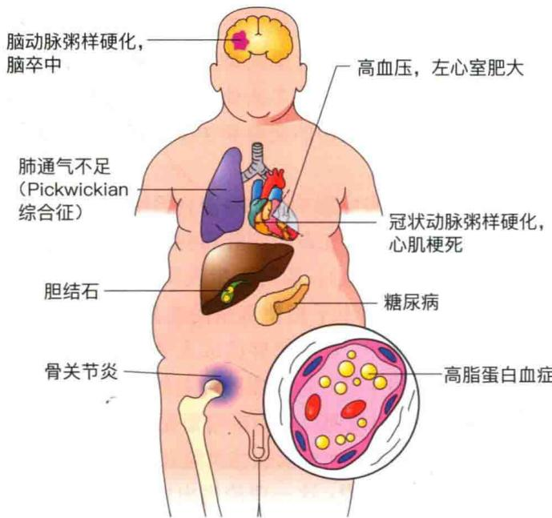 
图22-1 肥胖的临床并发症
征、月经不调、闭经、不孕以及性功能减退有关。
# 2. 肥胖的心血管并发症（见第10、11章）
■高血压：高血压与肥胖密切相关，也可能与交感神经活动增强有关。对于胰岛素抵抗的肥胖患者，高胰岛素水平会增加肾钠的重吸收，从而导致高血压，并且刺激内皮细胞产生内皮素-1，这是一种血管紧张剂。正如上文提到的，肥胖患者的脂肪组织能够分泌一些直接引起血管收缩和血压升高的物质，包括血管紧张素Ⅱ和它的前体。通过干扰抗高血压药物的作用，肥胖使高血压患者的治疗更加艰难。即使是少量的减重也可能降低这些人群的平均血压。
■冠心病：BMI是心肌梗死的适度的、分等级的危险因素，但是身体脂肪分布尤其是腰臀比例看上去是更为重要的危险因素。
■充血性心力衰竭：肥胖能够引起离心性心脏扩张而导致心力衰竭。脂蛋白紊乱和高血压是肥胖引起的心血管疾病最好的预测因子。
血栓栓塞性疾病：肥胖患者患深静脉血栓和肺栓塞的风险增加。
# 3. 肥胖引起的其他并发症
■ 神经系统：随着BMI值的增加，肥胖能够增加致死性和非致死性缺血性脑卒中的风险。
■肺：肥胖能影响肺功能。它是发生阻塞性睡眠呼吸暂停的主要危险因素，这些患者在睡眠期间更易于发生呼吸暂停和低通气。肥胖通气不足综合征最严重的一种形式是Pickwickian综合征，它的主要特点是过度肥胖、不规则呼吸、发绀、继发性红细胞增多症以及右心室功能障碍导致的持续肺动脉高压。
肝胆：肥胖患者，特别是女性肥胖患者的胆结石的发病率会增高。各种不同的肝异常也可能使肥胖复杂化，这些疾病代表了被认称为非酒精性脂肪性肝病的疾病谱，它们的特点是肝细胞内脂肪堆积和炎症变化（见第14章）。
癌症：有一些癌症在肥胖患者中是高发的。特别是食管癌、膀胱癌、胰腺癌、乳腺癌、肾癌、尿道癌、宫颈癌和前列腺癌的患病风险增加。一旦被诊断为癌症，肥胖还与癌瘤的不良预后相关。
肌肉骨骼：肥胖人群中普遍存在高尿酸血症和痛风。肥胖增加患骨关节炎的风险，尤其是负重关节比如膝关节。但是，非负重关节也会受影响，这提示除了增加机械负荷，还存在其他机制。减重可以减小患骨关节炎的风险。
# 二、胰岛素抵抗和代谢综合征
外周胰岛素抵抗是肥胖的一个普遍结果，与2型糖尿病（T2DM）的发生密切相关（见下文）。腹部内脏（上
身）肥胖的患者体内脂肪组织分泌的抑制介质（包括游离脂肪酸和细胞因子例如TNF-α）是增高的。这些介质通过破坏蛋白酪氨酸磷酸化的传输而干扰胰岛素的信号。因此，胰岛素抵抗和2型糖尿病更多见于上身-内脏肥胖的患者。内脏肥胖患者能够使脂联素含量减低，而脂联素可促进胰岛素作用于靶器官的活性。胰岛素抵抗引起的高胰岛素血症能够下调浆膜上的胰岛素受体的数量，这可能会进一步导致细胞对胰岛素的抵抗。
靶组织对于胰岛素作用的抵抗和代偿性高胰岛素血症与心血管疾病的一系列危险因素紧密相关，这种现象普遍存在于肥胖、久坐和2型糖尿病的患者中。这些危险因素统称为代谢综合征，包括：①伴有腰围增加的腹部肥胖；②轻度高血压（可能与内皮依赖的血管舒张功能障碍有关）；③血脂紊乱，表现为高密度脂蛋白降低，循环甘油三酯和小颗粒、致密的低密度脂蛋白颗粒增高（表22-1）。这些特征应该在心血管疾病其他重要的危险因素的背景中评估，比如血浆低密度脂蛋白水平、年龄、性别和是否吸烟。
表22-1 胰岛素抵抗/代谢综合征的常见伴随表现临床症状腰围增加的向心性（上身）肥胖黑棘皮症（皮肤的肥厚和色素沉积）实验室检查异常空腹血糖和（或）者餐后血糖升高伴随高胰岛素血症的胰岛素抵抗以甘油三酯、低密度脂蛋白胆固醇增高为特征的血脂紊乱异常的血栓溶解高尿酸血症内皮细胞与血管平滑肌功能紊乱蛋白尿伴发疾病高血压动脉粥样硬化伴有多囊卵巢综合征的雄激素增多症
# 第二节 糖尿病
糖尿病是发达国家影响越来越多人的一个主要的健康问题。心血管疾病是 $70\%$ 的糖尿病患者的死因，而普通人群中只占 $50\%$ ，它影响他们的早期生活质量，具有更高的发病率。根据不同的病理生理机制将糖尿病分为两种主要类型。1型糖尿病（T1DM）以前也称为胰岛素依赖的或者青少年型糖尿病，它是由自身免疫性损伤分泌胰岛素的胰腺胰岛B细胞所致，影响小于 $10\%$ 的糖尿病患者。与此相反的是，2型糖尿病(T2DM)
以前被命名为非胰岛素依赖的或者成人型糖尿病，它与肥胖相关，由胰岛素对靶组织的代谢活性抵抗和胰腺的胰岛素分泌不足之间的相互复杂作用所致（表22-2）。
一部分妊娠期女性会有妊娠期糖尿病，这是由于孕期相关的 $\alpha$ 、 $\beta$ 细胞缺陷导致的胰岛素抵抗，但是几乎都能在分娩后恢复。糖尿病也有可能继发于其他内分泌疾病或者药物治疗，尤其是库欣综合征或糖皮质激素药物治疗后。
表22-2 1型糖尿病和2型糖尿病的比较1型糖尿病2型糖尿病发病年龄通常是20岁之前通常是30岁之后发病类型突然起病,症状(多尿、多饮、失水);通常有严重的酮症酸中毒缓慢发病,通常无症状或症状轻微一般体重正常;近期内常见体重减轻超重家族史&lt;20%&gt;60%单卵双生双胞胎50%同时发病90%同时发病HLA相关性+无胰岛细胞抗原[胰岛素、谷氨酸脱羧酶(GAD-65),IA-2]的抗体+无胰岛病变早期-炎症晚期-纤维化,淀粉样蛋白晚期-萎缩和纤维化B细胞数量显著减少正常或者轻微减少血液循环中胰岛素水平显著减少升高或者正常临床治疗胰岛素替代早期不需要胰岛素;晚期需要补充胰岛素,减肥可明显改善症状
HLA.人类白细胞抗原；IA-2.胰岛细胞抗原-512
目前诊断糖尿病是以异常的葡萄糖阈值水平为标准的，它已经被证明与这种疾病的慢性并发症密切相关。特别的是，高血糖引起糖尿病视网膜病变的微血管改变和肾小球损伤。如果一个年轻患者，出现突然发作的高血糖、血酮高或直接的酮症酸中毒，完全胰岛素缺陷的1型糖尿病的诊断是明确的。相反，2型糖尿病通常缓慢发展多年之后才能识别、确诊，患者大部分是有遗传倾向的超重中年人。美国糖尿病协会提出了4种糖尿病诊断的标准（表22-3）。
# 一、2型糖尿病
2型糖尿病是一种异质性疾病，主要特点是组织对胰岛素的敏感性降低和胰腺的胰岛素分泌不足。2
型糖尿病的高血糖是由于 $\beta$ 细胞分泌的胰岛素不能满足体内胰岛素需求的增加。这种疾病常见于成人，肥胖人群和老年人的发病率更高。近年来，由于青年人和青少年肥胖及缺乏锻炼，这些人群中患2型糖尿病的也越来越多。2型糖尿病影响着超过2600万的美国人，而其中几乎一半是未确诊的。年龄大于65岁的人群，有 $27\%$ 患病， $80\%$ 的2型糖尿病患者是超重的。2型糖尿病在美国的所有非白人少数族裔群体中最常见，包括黑人、西班牙人、亚洲人和土著美国人。
表 22-3 糖尿病的诊断标准 
1.HbA1c≥6.5%或者2.FPG≥126mg/dl(7.0mmol/L)。空腹指的是8小时内未摄食或者3.OGTT2小时血糖≥200mg/dl(11.1mmol/L)或者4.具有高血糖或高血糖危象典型症状,随机血糖≥200mg/dl (11.1mmol/L)
FPG. 空腹血糖；HbA1c. 血红蛋白A1C（糖化血红蛋白）；OGTT. 口服葡萄藤耐量试验。 
a.在没有明确高血糖时，标准 $1\sim 3$ 应重复检测确认。 
美国糖尿病协会版权2010，来自Diabetes Care，Vol.33，2010； 
S62-S69. 经由美国糖尿病协会同意修改

【发病机制】2型糖尿病是由于胰岛素的代谢靶组织（肝、骨骼肌和脂肪组织）潜在的抵抗和葡萄糖刺激的胰岛素分泌减少而不能岛素需求增加的复杂相互作用引起的。易感展为明显的糖尿病最常见于有这两种功能缺者中（图22-2）。
2型糖尿病有一些明显相关的危险因素。最重要的三个是肥胖、饮食和缺乏运动。正如上文所提，2型糖尿病的风险与BMI值呈线性相关，超过 $80\%$ 的糖尿病患者是由肥胖所致。上身/向心性肥胖或男性肥胖（“苹果状”）比下身肥胖或女性肥胖（“梨状”）与胰岛素抵抗和2型糖尿病存在更多的相关性。反过来讲，减肥能够降低2型糖尿病的风险并能够阻止胰岛素抵抗进展为糖尿病。
基因因素：多因素和多基因遗传是2型糖尿病发生发展的关键因素。许多研究表明基因水平影响2型糖尿病的发生发展：
■多于1/3的2型糖尿病患者其父母至少有一方是2型糖尿病患者。 
在单卵双生双胞胎中，他们患糖尿病的一致性是 $100\%$ 
生活在类似环境中的不同人种的糖尿病的发
病率变化巨大。
2型糖尿病患者的直系亲属比没有家族史的人群具有明显较高的2型糖尿病的发病风险。
尽管这种疾病有家族性的高发病率，但是它的先天遗传模式是复杂的，并且是由于存在多个相互作用的易感基因。构成因素比如肥胖、高血压和运动量会影响这种疾病的表型表达并且需复杂的遗传分析。
胰岛素抵抗：进食后，肠内葡萄糖的吸收可以升高血糖，血糖升高刺激胰腺B细胞分泌胰岛素。进而胰岛素促进骨骼肌和脂肪组织摄取葡萄糖。同时，胰岛素能通过以下方式抑制肝的葡萄糖生成：①抑制糖异生；②增加糖原的合成；③阻止胰高血糖素的对肝作用；④拮抗胰腺释放胰高血糖素。
在胰岛素抵抗时，胰岛素的所有这些效应都是减弱的。最初，胰岛素抵抗是处于亚临床时期。随着疾病进展，出现空腹血糖异常或者糖耐量损伤。最终出现高血糖，诊断为2型糖尿病。单纯的胰岛素抵抗很少引起2型糖尿病，因为B细胞分泌胰岛素增加（高胰岛素血症）能够代偿。只有当B细胞开始表现为功能紊乱时，血糖才开始升高。胰岛素抵抗的分子机制目前仍不清楚。
B 细胞的功能：T2DM 的患者表现为在葡萄糖刺激时，B 细胞的胰岛素分泌功能受损，这种缺陷
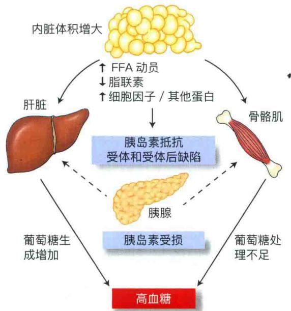 
图22-2 肥胖相关的2型糖尿病（T2DM）的发病机制。上身肥胖者的内脏脂肪体积增大，可产生一些能引起组织中胰岛素抵抗的因素，这些因素包括血液循环中游离（未酯化）脂肪酸（FFAs）、其他细胞因子和蛋白增加，它们能够抑制胰岛素的活性，同时使增强胰岛素信号的脂联素含量降低。这些变化能在胰岛素受体水平和受体后信号位置水平阻断肝和骨骼肌中胰岛素活性，导致胰岛素不能抑制肝中葡萄糖生成、不能促进骨骼肌摄取葡萄糖。这些因素导致的高血糖正常情况下能通过胰腺B细胞分泌胰岛素增加而下降。在T2DM患者，胰岛素抵抗和基因决定的B细胞对高血糖的反应受损联合作用导致了高血糖，从而产生2型糖尿病
在疾病早期就存在。这种功能异常可以作为T2DM风险的早期指标，它对葡萄糖是特异的，因为B细胞能够维持对其他促分泌素如氨基酸的反应。经过很长的一段时期，T2DM患者的胰岛素分泌逐渐减少，并伴随着B细胞数量的减少。在T2DM的早期，胰岛素抵抗和高胰岛素血症是主要表现。口服胰岛素增敏药物是治疗这些患者的主要方法。几年之后，由于B细胞功能进一步损伤，需要用胰岛素促泌剂治疗，最终需使用外源性胰岛素。

【病理】在一些胰岛内，纤维组织聚集，有时可以达到使胰岛消失的程度。胰岛内常见淀粉
样物存在（图22-3），尤其在60岁以上的患者。这种淀粉样物是由被称为胰淀素的多肽分子组成，随胰岛素由B细胞分泌。重要的是，大概 $20\%$ 的非糖尿病老年人的胰腺也有淀粉样物沉积，这说明它与年龄衰老有关。
# 二、1型糖尿病
1型糖尿病（T1DM）是一种终身的葡萄糖稳态紊乱的疾病，是由于胰岛B细胞的自身免疫损伤引起。这种疾病的特点是几乎没有功能性的B细胞，极少量或缺乏胰岛素分泌。因此，体内脂肪而不是葡萄糖更倾向于作为能量代谢来源。反过来，脂肪过量产生的酮体（乙酰乙酸和 $\beta$ -羟基丁酸）从肝释放入血，引起代谢性酮症酸中毒。高血糖主要是由于肝葡萄糖的输出得不到抑制，骨骼肌和脂肪组织的糖利用下降。这些效应导致糖尿和体内水分随尿液丢失，引起脱水。如果得不到纠正，进展性的酸中毒和脱水最终会导致昏迷和死亡（图22-4）。T1DMB细胞的损伤一般会慢慢进展多年。临床上，只有当至少 $90\%$ 的胰岛素分泌细胞损伤缺失及胰岛素剥夺很严重的时候，才会有显
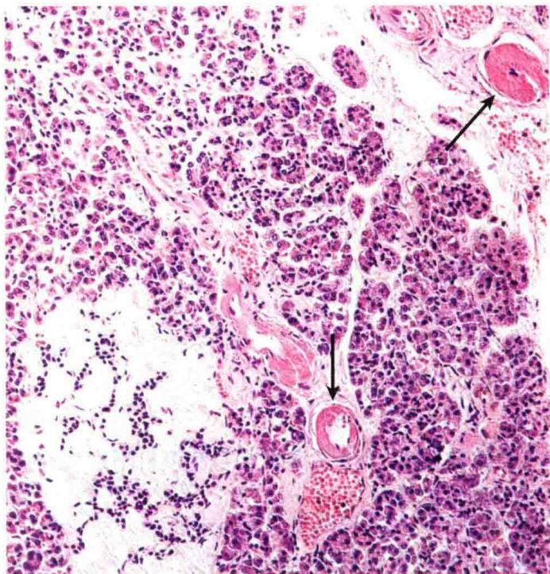 
图22-3一位2型糖尿病患者的胰腺胰岛的淀粉样变性（玻璃样变性）（左下）。与胰岛毗邻的血管显示出糖尿病晚期玻璃样变性的动脉粥样硬化（箭头）
而易见的伴高血糖和酮症酸中毒的糖尿病。
T1DM在北欧人和他们的后代中最常见，但是在亚洲人、黑人和土著美洲人中不常见。比如，芬兰的T1DM的发病率是日本的 $20\sim 40$ 倍。虽然这种疾病在任何年龄都可能发生，但是它的发病高峰期是在青春期。许多地区的记录表明，此病在晚秋和初冬发病率增高，提示存在季节性传染因素（见下文）。

【发病机制】T1DM的发病机制与许多因素有关。
基因因素：基因因素对T1DM发病机制起作用的证据包括以下几个方面：
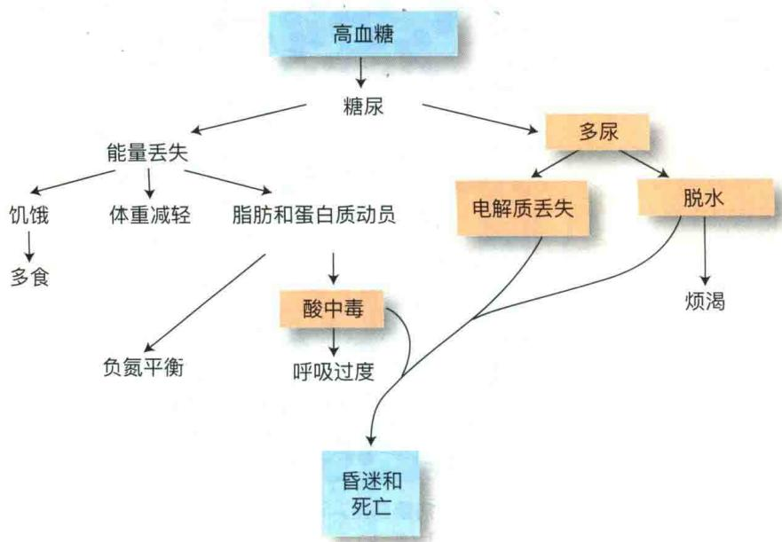 
图22-4 糖尿病患者中不可控高血糖的症状及体征
1. T1DM患者的亲属患T1DM的风险也增加。在美国的普通人群中T1DM的患病风险是 $0.4\%$ 但是T1DM患者的一代直系亲属的患病风险是 $3\% \sim 8\%$ 。同卵双胞胎同时患T1DM患者的风险是 $30\% \sim 50\%$ 
2. 生活在相同环境中的不同种族的患病风险不同。 
3. 有许多易感基因[主要组织相容性复合物(MHC)和非主要组织相容性复合物基因]及染色体区域与T1DM患者有关。例如，只有 $45\%$ 的美国人表达DR3和DR4，其中 $95\%$ 表现这些单倍型的人发展为T1DM患者。
自身免疫：细胞介导的自身免疫机制是T1DM发病机制的基础。这个观点得到了研究支持，在该病发病后不久即死亡的病例胰腺胰岛内经常显示有单核细胞浸润，被称为胰岛炎（图22-5）。在这些炎症细胞中，虽然也有 $\mathrm{CD4^{+}}$ 细胞存在，但主要是 $\mathrm{CD8^{+}T}$ 淋巴细胞。浸润的炎症细胞也能够产生细胞因子，比如白介素-1（IL-1）、白介素-6（IL-6）、干扰素-a和一氧化氮，它们进一步加重B细胞的损伤。大部分新诊断为糖尿病的儿童患者血液循环中存在抗B细胞成分（包括胰岛素本身）的抗体。许多患者在胰岛素生成减少及出现临床症状之前的数月或者数年，就产生胰岛细胞抗体。然而，这些抗体被认为是对细胞介导免疫机制引起的B细胞损伤时所释放的B细胞抗原的一种反应，而不是B细胞耗竭的原因。虽然如此，胰岛B细胞血清抗体的检测仍然是鉴别T1DM和T2DM的有用的临床手段。
环境因素：环境因素对T1DM发病机制起作用的证据包括以下几个方面：
只有 $33\% \sim 50\%$ T1DM 患者的同卵双胞胎发展成为 T1DM。 
最近研究在一些人群中T1DM发病率增加，表明环境是一个可能的发病机制。 
大概 $80\% \sim 90\%$ 的T1DM患者没有家族史。 
T1DM的发病有季节性差异。
在至少部分T1DM患者中，病毒也是一种致病因素。因此，感染柯萨奇病毒B及较少的腮腺炎病毒后，偶尔会导致T1DM。某些蛋白可能与人类细胞表面蛋白有共同的抗原决定簇，通过“分子模拟”触发自身反应性疾病。

【病理】T1DM的胰腺早期损伤主要特点是胰
岛内单核细胞浸润（胰岛炎），主要包括淋巴
细胞, 有时伴有少量巨噬细胞和中性粒细胞浸润 (图 22-5)。随着疾病进展为慢性, 胰岛 B 细胞逐渐耗竭;
最终，胰岛素生成细胞无法辨认。B细胞丢失导致胰岛大小不一，许多胰岛呈条带状，与周围的腺泡组织难以辨别。胰岛纤维化是比较少见的。与T2DM相反，T1DM并不存在胰岛淀粉样物质沉积。慢性T1DM的胰腺外分泌部通常表现为弥漫性的小叶间和腺泡间纤维化，并伴有腺泡细胞的萎缩。

【临床表现】T1DM的临床表现主要是由于胰
岛素缺失，它在人体的能量代谢中起着独特的作用。这种疾病典型表现为急性代谢失代偿，特点是肾中毒和高血糖。根据绝对胰岛素缺乏的程度，胰酮症酸中毒之前可能有持续几周到几个月的尿毒（多尿）和口渴严重（烦渴）。糖尿导致过度利用血管食欲增加（多食），但是体内脂肪、蛋白质和糖化合物的不规则代谢导致体重减轻。T1DM临床通常伴随另一种急性疾病，比如热病毒性或细菌性贫血。
# 三、糖尿病的并发症
20世纪早期胰岛素的发现让糖尿病治愈成为可能，但是随着糖尿病患者寿命的延长，他们的许多并发症变得明显。现在认为，T1DM和T2DM高血糖的严重性和长期性是糖尿病“微血管”并发症的主要致病因素。这些并发症包括视网膜病变、肾脏病变和神经病变。因此，控制血糖仍然是控制糖尿病微血管并发症进展的主要治疗方法。然而，很难证明控制血糖能阻止动脉粥样硬化及其并发症。在胰岛素抵抗的T2DM患者
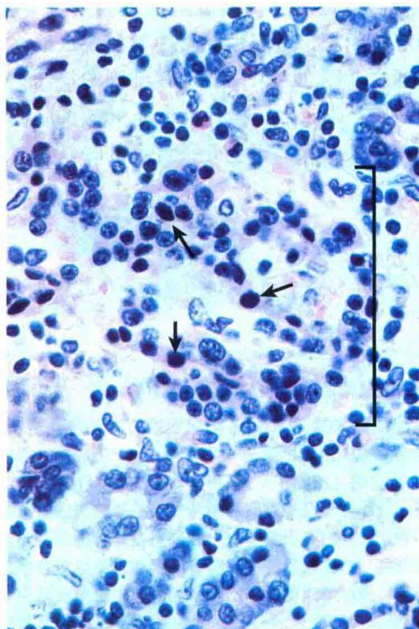 
图22-51型糖尿病胰岛炎。可以看到胰岛（线条左侧）内及其周围的淋巴细胞浸润（箭头）
中，这些“大血管”病变非常常见，这是因为他们往往是老年人，并且经常有其他的血管危险因素。

【发病机制】糖尿病的病理改变的进展与各种生物化学机制有关。
活性氧物质过多（ROS）：在许多细胞类型中，高血糖增加了活性氧物质的产生，这是线粒体氧化磷酸化的副产物。虽然ROS与许多类型的细胞损伤有关，但是没有直接的证据表明过量的ROS引起糖尿病及其并发症（见第1章）。
蛋白质糖基化：葡萄糖可以通过不依赖酶的叫作糖基化过程与各种蛋白质结合（也称为非酶糖基化）。糖基化发生与高血糖的严重程度大致呈正比例关系。大量的细胞蛋白质以这种方式被修饰，包括血红蛋白、晶状体成分以及细胞基底膜蛋白。常规测量血液循环中红细胞内糖化血红蛋白的特定部分（血红蛋白 $\mathsf{A}_{10}$ ），来监测发生在之前 $6\sim 8$ 周高血糖总体水平。
最初的糖基化产物是不稳定的，并且可以被快速分解。随着时间进展，晚期糖基化产物含有与蛋白质氨基共价结合的葡萄糖衍生物。因此，蛋白质结构被永久改变，其功能也可能受到影响。含有晚期糖基化产物的蛋白质不稳定化学键能与附近蛋白质发生物理交联，这可能导致糖尿病患者血管基底膜增厚。重要的是，尽管血糖恢复到正常水平，晚期糖基化产物也会继续交联蛋白。
醛糖还原酶通路：通过多种作用，高血糖也可以增加组织的葡萄糖摄取，而这不依赖胰岛素。一些葡萄糖降解的增加是通过醛糖还原酶代谢的，这导致了山梨糖醇的积聚。这些糖醇被认为在多种组织的糖尿病并发症中发挥作用，这些组织包括外周神经、视网膜、晶状体和肾。
蛋白激酶C（PKC）活化：高血糖患者中，特异的PKC异构体，主要是PKC-β和PKC-δ被激活。PKC活化会导致：①细胞外基质和细胞因子生成增加；②微血管收缩增强；③微血管渗透性增加；④内皮细胞和平滑肌细胞增殖；⑤胰岛素抵抗。PKC也能诱导磷脂酶A2激活，并抑制钠钾-ATP酶的活性。在体和离体实验表明，PKC-β的选择性抑制剂（芦布妥林，rboxistaurin）在体内及体外能阻止或逆转一些血管异常。该药目前正在临床试验中。
# （一）动脉粥样硬化是一种常见的糖尿病并发症
一半以上的成人糖尿病患者死于心血管疾病包括动脉粥样硬化性心脏病和缺血性脑卒中。长期糖尿病患者的中动脉和大动脉的粥样硬化性损伤的范围和严重性是增加的。糖尿病会消除通常作为女性的保护效
应，并且糖尿病患者比非糖尿病患者发生冠状动脉疾病的年龄要更年轻。此外，糖尿病患者心肌梗死的死亡率比非糖尿病患者要高。正如之前所提，T2DM患者经常表现出代谢综合征的多种危险因素，从而导致动脉粥样硬化的发生、发展。外周血管疾病特别是下肢血管，是糖尿病常见的并发症。血管功能不足伴发脚趾和足的溃疡和坏疽，最终导致必须截肢。事实上，在美国，糖尿病导致了多于 $60\%$ 的非创伤性截肢。
即使流行病学分析表明，长期高血糖与心血管疾病较高发病率有相关性，但是葡萄糖水平本身参与的程度仍不清楚。在大部分随机临床试验中， $\mathrm{HbA_{1c}}$ 水平的改善并不能改善2型糖尿病的大血管结果。
# （二）糖尿病微血管病变能引起许多糖尿病并发症，包括肾衰竭和失明
小动脉硬化和毛细血管基底膜增厚是糖尿病的特征性血管病变（见第10章）。经常发生的高血压也会导致小动脉病变的发展。此外，血管基底膜蛋白质沉积在糖尿病患者中增加，这种蛋白质也可能发生糖基化。小血管内血小板聚集和纤溶机制损伤也被认为是糖尿病微血管病变的发病机制。
无论发病过程到哪一步，微血管病变对于组织灌注和伤口愈合的影响是深刻的。比如，因冠状动脉粥样硬化而受损的心脏的血流量是减少的。在糖尿病患者，足部创伤和感染引起的慢性溃疡愈合一般是有缺陷的，这部分是由于微血管病变。在美国，糖尿病是引起肾衰竭的主要原因，占了新发病例的 $44\%$ 。 $30\% \sim 40\%$ 的T1DM患者最终发展为肾衰竭。稍小比例（多于 $20\%$ ）的T2DM患者同样受到影响。糖尿病视网膜病变是年龄小于74岁的美国成人失明的主要原因。糖尿病微血管病变的主要并发症包括肾脏和视网膜，这分别在第16章和第19章有论述（图22-6）。
# （三）糖尿病神经病变影响感觉和自主神经支配
外周感觉障碍和自主神经功能紊乱是糖尿病最常见和最令人苦恼的并发症之一。神经的病变是复杂的，轴突、髓鞘和施万细胞的异常都有报道。累及神经小血管的微血管病变引起该并发症。有证据表明高血糖能增加疼痛感知，而不依赖于任何神经组织的结构病变。
外周神经病变最初特点是四肢的疼痛和感觉异常。精细触觉、痛觉和本体感觉会最终消失。结果，糖尿病患者常感觉不到足部、关节和腿部的刺激或小创伤。因此，外周神经病变能导致足部溃疡，这常常困扰有严重糖尿病的患者。这也会导致偶尔的无痛但有破坏性的关节疾病。
心血管和胃肠功能的神经调节异常经常会导致直立性低血压和肠蠕动紊乱，比如胃轻瘫和腹泻。勃起
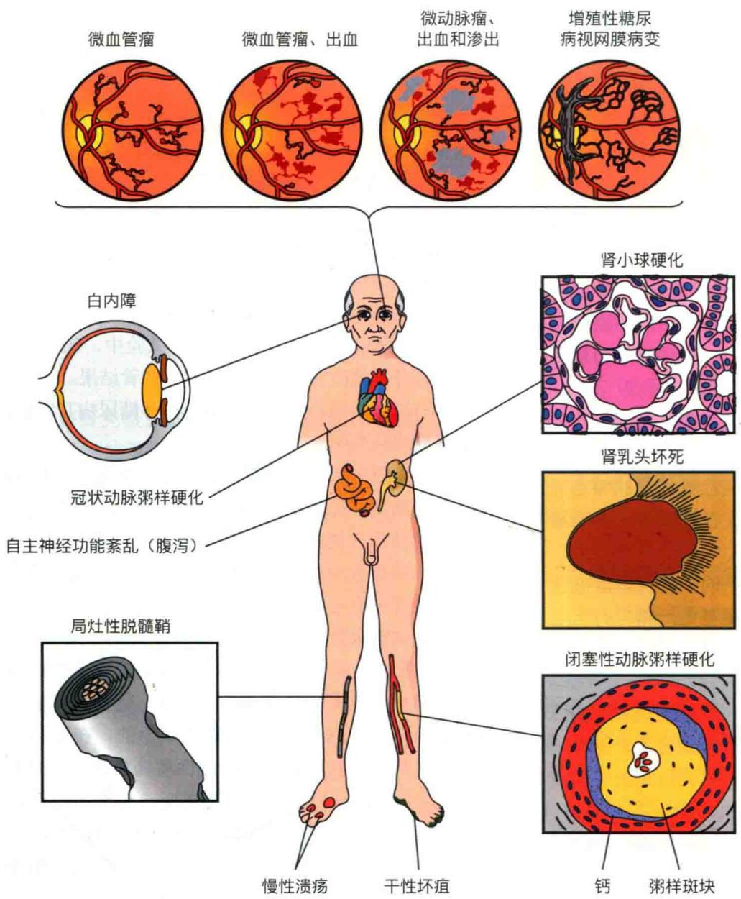 
图22-6 糖尿病继发性并发症糖尿病对于许多重要器官的影响导致并发症发生，它们可能致残（脑及外周血管疾病）、疼痛的（神经病变）或致命的（冠状动脉疾病，伴肾乳头坏死的肾盂肾炎）
功能障碍和逆行射精是自主神经功能失调的常见并发症，虽然血管病变也是其中的一种致病因素。
# （四）高血糖控制不良的糖尿病患者会发生细菌和真菌感染
有报道关于糖尿病患者对微生物入侵后宿主反应的多种异常。白细胞功能受损，免疫反应迟钝。控制稳定的糖尿病患者不易受到感染。然而，尿路感染仍然是一个问题，因为尿中的葡萄糖提供了丰富的培养条件。如果患者已有自主神经病变，因膀胱排空困难导致尿潴留的话，情况会更复杂。因此，来自膀胱的上行感染（肾盂肾炎）是一个需经常关注的问题。肾乳头坏死可能是尿路感染的一个严重并发症。糖尿病控制不良的一种可怕的感染并发症是毛霉菌病。这种通常致命的真菌感染往往源于鼻咽或鼻窦，并且快速播散到眼眶和脑。
# （五）妊娠期间的糖尿病可能给母亲和胎儿带来风险
妊娠期糖尿病发生于部分表面健康的妇女的怀孕期间，其中一小部分在分娩之后会持续存在。怀孕时胰岛素抵抗是正常状态，但是只有B细胞胰岛素分泌受损的怀孕女性发展为糖尿病。胰腺胰岛素分泌的数量和速度的异常使这些女性在她们晚年更易于发生T2DM。
妊娠期糖尿病控制不良可能与孕育巨大胎儿有关。这使分娩更加困难，可能需要进行剖宫产。妊娠期的胎儿胰腺试图通过使B细胞增生来补偿母体较差的糖尿病控制，这将导致出生时和出生后几天出现低血糖。
糖尿病妈妈的婴儿有 $5\% \sim 10\%$ 会发生发育异常，主要包括心脏和大血管畸形及神经管缺陷，比如无脑儿和脊柱裂。这些病变的发生是妊娠早期母体控制糖尿病的一种功能。
# 第23章 淀粉样变性
淀粉样蛋白是指一组不同种类的细胞外蛋白沉积，但具有共同特点：①相同的形态特性；②对特殊染料有亲和力；③染色后，在偏振光下表现出特征性的外观。尽管它们的氨基酸序列有所不同，但所有的淀粉样蛋白都以某种方式折叠而呈现出相同超微结构和物理特性。淀粉样变性是包括由局部或系统性淀粉样物沉积引起的临床病症。淀粉样变性的症状取决于基础疾病和类型以及蛋白质沉积于器官的位置。诊断淀粉样变性最终依赖于组织学证实在活检标本中有淀粉样物质沉积。因此，淀粉样变性的共性在于多种蛋白沉积引起的独特的继发性结构改变，而不是特异性突变或器官系统性受累。
# 第一节 淀粉样蛋白的构成
在体内超过25种相关蛋白可以形成淀粉样蛋白，临床上，淀粉样变性是按检测到原纤维蛋白来分类的。淀粉样蛋白沉积可以是系统性或者局部的，获得性或者先天性，致命的或者仅仅偶然发生。当足够的淀粉样蛋白沉积在组织或器官，引起该组织或器官的结构和功能受损时，才会出现临床症状。在系统性淀粉样变性中，任何组织都可能会受累。系统性疾病常常是致命的，尽管其预后会在对基础疾病积极治疗后有所提高。局部淀粉样蛋白沉积是只局限于某个特定的器官和组织，可以表现为无临床症状甚至威胁生命（例如：心脏淀粉样变性）。除了被分类为淀粉样变性的临床病变，淀粉样蛋白沉积还见于其他重要疾病中，包括阿尔茨海默病（见第28章），朊蛋白病和2型糖尿病患者的胰岛（见第22章）。

【发病机制】淀粉样物构成蛋白可以存在两种完全不同的稳定结构：①原始结构；②占
主导地位的 $\beta$ 片层, 它能自动集聚成高度有序的排列方式而产生特征性的原纤维。这种淀粉样蛋白原纤维是僵硬的, 无分枝, 直径 $10 \sim 15 \mathrm{~nm}$ , 长度不确定。已知各种常见淀粉样蛋白原纤维的生物物理学属性, 包括: ①在生理溶液中的不溶性; ②相对的高抗水解; ③与刚果红染料结合的能力, 形成在空间上有序的方式, 在偏振光下生产诊断性绿色双折光 (图23-1)。
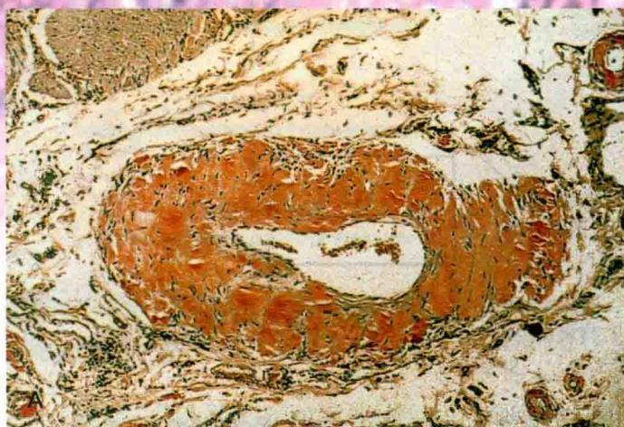
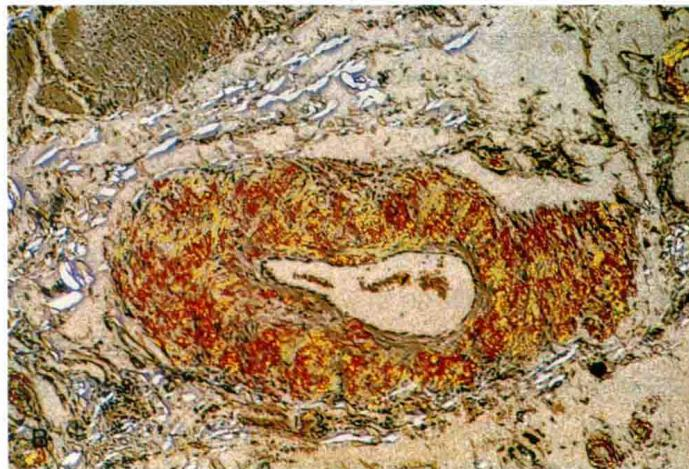 
图23-1 显示AL淀粉样蛋白累及动脉壁时刚果红染色后在（A）普通光和（B）偏振光下的形态。注意淀粉样蛋白呈红绿色双折光。胶原蛋白呈银色外观
有几种情况下可以发生淀粉样蛋白沉积（图23-2）。
■ 某种蛋白持续的、异常的大量产生，而正常情况下，这种蛋白维持在较低的水平。这样的蛋白包括在慢性炎症中的血清淀粉样A蛋白（SAA）和在肾衰竭中的 $\beta_{2}$ 微球蛋白，分别导致AA和 $\mathrm{A}\beta_{2}\mathrm{M}$ 淀粉样变性（见下文）。 
■具有淀粉样蛋白特性的蛋白质在正常浓度下持续很长时间，比如老年性淀粉样变性（ATTR）中的转甲状腺素蛋白和阿尔茨海默病的 $\beta$ 蛋白质。 
获得性或先天性的变异蛋白，伴有异常的，明显的淀粉样蛋白的结构。例如在AL淀粉样变性
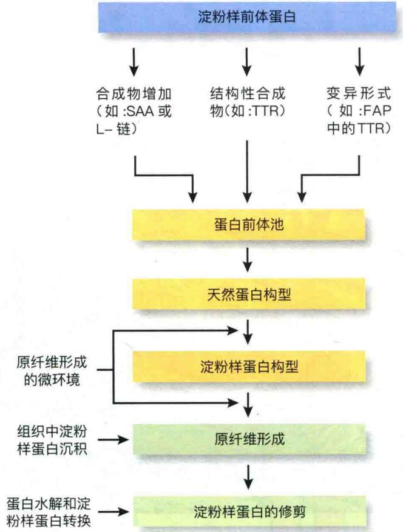 
图23-2淀粉样变性的基本结构图。FAP.家族性淀粉样多发性神经病；SAA.血清淀粉样A蛋白；TTR.转甲状腺素蛋白
中某些单克隆免疫球蛋白轻链和遗传性淀粉样变中的淀粉样蛋白的基因链甲状腺素载体蛋白（TTR）的变体，溶菌酶，载脂蛋白AI和在先天性淀粉样变性中的纤维蛋白原Aa链。
淀粉样蛋白沉积主要由那些蛋白质原纤维组成但也包含了一些常见的少量成分，包括某些葡萄糖胺聚糖（GAGs），正常血浆蛋白血清淀粉样P成分(SAP）和其他不同种类的微量蛋白，如载脂蛋白EapoE)，层黏连蛋白和IV型胶原（图23-3）。SAP是一个小的正常基底膜的结构成分，以特定的钙依赖性方式结合在所有的淀粉样蛋白原纤维都具有的区域，但不在它们各自的前体蛋白。
遗传或环境情况是否决定个体对淀粉样蛋白沉积的易感性和时间尚不清楚，尽管有几个因素可能起一定作用。
一旦淀粉样蛋白沉积开始，只要有各种前体蛋白的供给，会进一步持续聚集。 
■年龄增加和男性似乎是野生型转甲状腺素蛋白（ATTR）沉积的易感因素。这种临床继发的淀粉样蛋白几乎不见于60岁之前， $90\%$ 以上的是男性患者。 
那些影响淀粉样蛋白沉积部位分布的因素尚不清楚。但与AA相关的器官和大多数遗传类型的淀
粉样变性之间表现出合理的一致性。相反，在 AL 淀粉样变性的器官分布是极不均匀的，可能反映出每一位患者各自的单克隆免疫球蛋白轻链的独特序列。
淀粉样蛋白的病理作用是由于其物质的存在。大量的沉积或者沉积的数量虽小但部位特殊（例如，在肾小球或神经）会破坏组织结构，影响正常功能。淀粉样蛋白很少或不引起局部组织的炎症反应。淀粉样蛋白沉积量和受累器官功能障碍的程度之间的关系在不同个体和不同器官之间有很大差别。因此，新的淀粉样蛋白沉积可能和绝对的淀粉样蛋白负荷同样重要。
治疗上，减少淀粉样前体蛋白的供应可能会使持续的淀粉样蛋白沉积趋于稳定或减退，保护或提高器官功能。能通过怎样的机制来清除淀粉样蛋白沉积还知之甚少。
# 第二节 淀粉样蛋白的检测
淀粉样蛋白在光学显微镜下具有很少的可见的形态特征。在常规染色下（HE），淀粉样蛋白表现为无定形，玻璃样甚至软骨样，看上去与许多其他蛋白质相似。然而，淀粉样蛋白沉积的自然和组织特性可以用特殊方法检测到。
所有形式的淀粉样蛋白用刚果红染色都是阳性（图23-1A），并且在偏正光下呈红-绿双折光（图23-1B）。 
■免疫组织化学染色可能可以用来检测淀粉样蛋白，尽管它的成功会因原纤维蛋白质种类不同而有变化，并且取决于淀粉样蛋白沉积量既不太少也不太多合适的组织样本。 
电镜下，各种类型的淀粉样蛋白由相互交错的平行排列的束状原纤维组成，这些原纤维直径 $10\sim 15\mathrm{nm}$ （图23-4）。
# 第三节 淀粉样变性的临床分类
淀粉样变性的分类经历了重大的改变（表23-1）。旧的分类是以患者的临床表现为基础分类的，没把沉积的淀粉样蛋白的蛋白组成考虑在内。
# 一、获得性淀粉样变性有不同的起源
获得性系统性淀粉样变被认为是在西方国家造成1/1000死亡率的原因，并且最常见于老年人。系统性AL淀粉样变性是最常见和最严重的类型，占 $60\%$ 以上。透析相关性 $\beta_{2}-$ 微球蛋白淀粉样变性累及全球大约100万的患者。主要累及心脏的老年性转甲状腺素蛋白(ATTR)淀粉样变性，约1/4的患者人在80岁以上。
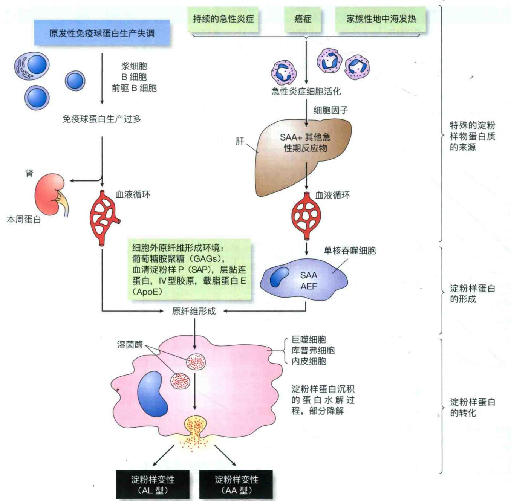 
图23-3 淀粉样蛋白沉积机制。AL淀粉样蛋白途径：某种淋巴细胞和浆细胞起源的免疫球蛋白轻链在原纤维生成环境中形成淀粉样蛋白。AA淀粉样蛋白沉积途径：多种不同疾病与中性粒细胞和巨噬细胞活化有关，这反过来会导致肝合成和释放急性期反应物，包括血清淀粉样A蛋白（SAA）。SAA可能被巨噬细胞分裂，在淀粉样蛋白增强因子（AEF）促进下转换成AA原纤维。在原纤维生成环境中，释放的产物与糖胺聚糖和血清淀粉样P成分形成复合物。巨噬细胞也参与淀粉样蛋白的转化
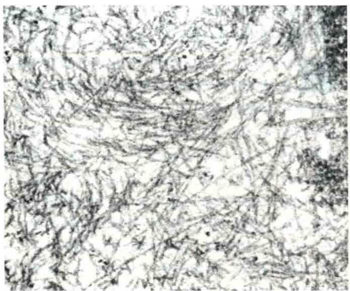 
1. 反应性系统性淀粉样变性，AA淀粉样变性AA淀粉样变性是慢性感染和炎症性疾病或者任何导致急性期反应物SAA长期过量生产过剩状况的并发症。淀粉样蛋白原纤维是由SAA的N端分裂片段组成（即，AA蛋白）。AA淀粉样变发生在 $1\% \sim 5\%$ 的类风湿关节炎患者、青少年特发性关节炎和克罗恩病。在世界一些地区结核病和麻风病也是AA淀粉样变的重要原因。大部分患者随着时间的推移可能会出现蛋白尿以及肝脏和胃肠道受累。 
图23-4 组织中淀粉样蛋白沉积。电子显微镜图中明显可见原纤维平行和交错排列
表23-1 人淀粉样蛋白的分类淀粉样蛋白蛋白前体临床环境ALκ或λ免疫球蛋白轻链多发性骨髓瘤，浆细胞病和原发性淀粉样蛋白AHγ免疫球蛋白链Waldenström巨球蛋白血症Aβ₂Mβ₂-微球蛋白血液透析相关ATTR转甲状腺素蛋白（TTR）家族性淀粉样多发性神经病（FAP），老年性系统性淀粉样蛋白的正常 TTRAA载脂蛋白血清 AA持续性急性炎症；家族性地中海和某些恶性肿瘤AApoAI载脂蛋白 AI遗传性系统性淀粉样变性AApoAII载脂蛋白 AII家族性AApoAIV载脂蛋白 AIV散发，年龄相关Aββ-蛋白前体阿尔茨海默病，唐氏综合征，HCHWA，荷兰人ABriABriPP家族性痴呆，英国人ADanADanPP家族性痴呆，丹麦人APrP朊蛋白CJD, 羊搔痒病, BSE, GSS, 库鲁病ACys半胱氨酸蛋白酶抑制剂 CHCHWA, 冰岛人ALys溶菌酶遗传性系统性淀粉样变性AFib纤维蛋白原遗传性肾淀粉样变性AGel凝溶胶蛋白家族性淀粉样变性，芬兰人ACal降钙素甲状腺髓样癌AANF心钠利尿因子孤立性心房淀粉样蛋白AIAPP胰岛淀粉样多肽2型糖尿病，胰岛素瘤Alns胰岛素医源性Apro催乳素垂体，年龄相关AMED乳凝集素老年性动脉，血管中层Aker角上皮蛋白角膜，家族性ALac乳铁蛋白角膜
BSE. 疯牛病；CJD. 克雅病；GSS. 杰茨曼-斯脱司勒-史茵克综合征；HCHWA. 淀粉样蛋白的遗传性脑出血

# 【发病机制】AA蛋白是一种单个非糖基化多肽链，组成SAA的N-末端。SAA是由肝细
胞在细胞因子，特别是白细胞介素IL-1、IL-6和肿瘤坏死因子（TNF）-α，的转录调控下产生主要急性期反应产物。循环SAA可以在急性刺激24～48小时从正常水平（≤3mg/L）上升并超过2000mg/L，并存在慢性炎症的情况下维持持续的高水平。血液循环SAA裂解成AA可以通过巨噬细胞和一些蛋白酶完成。SAA持续过度生产是AA淀粉样蛋白沉积所必需的，但这样的事件仅发生在少部分人。
AA淀粉样蛋白沉积分布广泛，所以随机直肠和其他活检常可用来确诊。治疗的关键是要抑制潜在的炎症性疾病。目前，在那些由急性期反应引起的患者由于其炎症可以很好控制而表现出良好的预后，但那些持续性炎症失控的患者，有 $50\%$ 在诊断后10年内死亡。
2. 单克隆B细胞相关的淀粉样变性病（AL淀粉样变性）AL，一度被称为“原发性”淀粉样变性，发生在约 $2\%$ 的单克隆B细胞异常的人群。AL原纤维来源于单克隆免疫球蛋白轻链。几乎除了大脑以外任何器官都可能被直接影响，但肾脏、心脏、肝脏和外周神经是临床上最易受累的。

# 【发病机制】AL淀粉样蛋白原纤维通常来自单克隆抗体免疫球蛋白轻链N-端区域，
组成整个或部分可变（VL）区域。单克隆轻链每个个体是独一无二，并且只有一小部分不可预知数量的轻链可形成淀粉样蛋白。AL淀粉样变性的基础B细胞病是多种的，包括多发性骨髓瘤，Waldenström巨球蛋白血症和偶见其他恶性淋巴瘤或白血病。然而，超过 $80\%$ 的病例与低级别单克隆丙种球蛋白病相关，但这可能很难检测到。
局部单克隆B细胞病变可能导致AL沉积在B
细胞病变的部位，几乎可发生在身体的任何部位。常见的部位包括皮肤、气道、肺、结膜和泌尿生殖道。沉积可能是结节性或广泛的，但克隆性B细胞浸润产生的淀粉样蛋白轻链可能不明显。局部AL淀粉样蛋白沉积可出现严重的占位性效应或引起严重的出血，但更多的表现为良性和缓慢增大。
3.透析相关性淀粉样变性反映出 $\beta_{2}$ -微球蛋白沉积 $\beta_{2}$ -微球蛋白淀粉样蛋白沉积可发生在透析依赖性慢性肾衰竭，主要影响关节和关节旁结构。它通常引起肩、膝、腕和手部其他小关节的关节疼痛，关节肿胀和腕管综合征。淀粉样蛋白原纤维前体蛋白是 $\beta_{2}$ 微球蛋白，它是主要组织相容性复合体（MHC）I类分子的恒定链，表达于所有的核细胞。由于它正常情况下在肾小球自由滤过，在近端肾小管上皮细胞吸收和代谢，肾功能下降会使其浓度相应的上升。目前在肾衰竭终末期开始透析的3年内，有 $20\% \sim 30\%$ 的患者发生透析相关性淀粉样变性（DRA）。 
4. 老年性转甲状腺素蛋白淀粉样变性 中老年人，无临床症状的野生型“老年性”TTR淀粉样蛋白系统性沉积较常见，常累及心脏和血管壁、平滑肌和横纹肌、脂肪组织、肾乳头和肺泡壁。ATTR淀粉样变性几乎总是表现为限制性心肌病，并且无论沉积在哪里都很少引起临床表现，除了腕管综合征。大多数患者不小于70岁，绝大部分为男性。心脏衰竭和死亡通常发生在5年内。 
5.内分泌性淀粉样变性 许多产生激素的神经内分泌细胞肿瘤在肿瘤基质中有淀粉样蛋白沉积（第21章）。这些可能由激素肽组成。就甲状腺髓样癌来说，原纤维亚单位是来自原降钙素。在胰岛素瘤和2型糖尿病的朗格汉斯岛中，淀粉样蛋白原纤维蛋白沉积被称为胰岛淀粉样多肽（或胰淀素），显示明显的同源性降钙素基因相关肽。淀粉样蛋白本身并不引发2型糖尿病的代谢缺陷，但胰岛淀粉样蛋白沉积的进展可以促进胰岛破坏。 
6.淀粉样蛋白和脑 脑是淀粉样蛋白沉积的一个常见且重要的部位，尽管获得性全身内脏淀粉样变性不会在脑实质以任何形式沉积，脑淀粉样蛋白常见的主要形式与阿尔茨海默病-最常见的痴呆类型相关（见第28章）。总之，脑和脑血管淀粉样蛋白沉积是来自 $\beta$ 蛋白（Aβ），是一种大淀粉样前体蛋白（APP）的裂解产物，含 $39\sim 43$ 个残基。APP是见于神经元和神经胶质的跨膜蛋白。这些沉积是阿尔茨海默病的一个主要神经病理学特点。目前还不清楚促进神经元的丢失，老年痴呆症的基础疾病，是否是Aβ本身，小的前纤维聚集或淀粉样蛋白原纤维本身，也不清楚是如
何促进的。APP 的基因位于 21 号染色体上，这可能解释唐氏综合征（21 三体）所有患者经过 35 年都会发展至阿尔茨海默病的病变形态。
来自正常朊蛋白（PrPC）的脑内淀粉样蛋白斑块有时可见于获得性和遗传性海绵状脑病。在这些疾病中淀粉样蛋白的致病意义不明确。然而，类淀粉样蛋白、蛋白酶抗性蛋白、朊蛋白的构象异构体，称为 $\mathrm{PrP^{Sc}}$ 是这些海绵状脑病（见第9章）的传播物质。
# 二、遗传性淀粉样变性的特点是基因变异蛋白质以淀粉样蛋白方式聚集
在遗传性系统性淀粉样变性中，TTR，半胱氨酸蛋白酶抑制剂C（胱抑素C），和一些其他罕见蛋白的基因突变导致这些突变蛋白以淀粉样蛋白沉积。这些疾病绝大部分都是遗传性的，出现临床表现的年龄可以从青少年到老年，但通常在中年出现。在非AA系统淀粉样变性的患者中， $5\% \sim 10\%$ 有该疾病的遗传性形式。正确的识别遗传性淀粉样变性是必要的，因为其预后，治疗和关联的家庭成员与获得性淀粉样变性完全不同。几个比较常见的遗传性淀粉样变性在这里列出如下：
■遗传性TTR淀粉样变性是最常见的，最常表现为家族性淀粉样周围神经病综合征有周围和自主神经病变或心肌病或两者同时发生。本病的特点是渐进式和周围神经障碍和自主神经病变以及不同程度的内脏淀粉样蛋白累及，主要包括心脏淀粉样变性，在一些病例可作为唯一的临床特点。通常情况下，疾病的进展是不可避免的，在 $5\sim 15$ 年内导致死亡。 
■ 胱抑素C淀粉样变性表现为脑淀粉样蛋白血管病变伴复发性脑出血和无临床症状的系统性沉积，报道仅见于冰岛家族。 
■遗传性纤维蛋白原Aα-链淀粉样蛋白是遗传性肾淀粉样变性的最常见类型，是大约10个不同基因突变的结果。大多数患者在中老年时表现出蛋白尿、高血压，并且在未来5年左右进展至肾功能衰竭的终末阶段。淀粉样蛋白沉积发生在肾、脾，有时在肝，但它在后两个脏器通常是无症状的。
# 第四节 淀粉样变性的形态特点
淀粉样蛋白原纤维沉积通常首先沉积在近内皮基底膜下。因为淀粉样蛋白是沿着基质网聚集，沉积在累及器官的结构框架上。不同器官间淀粉样蛋白沉积的形态差异仅仅反映出器官组织基质组成的差异。淀粉样蛋白增加沉积部位的间质成分，从而使受累器官增大。这一增大可能会抵消因淀粉样蛋白沉积在血管（图23-5）血液循环减少引起的器官萎缩。因此，受
累器官，在体积上既可能增大也可能变小。致密的淀粉样蛋白沉积基本上无血管，所以所累器官通常是苍白和坚实的。无论淀粉样蛋白的沉积方式是全身性或局部，它往往沉积在实质细胞和血液供应之间，从而干扰正常的营养和气体交换。淀粉样蛋白可能最终损害实质细胞，或者，它可能通过原纤维与细胞膜相互作用对这些细胞有直接毒性作用。每一种情况，淀粉样变性都能使细胞窒息、萎缩和死亡。
# 第五节 淀粉样变性的临床特点
没有单一的一套症状可以明确地诊断淀粉样变。淀粉样变性的症状取决于基础疾病和淀粉样蛋白沉积于器官位置和类型。淀粉样变也可以在评估无关状况下意外诊断，没有淀粉样变本身可参考的临床表现。在其他病例，不明原因的肾和心脏并发症可能是存在淀粉样变性。
肾：那些有多发性骨髓瘤，慢性长期炎症性疾病或家族地中海热，最终发展成肾病综合征的患者都应怀疑有淀粉样变性。渐进性肾小球闭塞可能最终导致肾衰竭和尿毒症。
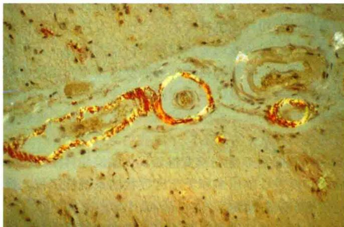 
图23-5 一例阿尔茨海默病的脑血管淀粉样蛋白，切片为刚果红染色，在偏正光下观察
心：所有患有AL和TTR淀粉样变性和不明原因的心肌同心状增厚的患者都应怀疑淀粉样蛋白累及心肌。当心肌病在心电图上没有异常大的波形复合体时，这尤为真实。心肌淀粉样蛋白沉积引起的限制型心肌病，其舒张功能障碍往往跟完好的收缩功能相关。
胃肠道：胃肠道的神经节、平滑肌、血管和黏膜下层都会被淀粉样蛋白受累。在这些部位沉积会改变胃肠蠕动和吸收。患者主诉常是便秘或腹泻，偶尔有吸收不良。舌头肿大几乎是AL淀粉样变性的病征，当其运动功能受到干扰时可能会严重影响说话和吞咽。
肝：AL，AA和家族性淀粉样变性常有肝淀粉样蛋白沉积但很少导致临床上显著的肝功能障碍。明显的肝大可能发生在检测到任何血清肝功能异常之前。黄疸通常发生晚，和肝衰竭和较差的预后相关，特别是在AL型。
淀粉样变性的诊断通常需要组织学证据，尽管仅证实淀粉样蛋白沉积不能说明其本身有重要临床的意义。以下关于淀粉样蛋白的几点重要方面在临床诊断必须考虑：
在不同的疾病种类中淀粉样蛋白分布不同。 
大部分系统性淀粉样蛋白沉积的形式被认为是器官限制性的。 
在一个特定的器官中淀粉样物沉积的量与器官功能障碍程度之间没有很好的相关性。 
■ 淀粉样蛋白沉积会有惊人的快速进展和退变的迹象，在不同器官有不同速度。
长期固有的观念认为淀粉样蛋白沉积是不可逆的，会不可避免的进展，这显然是不正确的，它仅仅反映了淀粉样蛋白沉积的基础疾病通常持续性存在的。许多个案报道描述了当基础疾病得到控制，淀粉样变性器官的功能就有提高，这表明淀粉样蛋白沉积是可能可逆的。然而，系统性淀粉样变性是一种渐进性疾病，若没有有效的治疗，在大多数病例最终是致命的。
（何春燕）
# 第24章 皮肤
皮肤表面的病变容易观察且易于活检，故皮肤是研究病理基本概念的理想器官。除非某些特别特异的组织（例如各种肺泡的病变），所有病变均可见于皮肤。某些病变甚至仅见于皮肤（偶见于黏膜），例如起疱的病变。
许多皮肤病变仅有轻微症状，一些病变完全无症状，几乎没有致命性病变，许多具有自限性。然而，即便是自限性、无症状的皮肤病变也常常给患者带来巨大困扰。例如，痤疮的全身症状很轻微，但它可以改变一个人的生活。尽管头发不是必不可少的，但秃顶可以造成难以想象的抑郁。白癜风，一种完全无症状的、进行性的色素脱失紊乱，可以导致一位普通的黑人情绪崩溃。
# 第一节 皮肤的解剖
角化细胞：表皮由多层角质生成细胞构成。形态上进行性的改变源于基底层的柱状细胞复制、通过棘层和颗粒层到达扁平的角化层（图24-1，图24-2）。整个表皮几乎所有的细胞分裂活动都存在于基底层。随着角化细胞靠近表面，细胞核逐渐消失并形成由死亡细胞组成的扁平层，构成了皮肤的最外界限。角化细胞合成张力原纤维，该物质由中间性角化原构成，也是头发、指甲等的主要构成成分。成束的张力原纤维向细胞膜集中，且借由被称为“桥粒”的连接盘终止于细胞膜。
表皮包含了迁徙而来的神经外胚层细胞及间充质细胞。其中，黑色素细胞及朗格汉斯细胞属于树突状细胞；默克尔细胞与终末神经元轴突相关（图24-2）。
黑色素细胞：黑色素细胞是起源于神经脊的树突状细胞，皮肤颜色主要与此相关。它们位于表皮基底层，并且借表皮基底膜（basement membrane zone，BMZ）与真皮分离。每个黑色素细胞为30个角化细胞提供“树突”。黑色素小体是细胞质、膜复合物，黑色素在其内合成。这些颗粒被转运至角化细胞，在角化细胞核上形成“帽”，保护细胞核的物质免受紫外线伤害。
朗格汉斯细胞：这种细胞为皮肤提供识别和处理抗原的能力。朗格汉斯细胞在真皮不常见，但却广泛分
布于表皮的有核细胞层，占其中的 $4\%$ 。胞质透明且形成核周体和树突，故常规显微镜下很难辨认。朗格汉斯细胞表达主要组织相容性复合物MHC-1、MHC-2和Fc IgG、Fc IgE的受体。
默克尔细胞：尽管有时被归类为“移民”细胞，但默克尔细胞也有可能是特化的基底角化细胞。含有像触觉机械感受器一样的神经分泌功能。
基底膜：BMZ是表皮和真皮的分界，其功能的多样性堪比结构的多样性，主要负责真皮和表皮的黏附，可能也肩负着选择性大分子物质的滤过作用。BMZ的
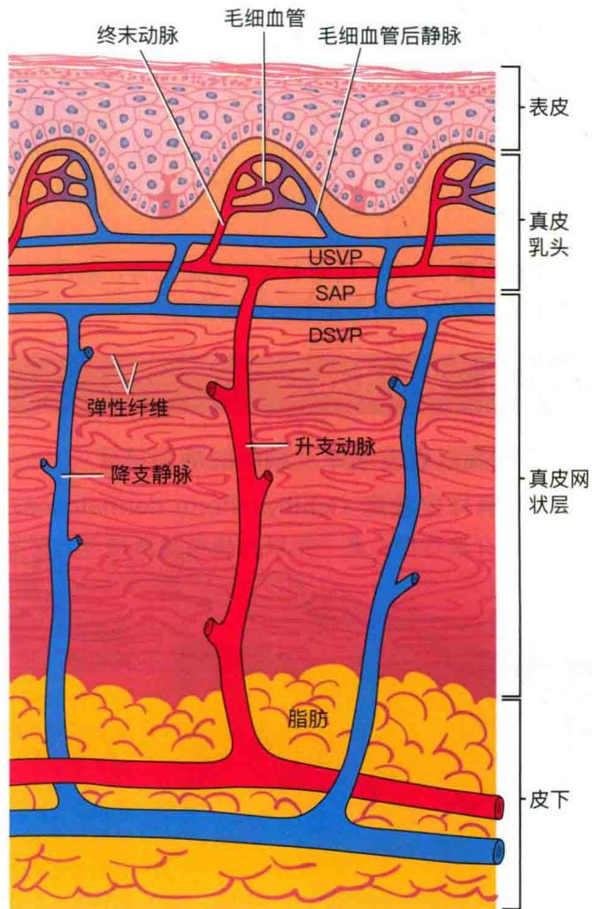 
图24-1 真皮及其血管系统。真皮分成两个独立的解剖学区域。真皮乳头及其血管网以及表皮通常在最初局限于皮肤的疾病中同时有反应。真皮网状层及皮下通常在表现在皮肤的系统性疾病中有反应。DSVP.浅层深部静脉丛；SAP.浅层动脉丛；USVP.浅层上部静脉丛
大多数结构由表皮细胞生成。基板是BMZ首要组织特征，负责上皮细胞极向，也负责一些角蛋白基因的表达。
真皮是BMZ以下结缔组织的复杂组合，主要由胶原构成，这些胶原埋藏于富含透明质酸的背景物质里。真皮包括两层。
真皮乳头：真皮乳头是紧邻表皮BMZ下的一层窄带。这个区域在HE染色上显示浅粉色，并且在光学显微镜下几乎没有任何结构（图24-1和图24-2）。纤细的胶原原纤维是最显著的结构。这些纤细的结缔组织像鞘一样包绕在血管、神经、附属器周围。这整个胶原网被称作真皮外膜。
真皮网：真皮网位于真皮乳头之下，含有皮肤的绝大多数胶原，这些胶原排列成粗大的胶原束并含有弹性纤维（图24-1）。
皮肤血管系：皮肤血液循环具有许多功能。借助血管网，皮肤在体温调节中起着重要作用。许多皮肤炎症也累及表浅的皮肤血管（图24-1）。皮肤淋巴管随机形成网状结构，起源于表皮附近的毛细淋巴管。也因此形成了表浅的淋巴管丛，通过这些淋巴管丛，淋巴管道才引流至区域淋巴结。
毛滤泡：毛囊最初起源于表皮，向下生长进入真皮层，同时也向上生长穿出表皮。头皮和胡须生长中的毛发具有上皮球和间充质组织，坚实地埋藏在皮下组织里面。
皮脂腺囊：这种结构随着青春期而发育，临床上也非常重要，因为它们是痤疮的发病部位。
# 第二节 表皮疾病
# 一、鱼鳞病以表皮增厚及鳞屑脱落为特征
鱼鳞病样皮肤病（ichthyosiform dermatoses），许多都具有遗传性，是一组以角质层显著增厚为特征
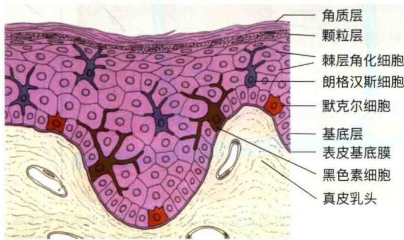 
图24-2 正常表皮及迁徙而来的细胞。表皮由多层角化细胞构成，防止水分丢失及细菌入侵。黑色素细胞贡献皮肤颜色同时也防止紫外线辐射。朗格汉斯细胞散在于上述细胞之间，负担着皮肤的免疫器官功能。默克尔细胞可能承担一部分皮肤触觉功能
的异质性疾病。鱼鳞病这一术语反映了病变皮肤一致地表现为粗糙、鱼鳞样角化（图24-3）。少数罕见鱼鳞病与其他病变相关，例如异常的脂质代谢、神经障碍、骨病变及癌症。

【发病机制】三条常见缺陷存在于鱼鳞病的表皮过度角化中。
角质层的细胞连接更加紧密，可能与变化了的脂质代谢相关。 
■ 异常角化表现为不可修复的张力原纤维（中间性角蛋白原纤维）形成、角化物合成及过度角化。 
基底细胞增殖活性增加，与角化细胞穿越表皮层时间缩短相关。

【病理】所有鱼鳞病（可能除外板层鱼鳞病）都有一个与有核细胞层相比异常增厚的角质
层。理论上，所有以表皮有核细胞层增厚为特点的病变都表现为角化过度。例如，正常皮肤慢性瘙痒或摩擦导致的表皮增厚、角化过度及真皮纤维化，这一现象被称为慢性单纯性苔藓。然而，在鱼鳞病中，尽管有核细胞层异常纤薄，但角质层可能比正常厚达5倍多。
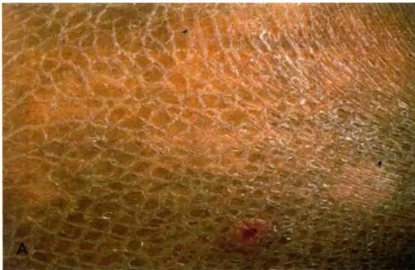
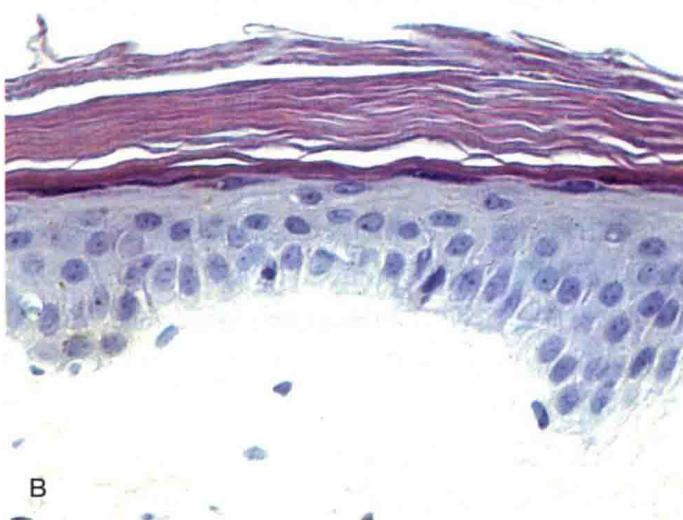 
图24-3寻常型鱼鳞病。A.一个具有严重寻常型鱼鳞病家族史患者的大腿可见非炎症性鱼皮样鳞屑；B.表皮的有核细胞层是正常厚度，与之相比，角质层不协调地增厚。颗粒层变薄且局灶缺失
1. 寻常型鱼鳞病（ichthyosis vulgaris）是一种常染色体显性遗传性角化异常，表现为角化过度及表皮角化透明颗粒减少或消失。角质层连接增加导致皮肤脱屑。变薄的颗粒层是一单层小的、有缺陷的角质透明蛋白颗粒。丝聚合蛋白原（一种角蛋白原纤维的“胶”）合成的减少或缺失是这种缺陷的原因。
寻常型鱼鳞病是这种异常增厚的一种类型。角质层松散并且有一种篮子编织状外观，与正常的区别仅表现为数量。颗粒层显著减少，有时甚至缺如（图24-3B）。基底层及棘层显示正常。因此，寻常型鱼鳞病的最主要的变化存在于颗粒层、角质层，以及负责最终角化的表皮区域。
【临床表现】寻常型鱼鳞病是鱼鳞病中最常见的一型，而且在儿童早期即可发生。常有家族史。小的白色皮屑出现在四肢的伸面或躯干或面部。该疾病是终身的。但在局部治疗的作用下，多数患者可以不出现皮屑。
2.其他先天性鱼鳞病少数其他遗传性鱼鳞病与一些基因的突变有关。这些疾病包括如下：
X染色体相关性鱼鳞病是一种遗传性表皮病变，在退行型中，因为类固醇硫酸酯酶的缺陷，角质层桥粒盘发生迟发型溶解。类固醇硫酸酯酶作用于胆固醇硫酸盐，这种酶的缺陷导致角质层的持续连接。然而，不同于寻常型鱼鳞病，在这一亚型中，颗粒层是保留的。
表皮角化过度是一种常染色体显性遗传的鱼鳞病，通常表现为红皮、鱼鳞样皮肤和起水疱。该病变由K1或K10角蛋白基因突变所致。这些基因可能编码表皮旁基底的角蛋白，从而阻碍了细胞骨架的正常发育。因此，表皮“松解”，易形成空泡。该病变表现为出生时或刚出生后即出现大疱，从而导致毁容及细菌的机会感染。
■板层鱼鳞病是一种常染色体隐性遗传性病变，表现为严重的及全身的鱼鳞病。该病变经常有转谷氨酰胺酶1（TGM1；染色体14q11）突变所致。这种病的儿童出生时即表现为全身覆盖“火棉胶”膜，出生后立即脱落，随即发展为毁容性过度角化。
3. 获得性鱼鳞病 临床及病史所述类似寻常型鱼鳞病，偶尔与其他疾病相关或是药物所致。淋巴瘤，尤其是霍奇金病、其他肿瘤、全身性肉芽肿性病变、结缔组织病都可能与鱼鳞病相关。药物可能因为干扰了脂质代谢而诱发鱼鳞病。
# 二、毛囊角化症是一种常染色体显性遗传的角化病变
毛囊角化病（darier disease），也被称为滤泡性角化症，以多灶角化为特点，与ATP2A2突变相关，该
基因位于染色体12q23-24，编码内质网的钙泵，这种钙泵直接作用于桥粒的钙依赖性结构并且可能导致神经精神方面的问题。

【病理】镜下，毛囊角化症的湿疣样丘疹在基
底部有一条裂隙。裂隙上方和旁边，具有嗜酸
性胞质的角化不良细胞内含有呈旋涡状排列于核周的角质原纤维（图24-4）。裂隙底部由柱状的致密的角化物质构成。

【临床表现】毛囊角化症最初出现于儿童晚期
或少年时期，表现为皮肤色素丘疹，后期结痂。
受累皮肤有许多疣状突起，直径 $2\sim 4mm$ ，多半位于胸部、鼻唇沟，背、头皮、前额、耳朵、腹股沟。
# 三、银屑病是一种增殖型皮肤病变，以持续的表皮增生为特点
银屑病（psoriasis）是一种慢性、通常是家族性的病变。表现为大且红肿、脱屑的斑块，通常在皮肤的伸侧。全球范围内有 $1\% \sim 2\%$ 的人群受累，可发生于任何年龄，青少年时期为高峰。有趣的是，美国本土人未见患病，亚洲也不常见。

【发病机制】银屑病的病因知之甚少，也可能是多重的。
遗传因素：尽管仅有1/3患者有家族史，但研究显示银屑病不可置疑地与遗传相关。病变越严重，家族背景的可能性越大。遗传的推测基于许多观察结果：①银屑病患者亲属及后代成员的患病概率增高；②单卵双胎中，一方患病，另一方患病的概率高达 $65\%$ ；③在某些人白细胞抗原（HLA）单倍型的患者中发病增高，尤其是HLA-Cw*0602，事实上，具有这种表型的单个个体比正常人群患病率高
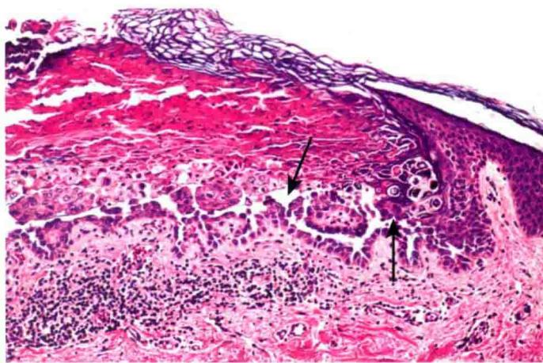 
图24-4毛囊角化病。几乎所有表皮都显示局灶的棘层角化不良。右侧见小范围正常表皮。本例可见基底层上裂隙（箭头），角化过度及角化不全的细胞围绕少许无附着的细胞角化细胞（棘层松解）。裂隙不是泡，真正的泡应该含有炎症细胞及组织液。裂隙上方可见角化不良
出 $10\sim 15$ 倍。
免疫因素：T淋巴细胞在银屑病的发生机制中起关键作用。该病的发生与T淋巴细胞浸润至表皮相关。相对应的是，银屑病斑块的消退，无论是自然治愈或缘于治疗效果，都伴随着表皮T淋巴细胞的消失或减少。
环境因素：可能发生于皮肤的任何部位。各种各样的刺激因素，例如精神创伤（“kobner”现象）、感染、某些药物及光敏感性，都可能导致看似正常的皮肤发生银屑病。正常人的皮肤的慢性瘙痒，例如反复抓挠，也会产生一种硬韧、脱屑、皮肤斑块，无论从临床上还是组织学上都表现为银屑病样。但这种病变会在创伤停止后自行消失。银屑病患者不同，即便轻微创伤导致疾病发生，损伤停止后病变也会持续多年。
异常细胞增殖：表皮增殖的失调及皮肤微环境的异常都会导致银屑病（图24-5）。表皮低增殖活性区域的cAMP活性的降低被认为是beta肾上腺素受体缺陷所致。cAMP的减少通过复杂且不甚明了的途径改变了皮肤对创伤的应答。
微循环的改变：在银屑病的皮肤，真皮乳头的毛细血管网变得更静脉化。表现为基底膜样物质更多层，管腔更宽，而且内皮细胞间有“搭桥”。血管的变化与显著增高的中性粒细胞趋化因子相一致，导致真皮乳头顶部大量中性粒细胞渗出并随后迁徙至表皮（图24-5）。这种不同寻常的中性粒细胞炎症导致角质层中性粒细胞的密集（munro微脓肿），同时整个表皮均可见散在的中性粒细胞。

【病理】患者表皮增厚、过度角化及角化不全（角质层里依然可见细胞核）。角化不全可以表现
为局限的椭圆形或弥漫分布，此时颗粒层减少或消失。上皮脚的有核细胞层增厚数倍，通常真皮乳头上方的表皮异常菲薄（图24-6）。相对应的，真皮乳头伸长，像牛角的纵切面，乳头尖部朝向真皮。在慢性病变中，真皮乳头有些像具有短柄的球根状球棒（图24-6）。表皮的上皮网与真皮乳头交互分布，形成真皮与表皮球棒之间的紧密相连，极向相反。真皮乳头的毛细血管扩张且迂曲。
中性粒细胞局限于表皮棘层或在角质层形成小的牟氏微脓肿，也可能与局限性角化不全区域相关。乳头下的真皮含不同程度的单核炎症细胞围绕表浅血管丛浸润，绝大多数是淋巴细胞。炎症并不累及紧邻的网状真皮。

【临床表现】首发表现可以是各种各样。病变活性也呈间歇性。病变的严重性可以从肘部
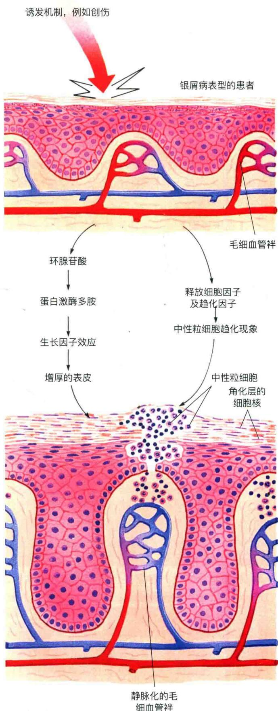 
图24-5银屑病的发病机制。该图显示了表皮生长的失控、毛细血管环的静脉化及特异性的中性粒细胞浸润。表皮生长的改变被认为是由表皮细胞表面受体的缺陷所致。这导致了环腺苷酸（cAMP）减少及功能减少。cAMP的减少也可能与花生四烯酸的增多有关，后者反过来激活白细胞三烯B4（LTB-4）。这种潜在的中性粒细胞趋化因子作用于静脉化的毛细血管袢。然后中性粒细胞从位于真皮乳头顶部的毛细血管袢的顶端游出，而不是从毛细血管后静脉游出，绝大多数皮肤炎症疾病都遵循了这一规则
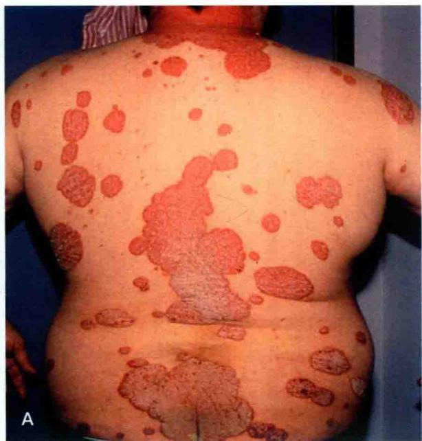 
图24-6银屑病。这种病变是银屑样表皮增生的原型。A.银屑病患者，图片显示躯干大片、融合、界线清楚的红斑；B.显微镜下病损显示上皮脚都伸长，真皮乳头也延长，呈现交替反转的“球棒”相互连接的排列方式。真皮乳头水肿，位于变薄的表皮下（乳头上变薄）。角化不良显著，就是临床观察到的皮屑
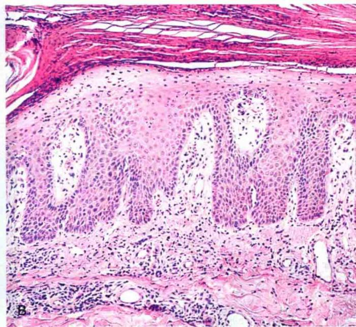
恼人的脱屑性病变到严重的累及几乎全身皮肤的，后者常与关节炎相关（图24-6A）。典型的斑块直径 $4\sim 5cm$ 、边界清楚、被覆银白色角化物。角化物脱落后，玫瑰红色皮肤表面点缀着针尖大出血点，那是真皮乳头扩张的毛细血管（“Auspitz征”）。
所有银屑病患者中， $7\%$ 发展为血清学阴性的关节炎（见第26章）。有关节病倾向的病例多数与一些HLA单倍型，尤其是HLA-B27相关。银屑病性关节炎与类风湿关节炎非常相似，但通常更轻微且几乎不致残。
很久以来，该病都是通过煤焦油或木焦油衍生物来治疗；或者使用葱林，一种强大的还原剂。皮质激素也曾用于局部或全身治疗。严重的、泛发的病例可以全身使用甲氨蝶呤。补骨脂素后再采用光疗（“PUVA”，结合于DNA的紫外线吸收复合物）通常有效。复合维生素A、D衍生物也有效。最近，针对免疫特点的靶向治疗取得了一定疗效，例如那些针对T细胞活性的表面标记的药物。
# 四、寻常型天疱疮是一种起疱性皮肤病，由抗角化细胞的抗体所致
松解性病变是一种皮肤疾病，在此种病变中大疱的产生是继发于表皮角化细胞连接消失。寻常型天疱疮（pemphigus vulgaris，PV）（希腊语，pemphix，泡），一种松解性病变，是慢性、起疱性皮肤疾病，在 $40\sim 60$ 岁人群中最多见，也可见于所有年龄，包括儿童。所有种族均可发病，犹太人或地中海人群更多见。

【发病机制】PV是一种自身免疫性疾病，循环IgG抗体与表面桥粒蛋白抗原桥粒核心糖
蛋白3（desmoglein3）发生反应。抗原- 抗体联合体导致的松解是由于纤溶酶原激活物及纤溶酶降解所致。这种蛋白水解酶作用于细胞间物质并且有可能是松解的主要原因。天疱疮抗原- 抗体复合物的内化、连接斑块的消失，以及核周张力原纤维的收缩可能都与蛋白酶协同作用导致松解及空泡化。
【病理】PV的疱是表皮内疱。其他累及基底层的大疱性病变（下节讨论）是表皮下疱。PV中疱的形成是因为外层表皮与基底层分离。这种基底层上的松解所形成的疱有一个完整的基底层做底、其余的表皮层做顶（图24-7）。Desmoglein3集中分布在表皮下部，这也就解释了疱的位置。疱内含有大量淋巴细胞、巨噬细胞、嗜酸性粒细胞和中性粒细胞。明显的是，圆形的角化细胞，术语称作“棘层松解细胞”，在松解的过程中被包裹入泡内。基底细胞依旧紧贴在基板上，形成了一个“墓碑细胞”层。紧邻的真皮内见中等量淋巴细胞、巨噬细胞、嗜酸性粒细胞和中性粒细胞浸润，尤以毛细血管静脉床周更为显著。
【临床表现】PV典型的病变是一种大的、易破的疱，留下一个广泛的无表皮被覆或者结痂的区域。病变最常见于头皮及黏膜、脐周和擦烂区域。皮质激素治疗有效，如果不使用激素，PV能够逐渐加重而且通常致死——皮肤的大部分区域可能表皮剥脱。免疫抑制剂也能用于支持治疗。在恰当的治疗下，近十年来，死亡率已低于 $10\%$
天疱疮可能与其他自身免疫性疾病相关，例如重症肌无力及红斑狼疮，也可见于良性胸腺瘤。
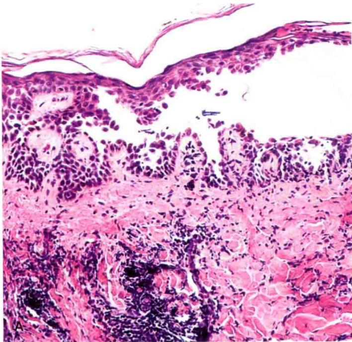 
图24-7 寻常型天疱疮。A. 基底层上方的失连接导致表皮内水疱形成,疱内含有棘层角化细胞。基底层角化细胞轻度彼此分开,但与棘层完全分开。基底角化细胞紧密贴附于表皮基底膜。B. 病变周围皮肤的直接免疫荧光检查可检测到抗体,通常是免疫球蛋白 G 型,沉积于表皮细胞间,以“蕾丝样”形式勾画出角化细胞
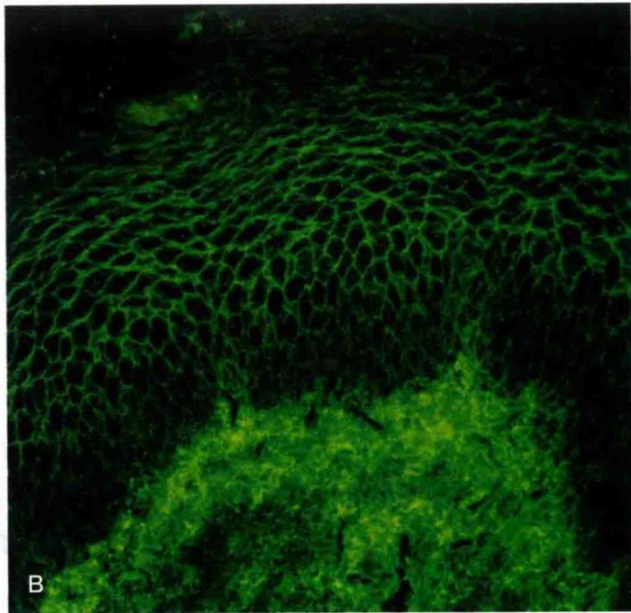
# 第三节 基底膜病变（真皮-表皮交界）
# 一、表皮溶解性疱
表皮溶解性疱（EB）以基底膜疱形成为特点，包含一组疾病，具有的共同特征是遗传性且易在微小创伤处形成疱。临床谱系涵盖微小恼人的病变到广泛分布的、致死性病变。EB的疱通常在出生时或稍后即被发现。病变的分类基于临床特征与疱在BMZ的形成部位的联合分析。疱形成的不同机制存在于以下三种主要EB类型（图24-8）。
表皮松解性EB（单纯EB）：单纯EB是一种常染色体显性遗传性疾病，疱的形成是由于基底角化细胞的瓦解。这种情况也是由于编码角化物中间原纤维的基因发生了突变所致。疱的形成是对微小创伤的反应，例如仅是抓挠皮肤，但是不通过瘢痕修复（因此得名“单纯”）。尽管表皮松解性EB可以带来容貌的困扰，甚至有时致全身衰弱，但不致死。
结合性EB：是一种常染色体隐性遗传性皮肤病，这型病变中疱形成于BMZ的透明板。临床可以表现为对生命周期无影响的良性病变（与编码XVII型胶原的基因突变有关），也可以在生命头两年就致死。后者的特点是粘连蛋白异构体和整合素的基因发生突变。两者的愈合都没有瘢痕，但可能产生皮肤萎缩。
皮肤松解性EB（或称为营养不良性EB）：是一组常染色体显性及常染色体隐性疾病，大疱紧邻致密板深层。隐性亚型更严重。在这两型中，愈合的疱都特征性地表现为萎缩（“营养不良性”）的瘢痕。基础
病变是位于3p21的编码V型胶原的基因发生了突变，导致能将表皮锚定在其下真皮上的锚定原纤维产生缺陷。锚定纤维的崩解导致表皮下大疱形成。
■ Kindler 综合征：表现为常染色体隐性遗传病和混有裂解面的疱。特征性的临床表现包括皮肤异色病（皮肤色素斑驳）和光敏感。这一型是由于位于 $20\mathrm{p}12$ 的FERMT1基因发生突变，该基因编码kindlin-1，一种参与基底角化细胞连接的蛋白。
# 二、大疱性类天疱疮
大疱性类天疱疮是一种位于表皮下的疱性病变，由抗基底膜蛋白的自身免疫性抗体引起。大疱性类天疱疮（bullous pemphigoid，BP）是一种常见的自身免疫性疱性病变，临床表现类似于PV（因此，才有类天疱疮这个词），但没有棘层松解。该病变通常发生于晚年，无明显种族或性别差异。

【发病机制】与PV相似，BP是一种自身免
疫性疾病，但是在这种病变中，补体结合性
IgG抗体是直接作用于两种基底膜蛋白，BPAG1和BPAG2。抗原-抗体复合物借助C5b-C9膜攻击复合物损伤基底细胞细胞膜（见第4章）。更重要的是过敏毒素C3a和C5a的产生，这两种物质导致肥大细胞脱颗粒及嗜酸性粒细胞、中性粒细胞和淋巴细胞趋化因子的释放。嗜酸性粒细胞的颗粒含有组织损伤物质，包括嗜酸性粒细胞过氧化物酶和主要碱性蛋白。这些分子与中性粒细胞及肥大细胞的蛋白酶一起，导致在透明板处真皮一表皮分离。
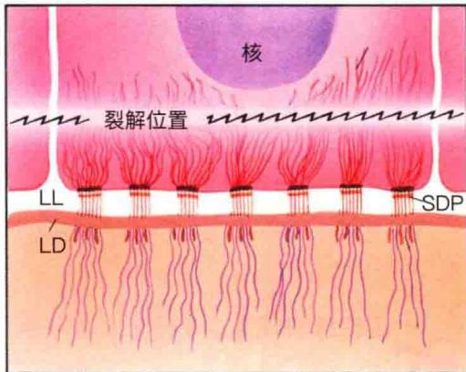 
表皮松解性EB
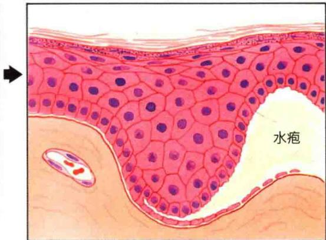
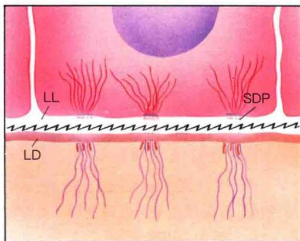 
接合性EB
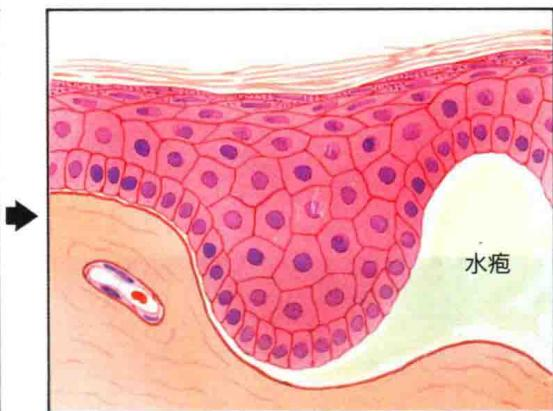
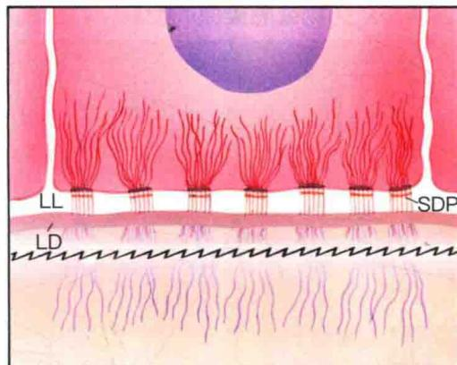 
皮肤松解性EB
。示意图显示三种截然不同的水疱形成机制。左边是电镜示意图，右边是光镜示意图。表皮松解性EB由表皮基底细胞最底层的崩解所致。基底细胞层底部形成裂隙，其余表皮分离。基底细胞的小碎片依旧贴附于基底膜。结合性EB以在透明板(LL)形成裂隙为特征。皮肤松解性EB与发育不全和碎片状的锚定原纤维相关。因为这些有缺陷的锚定原纤维，使整个基底膜和表皮从真皮上分离。LD.致密板；SDP.桥粒下密板；TF.张力丝.jpg) 
图24-8大疱型表皮松解症（EB)。示意图显示三种截然不同的水疱形成机制。左边是电镜示意图，右边是光镜示意图。表皮松解性EB由表皮基底细胞最底层的崩解所致。基底细胞层底部形成裂隙，其余表皮分离。基底细胞的小碎片依旧贴附于基底膜。结合性EB以在透明板(LL)形成裂隙为特征。皮肤松解性EB与发育不全和碎片状的锚定原纤维相关。因为这些有缺陷的锚定原纤维，使整个基底膜和表皮从真皮上分离。LD.致密板；SDP.桥粒下密板；TF.张力丝

【病理】BP的疱位于表皮下，顶是完整的表皮，
底是BMZ的致密板（图24-9B）。疱内含有
大量嗜酸性粒细胞，混合纤维素、淋巴细胞及中性粒细胞。免疫荧光研究显示沿着表皮BMZ C3和IgG线性沉积，血清抗BPAG1和BPAG2抗体。

【临床表现】BP的疱大且紧张，可以出现在看
似正常的皮肤或底部呈现红斑（图24-9A）。
大腿内侧和前臂屈肌侧易受累，但腹股沟、下颌骨及其他皮肤也可以出现。病变自限但很缓慢，患者的全身健康状况通常不受影响。皮质激素全身用药能够显
著缩短病程。
# 三、疱疹样皮炎
疱疹样皮炎（dermatitis herpetiformis，DH）反映了麸质敏感及免疫复合物沉积，是一种暴发性的强烈的皮肤瘙痒，以全身伸侧面风疹样斑块和小的表皮下空泡为特点。

【发病机制】DH与麸质敏感相关，此类患者
表现为脂肪泻（见第13章）。皮肤病变与主
要沉积于真皮乳头尖部的IgA颗粒相关。IgA免疫复
合物在病变周围皮肤内的含量也远高于看似正常的皮肤（图24-10）。不含麸质的饮食能够控制本病，麸质的重新摄入又会诱发本病。尽管IgA免疫复合物在补体激活中并不是很有效（替代途径），那些中性粒细胞确实会聚集白三烯，从而吸引更多的中性粒细胞。中性粒细胞释放溶酶体酶，降解层粘连蛋白和IV型胶原，将表皮从真皮上分离，最终形成疱。

【病理】首先出现静脉周围少许的淋巴细胞浸
润，伴随一起的是在真皮乳头的BMZ致密板
下出现一条中性粒细胞带。在接下来的12小时，中性粒细胞聚集成簇， $10\sim 25$ 个细胞一起，在真皮乳头的尖部，形成诊断性组织学特点（图24-10B）。
真皮一表皮分离有两种机制。第一种与真皮表皮交界处一层或两层中性粒细胞大片状散布相关。导致整个表皮与真皮乳头分离（图24-10B）。与BP不同
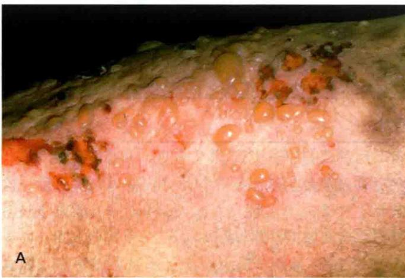
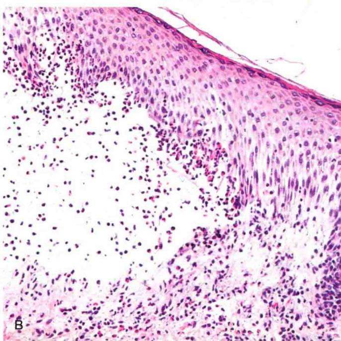 
图24-9大疱性类天疱疮。A.皮肤显示多个张力性大疱，基底皮肤红肿、糜烂。病变最初发生于大腿中部及躯干；B.表皮下水疱以水肿的真皮乳头为基底。水疱的顶部由完好、完整的表皮构成，包括基底层。水疱腔里充满炎症细胞、纤维素及液体
的是, DH 早期嗜酸性粒细胞的浸润不是很常见。直接免疫荧光分析可检测到真皮表皮交界处 IgA 沉积 (图 24-10C)。
在水疱形成的第二种机制中，许多中性粒细胞快速聚集在真皮乳头的尖部。真皮乳头表面中性粒细胞溶酶体酶的释放导致：①水疱，可有交错的贯穿被覆上皮的裂口；②病变底部为残余上皮脚和真皮乳头下半部的交错分布。

【临床表现】DH最易发生于肘部、膝部、臀
部（图24-10A）。这些剧烈瘙痒的空泡可成现，像单纯疱疹一样（也因此得名“疱疹样”）。
病变几乎均被抓挠过直到破裂并以瘢痕愈合。尽管DH轻重不一，也可以自行消退，但病变很令人讨厌的漫长。愈合的病变经常留下瘢痕。除了不含麸质的饮食外，使用氨苯砜或磺胺吡啶能够控制症状和体征，但机制不明。
# 四、多形性红斑经常是对药物或感染的反应
多形性红斑（erythema multiforme，EM）是一种急性的、自限性病变，表现多样，可以是红斑和疱（轻型EM），也可以是致死性、广泛分布于皮肤及黏膜的溃疡（重型EM，Stevens-Johnson综合征）。这种现象通常是对药物或感染原的反应，特别是单纯疱疹感染。

【发病机制】可能激起EM的抗原很多，包
括疱疹病毒、支原体及磺胺类药。但是，一
个刺激因素仅在半数病例中可见。疱疹病毒感染
后EM，病毒抗原、IgM、C3沉积于血管周和表皮
BMZ。病变中浸润的淋巴细胞与抗原抗体复合物的
结合提示体液及细胞超敏反应均参与了病变。

【病理】EM的真皮显示稀疏的淋巴细胞浸润于
表浅处的血管床及真皮表皮交界处。表皮的特
征性的形态学特点是可见凋亡的角化细胞, 这些细胞
有固缩的核和嗜酸性胞质。凋亡有可能非常广泛并且
与表皮下空泡相关, 这些空泡的顶是几乎完全坏死的
表皮。因为病变是含
没有角质层的改变。

【临床表现】EM的“靶环”或“虹膜”样特征
性改变是中心暗红色区域，偶尔有疱，绕以色
淡区域（图24-11）。反过来，后者是被外周红晕围绕。
荨麻疹斑常见。小疱和大疱的存在通常预示着更严重
的病程。EM是一种常见状况，峰值年龄在十几岁至
二十几岁。Stevens-Johnson 综合征指的是一种不常
见的严重的类型，累及多处黏膜表面和内部器官，往
往往是致命的。毒性表皮坏死松解 (TEN 或 Lyell 疾病)
是一种相关性状况，可以泛发并危及生命。
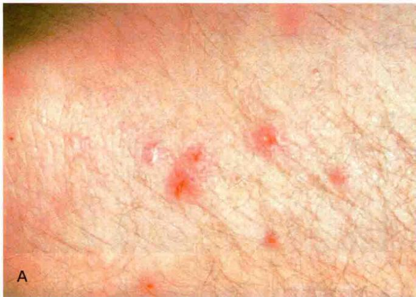
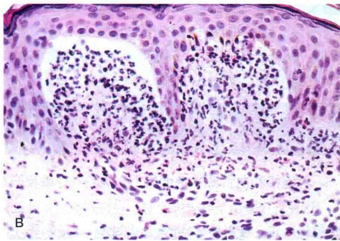
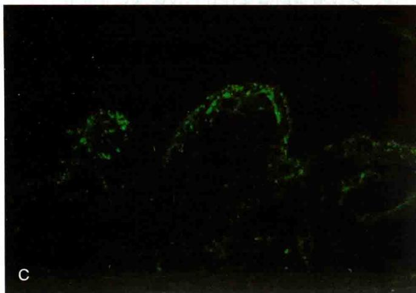 
图24-10疱疹样皮炎。A.肘部或膝部出现瘙痒的、对称性的、成组出现的小水疱，基底为红斑；B.特征性的表现是真皮－表皮交界处真皮乳头中性粒细胞脓肿伴有小疱形成；C.直接免疫荧光检测显示免疫球蛋白A沉积于真皮乳头，与锚定原纤维及弹力纤维相关，但并不直接位于其上。这也是中性粒细胞浸润及表皮下小疱形成之处
# 五、系统性红斑狼疮
系统性红斑狼疮（systemic lupus erythematosus, SLE）是典型的免疫复合性病变，以多种自身抗体和其他免疫异常为特点（见第4章和第16章）。尽管真皮受累可能很严重并且毁容，就自身而言，该病变并不危及生命。然而，皮肤上免疫反应物的本质及类型是非常好的证据证明病变可能是系统性的。
【发病机制】免疫复合物不大可能是SLE皮肤病变的唯一病因，因为这些复合物既出现在病变区又出现在看似正常的皮肤。沿着“正常”皮肤表皮BMZ沉积的免疫反应物（阳性狼疮带实验）对于诊断SLE非常重要（图24-12）。表皮损伤一开始似乎是源于外源性因素，例如紫外线，然后由细胞介导的免疫反应使病损持续存在。表皮损伤的表现包括：①基底角化细胞的空泡化，角化过度，表皮厚度显著减少；②DNA以及其他核及胞质抗原释放入循环系统；③DNA和其他抗原决定物沉积在表皮BMZ（致密板及紧邻其下的真皮）。因此，表皮损伤，局限性免疫复合物形成、循环性免疫复合物的沉积、淋巴细胞介导的细胞损伤似乎均参与了病变形成。
根据缓慢程度，红斑狼疮被分为各种亚型，但各型之间特点有重叠。皮肤病变的轻重与系统性病理的程度之间有内在联系。
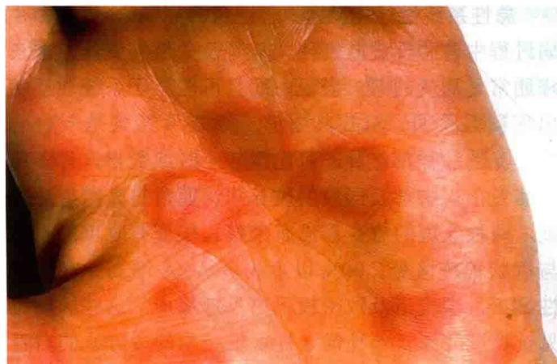 
图24-11 多形性红斑。激素反应性“靶形”丘疹，特点是中心为疱、周围为红斑，抗生素治疗后出现
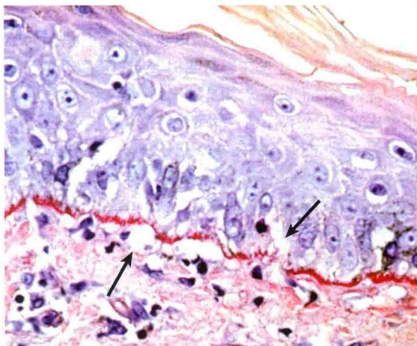 
图24-12 红斑狼疮。基底细胞坏死伴基底角化细胞迁移及新基底膜（BMZ）生成导致表皮BMZ增厚，PAS染色证明。注意BMZ两侧的空泡（箭头），是细胞损伤的证明
慢性皮肤（盘状）红斑狼疮：这型狼疮通常限于皮肤。病变通常在颈部以上更显著，面部（尤其是脸颊区域）、头皮、耳朵。基底角化细胞的损伤是基础病变。病变开始表现为轻微突起的紫色斑块，表面有粗糙的角化物鳞屑。随着增大，病变逐渐表现为盘状，边缘角化过度，中心色素脱失。皮肤病变可以最终形成毁容性瘢痕。稍多于 $10\%$ 的病例循环抗核抗体（ANAs）可增高。
亚急性皮肤红斑狼疮：该型病变最常累及中青年白人女性。与盘状狼疮不同，该型也许会累及肌肉骨骼系统及肾。初始，表现为覆鳞屑的红斑，然后增大至银屑病样或环形病变，可能融合。皮肤的变化可见于上胸部、上背部、手臂的伸侧，这些分布提示暴露于光可能在该病的发病机制中扮演一定角色。病变特征性表现为真皮乳头的水肿、致密板增厚、基底层细胞的显著空泡变性。显著的瘢痕形成不会发生。约 $70\%$ 的患者有循环抗Ro抗体（ss-A）及ANA升高。
急性系统性红斑狼疮：超过 $80\%$ 的SLE患者在疾病过程中有急性皮肤表现，与肾及关节病变相关。皮疹通常是病变的第一表现，而且可能早于系统性症状出现前几个月。SLE典型的“蝴蝶”红斑是一种隐约可见的脸颊部红肿，可出现数小时或数日。许多患者暴发出现胸部及四肢的斑丘疹，通常日光照射后进展。两种红斑的愈合都没有瘢痕。病变有时可能无法与盘状狼疮区分。 $90\%$ 以上患者ANA增高。在大疱性SLE，表皮下及致密板下可见疱形成，这些区域可见抗V型胶原（一种锚定纤维蛋白原的成分）的自身抗体沉积。
# 六、扁平苔藓是一种超敏反应，伴有真皮表皮交界处淋巴细胞浸润
“苔藓样”组织反应之所以这样被命名是因为临床上该病变像某些长在岩石或树干上的苔藓。组织学上，苔藓样浸润的特点就是淋巴细胞带状浸润导致真皮表皮交界区模糊不清。病变的特征是表皮更新减少，然后是角化过度，没有角化不全。扁平苔藓（lichen planus，LP）是这组病变的基本病变。

【发病机制】LP的病因不清。有时具有家族性，也可能伴随各种的自身免疫性疾病。药
物，例如金、氯噻嗪和氯喹及一些外用药物都可能诱发苔藓样反应。也有证据证明LP是一种迟发型超敏反应，由细胞因子诱发及加重，例如伽马干扰素（IFN-γ）及白介素-6（IL-6），表现不仅因为淋巴细胞的浸润也有受刺激的角化细胞。丙肝与LP的关系也有报道。
【病理】LP显著的病理变化位于真皮表皮交界处。基底的那排立方形细胞被扁平或多角形角化细胞取代。真皮乳头与圆形表皮脚之间的波浪状界面因为致密的淋巴细胞、巨噬细胞浸润而变得模糊。这些巨噬细胞中有许多含有黑色素（噬黑色素细胞）（图24-13）。在表皮或真皮，通常与这些浸润混合存在的是球形、纤维素性、嗜酸性小体， $15\sim 20\mathrm{mm}$ ，代表凋亡的角化细胞（图24-13C）。这些结构有很多命名，例如凋亡小体、胶样小体、Civatte小体或纤维性小体。

【临床表现】LP是一种慢性皮疹，特点是紫罗兰色的、表面扁平的斑块，通常在腕部的背侧-13A)。白色斑片或者条纹也可能出现在口腔在多数患者中，这种瘙痒病变一年内消退，但持续较长时间。
# 第四节 浅表或深部血管床的炎症性病变
# 一、荨麻疹和血管源性水肿是 IgE 依赖的超敏反应
这种反应是由于肥大细胞对一种特异的抗原过敏、脱颗粒所致。荨麻疹（urticaria或hives），是隆起性、色淡、界线清楚的瘙痒性丘疹及斑块，常常在几个小时内出现并消失。病变代表了真皮表浅部位的水肿。血管源性水肿指的是水肿累及真皮深部或皮下，导致卵圆形肿胀。这两种病变类型都快速发病，有的只是轻微的恼人的病变，有的可以是危及生命的过敏性反应。主要的治疗措施是避免接触对之过敏的过敏原并迅速服用抗组胺药物。

【发病机制】多数荨麻疹患者都是 IgE 依赖的病例，而且血管通透性增高都是由于肥大细胞颗粒所致。几乎有数不清的物质可以与肥大细胞的 IgE 抗体反应。
最初，皮肤静脉对肥大细胞脱颗粒的反应及增加血管通透性的血管活性物质的释放，导致快速形成水肿。如果反应持续存在，炎症细胞就会聚集于这个区域，持续性（持续超过一天）荨麻疹斑块就产生了。遗传性血管源性水肿是一种严重的常染色体显性遗传性病变，由C1酯酶抑制剂的突变所致。

【病理】在荨麻疹中，胶原纤维和胶原原纤维被过多聚集的水分撑开分离。淋巴管扩张，小示中性粒细胞及嗜酸性粒细胞边聚。血管被少细胞包绕呈袖套样。持续性荨麻疹显示淋巴细酸性粒细胞增多，但中性粒细胞稀少。
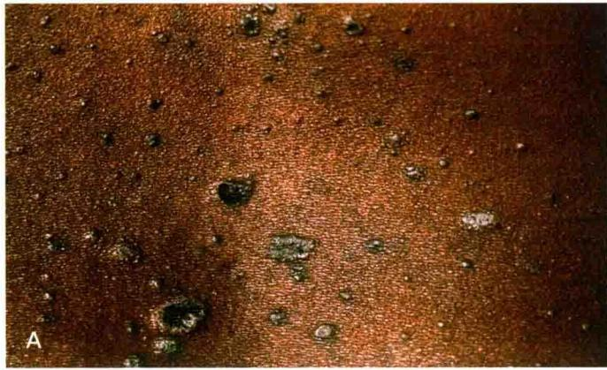
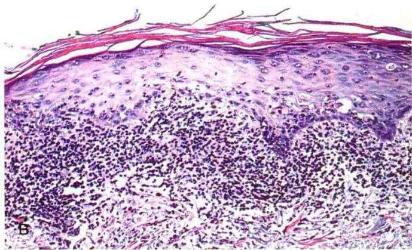
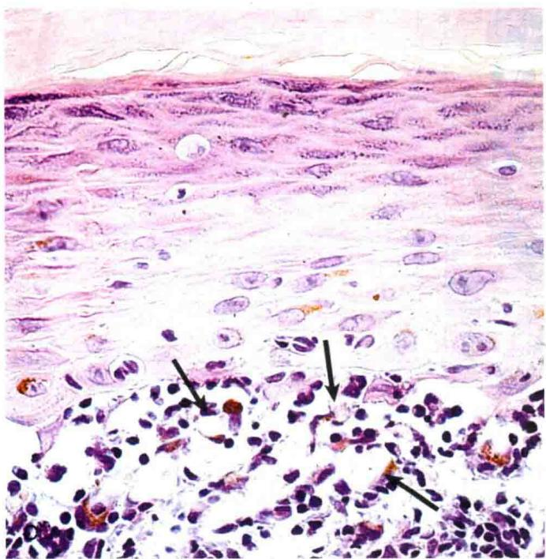 
图24-13 扁平苔藓。A.皮肤显示出多个顶部平坦的紫罗兰色的多角形丘疹；B.一个富于细胞的、带状、淋巴细胞浸润带破坏基底层。不像红斑狼疮，通常在扁平苔藓可见表皮增生，过度角化及楔形颗粒层增厚；C.颗粒层增厚及表皮脚消失。病理损伤的部位位于真皮一表皮交界处，在该部位淋巴细胞浸润非常显著，许多淋巴细胞围绕以凋亡的角化细胞（箭头）
# 二、过敏性接触性皮炎
过敏性接触性皮炎是一种细胞介导的对外源性过敏原反应的超敏性反应。最常见的过敏原是植物的漆树属成员。美国约 $90\%$ 人群对如下物质过敏：刺果毒漆藤（毒藤），槲叶毒葛（毒葛）和毒盐肤木（毒漆）。
这些植物性皮炎众所周知，以至于由此引起的疾病常常用这些植物来索引。
【发病机制】植物含有低分子量松脂，在患者体内与携带蛋白结合。形成这种半抗原携带复合物大约需要1小时，然后这种复合物将被朗格汉斯细胞当作抗原递呈。这些细胞携带抗原通过淋巴管到达区域性淋巴结，将抗原递呈给 $\mathrm{CD4^{+}}$ 的T淋巴细胞（图24-14）。 $5\sim 7$ 天后，这些T淋巴细胞的某些克隆变为致敏性的并且变成记忆细胞在血液中循环。其他的一些迁移到皮肤，在皮肤的这些细胞随时准备对接触到的抗原发生反应。IL-1由朗格汉斯细胞产生，并支撑 $\mathrm{CD4^{+}}$ 的Th1淋巴细胞增殖，Th1淋巴细胞是迟发型超敏反应的效应细胞。细胞因子的产生导致更多T细胞和巨噬细胞的聚集、炎症细胞浸润，从而造成表皮细胞的损伤。
【病理】过敏性接触性皮炎是皮肤棘细胞层水肿性皮炎的典型。在再次暴露与过敏原的最初24小时，大量淋巴细胞和巨噬细胞聚集在浅表的静脉床并延伸至表皮。表皮的角化细胞部分地被水肿液分隔，形成海绵样表现（棘细胞层水肿）（图24-15）。接下来，大量单核炎症细胞和嗜酸性粒细胞聚集。含有淋巴细胞及巨噬细胞地空泡形成，大量嗜酸性凝固性液体聚集在角质层。
【临床表现】第一次暴露后 $5\sim 7$ 天，接触的部位变得剧痒，此后，红肿和小泡迅速形成（图24-15）。在接下来的几天里，这个区域增大，变得火红，发展出许许多多空泡，渗出大量透明蛋白性液体伴有剧痒。整个病程持续约3周。渗出逐渐消退，整个区域由不规则痂皮覆盖，最终脱落。瘙痒消失，愈合、不留瘢痕。当致敏的患者再次接触到毒藤，这个病程会加速。 $24\sim 48$ 小时病变出现，迅速播散，产生相同的临床表现。然而，反应通常更剧烈。再一次，病变在3周左右清除。过敏性接触性皮炎对局部或全身使用皮质激素有效。
# 第五节 寻常型痤疮是毛囊皮脂腺的病变
寻常型痤疮（acne vulgaris）是一种发生于皮脂腺的自限性、炎症性病变，特征性地累及青年，结果是间歇形成分散的丘疹或脓疱，可能导致瘢痕形成。
【发病机制与病理学】痤疮的发病原因： $①$ 过度的激素分泌，导致皮脂产生； $②$ 毛囊上皮的异常角化； $③$ 对厌氧杆菌（痤疮丙酸杆菌）的反应； $④$ 毛囊破裂，继发炎症。青春期的激素状态变
化导致毛囊皮脂产生并且改变皮脂腺毛囊颈部（漏斗部）的角化，导致毛囊道的扩张。鳞状细胞的去鳞状化及角化碎片的堆积为痤疮丙酸杆菌在毛囊内增殖提供了丰富的环境。这些变化合在一起，产生了一个肿胀的、堵塞的毛囊，称作粉刺（comedone）。痤疮丙
酸杆菌释放的趋化因子吸引中性粒细胞聚集在此区域，中性粒细胞又释放水解酶形成毛囊脓肿（脓疱），延伸至毛囊周组织，形成了毛囊周脓肿（图24-16）。另外，大量巨噬细胞、淋巴细胞及异物巨细胞聚集在一起，形成对破裂皮脂腺毛囊的反应。
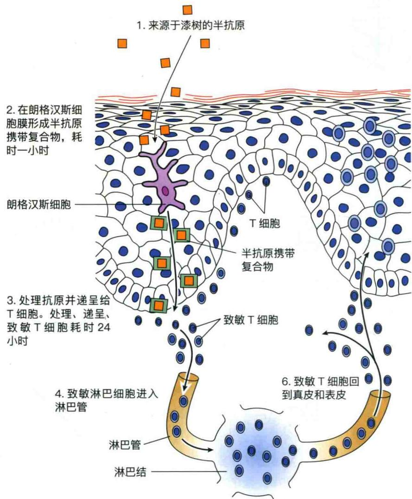 
5. 致敏淋巴细胞迁移至区域淋巴结，在那里得以增生
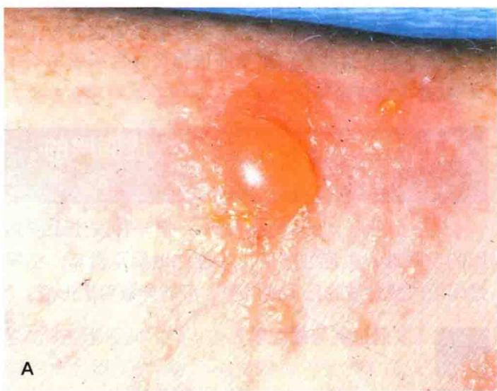 
图24-15 过敏性接触性皮炎。A.使用香水后在前臂掌侧出现大、小水疱；B.接触“毒藤”后的皮肤活检，可见表皮棘细胞层水肿及棘细胞层小水疱（箭头）。表皮内见淋巴细胞浸润，并引起细胞介导的迟发型超敏反应
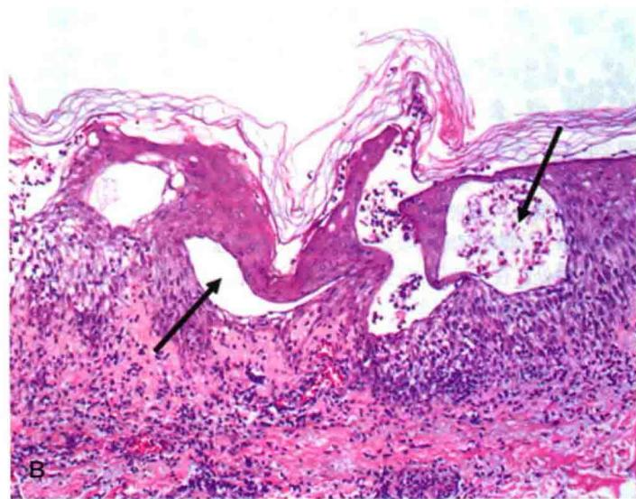 
图24-14 过敏性接触性皮炎。发病机制如图所示
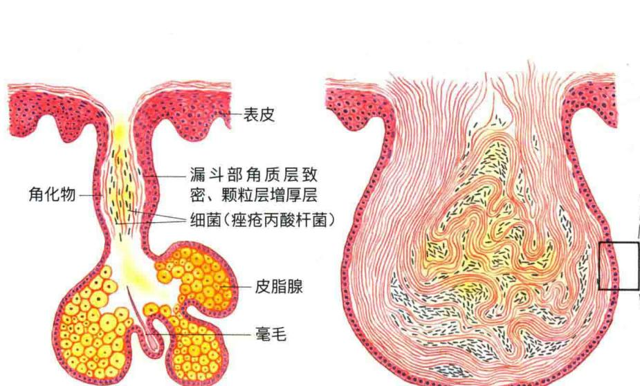 
A. 微粉刺
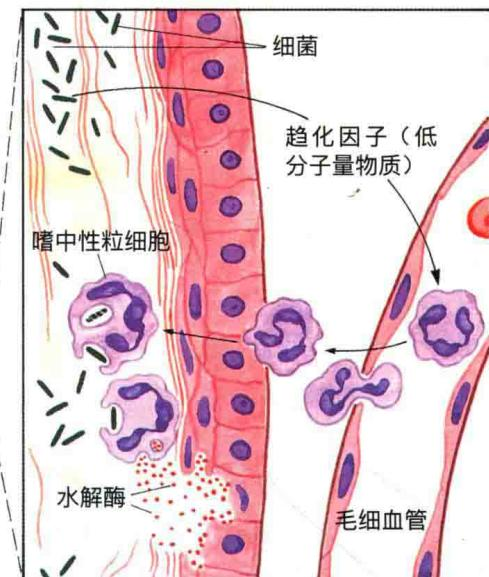 
D. 中性粒细胞浸润毛囊
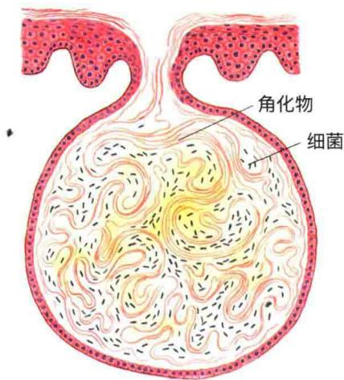 
B. 闭合型粉刺
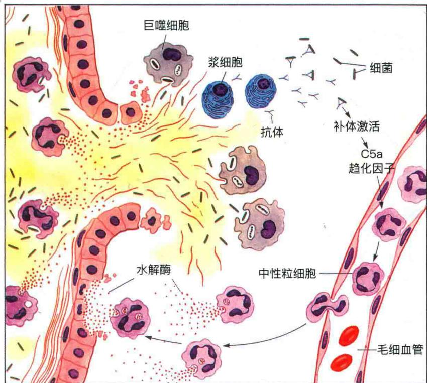 
C. 开放型粉刺 
E. 皮脂腺毛囊的炎症浸润和破裂
 
图24-16 寻常痤疮。示意图显示毛囊膨胀、破裂、炎症的发病机制。痤疮是发生于皮脂腺毛囊排出管道的病变。粉刺形成的最初阶段是漏斗部的角质层致密及颗粒层增厚。微粉刺(A)、闭合型粉刺(B)及开放性粉刺(C)形成。皮脂过度分泌,痤疮丙酸杆菌增殖。病原菌产生趋化因子, 引导中性粒细胞迁移至完好的粉刺。中性粒细胞酶释放、粉刺破裂, 引发又一轮趋化因子及剧烈的炎症反应 (D、E)
【临床表现】寻常型痤疮在不同阶段表现不同，
包括粉刺、丘疹、脓疱、结节、囊肿、凹陷性瘢痕。
粉刺，最早的非炎症性痤疮，既可以是开放的（黑头）也可以是闭合的（白头）。更进一步的炎症性病变可以从小的、红肿样丘疹到大的、质软的、化脓性结节及囊肿。
寻常型痤疮的治疗通过局部清洁、融角质及抗生素。严重的病例局部使用维生素A，全身使用抗生素及合成的口服类视黄醇（异维甲酸）。
# 一、皮肤原发性肿瘤：黑色素细胞肿瘤
皮肤肿瘤，尤其是恶性黑色素，正在以惊人的速
率增多。据估计如今出生的儿童中将有 $1\%$ 稷患恶性黑色素瘤。多数黑色素瘤如果能够在进入垂直生长期前发现并切除，预后是非常好的。但是，如果肿瘤超越了在真皮的警戒深度，患者有可能死于转移。
普通获得性黑色素细胞痣（黑痣）是局限性的良性黑色素细胞的肿瘤性增殖

【发病机制】紫外线、黑色素细胞痣和恶性
黑色素瘤之间存在一个明确的因果关系，但
联系是复杂的。一些浅肤色的人痣形成相对较少。
而一些深肤色的人痣形成较多。形成痣的能力与黑
皮素受体的亚型和相应的红褐素与棕色真黑素的皮肤色素比例不同相关。多数人在生命的头15年中大量接触光线，并在皮肤上形成 $10\sim 50$ 颗痣。黑色皮肤可以形成痣，但不常见，而且这种痣不发展为黑色素瘤。但是，如果痣位于手掌、足底或者生殖器皮肤，黑色素瘤的发生风险就无种族差异了。红头发、蓝眼睛、奶白色肤色的人非常例外，因为他们对光线异常敏感而且形成雀斑，但是不会形成明显数量的痣。
皮肤学研究已经显示黑色素细胞痣是黑色素瘤的前趋病变。一个有100个或更多最大径 $2\sim 5\mathrm{mm}$ 痘的人发展为黑色素瘤的风险性要高出一个仅有不足25个相同大小的痣的人3倍以上。临床不典型或组织学证实为异型的痣发展为黑色素瘤的风险更高，尽管任何一个痣进展为黑色素瘤的风险都很小。相当一部分痣都有一个编码原癌基因B-RAF的活化突变，原癌基因可通过有丝分裂原激活蛋白（MAP）激酶通路刺激生长。生长正常是被p16活性抑制的，p16是cyclin介导的细胞周期机制抑制剂，由位于染色体9p21的CDKN2A基因编码，尽管后者在黑色素瘤进展时通常丢失。

【病理】在黑色素细胞痣的初期，黑色素细胞在基底层增多，黑色素也随之增多。下面介绍的细胞痣的组织学分类反映了该病变的连续进程。
交界痣：黑色素细胞在表皮脚的顶端形成巢。 
■ 复合痣：黑色素细胞巢位于表皮，且有一些细胞迁移到真皮（图24-17）。 
皮内痣：表皮内黑色素细胞生长已经停止，黑色素细胞仅存在于真皮。

【临床表现】黑色素细胞痣在生命的头一二年开始出现，并且在头20年持续出现。一颗痣现时仅为一个小小的棕黄色的点，直径小于
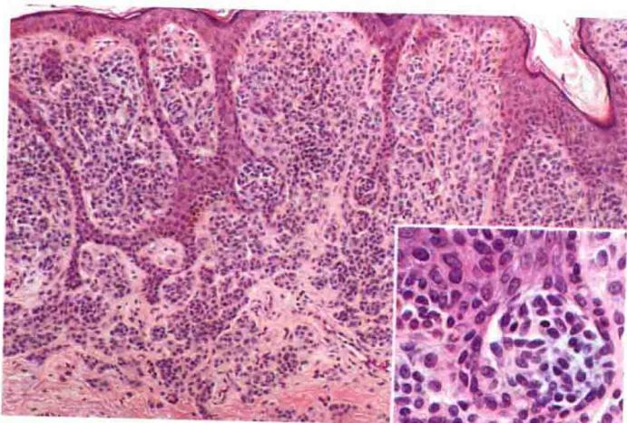 
图24-17 复合痣。黑色素细胞在表皮及真皮内呈巢状排列。插图示一个表皮内黑色素细胞巢周绕以角化细胞
$1\sim 2mm$ 。在接下来 $3\sim 4$ 年里，小点增大，变成一个均质的棕黄色至棕色圆形或椭圆形区域。周边界线通常保持规则。当大到直径 $4\sim 5mm$ 时，扁平或稍微隆起，不再向四周扩大，与周围正常皮肤分界截然。在接下来的10年，病变隆起，颜色淡化至棕黄色突起。再接下来一二十年，逐渐扁平，皮肤可能几乎变成正常外观。在多数人群中，黑色素痣的数量逐渐减少。值得注意的是，许多黑色素瘤患者在生命的后几十年，痣的数量也持续增加，包括那些不典型痣
# 二、异型（不典型）痣是黑色素瘤的风险标识

【发病机制】一些普通的获得性痣不遵照上述的生长、分化及消失。这些病变持续存在常最大直径大于 $5\mathrm{mm}$ （异型痣，dysplastic）；这些痣可能显示灶状的异常的黑色素细胞生长得更大，周围更不规则。周围扁平（斑疹样）母体痣向周围不对称延伸。有异型痣的患者是黑色素瘤的风险增大。风险的高低与痣的数目，且在曾经有黑色素瘤的患者或有家族史的痣更高。异型痣的遗传学特点尚不清楚，可能与基因相关。

【病理】最初，表皮基底层结构异常，没有细胞学特点。表皮脚周围可见嗜酸性结缔组织带纤维组织增生”，这里含有异常生长的黑色素这些异常的黑色素细胞可能连续成流水样，从皮脚到另一个上皮脚（“桥接”）。当这些结构特非常显著的时候，像恶性细胞具有大的不典型色素细胞也可能出现在这结构异常的区域。这结构异常又有不典型细胞的特点共同构成了异诊断（图24-18）。异型增生区域也可能有下巴细胞浸润。超过1/3的恶性黑色素瘤有具有色素细胞异型的前驱病变。然而，多数异型痣永远不会进展为黑色素瘤
# 三、浸润深度的功能之一是判断恶性黑色素瘤的预后
恶性黑色素瘤（malignant melanoma）（现在实践中被称为“黑色素瘤”）是一种黑色素细胞的肿瘤。黑色素瘤可能通过两个重要阶段进化。在“放射状生长期”，病变沿着不规则圆的半径播散，但保持浅表和薄（Breslow厚度）。在“垂直生长期”，病变在一个局灶区域以或多或少的球形方式形成瘤块，厚度增加。黑色素瘤或多或少都依赖一种活化的原癌基因 $B - R A F$ 。该基因在良性痣里也有突变。黑色素瘤的组织学亚型（下面讨论）与参与发病机制的特殊原癌基因有关。p16的丢失（或者是其他肿瘤抑制因子）在黑色素瘤
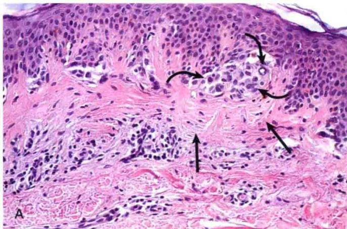
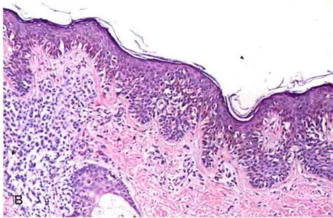
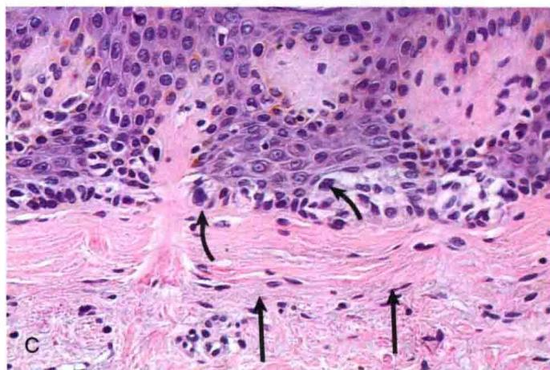 
图24-18 异型痣。A.表皮脚由黑色素细胞巢桥状连接，可见黑色素细胞具有不典型性（弧形箭头）、层状纤维组织增生（直箭头）、血管周少许淋巴细胞浸润。B.左侧区域的复合痣可见典型的真皮内痣细胞。右侧表皮内可见不典型痣细胞雀斑样增殖，伴有层状纤维组织增生。这个图像采自于这例异型痣的丘疹样与斑疹样交界的区域。异型通常发生于斑疹样的区域，并占据了病变的大部。C.这些位于层状纤维组织增生（直箭头）上方的椭圆形黑色素细胞巢显示出大的不典型上皮样黑色素细胞（弧形箭头）
中是常见情况，导致了相对不受控制的增殖以及成为未来“从坏到更坏”的潜在因素。
1. 放射性生长期黑色素瘤 黑色素瘤最常见的形式是表浅扩散型黑色素瘤（superficial spreading melanoma），可见于放射性或垂直性生长期（图24-19）。

【病理】大的上皮样黑色素细胞成巢或单个细胞分布于整个表皮厚度（派杰样播散），不像
痣一样仅沿着基底层分布。这些黑色素细胞可局限于表皮（原位黑色素瘤）或延伸进真皮乳头。在放射状生长期，没有单个巢生长大于别的细胞巢（图24-20），故所有细胞向所有方向生长：向上到表皮、向周围表皮生长、向下入真皮。这些病变向四周扩大，故得名放射状，但极少发生转移。真皮黑色素细胞不见核分裂象。放射状生长期的黑色素细胞多伴有显著的淋巴细胞浸润。
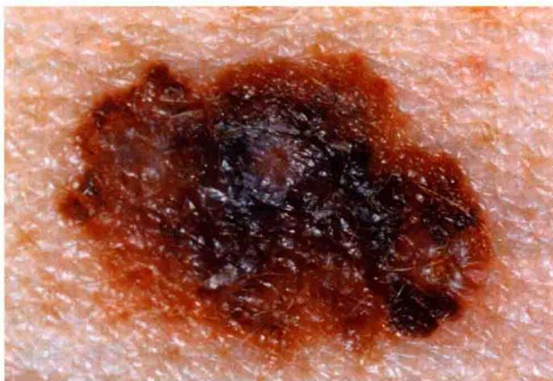 
图24-19 表浅扩散型恶性黑色素瘤，放射状生长期的临床表现。最大径 $1.8\mathrm{cm}$
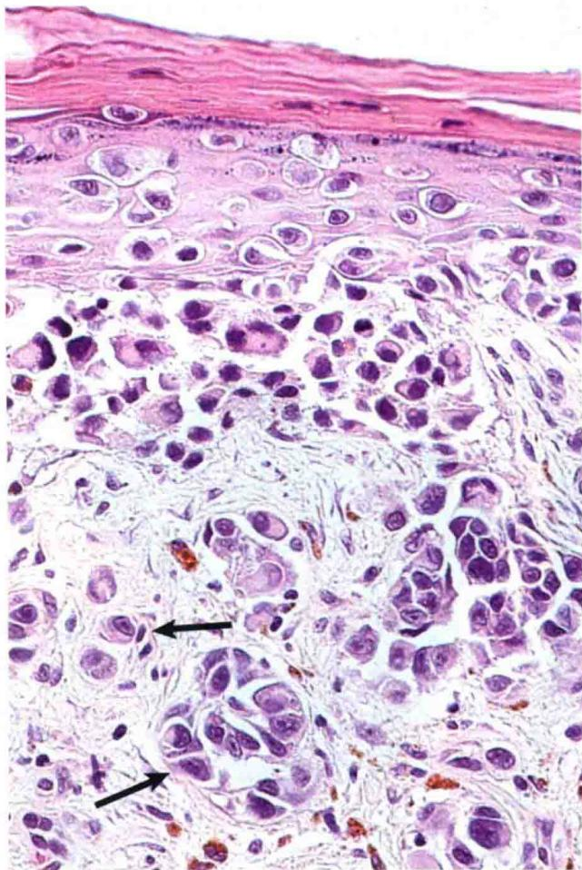 
图24-20 恶性黑色素瘤，表浅扩散型，放射状生长期。单个的黑色素细胞仅存在于表皮内的各个层面，而大的、不规则大小的巢则位于表皮－真皮交界处。真皮乳头内可见肿瘤细胞（箭头），但没有哪个巢比另外一些巢优先生长（比别的巢大）
【临床表现】“ABCDE法则”是一个方便记忆的方法，通常用于教患者自己观察痣的变化，以促使他们寻求医疗帮助。A：形状不对称；B：边界不规则；C：颜色不均匀；D：直径超过6mm；E：可以代表“隆起”，或者，更重要的是代表“进展”。然而，不是所有早期黑色素瘤都表现出这些特点，所有变化的病变都应该被评价看是否适合切除活检。在该期的早期黑色素瘤有轻微隆起和明显的边缘。肿瘤的色素沉着通常是多变和不规则的（图24-19，图24-21）。黑色素瘤的患者常说病变的变化，例如痒、变大、颜色加深、出血或渗出。即便没有这些患者自诉的观察，任何引起临床怀疑的病变都应该切除活检。
# 2.垂直生长期的黑色素瘤

【病理】经过一段时间后（时间长短不一，通常
是 $1 \sim 2$ 年), 生长特点开始转变。黑色素细胞
核分裂活跃, 尺寸增大呈椭圆形生长, 扩张的速度远超于肿瘤在周围真皮乳头的部分 (图 24-21)。网状的生长方向比放射状时期的显得更直立, 因此得名 “垂直” (图 24-22, 图 24-23)。该期更特异的特点如下:
■ 黑色素细胞与放射状时期的细胞不同。例如，可能含有极少甚至不含色素，而放射状时期的细胞是富含色素的。 
■ 细胞聚集的巢比放射状时期表皮和真皮（浸润）的细胞簇要大。肿瘤生长的主要方式由放射状时期的向表皮内生长变成该期的向真皮内生长。 
长入真皮网状层的肿瘤通常被认为是位于该期。 
宿主的免疫应答（淋巴细胞浸润；见图24-22）功能缺乏或减少。 
■ 细胞增殖的指标，例如ki-67，在该期增高。
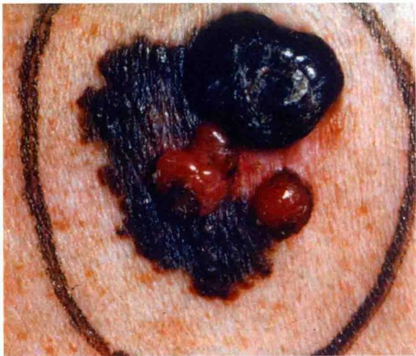 
图24-21 恶性黑色素瘤。表浅扩散型看起来相对平坦、深色、棕黑色。该病变内有三个区域可见垂直生长期的特点。三个都呈结节状；2个区域呈现粉色；最大者表现为浓密的黑色
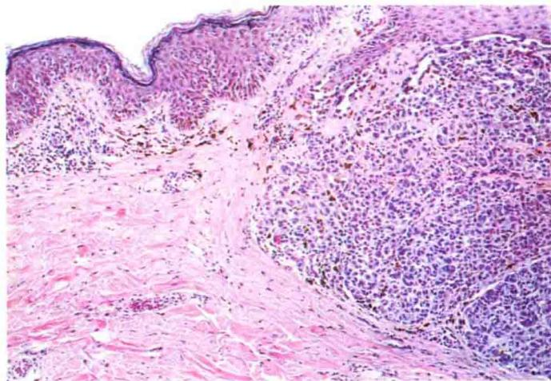 
图24-22 恶性黑色素瘤，表浅扩散型，垂直生长期。垂直生长期显著地表现出境界清楚的椭圆形肿瘤结节（右侧）。一巢黑色素细胞明显比放射状生长期（左侧）的细胞具有生长优势（细胞巢更大）。肿瘤结节破坏了真皮乳头与真皮网状层的分界，因此为三级病变
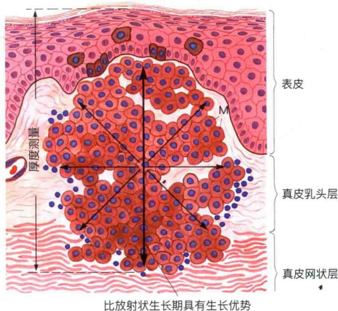 
图24-23 恶性黑色素瘤。表浅扩散型恶性黑色素瘤进展为垂直生长期，示意图显示如何测量厚度。在本插图中，垂直生长期已进入真皮网状层。肿瘤性小结节明显比其他肿瘤细胞具有生长优势，这是垂直生长期的一个证明。厚度测量（箭头）是在最厚处从颗粒层最外层穿过肿瘤的最厚部分。M.黑色素瘤细胞
即便当肿瘤进入垂直期，它们也可能仍然缺乏转移的倾向。因此，厚度小于 $1\mathrm{mm}$ 的垂直生长期黑色素瘤缺乏核分裂且有显著淋巴细胞浸润，也罕见转移。转移的风险可以通过预后模型来预测，尽管不完美。
3. 转移性黑色素瘤（metastatic melanoma）所有类型的黑色素瘤的转移都是源于垂直生长期的黑色素细胞。最初的转移通常都是累及区域淋巴结，尽管血行播散也有可能。当出现后者时，肿瘤将会出现与其他肿瘤相比不同寻常的广泛转移，并且最终有可能累及任何一个器官。许多转移性黑色素瘤很长一段时间都呈隐匿状态，会在原发瘤切除若干年后再出现。
4. 黑色素瘤的分期及预后 垂直期黑色素瘤患者
的预后基于如下一些数据。
肿瘤厚度：如Breslow所述，肿瘤厚度是局限于原发部位的肿瘤最重要的预后因素。黑色素瘤的厚度从颗粒层最表面到肿瘤浸润真皮的最深处（图24-23）。从表24-1可以估计出原发病变被切除后10年以上的预后。
表24-1 肿瘤厚度是原发性黑色素瘤规范治疗后10年生存率的独立预后因素厚度(mm)生存率(%)≤183~881.01~264~792.01~451~64&gt;432~54
皮肤核分裂率：垂直生长期的肿瘤细胞，核分裂率高度预测生存率。生存率随核分裂增高而明显降低。核分裂象为0个 $/ \mathrm{mm}^2$ 的患者5年生存率 $99\%$ ，6个以上的生存率为 $68\%$
淋巴细胞反应：垂直生长期淋巴细胞对肿瘤细胞的反应是非常重要的预后因素。如果肿瘤浸润性淋巴细胞（tumor-infiltrating lymphocytes，TILs）在整个垂直生长期弥漫可见或在整个基底都可见，这种浸润被称为“旺盛”。TIL级别越高，预后越好。
位置：四肢的黑色素瘤的预后优于头、颈或躯干。然而，足心或指（趾）甲下区域者预后与躯干者相似，甚至更差。
性别：无论部位或厚度，女性预后优于男性。
消退：许多原发性黑色素瘤在放射状生长期可出现自发的消退，临床表现为颜色转变为蓝白色或白色。有这种改变的患者预后要稍差于没有这种消退的患者。
溃疡形成：原发性黑色素瘤发生溃疡预示生存率降低。
浸润水平：Clark水平系统描述了肿瘤在皮肤解剖层次的穿透程度。例如，I级对应肿瘤细胞完全在基底膜之上（原位）；V级意味着肿瘤延伸入皮下脂肪。Clark分级预测了转移的可能性，但不如肿瘤厚度精确。
分期：疾病的分期可能是影响患者生存的最重要的独立因素。与临床表现为局限性肿瘤的患者相比，区域淋巴结转移预示着5年生存率可能降低 $40\%$ 。受累的淋巴结数目也高度预测预后。一个淋巴结受累者10年生存率 $40\%$ ， $2\sim 4$ 个淋巴结受累者为 $25\%$ ，5个或以上受累 $15\%$
治疗：对于转移性肿瘤的治疗选择是复杂的。迅速发展的细胞毒性化疗效果有限。然而，免疫治疗和越来越多的激酶抑制剂（针对在散发黑色素瘤中发现的一些特异基因病变的病例）都有一定作用。使用高剂量干扰素α2b（以及越来越多被使用的聚乙二醇干扰素
α2b）被用于淋巴结阳性的病例。尽管细胞毒性药物有局限性，该药物还是全面提高了生存率，反应率 $15\%$ 。干扰素治疗给 $5\%$ 的患者带来了无病生存率及可能治愈。黑色素瘤的过继性细胞转移免疫治疗是使用从患者的肿瘤中分离出来并通过白介素-2培养、扩增出来的肿瘤浸润性T淋巴细胞（TILs）。培养的TILs重新被注射入患者体内。 $50\%$ 以上患者有反应，显著延长了肿瘤无进展期，在一些患者中甚至完全消退。
$50\%$ 的进展期黑色素瘤有BRAF基因激活性突变（尤其是V600E突变）。在这些病例中，特异性BRAF抑制剂（vemurafenib）促进多数肿瘤的消退。治疗抵抗会在随后的一年内出现。约 $20\%$ 肢端（见下文）、黏膜或慢性阳光损伤相关性黑色素瘤患者具有原癌基因c-kit的激活突变或扩增。 $20\%$ 的患者对酪氨酸激酶抑制剂伊马替尼(imatinib)有反应，其中一些延长间期。
黑色素瘤手术切除的最新推荐：①原位黑色素瘤周围 $5\mathrm{mm}$ 范围内的组织应该一起被切除；②厚度 $1\mathrm{mm}$ 或小于 $1\mathrm{mm}$ 的肿瘤安全切缘应该是 $1\mathrm{cm}$ ；③厚度超过 $1\mathrm{mm}$ 的肿瘤，理想切缘应该是 $2\mathrm{cm}$ 。淋巴结阴性、未播散者、其余的辅助治疗似乎不影响生存。
# 5. 黑色素瘤的亚型
结节性黑色素瘤不常见（ $10\%$ ），表现为界线清楚的、高出表面、椭圆形结节。肿瘤不是从放射状生长期的黑色素瘤来的，在发现病变的时候就表现出所有初始垂直生长期肿瘤的特点（图24-24）。病变缺乏ABCD标准的大多数，可能在厚度上有进展。它们在诊断时即很有可能发生转移，尽管通常直径很小、对称且色泽均匀。
■ 恶性雀斑样黑色素瘤或者称为（Hutchinson 黑色素性雀斑）是一种巨大的含色素的斑块，几乎只发生于常年暴露于阳光紫外线的浅肤色的老年人。在放射状生长期，病变扁平、不规则、棕色至黑色，可覆盖面部或手背很大一块面积（图24-25）。放射状期的细胞在基底层显著，通常形成相互连接或者近似连接的排状不典型单个黑色素细胞。偶尔，它们形成坠落入真皮乳头的小巢。
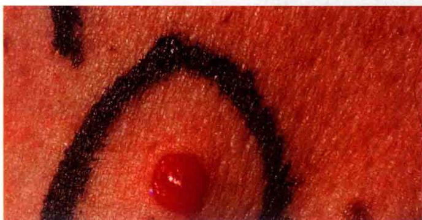 
图24-24结节型恶性黑色素瘤。原发病变位于真皮内，直径0.5cm
■ 肢端雀斑样黑色素瘤是深肤色人种最常见的黑色素瘤的亚型，通常局限于手掌、足底、甲下区域。在放射状生长期，肢端亚型不规则、棕色至黑色斑片，覆盖部分手掌或足底或甲下，通常在大拇指或大脚趾（图24-26）。
# 四、可能类似黑色素瘤的良性黑色素细胞肿瘤
许多良性或“交界性”病变可以类似黑色素瘤。
先天性黑色素细胞痣：大约 $1\%$ 白种儿童出生时在皮肤上即有一些色素沉着的病变。罕见情况下，躯干或一个肢体被巨大色素斑片或斑块覆盖，导致容貌丑陋（“巨大毛痣”或“着装痣”。病变与表皮内及真皮黑色素细胞显著增多有关，有些可能延伸入皮下组织。恶性黑色素瘤可发生于这些巨大的先天性黑色素细胞痣。
Spitz瘤：Spitz瘤也被称作梭形细胞和上皮样细胞痣，发生于儿童或青年，少见于成人。表现为突出的、椭圆的、粉色、光滑结节，通常在头颈部。细胞不典型性非常大，有可能被误诊为黑色素瘤，但黑色素瘤罕见发生于儿童。多数Spitz瘤是良性的，但少数可以转移；因此，预后不确定，尤其是在成人（图24-27）。
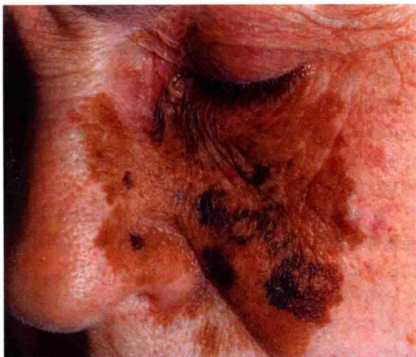 
图24-25 雀斑样型的恶性黑色素瘤，放射状生长期
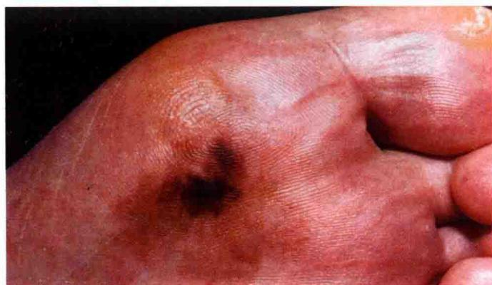 
图24-26 恶性黑色素瘤，肢端雀斑样型（放射状生长期）。示足底病变的临床外观
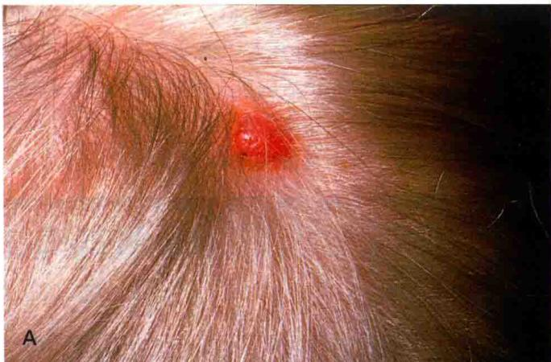
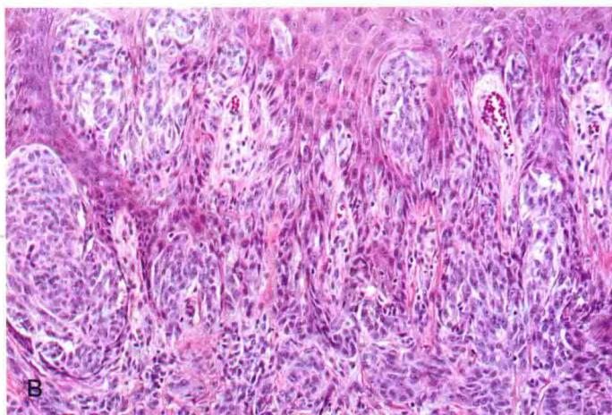 
图24-27 梭形及上皮样细胞（Spitz）痣。A.一个对称性粉色结节突然出现在一个孩子身上，然后维持稳定几周直到被切除；B.Spitz肿瘤由大的具有显著核仁的黑色素细胞构成。在增生的表皮内，黑色素细胞形成大巢。尽管细胞大，第一眼看上去像黑色素瘤，但它们比绝大多数恶性黑色素瘤一致得多
蓝痣：蓝痣（blue nevus）出现于儿童或少年晚期，表现为深蓝色、灰色或黑色，质韧，界线清楚的丘疹或结节，在手背、足背或臀部、头皮、脸。临床表现可能促使活检以除外黑色素瘤。
雀斑和黑子(freckle and lentigo)：雀斑(freckles)，或称之为ephelides，是小的棕色斑点，出现在暴露于日光的皮肤，尤其是浅肤色人。通常5岁就出现，色素随着暴露日光的增强而加深并随着暴露的停止而消退。黑子（Lentigo）是不连续的、棕色斑块，出现在任何年龄、任何部位，且与是否暴露于日光无关。但也有日光性黑子，或者老年斑（liver spot），出现在一些长期暴晒的老年人（图24-28）。较大的雀斑样病变可能需要活检除外恶性雀斑性黑色素瘤。
# 五、疣
疣（verrucae）是人乳头瘤病毒（HPV）感染引起的皮肤肿瘤。突出、界线清楚、对称、表皮增生性病变，常表现为乳头状。
 
【病理】
■寻常疣，也称为普通疣，是突起的丘疹，表
面呈疣状（乳头状瘤样）。可以单发，也可以多发，常位于手背面或面部。组织学上，寻常疣表现为过度角化及乳头状表皮增生（图24-29）。挖空细胞（也就是，角化细胞增大，核固缩，核周可见清晰的空晕）可见于表皮上部。HPV，尤其是2、4亚型，常可被检测到。无恶性潜能。
跖疣是良性的，通常有疼痛，为足底的过度角化的结节。偶尔，类似病变可见于手掌（掌疣）。组织学上，跖疣或内生或外生，乳头状，鳞状上皮增生。细胞包含丰富的胞质内包涵体，形态上类似深染的角化透明颗粒。紧邻基底层的角化细胞也会含有粉色核内包涵体。1型HPV是病原体。
# 六、角化症是一种良性的角质生长，由角化细胞组成
1. 脂溢性角化 脂溢性角化症（Seborrheic keratosis）是有鳞屑的、通常有色素沉着，有突出的丘疹或斑块，表面鳞屑易脱落。尽管这是最常见的角化，病因却不明了。病变常发生于老年人，而且有家族倾向。临床和显微镜下，它们看起来像“贴”在皮
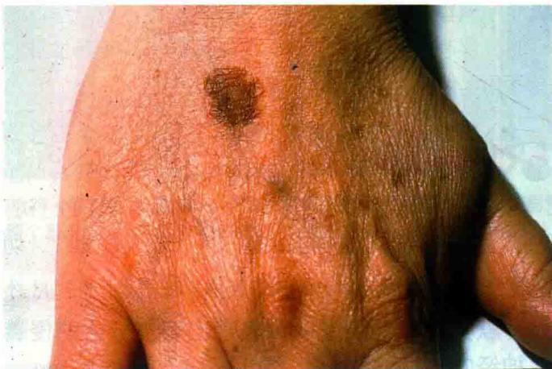 
图24-28 黑子。一个1cm不规则斑块，轻微色素沉着不匀，背景为慢性日光损伤
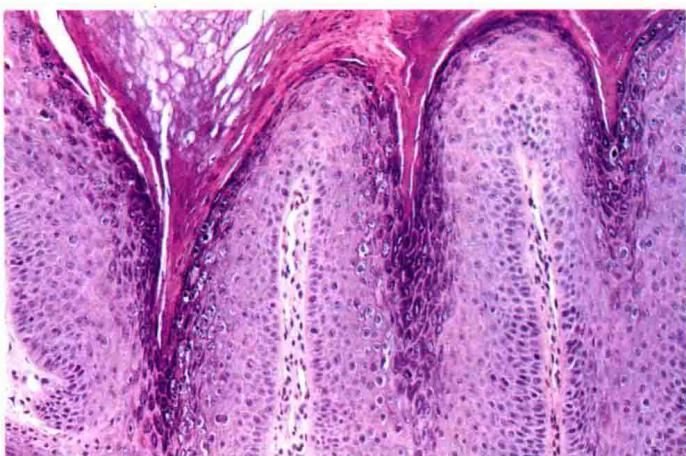 
图24-29 寻常疣。寻常疣是表皮乳头状增生的典型代表。鳞状上皮衬覆的叶状结构具有纤维血管轴心。轴心内血管伸至疣的表面，致使病变易受损出血并形成患者能观察到的黑色“种子”
肤上，可见宽大交织的复层鳞状上皮索，可见小的角质囊肿（角囊肿）。脂溢性角化症无害但可能产生美容问题。突然出现大量脂溢性角化症可能与内脏恶性病变有关（“Lser-Trelat征”，尤其是胃腺癌。
2. 日光性角化病 日光（“来自太阳射线”）性角化病（actinic keratosis）是角化细胞的肿瘤，发生于日光损伤的皮肤，表现为界线清楚的角化斑片或斑块，通常在手背或面部。显微镜下，角质层不再疏松或篮子状，而是被致密的角化不良的鳞屑取代。下面的基底角化细胞显出明显的不典型性（图24-30）。随着时间，日光性角化病可能进展为原位鳞状细胞癌（squamous cell carcinoma，SCC），并最终成为浸润性SCC。然而，绝大多数病变稳定，许多甚至可以退化。 
3.角化棘皮瘤 角化棘皮瘤是生长迅速的角化丘疹，发生于暴露于日光的皮肤，需要 $3\sim 6$ 周进展为火山口样结节。最大直径可达 $2\sim 3\mathrm{cm}$ 。偶然的退化通常在接下来的 $6\sim 12$ 个月，留下一个萎缩的瘢痕。一些病变可能在退化之前引起很重的损伤，有些也不会退化。角化棘皮瘤可能被当作鳞癌的一个亚型，但这个观点存在争议。
【病理】组织学上，角化棘皮瘤是角化细胞内生性的乳头状增生性病变。病变呈“杯”状，中心填满了角化物，呈现脐状和边缘隆起（图24-31）。在角化物的基底，角化细胞大，有丰富、均一的嗜酸性（“玻璃样”）胞质。病变的下部，不规则鳞状上皮巢舌状浸润真皮网状层的胶原。陈旧病变表皮舌
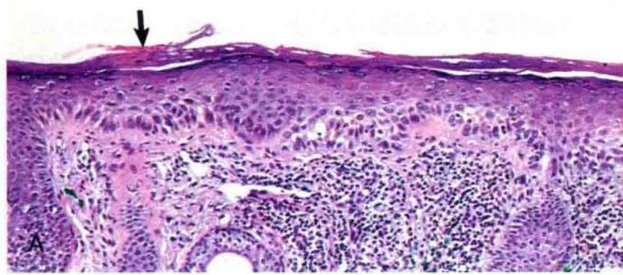
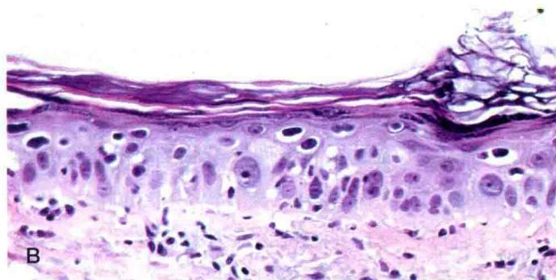 
图24-30 日光性角化病。A.低倍镜下显示基底层及棘层底部细胞不典型性伴极向消失。常可见带状淋巴细胞苔藓样浸润，角化不全仅小灶可见（箭头）；B.日光性角化症的高倍镜显示基底角化细胞显著不典型，这也是日光性角化症的标志
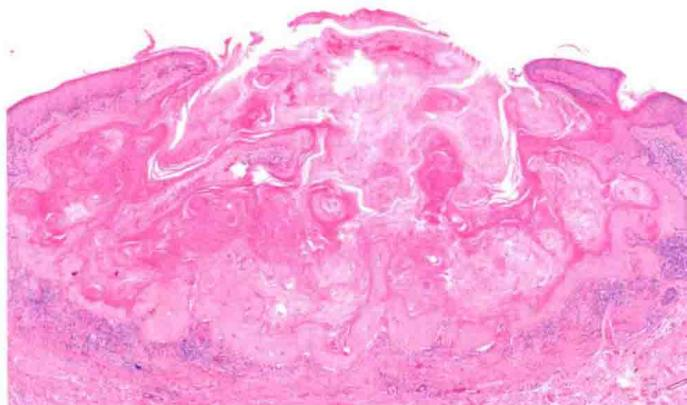 
图24-31角化棘皮瘤。图示一个填满角化物的火山口（中心），围以玻璃样、增生的角化细胞
周围的真皮显示活跃的纤维增生。可能有炎症细胞的苔藓样浸润，真皮层可能有大量中性粒细胞、淋巴细胞及嗜酸性粒细胞的浸润。病变中常可见中性粒细胞微脓肿形成及中性粒细胞包裹真皮弹性纤维。
# 七、基底细胞癌是一种局部浸润的表皮肿瘤
基底细胞癌（basal cell carcinoma，BCC）是发生于浅肤色人的最常见的皮肤恶性肿瘤。尽管可以局部侵袭，转移却相当罕见。

【发病机制】基底细胞癌通常发生于浅肤色
人的暴露于日光的皮肤及雀斑。但是，与鳞，基底细胞癌也可发生于不暴晒于日光的部指或手背不常见。肿瘤似乎起源于表皮基底潜能细胞，更具体地说，是毛囊的毛乳头膨。位于9q22的抑癌基因PTCH发生的体细可见于 $67\%$ 的散发病例。生殖细胞基因突样基底细胞癌综合征相关，表现为年轻时即基底细胞癌，也易合并其他肿瘤及多种发育

【病理】BCC是由深嗜碱性、少胞质的上皮细
胞巢组成，紧贴表皮，伸入其下真皮乳头（图
24-32)。每个巢的中心都含有排列致密的角化细胞，比正常表皮基底角化细胞略小并偶见凋亡。每个巢周围都可见一排列有序的、有极向的柱状角化细胞层。每个细胞的长轴垂直于周围基底膜（“外周栅栏状”）。肿瘤巢与周围间质被一狭隙分隔（“人工收缩”），有时有助于鉴别BCC和其他表现为基底细胞样增生的附属器肿瘤。

【临床表现】BCC常见亚型如下：
■ 珍珠样丘疹是一种典型的结节性囊性病变，
之所以这样命名是因为它像 $2\sim 3\mathrm{mm}$ 的珍珠（图24-33）。被覆紧绷的表皮，可见小的、微细的、分支状血管（毛细血管扩张）。
侵蚀性溃疡是珍珠中央的小火山口。
表浅型BCC表现为有鳞屑的、红色的、境界清楚的斑块。
尽管转移性病变相当罕见，但病变可以局部浸润，很难清除，成为难以治疗的病变。因此，肿瘤应该被积极对待，例如切除或其他清除办法。
# 八、鳞状细胞癌典型地类似分化的角化细胞
SCC在发病率上仅次于BCC，也可能由紫外线、离子放射、化学致癌因子及HPV引起。最常见于浅肤色淡头发及雀斑人的阳光暴晒皮肤。常来源于日光性角化病。SCC在正常黑色皮肤极其罕见。

【发病机制】SCC有许多病因，紫外线是最常见的。皮肤SCC转移罕见（<2%）。病
变也可能发生于慢性瘢痕形成过程，例如骨髓炎的窦道、烧伤的瘢痕、放射性皮炎。在这些情况下，SCC的转移较为常见。超过 $90\%$ 的SCCs及许多日光性角化病都有p53突变。

【病理】SCC由类似表皮棘层细胞的细胞组成，
浸润至其下真皮（图24-34）。许多肿瘤的边典型的日光性角化病改变，换句话说，厚薄不伴有角化不全的表皮以及具有显著非典型性的化细胞。

【临床表现】鳞状细胞癌特征性地发生于长期
暴露于日光的区域，例如手背、面部、唇、耳（图A）。早期病变小、有屑或伴有溃疡形成的红斑，瘙痒。SCC通常采用电子手术、局部化疗，切放射治疗。
# 九、默克尔细胞癌是一种表现出表皮分化的侵袭性神经内分泌肿瘤
默克尔细胞癌（merkelcellcarcinoma）经典地表现为一个孤立的、圆顶状、红色至紫罗兰色结节或质硬斑块，发生于老年白人的头颈部皮肤。是一种侵袭
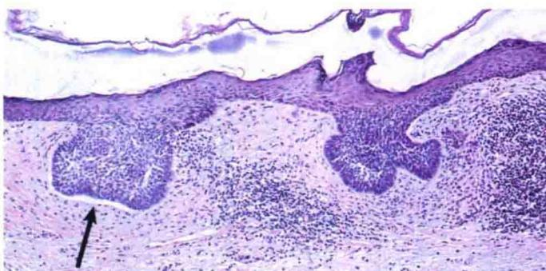 
图24-32 基底细胞癌，表浅型。不典型基底样角化细胞出芽，从表皮延伸入真皮乳头。周围角化细胞模拟表皮基底层，表现为栅栏状排列。人工裂隙（箭头）可见，原因是基底膜成分及含有胶原的富含透明质酸的间质形成不良
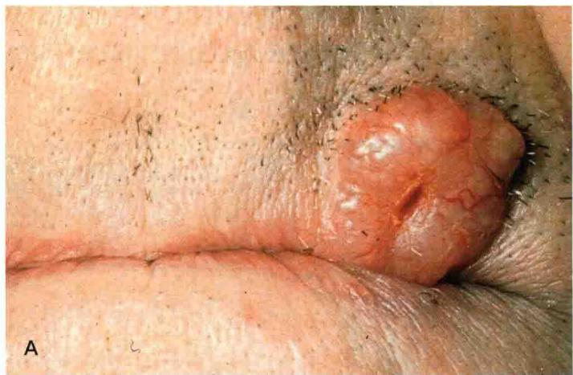 
图24-33 基底细胞癌（BCC）。A. 珍珠样丘疹：肿瘤显示典型滚珠状边缘伴毛细血管扩张及中心溃疡；B. 硬化性BCC的显微镜下可见一硬化性及浸润性病变。不规则伸支的肿瘤细胞素浸润至真皮，导致周围间质为细胞性、成纤维细胞性及富含透明质酸
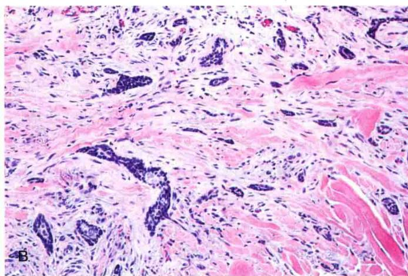
.jpg) 
图24-34 鳞状细胞癌。A. 一个有溃疡形成、包裹硬壳的、浸润性病变,位于暴露于日光的手指背侧;B. 病变周围组织镜下呈现鳞状细胞原位癌。 整个表皮都被不典型角化细胞取代。核分裂象及多核角化细胞易见,凋亡也明显(箭头)
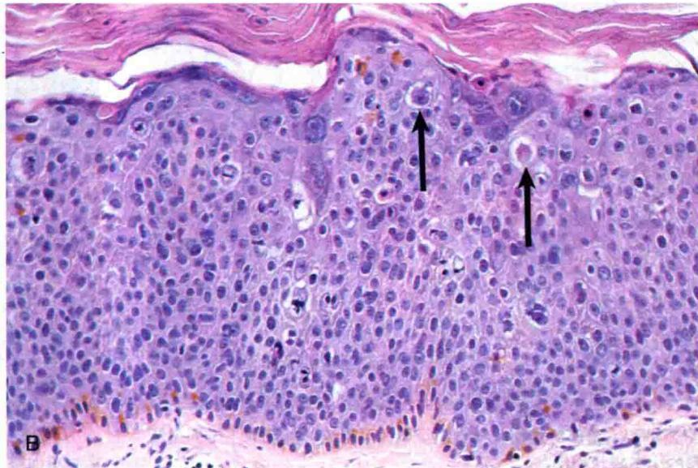
性肿瘤，可在5年内致 $25\% \sim 70\%$ 的患者死亡。肿瘤不常见，每年约有500例新增病例。

【病理】默克尔细胞癌主要由大的实性、未分
化细胞巢组成，类似肺的小细胞癌。核染色质
致密、均匀分布，胞质少、核分裂象及核碎常见。肿瘤细胞既表达默克尔细胞的标记（CK20）也表达神经内分泌的标记（例如突出素、嗜铬素）。近来有证据表明感染相对常见的多瘤病毒，也称为默克尔细胞多瘤病毒（merkel cell polyoma virus, MCV），可能在 $80\%$ 这种罕见且危险的肿瘤的病因中起着重要作用。
# 十、向皮肤附属器分化的附属器肿瘤
皮肤附属器肿瘤通常表现为突出的小结节，常发生于具有类似病变家族史的患者。通常，病变出现在青春期。尽管多数是良性，恶性有时也可见到。这些疾病包括如下：
圆柱瘤：圆柱瘤（cylindroma）是具有汗腺分化的附属器肿瘤。可以是单发也可以是多发的突出结节，
在头皮附近。镜检见界线清楚的深嗜碱性细胞巢，周围围绕着透明的增厚的基底膜。
汗管瘤：汗管瘤（syringoma）似乎来源于外分泌汗腺的表皮内部分，发生于眼睑及上脸颊，表现为小、突出、肉色斑块。 
■ 汗孔瘤：汗孔瘤（poroma）是一种常见的孤立肿瘤，组织学上类似脂溢性角化病但表现出窄窄的管腔，有时见囊腔。人们认为该肿瘤来源于外分泌汗腺。偶尔具有导管分化的恶性病变被命名为汗孔癌。 
毛发上皮瘤：毛发上皮瘤（trichoepithelioma）是一种朝向毛发结构分化的肿瘤。病变起始于青春期，常出现在面部、头皮、颈及躯干上部。镜检，它们类似基底细胞癌但含有许多“角囊肿”，是一种中心为角化物、外围是嗜碱性上皮细胞的结构。
# 十一、皮肤的纤维组织细胞性肿瘤显示宽泛的分化谱系
1.皮肤纤维瘤（dermatofibroma）是一种常见
的良性肿瘤，由肿瘤性成纤维细胞及巨噬细胞组成。发生于四肢，表现为圆顶状、实性、质韧结节，边界欠清楚，色素沉着程度不一致，可从粉色至深棕色。极少超过 $3\sim 5\mathrm{mm}$ 。镜检，真皮乳头层及网状层形成界线欠清的小车辐状纤维组织，这些车辐状结构中心是小的血管间隙（图24-35）。
2.皮肤隆突性纤维肉瘤（dermatofibrosarcomapatuberans）是生长缓慢的结节性或质硬斑块，中度恶性潜能，常发生于年轻人的躯干。尝试完全切除后的局部复发很常见，但罕见转移。最常见的组织学结构是形态单一、界线不清的梭形细胞排列呈致密的“席纹状”（车辐状）排列（图24-36）。与皮肤纤维瘤
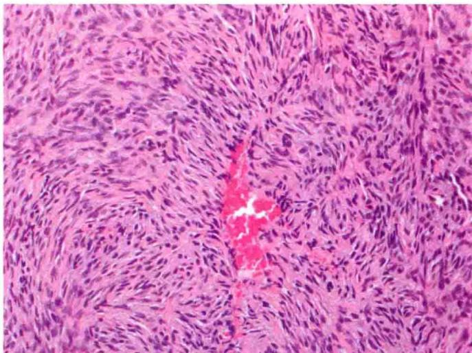 
图24-35 真皮纤维瘤。纤维组织取代了真皮并且形成了排列欠清楚的小车辐状结构
不同，皮隆突的肿瘤细胞表达CD34，一种内皮细胞标记，一些神经性肿瘤细胞及皮肤成纤维细胞样树突状细胞肿瘤的起源。
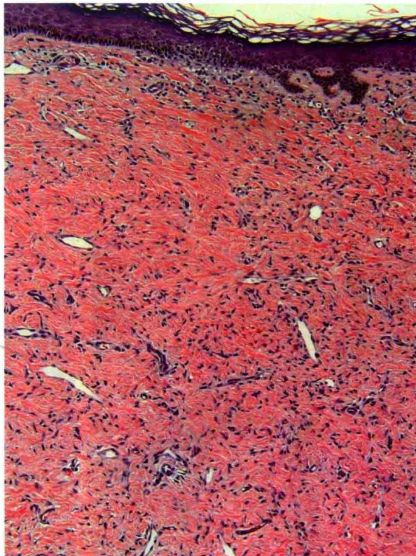 
图24-36皮肤隆突性纤维肉瘤。肿瘤细胞形成小的车辐状结构，中央见血管腔隙
（周全）
# 第25章头颈部
头颈部病理包含两个进入人体的重要门户，因此，不难理解口腔和鼻腔以及与之相连的深层解剖结构成为常见（或不常见）感染性疾病的好发部位。也会见到衬覆上皮包括唾液腺及宿主防御系统的癌和淋巴瘤。耳作为一种特化的感觉器官与鼻咽相通，也会发生一些感染性疾病及感受器的特有病变。
# 第一节 口腔
口腔的范围是从唇到咽。其解剖学界限包括：
唇红边缘（前界） 
软硬腭连接处至舌的轮廓乳头的连线（后界） 
硬腭一直到与软腭连接处（上界） 
舌前2/3到轮廓乳头的连线（下界） 
颊黏膜（侧界）
# 一、口腔感染
细菌、螺旋体、病毒、真菌和寄生菌可正常存在于口腔内，并且通常是无害的。如果黏膜破损或免疫力低下，那么正常口腔微生物能变成病原体（见第9章进一步讨论）。
以下是用来描述口腔局部炎症的术语：唇炎（唇）、牙龈炎（牙龈）、舌炎（舌）、口腔炎（口腔黏膜）。
# （一）口腔常见的细菌和真菌感染
阿弗他口腔炎（aphthous stomatitis）：是一种常见病，其特点包括疼痛、复发、孤立或多发的口腔黏膜小溃疡。发病原因不明。细菌、支原体、病毒、自身免疫反应和超敏可能与之相关，但尚未证实。病变由覆盖纤维素性及脓性渗出物的浅溃疡构成，其下方的炎性浸润由单核细胞和中性粒细胞组成，病变愈合后无瘢痕形成。
急性坏死性溃疡性龈炎（奋森咽峡炎，Vincent angina）：是感染了处于共生关系的两种微生物，即梭形杆菌和螺旋体（奋森螺旋体）所致。梭菌螺旋体病常用来描绘这种感染。这些微生物也存在于许多正常人群口腔，因此推测该疾病的发展可能存在其他因素，如营养不良导致的抗感染能力降低，免疫缺陷及口腔卫生不良。奋森咽峡炎特征性的表现为牙间乳头穿凿状侵蚀，病变常可蔓延，最终累及所有的牙龈边缘，并由坏死性假膜覆盖。
路德维格咽峡炎（Ludwig angina）：是播散迅速的蜂窝织炎，起源于下颌下或舌下区，可从局部扩展累及到2个区域。致病菌源自口腔菌群，包含各种需氧菌和厌氧菌。疾病常常与拔牙或者口底损伤相关。牙齿拔除后，下颌部舌上皮层会出现细小裂隙，微生物借此进入下颌下间隙。这种潜在的致命性炎性疾病在发达国家已很罕见，除非患者有免疫抑制相关的慢性病。
念珠菌感染：也称为鹅口疮或念珠菌病（moniliasis），是由位于口腔、消化道及阴道表面的白色念珠菌引起（见第9章）。它必须通过穿透组织方能治病，尽管比较表浅。口腔念珠菌病在免疫系统缺陷和糖尿病患者中常见。艾滋病患者发病率为 $40\% \sim 90\%$ 。病变为白色微隆起质软的斑块，主要含真菌菌丝。
# （二）呈现水疱或溃疡的病毒感染
1.1型单纯疱疹病毒（HSV-1）口唇疱疹（唇疱疹，热水疱）和疱疹性口炎由1型单纯疱疹病毒所致，是儿童和年轻人口唇和口腔黏膜最常见的病毒感染之一。通过飞沫传播，病毒被包裹在感染者的唾液中。病变开始表现为黏膜炎症所致的疼痛，很快形成囊泡。这些囊泡破裂，形成浅的、疼痛性的溃疡，大小从点状到直径 $1\mathrm{cm}$ 。显微镜下，疱疹性囊泡成自上皮细胞的“气球样变”。一些上皮细胞显示核内包涵体（图25-1）。溃疡可以自愈无瘢痕形成。一旦HSV-1进入体内，它能以休眠状态在三叉神经节存活下来，在创伤、过敏、经期、妊娠、紫外线暴露和其他病毒感染等情况下病毒可激活而导致疱疹复发。复发性口腔疱疹几乎不可避免地发生在硬腭等紧贴骨膜的黏膜。
2.人类乳头瘤病毒（HPV）HPV家族病毒（见第9章）导致的上皮增生，包括上呼吸消化道不同部位的乳头状瘤。“高致病性”HPV，主要为16型和18型，还有31型、33型和35型，与口咽鳞状细胞癌（SCC）的发生密切相关（见下文）。 
3.EB病毒（EBV）EB病毒是一种人类疱疹病毒（HHV4），可引起传染性单核细胞增多症、口腔毛状白斑、恶性淋巴瘤[如鼻型自然杀伤（NK）/T细胞淋巴瘤]、霍奇金淋巴瘤（见第20章）和上皮性恶性肿瘤。后者包括分化型和未分化型鼻咽癌和唾液腺的未分化癌。
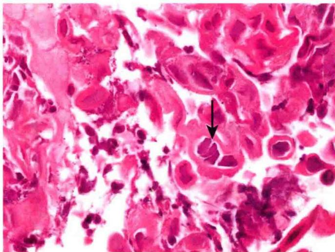 
图25-1 1型单纯疱疹病毒。舌难愈性溃疡，活检示被病毒感染的鳞状上皮细胞中可见核内病毒包涵体（箭头）
4.其他病毒感染柯萨基病毒导致疱疹性咽峡炎，一种急性疱疹性口咽炎。一次短暂的感染带来持久的免疫力。巨细胞病毒感染的典型表现为表面溃疡。其他涉及口腔黏膜的病毒感染包括麻疹、风疹、水痘和带状疱疹
# 二、良性肿瘤
口腔也可发生身体其他部位常见的良性肿瘤，这些肿瘤包括色素痣、纤维瘤、血管瘤、淋巴管瘤和鳞状细胞乳头状瘤。创伤可能导致这些病变发生溃疡，在这种情况下可能会出血或感染。
1.乳头状瘤 鳞状细胞乳头状瘤是良性外生性上皮肿瘤，由分叶状、含纤维血管轴心的鳞状上皮组成，是口腔最常见的良性肿瘤，与HPV感染有关。主要发生在 $20\sim 40$ 岁的人群。最常累及舌、上腭、颊黏膜、扁桃体和悬雍垂。 
2. 分叶状毛细血管瘤（化脓性肉芽肿、妊娠瘤）分叶状毛细血管瘤是一种良性息肉样的毛细血管瘤，主要发生在皮肤和黏膜，最常见的部位是牙龈。“化脓性肉芽肿”是一种误称，它既无感染，也无肉芽肿形成。在口腔，病变大小可从数毫米至 $1\mathrm{cm}$ ，突起、柔软、红色或紫色，表面光滑、分叶状或伴溃疡形成。它们表现为黏膜下血管增生，排列成小叶状或簇状，中央伴有毛细血管或小分支状血管（图25-2）。随着时间的推移，病变血管减少，可能更像纤维瘤。在妊娠妇女，尤其是在接近妊娠后前3个月的结束，可发生一种牙龈病变，在大体和镜下与分叶状毛细血管瘤完全相同，称为妊娠瘤，它在分娩后会或者不会消退。
# 三、癌前病变或上皮前驱病变：黏膜白斑和黏膜红斑
上呼吸消化道的癌前病变包括黏膜白斑、黏膜红斑或斑点黏膜白斑，这些术语分别代表了表现为白色、红色或白色/红色混合的病变。黏膜白斑（来自希腊
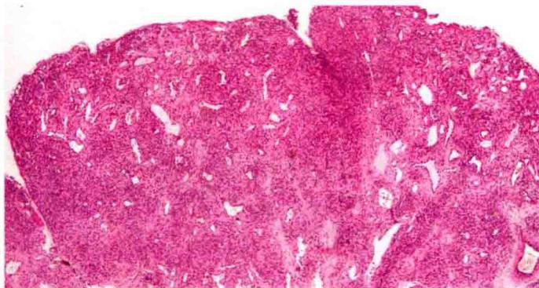 
图25-2叶状毛细血管瘤（化脓性肉芽肿）。以细胞性小叶状结构为特征的黏膜下病变。小叶由扩张的、形状不规则的血管构成，周围由伴有慢性炎症细胞浸润的肉芽组织包围
语的，leukos，“白色”和plax，“斑块”）是无症状的黏膜表面的白色病变。男女均可累及，无性别差异，主要发生在20岁之后。部分病变可转变成SCC。多种疾病特征性表现为口腔黏膜的白色斑块（如念珠菌病、扁平苔藓、银屑病、梅毒）。因此，黏膜白斑不是一个组织学诊断，而是一个描述性的临床术语，需行进一步检查。作为癌前病变，黏膜白斑病的原因多种多样，包括吸烟、酗酒和局部刺激。
黏膜红斑相当于红色的黏膜白斑，但远不如其常见。红色区域和黏膜白斑同时存在被称为斑点白斑（红白斑，斑点黏膜）。与黏膜白斑不同，黏膜红斑可能意味着中度到重度异型增生或癌。但这些病变并非均为恶性肿瘤，许多本质上可能是炎症。

【病理】黏膜白斑最常发生在颊黏膜、舌和口底。斑块可能单发或多发，大小不一，可从小灶病
变到大的斑块。黏膜红斑通常与不良的组织病理改变相关，包括重度异型增生、原位癌或浸润性癌。相比之下，黏膜白斑可表现为病理改变的一组谱系，从不伴有异型增生的表面角化到侵袭性角化性鳞状细胞癌（图25-3）。黏膜白斑不同于黏膜红斑，它们往往有清楚的边界。黏膜白斑的恶变率约为 $10\%$ ，但黏膜红斑首次活检的恶变风险高达 $50\%$ 。斑点白斑发展为恶性肿瘤的风险介于单纯的黏膜白斑和单纯的红斑病之间，但它应该被视为黏膜红斑的变异型。
# 四、鳞状细胞癌
鳞状细胞癌是最常见的口腔黏膜的恶性肿瘤，可能发生在任何部位。它最常累及舌，然后按降序排列依次为口底、牙槽黏膜、上腭和颊黏膜。发生在牙槽和唇者其男女比例分别为2：1和 $10:1$ 。口腔癌随地域不同分布不同，如在印度它是男性最常见的癌症，与咀嚼槟榔有关。
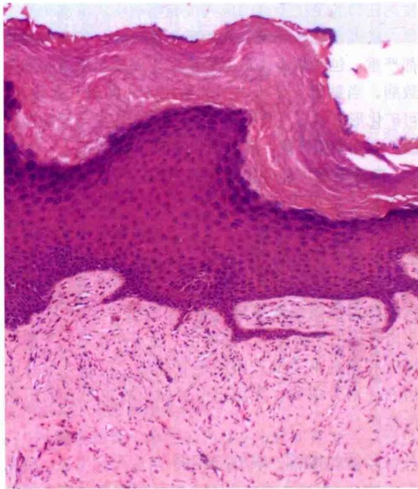 
图25-3 黏膜白斑。病变表现为白色的斑片，为一个严重吸烟者的颊黏膜。组织学上可见明显上皮增生和角化过度
Vinson 综合征（食管、缺铁性贫血和吞咽困难）、物理和化学刺激因素，咀嚼槟榔、唇的紫外线暴露及口腔卫生不良（牙列不齐和不合适的义齿）。在世界范围内，多达 $25\%$ 的头颈 SCC 与高危型人乳头瘤病毒有关，主要是 HPV16。

【病理】口腔的浸润性 SCC 类似于其他部位的鳞癌，一般由原位癌发展而来。I 级鳞癌分化
良好，常伴角化。在分化谱系的另一端，IV级鳞癌分化很差，以至于难以仅凭形态学确定其来源（见第24章）。口腔癌主要转移至下颌下、浅部和深部的颈淋巴结。超过一半死于头颈部SCC患者存在远处脏器血行转移，最常见的是在肺、肝和骨。
疣状癌（verrucouscarcinoma，VC）是一个高分化的鳞状细胞癌亚型，具有局部破坏性，但不转移。通常发生在 $50\sim 60$ 岁的人群。VC可能发生在头颈部任何部位，但最常见于口腔黏膜、牙龈和喉。肿瘤常为白色，呈疣状或菌样及外生性，一般有宽的基底(图25-4A)。镜下，表现为良性的鳞状上皮（无异型性），以表面角化和球根状上皮脚推挤式生长为特征(图25-4B)。疣状癌如完全切除预后良好。
# 五、龋齿（蛀牙）
龋齿是牙齿钙化部位最常见的慢性疾病。在全世界范围内影响不同性别和年龄的人群，其发病率随现代文明发展明显增加。
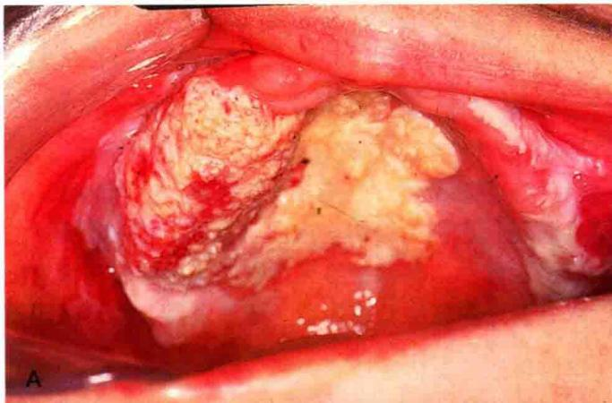
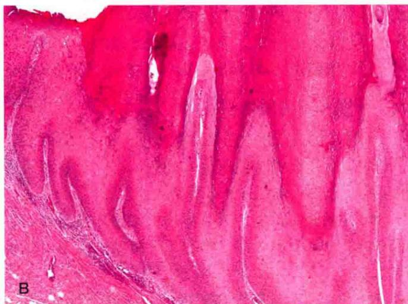 
图25-4 疣状癌。A.肉眼肿瘤呈白色，外生性生长，累及牙槽嵴。注意上腭融合平坦的白色外观（白斑）；B.显微镜下，见明显的表面角化（“教堂尖顶”角化症），由无异型性的、形态温和一致的鳞状细胞以及向黏膜下层呈推挤式生长的宽的球根状上皮脚组成

【发病机制】龋齿是几个因素相互作用的结果。
1. 细菌 调齿是一种牙釉质、牙本质和牙齿的慢性感染性疾病，微生物是口腔原有菌群的一部分。龋病变最早主要由食物残留经微生物作用的酸性产物使牙组织的矿物质流失所致。齿面常发生许多微生物，除非经常彻底清洗，寄生的牙齿形成一个软性团块，称为牙菌斑。无数的链球菌、乳酸杆菌和放线菌参与龋齿的形成。间接证据表明变形链球菌是引发龋齿的主要病因。其他细菌可能更多的是协助对牙釉质和牙本质进行破坏过程。
2. 唾液 唾液有很高的缓冲能力，能中和口腔微生物产生的酸。此外，它包含一些抑菌因子，比如溶菌酶、乳铁蛋白、乳过氧化物酶体系和分泌型免疫球蛋白。口腔干燥（缺乏唾液造成的慢性口腔干燥）会导致猖獗龋齿的发生。 
3. 饮食因素 蠯齿发生的最重要因素之一是高糖类饮食。原始的粗粮和未精制的食物能清洁牙齿并且因为需要更多咀嚼，而进一步有助于净化牙齿。
相反，柔软和精制的食物容易粘在牙齿上，也不需要很多咀嚼。
4. 氟化物 氟化物能预防龋齿，它可融入构成牙釉质晶体结构，并形成氟磷灰石，其含酸可溶性复合物较牙釉质的磷灰石要少。

【病理】在釉柱间质脱钙之后龋齿随釉柱蹦解
发生，导致碎片和微生物的积累（图25-5）。
这些变化使牙釉质产生一个小坑或裂缝。当病程到达牙本质与牙釉质结合处，病变则横向进展，同时沿牙本质小管穿透牙质。然后在牙质内形成大量腔隙，形成口径狭小的瓶形病变。牙本质的脱钙导致被破坏的牙本质小管局灶聚集。只有当累及牙髓的血管引起炎症反应（牙髓炎），才会出现第一次疼痛。
# 六、牙髓和根尖周组织疾病
牙髓是包围在牙本质钙化壁内的纤细的结缔组织。牙髓腔周有排列整齐的成牙质细胞，有一个微细的牙根尖孔，血管、淋巴管和小神经由此穿过。
■ 牙髓炎是口腔中累及龋齿的细菌入侵所致。急性牙髓炎由于水肿、渗出增加了牙髓腔的压力而引起疼痛。 
根尖（或根尖周）肉芽肿，最常继发于牙髓炎，是根尖周的慢性肉芽组织炎。炎性组织逐渐被纤维囊包绕，当拔牙时，常发现包裹的肉芽肿块贴附于牙根部。 
根尖囊肿（根尖周囊肿），见于根尖肉芽组织出现鳞状上皮增生被覆，形成一个空腔或囊性结构时。 
根尖周脓肿常常继发于牙髓炎。 
■ 骨髓炎可并发于根尖周脓肿，通常由金黄色葡萄球菌、表皮葡萄球菌和各种链球菌或混合微生物的感染所致。感染可沿骨皮质蔓延到头颈部其他组织间隙，少数情况下波及纵隔。
# 七、牙周疾病
牙周疾病是指牙齿周围软组织急性和慢性疾病，最终导致起支持作用的骨骼缺失。慢性牙周疾病通常
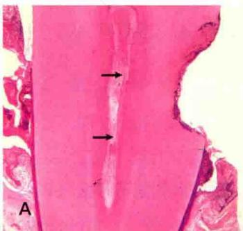 
图25-5 龋齿。A.显示一个靠近牙龈边缘的大腔。条带状的继发性牙本质贴附在髓腔侧（箭头）。这个新形成的牙本质位于牙齿破坏区的对侧，由受刺激的成牙质细胞产生；B.碎屑状的沉积物覆盖在表面。细菌菌落（深紫色）已扩展到牙本质管内
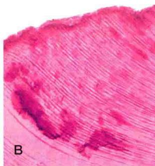
发生在口腔卫生不良的成人或有明确疾病家族史的个体。成人慢性牙周炎造成的牙齿损失比任何其他疾病都严重，包括龋齿，是由聚集在牙周袋牙龈下的细菌致病。当黏附于牙齿表面的菌团（牙菌斑）老化后，可矿化形成结石（牙石）。成人牙周炎主要与牙龈拟杆菌，中间型拟杆菌、放线菌和嗜血杆菌有关。
血液疾病可能会影响口腔组织，特别是牙龈。粒细胞缺乏症可引起口腔任何部位的坏死性溃疡和咽黏膜溃疡，但在牙龈尤为多见。传染性单核细胞增多症往往导致牙龈炎和口腔炎，伴随渗出和溃疡。所有类型的急性和慢性白血病可能导致口腔病变。急性单核细胞白血病最常导致口腔组织病变，其中 $80\%$ 的患者表现出牙龈炎、牙龈增生、瘀点和出血。牙龈的坏死和溃疡易造成严重的重复感染，可能会导致牙齿和牙槽骨缺失。牙龈出血可能反映出患者的出血性体质。
# 八、牙源性肿瘤：成釉细胞瘤
成釉细胞瘤是牙源性上皮性肿瘤，是最常见和具有临床意义的牙源性肿瘤。其生长缓慢，具有局部浸润性，通常遵循一个良性的临床过程，但可以局部破坏。大多数发生在下颌升支或者磨牙区，上颌骨或者鼻腔底。肿瘤常为生长缓慢的骨中央性病变。显微镜下，成釉细胞瘤类似于分化不同阶段的牙釉质器，一个肿瘤可能显示不同的组织学类型。类似成釉细胞的肿瘤细胞位于上皮巢或索的外周，柱状细胞垂直于基底膜（图25-6）。虽然切除不完全的肿瘤可复发，但肿瘤通常不转移。有些可能会播散，但组织学上仍是良性（转移性成釉细胞瘤）。成釉细胞癌是明确的恶性肿瘤，伴有异型性、坏死、核多形性和丰富的核分裂象。
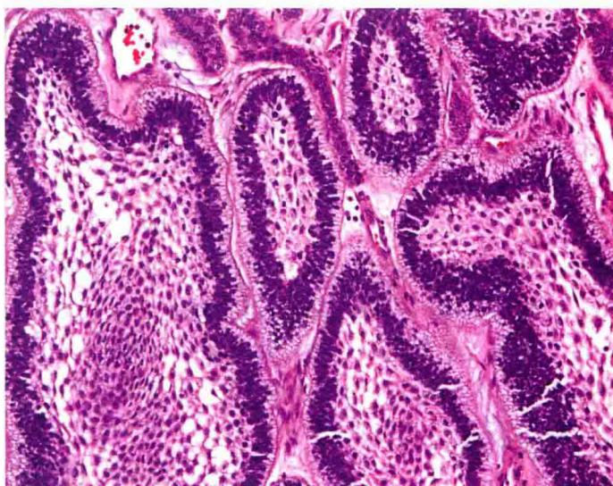 
图25-6 成釉细胞瘤。常见的组织学特征是中央为呈星芒状区域的牙源性上皮岛，基底细胞包绕其周，核下空泡形成“尖底栅栏状”外观
# 第二节 鼻腔和鼻窦
# 一、鼻腔和鼻窦的非肿瘤性病变
# （一）鼻炎通常是病毒性或过敏性的
鼻炎是鼻腔鼻窦黏膜的炎症。病因包括从普通感冒到不常见的感染，如白喉和炭疽。
1. 病毒性鼻炎 急性鼻炎的最常见原因是病毒感染，尤其是普通感冒（急性鼻炎）。病毒在上皮细胞内复制，导致变性的细胞脱落。黏膜充血水肿伴中性粒细胞和单核细胞浸润。临床上，黏膜肿胀表现为鼻塞。大量的黏液分泌和血管通透性的增加导致鼻漏（鼻腔稀薄黏液自行流出）。病毒性鼻炎可能在数天内继发由正常鼻和咽的菌群引起的感染。丰富的浆液性分泌物随之变为黏的脓性分泌物，之后，表面上皮脱落。炎症消退后上皮细胞迅速再生。 
2.慢性鼻炎急性鼻炎反复发作可能会导致慢性鼻炎。鼻中隔偏曲是一个常见因素。慢性鼻炎的特点是鼻黏膜由于持续充血而增厚、黏液腺增生，伴淋巴细胞和浆细胞浸润。 
3. 过敏性鼻炎 大量过敏源在我们的环境中持续存在，对其中任何之一敏感都可能会导致过敏性鼻炎。此时空气中的过敏粒子（如花粉、真菌、动物过敏原）沉积在鼻黏膜上。通常所说的花粉热、过敏性鼻炎可以是急性、季节性或慢性和常年存在的（见第4章）。
# （二）鼻息肉是局部炎性肿胀
鼻腔鼻窦炎性息肉是黏膜的非肿瘤性病变。大多数来自鼻腔外侧壁或筛窦隐窝。它们可能是单侧或双侧、单发或多发。症状包括鼻塞、鼻漏和头痛。病因涉及多种因素，包括过敏、感染、糖尿病、囊性纤维化和阿司匹林不耐受。鼻腔鼻窦炎性息肉外衬呼吸上皮，内为含黏液腺的疏松黏液间质，伴浆细胞、淋巴细胞和大量嗜酸性粒细胞浸润。
# （三）鼻窦炎是一种细菌感染
鼻窦炎是指鼻旁窦黏膜的炎症。

【发病机制】任何炎症、肿瘤或异物，妨碍鼻窦引流或通气则容易引起感染。如果窦口
阻塞，分泌物或渗出物积聚在阻塞物之后。急性鼻窦炎是指病程不超过3周，主要由鼻腔黏膜感染蔓延所致。多数病例涉及大量菌群；流感嗜血杆菌及卡他莫拉菌最常见。上颌窦炎也可能由牙源性感染引起，在这种情况下，第一和第二磨牙牙根部的细菌穿透分隔磨牙和上颌窦底壁的薄骨板。慢性鼻窦炎继发于急性炎症，是由于感染未完全清除或因急性炎症的反复发生而引起。与急性鼻窦炎不同，慢性鼻窦炎的脓性渗出物几乎总是含有厌氧菌。
【病理】急性或慢性鼻窦炎可继发多种并发症，包括黏液囊肿（黏液聚集）或脓性囊肿（黏脓性的渗出物的聚集）、骨髓炎、脓毒性血栓性静脉炎、甚至颅内感染。
# （四）鼻硬结症是鼻的一种慢性细菌感染
鼻硬结症（硬结）是由一种革兰阴性双杆菌鼻硬结克雷伯杆菌引起的慢性炎症性疾病，尽管它可缓慢蔓延到鼻咽、喉和气管，但通常开始发生于鼻并局限于该部位。鼻硬结症流行于一些地中海国家以及部分亚洲、非洲和拉丁美洲地区。美国也有确认的原发病例。它发生于任何性别和年龄。大多数患者家庭和个人卫生较差。
【病理】感染组织表现为质硬、明显增厚、不规则结节状，常伴溃烂。显微镜下，肉芽组织富含浆细胞、淋巴细胞和泡沫样巨噬细胞（图25-7）。特征性的大的巨噬细胞称为Mikulicz细胞，含有大量被吞噬的细菌。由于大多数患者存在特异性的抗体，血清学检测有助于诊断。抗生素可成功治疗这种疾病。
# 二、鼻腔和鼻旁窦的良性肿瘤
1.鳞状上皮乳头状瘤 鼻腔最常见的良性肿瘤是鳞状上皮乳头状瘤，肿瘤几乎总是发生在鼻前庭，病变常难与疣（寻常疣）鉴别。 
2.Chneiderian乳头状瘤 这是一组良性肿瘤，由增生的鳞状或柱状上皮组成，与黏液细胞有关。起源于外胚层来源的鼻腔鼻窦黏膜，衬覆于鼻腔鼻窦（Schneiderian黏膜）。有三种形态学明确的良性乳头状瘤：内翻性、嗜酸细胞性（圆柱或柱状细胞）和菌状型（外生性，有间隔）乳头状瘤。总体来说，Schneiderian乳
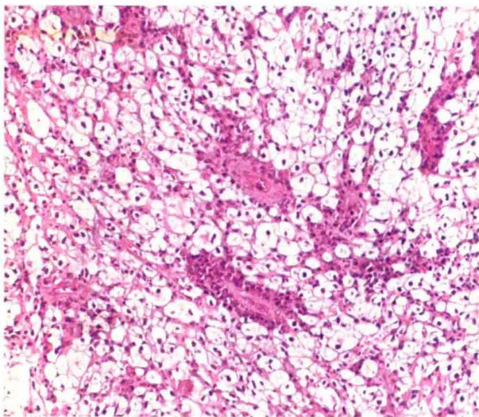 
图25-7 鼻硬结病。肉芽组织含有大量泡沫状巨噬细胞（Mikulicz细胞）
头状瘤占鼻腔鼻窦肿瘤的 $5\%$ 以下。
3. 内翻性乳头状瘤 好发于鼻腔外侧壁，并可蔓延至鼻旁窦。内翻性乳头状瘤主要发生在中年人。顾名思义，它们特征性地表现为表面上皮内生至下方的基质内（图25-8）。HPV6和HPV11及其他少见类型（HPV16、HPV18、HPV33、HPV40和HPV57）在内翻性乳头状瘤中可以查见，但二者的因果关系尚未证实。虽然是良性的，但肿瘤可能通过压力而侵蚀骨组织。肿瘤常复发，除非外科切除超出肉眼所见病变的边界。在 $5\%$ 的病例可恶变为鳞状细胞癌。
# 三、鼻腔鼻窦的恶性肿瘤
1.鳞状细胞癌大多数鼻腔和鼻窦的恶性肿瘤是鳞状细胞癌（角化型和非角化型）。大约有 $15\%$ 为腺癌或未分化癌。有报道认为，一些工业化学物质包括镍和铬能增加鼻腔和鼻窦癌的风险。鳞状上皮肿瘤在镍工人通常发生于中鼻甲，潜伏期在 $2\sim 32$ 年。鼻腔鼻窦的癌呈持续生长并浸润相邻结构。然而，它们通常不引起远处转移。生存期通常只有数年。 
2. 鼻型血管中心性NK/T细胞淋巴瘤 鼻型血管中心性NK/T细胞淋巴瘤已经取代以前的致死性中线肉芽肿、中线恶性网织细胞增多症和多形性网织细胞增多症等名称。

【病理】这种EB病毒相关的侵袭性淋巴瘤表现为上呼吸道黏膜的坏死性、溃疡性病变。肿瘤
浸润特征性的表现为多形性的肿瘤细胞，围绕小-中等大小的血管（血管中心性），浸润血管壁（血管侵犯），
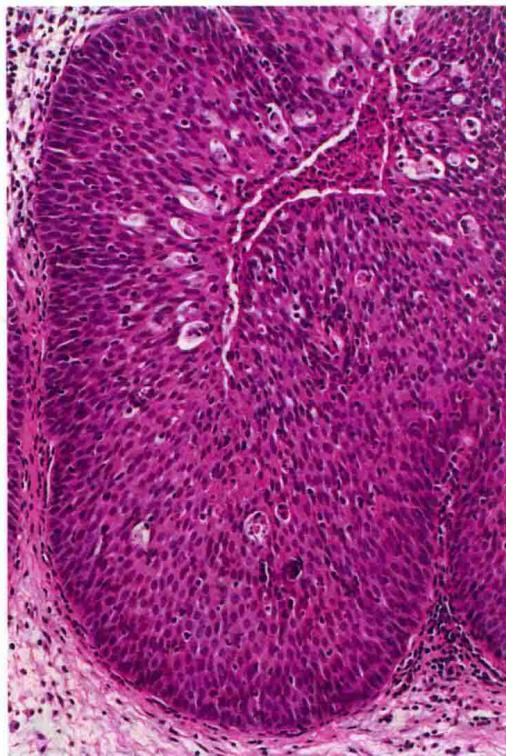 
图25-8 鼻腔鼻窦内翻性乳头状瘤。上皮巢向下生长（内翻）至黏膜下。由一致的细胞增生组成伴炎症细胞浸润及散在的微囊肿
常像血栓一样堵塞血管腔，导致相邻组织坏死（缺血模式）（图25-9）。
【临床表现】早期发病隐匿，随后出现鼻黏膜局部肿胀，变硬并最终溃疡形成。溃疡面覆盖一层黑色结痂，其下方病变进展，侵蚀软骨和骨骼，导致鼻中隔、硬腭和鼻咽缺损。大约一半的患者疾病进展广泛。死因包括继发细菌感染、吸入性肺炎或受侵蚀大血管出血。鼻型NK/T细胞淋巴瘤至少在初期对放疗敏感，也有报道称细胞毒性药物可缓解疾病。
# 第三节 鼻咽和口咽
# 一、感染
1.咽炎和扁桃体炎是头颈部最常见的疾病之一。鼻咽感染主要发生在儿童，也常见于青少年和年轻人。病毒或细菌感染可能局限在腭扁桃体，但咽扁桃体或相邻咽黏膜也常会受累，经常是一般上呼吸道感染的一部分。在后一种情况下，主要是病毒感染通常通过飞沫或者直接接触传播。这些包括流感病毒、副流感病毒、腺病毒、呼吸道合胞病毒、鼻病毒。 
2.急性扁桃体炎是一种细菌感染，通常是酿脓链球菌（A组溶血性链球菌）感染。滤泡性扁桃体炎的特点是可以从隐窝挤压出来的针尖大渗出。 
3. 假膜性扁桃体炎 是指覆盖着一层黏膜坏死渗出物，例如，在白喉或在文森特心绞痛患者。 
4. 复发性或慢性扁桃体炎 并没有多数人认为的那样常见，儿童扁桃体肥大不一定意味着慢性扁桃体炎。然而，重复感染导致扁桃体和腺样体肿大可达到阻塞气道的程度。在儿童，反复发作的链球菌感染性扁桃体炎可能进展为风湿热或肾小球肾炎，扁桃体切除术可能会使患者获益。 
5.扁桃体周脓肿 是扁桃体后囊的脓性分泌物聚集，通常由于感染 $\alpha$ 和 $\beta$ 溶血性链球菌。1/3 的患者有
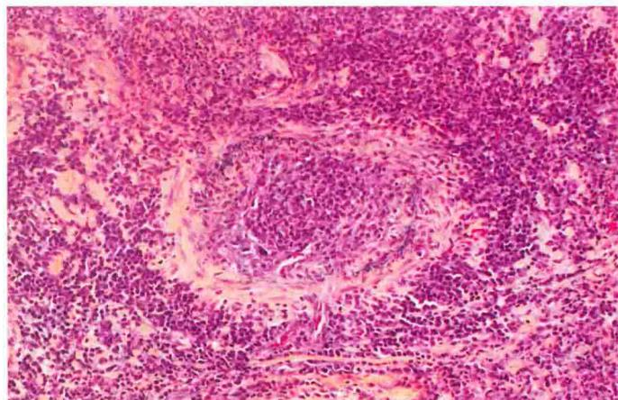 
图25-9血管中心性NK/T细胞淋巴瘤。恶性肿瘤细胞在一个中等大小的血管周及壁内浸润性生长，破坏血管外弹力膜和闭塞血管腔
扁桃体炎的病史。若未治疗，扁桃体周脓肿可能导致一些危及生命情况，例如破裂进入气道，削弱颈动脉壁，或渗透到纵隔、颅底头骨或颅穹窿。
6. 传染性单核细胞增多症（与EBV感染相关）一般常与渗出性扁桃体炎、咽炎伴发，还常伴颈后淋巴结病。腺样体肿大代表咽淋巴组织慢性炎性增生。这种情况往往伴随慢性扁桃体炎或鼻炎，几乎总是发生在儿童。肿大的腺样体可能会导致部分或完全阻塞咽鼓管，引起中耳炎。
# 二、肿瘤
# （一）鼻咽血管纤维瘤
这个肿瘤是一种青春期男孩发生的肿瘤，是鼻咽一种罕见的、富含血管的肿瘤。组织学上良性但在局部呈浸润生长。这些肿瘤最常出现在青少年男性但不限于任何年龄组。病变有家族性；在家族性腺瘤性息肉病（FAP）综合征患者中发生率是一般人的25倍。

【病理】血管纤维瘤呈多结节状，分成小叶的
或光滑的粉红色团块常有表面溃疡和明显的血
管。它们最好发部位是鼻腔后外侧的黏膜下层，蝶腭孔后，往往扩展到相邻结构，产生局部占位效应。血管纤维瘤可能长入颅骨的裂孔，破坏骨质并蔓延至邻近结构。肿瘤含血管和基质成分。血管大小和形状不同；壁内缺乏平滑肌层并显示不规则排列的平滑肌。

【临床表现】许多血管纤维瘤在青春期后自愈
它们对雌激素治疗有反应，因此被认为是受激
素调节和雄激素依赖的。血管壁缺陷影响血管收缩，导致外伤后严重出血。因此，活检可能造成危险，属禁忌。
# （二）口咽鳞状细胞癌
口咽鳞状细胞癌通常与人类乳头瘤病毒感染有关，在美国，大约有 $80\%$ 的口咽鳞癌与高危HPV感染有关。这些肿瘤，被称为HPV-相关性头颈部鳞状细胞癌（HPV-HNSCC），主要发生在腭舌扁桃体，是非角化型癌的基底样细胞型。此肿瘤可能很小，因此难以检查到，常以颈部淋巴结转移性癌为表现。与头颈部非HPV相关性鳞状细胞癌相比，HPV-HNSCC：①通常发生在没有已知的HNSCC危险因素的患者（即不吸烟，不喝酒）；②出现在年轻患者；③对放疗敏感；④有较好的预后。

【发病机制】与子宫颈癌类似，高危HPV病
毒癌蛋白E6、E7使口腔鳞状上皮细胞恶性
转化（见第5章），诊断上，针对不明原因的颈部淋巴结转移癌，p16的存在（细胞周期依赖性激酶抑制剂；见第5章）可作为口咽部原发癌的推定证据。HPV疫苗的出现有望减少HPV-HNSCC发病率。
# （三）鼻咽癌
鼻咽癌（NPC），鼻咽最常见的癌症，是一种分为角化性和非角化性的恶性肿瘤。后者与EBV感染有关。

【流行病学】非角化性癌在东南亚和非洲的部
分地区尤为常见。在中国鼻咽癌是最常见的恶
性肿瘤。在中国香港，它占所有癌症的 $18\%$ ，相比于
全世界的 $0.25\%$ 。出生在美国的中国血统的人鼻咽癌
的死亡率超过了其他种族背景的20倍。

【发病机制】一直寻找鼻咽癌的各种环境风
险因素，但尚无明确的相关证据。最近的研
究指出，可能是环境和遗传因素的总和在肿瘤的发
病过程中起作用。一个与HLA A2/B46（之前的B
sin2）相关的表型，中国人很常见，不见于自人，
从而支持在一个特定族群的遗传易感性。一些染色
体,特别是3p、9p和14q缺失,在鼻咽癌中很常见,
可能反映出与位于这些位点的肿瘤抑制基因的相关
性。重要的是， $85\%$ 的鼻咽癌患者EBV抗体检测
阳性，EBV基因组出现在 $75\% \sim 100\%$ 的非角化
A.性和未分化性鼻咽癌中。在角化性鼻咽癌中,EBV
检测结果更为多变。更多的有关 EBV 感染与癌症的
关系的详细内容，见第5、9章。

【病理】强调肿瘤细胞的上皮性来源是基于肿瘤
细胞表达角蛋白，没有表达血液或淋巴来源标记
物。角化性癌发生在老年人，与EBV的关系和非角化型
的相关性不同。非角化性癌分为分化型和未分化型。分
化型非角化性鼻咽癌显示层状外观和细胞边界清楚。相
比之下，未分化的肿瘤表现出界线不清或合体样的细胞
簇，显示大的椭圆核和较少的嗜酸性胞质 (图25-10)。

【临床表现】由于其发病部位，大多数鼻咽癌
患者长期的无症状。可触及的颈部淋巴结转移
是一半患者的首发症状，即使如此，许多患者仍没有
关于鼻咽部的主诉。肿瘤浸润邻近区域，如咽旁区域，
眼眶和颅腔，导致神经症状和听力障碍。未分化的鼻
- 咽癌对放疗敏感，局限于鼻咽的大多数患者生存时间
5年或5年以上。转移到颈淋巴结患者生存期大大缩短
短，累及脑神经或远处转移患者预后差。
（四）Waldeyer环的淋巴瘤主要是弥漫性B细胞
# 淋巴瘤
淋巴瘤占头颈部肿瘤的 $5\%$ 。Waldeyer环是头颈部
迄今为止最常见的淋巴瘤起源部位。任何年龄组单侧扁
- 桃体增大，或成年人双侧无痛性扁桃体肿大，都提示淋
巴瘤的可能。鼻咽部淋巴瘤组织学上是弥漫性(90%)的，
超过一半的患者分类为大细胞淋巴瘤。在美国和亚洲，
Waldeyer环的绝大多数淋巴瘤为B细胞来源。
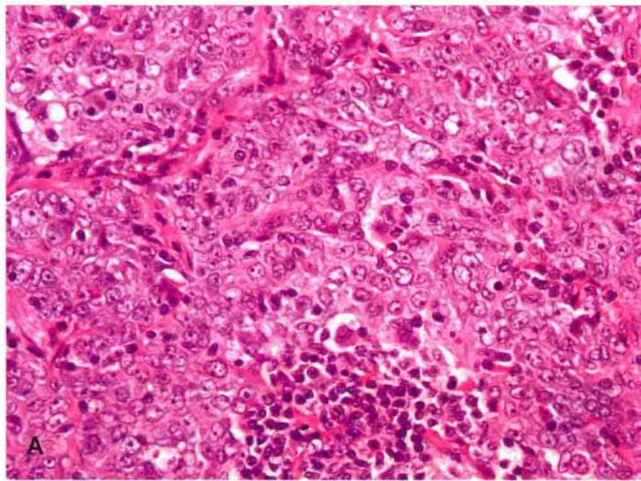
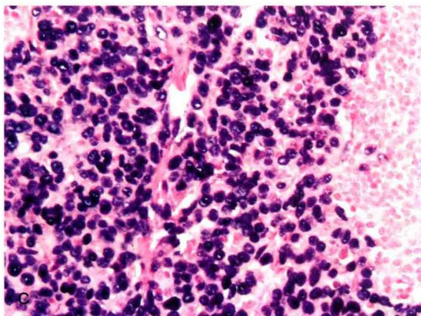 
图25-10 鼻咽非角化性癌、未分化型。A.细胞核大，有明显的嗜酸性核仁；B.肿瘤细胞角蛋白阳性（通过免疫组织化学），提示是一种上皮细胞性来源的增生；C.原位杂交EB病毒（EBER-ISH）
# （五）髓外浆细胞瘤常发生在头颈部
3/4的髓外浆细胞瘤发生在头颈部，好发于鼻咽/鼻腔和鼻窦。生物学行为与其他髓外浆细胞瘤类似，可能局限在局部也可能发展成系统性的浆细胞骨髓瘤（第20章）。
# 第四节 喉和喉咽
# 一、感染
1.会厌炎 会厌炎是一种严重的炎症，最常由B型流感嗜血杆菌引起。急性会厌炎引起的水肿可以阻塞气道，因此发生在婴幼儿，可能危及生命。出现吸气喘鸣（吸气时大声的哮鸣音）和发绀可能意味着气道阻塞严重到需要气管切开。 
2. 喉炎 喉炎是幼儿喉气管支气管炎，由于不同程度的喉阻塞，出现吸气性喘鸣、咳嗽和声嘶等症状。喉炎是上呼吸道感染的并发症，以喉水肿为特征。
# 二、声带小结和息肉
声带小结/息肉（也称为尖叫者的、歌手的或牧师的结节）是一个与炎症或创伤相关的间质反应性过程。结节/息肉可以出现在任何年龄，但最常出现在
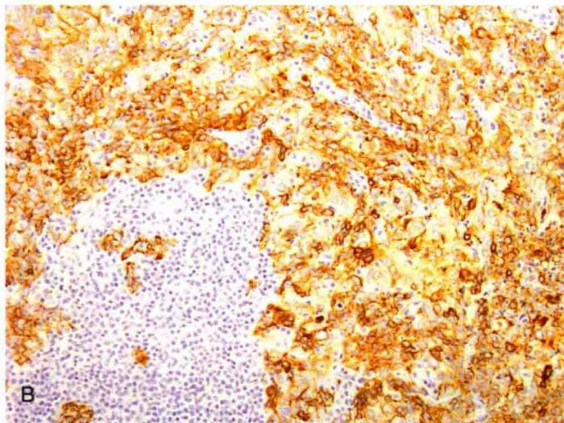
$20\sim 50$ 岁之间的人群。声带息肉和结节的症状相似，包括声音嘶哑和音色改变。病变出现在用嗓过度、感染（喉炎）、饮酒、吸烟或内分泌功能障碍（如甲状腺功能减退）之后。组织学表现从早期黏液、水肿、成纤维性的间质到后期透明样变、致密的纤维性间质。
# 三、喉肿瘤
1. 鳞状细胞乳头状瘤和乳头状瘤病 喉的鳞状细胞乳头状瘤是单个或多个呈乳头状增生的组织，其具有纤维血管轴心并被覆成熟的鳞状上皮。在儿童或青少年常为多发性（青少年喉乳头状瘤病），并可延伸到气管和支气管。人类乳头瘤病毒，特别是6型和11型是主要病因。该病可引起致命的呼吸道梗阻，极少情况下，发展成明确的鳞状细胞癌，特别是吸烟者或放射疗后患者。外科手术切除可能不能治愈，因为病毒感染黏膜常广泛，肿瘤易多年后复发。 
2.鳞状细胞癌 几乎所有的喉恶性肿瘤是鳞状细胞癌，几乎所有的患者为男性，大部分为吸烟者。大约 $75\%$ 的肿瘤显示有HPV感染的证据
# 第五节 唾液腺
1. 口腔干燥症 口腔干燥症是由于缺乏唾液引起
的慢性口腔干燥，原因有很多。疾病累及大唾液腺，引起口腔干燥症的疾病包括流行性腮腺炎、干燥综合征、结节病、辐射诱导萎缩和药物敏感（抗组胺药、三环类抗抑郁药、低血压的药物、吩噻嗪类）。
2. 肿大 单侧大唾液腺肿大通常是由于囊肿，炎症或肿瘤。双侧肿大是由于炎症（流行性腮腺炎、干燥综合征），肉芽肿性疾病（结节病）或弥漫性肿瘤累及（白血病或恶性淋巴瘤）。 
3. 淀石病 唾液腺导管内出现钙化结石，最常见于下颌下腺。结石形成的最重要的后果是阻塞管道，经常因远端闭塞而继发感染。 
4. 腮腺炎 急性化脓性腮腺炎是由于唾液分泌减少口腔细菌增加引起（通常是金黄色葡萄球菌）。最常出现在疲劳后或术后患者。急性和慢性腮腺炎经常与结石所致的唾液导管狭窄或阻塞有关。不流动的分泌物作为细菌逆行入侵的媒介。流行性腮腺炎是腮腺的一种急性病毒性疾病，通过感染的唾液传播。下颌下腺和舌下腺唾液腺也可能会被累及。
# 一、干燥综合征
干燥综合征是唾液和泪腺的慢性自身免疫性炎症性疾病。它可能局限于这些部位或可能与系统性自身免疫疾病有关。唾液腺受累导致口腔干燥症，泪腺受累导致干眼症（干燥性角膜结膜炎）。干燥综合征的发病机制和临床特点已在第4章进行了讨论。

【病理】干燥综合征，腮腺或下颌下腺单侧或双侧肿大，但小叶结构尚存。初始导管周慢性
炎症浸润逐渐延伸至腺泡，直到完全由大量的多克隆淋巴细胞、免疫母细胞、生发中心和浆细胞取代。增生的肌上皮细胞围绕受损的残余导管形成所谓的上皮－肌上皮岛（图25-11）。在疾病进展后期，受累腺体萎缩，腺体实质纤维化和脂肪浸润。
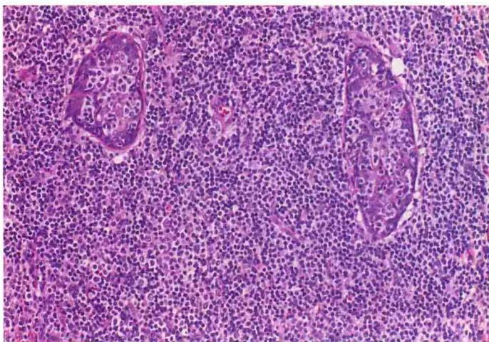 
图25-11 干燥综合征。受累的唾液腺内大量混合性慢性炎症细胞浸润。炎症浸润延伸至上皮（导管）结构导致化生及特形成特征性的上皮－肌上皮岛
# 二、唾液腺的良性肿瘤
# （一）多形性腺瘤（混合瘤）是唾液腺最常见的肿瘤
多形性腺瘤是一种良性肿瘤以上皮和间质成分的混合存在为特征。2/3的大唾液腺肿瘤和大约一半的小唾液腺肿瘤是多形性腺瘤。肿瘤通常发生在腮腺浅叶，在腮腺的发生率是颌下腺的9倍。最常发生在中年人，女性多见。

【发病机制】PLAG1（多形性腺瘤基因1）编码一个锌指蛋白，在多种肿瘤中有重排。大
约 $40\%$ 的病例中, 它被 8q12 染色体易位激活。染色体 12q13-15 的重排包含目标基因 HMGA2, 其他染色体改变也可发生。

【病理】多形性腺瘤是一个缓慢增长，无痛，可移动的质硬肿块，表面光滑。显微镜下，肿瘤
显示上皮组织，混有黏液样或软骨样的区域（图25-12A），提示是上皮和间质成分的混合。然而，肿瘤现在被认为是上皮起源。多形性腺瘤的上皮成分由导管和肌上皮细胞组成（见图25-12B）。细胞排列成管状或小的囊性结构，内含透明或嗜酸性的PAS阳性物质。导管上皮细胞周围绕较小的肌上皮细胞，构成主要的细胞成分。这些细胞形成界线清楚的鞘状，带状或巢状结构，通常被类似于软骨细胞基质，黏液样物质的细胞性间质分隔。

【临床表现】多形性腺瘤存在纤维包膜。随着肿瘤生长，周围的纤维结缔组织在其周增生。
肿瘤增大并常局部突入到邻近组织，形成结节状（图25-12A）。手术造成的肿瘤细胞种植或遗留的肿瘤结节在先前手术的瘢痕上继续增长使肿瘤复发。复发的多形性腺瘤只是局部再次生长，而不是恶性肿瘤。
癌在多形性腺瘤中：罕见。癌可能出现在生长数年的多形性腺瘤中。组织学检查显示在一个原本良性的多形性腺瘤中有明确的癌。这些肿瘤通常是高级别恶性肿瘤，如低分化或未分化腺癌。
# （二）Warthin瘤是最常见的单型性腺瘤
单型性腺瘤占良性唾液腺肿瘤的 $5\% \sim 10\%$ 。这些肿瘤上皮排列规律，通常腺样结构，没有间质样的成分。单型的腺瘤包括许多亚型，其中Warthin瘤是最常见的。Warthin瘤是良性的腮腺肿瘤，由被埋入在密集的淋巴组织中的囊状腺样结构组成。虽然肿瘤是明确的良性，它可以是双侧发生（ $15\%$ 的病例）或在同一腺体内多灶发生。Warthin瘤是唯一男性比女性发生率高的唾液腺肿瘤。肿瘤通常发生30岁后，大多数发生在50岁以后。

【病理】Warthin瘤由易形成囊性并显示乳头状突起的腺样结构组成。囊肿被覆特征性的嗜酸
性上皮细胞（瘤细胞），被埋在有生发中心的密集的淋巴组织中（图25-13）。
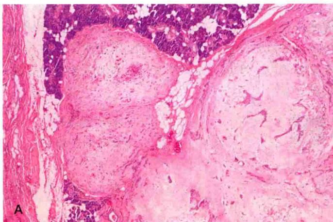
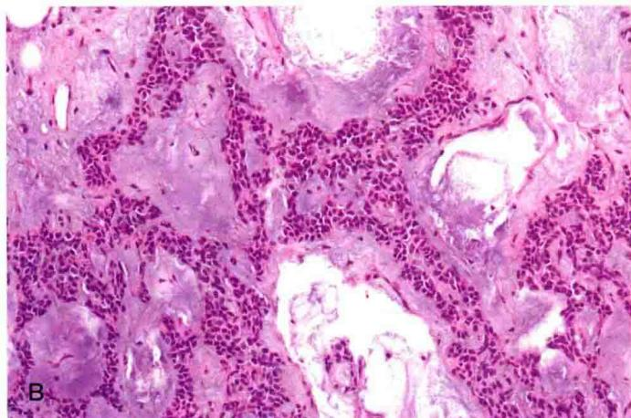 
图25-12 腮腺多形性腺瘤。A.肿瘤含特征性的黏液样和软骨样的成分。肿瘤部分有包膜，但突入腮腺的一个肿瘤结节缺乏包膜。如果这些结节没有被切除，会造成肿瘤复发。B.多形性腺瘤的细胞性成分为腺体和肌上皮的混合，在软骨黏液样基质中
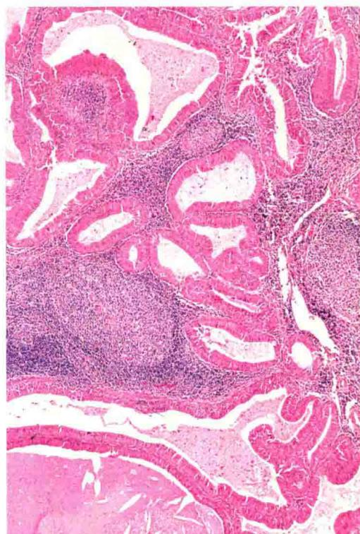 
图25-13 Warthin瘤。囊性和管状结构衬覆嗜酸性细胞。可见滤泡性淋巴组织
# 三、唾液腺的恶性肿瘤
唾液腺恶性肿瘤约占所有头颈部肿瘤的 $5\%$ 。大多数（ $75\%$ ）发生在腮腺， $10\%$ 见于下颌下腺， $15\%$ 见于上呼吸消化道的小唾液腺（黏液浆液性腺）。不到 $1\%$ 发生于舌下腺。
# （一）黏液表皮样癌有肿瘤性鳞状细胞、腺细胞和中间细胞
肿瘤源自导管上皮，此上皮具有较强的上皮细胞化生潜力。它们占大唾液腺肿瘤的 $5\% \sim 10\%$ ，占小唾液腺肿瘤的 $10\%$ 。超过一半的发生于大唾液腺的黏液表皮样癌发生在腮腺。在小唾液腺，主要发生于上腭。尽管肿瘤可以发生在青少年，大多数出现在成人，女性更常见。

【病理】黏液表皮样癌生长缓慢，成为质硬的无痛性肿块。显微镜下，低级别（分化良好的）
肿瘤形态不规则、实性、管状和囊性，包括鳞状细胞、黏液分泌细胞和中间细胞（图25-14）。高级别（低分化癌）呈多形性，除了分散的黏液分泌细胞，没有其他细胞分化的证据。

【临床表现】即使是低级别的黏液表皮样癌可发生转移，不管发病部位，其5年存活率超过高级别黏液表皮样癌存活率较低（20%～40%）。
# （二）腺样囊性癌局部浸润并常复发
腺样囊性癌是一种缓慢增长的唾液腺恶性肿瘤，以局部浸润和手术切除后复发为特征。它构成了大唾液腺所有肿瘤的 $5\%$ 和小唾液腺肿瘤的 $20\%$ 。腺样囊性癌不仅发生在口腔还发生在泪腺、鼻咽、鼻腔、鼻旁窦和下呼吸道，最常见于 $40 \sim 60$ 岁的人群。

【病理】腺样囊性癌呈现不同的模式。肿瘤细胞、胞小，缺乏胞质，排列呈实性片状或小巢、线状结构。在这些结构中，肿瘤细胞相互连接囊
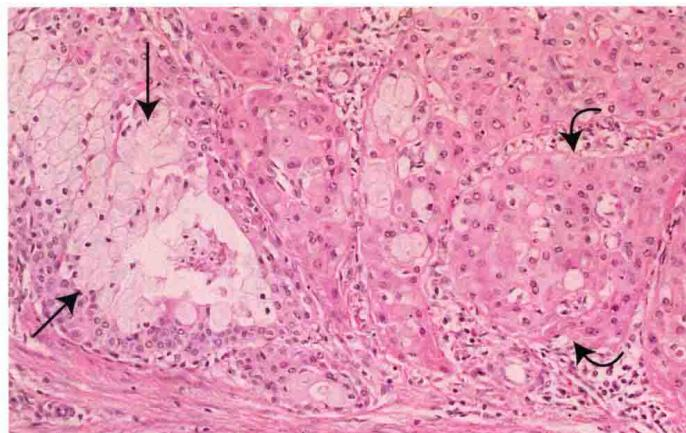 
图25-14黏液表皮样癌的特点是黏液细胞，表皮样细胞和中间细胞的混合。簇状黏液细胞集（直箭），胞质空亮有偏心位核。表皮样细胞（弧形箭）类似鳞状细胞但缺乏细胞角化和细胞间桥。中间细胞（左下方清楚可见）比表皮样细胞更小
性区，形成实性、管状或筛状（滤网样）结构（图25-15）。肿瘤细胞产生一致的基底膜样结构，使其具备“圆柱瘤样”的外观特点，因此之前称圆柱瘤。肿瘤可能起源于向润管和肌上皮分化的细胞。腺样囊性癌往往浸润神经周隙，常伴疼痛。尽管大多数病例发病数年不发生转移，但肿瘤难以完全根除，长期预后很差。
# （三）腺泡细胞癌起源于上皮分泌细胞
腺泡细胞癌在腮腺肿瘤中并不常见（占所有唾液腺肿瘤的 $10\%$ ）。它们偶尔发生在其他唾液腺，主要发生在 $20 \sim 30$ 岁的年轻人。肿瘤被覆包膜，圆形肿块，直径通常 $< 3\mathrm{cm}$ ，部分可呈囊性。显微镜下，腺泡细胞癌由一致的细胞组成，这些细胞有小的中央核和丰富的嗜碱性胞质，类似于唾液腺正常的分泌（腺泡）细胞。它们可转移至区域淋巴结。手术切除后，大多数（ $90\%$ ）患者可存活5年，约1/3的患者可出现局部复发。仅有一半患者可存活20年。
# 第六节 耳
# 一、外耳肿瘤
外耳的良性和恶性肿瘤包括了所有的皮肤相关性肿瘤：鳞状细胞乳头状瘤、脂溢性角化病、基底细胞癌、鳞状细胞癌和附属器的良/恶性肿瘤。起源于耵聍腺的肿瘤是这个部位特有的。腺体的良性肿瘤包括耵聍腺瘤（耵聍腺腺瘤）和从耵聍腺来源的唾液腺型肿瘤（如多形性和单形性腺瘤）。耵聍腺恶性肿瘤包括腺癌和恶性唾液腺型肿瘤（如腺样囊性癌、黏液表皮样癌）。
# 二、中耳
# （一）中耳炎通常是咽鼓管阻塞的结果
中耳炎是中耳的炎症，通常由上呼吸道感染蔓延至鼻咽引起。

【发病机制】感染几乎总是经乳突窦进入乳突小房。鼻咽感染时，微生物可能通过咽鼓
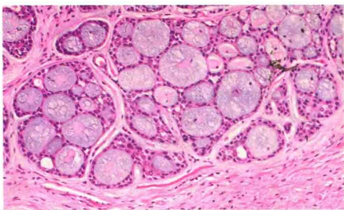 
图25-15 腺样囊性癌呈筛状生长，囊样区内充满嗜碱性的物质。囊性区实际上是由肌上皮细胞围成的假性囊肿
管上行至中耳。急性中耳炎可由病毒或细菌感染或者无菌的咽鼓管阻塞所致。病毒性中耳炎可无脓液而消退，或可继发化脓菌的感染。咽鼓管阻塞是中耳积液的重要原因。当咽鼓管的咽侧端肿胀，空气不能进入管内。中耳内的空气经黏膜吸收，产生的负压引起血浆渗出甚至偶尔出血。抗生素通常可治愈或改善状况。
■ 浆液性中耳炎：咽鼓管阻塞可能是由于大气压力的突然变化，尤其是本来就存在上呼吸道感染、急性过敏反应或管口病毒和细菌感染。没有细菌侵入中耳也可能发生炎症。在美国，超过一半的孩子在3岁前至少有一次浆液性中耳炎的发作。幼年时期反复发作的中耳炎常常导致原因未明的听力损失，这是由中耳残余（通常无菌）的液体引起。在慢性浆液性中耳炎，中耳黏膜衬覆上皮可见黏液（杯状）细胞化生。由于出血产生的胆固醇结晶，刺激异物反应和肉芽组织反应，被称为胆固醇性肉芽肿。大的胆固醇性肉芽肿可能破坏乳突或鼓窦。如果胆固醇性肉芽肿持续存在数月，肉芽肿可发生纤维化，可能最终导致中耳和乳突被纤维组织完全闭塞。
化脓性中耳炎：儿童最常见的感染之一，急性化脓性中耳炎由侵入中耳的化脓性细菌引起，通常经咽鼓管感染。所有年龄组中，肺炎链球菌（肺炎球菌）是最常见的病原体（ $30\% \sim 40\%$ ）。流感嗜血杆菌感染大约占 $20\%$ ，并随年龄增长而减少。如果中耳脓性渗出物积聚，可以导致鼓膜破裂和脓液排出。在大多数情况下，感染是自限性的，甚至无须治疗即可痊愈。被忽视的或复发性中耳和乳突感染可能最终产生黏膜的慢性炎症或覆盖听小骨骨膜的破坏（图25-16）。
■急性乳突炎：现在这种情况罕见，但治疗不当的中耳炎中仍可出现。典型病例中，脓细胞充满乳突气房，气房间的菲薄骨壁被破坏。炎症从乳突骨扩展至邻近结构引起并发症。
胆脂瘤：胆脂瘤是积累的角化物和鳞状上皮形成的肿块，由从外耳道经鼓膜穿孔进入中耳的增生的鳞状上皮所致。在中耳，继续产生角质。显微镜下，胆脂瘤由肉芽组织和纤维化包围。胆脂瘤的主要危险是侵蚀骨组织，此病程可导致邻近重要结构的破坏（如听小骨、面神经、迷路）。
急性和慢性中耳炎的并发症：由于抗生素治疗，中耳炎的并发症已很少见到。但仍有导致十分严重甚至致命后果的可能，这些致命的可能包括经乳突骨蔓延导致的脑膜炎和硬膜外、硬膜下或脑脓肿。
（二）颈静脉鼓室副神经节瘤起源于中耳副神经节颈静脉鼓室副神经节瘤是最常见的中耳良性肿瘤。
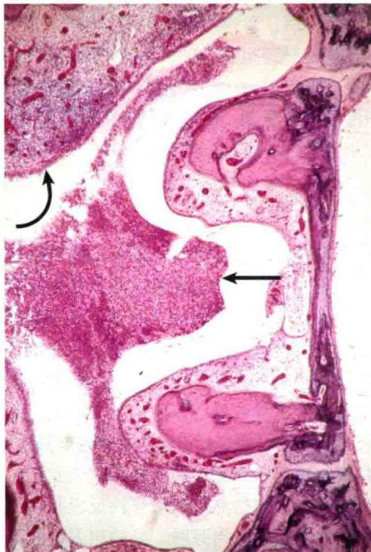 
图25-16 慢性化脓性中耳炎。中耳腔的脓性渗出物（直箭头）。慢性炎症和肉芽肿引起整个黏膜增厚（弧形箭头）。可见蹬骨的底和脚（右）
这些肿瘤生长缓慢，但多年后，它们可破坏中耳并蔓延到内耳和颅腔。转移非常罕见。组织学上，中耳副神经节瘤与发生在其他部位的病变相同，有特征性的细胞性小叶结构，埋在丰富的血管结缔组织中（图25-17）。副神经节细胞来源于神经嵴，含有不等量的儿茶酚胺，主要是肾上腺素和去甲肾上腺素。
# 三、内耳
# （一）耳硬化症导致进行性耳聋
耳硬化症是鐙骨和卵圆窗新骨松质的形成，导致进行性耳聋。在一些家族，该缺陷为常染色体显性遗传。在美国，耳硬化症是导致年轻人和中年人传导性听力损
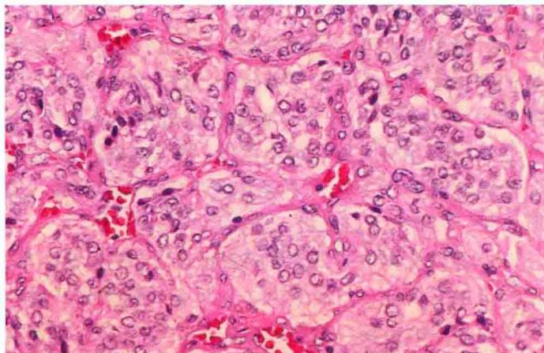 
图25-17 颈静脉鼓室副神经节瘤。肿瘤细胞巢由边界不清、胞质明显嗜酸性的细胞组成（主细胞）；巢周围有光学显微镜下难以辨认的支持细胞
失的最常见的原因。 $10\%$ 的美国白人和 $1\%$ 的美国黑人有耳硬化症，但 $90\%$ 的病例无症状。男女性比例是 $1:2$ 通常双耳受到影响。耳硬化症的发病机制尚不清楚。

【病理】尽管颧骨岩部任何部分都可能会受累，硬化骨的形成往往局限于特定的部位。最常见（ $80\% \sim 90\%$ ）是紧贴椭圆窗的前方。硬化灶向后延伸，可浸润并取代鐙骨。这个过程逐渐由鐙骨底，发展成功能上的骨性强直，表现为缓和性传导性听力损失。
组织学上，耳硬化症的初始病变是骨的吸收和形成高度细胞性纤维组织，含大量的血管和破骨细胞。骨再吸收的病灶随后由不成熟骨取代，重塑后成为成熟骨。耳硬化症的治疗可通过对听小骨的手术而完成。
# （二）梅尼埃病是眩晕、感音神经性听力损失和耳鸣的三联症
已经提出大量的病因学因素，但梅尼埃病原因尚不确定。其病理关联是耳蜗系统淋巴的水肿膨胀。梅尼埃病最常出现在 $30\sim 40$ 岁， $15\%$ 的患者双侧出现。

【病理】显微镜下，最早的变化是耳蜗管和迷淋巴球囊的扩张。随着疾病（水肿）的进展，整个淋巴系统变得扩张和鼓膜壁经常撕裂。破裂有时是迷路的塌陷，但感觉和神经结构萎缩罕见。人和梅尼埃病的症状发生于当内淋巴的积水而导致引起内淋巴进入外淋巴时。

【临床表现】持续不到24小时的眩晕发作，伴随恶心和呕吐，下一次发作间隔几周或几个月，时间的推移，缓解期延长。两次发作间歇期听力恢复，但后来发展成为永久性的听力损失。梅森似乎可以通过低盐饮食，使用利尿剂得以改善。
# （三）迷路中毒是药物引起的耳聋
最著名的有耳毒性的药物是氨基糖苷类抗生素，它可导致前庭或耳蜗感觉细胞不可逆转的损害。其他抗生素、利尿剂、抗疟药和水杨酸酯也可以产生暂时或永久性的感音神经性听力丧失。在抗肿瘤药物中，顺铂引起暂时的或永久性听力丧失。胚胎的迷路是对一些药物特别敏感（萨力多胺、奎宁和氯喹引起先天性耳聋）。
# （四）病毒性迷路炎可以导致先天性耳聋
病毒感染日益公认为内耳疾病、尤其是耳聋的原因。大多数病例显示病毒入侵迷路。巨细胞病毒和风疹病毒是最著名的在产前通过母婴传播而导致先天性耳聋的病毒。巨细胞病毒抗原已证实可见于Corti器的细胞和螺旋神经节神经元中。在出生后的病毒感染中，腮腺炎是导致耳聋的最常见原因。感染可以导致听力
迅速丧失，在 $80\%$ 的情况下单侧发生。
# （五）听力损伤与高强度噪声对内耳机械性损伤有关
在工业化国家，噪声性听力丧失是一个重要的健康问题。职业或娱乐使人体暴露于响亮的音调或噪声下可能会引起临时或永久的听力损失。听力损伤特指短暂暴露于高分贝的声音（如枪声或爆炸声）产生的听力损失。声音大于140分贝通过对听器的机械破坏产生即刻的听力损失。长时间的暴露在中等强度声音 $(90\sim 140$ 分贝）会导致“噪声性听力丧失”，其随着时间和暴露的累积呈缓慢发展。流行音乐会和一些家庭音响系统的音量强度可在这个范围。最早的损害发
生在Corti器外耳毛细胞。毛感受器丧失，接着出现毛细胞的变形、肿胀和解体。噪声性听力损失最初影响高频率听力，逐渐干扰频率较低的听力和言语感知。
# （六）最常见的内耳肿瘤是神经鞘瘤
几乎所有的内听道神经鞘瘤都来自前庭神经。前庭神经鞘瘤约占所有颅内肿瘤的 $10\%$ ，生长缓慢，包膜完整。内听道的较大肿瘤突向小脑桥脑角，可能使脑干和相邻的小脑变形。神经鞘瘤引起缓慢的进行性的前庭和听觉症状。2型神经纤维瘤病的特点是高发双侧前庭神经鞘瘤。组织学上，内耳神经鞘瘤与其他部位前庭神经鞘瘤类似（见第28章）。
（金玉兰）
# 第26章 骨和关节
骨骼有三种功能，即机械性支持，矿物质储备和造血功能。机械性功能包括：①保护脑组织、脊髓和胸腔脏器；②四肢刚性内在支持；③作为骨骼肌的杠杆臂。关节（连接结构）作为骨骼之间的连接结构，在骨骼的机械性支持作用中必不可少。骨骼是钙的主要储存库，还储存磷、钾和镁等其他离子。骨骼还是骨髓造血组织的储存器官。关节具有特殊的力学性能。滑膜（可活动关节），可活动关节衬覆滑膜和关节软骨，起到润滑作用以减少相邻关节面的摩擦阻力。美国65岁以上人群有一半患有临床上显著的关节疾病。
# 第一节 骨
# 一、骨的解剖学
肉眼观察，骨组织可分为两种：
■ 骨皮质结构致密紧凑，外壳体显示出骨的形状。骨皮质构成骨架的 $80\%$ ，由于密度较高，生物力学特性是其主要功能。 
■ 骨松质（又称为海绵状、小梁状或髓质骨）位于长骨两端髓腔内。与骨皮质相比，骨松质单位体积含有更多骨细胞。
骨的解剖结构主要根据与横向关节软骨板的关系定义，横向关节软骨板存在于生长期儿童。这种结构称为生长板、骶软骨板、骨骺生长板（图26-1）。
骨是从关节下骨板到生长板的基底部之间的区域。
干骺端包含骨松质，位于生长板背离关节的一侧到骨形状演变为凹槽或漏斗形状的区域之间。 
■ 骨干相当于骨的体部或轴。在长管状骨，骨干是位于两个干骺端之间的区域。
干骺端逐渐融合为骨干，骨松质消失，该区域骨在血源性感染、肿瘤、骨骼畸形等疾病中尤为重要。
两个理解骨组织必不可少的专业术语。
软骨内成骨：由骨组织取代软骨组织。 
膜内成骨：骨组织取代沿骨膜排列的膜性的或纤维性组织。
1. 骨髓 存在于髓隙内，又称为髓腔。髓腔由骨皮质封闭形成。由纤细的结缔组织形成网状支撑结构，其内包含骨髓细胞和血管（第20章）。
2. 骨膜 包绕所有骨的表面，可以形成骨组织。骨膜的内层，即形成层，被覆于骨表面，由疏松排列的束状胶原纤维、纤细的弹性纤维网和梭形结缔组织细胞组成。外层纤维层为包含血管的致密结缔组织，与软组织及筋膜相延续。 
3. 骨基质 为有机矿化物质。骨组织由细胞（占重量的 $10\%$ ）、无机基质（结晶程度较差的羟基磷灰石）和有机基质组成。有机基质的 $88\%$ 为 I 型胶原、 $10\%$ 为其他蛋白质、 $1\% \sim 2\%$ 为脂肪和糖胺聚糖。因此，有机基质基本可以看作 I 型胶原。其他蛋白包括：
■ 骨钙蛋白（osteocalcin）：由骨母细胞分泌，血骨钙蛋白水平是骨形成的有用标志物。 
■ 骨调素（osteopontin）和骨唾液酸糖蛋白（sialoprotein）：两者均为骨基质蛋白，包含氨基酸序列Arg-Gly-Asp，该序列能被整合素识别，因此，骨调素和骨唾液酸糖蛋白可将细胞锚定与基质。
4. 骨细胞维持骨结构 骨组织中有四种类型的细胞，每一种细胞在骨的形成、吸收和重塑中发挥特定的功能。
（1）骨祖细胞：骨祖细胞来源于原始骨髓干细胞，最终分化为骨母细胞和骨细胞。干细胞可分化为脂肪细胞、成肌纤维细胞、成骨细胞。骨髓、骨膜及骨髓腔内所有支持结构均可见骨祖细胞。 
（2）成骨细胞：这些蛋白合成细胞产生骨基质并矿化形成骨组织。来源于骨髓间充质祖细胞，这些祖细胞也分化为软骨细胞、肌细胞、脂肪细胞和成纤维细胞。这些细胞大多角形、单个核，线状排列于骨表面（图26-2A）。骨母细胞层下方是一层薄的、嗜酸性的矿化的有机骨基质，专业术语为类骨质。多种生长因子——包括转化生长因子（TGF），胰岛素样生长因子（IGF）-1，IGF-2，血小板源性生长因子（PDGF），IL-1，成纤维细胞生长因子（FGF），肿瘤坏死因子（TNF）均由骨母细胞分泌，在调节骨骼生长和分化中发挥重要作用。此外，成骨细胞表面表达多种激素受体蛋白[如甲状旁腺激素（PTH）、维生素D、雌激素、糖皮质激素]、细胞因子和生长因子。成骨细胞最终控制破骨细胞的激活、成熟和分化。
（3）骨细胞：骨细胞是完全包埋在骨基质中的骨
母细胞，单个位于骨陷窝内（图26-2B）。骨细胞在骨陷窝周围沉积少量骨组织，随着时间的推移，骨细胞失去蛋白合成能力。骨细胞有很多细胞突起，这些突起沿着骨性管道延伸，这些骨性管道称为骨小管，骨
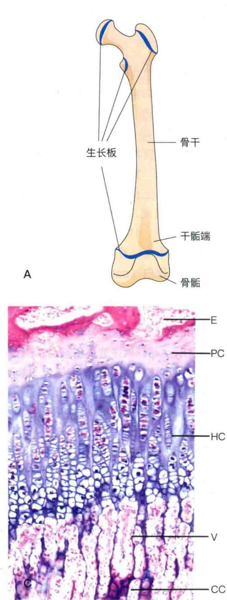 
图26-1 长骨的解剖结构。A.股骨解剖结构示意图。B.股骨近端冠状面显示长骨各解剖结构部位：股骨头的骨骺和大转子的骨突与干骺端的界线为各自的生长板；骨皮质和骨髓腔显示良好，骨髓腔为松质骨，下端逐渐变窄形成股骨的骨干，此处缺乏骨组织，由骨髓组织填充。C.骨骺切面显示软骨细胞增生区，该区域下方肥大的软骨细胞呈柱状排列，底部可见血管长入钙化基质。E，骨骺(epiphysis)；PC，增生的软骨细胞（proliferative cartilage）；HC，肥大的软骨（hypertrophic cartilage)；CC，钙化软骨（calcified cartilage)；V，血管长入(vascular invasion)。D.哈弗管（Haversian canal）包含一条小静脉（左侧薄壁直径较宽血管）和一条小动脉（右侧厚壁直径较窄血管）。E.福克曼管（Volkmann canals）。在这张图中，三条福克曼管彼此平行并与骨皮质垂直（v），可见哈弗管的开口
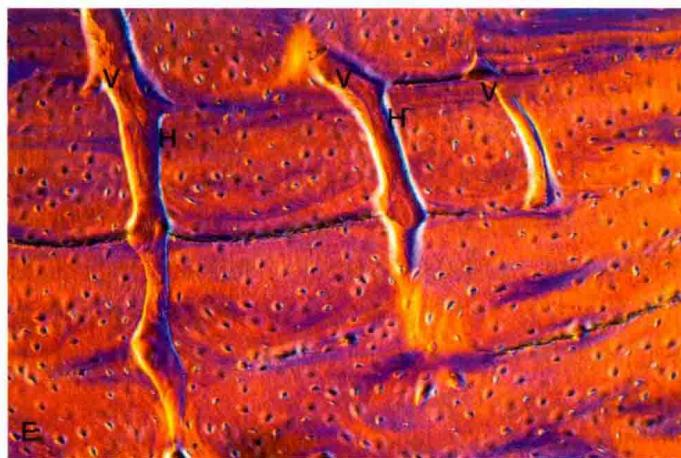
细胞之间通过这些细胞突起相互联系（图26-2C）。骨细胞可能有识别机械力量作用并做出反应的功能，也是骨骼再建重要的调节者。
（4）破骨细胞：破骨细胞是唯一的骨吸收细胞。
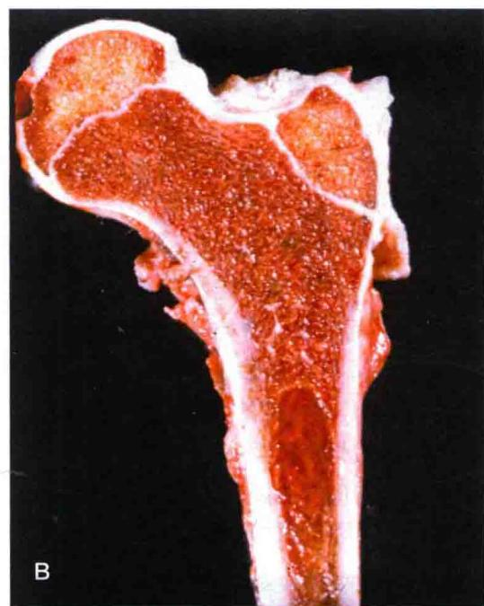
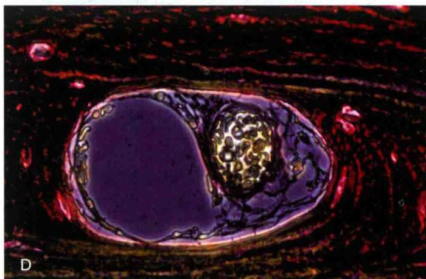
起源于造血组织，属于单核巨噬细胞家族成员，细胞多核、胞质内包含许多溶酶体，富含水解酶，位于骨质表面小的凹陷内，这些凹陷被称为骨吸收陷窝（Howship小凹）（图26-2D）。
只有基质矿化后破骨细胞才能发挥吸收骨组织的作用。衬覆类骨质或未矿化的软骨能保护骨组织不受破骨细胞活性的影响。在佝偻病中（下文），生长板因软骨组织不能钙化、破骨细胞吸收障碍因而增厚。
骨组织不断改建是维持骨骼正常功能的一部分。改建过程由破骨细胞激活引发，破骨细胞的激活需要位于破骨细胞表面的TNF受体样分子（RANK）与位于破骨细胞和间质细胞表面的TNF样配体（RANKL）相互作用。PTH、IL-6、1，25（OH）2D和其他促骨形成刺激因子可上调RANKL的表达水平（见下文）。破骨细胞成熟还需要巨噬细胞集落刺激因子。骨吸收过程中释放的可溶性因子、上文提到的促骨形成分子（比如PTH)辅助招募并激活骨母细胞形成新的骨组织。破骨细胞具有降钙素（calcitonin）的受体，后者可抑制破骨细胞活性。骨骼改建涉及通过将破骨细胞和骨母细胞偶联将新形成的骨取代旧骨，称为骨骼改建单元（bone remodeling unit），该过程可使骨骼能适应机
械应力，保持骨骼强度并调节钙平衡。
5. 骨组织 有两种类型：板层骨和编织骨。两种类型的骨组织可能是矿化骨，也可能是非矿化骨。非矿化骨称为类骨质。
（1）板层骨：板层骨形成缓慢，结构排列具有高度的组织性，随着骨组织的不断增强，形成成年骨骼。在成年骨骼中除板层骨外的其他骨组织为异常骨。板层骨的定义为： $①$ I型胶原纤维平行排列； $②$ 基质中只有几个很少的骨细胞； $③$ 大小一致的骨细胞位于与胶原纤维长轴平行的骨陷窝内（图26-3）。 
（2）编织骨：编织骨的特点有：①I型胶原纤维不规则排列，因此得名编织骨；②基质中大量成骨细胞；③成骨细胞大小不一，形状不规则（图26-4A、B）。编织骨与板层骨相比，骨质沉积速度快，排列杂乱，抗拉强度低，可作为临时支架发挥支撑作用。成年后骨骼出现编织骨往往是不正常的，提示为骨组织受到某些刺激后产生反应性组织。
# 二、软骨
与骨组织相比，软骨不包含血管、神经和淋巴管。可局灶钙化，在需要的部位提供一定的内在应力。与
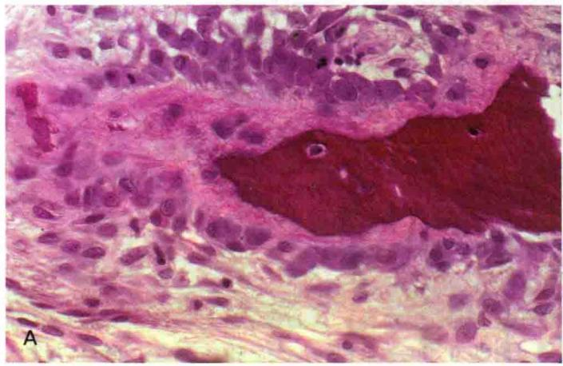
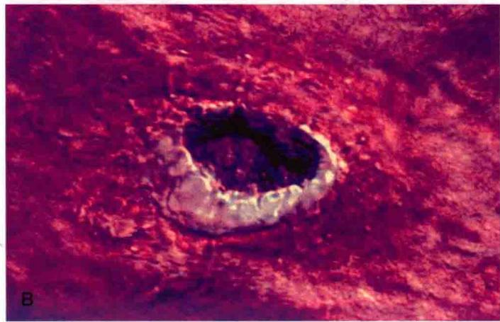
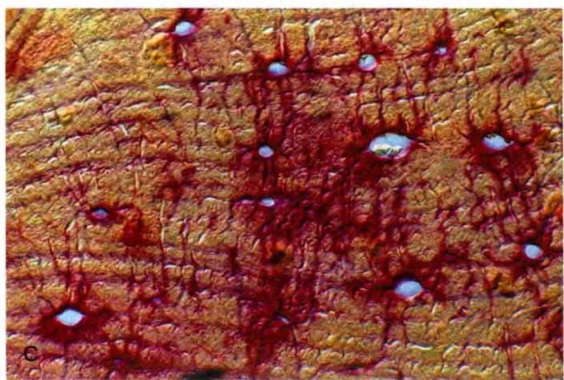 
图26-2 骨组织内的细胞。A.正在形成的、显示一层突出的、肥硕的骨母细胞沿着粉红色类骨质呈线状排列，类骨质下方深紫色层为矿化骨组织。B.成骨细胞。骨细胞表现为由骨基质包围的骨母细胞，围绕细胞的空隙称为骨陷窝。在这个放大倍数下，可见细胞的胞质突起延伸至骨的狭窄通道，称为骨小管。C.在这张图片中可见骨皮质中骨细胞的活动通过骨小管网络进行沟通。D.破骨细胞。位于骨表面的小的扇形吸收凹的多核巨细胞（箭头所示），这些小凹称为骨吸收陷窝（Howship小凹）
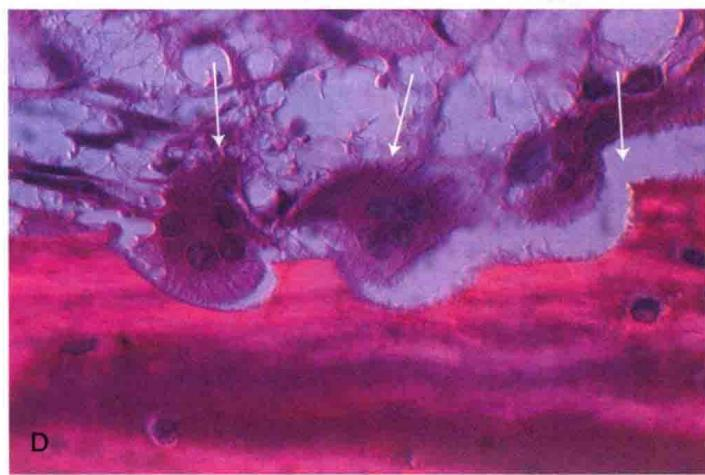
骨相似，软骨可以看作有机和无机双向物质。羟基磷灰石结晶，类似于骨中基质。但是，软骨组织中的有机基质与骨组织中的有机基质大相径庭。本质上，软骨是一种富含水的结构，其中水分子占其重量的 $80\%$ 剩余 $20\%$ 主要为两种类型的大分子，分别是Ⅱ型胶原和蛋白聚糖（见第3章）。水分子含量对于关节软骨的功能是极其重要的，因为它可以增强关节软骨的弹性并起到润滑作用。
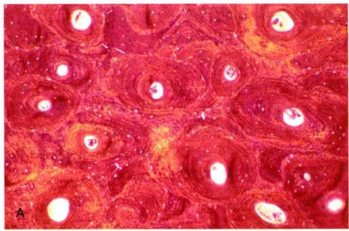
# 三、骨组织形成与生长
骨组织只能通过外加生长方式生长，即由骨母细胞生成的基质沉积于相邻骨表面。与之相比，几乎所有其他组织，尤其是软骨组织，不仅可以通过基质内间质细胞增殖增长，还可以通过外加生长方式增长。胎儿软骨内骨化遵守严格的顺序。
全身骨骼（除顶骨和锁骨外）均由存在于胚胎发育过程中的软骨原基发育而来。软骨最终被重吸收并
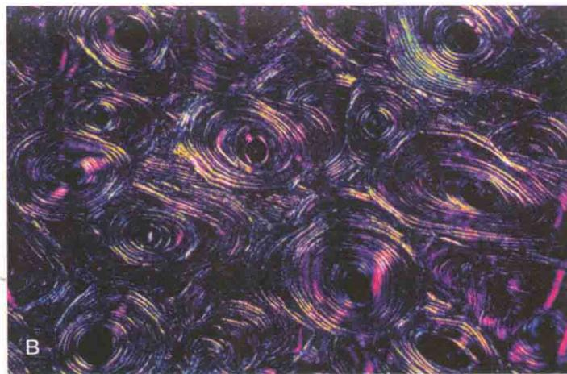
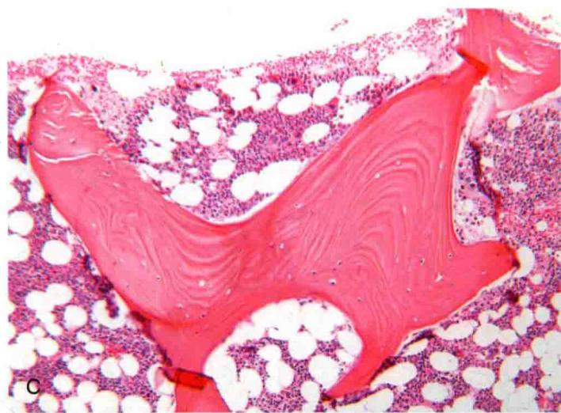 
图26-3 皮质板层骨。A.致密层（皮质）骨板层以哈弗管为中心呈同心圆状排列；B.偏振光镜下同一区域显示胶原纤维呈明暗相间板层状排列；C.亮视野显示单一成熟骨小梁骨松质的骨板层；D.偏振光镜观察显示板层骨明暗相间板层状排列，但这些板层骨呈长板状排列而不是呈同心圆状排列
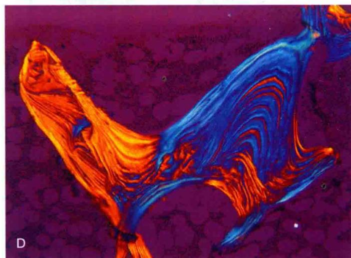
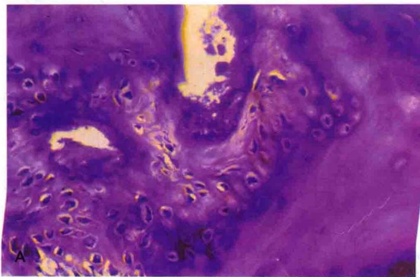 
图26-4编织骨。A.在这个切面，早期骨折由编织骨修复。与右下方成熟骨区域相比，新生骨区域可见很多大小不一的成骨细胞，其中大部分具有明显的陷窝。B.在偏振光镜下观察同一组织切面，可见胶原纤维呈类似于粗麻袋纤维松散排列
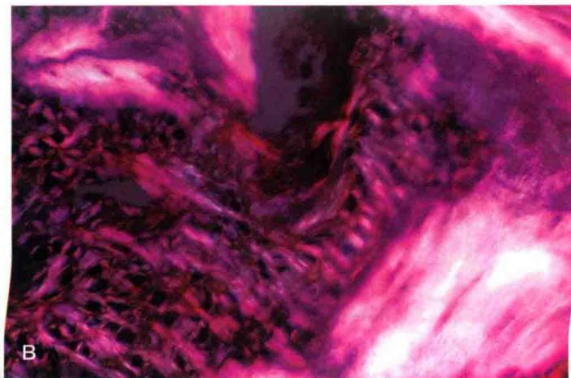
由骨组织取代，这个过程称为软骨内骨化。在长骨，初级骨化中心形成软骨性的核心，周围由编织骨包绕，称为原始海绵状骨或原始小梁状骨。这是骨组织取代软骨组织后的第一次骨组织形成。随着软骨组织的重吸收，次级骨化中心在骨两端形成，又称为骺骨化中心。随着骨端的膨大，在骨端和骨干的夹缝中残留一软骨带。这条软骨带最终分化为生长板，即位于骨干和骨之间的一层变形的（modified）软骨。生长板控制骨骼的长度，最终决定成年后的身高。性激素可诱导生长板闭合，与男孩相比，女孩生长板闭合较早。软骨细胞的自我更新减慢并最终停止，而整个软骨板最后由骨组织取代。
# 四、生长板障碍
1. 软骨发育不全 是一种由于生长板生长停滞引起的遗传性侏儒症。软骨发育不全症是一种短肢型侏儒和巨头畸形综合征，反映软骨正常形成故障，该病为常染色体显性遗传病，是侏儒症最常见疾病类型（患病率 $1:5000$ ），智力和寿命正常，然而一些患者可发展成脊柱后侧凸及其并发症。

【发病机制】软骨发育不全症由位于16号染色体（4p16.3）的FGF受体（FGFR3）基因
激活突变所致。突变组成性抑制软骨细胞分化和增殖，使生长板发育滞后。

【病理】软骨发育不全症的生长板显著变薄，软骨增殖区或缺失或普遍变细。临时钙化带软
骨内骨化速率显著减低。横向骨门密封生长板，由此阻止骨组织形成，导致侏儒症。
有趣的是，次级骨化中心和关节软骨正常，因为膜内成骨未受影响，所以骨膜功能正常，骨长度变短，厚度增加。受同样因素影响，与由面部软骨发育形成的骨组织相比，侏儒症患者头部通常巨大。脊柱长度正常，而四肢异常缩短。
# 2. 与生长板障碍有关的几种其他病变
克汀病：克汀病由孕妇缺碘所致（见第21章），对骨骼生长产生深远的影响。甲状腺激素涉及骨组织形成和生长的细胞因子和其他因子的分泌，在调节软骨细胞、骨母细胞和破骨细胞功能方面发挥作用。克汀病身高的发育受到严重影响，导致侏儒症，四肢与躯干相比不成比例的缩短。
■ Morquio 综合征：大多数黏多糖贮积症（见第6章）由于黏多糖（glycosamino-glycans，糖胺聚糖）沉积于发育中的骨组织而导致骨骼畸形。一个具体的例子就是 Morquio 综合征（IV型黏多糖贮积症），该病导致一种尤为严重的侏儒症，除了牙体缺损外，还可
发生智力低下和角膜浑浊。
■ 坏血病：今天，坏血病（维生素C缺乏症）是一种少见疾病（见第8章）。坏血病骨骼改变反映了骨母细胞功能缺失。由于骨母细胞不能产生正常交联的胶原，编织骨无法形成。
3. 软骨不对称生长 导致脊柱弯曲和软骨向周围组织内生长，例如膝外翻和弓形腿患者，当生长板的某一部分内向或侧向生长，生长速度比其他部分快，就会出现不对称软骨生长。大部分病例为遗传性，但是机械作用力例如生长板附近的损伤会刺激一侧生长加快或生长不对称。除了外观受到影响外，这些生理状况可能需要矫正以预防可能发生的肢体不协调、最终发生关节软骨丢失和关节损毁。
（1）脊柱侧凸和脊柱后凸：脊柱侧凸是脊柱的异常的侧向弯曲，经常发生在青春期女童。脊柱后凸是指前后方向的异常弯曲，当两种情况同时存在时，称为脊柱后侧凸。

【发病机制】脊椎体是由椎体的终板变长（高度）生长而成，椎体的终板相当于长管状骨
的生长板。正在如长管状骨中一样，椎骨体通过骨膜的外加性生长变宽。在脊柱侧凸，由于不明原因，终板的一部分生长速度较其他部分快，从而导致脊柱的侧向弯曲。

【临床表现】脊柱侧弯的治疗方法为应用吊带或内固定的办法对椎骨体施加适当的压力。如果
脊柱侧后弯曲较为严重，患者最终将会发展成慢性肺部疾病、肺心病和关节相关性疾病，其中尤以髋部关节为著。
（2）骨软骨瘤：骨软骨瘤是一种骨骼发育缺陷，由生长板 Ranvier 环缺损所致。单发骨软骨瘤是最常见的病变形式。

【发病机制】Ranvier环位于生长板外周区软骨膜下方，引导软骨向干骺端方向生长。如
果 Ranvier 环缺如或有缺陷，软骨则侧向长入软组织内，形成骨性、有茎的具有软骨帽的骨软骨瘤（图26-5），骨软骨瘤与母体骨的骨髓腔直接延续。

【病理】骨软骨瘤倾向于远离关节面生长。X线检查显示，软骨性肿块与母体骨直接相连，下
方没有骨皮质。组织学上，可见软骨帽，骨性肿块表面被覆纤维膜，后者为软骨膜。活跃的软骨内骨化深达软骨帽，可使骨性凸起加长。
# 五、遗传性多发性骨软骨瘤病（HMO）
HMO是以多发性骨软骨瘤为特征的常染色体显性
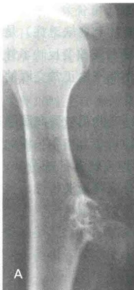 
图26-5 骨软骨瘤。A. 肱骨骨软骨瘤的X线显示病变与骨髓腔直接延续；B. 骨软骨瘤的横截面显示结构紊乱的骨松质上可见覆盖的钙化软骨帽
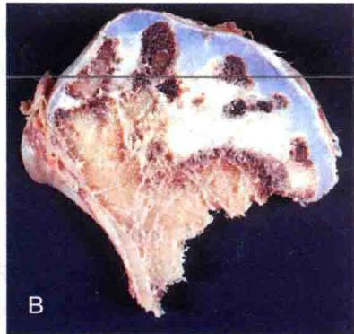
遗传性疾病，为最常见的遗传性肌肉骨骼缺陷性疾病的一种。该疾病由EXT1或EXT2基因功能缺失引起，EXT1或EXT2在正常软骨细胞的增殖中发挥重要作用。该疾病主要发生在男性，异常情况下，来自受累家族看似未受累的女性可能携带致病基因。

【病理】HMO中每个病变单体与孤立性软骨瘤相同。严重者，具有纵向生长能力的生长板发
生横向移位形成骨软骨瘤，可能导致侏儒症的发生。掌骨可能缩短，当病变发生在前臂并干扰腕关节功能时，可导致旋前旋后障碍。渐渐渗入的骨软骨瘤导致双腿不等长和关节功能紊乱，可导致更多的并发症。软骨肉瘤是罕见的并发症。
# 六、塑形畸形：骨硬化病
骨硬化病，又称为大理石骨病或Albers-Schonberg病，是一组异质性的罕见遗传性疾病，特征为异常致密骨组织形成，骨骼质量增加。严重型为常染色体隐性遗传，症状严重，有时致命，累及婴儿和儿童。此型婴儿的主要死亡原因为严重的贫血、脑神经卡压、脑积水和感染。良性型为常染色体显性遗传，发生于成人期或青春期，可有轻度贫血或没有症状。

【发病机制】骨硬化症的骨质硬化是破骨细
胞骨吸收功能障碍导致。该疾病产生的原因
为支配破骨细胞形成或发挥正常功能的基因发生突变，导致破骨细胞骨吸收关键过程——破骨细胞酸化功能缺陷，突变基因包括TCIRG1基因（破骨细胞质子泵；常染色体显性），CLCN7基因（氯离子通道；常染色体隐性）和碳酸酐酶Ⅱ基因（常染色体隐性）。导致骨硬化病的其他基因突变涉及破骨
细胞分化必需的转录因子及细胞因子。由于破骨细胞功能受到抑制，骨硬化病的特征为骨组织呈块状，不透X线，因此称为大理石骨病（图26-6）。这些骨组织极其致密，不透X射线，重量是正常骨组织的 $2\sim 3$ 倍，结构紊乱而容易骨折，不能沿着应力线重塑骨质。矿化的软骨也脆弱易碎。

【病理和临床表现】大体上，骨硬化病的病变骨组织干骺端和骨干增宽形成特征性的“艾氏

瓶（锥形瓶）”畸形。组织学上，骨组织极为不规则，几乎所有区域包含软骨核心。所有骨病
变区域都包含软骨核心。根据突变情况，破骨细胞可能缺如、数量正常甚至含量丰富但都不具有正常功能。骨硬化病中由于异常破骨细胞片状增生或广泛的纤维化取代骨髓组织，骨髓造血功能受到抑制，导致严重贫血甚至全血细胞减少症是由于异常破骨细胞片状增
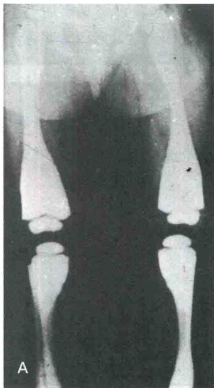
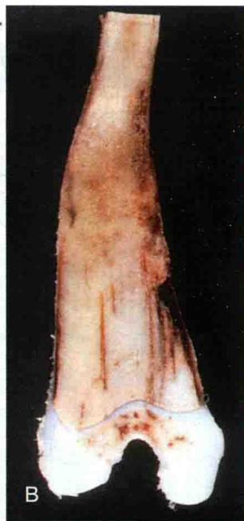
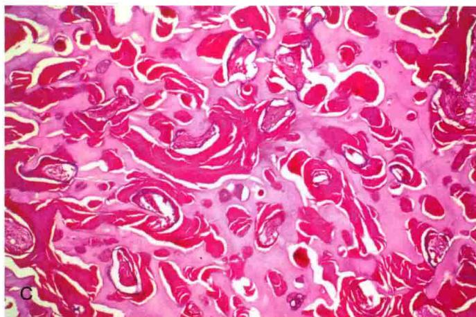 
图26-6 骨硬化病。A. X线照片显示儿童下肢明显的畸形和骨质密度增高，此为“大理石骨病”的典型特征；B. 股骨大体标本显示髓腔被致密骨组织取代；C. 一名患有常染色体隐性骨硬化病儿童的显微照片病变中既保留原有的骨松质（混有骨针），又有继发性的骨松质代替骨髓腔，结果骨小梁排列完全紊乱，骨髓消失
生或广泛的纤维化取代骨髓组织。作为骨髓减少的代偿性反应，肝、脾和淋巴结出现髓外造血。骨硬化病治疗方法是骨髓移植，通过骨髓移植可以生成有活性功能的破骨细胞克隆。
# 七、骨成熟延迟
1. 成骨不全症（OI）与I型胶原异常有关，OI指的是一组主要为常染色体显性遗传性结缔组织疾病，由I型胶原基因突变所致，病变累及骨骼、关节、耳、韧带、牙齿、巩膜及皮肤（第6章）。根据基因改变、组织结构特点和临床表现，可分为4种类型。

# 【发病机制】OI的遗传缺陷是异质性的，但都累及I型胶原纤维的合成。OI的发病机制
涉及COL1A1和COL1A2基因突变，这两个基因分别位于17号染色体（17q21.3-q22）和7号染色体（7q21.3-q22），编码I型胶原纤维的1链和2链，I型胶原纤维是骨的主要结构。一般来说，突变导致每隔2个残基由其他氨基酸取代I型胶原纤维的必需的甘氨酸。

# 【病理和临床表现】

I型OI：症状最轻，为常染色体显性遗传模式，以出生后多发性骨折、蓝巩膜和听力异常为特征。在一些患者，牙齿畸形也很明显（牙本质发育不全）。由于中耳骨骨折融合限制了听骨活动感觉损失的发病率高。首次骨折通常发生在婴儿开始行走时。一年内由于小幅运动或创伤引起的骨折百次。X线检查显示骨骼极为细小、纤弱、形态（图26-7）。骨胶原抗拉强度减低，矿化异常。
II型OI：是一种致命性的遗传性常染色体显性围生期疾病。婴儿具有特征性的容颜和骨骼畸形。活产婴儿通常一个月内死于呼吸衰竭。几乎所有骨骼在娩出过程及临产子宫收缩中都发生了骨折。
III型OI：是进展性、严重致畸性疾病类型，以多骨骨折、生长迟缓和严重的骨骼畸形为特征。尽管常染色体隐性遗传也有报道（罕见），但该型通常为常染色体显性遗传。出生时即发生骨折，但Ⅲ型OI的骨组织不像Ⅱ型OI骨组织那样脆弱。这些患者因进展性骨骼骨折和严重的脊柱后侧凸最终发展成严重的身高缩短。尽管巩膜出生时可能为蓝色，不久之后变为白色。牙齿畸形常见。
IV型OI：与I型OI相似，除巩膜正常外，表型多变。尽管通常使用二磷酸盐（氨羟二磷酸二钠）治疗OI，促进儿童骨密度改善和缓解临床症状，但是针对OI并没有单一有效的治疗方法。通过骨髓移植骨祖细胞、生长因子治疗和基因治疗来改善胶原合成已经完成临床试验。
2. 内生性软骨瘤病 以多发的软骨性肿瘤为特征。又称为Ollier病，以多发性软骨肿块形成导致骨畸形为特征。这种病变严格来说不是一种骨延迟成熟的改变，而是一种由于透明软骨、软骨原基或来源于生长板的软骨未经软骨内骨化并且在骨组织内残留而引起的病变。其结果是，骨内显示多发性的、透明软骨呈异常排列的（内生软骨瘤）、可见软骨增生区和肥厚区的肿瘤样占位（图26-8）。内生性软骨瘤病，倾向于发生在干骺端，但是随着生长的继续，内生软骨瘤可定居于青少年和成人的骨干。对于内生性软骨瘤是否
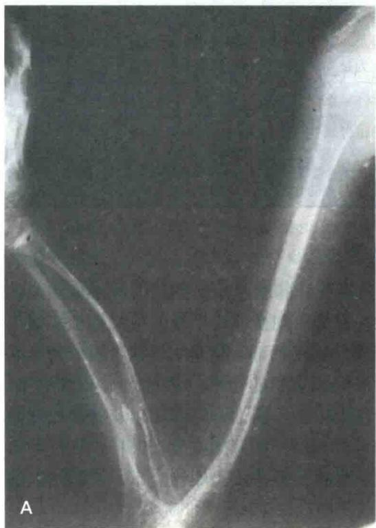 
图26-7成骨不全症。A.X线显示肱骨和前臂骨明显变细，尺骨近端可见骨折后骨痂形成；B.骨折后骨痂的显微镜下显示明显增生的软骨组织（左上），骨皮质变薄，由编织骨组成
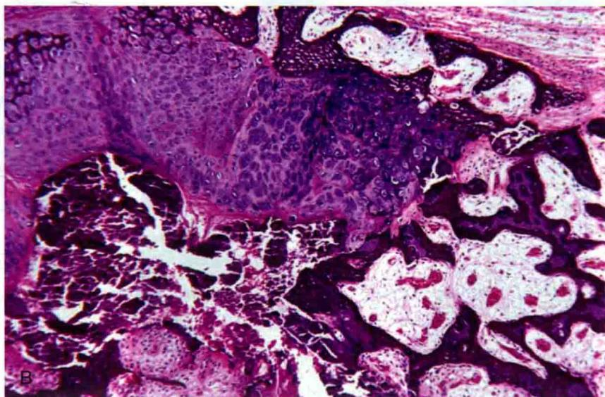
代表一种真正的肿瘤还有不同争议，但在成人，内生软骨瘤显示出向软骨肉瘤变的强烈趋势。
# 八、骨折
骨折是最常见的骨骼病变，定义为骨不连续。垂直于骨长轴的外力可导致横向骨折，沿着骨骼长轴的外力产生压缩性骨折。扭转力导致螺旋形骨折，牵张力联合压缩、剪切力可导致成角骨折及骨折端移位。
骨折愈合 分炎症期、修复期和重塑期，每一期（图26-9）的时间长短主要取决于患者的年龄、骨折的部位、患者整体健康情况和营养状态以及软组织损伤的范围。在骨折修复过程中，除了骨折部位骨组织形成外其他的都代表不完全愈合。

# 【病理】
炎症期：在骨折后最初的 $1 \sim 2$ 天，骨膜、附
近骨骼肌及软组织的血管破裂，导致大量出血。由于骨组织的大血管和皮质血管的破坏，骨折部位骨组织可发生大片坏死。死骨的特征为骨细胞消失和空骨陷窝化。在 $2\sim 5$ 天，出血形成大的血肿，血肿需要被吸收以便于骨折愈合。血凝块外围新生血管开始形成。在第一周结束的时候，大部分凝血块被侵入的血管和早期的纤维化取代机化。
最早的骨组织，几乎总是编织骨，在7天之后形成。相当于骨组织的“瘢痕”。因为骨组织形成需要丰富的
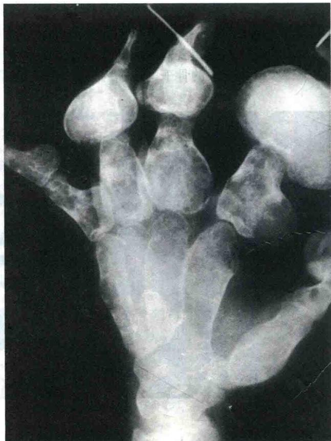 
图26-8 多发性内生性软骨瘤病（Ollier病）。手的放射性照片可见球状隆起，反映的是由透明软骨组成的软骨性肿块，有时混有原始的黏液样软骨
血液供应，所以编织骨骨针开始出现在凝血块的外周。来源于软组织和骨髓组织内的多能间充质干细胞分化为骨母细胞，后者形成编织骨。包含骨组织或软骨组织的肉芽组织称为骨痂。骨髓腔内血肿周围也存在血管组织，也会形成编织骨。
修复期：修复期从骨折后第一周结束，可延续多月，取决于骨折固定及活动程度。到这一期，急性炎症开始消失，多潜能细胞分化为成纤维细胞和骨母细胞。修复从骨折的外周开始向中心部位行进，完成两个目标：机化吸收凝血块以及更为重要的是要形成新生血管，提供骨痂形成的构架，最终实现骨折部位的连接。
重塑期：骨折后数周，骨痂的生长已经使骨折端闭合，重塑开始，在这一期，骨组织重新排列以便于原始皮质得以恢复。偶然情况下，骨组织足够强壮，可达到临床骨折愈合，但从生物学上讲，骨折可能并未真正愈合，可能在之后的数年之内持续进行重构。
# 九、骨坏死（缺血性坏死，无菌性坏死）
骨坏死指的是非感染因素引起的骨细胞、骨髓组织死亡。骨坏死的原因参见表26-1。
表26-1 骨坏死的原因创伤，包括骨折和外科手术栓塞，导致局灶骨梗死系统性疾病，如红细胞增多症、红斑狼疮、Gaucher病、镰状红 细胞贫血以及痛风辐射，内源性的或者外源性的糖皮质激素的应用发生在不同部位的特异性局灶骨坏死-例如:发生在股骨头(Legg-Calve-Perthes病)或者发生在舟骨(Kohler病)器官移植，特别是患有持续性甲状旁腺功能亢进的患者的肾移植剥脱性骨软骨炎，原因不明疾病，关节软骨和其下方骨质离断进 入关节，被认为是局灶骨坏死，最终脱落自体移植及异体移植邻近肿瘤或占位性病变压迫激发的区域血管栓塞特发性因素，如酗酒者头部骨和股骨坏死的高发生率；坏死骨组 织在骨皮质及其下方的骨松质愈合存在差异
# 十、反应骨形成
反应骨是指在骨和软组织受到压力时形成的膜内化骨。肿瘤、感染、创伤或者广泛的或局灶性疾病均可刺激骨形成。反应骨可以是编织骨或者板层骨，取决于反应性骨组织沉积的速率。在慢性感染灶周围，例如慢性骨髓炎中，反应性骨组织可以从骨膜处开始以板层骨的形式一层一层开始构建。同样，良性肿瘤可以引起反应性板层骨形成。相比之下，快速增大的肿瘤更有可能促进反应性编织骨的形成。
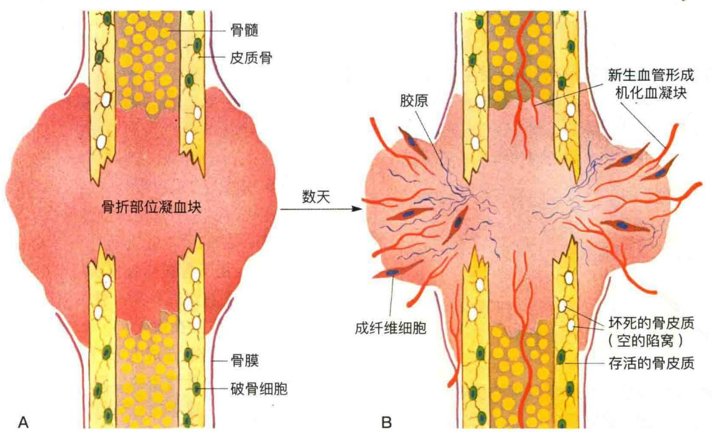
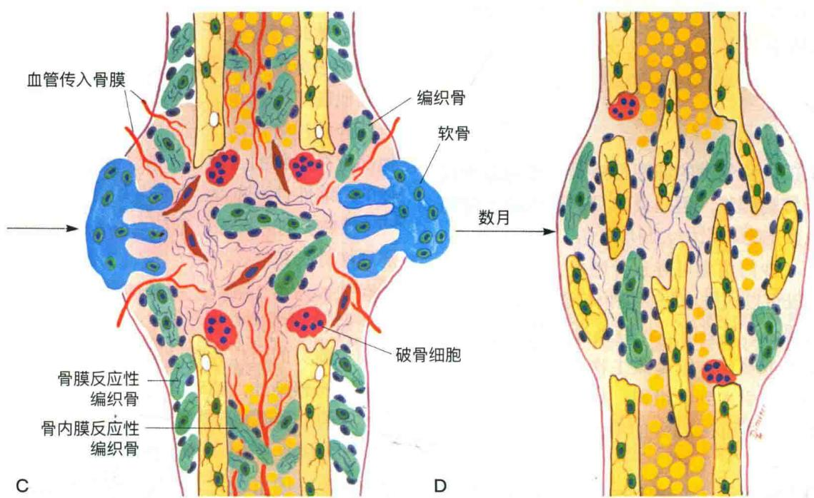 
图26-9骨折愈合。A.骨折发生不久之后，骨膜下、软组织及骨髓腔内可见大量凝血块形成，骨折部位断端呈锯齿状。B.骨折愈合的炎症期，以新生血管形成和血凝块开始机化为特征。骨细胞坏死，骨陷窝空虚。由于骨膜穿通动脉创伤而中断，骨皮质细胞坏死范围远远超过骨折部位。C.骨折愈合修复期，以骨折部位附近软骨痂和编织骨形成为特征，原皮质不平坦的边缘由破骨细胞开始侵蚀并改建。骨髓腔及骨膜外侧血管得以重建，其内包含反应性的编织骨。D.骨折愈合重塑期，皮质功能得以恢复，反应性骨组织可以是编织骨或板层骨，新生骨组织沿着应力线和机械外力作用线排列。骨母细胞和破骨细胞功能活跃
1. 异位骨化（heterotopic ossification，HO）指骨骼系统外骨形成。HO是骨骼系统外部位，如皮肤、皮下组织、骨骼肌和关节周围纤维结缔组织发生的反应性骨[编织骨和（或）板层骨]形成。与任何代谢性疾病无关，患者血钙磷水平正常。HO发生于五大临床背景下：①基因改变；②创伤后；③神经源性疾病；④手术后；⑤独特的反应性病变如骨化性肌炎（见下文）。一种称为进行性骨化性纤维发育不良基因异常疾病的特征为骨组织在多个关节周围大量沉积。HO可发生于血肿内或者创伤后的骨骼肌内。
2. 异位钙化（heterotopic calcification）指软组织内钙盐沉积。放射学显示，异位骨化和异位钙化不同，骨形成的特点为呈骨针状或小梁状排列，而异位钙化呈现不规则、斑点状、无定型性外观。异位钙化倾向于发生在坏死软组织或软骨内，通常放射线表现比骨组织更致密。异位钙化有两种形式：
■代谢性钙化，发生在钙磷乘积升高的情况下，因而高血钙状态和高血磷状态可使正常软组织易于发生钙化。
■营养不良性钙化，可见于异常及损伤软组织，
比如肿瘤、退行性疾病（如动脉粥样硬化）和遭受创伤的区域。
3.骨化性肌炎指骨骼肌在创伤后发生反应性骨形成，骨化性肌炎发生在年轻患者，虽然完全是良性病变，但经常颇似恶性肿瘤。本病呈现自限性过程，预后良好，有自发消退的报道。一经明确诊断，不需治疗。

# 【发病机制】典型病变是由骨骼肌和软组织
些病例可自发出现骨化性肌炎。损伤部位纤维和外周新生血管形成，同出血一起可导致短时间内骨针形成。这些病变与骨折愈合部位最初形成的血肿相似。因为骨化性肌炎常发生在骨组织附近（比如股骨和胫骨），仅根据放射学表现，可能误诊为恶性骨形成肿瘤。骨化性肌炎与肿瘤鉴别的重要特征为周边骨发生成熟现象，而病变中心部位骨未成熟或根本没有骨组织。外周成熟而中央未成熟的现象，称为“分区效应”，明确提示为反应性过程。肿瘤具有反分区效应：最成熟的肿瘤组织位于病变中央。
# 十一、感染
1. 骨髓炎指骨和骨髓的细菌性感染 任何感染性疾病原体都可导致骨髓炎，但是最常见的致病菌为葡萄球菌属。其他微生物，比如大肠埃希菌、淋病奈瑟菌、流感嗜血杆菌、沙门菌也可导致骨髓炎。微生物进入骨组织的途径既可以通过血行感染也可通过直接感染。
（1）直接侵入：在美国，骨髓炎最常见的原因是细菌的直接侵入或蔓延。细菌微生物通过穿透伤、骨折或手术切口直接引入到骨组织。葡萄球菌和链球菌是常见的致病菌，然而在 $25\%$ 的手术后感染中可检测到厌氧菌感染。
（2）血源性骨髓炎：感染微生物可以从身体其他病灶通过血行途径到达骨组织。往往这些病灶本身（例如皮肤脓包或牙齿和牙龈感染）几乎不会带来威胁。血源性骨髓炎累及的最常见的部位是长骨干骺端，比如膝盖、踝关节和髋部。感染主要发生在 $5\sim 15$ 岁的男孩，偶尔也见于较大年龄组。吸毒者可由感染的针头发展成血源性骨髓炎。

# 【发病机制和病理】由于干骺端区域血管供
应独特，血源性骨髓炎主要累及该区域（图26- 10）。如果病原微生物带有剧毒而且持续增殖但位于骨髓腔封闭的空间内，将会造成
对邻近薄壁血管的压力越来越大。这种压力会使该区域的血管供给进一步受到损害，导致骨坏死。坏死区域融合为无血管区域，从而允许细菌进一步增殖。
如果感染没有得到控制，脓液和细菌蔓延至供应骨皮质的骨内膜血管通道并沿着皮质福克曼管和哈弗管扩散。最终，骨膜下脓肿形成，骨膜的穿通动脉被切断进而使骨皮质失活。脓肿在骨膜和骨皮质之间蔓延，使越来越多的骨脱离血液供应，甚至侵入关节。最终，脓肿穿透骨膜和皮肤组织形成引流窦道（图26-11）。延伸到皮肤的窦道可被长入到窦道的表皮上皮化。当发生上皮化时，窦道总是保持开放，不断排出脓液、死骨和细菌。在饱受骨髓炎折磨的非常小的儿童（1岁甚至更小），由于骨膜与骨皮质附着松散，相邻关节经常受累。从1岁到青春期，骨膜下脓肿常见。相邻关节的蔓延也可发生在成人。
（3）脊椎骨髓炎：在成人，骨髓炎经常累及椎骨体。椎间盘不是细菌性骨髓炎的屏障，特别是葡萄球菌引起的感染。感染直接穿过椎间盘，由一个椎骨穿越到下一个椎骨。椎间盘由于脓肿而扩张，当脓肿钻入相邻椎骨体时椎间盘最终被破坏。一半或者更多的脊椎骨髓炎由金黄色葡萄球菌引起。 $20\%$ 涉及大肠埃希菌和其他肠道微生物，大部分起源于泌尿道。易感因素包括静脉注射毒品、上尿路感染、泌尿外科手术和其他部位微生物的血源性扩散。脊椎骨髓炎可导致椎骨体的压缩性骨折和神经功能缺失。
骨髓炎的并发症包括败血症、急性细菌性关节炎、病理性骨折和慢性感染。慢性骨髓炎可能与淀粉样变性有关（见第23章），在长期存在的上皮化的窦道可发生鳞状细胞癌（图26-11）。治疗取决于感染阶段。早期骨髓炎的治疗为静脉滴注抗生素6周以上。手术用来引流感染灶，解除骨内压力，引流对抗生素治疗无反应的脓肿。
2. 骨的结核病（结核性脊椎炎，Pott病）反映其他部位有原发灶。通常，骨的结核病起源于骨外结核病灶，一般为肺或淋巴结（见第9章）。分枝杆菌沿血运播散至骨，仅在极少情况下肺和淋巴结感染通过直接蔓延导致结核性脊椎炎、关节炎和长骨骨髓炎。结核性脊椎炎是儿童结核病的可怕的并发症，病变累及椎骨体，但不影响椎板、脊柱和相邻脊椎。随着抗生素治疗的应用，骨的结核病少见。

# 【病理】结核性脊椎炎的病理改变与其他部位的
结核病相似。肉芽肿首先产生骨髓的干酪样坏
死，后者导致骨小梁的缓慢吸收，偶尔，导致骨的囊性改变。因为很少或没有反应性骨形成，受累脊椎通常塌陷，导致脊柱后凸和脊柱侧凸畸形。压缩性骨折而非微生物侵入导致椎间盘压碎、毁坏。过去典型的“驼背”经常是Pott病的受害者。
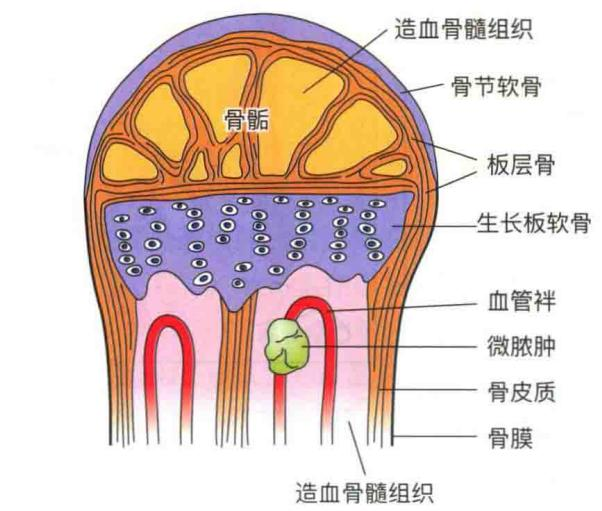 
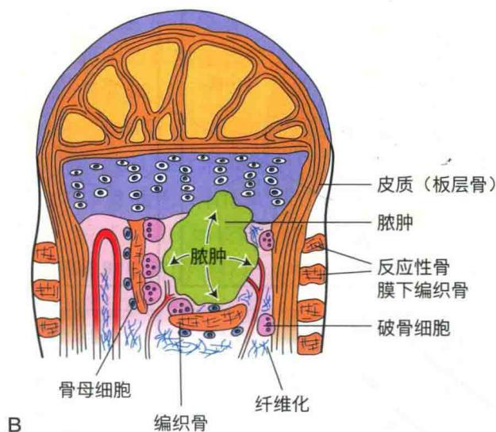 
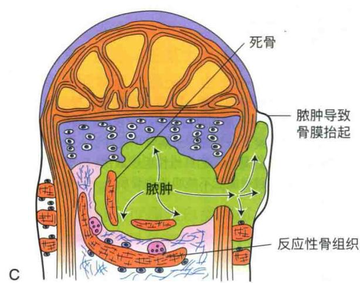 
图26-10血源性骨髓炎的发病机制。A.骨、干骺端和生长板都是正常的。毛细血管袢处形成一个小的、脓毒性的微小脓肿形成。B.感染病灶的蔓延刺激邻近的骨小梁发生吸收。编织骨开始包围病灶。脓肿扩展到软骨刺激骨膜形成反应骨；C.脓肿继续穿透骨皮质扩张进入骨膜下组织，切断为骨皮质供血的穿通动脉，从而导致骨皮质坏死；D.脓肿继续扩张，侵蚀关节腔、骺端及皮肤形成引流窦道。坏死骨组织称为死骨。死骨周围包绕的有活力的骨组织称为包壳
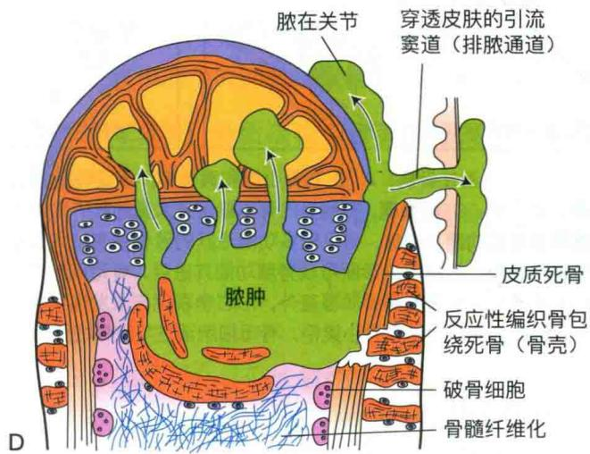
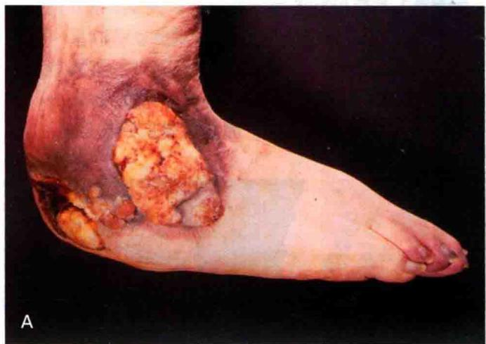 
图26-11慢性骨髓炎。A.在患有慢性骨髓炎的患者，受感染骨组织上被覆的皮肤溃烂，脚跟上方引流窦道（暗区）明显；B.脚截肢后，矢状切面显示引流窦道（直线箭头）一端为感染骨组织，另一端为溃烂皮肤表面，灰白组织（曲线箭头）为发生在皮肤的浸润鳞状细胞癌
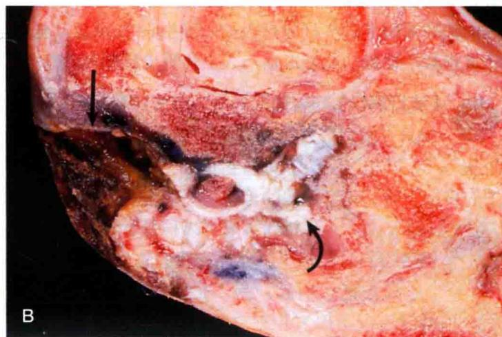
# 第二节 代谢性骨病
代谢性骨病的定义为代谢紊乱导致的继发的对骨骼结构的影响的骨病，包括骨量减少（由于合成减少
或破坏增加）、骨矿化程度减弱，或者两种情况同时存在。因为代谢性骨病是系统性的，虽然病变程度在骨骼不同部位可能会有差异，但是任何骨做活检均可发现异常（图26-12）。
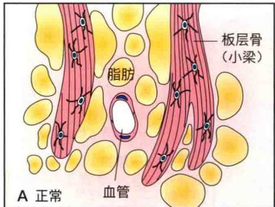
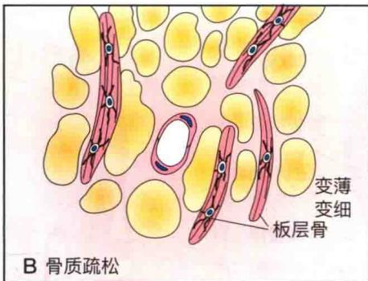
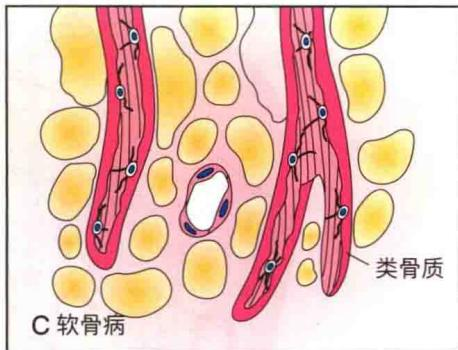
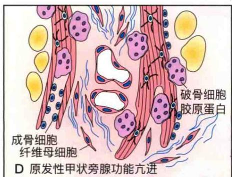 
图26-12 代谢性骨病。A. 正常骨小梁和黄骨髓，小梁骨呈板层状结构，可见均匀分布的骨细胞。B. 骨质疏松症，板层骨显示不连续的、细薄的骨小梁。C. 软骨病，板层骨的骨小梁可见大量的非矿化骨组织（类骨质），这些类骨质层加厚覆盖骨小梁表面的面积比正常的大；D. 原发性甲状旁腺功能亢进症，可见较多功能活跃的破骨细胞钻入骨小梁，吸收板层状骨小梁。破骨细胞分隔骨小梁并钻入骨小梁中，该过程称为分割性骨炎，可被用来诊断甲状旁腺功能亢进症。骨母细胞明显活跃，骨髓组织被邻近骨小梁的纤维性组织取代；E. 肾性骨营养不良，除骨小梁表面可见显著的类骨质覆盖外，形态学表现与原发性甲状旁腺功能亢进症相似，破骨细胞不能吸收类骨质，一旦骨小梁表面类骨质层缺失，破骨细胞就会钻入骨小梁中。骨母细胞活性与破骨细胞相关，增生也明显活跃
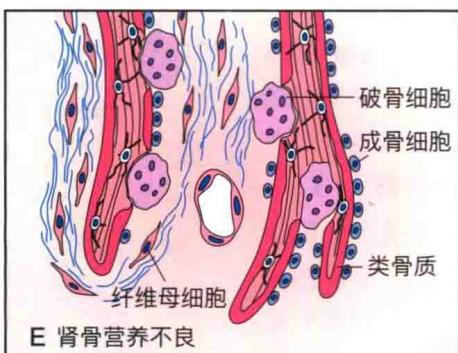
# 一、骨质疏松
骨质疏松症是一种代谢性骨病，表现为广泛的正常矿化骨数量减少以致不能提供足够的机械支持。剩余骨组织矿化基质与非矿化基质（比如类骨质）比例维持正常。无论潜在原因是什么，骨质丢失最终导致骨折是骨质疏松症的特征性改变（图26-13）。骨质丢失的致病原因多种多样包括吸烟，维生素D缺乏，低体重指数，性腺功能减退症，久坐和糖皮质激素治疗。

【流行病学】随着预期寿命的增加，骨质疏松症
及其并发症成为重大公共卫生问题。不分性别，125岁和35岁之间达到顶峰，在50岁或60岁开始下降。年老导致的骨量丢失发生在所有种族，人种和白人人种相比，黑人种骨量峰值较高、质疏松的可能较小。女性骨量丢失分为两个阶段：个阶段由绝经引起，另一个阶段与衰老有关。情况不仅可以发生在女性，还可发生在男性。
骨量丢失达到一定程度，可以诊断骨质疏松，此时负重骨容易发生骨折。最常见的骨折发生在股骨颈和股骨粗隆区域（髋部骨折，参见图26-13）、椎骨体和桡骨远端（Colles骨折）。在美国白人中， $15\%$ 的80多岁的人、 $25\%$ 的90多岁的人发生过髋部骨折。女性发生髋部骨折的风险是男性的两倍，但在黑人人种和一些亚洲人种中，两性间骨质疏松的发生率没有差
异。与其他骨质疏松导致的骨折相比，髋部骨折导致的患病率和死亡率是最高的（高达一年内 $20\%$ ）。特别引人注目的是，女性与男性相比发生脊椎骨折的比例为8：1；一部分绝经早期的女性有特殊罹患脊椎骨折的风险，这种情况在中年男性罕见。

【发病机制】骨质疏松症通常反映相对于骨
质形成来说的骨质吸收增强。因此，这一
类疾病应当看作骨质重塑不足以取代所有被吸收的骨组织。骨质疏松症既可以被归类为原发性疾病也可被归类为继发性疾病。原发性骨质疏松症是到现
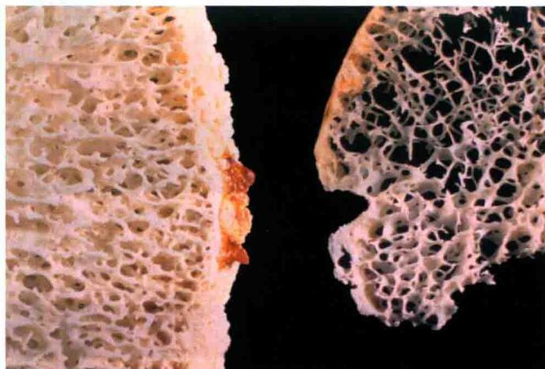 
图26-13 骨质疏松症。82岁患有骨质疏松症的老年妇女的股骨头：（右）可见股骨颈骨折；（左）同一厚度的正常对照组切面
在为止更为常见的疾病种类，原因不明，主要发生在绝经后妇女（1型）和老年人（不分性别）（2型）。继发性骨质疏松是一种与明确病因有关的异常情况，包括多种内分泌和遗传异常（见下文）。
1型原发性骨质疏松症，由破骨细胞活性的绝对增加引起。在绝经后早期，雌激素撤退导致骨髓基质细胞来源的细胞分泌细胞因子，这些细胞因子招募并激活破骨细胞。这些细胞因子被认为对雌激素敏感，包括IL-1、IL-6、TNF和巨噬细胞集落刺激因子（图26-14）。 
2型原发性骨质疏松症，又称为衰老性骨质疏松症，与1型相比发病机制更为复杂。通常出现在70岁以后，反映骨母细胞功能减退而不是破骨细胞活性增强。
原发性骨质疏松症与许多影响骨量峰值和骨量丢失速率的因素有密切关系。
■遗传因素：就特定的某个人来说，导致临床上显著的骨质疏松症发展的原因，占比重最大的是骨的最大量，骨的最大量又称为“骨量峰值”。一般来说，男性骨量峰值大于女性，黑人人种骨量峰值大于白人人种和亚洲人种。很大程度上，骨量峰值的形成取决于遗传因素。维生素D受体、Col1A1胶原基因、α雌激素受体、IL-6和低密度脂蛋白受体相关蛋白5的序列变异与骨矿盐密度差异显著相关。这些位点中的几种序列变异（如维生素D和IL-6）与环境因素及激素因子（如钙摄入量、雌激素）相互作用调节骨矿盐密度。这样，环境因素和基因分型在决定骨量峰值和骨质疏松发生风险中起到一定作用。
钙摄入量：在美国过去的50年，绝经期妇女平均钙摄入量低于针对女性推荐的 $1200\mathrm{mg / d}$ 的量。然而，鉴于一系列与对照组之间的对比研究，这个明显的不足是否有助于骨质疏松症的发生还存在争议。虽然如此，仍然推荐不论是绝经前还是绝经后女性都应该增
加钙和维生素D的摄入量。
钙吸收和维生素D：随着年龄增加，肾小管对PTH的反应减弱，PTH对1-羟化酶刺激减少，肾1-羟化酶活性减低，1-羟化酶催化1，25（OH）2D的形成，1，25（OH）2D形成减少，小肠钙吸收量随之减少。 
■ 体育锻炼：体育锻炼对于维持骨量必不可少。因此，关节制动（如长期卧床，石膏固定），引起骨的加速丢失。目前的诊疗指南中推荐体育锻炼为维持老年人骨骼力量的有效方法。 
■ 环境因素：女性患者中，吸烟与骨质疏松症发病率增高有关，原因可能是吸烟导致有活性的雌激素水平下降（见第8章）。
综上所述，原发性骨质疏松症的两个主要的决定因素为绝经后妇女雌激素缺乏和两性衰老过程。这些因素产生作用的可能的机制概括在图26-14中。
【病理学】骨质疏松症患者类骨质与矿化骨的比例正常。脊柱骨松质含量丰富，骨质疏松改变在此处通常最为明显。椎骨体不伴有骨折时，两侧终板轮廓可见，但缺乏骨松质；伴有骨折时可导致脊椎畸形，前端嵌入或塌陷。组织结构上，骨质疏松症患者皮质骨变薄，编织骨骨小梁减少、尺寸变小。而老年性骨质疏松症倾向于骨小梁厚度变薄，绝经后骨质疏松症骨小梁与骨小梁之间连接中断。组织切片中，骨小梁连接的丢失形成骨小梁孤岛（图26-12）。
【临床表现】绝经后骨质疏松症通常发生在绝经后10年内，而老年性骨质疏松症通常70岁后发病。直到发生脊椎、臀部骨及其他骨的骨折大部分患者才意识到患有骨质疏松症。然而，高敏感性筛查技术的应用，实现了对骨质疏松症的早期诊断。轻度外伤后甚至提重物后即出现脊椎体压缩性骨折，多次骨折使患者身高变矮并发生驼背。血钙磷水平保持正常。
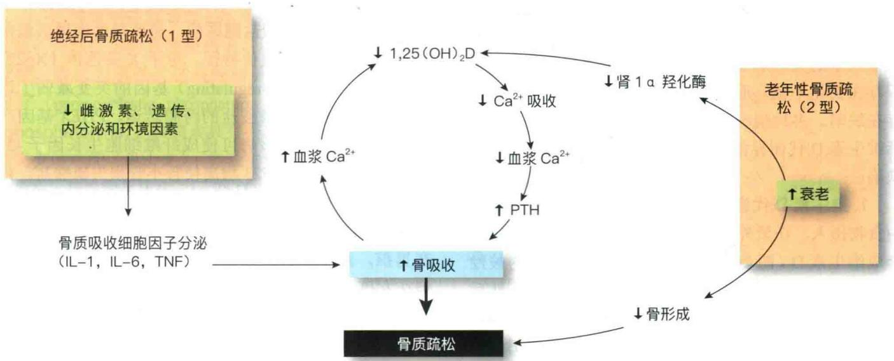 
图26-14原发性骨质疏松症的发病机制。 $\mathrm{Ca^{2 + }}$ 钙；IL.白介素；PTH.甲状旁腺激素；TNF.肿瘤坏死因子
雌激素治疗有效，但存在争议，激素治疗作为预防绝经后骨质疏松症的手段，可使患乳腺癌和子宫内膜癌的风险轻度升高；已经研发出其他特异性抗骨质疏松的药物。双磷酸盐类（bisphosphonates）是目前应用最为流行的治疗药物。所有现有的成功抗骨质疏松的药物或阻滞或减慢骨质吸收速率，但却不能刺激骨质形成。因此，药物只能预防疾病发生进展，但却不能治愈已患有骨质疏松的患者。在老年患者的膳食中补充钙可使骨质疏松导致骨折的风险减少一半。
# 继发性骨质疏松症反映骨外代谢紊乱
骨质疏松的形成与多种因素相关。继发性骨质疏松症的原因包括药物治疗的不良反应、内分泌疾病、饮食失调、肢体制动、骨髓相关性疾病、胃肠、胆道或肾疾病及肿瘤。
内分泌紊乱：最常见的类型为医源性，使用皮质醇所致。骨质丢失也可源于内源性糖皮质激素增多，例如库兴综合征（见第21章）。雌激素是维持骨量的关键激素。不论男女，雌激素缺乏都是老年人骨量丢失的主要原因。雌激素缺乏或具有生物活性的雌激素水平低导致老年男性骨量减少。甲状旁腺功能亢进和甲状腺功能亢进症均可导致破骨细胞活性增加。 
■ 恶性血液病：恶性血液病：多种血液系统肿瘤伴有显著的骨丢失，尤其是多发性骨髓瘤。多发性骨髓瘤的恶性浆细胞分泌破骨细胞活化因子，后者引起继发性骨质疏松症。某些白血病和淋巴瘤也可导致骨质疏松症。 
■营养吸收不良：胃肠道和肝脏疾病导致营养吸收不良，血钙、磷及维生素D吸收减少，引起骨质疏松养吸收。 
■酒精中毒：长期酗酒可导致骨质疏松症的发生，酒精可直接抑制骨母细胞活性，还可能干扰钙的吸收。
# 二、软骨病和佝偻病
软骨病（osteomalacia）发生在成年人，以新形成骨基质矿化不足为特点。佝偻病（Rickets）指的是发生在儿童的类似病变，后者生长板未闭合，不仅骨组织存在钙化不良，而且生长板的软骨基质钙化过程也存在缺陷。多种情况可引起软骨病和佝偻病，其中包括维生素D代谢异常、血磷酸盐低、矿化过程本身的缺陷。
1.维生素D代谢对骨组织钙化的影响维生素D由食物摄入，在紫外线照射下皮肤内的7-脱氢胆甾醇合成维生素D（图26-15），维生素D首先在肝内被羟基化形成主要的循环代谢物25-羟基维生素D，然后在肾近端小管再次被羟基化，产生有活性的1,25（OH） $_2\mathrm{D}$ ，即使食物钙摄入不足的情况下，阳光照射仍能提供足够的维生素D。
1，25（OH） $_2$ D的受体不仅存在于靶器官，如肠、骨和肾，而且在多种细胞中均有表达。1，25（OH） $_2$ D是通用的分化诱导剂，可促进造血细胞和表皮细胞的成熟。在小肠，1，25（OH） $_2$ D促进钙磷吸收。1，25（OH） $_2$ D可促进破骨细胞成熟。1，25（OH） $_2$ D与PTH协同作用，维持骨骼适当钙化所需要的血钙磷水平。血钙浓度是决定1，25（OH） $_2$ D形成的关键决定因素。血钙水平降低刺激PTH的释放，后者促进肾小管合成1，25（OH） $_2$ D。 
2. 多种原因可导致维生素D缺乏症 维生素D缺乏症可能原因有：①阳光照射不足；②饮食摄入不足；③肠吸收不良以及遗传性和获得性维生素D代谢紊乱。 
■ 佝偻病：在西方国家富含维生素D的鱼肝油的使用以及在牛奶和其他食物中加入维生素D等方法有效地结束了佝偻病的大范围发病。 
肠吸收功能不良：小肠固有的疾病、肝内胆汁淤积、胆道阻塞、慢性胰腺功能不全是美国软骨病发生最常见的原因。 
■遗传性维生素D代谢紊乱：肾脏维生素D1位羟基化功能缺陷（维生素D依赖性佝偻病I型）或靶器官对to1，25（OH） $_2$ D反应迟钝（维生素D依赖性佝偻病Ⅱ型）。两者发病较早，均可干扰维生素D代谢过程，为常染色体隐性疾病。 
■获得性维生素D代谢紊乱：包括肾1-羟基化功能缺陷和终末器官反应迟钝。羟基化功能减弱的其他原因有甲状旁腺功能减退、肿瘤引发的软骨病、慢性肾病和衰老。少数情况下抗惊厥药物治疗可加剧维生素D的缺乏，使得癫痫的治疗变得复杂。 
3. 肾磷酸盐代谢紊乱干扰维生素D代谢 肾近端小管重吸收磷酸盐减弱，导致低磷酸盐血症，从而引起佝偻病和软骨病。 
（1）X-Linked低磷酸盐血症：又称为维生素D抵抗性佝偻病或磷酸盐糖尿病，是遗传性佝偻病最常见的类型，呈显性遗传特征。位于X染色体（Xp22）的PHEX（phosphate-regulating）基因的突变减弱了近端肾小管细胞腔面磷酸盐的跨膜转运。PHEX基因产物是一种蛋白酶，该酶可使成纤维细胞生长因子-23（FGF23）失活。FGF23增高使肾小管损失磷酸盐。肾性磷酸盐丢失对于该病的发展极其重要，除此之外，骨母细胞功能受损，对疾病的进展也起到一定的作用。在男孩，童年时代就显示出佝偻病的全部典型症状，但在女孩，仅表现为低磷酸盐血症的症状，显微镜下，患者骨组织显示严重的软骨病，可见类骨质层增宽。 
（2）Fanconi综合征：Fanconi综合征是一种先天性代谢缺陷，以肾重吸收障碍导致磷酸盐、葡萄糖、
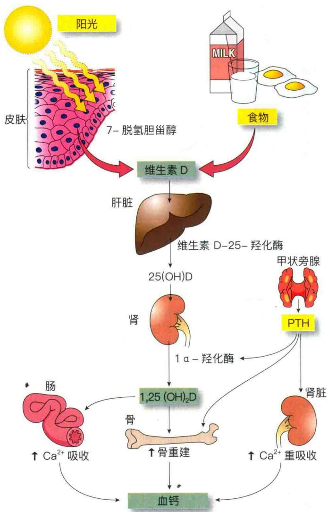 
图26-15 维生素D的新陈代谢和血钙的调节。Ca²⁺.钙; PTH. 甲状腺激素
碳酸氢盐和氨基酸大量丢失为特征，肾小管酸中毒导致佝偻病和软骨病。Fanconi综合征的病因包括肝豆状核变性（Wilson病）、酪氨酸血症、半乳糖血症、糖原贮积病和胱氨酸病。如铅或汞中毒、淀粉样变性和Bence-Jones蛋白尿等，获得性肾小管损害可导致磷酸盐大量丢失。
（3）肿瘤相关软骨病：本病是一种磷酸盐消耗综合征，与软组织和骨肿瘤相关，这些肿瘤绝大多数为良性，偶尔为恶性。这些肿瘤分泌副瘤高磷酸盐尿因子（paraneoplastic phosphaturia factors）即磷调素(phosphatonins)。磷调素具有类似于PHEX基因遗传性突变的功能（见上文）。实验室特征性改变为低磷酸盐血症、高磷酸盐尿症、1，25（OH） $_2$ D血清浓度降低、血清碱性磷酸酶水平增高。切除原发肿瘤经常可以治愈。

# 【病理】
软骨病：软骨病，同骨质疏松一样，可呈现骨纤维的放射学改变。如在骨质疏松中一样，唯一的可能为椎骨压缩性骨折和骨皮质变薄。软骨病特征表现为Milkman-Looser综合征的假性骨折。这
些假性骨折为X线可透过的横向缺损，最常见于长骨的凹面股骨颈内侧面坐骨和耻骨支、肋骨和肩胛骨。显微镜下软骨病矿化缺陷导致类骨质层过度增生，不仅厚度增加，而且类骨质层覆盖骨小梁的比例也增大（图26-12）假骨折区可见丰富的类骨质，可作为真性骨折的着力点。这些区域不形成骨痂，且不贯穿骨的整个直径。
佝偻病：佝偻病是一种儿童疾病，因而引起骶板软骨的广泛改变（图26-16），这些骶板软骨并不能如期充分钙化。由于破骨细胞活性不能吸收软骨生长板，软骨钙化区和增生肥厚区持续生长。结果，生长板显著增厚、不规则、呈分叶状。软骨内骨化进展非常缓慢，优先发生在干骺端的周边部分，形成一种火焰状、杯状的骺端。原发性海绵骨由板层骨或骨松质组成，重要的是，仍然保持未矿化的状态。
显微镜下，生长板显示明显变化。静止区正常，但软骨增生区被严重扭曲，软骨细胞丰富、排列紊乱，间隔以少量基质。由软骨增生肥大产生的分叶状的肿块与生长板的不断增宽有关，约为正常生长板宽度的 $5\sim 15$ 倍。临时钙化带边界不清，仅有最小限度的原始骨松质形成。增生软骨形成的肿块扩展到干骺区，未见明显血管长入和未出现破骨活性。

# 【临床表现】
软骨病：软骨病的临床诊断往往很困难。患者缺乏特异性，诸如肌肉无力、弥漫性疼痛。在轻病，仅可见到骨组织中缓慢进展的改变，许多患者完全没有症状。在晚期病例，常见位置不确定痛和压痛，尤以脊柱、盆骨和四肢近端为著。重症肌肉无力和肌张力减退，走路呈现摇摆步态，这些患者不能行走。
佝偻病：患有佝偻病的儿童对周围缺乏兴趣、易激且注意力不够集中。喜欢久坐不动，呈现类似佛祖的姿势。他们身材矮小，伴有骨组织和牙齿特征性的改变。颅骨变得扁平，额骨突出（额部隆起）、骨缝明显增宽是其典型表现。延迟出牙与龋齿和釉质发育不全有关。胸部呈现典型的佝偻病性串珠（由于肋软骨的扩大导致肋骨软骨连接处呈现串珠样外观），下肋膈膜附着处凹陷。鸡胸反映了胸骨的外向弯曲畸形。全身肌肉松弛，腹部薄弱呈现“大肚皮”，四肢缩短变形，手臂和前臂严重弯曲，并且经常发生骨折。
# 三、原发性甲状旁腺功能亢进症
甲状旁腺功能亢进是一种代谢性骨病，特征为不适当的甲状旁腺激素的分泌导致广泛的骨质吸收。由于住院患者常规筛查血钙异常，很少遇到严重的原发性甲状旁腺功能亢进的病例，临床上显著的骨
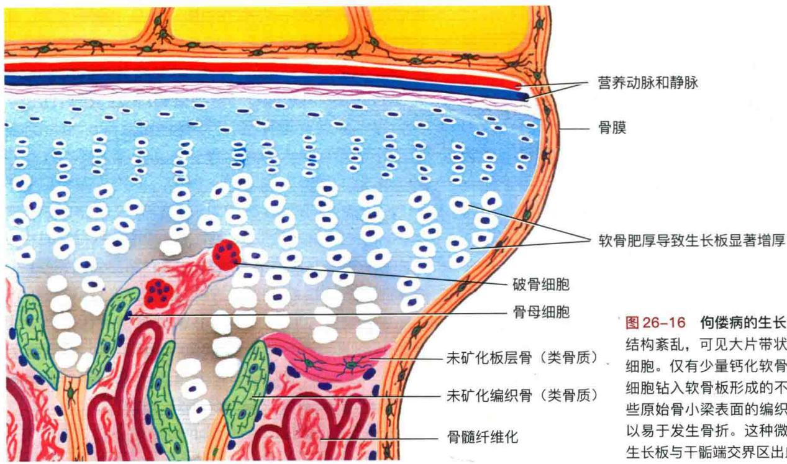 
图26-16 佝偻病的生长板。生长板变厚，结构紊乱，可见大片带状增生肥大的软骨细胞。仅有少量钙化软骨，因此可见破骨细胞钻入软骨板形成的不规则的穿孔。某些原始骨小梁表面的编织骨未被矿化，所以易于发生骨折。这种微小骨折经常导致生长板与干骺端交界区出血
组织病变罕见。原发性甲状旁腺功能亢进的组织学改变称为纤维性骨炎。纤维性骨炎的名称适用于所有显著加速的骨骼重塑的病变，可见于Paget病和几乎所有（ $90\%$ ）原发性甲状旁腺功能亢进由一个或多个甲状旁腺腺瘤引起（见第21章）。PTH促进磷经过尿液排泄，刺激破骨细胞活性及骨质吸收，形成特征性的高血钙和低血磷。
PTH调节细胞外钙并由此影响到骨、肾和（间接）肠。
骨：PTH可以通过现有的破骨细胞增加骨吸收来动员骨钙（体内钙主要的储存库），并从破骨细胞前体细胞组织细胞中招募新的破骨细胞。招募是间接的并由RANK信号通路介导（见上文）。在病理情况下，PTH的大量释放和持续的RANK-L分泌阻止破骨细胞凋亡，延长破骨细胞的生存期、增加破骨细胞的活性，结果导致骨量净损失。
肾：PTH促进肾远曲小管升部段和颗粒部重吸收钙，促进近曲小管和远曲小管分泌磷酸盐，增加近曲小管1-羟化酶的活性，由此促进1，25（OH） $_2$ D的合成。
肠：PTH不能直接作用于肠，但可通过促进肾脏合成1，25（OH） $_2$ D来间接促进肠吸收钙。

【发病机制和病理学改变】纤维性骨炎的组织发生可分为三个时期。
■ 早期：初期，PTH水平升高，激活破骨细胞，吸收骨组织，该过程称为分割性骨炎
(图 26-12, 图 26-17A) 同时, 胶原纤维沉积在骨髓腔骨内膜下。
■纤维性骨炎：在第二阶段，小梁状骨被吸收，骨髓消失，代之以疏松纤维化组、含铁血黄素细胞
沉积、微小骨折导致的出血以及反应性骨组织形成。
囊性纤维性骨炎：随着原发性甲状旁腺功能亢进症的疾病进展和出血不断发生，最终发生囊性退行性改变。包含反应性编织骨和含铁血黄素细胞的纤维化区域常可见多量破骨巨细胞。根据疾病的大体表现，该病变又称为棕色瘤（图26-17B）。这种病变并不是肿瘤而是甲状旁腺功能亢进症终末期的修复性反应。
大部分患有原发性甲状旁腺功能亢进症的患者骨骼的X线表现正常。一些患者显示骨皮质呈斑驳状改变，如颅骨外板、末端指（趾）及掌骨表面不规则磨损。一种独特的特异性放射学改变指的是骨膜下骨吸收，骨膜下皮质外表面明显，是分割性骨炎的放射学表现。牙槽骨周围骨质的吸收导致牙齿硬骨板消失是一种X线检查众所周知的表现。囊性纤维性骨炎的经典特征为存在多发性、局限性、溶骨性病变，这些病变主要为出血性囊肿形成或纤维组织肿块形成。这些偏心性的、界线清楚的病变由骨的骨膜性外壳与软组织分隔。
【临床表现】原发性甲状旁腺功能亢进症的症状与钙稳态异常有关，被总结为“stones，bones，moans and groans”。“stones”指的是肾结石，“bones”指的是骨骼病变，“moans and groans”描述的是精神抑郁和其他与高钙血症相关的异常，而“moans”描述精神病性抑郁症和其他与高钙血症有关的精神异常，“groans”描述与血清钙高水平有关的胃肠道功能失调。
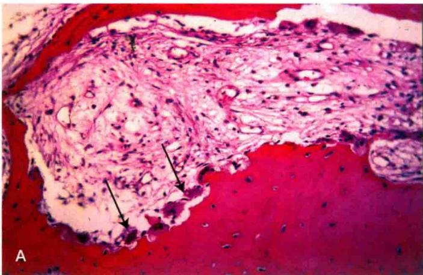 
图26-17原发性甲状旁腺功能亢进症。A.致密骨的切面显示haversian管道被吸收。可见较多破骨细胞（箭头）和明显的间质纤维化。B.棕色瘤的组织切面显示富于细胞的纤维性间质中可见大量巨细胞。组织中随处可见散在的红细胞
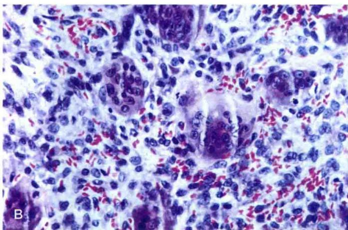
# 四、肾性骨病
肾性骨病是一种复杂的代谢性骨疾病，发生在慢性肾衰竭的患者。严重的肾性骨病最常见于长期透析维持的患者，由于存活时间较长，骨的病变明显（图26-12）。肾性骨病的无力型亚型的特征为骨重建停止。大于 $40\%$ 的血液透析治疗的成年人在骨组织活检中显示伴有肾性骨病。

【病理和临床表现】肾性骨病以不同程度的骨
软化症、纤维性骨炎和骨质硬化（椎骨最为明
显）及无力型骨疾病为特征。伴有终末期慢性
肾病的高磷血症患者可以表现出不同部位的转
移性钙化，包括眼、皮肤、小动脉和动脉肌层以及关节周围软组织。
# 五、骨Paget病
骨Paget病由骨组织重构紊乱所致，病变最初发生骨的过度吸收导致溶骨性改变，随即发生骨组织过度形成和排列紊乱。骨Paget病常见，一般累及大于60岁的男性和女性。在美国，大约 $1\%$ 的老年人表现出Paget病的症状。该病全世界范围内分布异常，主要见于不列颠群岛人群及其全世界的移民，在亚洲和非洲、南美土著人群中几乎不存在该病。几十年来，全世界范围内Paget病的发病率似乎已经减少，但原因并不清楚。

【发病机制】总体上，Paget病的特征为破
骨细胞形成局灶性增加，增加导致骨吸收和
刺激相关骨母细胞活性。这种改变由IL-6增加及RANK信号通路介导。在一些家族，Paget病发病呈常染色体显性遗传伴不完全外显模式，外显率随着年龄增长。遗传性Paget病和相关骨病由RANK编码基因（见上文）和RANK信号通路的其他编
码基因突变所致，如Sequestosome1（SQSTM1P62）。SQSTM1的失活导致RANKL诱导的破骨细胞形成功能缺陷，提示P62基因产物在破骨细胞功能发挥中起到重要作用。有证据显示骨Paget病与病毒感染有关，但这个观点仍有争议。实际上，所有患者都显示有核内包涵体，该包涵体与破骨细胞和骨母细胞前体细胞中的病毒结构一致，除骨巨细胞瘤外的其他骨骼疾病中均未见该核内包涵体。可是，并未从Paget病病骨中分离出有活性的病毒，而且很难解释全身性病毒感染导致的孤立性的骨病变。

【病理】Paget病病变可以是孤立性的，也可以
为多部位病变。倾向发生在中轴骨骼，包括脊
骨和盆骨。在多骨型病变中股骨和胫骨近端也
，孤立性病变很少累及肱骨，但在多骨型病变
部位的累及常见。Paget病是骨组织重构失败的
症变。疾病改变呈三相。然而不是所有疾病均须
个时相的变化，同时相的变化。
1.“热”或者破骨细胞吸收期 放射学表现具有
特征性，火焰状或楔形的边缘清晰的皮质溶解性病变，
颇似肿瘤（图26-18A）。组织学上，可见广泛的骨溶解，
伴有骨髓纤维化和骨髓血窦扩张。
2.骨母细胞和破骨细胞活跃混合期 X线观察，
病变骨组织比正常骨组织大。实际上，Paget病是两种
“病变骨组织大于正常骨组织”的疾病中的一种（另一
种病变为纤维结构不良，讨论见下文）。混合期的骨皮
质增厚，骨松质合成亢进使骨组织看起来加重并增大
（图26-18B、C）。受累椎骨体显示一种“相框”样外
观（图26-18D）。组织学上，显示破骨细胞骨母细胞
两者活性不平衡（图26-19）。
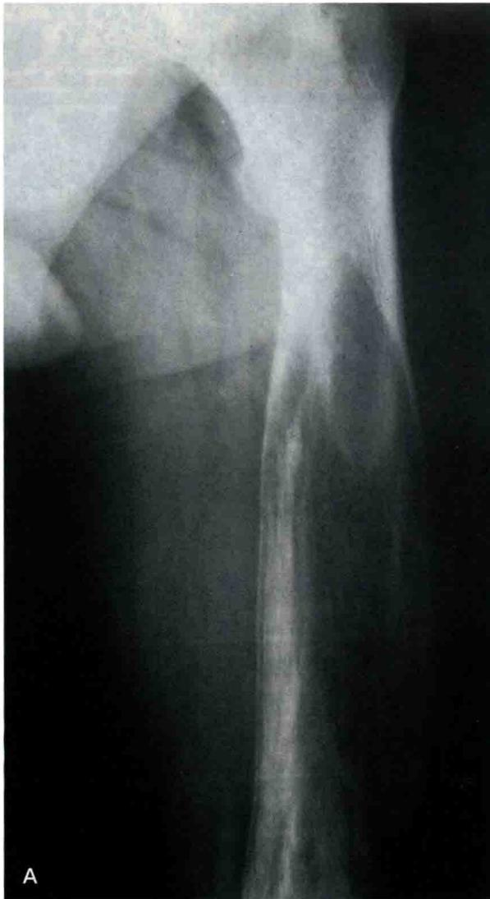
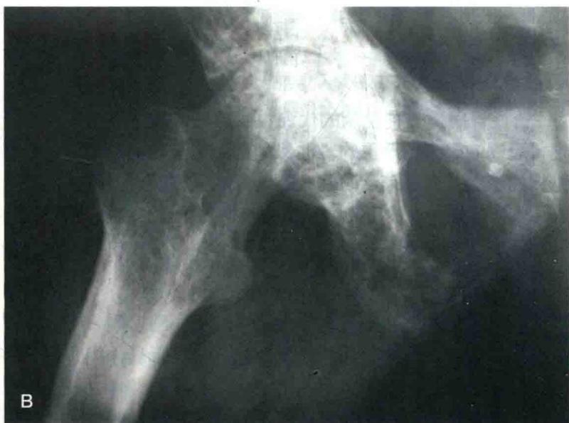
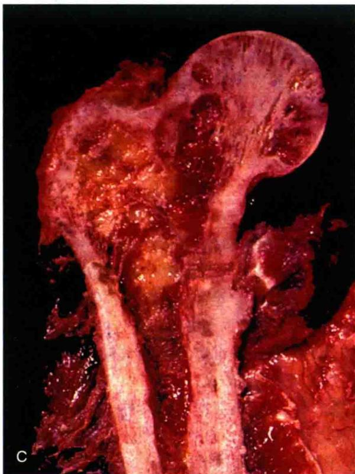 
图26-18Paget病。A.早期Paget病的放射线显示骨皮质溶解，骨干直径增加，进展性Paget病中“楔形的皮质吸收区”（“火焰征”）。楔形病变的近端股骨看起来完全正常；B.之后，股骨近端和盆骨Paget病显示皮质结构紊乱和不规则骨小梁形成；C.股骨近端大体标本显示皮质增厚，股骨头和股骨颈可见粗糙的骨小梁形成；D.脊柱Paget病显示腰椎椎骨体缩短，变宽。椎骨皮质变厚，终板变宽，呈“相框样”外观
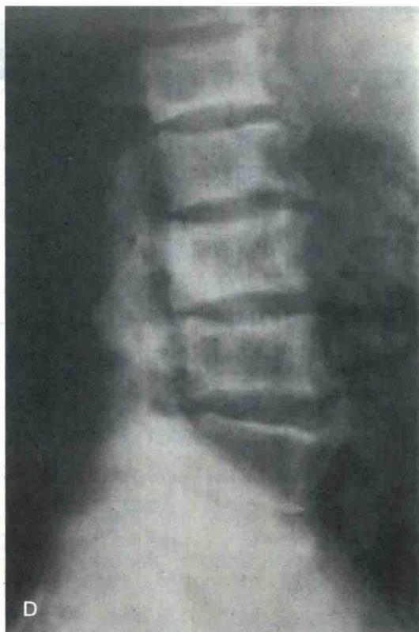
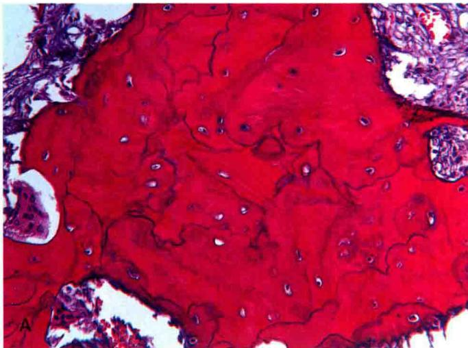
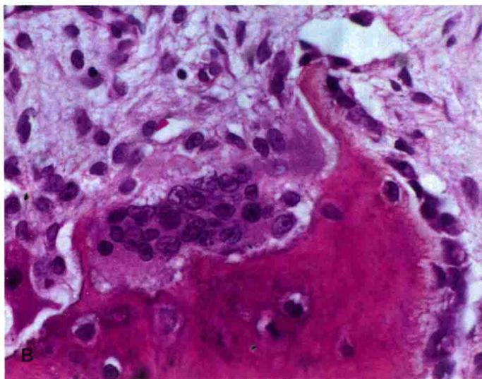
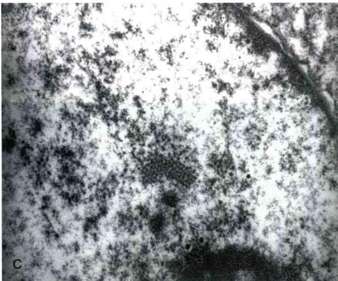 
图26-19Paget病。A.骨组织切面显示明显的、不规则的、嗜碱性的黏合线及众多围绕骨表面排列的破骨细胞和骨母细胞；B.Paget 病病骨中的破骨细胞与通常的破骨细胞相比包含更多的细胞核，其中部分细胞核包含嗜酸性核内包涵体样颗粒；C.电镜下，破骨细胞细胞核包含有形状和定位类似副黏病毒的颗粒
3.“冷”或烧毁期这个时期的组织学特征为很少有细胞活动，放射线显示骨组织变厚，结构紊乱。
破骨细胞是Paget病的病变细胞，外观具有特征性。而正常破骨细胞包含的核的数目少于12个，
Paget病病变中的破骨细胞巨大，包含的核的数目可能超过100个（图26-20B）和可见囊括病毒样颗粒的核内包涵体（图26-20C）。
因为活跃的Paget病是一种骨重构加快的病变，组织学特征与重度纤维性骨炎相似，众多破骨细胞，大而活跃的骨母细胞和骨小梁周围骨髓纤维化。快速的骨组织重构破坏骨小梁结构。“冷”期的诊断性标志为异常排列的板层骨，其内不规则骨形成，由明显的黏合线分隔，像一幅拼图。结果导致骨组织排列呈镶嵌形式，特别是在偏振光镜下观察时这种镶嵌结构更加明显。

【临床表现】Paget病最常见的局部症状为发生
在受累骨的疼痛，可能与微小骨折、周围扩张
激游离神经末端或承受较大重力等有关。诊断
赖放射学检查发现。
颅骨：Paget病累及颅骨尤其常见。颅骨显示局灶溶解，一般位于额骨和顶骨，又称为“地图样头，颅骨局限性骨质疏松”。或者，颅骨内层和外层骨板可增厚，额骨和枕骨最为显著。颌骨大体上可奇形怪状，牙齿外露。面骨常常增大，尤其是上颌骨，产生所谓的骨性狮面“狮子样面容”。
Paget性盗血现象：偶然情况下，血液从颈内动脉系统分流至骨组织，而不是直接供应脑组织，导致所谓的Paget性盗血现象，患者会感到头晕眼花。
骨折和关节炎：Paget病患者骨折常见，骨组织可像粉笔一样突然横行折断。软骨下骨组织顺应性降低引起继发性的骨关节炎和关节软骨的损毁。
高输出量型心力衰竭：病变范围广的Paget病，流入骨组织和皮下组织的血量显著增加，这就要求心脏血液输出量增加。当合并有潜在心脏疾病时，情况恶化可导致心力衰竭。
肉瘤样变：肿瘤性改变可发生在Paget病灶中，通常发生在股骨、肱骨或盆骨。尽管这种并发症发生在不到 $1\%$ 的病例中（通常最为严重），但发生骨肉瘤的风险与一般人群相比高出1000倍。
巨细胞肿瘤：类似于甲状旁腺功能亢进症的“棕色瘤”，该疾病并不是肿瘤，而是一种反应性改变。巨细胞肿瘤是一种破骨细胞功能的超常活跃及相关的成纤维细胞反应性增生。对于大多数病例放射治疗有效。
幸运的是，大部分Paget病患者没有症状而且不需要治疗。骨折、骨关节炎和其他矫形外科并发症可对症治疗。双膦酸盐类（帕米膦酸二钠、阿仑膦酸钠）是针对功能异常活跃的破骨细胞的有效药物。
# 六、纤维结构不良
纤维结构不良是一种发育异常，特征为受累骨组
织髓质区纤维性和骨性成分杂乱无章的混合排列。可发生在儿童，也可发生在成人，可累及单骨（单骨型），也可累及多个骨（多骨型），可见于系统性疾病（McCune-Albright综合征）。

【发病机制】已经在纤维结构不良和McCune-Albright综合征的患者的骨细胞中发现编码
激活型编码鸟苷酸结合蛋白（the stimulatory guanine nucleotide-binding protein，GSa）亚基的GNAS1基因存在激活突变，GS可与腺苷酸环化酶相作用，结果导致腺苷酸环化酶的组成性的激活，cAMP水平升高，从而增强受累细胞的特定功能（例如 $c$ -fos 和 $c$ -jun原癌基因，IL-6和IL-11）。

# 【病理和临床表现】
单骨型纤维性结构不良：单骨型纤维结构不良

是该病最常见的形式，最常见于20多岁和30多岁的人群，无性别倾向。尽管所有骨都可累病变常累及近端股骨、胫骨、肋骨和面颅骨。能没有症状，或者可能导致病理性骨折。
多骨型纤维结构不良：1/4的多骨型纤维结构不良的患者病变累及范围广泛，多于全身骨骼的一半，包括面颅骨。通常在儿童时期出现症状，几乎所有的患者都发生病理性骨折、四肢畸形或者肢体长度差异。多骨型纤维结构不良更常见于女性。有时，病变可在青春期静止，而怀孕可刺激病变生长。
Mccune-Albright 综合征：这种病变的特征为内分泌失调，包括肢端肥大症、Cushing 综合、甲状腺功能亢进症、维生素D-抵抗性佝偻病和特征性的皮肤病变。最常见的内分泌异常为女孩性早熟（男孩很少发生McCune-Albright 综合征）。结果，生长板的过早闭合导致身材异常矮小的。

【病理】纤维结构不良的放射学改变具有独特
性。骨病变呈毛玻璃样透光性改变，边界清晰，
皮质变薄。骨组织可像气球般鼓起、变形及扩大，可累及部分骨组织，也可环绕整个骨组织（图26-20A）。所有类型的纤维结构不良均表现为同一组织学结构（图26-20B、C），良性成纤维细胞性组织排列疏松、呈旋涡状。缺乏骨母细胞围绕的编织骨骨针不规则排列于纤维性组织中。在 $10\%$ 的病例，可见不规则的岛状的透明软骨。偶尔，可发生囊性变伴含铁血黄素细胞、出血和破骨细胞聚集在囊周围。纤维结构不良的治疗包括：病灶刮出术、骨折修复和畸形的预防。
# 第三节 骨肿瘤
各种类型的骨肿瘤不常见，但是很重要，因为多
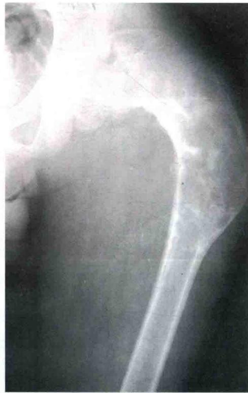
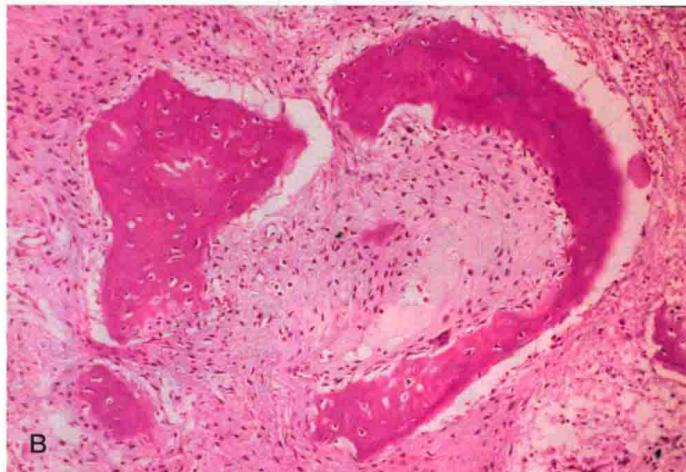 
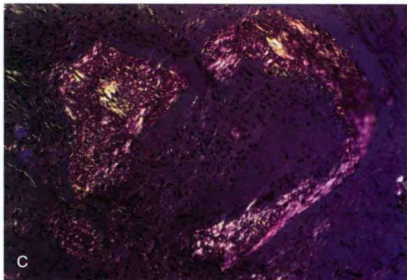 
图26-20纤维结构不良。A.放射学检查显示由持续多年的骨折导致的近端股骨“牧羊杖样”畸形。不规则的、有边缘的、毛玻璃样透亮的病变，周围为反应性骨组织，骨干呈类似于肥皂泡样外观。B.组织学上，纤维结构不良由中等程度丰富的细胞和纤维组织组成，其内，可见不规则的、弯曲的编织骨骨针形成，未见可被识别的附着的骨母细胞。C.偏振光下同一切面显示不仅骨针呈编织状，而且这种编织状的纤维排列方式无形中延伸到周围间质中，使周围间质纤维排列呈现编织状
数骨肿瘤发生在儿童和青少年且具有潜在致死性。原发骨肿瘤可以发生在骨的任何富于细胞的部分。骨肿瘤大多发生在近干骺端， $80\%$ 以上的原发肿瘤发生在股骨远端和胫骨近端（图26-21）。骨的这些部位在生长中的儿童有显著的生长活性。
# 一、良性骨肿瘤
1. 骨瘤由致密皮质骨组成 骨瘤是一种生长缓慢的良性肿瘤，由致密皮质骨组成。这种病变分为四种主要的临床病理学类型，包括：①颅骨与下颌骨骨瘤；②鼻窦和眼眶骨瘤；③髓质骨骨岛；④长骨的表面骨瘤。有些骨瘤在本质上可能是发育性的或者错构瘤性的。然而，鼻窦骨瘤是良性的成骨细胞肿瘤，并可能发生在Gardner综合征患者，该患者常常有家族性腺瘤性息肉病并伴有 $c$ -ret基因突变（见第13章）。 
2.非骨化性纤维瘤是儿童的独立性疾病，又称为纤维性骨皮质缺损，是发生在长骨干骺端的良性肿瘤，最常见于股骨和胫骨。这种病很常见，可以发生于 $25\%$ 的 $4\sim 10$ 岁之间儿童，之后这种疾病特征性自愈。非骨化性纤维瘤是肿瘤还是发育性病变，现在
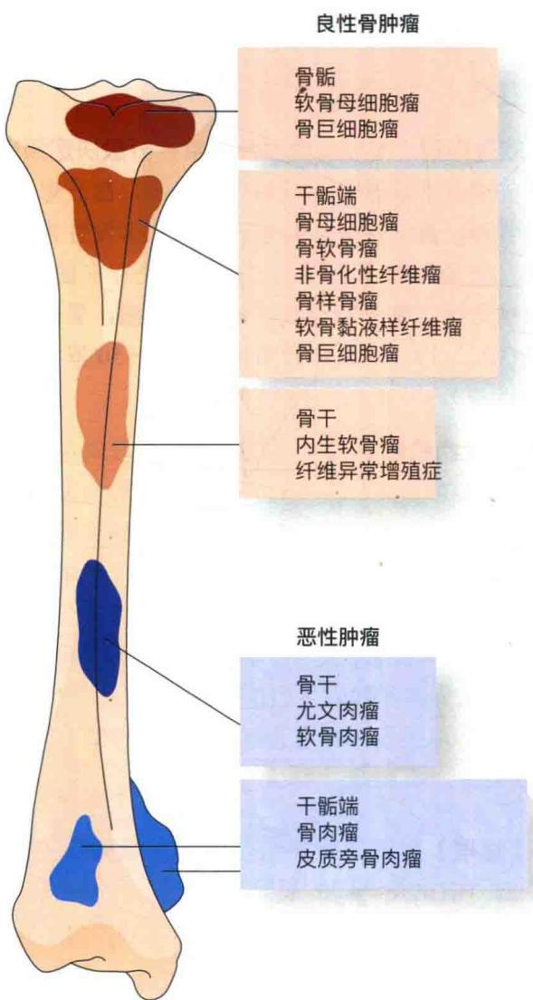 
图26-21 长管状骨原发性骨肿瘤的分布
还有争议。大部分病例没有症状，虽然在偶然的情况下由于病变通过薄薄的骨皮质而引起骨折或疼痛而引起注意。

【病理】影像学上，非骨化性纤维瘤表现为皮质区偏心性境界清楚的阴影，中心透亮，周围有边缘。大体检查，病变呈颗粒状，深红色至棕微镜下，温和的梭形细胞排列成编织状及旋涡状，巨细胞及泡沫样巨噬细胞可见。罕见的有症状病，病变扩大者可以采用病灶刮除和植骨治疗。
3.骨样骨瘤 是一个良性的疼痛的病变，由骨组织（即瘤巢）及围绕在瘤巢周围的反应性骨形成的晕构成。患者的典型年龄在 $5\sim 25$ 岁。男孩比女孩多见(3：1)。骨样骨瘤常见于下肢管状骨的骨皮质。

【发病机制】骨样骨瘤生长潜力有限，也不发生转移。部分病例进行染色体分析，发现异常及17q部分缺失，提示骨样骨瘤是肿变。

【病理】骨样骨瘤是一个球形的血运丰富的肿瘤，直径约 $1\mathrm{cm}$ ，比周围组织质地软（图26-外科手术中很容易去除。显微镜下，肿瘤由纤规则的骨小梁组成，小梁间为疏松的纤维血管织，其内有成骨细胞和破骨细胞。小梁在近病部较成熟，常常伴有部分钙化。反应性硬化性瘤巢周围。

【临床表现】疼痛，典型表现为夜间疼痛，与病变大小不成比例。它通常由于饮酒而加剧，用阿司匹林而减轻，可能与肿瘤内高前列腺素内的神经纤维有关。外科切除或者经皮瘤巢去以治愈该病。
4. 孤立性软骨瘤以透明软骨为特点 孤立性软骨瘤（内生软骨瘤）是一种良性骨内肿瘤，由分化良好的透明软骨组成。虽然其肿瘤本质受到质疑，细胞遗传学分析显示在一些软骨瘤存在染色体异常，表明它们实际上是肿瘤。可发生于任何年龄，并且很多情况下完全没有症状。

【病理】大多数孤立性软骨瘤发生于手的掌指骨，其余的几乎可以发生在任何其他管状骨。肿瘤长缓慢。大体检查上，孤立性软骨瘤由半透明的骨组成，伴有小灶状钙化。镜下，软骨组织由分稀疏的软骨细胞组成。无症状的软骨瘤最好不要如果出现疼痛，可以选择刮除和植骨术。
# 二、恶性骨肿瘤
1. 骨肉瘤 是最常见的原发性恶性骨肿瘤，又称
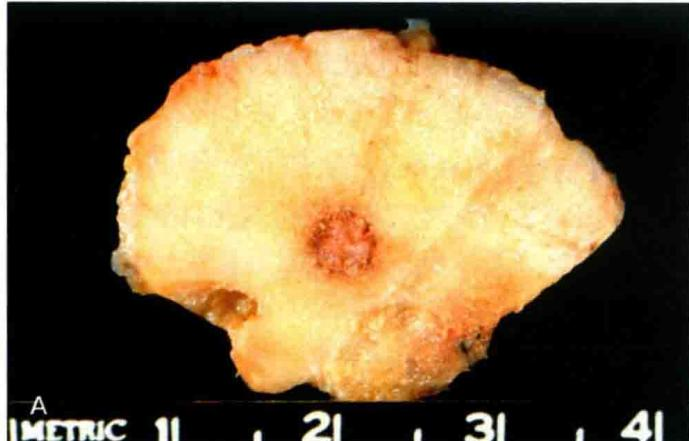
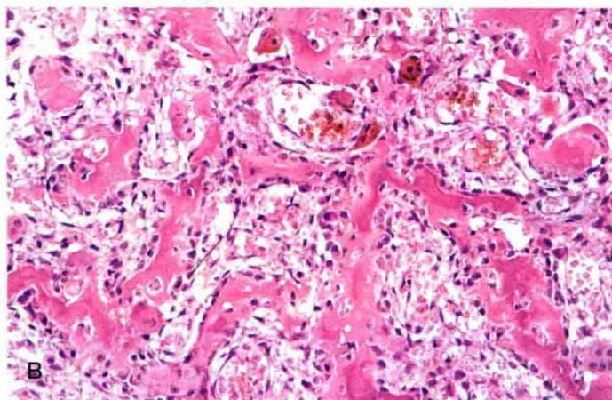 
图26-22 骨样骨瘤。A.骨样骨瘤的大体标本显示中央的瘤巢埋在致密骨中；B.瘤巢的显微镜下图片显示编织骨的不规则骨小梁周围围绕着成骨细胞、破骨细胞及纤维血管间质
为成骨肉瘤，是一种高度恶性骨肿瘤，以肿瘤细胞形成骨组织为特点。占全部骨恶性肿瘤的1/5，常发生在 $10\sim 20$ 岁之间的青少年，男孩多于女孩。

【发病机制】骨肿瘤与抑癌基因突变有关：
近2/3的病例伴有Rb基因突变（见第5章），
和很多病例伴有Rb基因突变。肿瘤还有较为广泛的染色体和分子异常，累及了细胞凋亡、复制潜力、对生长抑制信号不敏感及细胞周期调控等多方面。骨肉瘤可以发生在由于治疗恶性肿瘤，比如淋巴瘤，而接受过外来的治疗性放疗的成年人和儿童。骨肉瘤发生在年长患者，常常发生在Paget疾病患者或者放疗后的患者。几个良性骨病变发展成为骨肉瘤的风险性较没有良性骨病变的患者高，包括纤维异常增殖症、骨髓炎和骨髓梗死。虽然由于创伤可能引起对已经存在了的骨肉瘤的注意，但是没有证据证明创伤可以引起此肿瘤。

【病理】骨肉瘤常常发生在膝关节附近的股骨
下端（图26-23A）、胫骨或者腓骨的上端，虽
然长骨干骺端任何部位都可发生。肱骨近端是第二最常见的部位。骨质破坏和骨形成的影像学证据是特征性的，后者代表肿瘤骨。肿瘤组织将骨皮质顶起的部
位与正常部位相连处出现骨膜反应，边缘毛糙。当这个出现在X线片上，骨壳与骨皮质在一端相交，而在另一端打开，被称为Codman三角。“日光放射状”骨膜反应也常常叠加。肿瘤切面可以表现为出血、囊性变、柔软及骨样区域及这些成分的任意组合。肿瘤组织可以侵袭破坏骨皮质，播散至骨髓腔或者增长至股后区，甚至达关节间隙。组织学上表现为恶性细胞伴有成骨细胞分化并生成编织骨（图26-23B）。恶性细胞由于富含碱性磷酸酶和骨粘连蛋白而强嗜碱性。该肿瘤骨分布混乱，而不是沿压力线对齐。通常情况下，可以混有恶性软骨细胞病灶或多形性巨细胞。在骨溶解区，非肿瘤性破骨细胞出现在肿瘤的前沿。几乎所有的死于该病的患者（98%）都有肺转移。较少见的是，肿瘤转移至其他骨骼（35%），胸膜（33%）和心脏（20%）。

【临床表现】骨肉瘤常表现为膝关节周围轻度
或间歇性疼痛或者其他受累区域的疼痛。随着
疼痛的加剧，该区域肿胀、压痛，以及相邻关节功能
受限。半数患者血清碱性磷酸酶升高，截肢后降低，
复发或者转移时再次升高。转移性疾病预示着迅速临
床恶化和死亡。今天，化疗和保肢手术将5年无病存
活率提升至60%~80%。孤立的肺转移性切除术可
延长生存期。
2. 软骨肉瘤 是软骨的恶性肿瘤，分级决定预后，
起源于先前存在的软骨巢或内生软骨瘤。部分患者有
内生软骨瘤、孤立性骨软骨瘤或遗传性多发性骨软骨
瘤病史。大部分患者都没有已知的预先存在的病变。
软骨肉瘤是第二常见的原发性恶性骨肿瘤，男性比女
性常见（2：1）。好发年龄阶段为 $30\sim 50$ 岁（平均
年龄，45岁）。

【发病机制】许多非随机染色体异常在软骨
肉瘤中被发现。中心性软骨肉瘤和继发性外
周软骨肉瘤（肿瘤起源于在骨软骨瘤的软骨帽）的
发生可能由于不同的分子机制（见下文）。中心性
软骨肉瘤的发生至少部分病例与染色体异常9p12-
22相关，这可能涉及CDKN2A肿瘤抑制基因。继
发性外周软骨肉瘤的发生可能和骨软骨瘤的PTHrP
的和 $B c l - 2$ 基因表达的上调有关, 同时伴有其他基
因中的突变，如 p53。

【病理】软骨肉瘤发生在中央、外周和近皮层
处，依据其不同的起源：①最常见的骨髓腔部
分；②骨的外周；③少见部位是骨软骨瘤的软骨帽或者
长骨干骺端皮质外表面（图26-24）。另外不常见的
亚型也有发生。
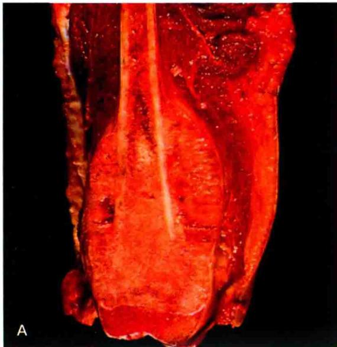 
图26-23 骨肉瘤。A股骨远端包含由致密的成骨细胞组成的恶性肿瘤，突破皮质侵犯软组织及骨骺。B.组织学显示显示多形性恶性细胞，肿瘤巨细胞和核分裂（箭头）。肿瘤产生的编织骨伴局灶钙化
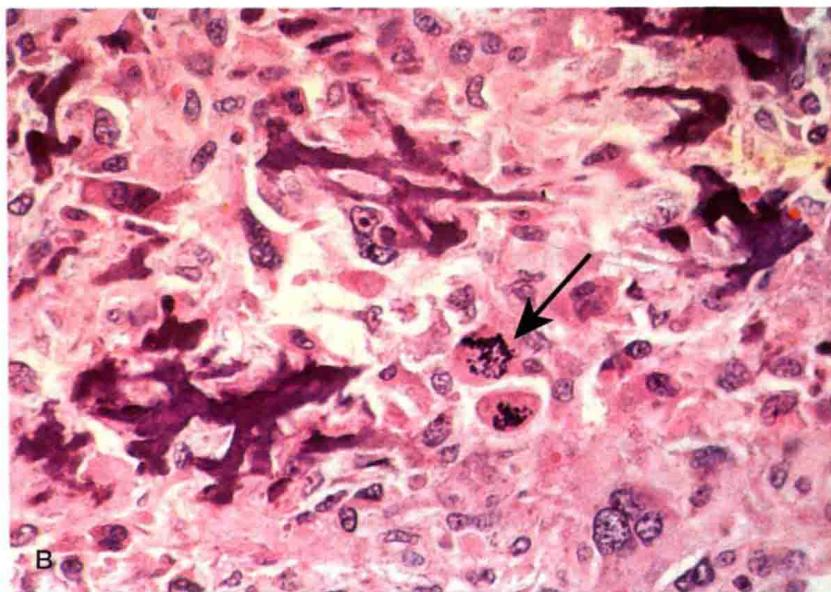
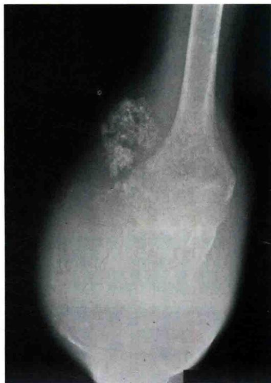 
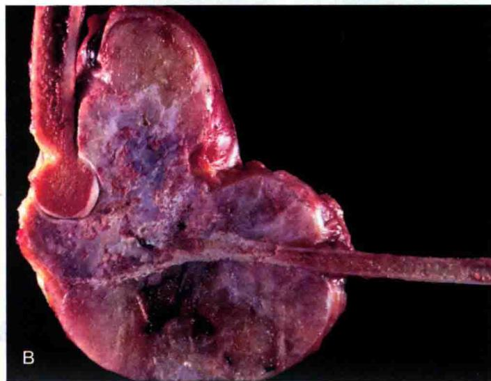
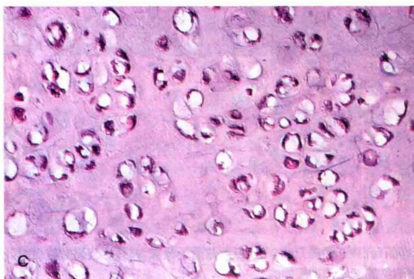 
图26-24 软骨肉瘤。A. X线片显示出一个大的破坏性的肿块取代了尺骨近端。巨大的软组织肿块内可见密集的环形和爆米花样钙化；B. 切除的大体标本显示分叶状透明软骨伴有钙化、骨化局灶液化；C. 软骨肉瘤在显微镜下显示为恶性软骨细胞伴有明显的异型性
【临床表现】患者一般表现为受累部位的疼痛。软骨肉瘤是少数几个显微镜下形态学分级具有显著预后意义的肿瘤之一。低级别骨肉瘤的5年生存率为 $80\%$ ；中级别者为 $50\%$ ；高级别者仅为 $20\%$ 。广泛切除术是常用的治疗方法。
3. 骨巨细胞瘤罕见转移 骨巨细胞瘤是一种良性的局部侵袭性同时又具有潜在恶性的肿瘤，特征是破骨细胞及多核巨细胞随机或者均匀地分布在由增生的单核细胞组成的背景之中。好发年龄为 $20 \sim 30$ 岁，女性比男性略多见，亚洲比西方国家更多见。老年人的骨巨细胞瘤可能继发于放疗之后。Paget病可能会产生巨细胞反应性病变，与真正的骨巨细胞瘤很类似。

【发病机制】骨巨细胞瘤由破骨细胞样的巨细胞及两个谱系的单核细胞组成。单核细胞
中的一个谱系被认为是单核－巨噬细胞来源，可能是非肿瘤性的。另一个谱系的单核细胞有染色体异常和癌基因的分子改变，例如p53和c-myc。

【病理】在大多数情况下（90%），骨巨细胞瘤起源于干骺端和长骨的骨骺之间的连接处，超
过一半的病例发生膝关节周围（股骨远端和胫骨近端；图26-25A）。桡骨、肱骨和腓骨的远端也偶尔被累及。该肿瘤往往是溶骨性病变，生长缓慢，可以伴有骨膜反应。大体检查时骨巨细胞瘤界线清楚，切面软，呈浅棕色，不伴有成骨或者钙化。大量出血区域导致含血海绵样的外观。
显微镜下，巨细胞瘤呈现两种类型的细胞（图26-25B)，其中一种为丰富的单核（“间质”）细胞，椭圆形，细胞核大，胞质少；另一种为体积大的破骨细胞样巨细胞，分散在富于血管的间质之中，其中部分细胞核的数量可以超过100个。显然，单核细胞是
肿瘤性的，是巨细胞瘤的增生成分（核分裂象在单核细胞很常见，但在巨核细胞却没有观察到）。恶性巨细胞瘤的诊断取决于单核细胞的形态而不是多核巨细胞的形态。

【临床表现】绝大多数巨细胞瘤被认为是良性的，但是局部侵袭性肿瘤在单纯切除术后有复发的潜能，罕见转移到远隔部位，尤其是肺癌细胞瘤表现为疼痛，尤其是在与肿瘤相近的关节由于皮质变薄，微小骨折和病理性骨折很常常采用彻底刮除和植骨治疗肿瘤，虽然有时需要进行的治疗，包括整块切除或甚至截肢。有报道1/2的简单刮除病例局部复发。这些患者绝大多数寿命不受影响，尤其是在转移的病变很少而且在手术切除时。然而约 $1\%$ 的巨细胞瘤会转变为
4.Ewing肉瘤（EWS）是一种儿童的原始神经外胚叶肿瘤，是一种罕见的恶性骨肿瘤，由单一小圆形细胞组成。它只占全部骨肿瘤的 $5\%$ ，发生于儿童和青少年，有2/3的患者年龄小于20岁。男孩比女孩更容易患此肿瘤（2：1）。EWS在黑人很罕见。

【发病机制】EWS被认为源自原始的骨髓成分或未成熟间充质细胞。几乎所有肿瘤（90%）
携带11号和22号染色体交互易位t（11;22）p（13;q12），这导致在EWS1基因的氨基末端与FLI-1基因的羧基末端融合，该融合基因编码一种转录因子。这个新产生的融合蛋白EWS/FLI-1，是异常转录因子，调控哪些靶基因尚未完全确定。

【病理】EWS时儿童的主要的长骨肿瘤，尤其是肱骨、胫骨和股骨，发生于中段或干骺端。
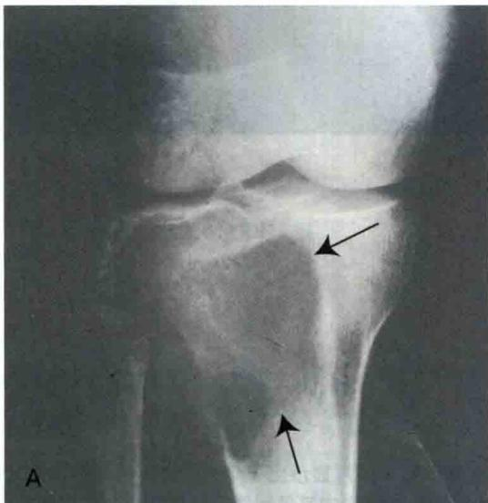 
图26-25 骨巨细胞瘤。A. X线片显示胫骨近端偏心溶解性破坏，几乎没有新骨形成（箭头）。肿瘤扩展到软骨下骨板，并破坏皮质旁软组织。B. 显微镜下显示破骨细胞样巨细胞及丰富的椭圆形单核细胞。这两种类型细胞的细胞核是相同的
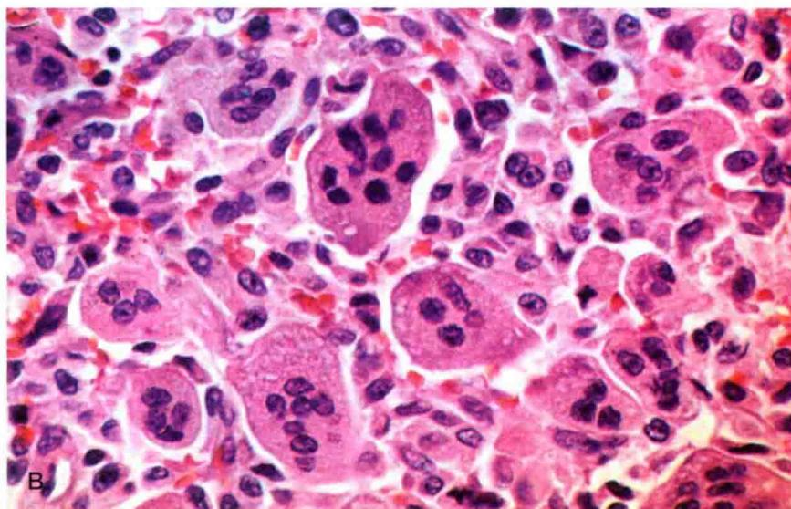
它有与红骨髓的分布相平行的倾向，因此该肿瘤发生于 $20\sim 30$ 岁或者更为年长的患者，常累及骨盆和脊柱。然而，没有任何部位的骨可以免受累及。大体检查时，EWS通常是柔软灰白色，常伴有出血及坏死。肿瘤可浸润髓腔而不破坏骨小梁。它也可以浸润骨皮质或形成结节，该部位正常骨组织可以被完全吸收。在许多情况下，肿块穿透骨膜并浸润至软组织（图26-26A）。
显微镜下，EWS肿瘤细胞表现为小圆细胞密集排列呈片状，肿瘤细胞胞质少，体积相当于淋巴细胞的2倍（图26-26B）。纤维束将成片分布的肿瘤细胞分割成不规则的巢状。肿瘤组织间质很少或没有间质，核分裂象罕见。部分区肿瘤细胞倾向于形成菊形团。一个重要的诊断特征是在肿瘤细胞胞质中含有大量的糖原，可以通过PAS染色很好地显示出来。EWS肿瘤细胞也表达特征性抗原，可通过免疫组织化学来检测（图26-26B，插图），其中一部分是染色体易位的产物（例如，FLI-1和CD99）。EWS可转移至许多器官，包括肺和脑。其他骨，尤其是颅骨，是常见的转移部位（50%～75%的病例）。
【临床表现】EWS患者最初表现为轻度疼痛，疼痛逐渐加剧伴随受累部位的肿胀，随之而来的非特异性症状，包括发热、白细胞增多。在一些情况下，可以触及软组织肿块。尽管EWS预后曾经是令人沮丧的，采用目前使用的化疗加放疗和（或）手术治疗，5年无病生存率达 $60\% \sim 75\%$ 之间。 
5. 转移性肿瘤 是骨最常见的恶性肿瘤，大多数转移至骨的病变是癌，尤其是乳腺癌、前列腺癌、肺癌、甲状腺、肾癌。据估计，在至少 $85\%$ 的癌症患者的整个临床过程中可发现经血行转移至骨的病变。到目前为止，脊柱是在成人中最常见的部位，而四肢骨骼则是在儿童病例中的典型受累部位。某些肿瘤（甲状腺、胃肠道、肾、神经母细胞瘤）通过刺激破骨细胞主要产生溶骨性病变。一些肿瘤（前列腺癌、乳腺癌、肺癌、胃癌）刺激成骨细胞而成骨，在X线片上显示为高密度病变。然而，转移癌所致的骨病变大多数都包含溶骨性和成骨性病变。
# 第四节 关节
# 一、骨关节炎
关节炎是关节的炎症，通常伴有疼痛、肿胀和结构改变。关节炎可分为两种主要类型：①炎症性关节炎，通常累及滑膜并有炎细胞介导（例如，类风湿关节炎）；②非炎症性关节炎，例如原发性骨关节炎，在其发病机制中可能涉及细胞因子（见下文）。骨关节炎是缓慢的进行性的关节软骨破坏性疾病，影响负重关节、老
年人的手指或年轻人的受损关节。
骨关节炎是关节病最常见的类型，也是非炎症性关节炎的主要形式。它是在关节机械破坏性病变中一组共同的情况。
原发性骨关节炎由关节软骨的固有缺陷所致。这种疾病的发病率和严重程度随着年龄的增长而增加。对 $18\sim 24$ 岁的年轻人， $4 \%$ 的人会被累及，而 $75\sim 79$ 岁的人，则 $85\%$ 会被累及。45岁之前，这种疾病主要累及男性患者；而55岁以后，骨关节炎在女
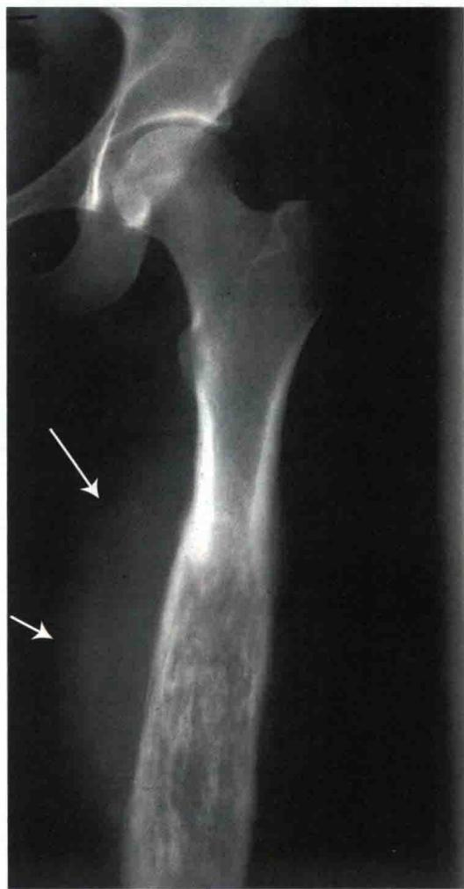 
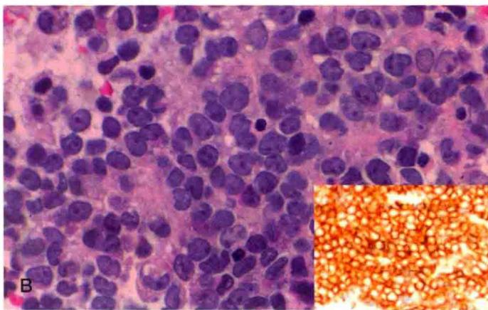 
图26-26 Ewing肉瘤。A.临床X线片显示出界线不清的膨胀性皮质破坏和微弱的骨膜破坏反应（箭头）；B.活检标本显示相当单一的小细胞，伴有圆形及深蓝色细胞核和难以分辨的胞质。CD99免疫组化染色显示为膜表达模式（插图）
性患者更为多见。原发性骨关节炎的很多患者表现出家族聚集性，提示遗传倾向。
原发性骨关节炎曾被称为“磨损性关节炎”和退行性骨关节病。关节软骨的逐步退化导致了关节变窄，软骨下骨增厚，最终成为失去功能的疼痛的关节。虽然骨关节炎不是主要的炎症过程，可是滑膜内可出现轻度的炎症反应。
继发性骨关节炎具有已知的基本病因，包括关节连接处的先天或后天缺陷、创伤、晶体沉淀、感染、代谢性疾病、内分泌性疾病、炎症性疾病、骨坏死和关节积血。

# 【发病机制】许多因素是骨关节炎的病因。
单位体积的负荷增加：对软骨的异常外力可
能有许多原因，但是主要归因于关节的不协调。当关节单位体积超负荷时，软骨细胞死亡会导致关节软骨的降解。
关节软骨弹性降低：由于关节软骨结合大量的水，它通常能承受至少3个大气压的膨胀压力。破坏关节软骨与水的黏合之后关节弹性降低。
软骨下松质骨的坚硬度：关节相邻的骨结构对维持关节软骨很重要。损坏粗糙的松质骨会增加关节软骨的单位体积的负重，是由于软骨下骨的硬度增加（例如，Paget病）。
生化异常：骨性关节炎的生物化学变化主要涉及蛋白多糖。蛋白多糖含量和黏附性降低，糖胺聚糖链长度缩短。蛋白聚糖的减少允许更多的水分子被绑定到胶原蛋白。因此，骨关节炎软骨，或者是纤维化的任何软骨，比正常软骨肿胀。虽然早期骨关节炎软骨细胞合成的基质增加，蛋白质的合成最终还是下降，软骨细胞的复制也是如此。显然，细胞达到临界点，在这点上它们不能对修复刺激做出反应。在骨关节炎软骨中，攻击基质大分子的蛋白核心的酸性蛋白酶增加。正常软骨中不存在胶原酶，但在骨关节炎软骨中发现胶原酶。软骨细胞凋亡、Ⅱ型胶原合成降低和细胞外基质的破坏也发生。这些效应与局部区域增加的IL-1β和TNF-α有关，反过来，这诱导基质金属蛋白酶（MMP）、一氧化氮和前列腺素E2（PGE2）的产量增加。机械压力似乎是这些信号级联反应的触发因素。
遗传因素：患者的家族遗传分析，早发型关节炎已经揭示了Ⅱ型胶原基因（COL2A1）的各种各样的突变，Ⅱ型胶原是关节软骨的主要的胶原种类，以及在一些与骨和软骨发育相关的其他基因的突变。GDF5基因（生长分化因子5）的转录的变异和普通的迟发型关节炎有关。

# 【病理】骨关节炎通常受累的关节是上臂的近端
及远端指间关节、膝关节、臀部、颈部以及脊
柱的腰椎关节。放射学上，骨关节炎的特征在于：①关节空间变窄，这代表了关节软骨的丧失；②软骨下骨厚度的增加；③软骨下骨囊肿；④骨和软骨的外周较大的增生，即所谓的骨赘。组织学变化发生如上所述。
1. 骨关节炎最早变化是从关节软骨表面的蛋白多糖的损失，这在组织学可以看到异染性染色降低色及伴随的空陷窝，这表明软骨细胞死亡（图26-27）。活的软骨细胞增大，聚集成群或组成克隆，被嗜碱性染色的基质所包围，即所谓区基质。 
2. 骨关节炎可能在进展到下一个阶段之前的多年中被发现，特征是纤维化（例如，出现平行于关节面长轴的表面裂纹）。 
3. 伴随纤维增生，滑囊液开始流入缺陷。最终，关节软骨碎片脱落，附着在滑膜，引起炎症和异物巨细胞反应。结果是充血和滑膜肥大。 
4. 当裂缝向下延伸，从骨骺和软骨下骨新生血管伸入裂缝区，诱导软骨下破骨细胞骨吸收。相邻的成骨细胞激活，导致裂缝区软骨下骨板增厚。当新血管形成逐渐延伸到裂缝区，间充质细胞侵入和纤维软骨形成一个关节透明软骨的不良代替品（图26-28A）。这些纤维软骨穿插的区域可能会保持，或者进入关节内。软骨下骨变得暴露并磨光，因为它与相对的关节面摩擦，相对的关节面也正在经历相同的过程。这些厚的、有光泽的和光滑的软骨下骨的区域被称为象牙样改变（象牙等）的骨。 
5. 在一些部位，象牙样骨破裂，使滑液从关节表面流入到软骨下骨的骨髓，在那里最终形成软骨下骨囊肿（图26-28B）。 
6. 一种骨赘发展，通常在关节的侧面，当滑膜的间叶组织分化成成骨细胞和软骨细胞，以形成大块的软骨和骨。骨赘是关节表面周边的珍珠灰色骨结节。它们可能发生在椎间盘，脊柱的骨关节炎的横向边缘在X线片上产生的“唇形变”图像。在手指，骨赘在远端指间关节被称为赫伯登结节。

# 【临床表现】骨关节炎的标志和症状与受累关
节的位置、关节退化的严重程度和持续时间呈
函数关系。受累关节可能肿大、柔软、如同沼泽地一样，并可能表现出捻发感。活动时出现深在的关节疼痛，而休息后缓解是骨关节炎的临床特点。疼痛通常是显著关节破坏的迹象，并出发生关节周围结构，是因关节软骨缺乏神经分布。不适也是由于短时间内骨硬度增加所致，这是经常发生在早晨或最小活动的时间之后。关节运动受限表示严重的疾病，可能由于关节或
肌肉挛缩、关节内游离体、大骨赘和关节表面完整性缺失所致。
目前，骨关节炎无法预防或治愈。治疗是针对特定的骨科疾病，包括运动、减肥等支持措施。在失去
功能的骨关节炎，关节置换可能是必要的。
# 二、类风湿关节炎（RA）
RA是一种系统性慢性炎症性疾病，其中慢性多关
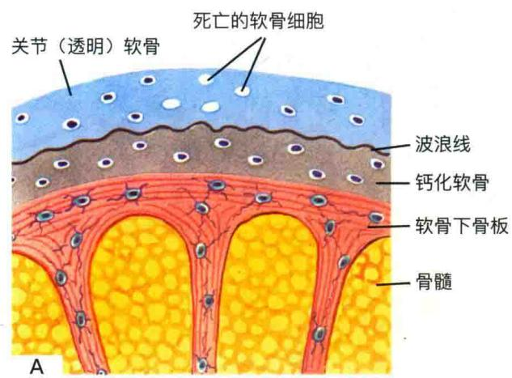
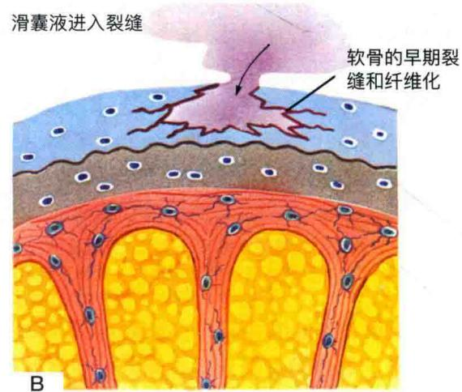
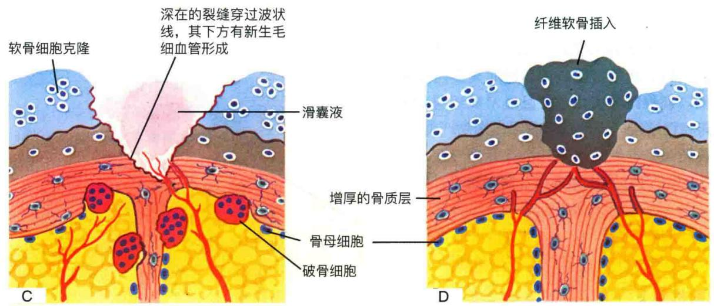
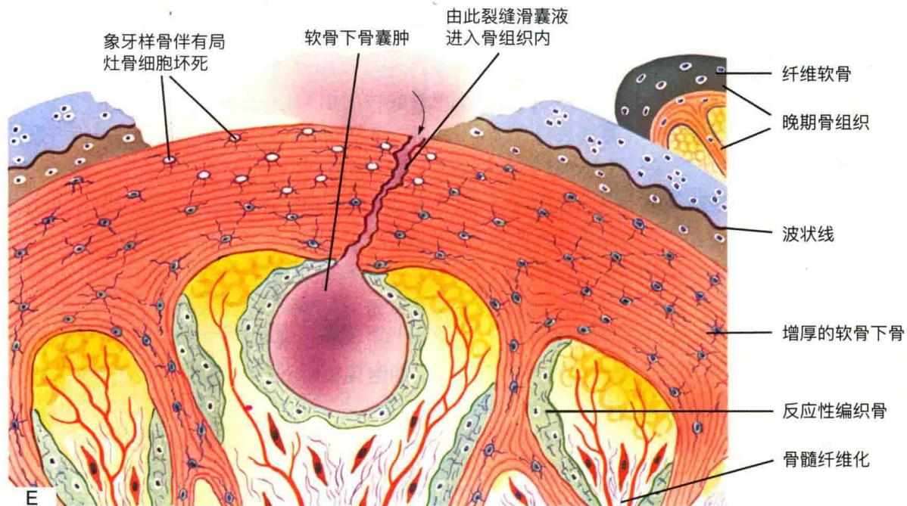 
图26-27 骨关节炎的组织学发生机制。A、B.软骨细胞死亡导致了关节软骨的出现裂缝，之后滑囊液流入，并进一步导致软骨丢失和变性。C.作为上述过程的结果，软骨逐渐磨掉。在下面的时期之后，新生血管从骨骺和纤维软骨（D）生长并留下来。E.该纤维软骨穿插区域在对抗机械力方面不充分，可能会被磨掉，从而暴露软骨下骨板，它变得增厚，如同象牙一样。如果在这个区域出现裂缝，滑囊液则可以泄漏至骨髓腔，并产生一个软骨下骨囊肿。关节面的局灶再生长则导致骨赘形成
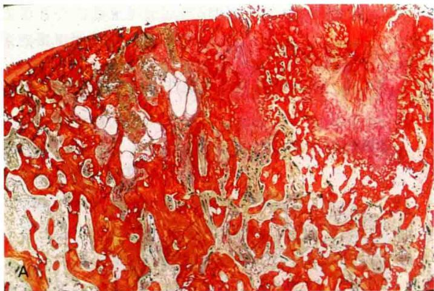 
图26-28 骨关节炎。A.股骨头骨关节炎显示从骨髓延伸到关节表面的纤维软骨穿插区（远右），象牙样骨出现在其余的表面；B.通过骨关节炎关节的关节面的切片显示关节软骨局灶缺失，软骨下骨增厚（左）和软骨下骨囊肿
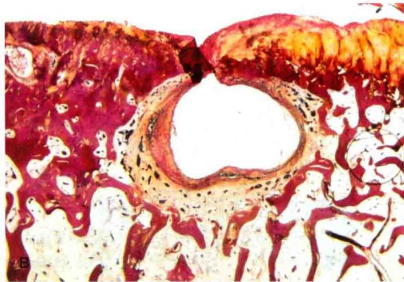
节炎涉及双侧的对称的滑动关节（滑膜移动）。近端指间和掌指关节、肘关节、膝关节、踝关节和脊柱最常受累。RA可发生于任何年龄，但通常开始于第3或第4个10年，直到70岁其患病率随年龄增加而增加。该疾病累及 $1\% \sim 2\%$ 的成年人口，其发生率女性远远高于男性（3：1)。通常，四肢关节同时受累，而且常常是对称的。病程时常变化，并且经常被缓解和恶化穿插。临床表现谱很广，从几乎看不出来到严重的、破坏性的、毁损性疾病。
现在认为经典的RA由一组异质性疾病组成。持续类风湿因子（RF）血清反应阴性的患者（见下文）可能与血清反应阳性的患者不同，有不同的病因。也有与潜在因素相关的类风湿样疾病，如炎症性肠病和肝硬化。

【发病机制】一些相互作用的因素参与RA的发生。
遗传因素：由患者的一级亲属发病率增高及单卵双胎者患病的一致性（ $30\%$ ）表明了了遗传因素对RA易感性的作用。此外，一般认为，某些主要组织相容性基因在RA患者中呈非随机方式表达。RA易感者中一个重要的基因位点位于HLAII基因之中，以及一组特定的HLA-DRB1等位基因（DR4，DR1，DR10，DR14）在这些患者中不断增加。
这些等位基因在HLA-DRB1基因的高变区段共享一个五肽序列模序（共享表位），形成HLA分子上的风湿口袋。很可能，这个口袋的结合性质可以通过结合RA相关的HLA-DR分子影响这些肽的类型，从而影响到这些肽的免疫应答类型。有趣的是，针对瓜氨酸肽（抗CP）的类风湿因子的出现（见下文）及严重进行性疾病都与那些在富含精氨酸共同表位的某些等位基因有关，而血清学阴性者（预后良好）在相同的位置通常为赖氨酸，进一步表明类风湿口袋的物理特性影响RA的免疫反应。最近
的研究已经确定，类风湿口袋外面的HLA-DRB1的其他氨基酸残基与HLA基因复合体中的其他组分几乎全部参与了HLA与血清学阳性者的联系。几个非HLA基因位点也与RA相关，包括与其他自身免疫疾病相关的一些基因位点；其他的是RA特异性的，在免疫功能中很重要。
体液免疫：免疫机制在RA的发病机制很重要淋巴细胞和浆细胞在滑膜聚集并产生以免疫球蛋白（Ig）G类为主的免疫球蛋白。此外，免疫复合物沉积于关节软骨和滑膜。IgM、IgA和IgG的血清水平增加亦被检测到。约 $80\%$ 的经典RA患者RF阳性。RF代表多种抗体，主要是 $\mathrm{lgM}$ ，但有时为直接针对IgG的Fc片段的IgG或IgA。RF滴度显著升高还在以下人群中被发现： $①$ 有关胶原血管疾病的患者； $②$ 与慢性炎症相关的非风湿病患者； $③$ 健康老年人。虽然经典的RA患者可以是血清学阴性的，RF高滴度存在与病情严重、不缓解、许多全身性并发症、严重的预后相关。
抗瓜氨酸蛋白抗体（ACPA）是最近开发的类似RF的血清学试验， $80\%$ 的RA例为阳性。它是很少在非RA患者中阳性，特异性达 $98\%$ 。临床发病前该试验即可阳性。瓜氨酸化蛋白的累积与炎症相关。肽精氨酸脱亚胺酶（PAD）是负责在体内蛋白瓜氨酸化，在RA滑膜及滑囊液中表达。推测关节腔内发现的瓜氨酸化蛋白是产生ACPA的免疫刺激物。
细胞免疫：还已经假定，细胞介导的免疫有助于类风湿关节炎的发生。类风湿滑膜中丰富的T淋巴细胞常常la阳性（“激活”）和辅助型的。它们往往在与HLA-DR阳性细胞紧密接触，无论是巨噬细胞或树突状la阳性细胞。T细胞通过产生细胞因子抑制巨噬细胞的迁移和增殖，而与巨噬细胞直接或间接相互作用。这种情况已在风湿病的滑囊液
和类风湿组织外植体的上清液中被发现。这些研究提供了强有力的证据，RA关节破坏反映出细胞因子的产生，尤其是TNF和IL-1。在这种情况下，TNF- $\alpha$ 阻断剂在类风湿关节炎的治疗中是有用的。
感染性因素：大多数RA患者产生针对感染Epstein-Barr病毒（EBV）的B细胞核抗原的抗体。这种抗原，RA相关核抗原（RANA）与EB病毒（EBNA）编码的核抗原密切相关。另外，EB病毒是多克隆B细胞活化剂，可以受到刺激而产生RF。有趣的是，许多RA患者的血液中显示EB病毒感染的B细胞数量增加。
局部因素：从风湿性关节中培养的滑膜细胞呈现出对糖皮质激素的反应下降和透明质酸的产量增加。这些细胞释放的肽（结缔组织激活肽）可能影响其他细胞的功能，产生前列腺素的量增加，特别是前列腺素 $\mathsf{E}_2$
吸烟：吸烟是携带HLA相关的易感等位基因的人的明确的RF危险因素。这似乎是通过进一步产生ACPA来介导的。
ACPA和RF在RA患者出现明显临床疾病之前的多年内被检测到，这表明遗传易感性因素抗体瓜氨酸化蛋白（和潜在的RF）的形成是必要的，但对RA还不够。假说如下：
1. RF 的遗传易感者在与环境因素, 如烟草烟雾或病毒如 EB 病毒的相互作用下, 可能会受到刺激, 产生 ACPA 和 RF。 
2. 包含这些抗体的免疫复合物在滑膜中产生并激活补体。这增加了血管通透性和白细胞对免疫复合物的摄取，白细胞反过来释放溶酶体酶、活性氧和其他有害因子。 
3. 在滑膜活化的巨噬细胞继续呈递抗原给T细胞，从而继续产生细胞因子，从而放大炎症和组织损伤。
仍有待确定的是负责ACPA产生的瓜氨酸关节内抗原的确切性质、其他因素（如感染因子）的作用和血清学阴性RA的发病机制。

【病理】RA的早期滑膜变化是水肿和浆细胞、淋巴细胞和巨噬细胞的聚集（图26-29）。血
管增生，纤维蛋白渗出进入关节腔，这可能导致小的纤维蛋白结节漂浮在关节内（米粒样小体）。
血管翳形成：滑膜内衬细胞通常只有 $1\sim 3$ 层厚，经过增生形成 $8\sim 10$ 个细胞层厚。多核巨细胞通常在滑膜细胞中发现。因此，滑膜被大量的绒毛和叶片状褶皱所替代，填补关节的外围凹槽（图26-30A）。在此过程中，滑膜爬行在关节软骨和邻近结构的表面
上。这种含有肥大细胞的炎性滑膜, 被称为血管翳 (斗篷)。血管翳覆盖关节软骨, 然后从滑液分离。淋巴细胞聚集到呈肿块状, 最终出现滤泡生发中心 (图 26-30B)。血管翳可能受自身生成的胶原酶的作用, 而侵蚀关节软骨和邻近骨 (图 26-30C)。
RA的特征骨破坏发生在关节旁，也就是说，紧邻受累关节的两侧。血管翳穿透软骨下骨；病变也可能累及肌腱和韧带，导致畸形和不稳定性。最终，关节破坏，发生纤维融合，称为关节强直。长期站立的病例可能会发生关节骨桥（骨性强直）。
1. 类风湿关节炎（RA）是一种系统性疾病并不局限于关节，还累及除关节和肌腱以外的组织。称为类风湿结节的特征性病变，在关节外的部位被发现。中心为纤维素样坏死，这是纤维蛋白和其他蛋白质的混合物，如降解的胶原。边缘的巨噬细胞排列成放射状或栅栏状模式。巨噬细胞外是一圈淋巴细胞、浆细胞和其他单核细胞。整体外观酷似中心为纤维素样坏死的特殊肉芽肿。通常在受压域发现（例如，肘部和腿部的皮肤）类风湿结节，是可推动的、质硬的、橡胶样的，偶尔质地柔软，在手术切除后常常复发。大结节可能发生溃疡。类风湿结节有时在内脏器官发现，如心脏、肺和肠道甚至硬脑膜。类风湿关节炎亦可伴有急性坏死性血管炎，这可影响任何器官。

【临床表现】RA的临床诊断是不精确的，并且基于许多标准，如受累关节的数量和类型，类
风湿结节的出现，RF和ACPA的检测和该病的放射学特征。RA的发病可能是急性、缓慢进展或隐匿性。大多数患者描述了缓慢发展的乏力、消瘦、虚弱或模糊的骨骼肌不适，最终定位于受累关节。患病关节往往是发热、肿胀和疼痛。持续性病变导致关节面和周围结构的进行性破坏。最终，患者表现与关节半脱位相关的严重屈伸畸形，止于关节强直。
RA的自然病程是变化的。在大多数患者，疾病活动时强时弱。1/4的患者几乎完全恢复。另外1/4的患者疾病持续多年，只有轻微的功能障碍，还有一半的患者病情进展严重、关节失去功能。死亡率增加与感染、胃肠道出血、穿孔、血管炎、心肺受累、淀粉样变性及颈椎脱位有关。实际上，活动性RA患者的生存状况与霍奇金淋巴瘤和糖尿病类似。
三种类型的药物用于抑制滑膜的炎症和诱导缓解：
非甾体抗炎药（NSAIDs）。
皮质类固醇，兼有抗炎和免疫调节活性
疾病特异的抗风湿药（DMARDs），已被证明可以改善疾病病程和改善预后。这些药物包括细胞毒性药物，如甲氨蝶呤和硫唑嘌呤、柳氮磺胺吡啶、青霉胺、抗疟药（羟氯喹）、TNF抑制剂、T细胞共刺激
阻断剂、B-细胞耗竭剂和IL-1受体拮抗剂。目前建议病程早期使用这些药物以预防进展、诱导缓解和预防关节畸形和功能障碍。
2.脊椎关节病是指血清阴性关节炎，大多与HLA-B27有关。脊柱关节病包括若干血清学阴性的炎症性风湿性疾病，其发病中最强的单个因素是HLAB-27抗原阳性。该组包括强直性脊柱炎、Reiter综合征、银屑病性关节炎和炎症性肠病相关的关节炎。共同的特点包括：
RF和RA其他的血清学标志物阴性 
■与I类组织相容性抗原有关，尤其是HLA-B27 
骶髂关节和脊柱病变 
只有少数外周关节不对称性受累 
关节周围肌腱和筋膜炎（附着点炎）倾向 
其他器官的系统性受累，尤其是葡萄膜炎、心肌炎和主动脉炎 
好发于青壮年男性
（1）强直性脊柱炎：强直性脊柱炎是脊柱和骶髂
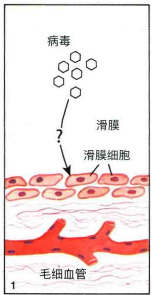
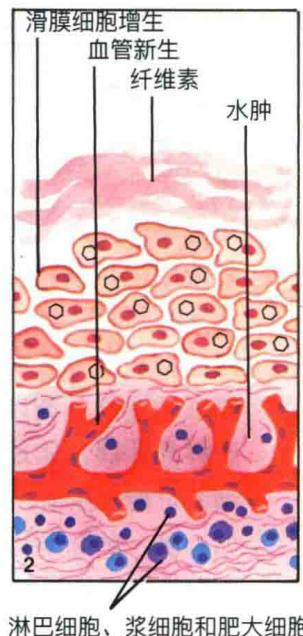
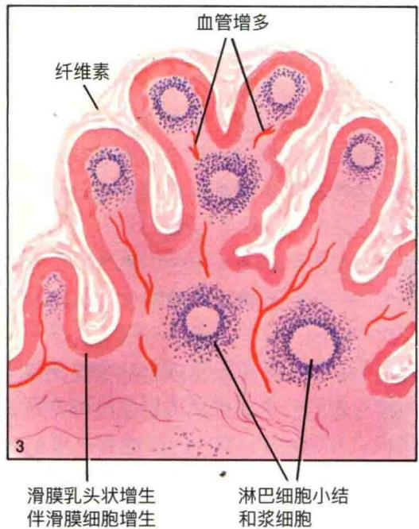
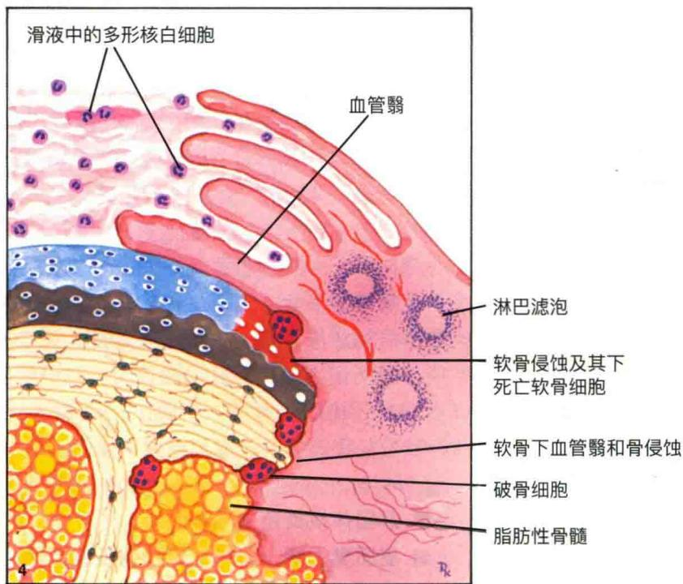 
图26-29类风湿关节炎的组织学发生机制。1.一种病毒或未知应激可能刺激滑膜细胞增生。2.淋巴细胞、浆细胞和肥大细胞浸润、新血管形成与水肿导致滑膜肥大及增生。3.淋巴小结很明显。4.增生的滑膜延伸进入关节腔，插入关节软骨下骨和覆盖软骨成为血管翳。关节软骨最终被直接吸收或因为其营养滑膜液的流失而被破坏。滑膜组织在软骨下骨继续增生，关节部位也一样。5.最后，关节被破坏，变成融合状，这种情况称为强直
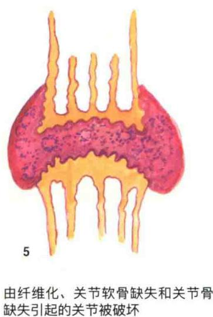
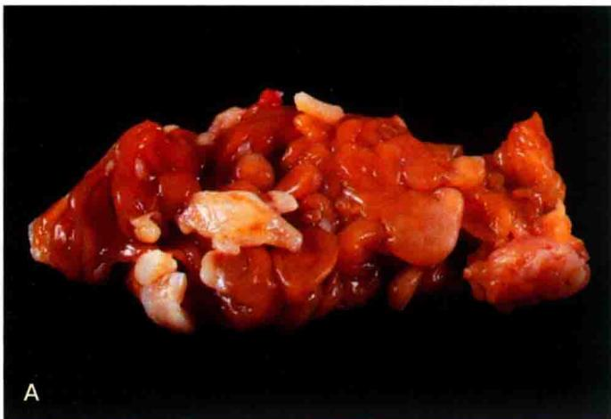
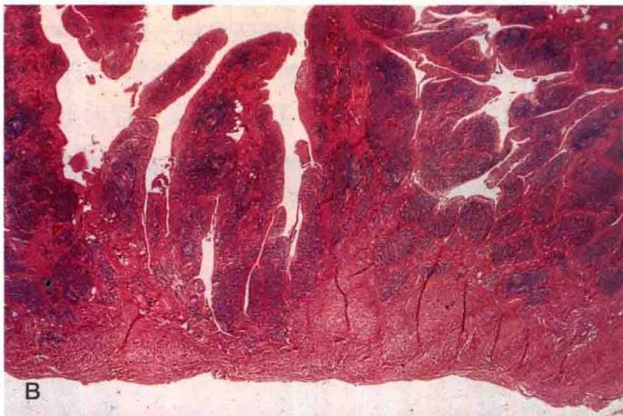
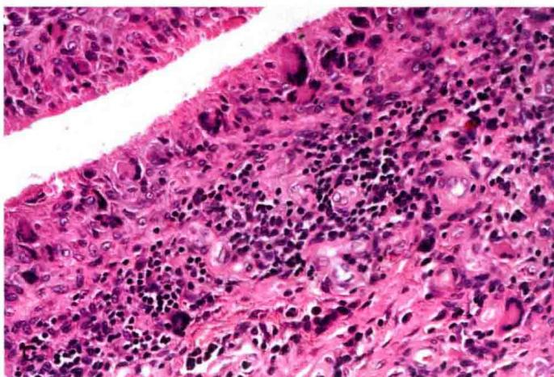 
图26-30风湿性关节炎。A.类风湿关节炎患者的增生滑膜显示大量指状突起与纤维蛋白沉积的局灶灰白区域。滑膜的褐色反映了陈旧性出血而导致的含铁血黄素积累。B.显微镜下表现为明显的淋巴滤泡（艾里－戈姆利体）、滑膜增生和肥大、绒毛褶皱和纤维化和炎症导致的增厚的滑膜。C.高倍镜下：炎症滑膜显示为内衬细胞的增生和肥大。滑膜表面上下可见大量的巨细胞，间质显示慢性炎症
关节的炎症性关节病。它可能伴有不对称的外周关节炎（ $30\%$ 的患者）和全身表现。本病最常见于年轻男性，20岁左右发病率最高。
超过 $90\%$ 的患者具有HLA-B27（正常， $4\% \sim 8\%$ ），尽管这种情况仅仅累及了 $1\%$ 的此单倍型的人。

【病理】强直性脊柱炎始于骶髂关节两侧，然
后通过累及椎骨后部元件的小关节而上升至脊
柱。其结果是这些关节最终破坏，之后脊椎后部融合。
最终，椎骨椎体融合接踵而至。少数强直性脊柱炎患者迅速发展为致残脊椎病，但大多数患者能够保持他们的就业和正常寿命。但是，高达 $5\%$ 的患者发生AA淀粉样变性和尿毒症，少数患者出现严重的心脏受累。
（2）Reiter综合征（反应性关节炎）：Reiter综合征是一个三种疾病的组合，包括：①血清学阴性多关节炎；②结膜炎；③非特异性尿道炎。它几乎全部发生于男性，通常伴有性病感染或细菌性痢疾。与强直性脊柱炎类似，在 $90\%$ 的反应性关节炎患者与HLA-B27抗原相关。事实上，痢疾之后， $20\%$ 的HLA-B27阳性的男性患者患此病。反应性关节炎的病理特点与RA相似。超过一半的患者出现类似于脓疱型银屑病的皮肤黏膜病变。大多数患者，疾病在一年之内恢复，但 $20\%$ 的患者发展成为进行性关节炎，包括强直性脊柱炎。
（3）银屑病性关节炎：所有的银屑病患者，特别是那些患有严重疾病的病例，有 $7\%$ 的病例发展成为炎症性血清学阴性关节炎。HLA-B27与银屑病性脊椎炎和远端指间关节炎相关，而HLA-DR4与类风湿累及模式相关。关节病变通常温和而进展缓慢，虽然偶尔也会遇到破坏严重的情形。
（4）肠病性关节炎：溃疡性结肠炎和克罗恩患者中， $20\%$ 伴有伴有血清阴性外周关节炎， $10\%$ 伴有脊柱炎。没有特别的组织类型与外周关节炎有关，但大多数强直性脊柱炎患者是HLA-B27阳性。切除溃疡性结肠炎患者的病变肠道可缓解关节炎。但在克罗恩病中，这种并发症往往不能缓解。
3. 幼年性关节炎（Still 病）适用于儿童任何类型的炎症性关节炎。发生于年龄小于 16 岁的儿童的病因不明的几种不同的慢性关节炎，被称为 Still 病。除了 RA，一些幼年性关节炎儿童最终发展成为强直性脊柱炎、银屑病性关节炎和其他结缔组织疾病。
■多关节炎（RF阳性）：不到 $10\%$ 的儿童关节炎患者RF阳性，同时伴有多关节发病。女童占优势 $(80\%)$ 并在大多数情况下（ $75\%$ ），出现抗核抗体。与HLA-D4有关，而超过半数的儿童最终发展成为严重的关节炎。
■不伴全身症状的多关节病（RF阴性）：1/4的幼年型关节炎患者（90%为女孩）有几个关节的病变，血清学阴性，不表现出全身症状。这些患者中不到 $15\%$ 的病例最终会发展成为严重的关节炎。
伴有全身症状的多关节病： $20\%$ 的儿童多发性关节炎病例伴有明显的全身症状，包括高热、皮疹、肝脾大、淋巴结肿大、胸膜炎、心包炎、贫血和白细胞增多。然而，这些病例为RF阴性。大部分（ $60\%$ 是男孩，并且所有这些儿童的1/4会遗留严重的关节炎。
少关节关节炎：只有少数如膝关节、踝关节、肘关节或臀部关节等大关节受累的儿童占所有幼年性
关节炎的一半病例，分为两大组。较大的组（80%）主要是女孩，RF阴性，出现抗核抗体和表达HLA-DR5，HLA-DRw6或HLA-DRw8。这些患者中，1/3的病例有眼部疾病，特征性的是慢性虹膜睫状体炎（虹膜和虹膜睫状体的炎症）。这些孩子只有少数病例会有残留关节炎或眼部损伤。较小的组几乎全部由男孩构成，RF和抗核抗体阴性，表达HLA-B27（75%）。少数的患者有急性虹膜睫状体炎，伴随关节炎缓解而缓解。有些男孩随后会发展成为强直性脊柱炎。
# 三、莱姆病
莱姆病通常累及膝关节或其他大关节，由伯氏疏螺旋体感染、硬蜱传播而引起（见第9章）。患者一般表现为关节积液和其他莱姆病的表现。虽然这可能是一个一过性的伴有急性感染的关节炎，患者仍可发展成慢性莱姆关节炎，显微镜下表现与风湿性关节炎相同，不遗留后遗症。
# 四、痛风
痛风是一组异质性的疾病，其中共同点是血清尿酸水平升高和尿酸盐晶体在关节和肾沉积。所有的痛风患者都有高尿酸血症，但高尿酸血症的人群中不足 $15\%$ 的人会发生痛风。
痛风的特征是急性和慢性关节炎，并且被分为原发性或继发性，这取决于高尿酸血症的病因。在原发性痛风，高尿酸血症的出现不伴有任何其他疾病，而继发性痛风的发生则与其他疾病相关。高尿酸血症的所有病例中，1/3是原发性的，其余均为继发性。原发性痛风是成年男性的疾病；仅有 $5\%$ 的病例发生在女性。青春期之前儿童（除了罕见的遗传性疾病）及育龄期妇女极为罕见。发病高峰在 $40\sim 50$ 岁。

# 【发病机制】尿酸来源于嘌呤分解代谢，其
增加或者由于高嘌呤饮食，或者由于体内合
成尿酸增加。尿酸生成和组织尿酸盐沉积之间保持紧密平衡。尿酸只能在尿中被清除。痛风的病因有：①嘌呤产生过多；②由于细胞数量增加而导致的核酸代谢增加；③游离嘌呤碱基的减少；④尿中尿酸排泄减少（图26-31）。一个原本健康的人大量摄入富含嘌呤的食物（如肉类），不会导致高尿酸血症和痛风。在人群中高尿酸血症的患病率和平均体重、蛋白质的摄入量、饮酒量和其他社会因素存在正相关。因此，痛风是一种疾病，是遗传和环境因素相互作用所致疾病的一个实例。
原发性痛风最常见（85%），是肾脏尿酸排泄障碍导致的一个病因尚不明确的损害。其余患者尿酸产生过多，但是只在少数人中发现潜在异常。痛
风家族性倾向自盖伦时代（古罗马时期）即被认识。今天的共识是多个基因控制血清尿酸水平，并且与痛风有关。
几个罕见的遗传性疾病导致痛风。嘌呤补救合成系统成员的次黄嘌呤磷酸核糖转移酶缺陷（HPRT，Xq26-27），导致嘌呤合成增加。Lesch-Nyhan综合征是一种罕见的性连锁疾病，其完全缺乏HPRT，并与神经功能障碍、自毁容貌症和高尿酸血症有关，进一步发展成为痛风性关节炎和梗阻性肾病。
继发性痛风与一些导致高尿酸血症的情况相关。与原发性痛风一样，继发性痛风是由于尿酸产生过多或者尿酸排泄减少。尿酸产量增加常常与核酸产量增加相关，如在白血病、淋巴瘤以及化疗后可见。酒精滥用可能导致继发性高尿酸血症，部分原因是由于加速ATP的分解代谢和（在较小的程度）尿酸的肾排泄减少。原发性肾脏疾病可能尿酸排泄减少。脱水和利尿剂可增加肾小管重吸收尿酸，并可能导致高尿酸血症。事实上，各种药物与 $20\%$ 的高尿酸血症患者有关。铅中毒性痛风在18世纪的英国被描述，这种病在住宅中有铅管道的上流社会人群中很流行。现在认识到，这些患者患有铅性肾病。

【病理】当尿酸钠晶体从过饱和的体液中沉淀下来，它们吸附纤维粘连蛋白、补体和一些其质在其表面上。摄取尿酸盐结晶的中性粒细胞性氧和溶酶体酶，后者介导组织损伤和促进炎。偏振光下可见负双折射的长针状尿酸盐结晶
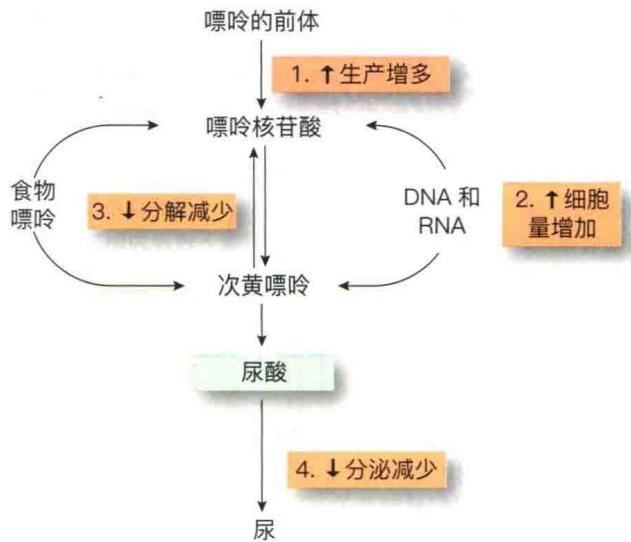 
图26-31 高尿酸血症的发病机制和痛风。嘌呤核苷酸可以经非嘌呤前体从头合成或源自饮食中的嘌呤而衍生。嘌呤核苷酸被分解代谢为次黄嘌呤或合成核酸。核酸和膳食中的嘌呤降解也产生次黄嘌呤。次黄嘌呤转化成尿酸，而尿酸又排泄到尿中。高尿酸血症和痛风源于以下机制所致：①嘌呤从头合成的增加；②细胞增多；③膳食嘌呤和次黄嘌呤的分解减少；④尿酸经肾排泄减少
是诊断痛风的标志（图26-32）。痛风石是细胞外的软组织尿酸沉积物被异物巨细胞和炎症反应相关的单核细胞包裹而成。这些肉芽肿样结构可以在软骨、关节周围的任何软组织，甚至在相邻关节的软骨下骨髓内被发现。肾尿酸沉积物可能在小管之间被观察到，尤其是髓质深部。这些沉积物大体上表现为髓质金黄色条纹。

【临床表现】痛风的临床过程分为4个阶段。
无症状高尿酸血症进展为临床上的痛风历经
多年。
■急性痛风性关节炎是一种痛苦的状态，通常涉及一个关节，无全身症状。稍后在该疾病的过程中，多关节受累伴有发热是常见的。至少有一半的患者首次就诊时非常痛苦伴有红色第一跖趾关节（拇趾），称
为足痛风。最终， $90\%$ 的患者有这样的表现。即使未做治疗，痛风急性发作是自限性的。
■ 发作间期是最初的急性发作期和随后发作之间的无症状的时间间隔。这段时间可长达10年，但后来发作越来越严重，持续时间长，累及多关节。 
痛风石性痛风最终以软骨、滑膜、肌腱和软组织中痛风石的形式出现在未治疗的患者。
肾衰竭是 $10\%$ 的痛风患者的死因。在美国，尿酸盐结石占肾结石的 $10\%$ ， $25\%$ 的痛风患者患有尿酸盐肾结石。
痛风的治疗的目的是：①减少急性发作的严重程度；②降低血清尿酸盐；③防止未来的发作；④促进尿酸沉积物的溶解；⑤碱化尿液，以防止结石形成。用于中断炎症过程的主要药物是非甾体拮抗药。秋水仙
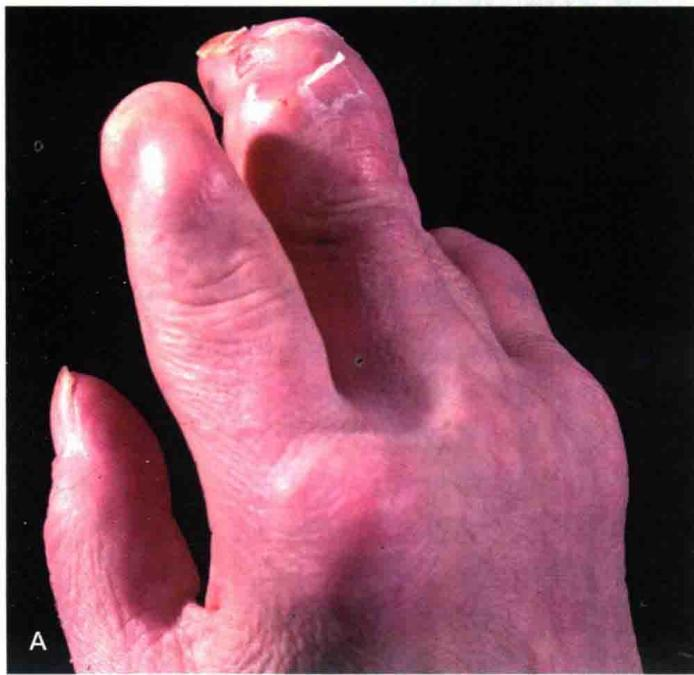
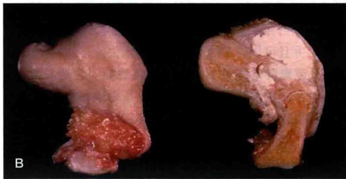
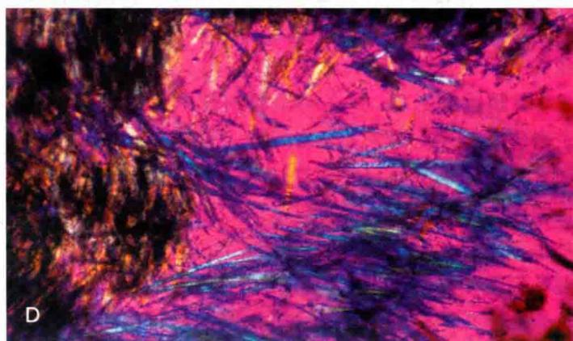
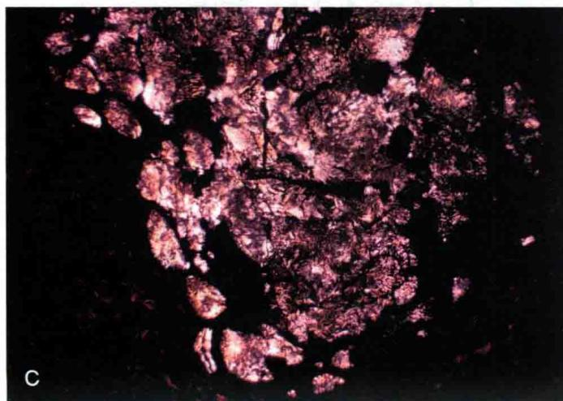 
图26-32 痛风。A.手痛风性痛风石显示为多个橡胶样结节，其中之一是溃疡；B.手指切面面显示牙膏般的尿酸盐结晶的痛风石集合；C.组织切片显示骨内棕色尿酸盐结晶；D.具有石英补偿板的偏振光高倍镜下显示该晶体的负双折射（那些长轴平行于慢补偿轴的晶体显示为黄色）；E.痛风石切片（如果采用普通水处理时）显示异物反应围以粉红色、无定形病变，尿酸盐结晶在处理过程中被溶解
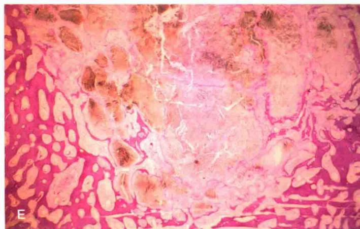
碱已使用了几百年，并在痛风发作间歇期用于预防反复发作。别嘌呤醇是黄嘌呤氧化酶的竞争性抑制剂，该酶将黄嘌呤和次黄嘌呤转化为尿酸。这种药物会导致迅速减少血中的尿酸和尿中的尿酸，并用于患有肾功能不全或其他促尿酸药物耐药的患者。
# 五、关节肿瘤和瘤样病变
关节肿瘤罕见。滑膜最常见的恶性病变是转移癌，特别是结肠腺癌、乳腺癌和肺癌。淋巴增生性疾病（如白血病）也累及滑膜，酷似其他疾病，如RA。尽管它们可以从软组织侵入关节囊，但原发性恶性骨肿瘤延伸到关节并不常见，几个较常见的非肿瘤性病变总结如下：
腱鞘囊肿是薄壁的单纯囊肿，其内包含透明黏液性液体，最常出现于手脚伸侧表面，尤其是腕部。囊肿或起源于滑膜，或源于结缔组织黏液样变的区域。囊壁是由纤维组织构成，缺乏细胞衬覆。病变可能较疼痛，并且可以容易地通过外科手术去除。
贝克囊肿是膝关节滑膜入腘窝的疝。它是最常见于各种形式的关节炎，其与关节内压力增加相关。
滑膜软骨瘤病是良性自限性疾病，透明软骨结节在滑膜内形成，并与滑膜分离，漂浮在滑囊液中，像齿轮之间的沙粒。这些异物产生的慢性刺激刺激滑膜分泌大量滑囊液，并且还导致滑膜出血。滑膜软骨瘤病累及中青年男性的大的动关节，在大多数病例累及膝关节，也有髋关节、肘关节、肩关节和踝关节。
腱鞘巨细胞瘤：是一种滑膜衬覆的良性肿瘤，它是滑膜和腱鞘中最常见的肿瘤，以局限型和弥漫型的形式发生。病变可以发生在关节内或关节外。局限型腱鞘巨细胞瘤（腱鞘巨细胞瘤）发生于手和脚的腱鞘，是手最常见的软组织瘤。肿瘤通常边界清楚，生长缓慢。弥漫型腱鞘巨细胞瘤（色素沉着绒毛结节性滑膜炎）的特点是境界欠清、关节周围的软组织的滑膜细胞过度增殖延伸至滑膜下组织的病变。它累及单一关节，通常发生于青壮年。最常见的部位是膝关节（ $80\%$ ），但也可以发生在髋关节、踝关节、跟骰关节、肘关节，偶尔也发生在手指和脚趾的腱鞘。
【病理】局限腱鞘巨细胞瘤是一个小的（<4cm）分叶状、轮廓平滑、部分有包膜的、附着在腱鞘上的外生性肿块。弥漫型通常是大于5cm，并且境界不清楚。它侵入关节并侵蚀骨骼。显微镜下，两个肿瘤是相似的。它们由类似巨噬细胞的胞质淡染的单核细胞混有散在多核巨细胞、成纤维细胞和泡沫细胞构成。吞噬含铁血黄素的巨噬细胞表明陈旧性出血，术语“色素性”也因此而来。弥漫型广泛浸润周围组织并经常表现为绒毛结构。这些病变的治疗方法是手
术切除，偶尔局部控制病变需要截肢。尽管曾有学者报道罕见的相对应恶性病变，但该病变不发生转移。
# 第五节 软组织肿瘤
软组织肿瘤是发生于某些骨骼外中胚层组织的肿瘤，包括骨骼肌、脂肪、纤维组织、血管和淋巴管。尽管周围神经肿瘤为神经外胚层起源，其应被包括在软组织肿瘤的类别内（见第28章）。恶性软组织肿瘤罕见，占美国所有恶性肿瘤的不足 $1\%$ 。良性软组织肿瘤比恶性肿瘤常见100倍。在软组织肿瘤的上下文中，术语“良性”在某种程度上是相对的，因为所谓的良性肿瘤可浸润、可局部复发（例如，纤维瘤病）。恶性软组织肿瘤（肉瘤）往往通过血液发生转移，通常到肺部。一般患者死于转移性疾病，而不是由于原发肿瘤部位的局部浸润。
软组织肿瘤相关的一些重要的基本原则如下：
■深、大和生长迅速的病变常常是恶性的。 
■ 良性肿瘤相对乏血，而大多数恶性肿瘤血供丰富。 
■ 良性和恶性肿瘤可能都存在钙化。 
某些软组织肿瘤基于遗传学或分子机制而分类。
# 一、纤维源性肿瘤和瘤样病变
1. 结节性筋膜炎是一种易被误诊为肉瘤的良性病变。这种良性但生长迅速的反应性病变，可能由外伤所致，常见的累及部位是前臂、躯干和背部的浅表组织（图26-33）。大多数情况下发生于成年人，病变生长迅速常常是患者求医的原因。组织学上，结节性筋膜炎可能被误诊为肉瘤，因为它以细胞丰富、核分裂象多见和大量多形性梭形细胞为特点。当人们认识到整个“肿块”是肉芽组织或对创伤的过度增长的瘢痕而对应的成分，才暴露了其真正的本质。有报道细胞遗传学异常累及了15号染色体的某个区域，该区域编码组织修复蛋白质（例如，FGF-7）和癌蛋白。结节性筋膜炎是自限性疾病，可以通过手术切除而治愈。 
2.纤维肉瘤是成纤维细胞的恶性肿瘤，这种肿瘤虽然在任何年龄组均可见到，甚至可以是先天性的，但通常发生在成人。先天性（婴儿）纤维肉瘤与一个染色体易位t（12；15）（p13；q26）相关，包含一个融合基因ETV6-NTRK3，预后较差。纤维肉瘤源于结缔组织，如筋膜、瘢痕组织、骨膜和肌腱。最常见的部位是大腿，特别是膝关节周围。大体上，肿瘤边界清晰，并经常有坏死和出血。组织学的特征是恶性形态的成纤维细胞（图26-34），常常形成密集交织束状，形成“鱼骨状”结构。高级别成人纤维肉瘤的预后应警惕，5年存活率仅为 $40\%$ ，10年存活率为 $30\%$ 。
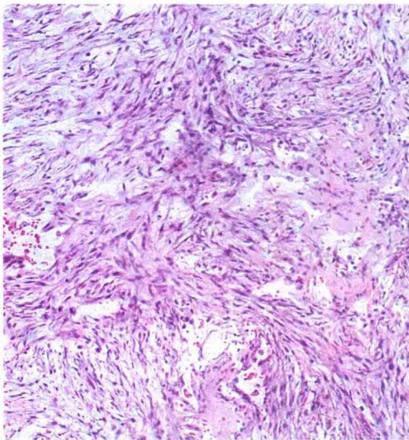 
图26-33结节性筋膜炎。紧密编织的单一梭形细胞和胶原构成的旋涡结构内混有一些淋巴样细胞和血管
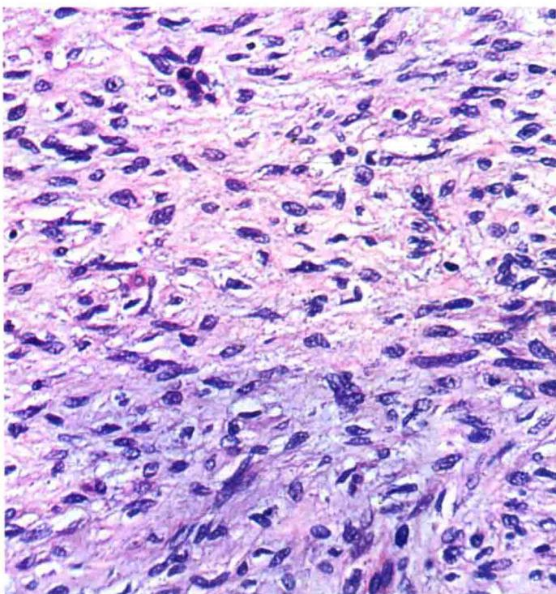 
图26-34纤维肉瘤。显微镜下显示不规则排列的恶性成纤维细胞，特点是深染、不规则、大小不等的细胞核
3. 未分化多形性梭形细胞肉瘤（恶性纤维组织细胞瘤）是最常见的软组织肉瘤。术语“恶性纤维组织细胞瘤（MFH）”指的是显微镜下的表现，实际上代表一组表型异质性的肉瘤，现在被称为多形性梭形细胞肉瘤。MFH/多形性梭形细胞肉瘤的组织学模式在脂肪肉瘤、平滑肌肉瘤、横纹肌肉瘤、肌成纤维细胞肉瘤和纤维肉瘤的变异型中均可以被见到。总体来说，这些肿瘤是40岁以上患者最常见的肉瘤，但所有年龄
段都有记载。在一半的病例中，该肿瘤起源于深筋膜或骨骼肌内，已报道与手术瘢痕、异物和放射治疗有关。总之，这些肿瘤具有复杂的细胞遗传学异常。

【病理】成人多形性梭形细胞肉瘤通常为无包膜的灰白色或黄褐色的肿瘤，黄褐色外观是由
于部分区出血坏死所致。镜下，MFH样肿瘤显示一个高度变异的形态学模式，梭形肿瘤细胞排列成旋涡状（席纹状）结构区域与奇异多形性细胞相邻（图26-35）。这些梭形细胞往往分化很好，可能类似于成纤维细胞。偶尔有体积肥胖的细胞（类似巨噬细胞）、丰富的核分裂象、一些黄色瘤细胞和中度慢性炎症反应。在某些病例有众多的瘤巨细胞，后者胞质内含有强嗜酸性颗粒。胶原沉积的程度各不相同，有时是显微镜下占主导地位的模式。成人多形性梭形细胞肉瘤的预后取决于细胞学异型性、核分裂活跃的程度和坏死的程度。几乎一半的患者术后局部复发，还有相当一部分病例后来出现转移，尤其是肺部转移。5年总存活率为 $50\%$
# 二、脂肪组织肿瘤
1. 脂肪瘤 非常类似于正常的脂肪，它由分化良好的脂肪细胞组成，并且是最常见的软组织肿块。这种良性的、界线清楚的肿瘤可以起源于身体含有脂肪组织的任何部位。大多数肿块发生在上半身，特别是躯干和颈部的皮下组织。脂肪瘤主要见于成人。多发性肿瘤患者的亲属通常也具有类似的病史。

【发病机制】脂肪瘤许多细胞遗传学异常已被记录，但负责其发生的分子机制尚不清楚。
有的脂肪瘤无细胞遗传学变化，也可能代表局部脂肪细胞的增生。
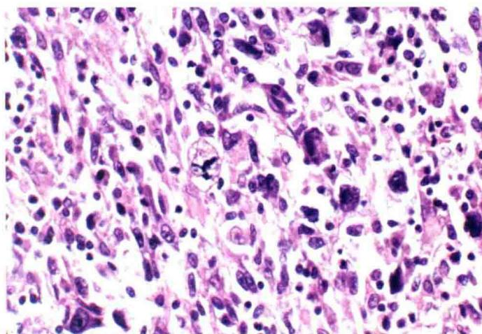 
图26-35 多形性梭形细胞肉瘤（恶性纤维组织细胞瘤）。间变性肿瘤显示为梭形细胞、肥胖的多角形细胞、奇异型瘤巨细胞、异常核分裂象（中心）和散在的慢性炎症细胞。这种图像可在多形性纤维肉瘤以及伴有其他谱系分化的多形性肉瘤中见到

【病理】大体检查，脂肪瘤是包膜完整、柔软的黄色病变，大小不一，可以体积非常大。深肿瘤往往包膜不完整。组织学上，脂肪瘤通常为脂肪组织没有区别。脂肪瘤经简单的局部切除即可。血管脂肪瘤是一种小的、界线清楚的、皮肤瘤，具有广泛的血管增生，通常在青春期后不久。多发性血管脂肪瘤往往多发，并引起疼痛。
2. 脂肪肉瘤 是成人第二常见的肉瘤。脂肪肉瘤占所有恶性软组织肿瘤的 $20\%$ 。肿瘤发生于50岁之后的患者，最常见的部位是大腿深侧及腹膜后。脂肪肉瘤倾向于生长缓慢，但可能会变得非常大，并出现若干亚型。

【发病机制】在脂肪肉瘤的黏液亚型，多数肿瘤伴有12号和16号染色体之间的易位
[t（12;16）（q13;p11)]，导致在16号染色体上的TLS/FUS基因与12号染色体上的CHOP基因融合。在非典型脂肪瘤/分化良好的脂肪肉瘤由一个额外的圆形或环形的染色体而界定，伴有包含MDM2基因的12q14-15区域得扩增。MDM2基因参与生长调节和生存信号传导，部分功能是通过抑制p53基因实现的（见第5章）。

【病理】典型的脂肪肉瘤直径为 $5\sim 10\mathrm{cm}$ ，但直径超过 $40\mathrm{cm}$ ，重量超过 $20\mathrm{kg}$ 的病例也曾
经遇到过。大体外观各不相同，取决于脂肪、黏液和纤维组织的比例。低分化脂肪肉瘤与脑组织极为相似，并伴有坏死、出血和囊性变。显微镜下，黏液样/圆形细胞脂肪肉瘤由不同分化程度的“印戒样”脂母细胞和数量不等原始的圆形细胞嵌入血管黏液样间质构成。分化良好的脂肪肉瘤往往是由大量成熟的脂肪组成，因此可以与脂肪瘤相混淆。脂母细胞是界定脂肪肉瘤的最重要的特点，脂母细胞是恶性形态的细胞，其内可以含有单脂肪空泡或多脂肪空泡，这些囊泡挤压细胞核。
手术后局部复发和转移在圆形细胞和多形性脂肪肉瘤常见，其5年存活率小于 $20\%$ 。相反，高分化和黏液样脂肪肉瘤的5年存活率超过 $70\%$
# 三、横纹肌肉瘤
横纹肌肉瘤是显示横纹肌分化的恶性肿瘤。横纹肌肉瘤在成年人罕见，儿童和年轻人中最常见的软组织肉瘤。

【病理】横纹肌肉瘤的大多数病例可被归类为四个亚型之一。肿瘤可表达非特异性肌源性标志动蛋白和结蛋白或更特异的标记物，如骨骼肌特录因子 Myogenin 肌细胞生成素和 MyoD1。
胚胎性横纹肌肉瘤：这种类型在 $3\sim 12$ 岁的儿童最常见，常常累及头颈部、泌尿生殖道及腹膜后。它的形态学变化很大，从含有大嗜酸性颗粒的胞质和横纹的横纹肌母细胞的高分化的肿瘤（图26-36A）至低分化肿瘤。
葡萄状胚胎性横纹肌肉瘤：也被称为葡萄状肉瘤，其特点是形成息肉状、葡萄状肿块。镜下见肿瘤细胞分布在丰富的黏液基质之中。葡萄状病灶可能发生在任何类型的胚胎性横纹肌肉瘤，但它们在中空内脏器官最常见，包括阴道（见第18章）和膀胱。
腺泡型横纹肌肉瘤：这种类型的发生率低于胚胎型，主要累及 $10\sim 25$ 岁之间的未成年人，年长患者罕见。它在四肢最常见，但在同样部位也可以为胚胎型。典型的是，棒状的肿瘤细胞排列成团块状，周围由纤维间隔所包绕。中心的细胞群的松散排列形成了“腺泡”的结构（图26-36B）。肿瘤细胞表现出强烈的嗜酸颗粒，偶见多核巨细胞。恶性横纹肌母细胞，可以通过它们的横纹而被认识，在腺泡型横纹肌肉瘤较胚胎型横纹肌肉瘤少见，只在 $25\%$ 的病例中出现。大部分腺泡型横纹肌肉瘤表达PAX3-FKHR或PAX7-FKHR融合基因，分别由染色体易位t（2；13）（q35;q14）或t（1；13）（p36；q14）而导致。
多形性横纹肌肉瘤：横纹肌肉瘤中最不常见的类型，发生于年长患者的骨骼肌，通常发生在大腿。这种肿瘤不同于其他类型的横纹肌肉瘤的地方在于其不规则排列的细胞的多形性，并且可以被分类为成人多形性梭形细胞肉瘤的一种类型。体积大的、颗粒状、嗜酸性横纹肌母细胞连同多核巨细胞常见。横纹则不存在。
既往大多数横纹肌肉瘤远期预后不佳，在过去的20年引进联合的治疗方式，包括手术、放疗和化疗，横纹肌肉瘤的预后有所改善。今天，超过 $80\%$ 的局限性病变患者被治愈。
# 四、平滑肌肿瘤
1. 平滑肌瘤 这种良性软组织肿瘤通常发生在皮下组织或血管壁。子宫肌瘤是可以引起疼痛的病变，表现为质硬、黄色、界线清楚的结节。镜下，规则的平滑肌细胞编织状分布显而易见。单纯切除可以治愈。
2. 平滑肌肉瘤 此种恶性软组织肿瘤是成人的一种罕见肿瘤，通常发生于四肢的血管壁。大体上，平滑肌肉瘤倾向境界清楚。它们比平滑肌瘤大而柔软，经常伴有坏死、出血和囊性变。组织学上，肿瘤细胞束状排列，细胞核排列呈栅栏状。高分化肿瘤细胞伴有拉长的细胞核和嗜酸性胞质，低分化肿瘤表现出细胞密度增加和明显的细胞异型性。平滑肌肉瘤与平滑肌瘤的。鉴别主要是靠平滑肌肉瘤具有高度的分裂活性，这点也影响预后。大多数平滑肌肉瘤最终发生转移，转移可能发生在原发肿瘤切除后15年或更长时间。
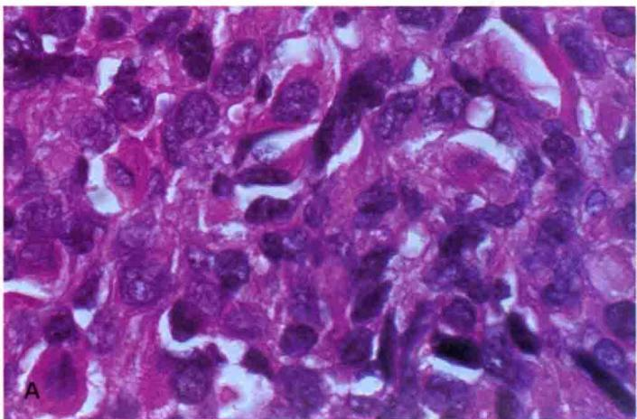 
图26-36横纹肌肉瘤。A.肿瘤含有多形性和梭形肿瘤细胞，肿瘤细胞体积增大，核深染，胞质强嗜酸性。少数细胞有清晰可见的横纹。B.腺泡状横纹肌肉瘤。肿瘤细胞排列成簇状，形成腺泡状结构
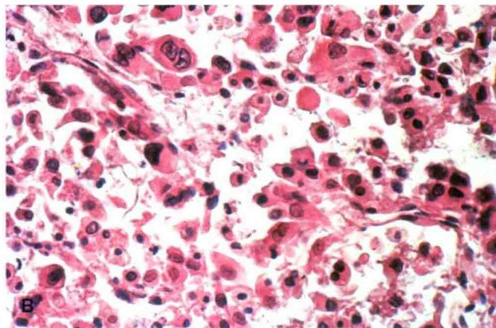
# 五、滑膜肉瘤
滑膜肉瘤是发生在关节的一种高度恶性软组织肿瘤，通常与腱鞘、滑囊和关节囊相关。实际上发生于关节内的滑膜肉瘤少于 $10\%$ 。这种肿瘤也出现在其他软组织和器官。虽然滑膜肉瘤镜下表现与滑膜相似，但它的起源尚未明确。目前认为该肿瘤是上皮和间叶分化的恶性软组织肿瘤。主要发生在青少年和年轻成年人，表现为大关节的疼痛或者触痛的肿块，尤其是膝关节。

【发病机制】滑膜肉瘤显示有特易的平衡染
色体易位，累及X染色体和18号染色体的
易位 $[t(x;18)(p11.2;q11.2)]$ 。这种易位导致 18 号染色体上的 SYT（同线性）基因和 X 染色体上的 SSX 基因（转录抑制因子）融合，产生的一个
融合蛋白，SYT-SSX1或SYT-SSX2蛋白。在局灶病变病例，该SYT-SSX2蛋白与预后较好有关。

【病理】大体检查，滑膜肉瘤通常界线清楚、
圆形或分叶状，附着到肌腱、腱鞘或关节囊的
外壁上（图26-37A）。肿瘤倾向具有一个光滑的假包膜，而且在许多病例呈囊性病变。它们的大小从微小的结节至直径 $15\mathrm{cm}$ 或更大，平均直径为 $3 \sim 5\mathrm{cm}$ 。
显微镜下，滑膜肉瘤的经典描述是为具有双相模式（图26-37B）。充填有液体的腺样区域衬覆上皮样肿瘤细胞嵌入在肉瘤样的梭形细胞背景里。这些组成成分比例、分布及细胞分化不同，梭形细胞的成分通常大大高于腺样成分。滑膜肉瘤的复发率很高， $60\%$ 以上的病例会发生转移。5年生存率为 $50\%$ 左右，患者通常死于有广泛的肺转移。
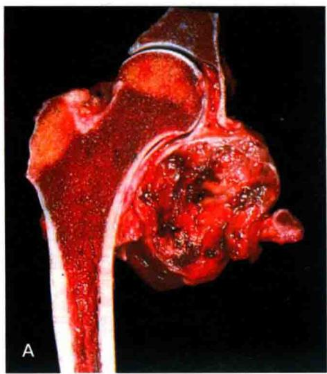 
图26-37 滑膜肉瘤。A.上股骨和髋臼照片显示肿瘤与髋关节和股骨的颈部相邻；B.显微镜下显示了滑膜肉瘤的双相外观。不规则的腺样结构由丰富的上皮样肿瘤细胞衬覆，其间的组织内含有较小的、染色较深的梭形细胞
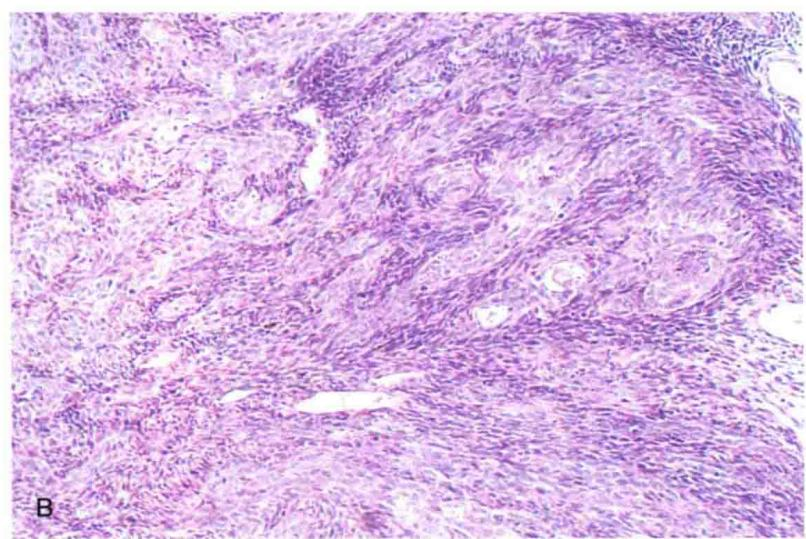
# 第27章 骨骼肌
如果说皮肤是我们与环境连接的界面，那么我们则借助骨骼肌与环境相互作用。骨骼肌占体重的 $40\%$ ，构成了我们的体貌形象。当肌肉功能紊乱，自主运动就会紊乱，其他的生活功能也会紊乱。呼吸困难和死亡是许多全球骨骼肌疾病患者的最终结局。肌肉是分子换能器，它能将代谢能转变为分子运动和收缩力，正如一台发电机（但不同于汽车发动机引擎）。因此，许多肌细胞分子水平上的结构和生化缺陷导致肌病。
在发育过程中，不同的代谢发育成不同的肌纤维。I型肌纤维（红色的或者慢收缩）的特点是：①缓慢的长时收缩；②耐疲劳；③依赖氧化代谢。II型肌纤维（白色的，快收缩）引起快速的、更有力的短期收缩，并且依赖无氧酵解能量。肌肉的纤维类型可以利用肌球蛋白ATP酶的碱性组化反应来区分。I型肌纤维在碱性条件在不着色，而Ⅱ型肌纤维着色很深（图27-1）。在人类中，没有一种肌肉是有专门由一种纤维组成的。但是，不同肌肉的纤维类型的比例不同。每个人同一肌肉的纤维类型不同，这种不同是由遗传决定的。研究表明，通过长期的加强训练来改变肌肉功能也能改变肌肉纤维类型。
# 第一节 一般病理反应
坏死是原发性肌肉疾病（肌病）中肌纤维对损伤的常见反应。骨骼肌纤维的广泛急性坏死（横纹肌溶解）释放胞质蛋白包括肌红蛋白入血，可能导致肌红蛋白尿和急性肾衰竭。在许多人的肌病中，坏死发生于肌纤维的节段部分，而损伤的两端侧面则完好无损（图27-2）。损伤很快引起两种反应：血液中巨噬细胞流入到坏死的细胞质以及卫星细胞的激活，位于每个肌纤维远端的一些休眠的肌成纤维细胞将增殖并变为有活性的肌成纤维细胞。两天之内，它们就开始相互融合并且与残余的完好的肌纤维末端融合。这种再生纤维的直径更小，胞质嗜碱性，有大的泡状胞核和显著的核仁（图27-10B）。
单个片段损伤后的几周之内，再生可以修复肌肉纤维的正常结构和功能。对于亚急性和慢性疾病，纤维坏死超过纤维再生，逐渐导致肌纤维功能障碍和纤维化。
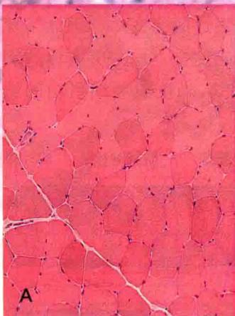 
图27-1 正常肌肉。A.苏木精－伊红染色。这是股外侧的横断面冷冻切片，多边形肌纤维被模糊的、薄层的结缔组织和肌内膜分开，结缔组织的厚带、肌束将纤维划分为束。在视野中所有的核都位于细胞周围。偶尔有核浸润在卫星细胞中，但是不能在光学显微镜下与肌纤维区分。B.肌纤维的ATP酶。I型纤维苍白、碱性；II型纤维深色。注意纤维类型的混合
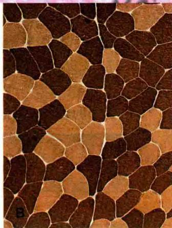
# 第二节 肌营养不良症
肌营养不良症指的是原发性肌肉退化，通常具有遗传性和持续进展性。这些患者的肌肉组织表现为肌纤维的坏死、再生活性、进行性纤维化、肌肉中出现脂肪组织浸润以及轻微甚至没有炎症（图27-3）。之前报道多种变异的这种类型的肌病，一种经典类型是遗传性、进展性、非炎症性肌肉退化。
# 一、杜氏肌营养不良症和贝克肌营养不良症是遗传性、非炎症性肌病
杜氏肌营养不良症是一种严重的、X染色体遗传的进行性肌肉退化，特别是盆腔和肩膀的肌带。它是儿童中最常见的非炎症性肌病。比较轻微的一种疾病是贝克肌营养不良症（见第6章的两种疾病的分子遗传机制部分）。这两种疾病的血浆肌酸激酶活性都有明显增加。

【发病机制】杜氏肌营养不良症是由于X染色体短臂上一个基因突变导致抗肌萎缩蛋白或者缺乏，这种蛋白位于肌膜的内表面。抗蛋白使得肌膜下细胞骨架蛋白通过跨膜复合
蛋白和与细胞外层粘连蛋白结合的糖蛋白与细胞外部连接（图27-4）。抗肌萎缩蛋白缺陷的肌肉纤维因此缺乏肌膜和细胞外基质的正常相互作用。
贝克肌营养不良症与杜氏营养不良症是等位的。突变的抗肌萎缩蛋白基因产生一种改变的、通常缩短的、抗肌萎缩蛋白分子，它保留足够的功能来维持一个不太严重的表型。其他的营养不良疾病与上述的肌营养不良症相似，但是以常染色体隐性方式遗传。一些患者由于影响了跨膜蛋白表达的突变体，因此干扰细胞骨架蛋白和细胞外基质的连接。这些突变体的例子见表27-1（也可见图27-4)。当抗肌萎缩蛋白的结
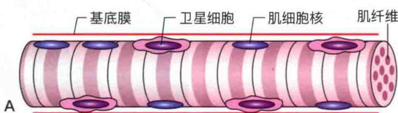
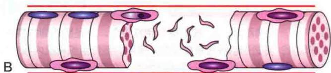
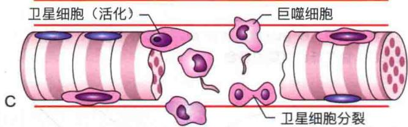
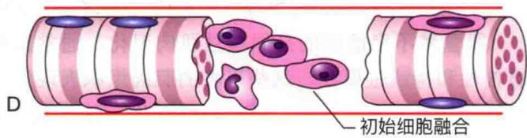
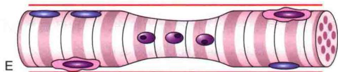
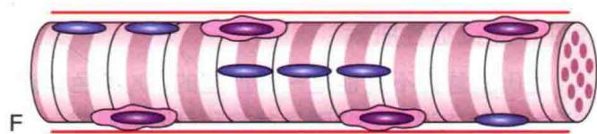 
图27-2 肌纤维的节段性坏死和再生。A. 正常的肌纤维在基底膜下，包括肌原纤维和肌膜下核。分散的卫星细胞位于基膜表面、基底膜内。这些细胞是休眠的肌成纤维细胞，它们能增殖并且融合成分化的纤维。它们组成了 $3\% \sim 5\%$ 的核，在骨骼肌的交界面。B. 在许多的肌病（例如，杜氏营养不良症或者多肌炎），肌纤维的损伤导致肌浆的分解和节段性坏死，而基底膜和神经被保护。C. 损伤部分吸引循环中巨噬细胞透过基底膜并消化吞噬肌浆成分。再生过程始于卫星细胞的激活和增殖，在基底膜形成成肌细胞。巨噬细胞逐渐在损伤部位留下碎片。D. 在晚期，成肌细胞在纤维的中部相互连接排成一列并开始融合。E. 纤维部分的再生是首要的，正如核中心位置大的、苍白的囊泡所示。F. 除了存在一些长期的中心位置的核，纤维几乎是正常的。最终恢复到正常状态
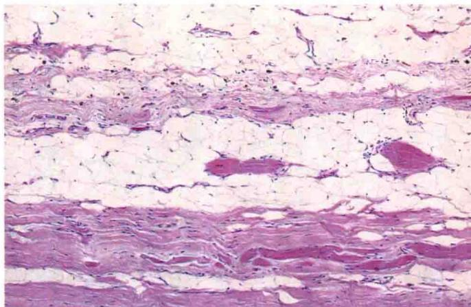 
图27-3 神经肌肉疾病的晚期。三角肌的苏木精－伊红染色，骨骼肌被纤维脂肪结缔组织取代。仅存的骨骼肌纤维比丰富的胶原成分有更深的嗜伊红颜色
合分子缺失或者突变的时候，抗肌萎缩蛋白可能会减少或者异常定位，这种情况使确诊更复杂。
【病理】杜氏肌养不良症的疾病过程包括： $①$ 肌纤维不间断的坏死； $②$ 持续的修复和再生； $③$ 进行性纤维化。最终肌肉衰退超过了再生能力。
在疾病早期，纤维坏死和再生是在小范围发生的，伴随分散的、大的、透明深色纤维。后者过度收缩，并被认为是早于纤维坏死（图27-5）。巨噬细胞入侵坏死的纤维并且发挥清道夫功能而不是炎症功能。晚期特点是骨骼肌纤维几乎全部消失（图27-3）但是肌梭纤维相对保守（牵张感受器的肌纤维）。
表27-1 肌膜和细胞外基质异常导致的肌营养不良症和先天性肌病肌病缺陷蛋白肌聚糖病肌聚糖-α-ε（肌纤维质膜蛋白）Dysferlin病（肢带和三好肌病）Dysferlin（肌纤维质膜蛋白）小凹蛋白病（遗传波动性肌肉功能紊乱）小凹蛋白-3（肌纤维质膜蛋白）
杜氏肌养不良症的诊断可以通过对基因组DNA进行聚合酶链反应确诊，它是大片基因的缺失。大概 $30\%$ 的患者有小片段基因重组或者通常检测不到的点突变。这些患者可以用肌肉活检来检测，免疫细胞化学显示极少或者几乎没有抗肌萎缩蛋白。但是，新一代基因测序技术能够检测抗肌萎缩蛋白基因的所有致病突变，并迅速应用于主要医疗中心。绒毛膜样品的产前诊断非常有用，尤其当这种突变被认为是受家庭成员影响的时候。
【临床表现】杜氏肌营养不良症的男孩患者从出生就有明显的血肌酸激酶增高，即使在子宫腔中也有形态异常的肌肉。通常在第1年时临床上检测不出，但是在第3年或者第4年时症状变得明显，
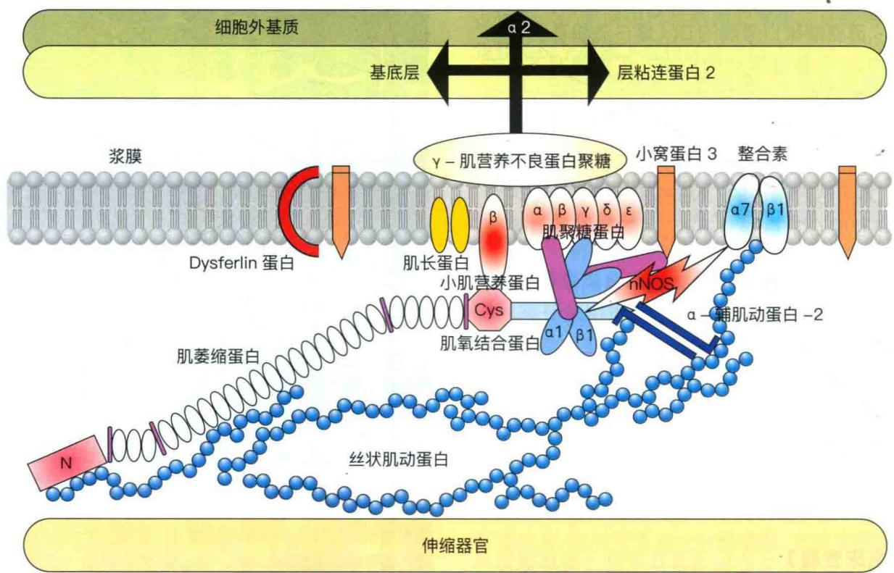 
图27-4图示蛋白连接抗肌萎缩蛋白和质膜以及伸缩器官。许多这些连接蛋白与已知的肌病有关（表27-1）
主要是在盆腔和肩膀的肌带（近端肌肉无力）。“假性肥大”指的是肌肉被纤维脂肪组织扩大，最终发展到小腿肌肉。这样的患者通常在10岁就坐在轮椅上，15岁就卧床不起。大部分通常死于肌无力引起的呼吸衰竭并发症或者心肌损害引起的心律失常。其他的非骨骼肌表现包括胃肠道功能紊乱（源于平滑肌功能退化）和不同程度的智力缺陷，明显是由于中枢神经系统的抗肌萎缩蛋白缺乏。
# 二、多种蛋白突变引起的肢带型肌营养不良症
肢带型肌营养不良症是一组与许多缺陷蛋白相关的遗传性疾病，它们表现相似的临床特征包括盆腔和肩膀肌带无力。儿童时期或者成年时期可能会发作，表现为多种肌无力，也常见心脏损害。所有的肌肉功能紊乱组织学表现相似，但是有些变异表现出异常特征包括可靠突变相关的独特特征。因此，恰当的诊断不仅需要详细的临床病史还需要一连串的免疫组化和基因技术检测。
# 三、在出生时就可能存在先天性肌肉功能紊乱
这些疾病的特点是肌张力减退、肌无力和挛缩。依赖于不同的变异，患者可能也存在脑白质病、脑畸形和眼病。从病理学上，这些疾病很像其他的肌肉营养不良症，它们有不同程度的纤维化和肌肉组织中脂肪浸润。这些疾病与细胞外基质蛋白突变有关（例如，胶原蛋白、层粘连蛋白和整合素）或者α-肌营养不良蛋白聚糖（α-抗肌萎缩相关糖蛋白肌病）以及肌浆网（脊柱强直性肌肉萎缩症）的异常糖基化。
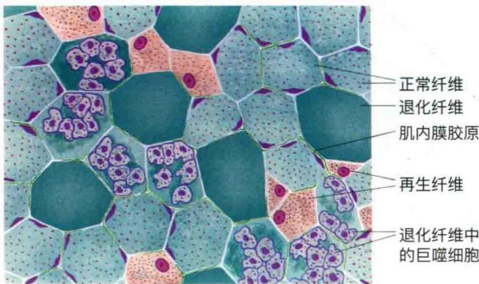 
图27-5 杜氏肌养不良症。骨骼肌的病理变化可以通过网状纤维三重染色显示。一些纤维轻微变大并且比正常的颜色深。这些过度收缩的肌浆片段位于退化片段之间。其他纤维被能够清除退化的肌浆的巨噬细胞浸润。其他纤维比正常的小并且有颗粒状肌浆。这些纤维有扩大的、泡状核和明显的核仁，并且有再生纤维。进展中的肌内膜纤维化的代表特点是单个肌纤维的胶原蛋白沉积。这些是慢性、活跃的非炎症性肌病的改变
# 四、肌强直性营养不良的特点是肌肉舒张功能受损
肌强直性营养不良是成年人最常见的肌肉功能紊乱，它是一种常染色体显性遗传病，特点是肌肉舒张变慢、进展性肌无力和消瘦。这种疾病的发病率估计已经高达14/100000。发病年龄和症状的严重程度因人而异。肌强直性营养不良可以成年发作，也可以是先天性。

【发病机制】肌强直性营养不良分两种形式，均是常染色体显性遗传，并且反映了不同基变。1型肌强直性营养不良是由于能够编码
丝氨酸－苏氨酸蛋白激酶的DM蛋白激酶基因的3'端附近的CTG重复序列的扩增，正常情况下，这个三核苷酸重复片段少于30个拷贝，但是在轻微受影响的肌强直性营养不良的患者体内有50个或者更多的拷贝。2型肌强直性营养不良是有环形锌指结构DNA结合蛋白的CNBP基因的第一个内含子的四核苷酸CCTG重复序列的扩增（见第6章）。

【病理】成人肌强直性营养不良的病理特点是
多变的，即使同一个患者的肌肉组织中也不一
样。许多患者表现为 I 型纤维的萎缩或者 II 型纤维的肥大。位于内部的核是常见特点。尽管偶尔存在坏死和再生，但是它们不像在杜氏肌养不良症中那么重要。
先天性肌强直性营养不良的肌肉表现为肌纤维萎缩、频繁出现的中心核以及纤维分化失常。这些特点很像X染色体隐性遗传的肌小管性肌病（见下文）。

【临床表现】成人肌强直性营养不良缓慢进展
性肌无力和僵硬为特点，主要在远端肢体。面
部和颈部的肌无力和下垂也是1型肌强直性营养不良的典型特征，但是在2型肌强直性营养不良中不常见。肌强直性营养不良有时也存在非肌肉损伤，包括白内障、生育能力低下的睾丸萎缩以及不同程度的人格衰退。
先天性肌强直性营养不良只见于表现出症状的女性1型肌强直性营养不良的后代。这些婴儿出生时便有严重的肌无力，但是肌强直不明显或者不表现，而在后期的儿童时期表现。这些患者的大多数有智力障碍。2型肌强直性营养不良目前还不清楚。
# 五、眼咽型肌营养不良
眼咽型肌营养不良（OPMD）典型性地见于中年人（大于45岁），并且大部分表现出常染色体显性遗传，偶尔也存在常染色体隐性遗传。这两种形式都是由于多聚腺苷酸结合蛋白核1基因中的GCC重复片段的数量异常增加，它们的不同在于片段数量的异常，增加位置的不一样。这种常染色体显性遗传形式主要见于新墨西哥的西班牙人、在魁北克和布哈拉的法国人、加拿大人以及以色列的犹太人。患者逐渐发展为进行性眼睑下垂和吞咽困难，其他肌肉群的无力包括面部的和腿部的。肌肉活检表现为核内包涵体、镶边空泡和与包涵体肌炎相似的丝状内含物（图27-6）。
# 六、面肩肱型肌营养不良症
面肩肱型肌营养不良症是一种发病于儿童以及青少年的常染色体显性遗传性肌营养不良症。这种疾病的显著特点在于它与染色体 $4q$ 的亚端粒区域的一个正常的非功能性基因（Dux4）的激活相关，这是由此区
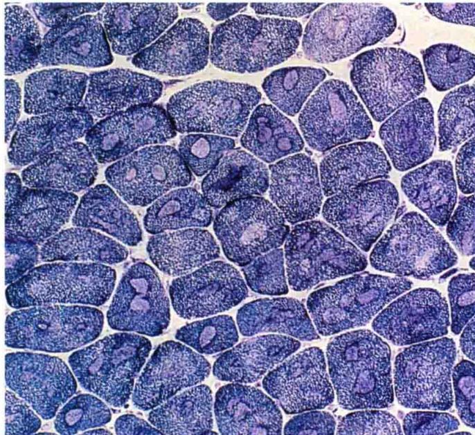 
图27-6 中央轴空病。股外侧肌片段的NADH-四唑还原酶染色在许多肌纤维的中心表现出明显的环形区。围绕在核心损伤部分是过度着色的薄区。肌纤维ATP酶染色显示，这个病例的所有肌纤维是I型纤维（未展示）
域的重复序列的丢失导致。患者主要表现为面部和肩部无力，尤其是以肩胛骨翼状突出最为明显。同时其他肌肉也可能受到影响。但寿命不受影响。骨骼肌之外的症状主要有心脏束支传导阻滞、听力丧失以及视网膜病变。单核炎症显著，可以达到如多发性肌炎这类类似炎症性肌病的程度（见后文）。
# 第三节 先天性肌病
偶然情况下，新生儿会表现出广泛性肌张力降低、肌腱深反射减弱和肌松的症状。这其中的大部分患儿由于呼吸微弱和产生的呼吸并发症不得不度过一个危险的围生期。有些会出现严重的进行性肌张力降低，最终导致出生后12个月内死亡。Werdnig-Hoffman病和婴儿酸性麦芽糖酶缺乏症（庞贝征）将在下面介绍。有些婴儿相对来说会有一个较为良性的疾病过程，疾病虽伴随一生，但进展缓慢或者没有进展。尽管肌张力降低会产生继发性的骨骼肌并发症，患者仍可有运动能力和正常的寿命期限。本组患者归纳入“先天性肌病”的范畴。此组患者很少有特异性的肌纤维结构的异常。先天性肌病三个最常见的形式主要是中央轴空病、棒（杆状体）肌病、中央核肌病（图27-6～图27-8）。
这些特点可以概括如下：①都表现为先天性肌张力降低、肌腱深反射减弱、肌松、运动里程的缩短；②在这三种形式中，形态学异常仅出现于1型（红色）纤维。患者经常会有1型纤维的异常前体，或者是不能发展为2型（白色）纤维，肌肉没有明显的肌纤维的坏死或硬化，患者血清肌酐激酶水平正常。
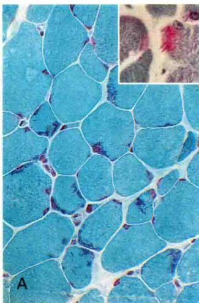 
图27-7 棒（杆状体）肌病。A.肌纤维含有黑色的杆状和颗粒状聚集（改良Gomori三色染色如插图所示，杆状体位于纤维周围近核处；B.相同的活检部位电镜图显示杆状结构来源于Z盘
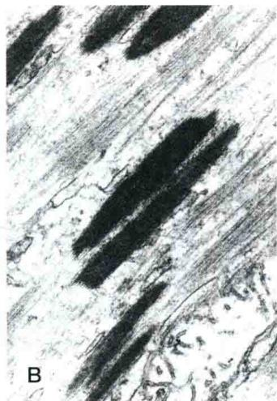
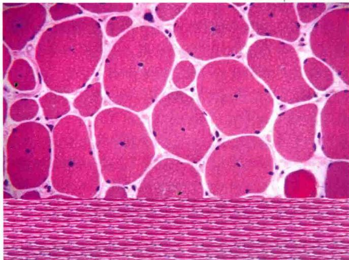 
图27-8 中央核（肌管）肌病。HE染色。大量肌纤维含有一个中央核，受影响的肌纤维异常小。此外，从中央核发出辐条状结构。这些纤维类似胎儿骨骼肌肌管发育后期的状态
中央轴空病：由于控制肌浆网的钙离子释放通道的兰尼碱受体基因突变（19q13.1）导致常染色体显性遗传性疾病，主要特点是先天性肌病、远端肌肉无力。肌肉活检显示1型纤维占绝对优势，其中心区域退化（图27-6）。中央轴的异常会波及整条纤维。兰尼碱受体基因的突变会引起恶性高热，这是一种由手术麻醉引起的，以横纹肌溶解为特点的致死性肌病。
棒（杆状体）肌病：杆状体肌病是一组肌病的总称，特点是骨骼肌的肌浆网中有杆状体的聚集(Nemaline来源于希腊文nema，是“杆状”的意思）。这种疾病具有高度异质性，至少由5种基因突变引起，包括伴肌动蛋白（最普遍，参与肌动蛋白的聚合），骨骼肌βα-肌动蛋白，α-和β-原肌球蛋白和慢肌钙蛋白T。经典的杆状体肌病的先天性特点为先天性肌张力低下，运动延迟。晚期发生的形式（儿童和青少年）趋向于多肌肉退化、血清肌酐激酶水平升高，疾病发展过程呈慢性进行性的特点。肌肉活检可见明显的1型纤维
占优势，肌浆网中杆状结构的聚集。这些内含物的聚集经常位于肌膜下近核区域（图27-7）。
■中央核肌病和肌管肌病：中央核肌病和肌管肌病以前被认为是同义词。中央核肌病由一组临床和基因异质性遗传性的特点组成。这一特点是共有一个位于骨骼肌细胞中心的核。存在常染色体的隐性和显性遗传。后者主要表现在青春期，血清肌酐激酶水平中度升高。疾病发展缓慢，与杆状体肌病相似，类似于所谓的肢带型肌营养不良。部分患者表现出明显的面部和眼外肌肉累及。双侧的上睑下垂也都部分发生。负责发动蛋白2的基因参与内吞作用，膜转运和中心体以及肌动蛋白装配。组织活检发现1型纤维占优势（图27-8）。大部分此类纤维小、圆，存在一个单独的中央核，亦是疾病命名的原因。在这方面，它们类似骨骼肌胚胎发育时期的肌管期。
肌管肌病是一类由肌管基因突变引起的X染色体连锁疾病。肌微管素是一种磷酸酶，在许多组织中表达，参与磷脂酰肌醇的信号转导通路，但是它的精确功能却不清楚。肌管肌病临床表现为明显的新生儿肌张力低下与呼吸衰竭。病理上类似于中央核肌病，在两种纤维上都有中央核。
# 第四节 炎症性肌病
炎症性肌病是一组获得性的异质性肌病，表现为对称性近端肌肉肌无力，血清骨骼肌来源的酶升高和骨骼肌的非化脓性炎症。炎症性肌病并不多见，每年发病率为1/100000。皮肌炎主要影响儿童和成人，然而多发性肌炎主要发生在20岁以后。这两类疾病多发于女性。相对比而言，包涵体肌炎主要发生在50岁以后，男性发病率是女性的3倍。

【发病机制与病理学】这些肌肉病变有自身免疫的因素。因为：①伴随自身免疫和组织疾病；

②病理特点提示自身免疫性的肌细胞损伤； 
③可以检测到血清自身免疫性抗体；④多发性
肌炎和皮肌炎（但不包括包涵体肌炎）对免疫抑制治疗有反应。在肌肉或血管中没有发现特异性靶向抗原的存在，但是抗核抗体和抗胞质抗体存在于这些疾病中，其中几种具有特异性。
炎症性肌病最显著的形态学特点是：①炎性细胞的存在；②肌纤维的硬化和吞噬；③纤维萎缩和再生共存；④纤维化。

【临床表现】所有的炎症性肌病主要表现为隐匿性的近端对称性肌无力，数周或数月内逐渐患者对于需要近端肌肉的简单活动力不从心，物、上台阶、梳头发。吞咽和抬头困难主要是
咽肌和颈屈肌的问题。严重病例会影响呼吸肌。肌无力发展数周或数月后导致肌萎缩。炎症性肌病的患者血清肌酐激酶和其他肌酶的升高。皮质激素治疗多发性肌炎和皮肌炎很有效，但是所有的治疗对于包涵体肌炎都无效。
皮肌炎：皮肌炎区别于其他肌炎的主要特点在于上睑、面部、躯干和其他部位出现皮疹。可以单发，也可以与硬皮病、结缔组织病和其他自身免疫病同时发生。主要发生于中年人，同时使上皮性癌症的发生率增加，主要是肺癌。
皮肌炎是免疫介导的微血管病变。肌纤维的损伤和萎缩主要伴随以下情况发生：①免疫复合物的沉积，包括补体膜在毛细血管壁和其他血管壁攻击复合物C5b-9，由此引起的微血管病变和毛细血管的丢失；②B细胞和 $\mathrm{CD4^{+}}$ 辅助性T细胞浸润血管周围（图27-9）。这种微血管的病变被认为可以产生个别肌纤维的缺血性损伤，最终导致纤维萎缩。皮疹，是临床上皮肌炎区别于其他炎症性肌病的特点被认为具有相同的微血管病变。肌肉内的血管表现为内皮的增生、纤维性栓子和毛细血管的闭塞。在纤维束周围可以看见一层和多层的萎缩性纤维（纤维束周围萎缩，见图27-9）。在没有炎症的情况下，在毛细血管壁上纤维束萎缩和免疫复合物的共存是诊断皮肌炎的关键点（图27-9）。
多发性肌炎：多发性肌炎没有像存在于皮肌炎的
微血管病变的证据（见上文）。而是正常的肌纤维最初由 $\mathrm{CD8^{+}T}$ 细胞和巨噬细胞包围，尔后发生肌纤维退化。不同于正常肌肉，多发性肌炎影响的肌肉在肌膜上表达MHC-1抗原。这一发现为此类病变提供了免疫病理基础。自身抗体在发病机制中的作用仍然不清。多发性肌炎经常检测到抗Jo-1抗体，是一种抗组氨酰-转运RNA（tRNA）合成酶的抗体，伴随间质性肺病的发生、雷诺现象和非侵袭性关节炎。炎性细胞浸润结缔组织，主要在纤维束周围（肌内膜炎症），可能侵袭正常肌纤维（图27-10）。纤维的退化和再生的分离现象在纤维束上广泛分布。多发性肌炎不存在纤维束周围萎缩。
包涵体肌炎：包涵体肌炎的病理特点与多发性肌炎相似，由单个纤维坏死和再生组成，其中肌内膜细胞毒性T细胞占主要部分。此外，嗜碱性颗粒物质被认为是在肌纤维内的狭缝状空泡（镶边空泡）边缘。在镶边空泡周围发现独特的纤维。这些肌纤维也存在小的嗜酸性的胞质包涵体，经常近镶边空泡（图27-11A，B）。这些包涵体为疾病所特有，代表细胞内淀粉样蛋白的一种形式（图27-11C，D），是β-淀粉样蛋白的免疫活性形式，与存在于阿尔茨海默症老年斑淀粉样蛋白的类型相同。Parkin，同肮病毒前体蛋白一样，是一个与遗传性疾病帕金森病相关的蛋白，也位于包涵体中。这些包涵体的发病机制尚不清楚。
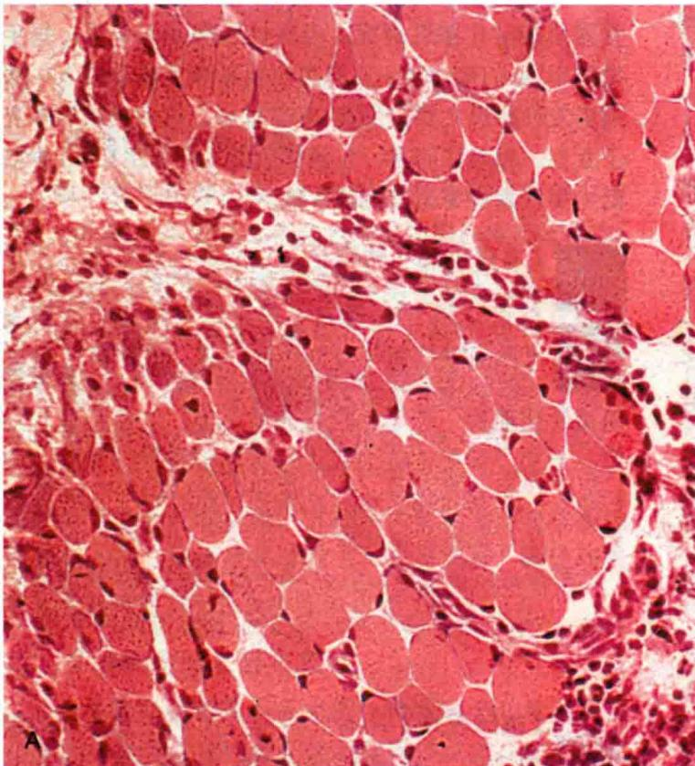 
图27-9 皮肌炎。A. HE染色。炎性细胞主要浸润在肌膜周围而不是肌膜内。肌肉束的周围显示大量肌纤维萎缩和损伤，导致皮肌炎损伤模式的出现，定义为“束周萎缩”。B. 束周萎缩的高倍镜图像显示肌肉束周围展开和收缩的纤维。免疫荧光（插图）显示大量毛细血管壁呈现C5b-9（膜攻击复合物），反映了皮肌炎典型的微血管结构的改变。这种方法也能染出少量再生纤维
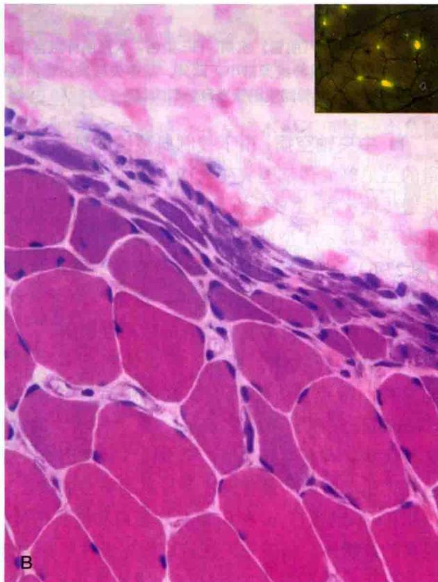
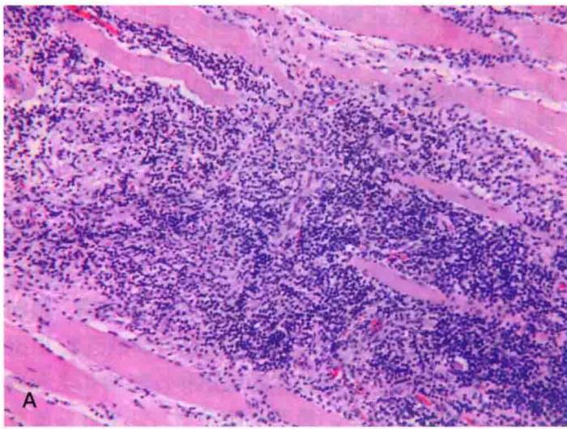 
图27-10 多发性肌炎。A. HE染色。切片示受影响的肌肉表现为炎性肌病。单核细胞主要浸润肌膜内。此区域包括单纤维坏死。B. 愈合的炎性肌病区域显示完整的纤维（箭头），坏死纤维（箭）和再生纤维以核增大和嗜碱胞质（星号）为特征
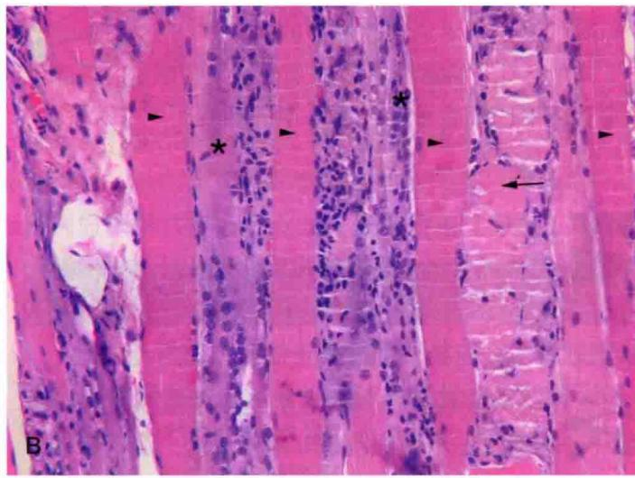
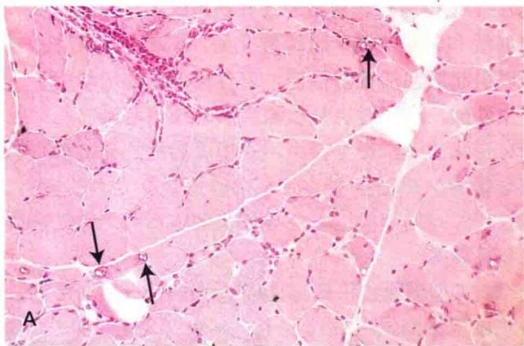
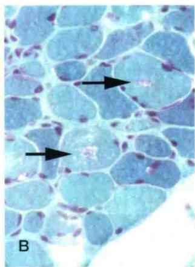
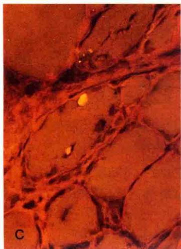
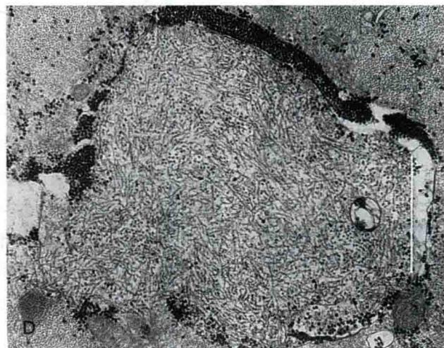 
图27-11包涵体肌炎。A. HE染色。包涵体肌炎的特点类似于多发性肌炎，但是肌纤维也显示镶边空泡（箭头），与增大的溶酶体对应；B.改良Gomori三色染色显示颗粒状嗜碱性镶边空泡（箭头）；C. 刚果红染色，包涵体弱嗜刚果红，但是彩色信号强，因为被荧光激发增强。D. 电镜显示淀粉样包涵体丝状物的特点
# 第五节 重症肌无力
重症肌无力是一种由神经－肌肉接头处存在乙酰胆碱（Ach）受体的抗体所引起的一种获得性自身免疫性疾病，主要表现为骨骼肌异常疲劳。所有种族都可发病，女性发病率是男性的2倍。这种疾病主要开始于年轻人，但也有报道儿童或是老年人发病的案例。

【发病机制】重症肌无力由于运动终板上的Ach受体受到了免疫介导的攻击。抗体黏附
在不同受体蛋白的表位，因此减少了受体的数量。这种抗原-抗体复合物结合补体，导致位于神经肌肉接头处的富含Ach受体的褶皱部分脱落。抗体的交叉连接导致Ach受体通过胞吞作用发生净亏损。这些因素的联合作用破坏信号的传输，引起肌无力和异常疲劳。然而抗受体抗体并不直接阻断Ach的结合。
重症肌无力的大多数患者有胸腺增生， $15\%$ 出现相关的胸腺瘤。针对重症肌无力患者的胸腺增生
和胸腺瘤，手术治疗是有效的方法。研究发现Ach受体也存在于胸腺增生和胸腺瘤的某些细胞。因此，胸腺T淋巴细胞可能激活B淋巴细胞而产生抗受体抗体。

【病理】重症肌无力的病理改变并不明显。肌肉活检显示2型肌纤维的萎缩和纤维束内淋巴
细胞的聚集。电镜观察，大部分肌肉运动终板都有异常，包括没有发生肌无力的肌肉。

【临床表现】与其他自身免疫性疾病类似，临
床病情的严重程度是非常多变的，症状常常时
好时坏。眼外肌无力通常是严重的，可引起上睑下垂和复视。在某些病例中，病变可能仅局限于某些肌肉。更常见的是，疾病的进展常伴随着吞咽，躯干和四肢的活动困难。重症肌无力患者也有很高的其他自身免疫性疾病的发病率。
重症肌无力总的死亡率约为 $10\%$ ，主要由于肌无力引起呼吸功能不全。除了胸腺切除，皮质激素治疗，甲氨蝶呤和胆碱酯酶抑制剂药物，也是治疗手段，单独或联合应用都可以。血浆置换可以降低抗Ach受体抗体浓度，减轻症状，但是临床疗效是短期的。
# 第六节 Lambert-Eaton综合征
Lambert-Eaton综合征是一种表现为肌无力、萎缩、易疲劳和四肢近端及躯干无力的副肿瘤综合征，又被称为重症肌无力肌病综合征。疾病经常合并肺小细胞癌，尽管也合并其他恶性肿瘤，并具有潜在恶性。此病是自身免疫性疾病，导致IgG自身抗体的产生作用于电压敏感的钙离子通道，表达于运动神经末梢和肺癌细胞内。
# 第七节 遗传性代谢性疾病
内分泌和代谢性疾病对骨骼肌的影响明显。例如库欣综合征、Addison病、甲状腺功能减退症、甲状腺功能亢进症，以及肝脏和肾脏衰竭所引起的相关病变。但是，下面介绍的仅局限于骨骼肌代谢异常引发的骨骼肌功能障碍的原发性遗传性疾病。
# 一、糖原贮积病是遗传性疾病，可以对肌肉产生多种影响
糖原贮积病是常染色体隐性遗传代谢性疾病，主要是降解糖原功能障碍（见第6章）。
II型糖原贮积病（酸性麦芽糖酶缺乏，a-1、4糖苷键缺乏，庞贝症）：肌肉酸性麦芽糖酶的活性受多种突变的影响，可引起不同的临床症状，其中庞贝
症最为严重。当此酶缺乏时，糖原不能降解，聚集在溶酶体内，保持膜结合。发生在新生儿和婴儿，在2岁时可表现为严重肌张力低下、反射消失和心脏衰竭。婴儿后期、青少年和成人并发的Ⅱ型糖原贮积病症状较轻，但最终也会导致肌病进展。严重病例，肌肉会有广泛的膜结合糖原的聚集，肌纤维和其他胞质细胞器会发生退化并消失。轻微病例会有不同程度的液泡肌病。
III型糖原贮积病（脱支酶缺乏，科里病，限制性糖原贮积病，淀粉-1，6-葡萄糖苷酶缺乏）：III型糖原贮积病少见，常染色体隐性遗传，影响儿童和成年人。肌肉症状多变，最严重的类型与儿童肝功能衰竭相关的。 
V型糖原贮积病（麦卡德尔病，肌磷酸化酶缺乏）：V型糖原贮积病是一种普遍的代谢性肌病，疾病进展缓和。缺失酶-肌磷酸化酶，骨骼肌特异性的，可以引起肌肉活动时抽搐。患者在缺血性运动中不会产生乳酸，这同时也是检测疾病的理论基础。肌细胞如有变化的话，也很轻微。若患者避免剧烈活动，肌磷酸化酶的缺乏并不会对患者的生活有太大的影响。尽管长时间剧烈的运动会导致肌细胞坏死、肌红蛋白尿和肾衰竭。 
VII型糖原贮积病（磷酸果糖激酶缺乏，Tarui病）：磷酸果糖激酶缺乏要比麦卡德尔病（见上文）少见，但症状相同。
# 二、脂质性肌病由脂肪代谢障碍引起
偶然情况下，对一名运动不耐受、肌无力患者肌肉组织活检显示过量的中性脂肪。这发生在一些影响脂质代谢的代谢性疾病中，已有十几种被确定。简单来说，脂质性疾病可能涉及的缺陷有：①脂肪酸转运到线粒体（肉碱缺乏综合征、肉碱棕榈酰缺乏）；②一系列介导 $\beta$ -氧化脂肪酸的酶；③呼吸链相关的酶；④甘油三酯代谢相关的酶（甘油三酯酯酶）。
# 三、线粒体疾病
遗传性线粒体疾病反映了核或者线粒体DNA的突变，大致可分为两类，即核DNA（nDNA）或者线粒体DNA（mtDNA）缺陷。mtDNA的点突变、缺失和复制已被确定，并与严重的线粒体脑肌病相关联。线粒体脑肌病都会影响中枢神经系统和肌肉。

【发病机制】大部分的线粒体蛋白基因在nDNA，但是mtDNA大约编码呼吸链复合物
中80个多肽亚基中的30个。这些蛋白的缺乏可导致线粒体脑肌病。相比nDNA突变的孟德尔定律，mtDNA疾病为母性遗传。由mtDNA的一个给定的
突变产生的疾病的临床表现是依赖于线粒体基因组突变的总含量的比例（见第6章）。突变mtDNA的比例必须超过线粒体疾病出现症状的临界值。不同的器官这个门槛是不同的，大概是与细胞能量需求有关。

【病理】在骨骼肌，mtDNA缺失的病理特点使
线粒体聚集，线粒体数量过多表现为在胞质淡
红色的颗粒聚集体（图27-12）。因为沉积在纤维周围不规则的红色轮廓，这种异常被称为蓬毛样红纤维。mtDNA的病理突变会导致蓬毛样红纤维，后者缺乏细胞色素氧化酶活性（图27-12B）。相比之下，琥珀酸脱氢酶染色明显（SDH，复合物Ⅱ），由nDNA专门编码（图27-12C）。升高的SDH可能影响线粒体增殖，有时包含类结晶包涵体（图27-12D）。线粒体缺陷可引起肌纤维萎缩，以及胞质脂质和糖原聚集。中枢神经系统发生神经细胞的死亡和星形胶质细胞增生激活。
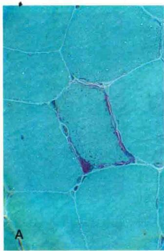
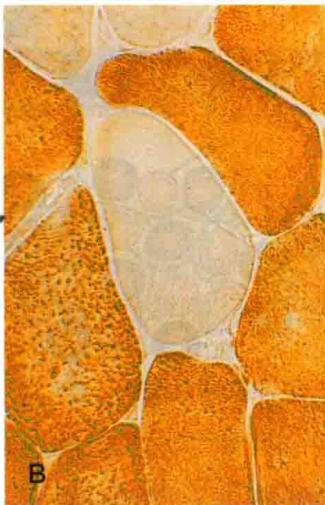
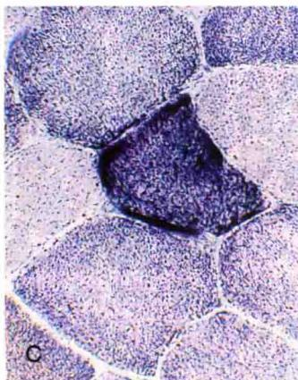 
图27-12 由线粒体DNA（mtDNA）缺失引起的线粒体肌病。A.改良的Gomori三色染色，蓬毛样红纤维显示明显的红色颗粒状线粒体增殖，主要位于肌膜区；B.显示细胞色素氧化酶组织化学对蓬毛样红纤维染色缺乏（中央白色纤维），这种电子传输载体的三个亚单位由mtDNA编码，这种突变干扰了纤维功能；C.琥珀酸脱氢酶（SDH）染色，蓬毛样红纤维显示SDH过表达，SDH是一种完全由核DNA（nDNA）编码的酶；D.电镜显示线粒体超微结构异常，包括类结晶状包涵体
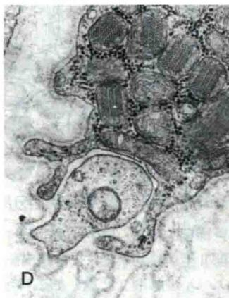
【临床表现】脑肌病的临床表现各有不用，但通常都起源于儿童时期。部分患者会由开始的肌无力发展为脑病。部分表现有中枢神经系统疾病伴或不伴有明显的肌无力，尽管肌肉活检显示线粒体功能障碍。其他器官，如心脏是经常受影响的多系统功能障碍中的一部分。
# 第八节 横纹肌溶解症
横纹肌溶解症是由于骨骼肌纤维溶解，释放肌红蛋白到循环系统中，最终导致肌红蛋白尿和肾衰竭。分为急性、亚急性和慢性。急性横纹肌溶解症期间，肌肉肿胀、疼痛以及极度无力。
偶尔，横纹肌溶解症的发生可能是复杂的或者伴随流感发生。部分患者会由于轻微运动和某些代谢肌病而发生横纹肌溶解症。恢复后的活检发现，肌肉形态正常。有时横纹肌溶解症在用挥发性麻醉药后加剧中暑或伴随恶性高热。急慢性横纹肌溶解症会伴有酒精中毒。在服用降胆固醇药物（他汀类药物）时，也会发生一系列的肌肉功能障碍，从疼痛（肌痛）进而到横纹肌溶解症。
横纹肌溶解症的病理改变是活跃的，非炎性肌病，在肌纤维周围散射坏死并有不同程度的退化、再生。在肌纤维内及周围可见巨噬细胞成簇，但是不伴随淋巴细胞或炎性细胞。
# 第九节 去神经支配
去神经支配的病例反映慢性神经元的病变。当骨骼肌从与其相接处的慢性神经元分离的时候，由于逐渐丧失运动神经元，继而发生萎缩。在横切面，萎缩的纤维具有有角的结构特征，类似将包裹的正常肌纤维压缩（图27-13）。去神经支配的早期主要是不规则散射，有角、萎缩纤维。随着疾病进展，这些纤维成组出现，先是几条纤维成小簇，然后成组（图27-13B）。去神经支配的纤维是I、II型纤维混合：去神经支配对于运动神经元类型没有选择性。如果纤维的神经支配未恢复，萎缩进展直至肌纤维丢失、核压缩聚集。终末期，肌纤维消失，最终被脂肪组织取代。
去神经支配的每一步都伴随神经支配恢复的努力。如果去神经支配进展缓慢，神经支配恢复亦保持同步。新发的神经末端在原先运动终板位置与肌纤维形成突触连接。作为慢性运动神经元的特异类型，它需要在一个特定领域的神经支配，一种类型的纤维组毗邻另一个类型纤维组的现象。这种模式叫作类型分组，是去神经支配后神经支配恢复的病征（图27-13C）。具有显著类型分组的患者除了进展性肌无力外，还常有
肌肉抽筋症状。去神经支配单一发生后，如脊髓灰质炎，神经支配恢复后力量明显加强。多年后，活检显示类型分组的显著模式，有散在的核固缩团块。在这些病例中，没有发现角状萎缩纤维。
# 一、脊髓性肌肉萎缩反映了前角细胞的进行性退化
脊髓性肌肉萎缩是继囊性纤维化之后最常见的、致死性、常染色体隐性遗传性疾病。儿童脊髓性肌肉萎缩分为3型：I型（Werdnig-Hoffman病）Ⅱ型（中间型）Ⅲ型（Kugelberg-Welander病）。事实上，几乎在全部脊髓性肌肉萎缩症病例中（99%），没有存活运动神经元基因（SMN15q11.2-13.3）。
Werdnig-Hoffman病（婴儿脊髓性肌肉萎缩）：Werdnig-Hoffman病在患儿早期导致进展性，严重的肌无力，婴儿生存期不超过1年。去神经支配在建立运动单位后，发生于子宫内。组织学模式几乎是病征极小的、圆形、萎缩纤维组仍可识别I型、Ⅱ型。也仍
会有正常纤维的纤维束，大多都是I型纤维的肥厚纤维成簇。
Kugelberg-Welander病（青少年脊髓性肌肉萎缩）：此亚型病变是脊髓性肌肉萎缩症的晚期发病形式，并不一定进展。肌肉活检显示有类型分组和神经源性疾病的证据。但是，由于坏死和再生纤维的共存，组织类似肌病的一个小样本。
# 二、Ⅱ型纤维萎缩类似于去神经支配肌病
肌肉活检标本中，一个普遍曲解病理模式即萎缩是由于肌肉失用、丢失、上行运动神经元疾病和皮质激素的毒性。病理上，这种弥漫，非特异性萎缩看似Ⅱ型纤维选择性角萎缩。Ⅱ型纤维萎缩普遍与慢性疾病有关。例如，皮质激素治疗可以引起肌无力（激素肌病），肌肉活检显示Ⅱ型纤维选择性角萎缩。患者并不表现为血清肌酐激酶水平的升高或者骨骼肌纤维的退化和炎症。
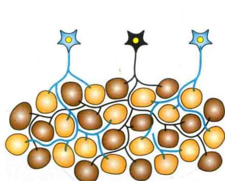 
A 正常
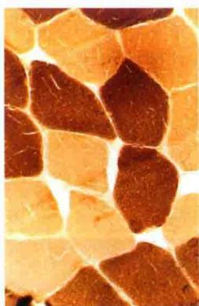
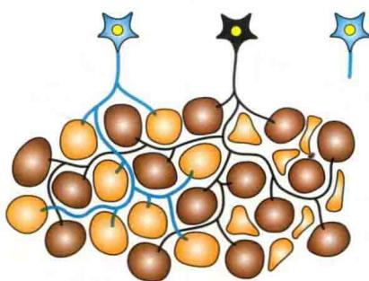 
B 去神经元支配
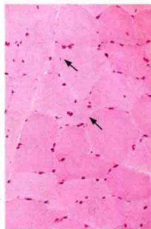
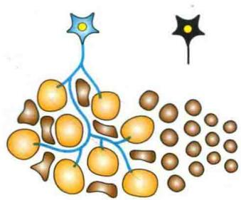 
C 成组萎缩
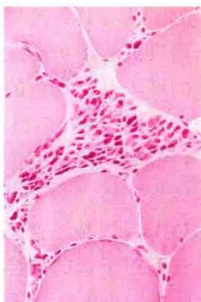 
图27-13 去神经支配/神经再支配。A. 如显微照片所示，用ATP酶染色标记的I型（浅色）和II型（黑色）肌纤维的正常混杂分布。在示意图中，两个神经元（蓝色）支配I型肌纤维，两个神经元（棕色）支配II型肌纤维。B. 去神经支配；HE染色。在早期（轻度）的去神经支配中，部分轴突树退化，导致散在的I型和II型肌纤维角萎缩（箭头）。C. 进展期（严重）的去神经支配中，完整的慢性运动神经元或是轴突发生退化，引起小组的角萎缩化纤维（成组萎缩），类似显微照片中的阐释。D. 神经再支配；肌纤维ATP酶。随着神经元退化，存活的神经元发出更多的神经末梢，恢复部分去神经支配的纤维神经支配。根据神经支配恢复的神经元类型，神经支配恢复的纤维成为I型和II型肌纤维。此过程会导致更少但更大的运动单位产生，同时把一种类型的纤维组毗邻另一个类型纤维组的现象称为“类型分组”。显微照片展示了类型分组现象。用HE染色观察，除了少量的萎缩纤维外，该视野看似都正常
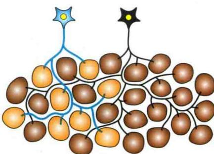 
D 神经再支配：纤维类型分组
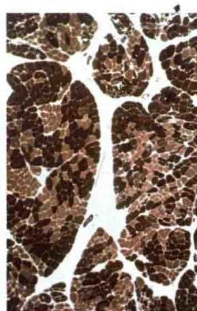
（孙磊）
# 第28章 神经系统
神经系统可以进一步分为中枢神经系统和周围神经系统两部分，两者由脑、脊髓、外周神经和神经节组成。虽然中枢和周围神经系统都可以快速传递信号，但是两者在基本组成以及所涉疾病和对损伤的反应是有所不同的。因此，在此将两部分分开讨论。尽管认知、感觉、运动和自主功能有特定的解剖分区，但是任一区的功能障碍都会影响到其他各区的功能。神经系统形成了一个相互连通的网络，神经元轴突可延伸到长达一米或更远。因此，神经元损伤可能会导致远隔部位的功能障碍。
# 第一节 中枢神经系统
# 一、神经系统的细胞
灰质和神经纤维：灰质包括CNS内富含神经元的所有区域，包括大脑皮质、小脑皮质、基底神经节以及脊髓中央灰质。灰质由神经元的胞体（核周体）和支持性胶质细胞核以及介于两者之间由神经元和胶质细胞组成的精细的被称之为神经纤维的网状结构（图28-1）。局灶功能相同的神经元胞体聚集成团，被称为“神经核”。
白质：白质由富含少突细胞和散在的星形胶质细胞的有髓鞘神经元的紧密束状结构组成（图28-2）。
神经元：灰质中神经元各亚型的形态学因功能上的精细分工而不同，从大运动神经元和初级感觉神经元到微小的“颗粒状”细胞神经元（图28-3A）。比如，仅存在于脑干中特定细胞核中的色素神经元是神经元中的一个重要亚组，该神经元可通过胞质内棕色的神经黑素来识别，这种色素是一种儿茶酚胺能神经递质合成过程中的副产物（图28-3B）。这些色素性儿茶酚胺能神经元在中脑（塞梅林神经节）和脑桥（蓝斑）处密集成簇，以至于肉眼就可以观察到。
星形胶质细胞：星形胶质细胞数量至少是神经元的10倍，在CNS微环境调节中起重要支持作用。它们也是应对众多CNS病理性损伤产生应答的两种主要神经细胞类型之一（另外一种是小胶质细胞）。“反应性星形胶质细胞”产生急性反应的一个主要标志是胶质细胞原纤维酸性蛋白（GFAP）的合成增加以及整合进入胞质中间丝而导致明显的胞体和胞突（图28-4A）。
随着年龄增长，星形胶质细胞周围突起往往积累球形包涵体-淀粉样小体。这主要是葡萄糖聚合物，在软脑膜下、室管膜下以及血管旁和嗅束内含量尤为丰富（图28-4B）。细胞质带状致密物，Rosenthal纤维（图28-4C）是伴有包裹胞质蛋白的密实胶质中间丝，是长期星形胶质细胞增生形成的。
少突胶质细胞：少突胶质细胞生成并保持CNS中轴索的髓鞘，因此是CNS中类似于周围神经系统中施万细胞的细胞。少突胶质细胞胞体中以均一的圆形细
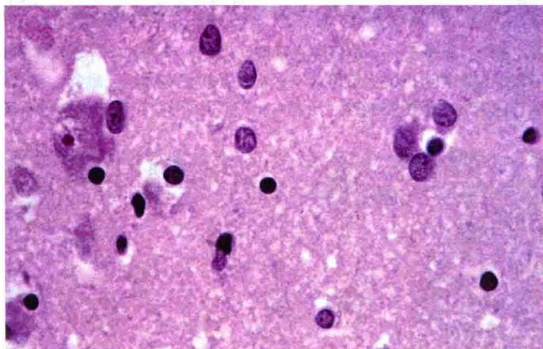 
图28-1 灰质和神经纤。按照定义，灰质包含神经元细胞体。另外还有支持性神经胶质细胞、星形胶质细胞和卫星少突神经胶质的细胞核。其余纤细的纤维背景网称为神经纤维网，由紧密交织的神经轴突、树突和星形胶质细胞胞突组成
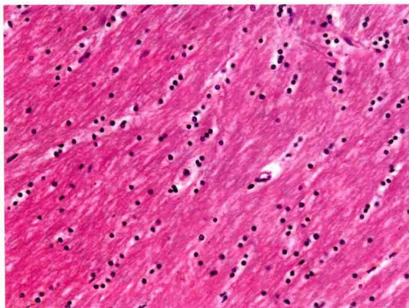 
图28-2 白质。与灰质不同，白质几乎完全由髓鞘的轴突以及产生并维持髓鞘的细胞构成。即少突神经胶质细胞，它的小圆细胞核位于纤维束之间
胞核为主，在甲醛溶液固定石蜡包埋的组织切片中特征性地被一个小的边界清楚的空泡状胞质所包绕（“核周晕”）（图28-5）。
小胶质细胞：小胶质细胞是CNS中的骨髓起源的单核吞噬细胞。在健康状态下小胶质细胞散在分布于整个脑和脊髓中，但其对缺血、创伤或病毒感染等
CNS损伤应答迅速。小胶质细胞为渗透性型，以薄长细胞核为特征，这有利于小胶质细胞移行穿过CNS实质定位到受损部位（图28-6A、B）。
室管膜：衬覆于脑室系统的室管膜在脑脊液与脑实质之间形成一道屏障，并调节两者之间脑脊液的交换。正常的室管膜被覆单层纤毛立方-柱状上皮。
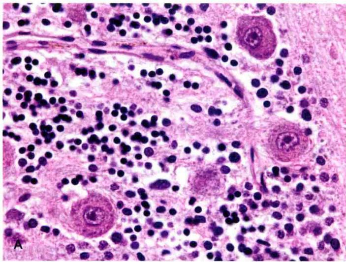 
图28-3 神经元。A.中枢神经系统（CNS）不同神经元集群有不同的功能，这种差异性体现在其形态学上。举个极端的例子，小脑皮质的浦肯野细胞神经元的大细胞体与极小的颗粒细胞神经元毗邻，整个颗粒神经元胞体也不比浦肯野细胞神经元的核仁大多少。B.富含神经黑色素的色素性儿茶酚胺能神经元是CNS有不同形状和功能的神经元集群的另一个突出例子
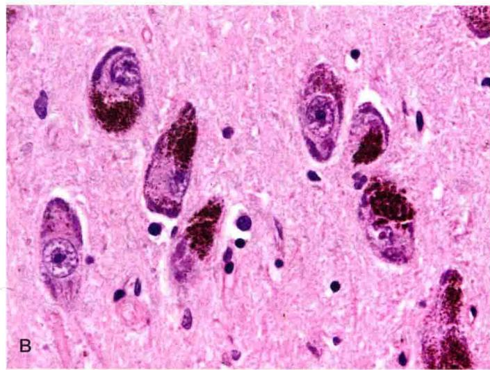
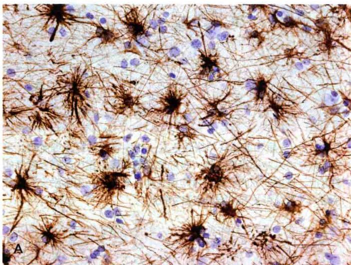
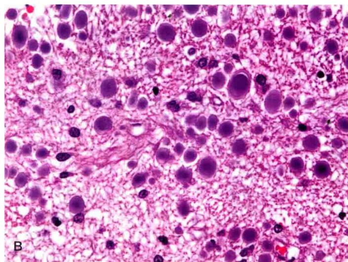
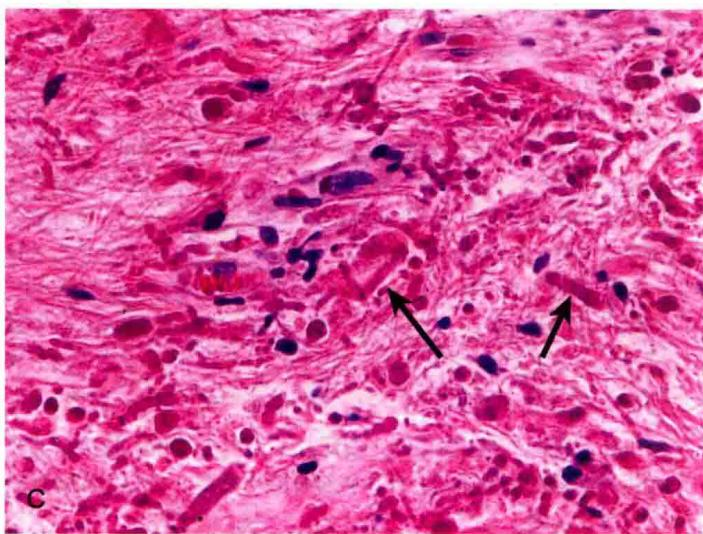 
图28-4 星形胶质细胞。A.星形胶质细胞曾一度被称为“中枢神经系统的成纤维细胞”，指的是它作为脑和脊髓的无处不在的支持细胞的功能。对任何病理性损伤都有反应。正如对胶质细胞原纤维酸性蛋白的免疫组化染色中所显示的那样，星形胶质细胞占领近区域并放射性向各个方向输送胞突到达其各自的领地。B.随着年龄增长，星形胶质细胞易于产生多聚葡萄糖包涵体，即淀粉样小体。主要在其胞突的远端，尤其是血管周围和软脑膜及室管膜下。C.Rosenthal纤维是对长期星形胶质细胞增生反应而产生的另外一种胞质内包涵体，由密实的神经胶质中间丝和被包裹的细胞质蛋白组成（箭头）
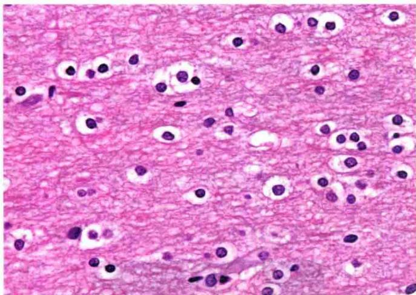 
图28-5少突胶质细胞。少突胶质细胞是中枢神经系统（CNS；包括肉眼所见的“神经”，实际是CNS束）中的髓鞘形成胶质细胞。在常规组织学图像中少突胶质细胞可通过其空泡状细胞质空晕及单个深染的小圆形核（“煎蛋”样外观）轻易识别。该特征性外观在少突胶质细胞瘤中也是重述要点
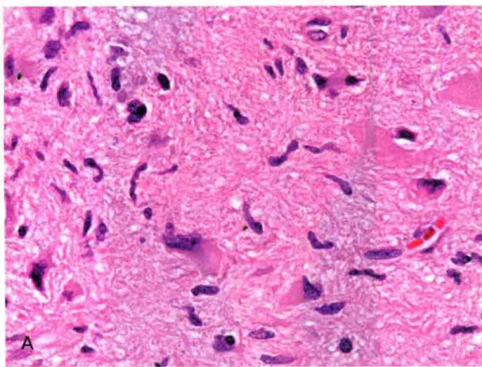
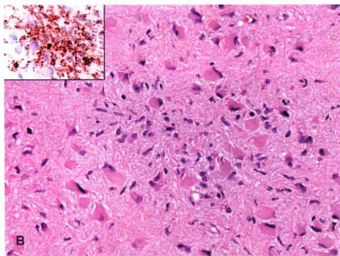 
图28-6 小神经胶质细胞。A.小神经胶质细胞是单核－巨噬细胞系统在脑和脊髓内的常驻细胞。虽然在正常健康的脑内（静止性小神经胶质细胞）并不明显，但是当对CNS损伤产生应答反应时，可变得十分活跃，很容易可通过其细长的细胞核（“杆状细胞”）加以辨别，这也反映了其处于活化状态。B.活化的小神经胶质细胞在穿过CNS实质后，常常簇状围绕在病灶周围，被称作“小神经胶质细胞结节”。小神经胶质细胞对巨噬细胞标志物CD68免疫组化反应强阳性（嵌图）
# 二、发育畸形
【病因】先天性畸形特性被定义为损伤发生的时间远比损害本身重要的多。CNS发育过程中要经历三个重要时期： $①$ 神经胚形成； $②$ 分节和分裂； $③$ 增殖和迁移。增殖和迁移缺陷主要影响大脑皮质的形成而导致精神发育迟缓和癫痫。一旦神经元和神经胶质到达终点，它们必须通过轴突探导和少突胶质细胞髓鞘正确的连接大脑。
# （一）神经胚形成缺陷是神经管缺陷
1.无脑畸形 无脑畸形是因神经管头部（前神经孔）闭合失败而导致的先天性脑全部或部分缺失。
【流行病学】无脑畸形在CNS畸形中居第二位，仅次于脊柱裂，发病率为（ $0.5\sim 2.0$ ）/1000，女性略多见。
【病因】无脑畸形为多因素导致的出生缺陷，在发病率上呈现区域差异。在美国，其发病率在活胎和死胎中为0.3/1000。在爱尔兰，其发病率是美国的20倍以上， $(5 \sim 6) / 1000$ 。移民到北美的爱尔兰人群中，其发病率降低到 $(2 \sim 3) / 1000$ 。该疾病在黑人中不常见。
无脑畸形是神经管闭合缺陷（图28-7）。它常常与脊柱裂等其他神经管缺陷（NTDs）共存，提示它们有相似的发病机制。神经管闭合不全导致其上颅骨的骨性结构闭合不全以及颅顶、皮肤以及该区域皮下组织缺损。外露的大脑形成不全甚至完全缺如。大多数病例，颅骨基底部仅有神经和室管膜组织片段和脑膜残余物。
遗传因素：在无脑畸形的发病机制中起一定作用。这种异常女性胎儿的发病率是男性胎儿的两倍，并且在有过无脑畸形的家族中表现出高的发病率。第二个无脑畸形胎儿的发生风险为 $2\% \sim 5\%$ ，而在两个无脑畸形胎儿后，无脑畸形的发生风险上升到 $25\%$ 。
围生期补充叶酸能降低NTDs的发病率。面粉和其他富含叶酸的食材会显著降低所有类型NTDs的发病率。
【病理】颅骨窍窿部缺如，双侧大脑半球由大量高度血管化的杂乱无章的神经胶质组织所替代，位于扁平颅底上。双眼发育良好位于其前方，是器官发生紊乱的前缘。畸形后部形成伴有可辨识中脑的过渡区域，但是大多数情况下整个脑干和小脑发育不全。上脊髓发育不全，脊柱后方神经管骨缺陷（脊柱裂），可能会累及颈区。2/3无脑畸形胎儿死于宫内，而那些出生时还活着的，很少存活一周以上。孕妇血清α-球蛋白筛查和超声检查几乎可发现所有无脑畸形胎儿。
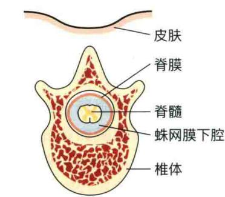 
正常
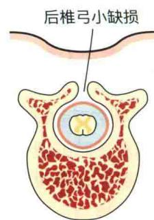 
隐性脊柱裂
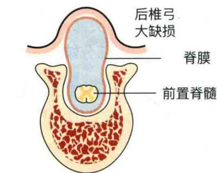 
脊膜膨出
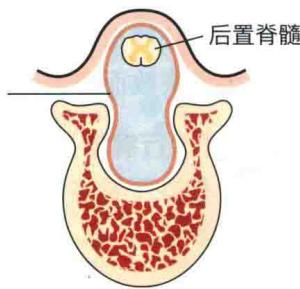 
脊髓脊膜膨出
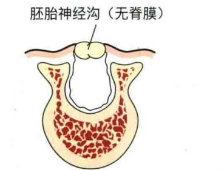 
脊柱裂
 
无脑畸形
2. 脊柱裂 脊柱裂是一组由神经管闭合失败引起的神经管缺陷，以尾区多见。该畸形通常位于腰部区域且其临床程度不同，从无症状到身体残疾但通常不会致命。脊柱裂由怀孕期间第 $25\sim 30$ 天之间受到损伤引起，表明这段时间是依次闭合神经管的时间。按照畸形的严重性可以分为以下几类。
■ 隐性脊柱裂：该畸形局限在椎弓，通常无临床症状。外在表现常常仅为下背部微凹或一小撮毛发。 
脊膜膨出：该型以较为广泛的骨和软组织缺陷为特征，导致在背部中线处脊膜因液体填充而呈肉眼可见的囊性膨出。该囊的侧面特征性地被薄层皮肤所覆盖，而顶部可形成溃疡从而导致细菌进入脑脊液（SCF）。 
脊髓脊膜膨出：指的是更为广泛的缺陷引起脊髓外露，并导致神经根（尤其是马尾神经）和脊髓包
裹入明显突出的充满脑脊液的囊内中（图28-8）。通常情况下脊髓为一扁平的带状结构。严重的神经症状有下肢运动和感觉障碍及肠道和膀胱神经性控制损害。
脊柱裂畸形：此严重缺陷中，脊柱为一空管，常常无脊髓（图28-9）。该畸形通常是致命的且常见于流产儿。
如上所述，母体叶酸缺乏与神经管畸形有关。孕妇应该避免服用一些可诱发神经管畸形的药物，尤其是治疗痤疮的类视黄醇和治疗脑卒中的丙戊酸钠。
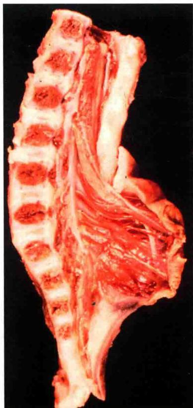 
图28-8脊髓脊膜膨出。该闭合不全是脊髓管未闭合导致，通常位于腰部。可见充满脑脊髓液囊中排列无序的脊髓组织和被包裹的神经根
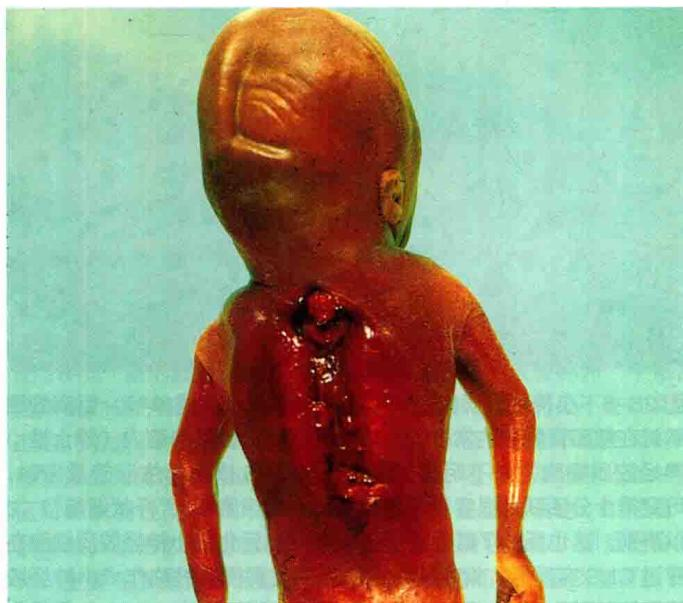 
图28-7 神经管缺陷。神经发育的首要一步是神经管生成——神经管的形成和闭合。神经管及覆骨、软组织或皮肤闭合不全可引起多种缺陷，严重程度不一，从轻度异常（例如隐形脊柱裂）到重度异常（无脑畸形） 
图28-9脊柱裂畸形。脊柱外观显示骨性及皮肤缺陷伴有胸段脊髓及覆于其上的椎弓及软组织缺失
【临床表现】NTDs引起的神经病变的临床症状不一，有无症状的隐形脊柱裂，还有下肢麻痹、感觉缺失和脊髓脊膜膨出的便失禁。如Arnold-Chiari畸形、脑积水、多小脑回畸形和脊髓中央管积水等畸形都与NTDs有关（见下文）。
# （二）脊髓畸形
Arnold-Chiari 畸形 Arnold-Chiari 畸形是一种复杂的疾病，脑干与小脑都被压缩到后方一个浅碗状凹陷内，其下部有幕状结构。临床症状取决于缺陷的严重程度（图28-10）。由于该畸形有脊髓和小脑的分节以及神经管闭合缺陷，因此可以认为它是一种神经胚形成和分节缺陷。

【发病机制】Arnold-Chiari 畸形的发病机制仍不清楚，还没有一种学说来解释该疾病的征。

【病理】Arnold-Chiari 畸形，小脑蚓部的尾部疝入扩大的枕骨大孔并突出到背颈脊髓，常到达5（图28-11）。该疝出组织由增厚的脑膜固定，并受压萎缩。脑干也向尾侧移位。小脑被压成而四叠板被下丘背部的“喙状”突起压迫变形。

【临床表现】Chiari 畸形的严重程度取决于小脑和脑干的移位程度。Arnold-Chiari 畸形特指
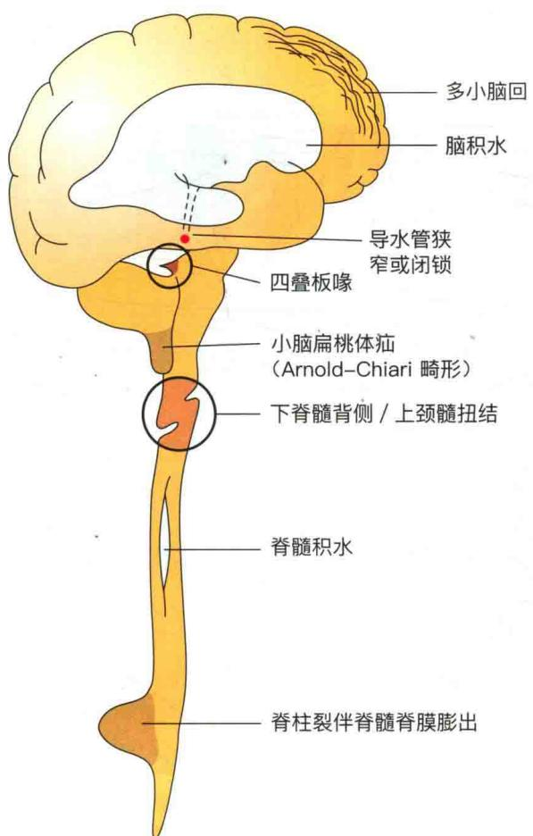 
图28-10 Arnold-Chiari 畸形及相关损害
II型或“经典”Chiari畸形，是最常见的亚型。经典的Chiari畸形最常伴有脊髓脊膜膨出，因此那些表现出易激惹、喂养困难、呼吸困难及虚弱或麻痹（见上文）等脑干功能异常的婴幼儿可以诊断。
# （三）分割和分裂缺陷引起中枢神经系统关键结构缺失
1. 前脑无裂畸形 前脑无裂畸形是大脑半球间裂隙消失或形成不全而无法分成两个大脑半球的一系列缺陷（图28-12）。前脑无裂畸形者很难存活超过几周或数月，其存活与否与智力缺陷和癫痫发作有关。大约 $25\% \sim 50\%$ 前脑无裂畸形患者有染色体数量或结构异常。单基因前脑无裂畸形有时与一种重要的信号分子——sonic hedgehog基因突变有关。
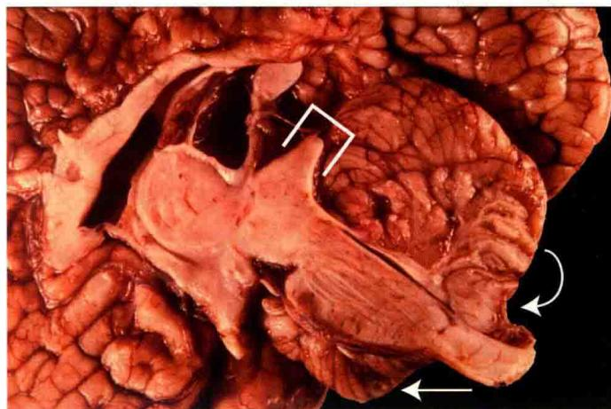 
图28-11 Arnold-Chiari 畸形。小脑蚓部疝出至枕骨大孔水平以下（箭头）。脊髓背部的下向移位导致第四脑室门占据枕骨大孔下方的部位（弧形箭头）。中脑表现出因被一个锥形结构取代四叠体顶盖的严重喙状突起（括弧）
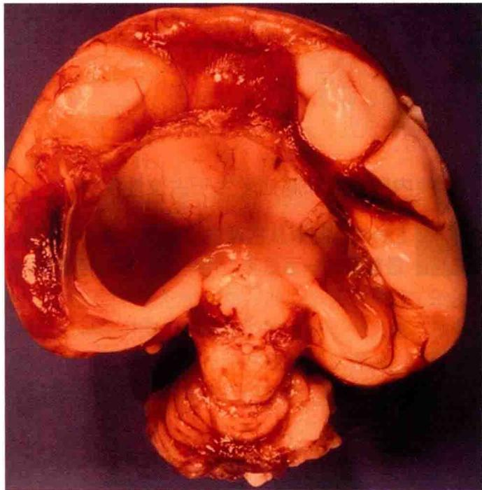 
图28-12 前脑无裂畸形。大脑表现为两侧半球无分隔，从前面的角度仅见单一的巨大脑室。大脑半球之间无脑裂，因此这是无叶性前脑无裂畸形
2. 中脑导水管先天闭锁 是引发先天性阻塞性脑积水最常见的原因。可能是因为中脑发育紊乱，在出生的存活婴儿中发病率为1/1000。大脑因脑室异常增大而扩大，大脑皮质变薄，白质纤维束伸展。中脑可能会表现多发性通路闭锁或因神经胶质增生导水管狭窄。这些缺陷是由于分裂期发育障碍或孕晚期因经胎盘感染引发的室管膜炎所致。
# （四）因神经胶质细胞增殖或迁移缺陷导致的皮层畸形

【发病机制】皮层神经元的数量和其部位决定脑沟和脑回的形成。因此，正如肉眼观察
到的，皮层发育性疾病与脑沟回结构形成缺陷的性质和严重程度有关。皮层缺陷可能是全部或局部。由于生发层基质损伤导致的局部皮层发育损害称为脑裂畸形，其皮质有小块缺失。由完好的生发层基质来源的皮质结构是正常的。基因来源的神经胶质细胞增殖和迁移缺陷常常会导致较为广泛和严重的皮层缺陷，被称作无脑回即“扁平脑”。白质含有不能迁移到皮层的成簇神经元。约 $60\%$ 无脑回患者表现为17p13.3染色体LIS1基因区缺失，该基因编码一种影响细胞增殖和运动的细胞支架动力学有关的蛋白。除了LIS1基因突变外，还有两种由DCX和ARX基因缺陷导致的X染色体显性遗传性疾病。ARX相关疾病更为严重并表现为两性畸形。

【临床表现】脑裂畸形的临床特征取决于缺陷的严重程度。疾病局限于一侧大脑半球的患儿
可能有单侧肢体麻痹但智力接近正常。疾病累及双侧大脑半球的患儿智力发育明显迟缓，肢体部分或完全麻痹。脑癫痫可发生在大多数患儿。无脑回患者有面容异常、肌肉痉挛、癫痫发作、精神运动性阻滞及体格赢弱等表现。在X染色体相关型疾病中，女性通常受累较轻。
# 三、颅内压升高和脑疝发生于占位性疾病

【发病机制】从病理生理学角度来讲，大脑最重要的一面是其占用一个密闭的容器。脑
组织、脑脊液及出入脑的血液组成脑容量，且成人的脑容量是固定的。任何占位性脑疾病都会以牺牲脑组织、脑脊液和脑血流所占空间为代价。占位性疾病包括脑肿瘤、脓肿、创伤性脑挫伤水肿及脑肿胀性脑卒中。
在空间固定的颅腔内增加更多容量的直接结果是颅内压升高（ICP）。随着颅内压升高，患者有头痛、意识模糊、嗜睡并可能发展为视盘水肿（见第29章）。为了代偿，脑脊液量减少；因此，脑室被
压缩成细长裂隙且脑沟消失。如果病变占据的空间大于脑脊液减少所能代偿的，血流量随之减少。由于脑高度依赖于氧和营养物质的持续供应，因此脑血流量降低可能会即刻产生不良影响。如果病变继续扩大，唯一剩下能“给”的结构就是脑本身了。根据占位性脑病变的部位不同，脑组织可能会从一个部位被压迫到另外一个部位——这种移位被称作脑疝。

# 【临床表现】
扣带回疝：如果大脑半球被压迫到大脑镰区以带回是大脑半球中最先移位的部位。该脑疝被下疝或扣带回疝。患有此病的某些患者会有意及嗜睡。大脑前动脉也移位到镰区以下，其供织发生梗死，导致对侧下肢无力及尿失禁。
钩回疝：如果一侧大脑半球从幕上区被压迫到幕下区，内侧颞叶（钩回）是大脑半球首先移位的部分，因此它是一种钩回疝或小脑幕切迹疝（图28-13）。同侧动眼神经（第三对脑神经）被移位的颞叶压迫导致同侧瞳孔扩大。瞳孔扩大无反应或仅有轻微反应提示病情危险，需要立即采取措施解决脑疝。钩回疝综合征情况危重，但是在解除组织压迫后可逆转。临时降低颅内压的措施可以为患者赢得足够进行神经外科手术的时间。
中央型脑疝：如果双侧大脑半球都发生钩回疝就会出现中央型脑疝综合征。双侧瞳孔扩大、肌肉松弛及
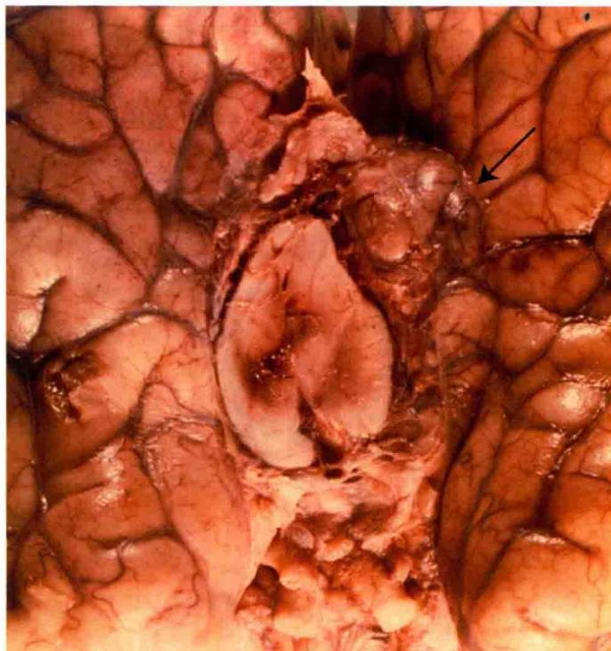 
3.5 
图28-13 小脑幕切迹疝。海马旁回的钩（箭头）向下形成疝，使中脑移位，导致中脑扭曲变形，使其前后径增大而左右径变小。动眼神经可受累导致同侧第三脑神经麻痹
昏迷。脑干的下向移位可对位于中脑和脑桥实质的血管产生牵拉并导致多发性线形出血，被称为Duret出血或继发出血性脑疝。
小脑扁桃体疝：无论是幕上区内容物下移或幕下区发生肿块而使幕下区变得拥挤，脑干和小脑就可被压迫进入枕骨大孔。受压的小脑扁桃体和脊髓可对延髓中枢产生致命压迫。这种危重情形被称为小脑扁桃体疝。
1. 脑水肿 脑水肿可使任何引发颅内压增高的病情复杂化，并开启一个恶性循环，即水肿增加导致颅内压升高，而颅内压升高反过来引起脑水肿加重。

【发病机制】脑水肿是脑内水含量绝对增加。
脑组织的水含量通过脑脊液的产量、颅顶产
生脑脊液的速率和通过血脑屏障的流量来严格控制的。脑出血主要可发生以下三种情形。
■ 细胞毒性水肿：由于脑内细胞不能维持渗透平衡或身体系统水量过负荷，水被迫在渗透压差的作用下经完整的血脑屏障渗出。 
血管源性水肿：血脑屏障松弛导致水不可控地进入组织中。这是导致脑水肿的最常见原因，可见于肿瘤、脓肿、脑膜炎、出血、脑挫伤及铅中毒。细胞毒性水肿和血管源性水肿在脑梗死中常合并出现。上述病程可损伤内皮细胞的屏障作用，或者肿瘤内的血管在初始就是有缺陷的。血管性水肿通常对皮质类固醇反应很好，皮质类固醇可修复屏障的完整性，即使在肿瘤中也如此。 
间质性水肿：细胞毒性水肿和血管源性水肿与通过内皮的水通量有关，而间质性水肿是由于脑脊液产生过多或流出受阻而通过脑室室管膜内膜渗透入白质中聚集形成。
2.脑积水 脑积水可呈连通性或非连通性，由脑脊液在脑室中聚集而成，导致这些组织结构扩张。当脑室无力再扩展时，液体穿过室管膜漏入白质中，导致间质性水肿。脑脊液聚集可由下述两种因素之一所致： $①$ 脑脊液产生过多，很少见，仅见于脉络丛肿瘤； $②$ 脑脊液由颅顶流出受阻，这是最常见的发病机制。如果脑室系统本身发生阻塞，仅靠近阻塞处的脑室发生扩张。这种形式的脑积水为阻塞性或非连通性脑积水。如果在脑脊液离开脑室系统后发生阻塞，那么所有脑室都将会发生扩张，该病理过程被称为连通性脑积水，意味着脑脊液在脑室流通无阻塞。

【临床表现】脑积水的临床特点与患者年龄有
关。婴儿和儿童的颅缝未闭合，随着脑室扩
张，他们的头会增大，有时增大比例悬殊。由于脑积水在婴儿常见且可进行分流治疗，测量头围是儿科体
检的一项基本内容。颅缝闭合后，脑积水不再表现为头颅增大，而是表现为头痛、意识模糊、嗜睡、视盘水肿和呕吐等颅内压增高症状。脑室扩张以牺牲脑组织容量作为代价而导致在某些晚期患者其脑组织仅有几厘米厚。值得注意的是，虽然此类患者可能因痉挛状态不能表达，但是他们仍然保有相当完整地认知能力。
上述所有脑积水的类型都是由于脑脊液的动态平衡紊乱，应当将其与脑外积水加以鉴别，后者是脑室对由于其他疾病导致的脑组织缺损的代偿性扩张。这最多见于弥漫性皮层萎缩。虽然局部破坏，比如在旧梗死灶的部位，也会导致局部代偿性脑室扩张。
# 四、创伤

【发病机制】脑和脊髓被保护性骨性结构所
包围，可减轻施加到这些脆弱的神经系统
结构上的外力。神经系统损伤来源于施加到神经组织上的动能转化——损伤程度与传递的动能的量和其作用时间有关。此种能量转化可直接损伤组织产生贯通伤，或者能量转化为运动力和压缩力，使局限于颅内或椎管内的神经组织产生闭合性损伤。脑和脊髓的极度损伤可能仅对上覆的组织产生轻微损害。相反，表面组织的严重创伤可能不伴有其下神经系统的损伤。
# （一）硬脑膜外血肿常为致命伤
硬脑膜外血肿通常由头部受重击引起，常伴有颅骨骨折，若处理不及时会有生命危险。颅内硬脑膜与颅顶内部紧密相连，就像颅内骨膜一样。脑膜中动脉位于硬脑膜和颅顶之间的颅骨内表面沟内，其分支伸展穿过颞顶区。颞骨是颅骨中最为薄弱的骨骼之一，极易骨折。因此，看起来非常小的创伤可能会导致颞骨骨折，从而撕裂脑膜中动脉分支导致致命的硬膜外出血（图28-14）。

【病理】脑膜中动脉的横断可导致血液在动脉
压力下进入硬膜外腔，从而导致硬脑膜和颅顶
分离。硬脑膜与颅顶在冠状缝处紧密相连，因此，硬
膜外血液集聚不会超过缝线。这导致新鲜血液呈透镜
状聚集并终止于冠状缝（图28-15）。

【临床表现】多达1/3的患者在受到急性损伤
时不会丧失意识，并可有一段几个小时的无
意识受损表现的“清醒期”，因为这段时间正是血液
在动脉压力下在硬膜外积聚的时间。当血肿量达到
$30 \sim 50 \mathrm{ml}$ 时, 反映占位性病变的症状开始显现。硬
膜外血肿会不可避免地进展，当没有被发现或清理时，
$24\sim 48$ 小时内可能会危及生命。
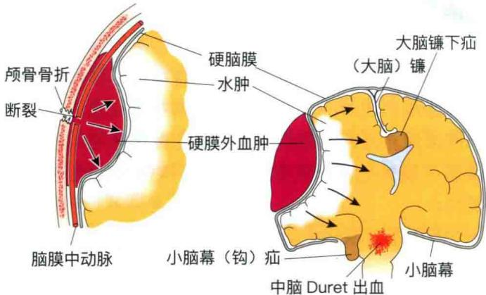 
图28-14 硬膜外血肿的发展。脑膜中动脉的分支被颅骨骨折锐利的骨缘刺破时会导致动脉压力性出血，使硬脑膜与颅顶分离并产生扩张性血肿。经过几个小时的无临床症状期后，可发生大脑镰下疝和小脑幕切迹疝。如果血肿未清除将会发生致命的Duret出血
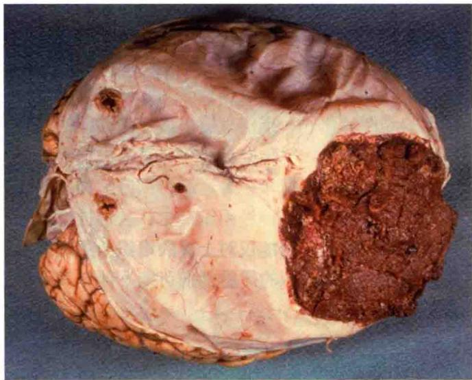 
图28-15 硬膜外血肿。盘状新鲜出血位于覆于额顶叶皮质上的硬脑膜上，但并未越过冠状缝
# （二）硬膜下血肿较硬膜外血肿发展缓慢
硬膜下血肿是高处坠落伤、重击、交通事故和运动意外导致的头部损害后一个重要的死亡原因。硬膜下血肿较硬膜外血肿发展明显缓慢，因此病情进展较慢，但是一旦引起严重的颅内压升高，很快会出现病情恶化及死亡。
【病理】本质上并没有真正的硬膜下腔，但是硬脑膜脑膜上皮细胞内层较之外层紧密连接少。剪切力会使这些细胞分离，导致血液渗入细胞之间。由于该部位出血是低静脉压力导致，因此出血缓慢，并且血液积聚后产生的局部填塞效应可使出血自发停止。出血位于硬脑膜本身内，很容易扩散超过冠状缝，从而引起可沿着完整前后颅顶扩散的血肿（图28-16）。肉芽组织形成于对血液的反应性，该组织的脆弱的毛细血管本身可能渗漏，导致不断扩张亚急性的聚集，并最终发展为慢性硬膜下血肿。硬膜下血肿可见此发展为以下三种情形：① 被重吸收，仅残留少
量含铁血黄素痕迹；②保持原状并可能硬化；③因肉芽组织反复微量出血而继续扩大。血肿变大及出现临床症状通常是因为再次出血，常在6个月内出现，可能是微小创伤诱发。
【临床表现】硬膜下血肿的症状和体征因人而异。牵拉脑膜导致头痛，运动皮质受压导致对侧无力，局部皮层激惹可引发癫痫。有 $20\%$ 病例为双侧硬膜下血肿，可使认知功能受损并可能导致误诊为痴呆。伴扩张的再出血可引发致命的小脑幕疝（图28-16A）。
# （三）脑实质损伤
脑实质及脊髓损伤的严重性不一：①伴有暂时性功能丧失及轻微或没有结构破坏的脑震荡；②伴有组织出血坏死的中间损伤的脑震荡；③伴有结构和功能严重受损的脑撕裂伤。
1. 脑震荡 脑震荡是 CNS 受生物机械力作用而发生的一过性意识丧失。通常情况下脑震荡并没有明显的神经病理学变化，而且疾病本身并非致命，显微镜检查并非必需。重击引起硬膜下血肿时并不一定会导致脑震荡。如果网状结构或双侧大脑半球同时受损，可发生意识丧失。典型的脑震荡病例出现在拳击比赛中，起因是头部受重击引起向后上方偏斜并常伴有回旋。这些运动对脑干施加一个有快速旋转加速度的力而导致网状结构神经元功能障碍。相比之下，颞顶叶区受到重击可导致颅骨骨折和致命性硬膜下血肿，但由于不会发生大脑半球的侧向移动，因此可能不会引起意识丧失。
影像学的最新进展表明轴突损伤和连接中断与认知和记忆障碍有关，眩晕和“东西不那么对”的感觉表明患者有“轻微”创伤性脑损伤。
# 2. 脑挫伤
【发病机制】脑挫伤其实就是脑组织挫擦伤——一个区域的组织受损和血液渗漏——通常是由于突然加速或减速导致脑组织碰到不规则的颅骨骨性结构而发生。当受撞击点发生脑挫伤时，病变被称为冲击伤（coup，法语，“打击”的意思）（图28-17）。如果受冲击对侧的脑组织与颅骨产生撞击会导致初始冲击点对侧的脑组织产生挫伤，即为对冲伤。头部处于静止状态受到外物冲击时产生的冲击伤最为严重，而当头部处于运动状态并突然停止时，则对冲伤更为严重。
【病理】冲击力较小时脑挫伤仅局限于皮层和冠状回（图28-18A）。较大的冲击力对皮层的破坏范围更大，产生空洞性病变，这可能扩展到白质或是皮层破裂，导致脑实质内出血（图28-18B）。脑
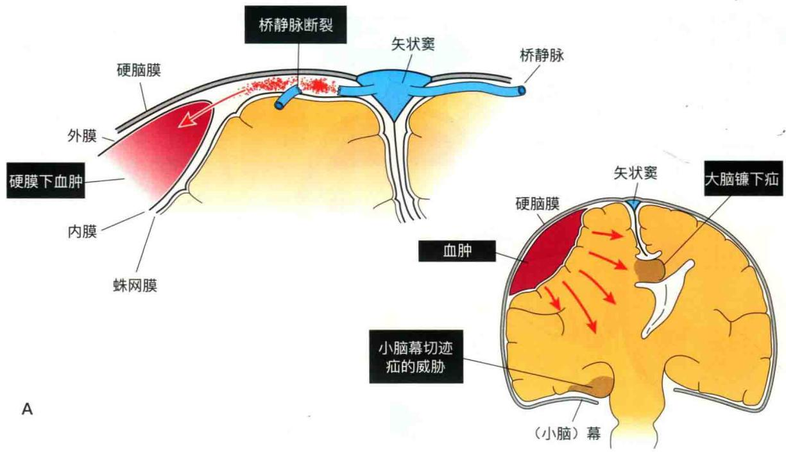
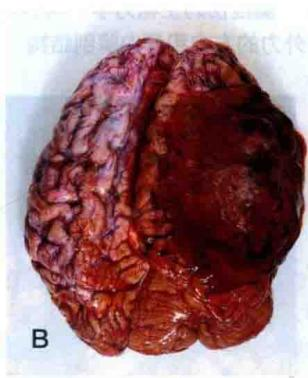 
图28-16 硬膜下血肿的发展。A.头部受到创伤时，硬脑膜随颅骨移动而蛛网膜随着大脑移动，结果，在硬脑膜和蛛网膜之间穿过的桥静脉被剪断。静脉出血在可扩张的硬膜下区形成血肿。随后发生的小脑幕裂孔疝是致命的。B.由于桥静脉破裂，大量血液在右侧大脑半球硬膜下区积聚
挫伤出现的水肿和出血在数天后可共同导致挫伤范围增大，并可引起颅内压增高而危及生命。
脑挫伤会给脑组织留下永久性痕迹。挫伤、坏死组织会被巨噬细胞吞噬并通过血流大部分清除。星形细胞增生随之会导致局部瘢痕形成，作为有脑挫伤病史的一项明显证据而永久存在。通常情况下少许残存的含铁血黄素会使陈旧性脑挫伤呈橙棕色。
3. 弥散性轴索损伤（DAI）是一种极为常见的创伤性脑损伤，可导致患者严重的神经功能缺损和昏迷，无明显血肿及脑挫裂伤。然而，DAI看起来是发病率和死亡率的主要贡献者。作为军队和平民爆炸伤的一部分，越来越多的人对DAI的研究产生了兴趣。

【发病机制】不同脑区之间产生的剪切力对轴索产生剪切伤。剪切伤可使轴索扭转或中断，
同时功能立即丧失。由于弥散性轴索损伤为一渐进性过程而非立即切断轴索性的灾难性事件，因此还有机会阻断其发展过程而保护轴索结构的完整性。
# 4. 贯通性脑损伤

【发病机制】子弹或刀等贯穿物进入颅骨并以不同速度穿过脑组织。未对重要的脑中心
部位产生直接损伤时，立即危及生命的是脑出血（图28-19）。贯穿物产生损伤的严重程度取决于其动能的量。动能等于质量乘以速度的平方 $(E = m v^2)$ ；因此，贯穿物的速度是损伤的主要决定因素。高速的子弹可引起颅内压急剧增加而压迫小脑扁桃体进入枕骨大孔形成脑疝而导致即刻死亡。
# 五、脑血管疾病
脑卒中在所有死因中居第三位，位于心肌梗死和癌症之后。神经系统血管疾病会产生：①全脑性或局部性供血不足（脑缺血），如果缺血时间过长会导致组织坏死（梗死）；②脑血管破裂而致脑出血，可发生于脑实质内或蛛网膜下腔。
# （一）休克常导致缺血性脑卒中
基础状态下心排血量的 $20\%$ 供应脑部。有氧糖酵解是成熟大脑的唯一能量来源。CNS糖原储备量极少且无氧储备，因此，持续的血氧供应对大脑是必不可少的。脑部血供来源于双侧颈内动脉（前循环）和脊椎动脉（后循环）。前后回路血液通过Willis环汇合。全脑缺血引起广泛性组织损伤，导致缺血性脑病。全脑缺血通常是因为心跳呼吸骤停或重度休克时的严重低血压。
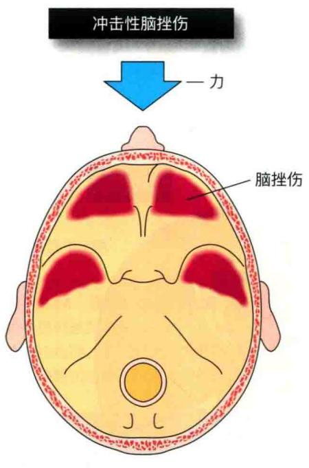 
图28-17脑挫伤的生物力学。两侧大脑半球悬浮在脑脊液中。颅骨的快速加速或减速导致大脑皮质与前颅中窝发生强力碰撞。脑挫伤的部位决定于外力的方向和颅内解剖结构
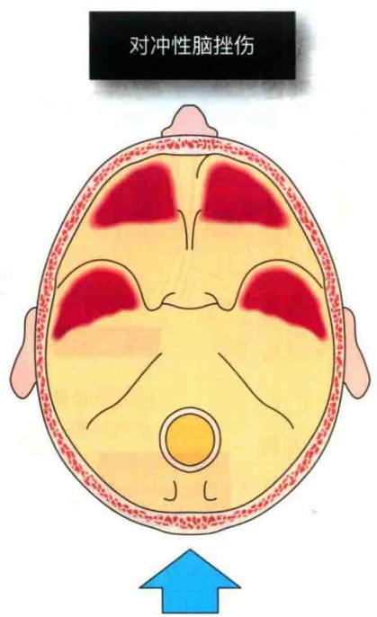
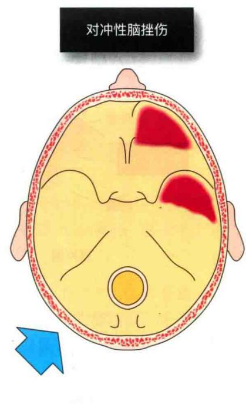
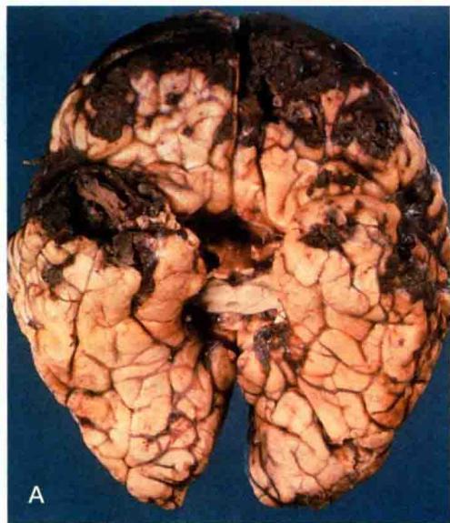 
图28-18急性脑挫伤。A.车祸发生后，脑表现为累及额及颞叶的坏死和出血；B.另外还有潜在性白质出血
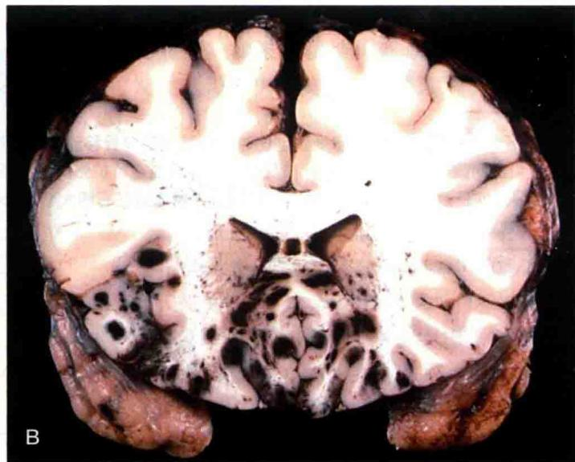
如果灌注障碍持续时间短（几分钟），神经功能可快速恢复，仅有一过性缺血后意识模糊出现。较为严重的损失可引起精神错乱和肌肉强直。如果缺血持续恶化，患者通常不会恢复意识并无限期处于植物人状态，表现为持续性去大脑皮质强直和癫痫。脑部某些细胞群对缺血性损伤较为敏感，该现象与局部脑能量代谢需求、血流动力学因素和局部神经递质有关（图28-20）。
尤其是当缺血引起脑能量供应不足时，细胞膜去极化，导致氨基酸类神经递质谷氨酸和天冬氨酸释放失控。神经递质的非正常释放引发的损伤被称作兴奋性中毒。该机制可能在神经退行性病变、癫痫中的作用与其在脑卒中一样。
在兴奋性中毒，脑受累面积取决于局部毒性神经递质的功能。血流动力学因素导致分水岭或边缘带梗
死，其发生于主要动脉供血区连接处。该区位于动脉供应区远端危险区域，如果灌注压下降，这些区域将最先受累。典型的边缘带位于前中脑动脉之间的远端区域之间。全脑缺血时双侧大脑半球的边缘带可发生梗死，导致对称性楔形，矢状窦旁高凸性梗死。
# （二）区域性缺血导致局限性脑梗死
【发病机制】脑梗死通常被分为“出血性”或“缺血性”（温和）。总的来说，继发于栓塞之后的梗死为出血性，而局部血栓形成引发的梗死为缺血性。栓子突然堵塞血流，随后受累血管远端部分发生坏死，再灌注时血液渗漏入该区域（图28-21A）。颈总动脉和颈内动脉处的动脉粥样硬化斑块可产生栓子。心脏也是多数栓子的来源之地：
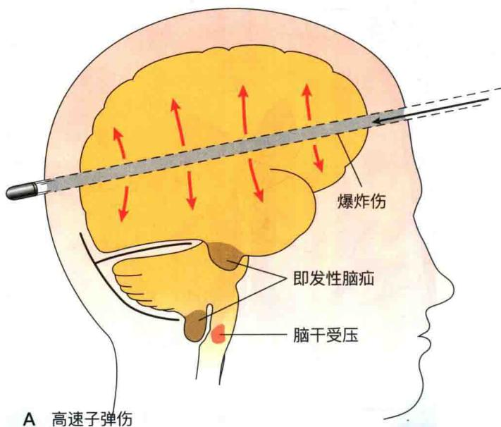
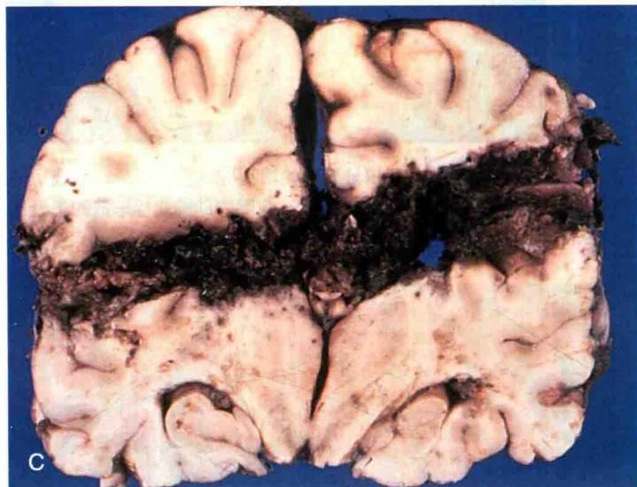 
图28-19 高/低速子弹伤后果。A. 高速的子弹引起的“爆炸效应”引起幕上压力的即刻升高并因小脑和延髓被压进入枕骨大孔而导致死亡；B. 低速的子弹通过引发出血和水肿导致颅内压的平缓升高；C. 贯通伤中的弹道轨迹。高速的子弹造成的“爆炸效应”引发幕上压力的即刻升高，并可因小脑和延髓被压进入枕骨大孔而导致死亡。低速的子弹通过引发出血和水肿导致颅内压的平缓升高
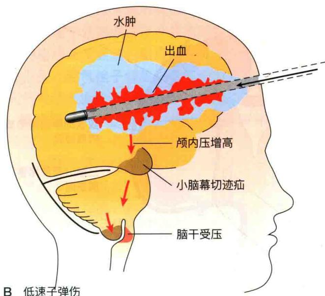
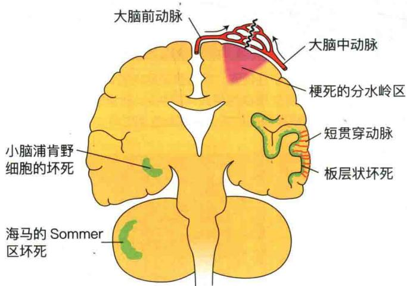 
图28-20大脑半球缺血损伤性机制。大脑半球损伤导致的病变反映了血管结构（分水岭梗死，层状坏死）及个体神经系统的选择易损性（Sommer区椎体细胞，浦肯野细胞，层状坏死）；流变学（血流量）和神经化学（兴奋性中毒）的因素都可能在层状坏死中出现
①受感染或有缺陷的瓣膜；②心肌梗死后心脏内壁运动减少，血凝性增加；③房颤产生心房血栓，尤其是合并二尖瓣关闭不全时。

【病理】大部分血栓形成引发的梗死数小时内
肉眼很难发现，随后软化和褪色越来越明显（图
28- 21B)。3~5天后出现肿胀和液化，在此期间患者由于梗死的效应而处于危险之中。几周或几月后梗死灶成熟变成囊腔（图28- 22），有时伴有脑室代偿性扩张。如果缺血性梗死灶血流恢复，血液可渗漏入软化组织导致出血性梗死，这可通过肉眼或放射手段轻易识别（图28- 23）。
正如其他组织一样，可以通过梗死灶肉眼及组织病理学上有序的变化过程来确定梗死时间。如果患者只存活了几分钟到几小时，无法看到任何变化。如果患者存活 $6\sim 24$ 小时，梗死灶出现皱缩的嗜酸性神经元（“红色神经元”），伴有核固缩（图28-24）。肉眼观，梗死灶轻微褪色及软化，灰白质之间的界线变得模糊。这些改变随着梗死时间变长而更为明显。 $24\sim 72$ 小时时，中性粒细胞浸润入组织，血管明显可见。 $72\sim 96$ 小时时，巨噬细胞取代中性粒细胞来清理残留物。此时梗死灶明显变得柔软。第2周时增
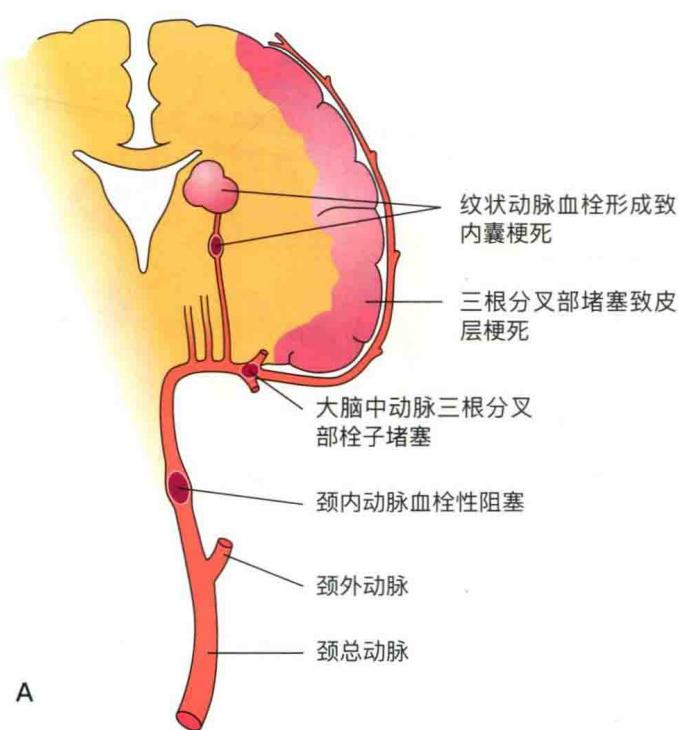 
图28-21A.脑梗死的分布。脑血管系统的正常分布决定了梗死的类型和面积以及临床症状。三根分叉部的堵塞导致皮层梗死，出现运动和感觉缺失并常伴有失语症。纹状分支堵塞会切断内囊血供而导致运动障碍。B.急性大脑中动脉分布区梗死。大脑中动脉血栓形成的患者其大脑轴向剖面会出现右侧大脑半球的大面积梗死（两箭头之间区域）伴肿胀和局部褪色暗区
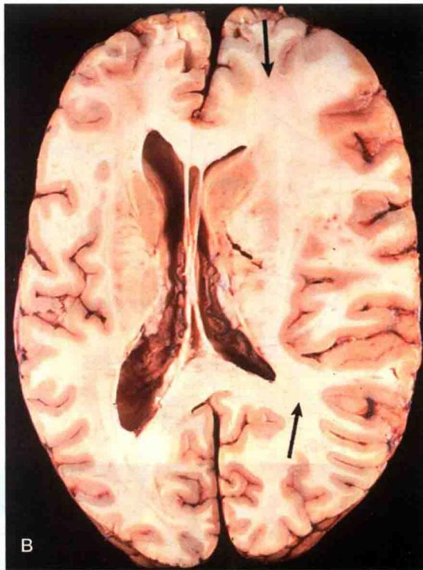
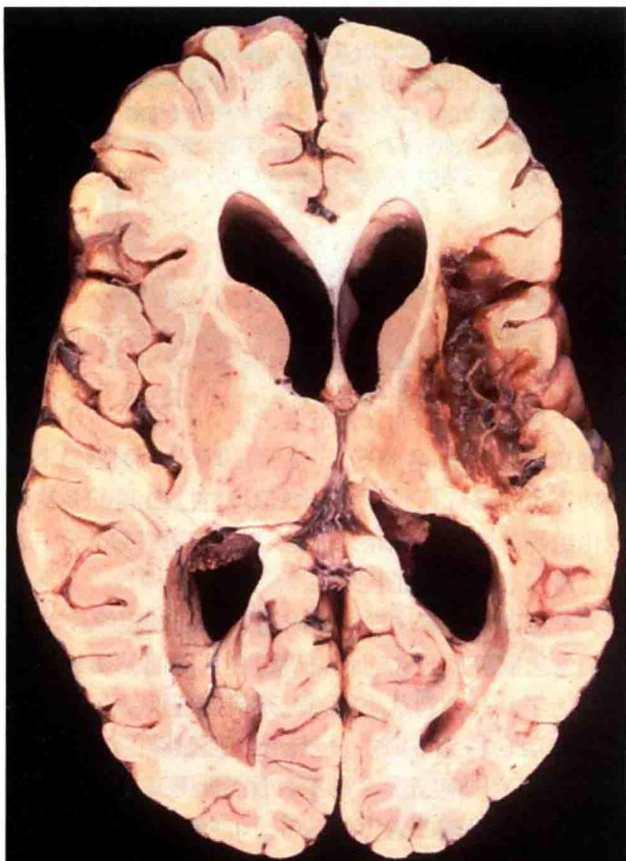 
图28-22 大脑中动脉远部分支区梗死。大脑轴向剖面显示大脑中动脉远部分支区囊性梗死。由于巨噬细胞对大面积梗死灶的清除，图28-26所示大脑也会发展到此情况（感谢Dr.F.StephenVogel，杜克大学）
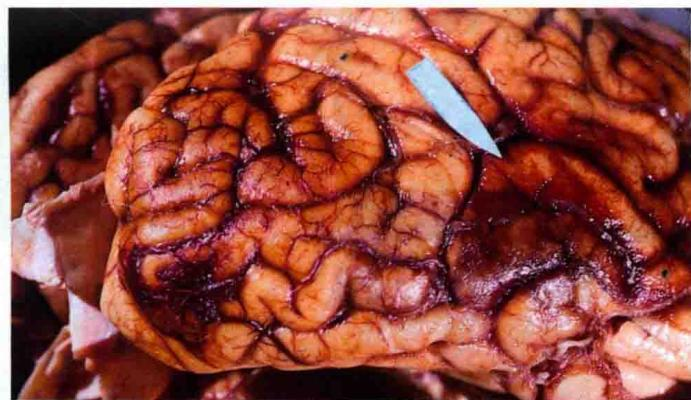 
图28-23 出血性栓子性梗死。来自颈动脉内膜剥脱术的栓子导致大脑中动脉分布区发生出血性梗死（箭头）。血液渗漏或出血明显可导致这种出血性梗死范围扩大，并逐渐危及生命
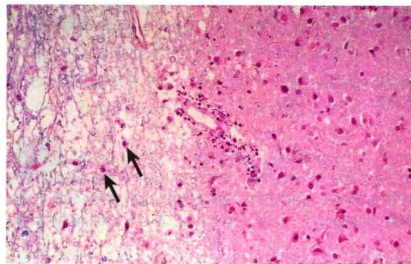 
图28-24急性脑梗死组织病理学。18个小时的脑梗死灶（左侧）显示水肿，高嗜酸性神经元和血管周围的中性粒细胞。可见将死神经元的固缩核（箭头）
生的星形胶质细胞连同巨噬细胞一起在随后的数周或数月间在梗死灶周围形成致密的纤维性神经胶质细胞网。当巨噬细胞处理梗死灶残留物的数周到数月后，梗死灶演变成衬覆神经胶质细胞的囊肿，被纤薄的神经胶质细胞板和小血管穿过并被残余脂质和富含铁血黄素的巨噬细胞所覆盖。

【临床表现】由脑卒中引起的神经功能功能障碍的多样性直接反映了脑功能的复杂性（见图A）。
局限性缺血可引起三种不同的临床症状：
一过性脑缺血发作（TIA）指的是短于24小时的局部脑功能障碍，常持续仅几分钟。虽然脑功能可完全恢复，但是TIA预示着发生脑梗死风险增加。大约1/3的TIA患者在首发TIA的5年内有脑卒中发作，风险最高的时期为TIA发作后30天内。1/3的患者TIA会单纯持续发作，而另1/3的TIA患者不会再发生TIA或脑卒中。重要的是， $50\% \sim 85\%$ 的脑梗死患者无TIA病史。
■进行性脑卒中指的是患者在临床观察期间神经症状反复不断发展的一种情况。该病症反映了颈动脉和基底动脉的血栓增大，临床情况不稳定，需要紧急处理。
■ 完全性脑卒中指的是由脑梗死引起的一种稳定的或稳固的神经损害。完全性脑卒中两到三天后，梗死灶内细胞毒性水肿和血管源性水肿可导致颅内压增高，随之可出现脑疝。
# 区域性阻塞性脑血管疾病

【病理】导致脑梗死的各种脑血管疾病可根据受累血管的口径和特征进行分类。
大的颅外和颅内动脉：这些动脉常为动脉粥样硬化发生部位，常累及颈总动脉分为颈外动脉和颈内动脉分叉处。颈动脉阻塞通常产生局限于大脑中动脉支配区的全部或部分性梗死。大脑中动脉最易被Willis环内的动脉粥样硬化灶并发的血栓所阻塞。由于在大脑中动脉的三根分叉处血管口径明显变细，因此此处是主要的栓子堵塞部位。
脑实质内的动脉和小动脉：这些血管通常不会发生严重的动脉粥样硬化，但是可因高血压受损，因动脉粥样硬化而变狭窄从而导致深部穿通血管支配区域发生小梗死（腔隙性梗死）。当发生多发性腔隙性梗死灶时，众多小梗死灶可导致认知功能受损，被称为多发性梗死性痴呆。
高血压脑病：指的是恶性高血压性急性神经功能并发症（见第10章）。该疾病通常表现为头痛和呕吐，进而进展为昏迷，最后死亡。在现代抗高血压治疗措施下，恶性高血压并不常见。
微循环：由脂肪或空气形成的小栓子可阻塞毛细血管。脂肪栓子通常来源于骨折，沿脑血管行进到血管内径低于栓子处并停留在此处而阻塞血流。远端毛细血管内皮缺氧及通透性增高形成瘀斑，此情形主要发生在白质。空气栓子释放许多气泡，当到达血管分叉处时气泡进一步破碎直到阻塞小血管血流。
静脉循环：脑静脉注入大静脉窦，其中最大的静脉窦是矢状窦，它容留来自上部大脑双侧半球的静脉血流。脑静脉窦血栓形成是全身性脱水、乳突炎等邻近感染引发的静脉炎、脑膜瘤等肿瘤或镰状细胞病导致的堵塞等病变的一种致命性并发症。由于静脉阻塞导致上游淤塞，矢状窦血栓形成迅速导致双侧额叶区出血性梗死（图28-25）。进展缓慢的静脉窦堵塞（比如因脑膜瘤侵犯引起）可通过下矢状窦建立侧支循环，下矢状窦位于镰部下缘，注入直窦。
# （三）颅内出血可为脑实质或蛛网膜下腔出血

【发病机制】CNS脑实质出血通常是由于薄弱的小血管破裂或血管畸形。蛛网膜下腔出见于动脉瘤破裂或血管畸形。
蛛网膜下腔出血 血管内压和动脉血管壁薄弱导致脑动脉瘤，其破裂时可引发蛛网膜下腔出血。 $85\%$ 蛛网膜下腔出血由脑动脉瘤破裂引起，其余蛛网膜下腔出血则是由血管畸形导致。
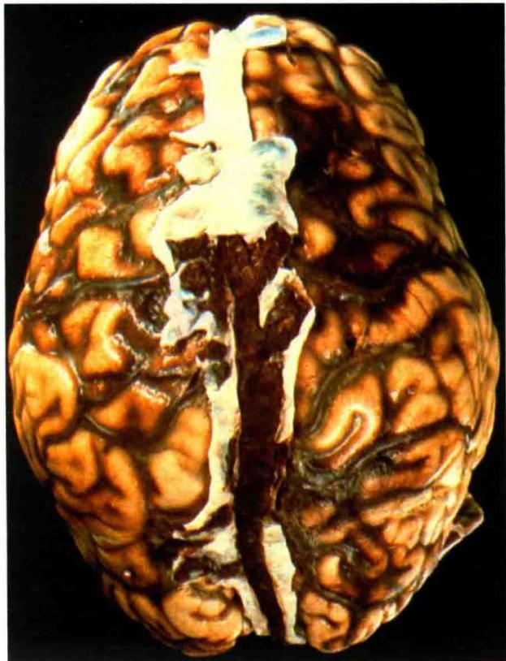 
图28-25 上矢状窦血栓形成。从上矢状窦上方打开，可见血栓充填上矢状窦。血栓阻碍大脑半球静脉回流，导致双侧大脑半球出血性梗死。静脉血栓形成常见于高凝状态，如脱水、妊娠、遗传性纤溶障碍、镰状细胞病及感染或肿瘤扩散入窦内
（1）囊状（浆果）动脉瘤：囊状动脉瘤是脑动脉的球状膨出，可发生破裂从而导致严重的蛛网膜下腔出血。囊状动脉瘤常常发生在Willis环内或附近的脑血管分叉处（图28-26）。

【病理】当发育中的血管分为两支时，血管肌层
可能不能完全覆盖分叉处，这就形成了仅由血
管内皮细胞、内弹性膜和薄外膜覆盖的先天性肌层薄弱区。随着时间的推移，源自主血管的动脉血流压力加重了此先天性缺陷。内弹性膜可退化或破裂，随之演变为仅由一层外膜覆盖的囊性动脉瘤。活跃的血管壁重建可能有助于囊性动脉瘤的演变。超过 $90\%$ 的囊性动脉瘤出现在颈动脉支配的前循环的近段分支处。其余的发生在后循环，尤其是后交通动脉和大脑后动脉的分叉处（图28-27）。 $15\% \sim 20\%$ 的患者会出现多发性囊性动脉瘤。多囊肾（见第16章）、主动脉缩窄及Ehlers-Danlos综合征患者脑动脉瘤的发病率升高。

【临床表现】囊性动脉瘤破裂导致致命性蛛网
膜下腔出血， $35\%$ 的患者在出血初期死亡。血
液可在动脉压力下喷射而导致多达1/3的患者发生脑内或脑室内出血。蛛网膜下腔出血刺激疼痛敏感性血管和硬脑膜，引发突发性剧烈头痛，被患者描述为“此生最剧烈的头痛”。患者可很快陷入昏迷状态。有时候囊性动脉瘤并未破裂，而是胀大形成肿物压迫脑神经而导致瘫痪或侵犯实质结构造成神经症状。典型的例子是后交通动脉瘤压迫第三脑神经导致伴有瞳孔散大的孤立性动眼神经麻痹。
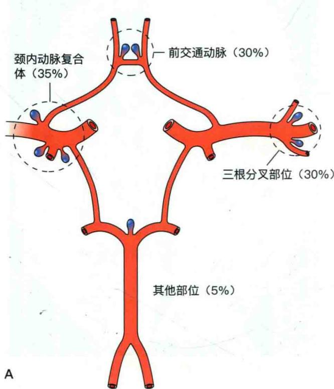 
图28-26囊状动脉瘤病理生理学。A.显示囊状动脉瘤（浆果动脉瘤）的发病率，其主要累及近心端颈动脉分叉处；B.病变是由于血流压力作用于有早期胚胎缺陷的血管分叉处所致
（2）血管畸形：尽管血管畸形发生在胚胎形成时期，但是它可因血管生成、血管重建和正常脑实质新生血管发展而成。异常血管形成于胚胎发育过程中，由于局部脑动静脉交通之间缺乏毛细血管。由此产生的异常血管常位于脑皮质和邻近的深层白质。畸形随着时间扩大并累及邻近组织的血管。血管畸形可导致蛛网膜下腔和（或）脑实质内出血。血管畸形还可刺激正常脑皮层而引起癫痫或分流邻近结构的血流而增加局部神经功能缺失。动静脉血管畸形为不同口径和管壁厚度的动脉血管和静脉血管形成的一种缠结状态。血管由异常的脑实质分隔，后者为神经胶质增生症（图28-28）。

【临床表现】神经组织受刺激可引发癫痫。局
部神经功能缺失可由血管缺血引起。颅内出血，
通常是蛛网膜下腔或脑内出血，通常发生在十几岁或
二十几岁。出血通常不会危及生命但可能反复发生。
# 六、感染性疾病
如果未经治疗，许多神经系统的感染性疾病通常是致命的。临床病程可呈快速凶险性或缓慢进展性，并与许多其他疾病相似。CNS感染的评估应考虑以下三种情形：感染的部位和范围、患者对感染的反应特征和引发的病原体。
硬膜外腔和硬膜下腔积脓通常是与创伤有关的细菌性感染或由邻近鼻窦或耳部的感染扩散导致。
软脑膜炎（脑膜炎）时，出现炎症反应，并且大部分引发的病原体漂浮在脑脊液中而留在蛛网膜下腔。
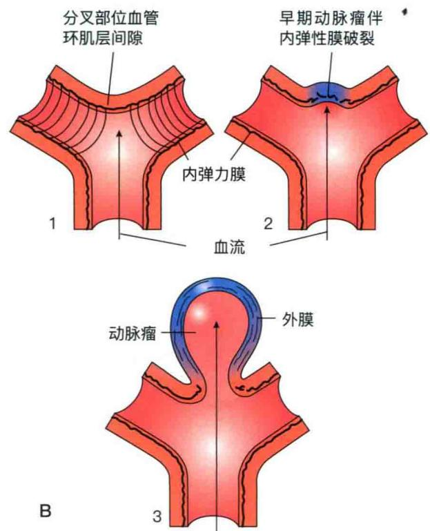
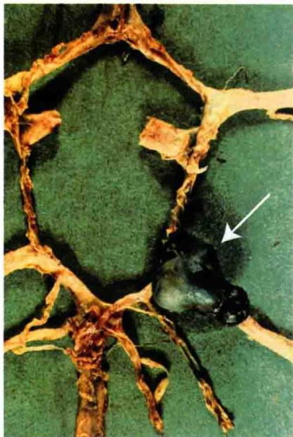 
图28-27 浆果动脉瘤。一个起源于大脑后动脉的囊状动脉瘤（箭头）。暗色区是因该动脉瘤破裂入蛛网膜下腔所致
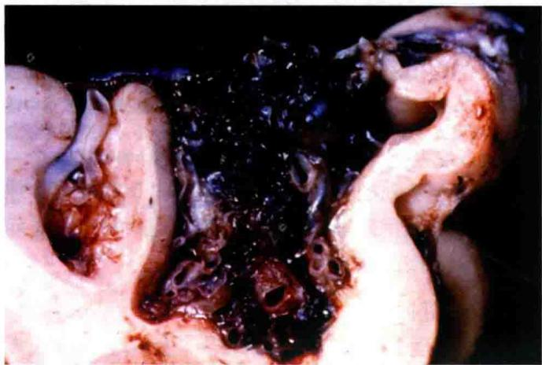 
图28-28 动静脉血管畸形（AVM）。脑实质内可见伸展到脑表面的杂乱无章的动脉血管。如果脑表面出血，AVM可导致蛛网膜下腔出血；如果深部血管破裂，AVM可导致脑实质内出血。这种出血通常不像动脉瘤破裂所致的蛛网膜下腔出血或高血压性脑出血那样致命
活动性炎症反应可累及脑实质（大脑炎），包括脑水肿和栓塞性血管炎、出血或梗死。病程较长的脑膜炎的并发症包括渗出、脑脊液循环受阻伴脑积水和脑神经病变，尤以第八对脑神经受损导致的耳聋最为多见。
大脑炎为一种化脓性脑实质感染，通常由细菌或真菌感染引起。脑组织软化并液化，受感染组织的边界不清。若患者能产生包裹性反应，当大脑炎是封闭时，即形成脑脓肿。脓肿表现为中心坏死灶周围包绕肉芽组织，一种致密的纤维血管组织囊和神经胶质细胞外壳，坏死灶内大量的中性粒细胞含有许多多形核白细胞。
脑炎，如同大脑炎，是一种脑实质性感染，但是脑炎通常指的是病毒感染，伴有坏死、淋巴细胞围管现象和小胶质细胞结节。细胞核内或细胞质内可见病毒包涵体，还可见到神经胶质增生、脱髓鞘作用和海
绵状脑。
# （一）细菌感染导致蛛网膜下腔炎症
软脑膜炎发生在软脑膜层和蛛网膜层之间。其间的脑脊液是大多数细菌的优良培养基。脑脊液的炎症反应因微生物的毒性和感染的进度而不同。脑脊液中可发生细胞性成分及葡萄糖和蛋白质含量的变化。脑脊液中的微生物有时可通过显微镜识别，也可以通过培养、抗原特性和聚合酶链反应（PCR）（在某些病例）来明确。
【临床表现】脑膜炎的指征和症状包括头痛、呕吐、发热、精神状态改变和癫痫。脑膜炎症的典型症状包括颈项强直、屈髋时膝关节疼痛（Kernig征）及屈颈时屈髋/膝关节（Brudzinski征）。在极端的年龄（新生儿和老年人）中临床表现可能会有变化。
# 1. 细菌性脑膜炎
【发病机制】由于大多数细菌会引发化脓性反应，脑脊液中出现中性粒细胞是脑膜炎的一项有力证据。在许多病例中，脑脊液中的葡萄糖含量下降而蛋白质含量升高。细菌性脑膜炎的病因决定于患者的年龄。革兰阴性大肠埃希菌和乙型溶血性链球菌多见于新生儿，流感嗜血杆菌多见于未接种的幼儿，脑膜炎奈瑟球菌多见于青少年和青壮年。肺炎链球菌是中老年人的主要感染病菌。细菌进入脑穹窿的路径见图28-29A。
大肠埃希菌：由于新生儿对革兰阴性菌的抵抗力尚未发育完全，大肠埃希菌是脑膜炎的主要致病菌。母体免疫球蛋白（IgG）经胎盘的转运可保护新生儿对抗许多细菌，但是大肠埃希菌及相似的革兰阴性菌却需要IgM来中和，而IgM不能通过胎盘屏障。因此，新生儿感染革兰阴性菌可迅速引起死亡率极高的化脓性脑膜炎。
流感嗜血杆菌：接触环境中的革兰阴性流感嗜血杆菌时发病会有所延迟，脑膜炎的发病率会在（接触病原菌后）3个月到3年之间达到顶峰。近年来由于疫苗的广泛接种，流感嗜血杆菌性脑膜炎的发病率有所下降。
肺炎链球菌：肺炎球菌是导致中老年人脑膜炎的主要致病菌。有颅底骨折伴脑脊液漏病史的患者肺炎球菌性脑膜炎的发病率极高且治疗后易复发。嗜酒者和无脾的患者更易于发生此型脑膜炎。
脑膜炎奈瑟菌：这种脑膜炎球菌位于鼻咽部并在人群聚集区（如学校或兵营）可经空气传播而导致“流行性脑膜炎”。开始时菌血症表现为发热、精神不振和皮肤出血点，弥散性血管内凝血（DIC）可导致致命的肾上腺出血（Waterhouse-Friderichsen 综合
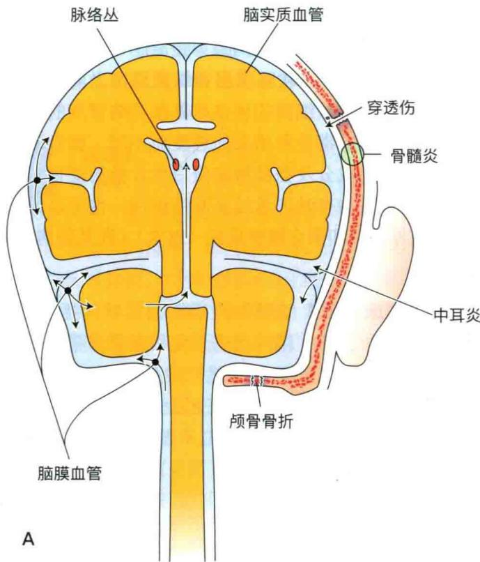
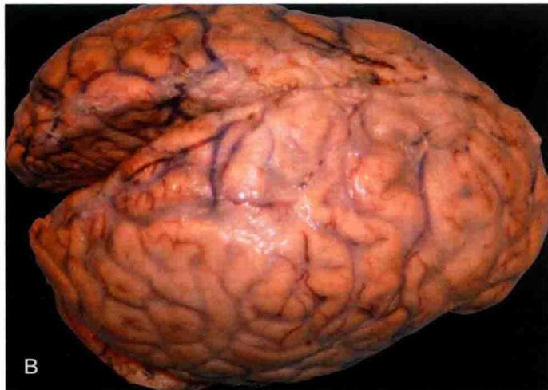 
图28-29 化脓性脑膜炎。A.感染性微生物侵入颅腔的路线；B.细菌性脑膜炎时奶油状渗出物使软脑膜透明性降低。浅表静脉充血并可能形成血栓，脑浅表动脉也可能形成血栓，造成梗死
征)。未经治疗的脑膜炎球菌性菌血症易导致急性暴发性脑膜炎。能获得一种多价疫苗，并建议所有年轻人接种。虽然该疫苗效果极好，但是仍然不能完全覆盖脑膜炎奈瑟菌的所有菌链。

【病理】细菌性脑膜炎中性粒细胞和纤维蛋白渗出物可使蛛网膜透明性消失。渗出物可以轻
到肉眼难以识别，也可以重到不能辨清血管。脓性渗出物在双侧大脑半球最为明显（图28-29B），但是也可扩散到脑基底部以及从颅内扩散到椎管内和蛛网膜下腔。蛛网膜下腔常出现中性粒细胞和病原菌的堆积（图28-30）。患者对炎症的强力应答对清理感染至关重要，但是由炎症细胞释放的自由基和细胞因子等细
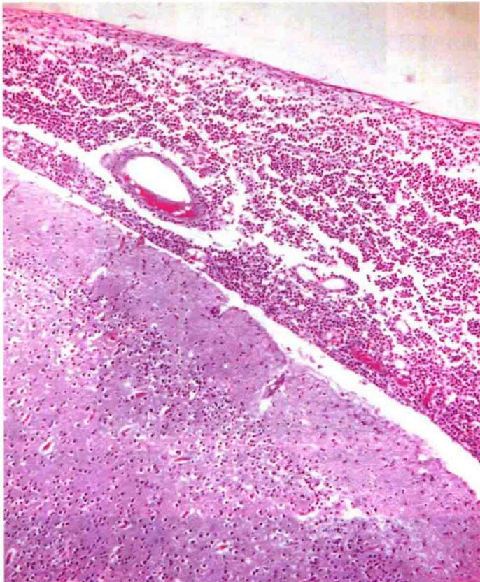 
图28-30 细菌性脑膜炎。该显微镜切片显示蛛网膜下腔大量中性粒细胞聚集
胞毒性物质会对血管和神经纤维网造成明显损害。现在，皮质激素用来辅助抗生素治疗，以缓解宿主炎症反应引起的损害。
# 2.脑脓肿

【病理】局限性脑实质脓肿起始于当细菌或真菌滞留在神经纤维网并引发称之为大脑炎的急
性炎症和水肿性反应。脑组织变软并液化，在数天之内液化的坏死组织形成扩张性肿块，从而可能引起脑疝或破裂入脑室而危及生命（图28-31）。激烈的星形细胞反应性增生被启动，成纤维细胞通过脑微血管入侵，包裹新生脓肿，在脑内形成罕见现象。数天到数周后随着脓肿成熟，脓性残留物被三层组织所包裹：①内层的肉芽组织；②中央和肉芽组织周围由成纤维细胞和胶原蛋白形成第二层致密的网状结构；③最后，是强烈的星状细胞增生、小胶质细胞活化和水肿带（图28-32）。导致脑脓肿的细菌通常是厌氧菌或微需氧菌，因此很难进行培养。这些细菌通常由心脏或肺部经过血源性播散到达脑部。由于病原菌不断进入血液循环，因此 $15\% \sim 20\%$ 的患者可出现多发性脓肿。脑部受累也可能是由邻近受感染的额窦或乳突小房扩散引起，或因脑外手术伤口感染引起。
3. 神经性梅毒 二期梅毒（见第9章）之前通常都有皮肤和黏膜的急性斑丘疹样改变。少数情况下梅毒螺旋体可以引起短暂的脑膜成纤维细胞反应，并常
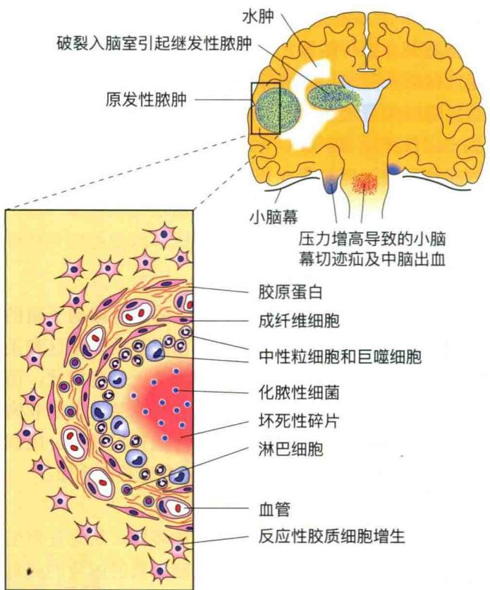 
图28-31脑内脓肿的发展及其并发症。皮层脓肿可破裂入脑室形成继发性脓肿，而导致死亡。死亡也可因小脑幕切迹疝。脓肿包括一个坏死的脓肿中心，然后依次是肉芽组织层、纤维层以及胶质细胞增生围绕
伴有闭塞性动脉内膜炎，从而导致大脑皮质和脑干处多发小梗死灶。脑（脊）膜血管梅毒中可见梅毒的特征性炎性改变，常表现为浆细胞围绕大脑皮质小动脉周围（图28-33）。
（1）脊髓痨：脊髓痨是指脊柱支撑功能的丧失，表现为关节的位置感觉功能和精细触觉功能的丧失，是由脊髓背侧神经根处的梅毒性炎症引起（图28-33）。 
（2）梅毒性痴呆：梅毒密螺旋体可潜伏于脑内达数十年。潜伏期的梅毒螺旋体复制缓慢并很难被彻底清除，从而导致首次感染数年后出现痴呆及精神病症
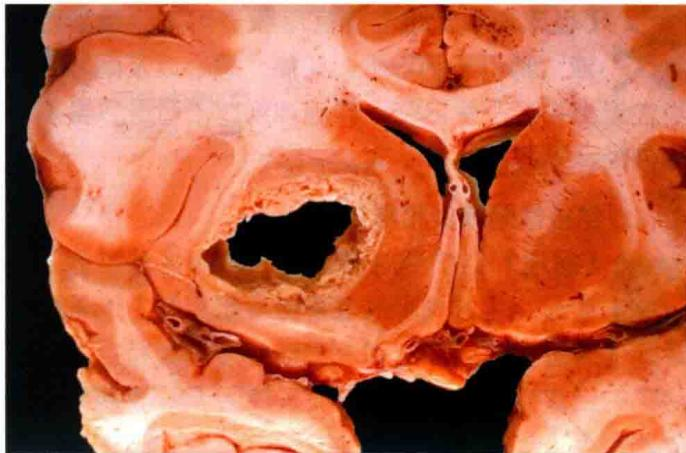 
图28-32脑脓肿。细菌性心内膜炎的年轻患者，继发脑内左基底核脓肿
# 1. 脑膜脑血管梅毒
- 脑膜增厚 
- 浆细胞性闭塞性动脉内膜炎
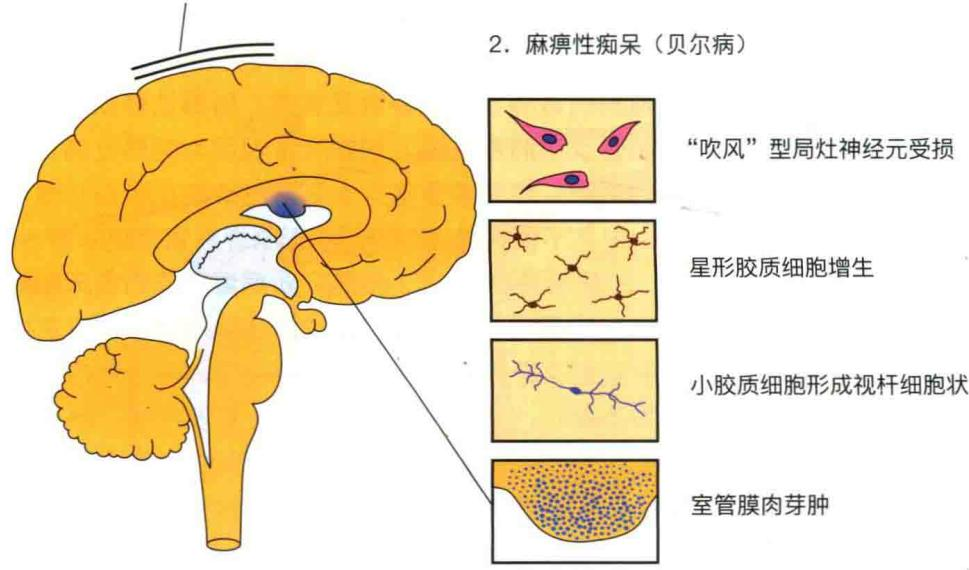
 
图28-33 中枢神经系统梅毒感染。神经性梅毒特点是脑膜血管炎导致硬脑膜炎，闭塞性动脉内膜炎导致脑卒中，背部神经根感染引起脊髓痨，累及脑膜及脑实质引起痴呆
状。组织学特征包括局部皮层神经元丧失、残存神经细胞异形（吹-风现象）、神经胶质显著增生以及小胶质细胞转变为杆状带壳细胞（“视杆细胞”），并常伴有结节性室管膜炎。
# （二）神经系统感染分枝杆菌和真菌引起肉芽肿性反应
【病理】分枝杆菌和真菌感染的病变进展一般慢于细菌性感染，常见多核巨细胞并伴有浆细胞和淋巴细胞浸润，炎症渗出物常积聚于颅底脑干周围，不同于细菌性脑膜炎渗出物常见的颅内隆起部位。
【临床表现】慢性脑底脑膜炎可能会阻断脑脊液，常引起脑积水、头痛、恶心以及呕吐。当炎性渗出物波及来自脑干的脑神经时，可导致多发性脑神经麻痹。
# 1. 结核性脑膜炎和结核瘤
【病理】结核性脑膜炎是一种慢性感染病，能引起宿主的肉芽肿性反应，组织学上以干酪样坏死伴周围多核巨细胞和淋巴细胞浸润为特点。未经治疗的结核性脑膜炎患者一般只存活 $4\sim 6$ 周，而其中还有免疫缺陷的患者存活时间会更短。脑实质的结核通常形成结核瘤，表现为单独的干酪样坏死结节周围伴随肉芽肿性炎症。在世界上某些结核病流行地区，分枝杆菌肉芽肿结节可能是脑占位性病变中最常见的类型。Pott病是脊柱发生的结核性病变，硬膜上的肉芽肿结节会破坏脊柱的骨质，从而可能引起脊髓的压迫性病变。
2.真菌感染 CNS的真菌感染一般是机会性感染，反映了这些微生物的惰性腐生的生活方式。然而，少数真菌的毒力足够大而使人致病，即使是免疫功能正常的人群。真菌菌丝的形态通常以圆形或椭圆形为主，以出芽、孢子或分枝形态存在。在一些感染中，孢子和出芽可在感染的组织中同时看到。这种形态学的不同能够使人们尝试在组织学切片上对真菌进行分类，但最后确定需要免疫组化染色、PCR以及真菌培养结果来证实。
（1）隐球菌：隐球菌脑膜炎是最常见的真菌性脑膜炎。在大多数病例中，隐球菌常机会性感染免疫缺陷的患者，但偶尔也会引起免疫功能正常的人的脑膜炎。新型隐球菌通过呼吸道进入宿主体内，鸟类是其最主要的宿主。患者常因吸入了带有真菌菌丝的排泄物而遭受感染，主要为局限于肺部的感染，但也可见播散到脑等的其他身体器官。

【病理】新型隐球菌的典型表现为脑膜肉芽肿性炎症，感染灶为独立分散、白色结节，直径
约为 $1\mathrm{mm}$ 。真菌通常仅存在于蛛网膜下腔区域，但在有些病例，也可播散到脑实质中。胶状的真菌外壳清楚且有折光性，因此微脓肿有时被称为“肥皂泡”脓肿。新型隐球菌呈胶囊状和芽殖酵母状，比一般的真菌大 $(5\sim 15\mu \mathrm{m})$ ，真菌的胶状外壳，镜下观察像一个环绕在真菌的光环，在混有印度墨水的脑脊液中清晰可见。新型隐球菌的外壳能使菌丝逃避免疫反应，只产生微弱的炎症反应。胶乳隐球菌抗体试验可检测脑脊液中菌体外壳分泌的特异性抗原。
（2）环孢子菌病：环孢子菌病是由粗球孢子菌的组织酵母形态所致。通常在加利福尼亚的西南区和圣华金河谷等干旱地区流行。最初通常无肺部症状，而且几乎很少扩散。有时会发生混合型化脓性炎症和肉芽肿性炎症，伴有动脉炎，导致可能伴发梗死。组织中的真菌表现为醒目的、有折光的内生芽性小球。
# （三）病毒感染
CNS病毒感染的临床表现多种多样，从无任何生命威胁的病毒性脑膜炎到影响到脑实质的凶险的病毒性脑炎。这些疾病的发展通常要经历数小时或者数十年。除了产生感染，病毒也可以涉及一些自身免疫性疾病和神经组织退化性疾病。
1. 病毒性脑膜炎 病毒性脑膜炎可能是 CNS 最常见的病毒性疾病，但不像细菌性脑膜炎，其病程通常比较温和，且治愈后无后遗症。最常见的病原体为肠道病毒（例如柯萨基病毒 B 和艾柯病毒），但是腮腺炎病毒、淋巴细胞性脉络丛脑膜炎病毒、EB 病毒、单纯疱疹病毒等导致许多散发病例。病毒性脑膜炎（儿童和青少年的常见病）初始时常表现为突然发热伴随剧烈头痛。脑脊液通常有大量淋巴细胞和蛋白轻微增高，但是不像细菌性脑膜炎，无脑脊液葡萄糖降低。
2. 病毒性脑炎 CNS 脑实质病毒感染的临床和病理学表现常常多种多样（图 28-34）。例如脊髓灰质炎主要累及脊柱和脑干的运动神经元，而单纯疱疹病毒累及颞叶。亚急性硬化型全脑炎累及灰质，而进行性多灶性的脑白质病（PML）是一种白质性病变。病毒定位的机制反映出病毒有特异的绑定物质使病毒位于 CNS 细胞的细胞膜上，且能使病毒在特殊的细胞内微环境中保持潜伏或者选择性的复制。病毒可利用轴突运输，使其从进入部位传到远处，例如狂犬病毒和疱疹病毒。

【病理】很多CNS病毒感染会导致血管周围淋巴细胞浸润，可见巨噬细胞和小胶质细胞活化
及胶质细胞增生（图28-35）。这些都不是病毒性感染特异的表现，当有病毒包涵体时，对诊断病毒感染可以提供证据。不过，目前PCR和免疫组织化学更常用于明确诊断。
【临床表现】大部分病毒性脑炎都是突然发病。更具体的神经功能缺陷（例如小儿麻痹症的麻痹和狂犬病的吞咽困难）常常反映了感染的部位。虽然很多脑炎常病程迅速，但是节奏可多变。例如亚急性硬化型全脑炎可能持续数年；单纯疱疹病毒和水痘病毒可在感觉神经节潜伏数年，只在最初感染后数十年之后发病。
（1）脊髓灰质炎：脊髓灰质炎这个名词是指发生在脊髓灰质的任何炎症。但常特指由脊髓灰质炎病毒所诱发的炎症反应。该病毒是肠道病毒的一种，为小的、无外套的和小片段的RNA病毒。在感染者的粪便中有大量的这种病毒，经粪-口途径传播。

【病理】病毒经其在运动神经元上的附着部位侵入细胞并进行繁殖。被感染的细胞可发生可
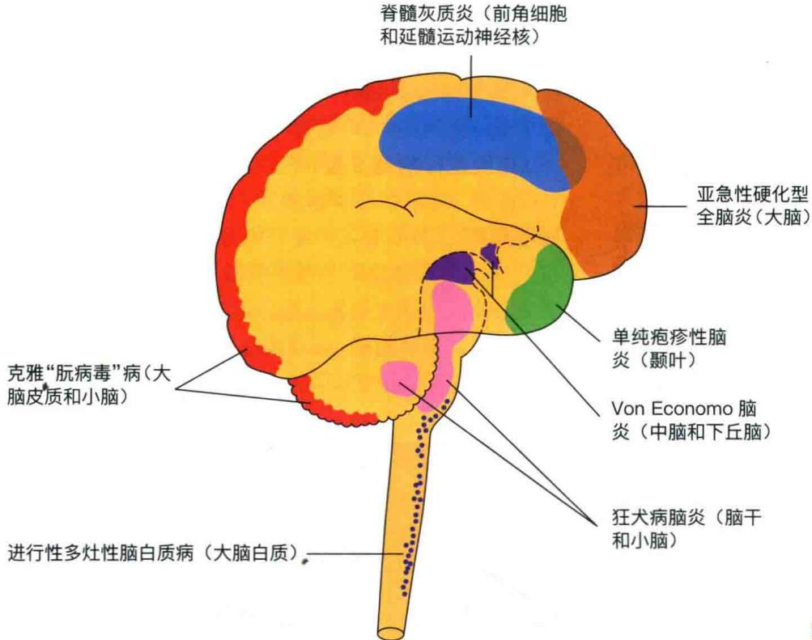 
图28-34 病毒性脑炎的病变分布
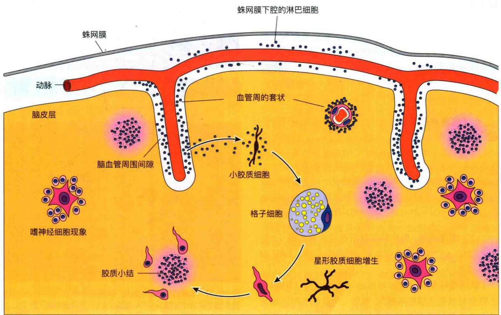 
图28-35 病毒性脑炎的病变
逆性的尼氏体溶解，引起神经元肿胀、细胞质肿胀和核偏位。随后被巨噬细胞吞噬（噬神经细胞现象）。最初的炎症是短暂的中性粒细胞反应，随后为淋巴细胞环绕在脊髓和脑干的血管周围。在康复患者的脊髓切片中发现了神经元的缺失，继发相应的腹侧神经根和周围神经退变。

【临床表现】在感染脊髓灰质炎病毒后，非特
异性症状例如发热、全身不适、头痛会在出现
脑膜炎体征后几天内出现，随后会出现麻痹。在严重患者，出现颈部、四肢和躯干的肌肉无力。呼吸肌麻痹可威胁生命并致死亡，约占 $5\% \sim 25\%$ 。从20世纪50年代起，随着脊髓灰质炎疫苗的广泛应用，该病在全球大部分地区已基本消除。
# (2）狂犬病

【流行病学】狂犬病是由一种有包膜的单链
RNA病毒所引起的脑炎, 该病毒属于弹状病毒
的一种。狗、狼、狐狸和臭鼬是主要携带者，但在蝙蝠、牛、山羊、家猪等也有携带。狂犬病毒经动物撕咬人体后由污染唾液传播到人体。在美国，狗类常规都要进行狂犬病毒疫苗注射，所以每年很少（1～5例/年）有来自于感染狂犬病毒蝙蝠叮咬的病例。而在其他狂犬病流行的国家，多来自于狗类的咬伤，每年大约超过5万人死于狂犬病。

【病理】病毒进入周围神经后，逆行轴浆流至
脊髓和脑。潜伏期根据病毒传输的距离不同而
不同，大约从10天到3个月甚至更长时间。可见血管周淋巴细胞聚集、散在的尼氏体溶解的神经元、噬神经细胞现象和小胶质细胞结节。炎症主要位于脑干，累及小脑和下丘脑。在海马、脑干和小脑浦肯野细胞（Negri小体）中可以看到嗜酸性的胞质内病毒包涵体，从而可以明确诊断。

【临床表现】脑干神经元被狂犬病毒破坏常引
起喉疼痛性痉挛、吞咽困难和恐水。这也是为
什么早期称狂犬病为“恐水病”。临床症状也有一般的脑病症状，包括易激惹、焦虑、癫痫和谵妄。一旦出现症状，病情将无情进展，直到一至几周内死亡。患者暴露后紧急狂犬病疫苗接种和免疫球蛋白注射是预防措施。
（3）疱疹病毒：疱疹病毒包括单纯疱疹病毒（1型和2型），水痘-带状疱疹病毒、巨细胞病毒、EBV和猴B病毒。
单纯疱疹病毒1型：单纯疱疹病毒1型（HSV-1）主要引起的是“感冒疱疹”。嘴唇上泡状病变的区域是受来自三叉神经节的感觉神经轴突支配。HSV-1可能
潜伏在三叉神经节，在人精神压力大的时候繁殖，并通过神经干离心传播至嘴唇。中枢神经系统HSV-1的活化和传播常引起疱疹性脑炎，这是散发性（即非流行性）病毒脑炎最常见的类型。

【病理】疱疹性脑炎主要累及1个或同时累及
2个颞叶。脑炎是暴发性的，颞叶出现肿胀、
出血和坏死。炎症主要是淋巴细胞，形成血管套袖外观（图28-36）。小动脉及微动脉出血和水肿。周围有空晕（Cowdry A）的嗜酸性核内病毒包涵体，在神经元和神经胶质细胞中均可见（图28-37）。诊断常常需要脑脊液的PCR检查和病毒培养。
单纯疱疹病毒2型：在女人，单纯疱疹病毒2型（HSV-2）常常引起女性外阴部位的生泡状病变（生殖器疱疹），并有骨盆神经节的潜在感染。新生儿在经过产道时常常会感染上该型病毒，此后可能发展成暴发性脑炎，出现大脑和小脑广泛的液化性坏死。
水痘－带状疱疹：带状疱疹病毒（HZV）常引起幼儿“水痘”，并且HZV可能会潜伏在背部神经节内，在
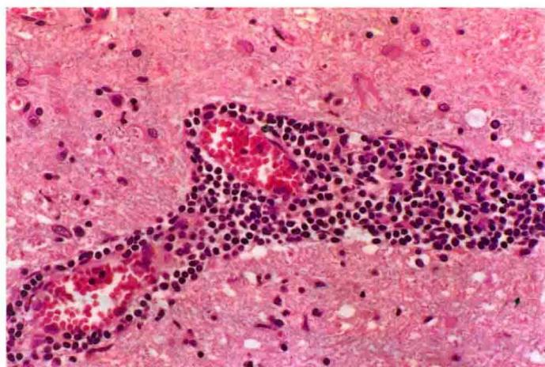 
图28-36 单纯疱疹病毒性脑炎。显微镜下，可以见到血管周围大量的淋巴细胞浸润。这提示着当前有活动性炎症，但不是病因特异性的
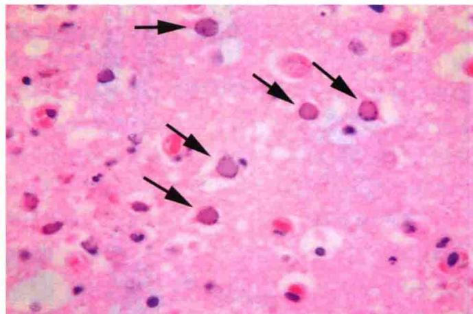 
图28-37 单纯疱疹病毒性脑炎。被感染的神经元显示核内的嗜酸性病毒性包涵体（CowdryA包涵体），充满了细胞核（箭头）。这对指导诊断相当价值，因为只有少数几种病毒能产生这种包涵体
随后的人生中，尤其是在60岁以后，病毒会再次活化，然后通过感觉神经轴突被传输到皮肤，从而导致皮肤伴有剧烈疼痛的疱状皮疹，被称为“带状疱疹”。分布于有病毒的背侧神经根神经节所支配的皮肤。HZV疫苗现在已用于临床，并且推荐60岁以上人群使用。
# 3. 虫媒传播性病毒性脑炎

【流行病学】虫媒传播性病毒或虫媒病毒通过吸血媒介（如蚊子和蜱类）在脊椎动物之间相
互传播。披膜病毒科、布尼雅病毒科和黄病毒科占绝大部分能引起人类脑炎的虫媒病毒。虫媒病毒感染是人畜共患病，人类因被携带病毒的节肢动物叮咬而感染。人类通常不是中间宿主，所以不会引起人际间感染。根据首先发现的地区，虫媒病毒引起的脑炎被予以不同的名称（表28-1）。自1999年首次出现在美国后，西尼罗河脑炎占了虫媒病毒脑炎的绝大部分。

【病理】几种虫媒病毒性脑炎之间在组织学上有相似性，根据病情严重程度而稍有不同。轻
微的脑膜炎时仅见散在淋巴细胞，严重时表现为灰质重度炎症、小血管血栓形成和明显的坏死。感染的神经元内没有病毒包涵体。西尼罗河病毒性脑炎有侵犯脊髓的倾向，可产生一组在临床与经典脊髓灰质炎难以鉴别的症状。

【临床表现】 虫媒传播性病毒性脑炎有很多共
同的临床特点，但是每种类型都有一个不同的
病程。虫媒病毒性脑炎轻微的患者仅仅有类流感的症状，可能不会被诊断为脑炎。较为严重的病例中，起病非常快，经常伴有高热、头痛、呕吐和脑膜炎体征，随后嗜睡和昏迷。死亡更易发生于年幼及老年人，那些存活下来的人，也可能会有认知障碍和癫痫发作。
表28-1 虫媒传播性病毒性脑炎病毒昆虫媒介地域分布圣.路易斯脑炎蚊子北美和南美西部马脑炎蚊子北美和南美委内瑞拉马脑炎蚊子北美和南美东方马脑炎蚊子北美加利福尼亚脑炎蚊子北美墨累山谷脑炎蚊子澳大利亚，新巴布内亚日本乙型脑炎蚊子东亚和东南亚蜱媒脑炎蜱东欧和斯堪的纳维亚半岛西尼罗河脑炎蚊子全球
# 4. 亚急性硬化性全脑炎

【临床表现】亚急性硬化性全脑炎（SSPE）是一种慢性的、致死性的脑病毒感染性疾病，是
感染有病毒M蛋白表达缺陷的麻疹病毒所致。SSPE在最初被感染后，有一个 $6\sim 8$ 年的潜伏期。该病主要发生在儿童，特征性表现为在数月到数年内患者认知和行为能力的下降，最后死亡。脑脊液内抗麻疹病毒抗体含量的升高。病程迁延，严重症状主要发生在大脑灰质。在成年人，SSPE病程较快。在神经元和少突胶质细胞内可见明显的核内包涵体，在受累灰质和白质区域可见胶质细胞增生，髓磷脂片状缺失和弥漫的血管周淋巴细胞和巨噬细胞浸润。
5. 进行性多灶性白质脑病 进行性多灶性白质脑病（PML）是一种越来越常见的感染性脱髓鞘疾病，由常见的JC多瘤病毒所引起，相似于SV40。病毒主要感染少突胶质细胞，导致细胞溶解和片状多灶性脱髓鞘病变。星形胶质细胞也可被感染，表现为显著的多形性，但并不死亡。这种病毒存在于超过 $50\%$ 的人群，潜伏于骨髓内。当宿主的免疫力受到抑制时，就会发生具有神经毒性的特异性毒株的病毒血症。

【临床表现】该疾病大部分发生于有免疫抑制
的患者，主要表现为痴呆、虚弱、视力丧失等失调。通常在6个月内死亡。PML是受免疫患者的终末并发症，这些使用免疫抑制治疗的包括：癌症、红斑狼疮、AIDS患者及器官移植；PML使得那些免疫疗法中抑制T细胞黏附到细胞的药物使用变得复杂。用于治疗多发性硬皮或者其他免疫调节障碍疾病的这些药物可能会导致PL，因此这些药物的使用，必须在医生的指导下使用。

【病理】PML的典型病变表现为大脑两半球和
脑干的灰白质交接区内广泛的散在的非连续性
脱髓鞘病灶。病灶典型的为圆形、直径几毫米、中央有大的脱髓鞘区域。轴突仍保留。可见少量少突胶质细胞，病变内见被巨噬细胞所浸润。在脱髓鞘病变的边缘，可见少突胶质细胞，细胞核大，染色质致密浓染，毛玻璃样的核内包涵体缺乏周围空晕。
6. 人类免疫缺陷病毒 神经系统疾病在 AIDS 患者中很常见。一些患者会有机会性的 CNS 感染。例如：弓形虫病、巨细胞病毒、单纯疱疹病毒、PML 和 EBV 感染驱动的原发性 CNS 淋巴瘤。在 AIDS 患者中，隐球菌性脑膜炎是最常见的真菌性脑膜炎，弓形虫病是最常见的颅内肿块，而原发性淋巴瘤是 CNS 最常见的肿瘤。AIDS 还可并发其他许多机会性感染，重点是要记住，这些并发症的临床症状比在免疫功能正常的患者中更为激烈或不典型。
HIV脑病：很多HIV患者会有弥漫性的脑病，那是由于HIV-1本身感染CNS所引起的。被称为HIV
脑病（HVIE）或HIV相关性神经系统疾病（HAND）。痴呆是该类疾病最常见的临床症状，表现为从轻微到重度不同程度的认知障碍。CNS的巨噬细胞和小胶质细胞是被HIV-1感染后产生的。神经元和星形胶质细胞的感染在临床表现上没有实际意义。这些细胞间接地被细胞因子和神经毒性病毒蛋白所损伤，并进一步引起氧化剂介导的细胞损伤。大部分高活性的抗反转录病毒治疗（HAART）药物不能通过血脑屏障，因为病毒是进入人体后迅速感染血液中的单核细胞而进入CNS的，因此HAART并不能降低HIVE的发病率。明显的痴呆已经很少见了，但是运动、感觉和其他功能丧失联合导致的轻微运动认知疾病占HIV-1阳性患者的 $30\%$ 。HIVE特征性的病变为轻微的大脑萎缩、侧脑室扩展和脑回脑沟的轻微突出。组织学改变常常在皮层下的灰质和白质区域。单核/巨噬系来源的多核巨噬细胞与小胶质细胞结节有关（图28-38）。另外，常见髓磷脂苍白，反映了弥漫性脱髓鞘、星形细胞大量增生和神经元丧失。
# （四）寄生虫性中枢神经系统感染
包括原生物和多细胞生物的病原体。更多内容详见第9章。
# （五）朊病毒病（海绵状脑病）
是可传播的神经退变性疾病，由含有修饰蛋白的病毒颗粒引起。朊病毒病的临床和病理都有特征性表现。临床表现为快速的进行性的共济失调和痴呆。病理学改变为纤维状或不溶性朊蛋白堆积、神经元的退化和空泡变，从而被称为海绵状脑病（图28-39）。海绵状脑病在生物学上是非常明显的，因为致病的感染性实体缺乏核酸，这些感染性病原体被称为朊病毒（感染性蛋白质颗粒）。
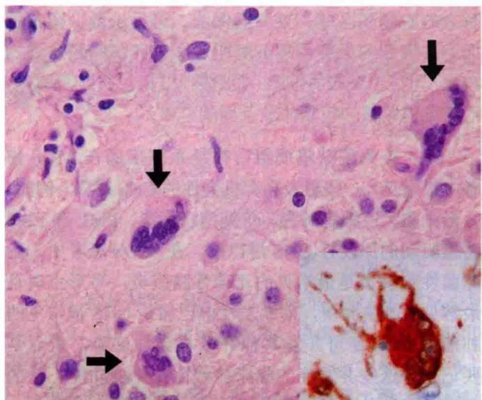 
图28-38人类免疫缺陷性病毒（HIV）性脑炎或脑病（HIVE）。多核巨细胞（箭头）常常位于血管周围是HIV脑炎的特征（插图）显示免疫组织化学染色HIVanti-p24阳性
【流行病学】经典的海绵状脑病在人类包括以下几种病变：库鲁病、克-雅综合征（Creutzfeldt-Jakob disease，CJD）、家族性传染性海绵状脑病(Gerstmann-Straussler-Scheinker syndrome，GSS)和致死性家族性失眠症（表28-2）。相似的病变也可以发生在动物，包括发生于绵羊和山羊的羊瘙痒症、牛海绵状脑病（BSE，即疯牛病）、传染性貂脑病和发生于骡、鹿、麋鹿的慢性消耗性疾病。BSE特别为世人关注是由于它是牛吃了含朊病毒的食物不经意间感染所致，从而确定朊病毒是可以经口对口途径传播。BSE也很容易被传播，并且不显示其他朊病毒的物种特异性，这种疾病极大地危害了英国的牛养殖业，并且扩散到了世界的其他地区和动物，包括动物园动物、宠物和人类。

【发病机制】朊病毒疾病的信号分子过程为天然蛋白质转变为致病性异构体，使易于
聚合并形成随后原纤维。独特的是，天然蛋白向其致病型转化的过程是致病型本身自动催化的。天然蛋白是由位于20号染色体短臂上的人胚蛋白基因（PRNP）所编码。正常基因产物，朊病毒蛋白 $(\mathsf{PrP}^{\mathsf{c}})$ ，是表达于细胞表面的结构性糖蛋白，被糖脂锚锚定在神经元细胞膜上。PrP广泛存在于人体内，但在CNS神经元内PrmRNA达到了最高水平，其作用尚不清楚。被称为 $\mathsf{PrP}^{\mathsf{c}}$ 的正常细胞的朊病毒蛋白和被称为 $\mathsf{PrP}^{\mathsf{sc}}$ 的病理性（感染性）朊病毒蛋白，有相同的原始氨基酸序列，但三维结构和糖基化模式不同。具体来说， $\mathsf{PrP}^{\mathsf{c}}$ 富含α螺旋结构，而 $\mathsf{PrP}^{\mathsf{sc}}$ 中β-折叠结构占主导地位。病理性的结构相当稳定，因此 $\mathsf{PrP}^{\mathsf{sc}}$ 可以抵御传统的微生物净化方法。如果 $\mathsf{PrP}^{\mathsf{sc}}$ 能进入脑内，无论是通过感染或者脑内天然蛋白自发错误折叠， $\mathsf{PrP}^{\mathsf{sc}}$ 将把其他 $\mathsf{PrP}^{\mathsf{c}}$ 转变为 $\mathsf{PrP}^{\mathsf{sc}}$ 。这种模式形成的自主催化，
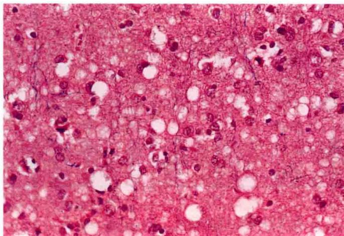 
图28-39克－雅综合征。灰质的海绵状变性特征性表现为单个或成堆的空泡，无炎症表现（感谢Dr.F.StephenVogel，杜克大学）
使异常 $\mathrm{PrP}^{\mathrm{SC}}$ 成倍扩大堆积。 $\mathrm{PrP}^{\mathrm{SC}}$ 团损害了细胞的功能导致神经变性。其机制可能和其他的神经退行性疾病的机制相似，特点为原纤维形成。所有的海绵性脑病都是可传播的，CJD 可通过不经意的人与人之间的接触传播，如来自注射被污染的人的垂体生长激素，带病患者作为供体的角膜移植，神经外科手术器械消毒不充分和被污染的硬脑膜植入手术（表 28-2）。

【病理】 肪病毒病的病理学特征是海绵状变性
（即在神经毡内很多小的、透明的空泡，常易
形成微囊）。其他的特征包括神经元变性、神经胶质细胞增生和不可溶胚病毒在细胞外堆积形成斑块（图28-40）。这些改变主要发生在皮层灰质，也累及基底核、丘脑、下丘脑和小脑的深部。

【临床表现】不同的人肮病毒病有明显的临床
特征，进一步讨论请参考第9章。
表 28-2 肝病毒病
# 1. 人类
A. 克-雅综合征（Creutzfeldt-Jakob disease，CJD）
1. 散发的（占 $85\%$ 的CJD，全球发病率约百万分之一） 
2. 遗传性朊病毒基因突变，常染色体显性遗传传播（15%的CJD） 
3. 医源性
a. 注射激素：人生长激素，人垂体促性腺激素 
b. 器官移植：硬膜、眼角膜、心包膜 
c. 医疗器械：深部电极，外科填充物（没有明确的证明）
4.CJD的新的变型（vCJD）
B. 家族性传染性海绵状脑病（Gerstmann-Straussler-Scheinkersyndrome，GSS；遗传性的朊病毒基因突变，常染色体显性遗传传播） 
C. 致死的家族性失眠症（FFI：遗传性的朊病毒基因突变，常染色体显性遗传传播） 
D. 库鲁病（仅限于巴布亚新几内亚前部的人民，以前传播主要通过食人的葬礼模式）
# 2.动物
A. 羊瘟痒症（绵羊和山羊） 
B. 牛海绵状脑病（BSE；疯牛病） 
C. 传染性貂脑病 
D. 猫科海绵状脑病 
E. 圈养外来的蹄类动物海绵状脑病 [林羚, 南非产的大羚羊的一种 (gemsbok), 非洲旋角大羚羊, 阿拉伯羚羊, 较大的捻 (一种非洲大羚羊)] 
F. 鹿和麋鹿的慢性消耗性疾病 
G. 许多物种之间的实验性传输, 包括灵长动物和转基因小鼠
# 七、脱髓鞘疾病
在脱髓鞘疾病中，最主要的问题是髓磷脂顺序的破坏，包括合成错误（髓鞘形成障碍）、髓磷脂的破坏（脱髓鞘）和髓磷脂代谢的异常（脑白质营养不良）。中央髓磷脂由少突胶质细胞构成，而外周髓磷脂则是由施万细胞构成的。这两种类型髓磷脂在生物化学上是有差别的。CNS和周围神经系统之间的边界可以被认为是由少突胶质细胞和雪旺细胞产生的髓鞘之间的过渡点。这种过渡常在脑神经和骨髓根离开脑干或脊髓后 $2\sim 3\mathrm{mm}$ 处。脱髓鞘疾病既可累及中央髓磷脂又可累及外周髓磷脂，或两者同时累及。
# （一）多发性硬化症是最常见的脱髓鞘疾病
多发性硬化症（MS）是一种慢性脱髓鞘疾病，是在美国年轻人中最常见的慢性CNS疾病。发病率约1/1000。MS的特征为在很多年内病情反复加重和缓解。一般在平均30岁后出现症状，女性的发病率为男性的2倍。

【发病机制】MS的病因学仍然不是很清楚，
但是实验室和临床研究都提示该病有遗传学
倾向和免疫性发病机制。MS是温带气候地区的主要疾病，说明环境因素也很重要。那些15岁前从MS低发病区移民至更温暖的MS流行区的人群表现出较高的患病风险。
MS遗传学倾向推断，主要是因为该病有家族聚集发病现象，在患者的第二代和第三代中发病风险增加，在单卵双生的双胞胎中，同时发病占 $25\%$ 。易感性也和许多MHC等位基因相关（如HLA-DR2），因此暗示着免疫机制在发病机制中也有重要的地位。
MS与免疫相关的证据也来自于病变显微镜下的观察结果。例如：慢性MS的病变中显示有血管周围的淋巴细胞、巨噬细胞和很多CD4及CD8阳性的T细胞。而且，MS患者脑脊液中的 $\mathrm{CD4^{+}}$ T细胞好像是单克隆性的。虽然靶抗原尚未确定，但是现有数据表明是对一个特异CNS蛋白的免疫应答。
尽管也有人提出有些病毒和MS的病因有关，但是迄今为止，还没有发现令人信服的证据说明和感染有关。

【病理】脱髓鞘斑片是MS的特征性标志（图
28-41，图28-42)。斑片直径很少大于 $2\mathrm{cm}$
在脑内和脊髓内常大量积累。它们是分散不相连的，并且有一个光滑圆形的轮廓，通常在白质，虽然也可见于灰质。病变好发于视神经、视交叉、脑室旁脑白质和脊髓，但CNS任何部位都可以发生。被累及的片
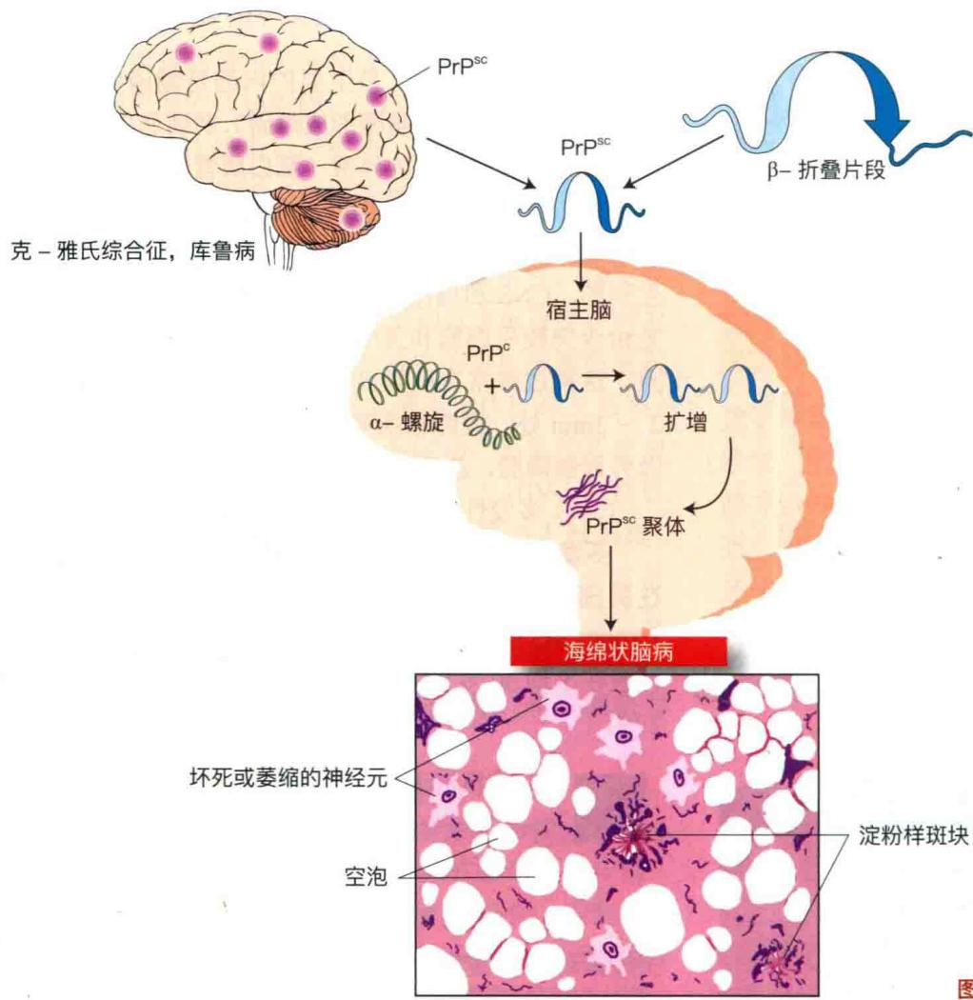 
图28-40 胱蛋白病的分子发病机制
区有以下的改变：①在相关的轴突保护区域内髓磷脂选择性的丢失；②淋巴细胞在小动脉和小静脉周围簇状聚集；③巨噬细胞大量浸润；④显著水肿。
在病变斑片界内的神经元胞体被明显的保留，但其轴突可发生突然的脱髓鞘并可能变性。少突胶质细胞的数量也会一定程度的减少。随着斑片的老化，它们变得更加分散、水肿减少、致密直至最后形成胶质瘢痕。无论从选择性还是严重性考虑，这个过程强调了损伤的灶状改变的特点，因为脱髓鞘完全是局限在斑片内。
【临床表现】MS通常开始于 $20\sim 40$ 岁之间发病。随后会不断地突然或短暂发病，其中可间隔一段相对稳定期。诊断MS最基本的临床标准是病灶在空间和时间上的分散性；即，CNS的多灶分散的病变区是在不同的时间内形成的。我们对MS的活动性的认识在MRI被广泛应用之后有了革命性的变化。通过MRI检查，可以显示病变在持续进展，尽管临床上为静止期。因此，MS是一个渐进的、活动的病程，即使是在两次临床发作的间歇期。
很多MS患者经历了一个复发、好转、不断交替的过程，但是也有部分患者从始至终没有缓解期。疾病最初典型的症状为视神经、脑干或脊髓受累所产生的症状。
作为视神经炎的症状，一侧视物模糊或视力丧失是这些患者常见的主诉。当最初的病变在脑干时，会发生双侧视力损害和眩晕。脊髓发生的急性脱髓鞘病变被称为横贯性脊髓炎，症状有一条或两条腿虚弱，双下肢感觉麻木。很多最初的症状在几个月内可以部分逆转。
随着时间的推移，神经损伤逐渐的加重并且不可逆转。在已经确诊的病例中，功能丧失的程度有很大的不同，可以从轻微的功能障碍，到严重的功能丧失，包括广泛的麻痹、发音困难、共济失调、严重的视力
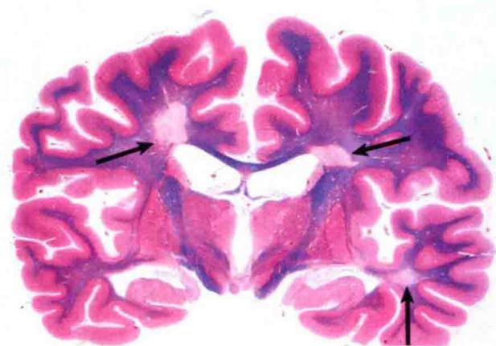 
图28-41 多发性硬化症。长期多发性硬化症患者的全脑冠状切片，髓磷脂染色后显示多处脱髓鞘病灶一斑片状（箭头）一特征性表现为脑室旁白质的脱髓鞘，以侧脑室的上角最为显著
损害、失禁和痴呆。功能丧失严重的患者常死于呼吸麻痹或尿路感染。很多MS患者从发病到死亡会持续 $20\sim 30$ 年。目前治疗方法主要是采用免疫抑制剂，如β-干扰素来抑制疾病的活动。
# （二）脑白质营养不良是髓鞘形成和保存过程中的遗传性疾病
这些疾病经常同时累及中央和周围的髓鞘，常见于婴儿和儿童，但是偶尔温和的成人型也可发生。中枢神经髓鞘的破坏会导致失明、强直和生长迟缓；而周围神经髓鞘缺失会进展为反射减弱和消失。
1. 异染性脑白质营养不良（MLD）是最常见的脑白质营养不良。是一种常染色体隐性遗传疾病，是脑苷脂（半乳糖基硫脂）在脑内和周围神经内堆积为其特征。MLD主要发生在婴儿，但是幼年和成年人也偶尔发病。这种病可在几年内致死。MLD是由芳基硫酸酯酶A活性的缺陷所致。该酶是参与髓鞘硫酸脑苷脂降解的一种溶酶体酶。因此该酶活性缺乏时，使硫酸脑苷脂在形成髓鞘的施万细胞和少突胶质细胞的溶酶体中进行性堆积。在MLD，堆积的硫酸脑苷脂形成胞质内球形颗粒，直径 $15\sim 20\mu \mathrm{m}$ ，在结晶紫和甲苯胺蓝染色时呈现异染性。脑内显示弥漫的髓鞘脱失，在白质中异染性物质堆积和星形细胞增生。周围神经的脱髓鞘相对较轻。
2.克拉伯病（Krabbe disease）是一种迅速进展的、致死的常染色体隐性遗传神经系统疾病，因半乳糖脑苷脂-β-半乳糖苷酶缺陷所致。疾病主要发生在幼儿，特征性的表现为在白质中单核和多核的球形细胞在血管周围堆积，因此也被称为球形细胞脑白质营养不良。球形细胞是因为巨噬细胞吞噬了未被消化的半乳糖脑苷脂（半乳糖酰基鞘氨醇）。克拉伯病在
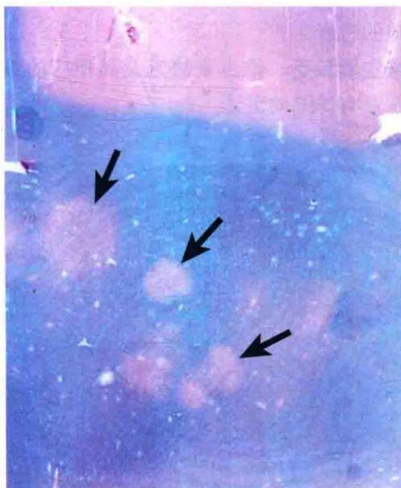 
图28-42 多发性硬化症。多发性硬化症患者的皮层下白质，显示多发的、小而不规则的、部分融合的脱髓鞘病灶（箭头）。在这坚牢蓝染色切片中，正常完整的髓鞘染成蓝色
发病 $1\sim 2$ 年内死亡。严重的运动、感觉和认知缺失反映了神经系统被弥漫累及。
3.肾上腺脑白质营养不良（ALD）是一种与X染色体连锁（Xq28）的遗传性疾病，表现为患者肾上腺皮质的功能障碍和神经系统的脱髓鞘，与组织和组织液中高水平的未饱和长链脂肪酸（VLCFA）相关。脑内和肾上腺的病变是由于异常胆固醇脂堆积和未饱和VLCFA的毒性所致。在脑内表现为融合的、对称性的脱髓鞘。最严重的病变出现在顶枕区皮层下的白质，然后扩展至喙侧（前侧），导致严重有髓轴索和少突胶质细胞的丢失。在病变的区域神经胶质增生和血管周围的单核细胞（多数为淋巴细胞）浸润明显。肾上腺萎缩，皮层细胞在电镜下显示病变特异性、胞质内的、有膜包裹的曲线包涵体或裂缝（薄片），其内含有未饱和长链脂肪酸。相似的包涵体也可以存在于施万细胞和CNS巨噬细胞中。
【临床表现】ALD常发生于 $3\sim 10$ 岁的小孩，神经系统症状早于肾上腺皮质功能不全的体征。疾病在 $2\sim 4$ 年内进展迅速，患者很快会演变到植物人状态。这种情况在死亡之前会持续几年的时间。患者可以食用4：1的甘油三油酸酯和三芥子酸甘油酯（“Lorenzo油”）来控制病情，从而降低血液中的VLCFA。如果患者能够经过幼儿时期存活，那么饮食可以正常化。
# 八、中毒性和代谢性疾病
# （一）代谢贮积性疾病反映了关键酶的缺失
神经元贮积性疾病是遗传性酶缺失性病变，会导致正常代谢产物在溶酶体内堆积。不像脑蛋白质营养不良会产生失明和强直，神经贮积性疾病影响神经元，会导致癫痫和认知能力下降。
Tay-Sachs病：这是致死的常染色体隐性遗传疾病，由于先天性的氨基己糖苷酶A缺陷所引起。因此，神经节苷脂储存在CNS经元内。疾病在婴幼儿发生为致死性的。视网膜受累增加了黄斑的透明度并导致黄斑内出现樱桃红斑点。脑内是神经节苷脂的主要储存部位，在婴幼儿时期会逐渐的增大。脂质颗粒可见于膨胀的CNS神经细胞和周围神经细胞的细胞质内（图28-43A）。电镜显示溶酶体内的脂质以旋涡状的“髓鞘形式”存在（图28-43B）。患病的幼儿在出生时未见明显异常，但在6个月时会出现运动发展迟缓。随后病情进行加重并恶化，出现肌肉弛缓无力、失明和严重的精神障碍。死亡总是在第2年年底到来。
■Hurler综合征：这种常染色体隐性遗传性疾病发生在黏多糖的新陈代谢中，导致神经元内的黏多糖的堆积。该疾病的临床亚型根据所受累内脏器官和神
经系统的不同而不同。这种疾病常见于婴幼儿，表现为成长延缓、角膜浑浊、骨骼畸形和肝脾肿大。神经元内物质堆积导致细胞质膨胀并伴有星形细胞增生和进行性精神衰退。
■Gaucher病：这种常染色体隐性遗传性疾病主要是因为葡萄糖脑苷脂酶缺失，导致葡萄糖脑苷脂堆积，主要在巨噬细胞内。在该病的婴儿型（Ⅱ型），CNS是最为严重的受累部位。虽然神经元内的葡糖脑苷脂堆积不是很明显，但是也会导致神经元的严重丢失并伴随弥漫的星形胶质细胞增生。2型Gaucher病导致幼儿的发育迟缓，最终导致夭折。
■ Niemann-Pick 病是一种常染色体隐性遗传疾病，是由于神经鞘磷脂酶的缺乏从而导致神经元内神经鞘磷脂的堆积所引起。临床症状出现早，疾病典型的症状表现为婴儿发育障碍。吞噬细胞系统是储存的主要系统，但是神经系统症状在婴儿时期占主导地位。脑变得萎缩并出现星形胶质细胞增生。
# （二）苯丙酸酮尿症是由苯基丙氨酸羟化酶的缺乏所引起
苯丙酸酮尿症（KPU）是一种常染色体隐性遗传性疾病（见第6章），由于苯丙氨酸转化为酪氨酸受阻，导致其在血液和组织中堆积所致。病情在孩子最初几个月就变得非常明显，导致精神发育迟缓、癫痫和身体发育受损。治疗可以采用苯丙氨酸限制性饮食疗法。不治疗的患者，智力水平很少能发展到IQ50以上，但是那些饮食控制好的患者就可以达到。因为这种疾病的发生可以通过简单的饮食疗法阻止，因此现在所有的新生儿都要进行该病的筛查。虽然还没有统一的形态学特征，但是常有脑的重量减轻和髓鞘的形成障碍。
# （三）Wilson病是一种铜代谢障碍的常染色体隐性遗传性疾病
Wilson病又被称为“肝豆状核变性疾病”，累及脑和肝，是由WD基因突变（具体内容详见第14章）
所引起的。胆汁内的铜代谢物缺陷导致铜沉积在脑内。脑受累症状表现为运动的障碍，多为舞蹈徐动症，症状一般出现在10多岁，但最晚可出现在70多岁。运动障碍可能与精神病有关。脑内的豆状核会有轻微的变黄色，大约 $25\%$ 的病例在壳核或者大脑皮质的深部有小囊或裂缝。轻微的神经元丢失和胶质细胞增生是特征性改变。诊断是至关重要的，因该病可用螯合药物与肝移植治愈。
# （四）在系统性代谢性疾病中的脑损害是代谢性脑病
由于心、肺、肾、肝和内分泌系统疾引起的全身代谢性紊乱，其中的脑功能异常被称为代谢性脑病。临床上，患者起初不经意间表现为意识反应减缓，进而会出现嗜睡，最后发展为对任何程度的刺激都无反应。伴随着意识状态的改变，还会出现震颤、扑翼样震颤和多变的多病灶神经系统体征。生物化学上，代谢性脑病特征性的表现为无论如何刺激，大脑中的葡萄糖氧化利用降低。在代谢性脑病中没有特异的形态学特征。
1.肝性脑病 肝性脑病是一种常见的肝脏功能衰竭的临床表现。症状为谵妄、癫痫和昏迷。通常，临床表现要远远明显于相应的形态学，仅仅限于星形细胞的改变（被称为阿尔茨海默Ⅱ型星形细胞），表现为细胞核增大，染色质边集；尤其在丘脑。
2. 渗透性脱髓鞘综合征（中央性脑桥髓鞘溶解症）中央脑桥髓鞘溶解症是一种罕见的脑桥疾病，出现分散的选择性脱髓鞘病灶。病变经常很小以至于没有临床表现，仅在尸检中被发现。很少的情况可发生下四肢瘫痪和假性延髓性瘫痪。该病发生于那些一过性的饮酒过量所引起的低钠血症的患者、营养不良的患者或那些有显著电解质紊乱的患者，包括肾衰竭和肝移植的患者。
3. 维生素缺乏 维生素缺乏及其相应的系统性改变在第8章有详细的讲述。
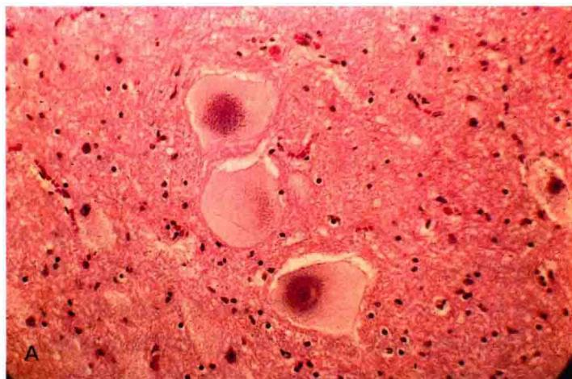 
图28-43Tay-Sachs病。神经元的细胞质因其内嗜酸性物质沉积而膨胀；超微结构，在细胞质内可见旋涡状“髓磷脂体”，是由神经节苷脂聚集而成
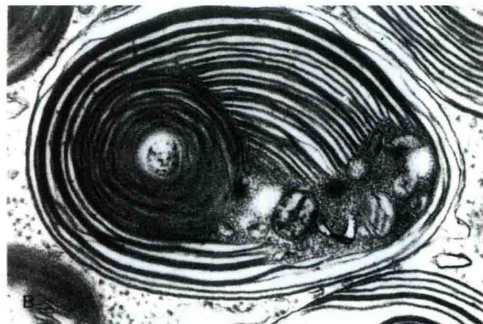
（1）Wernicke综合征：Wernicke综合征是由于硫胺素（维生素 $\mathbf{B}_1$ ）缺乏所引起的，临床特点为快速发病的意识障碍，有显著的短期记忆受损、眼肌麻痹、眼球震颤。病变发生于下丘脑、乳头体、中脑外侧和脑桥被盖部。该综合征最常见慢性嗜酒者中，尽管也可以见于那些饮食中缺乏维生素 $\mathbf{B}_1$ 的人群。如果不经治疗，病情会快速发展至死亡，但可以通过使用维生素 $\mathbf{B}_1$ 使得病情得以逆转。
Wernicke-Korsakoff综合征是一种近期记忆混乱而被虚构情节替代的疾病状态。组织学改变类似于Wernicke综合征，但可能有丘脑内侧-背侧核的神经元显著变性。
很多慢性嗜酒者有引起大脑萎缩的不确定因素，如酒精毒性的相对作用，营养不良和其他因素尚未定义（图28-44）。相似的不确定因素还见于小脑浦肯野细胞和颗粒细胞的萎缩。这些变化常见于慢性酒精性中毒中，是躯干共济失调的原因，共济失调在患者清醒期也一直存在。
（2）亚急性联合变性：脊髓亚急性联合变性是由于缺乏维生素 $\mathsf{B}_{12}$ （恶性贫血）并且导致脊髓后外侧部的病变。最初仅仅是脊髓胸段的对称性脱髓鞘和轴索消失。在急性病变中，星形胶质细胞仅轻微增多，但随着时间的推移，受累脊髓可见胶质细胞增生和萎缩，尤其是脊髓的后外侧部。燃烧的感觉会出现在足底，其他的异常感觉都预示着疾病的快速进展和几乎不可逆的神经系统疾病。四肢都发生虚弱，然后位置感觉缺失、动作失调和共济失调。
医源性、职业性或娱乐性的接触麻醉气体——笑
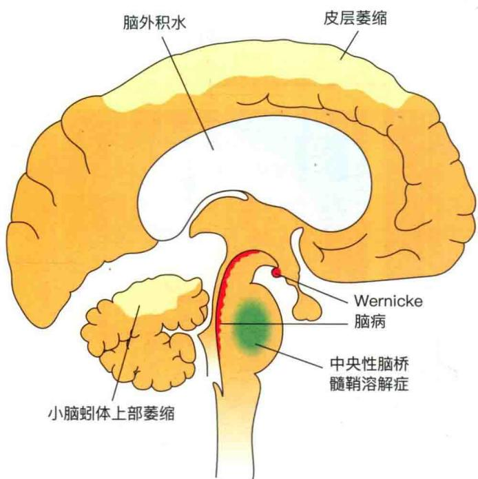 
图28-44 和慢性酒精滥用的脑内病变部位
气，也会导致在临床表现和组织形态学上和联合系统性变性无法鉴别的病症。这种麻醉剂干扰维生素 $\mathbf{B}_{12}$ 依赖性酶，因外科减肥术和锌过量摄入引起的低血铜浓度性脊髓病也类似于该病。
# 九、神经退行性疾病
神经退行性疾病是由于功能相关性神经元的死亡所引起的。可以根据原发受累系统进行分类。大脑皮质变性导致痴呆，基底核受损导致运动功能障碍，脊髓小脑受损引起共济失调，运动神经元的丢失导致上下运动神经元的虚弱。神经病理上会出现这些系统的神经元的丢失。显微镜下的特点是细胞内包涵体和细胞外蛋白质的堆积并有不同程度的胶质细胞和神小胶质细胞活化。

【发病机制】细胞内的包涵体，尤其是细胞
质内的包涵体很早就被认识到它们和神经退
行性疾病有紧密关系。如同神经系统中最早组织学异常的病变细胞的特点被很早认识到一样。现代技术已经能够证实并让它们成为异常细胞应激蛋白和热休克蛋白的标记物。越来越多的证据表明异常蛋白的平衡是这些疾病分子发病机制的关键（图28-45，见第1章）。
神经退行性疾病中的包涵体反映了正常的细胞蛋白被破坏以及它们的应激反应的结合物。神经病理学的包涵体是由相对少序细胞构架序列和更少的应激蛋白制造而成，事实上，应激蛋白的数量比在其他描述过的包涵体似乎要多一些。泛素可见于很多细胞内包涵体。虽然泛素本身不能“诊断”任何特定疾病，但泛素免疫组化染色是检测这些聚合蛋最敏感的方法。利用抗体可以识别泛素化蛋白如tau蛋白、神经原纤维、α-突触核蛋白等。
这些蛋白聚合体可通过几种途径引起疾病（图28-46，表28-3）。螯合蛋白质或其他大分子使得它们不能发挥正常的功能。当这些蛋白聚合体大到一定程度，它们能够物理性阻碍轴索、树突或者细胞质内的物质运输。它们也能够扮演泛素池的作用，螯合泛素使其不能被再循环，因为多聚泛素化蛋白不能用蛋白酶来处理。因此细胞蛋白的再循环和动态平衡都受到了损害。这些蛋白聚集在一起，它们起初形成超微结构的原纤维，可能具有很大的细胞毒性。在许多神经退行性疾病中的脑淀粉样变性间的相似之处来看，一个疾病发病机制的澄清，可能对理解所有这些疾病的潜在发病机制有非常重要的影响。
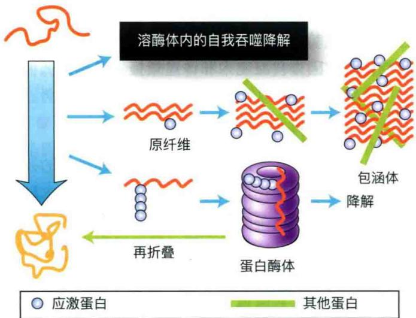 
图28-45 错误折叠蛋白的可能命运。很多神经退行性疾病都是或者至少部分是蛋白稳态异常的疾病。其中包括细胞通路，能够控制蛋白的合成、折叠、运输、聚集、解聚和降解
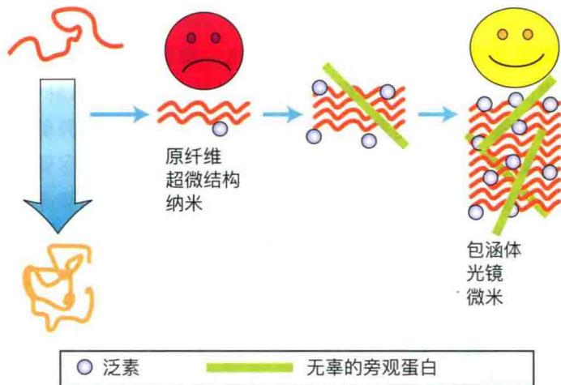 
图28-46 原纤维的形成和包涵体。具有聚合倾向的错误折叠蛋白可形成相当有毒性的原纤维，这种原纤维仅在电子显微镜下可见。细胞内的应激反应可能会促进其高度聚集性，从而形成在显微镜下可见的包涵体。这些包涵体可能被视为“毒性垃圾场”，可能有一定的保护作用
表28-3 有原纤维形成的代表性的神经退行性疾病疾病病变成分位置阿尔茨海默病老年斑β淀粉样蛋白细胞外神经原纤维缠结Tau蛋白细胞质内肌萎缩侧索硬化症球状体神经原纤维细胞质内超氧化物歧化酶(SOD-1)TDP43FUS含有路易小体的痴呆路易小体α-突触核蛋白细胞质内额颞叶痴呆神经原纤维缠结Tau蛋白细胞质内TDP43,前颗粒体蛋白和其他蛋白多发性系统性萎缩胶质细胞包涵体α-突触核蛋白细胞质内帕金森病路易小体i-突触核蛋白细胞质内朊病毒病朊蛋白沉积朊蛋白细胞外三核苷酸重复病包涵体多聚束细胞核内和胞质内
# （一）有三种主要的独特的大脑皮质神经退行性疾病
这些疾病的临床、大体和显微镜下特征都是独特的，有各自不同类型的聚合蛋白聚集（图28-47）。这些大脑皮质的变性最后都会演变为痴呆。
■阿尔茨海默病（AD）占据了大部分的神经退行性痴呆的疾病。特征性的表现：两种异常蛋白的聚集：β-淀粉样蛋白和tau蛋白。
Pick病是一种典型的额颞叶痴呆，特征性表现为tau蛋白的聚集，没有β-淀粉样蛋白。
路易小体痴呆的特征是 $\alpha$ -synuclein 蛋白的聚集。
# 1.阿尔茨海默病（AD）

【流行病学】AD是一种隐性的、逐渐进展的神经系统疾病，在临床上以记忆损失、认知功能
障碍，最后演变为痴呆为特征。它是老年人最主要的痴呆类型，占所有痴呆的一半以上。疾病的发生和年龄密切相关。小于65岁的人群中，AD的发病率最多为 $1\% \sim 2\%$ ，而超过85岁的患者，发病率为 $40\%$ 甚至更高。女性的发病是男性的2倍。很多患者是散发的，但是也有家族性发病的报道。

【病理】AD显示大脑皮质的萎缩和脑外积水（图28-48，图28-49）。脑回变窄、脑沟变宽和缩小在海马旁的区域尤为明显。但是随着疾病的额叶、颞叶和顶叶的皮层萎缩会变得更加明显。
老年斑和神经原纤维缠结（NFTs）是AD组织学的主要改变。少量的老年斑和缠结常见于有轻度健忘和轻度认知功能障碍的老年人，其中约 $50\%$ 的病例
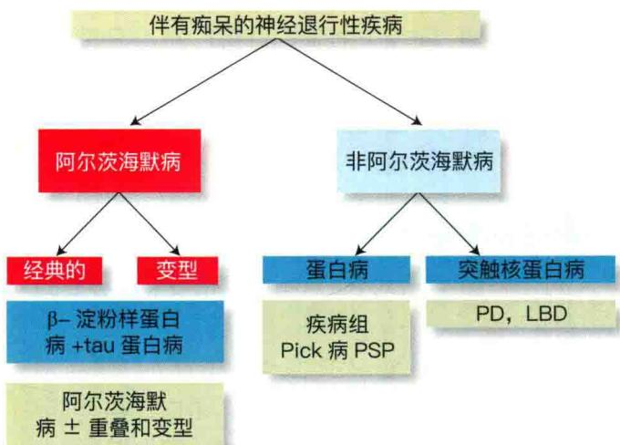 
图28-47 蛋白原纤维的形成。痴呆和其他已知的神经退行性疾病 的分子生物学分类是依赖于那些形成原纤维的蛋白。阿尔茨海默病（AD）是一种β淀粉样蛋白病和tau蛋白病的混合疾病。大部分额 颞叶变性（FTD）疾病，如Pick病和进行性核上麻痹（PSP）是纯 tau蛋白病。路易体痴呆（LBD）和帕金森病（PD）是α-突触核 蛋白病
可发展为AD。
神经炎性斑：最明显的组织学病变，老年斑或神经炎性斑，是细胞外的 $\beta$ 淀粉样蛋白的球形沉积物，直径约几百微米。在疾病的终末期，老年斑占据了大部分受累的脑灰质（图28-50）。这些斑块用平面结合淀粉样蛋白染料，如刚果红、硫黄素S，结合含银染料（嗜银性）染色阳性，并且在斑块的核心与边缘 $\beta-$ 淀粉样蛋白（Aβ）免疫阳性表达。斑块周围被反应性的星形胶质细胞和小胶质细胞围绕，并有肿胀扭曲的神经元突起（轴突营养不良）。虽然组织学上找到斑块是诊断AD的必要条件，但其数量和分布与疾病的严重程度并不相关。
神经原纤维缠结（NFTs）：NFTs是细胞质内聚合的tau蛋白细纤维的聚集体（图28-51）。它们包含刚果红阳性的不规则原纤维束以及对硫黄素S和免疫
反应阳性的 tau 蛋白。缠结由成对的，10mm 厚的螺旋状细纤维组成，含有丰富的不溶性 tau 蛋白。这些缠结的分布与 AD 临床严重程度相关。嗅内皮层和海马旁回的缠结可见于无症状个体中，其年龄比 AD 常见发病年龄小数十岁，可能代表了 AD 的早期阶段。随着颞皮层中的缠结越来越多，可出现轻度的认知障碍。最后，大片的新皮层破坏，深部核和脑干受累，就产生了典型的 AD。
NFTs不是AD所独有的。因为它们也可以出现在其他的神经退行性疾病中，例如拳击手痴呆（拳击手的晕头转向综合征）、脑炎后的帕金森病、关岛ALS/帕金森病痴呆综合征、Pick病、皮质基底节变性等。这些遗传性或散发性的神经退化性疾病以异常形式的tau蛋白聚集为特征，称为tau蛋白病。他们可能具有相同的脑变性机制。AD既是tau蛋白病又是β-淀粉样蛋白病，特征性表现为疾病的细胞内和细胞外分别可见缠结和斑块。

【发病机制】虽然AD的病因现在还没有完全阐明，但似乎与AD相关性淀粉样蛋白和
NFTs 都有关系。AD 有几个遗传性危险因素。APP 基因突变与早发性家族性 AD 变型有关。另外相关的基因有（表 28-4）载脂蛋白 E（ApoE）基因和早老素 1（PS1）和 2（PS2）的基因。
■β淀粉样蛋白（Aβ）：在AD的神经炎性斑内总能观察到Aβ蛋白沉积。这些斑块的核心包含了一种特殊类型的Aβ肽（长42个氨基酸），是由一个更长（695个氨基酸）的跨膜蛋白APP（β淀粉样蛋白前体）蛋白水解而来。完整长度的APP包含细胞外片段、跨膜序列和胞内结构域。包含Aβ的片段使APP的氨基末端锚定在细胞膜上。
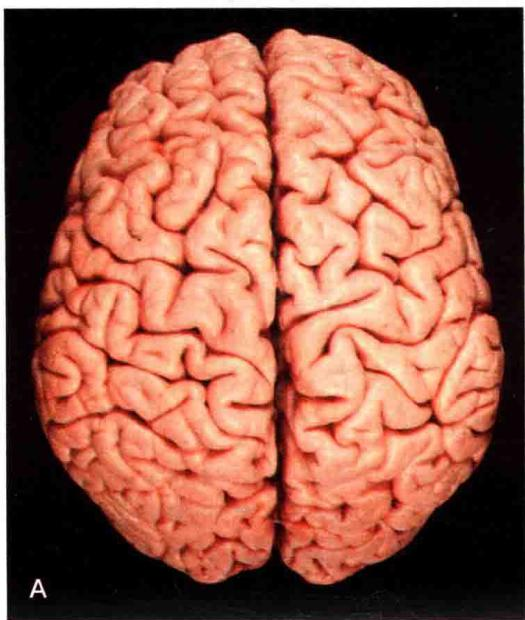
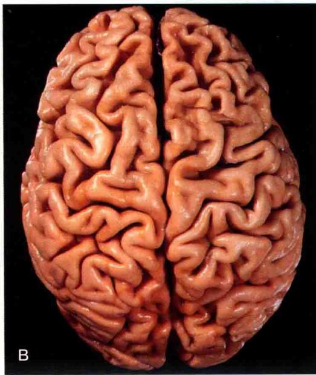 
图28-48 皮层的萎缩。左侧是正常的大脑（A）。右侧是AD患者的萎缩的大脑（B），显示脑回变窄，脑沟变得明显
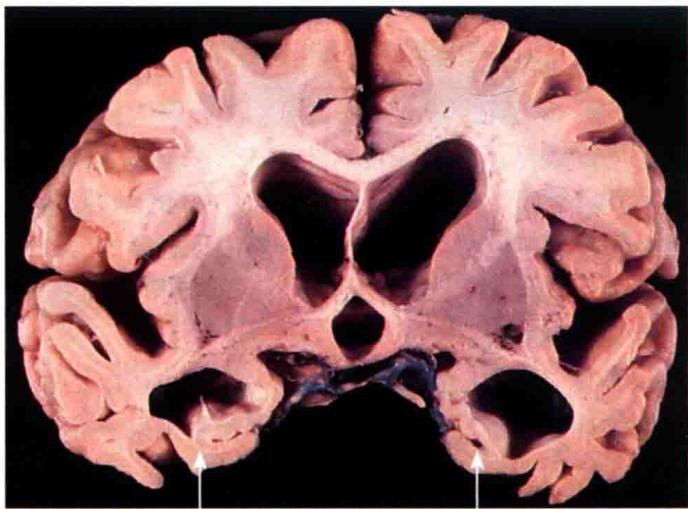 
图28-49 AD患者的大脑萎缩并伴脑外积水。可见海马区严重萎缩（箭头）导致早期的记忆障碍
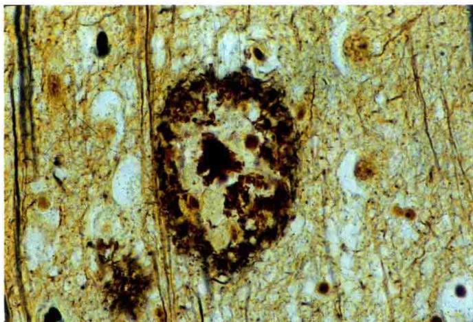 
图28-50 神经炎性斑。是细胞外聚合β-淀粉样蛋白的中心性聚集，伴有边缘营养不良性神经炎突起。大脑皮质斑块的数量和阿尔茨海默病的严重程度不相关
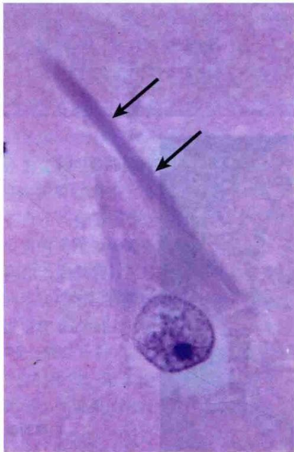 
图28-51 神经原纤维缠结。是神经元胞质内聚合tau蛋白的堆积（箭头）。神经原纤维缠结分布的数量和部位与临床症状相关
不像正常（非淀粉样蛋白降解）的APP降解是在Aβ结构域的中间蛋白裂解，通过淀粉样蛋白降解的Aβ蛋白的产生需要在Aβ结构域的两侧末端相继发生两次蛋白水解，从而释放出一个完整的高分子量淀粉样Aβ蛋白，Aβ蛋白以淀粉样纤维的形式在老年斑中聚集。
Aβ的沉积好像对AD患者的病情发展是必要的，原因如下。
（1）唐氏综合征（21三体）患者会产生与AD相似的临床和病理特征，包括Aβ蛋白在神经炎性斑中沉积，通常在40岁左右发生。因为编码APP蛋白的基因在21号染色体上，21三体额外的基因产物可能会使Aβ蛋白过早聚集。 
(2) 一些家族性 AD 的患者有 APP 基因突变和早老素基因突变。这些突变可能会导致 APP 淀粉样降解产物 $-\mathrm{A}\beta$ 蛋白增加。 
（3）表达突变的人APP基因的转基因小鼠在脑内形成老年斑，与发生于AD患者中的非常相似。然而这些小鼠没有AD的其他重要特点，如NFTs和神经退行性变的证据。
神经元和神经胶质细胞是APP合成的主要部位，但是Aβ也会聚集在皮层血管壁内。
■神经原纤维缠结：NFTs是由双螺旋细丝构成，内含有tau蛋白（一种高度可溶的微管相关性蛋白），这种蛋白在异常的部位发生了异常磷酸化。这种修改使蛋白不和微管结合而是与聚集形成的成对螺旋丝结合。tau蛋白从微管中的释放可能使细胞失去tau蛋白微管的稳定功能，从而损害了轴突的运输，影响神经元的功能。另外，由过度磷酸化的tau蛋白聚集而成的纤维本身可能就有细胞毒性。
载脂蛋白E（ApoE）：在胆固醇代谢中非常重要的ApoE有一些特定的异构体，能够使患者对散发性AD和迟发性家族性AD有不同程度易感性。AD风险的增加和遗传性等位基因84相关，尤其是纯合子84/84基因型，该纯合子发病率为 $2\%$ 。相反82等位基因有一定的保护作用。迟发性家族性AD出现症状的年龄也与84等位基相关，84/84纯合子发病年龄最早（小于70岁），而82等位基因的患者发病年龄最晚（大于90岁）。84等位基因和AD患者老年斑的数量增加也有相关性，但是ApoE蛋白不是该疾病的绝对决定因素，它不能预示谁将会发病。
早老素（PS）：两个基因有显著的同源性，和家族性AD不同的类型有关。14号染色体上的PS1的突变和大部分常见的常染色体显性遗传性早发性AD相关。PS2基因位于1号染色体，和伏尔加德
国人血统的AD相关（表28-4）。PS基因的突变发生在半数遗传性AD患者中，相比较而言，APP基因的突变则只有百分之几。有证据表明PS1和PS2
的突变蛋白产物改变了 $\beta$ -APP 的处理过程，从而有利于 Aβ 的生成和沉积。
导致AD发生的可能的机制参见（图28-52）。
表 28-4 阿尔茨海默病的遗传因素 
基因染色体相关疾病淀粉样前驱蛋白(APP)21APP基因突变与早发性家族性阿尔茨海默病相关早老素1(PS1)14PS1基因突变与早发性家族性阿尔茨海默病相关早老素2(PS2)1PS2基因突变与伏尔加德国的阿尔茨海默病相关载脂蛋白E(apoE)19ε4等位基因与晚发型阿尔茨海默病的发病风险升高及年轻化相关，遗传性和散发性均相关

【临床表现】AD患者表现出逐渐丧失记忆和认知功能，语言表达障碍和行为改变困难。进展是无情的，因此之前智力超群和高效率的
人也会变得精神错乱、缄默、大小便失禁和卧床不起。支气管肺炎、尿路感染和压疮是导致死亡的常见并发症。
图28-52阿尔茨海默病中淀粉样变性和脑变性的机制。A.本图说明了老年斑（SPs）形成机制的假说。认为SPs来自于细胞内产生的可溶性 $\mathsf{A}\beta$ 肽释放到细胞外的过程。淀粉样 $\mathsf{A}\beta$ 可能遭遇促纤维生长因子的作用，进一步的形成A纤维，并沉积在SPs内（极右）。SPs周围有反应性的星形胶质细胞和小胶质细胞围绕，这些细胞能分泌可能有助于SPs毒性的细胞因子。这些过程都是可逆的。增加 $\mathsf{A}\beta$ 蛋白清除、减少其生产以及调节炎性反应可能是阿尔茨海默病有效的治疗手段，并联合针对神经原纤维缠结（NFTs）引起的脑变性的治疗。B.本图说明了一个的假说机制。即把正常人神经系统中覆盖于tau蛋白上的两个微管蛋白转换成成对螺旋丝（PHFs）的机制。PHFs产生于神经元胞体和突起。过于活跃的激酶和低活性的磷酸酯酶可能起到了一定的作用。异常磷酸化的tau蛋白和PHFs在神经元突起（神经线）和胞体中形成NFTs。在PHFs中的tau蛋白丧失了连接微管的能力，因此使其解聚、轴突运输破坏和神经元变性。PHFs在神经元内聚集能够通过阻碍神经元内的运输而加剧这一过程。受累神经元的死亡能释放tau蛋白，从而提高患者脑脊液中tau蛋白的浓度。NFTs的形成可能是可逆的，阻断NFT的形成的药物（逆转或稳定微管）可能是阿尔茨海默病的有效治疗措施
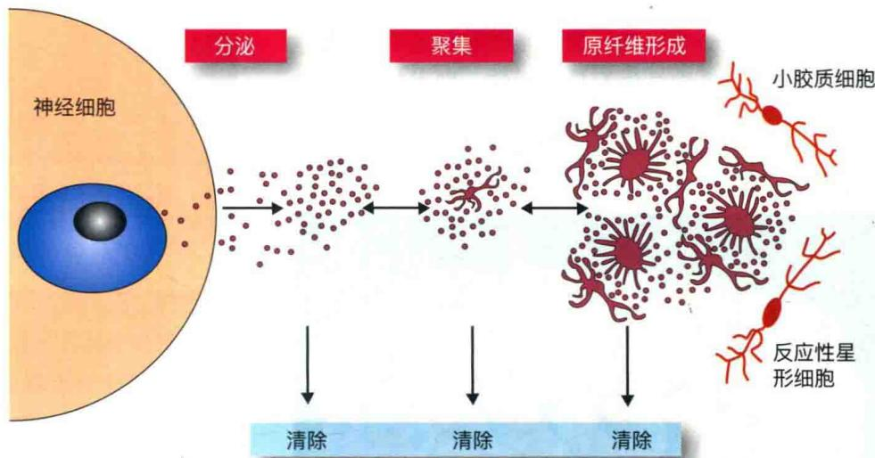 
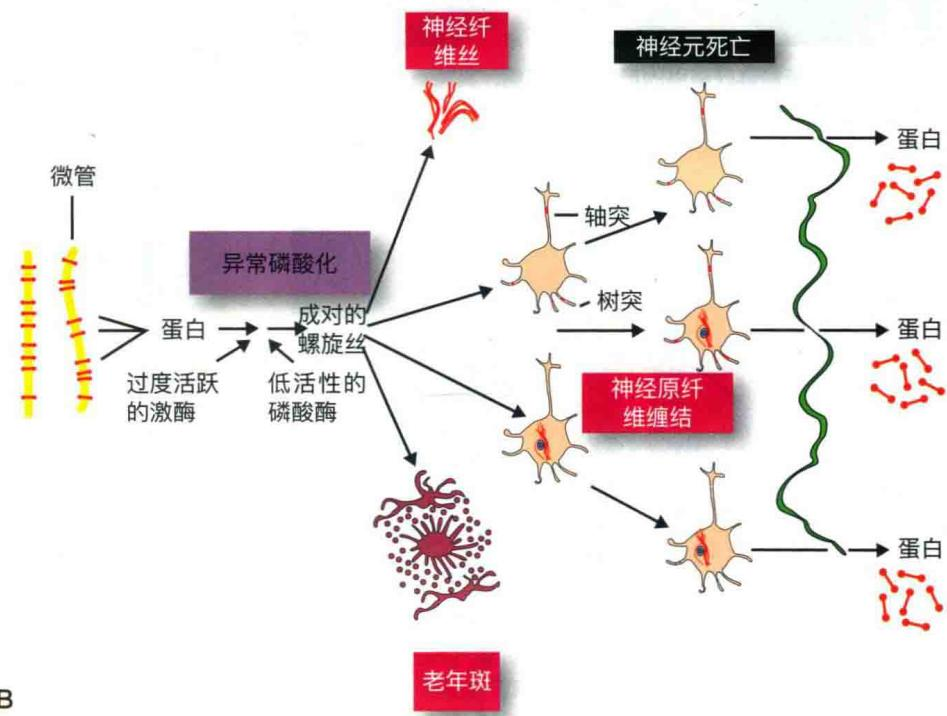
# 2. 额颞叶变性：Pick病综合征

【病理】Pick病的皮层萎缩主要累及额叶区（图28-53），严重萎缩时，脑回呈薄片状（刀
口萎缩)。受累皮层内神经元极度减少, 而星形胶质细胞明显增生。残存的神经元内含有强烈的嗜银性的和 tau 蛋白免疫反应阳性的圆形细胞内包涵体, 被称为 Pick 小体 (图 28-54A, B)。这些结构由直的 tau 蛋白微丝密集地聚集而成。
在临床上任何有额颞叶变性（FTLD）的患者，很多在尸检的时候都会发现有Pick病，但是也有相当多的患者没有。他们的神经元泛素免疫反应常阳性，暗示着迄今有未知的蛋白启动了一个未完成的蛋白降解反应。

【临床表现】FTLD是主要的tau蛋白病，额叶和颞叶是最先受累的区域。FTLD病最开始命
名时，被称为Pick病。该病临床表现为额叶执行功能丧失而导致去抑制，对社会行为举止丧失判断，无法计划或预见某一行为的后果。虽然有报道Pick病有家族性，但是大多数病例都是散发的。散发的Pick患者在中年的时候发病，并无情地进展，在3～10年内死亡。不像AD患者，起初的症状为记忆力减退；
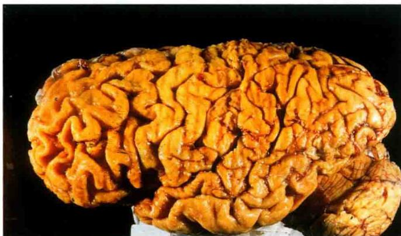 
图28-53有显著额颞叶萎缩的严重皮质萎缩，其特点是额颞叶变性，例如Pick病。但也可见于阿尔茨海默病。额叶萎缩与执行功能丢失、判断受损和去抑制相关
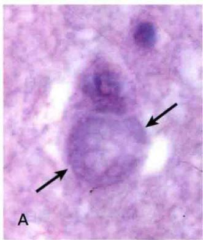 
图28-54Pick小体。A.在HE染色切片中，Pick小体为嗜碱性的球形体，是tau蛋白在神经元胞质内的聚合体（箭头）。它们更易形成圆形，而不像阿尔茨海默病中的神经原纤维缠结（NFTs）那样是带角的。但它们和NFTs一样是嗜银性的（银浸染）（B）
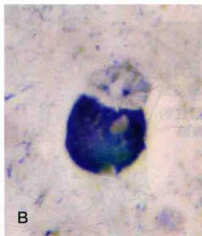
FTLD的患者起始症状为非常具有破坏性的不当行为。但是，最后都会演变为痴呆。
3. 路易体痴呆（Lew Body Dementia, LBD）又名路易体疾病或弥漫性路易体疾病，其特征为主要位于扣带回皮质区的小部分皮质神经元胞质内出现 $\alpha$ -突触核蛋白阳性包涵体。阿尔茨海默病的终末阶段常合并路易体包涵体。

【临床表现】LBD特点为波动性认知障碍、出现敏感的锥体束外表现及幻视。LBD与其他α-
蛋白病相连续，包括帕金森病和多系统萎缩。
# （二）基底节神经退行性变

【临床表现】运动障碍可导致过少（运动迟缓的）
或过多（运动过度的）不自主运动。帕金森病的运动迟缓性运动障碍疾病，其特征为启动和无意运动困难、静止性震颤、姿势不稳，这也是“帕金森综合征”的临床三联征。帕金森病是帕金森综合症常见的病因，但其他疾病如进行性核上麻痹、多发性缩、中枢性AIDS也可导致帕金森综合征。
典型的运动过度性运动障碍疾病是亨廷顿病，后者的临床表现为进行性加重的无意快速抽搐动作（舞蹈症）和转动的舞蹈样动作（手足徐动症），并一起命名为舞蹈手足徐动症。
1. 帕金森病（PD）临床特点为：静止性震颤、齿轮样僵化、面容呆板和姿势不稳，少见情况下出现认知缺损。PD病理表现为主要位于黑质的神经元丢失和路易小体的聚集，后者由α-突触核蛋白的丝状聚集物组成。神经化学表现为从黑质反射到纹状体的多巴胺能神经元的丢失。

【流行病学】帕金森病典型发生在 $50\sim 80$ 岁
的患者，该病较常见， $1\% \sim 2\%$ 的北美人群发展为此病。在过去40年里该病的流行病学基础差，发病无种族差异，男性多于女性。

【发病机制】大部分疾病为散发病例，但 $\alpha-$
突触核蛋白基因的突变是罕见的常染色体遗传早发家族性PD的病因。在路易小体内主要聚合蛋白是野生型α-突触核蛋白，提示神经原纤维形成是神经变性疾病的主要发病机制。积累的证据提示在黑色素形成过程中发生的儿茶酚胺自身氧化产生氧化性应激会损伤黑质神经元，该损伤是通过促进α-突触核蛋白的异位折叠和丝状包涵体的形成来进行的。
除了PD，在许多其他疾病中都可见到丝状α-突触核蛋白包涵体，包括多发性系统萎缩、路易体
痴呆、进行性自主神经功能衰竭和快速动眼（REM）睡眠行为障碍。这些疾病现在统称为α-突触核蛋白病。
【病理】PD患者的大脑显示黑质和蓝斑的色素丢失（图28-55）。大脑的其他区域也在较小程度上受累。含色素的神经元稀少，少许细胞外沉积的黑色素来自即将坏死的神经元。残留的神经元萎缩，其中一些含有路易小体，后者为球形、嗜酸性的胞质内包涵体（图28-56）。电镜下，路易小体显示为不溶性α-突触核蛋白形成的淀粉样丝状物。
2.其他引起帕金森综合征的疾病PD不是引起帕金森综合征的唯一原因。如上所述，有一组疾病主
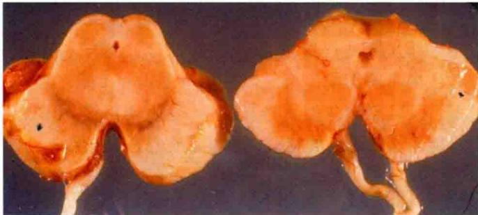 
图28-55 帕金森病。左侧正常成人黑质有深染的色素沉着，而帕金森病患者黑质缺乏色素性神经元，中脑神经核团与其余中脑模糊混合。脑桥的蓝斑也缺乏色素（未示出）
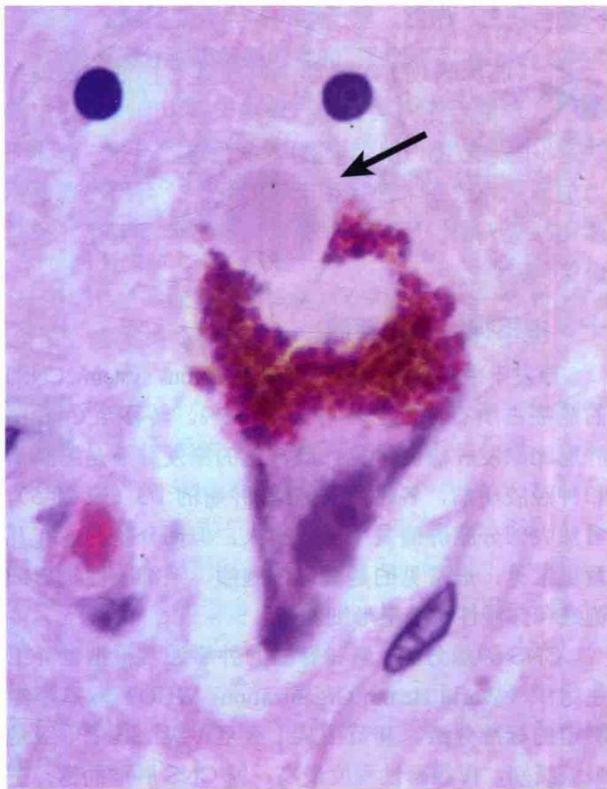 
图28-56 帕金森病中的路易小体。在黑质残余神经元内可见由聚合的α突触核蛋白组成的，位于胞质内、神经元内的球形嗜酸性包涵体——路易小体（箭头）。这些包涵体通常有一个薄的透明晕
要病因是黑质色素性多巴胺能神经元坏死。正常老化与黑质神经元坏死及多巴胺水平降低有关，但上述特点在帕金森病和其他引起帕金森综合征的疾病中更加明显。
# 3. 亨廷顿病
【流行病学】亨廷顿病（Huntington Disease, HD）是一种常染色体显性遗传病，以不自主运动、认知功能退化和严重的情绪失调为特征。主要是北欧血统的白种人患病，发病率为1/20000。家族研究显示所有病例均来自北欧的最初建立者，而亚洲人和非洲人罕见。
【临床表现】一般在40岁左右首次发病，5%的患者在20岁前出现神经病学表现，约5%的患者在60以后出现症状。有多半的患者出现认知和情绪失调早于运动异常数年。一旦出现运动异常，舞蹈徐动症可能是致残性的。大脑皮质受累导致认知功能严重丧失和智力衰退，并常伴有多疑症和妄想。从发病到死亡的时间平均为15年。
【发病机制】编码hungtingtin蛋白的HD基因，位于第4条染色体（4p16.3）上。此位点的异常是一个三核苷酸（胞嘧啶－腺嘌呤－鸟嘌呤，CAG）的重复，导致有害功能获得。Hungtingtin蛋白在身体组织内广泛表达，在中枢神经系统内的神经元和神经胶质中均有表达，但其功能仍不清楚。和其他伴CAG重复的疾病（见第6章）一样，CAG重复越长，疾病的表型越严重，出现临床症状的年龄就越早。在HD中，CAG的长度在父系遗传中比母系遗传更长且更不稳定。因此父系HD突变的发病年龄比母系突变大概早3年。
【病理】尾状核正常的弧度丢失（图28-57）导致额皮质呈对称性、中度萎缩，而侧脑室呈非对称性扩大。尾状核呈对称性萎缩，豆状核少部分受累。尾状核和豆状核的神经元，特别是小神经元重度减少，伴星形胶质细胞增生。大脑皮质神经元同样减少，但不明显。神经元内可见Hungtingtin蛋白聚集，特别是在细胞核内，但也可以在神经元突起，并潜在破坏轴突运输。
# （三）核苷酸重复扩增性疾病
亨廷顿病是一种发病率逐渐上升的神经系统疾病，现在将其归为核苷酸重复扩增综合征（见第6章）。这些疾病并不罕见，包括引起男孩智力迟钝最常见的病因（脆性X染色体综合征）、最常见的成人期发病肌营养不良症（营养不良性肌强直）和最常见的遗传性脊髓小脑性共济失调（Friedreich共济失调）。
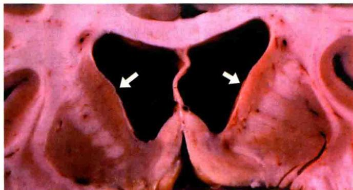 
图28-57 亨廷顿病。尾状核（箭头）对称性萎缩，导致侧脑室扩大。可见部分皮质萎缩，但其萎缩程度通常较原发性皮质痴呆要轻，如阿尔茨海默病和匹克病
1.脊髓小脑神经退行性变脊髓小脑共济失调是一组异质性遗传性疾病，影响小脑信息传出及传入通路或小脑实质本身。小脑功能障碍导致共济失调一无法流畅完成动作，尤其是需要迅速交替的动作，也无法操控精细动作。如果小脑实质退行性变，其共济失调的分布与受累小脑的功能区一致。
# 2.Friedreich共济失调

【流行病学】Friedreich共济失调是最常见的
遗传性共济失调，常见于欧洲人，发病率为
1/50 000。为常染色体隐性遗传，但很多病例是有新基因突变的散发病例，无家族遗传史。

【发病机制】Friedreich共济失调的基因缺陷
是编码线粒体蛋白（人源线粒体蛋白）的基
因功能缺失，该线粒体蛋白的功能是将铁转运至线
粒体。大多数病例突变是该基因（9q13.3-21.1）
第一个内含子内出现一个三核苷酸（GAA）不稳定
重复。正常人线粒体蛋白的水平在心脏和脊髓最高。
因此缺乏线粒体蛋白是Friedreich共济失调和心肌
病的神经病理学表现的病因。

【病理】在尸检中，Friedreich共济失调最显著
的表现在于脊髓，典型表现是后束、皮质脊髓
通路和脊髓小脑束的退行性变，导致患者感觉缺失。
在进展期患者中，这种退行性变可表现为背侧脊髓神
经根和后索严重萎缩。

【临床表现】一般起病于25岁之前，随后30
年病情逐渐进展至死亡。Friedreich共济失调
是一种小脑传入通路疾病，其特点为上下肢共济失调、
发音困难、下肢反射消失、跖侧伸肌反射和感觉消失，
显示发生了脊髓长束退行性变。常见的并发症为骨骼
系统变形（如脊柱侧凸、高弓足）、肥厚性心肌病（为
常见的死因）和糖尿病。
（四）肌萎缩侧索硬化症（amyotrophic Lateral Sclerosis，ALS）是最常见的运动神经元病
ALS是大脑和脊髓上下运动神经元的一种退行性疾病，伴四肢和舌进行性无力和萎缩，偶尔伴有肌反射亢进和减弱，最终呼吸肌受损。

【流行病学】ALS在世界各地均有发病，发病
率为1/100000。发病高峰为40岁，35岁
前罕见。男性常见，是女性 $1.5\sim 2$ 倍。ALS明显地
域高发区为关岛，其特征为富于tau蛋白的神经元纤
维大量聚集缠绕。因此在关岛 ALS 现在归为 Tau 病变,
属于包含痴呆及帕金森综合征的疾病谱系（见上文）。

【发病机制】 $5\%$ 的ALS为伴有常染色体显
性遗传的家族性 ALS，编码胞质型酶性抗氧
化剂一超氧化物歧化酶（Cu/Zn SOD或SOD1）的
基因错义突变是最常见的形式。SOD1是一种重要
的自由基解毒酶。但此酶失活程度仍不清楚。突变
型SOD1较野生型更容易聚集；因此家族性ALS更
可能与蛋白结构异常有关而非氧化性应激所致。

【病理】ALS 明确的组织学改变是大的运动神
经元减少伴轻度神经胶质增生。这些改变在腰
椎前角和脊髓颈膨大和舌下神经核等处最明显。在大
脑运动皮质也可见巨大的锥体Betz细胞丢失。受累肌
肉颜色苍白、皱缩，呈严重的神经源性萎缩。

【临床表现】ALS起病常呈非对称性，表现为
单侧手无力和消瘦。其特点是小肌肉群无规律
快速不随意收缩（肌束震颤）。病情进展迅速，肢体无
力加剧，导致完全残疾和十年内死亡。可出现言语不
清和呼吸无力。尽管机体异常消瘦，但直到死亡智力
仍保存完好。
# 十、中枢神经系统肿瘤
原发于中枢神经系统（central nervous system，CNS）
的癌症占所有原发恶性肿瘤的 $1.5\%$ 。转移至 CNS 的
肿瘤比原发肿瘤更常见。最常见的原发肿瘤是脑膜瘤
和神经胶质瘤，各占所有CNS肿瘤的1/3（表28-5）。
虽然大部分脑肿瘤发生于成年人，但部分脑肿瘤在儿
童更常见，最常见的是髓母细胞瘤、毛细胞性星形细
胞瘤和弥漫性桥脑星形细胞瘤。
CNS肿瘤分级：脑和脊髓的肿瘤通常根据世界卫
生组织（World Health Organization，WHO）专家小组
制定的标准分级。其范围从I级至IV级，其中I级是
最低级别，IV级恶性程度最高。就CNS肿瘤而言，主
观的和不确切的术语“良性”应慎用。比如，一个I
级的 CNS 肿瘤可以有相当大的发病率甚至是死亡率。
表28-5 中枢神经系统原发肿瘤的主要类型脑膜瘤神经胶质瘤（包括弥漫性和局限性星形细胞瘤、少突胶质细胞瘤、室管膜瘤、脉络丛肿瘤和一些少见的神经胶质瘤亚型）髓母细胞瘤和其他原始神经外胚叶肿瘤颅咽管瘤生殖细胞肿瘤血管母细胞瘤神经元和混合性神经节肿瘤松果体肿瘤原发性中枢神经系统淋巴瘤
# （一）脑膜瘤是最常见的CNS肿瘤
脑膜瘤是良性肿瘤，起源于形成蛛网膜下腔外界的蛛网膜（脑膜上皮）中层细胞。因此，脑膜瘤发生的解剖部位与蛛网膜分布部位一致，也就是说脑膜瘤可发生于CNS有蛛网膜细胞的任何部位。包括硬脑膜静脉窦（如上矢状窦）、大脑凸面、颅底、眼和耳蜗神经周围、脊髓周围、甚至是脉络丛。

【发病机制】脑膜瘤有3种典型发病形式：
■散发性——最常见
医源性——通常与先前颅内照射有关 
肿瘤易感综合征——2型神经纤维瘤病（NF2）最常见
绝大部分脑膜瘤是散发的。很多这种肿瘤在染色体（11q12）NF2位点上显示丢失、部分缺失或突变，提示这个肿瘤抑制基因的改变不仅与NF2相关肿瘤有关，也与散发性脑膜瘤（和神经鞘瘤）的起源有关。
放射治疗对脑膜瘤的诱导作用通常经历10年或更长的潜伏期，并与放射剂量直接相关。脑膜瘤可与一些遗传性综合征同时发生，最重要的是NF2。此外，罕见的多发性脑膜瘤综合征也有报道（见第6章）。

【病理】MRI和大体标本检查，大部分脑膜瘤为位于脑膜的局限性肿块，大小不等，在脑
下呈推挤性而非侵袭性生长（图28-58A）。切面肉样、黄褐色。典型的组织学特征是旋涡样排列，砂粒体常见（层状球形钙化体）（图28-58C，D）。然而，脑膜瘤组织学形态多样，WHO已确认的亚型有13种。肿瘤细胞特征性表现为上皮膜抗原（EMA）局灶阳性（图28-58C），电子显微镜下，肿瘤细胞间可见大量细胞间连接，进一步证实其起源于蛛网膜内皮细胞层。

【临床表现】大部分脑膜瘤惰性生长，使肿瘤在出现症状前经历数年，缓慢增大。期间逐渐
推挤脑组织而非浸润（图28-59A，B）。患者经常出现癫痫，特别是肿瘤位于两侧大脑凸面矢状窦旁的患者。其他位置的肿瘤可压迫大脑，使多种功能区结构受损，如位于鞍上区的肿瘤可压迫视交叉导致视力缺损，位于脊髓的肿瘤压迫脊神经根影响脊髓功能。颅骨侵及常见，但侵及脑组织罕见。大部分脑膜瘤手术切除可治愈，但未完全切除者易复发，有些随着时间的推移可进展成间变形态。罕见情况下，肿瘤一开始即为间变型（恶性）脑膜瘤。
# （二）星形细胞瘤的临床病理学行为极为广泛
星形细胞起源的肿瘤（星形细胞瘤）是最常见的脑原发肿瘤。根据其在脑实质内浸润的弥漫程度可分为两类。弥漫性星形细胞瘤在脑组织内广泛浸润，包括大部分恶性星形细胞瘤和胶质母细胞瘤。局限性星形细胞瘤典型呈缓慢增大的局限型肿块，推挤压迫周围结构引发相应症状，而非浸润CNS。
1. 弥漫性星形细胞瘤 弥漫性星形细胞瘤最突出的生物学特征是单个肿瘤细胞对脑和脊髓广泛浸润的能力（图28-60）。脑和脊髓弥漫肿瘤浸润是此类脑肿瘤缺乏有效治疗的主要原因。胶质母细胞瘤典型表现为环状增强的大肿块，可见不规则中央坏死区，周围白质明显水肿。胶质母细胞瘤的浸润成分经常通过胼胝体侵至对侧大脑半球，基于其在冠状位MRI影像学表现，这样的病例被称为“蝴蝶样”胶质母细胞瘤（图28-60C，D）。

【病理】低级别纤维性星形细胞瘤 (WHO II 级)
细胞分化好，细胞核异型性很小，细胞增殖指 
。肥胖细胞型星形细胞瘤是低级别星形细胞瘤 
特殊亚型。大部分肿瘤细胞呈明显球形，胞质 
神经胶质细胞中间丝（图28-61）。弥漫性星 
瘤尽管形态表面上形态温和，但随着时间推移， 
生间变，进展为高级别星形细胞瘤，最终进展 
母细胞瘤（WHOIV级），间隔时间一般为数年。 
星形细胞瘤（WHOⅢ级）比低级别纤维性星 
癌瘤更富于细胞，更多形状（图28-61）。细胞 
数增加，核分裂象易见。间变型星形细胞瘤通 
年内进展为胶质母细胞瘤。
多形性胶质母细胞瘤（glioblastoma multiforme, GBM; WHO IV级）是最常见的脑原发恶性肿瘤，约占所有 CNS 肿瘤的 $20\%$ 。GBMs 细胞呈多形性，大小及形状多样，可见大的奇异核和多核瘤细胞。肿瘤可由间变进展而来，但原发更常见（原发性胶质母细胞瘤，约占 $95\%$ GBMs）。胶质母细胞瘤核分裂活性大大提高；其他特征性表现包括血管增生、局灶肿瘤坏死周围以密集的套袖状肿瘤细胞（“假栅栏样坏死”）（图 28-61C）。
弥漫性脑桥星形细胞瘤（弥漫性脑桥原发神经胶质瘤；WHO II～III级）是一种广泛浸润的星形细胞瘤。起源于幼儿脑干的脑桥部分，并在此扩大（图28-62）。临床症状结合MRI特点即可诊断治疗，无须活检证实。分级介于Ⅱ～Ⅲ级之间，但尽管积极治疗，但最终均表现为肿瘤呈致死性生长和脑干结构致命性破坏。

【发病机制】绝大部分GBMs是散发病例，但小部分起源于遗传性肿瘤易感综合征（ptI型综合征）。原发性GBM中表皮生长因子（EGFR）扩增和PTEN基因突变的发生频率，而继发肿瘤中p53基因突变的发生频率更
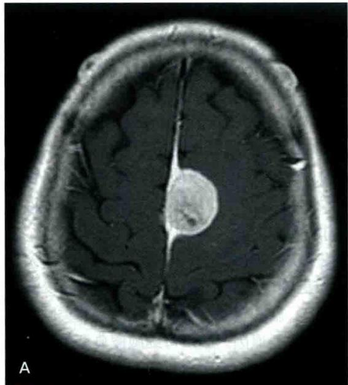
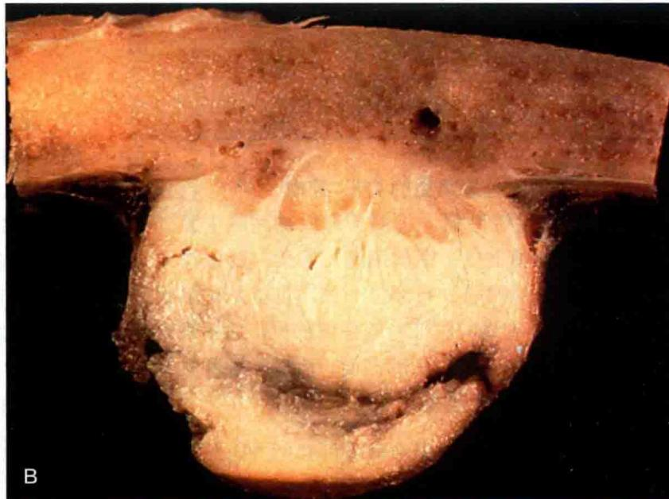
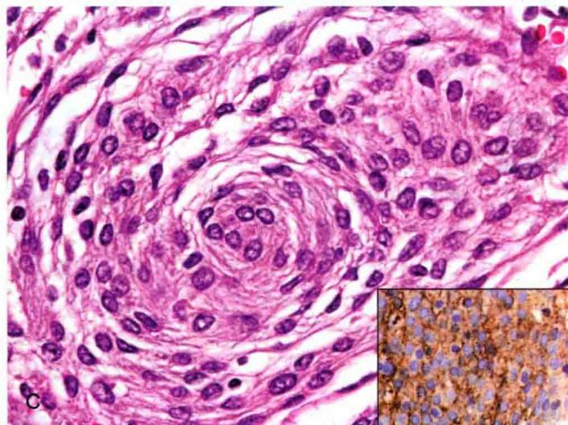
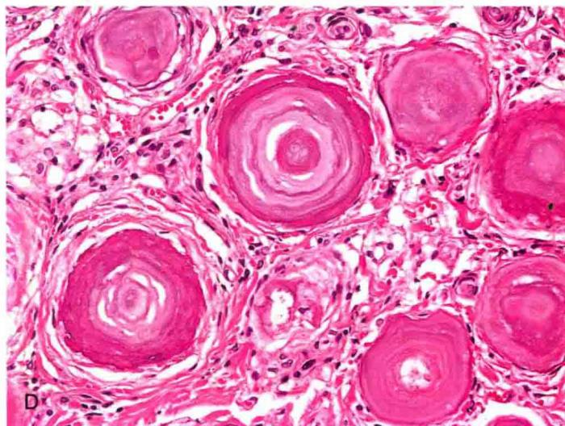
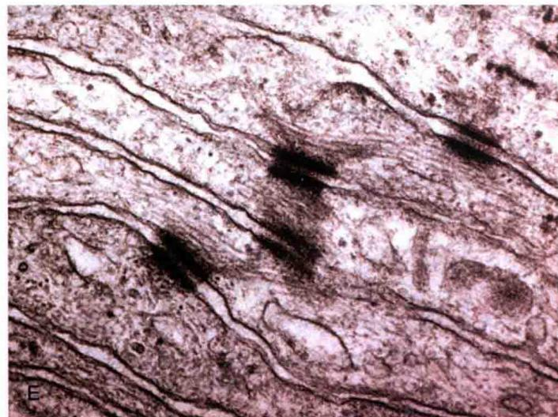 
图28-58脑膜瘤。A.磁共振成像显示一个位于硬脑膜的、表浅的、局限性肿块。靠近肿瘤附着的部位硬脑膜增生，其远端逐渐变细（“脑膜尾征”），此磁共振表现为诊断脑膜瘤的鉴别要点。B.大体手术标本包括切除的脑膜瘤、颅骨及硬脑膜。C.脑膜瘤的组织学。可见旋涡状排列、温和的短梭形细胞。上皮膜抗原染色阳性，此特点在鉴别诊断中具有诊断价值（插图）。D.大量砂粒体是“砂粒体”型脑膜瘤的特点。E.脑膜瘤超微结构特点是大量的细胞间链接（桥粒），将邻近脑膜瘤细胞突紧紧连接在一起
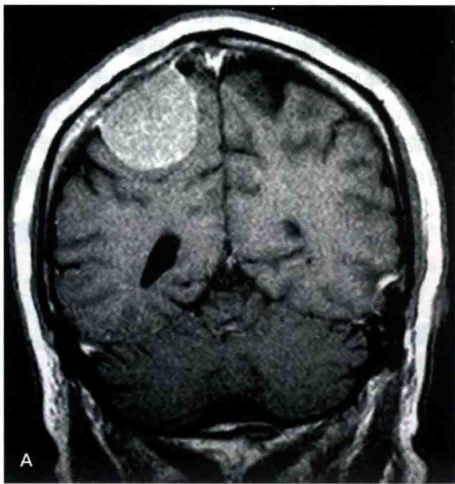 
图28-59脑膜瘤。脑膜瘤通常压迫而非浸润其下的脑组织。A.磁共振图像；B.大体标本
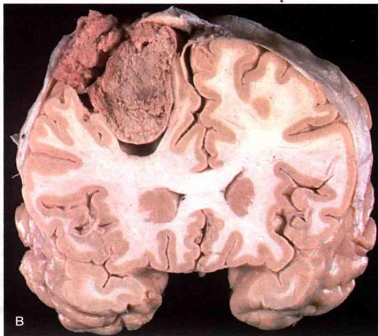
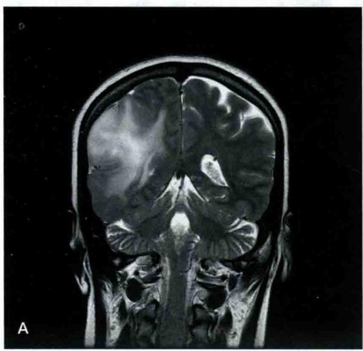
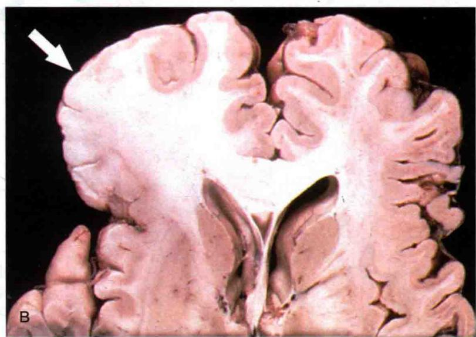
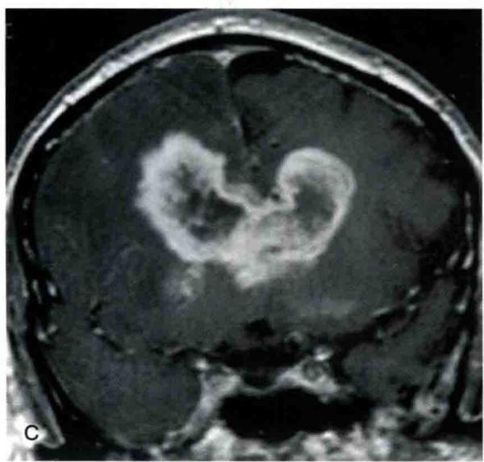 
图28-60 神经胶质瘤。A.浸润性星形细胞瘤在磁共振成像下显示侵及周围大脑组织且边界不清，呈弥漫分布；B.弥漫浸润的表现之一是由于星形细胞瘤肿瘤细胞侵至皮质，使正常灰质和白质间清楚的分界变的“模糊”，在大体标本中可见（箭头）；C.与低级别弥漫性星形细胞瘤相比，术前磁共振成像显示，胶质母细胞瘤显示出明显的不规则环形对比增强区，并常通过胼胝体累及对侧大脑半球（“蝴蝶状”胶质母细胞瘤）；D.尸检大体标本（B，C和D由杜克大学F.StephenVoget教授提供）
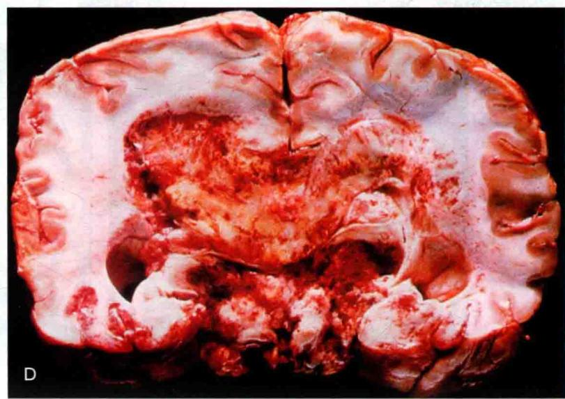
高。异柠檬酸脱氢酶基因1或2（IDH1，IDH2）突变，特别是IDH1是低级别（WHOⅡ级）和间变型（WHOⅢ级）弥漫性神经胶质瘤最常见的标记。IDH1或IDH2基因突变也可出现在大部分由低级别肿瘤继发的而非原发的GBMs中。
2. 毛细胞型星形细胞瘤（WHO I 级）毛细胞型星形细胞瘤（PAs）是一种局限性胶质瘤，典型病例发生于儿童或年轻人，生长非常缓慢。与弥漫性星形细胞瘤相反，PAs 不弥漫浸润脑或脊髓实质，也不易间变转化成更高级别的肿瘤。PAs 显示双向型结构模式，包括瘤细胞胞质突长、呈双极（纤维状细胞）的细胞
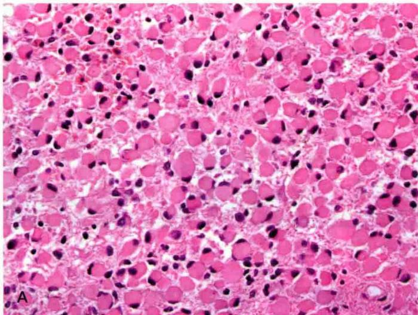
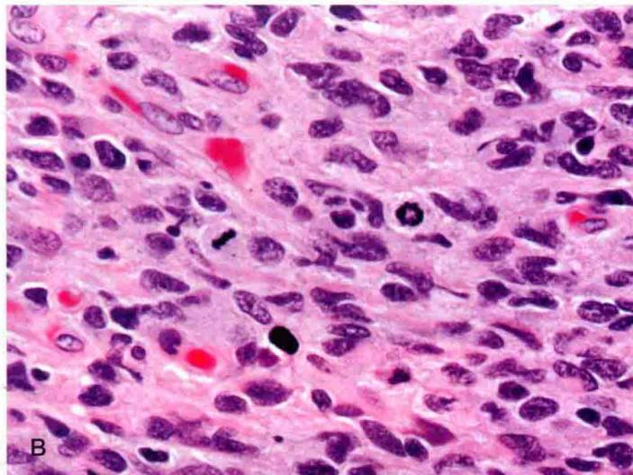
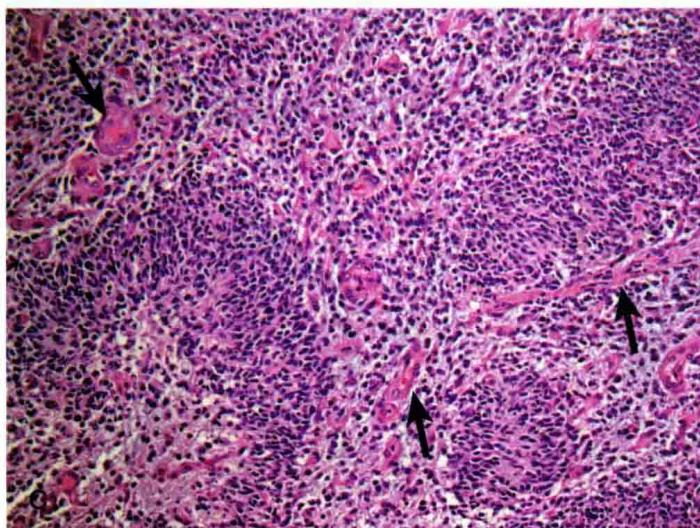 
图28-61弥漫性星型胶质瘤组织学。A.肥胖细胞型星形细胞瘤为低级别（WHOII级）弥漫性星形细胞瘤，其特点为明显的球形胞质；B.间变型星形细胞瘤（WHOIII级）相比之下，更富于细胞、更多形性，此外增殖活性更高；C.胶质母细胞瘤（WHOIV级）可见局灶肿瘤坏死，周围可见富于肿瘤细胞的套袖（“假栅栏样坏死”）及血管增生（箭头）
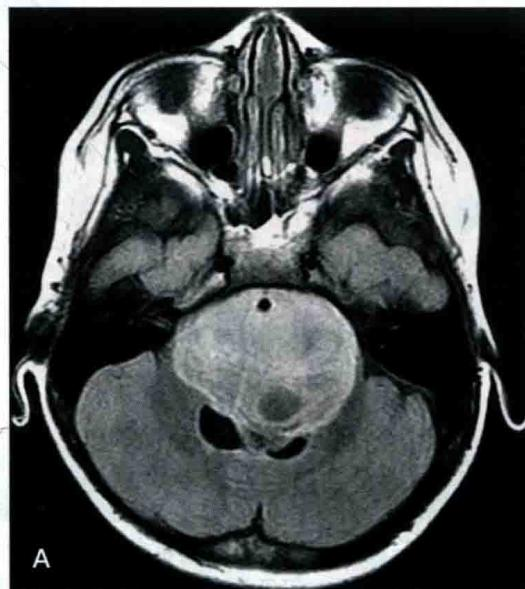 
图28-62弥漫性脑桥星形细胞瘤（“脑桥神经胶质瘤”）。一个儿童的弥漫性星形胶质细胞瘤，脑桥星形细胞瘤弥漫性浸润，脑干脑桥扩大，常环绕基底动脉。A.磁共振成像；B.尸检大体标本
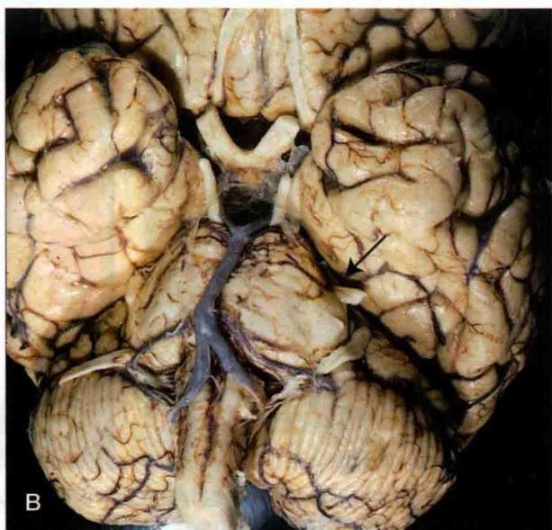
密集区，并被明显的微囊分隔。致密区常可见明显的Rosenthal纤维，是毛细胞型星形细胞瘤的特征性组织结构（图28-63）。如肿瘤完整切除，5年生存率为可达 $90\%$
# （三）少突胶质细胞瘤（WHOⅡ级）较弥漫性星形细胞瘤恶性程度低
与弥漫性星形细胞瘤相似，少突胶质细胞瘤（oligodendrogliomas，ODGs）是呈高度浸润性生长。但其对治疗的反应及总生存率均好于同级别的弥漫性星形细胞瘤，因此鉴别这两种弥漫性神经胶质瘤具有重要意义。第1号和19号染色体间的易位导致1p和19q复合丢失，是弥漫性神经胶质瘤的基因标记，也与经典型ODG组织学密切相关。

【病理】大部分ODGs发生在 $30\sim 50$ 岁成年，人，大部分发生于大脑半球的白质。侵至大脑后常见。肿瘤由单一细胞组成，细胞核规则、圆形，单胞质空亮区（称为“核周空晕”或“煎鸡蛋
样”形态），类似于正常少突胶质细胞（图28-64A）。ODG其他特征性组织学特点包括纤细的、有分支的血管网（“鸡爪样”模式）和灶状分布的微钙化灶。在低级别（WHOⅡ级）ODG中核分裂象不明显，但肿瘤可复发，最终发生间变，进展为间变型少突胶质细胞瘤（WHOⅢ级）（图28-64B）。
# （四）室管膜瘤（WHOⅡ级）起源于室管膜内衬上皮
是发生于儿童和年轻人缓慢生长的肿瘤，起源于脑室或脊髓中央管的室管膜上皮。儿童好发于颅后窝第四脑室，而成人好发于幕上区。可发生于任何脑室或大脑半球的白质（图28-65A，B）。在脊髓中，室管膜瘤是最常见髓内肿瘤，其次为弥漫性星形细胞瘤。室管膜瘤表现为相对局限性的肿块，易于手术切除。其基本组织学特点为血管周假菊形团，即肿瘤细胞胞质突起在血管周围呈放射状分布，形成一个血管袖套（图28-65C）。由肿瘤细胞围绕一中央腔排列成的真室
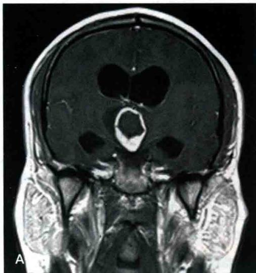 
图28-63毛细胞型星形细胞瘤（WHOI级）。A.毛细胞型星形细胞瘤是一种级别很低的、局限性、对比增强的胶质瘤；B.组织学上，肿瘤性纤维性细胞（毛细胞）表现为伸长的双极胞质突，易于形成Rosenthal纤维（箭头）
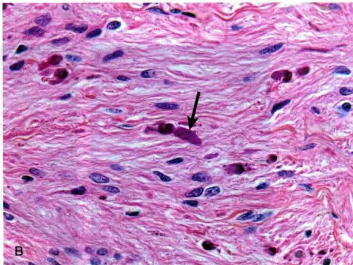
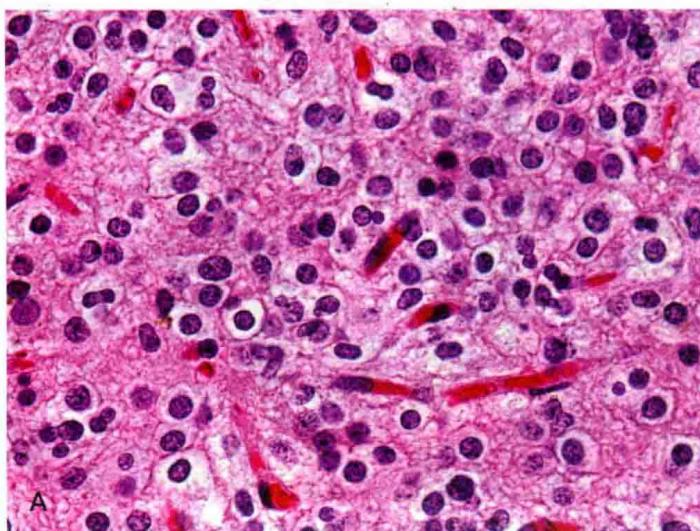 
图28-64少突胶质细胞瘤。A.低级别少突胶质细胞瘤（WHOII级）的瘤细胞类似正常少突胶质细胞，细胞核圆形，规则，可见核周空晕；B.间变型少突胶质细胞瘤（AO）显示细胞密度增高、核分裂活性增加，部分肿瘤可发生灶状肿瘤细胞假栅栏样坏死
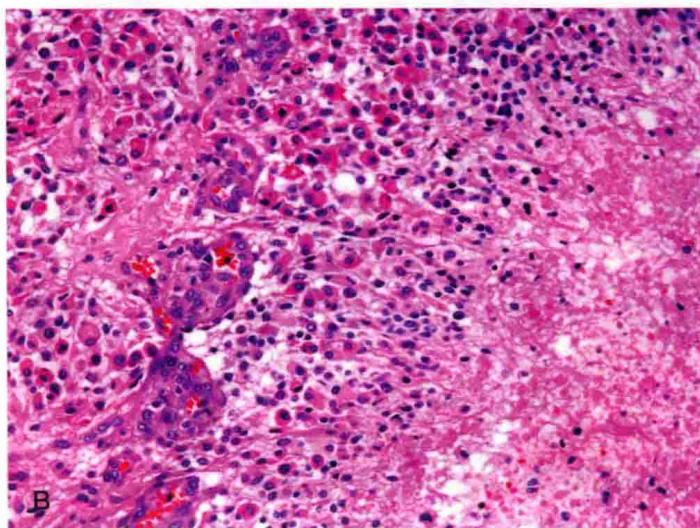
管膜菊形团也可见，但很少。室管膜瘤表达上皮膜抗原（EMA）（图28-65C）和GFAP（图28-65D）。间变型室管膜瘤（WHOⅢ级）核分裂活性增加、微血管增生。
# （五）脉络从肿瘤为上皮源性
与其他常见的儿童脑肿瘤好发于颅后窝（小脑、第四脑室和脑干）不同，儿童脉络丛乳头状瘤（CPPs；WHOI级）最常发生于侧脑室（图28-66A）。而在成年人，好发部位为第四脑室。CPPs为良性肿瘤，其位于脑室内，因此有手术治愈的可能。但可发生经脑脊液播散，这样的病例预后极差。CPP类似正常脉络丛形成乳头状结构，但肿瘤细胞排列更为拥挤，呈柱状而不是立方状。更高级别脉络丛肿瘤已被识别，其分裂活性较I级高，可侵及周围脑实质，并可经脑脊液播散。
# （六）髓母细胞瘤和其他原始神经外胚层肿瘤（WHOIV级）发生于儿童
在许多不同类型的原始神经外胚层肿瘤（PNET）中，髓母细胞瘤（MB）是目前最常见的，并且根据定义，只发生于小脑。发病高峰期为7岁， $20\sim 45$ 岁成年
人也可发病。儿童MB一般发生于中线蚓部，常增大并充满第四脑室。成年人则常发生于小脑半球，尽管儿童及成年人都有例外病例。其临床预后差与肿瘤只能部分切除、大细胞或间变形态及MYCN癌基因扩增有关。

【发病机制】一般认为MB起源于胎儿的外颗粒层或脑室周围生发基质的干细胞。分学研究认为Wnt和Sonic hedgehog.(SHH)号通路与肿瘤发生有关。

【病理】MB由片状排列的高密度恶性小细胞组成，肿瘤细胞核浆比值高。40%的病例中出现大细胞（HomerWright型）菊形团结构。肿瘤细胞显著。间变型MB和大细胞MB是侵袭性亚型，成为瘤细胞具有高增殖活性并出现大量凋亡。大MB显示出神经元分化对突触素呈阳性反应，有提示出局灶性神经胶质分化（GFAP呈免疫阳性），极少数病例显示出肌源性或黑色素分化。
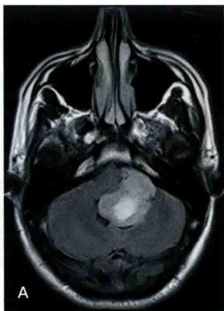
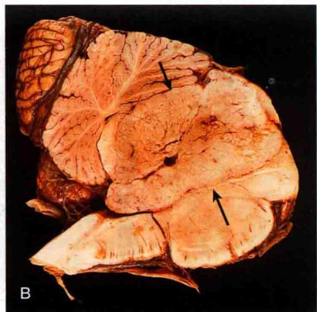
。D.典型的真室管膜菊形团结构及神经胶质标记GFAP（神经胶质酸性蛋白）阳性(插图).jpg) 
图28-65室管膜瘤。A.室管膜瘤可发生于脑室、大脑半球或脊髓。位于颅后窝的肿瘤可通过脑室流出孔（第四脑室正中孔和路斯卡式侧孔）进入蛛网膜下腔，如磁共振图所示。B.尸检大体标本。肿瘤位于两箭头之间。C.显微镜下观察室管膜瘤形态特征为血管周围假菊形团，其免疫表型为EMA（上皮膜抗原）点状或环状阳性(插图)。D.典型的真室管膜菊形团结构及神经胶质标记GFAP（神经胶质酸性蛋白）阳性(插图)
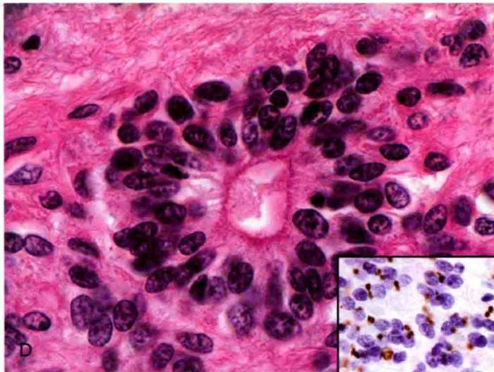
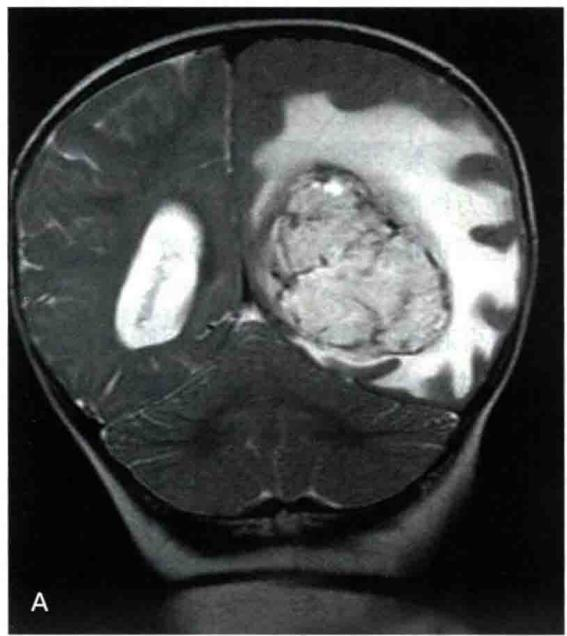
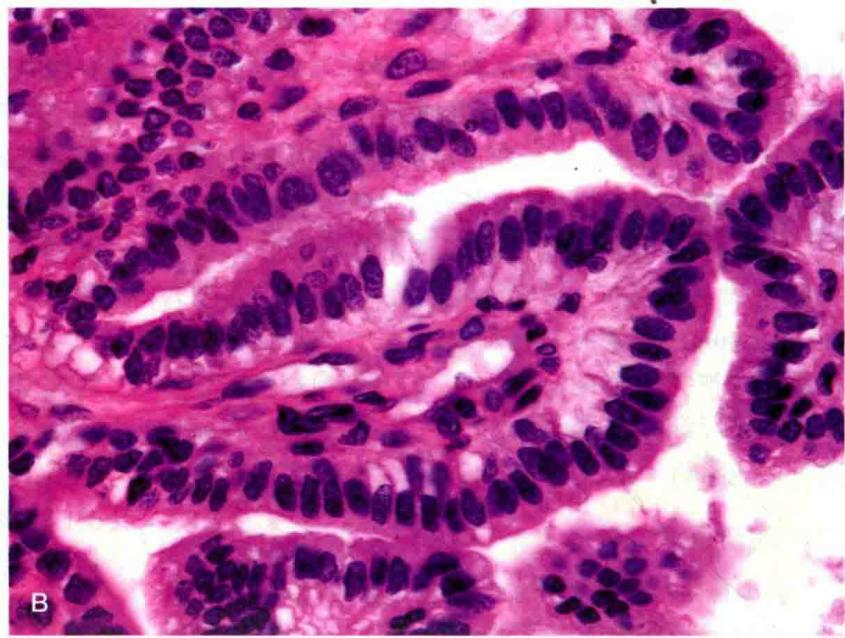
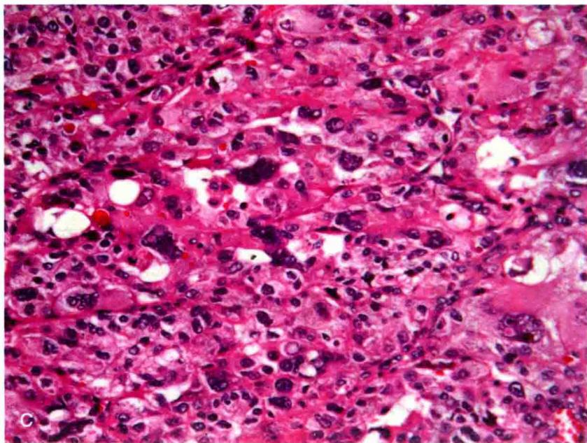 
图28-66 脉络丛乳头状瘤（CPP）和脉络丛乳头状癌（CPC）。A. CPP是一种低级别脑室内肿瘤，成年人常发生于第四脑室，儿童常发生于侧脑室（MRI）；B. 组织学上，CPP保留有脉络丛乳头状结构，但细胞更拥挤，且呈柱状而非立方状；C. CPC是一种不同于CPP的高级别肿瘤，无乳头状结构，细胞多形性明显，增殖指数高，临床表现更具有侵袭性
# （七）神经元肿瘤和混合性胶质神经元肿瘤
顾名思义，神经元肿瘤仅显示出神经元分化，较为罕见。神经节细胞瘤（WHO I级）属于其中之一，表现为分化良好的局限性肿瘤。肿瘤组织完全由异形的成熟神经节细胞组成，常见部位为颞叶。
神经节细胞胶质瘤（GG；WHOI级和III级）表现为分化良好的局限性肿瘤，由不典型的神经节细胞和胶质瘤成分，通常是星形细胞瘤，混合组成。最常见部位在颞叶。GG是慢性颞叶癫痫病相关的最常见的肿瘤（占肿瘤相关颞叶癫痫病例的 $40\%$ 。虽然低级别（WHOI级）GG可以进展为间变型神经节细胞胶质瘤（WHOⅢ级），但两者预后均取决于手术切除的程度。
# （八）转移瘤是最常见的中枢神经系统肿瘤
中枢神经系统转移性肿瘤的发生远超过原发性肿瘤，中枢神经系统转移性疾病是一个重要的临床问题。
尸检表明，多达 $25\%$ 的癌症患者有中枢神经系统肿瘤转移。肿瘤脑转移最常见的部位是大脑皮质灰-白交界区，但中枢神经系统任何区域都可发生转移，包括：脉络丛、松果体以及垂体。转移至中枢神经系统的最常见原发肿瘤有肺癌、乳腺癌、黑色素瘤、肾以及胃肠道癌。一半以上的肿瘤转移为多灶转移。转移到颅骨和脊椎的肿瘤通常来自前列腺、乳腺、肾、甲状腺、肺或淋巴瘤/白血病。
# 第二节 外周神经系统
# 一、解剖学
周围神经系统（PNS）是指脑和脊髓外的神经系统，包括：①脑神经；②神经根背侧和腹侧；③脊髓神经及其延续；④神经节。外周神经支配躯体运动、躯体感觉、内脏感觉和自主神经纤维。
躯体运动及节前自主神经起源于中枢神经系统内的神经元胞体。感觉和节后自主神经纤维来自位于脑神经、背脊神经根背侧和自主神经的神经节内的神经元胞体。神经节的神经元和卫星细胞以及所有的施万细胞都起源于神经嵴。
外周神经纤维分为有髓鞘和无髓鞘两种。有髓神经纤维直径为 $1\sim 20\mu \mathrm{m}$ ，无髓神经纤维直径为 $0.4\sim 2.4\mu \mathrm{m}$ 。髓磷脂是施万细胞膜的主要组成部分，是跳跃式神经传导的必要物质。施万细胞都包裹有髓及无髓神经纤维，神经纤维轴突决定包裹的施万细胞能否形成髓鞘。
# 二、损伤反应
周围神经纤维对损伤的反应类型较为有限（图28-67）。神经纤维损伤的主要类型分为轴突变性和节段性脱髓鞘。外周神经纤维与中枢神经纤维在轴突及髓鞘再生方面表现不同。
# （一）轴突变性反映了轴突或神经元的直接损伤
轴突变性（坏死）发生在许多神经病变中，可局限于轴突远端或累及轴突及神经元细胞体（图28-67B）。轴突变性后很快出现髓鞘降解及施万细胞增生。施万细胞募集巨噬细胞到病灶处，引起髓鞘降解，在轴突变性后3天内可累及整条神经。如果轴突变性只限于轴突远端，则1周内近端未受损的轴突残端以发芽的方式长出新轴突。轴突变性可分为以下几种类型。
远端轴突变性：许多神经病变中，轴突变性起初局限于较长、较大的神经纤维末端（图28-67B）。以选择性末端轴突变性为特征的周围神经病变为逆死性神经病（远端轴索病）和普遍认识的远端（“长度依赖性”或“手套和套袜”）神经病变。
在远端轴突变性中，神经元的胞体和近端轴突保持完整。因此，如果引起远端轴突变性的病因明确并去除，轴突有可能再生并恢复神经功能。但这必须发生在逆死性神经病变尚未充分进展、向心性累及近端轴突和引起神经元胞体死亡之前。在一些逆死性神经病变中，其恢复也是部分性的，因为远端轴突变性不仅累及后根神经节神经元的外周方向轴突，还累及脊髓后索内中央方向的轴突。而这些中央方向的轴突没有再生功能，如同中枢神经系统内其他轴突一样。
神经元病：同自身免疫病背根神经节炎一样，轴突变性可引起神经元胞体死亡（图28-67C）。神经元病是指伴有选择性神经胞体损害的神经病变，较远端轴突病变少见。由于神经元的胞体死亡妨碍轴突再生，因此神经元病的功能恢复可能性很小。
华勒变性：是指发生在神经远端到神经截断性或粉碎性损伤处的轴突变性。如果受损截断面离神经元胞体不太近，则神经轴突可以再生。
# （二）节段性脱髓鞘反映了施万细胞直接损伤或潜在轴突异常
髓磷脂沿有髓神经纤维，呈单个或多个结间体丢失（节段），反映了施万细胞功能障碍（图28-67D）。这种情况可由施万细胞或髓鞘的直接损伤（原发性脱髓鞘）引起，也可由潜在的轴突异常导致（继发性脱髓鞘）。
脱髓鞘不会引起其下的轴突变性。巨噬细胞可浸润受损神经纤维并清除髓鞘碎片。结间体髓鞘变性后随后依次发生：①施万细胞增殖；②脱髓鞘节段髓鞘再生；③功能恢复。髓鞘再生结间体长度缩短（图28-67E）。外周神经反复出现节段性脱髓鞘和髓鞘再生，如慢性脱髓鞘性神经病，会导致过多施万细胞在轴突周围堆积（洋葱球样），出现临床上可见的明显神经肿大（肥大性神经病）。
# 三、周围神经病变
周围神经病变是一种影响一个或多个外周神经功能的病变过程。周围神经病变可仅限于周围神经系统（PNS），也可同时累及PNS和CNS或累及其多个脏器系统。疾病可发生于所有年龄段，既有遗传性的也有获得性的。
引起周围神经病变的病因众多（表28-6）。在美国，糖尿病是引起外周神经病变的最常见病因。其他常见的病因有遗传性疾病、酒精中毒、慢性肾衰竭、神经毒性药物、自身免疫性疾病、副蛋白血症、营养缺陷、感染以及肿瘤和创伤。

【病理】大多数神经病变的病理学表现为局灶性轴突变性和节段性脱髓鞘或两者兼有。当
轴突变性为主时，此神经病归为轴突性神经病；当节段性脱髓鞘为主时，归为脱髓鞘性神经病。大多数 $(80\% \sim 90\%)$ 神经病变为轴突性和逆死性亚型（远端轴突神经病）。鉴别轴突性神经病和脱髓鞘性神经病对于临床非常有意义的。后者常常与遗传、免疫介导、炎症反应以及免疫球蛋白（Ig）M副蛋白血症有关。许多神经病变除了轴突丢失或脱髓鞘，无其他因此疾病特异性组织学表现，因此必须临床病理联系确定病因。只有少部分病例可找到具体病因，如坏死性动脉炎（血管炎神经病变）。

【临床表现】周围神经病变的主要临床表现是
肌肉无力、肌肉萎缩、感觉丧失、感觉异常、疼痛以及自主神经功能紊乱。运动、感觉和自主神经功能可同时或依次受累。感觉异常反映粗神经（感知位置及震颤）或细神经（感知疼痛及温度）的受累。神经病变可为急性（数天到数周）、亚急性（数周到数月）或慢性（数月至数年）。病变可定位于背根神经节
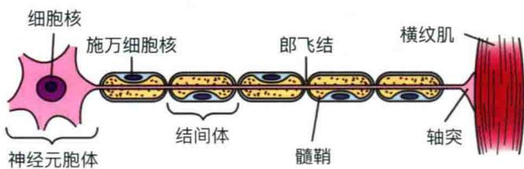 
A 完整有髓神经纤维
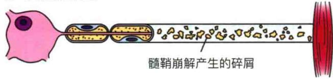 
B 远端轴突变性
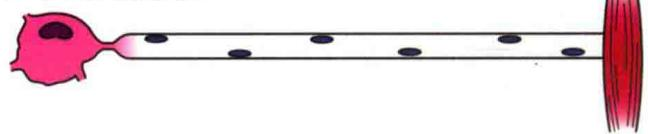 
C 胞体及轴突变性
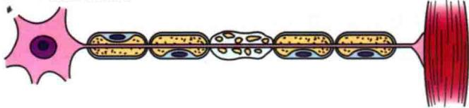 
D 节段性脱髓鞘
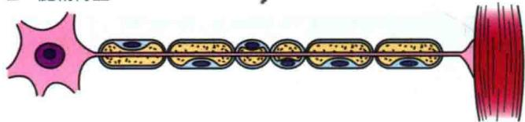 
E 髓鞘再生
 
F 轴突再生
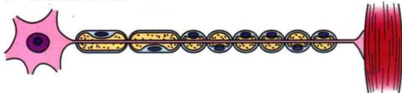 
G 再生的神经纤维 
图28-67 外周神经纤维对损伤的基本反应。A. 完整的有髓神经纤维。施万细胞形成轴突的绝缘髓鞘。B. 远端轴突变性。远端轴突变性，其髓鞘相应发生变性，导致横纹肌发生失神经性萎缩。C. 胞体和轴突变性。变性累及神经元胞体及其整个轴突。病变轴突的髓鞘发生变性。D. 节段性脱髓鞘。形成髓鞘的一个施万细胞变性，导致一段轴突无髓鞘。其下的轴突保持完整。E. 髓鞘再生。施万细胞增生形成新髓鞘，覆盖脱髓鞘轴突段。施万细胞增生形成新髓鞘的结间体较短。F. 轴突再生。轴突再生芽发自断裂轴突末端。理想情况下，再生轴突再次支配远端神经残端，远端神经残端的施万细胞再次形成髓鞘包裹再生轴突。G. 再生的神经纤维。再生部分的轴突，其包裹的施万细胞髓鞘的节间体长度短。横纹肌恢复神经支配
（感觉神经元病）、神经根（神经根型病）、单个神经（单神经病）或多个神经（多发单神经病）。病变也可弥漫、对称累及外周神经（多神经病）或神经根及周围神经（多发性神经根神经病）。
免疫介导的神经病变急性炎症性脱髓鞘性多发性神经根神经病(Guillain-Barre 综合征)急性运动（感觉）轴索性神经病（Guillain-Barre 综合征轴突型）Fisher 综合征慢性炎症性脱髓鞘性多发性神经根神经病（CIDP）多病灶运动神经病背根神经节炎（感觉神经元病）免疫球蛋白M(IgM)副蛋白血症相关的脱髓鞘神经病血管炎性神经病（系统性血管炎、结缔组织病、冷球蛋白血症）代谢性神经病糖尿病性多发性神经病和单神经病尿毒症性神经病危重病性多发性神经病甲状腺功能减退性神经病肢端肥大神经病营养性神经病变与维生素B1、维生素B6、维生素B12或维生素E缺乏相关性神经病铜缺乏性脊髓神经病胃切除术后神经病酒精性神经病中毒性或药物性神经病淀粉样变性神经病（AL型淀粉样变性和家族性淀粉样多神经病）遗传性神经病与感染相关的神经病麻风人类免疫缺陷病毒巨细胞病毒乙型和丙型肝炎病毒（血管炎性神经病或CIDP）带状疱疹莱姆病白喉（中毒性神经病）副肿瘤性神经病结节病性神经病放射神经病外伤性神经病慢性特发性轴突多神经病
# （一）糖尿病性神经病有几种临床表现
周围神经病变是1型、2型糖尿病常见的并发症。神经病变可表现为远端感觉运动性多发性神经病、自主神经病变（最常见）以及单发或多发性单神经病。单神经病可能累及脑神经（脑神经）、神经根或周围神经近端。

【病因】糖尿病神经纤维的损伤机制目前仍不
清楚（见第22章）。一般认为糖尿病的代谢异
常是导致远端对称性多发性神经病的主要原因，小血管病变引起的神经性缺血是导致单神经病的主要原因。然而，局部神经缺血也可能在对称性多神经病的发病机制中起重要作用。

【病理】在糖尿病远端对称性多发性神经病中，
可见轴突变性和节段性脱髓鞘同时存在，并且
前者占优势。轴突丢失累及所有大小的神经纤维，但可优先累及大的有髓神经纤维（大纤维神经病）或小的有髓和无髓神经纤维（小纤维神经病）。
# （二）急性炎症性脱髓鞘性多发性神经根神经病（Guillain-Barré综合征）是免疫介导的
急性炎症性脱髓鞘性多发性神经根神经病（AIDP）是一种获得性免疫介导的神经病变，常继发于细菌、病毒或支原体感染。也可继发于免疫接种或手术等。常见的相关病原体包括空肠弯曲菌、巨细胞病毒、EB病毒以及肺炎支原体。AIDP是儿童和成人Guillain-Barre综合征的最常见病因，Guillain-Barre综合征是急性对称性神经肌肉麻痹，病变通常发生于远端并逐渐累及近端，可同时伴有感觉神经及自主神经功能障碍。肌肉麻痹可引起呼吸窘迫，自主神经受累可引起心律失常、低血压或高血压。一般发病 $2\sim 4$ 周后，神经病变可自愈，多数患者恢复良好。病变发生时脑脊液蛋白量显著增加，但脑脊液中白细胞计数不增加。该蛋白水平增加是由神经根的炎症反应所致。免疫性脱髓鞘的发病机制尚不清楚，体液免疫及细胞免疫的作用机制可能都参与其中。
AIDP可影响各级PNS，包括脊髓根（多发性神经根神经病）、神经节、颅脊柱神经以及自主神经。不同病例的病变分布不同。病变部位内可见神经内膜淋巴细胞及巨噬细胞浸润、节段性脱髓鞘，轴突相对保留。淋巴细胞常在血管周围浸润，但无真正的血管炎。巨噬细胞常见于髓鞘脱失邻近区域，剥离并吞噬表面的髓磷脂薄片。类似巨噬细胞介导的脱髓鞘现象在其他神经病变中罕见。
Guillain-Barre综合征也可由免疫介导的轴突性神经病（急性运动轴突性神经病或急性运动感觉轴突性神经病）引起。在北美和欧洲，轴突型Guillain-Barre综合征比脱髓鞘型Guillain-Barre综合征少见。但在亚
洲，轴突型更常见。轴突型Guillain-Barre综合征患者一般都有感染空肠弯曲菌病史，血清内有抗神经节苷抗体（抗-GM1抗体和其他）。分子模拟实验已证明，病原体的抗原成分与外周神经的抗原成分之间存在免疫交叉反应，可引起轴突损伤。
慢性炎症性脱髓鞘性多发性神经根神经病（CIDP）与AIDP相似，但病程缓慢持续或易反复发作。先前的上呼吸道或胃肠道感染一般极少在CIDP中报道。CIDP病变可为散发性（特发性CIDP）或与副蛋白血症、HIV感染、慢性活动性肝炎、结缔组织病、炎症性肠炎或霍奇金淋巴瘤有关。脱髓鞘性神经病特点是对称性累及感觉运动神经和轴突的近端及远端，CIDP的神经和神经根可出现许多洋葱球样改变，是反复的脱髓鞘、施万细胞增殖和髓鞘再生的结果。这种免疫介导的神经病变的发病机制尚不清楚。
# （三）中毒性神经病往往是医源性
多种环境物质与工业化合物均可引起周围神经病（表28-7），但大多数中毒性神经病是由药物引起的，几乎所有中毒性神经病特征性地表现为逆死性轴突变性，值得注意的例外是，铂化合物和维生素 $\mathbf{B}_6$ 可引起感觉神经元病，沙棘毒素和白喉毒素可引起脱髓鞘性神经病。有遗传性神经病的患者极易发生药物介导的周围神经病。
表 28-7 中毒性神经病相关物质药物环境及工业物质胺碘酮丙烯酰胺氯喹烯丙基氯秋水仙碱砷氨苯砜沙棘毒素双硫仑二硫化碳氯金化钠十氯酮异烟肼二甲基氨基丙腈甲硝唑白喉毒素米索硝唑环氧乙烷呋喃妥因正己烷（吸入性气溶胶）核苷类似物（抗反转录病毒）甲基正丁酮紫杉醇（紫杉烷类）铅苯妥英钠汞铂化合物甲基溴鬼臼树脂磷酸酯类吡多素（维生素B6）聚氯联苯舒拉明铊沙利度胺三氯乙烯长春新碱吡甲硝苯脲
# （四）遗传性神经病变是儿童最常见的慢性神经病
周围神经病可以是多种遗传性疾病的一种表现。神经病可以是某种遗传病的唯一表现也可能是遗传性多系统病变的其中一种。
腓骨肌萎缩症：是一种进展缓慢的遗传性多发性神经病，临床特征是四肢远端进行性肌无力及肌萎缩伴感觉障碍，病理学表现不尽相同，发病常见于儿童或成年早期（表28-8），CMT是常见遗传性神经性疾病中最常见的遗传性神经病，患病率为1/2500。

# 【发病机制】CMT大致可分为脱髓鞘型和轴
突型两个亚型。CMT1是最常见的亚型，为体显性遗传疾病，是伴有洋葱球样改变和轴突的慢性炎性脱髓鞘性多发性神经根神经病。亚型不常见，为常染色体显性遗传，表现为轴突变性。伴X染色体连锁亚型（CMTX）染色体隐性遗传亚型（CMT4）也有被报道。表型中至少涉及28个基因突变。不同基因
突变可能产生同一表型，相同基因突变可能产生不同表型，情况复杂（表28-8）。最常见的亚型，CMT1，通常是由于位于第17号染色体上的周围髓鞘蛋白22基因杂合重复所致。轴突亚型CMT2通常是由于编码线粒体融合蛋白的线粒体融合蛋白2基因突变引起。CMTX亚型与X染色体上间隙链接蛋白β1（连接蛋白32）基因突变有关。
Dejerine-Sottas 综合征（DSS，CMT3）与CMT1类似，但病情更严重。通常婴儿早期发病。周围神经表现出严重的脱髓鞘性神经病伴洋葱球样改变和轴突丢失。有几种基因与此亚型相关（表28-8）。
遗传性神经病伴压迫易感性麻痹（HNPP）通常表现为复发性单神经病。表现为神经脱髓鞘，髓鞘呈独特的香肠状增厚以及轴突丢失（腊肠性神经病）。HNPP与第17号染色体上周围髓磷脂蛋白22基因的杂合性缺失有关。
表 28-8 胰骨肌萎缩症（CMT）和相关的遗传性运动及感觉性神经病（HMSNs） 
疾病遗传性基因病理学CMT1(HMSN1)常染色体显性周围髓磷脂蛋白22(PMP22),髓磷脂蛋白(MPZ)及其他脱髓鞘性神经病伴洋葱球样结构,也可见轴突丢失CMT2(HMSN2)常染色体显性线粒体蛋白及其他轴突性神经病CMTX(HMSNX)X染色体连锁间隙连接蛋白β1(连接蛋白32)轴突丢失,脱髓鞘和轴突再生Dejerine-Sottas综合征(先天性低髓鞘化神经病)常染色体显性或隐性PMP22, MPZ, 早期生长反应2(EGR2)及其他脱髓鞘性神经病伴洋葱球样结构,也可见轴突丢失遗传性神经病伴压迫易感性麻痹常染色体显性PMP22脱髓鞘性神经病伴腊肠体,也可见轴突丢失
# 四、神经损伤
创伤性神经瘤是再生的轴突和瘢痕组织形成的肿块。创伤性神经瘤形成于神经纤维机械性损伤的近侧端。周围神经离断后1周内，轴突再生芽发生在近端神经未受损轴突末端处。如果两侧神经轴突断端距离很近，则再生轴突芽可连接并再支配远端神经轴突。然而，多数情况下，轴突的离断两端距离较远或中间有很多瘢痕组织而阻碍了再生芽重新支配远侧残端。在这种情况下，再生轴突会随意长入近端瘢痕组织形成痛性结节即创伤性或截肢性神经瘤。
# 五、肿瘤
原发性PNS肿瘤起源于神经元或神经鞘。神经元源性肿瘤（例如，神经母细胞瘤和神经节瘤）通常发生于肾上腺髓质或交感神经节。常见的神经鞘肿瘤是神经鞘瘤和神经纤维瘤。
# （一）神经鞘瘤可发生于所有神经
神经鞘瘤属于良性肿瘤，生长缓慢且有包膜，起
源于颅内神经、脊髓神经根或周围神经的施万细胞（图28-68A）。神经鞘瘤通常见于成人，罕见恶变。
前庭神经鞘瘤（听神经施万细胞瘤）：颅内神经鞘瘤占颅内原发性肿瘤的 $8\%$ 。大多数肿瘤发生于内听道或听道口的第V对脑神经的前庭支，引起单侧感觉神经性耳聋、耳鸣以及前庭功能障碍。肿瘤缓慢生长造成耳道口扩大，肿瘤生长越过中线，延伸至小脑桥脑角蛛网膜下腔（小脑桥脑脑角肿瘤）并压迫第V对和第V对脑神经以及脑干和小脑。位于颅后窝的肿物也可导致颅内压增高、脑积水和小脑扁桃体疝。大多数前庭神经鞘瘤为单侧，与神经纤维瘤病无关（NF1；参见第6章）。双侧前庭神经鞘瘤是NF2的一个明确特征。NF2基因也参与散发性神经鞘瘤的发生。
脊髓和外周神经鞘瘤：脊髓神经鞘瘤是髓外硬膜内肿瘤，最常发生于脊髓背侧（感觉）的神经根。生产神经根（根）痛和脊髓压迫症状。而更多外周神经鞘瘤通常发生头部、颈部和四肢的神经。
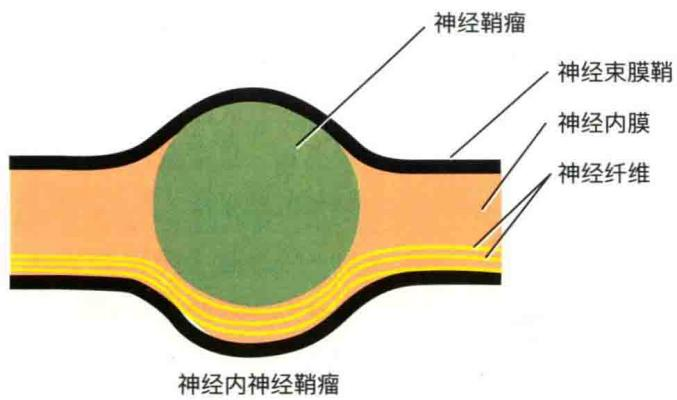 
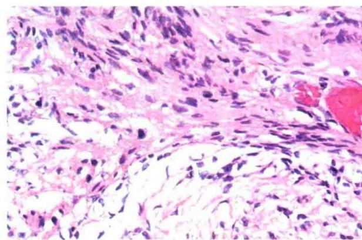 
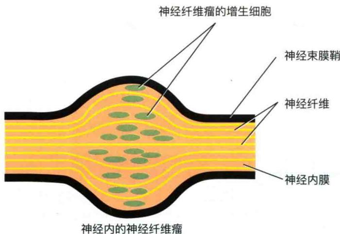 
C
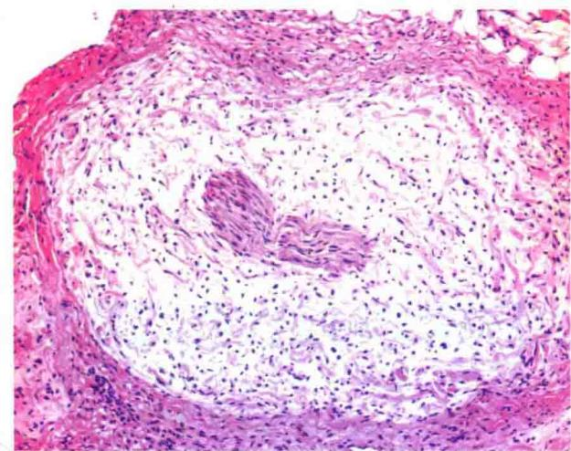 
D
 
图28-68周围神经内的神经鞘瘤和神经纤维瘤的生长方式。A.神经鞘瘤细胞增生形成界限清楚的肿物并压迫肿瘤周围残存的神经纤维；B.镜下显示神经鞘瘤瘤细胞紧密排列的Antoni区型（上）和呈海绵状排列的AntoniB区的组织形态（下）；C.增生的神经纤维瘤细胞穿插在残留的神经纤维内；D.镜下显示增生的神经纤维瘤细胞形成细丝状通过黏液样基质。小簇残留神经纤维位于神经纤维瘤中心
【病理】神经鞘瘤通常呈椭圆形且边界清楚，肿瘤直径范围为数毫米至数厘米。若病变神经
直径足够大，则较易识别。切面质较硬、呈灰褐色，常有局灶性出血、坏死、黄色瘤样变和囊性变。施万细胞增生形成两种独特的组织形态（图28-68B）。
■AntoniA区特征为梭形肿瘤细胞呈编织状、束状排列，瘤细胞核细长，胞质嗜酸且胞质边界不清。肿瘤细胞核呈栅栏状排列的区域称为Verocay小体。 
■Antoni B区特征为梭形或椭圆形肿瘤细胞，胞质不清楚，位于疏松的空泡状间质中。
退行性变在神经鞘瘤中常见，包括泡沫细胞聚集、新鲜或陈旧性出血、灶状纤维化及血管玻璃样变。神经鞘瘤中常见散在的非典型性细胞核，但核分裂象罕见。
# （二）神经纤维瘤可散发或与I型神经纤维瘤病相关
神经纤维瘤是生长缓慢的周围神经系统良性肿瘤，由施万细胞、神经束膜样细胞和成纤维细胞组成。施万细胞是神经纤维瘤的肿瘤性细胞。临床上需注意鉴别神经纤维瘤和神经鞘瘤，神经纤维瘤与NF1有关，可能发生肉瘤样变而转化成恶性外周神经鞘瘤。
神经纤维瘤单发或多发于任何神经，儿童、成人均可见。肿瘤通常累及皮肤、皮下组织、主要神经丛、深部大神经干、腹膜后及胃肠道。大多数孤立性皮肤神经纤维瘤与NF1无关，无肉瘤变潜能。多发性神经纤维瘤或大的丛状神经纤维瘤均高度提示NF1，应仔细查找与NF1有关的其他特征。

【病理】肉眼观察，神经纤维瘤发生在大的神经，呈边界不清的梭形膨大。多处神经束膜内的肿
瘤细胞呈弥漫性增生，受累神经呈多股绳束状（丛状神经纤维瘤）。神经纤维瘤可累及一长段神经，使手术无法完全切除。当发生于小神经时，又很难辨认发生部位。皮肤神经纤维瘤起源于真皮神经，呈软性结节或有蒂的皮肤肿物。
神经纤维瘤质软，呈浅灰色。丛状神经纤维瘤中可见个别神经束膜扩张明显。起源于大神经的神经纤维瘤特点为梭形肿瘤细胞位于神经膜内、肿瘤细胞核细长状且胞质嗜酸性以及肿瘤组织边界不清（图28-68D）。增生的梭形细胞包括施万细胞、成纤维细胞和神经束膜样细胞。肥大细胞也增多。梭形细胞之间散在分布着细
胞外黏液样基质、波浪样胶原以及残留的神经纤维。神经纤维通过神经纤维瘤，与神经鞘瘤的模式不同，在后者神经纤维向被推挤至周围包膜（图28-68A、C）。神经纤维瘤通常增生越过神经束进入相邻组织。
大约 $5\%$ 的NF1相关的丛状神经纤维瘤发生肉瘤样变，成为恶性外周神经鞘瘤。肿瘤细胞密度增加、核异型性及核分裂象都提示发生恶性转化。
# （三）恶性外周神经鞘瘤
恶性外周神经鞘瘤（MPNST）是低分化的周围神
经梭形细胞肉瘤，组织来源不确定，可为原发性或由神经纤维瘤恶变而来。MPNST最常见于成年人，常出现在较大的躯干神经和四肢近端。大约有一半患者患有神经纤维瘤病。在先前受过放射部位，发生MPNST发病率增高。
MPNST表现为无包膜，受累神经呈梭形增大。MPNST与纤维肉瘤类似，梭形肿瘤细胞呈紧密排列，细胞核异型性并可见核分裂象，常见灶状坏死。MPNST易局部复发并血道转移。
（赵晓丽 何小金 岳常丽）
# 第29章眼
眼的疾病较常见，许多会导致视力障碍或失明。眼睛暴露于许多有害的环境因素，其损伤难以防范，包括微生物、变应原、有毒化学物质、日光照射等。很多全身性疾病会累及眼睛。认识其伴随的视觉异常会有助于这些疾病的诊断。
# 第一节 眼眶：甲状腺功能亢进眼球突出
术语眼球突出（症）/突眼主要用于病变为双侧时。眼球突出是指眼睛单侧突出。许多情况会引起突眼，最常见的是Graves病（毒性弥漫性甲状腺肿），其可以先于或伴随甲状腺功能障碍的其他症状。它通常发生在成年早期，特别是女性（女性与男性比例为 $4:1$ ），可能是严重的和进行性的。中年时，眼球突出不再与甲状腺功能状态相关。甲状腺功能亢进眼球突出的发病机制在第21章讨论。
严重突眼的并发症是潜在的致盲，还包括角膜暴露、并发溃疡和视神经受压。不确定的是甲状腺切除术可能增加与甲状腺功能亢进有关的眼球突出的发病率和严重程度。
# 第二节 结 膜
# 一、可能与感染和过敏相关的结膜炎
寄生在眼睛表面的微生物经常引起结膜炎、角膜炎（角膜炎症）或角膜溃疡。结膜和眼的其他部分一样也可以通过血源播散感染。医源性眼感染（例如腺病毒）可能发生在眼科手术后或使用污染的眼药水或诊断仪器后。
细菌性结膜炎是一种非常常见的眼病，表现为结膜血管充血（红眼/急性结膜炎）。炎性渗出物蓄积在结膜囊常形成痂皮，导致晨起时眼睑黏合在一起。结膜分泌物可能是脓性、纤维素性、浆液性或血性。由于许多过敏原是季节性的，它们引起的变应性结膜炎往往只出现在特定的时期。
# 二、沙眼
沙眼是由沙眼衣原体引起的慢性传染性结膜炎。
沙眼衣原体的各种血清型引起眼部、生殖器及全身性感染（沙眼、包涵体性结膜炎和性病淋巴肉芽肿），在第9章中讨论。
# 三、其他衣原体感染
衣原体是化脓性结膜炎的（包括淋病）病因，多在新生儿通过产道时受到感染。感染也可以通过在未经过氯化消毒的游泳池内游泳而后天获得，在成人和年长的儿童，衣原体引起的慢性滤泡性结膜炎会伴有局灶淋巴组织的增生（包涵体性结膜炎）。不发生坏死和瘢痕，角膜炎罕见或轻微。
# 四、新生儿眼炎
新生儿眼炎是一种严重的急性结膜炎，伴有大量脓性分泌物，特别是新生儿，由淋病奈瑟菌引起。新生儿通过被感染母亲的产道时常被感染。此感染并发角膜溃疡、穿孔、瘢痕形成及全眼球炎，是世界某些地区失明的一个常见原因。新生儿通常常规使用杀菌滴眼液治疗作为预防措施。
# 五、睑裂斑（结膜黄斑）和翼状胬肉
脸裂斑是淡黄色的结膜肿块常位于鼻侧角巩膜缘。这是最常见的结膜斑块，由紫外线损伤的结缔组织组成，与类似的皮肤损伤相同（光线性弹性组织变性；请参阅第24章）。翼状胬肉是折叠的血管化的结膜水平长入角膜，形状似昆虫的翅膀（因此而得名）。通常与睑裂斑相关，手术切除后常复发。
# 第三节 角 膜
# 一、单纯疱疹病毒（HSV）引起角膜溃疡
HSV嗜角膜上皮，引起角膜炎，还可以侵入角膜基质，偶尔侵入其他眼组织（见第9章）。
初次被I型HSV感染：在儿童，临床症状不明显或未确诊的局限于眼部的病变由I型HSV引起。除了新生儿分娩期间感染外，II型HSV很少引起眼部感染。这种感染可引起广泛的角膜和视网膜病变。大多数由HSV引起的角膜病变为无症状的斑块，病变的上皮细胞包含复制的病毒。这些病变通常愈合无溃疡，但可
能发生急性单侧滤泡性结膜炎。
复发感染HSV：HSV潜伏于三叉神经节，可以通过神经传导而复发。复发的特点是角膜溃疡和更严重的炎症反应。紫外线、创伤、月经、情感和机体应激、暴露于光线或日光、接种疫苗等因素可成为HSV引起的角膜溃疡复发的诱因。

【病理】HSV引起多灶、微小的、分散的、上皮内角膜溃疡（浅层点状角膜病变）。虽然其
中一些病变愈合，但其他的病变会扩大最后融合形成线形的或树枝状裂纹（树状溃疡，来自希腊语，树枝，“树”。裂纹之间的上皮脱落，形成边界清楚、不规则的地图状溃疡。受累的上皮细胞，可以变成多核含有嗜酸性核内包涵体(利普舒茨体)的细胞。复发感染者，上皮下形成一中央圆盘状的角膜混浊，由于水肿及极轻的炎症细胞浸润（盘状角膜炎）。
角膜基质可能明显变薄，德斯米膜（角膜后弹力层）可能凸入角膜基质（后弹力层膨出）。也可能发生角膜穿孔。
# 二、非炎症性遗传性角膜病是多种多样的
角膜营养不良是角膜的一种多相群遗传性、非炎症性和变性性疾病，表现为常染色体显性、隐性以及（较不频繁的）X连锁遗传。其中一些疾病累及机体的其他部分（例如Fabry病、胱氨酸病、某种类型的黏多糖贮积症及鱼鳞病）。其他主要累及角膜的病变习惯上称为角膜营养不良，根据主要受累的角膜层分类。然而，许多病变累及超过一层。
上皮营养不良：不同的上皮营养不良具有各种不同的异常，包括：①小囊或角膜上皮细胞胞质内异常物质堆积；②上皮基底膜缺陷；③细纤维状物质鲍曼膜沉积在（前弹力层）。在某些上皮营养不良，有缺陷的桥粒使得相邻的上皮细胞分离，导致液体蓄积充满小囊而疼痛，反复糜烂在儿童早期开始。虽然视敏度可能缓慢下降，上皮营养不良通常不会导致失明。Meesmann营养不良与KRT3或KRT12基因显性突变有关，分别编码角蛋白3和角蛋白12。这些突变导致异常的细胞角蛋白微丝聚集，严重损害受累细胞的细胞骨架功能。常染色体隐性遗传角膜病家族性上皮下角膜营养不良，罕见，表现为双侧，TACSTD2基因突变，角膜上皮下可见凝胶状滴状淀粉样蛋白沉积物。
基质营养不良：基质营养不良是由于遗传性代谢障碍导致不同的物质（如：淀粉样蛋白、黏多糖、蛋白质或各种脂类）蓄积在角膜基质。每种基质营养不良引起独特的角膜浑浊。发病年龄和进展速度随特定病变而变化。几种遗传性角膜病，包括颗粒状角膜营养
不良和格子状角膜营养不良，由TGFBI基因不同的突变引起，其编码角质上皮蛋白，一种既表达于角膜上皮又表达于基质角质细胞的蛋白质。另一种重要的基质角膜营养不良（斑块状角膜营养不良）起因于CHST6基因的缺陷，这种基因编码磺基转移酶，其催化N-乙酰氨基葡糖和硫酸角质素中半乳糖的硫化过程。
内皮营养不良：公认的几种不同内皮营养不良，通常伴随着弹力层、角膜内皮细胞基底膜的异常。例如，COL8A2错义突变，该基因编码V型胶原蛋白的 $\alpha_{2}$ 链，在一些早发型Fuch营养不良和较后的多形态角膜营养不良的患者中已经发现。这两种情况影响角膜内皮及其基底膜（后弹力层）。
# 第四节 晶状体：白内障
白内障是晶状体浑浊，它是世界各地视觉障碍和失明的主要原因。可以由多种病因引起。先天性白内障是儿童失明的主要原因，这种失明经手术治疗后可恢复视力。

【发病机制】在美国最常见的白内障与年龄增长有关（老年性白内障）。白内障也可由
糖尿病或核黄素或色氨酸缺乏引起。其他相关因素有毒素作用、药物或物理因素（特别是紫外线）。先天性白内障范围广泛，其中有些与其他眼部或全身性异常有关。白内障可能由热休克转录因子-4(HSF4）基因突变引起，此基因编码特殊的晶状体蛋白质如连接蛋白类（GJA3 GJA8）、晶状体蛋白类（CRY家族基因）、串珠状单纤维结构蛋白-2(BFSP2)、有争议的细胞连接蛋白（LIM2）和水通道蛋白0(MIP)。多达 $25\%$ 的先天性白内障是这些突变的结果。

【病理】在年龄相关性白内障中，晶状体纤维之间出现裂隙，变性的晶状体物质堆积在这些（Morgagnian莫干尼小体，初期白内障）。变状体物质产生渗透压，使受损的晶状体吸入液。这样肿胀的晶状体将阻塞瞳孔引起青光眼（晶胀性青光眼）。
在成熟的白内障（图29-1），因为晶状体碎片穿过变性的晶状体囊逸入房水（过熟期白内障），导致整个晶状体退化，其体积变小。之后由于巨噬细胞的吞噬，逸出的晶状体物质可能阻塞房水流出引起青光眼（晶状体溶解性青光眼）。幸运的是，在美国，大多数患有白内障的晶状体可以手术切除，并通过人工晶状体植入替代。在另一些病例，眼镜或隐形眼镜能够帮助光线聚焦在视网膜上。
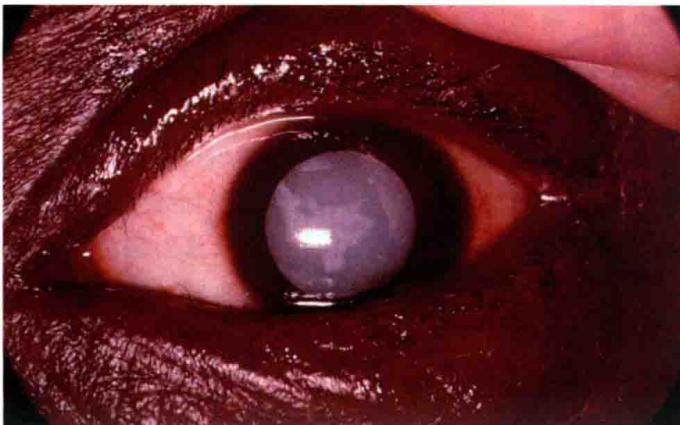 
图29-1 白内障。此时瞳孔呈白色是由于晶状体完全浑浊（“白内障成熟期”）
# 第五节 葡萄膜
各种炎症影响葡萄膜。葡萄膜炎症（葡萄膜炎）包括虹膜（虹膜炎）、睫状体（睫状体炎）及虹膜加睫状体炎症（虹膜睫状体炎）。典型的虹膜睫状体炎出现红眼、畏光、中等疼痛、视物模糊、角膜周晕轮、睫状体充血、轻度瞳孔缩小。虹膜粘连（虹膜和晶状体或前房角任何一个部位的粘连）是虹膜炎的并发症，能引起青光眼。
# 一、交感性眼炎是自身免疫性葡萄膜炎
交感性眼炎，是单眼损伤后，双侧葡萄膜对损伤发生自身免疫反应形成的肉芽肿性炎症。眼球穿通伤和葡萄膜组织脱出常导致眼的这种病变。葡萄膜炎最初发生于伤眼（诱发眼）， $4\sim 8$ 周潜伏期后发展至未受伤眼（交感眼）。据报道交感性眼炎的抗原反应位于视网膜的光感受器层。
# 二、结节病常累及眼睛
$1 / 4\sim 1 / 3$ 的结节病患者眼部受累常是其最初的临床表现。常为双侧，最常表现为肉芽肿性葡萄膜炎。结节病的其他眼部表现包括钙化性带状角膜病变、白内障、视网膜血管化、玻璃体出血及双侧泪管和唾液腺增宽增大（Mikulicz综合征）。
# 第六节 视网膜
# 一、视网膜出血由局部的或全身性疾病引起
视网膜出血的重要原因是高血压、糖尿病、视网膜中央静脉阻塞、出血体质和创伤，包括“摇晃婴儿综合征”。形状因部位而异。神经纤维层出血在轴突之间扩散，眼底镜检查呈火焰状外观，而深层视网膜出血往往是圆形的。当出血位于视网膜色素上皮和Bruch膜之间时，呈黑色小块，临床上类似于黑色素瘤。眼球意外伤害或外科穿孔后，脉络膜出血可致脉络膜
脱离，并且出血可以累及视网膜、玻璃体和晶状体。
# 二、视网膜阻塞性血管病是一个重要的失明原因
血管阻塞由血栓形成、栓塞、狭窄（如动脉粥样硬化）、血管受压、血管内沉积或血管收缩（如高血压性视网膜病变或偏头痛）引起。眼部血管的血栓形成可能伴随血管的一些原发病，如巨细胞动脉炎。心脏和大血管如颈动脉的某些异常，可诱发视网膜血管内栓子形成，眼底镜检查在血管分支处明显。

【病理】血管阻塞的影响取决于阻塞血管的大
小、局部缺血反应的程度和栓子的性质。小栓
子常常不足以妨碍视网膜功能，而脓毒败血症栓子可致眼部感染病灶。任何原因的视网膜缺血可以引起白色棉絮状渗出物沉积，眼底镜检查似棉花状（棉绒斑，图29-2）。这些斑点，由视网膜神经纤维层肿胀的轴索聚集形成，直径通常小于视盘。如果循环及时恢复棉绒斑是可逆的。
视网膜中央动脉阻塞：像神经系统其他部分的神经元一样，视网膜上的神经元极易受缺氧影响。视网膜中央动脉阻塞由视网膜动脉血栓形成、动脉粥样硬化、巨细胞动脉炎或栓子栓塞引起。细胞内明显水肿已被视网膜苍白所证实，特别是在黄斑处，其神经节细胞最多。中心凹即黄斑的中央，由于下方的脉络膜血管化黄斑樱桃红点对比鲜明。视网膜循环障碍使视网膜动脉细如线状。视网膜中央动脉阻塞除非缺血时间极短，且及时解除阻塞，否则将永久失明。单侧视物模糊持续几分钟（一过性黑朦）提示视网膜小动脉栓塞发生。
视网膜中央静脉阻塞：视网膜中央静脉阻塞导致视网膜神经纤维层火焰状出血，特别是视盘。出血反映血管内压力升高，静脉和分支静脉扩张破裂。视盘和视网膜发生水肿是因为细胞间液吸收障碍。视力会受影响，但可以恢复得非常好。一个棘手的问题是视网膜中央静脉阻塞通常发生 $2\sim 3$ 个月后，出现闭角型青光眼伴剧痛和反复出血（所谓的百日青光眼，血栓性青光眼或新生血管性青光眼）。此痛苦的并发症由虹膜新生血管形成及虹膜和前房角粘连引起（周边前粘连；见上文）。
# 三、高血压性视网膜病变与高血压的严重程度相关
血压升高常影响视网膜引起眼底改变，这些改变能通过眼底镜很容易地看到。通过眼底镜检查，异常的视网膜小动脉在血管交叉点呈现平行的白线状（动脉鞘）。最初，视网膜血管管腔变窄，血流减少，眼底镜下呈橙色（铜线）。然而，当血流最终变得模糊不清时，硬化的血管表现为银丝状（银线）（图29-2）。
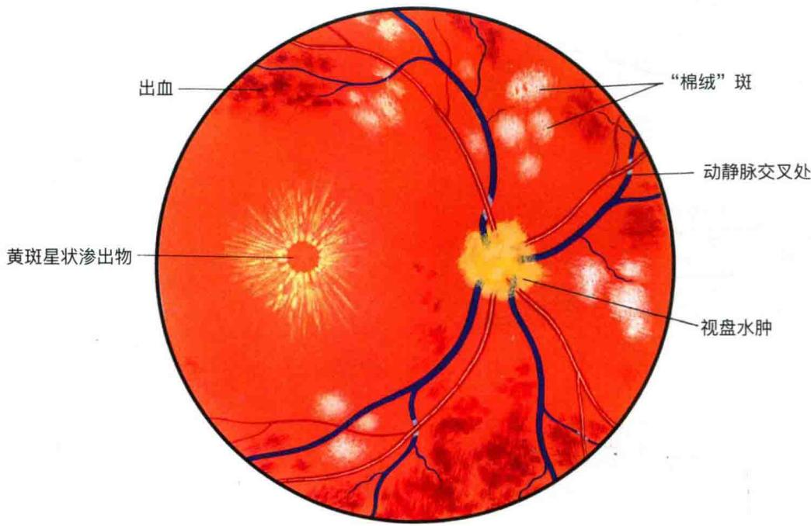
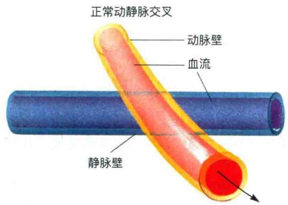
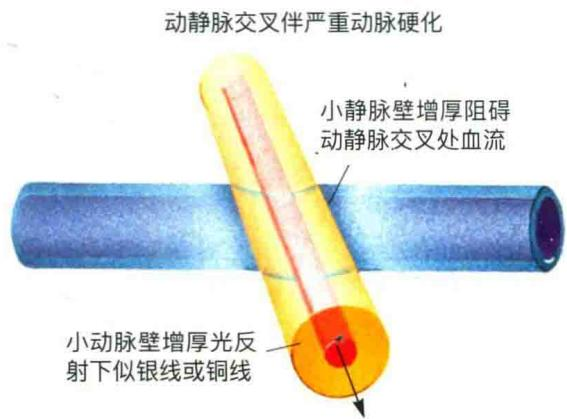
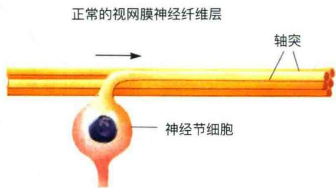 
图29-2高血压性视网膜病变。高血压视网膜产生各种异常。通常情况下相应的小动脉硬化影响视网膜微脉管系统的形态。小动脉壁增厚光反射下似银线或铜线。血流通过动静脉交叉处的视网膜小静脉时显影不良。这种效果是由于小静脉壁增厚而不是由于小动脉压迫阻碍血液流动引起；血流近端受压没有交叉部分远端宽。神经纤维层由于局部缺血轴突浆流受损，引起轴突胞质体肿胀。这种结构类似于眼底镜检查的棉绒（“棉绒斑”）。视网膜出血是常见的，常围绕黄斑形成星状渗出物（具体图见下文）
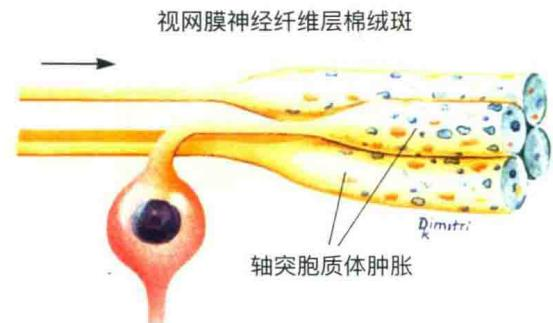

【病理】小动脉硬化伴随长期高血压，在眼睛常
累及视网膜和脉络膜血管。视网膜小动脉管壁增
厚、管腔变窄，血管迂曲及管径不规则愈发明显。在动静脉交叉处，后者出现弯折（动静脉交叉压迹）。静脉弯折的表现反映静脉壁内硬化，因为视网膜动脉和静脉在动静脉交叉处有一个共同的外膜，而不是由硬化的动脉压迫形成。少量浅表或深层视网膜出血常伴有视网膜小动脉硬化。恶性高血压的特点是坏死性小动脉炎，可见视网膜小动脉前毛细血管纤维素样坏死和血栓形成。
# 四、糖尿病视网膜病变主要是血管病变
糖尿病常累及眼，在被诊断为糖尿病时， $20\% \sim 40\%$ 的糖尿病患者可能出现明显的眼部症状。几乎所有1型糖尿病（胰岛素依赖型）和多数2型糖尿病（非胰岛素依赖型）患者在糖尿病发病 $5\sim 15$ 年形成一些单纯性视网膜病变（见下文）（图 $29 - 3\sim$ 图29-5）。糖尿病发病至少10年后出现更危险的增生性视网膜病变，之后，其发病率迅速增加并多年保持高位。在1型糖尿病，增生性视网膜病变发生的概率与血糖控制
的程度相关；糖尿病患者应更好地控制血糖，减少视网膜病变的发生机会。在2型糖尿病，视网膜微血管病变与血糖水平的关系不明确，而其他参数（如胆固醇水平、血压）可能比血糖水平扮演更重要的角色。
视网膜缺血能够解释大多数糖尿病视网膜病变的特点，包括棉絮斑、毛细血管闭塞、微动脉瘤、视网膜新生血管。缺血由视网膜小动脉狭窄、阻塞（如小动脉硬化、血小板及脂质血栓）、眼动脉或视网膜中央动脉粥样硬化引起。
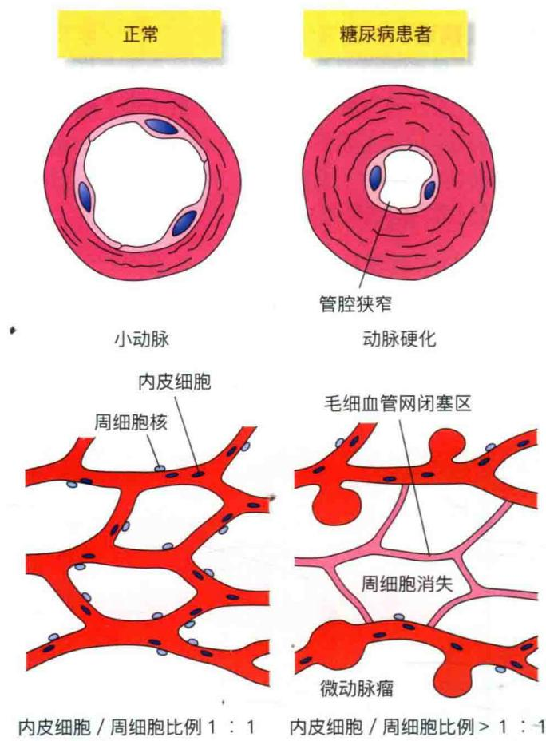
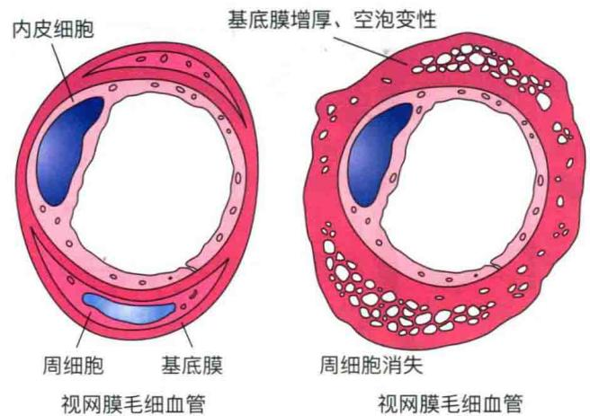 
图29-3 糖尿病性视网膜病变。糖尿病视网膜病变中微脉管系统异常。动脉硬化的小动脉管腔变窄。周细胞消失，内皮细胞与周细胞比例大于1。毛细管微动脉瘤明显，部分毛细管网无细胞、无血流。视网膜毛细血管基底膜（BM）增厚、空泡变性

【病理】糖尿病视网膜病变根据其背景及增生阶段特征分为单纯性和增生性。
单纯性（非增生性）糖尿病视网膜病变：这个阶段表现为静脉充血扩张、小出血点（点状出血），毛细血管微动脉瘤和硬渗（图29-4A）。这些病变通常不损害视力，除非发生黄斑水肿。视网膜病变从后极开始但最终可累及整个视网膜。在眼底镜检查，首先能够辨别的临床异常是腊肠样和线圈样视网膜静脉充血扩张，通常发生在同一部位的视网膜内核层和外丛状层小出血之后。随着病程进展，硬渗主要在微动脉瘤附近（图29-4C、D）。老年糖尿病患者经常出现大量渗出物（渗出性糖尿病视网膜病变），1型糖尿病患者无大量渗出。由于糖尿病患者的高脂血症，渗出物富含脂质，因此呈淡黄色（黄色硬性渗出）。
增生性视网膜病变：多年后，糖尿病视网膜病变呈增生性。新生血管、纤维和神经胶质组织向玻璃体生长。糖尿病视网膜病变的一个突出特征是视网膜新生血管形成，它和其他病变造成视网膜缺血（图29-4B）。弯曲的新生血管最初出现在视网膜和视盘表面，然后长入玻璃体腔。新形成的血管脆弱容易出血，引起玻璃体出血视物模糊。新生血管与星形胶质细胞的增殖和迁入相关，这些细胞围绕新生血管生长形成纤细的白色纤维血管膜（神经胶质增生）。纤维血管的增生和神经胶质组织萎缩，往往导致视网膜脱离和失明。
糖尿病视网膜病变、青光眼和老年性黄斑病是美国不可逆性失明的主要原因。糖尿病视网膜病变，累及黄斑时引起失明，玻璃体出血、视网膜脱离、青光眼也可以引起失明。一旦失明发生，预示预后凶险，患者常常死于缺血性心脏病或肾衰竭。在增生性视网膜病变早期进行激光治疗以及严格的控制血糖可以有效地控制这些并发症。糖尿病对眼的影响见图29-5。
# 五、视网膜脱离是感觉层与色素上皮层的分离
在胚胎发育过程中，感觉层和色素上皮层逐渐贴近，两层间的间隙闭塞。然而，在液体（玻璃体液化、出血或渗出液）积聚在潜在间隙时，感觉层容易脱离视网膜色素上皮层，成为一种常见的致盲原因。激光治疗明显改善了视网膜脱离患者的预后。
【病因学】视网膜脱离的诱因包括视网膜缺损（由于外伤或某些视网膜变性）、玻璃体牵拉、视网膜上压力减少（例如，玻璃体摘除后）、视网膜固定削弱。感光细胞和视网膜色素上皮细胞通常作为一个单元起作用。在视网膜脱离后，氧气和营养物质从脉络膜扩散到视网膜外层通常必须经
过一个更大的距离。这会导致感光细胞退化，之后视网膜内出现囊样细胞外间隙。

【病理】三种公认的视网膜脱离——孔源性、牵拉性和渗出性。
孔源性视网膜脱离：这种情况是与视网膜裂孔有关，常常由于玻璃体或视网膜周边部变性所致。
牵拉性视网膜脱离：在某些情况下，如糖尿病增生性视网膜病变、早产儿视网膜病变和眼内感染时，由于玻璃体视网膜连接发生黏着，视网膜分离被拉向眼睛的中心。
渗出性视网膜脱离：液体积聚在视网膜感觉层和色素上皮层之间的潜在间隙内引起视网膜脱离，这些情况包括脉络膜炎、脉络膜血管瘤和脉络膜黑色素瘤。
# 六、色素性视网膜炎是一种遗传性失明的原因
色素性视网膜炎（色素性视网膜病变）是一个通用术语，指的是各种双侧的、进行性、变性性视网膜病变，临床特征为夜盲症、周边视野缩小。病理上视网膜光感受器（视杆细胞和视锥细胞）减少，视网膜内色素积累。

【发病机制】色素性视网膜炎是一个误称，因
为它没有视网膜炎症的特征。至少有48个点与色素性视网膜炎相关而与其他系统性疾病。一些责任突变基因编码视杆细胞视觉传导元成员，如视紫红质（RHO）；其他编码光感受元结构，如外周蛋白。因多种突变均可能导致这些，单个有缺陷的蛋白质不能解释感光细胞的可能是全部责任基因突变最终导致感光细胞因为最终的共同点集中在主要代谢途径。

【病理】在色素性视网膜炎，视杆细胞和稍后视锥细胞破坏，继而视网膜色素上皮细胞向视
网膜感觉层迁移（图29-6）。黑色素出现在蜘蛛样细胞的细长突起，主要沉积视网膜血管周围小分支（尤其在视网膜赤道部），似骨刺。视网膜血管遂逐渐变细，视盘呈现特有的蜡状苍白。

【临床表现】视网膜病变的原因不同，色素性
视网膜炎的临床表现及视网膜色素沉着的形态和分布亦不同。随着病情的进展，视野缩小最终形成管状视野。中心视力通常保持到疾病晚期。少数情况下，因黄斑受累而失明。
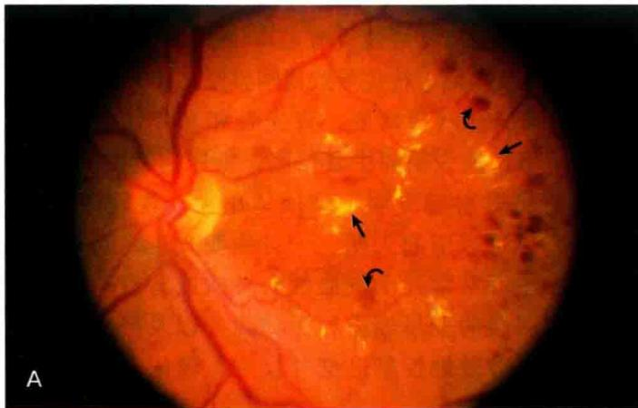
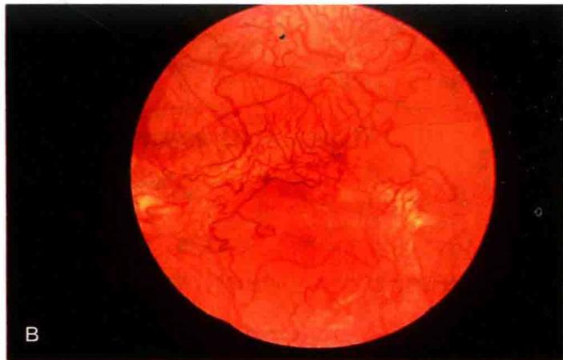
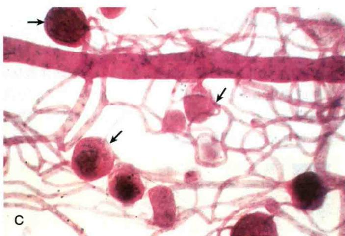 
图29-4 糖尿病性视网膜病变。A.单纯性糖尿病视网膜病变患者的眼底。几个淡黄色“硬性”渗出物（直箭头），富含脂质，很明显，连同几个比较小的视网膜出血（弯箭头）；B.增生性糖尿病视网膜病变血管分布（上半部分）已经向前延伸到视网膜；C.在这糖尿病视网膜切片中可见许多微动脉瘤（箭头）；D.这种切片制作为糖尿病视网膜血管灌注黑墨水后用过碘酸-希夫试剂染色（PAS）。微动脉瘤（箭头）和渗出物（短箭头）在视网膜无灌注区很明显
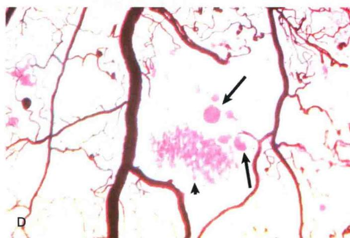
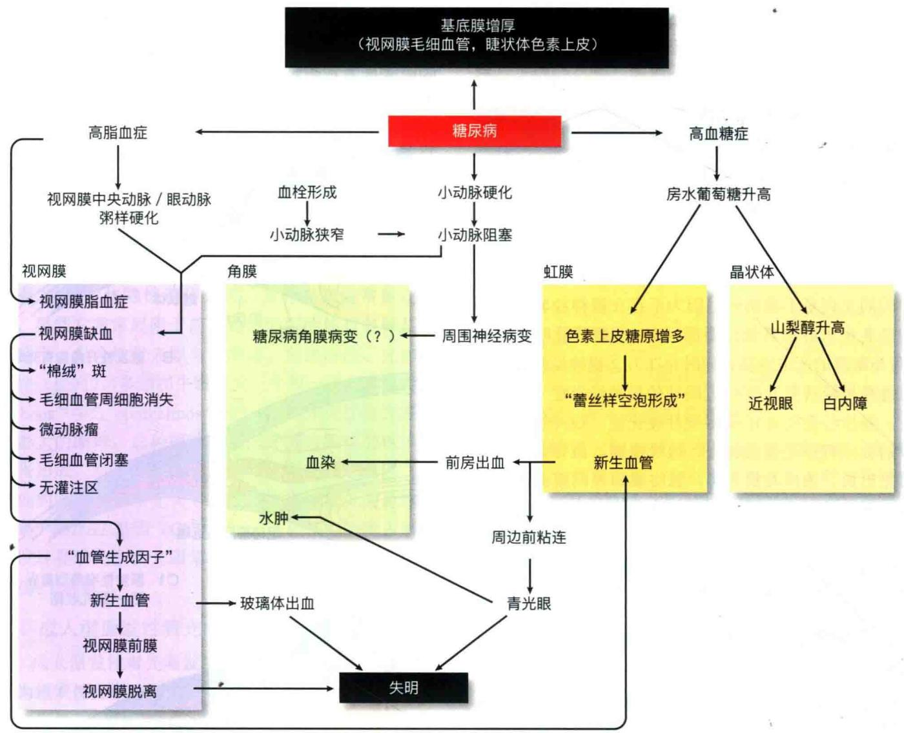 
图29-5 糖尿病对眼的影响
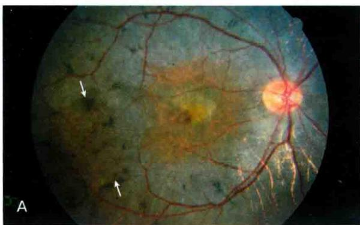 
图29-6色素性视网膜炎。A.色素性视网膜病变（色素性视网膜炎）患者的视网膜眼底照相显示视网膜血管变细，视网膜色素病灶（箭头）。B.镜下可见色素性视网膜病变中严重变性的视网膜。注意视网膜内局灶沉积的色素、棕色细胞（来源于视网膜色素上皮细胞）
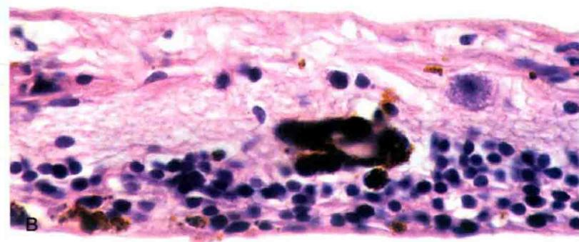
# 七、黄斑变性主要与年龄相关
随着年龄的增长，某些药物的毒性（如氯喹）和一些遗传性疾病，会引起黄斑退化和中心视力受损。年龄相关性黄斑变性（老年性黄斑变性）目前在美国大约有1500万人，是年龄超过65岁的欧洲血统的人中最常见的致盲原因。干性（非渗出）和湿性（渗出）年龄相关性黄斑变性的分型是公认的。干性的特点是在视网膜色素层下细胞外物质分层，导致玻璃膜疣形
成（退化的物质）。在湿性黄斑变性中，脉络膜新生血管生成伴随有液体和血液渗漏入视网膜下间隙。激光光凝术等治疗，包括眼内注射血管生成抑制剂，对于这种类型是有益的。
编码补体因子H的CFH基因常见的错义突变是大约 $50\%$ 年龄相关性黄斑变性的危险因素。年龄相关性黄斑变性的遗传易感性也与ABCA4突变或单核苷酸多态性位点有关，其编码的视杆细胞蛋白（rim蛋白）
被认为是参与分子再循环的转运蛋白。这种基因突变可能使退化的物质解堆积，形成玻璃膜疣并干扰视网膜功能。
# 第七节 视神经
# 一、视神经乳头水肿往往反映颅内压增高
视神经乳头水肿（视神经盘）是指进入眼球的视神经头肿胀。可由各种原因造成，最重要的是颅内压升高。视神经乳头水肿一词，仍广泛用作视神经头水肿的同义词是不准确的，因为不存在视神经乳头。视神经乳头水肿的其他重要原因有：①眼静脉回流障碍（可与眼眶的压迫性损害同时存在）；②视神经梗死（缺血性视神经病变）；③接近眼球的视神经炎症（视神经炎，视神经乳头炎）；④多发性硬化症。视神经乳头水肿的临床特点是视盘肿胀、边缘模糊、血管扩张。常可见出血、渗出及棉絮斑，脉络膜和视网膜的同心褶皱可围绕神经头。视神经乳头水肿很少引起严重的后果，如果有的话，为出现视觉症状。经过一段时间后，肿胀的视神经乳头生理盲点扩大，最后发生萎缩改变，导致视力障碍。
# 二、视神经萎缩是由于视神经轴突物质损失而引起的视神经变细
视神经轴突丢失有许多情况。可能的原因包括：①视神经头长期水肿（见上文）；②视神经炎；③视神经受压；④青光眼；⑤视网膜变性。药物如乙胺丁醇和异烟肼可引起视神经萎缩。在视神经萎缩，视盘通常是平的，苍白的，当这种疾病伴发青光眼时，视盘凹陷扩大加深（青光眼杯状凹陷）。线粒体基因组中的多个突变与Leber遗传性视神经病变相关（见第6章）。
# 第八节 青光眼
青光眼，是美国最常见的可预防的引起失明的疾病，指多种疾病，特征性视神经病变伴特有的视盘的凹陷和视野敏感性的逐渐丧失。在多数情况下，青光眼是由眼内压升高引起（高眼压）；然而，眼压升高并不一定导致青光眼，且不是所有的青光眼患者眼压都升高。
房水由睫状体产生后，进入后房（虹膜和晶状体悬韧带之间的空间），然后通过瞳孔到前房（虹膜和角膜之间）。从该部位，经由小梁网和Schlemm管流入静脉（图29-7）。房水的产生和流出之间有一个微妙的平衡，维持眼压在生理范围内（ $10\sim 20\mathrm{mmHg}$ ）。在某些病理状态下，房水积聚在眼内，眼压升高。暂时性或永久性视力损害是由压力引起的视网膜变性、视
盘及角膜水肿和浑浊引起。这些病变包括神经节细胞和视网膜神经纤维层变性，不波及视网膜外层。在视网膜变性及视盘神经纤维损伤后，出现轴突损伤、神经胶质增生和软脑膜增厚，最后导致视神经萎缩。
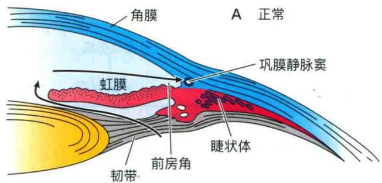
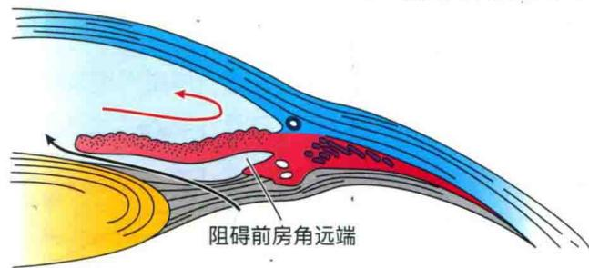 
B 原发性开角型青光眼
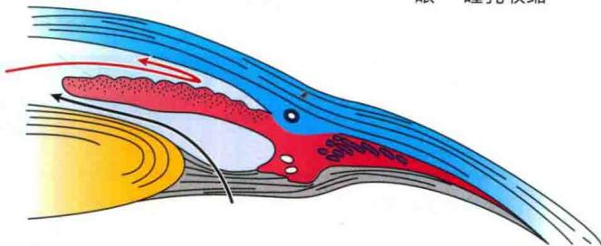 
C1 原发性窄角型青光眼一瞳孔收缩
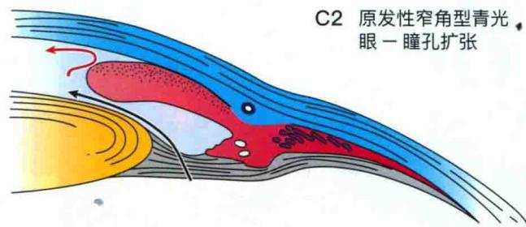 
C2 原发性窄角型青光，眼一瞳孔扩张
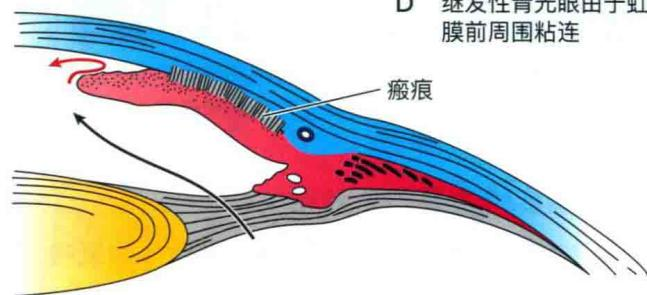 
D 继发性青光眼由于虹膜前周围粘连 
图29-7青光眼发病机制。在不同类型的青光眼中眼前段不同程度受累。A.眼正常结构。B.原发性开角型青光眼，前房角远端阻碍房水外流，前段类似正常眼。C.原发性窄角型青光眼，当瞳孔收缩时，前房角开放但比正常狭窄（C1）。当其瞳孔扩张时，增厚的虹膜阻塞前房角（C2），引起眼压升高。D.前房角可以由于多种病理过程受阻，包括虹膜和角膜后面之间的黏着（周边前粘连）
由先天性或后天性眼前段病变引起的房水回流机械性阻塞几乎总是导致青光眼。阻塞可能位于虹膜和晶状体之间，可能在前房角，在小梁网，在Schlemm管或眼静脉回流。青光眼可以分为几个不同的类型。
# 一、先天性青光眼（小儿青光眼/牛眼）由发育异常引起
先天性青光眼是由发育异常导致房水回流障碍引起。即使疾病发展到婴幼儿或儿童期，眼压可能也不升高。大多数先天性青光眼病例（ $65\%$ ）发生在男孩，都有X-染色体隐性遗传方式。发育异常通常累及双眼，虽然它常常局限于前房角，但可能伴有多种其他眼畸形。先天性青光眼与前房深、角膜浑浊、光的敏感性（畏光）、多泪和牛眼有关。牛眼一词（来自希腊语bous“牛”；ophthalmos“眼”）描述先天性青光眼患者彭大的眼球，这种眼睛由眼压升高致柔韧的巩膜下扩张形成。对于原发性先天性青光眼的几个基因（与其他的眼发育异常无关）已经确定，最常见的是细胞色素P4501B1基因（CYP1B1）。这种基因突变占所有原发性婴幼儿型青光眼常染色体隐性遗传病例的 $20\%$ （取决于种群）。
# 二、成人型原发性青光眼
成人原发性青光眼发生在没有明显相关眼病的人。分为原发性开角型青光眼（即前房角是开放的、正常的）和原发性闭角型青光眼（其中前房比正常浅，角异常地变窄）（图29-7B-D）。
# 三、原发性开角型青光眼
原发性开角型青光眼是青光眼最常见的类型，是美国主要的失明原因。它影响了 $1\% \sim 3\%$ 年龄超过40岁的人群，主要发生在60岁。前房角是开放的，看似正常，但在Schlemm管附近房水流出阻力增加。眼压隐匿地、无症状地增加，虽然通常是双侧，单眼可能受到的影响比另一只更严重。随着时间的推移，视网膜和视神经受损，造成不可逆的视力丧失。

【发病机制】糖尿病和近视眼患者患原发性开角型青光眼的风险增加，这已经映射到多个
基因位点。一些原发性开角型青光眼病例是由于1号染色体上MYOC（TGRR）基因的多种突变所致。
# 四、原发性闭角型青光眼与前房变浅有关
原发性闭角型青光眼，与上述开角型青光眼不同，40岁后发生。它是亚洲成人原发性青光眼的主要形式。

【发病机制】本病变患者周边虹膜向前部小梁网移位，从而形成一个异常地窄角。当瞳
孔收缩（缩瞳），虹膜依然保持拉伸使得前房角不能闭塞。然而，当瞳孔扩大（散瞳），虹膜阻塞前房角，从而影响房水回流，导致高眼压突然发作。这种闭塞伴有眼痛、灯光周围可见晕环。这样的患者，如果瞳孔堵塞，眼压也可升高（如肿胀的晶状体），房水积聚在后房。虽然有家族倾向，具体的基因尚未确定。

【临床表现】急性闭角型青光眼是一种眼科急
诊，如果要保持视力，必须在最初的 $24\sim 48$
开始降眼压治疗。发作之间的眼压是正常的，
但多次发作后，在虹膜与小梁网以及角膜之间形成粘
连（周边前粘连），加重房水外流受阻。
# 五、继发性青光眼通常是单侧的
继发性青光眼的原因有很多，包括炎症、出血、虹膜新生血管及粘连。在继发性青光眼，前房角可开放或关闭。这种情况往往是单侧的。
# 六、低眼压性青光眼与眼压升高无关
低眼压性青光眼是指具有典型视野缺损和所有慢性开角型青光眼眼底特征、眼压不高的一种青光眼。虽然一些眼可能对正常眼压敏感，多数低眼压性青光眼病例很可能提示视盘梗死。
# 第九节 眼部肿瘤
眼内肿瘤主要来源于未成熟的视网膜神经细胞（视网膜母细胞瘤）和葡萄膜的黑色素细胞（黑色素瘤）。
虽然视网膜色素上皮细胞经常发生反应性增生，但很少变成肿瘤。
# 一、恶性黑色素瘤来源于葡萄膜黑色素细胞
恶性黑色素瘤是最常见的原发于眼内的恶性肿瘤。它可以发生于眼睛任何部位的黑色素细胞，脉络膜是最常发生的部位。

【病理】脉络膜黑色素瘤大多局限生长，侵入
Bruch膜，形成蘑菇状肿块（图29-8）。与之
相比，一些肿瘤扁平（弥漫性黑色素瘤），经过数年导致视力逐渐恶化。有些甚至不明显直到发生眼外扩散。镜下，葡萄膜黑色素瘤可见4种细胞类型：①数量不等的无核仁的梭形细胞（梭形细胞A型）；②具有明显核仁的梭形细胞（梭形细胞B型）；③多边形细胞有清楚的细胞边界和明显的核仁（上皮样细胞）；④细胞类型与上皮样细胞相似，但细胞较小边界不清。肿瘤可转移到远处的器官，尤其是肝。患者有一个假眼（“义眼”）和一个巨大的肝是重要的体征。除了血行转移，
葡萄膜黑色素瘤可穿过巩膜进入眼眶组织，通常在血管神经穿过巩膜的部位。淋巴管转移不会发生，因为眼球无淋巴管。对于大多数葡萄膜黑色素瘤的常规治疗是摘除眼球，但某些病例使用其他方法治疗，如放疗或局部切除。一半以上的葡萄膜黑色素瘤患者摘除术后存活15年。
# 二、视网膜母细胞瘤来源于未成熟的神经元
视网膜母细胞瘤是儿童最常见的眼内恶性肿瘤，影响 $1:20000\sim 1:34000$ 儿童。肿瘤最常发生于2岁以内的婴幼儿，甚至可能出生时即发现。症状包
括白瞳（白瞳症）、斜眼（斜视）、视力差，自发性前房出血或眼睛充血、疼痛。继发性青光眼是常见的并发症。光线进入眼睛通常反射黄色，类似猫的绒毡层（猫眼反射）。参见第5章分子内容。

【病理】视网膜母细胞瘤是一种米黄色肿瘤，
在黄色坏死区内可见散在、粉白色钙化斑（图1），影像学检查可以发现。瘤细胞丰富，有几种结构。在多数情况下，瘤细胞圆形、密集，细胞染，胞质少，大量核分裂象随机分布。视网膜瘤瘤其他部分，细胞围绕中央腔呈放射状排列。
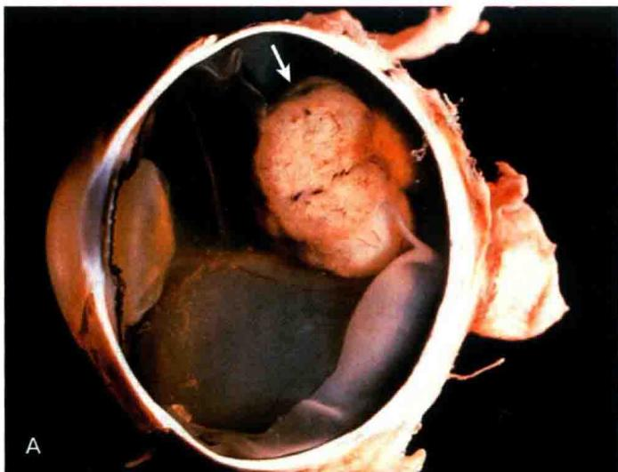 
图29-8 恶性黑色素瘤。A. 脉络膜的蘑菇状黑色素瘤（箭头）。脉络膜黑色素瘤常通过布鲁赫膜侵入形成此形状；B. 脉络膜黑色素瘤上皮样肿瘤细胞内可见大量色素沉着，核仁明显
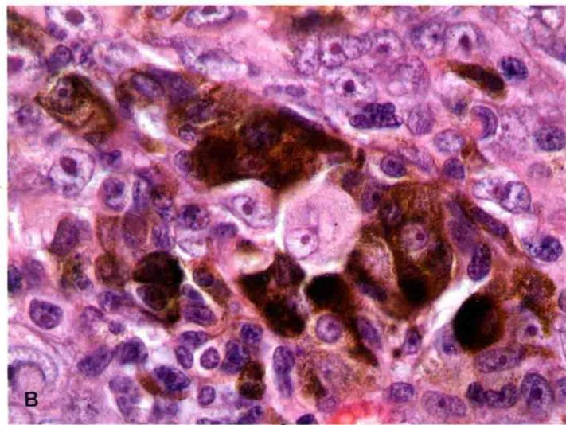
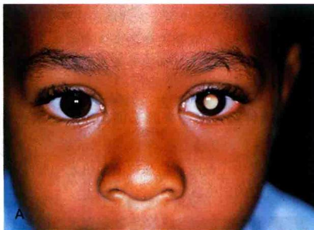
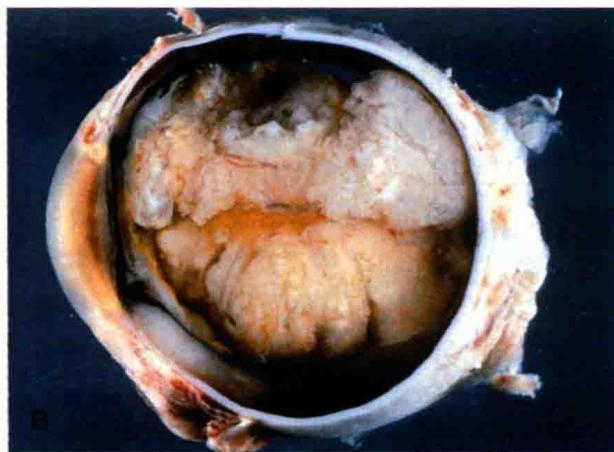
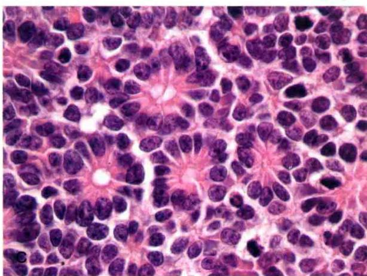 
图29-9网膜母细胞瘤。A.左眼白瞳（白瞳症）由眼内视网膜母细胞瘤所致；B.手术切除眼球的眼内充满米黄色视网膜母细胞瘤伴钙化斑；C.光镜观察可见由细胞围绕中央腔排列的特征性的Flexner-Wintersteiner菊形团